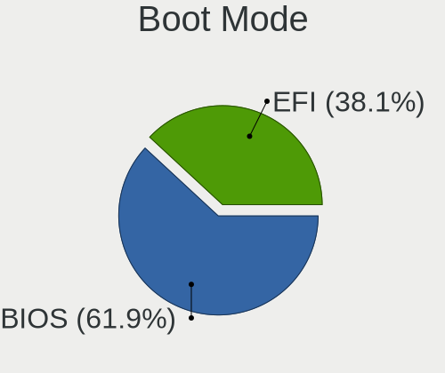
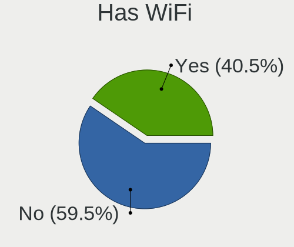
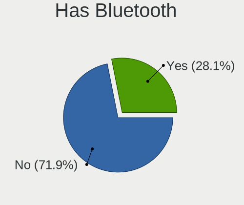
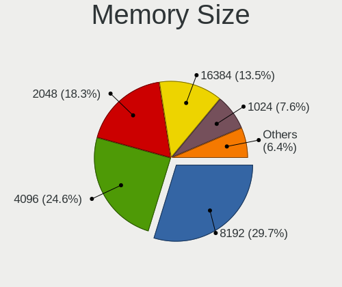

Linux - Tested Hardware & Statistics (Desktops)
-----------------------------------------------

A project to collect tested hardware configurations for Linux.

Anyone can contribute to this report by the [hw-probe](https://github.com/linuxhw/hw-probe) tool:

    sudo -E hw-probe -all -upload

Please contribute! Especially if your hardware is rare.

This report is for real hardware. Report for virtual hardware: [TestDays_VE](https://github.com/linuxhw/TestDays_VE)

Contents
--------

* [ Test Cases ](#test-cases)

* [ System ](#system)
  - [ OS                       ](#os)
  - [ OS Family                ](#os-family)
  - [ Kernel                   ](#kernel)
  - [ Kernel Family            ](#kernel-family)
  - [ Kernel Major Ver.        ](#kernel-major-ver)
  - [ Arch                     ](#arch)
  - [ DE                       ](#de)
  - [ Display Server           ](#display-server)
  - [ Display Manager          ](#display-manager)
  - [ OS Lang                  ](#os-lang)
  - [ Boot Mode                ](#boot-mode)
  - [ Filesystem               ](#filesystem)
  - [ Part. scheme             ](#part-scheme)
  - [ Dual Boot with Linux/BSD ](#dual-boot-with-linuxbsd)
  - [ Dual Boot (Win)          ](#dual-boot-win)

* [ Board ](#board)
  - [ Vendor                   ](#vendor)
  - [ Model                    ](#model)
  - [ Model Family             ](#model-family)
  - [ MFG Year                 ](#mfg-year)
  - [ Form Factor              ](#form-factor)
  - [ Secure Boot              ](#secure-boot)
  - [ Coreboot                 ](#coreboot)
  - [ RAM Size                 ](#ram-size)
  - [ RAM Used                 ](#ram-used)
  - [ Total Drives             ](#total-drives)
  - [ Has CD-ROM               ](#has-cd-rom)
  - [ Has Ethernet             ](#has-ethernet)
  - [ Has WiFi                 ](#has-wifi)
  - [ Has Bluetooth            ](#has-bluetooth)

* [ Location ](#location)
  - [ Country                  ](#country)
  - [ City                     ](#city)

* [ Drives ](#drives)
  - [ Drive Vendor             ](#drive-vendor)
  - [ Drive Model              ](#drive-model)
  - [ HDD Vendor               ](#hdd-vendor)
  - [ SSD Vendor               ](#ssd-vendor)
  - [ Drive Kind               ](#drive-kind)
  - [ Drive Connector          ](#drive-connector)
  - [ Drive Size               ](#drive-size)
  - [ Space Total              ](#space-total)
  - [ Space Used               ](#space-used)
  - [ Malfunc. Drives          ](#malfunc-drives)
  - [ Malfunc. Drive Vendor    ](#malfunc-drive-vendor)
  - [ Malfunc. HDD Vendor      ](#malfunc-hdd-vendor)
  - [ Malfunc. Drive Kind      ](#malfunc-drive-kind)
  - [ Failed Drives            ](#failed-drives)
  - [ Failed Drive Vendor      ](#failed-drive-vendor)
  - [ Drive Status             ](#drive-status)

* [ Storage controller ](#storage-controller)
  - [ Storage Vendor           ](#storage-vendor)
  - [ Storage Model            ](#storage-model)
  - [ Storage Kind             ](#storage-kind)

* [ Processor ](#processor)
  - [ CPU Vendor               ](#cpu-vendor)
  - [ CPU Model                ](#cpu-model)
  - [ CPU Model Family         ](#cpu-model-family)
  - [ CPU Cores                ](#cpu-cores)
  - [ CPU Sockets              ](#cpu-sockets)
  - [ CPU Threads              ](#cpu-threads)
  - [ CPU Op-Modes             ](#cpu-op-modes)
  - [ CPU Microcode            ](#cpu-microcode)
  - [ CPU Microarch            ](#cpu-microarch)

* [ Graphics ](#graphics)
  - [ GPU Vendor               ](#gpu-vendor)
  - [ GPU Model                ](#gpu-model)
  - [ GPU Combo                ](#gpu-combo)
  - [ GPU Driver               ](#gpu-driver)
  - [ GPU Memory               ](#gpu-memory)

* [ Monitor ](#monitor)
  - [ Monitor Vendor           ](#monitor-vendor)
  - [ Monitor Model            ](#monitor-model)
  - [ Monitor Resolution       ](#monitor-resolution)
  - [ Monitor Diagonal         ](#monitor-diagonal)
  - [ Monitor Width            ](#monitor-width)
  - [ Aspect Ratio             ](#aspect-ratio)
  - [ Monitor Area             ](#monitor-area)
  - [ Pixel Density            ](#pixel-density)
  - [ Multiple Monitors        ](#multiple-monitors)

* [ Network ](#network)
  - [ Net Controller Vendor    ](#net-controller-vendor)
  - [ Net Controller Model     ](#net-controller-model)
  - [ Wireless Vendor          ](#wireless-vendor)
  - [ Wireless Model           ](#wireless-model)
  - [ Ethernet Vendor          ](#ethernet-vendor)
  - [ Ethernet Model           ](#ethernet-model)
  - [ Net Controller Kind      ](#net-controller-kind)
  - [ Used Controller          ](#used-controller)
  - [ NICs                     ](#nics)
  - [ IPv6                     ](#ipv6)

* [ Bluetooth ](#bluetooth)
  - [ Bluetooth Vendor         ](#bluetooth-vendor)
  - [ Bluetooth Model          ](#bluetooth-model)

* [ Sound ](#sound)
  - [ Sound Vendor             ](#sound-vendor)
  - [ Sound Model              ](#sound-model)

* [ Memory ](#memory)
  - [ Memory Vendor            ](#memory-vendor)
  - [ Memory Model             ](#memory-model)
  - [ Memory Kind              ](#memory-kind)
  - [ Memory Form Factor       ](#memory-form-factor)
  - [ Memory Size              ](#memory-size)
  - [ Memory Speed             ](#memory-speed)

* [ Printers & scanners ](#printers--scanners)
  - [ Printer Vendor           ](#printer-vendor)
  - [ Printer Model            ](#printer-model)
  - [ Scanner Vendor           ](#scanner-vendor)
  - [ Scanner Model            ](#scanner-model)

* [ Camera ](#camera)
  - [ Camera Vendor            ](#camera-vendor)
  - [ Camera Model             ](#camera-model)

* [ Security ](#security)
  - [ Fingerprint Vendor       ](#fingerprint-vendor)
  - [ Fingerprint Model        ](#fingerprint-model)
  - [ Chipcard Vendor          ](#chipcard-vendor)
  - [ Chipcard Model           ](#chipcard-model)

* [ Unsupported ](#unsupported)
  - [ Unsupported Devices      ](#unsupported-devices)
  - [ Unsupported Device Types ](#unsupported-device-types)

Test Cases
----------

Total: 132668

| Vendor        | Model                       | Probe                                                      | Date         |
|---------------|-----------------------------|------------------------------------------------------------|--------------|
| Gateway       | IPISB-VR                    | [4bed351eee](https://linux-hardware.org/?probe=4bed351eee) | Sep 07, 2023 |
| Acer          | Aspire X1470                | [d136074365](https://linux-hardware.org/?probe=d136074365) | Sep 07, 2023 |
| BESSTAR Te... | UM700                       | [d635105967](https://linux-hardware.org/?probe=d635105967) | Sep 07, 2023 |
| MSI           | MAG B550M MORTAR WIFI       | [7cbd11709c](https://linux-hardware.org/?probe=7cbd11709c) | Sep 07, 2023 |
| ASUSTek       | TUF Gaming B550-PLUS WIF... | [5330a96ef6](https://linux-hardware.org/?probe=5330a96ef6) | Sep 07, 2023 |
| MSI           | B360M GAMING PLUS           | [1faaa87b61](https://linux-hardware.org/?probe=1faaa87b61) | Sep 07, 2023 |
| ASUSTek       | P8H77-V LE                  | [38ebaae5c3](https://linux-hardware.org/?probe=38ebaae5c3) | Sep 07, 2023 |
| Shenzhen M... | AHBAA OEM                   | [d4e6f24af3](https://linux-hardware.org/?probe=d4e6f24af3) | Sep 07, 2023 |
| Gigabyte      | Z790 UD                     | [3f67617c93](https://linux-hardware.org/?probe=3f67617c93) | Sep 07, 2023 |
| Acer          | Aspire X1470                | [a965ab170a](https://linux-hardware.org/?probe=a965ab170a) | Sep 07, 2023 |
| Gigabyte      | H610M S2 V2 DDR4            | [7323821425](https://linux-hardware.org/?probe=7323821425) | Sep 07, 2023 |
| ASUSTek       | ROG STRIX B550-F GAMING ... | [fd7e472e9b](https://linux-hardware.org/?probe=fd7e472e9b) | Sep 07, 2023 |
| Gigabyte      | X670E AORUS MASTER          | [ade0754252](https://linux-hardware.org/?probe=ade0754252) | Sep 07, 2023 |
| ASRock        | 775Dual-VSTA                | [05af667eb0](https://linux-hardware.org/?probe=05af667eb0) | Sep 07, 2023 |
| ASUSTek       | PRIME B365M-A               | [898930f2b1](https://linux-hardware.org/?probe=898930f2b1) | Sep 07, 2023 |
| ASRock        | B450M Pro4                  | [bedbf331b0](https://linux-hardware.org/?probe=bedbf331b0) | Sep 07, 2023 |
| Biostar       | A320MH                      | [87ae9fef79](https://linux-hardware.org/?probe=87ae9fef79) | Sep 07, 2023 |
| ASUSTek       | SABERTOOTH P67              | [002bdcd34d](https://linux-hardware.org/?probe=002bdcd34d) | Sep 07, 2023 |
| Acer          | Veriton X2640G V:1.0        | [76b044add6](https://linux-hardware.org/?probe=76b044add6) | Sep 07, 2023 |
| Dell          | 0WMJ54 A01                  | [034ff4bc7e](https://linux-hardware.org/?probe=034ff4bc7e) | Sep 07, 2023 |
| ASUSTek       | Z87M-PLUS                   | [ed1061dbb1](https://linux-hardware.org/?probe=ed1061dbb1) | Sep 07, 2023 |
| Dell          | 0NDYHG A01                  | [250bc7b8ea](https://linux-hardware.org/?probe=250bc7b8ea) | Sep 07, 2023 |
| Gigabyte      | X470 AORUS ULTRA GAMING-... | [67934ce24a](https://linux-hardware.org/?probe=67934ce24a) | Sep 07, 2023 |
| ASUSTek       | P8Z77-V LE PLUS             | [43fa75d035](https://linux-hardware.org/?probe=43fa75d035) | Sep 07, 2023 |
| Gigabyte      | Z87X-UD3H-CF                | [43f205483a](https://linux-hardware.org/?probe=43f205483a) | Sep 07, 2023 |
| NZXT          | N7 Z370                     | [34a23bdc5f](https://linux-hardware.org/?probe=34a23bdc5f) | Sep 07, 2023 |
| Lenovo        | NOK                         | [30f2c89249](https://linux-hardware.org/?probe=30f2c89249) | Sep 07, 2023 |
| Biostar       | B550M-SILVER                | [12ad2e157b](https://linux-hardware.org/?probe=12ad2e157b) | Sep 07, 2023 |
| MSI           | MAG B650 TOMAHAWK WIFI      | [3221a3e5dd](https://linux-hardware.org/?probe=3221a3e5dd) | Sep 07, 2023 |
| MSI           | MAG B650 TOMAHAWK WIFI      | [13bae1c4e9](https://linux-hardware.org/?probe=13bae1c4e9) | Sep 07, 2023 |
| Dell          | 0Y2MRG A00                  | [34ae665da1](https://linux-hardware.org/?probe=34ae665da1) | Sep 07, 2023 |
| ASRock        | A68M-ITX                    | [f995094d6b](https://linux-hardware.org/?probe=f995094d6b) | Sep 07, 2023 |
| MSI           | MAG Z490 TOMAHAWK           | [bacfcd3028](https://linux-hardware.org/?probe=bacfcd3028) | Sep 07, 2023 |
| Dell          | 088DT1 A01                  | [e7d12d040e](https://linux-hardware.org/?probe=e7d12d040e) | Sep 07, 2023 |
| Acer          | Nitro N50-610               | [3a6cb86551](https://linux-hardware.org/?probe=3a6cb86551) | Sep 07, 2023 |
| ASUSTek       | ProArt B550-CREATOR         | [5b276b13a8](https://linux-hardware.org/?probe=5b276b13a8) | Sep 07, 2023 |
| Huanan        | X99-F8 GAMING V5.0          | [a4624a95da](https://linux-hardware.org/?probe=a4624a95da) | Sep 07, 2023 |
| Acer          | Nitro N50-610               | [6ba5f1b344](https://linux-hardware.org/?probe=6ba5f1b344) | Sep 07, 2023 |
| MSI           | X99A RAIDER                 | [0434d08b59](https://linux-hardware.org/?probe=0434d08b59) | Sep 07, 2023 |
| ASUSTek       | PRIME H510M-E               | [0be77d9ece](https://linux-hardware.org/?probe=0be77d9ece) | Sep 07, 2023 |
| MSI           | MAG B550 TOMAHAWK           | [f8453df937](https://linux-hardware.org/?probe=f8453df937) | Sep 07, 2023 |
| Toshiba       | STI 006998G                 | [d34aadcc92](https://linux-hardware.org/?probe=d34aadcc92) | Sep 07, 2023 |
| ASUSTek       | ROG STRIX B560-E GAMING ... | [498958a11d](https://linux-hardware.org/?probe=498958a11d) | Sep 07, 2023 |
| Pegatron      | 2AD5                        | [fe02bb3d71](https://linux-hardware.org/?probe=fe02bb3d71) | Sep 07, 2023 |
| Lenovo        | 3704 SDK0R32862 WIN 3258... | [907edde95a](https://linux-hardware.org/?probe=907edde95a) | Sep 07, 2023 |
| Gigabyte      | G41MT-D3                    | [f0c3188082](https://linux-hardware.org/?probe=f0c3188082) | Sep 07, 2023 |
| Dell          | 0WN7Y6 A02                  | [aaf64e4624](https://linux-hardware.org/?probe=aaf64e4624) | Sep 07, 2023 |
| MSI           | Z390-A PRO                  | [32c21f0b73](https://linux-hardware.org/?probe=32c21f0b73) | Sep 07, 2023 |
| Unknown       | Unknown                     | [59544c398a](https://linux-hardware.org/?probe=59544c398a) | Sep 07, 2023 |
| MSI           | B450 TOMAHAWK MAX II        | [96d3b5db5c](https://linux-hardware.org/?probe=96d3b5db5c) | Sep 07, 2023 |
| ASRock        | Z97 Killer                  | [a1537a06ee](https://linux-hardware.org/?probe=a1537a06ee) | Sep 07, 2023 |
| HP            | 18E5                        | [b0210e782a](https://linux-hardware.org/?probe=b0210e782a) | Sep 07, 2023 |
| ASUSTek       | PRIME A320M-K               | [a5506bdc30](https://linux-hardware.org/?probe=a5506bdc30) | Sep 07, 2023 |
| ASUSTek       | Maximus VII HERO            | [d9509a0fa0](https://linux-hardware.org/?probe=d9509a0fa0) | Sep 07, 2023 |
| HP            | 0B4Ch D                     | [1a2a0eef04](https://linux-hardware.org/?probe=1a2a0eef04) | Sep 06, 2023 |
| ASRock        | Z87 Pro4                    | [89b861e771](https://linux-hardware.org/?probe=89b861e771) | Sep 06, 2023 |
| HP            | 0B4Ch D                     | [e6c990ad64](https://linux-hardware.org/?probe=e6c990ad64) | Sep 06, 2023 |
| Gigabyte      | A520M S2H                   | [132fa17be7](https://linux-hardware.org/?probe=132fa17be7) | Sep 06, 2023 |
| ASUSTek       | PRIME Z390M-PLUS            | [f98e7f20ca](https://linux-hardware.org/?probe=f98e7f20ca) | Sep 06, 2023 |
| HC Technol... | HCAR5000-MI                 | [3f98176bb7](https://linux-hardware.org/?probe=3f98176bb7) | Sep 06, 2023 |
| Gigabyte      | A520M S2H                   | [36e10816ea](https://linux-hardware.org/?probe=36e10816ea) | Sep 06, 2023 |
| Dell          | 02YYK5 A01                  | [6bb77310bf](https://linux-hardware.org/?probe=6bb77310bf) | Sep 06, 2023 |
| Gigabyte      | H61M-S2PV                   | [29d9f2566a](https://linux-hardware.org/?probe=29d9f2566a) | Sep 06, 2023 |
| Dell          | 096JG8 A01                  | [00e5bebc6a](https://linux-hardware.org/?probe=00e5bebc6a) | Sep 06, 2023 |
| ASUSTek       | Maximus V FORMULA           | [694ffed41f](https://linux-hardware.org/?probe=694ffed41f) | Sep 06, 2023 |
| Fujitsu       | D3236-S1 S26361-D3236-S1    | [1e743d0b2d](https://linux-hardware.org/?probe=1e743d0b2d) | Sep 06, 2023 |
| ASUSTek       | P7H55-M PRO                 | [26a5d8b449](https://linux-hardware.org/?probe=26a5d8b449) | Sep 06, 2023 |
| ASUSTek       | PRIME X370-PRO              | [d095848fec](https://linux-hardware.org/?probe=d095848fec) | Sep 06, 2023 |
| ASUSTek       | Z97-K                       | [849ecb3c82](https://linux-hardware.org/?probe=849ecb3c82) | Sep 06, 2023 |
| ASRock        | Z68 Pro3                    | [757ebbe056](https://linux-hardware.org/?probe=757ebbe056) | Sep 06, 2023 |
| Acer          | EQ45LM                      | [22af76a0b6](https://linux-hardware.org/?probe=22af76a0b6) | Sep 06, 2023 |
| ASRock        | B460 Phantom Gaming 4       | [6521407977](https://linux-hardware.org/?probe=6521407977) | Sep 06, 2023 |
| Acer          | Aspire GX-785               | [e33b7b35bf](https://linux-hardware.org/?probe=e33b7b35bf) | Sep 06, 2023 |
| MSI           | PRO B650-P WIFI             | [507d1bd39c](https://linux-hardware.org/?probe=507d1bd39c) | Sep 06, 2023 |
| ASUSTek       | PRIME B550M-A               | [b17a5edce5](https://linux-hardware.org/?probe=b17a5edce5) | Sep 06, 2023 |
| JGINYUE       | X79M-PLUS V2.2              | [602bfb550f](https://linux-hardware.org/?probe=602bfb550f) | Sep 06, 2023 |
| Biostar       | A58MD                       | [40f078fcfc](https://linux-hardware.org/?probe=40f078fcfc) | Sep 06, 2023 |
| HP            | 81B3                        | [b04c59ca3e](https://linux-hardware.org/?probe=b04c59ca3e) | Sep 06, 2023 |
| JGINYUE       | X79M-PLUS V2.2              | [1535be8e5f](https://linux-hardware.org/?probe=1535be8e5f) | Sep 06, 2023 |
| ASUSTek       | Z97-P                       | [d72c4b5cce](https://linux-hardware.org/?probe=d72c4b5cce) | Sep 06, 2023 |
| Gigabyte      | B75M-D3H                    | [2285c5c493](https://linux-hardware.org/?probe=2285c5c493) | Sep 06, 2023 |
| Dell          | 0HMX8D A01                  | [48fa151690](https://linux-hardware.org/?probe=48fa151690) | Sep 06, 2023 |
| Gigabyte      | AB350M-Gaming 3-CF          | [a738df6114](https://linux-hardware.org/?probe=a738df6114) | Sep 06, 2023 |
| Intel         | DQ67SW AAG12527-310         | [774ca51623](https://linux-hardware.org/?probe=774ca51623) | Sep 06, 2023 |
| ASUSTek       | ROG Maximus XII APEX        | [f735c5a6e7](https://linux-hardware.org/?probe=f735c5a6e7) | Sep 06, 2023 |
| MSI           | Boston                      | [f4749c6ef7](https://linux-hardware.org/?probe=f4749c6ef7) | Sep 06, 2023 |
| Gigabyte      | F2A68HM-DS2                 | [ffe10aadbe](https://linux-hardware.org/?probe=ffe10aadbe) | Sep 06, 2023 |
| ASUSTek       | ROG STRIX B550-A GAMING     | [9d45d79cb0](https://linux-hardware.org/?probe=9d45d79cb0) | Sep 06, 2023 |
| Gigabyte      | A320M-S2H-CF                | [03e260aff4](https://linux-hardware.org/?probe=03e260aff4) | Sep 06, 2023 |
| MSI           | MPG B550 GAMING PLUS        | [48cc912b75](https://linux-hardware.org/?probe=48cc912b75) | Sep 06, 2023 |
| Gigabyte      | B75M-D3H                    | [8d4c48dd2f](https://linux-hardware.org/?probe=8d4c48dd2f) | Sep 06, 2023 |
| HP            | 2B3C                        | [471f0f283b](https://linux-hardware.org/?probe=471f0f283b) | Sep 06, 2023 |
| ASRock        | H77 Pro4/MVP                | [9e650e7107](https://linux-hardware.org/?probe=9e650e7107) | Sep 06, 2023 |
| Fujitsu Si... | D2721-A1 S26361-D2721-A1    | [c19df6a939](https://linux-hardware.org/?probe=c19df6a939) | Sep 06, 2023 |
| Gigabyte      | B550 AORUS ELITE V2         | [c890510220](https://linux-hardware.org/?probe=c890510220) | Sep 06, 2023 |
| Intel         | DN2800MT AAG23738-803       | [8bdf13908a](https://linux-hardware.org/?probe=8bdf13908a) | Sep 06, 2023 |
| Lenovo        | IdeaCentre K330B            | [a53977eb83](https://linux-hardware.org/?probe=a53977eb83) | Sep 06, 2023 |
| Lenovo        | H420                        | [f84aae6411](https://linux-hardware.org/?probe=f84aae6411) | Sep 06, 2023 |
| ASUSTek       | Z87M-PLUS                   | [30368099b8](https://linux-hardware.org/?probe=30368099b8) | Sep 06, 2023 |
| Dell          | 0NK5PH A01                  | [49e0ac3e09](https://linux-hardware.org/?probe=49e0ac3e09) | Sep 06, 2023 |
| Dell          | 0KP561                      | [90055b146d](https://linux-hardware.org/?probe=90055b146d) | Sep 06, 2023 |
| Dell          | 0PC5F7 A00                  | [9ffb575d81](https://linux-hardware.org/?probe=9ffb575d81) | Sep 06, 2023 |
| Pegatron      | 2AB6                        | [40b17904fa](https://linux-hardware.org/?probe=40b17904fa) | Sep 06, 2023 |
| Shenzhen M... | F7BFD                       | [3f1c2a5cfa](https://linux-hardware.org/?probe=3f1c2a5cfa) | Sep 06, 2023 |
| Gigabyte      | B650 AORUS ELITE AX         | [97bacd8975](https://linux-hardware.org/?probe=97bacd8975) | Sep 06, 2023 |
| ASUSTek       | P8H77-M                     | [ebc8d3e851](https://linux-hardware.org/?probe=ebc8d3e851) | Sep 06, 2023 |
| Lenovo        | MAHOBAY Win8 Pro DPK TPG    | [c43f7a6e53](https://linux-hardware.org/?probe=c43f7a6e53) | Sep 06, 2023 |
| HP            | 1589                        | [550b95765c](https://linux-hardware.org/?probe=550b95765c) | Sep 06, 2023 |
| MSI           | B450 TOMAHAWK MAX           | [9e7c97275d](https://linux-hardware.org/?probe=9e7c97275d) | Sep 06, 2023 |
| Pegatron      | IPXSB-H61                   | [415ba1cfc1](https://linux-hardware.org/?probe=415ba1cfc1) | Sep 06, 2023 |
| HP            | 844C                        | [6f4911cda7](https://linux-hardware.org/?probe=6f4911cda7) | Sep 06, 2023 |
| ASUSTek       | TUF Gaming B550-PLUS        | [09e4ad77a9](https://linux-hardware.org/?probe=09e4ad77a9) | Sep 06, 2023 |
| HP            | 21F5                        | [af9bc6bde6](https://linux-hardware.org/?probe=af9bc6bde6) | Sep 06, 2023 |
| Lenovo        | 3708 NOK                    | [153f0dfa9d](https://linux-hardware.org/?probe=153f0dfa9d) | Sep 06, 2023 |
| Unknown       | Unknown                     | [c4829899c3](https://linux-hardware.org/?probe=c4829899c3) | Sep 06, 2023 |
| HP            | 3047h                       | [9b6ecf8471](https://linux-hardware.org/?probe=9b6ecf8471) | Sep 06, 2023 |
| ASUSTek       | PRIME A320M-K               | [04d60f1b2d](https://linux-hardware.org/?probe=04d60f1b2d) | Sep 06, 2023 |
| ASRock        | Z97M OC Formula             | [1f2c20e8cf](https://linux-hardware.org/?probe=1f2c20e8cf) | Sep 06, 2023 |
| Biostar       | G31-M7 TE                   | [2ef74da3f9](https://linux-hardware.org/?probe=2ef74da3f9) | Sep 06, 2023 |
| HP            | 3047h                       | [51ba95dc5a](https://linux-hardware.org/?probe=51ba95dc5a) | Sep 06, 2023 |
| Lenovo        | SDK0E50510 WIN              | [4e04252ac1](https://linux-hardware.org/?probe=4e04252ac1) | Sep 06, 2023 |
| Intel         | H81                         | [5a16cea30a](https://linux-hardware.org/?probe=5a16cea30a) | Sep 06, 2023 |
| Dell          | 0F3KHR A00                  | [21a1983dcc](https://linux-hardware.org/?probe=21a1983dcc) | Sep 06, 2023 |
| DFI           | CH960                       | [f0caeeeae0](https://linux-hardware.org/?probe=f0caeeeae0) | Sep 06, 2023 |
| ASUSTek       | TUF B450M-PRO GAMING        | [5ba13c092c](https://linux-hardware.org/?probe=5ba13c092c) | Sep 06, 2023 |
| MSI           | 2A9Ch                       | [68fe74d684](https://linux-hardware.org/?probe=68fe74d684) | Sep 06, 2023 |
| Gigabyte      | H61M-S2PV                   | [c22fad9c67](https://linux-hardware.org/?probe=c22fad9c67) | Sep 06, 2023 |
| ASUSTek       | PRIME B650M-A II            | [307ca05754](https://linux-hardware.org/?probe=307ca05754) | Sep 06, 2023 |
| ASUSTek       | B150M-PLUS                  | [a5a6f0acfb](https://linux-hardware.org/?probe=a5a6f0acfb) | Sep 06, 2023 |
| HP            | 1905                        | [e0da3a1a45](https://linux-hardware.org/?probe=e0da3a1a45) | Sep 06, 2023 |
| Dell          | 0CU409                      | [f5ae8200cf](https://linux-hardware.org/?probe=f5ae8200cf) | Sep 06, 2023 |
| Huanan        | X99-QD4 V1.0                | [86a4e0d5b8](https://linux-hardware.org/?probe=86a4e0d5b8) | Sep 06, 2023 |
| MSI           | B550M PRO-VDH WIFI          | [51202f2fd7](https://linux-hardware.org/?probe=51202f2fd7) | Sep 06, 2023 |
| Lenovo        | 3717 SDK0J40700 WIN 3258... | [e47f10b579](https://linux-hardware.org/?probe=e47f10b579) | Sep 06, 2023 |
| Unknown       | Unknown                     | [7fd153d869](https://linux-hardware.org/?probe=7fd153d869) | Sep 06, 2023 |
| ASRock        | B650E PG-ITX WiFi           | [9dd5c2a861](https://linux-hardware.org/?probe=9dd5c2a861) | Sep 06, 2023 |
| Gigabyte      | B450M GAMING                | [d729a17611](https://linux-hardware.org/?probe=d729a17611) | Sep 06, 2023 |
| Alienware     | 0H869M A00                  | [64132daa63](https://linux-hardware.org/?probe=64132daa63) | Sep 06, 2023 |
| Dell          | 0F3KHR A00                  | [53bfbec77e](https://linux-hardware.org/?probe=53bfbec77e) | Sep 06, 2023 |
| Gigabyte      | B450M GAMING                | [857d41cc6a](https://linux-hardware.org/?probe=857d41cc6a) | Sep 06, 2023 |
| Unknown       | Unknown                     | [6508e8eeb8](https://linux-hardware.org/?probe=6508e8eeb8) | Sep 06, 2023 |
| MSI           | MS-B0A41                    | [c93409061c](https://linux-hardware.org/?probe=c93409061c) | Sep 06, 2023 |
| MSI           | Z370-A PRO                  | [19dc657d04](https://linux-hardware.org/?probe=19dc657d04) | Sep 06, 2023 |
| Supermicro    | X9DRW                       | [01d640708d](https://linux-hardware.org/?probe=01d640708d) | Sep 06, 2023 |
| ASRock        | H61M-DGS R2.0               | [69a1288adb](https://linux-hardware.org/?probe=69a1288adb) | Sep 06, 2023 |
| ASUSTek       | PRIME B365M-A               | [65bbed09ce](https://linux-hardware.org/?probe=65bbed09ce) | Sep 06, 2023 |
| MSI           | X470 GAMING PLUS            | [f20b630cf8](https://linux-hardware.org/?probe=f20b630cf8) | Sep 06, 2023 |
| ASRock        | H61M-DGS R2.0               | [f00617a2cf](https://linux-hardware.org/?probe=f00617a2cf) | Sep 06, 2023 |
| Dell          | 0Y2MRG A00                  | [ad6d3dd867](https://linux-hardware.org/?probe=ad6d3dd867) | Sep 06, 2023 |
| MSI           | X470 GAMING PLUS            | [2b9d42ccc9](https://linux-hardware.org/?probe=2b9d42ccc9) | Sep 06, 2023 |
| ASUSTek       | ROG CROSSHAIR VIII HERO     | [fafd1b4cf2](https://linux-hardware.org/?probe=fafd1b4cf2) | Sep 06, 2023 |
| ASUSTek       | P9X79 PRO                   | [1056a6ebb4](https://linux-hardware.org/?probe=1056a6ebb4) | Sep 06, 2023 |
| Dell          | 02YYK5 A01                  | [ce6860153d](https://linux-hardware.org/?probe=ce6860153d) | Sep 06, 2023 |
| Gigabyte      | H410M H V3                  | [c7bdf1cee6](https://linux-hardware.org/?probe=c7bdf1cee6) | Sep 06, 2023 |
| Biostar       | TB360-BTC Expert            | [7bfb24d8e3](https://linux-hardware.org/?probe=7bfb24d8e3) | Sep 06, 2023 |
| ASUSTek       | ROG STRIX B550-F GAMING ... | [586f1d2fa7](https://linux-hardware.org/?probe=586f1d2fa7) | Sep 06, 2023 |
| ASUSTek       | PRIME B450M-A II            | [07f51e668b](https://linux-hardware.org/?probe=07f51e668b) | Sep 06, 2023 |
| MSI           | B550-A PRO                  | [4a5a98638e](https://linux-hardware.org/?probe=4a5a98638e) | Sep 06, 2023 |
| ASRock        | Z690 PG Velocita            | [0064d9d9e2](https://linux-hardware.org/?probe=0064d9d9e2) | Sep 06, 2023 |
| MSI           | MAG B550 TOMAHAWK           | [1c8b9eed31](https://linux-hardware.org/?probe=1c8b9eed31) | Sep 06, 2023 |
| ASUSTek       | PRIME B550-PLUS             | [7fa390fcc4](https://linux-hardware.org/?probe=7fa390fcc4) | Sep 06, 2023 |
| Biostar       | A68MHE                      | [65bd192bf0](https://linux-hardware.org/?probe=65bd192bf0) | Sep 06, 2023 |
| ASRock        | B550M Pro4                  | [afba6fc1eb](https://linux-hardware.org/?probe=afba6fc1eb) | Sep 06, 2023 |
| Dell          | 0VNP2H A00                  | [04e5805a67](https://linux-hardware.org/?probe=04e5805a67) | Sep 06, 2023 |
| Pegatron      | TRUCKEE                     | [145414b8e3](https://linux-hardware.org/?probe=145414b8e3) | Sep 06, 2023 |
| ASUSTek       | PRIME B550M-A               | [7b99e058ff](https://linux-hardware.org/?probe=7b99e058ff) | Sep 06, 2023 |
| Lenovo        | 3717 SDK0J40700 WIN 3258... | [d1cf42c68c](https://linux-hardware.org/?probe=d1cf42c68c) | Sep 06, 2023 |
| Gigabyte      | 970A-DS3P                   | [2ce7b78a76](https://linux-hardware.org/?probe=2ce7b78a76) | Sep 06, 2023 |
| ASUSTek       | ROG STRIX Z790-E GAMING ... | [4d1ca2eb79](https://linux-hardware.org/?probe=4d1ca2eb79) | Sep 06, 2023 |
| MSI           | MPG X570 GAMING PLUS        | [f04f6fc2a6](https://linux-hardware.org/?probe=f04f6fc2a6) | Sep 06, 2023 |
| AZW           | U59                         | [0971b3ceb2](https://linux-hardware.org/?probe=0971b3ceb2) | Sep 06, 2023 |
| MSI           | MPG B650I EDGE WIFI         | [b395463f0e](https://linux-hardware.org/?probe=b395463f0e) | Sep 06, 2023 |
| ASRockRack    | B565D4-V1L                  | [ff236ef40e](https://linux-hardware.org/?probe=ff236ef40e) | Sep 06, 2023 |
| Gigabyte      | Z68MA-D2H-B3                | [7db6779b5c](https://linux-hardware.org/?probe=7db6779b5c) | Sep 06, 2023 |
| Unknown       | HX90                        | [928ebd5aa7](https://linux-hardware.org/?probe=928ebd5aa7) | Sep 06, 2023 |
| Biostar       | G31M+                       | [24eb0eb2db](https://linux-hardware.org/?probe=24eb0eb2db) | Sep 06, 2023 |
| Gigabyte      | 970A-DS3P                   | [3227a8a6bc](https://linux-hardware.org/?probe=3227a8a6bc) | Sep 06, 2023 |
| ASUSTek       | Maximus V FORMULA           | [039aa353eb](https://linux-hardware.org/?probe=039aa353eb) | Sep 06, 2023 |
| Foxconn       | 2AB1                        | [bf3a43c945](https://linux-hardware.org/?probe=bf3a43c945) | Sep 06, 2023 |
| Dell          | 042P49 A00                  | [b9dddc1ef8](https://linux-hardware.org/?probe=b9dddc1ef8) | Sep 06, 2023 |
| MSI           | B550M PRO-VDH WIFI          | [17702812ba](https://linux-hardware.org/?probe=17702812ba) | Sep 06, 2023 |
| Gigabyte      | X99-UD4-CF                  | [ee70bf217a](https://linux-hardware.org/?probe=ee70bf217a) | Sep 06, 2023 |
| MSI           | X79A-GD65                   | [5efb1e3e55](https://linux-hardware.org/?probe=5efb1e3e55) | Sep 06, 2023 |
| Gigabyte      | X570 AORUS ELITE            | [995b1f100d](https://linux-hardware.org/?probe=995b1f100d) | Sep 06, 2023 |
| ASUSTek       | TUF Gaming Z590-PLUS WIF... | [d2ae9b900d](https://linux-hardware.org/?probe=d2ae9b900d) | Sep 06, 2023 |
| Fujitsu       | D3501-A1 S26361-D3501-A1    | [7c51242294](https://linux-hardware.org/?probe=7c51242294) | Sep 06, 2023 |
| Alienware     | 0446JC A01                  | [d0c3088707](https://linux-hardware.org/?probe=d0c3088707) | Sep 06, 2023 |
| Pegatron      | 2AD3                        | [07cfb5b967](https://linux-hardware.org/?probe=07cfb5b967) | Sep 05, 2023 |
| Gigabyte      | H110M-Gaming3-CF            | [8985e6b1d9](https://linux-hardware.org/?probe=8985e6b1d9) | Sep 05, 2023 |
| ASRock        | A320M-HDV R3.0              | [0d796a5d20](https://linux-hardware.org/?probe=0d796a5d20) | Sep 05, 2023 |
| Intel         | D33217GKE G76540-205        | [98630bd8bd](https://linux-hardware.org/?probe=98630bd8bd) | Sep 05, 2023 |
| MSI           | A320M PRO-VH PLUS           | [9614656d9b](https://linux-hardware.org/?probe=9614656d9b) | Sep 05, 2023 |
| ASUSTek       | X99-DELUXE                  | [0035cdf446](https://linux-hardware.org/?probe=0035cdf446) | Sep 05, 2023 |
| HP            | 81C9                        | [e80c7bf9d5](https://linux-hardware.org/?probe=e80c7bf9d5) | Sep 05, 2023 |
| HP            | 0B54h D                     | [978ff127e9](https://linux-hardware.org/?probe=978ff127e9) | Sep 05, 2023 |
| ASRock        | B450M Pro4                  | [cdabed6210](https://linux-hardware.org/?probe=cdabed6210) | Sep 05, 2023 |
| ASUSTek       | PRIME X470-PRO              | [f081f44bda](https://linux-hardware.org/?probe=f081f44bda) | Sep 05, 2023 |
| GMKtec        | NucBox G2                   | [8c03fc694f](https://linux-hardware.org/?probe=8c03fc694f) | Sep 05, 2023 |
| ASUSTek       | P5KPL-AM-CKD-VISUM-SI       | [4a055a6f9c](https://linux-hardware.org/?probe=4a055a6f9c) | Sep 05, 2023 |
| Gigabyte      | B550M S2H                   | [54556adb0b](https://linux-hardware.org/?probe=54556adb0b) | Sep 05, 2023 |
| ECS           | A740GM-M                    | [132b141a7d](https://linux-hardware.org/?probe=132b141a7d) | Sep 05, 2023 |
| ASUSTek       | M3N78-VM                    | [0e8a4a2220](https://linux-hardware.org/?probe=0e8a4a2220) | Sep 05, 2023 |
| Gigabyte      | 970A-DS3P                   | [4322b8da26](https://linux-hardware.org/?probe=4322b8da26) | Sep 05, 2023 |
| Gigabyte      | H61M-S1                     | [8f2ba921b5](https://linux-hardware.org/?probe=8f2ba921b5) | Sep 05, 2023 |
| Gigabyte      | Q87M-D2H                    | [f73f6d9301](https://linux-hardware.org/?probe=f73f6d9301) | Sep 05, 2023 |
| Biostar       | A320MH                      | [1907707516](https://linux-hardware.org/?probe=1907707516) | Sep 05, 2023 |
| Gigabyte      | F2A85X-UP4                  | [9c7d201848](https://linux-hardware.org/?probe=9c7d201848) | Sep 05, 2023 |
| ASUSTek       | ROG CROSSHAIR VIII DARK ... | [c404211007](https://linux-hardware.org/?probe=c404211007) | Sep 05, 2023 |
| ASRock        | N68C-S UCC                  | [c2e1fe7134](https://linux-hardware.org/?probe=c2e1fe7134) | Sep 05, 2023 |
| ASRock        | A320M-HDV R4.0              | [0f5597eb7e](https://linux-hardware.org/?probe=0f5597eb7e) | Sep 05, 2023 |
| ASRock        | H310CM-DVS                  | [6d7631e83a](https://linux-hardware.org/?probe=6d7631e83a) | Sep 05, 2023 |
| ASRock        | H310CM-DVS                  | [304ccb5f7e](https://linux-hardware.org/?probe=304ccb5f7e) | Sep 05, 2023 |
| Gigabyte      | F2A88XM-D3HP                | [6d1d81c7b3](https://linux-hardware.org/?probe=6d1d81c7b3) | Sep 05, 2023 |
| ASRock        | X570 Taichi                 | [6515c97b89](https://linux-hardware.org/?probe=6515c97b89) | Sep 05, 2023 |
| ASUSTek       | ROG STRIX X570-E GAMING ... | [a64157168e](https://linux-hardware.org/?probe=a64157168e) | Sep 05, 2023 |
| GMKtec        | NucBox G2                   | [ba313b48f8](https://linux-hardware.org/?probe=ba313b48f8) | Sep 05, 2023 |
| ASUSTek       | ROG STRIX Z790-E GAMING ... | [b1329d0cc1](https://linux-hardware.org/?probe=b1329d0cc1) | Sep 05, 2023 |
| MSI           | H270 GAMING M3              | [1c93682de6](https://linux-hardware.org/?probe=1c93682de6) | Sep 05, 2023 |
| Fujitsu Si... | D2721-A1 S26361-D2721-A1    | [4297e9f110](https://linux-hardware.org/?probe=4297e9f110) | Sep 05, 2023 |
| HP            | 1497                        | [66bc78bedb](https://linux-hardware.org/?probe=66bc78bedb) | Sep 05, 2023 |
| Biostar       | A320MH                      | [f13f5f9fe9](https://linux-hardware.org/?probe=f13f5f9fe9) | Sep 05, 2023 |
| Gigabyte      | H61M-S1                     | [e6eb36b583](https://linux-hardware.org/?probe=e6eb36b583) | Sep 05, 2023 |
| Dell          | 0T10XW A00                  | [89f4028960](https://linux-hardware.org/?probe=89f4028960) | Sep 05, 2023 |
| MSI           | H310M PRO-VH PLUS           | [56f00eec4a](https://linux-hardware.org/?probe=56f00eec4a) | Sep 05, 2023 |
| Gigabyte      | H61M-S1                     | [7647c25446](https://linux-hardware.org/?probe=7647c25446) | Sep 05, 2023 |
| ASUSTek       | ROG STRIX B550-I GAMING     | [23f0f9321c](https://linux-hardware.org/?probe=23f0f9321c) | Sep 05, 2023 |
| Foxconn       | 2ABF                        | [baad816533](https://linux-hardware.org/?probe=baad816533) | Sep 05, 2023 |
| HP            | 82E0                        | [a86ac881df](https://linux-hardware.org/?probe=a86ac881df) | Sep 05, 2023 |
| ASRock        | 970 Pro3 R2.0               | [01ede034b7](https://linux-hardware.org/?probe=01ede034b7) | Sep 05, 2023 |
| DFI           | CH960                       | [29c9bcf1ed](https://linux-hardware.org/?probe=29c9bcf1ed) | Sep 05, 2023 |
| Gigabyte      | B550 AORUS ELITE V2         | [38aad324f2](https://linux-hardware.org/?probe=38aad324f2) | Sep 05, 2023 |
| ASUSTek       | SABERTOOTH X58              | [9139773ff9](https://linux-hardware.org/?probe=9139773ff9) | Sep 05, 2023 |
| Biostar       | TB360-BTC Expert            | [650e71b107](https://linux-hardware.org/?probe=650e71b107) | Sep 05, 2023 |
| MSI           | MS-B0A81                    | [2c4cc9e78f](https://linux-hardware.org/?probe=2c4cc9e78f) | Sep 05, 2023 |
| Dell          | 0GY6Y8 A03                  | [da9dc1f5d9](https://linux-hardware.org/?probe=da9dc1f5d9) | Sep 05, 2023 |
| Gigabyte      | GA-890GPA-UD3H              | [d66af7c01e](https://linux-hardware.org/?probe=d66af7c01e) | Sep 05, 2023 |
| Gigabyte      | Q87M-D2H                    | [61c5e35c02](https://linux-hardware.org/?probe=61c5e35c02) | Sep 05, 2023 |
| Huanan        | X99-QD4 V1.0                | [9051992ac5](https://linux-hardware.org/?probe=9051992ac5) | Sep 05, 2023 |
| ASUSTek       | PRIME B450M-GAMING/BR       | [190675e9f1](https://linux-hardware.org/?probe=190675e9f1) | Sep 05, 2023 |
| Dell          | 0J3C2F A00                  | [1aa546be8c](https://linux-hardware.org/?probe=1aa546be8c) | Sep 05, 2023 |
| MSI           | Z370-A PRO                  | [8415f054e5](https://linux-hardware.org/?probe=8415f054e5) | Sep 05, 2023 |
| Intel         | H61                         | [d749d1595f](https://linux-hardware.org/?probe=d749d1595f) | Sep 05, 2023 |
| MSI           | Z270 GAMING PRO CARBON      | [6644f7f91e](https://linux-hardware.org/?probe=6644f7f91e) | Sep 05, 2023 |
| ASRock        | X670E Steel Legend          | [8bca1f8244](https://linux-hardware.org/?probe=8bca1f8244) | Sep 05, 2023 |
| Gigabyte      | X570 AORUS ELITE WIFI       | [7c5a59da7b](https://linux-hardware.org/?probe=7c5a59da7b) | Sep 05, 2023 |
| Gigabyte      | GA-790FXTA-UD5              | [a97cdf671b](https://linux-hardware.org/?probe=a97cdf671b) | Sep 05, 2023 |
| Gigabyte      | X570 AORUS ELITE WIFI       | [b595dd4436](https://linux-hardware.org/?probe=b595dd4436) | Sep 05, 2023 |
| ASUSTek       | P8Z77-V LE                  | [e48cab52a7](https://linux-hardware.org/?probe=e48cab52a7) | Sep 05, 2023 |
| ASRock        | FM2A68M-HD+                 | [5971b283b6](https://linux-hardware.org/?probe=5971b283b6) | Sep 05, 2023 |
| Dell          | 00V62H A01                  | [51b40f3137](https://linux-hardware.org/?probe=51b40f3137) | Sep 05, 2023 |
| MSI           | MAG B560M MORTAR            | [07429e910f](https://linux-hardware.org/?probe=07429e910f) | Sep 05, 2023 |
| Dell          | 0PTTT9 A01                  | [2c7accd18e](https://linux-hardware.org/?probe=2c7accd18e) | Sep 05, 2023 |
| ASRock        | AD525PV3                    | [0fa982f7ad](https://linux-hardware.org/?probe=0fa982f7ad) | Sep 05, 2023 |
| MSI           | MAG B560M MORTAR WIFI       | [376e22722b](https://linux-hardware.org/?probe=376e22722b) | Sep 05, 2023 |
| ASRock        | AD525PV3                    | [9ab25d4913](https://linux-hardware.org/?probe=9ab25d4913) | Sep 05, 2023 |
| ASRock        | 970 Extreme4                | [4196acbe15](https://linux-hardware.org/?probe=4196acbe15) | Sep 05, 2023 |
| MSI           | MAG X570 TOMAHAWK WIFI      | [44c55bd588](https://linux-hardware.org/?probe=44c55bd588) | Sep 05, 2023 |
| Gigabyte      | Z370XP SLI-CF               | [7139ad27f1](https://linux-hardware.org/?probe=7139ad27f1) | Sep 05, 2023 |
| Techvision    | TVI7309X B0                 | [846d8027c3](https://linux-hardware.org/?probe=846d8027c3) | Sep 05, 2023 |
| ASUSTek       | TUF Gaming B660-PLUS WIF... | [0874ee1444](https://linux-hardware.org/?probe=0874ee1444) | Sep 05, 2023 |
| ASUSTek       | GD30CI                      | [f1c877be0e](https://linux-hardware.org/?probe=f1c877be0e) | Sep 05, 2023 |
| HP            | 1495                        | [272f11edff](https://linux-hardware.org/?probe=272f11edff) | Sep 05, 2023 |
| Shenzhen M... | F6BFC                       | [a33ec74b50](https://linux-hardware.org/?probe=a33ec74b50) | Sep 05, 2023 |
| Intel         | DP43TF AAE34878-404         | [d83ba68fcb](https://linux-hardware.org/?probe=d83ba68fcb) | Sep 05, 2023 |
| Intel         | DH55TC AAE70932-206         | [0576ca20ab](https://linux-hardware.org/?probe=0576ca20ab) | Sep 05, 2023 |
| Loongson      | LS3A6000-7A2000-1w-EVB-V... | [48e1f16931](https://linux-hardware.org/?probe=48e1f16931) | Sep 05, 2023 |
| MSI           | P55-GD65                    | [2b514a72b1](https://linux-hardware.org/?probe=2b514a72b1) | Sep 05, 2023 |
| Biostar       | A68MHE                      | [65a3d0ff34](https://linux-hardware.org/?probe=65a3d0ff34) | Sep 05, 2023 |
| Dell          | 073MMW A02                  | [5b5728ae8d](https://linux-hardware.org/?probe=5b5728ae8d) | Sep 05, 2023 |
| ASUSTek       | PRIME X570-P                | [08dd85e58d](https://linux-hardware.org/?probe=08dd85e58d) | Sep 05, 2023 |
| ASRock        | B450M Pro4-F R2.0           | [3eef4ac5d3](https://linux-hardware.org/?probe=3eef4ac5d3) | Sep 05, 2023 |
| MSI           | A320M PRO-VH PLUS           | [3e2b7d52c5](https://linux-hardware.org/?probe=3e2b7d52c5) | Sep 05, 2023 |
| ASRock        | B550 Phantom Gaming-ITX/... | [5a4f7a4641](https://linux-hardware.org/?probe=5a4f7a4641) | Sep 05, 2023 |
| MSI           | PRO B760M-G DDR4            | [a8f42a3c96](https://linux-hardware.org/?probe=a8f42a3c96) | Sep 05, 2023 |
| Shenzhen M... | F6BFC                       | [d5cd8916d0](https://linux-hardware.org/?probe=d5cd8916d0) | Sep 05, 2023 |
| AZW           | MINI S                      | [a2a1414ea6](https://linux-hardware.org/?probe=a2a1414ea6) | Sep 05, 2023 |
| Acer          | Veriton M480                | [0c97015cce](https://linux-hardware.org/?probe=0c97015cce) | Sep 05, 2023 |
| Foxconn       | 2AB1                        | [5c43d49876](https://linux-hardware.org/?probe=5c43d49876) | Sep 05, 2023 |
| MSI           | X99A RAIDER                 | [c06fdd0648](https://linux-hardware.org/?probe=c06fdd0648) | Sep 05, 2023 |
| HP            | 0B54h D                     | [6fc93ef4ee](https://linux-hardware.org/?probe=6fc93ef4ee) | Sep 05, 2023 |
| Dell          | 0T1D10 A01                  | [97ac9f9de8](https://linux-hardware.org/?probe=97ac9f9de8) | Sep 05, 2023 |
| ASUSTek       | A8R32-MVP Deluxe            | [d20cf2e835](https://linux-hardware.org/?probe=d20cf2e835) | Sep 05, 2023 |
| Gigabyte      | X299 AORUS Ultra Gaming-... | [77c07d0f70](https://linux-hardware.org/?probe=77c07d0f70) | Sep 05, 2023 |
| ASUSTek       | PRIME A320M-K               | [7263435dde](https://linux-hardware.org/?probe=7263435dde) | Sep 05, 2023 |
| Gigabyte      | Z590 AORUS MASTER           | [40785211e9](https://linux-hardware.org/?probe=40785211e9) | Sep 05, 2023 |
| ASRock        | H470M-STX                   | [97e43e20d7](https://linux-hardware.org/?probe=97e43e20d7) | Sep 05, 2023 |
| Gigabyte      | X299 AORUS Ultra Gaming-... | [a0aaf4be5d](https://linux-hardware.org/?probe=a0aaf4be5d) | Sep 05, 2023 |
| Intel         | DH55TC AAE70932-206         | [710c22af52](https://linux-hardware.org/?probe=710c22af52) | Sep 05, 2023 |
| Gigabyte      | H310M H                     | [47b2450a3e](https://linux-hardware.org/?probe=47b2450a3e) | Sep 05, 2023 |
| HP            | 0B4Ch D                     | [25b4eff820](https://linux-hardware.org/?probe=25b4eff820) | Sep 05, 2023 |
| ASUSTek       | TUF Gaming Z790-PLUS WIF... | [f8ec276ea3](https://linux-hardware.org/?probe=f8ec276ea3) | Sep 05, 2023 |
| ASUSTek       | M4A785-M                    | [0e073fb229](https://linux-hardware.org/?probe=0e073fb229) | Sep 05, 2023 |
| Gigabyte      | 970A-DS3P                   | [8a98029595](https://linux-hardware.org/?probe=8a98029595) | Sep 05, 2023 |
| ASUSTek       | P5G41T-M LX2/GB             | [4823d1487d](https://linux-hardware.org/?probe=4823d1487d) | Sep 05, 2023 |
| ASRock        | E35LM1                      | [663d9ac1e1](https://linux-hardware.org/?probe=663d9ac1e1) | Sep 04, 2023 |
| ASUSTek       | ROG STRIX B460-H GAMING     | [865ce7b55b](https://linux-hardware.org/?probe=865ce7b55b) | Sep 04, 2023 |
| MSI           | B350 GAMING PRO CARBON      | [c2257ed5b8](https://linux-hardware.org/?probe=c2257ed5b8) | Sep 04, 2023 |
| Lenovo        | Dory CRB                    | [4c136b6049](https://linux-hardware.org/?probe=4c136b6049) | Sep 04, 2023 |
| ASUSTek       | PRIME B450M-GAMING/BR       | [bcd06888e4](https://linux-hardware.org/?probe=bcd06888e4) | Sep 04, 2023 |
| Gigabyte      | H55M-S2HP                   | [f2ac0f8904](https://linux-hardware.org/?probe=f2ac0f8904) | Sep 04, 2023 |
| ASRock        | A55M-HVS                    | [eaa27d1ba6](https://linux-hardware.org/?probe=eaa27d1ba6) | Sep 04, 2023 |
| Fujitsu       | D3183-A1 S26361-D3183-A1    | [85e1b123db](https://linux-hardware.org/?probe=85e1b123db) | Sep 04, 2023 |
| Gigabyte      | 970A-DS3P                   | [788841792b](https://linux-hardware.org/?probe=788841792b) | Sep 04, 2023 |
| ASUSTek       | TALAS                       | [094153c6f4](https://linux-hardware.org/?probe=094153c6f4) | Sep 04, 2023 |
| Fujitsu       | D2990-A3 S26361-D2990-A3    | [59b9a21678](https://linux-hardware.org/?probe=59b9a21678) | Sep 04, 2023 |
| Gigabyte      | GA-790FXTA-UD5              | [6c90c83d67](https://linux-hardware.org/?probe=6c90c83d67) | Sep 04, 2023 |
| MSI           | Boston                      | [5e1b8aa70b](https://linux-hardware.org/?probe=5e1b8aa70b) | Sep 04, 2023 |
| ASRock        | X570M Pro4                  | [46627e6392](https://linux-hardware.org/?probe=46627e6392) | Sep 04, 2023 |
| Dell          | 0Y2MRG A00                  | [893bd8a261](https://linux-hardware.org/?probe=893bd8a261) | Sep 04, 2023 |
| Gigabyte      | Z390 AORUS PRO-CF           | [a9321ea88e](https://linux-hardware.org/?probe=a9321ea88e) | Sep 04, 2023 |
| ASRock        | H310M-STX                   | [5585353638](https://linux-hardware.org/?probe=5585353638) | Sep 04, 2023 |
| ASUSTek       | P5P43TD/USB3                | [619032e1d0](https://linux-hardware.org/?probe=619032e1d0) | Sep 04, 2023 |
| ASUSTek       | TUF Gaming X570-PLUS        | [f1888930f8](https://linux-hardware.org/?probe=f1888930f8) | Sep 04, 2023 |
| ASUSTek       | ProArt X670E-CREATOR WIF... | [cda189c68a](https://linux-hardware.org/?probe=cda189c68a) | Sep 04, 2023 |
| Inventec      | Z CLASS A02                 | [7f0254a775](https://linux-hardware.org/?probe=7f0254a775) | Sep 04, 2023 |
| Dell          | 06D7TR A02                  | [a99e7ffcb1](https://linux-hardware.org/?probe=a99e7ffcb1) | Sep 04, 2023 |
| ASUSTek       | M32CD_A_F_K20CD_K31CD       | [c4334a53b6](https://linux-hardware.org/?probe=c4334a53b6) | Sep 04, 2023 |
| MSI           | Boston                      | [5ad763345c](https://linux-hardware.org/?probe=5ad763345c) | Sep 04, 2023 |
| ASRock        | B450 Gaming-ITX/ac          | [66dedbf64b](https://linux-hardware.org/?probe=66dedbf64b) | Sep 04, 2023 |
| Dell          | 0J8G6F A03                  | [490dd7a710](https://linux-hardware.org/?probe=490dd7a710) | Sep 04, 2023 |
| ASRock        | B460M-HDV                   | [2380eeae30](https://linux-hardware.org/?probe=2380eeae30) | Sep 04, 2023 |
| ASRock        | N68-S3 FX                   | [2b503dd2b6](https://linux-hardware.org/?probe=2b503dd2b6) | Sep 04, 2023 |
| MSI           | Z370-A PRO                  | [b670e69634](https://linux-hardware.org/?probe=b670e69634) | Sep 04, 2023 |
| ASUSTek       | X99-M WS                    | [f324b3dd33](https://linux-hardware.org/?probe=f324b3dd33) | Sep 04, 2023 |
| HP            | 8055                        | [2ed2e99af3](https://linux-hardware.org/?probe=2ed2e99af3) | Sep 04, 2023 |
| ASRock        | B450M-HDV R4.0              | [b87e106b6b](https://linux-hardware.org/?probe=b87e106b6b) | Sep 04, 2023 |
| ASUSTek       | Pro H510M-C                 | [ea823862a6](https://linux-hardware.org/?probe=ea823862a6) | Sep 04, 2023 |
| ASUSTek       | PRIME B550M-A               | [d99ec42689](https://linux-hardware.org/?probe=d99ec42689) | Sep 04, 2023 |
| Dell          | 06D7TR A00                  | [ce82ba5660](https://linux-hardware.org/?probe=ce82ba5660) | Sep 04, 2023 |
| MSI           | MPG X570S EDGE MAX WIFI     | [59b20fdfab](https://linux-hardware.org/?probe=59b20fdfab) | Sep 04, 2023 |
| HP            | 198E                        | [7f57cfbacc](https://linux-hardware.org/?probe=7f57cfbacc) | Sep 04, 2023 |
| ASRock        | NF6-GLAN                    | [80d9233886](https://linux-hardware.org/?probe=80d9233886) | Sep 04, 2023 |
| Gigabyte      | B450 AORUS PRO WIFI-CF      | [834b31e663](https://linux-hardware.org/?probe=834b31e663) | Sep 04, 2023 |
| Gigabyte      | EP31-DS3L                   | [bce72e53fa](https://linux-hardware.org/?probe=bce72e53fa) | Sep 04, 2023 |
| Gigabyte      | H310M S2H x.x               | [7c39e7227e](https://linux-hardware.org/?probe=7c39e7227e) | Sep 04, 2023 |
| Dell          | 0VHWTR A02                  | [8e4830d581](https://linux-hardware.org/?probe=8e4830d581) | Sep 04, 2023 |
| Fujitsu       | D3400-A1 S26361-D3400-A1    | [49e3c842c1](https://linux-hardware.org/?probe=49e3c842c1) | Sep 04, 2023 |
| Gigabyte      | B650M AORUS ELITE AX        | [71da9ea288](https://linux-hardware.org/?probe=71da9ea288) | Sep 04, 2023 |
| MSI           | H61M-P21                    | [9eddb8442b](https://linux-hardware.org/?probe=9eddb8442b) | Sep 04, 2023 |
| HP            | 2ADE                        | [f7b01f93c4](https://linux-hardware.org/?probe=f7b01f93c4) | Sep 04, 2023 |
| ASUSTek       | M5A97 R2.0                  | [39c78902f1](https://linux-hardware.org/?probe=39c78902f1) | Sep 04, 2023 |
| MSI           | H61M-P20                    | [cdf64232fc](https://linux-hardware.org/?probe=cdf64232fc) | Sep 04, 2023 |
| Seeed Stud... | ODYSSEY-X86J41X5 SD-BS-C... | [69fec63660](https://linux-hardware.org/?probe=69fec63660) | Sep 04, 2023 |
| ASRock        | B550 Phantom Gaming-ITX/... | [dcb565d513](https://linux-hardware.org/?probe=dcb565d513) | Sep 04, 2023 |
| Seeed Stud... | ODYSSEY-X86J41X5 SD-BS-C... | [ea00f871b9](https://linux-hardware.org/?probe=ea00f871b9) | Sep 04, 2023 |
| HP            | 8526 MVB, A                 | [3133ab688e](https://linux-hardware.org/?probe=3133ab688e) | Sep 04, 2023 |
| Medion        | H110H4-EM                   | [e4752c330e](https://linux-hardware.org/?probe=e4752c330e) | Sep 04, 2023 |
| HP            | 2129                        | [d021b12b77](https://linux-hardware.org/?probe=d021b12b77) | Sep 04, 2023 |
| ASUSTek       | ROG STRIX X670E-A GAMING... | [80a94d69c2](https://linux-hardware.org/?probe=80a94d69c2) | Sep 04, 2023 |
| Lenovo        | ThinkCentre A58 77057FG     | [b96c23b77b](https://linux-hardware.org/?probe=b96c23b77b) | Sep 04, 2023 |
| ASUSTek       | P5GC-MX                     | [7d13cd846d](https://linux-hardware.org/?probe=7d13cd846d) | Sep 04, 2023 |
| MACHINIST     | X99-K9 V2.0                 | [3462791aa1](https://linux-hardware.org/?probe=3462791aa1) | Sep 04, 2023 |
| Intel         | DG41RQ AAE54511-203         | [46aeab1365](https://linux-hardware.org/?probe=46aeab1365) | Sep 04, 2023 |
| Dell          | 0773VG A00                  | [426a2f4142](https://linux-hardware.org/?probe=426a2f4142) | Sep 04, 2023 |
| Dell          | 06X1TJ A00                  | [f24368d776](https://linux-hardware.org/?probe=f24368d776) | Sep 04, 2023 |
| Dell          | 06X1TJ A00                  | [f4fbaa8dd1](https://linux-hardware.org/?probe=f4fbaa8dd1) | Sep 04, 2023 |
| OEM           | Intel H81                   | [649a092684](https://linux-hardware.org/?probe=649a092684) | Sep 04, 2023 |
| Gigabyte      | Q87M-D2H                    | [f5e7afad66](https://linux-hardware.org/?probe=f5e7afad66) | Sep 04, 2023 |
| Gigabyte      | B360HD3                     | [1242798344](https://linux-hardware.org/?probe=1242798344) | Sep 04, 2023 |
| ASRock        | 960GM-VGS3 FX               | [c3059a2ebc](https://linux-hardware.org/?probe=c3059a2ebc) | Sep 04, 2023 |
| ASRock        | Z490 Phantom Gaming 4/ac    | [5fa23571c9](https://linux-hardware.org/?probe=5fa23571c9) | Sep 04, 2023 |
| Gigabyte      | X470 AORUS GAMING 7 WIFI... | [a28ca9b2fb](https://linux-hardware.org/?probe=a28ca9b2fb) | Sep 04, 2023 |
| Lenovo        | SKYBAY SDK0J40705 WIN 34... | [2ba34b459a](https://linux-hardware.org/?probe=2ba34b459a) | Sep 04, 2023 |
| MSI           | B360M MORTAR                | [d023a05e0b](https://linux-hardware.org/?probe=d023a05e0b) | Sep 04, 2023 |
| AZW           | MINI S 10                   | [54967a6b36](https://linux-hardware.org/?probe=54967a6b36) | Sep 04, 2023 |
| ASUSTek       | VM42                        | [2869496e53](https://linux-hardware.org/?probe=2869496e53) | Sep 04, 2023 |
| Gigabyte      | G31M-S2C                    | [c1a456e342](https://linux-hardware.org/?probe=c1a456e342) | Sep 04, 2023 |
| Foxconn       | 2ABF                        | [8928cdbfa8](https://linux-hardware.org/?probe=8928cdbfa8) | Sep 04, 2023 |
| Pegatron      | IPXSB-H61                   | [78a354984d](https://linux-hardware.org/?probe=78a354984d) | Sep 04, 2023 |
| MSI           | PRO Z690-A DDR4             | [09e7a8c91b](https://linux-hardware.org/?probe=09e7a8c91b) | Sep 04, 2023 |
| ASRock        | H510M-HDV R2.0              | [27684bd06d](https://linux-hardware.org/?probe=27684bd06d) | Sep 04, 2023 |
| Gigabyte      | Z87X-UD5H-CF                | [4a93cea12b](https://linux-hardware.org/?probe=4a93cea12b) | Sep 04, 2023 |
| ASUSTek       | Leonite2                    | [543ae5c1f3](https://linux-hardware.org/?probe=543ae5c1f3) | Sep 04, 2023 |
| ASUSTek       | PRIME B250M-A               | [02160fded0](https://linux-hardware.org/?probe=02160fded0) | Sep 04, 2023 |
| ASRock        | H61M-DGS R2.0               | [3edb7718df](https://linux-hardware.org/?probe=3edb7718df) | Sep 04, 2023 |
| ASUSTek       | Leonite2                    | [cb59b205d9](https://linux-hardware.org/?probe=cb59b205d9) | Sep 04, 2023 |
| Gigabyte      | H87-D3H-CF                  | [9918661e50](https://linux-hardware.org/?probe=9918661e50) | Sep 04, 2023 |
| Unknown       | Unknown                     | [0c53c2df55](https://linux-hardware.org/?probe=0c53c2df55) | Sep 04, 2023 |
| ASRockRack    | X470D4U                     | [d38e269d11](https://linux-hardware.org/?probe=d38e269d11) | Sep 04, 2023 |
| Fujitsu       | D3603-A1 S26361-D3603-A1    | [caa794eff8](https://linux-hardware.org/?probe=caa794eff8) | Sep 04, 2023 |
| MSI           | B85M-E33                    | [13b7edd351](https://linux-hardware.org/?probe=13b7edd351) | Sep 04, 2023 |
| Foxconn       | G31MX Series                | [4b4c5fb5f8](https://linux-hardware.org/?probe=4b4c5fb5f8) | Sep 04, 2023 |
| Dell          | 0M6C7G A00                  | [8645b925c9](https://linux-hardware.org/?probe=8645b925c9) | Sep 04, 2023 |
| ASRock        | 970 Pro3 R2.0               | [590b5224d9](https://linux-hardware.org/?probe=590b5224d9) | Sep 04, 2023 |
| Dell          | 0GWHMW A00                  | [b02b2cb5f0](https://linux-hardware.org/?probe=b02b2cb5f0) | Sep 04, 2023 |
| Fujitsu       | D3403-U1 S26361-D3403-U1    | [6dd9f72144](https://linux-hardware.org/?probe=6dd9f72144) | Sep 04, 2023 |
| Acer          | Veriton S2680G              | [e1fdce5232](https://linux-hardware.org/?probe=e1fdce5232) | Sep 04, 2023 |
| MSI           | PRO X670-P WIFI             | [326596a962](https://linux-hardware.org/?probe=326596a962) | Sep 04, 2023 |
| Hardkernel    | ODROID-H3                   | [30f66c7581](https://linux-hardware.org/?probe=30f66c7581) | Sep 04, 2023 |
| Gigabyte      | AB350M-DS3H V2-CF           | [08a80ee482](https://linux-hardware.org/?probe=08a80ee482) | Sep 04, 2023 |
| ASRock        | Z790 Taichi Carrara         | [80f9f3915b](https://linux-hardware.org/?probe=80f9f3915b) | Sep 04, 2023 |
| MSI           | B360M BAZOOKA               | [bdb68056ae](https://linux-hardware.org/?probe=bdb68056ae) | Sep 04, 2023 |
| Dell          | 0D28YY A01                  | [ae79e6a689](https://linux-hardware.org/?probe=ae79e6a689) | Sep 04, 2023 |
| ECS           | Nettle2                     | [8492f01e46](https://linux-hardware.org/?probe=8492f01e46) | Sep 04, 2023 |
| ASUSTek       | A88XM-E                     | [464ff29a95](https://linux-hardware.org/?probe=464ff29a95) | Sep 04, 2023 |
| Lenovo        | ThinkCentre M58e 7303AZ2    | [908a64b09a](https://linux-hardware.org/?probe=908a64b09a) | Sep 04, 2023 |
| MSI           | X99A RAIDER                 | [6bf9db20f8](https://linux-hardware.org/?probe=6bf9db20f8) | Sep 04, 2023 |
| AZW           | MINI S                      | [331702f893](https://linux-hardware.org/?probe=331702f893) | Sep 04, 2023 |
| Dell          | 042P49 A01                  | [29e55d4d72](https://linux-hardware.org/?probe=29e55d4d72) | Sep 04, 2023 |
| Dell          | 0CU409                      | [ca461ddc28](https://linux-hardware.org/?probe=ca461ddc28) | Sep 04, 2023 |
| ASUSTek       | PRIME X570-P                | [922ff6eddb](https://linux-hardware.org/?probe=922ff6eddb) | Sep 04, 2023 |
| ASUSTek       | SABERTOOTH X58              | [edc8896f06](https://linux-hardware.org/?probe=edc8896f06) | Sep 04, 2023 |
| Gigabyte      | B650M AORUS ELITE AX        | [31cb6a887e](https://linux-hardware.org/?probe=31cb6a887e) | Sep 04, 2023 |
| MSI           | B450M BAZOOKA MAX WIFI      | [06571c70a0](https://linux-hardware.org/?probe=06571c70a0) | Sep 04, 2023 |
| Lenovo        | SHARKBAY NOK                | [1cc4b106a4](https://linux-hardware.org/?probe=1cc4b106a4) | Sep 04, 2023 |
| Lenovo        | ThinkCentre M58p 7484AEF    | [ccffd7e998](https://linux-hardware.org/?probe=ccffd7e998) | Sep 04, 2023 |
| Gigabyte      | H510M H                     | [f235f2e7ef](https://linux-hardware.org/?probe=f235f2e7ef) | Sep 04, 2023 |
| Gigabyte      | B450 AORUS ELITE V2         | [2292824064](https://linux-hardware.org/?probe=2292824064) | Sep 04, 2023 |
| ASRock        | A520M-HDV                   | [8da6b89260](https://linux-hardware.org/?probe=8da6b89260) | Sep 04, 2023 |
| Gigabyte      | AB350-Gaming-CF             | [f51b98f4cd](https://linux-hardware.org/?probe=f51b98f4cd) | Sep 04, 2023 |
| ASUSTek       | Z170 PRO GAMING             | [73e3b8ef8a](https://linux-hardware.org/?probe=73e3b8ef8a) | Sep 04, 2023 |
| Gigabyte      | H510M S2H                   | [82f3e710d9](https://linux-hardware.org/?probe=82f3e710d9) | Sep 04, 2023 |
| Gigabyte      | A320M-H-CF                  | [8d171f78bf](https://linux-hardware.org/?probe=8d171f78bf) | Sep 04, 2023 |
| ASUSTek       | M5A78L-M/USB3               | [15826e3d9e](https://linux-hardware.org/?probe=15826e3d9e) | Sep 04, 2023 |
| ASUSTek       | PRIME B550M-A AC            | [6ca26976b6](https://linux-hardware.org/?probe=6ca26976b6) | Sep 04, 2023 |
| MSI           | B360M MORTAR ILYA MUROME... | [0899e4058a](https://linux-hardware.org/?probe=0899e4058a) | Sep 04, 2023 |
| MSI           | B450M PRO-VDH PLUS          | [7e0c89dfdb](https://linux-hardware.org/?probe=7e0c89dfdb) | Sep 04, 2023 |
| ASUSTek       | Maximus VIII RANGER         | [0faa734044](https://linux-hardware.org/?probe=0faa734044) | Sep 04, 2023 |
| Lenovo        | Dory CRB                    | [9bacefd984](https://linux-hardware.org/?probe=9bacefd984) | Sep 04, 2023 |
| ASUSTek       | PRIME B550M-A               | [2252b35243](https://linux-hardware.org/?probe=2252b35243) | Sep 03, 2023 |
| HP            | 8298                        | [49d5421cb5](https://linux-hardware.org/?probe=49d5421cb5) | Sep 03, 2023 |
| Unknown       | Unknown                     | [a0e83b70f5](https://linux-hardware.org/?probe=a0e83b70f5) | Sep 03, 2023 |
| Medion        | TJ4125                      | [e2e111051c](https://linux-hardware.org/?probe=e2e111051c) | Sep 03, 2023 |
| ASUSTek       | Rampage V EDITION 10        | [a30ea8885d](https://linux-hardware.org/?probe=a30ea8885d) | Sep 03, 2023 |
| ASUSTek       | TUF Gaming X670E-PLUS       | [0eff1074a1](https://linux-hardware.org/?probe=0eff1074a1) | Sep 03, 2023 |
| Gigabyte      | B85M-D3H                    | [9d4d9e6ffa](https://linux-hardware.org/?probe=9d4d9e6ffa) | Sep 03, 2023 |
| Gigabyte      | B550M K                     | [95d0f9505b](https://linux-hardware.org/?probe=95d0f9505b) | Sep 03, 2023 |
| Acer          | Aspire XC-830               | [a3356b9a91](https://linux-hardware.org/?probe=a3356b9a91) | Sep 03, 2023 |
| ASUSTek       | PRIME Z690-P D4             | [81f816e956](https://linux-hardware.org/?probe=81f816e956) | Sep 03, 2023 |
| ASUSTek       | Maximus VIII HERO           | [d208a16a1b](https://linux-hardware.org/?probe=d208a16a1b) | Sep 03, 2023 |
| ASUSTek       | Rampage V EDITION 10        | [727e431acb](https://linux-hardware.org/?probe=727e431acb) | Sep 03, 2023 |
| Gigabyte      | B550M DS3H                  | [b8a2b22a6c](https://linux-hardware.org/?probe=b8a2b22a6c) | Sep 03, 2023 |
| Gigabyte      | P55M-UD4                    | [d04a4aef90](https://linux-hardware.org/?probe=d04a4aef90) | Sep 03, 2023 |
| MSI           | MAG B560M MORTAR            | [c8978cf811](https://linux-hardware.org/?probe=c8978cf811) | Sep 03, 2023 |
| Gigabyte      | Z97X-UD5H                   | [2c9b64c445](https://linux-hardware.org/?probe=2c9b64c445) | Sep 03, 2023 |
| ASUSTek       | ROG Maximus Z790 HERO       | [2eed39fb24](https://linux-hardware.org/?probe=2eed39fb24) | Sep 03, 2023 |
| ASRock        | B365 Pro4                   | [d6be71642e](https://linux-hardware.org/?probe=d6be71642e) | Sep 03, 2023 |
| ASUSTek       | A88X-PRO                    | [79ca2081a1](https://linux-hardware.org/?probe=79ca2081a1) | Sep 03, 2023 |
| Dell          | 0D441T A03                  | [3ba5173eb2](https://linux-hardware.org/?probe=3ba5173eb2) | Sep 03, 2023 |
| ASUSTek       | A88XM-PLUS                  | [16eb26e2bc](https://linux-hardware.org/?probe=16eb26e2bc) | Sep 03, 2023 |
| ASUSTek       | M5A97 EVO R2.0              | [493d16ff67](https://linux-hardware.org/?probe=493d16ff67) | Sep 03, 2023 |
| MSI           | MAG B550 TOMAHAWK           | [c5ffec4746](https://linux-hardware.org/?probe=c5ffec4746) | Sep 03, 2023 |
| ASUSTek       | P5E-VM SE                   | [6ce264a945](https://linux-hardware.org/?probe=6ce264a945) | Sep 03, 2023 |
| ASUSTek       | PRIME X470-PRO              | [35e2cffa7f](https://linux-hardware.org/?probe=35e2cffa7f) | Sep 03, 2023 |
| Gigabyte      | X79-UD3                     | [58ff81abf2](https://linux-hardware.org/?probe=58ff81abf2) | Sep 03, 2023 |
| Dell          | 0GK35Y A00                  | [d785138af0](https://linux-hardware.org/?probe=d785138af0) | Sep 03, 2023 |
| Intel         | H61                         | [209644dbc2](https://linux-hardware.org/?probe=209644dbc2) | Sep 03, 2023 |
| ASUSTek       | M5A78L-M/USB3               | [d8b388ed5f](https://linux-hardware.org/?probe=d8b388ed5f) | Sep 03, 2023 |
| HP            | 1825                        | [38d038d2ad](https://linux-hardware.org/?probe=38d038d2ad) | Sep 03, 2023 |
| HP            | 1825                        | [ea5da3d446](https://linux-hardware.org/?probe=ea5da3d446) | Sep 03, 2023 |
| ASRock        | FM2A58M-VG3+ R2.0           | [70172e3461](https://linux-hardware.org/?probe=70172e3461) | Sep 03, 2023 |
| Gigabyte      | A520M S2H                   | [a6957d8672](https://linux-hardware.org/?probe=a6957d8672) | Sep 03, 2023 |
| Gigabyte      | A520M S2H                   | [8bbf469df8](https://linux-hardware.org/?probe=8bbf469df8) | Sep 03, 2023 |
| Gigabyte      | G41M-Combo                  | [26c9b8cc2c](https://linux-hardware.org/?probe=26c9b8cc2c) | Sep 03, 2023 |
| Fujitsu       | D3223-C1 S26361-D3223-C1    | [75c1744e6f](https://linux-hardware.org/?probe=75c1744e6f) | Sep 03, 2023 |
| ASUSTek       | M2N-MX SE Plus              | [5656c8fd0b](https://linux-hardware.org/?probe=5656c8fd0b) | Sep 03, 2023 |
| ASUSTek       | STRIKER II EXTREME          | [eafb53342a](https://linux-hardware.org/?probe=eafb53342a) | Sep 03, 2023 |
| ASUSTek       | Z87M-PLUS                   | [f71590bc2b](https://linux-hardware.org/?probe=f71590bc2b) | Sep 03, 2023 |
| BESSTAR Te... | Cherry Trail CR             | [3ad034200f](https://linux-hardware.org/?probe=3ad034200f) | Sep 03, 2023 |
| ASUSTek       | PRIME B365M-A               | [b44e37eec5](https://linux-hardware.org/?probe=b44e37eec5) | Sep 03, 2023 |
| eMachines     | EL1852G                     | [e9234028f1](https://linux-hardware.org/?probe=e9234028f1) | Sep 03, 2023 |
| ASUSTek       | ProArt X670E-CREATOR WIF... | [99b1fcf2e9](https://linux-hardware.org/?probe=99b1fcf2e9) | Sep 03, 2023 |
| ASRock        | FM2A78M-HD+                 | [a2d8c14a71](https://linux-hardware.org/?probe=a2d8c14a71) | Sep 03, 2023 |
| Fujitsu Si... | D2721-A1 S26361-D2721-A1    | [c450c306b1](https://linux-hardware.org/?probe=c450c306b1) | Sep 03, 2023 |
| ASUSTek       | PRIME H610M-A WIFI D4       | [499d13e212](https://linux-hardware.org/?probe=499d13e212) | Sep 03, 2023 |
| MSI           | MAG B460M MORTAR            | [dd19cc0d48](https://linux-hardware.org/?probe=dd19cc0d48) | Sep 03, 2023 |
| MSI           | MAG B460M MORTAR            | [fc0731667e](https://linux-hardware.org/?probe=fc0731667e) | Sep 03, 2023 |
| MSI           | MAG B460M MORTAR            | [5e3f2f01d4](https://linux-hardware.org/?probe=5e3f2f01d4) | Sep 03, 2023 |
| ASUSTek       | P5G41T-M LX                 | [56520c8e8d](https://linux-hardware.org/?probe=56520c8e8d) | Sep 03, 2023 |
| Gigabyte      | B450M DS3H V2               | [e0b3a3a55b](https://linux-hardware.org/?probe=e0b3a3a55b) | Sep 03, 2023 |
| Fujitsu Si... | D2721-A1 S26361-D2721-A1    | [f56611f610](https://linux-hardware.org/?probe=f56611f610) | Sep 03, 2023 |
| ASUSTek       | ROG STRIX B450-F GAMING     | [926751fb6e](https://linux-hardware.org/?probe=926751fb6e) | Sep 03, 2023 |
| ASRock        | A320D4-P1                   | [244c92966f](https://linux-hardware.org/?probe=244c92966f) | Sep 03, 2023 |
| NEC Comput... | MS-7451MA                   | [963dde730a](https://linux-hardware.org/?probe=963dde730a) | Sep 03, 2023 |
| HP            | 828A                        | [13126d5ce1](https://linux-hardware.org/?probe=13126d5ce1) | Sep 03, 2023 |
| ASUSTek       | M5A78L-M LX V2              | [92b5ca6639](https://linux-hardware.org/?probe=92b5ca6639) | Sep 03, 2023 |
| HP            | 843B                        | [d0cef21578](https://linux-hardware.org/?probe=d0cef21578) | Sep 03, 2023 |
| Gigabyte      | PH67A-D3-B3                 | [a9fdf4f92b](https://linux-hardware.org/?probe=a9fdf4f92b) | Sep 03, 2023 |
| Dell          | 0VHWTR A02                  | [be2e4d0e02](https://linux-hardware.org/?probe=be2e4d0e02) | Sep 03, 2023 |
| AMD           | A88K                        | [d58c29d4ad](https://linux-hardware.org/?probe=d58c29d4ad) | Sep 03, 2023 |
| ASUSTek       | PRIME X470-PRO              | [976846f5c4](https://linux-hardware.org/?probe=976846f5c4) | Sep 03, 2023 |
| ASUSTek       | ROG STRIX Z690-E GAMING ... | [93b9808859](https://linux-hardware.org/?probe=93b9808859) | Sep 03, 2023 |
| Pegatron      | IPMSB-GS                    | [35b8f645a7](https://linux-hardware.org/?probe=35b8f645a7) | Sep 03, 2023 |
| Acer          | Nitro N50-600 V:1.1         | [d15e4d0045](https://linux-hardware.org/?probe=d15e4d0045) | Sep 03, 2023 |
| MSI           | B350M PRO-VDH               | [4ee783a52f](https://linux-hardware.org/?probe=4ee783a52f) | Sep 03, 2023 |
| ASUSTek       | H97M-E                      | [6624329e1c](https://linux-hardware.org/?probe=6624329e1c) | Sep 03, 2023 |
| ASRock        | J4205-ITX                   | [8831793b97](https://linux-hardware.org/?probe=8831793b97) | Sep 03, 2023 |
| AZW           | U59                         | [98e1e109a5](https://linux-hardware.org/?probe=98e1e109a5) | Sep 03, 2023 |
| Intel         | DB85FL AAG89861-201         | [9845368fc2](https://linux-hardware.org/?probe=9845368fc2) | Sep 03, 2023 |
| Gigabyte      | B450 AORUS M                | [2f09a79291](https://linux-hardware.org/?probe=2f09a79291) | Sep 03, 2023 |
| Gigabyte      | GA-780T-D3L                 | [f0c5bbc0c1](https://linux-hardware.org/?probe=f0c5bbc0c1) | Sep 03, 2023 |
| Intel         | DG31PR AAD97573-301         | [359e7817c3](https://linux-hardware.org/?probe=359e7817c3) | Sep 03, 2023 |
| Gigabyte      | B550M DS3H                  | [e05acf231c](https://linux-hardware.org/?probe=e05acf231c) | Sep 03, 2023 |
| ASUSTek       | PRIME B365M-A               | [29553c1c51](https://linux-hardware.org/?probe=29553c1c51) | Sep 03, 2023 |
| BESSTAR Te... | UM350                       | [9e80502e5d](https://linux-hardware.org/?probe=9e80502e5d) | Sep 03, 2023 |
| MSI           | MAG B560M MORTAR            | [62ac121b13](https://linux-hardware.org/?probe=62ac121b13) | Sep 03, 2023 |
| MSI           | Z390-A PRO                  | [16b96480a2](https://linux-hardware.org/?probe=16b96480a2) | Sep 03, 2023 |
| ASUSTek       | G10DK                       | [d6b74ca876](https://linux-hardware.org/?probe=d6b74ca876) | Sep 03, 2023 |
| ASUSTek       | ROG STRIX X670E-F GAMING... | [e6df46a4a8](https://linux-hardware.org/?probe=e6df46a4a8) | Sep 03, 2023 |
| Gigabyte      | Z690 AORUS ELITE DDR4       | [7e7d27d9f2](https://linux-hardware.org/?probe=7e7d27d9f2) | Sep 03, 2023 |
| ASRock        | Z77 Extreme4                | [1115c7ff24](https://linux-hardware.org/?probe=1115c7ff24) | Sep 03, 2023 |
| ASRock        | B450 Gaming K4              | [96dbf56986](https://linux-hardware.org/?probe=96dbf56986) | Sep 03, 2023 |
| Dell          | 0G679R A00                  | [30755bff92](https://linux-hardware.org/?probe=30755bff92) | Sep 03, 2023 |
| Gigabyte      | X79-UP4                     | [3593994f4e](https://linux-hardware.org/?probe=3593994f4e) | Sep 03, 2023 |
| Biostar       | A10N-9630E                  | [823a9c1693](https://linux-hardware.org/?probe=823a9c1693) | Sep 03, 2023 |
| ASUSTek       | Z97M-PLUS                   | [5dac4ae656](https://linux-hardware.org/?probe=5dac4ae656) | Sep 03, 2023 |
| Intel         | H81                         | [98f445e831](https://linux-hardware.org/?probe=98f445e831) | Sep 03, 2023 |
| ASUSTek       | ROG STRIX X670E-A GAMING... | [ca5351b378](https://linux-hardware.org/?probe=ca5351b378) | Sep 03, 2023 |
| Gigabyte      | Z170X-Gaming 7              | [e9faf4759d](https://linux-hardware.org/?probe=e9faf4759d) | Sep 03, 2023 |
| Intel         | H81                         | [75aabbccf5](https://linux-hardware.org/?probe=75aabbccf5) | Sep 03, 2023 |
| ASUSTek       | F1A55-M LX PLUS             | [a2aebc52bd](https://linux-hardware.org/?probe=a2aebc52bd) | Sep 03, 2023 |
| Gigabyte      | B450 AORUS M                | [e58d4f8405](https://linux-hardware.org/?probe=e58d4f8405) | Sep 03, 2023 |
| Gigabyte      | H310M H                     | [ab3739f4e8](https://linux-hardware.org/?probe=ab3739f4e8) | Sep 03, 2023 |
| HP            | ProLiant MicroServer        | [b312bca31d](https://linux-hardware.org/?probe=b312bca31d) | Sep 03, 2023 |
| Dell          | 096JG8 A01                  | [eaac06d18a](https://linux-hardware.org/?probe=eaac06d18a) | Sep 03, 2023 |
| HP            | ProLiant MicroServer        | [734d6a99e7](https://linux-hardware.org/?probe=734d6a99e7) | Sep 03, 2023 |
| ASUSTek       | PRIME H410M-R               | [d714ef63c2](https://linux-hardware.org/?probe=d714ef63c2) | Sep 03, 2023 |
| ASUSTek       | TUF Gaming Z790-PLUS WIF... | [eee58fd067](https://linux-hardware.org/?probe=eee58fd067) | Sep 03, 2023 |
| ASUSTek       | M2N                         | [1df62dde56](https://linux-hardware.org/?probe=1df62dde56) | Sep 03, 2023 |
| MSI           | 770-C45                     | [002c1856c6](https://linux-hardware.org/?probe=002c1856c6) | Sep 03, 2023 |
| Gigabyte      | Z97X-SLI-CF                 | [ffc201e884](https://linux-hardware.org/?probe=ffc201e884) | Sep 02, 2023 |
| MSI           | MAG B550M MORTAR WIFI       | [6b33c9cb36](https://linux-hardware.org/?probe=6b33c9cb36) | Sep 02, 2023 |
| MSI           | PRO X670-P WIFI             | [174cff0e19](https://linux-hardware.org/?probe=174cff0e19) | Sep 02, 2023 |
| Gigabyte      | F2A88X-UP4                  | [37bfab5442](https://linux-hardware.org/?probe=37bfab5442) | Sep 02, 2023 |
| Gigabyte      | P67A-UD3P-B3                | [cf62b3f40c](https://linux-hardware.org/?probe=cf62b3f40c) | Sep 02, 2023 |
| MEGA          | G41T-M7 LGT                 | [8d645686ff](https://linux-hardware.org/?probe=8d645686ff) | Sep 02, 2023 |
| MSI           | MAG B550M MORTAR            | [3ee4e0f848](https://linux-hardware.org/?probe=3ee4e0f848) | Sep 02, 2023 |
| Gigabyte      | B460M AORUS PRO             | [49101faf53](https://linux-hardware.org/?probe=49101faf53) | Sep 02, 2023 |
| MSI           | A68HM-E33 V2                | [af96cda252](https://linux-hardware.org/?probe=af96cda252) | Sep 02, 2023 |
| Dell          | 0HHV7N A00                  | [9ae746229d](https://linux-hardware.org/?probe=9ae746229d) | Sep 02, 2023 |
| ASRock        | Z790 PG SONIC               | [72f1cf1ac0](https://linux-hardware.org/?probe=72f1cf1ac0) | Sep 02, 2023 |
| Intel         | DQ77KB AAG40294-401         | [656df7cddd](https://linux-hardware.org/?probe=656df7cddd) | Sep 02, 2023 |
| ASUSTek       | ROG STRIX B365-G GAMING     | [c4acf7ebb9](https://linux-hardware.org/?probe=c4acf7ebb9) | Sep 02, 2023 |
| HP            | 3646h                       | [cd226fee15](https://linux-hardware.org/?probe=cd226fee15) | Sep 02, 2023 |
| MSI           | MPG X570 GAMING PLUS        | [4fa68712c5](https://linux-hardware.org/?probe=4fa68712c5) | Sep 02, 2023 |
| ASUSTek       | ROG STRIX B365-G GAMING     | [1ae5cc8cf9](https://linux-hardware.org/?probe=1ae5cc8cf9) | Sep 02, 2023 |
| ASUSTek       | M5A97 R2.0                  | [6215db2c5a](https://linux-hardware.org/?probe=6215db2c5a) | Sep 02, 2023 |
| Gigabyte      | Z270X-Ultra Gaming-CF       | [ad65335e8d](https://linux-hardware.org/?probe=ad65335e8d) | Sep 02, 2023 |
| ASUSTek       | Pro WS X570-ACE             | [c3dc3fd84b](https://linux-hardware.org/?probe=c3dc3fd84b) | Sep 02, 2023 |
| MSI           | MAG B560M MORTAR WIFI       | [388f380783](https://linux-hardware.org/?probe=388f380783) | Sep 02, 2023 |
| ASUSTek       | PRIME B760M-A WIFI D4       | [f2eccf0aa8](https://linux-hardware.org/?probe=f2eccf0aa8) | Sep 02, 2023 |
| MSI           | B450M MORTAR MAX            | [b161a13302](https://linux-hardware.org/?probe=b161a13302) | Sep 02, 2023 |
| ASUSTek       | P7P55-M                     | [c74782636f](https://linux-hardware.org/?probe=c74782636f) | Sep 02, 2023 |
| Lenovo        | 3129 SDK0J40700 WIN 3258... | [c4c911d725](https://linux-hardware.org/?probe=c4c911d725) | Sep 02, 2023 |
| Lenovo        | 3129 SDK0J40700 WIN 3258... | [bc7e99e576](https://linux-hardware.org/?probe=bc7e99e576) | Sep 02, 2023 |
| HP            | 2B2C                        | [a24d61a0f4](https://linux-hardware.org/?probe=a24d61a0f4) | Sep 02, 2023 |
| MSI           | Z270 GAMING PRO CARBON      | [43a2fbe118](https://linux-hardware.org/?probe=43a2fbe118) | Sep 02, 2023 |
| MSI           | B560M PRO-E                 | [17eed28ecb](https://linux-hardware.org/?probe=17eed28ecb) | Sep 02, 2023 |
| ASUSTek       | PRIME B550M-A               | [70f99195d8](https://linux-hardware.org/?probe=70f99195d8) | Sep 02, 2023 |
| MSI           | MAG B650M MORTAR WIFI       | [1b5109eb83](https://linux-hardware.org/?probe=1b5109eb83) | Sep 02, 2023 |
| HP            | 1497                        | [43c8de838b](https://linux-hardware.org/?probe=43c8de838b) | Sep 02, 2023 |
| Huanan        | X99-QD4 V1.0                | [adaa4a1718](https://linux-hardware.org/?probe=adaa4a1718) | Sep 02, 2023 |
| ASRock        | B450 Steel Legend           | [29a4025447](https://linux-hardware.org/?probe=29a4025447) | Sep 02, 2023 |
| ASUSTek       | Acacia                      | [78b7252269](https://linux-hardware.org/?probe=78b7252269) | Sep 02, 2023 |
| Gigabyte      | B550 GAMING X V2            | [9259a8f3f3](https://linux-hardware.org/?probe=9259a8f3f3) | Sep 02, 2023 |
| ASRock        | N68-S3 UCC                  | [53cd38e0c5](https://linux-hardware.org/?probe=53cd38e0c5) | Sep 02, 2023 |
| MSI           | MPG B560I GAMING EDGE WI... | [d25c5d75c1](https://linux-hardware.org/?probe=d25c5d75c1) | Sep 02, 2023 |
| Lenovo        | SDK0E50510 WIN              | [84cd7c1a93](https://linux-hardware.org/?probe=84cd7c1a93) | Sep 02, 2023 |
| Gigabyte      | Z87X-UD4H-CF                | [213b7c59de](https://linux-hardware.org/?probe=213b7c59de) | Sep 02, 2023 |
| ASRock        | B660M Pro RS                | [f24f7fb5bf](https://linux-hardware.org/?probe=f24f7fb5bf) | Sep 02, 2023 |
| HP            | 0B4Ch D                     | [1521626729](https://linux-hardware.org/?probe=1521626729) | Sep 02, 2023 |
| ASUSTek       | Z97-A                       | [b9d50bc865](https://linux-hardware.org/?probe=b9d50bc865) | Sep 02, 2023 |
| Biostar       | H81MHV3 5.0                 | [8e05d94e36](https://linux-hardware.org/?probe=8e05d94e36) | Sep 02, 2023 |
| Fujitsu       | D3061-A1 S26361-D3061-A1    | [32a90ea48e](https://linux-hardware.org/?probe=32a90ea48e) | Sep 02, 2023 |
| ASUSTek       | P5P43TD                     | [f21550a5b3](https://linux-hardware.org/?probe=f21550a5b3) | Sep 02, 2023 |
| Dell          | 088DT1 A01                  | [2df9675af1](https://linux-hardware.org/?probe=2df9675af1) | Sep 02, 2023 |
| Gigabyte      | X299 UD4 Pro-CF             | [48c352470d](https://linux-hardware.org/?probe=48c352470d) | Sep 02, 2023 |
| ASRock        | FM2A55M-VG3+                | [df01a7432c](https://linux-hardware.org/?probe=df01a7432c) | Sep 02, 2023 |
| Gigabyte      | MZGLKBP-00                  | [e6c5ae208f](https://linux-hardware.org/?probe=e6c5ae208f) | Sep 02, 2023 |
| Dell          | 04YP6J A02                  | [02c6b100f0](https://linux-hardware.org/?probe=02c6b100f0) | Sep 02, 2023 |
| Gigabyte      | X570 AORUS MASTER           | [7907301c2f](https://linux-hardware.org/?probe=7907301c2f) | Sep 02, 2023 |
| MSI           | MPG B550 GAMING PLUS        | [9ab3e57ab7](https://linux-hardware.org/?probe=9ab3e57ab7) | Sep 02, 2023 |
| Gigabyte      | F2A88XM-D3HP                | [b6a5325068](https://linux-hardware.org/?probe=b6a5325068) | Sep 02, 2023 |
| ASUSTek       | PRIME B450-PLUS             | [5590e2e8d6](https://linux-hardware.org/?probe=5590e2e8d6) | Sep 02, 2023 |
| MSI           | MPG B650I EDGE WIFI         | [3ea725d275](https://linux-hardware.org/?probe=3ea725d275) | Sep 02, 2023 |
| MSI           | H81M-P33                    | [266b226035](https://linux-hardware.org/?probe=266b226035) | Sep 02, 2023 |
| Fujitsu       | D3313-B1 S26361-D3313-B1    | [8533d021f8](https://linux-hardware.org/?probe=8533d021f8) | Sep 02, 2023 |
| ASRock        | B650M PG Riptide            | [0f1a250c7f](https://linux-hardware.org/?probe=0f1a250c7f) | Sep 02, 2023 |
| ASUSTek       | ROG Maximus XII EXTREME     | [7cfd1c36d1](https://linux-hardware.org/?probe=7cfd1c36d1) | Sep 02, 2023 |
| Gigabyte      | X570S AORUS ELITE AX        | [c03e79d6e1](https://linux-hardware.org/?probe=c03e79d6e1) | Sep 02, 2023 |
| HP            | 198E                        | [3f3cb2e64c](https://linux-hardware.org/?probe=3f3cb2e64c) | Sep 02, 2023 |
| ASUSTek       | PRIME X299-A II             | [80a93a9457](https://linux-hardware.org/?probe=80a93a9457) | Sep 02, 2023 |
| ASRock        | Z370M Pro4                  | [b50da6446a](https://linux-hardware.org/?probe=b50da6446a) | Sep 02, 2023 |
| ASRock        | A620M-HDV/M.2+              | [674da4ba95](https://linux-hardware.org/?probe=674da4ba95) | Sep 02, 2023 |
| Gigabyte      | GA-970A-D3                  | [193a173166](https://linux-hardware.org/?probe=193a173166) | Sep 02, 2023 |
| ASUSTek       | M5A78L-M LX PLUS            | [b4907a6220](https://linux-hardware.org/?probe=b4907a6220) | Sep 02, 2023 |
| ASRock        | B450 Gaming-ITX/ac          | [b9765f73b1](https://linux-hardware.org/?probe=b9765f73b1) | Sep 02, 2023 |
| MSI           | MEG Z390 GODLIKE            | [53b682d960](https://linux-hardware.org/?probe=53b682d960) | Sep 02, 2023 |
| Gigabyte      | H510M H                     | [1aeb1ffd17](https://linux-hardware.org/?probe=1aeb1ffd17) | Sep 02, 2023 |
| Dell          | 0GY6Y8 A01                  | [f592e65a04](https://linux-hardware.org/?probe=f592e65a04) | Sep 02, 2023 |
| Acer          | Aspire TC-875 V:1.0         | [a25ba0bd0c](https://linux-hardware.org/?probe=a25ba0bd0c) | Sep 02, 2023 |
| ASRock        | H570 Steel Legend           | [192d8ebfa3](https://linux-hardware.org/?probe=192d8ebfa3) | Sep 02, 2023 |
| Gigabyte      | B450M DS3H WIFI-CF          | [9f8e38af3e](https://linux-hardware.org/?probe=9f8e38af3e) | Sep 02, 2023 |
| ASUSTek       | SABERTOOTH X58              | [0c99b66fde](https://linux-hardware.org/?probe=0c99b66fde) | Sep 02, 2023 |
| ASUSTek       | H110M-R                     | [ab9746582a](https://linux-hardware.org/?probe=ab9746582a) | Sep 02, 2023 |
| ASUSTek       | H110M-R                     | [091c787432](https://linux-hardware.org/?probe=091c787432) | Sep 02, 2023 |
| MSI           | PRO B550M-VC WIFI           | [3a7f86cf53](https://linux-hardware.org/?probe=3a7f86cf53) | Sep 02, 2023 |
| ASUSTek       | TUF Gaming X570-PLUS_BR     | [2a9211117f](https://linux-hardware.org/?probe=2a9211117f) | Sep 02, 2023 |
| ASUSTek       | TUF Gaming B550M-PLUS       | [7e93b2a981](https://linux-hardware.org/?probe=7e93b2a981) | Sep 02, 2023 |
| Foxconn       | 45CS                        | [56c503e42c](https://linux-hardware.org/?probe=56c503e42c) | Sep 02, 2023 |
| Gigabyte      | A520 AORUS ELITE            | [9f3df2894e](https://linux-hardware.org/?probe=9f3df2894e) | Sep 02, 2023 |
| Gigabyte      | B450M DS3H WIFI-CF          | [c972b65ed6](https://linux-hardware.org/?probe=c972b65ed6) | Sep 02, 2023 |
| Biostar       | N68S3B                      | [fc063709f7](https://linux-hardware.org/?probe=fc063709f7) | Sep 02, 2023 |
| Lenovo        | SHARKBAY NOK                | [6fb1aaaab8](https://linux-hardware.org/?probe=6fb1aaaab8) | Sep 02, 2023 |
| Biostar       | A320MH                      | [8791e4dd20](https://linux-hardware.org/?probe=8791e4dd20) | Sep 02, 2023 |
| Medion        | B460H6-EM                   | [ec8f0bbb13](https://linux-hardware.org/?probe=ec8f0bbb13) | Sep 02, 2023 |
| ASUSTek       | P8H61-M LX3 R2.0            | [59014a9e20](https://linux-hardware.org/?probe=59014a9e20) | Sep 02, 2023 |
| Hardkernel    | ODROID-H3                   | [33a04d3a73](https://linux-hardware.org/?probe=33a04d3a73) | Sep 02, 2023 |
| Fujitsu       | D3430-A1 S26361-D3430-A1    | [d7fcde026e](https://linux-hardware.org/?probe=d7fcde026e) | Sep 02, 2023 |
| ASUSTek       | PRIME B450-PLUS             | [f8bb43e243](https://linux-hardware.org/?probe=f8bb43e243) | Sep 01, 2023 |
| Foxconn       | 2ABF                        | [f3655da9eb](https://linux-hardware.org/?probe=f3655da9eb) | Sep 01, 2023 |
| ASUSTek       | PRIME Z370-P                | [f6a5d73879](https://linux-hardware.org/?probe=f6a5d73879) | Sep 01, 2023 |
| Gigabyte      | B450 AORUS ELITE V2         | [ba40b3b859](https://linux-hardware.org/?probe=ba40b3b859) | Sep 01, 2023 |
| Dell          | 06X1TJ A00                  | [ef4c22cc94](https://linux-hardware.org/?probe=ef4c22cc94) | Sep 01, 2023 |
| MSI           | A320M-A PRO M2              | [6745b7e37d](https://linux-hardware.org/?probe=6745b7e37d) | Sep 01, 2023 |
| Gigabyte      | AX370-Gaming K7             | [7dabe0d117](https://linux-hardware.org/?probe=7dabe0d117) | Sep 01, 2023 |
| Positivo      | POS-EIH610EX 11189814       | [e6a9006a72](https://linux-hardware.org/?probe=e6a9006a72) | Sep 01, 2023 |
| MSI           | B450 TOMAHAWK               | [0cfb9de0cf](https://linux-hardware.org/?probe=0cfb9de0cf) | Sep 01, 2023 |
| Pegatron      | 2AD5                        | [644b70347e](https://linux-hardware.org/?probe=644b70347e) | Sep 01, 2023 |
| HP            | 3397                        | [181c80a502](https://linux-hardware.org/?probe=181c80a502) | Sep 01, 2023 |
| ASUSTek       | ROG Maximus XIII HERO       | [91d7a53a1b](https://linux-hardware.org/?probe=91d7a53a1b) | Sep 01, 2023 |
| Gigabyte      | Z370 AORUS Gaming 7         | [6ddc9b767d](https://linux-hardware.org/?probe=6ddc9b767d) | Sep 01, 2023 |
| ASUSTek       | ROG Maximus XI HERO         | [a19ece12f0](https://linux-hardware.org/?probe=a19ece12f0) | Sep 01, 2023 |
| Shenzhen M... | F6BFC                       | [4b8aead223](https://linux-hardware.org/?probe=4b8aead223) | Sep 01, 2023 |
| Dell          | 0XT4CY A01                  | [26665d2c19](https://linux-hardware.org/?probe=26665d2c19) | Sep 01, 2023 |
| Fujitsu       | D3400-A1 S26361-D3400-A1    | [f11dacb362](https://linux-hardware.org/?probe=f11dacb362) | Sep 01, 2023 |
| HP            | 82F1                        | [6fca2da71a](https://linux-hardware.org/?probe=6fca2da71a) | Sep 01, 2023 |
| MSI           | MPG Z390 GAMING PLUS        | [2c9f663c14](https://linux-hardware.org/?probe=2c9f663c14) | Sep 01, 2023 |
| MSI           | B450 TOMAHAWK MAX           | [07a44c323f](https://linux-hardware.org/?probe=07a44c323f) | Sep 01, 2023 |
| Fujitsu       | D3501-A1 S26361-D3501-A1    | [e7a06bde4e](https://linux-hardware.org/?probe=e7a06bde4e) | Sep 01, 2023 |
| Pegatron      | 2AB6                        | [a0649549b3](https://linux-hardware.org/?probe=a0649549b3) | Sep 01, 2023 |
| MSI           | 760GM-P23                   | [76b83d4e93](https://linux-hardware.org/?probe=76b83d4e93) | Sep 01, 2023 |
| Intel         | DP67DE AAG10217-300         | [4d0db0b964](https://linux-hardware.org/?probe=4d0db0b964) | Sep 01, 2023 |
| Positivo      | POS-EIH610EX 11189814       | [e222369e70](https://linux-hardware.org/?probe=e222369e70) | Sep 01, 2023 |
| ASUSTek       | STRIX Z270H GAMING          | [1e51610ea3](https://linux-hardware.org/?probe=1e51610ea3) | Sep 01, 2023 |
| ASUSTek       | PRIME B450-PLUS             | [e705d0ef10](https://linux-hardware.org/?probe=e705d0ef10) | Sep 01, 2023 |
| MSI           | MAG Z790 TOMAHAWK WIFI      | [da16406c15](https://linux-hardware.org/?probe=da16406c15) | Sep 01, 2023 |
| Dell          | 030VXY A02                  | [ff787e57bc](https://linux-hardware.org/?probe=ff787e57bc) | Sep 01, 2023 |
| Dell          | 0G679R A00                  | [cc4b4ad10d](https://linux-hardware.org/?probe=cc4b4ad10d) | Sep 01, 2023 |
| MSI           | PRO Z690-P DDR4             | [6cd52cad83](https://linux-hardware.org/?probe=6cd52cad83) | Sep 01, 2023 |
| Intel         | DN2820FYK H24582-204        | [6decc4abdd](https://linux-hardware.org/?probe=6decc4abdd) | Sep 01, 2023 |
| Acer          | Veriton M4610G              | [a5e1bdfce5](https://linux-hardware.org/?probe=a5e1bdfce5) | Sep 01, 2023 |
| HP            | 89B5 A                      | [3b6a46c308](https://linux-hardware.org/?probe=3b6a46c308) | Sep 01, 2023 |
| ASRock        | Z490M-ITX/ac                | [681020d244](https://linux-hardware.org/?probe=681020d244) | Sep 01, 2023 |
| ASUSTek       | M5A78L-M/USB3               | [90be513b41](https://linux-hardware.org/?probe=90be513b41) | Sep 01, 2023 |
| Dell          | 00V62H A01                  | [5b976d122b](https://linux-hardware.org/?probe=5b976d122b) | Sep 01, 2023 |
| MSI           | A320M PRO-M2 V2             | [35a0110255](https://linux-hardware.org/?probe=35a0110255) | Sep 01, 2023 |
| HP            | 82F1                        | [2b601bfc6a](https://linux-hardware.org/?probe=2b601bfc6a) | Sep 01, 2023 |
| Lenovo        | 36EE SDK0J40700 WIN 3258... | [0075af1992](https://linux-hardware.org/?probe=0075af1992) | Sep 01, 2023 |
| HP            | 82F1                        | [fe3e193418](https://linux-hardware.org/?probe=fe3e193418) | Sep 01, 2023 |
| ASUSTek       | PRIME B350-PLUS             | [238b7ca83d](https://linux-hardware.org/?probe=238b7ca83d) | Sep 01, 2023 |
| System76      | Thelio thelio-r3            | [d0cdea5d23](https://linux-hardware.org/?probe=d0cdea5d23) | Sep 01, 2023 |
| Huanan        | X99-QD4 V1.0                | [45c37720b0](https://linux-hardware.org/?probe=45c37720b0) | Sep 01, 2023 |
| ASUSTek       | PRIME H510M-K               | [f39e23df01](https://linux-hardware.org/?probe=f39e23df01) | Sep 01, 2023 |
| Gigabyte      | B450M DS3H-CF               | [7940f23184](https://linux-hardware.org/?probe=7940f23184) | Sep 01, 2023 |
| ASRock        | AB350M Pro4                 | [0f9de0fdf4](https://linux-hardware.org/?probe=0f9de0fdf4) | Sep 01, 2023 |
| Dell          | 0TDG4V A01                  | [0f98d77b72](https://linux-hardware.org/?probe=0f98d77b72) | Sep 01, 2023 |
| HP            | 3032h                       | [7dfc9fa7a0](https://linux-hardware.org/?probe=7dfc9fa7a0) | Sep 01, 2023 |
| HP            | 1632                        | [a36b07aeda](https://linux-hardware.org/?probe=a36b07aeda) | Sep 01, 2023 |
| HP            | 339A                        | [e4423b3eb7](https://linux-hardware.org/?probe=e4423b3eb7) | Sep 01, 2023 |
| ASRock        | B450M-HDV                   | [3b02e0db71](https://linux-hardware.org/?probe=3b02e0db71) | Sep 01, 2023 |
| Intel         | X99H                        | [e020530bc8](https://linux-hardware.org/?probe=e020530bc8) | Sep 01, 2023 |
| Gigabyte      | H110M-H-CF                  | [ec5d9509f6](https://linux-hardware.org/?probe=ec5d9509f6) | Sep 01, 2023 |
| ASUSTek       | M5A97 R2.0                  | [52911d341d](https://linux-hardware.org/?probe=52911d341d) | Sep 01, 2023 |
| Foxconn       | A6VMX 0A                    | [338cdb7d40](https://linux-hardware.org/?probe=338cdb7d40) | Sep 01, 2023 |
| Gigabyte      | GA-MA770T-UD3               | [d5d9154715](https://linux-hardware.org/?probe=d5d9154715) | Sep 01, 2023 |
| Gigabyte      | B75M-D3H                    | [9e7e8b4fbd](https://linux-hardware.org/?probe=9e7e8b4fbd) | Sep 01, 2023 |
| Gigabyte      | B560M AORUS PRO AX          | [2180bc1b72](https://linux-hardware.org/?probe=2180bc1b72) | Sep 01, 2023 |
| ASUSTek       | P5Q SE                      | [288078e39e](https://linux-hardware.org/?probe=288078e39e) | Sep 01, 2023 |
| Acer          | Veriton S2680G              | [17206d19f9](https://linux-hardware.org/?probe=17206d19f9) | Sep 01, 2023 |
| Intel         | H110                        | [05970c6811](https://linux-hardware.org/?probe=05970c6811) | Sep 01, 2023 |
| Dell          | 0GDG8Y A00                  | [19bf85f553](https://linux-hardware.org/?probe=19bf85f553) | Sep 01, 2023 |
| Intel         | X79M-S                      | [a6952c68e4](https://linux-hardware.org/?probe=a6952c68e4) | Sep 01, 2023 |
| ASUSTek       | E3M-ET V5 SERIES            | [62d1008e3a](https://linux-hardware.org/?probe=62d1008e3a) | Sep 01, 2023 |
| HP            | 1589                        | [447cae1b4c](https://linux-hardware.org/?probe=447cae1b4c) | Sep 01, 2023 |
| AZW           | U59                         | [4cca42eeb3](https://linux-hardware.org/?probe=4cca42eeb3) | Sep 01, 2023 |
| ASUSTek       | SABERTOOTH Z77              | [73147203ca](https://linux-hardware.org/?probe=73147203ca) | Sep 01, 2023 |
| ASUSTek       | PRIME B450M-K               | [8cc90dd6b0](https://linux-hardware.org/?probe=8cc90dd6b0) | Sep 01, 2023 |
| ASUSTek       | H81M2                       | [55dd352412](https://linux-hardware.org/?probe=55dd352412) | Sep 01, 2023 |
| Gigabyte      | P55A-UD3                    | [d8e4c2da1e](https://linux-hardware.org/?probe=d8e4c2da1e) | Sep 01, 2023 |
| Gigabyte      | M5NM1AI-GB                  | [2b2efe00dd](https://linux-hardware.org/?probe=2b2efe00dd) | Sep 01, 2023 |
| ASUSTek       | P8Q77-M                     | [0192700365](https://linux-hardware.org/?probe=0192700365) | Sep 01, 2023 |
| ASUSTek       | P9X79                       | [905ee212e5](https://linux-hardware.org/?probe=905ee212e5) | Sep 01, 2023 |
| MSI           | Z390-A PRO                  | [183c66be85](https://linux-hardware.org/?probe=183c66be85) | Sep 01, 2023 |
| ASUSTek       | TUF Gaming X570-PLUS        | [c865cde7a2](https://linux-hardware.org/?probe=c865cde7a2) | Sep 01, 2023 |
| Gigabyte      | B85M-D3H                    | [4660dc9f99](https://linux-hardware.org/?probe=4660dc9f99) | Sep 01, 2023 |
| AOpen         | i65HMx-D R1.04AL            | [aef1de4c53](https://linux-hardware.org/?probe=aef1de4c53) | Sep 01, 2023 |
| ASRock        | H97M Pro4                   | [ff1be33f8e](https://linux-hardware.org/?probe=ff1be33f8e) | Sep 01, 2023 |
| Lenovo        | 30D2 SDK0J40705 WIN 3425... | [6434195348](https://linux-hardware.org/?probe=6434195348) | Sep 01, 2023 |
| ASUSTek       | A68HM-PLUS                  | [6f84a1d68f](https://linux-hardware.org/?probe=6f84a1d68f) | Sep 01, 2023 |
| Medion        | B250H4-EM                   | [c2e1f2eb0b](https://linux-hardware.org/?probe=c2e1f2eb0b) | Sep 01, 2023 |
| Dell          | 00V62H A01                  | [f3c99a0cc5](https://linux-hardware.org/?probe=f3c99a0cc5) | Sep 01, 2023 |
| Gigabyte      | X570 UD                     | [17e3dd86e8](https://linux-hardware.org/?probe=17e3dd86e8) | Sep 01, 2023 |
| Gigabyte      | X58A-UD3R                   | [8ee240ba0b](https://linux-hardware.org/?probe=8ee240ba0b) | Sep 01, 2023 |
| ASRock        | B450M Pro4                  | [4725c2be8e](https://linux-hardware.org/?probe=4725c2be8e) | Sep 01, 2023 |
| Intel         | SHARKBAY                    | [cc7fea9c3a](https://linux-hardware.org/?probe=cc7fea9c3a) | Sep 01, 2023 |
| Unknown       | Unknown                     | [3e3433226b](https://linux-hardware.org/?probe=3e3433226b) | Sep 01, 2023 |
| ASRock        | H81M-HDS                    | [d5df2de977](https://linux-hardware.org/?probe=d5df2de977) | Sep 01, 2023 |
| ASUSTek       | H110M-A/M.2                 | [6010a74736](https://linux-hardware.org/?probe=6010a74736) | Sep 01, 2023 |
| ASRock        | N68-GS4 FX                  | [87f94b4ba7](https://linux-hardware.org/?probe=87f94b4ba7) | Sep 01, 2023 |
| Dell          | 09KPNV A01                  | [2d7e76e864](https://linux-hardware.org/?probe=2d7e76e864) | Sep 01, 2023 |
| ASUSTek       | N3050T                      | [fa4b0cbf08](https://linux-hardware.org/?probe=fa4b0cbf08) | Sep 01, 2023 |
| ASUSTek       | ROG STRIX B450-F GAMING     | [81e9e055de](https://linux-hardware.org/?probe=81e9e055de) | Sep 01, 2023 |
| ASUSTek       | PRIME H410M-D               | [332e78dfba](https://linux-hardware.org/?probe=332e78dfba) | Sep 01, 2023 |
| Foxconn       | G31MXP FAB:1.1              | [4fc2089efc](https://linux-hardware.org/?probe=4fc2089efc) | Sep 01, 2023 |
| ASUSTek       | M4A78LT-M-LE                | [d3d5887ff3](https://linux-hardware.org/?probe=d3d5887ff3) | Sep 01, 2023 |
| Acer          | Aspire X3400                | [62a78b2a16](https://linux-hardware.org/?probe=62a78b2a16) | Sep 01, 2023 |
| ASUSTek       | H110M-D                     | [b0127b4bff](https://linux-hardware.org/?probe=b0127b4bff) | Sep 01, 2023 |
| ASRock        | A320M-HD                    | [7fd4c8ad9c](https://linux-hardware.org/?probe=7fd4c8ad9c) | Sep 01, 2023 |
| ASUSTek       | H61M-K                      | [0e82099e8f](https://linux-hardware.org/?probe=0e82099e8f) | Sep 01, 2023 |
| MSI           | MS-7390                     | [7115ad031a](https://linux-hardware.org/?probe=7115ad031a) | Sep 01, 2023 |
| Fujitsu       | D3410-B2 S26361-D3410-B2    | [924293e07f](https://linux-hardware.org/?probe=924293e07f) | Sep 01, 2023 |
| Lenovo        | 310B SDK0J40697 WIN 3305... | [a4ee14b9ac](https://linux-hardware.org/?probe=a4ee14b9ac) | Sep 01, 2023 |
| MSI           | X99A WORKSTATION            | [46d1af7083](https://linux-hardware.org/?probe=46d1af7083) | Sep 01, 2023 |
| MSI           | X470 GAMING PRO CARBON      | [d80ee341d8](https://linux-hardware.org/?probe=d80ee341d8) | Sep 01, 2023 |
| MSI           | Z87-G45 GAMING              | [ce1e538f59](https://linux-hardware.org/?probe=ce1e538f59) | Sep 01, 2023 |
| ASUSTek       | PRIME B550M-A AC            | [da19202792](https://linux-hardware.org/?probe=da19202792) | Sep 01, 2023 |
| Foxconn       | 2A92                        | [50ca8342d7](https://linux-hardware.org/?probe=50ca8342d7) | Sep 01, 2023 |
| MSI           | MPG B650I EDGE WIFI         | [dd5735f315](https://linux-hardware.org/?probe=dd5735f315) | Sep 01, 2023 |
| ASUSTek       | PRIME B550M-A AC            | [e65f42e0d6](https://linux-hardware.org/?probe=e65f42e0d6) | Sep 01, 2023 |
| HP            | 18E9                        | [fd1f6decb2](https://linux-hardware.org/?probe=fd1f6decb2) | Sep 01, 2023 |
| HP            | 1632                        | [13de11f1ff](https://linux-hardware.org/?probe=13de11f1ff) | Sep 01, 2023 |
| Gigabyte      | B450 I AORUS PRO WIFI-CF    | [d728ff01da](https://linux-hardware.org/?probe=d728ff01da) | Sep 01, 2023 |
| Gigabyte      | B150M-D3H-CF                | [b37d00fb4d](https://linux-hardware.org/?probe=b37d00fb4d) | Sep 01, 2023 |
| AMD           | A88K                        | [08a455504f](https://linux-hardware.org/?probe=08a455504f) | Sep 01, 2023 |
| Foxconn       | 2AB1                        | [c140c2b911](https://linux-hardware.org/?probe=c140c2b911) | Sep 01, 2023 |
| ASUSTek       | M2N68-AM SE2                | [78cb25f581](https://linux-hardware.org/?probe=78cb25f581) | Aug 31, 2023 |
| Maxtang       | BYT30                       | [6f7fa1fde6](https://linux-hardware.org/?probe=6f7fa1fde6) | Aug 31, 2023 |
| MSI           | PRO B660M-A DDR4            | [b6a24176aa](https://linux-hardware.org/?probe=b6a24176aa) | Aug 31, 2023 |
| ASUSTek       | WS X299 SAGE                | [a01568da7d](https://linux-hardware.org/?probe=a01568da7d) | Aug 31, 2023 |
| MSI           | A320M-A PRO MAX             | [281e7176d8](https://linux-hardware.org/?probe=281e7176d8) | Aug 31, 2023 |
| HP            | 18E5                        | [75c3b34f87](https://linux-hardware.org/?probe=75c3b34f87) | Aug 31, 2023 |
| Gigabyte      | H110M-S2H-CF                | [e3bd6a8273](https://linux-hardware.org/?probe=e3bd6a8273) | Aug 31, 2023 |
| ASUSTek       | ROG STRIX B660-F GAMING ... | [d0a3fefd23](https://linux-hardware.org/?probe=d0a3fefd23) | Aug 31, 2023 |
| Gigabyte      | H110M-S2H-CF                | [37523b5aa3](https://linux-hardware.org/?probe=37523b5aa3) | Aug 31, 2023 |
| HP            | 3397                        | [b9dabe8514](https://linux-hardware.org/?probe=b9dabe8514) | Aug 31, 2023 |
| Unknown       | H110M2                      | [bff031410a](https://linux-hardware.org/?probe=bff031410a) | Aug 31, 2023 |
| Lenovo        | NOK                         | [3b2d750004](https://linux-hardware.org/?probe=3b2d750004) | Aug 31, 2023 |
| Positivo      | ONE500                      | [1e84a5bf44](https://linux-hardware.org/?probe=1e84a5bf44) | Aug 31, 2023 |
| MSI           | B450M PRO-VDH MAX           | [0ac2938640](https://linux-hardware.org/?probe=0ac2938640) | Aug 31, 2023 |
| MSI           | MS-7817                     | [badd4016f3](https://linux-hardware.org/?probe=badd4016f3) | Aug 31, 2023 |
| MSI           | MAG B550M MORTAR WIFI       | [57ecd81ed7](https://linux-hardware.org/?probe=57ecd81ed7) | Aug 31, 2023 |
| ASUSTek       | Crosshair V Formula         | [85cb771ac1](https://linux-hardware.org/?probe=85cb771ac1) | Aug 31, 2023 |
| MSI           | B450M PRO-VDH MAX           | [ca52538b46](https://linux-hardware.org/?probe=ca52538b46) | Aug 31, 2023 |
| ASRock        | B550M-ITX/ac                | [42eb5f3ad4](https://linux-hardware.org/?probe=42eb5f3ad4) | Aug 31, 2023 |
| PCWare        | IPX1800E1                   | [bfe03f751b](https://linux-hardware.org/?probe=bfe03f751b) | Aug 31, 2023 |
| Shenzhen M... | F6BFC                       | [c5fc2337ec](https://linux-hardware.org/?probe=c5fc2337ec) | Aug 31, 2023 |
| HP            | 339A                        | [4b43fa6951](https://linux-hardware.org/?probe=4b43fa6951) | Aug 31, 2023 |
| Lenovo        | NOK                         | [0e10fff36a](https://linux-hardware.org/?probe=0e10fff36a) | Aug 31, 2023 |
| Foxconn       | G41S/G41S-K                 | [8ad8098315](https://linux-hardware.org/?probe=8ad8098315) | Aug 31, 2023 |
| ASUSTek       | ROG STRIX B660-F GAMING ... | [710315c4f1](https://linux-hardware.org/?probe=710315c4f1) | Aug 31, 2023 |
| Intel         | H61                         | [d0bd2f4cfa](https://linux-hardware.org/?probe=d0bd2f4cfa) | Aug 31, 2023 |
| MSI           | P43i                        | [b7c88acd7e](https://linux-hardware.org/?probe=b7c88acd7e) | Aug 31, 2023 |
| Intel         | B75                         | [d8367a0977](https://linux-hardware.org/?probe=d8367a0977) | Aug 31, 2023 |
| MSI           | H61M-P20/W8                 | [c35045d386](https://linux-hardware.org/?probe=c35045d386) | Aug 31, 2023 |
| HP            | 339A                        | [1ac5cd4af8](https://linux-hardware.org/?probe=1ac5cd4af8) | Aug 31, 2023 |
| Dell          | 0GM819                      | [8144006f85](https://linux-hardware.org/?probe=8144006f85) | Aug 31, 2023 |
| Dell          | 0XPDFK A01                  | [ac52854722](https://linux-hardware.org/?probe=ac52854722) | Aug 31, 2023 |
| MSI           | MAG B550M MORTAR WIFI       | [ffa39e6acd](https://linux-hardware.org/?probe=ffa39e6acd) | Aug 31, 2023 |
| HP            | 8768 A                      | [99787646c5](https://linux-hardware.org/?probe=99787646c5) | Aug 31, 2023 |
| Dell          | 0GM819                      | [f7c99aa51b](https://linux-hardware.org/?probe=f7c99aa51b) | Aug 31, 2023 |
| HP            | 2215                        | [3b3b45d0ce](https://linux-hardware.org/?probe=3b3b45d0ce) | Aug 31, 2023 |
| Gigabyte      | H97-HD3                     | [ba11958a48](https://linux-hardware.org/?probe=ba11958a48) | Aug 31, 2023 |
| ASUSTek       | M4A87TD EVO                 | [32a123fc5d](https://linux-hardware.org/?probe=32a123fc5d) | Aug 31, 2023 |
| ASUSTek       | TUF Z390-PRO GAMING         | [b1571fcf3b](https://linux-hardware.org/?probe=b1571fcf3b) | Aug 31, 2023 |
| Intel         | HM570                       | [d7c97890f9](https://linux-hardware.org/?probe=d7c97890f9) | Aug 31, 2023 |
| Red Hat       | RHEL RHEL-9.2.0 PC          | [ee06e81f13](https://linux-hardware.org/?probe=ee06e81f13) | Aug 31, 2023 |
| Intel         | H55                         | [955198ab64](https://linux-hardware.org/?probe=955198ab64) | Aug 31, 2023 |
| Gigabyte      | MTGU5AB-00                  | [2501ea0755](https://linux-hardware.org/?probe=2501ea0755) | Aug 31, 2023 |
| Gigabyte      | H55M-USB3                   | [9ebfdab7fa](https://linux-hardware.org/?probe=9ebfdab7fa) | Aug 31, 2023 |
| ASUSTek       | M4A88TD-V EVO/USB3          | [578f5e581e](https://linux-hardware.org/?probe=578f5e581e) | Aug 31, 2023 |
| HP            | 8592                        | [667f4402e7](https://linux-hardware.org/?probe=667f4402e7) | Aug 31, 2023 |
| Dell          | 0P01GV A03                  | [ef4d28f614](https://linux-hardware.org/?probe=ef4d28f614) | Aug 31, 2023 |
| Dell          | 0GDG8Y A00                  | [b9c66b93e7](https://linux-hardware.org/?probe=b9c66b93e7) | Aug 31, 2023 |
| HP            | 0B4Ch D                     | [47cb0a10f7](https://linux-hardware.org/?probe=47cb0a10f7) | Aug 31, 2023 |
| Gigabyte      | GA-73PVM-S2H                | [4abb2ab82b](https://linux-hardware.org/?probe=4abb2ab82b) | Aug 31, 2023 |
| Acer          | Veriton N4660G              | [25339d5009](https://linux-hardware.org/?probe=25339d5009) | Aug 31, 2023 |
| MSI           | X99A RAIDER                 | [5b79d93d0a](https://linux-hardware.org/?probe=5b79d93d0a) | Aug 31, 2023 |
| MACHINIST     | E5-D8-MAX V1.0              | [339734178a](https://linux-hardware.org/?probe=339734178a) | Aug 31, 2023 |
| Gigabyte      | H97-HD3                     | [158ed240bf](https://linux-hardware.org/?probe=158ed240bf) | Aug 31, 2023 |
| Dell          | 0TY915                      | [5ad1572cf2](https://linux-hardware.org/?probe=5ad1572cf2) | Aug 31, 2023 |
| MSI           | X299 SLI PLUS               | [572982299a](https://linux-hardware.org/?probe=572982299a) | Aug 31, 2023 |
| ASUSTek       | PRIME B550M-A               | [19cb61cbf6](https://linux-hardware.org/?probe=19cb61cbf6) | Aug 31, 2023 |
| Gigabyte      | B450M K-CF                  | [2086d348b2](https://linux-hardware.org/?probe=2086d348b2) | Aug 31, 2023 |
| Intel         | B75                         | [55695d0962](https://linux-hardware.org/?probe=55695d0962) | Aug 31, 2023 |
| Biostar       | G41D3                       | [0d4f48c335](https://linux-hardware.org/?probe=0d4f48c335) | Aug 31, 2023 |
| Dell          | 0M5DCD A00                  | [dbc3edd473](https://linux-hardware.org/?probe=dbc3edd473) | Aug 31, 2023 |
| ASUSTek       | PRIME B550M-A               | [06860111ba](https://linux-hardware.org/?probe=06860111ba) | Aug 31, 2023 |
| MSI           | MS-B1421                    | [65d24e365e](https://linux-hardware.org/?probe=65d24e365e) | Aug 31, 2023 |
| MSI           | A88X-G41 PC Mate            | [13724b9cc2](https://linux-hardware.org/?probe=13724b9cc2) | Aug 31, 2023 |
| ASUSTek       | Z97-K                       | [6d77cf1b8f](https://linux-hardware.org/?probe=6d77cf1b8f) | Aug 31, 2023 |
| MSI           | A320M PRO-E                 | [92c4032614](https://linux-hardware.org/?probe=92c4032614) | Aug 31, 2023 |
| HP            | 339A                        | [6c323fe4d4](https://linux-hardware.org/?probe=6c323fe4d4) | Aug 31, 2023 |
| Fujitsu       | D3061-A1 S26361-D3061-A1    | [f0e20e0089](https://linux-hardware.org/?probe=f0e20e0089) | Aug 31, 2023 |
| Lenovo        | SDK0J40700 WIN              | [12785fd41a](https://linux-hardware.org/?probe=12785fd41a) | Aug 31, 2023 |
| ASUSTek       | H81M-K                      | [4b7cee7673](https://linux-hardware.org/?probe=4b7cee7673) | Aug 31, 2023 |
| HP            | 1587h                       | [fe659d3db6](https://linux-hardware.org/?probe=fe659d3db6) | Aug 31, 2023 |
| Dell          | 0TY915                      | [e66372d79b](https://linux-hardware.org/?probe=e66372d79b) | Aug 31, 2023 |
| Gigabyte      | Z270X-Gaming K5             | [189647b3df](https://linux-hardware.org/?probe=189647b3df) | Aug 31, 2023 |
| Dell          | 0D6H9T A00                  | [9830dce088](https://linux-hardware.org/?probe=9830dce088) | Aug 31, 2023 |
| HP            | 806A                        | [638dfe4edc](https://linux-hardware.org/?probe=638dfe4edc) | Aug 31, 2023 |
| ASUSTek       | PRIME H310M-E R2.0          | [be8b002a45](https://linux-hardware.org/?probe=be8b002a45) | Aug 31, 2023 |
| MSI           | A520M-A PRO                 | [d672293a11](https://linux-hardware.org/?probe=d672293a11) | Aug 31, 2023 |
| HP            | 1495                        | [09b1cf815c](https://linux-hardware.org/?probe=09b1cf815c) | Aug 31, 2023 |
| ASUSTek       | PRIME X570-P                | [f0f4af9185](https://linux-hardware.org/?probe=f0f4af9185) | Aug 31, 2023 |
| ASRock        | Q1900B-ITX                  | [875427cd72](https://linux-hardware.org/?probe=875427cd72) | Aug 31, 2023 |
| ASUSTek       | EX-H110M-V3                 | [c38af5d04d](https://linux-hardware.org/?probe=c38af5d04d) | Aug 31, 2023 |
| MSI           | Z370-A PRO                  | [56e3937602](https://linux-hardware.org/?probe=56e3937602) | Aug 31, 2023 |
| ViewSonic     | VPC14-WP                    | [a5476c92e7](https://linux-hardware.org/?probe=a5476c92e7) | Aug 31, 2023 |
| Fujitsu       | D2679-B1 S26361-D2679-Bx... | [81ae698cf8](https://linux-hardware.org/?probe=81ae698cf8) | Aug 31, 2023 |
| MSI           | MPG B550 GAMING PLUS        | [a829cc0dce](https://linux-hardware.org/?probe=a829cc0dce) | Aug 31, 2023 |
| HP            | 8768 A                      | [3b19eaee36](https://linux-hardware.org/?probe=3b19eaee36) | Aug 31, 2023 |
| Dell          | 0XPDFK A00                  | [b7df67e39a](https://linux-hardware.org/?probe=b7df67e39a) | Aug 31, 2023 |
| ASRock        | NUC-8265U                   | [6f9f173920](https://linux-hardware.org/?probe=6f9f173920) | Aug 31, 2023 |
| Gigabyte      | H77N-WIFI                   | [84ed05802d](https://linux-hardware.org/?probe=84ed05802d) | Aug 31, 2023 |
| Gigabyte      | D525TUD                     | [9a459d2372](https://linux-hardware.org/?probe=9a459d2372) | Aug 31, 2023 |
| Gigabyte      | Z77MX-D3H                   | [ffb1e72844](https://linux-hardware.org/?probe=ffb1e72844) | Aug 31, 2023 |
| ASUSTek       | P5Q SE2                     | [293c912276](https://linux-hardware.org/?probe=293c912276) | Aug 31, 2023 |
| ASUSTek       | EX-H110M-V3                 | [e2b97e4436](https://linux-hardware.org/?probe=e2b97e4436) | Aug 31, 2023 |
| Lenovo        | 1030 SDK0J40697 WIN 3305... | [e180d8d91b](https://linux-hardware.org/?probe=e180d8d91b) | Aug 31, 2023 |
| Gigabyte      | H110M-H-CF                  | [faf094d2ca](https://linux-hardware.org/?probe=faf094d2ca) | Aug 31, 2023 |
| Gigabyte      | Z590 AORUS ELITE AX         | [dc63902a68](https://linux-hardware.org/?probe=dc63902a68) | Aug 31, 2023 |
| Gigabyte      | X570 AORUS MASTER           | [17e971c3fb](https://linux-hardware.org/?probe=17e971c3fb) | Aug 31, 2023 |
| MSI           | 880G-E45                    | [f10edf60fd](https://linux-hardware.org/?probe=f10edf60fd) | Aug 31, 2023 |
| MSI           | 2A78h                       | [78b5a663f2](https://linux-hardware.org/?probe=78b5a663f2) | Aug 31, 2023 |
| MSI           | B360M BAZOOKA               | [7d7d03eb25](https://linux-hardware.org/?probe=7d7d03eb25) | Aug 31, 2023 |
| ASUSTek       | PRIME A320M-K               | [8c1eeceddd](https://linux-hardware.org/?probe=8c1eeceddd) | Aug 31, 2023 |
| ASUSTek       | TUF Gaming B550-PLUS        | [88b6c0365c](https://linux-hardware.org/?probe=88b6c0365c) | Aug 31, 2023 |
| Dell          | 0KRC95 A02                  | [9173d00240](https://linux-hardware.org/?probe=9173d00240) | Aug 31, 2023 |
| ASUSTek       | P5N-E SLI                   | [04688c03ea](https://linux-hardware.org/?probe=04688c03ea) | Aug 31, 2023 |
| MSI           | 970 GAMING                  | [f5aaee7de3](https://linux-hardware.org/?probe=f5aaee7de3) | Aug 31, 2023 |
| ASUSTek       | M5A99X EVO R2.0             | [1a3fdd076f](https://linux-hardware.org/?probe=1a3fdd076f) | Aug 31, 2023 |
| Lenovo        | 3716 SDK0R32862 WIN 3258... | [0464aa909a](https://linux-hardware.org/?probe=0464aa909a) | Aug 31, 2023 |
| HP            | 843B                        | [472228092a](https://linux-hardware.org/?probe=472228092a) | Aug 31, 2023 |
| ASUSTek       | P8B75-M                     | [4f8c86072b](https://linux-hardware.org/?probe=4f8c86072b) | Aug 31, 2023 |
| ASUSTek       | PHOENIX                     | [5fa96dfd97](https://linux-hardware.org/?probe=5fa96dfd97) | Aug 31, 2023 |
| MSI           | Boston                      | [f43cd6df24](https://linux-hardware.org/?probe=f43cd6df24) | Aug 31, 2023 |
| MSI           | X470 GAMING PRO             | [408707e9e6](https://linux-hardware.org/?probe=408707e9e6) | Aug 31, 2023 |
| MSI           | MAG B550 TOMAHAWK           | [085b3d4330](https://linux-hardware.org/?probe=085b3d4330) | Aug 31, 2023 |
| ASUSTek       | PRIME X299-DELUXE           | [d9a8673516](https://linux-hardware.org/?probe=d9a8673516) | Aug 31, 2023 |
| MSI           | X470 GAMING PRO             | [b00577f6ea](https://linux-hardware.org/?probe=b00577f6ea) | Aug 31, 2023 |
| AZW           | MINI S                      | [fb828c24eb](https://linux-hardware.org/?probe=fb828c24eb) | Aug 31, 2023 |
| MSI           | MAG B550 TOMAHAWK           | [98b18bb67a](https://linux-hardware.org/?probe=98b18bb67a) | Aug 31, 2023 |
| Gigabyte      | MZGLKBP-00                  | [2ed0efb0a0](https://linux-hardware.org/?probe=2ed0efb0a0) | Aug 31, 2023 |
| HP            | 89B5 A                      | [1364f50166](https://linux-hardware.org/?probe=1364f50166) | Aug 31, 2023 |
| ECS           | A780GM-A                    | [12787b1e38](https://linux-hardware.org/?probe=12787b1e38) | Aug 31, 2023 |
| Dell          | 08WKV3 A00                  | [31138e2c0a](https://linux-hardware.org/?probe=31138e2c0a) | Aug 31, 2023 |
| Megaware      | MW-NM70HD-MI 06/11/2012 ... | [7b8812491c](https://linux-hardware.org/?probe=7b8812491c) | Aug 31, 2023 |
| ASUSTek       | P5G41T-M LX                 | [bdae370995](https://linux-hardware.org/?probe=bdae370995) | Aug 30, 2023 |
| Gigabyte      | X570S AERO G                | [f367356391](https://linux-hardware.org/?probe=f367356391) | Aug 30, 2023 |
| ASUSTek       | P8Q77-M                     | [d9760de265](https://linux-hardware.org/?probe=d9760de265) | Aug 30, 2023 |
| ASUSTek       | P6T6 WS REVOLUTION          | [cff4daa814](https://linux-hardware.org/?probe=cff4daa814) | Aug 30, 2023 |
| ASUSTek       | P8Z68-V LX                  | [7de2ff1052](https://linux-hardware.org/?probe=7de2ff1052) | Aug 30, 2023 |
| HP            | 3647h                       | [50ac4e01a4](https://linux-hardware.org/?probe=50ac4e01a4) | Aug 30, 2023 |
| MSI           | 970 GAMING                  | [f468606e38](https://linux-hardware.org/?probe=f468606e38) | Aug 30, 2023 |
| ASUSTek       | P8H61-M LX3 PLUS R2.0       | [9cb322dda0](https://linux-hardware.org/?probe=9cb322dda0) | Aug 30, 2023 |
| Dell          | OptiPlex 7050               | [a35a9d7d8a](https://linux-hardware.org/?probe=a35a9d7d8a) | Aug 30, 2023 |
| Apple         | Mac-F60DEB81FF30ACF6 Mac... | [45f86c066d](https://linux-hardware.org/?probe=45f86c066d) | Aug 30, 2023 |
| ASUSTek       | M5A78L-M LX/BR              | [79783b33ff](https://linux-hardware.org/?probe=79783b33ff) | Aug 30, 2023 |
| ASUSTek       | A8N-E                       | [84578c86e7](https://linux-hardware.org/?probe=84578c86e7) | Aug 30, 2023 |
| Gigabyte      | X570 AORUS ELITE            | [42f87cb09b](https://linux-hardware.org/?probe=42f87cb09b) | Aug 30, 2023 |
| Loongson      | LS3A6000-7A2000-1w-EVB-V... | [a99a5ccc55](https://linux-hardware.org/?probe=a99a5ccc55) | Aug 30, 2023 |
| Gigabyte      | X570 AORUS ULTRA            | [c5469a2eaf](https://linux-hardware.org/?probe=c5469a2eaf) | Aug 30, 2023 |
| Intel         | DB85FL AAG89861-201         | [035f2909a1](https://linux-hardware.org/?probe=035f2909a1) | Aug 30, 2023 |
| Lenovo        | 3716 SDK0T76463 WIN 3422... | [3aefc3000a](https://linux-hardware.org/?probe=3aefc3000a) | Aug 30, 2023 |
| HP            | 82B4                        | [28155e6336](https://linux-hardware.org/?probe=28155e6336) | Aug 30, 2023 |
| MSI           | H61MA-E35                   | [5eee145629](https://linux-hardware.org/?probe=5eee145629) | Aug 30, 2023 |
| ASRock        | B450 Steel Legend           | [7aa770bf00](https://linux-hardware.org/?probe=7aa770bf00) | Aug 30, 2023 |
| Dell          | 0Y5DDC A00                  | [21ec7587ed](https://linux-hardware.org/?probe=21ec7587ed) | Aug 30, 2023 |
| Supermicro    | X9DRW                       | [a71700e059](https://linux-hardware.org/?probe=a71700e059) | Aug 30, 2023 |
| MSI           | H510M-A PRO                 | [afb724c8da](https://linux-hardware.org/?probe=afb724c8da) | Aug 30, 2023 |
| ASUSTek       | P8H61 EVO                   | [facd465366](https://linux-hardware.org/?probe=facd465366) | Aug 30, 2023 |
| ASUSTek       | PRIME B660M-A D4            | [d4f09e50b2](https://linux-hardware.org/?probe=d4f09e50b2) | Aug 30, 2023 |
| ASRock        | H470M-STX                   | [8ba058add5](https://linux-hardware.org/?probe=8ba058add5) | Aug 30, 2023 |
| ASRock        | B365 Pro4                   | [6d0b6e95ba](https://linux-hardware.org/?probe=6d0b6e95ba) | Aug 30, 2023 |
| ASUSTek       | A88X-PRO                    | [9327ae4f97](https://linux-hardware.org/?probe=9327ae4f97) | Aug 30, 2023 |
| HP            | 3047h                       | [5a35a1ebd1](https://linux-hardware.org/?probe=5a35a1ebd1) | Aug 30, 2023 |
| Gigabyte      | H61M-D2-B3                  | [6ffb2379fa](https://linux-hardware.org/?probe=6ffb2379fa) | Aug 30, 2023 |
| ASUSTek       | A8N32-SLI-Deluxe            | [26c288c533](https://linux-hardware.org/?probe=26c288c533) | Aug 30, 2023 |
| Alienware     | 0PGRP5 A02                  | [9a95d4ab16](https://linux-hardware.org/?probe=9a95d4ab16) | Aug 30, 2023 |
| LattePanda    | 3 Delta LP-BS-7-S70JR120... | [04d647ae08](https://linux-hardware.org/?probe=04d647ae08) | Aug 30, 2023 |
| Gigabyte      | B450M H                     | [cd7bf0b2db](https://linux-hardware.org/?probe=cd7bf0b2db) | Aug 30, 2023 |
| Acer          | Aspire XC-330               | [2e1b103708](https://linux-hardware.org/?probe=2e1b103708) | Aug 30, 2023 |
| Alienware     | 07JNH0 A00                  | [a21f3ba335](https://linux-hardware.org/?probe=a21f3ba335) | Aug 30, 2023 |
| Gigabyte      | B550 AORUS ELITE V2         | [27e226b6d4](https://linux-hardware.org/?probe=27e226b6d4) | Aug 30, 2023 |
| Intel         | DH55TC AAE70932-205         | [5e3be336db](https://linux-hardware.org/?probe=5e3be336db) | Aug 30, 2023 |
| MSI           | B450 TOMAHAWK MAX II        | [f7a484830d](https://linux-hardware.org/?probe=f7a484830d) | Aug 30, 2023 |
| ASUSTek       | M5A99X EVO R2.0             | [a65c8bb631](https://linux-hardware.org/?probe=a65c8bb631) | Aug 30, 2023 |
| Lenovo        | SDK0E50510 WIN              | [d963970016](https://linux-hardware.org/?probe=d963970016) | Aug 30, 2023 |
| MSI           | Z97-G43                     | [74492b4424](https://linux-hardware.org/?probe=74492b4424) | Aug 30, 2023 |
| ASUSTek       | TUF Z270 MARK 2             | [2d74d46701](https://linux-hardware.org/?probe=2d74d46701) | Aug 30, 2023 |
| Medion        | B460H6-EM                   | [fac263bf1a](https://linux-hardware.org/?probe=fac263bf1a) | Aug 30, 2023 |
| Fujitsu       | D3061-B1 S26361-D3061-B1    | [5de56db01e](https://linux-hardware.org/?probe=5de56db01e) | Aug 30, 2023 |
| MSI           | A68HM-P33 V2                | [44d09f93c9](https://linux-hardware.org/?probe=44d09f93c9) | Aug 30, 2023 |
| ASUSTek       | P6T                         | [69879aca23](https://linux-hardware.org/?probe=69879aca23) | Aug 30, 2023 |
| ASUSTek       | PRIME H310M-R R2.0          | [91d3472ba6](https://linux-hardware.org/?probe=91d3472ba6) | Aug 30, 2023 |
| Positivo      | POS-RIB360EE 11144907       | [ebcd50f639](https://linux-hardware.org/?probe=ebcd50f639) | Aug 30, 2023 |
| ASUSTek       | TUF Gaming B550-PLUS        | [0bf7d37cc9](https://linux-hardware.org/?probe=0bf7d37cc9) | Aug 30, 2023 |
| Gigabyte      | 970A-DS3P                   | [3eb3a344ee](https://linux-hardware.org/?probe=3eb3a344ee) | Aug 30, 2023 |
| HP            | 0B4Ch D                     | [362ee070d7](https://linux-hardware.org/?probe=362ee070d7) | Aug 30, 2023 |
| ASRock        | M3A UCC                     | [b46f15b2d2](https://linux-hardware.org/?probe=b46f15b2d2) | Aug 30, 2023 |
| ASUSTek       | M5A78L-M LE                 | [58446213e2](https://linux-hardware.org/?probe=58446213e2) | Aug 30, 2023 |
| Dell          | 0J3C2F A00                  | [9374424bbd](https://linux-hardware.org/?probe=9374424bbd) | Aug 30, 2023 |
| ASUSTek       | TUF Gaming B450-PLUS II     | [a2f37c4111](https://linux-hardware.org/?probe=a2f37c4111) | Aug 30, 2023 |
| ASUSTek       | A88XM-E/USB                 | [376615315b](https://linux-hardware.org/?probe=376615315b) | Aug 30, 2023 |
| ASUSTek       | P5Q SE PLUS                 | [311596a316](https://linux-hardware.org/?probe=311596a316) | Aug 30, 2023 |
| Supermicro    | X9DRW                       | [1ff3234fa5](https://linux-hardware.org/?probe=1ff3234fa5) | Aug 30, 2023 |
| Pegatron      | 2AB6                        | [272508eb60](https://linux-hardware.org/?probe=272508eb60) | Aug 30, 2023 |
| Lenovo        | SHARKBAY SDK0E50510 WIN     | [f040a85f2f](https://linux-hardware.org/?probe=f040a85f2f) | Aug 30, 2023 |
| ASUSTek       | P8H67-V                     | [24b196c99a](https://linux-hardware.org/?probe=24b196c99a) | Aug 30, 2023 |
| HP            | 8265                        | [2c26b2823c](https://linux-hardware.org/?probe=2c26b2823c) | Aug 30, 2023 |
| ASRock        | B450 Gaming-ITX/ac          | [c95eb85e58](https://linux-hardware.org/?probe=c95eb85e58) | Aug 30, 2023 |
| ASUSTek       | PRIME Z790-P D4             | [1cea30e36a](https://linux-hardware.org/?probe=1cea30e36a) | Aug 30, 2023 |
| ASUSTek       | P8P67 PRO                   | [3740c90267](https://linux-hardware.org/?probe=3740c90267) | Aug 30, 2023 |
| ASUSTek       | PRIME Z790-P D4             | [20b35a5d4f](https://linux-hardware.org/?probe=20b35a5d4f) | Aug 30, 2023 |
| ASRock        | B450M-HDV                   | [047f752404](https://linux-hardware.org/?probe=047f752404) | Aug 30, 2023 |
| ASUSTek       | TUF B450-PLUS GAMING        | [9ed00c6987](https://linux-hardware.org/?probe=9ed00c6987) | Aug 30, 2023 |
| Foxconn       | H55MXV Series               | [af9d0ad662](https://linux-hardware.org/?probe=af9d0ad662) | Aug 30, 2023 |
| TSINGHUA T... | B460M-HDV                   | [f82a030bce](https://linux-hardware.org/?probe=f82a030bce) | Aug 30, 2023 |
| HP            | 876C SMVB                   | [25176eb482](https://linux-hardware.org/?probe=25176eb482) | Aug 30, 2023 |
| Gigabyte      | EP35-DS3                    | [c317e9aa3a](https://linux-hardware.org/?probe=c317e9aa3a) | Aug 30, 2023 |
| Gigabyte      | H61M-S1                     | [f341ee514c](https://linux-hardware.org/?probe=f341ee514c) | Aug 30, 2023 |
| Gigabyte      | F2A88XM-HD3                 | [43cb5c7282](https://linux-hardware.org/?probe=43cb5c7282) | Aug 30, 2023 |
| Foxconn       | 2ABF                        | [26558ed0ce](https://linux-hardware.org/?probe=26558ed0ce) | Aug 30, 2023 |
| Gigabyte      | H410M H V3                  | [3032b93bc8](https://linux-hardware.org/?probe=3032b93bc8) | Aug 30, 2023 |
| HP            | 876C SMVB                   | [246cb7a1ca](https://linux-hardware.org/?probe=246cb7a1ca) | Aug 30, 2023 |
| ASRock        | H170M-ITX/ac                | [7921e28c6b](https://linux-hardware.org/?probe=7921e28c6b) | Aug 30, 2023 |
| HP            | 8054                        | [f73271d96e](https://linux-hardware.org/?probe=f73271d96e) | Aug 30, 2023 |
| Dell          | 0J2J3Y A00                  | [57ac609885](https://linux-hardware.org/?probe=57ac609885) | Aug 30, 2023 |
| Gigabyte      | Z270X-Gaming K5             | [193a50f761](https://linux-hardware.org/?probe=193a50f761) | Aug 30, 2023 |
| OEM           | Intel H81                   | [7d179cb8e9](https://linux-hardware.org/?probe=7d179cb8e9) | Aug 30, 2023 |
| Dell          | 0DR845                      | [2b4ff07956](https://linux-hardware.org/?probe=2b4ff07956) | Aug 30, 2023 |
| Gigabyte      | H410M H V2                  | [3240f39404](https://linux-hardware.org/?probe=3240f39404) | Aug 30, 2023 |
| ASRock        | 970 Pro3 R2.0               | [f59364572a](https://linux-hardware.org/?probe=f59364572a) | Aug 30, 2023 |
| Itautec       | ST 4254 ST-4254 Padrao 0... | [fbbbe0087a](https://linux-hardware.org/?probe=fbbbe0087a) | Aug 30, 2023 |
| ASUSTek       | D540MA-C                    | [67eb1455a6](https://linux-hardware.org/?probe=67eb1455a6) | Aug 30, 2023 |
| MSI           | H110M PRO-VD PLUS           | [a75e60a457](https://linux-hardware.org/?probe=a75e60a457) | Aug 30, 2023 |
| Huanan        | X99-QD4 V1.0                | [c5030f8fa1](https://linux-hardware.org/?probe=c5030f8fa1) | Aug 30, 2023 |
| Apple         | Mac-F221BEC8                | [13b77d8273](https://linux-hardware.org/?probe=13b77d8273) | Aug 30, 2023 |
| MSI           | B450 TOMAHAWK MAX II        | [2a2adfdc2e](https://linux-hardware.org/?probe=2a2adfdc2e) | Aug 30, 2023 |
| ASUSTek       | PRIME Z490-A                | [3cfa79235e](https://linux-hardware.org/?probe=3cfa79235e) | Aug 30, 2023 |
| HP            | 802F                        | [7d065f8fd1](https://linux-hardware.org/?probe=7d065f8fd1) | Aug 30, 2023 |
| Gigabyte      | B550M AORUS ELITE           | [9cf292357b](https://linux-hardware.org/?probe=9cf292357b) | Aug 30, 2023 |
| Gigabyte      | H410M H V2                  | [14fce9ff7f](https://linux-hardware.org/?probe=14fce9ff7f) | Aug 30, 2023 |
| Gigabyte      | G41M-Combo                  | [927a574e71](https://linux-hardware.org/?probe=927a574e71) | Aug 30, 2023 |
| Acer          | Aspire TC-895 V:1.0         | [20bd10b5f4](https://linux-hardware.org/?probe=20bd10b5f4) | Aug 30, 2023 |
| Foxconn       | D180S/D190S/D290S Series... | [5f6030cb69](https://linux-hardware.org/?probe=5f6030cb69) | Aug 30, 2023 |
| ASRock        | Z490M Pro4                  | [e07d4a9c90](https://linux-hardware.org/?probe=e07d4a9c90) | Aug 30, 2023 |
| ASUSTek       | TUF Z370-PLUS GAMING        | [b93e0fc32b](https://linux-hardware.org/?probe=b93e0fc32b) | Aug 30, 2023 |
| ASUSTek       | PRIME B450M-A II            | [bec8171350](https://linux-hardware.org/?probe=bec8171350) | Aug 30, 2023 |
| Dell          | 07KY25 A00                  | [9346896df5](https://linux-hardware.org/?probe=9346896df5) | Aug 30, 2023 |
| ASUSTek       | M5A97 R2.0                  | [c1514e209a](https://linux-hardware.org/?probe=c1514e209a) | Aug 30, 2023 |
| Intel         | DH67CL AAG10212-206         | [e3f4b109ff](https://linux-hardware.org/?probe=e3f4b109ff) | Aug 30, 2023 |
| MSI           | Z270M MORTAR                | [416723b60c](https://linux-hardware.org/?probe=416723b60c) | Aug 30, 2023 |
| Gigabyte      | Z77-D3H                     | [b61285544c](https://linux-hardware.org/?probe=b61285544c) | Aug 30, 2023 |
| Foxconn       | Lucknow                     | [eece5a84ae](https://linux-hardware.org/?probe=eece5a84ae) | Aug 30, 2023 |
| MSI           | MPG B460I GAMING EDGE WI... | [5a4e0650a2](https://linux-hardware.org/?probe=5a4e0650a2) | Aug 30, 2023 |
| Dell          | 02KGF7 A00                  | [d3573cf0aa](https://linux-hardware.org/?probe=d3573cf0aa) | Aug 30, 2023 |
| Dell          | 0RW203 A00                  | [0c76c5a1a7](https://linux-hardware.org/?probe=0c76c5a1a7) | Aug 30, 2023 |
| Pegatron      | 2AB6                        | [ed71da8f69](https://linux-hardware.org/?probe=ed71da8f69) | Aug 29, 2023 |
| Dell          | 0XHGV1 A01                  | [a5f30ecf01](https://linux-hardware.org/?probe=a5f30ecf01) | Aug 29, 2023 |
| MSI           | A320M PRO-VD PLUS           | [1782829fec](https://linux-hardware.org/?probe=1782829fec) | Aug 29, 2023 |
| ASUSTek       | P8Z68-V PRO GEN3            | [a9d960e012](https://linux-hardware.org/?probe=a9d960e012) | Aug 29, 2023 |
| MSI           | MPG X570 GAMING PRO CARB... | [0b44043b10](https://linux-hardware.org/?probe=0b44043b10) | Aug 29, 2023 |
| Unknown       | Unknown                     | [abdd8929db](https://linux-hardware.org/?probe=abdd8929db) | Aug 29, 2023 |
| Gigabyte      | B650M DS3H                  | [bd11422cd5](https://linux-hardware.org/?probe=bd11422cd5) | Aug 29, 2023 |
| Gigabyte      | Z97X-UD5H                   | [3fb03adafb](https://linux-hardware.org/?probe=3fb03adafb) | Aug 29, 2023 |
| Positivo      | POS-RIB360EE 11144907       | [c392d83e8e](https://linux-hardware.org/?probe=c392d83e8e) | Aug 29, 2023 |
| MSI           | H61M-E22/W8                 | [2439d2ed95](https://linux-hardware.org/?probe=2439d2ed95) | Aug 29, 2023 |
| ASUSTek       | H97M-PLUS                   | [c5fb822b1c](https://linux-hardware.org/?probe=c5fb822b1c) | Aug 29, 2023 |
| HP            | 1589                        | [047e0158e8](https://linux-hardware.org/?probe=047e0158e8) | Aug 29, 2023 |
| HP            | 83EE                        | [d558afff67](https://linux-hardware.org/?probe=d558afff67) | Aug 29, 2023 |
| ASUSTek       | PRIME Z270-P                | [c4bec90c4e](https://linux-hardware.org/?probe=c4bec90c4e) | Aug 29, 2023 |
| Fujitsu       | D3222-A1 S26361-D3222-A1    | [567a59e1bc](https://linux-hardware.org/?probe=567a59e1bc) | Aug 29, 2023 |
| Gigabyte      | G31M-ES2L                   | [7094317c17](https://linux-hardware.org/?probe=7094317c17) | Aug 29, 2023 |
| Dell          | 0V8WGR A01                  | [9e5ed52b45](https://linux-hardware.org/?probe=9e5ed52b45) | Aug 29, 2023 |
| Gigabyte      | AB350M-DS3H V2-CF           | [ebfb32e1a8](https://linux-hardware.org/?probe=ebfb32e1a8) | Aug 29, 2023 |
| ASUSTek       | PRIME B350-PLUS             | [708fc220a9](https://linux-hardware.org/?probe=708fc220a9) | Aug 29, 2023 |
| MSI           | Z97 GAMING 7                | [ea78ba2d46](https://linux-hardware.org/?probe=ea78ba2d46) | Aug 29, 2023 |
| Pegatron      | 2A73h                       | [390b033780](https://linux-hardware.org/?probe=390b033780) | Aug 29, 2023 |
| Lenovo        | ThinkCentre M57 6087D44     | [0b30efa677](https://linux-hardware.org/?probe=0b30efa677) | Aug 29, 2023 |
| MSI           | PH61-SP35                   | [590f47f3fd](https://linux-hardware.org/?probe=590f47f3fd) | Aug 29, 2023 |
| Fujitsu       | D2778-B1 S26361-D2778-B1    | [cc92a730bc](https://linux-hardware.org/?probe=cc92a730bc) | Aug 29, 2023 |
| Intel         | DG45ID AAE27729-312         | [add370815d](https://linux-hardware.org/?probe=add370815d) | Aug 29, 2023 |
| Fujitsu       | D2828-A2 S26361-D2828-A2    | [33fbfa4413](https://linux-hardware.org/?probe=33fbfa4413) | Aug 29, 2023 |
| ASUSTek       | ROG CROSSHAIR VIII DARK ... | [c190907cc8](https://linux-hardware.org/?probe=c190907cc8) | Aug 29, 2023 |
| MSI           | Z97 GAMING 5                | [36cc5803b3](https://linux-hardware.org/?probe=36cc5803b3) | Aug 29, 2023 |
| ASUSTek       | PRIME B560-PLUS             | [4acce51a96](https://linux-hardware.org/?probe=4acce51a96) | Aug 29, 2023 |
| Dell          | 0M5DCD A00                  | [8a109f7691](https://linux-hardware.org/?probe=8a109f7691) | Aug 29, 2023 |
| Gigabyte      | H81M-D2V                    | [079adcbbe9](https://linux-hardware.org/?probe=079adcbbe9) | Aug 29, 2023 |
| Kobian        | PI945GCM ECS                | [85683b5fa3](https://linux-hardware.org/?probe=85683b5fa3) | Aug 29, 2023 |
| Unknown       | Unknown                     | [ebebe5ddf7](https://linux-hardware.org/?probe=ebebe5ddf7) | Aug 29, 2023 |
| ASUSTek       | PRIME B560-PLUS             | [205286a7e8](https://linux-hardware.org/?probe=205286a7e8) | Aug 29, 2023 |
| ASUSTek       | P8H61-MX                    | [861e741d6a](https://linux-hardware.org/?probe=861e741d6a) | Aug 29, 2023 |
| Dell          | 0M5DCD A00                  | [c806d70c9d](https://linux-hardware.org/?probe=c806d70c9d) | Aug 29, 2023 |
| Dell          | 0X75JG A01                  | [bdf9baca2f](https://linux-hardware.org/?probe=bdf9baca2f) | Aug 29, 2023 |
| Huanan        | X99-4MT V1.0                | [b1ebbd0661](https://linux-hardware.org/?probe=b1ebbd0661) | Aug 29, 2023 |
| HP            | 885F A                      | [d665bb8939](https://linux-hardware.org/?probe=d665bb8939) | Aug 29, 2023 |
| ASRock        | B460 Steel Legend           | [09ed405682](https://linux-hardware.org/?probe=09ed405682) | Aug 29, 2023 |
| Dell          | 0GDG8Y A00                  | [577d9d5dc1](https://linux-hardware.org/?probe=577d9d5dc1) | Aug 29, 2023 |
| Dell          | 096JG8 A01                  | [0789880eae](https://linux-hardware.org/?probe=0789880eae) | Aug 29, 2023 |

...

System
------

OS
--

Installed operating systems

| Name               | Desktops | Percent |
|--------------------|----------|---------|
| Ubuntu 20.04       | 9660     | 10.43%  |
| Ubuntu 18.04       | 5401     | 5.83%   |
| Ubuntu 22.04       | 3865     | 4.17%   |
| Debian 11          | 2466     | 2.66%   |
| OpenMandriva 4.2   | 2280     | 2.46%   |
| ROSA R10           | 2140     | 2.31%   |
| OpenMandriva 4.3   | 2113     | 2.28%   |
| ROSA R11           | 2089     | 2.26%   |
| ROSA R8            | 1892     | 2.04%   |
| ROSA R6            | 1778     | 1.92%   |
| ROSA R7            | 1692     | 1.83%   |
| Arch Rolling       | 1626     | 1.76%   |
| ROSA R8.1          | 1459     | 1.58%   |
| ROSA R9            | 1277     | 1.38%   |
| BlackPanther 18.1  | 1272     | 1.37%   |
| Zorin 16           | 1237     | 1.34%   |
| Linux Mint 20.3    | 1225     | 1.32%   |
| Manjaro            | 1205     | 1.3%    |
| ROSA R11.1         | 1185     | 1.28%   |
| KDE neon 20.04     | 1147     | 1.24%   |
| Pop!_OS 22.04      | 1119     | 1.21%   |
| Arch               | 1042     | 1.13%   |
| ROSA 12.2          | 1036     | 1.12%   |
| Linux Mint 21.1    | 997      | 1.08%   |
| Linux Mint 20.1    | 917      | 0.99%   |
| OpenMandriva 23.01 | 906      | 0.98%   |
| Linux Mint 20.2    | 906      | 0.98%   |
| Linux Mint 19.3    | 868      | 0.94%   |
| Pop!_OS 20.04      | 861      | 0.93%   |
| ArcoLinux Rolling  | 859      | 0.93%   |
| Xubuntu 20.04      | 845      | 0.91%   |
| OpenMandriva 23.03 | 830      | 0.9%    |
| Linux Mint 20      | 795      | 0.86%   |
| Debian 10          | 750      | 0.81%   |
| Ubuntu 19.04       | 745      | 0.8%    |
| Ubuntu 19.10       | 742      | 0.8%    |
| Ubuntu 20.10       | 737      | 0.8%    |
| Pop!_OS 21.04      | 719      | 0.78%   |
| Ubuntu 21.10       | 711      | 0.77%   |
| Fedora 36          | 687      | 0.74%   |

OS Family
---------

OS without a version

| Name          | Desktops | Percent |
|---------------|----------|---------|
| Ubuntu        | 22915    | 26.89%  |
| ROSA          | 13326    | 15.64%  |
| Linux Mint    | 6873     | 8.07%   |
| OpenMandriva  | 6795     | 7.97%   |
| Debian        | 4111     | 4.82%   |
| Fedora        | 4000     | 4.69%   |
| Pop!_OS       | 3600     | 4.22%   |
| Manjaro       | 2642     | 3.1%    |
| Arch          | 2616     | 3.07%   |
| Zorin         | 1862     | 2.19%   |
| Xubuntu       | 1651     | 1.94%   |
| KDE neon      | 1561     | 1.83%   |
| Kubuntu       | 1506     | 1.77%   |
| BlackPanther  | 1340     | 1.57%   |
| ArcoLinux     | 921      | 1.08%   |
| openSUSE      | 903      | 1.06%   |
| Gentoo        | 695      | 0.82%   |
| Endless       | 662      | 0.78%   |
| Ubuntu MATE   | 561      | 0.66%   |
| Ubuntu Unity  | 457      | 0.54%   |
| Lubuntu       | 428      | 0.5%    |
| Elementary    | 427      | 0.5%    |
| EndeavourOS   | 348      | 0.41%   |
| CentOS        | 345      | 0.4%    |
| Nobara        | 306      | 0.36%   |
| Clear Linux   | 306      | 0.36%   |
| Kali          | 297      | 0.35%   |
| LMDE          | 295      | 0.35%   |
| ALT Linux     | 249      | 0.29%   |
| MX            | 203      | 0.24%   |
| Garuda Linux  | 192      | 0.23%   |
| Ubuntu Budgie | 184      | 0.22%   |
| Red OS        | 151      | 0.18%   |
| RED           | 125      | 0.15%   |
| Parrot        | 115      | 0.13%   |
| Peppermint    | 98       | 0.12%   |
| SteamOS       | 95       | 0.11%   |
| Xero          | 94       | 0.11%   |
| RHEL          | 90       | 0.11%   |
| LinuxFX       | 89       | 0.1%    |

Kernel
------

Version of the Linux kernel

| Version                            | Desktops | Percent |
|------------------------------------|----------|---------|
| 5.10.14-desktop-1omv4002           | 2213     | 2.15%   |
| 5.16.7-desktop-1omv4003            | 1970     | 1.91%   |
| 5.4.0-42-generic                   | 1393     | 1.35%   |
| 4.9.60-nrj-desktop-1rosa-x86_64    | 1048     | 1.02%   |
| 4.18.16-desktop-1bP                | 976      | 0.95%   |
| 3.14.44-nrj-desktop-2rosa-x86_64   | 951      | 0.92%   |
| 4.9.20-nrj-desktop-1rosa-x86_64    | 947      | 0.92%   |
| 5.10.74-generic-2rosa2021.1-x86_64 | 927      | 0.9%    |
| 4.15.0-desktop-45.1rosa-x86_64     | 918      | 0.89%   |
| 4.1.25-nrj-desktop-1rosa-x86_64    | 863      | 0.84%   |
| 6.1.1-desktop-1omv2290             | 822      | 0.8%    |
| 6.2.6-desktop-1omv2390             | 804      | 0.78%   |
| 5.15.0-56-generic                  | 751      | 0.73%   |
| 4.1.15-nrj-desktop-1rosa-x86_64    | 745      | 0.72%   |
| 5.4.0-58-generic                   | 697      | 0.68%   |
| 5.4.0-52-generic                   | 633      | 0.61%   |
| 5.4.0-48-generic                   | 630      | 0.61%   |
| 5.15.0-58-generic                  | 540      | 0.52%   |
| 5.15.0-52-generic                  | 531      | 0.51%   |
| 5.10.0-7-amd64                     | 517      | 0.5%    |
| 5.4.0-26-generic                   | 510      | 0.49%   |
| 4.1.34-nrj-desktop-2rosa-x86_64    | 500      | 0.48%   |
| 5.4.0-40-generic                   | 450      | 0.44%   |
| 5.15.0-46-generic                  | 440      | 0.43%   |
| 3.14.44-nrj-desktop-2rosa-i586     | 437      | 0.42%   |
| 5.3.0-40-generic                   | 427      | 0.41%   |
| 4.9.124-nrj-desktop-1rosa-x86_64   | 413      | 0.4%    |
| 5.4.0-54-generic                   | 411      | 0.4%    |
| 5.4.0-29-generic                   | 411      | 0.4%    |
| 5.15.0-48-generic                  | 402      | 0.39%   |
| 5.4.0-37-generic                   | 399      | 0.39%   |
| 5.4.0-65-generic                   | 375      | 0.36%   |
| 5.11.0-27-generic                  | 374      | 0.36%   |
| 5.6.14-desktop-2bP                 | 371      | 0.36%   |
| 5.3.0-28-generic                   | 371      | 0.36%   |
| 5.3.0-46-generic                   | 361      | 0.35%   |
| 5.19.0-35-generic                  | 354      | 0.34%   |
| 4.1.38-nrj-desktop-2rosa-x86_64    | 351      | 0.34%   |
| 5.15.0-60-generic                  | 348      | 0.34%   |
| 5.8.0-43-generic                   | 346      | 0.34%   |

Kernel Family
-------------

Linux kernel without a distro release

| Version | Desktops | Percent |
|---------|----------|---------|
| 5.4.0   | 13198    | 13.62%  |
| 4.15.0  | 6638     | 6.85%   |
| 5.15.0  | 6500     | 6.71%   |
| 5.8.0   | 3871     | 3.99%   |
| 5.11.0  | 3647     | 3.76%   |
| 5.13.0  | 3062     | 3.16%   |
| 5.3.0   | 2770     | 2.86%   |
| 5.10.0  | 2547     | 2.63%   |
| 5.19.0  | 2395     | 2.47%   |
| 5.10.14 | 2233     | 2.3%    |
| 5.16.7  | 1989     | 2.05%   |
| 5.0.0   | 1974     | 2.04%   |
| 4.18.0  | 1543     | 1.59%   |
| 3.14.44 | 1382     | 1.43%   |
| 4.9.60  | 1298     | 1.34%   |
| 4.9.20  | 1247     | 1.29%   |
| 6.2.6   | 1173     | 1.21%   |
| 4.1.25  | 1162     | 1.2%    |
| 4.18.16 | 1000     | 1.03%   |
| 4.1.15  | 961      | 0.99%   |
| 5.10.74 | 943      | 0.97%   |
| 6.1.1   | 919      | 0.95%   |
| 4.19.0  | 799      | 0.82%   |
| 6.2.0   | 793      | 0.82%   |
| 4.1.34  | 690      | 0.71%   |
| 6.1.0   | 616      | 0.64%   |
| 4.1.38  | 588      | 0.61%   |
| 4.9.9   | 503      | 0.52%   |
| 4.9.124 | 490      | 0.51%   |
| 5.6.14  | 408      | 0.42%   |
| 4.9.155 | 368      | 0.38%   |
| 6.4.11  | 335      | 0.35%   |
| 4.1.16  | 329      | 0.34%   |
| 4.9.76  | 327      | 0.34%   |
| 5.17.5  | 309      | 0.32%   |
| 4.9.41  | 308      | 0.32%   |
| 6.0.12  | 300      | 0.31%   |
| 5.4.32  | 295      | 0.3%    |
| 4.4.0   | 265      | 0.27%   |
| 5.4.83  | 248      | 0.26%   |

Kernel Major Ver.
-----------------

Linux kernel major version

| Version | Desktops | Percent |
|---------|----------|---------|
| 5.4     | 14692    | 15.64%  |
| 5.15    | 8975     | 9.55%   |
| 5.10    | 7337     | 7.81%   |
| 4.15    | 6672     | 7.1%    |
| 5.8     | 4845     | 5.16%   |
| 4.9     | 4514     | 4.8%    |
| 5.11    | 4424     | 4.71%   |
| 4.1     | 3927     | 4.18%   |
| 5.13    | 3666     | 3.9%    |
| 5.19    | 3209     | 3.42%   |
| 5.3     | 3165     | 3.37%   |
| 5.16    | 3076     | 3.27%   |
| 6.1     | 3020     | 3.21%   |
| 6.2     | 2824     | 3.01%   |
| 4.18    | 2588     | 2.75%   |
| 5.0     | 2106     | 2.24%   |
| 3.14    | 1774     | 1.89%   |
| 6.0     | 1484     | 1.58%   |
| 6.4     | 1137     | 1.21%   |
| 5.6     | 1103     | 1.17%   |
| 5.18    | 1086     | 1.16%   |
| 5.17    | 1026     | 1.09%   |
| 4.19    | 1005     | 1.07%   |
| 6.3     | 924      | 0.98%   |
| 5.14    | 902      | 0.96%   |
| 5.9     | 894      | 0.95%   |
| 5.12    | 779      | 0.83%   |
| 5.7     | 664      | 0.71%   |
| 5.5     | 364      | 0.39%   |
| 4.4     | 347      | 0.37%   |
| 3.10    | 253      | 0.27%   |
| 5.2     | 161      | 0.17%   |
| 5.1     | 132      | 0.14%   |
| 4.13    | 122      | 0.13%   |
| 4.14    | 91       | 0.1%    |
| 4.12    | 84       | 0.09%   |
| 6.5     | 69       | 0.07%   |
| 4.8     | 67       | 0.07%   |
| 4.10    | 65       | 0.07%   |
| 4.20    | 62       | 0.07%   |

Arch
----

OS architecture (x86_64, i586, etc.)

| Name        | Desktops | Percent |
|-------------|----------|---------|
| x86_64      | 77940    | 94.67%  |
| i686        | 4316     | 5.24%   |
| armv7l      | 12       | 0.01%   |
| ppc64       | 10       | 0.01%   |
| riscv64     | 9        | 0.01%   |
| aarch64     | 8        | 0.01%   |
| ppc64le     | 5        | 0.01%   |
| ppc         | 5        | 0.01%   |
| loongarch64 | 5        | 0.01%   |
| e2k         | 5        | 0.01%   |
| mips64      | 3        | 0.004%  |
| i586        | 3        | 0.004%  |
| armv5tel    | 2        | 0.002%  |
| unknow      | 1        | 0.001%  |
| sparc64     | 1        | 0.001%  |
| sh4a        | 1        | 0.001%  |
| s390x       | 1        | 0.001%  |
| armv6l      | 1        | 0.001%  |
| Unknown     | 1        | 0.001%  |

DE
--

Desktop Environment

| Name              | Desktops | Percent |
|-------------------|----------|---------|
| GNOME             | 29788    | 34.38%  |
| KDE5              | 17853    | 20.61%  |
| Unknown           | 9857     | 11.38%  |
| KDE4              | 9333     | 10.77%  |
| X-Cinnamon        | 5208     | 6.01%   |
| XFCE              | 5146     | 5.94%   |
| MATE              | 2317     | 2.67%   |
| KDE               | 1921     | 2.22%   |
| LXQt              | 984      | 1.14%   |
| Cinnamon          | 977      | 1.13%   |
| Unity             | 460      | 0.53%   |
| Pantheon          | 414      | 0.48%   |
| LXDE              | 391      | 0.45%   |
| i3                | 339      | 0.39%   |
| Budgie            | 336      | 0.39%   |
| Deepin            | 195      | 0.23%   |
| GNOME Flashback   | 175      | 0.2%    |
| GNUstep           | 129      | 0.15%   |
| GNOME Classic     | 125      | 0.14%   |
| awesome           | 85       | 0.1%    |
| openbox           | 74       | 0.09%   |
| sway              | 63       | 0.07%   |
| Hyprland          | 57       | 0.07%   |
| bspwm             | 54       | 0.06%   |
| qtile             | 46       | 0.05%   |
| lightdm-xsession  | 40       | 0.05%   |
| Trinity           | 32       | 0.04%   |
| dwm               | 32       | 0.04%   |
| xmonad            | 28       | 0.03%   |
| ICEWM             | 21       | 0.02%   |
| Enlightenment     | 21       | 0.02%   |
| LeftWM            | 20       | 0.02%   |
| chadwm            | 12       | 0.01%   |
| i3-with-shmlog    | 9        | 0.01%   |
| herbstluftwm      | 8        | 0.01%   |
| Yaru:ubuntu:GNOME | 5        | 0.01%   |
| fly               | 5        | 0.01%   |
| fluxbox           | 5        | 0.01%   |
| Xpra              | 4        | 0.005%  |
| UKUI              | 4        | 0.005%  |

Display Server
--------------

X11 or Wayland

| Name        | Desktops | Percent |
|-------------|----------|---------|
| X11         | 67038    | 79.31%  |
| Wayland     | 10409    | 12.31%  |
| Unknown     | 4968     | 5.88%   |
| Tty         | 2088     | 2.47%   |
| Web         | 21       | 0.02%   |
| Unspecified | 4        | 0.005%  |

Display Manager
---------------

SDDM, LightDM, etc.

| Name    | Desktops | Percent |
|---------|----------|---------|
| Unknown | 36923    | 42.92%  |
| SDDM    | 16436    | 19.11%  |
| KDM     | 9416     | 10.95%  |
| GDM     | 7340     | 8.53%   |
| GDM3    | 6990     | 8.13%   |
| LightDM | 6196     | 7.2%    |
| TDM     | 2295     | 2.67%   |
| XDM     | 132      | 0.15%   |
| SLiM    | 98       | 0.11%   |
| LXDM    | 60       | 0.07%   |
| MDM     | 45       | 0.05%   |
| Ly      | 38       | 0.04%   |
| GREETD  | 17       | 0.02%   |
| NODM    | 13       | 0.02%   |
| FLY-DM  | 6        | 0.01%   |
| SLIMSKI | 5        | 0.01%   |
| WDM     | 4        | 0.005%  |
| LY-DM   | 4        | 0.005%  |
| XINIT   | 1        | 0.001%  |
| SU      | 1        | 0.001%  |
| LYNDE   | 1        | 0.001%  |
| LDM     | 1        | 0.001%  |
| EMPTTY  | 1        | 0.001%  |

OS Lang
-------

Language

| Lang    | Desktops | Percent |
|---------|----------|---------|
| en_US   | 26339    | 31.17%  |
| Unknown | 19085    | 22.58%  |
| ru_RU   | 6264     | 7.41%   |
| de_DE   | 5674     | 6.71%   |
| pt_BR   | 3333     | 3.94%   |
| en_GB   | 3315     | 3.92%   |
| fr_FR   | 3020     | 3.57%   |
| it_IT   | 1844     | 2.18%   |
| es_ES   | 1506     | 1.78%   |
| en_CA   | 1495     | 1.77%   |
| C       | 1210     | 1.43%   |
| pl_PL   | 1131     | 1.34%   |
| en_AU   | 1127     | 1.33%   |
| en_IN   | 643      | 0.76%   |
| nl_NL   | 545      | 0.64%   |
| es_AR   | 502      | 0.59%   |
| es_MX   | 431      | 0.51%   |
| hu_HU   | 384      | 0.45%   |
| cs_CZ   | 384      | 0.45%   |
| de_AT   | 335      | 0.4%    |
| ja_JP   | 281      | 0.33%   |
| en_ZA   | 266      | 0.31%   |
| pt_PT   | 256      | 0.3%    |
| sv_SE   | 255      | 0.3%    |
| zh_CN   | 228      | 0.27%   |
| ru_UA   | 216      | 0.26%   |
| fi_FI   | 211      | 0.25%   |
| de_CH   | 195      | 0.23%   |
| tr_TR   | 194      | 0.23%   |
| fr_CA   | 187      | 0.22%   |
| en_NZ   | 185      | 0.22%   |
| el_GR   | 169      | 0.2%    |
| es_CO   | 143      | 0.17%   |
| en_IE   | 143      | 0.17%   |
| fr_BE   | 142      | 0.17%   |
| nl_BE   | 139      | 0.16%   |
| es_CL   | 131      | 0.16%   |
| uk_UA   | 114      | 0.13%   |
| sk_SK   | 114      | 0.13%   |
| es_VE   | 112      | 0.13%   |

Boot Mode
---------

EFI or BIOS

| Mode | Desktops | Percent |
|------|----------|---------|
| BIOS | 53292    | 63.39%  |
| EFI  | 30774    | 36.61%  |

Filesystem
----------

Type of filesystem

| Type                | Desktops | Percent |
|---------------------|----------|---------|
| Ext4                | 57002    | 66.82%  |
| Unknown             | 10182    | 11.94%  |
| Overlay             | 8235     | 9.65%   |
| Btrfs               | 6185     | 7.25%   |
| Xfs                 | 1262     | 1.48%   |
| Tmpfs               | 1156     | 1.36%   |
| Zfs                 | 597      | 0.7%    |
| Ext3                | 215      | 0.25%   |
| Ext2                | 214      | 0.25%   |
| F2fs                | 124      | 0.15%   |
| Reiserfs            | 33       | 0.04%   |
| Aufs                | 26       | 0.03%   |
| Jfs                 | 25       | 0.03%   |
| Rootfs              | 14       | 0.02%   |
| XXXXXXX             | 9        | 0.01%   |
| SAMSUNG             | 6        | 0.01%   |
| XXXX                | 4        | 0.005%  |
| XXXXX               | 2        | 0.002%  |
| XXX4                | 2        | 0.002%  |
| XXX                 | 2        | 0.002%  |
| ExX4                | 2        | 0.002%  |
| XXXfs               | 1        | 0.001%  |
| SquXshfs            | 1        | 0.001%  |
| Nilfs2              | 1        | 0.001%  |
| Fuse.sshfs          | 1        | 0.001%  |
| Fuse.snapfuse       | 1        | 0.001%  |
| Fuse.fuse-overlayfs | 1        | 0.001%  |
| Exfat               | 1        | 0.001%  |
| 2G                  | 1        | 0.001%  |

Part. scheme
------------

Scheme of partitioning

| Type    | Desktops | Percent |
|---------|----------|---------|
| Unknown | 39593    | 46.47%  |
| GPT     | 27049    | 31.74%  |
| MBR     | 18567    | 21.79%  |

Dual Boot with Linux/BSD
------------------------

Hosting more than one Linux/BSD

| Dual boot | Desktops | Percent |
|-----------|----------|---------|
| No        | 67927    | 80.32%  |
| Yes       | 16641    | 19.68%  |

Dual Boot (Win)
---------------

Hosting Linux and Windows

| Dual boot | Desktops | Percent |
|-----------|----------|---------|
| No        | 56416    | 66.76%  |
| Yes       | 28094    | 33.24%  |

Board
-----

Vendor
------

Motherboard manufacturer

| Name                | Desktops | Percent |
|---------------------|----------|---------|
| ASUSTek Computer    | 22577    | 27.56%  |
| Gigabyte Technology | 14859    | 18.14%  |
| MSI                 | 9525     | 11.63%  |
| ASRock              | 7809     | 9.53%   |
| Dell                | 5918     | 7.22%   |
| Hewlett-Packard     | 5131     | 6.26%   |
| Lenovo              | 2391     | 2.92%   |
| Intel               | 2269     | 2.77%   |
| Acer                | 1347     | 1.64%   |
| Unknown             | 1083     | 1.32%   |
| Foxconn             | 835      | 1.02%   |
| Biostar             | 820      | 1%      |
| Pegatron            | 797      | 0.97%   |
| ECS                 | 796      | 0.97%   |
| Fujitsu             | 725      | 0.88%   |
| Medion              | 369      | 0.45%   |
| Supermicro          | 248      | 0.3%    |
| Huanan              | 217      | 0.26%   |
| Fujitsu Siemens     | 217      | 0.26%   |
| Apple               | 216      | 0.26%   |
| Positivo            | 207      | 0.25%   |
| Packard Bell        | 163      | 0.2%    |
| Alienware           | 162      | 0.2%    |
| Shuttle             | 160      | 0.2%    |
| AZW                 | 150      | 0.18%   |
| Gateway             | 123      | 0.15%   |
| PCWare              | 120      | 0.15%   |
| BESSTAR Tech        | 115      | 0.14%   |
| eMachines           | 112      | 0.14%   |
| OEM                 | 85       | 0.1%    |
| AMI                 | 81       | 0.1%    |
| ASRockRack          | 80       | 0.1%    |
| EVGA                | 67       | 0.08%   |
| ABIT                | 64       | 0.08%   |
| System76            | 52       | 0.06%   |
| AMD                 | 51       | 0.06%   |
| MACHINIST           | 49       | 0.06%   |
| IBM                 | 49       | 0.06%   |
| Semp Toshiba        | 48       | 0.06%   |
| Itautec             | 47       | 0.06%   |

Model
-----

Motherboard model

| Name                         | Desktops | Percent |
|------------------------------|----------|---------|
| ASUS All Series              | 2058     | 2.51%   |
| Unknown                      | 1193     | 1.46%   |
| Dell OptiPlex 7010           | 409      | 0.5%    |
| ASUS TUF Gaming X570-PLUS    | 371      | 0.45%   |
| MSI MS-7C37                  | 361      | 0.44%   |
| MSI MS-7C02                  | 325      | 0.4%    |
| Gigabyte B450M DS3H          | 324      | 0.4%    |
| ASUS PRIME A320M-K           | 308      | 0.38%   |
| MSI MS-7817                  | 293      | 0.36%   |
| Dell OptiPlex 9020           | 289      | 0.35%   |
| Gigabyte 970A-DS3P           | 268      | 0.33%   |
| MSI MS-7B86                  | 254      | 0.31%   |
| Dell OptiPlex 780            | 239      | 0.29%   |
| Dell OptiPlex 790            | 233      | 0.28%   |
| ASUS M5A78L-M/USB3           | 230      | 0.28%   |
| MSI MS-7721                  | 225      | 0.27%   |
| MSI MS-7693                  | 222      | 0.27%   |
| ASUS M5A97 R2.0              | 222      | 0.27%   |
| MSI MS-7A38                  | 211      | 0.26%   |
| Dell OptiPlex 3020           | 210      | 0.26%   |
| MSI MS-7C91                  | 205      | 0.25%   |
| ASRock B450M Pro4            | 205      | 0.25%   |
| ASUS PRIME B450M-A           | 199      | 0.24%   |
| MSI MS-7B79                  | 198      | 0.24%   |
| ASUS ROG STRIX B550-F GAMING | 198      | 0.24%   |
| ASUS ROG STRIX B450-F GAMING | 195      | 0.24%   |
| HP Compaq Elite 8300 SFF     | 187      | 0.23%   |
| Dell OptiPlex 755            | 180      | 0.22%   |
| Gigabyte A320M-S2H           | 176      | 0.21%   |
| MSI MS-7C56                  | 171      | 0.21%   |
| Gigabyte G31M-ES2L           | 163      | 0.2%    |
| Dell OptiPlex 3010           | 159      | 0.19%   |
| MSI MS-7B89                  | 154      | 0.19%   |
| HP EliteDesk 800 G1 SFF      | 150      | 0.18%   |
| Dell OptiPlex 990            | 146      | 0.18%   |
| ASUS PRIME B350-PLUS         | 146      | 0.18%   |
| ASRock N68C-S UCC            | 146      | 0.18%   |
| MSI MS-7A34                  | 144      | 0.18%   |
| Gigabyte X570 AORUS ELITE    | 143      | 0.17%   |
| ASUS M5A97 LE R2.0           | 143      | 0.17%   |

Model Family
------------

Motherboard model prefix

| Name                   | Desktops | Percent |
|------------------------|----------|---------|
| ASUS PRIME             | 3527     | 4.3%    |
| Dell OptiPlex          | 3518     | 4.29%   |
| ASUS ROG               | 2243     | 2.74%   |
| ASUS All               | 2058     | 2.51%   |
| HP Compaq              | 1896     | 2.31%   |
| ASUS TUF               | 1461     | 1.78%   |
| Lenovo ThinkCentre     | 1457     | 1.78%   |
| Unknown                | 1193     | 1.46%   |
| Dell Precision         | 869      | 1.06%   |
| Acer Aspire            | 827      | 1.01%   |
| ASUS M5A78L-M          | 733      | 0.89%   |
| Gigabyte X570          | 626      | 0.76%   |
| HP EliteDesk           | 604      | 0.74%   |
| Dell Inspiron          | 599      | 0.73%   |
| Gigabyte B450M         | 581      | 0.71%   |
| ASUS P8H61-M           | 532      | 0.65%   |
| ASUS M5A97             | 513      | 0.63%   |
| Gigabyte B450          | 501      | 0.61%   |
| Fujitsu ESPRIMO        | 488      | 0.6%    |
| HP ProDesk             | 475      | 0.58%   |
| ASUS P8Z77-V           | 405      | 0.49%   |
| ASRock B450M           | 377      | 0.46%   |
| MSI MS-7C37            | 361      | 0.44%   |
| ASUS SABERTOOTH        | 342      | 0.42%   |
| MSI MS-7C02            | 325      | 0.4%    |
| Acer Veriton           | 321      | 0.39%   |
| Gigabyte B550          | 309      | 0.38%   |
| Gigabyte GA-78LMT-USB3 | 301      | 0.37%   |
| ASUS P5KPL-AM          | 300      | 0.37%   |
| Dell XPS               | 295      | 0.36%   |
| ASUS P5G41T-M          | 295      | 0.36%   |
| MSI MS-7817            | 293      | 0.36%   |
| Dell Vostro            | 290      | 0.35%   |
| Gigabyte 970A-DS3P     | 286      | 0.35%   |
| Gigabyte Z390          | 277      | 0.34%   |
| Lenovo IdeaCentre      | 264      | 0.32%   |
| HP Pavilion            | 262      | 0.32%   |
| ASUS P5K               | 260      | 0.32%   |
| ASRock X570            | 259      | 0.32%   |
| ASRock B450            | 257      | 0.31%   |

MFG Year
--------

Motherboard manufacture year

| Year    | Desktops | Percent |
|---------|----------|---------|
| 2012    | 8443     | 10.31%  |
| 2018    | 7812     | 9.53%   |
| 2013    | 6694     | 8.17%   |
| 2011    | 6364     | 7.77%   |
| 2019    | 5551     | 6.78%   |
| 2009    | 5208     | 6.36%   |
| 2020    | 5142     | 6.28%   |
| 2010    | 5103     | 6.23%   |
| 2014    | 4930     | 6.02%   |
| 2017    | 4670     | 5.7%    |
| 2008    | 3974     | 4.85%   |
| 2015    | 3434     | 4.19%   |
| 2007    | 3336     | 4.07%   |
| 2016    | 3271     | 3.99%   |
| 2021    | 3101     | 3.78%   |
| 2006    | 1801     | 2.2%    |
| 2022    | 1534     | 1.87%   |
| 2005    | 730      | 0.89%   |
| 2023    | 262      | 0.32%   |
| 2004    | 241      | 0.29%   |
| Unknown | 139      | 0.17%   |
| 2003    | 133      | 0.16%   |
| 2002    | 32       | 0.04%   |
| 2001    | 17       | 0.02%   |
| 2000    | 9        | 0.01%   |

Form Factor
-----------

Physical design of the computer

| Name    | Desktops | Percent |
|---------|----------|---------|
| Desktop | 81931    | 100%    |

Secure Boot
-----------

Enabled or disabled

| State    | Desktops | Percent |
|----------|----------|---------|
| Disabled | 80312    | 97.71%  |
| Enabled  | 1885     | 2.29%   |

Coreboot
--------

Have coreboot on board

| Used | Desktops | Percent |
|------|----------|---------|
| No   | 81856    | 99.91%  |
| Yes  | 76       | 0.09%   |

RAM Size
--------

Total RAM memory

| Size in GB      | Desktops | Percent |
|-----------------|----------|---------|
| 16.01-24.0      | 18341    | 21.69%  |
| 8.01-16.0       | 16427    | 19.42%  |
| 3.01-4.0        | 14834    | 17.54%  |
| 4.01-8.0        | 12121    | 14.33%  |
| 32.01-64.0      | 10550    | 12.47%  |
| 1.01-2.0        | 3788     | 4.48%   |
| 64.01-256.0     | 3592     | 4.25%   |
| 2.01-3.0        | 2041     | 2.41%   |
| 24.01-32.0      | 1921     | 2.27%   |
| 0.51-1.0        | 580      | 0.69%   |
| Unknown         | 190      | 0.22%   |
| More than 256.0 | 129      | 0.15%   |
| 0.01-0.5        | 59       | 0.07%   |
| 0               | 1        | 0.001%  |

RAM Used
--------

Used RAM memory

| Used GB         | Desktops | Percent |
|-----------------|----------|---------|
| 1.01-2.0        | 33036    | 35.4%   |
| 2.01-3.0        | 19177    | 20.55%  |
| 0.51-1.0        | 12611    | 13.52%  |
| 4.01-8.0        | 11555    | 12.38%  |
| 3.01-4.0        | 9576     | 10.26%  |
| 8.01-16.0       | 3706     | 3.97%   |
| 0.01-0.5        | 2026     | 2.17%   |
| 16.01-24.0      | 756      | 0.81%   |
| 24.01-32.0      | 276      | 0.3%    |
| Unknown         | 264      | 0.28%   |
| 32.01-64.0      | 256      | 0.27%   |
| 64.01-256.0     | 64       | 0.07%   |
| 0               | 4        | 0.004%  |
| More than 256.0 | 2        | 0.002%  |

Total Drives
------------

Number of drives on board

| Drives  | Desktops | Percent |
|---------|----------|---------|
| 1       | 35320    | 40.7%   |
| 2       | 24492    | 28.22%  |
| 3       | 13040    | 15.03%  |
| 4       | 6832     | 7.87%   |
| 5       | 3242     | 3.74%   |
| 6       | 1484     | 1.71%   |
| 0       | 782      | 0.9%    |
| 7       | 706      | 0.81%   |
| 8       | 336      | 0.39%   |
| 9       | 188      | 0.22%   |
| 10      | 102      | 0.12%   |
| 11      | 75       | 0.09%   |
| 12      | 38       | 0.04%   |
| 13      | 35       | 0.04%   |
| Unknown | 24       | 0.03%   |
| 14      | 14       | 0.02%   |
| 20      | 7        | 0.01%   |
| 17      | 7        | 0.01%   |
| 16      | 7        | 0.01%   |
| 15      | 7        | 0.01%   |
| 19      | 6        | 0.01%   |
| 25      | 5        | 0.01%   |
| 21      | 5        | 0.01%   |
| 18      | 5        | 0.01%   |
| 27      | 3        | 0.003%  |
| 24      | 3        | 0.003%  |
| 23      | 3        | 0.003%  |
| 22      | 3        | 0.003%  |
| 32      | 2        | 0.002%  |
| 29      | 2        | 0.002%  |
| 28      | 2        | 0.002%  |
| 26      | 2        | 0.002%  |
| 71      | 1        | 0.001%  |
| 68      | 1        | 0.001%  |
| 51      | 1        | 0.001%  |
| 46      | 1        | 0.001%  |
| 45      | 1        | 0.001%  |
| 38      | 1        | 0.001%  |

Has CD-ROM
----------

Has CD-ROM on board

| Presented | Desktops | Percent |
|-----------|----------|---------|
| No        | 42196    | 50.54%  |
| Yes       | 41301    | 49.46%  |

Has Ethernet
------------

Has Ethernet on board

| Presented | Desktops | Percent |
|-----------|----------|---------|
| Yes       | 81092    | 98.97%  |
| No        | 848      | 1.03%   |

Has WiFi
--------

Has WiFi module

| Presented | Desktops | Percent |
|-----------|----------|---------|
| No        | 50829    | 60.93%  |
| Yes       | 32595    | 39.07%  |

Has Bluetooth
-------------

Has Bluetooth module

| Presented | Desktops | Percent |
|-----------|----------|---------|
| No        | 61549    | 73.88%  |
| Yes       | 21765    | 26.12%  |

Location
--------

Country
-------

Geographic location (country)

| Country      | Desktops | Percent |
|--------------|----------|---------|
| USA          | 13507    | 16.28%  |
| Russia       | 12358    | 14.89%  |
| Germany      | 7890     | 9.51%   |
| Brazil       | 4918     | 5.93%   |
| Unknown      | 4135     | 4.98%   |
| France       | 3646     | 4.39%   |
| UK           | 3021     | 3.64%   |
| Italy        | 2711     | 3.27%   |
| Canada       | 2539     | 3.06%   |
| Spain        | 2018     | 2.43%   |
| Poland       | 1783     | 2.15%   |
| Hungary      | 1574     | 1.9%    |
| Australia    | 1478     | 1.78%   |
| Netherlands  | 1420     | 1.71%   |
| Ukraine      | 1336     | 1.61%   |
| India        | 987      | 1.19%   |
| Sweden       | 841      | 1.01%   |
| Switzerland  | 835      | 1.01%   |
| Argentina    | 787      | 0.95%   |
| Mexico       | 741      | 0.89%   |
| Austria      | 730      | 0.88%   |
| Czechia      | 660      | 0.8%    |
| Belgium      | 650      | 0.78%   |
| Finland      | 630      | 0.76%   |
| Greece       | 538      | 0.65%   |
| Romania      | 535      | 0.64%   |
| Japan        | 530      | 0.64%   |
| Portugal     | 446      | 0.54%   |
| Turkey       | 430      | 0.52%   |
| China        | 425      | 0.51%   |
| South Africa | 403      | 0.49%   |
| Norway       | 366      | 0.44%   |
| Bulgaria     | 350      | 0.42%   |
| Belarus      | 339      | 0.41%   |
| Denmark      | 332      | 0.4%    |
| Serbia       | 317      | 0.38%   |
| Indonesia    | 302      | 0.36%   |
| New Zealand  | 297      | 0.36%   |
| Slovakia     | 282      | 0.34%   |
| Colombia     | 273      | 0.33%   |

City
----

Geographic location (city)

| City              | Desktops | Percent |
|-------------------|----------|---------|
| Unknown           | 4158     | 4.68%   |
| Moscow            | 2154     | 2.42%   |
| St Petersburg     | 863      | 0.97%   |
| Voronezh          | 857      | 0.96%   |
| Sao Paulo         | 661      | 0.74%   |
| Berlin            | 650      | 0.73%   |
| Budapest          | 552      | 0.62%   |
| Paris             | 463      | 0.52%   |
| Sydney            | 422      | 0.47%   |
| Pecherskoye       | 421      | 0.47%   |
| Vienna            | 411      | 0.46%   |
| Novosibirsk       | 400      | 0.45%   |
| Warsaw            | 371      | 0.42%   |
| Hamburg           | 350      | 0.39%   |
| Rio de Janeiro    | 348      | 0.39%   |
| Yekaterinburg     | 336      | 0.38%   |
| Milan             | 333      | 0.37%   |
| Rome              | 318      | 0.36%   |
| Madrid            | 316      | 0.36%   |
| Munich            | 308      | 0.35%   |
| Melbourne         | 299      | 0.34%   |
| Krasnodar         | 292      | 0.33%   |
| Athens            | 288      | 0.32%   |
| Zurich            | 283      | 0.32%   |
| Kyiv              | 271      | 0.3%    |
| Amsterdam         | 271      | 0.3%    |
| Frankfurt am Main | 265      | 0.3%    |
| Helsinki          | 262      | 0.29%   |
| Samara            | 259      | 0.29%   |
| Toronto           | 257      | 0.29%   |
| Nizhniy Novgorod  | 249      | 0.28%   |
| Montreal          | 243      | 0.27%   |
| Rostov-on-Don     | 240      | 0.27%   |
| Brisbane          | 221      | 0.25%   |
| London            | 213      | 0.24%   |
| Perm              | 212      | 0.24%   |
| Chelyabinsk       | 206      | 0.23%   |
| Barcelona         | 204      | 0.23%   |
| Prague            | 201      | 0.23%   |
| New York          | 194      | 0.22%   |

Drives
------

Drive Vendor
------------

Hard drive vendors

| Vendor                      | Desktops | Drives | Percent |
|-----------------------------|----------|--------|---------|
| Seagate                     | 29839    | 50766  | 20.31%  |
| WDC                         | 29714    | 52218  | 20.23%  |
| Samsung Electronics         | 20936    | 36725  | 14.25%  |
| Kingston                    | 8610     | 12393  | 5.86%   |
| Toshiba                     | 7767     | 11680  | 5.29%   |
| Hitachi                     | 5812     | 8410   | 3.96%   |
| SanDisk                     | 5725     | 8223   | 3.9%    |
| Crucial                     | 5619     | 8319   | 3.83%   |
| A-DATA Technology           | 2297     | 3132   | 1.56%   |
| Intel                       | 2244     | 3316   | 1.53%   |
| Maxtor                      | 1544     | 2050   | 1.05%   |
| China                       | 1508     | 2031   | 1.03%   |
| Unknown                     | 1414     | 2236   | 0.96%   |
| HGST                        | 1367     | 2297   | 0.93%   |
| Phison                      | 1257     | 1839   | 0.86%   |
| SPCC                        | 1091     | 1492   | 0.74%   |
| OCZ                         | 1055     | 1420   | 0.72%   |
| PNY                         | 957      | 1313   | 0.65%   |
| Silicon Motion              | 786      | 1085   | 0.54%   |
| Corsair                     | 740      | 1015   | 0.5%    |
| Patriot                     | 732      | 1010   | 0.5%    |
| Intenso                     | 693      | 1007   | 0.47%   |
| SK hynix                    | 679      | 938    | 0.46%   |
| Micron/Crucial Technology   | 661      | 934    | 0.45%   |
| Phison Electronics          | 574      | 810    | 0.39%   |
| Micron Technology           | 570      | 763    | 0.39%   |
| Transcend                   | 567      | 751    | 0.39%   |
| GOODRAM                     | 484      | 748    | 0.33%   |
| Apacer                      | 447      | 595    | 0.3%    |
| Plextor                     | 422      | 631    | 0.29%   |
| Hewlett-Packard             | 401      | 614    | 0.27%   |
| Team                        | 388      | 515    | 0.26%   |
| Gigabyte Technology         | 368      | 535    | 0.25%   |
| XPG                         | 365      | 505    | 0.25%   |
| JMicron Technology          | 354      | 455    | 0.24%   |
| Realtek Semiconductor       | 302      | 388    | 0.21%   |
| KingSpec                    | 283      | 372    | 0.19%   |
| Fujitsu                     | 278      | 351    | 0.19%   |
| Kingston Technology Company | 269      | 335    | 0.18%   |
| Unknown                     | 263      | 312    | 0.18%   |

Drive Model
-----------

Hard drive models

| Model                                               | Desktops | Percent |
|-----------------------------------------------------|----------|---------|
| Seagate ST500DM002-1BD142 500GB                     | 2400     | 1.39%   |
| Kingston SA400S37240G 240GB SSD                     | 1848     | 1.07%   |
| Seagate ST1000DM010-2EP102 1TB                      | 1788     | 1.04%   |
| Toshiba DT01ACA100 1TB                              | 1466     | 0.85%   |
| Samsung SSD 850 EVO 250GB                           | 1396     | 0.81%   |
| Samsung SSD 860 EVO 500GB                           | 1390     | 0.81%   |
| Seagate ST2000DM008-2FR102 2TB                      | 1313     | 0.76%   |
| WDC WD10EZEX-08WN4A0 1TB                            | 1271     | 0.74%   |
| Kingston SA400S37120G 120GB SSD                     | 1190     | 0.69%   |
| Seagate ST3500418AS 500GB                           | 1130     | 0.66%   |
| Seagate ST1000DM003-1CH162 1TB                      | 1122     | 0.65%   |
| Samsung SSD 850 EVO 500GB                           | 1046     | 0.61%   |
| Kingston SV300S37A120G 120GB SSD                    | 1005     | 0.58%   |
| Seagate ST1000DM003-1ER162 1TB                      | 970      | 0.56%   |
| Toshiba DT01ACA050 500GB                            | 967      | 0.56%   |
| Kingston SA400S37480G 480GB SSD                     | 909      | 0.53%   |
| Samsung SSD 860 EVO 1TB                             | 891      | 0.52%   |
| Samsung NVMe SSD Controller SM981/PM981/PM983 500GB | 868      | 0.5%    |
| Toshiba HDWD110 1TB                                 | 849      | 0.49%   |
| Samsung NVMe SSD Drive 500GB                        | 812      | 0.47%   |
| Samsung SSD 860 EVO 250GB                           | 783      | 0.45%   |
| Crucial CT500MX500SSD1 500GB                        | 769      | 0.45%   |
| Seagate ST31000528AS 1TB                            | 695      | 0.4%    |
| Crucial CT1000MX500SSD1 1TB                         | 695      | 0.4%    |
| Seagate ST2000DM001-1ER164 2TB                      | 684      | 0.4%    |
| Crucial CT240BX500SSD1 240GB                        | 675      | 0.39%   |
| Seagate ST4000DM004-2CV104 4TB                      | 672      | 0.39%   |
| WDC WD10EZEX-00BN5A0 1TB                            | 654      | 0.38%   |
| Seagate ST2000DM001-1CH164 2TB                      | 647      | 0.38%   |
| Samsung NVMe SSD Drive 1TB                          | 640      | 0.37%   |
| Toshiba DT01ACA200 2TB                              | 637      | 0.37%   |
| Seagate ST2000DM006-2DM164 2TB                      | 635      | 0.37%   |
| Seagate ST31000524AS 1TB                            | 621      | 0.36%   |
| WDC WDS240G2G0A-00JH30 240GB SSD                    | 541      | 0.31%   |
| Seagate ST3500413AS 500GB                           | 523      | 0.3%    |
| WDC WD20EZRZ-00Z5HB0 2TB                            | 512      | 0.3%    |
| Seagate ST1000DM003-1SB102 1TB                      | 504      | 0.29%   |
| Samsung SSD 840 EVO 250GB                           | 497      | 0.29%   |
| Seagate Expansion 2TB                               | 490      | 0.28%   |
| WDC WD5000AAKX-001CA0 500GB                         | 487      | 0.28%   |

HDD Vendor
----------

Hard disk drive vendors

| Vendor              | Desktops | Drives | Percent |
|---------------------|----------|--------|---------|
| Seagate             | 29412    | 49761  | 36.87%  |
| WDC                 | 26894    | 46559  | 33.71%  |
| Toshiba             | 7087     | 10549  | 8.88%   |
| Hitachi             | 5810     | 8408   | 7.28%   |
| Samsung Electronics | 5463     | 8086   | 6.85%   |
| Maxtor              | 1511     | 1993   | 1.89%   |
| HGST                | 1361     | 2238   | 1.71%   |
| Unknown             | 553      | 762    | 0.69%   |
| Fujitsu             | 268      | 333    | 0.34%   |
| SABRENT             | 169      | 213    | 0.21%   |
| Hewlett-Packard     | 152      | 249    | 0.19%   |
| Apple               | 107      | 120    | 0.13%   |
| ASMT                | 95       | 162    | 0.12%   |
| Intenso             | 92       | 137    | 0.12%   |
| External            | 61       | 71     | 0.08%   |
| ExcelStor           | 60       | 72     | 0.08%   |
| USB3.0              | 50       | 58     | 0.06%   |
| WD MediaMax         | 49       | 76     | 0.06%   |
| JMicron Technology  | 41       | 82     | 0.05%   |
| IBM/Hitachi         | 35       | 42     | 0.04%   |
| ASMedia             | 32       | 51     | 0.04%   |
| HPE                 | 30       | 51     | 0.04%   |
| LaCie               | 25       | 45     | 0.03%   |
| USB                 | 24       | 32     | 0.03%   |
| Quantum             | 24       | 26     | 0.03%   |
| HGST HTS            | 22       | 23     | 0.03%   |
| Unknown             | 21       | 27     | 0.03%   |
| SSK                 | 20       | 22     | 0.03%   |
| ASMT109x            | 20       | 30     | 0.03%   |
| MARVELL             | 18       | 25     | 0.02%   |
| Inateck             | 18       | 23     | 0.02%   |
| Magnetic Data       | 14       | 15     | 0.02%   |
| PHD 3.0             | 12       | 13     | 0.02%   |
| KESU                | 12       | 22     | 0.02%   |
| IBM                 | 12       | 17     | 0.02%   |
| MaxDigital          | 11       | 16     | 0.01%   |
| RSH-319             | 9        | 9      | 0.01%   |
| Synology            | 8        | 17     | 0.01%   |
| Maxone              | 8        | 12     | 0.01%   |
| USB 3.0             | 7        | 15     | 0.01%   |

SSD Vendor
----------

Solid state drive vendors

| Vendor              | Desktops | Drives | Percent |
|---------------------|----------|--------|---------|
| Samsung Electronics | 10947    | 17643  | 22.38%  |
| Kingston            | 7525     | 10704  | 15.38%  |
| Crucial             | 5106     | 7551   | 10.44%  |
| SanDisk             | 3948     | 5568   | 8.07%   |
| WDC                 | 3171     | 4421   | 6.48%   |
| A-DATA Technology   | 1931     | 2608   | 3.95%   |
| China               | 1492     | 2011   | 3.05%   |
| Intel               | 1295     | 1888   | 2.65%   |
| OCZ                 | 1042     | 1381   | 2.13%   |
| SPCC                | 983      | 1340   | 2.01%   |
| PNY                 | 892      | 1230   | 1.82%   |
| Patriot             | 680      | 949    | 1.39%   |
| Toshiba             | 530      | 775    | 1.08%   |
| Transcend           | 515      | 674    | 1.05%   |
| Intenso             | 511      | 723    | 1.04%   |
| Corsair             | 492      | 668    | 1.01%   |
| GOODRAM             | 466      | 717    | 0.95%   |
| Micron Technology   | 419      | 563    | 0.86%   |
| Apacer              | 408      | 543    | 0.83%   |
| Plextor             | 383      | 566    | 0.78%   |
| Team                | 354      | 459    | 0.72%   |
| KingSpec            | 275      | 364    | 0.56%   |
| SK hynix            | 266      | 369    | 0.54%   |
| Gigabyte Technology | 244      | 358    | 0.5%    |
| Lexar               | 201      | 233    | 0.41%   |
| JMicron Technology  | 201      | 235    | 0.41%   |
| Seagate             | 179      | 251    | 0.37%   |
| Hewlett-Packard     | 179      | 243    | 0.37%   |
| LITEON              | 173      | 217    | 0.35%   |
| KingDian            | 172      | 228    | 0.35%   |
| Netac               | 170      | 297    | 0.35%   |
| Unknown             | 150      | 174    | 0.31%   |
| AMD                 | 149      | 202    | 0.3%    |
| LITEONIT            | 144      | 172    | 0.29%   |
| ASMT                | 142      | 180    | 0.29%   |
| Mushkin             | 139      | 201    | 0.28%   |
| Smartbuy            | 138      | 194    | 0.28%   |
| Verbatim            | 94       | 127    | 0.19%   |
| TO Exter            | 89       | 110    | 0.18%   |
| Unknown             | 87       | 116    | 0.18%   |

Drive Kind
----------

HDD or SSD

| Kind    | Desktops | Drives | Percent |
|---------|----------|--------|---------|
| HDD     | 60924    | 130720 | 50.39%  |
| SSD     | 40046    | 70695  | 33.12%  |
| NVMe    | 17392    | 29204  | 14.39%  |
| Unknown | 2153     | 3241   | 1.78%   |
| MMC     | 380      | 477    | 0.31%   |

Drive Connector
---------------

SATA, SAS, NVMe, etc.

| Type | Desktops | Drives | Percent |
|------|----------|--------|---------|
| SATA | 75948    | 195360 | 76.51%  |
| NVMe | 17375    | 29119  | 17.5%   |
| SAS  | 5561     | 9381   | 5.6%    |
| MMC  | 380      | 477    | 0.38%   |

Drive Size
----------

Size of hard drive

| Size in TB      | Desktops | Drives | Percent |
|-----------------|----------|--------|---------|
| 0.01-0.5        | 58964    | 111494 | 53.39%  |
| 0.51-1.0        | 30006    | 50803  | 27.17%  |
| 1.01-2.0        | 11918    | 20111  | 10.79%  |
| 3.01-4.0        | 3757     | 7070   | 3.4%    |
| 2.01-3.0        | 2856     | 5141   | 2.59%   |
| 4.01-10.0       | 2412     | 5444   | 2.18%   |
| 10.01-20.0      | 488      | 1318   | 0.44%   |
| More than 100.0 | 16       | 18     | 0.01%   |
| 20.01-50.0      | 7        | 11     | 0.01%   |
| 0               | 6        | 5      | 0.01%   |

Space Total
-----------

Amount of disk space available on the file system

| Size in GB     | Desktops | Percent |
|----------------|----------|---------|
| 101-250        | 19611    | 21.75%  |
| 251-500        | 15577    | 17.27%  |
| 501-1000       | 13179    | 14.61%  |
| 1001-2000      | 9311     | 10.32%  |
| More than 3000 | 7409     | 8.22%   |
| 1-20           | 7368     | 8.17%   |
| 51-100         | 5792     | 6.42%   |
| Unknown        | 4357     | 4.83%   |
| 2001-3000      | 4180     | 4.63%   |
| 21-50          | 3399     | 3.77%   |
| 0              | 1        | 0.001%  |

Space Used
----------

Amount of used disk space

| Used GB        | Desktops | Percent |
|----------------|----------|---------|
| 1-20           | 35310    | 38.18%  |
| 21-50          | 12186    | 13.18%  |
| 101-250        | 9666     | 10.45%  |
| 51-100         | 8226     | 8.89%   |
| 251-500        | 7073     | 7.65%   |
| 501-1000       | 6522     | 7.05%   |
| 1001-2000      | 4528     | 4.9%    |
| Unknown        | 4357     | 4.71%   |
| More than 3000 | 2824     | 3.05%   |
| 2001-3000      | 1777     | 1.92%   |
| 0              | 16       | 0.02%   |

Malfunc. Drives
---------------

Drive models with a malfunction

| Model                             | Desktops | Drives | Percent |
|-----------------------------------|----------|--------|---------|
| Seagate ST500DM002-1BD142 500GB   | 518      | 663    | 2.85%   |
| Seagate ST3500418AS 500GB         | 311      | 414    | 1.71%   |
| Seagate ST31000528AS 1TB          | 167      | 208    | 0.92%   |
| WDC WD5000AAKX-001CA0 500GB       | 165      | 208    | 0.91%   |
| Seagate ST3250410AS 250GB         | 151      | 194    | 0.83%   |
| Seagate ST3250310AS 250GB         | 146      | 211    | 0.8%    |
| Kingston SV300S37A120G 120GB SSD  | 136      | 157    | 0.75%   |
| Seagate ST1000DM003-1CH162 1TB    | 134      | 183    | 0.74%   |
| Seagate ST31000524AS 1TB          | 127      | 159    | 0.7%    |
| Seagate ST1000DM003-9YN162 1TB    | 123      | 142    | 0.68%   |
| WDC WD10EARS-00Y5B1 1TB           | 114      | 163    | 0.63%   |
| Seagate ST3320613AS 320GB         | 111      | 147    | 0.61%   |
| Hitachi HDS721010CLA332 1TB       | 105      | 128    | 0.58%   |
| Toshiba DT01ACA100 1TB            | 102      | 136    | 0.56%   |
| WDC WD5000AADS-00S9B0 500GB       | 101      | 118    | 0.55%   |
| Seagate ST3500413AS 500GB         | 101      | 117    | 0.55%   |
| Seagate ST3160815AS 160GB         | 101      | 118    | 0.55%   |
| Hitachi HDS721050CLA362 500GB     | 99       | 127    | 0.54%   |
| Seagate ST3250318AS 250GB         | 98       | 129    | 0.54%   |
| Toshiba DT01ACA050 500GB          | 97       | 123    | 0.53%   |
| Seagate ST31500341AS 1TB          | 95       | 129    | 0.52%   |
| Seagate ST2000DM001-1CH164 2TB    | 85       | 103    | 0.47%   |
| Samsung Electronics HD080HJ 80GB  | 84       | 101    | 0.46%   |
| Hitachi HDP725050GLA360 500GB     | 84       | 109    | 0.46%   |
| WDC WD3200AAJS-00L7A0 320GB       | 80       | 90     | 0.44%   |
| Samsung Electronics HD161HJ 160GB | 79       | 92     | 0.43%   |
| WDC WD5000AAKX-00ERMA0 500GB      | 78       | 97     | 0.43%   |
| Seagate ST9500325AS 500GB         | 77       | 89     | 0.42%   |
| Hitachi HDS721616PLA380 160GB     | 77       | 96     | 0.42%   |
| Seagate ST3320620AS 320GB         | 76       | 102    | 0.42%   |
| Seagate ST380011A 80GB            | 75       | 85     | 0.41%   |
| Seagate ST250DM000-1BD141 250GB   | 74       | 96     | 0.41%   |
| Seagate ST3500320AS 500GB         | 73       | 92     | 0.4%    |
| Seagate ST3160811AS 160GB         | 73       | 101    | 0.4%    |
| Seagate ST1000DM010-2EP102 1TB    | 73       | 90     | 0.4%    |
| Seagate ST3320418AS 320GB         | 71       | 91     | 0.39%   |
| Samsung Electronics HD160JJ 160GB | 71       | 101    | 0.39%   |
| Samsung Electronics HD103UJ 1TB   | 70       | 102    | 0.38%   |
| Maxtor STM3250310AS 250GB         | 70       | 91     | 0.38%   |
| Seagate ST380815AS 80GB           | 66       | 84     | 0.36%   |

Malfunc. Drive Vendor
---------------------

Vendors of faulty drives

| Vendor              | Desktops | Drives | Percent |
|---------------------|----------|--------|---------|
| Seagate             | 5487     | 7604   | 32.02%  |
| WDC                 | 4882     | 6759   | 28.49%  |
| Samsung Electronics | 1766     | 2382   | 10.31%  |
| Hitachi             | 1398     | 1837   | 8.16%   |
| Toshiba             | 648      | 811    | 3.78%   |
| Maxtor              | 509      | 632    | 2.97%   |
| Kingston            | 428      | 523    | 2.5%    |
| Intel               | 214      | 304    | 1.25%   |
| Crucial             | 209      | 268    | 1.22%   |
| SanDisk             | 196      | 231    | 1.14%   |
| A-DATA Technology   | 166      | 211    | 0.97%   |
| HGST                | 149      | 201    | 0.87%   |
| OCZ                 | 123      | 159    | 0.72%   |
| SPCC                | 82       | 102    | 0.48%   |
| Corsair             | 70       | 108    | 0.41%   |
| China               | 57       | 65     | 0.33%   |
| Fujitsu             | 51       | 59     | 0.3%    |
| Hewlett-Packard     | 41       | 45     | 0.24%   |
| Micron Technology   | 36       | 54     | 0.21%   |
| SK hynix            | 30       | 51     | 0.18%   |
| Kingmax             | 30       | 58     | 0.18%   |
| Intenso             | 28       | 36     | 0.16%   |
| KingSpec            | 23       | 26     | 0.13%   |
| IBM/Hitachi         | 23       | 30     | 0.13%   |
| Plextor             | 22       | 36     | 0.13%   |
| ASMT                | 22       | 34     | 0.13%   |
| Patriot             | 19       | 20     | 0.11%   |
| Netac               | 17       | 18     | 0.1%    |
| Unknown             | 17       | 20     | 0.1%    |
| LITEONIT            | 16       | 16     | 0.09%   |
| Transcend           | 15       | 25     | 0.09%   |
| ExcelStor           | 15       | 17     | 0.09%   |
| AMD                 | 15       | 18     | 0.09%   |
| WD MediaMax         | 13       | 18     | 0.08%   |
| Apacer              | 13       | 18     | 0.08%   |
| XPG                 | 12       | 16     | 0.07%   |
| PNY                 | 12       | 13     | 0.07%   |
| LITEON              | 12       | 12     | 0.07%   |
| Unknown             | 10       | 15     | 0.06%   |
| Mushkin             | 10       | 10     | 0.06%   |

Malfunc. HDD Vendor
-------------------

Vendors of faulty HDD drives

| Vendor              | Desktops | Drives | Percent |
|---------------------|----------|--------|---------|
| Seagate             | 5486     | 7601   | 37.6%   |
| WDC                 | 4779     | 6606   | 32.76%  |
| Samsung Electronics | 1423     | 1924   | 9.75%   |
| Hitachi             | 1398     | 1837   | 9.58%   |
| Toshiba             | 638      | 801    | 4.37%   |
| Maxtor              | 509      | 632    | 3.49%   |
| HGST                | 149      | 201    | 1.02%   |
| Fujitsu             | 51       | 59     | 0.35%   |
| Hewlett-Packard     | 26       | 30     | 0.18%   |
| IBM/Hitachi         | 23       | 30     | 0.16%   |
| ExcelStor           | 15       | 17     | 0.1%    |
| WD MediaMax         | 13       | 18     | 0.09%   |
| ASMT                | 11       | 17     | 0.08%   |
| IBM                 | 10       | 12     | 0.07%   |
| Unknown             | 8        | 13     | 0.05%   |
| Apple               | 6        | 6      | 0.04%   |
| QUANTUM             | 5        | 5      | 0.03%   |
| HPE                 | 4        | 5      | 0.03%   |
| Unknown             | 4        | 5      | 0.03%   |
| USB3.0              | 3        | 3      | 0.02%   |
| MDT                 | 3        | 3      | 0.02%   |
| ASMedia             | 3        | 6      | 0.02%   |
| SABRENT             | 2        | 2      | 0.01%   |
| Intenso             | 2        | 2      | 0.01%   |
| Initio              | 2        | 2      | 0.01%   |
| TPH00100500GB       | 1        | 1      | 0.01%   |
| SAGE                | 1        | 1      | 0.01%   |
| RSH-339             | 1        | 1      | 0.01%   |
| RSH-319             | 1        | 1      | 0.01%   |
| MaxDigital          | 1        | 1      | 0.01%   |
| MARSHAL             | 1        | 1      | 0.01%   |
| Magnetic Data       | 1        | 1      | 0.01%   |
| LaCie               | 1        | 1      | 0.01%   |
| Inateck             | 1        | 1      | 0.01%   |
| ICY BOX             | 1        | 2      | 0.01%   |
| IB                  | 1        | 1      | 0.01%   |
| HGST HTS            | 1        | 1      | 0.01%   |
| FEASSO              | 1        | 2      | 0.01%   |
| DAS                 | 1        | 3      | 0.01%   |
| CLOVER              | 1        | 1      | 0.01%   |

Malfunc. Drive Kind
-------------------

Kinds of faulty drives

| Kind    | Desktops | Drives | Percent |
|---------|----------|--------|---------|
| HDD     | 12840    | 19857  | 83.64%  |
| SSD     | 2229     | 2953   | 14.52%  |
| NVMe    | 281      | 379    | 1.83%   |
| Unknown | 1        | 1      | 0.01%   |

Failed Drives
-------------

Failed drive models

| Model                                 | Desktops | Drives | Percent |
|---------------------------------------|----------|--------|---------|
| Seagate ST3500418AS 500GB             | 20       | 24     | 4.13%   |
| Seagate ST31000528AS 1TB              | 17       | 20     | 3.51%   |
| Samsung Electronics HD502HJ 500GB     | 11       | 15     | 2.27%   |
| Hitachi HDS721010DLE630 1TB           | 10       | 17     | 2.07%   |
| Seagate ST500DM002-1BD142 500GB       | 9        | 10     | 1.86%   |
| Seagate ST31000524AS 1TB              | 8        | 10     | 1.65%   |
| Seagate ST3250318AS 250GB             | 7        | 11     | 1.45%   |
| Samsung Electronics HD103SJ 1TB       | 7        | 9      | 1.45%   |
| Seagate ST3500412AS 500GB             | 6        | 8      | 1.24%   |
| Samsung Electronics HD252HJ 250GB     | 6        | 10     | 1.24%   |
| Toshiba DT01ACA100 1TB                | 5        | 6      | 1.03%   |
| Seagate ST3500410AS 500GB             | 5        | 7      | 1.03%   |
| Samsung Electronics SSD 980 500GB     | 5        | 6      | 1.03%   |
| Samsung Electronics SSD 980 1TB       | 5        | 5      | 1.03%   |
| Samsung Electronics HD502IJ 500GB     | 5        | 5      | 1.03%   |
| Samsung Electronics HD322GJ 320GB     | 5        | 6      | 1.03%   |
| Apple HDD HTS541010A9E662 1TB         | 5        | 5      | 1.03%   |
| Toshiba DT01ACA050 500GB              | 4        | 4      | 0.83%   |
| Seagate ST3320613AS 320GB             | 4        | 5      | 0.83%   |
| Seagate ST31500341AS 1TB              | 4        | 6      | 0.83%   |
| Seagate ST31000333AS 1TB              | 4        | 4      | 0.83%   |
| Samsung Electronics SP0411N 40GB      | 4        | 5      | 0.83%   |
| Hitachi HDS721050DLE630 500GB         | 4        | 4      | 0.83%   |
| Hitachi HDS721010CLA332 1TB           | 4        | 4      | 0.83%   |
| HGST HTS545050A7E380 500GB            | 4        | 4      | 0.83%   |
| WDC WD5000AAKS-00V1A0 500GB           | 3        | 4      | 0.62%   |
| WDC WD3200AAJS-00L7A0 320GB           | 3        | 4      | 0.62%   |
| WDC WD20EARS-00MVWB0 2TB              | 3        | 4      | 0.62%   |
| WDC WD15EARS-00MVWB0 1TB              | 3        | 6      | 0.62%   |
| Toshiba MK5065GSX 500GB               | 3        | 3      | 0.62%   |
| Toshiba DT01ACA200 2TB                | 3        | 3      | 0.62%   |
| Seagate ST500DM002-1BC142 500GB       | 3        | 3      | 0.62%   |
| Seagate ST3750528AS 752GB             | 3        | 3      | 0.62%   |
| Seagate ST3500630AS 500GB             | 3        | 4      | 0.62%   |
| Seagate ST32000542AS 2TB              | 3        | 5      | 0.62%   |
| Samsung Electronics SSD 960 EVO 250GB | 3        | 4      | 0.62%   |
| Samsung Electronics HD204UI 2TB       | 3        | 3      | 0.62%   |
| Samsung Electronics HD103UJ 1TB       | 3        | 5      | 0.62%   |
| Maxtor 6Y080L0 82GB                   | 3        | 3      | 0.62%   |
| Hitachi HDS721025CLA382 250GB         | 3        | 3      | 0.62%   |

Failed Drive Vendor
-------------------

Failed drive vendors

| Vendor              | Desktops | Drives | Percent |
|---------------------|----------|--------|---------|
| Seagate             | 150      | 183    | 31.19%  |
| WDC                 | 105      | 127    | 21.83%  |
| Samsung Electronics | 104      | 126    | 21.62%  |
| Hitachi             | 37       | 45     | 7.69%   |
| Toshiba             | 32       | 36     | 6.65%   |
| Maxtor              | 11       | 11     | 2.29%   |
| HGST                | 11       | 11     | 2.29%   |
| Apple               | 5        | 5      | 1.04%   |
| Hewlett-Packard     | 4        | 8      | 0.83%   |
| Kingston            | 3        | 3      | 0.62%   |
| Intel               | 3        | 3      | 0.62%   |
| Crucial             | 2        | 2      | 0.42%   |
| Zheino              | 1        | 1      | 0.21%   |
| Unknown             | 1        | 1      | 0.21%   |
| Transcend           | 1        | 1      | 0.21%   |
| TPH00800640GB       | 1        | 1      | 0.21%   |
| SPCC                | 1        | 1      | 0.21%   |
| Patriot             | 1        | 2      | 0.21%   |
| OCZ-AGIL            | 1        | 1      | 0.21%   |
| OCZ                 | 1        | 1      | 0.21%   |
| Mushkin             | 1        | 1      | 0.21%   |
| Intenso             | 1        | 1      | 0.21%   |
| Inland              | 1        | 1      | 0.21%   |
| GOODRAM             | 1        | 1      | 0.21%   |
| Corsair             | 1        | 1      | 0.21%   |
| A-DATA Technology   | 1        | 1      | 0.21%   |

Drive Status
------------

Number of failed and malfunc. drives

| Status   | Desktops | Drives | Percent |
|----------|----------|--------|---------|
| Detected | 42719    | 118130 | 44.95%  |
| Works    | 37073    | 92436  | 39.01%  |
| Malfunc  | 14766    | 23190  | 15.54%  |
| Failed   | 474      | 575    | 0.5%    |
| Limited  | 5        | 5      | 0.01%   |
| Fixed    | 1        | 1      | 0.001%  |

Storage controller
------------------

Storage Vendor
--------------

Storage controller vendors

| Vendor                           | Desktops | Percent |
|----------------------------------|----------|---------|
| Intel                            | 51691    | 45.77%  |
| AMD                              | 26046    | 23.06%  |
| Samsung Electronics              | 7208     | 6.38%   |
| ASMedia Technology               | 3813     | 3.38%   |
| Nvidia                           | 3472     | 3.07%   |
| JMicron Technology               | 3342     | 2.96%   |
| Marvell Technology Group         | 2901     | 2.57%   |
| SanDisk                          | 2702     | 2.39%   |
| Phison Electronics               | 2298     | 2.03%   |
| Kingston Technology Company      | 1479     | 1.31%   |
| Micron/Crucial Technology        | 1188     | 1.05%   |
| Silicon Motion                   | 1097     | 0.97%   |
| VIA Technologies                 | 876      | 0.78%   |
| ADATA Technology                 | 747      | 0.66%   |
| Realtek Semiconductor            | 499      | 0.44%   |
| SK hynix                         | 409      | 0.36%   |
| LSI Logic / Symbios Logic        | 373      | 0.33%   |
| Broadcom / LSI                   | 332      | 0.29%   |
| Silicon Image                    | 322      | 0.29%   |
| Toshiba America Info Systems     | 254      | 0.22%   |
| Seagate Technology               | 201      | 0.18%   |
| Adaptec                          | 187      | 0.17%   |
| Micron Technology                | 182      | 0.16%   |
| MAXIO Technology (Hangzhou)      | 173      | 0.15%   |
| KIOXIA                           | 160      | 0.14%   |
| Silicon Integrated Systems [SiS] | 152      | 0.13%   |
| Integrated Technology Express    | 122      | 0.11%   |
| Lite-On Technology               | 111      | 0.1%    |
| Shenzhen Longsys Electronics     | 65       | 0.06%   |
| Hewlett-Packard                  | 56       | 0.05%   |
| INNOGRIT                         | 52       | 0.05%   |
| Promise Technology               | 35       | 0.03%   |
| OCZ Technology Group             | 35       | 0.03%   |
| Netac Technology                 | 35       | 0.03%   |
| ULi Electronics                  | 33       | 0.03%   |
| HighPoint Technologies           | 31       | 0.03%   |
| Union Memory (Shenzhen)          | 24       | 0.02%   |
| 3ware                            | 24       | 0.02%   |
| Solid State Storage Technology   | 20       | 0.02%   |
| Lite-On IT Corp. / Plextor       | 18       | 0.02%   |

Storage Model
-------------

Storage controller models

| Model                                                                                   | Desktops | Percent |
|-----------------------------------------------------------------------------------------|----------|---------|
| AMD FCH SATA Controller [AHCI mode]                                                     | 14119    | 9.52%   |
| Intel 8 Series/C220 Series Chipset Family 6-port SATA Controller 1 [AHCI mode]          | 5746     | 3.88%   |
| Intel NM10/ICH7 Family SATA Controller [IDE mode]                                       | 5323     | 3.59%   |
| AMD 400 Series Chipset SATA Controller                                                  | 5085     | 3.43%   |
| AMD SB7x0/SB8x0/SB9x0 IDE Controller                                                    | 4982     | 3.36%   |
| Samsung NVMe SSD Controller SM981/PM981/PM983                                           | 4306     | 2.9%    |
| Intel 6 Series/C200 Series Chipset Family 6 port Desktop SATA AHCI Controller           | 4274     | 2.88%   |
| Intel 82801G (ICH7 Family) IDE Controller                                               | 4089     | 2.76%   |
| Intel Q170/Q150/B150/H170/H110/Z170/CM236 Chipset SATA Controller [AHCI Mode]           | 3736     | 2.52%   |
| AMD SB7x0/SB8x0/SB9x0 SATA Controller [AHCI mode]                                       | 3705     | 2.5%    |
| ASMedia ASM1062 Serial ATA Controller                                                   | 3543     | 2.39%   |
| Intel 7 Series/C210 Series Chipset Family 6-port SATA Controller [AHCI mode]            | 3515     | 2.37%   |
| AMD SB7x0/SB8x0/SB9x0 SATA Controller [IDE mode]                                        | 3476     | 2.34%   |
| Intel 200 Series PCH SATA controller [AHCI mode]                                        | 3206     | 2.16%   |
| Intel SATA Controller [RAID mode]                                                       | 2729     | 1.84%   |
| AMD 500 Series Chipset SATA Controller                                                  | 2674     | 1.8%    |
| Intel 6 Series/C200 Series Chipset Family Desktop SATA Controller (IDE mode, ports 4-5) | 2417     | 1.63%   |
| Intel 6 Series/C200 Series Chipset Family Desktop SATA Controller (IDE mode, ports 0-3) | 2406     | 1.62%   |
| Intel Cannon Lake PCH SATA AHCI Controller                                              | 2198     | 1.48%   |
| Nvidia MCP61 SATA Controller                                                            | 1836     | 1.24%   |
| JMicron JMB363 SATA/IDE Controller                                                      | 1773     | 1.2%    |
| Nvidia MCP61 IDE                                                                        | 1570     | 1.06%   |
| Intel 9 Series Chipset Family SATA Controller [AHCI Mode]                               | 1392     | 0.94%   |
| AMD FCH SATA Controller D                                                               | 1354     | 0.91%   |
| AMD 300 Series Chipset SATA Controller                                                  | 1272     | 0.86%   |
| Intel 82801I (ICH9 Family) 2 port SATA Controller [IDE mode]                            | 1271     | 0.86%   |
| Samsung NVMe SSD Controller PM9A1/PM9A3/980PRO                                          | 1242     | 0.84%   |
| Intel 82801JI (ICH10 Family) 4 port SATA IDE Controller #1                              | 1216     | 0.82%   |
| Intel 82801JI (ICH10 Family) 2 port SATA IDE Controller #2                              | 1188     | 0.8%    |
| Intel 500 Series Chipset Family SATA AHCI Controller                                    | 1118     | 0.75%   |
| Phison E12 NVMe Controller                                                              | 1104     | 0.74%   |
| Samsung NVMe SSD Controller SM961/PM961/SM963                                           | 1056     | 0.71%   |
| Intel 82801JI (ICH10 Family) SATA AHCI Controller                                       | 1048     | 0.71%   |
| JMicron JMB368 IDE controller                                                           | 970      | 0.65%   |
| Intel 5 Series/3400 Series Chipset 4 port SATA IDE Controller                           | 937      | 0.63%   |
| Intel 5 Series/3400 Series Chipset 2 port SATA IDE Controller                           | 902      | 0.61%   |
| Intel 5 Series/3400 Series Chipset 6 port SATA AHCI Controller                          | 853      | 0.58%   |
| AMD FCH IDE Controller                                                                  | 842      | 0.57%   |
| Intel 4 Series Chipset PT IDER Controller                                               | 823      | 0.56%   |
| Intel Alder Lake-S PCH SATA Controller [AHCI Mode]                                      | 810      | 0.55%   |

Storage Kind
------------

Kind of storage controller (IDE, SATA, NVMe, SAS, ...)

| Kind | Desktops | Percent |
|------|----------|---------|
| SATA | 61112    | 54.62%  |
| IDE  | 27060    | 24.19%  |
| NVMe | 17575    | 15.71%  |
| RAID | 5126     | 4.58%   |
| SAS  | 642      | 0.57%   |
| SCSI | 364      | 0.33%   |

Processor
---------

CPU Vendor
----------

Processor vendors

| Vendor                   | Desktops | Percent |
|--------------------------|----------|---------|
| Intel                    | 52538    | 64.12%  |
| AMD                      | 29306    | 35.77%  |
| CentaurHauls             | 21       | 0.03%   |
| Unknown                  | 19       | 0.02%   |
| ARM                      | 10       | 0.01%   |
| sifive,u74-mc            | 5        | 0.01%   |
| Marvell Semiconductor    | 5        | 0.01%   |
| CHRP IBM,8233-E8B        | 5        | 0.01%   |
| Loongson                 | 4        | 0.005%  |
| sifive,bullet0           | 3        | 0.004%  |
| PowerNV C1P9S01 REV 1.01 | 3        | 0.004%  |
| CHRP IBM,9131-52A        | 2        | 0.002%  |
| PowerNV FP5466G2         | 1        | 0.001%  |
| PowerNV C829UAG3         | 1        | 0.001%  |
| PowerMac8,1              | 1        | 0.001%  |
| PowerMac7,2              | 1        | 0.001%  |
| PowerMac3,6              | 1        | 0.001%  |
| PowerMac11,2             | 1        | 0.001%  |
| PowerMac10,2             | 1        | 0.001%  |
| PowerBook6,7             | 1        | 0.001%  |
| PowerBook5,5             | 1        | 0.001%  |
| MBE8C-PC                 | 1        | 0.001%  |
| IBM/S390                 | 1        | 0.001%  |
| FSP-1                    | 1        | 0.001%  |
| Elbrus-MCST              | 1        | 0.001%  |
| E8C/EATX                 | 1        | 0.001%  |
| E8C-SWTX                 | 1        | 0.001%  |
| E8C-mITX                 | 1        | 0.001%  |

CPU Model
---------

Processor models

| Model                                       | Desktops | Percent |
|---------------------------------------------|----------|---------|
| AMD Ryzen 5 3600 6-Core Processor           | 1455     | 1.76%   |
| AMD Ryzen 7 3700X 8-Core Processor          | 1091     | 1.32%   |
| Intel Core i5-3470 CPU @ 3.20GHz            | 988      | 1.2%    |
| Intel Core 2 Duo CPU E8400 @ 3.00GHz        | 980      | 1.19%   |
| Intel Core i5-2400 CPU @ 3.10GHz            | 884      | 1.07%   |
| Intel Core i7-3770 CPU @ 3.40GHz            | 871      | 1.05%   |
| AMD Ryzen 5 2600 Six-Core Processor         | 808      | 0.98%   |
| AMD FX-8350 Eight-Core Processor            | 758      | 0.92%   |
| AMD FX-6300 Six-Core Processor              | 732      | 0.89%   |
| Intel Core i7-4790 CPU @ 3.60GHz            | 724      | 0.88%   |
| Intel Core i3-2120 CPU @ 3.30GHz            | 697      | 0.84%   |
| AMD Ryzen 9 3900X 12-Core Processor         | 686      | 0.83%   |
| AMD Ryzen 5 5600X 6-Core Processor          | 664      | 0.8%    |
| AMD Ryzen 7 2700X Eight-Core Processor      | 658      | 0.8%    |
| Intel Core i7-2600 CPU @ 3.40GHz            | 636      | 0.77%   |
| AMD Ryzen 5 1600 Six-Core Processor         | 626      | 0.76%   |
| Intel Core 2 Quad CPU Q6600 @ 2.40GHz       | 606      | 0.73%   |
| Intel Core 2 Duo CPU E7500 @ 2.93GHz        | 588      | 0.71%   |
| Intel Core i3-3220 CPU @ 3.30GHz            | 559      | 0.68%   |
| Intel Core i5-4460 CPU @ 3.20GHz            | 558      | 0.68%   |
| Intel Core i3-2100 CPU @ 3.10GHz            | 537      | 0.65%   |
| Intel Core i5-6500 CPU @ 3.20GHz            | 518      | 0.63%   |
| Intel Core i5-4590 CPU @ 3.30GHz            | 506      | 0.61%   |
| Intel Core i5-4570 CPU @ 3.20GHz            | 506      | 0.61%   |
| Intel Core i7-4790K CPU @ 4.00GHz           | 503      | 0.61%   |
| Intel Core i7-6700K CPU @ 4.00GHz           | 499      | 0.6%    |
| AMD Ryzen 7 5800X 8-Core Processor          | 499      | 0.6%    |
| Intel Core i7-4770 CPU @ 3.40GHz            | 480      | 0.58%   |
| Intel Core i7-6700 CPU @ 3.40GHz            | 470      | 0.57%   |
| AMD Ryzen 9 5900X 12-Core Processor         | 467      | 0.57%   |
| AMD Ryzen 5 3400G with Radeon Vega Graphics | 461      | 0.56%   |
| AMD Ryzen 3 2200G with Radeon Vega Graphics | 460      | 0.56%   |
| AMD Ryzen 5 5600G with Radeon Graphics      | 456      | 0.55%   |
| Intel Core i7-8700 CPU @ 3.20GHz            | 426      | 0.52%   |
| Intel Pentium 4 CPU 3.00GHz                 | 406      | 0.49%   |
| Intel Core i5-8400 CPU @ 2.80GHz            | 400      | 0.48%   |
| Intel Core i5-7400 CPU @ 3.00GHz            | 390      | 0.47%   |
| AMD Athlon II X2 250 Processor              | 389      | 0.47%   |
| Intel Core i5 CPU 650 @ 3.20GHz             | 384      | 0.47%   |
| AMD Ryzen 3 3200G with Radeon Vega Graphics | 384      | 0.47%   |

CPU Model Family
----------------

Processor model prefix

| Model                   | Desktops | Percent |
|-------------------------|----------|---------|
| Intel Core i5           | 13574    | 16.48%  |
| Intel Core i7           | 9712     | 11.79%  |
| AMD Ryzen 5             | 6355     | 7.71%   |
| Intel Core i3           | 6143     | 7.46%   |
| AMD Ryzen 7             | 4286     | 5.2%    |
| Intel Xeon              | 3817     | 4.63%   |
| Intel Core 2 Duo        | 3677     | 4.46%   |
| AMD FX                  | 3512     | 4.26%   |
| Intel Celeron           | 2869     | 3.48%   |
| Intel Pentium           | 2477     | 3.01%   |
| AMD Ryzen 9             | 2130     | 2.59%   |
| Intel Core 2 Quad       | 2115     | 2.57%   |
| Other                   | 1930     | 2.34%   |
| Intel Pentium Dual-Core | 1822     | 2.21%   |
| AMD Athlon 64 X2        | 1398     | 1.7%    |
| AMD Athlon II X2        | 1327     | 1.61%   |
| AMD Ryzen 3             | 1249     | 1.52%   |
| AMD Phenom II X4        | 1246     | 1.51%   |
| Intel Pentium 4         | 975      | 1.18%   |
| AMD A8                  | 853      | 1.04%   |
| Intel Core 2            | 783      | 0.95%   |
| AMD A10                 | 778      | 0.94%   |
| Intel Core i9           | 707      | 0.86%   |
| Intel Pentium Dual      | 706      | 0.86%   |
| Intel Atom              | 643      | 0.78%   |
| AMD Athlon II X4        | 615      | 0.75%   |
| AMD A4                  | 570      | 0.69%   |
| AMD A6                  | 483      | 0.59%   |
| AMD Athlon              | 482      | 0.59%   |
| AMD Phenom II X6        | 479      | 0.58%   |
| Intel Pentium D         | 468      | 0.57%   |
| AMD Ryzen Threadripper  | 468      | 0.57%   |
| AMD Phenom              | 369      | 0.45%   |
| AMD Athlon II X3        | 326      | 0.4%    |
| AMD Sempron             | 324      | 0.39%   |
| AMD Athlon 64           | 310      | 0.38%   |
| AMD Athlon X4           | 256      | 0.31%   |
| Intel Pentium Gold      | 239      | 0.29%   |
| AMD Phenom II X2        | 200      | 0.24%   |
| AMD Ryzen 5 PRO         | 188      | 0.23%   |

CPU Cores
---------

Number of processor cores

| Number  | Desktops | Percent |
|---------|----------|---------|
| 4       | 30463    | 36.78%  |
| 2       | 24238    | 29.27%  |
| 6       | 10762    | 13%     |
| 8       | 6911     | 8.35%   |
| 1       | 3089     | 3.73%   |
| 12      | 2064     | 2.49%   |
| 3       | 1567     | 1.89%   |
| Unknown | 1309     | 1.58%   |
| 16      | 1263     | 1.53%   |
| 10      | 519      | 0.63%   |
| 24      | 223      | 0.27%   |
| 32      | 109      | 0.13%   |
| 14      | 108      | 0.13%   |
| 20      | 45       | 0.05%   |
| 18      | 43       | 0.05%   |
| 28      | 30       | 0.04%   |
| 64      | 25       | 0.03%   |
| 5       | 12       | 0.01%   |
| 44      | 9        | 0.01%   |
| 36      | 7        | 0.01%   |
| 22      | 7        | 0.01%   |
| 40      | 4        | 0.005%  |
| 48      | 3        | 0.004%  |
| 128     | 2        | 0.002%  |
| 15      | 1        | 0.001%  |
| 7       | 1        | 0.001%  |

CPU Sockets
-----------

Number of sockets

| Number  | Desktops | Percent |
|---------|----------|---------|
| 1       | 80899    | 98.68%  |
| 2       | 984      | 1.2%    |
| Unknown | 90       | 0.11%   |
| 4       | 4        | 0.005%  |
| 0       | 3        | 0.004%  |
| 16      | 2        | 0.002%  |
| 14      | 1        | 0.001%  |
| 6       | 1        | 0.001%  |

CPU Threads
-----------

Threads per core (Hyper-Threading)

| Number  | Desktops | Percent |
|---------|----------|---------|
| 2       | 42065    | 50.91%  |
| 1       | 39217    | 47.46%  |
| Unknown | 1309     | 1.58%   |
| 4       | 20       | 0.02%   |
| 8       | 8        | 0.01%   |
| 12      | 4        | 0.005%  |
| 6       | 2        | 0.002%  |

CPU Op-Modes
------------

CPU Operation Modes (32-bit, 64-bit)

| Op mode        | Desktops | Percent |
|----------------|----------|---------|
| 32-bit, 64-bit | 80125    | 97.42%  |
| Unknown        | 1413     | 1.72%   |
| 32-bit         | 615      | 0.75%   |
| 64-bit         | 96       | 0.12%   |

CPU Microcode
-------------

Microcode number

| Number     | Desktops | Percent |
|------------|----------|---------|
| Unknown    | 19264    | 22.47%  |
| 0x306c3    | 6148     | 7.17%   |
| 0x206a7    | 4806     | 5.61%   |
| 0x306a9    | 4740     | 5.53%   |
| 0x1067a    | 4625     | 5.4%    |
| 0x506e3    | 2593     | 3.02%   |
| 0x08701021 | 2359     | 2.75%   |
| 0x010000c8 | 2015     | 2.35%   |
| 0x906ea    | 1867     | 2.18%   |
| 0x906e9    | 1796     | 2.1%    |
| 0x0800820d | 1671     | 1.95%   |
| 0x06000852 | 1628     | 1.9%    |
| 0x06001119 | 1187     | 1.38%   |
| 0x6fb      | 1142     | 1.33%   |
| 0x6fd      | 1141     | 1.33%   |
| 0x08701013 | 1073     | 1.25%   |
| 0x10676    | 956      | 1.12%   |
| 0x08108109 | 825      | 0.96%   |
| 0x106e5    | 730      | 0.85%   |
| 0xa0653    | 729      | 0.85%   |
| 0x08001138 | 683      | 0.8%    |
| 0x906ed    | 640      | 0.75%   |
| 0xa0655    | 612      | 0.71%   |
| 0x0a201016 | 612      | 0.71%   |
| 0x20655    | 576      | 0.67%   |
| 0x306f2    | 568      | 0.66%   |
| 0x06003106 | 567      | 0.66%   |
| 0x010000db | 546      | 0.64%   |
| 0x106a5    | 512      | 0.6%    |
| 0x206d7    | 499      | 0.58%   |
| 0x08001137 | 476      | 0.56%   |
| 0x08101016 | 465      | 0.54%   |
| 0x0a201009 | 452      | 0.53%   |
| 0x6f6      | 446      | 0.52%   |
| 0xa0671    | 443      | 0.52%   |
| 0x906eb    | 440      | 0.51%   |
| 0x0600063e | 430      | 0.5%    |
| 0x20652    | 410      | 0.48%   |
| 0x206c2    | 381      | 0.44%   |
| 0x0a50000c | 380      | 0.44%   |

CPU Microarch
-------------

Microarchitecture

| Name             | Desktops | Percent |
|------------------|----------|---------|
| Haswell          | 8555     | 10.38%  |
| KabyLake         | 6624     | 8.04%   |
| Penryn           | 6564     | 7.97%   |
| SandyBridge      | 6323     | 7.67%   |
| IvyBridge        | 6216     | 7.54%   |
| Zen 2            | 5009     | 6.08%   |
| K10              | 4917     | 5.97%   |
| Piledriver       | 4180     | 5.07%   |
| Core             | 3745     | 4.55%   |
| Skylake          | 3710     | 4.5%    |
| Zen+             | 3567     | 4.33%   |
| Zen 3            | 3215     | 3.9%    |
| Zen              | 2893     | 3.51%   |
| K8 Hammer        | 2036     | 2.47%   |
| CometLake        | 1844     | 2.24%   |
| NetBurst         | 1745     | 2.12%   |
| Westmere         | 1645     | 2%      |
| Unknown          | 1578     | 1.92%   |
| Nehalem          | 1566     | 1.9%    |
| Silvermont       | 807      | 0.98%   |
| Steamroller      | 766      | 0.93%   |
| Bulldozer        | 729      | 0.88%   |
| Alderlake Hybrid | 624      | 0.76%   |
| Excavator        | 462      | 0.56%   |
| Bonnell          | 446      | 0.54%   |
| K10 Llano        | 398      | 0.48%   |
| Icelake          | 380      | 0.46%   |
| Broadwell        | 358      | 0.43%   |
| Goldmont plus    | 343      | 0.42%   |
| Jaguar           | 265      | 0.32%   |
| Bobcat           | 256      | 0.31%   |
| Goldmont         | 217      | 0.26%   |
| Tremont          | 134      | 0.16%   |
| Puma             | 122      | 0.15%   |
| K6               | 61       | 0.07%   |
| TigerLake        | 42       | 0.05%   |
| P6               | 23       | 0.03%   |
| Gracemont        | 21       | 0.03%   |
| K8 & K10 hybrid  | 3        | 0.004%  |
| Geode            | 2        | 0.002%  |

Graphics
--------

GPU Vendor
----------

Vendors of graphics cards

| Vendor                                       | Desktops | Percent |
|----------------------------------------------|----------|---------|
| Nvidia                                       | 36134    | 41.2%   |
| AMD                                          | 26196    | 29.87%  |
| Intel                                        | 24560    | 28.01%  |
| ASPEED Technology                            | 248      | 0.28%   |
| Matrox Electronics Systems                   | 242      | 0.28%   |
| VIA Technologies                             | 139      | 0.16%   |
| Silicon Integrated Systems [SiS]             | 56       | 0.06%   |
| ATI Technologies                             | 43       | 0.05%   |
| XGI Technology (eXtreme Graphics Innovation) | 28       | 0.03%   |
| S3 Graphics                                  | 18       | 0.02%   |
| Silicon Motion                               | 11       | 0.01%   |
| Loongson Technology                          | 7        | 0.01%   |
| Zhaoxin                                      | 3        | 0.003%  |
| Red Hat                                      | 3        | 0.003%  |
| NVidia / SGS Thomson (Joint Venture)         | 2        | 0.002%  |
| Conexant Systems                             | 2        | 0.002%  |
| Trident Microsystems                         | 1        | 0.001%  |
| Moore Threads Technology                     | 1        | 0.001%  |
| Dome Imaging Systems                         | 1        | 0.001%  |
| Cirrus Logic                                 | 1        | 0.001%  |
| Alliance Semiconductor                       | 1        | 0.001%  |
| 3DLabs                                       | 1        | 0.001%  |

GPU Model
---------

Graphics card models

| Model                                                                       | Desktops | Percent |
|-----------------------------------------------------------------------------|----------|---------|
| Intel Xeon E3-1200 v3/4th Gen Core Processor Integrated Graphics Controller | 3724     | 4.09%   |
| AMD Ellesmere [Radeon RX 470/480/570/570X/580/580X/590]                     | 3419     | 3.76%   |
| Intel 2nd Generation Core Processor Family Integrated Graphics Controller   | 2875     | 3.16%   |
| Intel Xeon E3-1200 v2/3rd Gen Core processor Graphics Controller            | 2195     | 2.41%   |
| Intel 4 Series Chipset Integrated Graphics Controller                       | 1914     | 2.1%    |
| Nvidia GK208B [GeForce GT 710]                                              | 1874     | 2.06%   |
| Nvidia GP107 [GeForce GTX 1050 Ti]                                          | 1821     | 2%      |
| Intel CoffeeLake-S GT2 [UHD Graphics 630]                                   | 1677     | 1.84%   |
| Intel HD Graphics 530                                                       | 1516     | 1.67%   |
| Nvidia GT218 [GeForce 210]                                                  | 1451     | 1.59%   |
| Nvidia GP106 [GeForce GTX 1060 6GB]                                         | 1190     | 1.31%   |
| AMD Navi 10 [Radeon RX 5600 OEM/5600 XT / 5700/5700 XT]                     | 1033     | 1.14%   |
| Nvidia GP108 [GeForce GT 1030]                                              | 1022     | 1.12%   |
| AMD Cedar [Radeon HD 5000/6000/7350/8350 Series]                            | 1021     | 1.12%   |
| Intel HD Graphics 630                                                       | 1007     | 1.11%   |
| Intel 82G33/G31 Express Integrated Graphics Controller                      | 1007     | 1.11%   |
| AMD Picasso/Raven 2 [Radeon Vega Series / Radeon Vega Mobile Series]        | 941      | 1.03%   |
| Intel 4th Generation Core Processor Family Integrated Graphics Controller   | 884      | 0.97%   |
| Nvidia GM107 [GeForce GTX 750 Ti]                                           | 861      | 0.95%   |
| AMD Raven Ridge [Radeon Vega Series / Radeon Vega Mobile Series]            | 846      | 0.93%   |
| Intel CometLake-S GT2 [UHD Graphics 630]                                    | 837      | 0.92%   |
| Nvidia GP104 [GeForce GTX 1070]                                             | 802      | 0.88%   |
| Nvidia GK208B [GeForce GT 730]                                              | 800      | 0.88%   |
| Intel IvyBridge GT2 [HD Graphics 4000]                                      | 739      | 0.81%   |
| AMD Caicos [Radeon HD 6450/7450/8450 / R5 230 OEM]                          | 735      | 0.81%   |
| Nvidia GM204 [GeForce GTX 970]                                              | 733      | 0.81%   |
| Nvidia GF119 [GeForce GT 610]                                               | 731      | 0.8%    |
| AMD Cezanne [Radeon Vega Series / Radeon Vega Mobile Series]                | 719      | 0.79%   |
| Nvidia GM206 [GeForce GTX 960]                                              | 696      | 0.76%   |
| AMD RS780L [Radeon 3000]                                                    | 670      | 0.74%   |
| Nvidia GP104 [GeForce GTX 1080]                                             | 650      | 0.71%   |
| Intel 82945G/GZ Integrated Graphics Controller                              | 617      | 0.68%   |
| Nvidia GP106 [GeForce GTX 1060 3GB]                                         | 570      | 0.63%   |
| Nvidia GP107 [GeForce GTX 1050]                                             | 568      | 0.62%   |
| Nvidia TU117 [GeForce GTX 1650]                                             | 559      | 0.61%   |
| Nvidia GF108 [GeForce GT 630]                                               | 533      | 0.59%   |
| Intel Core Processor Integrated Graphics Controller                         | 529      | 0.58%   |
| AMD Lexa PRO [Radeon 540/540X/550/550X / RX 540X/550/550X]                  | 527      | 0.58%   |
| Nvidia GK107 [GeForce GTX 650]                                              | 524      | 0.58%   |
| Nvidia GP102 [GeForce GTX 1080 Ti]                                          | 507      | 0.56%   |

GPU Combo
---------

Combinations of graphics cards

| Name                                     | Desktops | Percent |
|------------------------------------------|----------|---------|
| 1 x Nvidia                               | 33598    | 40.22%  |
| 1 x AMD                                  | 23474    | 28.1%   |
| 1 x Intel                                | 20939    | 25.06%  |
| 2 x AMD                                  | 1491     | 1.78%   |
| Intel + Nvidia                           | 1237     | 1.48%   |
| AMD + Nvidia                             | 736      | 0.88%   |
| Intel + AMD                              | 516      | 0.62%   |
| 2 x Nvidia                               | 443      | 0.53%   |
| 1 x Matrox                               | 205      | 0.25%   |
| 1 x ASPEED                               | 176      | 0.21%   |
| 1 x VIA                                  | 137      | 0.16%   |
| Other                                    | 111      | 0.13%   |
| 2 x Intel                                | 88       | 0.11%   |
| 1 x SiS                                  | 55       | 0.07%   |
| Nvidia + ASPEED                          | 48       | 0.06%   |
| Intel + 2 x Nvidia                       | 29       | 0.03%   |
| Nvidia + Matrox                          | 25       | 0.03%   |
| 1 x XGI                                  | 24       | 0.03%   |
| Intel + AMD + 1 x Nvidia                 | 20       | 0.02%   |
| 3 x AMD                                  | 18       | 0.02%   |
| Intel + 2 x AMD                          | 17       | 0.02%   |
| AMD + ASPEED                             | 16       | 0.02%   |
| 1 x S3 Graphics                          | 15       | 0.02%   |
| AMD + Matrox                             | 13       | 0.02%   |
| 3 x Nvidia                               | 12       | 0.01%   |
| 2 x AMD + 1 x Nvidia                     | 12       | 0.01%   |
| AMD + 2 x Nvidia                         | 9        | 0.01%   |
| 1 x Silicon Motion                       | 8        | 0.01%   |
| 1 x Intel + 3 x Nvidia                   | 4        | 0.005%  |
| 2 x Nvidia + 1 x ASPEED                  | 3        | 0.004%  |
| 1 x Red Hat                              | 3        | 0.004%  |
| Nvidia + XGI                             | 3        | 0.004%  |
| 1 x Loongson Technology                  | 3        | 0.004%  |
| AMD + Loongson Technology                | 3        | 0.004%  |
| 4 x Nvidia                               | 2        | 0.002%  |
| 2 x AMD + 1 x Nvidia + 1 x ASPEED        | 2        | 0.002%  |
| 2 x AMD + 1 x ASPEED                     | 2        | 0.002%  |
| 1 x Zhaoxin                              | 2        | 0.002%  |
| 1 x NVidia / SGS Thomson (Joint Venture) | 2        | 0.002%  |
| 1 x Intel + 4 x Nvidia                   | 2        | 0.002%  |

GPU Driver
----------

Free vs proprietary

| Driver      | Desktops | Percent |
|-------------|----------|---------|
| Free        | 60172    | 71.13%  |
| Proprietary | 19471    | 23.02%  |
| Unknown     | 4954     | 5.86%   |

GPU Memory
----------

Total video memory

| Size in GB | Desktops | Percent |
|------------|----------|---------|
| Unknown    | 33129    | 38.41%  |
| 1.01-2.0   | 12936    | 15%     |
| 0.51-1.0   | 10972    | 12.72%  |
| 0.01-0.5   | 10447    | 12.11%  |
| 3.01-4.0   | 6535     | 7.58%   |
| 7.01-8.0   | 6345     | 7.36%   |
| 5.01-6.0   | 2537     | 2.94%   |
| 8.01-16.0  | 1984     | 2.3%    |
| 2.01-3.0   | 988      | 1.15%   |
| 16.01-24.0 | 293      | 0.34%   |
| 4.01-5.0   | 61       | 0.07%   |
| 32.01-64.0 | 7        | 0.01%   |
| 24.01-32.0 | 6        | 0.01%   |

Monitor
-------

Monitor Vendor
--------------

Monitor vendors

| Vendor               | Desktops | Percent |
|----------------------|----------|---------|
| Samsung Electronics  | 15309    | 17.94%  |
| Goldstar             | 9745     | 11.42%  |
| Dell                 | 8312     | 9.74%   |
| Acer                 | 6748     | 7.91%   |
| Hewlett-Packard      | 5329     | 6.24%   |
| BenQ                 | 4410     | 5.17%   |
| AOC                  | 4251     | 4.98%   |
| Philips              | 3994     | 4.68%   |
| Ancor Communications | 3915     | 4.59%   |
| ViewSonic            | 2186     | 2.56%   |
| Iiyama               | 1491     | 1.75%   |
| ASUSTek Computer     | 1232     | 1.44%   |
| LG Electronics       | 1160     | 1.36%   |
| Unknown              | 1120     | 1.31%   |
| Lenovo               | 1089     | 1.28%   |
| Sony                 | 1015     | 1.19%   |
| NEC Computers        | 838      | 0.98%   |
| Eizo                 | 598      | 0.7%    |
| Fujitsu Siemens      | 592      | 0.69%   |
| Vizio                | 435      | 0.51%   |
| MSI                  | 435      | 0.51%   |
| HannStar             | 432      | 0.51%   |
| Sceptre Tech         | 383      | 0.45%   |
| Medion               | 342      | 0.4%    |
| Toshiba              | 340      | 0.4%    |
| Panasonic            | 316      | 0.37%   |
| Gigabyte Technology  | 256      | 0.3%    |
| Unknown              | 248      | 0.29%   |
| Vestel Elektronik    | 211      | 0.25%   |
| Hitachi              | 203      | 0.24%   |
| Sharp                | 180      | 0.21%   |
| Plain Tree Systems   | 178      | 0.21%   |
| Packard Bell         | 177      | 0.21%   |
| Idek Iiyama          | 176      | 0.21%   |
| Belinea              | 175      | 0.21%   |
| ___                  | 174      | 0.2%    |
| Insignia             | 156      | 0.18%   |
| HKC                  | 146      | 0.17%   |
| MStar                | 137      | 0.16%   |
| RTK                  | 133      | 0.16%   |

Monitor Model
-------------

Monitor models

| Model                                                                 | Desktops | Percent |
|-----------------------------------------------------------------------|----------|---------|
| Goldstar FULL HD GSM5B55 1920x1080 480x270mm 21.7-inch                | 425      | 0.47%   |
| Goldstar ULTRAWIDE GSM59F1 2560x1080 673x284mm 28.8-inch              | 394      | 0.43%   |
| Samsung Electronics C24F390 SAM0D2C 1920x1080 521x293mm 23.5-inch     | 288      | 0.32%   |
| Goldstar IPS FULLHD GSM5AB8 1920x1080 480x270mm 21.7-inch             | 271      | 0.3%    |
| Samsung Electronics C27F390 SAM0D32 1920x1080 598x336mm 27.0-inch     | 259      | 0.28%   |
| Unknown                                                               | 248      | 0.27%   |
| Dell U2412M DELA07A 1920x1200 518x324mm 24.1-inch                     | 242      | 0.27%   |
| Samsung Electronics S24F350 SAM0D20 1920x1080 521x293mm 23.5-inch     | 229      | 0.25%   |
| Vestel Elektronik 40W_LCD_TV VES3700 1920x540                         | 209      | 0.23%   |
| Goldstar Ultra HD GSM5B09 3840x2160 600x340mm 27.2-inch               | 208      | 0.23%   |
| Goldstar W1943 GSM4BAD 1360x768 406x229mm 18.4-inch                   | 182      | 0.2%    |
| Philips PHL 223V5 PHLC0CF 1920x1080 477x268mm 21.5-inch               | 180      | 0.2%    |
| AOC 24G2W1G4 AOC2402 1920x1080 527x296mm 23.8-inch                    | 177      | 0.19%   |
| Ancor Communications ASUS VS247 ACI249A 1920x1080 521x293mm 23.5-inch | 176      | 0.19%   |
| AOC 27G2WG3 AOC2702 1920x1080 598x336mm 27.0-inch                     | 175      | 0.19%   |
| Samsung Electronics U28E590 SAM0C4D 3840x2160 607x345mm 27.5-inch     | 173      | 0.19%   |
| Philips PHL 243V7 PHLC155 1920x1080 527x296mm 23.8-inch               | 168      | 0.18%   |
| Samsung Electronics SyncMaster SAM01E1 1280x1024 376x301mm 19.0-inch  | 157      | 0.17%   |
| Samsung Electronics SyncMaster SAM011E 1280x1024 338x270mm 17.0-inch  | 157      | 0.17%   |
| Samsung Electronics SyncMaster SAM01B7 1280x1024 338x270mm 17.0-inch  | 150      | 0.16%   |
| BenQ GL2460 BNQ78CE 1920x1080 531x299mm 24.0-inch                     | 149      | 0.16%   |
| Philips PHL 243V5 PHLC0D1 1920x1080 520x290mm 23.4-inch               | 141      | 0.15%   |
| Ancor Communications ASUS VS228 ACI22FD 1920x1080 476x268mm 21.5-inch | 137      | 0.15%   |
| BenQ GW2270 BNQ78DB 1920x1080 476x268mm 21.5-inch                     | 135      | 0.15%   |
| AOC 24B1W1 AOC2401 1920x1080 527x296mm 23.8-inch                      | 133      | 0.15%   |
| BenQ GL2450H BNQ78A7 1920x1080 531x298mm 24.0-inch                    | 128      | 0.14%   |
| Ancor Communications VS248 ACI2498 1920x1080 531x299mm 24.0-inch      | 125      | 0.14%   |
| Acer AL1716 ACRAD46 1280x1024 338x270mm 17.0-inch                     | 118      | 0.13%   |
| AOC 2270W AOC2270 1920x1080 477x268mm 21.5-inch                       | 117      | 0.13%   |
| Goldstar HD GSM5ACB 1366x768 410x230mm 18.5-inch                      | 116      | 0.13%   |
| Unknown LCD Monitor FFFF 2288x1287 2550x2550mm 142.0-inch             | 115      | 0.13%   |
| Goldstar IPS FULLHD GSM5AB6 1920x1080 480x270mm 21.7-inch             | 115      | 0.13%   |
| Unknown LCD Monitor SAMSUNG 1920x1080                                 | 114      | 0.12%   |
| Goldstar HDR WFHD GSM7714 2560x1080 798x334mm 34.1-inch               | 114      | 0.12%   |
| AOC 2470W AOC2470 1920x1080 521x293mm 23.5-inch                       | 114      | 0.12%   |
| Panasonic TV MEIA296 3840x2160 1280x720mm 57.8-inch                   | 112      | 0.12%   |
| Goldstar ULTRAWIDE GSM76F9 2560x1080 798x334mm 34.1-inch              | 111      | 0.12%   |
| AOC 1970W AOC1970 1366x768 410x230mm 18.5-inch                        | 109      | 0.12%   |
| AOC 2460X AOC2460 1920x1200 518x324mm 24.1-inch                       | 108      | 0.12%   |
| Ancor Communications VE247 ACI2493 1920x1080 531x299mm 24.0-inch      | 108      | 0.12%   |

Monitor Resolution
------------------

Monitor screen resolution

| Resolution         | Desktops | Percent |
|--------------------|----------|---------|
| 1920x1080 (FHD)    | 36117    | 43.15%  |
| 1280x1024 (SXGA)   | 8411     | 10.05%  |
| 3840x2160 (4K)     | 6211     | 7.42%   |
| 2560x1440 (QHD)    | 5097     | 6.09%   |
| 1680x1050 (WSXGA+) | 4870     | 5.82%   |
| 1366x768 (WXGA)    | 3481     | 4.16%   |
| 1440x900 (WXGA+)   | 3335     | 3.98%   |
| 1600x900 (HD+)     | 2617     | 3.13%   |
| 1920x1200 (WUXGA)  | 2283     | 2.73%   |
| Unknown            | 2028     | 2.42%   |
| 1360x768           | 1502     | 1.79%   |
| 3440x1440          | 1239     | 1.48%   |
| 2560x1080          | 1187     | 1.42%   |
| 3840x1080          | 869      | 1.04%   |
| 1024x768 (XGA)     | 798      | 0.95%   |
| 1600x1200          | 513      | 0.61%   |
| 1920x540           | 496      | 0.59%   |
| 1280x720 (HD)      | 273      | 0.33%   |
| 2560x1600          | 165      | 0.2%    |
| 2288x1287          | 151      | 0.18%   |
| 3840x1600          | 115      | 0.14%   |
| 4480x1440          | 105      | 0.13%   |
| 3840x1200          | 103      | 0.12%   |
| 2048x1152          | 96       | 0.11%   |
| 5760x1080          | 92       | 0.11%   |
| 1400x1050          | 84       | 0.1%    |
| 3200x1080          | 83       | 0.1%    |
| 1280x960           | 83       | 0.1%    |
| 5120x1440          | 70       | 0.08%   |
| 5760x2160          | 69       | 0.08%   |
| 1152x864           | 67       | 0.08%   |
| 3600x1080          | 64       | 0.08%   |
| 7680x2160          | 54       | 0.06%   |
| 1280x768           | 50       | 0.06%   |
| 3360x1080          | 33       | 0.04%   |
| 3520x1080          | 31       | 0.04%   |
| 1280x800 (WXGA)    | 30       | 0.04%   |
| 4480x1080          | 29       | 0.03%   |
| 2048x1536          | 28       | 0.03%   |
| 3286x1080          | 27       | 0.03%   |

Monitor Diagonal
----------------

Diagonal size in inches

| Inches  | Desktops | Percent |
|---------|----------|---------|
| 24      | 10188    | 11.97%  |
| 23      | 10123    | 11.9%   |
| 21      | 9755     | 11.47%  |
| 27      | 9720     | 11.42%  |
| Unknown | 8186     | 9.62%   |
| 19      | 6995     | 8.22%   |
| 17      | 4196     | 4.93%   |
| 18      | 3864     | 4.54%   |
| 22      | 3277     | 3.85%   |
| 20      | 3236     | 3.8%    |
| 31      | 2939     | 3.45%   |
| 34      | 1965     | 2.31%   |
| 15      | 1582     | 1.86%   |
| 84      | 1002     | 1.18%   |
| 72      | 873      | 1.03%   |
| 32      | 820      | 0.96%   |
| 40      | 743      | 0.87%   |
| 54      | 655      | 0.77%   |
| 25      | 560      | 0.66%   |
| 26      | 348      | 0.41%   |
| 28      | 283      | 0.33%   |
| 48      | 278      | 0.33%   |
| 52      | 258      | 0.3%    |
| 46      | 249      | 0.29%   |
| 42      | 209      | 0.25%   |
| 65      | 200      | 0.24%   |
| 16      | 200      | 0.24%   |
| 37      | 186      | 0.22%   |
| 29      | 185      | 0.22%   |
| 49      | 153      | 0.18%   |
| 33      | 150      | 0.18%   |
| 12      | 137      | 0.16%   |
| 39      | 130      | 0.15%   |
| 35      | 129      | 0.15%   |
| 14      | 118      | 0.14%   |
| 36      | 116      | 0.14%   |
| 142     | 115      | 0.14%   |
| 43      | 113      | 0.13%   |
| 13      | 101      | 0.12%   |
| 60      | 73       | 0.09%   |

Monitor Width
-------------

Physical width

| Width in mm    | Desktops | Percent |
|----------------|----------|---------|
| 501-600        | 27721    | 33.58%  |
| 401-500        | 22612    | 27.39%  |
| Unknown        | 8186     | 9.92%   |
| 301-350        | 5618     | 6.8%    |
| 351-400        | 4583     | 5.55%   |
| 601-700        | 4520     | 5.47%   |
| 701-800        | 3030     | 3.67%   |
| 1001-1500      | 2158     | 2.61%   |
| 1501-2000      | 2017     | 2.44%   |
| 801-900        | 1216     | 1.47%   |
| 901-1000       | 413      | 0.5%    |
| 201-300        | 345      | 0.42%   |
| More than 2000 | 126      | 0.15%   |
| 101-200        | 11       | 0.01%   |
| 1-100          | 3        | 0.004%  |

Aspect Ratio
------------

Proportional relationship between the width and the height

| Ratio   | Desktops | Percent |
|---------|----------|---------|
| 16/9    | 48151    | 60.76%  |
| 16/10   | 10370    | 13.09%  |
| 5/4     | 7837     | 9.89%   |
| Unknown | 7118     | 8.98%   |
| 21/9    | 2358     | 2.98%   |
| 4/3     | 2058     | 2.6%    |
| 3/2     | 520      | 0.66%   |
| 32/9    | 325      | 0.41%   |
| 6/5     | 267      | 0.34%   |
| 1.00    | 132      | 0.17%   |
| 1.96    | 52       | 0.07%   |
| 2.00    | 12       | 0.02%   |
| 0.56    | 12       | 0.02%   |
| 3.20    | 11       | 0.01%   |
| 2.12    | 4        | 0.01%   |
| 11/10   | 4        | 0.01%   |
| 0.80    | 4        | 0.01%   |
| 0.89    | 3        | 0.004%  |
| 0.25    | 2        | 0.003%  |
| 3.76    | 1        | 0.001%  |
| 2.65    | 1        | 0.001%  |
| 2.01    | 1        | 0.001%  |
| 1.03    | 1        | 0.001%  |
| 0.75    | 1        | 0.001%  |
| 0.57    | 1        | 0.001%  |
| 0.31    | 1        | 0.001%  |

Monitor Area
------------

Area in inch

| Area in inch | Desktops | Percent |
|----------------|----------|---------|
| 201-250        | 26904    | 32.24%  |
| 151-200        | 13125    | 15.73%  |
| 301-350        | 9931     | 11.9%   |
| Unknown        | 8186     | 9.81%   |
| 141-150        | 6923     | 8.3%    |
| 351-500        | 6198     | 7.43%   |
| 251-300        | 3898     | 4.67%   |
| More than 1000 | 3719     | 4.46%   |
| 501-1000       | 2177     | 2.61%   |
| 101-110        | 1210     | 1.45%   |
| 111-120        | 425      | 0.51%   |
| 131-140        | 259      | 0.31%   |
| 71-80          | 157      | 0.19%   |
| 121-130        | 119      | 0.14%   |
| 81-90          | 85       | 0.1%    |
| 91-100         | 84       | 0.1%    |
| 51-60          | 16       | 0.02%   |
| 1-40           | 13       | 0.02%   |
| 41-50          | 11       | 0.01%   |
| 61-70          | 7        | 0.01%   |

Pixel Density
-------------

Pixels per inch

| Density       | Desktops | Percent |
|---------------|----------|---------|
| 51-100        | 50020    | 62.65%  |
| 101-120       | 14479    | 18.14%  |
| Unknown       | 8187     | 10.25%  |
| 1-50          | 3485     | 4.37%   |
| 121-160       | 2535     | 3.18%   |
| 161-240       | 1110     | 1.39%   |
| More than 240 | 19       | 0.02%   |

Multiple Monitors
-----------------

Total monitors connected

| Total | Desktops | Percent |
|-------|----------|---------|
| 1     | 65731    | 78.13%  |
| 2     | 11614    | 13.81%  |
| 0     | 5266     | 6.26%   |
| 3     | 1347     | 1.6%    |
| 4     | 153      | 0.18%   |
| 5     | 10       | 0.01%   |
| 6     | 5        | 0.01%   |
| 7     | 1        | 0.001%  |

Network
-------

Net Controller Vendor
---------------------

Controller vendors

| Vendor                            | Desktops | Percent |
|-----------------------------------|----------|---------|
| Realtek Semiconductor             | 50687    | 44.19%  |
| Intel                             | 29151    | 25.42%  |
| Qualcomm Atheros                  | 8109     | 7.07%   |
| Broadcom                          | 3336     | 2.91%   |
| Ralink Technology                 | 3066     | 2.67%   |
| Nvidia                            | 2903     | 2.53%   |
| TP-Link                           | 1972     | 1.72%   |
| Ralink                            | 1467     | 1.28%   |
| Marvell Technology Group          | 1104     | 0.96%   |
| Qualcomm Atheros Communications   | 914      | 0.8%    |
| MediaTek                          | 888      | 0.77%   |
| Broadcom Limited                  | 747      | 0.65%   |
| D-Link System                     | 653      | 0.57%   |
| Huawei Technologies               | 624      | 0.54%   |
| D-Link                            | 621      | 0.54%   |
| VIA Technologies                  | 613      | 0.53%   |
| NetGear                           | 606      | 0.53%   |
| Samsung Electronics               | 594      | 0.52%   |
| Microsoft                         | 579      | 0.5%    |
| ASUSTek Computer                  | 519      | 0.45%   |
| Aquantia                          | 495      | 0.43%   |
| Xiaomi                            | 357      | 0.31%   |
| ASIX Electronics                  | 281      | 0.25%   |
| Edimax Technology                 | 251      | 0.22%   |
| Belkin Components                 | 220      | 0.19%   |
| Linksys                           | 213      | 0.19%   |
| IMC Networks                      | 161      | 0.14%   |
| Motorola PCS                      | 136      | 0.12%   |
| ZTE WCDMA Technologies MSM        | 135      | 0.12%   |
| 3Com                              | 131      | 0.11%   |
| AVM                               | 115      | 0.1%    |
| Mellanox Technologies             | 112      | 0.1%    |
| Sundance Technology Inc / IC Plus | 111      | 0.1%    |
| Qualcomm                          | 109      | 0.1%    |
| Silicon Integrated Systems [SiS]  | 107      | 0.09%   |
| DisplayLink                       | 98       | 0.09%   |
| OPPO Electronics                  | 86       | 0.07%   |
| Google                            | 84       | 0.07%   |
| Gemtek                            | 84       | 0.07%   |
| Arduino SA                        | 75       | 0.07%   |

Net Controller Model
--------------------

Controller models

| Model                                                             | Desktops | Percent |
|-------------------------------------------------------------------|----------|---------|
| Realtek RTL8111/8168/8411 PCI Express Gigabit Ethernet Controller | 40479    | 31.61%  |
| Intel I211 Gigabit Network Connection                             | 4153     | 3.24%   |
| Intel Wi-Fi 6 AX200                                               | 3033     | 2.37%   |
| Realtek RTL8125 2.5GbE Controller                                 | 2986     | 2.33%   |
| Intel 82579LM Gigabit Network Connection (Lewisville)             | 2907     | 2.27%   |
| Intel Ethernet Connection (2) I219-V                              | 2758     | 2.15%   |
| Realtek RTL810xE PCI Express Fast Ethernet controller             | 2293     | 1.79%   |
| Nvidia MCP61 Ethernet                                             | 1604     | 1.25%   |
| Intel Ethernet Connection I217-LM                                 | 1602     | 1.25%   |
| Intel Ethernet Controller I225-V                                  | 1591     | 1.24%   |
| Intel 82579V Gigabit Network Connection                           | 1430     | 1.12%   |
| Realtek RTL-8100/8101L/8139 PCI Fast Ethernet Adapter             | 1386     | 1.08%   |
| Ralink MT7601U Wireless Adapter                                   | 1339     | 1.05%   |
| Intel Ethernet Connection (7) I219-V                              | 1256     | 0.98%   |
| Intel Dual Band Wireless-AC 3168NGW [Stone Peak]                  | 1201     | 0.94%   |
| Realtek RTL8188EUS 802.11n Wireless Network Adapter               | 1107     | 0.86%   |
| Intel 82567LM-3 Gigabit Network Connection                        | 955      | 0.75%   |
| Intel Ethernet Connection (2) I218-V                              | 880      | 0.69%   |
| Intel Ethernet Connection I217-V                                  | 860      | 0.67%   |
| Intel Wireless-AC 9260                                            | 830      | 0.65%   |
| Qualcomm Atheros AR8151 v2.0 Gigabit Ethernet                     | 774      | 0.6%    |
| Intel 82574L Gigabit Network Connection                           | 774      | 0.6%    |
| Qualcomm Atheros AR9271 802.11n                                   | 760      | 0.59%   |
| Realtek RTL88x2bu [AC1200 Techkey]                                | 749      | 0.58%   |
| Qualcomm Atheros AR9485 Wireless Network Adapter                  | 733      | 0.57%   |
| Realtek 802.11ac NIC                                              | 724      | 0.57%   |
| Intel Wi-Fi 6 AX210/AX211/AX411 160MHz                            | 690      | 0.54%   |
| Intel Ethernet Connection (2) I219-LM                             | 671      | 0.52%   |
| Qualcomm Atheros Killer E220x Gigabit Ethernet Controller         | 647      | 0.51%   |
| Ralink RT5370 Wireless Adapter                                    | 567      | 0.44%   |
| Marvell Group 88E8056 PCI-E Gigabit Ethernet Controller           | 567      | 0.44%   |
| Broadcom BCM4360 802.11ac Wireless Network Adapter                | 561      | 0.44%   |
| Qualcomm Atheros AR8121/AR8113/AR8114 Gigabit or Fast Ethernet    | 556      | 0.43%   |
| Intel I210 Gigabit Network Connection                             | 515      | 0.4%    |
| Intel Cannon Lake PCH CNVi WiFi                                   | 503      | 0.39%   |
| Realtek RTL8153 Gigabit Ethernet Adapter                          | 500      | 0.39%   |
| Qualcomm Atheros AR8161 Gigabit Ethernet                          | 499      | 0.39%   |
| Intel 82566DM-2 Gigabit Network Connection                        | 489      | 0.38%   |
| Realtek RTL8821CE 802.11ac PCIe Wireless Network Adapter          | 484      | 0.38%   |
| Realtek RTL8169 PCI Gigabit Ethernet Controller                   | 481      | 0.38%   |

Wireless Vendor
---------------

Wireless vendors

| Vendor                                | Desktops | Percent |
|---------------------------------------|----------|---------|
| Intel                                 | 9564     | 27.23%  |
| Realtek Semiconductor                 | 7838     | 22.32%  |
| Qualcomm Atheros                      | 3731     | 10.62%  |
| Ralink Technology                     | 3066     | 8.73%   |
| TP-Link                               | 1919     | 5.46%   |
| Ralink                                | 1465     | 4.17%   |
| Broadcom                              | 1350     | 3.84%   |
| Qualcomm Atheros Communications       | 914      | 2.6%    |
| MediaTek                              | 735      | 2.09%   |
| D-Link                                | 601      | 1.71%   |
| NetGear                               | 598      | 1.7%    |
| Microsoft                             | 573      | 1.63%   |
| ASUSTek Computer                      | 499      | 1.42%   |
| D-Link System                         | 373      | 1.06%   |
| Edimax Technology                     | 251      | 0.71%   |
| Belkin Components                     | 214      | 0.61%   |
| Linksys                               | 203      | 0.58%   |
| Broadcom Limited                      | 178      | 0.51%   |
| IMC Networks                          | 161      | 0.46%   |
| AVM                                   | 115      | 0.33%   |
| Gemtek                                | 65       | 0.19%   |
| Sitecom Europe                        | 61       | 0.17%   |
| 802.11g Adapter [Linksys WUSB54GC v3] | 58       | 0.17%   |
| Mercucys                              | 52       | 0.15%   |
| ZyDAS                                 | 50       | 0.14%   |
| ZyXEL Communications                  | 47       | 0.13%   |
| Marvell Technology Group              | 40       | 0.11%   |
| Wilocity                              | 37       | 0.11%   |
| BUFFALO                               | 33       | 0.09%   |
| Micro Star International              | 31       | 0.09%   |
| Tenda                                 | 28       | 0.08%   |
| Wacom                                 | 21       | 0.06%   |
| TRENDnet                              | 21       | 0.06%   |
| Texas Instruments                     | 19       | 0.05%   |
| Accton Technology                     | 18       | 0.05%   |
| Xiaomi                                | 16       | 0.05%   |
| Guillemot                             | 15       | 0.04%   |
| PLANEX                                | 13       | 0.04%   |
| AboCom Systems                        | 13       | 0.04%   |
| Philips (or NXP)                      | 11       | 0.03%   |

Wireless Model
--------------

Wireless models

| Model                                                          | Desktops | Percent |
|----------------------------------------------------------------|----------|---------|
| Intel Wi-Fi 6 AX200                                            | 3033     | 8.51%   |
| Ralink MT7601U Wireless Adapter                                | 1339     | 3.76%   |
| Intel Dual Band Wireless-AC 3168NGW [Stone Peak]               | 1201     | 3.37%   |
| Realtek RTL8188EUS 802.11n Wireless Network Adapter            | 1107     | 3.11%   |
| Intel Wireless-AC 9260                                         | 830      | 2.33%   |
| Qualcomm Atheros AR9271 802.11n                                | 760      | 2.13%   |
| Realtek RTL88x2bu [AC1200 Techkey]                             | 749      | 2.1%    |
| Qualcomm Atheros AR9485 Wireless Network Adapter               | 733      | 2.06%   |
| Realtek 802.11ac NIC                                           | 724      | 2.03%   |
| Intel Wi-Fi 6 AX210/AX211/AX411 160MHz                         | 690      | 1.94%   |
| Ralink RT5370 Wireless Adapter                                 | 567      | 1.59%   |
| Broadcom BCM4360 802.11ac Wireless Network Adapter             | 561      | 1.57%   |
| Intel Cannon Lake PCH CNVi WiFi                                | 503      | 1.41%   |
| Realtek RTL8821CE 802.11ac PCIe Wireless Network Adapter       | 484      | 1.36%   |
| Ralink RT2870/RT3070 Wireless Adapter                          | 469      | 1.32%   |
| Realtek RTL8192CU 802.11n WLAN Adapter                         | 456      | 1.28%   |
| Intel Wireless 7260                                            | 453      | 1.27%   |
| Intel Wireless 3165                                            | 421      | 1.18%   |
| Intel Wireless 7265                                            | 404      | 1.13%   |
| TP-Link TL-WN823N v2/v3 [Realtek RTL8192EU]                    | 397      | 1.11%   |
| Qualcomm Atheros AR93xx Wireless Network Adapter               | 378      | 1.06%   |
| Realtek RTL8192EE PCIe Wireless Network Adapter                | 371      | 1.04%   |
| Qualcomm Atheros AR9227 Wireless Network Adapter               | 358      | 1%      |
| Qualcomm Atheros AR9287 Wireless Network Adapter (PCI-Express) | 345      | 0.97%   |
| Realtek RTL8188CUS 802.11n WLAN Adapter                        | 342      | 0.96%   |
| Realtek RTL8188FTV 802.11b/g/n 1T1R 2.4G WLAN Adapter          | 331      | 0.93%   |
| Intel Alder Lake-S PCH CNVi WiFi                               | 328      | 0.92%   |
| Intel Wireless 8260                                            | 322      | 0.9%    |
| TP-Link TL-WN722N v2/v3 [Realtek RTL8188EUS]                   | 316      | 0.89%   |
| MediaTek MT7921K (RZ608) Wi-Fi 6E 80MHz                        | 305      | 0.86%   |
| Realtek RTL8822BE 802.11a/b/g/n/ac WiFi adapter                | 301      | 0.84%   |
| Realtek RTL8192EU 802.11b/g/n WLAN Adapter                     | 297      | 0.83%   |
| Qualcomm Atheros QCA6174 802.11ac Wireless Network Adapter     | 279      | 0.78%   |
| Realtek RTL8188EE Wireless Network Adapter                     | 274      | 0.77%   |
| Microsoft Xbox 360 Wireless Adapter                            | 267      | 0.75%   |
| Realtek RTL8812AE 802.11ac PCIe Wireless Network Adapter       | 264      | 0.74%   |
| Intel Comet Lake PCH CNVi WiFi                                 | 259      | 0.73%   |
| Qualcomm Atheros AR9462 Wireless Network Adapter               | 250      | 0.7%    |
| Qualcomm Atheros AR9285 Wireless Network Adapter (PCI-Express) | 250      | 0.7%    |
| Intel Wireless 8265 / 8275                                     | 250      | 0.7%    |

Ethernet Vendor
---------------

Ethernet vendors

| Vendor                                 | Desktops | Percent |
|----------------------------------------|----------|---------|
| Realtek Semiconductor                  | 47657    | 53.96%  |
| Intel                                  | 24377    | 27.6%   |
| Qualcomm Atheros                       | 4726     | 5.35%   |
| Nvidia                                 | 2900     | 3.28%   |
| Broadcom                               | 2050     | 2.32%   |
| Marvell Technology Group               | 1067     | 1.21%   |
| VIA Technologies                       | 593      | 0.67%   |
| Samsung Electronics                    | 582      | 0.66%   |
| Broadcom Limited                       | 570      | 0.65%   |
| Aquantia                               | 495      | 0.56%   |
| Xiaomi                                 | 341      | 0.39%   |
| Huawei Technologies                    | 313      | 0.35%   |
| D-Link System                          | 281      | 0.32%   |
| ASIX Electronics                       | 281      | 0.32%   |
| MediaTek                               | 147      | 0.17%   |
| 3Com                                   | 130      | 0.15%   |
| ZTE WCDMA Technologies MSM             | 121      | 0.14%   |
| Sundance Technology Inc / IC Plus      | 111      | 0.13%   |
| Silicon Integrated Systems [SiS]       | 105      | 0.12%   |
| Qualcomm                               | 102      | 0.12%   |
| DisplayLink                            | 98       | 0.11%   |
| Motorola PCS                           | 93       | 0.11%   |
| Mellanox Technologies                  | 91       | 0.1%    |
| OPPO Electronics                       | 85       | 0.1%    |
| Google                                 | 82       | 0.09%   |
| TP-Link                                | 57       | 0.06%   |
| JMicron Technology                     | 57       | 0.06%   |
| HTC (High Tech Computer)               | 53       | 0.06%   |
| Apple                                  | 47       | 0.05%   |
| ICS Advent                             | 39       | 0.04%   |
| T & A Mobile Phones                    | 34       | 0.04%   |
| Sony Ericsson Mobile Communications AB | 34       | 0.04%   |
| American Megatrends                    | 32       | 0.04%   |
| ADMtek                                 | 31       | 0.04%   |
| OnePlus Technology (Shenzhen)          | 29       | 0.03%   |
| HMD Global                             | 29       | 0.03%   |
| Accton Technology                      | 25       | 0.03%   |
| Spreadtrum Communications              | 24       | 0.03%   |
| Lenovo                                 | 24       | 0.03%   |
| LG Electronics                         | 23       | 0.03%   |

Ethernet Model
--------------

Ethernet models

| Model                                                             | Desktops | Percent |
|-------------------------------------------------------------------|----------|---------|
| Realtek RTL8111/8168/8411 PCI Express Gigabit Ethernet Controller | 40479    | 44.44%  |
| Intel I211 Gigabit Network Connection                             | 4153     | 4.56%   |
| Realtek RTL8125 2.5GbE Controller                                 | 2986     | 3.28%   |
| Intel 82579LM Gigabit Network Connection (Lewisville)             | 2907     | 3.19%   |
| Intel Ethernet Connection (2) I219-V                              | 2758     | 3.03%   |
| Realtek RTL810xE PCI Express Fast Ethernet controller             | 2293     | 2.52%   |
| Nvidia MCP61 Ethernet                                             | 1604     | 1.76%   |
| Intel Ethernet Connection I217-LM                                 | 1602     | 1.76%   |
| Intel Ethernet Controller I225-V                                  | 1591     | 1.75%   |
| Intel 82579V Gigabit Network Connection                           | 1430     | 1.57%   |
| Realtek RTL-8100/8101L/8139 PCI Fast Ethernet Adapter             | 1386     | 1.52%   |
| Intel Ethernet Connection (7) I219-V                              | 1256     | 1.38%   |
| Intel 82567LM-3 Gigabit Network Connection                        | 955      | 1.05%   |
| Intel Ethernet Connection (2) I218-V                              | 880      | 0.97%   |
| Intel Ethernet Connection I217-V                                  | 860      | 0.94%   |
| Qualcomm Atheros AR8151 v2.0 Gigabit Ethernet                     | 774      | 0.85%   |
| Intel 82574L Gigabit Network Connection                           | 774      | 0.85%   |
| Intel Ethernet Connection (2) I219-LM                             | 671      | 0.74%   |
| Qualcomm Atheros Killer E220x Gigabit Ethernet Controller         | 647      | 0.71%   |
| Marvell Group 88E8056 PCI-E Gigabit Ethernet Controller           | 567      | 0.62%   |
| Qualcomm Atheros AR8121/AR8113/AR8114 Gigabit or Fast Ethernet    | 556      | 0.61%   |
| Intel I210 Gigabit Network Connection                             | 515      | 0.57%   |
| Realtek RTL8153 Gigabit Ethernet Adapter                          | 500      | 0.55%   |
| Qualcomm Atheros AR8161 Gigabit Ethernet                          | 499      | 0.55%   |
| Intel 82566DM-2 Gigabit Network Connection                        | 489      | 0.54%   |
| Realtek RTL8169 PCI Gigabit Ethernet Controller                   | 481      | 0.53%   |
| Qualcomm Atheros Attansic L1 Gigabit Ethernet                     | 460      | 0.51%   |
| Samsung Galaxy series, misc. (tethering mode)                     | 415      | 0.46%   |
| Qualcomm Atheros AR8131 Gigabit Ethernet                          | 369      | 0.41%   |
| Broadcom NetXtreme BCM5761 Gigabit Ethernet PCIe                  | 348      | 0.38%   |
| Realtek RTL-8110SC/8169SC Gigabit Ethernet                        | 313      | 0.34%   |
| Qualcomm Atheros QCA8171 Gigabit Ethernet                         | 313      | 0.34%   |
| Aquantia AQC107 NBase-T/IEEE 802.3bz Ethernet Controller [AQtion] | 313      | 0.34%   |
| VIA VT6105/VT6106S [Rhine-III]                                    | 292      | 0.32%   |
| Intel 82578DM Gigabit Network Connection                          | 289      | 0.32%   |
| Intel Ethernet Connection (14) I219-V                             | 285      | 0.31%   |
| VIA VT6102/VT6103 [Rhine-II]                                      | 281      | 0.31%   |
| Intel Ethernet Connection (7) I219-LM                             | 280      | 0.31%   |
| Xiaomi Mi/Redmi series (RNDIS)                                    | 269      | 0.3%    |
| Nvidia MCP77 Ethernet                                             | 267      | 0.29%   |

Net Controller Kind
-------------------

Ethernet, WiFi or modem

| Kind     | Desktops | Percent |
|----------|----------|---------|
| Ethernet | 81070    | 70.56%  |
| WiFi     | 32522    | 28.31%  |
| Modem    | 1062     | 0.92%   |
| Unknown  | 237      | 0.21%   |

Used Controller
---------------

Currently used network controller

| Kind     | Desktops | Percent |
|----------|----------|---------|
| Ethernet | 65746    | 77.91%  |
| WiFi     | 18602    | 22.04%  |
| Unknown  | 28       | 0.03%   |
| Modem    | 6        | 0.01%   |

NICs
----

Total network controllers on board

| Total | Desktops | Percent |
|-------|----------|---------|
| 1     | 56215    | 67.93%  |
| 2     | 22171    | 26.79%  |
| 3     | 2883     | 3.48%   |
| 0     | 709      | 0.86%   |
| 4     | 452      | 0.55%   |
| 5     | 165      | 0.2%    |
| 6     | 81       | 0.1%    |
| 7     | 26       | 0.03%   |
| 8     | 16       | 0.02%   |
| 9     | 10       | 0.01%   |
| 13    | 4        | 0.005%  |
| 10    | 4        | 0.005%  |
| 18    | 3        | 0.004%  |
| 12    | 3        | 0.004%  |
| 33    | 2        | 0.002%  |
| 17    | 2        | 0.002%  |
| 32    | 1        | 0.001%  |
| 21    | 1        | 0.001%  |
| 14    | 1        | 0.001%  |

IPv6
----

IPv6 vs IPv4

| Used    | Desktops | Percent |
|---------|----------|---------|
| No      | 66676    | 79.18%  |
| Yes     | 13468    | 15.99%  |
| Unknown | 4068     | 4.83%   |

Bluetooth
---------

Bluetooth Vendor
----------------

Controller vendors

| Vendor                          | Desktops | Percent |
|---------------------------------|----------|---------|
| Intel                           | 8754     | 39%     |
| Cambridge Silicon Radio         | 5948     | 26.5%   |
| ASUSTek Computer                | 1555     | 6.93%   |
| Realtek Semiconductor           | 1534     | 6.83%   |
| Broadcom                        | 1220     | 5.43%   |
| Qualcomm Atheros Communications | 815      | 3.63%   |
| MediaTek                        | 439      | 1.96%   |
| IMC Networks                    | 399      | 1.78%   |
| Apple                           | 317      | 1.41%   |
| TP-Link                         | 222      | 0.99%   |
| Integrated System Solution      | 173      | 0.77%   |
| Lite-On Technology              | 145      | 0.65%   |
| Foxconn / Hon Hai               | 113      | 0.5%    |
| Belkin Components               | 105      | 0.47%   |
| Dynex                           | 96       | 0.43%   |
| Edimax Technology               | 70       | 0.31%   |
| HTC (High Tech Computer)        | 59       | 0.26%   |
| Micro Star International        | 47       | 0.21%   |
| Ralink                          | 43       | 0.19%   |
| Realtek                         | 39       | 0.17%   |
| Logitech                        | 38       | 0.17%   |
| Dell                            | 36       | 0.16%   |
| Conwise Technology              | 35       | 0.16%   |
| Hewlett-Packard                 | 33       | 0.15%   |
| ISSC                            | 25       | 0.11%   |
| Actions                         | 20       | 0.09%   |
| Unknown                         | 20       | 0.09%   |
| Primax Electronics              | 15       | 0.07%   |
| Toshiba                         | 14       | 0.06%   |
| SINO WEALTH                     | 14       | 0.06%   |
| Roper                           | 14       | 0.06%   |
| D-Link System                   | 11       | 0.05%   |
| D-Link                          | 9        | 0.04%   |
| Kensington                      | 7        | 0.03%   |
| Creative Technology             | 7        | 0.03%   |
| Fujitsu                         | 6        | 0.03%   |
| Sitecom Europe                  | 5        | 0.02%   |
| Mobile Action Technology        | 5        | 0.02%   |
| Accel Semiconductor             | 5        | 0.02%   |
| Qcom                            | 4        | 0.02%   |

Bluetooth Model
---------------

Controller models

| Model                                                                | Desktops | Percent |
|----------------------------------------------------------------------|----------|---------|
| Cambridge Silicon Radio Bluetooth Dongle (HCI mode)                  | 5947     | 26.43%  |
| Intel AX200 Bluetooth                                                | 2803     | 12.46%  |
| Intel Bluetooth wireless interface                                   | 1835     | 8.16%   |
| Intel Bluetooth Device                                               | 1349     | 6%      |
| Realtek Bluetooth Radio                                              | 1147     | 5.1%    |
| Intel Wireless-AC 9260 Bluetooth Adapter                             | 800      | 3.56%   |
| Broadcom BCM20702A0 Bluetooth 4.0                                    | 689      | 3.06%   |
| Intel AX201 Bluetooth                                                | 637      | 2.83%   |
| Intel AX210 Bluetooth                                                | 635      | 2.82%   |
| Intel Bluetooth 9460/9560 Jefferson Peak (JfP)                       | 596      | 2.65%   |
| ASUS Broadcom BCM20702A0 Bluetooth                                   | 526      | 2.34%   |
| MediaTek Wireless_Device                                             | 438      | 1.95%   |
| Realtek  Bluetooth 4.2 Adapter                                       | 292      | 1.3%    |
| ASUS Bluetooth Radio                                                 | 269      | 1.2%    |
| Qualcomm Atheros  Bluetooth Device                                   | 267      | 1.19%   |
| Qualcomm Atheros AR3011 Bluetooth                                    | 228      | 1.01%   |
| TP-Link UB5A Adapter                                                 | 222      | 0.99%   |
| IMC Networks Bluetooth Radio                                         | 219      | 0.97%   |
| ASUS ASUS USB-BT500                                                  | 211      | 0.94%   |
| ASUS BCM20702A0                                                      | 142      | 0.63%   |
| Apple Bluetooth Host Controller                                      | 140      | 0.62%   |
| ASUS Bluetooth Adapter                                               | 122      | 0.54%   |
| Intel Centrino Bluetooth Wireless Transceiver                        | 120      | 0.53%   |
| ASUS Qualcomm Bluetooth 4.1                                          | 120      | 0.53%   |
| Qualcomm Atheros Bluetooth USB Host Controller                       | 105      | 0.47%   |
| Qualcomm Atheros AR9462 Bluetooth                                    | 100      | 0.44%   |
| Lite-On Bluetooth Device                                             | 96       | 0.43%   |
| Dynex Bluetooth 4.0 Adapter [Broadcom, 1.12, BCM20702A0]             | 96       | 0.43%   |
| Broadcom BCM2045 Bluetooth                                           | 94       | 0.42%   |
| Integrated System Solution Bluetooth Device                          | 93       | 0.41%   |
| Apple Built-in Bluetooth 2.0+EDR HCI                                 | 86       | 0.38%   |
| ASUS Broadcom BCM20702 Single-Chip Bluetooth 4.0 + LE                | 85       | 0.38%   |
| Integrated System Solution KY-BT100 Bluetooth Adapter                | 80       | 0.36%   |
| ASUS Bluetooth Device                                                | 78       | 0.35%   |
| Realtek RTL8821A Bluetooth                                           | 77       | 0.34%   |
| Foxconn / Hon Hai Wireless_Device                                    | 75       | 0.33%   |
| Qualcomm Atheros QCA61x4 Bluetooth 4.0                               | 63       | 0.28%   |
| IMC Networks Bluetooth Device                                        | 60       | 0.27%   |
| HTC (High Tech Computer) Vive Hub Bluetooth 4.1 (Broadcom BCM920703) | 59       | 0.26%   |
| IMC Networks Wireless_Device                                         | 57       | 0.25%   |

Sound
-----

Sound Vendor
------------

Sound card vendors

| Vendor                               | Desktops | Percent |
|--------------------------------------|----------|---------|
| Intel                                | 49626    | 36.45%  |
| AMD                                  | 34715    | 25.5%   |
| Nvidia                               | 32989    | 24.23%  |
| C-Media Electronics                  | 3579     | 2.63%   |
| Creative Labs                        | 1922     | 1.41%   |
| Logitech                             | 1347     | 0.99%   |
| Texas Instruments                    | 692      | 0.51%   |
| VIA Technologies                     | 605      | 0.44%   |
| JMTek                                | 591      | 0.43%   |
| Kingston Technology                  | 536      | 0.39%   |
| ASUSTek Computer                     | 517      | 0.38%   |
| Creative Technology                  | 491      | 0.36%   |
| Generalplus Technology               | 434      | 0.32%   |
| Razer USA                            | 424      | 0.31%   |
| Focusrite-Novation                   | 424      | 0.31%   |
| SteelSeries ApS                      | 392      | 0.29%   |
| Corsair                              | 381      | 0.28%   |
| GN Netcom                            | 325      | 0.24%   |
| Plantronics                          | 254      | 0.19%   |
| Blue Microphones                     | 240      | 0.18%   |
| Micro Star International             | 226      | 0.17%   |
| Tenx Technology                      | 176      | 0.13%   |
| Realtek Semiconductor                | 155      | 0.11%   |
| BEHRINGER International              | 154      | 0.11%   |
| Samson Technologies                  | 150      | 0.11%   |
| Silicon Integrated Systems [SiS]     | 143      | 0.11%   |
| Sony                                 | 138      | 0.1%    |
| Yamaha                               | 131      | 0.1%    |
| M-Audio                              | 129      | 0.09%   |
| Dell                                 | 125      | 0.09%   |
| GYROCOM C&C                          | 118      | 0.09%   |
| Giga-Byte Technology                 | 109      | 0.08%   |
| XMOS                                 | 104      | 0.08%   |
| RODE Microphones                     | 99       | 0.07%   |
| Sennheiser Communications            | 97       | 0.07%   |
| SAVITECH                             | 96       | 0.07%   |
| Ensoniq                              | 86       | 0.06%   |
| Microsoft                            | 80       | 0.06%   |
| DSEA A/S                             | 80       | 0.06%   |
| Thesycon Systemsoftware & Consulting | 78       | 0.06%   |

Sound Model
-----------

Sound card models

| Model                                                                             | Desktops | Percent |
|-----------------------------------------------------------------------------------|----------|---------|
| AMD SBx00 Azalia (Intel HDA)                                                      | 7192     | 4.56%   |
| Intel 6 Series/C200 Series Chipset Family High Definition Audio Controller        | 6690     | 4.24%   |
| AMD Starship/Matisse HD Audio Controller                                          | 6617     | 4.19%   |
| Intel 8 Series/C220 Series Chipset High Definition Audio Controller               | 6126     | 3.88%   |
| Intel NM10/ICH7 Family High Definition Audio Controller                           | 5347     | 3.39%   |
| Intel 7 Series/C216 Chipset Family High Definition Audio Controller               | 4499     | 2.85%   |
| AMD Family 17h (Models 00h-0fh) HD Audio Controller                               | 4147     | 2.63%   |
| Intel Xeon E3-1200 v3/4th Gen Core Processor HD Audio Controller                  | 4121     | 2.61%   |
| Intel 100 Series/C230 Series Chipset Family HD Audio Controller                   | 3812     | 2.42%   |
| AMD Family 17h/19h HD Audio Controller                                            | 3767     | 2.39%   |
| AMD Ellesmere HDMI Audio [Radeon RX 470/480 / 570/580/590]                        | 3504     | 2.22%   |
| Intel 200 Series PCH HD Audio                                                     | 3494     | 2.21%   |
| AMD FCH Azalia Controller                                                         | 2988     | 1.89%   |
| Nvidia GK208 HDMI/DP Audio Controller                                             | 2910     | 1.84%   |
| Nvidia GP107GL High Definition Audio Controller                                   | 2578     | 1.63%   |
| AMD Oland/Hainan/Cape Verde/Pitcairn HDMI Audio [Radeon HD 7000 Series]           | 2471     | 1.57%   |
| Intel Cannon Lake PCH cAVS                                                        | 2409     | 1.53%   |
| Intel 82801JI (ICH10 Family) HD Audio Controller                                  | 2373     | 1.5%    |
| Nvidia High Definition Audio Controller                                           | 2227     | 1.41%   |
| Nvidia GF108 High Definition Audio Controller                                     | 1906     | 1.21%   |
| Intel 5 Series/3400 Series Chipset High Definition Audio                          | 1888     | 1.2%    |
| Nvidia GP106 High Definition Audio Controller                                     | 1837     | 1.16%   |
| Intel 82801I (ICH9 Family) HD Audio Controller                                    | 1814     | 1.15%   |
| Nvidia MCP61 High Definition Audio                                                | 1778     | 1.13%   |
| AMD Raven/Raven2/Fenghuang HDMI/DP Audio Controller                               | 1765     | 1.12%   |
| Nvidia GP104 High Definition Audio Controller                                     | 1763     | 1.12%   |
| AMD Navi 21/23 HDMI/DP Audio Controller                                           | 1562     | 0.99%   |
| AMD Baffin HDMI/DP Audio [Radeon RX 550 640SP / RX 560/560X]                      | 1470     | 0.93%   |
| Nvidia GM107 High Definition Audio Controller [GeForce 940MX]                     | 1468     | 0.93%   |
| Intel 9 Series Chipset Family HD Audio Controller                                 | 1431     | 0.91%   |
| Nvidia TU116 High Definition Audio Controller                                     | 1397     | 0.89%   |
| AMD Navi 10 HDMI Audio                                                            | 1348     | 0.85%   |
| AMD Renoir Radeon High Definition Audio Controller                                | 1304     | 0.83%   |
| Nvidia GK107 HDMI Audio Controller                                                | 1302     | 0.82%   |
| Nvidia GF119 HDMI Audio Controller                                                | 1230     | 0.78%   |
| AMD Cedar HDMI Audio [Radeon HD 5400/6300/7300 Series]                            | 1153     | 0.73%   |
| AMD Caicos HDMI Audio [Radeon HD 6450 / 7450/8450/8490 OEM / R5 230/235/235X OEM] | 1145     | 0.73%   |
| Intel 82801JD/DO (ICH10 Family) HD Audio Controller                               | 1033     | 0.65%   |
| Nvidia GP108 High Definition Audio Controller                                     | 1020     | 0.65%   |
| Nvidia TU106 High Definition Audio Controller                                     | 1014     | 0.64%   |

Memory
------

Memory Vendor
-------------

Memory module vendors

| Vendor                       | Desktops | Percent |
|------------------------------|----------|---------|
| Unknown                      | 13034    | 23.81%  |
| Kingston                     | 9585     | 17.51%  |
| Corsair                      | 5629     | 10.28%  |
| Samsung Electronics          | 4576     | 8.36%   |
| Crucial                      | 4151     | 7.58%   |
| SK hynix                     | 3715     | 6.79%   |
| G.Skill                      | 3634     | 6.64%   |
| Micron Technology            | 1986     | 3.63%   |
| A-DATA Technology            | 947      | 1.73%   |
| Patriot                      | 813      | 1.49%   |
| Team                         | 661      | 1.21%   |
| Nanya Technology             | 610      | 1.11%   |
| Unknown                      | 384      | 0.7%    |
| AMD                          | 382      | 0.7%    |
| Elpida                       | 346      | 0.63%   |
| Ramaxel Technology           | 334      | 0.61%   |
| Goodram                      | 318      | 0.58%   |
| Transcend                    | 301      | 0.55%   |
| Kingmax                      | 198      | 0.36%   |
| Apacer                       | 198      | 0.36%   |
| Silicon Power                | 179      | 0.33%   |
| Smart                        | 153      | 0.28%   |
| GeIL                         | 147      | 0.27%   |
| Unknown (ABCD)               | 144      | 0.26%   |
| PNY                          | 106      | 0.19%   |
| Unifosa                      | 104      | 0.19%   |
| Goldkey                      | 83       | 0.15%   |
| Qumo                         | 82       | 0.15%   |
| Qimonda                      | 80       | 0.15%   |
| Avant                        | 76       | 0.14%   |
| Kllisre                      | 65       | 0.12%   |
| Foxline                      | 65       | 0.12%   |
| Atermiter                    | 55       | 0.1%    |
| CSX                          | 53       | 0.1%    |
| Hewlett-Packard              | 44       | 0.08%   |
| KETECH                       | 42       | 0.08%   |
| Patriot Memory (PDP Systems) | 41       | 0.07%   |
| ASint Technology             | 40       | 0.07%   |
| Hikvision                    | 37       | 0.07%   |
| OCZ                          | 36       | 0.07%   |

Memory Model
------------

Memory module models

| Model                                                   | Desktops | Percent |
|---------------------------------------------------------|----------|---------|
| Unknown RAM Module 2048MB DIMM DDR2 800MT/s             | 640      | 1.04%   |
| Unknown RAM Module 2048MB DIMM SDRAM                    | 610      | 0.99%   |
| Unknown RAM Module 4096MB DIMM 1333MT/s                 | 580      | 0.94%   |
| Unknown RAM Module 2048MB DIMM 800MT/s                  | 573      | 0.93%   |
| Unknown RAM Module 2048MB DIMM 1333MT/s                 | 521      | 0.85%   |
| Corsair RAM CMK16GX4M2B3200C16 8GB DIMM DDR4 3600MT/s   | 504      | 0.82%   |
| Unknown RAM Module 1024MB DIMM SDRAM                    | 491      | 0.8%    |
| Unknown                                                 | 384      | 0.62%   |
| Unknown RAM Module 1024MB DIMM DDR2 800MT/s             | 382      | 0.62%   |
| Kingston RAM KHX1600C9D3/4GX 4GB DIMM DDR3 1600MT/s     | 341      | 0.55%   |
| Corsair RAM CMK16GX4M2B3000C15 8GB DIMM DDR4 3533MT/s   | 337      | 0.55%   |
| Kingston RAM KHX1600C10D3/8G 4GB DIMM DDR3 1600MT/s     | 317      | 0.51%   |
| Unknown RAM Module 1024MB DIMM 800MT/s                  | 299      | 0.49%   |
| Unknown RAM Module 1024MB DIMM DDR2 667MT/s             | 294      | 0.48%   |
| Unknown RAM Module 4GB DIMM 1333MT/s                    | 289      | 0.47%   |
| Unknown RAM Module 4096MB DIMM DDR3 1333MT/s            | 283      | 0.46%   |
| Unknown RAM Module 2048MB DIMM DDR2 667MT/s             | 279      | 0.45%   |
| Unknown RAM Module 2GB DIMM SDRAM                       | 271      | 0.44%   |
| Unknown RAM Module 2GB DIMM DDR2 800MT/s                | 268      | 0.44%   |
| G.Skill RAM F4-3200C16-8GVKB 8192MB DIMM DDR4 3866MT/s  | 256      | 0.42%   |
| Kingston RAM KHX2666C16/8G 8GB DIMM DDR4 3466MT/s       | 255      | 0.41%   |
| G.Skill RAM F4-3200C16-16GVK 16384MB DIMM DDR4 3600MT/s | 244      | 0.4%    |
| Kingston RAM KHX3200C16D4/8GX 8192MB DIMM DDR4 3600MT/s | 241      | 0.39%   |
| Unknown RAM Module 2GB DIMM 800MT/s                     | 229      | 0.37%   |
| Kingston RAM KHX1866C10D3/8G 8GB DIMM DDR3 2133MT/s     | 217      | 0.35%   |
| Unknown RAM Module 4096MB DIMM 1600MT/s                 | 213      | 0.35%   |
| Unknown RAM Module 2048MB DIMM 667MT/s                  | 210      | 0.34%   |
| Unknown RAM Module 4GB DIMM DDR3 1333MT/s               | 207      | 0.34%   |
| Unknown RAM Module 1024MB DIMM 667MT/s                  | 202      | 0.33%   |
| G.Skill RAM F4-3000C16-8GISB 8GB DIMM DDR4 3200MT/s     | 202      | 0.33%   |
| Kingston RAM KHX2400C15/8G 8GB DIMM DDR4 3400MT/s       | 201      | 0.33%   |
| SK hynix RAM HMT351U6CFR8C-PB 4GB DIMM DDR3 1800MT/s    | 200      | 0.32%   |
| Micron RAM 8JTF51264AZ-1G6E1 4GB DIMM DDR3 1600MT/s     | 195      | 0.32%   |
| Unknown RAM Module 2GB DIMM 1333MT/s                    | 192      | 0.31%   |
| Corsair RAM CMK32GX4M2B3200C16 16GB DIMM DDR4 3400MT/s  | 191      | 0.31%   |
| Unknown RAM Module 2048MB DIMM 400MT/s                  | 183      | 0.3%    |
| Kingston RAM 99U5584-005.A00LF 4GB DIMM DDR3 1600MT/s   | 180      | 0.29%   |
| Unknown RAM Module 512MB DIMM SDRAM                     | 179      | 0.29%   |
| Samsung RAM M378B5273DH0-CH9 4GB DIMM DDR3 2133MT/s     | 175      | 0.28%   |
| Samsung RAM M378B5173QH0-CK0 4GB DIMM DDR3 1600MT/s     | 171      | 0.28%   |

Memory Kind
-----------

Memory module kinds

| Kind         | Desktops | Percent |
|--------------|----------|---------|
| DDR4         | 17805    | 36.45%  |
| DDR3         | 16499    | 33.77%  |
| Unknown      | 5335     | 10.92%  |
| DDR2         | 4202     | 8.6%    |
| SDRAM        | 3237     | 6.63%   |
| DDR          | 934      | 1.91%   |
| DDR5         | 531      | 1.09%   |
| LPDDR4       | 199      | 0.41%   |
| DRAM         | 80       | 0.16%   |
| LPDDR3       | 18       | 0.04%   |
| DDR2 FB-DIMM | 4        | 0.01%   |
| RAM          | 3        | 0.01%   |
| LPDDR5       | 3        | 0.01%   |

Memory Form Factor
------------------

Physical design of the memory module

| Name            | Desktops | Percent |
|-----------------|----------|---------|
| DIMM            | 45446    | 94.81%  |
| SODIMM          | 2249     | 4.69%   |
| RIMM            | 96       | 0.2%    |
| FB-DIMM         | 88       | 0.18%   |
| Row Of Chips    | 44       | 0.09%   |
| Unknown         | 10       | 0.02%   |
| Proprietary Car | 1        | 0.002%  |
| Chip            | 1        | 0.002%  |

Memory Size
-----------

Memory module size

| Size    | Desktops | Percent |
|---------|----------|---------|
| 8192    | 16037    | 29.63%  |
| 4096    | 13746    | 25.39%  |
| 2048    | 10541    | 19.47%  |
| 16384   | 6222     | 11.49%  |
| 1024    | 4482     | 8.28%   |
| 32768   | 1858     | 3.43%   |
| 512     | 986      | 1.82%   |
| 256     | 199      | 0.37%   |
| 65536   | 17       | 0.03%   |
| 128     | 11       | 0.02%   |
| 32      | 7        | 0.01%   |
| 16      | 7        | 0.01%   |
| 1536    | 4        | 0.01%   |
| 64      | 4        | 0.01%   |
| 131072  | 2        | 0.004%  |
| 49152   | 2        | 0.004%  |
| 3072    | 2        | 0.004%  |
| Unknown | 2        | 0.004%  |
| 15616   | 1        | 0.002%  |
| 12333   | 1        | 0.002%  |
| 13      | 1        | 0.002%  |

Memory Speed
------------

Memory module speed

| Speed   | Desktops | Percent |
|---------|----------|---------|
| 1600    | 9262     | 17.23%  |
| 1333    | 7224     | 13.44%  |
| 3200    | 3667     | 6.82%   |
| 800     | 3664     | 6.81%   |
| 2400    | 3031     | 5.64%   |
| 3600    | 2827     | 5.26%   |
| Unknown | 2469     | 4.59%   |
| 2133    | 2279     | 4.24%   |
| 667     | 2259     | 4.2%    |
| 2667    | 2209     | 4.11%   |
| 1867    | 1112     | 2.07%   |
| 1866    | 902      | 1.68%   |
| 3000    | 797      | 1.48%   |
| 3400    | 770      | 1.43%   |
| 1800    | 765      | 1.42%   |
| 400     | 748      | 1.39%   |
| 1066    | 733      | 1.36%   |
| 2666    | 640      | 1.19%   |
| 2933    | 588      | 1.09%   |
| 533     | 464      | 0.86%   |
| 3733    | 448      | 0.83%   |
| 3800    | 410      | 0.76%   |
| 3533    | 362      | 0.67%   |
| 2800    | 358      | 0.67%   |
| 3466    | 344      | 0.64%   |
| 3866    | 338      | 0.63%   |
| 333     | 337      | 0.63%   |
| 1067    | 335      | 0.62%   |
| 3266    | 276      | 0.51%   |
| 4800    | 217      | 0.4%    |
| 1334    | 209      | 0.39%   |
| 3666    | 195      | 0.36%   |
| 2048    | 190      | 0.35%   |
| 2000    | 163      | 0.3%    |
| 266     | 146      | 0.27%   |
| 3333    | 142      | 0.26%   |
| 1648    | 140      | 0.26%   |
| 3534    | 129      | 0.24%   |
| 1639    | 116      | 0.22%   |
| 49926   | 110      | 0.2%    |

Printers & scanners
-------------------

Printer Vendor
--------------

Printer device vendors

| Vendor                          | Desktops | Percent |
|---------------------------------|----------|---------|
| Hewlett-Packard                 | 1801     | 34.78%  |
| Canon                           | 880      | 16.99%  |
| Brother Industries              | 813      | 15.7%   |
| Samsung Electronics             | 614      | 11.86%  |
| Seiko Epson                     | 456      | 8.81%   |
| Xerox                           | 73       | 1.41%   |
| Prolific Technology             | 65       | 1.26%   |
| Dymo-CoStar                     | 56       | 1.08%   |
| Lexmark International           | 53       | 1.02%   |
| Kyocera                         | 50       | 0.97%   |
| QinHeng Electronics             | 49       | 0.95%   |
| Pantum                          | 47       | 0.91%   |
| Ricoh                           | 33       | 0.64%   |
| Panasonic (Matsushita)          | 31       | 0.6%    |
| Zebra                           | 22       | 0.42%   |
| STMicroelectronics              | 15       | 0.29%   |
| Dell                            | 14       | 0.27%   |
| Fuji Xerox                      | 12       | 0.23%   |
| Oki Data                        | 11       | 0.21%   |
| Apple                           | 9        | 0.17%   |
| Konica Minolta                  | 6        | 0.12%   |
| Star Micronics                  | 5        | 0.1%    |
| TSC Auto ID Technology          | 4        | 0.08%   |
| Custom Engineering SPA          | 4        | 0.08%   |
| Citizen                         | 4        | 0.08%   |
| WinChipHead                     | 3        | 0.06%   |
| Sharp                           | 3        | 0.06%   |
| NXP Semiconductors              | 3        | 0.06%   |
| Magic Control Technology        | 3        | 0.06%   |
| Datamax-O'Neil                  | 3        | 0.06%   |
| BESTEASY                        | 3        | 0.06%   |
| ATEN International              | 3        | 0.06%   |
| Zhuhai Poskey Technology        | 2        | 0.04%   |
| Toshiba TEC                     | 2        | 0.04%   |
| Seiko Instruments               | 2        | 0.04%   |
| Samsung Info. Systems America   | 2        | 0.04%   |
| Philips (or NXP)                | 2        | 0.04%   |
| GODEX INTERNATIONAL             | 2        | 0.04%   |
| cab Produkttechnik GmbH & Co KG | 2        | 0.04%   |
| Yurex                           | 1        | 0.02%   |

Printer Model
-------------

Printer device models

| Model                                 | Desktops | Percent |
|---------------------------------------|----------|---------|
| HP LaserJet 1020                      | 94       | 1.79%   |
| HP LaserJet 1018                      | 68       | 1.3%    |
| Prolific PL2305 Parallel Port         | 65       | 1.24%   |
| HP DeskJet 2600 series                | 63       | 1.2%    |
| Brother Printer                       | 58       | 1.11%   |
| Samsung M2020 Series                  | 55       | 1.05%   |
| Samsung M2070 Series                  | 51       | 0.97%   |
| Samsung SCX-4200 series               | 50       | 0.95%   |
| HP LaserJet P1102                     | 50       | 0.95%   |
| HP DeskJet 2130 series                | 50       | 0.95%   |
| QinHeng CH340S                        | 49       | 0.93%   |
| Seiko Epson Printer                   | 47       | 0.9%    |
| Samsung SCX-3400 Series               | 45       | 0.86%   |
| HP LaserJet P1005                     | 44       | 0.84%   |
| Canon LBP2900                         | 44       | 0.84%   |
| Canon PIXMA MG2500 Series             | 43       | 0.82%   |
| HP ENVY 4520 series                   | 40       | 0.76%   |
| Brother HL-2030 Laser Printer         | 38       | 0.72%   |
| HP LaserJet 1010                      | 36       | 0.69%   |
| Samsung ML-1640 Series Laser Printer  | 35       | 0.67%   |
| HP DeskJet 3630 series                | 35       | 0.67%   |
| HP Deskjet 2050 J510                  | 33       | 0.63%   |
| Canon PIXMA MX920 Series              | 32       | 0.61%   |
| Samsung SCX-3200 Series               | 30       | 0.57%   |
| Canon MF4410                          | 29       | 0.55%   |
| Samsung ML-216x Series Laser Printer  | 28       | 0.53%   |
| Canon iP7200 series                   | 28       | 0.53%   |
| Canon CanoScan LiDE 300               | 28       | 0.53%   |
| HP DeskJet 2700 series                | 27       | 0.51%   |
| Seiko Epson USB2.0 Printer (Hi-speed) | 26       | 0.5%    |
| HP LaserJet 1200                      | 26       | 0.5%    |
| HP Deskjet 2540 series                | 26       | 0.5%    |
| Brother HL-2130 series                | 26       | 0.5%    |
| HP Deskjet 1050 J410                  | 25       | 0.48%   |
| Canon LiDE 400                        | 25       | 0.48%   |
| Brother HL-1110 series                | 25       | 0.48%   |
| HP LaserJet Professional P 1102w      | 24       | 0.46%   |
| HP ENVY 5000 series                   | 24       | 0.46%   |
| Canon PIXMA MG3600 Series             | 24       | 0.46%   |
| Canon MF3010                          | 24       | 0.46%   |

Scanner Vendor
--------------

Scanner device vendors

| Vendor                      | Desktops | Percent |
|-----------------------------|----------|---------|
| Canon                       | 623      | 51.53%  |
| Seiko Epson                 | 261      | 21.59%  |
| Hewlett-Packard             | 168      | 13.9%   |
| Mustek Systems              | 70       | 5.79%   |
| Ultima Electronics          | 23       | 1.9%    |
| Acer Peripherals (now BenQ) | 21       | 1.74%   |
| AGFA-Gevaert NV             | 15       | 1.24%   |
| KYE Systems (Mouse Systems) | 7        | 0.58%   |
| Plustek                     | 6        | 0.5%    |
| Fujitsu                     | 3        | 0.25%   |
| UMAX                        | 2        | 0.17%   |
| Microtek International      | 2        | 0.17%   |
| Avision                     | 2        | 0.17%   |
| Visioneer                   | 1        | 0.08%   |
| Syscan                      | 1        | 0.08%   |
| Salix Technology            | 1        | 0.08%   |
| Nikon                       | 1        | 0.08%   |
| Minolta                     | 1        | 0.08%   |
| Canon Electronics           | 1        | 0.08%   |

Scanner Model
-------------

Scanner device models

| Model                                                                                 | Desktops | Percent |
|---------------------------------------------------------------------------------------|----------|---------|
| Canon CanoScan LiDE 110                                                               | 90       | 7.42%   |
| Canon CanoScan LiDE 210                                                               | 77       | 6.35%   |
| Canon CanoScan LIDE 25                                                                | 75       | 6.18%   |
| Canon CanoScan N670U/N676U/LiDE 20                                                    | 63       | 5.19%   |
| Canon CanoScan LiDE 220                                                               | 54       | 4.45%   |
| Canon CanoScan LiDE 120                                                               | 47       | 3.87%   |
| Canon CanoScan LiDE 100                                                               | 37       | 3.05%   |
| HP ScanJet 2400c                                                                      | 33       | 2.72%   |
| Canon CanoScan N1240U/LiDE 30                                                         | 33       | 2.72%   |
| Seiko Epson GT-F500/GT-F550 [Perfection 2480/2580 PHOTO]                              | 24       | 1.98%   |
| Canon CanoScan LiDE 60                                                                | 23       | 1.9%    |
| Ultima Artec Ultima 2000 (GT6801 based)/Lifetec LT9385/ScanMagic 1200 UB Plus Scanner | 21       | 1.73%   |
| Seiko Epson GT-X770 [Perfection V500]                                                 | 21       | 1.73%   |
| Canon CanoScan LiDE 200                                                               | 21       | 1.73%   |
| Seiko Epson GT-X820 [Perfection V600 Photo]                                           | 20       | 1.65%   |
| Seiko Epson GT-F730 [GT-S630/Perfection V33/V330 Photo]                               | 20       | 1.65%   |
| Seiko Epson GT-F520/GT-F570 [Perfection 3590 PHOTO]                                   | 18       | 1.48%   |
| Mustek Systems BearPaw 1200 CU Plus                                                   | 18       | 1.48%   |
| Canon CanoScan LiDE 50/LiDE 35/LiDE 40                                                | 18       | 1.48%   |
| Seiko Epson GT-F650 [GT-S600/Perfection V10/V100]                                     | 15       | 1.24%   |
| Seiko Epson GT-8400UF [Perfection 1670/1670 PHOTO]                                    | 13       | 1.07%   |
| Seiko Epson GT-7400U [Perfection 1270]                                                | 11       | 0.91%   |
| Mustek Systems ScanExpress 1200 UB                                                    | 11       | 0.91%   |
| Canon CanoScan LiDE 90                                                                | 11       | 0.91%   |
| Mustek Systems SNAPSCAN e22                                                           | 10       | 0.82%   |
| Canon CanoScan LiDE 700F                                                              | 10       | 0.82%   |
| Seiko Epson GT-F720 [GT-S620/Perfection V30/V300 Photo]                               | 9        | 0.74%   |
| Seiko Epson GT-9300UF [Perfection 2400 PHOTO]                                         | 9        | 0.74%   |
| HP ScanJet 3800c                                                                      | 9        | 0.74%   |
| Canon CanoScan N650U/N656U                                                            | 9        | 0.74%   |
| Canon CanoScan 9000F Mark II                                                          | 9        | 0.74%   |
| Seiko Epson Scanner                                                                   | 8        | 0.66%   |
| Seiko Epson GT-X750 [Perfection 4490 Photo]                                           | 8        | 0.66%   |
| HP ScanJet 3970c                                                                      | 8        | 0.66%   |
| Seiko Epson GT-F700 [Perfection V350]                                                 | 7        | 0.58%   |
| Seiko Epson GT-F670 [Perfection V200 Photo]                                           | 7        | 0.58%   |
| Seiko Epson GT-7200U [Perfection 1250/1250 PHOTO]                                     | 7        | 0.58%   |
| Mustek Systems BearPaw 2400 CU Plus                                                   | 7        | 0.58%   |
| HP ScanJet 2200c                                                                      | 7        | 0.58%   |
| HP PSC 1200                                                                           | 7        | 0.58%   |

Camera
------

Camera Vendor
-------------

Camera device vendors

| Vendor                        | Desktops | Percent |
|-------------------------------|----------|---------|
| Logitech                      | 5822     | 37.37%  |
| Microdia                      | 1300     | 8.34%   |
| Microsoft                     | 992      | 6.37%   |
| Z-Star Microelectronics       | 898      | 5.76%   |
| Samsung Electronics           | 515      | 3.31%   |
| Sunplus Innovation Technology | 408      | 2.62%   |
| Apple                         | 392      | 2.52%   |
| Chicony Electronics           | 358      | 2.3%    |
| Generalplus Technology        | 317      | 2.03%   |
| KYE Systems (Mouse Systems)   | 309      | 1.98%   |
| Realtek Semiconductor         | 289      | 1.86%   |
| Cubeternet                    | 261      | 1.68%   |
| Creative Technology           | 257      | 1.65%   |
| GEMBIRD                       | 244      | 1.57%   |
| Aveo Technology               | 208      | 1.34%   |
| ARC International             | 192      | 1.23%   |
| Arkmicro Technologies         | 178      | 1.14%   |
| Pixart Imaging                | 147      | 0.94%   |
| MacroSilicon                  | 132      | 0.85%   |
| Jieli Technology              | 128      | 0.82%   |
| Alcor Micro                   | 118      | 0.76%   |
| Hewlett-Packard               | 112      | 0.72%   |
| Razer USA                     | 87       | 0.56%   |
| Trust                         | 85       | 0.55%   |
| Huawei Technologies           | 81       | 0.52%   |
| Genesys Logic                 | 75       | 0.48%   |
| 2M UVC CAMERA                 | 72       | 0.46%   |
| LG Electronics                | 71       | 0.46%   |
| AVerMedia Technologies        | 63       | 0.4%    |
| IMC Networks                  | 61       | 0.39%   |
| Guillemot                     | 59       | 0.38%   |
| Valve Software                | 53       | 0.34%   |
| Sonix Technology              | 52       | 0.33%   |
| SunplusIT                     | 51       | 0.33%   |
| Philips (or NXP)              | 50       | 0.32%   |
| A4Tech                        | 45       | 0.29%   |
| Lenovo                        | 39       | 0.25%   |
| Unknown                       | 38       | 0.24%   |
| WaveRider Communications      | 36       | 0.23%   |
| Silicon Motion                | 35       | 0.22%   |

Camera Model
------------

Camera device models

| Model                                             | Desktops | Percent |
|---------------------------------------------------|----------|---------|
| Logitech Webcam C270                              | 1436     | 9.17%   |
| Logitech HD Pro Webcam C920                       | 942      | 6.01%   |
| Samsung Galaxy series, misc. (MTP mode)           | 504      | 3.22%   |
| Z-Star Venus USB2.0 Camera                        | 391      | 2.5%    |
| Microsoft LifeCam HD-3000                         | 364      | 2.32%   |
| Apple iPhone 5/5C/5S/6/SE/7/8/X                   | 342      | 2.18%   |
| Logitech Webcam C310                              | 325      | 2.07%   |
| Microdia Camera                                   | 316      | 2.02%   |
| Logitech HD Webcam C525                           | 316      | 2.02%   |
| Logitech C922 Pro Stream Webcam                   | 304      | 1.94%   |
| Logitech Webcam C170                              | 285      | 1.82%   |
| Microdia Webcam Vitade AF                         | 280      | 1.79%   |
| Logitech HD Webcam C615                           | 225      | 1.44%   |
| Z-Star Vega USB 2.0 Camera.                       | 188      | 1.2%    |
| ARC International Camera                          | 187      | 1.19%   |
| Generalplus CAMERA - UVC                          | 174      | 1.11%   |
| Z-Star Vimicro USB Camera (Altair)                | 168      | 1.07%   |
| Logitech BRIO Ultra HD Webcam                     | 158      | 1.01%   |
| Microdia Sonix USB 2.0 Camera                     | 153      | 0.98%   |
| Arkmicro USB2.0 PC CAMERA                         | 152      | 0.97%   |
| Microdia GC02M2                                   | 147      | 0.94%   |
| Logitech Webcam C210                              | 132      | 0.84%   |
| Logitech HD Webcam C910                           | 129      | 0.82%   |
| GEMBIRD USB2.0 PC CAMERA                          | 129      | 0.82%   |
| Jieli USB PHY 2.0                                 | 128      | 0.82%   |
| Microsoft LifeCam Cinema                          | 126      | 0.8%    |
| Logitech Webcam C930e                             | 123      | 0.79%   |
| Realtek FULL HD 1080P Webcam                      | 114      | 0.73%   |
| Logitech QuickCam Pro 9000                        | 113      | 0.72%   |
| Pixart Imaging GE 1.3 MP MiniCam Pro              | 110      | 0.7%    |
| GEMBIRD Generic UVC 1.00 camera [AppoTech AX2311] | 109      | 0.7%    |
| Logitech HD Webcam C510                           | 108      | 0.69%   |
| Microdia USB 2.0 Camera                           | 107      | 0.68%   |
| MacroSilicon USB Video                            | 105      | 0.67%   |
| Cubeternet GL-UPC822 UVC WebCam                   | 103      | 0.66%   |
| Logitech Webcam Pro 9000                          | 102      | 0.65%   |
| Microdia Integrated Camera                        | 99       | 0.63%   |
| Generalplus 808 Camera                            | 98       | 0.63%   |
| Sunplus FHD Camera Microphone                     | 92       | 0.59%   |
| Logitech Webcam C925e                             | 89       | 0.57%   |

Security
--------

Fingerprint Vendor
------------------

Fingerprint sensor vendors

| Vendor                     | Desktops | Percent |
|----------------------------|----------|---------|
| Elan Microelectronics      | 37       | 22.84%  |
| LighTuning Technology      | 19       | 11.73%  |
| AuthenTec                  | 19       | 11.73%  |
| Synaptics                  | 18       | 11.11%  |
| DigitalPersona             | 14       | 8.64%   |
| STMicroelectronics         | 13       | 8.02%   |
| Shenzhen Goodix Technology | 10       | 6.17%   |
| Microsoft                  | 10       | 6.17%   |
| Upek                       | 7        | 4.32%   |
| Dell                       | 7        | 4.32%   |
| Validity Sensors           | 4        | 2.47%   |
| Futronic Technology        | 2        | 1.23%   |
| Suprema                    | 1        | 0.62%   |
| Focal-systems.Corp         | 1        | 0.62%   |

Fingerprint Model
-----------------

Fingerprint sensor models

| Model                                                       | Desktops | Percent |
|-------------------------------------------------------------|----------|---------|
| Elan fingerprint sensor [FeinTech FPS00200]                 | 37       | 22.84%  |
| Synaptics  WBDI Fingerprint Reader - USB 052                | 17       | 10.49%  |
| STMicroelectronics Fingerprint Reader                       | 13       | 8.02%   |
| LighTuning Fingerprint Sensor                               | 13       | 8.02%   |
| DigitalPersona Fingerprint Reader                           | 13       | 8.02%   |
| Microsoft Fingerprint Reader                                | 10       | 6.17%   |
| Shenzhen Goodix  Fingerprint Device                         | 9        | 5.56%   |
| Dell MS819 Wired Mouse With Fingerprint Reader              | 7        | 4.32%   |
| AuthenTec Fingerprint Sensor                                | 6        | 3.7%    |
| AuthenTec AES1600                                           | 6        | 3.7%    |
| Upek Biometric Touchchip/Touchstrip Fingerprint Sensor      | 5        | 3.09%   |
| LighTuning ES603 Swipe Fingerprint Sensor                   | 4        | 2.47%   |
| AuthenTec AES2501 Fingerprint Sensor                        | 4        | 2.47%   |
| AuthenTec AES2550 Fingerprint Sensor                        | 3        | 1.85%   |
| Validity Sensors VFS 5011 fingerprint sensor                | 2        | 1.23%   |
| Validity Sensors Synaptics VFS7552 Touch Fingerprint Sensor | 2        | 1.23%   |
| Upek TCS1C EIM/STM32 Fingerprint sensor                     | 2        | 1.23%   |
| LighTuning EgisTec Touch Fingerprint Sensor                 | 2        | 1.23%   |
| Futronic FS81 Fingerprint Scanner Module                    | 2        | 1.23%   |
| Synaptics  FS7604 Touch Fingerprint Sensor with PurePrint   | 1        | 0.62%   |
| Suprema SUP-SFR400(A) BioMini Fingerprint Reader            | 1        | 0.62%   |
| Shenzhen Goodix Fingerprint Reader                          | 1        | 0.62%   |
| Focal-systems.Corp FT9201Fingerprint.                       | 1        | 0.62%   |
| DigitalPersona Fingerprint Scanner, U.are.U 2000            | 1        | 0.62%   |

Chipcard Vendor
---------------

Chipcard module vendors

| Vendor                                  | Desktops | Percent |
|-----------------------------------------|----------|---------|
| Alcor Micro                             | 89       | 14.96%  |
| Advanced Card Systems                   | 63       | 10.59%  |
| SCM Microsystems                        | 60       | 10.08%  |
| Gemalto (was Gemplus)                   | 55       | 9.24%   |
| OmniKey                                 | 47       | 7.9%    |
| Realtek Semiconductor                   | 39       | 6.55%   |
| Reiner SCT Kartensysteme                | 25       | 4.2%    |
| Aladdin Knowledge Systems               | 24       | 4.03%   |
| Yubico.com                              | 19       | 3.19%   |
| Chicony Electronics                     | 19       | 3.19%   |
| VASCO Data Security International       | 18       | 3.03%   |
| Cherry                                  | 17       | 2.86%   |
| Clay Logic                              | 16       | 2.69%   |
| Aktiv                                   | 16       | 2.69%   |
| BIT4ID                                  | 14       | 2.35%   |
| Hewlett-Packard                         | 11       | 1.85%   |
| Fujitsu Siemens Computers               | 11       | 1.85%   |
| Aladdin R.D.                            | 9        | 1.51%   |
| Athena Smartcard Solutions              | 7        | 1.18%   |
| Giesecke & Devrient                     | 5        | 0.84%   |
| Castles Technology                      | 4        | 0.67%   |
| Lenovo                                  | 3        | 0.5%    |
| Kobil Systems                           | 3        | 0.5%    |
| Watchdata                               | 2        | 0.34%   |
| Jing-Mold Enterprise                    | 2        | 0.34%   |
| In Focus Systems                        | 2        | 0.34%   |
| Feitian Technologies                    | 2        | 0.34%   |
| C3PO                                    | 2        | 0.34%   |
| Avtor                                   | 2        | 0.34%   |
| ST-Ericsson                             | 1        | 0.17%   |
| Purism, SPC                             | 1        | 0.17%   |
| Precise Biometrics                      | 1        | 0.17%   |
| Microchip Technology                    | 1        | 0.17%   |
| Mako Technologies                       | 1        | 0.17%   |
| HID Global                              | 1        | 0.17%   |
| Future Technology Devices International | 1        | 0.17%   |
| BLUTRONICS                              | 1        | 0.17%   |
| BIFIT                                   | 1        | 0.17%   |

Chipcard Model
--------------

Chipcard module models

| Model                                                                      | Desktops | Percent |
|----------------------------------------------------------------------------|----------|---------|
| Alcor Micro AU9540 Smartcard Reader                                        | 57       | 9.55%   |
| Gemalto (was Gemplus) GemPC Twin SmartCard Reader                          | 49       | 8.21%   |
| Realtek Semiconductor Smart Card Reader Interface                          | 39       | 6.53%   |
| SCM Microsystems SCR331-LC1 / SCR3310 SmartCard Reader                     | 35       | 5.86%   |
| Advanced Card Systems ACR38 SmartCard Reader                               | 35       | 5.86%   |
| Alcor Micro Watchdata W 1981                                               | 32       | 5.36%   |
| Aladdin Knowledge Systems Token JC                                         | 24       | 4.02%   |
| OmniKey CardMan 3021 / 3121                                                | 20       | 3.35%   |
| Chicony Electronics HP Skylab USB Smartcard Keyboard                       | 19       | 3.18%   |
| OmniKey CardMan 1021                                                       | 15       | 2.51%   |
| Aktiv Rutoken lite                                                         | 15       | 2.51%   |
| Yubico.com Yubikey 4/5 U2F+CCID                                            | 13       | 2.18%   |
| Reiner SCT Kartensysteme cyberJack RFID basis contactless smartcard reader | 13       | 2.18%   |
| VASCO Data Security International Digipass 905 SmartCard Reader            | 12       | 2.01%   |
| Clay Logic Nitrokey Pro                                                    | 12       | 2.01%   |
| Advanced Card Systems ACR122U                                              | 12       | 2.01%   |
| Hewlett-Packard SC Keyboard - Apollo (Liteon)                              | 11       | 1.84%   |
| Cherry SmartCard Reader Keyboard KC 1000 SC                                | 11       | 1.84%   |
| BIT4ID miniLector EVO                                                      | 11       | 1.84%   |
| Fujitsu Siemens Computers SmartCard Reader 2A                              | 8        | 1.34%   |
| SCM Microsystems SCR331 SmartCard Reader                                   | 7        | 1.17%   |
| Reiner SCT Kartensysteme cyberJack one                                     | 7        | 1.17%   |
| Athena Smartcard Solutions ASEDrive CCID                                   | 7        | 1.17%   |
| Aladdin R.D. JaCarta                                                       | 7        | 1.17%   |
| Gemalto (was Gemplus) GemPC Key SmartCard Reader                           | 6        | 1.01%   |
| Advanced Card Systems ACR39U                                               | 6        | 1.01%   |
| VASCO Data Security International DIGIPASS 870                             | 5        | 0.84%   |
| SCM Microsystems SCR335 SmartCard Reader                                   | 5        | 0.84%   |
| Advanced Card Systems ACR1281 1S Dual Reader                               | 5        | 0.84%   |
| Yubico.com Yubikey 4/5 CCID                                                | 4        | 0.67%   |
| OmniKey CardMan 3121 (HID Technologies)                                    | 4        | 0.67%   |
| OmniKey 3x21 Smart Card Reader                                             | 4        | 0.67%   |
| Giesecke & Devrient StarSign CUT S                                         | 4        | 0.67%   |
| Castles Technology EZCCID Smart Card Reader                                | 4        | 0.67%   |
| Reiner SCT Kartensysteme tanJack USB                                       | 3        | 0.5%    |
| Lenovo Smartcard Keyboard                                                  | 3        | 0.5%    |
| Yubico.com Yubikey NEO(-N) OTP+CCID                                        | 2        | 0.34%   |
| Watchdata USB Key                                                          | 2        | 0.34%   |
| SCM Microsystems SCR35xx Smart Card Reader                                 | 2        | 0.34%   |
| SCM Microsystems SCR3500 A Contact Reader                                  | 2        | 0.34%   |

Unsupported
-----------

Unsupported Devices
-------------------

Total unsupported devices on board

| Total | Desktops | Percent |
|-------|----------|---------|
| 0     | 69699    | 82.76%  |
| 1     | 12375    | 14.69%  |
| 2     | 1583     | 1.88%   |
| 3     | 312      | 0.37%   |
| 4     | 130      | 0.15%   |
| 5     | 66       | 0.08%   |
| 6     | 30       | 0.04%   |
| 7     | 15       | 0.02%   |
| 8     | 7        | 0.01%   |
| 9     | 3        | 0.004%  |

Unsupported Device Types
------------------------

Types of unsupported devices

| Type                     | Desktops | Percent |
|--------------------------|----------|---------|
| Graphics card            | 6558     | 39.84%  |
| Net/wireless             | 3730     | 22.66%  |
| Communication controller | 1419     | 8.62%   |
| Unassigned class         | 1073     | 6.52%   |
| Sound                    | 605      | 3.68%   |
| Multimedia controller    | 591      | 3.59%   |
| Camera                   | 388      | 2.36%   |
| Chipcard                 | 372      | 2.26%   |
| Bluetooth                | 333      | 2.02%   |
| Net/ethernet             | 277      | 1.68%   |
| Network                  | 209      | 1.27%   |
| Storage/raid             | 166      | 1.01%   |
| Fingerprint reader       | 141      | 0.86%   |
| Card reader              | 130      | 0.79%   |
| Modem                    | 124      | 0.75%   |
| Storage/ide              | 90       | 0.55%   |
| Dvb card                 | 78       | 0.47%   |
| Firewire controller      | 58       | 0.35%   |
| Tv card                  | 28       | 0.17%   |
| Storage/ata              | 28       | 0.17%   |
| Storage                  | 24       | 0.15%   |
| Storage/nvme             | 19       | 0.12%   |
| Video                    | 9        | 0.05%   |
| Wireless                 | 6        | 0.04%   |
| Unclassified device      | 5        | 0.03%   |

