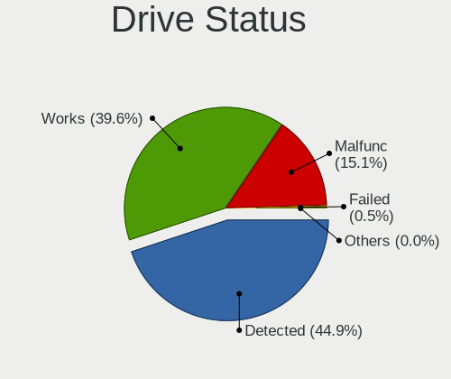
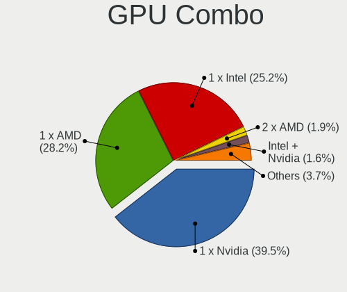
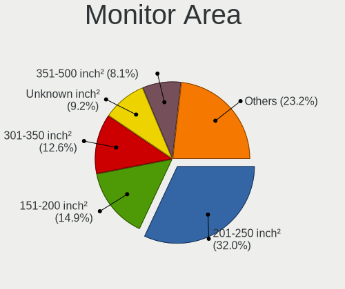

Linux - Tested Hardware & Statistics (Desktops)
-----------------------------------------------

A project to collect tested hardware configurations for Linux.

Anyone can contribute to this report by the [hw-probe](https://github.com/linuxhw/hw-probe) tool:

    sudo -E hw-probe -all -upload

Please contribute! Especially if your hardware is rare.

This report is for real hardware. Report for virtual hardware: [TestCoverage_VE](https://github.com/linuxhw/TestCoverage_VE)

Contents
--------

* [ Test Cases ](#test-cases)

* [ System ](#system)
  - [ OS                       ](#os)
  - [ OS Family                ](#os-family)
  - [ Kernel                   ](#kernel)
  - [ Kernel Family            ](#kernel-family)
  - [ Kernel Major Ver.        ](#kernel-major-ver)
  - [ Arch                     ](#arch)
  - [ DE                       ](#de)
  - [ Display Server           ](#display-server)
  - [ Display Manager          ](#display-manager)
  - [ OS Lang                  ](#os-lang)
  - [ Boot Mode                ](#boot-mode)
  - [ Filesystem               ](#filesystem)
  - [ Part. scheme             ](#part-scheme)
  - [ Dual Boot with Linux/BSD ](#dual-boot-with-linuxbsd)
  - [ Dual Boot (Win)          ](#dual-boot-win)

* [ Board ](#board)
  - [ Vendor                   ](#vendor)
  - [ Model                    ](#model)
  - [ Model Family             ](#model-family)
  - [ MFG Year                 ](#mfg-year)
  - [ Form Factor              ](#form-factor)
  - [ Secure Boot              ](#secure-boot)
  - [ Coreboot                 ](#coreboot)
  - [ RAM Size                 ](#ram-size)
  - [ RAM Used                 ](#ram-used)
  - [ Total Drives             ](#total-drives)
  - [ Has CD-ROM               ](#has-cd-rom)
  - [ Has Ethernet             ](#has-ethernet)
  - [ Has WiFi                 ](#has-wifi)
  - [ Has Bluetooth            ](#has-bluetooth)

* [ Location ](#location)
  - [ Country                  ](#country)
  - [ City                     ](#city)

* [ Drives ](#drives)
  - [ Drive Vendor             ](#drive-vendor)
  - [ Drive Model              ](#drive-model)
  - [ HDD Vendor               ](#hdd-vendor)
  - [ SSD Vendor               ](#ssd-vendor)
  - [ Drive Kind               ](#drive-kind)
  - [ Drive Connector          ](#drive-connector)
  - [ Drive Size               ](#drive-size)
  - [ Space Total              ](#space-total)
  - [ Space Used               ](#space-used)
  - [ Malfunc. Drives          ](#malfunc-drives)
  - [ Malfunc. Drive Vendor    ](#malfunc-drive-vendor)
  - [ Malfunc. HDD Vendor      ](#malfunc-hdd-vendor)
  - [ Malfunc. Drive Kind      ](#malfunc-drive-kind)
  - [ Failed Drives            ](#failed-drives)
  - [ Failed Drive Vendor      ](#failed-drive-vendor)
  - [ Drive Status             ](#drive-status)

* [ Storage controller ](#storage-controller)
  - [ Storage Vendor           ](#storage-vendor)
  - [ Storage Model            ](#storage-model)
  - [ Storage Kind             ](#storage-kind)

* [ Processor ](#processor)
  - [ CPU Vendor               ](#cpu-vendor)
  - [ CPU Model                ](#cpu-model)
  - [ CPU Model Family         ](#cpu-model-family)
  - [ CPU Cores                ](#cpu-cores)
  - [ CPU Sockets              ](#cpu-sockets)
  - [ CPU Threads              ](#cpu-threads)
  - [ CPU Op-Modes             ](#cpu-op-modes)
  - [ CPU Microcode            ](#cpu-microcode)
  - [ CPU Microarch            ](#cpu-microarch)

* [ Graphics ](#graphics)
  - [ GPU Vendor               ](#gpu-vendor)
  - [ GPU Model                ](#gpu-model)
  - [ GPU Combo                ](#gpu-combo)
  - [ GPU Driver               ](#gpu-driver)
  - [ GPU Memory               ](#gpu-memory)

* [ Monitor ](#monitor)
  - [ Monitor Vendor           ](#monitor-vendor)
  - [ Monitor Model            ](#monitor-model)
  - [ Monitor Resolution       ](#monitor-resolution)
  - [ Monitor Diagonal         ](#monitor-diagonal)
  - [ Monitor Width            ](#monitor-width)
  - [ Aspect Ratio             ](#aspect-ratio)
  - [ Monitor Area             ](#monitor-area)
  - [ Pixel Density            ](#pixel-density)
  - [ Multiple Monitors        ](#multiple-monitors)

* [ Network ](#network)
  - [ Net Controller Vendor    ](#net-controller-vendor)
  - [ Net Controller Model     ](#net-controller-model)
  - [ Wireless Vendor          ](#wireless-vendor)
  - [ Wireless Model           ](#wireless-model)
  - [ Ethernet Vendor          ](#ethernet-vendor)
  - [ Ethernet Model           ](#ethernet-model)
  - [ Net Controller Kind      ](#net-controller-kind)
  - [ Used Controller          ](#used-controller)
  - [ NICs                     ](#nics)
  - [ IPv6                     ](#ipv6)

* [ Bluetooth ](#bluetooth)
  - [ Bluetooth Vendor         ](#bluetooth-vendor)
  - [ Bluetooth Model          ](#bluetooth-model)

* [ Sound ](#sound)
  - [ Sound Vendor             ](#sound-vendor)
  - [ Sound Model              ](#sound-model)

* [ Memory ](#memory)
  - [ Memory Vendor            ](#memory-vendor)
  - [ Memory Model             ](#memory-model)
  - [ Memory Kind              ](#memory-kind)
  - [ Memory Form Factor       ](#memory-form-factor)
  - [ Memory Size              ](#memory-size)
  - [ Memory Speed             ](#memory-speed)

* [ Printers & scanners ](#printers--scanners)
  - [ Printer Vendor           ](#printer-vendor)
  - [ Printer Model            ](#printer-model)
  - [ Scanner Vendor           ](#scanner-vendor)
  - [ Scanner Model            ](#scanner-model)

* [ Camera ](#camera)
  - [ Camera Vendor            ](#camera-vendor)
  - [ Camera Model             ](#camera-model)

* [ Security ](#security)
  - [ Fingerprint Vendor       ](#fingerprint-vendor)
  - [ Fingerprint Model        ](#fingerprint-model)
  - [ Chipcard Vendor          ](#chipcard-vendor)
  - [ Chipcard Model           ](#chipcard-model)

* [ Unsupported ](#unsupported)
  - [ Unsupported Devices      ](#unsupported-devices)
  - [ Unsupported Device Types ](#unsupported-device-types)

Test Cases
----------

Total: 113160

| Vendor        | Model                       | Probe                                                      | Date         |
|---------------|-----------------------------|------------------------------------------------------------|--------------|
| Dell          | 0VHWTR A01                  | [7544868958](https://linux-hardware.org/?probe=7544868958) | Feb 01, 2023 |
| ASUSTek       | TUF B450-PLUS GAMING        | [d44fb4f702](https://linux-hardware.org/?probe=d44fb4f702) | Feb 01, 2023 |
| ASRock        | B250M-HDV                   | [a2ff80e7dd](https://linux-hardware.org/?probe=a2ff80e7dd) | Feb 01, 2023 |
| Gigabyte      | GA-MA770T-UD3               | [4644d239d7](https://linux-hardware.org/?probe=4644d239d7) | Feb 01, 2023 |
| Gigabyte      | Z690 GAMING X DDR4          | [21ce876854](https://linux-hardware.org/?probe=21ce876854) | Feb 01, 2023 |
| Shenzhen M... | F7BFC                       | [ecf260f299](https://linux-hardware.org/?probe=ecf260f299) | Feb 01, 2023 |
| MSI           | D2415 S26361-D2415-A21      | [3acfaaf14c](https://linux-hardware.org/?probe=3acfaaf14c) | Feb 01, 2023 |
| ASUSTek       | A8N-SLI Premium             | [faf81c22ae](https://linux-hardware.org/?probe=faf81c22ae) | Feb 01, 2023 |
| Gigabyte      | GA-78LMT-USB3 SEx           | [6aa10285fe](https://linux-hardware.org/?probe=6aa10285fe) | Feb 01, 2023 |
| Fujitsu       | D3400-A1 S26361-D3400-A1    | [b792043acd](https://linux-hardware.org/?probe=b792043acd) | Feb 01, 2023 |
| HP            | 0AACh                       | [f41abcf7f9](https://linux-hardware.org/?probe=f41abcf7f9) | Feb 01, 2023 |
| Biostar       | A68N-5000                   | [96e9f6ff35](https://linux-hardware.org/?probe=96e9f6ff35) | Feb 01, 2023 |
| BESSTAR Te... | HM90                        | [3f958de9bb](https://linux-hardware.org/?probe=3f958de9bb) | Feb 01, 2023 |
| Gigabyte      | G31M-ES2C                   | [ec3d16bb4e](https://linux-hardware.org/?probe=ec3d16bb4e) | Feb 01, 2023 |
| MSI           | A520M-A PRO                 | [f7a88d0dea](https://linux-hardware.org/?probe=f7a88d0dea) | Feb 01, 2023 |
| Gigabyte      | Z690 GAMING X DDR4          | [de7f0840d1](https://linux-hardware.org/?probe=de7f0840d1) | Feb 01, 2023 |
| ASUSTek       | H110M-R                     | [c790793197](https://linux-hardware.org/?probe=c790793197) | Feb 01, 2023 |
| Lenovo        | 3111 NOK                    | [4f7d6b345c](https://linux-hardware.org/?probe=4f7d6b345c) | Feb 01, 2023 |
| Gigabyte      | B365M DS3H                  | [d515d5d9f7](https://linux-hardware.org/?probe=d515d5d9f7) | Feb 01, 2023 |
| AMI           | Cherry Trail CR             | [162e744903](https://linux-hardware.org/?probe=162e744903) | Feb 01, 2023 |
| Lenovo        | 3111 NOK                    | [03df681b38](https://linux-hardware.org/?probe=03df681b38) | Feb 01, 2023 |
| ASUSTek       | P9X79                       | [01e8662b39](https://linux-hardware.org/?probe=01e8662b39) | Feb 01, 2023 |
| ASUSTek       | TUF Gaming X570-PRO WIFI... | [48bccd4f38](https://linux-hardware.org/?probe=48bccd4f38) | Feb 01, 2023 |
| Intel         | D34010WYK H14771-303        | [31485ae6ec](https://linux-hardware.org/?probe=31485ae6ec) | Feb 01, 2023 |
| Pegatron      | 2A94                        | [58961a542f](https://linux-hardware.org/?probe=58961a542f) | Feb 01, 2023 |
| MSI           | MAG Z590 TORPEDO            | [431a6c7a3a](https://linux-hardware.org/?probe=431a6c7a3a) | Feb 01, 2023 |
| Gigabyte      | X299 AORUS Gaming 3-CF      | [775a993b3a](https://linux-hardware.org/?probe=775a993b3a) | Feb 01, 2023 |
| Foxconn       | G41MXE/G41MXE-K             | [50c552026e](https://linux-hardware.org/?probe=50c552026e) | Feb 01, 2023 |
| MSI           | MAG B550 TOMAHAWK           | [142f5fcb2d](https://linux-hardware.org/?probe=142f5fcb2d) | Feb 01, 2023 |
| MSI           | Z170A PC MATE               | [ff305089b2](https://linux-hardware.org/?probe=ff305089b2) | Feb 01, 2023 |
| Dell          | 09KPNV A01                  | [5dcda0d3e5](https://linux-hardware.org/?probe=5dcda0d3e5) | Feb 01, 2023 |
| Lenovo        | SHARKBAY 0B98401 WIN        | [1668f1f69f](https://linux-hardware.org/?probe=1668f1f69f) | Feb 01, 2023 |
| ASRock        | X570 Pro4                   | [81b19ff917](https://linux-hardware.org/?probe=81b19ff917) | Feb 01, 2023 |
| ECS           | G31T-M7                     | [9b0f53b46c](https://linux-hardware.org/?probe=9b0f53b46c) | Feb 01, 2023 |
| ASUSTek       | Z87-A                       | [1b880dbac2](https://linux-hardware.org/?probe=1b880dbac2) | Feb 01, 2023 |
| ASRockRack    | X470D4U2-2T                 | [602482d070](https://linux-hardware.org/?probe=602482d070) | Feb 01, 2023 |
| ASUSTek       | ProArt X670E-CREATOR WIF... | [ffe1cabad7](https://linux-hardware.org/?probe=ffe1cabad7) | Feb 01, 2023 |
| PCWare        | IPX525R2-D3                 | [20868d90a7](https://linux-hardware.org/?probe=20868d90a7) | Feb 01, 2023 |
| Dell          | 06D7TR A00                  | [d040bfd5cc](https://linux-hardware.org/?probe=d040bfd5cc) | Feb 01, 2023 |
| PCWare        | IPX525R2-D3                 | [d67831dc82](https://linux-hardware.org/?probe=d67831dc82) | Feb 01, 2023 |
| MSI           | MAG Z790 TOMAHAWK WIFI      | [b9fb1c5111](https://linux-hardware.org/?probe=b9fb1c5111) | Feb 01, 2023 |
| Gigabyte      | B550 AORUS ELITE V2         | [aa3b7e2dc8](https://linux-hardware.org/?probe=aa3b7e2dc8) | Feb 01, 2023 |
| ASUSTek       | PRIME B550-PLUS             | [bea57d418a](https://linux-hardware.org/?probe=bea57d418a) | Feb 01, 2023 |
| ASUSTek       | PRIME B550M-A               | [2e458676e4](https://linux-hardware.org/?probe=2e458676e4) | Feb 01, 2023 |
| ASUSTek       | PRIME B550M-A               | [779b723b67](https://linux-hardware.org/?probe=779b723b67) | Feb 01, 2023 |
| ASRock        | FM2A88X Extreme6+           | [79c11af9ac](https://linux-hardware.org/?probe=79c11af9ac) | Feb 01, 2023 |
| Gigabyte      | Z170X-Gaming 3              | [b0697611f6](https://linux-hardware.org/?probe=b0697611f6) | Feb 01, 2023 |
| ASUSTek       | ROG STRIX X570-E GAMING     | [9fb41ee5bc](https://linux-hardware.org/?probe=9fb41ee5bc) | Feb 01, 2023 |
| MSI           | B250M PRO-VDH               | [1dbacce612](https://linux-hardware.org/?probe=1dbacce612) | Feb 01, 2023 |
| Dell          | 00V62H A01                  | [d7b81788e7](https://linux-hardware.org/?probe=d7b81788e7) | Feb 01, 2023 |
| ASUSTek       | ROG STRIX Z490-A GAMING     | [5f2948351d](https://linux-hardware.org/?probe=5f2948351d) | Feb 01, 2023 |
| Gigabyte      | Z690 AORUS ELITE AX DDR4    | [115de2faed](https://linux-hardware.org/?probe=115de2faed) | Feb 01, 2023 |
| MSI           | X470 GAMING PLUS MAX        | [f1fecf5447](https://linux-hardware.org/?probe=f1fecf5447) | Feb 01, 2023 |
| ASUSTek       | ProArt X670E-CREATOR WIF... | [4f8642280f](https://linux-hardware.org/?probe=4f8642280f) | Feb 01, 2023 |
| AZW           | U59                         | [9b73123be3](https://linux-hardware.org/?probe=9b73123be3) | Feb 01, 2023 |
| Gigabyte      | B450M H                     | [2d4aa2e1a0](https://linux-hardware.org/?probe=2d4aa2e1a0) | Feb 01, 2023 |
| ASUSTek       | PRIME B550M-A               | [4251ab2f9a](https://linux-hardware.org/?probe=4251ab2f9a) | Feb 01, 2023 |
| Dell          | 0PU052                      | [d2f241353d](https://linux-hardware.org/?probe=d2f241353d) | Feb 01, 2023 |
| AZW           | U59                         | [74f028454a](https://linux-hardware.org/?probe=74f028454a) | Feb 01, 2023 |
| ASUSTek       | M4A89TD PRO USB3            | [9010e03a18](https://linux-hardware.org/?probe=9010e03a18) | Feb 01, 2023 |
| HP            | 1790                        | [d0d3ca5e7c](https://linux-hardware.org/?probe=d0d3ca5e7c) | Feb 01, 2023 |
| Dell          | 06D7TR A02                  | [b3bb51473f](https://linux-hardware.org/?probe=b3bb51473f) | Feb 01, 2023 |
| ASUSTek       | PRIME B550-PLUS             | [23b27dab7d](https://linux-hardware.org/?probe=23b27dab7d) | Feb 01, 2023 |
| Gigabyte      | G41MT-D3                    | [99127d4bed](https://linux-hardware.org/?probe=99127d4bed) | Feb 01, 2023 |
| Gigabyte      | B550M AORUS ELITE           | [a8f54f681a](https://linux-hardware.org/?probe=a8f54f681a) | Feb 01, 2023 |
| Dell          | 0WG860                      | [002a1f805c](https://linux-hardware.org/?probe=002a1f805c) | Feb 01, 2023 |
| ASUSTek       | ROG STRIX X570-E GAMING     | [4bb9990abe](https://linux-hardware.org/?probe=4bb9990abe) | Feb 01, 2023 |
| Gigabyte      | MZBSWMP-00                  | [894f632950](https://linux-hardware.org/?probe=894f632950) | Feb 01, 2023 |
| Dell          | 0D28YY A01                  | [51b04e5d58](https://linux-hardware.org/?probe=51b04e5d58) | Feb 01, 2023 |
| Gigabyte      | H55M-UD2H                   | [9337f49fff](https://linux-hardware.org/?probe=9337f49fff) | Feb 01, 2023 |
| Dell          | 0VHWTR A02                  | [4820c0216f](https://linux-hardware.org/?probe=4820c0216f) | Feb 01, 2023 |
| Huanan        | X99-F8D PLUS V1.1           | [e68a009e8f](https://linux-hardware.org/?probe=e68a009e8f) | Feb 01, 2023 |
| Gigabyte      | GA-MA69VM-S2                | [72dae43046](https://linux-hardware.org/?probe=72dae43046) | Feb 01, 2023 |
| Gigabyte      | H510M H                     | [298b411767](https://linux-hardware.org/?probe=298b411767) | Jan 31, 2023 |
| ASUSTek       | TUF Gaming Z690-PLUS D4     | [d6d4c6c38c](https://linux-hardware.org/?probe=d6d4c6c38c) | Jan 31, 2023 |
| Gigabyte      | B450M DS3H V2               | [75a3416ebc](https://linux-hardware.org/?probe=75a3416ebc) | Jan 31, 2023 |
| Gigabyte      | Z690M DS3H DDR4             | [8f858cb9b9](https://linux-hardware.org/?probe=8f858cb9b9) | Jan 31, 2023 |
| ASUSTek       | PRIME B660-PLUS D4          | [f1a9c37047](https://linux-hardware.org/?probe=f1a9c37047) | Jan 31, 2023 |
| ASUSTek       | F2A85-V                     | [c68678a1a5](https://linux-hardware.org/?probe=c68678a1a5) | Jan 31, 2023 |
| MSI           | 870A-G54                    | [0aaa012de5](https://linux-hardware.org/?probe=0aaa012de5) | Jan 31, 2023 |
| ASUSTek       | PRIME B660-PLUS D4          | [fe2a413caa](https://linux-hardware.org/?probe=fe2a413caa) | Jan 31, 2023 |
| Dell          | 042P49 A01                  | [2791787281](https://linux-hardware.org/?probe=2791787281) | Jan 31, 2023 |
| Dell          | 0Y7WYT A00                  | [77909a2fa1](https://linux-hardware.org/?probe=77909a2fa1) | Jan 31, 2023 |
| MSI           | B450 TOMAHAWK MAX           | [3f9519f358](https://linux-hardware.org/?probe=3f9519f358) | Jan 31, 2023 |
| MSI           | H510M-A PRO                 | [609fc1e9bb](https://linux-hardware.org/?probe=609fc1e9bb) | Jan 31, 2023 |
| ASUSTek       | M5A97 EVO R2.0              | [f4e30fc177](https://linux-hardware.org/?probe=f4e30fc177) | Jan 31, 2023 |
| ASUSTek       | P5QL PRO                    | [77cc2bd640](https://linux-hardware.org/?probe=77cc2bd640) | Jan 31, 2023 |
| Dell          | 0Y7WYT A00                  | [d299b4befd](https://linux-hardware.org/?probe=d299b4befd) | Jan 31, 2023 |
| HP            | 18E4                        | [50c68be419](https://linux-hardware.org/?probe=50c68be419) | Jan 31, 2023 |
| Gigabyte      | X670 AORUS ELITE AX         | [4e438c4768](https://linux-hardware.org/?probe=4e438c4768) | Jan 31, 2023 |
| HP            | 0AACh                       | [32961ffb11](https://linux-hardware.org/?probe=32961ffb11) | Jan 31, 2023 |
| Gigabyte      | B560 DS3H AC-Y1             | [6c094e2027](https://linux-hardware.org/?probe=6c094e2027) | Jan 31, 2023 |
| ASUSTek       | P7P55D                      | [981ae95b2a](https://linux-hardware.org/?probe=981ae95b2a) | Jan 31, 2023 |
| HP            | 18E4                        | [d038da9e08](https://linux-hardware.org/?probe=d038da9e08) | Jan 31, 2023 |
| ASRock        | B450 Gaming-ITX/ac          | [25b35d4826](https://linux-hardware.org/?probe=25b35d4826) | Jan 31, 2023 |
| AMD           | Inagua CRB                  | [3f497311dd](https://linux-hardware.org/?probe=3f497311dd) | Jan 31, 2023 |
| HP            | 21EF                        | [0aacd43b02](https://linux-hardware.org/?probe=0aacd43b02) | Jan 31, 2023 |
| ASRock        | H87 Pro4                    | [8a53501060](https://linux-hardware.org/?probe=8a53501060) | Jan 31, 2023 |
| Gigabyte      | X670 AORUS ELITE AX         | [66459fc07c](https://linux-hardware.org/?probe=66459fc07c) | Jan 31, 2023 |
| NCR           | Pocono                      | [1a1c878e10](https://linux-hardware.org/?probe=1a1c878e10) | Jan 31, 2023 |
| ASUSTek       | ROG STRIX B660-I GAMING ... | [19d65de9b6](https://linux-hardware.org/?probe=19d65de9b6) | Jan 31, 2023 |
| ASUSTek       | ROG STRIX Z590-A GAMING ... | [b54f170a86](https://linux-hardware.org/?probe=b54f170a86) | Jan 31, 2023 |
| Unknown       | Unknown                     | [7e53e3c6e8](https://linux-hardware.org/?probe=7e53e3c6e8) | Jan 31, 2023 |
| Gigabyte      | Z690 GAMING X DDR4          | [f2636de53b](https://linux-hardware.org/?probe=f2636de53b) | Jan 31, 2023 |
| Gigabyte      | B560M H                     | [65f58e4e39](https://linux-hardware.org/?probe=65f58e4e39) | Jan 31, 2023 |
| ASUSTek       | Maximus VII GENE            | [c936c07925](https://linux-hardware.org/?probe=c936c07925) | Jan 31, 2023 |
| Dell          | 0NKW6Y A02                  | [4a63357651](https://linux-hardware.org/?probe=4a63357651) | Jan 31, 2023 |
| Dell          | 0D28YY A00                  | [8641149603](https://linux-hardware.org/?probe=8641149603) | Jan 31, 2023 |
| HP            | 0AACh                       | [94baf3c57c](https://linux-hardware.org/?probe=94baf3c57c) | Jan 31, 2023 |
| Gigabyte      | GA-MA785GM-US2H             | [dd017ac78a](https://linux-hardware.org/?probe=dd017ac78a) | Jan 31, 2023 |
| ASUSTek       | ROG STRIX B450-I GAMING     | [d59770af38](https://linux-hardware.org/?probe=d59770af38) | Jan 31, 2023 |
| ASUSTek       | ROG STRIX B450-I GAMING     | [3a5ae3d1e8](https://linux-hardware.org/?probe=3a5ae3d1e8) | Jan 31, 2023 |
| Intel         | DH77DF AAG40293-301         | [1a0f7653e3](https://linux-hardware.org/?probe=1a0f7653e3) | Jan 31, 2023 |
| Fujitsu       | D3041-A1 S26361-D3041-A1    | [4762c2a35b](https://linux-hardware.org/?probe=4762c2a35b) | Jan 31, 2023 |
| Gigabyte      | X570 AORUS ELITE            | [caa1c9e23a](https://linux-hardware.org/?probe=caa1c9e23a) | Jan 31, 2023 |
| Dell          | 0XHGV1 A00                  | [05a6fd1857](https://linux-hardware.org/?probe=05a6fd1857) | Jan 31, 2023 |
| MSI           | B550-A PRO                  | [78ab25ef78](https://linux-hardware.org/?probe=78ab25ef78) | Jan 31, 2023 |
| Gigabyte      | P85-D3                      | [7e25d19fae](https://linux-hardware.org/?probe=7e25d19fae) | Jan 31, 2023 |
| Gigabyte      | H61M-S2PV                   | [4aa843346a](https://linux-hardware.org/?probe=4aa843346a) | Jan 31, 2023 |
| Gigabyte      | B450 AORUS ELITE            | [a2c87504d6](https://linux-hardware.org/?probe=a2c87504d6) | Jan 31, 2023 |
| Gigabyte      | H97M-D3H                    | [3ccdc4fa2b](https://linux-hardware.org/?probe=3ccdc4fa2b) | Jan 31, 2023 |
| MSI           | B550-A PRO                  | [2458455037](https://linux-hardware.org/?probe=2458455037) | Jan 31, 2023 |
| Dell          | 06HR05 A00                  | [b80c55d90d](https://linux-hardware.org/?probe=b80c55d90d) | Jan 31, 2023 |
| ASUSTek       | M5A78L-M LX/BR              | [d8d386cb1d](https://linux-hardware.org/?probe=d8d386cb1d) | Jan 31, 2023 |
| ASUSTek       | Z97-PRO GAMER               | [9ce51b923e](https://linux-hardware.org/?probe=9ce51b923e) | Jan 31, 2023 |
| Gigabyte      | 945GCM-S2C                  | [41ad246a0b](https://linux-hardware.org/?probe=41ad246a0b) | Jan 31, 2023 |
| MSI           | G41M-P28                    | [7f37c4b40e](https://linux-hardware.org/?probe=7f37c4b40e) | Jan 31, 2023 |
| ASUSTek       | P5V800-MX                   | [a8696956aa](https://linux-hardware.org/?probe=a8696956aa) | Jan 31, 2023 |
| Lenovo        | 3717 SDK0J40697 WIN 3305... | [175a0fcf9a](https://linux-hardware.org/?probe=175a0fcf9a) | Jan 31, 2023 |
| Unknown       | Unknown                     | [66b96d9a0f](https://linux-hardware.org/?probe=66b96d9a0f) | Jan 31, 2023 |
| Lenovo        | 36C8 SDK0J40700 WIN 3258... | [01c7dbecde](https://linux-hardware.org/?probe=01c7dbecde) | Jan 31, 2023 |
| Gigabyte      | Z97M-DS3H                   | [360dc83e04](https://linux-hardware.org/?probe=360dc83e04) | Jan 31, 2023 |
| Unknown       | Unknown                     | [4dbe55873b](https://linux-hardware.org/?probe=4dbe55873b) | Jan 31, 2023 |
| Medion        | MS-7728                     | [60cf9e4948](https://linux-hardware.org/?probe=60cf9e4948) | Jan 31, 2023 |
| Fujitsu       | D3041-A1 S26361-D3041-A1    | [00fcd39954](https://linux-hardware.org/?probe=00fcd39954) | Jan 31, 2023 |
| ASRock        | G31M-VS2                    | [e12dd528ea](https://linux-hardware.org/?probe=e12dd528ea) | Jan 31, 2023 |
| MSI           | H81M-E34                    | [19b8f90522](https://linux-hardware.org/?probe=19b8f90522) | Jan 31, 2023 |
| Maxtang       | EHL30 V1.0                  | [d104ad1307](https://linux-hardware.org/?probe=d104ad1307) | Jan 31, 2023 |
| MSI           | A320M-A PRO MAX             | [5abc8dccdb](https://linux-hardware.org/?probe=5abc8dccdb) | Jan 31, 2023 |
| Gigabyte      | A320M-H-CF                  | [f5379a55ea](https://linux-hardware.org/?probe=f5379a55ea) | Jan 31, 2023 |
| ASUSTek       | B85M-G                      | [44c2ca8150](https://linux-hardware.org/?probe=44c2ca8150) | Jan 31, 2023 |
| ASRockRack    | X470D4U2-2T                 | [af3cf25119](https://linux-hardware.org/?probe=af3cf25119) | Jan 31, 2023 |
| Huanan        | X79 INTEL (INTEL Xeon E5... | [2c021665e1](https://linux-hardware.org/?probe=2c021665e1) | Jan 31, 2023 |
| Gigabyte      | Z690 GAMING X DDR4          | [8512c1d0cc](https://linux-hardware.org/?probe=8512c1d0cc) | Jan 31, 2023 |
| Dell          | 040DDP A01                  | [6094b799d7](https://linux-hardware.org/?probe=6094b799d7) | Jan 31, 2023 |
| Gigabyte      | H270-Gaming 3               | [e64a1e0a5a](https://linux-hardware.org/?probe=e64a1e0a5a) | Jan 31, 2023 |
| Gigabyte      | F2A88XM-D3H                 | [846f831269](https://linux-hardware.org/?probe=846f831269) | Jan 31, 2023 |
| ASUSTek       | PRIME B550M-A               | [318b0a5ecb](https://linux-hardware.org/?probe=318b0a5ecb) | Jan 31, 2023 |
| Gigabyte      | Z170-HD3P-CF                | [9e9deedf0d](https://linux-hardware.org/?probe=9e9deedf0d) | Jan 31, 2023 |
| ASRock        | FM2A88X Extreme6+           | [73bc9212a3](https://linux-hardware.org/?probe=73bc9212a3) | Jan 31, 2023 |
| ASUSTek       | PRIME B550-PLUS             | [989e45d84b](https://linux-hardware.org/?probe=989e45d84b) | Jan 31, 2023 |
| MSI           | 870-G45                     | [cda1aade14](https://linux-hardware.org/?probe=cda1aade14) | Jan 31, 2023 |
| ASUSTek       | ProArt X670E-CREATOR WIF... | [6e7d6aae31](https://linux-hardware.org/?probe=6e7d6aae31) | Jan 31, 2023 |
| ASUSTek       | PRIME B250-A                | [c686d3d123](https://linux-hardware.org/?probe=c686d3d123) | Jan 31, 2023 |
| ASRock        | AD2700-ITX                  | [2f14c18867](https://linux-hardware.org/?probe=2f14c18867) | Jan 31, 2023 |
| Dell          | 0NW6H5 A00                  | [6296345ebb](https://linux-hardware.org/?probe=6296345ebb) | Jan 31, 2023 |
| Acer          | MCP73VE NVIDIA MCP73        | [840102fa91](https://linux-hardware.org/?probe=840102fa91) | Jan 31, 2023 |
| ASUSTek       | TUF Gaming X570-PLUS        | [eb4687961f](https://linux-hardware.org/?probe=eb4687961f) | Jan 31, 2023 |
| ASRock        | H77 Pro4-M                  | [a37090dd20](https://linux-hardware.org/?probe=a37090dd20) | Jan 31, 2023 |
| HP            | 339A                        | [e3078cd4d7](https://linux-hardware.org/?probe=e3078cd4d7) | Jan 31, 2023 |
| ASRock        | X570 Pro4                   | [37999411ed](https://linux-hardware.org/?probe=37999411ed) | Jan 31, 2023 |
| Lenovo        | 30D0 SDK0J40697 WIN 3305... | [f018b74ad8](https://linux-hardware.org/?probe=f018b74ad8) | Jan 31, 2023 |
| Gigabyte      | B550M DS3H                  | [eaee265ecc](https://linux-hardware.org/?probe=eaee265ecc) | Jan 31, 2023 |
| HP            | 8599                        | [3ffedfbc62](https://linux-hardware.org/?probe=3ffedfbc62) | Jan 31, 2023 |
| HP            | 8599                        | [759d3a0829](https://linux-hardware.org/?probe=759d3a0829) | Jan 31, 2023 |
| ASUSTek       | CROSSHAIR V FORMULA-Z       | [32dfb5ebe2](https://linux-hardware.org/?probe=32dfb5ebe2) | Jan 31, 2023 |
| Jetway        | I61G-ITX                    | [24cf6ad56e](https://linux-hardware.org/?probe=24cf6ad56e) | Jan 31, 2023 |
| MACHINIST     | X99Z V102 IENGINEER         | [d2cfaf56df](https://linux-hardware.org/?probe=d2cfaf56df) | Jan 31, 2023 |
| ASUSTek       | PRIME B360M-A               | [1196b501d5](https://linux-hardware.org/?probe=1196b501d5) | Jan 31, 2023 |
| ASUSTek       | ROG STRIX B550-I GAMING     | [33ae030343](https://linux-hardware.org/?probe=33ae030343) | Jan 31, 2023 |
| MSI           | B450 TOMAHAWK MAX           | [f2a2476d45](https://linux-hardware.org/?probe=f2a2476d45) | Jan 31, 2023 |
| ASUSTek       | H110-PLUS                   | [c20a43e3e5](https://linux-hardware.org/?probe=c20a43e3e5) | Jan 31, 2023 |
| MSI           | MPG X570 GAMING EDGE WIF... | [177c33e4a9](https://linux-hardware.org/?probe=177c33e4a9) | Jan 31, 2023 |
| ASUSTek       | TUF Gaming B450M-PRO S      | [3be362b4aa](https://linux-hardware.org/?probe=3be362b4aa) | Jan 31, 2023 |
| ASRock        | 890GM Pro3                  | [b2bb32cbbc](https://linux-hardware.org/?probe=b2bb32cbbc) | Jan 31, 2023 |
| ASRock        | B650M PG Riptide            | [260d257a0c](https://linux-hardware.org/?probe=260d257a0c) | Jan 30, 2023 |
| MSI           | PRO B650M-A WIFI            | [30a093116e](https://linux-hardware.org/?probe=30a093116e) | Jan 30, 2023 |
| MSI           | PRO Z690-P DDR4             | [a434328de5](https://linux-hardware.org/?probe=a434328de5) | Jan 30, 2023 |
| MSI           | MPG X570 GAMING PLUS        | [67262a8155](https://linux-hardware.org/?probe=67262a8155) | Jan 30, 2023 |
| ASUSTek       | P8H77-V LE                  | [9edd1a1969](https://linux-hardware.org/?probe=9edd1a1969) | Jan 30, 2023 |
| ASUSTek       | PRIME X670E-PRO WIFI        | [4f08ac24d9](https://linux-hardware.org/?probe=4f08ac24d9) | Jan 30, 2023 |
| Dell          | 0P01GV A03                  | [b029e941fb](https://linux-hardware.org/?probe=b029e941fb) | Jan 30, 2023 |
| Gigabyte      | Z390 DESIGNARE-CF           | [02c8ae01d1](https://linux-hardware.org/?probe=02c8ae01d1) | Jan 30, 2023 |
| Acer          | Unknown                     | [05de2b4244](https://linux-hardware.org/?probe=05de2b4244) | Jan 30, 2023 |
| ASUSTek       | P8H61-MX                    | [4830eacf5e](https://linux-hardware.org/?probe=4830eacf5e) | Jan 30, 2023 |
| ASUSTek       | P8H61-MX                    | [0b59b68d55](https://linux-hardware.org/?probe=0b59b68d55) | Jan 30, 2023 |
| Dell          | 0Y2K8N A01                  | [6a4a26884d](https://linux-hardware.org/?probe=6a4a26884d) | Jan 30, 2023 |
| Gigabyte      | X570 AORUS ELITE            | [034ae066aa](https://linux-hardware.org/?probe=034ae066aa) | Jan 30, 2023 |
| MSI           | MPG X570 GAMING EDGE WIF... | [353272e0d2](https://linux-hardware.org/?probe=353272e0d2) | Jan 30, 2023 |
| ASUSTek       | M4A89GTD-PRO/USB3           | [10c275723f](https://linux-hardware.org/?probe=10c275723f) | Jan 30, 2023 |
| Intel         | DQ77MK AAG39642-500         | [3e004045f7](https://linux-hardware.org/?probe=3e004045f7) | Jan 30, 2023 |
| ASUSTek       | ROG STRIX X570-E GAMING     | [e3f96394c0](https://linux-hardware.org/?probe=e3f96394c0) | Jan 30, 2023 |
| Dell          | 0GDG8Y A00                  | [8ba7e25b58](https://linux-hardware.org/?probe=8ba7e25b58) | Jan 30, 2023 |
| ASRock        | B450M Pro4                  | [c63c663181](https://linux-hardware.org/?probe=c63c663181) | Jan 30, 2023 |
| ASUSTek       | P5KPL-C/1600                | [dba6d97191](https://linux-hardware.org/?probe=dba6d97191) | Jan 30, 2023 |
| Dell          | 0Y2K8N A01                  | [8e4f1d2ed2](https://linux-hardware.org/?probe=8e4f1d2ed2) | Jan 30, 2023 |
| Dell          | 0GDG8Y A00                  | [759e9a48d1](https://linux-hardware.org/?probe=759e9a48d1) | Jan 30, 2023 |
| ASUSTek       | ROG STRIX X370-F GAMING     | [3c8b3f4e7d](https://linux-hardware.org/?probe=3c8b3f4e7d) | Jan 30, 2023 |
| Dell          | 0TP412                      | [5db177340d](https://linux-hardware.org/?probe=5db177340d) | Jan 30, 2023 |
| Lenovo        | NO DPK                      | [35edbda29f](https://linux-hardware.org/?probe=35edbda29f) | Jan 30, 2023 |
| Gigabyte      | Z690 GAMING X DDR4          | [6bf8eb9c73](https://linux-hardware.org/?probe=6bf8eb9c73) | Jan 30, 2023 |
| MSI           | 970 GAMING                  | [7bc39da7c1](https://linux-hardware.org/?probe=7bc39da7c1) | Jan 30, 2023 |
| Lenovo        | NO DPK                      | [e21e3e152b](https://linux-hardware.org/?probe=e21e3e152b) | Jan 30, 2023 |
| Intel         | DH77DF AAG40293-301         | [1c91d911d7](https://linux-hardware.org/?probe=1c91d911d7) | Jan 30, 2023 |
| Lenovo        | 1046 SDK0T08861 WIN 3305... | [fa81cc9dea](https://linux-hardware.org/?probe=fa81cc9dea) | Jan 30, 2023 |
| Lenovo        | 36C8 SDK0J40700 WIN 3258... | [529b411b46](https://linux-hardware.org/?probe=529b411b46) | Jan 30, 2023 |
| Fujitsu       | D3230-A1 S26361-D3230-A1    | [3bdb934f29](https://linux-hardware.org/?probe=3bdb934f29) | Jan 30, 2023 |
| ASUSTek       | E3 PRO GAMING V5            | [b7917146d8](https://linux-hardware.org/?probe=b7917146d8) | Jan 30, 2023 |
| ASUSTek       | H61M-A/BR                   | [b6a73bd22e](https://linux-hardware.org/?probe=b6a73bd22e) | Jan 30, 2023 |
| ASUSTek       | ROG STRIX Z390-E GAMING     | [7983249b4c](https://linux-hardware.org/?probe=7983249b4c) | Jan 30, 2023 |
| BESSTAR Te... | UM350                       | [ee1ba0e588](https://linux-hardware.org/?probe=ee1ba0e588) | Jan 30, 2023 |
| Lenovo        | SHARKBAY 0B98401 WIN        | [cbfcb68cc6](https://linux-hardware.org/?probe=cbfcb68cc6) | Jan 30, 2023 |
| ASUSTek       | ROG Maximus X HERO          | [070a09add8](https://linux-hardware.org/?probe=070a09add8) | Jan 30, 2023 |
| ASUSTek       | H61M-A/BR                   | [0ae96c2bbc](https://linux-hardware.org/?probe=0ae96c2bbc) | Jan 30, 2023 |
| ASUSTek       | ROG Maximus X HERO          | [8cca3cb036](https://linux-hardware.org/?probe=8cca3cb036) | Jan 30, 2023 |
| Gateway       | IPIMB-ARA                   | [253b58b2a4](https://linux-hardware.org/?probe=253b58b2a4) | Jan 30, 2023 |
| Gigabyte      | B365M H                     | [89d336f0b7](https://linux-hardware.org/?probe=89d336f0b7) | Jan 30, 2023 |
| ASUSTek       | P8P67 DELUXE                | [8f3278e68a](https://linux-hardware.org/?probe=8f3278e68a) | Jan 30, 2023 |
| Gigabyte      | GA-990FXA-UD3               | [78cd3f7f65](https://linux-hardware.org/?probe=78cd3f7f65) | Jan 30, 2023 |
| Gigabyte      | B450M DS3H V2               | [b5f1f3cb42](https://linux-hardware.org/?probe=b5f1f3cb42) | Jan 30, 2023 |
| MSI           | H81M-P33                    | [32149d3b64](https://linux-hardware.org/?probe=32149d3b64) | Jan 30, 2023 |
| ASUSTek       | ROG STRIX B550-F GAMING     | [7743588036](https://linux-hardware.org/?probe=7743588036) | Jan 30, 2023 |
| PCWare        | IPMH110G                    | [95fe94d9f4](https://linux-hardware.org/?probe=95fe94d9f4) | Jan 30, 2023 |
| ASUSTek       | PRIME X570-P                | [a05f6f2f6c](https://linux-hardware.org/?probe=a05f6f2f6c) | Jan 30, 2023 |
| Gigabyte      | B550 AORUS ELITE            | [3fac03d01d](https://linux-hardware.org/?probe=3fac03d01d) | Jan 30, 2023 |
| ASUSTek       | ROG STRIX B550-F GAMING     | [0082cca600](https://linux-hardware.org/?probe=0082cca600) | Jan 30, 2023 |
| ASRock        | X470 Master SLI             | [1746dfe4b1](https://linux-hardware.org/?probe=1746dfe4b1) | Jan 30, 2023 |
| NetGear       | ReadyDATA 5200              | [74a68eba33](https://linux-hardware.org/?probe=74a68eba33) | Jan 30, 2023 |
| ASUSTek       | H81M2                       | [304b95972c](https://linux-hardware.org/?probe=304b95972c) | Jan 30, 2023 |
| ASRock        | X670E Steel Legend          | [e197bd2a4b](https://linux-hardware.org/?probe=e197bd2a4b) | Jan 30, 2023 |
| ASUSTek       | P8H61-MX                    | [f13f4da766](https://linux-hardware.org/?probe=f13f4da766) | Jan 30, 2023 |
| MSI           | H310M PRO-M2 PLUS           | [a96d93846a](https://linux-hardware.org/?probe=a96d93846a) | Jan 30, 2023 |
| MSI           | PRO B660M-A DDR4            | [0f2037dcd8](https://linux-hardware.org/?probe=0f2037dcd8) | Jan 30, 2023 |
| HP            | 8054                        | [f2367fdcda](https://linux-hardware.org/?probe=f2367fdcda) | Jan 30, 2023 |
| ASRockRack    | X470D4U2-2T                 | [ec76a40223](https://linux-hardware.org/?probe=ec76a40223) | Jan 30, 2023 |
| HP            | 8526 MVB, A                 | [eaa1bf595f](https://linux-hardware.org/?probe=eaa1bf595f) | Jan 30, 2023 |
| ASRock        | B450M Pro4 R2.0             | [e4289105c5](https://linux-hardware.org/?probe=e4289105c5) | Jan 30, 2023 |
| HP            | 8054                        | [36f5306e37](https://linux-hardware.org/?probe=36f5306e37) | Jan 30, 2023 |
| MSI           | B550M PRO-VDH WIFI          | [02580dd501](https://linux-hardware.org/?probe=02580dd501) | Jan 30, 2023 |
| ASUSTek       | PRIME B450M-A               | [f0000c6ae7](https://linux-hardware.org/?probe=f0000c6ae7) | Jan 30, 2023 |
| MSI           | X370 SLI PLUS               | [bb20465703](https://linux-hardware.org/?probe=bb20465703) | Jan 30, 2023 |
| Dell          | 0D6H9T A00                  | [2c34aba28a](https://linux-hardware.org/?probe=2c34aba28a) | Jan 30, 2023 |
| ASUSTek       | PRIME B350M-A               | [e2721d08d6](https://linux-hardware.org/?probe=e2721d08d6) | Jan 30, 2023 |
| ASUSTek       | SABERTOOTH 990FX            | [0e28b954b4](https://linux-hardware.org/?probe=0e28b954b4) | Jan 30, 2023 |
| ASUSTek       | SABERTOOTH 990FX            | [10421fe598](https://linux-hardware.org/?probe=10421fe598) | Jan 30, 2023 |
| ASUSTek       | PRIME B550M-A               | [585c3c8f85](https://linux-hardware.org/?probe=585c3c8f85) | Jan 30, 2023 |
| ASRock        | FM2A88X Extreme6+           | [24402e3d42](https://linux-hardware.org/?probe=24402e3d42) | Jan 30, 2023 |
| ASUSTek       | ROG STRIX B550-I GAMING     | [3d555e69f7](https://linux-hardware.org/?probe=3d555e69f7) | Jan 30, 2023 |
| Lenovo        | 3148 NOK                    | [72815c2ab8](https://linux-hardware.org/?probe=72815c2ab8) | Jan 30, 2023 |
| HP            | 18E7                        | [db4ef3e5f4](https://linux-hardware.org/?probe=db4ef3e5f4) | Jan 30, 2023 |
| Lenovo        | MAHOBAY Win8 STD MM DPK ... | [ee36c9d395](https://linux-hardware.org/?probe=ee36c9d395) | Jan 30, 2023 |
| ASUSTek       | PRIME B450-PLUS             | [4cb7a5f214](https://linux-hardware.org/?probe=4cb7a5f214) | Jan 30, 2023 |
| Dell          | 0D28YY A00                  | [63b753b56e](https://linux-hardware.org/?probe=63b753b56e) | Jan 30, 2023 |
| Gigabyte      | X570 I AORUS PRO WIFI       | [7893a67a4b](https://linux-hardware.org/?probe=7893a67a4b) | Jan 30, 2023 |
| Gigabyte      | H61M-S2PV                   | [a3e79a2330](https://linux-hardware.org/?probe=a3e79a2330) | Jan 30, 2023 |
| Gigabyte      | H270-Gaming 3               | [4427845ac1](https://linux-hardware.org/?probe=4427845ac1) | Jan 30, 2023 |
| ASUSTek       | Z170 PRO GAMING             | [c2a4529e33](https://linux-hardware.org/?probe=c2a4529e33) | Jan 30, 2023 |
| MSI           | B450M-A PRO MAX             | [a7232f4811](https://linux-hardware.org/?probe=a7232f4811) | Jan 30, 2023 |
| Lenovo        | 3704 SDK0J40700 WIN 3258... | [aff06e830e](https://linux-hardware.org/?probe=aff06e830e) | Jan 30, 2023 |
| HP            | 0A64h                       | [da7b36ad47](https://linux-hardware.org/?probe=da7b36ad47) | Jan 30, 2023 |
| ASUSTek       | ROG Maximus XIII HERO       | [a32a9ba13a](https://linux-hardware.org/?probe=a32a9ba13a) | Jan 30, 2023 |
| Gigabyte      | H61M-S2PV                   | [5181ba0a3d](https://linux-hardware.org/?probe=5181ba0a3d) | Jan 30, 2023 |
| ASUSTek       | PRIME Z690-P WIFI           | [d2f9eb15f5](https://linux-hardware.org/?probe=d2f9eb15f5) | Jan 30, 2023 |
| Fujitsu       | D3222-A1 S26361-D3222-A1    | [ef9c1299e6](https://linux-hardware.org/?probe=ef9c1299e6) | Jan 30, 2023 |
| HP            | 339A                        | [3bc7df3921](https://linux-hardware.org/?probe=3bc7df3921) | Jan 30, 2023 |
| ViewSonic     | VOT132                      | [a8ecfadd53](https://linux-hardware.org/?probe=a8ecfadd53) | Jan 30, 2023 |
| MSI           | H81M-P33                    | [63402c414d](https://linux-hardware.org/?probe=63402c414d) | Jan 30, 2023 |
| ASRock        | J4125M                      | [535c1b6821](https://linux-hardware.org/?probe=535c1b6821) | Jan 30, 2023 |
| Acer          | Aspire TC-895 V:1.0         | [190e9b4aee](https://linux-hardware.org/?probe=190e9b4aee) | Jan 30, 2023 |
| ASRock        | FM2A68M-DG3+                | [7fb4a85c09](https://linux-hardware.org/?probe=7fb4a85c09) | Jan 30, 2023 |
| Gigabyte      | AB350-Gaming-CF             | [5a2c721748](https://linux-hardware.org/?probe=5a2c721748) | Jan 30, 2023 |
| ASUSTek       | Z170 PRO GAMING             | [9b6a9a4ab5](https://linux-hardware.org/?probe=9b6a9a4ab5) | Jan 30, 2023 |
| Intel         | B75                         | [6597bed6da](https://linux-hardware.org/?probe=6597bed6da) | Jan 29, 2023 |
| ASRock        | N68-S UCC                   | [e8f09a159a](https://linux-hardware.org/?probe=e8f09a159a) | Jan 29, 2023 |
| ASUSTek       | Z97-PRO                     | [0e241538c1](https://linux-hardware.org/?probe=0e241538c1) | Jan 29, 2023 |
| Gigabyte      | B450 AORUS ELITE            | [e5f6f546d4](https://linux-hardware.org/?probe=e5f6f546d4) | Jan 29, 2023 |
| ASUSTek       | B85M-G                      | [73deb30280](https://linux-hardware.org/?probe=73deb30280) | Jan 29, 2023 |
| HP            | 1791                        | [0cb5402c68](https://linux-hardware.org/?probe=0cb5402c68) | Jan 29, 2023 |
| ASUSTek       | GA15DH                      | [767fe59cb7](https://linux-hardware.org/?probe=767fe59cb7) | Jan 29, 2023 |
| HP            | 8460                        | [078e151afc](https://linux-hardware.org/?probe=078e151afc) | Jan 29, 2023 |
| ASUSTek       | H81M-CS/BR                  | [ca82a3e5a7](https://linux-hardware.org/?probe=ca82a3e5a7) | Jan 29, 2023 |
| Dell          | 02YRK5 A02                  | [d6faeebd74](https://linux-hardware.org/?probe=d6faeebd74) | Jan 29, 2023 |
| Gigabyte      | Z270X-Ultra Gaming-CF       | [55c3e9597c](https://linux-hardware.org/?probe=55c3e9597c) | Jan 29, 2023 |
| ASUSTek       | TUF Gaming B550-PLUS        | [11b07d4e11](https://linux-hardware.org/?probe=11b07d4e11) | Jan 29, 2023 |
| Dell          | 0D883F A06                  | [5fe35cda58](https://linux-hardware.org/?probe=5fe35cda58) | Jan 29, 2023 |
| Dell          | 0D883F A06                  | [ec1220585a](https://linux-hardware.org/?probe=ec1220585a) | Jan 29, 2023 |
| ASUSTek       | ROG STRIX B550-F GAMING     | [4fb612b680](https://linux-hardware.org/?probe=4fb612b680) | Jan 29, 2023 |
| ASUSTek       | P6T SE                      | [04ed0bd8b1](https://linux-hardware.org/?probe=04ed0bd8b1) | Jan 29, 2023 |
| MSI           | MPG B550I GAMING EDGE MA... | [ff186606cd](https://linux-hardware.org/?probe=ff186606cd) | Jan 29, 2023 |
| Intel         | H61                         | [87a72c61f2](https://linux-hardware.org/?probe=87a72c61f2) | Jan 29, 2023 |
| Fujitsu       | D3183-A1 S26361-D3183-A1    | [bfb86ee660](https://linux-hardware.org/?probe=bfb86ee660) | Jan 29, 2023 |
| ASUSTek       | P8Q77-M                     | [be0ebca5cc](https://linux-hardware.org/?probe=be0ebca5cc) | Jan 29, 2023 |
| Gigabyte      | Z370 HD3-CF                 | [1721760555](https://linux-hardware.org/?probe=1721760555) | Jan 29, 2023 |
| ASRock        | B460M Pro4                  | [7af163f694](https://linux-hardware.org/?probe=7af163f694) | Jan 29, 2023 |
| MSI           | PRO H610M-G DDR4            | [358b908129](https://linux-hardware.org/?probe=358b908129) | Jan 29, 2023 |
| HC            | HCAR357-MI V1.0             | [986dd858ba](https://linux-hardware.org/?probe=986dd858ba) | Jan 29, 2023 |
| MSI           | X399 SLI PLUS               | [f7008e788b](https://linux-hardware.org/?probe=f7008e788b) | Jan 29, 2023 |
| Gigabyte      | B250M-HD3-CF                | [f8630776ca](https://linux-hardware.org/?probe=f8630776ca) | Jan 29, 2023 |
| Gigabyte      | B550 GAMING X V2            | [868269808a](https://linux-hardware.org/?probe=868269808a) | Jan 29, 2023 |
| MSI           | Z77A-G43                    | [873725bb74](https://linux-hardware.org/?probe=873725bb74) | Jan 29, 2023 |
| MSI           | Z77A-G43                    | [f489fe4f5d](https://linux-hardware.org/?probe=f489fe4f5d) | Jan 29, 2023 |
| ASRock        | P45DE3                      | [e4c2e737f7](https://linux-hardware.org/?probe=e4c2e737f7) | Jan 29, 2023 |
| EVGA          | E689 $                      | [9d4b1aeaa9](https://linux-hardware.org/?probe=9d4b1aeaa9) | Jan 29, 2023 |
| MSI           | 760GM-P23                   | [34fab6626e](https://linux-hardware.org/?probe=34fab6626e) | Jan 29, 2023 |
| ASUSTek       | ROG Maximus XIII HERO       | [6b634c85e8](https://linux-hardware.org/?probe=6b634c85e8) | Jan 29, 2023 |
| ASUSTek       | PRIME Z690-P WIFI           | [da2056876e](https://linux-hardware.org/?probe=da2056876e) | Jan 29, 2023 |
| HP            | 339A                        | [5bd8bab56c](https://linux-hardware.org/?probe=5bd8bab56c) | Jan 29, 2023 |
| ASUSTek       | PRIME B450M-K II            | [d4a5012f93](https://linux-hardware.org/?probe=d4a5012f93) | Jan 29, 2023 |
| ASUSTek       | P8H67                       | [c6163491b5](https://linux-hardware.org/?probe=c6163491b5) | Jan 29, 2023 |
| Gigabyte      | X470 AORUS ULTRA GAMING-... | [6444a93633](https://linux-hardware.org/?probe=6444a93633) | Jan 29, 2023 |
| MSI           | P55-CD53                    | [7c46f17179](https://linux-hardware.org/?probe=7c46f17179) | Jan 29, 2023 |
| ASRock        | Z77M                        | [83a27ed2b5](https://linux-hardware.org/?probe=83a27ed2b5) | Jan 29, 2023 |
| ASUSTek       | PRIME B550M-A AC            | [c11ff840dd](https://linux-hardware.org/?probe=c11ff840dd) | Jan 29, 2023 |
| Dell          | 0VRWRC A01                  | [0e6a170715](https://linux-hardware.org/?probe=0e6a170715) | Jan 29, 2023 |
| Intel         | H61                         | [0ce404915f](https://linux-hardware.org/?probe=0ce404915f) | Jan 29, 2023 |
| HP            | 81B4                        | [01229ad5ec](https://linux-hardware.org/?probe=01229ad5ec) | Jan 29, 2023 |
| Gigabyte      | X570 AORUS PRO              | [ab13127567](https://linux-hardware.org/?probe=ab13127567) | Jan 29, 2023 |
| Medion        | TJ4125                      | [5fb5d01ae9](https://linux-hardware.org/?probe=5fb5d01ae9) | Jan 29, 2023 |
| Fujitsu Si... | D2587-A1 S26361-D2587-A1    | [6378111bbd](https://linux-hardware.org/?probe=6378111bbd) | Jan 29, 2023 |
| Gigabyte      | 8IPE1000-G/L                | [6f83e8b57d](https://linux-hardware.org/?probe=6f83e8b57d) | Jan 29, 2023 |
| ASRock        | G41M-S3                     | [2196343afa](https://linux-hardware.org/?probe=2196343afa) | Jan 29, 2023 |
| HP            | 8643 SMVB                   | [d9047d3c7b](https://linux-hardware.org/?probe=d9047d3c7b) | Jan 29, 2023 |
| ASUSTek       | P7P55D LE                   | [943a02b7e9](https://linux-hardware.org/?probe=943a02b7e9) | Jan 29, 2023 |
| ASUSTek       | P6T SE                      | [c52b5b3357](https://linux-hardware.org/?probe=c52b5b3357) | Jan 29, 2023 |
| ASUSTek       | PRIME H310I-PLUS R2.0       | [1b8a1f7b64](https://linux-hardware.org/?probe=1b8a1f7b64) | Jan 29, 2023 |
| ASRock        | B450 Gaming K4              | [e768563b42](https://linux-hardware.org/?probe=e768563b42) | Jan 29, 2023 |
| Gigabyte      | X570 I AORUS PRO WIFI       | [e6fedcdbb0](https://linux-hardware.org/?probe=e6fedcdbb0) | Jan 29, 2023 |
| ASUSTek       | TUF Gaming X570-PLUS        | [97aa61aba5](https://linux-hardware.org/?probe=97aa61aba5) | Jan 29, 2023 |
| ASUSTek       | ProArt B550-CREATOR         | [c93e84b79b](https://linux-hardware.org/?probe=c93e84b79b) | Jan 29, 2023 |
| ASUSTek       | ROG STRIX B550-F GAMING     | [5a7b54907f](https://linux-hardware.org/?probe=5a7b54907f) | Jan 29, 2023 |
| MSI           | MAG B550M MORTAR WIFI       | [eb551b5ec0](https://linux-hardware.org/?probe=eb551b5ec0) | Jan 29, 2023 |
| ASRockRack    | X470D4U2-2T                 | [6b99585bc0](https://linux-hardware.org/?probe=6b99585bc0) | Jan 29, 2023 |
| ASUSTek       | PRIME B450M-A II            | [104fb04e91](https://linux-hardware.org/?probe=104fb04e91) | Jan 29, 2023 |
| ASUSTek       | PRIME B550M-A               | [ef43edeee5](https://linux-hardware.org/?probe=ef43edeee5) | Jan 29, 2023 |
| ASRock        | Z97E-ITX/ac                 | [80d82e6be6](https://linux-hardware.org/?probe=80d82e6be6) | Jan 29, 2023 |
| ASRock        | 970M Pro3                   | [e0a5d6512f](https://linux-hardware.org/?probe=e0a5d6512f) | Jan 29, 2023 |
| ASUSTek       | B150M-C                     | [6eb1a5b38e](https://linux-hardware.org/?probe=6eb1a5b38e) | Jan 29, 2023 |
| ASRock        | FM2A88X Extreme6+           | [f9a823cb38](https://linux-hardware.org/?probe=f9a823cb38) | Jan 29, 2023 |
| ASRock        | Z97E-ITX/ac                 | [4d092eb96c](https://linux-hardware.org/?probe=4d092eb96c) | Jan 29, 2023 |
| SYWZ          | S210H Series                | [4d1018a808](https://linux-hardware.org/?probe=4d1018a808) | Jan 29, 2023 |
| ASRock        | X570M Pro4                  | [e72f7f2fb1](https://linux-hardware.org/?probe=e72f7f2fb1) | Jan 29, 2023 |
| ASUSTek       | CROSSHAIR VI HERO           | [190a780b8a](https://linux-hardware.org/?probe=190a780b8a) | Jan 29, 2023 |
| BESSTAR Te... | TH50                        | [4aa292e3c1](https://linux-hardware.org/?probe=4aa292e3c1) | Jan 29, 2023 |
| ASUSTek       | Z170M-E D3                  | [2b466d1b19](https://linux-hardware.org/?probe=2b466d1b19) | Jan 29, 2023 |
| Gigabyte      | Z170XP-SLI-CF               | [b9a38b7494](https://linux-hardware.org/?probe=b9a38b7494) | Jan 29, 2023 |
| ASUSTek       | B85M-G                      | [26fd2a9f6a](https://linux-hardware.org/?probe=26fd2a9f6a) | Jan 29, 2023 |
| ASUSTek       | M5A97 R2.0                  | [703a3a2694](https://linux-hardware.org/?probe=703a3a2694) | Jan 29, 2023 |
| Gigabyte      | M61PME-S2                   | [8227150e0d](https://linux-hardware.org/?probe=8227150e0d) | Jan 29, 2023 |
| ASRock        | Z77 Pro4                    | [fe501e214b](https://linux-hardware.org/?probe=fe501e214b) | Jan 29, 2023 |
| ASRock        | B450 Gaming K4              | [000203af81](https://linux-hardware.org/?probe=000203af81) | Jan 29, 2023 |
| Lenovo        | MAHOBAY NO DPK              | [a6f17c156d](https://linux-hardware.org/?probe=a6f17c156d) | Jan 29, 2023 |
| ASRock        | Z77 Pro4                    | [a5d8b81f29](https://linux-hardware.org/?probe=a5d8b81f29) | Jan 29, 2023 |
| Gigabyte      | M61PME-S2                   | [813f01976d](https://linux-hardware.org/?probe=813f01976d) | Jan 29, 2023 |
| MSI           | B450M MORTAR MAX            | [017467452c](https://linux-hardware.org/?probe=017467452c) | Jan 29, 2023 |
| ASRock        | B450M Pro4 R2.0             | [9f2e4066f6](https://linux-hardware.org/?probe=9f2e4066f6) | Jan 29, 2023 |
| Foxconn       | A74MX-S/A74MX-K             | [9daeb7adc3](https://linux-hardware.org/?probe=9daeb7adc3) | Jan 29, 2023 |
| Gigabyte      | Z690 AORUS PRO              | [b07e189d3c](https://linux-hardware.org/?probe=b07e189d3c) | Jan 29, 2023 |
| Toshiba       | STI 010433                  | [fead488cf1](https://linux-hardware.org/?probe=fead488cf1) | Jan 29, 2023 |
| Lenovo        | SHARKBAY SDK0J40700 WIN     | [75027cfa77](https://linux-hardware.org/?probe=75027cfa77) | Jan 29, 2023 |
| ASRock        | H610M-HVS                   | [2774d547be](https://linux-hardware.org/?probe=2774d547be) | Jan 29, 2023 |
| ASRock        | B460M Pro4                  | [37c0fb77f5](https://linux-hardware.org/?probe=37c0fb77f5) | Jan 29, 2023 |
| Acer          | FMP55                       | [d091fbc8d3](https://linux-hardware.org/?probe=d091fbc8d3) | Jan 29, 2023 |
| Apple         | Mac-F221BEC8                | [d8de82d8c4](https://linux-hardware.org/?probe=d8de82d8c4) | Jan 29, 2023 |
| ASRock        | B550 Pro4                   | [eaed78d213](https://linux-hardware.org/?probe=eaed78d213) | Jan 28, 2023 |
| ASUSTek       | P5Q PRO TURBO               | [72e0a3fde5](https://linux-hardware.org/?probe=72e0a3fde5) | Jan 28, 2023 |
| ASUSTek       | PRIME Z690-A                | [8dee7ae6ec](https://linux-hardware.org/?probe=8dee7ae6ec) | Jan 28, 2023 |
| Dell          | 0F8098                      | [d6066c739e](https://linux-hardware.org/?probe=d6066c739e) | Jan 28, 2023 |
| ASUSTek       | P5Q PRO TURBO               | [a1cb8edb5a](https://linux-hardware.org/?probe=a1cb8edb5a) | Jan 28, 2023 |
| MSI           | A68HM GRENADE               | [696581b7b6](https://linux-hardware.org/?probe=696581b7b6) | Jan 28, 2023 |
| Gigabyte      | Z97M-DS3H                   | [e9fc2c87df](https://linux-hardware.org/?probe=e9fc2c87df) | Jan 28, 2023 |
| ASUSTek       | Z97-K                       | [e3f865cd20](https://linux-hardware.org/?probe=e3f865cd20) | Jan 28, 2023 |
| ASRock        | B550 Pro4                   | [5fa28ba14d](https://linux-hardware.org/?probe=5fa28ba14d) | Jan 28, 2023 |
| ASRock        | B450M Pro4 R2.0             | [f2bf9c3c82](https://linux-hardware.org/?probe=f2bf9c3c82) | Jan 28, 2023 |
| HP            | 18E7                        | [01cbafc241](https://linux-hardware.org/?probe=01cbafc241) | Jan 28, 2023 |
| ASUSTek       | F2A55-M LK2                 | [8bf2fa8d9b](https://linux-hardware.org/?probe=8bf2fa8d9b) | Jan 28, 2023 |
| ASUSTek       | H81M-A/BR                   | [ca72045652](https://linux-hardware.org/?probe=ca72045652) | Jan 28, 2023 |
| Intel         | X79G V2.x                   | [40bc764c73](https://linux-hardware.org/?probe=40bc764c73) | Jan 28, 2023 |
| Gigabyte      | B550I AORUS PRO AX          | [8b5c80cad4](https://linux-hardware.org/?probe=8b5c80cad4) | Jan 28, 2023 |
| ASUSTek       | M5A97 R2.0                  | [845b3c6990](https://linux-hardware.org/?probe=845b3c6990) | Jan 28, 2023 |
| Gigabyte      | X570 AORUS MASTER           | [6b71ec1a01](https://linux-hardware.org/?probe=6b71ec1a01) | Jan 28, 2023 |
| Dell          | 0PXWHK A00                  | [1866c91eb9](https://linux-hardware.org/?probe=1866c91eb9) | Jan 28, 2023 |
| EVGA          | E689 $                      | [be99ae882b](https://linux-hardware.org/?probe=be99ae882b) | Jan 28, 2023 |
| ASUSTek       | M5A97 R2.0                  | [d7469767f6](https://linux-hardware.org/?probe=d7469767f6) | Jan 28, 2023 |
| Gigabyte      | H77M-D3H                    | [a9367f87d4](https://linux-hardware.org/?probe=a9367f87d4) | Jan 28, 2023 |
| ASUSTek       | ROG STRIX B650E-F GAMING... | [2d2e42ae23](https://linux-hardware.org/?probe=2d2e42ae23) | Jan 28, 2023 |
| Dell          | 0HD5W2 A00                  | [890cad48c3](https://linux-hardware.org/?probe=890cad48c3) | Jan 28, 2023 |
| Gigabyte      | Z390 AORUS ULTRA-CF         | [cba2528a29](https://linux-hardware.org/?probe=cba2528a29) | Jan 28, 2023 |
| Fujitsu       | D3221-A1 S26361-D3221-A1    | [bc4b6513bb](https://linux-hardware.org/?probe=bc4b6513bb) | Jan 28, 2023 |
| ASUSTek       | Pro WS X570-ACE             | [6e55ab69b8](https://linux-hardware.org/?probe=6e55ab69b8) | Jan 28, 2023 |
| ASUSTek       | F2A85-V                     | [d528677cfd](https://linux-hardware.org/?probe=d528677cfd) | Jan 28, 2023 |
| Lenovo        | NO DPK                      | [0abc762f30](https://linux-hardware.org/?probe=0abc762f30) | Jan 28, 2023 |
| Gigabyte      | B660M GAMING DDR4           | [c7fc79b5f1](https://linux-hardware.org/?probe=c7fc79b5f1) | Jan 28, 2023 |
| BESSTAR Te... | UM350                       | [1ec2f78884](https://linux-hardware.org/?probe=1ec2f78884) | Jan 28, 2023 |
| ASUSTek       | P8H77-V LE                  | [fb0dcf8d7e](https://linux-hardware.org/?probe=fb0dcf8d7e) | Jan 28, 2023 |
| ASUSTek       | GA35DX                      | [697b0d8654](https://linux-hardware.org/?probe=697b0d8654) | Jan 28, 2023 |
| ASRock        | X570 Taichi                 | [3b1c5df727](https://linux-hardware.org/?probe=3b1c5df727) | Jan 28, 2023 |
| HP            | 0A08h                       | [f9b0168de1](https://linux-hardware.org/?probe=f9b0168de1) | Jan 28, 2023 |
| Gigabyte      | GA-78LMT-USB3 SEx           | [1a9e67408e](https://linux-hardware.org/?probe=1a9e67408e) | Jan 28, 2023 |
| ASRock        | X570 Pro4                   | [bf09bd7413](https://linux-hardware.org/?probe=bf09bd7413) | Jan 28, 2023 |
| ASUSTek       | PRIME A320M-K               | [11586188ad](https://linux-hardware.org/?probe=11586188ad) | Jan 28, 2023 |
| Gigabyte      | H510M H                     | [d25a13d2c4](https://linux-hardware.org/?probe=d25a13d2c4) | Jan 28, 2023 |
| ASUSTek       | PRIME H410M-K               | [0cda1a95a2](https://linux-hardware.org/?probe=0cda1a95a2) | Jan 28, 2023 |
| Gigabyte      | B450M DS3H-CF               | [8f6ea9ffff](https://linux-hardware.org/?probe=8f6ea9ffff) | Jan 28, 2023 |
| ASRock        | Z97 Killer                  | [2658d00cd2](https://linux-hardware.org/?probe=2658d00cd2) | Jan 28, 2023 |
| MSI           | B85M-E45                    | [335cebea8b](https://linux-hardware.org/?probe=335cebea8b) | Jan 28, 2023 |
| ASRock        | N68C-S UCC                  | [de8739d9d5](https://linux-hardware.org/?probe=de8739d9d5) | Jan 28, 2023 |
| MSI           | 760GM-P23                   | [0da956ecde](https://linux-hardware.org/?probe=0da956ecde) | Jan 28, 2023 |
| MSI           | H410M PRO                   | [d8c1dc4e25](https://linux-hardware.org/?probe=d8c1dc4e25) | Jan 28, 2023 |
| MSI           | 760GM-P23                   | [e00bd18cc2](https://linux-hardware.org/?probe=e00bd18cc2) | Jan 28, 2023 |
| HP            | 1998                        | [81da484cc4](https://linux-hardware.org/?probe=81da484cc4) | Jan 28, 2023 |
| ASRock        | A320M-HDV R4.0              | [f447127e74](https://linux-hardware.org/?probe=f447127e74) | Jan 28, 2023 |
| ASUSTek       | H110M-K                     | [73b3f84699](https://linux-hardware.org/?probe=73b3f84699) | Jan 28, 2023 |
| Gigabyte      | AX370-Gaming K7             | [e369c6e5b8](https://linux-hardware.org/?probe=e369c6e5b8) | Jan 28, 2023 |
| ASUSTek       | A58M-A/BR                   | [2e6e55e6ea](https://linux-hardware.org/?probe=2e6e55e6ea) | Jan 28, 2023 |
| HP            | 2B17                        | [8746c148c7](https://linux-hardware.org/?probe=8746c148c7) | Jan 28, 2023 |
| ASRock        | 970M Pro3                   | [58366ca3d1](https://linux-hardware.org/?probe=58366ca3d1) | Jan 28, 2023 |
| Dell          | 0HY9JP A00                  | [f4aefcd670](https://linux-hardware.org/?probe=f4aefcd670) | Jan 28, 2023 |
| HP            | 8053                        | [88120ce3f4](https://linux-hardware.org/?probe=88120ce3f4) | Jan 28, 2023 |
| Gigabyte      | AB350M-DS3H V2-CF           | [f3530a6a1f](https://linux-hardware.org/?probe=f3530a6a1f) | Jan 28, 2023 |
| ASRock        | Z370 Extreme4               | [8c6abbc491](https://linux-hardware.org/?probe=8c6abbc491) | Jan 28, 2023 |
| Gigabyte      | B75M-D3H                    | [b5ca740834](https://linux-hardware.org/?probe=b5ca740834) | Jan 28, 2023 |
| AZW           | Gemini M                    | [5534667621](https://linux-hardware.org/?probe=5534667621) | Jan 28, 2023 |
| AZW           | GTR V02                     | [b1b34f10a2](https://linux-hardware.org/?probe=b1b34f10a2) | Jan 28, 2023 |
| ASUSTek       | PRIME B560M-K               | [c74b6b90f0](https://linux-hardware.org/?probe=c74b6b90f0) | Jan 28, 2023 |
| Unknown       | X79                         | [164508bcb4](https://linux-hardware.org/?probe=164508bcb4) | Jan 28, 2023 |
| Gigabyte      | AB350M-DS3H V2-CF           | [8492e549e2](https://linux-hardware.org/?probe=8492e549e2) | Jan 28, 2023 |
| MSI           | H410M PRO                   | [72f5a735fb](https://linux-hardware.org/?probe=72f5a735fb) | Jan 28, 2023 |
| MSI           | B560M PRO-VDH               | [cd55d1ec5d](https://linux-hardware.org/?probe=cd55d1ec5d) | Jan 28, 2023 |
| ASUSTek       | PRIME B660M-A D4            | [41ff395299](https://linux-hardware.org/?probe=41ff395299) | Jan 28, 2023 |
| Lenovo        | 364F SDK0J40700 WIN 3258... | [cad690676c](https://linux-hardware.org/?probe=cad690676c) | Jan 28, 2023 |
| ASUSTek       | ROG STRIX B550-F GAMING     | [31bda5eb31](https://linux-hardware.org/?probe=31bda5eb31) | Jan 28, 2023 |
| HP            | 843F                        | [5e9a5d2afd](https://linux-hardware.org/?probe=5e9a5d2afd) | Jan 28, 2023 |
| Gigabyte      | GA-MA770-UD3                | [554aa8592c](https://linux-hardware.org/?probe=554aa8592c) | Jan 28, 2023 |
| ASUSTek       | H61M-K                      | [312e07a824](https://linux-hardware.org/?probe=312e07a824) | Jan 28, 2023 |
| ASUSTek       | P8H61-M LE/CSM R2.0         | [7120eb3310](https://linux-hardware.org/?probe=7120eb3310) | Jan 28, 2023 |
| Gigabyte      | GA-73PVM-S2                 | [fcf91f09b4](https://linux-hardware.org/?probe=fcf91f09b4) | Jan 28, 2023 |
| ASUSTek       | ROG STRIX B460-G GAMING     | [836e9a9809](https://linux-hardware.org/?probe=836e9a9809) | Jan 28, 2023 |
| Gigabyte      | X570 AORUS ULTRA            | [40152faf5b](https://linux-hardware.org/?probe=40152faf5b) | Jan 28, 2023 |
| DEPO Compu... | DPH410S                     | [d380c83ebf](https://linux-hardware.org/?probe=d380c83ebf) | Jan 28, 2023 |
| ASUSTek       | SABERTOOTH Z77              | [b588302693](https://linux-hardware.org/?probe=b588302693) | Jan 28, 2023 |
| Gigabyte      | EP45-DS3L                   | [684748c9b4](https://linux-hardware.org/?probe=684748c9b4) | Jan 28, 2023 |
| OEM           | KX-01 V1.0                  | [75d9dc396c](https://linux-hardware.org/?probe=75d9dc396c) | Jan 28, 2023 |
| Unknown       | GB01                        | [e907445f6c](https://linux-hardware.org/?probe=e907445f6c) | Jan 28, 2023 |
| MSI           | 880G-E45                    | [ef6e95cf66](https://linux-hardware.org/?probe=ef6e95cf66) | Jan 28, 2023 |
| MSI           | PRO H610M-G DDR4            | [ad4f37d5a4](https://linux-hardware.org/?probe=ad4f37d5a4) | Jan 28, 2023 |
| ASUSTek       | P8Z77-M                     | [22d53e86e0](https://linux-hardware.org/?probe=22d53e86e0) | Jan 28, 2023 |
| MSI           | MS-7513                     | [3953f1b447](https://linux-hardware.org/?probe=3953f1b447) | Jan 28, 2023 |
| MSI           | 970A-G46                    | [ece518ec34](https://linux-hardware.org/?probe=ece518ec34) | Jan 28, 2023 |
| ASUSTek       | SABERTOOTH Z77              | [493be38a2b](https://linux-hardware.org/?probe=493be38a2b) | Jan 28, 2023 |
| ASUSTek       | TUF Gaming X570-PLUS        | [c67c5a3cfe](https://linux-hardware.org/?probe=c67c5a3cfe) | Jan 28, 2023 |
| ASUSTek       | P8H67-M PRO                 | [97d1ab1b7d](https://linux-hardware.org/?probe=97d1ab1b7d) | Jan 28, 2023 |
| ASUSTek       | TUF Gaming X570-PLUS        | [6cdea948c5](https://linux-hardware.org/?probe=6cdea948c5) | Jan 28, 2023 |
| Gigabyte      | F2A88XM-D3H                 | [1605fbe62a](https://linux-hardware.org/?probe=1605fbe62a) | Jan 28, 2023 |
| ASUSTek       | M5A78L-M LE                 | [a4c0ee5753](https://linux-hardware.org/?probe=a4c0ee5753) | Jan 27, 2023 |
| ASUSTek       | PRIME H510M-E               | [fa464af5fb](https://linux-hardware.org/?probe=fa464af5fb) | Jan 27, 2023 |
| ASUSTek       | M5A78L-M LX PLUS            | [d9f9d4bc89](https://linux-hardware.org/?probe=d9f9d4bc89) | Jan 27, 2023 |
| ASUSTek       | TUF Gaming X570-PLUS        | [ff5e2b673e](https://linux-hardware.org/?probe=ff5e2b673e) | Jan 27, 2023 |
| Gigabyte      | B75M-D3H                    | [3ee2e6ab56](https://linux-hardware.org/?probe=3ee2e6ab56) | Jan 27, 2023 |
| ASRock        | B550M-HDV                   | [29bdcc85ad](https://linux-hardware.org/?probe=29bdcc85ad) | Jan 27, 2023 |
| ASRock        | Z97 Killer                  | [d4c609c373](https://linux-hardware.org/?probe=d4c609c373) | Jan 27, 2023 |
| MSI           | TRX40 PRO WIFI              | [d9508d5b22](https://linux-hardware.org/?probe=d9508d5b22) | Jan 27, 2023 |
| Acer          | Aspire TC-705               | [be48644835](https://linux-hardware.org/?probe=be48644835) | Jan 27, 2023 |
| Intel         | DH77EB AAG39073-304         | [8965805130](https://linux-hardware.org/?probe=8965805130) | Jan 27, 2023 |
| ASUSTek       | M2N-MX                      | [0920c10a0e](https://linux-hardware.org/?probe=0920c10a0e) | Jan 27, 2023 |
| ASUSTek       | PRIME Z590-A                | [f328fab9f1](https://linux-hardware.org/?probe=f328fab9f1) | Jan 27, 2023 |
| HP            | 2B47                        | [cce5f9ec07](https://linux-hardware.org/?probe=cce5f9ec07) | Jan 27, 2023 |
| ASUSTek       | PRIME Z390-A                | [a30690db0c](https://linux-hardware.org/?probe=a30690db0c) | Jan 27, 2023 |
| ASRock        | 970 Pro3 R2.0               | [676f900958](https://linux-hardware.org/?probe=676f900958) | Jan 27, 2023 |
| ASUSTek       | ROG STRIX B360-I GAMING     | [8f81628b59](https://linux-hardware.org/?probe=8f81628b59) | Jan 27, 2023 |
| ASUSTek       | PRIME B550M-A               | [e619db262a](https://linux-hardware.org/?probe=e619db262a) | Jan 27, 2023 |
| Gigabyte      | GA-78LMT-USB3               | [55d50f6d18](https://linux-hardware.org/?probe=55d50f6d18) | Jan 27, 2023 |
| Dell          | 057FFP A01                  | [ec0e3da69d](https://linux-hardware.org/?probe=ec0e3da69d) | Jan 27, 2023 |
| ASUSTek       | PRIME H310M-K R2.0          | [b7377ee894](https://linux-hardware.org/?probe=b7377ee894) | Jan 27, 2023 |
| Gigabyte      | B85M-D3H-A                  | [8289da39ca](https://linux-hardware.org/?probe=8289da39ca) | Jan 27, 2023 |
| ASUSTek       | PRIME B450M-A               | [4a33dd0b76](https://linux-hardware.org/?probe=4a33dd0b76) | Jan 27, 2023 |
| HP            | 805A                        | [b33510966e](https://linux-hardware.org/?probe=b33510966e) | Jan 27, 2023 |
| Acer          | Predator G3620              | [0fdd7e30ce](https://linux-hardware.org/?probe=0fdd7e30ce) | Jan 27, 2023 |
| Medion        | H61H2-LM3                   | [e9d671848c](https://linux-hardware.org/?probe=e9d671848c) | Jan 27, 2023 |
| ASRock        | X570 Taichi                 | [bdfb4aecf9](https://linux-hardware.org/?probe=bdfb4aecf9) | Jan 27, 2023 |
| BESSTAR Te... | UM340                       | [77efbbb270](https://linux-hardware.org/?probe=77efbbb270) | Jan 27, 2023 |
| ASUSTek       | P8H61-M LX R2.0             | [6d2e490a23](https://linux-hardware.org/?probe=6d2e490a23) | Jan 27, 2023 |
| Gigabyte      | 970A-DS3P                   | [547e171057](https://linux-hardware.org/?probe=547e171057) | Jan 27, 2023 |
| Dell          | 0CU409                      | [5da09834b4](https://linux-hardware.org/?probe=5da09834b4) | Jan 27, 2023 |
| Dell          | 0CU409                      | [06b8ea0f8e](https://linux-hardware.org/?probe=06b8ea0f8e) | Jan 27, 2023 |
| HP            | 1495                        | [8c1f7b5fbd](https://linux-hardware.org/?probe=8c1f7b5fbd) | Jan 27, 2023 |
| ASUSTek       | Z170-K                      | [a1f535bfca](https://linux-hardware.org/?probe=a1f535bfca) | Jan 27, 2023 |
| ASUSTek       | B85M-G                      | [4a83dc2dc2](https://linux-hardware.org/?probe=4a83dc2dc2) | Jan 27, 2023 |
| Gigabyte      | G31M-ES2C                   | [8a5dee0d52](https://linux-hardware.org/?probe=8a5dee0d52) | Jan 27, 2023 |
| MSI           | B365M PRO-VDH               | [d5bbfc18d5](https://linux-hardware.org/?probe=d5bbfc18d5) | Jan 27, 2023 |
| Gigabyte      | X670 AORUS ELITE AX         | [06c6af6032](https://linux-hardware.org/?probe=06c6af6032) | Jan 27, 2023 |
| ASUSTek       | H81M-K                      | [13f23afb38](https://linux-hardware.org/?probe=13f23afb38) | Jan 27, 2023 |
| Dell          | 0VRWRC A00                  | [dac4a44a62](https://linux-hardware.org/?probe=dac4a44a62) | Jan 27, 2023 |
| ASUSTek       | TUF Gaming X570-PLUS_BR     | [e7b74c9ad4](https://linux-hardware.org/?probe=e7b74c9ad4) | Jan 27, 2023 |
| ASUSTek       | P5K                         | [6d496e6965](https://linux-hardware.org/?probe=6d496e6965) | Jan 27, 2023 |
| ASUSTek       | PRIME Z790-P WIFI           | [65e298b3ee](https://linux-hardware.org/?probe=65e298b3ee) | Jan 27, 2023 |
| Dell          | 0GM819                      | [f5810a0a61](https://linux-hardware.org/?probe=f5810a0a61) | Jan 27, 2023 |
| Gigabyte      | GA-890GPA-UD3H              | [e660f922a4](https://linux-hardware.org/?probe=e660f922a4) | Jan 27, 2023 |
| Gigabyte      | Z170X-UD5 TH-CF             | [0d9491187e](https://linux-hardware.org/?probe=0d9491187e) | Jan 27, 2023 |
| ASRock        | H61M-DGS                    | [825e70e660](https://linux-hardware.org/?probe=825e70e660) | Jan 27, 2023 |
| Dell          | 0XPDFK A01                  | [4611591cc9](https://linux-hardware.org/?probe=4611591cc9) | Jan 27, 2023 |
| Gigabyte      | Z390 DESIGNARE-CF           | [74635968fa](https://linux-hardware.org/?probe=74635968fa) | Jan 27, 2023 |
| ASRock        | B450 Gaming K4              | [7ce2ff0443](https://linux-hardware.org/?probe=7ce2ff0443) | Jan 27, 2023 |
| HP            | 3397                        | [764f737fcf](https://linux-hardware.org/?probe=764f737fcf) | Jan 27, 2023 |
| HP            | 8055                        | [81fa44d8fa](https://linux-hardware.org/?probe=81fa44d8fa) | Jan 27, 2023 |
| Acer          | Aspire X1700                | [beab94f1ee](https://linux-hardware.org/?probe=beab94f1ee) | Jan 27, 2023 |
| Gigabyte      | G41MT-S2                    | [774f8eb27f](https://linux-hardware.org/?probe=774f8eb27f) | Jan 27, 2023 |
| ASUSTek       | ROG STRIX X670E-I GAMING... | [9d3e931cc1](https://linux-hardware.org/?probe=9d3e931cc1) | Jan 27, 2023 |
| ASUSTek       | M3A78-CM                    | [9001ac4e36](https://linux-hardware.org/?probe=9001ac4e36) | Jan 27, 2023 |
| ASUSTek       | PRIME X299-DELUXE II        | [c7e2bde422](https://linux-hardware.org/?probe=c7e2bde422) | Jan 27, 2023 |
| Aquarius      | AQB560M                     | [1187e4d240](https://linux-hardware.org/?probe=1187e4d240) | Jan 27, 2023 |
| Gigabyte      | B660M DS3H DDR4             | [bb5e9ccd98](https://linux-hardware.org/?probe=bb5e9ccd98) | Jan 27, 2023 |
| Gigabyte      | B660M DS3H DDR4             | [d54e25d6fb](https://linux-hardware.org/?probe=d54e25d6fb) | Jan 27, 2023 |
| Lenovo        | 0B98401 PRO                 | [06086e6112](https://linux-hardware.org/?probe=06086e6112) | Jan 27, 2023 |
| Gigabyte      | H81N                        | [e7cf6a4216](https://linux-hardware.org/?probe=e7cf6a4216) | Jan 27, 2023 |
| Dell          | 0RY206                      | [822d0f1c17](https://linux-hardware.org/?probe=822d0f1c17) | Jan 27, 2023 |
| Dell          | 0RW199                      | [04c4f5174d](https://linux-hardware.org/?probe=04c4f5174d) | Jan 27, 2023 |
| ASRock        | B450 Steel Legend           | [c2a36422b4](https://linux-hardware.org/?probe=c2a36422b4) | Jan 27, 2023 |
| Gigabyte      | X670 AORUS ELITE AX         | [38e4843e09](https://linux-hardware.org/?probe=38e4843e09) | Jan 27, 2023 |
| Dell          | 042P49 A00                  | [041e30ac67](https://linux-hardware.org/?probe=041e30ac67) | Jan 27, 2023 |
| Hardkernel    | ODROID-H3                   | [56f9bb1456](https://linux-hardware.org/?probe=56f9bb1456) | Jan 27, 2023 |
| ASUSTek       | H61M-E                      | [0ebd68a086](https://linux-hardware.org/?probe=0ebd68a086) | Jan 27, 2023 |
| Gigabyte      | X570 AORUS MASTER           | [c0ea09ef3c](https://linux-hardware.org/?probe=c0ea09ef3c) | Jan 27, 2023 |
| Gigabyte      | H310M S2H                   | [6aa78b855a](https://linux-hardware.org/?probe=6aa78b855a) | Jan 27, 2023 |
| Intel         | DH61BE AAG14062-211         | [e4a05d50b7](https://linux-hardware.org/?probe=e4a05d50b7) | Jan 27, 2023 |
| MSI           | B550M PRO-VDH WIFI          | [eec3afb06e](https://linux-hardware.org/?probe=eec3afb06e) | Jan 27, 2023 |
| ASUSTek       | ROG STRIX X570-E GAMING     | [df315d8050](https://linux-hardware.org/?probe=df315d8050) | Jan 27, 2023 |
| MSI           | B450 TOMAHAWK               | [ff1352cb54](https://linux-hardware.org/?probe=ff1352cb54) | Jan 27, 2023 |
| ASUSTek       | ROG STRIX X570-E GAMING     | [14a0252d88](https://linux-hardware.org/?probe=14a0252d88) | Jan 27, 2023 |
| Medion        | MS-7675                     | [1d9d209dbf](https://linux-hardware.org/?probe=1d9d209dbf) | Jan 27, 2023 |
| Gigabyte      | 970A-D3P                    | [f01366b131](https://linux-hardware.org/?probe=f01366b131) | Jan 27, 2023 |
| Intel         | X99                         | [1fbd6cf5bd](https://linux-hardware.org/?probe=1fbd6cf5bd) | Jan 27, 2023 |
| Gigabyte      | GA-MA770-UD3                | [6766a92ee5](https://linux-hardware.org/?probe=6766a92ee5) | Jan 27, 2023 |
| HP            | 212A                        | [5b9c217d02](https://linux-hardware.org/?probe=5b9c217d02) | Jan 27, 2023 |
| ASUSTek       | G10DK                       | [0b70a364b7](https://linux-hardware.org/?probe=0b70a364b7) | Jan 27, 2023 |
| HP            | Compaq 8200 Elite SFF PC    | [73f629ca61](https://linux-hardware.org/?probe=73f629ca61) | Jan 27, 2023 |
| Gigabyte      | J3455N-D3H                  | [3eb9131ab1](https://linux-hardware.org/?probe=3eb9131ab1) | Jan 27, 2023 |
| ASUSTek       | ROG STRIX X570-E GAMING     | [edfd032f00](https://linux-hardware.org/?probe=edfd032f00) | Jan 26, 2023 |
| Gigabyte      | X570 UD                     | [75e92725f5](https://linux-hardware.org/?probe=75e92725f5) | Jan 26, 2023 |
| Gigabyte      | H81M-S2PV                   | [4910cfdfcd](https://linux-hardware.org/?probe=4910cfdfcd) | Jan 26, 2023 |
| ASUSTek       | G10DK                       | [a42ba7ef9e](https://linux-hardware.org/?probe=a42ba7ef9e) | Jan 26, 2023 |
| ASUSTek       | PRIME A320M-K               | [6f449734a9](https://linux-hardware.org/?probe=6f449734a9) | Jan 26, 2023 |
| Loongson      | LS3A5000-7A2000-1w-EVB-V... | [2fea9476f5](https://linux-hardware.org/?probe=2fea9476f5) | Jan 26, 2023 |
| Positivo      | POS-PIB150DT                | [5a333d4e71](https://linux-hardware.org/?probe=5a333d4e71) | Jan 26, 2023 |
| Gigabyte      | Z370P D3-CF                 | [90f37ac742](https://linux-hardware.org/?probe=90f37ac742) | Jan 26, 2023 |
| ASUSTek       | ROG Maximus XI HERO         | [95f5d0904e](https://linux-hardware.org/?probe=95f5d0904e) | Jan 26, 2023 |
| MSI           | 770-C45                     | [3da3ee46c2](https://linux-hardware.org/?probe=3da3ee46c2) | Jan 26, 2023 |
| Medion        | TJ4125                      | [eaca458ea2](https://linux-hardware.org/?probe=eaca458ea2) | Jan 26, 2023 |
| Gigabyte      | Z370P D3-CF                 | [e524d7c4d9](https://linux-hardware.org/?probe=e524d7c4d9) | Jan 26, 2023 |
| ASUSTek       | PRIME Z490-A                | [91dbb8d045](https://linux-hardware.org/?probe=91dbb8d045) | Jan 26, 2023 |
| HP            | 3397                        | [ab38ecfb97](https://linux-hardware.org/?probe=ab38ecfb97) | Jan 26, 2023 |
| HP            | 8054                        | [864f5f225e](https://linux-hardware.org/?probe=864f5f225e) | Jan 26, 2023 |
| Dell          | 0Y2MRG A00                  | [54ba66711b](https://linux-hardware.org/?probe=54ba66711b) | Jan 26, 2023 |
| Gigabyte      | G41MT-S2                    | [06cd0f5943](https://linux-hardware.org/?probe=06cd0f5943) | Jan 26, 2023 |
| ASUSTek       | P6T SE                      | [1033fae7e9](https://linux-hardware.org/?probe=1033fae7e9) | Jan 26, 2023 |
| HP            | 1497                        | [21a3e07346](https://linux-hardware.org/?probe=21a3e07346) | Jan 26, 2023 |
| MSI           | X99A SLI PLUS               | [931a186515](https://linux-hardware.org/?probe=931a186515) | Jan 26, 2023 |
| Gigabyte      | B450 AORUS M                | [3e65f42529](https://linux-hardware.org/?probe=3e65f42529) | Jan 26, 2023 |
| Dell          | 0CRH6C A01                  | [d06248a310](https://linux-hardware.org/?probe=d06248a310) | Jan 26, 2023 |
| Gigabyte      | GA-78LMT-USB3 SEx           | [90de00d686](https://linux-hardware.org/?probe=90de00d686) | Jan 26, 2023 |
| ASRock        | H87 Pro4                    | [c1427c9b7b](https://linux-hardware.org/?probe=c1427c9b7b) | Jan 26, 2023 |
| ASRockRack    | X470D4U2-2T                 | [b9f3d19faa](https://linux-hardware.org/?probe=b9f3d19faa) | Jan 26, 2023 |
| ASUSTek       | M4N78 PRO                   | [e547b297b0](https://linux-hardware.org/?probe=e547b297b0) | Jan 26, 2023 |
| Gigabyte      | GA-990FXA-UD3               | [6e5884ec0c](https://linux-hardware.org/?probe=6e5884ec0c) | Jan 26, 2023 |
| ASRock        | B650M PG Riptide            | [e9f4894d6d](https://linux-hardware.org/?probe=e9f4894d6d) | Jan 26, 2023 |
| HP            | 3397                        | [10b6614763](https://linux-hardware.org/?probe=10b6614763) | Jan 26, 2023 |
| Gigabyte      | Z87X-D3H-CF                 | [7fb86baa0e](https://linux-hardware.org/?probe=7fb86baa0e) | Jan 26, 2023 |
| ASUSTek       | P8H77-V LE                  | [0305833fbd](https://linux-hardware.org/?probe=0305833fbd) | Jan 26, 2023 |
| Unknown       | 1.0                         | [85d36881c1](https://linux-hardware.org/?probe=85d36881c1) | Jan 26, 2023 |
| Gigabyte      | X470 AORUS ULTRA GAMING-... | [5269e78083](https://linux-hardware.org/?probe=5269e78083) | Jan 26, 2023 |
| Unknown       | 1.0                         | [a25e1d1008](https://linux-hardware.org/?probe=a25e1d1008) | Jan 26, 2023 |
| ASUSTek       | P8B75-V                     | [1f8bd6b38e](https://linux-hardware.org/?probe=1f8bd6b38e) | Jan 26, 2023 |
| ASRock        | H610M-HDV/M.2               | [2936bb8fec](https://linux-hardware.org/?probe=2936bb8fec) | Jan 26, 2023 |
| Gigabyte      | Z87-D3HP-CF                 | [812c00440c](https://linux-hardware.org/?probe=812c00440c) | Jan 26, 2023 |
| HP            | 843B                        | [98d0f20b21](https://linux-hardware.org/?probe=98d0f20b21) | Jan 26, 2023 |
| Lenovo        | NO DPK                      | [b1e29a464f](https://linux-hardware.org/?probe=b1e29a464f) | Jan 26, 2023 |
| ASRock        | AD2700-ITX                  | [7b711bee4f](https://linux-hardware.org/?probe=7b711bee4f) | Jan 26, 2023 |
| ASUSTek       | TUF Gaming B450-PLUS II     | [df1811bf5d](https://linux-hardware.org/?probe=df1811bf5d) | Jan 26, 2023 |
| Gigabyte      | GA-MA78G-DS3H               | [9a1bab8f2c](https://linux-hardware.org/?probe=9a1bab8f2c) | Jan 26, 2023 |
| ASUSTek       | PRIME X570-P                | [b2c04ca4b9](https://linux-hardware.org/?probe=b2c04ca4b9) | Jan 26, 2023 |
| ASUSTek       | ROG STRIX B650E-E GAMING... | [4ad0b3594f](https://linux-hardware.org/?probe=4ad0b3594f) | Jan 26, 2023 |
| HP            | 225E                        | [bace147a01](https://linux-hardware.org/?probe=bace147a01) | Jan 26, 2023 |
| Gigabyte      | J1900M-D2P                  | [4213c95d3d](https://linux-hardware.org/?probe=4213c95d3d) | Jan 26, 2023 |
| Gigabyte      | J1900M-D2P                  | [b44aa465bc](https://linux-hardware.org/?probe=b44aa465bc) | Jan 26, 2023 |
| ASUSTek       | P7H55-M                     | [34c55ab8ae](https://linux-hardware.org/?probe=34c55ab8ae) | Jan 26, 2023 |
| Acer          | RS740DVF                    | [6aaeb06f9a](https://linux-hardware.org/?probe=6aaeb06f9a) | Jan 26, 2023 |
| AZW           | MINI S                      | [ce5e6b1504](https://linux-hardware.org/?probe=ce5e6b1504) | Jan 26, 2023 |
| HP            | 8299                        | [d73eaeeb81](https://linux-hardware.org/?probe=d73eaeeb81) | Jan 26, 2023 |
| HP            | 18E4                        | [1f51508eeb](https://linux-hardware.org/?probe=1f51508eeb) | Jan 26, 2023 |
| ASUSTek       | TUF X299 MARK 2             | [fb83192f84](https://linux-hardware.org/?probe=fb83192f84) | Jan 26, 2023 |
| HP            | 8299                        | [47b5f3fdef](https://linux-hardware.org/?probe=47b5f3fdef) | Jan 26, 2023 |
| ASUSTek       | TUF Gaming X570-PLUS_BR     | [951bfcd626](https://linux-hardware.org/?probe=951bfcd626) | Jan 26, 2023 |
| ASUSTek       | TUF Gaming B550M-PLUS       | [510b879339](https://linux-hardware.org/?probe=510b879339) | Jan 26, 2023 |
| ASUSTek       | PRIME Z790-P WIFI           | [5c55d923ff](https://linux-hardware.org/?probe=5c55d923ff) | Jan 26, 2023 |
| Intel         | DG965SS AAD41678-306        | [fde41db330](https://linux-hardware.org/?probe=fde41db330) | Jan 26, 2023 |
| MSI           | Z270 GAMING M5              | [218f278cab](https://linux-hardware.org/?probe=218f278cab) | Jan 26, 2023 |
| HP            | 3397                        | [1584c8c840](https://linux-hardware.org/?probe=1584c8c840) | Jan 26, 2023 |
| iRU           | v1.0                        | [5dfa804f74](https://linux-hardware.org/?probe=5dfa804f74) | Jan 26, 2023 |
| ASUSTek       | P5E-VM SE                   | [0b25483160](https://linux-hardware.org/?probe=0b25483160) | Jan 26, 2023 |
| Lenovo        | SHARKBAY 0B98401 PRO        | [01e47b07a8](https://linux-hardware.org/?probe=01e47b07a8) | Jan 26, 2023 |
| Lenovo        | SHARKBAY 0B98401 PRO        | [4ae098906f](https://linux-hardware.org/?probe=4ae098906f) | Jan 26, 2023 |
| Intel         | Q3XXG4-P V1.0               | [72a508a4ad](https://linux-hardware.org/?probe=72a508a4ad) | Jan 26, 2023 |
| ASRock        | Z97 Extreme6                | [4ffae2148d](https://linux-hardware.org/?probe=4ffae2148d) | Jan 26, 2023 |
| ASRock        | Z690 Taichi                 | [adba499f59](https://linux-hardware.org/?probe=adba499f59) | Jan 26, 2023 |
| Shenzhen M... | F6BFC                       | [fab7cead8c](https://linux-hardware.org/?probe=fab7cead8c) | Jan 26, 2023 |
| ASRock        | FM2A88X Extreme6+           | [415b96672b](https://linux-hardware.org/?probe=415b96672b) | Jan 26, 2023 |
| ASRock        | B450M Steel Legend          | [f69047309d](https://linux-hardware.org/?probe=f69047309d) | Jan 26, 2023 |
| ASUSTek       | PRIME Z390-A                | [1c536042d4](https://linux-hardware.org/?probe=1c536042d4) | Jan 26, 2023 |
| Lenovo        | 3642 SDK0J40700 WIN 3258... | [ce46ecced0](https://linux-hardware.org/?probe=ce46ecced0) | Jan 26, 2023 |
| ASUSTek       | Pro WS X570-ACE             | [0093f9df93](https://linux-hardware.org/?probe=0093f9df93) | Jan 26, 2023 |
| Gigabyte      | GA-770TA-UD3                | [b5cb34ea4d](https://linux-hardware.org/?probe=b5cb34ea4d) | Jan 26, 2023 |
| MSI           | PRO Z690-A                  | [4b063ab512](https://linux-hardware.org/?probe=4b063ab512) | Jan 26, 2023 |
| Intel         | X99 V1.0                    | [560cc09a5a](https://linux-hardware.org/?probe=560cc09a5a) | Jan 26, 2023 |
| HP            | 805D                        | [b1996094a9](https://linux-hardware.org/?probe=b1996094a9) | Jan 26, 2023 |
| Dell          | 0773VG A00                  | [328dae4014](https://linux-hardware.org/?probe=328dae4014) | Jan 26, 2023 |
| ASUSTek       | ROG Maximus Z690 FORMULA    | [a9775027ed](https://linux-hardware.org/?probe=a9775027ed) | Jan 26, 2023 |
| ASUSTek       | Z170-K                      | [2cf59bd38d](https://linux-hardware.org/?probe=2cf59bd38d) | Jan 26, 2023 |
| Gigabyte      | B450 AORUS ELITE            | [8128876a22](https://linux-hardware.org/?probe=8128876a22) | Jan 26, 2023 |
| Gigabyte      | AB350M-DS3H V2-CF           | [883b4a1c39](https://linux-hardware.org/?probe=883b4a1c39) | Jan 26, 2023 |
| ASUSTek       | PRIME X370-A                | [b1371b8883](https://linux-hardware.org/?probe=b1371b8883) | Jan 26, 2023 |
| ASUSTek       | Basswood3G                  | [0728a59863](https://linux-hardware.org/?probe=0728a59863) | Jan 25, 2023 |
| Gigabyte      | B75M-D3H                    | [6eafb4ceab](https://linux-hardware.org/?probe=6eafb4ceab) | Jan 25, 2023 |
| ASUSTek       | PRIME B450-PLUS             | [c216d513a0](https://linux-hardware.org/?probe=c216d513a0) | Jan 25, 2023 |
| ASUSTek       | PRIME B450-PLUS             | [06b972165b](https://linux-hardware.org/?probe=06b972165b) | Jan 25, 2023 |
| Inventec      | D CLASS A02                 | [2e70086887](https://linux-hardware.org/?probe=2e70086887) | Jan 25, 2023 |
| Fujitsu       | D3233-A1 S26361-D3233-A1    | [d30b7c1657](https://linux-hardware.org/?probe=d30b7c1657) | Jan 25, 2023 |
| MSI           | B550M PRO-VDH WIFI          | [3ccebf50c2](https://linux-hardware.org/?probe=3ccebf50c2) | Jan 25, 2023 |
| Gigabyte      | EX38-DS4                    | [4d5b828cfc](https://linux-hardware.org/?probe=4d5b828cfc) | Jan 25, 2023 |
| Intel         | H61M-DS2V                   | [0591a32a07](https://linux-hardware.org/?probe=0591a32a07) | Jan 25, 2023 |
| Lenovo        | ThinkCentre M58 6258D3G     | [8bc1c22b23](https://linux-hardware.org/?probe=8bc1c22b23) | Jan 25, 2023 |
| ASUSTek       | P8H61-M LX2                 | [dee0143024](https://linux-hardware.org/?probe=dee0143024) | Jan 25, 2023 |
| MSI           | MS-7383                     | [d47659fcf8](https://linux-hardware.org/?probe=d47659fcf8) | Jan 25, 2023 |
| MSI           | B450 TOMAHAWK               | [1086d71274](https://linux-hardware.org/?probe=1086d71274) | Jan 25, 2023 |
| MSI           | MS-7383                     | [b848100b0e](https://linux-hardware.org/?probe=b848100b0e) | Jan 25, 2023 |
| ASUSTek       | PRIME Z270-P                | [15644c39de](https://linux-hardware.org/?probe=15644c39de) | Jan 25, 2023 |
| HP            | 1495                        | [d600418bf6](https://linux-hardware.org/?probe=d600418bf6) | Jan 25, 2023 |
| MSI           | MS-7032                     | [7b481f4c8c](https://linux-hardware.org/?probe=7b481f4c8c) | Jan 25, 2023 |
| MSI           | B460M PRO-VDH WIFI          | [e32b0f2c79](https://linux-hardware.org/?probe=e32b0f2c79) | Jan 25, 2023 |
| ASUSTek       | PRIME Z490-A                | [85ad9c7e62](https://linux-hardware.org/?probe=85ad9c7e62) | Jan 25, 2023 |
| ASRock        | H61M-DGS                    | [5672937ec6](https://linux-hardware.org/?probe=5672937ec6) | Jan 25, 2023 |
| MSI           | 770-C45                     | [42ffd24c35](https://linux-hardware.org/?probe=42ffd24c35) | Jan 25, 2023 |
| BESSTAR Te... | TH50                        | [da185120e5](https://linux-hardware.org/?probe=da185120e5) | Jan 25, 2023 |
| ASRock        | B75 Pro3-M                  | [cf662e2730](https://linux-hardware.org/?probe=cf662e2730) | Jan 25, 2023 |
| ASUSTek       | P8H67-M LX                  | [b8045702e2](https://linux-hardware.org/?probe=b8045702e2) | Jan 25, 2023 |
| ASRock        | B75 Pro3-M                  | [c2ff1b1e23](https://linux-hardware.org/?probe=c2ff1b1e23) | Jan 25, 2023 |
| ASUSTek       | ROG STRIX H370-I GAMING     | [decfe6ab97](https://linux-hardware.org/?probe=decfe6ab97) | Jan 25, 2023 |
| Apple         | Mac-F221BEC8                | [73b7cfc152](https://linux-hardware.org/?probe=73b7cfc152) | Jan 25, 2023 |
| Medion        | MS-7728                     | [76298f7282](https://linux-hardware.org/?probe=76298f7282) | Jan 25, 2023 |
| Intel         | B75                         | [20853a8c8d](https://linux-hardware.org/?probe=20853a8c8d) | Jan 25, 2023 |
| MSI           | Z370-A PRO                  | [951d2a873c](https://linux-hardware.org/?probe=951d2a873c) | Jan 25, 2023 |
| Gigabyte      | M68MT-S2P                   | [5e044ca68b](https://linux-hardware.org/?probe=5e044ca68b) | Jan 25, 2023 |
| MSI           | H110M GAMING                | [2622dcb32e](https://linux-hardware.org/?probe=2622dcb32e) | Jan 25, 2023 |
| Dell          | 0NK5PH A00                  | [fc7e90e419](https://linux-hardware.org/?probe=fc7e90e419) | Jan 25, 2023 |
| ASUSTek       | PRIME B560M-A               | [78a1bfaac7](https://linux-hardware.org/?probe=78a1bfaac7) | Jan 25, 2023 |
| HP            | 3048h                       | [caabf4189f](https://linux-hardware.org/?probe=caabf4189f) | Jan 25, 2023 |
| MSI           | Z370-A PRO                  | [224fd6cf40](https://linux-hardware.org/?probe=224fd6cf40) | Jan 25, 2023 |
| Intel         | DG31PR AAE58249-306         | [a123c38d76](https://linux-hardware.org/?probe=a123c38d76) | Jan 25, 2023 |
| MSI           | 2A9C                        | [cea7204c4b](https://linux-hardware.org/?probe=cea7204c4b) | Jan 25, 2023 |
| ASUSTek       | G20AJ                       | [ff9bda6922](https://linux-hardware.org/?probe=ff9bda6922) | Jan 25, 2023 |
| Lenovo        | ThinkCentre M70e 0851RZ3    | [23b8d711f4](https://linux-hardware.org/?probe=23b8d711f4) | Jan 25, 2023 |
| Gigabyte      | Z490M                       | [a53147a5e7](https://linux-hardware.org/?probe=a53147a5e7) | Jan 25, 2023 |
| ASUSTek       | B85M-G                      | [73bef1464f](https://linux-hardware.org/?probe=73bef1464f) | Jan 25, 2023 |
| MSI           | 770-C45                     | [1991e96ff2](https://linux-hardware.org/?probe=1991e96ff2) | Jan 25, 2023 |
| ASRock        | X300M-STX                   | [f111e4de3b](https://linux-hardware.org/?probe=f111e4de3b) | Jan 25, 2023 |
| Dell          | 0KRC95 A01                  | [9580da1eb5](https://linux-hardware.org/?probe=9580da1eb5) | Jan 25, 2023 |
| Gigabyte      | B450M DS3H V2               | [90d383c54e](https://linux-hardware.org/?probe=90d383c54e) | Jan 25, 2023 |
| HP            | 304Ah                       | [a41a25807f](https://linux-hardware.org/?probe=a41a25807f) | Jan 25, 2023 |
| Gigabyte      | H310M H x.x                 | [64ccdd32f5](https://linux-hardware.org/?probe=64ccdd32f5) | Jan 25, 2023 |
| ASUSTek       | H110M-R                     | [e4b50b33a2](https://linux-hardware.org/?probe=e4b50b33a2) | Jan 25, 2023 |
| ASUSTek       | M5A99X EVO                  | [14b3eb9a58](https://linux-hardware.org/?probe=14b3eb9a58) | Jan 25, 2023 |
| ASUSTek       | B150M-A/M.2                 | [5c1d469037](https://linux-hardware.org/?probe=5c1d469037) | Jan 25, 2023 |
| ASUSTek       | M5A78L-M/USB3               | [596316a81c](https://linux-hardware.org/?probe=596316a81c) | Jan 25, 2023 |
| ASUSTek       | B150M-A/M.2                 | [edb16eafc7](https://linux-hardware.org/?probe=edb16eafc7) | Jan 25, 2023 |
| Gigabyte      | B365 M AORUS ELITE-CF       | [28effc69e6](https://linux-hardware.org/?probe=28effc69e6) | Jan 25, 2023 |
| ASRock        | G31M-S                      | [e1d742770d](https://linux-hardware.org/?probe=e1d742770d) | Jan 25, 2023 |
| Gigabyte      | B550 AORUS ELITE AX         | [026efbc485](https://linux-hardware.org/?probe=026efbc485) | Jan 25, 2023 |
| Gigabyte      | B550 AORUS ELITE AX         | [184de230c5](https://linux-hardware.org/?probe=184de230c5) | Jan 25, 2023 |
| Lenovo        | 36F7 SDK0J40700 WIN 3258... | [b7dea81a92](https://linux-hardware.org/?probe=b7dea81a92) | Jan 25, 2023 |
| ASRock        | H110 Pro BTC+               | [4fab0cb4c4](https://linux-hardware.org/?probe=4fab0cb4c4) | Jan 25, 2023 |
| Lenovo        | 36F7 SDK0J40700 WIN 3258... | [831fd897ec](https://linux-hardware.org/?probe=831fd897ec) | Jan 25, 2023 |
| MSI           | PRO H610M-E DDR4            | [8a06b2350d](https://linux-hardware.org/?probe=8a06b2350d) | Jan 25, 2023 |
| MSI           | Z390-A PRO                  | [28c31b639b](https://linux-hardware.org/?probe=28c31b639b) | Jan 25, 2023 |
| MSI           | H110M PRO-VD                | [e0eefbde94](https://linux-hardware.org/?probe=e0eefbde94) | Jan 25, 2023 |
| AZW           | U59                         | [6d2b672b77](https://linux-hardware.org/?probe=6d2b672b77) | Jan 25, 2023 |
| ASUSTek       | P5L-MX                      | [c66369d864](https://linux-hardware.org/?probe=c66369d864) | Jan 25, 2023 |
| Gigabyte      | H61M-DS2                    | [347446f16f](https://linux-hardware.org/?probe=347446f16f) | Jan 25, 2023 |
| Lenovo        | NOK                         | [507b602676](https://linux-hardware.org/?probe=507b602676) | Jan 25, 2023 |
| Gigabyte      | B450M DS3H-CF               | [e2d354b9c5](https://linux-hardware.org/?probe=e2d354b9c5) | Jan 25, 2023 |
| Dell          | 0XFWHV A00                  | [52ee3df163](https://linux-hardware.org/?probe=52ee3df163) | Jan 25, 2023 |
| Dell          | 0GDG8Y A00                  | [4867533043](https://linux-hardware.org/?probe=4867533043) | Jan 25, 2023 |
| ASRock        | B550AM Gaming               | [215973c00f](https://linux-hardware.org/?probe=215973c00f) | Jan 25, 2023 |
| Gigabyte      | B560M AORUS PRO             | [a145217706](https://linux-hardware.org/?probe=a145217706) | Jan 25, 2023 |
| ASRock        | FM2A88X Extreme6+           | [82c3a80b93](https://linux-hardware.org/?probe=82c3a80b93) | Jan 25, 2023 |
| Dell          | 0Y2MRG A00                  | [784e2db087](https://linux-hardware.org/?probe=784e2db087) | Jan 25, 2023 |
| ASRock        | H310CM-DVS                  | [41b1ad4545](https://linux-hardware.org/?probe=41b1ad4545) | Jan 25, 2023 |
| Dell          | 06D7TR A02                  | [cd487a22cd](https://linux-hardware.org/?probe=cd487a22cd) | Jan 25, 2023 |
| ASRock        | B85M DASH/OL R2.0           | [71c0a5abe5](https://linux-hardware.org/?probe=71c0a5abe5) | Jan 25, 2023 |
| Gigabyte      | H310M M.2                   | [2fbe64570f](https://linux-hardware.org/?probe=2fbe64570f) | Jan 25, 2023 |
| Medion        | MS-7728                     | [5759a31d8f](https://linux-hardware.org/?probe=5759a31d8f) | Jan 25, 2023 |
| MSI           | MPG X570S CARBON MAX WIF... | [55b2bf8aea](https://linux-hardware.org/?probe=55b2bf8aea) | Jan 25, 2023 |
| ASUSTek       | Z87-A                       | [755bed02ff](https://linux-hardware.org/?probe=755bed02ff) | Jan 25, 2023 |
| ASRock        | B450M Pro4                  | [6462d71b74](https://linux-hardware.org/?probe=6462d71b74) | Jan 25, 2023 |
| ASUSTek       | PRIME H310M-K               | [ec43ef5c17](https://linux-hardware.org/?probe=ec43ef5c17) | Jan 25, 2023 |
| Dell          | 0KRC95 A00                  | [bf9e573abf](https://linux-hardware.org/?probe=bf9e573abf) | Jan 25, 2023 |
| Lenovo        | MAHOBAY NO DPK              | [3e1520340a](https://linux-hardware.org/?probe=3e1520340a) | Jan 25, 2023 |
| ASUSTek       | PRIME B365M-A               | [60fffa5422](https://linux-hardware.org/?probe=60fffa5422) | Jan 25, 2023 |
| ASUSTek       | TUF Gaming X570-PLUS        | [93a260a42e](https://linux-hardware.org/?probe=93a260a42e) | Jan 25, 2023 |
| MSI           | B550-A PRO                  | [0bbf395806](https://linux-hardware.org/?probe=0bbf395806) | Jan 25, 2023 |
| Dell          | 08HPGT A01                  | [d2482dec3a](https://linux-hardware.org/?probe=d2482dec3a) | Jan 25, 2023 |
| Gigabyte      | B550 GAMING X V2            | [8a7a7f6b72](https://linux-hardware.org/?probe=8a7a7f6b72) | Jan 25, 2023 |
| ASUSTek       | Z87-A                       | [6ccfafe0d6](https://linux-hardware.org/?probe=6ccfafe0d6) | Jan 24, 2023 |
| Dell          | 0Y2K8N A00                  | [7f135346af](https://linux-hardware.org/?probe=7f135346af) | Jan 24, 2023 |
| Dell          | 08HPGT A01                  | [69fdb4710d](https://linux-hardware.org/?probe=69fdb4710d) | Jan 24, 2023 |
| Dell          | 0G261D A00                  | [ac4e94394e](https://linux-hardware.org/?probe=ac4e94394e) | Jan 24, 2023 |
| Gigabyte      | B550I AORUS PRO AX          | [b6afa43240](https://linux-hardware.org/?probe=b6afa43240) | Jan 24, 2023 |
| ASRock        | 775XFire-VSTA               | [e80788f790](https://linux-hardware.org/?probe=e80788f790) | Jan 24, 2023 |
| SiS Techno... | 741                         | [b3c09fc029](https://linux-hardware.org/?probe=b3c09fc029) | Jan 24, 2023 |
| ASUSTek       | SABERTOOTH 990FX R2.0       | [68c58308b8](https://linux-hardware.org/?probe=68c58308b8) | Jan 24, 2023 |
| Gigabyte      | B550I AORUS PRO AX          | [141c9ffa73](https://linux-hardware.org/?probe=141c9ffa73) | Jan 24, 2023 |
| Dell          | 0K3CM7 A00                  | [d3cc219bf7](https://linux-hardware.org/?probe=d3cc219bf7) | Jan 24, 2023 |
| HP            | 8597                        | [8cc851783e](https://linux-hardware.org/?probe=8cc851783e) | Jan 24, 2023 |
| HP            | 8433 11                     | [de1465f90e](https://linux-hardware.org/?probe=de1465f90e) | Jan 24, 2023 |
| MSI           | MAG B550 TOMAHAWK           | [c69db4d96f](https://linux-hardware.org/?probe=c69db4d96f) | Jan 24, 2023 |
| ASRock        | X99 Professional Gaming ... | [74054f4cb8](https://linux-hardware.org/?probe=74054f4cb8) | Jan 24, 2023 |
| SiS Techno... | 741                         | [d7084eb5a4](https://linux-hardware.org/?probe=d7084eb5a4) | Jan 24, 2023 |
| ASRock        | X99 Professional Gaming ... | [2a89d751e1](https://linux-hardware.org/?probe=2a89d751e1) | Jan 24, 2023 |
| MSI           | Boston                      | [456d7782ad](https://linux-hardware.org/?probe=456d7782ad) | Jan 24, 2023 |
| Intel         | DH67CL AAG10212-203         | [0e7c3464ac](https://linux-hardware.org/?probe=0e7c3464ac) | Jan 24, 2023 |
| MSI           | MS-7817                     | [93d29f37d8](https://linux-hardware.org/?probe=93d29f37d8) | Jan 24, 2023 |
| Gigabyte      | Z390 AORUS ULTRA-CF         | [0300fb4b9a](https://linux-hardware.org/?probe=0300fb4b9a) | Jan 24, 2023 |
| MSI           | MS-7817                     | [db9c2416af](https://linux-hardware.org/?probe=db9c2416af) | Jan 24, 2023 |
| HP            | 2AF7                        | [a7cb391a5c](https://linux-hardware.org/?probe=a7cb391a5c) | Jan 24, 2023 |
| MSI           | MS-B1831                    | [64348a9180](https://linux-hardware.org/?probe=64348a9180) | Jan 24, 2023 |
| ASUSTek       | ROG STRIX B660-I GAMING ... | [8ac6e901d5](https://linux-hardware.org/?probe=8ac6e901d5) | Jan 24, 2023 |
| Lenovo        | 30BC SDK0J40705 WIN 3425... | [f11a82871d](https://linux-hardware.org/?probe=f11a82871d) | Jan 24, 2023 |
| MSI           | H97 PC Mate                 | [d00ec3c042](https://linux-hardware.org/?probe=d00ec3c042) | Jan 24, 2023 |
| MSI           | P55-CD53                    | [7c3a675f94](https://linux-hardware.org/?probe=7c3a675f94) | Jan 24, 2023 |
| Gigabyte      | H61M-S1                     | [7a3b58d6a7](https://linux-hardware.org/?probe=7a3b58d6a7) | Jan 24, 2023 |
| ASUSTek       | Z87-PRO                     | [ea0a73ca90](https://linux-hardware.org/?probe=ea0a73ca90) | Jan 24, 2023 |
| ASUSTek       | TUF Gaming B550-PRO         | [10f149abb7](https://linux-hardware.org/?probe=10f149abb7) | Jan 24, 2023 |
| Gigabyte      | B450M DS3H-CF               | [610ffedb4c](https://linux-hardware.org/?probe=610ffedb4c) | Jan 24, 2023 |
| ASUSTek       | ROG STRIX X670E-E GAMING... | [78b817b650](https://linux-hardware.org/?probe=78b817b650) | Jan 24, 2023 |
| MSI           | G41M-P28                    | [465a715dc7](https://linux-hardware.org/?probe=465a715dc7) | Jan 24, 2023 |
| Lenovo        | 36E9 SDK0T08861 WIN 3305... | [82705366d7](https://linux-hardware.org/?probe=82705366d7) | Jan 24, 2023 |
| ASUSTek       | Z87-PRO                     | [8bbff4abbd](https://linux-hardware.org/?probe=8bbff4abbd) | Jan 24, 2023 |
| ASUSTek       | ROG STRIX Z590-E GAMING ... | [1099a3c6c9](https://linux-hardware.org/?probe=1099a3c6c9) | Jan 24, 2023 |
| ASUSTek       | PRIME B550M-A               | [723d6a91bb](https://linux-hardware.org/?probe=723d6a91bb) | Jan 24, 2023 |
| ASUSTek       | ROG STRIX Z590-E GAMING ... | [4944e0cddd](https://linux-hardware.org/?probe=4944e0cddd) | Jan 24, 2023 |
| Gigabyte      | G31M-ES2C                   | [c49f3c0e92](https://linux-hardware.org/?probe=c49f3c0e92) | Jan 24, 2023 |
| ASUSTek       | PRIME B550M-A               | [5abd524783](https://linux-hardware.org/?probe=5abd524783) | Jan 24, 2023 |
| Gigabyte      | G31M-ES2C                   | [0cff571f25](https://linux-hardware.org/?probe=0cff571f25) | Jan 24, 2023 |
| Pegatron      | 2AEE                        | [1c59133176](https://linux-hardware.org/?probe=1c59133176) | Jan 24, 2023 |
| ASUSTek       | PRIME Z690-A                | [ea5c2d01c2](https://linux-hardware.org/?probe=ea5c2d01c2) | Jan 24, 2023 |
| MSI           | MPG X570 GAMING PRO CARB... | [81c1e35182](https://linux-hardware.org/?probe=81c1e35182) | Jan 24, 2023 |
| Gigabyte      | B450M S2H V2                | [e8e7a44a2a](https://linux-hardware.org/?probe=e8e7a44a2a) | Jan 24, 2023 |
| MSI           | B560M PRO-VDH               | [8cb2b45267](https://linux-hardware.org/?probe=8cb2b45267) | Jan 24, 2023 |
| Biostar       | G41-M7                      | [3f66a61637](https://linux-hardware.org/?probe=3f66a61637) | Jan 24, 2023 |
| Pegatron      | IPPPV-D3G                   | [770e25fefd](https://linux-hardware.org/?probe=770e25fefd) | Jan 24, 2023 |
| ASRock        | H110 Pro BTC+               | [f4a90a48ec](https://linux-hardware.org/?probe=f4a90a48ec) | Jan 24, 2023 |
| HP            | 339A                        | [a2784a6575](https://linux-hardware.org/?probe=a2784a6575) | Jan 24, 2023 |
| ASRockRack    | X470D4U2-2T                 | [71a9255bc8](https://linux-hardware.org/?probe=71a9255bc8) | Jan 24, 2023 |
| ASRockRack    | X470D4U2-2T                 | [e327d1dea4](https://linux-hardware.org/?probe=e327d1dea4) | Jan 24, 2023 |
| ASRockRack    | X470D4U2-2T                 | [f62d0d9183](https://linux-hardware.org/?probe=f62d0d9183) | Jan 24, 2023 |
| ECS           | G31T-M9                     | [59747c81ca](https://linux-hardware.org/?probe=59747c81ca) | Jan 24, 2023 |
| Gigabyte      | G31M-ES2C                   | [eac6804cbb](https://linux-hardware.org/?probe=eac6804cbb) | Jan 24, 2023 |
| ASRock        | B250M-HDV                   | [5b2fd24ed7](https://linux-hardware.org/?probe=5b2fd24ed7) | Jan 24, 2023 |
| Gigabyte      | GA-770TA-UD3                | [7630683952](https://linux-hardware.org/?probe=7630683952) | Jan 24, 2023 |
| ASUSTek       | H81M-K                      | [cb932accdb](https://linux-hardware.org/?probe=cb932accdb) | Jan 24, 2023 |
| ASUSTek       | M5A78L-M/USB3               | [d1c6e3c96f](https://linux-hardware.org/?probe=d1c6e3c96f) | Jan 24, 2023 |
| Acer          | Aspire M3970                | [c822a510e5](https://linux-hardware.org/?probe=c822a510e5) | Jan 24, 2023 |
| ASRock        | FM2A88X Extreme6+           | [43c26544a9](https://linux-hardware.org/?probe=43c26544a9) | Jan 24, 2023 |
| Dell          | 06FW8P A02                  | [091ff86983](https://linux-hardware.org/?probe=091ff86983) | Jan 24, 2023 |
| ASUSTek       | Z170-A                      | [0329b888a8](https://linux-hardware.org/?probe=0329b888a8) | Jan 24, 2023 |
| Unknown       | 1.0                         | [99201dd05a](https://linux-hardware.org/?probe=99201dd05a) | Jan 24, 2023 |
| MSI           | B350M MORTAR                | [1c843535db](https://linux-hardware.org/?probe=1c843535db) | Jan 24, 2023 |
| ASUSTek       | TUF Gaming X570-PLUS        | [3221475cc8](https://linux-hardware.org/?probe=3221475cc8) | Jan 24, 2023 |
| HP            | 2ADE                        | [b927cb3f98](https://linux-hardware.org/?probe=b927cb3f98) | Jan 24, 2023 |
| PCChips       | P49G                        | [24a7d0e02b](https://linux-hardware.org/?probe=24a7d0e02b) | Jan 24, 2023 |
| Dell          | 0PU052                      | [060c016db2](https://linux-hardware.org/?probe=060c016db2) | Jan 24, 2023 |
| HP            | 82B4                        | [29e2d03c1a](https://linux-hardware.org/?probe=29e2d03c1a) | Jan 24, 2023 |
| HP            | 82B4                        | [3df98736a1](https://linux-hardware.org/?probe=3df98736a1) | Jan 24, 2023 |
| HP            | 2B34                        | [ca97840b4b](https://linux-hardware.org/?probe=ca97840b4b) | Jan 24, 2023 |
| Dell          | 0X30MX A00                  | [c323a1a215](https://linux-hardware.org/?probe=c323a1a215) | Jan 24, 2023 |
| ASUSTek       | PRIME X570-P                | [c8c9f53754](https://linux-hardware.org/?probe=c8c9f53754) | Jan 24, 2023 |
| Unknown       | Unknown                     | [108bb60066](https://linux-hardware.org/?probe=108bb60066) | Jan 24, 2023 |
| ASUSTek       | M5A97 R2.0                  | [e2d597c046](https://linux-hardware.org/?probe=e2d597c046) | Jan 24, 2023 |
| Gigabyte      | B450M S2H                   | [058de08b2b](https://linux-hardware.org/?probe=058de08b2b) | Jan 24, 2023 |
| Lenovo        | MAHOBAY NOK                 | [6bd02bf2c0](https://linux-hardware.org/?probe=6bd02bf2c0) | Jan 24, 2023 |
| HP            | 8460                        | [2bfad5b267](https://linux-hardware.org/?probe=2bfad5b267) | Jan 24, 2023 |
| Gigabyte      | B550 AORUS PRO AC           | [ac08bf34c3](https://linux-hardware.org/?probe=ac08bf34c3) | Jan 24, 2023 |
| ASUSTek       | Z87-WS                      | [da3028df45](https://linux-hardware.org/?probe=da3028df45) | Jan 23, 2023 |
| ASRock        | Z87 Pro3                    | [0ab0dbb821](https://linux-hardware.org/?probe=0ab0dbb821) | Jan 23, 2023 |
| Gateway       | IPIMB-ARA                   | [53527537f3](https://linux-hardware.org/?probe=53527537f3) | Jan 23, 2023 |
| ASUSTek       | PRIME X370-PRO              | [1887a95d31](https://linux-hardware.org/?probe=1887a95d31) | Jan 23, 2023 |
| MSI           | B350 TOMAHAWK ARCTIC        | [10f14c4cbd](https://linux-hardware.org/?probe=10f14c4cbd) | Jan 23, 2023 |
| Gigabyte      | B650 AORUS ELITE AX         | [416a11089a](https://linux-hardware.org/?probe=416a11089a) | Jan 23, 2023 |
| ASRock        | B450 Gaming K4              | [0a7ef9990f](https://linux-hardware.org/?probe=0a7ef9990f) | Jan 23, 2023 |
| ASUSTek       | PRIME B450M-A               | [da95f58140](https://linux-hardware.org/?probe=da95f58140) | Jan 23, 2023 |
| Dell          | 0KV62T A00                  | [6c671720a9](https://linux-hardware.org/?probe=6c671720a9) | Jan 23, 2023 |
| Dell          | 0YC03K A04                  | [aaccd62190](https://linux-hardware.org/?probe=aaccd62190) | Jan 23, 2023 |
| Gigabyte      | Z690 UD DDR4                | [872cd0446b](https://linux-hardware.org/?probe=872cd0446b) | Jan 23, 2023 |
| ASUSTek       | M32CD_A_F_K20CD_K31CD       | [996a0567b6](https://linux-hardware.org/?probe=996a0567b6) | Jan 23, 2023 |
| Gigabyte      | H310M M.2                   | [30967bc549](https://linux-hardware.org/?probe=30967bc549) | Jan 23, 2023 |
| ASRock        | 960GM-GS3 FX                | [f2894f6970](https://linux-hardware.org/?probe=f2894f6970) | Jan 23, 2023 |
| ASUSTek       | PRIME X570-PRO              | [b67d126993](https://linux-hardware.org/?probe=b67d126993) | Jan 23, 2023 |
| ASUSTek       | P8Z77-M                     | [06d41872a9](https://linux-hardware.org/?probe=06d41872a9) | Jan 23, 2023 |
| ASUSTek       | ProArt Z690-CREATOR WIFI    | [123c1db6ac](https://linux-hardware.org/?probe=123c1db6ac) | Jan 23, 2023 |
| ASUSTek       | ProArt Z690-CREATOR WIFI    | [48ee4a3eef](https://linux-hardware.org/?probe=48ee4a3eef) | Jan 23, 2023 |
| ASUSTek       | PRIME X470-PRO              | [bfe0416657](https://linux-hardware.org/?probe=bfe0416657) | Jan 23, 2023 |
| Dell          | 0PXWHK A00                  | [d2e447ffe9](https://linux-hardware.org/?probe=d2e447ffe9) | Jan 23, 2023 |
| Lenovo        | 312A NOK                    | [ef4e303beb](https://linux-hardware.org/?probe=ef4e303beb) | Jan 23, 2023 |
| Gigabyte      | X470 AORUS ULTRA GAMING-... | [7f1bb5c3c3](https://linux-hardware.org/?probe=7f1bb5c3c3) | Jan 23, 2023 |
| Gigabyte      | B550 AORUS ELITE            | [7e91e49912](https://linux-hardware.org/?probe=7e91e49912) | Jan 23, 2023 |
| Dell          | 0PXWHK A00                  | [e5ea087a6b](https://linux-hardware.org/?probe=e5ea087a6b) | Jan 23, 2023 |
| ASUSTek       | P8Z77-M                     | [f965d9b5b1](https://linux-hardware.org/?probe=f965d9b5b1) | Jan 23, 2023 |
| ASUSTek       | ROG STRIX B450-F GAMING     | [7572089dc3](https://linux-hardware.org/?probe=7572089dc3) | Jan 23, 2023 |
| Gigabyte      | X470 AORUS ULTRA GAMING-... | [f74d2ca84b](https://linux-hardware.org/?probe=f74d2ca84b) | Jan 23, 2023 |
| Gigabyte      | X570 AORUS ULTRA            | [2f215e1ce7](https://linux-hardware.org/?probe=2f215e1ce7) | Jan 23, 2023 |
| ASUSTek       | PRIME A320M-K               | [b20da22e41](https://linux-hardware.org/?probe=b20da22e41) | Jan 23, 2023 |
| Gigabyte      | B550 AORUS ELITE            | [3324fafe5a](https://linux-hardware.org/?probe=3324fafe5a) | Jan 23, 2023 |
| ASUSTek       | P5KPL-AM SE                 | [257f3b320c](https://linux-hardware.org/?probe=257f3b320c) | Jan 23, 2023 |
| Packard Be... | EG43M                       | [92810508a2](https://linux-hardware.org/?probe=92810508a2) | Jan 23, 2023 |
| ASUSTek       | PRIME B365M-A               | [6727a94c5e](https://linux-hardware.org/?probe=6727a94c5e) | Jan 23, 2023 |
| ASRock        | N68-S                       | [aeadf689c9](https://linux-hardware.org/?probe=aeadf689c9) | Jan 23, 2023 |
| MSI           | B550-A PRO                  | [88c03a1f6f](https://linux-hardware.org/?probe=88c03a1f6f) | Jan 23, 2023 |
| Gigabyte      | H81M-S1                     | [ab746d7557](https://linux-hardware.org/?probe=ab746d7557) | Jan 23, 2023 |
| Gigabyte      | H81M-S2H                    | [b2aecb083b](https://linux-hardware.org/?probe=b2aecb083b) | Jan 23, 2023 |
| Intel         | SKYBAY                      | [0d2187e1bd](https://linux-hardware.org/?probe=0d2187e1bd) | Jan 23, 2023 |
| ASUSTek       | PRIME B365M-A               | [b3e3fd8775](https://linux-hardware.org/?probe=b3e3fd8775) | Jan 23, 2023 |
| Intel         | SKYBAY                      | [1781c6451f](https://linux-hardware.org/?probe=1781c6451f) | Jan 23, 2023 |
| Unknown       | 1.0                         | [678e6d3875](https://linux-hardware.org/?probe=678e6d3875) | Jan 23, 2023 |
| Gigabyte      | A320M-S2H V2-CF             | [10fa3eeed2](https://linux-hardware.org/?probe=10fa3eeed2) | Jan 23, 2023 |
| Gigabyte      | A520M S2H                   | [08f11b861b](https://linux-hardware.org/?probe=08f11b861b) | Jan 23, 2023 |
| Biostar       | Hi-Fi A85W                  | [4da9f87ebb](https://linux-hardware.org/?probe=4da9f87ebb) | Jan 23, 2023 |
| ASUSTek       | P8H61-I R2.0                | [37c4aa5f03](https://linux-hardware.org/?probe=37c4aa5f03) | Jan 23, 2023 |
| ASUSTek       | P5K SE                      | [6d55940af7](https://linux-hardware.org/?probe=6d55940af7) | Jan 23, 2023 |
| Fujitsu       | D3233-A1 S26361-D3233-A1    | [8b280b4152](https://linux-hardware.org/?probe=8b280b4152) | Jan 23, 2023 |
| ASUSTek       | H81M-K                      | [3c25197bac](https://linux-hardware.org/?probe=3c25197bac) | Jan 23, 2023 |
| ASRock        | 990FX Killer                | [b6bd3a3bdb](https://linux-hardware.org/?probe=b6bd3a3bdb) | Jan 23, 2023 |
| MSI           | 870A-G54                    | [b1baf04990](https://linux-hardware.org/?probe=b1baf04990) | Jan 23, 2023 |
| ASUSTek       | M32CD_A_F_K20CD_K31CD       | [d0f4730f71](https://linux-hardware.org/?probe=d0f4730f71) | Jan 23, 2023 |
| ASUSTek       | PRIME B365M-A               | [561b2897e2](https://linux-hardware.org/?probe=561b2897e2) | Jan 23, 2023 |
| Gigabyte      | B360HD3                     | [a9b7912b52](https://linux-hardware.org/?probe=a9b7912b52) | Jan 23, 2023 |
| ASRock        | X300M-STX                   | [13ce0469f3](https://linux-hardware.org/?probe=13ce0469f3) | Jan 23, 2023 |
| Gigabyte      | M68MT-S2P                   | [09735072af](https://linux-hardware.org/?probe=09735072af) | Jan 23, 2023 |
| HP            | 8750                        | [e8b02ffbb5](https://linux-hardware.org/?probe=e8b02ffbb5) | Jan 23, 2023 |
| Dell          | 0TP406                      | [e169f52d32](https://linux-hardware.org/?probe=e169f52d32) | Jan 23, 2023 |
| ASUSTek       | PRIME H310T R2.0            | [4a6f5a78f9](https://linux-hardware.org/?probe=4a6f5a78f9) | Jan 23, 2023 |
| Dell          | 0J3C2F A02                  | [e4b2eae84b](https://linux-hardware.org/?probe=e4b2eae84b) | Jan 23, 2023 |
| MSI           | Z390-A PRO                  | [68a1d06f54](https://linux-hardware.org/?probe=68a1d06f54) | Jan 23, 2023 |
| Dell          | 0NNNCT A01                  | [b80dda96de](https://linux-hardware.org/?probe=b80dda96de) | Jan 23, 2023 |
| Acer          | RS880M05                    | [c7e3fe60e1](https://linux-hardware.org/?probe=c7e3fe60e1) | Jan 23, 2023 |
| MSI           | B450M MORTAR MAX            | [4f5be0720a](https://linux-hardware.org/?probe=4f5be0720a) | Jan 23, 2023 |
| Dell          | 0JP3NX A01                  | [f75ac14e70](https://linux-hardware.org/?probe=f75ac14e70) | Jan 23, 2023 |
| ASRock        | B450M Steel Legend          | [c87ce45f84](https://linux-hardware.org/?probe=c87ce45f84) | Jan 23, 2023 |
| ASUSTek       | A68HM-PLUS                  | [3afbe94c21](https://linux-hardware.org/?probe=3afbe94c21) | Jan 23, 2023 |
| HP            | 8860 A                      | [ffb17b2c42](https://linux-hardware.org/?probe=ffb17b2c42) | Jan 23, 2023 |
| MSI           | B550-A PRO                  | [683938d28b](https://linux-hardware.org/?probe=683938d28b) | Jan 23, 2023 |
| MSI           | MAG X570 TOMAHAWK WIFI      | [9fcf89ea7c](https://linux-hardware.org/?probe=9fcf89ea7c) | Jan 23, 2023 |
| Gigabyte      | B75M-HD3                    | [77d58eb890](https://linux-hardware.org/?probe=77d58eb890) | Jan 23, 2023 |
| Gigabyte      | H310M H x.x                 | [ac375e0fa7](https://linux-hardware.org/?probe=ac375e0fa7) | Jan 23, 2023 |
| Gigabyte      | AB350M-Gaming 3-CF          | [aa16eaced0](https://linux-hardware.org/?probe=aa16eaced0) | Jan 23, 2023 |
| Dell          | 09M8Y8 A01                  | [3f3b6c888d](https://linux-hardware.org/?probe=3f3b6c888d) | Jan 23, 2023 |
| ASUSTek       | P5Q SE2                     | [8618810acb](https://linux-hardware.org/?probe=8618810acb) | Jan 23, 2023 |
| Gigabyte      | P85-D3                      | [69164f2a61](https://linux-hardware.org/?probe=69164f2a61) | Jan 23, 2023 |
| ASUSTek       | A88X-PRO                    | [659f4bf9b1](https://linux-hardware.org/?probe=659f4bf9b1) | Jan 23, 2023 |
| HP            | 2B2C                        | [01cb4bc77f](https://linux-hardware.org/?probe=01cb4bc77f) | Jan 23, 2023 |
| Dell          | 0C27VV A01                  | [e43d24d2b6](https://linux-hardware.org/?probe=e43d24d2b6) | Jan 23, 2023 |
| MSI           | A320M-A PRO                 | [4b4420e22f](https://linux-hardware.org/?probe=4b4420e22f) | Jan 23, 2023 |
| Biostar       | H510MHP                     | [be134c4160](https://linux-hardware.org/?probe=be134c4160) | Jan 23, 2023 |
| Purism        | librem_mini_v2              | [ded1ed1a93](https://linux-hardware.org/?probe=ded1ed1a93) | Jan 23, 2023 |
| ASUSTek       | Z97-C                       | [3a89f39a8f](https://linux-hardware.org/?probe=3a89f39a8f) | Jan 23, 2023 |
| Biostar       | H510MHP                     | [2df96ea9cf](https://linux-hardware.org/?probe=2df96ea9cf) | Jan 23, 2023 |
| ASUSTek       | Rampage II GENE             | [112b5304d9](https://linux-hardware.org/?probe=112b5304d9) | Jan 23, 2023 |
| Gigabyte      | EP35-DS3L                   | [5be0362f3e](https://linux-hardware.org/?probe=5be0362f3e) | Jan 23, 2023 |
| MSI           | PRO H610M-E DDR4            | [d5c4129361](https://linux-hardware.org/?probe=d5c4129361) | Jan 23, 2023 |
| MACHINIST     | X79 Z9-D7 V2.0              | [9d5d06d342](https://linux-hardware.org/?probe=9d5d06d342) | Jan 23, 2023 |
| ASRock        | FM2A88X Extreme6+           | [279452d293](https://linux-hardware.org/?probe=279452d293) | Jan 23, 2023 |
| ASRock        | X99 Professional Gaming ... | [04f06d8d99](https://linux-hardware.org/?probe=04f06d8d99) | Jan 23, 2023 |
| Gigabyte      | B250M-DS3H-CF               | [af23cdf7e9](https://linux-hardware.org/?probe=af23cdf7e9) | Jan 23, 2023 |
| Gigabyte      | GA-970A-UD3                 | [a8d203f94b](https://linux-hardware.org/?probe=a8d203f94b) | Jan 23, 2023 |
| Gateway       | IPIMB-ARA                   | [86fcc07fe3](https://linux-hardware.org/?probe=86fcc07fe3) | Jan 23, 2023 |
| ASRock        | 970A-G                      | [ca1bdf1d74](https://linux-hardware.org/?probe=ca1bdf1d74) | Jan 23, 2023 |
| ASUSTek       | ROG CROSSHAIR VIII HERO     | [2654b4fd7a](https://linux-hardware.org/?probe=2654b4fd7a) | Jan 23, 2023 |
| Lenovo        | 1030 SDK0Q40104 WIN 3305... | [6a876fb2b4](https://linux-hardware.org/?probe=6a876fb2b4) | Jan 23, 2023 |
| ECS           | A55F-M4                     | [db65e68855](https://linux-hardware.org/?probe=db65e68855) | Jan 23, 2023 |
| HP            | 0AACh                       | [7c566e8951](https://linux-hardware.org/?probe=7c566e8951) | Jan 23, 2023 |
| ASUSTek       | J1800I-C                    | [ec7d450cb0](https://linux-hardware.org/?probe=ec7d450cb0) | Jan 23, 2023 |
| ASUSTek       | J1800I-C                    | [d55b2b9507](https://linux-hardware.org/?probe=d55b2b9507) | Jan 23, 2023 |
| ASUSTek       | J1800I-C                    | [8716ca07da](https://linux-hardware.org/?probe=8716ca07da) | Jan 23, 2023 |
| ASUSTek       | J1800I-C                    | [21e1d557cc](https://linux-hardware.org/?probe=21e1d557cc) | Jan 23, 2023 |
| ASUSTek       | J1800I-C                    | [33c845f3a4](https://linux-hardware.org/?probe=33c845f3a4) | Jan 23, 2023 |
| ASUSTek       | J1800I-C                    | [24d2721a00](https://linux-hardware.org/?probe=24d2721a00) | Jan 23, 2023 |
| ASUSTek       | J1800I-C                    | [1e1066bd8b](https://linux-hardware.org/?probe=1e1066bd8b) | Jan 23, 2023 |
| ASUSTek       | J1800I-C                    | [7e636906b9](https://linux-hardware.org/?probe=7e636906b9) | Jan 23, 2023 |
| ASUSTek       | J1800I-C                    | [5aa076d0a5](https://linux-hardware.org/?probe=5aa076d0a5) | Jan 23, 2023 |
| ASUSTek       | PRIME B550-PLUS             | [73779874bd](https://linux-hardware.org/?probe=73779874bd) | Jan 23, 2023 |
| ASUSTek       | TUF Gaming X570-PLUS        | [75acbba6b1](https://linux-hardware.org/?probe=75acbba6b1) | Jan 23, 2023 |
| ASRock        | N68-VGS3 FX                 | [d25d4580a9](https://linux-hardware.org/?probe=d25d4580a9) | Jan 23, 2023 |
| T-bao         | MINI PC V1.0                | [6d1c897198](https://linux-hardware.org/?probe=6d1c897198) | Jan 23, 2023 |
| Lenovo        | MAHOBAY NOK                 | [8e5bf9673b](https://linux-hardware.org/?probe=8e5bf9673b) | Jan 23, 2023 |
| ASRock        | FM2A55M-VG3+                | [c5da4a997d](https://linux-hardware.org/?probe=c5da4a997d) | Jan 23, 2023 |
| MSI           | B150 PC MATE                | [741901eb8f](https://linux-hardware.org/?probe=741901eb8f) | Jan 23, 2023 |
| ASRock        | AM1H-ITX                    | [82b094a66b](https://linux-hardware.org/?probe=82b094a66b) | Jan 23, 2023 |
| ASUSTek       | PRIME H270-PRO              | [ac4fa9fd5f](https://linux-hardware.org/?probe=ac4fa9fd5f) | Jan 23, 2023 |
| ASUSTek       | PRIME A320M-K               | [bfb889f5d5](https://linux-hardware.org/?probe=bfb889f5d5) | Jan 23, 2023 |
| ASUSTek       | F2A55-M LK2                 | [93db1bee75](https://linux-hardware.org/?probe=93db1bee75) | Jan 23, 2023 |
| Intel         | DG31PR AAE58249-306         | [885f180987](https://linux-hardware.org/?probe=885f180987) | Jan 23, 2023 |
| Gigabyte      | GA-880GMA-USB3              | [eb10e25652](https://linux-hardware.org/?probe=eb10e25652) | Jan 23, 2023 |
| MSI           | MAG B550 TOMAHAWK           | [6597dd71bc](https://linux-hardware.org/?probe=6597dd71bc) | Jan 23, 2023 |
| Lenovo        | 1030 SDK0Q40104 WIN 3305... | [287d005187](https://linux-hardware.org/?probe=287d005187) | Jan 23, 2023 |
| ASUSTek       | H81M-E                      | [2a20dabdd7](https://linux-hardware.org/?probe=2a20dabdd7) | Jan 23, 2023 |
| Gigabyte      | AB350-Gaming-CF             | [c2f89a9e58](https://linux-hardware.org/?probe=c2f89a9e58) | Jan 23, 2023 |
| ASRock        | 960GM/U3S3 FX               | [39f5980c8d](https://linux-hardware.org/?probe=39f5980c8d) | Jan 22, 2023 |
| MSI           | MS-7388                     | [4d5146a81f](https://linux-hardware.org/?probe=4d5146a81f) | Jan 22, 2023 |
| ASUSTek       | TUF Gaming X570-PLUS        | [cc2d26e52e](https://linux-hardware.org/?probe=cc2d26e52e) | Jan 22, 2023 |
| Biostar       | N61PB-M2S                   | [bce8692808](https://linux-hardware.org/?probe=bce8692808) | Jan 22, 2023 |
| ASRock        | H61M                        | [f5b1db73f7](https://linux-hardware.org/?probe=f5b1db73f7) | Jan 22, 2023 |
| MSI           | MPG X570 GAMING PRO CARB... | [3a42df71d0](https://linux-hardware.org/?probe=3a42df71d0) | Jan 22, 2023 |
| HP            | 8399                        | [db427c8bc9](https://linux-hardware.org/?probe=db427c8bc9) | Jan 22, 2023 |
| HP            | 8399                        | [cdf9d12bb4](https://linux-hardware.org/?probe=cdf9d12bb4) | Jan 22, 2023 |
| MSI           | B550M PRO-VDH WIFI          | [b0289f0ef8](https://linux-hardware.org/?probe=b0289f0ef8) | Jan 22, 2023 |
| Dell          | 0NV0M7 A02                  | [7c562ab921](https://linux-hardware.org/?probe=7c562ab921) | Jan 22, 2023 |
| Unknown       | G41T-M7                     | [026810c423](https://linux-hardware.org/?probe=026810c423) | Jan 22, 2023 |
| HP            | 8433 11                     | [a5c598c4c5](https://linux-hardware.org/?probe=a5c598c4c5) | Jan 22, 2023 |
| ASUSTek       | PRIME B450M-K               | [8a68388e16](https://linux-hardware.org/?probe=8a68388e16) | Jan 22, 2023 |
| MSI           | X470 GAMING PLUS MAX        | [b919144e1c](https://linux-hardware.org/?probe=b919144e1c) | Jan 22, 2023 |
| Gigabyte      | G41MT-S2                    | [8f19cbfb31](https://linux-hardware.org/?probe=8f19cbfb31) | Jan 22, 2023 |
| ASRock        | G31M-S                      | [dbf8922f3a](https://linux-hardware.org/?probe=dbf8922f3a) | Jan 22, 2023 |
| MSI           | Boston                      | [34413408ce](https://linux-hardware.org/?probe=34413408ce) | Jan 22, 2023 |
| Dell          | 0YXT71 A02                  | [5d3b4c4823](https://linux-hardware.org/?probe=5d3b4c4823) | Jan 22, 2023 |
| Dell          | 0HH807                      | [984a0f6134](https://linux-hardware.org/?probe=984a0f6134) | Jan 22, 2023 |
| Gigabyte      | A320M-S2H-CF                | [eb59dcb924](https://linux-hardware.org/?probe=eb59dcb924) | Jan 22, 2023 |
| MSI           | A320M GRENADE               | [0145195b58](https://linux-hardware.org/?probe=0145195b58) | Jan 22, 2023 |
| MSI           | H81M-E34                    | [c11041ba13](https://linux-hardware.org/?probe=c11041ba13) | Jan 22, 2023 |
| Dell          | 0D28YY A00                  | [394be1956b](https://linux-hardware.org/?probe=394be1956b) | Jan 22, 2023 |
| ASUSTek       | K30AD_M31AD_M51AD_M32AD     | [076a3479fa](https://linux-hardware.org/?probe=076a3479fa) | Jan 22, 2023 |
| MSI           | B450 GAMING PLUS            | [bc95b86800](https://linux-hardware.org/?probe=bc95b86800) | Jan 22, 2023 |
| ASRock        | B450 Pro4                   | [9beaa4240c](https://linux-hardware.org/?probe=9beaa4240c) | Jan 22, 2023 |
| ASUSTek       | H61M-E                      | [eec3fddef5](https://linux-hardware.org/?probe=eec3fddef5) | Jan 22, 2023 |
| Dell          | 06D7TR A02                  | [f61052df5e](https://linux-hardware.org/?probe=f61052df5e) | Jan 22, 2023 |
| ASUSTek       | B85M-K PLUS                 | [4dae8d836d](https://linux-hardware.org/?probe=4dae8d836d) | Jan 22, 2023 |
| ASUSTek       | PRIME X399-A                | [4687e8d062](https://linux-hardware.org/?probe=4687e8d062) | Jan 22, 2023 |
| Fujitsu       | D2828-A2 S26361-D2828-A2    | [00f2a52261](https://linux-hardware.org/?probe=00f2a52261) | Jan 22, 2023 |
| Intel         | JSL MRD                     | [39dc5a7f96](https://linux-hardware.org/?probe=39dc5a7f96) | Jan 22, 2023 |
| ASUSTek       | P5K SE                      | [ffc0fa7fb5](https://linux-hardware.org/?probe=ffc0fa7fb5) | Jan 22, 2023 |
| ASUSTek       | P5K SE                      | [7933a58a32](https://linux-hardware.org/?probe=7933a58a32) | Jan 22, 2023 |
| Gigabyte      | A320M-S2H-CF                | [7545ee3eb0](https://linux-hardware.org/?probe=7545ee3eb0) | Jan 22, 2023 |
| ASUSTek       | P5Q                         | [9e3b6b7075](https://linux-hardware.org/?probe=9e3b6b7075) | Jan 22, 2023 |
| ASRock        | B450 Pro4                   | [758ea69493](https://linux-hardware.org/?probe=758ea69493) | Jan 22, 2023 |
| Fujitsu       | D3544-A1 S26361-D3544-A1... | [363fa41965](https://linux-hardware.org/?probe=363fa41965) | Jan 22, 2023 |
| Gigabyte      | M52LT-D3                    | [b53ddd69a6](https://linux-hardware.org/?probe=b53ddd69a6) | Jan 22, 2023 |
| Fujitsu       | D2828-A2 S26361-D2828-A2    | [dcecec2239](https://linux-hardware.org/?probe=dcecec2239) | Jan 22, 2023 |
| ASUSTek       | P5KPL-AM EPU                | [0aa5260ed0](https://linux-hardware.org/?probe=0aa5260ed0) | Jan 22, 2023 |
| ASUSTek       | P5KPL-AM EPU                | [7389389089](https://linux-hardware.org/?probe=7389389089) | Jan 22, 2023 |
| Gigabyte      | B560M AORUS PRO AX          | [7407dcc533](https://linux-hardware.org/?probe=7407dcc533) | Jan 22, 2023 |
| Dell          | 0Y56T3 A00                  | [7078ea91e9](https://linux-hardware.org/?probe=7078ea91e9) | Jan 22, 2023 |
| Gigabyte      | Z77X-D3H                    | [e81c0bcfc4](https://linux-hardware.org/?probe=e81c0bcfc4) | Jan 22, 2023 |
| Pegatron      | 2AD5                        | [88d7926aef](https://linux-hardware.org/?probe=88d7926aef) | Jan 22, 2023 |
| ASRock        | FM2A85X Extreme4-M          | [f51082b385](https://linux-hardware.org/?probe=f51082b385) | Jan 22, 2023 |
| Intel         | X79M-S                      | [ccad523936](https://linux-hardware.org/?probe=ccad523936) | Jan 22, 2023 |
| Medion        | H110H4-EM                   | [02ac31d42d](https://linux-hardware.org/?probe=02ac31d42d) | Jan 22, 2023 |
| Dell          | 0NV0M7 A02                  | [b5bd3e5d33](https://linux-hardware.org/?probe=b5bd3e5d33) | Jan 22, 2023 |
| Biostar       | A320MH                      | [4c75d6c079](https://linux-hardware.org/?probe=4c75d6c079) | Jan 22, 2023 |
| Gigabyte      | F2A55M-DS2                  | [0e1605a304](https://linux-hardware.org/?probe=0e1605a304) | Jan 22, 2023 |
| Gigabyte      | B450M DS3H-CF               | [733770beaf](https://linux-hardware.org/?probe=733770beaf) | Jan 22, 2023 |
| ASRock        | X370 Pro4                   | [6a8cc962ad](https://linux-hardware.org/?probe=6a8cc962ad) | Jan 22, 2023 |
| ASRock        | B365 Pro4                   | [44fa1b3713](https://linux-hardware.org/?probe=44fa1b3713) | Jan 22, 2023 |
| Gigabyte      | X58-USB3                    | [bd526ec29a](https://linux-hardware.org/?probe=bd526ec29a) | Jan 22, 2023 |
| Lenovo        | ThinkCentre M57e 7066W57    | [3ddcdbb616](https://linux-hardware.org/?probe=3ddcdbb616) | Jan 22, 2023 |
| MSI           | MPG B550 GAMING PLUS        | [b5e6a74fcb](https://linux-hardware.org/?probe=b5e6a74fcb) | Jan 22, 2023 |
| ASUSTek       | A68HM-K                     | [770d2f3bb4](https://linux-hardware.org/?probe=770d2f3bb4) | Jan 22, 2023 |
| ASUSTek       | PRIME A320M-K               | [4c4a17a3cf](https://linux-hardware.org/?probe=4c4a17a3cf) | Jan 22, 2023 |
| ASUSTek       | Z97-K                       | [1261e08a8a](https://linux-hardware.org/?probe=1261e08a8a) | Jan 22, 2023 |
| Medion        | MS-7797                     | [4c2ac2561e](https://linux-hardware.org/?probe=4c2ac2561e) | Jan 22, 2023 |
| MSI           | H510M PRO                   | [309f1bc61b](https://linux-hardware.org/?probe=309f1bc61b) | Jan 22, 2023 |
| ASUSTek       | ROG STRIX B550-A GAMING     | [d1b63bbd2d](https://linux-hardware.org/?probe=d1b63bbd2d) | Jan 22, 2023 |
| ASUSTek       | P5K                         | [dc5b823cb5](https://linux-hardware.org/?probe=dc5b823cb5) | Jan 22, 2023 |
| Lenovo        | SHARKBAY SDK0E50519 WIN     | [e2bec99703](https://linux-hardware.org/?probe=e2bec99703) | Jan 22, 2023 |
| ECS           | H61H2-MV                    | [92d2b62680](https://linux-hardware.org/?probe=92d2b62680) | Jan 22, 2023 |
| ASRock        | J3455B-ITX                  | [b4419e8fce](https://linux-hardware.org/?probe=b4419e8fce) | Jan 22, 2023 |
| Gigabyte      | H310M H                     | [bd85a7e96e](https://linux-hardware.org/?probe=bd85a7e96e) | Jan 22, 2023 |
| Gigabyte      | GA-880GMA-USB3              | [6552c7b8b3](https://linux-hardware.org/?probe=6552c7b8b3) | Jan 22, 2023 |
| Gigabyte      | Z77MX-D3H                   | [2142d5e771](https://linux-hardware.org/?probe=2142d5e771) | Jan 22, 2023 |
| MSI           | B350 TOMAHAWK               | [91ef58d8a0](https://linux-hardware.org/?probe=91ef58d8a0) | Jan 22, 2023 |
| Huanan        | X99-F8 GAMING V5.0          | [ecfd1795a0](https://linux-hardware.org/?probe=ecfd1795a0) | Jan 22, 2023 |
| MSI           | B450-A PRO                  | [e9c7c42a8b](https://linux-hardware.org/?probe=e9c7c42a8b) | Jan 22, 2023 |
| ASRock        | B75M-GL R2.0                | [19b61442fe](https://linux-hardware.org/?probe=19b61442fe) | Jan 22, 2023 |
| Gigabyte      | Z77MX-D3H                   | [80d8c352b9](https://linux-hardware.org/?probe=80d8c352b9) | Jan 22, 2023 |
| ASUSTek       | ROG STRIX B365-G GAMING     | [05c0d355e1](https://linux-hardware.org/?probe=05c0d355e1) | Jan 22, 2023 |
| Gigabyte      | A320M-S2H V2-CF             | [2851ee7994](https://linux-hardware.org/?probe=2851ee7994) | Jan 22, 2023 |
| ASRock        | B360 Pro4                   | [9cd508a59c](https://linux-hardware.org/?probe=9cd508a59c) | Jan 22, 2023 |
| Gigabyte      | Z77-D3H                     | [9035a00600](https://linux-hardware.org/?probe=9035a00600) | Jan 22, 2023 |
| HP            | 1497                        | [5f7e021023](https://linux-hardware.org/?probe=5f7e021023) | Jan 22, 2023 |
| HP            | 1905                        | [aaa3a9557c](https://linux-hardware.org/?probe=aaa3a9557c) | Jan 22, 2023 |
| Eii           | GB01                        | [eb73cef296](https://linux-hardware.org/?probe=eb73cef296) | Jan 22, 2023 |
| ASRock        | N68-GE3 UCC                 | [cd23d81f65](https://linux-hardware.org/?probe=cd23d81f65) | Jan 22, 2023 |
| Eii           | GB01                        | [0b5b540112](https://linux-hardware.org/?probe=0b5b540112) | Jan 22, 2023 |
| ASUSTek       | P5E-VM SE                   | [a0b3d87534](https://linux-hardware.org/?probe=a0b3d87534) | Jan 22, 2023 |
| ASRock        | B450M Pro4 R2.0             | [ed6204876e](https://linux-hardware.org/?probe=ed6204876e) | Jan 22, 2023 |
| Dell          | 0JP3NX A01                  | [7189416b97](https://linux-hardware.org/?probe=7189416b97) | Jan 22, 2023 |
| Lenovo        | NOK                         | [78e5b6feb3](https://linux-hardware.org/?probe=78e5b6feb3) | Jan 22, 2023 |

...

System
------

OS
--

Installed operating systems

| Name              | Desktops | Percent |
|-------------------|----------|---------|
| Ubuntu 20.04      | 9400     | 11.8%   |
| Ubuntu 18.04      | 5349     | 6.72%   |
| OpenMandriva 4.2  | 2244     | 2.82%   |
| Ubuntu 22.04      | 2198     | 2.76%   |
| ROSA R10          | 2140     | 2.69%   |
| ROSA R11          | 2086     | 2.62%   |
| Debian 11         | 1942     | 2.44%   |
| OpenMandriva 4.3  | 1924     | 2.42%   |
| ROSA R8           | 1892     | 2.38%   |
| ROSA R6           | 1778     | 2.23%   |
| ROSA R7           | 1692     | 2.12%   |
| ROSA R8.1         | 1459     | 1.83%   |
| ROSA R9           | 1277     | 1.6%    |
| BlackPanther 18.1 | 1199     | 1.51%   |
| Arch Rolling      | 1174     | 1.47%   |
| ROSA R11.1        | 1152     | 1.45%   |
| KDE neon 20.04    | 1145     | 1.44%   |
| Linux Mint 20.3   | 1090     | 1.37%   |
| Arch              | 1041     | 1.31%   |
| ROSA 12.2         | 1022     | 1.28%   |
| Manjaro           | 1017     | 1.28%   |
| Zorin 16          | 914      | 1.15%   |
| Linux Mint 20.1   | 902      | 1.13%   |
| Linux Mint 20.2   | 891      | 1.12%   |
| Pop!_OS 20.04     | 858      | 1.08%   |
| Linux Mint 19.3   | 856      | 1.07%   |
| Xubuntu 20.04     | 812      | 1.02%   |
| Linux Mint 20     | 785      | 0.99%   |
| Ubuntu 19.04      | 745      | 0.94%   |
| Ubuntu 19.10      | 742      | 0.93%   |
| Ubuntu 20.10      | 735      | 0.92%   |
| Debian 10         | 728      | 0.91%   |
| Pop!_OS 21.04     | 717      | 0.9%    |
| Ubuntu 21.10      | 710      | 0.89%   |
| Pop!_OS 22.04     | 683      | 0.86%   |
| Pop!_OS 20.10     | 671      | 0.84%   |
| Fedora 36         | 655      | 0.82%   |
| Ubuntu 21.04      | 609      | 0.76%   |
| ArcoLinux Rolling | 592      | 0.74%   |
| Kubuntu 20.04     | 573      | 0.72%   |

OS Family
---------

OS without a version

| Name          | Desktops | Percent |
|---------------|----------|---------|
| Ubuntu        | 20525    | 27.82%  |
| ROSA          | 12865    | 17.44%  |
| Linux Mint    | 5700     | 7.73%   |
| OpenMandriva  | 5290     | 7.17%   |
| Fedora        | 3216     | 4.36%   |
| Debian        | 3176     | 4.31%   |
| Pop!_OS       | 3169     | 4.3%    |
| Manjaro       | 2333     | 3.16%   |
| Arch          | 2179     | 2.95%   |
| Zorin         | 1523     | 2.06%   |
| Xubuntu       | 1509     | 2.05%   |
| KDE neon      | 1387     | 1.88%   |
| BlackPanther  | 1257     | 1.7%    |
| Kubuntu       | 1238     | 1.68%   |
| openSUSE      | 698      | 0.95%   |
| ArcoLinux     | 648      | 0.88%   |
| Endless       | 642      | 0.87%   |
| Gentoo        | 587      | 0.8%    |
| Ubuntu MATE   | 498      | 0.68%   |
| Ubuntu Unity  | 427      | 0.58%   |
| Elementary    | 367      | 0.5%    |
| Lubuntu       | 364      | 0.49%   |
| CentOS        | 323      | 0.44%   |
| Clear Linux   | 292      | 0.4%    |
| EndeavourOS   | 266      | 0.36%   |
| LMDE          | 236      | 0.32%   |
| Kali          | 223      | 0.3%    |
| ALT Linux     | 206      | 0.28%   |
| Ubuntu Budgie | 167      | 0.23%   |
| MX            | 146      | 0.2%    |
| Garuda Linux  | 139      | 0.19%   |
| Nobara        | 137      | 0.19%   |
| RED           | 124      | 0.17%   |
| Red OS        | 97       | 0.13%   |
| Peppermint    | 95       | 0.13%   |
| Parrot        | 86       | 0.12%   |
| LinuxFX       | 85       | 0.12%   |
| RHEL          | 74       | 0.1%    |
| Ubuntu Studio | 70       | 0.09%   |
| Solus         | 68       | 0.09%   |

Kernel
------

Version of the Linux kernel

| Version                            | Desktops | Percent |
|------------------------------------|----------|---------|
| 5.10.14-desktop-1omv4002           | 2174     | 2.46%   |
| 5.16.7-desktop-1omv4003            | 1859     | 2.1%    |
| 5.4.0-42-generic                   | 1387     | 1.57%   |
| 4.9.60-nrj-desktop-1rosa-x86_64    | 1048     | 1.19%   |
| 3.14.44-nrj-desktop-2rosa-x86_64   | 951      | 1.08%   |
| 4.9.20-nrj-desktop-1rosa-x86_64    | 947      | 1.07%   |
| 4.18.16-desktop-1bP                | 937      | 1.06%   |
| 4.15.0-desktop-45.1rosa-x86_64     | 916      | 1.04%   |
| 5.10.74-generic-2rosa2021.1-x86_64 | 902      | 1.02%   |
| 4.1.25-nrj-desktop-1rosa-x86_64    | 863      | 0.98%   |
| 4.1.15-nrj-desktop-1rosa-x86_64    | 745      | 0.84%   |
| 5.4.0-58-generic                   | 694      | 0.79%   |
| 5.15.0-56-generic                  | 653      | 0.74%   |
| 5.4.0-52-generic                   | 633      | 0.72%   |
| 5.4.0-48-generic                   | 629      | 0.71%   |
| 5.15.0-52-generic                  | 526      | 0.6%    |
| 5.10.0-7-amd64                     | 517      | 0.59%   |
| 6.1.1-desktop-1omv2290             | 510      | 0.58%   |
| 5.4.0-26-generic                   | 508      | 0.58%   |
| 4.1.34-nrj-desktop-2rosa-x86_64    | 500      | 0.57%   |
| 5.4.0-40-generic                   | 450      | 0.51%   |
| 3.14.44-nrj-desktop-2rosa-i586     | 437      | 0.49%   |
| 5.3.0-40-generic                   | 427      | 0.48%   |
| 5.15.0-46-generic                  | 425      | 0.48%   |
| 4.9.124-nrj-desktop-1rosa-x86_64   | 413      | 0.47%   |
| 5.4.0-29-generic                   | 411      | 0.47%   |
| 5.4.0-54-generic                   | 409      | 0.46%   |
| 5.4.0-37-generic                   | 399      | 0.45%   |
| 5.15.0-48-generic                  | 397      | 0.45%   |
| 5.4.0-65-generic                   | 375      | 0.42%   |
| 5.11.0-27-generic                  | 372      | 0.42%   |
| 5.3.0-28-generic                   | 369      | 0.42%   |
| 5.3.0-46-generic                   | 361      | 0.41%   |
| 4.1.38-nrj-desktop-2rosa-x86_64    | 351      | 0.4%    |
| 5.13.0-39-generic                  | 345      | 0.39%   |
| 5.8.0-43-generic                   | 344      | 0.39%   |
| 5.11.0-37-generic                  | 341      | 0.39%   |
| 5.4.0-47-generic                   | 340      | 0.38%   |
| 5.11.0-7620-generic                | 340      | 0.38%   |
| 5.4.0-91-generic                   | 339      | 0.38%   |

Kernel Family
-------------

Linux kernel without a distro release

| Version | Desktops | Percent |
|---------|----------|---------|
| 5.4.0   | 12873    | 15.5%   |
| 4.15.0  | 6583     | 7.93%   |
| 5.15.0  | 4303     | 5.18%   |
| 5.8.0   | 3864     | 4.65%   |
| 5.11.0  | 3631     | 4.37%   |
| 5.13.0  | 3014     | 3.63%   |
| 5.3.0   | 2768     | 3.33%   |
| 5.10.14 | 2194     | 2.64%   |
| 5.10.0  | 2064     | 2.49%   |
| 5.0.0   | 1971     | 2.37%   |
| 5.16.7  | 1878     | 2.26%   |
| 4.18.0  | 1529     | 1.84%   |
| 3.14.44 | 1382     | 1.66%   |
| 4.9.60  | 1298     | 1.56%   |
| 4.9.20  | 1247     | 1.5%    |
| 4.1.25  | 1162     | 1.4%    |
| 4.18.16 | 961      | 1.16%   |
| 4.1.15  | 961      | 1.16%   |
| 5.10.74 | 917      | 1.1%    |
| 4.19.0  | 773      | 0.93%   |
| 4.1.34  | 690      | 0.83%   |
| 6.1.1   | 600      | 0.72%   |
| 4.1.38  | 588      | 0.71%   |
| 5.19.0  | 570      | 0.69%   |
| 4.9.9   | 503      | 0.61%   |
| 4.9.124 | 490      | 0.59%   |
| 4.9.155 | 363      | 0.44%   |
| 5.6.14  | 360      | 0.43%   |
| 4.1.16  | 329      | 0.4%    |
| 4.9.76  | 327      | 0.39%   |
| 4.9.41  | 308      | 0.37%   |
| 5.17.5  | 300      | 0.36%   |
| 5.4.32  | 288      | 0.35%   |
| 4.4.0   | 258      | 0.31%   |
| 5.4.83  | 240      | 0.29%   |
| 5.12.4  | 234      | 0.28%   |
| 3.10.0  | 205      | 0.25%   |
| 6.0.12  | 200      | 0.24%   |
| 4.1.22  | 197      | 0.24%   |
| 3.14.53 | 195      | 0.23%   |

Kernel Major Ver.
-----------------

Linux kernel major version

| Version | Desktops | Percent |
|---------|----------|---------|
| 5.4     | 14345    | 17.82%  |
| 5.10    | 6715     | 8.34%   |
| 4.15    | 6617     | 8.22%   |
| 5.15    | 6359     | 7.9%    |
| 5.8     | 4838     | 6.01%   |
| 4.9     | 4509     | 5.6%    |
| 5.11    | 4393     | 5.46%   |
| 4.1     | 3926     | 4.88%   |
| 5.13    | 3609     | 4.48%   |
| 5.3     | 3160     | 3.93%   |
| 5.16    | 2878     | 3.58%   |
| 4.18    | 2535     | 3.15%   |
| 5.0     | 2103     | 2.61%   |
| 3.14    | 1774     | 2.2%    |
| 5.19    | 1352     | 1.68%   |
| 6.0     | 1242     | 1.54%   |
| 5.6     | 1056     | 1.31%   |
| 5.18    | 1056     | 1.31%   |
| 5.17    | 994      | 1.23%   |
| 4.19    | 975      | 1.21%   |
| 6.1     | 909      | 1.13%   |
| 5.9     | 893      | 1.11%   |
| 5.14    | 776      | 0.96%   |
| 5.12    | 775      | 0.96%   |
| 5.7     | 664      | 0.82%   |
| 5.5     | 363      | 0.45%   |
| 4.4     | 339      | 0.42%   |
| 3.10    | 240      | 0.3%    |
| 5.2     | 161      | 0.2%    |
| 5.1     | 132      | 0.16%   |
| 4.13    | 122      | 0.15%   |
| 4.14    | 91       | 0.11%   |
| 4.12    | 84       | 0.1%    |
| 4.8     | 65       | 0.08%   |
| 4.10    | 63       | 0.08%   |
| 4.20    | 62       | 0.08%   |
| 4.16    | 44       | 0.05%   |
| 4.17    | 40       | 0.05%   |
| 4.7     | 35       | 0.04%   |
| 2.6     | 25       | 0.03%   |

Arch
----

OS architecture (x86_64, i586, etc.)

| Name        | Desktops | Percent |
|-------------|----------|---------|
| x86_64      | 67232    | 93.99%  |
| i686        | 4239     | 5.93%   |
| armv7l      | 10       | 0.01%   |
| ppc64       | 9        | 0.01%   |
| riscv64     | 8        | 0.01%   |
| aarch64     | 7        | 0.01%   |
| ppc         | 5        | 0.01%   |
| e2k         | 4        | 0.01%   |
| ppc64le     | 3        | 0.004%  |
| mips64      | 2        | 0.003%  |
| i586        | 2        | 0.003%  |
| armv5tel    | 2        | 0.003%  |
| unknow      | 1        | 0.001%  |
| sh4a        | 1        | 0.001%  |
| s390x       | 1        | 0.001%  |
| loongarch64 | 1        | 0.001%  |
| armv6l      | 1        | 0.001%  |
| Unknown     | 1        | 0.001%  |

DE
--

Desktop Environment

| Name              | Desktops | Percent |
|-------------------|----------|---------|
| GNOME             | 25354    | 33.75%  |
| KDE5              | 14510    | 19.31%  |
| KDE4              | 9312     | 12.39%  |
| Unknown           | 9176     | 12.21%  |
| XFCE              | 4347     | 5.79%   |
| X-Cinnamon        | 4172     | 5.55%   |
| MATE              | 1948     | 2.59%   |
| KDE               | 1902     | 2.53%   |
| Cinnamon          | 886      | 1.18%   |
| LXQt              | 769      | 1.02%   |
| Unity             | 432      | 0.57%   |
| Pantheon          | 352      | 0.47%   |
| LXDE              | 350      | 0.47%   |
| Budgie            | 297      | 0.4%    |
| i3                | 273      | 0.36%   |
| Deepin            | 175      | 0.23%   |
| GNOME Flashback   | 159      | 0.21%   |
| GNOME Classic     | 102      | 0.14%   |
| GNUstep           | 95       | 0.13%   |
| awesome           | 76       | 0.1%    |
| Openbox           | 60       | 0.08%   |
| sway              | 46       | 0.06%   |
| bspwm             | 42       | 0.06%   |
| qtile             | 38       | 0.05%   |
| lightdm-xsession  | 35       | 0.05%   |
| Trinity           | 28       | 0.04%   |
| DWM               | 27       | 0.04%   |
| xmonad            | 25       | 0.03%   |
| LeftWM            | 18       | 0.02%   |
| Enlightenment     | 18       | 0.02%   |
| icewm             | 14       | 0.02%   |
| Hyprland          | 8        | 0.01%   |
| i3-with-shmlog    | 7        | 0.01%   |
| herbstluftwm      | 6        | 0.01%   |
| fluxbox           | 5        | 0.01%   |
| Yaru:ubuntu:GNOME | 4        | 0.01%   |
| fvwm              | 4        | 0.01%   |
| fly               | 4        | 0.01%   |
| chadwm            | 4        | 0.01%   |
| UKUI              | 3        | 0.004%  |

Display Server
--------------

X11 or Wayland

| Name        | Desktops | Percent |
|-------------|----------|---------|
| X11         | 59852    | 81.93%  |
| Wayland     | 6997     | 9.58%   |
| Unknown     | 4623     | 6.33%   |
| Tty         | 1563     | 2.14%   |
| Web         | 18       | 0.02%   |
| Unspecified | 3        | 0.004%  |

Display Manager
---------------

SDDM, LightDM, etc.

| Name    | Desktops | Percent |
|---------|----------|---------|
| Unknown | 33094    | 44.41%  |
| SDDM    | 13559    | 18.2%   |
| KDM     | 9397     | 12.61%  |
| GDM     | 6345     | 8.51%   |
| GDM3    | 4810     | 6.45%   |
| LightDM | 4662     | 6.26%   |
| TDM     | 2291     | 3.07%   |
| XDM     | 123      | 0.17%   |
| SLiM    | 82       | 0.11%   |
| LXDM    | 47       | 0.06%   |
| MDM     | 44       | 0.06%   |
| Ly      | 33       | 0.04%   |
| GREETD  | 11       | 0.01%   |
| NODM    | 9        | 0.01%   |
| FLY-DM  | 5        | 0.01%   |
| WDM     | 2        | 0.003%  |
| SLIMSKI | 2        | 0.003%  |
| XINIT   | 1        | 0.001%  |
| LYNDE   | 1        | 0.001%  |
| LDM     | 1        | 0.001%  |

OS Lang
-------

Language

| Lang    | Desktops | Percent |
|---------|----------|---------|
| en_US   | 21577    | 29.46%  |
| Unknown | 18857    | 25.75%  |
| ru_RU   | 5272     | 7.2%    |
| de_DE   | 4735     | 6.46%   |
| pt_BR   | 2842     | 3.88%   |
| en_GB   | 2758     | 3.77%   |
| fr_FR   | 2486     | 3.39%   |
| it_IT   | 1578     | 2.15%   |
| es_ES   | 1254     | 1.71%   |
| en_CA   | 1245     | 1.7%    |
| pl_PL   | 975      | 1.33%   |
| C       | 973      | 1.33%   |
| en_AU   | 960      | 1.31%   |
| en_IN   | 545      | 0.74%   |
| nl_NL   | 470      | 0.64%   |
| es_AR   | 431      | 0.59%   |
| hu_HU   | 339      | 0.46%   |
| es_MX   | 338      | 0.46%   |
| cs_CZ   | 325      | 0.44%   |
| de_AT   | 269      | 0.37%   |
| ja_JP   | 241      | 0.33%   |
| en_ZA   | 224      | 0.31%   |
| sv_SE   | 220      | 0.3%    |
| pt_PT   | 220      | 0.3%    |
| ru_UA   | 207      | 0.28%   |
| zh_CN   | 182      | 0.25%   |
| fi_FI   | 174      | 0.24%   |
| fr_CA   | 162      | 0.22%   |
| de_CH   | 161      | 0.22%   |
| tr_TR   | 156      | 0.21%   |
| en_NZ   | 155      | 0.21%   |
| el_GR   | 154      | 0.21%   |
| es_CO   | 120      | 0.16%   |
| en_IE   | 120      | 0.16%   |
| nl_BE   | 118      | 0.16%   |
| fr_BE   | 118      | 0.16%   |
| es_CL   | 107      | 0.15%   |
| uk_UA   | 105      | 0.14%   |
| ro_RO   | 101      | 0.14%   |
| sk_SK   | 96       | 0.13%   |

Boot Mode
---------

EFI or BIOS

| Mode | Desktops | Percent |
|------|----------|---------|
| BIOS | 47551    | 65.26%  |
| EFI  | 25313    | 34.74%  |

Filesystem
----------

Type of filesystem

| Type                | Desktops | Percent |
|---------------------|----------|---------|
| Ext4                | 49654    | 67.49%  |
| Unknown             | 10178    | 13.83%  |
| Overlay             | 7131     | 9.69%   |
| Btrfs               | 4399     | 5.98%   |
| Xfs                 | 1051     | 1.43%   |
| Zfs                 | 489      | 0.66%   |
| Ext2                | 205      | 0.28%   |
| Ext3                | 196      | 0.27%   |
| F2fs                | 98       | 0.13%   |
| Tmpfs               | 68       | 0.09%   |
| Reiserfs            | 26       | 0.04%   |
| Aufs                | 24       | 0.03%   |
| Jfs                 | 16       | 0.02%   |
| Rootfs              | 10       | 0.01%   |
| XXXXXXX             | 7        | 0.01%   |
| SAMSUNG             | 6        | 0.01%   |
| XXXX                | 3        | 0.004%  |
| XXXXX               | 2        | 0.003%  |
| XXX                 | 2        | 0.003%  |
| ExX4                | 2        | 0.003%  |
| XXXfs               | 1        | 0.001%  |
| XXX4                | 1        | 0.001%  |
| SquXshfs            | 1        | 0.001%  |
| Fuse.sshfs          | 1        | 0.001%  |
| Fuse.snapfuse       | 1        | 0.001%  |
| Fuse.fuse-overlayfs | 1        | 0.001%  |
| Exfat               | 1        | 0.001%  |
| 2G                  | 1        | 0.001%  |

Part. scheme
------------

Scheme of partitioning

| Type    | Desktops | Percent |
|---------|----------|---------|
| Unknown | 36365    | 49.31%  |
| GPT     | 20459    | 27.74%  |
| MBR     | 16921    | 22.95%  |

Dual Boot with Linux/BSD
------------------------

Hosting more than one Linux/BSD

| Dual boot | Desktops | Percent |
|-----------|----------|---------|
| No        | 59114    | 80.72%  |
| Yes       | 14119    | 19.28%  |

Dual Boot (Win)
---------------

Hosting Linux and Windows

| Dual boot | Desktops | Percent |
|-----------|----------|---------|
| No        | 48959    | 66.79%  |
| Yes       | 24344    | 33.21%  |

Board
-----

Vendor
------

Motherboard manufacturer

| Name                | Desktops | Percent |
|---------------------|----------|---------|
| ASUSTek Computer    | 19904    | 27.98%  |
| Gigabyte Technology | 13092    | 18.4%   |
| MSI                 | 8154     | 11.46%  |
| ASRock              | 6906     | 9.71%   |
| Dell                | 5083     | 7.15%   |
| Hewlett-Packard     | 4312     | 6.06%   |
| Lenovo              | 1998     | 2.81%   |
| Intel               | 1955     | 2.75%   |
| Acer                | 1174     | 1.65%   |
| Unknown             | 887      | 1.25%   |
| Foxconn             | 750      | 1.05%   |
| ECS                 | 742      | 1.04%   |
| Pegatron            | 721      | 1.01%   |
| Biostar             | 720      | 1.01%   |
| Fujitsu             | 585      | 0.82%   |
| Medion              | 328      | 0.46%   |
| Supermicro          | 207      | 0.29%   |
| Fujitsu Siemens     | 198      | 0.28%   |
| Positivo            | 183      | 0.26%   |
| Apple               | 179      | 0.25%   |
| Huanan              | 170      | 0.24%   |
| Packard Bell        | 147      | 0.21%   |
| Shuttle             | 138      | 0.19%   |
| Alienware           | 138      | 0.19%   |
| Gateway             | 109      | 0.15%   |
| PCWare              | 108      | 0.15%   |
| eMachines           | 100      | 0.14%   |
| BESSTAR Tech        | 86       | 0.12%   |
| AZW                 | 73       | 0.1%    |
| OEM                 | 68       | 0.1%    |
| EVGA                | 65       | 0.09%   |
| AMI                 | 63       | 0.09%   |
| ABIT                | 62       | 0.09%   |
| ASRockRack          | 59       | 0.08%   |
| IBM                 | 47       | 0.07%   |
| Semp Toshiba        | 44       | 0.06%   |
| System76            | 43       | 0.06%   |
| AMD                 | 42       | 0.06%   |
| WinFast             | 40       | 0.06%   |
| Itautec             | 37       | 0.05%   |

Model
-----

Motherboard model

| Name                         | Desktops | Percent |
|------------------------------|----------|---------|
| ASUS All Series              | 1864     | 2.62%   |
| Unknown                      | 978      | 1.37%   |
| Dell OptiPlex 7010           | 350      | 0.49%   |
| MSI MS-7C37                  | 308      | 0.43%   |
| ASUS TUF Gaming X570-PLUS    | 302      | 0.42%   |
| Gigabyte B450M DS3H          | 299      | 0.42%   |
| MSI MS-7C02                  | 279      | 0.39%   |
| MSI MS-7817                  | 264      | 0.37%   |
| ASUS PRIME A320M-K           | 263      | 0.37%   |
| Gigabyte 970A-DS3P           | 251      | 0.35%   |
| Dell OptiPlex 9020           | 230      | 0.32%   |
| ASUS M5A78L-M/USB3           | 218      | 0.31%   |
| Dell OptiPlex 780            | 214      | 0.3%    |
| MSI MS-7B86                  | 213      | 0.3%    |
| Dell OptiPlex 790            | 206      | 0.29%   |
| MSI MS-7721                  | 202      | 0.28%   |
| MSI MS-7693                  | 202      | 0.28%   |
| ASUS M5A97 R2.0              | 202      | 0.28%   |
| ASRock B450M Pro4            | 181      | 0.25%   |
| MSI MS-7A38                  | 180      | 0.25%   |
| ASUS PRIME B450M-A           | 180      | 0.25%   |
| Dell OptiPlex 3020           | 172      | 0.24%   |
| ASUS ROG STRIX B450-F GAMING | 172      | 0.24%   |
| MSI MS-7B79                  | 168      | 0.24%   |
| Dell OptiPlex 755            | 163      | 0.23%   |
| HP Compaq Elite 8300 SFF     | 159      | 0.22%   |
| MSI MS-7C91                  | 154      | 0.22%   |
| Gigabyte G31M-ES2L           | 153      | 0.22%   |
| Gigabyte A320M-S2H           | 152      | 0.21%   |
| ASUS ROG STRIX B550-F GAMING | 151      | 0.21%   |
| Dell OptiPlex 3010           | 144      | 0.2%    |
| ASRock N68C-S UCC            | 142      | 0.2%    |
| ASUS M5A97 LE R2.0           | 134      | 0.19%   |
| MSI MS-7B89                  | 131      | 0.18%   |
| ASUS PRIME B350-PLUS         | 131      | 0.18%   |
| MSI MS-7A34                  | 130      | 0.18%   |
| Gigabyte H61M-S1             | 129      | 0.18%   |
| Dell OptiPlex 390            | 129      | 0.18%   |
| ASUS M5A78L-M LX3            | 129      | 0.18%   |
| HP EliteDesk 800 G1 SFF      | 128      | 0.18%   |

Model Family
------------

Motherboard model prefix

| Name                   | Desktops | Percent |
|------------------------|----------|---------|
| Dell OptiPlex          | 2989     | 4.2%    |
| ASUS PRIME             | 2872     | 4.04%   |
| ASUS All               | 1864     | 2.62%   |
| ASUS ROG               | 1776     | 2.5%    |
| HP Compaq              | 1668     | 2.34%   |
| Lenovo ThinkCentre     | 1216     | 1.71%   |
| ASUS TUF               | 1150     | 1.62%   |
| Unknown                | 978      | 1.37%   |
| Acer Aspire            | 743      | 1.04%   |
| Dell Precision         | 731      | 1.03%   |
| ASUS M5A78L-M          | 672      | 0.94%   |
| Gigabyte X570          | 547      | 0.77%   |
| Dell Inspiron          | 528      | 0.74%   |
| Gigabyte B450M         | 502      | 0.71%   |
| ASUS P8H61-M           | 485      | 0.68%   |
| ASUS M5A97             | 475      | 0.67%   |
| HP EliteDesk           | 468      | 0.66%   |
| Gigabyte B450          | 445      | 0.63%   |
| Fujitsu ESPRIMO        | 390      | 0.55%   |
| HP ProDesk             | 376      | 0.53%   |
| ASUS P8Z77-V           | 376      | 0.53%   |
| ASRock B450M           | 333      | 0.47%   |
| MSI MS-7C37            | 308      | 0.43%   |
| ASUS SABERTOOTH        | 308      | 0.43%   |
| ASUS P5KPL-AM          | 293      | 0.41%   |
| MSI MS-7C02            | 279      | 0.39%   |
| Gigabyte GA-78LMT-USB3 | 273      | 0.38%   |
| ASUS P5G41T-M          | 271      | 0.38%   |
| Gigabyte 970A-DS3P     | 267      | 0.38%   |
| Acer Veriton           | 265      | 0.37%   |
| MSI MS-7817            | 264      | 0.37%   |
| Dell XPS               | 256      | 0.36%   |
| Dell Vostro            | 256      | 0.36%   |
| ASUS P5K               | 249      | 0.35%   |
| Gigabyte Z390          | 241      | 0.34%   |
| ASRock B450            | 225      | 0.32%   |
| ASRock X570            | 224      | 0.31%   |
| Lenovo IdeaCentre      | 220      | 0.31%   |
| HP Pavilion            | 218      | 0.31%   |
| Gigabyte B550          | 215      | 0.3%    |

MFG Year
--------

Motherboard manufacture year

| Year    | Desktops | Percent |
|---------|----------|---------|
| 2012    | 7632     | 10.73%  |
| 2018    | 6764     | 9.51%   |
| 2013    | 5924     | 8.33%   |
| 2011    | 5731     | 8.06%   |
| 2009    | 4777     | 6.71%   |
| 2019    | 4776     | 6.71%   |
| 2010    | 4650     | 6.54%   |
| 2014    | 4305     | 6.05%   |
| 2017    | 4134     | 5.81%   |
| 2020    | 4080     | 5.74%   |
| 2008    | 3687     | 5.18%   |
| 2007    | 3146     | 4.42%   |
| 2015    | 2950     | 4.15%   |
| 2016    | 2832     | 3.98%   |
| 2021    | 2207     | 3.1%    |
| 2006    | 1703     | 2.39%   |
| 2005    | 712      | 1%      |
| 2022    | 597      | 0.84%   |
| 2004    | 234      | 0.33%   |
| 2003    | 123      | 0.17%   |
| Unknown | 121      | 0.17%   |
| 2002    | 29       | 0.04%   |
| 2001    | 17       | 0.02%   |
| 2000    | 9        | 0.01%   |

Form Factor
-----------

Physical design of the computer

| Name    | Desktops | Percent |
|---------|----------|---------|
| Desktop | 71140    | 100%    |

Secure Boot
-----------

Enabled or disabled

| State    | Desktops | Percent |
|----------|----------|---------|
| Disabled | 69840    | 97.89%  |
| Enabled  | 1508     | 2.11%   |

Coreboot
--------

Have coreboot on board

| Used | Desktops | Percent |
|------|----------|---------|
| No   | 71074    | 99.91%  |
| Yes  | 66       | 0.09%   |

RAM Size
--------

Total RAM memory

| Size in GB      | Desktops | Percent |
|-----------------|----------|---------|
| 16.01-24.0      | 15557    | 21.22%  |
| 8.01-16.0       | 14641    | 19.97%  |
| 3.01-4.0        | 13732    | 18.73%  |
| 4.01-8.0        | 10472    | 14.29%  |
| 32.01-64.0      | 8347     | 11.39%  |
| 1.01-2.0        | 3603     | 4.92%   |
| 64.01-256.0     | 2676     | 3.65%   |
| 2.01-3.0        | 1924     | 2.62%   |
| 24.01-32.0      | 1460     | 1.99%   |
| 0.51-1.0        | 556      | 0.76%   |
| Unknown         | 187      | 0.26%   |
| More than 256.0 | 95       | 0.13%   |
| 0.01-0.5        | 53       | 0.07%   |
| 0               | 1        | 0.001%  |

RAM Used
--------

Used RAM memory

| Used GB         | Desktops | Percent |
|-----------------|----------|---------|
| 1.01-2.0        | 29476    | 36.66%  |
| 2.01-3.0        | 15936    | 19.82%  |
| 0.51-1.0        | 11958    | 14.87%  |
| 4.01-8.0        | 9148     | 11.38%  |
| 3.01-4.0        | 7812     | 9.72%   |
| 8.01-16.0       | 2905     | 3.61%   |
| 0.01-0.5        | 1860     | 2.31%   |
| 16.01-24.0      | 597      | 0.74%   |
| Unknown         | 260      | 0.32%   |
| 24.01-32.0      | 206      | 0.26%   |
| 32.01-64.0      | 195      | 0.24%   |
| 64.01-256.0     | 48       | 0.06%   |
| 0               | 3        | 0.004%  |
| More than 256.0 | 1        | 0.001%  |

Total Drives
------------

Number of drives on board

| Drives  | Desktops | Percent |
|---------|----------|---------|
| 1       | 31068    | 41.4%   |
| 2       | 21232    | 28.29%  |
| 3       | 11136    | 14.84%  |
| 4       | 5719     | 7.62%   |
| 5       | 2693     | 3.59%   |
| 6       | 1203     | 1.6%    |
| 0       | 693      | 0.92%   |
| 7       | 595      | 0.79%   |
| 8       | 269      | 0.36%   |
| 9       | 156      | 0.21%   |
| 10      | 77       | 0.1%    |
| 11      | 60       | 0.08%   |
| 12      | 31       | 0.04%   |
| 13      | 25       | 0.03%   |
| Unknown | 24       | 0.03%   |
| 14      | 10       | 0.01%   |
| 20      | 7        | 0.01%   |
| 17      | 7        | 0.01%   |
| 16      | 7        | 0.01%   |
| 15      | 7        | 0.01%   |
| 18      | 5        | 0.01%   |
| 25      | 3        | 0.004%  |
| 24      | 3        | 0.004%  |
| 23      | 3        | 0.004%  |
| 21      | 3        | 0.004%  |
| 19      | 3        | 0.004%  |
| 27      | 2        | 0.003%  |
| 22      | 2        | 0.003%  |
| 71      | 1        | 0.001%  |
| 68      | 1        | 0.001%  |
| 51      | 1        | 0.001%  |
| 46      | 1        | 0.001%  |
| 45      | 1        | 0.001%  |
| 32      | 1        | 0.001%  |
| 28      | 1        | 0.001%  |

Has CD-ROM
----------

Has CD-ROM on board

| Presented | Desktops | Percent |
|-----------|----------|---------|
| Yes       | 37306    | 51.47%  |
| No        | 35182    | 48.53%  |

Has Ethernet
------------

Has Ethernet on board

| Presented | Desktops | Percent |
|-----------|----------|---------|
| Yes       | 70397    | 98.95%  |
| No        | 750      | 1.05%   |

Has WiFi
--------

Has WiFi module

| Presented | Desktops | Percent |
|-----------|----------|---------|
| No        | 44958    | 62.11%  |
| Yes       | 27423    | 37.89%  |

Has Bluetooth
-------------

Has Bluetooth module

| Presented | Desktops | Percent |
|-----------|----------|---------|
| No        | 54639    | 75.65%  |
| Yes       | 17586    | 24.35%  |

Location
--------

Country
-------

Geographic location (country)

| Country      | Desktops | Percent |
|--------------|----------|---------|
| USA          | 11338    | 15.72%  |
| Russia       | 11304    | 15.67%  |
| Germany      | 6703     | 9.29%   |
| Brazil       | 4244     | 5.88%   |
| Unknown      | 4135     | 5.73%   |
| France       | 3056     | 4.24%   |
| UK           | 2588     | 3.59%   |
| Italy        | 2346     | 3.25%   |
| Canada       | 2141     | 2.97%   |
| Spain        | 1741     | 2.41%   |
| Poland       | 1542     | 2.14%   |
| Hungary      | 1422     | 1.97%   |
| Ukraine      | 1282     | 1.78%   |
| Australia    | 1255     | 1.74%   |
| Netherlands  | 1203     | 1.67%   |
| India        | 848      | 1.18%   |
| Sweden       | 705      | 0.98%   |
| Switzerland  | 682      | 0.95%   |
| Argentina    | 678      | 0.94%   |
| Austria      | 620      | 0.86%   |
| Mexico       | 615      | 0.85%   |
| Belgium      | 566      | 0.78%   |
| Czechia      | 563      | 0.78%   |
| Finland      | 517      | 0.72%   |
| Greece       | 487      | 0.68%   |
| Romania      | 476      | 0.66%   |
| Japan        | 439      | 0.61%   |
| Portugal     | 389      | 0.54%   |
| Turkey       | 362      | 0.5%    |
| South Africa | 345      | 0.48%   |
| China        | 336      | 0.47%   |
| Belarus      | 309      | 0.43%   |
| Norway       | 306      | 0.42%   |
| Bulgaria     | 306      | 0.42%   |
| Serbia       | 281      | 0.39%   |
| Denmark      | 268      | 0.37%   |
| Indonesia    | 262      | 0.36%   |
| New Zealand  | 255      | 0.35%   |
| Slovakia     | 239      | 0.33%   |
| Israel       | 239      | 0.33%   |

City
----

Geographic location (city)

| City              | Desktops | Percent |
|-------------------|----------|---------|
| Unknown           | 4156     | 5.42%   |
| Moscow            | 1919     | 2.5%    |
| St Petersburg     | 777      | 1.01%   |
| Voronezh          | 744      | 0.97%   |
| Sao Paulo         | 590      | 0.77%   |
| Berlin            | 556      | 0.72%   |
| Budapest          | 498      | 0.65%   |
| Pecherskoye       | 421      | 0.55%   |
| Paris             | 397      | 0.52%   |
| Novosibirsk       | 373      | 0.49%   |
| Vienna            | 351      | 0.46%   |
| Sydney            | 349      | 0.45%   |
| Warsaw            | 316      | 0.41%   |
| Yekaterinburg     | 305      | 0.4%    |
| Hamburg           | 298      | 0.39%   |
| Rio de Janeiro    | 285      | 0.37%   |
| Milan             | 283      | 0.37%   |
| Rome              | 277      | 0.36%   |
| Madrid            | 270      | 0.35%   |
| Munich            | 264      | 0.34%   |
| Krasnodar         | 262      | 0.34%   |
| Athens            | 258      | 0.34%   |
| Kyiv              | 256      | 0.33%   |
| Melbourne         | 243      | 0.32%   |
| Samara            | 240      | 0.31%   |
| Nizhniy Novgorod  | 233      | 0.3%    |
| Frankfurt am Main | 226      | 0.29%   |
| Amsterdam         | 226      | 0.29%   |
| Zurich            | 222      | 0.29%   |
| Toronto           | 220      | 0.29%   |
| Rostov-on-Don     | 217      | 0.28%   |
| Helsinki          | 207      | 0.27%   |
| Montreal          | 206      | 0.27%   |
| Perm              | 194      | 0.25%   |
| Chelyabinsk       | 194      | 0.25%   |
| Brisbane          | 189      | 0.25%   |
| London            | 181      | 0.24%   |
| Barcelona         | 181      | 0.24%   |
| Buenos Aires      | 172      | 0.22%   |
| New York          | 167      | 0.22%   |

Drives
------

Drive Vendor
------------

Hard drive vendors

| Vendor                    | Desktops | Drives | Percent |
|---------------------------|----------|--------|---------|
| Seagate                   | 26471    | 44371  | 21.07%  |
| WDC                       | 26338    | 45351  | 20.96%  |
| Samsung Electronics       | 17833    | 30432  | 14.19%  |
| Kingston                  | 7295     | 10343  | 5.81%   |
| Toshiba                   | 6774     | 10043  | 5.39%   |
| Hitachi                   | 5247     | 7477   | 4.18%   |
| Crucial                   | 4587     | 6681   | 3.65%   |
| SanDisk                   | 4563     | 6388   | 3.63%   |
| A-DATA Technology         | 1958     | 2645   | 1.56%   |
| Intel                     | 1932     | 2816   | 1.54%   |
| Maxtor                    | 1441     | 1900   | 1.15%   |
| Unknown                   | 1204     | 1879   | 0.96%   |
| Phison                    | 1184     | 1716   | 0.94%   |
| HGST                      | 1145     | 1901   | 0.91%   |
| China                     | 1142     | 1528   | 0.91%   |
| OCZ                       | 966      | 1289   | 0.77%   |
| SPCC                      | 905      | 1218   | 0.72%   |
| PNY                       | 758      | 1016   | 0.6%    |
| Corsair                   | 662      | 903    | 0.53%   |
| Silicon Motion            | 621      | 839    | 0.49%   |
| Patriot                   | 609      | 819    | 0.48%   |
| Intenso                   | 557      | 785    | 0.44%   |
| SK hynix                  | 509      | 683    | 0.41%   |
| Transcend                 | 482      | 631    | 0.38%   |
| Micron Technology         | 455      | 601    | 0.36%   |
| Micron/Crucial Technology | 414      | 572    | 0.33%   |
| GOODRAM                   | 408      | 607    | 0.32%   |
| Plextor                   | 390      | 584    | 0.31%   |
| Apacer                    | 356      | 483    | 0.28%   |
| Hewlett-Packard           | 333      | 481    | 0.26%   |
| XPG                       | 329      | 445    | 0.26%   |
| Team                      | 300      | 394    | 0.24%   |
| Gigabyte Technology       | 297      | 422    | 0.24%   |
| JMicron Technology        | 280      | 358    | 0.22%   |
| Phison Electronics        | 258      | 347    | 0.21%   |
| Fujitsu                   | 244      | 300    | 0.19%   |
| Realtek Semiconductor     | 219      | 272    | 0.17%   |
| KingSpec                  | 217      | 288    | 0.17%   |
| ASMT                      | 202      | 281    | 0.16%   |
| Lexar                     | 179      | 203    | 0.14%   |

Drive Model
-----------

Hard drive models

| Model                            | Desktops | Percent |
|----------------------------------|----------|---------|
| Seagate ST500DM002-1BD142 500GB  | 2159     | 1.47%   |
| Kingston SA400S37240G 240GB SSD  | 1545     | 1.05%   |
| Seagate ST1000DM010-2EP102 1TB   | 1524     | 1.04%   |
| Toshiba DT01ACA100 1TB           | 1291     | 0.88%   |
| Samsung SSD 850 EVO 250GB        | 1218     | 0.83%   |
| Samsung SSD 860 EVO 500GB        | 1207     | 0.82%   |
| WDC WD10EZEX-08WN4A0 1TB         | 1115     | 0.76%   |
| Seagate ST2000DM008-2FR102 2TB   | 1092     | 0.74%   |
| Kingston SA400S37120G 120GB SSD  | 1064     | 0.72%   |
| Seagate ST3500418AS 500GB        | 1038     | 0.71%   |
| Seagate ST1000DM003-1CH162 1TB   | 1001     | 0.68%   |
| Kingston SV300S37A120G 120GB SSD | 915      | 0.62%   |
| Samsung SSD 850 EVO 500GB        | 900      | 0.61%   |
| Toshiba DT01ACA050 500GB         | 870      | 0.59%   |
| Seagate ST1000DM003-1ER162 1TB   | 846      | 0.58%   |
| Samsung NVMe SSD Drive 500GB     | 811      | 0.55%   |
| Samsung SSD 860 EVO 1TB          | 775      | 0.53%   |
| Toshiba HDWD110 1TB              | 745      | 0.51%   |
| Kingston SA400S37480G 480GB SSD  | 714      | 0.49%   |
| Samsung SSD 860 EVO 250GB        | 706      | 0.48%   |
| Seagate ST31000528AS 1TB         | 633      | 0.43%   |
| Samsung NVMe SSD Drive 1TB       | 627      | 0.43%   |
| Crucial CT500MX500SSD1 500GB     | 616      | 0.42%   |
| Seagate ST2000DM001-1ER164 2TB   | 598      | 0.41%   |
| Seagate ST2000DM001-1CH164 2TB   | 587      | 0.4%    |
| WDC WD10EZEX-00BN5A0 1TB         | 585      | 0.4%    |
| Seagate ST31000524AS 1TB         | 572      | 0.39%   |
| Toshiba DT01ACA200 2TB           | 561      | 0.38%   |
| Seagate ST2000DM006-2DM164 2TB   | 561      | 0.38%   |
| Crucial CT1000MX500SSD1 1TB      | 558      | 0.38%   |
| Crucial CT240BX500SSD1 240GB     | 545      | 0.37%   |
| Seagate ST4000DM004-2CV104 4TB   | 538      | 0.37%   |
| Seagate ST3500413AS 500GB        | 476      | 0.32%   |
| WDC WDS240G2G0A-00JH30 240GB SSD | 461      | 0.31%   |
| WDC WD20EZRZ-00Z5HB0 2TB         | 453      | 0.31%   |
| WDC WD5000AAKX-001CA0 500GB      | 449      | 0.31%   |
| Samsung SSD 840 EVO 250GB        | 437      | 0.3%    |
| Samsung HD103SJ 1TB              | 436      | 0.3%    |
| Seagate Expansion 240GB          | 434      | 0.3%    |
| Samsung SSD 970 EVO Plus 500GB   | 429      | 0.29%   |

HDD Vendor
----------

Hard disk drive vendors

| Vendor              | Desktops | Drives | Percent |
|---------------------|----------|--------|---------|
| Seagate             | 26123    | 43561  | 36.78%  |
| WDC                 | 23963    | 40669  | 33.74%  |
| Toshiba             | 6189     | 9075   | 8.71%   |
| Hitachi             | 5247     | 7477   | 7.39%   |
| Samsung Electronics | 5066     | 7401   | 7.13%   |
| Maxtor              | 1409     | 1849   | 1.98%   |
| HGST                | 1141     | 1845   | 1.61%   |
| Unknown             | 468      | 648    | 0.66%   |
| Fujitsu             | 235      | 283    | 0.33%   |
| ASMT                | 180      | 255    | 0.25%   |
| SABRENT             | 129      | 156    | 0.18%   |
| Hewlett-Packard     | 127      | 198    | 0.18%   |
| Apple               | 82       | 93     | 0.12%   |
| Intenso             | 74       | 109    | 0.1%    |
| ExcelStor           | 56       | 68     | 0.08%   |
| USB3.0              | 43       | 50     | 0.06%   |
| WD MediaMax         | 42       | 58     | 0.06%   |
| JMicron Technology  | 37       | 60     | 0.05%   |
| ASMedia             | 36       | 54     | 0.05%   |
| IBM/Hitachi         | 33       | 38     | 0.05%   |
| ASMT109x            | 21       | 31     | 0.03%   |
| QUANTUM             | 20       | 21     | 0.03%   |
| HGST HTS            | 20       | 21     | 0.03%   |
| USB                 | 19       | 24     | 0.03%   |
| HPE                 | 18       | 31     | 0.03%   |
| MARVELL             | 17       | 24     | 0.02%   |
| LaCie               | 17       | 32     | 0.02%   |
| Magnetic Data       | 14       | 15     | 0.02%   |
| Unknown             | 13       | 17     | 0.02%   |
| KESU                | 12       | 20     | 0.02%   |
| IBM                 | 11       | 16     | 0.02%   |
| RSH-319             | 8        | 8      | 0.01%   |
| USB 3.0             | 7        | 15     | 0.01%   |
| Synology            | 7        | 15     | 0.01%   |
| PHD 3.0             | 7        | 8      | 0.01%   |
| MaxDigital          | 7        | 11     | 0.01%   |
| External            | 7        | 7      | 0.01%   |
| Pioneer             | 6        | 7      | 0.01%   |
| Maxone              | 6        | 8      | 0.01%   |
| Dell                | 6        | 10     | 0.01%   |

SSD Vendor
----------

Solid state drive vendors

| Vendor              | Desktops | Drives | Percent |
|---------------------|----------|--------|---------|
| Samsung Electronics | 9316     | 14658  | 22.72%  |
| Kingston            | 6480     | 9087   | 15.81%  |
| Crucial             | 4205     | 6131   | 10.26%  |
| SanDisk             | 3404     | 4707   | 8.3%    |
| WDC                 | 2680     | 3645   | 6.54%   |
| A-DATA Technology   | 1650     | 2206   | 4.02%   |
| Intel               | 1130     | 1625   | 2.76%   |
| China               | 1127     | 1512   | 2.75%   |
| OCZ                 | 953      | 1250   | 2.32%   |
| SPCC                | 824      | 1105   | 2.01%   |
| PNY                 | 708      | 953    | 1.73%   |
| Patriot             | 571      | 775    | 1.39%   |
| Toshiba             | 470      | 673    | 1.15%   |
| Corsair             | 455      | 609    | 1.11%   |
| Transcend           | 440      | 569    | 1.07%   |
| Intenso             | 407      | 558    | 0.99%   |
| Goodram             | 392      | 582    | 0.96%   |
| Plextor             | 354      | 526    | 0.86%   |
| Micron Technology   | 340      | 450    | 0.83%   |
| Apacer              | 330      | 451    | 0.8%    |
| Team                | 276      | 352    | 0.67%   |
| SK hynix            | 226      | 297    | 0.55%   |
| KingSpec            | 211      | 282    | 0.51%   |
| Gigabyte Technology | 193      | 275    | 0.47%   |
| Lexar               | 161      | 183    | 0.39%   |
| KingDian            | 159      | 209    | 0.39%   |
| JMicron Technology  | 154      | 180    | 0.38%   |
| Seagate             | 152      | 207    | 0.37%   |
| Hewlett-Packard     | 148      | 199    | 0.36%   |
| LITEON              | 146      | 181    | 0.36%   |
| Smartbuy            | 127      | 172    | 0.31%   |
| Netac               | 125      | 217    | 0.3%    |
| Mushkin             | 120      | 175    | 0.29%   |
| LITEONIT            | 120      | 142    | 0.29%   |
| AMD                 | 119      | 166    | 0.29%   |
| Unknown             | 100      | 118    | 0.24%   |
| Unknown             | 87       | 112    | 0.21%   |
| TO Exter            | 76       | 94     | 0.19%   |
| Kingmax             | 68       | 114    | 0.17%   |
| Verbatim            | 67       | 87     | 0.16%   |

Drive Kind
----------

HDD or SSD

| Kind    | Desktops | Drives | Percent |
|---------|----------|--------|---------|
| HDD     | 54281    | 114455 | 52.41%  |
| SSD     | 33827    | 58303  | 32.66%  |
| NVMe    | 13297    | 21644  | 12.84%  |
| Unknown | 1844     | 2713   | 1.78%   |
| MMC     | 314      | 398    | 0.3%    |

Drive Connector
---------------

SATA, SAS, NVMe, etc.

| Type | Desktops | Drives | Percent |
|------|----------|--------|---------|
| SATA | 66586    | 167976 | 78.58%  |
| NVMe | 13261    | 21562  | 15.65%  |
| SAS  | 4580     | 7577   | 5.4%    |
| MMC  | 314      | 398    | 0.37%   |

Drive Size
----------

Size of hard drive

| Size in TB      | Desktops | Drives | Percent |
|-----------------|----------|--------|---------|
| 0.01-0.5        | 52330    | 97939  | 54.48%  |
| 0.51-1.0        | 25834    | 42961  | 26.9%   |
| 1.01-2.0        | 9547     | 15840  | 9.94%   |
| 3.01-4.0        | 3140     | 5756   | 3.27%   |
| 2.01-3.0        | 2519     | 4449   | 2.62%   |
| 4.01-10.0       | 2282     | 4795   | 2.38%   |
| 10.01-20.0      | 380      | 996    | 0.4%    |
| 20.01-50.0      | 7        | 17     | 0.01%   |
| 0               | 5        | 4      | 0.01%   |
| More than 100.0 | 1        | 1      | 0.001%  |

Space Total
-----------

Amount of disk space available on the file system

| Size in GB     | Desktops | Percent |
|----------------|----------|---------|
| 101-250        | 17206    | 22.09%  |
| 251-500        | 13546    | 17.39%  |
| 501-1000       | 11205    | 14.39%  |
| 1001-2000      | 7833     | 10.06%  |
| 1-20           | 6511     | 8.36%   |
| More than 3000 | 5937     | 7.62%   |
| 51-100         | 5242     | 6.73%   |
| Unknown        | 3804     | 4.88%   |
| 2001-3000      | 3528     | 4.53%   |
| 21-50          | 3081     | 3.96%   |

Space Used
----------

Amount of used disk space

| Used GB        | Desktops | Percent |
|----------------|----------|---------|
| 1-20           | 31454    | 39.42%  |
| 21-50          | 10302    | 12.91%  |
| 101-250        | 8209     | 10.29%  |
| 51-100         | 6928     | 8.68%   |
| 251-500        | 5984     | 7.5%    |
| 501-1000       | 5520     | 6.92%   |
| 1001-2000      | 3812     | 4.78%   |
| Unknown        | 3804     | 4.77%   |
| More than 3000 | 2276     | 2.85%   |
| 2001-3000      | 1487     | 1.86%   |
| 0              | 15       | 0.02%   |

Malfunc. Drives
---------------

Drive models with a malfunction

| Model                             | Desktops | Drives | Percent |
|-----------------------------------|----------|--------|---------|
| Seagate ST500DM002-1BD142 500GB   | 454      | 575    | 2.84%   |
| Seagate ST3500418AS 500GB         | 281      | 370    | 1.76%   |
| WDC WD5000AAKX-001CA0 500GB       | 155      | 196    | 0.97%   |
| Seagate ST31000528AS 1TB          | 150      | 187    | 0.94%   |
| Seagate ST3250410AS 250GB         | 142      | 181    | 0.89%   |
| Seagate ST3250310AS 250GB         | 132      | 188    | 0.83%   |
| Kingston SV300S37A120G 120GB SSD  | 119      | 134    | 0.75%   |
| Seagate ST31000524AS 1TB          | 118      | 150    | 0.74%   |
| Seagate ST1000DM003-9YN162 1TB    | 114      | 129    | 0.71%   |
| Seagate ST1000DM003-1CH162 1TB    | 114      | 154    | 0.71%   |
| Seagate ST3320613AS 320GB         | 109      | 139    | 0.68%   |
| WDC WD10EARS-00Y5B1 1TB           | 101      | 145    | 0.63%   |
| WDC WD5000AADS-00S9B0 500GB       | 96       | 112    | 0.6%    |
| Seagate ST3160815AS 160GB         | 95       | 111    | 0.6%    |
| Seagate ST3250318AS 249GB         | 94       | 119    | 0.59%   |
| Hitachi HDS721050CLA362 500GB     | 92       | 116    | 0.58%   |
| Seagate ST31500341AS 1TB          | 90       | 123    | 0.56%   |
| Hitachi HDS721010CLA332 1TB       | 90       | 112    | 0.56%   |
| Seagate ST3500413AS 500GB         | 85       | 95     | 0.53%   |
| Toshiba DT01ACA100 1TB            | 80       | 102    | 0.5%    |
| Toshiba DT01ACA050 500GB          | 80       | 101    | 0.5%    |
| Hitachi HDP725050GLA360 500GB     | 80       | 105    | 0.5%    |
| Samsung Electronics HD080HJ 80GB  | 79       | 96     | 0.49%   |
| Seagate ST3320620AS 320GB         | 75       | 99     | 0.47%   |
| Seagate ST2000DM001-1CH164 2TB    | 75       | 91     | 0.47%   |
| Seagate ST380011A 80GB            | 74       | 84     | 0.46%   |
| Samsung Electronics HD161HJ 160GB | 73       | 86     | 0.46%   |
| WDC WD3200AAJS-00L7A0 320GB       | 72       | 81     | 0.45%   |
| Seagate ST3160811AS 160GB         | 71       | 98     | 0.44%   |
| Hitachi HDS721616PLA380 160GB     | 71       | 90     | 0.44%   |
| Seagate ST3500320AS 500GB         | 69       | 87     | 0.43%   |
| Samsung Electronics HD160JJ 160GB | 69       | 99     | 0.43%   |
| Seagate ST9500325AS 500GB         | 67       | 77     | 0.42%   |
| Seagate ST250DM000-1BD141 250GB   | 67       | 87     | 0.42%   |
| WDC WD5000AAKX-00ERMA0 500GB      | 66       | 84     | 0.41%   |
| Seagate ST380815AS 80GB           | 65       | 83     | 0.41%   |
| Samsung Electronics HD103UJ 1TB   | 65       | 90     | 0.41%   |
| Maxtor STM3250310AS 250GB         | 65       | 84     | 0.41%   |
| Seagate ST3320418AS 320GB         | 64       | 80     | 0.4%    |
| Samsung Electronics HD321KJ 320GB | 62       | 73     | 0.39%   |

Malfunc. Drive Vendor
---------------------

Vendors of faulty drives

| Vendor              | Desktops | Drives | Percent |
|---------------------|----------|--------|---------|
| Seagate             | 4925     | 6780   | 32.81%  |
| WDC                 | 4297     | 5876   | 28.62%  |
| Samsung Electronics | 1558     | 2061   | 10.38%  |
| Hitachi             | 1257     | 1662   | 8.37%   |
| Toshiba             | 517      | 650    | 3.44%   |
| Maxtor              | 468      | 573    | 3.12%   |
| Kingston            | 369      | 435    | 2.46%   |
| Intel               | 174      | 233    | 1.16%   |
| Crucial             | 165      | 206    | 1.1%    |
| SanDisk             | 157      | 183    | 1.05%   |
| A-DATA Technology   | 139      | 174    | 0.93%   |
| HGST                | 125      | 161    | 0.83%   |
| OCZ                 | 109      | 143    | 0.73%   |
| SPCC                | 73       | 93     | 0.49%   |
| Corsair             | 66       | 98     | 0.44%   |
| Fujitsu             | 45       | 53     | 0.3%    |
| China               | 36       | 42     | 0.24%   |
| Kingmax             | 30       | 56     | 0.2%    |
| Hewlett-Packard     | 30       | 34     | 0.2%    |
| SK hynix            | 27       | 44     | 0.18%   |
| Micron Technology   | 27       | 39     | 0.18%   |
| Plextor             | 21       | 35     | 0.14%   |
| IBM/Hitachi         | 21       | 26     | 0.14%   |
| ASMT                | 20       | 31     | 0.13%   |
| KingSpec            | 16       | 17     | 0.11%   |
| Intenso             | 16       | 23     | 0.11%   |
| Patriot             | 15       | 16     | 0.1%    |
| Unknown             | 15       | 18     | 0.1%    |
| LITEONIT            | 14       | 14     | 0.09%   |
| ExcelStor           | 12       | 14     | 0.08%   |
| WD MediaMax         | 11       | 16     | 0.07%   |
| Transcend           | 11       | 17     | 0.07%   |
| XPG                 | 10       | 11     | 0.07%   |
| Unknown             | 10       | 15     | 0.07%   |
| GOODRAM             | 10       | 10     | 0.07%   |
| Apacer              | 10       | 15     | 0.07%   |
| AMD                 | 10       | 13     | 0.07%   |
| LITEON              | 9        | 9      | 0.06%   |
| IBM                 | 9        | 11     | 0.06%   |
| PNY                 | 8        | 9      | 0.05%   |

Malfunc. HDD Vendor
-------------------

Vendors of faulty HDD drives

| Vendor              | Desktops | Drives | Percent |
|---------------------|----------|--------|---------|
| Seagate             | 4924     | 6777   | 37.88%  |
| WDC                 | 4222     | 5767   | 32.48%  |
| Samsung Electronics | 1316     | 1766   | 10.12%  |
| Hitachi             | 1257     | 1662   | 9.67%   |
| Toshiba             | 510      | 643    | 3.92%   |
| Maxtor              | 468      | 573    | 3.6%    |
| HGST                | 125      | 161    | 0.96%   |
| Fujitsu             | 45       | 53     | 0.35%   |
| IBM/Hitachi         | 21       | 26     | 0.16%   |
| ASMT                | 19       | 30     | 0.15%   |
| Hewlett-Packard     | 18       | 22     | 0.14%   |
| ExcelStor           | 12       | 14     | 0.09%   |
| WD MediaMax         | 11       | 16     | 0.08%   |
| IBM                 | 9        | 11     | 0.07%   |
| Unknown             | 8        | 13     | 0.06%   |
| Apple               | 4        | 4      | 0.03%   |
| Unknown             | 4        | 5      | 0.03%   |
| USB3.0              | 3        | 3      | 0.02%   |
| Quantum             | 3        | 3      | 0.02%   |
| HPE                 | 3        | 3      | 0.02%   |
| ASMedia             | 3        | 4      | 0.02%   |
| MDT                 | 2        | 2      | 0.02%   |
| TPH00100500GB       | 1        | 1      | 0.01%   |
| SABRENT             | 1        | 1      | 0.01%   |
| RSH-339             | 1        | 1      | 0.01%   |
| MaxDigital          | 1        | 1      | 0.01%   |
| Magnetic Data       | 1        | 1      | 0.01%   |
| ICY BOX             | 1        | 1      | 0.01%   |
| IB                  | 1        | 1      | 0.01%   |
| HGST HTS            | 1        | 1      | 0.01%   |
| FEASSO              | 1        | 2      | 0.01%   |
| DAS                 | 1        | 3      | 0.01%   |
| China               | 1        | 1      | 0.01%   |

Malfunc. Drive Kind
-------------------

Kinds of faulty drives

| Kind | Desktops | Drives | Percent |
|------|----------|--------|---------|
| HDD  | 11454    | 17572  | 85.18%  |
| SSD  | 1804     | 2318   | 13.42%  |
| NVMe | 189      | 239    | 1.41%   |

Failed Drives
-------------

Failed drive models

| Model                             | Desktops | Drives | Percent |
|-----------------------------------|----------|--------|---------|
| Seagate ST3500418AS 500GB         | 19       | 22     | 4.35%   |
| Seagate ST31000528AS 1TB          | 15       | 17     | 3.43%   |
| Samsung Electronics HD502HJ 500GB | 10       | 12     | 2.29%   |
| Hitachi HDS721010DLE630 1TB       | 9        | 16     | 2.06%   |
| Seagate ST31000524AS 1TB          | 8        | 10     | 1.83%   |
| Seagate ST500DM002-1BD142 500GB   | 7        | 8      | 1.6%    |
| Seagate ST3500412AS 500GB         | 6        | 8      | 1.37%   |
| Seagate ST3250318AS 249GB         | 6        | 10     | 1.37%   |
| Samsung Electronics HD103SJ 1TB   | 6        | 7      | 1.37%   |
| Seagate ST3500410AS 500GB         | 5        | 7      | 1.14%   |
| Samsung Electronics HD502IJ 500GB | 5        | 5      | 1.14%   |
| Samsung Electronics HD322GJ 320GB | 5        | 6      | 1.14%   |
| Samsung Electronics HD252HJ 250GB | 5        | 9      | 1.14%   |
| Seagate ST31500341AS 1TB          | 4        | 6      | 0.92%   |
| Seagate ST31000333AS 1TB          | 4        | 4      | 0.92%   |
| Samsung Electronics SP0411N 40GB  | 4        | 5      | 0.92%   |
| Hitachi HDS721050DLE630 500GB     | 4        | 4      | 0.92%   |
| Hitachi HDS721010CLA332 1TB       | 4        | 4      | 0.92%   |
| HGST HTS545050A7E380 500GB        | 4        | 4      | 0.92%   |
| Apple HDD HTS541010A9E662 1TB     | 4        | 4      | 0.92%   |
| WDC WD5000AAKS-00V1A0 500GB       | 3        | 4      | 0.69%   |
| WDC WD3200AAJS-00L7A0 320GB       | 3        | 4      | 0.69%   |
| WDC WD15EARS-00MVWB0 1TB          | 3        | 6      | 0.69%   |
| Toshiba MK5065GSX 500GB           | 3        | 3      | 0.69%   |
| Toshiba DT01ACA200 2TB            | 3        | 3      | 0.69%   |
| Toshiba DT01ACA100 1TB            | 3        | 4      | 0.69%   |
| Seagate ST500DM002-1BC142 500GB   | 3        | 3      | 0.69%   |
| Seagate ST3750528AS 752GB         | 3        | 3      | 0.69%   |
| Seagate ST3320613AS 320GB         | 3        | 4      | 0.69%   |
| Seagate ST32000542AS 2TB          | 3        | 5      | 0.69%   |
| Samsung Electronics SSD 980 500GB | 3        | 4      | 0.69%   |
| Samsung Electronics SSD 980 1TB   | 3        | 3      | 0.69%   |
| Samsung Electronics HD204UI 2TB   | 3        | 3      | 0.69%   |
| Samsung Electronics HD103UJ 1TB   | 3        | 3      | 0.69%   |
| Maxtor 6Y080L0 81GB               | 3        | 3      | 0.69%   |
| Hitachi HDS721025CLA382 250GB     | 3        | 3      | 0.69%   |
| WDC WD800JD-00LSA0 80GB           | 2        | 2      | 0.46%   |
| WDC WD7501AALS-00J7B0 752GB       | 2        | 3      | 0.46%   |
| WDC WD3200BPVT-24ZEST0 320GB      | 2        | 2      | 0.46%   |
| WDC WD30EZRS-00J99B0 3TB          | 2        | 3      | 0.46%   |

Failed Drive Vendor
-------------------

Failed drive vendors

| Vendor              | Desktops | Drives | Percent |
|---------------------|----------|--------|---------|
| Seagate             | 139      | 170    | 31.95%  |
| WDC                 | 96       | 114    | 22.07%  |
| Samsung Electronics | 89       | 105    | 20.46%  |
| Hitachi             | 36       | 44     | 8.28%   |
| Toshiba             | 25       | 26     | 5.75%   |
| Maxtor              | 11       | 11     | 2.53%   |
| HGST                | 11       | 11     | 2.53%   |
| Hewlett-Packard     | 4        | 8      | 0.92%   |
| Apple               | 4        | 4      | 0.92%   |
| Kingston            | 3        | 3      | 0.69%   |
| Intel               | 2        | 2      | 0.46%   |
| Crucial             | 2        | 2      | 0.46%   |
| Zheino              | 1        | 1      | 0.23%   |
| Unknown             | 1        | 1      | 0.23%   |
| Transcend           | 1        | 1      | 0.23%   |
| TPH00800640GB       | 1        | 1      | 0.23%   |
| SPCC                | 1        | 1      | 0.23%   |
| Patriot             | 1        | 2      | 0.23%   |
| OCZ-AGIL            | 1        | 1      | 0.23%   |
| OCZ                 | 1        | 1      | 0.23%   |
| Mushkin             | 1        | 1      | 0.23%   |
| Intenso             | 1        | 1      | 0.23%   |
| GOODRAM             | 1        | 1      | 0.23%   |
| Corsair             | 1        | 1      | 0.23%   |
| A-DATA Technology   | 1        | 1      | 0.23%   |

Drive Status
------------

Number of failed and malfunc. drives

| Status   | Desktops | Drives | Percent |
|----------|----------|--------|---------|
| Detected | 37295    | 101207 | 45.44%  |
| Works    | 31379    | 75659  | 38.23%  |
| Malfunc  | 12976    | 20129  | 15.81%  |
| Failed   | 428      | 514    | 0.52%   |
| Limited  | 4        | 4      | 0.005%  |

Storage controller
------------------

Storage Vendor
--------------

Storage controller vendors

| Vendor                           | Desktops | Percent |
|----------------------------------|----------|---------|
| Intel                            | 44979    | 46.8%   |
| AMD                              | 22268    | 23.17%  |
| Samsung Electronics              | 5658     | 5.89%   |
| Nvidia                           | 3286     | 3.42%   |
| ASMedia Technology               | 3212     | 3.34%   |
| JMicron Technology               | 3082     | 3.21%   |
| Marvell Technology Group         | 2639     | 2.75%   |
| SanDisk                          | 1921     | 2%      |
| Phison Electronics               | 1836     | 1.91%   |
| Kingston Technology Company      | 1006     | 1.05%   |
| Silicon Motion                   | 871      | 0.91%   |
| VIA Technologies                 | 821      | 0.85%   |
| Micron/Crucial Technology        | 801      | 0.83%   |
| ADATA Technology                 | 583      | 0.61%   |
| Realtek Semiconductor            | 374      | 0.39%   |
| LSI Logic / Symbios Logic        | 322      | 0.34%   |
| Silicon Image                    | 293      | 0.3%    |
| SK hynix                         | 284      | 0.3%    |
| Broadcom / LSI                   | 266      | 0.28%   |
| Toshiba America Info Systems     | 206      | 0.21%   |
| Adaptec                          | 158      | 0.16%   |
| Seagate Technology               | 148      | 0.15%   |
| Silicon Integrated Systems [SiS] | 144      | 0.15%   |
| Micron Technology                | 143      | 0.15%   |
| Integrated Technology Express    | 114      | 0.12%   |
| KIOXIA                           | 107      | 0.11%   |
| Lite-On Technology               | 104      | 0.11%   |
| MAXIO Technology (Hangzhou)      | 48       | 0.05%   |
| Hewlett-Packard                  | 47       | 0.05%   |
| Shenzhen Longsys Electronics     | 43       | 0.04%   |
| ULi Electronics                  | 32       | 0.03%   |
| OCZ Technology Group             | 32       | 0.03%   |
| Promise Technology               | 31       | 0.03%   |
| INNOGRIT                         | 29       | 0.03%   |
| HighPoint Technologies           | 26       | 0.03%   |
| 3ware                            | 22       | 0.02%   |
| Lite-On IT Corp. / Plextor       | 18       | 0.02%   |
| Union Memory (Shenzhen)          | 16       | 0.02%   |
| Solid State Storage Technology   | 13       | 0.01%   |
| Biwin Storage Technology         | 11       | 0.01%   |

Storage Model
-------------

Storage controller models

| Model                                                                                   | Desktops | Percent |
|-----------------------------------------------------------------------------------------|----------|---------|
| AMD FCH SATA Controller [AHCI mode]                                                     | 11890    | 9.3%    |
| Intel NM10/ICH7 Family SATA Controller [IDE mode]                                       | 4995     | 3.91%   |
| Intel 8 Series/C220 Series Chipset Family 6-port SATA Controller 1 [AHCI mode]          | 4953     | 3.87%   |
| AMD SB7x0/SB8x0/SB9x0 IDE Controller                                                    | 4599     | 3.6%    |
| AMD 400 Series Chipset SATA Controller                                                  | 4386     | 3.43%   |
| Intel 82801G (ICH7 Family) IDE Controller                                               | 3835     | 3%      |
| Intel 6 Series/C200 Series Chipset Family 6 port Desktop SATA AHCI Controller           | 3797     | 2.97%   |
| Samsung NVMe SSD Controller SM981/PM981/PM983                                           | 3573     | 2.79%   |
| AMD SB7x0/SB8x0/SB9x0 SATA Controller [AHCI mode]                                       | 3384     | 2.65%   |
| Intel Q170/Q150/B150/H170/H110/Z170/CM236 Chipset SATA Controller [AHCI Mode]           | 3236     | 2.53%   |
| AMD SB7x0/SB8x0/SB9x0 SATA Controller [IDE mode]                                        | 3216     | 2.51%   |
| Intel 7 Series/C210 Series Chipset Family 6-port SATA Controller [AHCI mode]            | 3104     | 2.43%   |
| ASMedia ASM1062 Serial ATA Controller                                                   | 3015     | 2.36%   |
| Intel 200 Series PCH SATA controller [AHCI mode]                                        | 2724     | 2.13%   |
| Intel SATA Controller [RAID mode]                                                       | 2353     | 1.84%   |
| Intel 6 Series/C200 Series Chipset Family Desktop SATA Controller (IDE mode, ports 4-5) | 2209     | 1.73%   |
| Intel 6 Series/C200 Series Chipset Family Desktop SATA Controller (IDE mode, ports 0-3) | 2201     | 1.72%   |
| AMD 500 Series Chipset SATA Controller                                                  | 1908     | 1.49%   |
| Intel Cannon Lake PCH SATA AHCI Controller                                              | 1836     | 1.44%   |
| Nvidia MCP61 SATA Controller                                                            | 1737     | 1.36%   |
| JMicron JMB363 SATA/IDE Controller                                                      | 1651     | 1.29%   |
| Nvidia MCP61 IDE                                                                        | 1490     | 1.16%   |
| Intel 9 Series Chipset Family SATA Controller [AHCI Mode]                               | 1224     | 0.96%   |
| Intel 82801I (ICH9 Family) 2 port SATA Controller [IDE mode]                            | 1189     | 0.93%   |
| AMD FCH SATA Controller D                                                               | 1151     | 0.9%    |
| Intel 82801JI (ICH10 Family) 4 port SATA IDE Controller #1                              | 1133     | 0.89%   |
| AMD 300 Series Chipset SATA Controller                                                  | 1111     | 0.87%   |
| Intel 82801JI (ICH10 Family) 2 port SATA IDE Controller #2                              | 1107     | 0.87%   |
| Intel 82801JI (ICH10 Family) SATA AHCI Controller                                       | 943      | 0.74%   |
| Phison E12 NVMe Controller                                                              | 931      | 0.73%   |
| Samsung NVMe SSD Controller SM961/PM961/SM963                                           | 906      | 0.71%   |
| JMicron JMB368 IDE controller                                                           | 905      | 0.71%   |
| Intel 5 Series/3400 Series Chipset 4 port SATA IDE Controller                           | 862      | 0.67%   |
| Intel 5 Series/3400 Series Chipset 2 port SATA IDE Controller                           | 828      | 0.65%   |
| Intel 500 Series Chipset Family SATA AHCI Controller                                    | 809      | 0.63%   |
| AMD FCH IDE Controller                                                                  | 782      | 0.61%   |
| Samsung NVMe SSD Controller PM9A1/PM9A3/980PRO                                          | 765      | 0.6%    |
| Intel 5 Series/3400 Series Chipset 6 port SATA AHCI Controller                          | 758      | 0.59%   |
| Intel 4 Series Chipset PT IDER Controller                                               | 754      | 0.59%   |
| Intel 82801IR/IO/IH (ICH9R/DO/DH) 4 port SATA Controller [IDE mode]                     | 723      | 0.57%   |

Storage Kind
------------

Kind of storage controller (IDE, SATA, NVMe, SAS, ...)

| Kind | Desktops | Percent |
|------|----------|---------|
| SATA | 52343    | 54.62%  |
| IDE  | 24939    | 26.02%  |
| NVMe | 13453    | 14.04%  |
| RAID | 4264     | 4.45%   |
| SAS  | 511      | 0.53%   |
| SCSI | 327      | 0.34%   |

Processor
---------

CPU Vendor
----------

Processor vendors

| Vendor                   | Desktops | Percent |
|--------------------------|----------|---------|
| Intel                    | 45759    | 64.32%  |
| AMD                      | 25311    | 35.58%  |
| CentaurHauls             | 19       | 0.03%   |
| Unknown                  | 14       | 0.02%   |
| ARM                      | 9        | 0.01%   |
| sifive,u74-mc            | 4        | 0.01%   |
| Marvell Semiconductor    | 4        | 0.01%   |
| CHRP IBM,8233-E8B        | 4        | 0.01%   |
| sifive,bullet0           | 3        | 0.004%  |
| PowerNV C1P9S01 REV 1.01 | 2        | 0.003%  |
| CHRP IBM,9131-52A        | 2        | 0.003%  |
| PowerNV FP5466G2         | 1        | 0.001%  |
| PowerMac8,1              | 1        | 0.001%  |
| PowerMac7,2              | 1        | 0.001%  |
| PowerMac3,6              | 1        | 0.001%  |
| PowerMac11,2             | 1        | 0.001%  |
| PowerMac10,2             | 1        | 0.001%  |
| PowerBook6,7             | 1        | 0.001%  |
| PowerBook5,5             | 1        | 0.001%  |
| MBE8C-PC                 | 1        | 0.001%  |
| Loongson                 | 1        | 0.001%  |
| IBM/S390                 | 1        | 0.001%  |
| FSP-1                    | 1        | 0.001%  |
| Elbrus-MCST              | 1        | 0.001%  |
| E8C/EATX                 | 1        | 0.001%  |
| E8C-SWTX                 | 1        | 0.001%  |

CPU Model
---------

Processor models

| Model                                       | Desktops | Percent |
|---------------------------------------------|----------|---------|
| AMD Ryzen 5 3600 6-Core Processor           | 1250     | 1.74%   |
| AMD Ryzen 7 3700X 8-Core Processor          | 942      | 1.31%   |
| Intel Core 2 Duo CPU E8400 @ 3.00GHz        | 912      | 1.27%   |
| Intel Core i5-3470 CPU @ 3.20GHz            | 869      | 1.21%   |
| Intel Core i5-2400 CPU @ 3.10GHz            | 784      | 1.09%   |
| Intel Core i7-3770 CPU @ 3.40GHz            | 754      | 1.05%   |
| AMD Ryzen 5 2600 Six-Core Processor         | 695      | 0.97%   |
| AMD FX-8350 Eight-Core Processor            | 695      | 0.97%   |
| AMD FX-6300 Six-Core Processor              | 667      | 0.93%   |
| Intel Core i3-2120 CPU @ 3.30GHz            | 625      | 0.87%   |
| AMD Ryzen 9 3900X 12-Core Processor         | 609      | 0.85%   |
| Intel Core i7-4790 CPU @ 3.60GHz            | 603      | 0.84%   |
| AMD Ryzen 7 2700X Eight-Core Processor      | 591      | 0.82%   |
| Intel Core 2 Quad CPU Q6600 @ 2.40GHz       | 562      | 0.78%   |
| Intel Core i7-2600 CPU @ 3.40GHz            | 555      | 0.77%   |
| AMD Ryzen 5 1600 Six-Core Processor         | 551      | 0.77%   |
| Intel Core 2 Duo CPU E7500 @ 2.93GHz        | 547      | 0.76%   |
| AMD Ryzen 5 5600X 6-Core Processor          | 496      | 0.69%   |
| Intel Core i3-2100 CPU @ 3.10GHz            | 492      | 0.69%   |
| Intel Core i5-4460 CPU @ 3.20GHz            | 490      | 0.68%   |
| Intel Core i3-3220 CPU @ 3.30GHz            | 490      | 0.68%   |
| Intel Core i7-6700K CPU @ 4.00GHz           | 445      | 0.62%   |
| Intel Core i7-4790K CPU @ 4.00GHz           | 437      | 0.61%   |
| Intel Core i5-4570 CPU @ 3.20GHz            | 436      | 0.61%   |
| Intel Core i5-6500 CPU @ 3.20GHz            | 427      | 0.6%    |
| Intel Core i7-4770 CPU @ 3.40GHz            | 414      | 0.58%   |
| Intel Core i5-4590 CPU @ 3.30GHz            | 414      | 0.58%   |
| AMD Ryzen 5 3400G with Radeon Vega Graphics | 406      | 0.57%   |
| AMD Ryzen 3 2200G with Radeon Vega Graphics | 405      | 0.57%   |
| Intel Core i7-6700 CPU @ 3.40GHz            | 402      | 0.56%   |
| Intel Pentium 4 CPU 3.00GHz                 | 393      | 0.55%   |
| AMD Athlon II X2 250 Processor              | 362      | 0.51%   |
| Intel Core i7-8700 CPU @ 3.20GHz            | 360      | 0.5%    |
| AMD Ryzen 9 5900X 12-Core Processor         | 353      | 0.49%   |
| AMD Ryzen 7 5800X 8-Core Processor          | 352      | 0.49%   |
| Intel Core i5-8400 CPU @ 2.80GHz            | 349      | 0.49%   |
| Intel Core i5-7400 CPU @ 3.00GHz            | 343      | 0.48%   |
| AMD Ryzen 3 3200G with Radeon Vega Graphics | 335      | 0.47%   |
| Intel Core i5-3570K CPU @ 3.40GHz           | 334      | 0.47%   |
| Intel Core i5 CPU 650 @ 3.20GHz             | 334      | 0.47%   |

CPU Model Family
----------------

Processor model prefix

| Model                   | Desktops | Percent |
|-------------------------|----------|---------|
| Intel Core i5           | 11727    | 16.4%   |
| Intel Core i7           | 8355     | 11.69%  |
| Intel Core i3           | 5371     | 7.51%   |
| AMD Ryzen 5             | 5194     | 7.27%   |
| AMD Ryzen 7             | 3422     | 4.79%   |
| Intel Core 2 Duo        | 3421     | 4.79%   |
| AMD FX                  | 3224     | 4.51%   |
| Intel Xeon              | 3221     | 4.51%   |
| Intel Celeron           | 2523     | 3.53%   |
| Intel Pentium           | 2265     | 3.17%   |
| Intel Core 2 Quad       | 1928     | 2.7%    |
| Intel Pentium Dual-Core | 1691     | 2.37%   |
| AMD Ryzen 9             | 1561     | 2.18%   |
| AMD Athlon 64 X2        | 1340     | 1.87%   |
| AMD Athlon II X2        | 1242     | 1.74%   |
| Other                   | 1159     | 1.62%   |
| AMD Phenom II X4        | 1146     | 1.6%    |
| AMD Ryzen 3             | 1089     | 1.52%   |
| Intel Pentium 4         | 937      | 1.31%   |
| AMD A8                  | 776      | 1.09%   |
| Intel Core 2            | 729      | 1.02%   |
| AMD A10                 | 691      | 0.97%   |
| Intel Pentium Dual      | 666      | 0.93%   |
| Intel Core i9           | 593      | 0.83%   |
| AMD Athlon II X4        | 580      | 0.81%   |
| Intel Atom              | 577      | 0.81%   |
| AMD A4                  | 527      | 0.74%   |
| Intel Pentium D         | 452      | 0.63%   |
| AMD A6                  | 435      | 0.61%   |
| AMD Phenom II X6        | 434      | 0.61%   |
| AMD Athlon              | 426      | 0.6%    |
| AMD Ryzen Threadripper  | 400      | 0.56%   |
| AMD Phenom              | 351      | 0.49%   |
| AMD Sempron             | 308      | 0.43%   |
| AMD Athlon II X3        | 305      | 0.43%   |
| AMD Athlon 64           | 298      | 0.42%   |
| AMD Athlon X4           | 231      | 0.32%   |
| Intel Pentium Gold      | 207      | 0.29%   |
| AMD Phenom II X2        | 191      | 0.27%   |
| AMD Ryzen 5 PRO         | 141      | 0.2%    |

CPU Cores
---------

Number of processor cores

| Number  | Desktops | Percent |
|---------|----------|---------|
| 4       | 26596    | 36.99%  |
| 2       | 22091    | 30.72%  |
| 6       | 8814     | 12.26%  |
| 8       | 5533     | 7.69%   |
| 1       | 2878     | 4%      |
| 12      | 1578     | 2.19%   |
| 3       | 1426     | 1.98%   |
| Unknown | 1308     | 1.82%   |
| 16      | 892      | 1.24%   |
| 10      | 382      | 0.53%   |
| 24      | 138      | 0.19%   |
| 32      | 95       | 0.13%   |
| 14      | 43       | 0.06%   |
| 20      | 35       | 0.05%   |
| 18      | 31       | 0.04%   |
| 64      | 22       | 0.03%   |
| 28      | 18       | 0.03%   |
| 5       | 9        | 0.01%   |
| 44      | 6        | 0.01%   |
| 40      | 4        | 0.01%   |
| 22      | 4        | 0.01%   |
| 48      | 3        | 0.004%  |
| 36      | 3        | 0.004%  |
| 15      | 1        | 0.001%  |

CPU Sockets
-----------

Number of sockets

| Number  | Desktops | Percent |
|---------|----------|---------|
| 1       | 70265    | 98.7%   |
| 2       | 831      | 1.17%   |
| Unknown | 89       | 0.13%   |
| 4       | 4        | 0.01%   |
| 6       | 1        | 0.001%  |
| 0       | 1        | 0.001%  |

CPU Threads
-----------

Threads per core (Hyper-Threading)

| Number  | Desktops | Percent |
|---------|----------|---------|
| 2       | 35283    | 49.16%  |
| 1       | 35168    | 49%     |
| Unknown | 1308     | 1.82%   |
| 4       | 13       | 0.02%   |
| 8       | 3        | 0.004%  |
| 6       | 2        | 0.003%  |

CPU Op-Modes
------------

CPU Operation Modes (32-bit, 64-bit)

| Op mode        | Desktops | Percent |
|----------------|----------|---------|
| 32-bit, 64-bit | 69365    | 97.08%  |
| Unknown        | 1397     | 1.96%   |
| 32-bit         | 593      | 0.83%   |
| 64-bit         | 96       | 0.13%   |

CPU Microcode
-------------

Microcode number

| Number     | Desktops | Percent |
|------------|----------|---------|
| Unknown    | 14042    | 19%     |
| 0x306c3    | 5619     | 7.6%    |
| 0x206a7    | 4504     | 6.09%   |
| 0x306a9    | 4410     | 5.97%   |
| 0x1067a    | 4400     | 5.95%   |
| 0x506e3    | 2354     | 3.18%   |
| 0x08701021 | 2067     | 2.8%    |
| 0x010000c8 | 1903     | 2.57%   |
| 0x906ea    | 1701     | 2.3%    |
| 0x906e9    | 1655     | 2.24%   |
| 0x06000852 | 1532     | 2.07%   |
| 0x0800820d | 1484     | 2.01%   |
| 0x06001119 | 1117     | 1.51%   |
| 0x6fd      | 1091     | 1.48%   |
| 0x6fb      | 1091     | 1.48%   |
| 0x08701013 | 1010     | 1.37%   |
| 0x10676    | 921      | 1.25%   |
| 0x08108109 | 690      | 0.93%   |
| 0x106e5    | 678      | 0.92%   |
| 0xa0653    | 606      | 0.82%   |
| 0x08001138 | 602      | 0.81%   |
| 0x906ed    | 567      | 0.77%   |
| 0x20655    | 541      | 0.73%   |
| 0xa0655    | 538      | 0.73%   |
| 0x010000db | 517      | 0.7%    |
| 0x06003106 | 509      | 0.69%   |
| 0x306f2    | 503      | 0.68%   |
| 0x106a5    | 486      | 0.66%   |
| 0x0a201016 | 484      | 0.65%   |
| 0x206d7    | 457      | 0.62%   |
| 0x08001137 | 435      | 0.59%   |
| 0x6f6      | 430      | 0.58%   |
| 0x0a201009 | 416      | 0.56%   |
| 0x0600063e | 402      | 0.54%   |
| 0x906eb    | 401      | 0.54%   |
| 0x08101016 | 398      | 0.54%   |
| 0x20652    | 382      | 0.52%   |
| 0xa0671    | 366      | 0.5%    |
| 0x206c2    | 351      | 0.47%   |
| 0x010000dc | 335      | 0.45%   |

CPU Microarch
-------------

Microarchitecture

| Name             | Desktops | Percent |
|------------------|----------|---------|
| Haswell          | 7371     | 10.31%  |
| Penryn           | 6055     | 8.47%   |
| SandyBridge      | 5686     | 7.95%   |
| KabyLake         | 5638     | 7.89%   |
| IvyBridge        | 5467     | 7.65%   |
| K10              | 4576     | 6.4%    |
| Zen 2            | 4295     | 6.01%   |
| Piledriver       | 3835     | 5.36%   |
| Core             | 3506     | 4.9%    |
| Skylake          | 3155     | 4.41%   |
| Zen+             | 3114     | 4.36%   |
| Zen              | 2566     | 3.59%   |
| Zen 3            | 2154     | 3.01%   |
| K8 Hammer        | 1952     | 2.73%   |
| NetBurst         | 1686     | 2.36%   |
| Westmere         | 1460     | 2.04%   |
| CometLake        | 1436     | 2.01%   |
| Nehalem          | 1424     | 1.99%   |
| Unknown          | 854      | 1.19%   |
| Silvermont       | 726      | 1.02%   |
| Steamroller      | 675      | 0.94%   |
| Bulldozer        | 675      | 0.94%   |
| Bonnell          | 402      | 0.56%   |
| Excavator        | 389      | 0.54%   |
| K10 Llano        | 369      | 0.52%   |
| Alderlake Hybrid | 304      | 0.43%   |
| Goldmont plus    | 295      | 0.41%   |
| Broadwell        | 273      | 0.38%   |
| Icelake          | 250      | 0.35%   |
| Jaguar           | 239      | 0.33%   |
| Bobcat           | 222      | 0.31%   |
| Goldmont         | 177      | 0.25%   |
| Puma             | 104      | 0.15%   |
| K6               | 59       | 0.08%   |
| Tremont          | 50       | 0.07%   |
| TigerLake        | 23       | 0.03%   |
| P6               | 20       | 0.03%   |
| K8 & K10 hybrid  | 3        | 0.004%  |
| Geode            | 1        | 0.001%  |

Graphics
--------

GPU Vendor
----------

Vendors of graphics cards

| Vendor                                       | Desktops | Percent |
|----------------------------------------------|----------|---------|
| Nvidia                                       | 31660    | 41.73%  |
| AMD                                          | 22519    | 29.68%  |
| Intel                                        | 21003    | 27.68%  |
| Matrox Electronics Systems                   | 206      | 0.27%   |
| ASPEED Technology                            | 188      | 0.25%   |
| VIA Technologies                             | 131      | 0.17%   |
| Silicon Integrated Systems [SiS]             | 51       | 0.07%   |
| ATI Technologies                             | 40       | 0.05%   |
| XGI Technology (eXtreme Graphics Innovation) | 27       | 0.04%   |
| S3 Graphics                                  | 17       | 0.02%   |
| Silicon Motion                               | 11       | 0.01%   |
| Zhaoxin                                      | 3        | 0.004%  |
| Loongson Technology                          | 3        | 0.004%  |
| Conexant Systems                             | 2        | 0.003%  |
| Trident Microsystems                         | 1        | 0.001%  |
| Red Hat                                      | 1        | 0.001%  |
| NVidia / SGS Thomson (Joint Venture)         | 1        | 0.001%  |
| Moore Threads Technology                     | 1        | 0.001%  |
| Dome Imaging Systems                         | 1        | 0.001%  |
| Cirrus Logic                                 | 1        | 0.001%  |
| Alliance Semiconductor                       | 1        | 0.001%  |

GPU Model
---------

Graphics card models

| Model                                                                       | Desktops | Percent |
|-----------------------------------------------------------------------------|----------|---------|
| Intel Xeon E3-1200 v3/4th Gen Core Processor Integrated Graphics Controller | 3200     | 4.07%   |
| AMD Ellesmere [Radeon RX 470/480/570/570X/580/580X/590]                     | 2987     | 3.8%    |
| Intel 2nd Generation Core Processor Family Integrated Graphics Controller   | 2581     | 3.28%   |
| Intel Xeon E3-1200 v2/3rd Gen Core processor Graphics Controller            | 1905     | 2.42%   |
| Intel 4 Series Chipset Integrated Graphics Controller                       | 1722     | 2.19%   |
| Nvidia GK208B [GeForce GT 710]                                              | 1667     | 2.12%   |
| Nvidia GP107 [GeForce GTX 1050 Ti]                                          | 1590     | 2.02%   |
| Intel CoffeeLake-S GT2 [UHD Graphics 630]                                   | 1414     | 1.8%    |
| Nvidia GT218 [GeForce 210]                                                  | 1341     | 1.71%   |
| Intel HD Graphics 530                                                       | 1226     | 1.56%   |
| Nvidia GP106 [GeForce GTX 1060 6GB]                                         | 1030     | 1.31%   |
| Intel 82G33/G31 Express Integrated Graphics Controller                      | 932      | 1.19%   |
| AMD Cedar [Radeon HD 5000/6000/7350/8350 Series]                            | 920      | 1.17%   |
| AMD Navi 10 [Radeon RX 5600 OEM/5600 XT / 5700/5700 XT]                     | 890      | 1.13%   |
| Nvidia GP108 [GeForce GT 1030]                                              | 852      | 1.08%   |
| Intel HD Graphics 630                                                       | 848      | 1.08%   |
| AMD Picasso/Raven 2 [Radeon Vega Series / Radeon Vega Mobile Series]        | 793      | 1.01%   |
| Nvidia GM107 [GeForce GTX 750 Ti]                                           | 763      | 0.97%   |
| Intel 4th Generation Core Processor Family Integrated Graphics Controller   | 752      | 0.96%   |
| AMD Raven Ridge [Radeon Vega Series / Radeon Vega Mobile Series]            | 743      | 0.95%   |
| Nvidia GP104 [GeForce GTX 1070]                                             | 716      | 0.91%   |
| Intel CometLake-S GT2 [UHD Graphics 630]                                    | 688      | 0.88%   |
| Nvidia GK208B [GeForce GT 730]                                              | 678      | 0.86%   |
| Nvidia GF119 [GeForce GT 610]                                               | 664      | 0.84%   |
| AMD Caicos [Radeon HD 6450/7450/8450 / R5 230 OEM]                          | 658      | 0.84%   |
| Nvidia GM204 [GeForce GTX 970]                                              | 657      | 0.84%   |
| Intel IvyBridge GT2 [HD Graphics 4000]                                      | 646      | 0.82%   |
| Nvidia GM206 [GeForce GTX 960]                                              | 615      | 0.78%   |
| AMD RS780L [Radeon 3000]                                                    | 606      | 0.77%   |
| Intel 82945G/GZ Integrated Graphics Controller                              | 585      | 0.74%   |
| Nvidia GP104 [GeForce GTX 1080]                                             | 565      | 0.72%   |
| Nvidia GP106 [GeForce GTX 1060 3GB]                                         | 507      | 0.64%   |
| Nvidia GP107 [GeForce GTX 1050]                                             | 504      | 0.64%   |
| Nvidia GF108 [GeForce GT 630]                                               | 493      | 0.63%   |
| Nvidia GK107 [GeForce GTX 650]                                              | 492      | 0.63%   |
| Intel Core Processor Integrated Graphics Controller                         | 465      | 0.59%   |
| Nvidia G96C [GeForce 9500 GT]                                               | 451      | 0.57%   |
| Nvidia GP102 [GeForce GTX 1080 Ti]                                          | 447      | 0.57%   |
| AMD Cezanne [Radeon Vega Series / Radeon Vega Mobile Series]                | 445      | 0.57%   |
| Nvidia GF116 [GeForce GTX 550 Ti]                                           | 438      | 0.56%   |

GPU Combo
---------

Combinations of graphics cards

| Name                              | Desktops | Percent |
|-----------------------------------|----------|---------|
| 1 x Nvidia                        | 29655    | 40.93%  |
| 1 x AMD                           | 20341    | 28.08%  |
| 1 x Intel                         | 17995    | 24.84%  |
| 2 x AMD                           | 1263     | 1.74%   |
| Intel + Nvidia                    | 992      | 1.37%   |
| AMD + Nvidia                      | 514      | 0.71%   |
| Intel + AMD                       | 414      | 0.57%   |
| 2 x Nvidia                        | 384      | 0.53%   |
| 1 x Matrox                        | 175      | 0.24%   |
| 1 x ASPEED                        | 133      | 0.18%   |
| 1 x VIA                           | 129      | 0.18%   |
| Other                             | 95       | 0.13%   |
| 1 x SiS                           | 50       | 0.07%   |
| 2 x Intel                         | 35       | 0.05%   |
| Nvidia + ASPEED                   | 35       | 0.05%   |
| Intel + 2 x Nvidia                | 25       | 0.03%   |
| 1 x XGI                           | 23       | 0.03%   |
| Nvidia + Matrox                   | 22       | 0.03%   |
| 3 x AMD                           | 16       | 0.02%   |
| Intel + AMD + 1 x Nvidia          | 15       | 0.02%   |
| 1 x S3 Graphics                   | 14       | 0.02%   |
| Intel + 2 x AMD                   | 13       | 0.02%   |
| AMD + ASPEED                      | 13       | 0.02%   |
| 3 x Nvidia                        | 12       | 0.02%   |
| 2 x AMD + 1 x Nvidia              | 10       | 0.01%   |
| 1 x Silicon Motion                | 8        | 0.01%   |
| AMD + Matrox                      | 8        | 0.01%   |
| AMD + 2 x Nvidia                  | 7        | 0.01%   |
| 2 x Nvidia + 1 x ASPEED           | 3        | 0.004%  |
| Nvidia + XGI                      | 3        | 0.004%  |
| 1 x Intel + 3 x Nvidia            | 3        | 0.004%  |
| 4 x Nvidia                        | 2        | 0.003%  |
| 2 x AMD + 1 x Nvidia + 1 x ASPEED | 2        | 0.003%  |
| 1 x Zhaoxin                       | 2        | 0.003%  |
| 1 x Loongson Technology           | 2        | 0.003%  |
| 1 x Intel + 4 x Nvidia            | 2        | 0.003%  |
| 1 x Intel + 3 x AMD               | 2        | 0.003%  |
| Intel + Silicon Motion            | 2        | 0.003%  |
| 6 x Nvidia                        | 1        | 0.001%  |
| 5 x Nvidia                        | 1        | 0.001%  |

GPU Driver
----------

Free vs proprietary

| Driver      | Desktops | Percent |
|-------------|----------|---------|
| Free        | 52272    | 71.17%  |
| Proprietary | 16888    | 22.99%  |
| Unknown     | 4291     | 5.84%   |

GPU Memory
----------

Total video memory

| Size in GB | Desktops | Percent |
|------------|----------|---------|
| Unknown    | 27408    | 36.68%  |
| 1.01-2.0   | 11798    | 15.79%  |
| 0.51-1.0   | 10167    | 13.61%  |
| 0.01-0.5   | 9660     | 12.93%  |
| 3.01-4.0   | 5723     | 7.66%   |
| 7.01-8.0   | 5291     | 7.08%   |
| 5.01-6.0   | 2181     | 2.92%   |
| 8.01-16.0  | 1398     | 1.87%   |
| 2.01-3.0   | 890      | 1.19%   |
| 16.01-24.0 | 147      | 0.2%    |
| 4.01-5.0   | 49       | 0.07%   |
| 32.01-64.0 | 6        | 0.01%   |
| 24.01-32.0 | 5        | 0.01%   |

Monitor
-------

Monitor Vendor
--------------

Monitor vendors

| Vendor               | Desktops | Percent |
|----------------------|----------|---------|
| Samsung Electronics  | 13531    | 18.25%  |
| Goldstar             | 8710     | 11.75%  |
| Dell                 | 7191     | 9.7%    |
| Acer                 | 5915     | 7.98%   |
| Hewlett-Packard      | 4562     | 6.15%   |
| BenQ                 | 3916     | 5.28%   |
| AOC                  | 3624     | 4.89%   |
| Philips              | 3504     | 4.73%   |
| Ancor Communications | 3478     | 4.69%   |
| ViewSonic            | 1932     | 2.61%   |
| Iiyama               | 1246     | 1.68%   |
| LG Electronics       | 1051     | 1.42%   |
| Unknown              | 1010     | 1.36%   |
| ASUSTek Computer     | 933      | 1.26%   |
| Sony                 | 885      | 1.19%   |
| Lenovo               | 872      | 1.18%   |
| NEC Computers        | 770      | 1.04%   |
| Eizo                 | 512      | 0.69%   |
| Fujitsu Siemens      | 505      | 0.68%   |
| HannStar             | 385      | 0.52%   |
| Vizio                | 373      | 0.5%    |
| Medion               | 312      | 0.42%   |
| Sceptre Tech         | 308      | 0.42%   |
| MSI                  | 304      | 0.41%   |
| Toshiba              | 299      | 0.4%    |
| Panasonic            | 281      | 0.38%   |
| Vestel Elektronik    | 183      | 0.25%   |
| Hitachi              | 176      | 0.24%   |
| Plain Tree Systems   | 167      | 0.23%   |
| Gigabyte Technology  | 165      | 0.22%   |
| ___                  | 163      | 0.22%   |
| Belinea              | 161      | 0.22%   |
| Sharp                | 156      | 0.21%   |
| Packard Bell         | 155      | 0.21%   |
| Idek Iiyama          | 148      | 0.2%    |
| Unknown              | 145      | 0.2%    |
| Insignia             | 123      | 0.17%   |
| MStar                | 121      | 0.16%   |
| AUS                  | 121      | 0.16%   |
| Gateway              | 119      | 0.16%   |

Monitor Model
-------------

Monitor models

| Model                                                                 | Desktops | Percent |
|-----------------------------------------------------------------------|----------|---------|
| Goldstar FULL HD GSM5B55 1920x1080 480x270mm 21.7-inch                | 348      | 0.44%   |
| Goldstar LG ULTRAWIDE GSM59F1 2560x1080 670x280mm 28.6-inch           | 342      | 0.43%   |
| Samsung Electronics C24F390 SAM0D2C 1920x1080 521x293mm 23.5-inch     | 245      | 0.31%   |
| Goldstar IPS FULLHD GSM5AB8 1920x1080 480x270mm 21.7-inch             | 234      | 0.3%    |
| Samsung Electronics C27F390 SAM0D32 1920x1080 598x336mm 27.0-inch     | 218      | 0.28%   |
| Dell U2412M DELA07A 1920x1200 518x324mm 24.1-inch                     | 216      | 0.27%   |
| Samsung Electronics S24F350 SAM0D20 1920x1080 521x293mm 23.5-inch     | 188      | 0.24%   |
| Vestel Elektronik 50FHD_LCD_TV VES3700 1920x1080 1280x720mm 57.8-inch | 182      | 0.23%   |
| Goldstar W1943 GSM4BAD 1360x768 406x229mm 18.4-inch                   | 169      | 0.21%   |
| Goldstar HDR 4K GSM7707 3840x2160 600x340mm 27.2-inch                 | 168      | 0.21%   |
| Goldstar Ultra HD GSM5B09 3840x2160 600x340mm 27.2-inch               | 166      | 0.21%   |
| Philips PHL 223V5 PHLC0CF 1920x1080 477x268mm 21.5-inch               | 157      | 0.2%    |
| Ancor Communications ASUS VS247 ACI249A 1920x1080 520x290mm 23.4-inch | 157      | 0.2%    |
| Samsung Electronics SyncMaster SAM01E1 1280x1024 376x301mm 19.0-inch  | 151      | 0.19%   |
| Samsung Electronics SyncMaster SAM011E 1280x1024 338x270mm 17.0-inch  | 151      | 0.19%   |
| Samsung Electronics U28E590 SAM0C4D 3840x2160 607x345mm 27.5-inch     | 148      | 0.19%   |
| Unknown                                                               | 145      | 0.18%   |
| AOC 24G2W1G4 AOC2402 1920x1080 527x296mm 23.8-inch                    | 143      | 0.18%   |
| Samsung Electronics SyncMaster SAM01B7 1280x1024 338x270mm 17.0-inch  | 140      | 0.18%   |
| Philips PHL 243V7 PHLC155 1920x1080 527x296mm 23.8-inch               | 137      | 0.17%   |
| Philips PHL 243V5 PHLC0D1 1920x1080 521x293mm 23.5-inch               | 128      | 0.16%   |
| BenQ GL2460 BNQ78CE 1920x1080 531x299mm 24.0-inch                     | 127      | 0.16%   |
| Ancor Communications ASUS VS228 ACI22FD 1920x1080 476x268mm 21.5-inch | 121      | 0.15%   |
| AOC 27G2G4 AOC2702 1920x1080 598x336mm 27.0-inch                      | 118      | 0.15%   |
| Dell U2412M DELA07B 1920x1200 518x324mm 24.1-inch                     | 117      | 0.15%   |
| BenQ GL2450H BNQ78A7 1920x1080 531x298mm 24.0-inch                    | 112      | 0.14%   |
| Acer AL1716A ACRAD46 1280x1024 338x270mm 17.0-inch                    | 112      | 0.14%   |
| Ancor Communications VS248 ACI2498 1920x1080 531x299mm 24.0-inch      | 111      | 0.14%   |
| BenQ GW2270 BNQ78DB 1920x1080 480x270mm 21.7-inch                     | 109      | 0.14%   |
| Goldstar HD GSM5ACB 1366x768 410x230mm 18.5-inch                      | 107      | 0.14%   |
| Goldstar 27GL850 GSM5B7F 2560x1440 597x336mm 27.0-inch                | 107      | 0.14%   |
| AOC 24B1W1G5 AOC2401 1920x1080 527x296mm 23.8-inch                    | 107      | 0.14%   |
| Unknown LCD Monitor SAMSUNG 1920x1080                                 | 103      | 0.13%   |
| AOC 2470W AOC2470 1920x1080 521x293mm 23.5-inch                       | 103      | 0.13%   |
| Goldstar W2243 GSM56FE 1920x1080 477x268mm 21.5-inch                  | 102      | 0.13%   |
| Goldstar IPS FULLHD GSM5AB6 1920x1080 480x270mm 21.7-inch             | 102      | 0.13%   |
| AOC 2270W AOC2270 1920x1080 477x268mm 21.5-inch                       | 99       | 0.12%   |
| AOC 1970W AOC1970 1366x768 410x230mm 18.5-inch                        | 99       | 0.12%   |
| Samsung Electronics SyncMaster SAM036E 1280x1024 376x301mm 19.0-inch  | 97       | 0.12%   |
| Panasonic TV MEIA296 1920x1080 1280x720mm 57.8-inch                   | 97       | 0.12%   |

Monitor Resolution
------------------

Monitor screen resolution

| Resolution         | Desktops | Percent |
|--------------------|----------|---------|
| 1920x1080 (FHD)    | 31325    | 43.02%  |
| 1280x1024 (SXGA)   | 7844     | 10.77%  |
| 3840x2160 (4K)     | 5009     | 6.88%   |
| 1680x1050 (WSXGA+) | 4398     | 6.04%   |
| 2560x1440 (QHD)    | 4017     | 5.52%   |
| 1366x768 (WXGA)    | 3101     | 4.26%   |
| 1440x900 (WXGA+)   | 3027     | 4.16%   |
| 1600x900 (HD+)     | 2306     | 3.17%   |
| 1920x1200 (WUXGA)  | 2049     | 2.81%   |
| Unknown            | 1771     | 2.43%   |
| 1360x768           | 1353     | 1.86%   |
| 2560x1080          | 990      | 1.36%   |
| 3440x1440          | 936      | 1.29%   |
| 3840x1080          | 752      | 1.03%   |
| 1024x768 (XGA)     | 733      | 1.01%   |
| 1600x1200          | 469      | 0.64%   |
| 1920x540           | 433      | 0.59%   |
| 1280x720 (HD)      | 243      | 0.33%   |
| 2560x1600          | 136      | 0.19%   |
| 2288x1287          | 103      | 0.14%   |
| 4480x1440          | 91       | 0.12%   |
| 3840x1200          | 89       | 0.12%   |
| 3840x1600          | 83       | 0.11%   |
| 2048x1152          | 83       | 0.11%   |
| 5760x1080          | 79       | 0.11%   |
| 3200x1080          | 77       | 0.11%   |
| 1400x1050          | 77       | 0.11%   |
| 1280x960           | 71       | 0.1%    |
| 1152x864           | 64       | 0.09%   |
| 3600x1080          | 60       | 0.08%   |
| 5760x2160          | 59       | 0.08%   |
| 5120x1440          | 59       | 0.08%   |
| 7680x2160          | 50       | 0.07%   |
| 1280x768           | 44       | 0.06%   |
| 3360x1080          | 32       | 0.04%   |
| 3520x1080          | 29       | 0.04%   |
| 2048x1536          | 28       | 0.04%   |
| 4480x1080          | 26       | 0.04%   |
| 3286x1080          | 24       | 0.03%   |
| 1280x800 (WXGA)    | 23       | 0.03%   |

Monitor Diagonal
----------------

Diagonal size in inches

| Inches  | Desktops | Percent |
|---------|----------|---------|
| 23      | 8811     | 11.93%  |
| 24      | 8632     | 11.68%  |
| 21      | 8530     | 11.55%  |
| 27      | 8153     | 11.04%  |
| Unknown | 7246     | 9.81%   |
| 19      | 6396     | 8.66%   |
| 17      | 3924     | 5.31%   |
| 18      | 3491     | 4.73%   |
| 22      | 2971     | 4.02%   |
| 20      | 2861     | 3.87%   |
| 31      | 2309     | 3.13%   |
| 34      | 1560     | 2.11%   |
| 15      | 1426     | 1.93%   |
| 84      | 822      | 1.11%   |
| 72      | 752      | 1.02%   |
| 32      | 698      | 0.94%   |
| 40      | 658      | 0.89%   |
| 54      | 532      | 0.72%   |
| 25      | 495      | 0.67%   |
| 26      | 297      | 0.4%    |
| 48      | 223      | 0.3%    |
| 52      | 216      | 0.29%   |
| 28      | 215      | 0.29%   |
| 46      | 202      | 0.27%   |
| 16      | 176      | 0.24%   |
| 42      | 164      | 0.22%   |
| 37      | 154      | 0.21%   |
| 65      | 148      | 0.2%    |
| 49      | 148      | 0.2%    |
| 29      | 144      | 0.19%   |
| 33      | 121      | 0.16%   |
| 39      | 116      | 0.16%   |
| 12      | 108      | 0.15%   |
| 43      | 102      | 0.14%   |
| 47      | 96       | 0.13%   |
| 14      | 96       | 0.13%   |
| 13      | 84       | 0.11%   |
| 35      | 81       | 0.11%   |
| 142     | 69       | 0.09%   |
| 36      | 66       | 0.09%   |

Monitor Width
-------------

Physical width

| Width in mm    | Desktops | Percent |
|----------------|----------|---------|
| 501-600        | 23669    | 32.99%  |
| 401-500        | 20075    | 27.98%  |
| Unknown        | 7246     | 10.1%   |
| 301-350        | 5211     | 7.26%   |
| 351-400        | 4227     | 5.89%   |
| 601-700        | 3612     | 5.03%   |
| 701-800        | 2428     | 3.38%   |
| 1001-1500      | 1842     | 2.57%   |
| 1501-2000      | 1682     | 2.34%   |
| 801-900        | 1024     | 1.43%   |
| 901-1000       | 350      | 0.49%   |
| 201-300        | 280      | 0.39%   |
| More than 2000 | 78       | 0.11%   |
| 101-200        | 14       | 0.02%   |
| 1-100          | 3        | 0.004%  |

Aspect Ratio
------------

Proportional relationship between the width and the height

| Ratio   | Desktops | Percent |
|---------|----------|---------|
| 16/9    | 41337    | 59.83%  |
| 16/10   | 9263     | 13.41%  |
| 5/4     | 7296     | 10.56%  |
| Unknown | 6322     | 9.15%   |
| 4/3     | 1878     | 2.72%   |
| 21/9    | 1852     | 2.68%   |
| 3/2     | 455      | 0.66%   |
| 32/9    | 279      | 0.4%    |
| 6/5     | 253      | 0.37%   |
| 1.00    | 78       | 0.11%   |
| 1.96    | 41       | 0.06%   |
| 3.20    | 9        | 0.01%   |
| 0.56    | 7        | 0.01%   |
| 2.00    | 5        | 0.01%   |
| 11/10   | 3        | 0.004%  |
| 0.80    | 3        | 0.004%  |
| 3.76    | 1        | 0.001%  |
| 2.65    | 1        | 0.001%  |
| 2.01    | 1        | 0.001%  |
| 1.03    | 1        | 0.001%  |
| 0.89    | 1        | 0.001%  |
| 0.75    | 1        | 0.001%  |
| 0.57    | 1        | 0.001%  |
| 0.31    | 1        | 0.001%  |
| 0.25    | 1        | 0.001%  |

Monitor Area
------------

Area in inch

| Area in inch | Desktops | Percent |
|----------------|----------|---------|
| 201-250        | 23313    | 32.14%  |
| 151-200        | 11895    | 16.4%   |
| 301-350        | 8331     | 11.49%  |
| Unknown        | 7246     | 9.99%   |
| 141-150        | 6381     | 8.8%    |
| 351-500        | 4900     | 6.76%   |
| 251-300        | 3385     | 4.67%   |
| More than 1000 | 3069     | 4.23%   |
| 501-1000       | 1888     | 2.6%    |
| 101-110        | 1064     | 1.47%   |
| 111-120        | 399      | 0.55%   |
| 131-140        | 239      | 0.33%   |
| 71-80          | 120      | 0.17%   |
| 121-130        | 105      | 0.14%   |
| 91-100         | 77       | 0.11%   |
| 81-90          | 71       | 0.1%    |
| 1-40           | 17       | 0.02%   |
| 51-60          | 14       | 0.02%   |
| 41-50          | 7        | 0.01%   |
| 61-70          | 6        | 0.01%   |

Pixel Density
-------------

Pixels per inch

| Density       | Desktops | Percent |
|---------------|----------|---------|
| 51-100        | 43762    | 63%     |
| 101-120       | 12379    | 17.82%  |
| Unknown       | 7247     | 10.43%  |
| 1-50          | 3028     | 4.36%   |
| 121-160       | 2020     | 2.91%   |
| 161-240       | 1012     | 1.46%   |
| More than 240 | 14       | 0.02%   |

Multiple Monitors
-----------------

Total monitors connected

| Total | Desktops | Percent |
|-------|----------|---------|
| 1     | 57460    | 78.85%  |
| 2     | 9758     | 13.39%  |
| 0     | 4444     | 6.1%    |
| 3     | 1079     | 1.48%   |
| 4     | 116      | 0.16%   |
| 5     | 9        | 0.01%   |
| 6     | 4        | 0.01%   |
| 7     | 1        | 0.001%  |

Network
-------

Net Controller Vendor
---------------------

Controller vendors

| Vendor                            | Desktops | Percent |
|-----------------------------------|----------|---------|
| Realtek Semiconductor             | 43941    | 44.4%   |
| Intel                             | 24273    | 24.53%  |
| Qualcomm Atheros                  | 7345     | 7.42%   |
| Broadcom                          | 2943     | 2.97%   |
| Nvidia                            | 2763     | 2.79%   |
| Ralink Technology                 | 2755     | 2.78%   |
| TP-Link                           | 1608     | 1.62%   |
| Ralink                            | 1344     | 1.36%   |
| Marvell Technology Group          | 1032     | 1.04%   |
| Qualcomm Atheros Communications   | 820      | 0.83%   |
| Broadcom Limited                  | 672      | 0.68%   |
| D-Link System                     | 604      | 0.61%   |
| VIA Technologies                  | 590      | 0.6%    |
| Huawei Technologies               | 581      | 0.59%   |
| D-Link                            | 551      | 0.56%   |
| NetGear                           | 520      | 0.53%   |
| Samsung Electronics               | 504      | 0.51%   |
| Microsoft                         | 487      | 0.49%   |
| ASUSTek Computer                  | 461      | 0.47%   |
| MediaTek                          | 454      | 0.46%   |
| Aquantia                          | 382      | 0.39%   |
| Xiaomi                            | 307      | 0.31%   |
| Edimax Technology                 | 227      | 0.23%   |
| ASIX Electronics                  | 217      | 0.22%   |
| Belkin Components                 | 197      | 0.2%    |
| Linksys                           | 196      | 0.2%    |
| IMC Networks                      | 154      | 0.16%   |
| ZTE WCDMA Technologies MSM        | 125      | 0.13%   |
| Motorola PCS                      | 119      | 0.12%   |
| 3Com                              | 119      | 0.12%   |
| Sundance Technology Inc / IC Plus | 109      | 0.11%   |
| Silicon Integrated Systems [SiS]  | 103      | 0.1%    |
| AVM                               | 98       | 0.1%    |
| Qualcomm                          | 82       | 0.08%   |
| Mellanox Technologies             | 80       | 0.08%   |
| Gemtek                            | 80       | 0.08%   |
| DisplayLink                       | 80       | 0.08%   |
| Microchip Technology              | 66       | 0.07%   |
| Google                            | 64       | 0.06%   |
| Arduino SA                        | 64       | 0.06%   |

Net Controller Model
--------------------

Controller models

| Model                                                             | Desktops | Percent |
|-------------------------------------------------------------------|----------|---------|
| Realtek RTL8111/8168/8411 PCI Express Gigabit Ethernet Controller | 35452    | 32.23%  |
| Intel I211 Gigabit Network Connection                             | 3620     | 3.29%   |
| Intel Wi-Fi 6 AX200                                               | 2527     | 2.3%    |
| Intel 82579LM Gigabit Network Connection (Lewisville)             | 2498     | 2.27%   |
| Intel Ethernet Connection (2) I219-V                              | 2414     | 2.19%   |
| Realtek RTL8125 2.5GbE Controller                                 | 2078     | 1.89%   |
| Realtek RTL810xE PCI Express Fast Ethernet controller             | 2071     | 1.88%   |
| Nvidia MCP61 Ethernet                                             | 1522     | 1.38%   |
| Realtek RTL-8100/8101L/8139 PCI Fast Ethernet Adapter             | 1321     | 1.2%    |
| Intel Ethernet Connection I217-LM                                 | 1278     | 1.16%   |
| Intel 82579V Gigabit Network Connection                           | 1272     | 1.16%   |
| Ralink MT7601U Wireless Adapter                                   | 1188     | 1.08%   |
| Intel Ethernet Connection (7) I219-V                              | 1079     | 0.98%   |
| Intel Ethernet Controller I225-V                                  | 1041     | 0.95%   |
| Intel Dual Band Wireless-AC 3168NGW [Stone Peak]                  | 992      | 0.9%    |
| Realtek RTL8188EUS 802.11n Wireless Network Adapter               | 977      | 0.89%   |
| Intel 82567LM-3 Gigabit Network Connection                        | 865      | 0.79%   |
| Intel Ethernet Connection (2) I218-V                              | 778      | 0.71%   |
| Intel Ethernet Connection I217-V                                  | 750      | 0.68%   |
| Qualcomm Atheros AR8151 v2.0 Gigabit Ethernet                     | 698      | 0.63%   |
| Intel Wireless-AC 9260                                            | 697      | 0.63%   |
| Qualcomm Atheros AR9271 802.11n                                   | 686      | 0.62%   |
| Intel 82574L Gigabit Network Connection                           | 685      | 0.62%   |
| Qualcomm Atheros AR9485 Wireless Network Adapter                  | 661      | 0.6%    |
| Realtek RTL88x2bu [AC1200 Techkey]                                | 597      | 0.54%   |
| Qualcomm Atheros Killer E220x Gigabit Ethernet Controller         | 558      | 0.51%   |
| Realtek 802.11ac NIC                                              | 555      | 0.5%    |
| Intel Ethernet Connection (2) I219-LM                             | 540      | 0.49%   |
| Marvell Group 88E8056 PCI-E Gigabit Ethernet Controller           | 530      | 0.48%   |
| Qualcomm Atheros AR8121/AR8113/AR8114 Gigabit or Fast Ethernet    | 528      | 0.48%   |
| Ralink RT5370 Wireless Adapter                                    | 514      | 0.47%   |
| Broadcom BCM4360 802.11ac Wireless Network Adapter                | 486      | 0.44%   |
| Qualcomm Atheros AR8161 Gigabit Ethernet                          | 457      | 0.42%   |
| Intel 82566DM-2 Gigabit Network Connection                        | 439      | 0.4%    |
| Realtek RTL8169 PCI Gigabit Ethernet Controller                   | 433      | 0.39%   |
| Intel Cannon Lake PCH CNVi WiFi                                   | 433      | 0.39%   |
| Qualcomm Atheros Attansic L1 Gigabit Ethernet                     | 432      | 0.39%   |
| Ralink RT2870/RT3070 Wireless Adapter                             | 429      | 0.39%   |
| Intel I210 Gigabit Network Connection                             | 419      | 0.38%   |
| Realtek RTL8192CU 802.11n WLAN Adapter                            | 412      | 0.37%   |

Wireless Vendor
---------------

Wireless vendors

| Vendor                                | Desktops | Percent |
|---------------------------------------|----------|---------|
| Intel                                 | 7573     | 25.68%  |
| Realtek Semiconductor                 | 6588     | 22.34%  |
| Qualcomm Atheros                      | 3349     | 11.36%  |
| Ralink Technology                     | 2755     | 9.34%   |
| TP-Link                               | 1565     | 5.31%   |
| Ralink                                | 1342     | 4.55%   |
| Broadcom                              | 1188     | 4.03%   |
| Qualcomm Atheros Communications       | 820      | 2.78%   |
| D-Link                                | 533      | 1.81%   |
| NetGear                               | 513      | 1.74%   |
| Microsoft                             | 481      | 1.63%   |
| ASUSTek Computer                      | 443      | 1.5%    |
| D-Link System                         | 342      | 1.16%   |
| MediaTek                              | 316      | 1.07%   |
| Edimax Technology                     | 227      | 0.77%   |
| Belkin Components                     | 192      | 0.65%   |
| Linksys                               | 188      | 0.64%   |
| Broadcom Limited                      | 156      | 0.53%   |
| IMC Networks                          | 154      | 0.52%   |
| AVM                                   | 98       | 0.33%   |
| Gemtek                                | 61       | 0.21%   |
| Sitecom Europe                        | 58       | 0.2%    |
| ZyXEL Communications                  | 45       | 0.15%   |
| ZyDAS                                 | 45       | 0.15%   |
| Mercucys                              | 44       | 0.15%   |
| 802.11g Adapter [Linksys WUSB54GC v3] | 36       | 0.12%   |
| Marvell Technology Group              | 35       | 0.12%   |
| Wilocity                              | 30       | 0.1%    |
| BUFFALO                               | 29       | 0.1%    |
| Micro Star International              | 28       | 0.09%   |
| TRENDnet                              | 20       | 0.07%   |
| Tenda                                 | 19       | 0.06%   |
| Texas Instruments                     | 18       | 0.06%   |
| Wacom                                 | 17       | 0.06%   |
| Accton Technology                     | 16       | 0.05%   |
| Xiaomi                                | 14       | 0.05%   |
| PLANEX                                | 13       | 0.04%   |
| AboCom Systems                        | 13       | 0.04%   |
| Guillemot                             | 11       | 0.04%   |
| Sagem                                 | 9        | 0.03%   |

Wireless Model
--------------

Wireless models

| Model                                                          | Desktops | Percent |
|----------------------------------------------------------------|----------|---------|
| Intel Wi-Fi 6 AX200                                            | 2527     | 8.44%   |
| Ralink MT7601U Wireless Adapter                                | 1188     | 3.97%   |
| Intel Dual Band Wireless-AC 3168NGW [Stone Peak]               | 992      | 3.32%   |
| Realtek RTL8188EUS 802.11n Wireless Network Adapter            | 977      | 3.26%   |
| Intel Wireless-AC 9260                                         | 697      | 2.33%   |
| Qualcomm Atheros AR9271 802.11n                                | 686      | 2.29%   |
| Qualcomm Atheros AR9485 Wireless Network Adapter               | 661      | 2.21%   |
| Realtek RTL88x2bu [AC1200 Techkey]                             | 597      | 2%      |
| Realtek 802.11ac NIC                                           | 555      | 1.85%   |
| Ralink RT5370 Wireless Adapter                                 | 514      | 1.72%   |
| Broadcom BCM4360 802.11ac Wireless Network Adapter             | 486      | 1.62%   |
| Intel Cannon Lake PCH CNVi WiFi                                | 433      | 1.45%   |
| Ralink RT2870/RT3070 Wireless Adapter                          | 429      | 1.43%   |
| Realtek RTL8192CU 802.11n WLAN Adapter                         | 412      | 1.38%   |
| Intel Wi-Fi 6 AX210/AX211/AX411 160MHz                         | 394      | 1.32%   |
| Intel Wireless 7260                                            | 375      | 1.25%   |
| Realtek RTL8821CE 802.11ac PCIe Wireless Network Adapter       | 355      | 1.19%   |
| Qualcomm Atheros AR93xx Wireless Network Adapter               | 333      | 1.11%   |
| Qualcomm Atheros AR9227 Wireless Network Adapter               | 333      | 1.11%   |
| TP-Link TL-WN823N v2/v3 [Realtek RTL8192EU]                    | 332      | 1.11%   |
| Intel Wireless 3165                                            | 326      | 1.09%   |
| Intel Wireless 7265                                            | 317      | 1.06%   |
| Realtek RTL8188CUS 802.11n WLAN Adapter                        | 316      | 1.06%   |
| Qualcomm Atheros AR9287 Wireless Network Adapter (PCI-Express) | 316      | 1.06%   |
| Realtek RTL8192EE PCIe Wireless Network Adapter                | 312      | 1.04%   |
| Intel Wireless 8260                                            | 276      | 0.92%   |
| Realtek RTL8188FTV 802.11b/g/n 1T1R 2.4G WLAN Adapter          | 272      | 0.91%   |
| TP-Link TL-WN722N v2/v3 [Realtek RTL8188EUS]                   | 271      | 0.91%   |
| Realtek RTL8822BE 802.11a/b/g/n/ac WiFi adapter                | 262      | 0.88%   |
| Qualcomm Atheros QCA6174 802.11ac Wireless Network Adapter     | 243      | 0.81%   |
| Realtek RTL8192EU 802.11b/g/n WLAN Adapter                     | 240      | 0.8%    |
| Realtek RTL8188EE Wireless Network Adapter                     | 237      | 0.79%   |
| Realtek RTL8812AE 802.11ac PCIe Wireless Network Adapter       | 234      | 0.78%   |
| Microsoft Xbox 360 Wireless Adapter                            | 234      | 0.78%   |
| Qualcomm Atheros AR9462 Wireless Network Adapter               | 226      | 0.76%   |
| Qualcomm Atheros AR9285 Wireless Network Adapter (PCI-Express) | 225      | 0.75%   |
| Realtek RTL8821AE 802.11ac PCIe Wireless Network Adapter       | 219      | 0.73%   |
| Intel Wireless 8265 / 8275                                     | 211      | 0.71%   |
| Realtek RTL8192CE PCIe Wireless Network Adapter                | 209      | 0.7%    |
| Intel Comet Lake PCH CNVi WiFi                                 | 209      | 0.7%    |

Ethernet Vendor
---------------

Ethernet vendors

| Vendor                                 | Desktops | Percent |
|----------------------------------------|----------|---------|
| Realtek Semiconductor                  | 41367    | 54.02%  |
| Intel                                  | 20526    | 26.8%   |
| Qualcomm Atheros                       | 4306     | 5.62%   |
| Nvidia                                 | 2760     | 3.6%    |
| Broadcom                               | 1806     | 2.36%   |
| Marvell Technology Group               | 1000     | 1.31%   |
| VIA Technologies                       | 571      | 0.75%   |
| Broadcom Limited                       | 517      | 0.68%   |
| Samsung Electronics                    | 494      | 0.65%   |
| Aquantia                               | 382      | 0.5%    |
| Xiaomi                                 | 293      | 0.38%   |
| Huawei Technologies                    | 278      | 0.36%   |
| D-Link System                          | 263      | 0.34%   |
| ASIX Electronics                       | 217      | 0.28%   |
| MediaTek                               | 132      | 0.17%   |
| 3Com                                   | 118      | 0.15%   |
| ZTE WCDMA Technologies MSM             | 113      | 0.15%   |
| Sundance Technology Inc / IC Plus      | 109      | 0.14%   |
| Silicon Integrated Systems [SiS]       | 101      | 0.13%   |
| DisplayLink                            | 80       | 0.1%    |
| Motorola PCS                           | 79       | 0.1%    |
| Qualcomm                               | 76       | 0.1%    |
| Mellanox Technologies                  | 65       | 0.08%   |
| Google                                 | 62       | 0.08%   |
| OPPO Electronics                       | 55       | 0.07%   |
| HTC (High Tech Computer)               | 53       | 0.07%   |
| JMicron Technology                     | 47       | 0.06%   |
| TP-Link                                | 46       | 0.06%   |
| Apple                                  | 44       | 0.06%   |
| ICS Advent                             | 32       | 0.04%   |
| Sony Ericsson Mobile Communications AB | 31       | 0.04%   |
| ADMtek                                 | 30       | 0.04%   |
| OnePlus Technology (Shenzhen)          | 29       | 0.04%   |
| HMD Global                             | 27       | 0.04%   |
| T & A Mobile Phones                    | 26       | 0.03%   |
| Spreadtrum Communications              | 23       | 0.03%   |
| LG Electronics                         | 22       | 0.03%   |
| Lenovo                                 | 22       | 0.03%   |
| Accton Technology                      | 20       | 0.03%   |
| Gemtek                                 | 19       | 0.02%   |

Ethernet Model
--------------

Ethernet models

| Model                                                             | Desktops | Percent |
|-------------------------------------------------------------------|----------|---------|
| Realtek RTL8111/8168/8411 PCI Express Gigabit Ethernet Controller | 35452    | 44.93%  |
| Intel I211 Gigabit Network Connection                             | 3620     | 4.59%   |
| Intel 82579LM Gigabit Network Connection (Lewisville)             | 2498     | 3.17%   |
| Intel Ethernet Connection (2) I219-V                              | 2414     | 3.06%   |
| Realtek RTL8125 2.5GbE Controller                                 | 2077     | 2.63%   |
| Realtek RTL810xE PCI Express Fast Ethernet controller             | 2071     | 2.62%   |
| Nvidia MCP61 Ethernet                                             | 1522     | 1.93%   |
| Realtek RTL-8100/8101L/8139 PCI Fast Ethernet Adapter             | 1321     | 1.67%   |
| Intel Ethernet Connection I217-LM                                 | 1278     | 1.62%   |
| Intel 82579V Gigabit Network Connection                           | 1272     | 1.61%   |
| Intel Ethernet Connection (7) I219-V                              | 1079     | 1.37%   |
| Intel Ethernet Controller I225-V                                  | 1041     | 1.32%   |
| Intel 82567LM-3 Gigabit Network Connection                        | 865      | 1.1%    |
| Intel Ethernet Connection (2) I218-V                              | 778      | 0.99%   |
| Intel Ethernet Connection I217-V                                  | 750      | 0.95%   |
| Qualcomm Atheros AR8151 v2.0 Gigabit Ethernet                     | 698      | 0.88%   |
| Intel 82574L Gigabit Network Connection                           | 685      | 0.87%   |
| Qualcomm Atheros Killer E220x Gigabit Ethernet Controller         | 558      | 0.71%   |
| Intel Ethernet Connection (2) I219-LM                             | 540      | 0.68%   |
| Marvell Group 88E8056 PCI-E Gigabit Ethernet Controller           | 530      | 0.67%   |
| Qualcomm Atheros AR8121/AR8113/AR8114 Gigabit or Fast Ethernet    | 528      | 0.67%   |
| Qualcomm Atheros AR8161 Gigabit Ethernet                          | 457      | 0.58%   |
| Intel 82566DM-2 Gigabit Network Connection                        | 439      | 0.56%   |
| Realtek RTL8169 PCI Gigabit Ethernet Controller                   | 433      | 0.55%   |
| Qualcomm Atheros Attansic L1 Gigabit Ethernet                     | 432      | 0.55%   |
| Intel I210 Gigabit Network Connection                             | 419      | 0.53%   |
| Realtek RTL8153 Gigabit Ethernet Adapter                          | 379      | 0.48%   |
| Samsung Galaxy series, misc. (tethering mode)                     | 352      | 0.45%   |
| Qualcomm Atheros AR8131 Gigabit Ethernet                          | 340      | 0.43%   |
| Realtek RTL-8110SC/8169SC Gigabit Ethernet                        | 298      | 0.38%   |
| Broadcom NetXtreme BCM5761 Gigabit Ethernet PCIe                  | 297      | 0.38%   |
| Qualcomm Atheros QCA8171 Gigabit Ethernet                         | 291      | 0.37%   |
| VIA VT6105/VT6106S [Rhine-III]                                    | 284      | 0.36%   |
| VIA VT6102/VT6103 [Rhine-II]                                      | 267      | 0.34%   |
| Intel 82578DM Gigabit Network Connection                          | 258      | 0.33%   |
| Nvidia MCP77 Ethernet                                             | 251      | 0.32%   |
| Aquantia AQC107 NBase-T/IEEE 802.3bz Ethernet Controller [AQtion] | 251      | 0.32%   |
| Qualcomm Atheros AR8152 v2.0 Fast Ethernet                        | 240      | 0.3%    |
| Xiaomi Mi/Redmi series (RNDIS)                                    | 233      | 0.3%    |
| Marvell Group 88E8001 Gigabit Ethernet Controller                 | 225      | 0.29%   |

Net Controller Kind
-------------------

Ethernet, WiFi or modem

| Kind     | Desktops | Percent |
|----------|----------|---------|
| Ethernet | 70376    | 71.17%  |
| WiFi     | 27361    | 27.67%  |
| Modem    | 930      | 0.94%   |
| Unknown  | 214      | 0.22%   |

Used Controller
---------------

Currently used network controller

| Kind     | Desktops | Percent |
|----------|----------|---------|
| Ethernet | 57167    | 78.29%  |
| WiFi     | 15824    | 21.67%  |
| Unknown  | 26       | 0.04%   |
| Modem    | 4        | 0.01%   |

NICs
----

Total network controllers on board

| Total | Desktops | Percent |
|-------|----------|---------|
| 1     | 49692    | 69.22%  |
| 2     | 18488    | 25.75%  |
| 3     | 2368     | 3.3%    |
| 0     | 630      | 0.88%   |
| 4     | 363      | 0.51%   |
| 5     | 136      | 0.19%   |
| 6     | 60       | 0.08%   |
| 7     | 17       | 0.02%   |
| 8     | 13       | 0.02%   |
| 9     | 5        | 0.01%   |
| 18    | 3        | 0.004%  |
| 13    | 3        | 0.004%  |
| 10    | 3        | 0.004%  |
| 12    | 2        | 0.003%  |
| 33    | 1        | 0.001%  |
| 32    | 1        | 0.001%  |
| 21    | 1        | 0.001%  |
| 17    | 1        | 0.001%  |
| 14    | 1        | 0.001%  |

IPv6
----

IPv6 vs IPv4

| Used    | Desktops | Percent |
|---------|----------|---------|
| No      | 58971    | 80.77%  |
| Yes     | 9974     | 13.66%  |
| Unknown | 4068     | 5.57%   |

Bluetooth
---------

Bluetooth Vendor
----------------

Controller vendors

| Vendor                          | Desktops | Percent |
|---------------------------------|----------|---------|
| Intel                           | 6899     | 38.15%  |
| Cambridge Silicon Radio         | 5125     | 28.34%  |
| ASUSTek Computer                | 1301     | 7.19%   |
| Realtek Semiconductor           | 1124     | 6.22%   |
| Broadcom                        | 1122     | 6.2%    |
| Qualcomm Atheros Communications | 710      | 3.93%   |
| IMC Networks                    | 296      | 1.64%   |
| Apple                           | 261      | 1.44%   |
| MediaTek                        | 163      | 0.9%    |
| Integrated System Solution      | 159      | 0.88%   |
| Lite-On Technology              | 123      | 0.68%   |
| TP-Link                         | 110      | 0.61%   |
| Belkin Components               | 88       | 0.49%   |
| Dynex                           | 77       | 0.43%   |
| Edimax Technology               | 53       | 0.29%   |
| HTC (High Tech Computer)        | 52       | 0.29%   |
| Foxconn / Hon Hai               | 48       | 0.27%   |
| Micro Star International        | 43       | 0.24%   |
| Ralink                          | 37       | 0.2%    |
| Dell                            | 35       | 0.19%   |
| Logitech                        | 34       | 0.19%   |
| Conwise Technology              | 33       | 0.18%   |
| Hewlett-Packard                 | 32       | 0.18%   |
| Realtek                         | 25       | 0.14%   |
| Roper                           | 13       | 0.07%   |
| Toshiba                         | 11       | 0.06%   |
| Primax Electronics              | 11       | 0.06%   |
| SIN                             | 10       | 0.06%   |
| D-Link System                   | 10       | 0.06%   |
| Unknown                         | 8        | 0.04%   |
| Unknown                         | 6        | 0.03%   |
| Kensington                      | 6        | 0.03%   |
| D-Link                          | 6        | 0.03%   |
| Creative Technology             | 6        | 0.03%   |
| Sitecom Europe                  | 5        | 0.03%   |
| Fujitsu                         | 5        | 0.03%   |
| Motorola PCS                    | 4        | 0.02%   |
| Mobile Action Technology        | 4        | 0.02%   |
| TRENDnet                        | 3        | 0.02%   |
| Qcom                            | 3        | 0.02%   |

Bluetooth Model
---------------

Controller models

| Model                                                                | Desktops | Percent |
|----------------------------------------------------------------------|----------|---------|
| Cambridge Silicon Radio Bluetooth Dongle (HCI mode)                  | 5124     | 28.28%  |
| Intel AX200 Bluetooth                                                | 2329     | 12.85%  |
| Intel Bluetooth wireless interface                                   | 1514     | 8.36%   |
| Intel Wireless-AC 3168 Bluetooth                                     | 958      | 5.29%   |
| Realtek Bluetooth Radio                                              | 791      | 4.37%   |
| Intel Wireless-AC 9260 Bluetooth Adapter                             | 672      | 3.71%   |
| Broadcom BCM20702A0 Bluetooth 4.0                                    | 622      | 3.43%   |
| Intel Bluetooth 9460/9560 Jefferson Peak (JfP)                       | 503      | 2.78%   |
| Intel Bluetooth Device                                               | 477      | 2.63%   |
| ASUS Broadcom BCM20702A0 Bluetooth                                   | 468      | 2.58%   |
| Intel AX210 Bluetooth                                                | 366      | 2.02%   |
| Realtek  Bluetooth 4.2 Adapter                                       | 237      | 1.31%   |
| Qualcomm Atheros  Bluetooth Device                                   | 221      | 1.22%   |
| Qualcomm Atheros AR3011 Bluetooth                                    | 212      | 1.17%   |
| ASUS Bluetooth Radio                                                 | 202      | 1.11%   |
| IMC Networks Bluetooth Radio                                         | 163      | 0.9%    |
| MediaTek Wireless_Device                                             | 162      | 0.89%   |
| ASUS ASUS USB-BT500                                                  | 133      | 0.73%   |
| ASUS BCM20702A0                                                      | 125      | 0.69%   |
| Apple Bluetooth USB Host Controller                                  | 120      | 0.66%   |
| ASUS Bluetooth Adapter                                               | 115      | 0.63%   |
| TP-Link TPuLink UB500 Adapter                                        | 110      | 0.61%   |
| ASUS Qualcomm Bluetooth 4.1                                          | 108      | 0.6%    |
| Lite-On Bluetooth Device                                             | 104      | 0.57%   |
| Intel Centrino Bluetooth Wireless Transceiver                        | 97       | 0.54%   |
| Qualcomm Atheros Bluetooth USB Host Controller                       | 89       | 0.49%   |
| Qualcomm Atheros AR9462 Bluetooth                                    | 89       | 0.49%   |
| Integrated System Solution Bluetooth Device                          | 85       | 0.47%   |
| Broadcom BCM2045 Bluetooth                                           | 84       | 0.46%   |
| Dynex Bluetooth 4.0 Adapter [Broadcom, 1.12, BCM20702A0]             | 77       | 0.42%   |
| Integrated System Solution KY-BT100 Bluetooth Adapter                | 74       | 0.41%   |
| ASUS Broadcom BCM20702 Single-Chip Bluetooth 4.0 + LE                | 73       | 0.4%    |
| ASUS Bluetooth Device                                                | 72       | 0.4%    |
| Apple Built-in Bluetooth 2.0+EDR HCI                                 | 71       | 0.39%   |
| Realtek RTL8821A Bluetooth                                           | 66       | 0.36%   |
| Qualcomm Atheros QCA61x4 Bluetooth 4.0                               | 54       | 0.3%    |
| IMC Networks Bluetooth Device                                        | 54       | 0.3%    |
| HTC (High Tech Computer) Vive Hub Bluetooth 4.1 (Broadcom BCM920703) | 52       | 0.29%   |
| Broadcom BCM92046DG-CL1ROM Bluetooth 2.1 Adapter                     | 47       | 0.26%   |
| Apple Bluetooth HCI                                                  | 44       | 0.24%   |

Sound
-----

Sound Vendor
------------

Sound card vendors

| Vendor                               | Desktops | Percent |
|--------------------------------------|----------|---------|
| Intel                                | 43110    | 36.79%  |
| AMD                                  | 29856    | 25.48%  |
| Nvidia                               | 28723    | 24.52%  |
| C-Media Electronics                  | 3063     | 2.61%   |
| Creative Labs                        | 1736     | 1.48%   |
| Logitech                             | 1101     | 0.94%   |
| Texas Instruments                    | 573      | 0.49%   |
| VIA Technologies                     | 555      | 0.47%   |
| JMTek                                | 489      | 0.42%   |
| Kingston Technology                  | 427      | 0.36%   |
| Creative Technology                  | 424      | 0.36%   |
| Generalplus Technology               | 338      | 0.29%   |
| Focusrite-Novation                   | 334      | 0.29%   |
| Razer USA                            | 332      | 0.28%   |
| ASUSTek Computer                     | 329      | 0.28%   |
| SteelSeries ApS                      | 309      | 0.26%   |
| Corsair                              | 309      | 0.26%   |
| GN Netcom                            | 252      | 0.22%   |
| Plantronics                          | 226      | 0.19%   |
| Blue Microphones                     | 211      | 0.18%   |
| Tenx Technology                      | 150      | 0.13%   |
| Silicon Integrated Systems [SiS]     | 135      | 0.12%   |
| BEHRINGER International              | 126      | 0.11%   |
| Samson Technologies                  | 121      | 0.1%    |
| Realtek Semiconductor                | 118      | 0.1%    |
| Sony                                 | 114      | 0.1%    |
| M-Audio                              | 113      | 0.1%    |
| Yamaha                               | 110      | 0.09%   |
| Sennheiser Communications            | 109      | 0.09%   |
| Micro Star International             | 104      | 0.09%   |
| GYROCOM C&C                          | 103      | 0.09%   |
| Dell                                 | 99       | 0.08%   |
| Giga-Byte Technology                 | 85       | 0.07%   |
| XMOS                                 | 84       | 0.07%   |
| SAVITECH                             | 84       | 0.07%   |
| RODE Microphones                     | 80       | 0.07%   |
| Ensoniq                              | 76       | 0.06%   |
| Microsoft                            | 73       | 0.06%   |
| Thesycon Systemsoftware & Consulting | 62       | 0.05%   |
| Astro Gaming                         | 61       | 0.05%   |

Sound Model
-----------

Sound card models

| Model                                                                             | Desktops | Percent |
|-----------------------------------------------------------------------------------|----------|---------|
| AMD SBx00 Azalia (Intel HDA)                                                      | 6626     | 4.9%    |
| Intel 6 Series/C200 Series Chipset Family High Definition Audio Controller        | 6009     | 4.44%   |
| AMD Starship/Matisse HD Audio Controller                                          | 5396     | 3.99%   |
| Intel 8 Series/C220 Series Chipset High Definition Audio Controller               | 5260     | 3.89%   |
| Intel NM10/ICH7 Family High Definition Audio Controller                           | 5006     | 3.7%    |
| Intel 7 Series/C216 Chipset Family High Definition Audio Controller               | 3979     | 2.94%   |
| AMD Family 17h (Models 00h-0fh) HD Audio Controller                               | 3686     | 2.73%   |
| Intel Xeon E3-1200 v3/4th Gen Core Processor HD Audio Controller                  | 3509     | 2.59%   |
| Intel 100 Series/C230 Series Chipset Family HD Audio Controller                   | 3297     | 2.44%   |
| AMD Ellesmere HDMI Audio [Radeon RX 470/480 / 570/580/590]                        | 3020     | 2.23%   |
| Intel 200 Series PCH HD Audio                                                     | 2963     | 2.19%   |
| AMD Family 17h/19h HD Audio Controller                                            | 2710     | 2%      |
| AMD FCH Azalia Controller                                                         | 2702     | 2%      |
| Nvidia GK208 HDMI/DP Audio Controller                                             | 2558     | 1.89%   |
| Nvidia GP107GL High Definition Audio Controller                                   | 2245     | 1.66%   |
| AMD Oland/Hainan/Cape Verde/Pitcairn HDMI Audio [Radeon HD 7000 Series]           | 2232     | 1.65%   |
| Intel 82801JI (ICH10 Family) HD Audio Controller                                  | 2159     | 1.6%    |
| Nvidia High Definition Audio Controller                                           | 2053     | 1.52%   |
| Intel Cannon Lake PCH cAVS                                                        | 2024     | 1.5%    |
| Nvidia GF108 High Definition Audio Controller                                     | 1752     | 1.3%    |
| Intel 5 Series/3400 Series Chipset High Definition Audio                          | 1699     | 1.26%   |
| Intel 82801I (ICH9 Family) HD Audio Controller                                    | 1691     | 1.25%   |
| Nvidia MCP61 High Definition Audio                                                | 1684     | 1.24%   |
| Nvidia GP106 High Definition Audio Controller                                     | 1593     | 1.18%   |
| Nvidia GP104 High Definition Audio Controller                                     | 1543     | 1.14%   |
| AMD Raven/Raven2/Fenghuang HDMI/DP Audio Controller                               | 1523     | 1.13%   |
| AMD Baffin HDMI/DP Audio [Radeon RX 550 640SP / RX 560/560X]                      | 1284     | 0.95%   |
| Nvidia GM107 High Definition Audio Controller [GeForce 940MX]                     | 1279     | 0.95%   |
| Intel 9 Series Chipset Family HD Audio Controller                                 | 1256     | 0.93%   |
| Nvidia GK107 HDMI Audio Controller                                                | 1183     | 0.87%   |
| AMD Navi 10 HDMI Audio                                                            | 1160     | 0.86%   |
| Nvidia TU116 High Definition Audio Controller                                     | 1144     | 0.85%   |
| Nvidia GF119 HDMI Audio Controller                                                | 1114     | 0.82%   |
| AMD Cedar HDMI Audio [Radeon HD 5400/6300/7300 Series]                            | 1038     | 0.77%   |
| AMD Caicos HDMI Audio [Radeon HD 6450 / 7450/8450/8490 OEM / R5 230/235/235X OEM] | 1020     | 0.75%   |
| Intel 82801JD/DO (ICH10 Family) HD Audio Controller                               | 934      | 0.69%   |
| AMD Navi 21/23 HDMI/DP Audio Controller                                           | 920      | 0.68%   |
| Nvidia GK104 HDMI Audio Controller                                                | 890      | 0.66%   |
| Nvidia GM206 High Definition Audio Controller                                     | 851      | 0.63%   |
| Nvidia TU106 High Definition Audio Controller                                     | 850      | 0.63%   |

Memory
------

Memory Vendor
-------------

Memory module vendors

| Vendor              | Desktops | Percent |
|---------------------|----------|---------|
| Unknown             | 12117    | 25.81%  |
| Kingston            | 8215     | 17.5%   |
| Corsair             | 4694     | 10%     |
| Samsung Electronics | 3779     | 8.05%   |
| Crucial             | 3541     | 7.54%   |
| SK hynix            | 3099     | 6.6%    |
| G.Skill             | 2953     | 6.29%   |
| Micron Technology   | 1622     | 3.46%   |
| A-DATA Technology   | 724      | 1.54%   |
| Patriot             | 700      | 1.49%   |
| Nanya Technology    | 533      | 1.14%   |
| Team                | 523      | 1.11%   |
| AMD                 | 315      | 0.67%   |
| Elpida              | 304      | 0.65%   |
| Unknown             | 283      | 0.6%    |
| GOODRAM             | 276      | 0.59%   |
| Ramaxel Technology  | 273      | 0.58%   |
| Transcend           | 270      | 0.58%   |
| Kingmax             | 182      | 0.39%   |
| Silicon Power       | 163      | 0.35%   |
| Apacer              | 152      | 0.32%   |
| GeIL                | 134      | 0.29%   |
| Smart               | 122      | 0.26%   |
| Unknown (ABCD)      | 101      | 0.22%   |
| Unifosa             | 87       | 0.19%   |
| PNY                 | 86       | 0.18%   |
| Qumo                | 80       | 0.17%   |
| Goldkey             | 77       | 0.16%   |
| Qimonda             | 73       | 0.16%   |
| Kllisre             | 57       | 0.12%   |
| Avant               | 55       | 0.12%   |
| Foxline             | 52       | 0.11%   |
| CSX                 | 45       | 0.1%    |
| KETECH              | 41       | 0.09%   |
| Atermiter           | 39       | 0.08%   |
| Hewlett-Packard     | 34       | 0.07%   |
| ASint Technology    | 33       | 0.07%   |
| OCZ                 | 32       | 0.07%   |
| Ramos Technology    | 30       | 0.06%   |
| Hikvision           | 29       | 0.06%   |

Memory Model
------------

Memory module models

| Model                                                  | Desktops | Percent |
|--------------------------------------------------------|----------|---------|
| Unknown RAM Module 2048MB DIMM DDR2 800MT/s            | 636      | 1.2%    |
| Unknown RAM Module 2048MB DIMM SDRAM                   | 608      | 1.15%   |
| Unknown RAM Module 4096MB DIMM 1333MT/s                | 573      | 1.08%   |
| Unknown RAM Module 2048MB DIMM 800MT/s                 | 566      | 1.07%   |
| Unknown RAM Module 2048MB DIMM 1333MT/s                | 517      | 0.98%   |
| Unknown RAM Module 1024MB DIMM SDRAM                   | 489      | 0.92%   |
| Corsair RAM CMK16GX4M2B3200C16 8GB DIMM DDR4 3600MT/s  | 413      | 0.78%   |
| Unknown RAM Module 1024MB DIMM DDR2 800MT/s            | 380      | 0.72%   |
| Kingston RAM KHX1600C9D3/4GX 4GB DIMM DDR3 2400MT/s    | 303      | 0.57%   |
| Unknown RAM Module 1024MB DIMM 800MT/s                 | 298      | 0.56%   |
| Corsair RAM CMK16GX4M2B3000C15 8GB DIMM DDR4 3200MT/s  | 295      | 0.56%   |
| Unknown RAM Module 1024MB DIMM DDR2 667MT/s            | 292      | 0.55%   |
| Unknown                                                | 283      | 0.53%   |
| Unknown RAM Module 4096MB DIMM DDR3 1333MT/s           | 279      | 0.53%   |
| Unknown RAM Module 2048MB DIMM DDR2 667MT/s            | 276      | 0.52%   |
| Kingston RAM KHX1600C10D3/8G 8GB DIMM DDR3             | 276      | 0.52%   |
| Unknown RAM Module 4GB DIMM 1333MT/s                   | 229      | 0.43%   |
| Kingston RAM KHX2666C16/8G 8GB DIMM DDR4 3466MT/s      | 228      | 0.43%   |
| Unknown RAM Module 2GB DIMM DDR2 800MT/s               | 213      | 0.4%    |
| G.Skill RAM F4-3200C16-8GVKB 8GB DIMM DDR4 3866MT/s    | 213      | 0.4%    |
| Unknown RAM Module 2GB DIMM SDRAM                      | 210      | 0.4%    |
| Unknown RAM Module 4096MB DIMM 1600MT/s                | 209      | 0.39%   |
| Unknown RAM Module 2048MB DIMM 667MT/s                 | 208      | 0.39%   |
| Kingston RAM KHX3200C16D4/8GX 8GB DIMM DDR4 3600MT/s   | 205      | 0.39%   |
| G.Skill RAM F4-3200C16-16GVK 16GB DIMM DDR4 3600MT/s   | 203      | 0.38%   |
| Unknown RAM Module 1024MB DIMM 667MT/s                 | 200      | 0.38%   |
| Kingston RAM KHX1866C10D3/8G 8192MB DIMM DDR3 2133MT/s | 198      | 0.37%   |
| Unknown RAM Module 2GB DIMM 800MT/s                    | 190      | 0.36%   |
| Unknown RAM Module 2048MB DIMM 400MT/s                 | 183      | 0.35%   |
| G.Skill RAM F4-3000C16-8GISB 8GB DIMM DDR4 3200MT/s    | 181      | 0.34%   |
| Kingston RAM KHX2400C15/8G 8GB DIMM DDR4 3400MT/s      | 180      | 0.34%   |
| SK hynix RAM HMT351U6CFR8C-PB 4GB DIMM DDR3 1800MT/s   | 178      | 0.34%   |
| Unknown RAM Module 512MB DIMM SDRAM                    | 173      | 0.33%   |
| Unknown RAM Module 1024MB DIMM                         | 165      | 0.31%   |
| Corsair RAM CMK32GX4M2B3200C16 16GB DIMM DDR4 3400MT/s | 164      | 0.31%   |
| Unknown RAM Module 2GB DIMM 1333MT/s                   | 159      | 0.3%    |
| Kingston RAM 99U5584-005.A00LF 4GB DIMM DDR3 1600MT/s  | 159      | 0.3%    |
| Unknown RAM Module 4GB DIMM DDR3 1333MT/s              | 154      | 0.29%   |
| Micron RAM 8JTF51264AZ-1G6E1 4GB DIMM DDR3 1600MT/s    | 154      | 0.29%   |
| Unknown RAM Module 2048MB DIMM DDR3 1333MT/s           | 153      | 0.29%   |

Memory Kind
-----------

Memory module kinds

| Kind         | Desktops | Percent |
|--------------|----------|---------|
| DDR3         | 14548    | 34.65%  |
| DDR4         | 14416    | 34.34%  |
| Unknown      | 4985     | 11.87%  |
| DDR2         | 3893     | 9.27%   |
| SDRAM        | 2904     | 6.92%   |
| DDR          | 886      | 2.11%   |
| DDR5         | 151      | 0.36%   |
| LPDDR4       | 138      | 0.33%   |
| DRAM         | 46       | 0.11%   |
| LPDDR3       | 10       | 0.02%   |
| DDR2 FB-DIMM | 2        | 0.005%  |
| RAM          | 1        | 0.002%  |

Memory Form Factor
------------------

Physical design of the memory module

| Name            | Desktops | Percent |
|-----------------|----------|---------|
| DIMM            | 39393    | 95.58%  |
| SODIMM          | 1640     | 3.98%   |
| FB-DIMM         | 77       | 0.19%   |
| RIMM            | 69       | 0.17%   |
| Row Of Chips    | 23       | 0.06%   |
| Unknown         | 9        | 0.02%   |
| Proprietary Car | 1        | 0.002%  |
| Chip            | 1        | 0.002%  |

Memory Size
-----------

Memory module size

| Size    | Desktops | Percent |
|---------|----------|---------|
| 8192    | 13320    | 28.58%  |
| 4096    | 12177    | 26.13%  |
| 2048    | 9645     | 20.7%   |
| 16384   | 4784     | 10.27%  |
| 1024    | 4283     | 9.19%   |
| 32768   | 1211     | 2.6%    |
| 512     | 938      | 2.01%   |
| 256     | 197      | 0.42%   |
| 65536   | 11       | 0.02%   |
| 128     | 11       | 0.02%   |
| 32      | 7        | 0.02%   |
| 16      | 7        | 0.02%   |
| 1536    | 4        | 0.01%   |
| 64      | 3        | 0.01%   |
| 3072    | 2        | 0.004%  |
| 131072  | 1        | 0.002%  |
| 13      | 1        | 0.002%  |
| Unknown | 1        | 0.002%  |

Memory Speed
------------

Memory module speed

| Speed   | Desktops | Percent |
|---------|----------|---------|
| 1600    | 8302     | 18.06%  |
| 1333    | 6497     | 14.13%  |
| 800     | 3441     | 7.49%   |
| 3200    | 2941     | 6.4%    |
| 2400    | 2549     | 5.55%   |
| Unknown | 2303     | 5.01%   |
| 3600    | 2233     | 4.86%   |
| 667     | 2109     | 4.59%   |
| 2133    | 2016     | 4.39%   |
| 2667    | 1703     | 3.7%    |
| 1867    | 976      | 2.12%   |
| 1866    | 741      | 1.61%   |
| 3400    | 736      | 1.6%    |
| 400     | 713      | 1.55%   |
| 3000    | 702      | 1.53%   |
| 1066    | 671      | 1.46%   |
| 3466    | 587      | 1.28%   |
| 2666    | 569      | 1.24%   |
| 2933    | 501      | 1.09%   |
| 533     | 439      | 0.95%   |
| 1800    | 406      | 0.88%   |
| 3733    | 349      | 0.76%   |
| 333     | 324      | 0.7%    |
| 2800    | 303      | 0.66%   |
| 1067    | 292      | 0.64%   |
| 3866    | 282      | 0.61%   |
| 3800    | 245      | 0.53%   |
| 1334    | 183      | 0.4%    |
| 2048    | 168      | 0.37%   |
| 266     | 142      | 0.31%   |
| 2000    | 138      | 0.3%    |
| 3266    | 125      | 0.27%   |
| 1648    | 113      | 0.25%   |
| 49926   | 102      | 0.22%   |
| 1639    | 101      | 0.22%   |
| 4800    | 94       | 0.2%    |
| 3333    | 94       | 0.2%    |
| 3066    | 92       | 0.2%    |
| 3334    | 89       | 0.19%   |
| 2733    | 88       | 0.19%   |

Printers & scanners
-------------------

Printer Vendor
--------------

Printer device vendors

| Vendor                          | Desktops | Percent |
|---------------------------------|----------|---------|
| Hewlett-Packard                 | 1618     | 34.98%  |
| Canon                           | 802      | 17.34%  |
| Brother Industries              | 711      | 15.37%  |
| Samsung Electronics             | 564      | 12.19%  |
| Seiko Epson                     | 395      | 8.54%   |
| Xerox                           | 66       | 1.43%   |
| Prolific Technology             | 62       | 1.34%   |
| Kyocera                         | 46       | 0.99%   |
| Dymo-CoStar                     | 45       | 0.97%   |
| QinHeng Electronics             | 43       | 0.93%   |
| Pantum                          | 41       | 0.89%   |
| Lexmark International           | 40       | 0.86%   |
| Ricoh                           | 31       | 0.67%   |
| Panasonic (Matsushita)          | 31       | 0.67%   |
| Zebra                           | 18       | 0.39%   |
| Oki Data                        | 11       | 0.24%   |
| Fuji Xerox                      | 11       | 0.24%   |
| Dell                            | 11       | 0.24%   |
| STMicroelectronics              | 10       | 0.22%   |
| Apple                           | 8        | 0.17%   |
| Konica Minolta                  | 5        | 0.11%   |
| TSC Auto ID Technology          | 4        | 0.09%   |
| Star Micronics                  | 4        | 0.09%   |
| WinChipHead                     | 3        | 0.06%   |
| Sharp                           | 3        | 0.06%   |
| NXP Semiconductors              | 3        | 0.06%   |
| Magic Control Technology        | 3        | 0.06%   |
| Datamax-O'Neil                  | 3        | 0.06%   |
| Citizen                         | 3        | 0.06%   |
| ATEN International              | 3        | 0.06%   |
| Zhuhai Poskey Technology        | 2        | 0.04%   |
| Toshiba TEC                     | 2        | 0.04%   |
| Seiko Instruments               | 2        | 0.04%   |
| SAT                             | 2        | 0.04%   |
| GODEX INTERNATIONAL             | 2        | 0.04%   |
| Custom Engineering SPA          | 2        | 0.04%   |
| cab Produkttechnik GmbH & Co KG | 2        | 0.04%   |
| Yurex                           | 1        | 0.02%   |
| Sato                            | 1        | 0.02%   |
| Samsung Info. Systems America   | 1        | 0.02%   |

Printer Model
-------------

Printer device models

| Model                                 | Desktops | Percent |
|---------------------------------------|----------|---------|
| HP LaserJet 1020                      | 89       | 1.9%    |
| Prolific PL2305 Parallel Port         | 62       | 1.32%   |
| HP LaserJet 1018                      | 61       | 1.3%    |
| HP DeskJet 2600 series                | 54       | 1.15%   |
| Brother Printer                       | 54       | 1.15%   |
| Samsung SCX-4200 series               | 48       | 1.02%   |
| Samsung M2020 Series                  | 47       | 1%      |
| Seiko Epson Printer                   | 46       | 0.98%   |
| HP LaserJet P1102                     | 46       | 0.98%   |
| Samsung M2070 Series                  | 45       | 0.96%   |
| Samsung SCX-3400 Series               | 44       | 0.94%   |
| QinHeng CH340S                        | 43       | 0.92%   |
| HP LaserJet P1005                     | 43       | 0.92%   |
| HP DeskJet 2130 series                | 43       | 0.92%   |
| Canon LBP2900                         | 43       | 0.92%   |
| HP ENVY 4520 series                   | 38       | 0.81%   |
| Canon PIXMA MG2500 Series             | 38       | 0.81%   |
| Brother HL-2030 Laser Printer         | 36       | 0.77%   |
| HP LaserJet 1010                      | 34       | 0.73%   |
| Samsung ML-1640 Series Laser Printer  | 31       | 0.66%   |
| HP DeskJet 3630 series                | 31       | 0.66%   |
| Canon PIXMA MX920 Series              | 31       | 0.66%   |
| HP Deskjet 2050 J510                  | 30       | 0.64%   |
| Canon MF4410                          | 28       | 0.6%    |
| Canon iP7200 series                   | 27       | 0.58%   |
| Samsung SCX-3200 Series               | 26       | 0.55%   |
| Samsung ML-216x Series Laser Printer  | 26       | 0.55%   |
| HP Deskjet 2540 series                | 26       | 0.55%   |
| Seiko Epson USB2.0 Printer (Hi-speed) | 25       | 0.53%   |
| Canon CanoScan LiDE 300               | 24       | 0.51%   |
| Brother HL-2130 series                | 24       | 0.51%   |
| Brother HL-1110 series                | 24       | 0.51%   |
| HP Deskjet 1050 J410                  | 23       | 0.49%   |
| Canon PIXMA MG3600 Series             | 23       | 0.49%   |
| Panasonic (Matsushita) KX-MB1500RU    | 22       | 0.47%   |
| HP LaserJet Professional P 1102w      | 22       | 0.47%   |
| HP LaserJet 1200                      | 22       | 0.47%   |
| Canon MF3010                          | 22       | 0.47%   |
| Samsung ML-2010P Mono Laser Printer   | 21       | 0.45%   |
| HP LaserJet 1320                      | 21       | 0.45%   |

Scanner Vendor
--------------

Scanner device vendors

| Vendor                      | Desktops | Percent |
|-----------------------------|----------|---------|
| Canon                       | 558      | 50.68%  |
| Seiko Epson                 | 236      | 21.44%  |
| Hewlett-Packard             | 159      | 14.44%  |
| Mustek Systems              | 67       | 6.09%   |
| Ultima Electronics          | 23       | 2.09%   |
| Acer Peripherals (now BenQ) | 20       | 1.82%   |
| AGFA-Gevaert NV             | 14       | 1.27%   |
| KYE Systems (Mouse Systems) | 6        | 0.54%   |
| Plustek                     | 4        | 0.36%   |
| Fujitsu                     | 3        | 0.27%   |
| UMAX                        | 2        | 0.18%   |
| Microtek International      | 2        | 0.18%   |
| Avision                     | 2        | 0.18%   |
| Visioneer                   | 1        | 0.09%   |
| Syscan                      | 1        | 0.09%   |
| Nikon                       | 1        | 0.09%   |
| Minolta                     | 1        | 0.09%   |
| Canon Electronics           | 1        | 0.09%   |

Scanner Model
-------------

Scanner device models

| Model                                                                                 | Desktops | Percent |
|---------------------------------------------------------------------------------------|----------|---------|
| Canon CanoScan LiDE 110                                                               | 81       | 7.34%   |
| Canon CanoScan LIDE 25                                                                | 73       | 6.61%   |
| Canon CanoScan LiDE 210                                                               | 65       | 5.89%   |
| Canon CanoScan N670U/N676U/LiDE 20                                                    | 56       | 5.07%   |
| Canon CanoScan LiDE 220                                                               | 49       | 4.44%   |
| Canon CanoScan LiDE 120                                                               | 43       | 3.89%   |
| HP ScanJet 2400c                                                                      | 31       | 2.81%   |
| Canon CanoScan N1240U/LiDE 30                                                         | 31       | 2.81%   |
| Canon CanoScan LiDE 100                                                               | 31       | 2.81%   |
| Seiko Epson GT-F500/GT-F550 [Perfection 2480/2580 PHOTO]                              | 22       | 1.99%   |
| Ultima Artec Ultima 2000 (GT6801 based)/Lifetec LT9385/ScanMagic 1200 UB Plus Scanner | 21       | 1.9%    |
| Seiko Epson GT-X820 [Perfection V600 Photo]                                           | 20       | 1.81%   |
| Seiko Epson GT-X770 [Perfection V500]                                                 | 19       | 1.72%   |
| Seiko Epson GT-F730 [GT-S630/Perfection V33/V330 Photo]                               | 19       | 1.72%   |
| Canon CanoScan LiDE 60                                                                | 19       | 1.72%   |
| Mustek Systems BearPaw 1200 CU Plus                                                   | 18       | 1.63%   |
| Canon CanoScan LiDE 50/LiDE 35/LiDE 40                                                | 18       | 1.63%   |
| Seiko Epson GT-F520/GT-F570 [Perfection 3590 PHOTO]                                   | 17       | 1.54%   |
| Canon CanoScan LiDE 200                                                               | 14       | 1.27%   |
| Seiko Epson GT-F650 [GT-S600/Perfection V10/V100]                                     | 13       | 1.18%   |
| Seiko Epson GT-8400UF [Perfection 1670/1670 PHOTO]                                    | 13       | 1.18%   |
| Seiko Epson GT-7400U [Perfection 1270]                                                | 11       | 1%      |
| Mustek Systems SNAPSCAN e22                                                           | 10       | 0.91%   |
| Canon CanoScan LiDE 90                                                                | 10       | 0.91%   |
| Canon CanoScan LiDE 700F                                                              | 10       | 0.91%   |
| Seiko Epson GT-9300UF [Perfection 2400 PHOTO]                                         | 9        | 0.82%   |
| Mustek Systems ScanExpress 1200 UB                                                    | 9        | 0.82%   |
| Canon CanoScan N650U/N656U                                                            | 9        | 0.82%   |
| Seiko Epson GT-F720 [GT-S620/Perfection V30/V300 Photo]                               | 8        | 0.72%   |
| HP ScanJet 3800c                                                                      | 8        | 0.72%   |
| Canon CanoScan 9000F Mark II                                                          | 8        | 0.72%   |
| Seiko Epson Scanner                                                                   | 7        | 0.63%   |
| Seiko Epson GT-X750 [Perfection 4490 Photo]                                           | 7        | 0.63%   |
| Seiko Epson GT-F670 [Perfection V200 Photo]                                           | 7        | 0.63%   |
| Mustek Systems BearPaw 2400 CU Plus                                                   | 7        | 0.63%   |
| HP ScanJet 3970c                                                                      | 7        | 0.63%   |
| HP PSC 1200                                                                           | 7        | 0.63%   |
| Seiko Epson Perfection 660                                                            | 6        | 0.54%   |
| Seiko Epson GT-F700 [Perfection V350]                                                 | 6        | 0.54%   |
| Seiko Epson GT-7200U [Perfection 1250/1250 PHOTO]                                     | 6        | 0.54%   |

Camera
------

Camera Vendor
-------------

Camera device vendors

| Vendor                        | Desktops | Percent |
|-------------------------------|----------|---------|
| Logitech                      | 5086     | 37.64%  |
| Microdia                      | 1112     | 8.23%   |
| Microsoft                     | 867      | 6.42%   |
| Z-Star Microelectronics       | 861      | 6.37%   |
| Samsung Electronics           | 452      | 3.35%   |
| Apple                         | 333      | 2.46%   |
| Chicony Electronics           | 317      | 2.35%   |
| Sunplus Innovation Technology | 310      | 2.29%   |
| KYE Systems (Mouse Systems)   | 288      | 2.13%   |
| Generalplus Technology        | 256      | 1.89%   |
| Realtek Semiconductor         | 250      | 1.85%   |
| Cubeternet                    | 241      | 1.78%   |
| Creative Technology           | 228      | 1.69%   |
| GEMBIRD                       | 214      | 1.58%   |
| Aveo Technology               | 199      | 1.47%   |
| Arkmicro Technologies         | 172      | 1.27%   |
| ARC International             | 154      | 1.14%   |
| Pixart Imaging                | 142      | 1.05%   |
| MacroSilicon                  | 109      | 0.81%   |
| Alcor Micro                   | 107      | 0.79%   |
| Jieli Technology              | 102      | 0.75%   |
| Hewlett-Packard               | 101      | 0.75%   |
| Trust                         | 70       | 0.52%   |
| Huawei Technologies           | 70       | 0.52%   |
| Razer USA                     | 69       | 0.51%   |
| Genesys Logic                 | 68       | 0.5%    |
| LG Electronics                | 64       | 0.47%   |
| IMC Networks                  | 58       | 0.43%   |
| Guillemot                     | 56       | 0.41%   |
| 2M UVC CAMERA                 | 55       | 0.41%   |
| AVerMedia Technologies        | 48       | 0.36%   |
| Philips (or NXP)              | 46       | 0.34%   |
| Valve Software                | 43       | 0.32%   |
| Unknown                       | 43       | 0.32%   |
| Sonix Technology              | 41       | 0.3%    |
| SunplusIT                     | 38       | 0.28%   |
| A4Tech                        | 36       | 0.27%   |
| Silicon Motion                | 31       | 0.23%   |
| Lenovo                        | 31       | 0.23%   |
| WaveRider Communications      | 26       | 0.19%   |

Camera Model
------------

Camera device models

| Model                                             | Desktops | Percent |
|---------------------------------------------------|----------|---------|
| Logitech Webcam C270                              | 1283     | 9.44%   |
| Logitech HD Pro Webcam C920                       | 707      | 5.2%    |
| Samsung Galaxy A5 (MTP)                           | 442      | 3.25%   |
| Z-Star Venus USB2.0 Camera                        | 377      | 2.77%   |
| Microsoft LifeCam HD-3000                         | 326      | 2.4%    |
| Logitech Webcam C310                              | 301      | 2.22%   |
| Microdia Camera                                   | 291      | 2.14%   |
| Apple iPhone 5/5C/5S/6/SE                         | 289      | 2.13%   |
| Logitech HD Webcam C525                           | 282      | 2.08%   |
| Logitech Webcam C170                              | 257      | 1.89%   |
| Microdia USB 2.0 Camera                           | 247      | 1.82%   |
| Logitech C922 Pro Stream Webcam                   | 244      | 1.8%    |
| Microdia Webcam Vitade AF                         | 230      | 1.69%   |
| Logitech HD Webcam C615                           | 194      | 1.43%   |
| Z-Star A4 TECH USB2.0 PC Camera J                 | 184      | 1.35%   |
| Z-Star Vimicro USB Camera (Altair)                | 164      | 1.21%   |
| ARC International Camera                          | 150      | 1.1%    |
| Arkmicro USB2.0 PC CAMERA                         | 148      | 1.09%   |
| Generalplus GENERAL WEBCAM                        | 139      | 1.02%   |
| Microdia Sonix USB 2.0 Camera                     | 138      | 1.02%   |
| Logitech Webcam C210                              | 129      | 0.95%   |
| Logitech BRIO Ultra HD Webcam                     | 116      | 0.85%   |
| Logitech HD Webcam C910                           | 115      | 0.85%   |
| GEMBIRD USB2.0 PC CAMERA                          | 113      | 0.83%   |
| Microsoft LifeCam Cinema                          | 109      | 0.8%    |
| Pixart Imaging GE 1.3 MP MiniCam Pro              | 106      | 0.78%   |
| Logitech QuickCam Pro 9000                        | 104      | 0.77%   |
| Logitech Webcam C930e                             | 102      | 0.75%   |
| Jieli USB PHY 2.0                                 | 102      | 0.75%   |
| Logitech Webcam Pro 9000                          | 98       | 0.72%   |
| GEMBIRD Generic UVC 1.00 camera [AppoTech AX2311] | 96       | 0.71%   |
| Cubeternet GL-UPC822 UVC WebCam                   | 96       | 0.71%   |
| Realtek Full HD webcam                            | 95       | 0.7%    |
| Logitech HD Webcam C510                           | 95       | 0.7%    |
| MacroSilicon USB Video                            | 87       | 0.64%   |
| Generalplus 808 Camera #9 (web-cam mode)          | 85       | 0.63%   |
| Logitech C920 PRO HD Webcam                       | 81       | 0.6%    |
| Aveo USB2.0 Camera                                | 80       | 0.59%   |
| Microdia Laptop_Integrated_Webcam_FHD             | 79       | 0.58%   |
| Logitech Webcam C110                              | 77       | 0.57%   |

Security
--------

Fingerprint Vendor
------------------

Fingerprint sensor vendors

| Vendor                     | Desktops | Percent |
|----------------------------|----------|---------|
| Elan Microelectronics      | 35       | 26.72%  |
| Synaptics                  | 13       | 9.92%   |
| STMicroelectronics         | 12       | 9.16%   |
| LighTuning Technology      | 12       | 9.16%   |
| AuthenTec                  | 12       | 9.16%   |
| DigitalPersona             | 11       | 8.4%    |
| Shenzhen Goodix Technology | 10       | 7.63%   |
| Microsoft                  | 8        | 6.11%   |
| Upek                       | 6        | 4.58%   |
| Validity Sensors           | 4        | 3.05%   |
| Dell                       | 4        | 3.05%   |
| Futronic Technology        | 2        | 1.53%   |
| Suprema                    | 1        | 0.76%   |
| Focal-systems.Corp         | 1        | 0.76%   |

Fingerprint Model
-----------------

Fingerprint sensor models

| Model                                                       | Desktops | Percent |
|-------------------------------------------------------------|----------|---------|
| Elan fingerprint sensor [FeinTech FPS00200]                 | 35       | 26.72%  |
| Synaptics  WBDI Fingerprint Reader - USB 052                | 13       | 9.92%   |
| STMicroelectronics Fingerprint Reader                       | 12       | 9.16%   |
| DigitalPersona Fingerprint Reader                           | 10       | 7.63%   |
| Shenzhen Goodix  Fingerprint Device                         | 9        | 6.87%   |
| Microsoft Fingerprint Reader                                | 8        | 6.11%   |
| LighTuning Fingerprint Sensor                               | 6        | 4.58%   |
| Upek Biometric Touchchip/Touchstrip Fingerprint Sensor      | 5        | 3.82%   |
| AuthenTec AES1600                                           | 5        | 3.82%   |
| LighTuning ES603 Swipe Fingerprint Sensor                   | 4        | 3.05%   |
| Dell MS819 Wired Mouse With Fingerprint Reader              | 4        | 3.05%   |
| AuthenTec Fingerprint Sensor                                | 3        | 2.29%   |
| Validity Sensors VFS 5011 fingerprint sensor                | 2        | 1.53%   |
| Validity Sensors Synaptics VFS7552 Touch Fingerprint Sensor | 2        | 1.53%   |
| LighTuning EgisTec Touch Fingerprint Sensor                 | 2        | 1.53%   |
| Futronic FS81 Fingerprint Scanner Module                    | 2        | 1.53%   |
| AuthenTec AES2550 Fingerprint Sensor                        | 2        | 1.53%   |
| AuthenTec AES2501 Fingerprint Sensor                        | 2        | 1.53%   |
| Upek TCS1C EIM/STM32 Fingerprint sensor                     | 1        | 0.76%   |
| Suprema SUP-SFR400(A) BioMini Fingerprint Reader            | 1        | 0.76%   |
| Shenzhen Goodix Fingerprint Reader                          | 1        | 0.76%   |
| Focal-systems.Corp FT9201Fingerprint.                       | 1        | 0.76%   |
| DigitalPersona Fingerprint Scanner, U.are.U 2000            | 1        | 0.76%   |

Chipcard Vendor
---------------

Chipcard module vendors

| Vendor                                  | Desktops | Percent |
|-----------------------------------------|----------|---------|
| Alcor Micro                             | 80       | 15.18%  |
| Advanced Card Systems                   | 58       | 11.01%  |
| SCM Microsystems                        | 55       | 10.44%  |
| Gemalto (was Gemplus)                   | 50       | 9.49%   |
| OmniKey                                 | 41       | 7.78%   |
| Realtek Semiconductor                   | 34       | 6.45%   |
| Reiner SCT Kartensysteme                | 22       | 4.17%   |
| Aladdin Knowledge Systems               | 21       | 3.98%   |
| Clay Logic                              | 16       | 3.04%   |
| Chicony Electronics                     | 16       | 3.04%   |
| Yubico.com                              | 15       | 2.85%   |
| VASCO Data Security International       | 15       | 2.85%   |
| Aktiv                                   | 15       | 2.85%   |
| Cherry                                  | 13       | 2.47%   |
| Fujitsu Siemens Computers               | 11       | 2.09%   |
| Hewlett-Packard                         | 10       | 1.9%    |
| BIT4ID                                  | 10       | 1.9%    |
| Athena Smartcard Solutions              | 7        | 1.33%   |
| Aladdin R.D.                            | 7        | 1.33%   |
| Giesecke & Devrient                     | 4        | 0.76%   |
| Lenovo                                  | 3        | 0.57%   |
| Kobil Systems                           | 3        | 0.57%   |
| Watchdata                               | 2        | 0.38%   |
| In Focus Systems                        | 2        | 0.38%   |
| Feitian Technologies                    | 2        | 0.38%   |
| Castles Technology                      | 2        | 0.38%   |
| Avtor                                   | 2        | 0.38%   |
| ST-Ericsson                             | 1        | 0.19%   |
| Purism, SPC                             | 1        | 0.19%   |
| Precise Biometrics                      | 1        | 0.19%   |
| Microchip Technology                    | 1        | 0.19%   |
| Mako Technologies                       | 1        | 0.19%   |
| Jing-Mold Enterprise                    | 1        | 0.19%   |
| HID Global                              | 1        | 0.19%   |
| Future Technology Devices International | 1        | 0.19%   |
| C3PO                                    | 1        | 0.19%   |
| BLUTRONICS                              | 1        | 0.19%   |
| BIFIT                                   | 1        | 0.19%   |

Chipcard Model
--------------

Chipcard module models

| Model                                                                      | Desktops | Percent |
|----------------------------------------------------------------------------|----------|---------|
| Alcor Micro AU9540 Smartcard Reader                                        | 51       | 9.64%   |
| Gemalto (was Gemplus) GemPC Twin SmartCard Reader                          | 44       | 8.32%   |
| Realtek Semiconductor Smart Card Reader Interface                          | 34       | 6.43%   |
| SCM Microsystems SCR331-LC1 / SCR3310 SmartCard Reader                     | 33       | 6.24%   |
| Advanced Card Systems ACR38 SmartCard Reader                               | 32       | 6.05%   |
| Alcor Micro Watchdata W 1981                                               | 29       | 5.48%   |
| Aladdin Knowledge Systems Token JC                                         | 21       | 3.97%   |
| OmniKey CardMan 3021 / 3121                                                | 19       | 3.59%   |
| Chicony Electronics HP Skylab USB Smartcard Keyboard                       | 16       | 3.02%   |
| Aktiv Rutoken lite                                                         | 14       | 2.65%   |
| OmniKey CardMan 1021                                                       | 13       | 2.46%   |
| Clay Logic Nitrokey Pro                                                    | 12       | 2.27%   |
| Yubico.com Yubikey 4/5 U2F+CCID                                            | 10       | 1.89%   |
| VASCO Data Security International Digipass 905 SmartCard Reader            | 10       | 1.89%   |
| Reiner SCT Kartensysteme cyberJack RFID basis contactless smartcard reader | 10       | 1.89%   |
| Hewlett-Packard SC Keyboard - Apollo (Liteon)                              | 10       | 1.89%   |
| Advanced Card Systems ACR122U                                              | 10       | 1.89%   |
| BIT4ID miniLector EVO                                                      | 9        | 1.7%    |
| Fujitsu Siemens Computers SmartCard Reader 2A                              | 8        | 1.51%   |
| Cherry SmartCard Reader Keyboard KC 1000 SC                                | 8        | 1.51%   |
| Reiner SCT Kartensysteme cyberJack one                                     | 7        | 1.32%   |
| Athena Smartcard Solutions ASEDrive CCID                                   | 7        | 1.32%   |
| Aladdin R.D. JaCarta                                                       | 7        | 1.32%   |
| SCM Microsystems SCR331 SmartCard Reader                                   | 6        | 1.13%   |
| Gemalto (was Gemplus) GemPC Key SmartCard Reader                           | 6        | 1.13%   |
| Advanced Card Systems ACR39U                                               | 6        | 1.13%   |
| SCM Microsystems SCR335 SmartCard Reader                                   | 5        | 0.95%   |
| Advanced Card Systems ACR1281 1S Dual Reader                               | 5        | 0.95%   |
| VASCO Data Security International DIGIPASS 870                             | 4        | 0.76%   |
| OmniKey 3x21 Smart Card Reader                                             | 4        | 0.76%   |
| Yubico.com Yubikey 4/5 CCID                                                | 3        | 0.57%   |
| Reiner SCT Kartensysteme tanJack USB                                       | 3        | 0.57%   |
| Lenovo Smartcard Keyboard                                                  | 3        | 0.57%   |
| Giesecke & Devrient StarSign CUT S                                         | 3        | 0.57%   |
| Yubico.com Yubikey NEO(-N) OTP+CCID                                        | 2        | 0.38%   |
| Watchdata USB Key                                                          | 2        | 0.38%   |
| SCM Microsystems SCR35xx Smart Card Reader                                 | 2        | 0.38%   |
| SCM Microsystems SCR3500 A Contact Reader                                  | 2        | 0.38%   |
| SCM Microsystems SCR3340 - ExpressCard54 Smart Card Reader                 | 2        | 0.38%   |
| SCM Microsystems CLOUD 2700 F Smart Card Reader                            | 2        | 0.38%   |

Unsupported
-----------

Unsupported Devices
-------------------

Total unsupported devices on board

| Total | Desktops | Percent |
|-------|----------|---------|
| 0     | 60574    | 82.96%  |
| 1     | 10645    | 14.58%  |
| 2     | 1351     | 1.85%   |
| 3     | 246      | 0.34%   |
| 4     | 102      | 0.14%   |
| 5     | 55       | 0.08%   |
| 6     | 23       | 0.03%   |
| 7     | 13       | 0.02%   |
| 8     | 6        | 0.01%   |
| 9     | 3        | 0.004%  |

Unsupported Device Types
------------------------

Types of unsupported devices

| Type                     | Desktops | Percent |
|--------------------------|----------|---------|
| Graphics card            | 5691     | 40.45%  |
| Net/wireless             | 3140     | 22.32%  |
| Communication controller | 1230     | 8.74%   |
| Unassigned class         | 877      | 6.23%   |
| Multimedia controller    | 516      | 3.67%   |
| Sound                    | 509      | 3.62%   |
| Chipcard                 | 333      | 2.37%   |
| Camera                   | 327      | 2.32%   |
| Bluetooth                | 269      | 1.91%   |
| Net/ethernet             | 231      | 1.64%   |
| Network                  | 186      | 1.32%   |
| Storage/raid             | 131      | 0.93%   |
| Modem                    | 116      | 0.82%   |
| Fingerprint reader       | 114      | 0.81%   |
| Card reader              | 114      | 0.81%   |
| Storage/ide              | 75       | 0.53%   |
| Dvb card                 | 69       | 0.49%   |
| Firewire controller      | 46       | 0.33%   |
| Tv card                  | 27       | 0.19%   |
| Storage/ata              | 21       | 0.15%   |
| Storage                  | 21       | 0.15%   |
| Storage/nvme             | 10       | 0.07%   |
| Video                    | 9        | 0.06%   |
| Wireless                 | 4        | 0.03%   |
| Unclassified device      | 4        | 0.03%   |

