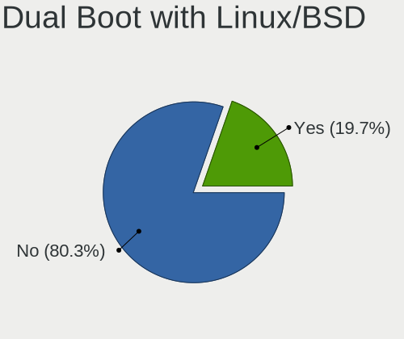
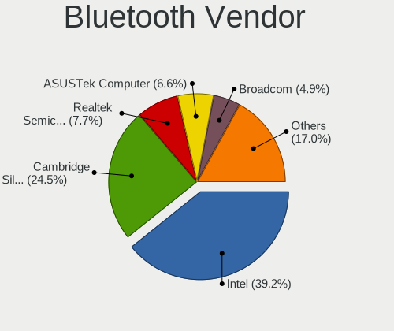

Linux - Tested Hardware & Statistics (Desktops)
-----------------------------------------------

A project to collect tested hardware configurations for Linux.

Anyone can contribute to this report by the [hw-probe](https://github.com/linuxhw/hw-probe) tool:

    sudo -E hw-probe -all -upload

Please contribute! Especially if your hardware is rare.

This report is for real hardware. Report for virtual hardware: [TestDays_VE](https://github.com/linuxhw/TestDays_VE)

Contents
--------

* [ Test Cases ](#test-cases)

* [ System ](#system)
  - [ OS                       ](#os)
  - [ OS Family                ](#os-family)
  - [ Kernel                   ](#kernel)
  - [ Kernel Family            ](#kernel-family)
  - [ Kernel Major Ver.        ](#kernel-major-ver)
  - [ Arch                     ](#arch)
  - [ DE                       ](#de)
  - [ Display Server           ](#display-server)
  - [ Display Manager          ](#display-manager)
  - [ OS Lang                  ](#os-lang)
  - [ Boot Mode                ](#boot-mode)
  - [ Filesystem               ](#filesystem)
  - [ Part. scheme             ](#part-scheme)
  - [ Dual Boot with Linux/BSD ](#dual-boot-with-linuxbsd)
  - [ Dual Boot (Win)          ](#dual-boot-win)

* [ Board ](#board)
  - [ Vendor                   ](#vendor)
  - [ Model                    ](#model)
  - [ Model Family             ](#model-family)
  - [ MFG Year                 ](#mfg-year)
  - [ Form Factor              ](#form-factor)
  - [ Secure Boot              ](#secure-boot)
  - [ Coreboot                 ](#coreboot)
  - [ RAM Size                 ](#ram-size)
  - [ RAM Used                 ](#ram-used)
  - [ Total Drives             ](#total-drives)
  - [ Has CD-ROM               ](#has-cd-rom)
  - [ Has Ethernet             ](#has-ethernet)
  - [ Has WiFi                 ](#has-wifi)
  - [ Has Bluetooth            ](#has-bluetooth)

* [ Location ](#location)
  - [ Country                  ](#country)
  - [ City                     ](#city)

* [ Drives ](#drives)
  - [ Drive Vendor             ](#drive-vendor)
  - [ Drive Model              ](#drive-model)
  - [ HDD Vendor               ](#hdd-vendor)
  - [ SSD Vendor               ](#ssd-vendor)
  - [ Drive Kind               ](#drive-kind)
  - [ Drive Connector          ](#drive-connector)
  - [ Drive Size               ](#drive-size)
  - [ Space Total              ](#space-total)
  - [ Space Used               ](#space-used)
  - [ Malfunc. Drives          ](#malfunc-drives)
  - [ Malfunc. Drive Vendor    ](#malfunc-drive-vendor)
  - [ Malfunc. HDD Vendor      ](#malfunc-hdd-vendor)
  - [ Malfunc. Drive Kind      ](#malfunc-drive-kind)
  - [ Failed Drives            ](#failed-drives)
  - [ Failed Drive Vendor      ](#failed-drive-vendor)
  - [ Drive Status             ](#drive-status)

* [ Storage controller ](#storage-controller)
  - [ Storage Vendor           ](#storage-vendor)
  - [ Storage Model            ](#storage-model)
  - [ Storage Kind             ](#storage-kind)

* [ Processor ](#processor)
  - [ CPU Vendor               ](#cpu-vendor)
  - [ CPU Model                ](#cpu-model)
  - [ CPU Model Family         ](#cpu-model-family)
  - [ CPU Cores                ](#cpu-cores)
  - [ CPU Sockets              ](#cpu-sockets)
  - [ CPU Threads              ](#cpu-threads)
  - [ CPU Op-Modes             ](#cpu-op-modes)
  - [ CPU Microcode            ](#cpu-microcode)
  - [ CPU Microarch            ](#cpu-microarch)

* [ Graphics ](#graphics)
  - [ GPU Vendor               ](#gpu-vendor)
  - [ GPU Model                ](#gpu-model)
  - [ GPU Combo                ](#gpu-combo)
  - [ GPU Driver               ](#gpu-driver)
  - [ GPU Memory               ](#gpu-memory)

* [ Monitor ](#monitor)
  - [ Monitor Vendor           ](#monitor-vendor)
  - [ Monitor Model            ](#monitor-model)
  - [ Monitor Resolution       ](#monitor-resolution)
  - [ Monitor Diagonal         ](#monitor-diagonal)
  - [ Monitor Width            ](#monitor-width)
  - [ Aspect Ratio             ](#aspect-ratio)
  - [ Monitor Area             ](#monitor-area)
  - [ Pixel Density            ](#pixel-density)
  - [ Multiple Monitors        ](#multiple-monitors)

* [ Network ](#network)
  - [ Net Controller Vendor    ](#net-controller-vendor)
  - [ Net Controller Model     ](#net-controller-model)
  - [ Wireless Vendor          ](#wireless-vendor)
  - [ Wireless Model           ](#wireless-model)
  - [ Ethernet Vendor          ](#ethernet-vendor)
  - [ Ethernet Model           ](#ethernet-model)
  - [ Net Controller Kind      ](#net-controller-kind)
  - [ Used Controller          ](#used-controller)
  - [ NICs                     ](#nics)
  - [ IPv6                     ](#ipv6)

* [ Bluetooth ](#bluetooth)
  - [ Bluetooth Vendor         ](#bluetooth-vendor)
  - [ Bluetooth Model          ](#bluetooth-model)

* [ Sound ](#sound)
  - [ Sound Vendor             ](#sound-vendor)
  - [ Sound Model              ](#sound-model)

* [ Memory ](#memory)
  - [ Memory Vendor            ](#memory-vendor)
  - [ Memory Model             ](#memory-model)
  - [ Memory Kind              ](#memory-kind)
  - [ Memory Form Factor       ](#memory-form-factor)
  - [ Memory Size              ](#memory-size)
  - [ Memory Speed             ](#memory-speed)

* [ Printers & scanners ](#printers--scanners)
  - [ Printer Vendor           ](#printer-vendor)
  - [ Printer Model            ](#printer-model)
  - [ Scanner Vendor           ](#scanner-vendor)
  - [ Scanner Model            ](#scanner-model)

* [ Camera ](#camera)
  - [ Camera Vendor            ](#camera-vendor)
  - [ Camera Model             ](#camera-model)

* [ Security ](#security)
  - [ Fingerprint Vendor       ](#fingerprint-vendor)
  - [ Fingerprint Model        ](#fingerprint-model)
  - [ Chipcard Vendor          ](#chipcard-vendor)
  - [ Chipcard Model           ](#chipcard-model)

* [ Unsupported ](#unsupported)
  - [ Unsupported Devices      ](#unsupported-devices)
  - [ Unsupported Device Types ](#unsupported-device-types)

Test Cases
----------

Total: 134563

| Vendor        | Model                       | Probe                                                      | Date         |
|---------------|-----------------------------|------------------------------------------------------------|--------------|
| MSI           | B450-A PRO MAX              | [546e058777](https://linux-hardware.org/?probe=546e058777) | Oct 01, 2023 |
| MSI           | B350M PRO-VD PLUS           | [a8c796cebf](https://linux-hardware.org/?probe=a8c796cebf) | Oct 01, 2023 |
| AZW           | MINI S 10                   | [13e3a733fd](https://linux-hardware.org/?probe=13e3a733fd) | Oct 01, 2023 |
| Colorful T... | BATTLE-AX B365M-D V20       | [f8c7c20100](https://linux-hardware.org/?probe=f8c7c20100) | Oct 01, 2023 |
| HP            | 339A                        | [cd104d3996](https://linux-hardware.org/?probe=cd104d3996) | Oct 01, 2023 |
| HP            | 1494                        | [5250e1dc1c](https://linux-hardware.org/?probe=5250e1dc1c) | Oct 01, 2023 |
| Gigabyte      | 970A-D3                     | [9b47949b87](https://linux-hardware.org/?probe=9b47949b87) | Oct 01, 2023 |
| Gigabyte      | Z390 UD                     | [e470a4941a](https://linux-hardware.org/?probe=e470a4941a) | Oct 01, 2023 |
| HP            | ProLiant MicroServer Gen... | [aeb0b469c8](https://linux-hardware.org/?probe=aeb0b469c8) | Oct 01, 2023 |
| Colorful T... | BATTLE-AX B365M-D V20       | [c118982282](https://linux-hardware.org/?probe=c118982282) | Oct 01, 2023 |
| ASUSTek       | PRIME B365M-A               | [279922964e](https://linux-hardware.org/?probe=279922964e) | Oct 01, 2023 |
| HP            | 0A50h                       | [e2082963e9](https://linux-hardware.org/?probe=e2082963e9) | Oct 01, 2023 |
| Lenovo        | MAHOBAY                     | [9ced54f630](https://linux-hardware.org/?probe=9ced54f630) | Oct 01, 2023 |
| ASUSTek       | PRIME B450M-A               | [1e825c5574](https://linux-hardware.org/?probe=1e825c5574) | Oct 01, 2023 |
| MSI           | Z370-A PRO                  | [7c1fdcfb70](https://linux-hardware.org/?probe=7c1fdcfb70) | Oct 01, 2023 |
| Dell          | 09KPNV A01                  | [38dba6ab76](https://linux-hardware.org/?probe=38dba6ab76) | Oct 01, 2023 |
| HP            | 18E5                        | [1f3e02bd3e](https://linux-hardware.org/?probe=1f3e02bd3e) | Oct 01, 2023 |
| ASUSTek       | PRIME B450-PLUS             | [cd4c3fb654](https://linux-hardware.org/?probe=cd4c3fb654) | Oct 01, 2023 |
| Dell          | 0MN1TX A02                  | [3f0eee5de0](https://linux-hardware.org/?probe=3f0eee5de0) | Oct 01, 2023 |
| Dell          | 0427JK A00                  | [de3ece96cf](https://linux-hardware.org/?probe=de3ece96cf) | Oct 01, 2023 |
| Shenzhen M... | HX90G                       | [a6e9f6c7fc](https://linux-hardware.org/?probe=a6e9f6c7fc) | Oct 01, 2023 |
| MSI           | X99A RAIDER                 | [3e13770075](https://linux-hardware.org/?probe=3e13770075) | Oct 01, 2023 |
| Gigabyte      | Z77X-UD5H                   | [def4633785](https://linux-hardware.org/?probe=def4633785) | Oct 01, 2023 |
| Gigabyte      | 970A-DS3P                   | [5d6115a057](https://linux-hardware.org/?probe=5d6115a057) | Oct 01, 2023 |
| Gigabyte      | D525TUD                     | [913e98318d](https://linux-hardware.org/?probe=913e98318d) | Oct 01, 2023 |
| Gigabyte      | D525TUD                     | [f48a538837](https://linux-hardware.org/?probe=f48a538837) | Oct 01, 2023 |
| Gigabyte      | Z68XP-UD3                   | [98fd6eb7c8](https://linux-hardware.org/?probe=98fd6eb7c8) | Oct 01, 2023 |
| ASUSTek       | B85M-G                      | [0166816d1b](https://linux-hardware.org/?probe=0166816d1b) | Oct 01, 2023 |
| MSI           | X470 GAMING PRO CARBON      | [1448f32279](https://linux-hardware.org/?probe=1448f32279) | Oct 01, 2023 |
| ASRock        | FM2A55M-VG3+                | [6faa4fd636](https://linux-hardware.org/?probe=6faa4fd636) | Oct 01, 2023 |
| Dell          | 0X8DXD A00                  | [a44e0088f6](https://linux-hardware.org/?probe=a44e0088f6) | Oct 01, 2023 |
| ASUSTek       | PRIME H610M-E D4            | [8985b86479](https://linux-hardware.org/?probe=8985b86479) | Oct 01, 2023 |
| Huanan        | X99 F8D V2.2                | [50101ff8ee](https://linux-hardware.org/?probe=50101ff8ee) | Oct 01, 2023 |
| ASUSTek       | Z170-DELUXE                 | [9e04efc2d9](https://linux-hardware.org/?probe=9e04efc2d9) | Oct 01, 2023 |
| ASUSTek       | TUF Gaming Z790-PLUS WIF... | [e0cdb74f25](https://linux-hardware.org/?probe=e0cdb74f25) | Oct 01, 2023 |
| Dell          | 0D24M8 A01                  | [214eb681ad](https://linux-hardware.org/?probe=214eb681ad) | Oct 01, 2023 |
| Gigabyte      | B550M AORUS PRO-P           | [b85781f0d8](https://linux-hardware.org/?probe=b85781f0d8) | Oct 01, 2023 |
| Acer          | H57M01                      | [77fd0bf30a](https://linux-hardware.org/?probe=77fd0bf30a) | Sep 30, 2023 |
| NZXT          | N7 B550                     | [53a99b69e6](https://linux-hardware.org/?probe=53a99b69e6) | Sep 30, 2023 |
| Foxconn       | 2ADA                        | [da117a4e6a](https://linux-hardware.org/?probe=da117a4e6a) | Sep 30, 2023 |
| ASUSTek       | ROG STRIX B450-F GAMING     | [0b4432877e](https://linux-hardware.org/?probe=0b4432877e) | Sep 30, 2023 |
| Gigabyte      | H61M-S2-B3                  | [447e04bd9d](https://linux-hardware.org/?probe=447e04bd9d) | Sep 30, 2023 |
| ASRock        | X570 Taichi                 | [7a670fe0ef](https://linux-hardware.org/?probe=7a670fe0ef) | Sep 30, 2023 |
| Gigabyte      | Z390 UD                     | [864f9a143f](https://linux-hardware.org/?probe=864f9a143f) | Sep 30, 2023 |
| ASRock        | A88M-G                      | [a918b08771](https://linux-hardware.org/?probe=a918b08771) | Sep 30, 2023 |
| Toshiba       | STI 009169                  | [0b76bae8f3](https://linux-hardware.org/?probe=0b76bae8f3) | Sep 30, 2023 |
| Lenovo        | ThinkCentre M55p 8811ZD4    | [710dea5f88](https://linux-hardware.org/?probe=710dea5f88) | Sep 30, 2023 |
| Gigabyte      | H61M-S1                     | [64e8a0bcc2](https://linux-hardware.org/?probe=64e8a0bcc2) | Sep 30, 2023 |
| ASUSTek       | TUF Gaming B660M-PLUS D4    | [f3d279f91b](https://linux-hardware.org/?probe=f3d279f91b) | Sep 30, 2023 |
| ASUSTek       | A55BM-K                     | [532e0b0654](https://linux-hardware.org/?probe=532e0b0654) | Sep 30, 2023 |
| ASRock        | B75 Pro3-M                  | [05c68ef556](https://linux-hardware.org/?probe=05c68ef556) | Sep 30, 2023 |
| ECS           | G31T-M7                     | [0749fa9352](https://linux-hardware.org/?probe=0749fa9352) | Sep 30, 2023 |
| ASRock        | A320M-DGS                   | [63aafe31f1](https://linux-hardware.org/?probe=63aafe31f1) | Sep 30, 2023 |
| ASUSTek       | H110M-R                     | [b8aadf6823](https://linux-hardware.org/?probe=b8aadf6823) | Sep 30, 2023 |
| ASUSTek       | ROG STRIX B550-F GAMING ... | [34e5bf82de](https://linux-hardware.org/?probe=34e5bf82de) | Sep 30, 2023 |
| ASRock        | H61M-DGS R2.0               | [6074f655ad](https://linux-hardware.org/?probe=6074f655ad) | Sep 30, 2023 |
| Shenzhen M... | F7BSC                       | [79b4f4f30e](https://linux-hardware.org/?probe=79b4f4f30e) | Sep 30, 2023 |
| Acer          | Predator G3610              | [cddfa514ba](https://linux-hardware.org/?probe=cddfa514ba) | Sep 30, 2023 |
| ASUSTek       | F2A85-M PRO                 | [79d4084e18](https://linux-hardware.org/?probe=79d4084e18) | Sep 30, 2023 |
| ASUSTek       | P8H77-M PRO                 | [63c99972d1](https://linux-hardware.org/?probe=63c99972d1) | Sep 30, 2023 |
| MSI           | B450-A PRO MAX              | [6ee0910511](https://linux-hardware.org/?probe=6ee0910511) | Sep 30, 2023 |
| ASUSTek       | Z170-A                      | [bee067d5dd](https://linux-hardware.org/?probe=bee067d5dd) | Sep 30, 2023 |
| MSI           | 890FXA-GD70                 | [f9c2509bc6](https://linux-hardware.org/?probe=f9c2509bc6) | Sep 30, 2023 |
| Gigabyte      | G31M-S2L                    | [4f147c1f3a](https://linux-hardware.org/?probe=4f147c1f3a) | Sep 30, 2023 |
| Gigabyte      | G31M-S2L                    | [391af7c221](https://linux-hardware.org/?probe=391af7c221) | Sep 30, 2023 |
| MSI           | PRO B660M-A DDR4            | [a7683dc02d](https://linux-hardware.org/?probe=a7683dc02d) | Sep 30, 2023 |
| Lenovo        | 3106 SDK0J40697 WIN 3305... | [c93af00811](https://linux-hardware.org/?probe=c93af00811) | Sep 30, 2023 |
| Colorful T... | BATTLE-AX B365M-D V20       | [e212af9208](https://linux-hardware.org/?probe=e212af9208) | Sep 30, 2023 |
| ASUSTek       | P5B-E Plus                  | [78c413cac5](https://linux-hardware.org/?probe=78c413cac5) | Sep 30, 2023 |
| ASUSTek       | TUF Gaming B660M-PLUS D4    | [02af70281a](https://linux-hardware.org/?probe=02af70281a) | Sep 30, 2023 |
| Gigabyte      | P31-ES3G                    | [bee14e504c](https://linux-hardware.org/?probe=bee14e504c) | Sep 30, 2023 |
| Dell          | 0Y56T3 A01                  | [bfc1d1dd13](https://linux-hardware.org/?probe=bfc1d1dd13) | Sep 30, 2023 |
| ASUSTek       | TUF Gaming B550M-PLUS       | [288f5f8266](https://linux-hardware.org/?probe=288f5f8266) | Sep 30, 2023 |
| Pegatron      | Eureka3                     | [e5c7ff0c70](https://linux-hardware.org/?probe=e5c7ff0c70) | Sep 30, 2023 |
| ASRock        | 960GM/U3S3 FX               | [e2175cc32b](https://linux-hardware.org/?probe=e2175cc32b) | Sep 30, 2023 |
| Gigabyte      | A320M-S2H-CF                | [a8bea5ed82](https://linux-hardware.org/?probe=a8bea5ed82) | Sep 30, 2023 |
| Dell          | 0YXT71 A02                  | [6bc3385414](https://linux-hardware.org/?probe=6bc3385414) | Sep 30, 2023 |
| ASUSTek       | P8H61-M LX2                 | [b2a213cc18](https://linux-hardware.org/?probe=b2a213cc18) | Sep 30, 2023 |
| Gigabyte      | Z87X-UD3H-CF                | [7f47d1f656](https://linux-hardware.org/?probe=7f47d1f656) | Sep 30, 2023 |
| MSI           | B550M PRO-VDH WIFI          | [bc2e88dd9c](https://linux-hardware.org/?probe=bc2e88dd9c) | Sep 30, 2023 |
| Dell          | 0V8WGR A02                  | [9c9ded765b](https://linux-hardware.org/?probe=9c9ded765b) | Sep 30, 2023 |
| MSI           | MPG Z390M GAMING EDGE AC    | [04432690a4](https://linux-hardware.org/?probe=04432690a4) | Sep 30, 2023 |
| Dell          | 0P301D A00                  | [99587baa3d](https://linux-hardware.org/?probe=99587baa3d) | Sep 30, 2023 |
| Medion        | B660M DS3H AX DDR4          | [1dbbeda8cd](https://linux-hardware.org/?probe=1dbbeda8cd) | Sep 30, 2023 |
| Medion        | MS-7667                     | [a91527e825](https://linux-hardware.org/?probe=a91527e825) | Sep 30, 2023 |
| Medion        | B660M DS3H AX DDR4          | [57a42b9ccf](https://linux-hardware.org/?probe=57a42b9ccf) | Sep 30, 2023 |
| AZW           | MINI S 10                   | [e065b9c701](https://linux-hardware.org/?probe=e065b9c701) | Sep 30, 2023 |
| ASUSTek       | CG8480                      | [dc174e8f73](https://linux-hardware.org/?probe=dc174e8f73) | Sep 30, 2023 |
| Dell          | 0Y958C A00                  | [95bf9d14db](https://linux-hardware.org/?probe=95bf9d14db) | Sep 30, 2023 |
| Gigabyte      | X399 DESIGNARE EX-CF        | [4835df59b1](https://linux-hardware.org/?probe=4835df59b1) | Sep 30, 2023 |
| Gigabyte      | X99-UD3-CF                  | [f1cc7e5a93](https://linux-hardware.org/?probe=f1cc7e5a93) | Sep 30, 2023 |
| Intel         | DG33SXG2 AAD94468-500       | [99fe490330](https://linux-hardware.org/?probe=99fe490330) | Sep 30, 2023 |
| Lenovo        | ThinkCentre M58e 7514A2U    | [68f162bf42](https://linux-hardware.org/?probe=68f162bf42) | Sep 30, 2023 |
| Gigabyte      | X99-UD3-CF                  | [51d10770c6](https://linux-hardware.org/?probe=51d10770c6) | Sep 30, 2023 |
| MP            | MS-7848                     | [63d5662351](https://linux-hardware.org/?probe=63d5662351) | Sep 30, 2023 |
| Fujitsu       | D3401-A1 S26361-D3401-A1    | [5d41b45d45](https://linux-hardware.org/?probe=5d41b45d45) | Sep 30, 2023 |
| ASUSTek       | ROG STRIX Z690-E GAMING ... | [e26d1b1ae4](https://linux-hardware.org/?probe=e26d1b1ae4) | Sep 30, 2023 |
| Gigabyte      | Z790 AORUS ELITE AX         | [9a749a1c41](https://linux-hardware.org/?probe=9a749a1c41) | Sep 30, 2023 |
| MSI           | B550M PRO-VDH WIFI          | [770e7037d3](https://linux-hardware.org/?probe=770e7037d3) | Sep 30, 2023 |
| Gigabyte      | Z790 AORUS ELITE AX         | [452cd2622a](https://linux-hardware.org/?probe=452cd2622a) | Sep 30, 2023 |
| MSI           | MAG X570S TOMAHAWK MAX W... | [813b0bcb38](https://linux-hardware.org/?probe=813b0bcb38) | Sep 30, 2023 |
| ASUSTek       | ROG STRIX Z590-E GAMING ... | [3d40d7878a](https://linux-hardware.org/?probe=3d40d7878a) | Sep 30, 2023 |
| Gigabyte      | GA-870A-UD3                 | [5a507ec4da](https://linux-hardware.org/?probe=5a507ec4da) | Sep 30, 2023 |
| Unknown       | Phitronics N68C-M           | [72b5c903d3](https://linux-hardware.org/?probe=72b5c903d3) | Sep 30, 2023 |
| MSI           | X99A RAIDER                 | [a36938e994](https://linux-hardware.org/?probe=a36938e994) | Sep 30, 2023 |
| MSI           | P67A-C43                    | [22492f6d47](https://linux-hardware.org/?probe=22492f6d47) | Sep 30, 2023 |
| Dell          | 0YJPT1 A00                  | [27b01f468d](https://linux-hardware.org/?probe=27b01f468d) | Sep 30, 2023 |
| HP            | 8055                        | [3ddf31c78e](https://linux-hardware.org/?probe=3ddf31c78e) | Sep 30, 2023 |
| ASRock        | A300M-STX                   | [d8c97108ad](https://linux-hardware.org/?probe=d8c97108ad) | Sep 30, 2023 |
| ASUSTek       | TUF Gaming B550-PLUS        | [3bec9011bd](https://linux-hardware.org/?probe=3bec9011bd) | Sep 30, 2023 |
| Gigabyte      | B550M AORUS ELITE           | [74bed86ee5](https://linux-hardware.org/?probe=74bed86ee5) | Sep 30, 2023 |
| MSI           | MPG Z390 GAMING EDGE AC     | [5705bf79ad](https://linux-hardware.org/?probe=5705bf79ad) | Sep 30, 2023 |
| Acer          | H57M01                      | [d506730eed](https://linux-hardware.org/?probe=d506730eed) | Sep 30, 2023 |
| Fujitsu       | D3401-A1 S26361-D3401-A1    | [65643e78ef](https://linux-hardware.org/?probe=65643e78ef) | Sep 30, 2023 |
| Google        | Jerry                       | [467be71aaf](https://linux-hardware.org/?probe=467be71aaf) | Sep 30, 2023 |
| ASRock        | 4Core1600-GLAN              | [aefbc14017](https://linux-hardware.org/?probe=aefbc14017) | Sep 30, 2023 |
| ASRock        | A300M-STX                   | [bcbf0e5bfd](https://linux-hardware.org/?probe=bcbf0e5bfd) | Sep 30, 2023 |
| ASUSTek       | P8Z77-V LX                  | [186991da49](https://linux-hardware.org/?probe=186991da49) | Sep 29, 2023 |
| Gigabyte      | 970A-DS3P                   | [145f7eccd3](https://linux-hardware.org/?probe=145f7eccd3) | Sep 29, 2023 |
| Pegatron      | 2AB6                        | [4bb43a39c1](https://linux-hardware.org/?probe=4bb43a39c1) | Sep 29, 2023 |
| ASUSTek       | P8Z77-V LX                  | [a318f83948](https://linux-hardware.org/?probe=a318f83948) | Sep 29, 2023 |
| ASUSTek       | PRIME B450M-A               | [3c9f4d4aef](https://linux-hardware.org/?probe=3c9f4d4aef) | Sep 29, 2023 |
| ASUSTek       | P5B                         | [cb521fc290](https://linux-hardware.org/?probe=cb521fc290) | Sep 29, 2023 |
| Dell          | 0Y2K8N A01                  | [46ac9f9904](https://linux-hardware.org/?probe=46ac9f9904) | Sep 29, 2023 |
| Intel         | H61                         | [f6a417439c](https://linux-hardware.org/?probe=f6a417439c) | Sep 29, 2023 |
| HP            | 8054                        | [20f337b1e7](https://linux-hardware.org/?probe=20f337b1e7) | Sep 29, 2023 |
| ASRock        | B450M Pro4 R2.0             | [8e039e23f3](https://linux-hardware.org/?probe=8e039e23f3) | Sep 29, 2023 |
| ASUSTek       | P8H61-M LX2                 | [60e32143f5](https://linux-hardware.org/?probe=60e32143f5) | Sep 29, 2023 |
| Intel         | H61                         | [e7dac2f9ed](https://linux-hardware.org/?probe=e7dac2f9ed) | Sep 29, 2023 |
| Foxconn       | 2AB1                        | [28ef0f3fbc](https://linux-hardware.org/?probe=28ef0f3fbc) | Sep 29, 2023 |
| ASUSTek       | M5A99X EVO R2.0             | [074ab86d60](https://linux-hardware.org/?probe=074ab86d60) | Sep 29, 2023 |
| ASUSTek       | STRIX Z270E GAMING          | [caa5ce0b99](https://linux-hardware.org/?probe=caa5ce0b99) | Sep 29, 2023 |
| Lenovo        | 0B98401 PRO                 | [17bb772d78](https://linux-hardware.org/?probe=17bb772d78) | Sep 29, 2023 |
| 3Logic Gro... | DMB-H510-MCA01              | [7cc521d927](https://linux-hardware.org/?probe=7cc521d927) | Sep 29, 2023 |
| 3Logic Gro... | DMB-H510-MCA01              | [b952cdd71d](https://linux-hardware.org/?probe=b952cdd71d) | Sep 29, 2023 |
| Acer          | H57M01                      | [ad7b1bf379](https://linux-hardware.org/?probe=ad7b1bf379) | Sep 29, 2023 |
| ASUSTek       | TUF B450M-PRO GAMING        | [b34539564f](https://linux-hardware.org/?probe=b34539564f) | Sep 29, 2023 |
| ASRock        | B550M Phantom Gaming 4      | [e0158c541c](https://linux-hardware.org/?probe=e0158c541c) | Sep 29, 2023 |
| Acer          | Nitro N50-610               | [a91f602e4a](https://linux-hardware.org/?probe=a91f602e4a) | Sep 29, 2023 |
| MSI           | PRO B660M-A DDR4            | [4b5a46a1e2](https://linux-hardware.org/?probe=4b5a46a1e2) | Sep 29, 2023 |
| Intel         | D33217CK G76541-302         | [d1aab6a8d0](https://linux-hardware.org/?probe=d1aab6a8d0) | Sep 29, 2023 |
| Gigabyte      | B450M DS3H-CF               | [3473652871](https://linux-hardware.org/?probe=3473652871) | Sep 29, 2023 |
| Apple         | Mac-F221BEC8                | [7b4a0099a9](https://linux-hardware.org/?probe=7b4a0099a9) | Sep 29, 2023 |
| ASRock        | Z490 Phantom Gaming 4       | [6fc3fe7a63](https://linux-hardware.org/?probe=6fc3fe7a63) | Sep 29, 2023 |
| ASRock        | H81M-HG4                    | [7f2a420ea3](https://linux-hardware.org/?probe=7f2a420ea3) | Sep 29, 2023 |
| Dell          | 0PRR48 A00                  | [52fd06666a](https://linux-hardware.org/?probe=52fd06666a) | Sep 29, 2023 |
| Intel         | B75                         | [a30fa8031b](https://linux-hardware.org/?probe=a30fa8031b) | Sep 29, 2023 |
| MSI           | B560M PRO                   | [1dc06a927c](https://linux-hardware.org/?probe=1dc06a927c) | Sep 29, 2023 |
| Shenzhen M... | F7BAA                       | [30268d41d2](https://linux-hardware.org/?probe=30268d41d2) | Sep 29, 2023 |
| Dell          | 0J3C2F A00                  | [0536b81a43](https://linux-hardware.org/?probe=0536b81a43) | Sep 29, 2023 |
| MSI           | Z68A-GD65                   | [c0f968740b](https://linux-hardware.org/?probe=c0f968740b) | Sep 29, 2023 |
| MSI           | H97 GAMING 3                | [51f3cd7354](https://linux-hardware.org/?probe=51f3cd7354) | Sep 29, 2023 |
| MSI           | MPG Z390 GAMING PLUS        | [c602f8fba9](https://linux-hardware.org/?probe=c602f8fba9) | Sep 29, 2023 |
| ASUSTek       | ROG STRIX B550-F GAMING ... | [6177caee37](https://linux-hardware.org/?probe=6177caee37) | Sep 29, 2023 |
| HP            | 1790                        | [b87e9dd9ad](https://linux-hardware.org/?probe=b87e9dd9ad) | Sep 29, 2023 |
| HP            | 1790                        | [89791e7bf0](https://linux-hardware.org/?probe=89791e7bf0) | Sep 29, 2023 |
| MSI           | MAG B650 TOMAHAWK WIFI      | [f79a27e406](https://linux-hardware.org/?probe=f79a27e406) | Sep 29, 2023 |
| HP            | 3398                        | [13aa132a7d](https://linux-hardware.org/?probe=13aa132a7d) | Sep 29, 2023 |
| ASUSTek       | PRIME Z270-A                | [725f1e5b25](https://linux-hardware.org/?probe=725f1e5b25) | Sep 29, 2023 |
| MSI           | MAG B550M MORTAR            | [ed0e5eee5a](https://linux-hardware.org/?probe=ed0e5eee5a) | Sep 29, 2023 |
| ANGXUN        | X99-DM3 V3.0                | [1a7ed0ba7d](https://linux-hardware.org/?probe=1a7ed0ba7d) | Sep 29, 2023 |
| Gigabyte      | H97-D3H-CF                  | [c0c34400ad](https://linux-hardware.org/?probe=c0c34400ad) | Sep 29, 2023 |
| GEEKOM        | Mini IT 8                   | [fc5d6092da](https://linux-hardware.org/?probe=fc5d6092da) | Sep 29, 2023 |
| Unknown       | TB-5000                     | [9c67baa34f](https://linux-hardware.org/?probe=9c67baa34f) | Sep 29, 2023 |
| ASUSTek       | H81M-K                      | [16dabb2f6e](https://linux-hardware.org/?probe=16dabb2f6e) | Sep 29, 2023 |
| Gigabyte      | X570 AORUS ELITE            | [d0fea1d86b](https://linux-hardware.org/?probe=d0fea1d86b) | Sep 29, 2023 |
| WesternDig... | BBC 0001                    | [b31e10d01b](https://linux-hardware.org/?probe=b31e10d01b) | Sep 29, 2023 |
| WesternDig... | BBC 0001                    | [ba340393f7](https://linux-hardware.org/?probe=ba340393f7) | Sep 29, 2023 |
| MSI           | B560M PRO                   | [ce2f5b7349](https://linux-hardware.org/?probe=ce2f5b7349) | Sep 29, 2023 |
| HP            | 198E                        | [a311728a5f](https://linux-hardware.org/?probe=a311728a5f) | Sep 29, 2023 |
| ASUSTek       | ROG STRIX Z790-A GAMING ... | [a5467c367d](https://linux-hardware.org/?probe=a5467c367d) | Sep 29, 2023 |
| Gigabyte      | Z390 AORUS PRO WIFI-CF      | [8724efb686](https://linux-hardware.org/?probe=8724efb686) | Sep 29, 2023 |
| Gigabyte      | Z390 AORUS PRO WIFI-CF      | [76fc0d8239](https://linux-hardware.org/?probe=76fc0d8239) | Sep 29, 2023 |
| ASUSTek       | PRIME B450M-A II            | [0e4e90fac1](https://linux-hardware.org/?probe=0e4e90fac1) | Sep 29, 2023 |
| Lenovo        | 312A SDK0J40697 WIN 3305... | [7c8b825512](https://linux-hardware.org/?probe=7c8b825512) | Sep 29, 2023 |
| MSI           | A320M-A PRO MAX             | [4aa521a31f](https://linux-hardware.org/?probe=4aa521a31f) | Sep 29, 2023 |
| ASUSTek       | TUF Gaming X570-PLUS        | [6f07d7c834](https://linux-hardware.org/?probe=6f07d7c834) | Sep 29, 2023 |
| Intel         | H110D4-P1                   | [ccedaaab02](https://linux-hardware.org/?probe=ccedaaab02) | Sep 29, 2023 |
| ASRock        | H510M-HVS R2.0              | [f50b0e51d3](https://linux-hardware.org/?probe=f50b0e51d3) | Sep 29, 2023 |
| Foxconn       | 2ADA                        | [0c29af254c](https://linux-hardware.org/?probe=0c29af254c) | Sep 29, 2023 |
| ASUSTek       | PRIME X370-PRO              | [6d725a3ede](https://linux-hardware.org/?probe=6d725a3ede) | Sep 29, 2023 |
| ASUSTek       | M5A97 R2.0                  | [2c2f49b6bf](https://linux-hardware.org/?probe=2c2f49b6bf) | Sep 29, 2023 |
| HP            | 1589                        | [c42e75cdd8](https://linux-hardware.org/?probe=c42e75cdd8) | Sep 29, 2023 |
| Lenovo        | 1031 SBB0J05441 WIN 3305... | [26580dc672](https://linux-hardware.org/?probe=26580dc672) | Sep 29, 2023 |
| Gigabyte      | GA-MA780G-UD3H              | [9b86a89bf4](https://linux-hardware.org/?probe=9b86a89bf4) | Sep 29, 2023 |
| Pegatron      | Benicia                     | [840b02e356](https://linux-hardware.org/?probe=840b02e356) | Sep 29, 2023 |
| Lenovo        | SHARKBAY SDK0E50510 WIN     | [60c04875f1](https://linux-hardware.org/?probe=60c04875f1) | Sep 29, 2023 |
| ASUSTek       | EB1501P                     | [df48fa7e96](https://linux-hardware.org/?probe=df48fa7e96) | Sep 29, 2023 |
| Positivo      | POS-PIH81DI                 | [0e67f3a0f3](https://linux-hardware.org/?probe=0e67f3a0f3) | Sep 29, 2023 |
| ASUSTek       | ROG STRIX B550-A GAMING     | [cce7c03059](https://linux-hardware.org/?probe=cce7c03059) | Sep 29, 2023 |
| ASUSTek       | PRIME X570-PRO              | [74ec125e88](https://linux-hardware.org/?probe=74ec125e88) | Sep 29, 2023 |
| ASUSTek       | P8H61-MX USB3               | [5d1175b3f3](https://linux-hardware.org/?probe=5d1175b3f3) | Sep 28, 2023 |
| ASUSTek       | H81M-E                      | [0137140cae](https://linux-hardware.org/?probe=0137140cae) | Sep 28, 2023 |
| ASUSTek       | PRIME X570-PRO              | [cc8c6efba3](https://linux-hardware.org/?probe=cc8c6efba3) | Sep 28, 2023 |
| MSI           | B450M PRO-M2 MAX            | [da030ed703](https://linux-hardware.org/?probe=da030ed703) | Sep 28, 2023 |
| ASUSTek       | ROG STRIX X670E-F GAMING... | [5c38fe5e79](https://linux-hardware.org/?probe=5c38fe5e79) | Sep 28, 2023 |
| ASUSTek       | ROG STRIX Z690-A GAMING ... | [0177e96165](https://linux-hardware.org/?probe=0177e96165) | Sep 28, 2023 |
| ASUSTek       | PRIME B450M-A               | [6bce0e41d9](https://linux-hardware.org/?probe=6bce0e41d9) | Sep 28, 2023 |
| MSI           | H97M-G43                    | [b74346acb3](https://linux-hardware.org/?probe=b74346acb3) | Sep 28, 2023 |
| Gigabyte      | B150M-D3V-CF                | [75b228c5fb](https://linux-hardware.org/?probe=75b228c5fb) | Sep 28, 2023 |
| Dell          | 0J3C2F A00                  | [451d8ac4ca](https://linux-hardware.org/?probe=451d8ac4ca) | Sep 28, 2023 |
| HP            | 8619                        | [d631850d2f](https://linux-hardware.org/?probe=d631850d2f) | Sep 28, 2023 |
| Pegatron      | JESSE                       | [3f6cf71237](https://linux-hardware.org/?probe=3f6cf71237) | Sep 28, 2023 |
| ASUSTek       | X99-DELUXE                  | [c608038795](https://linux-hardware.org/?probe=c608038795) | Sep 28, 2023 |
| MSI           | B450M BAZOOKA V2            | [c815d636ce](https://linux-hardware.org/?probe=c815d636ce) | Sep 28, 2023 |
| MSI           | MPG B550 GAMING PLUS        | [8f35ffb248](https://linux-hardware.org/?probe=8f35ffb248) | Sep 28, 2023 |
| ASUSTek       | ROG STRIX Z790-E GAMING ... | [0577874fd5](https://linux-hardware.org/?probe=0577874fd5) | Sep 28, 2023 |
| Dell          | 0YJPT1 A00                  | [a0a41d401e](https://linux-hardware.org/?probe=a0a41d401e) | Sep 28, 2023 |
| MSI           | H310M PRO-VD                | [67e14c1b2d](https://linux-hardware.org/?probe=67e14c1b2d) | Sep 28, 2023 |
| HP            | 3397                        | [5c1b3bed0b](https://linux-hardware.org/?probe=5c1b3bed0b) | Sep 28, 2023 |
| Fujitsu       | D3222-A1 S26361-D3222-A1    | [a40dc4964e](https://linux-hardware.org/?probe=a40dc4964e) | Sep 28, 2023 |
| HP            | 0AA8h                       | [7c8c8fbb40](https://linux-hardware.org/?probe=7c8c8fbb40) | Sep 28, 2023 |
| ASUSTek       | P7P55 LX                    | [6e4c4376c5](https://linux-hardware.org/?probe=6e4c4376c5) | Sep 28, 2023 |
| MSI           | A520M-A PRO                 | [27d7959e57](https://linux-hardware.org/?probe=27d7959e57) | Sep 28, 2023 |
| AZW           | SER V1                      | [10660522cb](https://linux-hardware.org/?probe=10660522cb) | Sep 28, 2023 |
| Biostar       | B450MH                      | [e932e22b99](https://linux-hardware.org/?probe=e932e22b99) | Sep 28, 2023 |
| Gigabyte      | Q87M-D2H                    | [1d749b29ad](https://linux-hardware.org/?probe=1d749b29ad) | Sep 28, 2023 |
| Gigabyte      | B360M DS3H                  | [1308430981](https://linux-hardware.org/?probe=1308430981) | Sep 28, 2023 |
| Lenovo        | H410                        | [f49a6ce32f](https://linux-hardware.org/?probe=f49a6ce32f) | Sep 28, 2023 |
| ASUSTek       | Z97-A-USB31                 | [b7e5fb069c](https://linux-hardware.org/?probe=b7e5fb069c) | Sep 28, 2023 |
| ASUSTek       | M2N-E SLI                   | [2a5937c5e5](https://linux-hardware.org/?probe=2a5937c5e5) | Sep 28, 2023 |
| Unknown       | Unknown                     | [995b6fba4d](https://linux-hardware.org/?probe=995b6fba4d) | Sep 28, 2023 |
| ASUSTek       | PRIME B365M-A               | [76937ddbce](https://linux-hardware.org/?probe=76937ddbce) | Sep 28, 2023 |
| Dell          | 0XC7MM A01                  | [9fdfc5a13f](https://linux-hardware.org/?probe=9fdfc5a13f) | Sep 28, 2023 |
| MSI           | B550M PRO-VDH WIFI          | [ce357bee14](https://linux-hardware.org/?probe=ce357bee14) | Sep 28, 2023 |
| Lenovo        | NOK                         | [95ba956749](https://linux-hardware.org/?probe=95ba956749) | Sep 28, 2023 |
| HP            | 843C                        | [4af4a9e798](https://linux-hardware.org/?probe=4af4a9e798) | Sep 28, 2023 |
| Gigabyte      | EX58-EXTREME                | [4a1a75d0e3](https://linux-hardware.org/?probe=4a1a75d0e3) | Sep 28, 2023 |
| MACHINIST     | X99-RS9 V2.0                | [51272b2713](https://linux-hardware.org/?probe=51272b2713) | Sep 28, 2023 |
| GMKtec        | NucBox3                     | [c99750febd](https://linux-hardware.org/?probe=c99750febd) | Sep 28, 2023 |
| ASRock        | A520M Pro4                  | [5a7da2e0de](https://linux-hardware.org/?probe=5a7da2e0de) | Sep 28, 2023 |
| Gigabyte      | H110M-S2H-CF                | [3513d5bcf3](https://linux-hardware.org/?probe=3513d5bcf3) | Sep 28, 2023 |
| HP            | 2B35                        | [2f63f14724](https://linux-hardware.org/?probe=2f63f14724) | Sep 28, 2023 |
| Gigabyte      | EX58-EXTREME                | [bc2a9ecc6a](https://linux-hardware.org/?probe=bc2a9ecc6a) | Sep 28, 2023 |
| HP            | 1496                        | [3867e7af58](https://linux-hardware.org/?probe=3867e7af58) | Sep 28, 2023 |
| ASUSTek       | TUF Gaming X570-PLUS_BR     | [ce3a9f8960](https://linux-hardware.org/?probe=ce3a9f8960) | Sep 28, 2023 |
| ASUSTek       | P8H61-MX USB3               | [31fe0087b8](https://linux-hardware.org/?probe=31fe0087b8) | Sep 28, 2023 |
| ASRock        | B550M Pro4                  | [a355202f8a](https://linux-hardware.org/?probe=a355202f8a) | Sep 28, 2023 |
| Wistron       | ProLiant ML110 G6           | [4284ef7737](https://linux-hardware.org/?probe=4284ef7737) | Sep 28, 2023 |
| Acer          | Aspire TC-885 V:1.1         | [7aef46e946](https://linux-hardware.org/?probe=7aef46e946) | Sep 28, 2023 |
| Huanan        | X99-F8 GAMING V5.0          | [62ba806672](https://linux-hardware.org/?probe=62ba806672) | Sep 28, 2023 |
| MACHINIST     | X99-RS9 V2.0                | [1509f60079](https://linux-hardware.org/?probe=1509f60079) | Sep 28, 2023 |
| Wistron       | ProLiant ML110 G6           | [6282804553](https://linux-hardware.org/?probe=6282804553) | Sep 28, 2023 |
| Intel         | H61                         | [f41171114f](https://linux-hardware.org/?probe=f41171114f) | Sep 28, 2023 |
| Fujitsu       | D3041-A1 S26361-D3041-A1    | [013801fc61](https://linux-hardware.org/?probe=013801fc61) | Sep 28, 2023 |
| ASUSTek       | PRIME X470-PRO              | [1f420db3fd](https://linux-hardware.org/?probe=1f420db3fd) | Sep 28, 2023 |
| Dell          | 00V62H A01                  | [f46006f6ce](https://linux-hardware.org/?probe=f46006f6ce) | Sep 28, 2023 |
| ASUSTek       | PRIME B560M-K               | [ee02fff8df](https://linux-hardware.org/?probe=ee02fff8df) | Sep 28, 2023 |
| ASRock        | B450 Pro4 R2.0              | [82562e75c3](https://linux-hardware.org/?probe=82562e75c3) | Sep 28, 2023 |
| Lenovo        | ThinkServer TS140           | [0e08685628](https://linux-hardware.org/?probe=0e08685628) | Sep 28, 2023 |
| ASUSTek       | ROG STRIX Z790-E GAMING ... | [130796560f](https://linux-hardware.org/?probe=130796560f) | Sep 28, 2023 |
| Unknown       | Unknown                     | [a329c5630e](https://linux-hardware.org/?probe=a329c5630e) | Sep 28, 2023 |
| Gigabyte      | 970A-DS3P FX                | [627751c21a](https://linux-hardware.org/?probe=627751c21a) | Sep 28, 2023 |
| ASUSTek       | P8H77-V                     | [24ff983f95](https://linux-hardware.org/?probe=24ff983f95) | Sep 28, 2023 |
| ASRock        | Z370 Pro4                   | [a70543ae67](https://linux-hardware.org/?probe=a70543ae67) | Sep 28, 2023 |
| Fujitsu       | D3222-A1 S26361-D3222-A1    | [a1ef1eb6e6](https://linux-hardware.org/?probe=a1ef1eb6e6) | Sep 28, 2023 |
| MSI           | B450 TOMAHAWK               | [e7b135256f](https://linux-hardware.org/?probe=e7b135256f) | Sep 28, 2023 |
| ASUSTek       | PRIME X370-PRO              | [872af2bc77](https://linux-hardware.org/?probe=872af2bc77) | Sep 28, 2023 |
| ASUSTek       | ROG STRIX X570-F GAMING     | [5dbe8e1541](https://linux-hardware.org/?probe=5dbe8e1541) | Sep 28, 2023 |
| ASRock        | A520M-HDV                   | [d19f334f02](https://linux-hardware.org/?probe=d19f334f02) | Sep 28, 2023 |
| ASUSTek       | TUF Gaming B450-PLUS II     | [1f3c152dc3](https://linux-hardware.org/?probe=1f3c152dc3) | Sep 28, 2023 |
| Gigabyte      | F2A88X-D3H                  | [13e1dcb2be](https://linux-hardware.org/?probe=13e1dcb2be) | Sep 28, 2023 |
| Gigabyte      | H410M H V3                  | [3a08b7188c](https://linux-hardware.org/?probe=3a08b7188c) | Sep 28, 2023 |
| HP            | 8265                        | [2ae07c2008](https://linux-hardware.org/?probe=2ae07c2008) | Sep 28, 2023 |
| Loongson      | LS3A6000-7A2000-1w-EVB-V... | [89d08f5ea8](https://linux-hardware.org/?probe=89d08f5ea8) | Sep 28, 2023 |
| Loongson      | LS3A6000-7A2000-1w-EVB-V... | [576c14796a](https://linux-hardware.org/?probe=576c14796a) | Sep 28, 2023 |
| ASUSTek       | ROG STRIX Z590-E GAMING ... | [797275028d](https://linux-hardware.org/?probe=797275028d) | Sep 28, 2023 |
| Intel         | X99H                        | [d5390cf599](https://linux-hardware.org/?probe=d5390cf599) | Sep 28, 2023 |
| Shenzhen M... | F7BAA                       | [a59f2cf9f2](https://linux-hardware.org/?probe=a59f2cf9f2) | Sep 28, 2023 |
| MSI           | PRO Z690-A WIFI             | [2ede90f6eb](https://linux-hardware.org/?probe=2ede90f6eb) | Sep 28, 2023 |
| Gigabyte      | B560M AORUS PRO AX          | [2e3d19e919](https://linux-hardware.org/?probe=2e3d19e919) | Sep 28, 2023 |
| Lenovo        | ThinkCentre M57 6075Y3W     | [8e39080ed3](https://linux-hardware.org/?probe=8e39080ed3) | Sep 28, 2023 |
| Pegatron      | IPMSB-H61                   | [d0e64d2ebf](https://linux-hardware.org/?probe=d0e64d2ebf) | Sep 28, 2023 |
| Gigabyte      | C1037UN-EU                  | [3a4cc5469a](https://linux-hardware.org/?probe=3a4cc5469a) | Sep 28, 2023 |
| Gigabyte      | H610M H DDR4                | [c09e747a85](https://linux-hardware.org/?probe=c09e747a85) | Sep 27, 2023 |
| MSI           | Z97-G45 GAMING              | [19c07d0fca](https://linux-hardware.org/?probe=19c07d0fca) | Sep 27, 2023 |
| Gigabyte      | C1037UN-EU                  | [1c2d4da0c6](https://linux-hardware.org/?probe=1c2d4da0c6) | Sep 27, 2023 |
| Gigabyte      | Z390 AORUS MASTER-CF        | [1458dfe403](https://linux-hardware.org/?probe=1458dfe403) | Sep 27, 2023 |
| Gigabyte      | H610M S2H DDR4              | [9d767beb12](https://linux-hardware.org/?probe=9d767beb12) | Sep 27, 2023 |
| ASUSTek       | ROG STRIX X670E-E GAMING... | [47a0a8627c](https://linux-hardware.org/?probe=47a0a8627c) | Sep 27, 2023 |
| Positivo      | POS-RIH470EM 11179450       | [cf8e3e73bb](https://linux-hardware.org/?probe=cf8e3e73bb) | Sep 27, 2023 |
| MiTAC         | PD10EHI                     | [29716ecb18](https://linux-hardware.org/?probe=29716ecb18) | Sep 27, 2023 |
| ASUSTek       | ROG STRIX B550-A GAMING     | [7ed50e5e43](https://linux-hardware.org/?probe=7ed50e5e43) | Sep 27, 2023 |
| ASUSTek       | P8H61-MX R2.0               | [cfc3a037ed](https://linux-hardware.org/?probe=cfc3a037ed) | Sep 27, 2023 |
| Huanan        | X99-BD4 V1.34, NALEX        | [493d23b3f0](https://linux-hardware.org/?probe=493d23b3f0) | Sep 27, 2023 |
| Acer          | Aspire TC-885 V:1.1         | [a1a8055117](https://linux-hardware.org/?probe=a1a8055117) | Sep 27, 2023 |
| MSI           | MPG Z490M GAMING EDGE WI... | [23150c5bd3](https://linux-hardware.org/?probe=23150c5bd3) | Sep 27, 2023 |
| ASUSTek       | P5QD TURBO                  | [9e8a75e698](https://linux-hardware.org/?probe=9e8a75e698) | Sep 27, 2023 |
| ASUSTek       | PRIME B360M-A               | [7943462da1](https://linux-hardware.org/?probe=7943462da1) | Sep 27, 2023 |
| Gigabyte      | X570 AORUS PRO WIFI         | [e15856c8f1](https://linux-hardware.org/?probe=e15856c8f1) | Sep 27, 2023 |
| Gigabyte      | B550 AORUS ELITE AX V2      | [7cfa1007ee](https://linux-hardware.org/?probe=7cfa1007ee) | Sep 27, 2023 |
| ASUSTek       | D700MD                      | [91740e63b9](https://linux-hardware.org/?probe=91740e63b9) | Sep 27, 2023 |
| Dell          | 0JP3NX A01                  | [d14bc5c139](https://linux-hardware.org/?probe=d14bc5c139) | Sep 27, 2023 |
| MSI           | Z97 PC Mate                 | [15a7321226](https://linux-hardware.org/?probe=15a7321226) | Sep 27, 2023 |
| ASUSTek       | Pro WS WRX80E-SAGE SE WI... | [7ab6fc6901](https://linux-hardware.org/?probe=7ab6fc6901) | Sep 27, 2023 |
| HP            | 8594                        | [374067df48](https://linux-hardware.org/?probe=374067df48) | Sep 27, 2023 |
| MSI           | Z97 PC Mate                 | [18bf7cff74](https://linux-hardware.org/?probe=18bf7cff74) | Sep 27, 2023 |
| ASUSTek       | M3A78-CM                    | [4ef9eaaaba](https://linux-hardware.org/?probe=4ef9eaaaba) | Sep 27, 2023 |
| ASUSTek       | PRIME X370-PRO              | [e5cd50e4ea](https://linux-hardware.org/?probe=e5cd50e4ea) | Sep 27, 2023 |
| ASUSTek       | PRIME B350-PLUS             | [546df5b57f](https://linux-hardware.org/?probe=546df5b57f) | Sep 27, 2023 |
| ASUSTek       | PRIME B350-PLUS             | [503570ad7a](https://linux-hardware.org/?probe=503570ad7a) | Sep 27, 2023 |
| Unknown       | Unknown                     | [cb12d6c853](https://linux-hardware.org/?probe=cb12d6c853) | Sep 27, 2023 |
| HP            | 2ADE                        | [b701a5c589](https://linux-hardware.org/?probe=b701a5c589) | Sep 27, 2023 |
| MSI           | Z77A-S01                    | [277586f152](https://linux-hardware.org/?probe=277586f152) | Sep 27, 2023 |
| ASUSTek       | M5A78L-M PLUS/USB3          | [f47347fb9b](https://linux-hardware.org/?probe=f47347fb9b) | Sep 27, 2023 |
| Lenovo        | 3102 SDK0J40697 WIN 3305... | [1d8c54163d](https://linux-hardware.org/?probe=1d8c54163d) | Sep 27, 2023 |
| ASUSTek       | ROG CROSSHAIR X670E HERO    | [41f0f8666c](https://linux-hardware.org/?probe=41f0f8666c) | Sep 27, 2023 |
| HP            | 8906 SMVB                   | [55c34c64a6](https://linux-hardware.org/?probe=55c34c64a6) | Sep 27, 2023 |
| MSI           | H81M-P33                    | [8b0d086b89](https://linux-hardware.org/?probe=8b0d086b89) | Sep 27, 2023 |
| ASUSTek       | M5A99X EVO                  | [34e34036d7](https://linux-hardware.org/?probe=34e34036d7) | Sep 27, 2023 |
| ASUSTek       | TUF X470-PLUS GAMING        | [e54490e96a](https://linux-hardware.org/?probe=e54490e96a) | Sep 27, 2023 |
| Gigabyte      | GA-MA785G-UD3H              | [4f0651ccc2](https://linux-hardware.org/?probe=4f0651ccc2) | Sep 27, 2023 |
| Unknown       | Unknown                     | [2bf5f64c14](https://linux-hardware.org/?probe=2bf5f64c14) | Sep 27, 2023 |
| Gigabyte      | H61MA-D3V                   | [a9c8158139](https://linux-hardware.org/?probe=a9c8158139) | Sep 27, 2023 |
| MSI           | A320M-A PRO MAX             | [f6c6bfc3fe](https://linux-hardware.org/?probe=f6c6bfc3fe) | Sep 27, 2023 |
| HP            | 1589                        | [1063a6e665](https://linux-hardware.org/?probe=1063a6e665) | Sep 27, 2023 |
| MSI           | PRO Z790-A WIFI DDR4        | [74ea1c8adf](https://linux-hardware.org/?probe=74ea1c8adf) | Sep 27, 2023 |
| Gigabyte      | GA-970A-D3                  | [a4d1820df5](https://linux-hardware.org/?probe=a4d1820df5) | Sep 27, 2023 |
| ASUSTek       | PRO H410M-C                 | [6554d255c3](https://linux-hardware.org/?probe=6554d255c3) | Sep 27, 2023 |
| AAEON         | MIX-H310D1 V1.0             | [7a3b3d3b2d](https://linux-hardware.org/?probe=7a3b3d3b2d) | Sep 27, 2023 |
| HP            | 3398                        | [fed07fc26f](https://linux-hardware.org/?probe=fed07fc26f) | Sep 27, 2023 |
| HP            | 3398                        | [5f4cd7d05b](https://linux-hardware.org/?probe=5f4cd7d05b) | Sep 27, 2023 |
| ASUSTek       | PRIME B450M-A II            | [8e70938939](https://linux-hardware.org/?probe=8e70938939) | Sep 27, 2023 |
| ASUSTek       | M5A99FX PRO R2.0            | [500909194e](https://linux-hardware.org/?probe=500909194e) | Sep 27, 2023 |
| ASRock        | 970M Pro3                   | [f004fa8e32](https://linux-hardware.org/?probe=f004fa8e32) | Sep 27, 2023 |
| ASRock        | 970M Pro3                   | [3646127006](https://linux-hardware.org/?probe=3646127006) | Sep 27, 2023 |
| ASRock        | X370 Gaming X               | [ee8f74ab5e](https://linux-hardware.org/?probe=ee8f74ab5e) | Sep 27, 2023 |
| Gigabyte      | B650M K                     | [73da1b7ade](https://linux-hardware.org/?probe=73da1b7ade) | Sep 27, 2023 |
| ASRock        | B450M Steel Legend          | [b4de4fe266](https://linux-hardware.org/?probe=b4de4fe266) | Sep 27, 2023 |
| Intel         | X79F1 V2.0                  | [919b208284](https://linux-hardware.org/?probe=919b208284) | Sep 27, 2023 |
| ZOTAC         | NM10                        | [8932b16aa1](https://linux-hardware.org/?probe=8932b16aa1) | Sep 27, 2023 |
| Gigabyte      | GA-880GM-USB3L              | [f160911c14](https://linux-hardware.org/?probe=f160911c14) | Sep 27, 2023 |
| ASUSTek       | ROG STRIX B550-F GAMING     | [cc0d6b9ebb](https://linux-hardware.org/?probe=cc0d6b9ebb) | Sep 27, 2023 |
| ASRock        | Z790 Taichi                 | [949be6194e](https://linux-hardware.org/?probe=949be6194e) | Sep 27, 2023 |
| Intel         | X79G V2.x                   | [3d001a09ab](https://linux-hardware.org/?probe=3d001a09ab) | Sep 27, 2023 |
| MSI           | B550-A PRO                  | [c60600b4f0](https://linux-hardware.org/?probe=c60600b4f0) | Sep 27, 2023 |
| Gigabyte      | B450M DS3H-CF               | [812b06784e](https://linux-hardware.org/?probe=812b06784e) | Sep 27, 2023 |
| ASUSTek       | M5A97 LE R2.0               | [240ff7b72a](https://linux-hardware.org/?probe=240ff7b72a) | Sep 27, 2023 |
| ASUSTek       | ROG STRIX B550-F GAMING ... | [0f2a543485](https://linux-hardware.org/?probe=0f2a543485) | Sep 27, 2023 |
| Lenovo        | 0B98401 PRO                 | [2cdf3dac45](https://linux-hardware.org/?probe=2cdf3dac45) | Sep 27, 2023 |
| ASUSTek       | ROG STRIX B550-F GAMING ... | [75f65a0438](https://linux-hardware.org/?probe=75f65a0438) | Sep 27, 2023 |
| ASUSTek       | TUF X470-PLUS GAMING        | [2f574aa287](https://linux-hardware.org/?probe=2f574aa287) | Sep 27, 2023 |
| Dell          | 00F82W A01                  | [ac93742033](https://linux-hardware.org/?probe=ac93742033) | Sep 27, 2023 |
| YANYU         | H17SL                       | [5966ae64d0](https://linux-hardware.org/?probe=5966ae64d0) | Sep 26, 2023 |
| Dell          | 0773VG A00                  | [a68caa37d8](https://linux-hardware.org/?probe=a68caa37d8) | Sep 26, 2023 |
| Unknown       | Unknown                     | [128658b9f0](https://linux-hardware.org/?probe=128658b9f0) | Sep 26, 2023 |
| Dell          | 0773VG A00                  | [5e34f7d424](https://linux-hardware.org/?probe=5e34f7d424) | Sep 26, 2023 |
| Gigabyte      | B550M S2H                   | [f61801ddb3](https://linux-hardware.org/?probe=f61801ddb3) | Sep 26, 2023 |
| Gigabyte      | B550M AORUS PRO-P           | [ef982a7d39](https://linux-hardware.org/?probe=ef982a7d39) | Sep 26, 2023 |
| Fujitsu       | D3233-A1 S26361-D3233-A1    | [09a71cddc4](https://linux-hardware.org/?probe=09a71cddc4) | Sep 26, 2023 |
| Gigabyte      | B550 GAMING X V2            | [d656cacdd8](https://linux-hardware.org/?probe=d656cacdd8) | Sep 26, 2023 |
| Gigabyte      | B550M AORUS PRO-P           | [d8f229b5d7](https://linux-hardware.org/?probe=d8f229b5d7) | Sep 26, 2023 |
| ASUSTek       | PRIME B350-PLUS             | [64dcffc72f](https://linux-hardware.org/?probe=64dcffc72f) | Sep 26, 2023 |
| AZW           | Green G2                    | [cb9b97f24b](https://linux-hardware.org/?probe=cb9b97f24b) | Sep 26, 2023 |
| Gigabyte      | B550M DS3H                  | [3bb1109d44](https://linux-hardware.org/?probe=3bb1109d44) | Sep 26, 2023 |
| ASRock        | Z790 Taichi                 | [50ff8d28e4](https://linux-hardware.org/?probe=50ff8d28e4) | Sep 26, 2023 |
| ASUSTek       | Rampage IV EXTREME          | [def181c0e4](https://linux-hardware.org/?probe=def181c0e4) | Sep 26, 2023 |
| ASUSTek       | ROG STRIX B450-F GAMING     | [5a73611f4d](https://linux-hardware.org/?probe=5a73611f4d) | Sep 26, 2023 |
| ASUSTek       | ROG STRIX B365-G GAMING     | [14cbad7097](https://linux-hardware.org/?probe=14cbad7097) | Sep 26, 2023 |
| MSI           | MAG B550M MORTAR            | [5a2571575f](https://linux-hardware.org/?probe=5a2571575f) | Sep 26, 2023 |
| ASUSTek       | ROG STRIX B365-G GAMING     | [1e61c0fb6b](https://linux-hardware.org/?probe=1e61c0fb6b) | Sep 26, 2023 |
| ASUSTek       | ProArt X670E-CREATOR WIF... | [9fcff9b281](https://linux-hardware.org/?probe=9fcff9b281) | Sep 26, 2023 |
| Supermicro    | X9DRL-3F/iF                 | [07543468b6](https://linux-hardware.org/?probe=07543468b6) | Sep 26, 2023 |
| Supermicro    | X10DRL-i                    | [4215bb2639](https://linux-hardware.org/?probe=4215bb2639) | Sep 26, 2023 |
| ASUSTek       | H110M-K                     | [a067d2e97d](https://linux-hardware.org/?probe=a067d2e97d) | Sep 26, 2023 |
| Gigabyte      | EX58-UD5                    | [060deb4c88](https://linux-hardware.org/?probe=060deb4c88) | Sep 26, 2023 |
| ASUSTek       | ROG STRIX Z390-I GAMING     | [3e29eb1d63](https://linux-hardware.org/?probe=3e29eb1d63) | Sep 26, 2023 |
| ASUSTek       | P8B75-M LE                  | [96d214417d](https://linux-hardware.org/?probe=96d214417d) | Sep 26, 2023 |
| ASUSTek       | ROG CROSSHAIR VIII HERO     | [85c6c01e63](https://linux-hardware.org/?probe=85c6c01e63) | Sep 26, 2023 |
| ASUSTek       | ROG CROSSHAIR VIII HERO     | [ac6d6574e9](https://linux-hardware.org/?probe=ac6d6574e9) | Sep 26, 2023 |
| Medion        | D3F3-EM                     | [82989a21af](https://linux-hardware.org/?probe=82989a21af) | Sep 26, 2023 |
| Acer          | FX58M                       | [e24f36e0bd](https://linux-hardware.org/?probe=e24f36e0bd) | Sep 26, 2023 |
| ASUSTek       | PRIME B450M-A II            | [d94b85c889](https://linux-hardware.org/?probe=d94b85c889) | Sep 26, 2023 |
| ASUSTek       | H110M-K                     | [74a379288b](https://linux-hardware.org/?probe=74a379288b) | Sep 26, 2023 |
| MSI           | MAG B550M MORTAR            | [efee605c17](https://linux-hardware.org/?probe=efee605c17) | Sep 26, 2023 |
| ASRock        | H61M-DGS R2.0               | [5ace4ce0ad](https://linux-hardware.org/?probe=5ace4ce0ad) | Sep 26, 2023 |
| Colorful T... | BATTLE-AX B365M-D V20       | [dfdb4a33bd](https://linux-hardware.org/?probe=dfdb4a33bd) | Sep 26, 2023 |
| ASRock        | A320M-HDV R3.0              | [c8d5bce997](https://linux-hardware.org/?probe=c8d5bce997) | Sep 26, 2023 |
| ASUSTek       | PRIME B450-PLUS             | [ed68f904fe](https://linux-hardware.org/?probe=ed68f904fe) | Sep 26, 2023 |
| ASUSTek       | Z97-PRO GAMER               | [0a5cc18946](https://linux-hardware.org/?probe=0a5cc18946) | Sep 26, 2023 |
| ASUSTek       | PRIME B450-PLUS             | [e24beff974](https://linux-hardware.org/?probe=e24beff974) | Sep 26, 2023 |
| ASUSTek       | ROG STRIX B550-A GAMING     | [9c9070da5f](https://linux-hardware.org/?probe=9c9070da5f) | Sep 26, 2023 |
| ASUSTek       | TUF B450-PLUS GAMING        | [8da87a8c78](https://linux-hardware.org/?probe=8da87a8c78) | Sep 26, 2023 |
| Lenovo        | ThinkServer TS440           | [11efb68800](https://linux-hardware.org/?probe=11efb68800) | Sep 26, 2023 |
| Gateway       | FX6840                      | [613810c0ed](https://linux-hardware.org/?probe=613810c0ed) | Sep 26, 2023 |
| DEPO Compu... | DPA520S                     | [45d07666f9](https://linux-hardware.org/?probe=45d07666f9) | Sep 26, 2023 |
| ASRock        | A320M-HDV                   | [2beb623746](https://linux-hardware.org/?probe=2beb623746) | Sep 26, 2023 |
| Lenovo        | 102F SDK0E50510 WIN 2625... | [4a36dbb8ff](https://linux-hardware.org/?probe=4a36dbb8ff) | Sep 26, 2023 |
| ASUSTek       | P5KPL-AM EPU                | [4cbe33187c](https://linux-hardware.org/?probe=4cbe33187c) | Sep 26, 2023 |
| Intel         | DP35DP AAD81073-206         | [426e9aff0f](https://linux-hardware.org/?probe=426e9aff0f) | Sep 26, 2023 |
| MSI           | X299 RAIDER 2018-10-08      | [8bccf1be8d](https://linux-hardware.org/?probe=8bccf1be8d) | Sep 26, 2023 |
| ASUSTek       | PRIME B365M-A               | [a3fc0915cd](https://linux-hardware.org/?probe=a3fc0915cd) | Sep 26, 2023 |
| ASUSTek       | M2N-VM DVI                  | [7b8649cccc](https://linux-hardware.org/?probe=7b8649cccc) | Sep 26, 2023 |
| HP            | 3397                        | [e0396e65c6](https://linux-hardware.org/?probe=e0396e65c6) | Sep 26, 2023 |
| ASUSTek       | M5A97 R2.0                  | [275018a17e](https://linux-hardware.org/?probe=275018a17e) | Sep 26, 2023 |
| MSI           | MPG B650 CARBON WIFI        | [4b0aff27e8](https://linux-hardware.org/?probe=4b0aff27e8) | Sep 26, 2023 |
| Lenovo        | 3741 SDK0T76463 WIN 3422... | [e8397f6d0a](https://linux-hardware.org/?probe=e8397f6d0a) | Sep 26, 2023 |
| ASUSTek       | P5QPL-AM                    | [4259a21921](https://linux-hardware.org/?probe=4259a21921) | Sep 26, 2023 |
| ASUSTek       | TUF B450M-PRO GAMING        | [811818acb8](https://linux-hardware.org/?probe=811818acb8) | Sep 26, 2023 |
| HP            | 8643 SMVB                   | [64f1cd854d](https://linux-hardware.org/?probe=64f1cd854d) | Sep 26, 2023 |
| Gigabyte      | GA-MA790XT-UD4P             | [3e59f9341a](https://linux-hardware.org/?probe=3e59f9341a) | Sep 26, 2023 |
| MSI           | B450 GAMING PRO CARBON A... | [b49d28bbd4](https://linux-hardware.org/?probe=b49d28bbd4) | Sep 26, 2023 |
| ASRock        | B450M Steel Legend          | [ccb7f736f6](https://linux-hardware.org/?probe=ccb7f736f6) | Sep 26, 2023 |
| Foxconn       | 2ABF                        | [2be1547618](https://linux-hardware.org/?probe=2be1547618) | Sep 26, 2023 |
| ASUSTek       | PRIME Z390-P                | [37840dad1c](https://linux-hardware.org/?probe=37840dad1c) | Sep 26, 2023 |
| Dell          | 0NW6H5 A00                  | [e7e87a1269](https://linux-hardware.org/?probe=e7e87a1269) | Sep 26, 2023 |
| MSI           | 2AE0                        | [c597c78ed1](https://linux-hardware.org/?probe=c597c78ed1) | Sep 26, 2023 |
| Lenovo        | ThinkServer TS140           | [461eeadd52](https://linux-hardware.org/?probe=461eeadd52) | Sep 26, 2023 |
| Huanan        | X99-8M-F V1.2               | [4ddba514a1](https://linux-hardware.org/?probe=4ddba514a1) | Sep 26, 2023 |
| ASRock        | B450 Gaming K4              | [dcd5422d31](https://linux-hardware.org/?probe=dcd5422d31) | Sep 26, 2023 |
| ASUSTek       | TUF Gaming X570-PLUS        | [fe1163082c](https://linux-hardware.org/?probe=fe1163082c) | Sep 26, 2023 |
| Gigabyte      | F2A68HM-H                   | [f3b7fdc0c1](https://linux-hardware.org/?probe=f3b7fdc0c1) | Sep 26, 2023 |
| ASUSTek       | PRIME B550M-A               | [1476ba44bb](https://linux-hardware.org/?probe=1476ba44bb) | Sep 26, 2023 |
| MSI           | G41M4                       | [0554e9757f](https://linux-hardware.org/?probe=0554e9757f) | Sep 26, 2023 |
| MSI           | B450M-A PRO MAX             | [41f2aab706](https://linux-hardware.org/?probe=41f2aab706) | Sep 26, 2023 |
| ASUSTek       | TUF Gaming X570-PLUS        | [4054ad9d77](https://linux-hardware.org/?probe=4054ad9d77) | Sep 26, 2023 |
| ASUSTek       | TUF Gaming X570-PLUS        | [76d936bb5b](https://linux-hardware.org/?probe=76d936bb5b) | Sep 26, 2023 |
| Gigabyte      | B550 AORUS PRO AC           | [ecef286c2a](https://linux-hardware.org/?probe=ecef286c2a) | Sep 26, 2023 |
| MSI           | X99A RAIDER                 | [b69e9b97ec](https://linux-hardware.org/?probe=b69e9b97ec) | Sep 26, 2023 |
| Supermicro    | X10SDE-DF                   | [c2ba80af3b](https://linux-hardware.org/?probe=c2ba80af3b) | Sep 26, 2023 |
| MSI           | MPG B650I EDGE WIFI         | [fc79d63b87](https://linux-hardware.org/?probe=fc79d63b87) | Sep 26, 2023 |
| ASRock        | H61M-HVS                    | [44c939ded2](https://linux-hardware.org/?probe=44c939ded2) | Sep 26, 2023 |
| ASUSTek       | M5A78L-M LE/USB3            | [19858af3cd](https://linux-hardware.org/?probe=19858af3cd) | Sep 26, 2023 |
| ASRock        | H61M-HVS                    | [79309ad820](https://linux-hardware.org/?probe=79309ad820) | Sep 26, 2023 |
| Gigabyte      | B760I AORUS PRO DDR4        | [2fe436c443](https://linux-hardware.org/?probe=2fe436c443) | Sep 26, 2023 |
| ASUSTek       | ROG STRIX Z690-E GAMING ... | [c33d31195f](https://linux-hardware.org/?probe=c33d31195f) | Sep 26, 2023 |
| Dell          | 0GY6Y8 A01                  | [3ffed1f144](https://linux-hardware.org/?probe=3ffed1f144) | Sep 26, 2023 |
| ASUSTek       | TUF Gaming X570-PRO         | [6677b81417](https://linux-hardware.org/?probe=6677b81417) | Sep 26, 2023 |
| Intel         | H61                         | [ee0266b53c](https://linux-hardware.org/?probe=ee0266b53c) | Sep 25, 2023 |
| Dell          | 0GY6Y8 A01                  | [e6eff7d60d](https://linux-hardware.org/?probe=e6eff7d60d) | Sep 25, 2023 |
| ASUSTek       | M4A88TD-V EVO/USB3          | [4375a551e1](https://linux-hardware.org/?probe=4375a551e1) | Sep 25, 2023 |
| BESSTAR Te... | UM700                       | [efd53d662d](https://linux-hardware.org/?probe=efd53d662d) | Sep 25, 2023 |
| HP            | 3397                        | [5740126c3c](https://linux-hardware.org/?probe=5740126c3c) | Sep 25, 2023 |
| Supermicro    | X9DRL-3F/iF                 | [cac5990658](https://linux-hardware.org/?probe=cac5990658) | Sep 25, 2023 |
| ASUSTek       | P7P55D LE                   | [f47493454f](https://linux-hardware.org/?probe=f47493454f) | Sep 25, 2023 |
| Medion        | MS-7848                     | [5ce2a07d18](https://linux-hardware.org/?probe=5ce2a07d18) | Sep 25, 2023 |
| Apple         | Mac-F60DEB81FF30ACF6 Mac... | [d59518d612](https://linux-hardware.org/?probe=d59518d612) | Sep 25, 2023 |
| ASUSTek       | P9D WS                      | [fd2133400d](https://linux-hardware.org/?probe=fd2133400d) | Sep 25, 2023 |
| Gigabyte      | B550I AORUS PRO AX          | [a58111d9ae](https://linux-hardware.org/?probe=a58111d9ae) | Sep 25, 2023 |
| Dell          | 0Y5DDC A00                  | [29feb62e32](https://linux-hardware.org/?probe=29feb62e32) | Sep 25, 2023 |
| ASUSTek       | M5A78L-M/USB3               | [0b586071f1](https://linux-hardware.org/?probe=0b586071f1) | Sep 25, 2023 |
| Gigabyte      | X570 UD                     | [518e251931](https://linux-hardware.org/?probe=518e251931) | Sep 25, 2023 |
| Gigabyte      | X570 UD                     | [6c9dd43f80](https://linux-hardware.org/?probe=6c9dd43f80) | Sep 25, 2023 |
| ASRock        | B550M Pro4                  | [263bf34c40](https://linux-hardware.org/?probe=263bf34c40) | Sep 25, 2023 |
| MSI           | MPG Z490M GAMING EDGE WI... | [a6ef2b5028](https://linux-hardware.org/?probe=a6ef2b5028) | Sep 25, 2023 |
| ASUSTek       | ROG STRIX B550-A GAMING     | [65369ae480](https://linux-hardware.org/?probe=65369ae480) | Sep 25, 2023 |
| ASUSTek       | TUF B450-PLUS GAMING        | [b7dae6ef48](https://linux-hardware.org/?probe=b7dae6ef48) | Sep 25, 2023 |
| Shenzhen M... | F7BFD                       | [a4891e1691](https://linux-hardware.org/?probe=a4891e1691) | Sep 25, 2023 |
| MSI           | MAG B550 TOMAHAWK           | [3420c7e013](https://linux-hardware.org/?probe=3420c7e013) | Sep 25, 2023 |
| Gigabyte      | Q87M-D2H                    | [8bdc8129ff](https://linux-hardware.org/?probe=8bdc8129ff) | Sep 25, 2023 |
| ASUSTek       | H81I-PLUS                   | [e7a6f47b2f](https://linux-hardware.org/?probe=e7a6f47b2f) | Sep 25, 2023 |
| ASUSTek       | H81I-PLUS                   | [8b10c3ad64](https://linux-hardware.org/?probe=8b10c3ad64) | Sep 25, 2023 |
| Dell          | 0200DY A02                  | [0ecd2d60b4](https://linux-hardware.org/?probe=0ecd2d60b4) | Sep 25, 2023 |
| ASUSTek       | TUF B360-PRO GAMING WIFI    | [16c22d9ead](https://linux-hardware.org/?probe=16c22d9ead) | Sep 25, 2023 |
| HP            | 2ADE                        | [ec7d683b49](https://linux-hardware.org/?probe=ec7d683b49) | Sep 25, 2023 |
| ASUSTek       | TUF Gaming B550M-PLUS       | [977a189b29](https://linux-hardware.org/?probe=977a189b29) | Sep 25, 2023 |
| Dell          | 0KRC95 A02                  | [c0f2f5244b](https://linux-hardware.org/?probe=c0f2f5244b) | Sep 25, 2023 |
| ASUSTek       | P6T DELUXE V2               | [a0fa16f85c](https://linux-hardware.org/?probe=a0fa16f85c) | Sep 25, 2023 |
| MSI           | B85M-E33                    | [1e246dda8b](https://linux-hardware.org/?probe=1e246dda8b) | Sep 25, 2023 |
| ASUSTek       | M4A79T Deluxe               | [ac151127e1](https://linux-hardware.org/?probe=ac151127e1) | Sep 25, 2023 |
| ASUSTek       | G10DK                       | [882b029219](https://linux-hardware.org/?probe=882b029219) | Sep 25, 2023 |
| HP            | 09F8h                       | [3d8c4a9ace](https://linux-hardware.org/?probe=3d8c4a9ace) | Sep 25, 2023 |
| HP            | 8949 11                     | [acb62cff2b](https://linux-hardware.org/?probe=acb62cff2b) | Sep 25, 2023 |
| BESSTAR Te... | HM90                        | [a85d516a80](https://linux-hardware.org/?probe=a85d516a80) | Sep 25, 2023 |
| ASUSTek       | M51AC                       | [b4bd7fad24](https://linux-hardware.org/?probe=b4bd7fad24) | Sep 25, 2023 |
| Dell          | 05GD68 A00                  | [7112169fc8](https://linux-hardware.org/?probe=7112169fc8) | Sep 25, 2023 |
| HP            | 802F                        | [a5fa953171](https://linux-hardware.org/?probe=a5fa953171) | Sep 25, 2023 |
| Acer          | Aspire M5910                | [5b44d1de35](https://linux-hardware.org/?probe=5b44d1de35) | Sep 25, 2023 |
| HP            | 09F8h                       | [f844e52238](https://linux-hardware.org/?probe=f844e52238) | Sep 25, 2023 |
| ASRock        | H81M-DG6                    | [ac6944c3df](https://linux-hardware.org/?probe=ac6944c3df) | Sep 25, 2023 |
| ASUSTek       | Z170I PRO GAMING            | [f4d45948eb](https://linux-hardware.org/?probe=f4d45948eb) | Sep 25, 2023 |
| MSI           | Z490-A PRO                  | [7ff4162cbb](https://linux-hardware.org/?probe=7ff4162cbb) | Sep 25, 2023 |
| MSI           | Z490-A PRO                  | [55f54a0aeb](https://linux-hardware.org/?probe=55f54a0aeb) | Sep 25, 2023 |
| Gigabyte      | B550 AORUS PRO V2           | [273b056209](https://linux-hardware.org/?probe=273b056209) | Sep 25, 2023 |
| HP            | 2AF9                        | [0e6399ab05](https://linux-hardware.org/?probe=0e6399ab05) | Sep 25, 2023 |
| Gigabyte      | A520 AORUS ELITE            | [32a39c6a01](https://linux-hardware.org/?probe=32a39c6a01) | Sep 25, 2023 |
| Gigabyte      | Z97M-DS3H                   | [2881d9e4ec](https://linux-hardware.org/?probe=2881d9e4ec) | Sep 25, 2023 |
| Gigabyte      | GA-MA770T-UD3               | [85663cb9a6](https://linux-hardware.org/?probe=85663cb9a6) | Sep 25, 2023 |
| Dell          | 0773VG A02                  | [83390c3986](https://linux-hardware.org/?probe=83390c3986) | Sep 25, 2023 |
| Gigabyte      | X99-UD4-CF                  | [c50564e3bb](https://linux-hardware.org/?probe=c50564e3bb) | Sep 25, 2023 |
| MSI           | FM2-A55M-E33                | [40ef9a86ab](https://linux-hardware.org/?probe=40ef9a86ab) | Sep 25, 2023 |
| Pegatron      | EVANS                       | [b9347254b0](https://linux-hardware.org/?probe=b9347254b0) | Sep 25, 2023 |
| Gigabyte      | B550 AORUS ELITE AX V2      | [6185e37a03](https://linux-hardware.org/?probe=6185e37a03) | Sep 25, 2023 |
| MSI           | MAG B550M MORTAR            | [3887b15fd0](https://linux-hardware.org/?probe=3887b15fd0) | Sep 25, 2023 |
| HP            | 1589                        | [3d151e09bb](https://linux-hardware.org/?probe=3d151e09bb) | Sep 25, 2023 |
| ASUSTek       | PRIME A320M-K/BR            | [fee2fdb49a](https://linux-hardware.org/?probe=fee2fdb49a) | Sep 25, 2023 |
| MSI           | X99A RAIDER                 | [c6dc860de5](https://linux-hardware.org/?probe=c6dc860de5) | Sep 25, 2023 |
| Dell          | 0JP3NX A01                  | [d42f0f6791](https://linux-hardware.org/?probe=d42f0f6791) | Sep 25, 2023 |
| ASRock        | X370 Pro4                   | [1939307392](https://linux-hardware.org/?probe=1939307392) | Sep 25, 2023 |
| Dell          | 0D28YY A01                  | [7c901ae7fd](https://linux-hardware.org/?probe=7c901ae7fd) | Sep 25, 2023 |
| Supermicro    | X10SDE-DF                   | [fb93d199f3](https://linux-hardware.org/?probe=fb93d199f3) | Sep 25, 2023 |
| Gigabyte      | AB350-Gaming-CF             | [4c68092d28](https://linux-hardware.org/?probe=4c68092d28) | Sep 25, 2023 |
| ASUSTek       | TUF Gaming X570-PLUS        | [2b371179db](https://linux-hardware.org/?probe=2b371179db) | Sep 25, 2023 |
| ASRock        | 970 Extreme4                | [4b78e93dff](https://linux-hardware.org/?probe=4b78e93dff) | Sep 25, 2023 |
| ASUSTek       | ROG CROSSHAIR VII HERO      | [78eceb519c](https://linux-hardware.org/?probe=78eceb519c) | Sep 25, 2023 |
| ASRock        | 970 Extreme4                | [e05aa71be7](https://linux-hardware.org/?probe=e05aa71be7) | Sep 25, 2023 |
| MSI           | B250M BAZOOKA               | [425bd32230](https://linux-hardware.org/?probe=425bd32230) | Sep 25, 2023 |
| ASRock        | B550M Pro4                  | [1b8b856469](https://linux-hardware.org/?probe=1b8b856469) | Sep 25, 2023 |
| Gigabyte      | H310M M.2 x.x               | [69cccf347a](https://linux-hardware.org/?probe=69cccf347a) | Sep 25, 2023 |
| ASUSTek       | Z170M-PLUS                  | [2bb252778b](https://linux-hardware.org/?probe=2bb252778b) | Sep 25, 2023 |
| Acer          | RL100                       | [13755a17ee](https://linux-hardware.org/?probe=13755a17ee) | Sep 25, 2023 |
| Unknown       | Unknown                     | [56cd5e0bfd](https://linux-hardware.org/?probe=56cd5e0bfd) | Sep 25, 2023 |
| HP            | 0B4Ch D                     | [8aeccd1d55](https://linux-hardware.org/?probe=8aeccd1d55) | Sep 25, 2023 |
| Gigabyte      | 970A-DS3P                   | [6dc2bcb097](https://linux-hardware.org/?probe=6dc2bcb097) | Sep 25, 2023 |
| Gigabyte      | P55-UD4                     | [45d1ad03f8](https://linux-hardware.org/?probe=45d1ad03f8) | Sep 25, 2023 |
| ASRock        | FM2A85X Extreme4-M          | [bef6ef227b](https://linux-hardware.org/?probe=bef6ef227b) | Sep 25, 2023 |
| ASUSTek       | PRIME B450-PLUS             | [739be981d6](https://linux-hardware.org/?probe=739be981d6) | Sep 24, 2023 |
| ASUSTek       | P8H77-M PRO                 | [3afc2a0804](https://linux-hardware.org/?probe=3afc2a0804) | Sep 24, 2023 |
| MSI           | MAG X670E TOMAHAWK WIFI     | [666b064064](https://linux-hardware.org/?probe=666b064064) | Sep 24, 2023 |
| Huanan        | X99-TF V1.1                 | [694b4ab1f2](https://linux-hardware.org/?probe=694b4ab1f2) | Sep 24, 2023 |
| MSI           | MS-7318                     | [0e03a1818a](https://linux-hardware.org/?probe=0e03a1818a) | Sep 24, 2023 |
| Acer          | H11H4-AI V:1.0              | [971f03180e](https://linux-hardware.org/?probe=971f03180e) | Sep 24, 2023 |
| HP            | 3397                        | [cc6f1cc8ba](https://linux-hardware.org/?probe=cc6f1cc8ba) | Sep 24, 2023 |
| Biostar       | B550MH                      | [4ef9bbad17](https://linux-hardware.org/?probe=4ef9bbad17) | Sep 24, 2023 |
| Supermicro    | X9DRL-3F/iF                 | [e9f47778b4](https://linux-hardware.org/?probe=e9f47778b4) | Sep 24, 2023 |
| MSI           | MAG B550 TOMAHAWK MAX WI... | [23d9e87224](https://linux-hardware.org/?probe=23d9e87224) | Sep 24, 2023 |
| Gigabyte      | B450 AORUS ELITE V2         | [57a4e724b8](https://linux-hardware.org/?probe=57a4e724b8) | Sep 24, 2023 |
| ASRock        | P4i65G                      | [9f283a95d6](https://linux-hardware.org/?probe=9f283a95d6) | Sep 24, 2023 |
| ASUSTek       | H81M-E                      | [6d3f4579cd](https://linux-hardware.org/?probe=6d3f4579cd) | Sep 24, 2023 |
| Fujitsu       | D3067-A1 S26361-D3067-A1    | [14c3077129](https://linux-hardware.org/?probe=14c3077129) | Sep 24, 2023 |
| ASUSTek       | ROG STRIX X670E-F GAMING... | [7a121f2a9e](https://linux-hardware.org/?probe=7a121f2a9e) | Sep 24, 2023 |
| HP            | 3047h                       | [03fd91188a](https://linux-hardware.org/?probe=03fd91188a) | Sep 24, 2023 |
| Gigabyte      | GA-MA790XT-UD4P             | [945e2bc260](https://linux-hardware.org/?probe=945e2bc260) | Sep 24, 2023 |
| HP            | 09F8h                       | [d2ade2ea70](https://linux-hardware.org/?probe=d2ade2ea70) | Sep 24, 2023 |
| Gigabyte      | Q87M-D2H                    | [87cba2e3a2](https://linux-hardware.org/?probe=87cba2e3a2) | Sep 24, 2023 |
| Dell          | 0RW199                      | [6fc37ef3c1](https://linux-hardware.org/?probe=6fc37ef3c1) | Sep 24, 2023 |
| Gigabyte      | GA-78LMT-USB3 R2 sex        | [c80ba0c0f7](https://linux-hardware.org/?probe=c80ba0c0f7) | Sep 24, 2023 |
| Lenovo        | SDK0E50510 WIN              | [f94c540fde](https://linux-hardware.org/?probe=f94c540fde) | Sep 24, 2023 |
| ASUSTek       | E520                        | [50ea664229](https://linux-hardware.org/?probe=50ea664229) | Sep 24, 2023 |
| ASRock        | B550 Phantom Gaming 4       | [39e26bf376](https://linux-hardware.org/?probe=39e26bf376) | Sep 24, 2023 |
| Gigabyte      | X570S UD                    | [88653e2f06](https://linux-hardware.org/?probe=88653e2f06) | Sep 24, 2023 |
| MSI           | 990FXA-GD80                 | [0648a13752](https://linux-hardware.org/?probe=0648a13752) | Sep 24, 2023 |
| Unknown       | Unknown                     | [7e1caa679f](https://linux-hardware.org/?probe=7e1caa679f) | Sep 24, 2023 |
| OEM           | B75 Ver:1.41                | [01109ec772](https://linux-hardware.org/?probe=01109ec772) | Sep 24, 2023 |
| Foxconn       | H67MP-S/-V/H67MP            | [67b0050938](https://linux-hardware.org/?probe=67b0050938) | Sep 24, 2023 |
| Gigabyte      | X299 AORUS Gaming-CF        | [4c6071b20c](https://linux-hardware.org/?probe=4c6071b20c) | Sep 24, 2023 |
| Unknown       | Unknown                     | [5a57428971](https://linux-hardware.org/?probe=5a57428971) | Sep 24, 2023 |
| ASRock        | G41M-VS3                    | [1dd60939d2](https://linux-hardware.org/?probe=1dd60939d2) | Sep 24, 2023 |
| Gigabyte      | EP45-DS3L                   | [57d5f67adf](https://linux-hardware.org/?probe=57d5f67adf) | Sep 24, 2023 |
| Lenovo        | ThinkCentre A70z 0401B7P    | [21a635940f](https://linux-hardware.org/?probe=21a635940f) | Sep 24, 2023 |
| ASUSTek       | B85M-E                      | [25c109d366](https://linux-hardware.org/?probe=25c109d366) | Sep 24, 2023 |
| ASUSTek       | ProArt X670E-CREATOR WIF... | [c3e942a9e9](https://linux-hardware.org/?probe=c3e942a9e9) | Sep 24, 2023 |
| ASUSTek       | ProArt X670E-CREATOR WIF... | [7ecb558538](https://linux-hardware.org/?probe=7ecb558538) | Sep 24, 2023 |
| ASUSTek       | P5G41T-M LX                 | [a1ced3b0bd](https://linux-hardware.org/?probe=a1ced3b0bd) | Sep 24, 2023 |
| ASUSTek       | M5A78L-M LX                 | [450edd6547](https://linux-hardware.org/?probe=450edd6547) | Sep 24, 2023 |
| ASUSTek       | TUF Gaming X670E-PLUS       | [3346cccd71](https://linux-hardware.org/?probe=3346cccd71) | Sep 24, 2023 |
| MSI           | H61MA-E35                   | [888c822527](https://linux-hardware.org/?probe=888c822527) | Sep 24, 2023 |
| Gigabyte      | B550 AORUS PRO V2           | [c0e3bef058](https://linux-hardware.org/?probe=c0e3bef058) | Sep 24, 2023 |
| MSI           | MPG Z790 CARBON WIFI        | [d17427680f](https://linux-hardware.org/?probe=d17427680f) | Sep 24, 2023 |
| Biostar       | A68N-2100K                  | [38a92e23c8](https://linux-hardware.org/?probe=38a92e23c8) | Sep 24, 2023 |
| MSI           | Z370-A PRO                  | [77c3039fdc](https://linux-hardware.org/?probe=77c3039fdc) | Sep 24, 2023 |
| MSI           | MPG Z790 CARBON WIFI        | [1c0c7815dd](https://linux-hardware.org/?probe=1c0c7815dd) | Sep 24, 2023 |
| Gigabyte      | H77-D3H                     | [3d7d389342](https://linux-hardware.org/?probe=3d7d389342) | Sep 24, 2023 |
| Dell          | 0T10XW A02                  | [5df1a942d9](https://linux-hardware.org/?probe=5df1a942d9) | Sep 24, 2023 |
| MSI           | B350 TOMAHAWK               | [7119229a1b](https://linux-hardware.org/?probe=7119229a1b) | Sep 24, 2023 |
| ASRock        | H97 Anniversary             | [018c8fa4d1](https://linux-hardware.org/?probe=018c8fa4d1) | Sep 24, 2023 |
| ASUSTek       | PRIME A320M-K               | [a3e2e5f3c0](https://linux-hardware.org/?probe=a3e2e5f3c0) | Sep 24, 2023 |
| ASUSTek       | PRIME X370-PRO              | [da4274c691](https://linux-hardware.org/?probe=da4274c691) | Sep 24, 2023 |
| ASUSTek       | PRIME B660M-A AC D4         | [7c0eb47c16](https://linux-hardware.org/?probe=7c0eb47c16) | Sep 24, 2023 |
| HP            | 18E7                        | [6257920a37](https://linux-hardware.org/?probe=6257920a37) | Sep 24, 2023 |
| MSI           | H110M PRO-VD PLUS           | [b8d1509801](https://linux-hardware.org/?probe=b8d1509801) | Sep 24, 2023 |
| Gigabyte      | G31M-ES2L                   | [bbf676f129](https://linux-hardware.org/?probe=bbf676f129) | Sep 24, 2023 |
| Foxconn       | 2ADA                        | [8a1af94640](https://linux-hardware.org/?probe=8a1af94640) | Sep 24, 2023 |
| ASRock        | B150M Pro4/Hyper            | [6bd5055b96](https://linux-hardware.org/?probe=6bd5055b96) | Sep 24, 2023 |
| PCWare        | APM-A320G                   | [64080404a6](https://linux-hardware.org/?probe=64080404a6) | Sep 24, 2023 |
| Gigabyte      | 945GCM-S2C                  | [9f17460970](https://linux-hardware.org/?probe=9f17460970) | Sep 24, 2023 |
| HP            | 0B4Ch D                     | [f5ed151e3e](https://linux-hardware.org/?probe=f5ed151e3e) | Sep 24, 2023 |
| MSI           | A78M-E35                    | [894b759057](https://linux-hardware.org/?probe=894b759057) | Sep 24, 2023 |
| Supermicro    | X10SDE-DF                   | [b0297cff82](https://linux-hardware.org/?probe=b0297cff82) | Sep 24, 2023 |
| HP            | 843B                        | [4e11e8ae1a](https://linux-hardware.org/?probe=4e11e8ae1a) | Sep 24, 2023 |
| Dell          | 0D4MD1 A04                  | [5e6e35397a](https://linux-hardware.org/?probe=5e6e35397a) | Sep 24, 2023 |
| HOUTER        | OROPC                       | [96625070be](https://linux-hardware.org/?probe=96625070be) | Sep 24, 2023 |
| HP            | 8714                        | [235d6bd11b](https://linux-hardware.org/?probe=235d6bd11b) | Sep 24, 2023 |
| Dell          | 0D4MD1 A04                  | [4d7943532f](https://linux-hardware.org/?probe=4d7943532f) | Sep 24, 2023 |
| Dell          | 0KRC95 A01                  | [bfed5cdd27](https://linux-hardware.org/?probe=bfed5cdd27) | Sep 24, 2023 |
| MSI           | B450 TOMAHAWK               | [903a13bdf8](https://linux-hardware.org/?probe=903a13bdf8) | Sep 24, 2023 |
| Gigabyte      | H61M-D2-B3                  | [90bdd8a3e6](https://linux-hardware.org/?probe=90bdd8a3e6) | Sep 23, 2023 |
| MSI           | B550-A PRO                  | [3fce945550](https://linux-hardware.org/?probe=3fce945550) | Sep 23, 2023 |
| Positivo      | POS-EIBTPDC                 | [3c2427ba03](https://linux-hardware.org/?probe=3c2427ba03) | Sep 23, 2023 |
| Gigabyte      | H61M-D2-B3                  | [41dba827f2](https://linux-hardware.org/?probe=41dba827f2) | Sep 23, 2023 |
| Gigabyte      | B85M-D3H                    | [e568bc8439](https://linux-hardware.org/?probe=e568bc8439) | Sep 23, 2023 |
| Medion        | TJ4125                      | [434dd057a6](https://linux-hardware.org/?probe=434dd057a6) | Sep 23, 2023 |
| MSI           | MAG B550 TOMAHAWK           | [54ed40361d](https://linux-hardware.org/?probe=54ed40361d) | Sep 23, 2023 |
| Lenovo        | 364F SDK0J40700 WIN 3258... | [de5a55aa7b](https://linux-hardware.org/?probe=de5a55aa7b) | Sep 23, 2023 |
| ASRock        | N68C-GS FX                  | [f1d9cc16ad](https://linux-hardware.org/?probe=f1d9cc16ad) | Sep 23, 2023 |
| Positivo      | POS-EIBTPDC                 | [586c05976a](https://linux-hardware.org/?probe=586c05976a) | Sep 23, 2023 |
| Dell          | 02YRK5 A02                  | [b738e4741b](https://linux-hardware.org/?probe=b738e4741b) | Sep 23, 2023 |
| HP            | 81C9                        | [12bbb1608c](https://linux-hardware.org/?probe=12bbb1608c) | Sep 23, 2023 |
| Fujitsu       | D2990-A1 S26361-D2990-A1    | [19757abbb8](https://linux-hardware.org/?probe=19757abbb8) | Sep 23, 2023 |
| HP            | 2B2C                        | [79ccf62c55](https://linux-hardware.org/?probe=79ccf62c55) | Sep 23, 2023 |
| HOUTER        | OROPC                       | [3f78fb9290](https://linux-hardware.org/?probe=3f78fb9290) | Sep 23, 2023 |
| ASUSTek       | PRIME B365M-A               | [ce1b08cdf9](https://linux-hardware.org/?probe=ce1b08cdf9) | Sep 23, 2023 |
| HP            | 1494                        | [bb1123c49e](https://linux-hardware.org/?probe=bb1123c49e) | Sep 23, 2023 |
| ASUSTek       | Z97-C                       | [e4c1f075b9](https://linux-hardware.org/?probe=e4c1f075b9) | Sep 23, 2023 |
| ASUSTek       | A88XM-A                     | [c2cb8052f9](https://linux-hardware.org/?probe=c2cb8052f9) | Sep 23, 2023 |
| Gigabyte      | X470 AORUS ULTRA GAMING-... | [5ed3f9381a](https://linux-hardware.org/?probe=5ed3f9381a) | Sep 23, 2023 |
| Unknown       | Unknown                     | [9be7572b83](https://linux-hardware.org/?probe=9be7572b83) | Sep 23, 2023 |
| Unknown       | Unknown                     | [b063963175](https://linux-hardware.org/?probe=b063963175) | Sep 23, 2023 |
| MSI           | B450M MORTAR MAX            | [da277c4d5a](https://linux-hardware.org/?probe=da277c4d5a) | Sep 23, 2023 |
| ASUSTek       | P5G41T-M LX3                | [5735f79e4f](https://linux-hardware.org/?probe=5735f79e4f) | Sep 23, 2023 |
| BESSTAR Te... | HM80                        | [909cdffc4d](https://linux-hardware.org/?probe=909cdffc4d) | Sep 23, 2023 |
| ASUSTek       | ROG STRIX B550-F GAMING     | [e96b971928](https://linux-hardware.org/?probe=e96b971928) | Sep 23, 2023 |
| MSI           | B450M MORTAR MAX            | [fa3021d826](https://linux-hardware.org/?probe=fa3021d826) | Sep 23, 2023 |
| Gigabyte      | H110N-CF                    | [7655a31997](https://linux-hardware.org/?probe=7655a31997) | Sep 23, 2023 |
| Gigabyte      | F2A88XM-D3H                 | [f597ec9360](https://linux-hardware.org/?probe=f597ec9360) | Sep 23, 2023 |
| Gigabyte      | X570 AORUS PRO              | [45c1c156af](https://linux-hardware.org/?probe=45c1c156af) | Sep 23, 2023 |
| ASUSTek       | PRIME B450-PLUS             | [46a99bb50a](https://linux-hardware.org/?probe=46a99bb50a) | Sep 23, 2023 |
| ASUSTek       | ROG STRIX B450-I GAMING     | [7f88191a7b](https://linux-hardware.org/?probe=7f88191a7b) | Sep 23, 2023 |
| Dell          | 0C2KJT A00                  | [a6fcc5eb53](https://linux-hardware.org/?probe=a6fcc5eb53) | Sep 23, 2023 |
| Gigabyte      | Z68X-UD3H-B3                | [92e5dde8b3](https://linux-hardware.org/?probe=92e5dde8b3) | Sep 23, 2023 |
| MSI           | MAG X570S TOMAHAWK MAX W... | [17963d3a87](https://linux-hardware.org/?probe=17963d3a87) | Sep 23, 2023 |
| Acer          | Aspire TC-895 V:1.0         | [6f3c1fed91](https://linux-hardware.org/?probe=6f3c1fed91) | Sep 23, 2023 |
| Pegatron      | 2AB6                        | [9b814d0254](https://linux-hardware.org/?probe=9b814d0254) | Sep 23, 2023 |
| ASRock        | N68C-S UCC                  | [844c35381f](https://linux-hardware.org/?probe=844c35381f) | Sep 23, 2023 |
| MSI           | MPG X570 GAMING EDGE WIF... | [f59df7021c](https://linux-hardware.org/?probe=f59df7021c) | Sep 23, 2023 |
| Gigabyte      | H110-D3-CF                  | [0762df27f4](https://linux-hardware.org/?probe=0762df27f4) | Sep 23, 2023 |
| HP            | 1497                        | [cbbd6a0182](https://linux-hardware.org/?probe=cbbd6a0182) | Sep 23, 2023 |
| Gigabyte      | MZGLKBP-00                  | [678c17756d](https://linux-hardware.org/?probe=678c17756d) | Sep 23, 2023 |
| Dell          | 0NW6H5 A00                  | [c3221c93ca](https://linux-hardware.org/?probe=c3221c93ca) | Sep 23, 2023 |
| HP            | 1905                        | [786257c0e1](https://linux-hardware.org/?probe=786257c0e1) | Sep 23, 2023 |
| Gigabyte      | GA-880GMA-UD2H              | [fbeac0cab4](https://linux-hardware.org/?probe=fbeac0cab4) | Sep 23, 2023 |
| ASUSTek       | H81M-K                      | [30a324bad7](https://linux-hardware.org/?probe=30a324bad7) | Sep 23, 2023 |
| Gigabyte      | PH67A-D3-B3                 | [e3023f5f8c](https://linux-hardware.org/?probe=e3023f5f8c) | Sep 23, 2023 |
| ASRock        | H61M/U3S3                   | [1d397abb90](https://linux-hardware.org/?probe=1d397abb90) | Sep 23, 2023 |
| ASUSTek       | PRIME X370-PRO              | [1f987f4720](https://linux-hardware.org/?probe=1f987f4720) | Sep 23, 2023 |
| Gigabyte      | B85M-D3H                    | [cfcdb2a961](https://linux-hardware.org/?probe=cfcdb2a961) | Sep 23, 2023 |
| Dell          | 0PC5F7 A01                  | [887558c8f3](https://linux-hardware.org/?probe=887558c8f3) | Sep 23, 2023 |
| MSI           | MS-7309                     | [356be353d5](https://linux-hardware.org/?probe=356be353d5) | Sep 23, 2023 |
| Dell          | 00010C A00                  | [40d7defca4](https://linux-hardware.org/?probe=40d7defca4) | Sep 23, 2023 |
| ASUSTek       | PRIME B365M-A               | [b519a4adea](https://linux-hardware.org/?probe=b519a4adea) | Sep 23, 2023 |
| HP            | 2B34                        | [101780dee0](https://linux-hardware.org/?probe=101780dee0) | Sep 23, 2023 |
| MSI           | X399 SLI PLUS               | [1c755bb49f](https://linux-hardware.org/?probe=1c755bb49f) | Sep 23, 2023 |
| Dell          | 0HN7XN A01                  | [fd3ce44501](https://linux-hardware.org/?probe=fd3ce44501) | Sep 23, 2023 |
| MACHINIST     | E5-D8-MAX V1.0              | [41ac03cc3a](https://linux-hardware.org/?probe=41ac03cc3a) | Sep 23, 2023 |
| Gigabyte      | B450M DS3H-CF               | [898219c64a](https://linux-hardware.org/?probe=898219c64a) | Sep 23, 2023 |
| MSI           | B460M PRO-VDH               | [c5429120bb](https://linux-hardware.org/?probe=c5429120bb) | Sep 23, 2023 |
| MSI           | PRO H410M-B                 | [dd6815e149](https://linux-hardware.org/?probe=dd6815e149) | Sep 23, 2023 |
| Gigabyte      | B85-HD3                     | [5da83e8683](https://linux-hardware.org/?probe=5da83e8683) | Sep 23, 2023 |
| ASUSTek       | PRIME B360-PLUS             | [5629e161ab](https://linux-hardware.org/?probe=5629e161ab) | Sep 23, 2023 |
| ASRock        | ALiveXFire-eSATA2           | [7e69c8e2e1](https://linux-hardware.org/?probe=7e69c8e2e1) | Sep 23, 2023 |
| Unknown       | Unknown                     | [e2c17f3a64](https://linux-hardware.org/?probe=e2c17f3a64) | Sep 23, 2023 |
| ASUSTek       | ROG Maximus Z690 HERO EV... | [32b162a364](https://linux-hardware.org/?probe=32b162a364) | Sep 23, 2023 |
| ASUSTek       | TUF Gaming B650-PLUS        | [5783da9442](https://linux-hardware.org/?probe=5783da9442) | Sep 23, 2023 |
| Dell          | 0WR7PY A01                  | [64e4102978](https://linux-hardware.org/?probe=64e4102978) | Sep 23, 2023 |
| Fujitsu       | D2828-A2 S26361-D2828-A2    | [8d7c00fcd2](https://linux-hardware.org/?probe=8d7c00fcd2) | Sep 23, 2023 |
| HP            | 8055                        | [d8ea4bc33a](https://linux-hardware.org/?probe=d8ea4bc33a) | Sep 23, 2023 |
| ASRock        | G31M-S                      | [f1325a7f15](https://linux-hardware.org/?probe=f1325a7f15) | Sep 23, 2023 |
| Intel         | DB85FL AAG89861-201         | [58b289a69d](https://linux-hardware.org/?probe=58b289a69d) | Sep 23, 2023 |
| ASUSTek       | TUF Gaming B550-PLUS WIF... | [6656c28ec7](https://linux-hardware.org/?probe=6656c28ec7) | Sep 23, 2023 |
| MSI           | MS-7388                     | [f5ee235af0](https://linux-hardware.org/?probe=f5ee235af0) | Sep 23, 2023 |
| Gigabyte      | EP45-DS3L                   | [2867e39109](https://linux-hardware.org/?probe=2867e39109) | Sep 23, 2023 |
| Shuttle       | XS36V                       | [dbcb5658e4](https://linux-hardware.org/?probe=dbcb5658e4) | Sep 23, 2023 |
| ASUSTek       | PRIME B660M-A AC D4         | [1a81f24fbb](https://linux-hardware.org/?probe=1a81f24fbb) | Sep 23, 2023 |
| ASUSTek       | ROG STRIX B650E-I GAMING... | [2a0c1d15f9](https://linux-hardware.org/?probe=2a0c1d15f9) | Sep 23, 2023 |
| Dell          | 03KWTV A02                  | [991ec32c75](https://linux-hardware.org/?probe=991ec32c75) | Sep 23, 2023 |
| Dell          | 0KWVT8 A03                  | [c6f224508a](https://linux-hardware.org/?probe=c6f224508a) | Sep 23, 2023 |
| HP            | 1494                        | [0e1ff4e8d5](https://linux-hardware.org/?probe=0e1ff4e8d5) | Sep 23, 2023 |
| HP            | 3397                        | [fa230ba389](https://linux-hardware.org/?probe=fa230ba389) | Sep 23, 2023 |
| MSI           | B450M MORTAR MAX            | [3b9bbcebb0](https://linux-hardware.org/?probe=3b9bbcebb0) | Sep 23, 2023 |
| Lenovo        | 3111 SDK0J40697 WIN 3305... | [9867cb03bb](https://linux-hardware.org/?probe=9867cb03bb) | Sep 23, 2023 |
| Lenovo        | 3717 SDK0J40700 WIN 3258... | [1f76bcf230](https://linux-hardware.org/?probe=1f76bcf230) | Sep 23, 2023 |
| Gigabyte      | B450M DS3H-CF               | [537e551c45](https://linux-hardware.org/?probe=537e551c45) | Sep 23, 2023 |
| Lenovo        | 3717 SDK0J40700 WIN 3258... | [0fb4baf82b](https://linux-hardware.org/?probe=0fb4baf82b) | Sep 23, 2023 |
| Dell          | 0GWHMW A00                  | [d344d1e396](https://linux-hardware.org/?probe=d344d1e396) | Sep 23, 2023 |
| ASUSTek       | P8H61-M LX                  | [48a5b6b71d](https://linux-hardware.org/?probe=48a5b6b71d) | Sep 23, 2023 |
| Gigabyte      | B250M-Gaming5-CF            | [f18f8ef020](https://linux-hardware.org/?probe=f18f8ef020) | Sep 23, 2023 |
| Foxconn       | 2ABF                        | [b566fc3ff3](https://linux-hardware.org/?probe=b566fc3ff3) | Sep 23, 2023 |
| HP            | 8055                        | [fce4660553](https://linux-hardware.org/?probe=fce4660553) | Sep 22, 2023 |
| ASRock        | Z68 Pro3                    | [6f9b69be0e](https://linux-hardware.org/?probe=6f9b69be0e) | Sep 22, 2023 |
| Gigabyte      | B550 AORUS PRO V2           | [c545236a4c](https://linux-hardware.org/?probe=c545236a4c) | Sep 22, 2023 |
| HP            | 8055                        | [a6e2adc34a](https://linux-hardware.org/?probe=a6e2adc34a) | Sep 22, 2023 |
| MSI           | H110M PRO-VD                | [a13e4d4b27](https://linux-hardware.org/?probe=a13e4d4b27) | Sep 22, 2023 |
| ASUSTek       | F1A75-V PRO                 | [ce054bb837](https://linux-hardware.org/?probe=ce054bb837) | Sep 22, 2023 |
| Gigabyte      | 990FXA-UD3 R5               | [2a62bbc302](https://linux-hardware.org/?probe=2a62bbc302) | Sep 22, 2023 |
| ASUSTek       | PRIME X370-PRO              | [759b15046b](https://linux-hardware.org/?probe=759b15046b) | Sep 22, 2023 |
| Dell          | 0PP150 A00                  | [766815ba45](https://linux-hardware.org/?probe=766815ba45) | Sep 22, 2023 |
| Gigabyte      | GA-890GPA-UD3H              | [1752297c85](https://linux-hardware.org/?probe=1752297c85) | Sep 22, 2023 |
| ASUSTek       | Maximus V FORMULA           | [e10f21c5c5](https://linux-hardware.org/?probe=e10f21c5c5) | Sep 22, 2023 |
| ASUSTek       | P7P55-M                     | [f5b912e122](https://linux-hardware.org/?probe=f5b912e122) | Sep 22, 2023 |
| ASUSTek       | M5A78L-M/USB3               | [e513362f71](https://linux-hardware.org/?probe=e513362f71) | Sep 22, 2023 |
| Gigabyte      | A520M S2H                   | [134cfff173](https://linux-hardware.org/?probe=134cfff173) | Sep 22, 2023 |
| MSI           | H110M PRO-D                 | [40380b4dce](https://linux-hardware.org/?probe=40380b4dce) | Sep 22, 2023 |
| MSI           | MPG Z590 GAMING PLUS        | [b402f89894](https://linux-hardware.org/?probe=b402f89894) | Sep 22, 2023 |
| Shenzhen M... | F6BFC                       | [9a906f1b75](https://linux-hardware.org/?probe=9a906f1b75) | Sep 22, 2023 |
| ASRock        | B450 Pro4                   | [667afb7552](https://linux-hardware.org/?probe=667afb7552) | Sep 22, 2023 |
| Dell          | 0NW6H5 A00                  | [7df92bb8f5](https://linux-hardware.org/?probe=7df92bb8f5) | Sep 22, 2023 |
| HP            | 834F                        | [b69b667f2c](https://linux-hardware.org/?probe=b69b667f2c) | Sep 22, 2023 |
| HP            | 1998                        | [f2c4af4cb6](https://linux-hardware.org/?probe=f2c4af4cb6) | Sep 22, 2023 |
| Fujitsu       | D3432-A1 S26361-D3432-A1    | [c3043092b9](https://linux-hardware.org/?probe=c3043092b9) | Sep 22, 2023 |
| HP            | 1998                        | [ef51f7d583](https://linux-hardware.org/?probe=ef51f7d583) | Sep 22, 2023 |
| ASUSTek       | Crosshair IV Formula        | [4679088d4e](https://linux-hardware.org/?probe=4679088d4e) | Sep 22, 2023 |
| Lenovo        | ThinkCentre M58p 6137B28    | [25c3f2b6f8](https://linux-hardware.org/?probe=25c3f2b6f8) | Sep 22, 2023 |
| Gigabyte      | GA-880GMA-UD2H              | [20d494d943](https://linux-hardware.org/?probe=20d494d943) | Sep 22, 2023 |
| Intel         | DH67CL AAG10212-210         | [f1721712f2](https://linux-hardware.org/?probe=f1721712f2) | Sep 22, 2023 |
| Gigabyte      | GA-880GMA-UD2H              | [6e8c507d61](https://linux-hardware.org/?probe=6e8c507d61) | Sep 22, 2023 |
| MSI           | X470 GAMING PLUS            | [d22a656bef](https://linux-hardware.org/?probe=d22a656bef) | Sep 22, 2023 |
| Gigabyte      | H61M-S2PV                   | [fd5d5651ce](https://linux-hardware.org/?probe=fd5d5651ce) | Sep 22, 2023 |
| ASRock        | B550M Pro4                  | [daa9128e32](https://linux-hardware.org/?probe=daa9128e32) | Sep 22, 2023 |
| ASUSTek       | H81M-A                      | [09ce373b34](https://linux-hardware.org/?probe=09ce373b34) | Sep 22, 2023 |
| Centerm       | C92                         | [022344ea10](https://linux-hardware.org/?probe=022344ea10) | Sep 22, 2023 |
| Foxconn       | 45CMX/45GMX/45CMX-K         | [43d9a8a827](https://linux-hardware.org/?probe=43d9a8a827) | Sep 22, 2023 |
| Gigabyte      | H61M-DS2H                   | [f3e31ed154](https://linux-hardware.org/?probe=f3e31ed154) | Sep 22, 2023 |
| Gigabyte      | P43-ES3G                    | [79557b8229](https://linux-hardware.org/?probe=79557b8229) | Sep 22, 2023 |
| ASUSTek       | P5K                         | [4d67ad50cf](https://linux-hardware.org/?probe=4d67ad50cf) | Sep 22, 2023 |
| Biostar       | B85MG                       | [f71d8a75fc](https://linux-hardware.org/?probe=f71d8a75fc) | Sep 22, 2023 |
| ASUSTek       | PRIME B365M-A               | [17bbb23241](https://linux-hardware.org/?probe=17bbb23241) | Sep 22, 2023 |
| MSI           | MPG Z390 GAMING PRO CARB... | [312172129f](https://linux-hardware.org/?probe=312172129f) | Sep 22, 2023 |
| Gigabyte      | H97-D3H-CF                  | [61ce9ed478](https://linux-hardware.org/?probe=61ce9ed478) | Sep 22, 2023 |
| ASUSTek       | P5G41T-M LX                 | [988711772b](https://linux-hardware.org/?probe=988711772b) | Sep 22, 2023 |
| ASUSTek       | TUF Gaming X670E-PLUS WI... | [a9f9ccb4f9](https://linux-hardware.org/?probe=a9f9ccb4f9) | Sep 22, 2023 |
| Gigabyte      | H110M-S2V-CF                | [96ba82f38e](https://linux-hardware.org/?probe=96ba82f38e) | Sep 22, 2023 |
| ASRock        | A520M-HVS                   | [0a29d5f7f6](https://linux-hardware.org/?probe=0a29d5f7f6) | Sep 22, 2023 |
| Gigabyte      | B250M-D3H-CF                | [3a965cb7e3](https://linux-hardware.org/?probe=3a965cb7e3) | Sep 22, 2023 |
| Biostar       | A68N-2100                   | [c035c2e73b](https://linux-hardware.org/?probe=c035c2e73b) | Sep 22, 2023 |
| ASUSTek       | PRIME B460M-A               | [7ecfb9c56f](https://linux-hardware.org/?probe=7ecfb9c56f) | Sep 22, 2023 |
| Gigabyte      | EP31-DS3L                   | [701abaeb8f](https://linux-hardware.org/?probe=701abaeb8f) | Sep 22, 2023 |
| ASUSTek       | TUF B450M-PRO GAMING        | [47e5429752](https://linux-hardware.org/?probe=47e5429752) | Sep 22, 2023 |
| MSI           | 760GM-P33                   | [6dfb722e45](https://linux-hardware.org/?probe=6dfb722e45) | Sep 22, 2023 |
| ASUSTek       | M5A97 EVO R2.0              | [ff935c4dbe](https://linux-hardware.org/?probe=ff935c4dbe) | Sep 22, 2023 |
| Gigabyte      | H61M-S1                     | [caa45f79f6](https://linux-hardware.org/?probe=caa45f79f6) | Sep 22, 2023 |
| ASUSTek       | PRIME X570-P                | [21b73523cf](https://linux-hardware.org/?probe=21b73523cf) | Sep 22, 2023 |
| ASRock        | A300M-STX                   | [2fc60c03c3](https://linux-hardware.org/?probe=2fc60c03c3) | Sep 22, 2023 |
| Gigabyte      | H87M-HD3                    | [f5fead6eb4](https://linux-hardware.org/?probe=f5fead6eb4) | Sep 22, 2023 |
| ASUSTek       | PRIME Z370-P                | [fb3ade25c0](https://linux-hardware.org/?probe=fb3ade25c0) | Sep 22, 2023 |
| ASUSTek       | A88X-PLUS                   | [4e3033c305](https://linux-hardware.org/?probe=4e3033c305) | Sep 22, 2023 |
| ASRock        | B85M                        | [5b78620442](https://linux-hardware.org/?probe=5b78620442) | Sep 22, 2023 |
| Dell          | 0D881F A05                  | [583c577b02](https://linux-hardware.org/?probe=583c577b02) | Sep 22, 2023 |
| ASUSTek       | Z170-K                      | [4f3d36e0bd](https://linux-hardware.org/?probe=4f3d36e0bd) | Sep 22, 2023 |
| ASUSTek       | Z170-K                      | [be3d2f3d77](https://linux-hardware.org/?probe=be3d2f3d77) | Sep 22, 2023 |
| Gigabyte      | Z170-D3H-CF                 | [2e715ca7b2](https://linux-hardware.org/?probe=2e715ca7b2) | Sep 22, 2023 |
| HP            | 1998                        | [60208f6be9](https://linux-hardware.org/?probe=60208f6be9) | Sep 22, 2023 |
| Dell          | 0D28YY A00                  | [ef531e70d1](https://linux-hardware.org/?probe=ef531e70d1) | Sep 22, 2023 |
| Dell          | 02YYK5 A01                  | [a204305d1e](https://linux-hardware.org/?probe=a204305d1e) | Sep 22, 2023 |
| Dell          | 0Y2MRG A00                  | [c5880f7fa9](https://linux-hardware.org/?probe=c5880f7fa9) | Sep 22, 2023 |
| HP            | 8643 SMVB                   | [913927a01a](https://linux-hardware.org/?probe=913927a01a) | Sep 22, 2023 |
| ASUSTek       | ROG Maximus XII EXTREME     | [2137a7a54b](https://linux-hardware.org/?probe=2137a7a54b) | Sep 22, 2023 |
| AZW           | GTR V21                     | [c3da1f2fd5](https://linux-hardware.org/?probe=c3da1f2fd5) | Sep 22, 2023 |
| Gigabyte      | F2A88X-D3H                  | [106ba73af5](https://linux-hardware.org/?probe=106ba73af5) | Sep 22, 2023 |
| Dell          | 02YYK5 A01                  | [d43d654621](https://linux-hardware.org/?probe=d43d654621) | Sep 22, 2023 |
| ASUSTek       | TUF Z390-PRO GAMING         | [16fe0e3ba6](https://linux-hardware.org/?probe=16fe0e3ba6) | Sep 22, 2023 |
| ASUSTek       | TUF Z390-PRO GAMING         | [aab34fa582](https://linux-hardware.org/?probe=aab34fa582) | Sep 22, 2023 |
| ASUSTek       | Rampage V EXTREME           | [fe545c13e7](https://linux-hardware.org/?probe=fe545c13e7) | Sep 22, 2023 |
| ASUSTek       | PRIME B450M-A II            | [90c9ffe2e0](https://linux-hardware.org/?probe=90c9ffe2e0) | Sep 22, 2023 |
| ASUSTek       | ROG STRIX B650E-I GAMING... | [162ff29125](https://linux-hardware.org/?probe=162ff29125) | Sep 22, 2023 |
| MSI           | MPG Z790 CARBON WIFI        | [d9d063b9e8](https://linux-hardware.org/?probe=d9d063b9e8) | Sep 22, 2023 |
| ASRock        | H87 Pro4                    | [dc831a82cd](https://linux-hardware.org/?probe=dc831a82cd) | Sep 22, 2023 |
| ASRock        | Z68 Pro3                    | [19c8215a05](https://linux-hardware.org/?probe=19c8215a05) | Sep 22, 2023 |
| ASUSTek       | M5A97 LE R2.0               | [d6b8e831ce](https://linux-hardware.org/?probe=d6b8e831ce) | Sep 22, 2023 |
| ASUSTek       | M5A78L-M LX3                | [80928b2dc9](https://linux-hardware.org/?probe=80928b2dc9) | Sep 21, 2023 |
| ASUSTek       | PRIME B660M-K D4            | [85c3791741](https://linux-hardware.org/?probe=85c3791741) | Sep 21, 2023 |
| Lenovo        | 1036 SDK0Q40104 WIN 3305... | [80c7b750ea](https://linux-hardware.org/?probe=80c7b750ea) | Sep 21, 2023 |
| MSI           | B550M PRO-VDH WIFI          | [c2c49834e5](https://linux-hardware.org/?probe=c2c49834e5) | Sep 21, 2023 |
| ASRock        | Z790 Taichi                 | [d1a889a811](https://linux-hardware.org/?probe=d1a889a811) | Sep 21, 2023 |
| Fujitsu       | D3230-A1 S26361-D3230-A1    | [3d3b14f0f9](https://linux-hardware.org/?probe=3d3b14f0f9) | Sep 21, 2023 |
| Gigabyte      | AB350N-Gaming WIFI-CF       | [6c9da4e4fa](https://linux-hardware.org/?probe=6c9da4e4fa) | Sep 21, 2023 |
| ASUSTek       | TUF B450M-PRO GAMING        | [a35f78cead](https://linux-hardware.org/?probe=a35f78cead) | Sep 21, 2023 |
| Fujitsu       | D2778-B1 S26361-D2778-B1    | [60976010ac](https://linux-hardware.org/?probe=60976010ac) | Sep 21, 2023 |
| ASRock        | AM1B-ITX                    | [95b1c6332b](https://linux-hardware.org/?probe=95b1c6332b) | Sep 21, 2023 |
| ASUSTek       | H110M-A                     | [b21f53b9e1](https://linux-hardware.org/?probe=b21f53b9e1) | Sep 21, 2023 |
| MSI           | Boston                      | [a9fe9241ec](https://linux-hardware.org/?probe=a9fe9241ec) | Sep 21, 2023 |
| Gigabyte      | P55-UD4                     | [16f768ab94](https://linux-hardware.org/?probe=16f768ab94) | Sep 21, 2023 |
| Acer          | Revo RN86                   | [315559ee42](https://linux-hardware.org/?probe=315559ee42) | Sep 21, 2023 |
| ASUSTek       | X99-A/USB                   | [37990955f8](https://linux-hardware.org/?probe=37990955f8) | Sep 21, 2023 |
| Gigabyte      | AB350M-DS3H V2-CF           | [d1b966125a](https://linux-hardware.org/?probe=d1b966125a) | Sep 21, 2023 |
| ASRock        | A320M-DVS R4.0              | [893ef72c0c](https://linux-hardware.org/?probe=893ef72c0c) | Sep 21, 2023 |
| ASUSTek       | Z87-A                       | [97747fb973](https://linux-hardware.org/?probe=97747fb973) | Sep 21, 2023 |
| MSI           | A88XM-E45                   | [99b5c7c976](https://linux-hardware.org/?probe=99b5c7c976) | Sep 21, 2023 |
| Acer          | Nitro N50-600 V:1.1         | [34d899f825](https://linux-hardware.org/?probe=34d899f825) | Sep 21, 2023 |
| ASRock        | H61M-DGS R2.0               | [96847f97e6](https://linux-hardware.org/?probe=96847f97e6) | Sep 21, 2023 |
| ASUSTek       | M5A78L-M/USB3               | [609a91b51f](https://linux-hardware.org/?probe=609a91b51f) | Sep 21, 2023 |
| Dell          | 0XHGV1 A01                  | [eeae4a837e](https://linux-hardware.org/?probe=eeae4a837e) | Sep 21, 2023 |
| AZW           | MINI S 10                   | [e393d95960](https://linux-hardware.org/?probe=e393d95960) | Sep 21, 2023 |
| Gigabyte      | GA-970A-DS3                 | [54a894ffd7](https://linux-hardware.org/?probe=54a894ffd7) | Sep 21, 2023 |
| ASUSTek       | PRIME H270M-PLUS            | [e4b8175a36](https://linux-hardware.org/?probe=e4b8175a36) | Sep 21, 2023 |
| ASRock        | A520M-ITX/ac                | [35be6167f1](https://linux-hardware.org/?probe=35be6167f1) | Sep 21, 2023 |
| ASUSTek       | P7P55D                      | [ff8d00073e](https://linux-hardware.org/?probe=ff8d00073e) | Sep 21, 2023 |
| Biostar       | A68MHE                      | [8ab720b66b](https://linux-hardware.org/?probe=8ab720b66b) | Sep 21, 2023 |
| MSI           | PRO B650M-A WIFI            | [8e60d0df9c](https://linux-hardware.org/?probe=8e60d0df9c) | Sep 21, 2023 |
| ASUSTek       | ROG STRIX X670E-E GAMING... | [08989d4bba](https://linux-hardware.org/?probe=08989d4bba) | Sep 21, 2023 |
| Gigabyte      | GA-E350N-USB3               | [b9a29448e1](https://linux-hardware.org/?probe=b9a29448e1) | Sep 21, 2023 |
| Gigabyte      | B550 AORUS ELITE            | [8b39e51416](https://linux-hardware.org/?probe=8b39e51416) | Sep 21, 2023 |
| MSI           | MPG B550 GAMING PLUS        | [6c75af44c4](https://linux-hardware.org/?probe=6c75af44c4) | Sep 21, 2023 |
| Acer          | Nitro N50-600 V:1.1         | [b1fd4a61ae](https://linux-hardware.org/?probe=b1fd4a61ae) | Sep 21, 2023 |
| Positivo      | POS-AG31AP                  | [2e2072e3ca](https://linux-hardware.org/?probe=2e2072e3ca) | Sep 21, 2023 |
| HP            | 18E7                        | [ba0cb8996d](https://linux-hardware.org/?probe=ba0cb8996d) | Sep 21, 2023 |
| ANGXUN        | X99-DM3 V3.0                | [20e0572ade](https://linux-hardware.org/?probe=20e0572ade) | Sep 21, 2023 |
| MSI           | PRO H610M-B DDR4            | [ee0a21be07](https://linux-hardware.org/?probe=ee0a21be07) | Sep 21, 2023 |
| HP            | 2820h                       | [cd402f5dad](https://linux-hardware.org/?probe=cd402f5dad) | Sep 21, 2023 |
| Gigabyte      | H310M H                     | [389282109e](https://linux-hardware.org/?probe=389282109e) | Sep 21, 2023 |
| ASRock        | H310M-HDV                   | [0ac59e2ff6](https://linux-hardware.org/?probe=0ac59e2ff6) | Sep 21, 2023 |
| Gigabyte      | Z77X-UD3H                   | [f870f9e3ac](https://linux-hardware.org/?probe=f870f9e3ac) | Sep 21, 2023 |
| Megaware      | MW-HDC-M 02/24/2012 - ME... | [d3c9063140](https://linux-hardware.org/?probe=d3c9063140) | Sep 21, 2023 |
| Intel         | B75                         | [37b59e6605](https://linux-hardware.org/?probe=37b59e6605) | Sep 21, 2023 |
| HP            | 1495                        | [ad97ea883d](https://linux-hardware.org/?probe=ad97ea883d) | Sep 21, 2023 |
| DFI           | CH960                       | [a6514c3301](https://linux-hardware.org/?probe=a6514c3301) | Sep 21, 2023 |
| Gigabyte      | B85M-DS3H-A                 | [6d0e6a863d](https://linux-hardware.org/?probe=6d0e6a863d) | Sep 21, 2023 |
| ASUSTek       | PRIME H510M-K               | [4d863063d6](https://linux-hardware.org/?probe=4d863063d6) | Sep 21, 2023 |
| Unknown       | Unknown                     | [339f506aa1](https://linux-hardware.org/?probe=339f506aa1) | Sep 21, 2023 |
| HP            | 3047h                       | [cb19fdc589](https://linux-hardware.org/?probe=cb19fdc589) | Sep 21, 2023 |
| Apple         | Mac-27AD2F918AE68F61 Mac... | [ff9bab7040](https://linux-hardware.org/?probe=ff9bab7040) | Sep 21, 2023 |
| HP            | 2ADC                        | [b4794f247b](https://linux-hardware.org/?probe=b4794f247b) | Sep 21, 2023 |
| HP            | 2ADC                        | [7e9eb06b31](https://linux-hardware.org/?probe=7e9eb06b31) | Sep 21, 2023 |
| MSI           | MPG X570 GAMING EDGE WIF... | [20ba60e073](https://linux-hardware.org/?probe=20ba60e073) | Sep 21, 2023 |
| MSI           | 2AE0                        | [d93661c684](https://linux-hardware.org/?probe=d93661c684) | Sep 21, 2023 |
| Gigabyte      | B360M D3H-CF                | [875f4f3f2a](https://linux-hardware.org/?probe=875f4f3f2a) | Sep 21, 2023 |
| Dell          | 00V62H A01                  | [f6756c2283](https://linux-hardware.org/?probe=f6756c2283) | Sep 21, 2023 |
| Dell          | 0GY6Y8 A02                  | [92b6ccd3ad](https://linux-hardware.org/?probe=92b6ccd3ad) | Sep 21, 2023 |
| Fujitsu       | D3233-A1 S26361-D3233-A1    | [c933105cd8](https://linux-hardware.org/?probe=c933105cd8) | Sep 21, 2023 |
| ASUSTek       | PRIME Z370-A II             | [d348acd6c8](https://linux-hardware.org/?probe=d348acd6c8) | Sep 21, 2023 |
| ASUSTek       | P9X79 PRO                   | [b58de0bed0](https://linux-hardware.org/?probe=b58de0bed0) | Sep 21, 2023 |
| MSI           | MS-7318                     | [38f011e50d](https://linux-hardware.org/?probe=38f011e50d) | Sep 21, 2023 |
| ASUSTek       | M5A99X EVO                  | [648ac87a81](https://linux-hardware.org/?probe=648ac87a81) | Sep 21, 2023 |
| Lenovo        | SDK0E50510 WIN              | [6b9f9348c0](https://linux-hardware.org/?probe=6b9f9348c0) | Sep 21, 2023 |
| ASUSTek       | E520                        | [f5be06ecdb](https://linux-hardware.org/?probe=f5be06ecdb) | Sep 21, 2023 |
| Hardkernel    | ODROID-H3                   | [19d1333b4f](https://linux-hardware.org/?probe=19d1333b4f) | Sep 21, 2023 |
| HP            | 1495                        | [9c5926d73b](https://linux-hardware.org/?probe=9c5926d73b) | Sep 21, 2023 |
| ASUSTek       | PRIME X670E-PRO WIFI        | [f87766b547](https://linux-hardware.org/?probe=f87766b547) | Sep 21, 2023 |
| HP            | 0B40h                       | [b9c00a29ab](https://linux-hardware.org/?probe=b9c00a29ab) | Sep 21, 2023 |
| Gigabyte      | GA-870A-UD3                 | [e57a830f9c](https://linux-hardware.org/?probe=e57a830f9c) | Sep 21, 2023 |
| ASUSTek       | ROG STRIX B650E-I GAMING... | [816502caea](https://linux-hardware.org/?probe=816502caea) | Sep 21, 2023 |
| ASUSTek       | P8Z77-M PRO                 | [6fd5940c85](https://linux-hardware.org/?probe=6fd5940c85) | Sep 21, 2023 |
| Dell          | 0WR7PY A02                  | [5e059c90e1](https://linux-hardware.org/?probe=5e059c90e1) | Sep 21, 2023 |
| ASUSTek       | ROG STRIX Z790-E GAMING ... | [f89c31be02](https://linux-hardware.org/?probe=f89c31be02) | Sep 21, 2023 |
| ASUSTek       | PRIME B450M-A II            | [459e666cd3](https://linux-hardware.org/?probe=459e666cd3) | Sep 21, 2023 |
| ASUSTek       | V230IC                      | [aea46e7fc6](https://linux-hardware.org/?probe=aea46e7fc6) | Sep 21, 2023 |
| Dell          | 0F6X5P A00                  | [5e45e8b196](https://linux-hardware.org/?probe=5e45e8b196) | Sep 21, 2023 |
| MSI           | Z270M MORTAR                | [ec0adfb60f](https://linux-hardware.org/?probe=ec0adfb60f) | Sep 21, 2023 |
| ASUSTek       | ROG STRIX B650E-I GAMING... | [2489245463](https://linux-hardware.org/?probe=2489245463) | Sep 21, 2023 |
| MSI           | MPG Z790 CARBON WIFI        | [6aae39a72b](https://linux-hardware.org/?probe=6aae39a72b) | Sep 21, 2023 |
| Dell          | 08WKV3 A00                  | [55942db040](https://linux-hardware.org/?probe=55942db040) | Sep 21, 2023 |
| Unknown       | HX90                        | [a48f203afc](https://linux-hardware.org/?probe=a48f203afc) | Sep 21, 2023 |
| AZW           | MINI S 10                   | [4e2cc1421f](https://linux-hardware.org/?probe=4e2cc1421f) | Sep 21, 2023 |
| ASUSTek       | TUF Gaming X570-PLUS        | [4269a04f31](https://linux-hardware.org/?probe=4269a04f31) | Sep 21, 2023 |
| Gigabyte      | X670 AORUS ELITE AX         | [7f327aca42](https://linux-hardware.org/?probe=7f327aca42) | Sep 21, 2023 |
| ASUSTek       | PRIME Z690-P WIFI D4        | [3762f344e9](https://linux-hardware.org/?probe=3762f344e9) | Sep 21, 2023 |
| ASUSTek       | B150M-A                     | [d2e741051e](https://linux-hardware.org/?probe=d2e741051e) | Sep 21, 2023 |
| Gigabyte      | B450 AORUS M                | [e2dda8ebb1](https://linux-hardware.org/?probe=e2dda8ebb1) | Sep 21, 2023 |
| Dell          | 00V62H A00                  | [66262df4c4](https://linux-hardware.org/?probe=66262df4c4) | Sep 21, 2023 |
| Unknown       | Unknown                     | [043be725eb](https://linux-hardware.org/?probe=043be725eb) | Sep 21, 2023 |
| MSI           | MPG B460I GAMING EDGE WI... | [b6d619d509](https://linux-hardware.org/?probe=b6d619d509) | Sep 21, 2023 |
| Dell          | 0KRC95 A00                  | [61ae2b85c5](https://linux-hardware.org/?probe=61ae2b85c5) | Sep 21, 2023 |
| Intel         | H55                         | [03693f8574](https://linux-hardware.org/?probe=03693f8574) | Sep 21, 2023 |
| ASUSTek       | PRIME A320M-K/BR            | [5e05853c00](https://linux-hardware.org/?probe=5e05853c00) | Sep 20, 2023 |
| ASUSTek       | TUF B450M-PLUS GAMING       | [5043f41a8d](https://linux-hardware.org/?probe=5043f41a8d) | Sep 20, 2023 |
| ASUSTek       | PRIME B450M-A II            | [dfb78764ea](https://linux-hardware.org/?probe=dfb78764ea) | Sep 20, 2023 |
| ASRock        | Z270 Extreme4               | [0df72a698a](https://linux-hardware.org/?probe=0df72a698a) | Sep 20, 2023 |
| Gigabyte      | B560M DS3H V2               | [182384fdaa](https://linux-hardware.org/?probe=182384fdaa) | Sep 20, 2023 |
| Dell          | 0RY206                      | [11a31518a3](https://linux-hardware.org/?probe=11a31518a3) | Sep 20, 2023 |
| MSI           | MPG B460I GAMING EDGE WI... | [42b79f2641](https://linux-hardware.org/?probe=42b79f2641) | Sep 20, 2023 |
| Unknown       | Unknown                     | [742bffa5fe](https://linux-hardware.org/?probe=742bffa5fe) | Sep 20, 2023 |
| MSI           | B450-A PRO MAX              | [2a477b71f7](https://linux-hardware.org/?probe=2a477b71f7) | Sep 20, 2023 |
| Gigabyte      | B550 AORUS PRO              | [81d1af1a96](https://linux-hardware.org/?probe=81d1af1a96) | Sep 20, 2023 |
| HP            | 8027                        | [e8568c8f9b](https://linux-hardware.org/?probe=e8568c8f9b) | Sep 20, 2023 |
| ASUSTek       | H81M-K                      | [03c9da6c46](https://linux-hardware.org/?probe=03c9da6c46) | Sep 20, 2023 |
| ASRock        | B365 Pro4                   | [7ee2b2178d](https://linux-hardware.org/?probe=7ee2b2178d) | Sep 20, 2023 |
| ASUSTek       | M5A78L-M PLUS/USB3          | [8d59e8d305](https://linux-hardware.org/?probe=8d59e8d305) | Sep 20, 2023 |
| Dell          | 0F3KHR A00                  | [dd7f2cf2b2](https://linux-hardware.org/?probe=dd7f2cf2b2) | Sep 20, 2023 |
| MSI           | Indio                       | [330a2c9640](https://linux-hardware.org/?probe=330a2c9640) | Sep 20, 2023 |
| Shenzhen M... | F7BFD                       | [b898184916](https://linux-hardware.org/?probe=b898184916) | Sep 20, 2023 |
| Intel         | DG31PR AAD97573-205         | [a25329cfdb](https://linux-hardware.org/?probe=a25329cfdb) | Sep 20, 2023 |
| HP            | 859C                        | [7de1553287](https://linux-hardware.org/?probe=7de1553287) | Sep 20, 2023 |
| Gigabyte      | J4005ND2P-CF                | [f3deee7792](https://linux-hardware.org/?probe=f3deee7792) | Sep 20, 2023 |
| Intel         | DN2820FYK H24582-204        | [bec0346d1d](https://linux-hardware.org/?probe=bec0346d1d) | Sep 20, 2023 |
| NetGear       | ReadyDATA 5200              | [c96e63c738](https://linux-hardware.org/?probe=c96e63c738) | Sep 20, 2023 |
| Dell          | 0KC9NP A01                  | [15e1733eb4](https://linux-hardware.org/?probe=15e1733eb4) | Sep 20, 2023 |
| HP            | 3397                        | [f202c90e23](https://linux-hardware.org/?probe=f202c90e23) | Sep 20, 2023 |
| Gigabyte      | Z790 AERO G                 | [0c99fa225e](https://linux-hardware.org/?probe=0c99fa225e) | Sep 20, 2023 |
| Dell          | 0WN7Y6 A01                  | [f4d4f80645](https://linux-hardware.org/?probe=f4d4f80645) | Sep 20, 2023 |
| Lenovo        | H320 10044                  | [bf4ffce3e9](https://linux-hardware.org/?probe=bf4ffce3e9) | Sep 20, 2023 |
| Gigabyte      | X570 I AORUS PRO WIFI       | [0f28c5cddd](https://linux-hardware.org/?probe=0f28c5cddd) | Sep 20, 2023 |
| Acer          | Veriton S2680G              | [76f872c7bb](https://linux-hardware.org/?probe=76f872c7bb) | Sep 20, 2023 |
| iEi           | SAT3 V1.03                  | [d303736416](https://linux-hardware.org/?probe=d303736416) | Sep 20, 2023 |
| ASUSTek       | SABERTOOTH Z170 MARK 1      | [776633dd59](https://linux-hardware.org/?probe=776633dd59) | Sep 20, 2023 |
| Gigabyte      | Z270-Gaming K3              | [63bebc9690](https://linux-hardware.org/?probe=63bebc9690) | Sep 20, 2023 |
| Dell          | 03NVJ6 A00                  | [af48b03e82](https://linux-hardware.org/?probe=af48b03e82) | Sep 20, 2023 |
| ASUSTek       | M5A78L-M PLUS/USB3          | [f7629203e7](https://linux-hardware.org/?probe=f7629203e7) | Sep 20, 2023 |
| ASUSTek       | P7H55-M SI                  | [26648aff1a](https://linux-hardware.org/?probe=26648aff1a) | Sep 20, 2023 |
| Intel         | DZ68PL AAG42750-301         | [c16c7202a1](https://linux-hardware.org/?probe=c16c7202a1) | Sep 20, 2023 |
| MSI           | Z270 GAMING M5              | [005d3394c9](https://linux-hardware.org/?probe=005d3394c9) | Sep 20, 2023 |
| Dell          | 0F3KHR A00                  | [fcdaf47870](https://linux-hardware.org/?probe=fcdaf47870) | Sep 20, 2023 |
| Gigabyte      | B450M DS3H-CF               | [f65b051dc9](https://linux-hardware.org/?probe=f65b051dc9) | Sep 20, 2023 |
| Dell          | 0NK5PH A01                  | [eb3f293f98](https://linux-hardware.org/?probe=eb3f293f98) | Sep 20, 2023 |
| CWWK          | MINIPC-G12                  | [003a19cc19](https://linux-hardware.org/?probe=003a19cc19) | Sep 20, 2023 |
| HP            | 1998                        | [27c06c8617](https://linux-hardware.org/?probe=27c06c8617) | Sep 20, 2023 |
| HP            | 3048h                       | [f140c33d20](https://linux-hardware.org/?probe=f140c33d20) | Sep 20, 2023 |
| Unknown       | Unknown                     | [e4dc880c6f](https://linux-hardware.org/?probe=e4dc880c6f) | Sep 20, 2023 |
| HP            | 212B                        | [f961d48c51](https://linux-hardware.org/?probe=f961d48c51) | Sep 20, 2023 |
| ASUSTek       | Q170M2                      | [962ed87784](https://linux-hardware.org/?probe=962ed87784) | Sep 20, 2023 |
| Gigabyte      | Z77MX-D3H                   | [624ebbd6c1](https://linux-hardware.org/?probe=624ebbd6c1) | Sep 20, 2023 |
| Acer          | EG43M                       | [77e78183b9](https://linux-hardware.org/?probe=77e78183b9) | Sep 20, 2023 |
| ASUSTek       | PRIME X570-PRO              | [8b6f78da91](https://linux-hardware.org/?probe=8b6f78da91) | Sep 20, 2023 |
| Gigabyte      | B760M GAMING X AX DDR4      | [07f641459d](https://linux-hardware.org/?probe=07f641459d) | Sep 20, 2023 |
| Intel         | H61                         | [82a94f86d2](https://linux-hardware.org/?probe=82a94f86d2) | Sep 20, 2023 |
| ASUSTek       | Z170I PRO GAMING            | [238224ef08](https://linux-hardware.org/?probe=238224ef08) | Sep 20, 2023 |
| Gigabyte      | H410M H V3                  | [6861d58ee0](https://linux-hardware.org/?probe=6861d58ee0) | Sep 20, 2023 |
| Dell          | 0RW199                      | [2857c6ada1](https://linux-hardware.org/?probe=2857c6ada1) | Sep 20, 2023 |
| Gigabyte      | B250M-HD3-CF                | [f7280def0d](https://linux-hardware.org/?probe=f7280def0d) | Sep 20, 2023 |
| ASRock        | N68C-GS FX                  | [7c54afbcbd](https://linux-hardware.org/?probe=7c54afbcbd) | Sep 20, 2023 |
| MSI           | X399 GAMING PRO CARBON A... | [040189d6dc](https://linux-hardware.org/?probe=040189d6dc) | Sep 20, 2023 |
| ASRock        | H55M-LE                     | [6b7e52fd8c](https://linux-hardware.org/?probe=6b7e52fd8c) | Sep 20, 2023 |
| ASUSTek       | Z97M-PLUS                   | [01e90212e5](https://linux-hardware.org/?probe=01e90212e5) | Sep 20, 2023 |
| ASRock        | H55M-LE                     | [ceefe742e2](https://linux-hardware.org/?probe=ceefe742e2) | Sep 20, 2023 |
| ASUSTek       | PRIME Z590-A                | [a2f44141ba](https://linux-hardware.org/?probe=a2f44141ba) | Sep 20, 2023 |
| Gigabyte      | Z790 UD AC                  | [83af285806](https://linux-hardware.org/?probe=83af285806) | Sep 20, 2023 |
| ASRock        | A320M-HD                    | [01d8f27500](https://linux-hardware.org/?probe=01d8f27500) | Sep 20, 2023 |
| Gigabyte      | Z790 AERO G                 | [6ded2501bf](https://linux-hardware.org/?probe=6ded2501bf) | Sep 20, 2023 |
| HP            | 1497                        | [8ea04759fc](https://linux-hardware.org/?probe=8ea04759fc) | Sep 20, 2023 |
| Gigabyte      | H110M-DS2-CF                | [b2519e8577](https://linux-hardware.org/?probe=b2519e8577) | Sep 20, 2023 |
| Dell          | 00V62H A01                  | [71d11373aa](https://linux-hardware.org/?probe=71d11373aa) | Sep 20, 2023 |
| Dell          | 09KPNV A01                  | [4ce81f3886](https://linux-hardware.org/?probe=4ce81f3886) | Sep 20, 2023 |
| Gigabyte      | B660M AORUS PRO AX DDR4     | [c3525c54c3](https://linux-hardware.org/?probe=c3525c54c3) | Sep 20, 2023 |
| Gigabyte      | X570 AORUS ELITE            | [0d52c010c8](https://linux-hardware.org/?probe=0d52c010c8) | Sep 20, 2023 |
| Dell          | 06HR05 A00                  | [a01d6b8630](https://linux-hardware.org/?probe=a01d6b8630) | Sep 20, 2023 |
| BESSTAR Te... | HM90                        | [bbb35ce98b](https://linux-hardware.org/?probe=bbb35ce98b) | Sep 20, 2023 |
| Dell          | 0GDG8Y A00                  | [9e6874d35c](https://linux-hardware.org/?probe=9e6874d35c) | Sep 20, 2023 |
| IceWhale T... | ZimaBoard 216 ZMB           | [7b1aae3e2b](https://linux-hardware.org/?probe=7b1aae3e2b) | Sep 20, 2023 |
| ASRock        | X399 Taichi                 | [ff02c716c1](https://linux-hardware.org/?probe=ff02c716c1) | Sep 19, 2023 |
| ASRock        | H310CM-ITX/ac               | [4959eecff1](https://linux-hardware.org/?probe=4959eecff1) | Sep 19, 2023 |
| ASUSTek       | TUF Gaming X570-PRO         | [d2fe3f1d44](https://linux-hardware.org/?probe=d2fe3f1d44) | Sep 19, 2023 |
| Gigabyte      | B365M DS3H                  | [b66d6be0cf](https://linux-hardware.org/?probe=b66d6be0cf) | Sep 19, 2023 |
| MSI           | B350M MORTAR                | [b19e745af2](https://linux-hardware.org/?probe=b19e745af2) | Sep 19, 2023 |
| ASUSTek       | B150M-C D3                  | [179a66ec43](https://linux-hardware.org/?probe=179a66ec43) | Sep 19, 2023 |
| HP            | 83E1                        | [c00bed1d53](https://linux-hardware.org/?probe=c00bed1d53) | Sep 19, 2023 |
| HP            | 212B                        | [1d71ef5e64](https://linux-hardware.org/?probe=1d71ef5e64) | Sep 19, 2023 |
| MSI           | A320M-A PRO MAX             | [411b34f287](https://linux-hardware.org/?probe=411b34f287) | Sep 19, 2023 |
| Gateway       | DX4850                      | [ebd6fd7a33](https://linux-hardware.org/?probe=ebd6fd7a33) | Sep 19, 2023 |
| ASUSTek       | PRIME B450M-GAMING/BR       | [6d9002e7e3](https://linux-hardware.org/?probe=6d9002e7e3) | Sep 19, 2023 |
| Lenovo        | 3141 SDK0J40700 WIN 3258... | [6088e9b2fa](https://linux-hardware.org/?probe=6088e9b2fa) | Sep 19, 2023 |
| HP            | 3047h                       | [f684816e88](https://linux-hardware.org/?probe=f684816e88) | Sep 19, 2023 |
| ASUSTek       | Maximus IX FORMULA          | [e76f3de142](https://linux-hardware.org/?probe=e76f3de142) | Sep 19, 2023 |
| ASUSTek       | PRIME B450M-GAMING/BR       | [c53d44303e](https://linux-hardware.org/?probe=c53d44303e) | Sep 19, 2023 |
| ASUSTek       | PRIME B550M-A               | [56d2a67030](https://linux-hardware.org/?probe=56d2a67030) | Sep 19, 2023 |
| Supermicro    | X9DRL-3F/iF                 | [419c68293c](https://linux-hardware.org/?probe=419c68293c) | Sep 19, 2023 |
| ASUSTek       | H81M-R                      | [6ed76f72d7](https://linux-hardware.org/?probe=6ed76f72d7) | Sep 19, 2023 |
| ASUSTek       | Z170 PRO GAMING             | [96a7016b7e](https://linux-hardware.org/?probe=96a7016b7e) | Sep 19, 2023 |
| Gigabyte      | B75M-HD3                    | [fe4ef48e82](https://linux-hardware.org/?probe=fe4ef48e82) | Sep 19, 2023 |
| Medion        | D3F3-EM                     | [6fe93a02c7](https://linux-hardware.org/?probe=6fe93a02c7) | Sep 19, 2023 |
| MSI           | MPG B760I EDGE WIFI DDR4    | [5a6ff779bd](https://linux-hardware.org/?probe=5a6ff779bd) | Sep 19, 2023 |
| wpc           | zrd616                      | [f218d73abb](https://linux-hardware.org/?probe=f218d73abb) | Sep 19, 2023 |
| ASUSTek       | Pro WS WRX80E-SAGE SE WI... | [20eef756df](https://linux-hardware.org/?probe=20eef756df) | Sep 19, 2023 |
| ASUSTek       | Rampage V EDITION 10        | [e753271d63](https://linux-hardware.org/?probe=e753271d63) | Sep 19, 2023 |
| ASUSTek       | ROG CROSSHAIR VIII HERO     | [1f26ced12d](https://linux-hardware.org/?probe=1f26ced12d) | Sep 19, 2023 |
| Biostar       | B550GTQ                     | [5478c7bc91](https://linux-hardware.org/?probe=5478c7bc91) | Sep 19, 2023 |
| ASUSTek       | P9X79                       | [d663285ae0](https://linux-hardware.org/?probe=d663285ae0) | Sep 19, 2023 |
| Gigabyte      | H61M-D2-B3                  | [d8f04cd109](https://linux-hardware.org/?probe=d8f04cd109) | Sep 19, 2023 |
| Gigabyte      | X570 AORUS MASTER           | [bf29b07e79](https://linux-hardware.org/?probe=bf29b07e79) | Sep 19, 2023 |
| Lenovo        | 1730-A1G                    | [9f9580c81f](https://linux-hardware.org/?probe=9f9580c81f) | Sep 19, 2023 |
| ECS           | H61H2-M2                    | [fe16b7a5a1](https://linux-hardware.org/?probe=fe16b7a5a1) | Sep 19, 2023 |
| Pegatron      | 2AB5                        | [b21eddb040](https://linux-hardware.org/?probe=b21eddb040) | Sep 19, 2023 |
| Foxconn       | G31MXP FAB:1.1              | [5c72d9c9a4](https://linux-hardware.org/?probe=5c72d9c9a4) | Sep 19, 2023 |
| MSI           | A320M-A PRO                 | [6588973c54](https://linux-hardware.org/?probe=6588973c54) | Sep 19, 2023 |
| Gigabyte      | B550 AORUS ELITE V2         | [c7ab5c00f8](https://linux-hardware.org/?probe=c7ab5c00f8) | Sep 19, 2023 |
| Huanan        | X99-F8 V2.0                 | [f832424d90](https://linux-hardware.org/?probe=f832424d90) | Sep 19, 2023 |
| Gigabyte      | H81M-DS2                    | [85d35b008d](https://linux-hardware.org/?probe=85d35b008d) | Sep 19, 2023 |
| ASUSTek       | P8H61-M LE                  | [7f04e1eefd](https://linux-hardware.org/?probe=7f04e1eefd) | Sep 19, 2023 |
| MSI           | A320M-A PRO                 | [03da63d741](https://linux-hardware.org/?probe=03da63d741) | Sep 19, 2023 |
| ASRock        | Z68 Pro3                    | [4ffee8598b](https://linux-hardware.org/?probe=4ffee8598b) | Sep 19, 2023 |
| ASUSTek       | M3A78-CM                    | [0748266b0a](https://linux-hardware.org/?probe=0748266b0a) | Sep 19, 2023 |
| ASUSTek       | H81M-K                      | [6735d18449](https://linux-hardware.org/?probe=6735d18449) | Sep 19, 2023 |
| Lenovo        | 3102 SDK0J40697 WIN 3305... | [1bd2a17c99](https://linux-hardware.org/?probe=1bd2a17c99) | Sep 19, 2023 |
| Supermicro    | X9DRW                       | [6f4a97a40b](https://linux-hardware.org/?probe=6f4a97a40b) | Sep 19, 2023 |
| Biostar       | H61MLC                      | [154ead8447](https://linux-hardware.org/?probe=154ead8447) | Sep 19, 2023 |
| HP            | 8298                        | [006592d87f](https://linux-hardware.org/?probe=006592d87f) | Sep 19, 2023 |
| ASUSTek       | P8H61-M EVO                 | [51c58cd13a](https://linux-hardware.org/?probe=51c58cd13a) | Sep 19, 2023 |
| ASUSTek       | P8H61-M EVO                 | [64618297ff](https://linux-hardware.org/?probe=64618297ff) | Sep 19, 2023 |
| ASRock        | AB350 Pro4                  | [f45c7732e3](https://linux-hardware.org/?probe=f45c7732e3) | Sep 19, 2023 |
| Gigabyte      | A320M-S2H-CF                | [717867b71c](https://linux-hardware.org/?probe=717867b71c) | Sep 19, 2023 |
| ASUSTek       | P5KPL-AM SE                 | [7273c8eb2e](https://linux-hardware.org/?probe=7273c8eb2e) | Sep 19, 2023 |
| ASUSTek       | M5A78L-M LX3                | [25d66d7f8a](https://linux-hardware.org/?probe=25d66d7f8a) | Sep 19, 2023 |
| Medion        | MS-7848                     | [acbe0e1821](https://linux-hardware.org/?probe=acbe0e1821) | Sep 19, 2023 |
| Lenovo        | 1730-A1G                    | [e58cd05ca6](https://linux-hardware.org/?probe=e58cd05ca6) | Sep 19, 2023 |
| Lenovo        | 312A SDK0J40697 WIN 3305... | [49963f0f8a](https://linux-hardware.org/?probe=49963f0f8a) | Sep 19, 2023 |
| Gigabyte      | J1900M-D2P                  | [1bd6653d3e](https://linux-hardware.org/?probe=1bd6653d3e) | Sep 19, 2023 |
| Acer          | Veriton X4618G              | [a34419120b](https://linux-hardware.org/?probe=a34419120b) | Sep 19, 2023 |
| ASRock        | 880GMH/U3S3                 | [8b16ba21ae](https://linux-hardware.org/?probe=8b16ba21ae) | Sep 19, 2023 |
| ASUSTek       | PRIME B460-PLUS             | [1ac41cc2e4](https://linux-hardware.org/?probe=1ac41cc2e4) | Sep 19, 2023 |
| HP            | 1998                        | [d65f099f06](https://linux-hardware.org/?probe=d65f099f06) | Sep 19, 2023 |
| Gigabyte      | B550I AORUS PRO AX          | [2666cd8dbe](https://linux-hardware.org/?probe=2666cd8dbe) | Sep 19, 2023 |
| ASRock        | FM2A78 Pro4+                | [cad8cdf94c](https://linux-hardware.org/?probe=cad8cdf94c) | Sep 19, 2023 |
| ASUSTek       | ROG STRIX B650E-I GAMING... | [b06b302844](https://linux-hardware.org/?probe=b06b302844) | Sep 19, 2023 |
| MSI           | MPG X570S EDGE MAX WIFI     | [58682c1938](https://linux-hardware.org/?probe=58682c1938) | Sep 19, 2023 |
| Apple         | Mac-7BA5B2D9E42DDD94 iMa... | [7c74dca781](https://linux-hardware.org/?probe=7c74dca781) | Sep 19, 2023 |
| Gigabyte      | 945GCMX-S2                  | [264e42215e](https://linux-hardware.org/?probe=264e42215e) | Sep 19, 2023 |
| Apple         | Mac-7BA5B2D9E42DDD94 iMa... | [47d423039b](https://linux-hardware.org/?probe=47d423039b) | Sep 19, 2023 |
| Gigabyte      | B550M AORUS ELITE           | [c8a7f18e5d](https://linux-hardware.org/?probe=c8a7f18e5d) | Sep 19, 2023 |
| Gigabyte      | 970A-DS3P                   | [0ddcc2944f](https://linux-hardware.org/?probe=0ddcc2944f) | Sep 19, 2023 |
| Dell          | 0RY007                      | [3bcbd1f6c3](https://linux-hardware.org/?probe=3bcbd1f6c3) | Sep 19, 2023 |
| ASRock        | A320M-HD                    | [00ce48a639](https://linux-hardware.org/?probe=00ce48a639) | Sep 19, 2023 |
| ASRock        | B550 Pro4                   | [af2217289d](https://linux-hardware.org/?probe=af2217289d) | Sep 19, 2023 |
| AZW           | GTR V21                     | [5066e153f8](https://linux-hardware.org/?probe=5066e153f8) | Sep 19, 2023 |
| ASRock        | B450 Steel Legend           | [b294855348](https://linux-hardware.org/?probe=b294855348) | Sep 19, 2023 |
| Pegatron      | 2AB5                        | [6f4fafb23f](https://linux-hardware.org/?probe=6f4fafb23f) | Sep 19, 2023 |
| ASUSTek       | Z170M-PLUS                  | [2b913a2e83](https://linux-hardware.org/?probe=2b913a2e83) | Sep 19, 2023 |
| ASUSTek       | ROG STRIX Z590-E GAMING ... | [9d59b2b43d](https://linux-hardware.org/?probe=9d59b2b43d) | Sep 19, 2023 |
| ASRock        | A520M-HVS                   | [2a7bf627ba](https://linux-hardware.org/?probe=2a7bf627ba) | Sep 19, 2023 |
| Dell          | 06CV2N A01                  | [da4e39cb06](https://linux-hardware.org/?probe=da4e39cb06) | Sep 19, 2023 |
| ASUSTek       | P8H61-M LE/USB3             | [8ea05ba99b](https://linux-hardware.org/?probe=8ea05ba99b) | Sep 18, 2023 |
| ASUSTek       | P5K-E                       | [233a59e640](https://linux-hardware.org/?probe=233a59e640) | Sep 18, 2023 |
| Lenovo        | IdeaCentre K320 10031       | [35cbc95f9e](https://linux-hardware.org/?probe=35cbc95f9e) | Sep 18, 2023 |
| AZW           | GTR V02                     | [2d4817f092](https://linux-hardware.org/?probe=2d4817f092) | Sep 18, 2023 |
| ASRock        | B450M Pro4                  | [87f5275af6](https://linux-hardware.org/?probe=87f5275af6) | Sep 18, 2023 |

...

System
------

OS
--

Installed operating systems

| Name               | Desktops | Percent |
|--------------------|----------|---------|
| Ubuntu 20.04       | 9676     | 10.31%  |
| Ubuntu 18.04       | 5405     | 5.76%   |
| Ubuntu 22.04       | 4019     | 4.28%   |
| Debian 11          | 2479     | 2.64%   |
| OpenMandriva 4.2   | 2281     | 2.43%   |
| ROSA R10           | 2140     | 2.28%   |
| OpenMandriva 4.3   | 2123     | 2.26%   |
| ROSA R11           | 2089     | 2.23%   |
| ROSA R8            | 1892     | 2.02%   |
| ROSA R6            | 1778     | 1.89%   |
| ROSA R7            | 1692     | 1.8%    |
| Arch Rolling       | 1674     | 1.78%   |
| ROSA R8.1          | 1459     | 1.55%   |
| BlackPanther 18.1  | 1281     | 1.36%   |
| ROSA R9            | 1277     | 1.36%   |
| Zorin 16           | 1271     | 1.35%   |
| Linux Mint 20.3    | 1230     | 1.31%   |
| Manjaro            | 1225     | 1.3%    |
| ROSA R11.1         | 1186     | 1.26%   |
| Pop!_OS 22.04      | 1149     | 1.22%   |
| KDE neon 20.04     | 1147     | 1.22%   |
| Arch               | 1041     | 1.11%   |
| ROSA 12.2          | 1036     | 1.1%    |
| Linux Mint 21.1    | 1003     | 1.07%   |
| Linux Mint 20.1    | 918      | 0.98%   |
| OpenMandriva 23.01 | 914      | 0.97%   |
| Linux Mint 20.2    | 908      | 0.97%   |
| ArcoLinux Rolling  | 878      | 0.94%   |
| Linux Mint 19.3    | 869      | 0.93%   |
| Pop!_OS 20.04      | 861      | 0.92%   |
| Xubuntu 20.04      | 847      | 0.9%    |
| OpenMandriva 23.03 | 842      | 0.9%    |
| Linux Mint 20      | 797      | 0.85%   |
| Debian 10          | 750      | 0.8%    |
| Ubuntu 19.04       | 745      | 0.79%   |
| Ubuntu 19.10       | 742      | 0.79%   |
| Ubuntu 20.10       | 737      | 0.79%   |
| Fedora 38          | 722      | 0.77%   |
| Pop!_OS 21.04      | 719      | 0.77%   |
| Ubuntu 21.10       | 711      | 0.76%   |

OS Family
---------

OS without a version

| Name          | Desktops | Percent |
|---------------|----------|---------|
| Ubuntu        | 23119    | 26.77%  |
| ROSA          | 13380    | 15.5%   |
| Linux Mint    | 6957     | 8.06%   |
| OpenMandriva  | 6956     | 8.06%   |
| Debian        | 4213     | 4.88%   |
| Fedora        | 4105     | 4.75%   |
| Pop!_OS       | 3627     | 4.2%    |
| Manjaro       | 2671     | 3.09%   |
| Arch          | 2662     | 3.08%   |
| Zorin         | 1896     | 2.2%    |
| Xubuntu       | 1664     | 1.93%   |
| KDE neon      | 1584     | 1.83%   |
| Kubuntu       | 1536     | 1.78%   |
| BlackPanther  | 1349     | 1.56%   |
| ArcoLinux     | 942      | 1.09%   |
| openSUSE      | 928      | 1.07%   |
| Gentoo        | 703      | 0.81%   |
| Endless       | 664      | 0.77%   |
| Ubuntu MATE   | 570      | 0.66%   |
| Ubuntu Unity  | 458      | 0.53%   |
| Elementary    | 436      | 0.5%    |
| Lubuntu       | 433      | 0.5%    |
| EndeavourOS   | 361      | 0.42%   |
| CentOS        | 346      | 0.4%    |
| Nobara        | 313      | 0.36%   |
| Kali          | 308      | 0.36%   |
| Clear Linux   | 307      | 0.36%   |
| LMDE          | 303      | 0.35%   |
| ALT Linux     | 257      | 0.3%    |
| MX            | 204      | 0.24%   |
| Garuda Linux  | 199      | 0.23%   |
| Ubuntu Budgie | 186      | 0.22%   |
| Red OS        | 155      | 0.18%   |
| RED           | 125      | 0.14%   |
| Parrot        | 120      | 0.14%   |
| Xero          | 112      | 0.13%   |
| SteamOS       | 99       | 0.11%   |
| Peppermint    | 98       | 0.11%   |
| RHEL          | 90       | 0.1%    |
| LinuxFX       | 89       | 0.1%    |

Kernel
------

Version of the Linux kernel

| Version                            | Desktops | Percent |
|------------------------------------|----------|---------|
| 5.10.14-desktop-1omv4002           | 2214     | 2.12%   |
| 5.16.7-desktop-1omv4003            | 1978     | 1.89%   |
| 5.4.0-42-generic                   | 1393     | 1.33%   |
| 4.9.60-nrj-desktop-1rosa-x86_64    | 1048     | 1%      |
| 4.18.16-desktop-1bP                | 983      | 0.94%   |
| 3.14.44-nrj-desktop-2rosa-x86_64   | 951      | 0.91%   |
| 4.9.20-nrj-desktop-1rosa-x86_64    | 947      | 0.91%   |
| 5.10.74-generic-2rosa2021.1-x86_64 | 929      | 0.89%   |
| 4.15.0-desktop-45.1rosa-x86_64     | 918      | 0.88%   |
| 4.1.25-nrj-desktop-1rosa-x86_64    | 863      | 0.83%   |
| 6.1.1-desktop-1omv2290             | 829      | 0.79%   |
| 6.2.6-desktop-1omv2390             | 816      | 0.78%   |
| 5.15.0-56-generic                  | 754      | 0.72%   |
| 4.1.15-nrj-desktop-1rosa-x86_64    | 745      | 0.71%   |
| 5.4.0-58-generic                   | 698      | 0.67%   |
| 5.4.0-52-generic                   | 633      | 0.61%   |
| 5.4.0-48-generic                   | 630      | 0.6%    |
| 5.15.0-58-generic                  | 545      | 0.52%   |
| 5.15.0-52-generic                  | 532      | 0.51%   |
| 5.10.0-7-amd64                     | 517      | 0.49%   |
| 5.4.0-26-generic                   | 510      | 0.49%   |
| 4.1.34-nrj-desktop-2rosa-x86_64    | 500      | 0.48%   |
| 5.4.0-40-generic                   | 450      | 0.43%   |
| 5.15.0-46-generic                  | 441      | 0.42%   |
| 3.14.44-nrj-desktop-2rosa-i586     | 437      | 0.42%   |
| 5.3.0-40-generic                   | 427      | 0.41%   |
| 4.9.124-nrj-desktop-1rosa-x86_64   | 413      | 0.39%   |
| 5.4.0-54-generic                   | 411      | 0.39%   |
| 5.4.0-29-generic                   | 411      | 0.39%   |
| 5.15.0-48-generic                  | 402      | 0.38%   |
| 5.4.0-37-generic                   | 399      | 0.38%   |
| 5.4.0-65-generic                   | 375      | 0.36%   |
| 5.11.0-27-generic                  | 375      | 0.36%   |
| 5.6.14-desktop-2bP                 | 373      | 0.36%   |
| 5.3.0-28-generic                   | 371      | 0.35%   |
| 5.3.0-46-generic                   | 361      | 0.35%   |
| 5.19.0-35-generic                  | 354      | 0.34%   |
| 4.1.38-nrj-desktop-2rosa-x86_64    | 351      | 0.34%   |
| 5.15.0-60-generic                  | 349      | 0.33%   |
| 5.8.0-43-generic                   | 346      | 0.33%   |

Kernel Family
-------------

Linux kernel without a distro release

| Version | Desktops | Percent |
|---------|----------|---------|
| 5.4.0   | 13210    | 13.44%  |
| 5.15.0  | 6668     | 6.78%   |
| 4.15.0  | 6644     | 6.76%   |
| 5.8.0   | 3871     | 3.94%   |
| 5.11.0  | 3648     | 3.71%   |
| 5.13.0  | 3063     | 3.12%   |
| 5.3.0   | 2770     | 2.82%   |
| 5.10.0  | 2560     | 2.6%    |
| 5.19.0  | 2412     | 2.45%   |
| 5.10.14 | 2234     | 2.27%   |
| 5.16.7  | 1997     | 2.03%   |
| 5.0.0   | 1975     | 2.01%   |
| 4.18.0  | 1546     | 1.57%   |
| 3.14.44 | 1382     | 1.41%   |
| 4.9.60  | 1298     | 1.32%   |
| 4.9.20  | 1247     | 1.27%   |
| 6.2.6   | 1187     | 1.21%   |
| 4.1.25  | 1162     | 1.18%   |
| 6.2.0   | 1055     | 1.07%   |
| 4.18.16 | 1007     | 1.02%   |
| 4.1.15  | 961      | 0.98%   |
| 5.10.74 | 945      | 0.96%   |
| 6.1.1   | 926      | 0.94%   |
| 4.19.0  | 800      | 0.81%   |
| 6.1.0   | 697      | 0.71%   |
| 4.1.34  | 690      | 0.7%    |
| 4.1.38  | 588      | 0.6%    |
| 4.9.9   | 503      | 0.51%   |
| 4.9.124 | 490      | 0.5%    |
| 6.4.11  | 422      | 0.43%   |
| 5.6.14  | 410      | 0.42%   |
| 4.9.155 | 368      | 0.37%   |
| 4.1.16  | 329      | 0.33%   |
| 4.9.76  | 327      | 0.33%   |
| 5.17.5  | 310      | 0.32%   |
| 4.9.41  | 308      | 0.31%   |
| 6.0.12  | 300      | 0.31%   |
| 5.4.32  | 295      | 0.3%    |
| 4.4.0   | 265      | 0.27%   |
| 6.1.20  | 261      | 0.27%   |

Kernel Major Ver.
-----------------

Linux kernel major version

| Version | Desktops | Percent |
|---------|----------|---------|
| 5.4     | 14707    | 15.44%  |
| 5.15    | 9155     | 9.61%   |
| 5.10    | 7361     | 7.73%   |
| 4.15    | 6678     | 7.01%   |
| 5.8     | 4845     | 5.09%   |
| 4.9     | 4514     | 4.74%   |
| 5.11    | 4425     | 4.64%   |
| 4.1     | 3927     | 4.12%   |
| 5.13    | 3668     | 3.85%   |
| 5.19    | 3225     | 3.39%   |
| 6.1     | 3199     | 3.36%   |
| 5.3     | 3165     | 3.32%   |
| 6.2     | 3126     | 3.28%   |
| 5.16    | 3086     | 3.24%   |
| 4.18    | 2598     | 2.73%   |
| 5.0     | 2107     | 2.21%   |
| 3.14    | 1774     | 1.86%   |
| 6.0     | 1485     | 1.56%   |
| 6.4     | 1434     | 1.51%   |
| 5.6     | 1105     | 1.16%   |
| 5.18    | 1086     | 1.14%   |
| 5.17    | 1027     | 1.08%   |
| 4.19    | 1007     | 1.06%   |
| 6.3     | 945      | 0.99%   |
| 5.14    | 912      | 0.96%   |
| 5.9     | 894      | 0.94%   |
| 5.12    | 779      | 0.82%   |
| 5.7     | 663      | 0.7%    |
| 5.5     | 364      | 0.38%   |
| 4.4     | 347      | 0.36%   |
| 6.5     | 300      | 0.31%   |
| 3.10    | 253      | 0.27%   |
| 5.2     | 161      | 0.17%   |
| 5.1     | 132      | 0.14%   |
| 4.13    | 122      | 0.13%   |
| 4.14    | 91       | 0.1%    |
| 4.12    | 84       | 0.09%   |
| 4.8     | 67       | 0.07%   |
| 4.10    | 65       | 0.07%   |
| 4.20    | 62       | 0.07%   |

Arch
----

OS architecture (x86_64, i586, etc.)

| Name        | Desktops | Percent |
|-------------|----------|---------|
| x86_64      | 79010    | 94.73%  |
| i686        | 4319     | 5.18%   |
| armv7l      | 13       | 0.02%   |
| ppc64       | 10       | 0.01%   |
| riscv64     | 9        | 0.01%   |
| aarch64     | 9        | 0.01%   |
| ppc64le     | 5        | 0.01%   |
| ppc         | 5        | 0.01%   |
| loongarch64 | 5        | 0.01%   |
| e2k         | 5        | 0.01%   |
| mips64      | 3        | 0.004%  |
| i586        | 3        | 0.004%  |
| armv5tel    | 2        | 0.002%  |
| unknow      | 1        | 0.001%  |
| sparc64     | 1        | 0.001%  |
| sh4a        | 1        | 0.001%  |
| s390x       | 1        | 0.001%  |
| armv6l      | 1        | 0.001%  |
| Unknown     | 1        | 0.001%  |

DE
--

Desktop Environment

| Name              | Desktops | Percent |
|-------------------|----------|---------|
| GNOME             | 30209    | 34.42%  |
| KDE5              | 18216    | 20.75%  |
| Unknown           | 9926     | 11.31%  |
| KDE4              | 9335     | 10.64%  |
| X-Cinnamon        | 5296     | 6.03%   |
| XFCE              | 5215     | 5.94%   |
| MATE              | 2343     | 2.67%   |
| KDE               | 1926     | 2.19%   |
| LXQt              | 1015     | 1.16%   |
| Cinnamon          | 985      | 1.12%   |
| Unity             | 461      | 0.53%   |
| Pantheon          | 423      | 0.48%   |
| LXDE              | 395      | 0.45%   |
| Budgie            | 345      | 0.39%   |
| i3                | 342      | 0.39%   |
| Deepin            | 196      | 0.22%   |
| GNOME Flashback   | 179      | 0.2%    |
| GNUstep           | 129      | 0.15%   |
| GNOME Classic     | 128      | 0.15%   |
| awesome           | 85       | 0.1%    |
| openbox           | 75       | 0.09%   |
| sway              | 64       | 0.07%   |
| Hyprland          | 62       | 0.07%   |
| bspwm             | 54       | 0.06%   |
| Qtile             | 46       | 0.05%   |
| lightdm-xsession  | 41       | 0.05%   |
| DWM               | 33       | 0.04%   |
| trinity           | 32       | 0.04%   |
| xmonad            | 28       | 0.03%   |
| enlightenment     | 24       | 0.03%   |
| icewm             | 23       | 0.03%   |
| LeftWM            | 20       | 0.02%   |
| chadwm            | 12       | 0.01%   |
| i3-with-shmlog    | 9        | 0.01%   |
| herbstluftwm      | 8        | 0.01%   |
| Yaru:ubuntu:GNOME | 6        | 0.01%   |
| UKUI              | 5        | 0.01%   |
| fly               | 5        | 0.01%   |
| fluxbox           | 5        | 0.01%   |
| Xpra              | 4        | 0.005%  |

Display Server
--------------

X11 or Wayland

| Name        | Desktops | Percent |
|-------------|----------|---------|
| X11         | 67633    | 78.93%  |
| Wayland     | 10888    | 12.71%  |
| Unknown     | 5004     | 5.84%   |
| Tty         | 2137     | 2.49%   |
| Web         | 21       | 0.02%   |
| Unspecified | 5        | 0.01%   |

Display Manager
---------------

SDDM, LightDM, etc.

| Name    | Desktops | Percent |
|---------|----------|---------|
| Unknown | 37312    | 42.81%  |
| SDDM    | 16753    | 19.22%  |
| KDM     | 9417     | 10.8%   |
| GDM     | 7423     | 8.52%   |
| GDM3    | 7201     | 8.26%   |
| LightDM | 6325     | 7.26%   |
| TDM     | 2295     | 2.63%   |
| XDM     | 132      | 0.15%   |
| SLiM    | 101      | 0.12%   |
| LXDM    | 62       | 0.07%   |
| MDM     | 45       | 0.05%   |
| Ly      | 38       | 0.04%   |
| GREETD  | 21       | 0.02%   |
| NODM    | 13       | 0.01%   |
| SLIMSKI | 6        | 0.01%   |
| FLY-DM  | 6        | 0.01%   |
| WDM     | 4        | 0.005%  |
| LY-DM   | 4        | 0.005%  |
| XINIT   | 1        | 0.001%  |
| SU      | 1        | 0.001%  |
| LYNDE   | 1        | 0.001%  |
| LDM     | 1        | 0.001%  |
| EMPTTY  | 1        | 0.001%  |

OS Lang
-------

Language

| Lang    | Desktops | Percent |
|---------|----------|---------|
| en_US   | 26787    | 31.29%  |
| Unknown | 19104    | 22.31%  |
| ru_RU   | 6371     | 7.44%   |
| de_DE   | 5760     | 6.73%   |
| pt_BR   | 3387     | 3.96%   |
| en_GB   | 3363     | 3.93%   |
| fr_FR   | 3069     | 3.58%   |
| it_IT   | 1886     | 2.2%    |
| es_ES   | 1530     | 1.79%   |
| en_CA   | 1516     | 1.77%   |
| C       | 1243     | 1.45%   |
| pl_PL   | 1155     | 1.35%   |
| en_AU   | 1142     | 1.33%   |
| en_IN   | 649      | 0.76%   |
| nl_NL   | 556      | 0.65%   |
| es_AR   | 512      | 0.6%    |
| es_MX   | 441      | 0.52%   |
| hu_HU   | 393      | 0.46%   |
| cs_CZ   | 389      | 0.45%   |
| de_AT   | 340      | 0.4%    |
| ja_JP   | 282      | 0.33%   |
| en_ZA   | 268      | 0.31%   |
| pt_PT   | 260      | 0.3%    |
| sv_SE   | 257      | 0.3%    |
| zh_CN   | 232      | 0.27%   |
| fi_FI   | 217      | 0.25%   |
| ru_UA   | 216      | 0.25%   |
| de_CH   | 199      | 0.23%   |
| tr_TR   | 198      | 0.23%   |
| fr_CA   | 189      | 0.22%   |
| en_NZ   | 188      | 0.22%   |
| el_GR   | 171      | 0.2%    |
| en_IE   | 146      | 0.17%   |
| es_CO   | 145      | 0.17%   |
| fr_BE   | 144      | 0.17%   |
| nl_BE   | 142      | 0.17%   |
| es_CL   | 135      | 0.16%   |
| sk_SK   | 116      | 0.14%   |
| es_VE   | 115      | 0.13%   |
| uk_UA   | 114      | 0.13%   |

Boot Mode
---------

EFI or BIOS

| Mode | Desktops | Percent |
|------|----------|---------|
| BIOS | 53848    | 63.21%  |
| EFI  | 31335    | 36.79%  |

Filesystem
----------

Type of filesystem

| Type                | Desktops | Percent |
|---------------------|----------|---------|
| Ext4                | 57661    | 66.67%  |
| Unknown             | 10182    | 11.77%  |
| Overlay             | 8328     | 9.63%   |
| Btrfs               | 6380     | 7.38%   |
| Tmpfs               | 1358     | 1.57%   |
| Xfs                 | 1279     | 1.48%   |
| Zfs                 | 605      | 0.7%    |
| Ext3                | 217      | 0.25%   |
| Ext2                | 215      | 0.25%   |
| F2fs                | 127      | 0.15%   |
| Reiserfs            | 34       | 0.04%   |
| Aufs                | 27       | 0.03%   |
| Jfs                 | 26       | 0.03%   |
| Rootfs              | 14       | 0.02%   |
| XXXXXXX             | 9        | 0.01%   |
| SAMSUNG             | 6        | 0.01%   |
| XXXX                | 4        | 0.005%  |
| XXXXX               | 2        | 0.002%  |
| XXX4                | 2        | 0.002%  |
| XXX                 | 2        | 0.002%  |
| ExX4                | 2        | 0.002%  |
| XXXfs               | 1        | 0.001%  |
| SquXshfs            | 1        | 0.001%  |
| Ntfs                | 1        | 0.001%  |
| Nilfs2              | 1        | 0.001%  |
| Fuse.sshfs          | 1        | 0.001%  |
| Fuse.snapfuse       | 1        | 0.001%  |
| Fuse.fuse-overlayfs | 1        | 0.001%  |
| Exfat               | 1        | 0.001%  |
| 2G                  | 1        | 0.001%  |

Part. scheme
------------

Scheme of partitioning

| Type    | Desktops | Percent |
|---------|----------|---------|
| Unknown | 39925    | 46.23%  |
| GPT     | 27708    | 32.09%  |
| MBR     | 18720    | 21.68%  |

Dual Boot with Linux/BSD
------------------------

Hosting more than one Linux/BSD

| Dual boot | Desktops | Percent |
|-----------|----------|---------|
| No        | 68818    | 80.3%   |
| Yes       | 16880    | 19.7%   |

Dual Boot (Win)
---------------

Hosting Linux and Windows

| Dual boot | Desktops | Percent |
|-----------|----------|---------|
| No        | 57168    | 66.77%  |
| Yes       | 28453    | 33.23%  |

Board
-----

Vendor
------

Motherboard manufacturer

| Name                                 | Desktops | Percent |
|--------------------------------------|----------|---------|
| ASUSTek Computer                     | 22851    | 27.53%  |
| Gigabyte Technology                  | 15020    | 18.1%   |
| MSI                                  | 9655     | 11.63%  |
| ASRock                               | 7901     | 9.52%   |
| Dell                                 | 6004     | 7.23%   |
| Hewlett-Packard                      | 5210     | 6.28%   |
| Lenovo                               | 2425     | 2.92%   |
| Intel                                | 2303     | 2.77%   |
| Acer                                 | 1369     | 1.65%   |
| Unknown                              | 1107     | 1.33%   |
| Foxconn                              | 845      | 1.02%   |
| Biostar                              | 827      | 1%      |
| Pegatron                             | 807      | 0.97%   |
| ECS                                  | 803      | 0.97%   |
| Fujitsu                              | 736      | 0.89%   |
| Medion                               | 373      | 0.45%   |
| Supermicro                           | 258      | 0.31%   |
| Huanan                               | 220      | 0.27%   |
| Apple                                | 220      | 0.27%   |
| Fujitsu Siemens                      | 217      | 0.26%   |
| Positivo                             | 211      | 0.25%   |
| Packard Bell                         | 164      | 0.2%    |
| Alienware                            | 163      | 0.2%    |
| AZW                                  | 162      | 0.2%    |
| Shuttle                              | 161      | 0.19%   |
| Gateway                              | 124      | 0.15%   |
| PCWare                               | 122      | 0.15%   |
| BESSTAR Tech                         | 120      | 0.14%   |
| eMachines                            | 112      | 0.13%   |
| OEM                                  | 86       | 0.1%    |
| ASRockRack                           | 81       | 0.1%    |
| AMI                                  | 81       | 0.1%    |
| EVGA                                 | 68       | 0.08%   |
| ABIT                                 | 64       | 0.08%   |
| System76                             | 52       | 0.06%   |
| MACHINIST                            | 51       | 0.06%   |
| AMD                                  | 51       | 0.06%   |
| Shenzhen Meigao Electronic Equipment | 49       | 0.06%   |
| Semp Toshiba                         | 49       | 0.06%   |
| IBM                                  | 49       | 0.06%   |

Model
-----

Motherboard model

| Name                         | Desktops | Percent |
|------------------------------|----------|---------|
| ASUS All Series              | 2080     | 2.51%   |
| Unknown                      | 1217     | 1.47%   |
| Dell OptiPlex 7010           | 421      | 0.51%   |
| ASUS TUF Gaming X570-PLUS    | 374      | 0.45%   |
| MSI MS-7C37                  | 367      | 0.44%   |
| Gigabyte B450M DS3H          | 327      | 0.39%   |
| MSI MS-7C02                  | 326      | 0.39%   |
| ASUS PRIME A320M-K           | 311      | 0.37%   |
| MSI MS-7817                  | 296      | 0.36%   |
| Dell OptiPlex 9020           | 296      | 0.36%   |
| Gigabyte 970A-DS3P           | 272      | 0.33%   |
| MSI MS-7B86                  | 258      | 0.31%   |
| Dell OptiPlex 780            | 240      | 0.29%   |
| Dell OptiPlex 790            | 234      | 0.28%   |
| ASUS M5A78L-M/USB3           | 231      | 0.28%   |
| MSI MS-7721                  | 228      | 0.27%   |
| ASUS M5A97 R2.0              | 224      | 0.27%   |
| MSI MS-7693                  | 223      | 0.27%   |
| MSI MS-7A38                  | 213      | 0.26%   |
| Dell OptiPlex 3020           | 212      | 0.26%   |
| MSI MS-7C91                  | 211      | 0.25%   |
| ASRock B450M Pro4            | 207      | 0.25%   |
| MSI MS-7B79                  | 201      | 0.24%   |
| ASUS ROG STRIX B550-F GAMING | 201      | 0.24%   |
| ASUS PRIME B450M-A           | 201      | 0.24%   |
| ASUS ROG STRIX B450-F GAMING | 196      | 0.24%   |
| HP Compaq Elite 8300 SFF     | 191      | 0.23%   |
| Dell OptiPlex 755            | 183      | 0.22%   |
| Gigabyte A320M-S2H           | 180      | 0.22%   |
| MSI MS-7C56                  | 175      | 0.21%   |
| Gigabyte G31M-ES2L           | 164      | 0.2%    |
| Dell OptiPlex 3010           | 161      | 0.19%   |
| MSI MS-7B89                  | 158      | 0.19%   |
| HP EliteDesk 800 G1 SFF      | 153      | 0.18%   |
| Gigabyte X570 AORUS ELITE    | 147      | 0.18%   |
| ASUS PRIME B350-PLUS         | 147      | 0.18%   |
| ASRock N68C-S UCC            | 147      | 0.18%   |
| MSI MS-7A34                  | 146      | 0.18%   |
| Dell OptiPlex 990            | 146      | 0.18%   |
| Intel H61                    | 145      | 0.17%   |

Model Family
------------

Motherboard model prefix

| Name                   | Desktops | Percent |
|------------------------|----------|---------|
| ASUS PRIME             | 3594     | 4.33%   |
| Dell OptiPlex          | 3570     | 4.3%    |
| ASUS ROG               | 2290     | 2.76%   |
| ASUS All               | 2080     | 2.51%   |
| HP Compaq              | 1926     | 2.32%   |
| ASUS TUF               | 1493     | 1.8%    |
| Lenovo ThinkCentre     | 1476     | 1.78%   |
| Unknown                | 1217     | 1.47%   |
| Dell Precision         | 881      | 1.06%   |
| Acer Aspire            | 836      | 1.01%   |
| ASUS M5A78L-M          | 738      | 0.89%   |
| Gigabyte X570          | 638      | 0.77%   |
| HP EliteDesk           | 616      | 0.74%   |
| Dell Inspiron          | 606      | 0.73%   |
| Gigabyte B450M         | 588      | 0.71%   |
| ASUS P8H61-M           | 536      | 0.65%   |
| ASUS M5A97             | 517      | 0.62%   |
| Gigabyte B450          | 502      | 0.6%    |
| Fujitsu ESPRIMO        | 496      | 0.6%    |
| HP ProDesk             | 484      | 0.58%   |
| ASUS P8Z77-V           | 408      | 0.49%   |
| ASRock B450M           | 383      | 0.46%   |
| MSI MS-7C37            | 367      | 0.44%   |
| ASUS SABERTOOTH        | 343      | 0.41%   |
| Acer Veriton           | 328      | 0.4%    |
| MSI MS-7C02            | 326      | 0.39%   |
| Gigabyte B550          | 318      | 0.38%   |
| Gigabyte GA-78LMT-USB3 | 303      | 0.37%   |
| Dell XPS               | 302      | 0.36%   |
| ASUS P5KPL-AM          | 302      | 0.36%   |
| ASUS P5G41T-M          | 298      | 0.36%   |
| MSI MS-7817            | 296      | 0.36%   |
| Dell Vostro            | 295      | 0.36%   |
| Gigabyte 970A-DS3P     | 292      | 0.35%   |
| Gigabyte Z390          | 279      | 0.34%   |
| ASRock B450            | 267      | 0.32%   |
| Lenovo IdeaCentre      | 266      | 0.32%   |
| HP Pavilion            | 266      | 0.32%   |
| ASRock X570            | 261      | 0.31%   |
| ASUS P5K               | 260      | 0.31%   |

MFG Year
--------

Motherboard manufacture year

| Year    | Desktops | Percent |
|---------|----------|---------|
| 2012    | 8524     | 10.27%  |
| 2018    | 7917     | 9.54%   |
| 2013    | 6772     | 8.16%   |
| 2011    | 6420     | 7.73%   |
| 2019    | 5537     | 6.67%   |
| 2009    | 5249     | 6.32%   |
| 2020    | 5236     | 6.31%   |
| 2010    | 5136     | 6.19%   |
| 2014    | 5125     | 6.17%   |
| 2017    | 4741     | 5.71%   |
| 2008    | 4002     | 4.82%   |
| 2015    | 3444     | 4.15%   |
| 2007    | 3357     | 4.04%   |
| 2016    | 3311     | 3.99%   |
| 2021    | 3167     | 3.82%   |
| 2006    | 1808     | 2.18%   |
| 2022    | 1641     | 1.98%   |
| 2005    | 731      | 0.88%   |
| 2023    | 315      | 0.38%   |
| 2004    | 241      | 0.29%   |
| Unknown | 140      | 0.17%   |
| 2003    | 133      | 0.16%   |
| 2002    | 33       | 0.04%   |
| 2001    | 17       | 0.02%   |
| 2000    | 9        | 0.01%   |

Form Factor
-----------

Physical design of the computer

| Name    | Desktops | Percent |
|---------|----------|---------|
| Desktop | 83006    | 100%    |

Secure Boot
-----------

Enabled or disabled

| State    | Desktops | Percent |
|----------|----------|---------|
| Disabled | 81341    | 97.67%  |
| Enabled  | 1937     | 2.33%   |

Coreboot
--------

Have coreboot on board

| Used | Desktops | Percent |
|------|----------|---------|
| No   | 82930    | 99.91%  |
| Yes  | 77       | 0.09%   |

RAM Size
--------

Total RAM memory

| Size in GB      | Desktops | Percent |
|-----------------|----------|---------|
| 16.01-24.0      | 18641    | 21.75%  |
| 8.01-16.0       | 16585    | 19.35%  |
| 3.01-4.0        | 14936    | 17.43%  |
| 4.01-8.0        | 12289    | 14.34%  |
| 32.01-64.0      | 10760    | 12.56%  |
| 1.01-2.0        | 3804     | 4.44%   |
| 64.01-256.0     | 3697     | 4.31%   |
| 2.01-3.0        | 2048     | 2.39%   |
| 24.01-32.0      | 1981     | 2.31%   |
| 0.51-1.0        | 581      | 0.68%   |
| Unknown         | 190      | 0.22%   |
| More than 256.0 | 129      | 0.15%   |
| 0.01-0.5        | 59       | 0.07%   |
| 0               | 1        | 0.001%  |

RAM Used
--------

Used RAM memory

| Used GB         | Desktops | Percent |
|-----------------|----------|---------|
| 1.01-2.0        | 33359    | 35.29%  |
| 2.01-3.0        | 19497    | 20.63%  |
| 0.51-1.0        | 12672    | 13.41%  |
| 4.01-8.0        | 11770    | 12.45%  |
| 3.01-4.0        | 9747     | 10.31%  |
| 8.01-16.0       | 3790     | 4.01%   |
| 0.01-0.5        | 2045     | 2.16%   |
| 16.01-24.0      | 774      | 0.82%   |
| 24.01-32.0      | 279      | 0.3%    |
| Unknown         | 263      | 0.28%   |
| 32.01-64.0      | 261      | 0.28%   |
| 64.01-256.0     | 65       | 0.07%   |
| 0               | 4        | 0.004%  |
| More than 256.0 | 2        | 0.002%  |

Total Drives
------------

Number of drives on board

| Drives  | Desktops | Percent |
|---------|----------|---------|
| 1       | 35741    | 40.64%  |
| 2       | 24836    | 28.24%  |
| 3       | 13233    | 15.05%  |
| 4       | 6921     | 7.87%   |
| 5       | 3296     | 3.75%   |
| 6       | 1505     | 1.71%   |
| 0       | 788      | 0.9%    |
| 7       | 713      | 0.81%   |
| 8       | 340      | 0.39%   |
| 9       | 193      | 0.22%   |
| 10      | 104      | 0.12%   |
| 11      | 76       | 0.09%   |
| 12      | 39       | 0.04%   |
| 13      | 35       | 0.04%   |
| Unknown | 24       | 0.03%   |
| 14      | 15       | 0.02%   |
| 16      | 8        | 0.01%   |
| 20      | 7        | 0.01%   |
| 17      | 7        | 0.01%   |
| 15      | 7        | 0.01%   |
| 19      | 6        | 0.01%   |
| 25      | 5        | 0.01%   |
| 21      | 5        | 0.01%   |
| 18      | 5        | 0.01%   |
| 27      | 3        | 0.003%  |
| 24      | 3        | 0.003%  |
| 23      | 3        | 0.003%  |
| 22      | 3        | 0.003%  |
| 32      | 2        | 0.002%  |
| 29      | 2        | 0.002%  |
| 28      | 2        | 0.002%  |
| 26      | 2        | 0.002%  |
| 71      | 1        | 0.001%  |
| 68      | 1        | 0.001%  |
| 51      | 1        | 0.001%  |
| 46      | 1        | 0.001%  |
| 45      | 1        | 0.001%  |
| 38      | 1        | 0.001%  |

Has CD-ROM
----------

Has CD-ROM on board

| Presented | Desktops | Percent |
|-----------|----------|---------|
| No        | 42838    | 50.63%  |
| Yes       | 41764    | 49.37%  |

Has Ethernet
------------

Has Ethernet on board

| Presented | Desktops | Percent |
|-----------|----------|---------|
| Yes       | 82152    | 98.96%  |
| No        | 864      | 1.04%   |

Has WiFi
--------

Has WiFi module

| Presented | Desktops | Percent |
|-----------|----------|---------|
| No        | 51412    | 60.83%  |
| Yes       | 33111    | 39.17%  |

Has Bluetooth
-------------

Has Bluetooth module

| Presented | Desktops | Percent |
|-----------|----------|---------|
| No        | 62235    | 73.73%  |
| Yes       | 22176    | 26.27%  |

Location
--------

Country
-------

Geographic location (country)

| Country      | Desktops | Percent |
|--------------|----------|---------|
| USA          | 13697    | 16.29%  |
| Russia       | 12490    | 14.86%  |
| Germany      | 8007     | 9.52%   |
| Brazil       | 4991     | 5.94%   |
| Unknown      | 4135     | 4.92%   |
| France       | 3692     | 4.39%   |
| UK           | 3059     | 3.64%   |
| Italy        | 2762     | 3.29%   |
| Canada       | 2572     | 3.06%   |
| Spain        | 2044     | 2.43%   |
| Poland       | 1812     | 2.16%   |
| Hungary      | 1593     | 1.89%   |
| Australia    | 1497     | 1.78%   |
| Netherlands  | 1446     | 1.72%   |
| Ukraine      | 1338     | 1.59%   |
| India        | 1001     | 1.19%   |
| Sweden       | 849      | 1.01%   |
| Switzerland  | 846      | 1.01%   |
| Argentina    | 803      | 0.96%   |
| Mexico       | 761      | 0.91%   |
| Austria      | 743      | 0.88%   |
| Czechia      | 668      | 0.79%   |
| Belgium      | 660      | 0.79%   |
| Finland      | 638      | 0.76%   |
| Romania      | 549      | 0.65%   |
| Greece       | 541      | 0.64%   |
| Japan        | 537      | 0.64%   |
| Portugal     | 452      | 0.54%   |
| Turkey       | 438      | 0.52%   |
| China        | 431      | 0.51%   |
| South Africa | 406      | 0.48%   |
| Norway       | 370      | 0.44%   |
| Bulgaria     | 358      | 0.43%   |
| Belarus      | 341      | 0.41%   |
| Denmark      | 333      | 0.4%    |
| Serbia       | 320      | 0.38%   |
| Indonesia    | 308      | 0.37%   |
| New Zealand  | 299      | 0.36%   |
| Slovakia     | 287      | 0.34%   |
| Israel       | 275      | 0.33%   |

City
----

Geographic location (city)

| City              | Desktops | Percent |
|-------------------|----------|---------|
| Unknown           | 4158     | 4.61%   |
| Moscow            | 2186     | 2.43%   |
| St Petersburg     | 875      | 0.97%   |
| Voronezh          | 863      | 0.96%   |
| Sao Paulo         | 672      | 0.75%   |
| Berlin            | 663      | 0.74%   |
| Budapest          | 561      | 0.62%   |
| Paris             | 469      | 0.52%   |
| Sydney            | 430      | 0.48%   |
| Pecherskoye       | 421      | 0.47%   |
| Vienna            | 415      | 0.46%   |
| Novosibirsk       | 403      | 0.45%   |
| Warsaw            | 378      | 0.42%   |
| Hamburg           | 357      | 0.4%    |
| Rio de Janeiro    | 352      | 0.39%   |
| Yekaterinburg     | 339      | 0.38%   |
| Milan             | 338      | 0.38%   |
| Rome              | 323      | 0.36%   |
| Madrid            | 319      | 0.35%   |
| Munich            | 311      | 0.35%   |
| Melbourne         | 301      | 0.33%   |
| Krasnodar         | 293      | 0.33%   |
| Athens            | 289      | 0.32%   |
| Zurich            | 288      | 0.32%   |
| Amsterdam         | 276      | 0.31%   |
| Kyiv              | 271      | 0.3%    |
| Frankfurt am Main | 269      | 0.3%    |
| Helsinki          | 264      | 0.29%   |
| Samara            | 261      | 0.29%   |
| Toronto           | 258      | 0.29%   |
| Nizhniy Novgorod  | 250      | 0.28%   |
| Montreal          | 248      | 0.28%   |
| Rostov-on-Don     | 240      | 0.27%   |
| Brisbane          | 223      | 0.25%   |
| London            | 217      | 0.24%   |
| Perm              | 213      | 0.24%   |
| Chelyabinsk       | 207      | 0.23%   |
| Barcelona         | 206      | 0.23%   |
| Prague            | 203      | 0.23%   |
| New York          | 197      | 0.22%   |

Drives
------

Drive Vendor
------------

Hard drive vendors

| Vendor                      | Desktops | Drives | Percent |
|-----------------------------|----------|--------|---------|
| Seagate                     | 30139    | 51322  | 20.23%  |
| WDC                         | 30036    | 52832  | 20.16%  |
| Samsung Electronics         | 21218    | 37276  | 14.24%  |
| Kingston                    | 8762     | 12619  | 5.88%   |
| Toshiba                     | 7878     | 11857  | 5.29%   |
| Hitachi                     | 5858     | 8497   | 3.93%   |
| SanDisk                     | 5831     | 8416   | 3.91%   |
| Crucial                     | 5726     | 8465   | 3.84%   |
| A-DATA Technology           | 2336     | 3185   | 1.57%   |
| Intel                       | 2272     | 3354   | 1.53%   |
| Maxtor                      | 1552     | 2060   | 1.04%   |
| China                       | 1539     | 2077   | 1.03%   |
| Unknown                     | 1439     | 2274   | 0.97%   |
| HGST                        | 1392     | 2339   | 0.93%   |
| Phison                      | 1260     | 1844   | 0.85%   |
| SPCC                        | 1111     | 1525   | 0.75%   |
| OCZ                         | 1063     | 1432   | 0.71%   |
| PNY                         | 975      | 1347   | 0.65%   |
| Silicon Motion              | 808      | 1113   | 0.54%   |
| Corsair                     | 747      | 1027   | 0.5%    |
| Patriot                     | 745      | 1032   | 0.5%    |
| Intenso                     | 704      | 1025   | 0.47%   |
| SK hynix                    | 702      | 969    | 0.47%   |
| Micron/Crucial Technology   | 688      | 978    | 0.46%   |
| Phison Electronics          | 595      | 848    | 0.4%    |
| Micron Technology           | 582      | 779    | 0.39%   |
| Transcend                   | 574      | 766    | 0.39%   |
| GOODRAM                     | 493      | 771    | 0.33%   |
| Apacer                      | 460      | 612    | 0.31%   |
| Plextor                     | 424      | 634    | 0.28%   |
| Hewlett-Packard             | 410      | 627    | 0.28%   |
| Team                        | 395      | 524    | 0.27%   |
| Gigabyte Technology         | 373      | 543    | 0.25%   |
| XPG                         | 366      | 507    | 0.25%   |
| JMicron Technology          | 361      | 470    | 0.24%   |
| Realtek Semiconductor       | 309      | 397    | 0.21%   |
| Kingston Technology Company | 302      | 376    | 0.2%    |
| KingSpec                    | 288      | 378    | 0.19%   |
| Fujitsu                     | 284      | 361    | 0.19%   |
| Unknown                     | 274      | 326    | 0.18%   |

Drive Model
-----------

Hard drive models

| Model                                               | Desktops | Percent |
|-----------------------------------------------------|----------|---------|
| Seagate ST500DM002-1BD142 500GB                     | 2423     | 1.39%   |
| Kingston SA400S37240G 240GB SSD                     | 1883     | 1.08%   |
| Seagate ST1000DM010-2EP102 1TB                      | 1806     | 1.03%   |
| Toshiba DT01ACA100 1TB                              | 1487     | 0.85%   |
| Samsung SSD 850 EVO 250GB                           | 1416     | 0.81%   |
| Samsung SSD 860 EVO 500GB                           | 1410     | 0.81%   |
| Seagate ST2000DM008-2FR102 2TB                      | 1333     | 0.76%   |
| WDC WD10EZEX-08WN4A0 1TB                            | 1285     | 0.74%   |
| Kingston SA400S37120G 120GB SSD                     | 1209     | 0.69%   |
| Seagate ST3500418AS 500GB                           | 1138     | 0.65%   |
| Seagate ST1000DM003-1CH162 1TB                      | 1129     | 0.65%   |
| Samsung SSD 850 EVO 500GB                           | 1053     | 0.6%    |
| Kingston SV300S37A120G 120GB SSD                    | 1017     | 0.58%   |
| Seagate ST1000DM003-1ER162 1TB                      | 990      | 0.57%   |
| Toshiba DT01ACA050 500GB                            | 981      | 0.56%   |
| Kingston SA400S37480G 480GB SSD                     | 938      | 0.54%   |
| Samsung NVMe SSD Controller SM981/PM981/PM983 256GB | 906      | 0.52%   |
| Samsung SSD 860 EVO 1TB                             | 904      | 0.52%   |
| Toshiba HDWD110 1TB                                 | 860      | 0.49%   |
| Samsung NVMe SSD Drive 500GB                        | 812      | 0.47%   |
| Samsung SSD 860 EVO 250GB                           | 790      | 0.45%   |
| Crucial CT500MX500SSD1 500GB                        | 782      | 0.45%   |
| Crucial CT1000MX500SSD1 1TB                         | 710      | 0.41%   |
| Seagate ST31000528AS 1TB                            | 701      | 0.4%    |
| Seagate ST2000DM001-1ER164 2TB                      | 691      | 0.4%    |
| Crucial CT240BX500SSD1 240GB                        | 687      | 0.39%   |
| Seagate ST4000DM004-2CV104 4TB                      | 679      | 0.39%   |
| WDC WD10EZEX-00BN5A0 1TB                            | 659      | 0.38%   |
| Seagate ST2000DM001-1CH164 2TB                      | 653      | 0.37%   |
| Toshiba DT01ACA200 2TB                              | 646      | 0.37%   |
| Seagate ST2000DM006-2DM164 2TB                      | 641      | 0.37%   |
| Samsung NVMe SSD Drive 1TB                          | 640      | 0.37%   |
| Seagate ST31000524AS 1TB                            | 625      | 0.36%   |
| WDC WDS240G2G0A-00JH30 240GB SSD                    | 544      | 0.31%   |
| Seagate ST3500413AS 500GB                           | 525      | 0.3%    |
| WDC WD20EZRZ-00Z5HB0 2TB                            | 516      | 0.3%    |
| Seagate ST1000DM003-1SB102 1TB                      | 510      | 0.29%   |
| Samsung SSD 840 EVO 250GB                           | 503      | 0.29%   |
| Unknown SD/MMC/MS PRO 128GB                         | 491      | 0.28%   |
| Seagate Expansion 1TB                               | 491      | 0.28%   |

HDD Vendor
----------

Hard disk drive vendors

| Vendor              | Desktops | Drives | Percent |
|---------------------|----------|--------|---------|
| Seagate             | 29707    | 50301  | 36.88%  |
| WDC                 | 27175    | 47101  | 33.73%  |
| Toshiba             | 7189     | 10710  | 8.92%   |
| Hitachi             | 5856     | 8495   | 7.27%   |
| Samsung Electronics | 5499     | 8144   | 6.83%   |
| Maxtor              | 1519     | 2002   | 1.89%   |
| HGST                | 1386     | 2280   | 1.72%   |
| Unknown             | 557      | 768    | 0.69%   |
| Fujitsu             | 274      | 342    | 0.34%   |
| SABRENT             | 176      | 223    | 0.22%   |
| Hewlett-Packard     | 155      | 256    | 0.19%   |
| Apple               | 108      | 121    | 0.13%   |
| Intenso             | 95       | 141    | 0.12%   |
| ASMT                | 79       | 147    | 0.1%    |
| External            | 61       | 71     | 0.08%   |
| ExcelStor           | 60       | 72     | 0.07%   |
| USB3.0              | 51       | 59     | 0.06%   |
| WD MediaMax         | 49       | 76     | 0.06%   |
| JMicron Technology  | 41       | 90     | 0.05%   |
| IBM/Hitachi         | 35       | 42     | 0.04%   |
| ASMedia             | 32       | 51     | 0.04%   |
| HPE                 | 31       | 53     | 0.04%   |
| LaCie               | 25       | 45     | 0.03%   |
| USB                 | 24       | 32     | 0.03%   |
| QUANTUM             | 24       | 26     | 0.03%   |
| HGST HTS            | 22       | 23     | 0.03%   |
| SSK                 | 21       | 23     | 0.03%   |
| Unknown             | 21       | 27     | 0.03%   |
| ASMT109x            | 20       | 30     | 0.02%   |
| MARVELL             | 18       | 25     | 0.02%   |
| Magnetic Data       | 14       | 15     | 0.02%   |
| KESU                | 12       | 22     | 0.01%   |
| IBM                 | 12       | 17     | 0.01%   |
| MaxDigital          | 11       | 16     | 0.01%   |
| Synology            | 9        | 18     | 0.01%   |
| RSH-319             | 9        | 9      | 0.01%   |
| Maxone              | 9        | 13     | 0.01%   |
| Initio              | 8        | 7      | 0.01%   |
| USB 3.0             | 7        | 15     | 0.01%   |
| SAGE                | 7        | 9      | 0.01%   |

SSD Vendor
----------

Solid state drive vendors

| Vendor              | Desktops | Drives | Percent |
|---------------------|----------|--------|---------|
| Samsung Electronics | 11094    | 17899  | 22.32%  |
| Kingston            | 7645     | 10885  | 15.38%  |
| Crucial             | 5193     | 7671   | 10.45%  |
| SanDisk             | 3999     | 5652   | 8.05%   |
| WDC                 | 3217     | 4481   | 6.47%   |
| A-DATA Technology   | 1964     | 2655   | 3.95%   |
| China               | 1523     | 2057   | 3.06%   |
| Intel               | 1305     | 1903   | 2.63%   |
| OCZ                 | 1050     | 1393   | 2.11%   |
| SPCC                | 1000     | 1368   | 2.01%   |
| PNY                 | 910      | 1264   | 1.83%   |
| Patriot             | 691      | 969    | 1.39%   |
| Toshiba             | 536      | 787    | 1.08%   |
| Transcend           | 521      | 687    | 1.05%   |
| Intenso             | 517      | 734    | 1.04%   |
| Corsair             | 494      | 673    | 0.99%   |
| GOODRAM             | 474      | 735    | 0.95%   |
| Micron Technology   | 426      | 573    | 0.86%   |
| Apacer              | 418      | 555    | 0.84%   |
| Plextor             | 385      | 569    | 0.77%   |
| Team                | 360      | 467    | 0.72%   |
| KingSpec            | 280      | 370    | 0.56%   |
| SK hynix            | 277      | 380    | 0.56%   |
| Gigabyte Technology | 247      | 364    | 0.5%    |
| Lexar               | 205      | 239    | 0.41%   |
| JMicron Technology  | 205      | 239    | 0.41%   |
| Hewlett-Packard     | 183      | 247    | 0.37%   |
| Seagate             | 179      | 251    | 0.36%   |
| Netac               | 177      | 307    | 0.36%   |
| LITEON              | 174      | 220    | 0.35%   |
| KingDian            | 174      | 233    | 0.35%   |
| ASMT                | 163      | 202    | 0.33%   |
| Unknown             | 156      | 181    | 0.31%   |
| AMD                 | 152      | 206    | 0.31%   |
| LITEONIT            | 145      | 173    | 0.29%   |
| Smartbuy            | 141      | 197    | 0.28%   |
| Mushkin             | 139      | 201    | 0.28%   |
| Verbatim            | 96       | 129    | 0.19%   |
| TO Exter            | 90       | 111    | 0.18%   |
| Unknown             | 87       | 116    | 0.18%   |

Drive Kind
----------

HDD or SSD

| Kind    | Desktops | Drives | Percent |
|---------|----------|--------|---------|
| HDD     | 61542    | 132191 | 50.2%   |
| SSD     | 40655    | 71898  | 33.16%  |
| NVMe    | 17820    | 29980  | 14.54%  |
| Unknown | 2191     | 3283   | 1.79%   |
| MMC     | 390      | 488    | 0.32%   |

Drive Connector
---------------

SATA, SAS, NVMe, etc.

| Type | Desktops | Drives | Percent |
|------|----------|--------|---------|
| SATA | 76844    | 197915 | 76.32%  |
| NVMe | 17801    | 29891  | 17.68%  |
| SAS  | 5646     | 9546   | 5.61%   |
| MMC  | 390      | 488    | 0.39%   |

Drive Size
----------

Size of hard drive

| Size in TB      | Desktops | Drives | Percent |
|-----------------|----------|--------|---------|
| 0.01-0.5        | 59687    | 113075 | 53.46%  |
| 0.51-1.0        | 30479    | 51813  | 27.3%   |
| 1.01-2.0        | 11416    | 19239  | 10.23%  |
| 3.01-4.0        | 3845     | 7254   | 3.44%   |
| 2.01-3.0        | 2949     | 5315   | 2.64%   |
| 4.01-10.0       | 2698     | 5944   | 2.42%   |
| 10.01-20.0      | 543      | 1415   | 0.49%   |
| More than 100.0 | 16       | 18     | 0.01%   |
| 20.01-50.0      | 7        | 11     | 0.01%   |
| 0               | 6        | 5      | 0.01%   |

Space Total
-----------

Amount of disk space available on the file system

| Size in GB     | Desktops | Percent |
|----------------|----------|---------|
| 101-250        | 19838    | 21.7%   |
| 251-500        | 15799    | 17.29%  |
| 501-1000       | 13371    | 14.63%  |
| 1001-2000      | 9474     | 10.37%  |
| More than 3000 | 7547     | 8.26%   |
| 1-20           | 7445     | 8.15%   |
| 51-100         | 5854     | 6.4%    |
| Unknown        | 4408     | 4.82%   |
| 2001-3000      | 4235     | 4.63%   |
| 21-50          | 3429     | 3.75%   |
| 0              | 1        | 0.001%  |

Space Used
----------

Amount of used disk space

| Used GB        | Desktops | Percent |
|----------------|----------|---------|
| 1-20           | 35730    | 38.12%  |
| 21-50          | 12359    | 13.19%  |
| 101-250        | 9825     | 10.48%  |
| 51-100         | 8332     | 8.89%   |
| 251-500        | 7164     | 7.64%   |
| 501-1000       | 6617     | 7.06%   |
| 1001-2000      | 4594     | 4.9%    |
| Unknown        | 4408     | 4.7%    |
| More than 3000 | 2879     | 3.07%   |
| 2001-3000      | 1807     | 1.93%   |
| 0              | 16       | 0.02%   |

Malfunc. Drives
---------------

Drive models with a malfunction

| Model                              | Desktops | Drives | Percent |
|------------------------------------|----------|--------|---------|
| Seagate ST500DM002-1BD142 500GB    | 527      | 673    | 2.86%   |
| Seagate ST3500418AS 500GB          | 313      | 419    | 1.7%    |
| Seagate ST31000528AS 1TB           | 169      | 210    | 0.92%   |
| WDC WD5000AAKX-001CA0 500GB        | 167      | 212    | 0.91%   |
| Seagate ST3250410AS 250GB          | 151      | 194    | 0.82%   |
| Seagate ST3250310AS 250GB          | 147      | 213    | 0.8%    |
| Kingston SV300S37A120G 120GB SSD   | 139      | 160    | 0.76%   |
| Seagate ST1000DM003-1CH162 1TB     | 134      | 183    | 0.73%   |
| Seagate ST31000524AS 1TB           | 127      | 161    | 0.69%   |
| Seagate ST1000DM003-9YN162 1TB     | 124      | 144    | 0.67%   |
| WDC WD10EARS-00Y5B1 1TB            | 115      | 164    | 0.62%   |
| Seagate ST3320613AS 320GB          | 112      | 148    | 0.61%   |
| Hitachi HDS721010CLA332 1TB        | 105      | 128    | 0.57%   |
| Toshiba DT01ACA100 1TB             | 104      | 140    | 0.57%   |
| Seagate ST3160815AS 160GB          | 102      | 120    | 0.55%   |
| WDC WD5000AADS-00S9B0 500GB        | 101      | 118    | 0.55%   |
| Seagate ST3500413AS 500GB          | 101      | 117    | 0.55%   |
| Hitachi HDS721050CLA362 500GB      | 100      | 129    | 0.54%   |
| Toshiba DT01ACA050 500GB           | 98       | 125    | 0.53%   |
| Seagate ST3250318AS 250GB          | 98       | 129    | 0.53%   |
| Seagate ST31500341AS 1TB           | 95       | 129    | 0.52%   |
| Seagate ST2000DM001-1CH164 2TB     | 86       | 105    | 0.47%   |
| Samsung Electronics HD080HJ 80GB   | 84       | 101    | 0.46%   |
| Hitachi HDP725050GLA360 500GB      | 84       | 109    | 0.46%   |
| WDC WD3200AAJS-00L7A0 320GB        | 80       | 90     | 0.43%   |
| WDC WD5000AAKX-00ERMA0 500GB       | 79       | 98     | 0.43%   |
| Samsung Electronics HD161HJ 160GB  | 79       | 92     | 0.43%   |
| Seagate ST9500325AS 500GB          | 78       | 92     | 0.42%   |
| Hitachi HDS721616PLA380 160GB      | 77       | 96     | 0.42%   |
| Seagate ST3320620AS 320GB          | 76       | 102    | 0.41%   |
| Seagate ST380011A 80GB             | 75       | 85     | 0.41%   |
| Seagate ST1000DM010-2EP102 1TB     | 75       | 94     | 0.41%   |
| Seagate ST250DM000-1BD141 250GB    | 74       | 96     | 0.4%    |
| Seagate ST3500320AS 500GB          | 73       | 92     | 0.4%    |
| Seagate ST3160811AS 160GB          | 73       | 101    | 0.4%    |
| Seagate ST3320418AS 320GB          | 71       | 92     | 0.39%   |
| Samsung Electronics HD160JJ/ 160GB | 71       | 101    | 0.39%   |
| Samsung Electronics HD103UJ 1TB    | 70       | 104    | 0.38%   |
| Maxtor STM3250310AS 250GB          | 70       | 91     | 0.38%   |
| WDC WD20EARS-00MVWB0 2TB           | 67       | 87     | 0.36%   |

Malfunc. Drive Vendor
---------------------

Vendors of faulty drives

| Vendor              | Desktops | Drives | Percent |
|---------------------|----------|--------|---------|
| Seagate             | 5545     | 7687   | 31.99%  |
| WDC                 | 4931     | 6827   | 28.45%  |
| Samsung Electronics | 1789     | 2411   | 10.32%  |
| Hitachi             | 1409     | 1852   | 8.13%   |
| Toshiba             | 658      | 827    | 3.8%    |
| Maxtor              | 515      | 639    | 2.97%   |
| Kingston            | 434      | 531    | 2.5%    |
| Intel               | 217      | 309    | 1.25%   |
| Crucial             | 214      | 274    | 1.23%   |
| SanDisk             | 198      | 233    | 1.14%   |
| A-DATA Technology   | 166      | 212    | 0.96%   |
| HGST                | 151      | 205    | 0.87%   |
| OCZ                 | 123      | 160    | 0.71%   |
| SPCC                | 84       | 104    | 0.48%   |
| Corsair             | 71       | 109    | 0.41%   |
| China               | 61       | 69     | 0.35%   |
| Fujitsu             | 51       | 60     | 0.29%   |
| Hewlett-Packard     | 42       | 47     | 0.24%   |
| Micron Technology   | 39       | 57     | 0.23%   |
| SK hynix            | 32       | 53     | 0.18%   |
| Kingmax             | 30       | 58     | 0.17%   |
| Intenso             | 28       | 36     | 0.16%   |
| Plextor             | 23       | 38     | 0.13%   |
| KingSpec            | 23       | 26     | 0.13%   |
| IBM/Hitachi         | 23       | 30     | 0.13%   |
| ASMT                | 22       | 34     | 0.13%   |
| Patriot             | 20       | 21     | 0.12%   |
| Netac               | 18       | 19     | 0.1%    |
| Unknown             | 17       | 20     | 0.1%    |
| LITEONIT            | 16       | 16     | 0.09%   |
| AMD                 | 16       | 19     | 0.09%   |
| Transcend           | 15       | 26     | 0.09%   |
| ExcelStor           | 15       | 17     | 0.09%   |
| WD MediaMax         | 13       | 18     | 0.08%   |
| Apacer              | 13       | 18     | 0.08%   |
| XPG                 | 12       | 16     | 0.07%   |
| PNY                 | 12       | 13     | 0.07%   |
| LITEON              | 12       | 12     | 0.07%   |
| Unknown             | 10       | 15     | 0.06%   |
| Mushkin             | 10       | 10     | 0.06%   |

Malfunc. HDD Vendor
-------------------

Vendors of faulty HDD drives

| Vendor              | Desktops | Drives | Percent |
|---------------------|----------|--------|---------|
| Seagate             | 5544     | 7684   | 37.64%  |
| WDC                 | 4824     | 6669   | 32.75%  |
| Samsung Electronics | 1433     | 1938   | 9.73%   |
| Hitachi             | 1409     | 1852   | 9.57%   |
| Toshiba             | 648      | 817    | 4.4%    |
| Maxtor              | 515      | 639    | 3.5%    |
| HGST                | 151      | 205    | 1.03%   |
| Fujitsu             | 51       | 60     | 0.35%   |
| Hewlett-Packard     | 26       | 31     | 0.18%   |
| IBM/Hitachi         | 23       | 30     | 0.16%   |
| ExcelStor           | 15       | 17     | 0.1%    |
| WD MediaMax         | 13       | 18     | 0.09%   |
| IBM                 | 10       | 12     | 0.07%   |
| ASMT                | 10       | 16     | 0.07%   |
| Unknown             | 8        | 13     | 0.05%   |
| Apple               | 7        | 7      | 0.05%   |
| Quantum             | 5        | 5      | 0.03%   |
| HPE                 | 4        | 5      | 0.03%   |
| Unknown             | 4        | 5      | 0.03%   |
| USB3.0              | 3        | 3      | 0.02%   |
| MDT                 | 3        | 3      | 0.02%   |
| ASMedia             | 3        | 6      | 0.02%   |
| SABRENT             | 2        | 2      | 0.01%   |
| Intenso             | 2        | 2      | 0.01%   |
| Initio              | 2        | 2      | 0.01%   |
| TPH00100500GB       | 1        | 1      | 0.01%   |
| SAGE                | 1        | 1      | 0.01%   |
| RSH-339             | 1        | 1      | 0.01%   |
| RSH-319             | 1        | 1      | 0.01%   |
| MaxDigital          | 1        | 1      | 0.01%   |
| MARSHAL             | 1        | 1      | 0.01%   |
| Magnetic Data       | 1        | 1      | 0.01%   |
| LaCie               | 1        | 1      | 0.01%   |
| ICY BOX             | 1        | 2      | 0.01%   |
| IB                  | 1        | 1      | 0.01%   |
| HGST HTS            | 1        | 1      | 0.01%   |
| FEASSO              | 1        | 2      | 0.01%   |
| DAS                 | 1        | 3      | 0.01%   |
| CLOVER              | 1        | 1      | 0.01%   |
| China               | 1        | 1      | 0.01%   |

Malfunc. Drive Kind
-------------------

Kinds of faulty drives

| Kind    | Desktops | Drives | Percent |
|---------|----------|--------|---------|
| HDD     | 12971    | 20060  | 83.48%  |
| SSD     | 2279     | 3014   | 14.67%  |
| NVMe    | 287      | 388    | 1.85%   |
| Unknown | 1        | 1      | 0.01%   |

Failed Drives
-------------

Failed drive models

| Model                                 | Desktops | Drives | Percent |
|---------------------------------------|----------|--------|---------|
| Seagate ST3500418AS 500GB             | 20       | 24     | 4.12%   |
| Seagate ST31000528AS 1TB              | 17       | 20     | 3.5%    |
| Samsung Electronics HD502HJ 500GB     | 11       | 16     | 2.26%   |
| Hitachi HDS721010DLE630 1TB           | 10       | 19     | 2.06%   |
| Seagate ST500DM002-1BD142 500GB       | 9        | 10     | 1.85%   |
| Seagate ST31000524AS 1TB              | 8        | 10     | 1.65%   |
| Seagate ST3250318AS 250GB             | 7        | 11     | 1.44%   |
| Samsung Electronics HD103SJ 1TB       | 7        | 9      | 1.44%   |
| Seagate ST3500412AS 500GB             | 6        | 8      | 1.23%   |
| Samsung Electronics SSD 980 1TB       | 6        | 7      | 1.23%   |
| Samsung Electronics HD252HJ 250GB     | 6        | 10     | 1.23%   |
| Toshiba DT01ACA100 1TB                | 5        | 6      | 1.03%   |
| Seagate ST3500410AS 500GB             | 5        | 7      | 1.03%   |
| Seagate ST3320613AS 320GB             | 5        | 6      | 1.03%   |
| Samsung Electronics SSD 980 500GB     | 5        | 6      | 1.03%   |
| Samsung Electronics HD502IJ 500GB     | 5        | 5      | 1.03%   |
| Samsung Electronics HD322GJ 320GB     | 5        | 6      | 1.03%   |
| Apple HDD HTS541010A9E662 1TB         | 5        | 5      | 1.03%   |
| Toshiba DT01ACA050 500GB              | 4        | 4      | 0.82%   |
| Seagate ST31500341AS 1TB              | 4        | 6      | 0.82%   |
| Seagate ST31000333AS 1TB              | 4        | 4      | 0.82%   |
| Samsung Electronics SP0411N 40GB      | 4        | 5      | 0.82%   |
| Hitachi HDS721050DLE630 500GB         | 4        | 4      | 0.82%   |
| Hitachi HDS721010CLA332 1TB           | 4        | 4      | 0.82%   |
| HGST HTS545050A7E380 500GB            | 4        | 4      | 0.82%   |
| WDC WD5000AAKS-00V1A0 500GB           | 3        | 4      | 0.62%   |
| WDC WD3200AAJS-00L7A0 320GB           | 3        | 4      | 0.62%   |
| WDC WD20EARS-00MVWB0 2TB              | 3        | 4      | 0.62%   |
| WDC WD15EARS-00MVWB0 1TB              | 3        | 6      | 0.62%   |
| Toshiba MK5065GSX 500GB               | 3        | 3      | 0.62%   |
| Toshiba DT01ACA200 2TB                | 3        | 3      | 0.62%   |
| Seagate ST500DM002-1BC142 500GB       | 3        | 3      | 0.62%   |
| Seagate ST3750528AS 752GB             | 3        | 3      | 0.62%   |
| Seagate ST3500630AS 500GB             | 3        | 4      | 0.62%   |
| Seagate ST32000542AS 2TB              | 3        | 5      | 0.62%   |
| Samsung Electronics SSD 960 EVO 250GB | 3        | 4      | 0.62%   |
| Samsung Electronics HD204UI 2TB       | 3        | 3      | 0.62%   |
| Samsung Electronics HD103UJ 1TB       | 3        | 5      | 0.62%   |
| Maxtor 6Y080L0 82GB                   | 3        | 3      | 0.62%   |
| Hitachi HDS721025CLA382 250GB         | 3        | 3      | 0.62%   |

Failed Drive Vendor
-------------------

Failed drive vendors

| Vendor              | Desktops | Drives | Percent |
|---------------------|----------|--------|---------|
| Seagate             | 151      | 184    | 31.26%  |
| WDC                 | 105      | 127    | 21.74%  |
| Samsung Electronics | 105      | 129    | 21.74%  |
| Hitachi             | 37       | 47     | 7.66%   |
| Toshiba             | 32       | 36     | 6.63%   |
| Maxtor              | 11       | 11     | 2.28%   |
| HGST                | 11       | 11     | 2.28%   |
| Apple               | 5        | 5      | 1.04%   |
| Hewlett-Packard     | 4        | 8      | 0.83%   |
| Kingston            | 3        | 3      | 0.62%   |
| Intel               | 3        | 3      | 0.62%   |
| Crucial             | 2        | 2      | 0.41%   |
| Zheino              | 1        | 1      | 0.21%   |
| Unknown             | 1        | 1      | 0.21%   |
| Transcend           | 1        | 1      | 0.21%   |
| TPH00800640GB       | 1        | 1      | 0.21%   |
| SPCC                | 1        | 1      | 0.21%   |
| Patriot             | 1        | 2      | 0.21%   |
| OCZ-AGIL            | 1        | 1      | 0.21%   |
| OCZ                 | 1        | 1      | 0.21%   |
| Mushkin             | 1        | 1      | 0.21%   |
| Intenso             | 1        | 1      | 0.21%   |
| Inland              | 1        | 1      | 0.21%   |
| GOODRAM             | 1        | 1      | 0.21%   |
| Corsair             | 1        | 1      | 0.21%   |
| A-DATA Technology   | 1        | 1      | 0.21%   |

Drive Status
------------

Number of failed and malfunc. drives

| Status   | Desktops | Drives | Percent |
|----------|----------|--------|---------|
| Detected | 43264    | 119825 | 44.92%  |
| Works    | 37617    | 93965  | 39.06%  |
| Malfunc  | 14942    | 23463  | 15.52%  |
| Failed   | 476      | 581    | 0.49%   |
| Limited  | 5        | 5      | 0.01%   |
| Fixed    | 1        | 1      | 0.001%  |

Storage controller
------------------

Storage Vendor
--------------

Storage controller vendors

| Vendor                           | Desktops | Percent |
|----------------------------------|----------|---------|
| Intel                            | 52363    | 45.69%  |
| AMD                              | 26420    | 23.05%  |
| Samsung Electronics              | 7340     | 6.4%    |
| ASMedia Technology               | 3882     | 3.39%   |
| Nvidia                           | 3484     | 3.04%   |
| JMicron Technology               | 3368     | 2.94%   |
| Marvell Technology Group         | 2918     | 2.55%   |
| SanDisk                          | 2771     | 2.42%   |
| Phison Electronics               | 2331     | 2.03%   |
| Kingston Technology Company      | 1543     | 1.35%   |
| Micron/Crucial Technology        | 1234     | 1.08%   |
| Silicon Motion                   | 1125     | 0.98%   |
| VIA Technologies                 | 882      | 0.77%   |
| ADATA Technology                 | 764      | 0.67%   |
| Realtek Semiconductor            | 508      | 0.44%   |
| SK hynix                         | 420      | 0.37%   |
| LSI Logic / Symbios Logic        | 375      | 0.33%   |
| Broadcom / LSI                   | 338      | 0.29%   |
| Silicon Image                    | 323      | 0.28%   |
| Toshiba America Info Systems     | 259      | 0.23%   |
| Seagate Technology               | 207      | 0.18%   |
| MAXIO Technology (Hangzhou)      | 194      | 0.17%   |
| Adaptec                          | 189      | 0.16%   |
| Micron Technology                | 187      | 0.16%   |
| KIOXIA                           | 167      | 0.15%   |
| Silicon Integrated Systems [SiS] | 152      | 0.13%   |
| Integrated Technology Express    | 122      | 0.11%   |
| Lite-On Technology               | 111      | 0.1%    |
| Shenzhen Longsys Electronics     | 73       | 0.06%   |
| Hewlett-Packard                  | 56       | 0.05%   |
| INNOGRIT                         | 54       | 0.05%   |
| Netac Technology                 | 39       | 0.03%   |
| Promise Technology               | 35       | 0.03%   |
| OCZ Technology Group             | 35       | 0.03%   |
| ULi Electronics                  | 33       | 0.03%   |
| HighPoint Technologies           | 31       | 0.03%   |
| 3ware                            | 25       | 0.02%   |
| Union Memory (Shenzhen)          | 24       | 0.02%   |
| Solid State Storage Technology   | 23       | 0.02%   |
| Lite-On IT Corp. / Plextor       | 18       | 0.02%   |

Storage Model
-------------

Storage controller models

| Model                                                                                   | Desktops | Percent |
|-----------------------------------------------------------------------------------------|----------|---------|
| AMD FCH SATA Controller [AHCI mode]                                                     | 14306    | 9.52%   |
| Intel 8 Series/C220 Series Chipset Family 6-port SATA Controller 1 [AHCI mode]          | 5829     | 3.88%   |
| Intel NM10/ICH7 Family SATA Controller [IDE mode]                                       | 5359     | 3.57%   |
| AMD 400 Series Chipset SATA Controller                                                  | 5155     | 3.43%   |
| AMD SB7x0/SB8x0/SB9x0 IDE Controller                                                    | 5017     | 3.34%   |
| Samsung NVMe SSD Controller SM981/PM981/PM983                                           | 4357     | 2.9%    |
| Intel 6 Series/C200 Series Chipset Family 6 port Desktop SATA AHCI Controller           | 4327     | 2.88%   |
| Intel 82801G (ICH7 Family) IDE Controller                                               | 4116     | 2.74%   |
| Intel Q170/Q150/B150/H170/H110/Z170/CM236 Chipset SATA Controller [AHCI Mode]           | 3790     | 2.52%   |
| AMD SB7x0/SB8x0/SB9x0 SATA Controller [AHCI mode]                                       | 3740     | 2.49%   |
| ASMedia ASM1062 Serial ATA Controller                                                   | 3605     | 2.4%    |
| Intel 7 Series/C210 Series Chipset Family 6-port SATA Controller [AHCI mode]            | 3556     | 2.37%   |
| AMD SB7x0/SB8x0/SB9x0 SATA Controller [IDE mode]                                        | 3498     | 2.33%   |
| Intel 200 Series PCH SATA controller [AHCI mode]                                        | 3252     | 2.16%   |
| Intel SATA Controller [RAID mode]                                                       | 2765     | 1.84%   |
| AMD 500 Series Chipset SATA Controller                                                  | 2754     | 1.83%   |
| Intel 6 Series/C200 Series Chipset Family Desktop SATA Controller (IDE mode, ports 4-5) | 2444     | 1.63%   |
| Intel 6 Series/C200 Series Chipset Family Desktop SATA Controller (IDE mode, ports 0-3) | 2432     | 1.62%   |
| Intel Cannon Lake PCH SATA AHCI Controller                                              | 2230     | 1.48%   |
| Nvidia MCP61 SATA Controller                                                            | 1841     | 1.23%   |
| JMicron JMB363 SATA/IDE Controller                                                      | 1785     | 1.19%   |
| Nvidia MCP61 IDE                                                                        | 1575     | 1.05%   |
| Intel 9 Series Chipset Family SATA Controller [AHCI Mode]                               | 1406     | 0.94%   |
| AMD FCH SATA Controller D                                                               | 1375     | 0.92%   |
| AMD 300 Series Chipset SATA Controller                                                  | 1284     | 0.85%   |
| Intel 82801I (ICH9 Family) 2 port SATA Controller [IDE mode]                            | 1277     | 0.85%   |
| Samsung NVMe SSD Controller PM9A1/PM9A3/980PRO                                          | 1276     | 0.85%   |
| Intel 82801JI (ICH10 Family) 4 port SATA IDE Controller #1                              | 1220     | 0.81%   |
| Intel 82801JI (ICH10 Family) 2 port SATA IDE Controller #2                              | 1191     | 0.79%   |
| Intel 500 Series Chipset Family SATA AHCI Controller                                    | 1143     | 0.76%   |
| Phison E12 NVMe Controller                                                              | 1118     | 0.74%   |
| Samsung NVMe SSD Controller SM961/PM961/SM963                                           | 1068     | 0.71%   |
| Intel 82801JI (ICH10 Family) SATA AHCI Controller                                       | 1057     | 0.7%    |
| JMicron JMB368 IDE controller                                                           | 976      | 0.65%   |
| Intel 5 Series/3400 Series Chipset 4 port SATA IDE Controller                           | 943      | 0.63%   |
| Intel 5 Series/3400 Series Chipset 2 port SATA IDE Controller                           | 907      | 0.6%    |
| Intel 5 Series/3400 Series Chipset 6 port SATA AHCI Controller                          | 863      | 0.57%   |
| AMD FCH IDE Controller                                                                  | 848      | 0.56%   |
| Intel Alder Lake-S PCH SATA Controller [AHCI Mode]                                      | 842      | 0.56%   |
| Intel 4 Series Chipset PT IDER Controller                                               | 829      | 0.55%   |

Storage Kind
------------

Kind of storage controller (IDE, SATA, NVMe, SAS, ...)

| Kind | Desktops | Percent |
|------|----------|---------|
| SATA | 62011    | 54.72%  |
| IDE  | 27240    | 24.04%  |
| NVMe | 17942    | 15.83%  |
| RAID | 5113     | 4.51%   |
| SAS  | 654      | 0.58%   |
| SCSI | 365      | 0.32%   |

Processor
---------

CPU Vendor
----------

Processor vendors

| Vendor                   | Desktops | Percent |
|--------------------------|----------|---------|
| Intel                    | 53214    | 64.1%   |
| AMD                      | 29701    | 35.78%  |
| CentaurHauls             | 22       | 0.03%   |
| Unknown                  | 19       | 0.02%   |
| ARM                      | 12       | 0.01%   |
| sifive,u74-mc            | 5        | 0.01%   |
| Marvell Semiconductor    | 5        | 0.01%   |
| CHRP IBM,8233-E8B        | 5        | 0.01%   |
| Loongson                 | 4        | 0.005%  |
| sifive,bullet0           | 3        | 0.004%  |
| PowerNV C1P9S01 REV 1.01 | 3        | 0.004%  |
| CHRP IBM,9131-52A        | 2        | 0.002%  |
| PowerNV FP5466G2         | 1        | 0.001%  |
| PowerNV C829UAG3         | 1        | 0.001%  |
| PowerMac8,1              | 1        | 0.001%  |
| PowerMac7,2              | 1        | 0.001%  |
| PowerMac3,6              | 1        | 0.001%  |
| PowerMac11,2             | 1        | 0.001%  |
| PowerMac10,2             | 1        | 0.001%  |
| PowerBook6,7             | 1        | 0.001%  |
| PowerBook5,5             | 1        | 0.001%  |
| MBE8C-PC                 | 1        | 0.001%  |
| IBM/S390                 | 1        | 0.001%  |
| FSP-1                    | 1        | 0.001%  |
| Elbrus-MCST              | 1        | 0.001%  |
| E8C/EATX                 | 1        | 0.001%  |
| E8C-SWTX                 | 1        | 0.001%  |
| E8C-mITX                 | 1        | 0.001%  |

CPU Model
---------

Processor models

| Model                                       | Desktops | Percent |
|---------------------------------------------|----------|---------|
| AMD Ryzen 5 3600 6-Core Processor           | 1486     | 1.78%   |
| AMD Ryzen 7 3700X 8-Core Processor          | 1101     | 1.32%   |
| Intel Core i5-3470 CPU @ 3.20GHz            | 1006     | 1.2%    |
| Intel Core 2 Duo CPU E8400 @ 3.00GHz        | 989      | 1.18%   |
| Intel Core i5-2400 CPU @ 3.10GHz            | 900      | 1.08%   |
| Intel Core i7-3770 CPU @ 3.40GHz            | 881      | 1.05%   |
| AMD Ryzen 5 2600 Six-Core Processor         | 820      | 0.98%   |
| AMD FX-8350 Eight-Core Processor            | 765      | 0.91%   |
| Intel Core i7-4790 CPU @ 3.60GHz            | 741      | 0.89%   |
| AMD FX-6300 Six-Core Processor              | 739      | 0.88%   |
| Intel Core i3-2120 CPU @ 3.30GHz            | 704      | 0.84%   |
| AMD Ryzen 9 3900X 12-Core Processor         | 696      | 0.83%   |
| AMD Ryzen 5 5600X 6-Core Processor          | 682      | 0.82%   |
| AMD Ryzen 7 2700X Eight-Core Processor      | 663      | 0.79%   |
| Intel Core i7-2600 CPU @ 3.40GHz            | 647      | 0.77%   |
| AMD Ryzen 5 1600 Six-Core Processor         | 632      | 0.76%   |
| Intel Core 2 Quad CPU Q6600 @ 2.40GHz       | 611      | 0.73%   |
| Intel Core 2 Duo CPU E7500 @ 2.93GHz        | 591      | 0.71%   |
| Intel Core i3-3220 CPU @ 3.30GHz            | 564      | 0.67%   |
| Intel Core i5-4460 CPU @ 3.20GHz            | 563      | 0.67%   |
| Intel Core i3-2100 CPU @ 3.10GHz            | 537      | 0.64%   |
| Intel Core i5-6500 CPU @ 3.20GHz            | 525      | 0.63%   |
| Intel Core i5-4590 CPU @ 3.30GHz            | 516      | 0.62%   |
| Intel Core i5-4570 CPU @ 3.20GHz            | 511      | 0.61%   |
| AMD Ryzen 7 5800X 8-Core Processor          | 508      | 0.61%   |
| Intel Core i7-4790K CPU @ 4.00GHz           | 506      | 0.6%    |
| Intel Core i7-6700K CPU @ 4.00GHz           | 504      | 0.6%    |
| Intel Core i7-4770 CPU @ 3.40GHz            | 489      | 0.58%   |
| Intel Core i7-6700 CPU @ 3.40GHz            | 480      | 0.57%   |
| AMD Ryzen 9 5900X 12-Core Processor         | 479      | 0.57%   |
| AMD Ryzen 5 5600G with Radeon Graphics      | 474      | 0.57%   |
| AMD Ryzen 5 3400G with Radeon Vega Graphics | 469      | 0.56%   |
| AMD Ryzen 3 2200G with Radeon Vega Graphics | 468      | 0.56%   |
| Intel Core i7-8700 CPU @ 3.20GHz            | 432      | 0.52%   |
| Intel Core i5-8400 CPU @ 2.80GHz            | 410      | 0.49%   |
| Intel Pentium 4 CPU 3.00GHz                 | 406      | 0.49%   |
| Intel Core i5-7400 CPU @ 3.00GHz            | 401      | 0.48%   |
| AMD Athlon II X2 250 Processor              | 391      | 0.47%   |
| AMD Ryzen 3 3200G with Radeon Vega Graphics | 389      | 0.46%   |
| Intel Core i5 CPU 650 @ 3.20GHz             | 388      | 0.46%   |

CPU Model Family
----------------

Processor model prefix

| Model                   | Desktops | Percent |
|-------------------------|----------|---------|
| Intel Core i5           | 13769    | 16.5%   |
| Intel Core i7           | 9855     | 11.81%  |
| AMD Ryzen 5             | 6487     | 7.77%   |
| Intel Core i3           | 6210     | 7.44%   |
| AMD Ryzen 7             | 4364     | 5.23%   |
| Intel Xeon              | 3883     | 4.65%   |
| Intel Core 2 Duo        | 3696     | 4.43%   |
| AMD FX                  | 3539     | 4.24%   |
| Intel Celeron           | 2901     | 3.48%   |
| Intel Pentium           | 2491     | 2.98%   |
| AMD Ryzen 9             | 2187     | 2.62%   |
| Intel Core 2 Quad       | 2129     | 2.55%   |
| Other                   | 2015     | 2.41%   |
| Intel Pentium Dual-Core | 1836     | 2.2%    |
| AMD Athlon 64 X2        | 1403     | 1.68%   |
| AMD Athlon II X2        | 1335     | 1.6%    |
| AMD Ryzen 3             | 1266     | 1.52%   |
| AMD Phenom II X4        | 1262     | 1.51%   |
| Intel Pentium 4         | 976      | 1.17%   |
| AMD A8                  | 860      | 1.03%   |
| Intel Core 2            | 786      | 0.94%   |
| AMD A10                 | 786      | 0.94%   |
| Intel Core i9           | 714      | 0.86%   |
| Intel Pentium Dual      | 711      | 0.85%   |
| Intel Atom              | 647      | 0.78%   |
| AMD Athlon II X4        | 616      | 0.74%   |
| AMD A4                  | 572      | 0.69%   |
| AMD A6                  | 490      | 0.59%   |
| AMD Athlon              | 489      | 0.59%   |
| AMD Phenom II X6        | 484      | 0.58%   |
| AMD Ryzen Threadripper  | 474      | 0.57%   |
| Intel Pentium D         | 469      | 0.56%   |
| AMD Phenom              | 369      | 0.44%   |
| AMD Athlon II X3        | 327      | 0.39%   |
| AMD Sempron             | 325      | 0.39%   |
| AMD Athlon 64           | 310      | 0.37%   |
| AMD Athlon X4           | 259      | 0.31%   |
| Intel Pentium Gold      | 245      | 0.29%   |
| AMD Phenom II X2        | 201      | 0.24%   |
| AMD Ryzen 5 PRO         | 190      | 0.23%   |

CPU Cores
---------

Number of processor cores

| Number  | Desktops | Percent |
|---------|----------|---------|
| 4       | 30876    | 36.8%   |
| 2       | 24425    | 29.11%  |
| 6       | 10973    | 13.08%  |
| 8       | 7038     | 8.39%   |
| 1       | 3101     | 3.7%    |
| 12      | 2111     | 2.52%   |
| 3       | 1577     | 1.88%   |
| Unknown | 1309     | 1.56%   |
| 16      | 1299     | 1.55%   |
| 10      | 530      | 0.63%   |
| 24      | 238      | 0.28%   |
| 14      | 112      | 0.13%   |
| 32      | 109      | 0.13%   |
| 20      | 45       | 0.05%   |
| 18      | 44       | 0.05%   |
| 28      | 32       | 0.04%   |
| 64      | 25       | 0.03%   |
| 5       | 14       | 0.02%   |
| 44      | 9        | 0.01%   |
| 36      | 8        | 0.01%   |
| 22      | 8        | 0.01%   |
| 40      | 4        | 0.005%  |
| 48      | 3        | 0.004%  |
| 128     | 1        | 0.001%  |
| 15      | 1        | 0.001%  |
| 7       | 1        | 0.001%  |

CPU Sockets
-----------

Number of sockets

| Number  | Desktops | Percent |
|---------|----------|---------|
| 1       | 81958    | 98.68%  |
| 2       | 999      | 1.2%    |
| Unknown | 90       | 0.11%   |
| 4       | 4        | 0.005%  |
| 0       | 3        | 0.004%  |
| 16      | 2        | 0.002%  |
| 14      | 1        | 0.001%  |
| 6       | 1        | 0.001%  |

CPU Threads
-----------

Threads per core (Hyper-Threading)

| Number  | Desktops | Percent |
|---------|----------|---------|
| 2       | 42762    | 51.09%  |
| 1       | 39602    | 47.31%  |
| Unknown | 1309     | 1.56%   |
| 4       | 20       | 0.02%   |
| 8       | 8        | 0.01%   |
| 12      | 4        | 0.005%  |
| 6       | 2        | 0.002%  |

CPU Op-Modes
------------

CPU Operation Modes (32-bit, 64-bit)

| Op mode        | Desktops | Percent |
|----------------|----------|---------|
| 32-bit, 64-bit | 81196    | 97.45%  |
| Unknown        | 1415     | 1.7%    |
| 32-bit         | 616      | 0.74%   |
| 64-bit         | 96       | 0.12%   |

CPU Microcode
-------------

Microcode number

| Number     | Desktops | Percent |
|------------|----------|---------|
| Unknown    | 19900    | 22.9%   |
| 0x306c3    | 6181     | 7.11%   |
| 0x206a7    | 4836     | 5.57%   |
| 0x306a9    | 4757     | 5.47%   |
| 0x1067a    | 4642     | 5.34%   |
| 0x506e3    | 2600     | 2.99%   |
| 0x08701021 | 2383     | 2.74%   |
| 0x010000c8 | 2031     | 2.34%   |
| 0x906ea    | 1877     | 2.16%   |
| 0x906e9    | 1814     | 2.09%   |
| 0x0800820d | 1692     | 1.95%   |
| 0x06000852 | 1638     | 1.88%   |
| 0x06001119 | 1191     | 1.37%   |
| 0x6fb      | 1144     | 1.32%   |
| 0x6fd      | 1143     | 1.32%   |
| 0x08701013 | 1077     | 1.24%   |
| 0x10676    | 960      | 1.1%    |
| 0x08108109 | 839      | 0.97%   |
| 0xa0653    | 739      | 0.85%   |
| 0x106e5    | 733      | 0.84%   |
| 0x08001138 | 686      | 0.79%   |
| 0x906ed    | 645      | 0.74%   |
| 0x0a201016 | 623      | 0.72%   |
| 0xa0655    | 613      | 0.71%   |
| 0x20655    | 580      | 0.67%   |
| 0x06003106 | 574      | 0.66%   |
| 0x306f2    | 570      | 0.66%   |
| 0x010000db | 546      | 0.63%   |
| 0x106a5    | 514      | 0.59%   |
| 0x206d7    | 503      | 0.58%   |
| 0x08001137 | 479      | 0.55%   |
| 0x08101016 | 471      | 0.54%   |
| 0x0a201009 | 456      | 0.52%   |
| 0xa0671    | 450      | 0.52%   |
| 0x6f6      | 446      | 0.51%   |
| 0x906eb    | 442      | 0.51%   |
| 0x0600063e | 430      | 0.49%   |
| 0x20652    | 413      | 0.48%   |
| 0x0a50000c | 387      | 0.45%   |
| 0x206c2    | 383      | 0.44%   |

CPU Microarch
-------------

Microarchitecture

| Name             | Desktops | Percent |
|------------------|----------|---------|
| Haswell          | 8672     | 10.39%  |
| KabyLake         | 6727     | 8.06%   |
| Penryn           | 6611     | 7.92%   |
| SandyBridge      | 6394     | 7.66%   |
| IvyBridge        | 6297     | 7.54%   |
| Zen 2            | 5083     | 6.09%   |
| K10              | 4951     | 5.93%   |
| Piledriver       | 4212     | 5.05%   |
| Core             | 3763     | 4.51%   |
| Skylake          | 3758     | 4.5%    |
| Zen+             | 3612     | 4.33%   |
| Zen 3            | 3319     | 3.98%   |
| Zen              | 2919     | 3.5%    |
| K8 Hammer        | 2042     | 2.45%   |
| CometLake        | 1886     | 2.26%   |
| NetBurst         | 1749     | 2.1%    |
| Westmere         | 1658     | 1.99%   |
| Unknown          | 1653     | 1.98%   |
| Nehalem          | 1579     | 1.89%   |
| Silvermont       | 815      | 0.98%   |
| Steamroller      | 776      | 0.93%   |
| Bulldozer        | 730      | 0.87%   |
| Alderlake Hybrid | 669      | 0.8%    |
| Excavator        | 468      | 0.56%   |
| Bonnell          | 449      | 0.54%   |
| K10 Llano        | 403      | 0.48%   |
| Icelake          | 396      | 0.47%   |
| Broadwell        | 367      | 0.44%   |
| Goldmont plus    | 349      | 0.42%   |
| Jaguar           | 266      | 0.32%   |
| Bobcat           | 259      | 0.31%   |
| Goldmont         | 221      | 0.26%   |
| Tremont          | 137      | 0.16%   |
| Puma             | 124      | 0.15%   |
| K6               | 62       | 0.07%   |
| TigerLake        | 45       | 0.05%   |
| Gracemont        | 25       | 0.03%   |
| P6               | 23       | 0.03%   |
| K8 & K10 hybrid  | 3        | 0.004%  |
| Geode            | 2        | 0.002%  |

Graphics
--------

GPU Vendor
----------

Vendors of graphics cards

| Vendor                                       | Desktops | Percent |
|----------------------------------------------|----------|---------|
| Nvidia                                       | 36574    | 41.15%  |
| AMD                                          | 26561    | 29.89%  |
| Intel                                        | 24916    | 28.04%  |
| ASPEED Technology                            | 255      | 0.29%   |
| Matrox Electronics Systems                   | 245      | 0.28%   |
| VIA Technologies                             | 140      | 0.16%   |
| Silicon Integrated Systems [SiS]             | 56       | 0.06%   |
| ATI Technologies                             | 44       | 0.05%   |
| XGI Technology (eXtreme Graphics Innovation) | 28       | 0.03%   |
| S3 Graphics                                  | 18       | 0.02%   |
| Silicon Motion                               | 11       | 0.01%   |
| Loongson Technology                          | 7        | 0.01%   |
| Zhaoxin                                      | 3        | 0.003%  |
| Red Hat                                      | 3        | 0.003%  |
| NVidia / SGS Thomson (Joint Venture)         | 2        | 0.002%  |
| Conexant Systems                             | 2        | 0.002%  |
| Trident Microsystems                         | 1        | 0.001%  |
| Moore Threads Technology                     | 1        | 0.001%  |
| Dome Imaging Systems                         | 1        | 0.001%  |
| Cirrus Logic                                 | 1        | 0.001%  |
| Alliance Semiconductor                       | 1        | 0.001%  |
| 3DLabs                                       | 1        | 0.001%  |

GPU Model
---------

Graphics card models

| Model                                                                       | Desktops | Percent |
|-----------------------------------------------------------------------------|----------|---------|
| Intel Xeon E3-1200 v3/4th Gen Core Processor Integrated Graphics Controller | 3779     | 4.1%    |
| AMD Ellesmere [Radeon RX 470/480/570/570X/580/580X/590]                     | 3455     | 3.75%   |
| Intel 2nd Generation Core Processor Family Integrated Graphics Controller   | 2905     | 3.15%   |
| Intel Xeon E3-1200 v2/3rd Gen Core processor Graphics Controller            | 2231     | 2.42%   |
| Intel 4 Series Chipset Integrated Graphics Controller                       | 1927     | 2.09%   |
| Nvidia GK208B [GeForce GT 710]                                              | 1895     | 2.05%   |
| Nvidia GP107 [GeForce GTX 1050 Ti]                                          | 1844     | 2%      |
| Intel CoffeeLake-S GT2 [UHD Graphics 630]                                   | 1707     | 1.85%   |
| Intel HD Graphics 530                                                       | 1542     | 1.67%   |
| Nvidia GT218 [GeForce 210]                                                  | 1459     | 1.58%   |
| Nvidia GP106 [GeForce GTX 1060 6GB]                                         | 1203     | 1.3%    |
| AMD Navi 10 [Radeon RX 5600 OEM/5600 XT / 5700/5700 XT]                     | 1043     | 1.13%   |
| Nvidia GP108 [GeForce GT 1030]                                              | 1037     | 1.12%   |
| AMD Cedar [Radeon HD 5000/6000/7350/8350 Series]                            | 1031     | 1.12%   |
| Intel HD Graphics 630                                                       | 1019     | 1.11%   |
| Intel 82G33/G31 Express Integrated Graphics Controller                      | 1016     | 1.1%    |
| AMD Picasso/Raven 2 [Radeon Vega Series / Radeon Vega Mobile Series]        | 956      | 1.04%   |
| Intel 4th Generation Core Processor Family Integrated Graphics Controller   | 895      | 0.97%   |
| Nvidia GM107 [GeForce GTX 750 Ti]                                           | 875      | 0.95%   |
| Intel CometLake-S GT2 [UHD Graphics 630]                                    | 858      | 0.93%   |
| AMD Raven Ridge [Radeon Vega Series / Radeon Vega Mobile Series]            | 857      | 0.93%   |
| Nvidia GP104 [GeForce GTX 1070]                                             | 814      | 0.88%   |
| Nvidia GK208B [GeForce GT 730]                                              | 811      | 0.88%   |
| AMD Cezanne [Radeon Vega Series / Radeon Vega Mobile Series]                | 749      | 0.81%   |
| Intel IvyBridge GT2 [HD Graphics 4000]                                      | 747      | 0.81%   |
| AMD Caicos [Radeon HD 6450/7450/8450 / R5 230 OEM]                          | 742      | 0.8%    |
| Nvidia GM204 [GeForce GTX 970]                                              | 738      | 0.8%    |
| Nvidia GF119 [GeForce GT 610]                                               | 738      | 0.8%    |
| Nvidia GM206 [GeForce GTX 960]                                              | 704      | 0.76%   |
| AMD RS780L [Radeon 3000]                                                    | 676      | 0.73%   |
| Nvidia GP104 [GeForce GTX 1080]                                             | 658      | 0.71%   |
| Intel 82945G/GZ Integrated Graphics Controller                              | 620      | 0.67%   |
| Nvidia GP106 [GeForce GTX 1060 3GB]                                         | 582      | 0.63%   |
| Nvidia GP107 [GeForce GTX 1050]                                             | 576      | 0.62%   |
| Nvidia TU117 [GeForce GTX 1650]                                             | 571      | 0.62%   |
| Nvidia GF108 [GeForce GT 630]                                               | 537      | 0.58%   |
| Intel Core Processor Integrated Graphics Controller                         | 536      | 0.58%   |
| AMD Lexa PRO [Radeon 540/540X/550/550X / RX 540X/550/550X]                  | 532      | 0.58%   |
| Nvidia GK107 [GeForce GTX 650]                                              | 527      | 0.57%   |
| Nvidia GP102 [GeForce GTX 1080 Ti]                                          | 513      | 0.56%   |

GPU Combo
---------

Combinations of graphics cards

| Name                                     | Desktops | Percent |
|------------------------------------------|----------|---------|
| 1 x Nvidia                               | 33975    | 40.14%  |
| 1 x AMD                                  | 23780    | 28.1%   |
| 1 x Intel                                | 21235    | 25.09%  |
| 2 x AMD                                  | 1516     | 1.79%   |
| Intel + Nvidia                           | 1273     | 1.5%    |
| AMD + Nvidia                             | 761      | 0.9%    |
| Intel + AMD                              | 525      | 0.62%   |
| 2 x Nvidia                               | 447      | 0.53%   |
| 1 x Matrox                               | 208      | 0.25%   |
| 1 x ASPEED                               | 184      | 0.22%   |
| 1 x VIA                                  | 138      | 0.16%   |
| Other                                    | 113      | 0.13%   |
| 2 x Intel                                | 93       | 0.11%   |
| 1 x SiS                                  | 55       | 0.06%   |
| Nvidia + ASPEED                          | 47       | 0.06%   |
| Intel + 2 x Nvidia                       | 29       | 0.03%   |
| Nvidia + Matrox                          | 25       | 0.03%   |
| 1 x XGI                                  | 24       | 0.03%   |
| Intel + AMD + 1 x Nvidia                 | 20       | 0.02%   |
| 3 x AMD                                  | 18       | 0.02%   |
| Intel + 2 x AMD                          | 17       | 0.02%   |
| AMD + ASPEED                             | 16       | 0.02%   |
| 1 x S3 Graphics                          | 15       | 0.02%   |
| AMD + Matrox                             | 13       | 0.02%   |
| 3 x Nvidia                               | 12       | 0.01%   |
| 2 x AMD + 1 x Nvidia                     | 12       | 0.01%   |
| AMD + 2 x Nvidia                         | 9        | 0.01%   |
| 1 x Silicon Motion                       | 8        | 0.01%   |
| 1 x Intel + 3 x Nvidia                   | 4        | 0.005%  |
| 2 x Nvidia + 1 x ASPEED                  | 3        | 0.004%  |
| 1 x Red Hat                              | 3        | 0.004%  |
| Nvidia + XGI                             | 3        | 0.004%  |
| 1 x Loongson Technology                  | 3        | 0.004%  |
| AMD + Loongson Technology                | 3        | 0.004%  |
| 4 x Nvidia                               | 2        | 0.002%  |
| 2 x AMD + 1 x Nvidia + 1 x ASPEED        | 2        | 0.002%  |
| 2 x AMD + 1 x ASPEED                     | 2        | 0.002%  |
| 1 x Zhaoxin                              | 2        | 0.002%  |
| 1 x NVidia / SGS Thomson (Joint Venture) | 2        | 0.002%  |
| 1 x Intel + 4 x Nvidia                   | 2        | 0.002%  |

GPU Driver
----------

Free vs proprietary

| Driver      | Desktops | Percent |
|-------------|----------|---------|
| Free        | 60972    | 71.15%  |
| Proprietary | 19708    | 23%     |
| Unknown     | 5015     | 5.85%   |

GPU Memory
----------

Total video memory

| Size in GB | Desktops | Percent |
|------------|----------|---------|
| Unknown    | 33695    | 38.56%  |
| 1.01-2.0   | 13055    | 14.94%  |
| 0.51-1.0   | 11046    | 12.64%  |
| 0.01-0.5   | 10520    | 12.04%  |
| 3.01-4.0   | 6607     | 7.56%   |
| 7.01-8.0   | 6472     | 7.41%   |
| 5.01-6.0   | 2566     | 2.94%   |
| 8.01-16.0  | 2040     | 2.33%   |
| 2.01-3.0   | 997      | 1.14%   |
| 16.01-24.0 | 306      | 0.35%   |
| 4.01-5.0   | 62       | 0.07%   |
| 32.01-64.0 | 7        | 0.01%   |
| 24.01-32.0 | 6        | 0.01%   |

Monitor
-------

Monitor Vendor
--------------

Monitor vendors

| Vendor               | Desktops | Percent |
|----------------------|----------|---------|
| Samsung Electronics  | 15509    | 17.93%  |
| Goldstar             | 9890     | 11.43%  |
| Dell                 | 8412     | 9.72%   |
| Acer                 | 6828     | 7.89%   |
| Hewlett-Packard      | 5422     | 6.27%   |
| BenQ                 | 4455     | 5.15%   |
| AOC                  | 4307     | 4.98%   |
| Philips              | 4036     | 4.67%   |
| Ancor Communications | 3959     | 4.58%   |
| ViewSonic            | 2211     | 2.56%   |
| Iiyama               | 1513     | 1.75%   |
| ASUSTek Computer     | 1259     | 1.46%   |
| LG Electronics       | 1169     | 1.35%   |
| Unknown              | 1134     | 1.31%   |
| Lenovo               | 1117     | 1.29%   |
| Sony                 | 1030     | 1.19%   |
| NEC Computers        | 847      | 0.98%   |
| Eizo                 | 609      | 0.7%    |
| Fujitsu Siemens      | 601      | 0.69%   |
| MSI                  | 448      | 0.52%   |
| Vizio                | 439      | 0.51%   |
| HannStar             | 436      | 0.5%    |
| Sceptre Tech         | 389      | 0.45%   |
| Toshiba              | 343      | 0.4%    |
| Medion               | 343      | 0.4%    |
| Panasonic            | 321      | 0.37%   |
| Gigabyte Technology  | 265      | 0.31%   |
| Unknown              | 256      | 0.3%    |
| Vestel Elektronik    | 212      | 0.25%   |
| Hitachi              | 206      | 0.24%   |
| Sharp                | 182      | 0.21%   |
| Plain Tree Systems   | 179      | 0.21%   |
| ___                  | 178      | 0.21%   |
| Packard Bell         | 178      | 0.21%   |
| Idek Iiyama          | 176      | 0.2%    |
| Belinea              | 175      | 0.2%    |
| Insignia             | 157      | 0.18%   |
| HKC                  | 149      | 0.17%   |
| MStar                | 143      | 0.17%   |
| RTK                  | 137      | 0.16%   |

Monitor Model
-------------

Monitor models

| Model                                                                 | Desktops | Percent |
|-----------------------------------------------------------------------|----------|---------|
| Goldstar FULL HD GSM5B55 1920x1080 480x270mm 21.7-inch                | 434      | 0.47%   |
| Goldstar ULTRAWIDE GSM59F1 2560x1080 673x284mm 28.8-inch              | 402      | 0.43%   |
| Samsung Electronics C24F390 SAM0D2C 1920x1080 521x293mm 23.5-inch     | 294      | 0.32%   |
| Goldstar IPS FULLHD GSM5AB8 1920x1080 480x270mm 21.7-inch             | 278      | 0.3%    |
| Samsung Electronics C27F390 SAM0D32 1920x1080 598x336mm 27.0-inch     | 266      | 0.29%   |
| Unknown                                                               | 256      | 0.28%   |
| Dell U2412M DELA07A 1920x1200 518x324mm 24.1-inch                     | 243      | 0.26%   |
| Samsung Electronics S24F350 SAM0D20 1920x1080 521x293mm 23.5-inch     | 232      | 0.25%   |
| Goldstar Ultra HD GSM5B09 3840x2160 600x340mm 27.2-inch               | 214      | 0.23%   |
| Vestel Elektronik 32W_LCD_TV VES3700 1920x1080 710x400mm 32.1-inch    | 210      | 0.23%   |
| Goldstar W1943 GSM4BAD 1360x768 406x229mm 18.4-inch                   | 186      | 0.2%    |
| Philips PHL 223V5 PHLC0CF 1920x1080 477x268mm 21.5-inch               | 182      | 0.2%    |
| AOC 24V2W1G5 AOC2402 1920x1080 527x296mm 23.8-inch                    | 180      | 0.19%   |
| AOC 27B2 AOC2702 1920x1080 598x336mm 27.0-inch                        | 179      | 0.19%   |
| Samsung Electronics U28E590 SAM0C4D 3840x2160 610x350mm 27.7-inch     | 178      | 0.19%   |
| Ancor Communications ASUS VS247 ACI249A 1920x1080 521x293mm 23.5-inch | 176      | 0.19%   |
| Philips PHL 243V7 PHLC155 1920x1080 527x296mm 23.8-inch               | 168      | 0.18%   |
| Samsung Electronics SyncMaster SAM01E1 1280x1024 380x300mm 19.1-inch  | 158      | 0.17%   |
| Samsung Electronics SyncMaster SAM011E 1280x1024 338x270mm 17.0-inch  | 158      | 0.17%   |
| Samsung Electronics SyncMaster SAM01B7 1280x1024 338x270mm 17.0-inch  | 151      | 0.16%   |
| BenQ GL2460 BNQ78CE 1920x1080 531x299mm 24.0-inch                     | 151      | 0.16%   |
| Philips PHL 243V5 PHLC0D1 1920x1080 521x293mm 23.5-inch               | 144      | 0.16%   |
| BenQ GW2270 BNQ78DB 1920x1080 476x268mm 21.5-inch                     | 137      | 0.15%   |
| Ancor Communications ASUS VS228 ACI22FD 1920x1080 476x268mm 21.5-inch | 137      | 0.15%   |
| AOC 24P1X AOC2401 1920x1200 518x324mm 24.1-inch                       | 134      | 0.14%   |
| BenQ GL2450H BNQ78A7 1920x1080 531x298mm 24.0-inch                    | 129      | 0.14%   |
| Ancor Communications VS248 ACI2498 1920x1080 531x299mm 24.0-inch      | 125      | 0.14%   |
| Unknown LCD Monitor FFFF 2288x1287 2550x2550mm 142.0-inch             | 122      | 0.13%   |
| Goldstar HDR WFHD GSM7714 2560x1080 798x334mm 34.1-inch               | 120      | 0.13%   |
| Acer AL1716 ACRAD46 1280x1024 338x270mm 17.0-inch                     | 118      | 0.13%   |
| Goldstar IPS FULLHD GSM5AB6 1920x1080 480x270mm 21.7-inch             | 117      | 0.13%   |
| AOC 2270W AOC2270 1920x1080 477x268mm 21.5-inch                       | 117      | 0.13%   |
| Goldstar HD GSM5ACB 1366x768 410x230mm 18.5-inch                      | 116      | 0.13%   |
| AOC 2470W AOC2470 1920x1080 521x293mm 23.5-inch                       | 116      | 0.13%   |
| Unknown LCD Monitor SAMSUNG 1920x1080                                 | 114      | 0.12%   |
| Panasonic TV MEIA296 3840x2160 698x392mm 31.5-inch                    | 114      | 0.12%   |
| Goldstar ULTRAWIDE GSM76F9 2560x1080 798x334mm 34.1-inch              | 112      | 0.12%   |
| AOC 2460G4 AOC2460 1920x1080 531x299mm 24.0-inch                      | 112      | 0.12%   |
| AOC 1970W AOC1970 1366x768 410x230mm 18.5-inch                        | 112      | 0.12%   |
| Ancor Communications VE247 ACI2493 1920x1080 531x299mm 24.0-inch      | 110      | 0.12%   |

Monitor Resolution
------------------

Monitor screen resolution

| Resolution         | Desktops | Percent |
|--------------------|----------|---------|
| 1920x1080 (FHD)    | 36624    | 43.16%  |
| 1280x1024 (SXGA)   | 8482     | 10%     |
| 3840x2160 (4K)     | 6338     | 7.47%   |
| 2560x1440 (QHD)    | 5203     | 6.13%   |
| 1680x1050 (WSXGA+) | 4919     | 5.8%    |
| 1366x768 (WXGA)    | 3519     | 4.15%   |
| 1440x900 (WXGA+)   | 3371     | 3.97%   |
| 1600x900 (HD+)     | 2644     | 3.12%   |
| 1920x1200 (WUXGA)  | 2313     | 2.73%   |
| Unknown            | 2043     | 2.41%   |
| 1360x768           | 1526     | 1.8%    |
| 3440x1440          | 1269     | 1.5%    |
| 2560x1080          | 1207     | 1.42%   |
| 3840x1080          | 879      | 1.04%   |
| 1024x768 (XGA)     | 805      | 0.95%   |
| 1600x1200          | 519      | 0.61%   |
| 1920x540           | 505      | 0.6%    |
| 1280x720 (HD)      | 275      | 0.32%   |
| 2560x1600          | 170      | 0.2%    |
| 2288x1287          | 158      | 0.19%   |
| 3840x1600          | 117      | 0.14%   |
| 4480x1440          | 106      | 0.12%   |
| 3840x1200          | 103      | 0.12%   |
| 2048x1152          | 97       | 0.11%   |
| 5760x1080          | 92       | 0.11%   |
| 1400x1050          | 86       | 0.1%    |
| 1280x960           | 84       | 0.1%    |
| 3200x1080          | 83       | 0.1%    |
| 5120x1440          | 71       | 0.08%   |
| 5760x2160          | 70       | 0.08%   |
| 1152x864           | 67       | 0.08%   |
| 3600x1080          | 64       | 0.08%   |
| 7680x2160          | 54       | 0.06%   |
| 1280x768           | 50       | 0.06%   |
| 3360x1080          | 33       | 0.04%   |
| 3520x1080          | 32       | 0.04%   |
| 1280x800 (WXGA)    | 30       | 0.04%   |
| 4480x1080          | 29       | 0.03%   |
| 2048x1536          | 29       | 0.03%   |
| 3286x1080          | 27       | 0.03%   |

Monitor Diagonal
----------------

Diagonal size in inches

| Inches  | Desktops | Percent |
|---------|----------|---------|
| 24      | 10365    | 12.01%  |
| 23      | 10236    | 11.87%  |
| 27      | 9927     | 11.51%  |
| 21      | 9882     | 11.45%  |
| Unknown | 8262     | 9.58%   |
| 19      | 7053     | 8.18%   |
| 17      | 4234     | 4.91%   |
| 18      | 3912     | 4.53%   |
| 22      | 3305     | 3.83%   |
| 20      | 3271     | 3.79%   |
| 31      | 2994     | 3.47%   |
| 34      | 2009     | 2.33%   |
| 15      | 1600     | 1.85%   |
| 84      | 1019     | 1.18%   |
| 72      | 887      | 1.03%   |
| 32      | 835      | 0.97%   |
| 40      | 754      | 0.87%   |
| 54      | 667      | 0.77%   |
| 25      | 569      | 0.66%   |
| 26      | 352      | 0.41%   |
| 28      | 289      | 0.33%   |
| 48      | 284      | 0.33%   |
| 52      | 268      | 0.31%   |
| 46      | 254      | 0.29%   |
| 42      | 213      | 0.25%   |
| 65      | 203      | 0.24%   |
| 16      | 203      | 0.24%   |
| 37      | 191      | 0.22%   |
| 29      | 187      | 0.22%   |
| 49      | 157      | 0.18%   |
| 33      | 152      | 0.18%   |
| 12      | 139      | 0.16%   |
| 39      | 133      | 0.15%   |
| 35      | 131      | 0.15%   |
| 142     | 122      | 0.14%   |
| 14      | 118      | 0.14%   |
| 36      | 116      | 0.13%   |
| 43      | 114      | 0.13%   |
| 13      | 102      | 0.12%   |
| 60      | 73       | 0.08%   |

Monitor Width
-------------

Physical width

| Width in mm    | Desktops | Percent |
|----------------|----------|---------|
| 501-600        | 28173    | 33.66%  |
| 401-500        | 22866    | 27.32%  |
| Unknown        | 8262     | 9.87%   |
| 301-350        | 5673     | 6.78%   |
| 351-400        | 4626     | 5.53%   |
| 601-700        | 4603     | 5.5%    |
| 701-800        | 3090     | 3.69%   |
| 1001-1500      | 2204     | 2.63%   |
| 1501-2000      | 2050     | 2.45%   |
| 801-900        | 1236     | 1.48%   |
| 901-1000       | 421      | 0.5%    |
| 201-300        | 349      | 0.42%   |
| More than 2000 | 133      | 0.16%   |
| 101-200        | 11       | 0.01%   |
| 1-100          | 3        | 0.004%  |

Aspect Ratio
------------

Proportional relationship between the width and the height

| Ratio   | Desktops | Percent |
|---------|----------|---------|
| 16/9    | 48887    | 60.86%  |
| 16/10   | 10492    | 13.06%  |
| 5/4     | 7901     | 9.84%   |
| Unknown | 7171     | 8.93%   |
| 21/9    | 2412     | 3%      |
| 4/3     | 2079     | 2.59%   |
| 3/2     | 523      | 0.65%   |
| 32/9    | 330      | 0.41%   |
| 6/5     | 273      | 0.34%   |
| 1.00    | 139      | 0.17%   |
| 1.96    | 52       | 0.06%   |
| 0.56    | 15       | 0.02%   |
| 2.00    | 12       | 0.01%   |
| 3.20    | 11       | 0.01%   |
| 2.12    | 4        | 0.005%  |
| 11/10   | 4        | 0.005%  |
| 0.80    | 4        | 0.005%  |
| 0.89    | 3        | 0.004%  |
| 0.75    | 2        | 0.002%  |
| 0.25    | 2        | 0.002%  |
| 3.76    | 1        | 0.001%  |
| 2.65    | 1        | 0.001%  |
| 2.01    | 1        | 0.001%  |
| 1.03    | 1        | 0.001%  |
| 0.57    | 1        | 0.001%  |
| 0.31    | 1        | 0.001%  |

Monitor Area
------------

Area in inch

| Area in inch | Desktops | Percent |
|----------------|----------|---------|
| 201-250        | 27253    | 32.21%  |
| 151-200        | 13258    | 15.67%  |
| 301-350        | 10138    | 11.98%  |
| Unknown        | 8262     | 9.77%   |
| 141-150        | 6990     | 8.26%   |
| 351-500        | 6321     | 7.47%   |
| 251-300        | 3959     | 4.68%   |
| More than 1000 | 3794     | 4.48%   |
| 501-1000       | 2210     | 2.61%   |
| 101-110        | 1224     | 1.45%   |
| 111-120        | 429      | 0.51%   |
| 131-140        | 265      | 0.31%   |
| 71-80          | 160      | 0.19%   |
| 121-130        | 121      | 0.14%   |
| 81-90          | 85       | 0.1%    |
| 91-100         | 85       | 0.1%    |
| 51-60          | 17       | 0.02%   |
| 1-40           | 13       | 0.02%   |
| 41-50          | 11       | 0.01%   |
| 61-70          | 7        | 0.01%   |

Pixel Density
-------------

Pixels per inch

| Density       | Desktops | Percent |
|---------------|----------|---------|
| 51-100        | 50672    | 62.61%  |
| 101-120       | 14702    | 18.17%  |
| Unknown       | 8263     | 10.21%  |
| 1-50          | 3552     | 4.39%   |
| 121-160       | 2586     | 3.2%    |
| 161-240       | 1137     | 1.4%    |
| More than 240 | 19       | 0.02%   |

Multiple Monitors
-----------------

Total monitors connected

| Total | Desktops | Percent |
|-------|----------|---------|
| 1     | 66546    | 78.07%  |
| 2     | 11809    | 13.85%  |
| 0     | 5344     | 6.27%   |
| 3     | 1368     | 1.6%    |
| 4     | 157      | 0.18%   |
| 5     | 10       | 0.01%   |
| 6     | 5        | 0.01%   |
| 7     | 1        | 0.001%  |

Network
-------

Net Controller Vendor
---------------------

Controller vendors

| Vendor                            | Desktops | Percent |
|-----------------------------------|----------|---------|
| Realtek Semiconductor             | 51375    | 44.2%   |
| Intel                             | 29627    | 25.49%  |
| Qualcomm Atheros                  | 8181     | 7.04%   |
| Broadcom                          | 3374     | 2.9%    |
| Ralink Technology                 | 3093     | 2.66%   |
| Nvidia                            | 2915     | 2.51%   |
| TP-Link                           | 2006     | 1.73%   |
| Ralink                            | 1482     | 1.28%   |
| Marvell Technology Group          | 1109     | 0.95%   |
| MediaTek                          | 944      | 0.81%   |
| Qualcomm Atheros Communications   | 922      | 0.79%   |
| Broadcom Limited                  | 757      | 0.65%   |
| D-Link System                     | 660      | 0.57%   |
| D-Link                            | 630      | 0.54%   |
| Huawei Technologies               | 628      | 0.54%   |
| VIA Technologies                  | 613      | 0.53%   |
| NetGear                           | 612      | 0.53%   |
| Samsung Electronics               | 598      | 0.51%   |
| Microsoft                         | 583      | 0.5%    |
| ASUSTek Computer                  | 522      | 0.45%   |
| Aquantia                          | 504      | 0.43%   |
| Xiaomi                            | 364      | 0.31%   |
| ASIX Electronics                  | 283      | 0.24%   |
| Edimax Technology                 | 252      | 0.22%   |
| Belkin Components                 | 221      | 0.19%   |
| Linksys                           | 216      | 0.19%   |
| IMC Networks                      | 161      | 0.14%   |
| ZTE WCDMA Technologies MSM        | 137      | 0.12%   |
| Motorola PCS                      | 137      | 0.12%   |
| 3Com                              | 132      | 0.11%   |
| AVM                               | 118      | 0.1%    |
| Mellanox Technologies             | 112      | 0.1%    |
| Sundance Technology Inc / IC Plus | 111      | 0.1%    |
| Qualcomm                          | 109      | 0.09%   |
| Silicon Integrated Systems [SiS]  | 107      | 0.09%   |
| DisplayLink                       | 97       | 0.08%   |
| Google                            | 88       | 0.08%   |
| OPPO Electronics                  | 86       | 0.07%   |
| Gemtek                            | 84       | 0.07%   |
| Arduino SA                        | 75       | 0.06%   |

Net Controller Model
--------------------

Controller models

| Model                                                             | Desktops | Percent |
|-------------------------------------------------------------------|----------|---------|
| Realtek RTL8111/8168/8411 PCI Express Gigabit Ethernet Controller | 40992    | 31.57%  |
| Intel I211 Gigabit Network Connection                             | 4199     | 3.23%   |
| Realtek RTL8125 2.5GbE Controller                                 | 3076     | 2.37%   |
| Intel Wi-Fi 6 AX200                                               | 3076     | 2.37%   |
| Intel 82579LM Gigabit Network Connection (Lewisville)             | 2957     | 2.28%   |
| Intel Ethernet Connection (2) I219-V                              | 2783     | 2.14%   |
| Realtek RTL810xE PCI Express Fast Ethernet controller             | 2319     | 1.79%   |
| Intel Ethernet Controller I225-V                                  | 1648     | 1.27%   |
| Intel Ethernet Connection I217-LM                                 | 1638     | 1.26%   |
| Nvidia MCP61 Ethernet                                             | 1609     | 1.24%   |
| Intel 82579V Gigabit Network Connection                           | 1440     | 1.11%   |
| Realtek RTL-8100/8101L/8139 PCI Fast Ethernet Adapter             | 1393     | 1.07%   |
| Ralink MT7601U Wireless Adapter                                   | 1350     | 1.04%   |
| Intel Ethernet Connection (7) I219-V                              | 1275     | 0.98%   |
| Intel Dual Band Wireless-AC 3168NGW [Stone Peak]                  | 1221     | 0.94%   |
| Realtek RTL8188EUS 802.11n Wireless Network Adapter               | 1119     | 0.86%   |
| Intel 82567LM-3 Gigabit Network Connection                        | 962      | 0.74%   |
| Intel Ethernet Connection (2) I218-V                              | 888      | 0.68%   |
| Intel Ethernet Connection I217-V                                  | 868      | 0.67%   |
| Intel Wireless-AC 9260                                            | 837      | 0.64%   |
| Intel 82574L Gigabit Network Connection                           | 783      | 0.6%    |
| Qualcomm Atheros AR8151 v2.0 Gigabit Ethernet                     | 781      | 0.6%    |
| Qualcomm Atheros AR9271 802.11n                                   | 766      | 0.59%   |
| Realtek RTL88x2bu [AC1200 Techkey]                                | 760      | 0.59%   |
| Qualcomm Atheros AR9485 Wireless Network Adapter                  | 743      | 0.57%   |
| Realtek 802.11ac NIC                                              | 741      | 0.57%   |
| Intel Wi-Fi 6 AX210/AX211/AX411 160MHz                            | 727      | 0.56%   |
| Intel Ethernet Connection (2) I219-LM                             | 681      | 0.52%   |
| Qualcomm Atheros Killer E220x Gigabit Ethernet Controller         | 648      | 0.5%    |
| Ralink RT5370 Wireless Adapter                                    | 573      | 0.44%   |
| Marvell Group 88E8056 PCI-E Gigabit Ethernet Controller           | 572      | 0.44%   |
| Broadcom BCM4360 802.11ac Wireless Network Adapter                | 571      | 0.44%   |
| Qualcomm Atheros AR8121/AR8113/AR8114 Gigabit or Fast Ethernet    | 557      | 0.43%   |
| Intel I210 Gigabit Network Connection                             | 523      | 0.4%    |
| Realtek RTL8153 Gigabit Ethernet Adapter                          | 513      | 0.4%    |
| Intel Cannon Lake PCH CNVi WiFi                                   | 512      | 0.39%   |
| Qualcomm Atheros AR8161 Gigabit Ethernet                          | 503      | 0.39%   |
| Realtek RTL8821CE 802.11ac PCIe Wireless Network Adapter          | 498      | 0.38%   |
| Intel 82566DM-2 Gigabit Network Connection                        | 494      | 0.38%   |
| Realtek RTL8169 PCI Gigabit Ethernet Controller                   | 484      | 0.37%   |

Wireless Vendor
---------------

Wireless vendors

| Vendor                                | Desktops | Percent |
|---------------------------------------|----------|---------|
| Intel                                 | 9746     | 27.32%  |
| Realtek Semiconductor                 | 7959     | 22.31%  |
| Qualcomm Atheros                      | 3775     | 10.58%  |
| Ralink Technology                     | 3093     | 8.67%   |
| TP-Link                               | 1951     | 5.47%   |
| Ralink                                | 1480     | 4.15%   |
| Broadcom                              | 1372     | 3.85%   |
| Qualcomm Atheros Communications       | 922      | 2.58%   |
| MediaTek                              | 788      | 2.21%   |
| D-Link                                | 610      | 1.71%   |
| NetGear                               | 604      | 1.69%   |
| Microsoft                             | 577      | 1.62%   |
| ASUSTek Computer                      | 502      | 1.41%   |
| D-Link System                         | 378      | 1.06%   |
| Edimax Technology                     | 252      | 0.71%   |
| Belkin Components                     | 215      | 0.6%    |
| Linksys                               | 206      | 0.58%   |
| Broadcom Limited                      | 184      | 0.52%   |
| IMC Networks                          | 161      | 0.45%   |
| AVM                                   | 118      | 0.33%   |
| Gemtek                                | 65       | 0.18%   |
| Sitecom Europe                        | 62       | 0.17%   |
| 802.11g Adapter [Linksys WUSB54GC v3] | 59       | 0.17%   |
| Mercucys                              | 52       | 0.15%   |
| ZyDAS                                 | 50       | 0.14%   |
| ZyXEL Communications                  | 49       | 0.14%   |
| Marvell Technology Group              | 40       | 0.11%   |
| Wilocity                              | 37       | 0.1%    |
| BUFFALO                               | 34       | 0.1%    |
| Micro Star International              | 31       | 0.09%   |
| Tenda                                 | 29       | 0.08%   |
| Wacom                                 | 21       | 0.06%   |
| TRENDnet                              | 21       | 0.06%   |
| Texas Instruments                     | 19       | 0.05%   |
| Accton Technology                     | 18       | 0.05%   |
| Xiaomi                                | 17       | 0.05%   |
| Guillemot                             | 15       | 0.04%   |
| PLANEX                                | 13       | 0.04%   |
| AboCom Systems                        | 13       | 0.04%   |
| Philips (or NXP)                      | 11       | 0.03%   |

Wireless Model
--------------

Wireless models

| Model                                                          | Desktops | Percent |
|----------------------------------------------------------------|----------|---------|
| Intel Wi-Fi 6 AX200                                            | 3076     | 8.49%   |
| Ralink MT7601U Wireless Adapter                                | 1350     | 3.73%   |
| Intel Dual Band Wireless-AC 3168NGW [Stone Peak]               | 1221     | 3.37%   |
| Realtek RTL8188EUS 802.11n Wireless Network Adapter            | 1119     | 3.09%   |
| Intel Wireless-AC 9260                                         | 837      | 2.31%   |
| Qualcomm Atheros AR9271 802.11n                                | 766      | 2.12%   |
| Realtek RTL88x2bu [AC1200 Techkey]                             | 760      | 2.1%    |
| Qualcomm Atheros AR9485 Wireless Network Adapter               | 743      | 2.05%   |
| Realtek 802.11ac NIC                                           | 741      | 2.05%   |
| Intel Wi-Fi 6 AX210/AX211/AX411 160MHz                         | 727      | 2.01%   |
| Ralink RT5370 Wireless Adapter                                 | 573      | 1.58%   |
| Broadcom BCM4360 802.11ac Wireless Network Adapter             | 571      | 1.58%   |
| Intel Cannon Lake PCH CNVi WiFi                                | 512      | 1.41%   |
| Realtek RTL8821CE 802.11ac PCIe Wireless Network Adapter       | 498      | 1.38%   |
| Ralink RT2870/RT3070 Wireless Adapter                          | 475      | 1.31%   |
| Intel Wireless 7260                                            | 460      | 1.27%   |
| Realtek RTL8192CU 802.11n WLAN Adapter                         | 457      | 1.26%   |
| Intel Wireless 3165                                            | 427      | 1.18%   |
| Intel Wireless 7265                                            | 417      | 1.15%   |
| TP-Link TL-WN823N v2/v3 [Realtek RTL8192EU]                    | 403      | 1.11%   |
| Realtek RTL8192EE PCIe Wireless Network Adapter                | 378      | 1.04%   |
| Qualcomm Atheros AR93xx Wireless Network Adapter               | 378      | 1.04%   |
| Qualcomm Atheros AR9227 Wireless Network Adapter               | 361      | 1%      |
| Qualcomm Atheros AR9287 Wireless Network Adapter (PCI-Express) | 350      | 0.97%   |
| Realtek RTL8188CUS 802.11n WLAN Adapter                        | 344      | 0.95%   |
| Realtek RTL8188FTV 802.11b/g/n 1T1R 2.4G WLAN Adapter          | 343      | 0.95%   |
| Intel Alder Lake-S PCH CNVi WiFi                               | 340      | 0.94%   |
| MediaTek MT7921K (RZ608) Wi-Fi 6E 80MHz                        | 333      | 0.92%   |
| Intel Wireless 8260                                            | 324      | 0.89%   |
| TP-Link TL-WN722N v2/v3 [Realtek RTL8188EUS]                   | 318      | 0.88%   |
| Realtek RTL8822BE 802.11a/b/g/n/ac WiFi adapter                | 304      | 0.84%   |
| Realtek RTL8192EU 802.11b/g/n WLAN Adapter                     | 299      | 0.83%   |
| Qualcomm Atheros QCA6174 802.11ac Wireless Network Adapter     | 287      | 0.79%   |
| Realtek RTL8188EE Wireless Network Adapter                     | 276      | 0.76%   |
| Microsoft Xbox 360 Wireless Adapter                            | 269      | 0.74%   |
| Realtek RTL8812AE 802.11ac PCIe Wireless Network Adapter       | 267      | 0.74%   |
| Intel Comet Lake PCH CNVi WiFi                                 | 267      | 0.74%   |
| Qualcomm Atheros AR9462 Wireless Network Adapter               | 253      | 0.7%    |
| Qualcomm Atheros AR9285 Wireless Network Adapter (PCI-Express) | 253      | 0.7%    |
| MediaTek MT7922 802.11ax PCI Express Wireless Network Adapter  | 252      | 0.7%    |

Ethernet Vendor
---------------

Ethernet vendors

| Vendor                                 | Desktops | Percent |
|----------------------------------------|----------|---------|
| Realtek Semiconductor                  | 48302    | 53.99%  |
| Intel                                  | 24756    | 27.67%  |
| Qualcomm Atheros                       | 4758     | 5.32%   |
| Nvidia                                 | 2912     | 3.26%   |
| Broadcom                               | 2066     | 2.31%   |
| Marvell Technology Group               | 1072     | 1.2%    |
| VIA Technologies                       | 593      | 0.66%   |
| Samsung Electronics                    | 586      | 0.66%   |
| Broadcom Limited                       | 574      | 0.64%   |
| Aquantia                               | 504      | 0.56%   |
| Xiaomi                                 | 347      | 0.39%   |
| Huawei Technologies                    | 316      | 0.35%   |
| D-Link System                          | 283      | 0.32%   |
| ASIX Electronics                       | 283      | 0.32%   |
| MediaTek                               | 149      | 0.17%   |
| 3Com                                   | 131      | 0.15%   |
| ZTE WCDMA Technologies MSM             | 123      | 0.14%   |
| Sundance Technology Inc / IC Plus      | 111      | 0.12%   |
| Silicon Integrated Systems [SiS]       | 105      | 0.12%   |
| Qualcomm                               | 102      | 0.11%   |
| DisplayLink                            | 97       | 0.11%   |
| Motorola PCS                           | 94       | 0.11%   |
| Mellanox Technologies                  | 90       | 0.1%    |
| Google                                 | 86       | 0.1%    |
| OPPO Electronics                       | 85       | 0.1%    |
| TP-Link                                | 59       | 0.07%   |
| JMicron Technology                     | 57       | 0.06%   |
| HTC (High Tech Computer)               | 53       | 0.06%   |
| Apple                                  | 50       | 0.06%   |
| ICS Advent                             | 40       | 0.04%   |
| T & A Mobile Phones                    | 35       | 0.04%   |
| Sony Ericsson Mobile Communications AB | 35       | 0.04%   |
| American Megatrends                    | 31       | 0.03%   |
| ADMtek                                 | 31       | 0.03%   |
| OnePlus Technology (Shenzhen)          | 29       | 0.03%   |
| HMD Global                             | 29       | 0.03%   |
| Lenovo                                 | 25       | 0.03%   |
| Accton Technology                      | 25       | 0.03%   |
| Spreadtrum Communications              | 24       | 0.03%   |
| LG Electronics                         | 23       | 0.03%   |

Ethernet Model
--------------

Ethernet models

| Model                                                             | Desktops | Percent |
|-------------------------------------------------------------------|----------|---------|
| Realtek RTL8111/8168/8411 PCI Express Gigabit Ethernet Controller | 40992    | 44.43%  |
| Intel I211 Gigabit Network Connection                             | 4199     | 4.55%   |
| Realtek RTL8125 2.5GbE Controller                                 | 3076     | 3.33%   |
| Intel 82579LM Gigabit Network Connection (Lewisville)             | 2957     | 3.21%   |
| Intel Ethernet Connection (2) I219-V                              | 2783     | 3.02%   |
| Realtek RTL810xE PCI Express Fast Ethernet controller             | 2319     | 2.51%   |
| Intel Ethernet Controller I225-V                                  | 1648     | 1.79%   |
| Intel Ethernet Connection I217-LM                                 | 1638     | 1.78%   |
| Nvidia MCP61 Ethernet                                             | 1609     | 1.74%   |
| Intel 82579V Gigabit Network Connection                           | 1440     | 1.56%   |
| Realtek RTL-8100/8101L/8139 PCI Fast Ethernet Adapter             | 1393     | 1.51%   |
| Intel Ethernet Connection (7) I219-V                              | 1275     | 1.38%   |
| Intel 82567LM-3 Gigabit Network Connection                        | 962      | 1.04%   |
| Intel Ethernet Connection (2) I218-V                              | 888      | 0.96%   |
| Intel Ethernet Connection I217-V                                  | 868      | 0.94%   |
| Intel 82574L Gigabit Network Connection                           | 783      | 0.85%   |
| Qualcomm Atheros AR8151 v2.0 Gigabit Ethernet                     | 781      | 0.85%   |
| Intel Ethernet Connection (2) I219-LM                             | 681      | 0.74%   |
| Qualcomm Atheros Killer E220x Gigabit Ethernet Controller         | 648      | 0.7%    |
| Marvell Group 88E8056 PCI-E Gigabit Ethernet Controller           | 572      | 0.62%   |
| Qualcomm Atheros AR8121/AR8113/AR8114 Gigabit or Fast Ethernet    | 557      | 0.6%    |
| Intel I210 Gigabit Network Connection                             | 523      | 0.57%   |
| Realtek RTL8153 Gigabit Ethernet Adapter                          | 513      | 0.56%   |
| Qualcomm Atheros AR8161 Gigabit Ethernet                          | 503      | 0.55%   |
| Intel 82566DM-2 Gigabit Network Connection                        | 494      | 0.54%   |
| Realtek RTL8169 PCI Gigabit Ethernet Controller                   | 484      | 0.52%   |
| Qualcomm Atheros Attansic L1 Gigabit Ethernet                     | 462      | 0.5%    |
| Samsung Galaxy series, misc. (tethering mode)                     | 419      | 0.45%   |
| Qualcomm Atheros AR8131 Gigabit Ethernet                          | 371      | 0.4%    |
| Broadcom NetXtreme BCM5761 Gigabit Ethernet PCIe                  | 351      | 0.38%   |
| Aquantia AQC107 NBase-T/IEEE 802.3bz Ethernet Controller [AQtion] | 317      | 0.34%   |
| Qualcomm Atheros QCA8171 Gigabit Ethernet                         | 316      | 0.34%   |
| Realtek RTL-8110SC/8169SC Gigabit Ethernet                        | 315      | 0.34%   |
| Intel Ethernet Connection (14) I219-V                             | 293      | 0.32%   |
| VIA VT6105/VT6106S [Rhine-III]                                    | 292      | 0.32%   |
| Intel 82578DM Gigabit Network Connection                          | 291      | 0.32%   |
| Intel Ethernet Connection (7) I219-LM                             | 284      | 0.31%   |
| VIA VT6102/VT6103 [Rhine-II]                                      | 281      | 0.3%    |
| Xiaomi Mi/Redmi series (RNDIS)                                    | 273      | 0.3%    |
| Nvidia MCP77 Ethernet                                             | 268      | 0.29%   |

Net Controller Kind
-------------------

Ethernet, WiFi or modem

| Kind     | Desktops | Percent |
|----------|----------|---------|
| Ethernet | 82130    | 70.51%  |
| WiFi     | 33036    | 28.36%  |
| Modem    | 1073     | 0.92%   |
| Unknown  | 239      | 0.21%   |

Used Controller
---------------

Currently used network controller

| Kind     | Desktops | Percent |
|----------|----------|---------|
| Ethernet | 66597    | 77.88%  |
| WiFi     | 18877    | 22.08%  |
| Unknown  | 28       | 0.03%   |
| Modem    | 6        | 0.01%   |

NICs
----

Total network controllers on board

| Total | Desktops | Percent |
|-------|----------|---------|
| 1     | 56854    | 67.81%  |
| 2     | 22537    | 26.88%  |
| 3     | 2935     | 3.5%    |
| 0     | 721      | 0.86%   |
| 4     | 465      | 0.55%   |
| 5     | 169      | 0.2%    |
| 6     | 84       | 0.1%    |
| 7     | 26       | 0.03%   |
| 8     | 16       | 0.02%   |
| 9     | 10       | 0.01%   |
| 12    | 4        | 0.005%  |
| 10    | 4        | 0.005%  |
| 18    | 3        | 0.004%  |
| 13    | 3        | 0.004%  |
| 33    | 2        | 0.002%  |
| 17    | 2        | 0.002%  |
| 32    | 1        | 0.001%  |
| 21    | 1        | 0.001%  |
| 14    | 1        | 0.001%  |

IPv6
----

IPv6 vs IPv4

| Used    | Desktops | Percent |
|---------|----------|---------|
| No      | 67432    | 79.03%  |
| Yes     | 13823    | 16.2%   |
| Unknown | 4068     | 4.77%   |

Bluetooth
---------

Bluetooth Vendor
----------------

Controller vendors

| Vendor                          | Desktops | Percent |
|---------------------------------|----------|---------|
| Intel                           | 8925     | 39.02%  |
| Cambridge Silicon Radio         | 6012     | 26.28%  |
| ASUSTek Computer                | 1582     | 6.92%   |
| Realtek Semiconductor           | 1580     | 6.91%   |
| Broadcom                        | 1237     | 5.41%   |
| Qualcomm Atheros Communications | 829      | 3.62%   |
| MediaTek                        | 476      | 2.08%   |
| IMC Networks                    | 407      | 1.78%   |
| Apple                           | 321      | 1.4%    |
| TP-Link                         | 231      | 1.01%   |
| Integrated System Solution      | 174      | 0.76%   |
| Lite-On Technology              | 150      | 0.66%   |
| Foxconn / Hon Hai               | 123      | 0.54%   |
| Belkin Components               | 106      | 0.46%   |
| Dynex                           | 97       | 0.42%   |
| Edimax Technology               | 72       | 0.31%   |
| HTC (High Tech Computer)        | 59       | 0.26%   |
| Micro Star International        | 47       | 0.21%   |
| Realtek                         | 43       | 0.19%   |
| Ralink                          | 43       | 0.19%   |
| Logitech                        | 39       | 0.17%   |
| Dell                            | 36       | 0.16%   |
| Conwise Technology              | 35       | 0.15%   |
| Hewlett-Packard                 | 33       | 0.14%   |
| ISSC                            | 25       | 0.11%   |
| Actions                         | 24       | 0.1%    |
| Unknown                         | 21       | 0.09%   |
| Primax Electronics              | 15       | 0.07%   |
| Toshiba                         | 14       | 0.06%   |
| SINO WEALTH                     | 14       | 0.06%   |
| Roper                           | 14       | 0.06%   |
| D-Link System                   | 11       | 0.05%   |
| D-Link                          | 9        | 0.04%   |
| Kensington                      | 7        | 0.03%   |
| Creative Technology             | 7        | 0.03%   |
| Fujitsu                         | 6        | 0.03%   |
| Sitecom Europe                  | 5        | 0.02%   |
| Mobile Action Technology        | 5        | 0.02%   |
| Accel Semiconductor             | 5        | 0.02%   |
| Qcom                            | 4        | 0.02%   |

Bluetooth Model
---------------

Controller models

| Model                                                                | Desktops | Percent |
|----------------------------------------------------------------------|----------|---------|
| Cambridge Silicon Radio Bluetooth Dongle (HCI mode)                  | 6011     | 26.22%  |
| Intel AX200 Bluetooth                                                | 2845     | 12.41%  |
| Intel Bluetooth wireless interface                                   | 1863     | 8.13%   |
| Intel Wireless-AC 3168 Bluetooth                                     | 1181     | 5.15%   |
| Realtek Bluetooth Radio                                              | 1172     | 5.11%   |
| Intel Wireless-AC 9260 Bluetooth Adapter                             | 807      | 3.52%   |
| Broadcom BCM20702A0 Bluetooth 4.0                                    | 696      | 3.04%   |
| Intel AX210 Bluetooth                                                | 667      | 2.91%   |
| Intel AX201 Bluetooth                                                | 650      | 2.84%   |
| Intel Bluetooth 9460/9560 Jefferson Peak (JfP)                       | 610      | 2.66%   |
| ASUS Broadcom BCM20702A0 Bluetooth                                   | 534      | 2.33%   |
| MediaTek Wireless_Device                                             | 475      | 2.07%   |
| Realtek  Bluetooth 4.2 Adapter                                       | 298      | 1.3%    |
| ASUS Bluetooth Radio                                                 | 274      | 1.2%    |
| Qualcomm Atheros  Bluetooth Device                                   | 273      | 1.19%   |
| TP-Link UB5A Adapter                                                 | 231      | 1.01%   |
| Qualcomm Atheros AR3011 Bluetooth                                    | 228      | 0.99%   |
| IMC Networks Bluetooth Radio                                         | 226      | 0.99%   |
| ASUS ASUS USB-BT500                                                  | 218      | 0.95%   |
| Intel Bluetooth Device                                               | 204      | 0.89%   |
| ASUS BCM20702A0                                                      | 144      | 0.63%   |
| Apple Bluetooth Host Controller                                      | 141      | 0.61%   |
| ASUS Qualcomm Bluetooth 4.1                                          | 123      | 0.54%   |
| ASUS Bluetooth Adapter                                               | 123      | 0.54%   |
| Intel Centrino Bluetooth Wireless Transceiver                        | 121      | 0.53%   |
| Qualcomm Atheros Bluetooth USB Host Controller                       | 108      | 0.47%   |
| Qualcomm Atheros AR9462 Bluetooth                                    | 102      | 0.44%   |
| Lite-On Bluetooth Device                                             | 99       | 0.43%   |
| Dynex Bluetooth 4.0 Adapter [Broadcom, 1.12, BCM20702A0]             | 97       | 0.42%   |
| Broadcom BCM2045 Bluetooth                                           | 95       | 0.41%   |
| Integrated System Solution Bluetooth Device                          | 94       | 0.41%   |
| Apple Built-in Bluetooth 2.0+EDR HCI                                 | 88       | 0.38%   |
| ASUS Broadcom BCM20702 Single-Chip Bluetooth 4.0 + LE                | 86       | 0.38%   |
| Foxconn / Hon Hai Wireless_Device                                    | 84       | 0.37%   |
| Integrated System Solution KY-BT100 Bluetooth Adapter                | 80       | 0.35%   |
| ASUS Bluetooth Device                                                | 78       | 0.34%   |
| Realtek RTL8821A Bluetooth                                           | 77       | 0.34%   |
| Qualcomm Atheros QCA61x4 Bluetooth 4.0                               | 66       | 0.29%   |
| IMC Networks Bluetooth Device                                        | 60       | 0.26%   |
| HTC (High Tech Computer) Vive Hub Bluetooth 4.1 (Broadcom BCM920703) | 59       | 0.26%   |

Sound
-----

Sound Vendor
------------

Sound card vendors

| Vendor                               | Desktops | Percent |
|--------------------------------------|----------|---------|
| Intel                                | 50275    | 36.42%  |
| AMD                                  | 35202    | 25.5%   |
| Nvidia                               | 33415    | 24.21%  |
| C-Media Electronics                  | 3636     | 2.63%   |
| Creative Labs                        | 1942     | 1.41%   |
| Logitech                             | 1371     | 0.99%   |
| Texas Instruments                    | 698      | 0.51%   |
| VIA Technologies                     | 611      | 0.44%   |
| JMTek                                | 603      | 0.44%   |
| Kingston Technology                  | 545      | 0.39%   |
| ASUSTek Computer                     | 544      | 0.39%   |
| Creative Technology                  | 497      | 0.36%   |
| Generalplus Technology               | 445      | 0.32%   |
| Razer USA                            | 433      | 0.31%   |
| Focusrite-Novation                   | 432      | 0.31%   |
| SteelSeries ApS                      | 405      | 0.29%   |
| Corsair                              | 392      | 0.28%   |
| GN Netcom                            | 331      | 0.24%   |
| Plantronics                          | 263      | 0.19%   |
| Blue Microphones                     | 244      | 0.18%   |
| Micro Star International             | 240      | 0.17%   |
| Tenx Technology                      | 177      | 0.13%   |
| Realtek Semiconductor                | 157      | 0.11%   |
| BEHRINGER International              | 157      | 0.11%   |
| Samson Technologies                  | 153      | 0.11%   |
| Silicon Integrated Systems [SiS]     | 143      | 0.1%    |
| Sony                                 | 141      | 0.1%    |
| Yamaha                               | 132      | 0.1%    |
| M-Audio                              | 130      | 0.09%   |
| Dell                                 | 126      | 0.09%   |
| GYROCOM C&C                          | 119      | 0.09%   |
| Giga-Byte Technology                 | 110      | 0.08%   |
| XMOS                                 | 104      | 0.08%   |
| RODE Microphones                     | 99       | 0.07%   |
| Sennheiser Communications            | 98       | 0.07%   |
| SAVITECH                             | 96       | 0.07%   |
| Ensoniq                              | 87       | 0.06%   |
| Microsoft                            | 85       | 0.06%   |
| DSEA A/S                             | 85       | 0.06%   |
| Thesycon Systemsoftware & Consulting | 79       | 0.06%   |

Sound Model
-----------

Sound card models

| Model                                                                             | Desktops | Percent |
|-----------------------------------------------------------------------------------|----------|---------|
| AMD SBx00 Azalia (Intel HDA)                                                      | 7247     | 4.53%   |
| Intel 6 Series/C200 Series Chipset Family High Definition Audio Controller        | 6771     | 4.23%   |
| AMD Starship/Matisse HD Audio Controller                                          | 6744     | 4.21%   |
| Intel 8 Series/C220 Series Chipset High Definition Audio Controller               | 6217     | 3.88%   |
| Intel NM10/ICH7 Family High Definition Audio Controller                           | 5385     | 3.36%   |
| Intel 7 Series/C216 Chipset Family High Definition Audio Controller               | 4553     | 2.84%   |
| AMD Family 17h (Models 00h-0fh) HD Audio Controller                               | 4185     | 2.61%   |
| Intel Xeon E3-1200 v3/4th Gen Core Processor HD Audio Controller                  | 4180     | 2.61%   |
| AMD Family 17h/19h HD Audio Controller                                            | 3881     | 2.42%   |
| Intel 100 Series/C230 Series Chipset Family HD Audio Controller                   | 3862     | 2.41%   |
| AMD Ellesmere HDMI Audio [Radeon RX 470/480 / 570/580/590]                        | 3552     | 2.22%   |
| Intel 200 Series PCH HD Audio                                                     | 3544     | 2.21%   |
| AMD FCH Azalia Controller                                                         | 3011     | 1.88%   |
| Nvidia GK208 HDMI/DP Audio Controller                                             | 2942     | 1.84%   |
| Nvidia GP107GL High Definition Audio Controller                                   | 2609     | 1.63%   |
| AMD Oland/Hainan/Cape Verde/Pitcairn HDMI Audio [Radeon HD 7000 Series]           | 2497     | 1.56%   |
| Intel Cannon Lake PCH cAVS                                                        | 2449     | 1.53%   |
| Intel 82801JI (ICH10 Family) HD Audio Controller                                  | 2388     | 1.49%   |
| Nvidia High Definition Audio Controller                                           | 2244     | 1.4%    |
| Nvidia GF108 High Definition Audio Controller                                     | 1922     | 1.2%    |
| Intel 5 Series/3400 Series Chipset High Definition Audio                          | 1904     | 1.19%   |
| Nvidia GP106 High Definition Audio Controller                                     | 1863     | 1.16%   |
| Intel 82801I (ICH9 Family) HD Audio Controller                                    | 1825     | 1.14%   |
| AMD Raven/Raven2/Fenghuang HDMI/DP Audio Controller                               | 1791     | 1.12%   |
| Nvidia GP104 High Definition Audio Controller                                     | 1785     | 1.12%   |
| Nvidia MCP61 High Definition Audio                                                | 1783     | 1.11%   |
| AMD Navi 21/23 HDMI/DP Audio Controller                                           | 1619     | 1.01%   |
| Nvidia GM107 High Definition Audio Controller [GeForce 940MX]                     | 1490     | 0.93%   |
| AMD Baffin HDMI/DP Audio [Radeon RX 550 640SP / RX 560/560X]                      | 1484     | 0.93%   |
| Intel 9 Series Chipset Family HD Audio Controller                                 | 1446     | 0.9%    |
| Nvidia TU116 High Definition Audio Controller                                     | 1424     | 0.89%   |
| AMD Navi 10 HDMI Audio                                                            | 1363     | 0.85%   |
| AMD Renoir Radeon High Definition Audio Controller                                | 1351     | 0.84%   |
| Nvidia GK107 HDMI Audio Controller                                                | 1313     | 0.82%   |
| Nvidia GF119 HDMI Audio Controller                                                | 1242     | 0.78%   |
| AMD Cedar HDMI Audio [Radeon HD 5400/6300/7300 Series]                            | 1164     | 0.73%   |
| AMD Caicos HDMI Audio [Radeon HD 6450 / 7450/8450/8490 OEM / R5 230/235/235X OEM] | 1154     | 0.72%   |
| Intel 82801JD/DO (ICH10 Family) HD Audio Controller                               | 1040     | 0.65%   |
| Nvidia GP108 High Definition Audio Controller                                     | 1035     | 0.65%   |
| Nvidia TU106 High Definition Audio Controller                                     | 1024     | 0.64%   |

Memory
------

Memory Vendor
-------------

Memory module vendors

| Vendor                       | Desktops | Percent |
|------------------------------|----------|---------|
| Unknown                      | 13108    | 23.63%  |
| Kingston                     | 9716     | 17.51%  |
| Corsair                      | 5717     | 10.3%   |
| Samsung Electronics          | 4633     | 8.35%   |
| Crucial                      | 4199     | 7.57%   |
| SK hynix                     | 3780     | 6.81%   |
| G.Skill                      | 3711     | 6.69%   |
| Micron Technology            | 2023     | 3.65%   |
| A-DATA Technology            | 973      | 1.75%   |
| Patriot                      | 821      | 1.48%   |
| Team                         | 668      | 1.2%    |
| Nanya Technology             | 619      | 1.12%   |
| Unknown                      | 407      | 0.73%   |
| AMD                          | 387      | 0.7%    |
| Elpida                       | 350      | 0.63%   |
| Ramaxel Technology           | 341      | 0.61%   |
| GOODRAM                      | 321      | 0.58%   |
| Transcend                    | 303      | 0.55%   |
| Apacer                       | 205      | 0.37%   |
| Kingmax                      | 200      | 0.36%   |
| Silicon Power                | 180      | 0.32%   |
| Smart                        | 154      | 0.28%   |
| GeIL                         | 149      | 0.27%   |
| Unknown (ABCD)               | 146      | 0.26%   |
| PNY                          | 108      | 0.19%   |
| Unifosa                      | 104      | 0.19%   |
| Goldkey                      | 84       | 0.15%   |
| Qumo                         | 82       | 0.15%   |
| Qimonda                      | 82       | 0.15%   |
| Avant                        | 77       | 0.14%   |
| Kllisre                      | 65       | 0.12%   |
| Foxline                      | 65       | 0.12%   |
| Atermiter                    | 56       | 0.1%    |
| CSX                          | 54       | 0.1%    |
| Patriot Memory (PDP Systems) | 46       | 0.08%   |
| Hewlett-Packard              | 45       | 0.08%   |
| ASint Technology             | 43       | 0.08%   |
| KETECH                       | 42       | 0.08%   |
| Hikvision                    | 39       | 0.07%   |
| OCZ                          | 36       | 0.06%   |

Memory Model
------------

Memory module models

| Model                                                  | Desktops | Percent |
|--------------------------------------------------------|----------|---------|
| Unknown RAM Module 2048MB DIMM DDR2 800MT/s            | 640      | 1.03%   |
| Unknown RAM Module 2048MB DIMM SDRAM                   | 612      | 0.98%   |
| Unknown RAM Module 4096MB DIMM 1333MT/s                | 581      | 0.93%   |
| Unknown RAM Module 2048MB DIMM 800MT/s                 | 573      | 0.92%   |
| Unknown RAM Module 2048MB DIMM 1333MT/s                | 521      | 0.83%   |
| Corsair RAM CMK16GX4M2B3200C16 8GB DIMM DDR4 3600MT/s  | 514      | 0.82%   |
| Unknown RAM Module 1024MB DIMM SDRAM                   | 492      | 0.79%   |
| Unknown                                                | 407      | 0.65%   |
| Unknown RAM Module 1024MB DIMM DDR2 800MT/s            | 382      | 0.61%   |
| Kingston RAM KHX1600C9D3/4GX 4GB DIMM DDR3 1600MT/s    | 343      | 0.55%   |
| Corsair RAM CMK16GX4M2B3000C15 8GB DIMM DDR4 3533MT/s  | 339      | 0.54%   |
| Kingston RAM KHX1600C10D3/8G 8GB DIMM DDR3 1648MT/s    | 319      | 0.51%   |
| Unknown RAM Module 1024MB DIMM 800MT/s                 | 299      | 0.48%   |
| Unknown RAM Module 4GB DIMM 1333MT/s                   | 294      | 0.47%   |
| Unknown RAM Module 1024MB DIMM DDR2 667MT/s            | 294      | 0.47%   |
| Unknown RAM Module 4096MB DIMM DDR3 1333MT/s           | 284      | 0.45%   |
| Unknown RAM Module 2048MB DIMM DDR2 667MT/s            | 279      | 0.45%   |
| Unknown RAM Module 2GB DIMM SDRAM                      | 274      | 0.44%   |
| Unknown RAM Module 2GB DIMM DDR2 800MT/s               | 270      | 0.43%   |
| G.Skill RAM F4-3200C16-8GVKB 8GB DIMM DDR4 3866MT/s    | 262      | 0.42%   |
| Kingston RAM KHX2666C16/8G 8GB DIMM DDR4 3466MT/s      | 258      | 0.41%   |
| G.Skill RAM F4-3200C16-16GVK 16GB DIMM DDR4 3600MT/s   | 250      | 0.4%    |
| Kingston RAM KHX3200C16D4/8GX 8GB DIMM DDR4 3600MT/s   | 246      | 0.39%   |
| Unknown RAM Module 2GB DIMM 800MT/s                    | 233      | 0.37%   |
| Kingston RAM KHX1866C10D3/8G 8GB DIMM DDR3 2133MT/s    | 217      | 0.35%   |
| Unknown RAM Module 4096MB DIMM 1600MT/s                | 213      | 0.34%   |
| Unknown RAM Module 2048MB DIMM 667MT/s                 | 211      | 0.34%   |
| Unknown RAM Module 4GB DIMM DDR3 1333MT/s              | 208      | 0.33%   |
| G.Skill RAM F4-3000C16-8GISB 8192MB DIMM DDR4 3200MT/s | 207      | 0.33%   |
| Kingston RAM KHX2400C15/8G 8GB DIMM DDR4 3400MT/s      | 206      | 0.33%   |
| SK hynix RAM HMT351U6CFR8C-PB 4GB DIMM DDR3 1800MT/s   | 204      | 0.33%   |
| Unknown RAM Module 1024MB DIMM 667MT/s                 | 202      | 0.32%   |
| Micron RAM 8JTF51264AZ-1G6E1 4GB DIMM DDR3 1600MT/s    | 202      | 0.32%   |
| Unknown RAM Module 2GB DIMM 1333MT/s                   | 196      | 0.31%   |
| Corsair RAM CMK32GX4M2B3200C16 16GB DIMM DDR4 3400MT/s | 193      | 0.31%   |
| Unknown RAM Module 2048MB DIMM 400MT/s                 | 183      | 0.29%   |
| Samsung RAM M378B5273DH0-CH9 4GB DIMM DDR3 2133MT/s    | 180      | 0.29%   |
| Kingston RAM 99U5584-005.A00LF 4GB DIMM DDR3 1600MT/s  | 180      | 0.29%   |
| Unknown RAM Module 512MB DIMM SDRAM                    | 179      | 0.29%   |
| Samsung RAM M378B5173QH0-CK0 4GB DIMM DDR3 1600MT/s    | 175      | 0.28%   |

Memory Kind
-----------

Memory module kinds

| Kind         | Desktops | Percent |
|--------------|----------|---------|
| DDR4         | 18128    | 36.62%  |
| DDR3         | 16687    | 33.71%  |
| Unknown      | 5368     | 10.85%  |
| DDR2         | 4228     | 8.54%   |
| SDRAM        | 3256     | 6.58%   |
| DDR          | 939      | 1.9%    |
| DDR5         | 579      | 1.17%   |
| LPDDR4       | 202      | 0.41%   |
| DRAM         | 81       | 0.16%   |
| LPDDR3       | 18       | 0.04%   |
| LPDDR5       | 4        | 0.01%   |
| DDR2 FB-DIMM | 4        | 0.01%   |
| RAM          | 3        | 0.01%   |

Memory Form Factor
------------------

Physical design of the memory module

| Name            | Desktops | Percent |
|-----------------|----------|---------|
| DIMM            | 46019    | 94.74%  |
| SODIMM          | 2316     | 4.77%   |
| RIMM            | 96       | 0.2%    |
| FB-DIMM         | 88       | 0.18%   |
| Row Of Chips    | 45       | 0.09%   |
| Unknown         | 10       | 0.02%   |
| Proprietary Car | 1        | 0.002%  |
| Chip            | 1        | 0.002%  |

Memory Size
-----------

Memory module size

| Size    | Desktops | Percent |
|---------|----------|---------|
| 8192    | 16336    | 29.78%  |
| 4096    | 13854    | 25.25%  |
| 2048    | 10628    | 19.37%  |
| 16384   | 6371     | 11.61%  |
| 1024    | 4506     | 8.21%   |
| 32768   | 1914     | 3.49%   |
| 512     | 988      | 1.8%    |
| 256     | 200      | 0.36%   |
| 65536   | 17       | 0.03%   |
| 128     | 11       | 0.02%   |
| 32      | 7        | 0.01%   |
| 16      | 7        | 0.01%   |
| 49152   | 5        | 0.01%   |
| 1536    | 4        | 0.01%   |
| 64      | 4        | 0.01%   |
| 131072  | 2        | 0.004%  |
| 3072    | 2        | 0.004%  |
| Unknown | 2        | 0.004%  |
| 24576   | 1        | 0.002%  |
| 15616   | 1        | 0.002%  |
| 12333   | 1        | 0.002%  |
| 13      | 1        | 0.002%  |

Memory Speed
------------

Memory module speed

| Speed   | Desktops | Percent |
|---------|----------|---------|
| 1600    | 9373     | 17.2%   |
| 1333    | 7292     | 13.38%  |
| 3200    | 3745     | 6.87%   |
| 800     | 3687     | 6.76%   |
| 2400    | 3066     | 5.62%   |
| 3600    | 2924     | 5.36%   |
| Unknown | 2481     | 4.55%   |
| 2133    | 2299     | 4.22%   |
| 667     | 2280     | 4.18%   |
| 2667    | 2251     | 4.13%   |
| 1867    | 1119     | 2.05%   |
| 1866    | 913      | 1.68%   |
| 3000    | 808      | 1.48%   |
| 3400    | 783      | 1.44%   |
| 1800    | 777      | 1.43%   |
| 400     | 752      | 1.38%   |
| 1066    | 740      | 1.36%   |
| 2666    | 651      | 1.19%   |
| 2933    | 608      | 1.12%   |
| 533     | 466      | 0.85%   |
| 3733    | 454      | 0.83%   |
| 3800    | 420      | 0.77%   |
| 3533    | 367      | 0.67%   |
| 2800    | 364      | 0.67%   |
| 3466    | 352      | 0.65%   |
| 3866    | 346      | 0.63%   |
| 333     | 338      | 0.62%   |
| 1067    | 336      | 0.62%   |
| 3266    | 281      | 0.52%   |
| 4800    | 232      | 0.43%   |
| 1334    | 214      | 0.39%   |
| 3666    | 202      | 0.37%   |
| 2048    | 191      | 0.35%   |
| 2000    | 166      | 0.3%    |
| 266     | 146      | 0.27%   |
| 1648    | 145      | 0.27%   |
| 3534    | 134      | 0.25%   |
| 1639    | 117      | 0.21%   |
| 2733    | 116      | 0.21%   |
| 49926   | 112      | 0.21%   |

Printers & scanners
-------------------

Printer Vendor
--------------

Printer device vendors

| Vendor                          | Desktops | Percent |
|---------------------------------|----------|---------|
| Hewlett-Packard                 | 1821     | 34.78%  |
| Canon                           | 887      | 16.94%  |
| Brother Industries              | 822      | 15.7%   |
| Samsung Electronics             | 617      | 11.78%  |
| Seiko Epson                     | 462      | 8.82%   |
| Xerox                           | 76       | 1.45%   |
| Prolific Technology             | 65       | 1.24%   |
| Dymo-CoStar                     | 58       | 1.11%   |
| Lexmark International           | 53       | 1.01%   |
| Pantum                          | 52       | 0.99%   |
| Kyocera                         | 51       | 0.97%   |
| QinHeng Electronics             | 49       | 0.94%   |
| Ricoh                           | 33       | 0.63%   |
| Panasonic (Matsushita)          | 31       | 0.59%   |
| Zebra                           | 22       | 0.42%   |
| STMicroelectronics              | 15       | 0.29%   |
| Dell                            | 14       | 0.27%   |
| Oki Data                        | 12       | 0.23%   |
| Fuji Xerox                      | 12       | 0.23%   |
| Apple                           | 9        | 0.17%   |
| Konica Minolta                  | 6        | 0.11%   |
| Star Micronics                  | 5        | 0.1%    |
| TSC Auto ID Technology          | 4        | 0.08%   |
| Custom Engineering SPA          | 4        | 0.08%   |
| Citizen                         | 4        | 0.08%   |
| WinChipHead                     | 3        | 0.06%   |
| Sharp                           | 3        | 0.06%   |
| NXP Semiconductors              | 3        | 0.06%   |
| Magic Control Technology        | 3        | 0.06%   |
| Datamax-O'Neil                  | 3        | 0.06%   |
| BESTEASY                        | 3        | 0.06%   |
| ATEN International              | 3        | 0.06%   |
| Zhuhai Poskey Technology        | 2        | 0.04%   |
| Toshiba TEC                     | 2        | 0.04%   |
| Seiko Instruments               | 2        | 0.04%   |
| Samsung Info. Systems America   | 2        | 0.04%   |
| Philips (or NXP)                | 2        | 0.04%   |
| GODEX INTERNATIONAL             | 2        | 0.04%   |
| cab Produkttechnik GmbH & Co KG | 2        | 0.04%   |
| Yurex                           | 1        | 0.02%   |

Printer Model
-------------

Printer device models

| Model                                 | Desktops | Percent |
|---------------------------------------|----------|---------|
| HP LaserJet 1020                      | 94       | 1.77%   |
| HP LaserJet 1018                      | 68       | 1.28%   |
| Prolific PL2305 Parallel Port         | 65       | 1.23%   |
| HP DeskJet 2600 series                | 64       | 1.21%   |
| Brother Printer                       | 58       | 1.09%   |
| Samsung M2020 Series                  | 55       | 1.04%   |
| Samsung M2070 Series                  | 51       | 0.96%   |
| HP LaserJet P1102                     | 51       | 0.96%   |
| HP DeskJet 2130 series                | 51       | 0.96%   |
| Samsung SCX-4200 series               | 50       | 0.94%   |
| QinHeng CH340S                        | 49       | 0.92%   |
| Seiko Epson Printer                   | 48       | 0.9%    |
| Samsung SCX-3400 Series               | 45       | 0.85%   |
| HP LaserJet P1005                     | 44       | 0.83%   |
| Canon LBP2900                         | 44       | 0.83%   |
| Canon PIXMA MG2500 Series             | 43       | 0.81%   |
| HP ENVY 4520 series                   | 41       | 0.77%   |
| Brother HL-2030 Laser Printer         | 38       | 0.72%   |
| Samsung ML-1640 Series Laser Printer  | 36       | 0.68%   |
| HP LaserJet 1010                      | 36       | 0.68%   |
| HP DeskJet 3630 series                | 35       | 0.66%   |
| HP Deskjet 2050 J510                  | 35       | 0.66%   |
| Canon PIXMA MX920 Series              | 32       | 0.6%    |
| Samsung SCX-3200 Series               | 30       | 0.57%   |
| Canon MF4410                          | 29       | 0.55%   |
| Canon LiDE 300                        | 29       | 0.55%   |
| Samsung ML-216x Series Laser Printer  | 28       | 0.53%   |
| HP DeskJet 2700 series                | 28       | 0.53%   |
| Canon iP7200 series                   | 28       | 0.53%   |
| Canon LiDE 400                        | 27       | 0.51%   |
| Seiko Epson USB2.0 Printer (Hi-speed) | 26       | 0.49%   |
| HP LaserJet 1200                      | 26       | 0.49%   |
| HP Deskjet 2540 series                | 26       | 0.49%   |
| Brother HL-2130 series                | 26       | 0.49%   |
| HP ENVY 5000 series                   | 25       | 0.47%   |
| HP Deskjet 1050 J410                  | 25       | 0.47%   |
| Brother HL-1110 series                | 25       | 0.47%   |
| HP LaserJet Professional P 1102w      | 24       | 0.45%   |
| Canon PIXMA MG3600 Series             | 24       | 0.45%   |
| Canon MF3010                          | 24       | 0.45%   |

Scanner Vendor
--------------

Scanner device vendors

| Vendor                      | Desktops | Percent |
|-----------------------------|----------|---------|
| Canon                       | 627      | 51.69%  |
| Seiko Epson                 | 261      | 21.52%  |
| Hewlett-Packard             | 168      | 13.85%  |
| Mustek Systems              | 70       | 5.77%   |
| Ultima Electronics          | 23       | 1.9%    |
| Acer Peripherals (now BenQ) | 21       | 1.73%   |
| AGFA-Gevaert NV             | 15       | 1.24%   |
| KYE Systems (Mouse Systems) | 7        | 0.58%   |
| Plustek                     | 6        | 0.49%   |
| Fujitsu                     | 3        | 0.25%   |
| UMAX                        | 2        | 0.16%   |
| Microtek International      | 2        | 0.16%   |
| Avision                     | 2        | 0.16%   |
| Visioneer                   | 1        | 0.08%   |
| Syscan                      | 1        | 0.08%   |
| Salix Technology            | 1        | 0.08%   |
| Nikon                       | 1        | 0.08%   |
| Minolta                     | 1        | 0.08%   |
| Canon Electronics           | 1        | 0.08%   |

Scanner Model
-------------

Scanner device models

| Model                                                                                 | Desktops | Percent |
|---------------------------------------------------------------------------------------|----------|---------|
| Canon CanoScan LiDE 110                                                               | 90       | 7.4%    |
| Canon CanoScan LIDE 25                                                                | 78       | 6.41%   |
| Canon CanoScan LiDE 210                                                               | 77       | 6.33%   |
| Canon CanoScan N670U/N676U/LiDE 20                                                    | 63       | 5.18%   |
| Canon CanoScan LiDE 220                                                               | 54       | 4.44%   |
| Canon CanoScan LiDE 120                                                               | 47       | 3.86%   |
| Canon CanoScan LiDE 100                                                               | 37       | 3.04%   |
| HP ScanJet 2400c                                                                      | 33       | 2.71%   |
| Canon CanoScan N1240U/LiDE 30                                                         | 33       | 2.71%   |
| Seiko Epson GT-F500/GT-F550 [Perfection 2480/2580 PHOTO]                              | 24       | 1.97%   |
| Canon CanoScan LiDE 60                                                                | 24       | 1.97%   |
| Ultima Artec Ultima 2000 (GT6801 based)/Lifetec LT9385/ScanMagic 1200 UB Plus Scanner | 21       | 1.73%   |
| Seiko Epson GT-X770 [Perfection V500]                                                 | 21       | 1.73%   |
| Canon CanoScan LiDE 200                                                               | 21       | 1.73%   |
| Seiko Epson GT-X820 [Perfection V600 Photo]                                           | 20       | 1.64%   |
| Seiko Epson GT-F730 [GT-S630/Perfection V33/V330 Photo]                               | 20       | 1.64%   |
| Seiko Epson GT-F520/GT-F570 [Perfection 3590 PHOTO]                                   | 18       | 1.48%   |
| Mustek Systems BearPaw 1200 CU Plus                                                   | 18       | 1.48%   |
| Canon CanoScan LiDE 50/LiDE 35/LiDE 40                                                | 18       | 1.48%   |
| Seiko Epson GT-F650 [GT-S600/Perfection V10/V100]                                     | 15       | 1.23%   |
| Seiko Epson GT-8400UF [Perfection 1670/1670 PHOTO]                                    | 13       | 1.07%   |
| Seiko Epson GT-7400U [Perfection 1270]                                                | 11       | 0.9%    |
| Mustek Systems ScanExpress 1200 UB                                                    | 11       | 0.9%    |
| Canon CanoScan LiDE 90                                                                | 11       | 0.9%    |
| Mustek Systems SNAPSCAN e22                                                           | 10       | 0.82%   |
| Canon CanoScan LiDE 700F                                                              | 10       | 0.82%   |
| Seiko Epson GT-F720 [GT-S620/Perfection V30/V300 Photo]                               | 9        | 0.74%   |
| Seiko Epson GT-9300UF [Perfection 2400 PHOTO]                                         | 9        | 0.74%   |
| HP ScanJet 3800c                                                                      | 9        | 0.74%   |
| Canon CanoScan N650U/N656U                                                            | 9        | 0.74%   |
| Canon CanoScan 9000F Mark II                                                          | 9        | 0.74%   |
| Seiko Epson Scanner                                                                   | 8        | 0.66%   |
| Seiko Epson GT-X750 [Perfection 4490 Photo]                                           | 8        | 0.66%   |
| HP ScanJet 3970c                                                                      | 8        | 0.66%   |
| Seiko Epson GT-F700 [Perfection V350]                                                 | 7        | 0.58%   |
| Seiko Epson GT-F670 [Perfection V200 Photo]                                           | 7        | 0.58%   |
| Seiko Epson GT-7200U [Perfection 1250/1250 PHOTO]                                     | 7        | 0.58%   |
| Mustek Systems BearPaw 2400 CU Plus                                                   | 7        | 0.58%   |
| HP ScanJet 2200c                                                                      | 7        | 0.58%   |
| HP PSC 1200                                                                           | 7        | 0.58%   |

Camera
------

Camera Vendor
-------------

Camera device vendors

| Vendor                        | Desktops | Percent |
|-------------------------------|----------|---------|
| Logitech                      | 5890     | 37.32%  |
| Microdia                      | 1324     | 8.39%   |
| Microsoft                     | 1003     | 6.36%   |
| Z-Star Microelectronics       | 906      | 5.74%   |
| Samsung Electronics           | 518      | 3.28%   |
| Sunplus Innovation Technology | 417      | 2.64%   |
| Apple                         | 398      | 2.52%   |
| Chicony Electronics           | 364      | 2.31%   |
| Generalplus Technology        | 326      | 2.07%   |
| KYE Systems (Mouse Systems)   | 312      | 1.98%   |
| Realtek Semiconductor         | 294      | 1.86%   |
| Cubeternet                    | 263      | 1.67%   |
| Creative Technology           | 260      | 1.65%   |
| GEMBIRD                       | 245      | 1.55%   |
| Aveo Technology               | 209      | 1.32%   |
| ARC International             | 194      | 1.23%   |
| Arkmicro Technologies         | 178      | 1.13%   |
| Pixart Imaging                | 148      | 0.94%   |
| MacroSilicon                  | 138      | 0.87%   |
| Jieli Technology              | 131      | 0.83%   |
| Alcor Micro                   | 118      | 0.75%   |
| Hewlett-Packard               | 115      | 0.73%   |
| Trust                         | 89       | 0.56%   |
| Razer USA                     | 88       | 0.56%   |
| Huawei Technologies           | 82       | 0.52%   |
| Genesys Logic                 | 76       | 0.48%   |
| webcamvendor                  | 75       | 0.48%   |
| LG Electronics                | 71       | 0.45%   |
| AVerMedia Technologies        | 66       | 0.42%   |
| IMC Networks                  | 63       | 0.4%    |
| Guillemot                     | 59       | 0.37%   |
| Valve Software                | 54       | 0.34%   |
| Sonix Technology              | 54       | 0.34%   |
| SunplusIT                     | 52       | 0.33%   |
| Philips (or NXP)              | 50       | 0.32%   |
| A4Tech                        | 48       | 0.3%    |
| Unknown                       | 39       | 0.25%   |
| Lenovo                        | 39       | 0.25%   |
| WaveRider Communications      | 38       | 0.24%   |
| Silicon Motion                | 35       | 0.22%   |

Camera Model
------------

Camera device models

| Model                                             | Desktops | Percent |
|---------------------------------------------------|----------|---------|
| Logitech Webcam C270                              | 1451     | 9.14%   |
| Logitech HD Pro Webcam C920                       | 957      | 6.03%   |
| Samsung Galaxy series, misc. (MTP mode)           | 507      | 3.2%    |
| Z-Star Venus USB2.0 Camera                        | 393      | 2.48%   |
| Microsoft LifeCam HD-3000                         | 370      | 2.33%   |
| Apple iPhone 5/5C/5S/6/SE/7/8/X/XR                | 348      | 2.19%   |
| Logitech Webcam C310                              | 327      | 2.06%   |
| Microdia Camera                                   | 321      | 2.02%   |
| Logitech HD Webcam C525                           | 318      | 2%      |
| Logitech C922 Pro Stream Webcam                   | 311      | 1.96%   |
| Logitech Webcam C170                              | 287      | 1.81%   |
| Microdia Webcam Vitade AF                         | 285      | 1.8%    |
| Microdia USB 2.0 Camera                           | 270      | 1.7%    |
| Logitech HD Webcam C615                           | 227      | 1.43%   |
| ARC International Camera                          | 189      | 1.19%   |
| Z-Star A4 TECH USB2.0 PC Camera J                 | 187      | 1.18%   |
| Generalplus CAMERA - UVC                          | 181      | 1.14%   |
| Z-Star A4 tech USB2.0 Camera                      | 169      | 1.07%   |
| Logitech BRIO                                     | 159      | 1%      |
| Microdia Sonix USB 2.0 Camera                     | 154      | 0.97%   |
| Arkmicro USB2.0 PC CAMERA                         | 152      | 0.96%   |
| Logitech Webcam C210                              | 132      | 0.83%   |
| Logitech HD Webcam C910                           | 130      | 0.82%   |
| Jieli USB PHY 2.0                                 | 130      | 0.82%   |
| GEMBIRD USB2.0 PC CAMERA                          | 130      | 0.82%   |
| Microsoft LifeCam Cinema                          | 127      | 0.8%    |
| Logitech Webcam C930e                             | 123      | 0.78%   |
| Logitech QuickCam Pro 9000                        | 114      | 0.72%   |
| Pixart Imaging GE 1.3 MP MiniCam Pro              | 111      | 0.7%    |
| MacroSilicon USB3. 0 capture                      | 111      | 0.7%    |
| GEMBIRD Generic UVC 1.00 camera [AppoTech AX2311] | 109      | 0.69%   |
| Logitech HD Webcam C510                           | 108      | 0.68%   |
| Realtek Full HD webcam                            | 105      | 0.66%   |
| Logitech Webcam Pro 9000                          | 104      | 0.66%   |
| Cubeternet GL-UPC822 UVC WebCam                   | 104      | 0.66%   |
| Generalplus 808 Camera                            | 100      | 0.63%   |
| Microdia Integrated Camera                        | 99       | 0.62%   |
| Sunplus Integrated_Webcam_HD                      | 96       | 0.6%    |
| Logitech Webcam C925e                             | 89       | 0.56%   |
| Logitech Webcam C110                              | 86       | 0.54%   |

Security
--------

Fingerprint Vendor
------------------

Fingerprint sensor vendors

| Vendor                     | Desktops | Percent |
|----------------------------|----------|---------|
| Elan Microelectronics      | 37       | 22.29%  |
| LighTuning Technology      | 23       | 13.86%  |
| AuthenTec                  | 19       | 11.45%  |
| Synaptics                  | 17       | 10.24%  |
| STMicroelectronics         | 14       | 8.43%   |
| DigitalPersona             | 14       | 8.43%   |
| Shenzhen Goodix Technology | 10       | 6.02%   |
| Microsoft                  | 10       | 6.02%   |
| Upek                       | 7        | 4.22%   |
| Dell                       | 7        | 4.22%   |
| Validity Sensors           | 4        | 2.41%   |
| Futronic Technology        | 2        | 1.2%    |
| Suprema                    | 1        | 0.6%    |
| Focal-systems.Corp         | 1        | 0.6%    |

Fingerprint Model
-----------------

Fingerprint sensor models

| Model                                                       | Desktops | Percent |
|-------------------------------------------------------------|----------|---------|
| Elan fingerprint sensor [FeinTech FPS00200]                 | 37       | 22.29%  |
| Synaptics  WBDI Fingerprint Reader - USB 052                | 17       | 10.24%  |
| LighTuning Fingerprint Sensor                               | 17       | 10.24%  |
| STMicroelectronics Fingerprint Reader                       | 14       | 8.43%   |
| DigitalPersona Fingerprint Reader                           | 13       | 7.83%   |
| Microsoft Fingerprint Reader                                | 10       | 6.02%   |
| Shenzhen Goodix  Fingerprint Device                         | 9        | 5.42%   |
| Dell MS819 Wired Mouse With Fingerprint Reader              | 7        | 4.22%   |
| AuthenTec Fingerprint Sensor                                | 6        | 3.61%   |
| AuthenTec AES1600                                           | 6        | 3.61%   |
| Upek Biometric Touchchip/Touchstrip Fingerprint Sensor      | 5        | 3.01%   |
| LighTuning ES603 Swipe Fingerprint Sensor                   | 4        | 2.41%   |
| AuthenTec AES2501 Fingerprint Sensor                        | 4        | 2.41%   |
| AuthenTec AES2550 Fingerprint Sensor                        | 3        | 1.81%   |
| Validity Sensors VFS 5011 fingerprint sensor                | 2        | 1.2%    |
| Validity Sensors Synaptics VFS7552 Touch Fingerprint Sensor | 2        | 1.2%    |
| Upek TCS1C EIM/STM32 Fingerprint sensor                     | 2        | 1.2%    |
| LighTuning EgisTec Touch Fingerprint Sensor                 | 2        | 1.2%    |
| Futronic FS81 Fingerprint Scanner Module                    | 2        | 1.2%    |
| Suprema SUP-SFR400(A) BioMini Fingerprint Reader            | 1        | 0.6%    |
| Shenzhen Goodix Fingerprint Reader                          | 1        | 0.6%    |
| Focal-systems.Corp FT9201Fingerprint.                       | 1        | 0.6%    |
| DigitalPersona Fingerprint Scanner, U.are.U 2000            | 1        | 0.6%    |

Chipcard Vendor
---------------

Chipcard module vendors

| Vendor                                  | Desktops | Percent |
|-----------------------------------------|----------|---------|
| Alcor Micro                             | 91       | 15.22%  |
| Advanced Card Systems                   | 63       | 10.54%  |
| SCM Microsystems                        | 60       | 10.03%  |
| Gemalto (was Gemplus)                   | 55       | 9.2%    |
| OmniKey                                 | 48       | 8.03%   |
| Realtek Semiconductor                   | 39       | 6.52%   |
| Reiner SCT Kartensysteme                | 25       | 4.18%   |
| Aladdin Knowledge Systems               | 24       | 4.01%   |
| Yubico.com                              | 19       | 3.18%   |
| Chicony Electronics                     | 19       | 3.18%   |
| VASCO Data Security International       | 18       | 3.01%   |
| Cherry                                  | 17       | 2.84%   |
| Clay Logic                              | 16       | 2.68%   |
| Aktiv                                   | 16       | 2.68%   |
| BIT4ID                                  | 14       | 2.34%   |
| Hewlett-Packard                         | 11       | 1.84%   |
| Fujitsu Siemens Computers               | 11       | 1.84%   |
| Aladdin R.D.                            | 9        | 1.51%   |
| Athena Smartcard Solutions              | 7        | 1.17%   |
| Giesecke & Devrient                     | 5        | 0.84%   |
| Castles Technology                      | 4        | 0.67%   |
| Lenovo                                  | 3        | 0.5%    |
| Kobil Systems                           | 3        | 0.5%    |
| Watchdata                               | 2        | 0.33%   |
| Jing-Mold Enterprise                    | 2        | 0.33%   |
| In Focus Systems                        | 2        | 0.33%   |
| Feitian Technologies                    | 2        | 0.33%   |
| C3PO                                    | 2        | 0.33%   |
| Avtor                                   | 2        | 0.33%   |
| ST-Ericsson                             | 1        | 0.17%   |
| Purism, SPC                             | 1        | 0.17%   |
| Precise Biometrics                      | 1        | 0.17%   |
| Microchip Technology                    | 1        | 0.17%   |
| Mako Technologies                       | 1        | 0.17%   |
| HID Global                              | 1        | 0.17%   |
| Future Technology Devices International | 1        | 0.17%   |
| BLUTRONICS                              | 1        | 0.17%   |
| BIFIT                                   | 1        | 0.17%   |

Chipcard Model
--------------

Chipcard module models

| Model                                                                      | Desktops | Percent |
|----------------------------------------------------------------------------|----------|---------|
| Alcor Micro AU9540 Smartcard Reader                                        | 58       | 9.67%   |
| Gemalto (was Gemplus) GemPC Twin SmartCard Reader                          | 49       | 8.17%   |
| Realtek Semiconductor Smart Card Reader Interface                          | 39       | 6.5%    |
| SCM Microsystems SCR331-LC1 / SCR3310 SmartCard Reader                     | 35       | 5.83%   |
| Advanced Card Systems ACR38 SmartCard Reader                               | 35       | 5.83%   |
| Alcor Micro Watchdata W 1981                                               | 33       | 5.5%    |
| Aladdin Knowledge Systems Token JC                                         | 24       | 4%      |
| OmniKey CardMan 3021 / 3121                                                | 20       | 3.33%   |
| Chicony Electronics HP Skylab USB Smartcard Keyboard                       | 19       | 3.17%   |
| OmniKey CardMan 1021                                                       | 15       | 2.5%    |
| Aktiv Rutoken lite                                                         | 15       | 2.5%    |
| Yubico.com Yubikey 4/5 U2F+CCID                                            | 13       | 2.17%   |
| Reiner SCT Kartensysteme cyberJack RFID basis contactless smartcard reader | 13       | 2.17%   |
| VASCO Data Security International Digipass 905 SmartCard Reader            | 12       | 2%      |
| Clay Logic Nitrokey Pro                                                    | 12       | 2%      |
| Advanced Card Systems ACR122U                                              | 12       | 2%      |
| Hewlett-Packard SC Keyboard - Apollo (Liteon)                              | 11       | 1.83%   |
| Cherry SmartCard Reader Keyboard KC 1000 SC                                | 11       | 1.83%   |
| BIT4ID miniLector EVO                                                      | 11       | 1.83%   |
| Fujitsu Siemens Computers SmartCard Reader 2A                              | 8        | 1.33%   |
| SCM Microsystems SCR331 SmartCard Reader                                   | 7        | 1.17%   |
| Reiner SCT Kartensysteme cyberJack one                                     | 7        | 1.17%   |
| Athena Smartcard Solutions ASEDrive CCID                                   | 7        | 1.17%   |
| Aladdin R.D. JaCarta                                                       | 7        | 1.17%   |
| Gemalto (was Gemplus) GemPC Key SmartCard Reader                           | 6        | 1%      |
| Advanced Card Systems ACR39U                                               | 6        | 1%      |
| VASCO Data Security International DIGIPASS 870                             | 5        | 0.83%   |
| SCM Microsystems SCR335 SmartCard Reader                                   | 5        | 0.83%   |
| OmniKey CardMan 3121 (HID Technologies)                                    | 5        | 0.83%   |
| Advanced Card Systems ACR1281 1S Dual Reader                               | 5        | 0.83%   |
| Yubico.com Yubikey 4/5 CCID                                                | 4        | 0.67%   |
| OmniKey 3x21 Smart Card Reader                                             | 4        | 0.67%   |
| Giesecke & Devrient StarSign CUT S                                         | 4        | 0.67%   |
| Castles Technology EZCCID Smart Card Reader                                | 4        | 0.67%   |
| Reiner SCT Kartensysteme tanJack USB                                       | 3        | 0.5%    |
| Lenovo Smartcard Keyboard                                                  | 3        | 0.5%    |
| Yubico.com Yubikey NEO(-N) OTP+CCID                                        | 2        | 0.33%   |
| Watchdata USB Key                                                          | 2        | 0.33%   |
| SCM Microsystems SCR35xx Smart Card Reader                                 | 2        | 0.33%   |
| SCM Microsystems SCR3500 A Contact Reader                                  | 2        | 0.33%   |

Unsupported
-----------

Unsupported Devices
-------------------

Total unsupported devices on board

| Total | Desktops | Percent |
|-------|----------|---------|
| 0     | 70483    | 82.6%   |
| 1     | 12640    | 14.81%  |
| 2     | 1638     | 1.92%   |
| 3     | 316      | 0.37%   |
| 4     | 134      | 0.16%   |
| 5     | 68       | 0.08%   |
| 6     | 31       | 0.04%   |
| 7     | 15       | 0.02%   |
| 8     | 7        | 0.01%   |
| 9     | 3        | 0.004%  |

Unsupported Device Types
------------------------

Types of unsupported devices

| Type                     | Desktops | Percent |
|--------------------------|----------|---------|
| Graphics card            | 6811     | 40.46%  |
| Net/wireless             | 3774     | 22.42%  |
| Communication controller | 1436     | 8.53%   |
| Unassigned class         | 1087     | 6.46%   |
| Sound                    | 610      | 3.62%   |
| Multimedia controller    | 601      | 3.57%   |
| Camera                   | 389      | 2.31%   |
| Chipcard                 | 375      | 2.23%   |
| Bluetooth                | 338      | 2.01%   |
| Net/ethernet             | 282      | 1.68%   |
| Network                  | 211      | 1.25%   |
| Storage/raid             | 170      | 1.01%   |
| Fingerprint reader       | 145      | 0.86%   |
| Card reader              | 133      | 0.79%   |
| Modem                    | 125      | 0.74%   |
| Storage/ide              | 90       | 0.53%   |
| Dvb card                 | 80       | 0.48%   |
| Firewire controller      | 60       | 0.36%   |
| Tv card                  | 28       | 0.17%   |
| Storage/ata              | 27       | 0.16%   |
| Storage                  | 24       | 0.14%   |
| Storage/nvme             | 19       | 0.11%   |
| Video                    | 9        | 0.05%   |
| Wireless                 | 6        | 0.04%   |
| Unclassified device      | 5        | 0.03%   |

