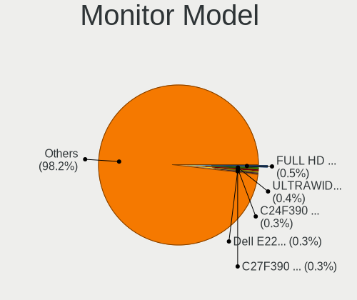
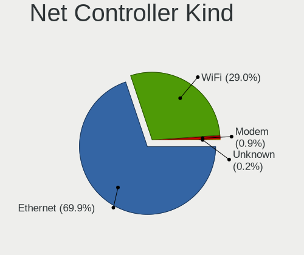
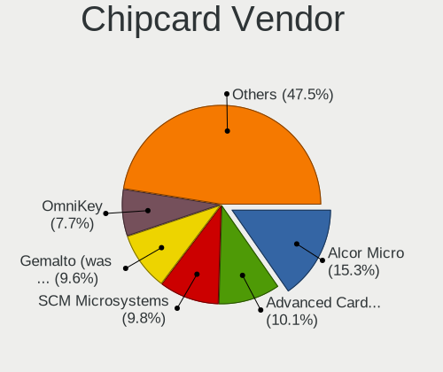

Linux - Tested Hardware & Statistics (Desktops)
-----------------------------------------------

A project to collect tested hardware configurations for Linux.

Anyone can contribute to this report by the [hw-probe](https://github.com/linuxhw/hw-probe) tool:

    sudo -E hw-probe -all -upload

Please contribute! Especially if your hardware is rare.

This report is for real hardware. Report for virtual hardware: [TestDays_VE](https://github.com/linuxhw/TestDays_VE)

Contents
--------

* [ Test Cases ](#test-cases)

* [ System ](#system)
  - [ OS                       ](#os)
  - [ OS Family                ](#os-family)
  - [ Kernel                   ](#kernel)
  - [ Kernel Family            ](#kernel-family)
  - [ Kernel Major Ver.        ](#kernel-major-ver)
  - [ Arch                     ](#arch)
  - [ DE                       ](#de)
  - [ Display Server           ](#display-server)
  - [ Display Manager          ](#display-manager)
  - [ OS Lang                  ](#os-lang)
  - [ Boot Mode                ](#boot-mode)
  - [ Filesystem               ](#filesystem)
  - [ Part. scheme             ](#part-scheme)
  - [ Dual Boot with Linux/BSD ](#dual-boot-with-linuxbsd)
  - [ Dual Boot (Win)          ](#dual-boot-win)

* [ Board ](#board)
  - [ Vendor                   ](#vendor)
  - [ Model                    ](#model)
  - [ Model Family             ](#model-family)
  - [ MFG Year                 ](#mfg-year)
  - [ Form Factor              ](#form-factor)
  - [ Secure Boot              ](#secure-boot)
  - [ Coreboot                 ](#coreboot)
  - [ RAM Size                 ](#ram-size)
  - [ RAM Used                 ](#ram-used)
  - [ Total Drives             ](#total-drives)
  - [ Has CD-ROM               ](#has-cd-rom)
  - [ Has Ethernet             ](#has-ethernet)
  - [ Has WiFi                 ](#has-wifi)
  - [ Has Bluetooth            ](#has-bluetooth)

* [ Location ](#location)
  - [ Country                  ](#country)
  - [ City                     ](#city)

* [ Drives ](#drives)
  - [ Drive Vendor             ](#drive-vendor)
  - [ Drive Model              ](#drive-model)
  - [ HDD Vendor               ](#hdd-vendor)
  - [ SSD Vendor               ](#ssd-vendor)
  - [ Drive Kind               ](#drive-kind)
  - [ Drive Connector          ](#drive-connector)
  - [ Drive Size               ](#drive-size)
  - [ Space Total              ](#space-total)
  - [ Space Used               ](#space-used)
  - [ Malfunc. Drives          ](#malfunc-drives)
  - [ Malfunc. Drive Vendor    ](#malfunc-drive-vendor)
  - [ Malfunc. HDD Vendor      ](#malfunc-hdd-vendor)
  - [ Malfunc. Drive Kind      ](#malfunc-drive-kind)
  - [ Failed Drives            ](#failed-drives)
  - [ Failed Drive Vendor      ](#failed-drive-vendor)
  - [ Drive Status             ](#drive-status)

* [ Storage controller ](#storage-controller)
  - [ Storage Vendor           ](#storage-vendor)
  - [ Storage Model            ](#storage-model)
  - [ Storage Kind             ](#storage-kind)

* [ Processor ](#processor)
  - [ CPU Vendor               ](#cpu-vendor)
  - [ CPU Model                ](#cpu-model)
  - [ CPU Model Family         ](#cpu-model-family)
  - [ CPU Cores                ](#cpu-cores)
  - [ CPU Sockets              ](#cpu-sockets)
  - [ CPU Threads              ](#cpu-threads)
  - [ CPU Op-Modes             ](#cpu-op-modes)
  - [ CPU Microcode            ](#cpu-microcode)
  - [ CPU Microarch            ](#cpu-microarch)

* [ Graphics ](#graphics)
  - [ GPU Vendor               ](#gpu-vendor)
  - [ GPU Model                ](#gpu-model)
  - [ GPU Combo                ](#gpu-combo)
  - [ GPU Driver               ](#gpu-driver)
  - [ GPU Memory               ](#gpu-memory)

* [ Monitor ](#monitor)
  - [ Monitor Vendor           ](#monitor-vendor)
  - [ Monitor Model            ](#monitor-model)
  - [ Monitor Resolution       ](#monitor-resolution)
  - [ Monitor Diagonal         ](#monitor-diagonal)
  - [ Monitor Width            ](#monitor-width)
  - [ Aspect Ratio             ](#aspect-ratio)
  - [ Monitor Area             ](#monitor-area)
  - [ Pixel Density            ](#pixel-density)
  - [ Multiple Monitors        ](#multiple-monitors)

* [ Network ](#network)
  - [ Net Controller Vendor    ](#net-controller-vendor)
  - [ Net Controller Model     ](#net-controller-model)
  - [ Wireless Vendor          ](#wireless-vendor)
  - [ Wireless Model           ](#wireless-model)
  - [ Ethernet Vendor          ](#ethernet-vendor)
  - [ Ethernet Model           ](#ethernet-model)
  - [ Net Controller Kind      ](#net-controller-kind)
  - [ Used Controller          ](#used-controller)
  - [ NICs                     ](#nics)
  - [ IPv6                     ](#ipv6)

* [ Bluetooth ](#bluetooth)
  - [ Bluetooth Vendor         ](#bluetooth-vendor)
  - [ Bluetooth Model          ](#bluetooth-model)

* [ Sound ](#sound)
  - [ Sound Vendor             ](#sound-vendor)
  - [ Sound Model              ](#sound-model)

* [ Memory ](#memory)
  - [ Memory Vendor            ](#memory-vendor)
  - [ Memory Model             ](#memory-model)
  - [ Memory Kind              ](#memory-kind)
  - [ Memory Form Factor       ](#memory-form-factor)
  - [ Memory Size              ](#memory-size)
  - [ Memory Speed             ](#memory-speed)

* [ Printers & scanners ](#printers--scanners)
  - [ Printer Vendor           ](#printer-vendor)
  - [ Printer Model            ](#printer-model)
  - [ Scanner Vendor           ](#scanner-vendor)
  - [ Scanner Model            ](#scanner-model)

* [ Camera ](#camera)
  - [ Camera Vendor            ](#camera-vendor)
  - [ Camera Model             ](#camera-model)

* [ Security ](#security)
  - [ Fingerprint Vendor       ](#fingerprint-vendor)
  - [ Fingerprint Model        ](#fingerprint-model)
  - [ Chipcard Vendor          ](#chipcard-vendor)
  - [ Chipcard Model           ](#chipcard-model)

* [ Unsupported ](#unsupported)
  - [ Unsupported Devices      ](#unsupported-devices)
  - [ Unsupported Device Types ](#unsupported-device-types)

Test Cases
----------

Total: 153880

| Vendor        | Model                       | Probe                                                      | Date         |
|---------------|-----------------------------|------------------------------------------------------------|--------------|
| ASRock        | H61M-DGS R2.0               | [47be7b76e5](https://linux-hardware.org/?probe=47be7b76e5) | May 09, 2024 |
| Gigabyte      | Z390 AORUS PRO WIFI-CF      | [f88f22a1b9](https://linux-hardware.org/?probe=f88f22a1b9) | May 09, 2024 |
| ASRock        | B550M Phantom Gaming 4      | [f8574bdf3e](https://linux-hardware.org/?probe=f8574bdf3e) | May 09, 2024 |
| HP            | 805D                        | [208bd3b9dd](https://linux-hardware.org/?probe=208bd3b9dd) | May 09, 2024 |
| ASUSTek       | PRIME B250M-C               | [0a6d61d9f6](https://linux-hardware.org/?probe=0a6d61d9f6) | May 09, 2024 |
| HP            | 1905                        | [8e94c4bb4e](https://linux-hardware.org/?probe=8e94c4bb4e) | May 09, 2024 |
| ASUSTek       | TUF Gaming B550-PLUS WIF... | [c314d61f74](https://linux-hardware.org/?probe=c314d61f74) | May 09, 2024 |
| HP            | 3396                        | [5e68a536f2](https://linux-hardware.org/?probe=5e68a536f2) | May 09, 2024 |
| Lenovo        | Bantry CRB NOK              | [c2a11bca8a](https://linux-hardware.org/?probe=c2a11bca8a) | May 09, 2024 |
| Gigabyte      | H410M H V2                  | [fdb662e09b](https://linux-hardware.org/?probe=fdb662e09b) | May 09, 2024 |
| ASUSTek       | H110M-CS/BR                 | [5c516f0aa0](https://linux-hardware.org/?probe=5c516f0aa0) | May 09, 2024 |
| ASUSTek       | H81M-A/BR                   | [919fba348e](https://linux-hardware.org/?probe=919fba348e) | May 09, 2024 |
| AZW           | MINI S                      | [12557a4240](https://linux-hardware.org/?probe=12557a4240) | May 09, 2024 |
| Dell          | 0VNP2H A00                  | [28953f7c6a](https://linux-hardware.org/?probe=28953f7c6a) | May 09, 2024 |
| Foxconn       | 2AB1                        | [11beb142c3](https://linux-hardware.org/?probe=11beb142c3) | May 09, 2024 |
| AZW           | MINI S                      | [7c8e83b2ed](https://linux-hardware.org/?probe=7c8e83b2ed) | May 09, 2024 |
| Unknown       | Unknown                     | [d3ffc9eacb](https://linux-hardware.org/?probe=d3ffc9eacb) | May 09, 2024 |
| PCWare        | IPMH61R3                    | [1f3c6428d2](https://linux-hardware.org/?probe=1f3c6428d2) | May 09, 2024 |
| Unknown       | Unknown                     | [3027a0b67c](https://linux-hardware.org/?probe=3027a0b67c) | May 09, 2024 |
| MSI           | H310M PRO-VD                | [586c4844be](https://linux-hardware.org/?probe=586c4844be) | May 09, 2024 |
| TianBei       | GEM12                       | [d7b4f33b27](https://linux-hardware.org/?probe=d7b4f33b27) | May 09, 2024 |
| ASRock        | B450M/ac R2.0               | [a20443a9d6](https://linux-hardware.org/?probe=a20443a9d6) | May 09, 2024 |
| MSI           | MAG B460M MORTAR WIFI       | [d35204127f](https://linux-hardware.org/?probe=d35204127f) | May 09, 2024 |
| Dell          | 051FJ8 A02                  | [1c1caf7a19](https://linux-hardware.org/?probe=1c1caf7a19) | May 09, 2024 |
| MSI           | B450M MORTAR MAX            | [51a4eae4e1](https://linux-hardware.org/?probe=51a4eae4e1) | May 09, 2024 |
| Gigabyte      | H310M M.2 x.x               | [fc06be20c3](https://linux-hardware.org/?probe=fc06be20c3) | May 09, 2024 |
| ASRock        | X399 Taichi                 | [c82214d90a](https://linux-hardware.org/?probe=c82214d90a) | May 09, 2024 |
| ASUSTek       | ROG STRIX B650E-I GAMING... | [bdcf61edde](https://linux-hardware.org/?probe=bdcf61edde) | May 09, 2024 |
| Dell          | 051FJ8 A02                  | [5a8f86b17c](https://linux-hardware.org/?probe=5a8f86b17c) | May 09, 2024 |
| Gigabyte      | Z87X-UD4H-CF                | [f26982efc3](https://linux-hardware.org/?probe=f26982efc3) | May 09, 2024 |
| MSI           | PRO B650M-A WIFI            | [c5f27e5e7b](https://linux-hardware.org/?probe=c5f27e5e7b) | May 09, 2024 |
| eMachines     | WMCP61M                     | [14e676a6db](https://linux-hardware.org/?probe=14e676a6db) | May 09, 2024 |
| Gigabyte      | GA-770TA-UD3                | [5fad364df3](https://linux-hardware.org/?probe=5fad364df3) | May 09, 2024 |
| MSI           | B450 TOMAHAWK MAX II        | [813f68dad3](https://linux-hardware.org/?probe=813f68dad3) | May 08, 2024 |
| Gigabyte      | EP45-DS3L                   | [7cd20b2530](https://linux-hardware.org/?probe=7cd20b2530) | May 08, 2024 |
| Medion        | Cattle24 -1M                | [aa19188799](https://linux-hardware.org/?probe=aa19188799) | May 08, 2024 |
| Acer          | Veriton X2631G V:1.0        | [221cf17e59](https://linux-hardware.org/?probe=221cf17e59) | May 08, 2024 |
| Gigabyte      | Z170N-WIFI-CF               | [7a88f50508](https://linux-hardware.org/?probe=7a88f50508) | May 08, 2024 |
| ASRock        | B450 Gaming K4              | [5283cfbe48](https://linux-hardware.org/?probe=5283cfbe48) | May 08, 2024 |
| Gigabyte      | Z170N-WIFI-CF               | [6143f9e1aa](https://linux-hardware.org/?probe=6143f9e1aa) | May 08, 2024 |
| Dell          | 00V62H A01                  | [2ea426bed2](https://linux-hardware.org/?probe=2ea426bed2) | May 08, 2024 |
| HP            | 18E7                        | [fa637b3b9a](https://linux-hardware.org/?probe=fa637b3b9a) | May 08, 2024 |
| Intel         | X99                         | [a02c0050f2](https://linux-hardware.org/?probe=a02c0050f2) | May 08, 2024 |
| Dell          | 00V62H A01                  | [bc8a5150c3](https://linux-hardware.org/?probe=bc8a5150c3) | May 08, 2024 |
| Dell          | 0M858N A01                  | [9b34c8bbc2](https://linux-hardware.org/?probe=9b34c8bbc2) | May 08, 2024 |
| ASUSTek       | H110M-A/DP                  | [da62dd4045](https://linux-hardware.org/?probe=da62dd4045) | May 08, 2024 |
| ASUSTek       | P8H67                       | [ebf3b0112a](https://linux-hardware.org/?probe=ebf3b0112a) | May 08, 2024 |
| ASUSTek       | H110M-A/DP                  | [b8d75a4ac5](https://linux-hardware.org/?probe=b8d75a4ac5) | May 08, 2024 |
| ASUSTek       | P8H67                       | [7c9d6cd1b4](https://linux-hardware.org/?probe=7c9d6cd1b4) | May 08, 2024 |
| Intel         | DH77EB AAG39073-304         | [6fd6f40abe](https://linux-hardware.org/?probe=6fd6f40abe) | May 08, 2024 |
| Gigabyte      | Z97X-Gaming 5               | [8256dfc204](https://linux-hardware.org/?probe=8256dfc204) | May 08, 2024 |
| MSI           | H310M PRO-M2 PLUS           | [969ea9ed0c](https://linux-hardware.org/?probe=969ea9ed0c) | May 08, 2024 |
| ASRock        | H61M                        | [4db6a46097](https://linux-hardware.org/?probe=4db6a46097) | May 08, 2024 |
| Huanan        | X99-QD4 V1.0                | [f6e1a31fef](https://linux-hardware.org/?probe=f6e1a31fef) | May 08, 2024 |
| MSI           | Z77A-G43                    | [f7e7eb8397](https://linux-hardware.org/?probe=f7e7eb8397) | May 08, 2024 |
| ASUSTek       | LEONITE                     | [a50f5f9e3a](https://linux-hardware.org/?probe=a50f5f9e3a) | May 08, 2024 |
| Gigabyte      | G41MT-S2PT                  | [a415a1e824](https://linux-hardware.org/?probe=a415a1e824) | May 08, 2024 |
| Lenovo        | 110536U ThinkServer TS13... | [d3196733cd](https://linux-hardware.org/?probe=d3196733cd) | May 08, 2024 |
| ASRock        | H61M                        | [cf55ba331e](https://linux-hardware.org/?probe=cf55ba331e) | May 08, 2024 |
| Gigabyte      | X99-UD4-CF                  | [c8d8b57bc2](https://linux-hardware.org/?probe=c8d8b57bc2) | May 08, 2024 |
| Dell          | 0M5DCD A00                  | [3c353c281f](https://linux-hardware.org/?probe=3c353c281f) | May 08, 2024 |
| Gigabyte      | B650 AORUS ELITE AX V2      | [cb100ba8bc](https://linux-hardware.org/?probe=cb100ba8bc) | May 08, 2024 |
| TianBei       | GEM12                       | [5e850d92f6](https://linux-hardware.org/?probe=5e850d92f6) | May 08, 2024 |
| ASRock        | B550M Phantom Gaming 4      | [8210b8f2f9](https://linux-hardware.org/?probe=8210b8f2f9) | May 08, 2024 |
| Biostar       | A320MH                      | [404917c360](https://linux-hardware.org/?probe=404917c360) | May 08, 2024 |
| Gigabyte      | B450 AORUS ELITE            | [0cd34decca](https://linux-hardware.org/?probe=0cd34decca) | May 08, 2024 |
| Gigabyte      | B760M DS3H AX DDR4          | [8556d97dea](https://linux-hardware.org/?probe=8556d97dea) | May 08, 2024 |
| ASUSTek       | P8H77-V LE                  | [e896127dc3](https://linux-hardware.org/?probe=e896127dc3) | May 08, 2024 |
| Huanan        | X99-F8 GAMING V5.0          | [541eebe872](https://linux-hardware.org/?probe=541eebe872) | May 08, 2024 |
| ASRock        | Z77 Performance             | [500cd7ed60](https://linux-hardware.org/?probe=500cd7ed60) | May 08, 2024 |
| Gigabyte      | Z270-HD3P-CF                | [b67da2effc](https://linux-hardware.org/?probe=b67da2effc) | May 08, 2024 |
| Gigabyte      | B550 AORUS ELITE V2         | [ab440c0aca](https://linux-hardware.org/?probe=ab440c0aca) | May 08, 2024 |
| MSI           | Z170A GAMING M7             | [e1892a119b](https://linux-hardware.org/?probe=e1892a119b) | May 08, 2024 |
| Gigabyte      | Z790 UD AX                  | [38ae310bd0](https://linux-hardware.org/?probe=38ae310bd0) | May 08, 2024 |
| MSI           | MS-7255                     | [5e4c3d17d6](https://linux-hardware.org/?probe=5e4c3d17d6) | May 08, 2024 |
| ASRock        | B450M-HDV                   | [098e62d52a](https://linux-hardware.org/?probe=098e62d52a) | May 08, 2024 |
| Gigabyte      | Z790 UD AX                  | [d1a276f0c5](https://linux-hardware.org/?probe=d1a276f0c5) | May 08, 2024 |
| HP            | 8AC1                        | [34fb750829](https://linux-hardware.org/?probe=34fb750829) | May 08, 2024 |
| ASUSTek       | PRIME X370-PRO              | [54f40400ed](https://linux-hardware.org/?probe=54f40400ed) | May 08, 2024 |
| MSI           | MAG Z690 TOMAHAWK WIFI D... | [2143043fa4](https://linux-hardware.org/?probe=2143043fa4) | May 08, 2024 |
| ASUSTek       | PRIME A520M-K               | [5de84bcb38](https://linux-hardware.org/?probe=5de84bcb38) | May 08, 2024 |
| Lenovo        | 1036 NO DPK                 | [ea4077ed1b](https://linux-hardware.org/?probe=ea4077ed1b) | May 08, 2024 |
| MSI           | B650M GAMING PLUS WIFI      | [be715853f7](https://linux-hardware.org/?probe=be715853f7) | May 08, 2024 |
| Fujitsu       | D3403-U1 S26361-D3403-U1    | [75811cd1df](https://linux-hardware.org/?probe=75811cd1df) | May 08, 2024 |
| HP            | 89EB 11                     | [f53a08bd5c](https://linux-hardware.org/?probe=f53a08bd5c) | May 08, 2024 |
| ASUSTek       | PRIME X470-PRO              | [c9bee8e35a](https://linux-hardware.org/?probe=c9bee8e35a) | May 08, 2024 |
| ASUSTek       | ROG STRIX Z490-G GAMING     | [3514a63f05](https://linux-hardware.org/?probe=3514a63f05) | May 08, 2024 |
| ASRock        | B550M Phantom Gaming 4      | [336a5b4e2b](https://linux-hardware.org/?probe=336a5b4e2b) | May 08, 2024 |
| ASUSTek       | A8R32-MVP Deluxe            | [7ad1e2a464](https://linux-hardware.org/?probe=7ad1e2a464) | May 08, 2024 |
| Gigabyte      | H81M-S1                     | [3566b1666c](https://linux-hardware.org/?probe=3566b1666c) | May 08, 2024 |
| ASUSTek       | E520                        | [4e025280e9](https://linux-hardware.org/?probe=4e025280e9) | May 08, 2024 |
| Gigabyte      | B560M H                     | [9d2a9c59a3](https://linux-hardware.org/?probe=9d2a9c59a3) | May 08, 2024 |
| Unknown       | Unknown                     | [07a1876fd0](https://linux-hardware.org/?probe=07a1876fd0) | May 08, 2024 |
| ECS           | MCP61M-M3                   | [4a66244a0d](https://linux-hardware.org/?probe=4a66244a0d) | May 08, 2024 |
| MSI           | B450M-A PRO MAX II          | [cd66ff303c](https://linux-hardware.org/?probe=cd66ff303c) | May 08, 2024 |
| Gigabyte      | B450 AORUS ELITE            | [5c2ce66225](https://linux-hardware.org/?probe=5c2ce66225) | May 08, 2024 |
| MSI           | H110M PRO-VH PLUS           | [d9c35695a3](https://linux-hardware.org/?probe=d9c35695a3) | May 08, 2024 |
| ASUSTek       | ProArt Z690-CREATOR WIFI    | [7cc03eaae9](https://linux-hardware.org/?probe=7cc03eaae9) | May 08, 2024 |
| ASUSTek       | PRIME X570-P                | [43cb45f5c4](https://linux-hardware.org/?probe=43cb45f5c4) | May 08, 2024 |
| HP            | 1495                        | [89464c1187](https://linux-hardware.org/?probe=89464c1187) | May 08, 2024 |
| ECS           | H61H2-CM                    | [65f99c7e8d](https://linux-hardware.org/?probe=65f99c7e8d) | May 08, 2024 |
| MSI           | PRO B650M-P                 | [2490ea1b56](https://linux-hardware.org/?probe=2490ea1b56) | May 08, 2024 |
| Gigabyte      | A520I AC                    | [199cd47039](https://linux-hardware.org/?probe=199cd47039) | May 08, 2024 |
| Gigabyte      | H81M-S2H                    | [217f6991ee](https://linux-hardware.org/?probe=217f6991ee) | May 08, 2024 |
| ASUSTek       | B150 PRO GAMING             | [d559ef5203](https://linux-hardware.org/?probe=d559ef5203) | May 08, 2024 |
| Dell          | 0HHV7N A00                  | [63a26dac69](https://linux-hardware.org/?probe=63a26dac69) | May 08, 2024 |
| MSI           | B250M PRO-VDH               | [d11117aeae](https://linux-hardware.org/?probe=d11117aeae) | May 08, 2024 |
| Gigabyte      | B550M AORUS ELITE AX        | [422cc265d3](https://linux-hardware.org/?probe=422cc265d3) | May 08, 2024 |
| ASUSTek       | PRIME B460M-K               | [fea6956058](https://linux-hardware.org/?probe=fea6956058) | May 08, 2024 |
| MSI           | B550-A PRO                  | [acfeddfe20](https://linux-hardware.org/?probe=acfeddfe20) | May 08, 2024 |
| Unknown       | Unknown                     | [14f9a58589](https://linux-hardware.org/?probe=14f9a58589) | May 08, 2024 |
| Gigabyte      | B450 GAMING X               | [f7eef71378](https://linux-hardware.org/?probe=f7eef71378) | May 08, 2024 |
| ASUSTek       | CROSSHAIR VI HERO           | [13c15b0230](https://linux-hardware.org/?probe=13c15b0230) | May 08, 2024 |
| Dell          | 0GN6JF A01                  | [b9877feccd](https://linux-hardware.org/?probe=b9877feccd) | May 08, 2024 |
| MSI           | MPG X570 GAMING PRO CARB... | [1be8775956](https://linux-hardware.org/?probe=1be8775956) | May 08, 2024 |
| ASUSTek       | P5Q SE2                     | [cf126cd087](https://linux-hardware.org/?probe=cf126cd087) | May 08, 2024 |
| ASRock        | B550M Pro4                  | [41c99b8030](https://linux-hardware.org/?probe=41c99b8030) | May 08, 2024 |
| MSI           | PRO B760-P WIFI DDR4        | [35d60afe01](https://linux-hardware.org/?probe=35d60afe01) | May 07, 2024 |
| Gigabyte      | B450 AORUS ELITE            | [af6bde9c97](https://linux-hardware.org/?probe=af6bde9c97) | May 07, 2024 |
| Gigabyte      | B450 AORUS ELITE            | [1755d8da2b](https://linux-hardware.org/?probe=1755d8da2b) | May 07, 2024 |
| Gigabyte      | H310M S2H x.x               | [97598b9cc3](https://linux-hardware.org/?probe=97598b9cc3) | May 07, 2024 |
| ASUSTek       | P8Z77-I DELUXE              | [6aa44077ff](https://linux-hardware.org/?probe=6aa44077ff) | May 07, 2024 |
| Lenovo        | 1046 SDK0T08861 WIN 3305... | [91c857f51e](https://linux-hardware.org/?probe=91c857f51e) | May 07, 2024 |
| Gigabyte      | F2A88XM-HD3                 | [14bb67e07a](https://linux-hardware.org/?probe=14bb67e07a) | May 07, 2024 |
| ASUSTek       | PRIME B760M-A WIFI D4       | [d83d6a3460](https://linux-hardware.org/?probe=d83d6a3460) | May 07, 2024 |
| ASUSTek       | ROG STRIX B450-F GAMING ... | [cdcaeb4d46](https://linux-hardware.org/?probe=cdcaeb4d46) | May 07, 2024 |
| Intel         | H55                         | [83c1ac4239](https://linux-hardware.org/?probe=83c1ac4239) | May 07, 2024 |
| Dell          | 0215PR A02                  | [ff480889b4](https://linux-hardware.org/?probe=ff480889b4) | May 07, 2024 |
| ASUSTek       | H110M-A                     | [e4868e57a3](https://linux-hardware.org/?probe=e4868e57a3) | May 07, 2024 |
| ASUSTek       | PRIME A320M-R               | [8b5ef47376](https://linux-hardware.org/?probe=8b5ef47376) | May 07, 2024 |
| Dell          | 0WR7PY A01                  | [f154c6f22e](https://linux-hardware.org/?probe=f154c6f22e) | May 07, 2024 |
| MSI           | Z170A-G43 PLUS              | [cbc2d08a03](https://linux-hardware.org/?probe=cbc2d08a03) | May 07, 2024 |
| ASRock        | Z390 Pro4                   | [ee53393400](https://linux-hardware.org/?probe=ee53393400) | May 07, 2024 |
| Lenovo        | SHARKBAY NOK                | [bc53340b58](https://linux-hardware.org/?probe=bc53340b58) | May 07, 2024 |
| ASUSTek       | ROG STRIX X570-E GAMING ... | [6b97d23143](https://linux-hardware.org/?probe=6b97d23143) | May 07, 2024 |
| PCSMART       | 7.0                         | [66d6082bf4](https://linux-hardware.org/?probe=66d6082bf4) | May 07, 2024 |
| ASUSTek       | H110M-K                     | [373b9bdb5c](https://linux-hardware.org/?probe=373b9bdb5c) | May 07, 2024 |
| ASUSTek       | P5K3 Deluxe                 | [b03bf61625](https://linux-hardware.org/?probe=b03bf61625) | May 07, 2024 |
| ASRock        | B450 Gaming-ITX/ac          | [9b4c39c111](https://linux-hardware.org/?probe=9b4c39c111) | May 07, 2024 |
| Gigabyte      | H110M-S2V-CF                | [22eb41201e](https://linux-hardware.org/?probe=22eb41201e) | May 07, 2024 |
| Huanan        | X99-QD4 V0.1 693H           | [e8e1e2e2f8](https://linux-hardware.org/?probe=e8e1e2e2f8) | May 07, 2024 |
| MSI           | MAG B550 TOMAHAWK           | [07a4ffe918](https://linux-hardware.org/?probe=07a4ffe918) | May 07, 2024 |
| Dell          | 0XHGV1 A00                  | [b56a1f70d1](https://linux-hardware.org/?probe=b56a1f70d1) | May 07, 2024 |
| MSI           | P67A-G45                    | [f852d50c62](https://linux-hardware.org/?probe=f852d50c62) | May 07, 2024 |
| Lenovo        | SHARKBAY NOK                | [f696d03152](https://linux-hardware.org/?probe=f696d03152) | May 07, 2024 |
| ASRock        | AB350M-HDV R3.0             | [d919c0d099](https://linux-hardware.org/?probe=d919c0d099) | May 07, 2024 |
| ASUSTek       | ROG STRIX Z590-A GAMING ... | [ebd9696c7b](https://linux-hardware.org/?probe=ebd9696c7b) | May 07, 2024 |
| ASUSTek       | P8Z77-V LX                  | [b245c99221](https://linux-hardware.org/?probe=b245c99221) | May 07, 2024 |
| Gigabyte      | H410M H V3                  | [486c191884](https://linux-hardware.org/?probe=486c191884) | May 07, 2024 |
| ASUSTek       | PRIME Z790-P WIFI           | [54b9c594a0](https://linux-hardware.org/?probe=54b9c594a0) | May 07, 2024 |
| Dell          | 0XHGV1 A00                  | [35681eda7f](https://linux-hardware.org/?probe=35681eda7f) | May 07, 2024 |
| ASRock        | Z68 Extreme4 Gen3           | [df427b5f9f](https://linux-hardware.org/?probe=df427b5f9f) | May 07, 2024 |
| Unknown       | Unknown                     | [857bd41fc3](https://linux-hardware.org/?probe=857bd41fc3) | May 07, 2024 |
| Fujitsu       | D3544-A1 S26361-D3544-A1... | [e04c4654da](https://linux-hardware.org/?probe=e04c4654da) | May 07, 2024 |
| Gigabyte      | A520M S2H                   | [c14a7e4724](https://linux-hardware.org/?probe=c14a7e4724) | May 07, 2024 |
| Supermicro    | X10DDW-i                    | [ff62f6b4d9](https://linux-hardware.org/?probe=ff62f6b4d9) | May 07, 2024 |
| Supermicro    | X10DDW-i                    | [b849fea196](https://linux-hardware.org/?probe=b849fea196) | May 07, 2024 |
| Supermicro    | X10DDW-i                    | [c20ef4d35b](https://linux-hardware.org/?probe=c20ef4d35b) | May 07, 2024 |
| Supermicro    | X10DDW-i                    | [9b21386a04](https://linux-hardware.org/?probe=9b21386a04) | May 07, 2024 |
| Supermicro    | X10DDW-i                    | [99fbeae8c9](https://linux-hardware.org/?probe=99fbeae8c9) | May 07, 2024 |
| Supermicro    | X10DDW-i                    | [48bb233b46](https://linux-hardware.org/?probe=48bb233b46) | May 07, 2024 |
| Supermicro    | X10DRL-i                    | [da5c3ed75f](https://linux-hardware.org/?probe=da5c3ed75f) | May 07, 2024 |
| Sapphire      | PI-AM3RS760G2               | [7a48c1a73b](https://linux-hardware.org/?probe=7a48c1a73b) | May 07, 2024 |
| Acer          | Veriton N4640G              | [44c62400f4](https://linux-hardware.org/?probe=44c62400f4) | May 07, 2024 |
| ASUSTek       | TUF Gaming B560M-PLUS       | [ec3b3b1daa](https://linux-hardware.org/?probe=ec3b3b1daa) | May 07, 2024 |
| Shenzhen M... | F7BSC                       | [9e6a5eb0e2](https://linux-hardware.org/?probe=9e6a5eb0e2) | May 07, 2024 |
| Lenovo        | 3148 SDK0J40700 WIN 3258... | [b24f7286d2](https://linux-hardware.org/?probe=b24f7286d2) | May 07, 2024 |
| ASUSTek       | PRIME Z490-A                | [a68c1a8752](https://linux-hardware.org/?probe=a68c1a8752) | May 07, 2024 |
| Gigabyte      | Z97-HD3                     | [85dee8d963](https://linux-hardware.org/?probe=85dee8d963) | May 07, 2024 |
| Acer          | Veriton N4640G              | [ebe4fa74ca](https://linux-hardware.org/?probe=ebe4fa74ca) | May 07, 2024 |
| ASUSTek       | A88XM-E                     | [bba7d20511](https://linux-hardware.org/?probe=bba7d20511) | May 07, 2024 |
| ASUSTek       | M5A78L-M PLUS/USB3          | [48be6a2dbb](https://linux-hardware.org/?probe=48be6a2dbb) | May 07, 2024 |
| PELADN        | WI-6                        | [73069ab9f5](https://linux-hardware.org/?probe=73069ab9f5) | May 07, 2024 |
| Lenovo        | SHARKBAY NOK                | [f41f238d9f](https://linux-hardware.org/?probe=f41f238d9f) | May 07, 2024 |
| Gigabyte      | C1037UN-EU                  | [714735cd6f](https://linux-hardware.org/?probe=714735cd6f) | May 07, 2024 |
| Gigabyte      | X570S AERO G                | [051c9db94b](https://linux-hardware.org/?probe=051c9db94b) | May 07, 2024 |
| Gigabyte      | B550M DS3H                  | [3514c9adca](https://linux-hardware.org/?probe=3514c9adca) | May 07, 2024 |
| ASRock        | B450M Steel Legend          | [072fd0ea79](https://linux-hardware.org/?probe=072fd0ea79) | May 07, 2024 |
| ASRock        | B450M Steel Legend          | [c2a2f067b4](https://linux-hardware.org/?probe=c2a2f067b4) | May 07, 2024 |
| ASUSTek       | PRIME X570-P                | [2ff26254ae](https://linux-hardware.org/?probe=2ff26254ae) | May 07, 2024 |
| Gigabyte      | B460 HD3                    | [8d8fcf703b](https://linux-hardware.org/?probe=8d8fcf703b) | May 07, 2024 |
| MSI           | B450-A PRO MAX              | [27adbf1266](https://linux-hardware.org/?probe=27adbf1266) | May 07, 2024 |
| Dell          | 048DY8 A01                  | [a81f44c8b4](https://linux-hardware.org/?probe=a81f44c8b4) | May 07, 2024 |
| Intel         | SKYBAY                      | [7e692c7e40](https://linux-hardware.org/?probe=7e692c7e40) | May 07, 2024 |
| ASRock        | B450M Pro4-F                | [0c73837ccd](https://linux-hardware.org/?probe=0c73837ccd) | May 07, 2024 |
| ASUSTek       | TUF B450M-PLUS GAMING       | [73060b4642](https://linux-hardware.org/?probe=73060b4642) | May 07, 2024 |
| ASUSTek       | ROG STRIX B650E-I GAMING... | [961d8a2758](https://linux-hardware.org/?probe=961d8a2758) | May 07, 2024 |
| ASUSTek       | PRIME A320M-E               | [d97bbebd45](https://linux-hardware.org/?probe=d97bbebd45) | May 07, 2024 |
| Packard Be... | WMCP78M                     | [4d711194fa](https://linux-hardware.org/?probe=4d711194fa) | May 07, 2024 |
| GEEKOM        | A7                          | [87925a210f](https://linux-hardware.org/?probe=87925a210f) | May 07, 2024 |
| MSI           | X570-A PRO                  | [e061b752c8](https://linux-hardware.org/?probe=e061b752c8) | May 07, 2024 |
| MSI           | X670E GAMING PLUS WIFI      | [72a4d27732](https://linux-hardware.org/?probe=72a4d27732) | May 07, 2024 |
| MSI           | MPG X570 GAMING PLUS        | [60ef8abb02](https://linux-hardware.org/?probe=60ef8abb02) | May 07, 2024 |
| Gigabyte      | H610M S2H DDR4              | [4fb0650e99](https://linux-hardware.org/?probe=4fb0650e99) | May 07, 2024 |
| Lenovo        | ThinkServer TS140           | [be7444624d](https://linux-hardware.org/?probe=be7444624d) | May 07, 2024 |
| ECS           | Nettle2                     | [af1b3ee348](https://linux-hardware.org/?probe=af1b3ee348) | May 07, 2024 |
| ASRock        | FM2A88X Extreme6+           | [d12f9a31f3](https://linux-hardware.org/?probe=d12f9a31f3) | May 07, 2024 |
| MSI           | PRO H610M-E DDR4            | [a415f46a9e](https://linux-hardware.org/?probe=a415f46a9e) | May 07, 2024 |
| Huanan        | X58 V1.0                    | [f4d5141ce0](https://linux-hardware.org/?probe=f4d5141ce0) | May 07, 2024 |
| ASRock        | A300M-STX                   | [cdf544ca1d](https://linux-hardware.org/?probe=cdf544ca1d) | May 07, 2024 |
| Dell          | 088DT1 A00                  | [edb955bd5e](https://linux-hardware.org/?probe=edb955bd5e) | May 07, 2024 |
| Apple         | Mac-F221BEC8                | [38e8b24bd0](https://linux-hardware.org/?probe=38e8b24bd0) | May 07, 2024 |
| ASUSTek       | H81M-A/BR                   | [8f7abd7f23](https://linux-hardware.org/?probe=8f7abd7f23) | May 07, 2024 |
| Intel         | DQ45CB AAE30148-207         | [263e934dc2](https://linux-hardware.org/?probe=263e934dc2) | May 07, 2024 |
| ASRock        | B550 Phantom Gaming 4/ac    | [72d8d32749](https://linux-hardware.org/?probe=72d8d32749) | May 07, 2024 |
| Gigabyte      | B75M-D3H                    | [a10be2227c](https://linux-hardware.org/?probe=a10be2227c) | May 07, 2024 |
| Gigabyte      | Z77-D3H                     | [01099601fe](https://linux-hardware.org/?probe=01099601fe) | May 07, 2024 |
| Unknown       | HOTTAB                      | [aadecb497e](https://linux-hardware.org/?probe=aadecb497e) | May 07, 2024 |
| Dell          | 02YRK5 A02                  | [fea15ab44c](https://linux-hardware.org/?probe=fea15ab44c) | May 07, 2024 |
| Shenzhen M... | F7BAA                       | [69aa3dca70](https://linux-hardware.org/?probe=69aa3dca70) | May 06, 2024 |
| ASUSTek       | PRIME H510M-E               | [bf4a7b097c](https://linux-hardware.org/?probe=bf4a7b097c) | May 06, 2024 |
| Lenovo        | SDK0E50510 WIN              | [885618c382](https://linux-hardware.org/?probe=885618c382) | May 06, 2024 |
| ASUSTek       | PRIME H510M-E               | [e76f332009](https://linux-hardware.org/?probe=e76f332009) | May 06, 2024 |
| Dell          | 02YYK5 A01                  | [09b75f38cd](https://linux-hardware.org/?probe=09b75f38cd) | May 06, 2024 |
| Dell          | 03KWTV A00                  | [68f465c06a](https://linux-hardware.org/?probe=68f465c06a) | May 06, 2024 |
| ASUSTek       | M4A78T-E                    | [2cee8d14ab](https://linux-hardware.org/?probe=2cee8d14ab) | May 06, 2024 |
| MSI           | MAG B660 TOMAHAWK WIFI D... | [5a5f459292](https://linux-hardware.org/?probe=5a5f459292) | May 06, 2024 |
| Dell          | 03KWTV A00                  | [1b3f32baf6](https://linux-hardware.org/?probe=1b3f32baf6) | May 06, 2024 |
| ASRock        | J3710M                      | [ff2b73c846](https://linux-hardware.org/?probe=ff2b73c846) | May 06, 2024 |
| MSI           | MAG Z690 TOMAHAWK WIFI D... | [8848310fde](https://linux-hardware.org/?probe=8848310fde) | May 06, 2024 |
| ASUSTek       | ROG STRIX X299-E GAMING ... | [fc1633451e](https://linux-hardware.org/?probe=fc1633451e) | May 06, 2024 |
| ASUSTek       | TUF Gaming X570-PLUS        | [70346cc510](https://linux-hardware.org/?probe=70346cc510) | May 06, 2024 |
| Dell          | 042P49 A02                  | [4b9e2674de](https://linux-hardware.org/?probe=4b9e2674de) | May 06, 2024 |
| Gigabyte      | H81M-H                      | [5ea3b70747](https://linux-hardware.org/?probe=5ea3b70747) | May 06, 2024 |
| Fujitsu       | D3164-A1 S26361-D3164-A1    | [ae1edad2ab](https://linux-hardware.org/?probe=ae1edad2ab) | May 06, 2024 |
| Dell          | 042P49 A02                  | [146a7db97f](https://linux-hardware.org/?probe=146a7db97f) | May 06, 2024 |
| ASUSTek       | TUF Gaming B650M-PLUS       | [0e930ac423](https://linux-hardware.org/?probe=0e930ac423) | May 06, 2024 |
| Gigabyte      | B550M DS3H AC               | [ce0082648a](https://linux-hardware.org/?probe=ce0082648a) | May 06, 2024 |
| Gigabyte      | B550M DS3H AC               | [9f866b203a](https://linux-hardware.org/?probe=9f866b203a) | May 06, 2024 |
| MSI           | B650M GAMING PLUS WIFI      | [afbc83ced8](https://linux-hardware.org/?probe=afbc83ced8) | May 06, 2024 |
| Dell          | 0YXT71 A00                  | [b451487b59](https://linux-hardware.org/?probe=b451487b59) | May 06, 2024 |
| ASUSTek       | PRIME A520M-K               | [602683adef](https://linux-hardware.org/?probe=602683adef) | May 06, 2024 |
| Dell          | 0C2KJT A00                  | [a884cd0cf5](https://linux-hardware.org/?probe=a884cd0cf5) | May 06, 2024 |
| Gigabyte      | EP45-DS3L                   | [9a1d11cc26](https://linux-hardware.org/?probe=9a1d11cc26) | May 06, 2024 |
| ASUSTek       | TUF Gaming Z790-PRO WIFI    | [07048840f0](https://linux-hardware.org/?probe=07048840f0) | May 06, 2024 |
| ASUSTek       | P9X79                       | [dd0d50c3bf](https://linux-hardware.org/?probe=dd0d50c3bf) | May 06, 2024 |
| ASRock        | B450M-HDV R4.0              | [1d40ae8807](https://linux-hardware.org/?probe=1d40ae8807) | May 06, 2024 |
| ASUSTek       | TUF Gaming Z790-PLUS WIF... | [326b0babab](https://linux-hardware.org/?probe=326b0babab) | May 06, 2024 |
| Intel         | B75                         | [18e086bc3d](https://linux-hardware.org/?probe=18e086bc3d) | May 06, 2024 |
| ASUSTek       | TUF Gaming Z790-PLUS WIF... | [38b9f94aeb](https://linux-hardware.org/?probe=38b9f94aeb) | May 06, 2024 |
| Lenovo        | 36C7 SDK0J40697 WIN 3305... | [867c770e38](https://linux-hardware.org/?probe=867c770e38) | May 06, 2024 |
| Dell          | 0478VN A00                  | [305f343c95](https://linux-hardware.org/?probe=305f343c95) | May 06, 2024 |
| ASUSTek       | P8H67-M PRO                 | [2af49854e2](https://linux-hardware.org/?probe=2af49854e2) | May 06, 2024 |
| ASUSTek       | ROG STRIX Z690-G GAMING ... | [a923d8607b](https://linux-hardware.org/?probe=a923d8607b) | May 06, 2024 |
| ASUSTek       | P8Z77-V LX2                 | [1181eb41ee](https://linux-hardware.org/?probe=1181eb41ee) | May 06, 2024 |
| eMachines     | WMCP61M                     | [54b1a18c59](https://linux-hardware.org/?probe=54b1a18c59) | May 06, 2024 |
| Acer          | Predator PO3-630            | [7271f27dc0](https://linux-hardware.org/?probe=7271f27dc0) | May 06, 2024 |
| Lenovo        | 3741 SDK0T76463 WIN 3422... | [42a7c6fb23](https://linux-hardware.org/?probe=42a7c6fb23) | May 06, 2024 |
| ASUSTek       | PRIME H510M-A               | [e475e36ab0](https://linux-hardware.org/?probe=e475e36ab0) | May 06, 2024 |
| Dell          | 0HH807                      | [743dea0fc3](https://linux-hardware.org/?probe=743dea0fc3) | May 06, 2024 |
| ASUSTek       | TUF B350M-PLUS GAMING       | [e31ea5ab17](https://linux-hardware.org/?probe=e31ea5ab17) | May 06, 2024 |
| HP            | 843B                        | [ed0c184996](https://linux-hardware.org/?probe=ed0c184996) | May 06, 2024 |
| Gigabyte      | 8PEMT4                      | [d43ba07bdd](https://linux-hardware.org/?probe=d43ba07bdd) | May 06, 2024 |
| ASUSTek       | M3A78-CM                    | [0bcef3f207](https://linux-hardware.org/?probe=0bcef3f207) | May 06, 2024 |
| Gigabyte      | H61M-S2PV                   | [cece4d3b5e](https://linux-hardware.org/?probe=cece4d3b5e) | May 06, 2024 |
| Gigabyte      | H97M-HD3                    | [7548e25e9d](https://linux-hardware.org/?probe=7548e25e9d) | May 06, 2024 |
| Pegatron      | 2AC3                        | [3bc44b080d](https://linux-hardware.org/?probe=3bc44b080d) | May 06, 2024 |
| ASUSTek       | ROG STRIX Z590-A GAMING ... | [fba3144c06](https://linux-hardware.org/?probe=fba3144c06) | May 06, 2024 |
| HP            | 843B                        | [bf812339be](https://linux-hardware.org/?probe=bf812339be) | May 06, 2024 |
| ASRock        | H310CM-HDV                  | [1312cfac28](https://linux-hardware.org/?probe=1312cfac28) | May 06, 2024 |
| HP            | 8053                        | [06b48e5ec6](https://linux-hardware.org/?probe=06b48e5ec6) | May 06, 2024 |
| Dell          | 00CV7F A00                  | [83dce373d6](https://linux-hardware.org/?probe=83dce373d6) | May 06, 2024 |
| Gigabyte      | H61M-S2PV                   | [98e922adae](https://linux-hardware.org/?probe=98e922adae) | May 06, 2024 |
| MSI           | H110M PRO-VH                | [f0e62a158e](https://linux-hardware.org/?probe=f0e62a158e) | May 06, 2024 |
| Huanan        | X99-QD4 V0.1 693H           | [c23f1deec5](https://linux-hardware.org/?probe=c23f1deec5) | May 06, 2024 |
| Unknown       | Unknown                     | [b6bf02e276](https://linux-hardware.org/?probe=b6bf02e276) | May 06, 2024 |
| Lenovo        | SHARKBAY NOK                | [11bef15f7d](https://linux-hardware.org/?probe=11bef15f7d) | May 06, 2024 |
| MSI           | PRO H610M-E DDR4            | [e4adc14010](https://linux-hardware.org/?probe=e4adc14010) | May 06, 2024 |
| ASRock        | X79 Extreme9                | [a65acf43f1](https://linux-hardware.org/?probe=a65acf43f1) | May 06, 2024 |
| Dell          | 0F642F A00                  | [fc2a825e57](https://linux-hardware.org/?probe=fc2a825e57) | May 06, 2024 |
| MSI           | 2AE0                        | [25c9b3836b](https://linux-hardware.org/?probe=25c9b3836b) | May 06, 2024 |
| Unknown       | Unknown                     | [9f8df7b114](https://linux-hardware.org/?probe=9f8df7b114) | May 06, 2024 |
| ASRock        | 990FX Extreme4              | [cb063ef0b2](https://linux-hardware.org/?probe=cb063ef0b2) | May 06, 2024 |
| GEEKOM        | Mini IT12                   | [bf478cb069](https://linux-hardware.org/?probe=bf478cb069) | May 06, 2024 |
| Supermicro    | X9SCL/X9SCMA                | [bb7e4b6de6](https://linux-hardware.org/?probe=bb7e4b6de6) | May 06, 2024 |
| Gigabyte      | B75M-D3V                    | [52037a51a0](https://linux-hardware.org/?probe=52037a51a0) | May 06, 2024 |
| Fujitsu       | D3222-A1 S26361-D3222-A1    | [ec90e9cff9](https://linux-hardware.org/?probe=ec90e9cff9) | May 06, 2024 |
| Supermicro    | X10DRL-i                    | [80cdad1821](https://linux-hardware.org/?probe=80cdad1821) | May 06, 2024 |
| Gigabyte      | H81M-S2H                    | [0b1a61e802](https://linux-hardware.org/?probe=0b1a61e802) | May 06, 2024 |
| MSI           | K9N6PGM2-V2                 | [a79d33d7cf](https://linux-hardware.org/?probe=a79d33d7cf) | May 06, 2024 |
| ASUSTek       | PRIME A320M-K               | [0f43840d58](https://linux-hardware.org/?probe=0f43840d58) | May 06, 2024 |
| ASUSTek       | ROG STRIX B450-F GAMING ... | [869ffa1875](https://linux-hardware.org/?probe=869ffa1875) | May 06, 2024 |
| Gigabyte      | B650 AORUS ELITE AX         | [12afc4ec37](https://linux-hardware.org/?probe=12afc4ec37) | May 06, 2024 |
| ASUSTek       | PRIME B550M-K               | [4ffd873f67](https://linux-hardware.org/?probe=4ffd873f67) | May 06, 2024 |
| HP            | 8906 SMVB                   | [16dcd59b91](https://linux-hardware.org/?probe=16dcd59b91) | May 06, 2024 |
| ASUSTek       | H97-PLUS                    | [4f4fcced1c](https://linux-hardware.org/?probe=4f4fcced1c) | May 06, 2024 |
| MSI           | MPG Z490 GAMING EDGE WIF... | [91fcd08046](https://linux-hardware.org/?probe=91fcd08046) | May 06, 2024 |
| HP            | 8767 A                      | [c5fd3ea1e4](https://linux-hardware.org/?probe=c5fd3ea1e4) | May 06, 2024 |
| ASUSTek       | CM1831                      | [c228565f48](https://linux-hardware.org/?probe=c228565f48) | May 06, 2024 |
| ASUSTek       | CM1831                      | [cc97798ac4](https://linux-hardware.org/?probe=cc97798ac4) | May 06, 2024 |
| Lenovo        | 32E1 SDK0T76463 WIN 3422... | [981ac7ef2b](https://linux-hardware.org/?probe=981ac7ef2b) | May 06, 2024 |
| HP            | 8299                        | [6024274be6](https://linux-hardware.org/?probe=6024274be6) | May 06, 2024 |
| ASUSTek       | TUF Gaming Z690-PLUS D4     | [add0ddcfc0](https://linux-hardware.org/?probe=add0ddcfc0) | May 06, 2024 |
| Medion        | MS-7366                     | [0c36270a48](https://linux-hardware.org/?probe=0c36270a48) | May 06, 2024 |
| Gigabyte      | B560M DS3H                  | [ead92a9fe5](https://linux-hardware.org/?probe=ead92a9fe5) | May 06, 2024 |
| Dell          | 004FN1 A01                  | [d0cd268922](https://linux-hardware.org/?probe=d0cd268922) | May 05, 2024 |
| Dell          | 0F3KHR A01                  | [583ca0d285](https://linux-hardware.org/?probe=583ca0d285) | May 05, 2024 |
| ASUSTek       | PRIME X570-PRO              | [02dec94612](https://linux-hardware.org/?probe=02dec94612) | May 05, 2024 |
| Dell          | 0V8WGR A00                  | [826e11d8af](https://linux-hardware.org/?probe=826e11d8af) | May 05, 2024 |
| Intel         | DG45ID AAE27729-312         | [9610cedb7b](https://linux-hardware.org/?probe=9610cedb7b) | May 05, 2024 |
| MSI           | MEG Z690 UNIFY              | [614bab5cb0](https://linux-hardware.org/?probe=614bab5cb0) | May 05, 2024 |
| Foxconn       | PANGU-B 1A32N3500-600-G     | [e2c56e50f1](https://linux-hardware.org/?probe=e2c56e50f1) | May 05, 2024 |
| ASUSTek       | TUF Gaming X570-PLUS        | [29af407035](https://linux-hardware.org/?probe=29af407035) | May 05, 2024 |
| Gigabyte      | B85M-D3H                    | [1d637d8802](https://linux-hardware.org/?probe=1d637d8802) | May 05, 2024 |
| SZMZ          | X99 DUAL Z8                 | [24f362dbe8](https://linux-hardware.org/?probe=24f362dbe8) | May 05, 2024 |
| Gigabyte      | H610M K DDR4                | [da4e59e69d](https://linux-hardware.org/?probe=da4e59e69d) | May 05, 2024 |
| Dell          | 03W3VW A02                  | [ee02b7cd0b](https://linux-hardware.org/?probe=ee02b7cd0b) | May 05, 2024 |
| ASUSTek       | TUF Gaming B650M-E WIFI     | [e5f565474a](https://linux-hardware.org/?probe=e5f565474a) | May 05, 2024 |
| Unknown       | Unknown                     | [708780fb6c](https://linux-hardware.org/?probe=708780fb6c) | May 05, 2024 |
| MSI           | MAG B550 TOMAHAWK           | [9da2a84508](https://linux-hardware.org/?probe=9da2a84508) | May 05, 2024 |
| MSI           | PRO B650-VC WIFI            | [5ba462d421](https://linux-hardware.org/?probe=5ba462d421) | May 05, 2024 |
| HP            | 1495                        | [f0e80863a7](https://linux-hardware.org/?probe=f0e80863a7) | May 05, 2024 |
| ASRock        | FM2A68M-DG3+                | [0c960e6942](https://linux-hardware.org/?probe=0c960e6942) | May 05, 2024 |
| MACHINIST     | X99 PR9                     | [0503106449](https://linux-hardware.org/?probe=0503106449) | May 05, 2024 |
| Pegatron      | IPXSB-H61                   | [2a449d83d3](https://linux-hardware.org/?probe=2a449d83d3) | May 05, 2024 |
| Gigabyte      | B560M DS3H                  | [3d88207b4d](https://linux-hardware.org/?probe=3d88207b4d) | May 05, 2024 |
| Gigabyte      | A520 AORUS ELITE            | [8c70aa2f23](https://linux-hardware.org/?probe=8c70aa2f23) | May 05, 2024 |
| ASUSTek       | H81M-K                      | [a17314c287](https://linux-hardware.org/?probe=a17314c287) | May 05, 2024 |
| MSI           | MPG B550 GAMING PLUS        | [dd1cdce5af](https://linux-hardware.org/?probe=dd1cdce5af) | May 05, 2024 |
| ASUSTek       | SABERTOOTH Z87              | [c886338e7a](https://linux-hardware.org/?probe=c886338e7a) | May 05, 2024 |
| Dell          | 0NW6H5 A00                  | [3fafaee792](https://linux-hardware.org/?probe=3fafaee792) | May 05, 2024 |
| ASUSTek       | SABERTOOTH Z87              | [9b9d434149](https://linux-hardware.org/?probe=9b9d434149) | May 05, 2024 |
| ASUSTek       | M5A78L-M/USB3               | [551c4cd540](https://linux-hardware.org/?probe=551c4cd540) | May 05, 2024 |
| ASUSTek       | P5Q                         | [5af3396f04](https://linux-hardware.org/?probe=5af3396f04) | May 05, 2024 |
| ASUSTek       | TUF H310M-PLUS GAMING R2... | [2a47a6393b](https://linux-hardware.org/?probe=2a47a6393b) | May 05, 2024 |
| ASUSTek       | TUF Gaming X570-PLUS        | [f0e6546433](https://linux-hardware.org/?probe=f0e6546433) | May 05, 2024 |
| Gigabyte      | H61M-S2PV                   | [780a67ef79](https://linux-hardware.org/?probe=780a67ef79) | May 05, 2024 |
| ASUSTek       | TUF Gaming A520M-PLUS WI... | [e4b1fdc5b2](https://linux-hardware.org/?probe=e4b1fdc5b2) | May 05, 2024 |
| ASUSTek       | TUF Gaming B550M-PLUS WI... | [c785a73424](https://linux-hardware.org/?probe=c785a73424) | May 05, 2024 |
| ASUSTek       | ROG STRIX B650E-E GAMING... | [14b56b3e78](https://linux-hardware.org/?probe=14b56b3e78) | May 05, 2024 |
| Dell          | 03RT16 A00                  | [e88cedcfb7](https://linux-hardware.org/?probe=e88cedcfb7) | May 05, 2024 |
| ASUSTek       | CM6870                      | [63591686d7](https://linux-hardware.org/?probe=63591686d7) | May 05, 2024 |
| ASUSTek       | CM6870                      | [6d828aab44](https://linux-hardware.org/?probe=6d828aab44) | May 05, 2024 |
| MSI           | X570-A PRO                  | [6ee8d65521](https://linux-hardware.org/?probe=6ee8d65521) | May 05, 2024 |
| Supermicro    | X7DCL                       | [9644da40a4](https://linux-hardware.org/?probe=9644da40a4) | May 05, 2024 |
| Gigabyte      | G1.Sniper B5-CF             | [ec489a912b](https://linux-hardware.org/?probe=ec489a912b) | May 05, 2024 |
| MSI           | H110M ECO                   | [2c97e6ca20](https://linux-hardware.org/?probe=2c97e6ca20) | May 05, 2024 |
| ASUSTek       | PRIME B450-PLUS             | [4c7d6f1e6a](https://linux-hardware.org/?probe=4c7d6f1e6a) | May 05, 2024 |
| Biostar       | H61MHV3                     | [c57747b094](https://linux-hardware.org/?probe=c57747b094) | May 05, 2024 |
| ASRock        | X570 Phantom Gaming 4       | [b9519853cd](https://linux-hardware.org/?probe=b9519853cd) | May 05, 2024 |
| ASRock        | 970 Extreme3                | [78a7df5736](https://linux-hardware.org/?probe=78a7df5736) | May 05, 2024 |
| Gigabyte      | B450M GAMING                | [dc7364667b](https://linux-hardware.org/?probe=dc7364667b) | May 05, 2024 |
| MSI           | PRO X670-P WIFI             | [a411b722e3](https://linux-hardware.org/?probe=a411b722e3) | May 05, 2024 |
| MSI           | PRO B660M-A WIFI DDR4       | [7988d977fe](https://linux-hardware.org/?probe=7988d977fe) | May 05, 2024 |
| MSI           | X570-A PRO                  | [2fdf2caa36](https://linux-hardware.org/?probe=2fdf2caa36) | May 05, 2024 |
| Dell          | 0J9VVP A00                  | [5971526cf6](https://linux-hardware.org/?probe=5971526cf6) | May 05, 2024 |
| HP            | 1850                        | [5bab4e9f9b](https://linux-hardware.org/?probe=5bab4e9f9b) | May 05, 2024 |
| HP            | 83E1                        | [71a7fa85fb](https://linux-hardware.org/?probe=71a7fa85fb) | May 05, 2024 |
| Dell          | 0YXT71 A02                  | [4da89e5d1d](https://linux-hardware.org/?probe=4da89e5d1d) | May 05, 2024 |
| Unknown       | Unknown                     | [d676549abd](https://linux-hardware.org/?probe=d676549abd) | May 05, 2024 |
| ASRock        | B450M Pro4                  | [b1caabc9b5](https://linux-hardware.org/?probe=b1caabc9b5) | May 05, 2024 |
| ASUSTek       | M4A88TD-V EVO/USB3          | [0ded21fa2e](https://linux-hardware.org/?probe=0ded21fa2e) | May 05, 2024 |
| HP            | 806A                        | [d28c449530](https://linux-hardware.org/?probe=d28c449530) | May 05, 2024 |
| Lenovo        | 36F7 SDK0J40700 WIN 3258... | [7380e71093](https://linux-hardware.org/?probe=7380e71093) | May 05, 2024 |
| Dell          | 0J9VVP A00                  | [f75406b494](https://linux-hardware.org/?probe=f75406b494) | May 05, 2024 |
| ASRock        | B650 PG Lightning           | [d0b08c1666](https://linux-hardware.org/?probe=d0b08c1666) | May 05, 2024 |
| ASRock        | B650 PG Lightning           | [d9c907af86](https://linux-hardware.org/?probe=d9c907af86) | May 05, 2024 |
| Gigabyte      | Z390 UD                     | [af2a20709c](https://linux-hardware.org/?probe=af2a20709c) | May 05, 2024 |
| Gigabyte      | AB350-Gaming 3-CF           | [a099133a32](https://linux-hardware.org/?probe=a099133a32) | May 05, 2024 |
| ASRock        | 990FX Extreme4              | [4a08259d5e](https://linux-hardware.org/?probe=4a08259d5e) | May 05, 2024 |
| ASRock        | X570 Phantom Gaming 4       | [08cb15cda7](https://linux-hardware.org/?probe=08cb15cda7) | May 05, 2024 |
| MSI           | MAG Z590 TORPEDO            | [19cb329ead](https://linux-hardware.org/?probe=19cb329ead) | May 05, 2024 |
| Gigabyte      | GA-970A-D3                  | [1ee81eb650](https://linux-hardware.org/?probe=1ee81eb650) | May 05, 2024 |
| Gigabyte      | AB350-Gaming-CF             | [5510492a9b](https://linux-hardware.org/?probe=5510492a9b) | May 05, 2024 |
| Huanan        | X99-TF                      | [804eb7916a](https://linux-hardware.org/?probe=804eb7916a) | May 05, 2024 |
| PCSMART       | 7.0                         | [18ea3d8d19](https://linux-hardware.org/?probe=18ea3d8d19) | May 05, 2024 |
| Dell          | 0NW6H5 A00                  | [ed934b8b61](https://linux-hardware.org/?probe=ed934b8b61) | May 05, 2024 |
| Gigabyte      | B450 AORUS M                | [336365df6e](https://linux-hardware.org/?probe=336365df6e) | May 05, 2024 |
| Shenzhen M... | F7BFD                       | [41da20c6a7](https://linux-hardware.org/?probe=41da20c6a7) | May 05, 2024 |
| PC Engines    | apu4                        | [02cb7f9180](https://linux-hardware.org/?probe=02cb7f9180) | May 05, 2024 |
| Gigabyte      | F2A88XM-D3HP                | [e362e7892b](https://linux-hardware.org/?probe=e362e7892b) | May 05, 2024 |
| ASRock        | B450M-HDV R4.0              | [fc52b48b01](https://linux-hardware.org/?probe=fc52b48b01) | May 05, 2024 |
| Gigabyte      | B450 GAMING X               | [632943f952](https://linux-hardware.org/?probe=632943f952) | May 05, 2024 |
| Lenovo        | 0B98401 WIN                 | [8d1ee988ad](https://linux-hardware.org/?probe=8d1ee988ad) | May 05, 2024 |
| MSI           | MPG Z690 FORCE WIFI         | [4e837501bb](https://linux-hardware.org/?probe=4e837501bb) | May 05, 2024 |
| Dell          | 088DT1 A01                  | [9cdeec0464](https://linux-hardware.org/?probe=9cdeec0464) | May 05, 2024 |
| ASRock        | E350M1/USB3                 | [d82d76d3e5](https://linux-hardware.org/?probe=d82d76d3e5) | May 05, 2024 |
| ASRock        | B450M Pro4                  | [af898c03a5](https://linux-hardware.org/?probe=af898c03a5) | May 05, 2024 |
| MSI           | B650 GAMING PLUS WIFI       | [c1db6719c8](https://linux-hardware.org/?probe=c1db6719c8) | May 04, 2024 |
| Gigabyte      | X670E AORUS PRO X           | [e1dcda5e45](https://linux-hardware.org/?probe=e1dcda5e45) | May 04, 2024 |
| Gigabyte      | Z68A-D3H-B3                 | [22b510c32b](https://linux-hardware.org/?probe=22b510c32b) | May 04, 2024 |
| ASRock        | B560 Pro4                   | [30ae860ce9](https://linux-hardware.org/?probe=30ae860ce9) | May 04, 2024 |
| MSI           | MAG Z590 TORPEDO            | [da37bf116d](https://linux-hardware.org/?probe=da37bf116d) | May 04, 2024 |
| Dell          | 06FW8P A01                  | [41be164658](https://linux-hardware.org/?probe=41be164658) | May 04, 2024 |
| ASUSTek       | TUF Gaming B550-PLUS WIF... | [9176ad5eb1](https://linux-hardware.org/?probe=9176ad5eb1) | May 04, 2024 |
| ASUSTek       | M4A88T-I DELUXE             | [98c3cc204a](https://linux-hardware.org/?probe=98c3cc204a) | May 04, 2024 |
| Dell          | 0J3492                      | [0bf461dd56](https://linux-hardware.org/?probe=0bf461dd56) | May 04, 2024 |
| ECS           | P45T-A                      | [c1f450f8a1](https://linux-hardware.org/?probe=c1f450f8a1) | May 04, 2024 |
| ASUSTek       | PRIME B450-PLUS             | [2de27a1ebc](https://linux-hardware.org/?probe=2de27a1ebc) | May 04, 2024 |
| MSI           | MAG B550 TOMAHAWK           | [b1077f633d](https://linux-hardware.org/?probe=b1077f633d) | May 04, 2024 |
| Dell          | 0R6PCT A01                  | [61f596b724](https://linux-hardware.org/?probe=61f596b724) | May 04, 2024 |
| Acer          | EQ45LM                      | [52563cbf82](https://linux-hardware.org/?probe=52563cbf82) | May 04, 2024 |
| ASUSTek       | TUF Gaming X570-PLUS        | [f9daac6faa](https://linux-hardware.org/?probe=f9daac6faa) | May 04, 2024 |
| ASUSTek       | PRIME A320M-K               | [ceb76bac39](https://linux-hardware.org/?probe=ceb76bac39) | May 04, 2024 |
| ASUSTek       | ROG STRIX B450-F GAMING ... | [b5517c3d77](https://linux-hardware.org/?probe=b5517c3d77) | May 04, 2024 |
| Gigabyte      | EP43-S3L                    | [96cd4e9337](https://linux-hardware.org/?probe=96cd4e9337) | May 04, 2024 |
| ASUSTek       | ROG STRIX B550-I GAMING     | [169c97e582](https://linux-hardware.org/?probe=169c97e582) | May 04, 2024 |
| Gigabyte      | B550I AORUS PRO AX          | [eb9d1ccf1d](https://linux-hardware.org/?probe=eb9d1ccf1d) | May 04, 2024 |
| HP            | 8350                        | [23dcdf2ff3](https://linux-hardware.org/?probe=23dcdf2ff3) | May 04, 2024 |
| Gigabyte      | H61M-S2P                    | [157cc8b4cc](https://linux-hardware.org/?probe=157cc8b4cc) | May 04, 2024 |
| Gigabyte      | B560 HD3                    | [dfe7ad1035](https://linux-hardware.org/?probe=dfe7ad1035) | May 04, 2024 |
| Acer          | Aspire XC-1660 V:1.1        | [faaa324204](https://linux-hardware.org/?probe=faaa324204) | May 04, 2024 |
| ASUSTek       | ROG STRIX Z690-A GAMING ... | [64b195310b](https://linux-hardware.org/?probe=64b195310b) | May 04, 2024 |
| Dell          | 03NVJ6 A03                  | [fd0f0fad2d](https://linux-hardware.org/?probe=fd0f0fad2d) | May 04, 2024 |
| Gigabyte      | B550I AORUS PRO AX          | [988912da82](https://linux-hardware.org/?probe=988912da82) | May 04, 2024 |
| Gigabyte      | EP45-DS3L                   | [9bc9ab2e35](https://linux-hardware.org/?probe=9bc9ab2e35) | May 04, 2024 |
| ASUSTek       | PRIME B560-PLUS             | [44afb954d6](https://linux-hardware.org/?probe=44afb954d6) | May 04, 2024 |
| HP            | 2B2C                        | [082d220d35](https://linux-hardware.org/?probe=082d220d35) | May 04, 2024 |
| ASUSTek       | P8P67                       | [9dcca1359b](https://linux-hardware.org/?probe=9dcca1359b) | May 04, 2024 |
| Dell          | 0HHV7N A00                  | [bec2f2a916](https://linux-hardware.org/?probe=bec2f2a916) | May 04, 2024 |
| Packard Be... | IMEDIA S3840                | [52543a4786](https://linux-hardware.org/?probe=52543a4786) | May 04, 2024 |
| HP            | 1494                        | [7b5806585f](https://linux-hardware.org/?probe=7b5806585f) | May 04, 2024 |
| ASRock        | A320M-HDV R4.0              | [3dea08aed3](https://linux-hardware.org/?probe=3dea08aed3) | May 04, 2024 |
| Hardkernel    | ODROID-H3                   | [e9ea8670f9](https://linux-hardware.org/?probe=e9ea8670f9) | May 04, 2024 |
| MouseCompu... | H61MU-S01                   | [9ab7d4b6e9](https://linux-hardware.org/?probe=9ab7d4b6e9) | May 04, 2024 |
| HP            | 339A                        | [a5f44d3bdb](https://linux-hardware.org/?probe=a5f44d3bdb) | May 04, 2024 |
| ASRock        | Z590M-ITX/ax                | [bd54fbe980](https://linux-hardware.org/?probe=bd54fbe980) | May 04, 2024 |
| Gigabyte      | B550 AORUS ELITE V2         | [2f23713428](https://linux-hardware.org/?probe=2f23713428) | May 04, 2024 |
| HP            | 83E9                        | [d14ba283d6](https://linux-hardware.org/?probe=d14ba283d6) | May 04, 2024 |
| Gigabyte      | GA-78LMT-S2                 | [6a9fd41a39](https://linux-hardware.org/?probe=6a9fd41a39) | May 04, 2024 |
| ASRock        | B650E PG Riptide WiFi       | [3c5e2db28c](https://linux-hardware.org/?probe=3c5e2db28c) | May 04, 2024 |
| ASRock        | A520M-HVS                   | [59c3452245](https://linux-hardware.org/?probe=59c3452245) | May 04, 2024 |
| ASUSTek       | ROG STRIX X570-E GAMING ... | [9ca1c7c92f](https://linux-hardware.org/?probe=9ca1c7c92f) | May 04, 2024 |
| Gigabyte      | B550M AORUS ELITE           | [4e09bfec36](https://linux-hardware.org/?probe=4e09bfec36) | May 04, 2024 |
| ASUSTek       | ROG STRIX B550-F GAMING     | [28d0d4304f](https://linux-hardware.org/?probe=28d0d4304f) | May 04, 2024 |
| ASUSTek       | ROG STRIX Z490-F GAMING     | [be77d3d806](https://linux-hardware.org/?probe=be77d3d806) | May 04, 2024 |
| MSI           | MS-7267                     | [c9e3d08574](https://linux-hardware.org/?probe=c9e3d08574) | May 04, 2024 |
| ASUSTek       | PRIME A320M-K               | [79a0169068](https://linux-hardware.org/?probe=79a0169068) | May 04, 2024 |
| MACHINIST     | X99 G7 V1.0                 | [47f648047f](https://linux-hardware.org/?probe=47f648047f) | May 04, 2024 |
| MACHINIST     | X99 G7 V1.0                 | [017f1471b0](https://linux-hardware.org/?probe=017f1471b0) | May 04, 2024 |
| Medion        | MS-7848                     | [44af6191bc](https://linux-hardware.org/?probe=44af6191bc) | May 04, 2024 |
| ASRock        | B550 Pro4                   | [7b008baaaa](https://linux-hardware.org/?probe=7b008baaaa) | May 04, 2024 |
| Gigabyte      | 970A-UD3P                   | [99f91f2965](https://linux-hardware.org/?probe=99f91f2965) | May 04, 2024 |
| Gigabyte      | 970A-UD3P                   | [519d12ee29](https://linux-hardware.org/?probe=519d12ee29) | May 04, 2024 |
| Medion        | MS-7848                     | [e10e1b6256](https://linux-hardware.org/?probe=e10e1b6256) | May 04, 2024 |
| AMI           | Intel                       | [84952c85f7](https://linux-hardware.org/?probe=84952c85f7) | May 04, 2024 |
| Gigabyte      | Z690 AORUS ELITE DDR4       | [055f5e4645](https://linux-hardware.org/?probe=055f5e4645) | May 04, 2024 |
| Gigabyte      | B365M H                     | [26c29ceb49](https://linux-hardware.org/?probe=26c29ceb49) | May 04, 2024 |
| Gigabyte      | GA-78LMT-USB3               | [4b675ff584](https://linux-hardware.org/?probe=4b675ff584) | May 04, 2024 |
| Intel         | X99H                        | [a2a38cc926](https://linux-hardware.org/?probe=a2a38cc926) | May 04, 2024 |
| Gigabyte      | Z68MA-D2H-B3                | [b7c53048d5](https://linux-hardware.org/?probe=b7c53048d5) | May 04, 2024 |
| HP            | 8054                        | [bc7d8e8b56](https://linux-hardware.org/?probe=bc7d8e8b56) | May 04, 2024 |
| Gigabyte      | 970A-DS3P                   | [0cf6542a99](https://linux-hardware.org/?probe=0cf6542a99) | May 04, 2024 |
| MSI           | B450M BAZOOKA V2            | [654421979a](https://linux-hardware.org/?probe=654421979a) | May 04, 2024 |
| Gigabyte      | B550M DS3H AC               | [15375b5d97](https://linux-hardware.org/?probe=15375b5d97) | May 04, 2024 |
| ASRock        | A520M-HDV                   | [f0d3e66a28](https://linux-hardware.org/?probe=f0d3e66a28) | May 04, 2024 |
| Unknown       | Unknown                     | [1a175146c0](https://linux-hardware.org/?probe=1a175146c0) | May 04, 2024 |
| Unknown       | G41 A01                     | [537cc137bd](https://linux-hardware.org/?probe=537cc137bd) | May 04, 2024 |
| ECS           | H81H3-M4                    | [e9cfe50e27](https://linux-hardware.org/?probe=e9cfe50e27) | May 04, 2024 |
| Centerm       | C92                         | [beaeac18bc](https://linux-hardware.org/?probe=beaeac18bc) | May 04, 2024 |
| Gigabyte      | GA-970A-D3                  | [4fa09a0b8e](https://linux-hardware.org/?probe=4fa09a0b8e) | May 04, 2024 |
| Gigabyte      | Z77-DS3H                    | [239aa09252](https://linux-hardware.org/?probe=239aa09252) | May 04, 2024 |
| Gigabyte      | GA-870A-UD3                 | [ac3f4b6ccb](https://linux-hardware.org/?probe=ac3f4b6ccb) | May 04, 2024 |
| MSI           | Z97 PC Mate                 | [277b1dc273](https://linux-hardware.org/?probe=277b1dc273) | May 04, 2024 |
| Gigabyte      | B550M DS3H                  | [178f62317e](https://linux-hardware.org/?probe=178f62317e) | May 04, 2024 |
| ASRock        | Z77 Extreme3                | [447d8518d6](https://linux-hardware.org/?probe=447d8518d6) | May 04, 2024 |
| Gigabyte      | Z68AP-D3                    | [7411eab31d](https://linux-hardware.org/?probe=7411eab31d) | May 04, 2024 |
| ASUSTek       | P8H61-I R2.0                | [2085626941](https://linux-hardware.org/?probe=2085626941) | May 04, 2024 |
| Digiboard     | G41M-S                      | [7b5f122417](https://linux-hardware.org/?probe=7b5f122417) | May 04, 2024 |
| ASUSTek       | ROG STRIX Z690-A GAMING ... | [9f7202da23](https://linux-hardware.org/?probe=9f7202da23) | May 04, 2024 |
| Lenovo        | SKYBAY SDK0J40709 WIN 32... | [316673b817](https://linux-hardware.org/?probe=316673b817) | May 04, 2024 |
| ASUSTek       | PRIME X570-P                | [b76f2f11bd](https://linux-hardware.org/?probe=b76f2f11bd) | May 04, 2024 |
| MSI           | PRO Z790-A MAX WIFI         | [534c77cdb0](https://linux-hardware.org/?probe=534c77cdb0) | May 04, 2024 |
| Gigabyte      | B450 AORUS ELITE            | [8a157b99f2](https://linux-hardware.org/?probe=8a157b99f2) | May 04, 2024 |
| Gigabyte      | B660M DS3H DDR4             | [88ac39e179](https://linux-hardware.org/?probe=88ac39e179) | May 04, 2024 |
| Shenzhen M... | F7BRC                       | [de61b5eba6](https://linux-hardware.org/?probe=de61b5eba6) | May 04, 2024 |
| Dell          | 0C2XKD A01                  | [a246668749](https://linux-hardware.org/?probe=a246668749) | May 04, 2024 |
| MouseCompu... | Z170-S01                    | [013d513bf9](https://linux-hardware.org/?probe=013d513bf9) | May 04, 2024 |
| Gigabyte      | H97-D3H-CF                  | [d4b03a1295](https://linux-hardware.org/?probe=d4b03a1295) | May 04, 2024 |
| ASUSTek       | TUF Gaming Z790-PLUS WIF... | [22cf049537](https://linux-hardware.org/?probe=22cf049537) | May 04, 2024 |
| MSI           | B350 GAMING PLUS            | [ac7913c0fa](https://linux-hardware.org/?probe=ac7913c0fa) | May 04, 2024 |
| ASRock        | B760M PG Lightning/D4       | [50c91b7d78](https://linux-hardware.org/?probe=50c91b7d78) | May 03, 2024 |
| ASRock        | B450 Gaming-ITX/ac          | [a698a1991c](https://linux-hardware.org/?probe=a698a1991c) | May 03, 2024 |
| Unknown       | Unknown                     | [fd0ceb7e75](https://linux-hardware.org/?probe=fd0ceb7e75) | May 03, 2024 |
| ASRock        | B450 Gaming-ITX/ac          | [e52fd6543b](https://linux-hardware.org/?probe=e52fd6543b) | May 03, 2024 |
| Dell          | 03NVJ6 A01                  | [d2f91d8ce7](https://linux-hardware.org/?probe=d2f91d8ce7) | May 03, 2024 |
| OEM           | X79-Turbo                   | [da79944407](https://linux-hardware.org/?probe=da79944407) | May 03, 2024 |
| GEEKOM        | Mini IT12                   | [d1264f51d1](https://linux-hardware.org/?probe=d1264f51d1) | May 03, 2024 |
| ASUSTek       | TUF Gaming B460M-PLUS       | [7e4062c114](https://linux-hardware.org/?probe=7e4062c114) | May 03, 2024 |
| Gigabyte      | X570S AORUS ELITE AX        | [58453faaf6](https://linux-hardware.org/?probe=58453faaf6) | May 03, 2024 |
| Acer          | Veriton N4640G              | [ce50a47462](https://linux-hardware.org/?probe=ce50a47462) | May 03, 2024 |
| ASUSTek       | P7H55                       | [25860ff0c1](https://linux-hardware.org/?probe=25860ff0c1) | May 03, 2024 |
| ASUSTek       | PRIME H310M-E R2.0          | [024f668f69](https://linux-hardware.org/?probe=024f668f69) | May 03, 2024 |
| Gateway       | IPIMB-ARA                   | [daf7403459](https://linux-hardware.org/?probe=daf7403459) | May 03, 2024 |
| ECS           | H110M-SI02                  | [6e2344c648](https://linux-hardware.org/?probe=6e2344c648) | May 03, 2024 |
| SZMZ          | X99-S3                      | [9dc9366e04](https://linux-hardware.org/?probe=9dc9366e04) | May 03, 2024 |
| ASUSTek       | PRIME B350M-A               | [3d11f9d342](https://linux-hardware.org/?probe=3d11f9d342) | May 03, 2024 |
| Gigabyte      | H81M-S1                     | [b0e189e984](https://linux-hardware.org/?probe=b0e189e984) | May 03, 2024 |
| Positivo      | POS-EIH610EX 11189814       | [0657842cc3](https://linux-hardware.org/?probe=0657842cc3) | May 03, 2024 |
| ASRock        | B450 Gaming K4              | [721fef3d82](https://linux-hardware.org/?probe=721fef3d82) | May 03, 2024 |
| Gigabyte      | H81M-S1                     | [8bc865780b](https://linux-hardware.org/?probe=8bc865780b) | May 03, 2024 |
| HP            | 18E7                        | [22c3e77e54](https://linux-hardware.org/?probe=22c3e77e54) | May 03, 2024 |
| MSI           | B450 GAMING PRO CARBON A... | [9101a05646](https://linux-hardware.org/?probe=9101a05646) | May 03, 2024 |
| OEM           | X79-Turbo                   | [9c9327fa63](https://linux-hardware.org/?probe=9c9327fa63) | May 03, 2024 |
| Gigabyte      | B650M GAMING X AX           | [bca236e545](https://linux-hardware.org/?probe=bca236e545) | May 03, 2024 |
| Dell          | 0773VG A02                  | [2eb962e78c](https://linux-hardware.org/?probe=2eb962e78c) | May 03, 2024 |
| Gigabyte      | Z170X-Gaming 7              | [ce86347dd1](https://linux-hardware.org/?probe=ce86347dd1) | May 03, 2024 |
| ASUSTek       | K8V-MX                      | [64054e7bf3](https://linux-hardware.org/?probe=64054e7bf3) | May 03, 2024 |
| Dell          | 0HD5W2 A01                  | [1f5ee22f75](https://linux-hardware.org/?probe=1f5ee22f75) | May 03, 2024 |
| Dell          | 00CV7F A00                  | [0e00dd8ed3](https://linux-hardware.org/?probe=0e00dd8ed3) | May 03, 2024 |
| ECS           | A780LM-M2                   | [081a49bf0c](https://linux-hardware.org/?probe=081a49bf0c) | May 03, 2024 |
| ASRock        | X370 Taichi                 | [08bb9f240a](https://linux-hardware.org/?probe=08bb9f240a) | May 03, 2024 |
| Unknown       | Unknown                     | [1564e76ada](https://linux-hardware.org/?probe=1564e76ada) | May 03, 2024 |
| ASUSTek       | PRIME B460-PLUS             | [dd201d321b](https://linux-hardware.org/?probe=dd201d321b) | May 03, 2024 |
| HP            | 339A                        | [c19ffbdcb6](https://linux-hardware.org/?probe=c19ffbdcb6) | May 03, 2024 |
| HP            | 83F0                        | [896e46f757](https://linux-hardware.org/?probe=896e46f757) | May 03, 2024 |
| ASUSTek       | TUF Gaming B560-PLUS WIF... | [026737408a](https://linux-hardware.org/?probe=026737408a) | May 03, 2024 |
| Gigabyte      | B450 AORUS M                | [931e4419fa](https://linux-hardware.org/?probe=931e4419fa) | May 03, 2024 |
| Gigabyte      | H510M H                     | [8bbb10ebf0](https://linux-hardware.org/?probe=8bbb10ebf0) | May 03, 2024 |
| Intel         | DP45SG AAE27733-405         | [a255bc14ce](https://linux-hardware.org/?probe=a255bc14ce) | May 03, 2024 |
| ASUSTek       | PRIME B450M-A               | [e832587255](https://linux-hardware.org/?probe=e832587255) | May 03, 2024 |
| MSI           | MAG B760M MORTAR WIFI DD... | [a077206bc5](https://linux-hardware.org/?probe=a077206bc5) | May 03, 2024 |
| ASUSTek       | PRIME B550-PLUS             | [01e99b1acd](https://linux-hardware.org/?probe=01e99b1acd) | May 03, 2024 |
| Gigabyte      | Z690 AORUS ELITE DDR4       | [82d8781e9b](https://linux-hardware.org/?probe=82d8781e9b) | May 03, 2024 |
| MSI           | MEG Z390 ACE                | [d564c1c05f](https://linux-hardware.org/?probe=d564c1c05f) | May 03, 2024 |
| ASRock        | Z77 WS                      | [8a8bbdb0fe](https://linux-hardware.org/?probe=8a8bbdb0fe) | May 03, 2024 |
| Dell          | 0D881F A05                  | [9dfc8fb5b7](https://linux-hardware.org/?probe=9dfc8fb5b7) | May 03, 2024 |
| Dell          | 0HD5W2 A01                  | [c7875c3103](https://linux-hardware.org/?probe=c7875c3103) | May 03, 2024 |
| ASUSTek       | P8Z68-V                     | [04f2de6ec1](https://linux-hardware.org/?probe=04f2de6ec1) | May 03, 2024 |
| BESSTAR Te... | UM250 V1.0                  | [e8072c717d](https://linux-hardware.org/?probe=e8072c717d) | May 03, 2024 |
| Gigabyte      | P35-DQ6                     | [c448c676a8](https://linux-hardware.org/?probe=c448c676a8) | May 03, 2024 |
| Gigabyte      | B450M DS3H V2               | [87b5a4320e](https://linux-hardware.org/?probe=87b5a4320e) | May 03, 2024 |
| ASUSTek       | P8H67-M PRO                 | [001c04c64f](https://linux-hardware.org/?probe=001c04c64f) | May 03, 2024 |
| Dell          | 0HD5W2 A01                  | [b44b5a5556](https://linux-hardware.org/?probe=b44b5a5556) | May 03, 2024 |
| ASUSTek       | TUF Gaming X570-PLUS        | [fb0da29f4d](https://linux-hardware.org/?probe=fb0da29f4d) | May 03, 2024 |
| Dell          | 0WR7PY A04                  | [b48e977e84](https://linux-hardware.org/?probe=b48e977e84) | May 03, 2024 |
| Foxconn       | 2A92                        | [0ddf7baafd](https://linux-hardware.org/?probe=0ddf7baafd) | May 03, 2024 |
| Gigabyte      | 970A-DS3P                   | [2512d113c2](https://linux-hardware.org/?probe=2512d113c2) | May 03, 2024 |
| ASUSTek       | TUF B360-PLUS GAMING        | [2fa2359d84](https://linux-hardware.org/?probe=2fa2359d84) | May 03, 2024 |
| ASRock        | Wolfdale1333-D667           | [15e7baeeb3](https://linux-hardware.org/?probe=15e7baeeb3) | May 03, 2024 |
| ASUSTek       | TUF B360-PLUS GAMING        | [9b2885b554](https://linux-hardware.org/?probe=9b2885b554) | May 03, 2024 |
| ASRock        | Wolfdale1333-D667           | [9cfa5ae2c5](https://linux-hardware.org/?probe=9cfa5ae2c5) | May 03, 2024 |
| ASUSTek       | ROG STRIX B450-F GAMING     | [c8e2add151](https://linux-hardware.org/?probe=c8e2add151) | May 03, 2024 |
| ASUSTek       | PRIME H510M-E               | [f32c122b72](https://linux-hardware.org/?probe=f32c122b72) | May 03, 2024 |
| MSI           | A320M-A PRO                 | [007b5d93c7](https://linux-hardware.org/?probe=007b5d93c7) | May 03, 2024 |
| Lenovo        | 102F SBB0M45864 WIN 3305... | [55c596ead8](https://linux-hardware.org/?probe=55c596ead8) | May 03, 2024 |
| ASUSTek       | TUF Gaming X570-PLUS        | [5e3b7c6308](https://linux-hardware.org/?probe=5e3b7c6308) | May 03, 2024 |
| Dell          | 0M5DCD A00                  | [f390e47ea1](https://linux-hardware.org/?probe=f390e47ea1) | May 03, 2024 |
| MSI           | MS-7309                     | [0683637148](https://linux-hardware.org/?probe=0683637148) | May 03, 2024 |
| MSI           | MAG B460M MORTAR            | [4c66dab9c1](https://linux-hardware.org/?probe=4c66dab9c1) | May 03, 2024 |
| ASRock        | X300M-STX                   | [58d58080cd](https://linux-hardware.org/?probe=58d58080cd) | May 03, 2024 |
| ASUSTek       | B150 PRO GAMING             | [94e57165f0](https://linux-hardware.org/?probe=94e57165f0) | May 03, 2024 |
| MSI           | PRO Z790-A WIFI             | [b7cb9e7573](https://linux-hardware.org/?probe=b7cb9e7573) | May 03, 2024 |
| ASRock        | A520M-HDV                   | [6bf979fc7a](https://linux-hardware.org/?probe=6bf979fc7a) | May 03, 2024 |
| Intel         | X79 (INTEL Xeon E5/Corei... | [257f9cdad4](https://linux-hardware.org/?probe=257f9cdad4) | May 03, 2024 |
| ASUSTek       | M5A99X EVO                  | [9d375acdb0](https://linux-hardware.org/?probe=9d375acdb0) | May 03, 2024 |
| ASUSTek       | TUF Gaming B550M-PLUS       | [ab935bd409](https://linux-hardware.org/?probe=ab935bd409) | May 02, 2024 |
| ASRock        | X570 Phantom Gaming 4 Wi... | [181b08bd87](https://linux-hardware.org/?probe=181b08bd87) | May 02, 2024 |
| Huanan        | X58 V1.0                    | [c55f67fac2](https://linux-hardware.org/?probe=c55f67fac2) | May 02, 2024 |
| Gigabyte      | B660 DS3H AC DDR4-Y1        | [fecf38db22](https://linux-hardware.org/?probe=fecf38db22) | May 02, 2024 |
| Shenzhen M... | F7BSC                       | [b3f2c851de](https://linux-hardware.org/?probe=b3f2c851de) | May 02, 2024 |
| Intel         | B75                         | [4c39b0616d](https://linux-hardware.org/?probe=4c39b0616d) | May 02, 2024 |
| Dell          | 0YGYJY A01                  | [eb2aba50a5](https://linux-hardware.org/?probe=eb2aba50a5) | May 02, 2024 |
| Biostar       | B450MHP                     | [5d30a1821f](https://linux-hardware.org/?probe=5d30a1821f) | May 02, 2024 |
| Gigabyte      | Z690 UD                     | [700cd9b859](https://linux-hardware.org/?probe=700cd9b859) | May 02, 2024 |
| Intel         | X79 (INTEL Xeon E5/Corei... | [1a3ebd462f](https://linux-hardware.org/?probe=1a3ebd462f) | May 02, 2024 |
| HP            | 8062                        | [87c4c1fbfb](https://linux-hardware.org/?probe=87c4c1fbfb) | May 02, 2024 |
| Gigabyte      | H310M M.2 x.x               | [1b1d2cd8c6](https://linux-hardware.org/?probe=1b1d2cd8c6) | May 02, 2024 |
| ASUSTek       | PRIME A520M-A II            | [49bbc3443a](https://linux-hardware.org/?probe=49bbc3443a) | May 02, 2024 |
| Gigabyte      | B450M DS3H-CF               | [f229e6b124](https://linux-hardware.org/?probe=f229e6b124) | May 02, 2024 |
| Soyo          | SY-Classic B450M            | [e82641ba3c](https://linux-hardware.org/?probe=e82641ba3c) | May 02, 2024 |
| MSI           | B450-A PRO                  | [028acf1ed9](https://linux-hardware.org/?probe=028acf1ed9) | May 02, 2024 |
| Intel         | H81                         | [8250f2ced3](https://linux-hardware.org/?probe=8250f2ced3) | May 02, 2024 |
| Acer          | Veriton N4640G              | [d18d5f8d9d](https://linux-hardware.org/?probe=d18d5f8d9d) | May 02, 2024 |
| Dell          | 0GPD72 A00                  | [09c386e20d](https://linux-hardware.org/?probe=09c386e20d) | May 02, 2024 |
| Dell          | 0X231R A01                  | [27d20c0bf3](https://linux-hardware.org/?probe=27d20c0bf3) | May 02, 2024 |
| Dell          | 0VRWRC A00                  | [137a659482](https://linux-hardware.org/?probe=137a659482) | May 02, 2024 |
| HP            | 1494                        | [7fb0be6459](https://linux-hardware.org/?probe=7fb0be6459) | May 02, 2024 |
| ASRock        | H170M-ITX/ac                | [856a303262](https://linux-hardware.org/?probe=856a303262) | May 02, 2024 |
| ASRock        | FM2A88X Extreme4+           | [64005c86c7](https://linux-hardware.org/?probe=64005c86c7) | May 02, 2024 |
| MSI           | G41M-P28                    | [c946f92e74](https://linux-hardware.org/?probe=c946f92e74) | May 02, 2024 |
| To be fill... | CX-J4125B 11                | [b567efebf2](https://linux-hardware.org/?probe=b567efebf2) | May 02, 2024 |
| Acer          | EG43M                       | [2ec9d89dd5](https://linux-hardware.org/?probe=2ec9d89dd5) | May 02, 2024 |
| To be fill... | CX-J4125B 11                | [258c2fcd0d](https://linux-hardware.org/?probe=258c2fcd0d) | May 02, 2024 |
| Acer          | EG43M                       | [066562b548](https://linux-hardware.org/?probe=066562b548) | May 02, 2024 |
| MSI           | B250M PRO OPT BOOST         | [d6c113d53c](https://linux-hardware.org/?probe=d6c113d53c) | May 02, 2024 |
| HP            | 82FE 11                     | [417dc3a68d](https://linux-hardware.org/?probe=417dc3a68d) | May 02, 2024 |
| Foxconn       | 2ABF                        | [3b1c4174da](https://linux-hardware.org/?probe=3b1c4174da) | May 02, 2024 |
| To be fill... | CX-J4125 12                 | [f579d8a9cc](https://linux-hardware.org/?probe=f579d8a9cc) | May 02, 2024 |
| MSI           | MAG B550 TOMAHAWK           | [8c1fc35187](https://linux-hardware.org/?probe=8c1fc35187) | May 02, 2024 |
| Dell          | 0JP3NX A01                  | [59857ba04e](https://linux-hardware.org/?probe=59857ba04e) | May 02, 2024 |
| ASUSTek       | H81M-K                      | [f4dbf33638](https://linux-hardware.org/?probe=f4dbf33638) | May 02, 2024 |
| Gigabyte      | Q87M-D2H                    | [f163dcd97e](https://linux-hardware.org/?probe=f163dcd97e) | May 02, 2024 |
| HP            | 8298                        | [da2ba36ce9](https://linux-hardware.org/?probe=da2ba36ce9) | May 02, 2024 |
| Gigabyte      | B550M K                     | [ad98dca4f1](https://linux-hardware.org/?probe=ad98dca4f1) | May 02, 2024 |
| Gigabyte      | B560 HD3                    | [eb083c6668](https://linux-hardware.org/?probe=eb083c6668) | May 02, 2024 |
| Acer          | FIH57                       | [8e4b02facb](https://linux-hardware.org/?probe=8e4b02facb) | May 02, 2024 |
| Google        | Teemo                       | [7371576eab](https://linux-hardware.org/?probe=7371576eab) | May 02, 2024 |
| ASUSTek       | P5KPL-AM SE                 | [a1541c5122](https://linux-hardware.org/?probe=a1541c5122) | May 02, 2024 |
| Gigabyte      | 945GM-S2                    | [a0e44d4417](https://linux-hardware.org/?probe=a0e44d4417) | May 02, 2024 |
| Gigabyte      | X470 AORUS ULTRA GAMING-... | [f40340d3fa](https://linux-hardware.org/?probe=f40340d3fa) | May 02, 2024 |
| Soyo          | SY-KL A320M.2-VH            | [e6ebaa107b](https://linux-hardware.org/?probe=e6ebaa107b) | May 02, 2024 |
| HP            | 89B3 A                      | [5bc44b7b14](https://linux-hardware.org/?probe=5bc44b7b14) | May 02, 2024 |
| HP            | 89B3 A                      | [7ba4c8e1a2](https://linux-hardware.org/?probe=7ba4c8e1a2) | May 02, 2024 |
| Gigabyte      | B550 AORUS ELITE AX V2      | [1ef79831c6](https://linux-hardware.org/?probe=1ef79831c6) | May 02, 2024 |
| ASRock        | Z68 Pro3                    | [2b254bcdbb](https://linux-hardware.org/?probe=2b254bcdbb) | May 02, 2024 |
| HP            | 1825                        | [c6cd93d0ea](https://linux-hardware.org/?probe=c6cd93d0ea) | May 02, 2024 |
| ASUSTek       | ROG Maximus Z790 HERO       | [40caf612c2](https://linux-hardware.org/?probe=40caf612c2) | May 02, 2024 |
| ASUSTek       | B150 PRO GAMING             | [4d38c7926c](https://linux-hardware.org/?probe=4d38c7926c) | May 02, 2024 |
| Gigabyte      | X570S AORUS ELITE           | [a76ca4fae1](https://linux-hardware.org/?probe=a76ca4fae1) | May 02, 2024 |
| Gigabyte      | A320M-S2H V2-CF             | [f98dcf2d99](https://linux-hardware.org/?probe=f98dcf2d99) | May 02, 2024 |
| ASUSTek       | TUF Gaming X670E-PLUS WI... | [f0c6a403e2](https://linux-hardware.org/?probe=f0c6a403e2) | May 02, 2024 |
| Intel         | X79G V2.x                   | [00807bfaa6](https://linux-hardware.org/?probe=00807bfaa6) | May 02, 2024 |
| ASUSTek       | ROG STRIX X470-F GAMING     | [5f2e9277ad](https://linux-hardware.org/?probe=5f2e9277ad) | May 02, 2024 |
| ASRock        | Z270 Extreme4               | [7e548f1855](https://linux-hardware.org/?probe=7e548f1855) | May 02, 2024 |
| Gigabyte      | A320M-S2H-CF                | [962196d889](https://linux-hardware.org/?probe=962196d889) | May 02, 2024 |
| MSI           | MEG Z490 UNIFY              | [73e7f9d576](https://linux-hardware.org/?probe=73e7f9d576) | May 02, 2024 |
| Intel         | B75                         | [4925a7fcb7](https://linux-hardware.org/?probe=4925a7fcb7) | May 02, 2024 |
| HP            | 8643 SMVB                   | [8c77e42bdd](https://linux-hardware.org/?probe=8c77e42bdd) | May 02, 2024 |
| Gigabyte      | Z390 AORUS PRO WIFI-CF      | [1902c0eeab](https://linux-hardware.org/?probe=1902c0eeab) | May 02, 2024 |
| HP            | 3646h                       | [3c2faf0d32](https://linux-hardware.org/?probe=3c2faf0d32) | May 02, 2024 |
| ASUSTek       | H97-PLUS                    | [1080e65164](https://linux-hardware.org/?probe=1080e65164) | May 02, 2024 |
| Gigabyte      | A320M-S2H-CF                | [fd5584ca3b](https://linux-hardware.org/?probe=fd5584ca3b) | May 02, 2024 |
| ASUSTek       | A88XM-E                     | [df8ef63dc3](https://linux-hardware.org/?probe=df8ef63dc3) | May 02, 2024 |
| HP            | 805A                        | [1c688de61d](https://linux-hardware.org/?probe=1c688de61d) | May 02, 2024 |
| Intel         | H55                         | [b7cf243933](https://linux-hardware.org/?probe=b7cf243933) | May 02, 2024 |
| ASUSTek       | PRIME A320M-K               | [1c25e4346a](https://linux-hardware.org/?probe=1c25e4346a) | May 02, 2024 |
| ASUSTek       | M5A97 R2.0                  | [6e17fb9c95](https://linux-hardware.org/?probe=6e17fb9c95) | May 02, 2024 |
| HP            | 2129                        | [3a5c2b8ae5](https://linux-hardware.org/?probe=3a5c2b8ae5) | May 02, 2024 |
| Gigabyte      | Z170XP-SLI-CF               | [32ad893888](https://linux-hardware.org/?probe=32ad893888) | May 02, 2024 |
| MSI           | MAG B650 TOMAHAWK WIFI      | [63daec1367](https://linux-hardware.org/?probe=63daec1367) | May 02, 2024 |
| HP            | 158B                        | [d5727d0cfb](https://linux-hardware.org/?probe=d5727d0cfb) | May 02, 2024 |
| ASUSTek       | PRIME B660-PLUS D4          | [d7c901b5d7](https://linux-hardware.org/?probe=d7c901b5d7) | May 02, 2024 |
| Intel         | HURONRIVER                  | [da8de15263](https://linux-hardware.org/?probe=da8de15263) | May 02, 2024 |
| Gigabyte      | H110M-S2-CF                 | [5f757d3cc1](https://linux-hardware.org/?probe=5f757d3cc1) | May 01, 2024 |
| Biostar       | H61MLC                      | [d26510e4fb](https://linux-hardware.org/?probe=d26510e4fb) | May 01, 2024 |
| MSI           | B650 GAMING PLUS WIFI       | [23638766ff](https://linux-hardware.org/?probe=23638766ff) | May 01, 2024 |
| Gigabyte      | Z790 UD AC                  | [0386514a20](https://linux-hardware.org/?probe=0386514a20) | May 01, 2024 |
| Dell          | 0WMJ54 A00                  | [c1af86a1e6](https://linux-hardware.org/?probe=c1af86a1e6) | May 01, 2024 |
| Gigabyte      | AX370-Gaming K7             | [e759e41a51](https://linux-hardware.org/?probe=e759e41a51) | May 01, 2024 |
| MSI           | MAG B650 TOMAHAWK WIFI      | [692f458014](https://linux-hardware.org/?probe=692f458014) | May 01, 2024 |
| HP            | 2AF7                        | [6e5ea827da](https://linux-hardware.org/?probe=6e5ea827da) | May 01, 2024 |
| ASUSTek       | ROG STRIX B550-A GAMING     | [0688fff0ed](https://linux-hardware.org/?probe=0688fff0ed) | May 01, 2024 |
| Dell          | 0RW203 A00                  | [3fb1f4e9f9](https://linux-hardware.org/?probe=3fb1f4e9f9) | May 01, 2024 |
| American M... | E5 Ver:3.2S                 | [748bf7d3e8](https://linux-hardware.org/?probe=748bf7d3e8) | May 01, 2024 |
| ASRock        | Q1900M                      | [edec3b8384](https://linux-hardware.org/?probe=edec3b8384) | May 01, 2024 |
| HP            | 0AA8h                       | [7b72e86416](https://linux-hardware.org/?probe=7b72e86416) | May 01, 2024 |
| ASUSTek       | B150 PRO GAMING             | [fd39a02925](https://linux-hardware.org/?probe=fd39a02925) | May 01, 2024 |
| ASUSTek       | B150 PRO GAMING             | [61160f0f14](https://linux-hardware.org/?probe=61160f0f14) | May 01, 2024 |
| Gigabyte      | B450 AORUS PRO-CF           | [1b914f7922](https://linux-hardware.org/?probe=1b914f7922) | May 01, 2024 |
| JGINYUE       | X99 TITANIUM D4             | [dc3cd2b7e9](https://linux-hardware.org/?probe=dc3cd2b7e9) | May 01, 2024 |
| MSI           | B450 GAMING PLUS MAX        | [3146b9914d](https://linux-hardware.org/?probe=3146b9914d) | May 01, 2024 |
| Apple         | Mac-F60DEB81FF30ACF6 Mac... | [32d8346d26](https://linux-hardware.org/?probe=32d8346d26) | May 01, 2024 |
| MSI           | MPG X570S EDGE MAX WIFI     | [0299f8321b](https://linux-hardware.org/?probe=0299f8321b) | May 01, 2024 |
| MSI           | MPG X570S EDGE MAX WIFI     | [569772c380](https://linux-hardware.org/?probe=569772c380) | May 01, 2024 |
| Gigabyte      | H61M-S2PV                   | [45bb15cd11](https://linux-hardware.org/?probe=45bb15cd11) | May 01, 2024 |
| ASUSTek       | PRIME A520M-E               | [ee738361ee](https://linux-hardware.org/?probe=ee738361ee) | May 01, 2024 |
| ASUSTek       | ROG STRIX Z790-A GAMING ... | [5d4a138b2f](https://linux-hardware.org/?probe=5d4a138b2f) | May 01, 2024 |
| Gigabyte      | B660M DS3H AX DDR4          | [cfdd3a4535](https://linux-hardware.org/?probe=cfdd3a4535) | May 01, 2024 |
| MSI           | MS-7204                     | [5d3f1b6a58](https://linux-hardware.org/?probe=5d3f1b6a58) | May 01, 2024 |
| Biostar       | H61MLC                      | [502f0f308f](https://linux-hardware.org/?probe=502f0f308f) | May 01, 2024 |
| ASUSTek       | PRIME H510M-E               | [c3b30e066b](https://linux-hardware.org/?probe=c3b30e066b) | May 01, 2024 |
| ONDA          | A320IPC                     | [da543bfbd2](https://linux-hardware.org/?probe=da543bfbd2) | May 01, 2024 |
| MSI           | MAG B550 TOMAHAWK           | [ff55d733a4](https://linux-hardware.org/?probe=ff55d733a4) | May 01, 2024 |
| Acer          | Aspire M5910                | [61b5809dc9](https://linux-hardware.org/?probe=61b5809dc9) | May 01, 2024 |
| ASUSTek       | TUF Gaming X670E-PLUS WI... | [10d6846920](https://linux-hardware.org/?probe=10d6846920) | May 01, 2024 |
| Gigabyte      | GA-A75-D3H                  | [9fbe4e85f5](https://linux-hardware.org/?probe=9fbe4e85f5) | May 01, 2024 |
| ASRock        | H410M-HVS                   | [2a5b383001](https://linux-hardware.org/?probe=2a5b383001) | May 01, 2024 |
| ASUSTek       | H81M-D                      | [9fb933dd16](https://linux-hardware.org/?probe=9fb933dd16) | May 01, 2024 |
| Unknown       | Unknown                     | [4b7050ad24](https://linux-hardware.org/?probe=4b7050ad24) | May 01, 2024 |
| HP            | 805D                        | [facf891056](https://linux-hardware.org/?probe=facf891056) | May 01, 2024 |
| MSI           | MAG B550 TOMAHAWK           | [9fb4641867](https://linux-hardware.org/?probe=9fb4641867) | May 01, 2024 |
| AMI           | Intel                       | [0be237c95a](https://linux-hardware.org/?probe=0be237c95a) | May 01, 2024 |
| Intel         | DZ77BH-55K AAG39008-401     | [9fae0699d4](https://linux-hardware.org/?probe=9fae0699d4) | May 01, 2024 |
| PC Engines    | APU2                        | [a73d02f1d2](https://linux-hardware.org/?probe=a73d02f1d2) | May 01, 2024 |
| PC Engines    | APU2                        | [218aeb1d8f](https://linux-hardware.org/?probe=218aeb1d8f) | May 01, 2024 |
| ASRock        | B550 Phantom Gaming 4       | [e6e296b237](https://linux-hardware.org/?probe=e6e296b237) | May 01, 2024 |
| Gigabyte      | B550M DS3H                  | [32fc232869](https://linux-hardware.org/?probe=32fc232869) | May 01, 2024 |
| HP            | 2AF7                        | [9c65c2ddec](https://linux-hardware.org/?probe=9c65c2ddec) | May 01, 2024 |
| ASUSTek       | TUF Gaming Z690-PLUS WIF... | [e0847e949c](https://linux-hardware.org/?probe=e0847e949c) | May 01, 2024 |
| HP            | 2AF7                        | [b38ae0f0de](https://linux-hardware.org/?probe=b38ae0f0de) | May 01, 2024 |
| Acer          | EM61SM/EM61PM               | [3b2c0bd5f6](https://linux-hardware.org/?probe=3b2c0bd5f6) | May 01, 2024 |
| Dell          | 0KRC95 A00                  | [72ba135dda](https://linux-hardware.org/?probe=72ba135dda) | May 01, 2024 |
| Gigabyte      | H81M-HD3                    | [adcbc97b26](https://linux-hardware.org/?probe=adcbc97b26) | May 01, 2024 |
| ASUSTek       | X99-E WS/USB                | [a4df75c4bc](https://linux-hardware.org/?probe=a4df75c4bc) | May 01, 2024 |
| HP            | 1494                        | [1e2a110b7c](https://linux-hardware.org/?probe=1e2a110b7c) | May 01, 2024 |
| MSI           | B450M MORTAR MAX            | [527f3123a6](https://linux-hardware.org/?probe=527f3123a6) | May 01, 2024 |
| Acer          | WMCP78M                     | [34b0e08d0c](https://linux-hardware.org/?probe=34b0e08d0c) | May 01, 2024 |
| ASUSTek       | ROG STRIX B450-F GAMING     | [bb7791835b](https://linux-hardware.org/?probe=bb7791835b) | May 01, 2024 |
| ASUSTek       | M4A87TD/USB3                | [91136f3f95](https://linux-hardware.org/?probe=91136f3f95) | May 01, 2024 |
| ASRock        | H61M-S                      | [2c79ee4cae](https://linux-hardware.org/?probe=2c79ee4cae) | May 01, 2024 |
| MSI           | MPG Z390 GAMING PLUS        | [f50df78b1f](https://linux-hardware.org/?probe=f50df78b1f) | May 01, 2024 |
| ASUSTek       | H81-PLUS                    | [efe7c01899](https://linux-hardware.org/?probe=efe7c01899) | May 01, 2024 |
| ASUSTek       | PRO H410T                   | [88ac4bb06e](https://linux-hardware.org/?probe=88ac4bb06e) | May 01, 2024 |
| ASUSTek       | H81-PLUS                    | [512660cdbc](https://linux-hardware.org/?probe=512660cdbc) | May 01, 2024 |
| ASUSTek       | TUF Gaming X570-PRO         | [2ffc5da09f](https://linux-hardware.org/?probe=2ffc5da09f) | May 01, 2024 |
| GEEKOM        | A7                          | [f9437ebaa0](https://linux-hardware.org/?probe=f9437ebaa0) | May 01, 2024 |
| Unknown       | GB01                        | [cbbb8cc3ea](https://linux-hardware.org/?probe=cbbb8cc3ea) | May 01, 2024 |
| ASUSTek       | ROG STRIX B550-F GAMING     | [9bb8151528](https://linux-hardware.org/?probe=9bb8151528) | May 01, 2024 |
| MSI           | B550-A PRO                  | [e4727af25c](https://linux-hardware.org/?probe=e4727af25c) | May 01, 2024 |
| MSI           | MAG B760M MORTAR WIFI       | [9e1fd1c22b](https://linux-hardware.org/?probe=9e1fd1c22b) | May 01, 2024 |
| ASUSTek       | M3N WS                      | [c6b3363b76](https://linux-hardware.org/?probe=c6b3363b76) | May 01, 2024 |
| ASUSTek       | ROG STRIX B550-F GAMING     | [c8b695f80c](https://linux-hardware.org/?probe=c8b695f80c) | May 01, 2024 |
| Dell          | 09KPNV A01                  | [1f22876130](https://linux-hardware.org/?probe=1f22876130) | May 01, 2024 |
| Acer          | Aspire GX-785               | [9237b7c910](https://linux-hardware.org/?probe=9237b7c910) | May 01, 2024 |
| Unknown       | ROUTER                      | [1889de9474](https://linux-hardware.org/?probe=1889de9474) | May 01, 2024 |
| Gigabyte      | H97-HD3                     | [98d2071b97](https://linux-hardware.org/?probe=98d2071b97) | May 01, 2024 |
| Unknown       | Unknown                     | [8ea1b853ad](https://linux-hardware.org/?probe=8ea1b853ad) | May 01, 2024 |
| Gigabyte      | Z590 AORUS ULTRA            | [53cec6c7a1](https://linux-hardware.org/?probe=53cec6c7a1) | May 01, 2024 |
| Acer          | Aspire GX-785               | [1134c5fd30](https://linux-hardware.org/?probe=1134c5fd30) | May 01, 2024 |
| ASRock        | B550M-C                     | [926f0b0f52](https://linux-hardware.org/?probe=926f0b0f52) | May 01, 2024 |
| MACHINIST     | X99 PR9                     | [88cb6d6044](https://linux-hardware.org/?probe=88cb6d6044) | May 01, 2024 |
| Dell          | 0N867P A02                  | [7b2f6946b9](https://linux-hardware.org/?probe=7b2f6946b9) | May 01, 2024 |
| Gigabyte      | Z77MX-D3H                   | [7faebd43a1](https://linux-hardware.org/?probe=7faebd43a1) | May 01, 2024 |
| Lenovo        | H410                        | [d16690b0c4](https://linux-hardware.org/?probe=d16690b0c4) | May 01, 2024 |
| Gigabyte      | Z690 GAMING X               | [abd215cdb3](https://linux-hardware.org/?probe=abd215cdb3) | May 01, 2024 |
| Gigabyte      | Z690 GAMING X               | [0d6f66a0d7](https://linux-hardware.org/?probe=0d6f66a0d7) | May 01, 2024 |
| Lenovo        | MAHOBAY                     | [ff63252cfb](https://linux-hardware.org/?probe=ff63252cfb) | May 01, 2024 |
| Gigabyte      | B85M-D2V                    | [40ae77d112](https://linux-hardware.org/?probe=40ae77d112) | May 01, 2024 |
| ASUSTek       | PRIME A520M-A II            | [73aaa2984d](https://linux-hardware.org/?probe=73aaa2984d) | May 01, 2024 |
| MSI           | MAG B650M MORTAR WIFI       | [c86e158ede](https://linux-hardware.org/?probe=c86e158ede) | May 01, 2024 |
| ASUSTek       | TUF Gaming X570-PLUS        | [8739bc2d60](https://linux-hardware.org/?probe=8739bc2d60) | May 01, 2024 |
| HP            | 8906 SMVB                   | [6c9a72d2cb](https://linux-hardware.org/?probe=6c9a72d2cb) | May 01, 2024 |
| ASUSTek       | TUF Gaming X570-PLUS        | [67a23e48b6](https://linux-hardware.org/?probe=67a23e48b6) | May 01, 2024 |
| MSI           | X470 GAMING PRO CARBON      | [6486b4f435](https://linux-hardware.org/?probe=6486b4f435) | May 01, 2024 |
| ASRock        | X570 Phantom Gaming-ITX/... | [dbb2e90b8c](https://linux-hardware.org/?probe=dbb2e90b8c) | May 01, 2024 |
| Lenovo        | 36E7 SDK0J40700 WIN 3258... | [03d6226580](https://linux-hardware.org/?probe=03d6226580) | May 01, 2024 |
| Gigabyte      | 990FXA-UD5                  | [3ca3bc5d3f](https://linux-hardware.org/?probe=3ca3bc5d3f) | May 01, 2024 |
| HP            | 18E7                        | [f98543789e](https://linux-hardware.org/?probe=f98543789e) | May 01, 2024 |
| HP            | 3397                        | [3c25b70b50](https://linux-hardware.org/?probe=3c25b70b50) | May 01, 2024 |
| Gigabyte      | X570 AORUS XTREME           | [fbb11f7603](https://linux-hardware.org/?probe=fbb11f7603) | May 01, 2024 |
| ASUSTek       | TUF Gaming X570-PLUS        | [1f2b64a2d2](https://linux-hardware.org/?probe=1f2b64a2d2) | May 01, 2024 |
| Supermicro    | X9SPU-F                     | [ec236a99ac](https://linux-hardware.org/?probe=ec236a99ac) | Apr 30, 2024 |
| Dell          | 0427JK A00                  | [6c93b7fabf](https://linux-hardware.org/?probe=6c93b7fabf) | Apr 30, 2024 |
| ASUSTek       | TUF Gaming B550-PLUS        | [6fce33dd2b](https://linux-hardware.org/?probe=6fce33dd2b) | Apr 30, 2024 |
| Packard Be... | IMEDIA S2185                | [47d64869d6](https://linux-hardware.org/?probe=47d64869d6) | Apr 30, 2024 |
| MSI           | B450-A PRO MAX              | [2f0452583f](https://linux-hardware.org/?probe=2f0452583f) | Apr 30, 2024 |
| ASUSTek       | TUF Gaming B760M-PLUS WI... | [135b6c8c4e](https://linux-hardware.org/?probe=135b6c8c4e) | Apr 30, 2024 |
| Gigabyte      | Z790 UD AC                  | [e9f80cea34](https://linux-hardware.org/?probe=e9f80cea34) | Apr 30, 2024 |
| Pegatron      | 2A99                        | [fcd74433b3](https://linux-hardware.org/?probe=fcd74433b3) | Apr 30, 2024 |
| Biostar       | G41D3B                      | [748e0749c5](https://linux-hardware.org/?probe=748e0749c5) | Apr 30, 2024 |
| MSI           | B450 TOMAHAWK MAX           | [164f516c10](https://linux-hardware.org/?probe=164f516c10) | Apr 30, 2024 |
| Gigabyte      | P67A-D3-B3                  | [22337aabf0](https://linux-hardware.org/?probe=22337aabf0) | Apr 30, 2024 |
| MSI           | B450 TOMAHAWK MAX           | [38975e46ec](https://linux-hardware.org/?probe=38975e46ec) | Apr 30, 2024 |
| ASRock        | N68-S                       | [a099ad6775](https://linux-hardware.org/?probe=a099ad6775) | Apr 30, 2024 |
| Gigabyte      | P67A-D3-B3                  | [f3950d30d7](https://linux-hardware.org/?probe=f3950d30d7) | Apr 30, 2024 |
| MSI           | PRO H610M-G DDR4            | [b8ab800603](https://linux-hardware.org/?probe=b8ab800603) | Apr 30, 2024 |
| ASUSTek       | PRIME H510M-K               | [1cdd242400](https://linux-hardware.org/?probe=1cdd242400) | Apr 30, 2024 |
| ASUSTek       | PRIME H610I-PLUS D4         | [1c4e390f2d](https://linux-hardware.org/?probe=1c4e390f2d) | Apr 30, 2024 |
| Shenzhen M... | F7BFC                       | [43fd55c47a](https://linux-hardware.org/?probe=43fd55c47a) | Apr 30, 2024 |
| Gigabyte      | 990FXA-UD5                  | [ccf4678d12](https://linux-hardware.org/?probe=ccf4678d12) | Apr 30, 2024 |
| Sapphire      | PI-AM3RS760G2               | [4c7535b1ac](https://linux-hardware.org/?probe=4c7535b1ac) | Apr 30, 2024 |
| MSI           | Z170A GAMING M7             | [3ce4a9b0c5](https://linux-hardware.org/?probe=3ce4a9b0c5) | Apr 30, 2024 |
| ASRock        | H510M-HDV                   | [f48ead89ac](https://linux-hardware.org/?probe=f48ead89ac) | Apr 30, 2024 |
| ASUSTek       | P7P55D PRO                  | [9ae885f7fd](https://linux-hardware.org/?probe=9ae885f7fd) | Apr 30, 2024 |
| Gigabyte      | Z590 AORUS ULTRA            | [1a48c73aca](https://linux-hardware.org/?probe=1a48c73aca) | Apr 30, 2024 |
| Gigabyte      | F2A88XM-DS2                 | [2a13216c9b](https://linux-hardware.org/?probe=2a13216c9b) | Apr 30, 2024 |
| Gigabyte      | X570 AORUS MASTER           | [5b49b60b38](https://linux-hardware.org/?probe=5b49b60b38) | Apr 30, 2024 |
| ASUSTek       | ROG STRIX Z390-E GAMING     | [e04f6d1c77](https://linux-hardware.org/?probe=e04f6d1c77) | Apr 30, 2024 |
| Dell          | 00F82W A00                  | [850344d254](https://linux-hardware.org/?probe=850344d254) | Apr 30, 2024 |
| Medion        | B360H4-EM V1.0              | [1dce3c5ac9](https://linux-hardware.org/?probe=1dce3c5ac9) | Apr 30, 2024 |
| Intel         | H61S                        | [6b425a599b](https://linux-hardware.org/?probe=6b425a599b) | Apr 30, 2024 |
| Acer          | H81-M1                      | [cf0c78b108](https://linux-hardware.org/?probe=cf0c78b108) | Apr 30, 2024 |
| HP            | 8459                        | [9d3aa648fa](https://linux-hardware.org/?probe=9d3aa648fa) | Apr 30, 2024 |
| Gigabyte      | H81M-S2V                    | [11f391fabc](https://linux-hardware.org/?probe=11f391fabc) | Apr 30, 2024 |
| Dell          | 0YGYJY A01                  | [3d88956cd5](https://linux-hardware.org/?probe=3d88956cd5) | Apr 30, 2024 |
| Shenzhen M... | F7BFC                       | [d480d08c5e](https://linux-hardware.org/?probe=d480d08c5e) | Apr 30, 2024 |
| HP            | 89B5 A                      | [bae1a00b46](https://linux-hardware.org/?probe=bae1a00b46) | Apr 30, 2024 |
| Dell          | 06NWYK A00                  | [ec673a2386](https://linux-hardware.org/?probe=ec673a2386) | Apr 30, 2024 |
| HP            | 828A                        | [2c199ea595](https://linux-hardware.org/?probe=2c199ea595) | Apr 30, 2024 |
| Dell          | 0R790T A00                  | [2086c30418](https://linux-hardware.org/?probe=2086c30418) | Apr 30, 2024 |
| ASUSTek       | ROG STRIX B460-F GAMING     | [b335a417f1](https://linux-hardware.org/?probe=b335a417f1) | Apr 30, 2024 |
| Acer          | RS880M05                    | [bc549ed290](https://linux-hardware.org/?probe=bc549ed290) | Apr 30, 2024 |
| MSI           | Z170A GAMING M5             | [1d4b2dd7e3](https://linux-hardware.org/?probe=1d4b2dd7e3) | Apr 30, 2024 |
| Alienware     | 0C92D0 A00                  | [73fe41cfe5](https://linux-hardware.org/?probe=73fe41cfe5) | Apr 30, 2024 |
| HP            | 0B4Ch D                     | [db2b347526](https://linux-hardware.org/?probe=db2b347526) | Apr 30, 2024 |
| MAXSUN        | MS-TZZ H81ITX               | [59394b9090](https://linux-hardware.org/?probe=59394b9090) | Apr 30, 2024 |
| MSI           | MAG Z690 TOMAHAWK WIFI D... | [5cc26d31fa](https://linux-hardware.org/?probe=5cc26d31fa) | Apr 30, 2024 |
| ASRock        | AD2700-ITX                  | [a146dd8039](https://linux-hardware.org/?probe=a146dd8039) | Apr 30, 2024 |
| ASRock        | B550 Phantom Gaming 4       | [fe30f88923](https://linux-hardware.org/?probe=fe30f88923) | Apr 30, 2024 |
| MSI           | A320M-A PRO                 | [da0306ed47](https://linux-hardware.org/?probe=da0306ed47) | Apr 30, 2024 |
| ASUSTek       | STRIX Z270H GAMING          | [8a21aa2463](https://linux-hardware.org/?probe=8a21aa2463) | Apr 30, 2024 |
| Biostar       | H310MHP                     | [1faa8b5213](https://linux-hardware.org/?probe=1faa8b5213) | Apr 30, 2024 |
| HP            | 83E1                        | [56debab2d5](https://linux-hardware.org/?probe=56debab2d5) | Apr 30, 2024 |
| HP            | 0B4Ch D                     | [29d73efd4a](https://linux-hardware.org/?probe=29d73efd4a) | Apr 30, 2024 |
| Biostar       | H310MHP                     | [d5bc5a946f](https://linux-hardware.org/?probe=d5bc5a946f) | Apr 30, 2024 |
| ASRock        | B450M Pro4                  | [04c8e87ca3](https://linux-hardware.org/?probe=04c8e87ca3) | Apr 30, 2024 |
| Gigabyte      | H110M-S2-CF                 | [e55bcf23cf](https://linux-hardware.org/?probe=e55bcf23cf) | Apr 30, 2024 |
| HP            | 1496                        | [64f726b9c5](https://linux-hardware.org/?probe=64f726b9c5) | Apr 30, 2024 |
| Gigabyte      | Z790 UD                     | [64ccf744b7](https://linux-hardware.org/?probe=64ccf744b7) | Apr 30, 2024 |
| ASRock        | 990FX Extreme4              | [56f9ef0976](https://linux-hardware.org/?probe=56f9ef0976) | Apr 30, 2024 |
| ASRock        | B560M Pro4                  | [510e90dcb8](https://linux-hardware.org/?probe=510e90dcb8) | Apr 30, 2024 |
| Gigabyte      | D525TUD                     | [e332a20422](https://linux-hardware.org/?probe=e332a20422) | Apr 30, 2024 |
| ASRock        | 990FX Extreme4              | [57a68c0dec](https://linux-hardware.org/?probe=57a68c0dec) | Apr 30, 2024 |
| ASRock        | 990FX Extreme4              | [4939bdb260](https://linux-hardware.org/?probe=4939bdb260) | Apr 30, 2024 |
| Dell          | 0T7D40 A01                  | [8de750aabf](https://linux-hardware.org/?probe=8de750aabf) | Apr 30, 2024 |
| Gigabyte      | GA-78LMT-S2                 | [56e690c86e](https://linux-hardware.org/?probe=56e690c86e) | Apr 30, 2024 |
| PCWare        | IPMH310G PRO                | [f38e07cde2](https://linux-hardware.org/?probe=f38e07cde2) | Apr 30, 2024 |
| ASUSTek       | CG8480                      | [7567b12c01](https://linux-hardware.org/?probe=7567b12c01) | Apr 30, 2024 |
| Lenovo        | ThinkCentre M91p 7005AK8    | [8eeaa81159](https://linux-hardware.org/?probe=8eeaa81159) | Apr 30, 2024 |
| ASUSTek       | H61M-K                      | [4a0b5a5fd6](https://linux-hardware.org/?probe=4a0b5a5fd6) | Apr 30, 2024 |
| EVGA          | Z790 CLASSIFIED.0           | [10ac75bfd8](https://linux-hardware.org/?probe=10ac75bfd8) | Apr 30, 2024 |
| MSI           | Z97 GAMING 3                | [c703e6f53a](https://linux-hardware.org/?probe=c703e6f53a) | Apr 30, 2024 |
| ASUSTek       | M5A97 R2.0                  | [448d785ccb](https://linux-hardware.org/?probe=448d785ccb) | Apr 30, 2024 |
| Lenovo        | 30C9 SEK0N11843 IOT 3806... | [517daa7c85](https://linux-hardware.org/?probe=517daa7c85) | Apr 30, 2024 |
| Gigabyte      | B450 AORUS ELITE V2         | [b9f81199c9](https://linux-hardware.org/?probe=b9f81199c9) | Apr 30, 2024 |
| Win elemen... | M600                        | [ed51b3e831](https://linux-hardware.org/?probe=ed51b3e831) | Apr 30, 2024 |
| ASUSTek       | TUF B450M-PRO GAMING        | [e442e79602](https://linux-hardware.org/?probe=e442e79602) | Apr 30, 2024 |
| ASRock        | B550 Phantom Gaming 4       | [29804b3285](https://linux-hardware.org/?probe=29804b3285) | Apr 30, 2024 |
| ASUSTek       | M5A97 LE R2.0               | [1d6a7ccba0](https://linux-hardware.org/?probe=1d6a7ccba0) | Apr 30, 2024 |
| MSI           | B450M BAZOOKA V2            | [12ec4389e8](https://linux-hardware.org/?probe=12ec4389e8) | Apr 30, 2024 |
| Gigabyte      | B550M DS3H AC               | [0a5a41e025](https://linux-hardware.org/?probe=0a5a41e025) | Apr 30, 2024 |
| MSI           | MPG B550 GAMING PLUS        | [e2ec2b51c8](https://linux-hardware.org/?probe=e2ec2b51c8) | Apr 30, 2024 |
| ASUSTek       | PRIME B550M-A AC            | [199c1abd04](https://linux-hardware.org/?probe=199c1abd04) | Apr 30, 2024 |
| ASUSTek       | Maximus Formula             | [c26c507db2](https://linux-hardware.org/?probe=c26c507db2) | Apr 30, 2024 |
| BCM Advanc... | MX87QD                      | [5f5deeae12](https://linux-hardware.org/?probe=5f5deeae12) | Apr 30, 2024 |
| Gigabyte      | Z790 AORUS ELITE AX         | [e0cb14de08](https://linux-hardware.org/?probe=e0cb14de08) | Apr 30, 2024 |
| MSI           | Z68A-G43                    | [9acdb88f98](https://linux-hardware.org/?probe=9acdb88f98) | Apr 30, 2024 |
| MSI           | X670E GAMING PLUS WIFI      | [4d9e58a6de](https://linux-hardware.org/?probe=4d9e58a6de) | Apr 30, 2024 |
| Dell          | 0F6X5P A00                  | [d860ea2ea1](https://linux-hardware.org/?probe=d860ea2ea1) | Apr 30, 2024 |
| Gigabyte      | H61M-S1                     | [4067e2b325](https://linux-hardware.org/?probe=4067e2b325) | Apr 30, 2024 |
| Gigabyte      | H61M-S1                     | [ea6fdbe20e](https://linux-hardware.org/?probe=ea6fdbe20e) | Apr 30, 2024 |
| ASUSTek       | KGPE-D16                    | [f199ccf950](https://linux-hardware.org/?probe=f199ccf950) | Apr 30, 2024 |
| ASUSTek       | SABERTOOTH 990FX            | [cd98023b83](https://linux-hardware.org/?probe=cd98023b83) | Apr 30, 2024 |
| ASUSTek       | PRIME A320M-K               | [022ece0282](https://linux-hardware.org/?probe=022ece0282) | Apr 30, 2024 |
| Gigabyte      | AB350-Gaming 3-CF           | [c4d5dca0ad](https://linux-hardware.org/?probe=c4d5dca0ad) | Apr 30, 2024 |
| Unknown       | Unknown                     | [ac60c18ae7](https://linux-hardware.org/?probe=ac60c18ae7) | Apr 30, 2024 |
| MSI           | MAG B550M MORTAR            | [b1197903be](https://linux-hardware.org/?probe=b1197903be) | Apr 30, 2024 |
| ASUSTek       | ROG CROSSHAIR VII HERO      | [d78b88c308](https://linux-hardware.org/?probe=d78b88c308) | Apr 29, 2024 |
| HP            | 0A98h                       | [1ebb8c49e0](https://linux-hardware.org/?probe=1ebb8c49e0) | Apr 29, 2024 |
| ASUSTek       | ROG CROSSHAIR VII HERO      | [8b2208ed39](https://linux-hardware.org/?probe=8b2208ed39) | Apr 29, 2024 |
| HP            | 09F8h                       | [d31df7e1d8](https://linux-hardware.org/?probe=d31df7e1d8) | Apr 29, 2024 |
| MSI           | PRO Z790-P WIFI             | [836078acb2](https://linux-hardware.org/?probe=836078acb2) | Apr 29, 2024 |
| NCR           | Pocono                      | [b0073723fe](https://linux-hardware.org/?probe=b0073723fe) | Apr 29, 2024 |
| ASUSTek       | M5A99FX PRO R2.0            | [9dcdf5a463](https://linux-hardware.org/?probe=9dcdf5a463) | Apr 29, 2024 |
| ASUSTek       | ROG CROSSHAIR VII HERO      | [ad6a595fac](https://linux-hardware.org/?probe=ad6a595fac) | Apr 29, 2024 |
| ASUSTek       | P8H61-I R2.0                | [2e6e9ca3ee](https://linux-hardware.org/?probe=2e6e9ca3ee) | Apr 29, 2024 |
| HP            | 3647h                       | [1c095b792f](https://linux-hardware.org/?probe=1c095b792f) | Apr 29, 2024 |
| Gigabyte      | B450M S2H                   | [28ce6a0f2e](https://linux-hardware.org/?probe=28ce6a0f2e) | Apr 29, 2024 |
| Gigabyte      | B450M S2H                   | [f96e09c9e1](https://linux-hardware.org/?probe=f96e09c9e1) | Apr 29, 2024 |
| ASRock        | B365M-HDV                   | [23d6569af8](https://linux-hardware.org/?probe=23d6569af8) | Apr 29, 2024 |
| Gigabyte      | B450 AORUS ELITE V2         | [92d8a990de](https://linux-hardware.org/?probe=92d8a990de) | Apr 29, 2024 |
| ASUSTek       | PRIME H410M-K               | [9c6f64ecd9](https://linux-hardware.org/?probe=9c6f64ecd9) | Apr 29, 2024 |
| Positivo      | POS-AG31AP                  | [998129cad7](https://linux-hardware.org/?probe=998129cad7) | Apr 29, 2024 |
| ASUSTek       | M5A78L-M PLUS/USB3          | [a036c4124f](https://linux-hardware.org/?probe=a036c4124f) | Apr 29, 2024 |
| ASRock        | Z87 Extreme6                | [738b732d00](https://linux-hardware.org/?probe=738b732d00) | Apr 29, 2024 |
| MSI           | MEG Z490 UNIFY              | [616294b6b2](https://linux-hardware.org/?probe=616294b6b2) | Apr 29, 2024 |
| HP            | 18E9                        | [5b1f8d9d02](https://linux-hardware.org/?probe=5b1f8d9d02) | Apr 29, 2024 |
| Unknown       | Unknown                     | [b2784a219f](https://linux-hardware.org/?probe=b2784a219f) | Apr 29, 2024 |
| Unknown       | Unknown                     | [5189791d8b](https://linux-hardware.org/?probe=5189791d8b) | Apr 29, 2024 |
| ASUSTek       | M5A99X EVO                  | [aedd483ccc](https://linux-hardware.org/?probe=aedd483ccc) | Apr 29, 2024 |
| ASUSTek       | X99-DELUXE                  | [71069616b0](https://linux-hardware.org/?probe=71069616b0) | Apr 29, 2024 |
| ASUSTek       | M4N72-E                     | [c8920341bc](https://linux-hardware.org/?probe=c8920341bc) | Apr 29, 2024 |
| Pegatron      | NARRA3                      | [ca94843c0a](https://linux-hardware.org/?probe=ca94843c0a) | Apr 29, 2024 |
| ASUSTek       | P5KPL-VM                    | [d2d5710920](https://linux-hardware.org/?probe=d2d5710920) | Apr 29, 2024 |
| Lenovo        | Kabini CRB NOK              | [dfa3d8f2cd](https://linux-hardware.org/?probe=dfa3d8f2cd) | Apr 29, 2024 |
| ASUSTek       | ROG Maximus XI HERO         | [c8d1f19fe6](https://linux-hardware.org/?probe=c8d1f19fe6) | Apr 29, 2024 |
| ASUSTek       | F2A85-M_PRO                 | [b4beb034b2](https://linux-hardware.org/?probe=b4beb034b2) | Apr 29, 2024 |
| ASRock        | B660-ITX                    | [b0d7ab9acf](https://linux-hardware.org/?probe=b0d7ab9acf) | Apr 29, 2024 |
| Fujitsu       | D3061-A1 S26361-D3061-A1    | [120693fd0b](https://linux-hardware.org/?probe=120693fd0b) | Apr 29, 2024 |
| ASUSTek       | PRIME A520M-A II            | [3066905907](https://linux-hardware.org/?probe=3066905907) | Apr 29, 2024 |
| Minix         | NEO Z83-4A                  | [60faf42ed9](https://linux-hardware.org/?probe=60faf42ed9) | Apr 29, 2024 |
| AZW           | EQ                          | [dc09b0ecbc](https://linux-hardware.org/?probe=dc09b0ecbc) | Apr 29, 2024 |
| AZW           | EQ                          | [9e4f615d36](https://linux-hardware.org/?probe=9e4f615d36) | Apr 29, 2024 |
| ASRock        | A320M/ac                    | [aeafdb6795](https://linux-hardware.org/?probe=aeafdb6795) | Apr 29, 2024 |
| Gigabyte      | Z790 AERO G                 | [f226cfa836](https://linux-hardware.org/?probe=f226cfa836) | Apr 29, 2024 |
| ASUSTek       | PRIME Z790-P WIFI           | [3c89d5f47c](https://linux-hardware.org/?probe=3c89d5f47c) | Apr 29, 2024 |
| Gigabyte      | X570 I AORUS PRO WIFI       | [58fc3d5b13](https://linux-hardware.org/?probe=58fc3d5b13) | Apr 29, 2024 |
| HP            | 8526 MVB, A                 | [880c56ee27](https://linux-hardware.org/?probe=880c56ee27) | Apr 29, 2024 |
| MSI           | PRO Z690-A WIFI DDR4        | [803a7bb728](https://linux-hardware.org/?probe=803a7bb728) | Apr 29, 2024 |
| ASRock        | A320M-HDV R3.0              | [156f672c14](https://linux-hardware.org/?probe=156f672c14) | Apr 29, 2024 |
| MSI           | A68HM-E33                   | [abf75e8321](https://linux-hardware.org/?probe=abf75e8321) | Apr 29, 2024 |
| Medion        | TJ4125                      | [5107c56945](https://linux-hardware.org/?probe=5107c56945) | Apr 29, 2024 |
| BESSTAR Te... | HM80                        | [7e9ff18aba](https://linux-hardware.org/?probe=7e9ff18aba) | Apr 29, 2024 |
| MSI           | B350M PRO-VD PLUS           | [25f45497bf](https://linux-hardware.org/?probe=25f45497bf) | Apr 29, 2024 |
| Gigabyte      | C1037UN-EU                  | [ff9f6ab993](https://linux-hardware.org/?probe=ff9f6ab993) | Apr 29, 2024 |
| ASUSTek       | PRIME X299-A                | [82f302ed14](https://linux-hardware.org/?probe=82f302ed14) | Apr 29, 2024 |
| ASUSTek       | H97M-PLUS                   | [6ad2b206a6](https://linux-hardware.org/?probe=6ad2b206a6) | Apr 29, 2024 |
| ASUSTek       | PRIME X299-A                | [18f815fd59](https://linux-hardware.org/?probe=18f815fd59) | Apr 29, 2024 |
| Dell          | 088DT1 A01                  | [0d725519b9](https://linux-hardware.org/?probe=0d725519b9) | Apr 29, 2024 |
| Gigabyte      | Z77X-UD3H                   | [9ec352e75d](https://linux-hardware.org/?probe=9ec352e75d) | Apr 29, 2024 |
| ASRock        | H97M Pro4                   | [daeb522dd6](https://linux-hardware.org/?probe=daeb522dd6) | Apr 29, 2024 |
| HP            | 18E7                        | [c4e6067edb](https://linux-hardware.org/?probe=c4e6067edb) | Apr 29, 2024 |
| HP            | 82A2                        | [d9af0d7008](https://linux-hardware.org/?probe=d9af0d7008) | Apr 29, 2024 |
| ASUSTek       | M5A78L-M PLUS/USB3          | [9b8290696d](https://linux-hardware.org/?probe=9b8290696d) | Apr 29, 2024 |
| Gigabyte      | GA-880GM-USB3               | [3645662c80](https://linux-hardware.org/?probe=3645662c80) | Apr 29, 2024 |
| Gigabyte      | B550M DS3H AC               | [2d51e08cd6](https://linux-hardware.org/?probe=2d51e08cd6) | Apr 29, 2024 |
| ASUSTek       | Pro A620M-C                 | [124b68b5bf](https://linux-hardware.org/?probe=124b68b5bf) | Apr 29, 2024 |
| Gigabyte      | B550M AORUS ELITE           | [deab538223](https://linux-hardware.org/?probe=deab538223) | Apr 29, 2024 |
| ASUSTek       | H81M-P PLUS                 | [e3c17dccb5](https://linux-hardware.org/?probe=e3c17dccb5) | Apr 29, 2024 |
| MSI           | PRO X670-P WIFI             | [6dd6177312](https://linux-hardware.org/?probe=6dd6177312) | Apr 29, 2024 |
| MSI           | X570-A PRO                  | [8495c2639d](https://linux-hardware.org/?probe=8495c2639d) | Apr 29, 2024 |
| ASRock        | H110M-DGS R3.0              | [e1d811fd8f](https://linux-hardware.org/?probe=e1d811fd8f) | Apr 29, 2024 |
| ASUSTek       | P5B-VM SE                   | [b3631ed021](https://linux-hardware.org/?probe=b3631ed021) | Apr 29, 2024 |
| ASUSTek       | TUF Gaming B550M-PLUS       | [74c797eef3](https://linux-hardware.org/?probe=74c797eef3) | Apr 29, 2024 |
| ASRock        | Z790 PG Riptide             | [937704be25](https://linux-hardware.org/?probe=937704be25) | Apr 29, 2024 |
| ASUSTek       | ROG Maximus XI HERO         | [d72dcf834b](https://linux-hardware.org/?probe=d72dcf834b) | Apr 29, 2024 |
| Gigabyte      | Z790 D DDR4                 | [8e6a5285a6](https://linux-hardware.org/?probe=8e6a5285a6) | Apr 29, 2024 |
| MSI           | PRO H610M-G DDR4            | [1492484deb](https://linux-hardware.org/?probe=1492484deb) | Apr 29, 2024 |
| Gigabyte      | GA-MA785GMT-UD2H            | [b1f251b92c](https://linux-hardware.org/?probe=b1f251b92c) | Apr 29, 2024 |
| EVGA          | NF66 2                      | [ef1a49773b](https://linux-hardware.org/?probe=ef1a49773b) | Apr 29, 2024 |
| HP            | 2129                        | [40fa42996a](https://linux-hardware.org/?probe=40fa42996a) | Apr 29, 2024 |
| Gigabyte      | Z790 AORUS ELITE AX         | [c16a488664](https://linux-hardware.org/?probe=c16a488664) | Apr 29, 2024 |
| Gigabyte      | B660M DS3H DDR4             | [9d43e003e5](https://linux-hardware.org/?probe=9d43e003e5) | Apr 29, 2024 |
| HP            | 83E9                        | [f5850d107f](https://linux-hardware.org/?probe=f5850d107f) | Apr 29, 2024 |
| MSI           | H170M PRO-VDH               | [88dbd5e70e](https://linux-hardware.org/?probe=88dbd5e70e) | Apr 29, 2024 |
| HP            | 3398                        | [e412887ebc](https://linux-hardware.org/?probe=e412887ebc) | Apr 29, 2024 |
| Dell          | 0J3C2F A00                  | [7c98336737](https://linux-hardware.org/?probe=7c98336737) | Apr 29, 2024 |
| MSI           | B560M PRO-E                 | [b2adb051ee](https://linux-hardware.org/?probe=b2adb051ee) | Apr 29, 2024 |
| ASRock        | B450M Pro4                  | [96fbd89691](https://linux-hardware.org/?probe=96fbd89691) | Apr 29, 2024 |
| ASUSTek       | P5Q SE2                     | [6cbd8c5f1b](https://linux-hardware.org/?probe=6cbd8c5f1b) | Apr 28, 2024 |
| HP            | 89EB 11                     | [dd5549c4d7](https://linux-hardware.org/?probe=dd5549c4d7) | Apr 28, 2024 |
| ASUSTek       | M5A97 R2.0                  | [a5697195ec](https://linux-hardware.org/?probe=a5697195ec) | Apr 28, 2024 |
| Unknown       | Unknown                     | [806e7d1dfa](https://linux-hardware.org/?probe=806e7d1dfa) | Apr 28, 2024 |
| Pegatron      | 2AD5                        | [fae22df93c](https://linux-hardware.org/?probe=fae22df93c) | Apr 28, 2024 |
| Dell          | 096JG8 A00                  | [499c9724bd](https://linux-hardware.org/?probe=499c9724bd) | Apr 28, 2024 |
| Gigabyte      | M68M-S2P                    | [3608c76af5](https://linux-hardware.org/?probe=3608c76af5) | Apr 28, 2024 |
| ASUSTek       | M4A89GTD-PRO                | [d40738eda7](https://linux-hardware.org/?probe=d40738eda7) | Apr 28, 2024 |
| ASUSTek       | PRIME H770-PLUS D4          | [d05be00e83](https://linux-hardware.org/?probe=d05be00e83) | Apr 28, 2024 |
| ASUSTek       | ROG CROSSHAIR X670E HERO    | [b9693bfaa8](https://linux-hardware.org/?probe=b9693bfaa8) | Apr 28, 2024 |
| Gigabyte      | B660M DS3H DDR4             | [a365316494](https://linux-hardware.org/?probe=a365316494) | Apr 28, 2024 |
| Fujitsu       | D3041-A1 S26361-D3041-A1    | [166266e759](https://linux-hardware.org/?probe=166266e759) | Apr 28, 2024 |
| ASUSTek       | PRIME A520M-E               | [e0dc85f1a0](https://linux-hardware.org/?probe=e0dc85f1a0) | Apr 28, 2024 |
| MSI           | MPG B550 GAMING PLUS        | [df28569bfc](https://linux-hardware.org/?probe=df28569bfc) | Apr 28, 2024 |
| ASRock        | B650 PG Lightning           | [2afe25d1f8](https://linux-hardware.org/?probe=2afe25d1f8) | Apr 28, 2024 |
| HP            | 2B52                        | [41588d4e13](https://linux-hardware.org/?probe=41588d4e13) | Apr 28, 2024 |
| HP            | 18E7                        | [e91218e74f](https://linux-hardware.org/?probe=e91218e74f) | Apr 28, 2024 |
| ASUSTek       | Maximus VII HERO            | [51efe9cdc9](https://linux-hardware.org/?probe=51efe9cdc9) | Apr 28, 2024 |
| HP            | 0B4Ch D                     | [a4057cd447](https://linux-hardware.org/?probe=a4057cd447) | Apr 28, 2024 |
| Lenovo        | NO DPK                      | [50204c0691](https://linux-hardware.org/?probe=50204c0691) | Apr 28, 2024 |
| HP            | 8266                        | [f71d887eb9](https://linux-hardware.org/?probe=f71d887eb9) | Apr 28, 2024 |
| HP            | 0A54h                       | [603811635b](https://linux-hardware.org/?probe=603811635b) | Apr 28, 2024 |
| ASUSTek       | PRIME B550M-K               | [32e7e340cf](https://linux-hardware.org/?probe=32e7e340cf) | Apr 28, 2024 |
| Gigabyte      | B450M DS3H-CF               | [c85c3d59df](https://linux-hardware.org/?probe=c85c3d59df) | Apr 28, 2024 |
| MSI           | PRO Z690-A WIFI DDR4        | [3e6502d337](https://linux-hardware.org/?probe=3e6502d337) | Apr 28, 2024 |
| HP            | 2AFB                        | [6173192c73](https://linux-hardware.org/?probe=6173192c73) | Apr 28, 2024 |
| Dell          | 07PR60 A00                  | [6897b908da](https://linux-hardware.org/?probe=6897b908da) | Apr 28, 2024 |
| MSI           | B450 TOMAHAWK MAX           | [1fd2d052b0](https://linux-hardware.org/?probe=1fd2d052b0) | Apr 28, 2024 |
| Sapphire      | PI-AM3RS760G2               | [c31443d648](https://linux-hardware.org/?probe=c31443d648) | Apr 28, 2024 |
| ASRock        | 990FX Extreme4              | [9f0eda367d](https://linux-hardware.org/?probe=9f0eda367d) | Apr 28, 2024 |
| ASRock        | 970 Extreme3                | [41c988e70a](https://linux-hardware.org/?probe=41c988e70a) | Apr 28, 2024 |
| MSI           | A68HM GRENADE               | [c1a1b60624](https://linux-hardware.org/?probe=c1a1b60624) | Apr 28, 2024 |
| Packard Be... | IMEDIA S3712                | [200b3d1a1e](https://linux-hardware.org/?probe=200b3d1a1e) | Apr 28, 2024 |
| Gigabyte      | B660M DS3H DDR4             | [5a9d78e148](https://linux-hardware.org/?probe=5a9d78e148) | Apr 28, 2024 |
| Dell          | 06D7TR A00                  | [43e7eeb6e7](https://linux-hardware.org/?probe=43e7eeb6e7) | Apr 28, 2024 |
| ASRock        | 990FX Extreme4              | [06b56e10dc](https://linux-hardware.org/?probe=06b56e10dc) | Apr 28, 2024 |
| Fujitsu       | D3433-S2 S26361-D3433-S2    | [ed1d2dac2d](https://linux-hardware.org/?probe=ed1d2dac2d) | Apr 28, 2024 |
| ASUSTek       | H110I-PLUS                  | [14706b4b9f](https://linux-hardware.org/?probe=14706b4b9f) | Apr 28, 2024 |
| MSI           | FM2-A75MA-E35               | [9ab41ba299](https://linux-hardware.org/?probe=9ab41ba299) | Apr 28, 2024 |
| ASRock        | 990FX Extreme4              | [3e16c2d8c6](https://linux-hardware.org/?probe=3e16c2d8c6) | Apr 28, 2024 |
| Fujitsu       | D2628-C1 S26361-D2628-C1    | [1456965e8a](https://linux-hardware.org/?probe=1456965e8a) | Apr 28, 2024 |
| ASRock        | Z390 Pro4                   | [b50024c729](https://linux-hardware.org/?probe=b50024c729) | Apr 28, 2024 |
| ASRock        | B450M Pro4                  | [aded29632d](https://linux-hardware.org/?probe=aded29632d) | Apr 28, 2024 |
| HP            | 3029h                       | [1ae766a3ba](https://linux-hardware.org/?probe=1ae766a3ba) | Apr 28, 2024 |
| ASUSTek       | A8NE-FM                     | [dbabd85077](https://linux-hardware.org/?probe=dbabd85077) | Apr 28, 2024 |
| Intel         | LADPNVMO AAE76523-300       | [b30f7742a0](https://linux-hardware.org/?probe=b30f7742a0) | Apr 28, 2024 |
| ASUSTek       | X99-A                       | [eab08c37f7](https://linux-hardware.org/?probe=eab08c37f7) | Apr 28, 2024 |
| Dell          | 0Y5DDC A00                  | [ebc89ad860](https://linux-hardware.org/?probe=ebc89ad860) | Apr 28, 2024 |
| Intel         | D945GCL AAD67193-205        | [2520d8fe1d](https://linux-hardware.org/?probe=2520d8fe1d) | Apr 28, 2024 |
| Medion        | MS-7797                     | [a72c95890e](https://linux-hardware.org/?probe=a72c95890e) | Apr 28, 2024 |
| Unknown       | Unknown                     | [8b5d3a333e](https://linux-hardware.org/?probe=8b5d3a333e) | Apr 28, 2024 |
| Gigabyte      | A620I AX                    | [eeea04465b](https://linux-hardware.org/?probe=eeea04465b) | Apr 28, 2024 |
| Dell          | 04GJJT A00                  | [b336911f53](https://linux-hardware.org/?probe=b336911f53) | Apr 28, 2024 |
| ASRock        | 980DE3/U3S3                 | [9ed5c55a61](https://linux-hardware.org/?probe=9ed5c55a61) | Apr 28, 2024 |
| Gigabyte      | A320M-S2H V2-CF             | [a11f4281d0](https://linux-hardware.org/?probe=a11f4281d0) | Apr 28, 2024 |
| ASUSTek       | G20AJ                       | [d314388bb1](https://linux-hardware.org/?probe=d314388bb1) | Apr 28, 2024 |
| Gigabyte      | GA-880GM-USB3               | [ae905aacaf](https://linux-hardware.org/?probe=ae905aacaf) | Apr 28, 2024 |
| Dell          | 0F3KHR A01                  | [fdcd93e140](https://linux-hardware.org/?probe=fdcd93e140) | Apr 28, 2024 |
| ASUSTek       | P8H61-M LE                  | [15d91ebe7c](https://linux-hardware.org/?probe=15d91ebe7c) | Apr 28, 2024 |
| MSI           | MAG B550 TOMAHAWK           | [25abfac8b7](https://linux-hardware.org/?probe=25abfac8b7) | Apr 28, 2024 |
| ASRock        | B760M-HDV/M.2               | [01633e2e6d](https://linux-hardware.org/?probe=01633e2e6d) | Apr 28, 2024 |
| Gigabyte      | B760M AORUS ELITE AX        | [d48aa1e751](https://linux-hardware.org/?probe=d48aa1e751) | Apr 28, 2024 |
| ASUSTek       | M5A97 R2.0                  | [3dcaa02108](https://linux-hardware.org/?probe=3dcaa02108) | Apr 28, 2024 |
| ASUSTek       | ROG STRIX Z490-A GAMING     | [3f33898064](https://linux-hardware.org/?probe=3f33898064) | Apr 28, 2024 |
| MSI           | 970A-G46                    | [156b1bab44](https://linux-hardware.org/?probe=156b1bab44) | Apr 28, 2024 |
| MSI           | B550M PRO-VDH WIFI          | [31af2ca036](https://linux-hardware.org/?probe=31af2ca036) | Apr 28, 2024 |
| AMD           | A88K                        | [5a4ca72c81](https://linux-hardware.org/?probe=5a4ca72c81) | Apr 28, 2024 |
| Gigabyte      | GA-880GM-UD2H               | [4d6c9aae19](https://linux-hardware.org/?probe=4d6c9aae19) | Apr 28, 2024 |
| Apple         | Mac-F60DEB81FF30ACF6 Mac... | [1af94235a9](https://linux-hardware.org/?probe=1af94235a9) | Apr 28, 2024 |
| ASUSTek       | TUF Gaming B550M-PLUS WI... | [73f586776d](https://linux-hardware.org/?probe=73f586776d) | Apr 28, 2024 |
| HP            | 8768 A                      | [aba3b50d67](https://linux-hardware.org/?probe=aba3b50d67) | Apr 28, 2024 |
| ASUSTek       | PRIME A520M-K               | [e76da56567](https://linux-hardware.org/?probe=e76da56567) | Apr 28, 2024 |
| ASRock        | Z790 Lightning WiFi         | [4ed8b47fbe](https://linux-hardware.org/?probe=4ed8b47fbe) | Apr 28, 2024 |
| Gigabyte      | B75M-D3H                    | [48a48b4523](https://linux-hardware.org/?probe=48a48b4523) | Apr 28, 2024 |
| ASRock        | 970 Pro3 R2.0               | [7918dabd8f](https://linux-hardware.org/?probe=7918dabd8f) | Apr 28, 2024 |
| ASUSTek       | A8R32-MVP Deluxe            | [7f9fdeb912](https://linux-hardware.org/?probe=7f9fdeb912) | Apr 28, 2024 |
| Lenovo        | ThinkCentre M58p 7220A72    | [a7638ef3b1](https://linux-hardware.org/?probe=a7638ef3b1) | Apr 28, 2024 |
| AZW           | U59                         | [d310713234](https://linux-hardware.org/?probe=d310713234) | Apr 28, 2024 |
| Gigabyte      | B450M GAMING                | [e1d90f7845](https://linux-hardware.org/?probe=e1d90f7845) | Apr 28, 2024 |
| HP            | 2129                        | [03800251ed](https://linux-hardware.org/?probe=03800251ed) | Apr 28, 2024 |
| ASRock        | 970 Pro3 R2.0               | [0902f17c99](https://linux-hardware.org/?probe=0902f17c99) | Apr 27, 2024 |
| ASRock        | 970 Pro3 R2.0               | [91449c8a93](https://linux-hardware.org/?probe=91449c8a93) | Apr 27, 2024 |
| ASRock        | B760M-HDV/M.2               | [324ac4ff48](https://linux-hardware.org/?probe=324ac4ff48) | Apr 27, 2024 |
| Pegatron      | IPXSB-H61                   | [202618ccd6](https://linux-hardware.org/?probe=202618ccd6) | Apr 27, 2024 |
| HP            | 18E7                        | [4442e8fc4a](https://linux-hardware.org/?probe=4442e8fc4a) | Apr 27, 2024 |
| HP            | 2B47                        | [3a165a34a7](https://linux-hardware.org/?probe=3a165a34a7) | Apr 27, 2024 |
| Dell          | 0WWJRX A01                  | [21af8ccdc8](https://linux-hardware.org/?probe=21af8ccdc8) | Apr 27, 2024 |
| HP            | 2187 A01                    | [5aad523baf](https://linux-hardware.org/?probe=5aad523baf) | Apr 27, 2024 |
| ASUSTek       | TUF Gaming B550-PLUS        | [9668278c22](https://linux-hardware.org/?probe=9668278c22) | Apr 27, 2024 |
| ASUSTek       | ROG Maximus XI HERO         | [7c970a2e6f](https://linux-hardware.org/?probe=7c970a2e6f) | Apr 27, 2024 |
| ASUSTek       | PRIME B550M-A               | [4536896f41](https://linux-hardware.org/?probe=4536896f41) | Apr 27, 2024 |
| System76      | Thelio Mira thelio-mira-... | [14dbfab450](https://linux-hardware.org/?probe=14dbfab450) | Apr 27, 2024 |
| ASUSTek       | TUF Gaming A620M-PLUS WI... | [f5547c4f67](https://linux-hardware.org/?probe=f5547c4f67) | Apr 27, 2024 |
| ASUSTek       | PRIME B650M-K               | [b25f0a8640](https://linux-hardware.org/?probe=b25f0a8640) | Apr 27, 2024 |
| Gigabyte      | B560 HD3                    | [44238d5c6b](https://linux-hardware.org/?probe=44238d5c6b) | Apr 27, 2024 |
| Lenovo        | ThinkStation S20 4105E2G    | [4754d897eb](https://linux-hardware.org/?probe=4754d897eb) | Apr 27, 2024 |
| Dell          | 0KRC95 A00                  | [8a4d88627a](https://linux-hardware.org/?probe=8a4d88627a) | Apr 27, 2024 |
| Fujitsu       | D3167-A1 S26361-D3167-A1    | [5182ad8bd7](https://linux-hardware.org/?probe=5182ad8bd7) | Apr 27, 2024 |
| MSI           | Z97 PC Mate                 | [44a2eb8cdb](https://linux-hardware.org/?probe=44a2eb8cdb) | Apr 27, 2024 |
| MSI           | H310M PRO-M2 PLUS           | [5004ab8c5b](https://linux-hardware.org/?probe=5004ab8c5b) | Apr 27, 2024 |
| Supermicro    | X10DRL-i                    | [442d3d029e](https://linux-hardware.org/?probe=442d3d029e) | Apr 27, 2024 |

...

System
------

OS
--

Installed operating systems

| Name               | Desktops | Percent |
|--------------------|----------|---------|
| Ubuntu 20.04       | 9896     | 9.24%   |
| Ubuntu 22.04       | 5634     | 5.26%   |
| Ubuntu 18.04       | 5435     | 5.08%   |
| Debian 11          | 2600     | 2.43%   |
| OpenMandriva 4.2   | 2303     | 2.15%   |
| Arch Rolling       | 2236     | 2.09%   |
| OpenMandriva 4.3   | 2169     | 2.03%   |
| ROSA R10           | 2140     | 2%      |
| ROSA R11           | 2093     | 1.95%   |
| ROSA R8            | 1892     | 1.77%   |
| ROSA R6            | 1778     | 1.66%   |
| ROSA R7            | 1692     | 1.58%   |
| Pop!_OS 22.04      | 1516     | 1.42%   |
| Zorin 16           | 1460     | 1.36%   |
| ROSA R8.1          | 1459     | 1.36%   |
| Debian 12          | 1454     | 1.36%   |
| Manjaro            | 1376     | 1.29%   |
| BlackPanther 18.1  | 1367     | 1.28%   |
| Linux Mint 20.3    | 1282     | 1.2%    |
| ROSA R9            | 1279     | 1.19%   |
| ROSA R11.1         | 1212     | 1.13%   |
| ArcoLinux Rolling  | 1151     | 1.07%   |
| KDE neon 20.04     | 1147     | 1.07%   |
| Linux Mint 21.1    | 1057     | 0.99%   |
| Arch               | 1041     | 0.97%   |
| ROSA 12.2          | 1040     | 0.97%   |
| Fedora 38          | 944      | 0.88%   |
| Linux Mint 20.1    | 930      | 0.87%   |
| OpenMandriva 23.01 | 929      | 0.87%   |
| Linux Mint 20.2    | 923      | 0.86%   |
| Fedora 39          | 916      | 0.86%   |
| Linux Mint 21.2    | 911      | 0.85%   |
| OpenMandriva 23.08 | 897      | 0.84%   |
| OpenMandriva 23.03 | 892      | 0.83%   |
| Linux Mint 19.3    | 878      | 0.82%   |
| Xubuntu 20.04      | 869      | 0.81%   |
| Pop!_OS 20.04      | 865      | 0.81%   |
| Linux Mint 20      | 810      | 0.76%   |
| ROSA 12.4          | 762      | 0.71%   |
| Debian 10          | 759      | 0.71%   |

OS Family
---------

OS without a version

| Name          | Desktops | Percent |
|---------------|----------|---------|
| Ubuntu        | 25531    | 25.97%  |
| ROSA          | 13850    | 14.09%  |
| Linux Mint    | 8007     | 8.15%   |
| OpenMandriva  | 7994     | 8.13%   |
| Debian        | 5287     | 5.38%   |
| Fedora        | 5243     | 5.33%   |
| Pop!_OS       | 3991     | 4.06%   |
| Arch          | 3222     | 3.28%   |
| Manjaro       | 2938     | 2.99%   |
| Zorin         | 2399     | 2.44%   |
| Kubuntu       | 1823     | 1.85%   |
| Xubuntu       | 1809     | 1.84%   |
| KDE neon      | 1760     | 1.79%   |
| BlackPanther  | 1457     | 1.48%   |
| ArcoLinux     | 1219     | 1.24%   |
| openSUSE      | 1159     | 1.18%   |
| Gentoo        | 800      | 0.81%   |
| Endless       | 673      | 0.68%   |
| Ubuntu MATE   | 617      | 0.63%   |
| Nobara        | 536      | 0.55%   |
| Elementary    | 501      | 0.51%   |
| EndeavourOS   | 497      | 0.51%   |
| Lubuntu       | 486      | 0.49%   |
| Ubuntu Unity  | 478      | 0.49%   |
| CentOS        | 426      | 0.43%   |
| LMDE          | 399      | 0.41%   |
| Kali          | 375      | 0.38%   |
| Clear Linux   | 317      | 0.32%   |
| ALT Linux     | 314      | 0.32%   |
| MX            | 265      | 0.27%   |
| Garuda Linux  | 264      | 0.27%   |
| Red OS        | 231      | 0.24%   |
| Ubuntu Budgie | 201      | 0.2%    |
| Xero          | 154      | 0.16%   |
| NixOS         | 140      | 0.14%   |
| SteamOS       | 137      | 0.14%   |
| Parrot        | 136      | 0.14%   |
| RED           | 125      | 0.13%   |
| RHEL          | 106      | 0.11%   |
| ChimeraOS     | 104      | 0.11%   |

Kernel
------

Version of the Linux kernel

| Version                            | Desktops | Percent |
|------------------------------------|----------|---------|
| 5.10.14-desktop-1omv4002           | 2236     | 1.87%   |
| 5.16.7-desktop-1omv4003            | 2016     | 1.69%   |
| 5.4.0-42-generic                   | 1392     | 1.16%   |
| 4.9.60-nrj-desktop-1rosa-x86_64    | 1037     | 0.87%   |
| 4.18.16-desktop-1bP                | 1005     | 0.84%   |
| 5.10.74-generic-2rosa2021.1-x86_64 | 938      | 0.78%   |
| 4.9.20-nrj-desktop-1rosa-x86_64    | 937      | 0.78%   |
| 3.14.44-nrj-desktop-2rosa-x86_64   | 931      | 0.78%   |
| 4.15.0-desktop-45.1rosa-x86_64     | 921      | 0.77%   |
| 6.2.6-desktop-1omv2390             | 866      | 0.72%   |
| 4.1.25-nrj-desktop-1rosa-x86_64    | 861      | 0.72%   |
| 6.1.1-desktop-1omv2290             | 844      | 0.71%   |
| 5.15.0-56-generic                  | 767      | 0.64%   |
| 6.4.11-desktop-1omv2390            | 757      | 0.63%   |
| 4.1.15-nrj-desktop-1rosa-x86_64    | 732      | 0.61%   |
| 5.4.0-58-generic                   | 698      | 0.58%   |
| 5.4.0-52-generic                   | 634      | 0.53%   |
| 5.4.0-48-generic                   | 630      | 0.53%   |
| 6.6.2-desktop-1omv2390             | 555      | 0.46%   |
| 5.15.0-58-generic                  | 549      | 0.46%   |
| 5.15.0-52-generic                  | 533      | 0.45%   |
| 5.10.0-7-amd64                     | 519      | 0.43%   |
| 5.4.0-26-generic                   | 511      | 0.43%   |
| 4.1.34-nrj-desktop-2rosa-x86_64    | 502      | 0.42%   |
| 5.4.0-40-generic                   | 450      | 0.38%   |
| 5.15.0-91-generic                  | 449      | 0.38%   |
| 5.15.0-46-generic                  | 441      | 0.37%   |
| 3.14.44-nrj-desktop-2rosa-i586     | 430      | 0.36%   |
| 5.3.0-40-generic                   | 427      | 0.36%   |
| 4.9.124-nrj-desktop-1rosa-x86_64   | 420      | 0.35%   |
| 5.4.0-54-generic                   | 413      | 0.35%   |
| 5.4.0-29-generic                   | 411      | 0.34%   |
| 5.6.14-desktop-2bP                 | 401      | 0.34%   |
| 5.15.0-48-generic                  | 401      | 0.34%   |
| 6.5.0-14-generic                   | 400      | 0.33%   |
| 5.4.0-37-generic                   | 399      | 0.33%   |
| 5.11.0-27-generic                  | 376      | 0.31%   |
| 5.4.0-65-generic                   | 375      | 0.31%   |
| 5.3.0-28-generic                   | 371      | 0.31%   |
| 6.1.20-generic-2rosa2021.1-x86_64  | 364      | 0.3%    |

Kernel Family
-------------

Linux kernel without a distro release

| Version | Desktops | Percent |
|---------|----------|---------|
| 5.4.0   | 13364    | 11.89%  |
| 5.15.0  | 8255     | 7.34%   |
| 4.15.0  | 6695     | 5.96%   |
| 5.8.0   | 3879     | 3.45%   |
| 5.11.0  | 3654     | 3.25%   |
| 5.13.0  | 3075     | 2.74%   |
| 5.3.0   | 2772     | 2.47%   |
| 5.10.0  | 2670     | 2.37%   |
| 5.19.0  | 2503     | 2.23%   |
| 6.2.0   | 2263     | 2.01%   |
| 5.10.14 | 2255     | 2.01%   |
| 6.5.0   | 2234     | 1.99%   |
| 5.16.7  | 2034     | 1.81%   |
| 5.0.0   | 1977     | 1.76%   |
| 6.1.0   | 1682     | 1.5%    |
| 4.18.0  | 1564     | 1.39%   |
| 3.14.44 | 1358     | 1.21%   |
| 4.9.60  | 1283     | 1.14%   |
| 6.2.6   | 1237     | 1.1%    |
| 4.9.20  | 1237     | 1.1%    |
| 4.1.25  | 1160     | 1.03%   |
| 4.18.16 | 1029     | 0.92%   |
| 5.10.74 | 954      | 0.85%   |
| 4.1.15  | 944      | 0.84%   |
| 6.1.1   | 941      | 0.84%   |
| 6.4.11  | 849      | 0.76%   |
| 4.19.0  | 804      | 0.72%   |
| 4.1.34  | 692      | 0.62%   |
| 6.6.2   | 664      | 0.59%   |
| 4.1.38  | 590      | 0.52%   |
| 4.9.124 | 497      | 0.44%   |
| 4.9.9   | 489      | 0.43%   |
| 5.6.14  | 438      | 0.39%   |
| 6.1.20  | 381      | 0.34%   |
| 4.9.155 | 372      | 0.33%   |
| 6.5.6   | 338      | 0.3%    |
| 4.9.76  | 333      | 0.3%    |
| 4.1.16  | 323      | 0.29%   |
| 4.9.41  | 320      | 0.28%   |
| 5.17.5  | 311      | 0.28%   |

Kernel Major Ver.
-----------------

Linux kernel major version

| Version | Desktops | Percent |
|---------|----------|---------|
| 5.4     | 14890    | 13.66%  |
| 5.15    | 10901    | 10%     |
| 5.10    | 7562     | 6.94%   |
| 4.15    | 6731     | 6.17%   |
| 5.8     | 4853     | 4.45%   |
| 6.1     | 4824     | 4.43%   |
| 4.9     | 4518     | 4.14%   |
| 6.2     | 4445     | 4.08%   |
| 5.11    | 4436     | 4.07%   |
| 4.1     | 3932     | 3.61%   |
| 5.13    | 3678     | 3.37%   |
| 6.5     | 3632     | 3.33%   |
| 5.19    | 3328     | 3.05%   |
| 5.3     | 3168     | 2.91%   |
| 5.16    | 3136     | 2.88%   |
| 4.18    | 2639     | 2.42%   |
| 6.6     | 2296     | 2.11%   |
| 5.0     | 2109     | 1.93%   |
| 6.4     | 2024     | 1.86%   |
| 3.14    | 1744     | 1.6%    |
| 6.0     | 1500     | 1.38%   |
| 5.6     | 1135     | 1.04%   |
| 5.18    | 1092     | 1%      |
| 5.14    | 1043     | 0.96%   |
| 5.17    | 1036     | 0.95%   |
| 6.3     | 1028     | 0.94%   |
| 4.19    | 1015     | 0.93%   |
| 6.7     | 954      | 0.88%   |
| 5.9     | 893      | 0.82%   |
| 6.8     | 834      | 0.77%   |
| 5.12    | 779      | 0.71%   |
| 5.7     | 664      | 0.61%   |
| 5.5     | 364      | 0.33%   |
| 4.4     | 354      | 0.32%   |
| 3.10    | 328      | 0.3%    |
| 5.2     | 160      | 0.15%   |
| 5.1     | 133      | 0.12%   |
| 4.13    | 121      | 0.11%   |
| 4.14    | 93       | 0.09%   |
| 4.12    | 84       | 0.08%   |

Arch
----

OS architecture (x86_64, i586, etc.)

| Name        | Desktops | Percent |
|-------------|----------|---------|
| x86_64      | 90156    | 95.28%  |
| i686        | 4375     | 4.62%   |
| riscv64     | 15       | 0.02%   |
| armv7l      | 15       | 0.02%   |
| aarch64     | 11       | 0.01%   |
| ppc64       | 10       | 0.01%   |
| loongarch64 | 8        | 0.01%   |
| e2k         | 7        | 0.01%   |
| ppc         | 6        | 0.01%   |
| ppc64le     | 5        | 0.01%   |
| i586        | 4        | 0.004%  |
| mips64      | 3        | 0.003%  |
| mips        | 2        | 0.002%  |
| armv5tel    | 2        | 0.002%  |
| Unknown     | 2        | 0.002%  |
| unknow      | 1        | 0.001%  |
| sparc64     | 1        | 0.001%  |
| sh4a        | 1        | 0.001%  |
| s390x       | 1        | 0.001%  |
| i486        | 1        | 0.001%  |
| armv6l      | 1        | 0.001%  |

DE
--

Desktop Environment

| Name             | Desktops | Percent |
|------------------|----------|---------|
| GNOME            | 35001    | 35.07%  |
| KDE5             | 21239    | 21.28%  |
| Unknown          | 10762    | 10.78%  |
| KDE4             | 9363     | 9.38%   |
| X-Cinnamon       | 6265     | 6.28%   |
| XFCE             | 5989     | 6%      |
| MATE             | 2707     | 2.71%   |
| KDE              | 1959     | 1.96%   |
| LXQt             | 1237     | 1.24%   |
| Cinnamon         | 1086     | 1.09%   |
| Pantheon         | 489      | 0.49%   |
| Unity            | 479      | 0.48%   |
| LXDE             | 423      | 0.42%   |
| i3               | 417      | 0.42%   |
| Budgie           | 397      | 0.4%    |
| KDE6             | 373      | 0.37%   |
| Deepin           | 222      | 0.22%   |
| GNOME Flashback  | 208      | 0.21%   |
| GNOME Classic    | 149      | 0.15%   |
| Hyprland         | 141      | 0.14%   |
| GNUstep          | 130      | 0.13%   |
| awesome          | 99       | 0.1%    |
| sway             | 88       | 0.09%   |
| openbox          | 82       | 0.08%   |
| bspwm            | 62       | 0.06%   |
| qtile            | 50       | 0.05%   |
| lightdm-xsession | 43       | 0.04%   |
| DWM              | 38       | 0.04%   |
| icewm            | 37       | 0.04%   |
| Trinity          | 34       | 0.03%   |
| xmonad           | 30       | 0.03%   |
| Enlightenment    | 27       | 0.03%   |
| LeftWM           | 19       | 0.02%   |
| chadwm           | 13       | 0.01%   |
| i3-with-shmlog   | 9        | 0.01%   |
| fly              | 9        | 0.01%   |
| Endless:GNOME    | 9        | 0.01%   |
| herbstluftwm     | 8        | 0.01%   |
| UKUI             | 7        | 0.01%   |
| DDE              | 7        | 0.01%   |

Display Server
--------------

X11 or Wayland

| Name        | Desktops | Percent |
|-------------|----------|---------|
| X11         | 73707    | 75.39%  |
| Wayland     | 15908    | 16.27%  |
| Unknown     | 5458     | 5.58%   |
| Tty         | 2662     | 2.72%   |
| Web         | 24       | 0.02%   |
| Unspecified | 5        | 0.01%   |

Display Manager
---------------

SDDM, LightDM, etc.

| Name    | Desktops | Percent |
|---------|----------|---------|
| Unknown | 41588    | 41.96%  |
| SDDM    | 19423    | 19.6%   |
| GDM3    | 9601     | 9.69%   |
| KDM     | 9448     | 9.53%   |
| GDM     | 8353     | 8.43%   |
| LightDM | 7893     | 7.96%   |
| TDM     | 2298     | 2.32%   |
| XDM     | 140      | 0.14%   |
| SLiM    | 114      | 0.12%   |
| LXDM    | 78       | 0.08%   |
| MDM     | 45       | 0.05%   |
| Ly      | 39       | 0.04%   |
| GREETD  | 28       | 0.03%   |
| NODM    | 19       | 0.02%   |
| LY-DM   | 18       | 0.02%   |
| SLIMSKI | 12       | 0.01%   |
| FLY-DM  | 7        | 0.01%   |
| WDM     | 4        | 0.004%  |
| LDM     | 2        | 0.002%  |
| EMPTTY  | 2        | 0.002%  |
| XINIT   | 1        | 0.001%  |
| SU      | 1        | 0.001%  |
| LYNDE   | 1        | 0.001%  |
| LEMURS  | 1        | 0.001%  |

OS Lang
-------

Language

| Lang    | Desktops | Percent |
|---------|----------|---------|
| en_US   | 31572    | 32.49%  |
| Unknown | 19453    | 20.02%  |
| ru_RU   | 7431     | 7.65%   |
| de_DE   | 6655     | 6.85%   |
| en_GB   | 3912     | 4.03%   |
| pt_BR   | 3838     | 3.95%   |
| fr_FR   | 3624     | 3.73%   |
| it_IT   | 2293     | 2.36%   |
| es_ES   | 1789     | 1.84%   |
| en_CA   | 1721     | 1.77%   |
| C       | 1553     | 1.6%    |
| pl_PL   | 1337     | 1.38%   |
| en_AU   | 1319     | 1.36%   |
| en_IN   | 731      | 0.75%   |
| nl_NL   | 623      | 0.64%   |
| es_AR   | 580      | 0.6%    |
| es_MX   | 526      | 0.54%   |
| hu_HU   | 459      | 0.47%   |
| cs_CZ   | 438      | 0.45%   |
| de_AT   | 384      | 0.4%    |
| ja_JP   | 323      | 0.33%   |
| en_ZA   | 301      | 0.31%   |
| zh_CN   | 294      | 0.3%    |
| pt_PT   | 291      | 0.3%    |
| sv_SE   | 287      | 0.3%    |
| tr_TR   | 255      | 0.26%   |
| fi_FI   | 242      | 0.25%   |
| de_CH   | 232      | 0.24%   |
| ru_UA   | 223      | 0.23%   |
| fr_CA   | 217      | 0.22%   |
| en_NZ   | 217      | 0.22%   |
| el_GR   | 183      | 0.19%   |
| es_CO   | 174      | 0.18%   |
| en_IE   | 173      | 0.18%   |
| fr_BE   | 167      | 0.17%   |
| nl_BE   | 160      | 0.16%   |
| es_CL   | 158      | 0.16%   |
| es_VE   | 144      | 0.15%   |
| zh_TW   | 131      | 0.13%   |
| sk_SK   | 130      | 0.13%   |

Boot Mode
---------

EFI or BIOS

| Mode | Desktops | Percent |
|------|----------|---------|
| BIOS | 59981    | 61.91%  |
| EFI  | 36906    | 38.09%  |

Filesystem
----------

Type of filesystem

| Type                | Desktops | Percent |
|---------------------|----------|---------|
| Ext4                | 64431    | 65.39%  |
| Unknown             | 10183    | 10.33%  |
| Overlay             | 9192     | 9.33%   |
| Btrfs               | 8581     | 8.71%   |
| Tmpfs               | 3166     | 3.21%   |
| Xfs                 | 1474     | 1.5%    |
| Zfs                 | 701      | 0.71%   |
| Ext3                | 263      | 0.27%   |
| Ext2                | 224      | 0.23%   |
| F2fs                | 158      | 0.16%   |
| Reiserfs            | 37       | 0.04%   |
| Aufs                | 31       | 0.03%   |
| Jfs                 | 28       | 0.03%   |
| Rootfs              | 20       | 0.02%   |
| XXXXXXX             | 11       | 0.01%   |
| SAMSUNG             | 7        | 0.01%   |
| XXXXX               | 4        | 0.004%  |
| XXXX                | 4        | 0.004%  |
| XXX                 | 3        | 0.003%  |
| Bcachefs            | 3        | 0.003%  |
| XXX4                | 2        | 0.002%  |
| ExX4                | 2        | 0.002%  |
| XXXfs               | 1        | 0.001%  |
| Udf                 | 1        | 0.001%  |
| SquXshfs            | 1        | 0.001%  |
| Ntfs                | 1        | 0.001%  |
| Nilfs2              | 1        | 0.001%  |
| Fuse.sshfs          | 1        | 0.001%  |
| Fuse.snapfuse       | 1        | 0.001%  |
| Fuse.fuse-overlayfs | 1        | 0.001%  |
| Fake                | 1        | 0.001%  |
| Exfat               | 1        | 0.001%  |
| 2G                  | 1        | 0.001%  |

Part. scheme
------------

Scheme of partitioning

| Type    | Desktops | Percent |
|---------|----------|---------|
| Unknown | 43477    | 44.29%  |
| GPT     | 34529    | 35.17%  |
| MBR     | 20166    | 20.54%  |

Dual Boot with Linux/BSD
------------------------

Hosting more than one Linux/BSD

| Dual boot | Desktops | Percent |
|-----------|----------|---------|
| No        | 78282    | 80.33%  |
| Yes       | 19172    | 19.67%  |

Dual Boot (Win)
---------------

Hosting Linux and Windows

| Dual boot | Desktops | Percent |
|-----------|----------|---------|
| No        | 65125    | 66.94%  |
| Yes       | 32161    | 33.06%  |

Board
-----

Vendor
------

Motherboard manufacturer

| Name                                 | Desktops | Percent |
|--------------------------------------|----------|---------|
| ASUSTek Computer                     | 25608    | 27.18%  |
| Gigabyte Technology                  | 16861    | 17.89%  |
| MSI                                  | 11147    | 11.83%  |
| ASRock                               | 8837     | 9.38%   |
| Dell                                 | 6863     | 7.28%   |
| Hewlett-Packard                      | 6067     | 6.44%   |
| Lenovo                               | 2812     | 2.98%   |
| Intel                                | 2613     | 2.77%   |
| Acer                                 | 1535     | 1.63%   |
| Unknown                              | 1349     | 1.43%   |
| Biostar                              | 926      | 0.98%   |
| Foxconn                              | 919      | 0.98%   |
| Pegatron                             | 882      | 0.94%   |
| ECS                                  | 862      | 0.91%   |
| Fujitsu                              | 858      | 0.91%   |
| Medion                               | 408      | 0.43%   |
| Supermicro                           | 308      | 0.33%   |
| Apple                                | 266      | 0.28%   |
| Huanan                               | 265      | 0.28%   |
| AZW                                  | 251      | 0.27%   |
| Positivo                             | 234      | 0.25%   |
| Fujitsu Siemens                      | 222      | 0.24%   |
| Alienware                            | 181      | 0.19%   |
| Packard Bell                         | 180      | 0.19%   |
| Shuttle                              | 177      | 0.19%   |
| BESSTAR Tech                         | 141      | 0.15%   |
| PCWare                               | 132      | 0.14%   |
| Gateway                              | 130      | 0.14%   |
| eMachines                            | 128      | 0.14%   |
| AMI                                  | 107      | 0.11%   |
| OEM                                  | 102      | 0.11%   |
| Shenzhen Meigao Electronic Equipment | 99       | 0.11%   |
| ASRockRack                           | 87       | 0.09%   |
| MACHINIST                            | 85       | 0.09%   |
| EVGA                                 | 76       | 0.08%   |
| ABIT                                 | 67       | 0.07%   |
| Inventec                             | 63       | 0.07%   |
| Google                               | 61       | 0.06%   |
| System76                             | 58       | 0.06%   |
| AMD                                  | 58       | 0.06%   |

Model
-----

Motherboard model

| Name                         | Desktops | Percent |
|------------------------------|----------|---------|
| ASUS All Series              | 2274     | 2.41%   |
| Unknown                      | 1468     | 1.56%   |
| Dell OptiPlex 7010           | 480      | 0.51%   |
| ASUS TUF Gaming X570-PLUS    | 427      | 0.45%   |
| MSI MS-7C37                  | 416      | 0.44%   |
| MSI MS-7C02                  | 365      | 0.39%   |
| Gigabyte B450M DS3H          | 356      | 0.38%   |
| ASUS PRIME A320M-K           | 355      | 0.38%   |
| Dell OptiPlex 9020           | 347      | 0.37%   |
| MSI MS-7817                  | 320      | 0.34%   |
| MSI MS-7B86                  | 302      | 0.32%   |
| Gigabyte 970A-DS3P           | 285      | 0.3%    |
| Dell OptiPlex 780            | 268      | 0.28%   |
| MSI MS-7C91                  | 266      | 0.28%   |
| Dell OptiPlex 790            | 260      | 0.28%   |
| ASUS M5A97 R2.0              | 249      | 0.26%   |
| ASUS M5A78L-M/USB3           | 245      | 0.26%   |
| MSI MS-7A38                  | 244      | 0.26%   |
| MSI MS-7721                  | 243      | 0.26%   |
| MSI MS-7C56                  | 241      | 0.26%   |
| ASUS ROG STRIX B550-F GAMING | 239      | 0.25%   |
| MSI MS-7693                  | 237      | 0.25%   |
| MSI MS-7B79                  | 233      | 0.25%   |
| Dell OptiPlex 3020           | 231      | 0.25%   |
| ASRock B450M Pro4            | 231      | 0.25%   |
| ASUS ROG STRIX B450-F GAMING | 222      | 0.24%   |
| ASUS PRIME B450M-A           | 219      | 0.23%   |
| HP Compaq Elite 8300 SFF     | 218      | 0.23%   |
| Gigabyte A320M-S2H           | 201      | 0.21%   |
| Dell OptiPlex 755            | 199      | 0.21%   |
| Dell OptiPlex 3010           | 185      | 0.2%    |
| MSI MS-7B89                  | 184      | 0.2%    |
| HP EliteDesk 800 G1 SFF      | 178      | 0.19%   |
| Intel H61                    | 174      | 0.18%   |
| Gigabyte G31M-ES2L           | 169      | 0.18%   |
| Gigabyte X570 AORUS ELITE    | 167      | 0.18%   |
| Dell OptiPlex 990            | 163      | 0.17%   |
| ASUS TUF Gaming B550-PLUS    | 161      | 0.17%   |
| Gigabyte B450 AORUS M        | 160      | 0.17%   |
| MSI MS-7C52                  | 159      | 0.17%   |

Model Family
------------

Motherboard model prefix

| Name                   | Desktops | Percent |
|------------------------|----------|---------|
| ASUS PRIME             | 4248     | 4.51%   |
| Dell OptiPlex          | 4101     | 4.35%   |
| ASUS ROG               | 2793     | 2.96%   |
| ASUS All               | 2274     | 2.41%   |
| HP Compaq              | 2127     | 2.26%   |
| ASUS TUF               | 1872     | 1.99%   |
| Lenovo ThinkCentre     | 1712     | 1.82%   |
| Unknown                | 1468     | 1.56%   |
| Dell Precision         | 1011     | 1.07%   |
| Acer Aspire            | 927      | 0.98%   |
| ASUS M5A78L-M          | 775      | 0.82%   |
| HP EliteDesk           | 759      | 0.81%   |
| Gigabyte X570          | 729      | 0.77%   |
| Dell Inspiron          | 684      | 0.73%   |
| Gigabyte B450M         | 678      | 0.72%   |
| HP ProDesk             | 614      | 0.65%   |
| Fujitsu ESPRIMO        | 588      | 0.62%   |
| ASUS P8H61-M           | 570      | 0.6%    |
| Gigabyte B450          | 559      | 0.59%   |
| ASUS M5A97             | 557      | 0.59%   |
| ASRock B450M           | 440      | 0.47%   |
| ASUS P8Z77-V           | 439      | 0.47%   |
| MSI MS-7C37            | 416      | 0.44%   |
| Gigabyte B550          | 404      | 0.43%   |
| Acer Veriton           | 379      | 0.4%    |
| ASUS SABERTOOTH        | 371      | 0.39%   |
| MSI MS-7C02            | 365      | 0.39%   |
| Dell XPS               | 349      | 0.37%   |
| Dell Vostro            | 329      | 0.35%   |
| Gigabyte B550M         | 328      | 0.35%   |
| Gigabyte Z390          | 323      | 0.34%   |
| MSI MS-7817            | 320      | 0.34%   |
| ASUS P5G41T-M          | 320      | 0.34%   |
| Gigabyte GA-78LMT-USB3 | 319      | 0.34%   |
| HP Pavilion            | 315      | 0.33%   |
| Gigabyte 970A-DS3P     | 310      | 0.33%   |
| ASUS P5KPL-AM          | 310      | 0.33%   |
| ASRock B450            | 310      | 0.33%   |
| Lenovo IdeaCentre      | 306      | 0.32%   |
| ASRock X570            | 304      | 0.32%   |

MFG Year
--------

Motherboard manufacture year

| Year    | Desktops | Percent |
|---------|----------|---------|
| 2012    | 9361     | 9.93%   |
| 2018    | 8829     | 9.37%   |
| 2013    | 7439     | 7.89%   |
| 2011    | 6970     | 7.4%    |
| 2020    | 6341     | 6.73%   |
| 2019    | 6317     | 6.7%    |
| 2014    | 5754     | 6.11%   |
| 2009    | 5687     | 6.04%   |
| 2010    | 5514     | 5.85%   |
| 2017    | 5394     | 5.72%   |
| 2008    | 4246     | 4.51%   |
| 2021    | 4026     | 4.27%   |
| 2015    | 3918     | 4.16%   |
| 2016    | 3765     | 4%      |
| 2007    | 3529     | 3.75%   |
| 2022    | 2671     | 2.83%   |
| 2006    | 1878     | 1.99%   |
| 2023    | 1165     | 1.24%   |
| 2005    | 746      | 0.79%   |
| 2004    | 251      | 0.27%   |
| Unknown | 163      | 0.17%   |
| 2003    | 136      | 0.14%   |
| 2024    | 63       | 0.07%   |
| 2002    | 34       | 0.04%   |
| 2001    | 19       | 0.02%   |
| 2000    | 11       | 0.01%   |

Form Factor
-----------

Physical design of the computer

| Name    | Desktops | Percent |
|---------|----------|---------|
| Desktop | 94227    | 100%    |

Secure Boot
-----------

Enabled or disabled

| State    | Desktops | Percent |
|----------|----------|---------|
| Disabled | 92209    | 97.5%   |
| Enabled  | 2361     | 2.5%    |

Coreboot
--------

Have coreboot on board

| Used | Desktops | Percent |
|------|----------|---------|
| No   | 94127    | 99.89%  |
| Yes  | 102      | 0.11%   |

RAM Size
--------

Total RAM memory

| Size in GB      | Desktops | Percent |
|-----------------|----------|---------|
| 16.01-24.0      | 21465    | 22.04%  |
| 8.01-16.0       | 18212    | 18.7%   |
| 3.01-4.0        | 15930    | 16.36%  |
| 4.01-8.0        | 14040    | 14.42%  |
| 32.01-64.0      | 13268    | 13.62%  |
| 64.01-256.0     | 4794     | 4.92%   |
| 1.01-2.0        | 3974     | 4.08%   |
| 24.01-32.0      | 2526     | 2.59%   |
| 2.01-3.0        | 2139     | 2.2%    |
| 0.51-1.0        | 597      | 0.61%   |
| Unknown         | 191      | 0.2%    |
| More than 256.0 | 180      | 0.18%   |
| 0.01-0.5        | 66       | 0.07%   |
| 0               | 2        | 0.002%  |

RAM Used
--------

Used RAM memory

| Used GB         | Desktops | Percent |
|-----------------|----------|---------|
| 1.01-2.0        | 36651    | 34.01%  |
| 2.01-3.0        | 22509    | 20.89%  |
| 4.01-8.0        | 14558    | 13.51%  |
| 0.51-1.0        | 13396    | 12.43%  |
| 3.01-4.0        | 11759    | 10.91%  |
| 8.01-16.0       | 4666     | 4.33%   |
| 0.01-0.5        | 2197     | 2.04%   |
| 16.01-24.0      | 986      | 0.91%   |
| 24.01-32.0      | 355      | 0.33%   |
| 32.01-64.0      | 318      | 0.3%    |
| Unknown         | 269      | 0.25%   |
| 64.01-256.0     | 101      | 0.09%   |
| 0               | 7        | 0.01%   |
| More than 256.0 | 2        | 0.002%  |

Total Drives
------------

Number of drives on board

| Drives  | Desktops | Percent |
|---------|----------|---------|
| 1       | 40246    | 40.21%  |
| 2       | 28136    | 28.11%  |
| 3       | 15305    | 15.29%  |
| 4       | 7980     | 7.97%   |
| 5       | 3823     | 3.82%   |
| 6       | 1805     | 1.8%    |
| 0       | 880      | 0.88%   |
| 7       | 835      | 0.83%   |
| 8       | 404      | 0.4%    |
| 9       | 241      | 0.24%   |
| 10      | 123      | 0.12%   |
| 11      | 88       | 0.09%   |
| 13      | 49       | 0.05%   |
| 12      | 48       | 0.05%   |
| Unknown | 24       | 0.02%   |
| 14      | 21       | 0.02%   |
| 15      | 10       | 0.01%   |
| 16      | 9        | 0.01%   |
| 21      | 8        | 0.01%   |
| 20      | 8        | 0.01%   |
| 19      | 8        | 0.01%   |
| 17      | 8        | 0.01%   |
| 25      | 6        | 0.01%   |
| 18      | 6        | 0.01%   |
| 27      | 4        | 0.004%  |
| 24      | 3        | 0.003%  |
| 23      | 3        | 0.003%  |
| 22      | 3        | 0.003%  |
| 32      | 2        | 0.002%  |
| 29      | 2        | 0.002%  |
| 28      | 2        | 0.002%  |
| 26      | 2        | 0.002%  |
| 410     | 1        | 0.001%  |
| 101     | 1        | 0.001%  |
| 71      | 1        | 0.001%  |
| 68      | 1        | 0.001%  |
| 51      | 1        | 0.001%  |
| 46      | 1        | 0.001%  |
| 45      | 1        | 0.001%  |
| 38      | 1        | 0.001%  |

Has CD-ROM
----------

Has CD-ROM on board

| Presented | Desktops | Percent |
|-----------|----------|---------|
| No        | 50456    | 52.52%  |
| Yes       | 45622    | 47.48%  |

Has Ethernet
------------

Has Ethernet on board

| Presented | Desktops | Percent |
|-----------|----------|---------|
| Yes       | 93256    | 98.96%  |
| No        | 984      | 1.04%   |

Has WiFi
--------

Has WiFi module

| Presented | Desktops | Percent |
|-----------|----------|---------|
| No        | 57171    | 59.53%  |
| Yes       | 38861    | 40.47%  |

Has Bluetooth
-------------

Has Bluetooth module

| Presented | Desktops | Percent |
|-----------|----------|---------|
| No        | 68944    | 71.88%  |
| Yes       | 26970    | 28.12%  |

Location
--------

Country
-------

Geographic location (country)

| Country      | Desktops | Percent |
|--------------|----------|---------|
| USA          | 15962    | 16.74%  |
| Russia       | 13697    | 14.36%  |
| Germany      | 9165     | 9.61%   |
| Brazil       | 5611     | 5.88%   |
| France       | 4302     | 4.51%   |
| Unknown      | 4129     | 4.33%   |
| UK           | 3511     | 3.68%   |
| Italy        | 3277     | 3.44%   |
| Canada       | 2938     | 3.08%   |
| Spain        | 2360     | 2.47%   |
| Poland       | 2092     | 2.19%   |
| Hungary      | 1780     | 1.87%   |
| Australia    | 1779     | 1.87%   |
| Netherlands  | 1630     | 1.71%   |
| Ukraine      | 1364     | 1.43%   |
| India        | 1134     | 1.19%   |
| Sweden       | 966      | 1.01%   |
| Switzerland  | 951      | 1%      |
| Argentina    | 925      | 0.97%   |
| Mexico       | 901      | 0.94%   |
| Austria      | 855      | 0.9%    |
| Czechia      | 765      | 0.8%    |
| Belgium      | 764      | 0.8%    |
| Finland      | 716      | 0.75%   |
| Romania      | 628      | 0.66%   |
| Greece       | 617      | 0.65%   |
| Japan        | 608      | 0.64%   |
| Turkey       | 538      | 0.56%   |
| China        | 537      | 0.56%   |
| Portugal     | 530      | 0.56%   |
| South Africa | 450      | 0.47%   |
| Norway       | 443      | 0.46%   |
| Bulgaria     | 413      | 0.43%   |
| Denmark      | 388      | 0.41%   |
| Belarus      | 368      | 0.39%   |
| Serbia       | 359      | 0.38%   |
| Indonesia    | 341      | 0.36%   |
| New Zealand  | 339      | 0.36%   |
| Colombia     | 324      | 0.34%   |
| Slovakia     | 316      | 0.33%   |

City
----

Geographic location (city)

| City              | Desktops | Percent |
|-------------------|----------|---------|
| Unknown           | 4153     | 4.05%   |
| Moscow            | 2480     | 2.42%   |
| St Petersburg     | 988      | 0.96%   |
| Voronezh          | 985      | 0.96%   |
| Berlin            | 760      | 0.74%   |
| Sao Paulo         | 748      | 0.73%   |
| Budapest          | 617      | 0.6%    |
| Paris             | 543      | 0.53%   |
| Sydney            | 494      | 0.48%   |
| Vienna            | 464      | 0.45%   |
| Warsaw            | 439      | 0.43%   |
| Novosibirsk       | 430      | 0.42%   |
| Melbourne         | 425      | 0.41%   |
| Pecherskoye       | 418      | 0.41%   |
| Milan             | 401      | 0.39%   |
| Hamburg           | 398      | 0.39%   |
| Rio de Janeiro    | 397      | 0.39%   |
| Rome              | 388      | 0.38%   |
| Yekaterinburg     | 370      | 0.36%   |
| Madrid            | 359      | 0.35%   |
| Munich            | 348      | 0.34%   |
| Athens            | 325      | 0.32%   |
| Amsterdam         | 322      | 0.31%   |
| Krasnodar         | 321      | 0.31%   |
| Zurich            | 313      | 0.31%   |
| Toronto           | 309      | 0.3%    |
| Helsinki          | 298      | 0.29%   |
| Frankfurt am Main | 297      | 0.29%   |
| Montreal          | 287      | 0.28%   |
| Samara            | 278      | 0.27%   |
| Kyiv              | 278      | 0.27%   |
| Nizhniy Novgorod  | 263      | 0.26%   |
| Rostov-on-Don     | 260      | 0.25%   |
| Brisbane          | 254      | 0.25%   |
| London            | 246      | 0.24%   |
| Barcelona         | 239      | 0.23%   |
| Prague            | 237      | 0.23%   |
| New York          | 235      | 0.23%   |
| Perm              | 232      | 0.23%   |
| Chelyabinsk       | 225      | 0.22%   |

Drives
------

Drive Vendor
------------

Hard drive vendors

| Vendor                      | Desktops | Drives | Percent |
|-----------------------------|----------|--------|---------|
| WDC                         | 33434    | 59393  | 19.56%  |
| Seagate                     | 33326    | 57308  | 19.5%   |
| Samsung Electronics         | 24463    | 43829  | 14.31%  |
| Kingston                    | 10090    | 14816  | 5.9%    |
| Toshiba                     | 8877     | 13526  | 5.19%   |
| SanDisk                     | 7015     | 10329  | 4.1%    |
| Crucial                     | 6730     | 10109  | 3.94%   |
| Hitachi                     | 6347     | 9301   | 3.71%   |
| A-DATA Technology           | 2657     | 3650   | 1.55%   |
| Intel                       | 2572     | 3873   | 1.5%    |
| China                       | 1906     | 2585   | 1.12%   |
| Unknown                     | 1728     | 3108   | 1.01%   |
| Maxtor                      | 1635     | 2176   | 0.96%   |
| HGST                        | 1592     | 2747   | 0.93%   |
| Phison                      | 1318     | 1986   | 0.77%   |
| SPCC                        | 1289     | 1791   | 0.75%   |
| OCZ                         | 1153     | 1542   | 0.67%   |
| PNY                         | 1145     | 1649   | 0.67%   |
| Micron/Crucial Technology   | 1028     | 1487   | 0.6%    |
| Silicon Motion              | 998      | 1398   | 0.58%   |
| Phison Electronics          | 971      | 1399   | 0.57%   |
| SK hynix                    | 892      | 1231   | 0.52%   |
| Patriot                     | 885      | 1242   | 0.52%   |
| Intenso                     | 865      | 1260   | 0.51%   |
| Corsair                     | 830      | 1151   | 0.49%   |
| Micron Technology           | 740      | 994    | 0.43%   |
| Transcend                   | 653      | 872    | 0.38%   |
| GOODRAM                     | 573      | 930    | 0.34%   |
| Kingston Technology Company | 568      | 735    | 0.33%   |
| Apacer                      | 564      | 760    | 0.33%   |
| Hewlett-Packard             | 520      | 836    | 0.3%    |
| Team                        | 481      | 648    | 0.28%   |
| Plextor                     | 449      | 672    | 0.26%   |
| Gigabyte Technology         | 438      | 642    | 0.26%   |
| JMicron Technology          | 435      | 565    | 0.25%   |
| Realtek Semiconductor       | 419      | 550    | 0.25%   |
| Unknown                     | 402      | 486    | 0.24%   |
| XPG                         | 391      | 549    | 0.23%   |
| KingSpec                    | 364      | 478    | 0.21%   |
| ADATA Technology            | 339      | 453    | 0.2%    |

Drive Model
-----------

Hard drive models

| Model                                              | Desktops | Percent |
|----------------------------------------------------|----------|---------|
| Seagate ST500DM002-1BD142 500GB                    | 2676     | 1.33%   |
| Kingston SA400S37240G 240GB SSD                    | 2174     | 1.08%   |
| Seagate ST1000DM010-2EP102 1TB                     | 2053     | 1.02%   |
| Toshiba DT01ACA100 1TB                             | 1656     | 0.83%   |
| Samsung SSD 860 EVO 500GB                          | 1581     | 0.79%   |
| Samsung SSD 850 EVO 250GB                          | 1571     | 0.78%   |
| Seagate ST2000DM008-2FR102 2TB                     | 1555     | 0.78%   |
| WDC WD10EZEX-08WN4A0 1TB                           | 1493     | 0.74%   |
| Samsung NVMe SSD Controller SM981/PM981/PM983 1TB  | 1478     | 0.74%   |
| Kingston SA400S37120G 120GB SSD                    | 1323     | 0.66%   |
| Seagate ST1000DM003-1CH162 1TB                     | 1227     | 0.61%   |
| Seagate ST3500418AS 500GB                          | 1221     | 0.61%   |
| Samsung SSD 850 EVO 500GB                          | 1196     | 0.6%    |
| Kingston SA400S37480G 480GB SSD                    | 1161     | 0.58%   |
| Kingston SV300S37A120G 120GB SSD                   | 1095     | 0.55%   |
| Toshiba DT01ACA050 500GB                           | 1085     | 0.54%   |
| Seagate ST1000DM003-1ER162 1TB                     | 1079     | 0.54%   |
| Samsung SSD 860 EVO 1TB                            | 1049     | 0.52%   |
| Toshiba HDWD110 1TB                                | 959      | 0.48%   |
| Crucial CT500MX500SSD1 500GB                       | 921      | 0.46%   |
| Samsung SSD 860 EVO 250GB                          | 893      | 0.45%   |
| Crucial CT1000MX500SSD1 1TB                        | 858      | 0.43%   |
| Samsung NVMe SSD Controller PM9A1/PM9A3/980PRO 1TB | 825      | 0.41%   |
| Samsung NVMe SSD Drive 500GB                       | 812      | 0.4%    |
| Seagate ST4000DM004-2CV104 4TB                     | 807      | 0.4%    |
| Crucial CT240BX500SSD1 240GB                       | 778      | 0.39%   |
| Seagate ST31000528AS 1TB                           | 758      | 0.38%   |
| Seagate ST2000DM001-1ER164 2TB                     | 758      | 0.38%   |
| WDC WD10EZEX-00BN5A0 1TB                           | 719      | 0.36%   |
| Seagate ST2000DM001-1CH164 2TB                     | 714      | 0.36%   |
| Seagate ST2000DM006-2DM164 2TB                     | 712      | 0.35%   |
| Toshiba DT01ACA200 2TB                             | 702      | 0.35%   |
| Seagate ST31000524AS 1TB                           | 685      | 0.34%   |
| Samsung NVMe SSD Drive 1TB                         | 640      | 0.32%   |
| WDC WDS240G2G0A-00JH30 240GB SSD                   | 599      | 0.3%    |
| Seagate ST1000DM003-1SB102 1TB                     | 579      | 0.29%   |
| WDC WD20EZRZ-00Z5HB0 2TB                           | 576      | 0.29%   |
| Unknown SD/MMC/MS PRO 128GB                        | 573      | 0.29%   |
| Seagate ST3500413AS 500GB                          | 567      | 0.28%   |
| Samsung SSD 840 EVO 250GB                          | 556      | 0.28%   |

HDD Vendor
----------

Hard disk drive vendors

| Vendor              | Desktops | Drives | Percent |
|---------------------|----------|--------|---------|
| Seagate             | 32811    | 56135  | 36.73%  |
| WDC                 | 30175    | 52779  | 33.78%  |
| Toshiba             | 8074     | 12212  | 9.04%   |
| Hitachi             | 6343     | 9297   | 7.1%    |
| Samsung Electronics | 5872     | 8770   | 6.57%   |
| Maxtor              | 1597     | 2110   | 1.79%   |
| HGST                | 1582     | 2660   | 1.77%   |
| Unknown             | 648      | 901    | 0.73%   |
| Fujitsu             | 302      | 399    | 0.34%   |
| JMicron Technology  | 296      | 396    | 0.33%   |
| SABRENT             | 210      | 267    | 0.24%   |
| Hewlett-Packard     | 207      | 388    | 0.23%   |
| Apple               | 132      | 151    | 0.15%   |
| ASMT                | 109      | 201    | 0.12%   |
| TO Exter            | 105      | 128    | 0.12%   |
| Intenso             | 103      | 159    | 0.12%   |
| ExcelStor           | 66       | 80     | 0.07%   |
| WD MediaMax         | 56       | 87     | 0.06%   |
| ASMedia             | 41       | 66     | 0.05%   |
| IBM/Hitachi         | 38       | 47     | 0.04%   |
| HPE                 | 34       | 57     | 0.04%   |
| Unknown             | 28       | 36     | 0.03%   |
| QUANTUM             | 26       | 28     | 0.03%   |
| LaCie               | 26       | 46     | 0.03%   |
| HGST HTS            | 25       | 26     | 0.03%   |
| Inateck             | 22       | 28     | 0.02%   |
| USB3.0              | 21       | 28     | 0.02%   |
| USB                 | 21       | 28     | 0.02%   |
| MARVELL             | 21       | 29     | 0.02%   |
| ASMT109x            | 20       | 30     | 0.02%   |
| Magnetic Data       | 15       | 16     | 0.02%   |
| MaxDigital          | 14       | 22     | 0.02%   |
| KESU                | 13       | 23     | 0.01%   |
| IBM                 | 12       | 17     | 0.01%   |
| RSH-319             | 10       | 10     | 0.01%   |
| Maxone              | 10       | 14     | 0.01%   |
| External            | 10       | 11     | 0.01%   |
| Synology            | 9        | 18     | 0.01%   |
| TDAS                | 8        | 40     | 0.01%   |
| SAGE                | 8        | 10     | 0.01%   |

SSD Vendor
----------

Solid state drive vendors

| Vendor              | Desktops | Drives | Percent |
|---------------------|----------|--------|---------|
| Samsung Electronics | 12724    | 20804  | 22.24%  |
| Kingston            | 8660     | 12516  | 15.14%  |
| Crucial             | 6055     | 9030   | 10.58%  |
| SanDisk             | 4478     | 6405   | 7.83%   |
| WDC                 | 3683     | 5195   | 6.44%   |
| A-DATA Technology   | 2208     | 3020   | 3.86%   |
| China               | 1886     | 2561   | 3.3%    |
| Intel               | 1463     | 2195   | 2.56%   |
| SPCC                | 1154     | 1594   | 2.02%   |
| OCZ                 | 1140     | 1503   | 1.99%   |
| PNY                 | 1058     | 1537   | 1.85%   |
| Patriot             | 811      | 1159   | 1.42%   |
| Intenso             | 648      | 920    | 1.13%   |
| Toshiba             | 608      | 882    | 1.06%   |
| Transcend           | 591      | 779    | 1.03%   |
| GOODRAM             | 549      | 880    | 0.96%   |
| Corsair             | 546      | 753    | 0.95%   |
| Apacer              | 509      | 682    | 0.89%   |
| Micron Technology   | 503      | 682    | 0.88%   |
| Team                | 424      | 563    | 0.74%   |
| Plextor             | 405      | 601    | 0.71%   |
| KingSpec            | 354      | 468    | 0.62%   |
| SK hynix            | 335      | 463    | 0.59%   |
| Gigabyte Technology | 292      | 431    | 0.51%   |
| Lexar               | 260      | 314    | 0.45%   |
| Netac               | 239      | 392    | 0.42%   |
| Unknown             | 225      | 272    | 0.39%   |
| Hewlett-Packard     | 221      | 296    | 0.39%   |
| Seagate             | 200      | 286    | 0.35%   |
| LITEON              | 200      | 260    | 0.35%   |
| KingDian            | 183      | 252    | 0.32%   |
| AMD                 | 176      | 234    | 0.31%   |
| ASMT                | 169      | 207    | 0.3%    |
| LITEONIT            | 162      | 199    | 0.28%   |
| Smartbuy            | 159      | 222    | 0.28%   |
| Mushkin             | 159      | 225    | 0.28%   |
| Verbatim            | 128      | 179    | 0.22%   |
| Leven               | 95       | 125    | 0.17%   |
| XrayDisk            | 94       | 119    | 0.16%   |
| Unknown             | 91       | 120    | 0.16%   |

Drive Kind
----------

HDD or SSD

| Kind    | Desktops | Drives | Percent |
|---------|----------|--------|---------|
| HDD     | 68200    | 148098 | 48.51%  |
| SSD     | 46641    | 84159  | 33.17%  |
| NVMe    | 22664    | 39340  | 16.12%  |
| Unknown | 2645     | 4269   | 1.88%   |
| MMC     | 449      | 573    | 0.32%   |

Drive Connector
---------------

SATA, SAS, NVMe, etc.

| Type | Desktops | Drives | Percent |
|------|----------|--------|---------|
| SATA | 86171    | 224875 | 74.31%  |
| NVMe | 22617    | 39126  | 19.5%   |
| SAS  | 6719     | 11865  | 5.79%   |
| MMC  | 449      | 573    | 0.39%   |

Drive Size
----------

Size of hard drive

| Size in TB      | Desktops | Drives | Percent |
|-----------------|----------|--------|---------|
| 0.01-0.5        | 66195    | 126938 | 52.64%  |
| 0.51-1.0        | 34281    | 58676  | 27.26%  |
| 1.01-2.0        | 13563    | 23147  | 10.79%  |
| 3.01-4.0        | 4882     | 9231   | 3.88%   |
| 2.01-3.0        | 3295     | 6020   | 2.62%   |
| 4.01-10.0       | 2780     | 6380   | 2.21%   |
| 10.01-20.0      | 720      | 1824   | 0.57%   |
| More than 100.0 | 16       | 18     | 0.01%   |
| 20.01-50.0      | 11       | 18     | 0.01%   |
| 0               | 6        | 5      | 0.005%  |

Space Total
-----------

Amount of disk space available on the file system

| Size in GB     | Desktops | Percent |
|----------------|----------|---------|
| 101-250        | 22097    | 21.24%  |
| 251-500        | 17891    | 17.19%  |
| 501-1000       | 15497    | 14.89%  |
| 1001-2000      | 11155    | 10.72%  |
| More than 3000 | 9276     | 8.92%   |
| 1-20           | 8183     | 7.86%   |
| 51-100         | 6392     | 6.14%   |
| Unknown        | 4958     | 4.77%   |
| 2001-3000      | 4929     | 4.74%   |
| 21-50          | 3668     | 3.53%   |
| 0              | 3        | 0.003%  |

Space Used
----------

Amount of used disk space

| Used GB        | Desktops | Percent |
|----------------|----------|---------|
| 1-20           | 39263    | 36.75%  |
| 21-50          | 14429    | 13.51%  |
| 101-250        | 11446    | 10.71%  |
| 51-100         | 9692     | 9.07%   |
| 251-500        | 8303     | 7.77%   |
| 501-1000       | 7700     | 7.21%   |
| 1001-2000      | 5369     | 5.03%   |
| Unknown        | 4958     | 4.64%   |
| More than 3000 | 3486     | 3.26%   |
| 2001-3000      | 2145     | 2.01%   |
| 0              | 42       | 0.04%   |

Malfunc. Drives
---------------

Drive models with a malfunction

| Model                             | Desktops | Drives | Percent |
|-----------------------------------|----------|--------|---------|
| Seagate ST500DM002-1BD142 500GB   | 583      | 752    | 2.87%   |
| Seagate ST3500418AS 500GB         | 340      | 460    | 1.67%   |
| WDC WD5000AAKX-001CA0 500GB       | 180      | 227    | 0.89%   |
| Seagate ST31000528AS 1TB          | 179      | 222    | 0.88%   |
| Seagate ST3250410AS 250GB         | 157      | 201    | 0.77%   |
| Seagate ST3250310AS 250GB         | 151      | 218    | 0.74%   |
| Kingston SV300S37A120G 120GB SSD  | 145      | 169    | 0.71%   |
| Seagate ST1000DM003-1CH162 1TB    | 141      | 196    | 0.69%   |
| Seagate ST31000524AS 1TB          | 140      | 183    | 0.69%   |
| Seagate ST1000DM003-9YN162 1TB    | 133      | 161    | 0.65%   |
| WDC WD10EARS-00Y5B1 1TB           | 123      | 180    | 0.61%   |
| Toshiba DT01ACA100 1TB            | 120      | 168    | 0.59%   |
| Seagate ST3320613AS 320GB         | 116      | 155    | 0.57%   |
| Toshiba DT01ACA050 500GB          | 112      | 141    | 0.55%   |
| Hitachi HDS721010CLA332 1TB       | 112      | 136    | 0.55%   |
| Seagate ST3500413AS 500GB         | 109      | 126    | 0.54%   |
| Seagate ST3160815AS 160GB         | 108      | 126    | 0.53%   |
| WDC WD5000AADS-00S9B0 500GB       | 107      | 124    | 0.53%   |
| Seagate ST3250318AS 250GB         | 107      | 138    | 0.53%   |
| Hitachi HDS721050CLA362 500GB     | 106      | 139    | 0.52%   |
| Seagate ST2000DM001-1CH164 2TB    | 99       | 126    | 0.49%   |
| Seagate ST31500341AS 1TB          | 98       | 133    | 0.48%   |
| Seagate ST1000DM010-2EP102 1TB    | 95       | 122    | 0.47%   |
| WDC WD3200AAJS-00L7A0 320GB       | 91       | 102    | 0.45%   |
| Hitachi HDP725050GLA360 500GB     | 90       | 124    | 0.44%   |
| Samsung Electronics HD080HJ 80GB  | 85       | 102    | 0.42%   |
| Samsung Electronics HD161HJ 160GB | 84       | 97     | 0.41%   |
| WDC WD5000AAKX-00ERMA0 500GB      | 83       | 108    | 0.41%   |
| Hitachi HDS721616PLA380 160GB     | 81       | 101    | 0.4%    |
| Seagate ST9500325AS 500GB         | 80       | 99     | 0.39%   |
| Seagate ST250DM000-1BD141 250GB   | 80       | 106    | 0.39%   |
| Seagate ST3160811AS 160GB         | 79       | 107    | 0.39%   |
| Seagate ST3320620AS 320GB         | 78       | 104    | 0.38%   |
| Seagate ST380011A 80GB            | 76       | 86     | 0.37%   |
| Seagate ST3500320AS 500GB         | 76       | 95     | 0.37%   |
| Maxtor STM3250310AS 250GB         | 76       | 100    | 0.37%   |
| WDC WD20EARS-00MVWB0 2TB          | 75       | 100    | 0.37%   |
| Seagate ST3320418AS 320GB         | 74       | 95     | 0.36%   |
| Samsung Electronics HD103UJ 1TB   | 74       | 126    | 0.36%   |
| Samsung Electronics HD160JJ 160GB | 73       | 103    | 0.36%   |

Malfunc. Drive Vendor
---------------------

Vendors of faulty drives

| Vendor                | Desktops | Drives | Percent |
|-----------------------|----------|--------|---------|
| Seagate               | 6045     | 8426   | 31.58%  |
| WDC                   | 5443     | 7601   | 28.44%  |
| Samsung Electronics   | 1961     | 2673   | 10.25%  |
| Hitachi               | 1531     | 2019   | 8%      |
| Toshiba               | 761      | 982    | 3.98%   |
| Maxtor                | 547      | 684    | 2.86%   |
| Kingston              | 481      | 606    | 2.51%   |
| Crucial               | 241      | 317    | 1.26%   |
| Intel                 | 239      | 376    | 1.25%   |
| SanDisk               | 231      | 281    | 1.21%   |
| A-DATA Technology     | 196      | 259    | 1.02%   |
| HGST                  | 174      | 242    | 0.91%   |
| OCZ                   | 133      | 171    | 0.69%   |
| SPCC                  | 88       | 109    | 0.46%   |
| Corsair               | 81       | 121    | 0.42%   |
| China                 | 81       | 94     | 0.42%   |
| Fujitsu               | 57       | 73     | 0.3%    |
| Hewlett-Packard       | 47       | 57     | 0.25%   |
| Micron Technology     | 45       | 64     | 0.24%   |
| SK hynix              | 39       | 62     | 0.2%    |
| Intenso               | 31       | 39     | 0.16%   |
| Kingmax               | 30       | 59     | 0.16%   |
| KingSpec              | 26       | 30     | 0.14%   |
| ASMT                  | 26       | 38     | 0.14%   |
| Patriot               | 25       | 26     | 0.13%   |
| IBM/Hitachi           | 25       | 34     | 0.13%   |
| Plextor               | 24       | 41     | 0.13%   |
| Netac                 | 22       | 24     | 0.11%   |
| Unknown               | 21       | 25     | 0.11%   |
| Transcend             | 20       | 31     | 0.1%    |
| AMD                   | 18       | 21     | 0.09%   |
| LITEONIT              | 17       | 17     | 0.09%   |
| WD MediaMax           | 16       | 21     | 0.08%   |
| ExcelStor             | 16       | 18     | 0.08%   |
| Apacer                | 16       | 22     | 0.08%   |
| Realtek Semiconductor | 14       | 21     | 0.07%   |
| XPG                   | 13       | 17     | 0.07%   |
| Unknown               | 13       | 18     | 0.07%   |
| LITEON                | 13       | 13     | 0.07%   |
| Apple                 | 13       | 15     | 0.07%   |

Malfunc. HDD Vendor
-------------------

Vendors of faulty HDD drives

| Vendor              | Desktops | Drives | Percent |
|---------------------|----------|--------|---------|
| Seagate             | 6044     | 8423   | 37.53%  |
| WDC                 | 5301     | 7402   | 32.92%  |
| Hitachi             | 1531     | 2019   | 9.51%   |
| Samsung Electronics | 1511     | 2072   | 9.38%   |
| Toshiba             | 748      | 969    | 4.65%   |
| Maxtor              | 547      | 684    | 3.4%    |
| HGST                | 174      | 242    | 1.08%   |
| Fujitsu             | 56       | 72     | 0.35%   |
| Hewlett-Packard     | 28       | 34     | 0.17%   |
| IBM/Hitachi         | 25       | 34     | 0.16%   |
| WD MediaMax         | 16       | 21     | 0.1%    |
| ExcelStor           | 16       | 18     | 0.1%    |
| ASMT                | 15       | 23     | 0.09%   |
| Apple               | 13       | 15     | 0.08%   |
| Unknown             | 10       | 15     | 0.06%   |
| IBM                 | 10       | 12     | 0.06%   |
| Unknown             | 7        | 9      | 0.04%   |
| Quantum             | 5        | 5      | 0.03%   |
| JMicron Technology  | 5        | 5      | 0.03%   |
| HPE                 | 4        | 6      | 0.02%   |
| ASMedia             | 4        | 9      | 0.02%   |
| MDT                 | 3        | 3      | 0.02%   |
| Inateck             | 3        | 3      | 0.02%   |
| TO Exter            | 2        | 2      | 0.01%   |
| SABRENT             | 2        | 2      | 0.01%   |
| MaxDigital          | 2        | 2      | 0.01%   |
| Magnetic Data       | 2        | 2      | 0.01%   |
| Intenso             | 2        | 2      | 0.01%   |
| Initio              | 2        | 2      | 0.01%   |
| TPH00100500GB       | 1        | 1      | 0.01%   |
| StoreJet            | 1        | 1      | 0.01%   |
| SAGE                | 1        | 1      | 0.01%   |
| RSH-339             | 1        | 1      | 0.01%   |
| RSH-319             | 1        | 1      | 0.01%   |
| MARSHAL             | 1        | 1      | 0.01%   |
| LaCie               | 1        | 1      | 0.01%   |
| ICY BOX             | 1        | 2      | 0.01%   |
| IB                  | 1        | 1      | 0.01%   |
| HGST HTS            | 1        | 1      | 0.01%   |
| FEASSO              | 1        | 2      | 0.01%   |

Malfunc. Drive Kind
-------------------

Kinds of faulty drives

| Kind    | Desktops | Drives | Percent |
|---------|----------|--------|---------|
| HDD     | 14188    | 22126  | 82.54%  |
| SSD     | 2633     | 3551   | 15.32%  |
| NVMe    | 367      | 489    | 2.14%   |
| Unknown | 1        | 2      | 0.01%   |

Failed Drives
-------------

Failed drive models

| Model                                 | Desktops | Drives | Percent |
|---------------------------------------|----------|--------|---------|
| Seagate ST3500418AS 500GB             | 21       | 25     | 4.01%   |
| Seagate ST31000528AS 1TB              | 17       | 20     | 3.24%   |
| Samsung Electronics HD502HJ 500GB     | 11       | 16     | 2.1%    |
| Seagate ST500DM002-1BD142 500GB       | 10       | 11     | 1.91%   |
| Hitachi HDS721010DLE630 1TB           | 10       | 23     | 1.91%   |
| Samsung Electronics HD103SJ 1TB       | 9        | 11     | 1.72%   |
| Seagate ST31000524AS 1TB              | 8        | 10     | 1.53%   |
| Seagate ST3250318AS 250GB             | 7        | 11     | 1.34%   |
| Samsung Electronics SSD 980 1TB       | 7        | 8      | 1.34%   |
| Toshiba DT01ACA100 1TB                | 6        | 7      | 1.15%   |
| Seagate ST3500412AS 500GB             | 6        | 8      | 1.15%   |
| Seagate ST3500410AS 500GB             | 6        | 8      | 1.15%   |
| Samsung Electronics HD252HJ 250GB     | 6        | 10     | 1.15%   |
| Seagate ST3320613AS 320GB             | 5        | 6      | 0.95%   |
| Seagate ST31500341AS 1TB              | 5        | 7      | 0.95%   |
| Samsung Electronics SSD 980 500GB     | 5        | 6      | 0.95%   |
| Samsung Electronics HD502IJ 500GB     | 5        | 5      | 0.95%   |
| Samsung Electronics HD322GJ 320GB     | 5        | 6      | 0.95%   |
| Hitachi HDS721010CLA332 1TB           | 5        | 5      | 0.95%   |
| Apple HDD HTS541010A9E662 1TB         | 5        | 5      | 0.95%   |
| Toshiba DT01ACA050 500GB              | 4        | 4      | 0.76%   |
| Seagate ST31000333AS 1TB              | 4        | 4      | 0.76%   |
| Samsung Electronics SP0411N 40GB      | 4        | 5      | 0.76%   |
| Hitachi HDS721050DLE630 500GB         | 4        | 4      | 0.76%   |
| HGST HTS545050A7E380 500GB            | 4        | 4      | 0.76%   |
| WDC WD5000AAKS-00V1A0 500GB           | 3        | 4      | 0.57%   |
| WDC WD3200AAJS-00L7A0 320GB           | 3        | 4      | 0.57%   |
| WDC WD20EARS-00MVWB0 2TB              | 3        | 4      | 0.57%   |
| WDC WD15EARS-00MVWB0 1TB              | 3        | 6      | 0.57%   |
| Toshiba MK5065GSX 500GB               | 3        | 3      | 0.57%   |
| Toshiba DT01ACA200 2TB                | 3        | 3      | 0.57%   |
| Seagate ST500DM002-1BC142 500GB       | 3        | 3      | 0.57%   |
| Seagate ST3750528AS 752GB             | 3        | 3      | 0.57%   |
| Seagate ST3500630AS 500GB             | 3        | 4      | 0.57%   |
| Seagate ST32000542AS 2TB              | 3        | 5      | 0.57%   |
| Samsung Electronics SSD 960 EVO 250GB | 3        | 4      | 0.57%   |
| Samsung Electronics HD204UI 2TB       | 3        | 3      | 0.57%   |
| Samsung Electronics HD103UJ 1TB       | 3        | 5      | 0.57%   |
| Maxtor 6Y080L0 82GB                   | 3        | 3      | 0.57%   |
| Hitachi HDS721025CLA382 250GB         | 3        | 3      | 0.57%   |

Failed Drive Vendor
-------------------

Failed drive vendors

| Vendor              | Desktops | Drives | Percent |
|---------------------|----------|--------|---------|
| Seagate             | 160      | 196    | 30.77%  |
| WDC                 | 110      | 132    | 21.15%  |
| Samsung Electronics | 110      | 134    | 21.15%  |
| Hitachi             | 40       | 54     | 7.69%   |
| Toshiba             | 37       | 41     | 7.12%   |
| Maxtor              | 12       | 12     | 2.31%   |
| HGST                | 12       | 13     | 2.31%   |
| Intel               | 5        | 8      | 0.96%   |
| Apple               | 5        | 5      | 0.96%   |
| Hewlett-Packard     | 4        | 8      | 0.77%   |
| SK hynix            | 3        | 3      | 0.58%   |
| Kingston            | 3        | 3      | 0.58%   |
| Transcend           | 2        | 2      | 0.38%   |
| Mushkin             | 2        | 2      | 0.38%   |
| Crucial             | 2        | 2      | 0.38%   |
| Zheino              | 1        | 1      | 0.19%   |
| Unknown             | 1        | 1      | 0.19%   |
| TPH00800640GB       | 1        | 1      | 0.19%   |
| SPCC                | 1        | 1      | 0.19%   |
| Patriot             | 1        | 2      | 0.19%   |
| OCZ-AGIL            | 1        | 1      | 0.19%   |
| OCZ                 | 1        | 1      | 0.19%   |
| Intenso             | 1        | 1      | 0.19%   |
| Inland              | 1        | 1      | 0.19%   |
| GOODRAM             | 1        | 1      | 0.19%   |
| ExcelStor           | 1        | 1      | 0.19%   |
| Corsair             | 1        | 1      | 0.19%   |
| A-DATA Technology   | 1        | 1      | 0.19%   |

Drive Status
------------

Number of failed and malfunc. drives

| Status   | Desktops | Drives | Percent |
|----------|----------|--------|---------|
| Detected | 49204    | 138446 | 44.91%  |
| Works    | 43347    | 111190 | 39.56%  |
| Malfunc  | 16499    | 26168  | 15.06%  |
| Failed   | 512      | 629    | 0.47%   |
| Limited  | 5        | 5      | 0.005%  |
| Fixed    | 1        | 1      | 0.001%  |

Storage controller
------------------

Storage Vendor
--------------

Storage controller vendors

| Vendor                           | Desktops | Percent |
|----------------------------------|----------|---------|
| Intel                            | 59224    | 44.6%   |
| AMD                              | 30450    | 22.93%  |
| Samsung Electronics              | 9068     | 6.83%   |
| ASMedia Technology               | 4552     | 3.43%   |
| Nvidia                           | 3647     | 2.75%   |
| JMicron Technology               | 3638     | 2.74%   |
| SanDisk                          | 3594     | 2.71%   |
| Marvell Technology Group         | 3169     | 2.39%   |
| Phison Electronics               | 2846     | 2.14%   |
| Kingston Technology Company      | 2143     | 1.61%   |
| Micron/Crucial Technology        | 1714     | 1.29%   |
| Silicon Motion                   | 1362     | 1.03%   |
| ADATA Technology                 | 972      | 0.73%   |
| VIA Technologies                 | 930      | 0.7%    |
| Realtek Semiconductor            | 662      | 0.5%    |
| SK hynix                         | 553      | 0.42%   |
| MAXIO Technology (Hangzhou)      | 453      | 0.34%   |
| LSI Logic / Symbios Logic        | 426      | 0.32%   |
| Broadcom / LSI                   | 399      | 0.3%    |
| Silicon Image                    | 348      | 0.26%   |
| Toshiba America Info Systems     | 314      | 0.24%   |
| Micron Technology                | 277      | 0.21%   |
| Seagate Technology               | 250      | 0.19%   |
| KIOXIA                           | 225      | 0.17%   |
| Adaptec                          | 208      | 0.16%   |
| Shenzhen Longsys Electronics     | 161      | 0.12%   |
| Silicon Integrated Systems [SiS] | 159      | 0.12%   |
| Integrated Technology Express    | 130      | 0.1%    |
| Lite-On Technology               | 126      | 0.09%   |
| INNOGRIT                         | 92       | 0.07%   |
| Netac Technology                 | 65       | 0.05%   |
| Hewlett-Packard                  | 61       | 0.05%   |
| HighPoint Technologies           | 41       | 0.03%   |
| OCZ Technology Group             | 39       | 0.03%   |
| Solidigm                         | 36       | 0.03%   |
| Promise Technology               | 36       | 0.03%   |
| Biwin Storage Technology         | 35       | 0.03%   |
| ULi Electronics                  | 33       | 0.02%   |
| Solid State Storage Technology   | 32       | 0.02%   |
| Yangtze Memory Technologies      | 30       | 0.02%   |

Storage Model
-------------

Storage controller models

| Model                                                                                   | Desktops | Percent |
|-----------------------------------------------------------------------------------------|----------|---------|
| AMD FCH SATA Controller [AHCI mode]                                                     | 15523    | 9.04%   |
| Intel 8 Series/C220 Series Chipset Family 6-port SATA Controller 1 [AHCI mode]          | 6671     | 3.88%   |
| AMD 400 Series Chipset SATA Controller                                                  | 5909     | 3.44%   |
| Intel NM10/ICH7 Family SATA Controller [IDE mode]                                       | 5644     | 3.29%   |
| AMD SB7x0/SB8x0/SB9x0 IDE Controller                                                    | 5334     | 3.1%    |
| Samsung NVMe SSD Controller SM981/PM981/PM983                                           | 5120     | 2.98%   |
| Intel 6 Series/C200 Series Chipset Family 6 port Desktop SATA AHCI Controller           | 4805     | 2.8%    |
| Intel Q170/Q150/B150/H170/H110/Z170/CM236 Chipset SATA Controller [AHCI Mode]           | 4347     | 2.53%   |
| Intel 82801G (ICH7 Family) IDE Controller                                               | 4316     | 2.51%   |
| ASMedia ASM1061/ASM1062 Serial ATA Controller                                           | 4180     | 2.43%   |
| AMD SB7x0/SB8x0/SB9x0 SATA Controller [AHCI mode]                                       | 4034     | 2.35%   |
| Intel 7 Series/C210 Series Chipset Family 6-port SATA Controller [AHCI mode]            | 3956     | 2.3%    |
| Intel 200 Series PCH SATA controller [AHCI mode]                                        | 3732     | 2.17%   |
| AMD SB7x0/SB8x0/SB9x0 SATA Controller [IDE mode]                                        | 3715     | 2.16%   |
| AMD 500 Series Chipset SATA Controller                                                  | 3664     | 2.13%   |
| Intel SATA Controller [RAID mode]                                                       | 3548     | 2.07%   |
| Intel 6 Series/C200 Series Chipset Family Desktop SATA Controller (IDE mode, ports 4-5) | 2645     | 1.54%   |
| Intel 6 Series/C200 Series Chipset Family Desktop SATA Controller (IDE mode, ports 0-3) | 2632     | 1.53%   |
| Intel Cannon Lake PCH SATA AHCI Controller                                              | 2561     | 1.49%   |
| Nvidia MCP61 SATA Controller                                                            | 1926     | 1.12%   |
| JMicron JMB363 SATA/IDE Controller                                                      | 1920     | 1.12%   |
| Samsung NVMe SSD Controller PM9A1/PM9A3/980PRO                                          | 1782     | 1.04%   |
| Nvidia MCP61 IDE                                                                        | 1649     | 0.96%   |
| AMD FCH SATA Controller D                                                               | 1568     | 0.91%   |
| Intel 9 Series Chipset Family SATA Controller [AHCI Mode]                               | 1532     | 0.89%   |
| AMD 300 Series Chipset SATA Controller                                                  | 1421     | 0.83%   |
| Intel 500 Series Chipset Family SATA AHCI Controller                                    | 1404     | 0.82%   |
| Intel 82801I (ICH9 Family) 2 port SATA Controller [IDE mode]                            | 1332     | 0.78%   |
| Intel 82801JI (ICH10 Family) 4 port SATA IDE Controller #1                              | 1315     | 0.77%   |
| Phison E12 NVMe Controller                                                              | 1305     | 0.76%   |
| Intel 82801JI (ICH10 Family) 2 port SATA IDE Controller #2                              | 1282     | 0.75%   |
| Intel Alder Lake-S PCH SATA Controller [AHCI Mode]                                      | 1220     | 0.71%   |
| Samsung NVMe SSD Controller SM961/PM961/SM963                                           | 1198     | 0.7%    |
| Intel 82801JI (ICH10 Family) SATA AHCI Controller                                       | 1177     | 0.69%   |
| JMicron JMB368 IDE controller                                                           | 1048     | 0.61%   |
| Samsung NVMe SSD Controller 980 (DRAM-less)                                             | 1046     | 0.61%   |
| AMD 600 Series Chipset SATA Controller                                                  | 1040     | 0.61%   |
| Silicon Motion SM2263EN/SM2263XT (DRAM-less) NVMe SSD Controllers                       | 1024     | 0.6%    |
| Intel 5 Series/3400 Series Chipset 4 port SATA IDE Controller                           | 1020     | 0.59%   |
| Intel 5 Series/3400 Series Chipset 2 port SATA IDE Controller                           | 981      | 0.57%   |

Storage Kind
------------

Kind of storage controller (IDE, SATA, NVMe, SAS, ...)

| Kind | Desktops | Percent |
|------|----------|---------|
| SATA | 71574    | 54.83%  |
| IDE  | 28982    | 22.2%   |
| NVMe | 22823    | 17.48%  |
| RAID | 6000     | 4.6%    |
| SAS  | 757      | 0.58%   |
| SCSI | 397      | 0.3%    |

Processor
---------

CPU Vendor
----------

Processor vendors

| Vendor                   | Desktops | Percent |
|--------------------------|----------|---------|
| Intel                    | 60143    | 63.82%  |
| AMD                      | 33967    | 36.04%  |
| CentaurHauls             | 27       | 0.03%   |
| Unknown                  | 25       | 0.03%   |
| ARM                      | 14       | 0.01%   |
| sifive,u74-mc            | 8        | 0.01%   |
| Loongson                 | 7        | 0.01%   |
| Marvell Semiconductor    | 5        | 0.01%   |
| CHRP IBM,8233-E8B        | 5        | 0.01%   |
| sifive,bullet0           | 3        | 0.003%  |
| PowerNV C1P9S01 REV 1.01 | 3        | 0.003%  |
| thead,c906               | 2        | 0.002%  |
| MIPS                     | 2        | 0.002%  |
| Elbrus-MCST              | 2        | 0.002%  |
| CHRP IBM,9131-52A        | 2        | 0.002%  |
| Vortex86 SoC             | 1        | 0.001%  |
| PowerNV FP5466G2         | 1        | 0.001%  |
| PowerNV C829UAG3         | 1        | 0.001%  |
| PowerMac8,1              | 1        | 0.001%  |
| PowerMac7,2              | 1        | 0.001%  |
| PowerMac3,6              | 1        | 0.001%  |
| PowerMac11,2             | 1        | 0.001%  |
| PowerMac10,2             | 1        | 0.001%  |
| PowerBook6,7             | 1        | 0.001%  |
| PowerBook5,5             | 1        | 0.001%  |
| PowerBook3,5             | 1        | 0.001%  |
| MBE8C-PC                 | 1        | 0.001%  |
| iSH                      | 1        | 0.001%  |
| IBM/S390                 | 1        | 0.001%  |
| FSP-1                    | 1        | 0.001%  |
| EL2S4                    | 1        | 0.001%  |
| E8C/EATX                 | 1        | 0.001%  |
| E8C-SWTX                 | 1        | 0.001%  |
| E8C-mITX                 | 1        | 0.001%  |
| CyrixInstead             | 1        | 0.001%  |

CPU Model
---------

Processor models

| Model                                       | Desktops | Percent |
|---------------------------------------------|----------|---------|
| AMD Ryzen 5 3600 6-Core Processor           | 1713     | 1.8%    |
| AMD Ryzen 7 3700X 8-Core Processor          | 1233     | 1.3%    |
| Intel Core i5-3470 CPU @ 3.20GHz            | 1140     | 1.2%    |
| Intel Core 2 Duo CPU E8400 @ 3.00GHz        | 1066     | 1.12%   |
| Intel Core i7-3770 CPU @ 3.40GHz            | 1006     | 1.06%   |
| Intel Core i5-2400 CPU @ 3.10GHz            | 994      | 1.05%   |
| AMD Ryzen 5 2600 Six-Core Processor         | 908      | 0.96%   |
| AMD Ryzen 5 5600X 6-Core Processor          | 864      | 0.91%   |
| Intel Core i7-4790 CPU @ 3.60GHz            | 823      | 0.87%   |
| AMD FX-8350 Eight-Core Processor            | 823      | 0.87%   |
| AMD FX-6300 Six-Core Processor              | 796      | 0.84%   |
| Intel Core i3-2120 CPU @ 3.30GHz            | 765      | 0.81%   |
| AMD Ryzen 9 3900X 12-Core Processor         | 763      | 0.8%    |
| AMD Ryzen 7 2700X Eight-Core Processor      | 738      | 0.78%   |
| Intel Core i7-2600 CPU @ 3.40GHz            | 720      | 0.76%   |
| AMD Ryzen 5 1600 Six-Core Processor         | 694      | 0.73%   |
| AMD Ryzen 5 5600G with Radeon Graphics      | 673      | 0.71%   |
| AMD Ryzen 7 5800X 8-Core Processor          | 662      | 0.7%    |
| Intel Core 2 Quad CPU Q6600 @ 2.40GHz       | 655      | 0.69%   |
| Intel Core 2 Duo CPU E7500 @ 2.93GHz        | 647      | 0.68%   |
| Intel Core i5-4460 CPU @ 3.20GHz            | 643      | 0.68%   |
| Intel Core i3-3220 CPU @ 3.30GHz            | 619      | 0.65%   |
| Intel Core i5-6500 CPU @ 3.20GHz            | 618      | 0.65%   |
| AMD Ryzen 9 5900X 12-Core Processor         | 613      | 0.65%   |
| Intel Core i5-4590 CPU @ 3.30GHz            | 595      | 0.63%   |
| Intel Core i3-2100 CPU @ 3.10GHz            | 590      | 0.62%   |
| Intel Core i7-6700 CPU @ 3.40GHz            | 582      | 0.61%   |
| Intel Core i7-6700K CPU @ 4.00GHz           | 581      | 0.61%   |
| Intel Core i5-4570 CPU @ 3.20GHz            | 575      | 0.61%   |
| Intel Core i7-4790K CPU @ 4.00GHz           | 561      | 0.59%   |
| Intel Core i7-4770 CPU @ 3.40GHz            | 554      | 0.58%   |
| AMD Ryzen 3 2200G with Radeon Vega Graphics | 514      | 0.54%   |
| AMD Ryzen 5 3400G with Radeon Vega Graphics | 512      | 0.54%   |
| Intel Core i7-8700 CPU @ 3.20GHz            | 490      | 0.52%   |
| AMD Ryzen 7 5700G with Radeon Graphics      | 489      | 0.51%   |
| Intel Core i5-7400 CPU @ 3.00GHz            | 473      | 0.5%    |
| Intel Core i5-8400 CPU @ 2.80GHz            | 468      | 0.49%   |
| AMD Ryzen 9 5950X 16-Core Processor         | 467      | 0.49%   |
| AMD Ryzen 3 3200G with Radeon Vega Graphics | 440      | 0.46%   |
| Intel Core i7-7700K CPU @ 4.20GHz           | 434      | 0.46%   |

CPU Model Family
----------------

Processor model prefix

| Model                   | Desktops | Percent |
|-------------------------|----------|---------|
| Intel Core i5           | 15612    | 16.47%  |
| Intel Core i7           | 11157    | 11.77%  |
| AMD Ryzen 5             | 7794     | 8.22%   |
| Intel Core i3           | 6944     | 7.33%   |
| AMD Ryzen 7             | 5409     | 5.71%   |
| Intel Xeon              | 4529     | 4.78%   |
| Intel Core 2 Duo        | 3955     | 4.17%   |
| AMD FX                  | 3799     | 4.01%   |
| Intel Celeron           | 3209     | 3.39%   |
| Other                   | 3026     | 3.19%   |
| AMD Ryzen 9             | 2811     | 2.97%   |
| Intel Pentium           | 2742     | 2.89%   |
| Intel Core 2 Quad       | 2294     | 2.42%   |
| Intel Pentium Dual-Core | 1942     | 2.05%   |
| AMD Athlon 64 X2        | 1462     | 1.54%   |
| AMD Ryzen 3             | 1424     | 1.5%    |
| AMD Athlon II X2        | 1418     | 1.5%    |
| AMD Phenom II X4        | 1345     | 1.42%   |
| Intel Pentium 4         | 999      | 1.05%   |
| AMD A8                  | 944      | 1%      |
| Intel Core i9           | 875      | 0.92%   |
| AMD A10                 | 854      | 0.9%    |
| Intel Core 2            | 821      | 0.87%   |
| Intel Pentium Dual      | 739      | 0.78%   |
| Intel Atom              | 707      | 0.75%   |
| AMD Athlon II X4        | 651      | 0.69%   |
| AMD A4                  | 614      | 0.65%   |
| AMD Ryzen Threadripper  | 537      | 0.57%   |
| AMD A6                  | 531      | 0.56%   |
| AMD Athlon              | 526      | 0.56%   |
| AMD Phenom II X6        | 517      | 0.55%   |
| Intel Pentium D         | 483      | 0.51%   |
| AMD Phenom              | 380      | 0.4%    |
| AMD Athlon II X3        | 340      | 0.36%   |
| AMD Sempron             | 331      | 0.35%   |
| AMD Athlon 64           | 320      | 0.34%   |
| Intel Pentium Gold      | 282      | 0.3%    |
| AMD Athlon X4           | 268      | 0.28%   |
| AMD Ryzen 5 PRO         | 241      | 0.25%   |
| AMD Phenom II X2        | 223      | 0.24%   |

CPU Cores
---------

Number of processor cores

| Number  | Desktops | Percent |
|---------|----------|---------|
| 4       | 34684    | 36.43%  |
| 2       | 26478    | 27.81%  |
| 6       | 13057    | 13.71%  |
| 8       | 8547     | 8.98%   |
| 1       | 3263     | 3.43%   |
| 12      | 2659     | 2.79%   |
| 16      | 1748     | 1.84%   |
| 3       | 1669     | 1.75%   |
| Unknown | 1312     | 1.38%   |
| 10      | 719      | 0.76%   |
| 24      | 390      | 0.41%   |
| 14      | 233      | 0.24%   |
| 32      | 124      | 0.13%   |
| 20      | 89       | 0.09%   |
| 18      | 72       | 0.08%   |
| 28      | 57       | 0.06%   |
| 64      | 46       | 0.05%   |
| 5       | 17       | 0.02%   |
| 36      | 16       | 0.02%   |
| 22      | 11       | 0.01%   |
| 44      | 9        | 0.01%   |
| 40      | 8        | 0.01%   |
| 48      | 3        | 0.003%  |
| 128     | 1        | 0.001%  |
| 115     | 1        | 0.001%  |
| 15      | 1        | 0.001%  |
| 7       | 1        | 0.001%  |

CPU Sockets
-----------

Number of sockets

| Number  | Desktops | Percent |
|---------|----------|---------|
| 1       | 92992    | 98.63%  |
| 2       | 1178     | 1.25%   |
| Unknown | 93       | 0.1%    |
| 4       | 6        | 0.01%   |
| 0       | 4        | 0.004%  |
| 16      | 2        | 0.002%  |
| 6       | 2        | 0.002%  |
| 14      | 1        | 0.001%  |
| 3       | 1        | 0.001%  |

CPU Threads
-----------

Threads per core (Hyper-Threading)

| Number  | Desktops | Percent |
|---------|----------|---------|
| 2       | 50033    | 52.68%  |
| 1       | 43604    | 45.91%  |
| Unknown | 1311     | 1.38%   |
| 4       | 21       | 0.02%   |
| 8       | 8        | 0.01%   |
| 12      | 4        | 0.004%  |
| 6       | 2        | 0.002%  |

CPU Op-Modes
------------

CPU Operation Modes (32-bit, 64-bit)

| Op mode        | Desktops | Percent |
|----------------|----------|---------|
| 32-bit, 64-bit | 92371    | 97.7%   |
| Unknown        | 1445     | 1.53%   |
| 32-bit         | 636      | 0.67%   |
| 64-bit         | 94       | 0.1%    |

CPU Microcode
-------------

Microcode number

| Number     | Desktops | Percent |
|------------|----------|---------|
| Unknown    | 27177    | 27.41%  |
| 0x306c3    | 6537     | 6.59%   |
| 0x206a7    | 5002     | 5.05%   |
| 0x306a9    | 4979     | 5.02%   |
| 0x1067a    | 4818     | 4.86%   |
| 0x506e3    | 2759     | 2.78%   |
| 0x08701021 | 2574     | 2.6%    |
| 0x010000c8 | 2128     | 2.15%   |
| 0x906ea    | 1979     | 2%      |
| 0x906e9    | 1942     | 1.96%   |
| 0x0800820d | 1839     | 1.86%   |
| 0x06000852 | 1733     | 1.75%   |
| 0x06001119 | 1255     | 1.27%   |
| 0x6fb      | 1174     | 1.18%   |
| 0x6fd      | 1173     | 1.18%   |
| 0x08701013 | 1123     | 1.13%   |
| 0x10676    | 985      | 0.99%   |
| 0x08108109 | 916      | 0.92%   |
| 0xa0653    | 801      | 0.81%   |
| 0x106e5    | 755      | 0.76%   |
| 0x08001138 | 741      | 0.75%   |
| 0x0a201016 | 686      | 0.69%   |
| 0x906ed    | 673      | 0.68%   |
| 0xa0655    | 655      | 0.66%   |
| 0x306f2    | 629      | 0.63%   |
| 0x06003106 | 622      | 0.63%   |
| 0x20655    | 610      | 0.62%   |
| 0x010000db | 570      | 0.57%   |
| 0x106a5    | 531      | 0.54%   |
| 0x206d7    | 523      | 0.53%   |
| 0x08101016 | 522      | 0.53%   |
| 0x0a50000d | 514      | 0.52%   |
| 0x0a20120a | 512      | 0.52%   |
| 0x0a601203 | 499      | 0.5%    |
| 0x08001137 | 498      | 0.5%    |
| 0xa0671    | 489      | 0.49%   |
| 0x0a201009 | 481      | 0.49%   |
| 0x906eb    | 463      | 0.47%   |
| 0x6f6      | 460      | 0.46%   |
| 0x0600063e | 456      | 0.46%   |

CPU Microarch
-------------

Microarchitecture

| Name             | Desktops | Percent |
|------------------|----------|---------|
| Haswell          | 9878     | 10.42%  |
| KabyLake         | 7700     | 8.12%   |
| Penryn           | 7097     | 7.49%   |
| IvyBridge        | 7042     | 7.43%   |
| SandyBridge      | 6976     | 7.36%   |
| Zen 2            | 5852     | 6.17%   |
| K10              | 5247     | 5.53%   |
| Zen 3            | 4547     | 4.8%    |
| Piledriver       | 4528     | 4.78%   |
| Skylake          | 4363     | 4.6%    |
| Zen+             | 4021     | 4.24%   |
| Core             | 3933     | 4.15%   |
| Zen              | 3175     | 3.35%   |
| Unknown          | 2795     | 2.95%   |
| CometLake        | 2255     | 2.38%   |
| K8 Hammer        | 2126     | 2.24%   |
| Westmere         | 1829     | 1.93%   |
| NetBurst         | 1791     | 1.89%   |
| Nehalem          | 1721     | 1.82%   |
| Alderlake Hybrid | 1127     | 1.19%   |
| Silvermont       | 888      | 0.94%   |
| Steamroller      | 856      | 0.9%    |
| Bulldozer        | 785      | 0.83%   |
| Excavator        | 532      | 0.56%   |
| Icelake          | 517      | 0.55%   |
| Broadwell        | 486      | 0.51%   |
| Bonnell          | 484      | 0.51%   |
| K10 Llano        | 426      | 0.45%   |
| Goldmont plus    | 416      | 0.44%   |
| Jaguar           | 296      | 0.31%   |
| Bobcat           | 288      | 0.3%    |
| Goldmont         | 255      | 0.27%   |
| Tremont          | 180      | 0.19%   |
| Puma             | 137      | 0.14%   |
| Gracemont        | 99       | 0.1%    |
| TigerLake        | 65       | 0.07%   |
| K6               | 64       | 0.07%   |
| P6               | 28       | 0.03%   |
| K8 & K10 hybrid  | 3        | 0.003%  |
| Geode            | 2        | 0.002%  |

Graphics
--------

GPU Vendor
----------

Vendors of graphics cards

| Vendor                                       | Desktops | Percent |
|----------------------------------------------|----------|---------|
| Nvidia                                       | 41123    | 40.62%  |
| AMD                                          | 30560    | 30.19%  |
| Intel                                        | 28615    | 28.26%  |
| ASPEED Technology                            | 312      | 0.31%   |
| Matrox Electronics Systems                   | 281      | 0.28%   |
| VIA Technologies                             | 144      | 0.14%   |
| Silicon Integrated Systems [SiS]             | 59       | 0.06%   |
| ATI Technologies                             | 50       | 0.05%   |
| XGI Technology (eXtreme Graphics Innovation) | 30       | 0.03%   |
| S3 Graphics                                  | 20       | 0.02%   |
| Silicon Motion                               | 12       | 0.01%   |
| Loongson Technology                          | 9        | 0.01%   |
| Zhaoxin                                      | 6        | 0.01%   |
| Red Hat                                      | 6        | 0.01%   |
| NVidia / SGS Thomson (Joint Venture)         | 4        | 0.004%  |
| Conexant Systems                             | 2        | 0.002%  |
| Trident Microsystems                         | 1        | 0.001%  |
| Moore Threads Technology                     | 1        | 0.001%  |
| Dome Imaging Systems                         | 1        | 0.001%  |
| Cirrus Logic                                 | 1        | 0.001%  |
| Alliance Semiconductor                       | 1        | 0.001%  |
| 3DLabs                                       | 1        | 0.001%  |

GPU Model
---------

Graphics card models

| Model                                                                       | Desktops | Percent |
|-----------------------------------------------------------------------------|----------|---------|
| Intel Xeon E3-1200 v3/4th Gen Core Processor Integrated Graphics Controller | 4352     | 4.14%   |
| AMD Ellesmere [Radeon RX 470/480/570/570X/580/580X/590]                     | 3865     | 3.67%   |
| Intel 2nd Generation Core Processor Family Integrated Graphics Controller   | 3200     | 3.04%   |
| Intel Xeon E3-1200 v2/3rd Gen Core processor Graphics Controller            | 2498     | 2.37%   |
| Nvidia GK208B [GeForce GT 710]                                              | 2114     | 2.01%   |
| Intel 4 Series Chipset Integrated Graphics Controller                       | 2108     | 2%      |
| Nvidia GP107 [GeForce GTX 1050 Ti]                                          | 2031     | 1.93%   |
| Intel CoffeeLake-S GT2 [UHD Graphics 630]                                   | 2000     | 1.9%    |
| Intel HD Graphics 530                                                       | 1861     | 1.77%   |
| Nvidia GT218 [GeForce 210]                                                  | 1557     | 1.48%   |
| Nvidia GP106 [GeForce GTX 1060 6GB]                                         | 1345     | 1.28%   |
| Intel HD Graphics 630                                                       | 1204     | 1.14%   |
| AMD Navi 10 [Radeon RX 5600 OEM/5600 XT / 5700/5700 XT]                     | 1184     | 1.13%   |
| Nvidia GP108 [GeForce GT 1030]                                              | 1182     | 1.12%   |
| AMD Cedar [Radeon HD 5000/6000/7350/8350 Series]                            | 1129     | 1.07%   |
| Intel 82G33/G31 Express Integrated Graphics Controller                      | 1070     | 1.02%   |
| AMD Picasso/Raven 2 [Radeon Vega Series / Radeon Vega Mobile Series]        | 1069     | 1.02%   |
| AMD Cezanne [Radeon Vega Series / Radeon Vega Mobile Series]                | 1032     | 0.98%   |
| Intel CometLake-S GT2 [UHD Graphics 630]                                    | 998      | 0.95%   |
| Intel 4th Generation Core Processor Family Integrated Graphics Controller   | 995      | 0.95%   |
| Nvidia GM107 [GeForce GTX 750 Ti]                                           | 966      | 0.92%   |
| AMD Raven Ridge [Radeon Vega Series / Radeon Vega Mobile Series]            | 939      | 0.89%   |
| Nvidia GP104 [GeForce GTX 1070]                                             | 936      | 0.89%   |
| Nvidia GK208B [GeForce GT 730]                                              | 905      | 0.86%   |
| Intel IvyBridge GT2 [HD Graphics 4000]                                      | 853      | 0.81%   |
| AMD Raphael                                                                 | 839      | 0.8%    |
| Nvidia GM204 [GeForce GTX 970]                                              | 821      | 0.78%   |
| Nvidia GF119 [GeForce GT 610]                                               | 821      | 0.78%   |
| AMD Caicos [Radeon HD 6450/7450/8450 / R5 230 OEM]                          | 811      | 0.77%   |
| Nvidia GM206 [GeForce GTX 960]                                              | 771      | 0.73%   |
| AMD RS780L [Radeon 3000]                                                    | 720      | 0.68%   |
| Nvidia GP104 [GeForce GTX 1080]                                             | 716      | 0.68%   |
| AMD Navi 23 [Radeon RX 6600/6600 XT/6600M]                                  | 685      | 0.65%   |
| Nvidia TU117 [GeForce GTX 1650]                                             | 669      | 0.64%   |
| Nvidia GP106 [GeForce GTX 1060 3GB]                                         | 648      | 0.62%   |
| AMD Navi 22 [Radeon RX 6700/6700 XT/6750 XT / 6800M/6850M XT]               | 648      | 0.62%   |
| AMD Lexa PRO [Radeon 540/540X/550/550X / RX 540X/550/550X]                  | 643      | 0.61%   |
| Nvidia GP107 [GeForce GTX 1050]                                             | 638      | 0.61%   |
| Intel 82945G/GZ Integrated Graphics Controller                              | 638      | 0.61%   |
| Nvidia TU116 [GeForce GTX 1660 SUPER]                                       | 595      | 0.57%   |

GPU Combo
---------

Combinations of graphics cards

| Name                                     | Desktops | Percent |
|------------------------------------------|----------|---------|
| 1 x Nvidia                               | 37962    | 39.46%  |
| 1 x AMD                                  | 27087    | 28.15%  |
| 1 x Intel                                | 24242    | 25.2%   |
| 2 x AMD                                  | 1846     | 1.92%   |
| Intel + Nvidia                           | 1547     | 1.61%   |
| AMD + Nvidia                             | 1017     | 1.06%   |
| Intel + AMD                              | 657      | 0.68%   |
| 2 x Nvidia                               | 502      | 0.52%   |
| 1 x Matrox                               | 238      | 0.25%   |
| 1 x ASPEED                               | 227      | 0.24%   |
| Other                                    | 154      | 0.16%   |
| 2 x Intel                                | 144      | 0.15%   |
| 1 x VIA                                  | 141      | 0.15%   |
| 1 x SiS                                  | 58       | 0.06%   |
| Nvidia + ASPEED                          | 57       | 0.06%   |
| Intel + 2 x Nvidia                       | 32       | 0.03%   |
| Nvidia + Matrox                          | 29       | 0.03%   |
| 1 x XGI                                  | 26       | 0.03%   |
| 3 x AMD                                  | 22       | 0.02%   |
| AMD + ASPEED                             | 21       | 0.02%   |
| Intel + AMD + 1 x Nvidia                 | 20       | 0.02%   |
| Intel + 2 x AMD                          | 19       | 0.02%   |
| 1 x S3 Graphics                          | 16       | 0.02%   |
| AMD + 2 x Nvidia                         | 16       | 0.02%   |
| 2 x AMD + 1 x Nvidia                     | 15       | 0.02%   |
| AMD + Matrox                             | 15       | 0.02%   |
| 3 x Nvidia                               | 13       | 0.01%   |
| 1 x Silicon Motion                       | 9        | 0.01%   |
| 1 x Red Hat                              | 6        | 0.01%   |
| 1 x Zhaoxin                              | 5        | 0.01%   |
| 1 x Loongson Technology                  | 5        | 0.01%   |
| 1 x Intel + 3 x Nvidia                   | 5        | 0.01%   |
| 2 x Nvidia + 1 x ASPEED                  | 3        | 0.003%  |
| 1 x NVidia / SGS Thomson (Joint Venture) | 3        | 0.003%  |
| Nvidia + XGI                             | 3        | 0.003%  |
| AMD + Loongson Technology                | 3        | 0.003%  |
| 4 x Nvidia                               | 2        | 0.002%  |
| 2 x AMD + 1 x Nvidia + 1 x ASPEED        | 2        | 0.002%  |
| 2 x AMD + 1 x ASPEED                     | 2        | 0.002%  |
| 1 x Intel + 4 x Nvidia                   | 2        | 0.002%  |

GPU Driver
----------

Free vs proprietary

| Driver      | Desktops | Percent |
|-------------|----------|---------|
| Free        | 69140    | 71.05%  |
| Proprietary | 22333    | 22.95%  |
| Unknown     | 5835     | 6%      |

GPU Memory
----------

Total video memory

| Size in GB | Desktops | Percent |
|------------|----------|---------|
| Unknown    | 39943    | 40.21%  |
| 1.01-2.0   | 14042    | 14.13%  |
| 0.51-1.0   | 11761    | 11.84%  |
| 0.01-0.5   | 11310    | 11.38%  |
| 7.01-8.0   | 7540     | 7.59%   |
| 3.01-4.0   | 7374     | 7.42%   |
| 5.01-6.0   | 2924     | 2.94%   |
| 8.01-16.0  | 2788     | 2.81%   |
| 2.01-3.0   | 1075     | 1.08%   |
| 16.01-24.0 | 503      | 0.51%   |
| 4.01-5.0   | 69       | 0.07%   |
| 32.01-64.0 | 9        | 0.01%   |
| 24.01-32.0 | 6        | 0.01%   |

Monitor
-------

Monitor Vendor
--------------

Monitor vendors

| Vendor               | Desktops | Percent |
|----------------------|----------|---------|
| Samsung Electronics  | 17407    | 17.64%  |
| Goldstar             | 11282    | 11.43%  |
| Dell                 | 9727     | 9.86%   |
| Acer                 | 7690     | 7.79%   |
| Hewlett-Packard      | 6193     | 6.28%   |
| AOC                  | 4931     | 5%      |
| BenQ                 | 4916     | 4.98%   |
| Philips              | 4672     | 4.73%   |
| Ancor Communications | 4409     | 4.47%   |
| ViewSonic            | 2454     | 2.49%   |
| Iiyama               | 1741     | 1.76%   |
| ASUSTek Computer     | 1577     | 1.6%    |
| Lenovo               | 1368     | 1.39%   |
| Unknown              | 1282     | 1.3%    |
| LG Electronics       | 1245     | 1.26%   |
| Sony                 | 1171     | 1.19%   |
| NEC Computers        | 922      | 0.93%   |
| Fujitsu Siemens      | 688      | 0.7%    |
| Eizo                 | 685      | 0.69%   |
| MSI                  | 598      | 0.61%   |
| Vizio                | 499      | 0.51%   |
| HannStar             | 475      | 0.48%   |
| Sceptre Tech         | 469      | 0.48%   |
| Toshiba              | 385      | 0.39%   |
| Panasonic            | 380      | 0.39%   |
| Medion               | 372      | 0.38%   |
| Gigabyte Technology  | 367      | 0.37%   |
| Unknown              | 339      | 0.34%   |
| Vestel Elektronik    | 242      | 0.25%   |
| Hitachi              | 241      | 0.24%   |
| Sharp                | 208      | 0.21%   |
| HKC                  | 200      | 0.2%    |
| Packard Bell         | 199      | 0.2%    |
| Plain Tree Systems   | 196      | 0.2%    |
| ___                  | 192      | 0.19%   |
| Insignia             | 191      | 0.19%   |
| Belinea              | 190      | 0.19%   |
| Idek Iiyama          | 186      | 0.19%   |
| RTK                  | 179      | 0.18%   |
| Mi                   | 171      | 0.17%   |

Monitor Model
-------------

Monitor models

| Model                                                                 | Desktops | Percent |
|-----------------------------------------------------------------------|----------|---------|
| Goldstar FULL HD GSM5B55 1920x1080 480x270mm 21.7-inch                | 496      | 0.47%   |
| Goldstar ULTRAWIDE GSM59F1 2560x1080 673x284mm 28.8-inch              | 443      | 0.42%   |
| Samsung Electronics C24F390 SAM0D2C 1920x1080 521x293mm 23.5-inch     | 353      | 0.33%   |
| Unknown                                                               | 339      | 0.32%   |
| Samsung Electronics C27F390 SAM0D32 1920x1080 598x336mm 27.0-inch     | 306      | 0.29%   |
| Goldstar IPS FULLHD GSM5AB8 1920x1080 480x270mm 21.7-inch             | 305      | 0.29%   |
| Dell U2412M DELA07A 1920x1200 518x324mm 24.1-inch                     | 282      | 0.27%   |
| AOC 27G2G3 AOC2702 1920x1080 598x336mm 27.0-inch                      | 261      | 0.25%   |
| Samsung Electronics S24F350 SAM0D20 1920x1080 521x293mm 23.5-inch     | 259      | 0.25%   |
| Goldstar Ultra HD GSM5B09 3840x2160 600x340mm 27.2-inch               | 250      | 0.24%   |
| Vestel Elektronik 22W_LCD_TV VES3700 1920x540                         | 240      | 0.23%   |
| Unknown LCD Monitor FFFF 2288x1287 2550x2550mm 142.0-inch             | 233      | 0.22%   |
| AOC 24B2W1 AOC2402 1920x1080 527x296mm 23.8-inch                      | 217      | 0.21%   |
| Samsung Electronics U28E590 SAM0C4D 3840x2160 607x345mm 27.5-inch     | 216      | 0.2%    |
| Philips PHL 223V5 PHLC0CF 1920x1080 477x268mm 21.5-inch               | 205      | 0.19%   |
| Ancor Communications ASUS VS247 ACI249A 1920x1080 521x293mm 23.5-inch | 200      | 0.19%   |
| Goldstar W1943 GSM4BAD 1360x768 406x229mm 18.4-inch                   | 199      | 0.19%   |
| Philips PHL 243V7 PHLC155 1920x1080 527x296mm 23.8-inch               | 191      | 0.18%   |
| AOC 24B1W1G5 AOC2401 1920x1080 527x296mm 23.8-inch                    | 172      | 0.16%   |
| Philips PHL 243V5 PHLC0D1 1920x1080 521x293mm 23.5-inch               | 168      | 0.16%   |
| Samsung Electronics SyncMaster SAM01E1 1280x1024 376x301mm 19.0-inch  | 167      | 0.16%   |
| Samsung Electronics SyncMaster SAM011E 1280x1024 338x270mm 17.0-inch  | 166      | 0.16%   |
| BenQ GL2460 BNQ78CE 1920x1080 531x299mm 24.0-inch                     | 166      | 0.16%   |
| Samsung Electronics SyncMaster SAM01B7 1280x1024 340x270mm 17.1-inch  | 162      | 0.15%   |
| Ancor Communications ASUS VS228 ACI22FD 1920x1080 476x268mm 21.5-inch | 159      | 0.15%   |
| BenQ GW2270 BNQ78DB 1920x1080 476x268mm 21.5-inch                     | 150      | 0.14%   |
| Goldstar HDR WFHD GSM7714 2560x1080 798x334mm 34.1-inch               | 149      | 0.14%   |
| BenQ GL2450H BNQ78A7 1920x1080 531x298mm 24.0-inch                    | 145      | 0.14%   |
| Panasonic TV MEIA296 1920x1080 698x392mm 31.5-inch                    | 140      | 0.13%   |
| Goldstar HDR 4K GSM7706 3840x2160 600x340mm 27.2-inch                 | 137      | 0.13%   |
| Ancor Communications VS248 ACI2498 1920x1080 531x299mm 24.0-inch      | 137      | 0.13%   |
| AOC 2470W AOC2470 1920x1080 521x293mm 23.5-inch                       | 135      | 0.13%   |
| AOC G2460PG AOC2460 1920x1080 531x299mm 24.0-inch                     | 131      | 0.12%   |
| BenQ GW2480 BNQ78E7 1920x1080 527x296mm 23.8-inch                     | 130      | 0.12%   |
| AOC 2270W AOC2270 1920x1080 477x268mm 21.5-inch                       | 130      | 0.12%   |
| Goldstar ULTRAWIDE GSM76F9 2560x1080 531x298mm 24.0-inch              | 129      | 0.12%   |
| Ancor Communications VE247 ACI2493 1920x1080 531x299mm 24.0-inch      | 127      | 0.12%   |
| Goldstar HD GSM5ACB 1366x768 410x230mm 18.5-inch                      | 126      | 0.12%   |
| Acer AL1716 ACRAD46 1280x1024 338x270mm 17.0-inch                     | 126      | 0.12%   |
| MStar TV MST0030 1920x1080 708x398mm 32.0-inch                        | 122      | 0.12%   |

Monitor Resolution
------------------

Monitor screen resolution

| Resolution         | Desktops | Percent |
|--------------------|----------|---------|
| 1920x1080 (FHD)    | 41904    | 43.41%  |
| 1280x1024 (SXGA)   | 9076     | 9.4%    |
| 3840x2160 (4K)     | 7845     | 8.13%   |
| 2560x1440 (QHD)    | 6367     | 6.6%    |
| 1680x1050 (WSXGA+) | 5346     | 5.54%   |
| 1366x768 (WXGA)    | 3943     | 4.08%   |
| 1440x900 (WXGA+)   | 3670     | 3.8%    |
| 1600x900 (HD+)     | 2925     | 3.03%   |
| 1920x1200 (WUXGA)  | 2600     | 2.69%   |
| Unknown            | 2169     | 2.25%   |
| 1360x768           | 1679     | 1.74%   |
| 3440x1440          | 1586     | 1.64%   |
| 2560x1080          | 1412     | 1.46%   |
| 3840x1080          | 1001     | 1.04%   |
| 1024x768 (XGA)     | 874      | 0.91%   |
| 1600x1200          | 558      | 0.58%   |
| 1920x540           | 555      | 0.57%   |
| 1280x720 (HD)      | 296      | 0.31%   |
| 2288x1287          | 274      | 0.28%   |
| 2560x1600          | 192      | 0.2%    |
| 3840x1600          | 135      | 0.14%   |
| 4480x1440          | 114      | 0.12%   |
| 3840x1200          | 111      | 0.11%   |
| 2048x1152          | 107      | 0.11%   |
| 1400x1050          | 95       | 0.1%    |
| 1280x960           | 95       | 0.1%    |
| 5760x1080          | 93       | 0.1%    |
| 3200x1080          | 87       | 0.09%   |
| 5120x1440          | 76       | 0.08%   |
| 5760x2160          | 74       | 0.08%   |
| 1152x864           | 68       | 0.07%   |
| 3600x1080          | 67       | 0.07%   |
| 7680x2160          | 58       | 0.06%   |
| 1280x768           | 54       | 0.06%   |
| 3360x1080          | 37       | 0.04%   |
| 1280x800 (WXGA)    | 36       | 0.04%   |
| 3520x1080          | 34       | 0.04%   |
| 4480x1080          | 30       | 0.03%   |
| 3286x1080          | 29       | 0.03%   |
| 2048x1536          | 29       | 0.03%   |

Monitor Diagonal
----------------

Diagonal size in inches

| Inches  | Desktops | Percent |
|---------|----------|---------|
| 24      | 12386    | 12.58%  |
| 27      | 11862    | 12.05%  |
| 23      | 11397    | 11.58%  |
| 21      | 11133    | 11.31%  |
| Unknown | 8886     | 9.03%   |
| 19      | 7683     | 7.8%    |
| 17      | 4483     | 4.55%   |
| 18      | 4325     | 4.39%   |
| 31      | 3830     | 3.89%   |
| 22      | 3634     | 3.69%   |
| 20      | 3589     | 3.65%   |
| 34      | 2458     | 2.5%    |
| 15      | 1736     | 1.76%   |
| 84      | 1218     | 1.24%   |
| 72      | 1023     | 1.04%   |
| 32      | 977      | 0.99%   |
| 40      | 953      | 0.97%   |
| 54      | 836      | 0.85%   |
| 25      | 638      | 0.65%   |
| 26      | 431      | 0.44%   |
| 48      | 358      | 0.36%   |
| 28      | 354      | 0.36%   |
| 52      | 303      | 0.31%   |
| 46      | 288      | 0.29%   |
| 42      | 254      | 0.26%   |
| 65      | 235      | 0.24%   |
| 142     | 233      | 0.24%   |
| 16      | 230      | 0.23%   |
| 29      | 227      | 0.23%   |
| 37      | 223      | 0.23%   |
| 49      | 183      | 0.19%   |
| 33      | 170      | 0.17%   |
| 12      | 156      | 0.16%   |
| 39      | 150      | 0.15%   |
| 43      | 142      | 0.14%   |
| 36      | 142      | 0.14%   |
| 14      | 139      | 0.14%   |
| 35      | 138      | 0.14%   |
| 13      | 122      | 0.12%   |
| 60      | 91       | 0.09%   |

Monitor Width
-------------

Physical width

| Width in mm    | Desktops | Percent |
|----------------|----------|---------|
| 501-600        | 32816    | 34.41%  |
| 401-500        | 25402    | 26.63%  |
| Unknown        | 8886     | 9.32%   |
| 301-350        | 6086     | 6.38%   |
| 601-700        | 5746     | 6.02%   |
| 351-400        | 4977     | 5.22%   |
| 701-800        | 3707     | 3.89%   |
| 1001-1500      | 2659     | 2.79%   |
| 1501-2000      | 2422     | 2.54%   |
| 801-900        | 1496     | 1.57%   |
| 901-1000       | 507      | 0.53%   |
| 201-300        | 407      | 0.43%   |
| More than 2000 | 246      | 0.26%   |
| 101-200        | 16       | 0.02%   |
| 1-100          | 3        | 0.003%  |

Aspect Ratio
------------

Proportional relationship between the width and the height

| Ratio   | Desktops | Percent |
|---------|----------|---------|
| 16/9    | 56572    | 62.01%  |
| 16/10   | 11661    | 12.78%  |
| 5/4     | 8485     | 9.3%    |
| Unknown | 7651     | 8.39%   |
| 21/9    | 2938     | 3.22%   |
| 4/3     | 2215     | 2.43%   |
| 3/2     | 564      | 0.62%   |
| 32/9    | 442      | 0.48%   |
| 6/5     | 300      | 0.33%   |
| 1.00    | 252      | 0.28%   |
| 1.96    | 54       | 0.06%   |
| 2.00    | 19       | 0.02%   |
| 3.20    | 18       | 0.02%   |
| 0.56    | 18       | 0.02%   |
| 0.89    | 9        | 0.01%   |
| 2.12    | 6        | 0.01%   |
| 0.80    | 5        | 0.01%   |
| 11/10   | 4        | 0.004%  |
| 0.75    | 3        | 0.003%  |
| 0.25    | 3        | 0.003%  |
| 2.65    | 2        | 0.002%  |
| 2.01    | 2        | 0.002%  |
| 0.31    | 2        | 0.002%  |
| 3.76    | 1        | 0.001%  |
| 1.03    | 1        | 0.001%  |
| 0.62    | 1        | 0.001%  |
| 0.57    | 1        | 0.001%  |

Monitor Area
------------

Area in inch

| Area in inch | Desktops | Percent |
|----------------|----------|---------|
| 201-250        | 30860    | 31.97%  |
| 151-200        | 14429    | 14.95%  |
| 301-350        | 12130    | 12.57%  |
| Unknown        | 8886     | 9.21%   |
| 351-500        | 7807     | 8.09%   |
| 141-150        | 7589     | 7.86%   |
| 251-300        | 4850     | 5.02%   |
| More than 1000 | 4555     | 4.72%   |
| 501-1000       | 2746     | 2.85%   |
| 101-110        | 1359     | 1.41%   |
| 111-120        | 449      | 0.47%   |
| 131-140        | 288      | 0.3%    |
| 71-80          | 187      | 0.19%   |
| 121-130        | 127      | 0.13%   |
| 81-90          | 101      | 0.1%    |
| 91-100         | 94       | 0.1%    |
| 51-60          | 24       | 0.02%   |
| 1-40           | 18       | 0.02%   |
| 41-50          | 12       | 0.01%   |
| 61-70          | 8        | 0.01%   |

Pixel Density
-------------

Pixels per inch

| Density       | Desktops | Percent |
|---------------|----------|---------|
| 51-100        | 57532    | 62.43%  |
| 101-120       | 16959    | 18.4%   |
| Unknown       | 8888     | 9.65%   |
| 1-50          | 4168     | 4.52%   |
| 121-160       | 3240     | 3.52%   |
| 161-240       | 1342     | 1.46%   |
| More than 240 | 22       | 0.02%   |

Multiple Monitors
-----------------

Total monitors connected

| Total | Desktops | Percent |
|-------|----------|---------|
| 1     | 74903    | 77.31%  |
| 2     | 13743    | 14.18%  |
| 0     | 6369     | 6.57%   |
| 3     | 1655     | 1.71%   |
| 4     | 195      | 0.2%    |
| 5     | 12       | 0.01%   |
| 6     | 8        | 0.01%   |
| 7     | 1        | 0.001%  |

Network
-------

Net Controller Vendor
---------------------

Controller vendors

| Vendor                            | Desktops | Percent |
|-----------------------------------|----------|---------|
| Realtek Semiconductor             | 58780    | 44.3%   |
| Intel                             | 34557    | 26.05%  |
| Qualcomm Atheros                  | 8906     | 6.71%   |
| Broadcom                          | 3763     | 2.84%   |
| Ralink Technology                 | 3384     | 2.55%   |
| Nvidia                            | 3045     | 2.3%    |
| TP-Link                           | 2357     | 1.78%   |
| Ralink                            | 1594     | 1.2%    |
| MediaTek                          | 1538     | 1.16%   |
| Marvell Technology Group          | 1180     | 0.89%   |
| Qualcomm Atheros Communications   | 995      | 0.75%   |
| Broadcom Limited                  | 821      | 0.62%   |
| Microsoft                         | 705      | 0.53%   |
| D-Link System                     | 705      | 0.53%   |
| NetGear                           | 696      | 0.52%   |
| D-Link                            | 696      | 0.52%   |
| Samsung Electronics               | 676      | 0.51%   |
| Huawei Technologies               | 653      | 0.49%   |
| Aquantia                          | 630      | 0.47%   |
| VIA Technologies                  | 629      | 0.47%   |
| ASUSTek Computer                  | 587      | 0.44%   |
| Xiaomi                            | 403      | 0.3%    |
| ASIX Electronics                  | 348      | 0.26%   |
| Edimax Technology                 | 282      | 0.21%   |
| Linksys                           | 247      | 0.19%   |
| Belkin Components                 | 237      | 0.18%   |
| IMC Networks                      | 172      | 0.13%   |
| Motorola PCS                      | 159      | 0.12%   |
| ZTE WCDMA Technologies MSM        | 147      | 0.11%   |
| DisplayLink                       | 141      | 0.11%   |
| Mellanox Technologies             | 138      | 0.1%    |
| 3Com                              | 138      | 0.1%    |
| AVM                               | 136      | 0.1%    |
| Qualcomm                          | 134      | 0.1%    |
| Sundance Technology Inc / IC Plus | 113      | 0.09%   |
| Silicon Integrated Systems [SiS]  | 112      | 0.08%   |
| Google                            | 107      | 0.08%   |
| OPPO Electronics                  | 106      | 0.08%   |
| Gemtek                            | 88       | 0.07%   |
| Arduino SA                        | 87       | 0.07%   |

Net Controller Model
--------------------

Controller models

| Model                                                                  | Desktops | Percent |
|------------------------------------------------------------------------|----------|---------|
| Realtek RTL8111/8168/8211/8411 PCI Express Gigabit Ethernet Controller | 46157    | 30.98%  |
| Intel I211 Gigabit Network Connection                                  | 4686     | 3.15%   |
| Realtek RTL8125 2.5GbE Controller                                      | 4340     | 2.91%   |
| Intel Wi-Fi 6 AX200                                                    | 3582     | 2.4%    |
| Intel 82579LM Gigabit Network Connection (Lewisville)                  | 3327     | 2.23%   |
| Intel Ethernet Connection (2) I219-V                                   | 3119     | 2.09%   |
| Realtek RTL810xE PCI Express Fast Ethernet controller                  | 2537     | 1.7%    |
| Intel Ethernet Controller I225-V                                       | 2238     | 1.5%    |
| Intel Ethernet Connection I217-LM                                      | 1941     | 1.3%    |
| Nvidia MCP61 Ethernet                                                  | 1679     | 1.13%   |
| Intel 82579V Gigabit Network Connection                                | 1559     | 1.05%   |
| Ralink MT7601U Wireless Adapter                                        | 1492     | 1%      |
| Realtek RTL-8100/8101L/8139 PCI Fast Ethernet Adapter                  | 1447     | 0.97%   |
| Intel Ethernet Connection (7) I219-V                                   | 1435     | 0.96%   |
| Intel Dual Band Wireless-AC 3168NGW [Stone Peak]                       | 1411     | 0.95%   |
| Realtek RTL8188EUS 802.11n Wireless Network Adapter                    | 1270     | 0.85%   |
| Intel Wi-Fi 6E(802.11ax) AX210/AX1675* 2x2 [Typhoon Peak]              | 1118     | 0.75%   |
| Intel 82567LM-3 Gigabit Network Connection                             | 1058     | 0.71%   |
| Intel Ethernet Connection (2) I218-V                                   | 966      | 0.65%   |
| Intel Ethernet Connection I217-V                                       | 961      | 0.65%   |
| Realtek 802.11ac NIC                                                   | 936      | 0.63%   |
| Intel Wi-Fi 5(802.11ac) Wireless-AC 9x6x [Thunder Peak]                | 933      | 0.63%   |
| Realtek RTL88x2bu [AC1200 Techkey]                                     | 914      | 0.61%   |
| Intel 82574L Gigabit Network Connection                                | 876      | 0.59%   |
| Intel Ethernet Connection (2) I219-LM                                  | 859      | 0.58%   |
| Qualcomm Atheros AR8151 v2.0 Gigabit Ethernet                          | 851      | 0.57%   |
| Qualcomm Atheros AR9271 802.11n                                        | 827      | 0.56%   |
| Qualcomm Atheros AR9485 Wireless Network Adapter                       | 825      | 0.55%   |
| Qualcomm Atheros Killer E220x Gigabit Ethernet Controller              | 708      | 0.48%   |
| Realtek RTL8821CE 802.11ac PCIe Wireless Network Adapter               | 692      | 0.46%   |
| Broadcom BCM4360 802.11ac Dual Band Wireless Network Adapter           | 650      | 0.44%   |
| Realtek RTL8153 Gigabit Ethernet Adapter                               | 645      | 0.43%   |
| Intel I210 Gigabit Network Connection                                  | 635      | 0.43%   |
| Ralink RT5370 Wireless Adapter                                         | 624      | 0.42%   |
| Marvell Group 88E8056 PCI-E Gigabit Ethernet Controller                | 607      | 0.41%   |
| Qualcomm Atheros AR8121/AR8113/AR8114 Gigabit or Fast Ethernet         | 584      | 0.39%   |
| Intel Cannon Lake PCH CNVi WiFi                                        | 578      | 0.39%   |
| Qualcomm Atheros AR8161 Gigabit Ethernet                               | 540      | 0.36%   |
| Intel Wireless 7265                                                    | 533      | 0.36%   |
| Intel Wireless 7260                                                    | 531      | 0.36%   |

Wireless Vendor
---------------

Wireless vendors

| Vendor                                | Desktops | Percent |
|---------------------------------------|----------|---------|
| Intel                                 | 11883    | 28.38%  |
| Realtek Semiconductor                 | 9459     | 22.59%  |
| Qualcomm Atheros                      | 4181     | 9.99%   |
| Ralink Technology                     | 3384     | 8.08%   |
| TP-Link                               | 2296     | 5.48%   |
| Ralink                                | 1592     | 3.8%    |
| Broadcom                              | 1569     | 3.75%   |
| MediaTek                              | 1347     | 3.22%   |
| Qualcomm Atheros Communications       | 995      | 2.38%   |
| Microsoft                             | 697      | 1.66%   |
| NetGear                               | 688      | 1.64%   |
| D-Link                                | 673      | 1.61%   |
| ASUSTek Computer                      | 564      | 1.35%   |
| D-Link System                         | 403      | 0.96%   |
| Edimax Technology                     | 282      | 0.67%   |
| Linksys                               | 235      | 0.56%   |
| Belkin Components                     | 230      | 0.55%   |
| Broadcom Limited                      | 206      | 0.49%   |
| IMC Networks                          | 172      | 0.41%   |
| AVM                                   | 136      | 0.32%   |
| Gemtek                                | 69       | 0.16%   |
| Mercucys                              | 67       | 0.16%   |
| 802.11g Adapter [Linksys WUSB54GC v3] | 67       | 0.16%   |
| Sitecom Europe                        | 66       | 0.16%   |
| ZyXEL Communications                  | 54       | 0.13%   |
| ZyDAS                                 | 53       | 0.13%   |
| Wilocity                              | 42       | 0.1%    |
| Marvell Technology Group              | 42       | 0.1%    |
| BUFFALO                               | 41       | 0.1%    |
| Tenda                                 | 33       | 0.08%   |
| Micro Star International              | 31       | 0.07%   |
| Wacom                                 | 24       | 0.06%   |
| TRENDnet                              | 21       | 0.05%   |
| Texas Instruments                     | 20       | 0.05%   |
| Accton Technology                     | 19       | 0.05%   |
| Xiaomi                                | 18       | 0.04%   |
| Guillemot                             | 15       | 0.04%   |
| Qualcomm Technologies                 | 14       | 0.03%   |
| PLANEX                                | 13       | 0.03%   |
| AboCom Systems                        | 13       | 0.03%   |

Wireless Model
--------------

Wireless models

| Model                                                          | Desktops | Percent |
|----------------------------------------------------------------|----------|---------|
| Intel Wi-Fi 6 AX200                                            | 3582     | 8.43%   |
| Ralink MT7601U Wireless Adapter                                | 1492     | 3.51%   |
| Intel Dual Band Wireless-AC 3168NGW [Stone Peak]               | 1411     | 3.32%   |
| Realtek RTL8188EUS 802.11n Wireless Network Adapter            | 1270     | 2.99%   |
| Intel Wi-Fi 6E(802.11ax) AX210/AX1675* 2x2 [Typhoon Peak]      | 1118     | 2.63%   |
| Realtek 802.11ac NIC                                           | 936      | 2.2%    |
| Intel Wi-Fi 5(802.11ac) Wireless-AC 9x6x [Thunder Peak]        | 933      | 2.2%    |
| Realtek RTL88x2bu [AC1200 Techkey]                             | 914      | 2.15%   |
| Qualcomm Atheros AR9271 802.11n                                | 827      | 1.95%   |
| Qualcomm Atheros AR9485 Wireless Network Adapter               | 825      | 1.94%   |
| Realtek RTL8821CE 802.11ac PCIe Wireless Network Adapter       | 692      | 1.63%   |
| Broadcom BCM4360 802.11ac Dual Band Wireless Network Adapter   | 650      | 1.53%   |
| Ralink RT5370 Wireless Adapter                                 | 624      | 1.47%   |
| Intel Cannon Lake PCH CNVi WiFi                                | 578      | 1.36%   |
| Intel Wireless 7265                                            | 533      | 1.25%   |
| Intel Wireless 7260                                            | 531      | 1.25%   |
| Ralink RT2870/RT3070 Wireless Adapter                          | 523      | 1.23%   |
| MediaTek MT7921K (RZ608) Wi-Fi 6E 80MHz                        | 519      | 1.22%   |
| MediaTek MT7922 802.11ax PCI Express Wireless Network Adapter  | 516      | 1.21%   |
| Realtek RTL8192CU 802.11n WLAN Adapter                         | 498      | 1.17%   |
| Intel Alder Lake-S PCH CNVi WiFi                               | 488      | 1.15%   |
| Intel Wireless 3165                                            | 480      | 1.13%   |
| TP-Link TL-WN823N v2/v3 [Realtek RTL8192EU]                    | 471      | 1.11%   |
| Realtek RTL8192EE PCIe Wireless Network Adapter                | 433      | 1.02%   |
| Qualcomm Atheros AR93xx Wireless Network Adapter               | 418      | 0.98%   |
| Realtek RTL8188FTV 802.11b/g/n 1T1R 2.4G WLAN Adapter          | 393      | 0.92%   |
| Qualcomm Atheros AR9227 Wireless Network Adapter               | 386      | 0.91%   |
| Qualcomm Atheros AR9287 Wireless Network Adapter (PCI-Express) | 378      | 0.89%   |
| Realtek RTL8188CUS 802.11n WLAN Adapter                        | 377      | 0.89%   |
| Intel Wireless 8260                                            | 367      | 0.86%   |
| Realtek RTL8192EU 802.11b/g/n WLAN Adapter                     | 354      | 0.83%   |
| TP-Link TL-WN722N v2/v3 [Realtek RTL8188EUS]                   | 351      | 0.83%   |
| Realtek RTL8822BE 802.11a/b/g/n/ac WiFi adapter                | 338      | 0.8%    |
| Qualcomm Atheros QCA6174 802.11ac Wireless Network Adapter     | 333      | 0.78%   |
| Realtek RTL8812AE 802.11ac PCIe Wireless Network Adapter       | 317      | 0.75%   |
| Intel Comet Lake PCH CNVi WiFi                                 | 316      | 0.74%   |
| Intel Raptor Lake-S PCH CNVi WiFi                              | 315      | 0.74%   |
| Realtek RTL8188EE Wireless Network Adapter                     | 305      | 0.72%   |
| Microsoft Xbox 360 Wireless Adapter                            | 301      | 0.71%   |
| Realtek RTL8821AE 802.11ac PCIe Wireless Network Adapter       | 284      | 0.67%   |

Ethernet Vendor
---------------

Ethernet vendors

| Vendor                                 | Desktops | Percent |
|----------------------------------------|----------|---------|
| Realtek Semiconductor                  | 55218    | 54.34%  |
| Intel                                  | 28540    | 28.08%  |
| Qualcomm Atheros                       | 5114     | 5.03%   |
| Nvidia                                 | 3044     | 3%      |
| Broadcom                               | 2279     | 2.24%   |
| Marvell Technology Group               | 1141     | 1.12%   |
| Samsung Electronics                    | 663      | 0.65%   |
| Aquantia                               | 630      | 0.62%   |
| Broadcom Limited                       | 616      | 0.61%   |
| VIA Technologies                       | 609      | 0.6%    |
| Xiaomi                                 | 385      | 0.38%   |
| ASIX Electronics                       | 348      | 0.34%   |
| Huawei Technologies                    | 337      | 0.33%   |
| D-Link System                          | 303      | 0.3%    |
| MediaTek                               | 171      | 0.17%   |
| DisplayLink                            | 141      | 0.14%   |
| 3Com                                   | 137      | 0.13%   |
| ZTE WCDMA Technologies MSM             | 131      | 0.13%   |
| Qualcomm                               | 127      | 0.12%   |
| Sundance Technology Inc / IC Plus      | 113      | 0.11%   |
| Motorola PCS                           | 111      | 0.11%   |
| Silicon Integrated Systems [SiS]       | 110      | 0.11%   |
| Mellanox Technologies                  | 110      | 0.11%   |
| OPPO Electronics                       | 105      | 0.1%    |
| Google                                 | 105      | 0.1%    |
| TP-Link                                | 66       | 0.06%   |
| JMicron Technology                     | 62       | 0.06%   |
| HTC (High Tech Computer)               | 54       | 0.05%   |
| Apple                                  | 54       | 0.05%   |
| ICS Advent                             | 47       | 0.05%   |
| ADMtek                                 | 38       | 0.04%   |
| T & A Mobile Phones                    | 37       | 0.04%   |
| Sony Ericsson Mobile Communications AB | 36       | 0.04%   |
| American Megatrends                    | 36       | 0.04%   |
| Lenovo                                 | 30       | 0.03%   |
| HMD Global                             | 30       | 0.03%   |
| OnePlus Technology (Shenzhen)          | 29       | 0.03%   |
| Spreadtrum Communications              | 28       | 0.03%   |
| Accton Technology                      | 27       | 0.03%   |
| LG Electronics                         | 23       | 0.02%   |

Ethernet Model
--------------

Ethernet models

| Model                                                                          | Desktops | Percent |
|--------------------------------------------------------------------------------|----------|---------|
| Realtek RTL8111/8168/8211/8411 PCI Express Gigabit Ethernet Controller         | 46157    | 43.97%  |
| Intel I211 Gigabit Network Connection                                          | 4686     | 4.46%   |
| Realtek RTL8125 2.5GbE Controller                                              | 4340     | 4.13%   |
| Intel 82579LM Gigabit Network Connection (Lewisville)                          | 3327     | 3.17%   |
| Intel Ethernet Connection (2) I219-V                                           | 3119     | 2.97%   |
| Realtek RTL810xE PCI Express Fast Ethernet controller                          | 2537     | 2.42%   |
| Intel Ethernet Controller I225-V                                               | 2238     | 2.13%   |
| Intel Ethernet Connection I217-LM                                              | 1941     | 1.85%   |
| Nvidia MCP61 Ethernet                                                          | 1679     | 1.6%    |
| Intel 82579V Gigabit Network Connection                                        | 1559     | 1.49%   |
| Realtek RTL-8100/8101L/8139 PCI Fast Ethernet Adapter                          | 1447     | 1.38%   |
| Intel Ethernet Connection (7) I219-V                                           | 1435     | 1.37%   |
| Intel 82567LM-3 Gigabit Network Connection                                     | 1058     | 1.01%   |
| Intel Ethernet Connection (2) I218-V                                           | 966      | 0.92%   |
| Intel Ethernet Connection I217-V                                               | 961      | 0.92%   |
| Intel 82574L Gigabit Network Connection                                        | 876      | 0.83%   |
| Intel Ethernet Connection (2) I219-LM                                          | 859      | 0.82%   |
| Qualcomm Atheros AR8151 v2.0 Gigabit Ethernet                                  | 851      | 0.81%   |
| Qualcomm Atheros Killer E220x Gigabit Ethernet Controller                      | 708      | 0.67%   |
| Realtek RTL8153 Gigabit Ethernet Adapter                                       | 645      | 0.61%   |
| Intel I210 Gigabit Network Connection                                          | 635      | 0.6%    |
| Marvell Group 88E8056 PCI-E Gigabit Ethernet Controller                        | 607      | 0.58%   |
| Qualcomm Atheros AR8121/AR8113/AR8114 Gigabit or Fast Ethernet                 | 584      | 0.56%   |
| Qualcomm Atheros AR8161 Gigabit Ethernet                                       | 540      | 0.51%   |
| Intel 82566DM-2 Gigabit Network Connection                                     | 520      | 0.5%    |
| Realtek RTL8169 PCI Gigabit Ethernet Controller                                | 514      | 0.49%   |
| Qualcomm Atheros Attansic L1 Gigabit Ethernet                                  | 478      | 0.46%   |
| Samsung Galaxy series, misc. (tethering mode)                                  | 470      | 0.45%   |
| Qualcomm Atheros AR8131 Gigabit Ethernet                                       | 390      | 0.37%   |
| Broadcom NetXtreme BCM5761 Gigabit Ethernet PCIe                               | 383      | 0.36%   |
| Aquantia AQtion AQC107 NBase-T/IEEE 802.3an Ethernet Controller [Atlantic 10G] | 372      | 0.35%   |
| Intel Ethernet Connection (14) I219-V                                          | 367      | 0.35%   |
| Intel Ethernet Connection (7) I219-LM                                          | 345      | 0.33%   |
| Realtek RTL-8110SC/8169SC Gigabit Ethernet                                     | 340      | 0.32%   |
| Qualcomm Atheros QCA8171 Gigabit Ethernet                                      | 340      | 0.32%   |
| Intel 82578DM Gigabit Network Connection                                       | 316      | 0.3%    |
| Xiaomi Mi/Redmi series (RNDIS)                                                 | 302      | 0.29%   |
| VIA VT6105/VT6106S [Rhine-III]                                                 | 299      | 0.28%   |
| VIA VT6102/VT6103 [Rhine-II]                                                   | 289      | 0.28%   |
| Qualcomm Atheros AR8152 v2.0 Fast Ethernet                                     | 289      | 0.28%   |

Net Controller Kind
-------------------

Ethernet, WiFi or modem

| Kind     | Desktops | Percent |
|----------|----------|---------|
| Ethernet | 93234    | 69.86%  |
| WiFi     | 38764    | 29.04%  |
| Modem    | 1192     | 0.89%   |
| Unknown  | 275      | 0.21%   |

Used Controller
---------------

Currently used network controller

| Kind     | Desktops | Percent |
|----------|----------|---------|
| Ethernet | 75319    | 77.37%  |
| WiFi     | 22001    | 22.6%   |
| Unknown  | 28       | 0.03%   |
| Modem    | 4        | 0.004%  |

NICs
----

Total network controllers on board

| Total | Desktops | Percent |
|-------|----------|---------|
| 1     | 63250    | 66.42%  |
| 2     | 26686    | 28.02%  |
| 3     | 3517     | 3.69%   |
| 0     | 819      | 0.86%   |
| 4     | 561      | 0.59%   |
| 5     | 208      | 0.22%   |
| 6     | 95       | 0.1%    |
| 7     | 32       | 0.03%   |
| 8     | 20       | 0.02%   |
| 9     | 10       | 0.01%   |
| 10    | 5        | 0.01%   |
| 12    | 4        | 0.004%  |
| 18    | 3        | 0.003%  |
| 17    | 3        | 0.003%  |
| 13    | 3        | 0.003%  |
| 33    | 2        | 0.002%  |
| 11    | 2        | 0.002%  |
| 32    | 1        | 0.001%  |
| 21    | 1        | 0.001%  |
| 14    | 1        | 0.001%  |

IPv6
----

IPv6 vs IPv4

| Used    | Desktops | Percent |
|---------|----------|---------|
| No      | 75356    | 77.75%  |
| Yes     | 17507    | 18.06%  |
| Unknown | 4062     | 4.19%   |

Bluetooth
---------

Bluetooth Vendor
----------------

Controller vendors

| Vendor                          | Desktops | Percent |
|---------------------------------|----------|---------|
| Intel                           | 10938    | 39.24%  |
| Cambridge Silicon Radio         | 6829     | 24.5%   |
| Realtek Semiconductor           | 2152     | 7.72%   |
| ASUSTek Computer                | 1842     | 6.61%   |
| Broadcom                        | 1378     | 4.94%   |
| Qualcomm Atheros Communications | 945      | 3.39%   |
| MediaTek                        | 850      | 3.05%   |
| IMC Networks                    | 608      | 2.18%   |
| Apple                           | 381      | 1.37%   |
| TP-Link                         | 378      | 1.36%   |
| Foxconn / Hon Hai               | 228      | 0.82%   |
| Integrated System Solution      | 191      | 0.69%   |
| Lite-On Technology              | 174      | 0.62%   |
| Belkin Components               | 117      | 0.42%   |
| Dynex                           | 107      | 0.38%   |
| Edimax Technology               | 88       | 0.32%   |
| Realtek                         | 71       | 0.25%   |
| HTC (High Tech Computer)        | 63       | 0.23%   |
| Actions                         | 56       | 0.2%    |
| Micro Star International        | 48       | 0.17%   |
| Ralink                          | 46       | 0.17%   |
| Logitech                        | 45       | 0.16%   |
| Unknown                         | 41       | 0.15%   |
| Dell                            | 38       | 0.14%   |
| Conwise Technology              | 36       | 0.13%   |
| Hewlett-Packard                 | 35       | 0.13%   |
| SiW                             | 30       | 0.11%   |
| SINO WEALTH                     | 16       | 0.06%   |
| Primax Electronics              | 16       | 0.06%   |
| Toshiba                         | 14       | 0.05%   |
| Roper                           | 14       | 0.05%   |
| D-Link System                   | 11       | 0.04%   |
| Kensington                      | 9        | 0.03%   |
| D-Link                          | 9        | 0.03%   |
| Creative Technology             | 8        | 0.03%   |
| Mobile Action Technology        | 6        | 0.02%   |
| Fujitsu                         | 6        | 0.02%   |
| Sitecom Europe                  | 5        | 0.02%   |
| Qcom                            | 5        | 0.02%   |
| Accel Semiconductor             | 5        | 0.02%   |

Bluetooth Model
---------------

Controller models

| Model                                                    | Desktops | Percent |
|----------------------------------------------------------|----------|---------|
| Cambridge Silicon Radio Bluetooth Dongle (HCI mode)      | 6828     | 24.44%  |
| Intel AX200 Bluetooth                                    | 3314     | 11.86%  |
| Realtek Bluetooth Radio                                  | 1619     | 5.8%    |
| Intel Bluetooth wireless interface                       | 1575     | 5.64%   |
| Intel Wireless-AC 3168 Bluetooth                         | 1370     | 4.9%    |
| Intel AX210 Bluetooth                                    | 1030     | 3.69%   |
| Intel Wireless-AC 9260 Bluetooth Adapter                 | 902      | 3.23%   |
| Intel AX201 Bluetooth                                    | 880      | 3.15%   |
| MediaTek Wireless_Device                                 | 847      | 3.03%   |
| Broadcom BCM20702A0 Bluetooth 4.0                        | 766      | 2.74%   |
| Intel Bluetooth 9460/9560 Jefferson Peak (JfP)           | 705      | 2.52%   |
| Intel Bluetooth Device                                   | 604      | 2.16%   |
| ASUS Broadcom BCM20702A0 Bluetooth                       | 593      | 2.12%   |
| Intel AX211 Bluetooth                                    | 454      | 1.63%   |
| TP-Link UB500 Adapter                                    | 378      | 1.35%   |
| IMC Networks Bluetooth Radio                             | 329      | 1.18%   |
| Qualcomm Atheros  Bluetooth Device                       | 324      | 1.16%   |
| ASUS Bluetooth Radio                                     | 312      | 1.12%   |
| ASUS ASUS USB-BT500                                      | 307      | 1.1%    |
| Realtek  Bluetooth 4.2 Adapter                           | 289      | 1.03%   |
| Qualcomm Atheros AR3011 Bluetooth                        | 251      | 0.9%    |
| Apple Bluetooth Host Controller                          | 173      | 0.62%   |
| ASUS BCM20702A0                                          | 167      | 0.6%    |
| Foxconn / Hon Hai Wireless_Device                        | 164      | 0.59%   |
| ASUS Qualcomm Bluetooth 4.1                              | 145      | 0.52%   |
| IMC Networks Wireless_Device                             | 143      | 0.51%   |
| ASUS Bluetooth Adapter                                   | 135      | 0.48%   |
| Intel Centrino Bluetooth Wireless Transceiver            | 133      | 0.48%   |
| Qualcomm Atheros Bluetooth USB Host Controller           | 122      | 0.44%   |
| Qualcomm Atheros AR9462 Bluetooth                        | 117      | 0.42%   |
| Broadcom BCM2045 Bluetooth                               | 108      | 0.39%   |
| Lite-On Bluetooth Device                                 | 107      | 0.38%   |
| Dynex Bluetooth 4.0 Adapter [Broadcom, 1.12, BCM20702A0] | 107      | 0.38%   |
| Integrated System Solution Bluetooth Device              | 106      | 0.38%   |
| Apple Built-in Bluetooth 2.0+EDR HCI                     | 105      | 0.38%   |
| ASUS Broadcom BCM20702 Single-Chip Bluetooth 4.0 + LE    | 94       | 0.34%   |
| Realtek 802.11ac WLAN Adapter                            | 87       | 0.31%   |
| ASUS Bluetooth Device                                    | 86       | 0.31%   |
| Integrated System Solution KY-BT100 Bluetooth Adapter    | 85       | 0.3%    |
| Realtek RTL8821A Bluetooth                               | 83       | 0.3%    |

Sound
-----

Sound Vendor
------------

Sound card vendors

| Vendor                                       | Desktops | Percent |
|----------------------------------------------|----------|---------|
| Intel                                        | 56958    | 36.08%  |
| AMD                                          | 40348    | 25.56%  |
| Nvidia                                       | 37801    | 23.94%  |
| C-Media Electronics                          | 4113     | 2.61%   |
| Creative Labs                                | 2135     | 1.35%   |
| Logitech                                     | 1618     | 1.02%   |
| Texas Instruments                            | 823      | 0.52%   |
| ASUSTek Computer                             | 758      | 0.48%   |
| JMTek                                        | 735      | 0.47%   |
| Kingston Technology                          | 659      | 0.42%   |
| VIA Technologies                             | 638      | 0.4%    |
| Creative Technology                          | 570      | 0.36%   |
| Razer USA                                    | 554      | 0.35%   |
| Generalplus Technology                       | 541      | 0.34%   |
| Focusrite-Novation                           | 510      | 0.32%   |
| SteelSeries ApS                              | 487      | 0.31%   |
| Corsair                                      | 459      | 0.29%   |
| Micro Star International                     | 412      | 0.26%   |
| GN Netcom                                    | 394      | 0.25%   |
| Plantronics                                  | 304      | 0.19%   |
| Blue Microphones                             | 289      | 0.18%   |
| Tenx Technology                              | 200      | 0.13%   |
| Realtek Semiconductor                        | 196      | 0.12%   |
| BEHRINGER International                      | 184      | 0.12%   |
| Samson Technologies                          | 175      | 0.11%   |
| Sony                                         | 171      | 0.11%   |
| DSEA A/S                                     | 167      | 0.11%   |
| M-Audio                                      | 151      | 0.1%    |
| Silicon Integrated Systems [SiS]             | 149      | 0.09%   |
| Yamaha                                       | 147      | 0.09%   |
| Dell                                         | 144      | 0.09%   |
| Hewlett-Packard                              | 132      | 0.08%   |
| Giga-Byte Technology                         | 132      | 0.08%   |
| GYROCOM C&C                                  | 130      | 0.08%   |
| RODE Microphones                             | 124      | 0.08%   |
| Zoran Co. Personal Media Division (Nogatech) | 116      | 0.07%   |
| XMOS                                         | 115      | 0.07%   |
| SAVITECH                                     | 110      | 0.07%   |
| Thesycon Systemsoftware & Consulting         | 108      | 0.07%   |
| Astro Gaming                                 | 98       | 0.06%   |

Sound Model
-----------

Sound card models

| Model                                                                             | Desktops | Percent |
|-----------------------------------------------------------------------------------|----------|---------|
| AMD Starship/Matisse HD Audio Controller                                          | 8087     | 4.4%    |
| AMD SBx00 Azalia (Intel HDA)                                                      | 7752     | 4.21%   |
| Intel 6 Series/C200 Series Chipset Family High Definition Audio Controller        | 7445     | 4.05%   |
| Intel 8 Series/C220 Series Chipset High Definition Audio Controller               | 7137     | 3.88%   |
| Intel NM10/ICH7 Family High Definition Audio Controller                           | 5674     | 3.08%   |
| AMD Family 17h/19h HD Audio Controller                                            | 5186     | 2.82%   |
| Intel 7 Series/C216 Chipset Family High Definition Audio Controller               | 5059     | 2.75%   |
| Intel Xeon E3-1200 v3/4th Gen Core Processor HD Audio Controller                  | 4790     | 2.6%    |
| AMD Family 17h (Models 00h-0fh) HD Audio Controller                               | 4597     | 2.5%    |
| Intel 100 Series/C230 Series Chipset Family HD Audio Controller                   | 4445     | 2.42%   |
| Intel 200 Series PCH HD Audio                                                     | 4085     | 2.22%   |
| AMD Ellesmere HDMI Audio [Radeon RX 470/480 / 570/580/590]                        | 4059     | 2.21%   |
| Nvidia GK208 HDMI/DP Audio Controller                                             | 3278     | 1.78%   |
| AMD FCH Azalia Controller                                                         | 3269     | 1.78%   |
| Nvidia GP107GL High Definition Audio Controller                                   | 2885     | 1.57%   |
| Intel Cannon Lake PCH cAVS                                                        | 2823     | 1.53%   |
| AMD Oland/Hainan/Cape Verde/Pitcairn HDMI Audio [Radeon HD 7000 Series]           | 2715     | 1.48%   |
| Intel 82801JI (ICH10 Family) HD Audio Controller                                  | 2619     | 1.42%   |
| Nvidia High Definition Audio Controller                                           | 2399     | 1.3%    |
| AMD Navi 21/23 HDMI/DP Audio Controller                                           | 2311     | 1.26%   |
| Nvidia GP106 High Definition Audio Controller                                     | 2084     | 1.13%   |
| Intel 5 Series/3400 Series Chipset High Definition Audio                          | 2073     | 1.13%   |
| Nvidia GF108 High Definition Audio Controller                                     | 2044     | 1.11%   |
| Nvidia GP104 High Definition Audio Controller                                     | 2004     | 1.09%   |
| AMD Raven/Raven2/Fenghuang HDMI/DP Audio Controller                               | 1985     | 1.08%   |
| Intel 82801I (ICH9 Family) HD Audio Controller                                    | 1928     | 1.05%   |
| AMD Renoir Radeon High Definition Audio Controller                                | 1927     | 1.05%   |
| Nvidia MCP61 High Definition Audio                                                | 1863     | 1.01%   |
| AMD Baffin HDMI/DP Audio [Radeon RX 550 640SP / RX 560/560X]                      | 1699     | 0.92%   |
| Nvidia TU116 High Definition Audio Controller                                     | 1696     | 0.92%   |
| Nvidia GM107 High Definition Audio Controller [GeForce 940MX]                     | 1670     | 0.91%   |
| Intel 9 Series Chipset Family HD Audio Controller                                 | 1582     | 0.86%   |
| AMD Navi 10 HDMI Audio                                                            | 1553     | 0.84%   |
| Nvidia GK107 HDMI Audio Controller                                                | 1433     | 0.78%   |
| Nvidia GF119 HDMI Audio Controller                                                | 1389     | 0.76%   |
| AMD Cedar HDMI Audio [Radeon HD 5400/6300/7300 Series]                            | 1272     | 0.69%   |
| AMD Caicos HDMI Audio [Radeon HD 6450 / 7450/8450/8490 OEM / R5 230/235/235X OEM] | 1261     | 0.69%   |
| Nvidia GA104 High Definition Audio Controller                                     | 1214     | 0.66%   |
| Nvidia TU106 High Definition Audio Controller                                     | 1209     | 0.66%   |
| Intel Alder Lake-S HD Audio Controller                                            | 1193     | 0.65%   |

Memory
------

Memory Vendor
-------------

Memory module vendors

| Vendor                       | Desktops | Percent |
|------------------------------|----------|---------|
| Unknown                      | 13938    | 22.04%  |
| Kingston                     | 11061    | 17.49%  |
| Corsair                      | 6742     | 10.66%  |
| Samsung Electronics          | 5434     | 8.59%   |
| Crucial                      | 4765     | 7.53%   |
| SK hynix                     | 4397     | 6.95%   |
| G.Skill                      | 4381     | 6.93%   |
| Micron Technology            | 2377     | 3.76%   |
| A-DATA Technology            | 1166     | 1.84%   |
| Patriot                      | 914      | 1.44%   |
| Team                         | 798      | 1.26%   |
| Nanya Technology             | 688      | 1.09%   |
| Unknown                      | 638      | 1.01%   |
| AMD                          | 431      | 0.68%   |
| Ramaxel Technology           | 401      | 0.63%   |
| Elpida                       | 379      | 0.6%    |
| GOODRAM                      | 358      | 0.57%   |
| Transcend                    | 339      | 0.54%   |
| Apacer                       | 241      | 0.38%   |
| Kingmax                      | 225      | 0.36%   |
| Silicon Power                | 200      | 0.32%   |
| Unknown (ABCD)               | 180      | 0.28%   |
| Smart                        | 178      | 0.28%   |
| GeIL                         | 170      | 0.27%   |
| PNY                          | 128      | 0.2%    |
| Unifosa                      | 115      | 0.18%   |
| Avant                        | 91       | 0.14%   |
| Goldkey                      | 89       | 0.14%   |
| Qimonda                      | 86       | 0.14%   |
| Qumo                         | 85       | 0.13%   |
| Kllisre                      | 75       | 0.12%   |
| Atermiter                    | 73       | 0.12%   |
| Foxline                      | 71       | 0.11%   |
| Patriot Memory (PDP Systems) | 64       | 0.1%    |
| Hewlett-Packard              | 59       | 0.09%   |
| CSX                          | 58       | 0.09%   |
| ASint Technology             | 52       | 0.08%   |
| Hikvision                    | 45       | 0.07%   |
| KETECH                       | 43       | 0.07%   |
| Timetec                      | 42       | 0.07%   |

Memory Model
------------

Memory module models

| Model                                                  | Desktops | Percent |
|--------------------------------------------------------|----------|---------|
| Unknown RAM Module 2048MB DIMM DDR2 800MT/s            | 642      | 0.9%    |
| Unknown                                                | 638      | 0.9%    |
| Unknown RAM Module 2048MB DIMM SDRAM                   | 616      | 0.87%   |
| Corsair RAM CMK16GX4M2B3200C16 8GB DIMM DDR4 3600MT/s  | 597      | 0.84%   |
| Unknown RAM Module 4096MB DIMM 1333MT/s                | 584      | 0.82%   |
| Unknown RAM Module 2048MB DIMM 800MT/s                 | 579      | 0.82%   |
| Unknown RAM Module 2048MB DIMM 1333MT/s                | 522      | 0.74%   |
| Unknown RAM Module 1024MB DIMM SDRAM                   | 495      | 0.7%    |
| Unknown RAM Module 1024MB DIMM DDR2 800MT/s            | 384      | 0.54%   |
| Corsair RAM CMK16GX4M2B3000C15 8GB DIMM DDR4 3600MT/s  | 383      | 0.54%   |
| Kingston RAM KHX1600C9D3/4GX 4GB DIMM DDR3 1600MT/s    | 365      | 0.51%   |
| Kingston RAM KHX1600C10D3/8G 8GB DIMM DDR3 1648MT/s    | 352      | 0.5%    |
| Unknown RAM Module 4GB DIMM 1333MT/s                   | 345      | 0.49%   |
| Unknown RAM Module 2GB DIMM DDR2 800MT/s               | 333      | 0.47%   |
| Unknown RAM Module 2GB DIMM SDRAM                      | 320      | 0.45%   |
| Unknown RAM Module 1024MB DIMM 800MT/s                 | 299      | 0.42%   |
| Unknown RAM Module 1024MB DIMM DDR2 667MT/s            | 297      | 0.42%   |
| G.Skill RAM F4-3200C16-8GVKB 8GB DIMM DDR4 3866MT/s    | 291      | 0.41%   |
| Unknown RAM Module 4096MB DIMM DDR3 1333MT/s           | 288      | 0.41%   |
| Kingston RAM KHX2666C16/8G 8GB DIMM DDR4 3466MT/s      | 284      | 0.4%    |
| Unknown RAM Module 2048MB DIMM DDR2 667MT/s            | 282      | 0.4%    |
| Kingston RAM KHX3200C16D4/8GX 8GB DIMM DDR4 3733MT/s   | 282      | 0.4%    |
| G.Skill RAM F4-3200C16-16GVK 16GB DIMM DDR4 3600MT/s   | 282      | 0.4%    |
| Unknown RAM Module 2GB DIMM 800MT/s                    | 255      | 0.36%   |
| Unknown RAM Module 4GB DIMM DDR3 1333MT/s              | 244      | 0.34%   |
| Micron RAM 8JTF51264AZ-1G6E1 4GB DIMM DDR3 1600MT/s    | 240      | 0.34%   |
| Kingston RAM KHX1866C10D3/8G 8GB DIMM DDR3 2133MT/s    | 237      | 0.33%   |
| Kingston RAM KHX2400C15/8G 8GB DIMM DDR4 3400MT/s      | 236      | 0.33%   |
| SK hynix RAM HMT351U6CFR8C-PB 4GB DIMM DDR3 1800MT/s   | 235      | 0.33%   |
| Unknown RAM Module 2GB DIMM 1333MT/s                   | 230      | 0.32%   |
| G.Skill RAM F4-3000C16-8GISB 8192MB DIMM DDR4 3200MT/s | 230      | 0.32%   |
| Unknown RAM Module 4096MB DIMM 1600MT/s                | 214      | 0.3%    |
| Unknown RAM Module 2048MB DIMM 667MT/s                 | 212      | 0.3%    |
| Corsair RAM CMK32GX4M2B3200C16 16GB DIMM DDR4 3800MT/s | 212      | 0.3%    |
| Unknown RAM Module 1024MB DIMM 667MT/s                 | 204      | 0.29%   |
| Kingston RAM 99U5584-005.A00LF 4GB DIMM DDR3 1600MT/s  | 200      | 0.28%   |
| Samsung RAM M378B5173QH0-CK0 4GB DIMM DDR3 1600MT/s    | 198      | 0.28%   |
| Samsung RAM M378B5273DH0-CH9 4096MB DIMM DDR3 2133MT/s | 196      | 0.28%   |
| Samsung RAM M378B5173DB0-CK0 4GB DIMM DDR3 1600MT/s    | 195      | 0.27%   |
| Unknown RAM Module 512MB DIMM SDRAM                    | 185      | 0.26%   |

Memory Kind
-----------

Memory module kinds

| Kind         | Desktops | Percent |
|--------------|----------|---------|
| DDR4         | 21432    | 38.07%  |
| DDR3         | 18515    | 32.89%  |
| Unknown      | 5682     | 10.09%  |
| DDR2         | 4475     | 7.95%   |
| SDRAM        | 3478     | 6.18%   |
| DDR5         | 1245     | 2.21%   |
| DDR          | 1003     | 1.78%   |
| LPDDR4       | 254      | 0.45%   |
| DRAM         | 158      | 0.28%   |
| LPDDR3       | 20       | 0.04%   |
| LPDDR5       | 19       | 0.03%   |
| RAM          | 6        | 0.01%   |
| DDR2 FB-DIMM | 4        | 0.01%   |
| EPROM        | 2        | 0.004%  |

Memory Form Factor
------------------

Physical design of the memory module

| Name            | Desktops | Percent |
|-----------------|----------|---------|
| DIMM            | 52031    | 94.18%  |
| SODIMM          | 2910     | 5.27%   |
| RIMM            | 114      | 0.21%   |
| FB-DIMM         | 98       | 0.18%   |
| Row Of Chips    | 74       | 0.13%   |
| Unknown         | 14       | 0.03%   |
| Chip            | 4        | 0.01%   |
| Proprietary Car | 1        | 0.002%  |

Memory Size
-----------

Memory module size

| Size    | Desktops | Percent |
|---------|----------|---------|
| 8192    | 18533    | 29.74%  |
| 4096    | 15303    | 24.55%  |
| 2048    | 11378    | 18.26%  |
| 16384   | 8405     | 13.49%  |
| 1024    | 4710     | 7.56%   |
| 32768   | 2663     | 4.27%   |
| 512     | 1019     | 1.63%   |
| 256     | 207      | 0.33%   |
| 65536   | 24       | 0.04%   |
| 49152   | 24       | 0.04%   |
| 128     | 12       | 0.02%   |
| 24576   | 8        | 0.01%   |
| 16      | 8        | 0.01%   |
| 32      | 7        | 0.01%   |
| 3072    | 6        | 0.01%   |
| 1536    | 4        | 0.01%   |
| 64      | 4        | 0.01%   |
| 131072  | 2        | 0.003%  |
| 6144    | 2        | 0.003%  |
| Unknown | 2        | 0.003%  |
| 15616   | 1        | 0.002%  |
| 12536   | 1        | 0.002%  |
| 12333   | 1        | 0.002%  |
| 13      | 1        | 0.002%  |

Memory Speed
------------

Memory module speed

| Speed   | Desktops | Percent |
|---------|----------|---------|
| 1600    | 10520    | 16.93%  |
| 1333    | 7924     | 12.75%  |
| 3200    | 4583     | 7.38%   |
| 800     | 3879     | 6.24%   |
| 3600    | 3615     | 5.82%   |
| 2400    | 3492     | 5.62%   |
| 2667    | 2709     | 4.36%   |
| Unknown | 2628     | 4.23%   |
| 2133    | 2591     | 4.17%   |
| 667     | 2411     | 3.88%   |
| 1867    | 1247     | 2.01%   |
| 1866    | 1023     | 1.65%   |
| 1800    | 883      | 1.42%   |
| 3733    | 879      | 1.41%   |
| 2666    | 861      | 1.39%   |
| 3400    | 834      | 1.34%   |
| 3000    | 815      | 1.31%   |
| 1066    | 811      | 1.31%   |
| 3800    | 790      | 1.27%   |
| 400     | 789      | 1.27%   |
| 2933    | 640      | 1.03%   |
| 3866    | 501      | 0.81%   |
| 533     | 486      | 0.78%   |
| 4800    | 411      | 0.66%   |
| 3466    | 387      | 0.62%   |
| 1067    | 364      | 0.59%   |
| 333     | 357      | 0.57%   |
| 6000    | 295      | 0.47%   |
| 2800    | 286      | 0.46%   |
| 3066    | 267      | 0.43%   |
| 3666    | 259      | 0.42%   |
| 1334    | 234      | 0.38%   |
| 2048    | 209      | 0.34%   |
| 3534    | 192      | 0.31%   |
| 2000    | 189      | 0.3%    |
| 3266    | 184      | 0.3%    |
| 5600    | 172      | 0.28%   |
| 1648    | 170      | 0.27%   |
| 266     | 151      | 0.24%   |
| 5200    | 150      | 0.24%   |

Printers & scanners
-------------------

Printer Vendor
--------------

Printer device vendors

| Vendor                          | Desktops | Percent |
|---------------------------------|----------|---------|
| Hewlett-Packard                 | 1989     | 34.35%  |
| Canon                           | 974      | 16.82%  |
| Brother Industries              | 940      | 16.23%  |
| Samsung Electronics             | 671      | 11.59%  |
| Seiko Epson                     | 515      | 8.89%   |
| Xerox                           | 82       | 1.42%   |
| Prolific Technology             | 73       | 1.26%   |
| Dymo-CoStar                     | 67       | 1.16%   |
| Pantum                          | 60       | 1.04%   |
| Lexmark International           | 60       | 1.04%   |
| Kyocera                         | 56       | 0.97%   |
| QinHeng Electronics             | 54       | 0.93%   |
| Ricoh                           | 38       | 0.66%   |
| Panasonic (Matsushita)          | 31       | 0.54%   |
| Zebra                           | 25       | 0.43%   |
| STMicroelectronics              | 18       | 0.31%   |
| Dell                            | 16       | 0.28%   |
| Oki Data                        | 13       | 0.22%   |
| Fuji Xerox                      | 12       | 0.21%   |
| Apple                           | 10       | 0.17%   |
| Konica Minolta                  | 6        | 0.1%    |
| Custom Engineering SPA          | 6        | 0.1%    |
| Star Micronics                  | 5        | 0.09%   |
| TSC Auto ID Technology          | 4        | 0.07%   |
| SAT                             | 4        | 0.07%   |
| NXP Semiconductors              | 4        | 0.07%   |
| Citizen                         | 4        | 0.07%   |
| Zhuhai Poskey Technology        | 3        | 0.05%   |
| WinChipHead                     | 3        | 0.05%   |
| Sharp                           | 3        | 0.05%   |
| Magic Control Technology        | 3        | 0.05%   |
| Datamax-O'Neil                  | 3        | 0.05%   |
| ATEN International              | 3        | 0.05%   |
| Toshiba TEC                     | 2        | 0.03%   |
| Seiko Instruments               | 2        | 0.03%   |
| Samsung Info. Systems America   | 2        | 0.03%   |
| Printer                         | 2        | 0.03%   |
| Philips (or NXP)                | 2        | 0.03%   |
| GODEX INTERNATIONAL             | 2        | 0.03%   |
| cab Produkttechnik GmbH & Co KG | 2        | 0.03%   |

Printer Model
-------------

Printer device models

| Model                                | Desktops | Percent |
|--------------------------------------|----------|---------|
| HP LaserJet 1020                     | 98       | 1.67%   |
| HP LaserJet 1018                     | 75       | 1.28%   |
| Prolific PL2305 Parallel Port        | 73       | 1.25%   |
| HP DeskJet 2600 series               | 69       | 1.18%   |
| Samsung M2020 Series                 | 65       | 1.11%   |
| Brother Printer                      | 65       | 1.11%   |
| Samsung M2070 Series                 | 64       | 1.09%   |
| HP LaserJet P1102                    | 56       | 0.96%   |
| QinHeng CH340S                       | 54       | 0.92%   |
| HP DeskJet 2130 series               | 53       | 0.9%    |
| Samsung SCX-4200 series              | 52       | 0.89%   |
| HP LaserJet P1005                    | 50       | 0.85%   |
| Seiko Epson Printer                  | 49       | 0.84%   |
| Canon PIXMA MG2500 Series            | 48       | 0.82%   |
| Samsung SCX-3400 Series              | 45       | 0.77%   |
| Canon LBP2900                        | 45       | 0.77%   |
| HP ENVY 4520 series                  | 43       | 0.73%   |
| Brother HL-2030 Laser Printer        | 43       | 0.73%   |
| Samsung ML-1640 Series Laser Printer | 38       | 0.65%   |
| HP LaserJet 1010                     | 38       | 0.65%   |
| HP DeskJet 3630 series               | 37       | 0.63%   |
| HP DeskJet 2700 series               | 36       | 0.61%   |
| HP Deskjet 2050 J510                 | 36       | 0.61%   |
| Canon LiDE 300                       | 36       | 0.61%   |
| Canon PIXMA MX920 Series             | 33       | 0.56%   |
| Canon LiDE 400                       | 32       | 0.55%   |
| Samsung SCX-3200 Series              | 31       | 0.53%   |
| Samsung ML-216x Series Laser Printer | 31       | 0.53%   |
| HP Deskjet 2540 series               | 30       | 0.51%   |
| Seiko Epson ET-2710 Series           | 29       | 0.49%   |
| HP ENVY 5000 series                  | 29       | 0.49%   |
| Canon PIXMA MG3600 Series            | 29       | 0.49%   |
| Canon MF4410                         | 29       | 0.49%   |
| Canon iP7200 series                  | 28       | 0.48%   |
| Canon MF3010                         | 27       | 0.46%   |
| Seiko Epson USB2.0 Printer           | 26       | 0.44%   |
| HP LaserJet 1200                     | 26       | 0.44%   |
| HP DeskJet 3700 series               | 26       | 0.44%   |
| HP Deskjet 1050 J410                 | 26       | 0.44%   |
| Canon MF4010 series                  | 26       | 0.44%   |

Scanner Vendor
--------------

Scanner device vendors

| Vendor                      | Desktops | Percent |
|-----------------------------|----------|---------|
| Canon                       | 696      | 52.45%  |
| Seiko Epson                 | 287      | 21.63%  |
| Hewlett-Packard             | 178      | 13.41%  |
| Mustek Systems              | 73       | 5.5%    |
| Ultima Electronics          | 24       | 1.81%   |
| Acer Peripherals (now BenQ) | 22       | 1.66%   |
| AGFA-Gevaert NV             | 16       | 1.21%   |
| Plustek                     | 8        | 0.6%    |
| KYE Systems (Mouse Systems) | 7        | 0.53%   |
| UMAX                        | 3        | 0.23%   |
| Fujitsu                     | 3        | 0.23%   |
| Microtek International      | 2        | 0.15%   |
| Avision                     | 2        | 0.15%   |
| Visioneer                   | 1        | 0.08%   |
| Syscan                      | 1        | 0.08%   |
| Salix Technology            | 1        | 0.08%   |
| Nikon                       | 1        | 0.08%   |
| Minolta                     | 1        | 0.08%   |
| Canon Electronics           | 1        | 0.08%   |

Scanner Model
-------------

Scanner device models

| Model                                                                                 | Desktops | Percent |
|---------------------------------------------------------------------------------------|----------|---------|
| Canon CanoScan LiDE 110                                                               | 100      | 7.51%   |
| Canon CanoScan LiDE 210                                                               | 88       | 6.61%   |
| Canon CanoScan LIDE 25                                                                | 83       | 6.24%   |
| Canon CanoScan N670U/N676U/LiDE 20                                                    | 68       | 5.11%   |
| Canon CanoScan LiDE 220                                                               | 62       | 4.66%   |
| Canon CanoScan LiDE 120                                                               | 52       | 3.91%   |
| Canon CanoScan LiDE 100                                                               | 40       | 3.01%   |
| HP ScanJet 2400c                                                                      | 33       | 2.48%   |
| Canon CanoScan N1240U/LiDE 30                                                         | 33       | 2.48%   |
| Canon CanoScan LiDE 60                                                                | 27       | 2.03%   |
| Seiko Epson GT-X820 [Perfection V600 Photo]                                           | 26       | 1.95%   |
| Seiko Epson GT-F500/GT-F550 [Perfection 2480/2580 PHOTO]                              | 24       | 1.8%    |
| Seiko Epson GT-X770 [Perfection V500]                                                 | 23       | 1.73%   |
| Canon CanoScan LiDE 50/LiDE 35/LiDE 40                                                | 23       | 1.73%   |
| Canon CanoScan LiDE 200                                                               | 22       | 1.65%   |
| Ultima Artec Ultima 2000 (GT6801 based)/Lifetec LT9385/ScanMagic 1200 UB Plus Scanner | 21       | 1.58%   |
| Seiko Epson GT-F730 [GT-S630/Perfection V33/V330 Photo]                               | 21       | 1.58%   |
| Seiko Epson GT-F520/GT-F570 [Perfection 3590 PHOTO]                                   | 19       | 1.43%   |
| Seiko Epson GT-F650 [GT-S600/Perfection V10/V100]                                     | 18       | 1.35%   |
| Mustek Systems BearPaw 1200 CU Plus                                                   | 18       | 1.35%   |
| Seiko Epson GT-8400UF [Perfection 1670/1670 PHOTO]                                    | 13       | 0.98%   |
| Canon CanoScan LiDE 90                                                                | 13       | 0.98%   |
| Mustek Systems ScanExpress 1200 UB                                                    | 12       | 0.9%    |
| Seiko Epson GT-9300UF [Perfection 2400 PHOTO]                                         | 11       | 0.83%   |
| Seiko Epson GT-7400U [Perfection 1270]                                                | 11       | 0.83%   |
| Mustek Systems SNAPSCAN e22                                                           | 11       | 0.83%   |
| Canon CanoScan LiDE 700F                                                              | 11       | 0.83%   |
| Seiko Epson GT-F720 [GT-S620/Perfection V30/V300 Photo]                               | 10       | 0.75%   |
| Canon CanoScan N650U/N656U                                                            | 10       | 0.75%   |
| Seiko Epson GT-8300UF [Perfection 1660 PHOTO]                                         | 9        | 0.68%   |
| HP ScanJet 3800c                                                                      | 9        | 0.68%   |
| Canon CanoScan 9000F Mark II                                                          | 9        | 0.68%   |
| Seiko Epson Scanner                                                                   | 8        | 0.6%    |
| Seiko Epson GT-X750 [Perfection 4490 Photo]                                           | 8        | 0.6%    |
| Seiko Epson GT-F700 [Perfection V350]                                                 | 8        | 0.6%    |
| HP ScanJet 3970c                                                                      | 8        | 0.6%    |
| Seiko Epson Perfection 660                                                            | 7        | 0.53%   |
| Seiko Epson GT-F670 [Perfection V200 Photo]                                           | 7        | 0.53%   |
| Seiko Epson GT-7700U [Perfection 1240U]                                               | 7        | 0.53%   |
| Seiko Epson GT-7200U [Perfection 1250/1250 PHOTO]                                     | 7        | 0.53%   |

Camera
------

Camera Vendor
-------------

Camera device vendors

| Vendor                        | Desktops | Percent |
|-------------------------------|----------|---------|
| Logitech                      | 6670     | 37.14%  |
| Microdia                      | 1519     | 8.46%   |
| Microsoft                     | 1115     | 6.21%   |
| Z-Star Microelectronics       | 947      | 5.27%   |
| Samsung Electronics           | 590      | 3.29%   |
| Sunplus Innovation Technology | 534      | 2.97%   |
| Apple                         | 444      | 2.47%   |
| Chicony Electronics           | 414      | 2.31%   |
| Generalplus Technology        | 385      | 2.14%   |
| Realtek Semiconductor         | 344      | 1.92%   |
| KYE Systems (Mouse Systems)   | 342      | 1.9%    |
| Creative Technology           | 292      | 1.63%   |
| Cubeternet                    | 275      | 1.53%   |
| GEMBIRD                       | 266      | 1.48%   |
| ARC International             | 229      | 1.28%   |
| Aveo Technology               | 217      | 1.21%   |
| Arkmicro Technologies         | 192      | 1.07%   |
| MacroSilicon                  | 173      | 0.96%   |
| Jieli Technology              | 154      | 0.86%   |
| Pixart Imaging                | 152      | 0.85%   |
| Alcor Micro                   | 126      | 0.7%    |
| Hewlett-Packard               | 125      | 0.7%    |
| Razer USA                     | 115      | 0.64%   |
| Trust                         | 110      | 0.61%   |
| 2M UVC CAMERA                 | 96       | 0.53%   |
| Huawei Technologies           | 89       | 0.5%    |
| Genesys Logic                 | 83       | 0.46%   |
| AVerMedia Technologies        | 76       | 0.42%   |
| LG Electronics                | 73       | 0.41%   |
| Valve Software                | 70       | 0.39%   |
| Guillemot                     | 68       | 0.38%   |
| Sonix Technology              | 67       | 0.37%   |
| Sunplus IT                    | 66       | 0.37%   |
| IMC Networks                  | 66       | 0.37%   |
| A4Tech                        | 58       | 0.32%   |
| Philips (or NXP)              | 53       | 0.3%    |
| WaveRider Communications      | 51       | 0.28%   |
| Lenovo                        | 47       | 0.26%   |
| Unknown                       | 44       | 0.25%   |
| SunplusIT                     | 39       | 0.22%   |

Camera Model
------------

Camera device models

| Model                                             | Desktops | Percent |
|---------------------------------------------------|----------|---------|
| Logitech Webcam C270                              | 1638     | 9.06%   |
| Logitech HD Pro Webcam C920                       | 926      | 5.12%   |
| Samsung Galaxy series, misc. (MTP mode)           | 577      | 3.19%   |
| Microsoft LifeCam HD-3000                         | 413      | 2.29%   |
| Z-Star Venus USB2.0 Camera                        | 412      | 2.28%   |
| Apple iPhone 5/5C/5S/6/SE/7/8/X                   | 390      | 2.16%   |
| Logitech C922 Pro Stream Webcam                   | 387      | 2.14%   |
| Logitech Webcam C310                              | 358      | 1.98%   |
| Microdia USB 2.0 Camera                           | 355      | 1.96%   |
| Microdia Camera                                   | 350      | 1.94%   |
| Logitech HD Webcam C525                           | 345      | 1.91%   |
| Microdia Webcam Vitade AF                         | 322      | 1.78%   |
| Logitech Webcam C170                              | 309      | 1.71%   |
| Logitech HD Webcam C615                           | 256      | 1.42%   |
| ARC International Camera                          | 224      | 1.24%   |
| Generalplus CAMERA - UVC                          | 211      | 1.17%   |
| Logitech BRIO Ultra HD Webcam                     | 197      | 1.09%   |
| Logitech C920 PRO HD Webcam                       | 196      | 1.08%   |
| Z-Star A4 TECH USB2.0 PC Camera J                 | 189      | 1.05%   |
| Z-Star Vimicro USB Camera (Altair)                | 174      | 0.96%   |
| Arkmicro USB2.0 PC CAMERA                         | 165      | 0.91%   |
| Microdia Sonix USB 2.0 Camera                     | 163      | 0.9%    |
| Sunplus Full HD webcam                            | 151      | 0.84%   |
| Jieli USB PHY 2.0                                 | 150      | 0.83%   |
| Logitech Webcam C930e                             | 148      | 0.82%   |
| Logitech HD Webcam C910                           | 145      | 0.8%    |
| Microsoft LifeCam Cinema                          | 144      | 0.8%    |
| GEMBIRD USB2.0 PC CAMERA                          | 141      | 0.78%   |
| Logitech Webcam C210                              | 138      | 0.76%   |
| MacroSilicon MiraBox Capture                      | 136      | 0.75%   |
| Realtek FULL HD 1080P Webcam                      | 129      | 0.71%   |
| Microdia Integrated Camera                        | 127      | 0.7%    |
| Sunplus PC Camera                                 | 124      | 0.69%   |
| Logitech QuickCam Pro 9000                        | 124      | 0.69%   |
| GEMBIRD Generic UVC 1.00 camera [AppoTech AX2311] | 117      | 0.65%   |
| Logitech HD Webcam C510                           | 116      | 0.64%   |
| Generalplus 808 Camera                            | 116      | 0.64%   |
| Pixart Imaging GE 1.3 MP MiniCam Pro              | 114      | 0.63%   |
| Logitech Webcam Pro 9000                          | 111      | 0.61%   |
| Cubeternet USB2.0 Camera                          | 111      | 0.61%   |

Security
--------

Fingerprint Vendor
------------------

Fingerprint sensor vendors

| Vendor                     | Desktops | Percent |
|----------------------------|----------|---------|
| Elan Microelectronics      | 39       | 20.42%  |
| LighTuning Technology      | 29       | 15.18%  |
| AuthenTec                  | 22       | 11.52%  |
| Synaptics                  | 18       | 9.42%   |
| DigitalPersona             | 18       | 9.42%   |
| STMicroelectronics         | 15       | 7.85%   |
| Shenzhen Goodix Technology | 12       | 6.28%   |
| Microsoft                  | 11       | 5.76%   |
| Dell                       | 10       | 5.24%   |
| Upek                       | 9        | 4.71%   |
| Validity Sensors           | 4        | 2.09%   |
| Futronic Technology        | 2        | 1.05%   |
| Suprema                    | 1        | 0.52%   |
| Focal-systems.Corp         | 1        | 0.52%   |

Fingerprint Model
-----------------

Fingerprint sensor models

| Model                                                       | Desktops | Percent |
|-------------------------------------------------------------|----------|---------|
| Elan fingerprint sensor [FeinTech FPS00200]                 | 39       | 20.42%  |
| LighTuning Fingerprint Sensor                               | 22       | 11.52%  |
| Synaptics  WBDI Fingerprint Reader - USB 052                | 17       | 8.9%    |
| DigitalPersona Fingerprint Reader                           | 17       | 8.9%    |
| STMicroelectronics Fingerprint Reader                       | 15       | 7.85%   |
| Shenzhen Goodix  Fingerprint Device                         | 11       | 5.76%   |
| Microsoft Fingerprint Reader                                | 11       | 5.76%   |
| Upek Biometric Touchchip/Touchstrip Fingerprint Sensor      | 7        | 3.66%   |
| AuthenTec Fingerprint Sensor                                | 7        | 3.66%   |
| AuthenTec AES1600                                           | 7        | 3.66%   |
| Dell MS819 Wired Mouse With Fingerprint Reader              | 5        | 2.62%   |
| Dell MS819 Dell Wired Mouse With Fingerprint Reader         | 5        | 2.62%   |
| LighTuning ES603 Swipe Fingerprint Sensor                   | 4        | 2.09%   |
| AuthenTec AES2501 Fingerprint Sensor                        | 4        | 2.09%   |
| LighTuning EgisTec Touch Fingerprint Sensor                 | 3        | 1.57%   |
| AuthenTec AES2550 Fingerprint Sensor                        | 3        | 1.57%   |
| Validity Sensors VFS 5011 fingerprint sensor                | 2        | 1.05%   |
| Validity Sensors Synaptics VFS7552 Touch Fingerprint Sensor | 2        | 1.05%   |
| Upek TCS1C EIM/STM32 Fingerprint sensor                     | 2        | 1.05%   |
| Futronic FS81 Fingerprint Scanner Module                    | 2        | 1.05%   |
| Synaptics  FS7604 Touch Fingerprint Sensor with PurePrint   | 1        | 0.52%   |
| Suprema SUP-SFR400(A) BioMini Fingerprint Reader            | 1        | 0.52%   |
| Shenzhen Goodix Fingerprint Reader                          | 1        | 0.52%   |
| Focal-systems.Corp FT9201Fingerprint.                       | 1        | 0.52%   |
| DigitalPersona Fingerprint Scanner, U.are.U 2000            | 1        | 0.52%   |
| AuthenTec AES2810                                           | 1        | 0.52%   |

Chipcard Vendor
---------------

Chipcard module vendors

| Vendor                                  | Desktops | Percent |
|-----------------------------------------|----------|---------|
| Alcor Micro                             | 106      | 15.34%  |
| Advanced Card Systems                   | 70       | 10.13%  |
| SCM Microsystems                        | 68       | 9.84%   |
| Gemalto (was Gemplus)                   | 66       | 9.55%   |
| OmniKey                                 | 53       | 7.67%   |
| Realtek Semiconductor                   | 45       | 6.51%   |
| Aladdin Knowledge Systems               | 31       | 4.49%   |
| Reiner SCT Kartensysteme                | 29       | 4.2%    |
| Chicony Electronics                     | 27       | 3.91%   |
| Aktiv                                   | 23       | 3.33%   |
| Cherry                                  | 21       | 3.04%   |
| Yubico.com                              | 20       | 2.89%   |
| VASCO Data Security International       | 19       | 2.75%   |
| Clay Logic                              | 19       | 2.75%   |
| Bit4id                                  | 17       | 2.46%   |
| Fujitsu Siemens Computers               | 12       | 1.74%   |
| Hewlett-Packard                         | 11       | 1.59%   |
| Aladdin R.D.                            | 9        | 1.3%    |
| Athena Smartcard Solutions              | 7        | 1.01%   |
| Giesecke & Devrient                     | 5        | 0.72%   |
| Lenovo                                  | 4        | 0.58%   |
| Kobil Systems                           | 4        | 0.58%   |
| Castles Technology                      | 4        | 0.58%   |
| Watchdata                               | 2        | 0.29%   |
| Jing-Mold Enterprise                    | 2        | 0.29%   |
| In Focus Systems                        | 2        | 0.29%   |
| Feitian Technologies                    | 2        | 0.29%   |
| C3PO                                    | 2        | 0.29%   |
| Avtor                                   | 2        | 0.29%   |
| ST-Ericsson                             | 1        | 0.14%   |
| Purism, SPC                             | 1        | 0.14%   |
| Precise Biometrics                      | 1        | 0.14%   |
| Microchip Technology                    | 1        | 0.14%   |
| Mako Technologies                       | 1        | 0.14%   |
| HID Global                              | 1        | 0.14%   |
| Future Technology Devices International | 1        | 0.14%   |
| BLUTRONICS                              | 1        | 0.14%   |
| BIFIT                                   | 1        | 0.14%   |

Chipcard Model
--------------

Chipcard module models

| Model                                                                      | Desktops | Percent |
|----------------------------------------------------------------------------|----------|---------|
| Alcor Micro AU9540 Smartcard Reader                                        | 71       | 10.25%  |
| Gemalto (was Gemplus) GemPC Twin SmartCard Reader                          | 56       | 8.08%   |
| Realtek Semiconductor Smart Card Reader Interface                          | 45       | 6.49%   |
| SCM Microsystems SCR331-LC1 / SCR3310 SmartCard Reader                     | 40       | 5.77%   |
| Advanced Card Systems ACR38 SmartCard Reader                               | 37       | 5.34%   |
| Alcor Micro Watchdata W 1981                                               | 35       | 5.05%   |
| Aladdin Knowledge Systems Token JC                                         | 31       | 4.47%   |
| Chicony Electronics HP Skylab USB Smartcard Keyboard                       | 27       | 3.9%    |
| OmniKey CardMan 3021 / 3121                                                | 22       | 3.17%   |
| Aktiv Rutoken lite                                                         | 22       | 3.17%   |
| Reiner SCT Kartensysteme cyberJack RFID basis contactless smartcard reader | 17       | 2.45%   |
| OmniKey CardMan 1021                                                       | 15       | 2.16%   |
| Advanced Card Systems ACR122U                                              | 15       | 2.16%   |
| Yubico.com Yubikey 4/5 U2F+CCID                                            | 14       | 2.02%   |
| Clay Logic Nitrokey Pro                                                    | 14       | 2.02%   |
| CHERRY SmartCard Reader Keyboard KC 1000 SC                                | 14       | 2.02%   |
| VASCO Data Security International Digipass 905 SmartCard Reader            | 13       | 1.88%   |
| Bit4id miniLector EVO                                                      | 13       | 1.88%   |
| Hewlett-Packard SC Keyboard - Apollo (Liteon)                              | 11       | 1.59%   |
| Gemalto (was Gemplus) GemPC Key SmartCard Reader                           | 9        | 1.3%    |
| Fujitsu Siemens Computers SmartCard Reader 2A                              | 9        | 1.3%    |
| SCM Microsystems SCR331 SmartCard Reader                                   | 7        | 1.01%   |
| Reiner SCT Kartensysteme cyberJack one                                     | 7        | 1.01%   |
| OmniKey CardMan 3121 (HID Technologies)                                    | 7        | 1.01%   |
| Athena Smartcard Solutions ASEDrive CCID                                   | 7        | 1.01%   |
| Aladdin R.D. JaCarta                                                       | 7        | 1.01%   |
| Advanced Card Systems ACR39U                                               | 6        | 0.87%   |
| VASCO Data Security International DIGIPASS 870                             | 5        | 0.72%   |
| SCM Microsystems SCR335 SmartCard Reader                                   | 5        | 0.72%   |
| OmniKey 3x21 Smart Card Reader                                             | 5        | 0.72%   |
| Advanced Card Systems ACR1281 1S Dual Reader                               | 5        | 0.72%   |
| Yubico.com Yubikey 4/5 CCID                                                | 4        | 0.58%   |
| Lenovo Smartcard Keyboard                                                  | 4        | 0.58%   |
| Giesecke & Devrient StarSign CUT S                                         | 4        | 0.58%   |
| Castles Technology EZCCID Smart Card Reader                                | 4        | 0.58%   |
| SCM Microsystems Identiv SmartOS Reader                                    | 3        | 0.43%   |
| Reiner SCT Kartensysteme tanJack USB                                       | 3        | 0.43%   |
| Kobil Systems KOBIL Class 3 Reader                                         | 3        | 0.43%   |
| Clay Logic Nitrokey HSM                                                    | 3        | 0.43%   |
| Bit4id miniLector-s                                                        | 3        | 0.43%   |

Unsupported
-----------

Unsupported Devices
-------------------

Total unsupported devices on board

| Total | Desktops | Percent |
|-------|----------|---------|
| 0     | 79839    | 82.34%  |
| 1     | 14518    | 14.97%  |
| 2     | 1910     | 1.97%   |
| 3     | 371      | 0.38%   |
| 4     | 178      | 0.18%   |
| 5     | 81       | 0.08%   |
| 6     | 39       | 0.04%   |
| 7     | 15       | 0.02%   |
| 8     | 9        | 0.01%   |
| 9     | 3        | 0.003%  |
| 10    | 1        | 0.001%  |

Unsupported Device Types
------------------------

Types of unsupported devices

| Type                     | Desktops | Percent |
|--------------------------|----------|---------|
| Graphics card            | 7958     | 40.83%  |
| Net/wireless             | 4327     | 22.2%   |
| Communication controller | 1613     | 8.28%   |
| Unassigned class         | 1308     | 6.71%   |
| Sound                    | 709      | 3.64%   |
| Multimedia controller    | 675      | 3.46%   |
| Chipcard                 | 426      | 2.19%   |
| Camera                   | 423      | 2.17%   |
| Bluetooth                | 408      | 2.09%   |
| Net/ethernet             | 342      | 1.75%   |
| Network                  | 248      | 1.27%   |
| Storage/raid             | 224      | 1.15%   |
| Fingerprint reader       | 164      | 0.84%   |
| Card reader              | 147      | 0.75%   |
| Modem                    | 131      | 0.67%   |
| Storage/ide              | 100      | 0.51%   |
| Dvb card                 | 84       | 0.43%   |
| Firewire controller      | 67       | 0.34%   |
| Tv card                  | 30       | 0.15%   |
| Storage/ata              | 30       | 0.15%   |
| Storage                  | 26       | 0.13%   |
| Storage/nvme             | 23       | 0.12%   |
| Video                    | 13       | 0.07%   |
| Wireless                 | 8        | 0.04%   |
| Unclassified device      | 6        | 0.03%   |

