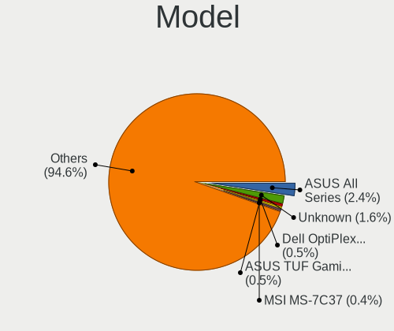
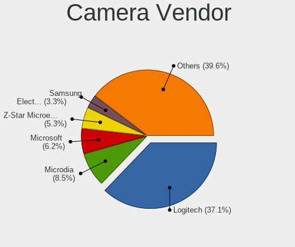

Linux - Tested Hardware & Statistics (Desktops)
-----------------------------------------------

A project to collect tested hardware configurations for Linux.

Anyone can contribute to this report by the [hw-probe](https://github.com/linuxhw/hw-probe) tool:

    sudo -E hw-probe -all -upload

Please contribute! Especially if your hardware is rare.

This report is for real hardware. Report for virtual hardware: [TestDays_VE](https://github.com/linuxhw/TestDays_VE)

Contents
--------

* [ Test Cases ](#test-cases)

* [ System ](#system)
  - [ OS                       ](#os)
  - [ OS Family                ](#os-family)
  - [ Kernel                   ](#kernel)
  - [ Kernel Family            ](#kernel-family)
  - [ Kernel Major Ver.        ](#kernel-major-ver)
  - [ Arch                     ](#arch)
  - [ DE                       ](#de)
  - [ Display Server           ](#display-server)
  - [ Display Manager          ](#display-manager)
  - [ OS Lang                  ](#os-lang)
  - [ Boot Mode                ](#boot-mode)
  - [ Filesystem               ](#filesystem)
  - [ Part. scheme             ](#part-scheme)
  - [ Dual Boot with Linux/BSD ](#dual-boot-with-linuxbsd)
  - [ Dual Boot (Win)          ](#dual-boot-win)

* [ Board ](#board)
  - [ Vendor                   ](#vendor)
  - [ Model                    ](#model)
  - [ Model Family             ](#model-family)
  - [ MFG Year                 ](#mfg-year)
  - [ Form Factor              ](#form-factor)
  - [ Secure Boot              ](#secure-boot)
  - [ Coreboot                 ](#coreboot)
  - [ RAM Size                 ](#ram-size)
  - [ RAM Used                 ](#ram-used)
  - [ Total Drives             ](#total-drives)
  - [ Has CD-ROM               ](#has-cd-rom)
  - [ Has Ethernet             ](#has-ethernet)
  - [ Has WiFi                 ](#has-wifi)
  - [ Has Bluetooth            ](#has-bluetooth)

* [ Location ](#location)
  - [ Country                  ](#country)
  - [ City                     ](#city)

* [ Drives ](#drives)
  - [ Drive Vendor             ](#drive-vendor)
  - [ Drive Model              ](#drive-model)
  - [ HDD Vendor               ](#hdd-vendor)
  - [ SSD Vendor               ](#ssd-vendor)
  - [ Drive Kind               ](#drive-kind)
  - [ Drive Connector          ](#drive-connector)
  - [ Drive Size               ](#drive-size)
  - [ Space Total              ](#space-total)
  - [ Space Used               ](#space-used)
  - [ Malfunc. Drives          ](#malfunc-drives)
  - [ Malfunc. Drive Vendor    ](#malfunc-drive-vendor)
  - [ Malfunc. HDD Vendor      ](#malfunc-hdd-vendor)
  - [ Malfunc. Drive Kind      ](#malfunc-drive-kind)
  - [ Failed Drives            ](#failed-drives)
  - [ Failed Drive Vendor      ](#failed-drive-vendor)
  - [ Drive Status             ](#drive-status)

* [ Storage controller ](#storage-controller)
  - [ Storage Vendor           ](#storage-vendor)
  - [ Storage Model            ](#storage-model)
  - [ Storage Kind             ](#storage-kind)

* [ Processor ](#processor)
  - [ CPU Vendor               ](#cpu-vendor)
  - [ CPU Model                ](#cpu-model)
  - [ CPU Model Family         ](#cpu-model-family)
  - [ CPU Cores                ](#cpu-cores)
  - [ CPU Sockets              ](#cpu-sockets)
  - [ CPU Threads              ](#cpu-threads)
  - [ CPU Op-Modes             ](#cpu-op-modes)
  - [ CPU Microcode            ](#cpu-microcode)
  - [ CPU Microarch            ](#cpu-microarch)

* [ Graphics ](#graphics)
  - [ GPU Vendor               ](#gpu-vendor)
  - [ GPU Model                ](#gpu-model)
  - [ GPU Combo                ](#gpu-combo)
  - [ GPU Driver               ](#gpu-driver)
  - [ GPU Memory               ](#gpu-memory)

* [ Monitor ](#monitor)
  - [ Monitor Vendor           ](#monitor-vendor)
  - [ Monitor Model            ](#monitor-model)
  - [ Monitor Resolution       ](#monitor-resolution)
  - [ Monitor Diagonal         ](#monitor-diagonal)
  - [ Monitor Width            ](#monitor-width)
  - [ Aspect Ratio             ](#aspect-ratio)
  - [ Monitor Area             ](#monitor-area)
  - [ Pixel Density            ](#pixel-density)
  - [ Multiple Monitors        ](#multiple-monitors)

* [ Network ](#network)
  - [ Net Controller Vendor    ](#net-controller-vendor)
  - [ Net Controller Model     ](#net-controller-model)
  - [ Wireless Vendor          ](#wireless-vendor)
  - [ Wireless Model           ](#wireless-model)
  - [ Ethernet Vendor          ](#ethernet-vendor)
  - [ Ethernet Model           ](#ethernet-model)
  - [ Net Controller Kind      ](#net-controller-kind)
  - [ Used Controller          ](#used-controller)
  - [ NICs                     ](#nics)
  - [ IPv6                     ](#ipv6)

* [ Bluetooth ](#bluetooth)
  - [ Bluetooth Vendor         ](#bluetooth-vendor)
  - [ Bluetooth Model          ](#bluetooth-model)

* [ Sound ](#sound)
  - [ Sound Vendor             ](#sound-vendor)
  - [ Sound Model              ](#sound-model)

* [ Memory ](#memory)
  - [ Memory Vendor            ](#memory-vendor)
  - [ Memory Model             ](#memory-model)
  - [ Memory Kind              ](#memory-kind)
  - [ Memory Form Factor       ](#memory-form-factor)
  - [ Memory Size              ](#memory-size)
  - [ Memory Speed             ](#memory-speed)

* [ Printers & scanners ](#printers--scanners)
  - [ Printer Vendor           ](#printer-vendor)
  - [ Printer Model            ](#printer-model)
  - [ Scanner Vendor           ](#scanner-vendor)
  - [ Scanner Model            ](#scanner-model)

* [ Camera ](#camera)
  - [ Camera Vendor            ](#camera-vendor)
  - [ Camera Model             ](#camera-model)

* [ Security ](#security)
  - [ Fingerprint Vendor       ](#fingerprint-vendor)
  - [ Fingerprint Model        ](#fingerprint-model)
  - [ Chipcard Vendor          ](#chipcard-vendor)
  - [ Chipcard Model           ](#chipcard-model)

* [ Unsupported ](#unsupported)
  - [ Unsupported Devices      ](#unsupported-devices)
  - [ Unsupported Device Types ](#unsupported-device-types)

Test Cases
----------

Total: 126895

| Vendor        | Model                       | Probe                                                      | Date         |
|---------------|-----------------------------|------------------------------------------------------------|--------------|
| ASRock        | A320M-HD                    | [1df7c65f40](https://linux-hardware.org/?probe=1df7c65f40) | Jul 01, 2023 |
| Intel         | D845GRG AAA84341-206        | [1863434dc7](https://linux-hardware.org/?probe=1863434dc7) | Jul 01, 2023 |
| Acer          | FRS780M                     | [3066c1772f](https://linux-hardware.org/?probe=3066c1772f) | Jul 01, 2023 |
| Acer          | FRS780M                     | [4f8ad26557](https://linux-hardware.org/?probe=4f8ad26557) | Jul 01, 2023 |
| Gigabyte      | X79-UD3                     | [36fed79d81](https://linux-hardware.org/?probe=36fed79d81) | Jul 01, 2023 |
| ASUSTek       | M4A78LT-M-LE                | [9564e74fb6](https://linux-hardware.org/?probe=9564e74fb6) | Jul 01, 2023 |
| ASRock        | H510M-HDV/M.2               | [ec9ab3662c](https://linux-hardware.org/?probe=ec9ab3662c) | Jul 01, 2023 |
| Intel         | D845GRG AAA84341-206        | [7734dda00e](https://linux-hardware.org/?probe=7734dda00e) | Jun 30, 2023 |
| Gigabyte      | Z77X-UD5H                   | [eea1d9623c](https://linux-hardware.org/?probe=eea1d9623c) | Jun 30, 2023 |
| Pegatron      | 2ACB                        | [ceb2b4c1c5](https://linux-hardware.org/?probe=ceb2b4c1c5) | Jun 30, 2023 |
| ZR            | A320M-F 1005                | [c32d8de777](https://linux-hardware.org/?probe=c32d8de777) | Jun 30, 2023 |
| Gigabyte      | Q87M-D2H                    | [633c55d4ba](https://linux-hardware.org/?probe=633c55d4ba) | Jun 30, 2023 |
| Medion        | TJ4125                      | [5cebe0a1d0](https://linux-hardware.org/?probe=5cebe0a1d0) | Jun 30, 2023 |
| ASUSTek       | PRIME H610M-K D4            | [196daaa768](https://linux-hardware.org/?probe=196daaa768) | Jun 30, 2023 |
| Gigabyte      | B85M-D3H                    | [99b07ae636](https://linux-hardware.org/?probe=99b07ae636) | Jun 30, 2023 |
| ASUSTek       | TUF Gaming Z690-PLUS D4     | [292b7f6f0f](https://linux-hardware.org/?probe=292b7f6f0f) | Jun 30, 2023 |
| HP            | 1998                        | [91f6e54877](https://linux-hardware.org/?probe=91f6e54877) | Jun 30, 2023 |
| ASUSTek       | PRIME Z790-A WIFI           | [fa055ceb7c](https://linux-hardware.org/?probe=fa055ceb7c) | Jun 30, 2023 |
| Gigabyte      | H410M S2H V3                | [e539937c27](https://linux-hardware.org/?probe=e539937c27) | Jun 30, 2023 |
| ASUSTek       | TUF Gaming X570-PLUS        | [ef49f25cf8](https://linux-hardware.org/?probe=ef49f25cf8) | Jun 30, 2023 |
| Supermicro    | X10DDW-i                    | [c43e65f1ae](https://linux-hardware.org/?probe=c43e65f1ae) | Jun 30, 2023 |
| ASUSTek       | PRIME H610M-K D4            | [8e7db66929](https://linux-hardware.org/?probe=8e7db66929) | Jun 30, 2023 |
| Intel         | X99 V1.x                    | [8e4ce021b1](https://linux-hardware.org/?probe=8e4ce021b1) | Jun 30, 2023 |
| Gigabyte      | H81M-S2PH                   | [69b69e2a09](https://linux-hardware.org/?probe=69b69e2a09) | Jun 30, 2023 |
| ASUSTek       | ROG CROSSHAIR VII HERO      | [d42cdc8551](https://linux-hardware.org/?probe=d42cdc8551) | Jun 30, 2023 |
| Medion        | TJ4125                      | [327794cb1a](https://linux-hardware.org/?probe=327794cb1a) | Jun 30, 2023 |
| Gigabyte      | GA-78LMT-USB3 SEx           | [af3e6790e4](https://linux-hardware.org/?probe=af3e6790e4) | Jun 30, 2023 |
| Gigabyte      | B85M-D3H                    | [498eb9b539](https://linux-hardware.org/?probe=498eb9b539) | Jun 30, 2023 |
| Acer          | Predator PO5-640            | [416b01c954](https://linux-hardware.org/?probe=416b01c954) | Jun 30, 2023 |
| MSI           | Z390-A PRO                  | [7c3ce62039](https://linux-hardware.org/?probe=7c3ce62039) | Jun 30, 2023 |
| ASUSTek       | TUF Gaming B550M-E WIFI     | [916b60f6f7](https://linux-hardware.org/?probe=916b60f6f7) | Jun 30, 2023 |
| Intel         | B85 V5.56                   | [a582972a5e](https://linux-hardware.org/?probe=a582972a5e) | Jun 30, 2023 |
| Gigabyte      | B760M DS3H AX DDR4          | [0d3ecc7c44](https://linux-hardware.org/?probe=0d3ecc7c44) | Jun 30, 2023 |
| Pegatron      | 2AB5                        | [f23fa01e43](https://linux-hardware.org/?probe=f23fa01e43) | Jun 30, 2023 |
| Gigabyte      | B550 AORUS ELITE V2         | [0eb501cde5](https://linux-hardware.org/?probe=0eb501cde5) | Jun 30, 2023 |
| ASUSTek       | P6X58D PREMIUM              | [b2d81d6e67](https://linux-hardware.org/?probe=b2d81d6e67) | Jun 30, 2023 |
| Gigabyte      | G33M-S2L                    | [99ffcc407b](https://linux-hardware.org/?probe=99ffcc407b) | Jun 30, 2023 |
| ASUSTek       | H81M-R                      | [83cd667719](https://linux-hardware.org/?probe=83cd667719) | Jun 30, 2023 |
| Gigabyte      | Z87X-UD5H-CF                | [3749bda51b](https://linux-hardware.org/?probe=3749bda51b) | Jun 30, 2023 |
| ASUSTek       | ROG CROSSHAIR X670E GENE    | [c93f4f0d0b](https://linux-hardware.org/?probe=c93f4f0d0b) | Jun 30, 2023 |
| Gigabyte      | H55M-UD2H                   | [befac7b8de](https://linux-hardware.org/?probe=befac7b8de) | Jun 30, 2023 |
| Fujitsu Si... | D2721-A1 S26361-D2721-A1    | [908af533fc](https://linux-hardware.org/?probe=908af533fc) | Jun 30, 2023 |
| MSI           | MPG X570 GAMING PRO CARB... | [661dc06ef7](https://linux-hardware.org/?probe=661dc06ef7) | Jun 30, 2023 |
| ASUSTek       | TUF Gaming B550-PLUS WIF... | [3c3556dd33](https://linux-hardware.org/?probe=3c3556dd33) | Jun 30, 2023 |
| ASRock        | 775Dual-VSTA                | [7ddc95bb2f](https://linux-hardware.org/?probe=7ddc95bb2f) | Jun 30, 2023 |
| MSI           | G41M-P33 Combo              | [07ab83bef1](https://linux-hardware.org/?probe=07ab83bef1) | Jun 30, 2023 |
| Gigabyte      | P67A-UD5-B3                 | [b763c860fa](https://linux-hardware.org/?probe=b763c860fa) | Jun 30, 2023 |
| MSI           | G41M-P33 Combo              | [fcf9a0fd47](https://linux-hardware.org/?probe=fcf9a0fd47) | Jun 30, 2023 |
| Gigabyte      | H61M-S1                     | [b6be2d7f9f](https://linux-hardware.org/?probe=b6be2d7f9f) | Jun 30, 2023 |
| Gigabyte      | Z170XP-SLI-CF               | [ed171ca808](https://linux-hardware.org/?probe=ed171ca808) | Jun 30, 2023 |
| Gigabyte      | Z87X-UD5H-CF                | [6ee8476c0e](https://linux-hardware.org/?probe=6ee8476c0e) | Jun 30, 2023 |
| HP            | 8056                        | [32d1199c51](https://linux-hardware.org/?probe=32d1199c51) | Jun 30, 2023 |
| AZW           | SEi                         | [37527da518](https://linux-hardware.org/?probe=37527da518) | Jun 30, 2023 |
| Intel         | X99H                        | [8e8c7e8b20](https://linux-hardware.org/?probe=8e8c7e8b20) | Jun 30, 2023 |
| MSI           | B450-A PRO MAX              | [2fe05dff41](https://linux-hardware.org/?probe=2fe05dff41) | Jun 30, 2023 |
| Gigabyte      | B550M AORUS PRO             | [08d14942e4](https://linux-hardware.org/?probe=08d14942e4) | Jun 30, 2023 |
| Gigabyte      | B650M AORUS ELITE AX        | [ffcfef2edb](https://linux-hardware.org/?probe=ffcfef2edb) | Jun 30, 2023 |
| Gigabyte      | B550 UD AC                  | [7d7d37522c](https://linux-hardware.org/?probe=7d7d37522c) | Jun 30, 2023 |
| Gigabyte      | Z77X-D3H                    | [3e1517b7a7](https://linux-hardware.org/?probe=3e1517b7a7) | Jun 30, 2023 |
| MSI           | B450-A PRO MAX              | [5199efd89e](https://linux-hardware.org/?probe=5199efd89e) | Jun 30, 2023 |
| ASUSTek       | F1A75-V EVO                 | [b59f4f203c](https://linux-hardware.org/?probe=b59f4f203c) | Jun 30, 2023 |
| ASUSTek       | P8Z77-V DELUXE              | [a7bcb95d10](https://linux-hardware.org/?probe=a7bcb95d10) | Jun 30, 2023 |
| AZW           | U59                         | [2b5d4dd033](https://linux-hardware.org/?probe=2b5d4dd033) | Jun 30, 2023 |
| Gigabyte      | B365M DS3H                  | [0272953855](https://linux-hardware.org/?probe=0272953855) | Jun 30, 2023 |
| Gigabyte      | H81M-S2H                    | [fe8b1af179](https://linux-hardware.org/?probe=fe8b1af179) | Jun 30, 2023 |
| MSI           | MPG B550 GAMING EDGE WIF... | [9f8e4c6a70](https://linux-hardware.org/?probe=9f8e4c6a70) | Jun 30, 2023 |
| ASUSTek       | B85M-E                      | [f36fa2d610](https://linux-hardware.org/?probe=f36fa2d610) | Jun 30, 2023 |
| ASRock        | X670E Pro RS                | [e1ed0643fb](https://linux-hardware.org/?probe=e1ed0643fb) | Jun 30, 2023 |
| Supermicro    | X9DRW                       | [cb955d7a58](https://linux-hardware.org/?probe=cb955d7a58) | Jun 30, 2023 |
| Intel         | B75                         | [73d881c953](https://linux-hardware.org/?probe=73d881c953) | Jun 30, 2023 |
| ASRock        | X670E Pro RS                | [0e98c1f04a](https://linux-hardware.org/?probe=0e98c1f04a) | Jun 30, 2023 |
| ASRock        | Z68 Pro3 Gen3               | [9fc143ab80](https://linux-hardware.org/?probe=9fc143ab80) | Jun 30, 2023 |
| ASRock        | G31M-GS                     | [3bd67e0f9f](https://linux-hardware.org/?probe=3bd67e0f9f) | Jun 30, 2023 |
| ASUSTek       | P8H67-V                     | [afe93b44f3](https://linux-hardware.org/?probe=afe93b44f3) | Jun 30, 2023 |
| Gigabyte      | GA-MA770-UD3                | [03b1ea3bfa](https://linux-hardware.org/?probe=03b1ea3bfa) | Jun 30, 2023 |
| ASUSTek       | PRIME A320M-K               | [ec846958c9](https://linux-hardware.org/?probe=ec846958c9) | Jun 30, 2023 |
| ASUSTek       | PRIME A320M-K               | [310342d290](https://linux-hardware.org/?probe=310342d290) | Jun 30, 2023 |
| Dell          | 0NW6H5 A00                  | [593512053f](https://linux-hardware.org/?probe=593512053f) | Jun 30, 2023 |
| Gigabyte      | H170-HD3-CF                 | [59d1be1c5d](https://linux-hardware.org/?probe=59d1be1c5d) | Jun 30, 2023 |
| MSI           | MAG B550 TOMAHAWK           | [265cbaedcc](https://linux-hardware.org/?probe=265cbaedcc) | Jun 30, 2023 |
| Lenovo        | 0B98401 WIN                 | [35871c9acc](https://linux-hardware.org/?probe=35871c9acc) | Jun 30, 2023 |
| Gigabyte      | B450M S2H                   | [9a9ca045af](https://linux-hardware.org/?probe=9a9ca045af) | Jun 30, 2023 |
| HP            | 1497                        | [4dd582d288](https://linux-hardware.org/?probe=4dd582d288) | Jun 30, 2023 |
| Gigabyte      | H77N-WIFI                   | [a366d05b2b](https://linux-hardware.org/?probe=a366d05b2b) | Jun 30, 2023 |
| Fujitsu Si... | D2721-A1 S26361-D2721-A1    | [298a4bf290](https://linux-hardware.org/?probe=298a4bf290) | Jun 30, 2023 |
| Samsung       | DT1234567890 SAMSUNG_SW_... | [878e617ba4](https://linux-hardware.org/?probe=878e617ba4) | Jun 30, 2023 |
| ASRockRack    | X470D4U2-2T                 | [70ed50862c](https://linux-hardware.org/?probe=70ed50862c) | Jun 30, 2023 |
| ASUSTek       | PRIME Z370-A II             | [5907f43d41](https://linux-hardware.org/?probe=5907f43d41) | Jun 30, 2023 |
| Dell          | 0KYJ8C A02                  | [f4fff60df3](https://linux-hardware.org/?probe=f4fff60df3) | Jun 30, 2023 |
| HP            | 89B5 A                      | [f0330163de](https://linux-hardware.org/?probe=f0330163de) | Jun 30, 2023 |
| ASRock        | X570 Taichi                 | [af8af2c7e8](https://linux-hardware.org/?probe=af8af2c7e8) | Jun 30, 2023 |
| ASRock        | FM2A88X Extreme6+           | [77e6b09eb9](https://linux-hardware.org/?probe=77e6b09eb9) | Jun 30, 2023 |
| MSI           | X99A RAIDER                 | [bb8a8eac46](https://linux-hardware.org/?probe=bb8a8eac46) | Jun 30, 2023 |
| Gigabyte      | X570 AORUS ELITE WIFI       | [cdb77bf9b6](https://linux-hardware.org/?probe=cdb77bf9b6) | Jun 30, 2023 |
| ASUSTek       | M51AC                       | [d32d060e9c](https://linux-hardware.org/?probe=d32d060e9c) | Jun 30, 2023 |
| Dell          | 0M6C7G A00                  | [d7dfcc4a38](https://linux-hardware.org/?probe=d7dfcc4a38) | Jun 30, 2023 |
| Dell          | 0KYJ8C A02                  | [c860545122](https://linux-hardware.org/?probe=c860545122) | Jun 30, 2023 |
| HP            | 2129                        | [73daf1de6b](https://linux-hardware.org/?probe=73daf1de6b) | Jun 30, 2023 |
| Gigabyte      | Z590 AORUS ULTRA            | [45d5903c62](https://linux-hardware.org/?probe=45d5903c62) | Jun 30, 2023 |
| Gigabyte      | X670E AORUS MASTER          | [70ddebe460](https://linux-hardware.org/?probe=70ddebe460) | Jun 30, 2023 |
| Gigabyte      | X670E AORUS MASTER          | [7ae106bfd6](https://linux-hardware.org/?probe=7ae106bfd6) | Jun 30, 2023 |
| Medion        | Z370H4-EM                   | [b8327a4d00](https://linux-hardware.org/?probe=b8327a4d00) | Jun 30, 2023 |
| Gigabyte      | GA-MA770-DS3                | [5b7bc3205d](https://linux-hardware.org/?probe=5b7bc3205d) | Jun 29, 2023 |
| AZW           | MINI S 10                   | [84eec8c276](https://linux-hardware.org/?probe=84eec8c276) | Jun 29, 2023 |
| MSI           | P67A-G43                    | [8e5f71c975](https://linux-hardware.org/?probe=8e5f71c975) | Jun 29, 2023 |
| AZW           | MINI S 10                   | [d1795fbf64](https://linux-hardware.org/?probe=d1795fbf64) | Jun 29, 2023 |
| HP            | 8055                        | [47536e2cde](https://linux-hardware.org/?probe=47536e2cde) | Jun 29, 2023 |
| ASRock        | 970 Pro3 R2.0               | [64e81a22a5](https://linux-hardware.org/?probe=64e81a22a5) | Jun 29, 2023 |
| MSI           | A320M-A PRO                 | [7dffb9055b](https://linux-hardware.org/?probe=7dffb9055b) | Jun 29, 2023 |
| Intel         | SHARKBAY                    | [581282a150](https://linux-hardware.org/?probe=581282a150) | Jun 29, 2023 |
| Intel         | X99 V1.x                    | [1c7ef9ef35](https://linux-hardware.org/?probe=1c7ef9ef35) | Jun 29, 2023 |
| ASUSTek       | PRIME X370-PRO              | [6c7621fe04](https://linux-hardware.org/?probe=6c7621fe04) | Jun 29, 2023 |
| ASUSTek       | CM6330_CM6630_CM6730_CM6... | [42624c8bb1](https://linux-hardware.org/?probe=42624c8bb1) | Jun 29, 2023 |
| Intel         | B85 V5.56                   | [e8b15eb823](https://linux-hardware.org/?probe=e8b15eb823) | Jun 29, 2023 |
| PCWare        | IPMH61R3                    | [e190259144](https://linux-hardware.org/?probe=e190259144) | Jun 29, 2023 |
| Gigabyte      | X79-UD3                     | [5a88d6945d](https://linux-hardware.org/?probe=5a88d6945d) | Jun 29, 2023 |
| Acer          | Aspire XC-840               | [76c750aae4](https://linux-hardware.org/?probe=76c750aae4) | Jun 29, 2023 |
| ASRock        | H310CM-DVS                  | [46429ac6ae](https://linux-hardware.org/?probe=46429ac6ae) | Jun 29, 2023 |
| Gigabyte      | H81M-S2PH                   | [d0ec676a22](https://linux-hardware.org/?probe=d0ec676a22) | Jun 29, 2023 |
| MSI           | MPG Z390 GAMING EDGE AC     | [5a6b149eb4](https://linux-hardware.org/?probe=5a6b149eb4) | Jun 29, 2023 |
| Huanan        | X99-F8 GAMING V5.0          | [6a95d2096d](https://linux-hardware.org/?probe=6a95d2096d) | Jun 29, 2023 |
| MSI           | MS-7267 100                 | [3a014aae8a](https://linux-hardware.org/?probe=3a014aae8a) | Jun 29, 2023 |
| Dell          | 0T568R A00                  | [cf98a8a69b](https://linux-hardware.org/?probe=cf98a8a69b) | Jun 29, 2023 |
| ASUSTek       | M5A97 R2.0                  | [2dd6be0ddc](https://linux-hardware.org/?probe=2dd6be0ddc) | Jun 29, 2023 |
| MSI           | B450-A PRO MAX              | [69cb8803e1](https://linux-hardware.org/?probe=69cb8803e1) | Jun 29, 2023 |
| ASUSTek       | TUF Gaming X570-PLUS        | [d6cb722f64](https://linux-hardware.org/?probe=d6cb722f64) | Jun 29, 2023 |
| ASUSTek       | P8Z68-V PRO                 | [a3de72d73c](https://linux-hardware.org/?probe=a3de72d73c) | Jun 29, 2023 |
| ASRock        | Z690 Steel Legend WiFi 6... | [d09ee66df1](https://linux-hardware.org/?probe=d09ee66df1) | Jun 29, 2023 |
| ASUSTek       | H87M-E                      | [7e7af2948c](https://linux-hardware.org/?probe=7e7af2948c) | Jun 29, 2023 |
| Loongson      | LS3A5000-7A2000-1w-EVB-V... | [7baa260d16](https://linux-hardware.org/?probe=7baa260d16) | Jun 29, 2023 |
| Dell          | 0GDG8Y A00                  | [f0fdd509f7](https://linux-hardware.org/?probe=f0fdd509f7) | Jun 29, 2023 |
| Dell          | 0PU052                      | [b4fde65c68](https://linux-hardware.org/?probe=b4fde65c68) | Jun 29, 2023 |
| Gigabyte      | H310M H                     | [0ad496c06d](https://linux-hardware.org/?probe=0ad496c06d) | Jun 29, 2023 |
| Dell          | 0GY6Y8 A02                  | [eb31590a2c](https://linux-hardware.org/?probe=eb31590a2c) | Jun 29, 2023 |
| MSI           | H61M-P31                    | [9012219f61](https://linux-hardware.org/?probe=9012219f61) | Jun 29, 2023 |
| Gigabyte      | A320M-S2H-CF                | [bb1cb1ef13](https://linux-hardware.org/?probe=bb1cb1ef13) | Jun 29, 2023 |
| ASUSTek       | H81M-C                      | [e12c71fb39](https://linux-hardware.org/?probe=e12c71fb39) | Jun 29, 2023 |
| HP            | 0B54h D                     | [c13f21ea22](https://linux-hardware.org/?probe=c13f21ea22) | Jun 29, 2023 |
| Gigabyte      | H410M H V3                  | [5496b9130e](https://linux-hardware.org/?probe=5496b9130e) | Jun 29, 2023 |
| Gigabyte      | B450 AORUS ELITE            | [ddb283952b](https://linux-hardware.org/?probe=ddb283952b) | Jun 29, 2023 |
| HP            | 8459                        | [11e9d33725](https://linux-hardware.org/?probe=11e9d33725) | Jun 29, 2023 |
| Dell          | 0T656F A02                  | [bf4264c797](https://linux-hardware.org/?probe=bf4264c797) | Jun 29, 2023 |
| ASUSTek       | PRIME Z270-A                | [171e61b165](https://linux-hardware.org/?probe=171e61b165) | Jun 29, 2023 |
| ASUSTek       | H110M-A                     | [c3118a3d89](https://linux-hardware.org/?probe=c3118a3d89) | Jun 29, 2023 |
| Acer          | Aspire TC-705               | [326f873ac3](https://linux-hardware.org/?probe=326f873ac3) | Jun 29, 2023 |
| ASUSTek       | PRIME X299-DELUXE           | [4df7190c46](https://linux-hardware.org/?probe=4df7190c46) | Jun 29, 2023 |
| Acer          | Aspire XC-830               | [eccf186dfd](https://linux-hardware.org/?probe=eccf186dfd) | Jun 29, 2023 |
| Lenovo        | SHARKBAY SDK0E50510 PRO     | [56e2b61337](https://linux-hardware.org/?probe=56e2b61337) | Jun 29, 2023 |
| Biostar       | H510MHP                     | [7ddeb5c281](https://linux-hardware.org/?probe=7ddeb5c281) | Jun 29, 2023 |
| Gigabyte      | Z390 AORUS PRO WIFI-CF      | [304ff06fc0](https://linux-hardware.org/?probe=304ff06fc0) | Jun 29, 2023 |
| MSI           | Z87 MPOWER                  | [e34420b76e](https://linux-hardware.org/?probe=e34420b76e) | Jun 29, 2023 |
| ASUSTek       | PRIME X299-DELUXE           | [6388cc47ae](https://linux-hardware.org/?probe=6388cc47ae) | Jun 29, 2023 |
| Dell          | 0D28YY A03                  | [9c056f8643](https://linux-hardware.org/?probe=9c056f8643) | Jun 29, 2023 |
| ASUSTek       | P7H55-M LX                  | [8a0d6c1825](https://linux-hardware.org/?probe=8a0d6c1825) | Jun 29, 2023 |
| ASUSTek       | P5G41T-M LX                 | [20f509028b](https://linux-hardware.org/?probe=20f509028b) | Jun 29, 2023 |
| Gigabyte      | B365M D3H-CF                | [f40af0020a](https://linux-hardware.org/?probe=f40af0020a) | Jun 29, 2023 |
| ASUSTek       | ROG STRIX X670E-E GAMING... | [95fb20193a](https://linux-hardware.org/?probe=95fb20193a) | Jun 29, 2023 |
| Gigabyte      | H61M-HD2                    | [404728f350](https://linux-hardware.org/?probe=404728f350) | Jun 29, 2023 |
| HP            | 1589                        | [dcb3289360](https://linux-hardware.org/?probe=dcb3289360) | Jun 29, 2023 |
| MSI           | B450 TOMAHAWK               | [86866241cd](https://linux-hardware.org/?probe=86866241cd) | Jun 29, 2023 |
| ASUSTek       | TUF Gaming Z690-PLUS WIF... | [a996f391dc](https://linux-hardware.org/?probe=a996f391dc) | Jun 29, 2023 |
| ASUSTek       | PRIME B550M-A               | [5bb4af3f8b](https://linux-hardware.org/?probe=5bb4af3f8b) | Jun 29, 2023 |
| MSI           | B550-A PRO                  | [722b0302f4](https://linux-hardware.org/?probe=722b0302f4) | Jun 29, 2023 |
| Supermicro    | X8ST3                       | [305a3e3c1a](https://linux-hardware.org/?probe=305a3e3c1a) | Jun 29, 2023 |
| MSI           | MS-7438 100                 | [4d0d23065e](https://linux-hardware.org/?probe=4d0d23065e) | Jun 29, 2023 |
| ASUSTek       | Z170-E                      | [8be9720ca6](https://linux-hardware.org/?probe=8be9720ca6) | Jun 29, 2023 |
| ASUSTek       | M5A78L-M PLUS/USB3          | [2f50312c02](https://linux-hardware.org/?probe=2f50312c02) | Jun 29, 2023 |
| Intel         | DG41RQ AAE54511-205         | [0e896bc137](https://linux-hardware.org/?probe=0e896bc137) | Jun 29, 2023 |
| Fujitsu       | D3400-A1 S26361-D3400-A1    | [4ad54ee28d](https://linux-hardware.org/?probe=4ad54ee28d) | Jun 29, 2023 |
| ASUSTek       | PRIME Z590-P                | [6147d58cdf](https://linux-hardware.org/?probe=6147d58cdf) | Jun 29, 2023 |
| Shuttle       | FS61                        | [a67d2edea8](https://linux-hardware.org/?probe=a67d2edea8) | Jun 28, 2023 |
| ASUSTek       | M2A-VM                      | [d25910c419](https://linux-hardware.org/?probe=d25910c419) | Jun 28, 2023 |
| Gigabyte      | MRHM3AP                     | [2d91c7c05a](https://linux-hardware.org/?probe=2d91c7c05a) | Jun 28, 2023 |
| ASUSTek       | ROG STRIX B450-F GAMING ... | [b94582735c](https://linux-hardware.org/?probe=b94582735c) | Jun 28, 2023 |
| Lenovo        | 3111 SDK0J40697 WIN 3305... | [323464eebb](https://linux-hardware.org/?probe=323464eebb) | Jun 28, 2023 |
| Gigabyte      | P31-DS3L                    | [0d32728bdf](https://linux-hardware.org/?probe=0d32728bdf) | Jun 28, 2023 |
| Gigabyte      | 970A-DS3P                   | [3ef19cf418](https://linux-hardware.org/?probe=3ef19cf418) | Jun 28, 2023 |
| ASUSTek       | H170-PRO                    | [506c909e37](https://linux-hardware.org/?probe=506c909e37) | Jun 28, 2023 |
| MSI           | H110M GAMING                | [23de26f1b2](https://linux-hardware.org/?probe=23de26f1b2) | Jun 28, 2023 |
| MSI           | MAG Z390 TOMAHAWK           | [49f05e412e](https://linux-hardware.org/?probe=49f05e412e) | Jun 28, 2023 |
| Dell          | 08NPPY A00                  | [b1b4052442](https://linux-hardware.org/?probe=b1b4052442) | Jun 28, 2023 |
| Dell          | 0WK833                      | [fd4a07e088](https://linux-hardware.org/?probe=fd4a07e088) | Jun 28, 2023 |
| ASUSTek       | ROG STRIX B650E-F GAMING... | [08708e8e9d](https://linux-hardware.org/?probe=08708e8e9d) | Jun 28, 2023 |
| ASUSTek       | F2A85-M PRO                 | [a7617c12c5](https://linux-hardware.org/?probe=a7617c12c5) | Jun 28, 2023 |
| ASRock        | Z97 Extreme4                | [b1e629bc3c](https://linux-hardware.org/?probe=b1e629bc3c) | Jun 28, 2023 |
| ASUSTek       | ROG STRIX X370-F GAMING     | [793ee1e44c](https://linux-hardware.org/?probe=793ee1e44c) | Jun 28, 2023 |
| MSI           | MAG Z390 TOMAHAWK           | [5c049dc792](https://linux-hardware.org/?probe=5c049dc792) | Jun 28, 2023 |
| Intel         | DG965SS AAD41678-304        | [696cd9ce01](https://linux-hardware.org/?probe=696cd9ce01) | Jun 28, 2023 |
| ASUSTek       | GA35DX                      | [a91acc04b6](https://linux-hardware.org/?probe=a91acc04b6) | Jun 28, 2023 |
| ASUSTek       | ROG STRIX X470-I GAMING     | [b8194aee09](https://linux-hardware.org/?probe=b8194aee09) | Jun 28, 2023 |
| ASUSTek       | P8Z77-V LE                  | [802b3686d4](https://linux-hardware.org/?probe=802b3686d4) | Jun 28, 2023 |
| Gigabyte      | B550 AORUS ELITE            | [e46c7340d7](https://linux-hardware.org/?probe=e46c7340d7) | Jun 28, 2023 |
| ZR            | A320M-F 1005                | [f70bb41b80](https://linux-hardware.org/?probe=f70bb41b80) | Jun 28, 2023 |
| Gigabyte      | Z490 AORUS MASTER           | [031ec94437](https://linux-hardware.org/?probe=031ec94437) | Jun 28, 2023 |
| MSI           | PRO B760M-A WIFI DDR4       | [7f5dfae0db](https://linux-hardware.org/?probe=7f5dfae0db) | Jun 28, 2023 |
| Gigabyte      | H81M-S2H                    | [9cb1b45a65](https://linux-hardware.org/?probe=9cb1b45a65) | Jun 28, 2023 |
| ASUSTek       | M4N78                       | [03e5d24ba1](https://linux-hardware.org/?probe=03e5d24ba1) | Jun 28, 2023 |
| Huanan        | X99-BD4 V1.31               | [fcd9a6b1e2](https://linux-hardware.org/?probe=fcd9a6b1e2) | Jun 28, 2023 |
| Huanan        | Unknown                     | [397d33202e](https://linux-hardware.org/?probe=397d33202e) | Jun 28, 2023 |
| ASRock        | X570 Taichi                 | [77e9996f3c](https://linux-hardware.org/?probe=77e9996f3c) | Jun 28, 2023 |
| Gigabyte      | X470 AORUS ULTRA GAMING-... | [81bbfe3459](https://linux-hardware.org/?probe=81bbfe3459) | Jun 28, 2023 |
| ASRock        | Z75 Pro3                    | [cb40f5d060](https://linux-hardware.org/?probe=cb40f5d060) | Jun 28, 2023 |
| ASUSTek       | PRIME B550M-A               | [d6823d5ec7](https://linux-hardware.org/?probe=d6823d5ec7) | Jun 28, 2023 |
| MSI           | B450 TOMAHAWK               | [1ef1762ac3](https://linux-hardware.org/?probe=1ef1762ac3) | Jun 28, 2023 |
| Gigabyte      | X470 AORUS ULTRA GAMING-... | [ebb41279ae](https://linux-hardware.org/?probe=ebb41279ae) | Jun 28, 2023 |
| Dell          | 0PC5F7 A01                  | [133ed5cc64](https://linux-hardware.org/?probe=133ed5cc64) | Jun 28, 2023 |
| ASRock        | Z75 Pro3                    | [13ac46e7fb](https://linux-hardware.org/?probe=13ac46e7fb) | Jun 28, 2023 |
| Lenovo        | NO DPK                      | [2f12ef933e](https://linux-hardware.org/?probe=2f12ef933e) | Jun 28, 2023 |
| ASRock        | B460M-HDV                   | [966b21f9af](https://linux-hardware.org/?probe=966b21f9af) | Jun 28, 2023 |
| ASUSTek       | SABERTOOTH X79              | [e39c7f5f6f](https://linux-hardware.org/?probe=e39c7f5f6f) | Jun 28, 2023 |
| ASUSTek       | PRIME Z390-P                | [1ef6edecef](https://linux-hardware.org/?probe=1ef6edecef) | Jun 28, 2023 |
| MSI           | MS-B0A1                     | [cc161cc65b](https://linux-hardware.org/?probe=cc161cc65b) | Jun 28, 2023 |
| ASRock        | G41M-VS3                    | [344a5eda20](https://linux-hardware.org/?probe=344a5eda20) | Jun 28, 2023 |
| ASUSTek       | PRIME H310M-K R2.0          | [3f9d0da410](https://linux-hardware.org/?probe=3f9d0da410) | Jun 28, 2023 |
| Dell          | 0XJ5V0 A03                  | [a1595a590c](https://linux-hardware.org/?probe=a1595a590c) | Jun 28, 2023 |
| MSI           | MPG Z490 GAMING EDGE WIF... | [238e77122e](https://linux-hardware.org/?probe=238e77122e) | Jun 28, 2023 |
| Lenovo        | Win8 Pro DPK TPG            | [0efc49ca3a](https://linux-hardware.org/?probe=0efc49ca3a) | Jun 28, 2023 |
| Lenovo        | SDK0E50510 WIN              | [565c1ea1c2](https://linux-hardware.org/?probe=565c1ea1c2) | Jun 28, 2023 |
| Acer          | EG43M                       | [e6d28dd1e5](https://linux-hardware.org/?probe=e6d28dd1e5) | Jun 28, 2023 |
| Lenovo        | SDK0E50510 WIN              | [545a2c4e26](https://linux-hardware.org/?probe=545a2c4e26) | Jun 28, 2023 |
| MSI           | H81M-P32                    | [c0c2f3ba48](https://linux-hardware.org/?probe=c0c2f3ba48) | Jun 28, 2023 |
| Dell          | 02YYK5 A01                  | [4054ebeac8](https://linux-hardware.org/?probe=4054ebeac8) | Jun 28, 2023 |
| MSI           | H81M-P32                    | [75cbcde6b8](https://linux-hardware.org/?probe=75cbcde6b8) | Jun 28, 2023 |
| Gigabyte      | B560M DS3H V2               | [aa24aa071b](https://linux-hardware.org/?probe=aa24aa071b) | Jun 28, 2023 |
| HP            | 8459                        | [7b60320110](https://linux-hardware.org/?probe=7b60320110) | Jun 28, 2023 |
| Intel         | Unknown                     | [3c85a0c7b9](https://linux-hardware.org/?probe=3c85a0c7b9) | Jun 28, 2023 |
| HP            | 21B4 A01                    | [50656fb7ec](https://linux-hardware.org/?probe=50656fb7ec) | Jun 28, 2023 |
| Gigabyte      | X670 AORUS ELITE AX         | [32e4f74711](https://linux-hardware.org/?probe=32e4f74711) | Jun 28, 2023 |
| ASUSTek       | PRIME B550-PLUS             | [6a2c4254e7](https://linux-hardware.org/?probe=6a2c4254e7) | Jun 28, 2023 |
| HP            | 21B4 A01                    | [4d9322819d](https://linux-hardware.org/?probe=4d9322819d) | Jun 28, 2023 |
| ASRock        | H310CM-HG4                  | [8147961b6c](https://linux-hardware.org/?probe=8147961b6c) | Jun 28, 2023 |
| Gigabyte      | B550M AORUS PRO-P           | [e29021ab76](https://linux-hardware.org/?probe=e29021ab76) | Jun 28, 2023 |
| Acer          | Veriton M490G               | [1f3da6e87f](https://linux-hardware.org/?probe=1f3da6e87f) | Jun 28, 2023 |
| MSI           | 880GM-E41                   | [91a2474332](https://linux-hardware.org/?probe=91a2474332) | Jun 28, 2023 |
| ASUSTek       | PRIME Z370M-PLUS II         | [1114cf7328](https://linux-hardware.org/?probe=1114cf7328) | Jun 28, 2023 |
| Lenovo        | Win8 Pro DPK TPG            | [72514911c8](https://linux-hardware.org/?probe=72514911c8) | Jun 28, 2023 |
| Fill By OE... | Q7700                       | [93c7c01ecb](https://linux-hardware.org/?probe=93c7c01ecb) | Jun 28, 2023 |
| OEM           | Unknown                     | [0448bbee67](https://linux-hardware.org/?probe=0448bbee67) | Jun 28, 2023 |
| MSI           | B550M PRO-VDH WIFI          | [cd0c241308](https://linux-hardware.org/?probe=cd0c241308) | Jun 28, 2023 |
| ASRock        | X570 Taichi                 | [75cb221d91](https://linux-hardware.org/?probe=75cb221d91) | Jun 28, 2023 |
| ASUSTek       | PRIME B350M-A               | [1f5a11092b](https://linux-hardware.org/?probe=1f5a11092b) | Jun 28, 2023 |
| ASRock        | H510M-HVS                   | [b90f532588](https://linux-hardware.org/?probe=b90f532588) | Jun 28, 2023 |
| MSI           | MAG B550 TOMAHAWK           | [607da926f3](https://linux-hardware.org/?probe=607da926f3) | Jun 28, 2023 |
| ASUSTek       | X99-WS/IPMI                 | [fff4bc4f46](https://linux-hardware.org/?probe=fff4bc4f46) | Jun 28, 2023 |
| ASUSTek       | F2A55-M LK                  | [0fcac8a0af](https://linux-hardware.org/?probe=0fcac8a0af) | Jun 28, 2023 |
| AZW           | GTR V02                     | [d8a1975328](https://linux-hardware.org/?probe=d8a1975328) | Jun 27, 2023 |
| ASUSTek       | PRIME A320I-K               | [bc9d733b89](https://linux-hardware.org/?probe=bc9d733b89) | Jun 27, 2023 |
| MSI           | B550M PRO-VDH WIFI          | [6f96789257](https://linux-hardware.org/?probe=6f96789257) | Jun 27, 2023 |
| Gigabyte      | B450 I AORUS PRO WIFI-CF    | [0251f7e1ab](https://linux-hardware.org/?probe=0251f7e1ab) | Jun 27, 2023 |
| Foxconn       | G41MD                       | [926a733402](https://linux-hardware.org/?probe=926a733402) | Jun 27, 2023 |
| MSI           | B550M PRO-VDH WIFI          | [f46408c9b6](https://linux-hardware.org/?probe=f46408c9b6) | Jun 27, 2023 |
| MSI           | A320M PRO-VH                | [1a84c61bd4](https://linux-hardware.org/?probe=1a84c61bd4) | Jun 27, 2023 |
| Dell          | 0P01GV A03                  | [a2ef6d8517](https://linux-hardware.org/?probe=a2ef6d8517) | Jun 27, 2023 |
| Intel         | Unknown                     | [dbfbe4b6aa](https://linux-hardware.org/?probe=dbfbe4b6aa) | Jun 27, 2023 |
| MSI           | Z390-A PRO                  | [638d6b4ef3](https://linux-hardware.org/?probe=638d6b4ef3) | Jun 27, 2023 |
| Dell          | 0F6X5P A00                  | [cad43414b4](https://linux-hardware.org/?probe=cad43414b4) | Jun 27, 2023 |
| Gigabyte      | MRHM3AP                     | [7007bb2db5](https://linux-hardware.org/?probe=7007bb2db5) | Jun 27, 2023 |
| ASUSTek       | PRIME B660M-K D4            | [48b0ff43fa](https://linux-hardware.org/?probe=48b0ff43fa) | Jun 27, 2023 |
| HP            | 802F                        | [585f9bf338](https://linux-hardware.org/?probe=585f9bf338) | Jun 27, 2023 |
| Gigabyte      | H61M-D2-B3                  | [7de1b2a03f](https://linux-hardware.org/?probe=7de1b2a03f) | Jun 27, 2023 |
| MSI           | B250M PRO-VH                | [cb47380993](https://linux-hardware.org/?probe=cb47380993) | Jun 27, 2023 |
| ASUSTek       | PRIME H510M-K               | [b96f0a3b19](https://linux-hardware.org/?probe=b96f0a3b19) | Jun 27, 2023 |
| HP            | 802F                        | [efceba0028](https://linux-hardware.org/?probe=efceba0028) | Jun 27, 2023 |
| HP            | 821D                        | [9b007c8a3f](https://linux-hardware.org/?probe=9b007c8a3f) | Jun 27, 2023 |
| Gigabyte      | H410M S2 V2                 | [65794907cc](https://linux-hardware.org/?probe=65794907cc) | Jun 27, 2023 |
| ASUSTek       | TUF Gaming B550M-PLUS       | [2ed9f4248c](https://linux-hardware.org/?probe=2ed9f4248c) | Jun 27, 2023 |
| ASUSTek       | PRIME H510M-K               | [a0c358b2b3](https://linux-hardware.org/?probe=a0c358b2b3) | Jun 27, 2023 |
| ASRock        | AB350M-HDV                  | [a055db3af3](https://linux-hardware.org/?probe=a055db3af3) | Jun 27, 2023 |
| Dell          | 0WK833                      | [39a5ca93a7](https://linux-hardware.org/?probe=39a5ca93a7) | Jun 27, 2023 |
| ASUSTek       | M5A97 PLUS                  | [2faeb24e37](https://linux-hardware.org/?probe=2faeb24e37) | Jun 27, 2023 |
| MSI           | PRO B660M-B DDR4            | [09f4e0e86a](https://linux-hardware.org/?probe=09f4e0e86a) | Jun 27, 2023 |
| Kennex        | POS-PIG41BA                 | [90addad9e1](https://linux-hardware.org/?probe=90addad9e1) | Jun 27, 2023 |
| ASUSTek       | P8Z77-V                     | [177c923e5a](https://linux-hardware.org/?probe=177c923e5a) | Jun 27, 2023 |
| Dell          | 0KWVT8 A03                  | [8dcd3c3200](https://linux-hardware.org/?probe=8dcd3c3200) | Jun 27, 2023 |
| Fujitsu       | D3403-U1 S26361-D3403-U1    | [90067b8232](https://linux-hardware.org/?probe=90067b8232) | Jun 27, 2023 |
| AMI           | Cherry Trail CR             | [65fb07ed8d](https://linux-hardware.org/?probe=65fb07ed8d) | Jun 27, 2023 |
| ASRock        | H310CM-HG4                  | [16c2222f50](https://linux-hardware.org/?probe=16c2222f50) | Jun 27, 2023 |
| Gigabyte      | EG45M-DS2H                  | [b9b25df5a3](https://linux-hardware.org/?probe=b9b25df5a3) | Jun 27, 2023 |
| Gigabyte      | Q87M-D2H                    | [95e5472f48](https://linux-hardware.org/?probe=95e5472f48) | Jun 27, 2023 |
| ASRock        | H61M-DGS R2.0               | [9cab8ca8c0](https://linux-hardware.org/?probe=9cab8ca8c0) | Jun 27, 2023 |
| Lenovo        | 1048 SDK0K17763 WIN 1801... | [d903758323](https://linux-hardware.org/?probe=d903758323) | Jun 27, 2023 |
| HP            | 2B2C                        | [a8ec805431](https://linux-hardware.org/?probe=a8ec805431) | Jun 27, 2023 |
| Gigabyte      | B550 AORUS PRO V2           | [1143a7eebc](https://linux-hardware.org/?probe=1143a7eebc) | Jun 27, 2023 |
| Unknown       | T3 MRD                      | [7478cd5b81](https://linux-hardware.org/?probe=7478cd5b81) | Jun 27, 2023 |
| Dell          | 0427JK A00                  | [0dda4e26da](https://linux-hardware.org/?probe=0dda4e26da) | Jun 27, 2023 |
| ASRock        | H61M-DGS R2.0               | [f719df9920](https://linux-hardware.org/?probe=f719df9920) | Jun 27, 2023 |
| Gigabyte      | H310M M.2 x.x               | [6f9c836bb4](https://linux-hardware.org/?probe=6f9c836bb4) | Jun 27, 2023 |
| Lenovo        | 36C5 SDK0K17763 WIN 1801... | [708131b231](https://linux-hardware.org/?probe=708131b231) | Jun 27, 2023 |
| Lenovo        | 36C5 SDK0K17763 WIN 1801... | [ef8f76e9e1](https://linux-hardware.org/?probe=ef8f76e9e1) | Jun 27, 2023 |
| Dell          | 0FXD80 A00                  | [4427c2159c](https://linux-hardware.org/?probe=4427c2159c) | Jun 27, 2023 |
| MSI           | MAG Z790 TOMAHAWK WIFI      | [9450fc030e](https://linux-hardware.org/?probe=9450fc030e) | Jun 27, 2023 |
| ASUSTek       | EX-B250M-V3                 | [0746c8e92b](https://linux-hardware.org/?probe=0746c8e92b) | Jun 27, 2023 |
| Pegatron      | 2AB5                        | [8aaaef4a62](https://linux-hardware.org/?probe=8aaaef4a62) | Jun 27, 2023 |
| ASRock        | X570 Taichi                 | [895760e7db](https://linux-hardware.org/?probe=895760e7db) | Jun 27, 2023 |
| MSI           | H81M-P33                    | [1726bb80ec](https://linux-hardware.org/?probe=1726bb80ec) | Jun 27, 2023 |
| ASUSTek       | P5P41D                      | [cd85f8d99e](https://linux-hardware.org/?probe=cd85f8d99e) | Jun 27, 2023 |
| Gigabyte      | GA-MA770T-UD3               | [73dfca737b](https://linux-hardware.org/?probe=73dfca737b) | Jun 27, 2023 |
| ASUSTek       | ROG STRIX X670E-F GAMING... | [8619447305](https://linux-hardware.org/?probe=8619447305) | Jun 27, 2023 |
| ASUSTek       | ROG STRIX X670E-F GAMING... | [bddefdfb2c](https://linux-hardware.org/?probe=bddefdfb2c) | Jun 27, 2023 |
| Intel         | LADPNVMO AAE76523-300       | [76cc7bbb86](https://linux-hardware.org/?probe=76cc7bbb86) | Jun 27, 2023 |
| Dell          | 00010C A00                  | [f965b0f028](https://linux-hardware.org/?probe=f965b0f028) | Jun 27, 2023 |
| Fill By OE... | Q7700                       | [32ac9cb839](https://linux-hardware.org/?probe=32ac9cb839) | Jun 27, 2023 |
| MSI           | B450M GAMING PLUS           | [57e792219c](https://linux-hardware.org/?probe=57e792219c) | Jun 27, 2023 |
| HP            | 0A9Ch                       | [08eccac462](https://linux-hardware.org/?probe=08eccac462) | Jun 27, 2023 |
| HP            | 8653 A                      | [076dd9a4b8](https://linux-hardware.org/?probe=076dd9a4b8) | Jun 27, 2023 |
| Dell          | 0R6PCT A01                  | [2fd7aa28db](https://linux-hardware.org/?probe=2fd7aa28db) | Jun 27, 2023 |
| ASRock        | X370 Gaming-ITX/ac          | [975e5164c6](https://linux-hardware.org/?probe=975e5164c6) | Jun 27, 2023 |
| Dell          | 0NDYHG A01                  | [15e9b561e3](https://linux-hardware.org/?probe=15e9b561e3) | Jun 27, 2023 |
| ASRock        | 960GM-VGS3 FX               | [2cd4ef0e5d](https://linux-hardware.org/?probe=2cd4ef0e5d) | Jun 27, 2023 |
| ASRock        | Z270 Gaming K6              | [f94b4ddd1b](https://linux-hardware.org/?probe=f94b4ddd1b) | Jun 27, 2023 |
| Intel         | DN2820FYK H24582-204        | [f296b651e4](https://linux-hardware.org/?probe=f296b651e4) | Jun 27, 2023 |
| ASUSTek       | TUF B450M-PLUS GAMING       | [9e3cbeb0f5](https://linux-hardware.org/?probe=9e3cbeb0f5) | Jun 27, 2023 |
| ASUSTek       | ROG STRIX Z590-E GAMING ... | [962cd7b905](https://linux-hardware.org/?probe=962cd7b905) | Jun 27, 2023 |
| ASUSTek       | ROG STRIX B650E-E GAMING... | [0a35c3c750](https://linux-hardware.org/?probe=0a35c3c750) | Jun 27, 2023 |
| Fujitsu       | D3061-A1 S26361-D3061-A1    | [e1b714fdf1](https://linux-hardware.org/?probe=e1b714fdf1) | Jun 27, 2023 |
| Gigabyte      | AB350M-D3H-CF               | [c73458700f](https://linux-hardware.org/?probe=c73458700f) | Jun 27, 2023 |
| Cisco         | WAVE-694-K9 A0              | [26b9c3adb7](https://linux-hardware.org/?probe=26b9c3adb7) | Jun 27, 2023 |
| Gigabyte      | GA-78LMT-USB3 x.x           | [baf77629c1](https://linux-hardware.org/?probe=baf77629c1) | Jun 26, 2023 |
| ASRock        | H370M-ITX/ac                | [5e1d8d04f2](https://linux-hardware.org/?probe=5e1d8d04f2) | Jun 26, 2023 |
| ASUSTek       | ROG ZENITH II EXTREME       | [51f9f56f44](https://linux-hardware.org/?probe=51f9f56f44) | Jun 26, 2023 |
| ASUSTek       | A88XM-E                     | [4557637b8a](https://linux-hardware.org/?probe=4557637b8a) | Jun 26, 2023 |
| Gigabyte      | B550M AORUS PRO-P           | [91b5e02477](https://linux-hardware.org/?probe=91b5e02477) | Jun 26, 2023 |
| MSI           | MAG X570S TOMAHAWK MAX W... | [4b069e524d](https://linux-hardware.org/?probe=4b069e524d) | Jun 26, 2023 |
| Biostar       | B550T-SILVER                | [bae0c9a5b0](https://linux-hardware.org/?probe=bae0c9a5b0) | Jun 26, 2023 |
| ASRock        | A320M-DVS R4.0              | [742d015edb](https://linux-hardware.org/?probe=742d015edb) | Jun 26, 2023 |
| Gigabyte      | B450M DS3H-CF               | [b21d5b2e0a](https://linux-hardware.org/?probe=b21d5b2e0a) | Jun 26, 2023 |
| MSI           | X570-A PRO                  | [f664b455eb](https://linux-hardware.org/?probe=f664b455eb) | Jun 26, 2023 |
| ASRock        | X570 Phantom Gaming 4       | [309cb87000](https://linux-hardware.org/?probe=309cb87000) | Jun 26, 2023 |
| Intel         | DH55TC AAE70932-206         | [9ff872e2a3](https://linux-hardware.org/?probe=9ff872e2a3) | Jun 26, 2023 |
| MW            | NVR-N5105                   | [36ee490ef2](https://linux-hardware.org/?probe=36ee490ef2) | Jun 26, 2023 |
| ASRock        | A320M-DVS R4.0              | [6c659f8e1f](https://linux-hardware.org/?probe=6c659f8e1f) | Jun 26, 2023 |
| ASRock        | G31M-S                      | [2437008395](https://linux-hardware.org/?probe=2437008395) | Jun 26, 2023 |
| Lenovo        | ThinkCentre M90p 5450A26    | [78632c3242](https://linux-hardware.org/?probe=78632c3242) | Jun 26, 2023 |
| HP            | 859B                        | [63fdd4ed7e](https://linux-hardware.org/?probe=63fdd4ed7e) | Jun 26, 2023 |
| ASUSTek       | ROG STRIX B450-F GAMING     | [13c7f88d66](https://linux-hardware.org/?probe=13c7f88d66) | Jun 26, 2023 |
| ASUSTek       | H61M-CS                     | [2878c06857](https://linux-hardware.org/?probe=2878c06857) | Jun 26, 2023 |
| Dell          | 0PU052                      | [34eaa7185d](https://linux-hardware.org/?probe=34eaa7185d) | Jun 26, 2023 |
| ASUSTek       | PRIME B560M-A AC            | [b598080123](https://linux-hardware.org/?probe=b598080123) | Jun 26, 2023 |
| Positivo      | POS-PIH81DI                 | [42e304c777](https://linux-hardware.org/?probe=42e304c777) | Jun 26, 2023 |
| Gigabyte      | GA-970A-UD3                 | [157d424ec0](https://linux-hardware.org/?probe=157d424ec0) | Jun 26, 2023 |
| HP            | 21F5 0A                     | [dd990a6e99](https://linux-hardware.org/?probe=dd990a6e99) | Jun 26, 2023 |
| MSI           | MAG X570S TORPEDO MAX       | [9b9eeefdef](https://linux-hardware.org/?probe=9b9eeefdef) | Jun 26, 2023 |
| HP            | 18E7                        | [1ae4c92b7f](https://linux-hardware.org/?probe=1ae4c92b7f) | Jun 26, 2023 |
| Lenovo        | MAHOBAY                     | [46ed210eb0](https://linux-hardware.org/?probe=46ed210eb0) | Jun 26, 2023 |
| Gigabyte      | Z97-HD3                     | [731b4a6479](https://linux-hardware.org/?probe=731b4a6479) | Jun 26, 2023 |
| HP            | 82A2                        | [aa7e838d53](https://linux-hardware.org/?probe=aa7e838d53) | Jun 26, 2023 |
| ASUSTek       | M4A78T-E                    | [7b60ea1445](https://linux-hardware.org/?probe=7b60ea1445) | Jun 26, 2023 |
| ASUSTek       | B85M-G                      | [5a9f85740e](https://linux-hardware.org/?probe=5a9f85740e) | Jun 26, 2023 |
| HP            | 8599                        | [d72522f488](https://linux-hardware.org/?probe=d72522f488) | Jun 26, 2023 |
| Gigabyte      | H310MD2P-CF                 | [1ad319cfc7](https://linux-hardware.org/?probe=1ad319cfc7) | Jun 26, 2023 |
| Gigabyte      | MZBAYAB-00                  | [a44397603c](https://linux-hardware.org/?probe=a44397603c) | Jun 26, 2023 |
| Gigabyte      | B450M GAMING                | [bc4e778aa5](https://linux-hardware.org/?probe=bc4e778aa5) | Jun 26, 2023 |
| ASUSTek       | H110M-K                     | [8a0a603eef](https://linux-hardware.org/?probe=8a0a603eef) | Jun 26, 2023 |
| BESSTAR Te... | B550                        | [87962635d3](https://linux-hardware.org/?probe=87962635d3) | Jun 26, 2023 |
| MSI           | MAG B550M BAZOOKA           | [ad1a470baf](https://linux-hardware.org/?probe=ad1a470baf) | Jun 26, 2023 |
| ASUSTek       | M4A87TD/USB3                | [fa54c60ae0](https://linux-hardware.org/?probe=fa54c60ae0) | Jun 26, 2023 |
| Unknown       | Unknown                     | [7c0c11558d](https://linux-hardware.org/?probe=7c0c11558d) | Jun 26, 2023 |
| HP            | 8906 SMVB                   | [18ab778722](https://linux-hardware.org/?probe=18ab778722) | Jun 26, 2023 |
| Lenovo        | ThinkCentre M91p 4524WAP    | [85eeeb037b](https://linux-hardware.org/?probe=85eeeb037b) | Jun 26, 2023 |
| Positivo      | POS-PIH81DI                 | [77d2d3d01b](https://linux-hardware.org/?probe=77d2d3d01b) | Jun 26, 2023 |
| Pegatron      | 2A99h                       | [86b2544e47](https://linux-hardware.org/?probe=86b2544e47) | Jun 26, 2023 |
| Pegatron      | 2A99h                       | [e3716dffd6](https://linux-hardware.org/?probe=e3716dffd6) | Jun 26, 2023 |
| MSI           | X399 GAMING PRO CARBON A... | [b9bef208f1](https://linux-hardware.org/?probe=b9bef208f1) | Jun 26, 2023 |
| ASUSTek       | PRIME X370-PRO              | [827cec37c7](https://linux-hardware.org/?probe=827cec37c7) | Jun 26, 2023 |
| MSI           | B550M PRO-VDH WIFI          | [544c014552](https://linux-hardware.org/?probe=544c014552) | Jun 26, 2023 |
| ASUSTek       | TUF Gaming X570-PLUS        | [3df76bbd0e](https://linux-hardware.org/?probe=3df76bbd0e) | Jun 26, 2023 |
| Gigabyte      | Z390 AORUS PRO WIFI-CF      | [baeab145a2](https://linux-hardware.org/?probe=baeab145a2) | Jun 26, 2023 |
| Dell          | 0NDYHG A01                  | [34cf8e17a2](https://linux-hardware.org/?probe=34cf8e17a2) | Jun 26, 2023 |
| ASRockRack    | X470D4U2-2T                 | [f36489e090](https://linux-hardware.org/?probe=f36489e090) | Jun 26, 2023 |
| ASUSTek       | M3A78-CM                    | [e55023fb8b](https://linux-hardware.org/?probe=e55023fb8b) | Jun 26, 2023 |
| Gigabyte      | GA-78LMT-S2 sex             | [49172baecf](https://linux-hardware.org/?probe=49172baecf) | Jun 26, 2023 |
| ASRock        | FM2A88X Extreme6+           | [a974c1b82e](https://linux-hardware.org/?probe=a974c1b82e) | Jun 26, 2023 |
| MSI           | X99A RAIDER                 | [31fc00f1ac](https://linux-hardware.org/?probe=31fc00f1ac) | Jun 26, 2023 |
| MSI           | MPG X570 GAMING EDGE WIF... | [f0268ac6a8](https://linux-hardware.org/?probe=f0268ac6a8) | Jun 26, 2023 |
| Lenovo        | 3102 NOK                    | [6277771b08](https://linux-hardware.org/?probe=6277771b08) | Jun 26, 2023 |
| Gigabyte      | B75M-D3H                    | [aeb1c6b8d2](https://linux-hardware.org/?probe=aeb1c6b8d2) | Jun 26, 2023 |
| Lenovo        | ThinkCentre M91p 7033A1G    | [a3ca410b6a](https://linux-hardware.org/?probe=a3ca410b6a) | Jun 26, 2023 |
| ASUSTek       | ROG STRIX B550-F GAMING ... | [1a21c582de](https://linux-hardware.org/?probe=1a21c582de) | Jun 26, 2023 |
| ASRock        | H110M-HG4                   | [6aba51f328](https://linux-hardware.org/?probe=6aba51f328) | Jun 26, 2023 |
| Gigabyte      | AB350-Gaming-CF             | [0b72aec1b9](https://linux-hardware.org/?probe=0b72aec1b9) | Jun 26, 2023 |
| Gigabyte      | 970A-DS3P                   | [77e0f0541a](https://linux-hardware.org/?probe=77e0f0541a) | Jun 26, 2023 |
| HP            | 2B2C                        | [3b82186362](https://linux-hardware.org/?probe=3b82186362) | Jun 26, 2023 |
| Gigabyte      | GA-78LMT-S2P                | [713bfcdf62](https://linux-hardware.org/?probe=713bfcdf62) | Jun 26, 2023 |
| ASRock        | B450 Steel Legend           | [734e60af76](https://linux-hardware.org/?probe=734e60af76) | Jun 25, 2023 |
| MSI           | B450 TOMAHAWK MAX           | [1bd3b2b912](https://linux-hardware.org/?probe=1bd3b2b912) | Jun 25, 2023 |
| MSI           | B450 TOMAHAWK MAX           | [d436c6bcdf](https://linux-hardware.org/?probe=d436c6bcdf) | Jun 25, 2023 |
| Intel         | H61                         | [8013deae02](https://linux-hardware.org/?probe=8013deae02) | Jun 25, 2023 |
| Acer          | EQ45LM                      | [30781f8f1b](https://linux-hardware.org/?probe=30781f8f1b) | Jun 25, 2023 |
| Dell          | 0KJCC5 A00                  | [3ec1b71f5c](https://linux-hardware.org/?probe=3ec1b71f5c) | Jun 25, 2023 |
| Gigabyte      | Z390 AORUS PRO WIFI-CF      | [3486e43434](https://linux-hardware.org/?probe=3486e43434) | Jun 25, 2023 |
| MSI           | B450M MORTAR                | [b9e6c5d81b](https://linux-hardware.org/?probe=b9e6c5d81b) | Jun 25, 2023 |
| Dell          | 0D883F A06                  | [b26a7fb008](https://linux-hardware.org/?probe=b26a7fb008) | Jun 25, 2023 |
| Gigabyte      | B550M AORUS ELITE           | [2f3a03f9d4](https://linux-hardware.org/?probe=2f3a03f9d4) | Jun 25, 2023 |
| Gigabyte      | GA-78LMT-S2                 | [a31908b24b](https://linux-hardware.org/?probe=a31908b24b) | Jun 25, 2023 |
| Dell          | 0WMJ54 A01                  | [8fb0e7a710](https://linux-hardware.org/?probe=8fb0e7a710) | Jun 25, 2023 |
| Intel         | H61                         | [8af1bf1ada](https://linux-hardware.org/?probe=8af1bf1ada) | Jun 25, 2023 |
| ASRock        | G31M-GS                     | [f58c462a34](https://linux-hardware.org/?probe=f58c462a34) | Jun 25, 2023 |
| Lenovo        | 3740 NOK                    | [dff301aade](https://linux-hardware.org/?probe=dff301aade) | Jun 25, 2023 |
| HP            | 339A                        | [ff38f43250](https://linux-hardware.org/?probe=ff38f43250) | Jun 25, 2023 |
| Dell          | 0GY6Y8 A03                  | [a712129580](https://linux-hardware.org/?probe=a712129580) | Jun 25, 2023 |
| ASRock        | H61M-VG4                    | [7fbf9c4e53](https://linux-hardware.org/?probe=7fbf9c4e53) | Jun 25, 2023 |
| ASUSTek       | ROG STRIX B760-F GAMING ... | [117bfb7088](https://linux-hardware.org/?probe=117bfb7088) | Jun 25, 2023 |
| HP            | 3648h                       | [16b9a3d94d](https://linux-hardware.org/?probe=16b9a3d94d) | Jun 25, 2023 |
| Dell          | 0D883F A06                  | [04f61a169e](https://linux-hardware.org/?probe=04f61a169e) | Jun 25, 2023 |
| Lenovo        | SDK0E50510 WIN              | [839490cb5a](https://linux-hardware.org/?probe=839490cb5a) | Jun 25, 2023 |
| ASUSTek       | PRIME A320M-K               | [3505659de8](https://linux-hardware.org/?probe=3505659de8) | Jun 25, 2023 |
| ECS           | P67H2-A3                    | [f35a6b0a66](https://linux-hardware.org/?probe=f35a6b0a66) | Jun 25, 2023 |
| ASUSTek       | P5P41D                      | [aaf9376be5](https://linux-hardware.org/?probe=aaf9376be5) | Jun 25, 2023 |
| ASUSTek       | TUF Gaming X670E-PLUS       | [3907252056](https://linux-hardware.org/?probe=3907252056) | Jun 25, 2023 |
| Dell          | 0J3C2F A00                  | [96184db86b](https://linux-hardware.org/?probe=96184db86b) | Jun 25, 2023 |
| Intel         | B75                         | [2456289bbd](https://linux-hardware.org/?probe=2456289bbd) | Jun 25, 2023 |
| HP            | 1493                        | [b22e0342bc](https://linux-hardware.org/?probe=b22e0342bc) | Jun 25, 2023 |
| Biostar       | G31M+                       | [d8347c5f07](https://linux-hardware.org/?probe=d8347c5f07) | Jun 25, 2023 |
| ASUSTek       | 970 PRO GAMING/AURA         | [a729d9a4a8](https://linux-hardware.org/?probe=a729d9a4a8) | Jun 25, 2023 |
| Intel         | X99H                        | [60f1f4a8ba](https://linux-hardware.org/?probe=60f1f4a8ba) | Jun 25, 2023 |
| HP            | 21B4 A01                    | [e277fd2772](https://linux-hardware.org/?probe=e277fd2772) | Jun 25, 2023 |
| MSI           | B450M MORTAR                | [9888e54285](https://linux-hardware.org/?probe=9888e54285) | Jun 25, 2023 |
| Biostar       | H81MHV3 5.0                 | [0f95f72b43](https://linux-hardware.org/?probe=0f95f72b43) | Jun 25, 2023 |
| Lenovo        | ThinkCentre M57 6072BJU     | [0343a0d640](https://linux-hardware.org/?probe=0343a0d640) | Jun 25, 2023 |
| HP            | 3397                        | [8d9ed6d13e](https://linux-hardware.org/?probe=8d9ed6d13e) | Jun 25, 2023 |
| ASUSTek       | H110M-D                     | [f95d5e83f5](https://linux-hardware.org/?probe=f95d5e83f5) | Jun 25, 2023 |
| Intel         | DH61WW AAG23116-204         | [4269ca2c0b](https://linux-hardware.org/?probe=4269ca2c0b) | Jun 25, 2023 |
| ASUSTek       | PRIME B650-PLUS             | [9f89885724](https://linux-hardware.org/?probe=9f89885724) | Jun 25, 2023 |
| ASUSTek       | P5Q-PRO                     | [eb8a9d675b](https://linux-hardware.org/?probe=eb8a9d675b) | Jun 25, 2023 |
| JINGSHA       | Unknown                     | [2ae6ac9599](https://linux-hardware.org/?probe=2ae6ac9599) | Jun 25, 2023 |
| MSI           | MPG B550 GAMING PLUS        | [eefd044b2b](https://linux-hardware.org/?probe=eefd044b2b) | Jun 25, 2023 |
| Dell          | 07N90W A01                  | [67a12e071e](https://linux-hardware.org/?probe=67a12e071e) | Jun 25, 2023 |
| ASUSTek       | Maximus IX HERO             | [bd98bbb8c0](https://linux-hardware.org/?probe=bd98bbb8c0) | Jun 25, 2023 |
| MSI           | MPG Z390 GAMING PRO CARB... | [165584477b](https://linux-hardware.org/?probe=165584477b) | Jun 25, 2023 |
| Dell          | 0HY9JP A00                  | [92293568ae](https://linux-hardware.org/?probe=92293568ae) | Jun 25, 2023 |
| Gigabyte      | X570 I AORUS PRO WIFI       | [a8c0f33ffe](https://linux-hardware.org/?probe=a8c0f33ffe) | Jun 25, 2023 |
| Gigabyte      | B550 AORUS ELITE V2         | [9a30b63c87](https://linux-hardware.org/?probe=9a30b63c87) | Jun 25, 2023 |
| ASRock        | X570 Extreme4               | [0ab63facb3](https://linux-hardware.org/?probe=0ab63facb3) | Jun 25, 2023 |
| ASUSTek       | PRIME H510M-K               | [3f74c8ae6f](https://linux-hardware.org/?probe=3f74c8ae6f) | Jun 25, 2023 |
| Lenovo        | ThinkCentre M58p 3285A1G    | [d5e4ce2efa](https://linux-hardware.org/?probe=d5e4ce2efa) | Jun 25, 2023 |
| Biostar       | X370GTN                     | [80b2b1d180](https://linux-hardware.org/?probe=80b2b1d180) | Jun 25, 2023 |
| Unknown       | Unknown                     | [186a7eedb6](https://linux-hardware.org/?probe=186a7eedb6) | Jun 25, 2023 |
| ASUSTek       | ROG STRIX X570-E GAMING ... | [62dd78e250](https://linux-hardware.org/?probe=62dd78e250) | Jun 25, 2023 |
| ASUSTek       | P5Q-E                       | [55179e2249](https://linux-hardware.org/?probe=55179e2249) | Jun 25, 2023 |
| Gigabyte      | Z390 AORUS PRO WIFI-CF      | [9aa214f70a](https://linux-hardware.org/?probe=9aa214f70a) | Jun 25, 2023 |
| ASRock        | H61M-HVS                    | [a65485d236](https://linux-hardware.org/?probe=a65485d236) | Jun 25, 2023 |
| ASUSTek       | H110M-A/M.2                 | [6b36aca9e6](https://linux-hardware.org/?probe=6b36aca9e6) | Jun 25, 2023 |
| ASRockRack    | X470D4U2-2T                 | [cf3b44c0b6](https://linux-hardware.org/?probe=cf3b44c0b6) | Jun 25, 2023 |
| Gigabyte      | B450M DS3H-CF               | [14bd8b577f](https://linux-hardware.org/?probe=14bd8b577f) | Jun 25, 2023 |
| ASUSTek       | PRIME H310M-A R2.0          | [aab1616d0e](https://linux-hardware.org/?probe=aab1616d0e) | Jun 25, 2023 |
| ASRock        | FM2A88X Extreme6+           | [1c648f1f3e](https://linux-hardware.org/?probe=1c648f1f3e) | Jun 25, 2023 |
| MSI           | X99A RAIDER                 | [684000f2c5](https://linux-hardware.org/?probe=684000f2c5) | Jun 25, 2023 |
| ASRock        | Z170 Pro4S                  | [e28483cca4](https://linux-hardware.org/?probe=e28483cca4) | Jun 25, 2023 |
| Intel         | H55                         | [993c041483](https://linux-hardware.org/?probe=993c041483) | Jun 25, 2023 |
| Foxconn       | 945 7MC Series              | [dc2911bfae](https://linux-hardware.org/?probe=dc2911bfae) | Jun 25, 2023 |
| Foxconn       | 945 7MC Series              | [273bec93a4](https://linux-hardware.org/?probe=273bec93a4) | Jun 25, 2023 |
| ASUSTek       | P8B75-M LX                  | [5d7fd5b529](https://linux-hardware.org/?probe=5d7fd5b529) | Jun 25, 2023 |
| MSI           | A320M-A PRO                 | [2eeb463035](https://linux-hardware.org/?probe=2eeb463035) | Jun 25, 2023 |
| MSI           | A320M-A PRO                 | [ef129b5a6c](https://linux-hardware.org/?probe=ef129b5a6c) | Jun 25, 2023 |
| Intel         | H61                         | [df8b50eae5](https://linux-hardware.org/?probe=df8b50eae5) | Jun 25, 2023 |
| Gigabyte      | H110M-H-CF                  | [7baa53c127](https://linux-hardware.org/?probe=7baa53c127) | Jun 25, 2023 |
| MSI           | MPG X570 GAMING PLUS        | [bd418c39bf](https://linux-hardware.org/?probe=bd418c39bf) | Jun 25, 2023 |
| ASUSTek       | Z170M-PLUS                  | [b4ab698b09](https://linux-hardware.org/?probe=b4ab698b09) | Jun 25, 2023 |
| ASUSTek       | ROG Maximus X HERO          | [02db87eec4](https://linux-hardware.org/?probe=02db87eec4) | Jun 25, 2023 |
| Biostar       | TH55B HD                    | [5fbef8b11a](https://linux-hardware.org/?probe=5fbef8b11a) | Jun 25, 2023 |
| Medion        | H110H4-CM2                  | [49df9d792a](https://linux-hardware.org/?probe=49df9d792a) | Jun 25, 2023 |
| Gigabyte      | B760M GAMING X AX DDR4      | [9f48465b75](https://linux-hardware.org/?probe=9f48465b75) | Jun 24, 2023 |
| ASUSTek       | M5A97 R2.0                  | [17c221fa68](https://linux-hardware.org/?probe=17c221fa68) | Jun 24, 2023 |
| MSI           | MPG B550 GAMING PLUS        | [f84d78f3cf](https://linux-hardware.org/?probe=f84d78f3cf) | Jun 24, 2023 |
| Gigabyte      | G31M-ES2L                   | [be14b80f2c](https://linux-hardware.org/?probe=be14b80f2c) | Jun 24, 2023 |
| ASUSTek       | M5A97 R2.0                  | [6c015f633b](https://linux-hardware.org/?probe=6c015f633b) | Jun 24, 2023 |
| MSI           | Z97 MPOWER                  | [0cf75057cc](https://linux-hardware.org/?probe=0cf75057cc) | Jun 24, 2023 |
| HP            | 8055                        | [7fac5a1354](https://linux-hardware.org/?probe=7fac5a1354) | Jun 24, 2023 |
| Gigabyte      | GB-BRR7H-4800               | [d4125c6a4f](https://linux-hardware.org/?probe=d4125c6a4f) | Jun 24, 2023 |
| ASUSTek       | PRIME B450M-A II            | [31d19c3462](https://linux-hardware.org/?probe=31d19c3462) | Jun 24, 2023 |
| HP            | 8437                        | [477b6d5623](https://linux-hardware.org/?probe=477b6d5623) | Jun 24, 2023 |
| Gigabyte      | B560M AORUS PRO AX          | [090549881a](https://linux-hardware.org/?probe=090549881a) | Jun 24, 2023 |
| ASUSTek       | P9X79 PRO                   | [3d1eeda7fa](https://linux-hardware.org/?probe=3d1eeda7fa) | Jun 24, 2023 |
| ASUSTek       | PRIME B450M-A II            | [85221c654f](https://linux-hardware.org/?probe=85221c654f) | Jun 24, 2023 |
| Intel         | H61                         | [0f1d3e1299](https://linux-hardware.org/?probe=0f1d3e1299) | Jun 24, 2023 |
| Gigabyte      | F2A88XM-D3H                 | [a39abe1278](https://linux-hardware.org/?probe=a39abe1278) | Jun 24, 2023 |
| Dell          | 088DT1 A01                  | [755d1f8c03](https://linux-hardware.org/?probe=755d1f8c03) | Jun 24, 2023 |
| Gigabyte      | Z77MX-D3H                   | [ac084eba06](https://linux-hardware.org/?probe=ac084eba06) | Jun 24, 2023 |
| ASUSTek       | P5SD2-VM                    | [d91441b98b](https://linux-hardware.org/?probe=d91441b98b) | Jun 24, 2023 |
| MSI           | MAG B650 TOMAHAWK WIFI      | [6760d73caf](https://linux-hardware.org/?probe=6760d73caf) | Jun 24, 2023 |
| HP            | 805D                        | [d55246de23](https://linux-hardware.org/?probe=d55246de23) | Jun 24, 2023 |
| ASRock        | B85 Pro4                    | [f42da342bc](https://linux-hardware.org/?probe=f42da342bc) | Jun 24, 2023 |
| MSI           | MAG Z690 TOMAHAWK WIFI D... | [5b780b9ebd](https://linux-hardware.org/?probe=5b780b9ebd) | Jun 24, 2023 |
| Techvision    | TVI7309X B0                 | [c8fc13e942](https://linux-hardware.org/?probe=c8fc13e942) | Jun 24, 2023 |
| ASUSTek       | P8H61-M LX R2.0             | [39ff230ffe](https://linux-hardware.org/?probe=39ff230ffe) | Jun 24, 2023 |
| HP            | 0A54h                       | [7383b90fc8](https://linux-hardware.org/?probe=7383b90fc8) | Jun 24, 2023 |
| ASUSTek       | TUF Gaming B650M-PLUS WI... | [74b9f1b367](https://linux-hardware.org/?probe=74b9f1b367) | Jun 24, 2023 |
| Intel         | DH55HC AAE70933-503         | [8dab0b7f0d](https://linux-hardware.org/?probe=8dab0b7f0d) | Jun 24, 2023 |
| MSI           | Z170A GAMING M3             | [96c2d6503c](https://linux-hardware.org/?probe=96c2d6503c) | Jun 24, 2023 |
| Positivo      | POS-AG31AP                  | [bd3b3228c6](https://linux-hardware.org/?probe=bd3b3228c6) | Jun 24, 2023 |
| Intel         | H81                         | [65ad18a4bd](https://linux-hardware.org/?probe=65ad18a4bd) | Jun 24, 2023 |
| ASUSTek       | ROG STRIX B550-F GAMING     | [210d09c5dd](https://linux-hardware.org/?probe=210d09c5dd) | Jun 24, 2023 |
| Gigabyte      | A520M S2H                   | [cc2b3ff1ad](https://linux-hardware.org/?probe=cc2b3ff1ad) | Jun 24, 2023 |
| MSI           | B450 GAMING PLUS MAX        | [785d3130e7](https://linux-hardware.org/?probe=785d3130e7) | Jun 24, 2023 |
| Lenovo        | SHARKBAY No DPK             | [75cab0a675](https://linux-hardware.org/?probe=75cab0a675) | Jun 24, 2023 |
| HP            | 1496                        | [9d4549de6c](https://linux-hardware.org/?probe=9d4549de6c) | Jun 24, 2023 |
| ASUSTek       | M5A78L-M/USB3               | [1c0d2d86f3](https://linux-hardware.org/?probe=1c0d2d86f3) | Jun 24, 2023 |
| Intel         | D946GZIS AAD66165-301       | [dac65b1c2c](https://linux-hardware.org/?probe=dac65b1c2c) | Jun 24, 2023 |
| Gigabyte      | X79-UP4                     | [c269ef3dd7](https://linux-hardware.org/?probe=c269ef3dd7) | Jun 24, 2023 |
| ASUSTek       | PRIME Z490-A                | [b7ac1c1ba6](https://linux-hardware.org/?probe=b7ac1c1ba6) | Jun 24, 2023 |
| MSI           | A320M-A PRO                 | [09b5be9c77](https://linux-hardware.org/?probe=09b5be9c77) | Jun 24, 2023 |
| ASUSTek       | P5K                         | [c33ff02489](https://linux-hardware.org/?probe=c33ff02489) | Jun 24, 2023 |
| ASUSTek       | P5K                         | [c87e87b883](https://linux-hardware.org/?probe=c87e87b883) | Jun 24, 2023 |
| Dell          | 00V62H A01                  | [23134d6c71](https://linux-hardware.org/?probe=23134d6c71) | Jun 24, 2023 |
| ASUSTek       | PRIME X570-P                | [a243aaac72](https://linux-hardware.org/?probe=a243aaac72) | Jun 24, 2023 |
| Gigabyte      | H61M-DS2                    | [1a8f2401f1](https://linux-hardware.org/?probe=1a8f2401f1) | Jun 24, 2023 |
| ASRock        | H61M-DGS R2.0               | [d26676c6f5](https://linux-hardware.org/?probe=d26676c6f5) | Jun 24, 2023 |
| Gigabyte      | B550 AORUS PRO AC           | [cafe332307](https://linux-hardware.org/?probe=cafe332307) | Jun 24, 2023 |
| Gigabyte      | EP45C-DS3R                  | [655d9d950d](https://linux-hardware.org/?probe=655d9d950d) | Jun 24, 2023 |
| Gigabyte      | Z390 AORUS PRO WIFI-CF      | [a19fc9dde8](https://linux-hardware.org/?probe=a19fc9dde8) | Jun 24, 2023 |
| HP            | 0A9Ch                       | [4bd59bd633](https://linux-hardware.org/?probe=4bd59bd633) | Jun 24, 2023 |
| ASUSTek       | P5B                         | [a62968d622](https://linux-hardware.org/?probe=a62968d622) | Jun 24, 2023 |
| MSI           | MPG X570 GAMING PLUS        | [0e23ab4ba9](https://linux-hardware.org/?probe=0e23ab4ba9) | Jun 24, 2023 |
| System76      | Desktop leox5               | [210eb3f1e8](https://linux-hardware.org/?probe=210eb3f1e8) | Jun 24, 2023 |
| Intel         | DH77EB AAG39073-304         | [6936a9ca21](https://linux-hardware.org/?probe=6936a9ca21) | Jun 24, 2023 |
| PERTOSA       | GA-H110TN-M                 | [43b4160c55](https://linux-hardware.org/?probe=43b4160c55) | Jun 24, 2023 |
| ASUSTek       | Berkeley                    | [5d4d2adebe](https://linux-hardware.org/?probe=5d4d2adebe) | Jun 24, 2023 |
| ASUSTek       | A68HM-PLUS                  | [fa162784e0](https://linux-hardware.org/?probe=fa162784e0) | Jun 24, 2023 |
| MSI           | 760GM-P21                   | [a6ab8ab499](https://linux-hardware.org/?probe=a6ab8ab499) | Jun 24, 2023 |
| Apple         | Mac-27AD2F918AE68F61 Mac... | [45575cf0cc](https://linux-hardware.org/?probe=45575cf0cc) | Jun 24, 2023 |
| ASUSTek       | TUF H310M-PLUS GAMING/BR    | [e3d196b0b5](https://linux-hardware.org/?probe=e3d196b0b5) | Jun 24, 2023 |
| Apple         | Mac-27AD2F918AE68F61 Mac... | [77d2d05995](https://linux-hardware.org/?probe=77d2d05995) | Jun 24, 2023 |
| Gigabyte      | A320M-S2H V2-CF             | [9408842ffc](https://linux-hardware.org/?probe=9408842ffc) | Jun 24, 2023 |
| Dell          | 01XK1W A00                  | [53dbc2e799](https://linux-hardware.org/?probe=53dbc2e799) | Jun 24, 2023 |
| ASUSTek       | TUF H310M-PLUS GAMING/BR    | [e5b4e8d2d4](https://linux-hardware.org/?probe=e5b4e8d2d4) | Jun 24, 2023 |
| Seeed Stud... | ODYSSEY-X86J41X5 CJ41GV2... | [79a2c321e8](https://linux-hardware.org/?probe=79a2c321e8) | Jun 24, 2023 |
| ASUSTek       | H61M-K                      | [ddc5e387cb](https://linux-hardware.org/?probe=ddc5e387cb) | Jun 24, 2023 |
| MSI           | B550M-A PRO                 | [68b591e6d8](https://linux-hardware.org/?probe=68b591e6d8) | Jun 24, 2023 |
| ASRock        | H55M                        | [cb9e89e20e](https://linux-hardware.org/?probe=cb9e89e20e) | Jun 24, 2023 |
| MSI           | PRO H410M-B                 | [76dd0fc5f1](https://linux-hardware.org/?probe=76dd0fc5f1) | Jun 24, 2023 |
| Gigabyte      | P67A-D3-B3                  | [f8dee044e2](https://linux-hardware.org/?probe=f8dee044e2) | Jun 24, 2023 |
| ASUSTek       | F2A85-V PRO                 | [011552703c](https://linux-hardware.org/?probe=011552703c) | Jun 24, 2023 |
| Gigabyte      | Z590 AORUS ELITE AX         | [0f64e88f33](https://linux-hardware.org/?probe=0f64e88f33) | Jun 23, 2023 |
| Shenzhen M... | F6BFC                       | [7f13c620bf](https://linux-hardware.org/?probe=7f13c620bf) | Jun 23, 2023 |
| Gigabyte      | GA-78LMT-USB3 SEx           | [99341c9ba0](https://linux-hardware.org/?probe=99341c9ba0) | Jun 23, 2023 |
| MSI           | MS-7360                     | [9a0d46b069](https://linux-hardware.org/?probe=9a0d46b069) | Jun 23, 2023 |
| ASUSTek       | PRIME H510M-K               | [6da517e892](https://linux-hardware.org/?probe=6da517e892) | Jun 23, 2023 |
| ASUSTek       | P8Z77-V LK                  | [bcfc1fe2de](https://linux-hardware.org/?probe=bcfc1fe2de) | Jun 23, 2023 |
| HP            | 8265                        | [863a585141](https://linux-hardware.org/?probe=863a585141) | Jun 23, 2023 |
| MSI           | B450M PRO-VDH MAX           | [700914c136](https://linux-hardware.org/?probe=700914c136) | Jun 23, 2023 |
| HP            | 304Bh                       | [234bedfab1](https://linux-hardware.org/?probe=234bedfab1) | Jun 23, 2023 |
| MSI           | H270-A PRO                  | [169bbe5f04](https://linux-hardware.org/?probe=169bbe5f04) | Jun 23, 2023 |
| Gigabyte      | H61M-DS2                    | [a9079161b0](https://linux-hardware.org/?probe=a9079161b0) | Jun 23, 2023 |
| ASRock        | X300M-STX                   | [eea6cc91ec](https://linux-hardware.org/?probe=eea6cc91ec) | Jun 23, 2023 |
| ASRock        | A320M-HDV R3.0              | [a9cd7361e6](https://linux-hardware.org/?probe=a9cd7361e6) | Jun 23, 2023 |
| ASUSTek       | K30BF_M32BF                 | [46a7aaf9f1](https://linux-hardware.org/?probe=46a7aaf9f1) | Jun 23, 2023 |
| HP            | 0A54h                       | [8cf79bc35e](https://linux-hardware.org/?probe=8cf79bc35e) | Jun 23, 2023 |
| Gigabyte      | A320M-S2H V2-CF             | [d4f7477589](https://linux-hardware.org/?probe=d4f7477589) | Jun 23, 2023 |
| ASUSTek       | Q87M-E                      | [f0ab10725e](https://linux-hardware.org/?probe=f0ab10725e) | Jun 23, 2023 |
| ASRockRack    | X470D4U                     | [2d49269787](https://linux-hardware.org/?probe=2d49269787) | Jun 23, 2023 |
| ASRockRack    | X470D4U2-2T                 | [4a11a4190a](https://linux-hardware.org/?probe=4a11a4190a) | Jun 23, 2023 |
| HP            | 1495                        | [eab7d15f02](https://linux-hardware.org/?probe=eab7d15f02) | Jun 23, 2023 |
| ASUSTek       | P7P55 LX                    | [e700828afa](https://linux-hardware.org/?probe=e700828afa) | Jun 23, 2023 |
| ASUSTek       | ROG STRIX B550-F GAMING     | [f87146e2d5](https://linux-hardware.org/?probe=f87146e2d5) | Jun 23, 2023 |
| ASRock        | B450M Pro4                  | [54d4fa843c](https://linux-hardware.org/?probe=54d4fa843c) | Jun 23, 2023 |
| Dell          | 0CRH6C A02                  | [7ce8bcbc26](https://linux-hardware.org/?probe=7ce8bcbc26) | Jun 23, 2023 |
| ASUSTek       | P7P55 LX                    | [cd9b9aae75](https://linux-hardware.org/?probe=cd9b9aae75) | Jun 23, 2023 |
| MSI           | B550M PRO-VDH WIFI          | [2fb45a65c8](https://linux-hardware.org/?probe=2fb45a65c8) | Jun 23, 2023 |
| ASUSTek       | PRIME H410M-A               | [39d5409264](https://linux-hardware.org/?probe=39d5409264) | Jun 23, 2023 |
| MSI           | H77MA-G43                   | [510d2844bd](https://linux-hardware.org/?probe=510d2844bd) | Jun 23, 2023 |
| Fujitsu       | D3220-A1 S26361-D3220-A1    | [fa288c80f2](https://linux-hardware.org/?probe=fa288c80f2) | Jun 23, 2023 |
| ASRock        | Z87M Pro4                   | [762b33c8e7](https://linux-hardware.org/?probe=762b33c8e7) | Jun 23, 2023 |
| ASUSTek       | Z170M-PLUS                  | [a3a840a283](https://linux-hardware.org/?probe=a3a840a283) | Jun 23, 2023 |
| Gigabyte      | B550M DS3H                  | [088398f2e7](https://linux-hardware.org/?probe=088398f2e7) | Jun 23, 2023 |
| MSI           | B550M PRO-VDH WIFI          | [ae8e0ef85b](https://linux-hardware.org/?probe=ae8e0ef85b) | Jun 23, 2023 |
| MSI           | A320M GAMING PRO            | [70b7839ea8](https://linux-hardware.org/?probe=70b7839ea8) | Jun 23, 2023 |
| Huanan        | X79 V6.11                   | [e94687bb6b](https://linux-hardware.org/?probe=e94687bb6b) | Jun 23, 2023 |
| ASRock        | B360M Pro4                  | [645a24c7bc](https://linux-hardware.org/?probe=645a24c7bc) | Jun 23, 2023 |
| ASRock        | B85M Pro4                   | [0ee3f7532c](https://linux-hardware.org/?probe=0ee3f7532c) | Jun 23, 2023 |
| Foxconn       | G31MXP FAB:1.1              | [9ed9153958](https://linux-hardware.org/?probe=9ed9153958) | Jun 23, 2023 |
| Lenovo        | BRASWELL NOK                | [1fe857b53b](https://linux-hardware.org/?probe=1fe857b53b) | Jun 23, 2023 |
| Gigabyte      | B250M-DS3H-CF               | [1ca06fb3a9](https://linux-hardware.org/?probe=1ca06fb3a9) | Jun 23, 2023 |
| ASUSTek       | M5A88-V EVO                 | [3708ae400f](https://linux-hardware.org/?probe=3708ae400f) | Jun 23, 2023 |
| ASUSTek       | M5A88-V EVO                 | [d447bb1029](https://linux-hardware.org/?probe=d447bb1029) | Jun 23, 2023 |
| ASUSTek       | P5VD2-VM                    | [d6e01ed04d](https://linux-hardware.org/?probe=d6e01ed04d) | Jun 23, 2023 |
| ASUSTek       | P5VD2-VM                    | [ec3da2f6be](https://linux-hardware.org/?probe=ec3da2f6be) | Jun 23, 2023 |
| ASRock        | B365M Pro4-F                | [16a5102512](https://linux-hardware.org/?probe=16a5102512) | Jun 23, 2023 |
| Foxconn       | H61MXV/H67MXV               | [167de0618f](https://linux-hardware.org/?probe=167de0618f) | Jun 23, 2023 |
| ASRock        | B450 Pro4                   | [a5f281a10e](https://linux-hardware.org/?probe=a5f281a10e) | Jun 23, 2023 |
| HP            | 3397                        | [8c9be2f4c0](https://linux-hardware.org/?probe=8c9be2f4c0) | Jun 23, 2023 |
| ASUSTek       | M4A77                       | [67e6b51c63](https://linux-hardware.org/?probe=67e6b51c63) | Jun 23, 2023 |
| HP            | 2820h                       | [3406c7aac4](https://linux-hardware.org/?probe=3406c7aac4) | Jun 23, 2023 |
| HP            | 2820h                       | [cab2d08c26](https://linux-hardware.org/?probe=cab2d08c26) | Jun 23, 2023 |
| HP            | 8055                        | [21f11f538d](https://linux-hardware.org/?probe=21f11f538d) | Jun 23, 2023 |
| HP            | 8055                        | [54e0de7a72](https://linux-hardware.org/?probe=54e0de7a72) | Jun 23, 2023 |
| ASUSTek       | TUF Gaming B560-PLUS WIF... | [184b19f00c](https://linux-hardware.org/?probe=184b19f00c) | Jun 23, 2023 |
| HP            | 3047h                       | [e60df0b6d1](https://linux-hardware.org/?probe=e60df0b6d1) | Jun 23, 2023 |
| ASUSTek       | Maximus V FORMULA           | [190d408bc2](https://linux-hardware.org/?probe=190d408bc2) | Jun 23, 2023 |
| Gigabyte      | G1.Sniper Z87               | [8df9a683cb](https://linux-hardware.org/?probe=8df9a683cb) | Jun 23, 2023 |
| Hardkernel    | ODROID-H3                   | [7f87bb5b32](https://linux-hardware.org/?probe=7f87bb5b32) | Jun 23, 2023 |
| Gigabyte      | G1.Sniper Z87               | [4d419c5b63](https://linux-hardware.org/?probe=4d419c5b63) | Jun 23, 2023 |
| Gigabyte      | Z97X-Gaming 3               | [efc582d761](https://linux-hardware.org/?probe=efc582d761) | Jun 23, 2023 |
| Gigabyte      | B550 AORUS ELITE V2         | [56208916c9](https://linux-hardware.org/?probe=56208916c9) | Jun 23, 2023 |
| ASUSTek       | Maximus V FORMULA           | [fa49028492](https://linux-hardware.org/?probe=fa49028492) | Jun 23, 2023 |
| Foxconn       | nT-iBT18/nT-iBT19/nT-iBT... | [51b5eb0fa2](https://linux-hardware.org/?probe=51b5eb0fa2) | Jun 23, 2023 |
| Gigabyte      | H81M-S2V                    | [38ae545c1c](https://linux-hardware.org/?probe=38ae545c1c) | Jun 23, 2023 |
| ASUSTek       | PRIME B550M-A               | [3789bc7deb](https://linux-hardware.org/?probe=3789bc7deb) | Jun 23, 2023 |
| Gigabyte      | G41M-ES2L                   | [d2e49b65bc](https://linux-hardware.org/?probe=d2e49b65bc) | Jun 23, 2023 |
| MSI           | PRO B660-A DDR4             | [1ecefb98f7](https://linux-hardware.org/?probe=1ecefb98f7) | Jun 23, 2023 |
| MSI           | B450M PRO-M2 V2             | [af46eedb6f](https://linux-hardware.org/?probe=af46eedb6f) | Jun 23, 2023 |
| ASRock        | B550 Phantom Gaming-ITX/... | [c202144225](https://linux-hardware.org/?probe=c202144225) | Jun 23, 2023 |
| ASUSTek       | K30BF_M32BF                 | [655b20a34b](https://linux-hardware.org/?probe=655b20a34b) | Jun 23, 2023 |
| ASRock        | X570 Phantom Gaming 4       | [83eb8cda4a](https://linux-hardware.org/?probe=83eb8cda4a) | Jun 23, 2023 |
| ASUSTek       | P8P67 PRO                   | [7b33fc2cb8](https://linux-hardware.org/?probe=7b33fc2cb8) | Jun 23, 2023 |
| Lenovo        | 30C0 SDK0J40705 WIN 3425... | [4cfd97f850](https://linux-hardware.org/?probe=4cfd97f850) | Jun 23, 2023 |
| Gigabyte      | F2A75M-D3H                  | [12fb789329](https://linux-hardware.org/?probe=12fb789329) | Jun 23, 2023 |
| HP            | 0A9Ch                       | [2f48843246](https://linux-hardware.org/?probe=2f48843246) | Jun 23, 2023 |
| ASUSTek       | PRIME B350M-A               | [efb0264470](https://linux-hardware.org/?probe=efb0264470) | Jun 23, 2023 |
| Foxconn       | ALOE X3                     | [ec9afb2155](https://linux-hardware.org/?probe=ec9afb2155) | Jun 23, 2023 |
| MSI           | MPG B550 GAMING PLUS        | [d08acec85f](https://linux-hardware.org/?probe=d08acec85f) | Jun 22, 2023 |
| MSI           | B360M BAZOOKA               | [2807f81cc7](https://linux-hardware.org/?probe=2807f81cc7) | Jun 22, 2023 |
| Dell          | 0HD5W2 A01                  | [bbdbdd30a9](https://linux-hardware.org/?probe=bbdbdd30a9) | Jun 22, 2023 |
| HP            | 2B2C                        | [4303d28839](https://linux-hardware.org/?probe=4303d28839) | Jun 22, 2023 |
| ASRockRack    | X470D4U                     | [d419086209](https://linux-hardware.org/?probe=d419086209) | Jun 22, 2023 |
| MSI           | 760GM-E51                   | [078c1805bd](https://linux-hardware.org/?probe=078c1805bd) | Jun 22, 2023 |
| ASUSTek       | PRIME H410M-E               | [cc8a15081a](https://linux-hardware.org/?probe=cc8a15081a) | Jun 22, 2023 |
| ASUSTek       | ROG STRIX Z590-E GAMING ... | [379c36642b](https://linux-hardware.org/?probe=379c36642b) | Jun 22, 2023 |
| ASUSTek       | TUF Gaming X670E-PLUS WI... | [082d9a4988](https://linux-hardware.org/?probe=082d9a4988) | Jun 22, 2023 |
| Positivo      | POS-AG31AP                  | [1dd704fab9](https://linux-hardware.org/?probe=1dd704fab9) | Jun 22, 2023 |
| Unknown       | Unknown                     | [cac503031c](https://linux-hardware.org/?probe=cac503031c) | Jun 22, 2023 |
| Supermicro    | X9DRW                       | [3b2f007f67](https://linux-hardware.org/?probe=3b2f007f67) | Jun 22, 2023 |
| ASUSTek       | Maximus VIII RANGER Modi... | [d24120bc4e](https://linux-hardware.org/?probe=d24120bc4e) | Jun 22, 2023 |
| Gigabyte      | Z77X-D3H                    | [54097cc170](https://linux-hardware.org/?probe=54097cc170) | Jun 22, 2023 |
| Gigabyte      | H110M-A-CF                  | [e2ed397728](https://linux-hardware.org/?probe=e2ed397728) | Jun 22, 2023 |
| ASRock        | FM2A58M-VG3+ R2.0           | [9ab87d56a7](https://linux-hardware.org/?probe=9ab87d56a7) | Jun 22, 2023 |
| HP            | 802F                        | [da2666b4b8](https://linux-hardware.org/?probe=da2666b4b8) | Jun 22, 2023 |
| Gigabyte      | H87N-WIFI                   | [3d506cafad](https://linux-hardware.org/?probe=3d506cafad) | Jun 22, 2023 |
| ASRock        | N68-GS4 FX                  | [c665b54f21](https://linux-hardware.org/?probe=c665b54f21) | Jun 22, 2023 |
| Lenovo        | 3717 SDK0R32862 WIN 3258... | [7bf78e33d4](https://linux-hardware.org/?probe=7bf78e33d4) | Jun 22, 2023 |
| MSI           | B360M PRO-VD 2019-01-24     | [a036f44a4c](https://linux-hardware.org/?probe=a036f44a4c) | Jun 22, 2023 |
| Dell          | 0JP3NX A02                  | [fbfe3fab11](https://linux-hardware.org/?probe=fbfe3fab11) | Jun 22, 2023 |
| ASRock        | J3160M                      | [0521c9a5a7](https://linux-hardware.org/?probe=0521c9a5a7) | Jun 22, 2023 |
| MSI           | PRO B550M-VC WIFI           | [c9f86c15b7](https://linux-hardware.org/?probe=c9f86c15b7) | Jun 22, 2023 |
| Lenovo        | ThinkServer TS140           | [5043d686d8](https://linux-hardware.org/?probe=5043d686d8) | Jun 22, 2023 |
| ZOTAC         | Unknown                     | [8454119675](https://linux-hardware.org/?probe=8454119675) | Jun 22, 2023 |
| ASUSTek       | P5G41T-M LX                 | [ba9d7c939a](https://linux-hardware.org/?probe=ba9d7c939a) | Jun 22, 2023 |
| MSI           | 760GM -E51                  | [3f0c7f7d21](https://linux-hardware.org/?probe=3f0c7f7d21) | Jun 22, 2023 |
| ASRock        | A320M-HD                    | [761a478742](https://linux-hardware.org/?probe=761a478742) | Jun 22, 2023 |
| ASUSTek       | ROG STRIX B650E-F GAMING... | [b07361bc89](https://linux-hardware.org/?probe=b07361bc89) | Jun 22, 2023 |
| Dell          | 0WMJ54 A01                  | [0b8cf1cae7](https://linux-hardware.org/?probe=0b8cf1cae7) | Jun 22, 2023 |
| Gigabyte      | M68MT-S2P                   | [dda587b759](https://linux-hardware.org/?probe=dda587b759) | Jun 22, 2023 |
| MSI           | MAG X570S TOMAHAWK MAX W... | [52bcb712ec](https://linux-hardware.org/?probe=52bcb712ec) | Jun 22, 2023 |
| ASUSTek       | PRIME B365M-A               | [4e877b9c8d](https://linux-hardware.org/?probe=4e877b9c8d) | Jun 22, 2023 |
| MSI           | B250M PRO-VDH               | [e8391a9f3d](https://linux-hardware.org/?probe=e8391a9f3d) | Jun 22, 2023 |
| ASUSTek       | PRIME B450M-K               | [fcb112b431](https://linux-hardware.org/?probe=fcb112b431) | Jun 22, 2023 |
| Lenovo        | SHARKBAY NOK                | [c0f250b2f9](https://linux-hardware.org/?probe=c0f250b2f9) | Jun 22, 2023 |
| Unknown       | Unknown                     | [3e25fc74a7](https://linux-hardware.org/?probe=3e25fc74a7) | Jun 22, 2023 |
| HP            | 3397                        | [a47ce0d4dc](https://linux-hardware.org/?probe=a47ce0d4dc) | Jun 22, 2023 |
| Acer          | WG43M                       | [b3eae58854](https://linux-hardware.org/?probe=b3eae58854) | Jun 22, 2023 |
| Unknown       | Unknown                     | [c2e0154437](https://linux-hardware.org/?probe=c2e0154437) | Jun 22, 2023 |
| Acer          | Aspire X1700                | [aac17ef2f2](https://linux-hardware.org/?probe=aac17ef2f2) | Jun 22, 2023 |
| ASUSTek       | P8H61-M LE R2.0             | [3c27e4a91d](https://linux-hardware.org/?probe=3c27e4a91d) | Jun 22, 2023 |
| HP            | 3048h                       | [e4353bb3d2](https://linux-hardware.org/?probe=e4353bb3d2) | Jun 22, 2023 |
| ASRock        | X399 Taichi                 | [d9ca7c4369](https://linux-hardware.org/?probe=d9ca7c4369) | Jun 22, 2023 |
| ASUSTek       | PRIME Z790M-PLUS            | [ea7090722f](https://linux-hardware.org/?probe=ea7090722f) | Jun 22, 2023 |
| Lenovo        | 3730 SDK0T76465 WIN 3422... | [5199a5d1f8](https://linux-hardware.org/?probe=5199a5d1f8) | Jun 22, 2023 |
| AMI           | Intel                       | [1a4a632d56](https://linux-hardware.org/?probe=1a4a632d56) | Jun 22, 2023 |
| ASUSTek       | ROG STRIX X670E-A GAMING... | [ef8876640e](https://linux-hardware.org/?probe=ef8876640e) | Jun 22, 2023 |
| MSI           | B360M PRO-VDH               | [744a4b8498](https://linux-hardware.org/?probe=744a4b8498) | Jun 22, 2023 |
| Lenovo        | SHARKBAY SDK0E50510 WIN     | [0a065bce17](https://linux-hardware.org/?probe=0a065bce17) | Jun 22, 2023 |
| Gigabyte      | GA-78LMT-S2 sex             | [198b248306](https://linux-hardware.org/?probe=198b248306) | Jun 22, 2023 |
| MSI           | H510M-A PRO                 | [5d9a09395c](https://linux-hardware.org/?probe=5d9a09395c) | Jun 22, 2023 |
| Gigabyte      | B650I AORUS ULTRA           | [e72c8358c4](https://linux-hardware.org/?probe=e72c8358c4) | Jun 22, 2023 |
| Gigabyte      | X570 AORUS ULTRA            | [d4d7534ac3](https://linux-hardware.org/?probe=d4d7534ac3) | Jun 22, 2023 |
| ASRock        | H61M-VG3                    | [955228e9e5](https://linux-hardware.org/?probe=955228e9e5) | Jun 22, 2023 |
| AOpen         | iBDWMUx-MD R1.04            | [2656caf6b8](https://linux-hardware.org/?probe=2656caf6b8) | Jun 22, 2023 |
| Gigabyte      | H77-D3H                     | [67f3cd78e2](https://linux-hardware.org/?probe=67f3cd78e2) | Jun 22, 2023 |
| ASUSTek       | ROG CROSSHAIR VIII DARK ... | [abbb1b897d](https://linux-hardware.org/?probe=abbb1b897d) | Jun 22, 2023 |
| Unknown       | Unknown                     | [172c84a53d](https://linux-hardware.org/?probe=172c84a53d) | Jun 22, 2023 |
| ASRock        | NUC-TGL                     | [6dcb1eb43d](https://linux-hardware.org/?probe=6dcb1eb43d) | Jun 22, 2023 |
| Lenovo        | SHARKBAY 0B98401 WIN        | [1c465408de](https://linux-hardware.org/?probe=1c465408de) | Jun 22, 2023 |
| ASUSTek       | PRIME Z490-A                | [f7c2ec659b](https://linux-hardware.org/?probe=f7c2ec659b) | Jun 22, 2023 |
| ASRock        | B760M PG Riptide            | [08974b3246](https://linux-hardware.org/?probe=08974b3246) | Jun 22, 2023 |
| ASUSTek       | PRIME X670-P WIFI           | [d3a63bb6aa](https://linux-hardware.org/?probe=d3a63bb6aa) | Jun 22, 2023 |
| Gigabyte      | F2A88XM-D3H                 | [6c43b99ec8](https://linux-hardware.org/?probe=6c43b99ec8) | Jun 22, 2023 |
| ASUSTek       | M5A78L-M PLUS/USB3          | [e177167295](https://linux-hardware.org/?probe=e177167295) | Jun 22, 2023 |
| ASRock        | X670E PG Lightning          | [b8e19a16f9](https://linux-hardware.org/?probe=b8e19a16f9) | Jun 22, 2023 |
| Dell          | 0G9322                      | [a742a26282](https://linux-hardware.org/?probe=a742a26282) | Jun 22, 2023 |
| Dell          | 0YXG0N A00                  | [546af4a5d6](https://linux-hardware.org/?probe=546af4a5d6) | Jun 22, 2023 |
| MSI           | H81M-E34                    | [ac0a9c170f](https://linux-hardware.org/?probe=ac0a9c170f) | Jun 22, 2023 |
| MSI           | H81M-E34                    | [666f5d0ce5](https://linux-hardware.org/?probe=666f5d0ce5) | Jun 22, 2023 |
| MSI           | B450 GAMING PRO CARBON A... | [0f5435c665](https://linux-hardware.org/?probe=0f5435c665) | Jun 22, 2023 |
| Gigabyte      | B450 AORUS M                | [7d52f04870](https://linux-hardware.org/?probe=7d52f04870) | Jun 22, 2023 |
| ASUSTek       | TUF Gaming X570-PLUS        | [7117d51b53](https://linux-hardware.org/?probe=7117d51b53) | Jun 21, 2023 |
| ASRock        | B365 Pro4                   | [46dc8e10a8](https://linux-hardware.org/?probe=46dc8e10a8) | Jun 21, 2023 |
| Gigabyte      | B550 AORUS ELITE V2         | [7ac67acfed](https://linux-hardware.org/?probe=7ac67acfed) | Jun 21, 2023 |
| Dell          | 0NKW6Y A01                  | [def5a35ba4](https://linux-hardware.org/?probe=def5a35ba4) | Jun 21, 2023 |
| Biostar       | H61MGV3                     | [109f8064f6](https://linux-hardware.org/?probe=109f8064f6) | Jun 21, 2023 |
| Foxconn       | ETON                        | [ae0d87abfb](https://linux-hardware.org/?probe=ae0d87abfb) | Jun 21, 2023 |
| HP            | ProLiant ML150 G5           | [9106155d17](https://linux-hardware.org/?probe=9106155d17) | Jun 21, 2023 |
| Gigabyte      | Z490 GAMING X               | [596a01e7a5](https://linux-hardware.org/?probe=596a01e7a5) | Jun 21, 2023 |
| Dell          | 09KPNV A01                  | [eaa3017d03](https://linux-hardware.org/?probe=eaa3017d03) | Jun 21, 2023 |
| ASRock        | B760M PG Riptide            | [a6a3ed2eae](https://linux-hardware.org/?probe=a6a3ed2eae) | Jun 21, 2023 |
| Gigabyte      | B550M DS3H                  | [2e32510f57](https://linux-hardware.org/?probe=2e32510f57) | Jun 21, 2023 |
| Lenovo        | 32E1 SDK0J40697 WIN 3305... | [446992e1b5](https://linux-hardware.org/?probe=446992e1b5) | Jun 21, 2023 |
| ASRock        | Z77 Extreme4                | [5c9111463c](https://linux-hardware.org/?probe=5c9111463c) | Jun 21, 2023 |
| ASUSTek       | ProArt Z690-CREATOR WIFI    | [30f85c0f2e](https://linux-hardware.org/?probe=30f85c0f2e) | Jun 21, 2023 |
| HP            | 1495                        | [9bdf95d92b](https://linux-hardware.org/?probe=9bdf95d92b) | Jun 21, 2023 |
| Foxconn       | 45CMX/45GMX/45CMX-K         | [68ec70d3f8](https://linux-hardware.org/?probe=68ec70d3f8) | Jun 21, 2023 |
| MSI           | B450M PRO-VDH V2            | [88cdeeac94](https://linux-hardware.org/?probe=88cdeeac94) | Jun 21, 2023 |
| Lenovo        | 30D2 SDK0J40705 WIN 3425... | [1e11366a3e](https://linux-hardware.org/?probe=1e11366a3e) | Jun 21, 2023 |
| ASUSTek       | TUF Gaming X570-PLUS        | [fd367d0725](https://linux-hardware.org/?probe=fd367d0725) | Jun 21, 2023 |
| MSI           | X99A SLI Krait Edition      | [2e86965134](https://linux-hardware.org/?probe=2e86965134) | Jun 21, 2023 |
| Intel         | D34010WYK H14771-302        | [acda87fcd6](https://linux-hardware.org/?probe=acda87fcd6) | Jun 21, 2023 |
| MSI           | MAG B550M BAZOOKA           | [fd3c5ae570](https://linux-hardware.org/?probe=fd3c5ae570) | Jun 21, 2023 |
| Dell          | 08K0X7 A00                  | [c7fdebd823](https://linux-hardware.org/?probe=c7fdebd823) | Jun 21, 2023 |
| Dell          | 00V62H A01                  | [2e654ead73](https://linux-hardware.org/?probe=2e654ead73) | Jun 21, 2023 |
| Dell          | 00V62H A01                  | [2ebfd9c347](https://linux-hardware.org/?probe=2ebfd9c347) | Jun 21, 2023 |
| Intel         | H55                         | [545c7e42b3](https://linux-hardware.org/?probe=545c7e42b3) | Jun 21, 2023 |
| HP            | 0B40h                       | [ac50670d44](https://linux-hardware.org/?probe=ac50670d44) | Jun 21, 2023 |
| HP            | 89B5 A                      | [01e8a85a35](https://linux-hardware.org/?probe=01e8a85a35) | Jun 21, 2023 |
| Gigabyte      | Z77X-D3H                    | [1a47171330](https://linux-hardware.org/?probe=1a47171330) | Jun 21, 2023 |
| MSI           | B450-A PRO MAX              | [589e702758](https://linux-hardware.org/?probe=589e702758) | Jun 21, 2023 |
| HP            | 1998                        | [efcccef24e](https://linux-hardware.org/?probe=efcccef24e) | Jun 21, 2023 |
| Hardkernel    | ODROID-H2                   | [8f879f5566](https://linux-hardware.org/?probe=8f879f5566) | Jun 21, 2023 |
| MSI           | H110M PRO-D                 | [b652abc634](https://linux-hardware.org/?probe=b652abc634) | Jun 21, 2023 |
| HP            | 1998                        | [71bee9f013](https://linux-hardware.org/?probe=71bee9f013) | Jun 21, 2023 |
| Gigabyte      | B360M DS3H                  | [f4894017da](https://linux-hardware.org/?probe=f4894017da) | Jun 21, 2023 |
| ASUSTek       | PRIME Z270-K                | [66736b8fbb](https://linux-hardware.org/?probe=66736b8fbb) | Jun 21, 2023 |
| HP            | 802F                        | [96b020f763](https://linux-hardware.org/?probe=96b020f763) | Jun 21, 2023 |
| ASUSTek       | PRIME Z270-K                | [c3961b2aa5](https://linux-hardware.org/?probe=c3961b2aa5) | Jun 21, 2023 |
| ASRock        | FM2A75M Pro4+               | [a3f0d3cbc6](https://linux-hardware.org/?probe=a3f0d3cbc6) | Jun 21, 2023 |
| ASRock        | FM2A75M Pro4+               | [8cfeb06220](https://linux-hardware.org/?probe=8cfeb06220) | Jun 21, 2023 |
| Gigabyte      | B360M DS3H                  | [f92fdecc78](https://linux-hardware.org/?probe=f92fdecc78) | Jun 21, 2023 |
| ASRock        | B450 Gaming K4              | [edf3326608](https://linux-hardware.org/?probe=edf3326608) | Jun 21, 2023 |
| Lenovo        | 30C0 SDK0J40697 WIN 3305... | [8c4bd347a7](https://linux-hardware.org/?probe=8c4bd347a7) | Jun 21, 2023 |
| Gigabyte      | B450 AORUS ELITE V2         | [004f9be7a7](https://linux-hardware.org/?probe=004f9be7a7) | Jun 21, 2023 |
| Gigabyte      | Z97M-D3H                    | [66e2a42098](https://linux-hardware.org/?probe=66e2a42098) | Jun 21, 2023 |
| Dell          | 0NDYHG A01                  | [55873c7a70](https://linux-hardware.org/?probe=55873c7a70) | Jun 21, 2023 |
| Dell          | 09KPNV A01                  | [ff224b2f9d](https://linux-hardware.org/?probe=ff224b2f9d) | Jun 21, 2023 |
| MSI           | MAG B550 TOMAHAWK           | [5fbfa89321](https://linux-hardware.org/?probe=5fbfa89321) | Jun 21, 2023 |
| Dell          | 09KPNV A01                  | [acbd33c5c8](https://linux-hardware.org/?probe=acbd33c5c8) | Jun 21, 2023 |
| Shenzhen M... | F7BFC                       | [f76394a58a](https://linux-hardware.org/?probe=f76394a58a) | Jun 21, 2023 |
| HP            | 1588h                       | [abe5412cf6](https://linux-hardware.org/?probe=abe5412cf6) | Jun 21, 2023 |
| HP            | 1588h                       | [f08e230cd3](https://linux-hardware.org/?probe=f08e230cd3) | Jun 21, 2023 |
| HP            | 339A                        | [960fd64baa](https://linux-hardware.org/?probe=960fd64baa) | Jun 21, 2023 |
| HP            | 21EF                        | [6022eb31ff](https://linux-hardware.org/?probe=6022eb31ff) | Jun 21, 2023 |
| Acer          | H11H4-AI V:1.0              | [9f5f612aa7](https://linux-hardware.org/?probe=9f5f612aa7) | Jun 21, 2023 |
| MSI           | MPG Z390 GAMING EDGE AC     | [86ee4e619f](https://linux-hardware.org/?probe=86ee4e619f) | Jun 21, 2023 |
| ASUSTek       | PRIME B550M-A               | [a5e833c54e](https://linux-hardware.org/?probe=a5e833c54e) | Jun 21, 2023 |
| MSI           | B450 TOMAHAWK MAX           | [5a583f77d8](https://linux-hardware.org/?probe=5a583f77d8) | Jun 21, 2023 |
| Gigabyte      | B550M AORUS PRO-P           | [9bcbbbd906](https://linux-hardware.org/?probe=9bcbbbd906) | Jun 21, 2023 |
| ASUSTek       | Z87-A                       | [ca84827c75](https://linux-hardware.org/?probe=ca84827c75) | Jun 21, 2023 |
| ASUSTek       | Z87-A                       | [a30c01fab8](https://linux-hardware.org/?probe=a30c01fab8) | Jun 21, 2023 |
| MSI           | B450M PRO-M2 V2             | [4f5e2f9201](https://linux-hardware.org/?probe=4f5e2f9201) | Jun 21, 2023 |
| ASRock        | B550 Phantom Gaming-ITX/... | [63f5506bc3](https://linux-hardware.org/?probe=63f5506bc3) | Jun 21, 2023 |
| Dell          | 0YXG0N A00                  | [b64e30a95b](https://linux-hardware.org/?probe=b64e30a95b) | Jun 21, 2023 |
| ASRockRack    | X470D4U                     | [9e0ba5032b](https://linux-hardware.org/?probe=9e0ba5032b) | Jun 21, 2023 |
| ASRock        | X570 Extreme4               | [3ff2c9e4cc](https://linux-hardware.org/?probe=3ff2c9e4cc) | Jun 21, 2023 |
| HP            | 339A                        | [60b0bff872](https://linux-hardware.org/?probe=60b0bff872) | Jun 21, 2023 |
| ASUSTek       | PRIME B360M-C               | [4dca77df51](https://linux-hardware.org/?probe=4dca77df51) | Jun 21, 2023 |
| Huanan        | B660-D4 V1.0                | [b28fa98f7e](https://linux-hardware.org/?probe=b28fa98f7e) | Jun 21, 2023 |
| ASUSTek       | TUF B360-PRO GAMING WIFI    | [52e2d1b77a](https://linux-hardware.org/?probe=52e2d1b77a) | Jun 21, 2023 |
| Pegatron      | IPMIP-H55-INSPUR            | [176a1c3e01](https://linux-hardware.org/?probe=176a1c3e01) | Jun 21, 2023 |
| HP            | 339A                        | [420903b9cc](https://linux-hardware.org/?probe=420903b9cc) | Jun 21, 2023 |
| ASUSTek       | P8P67 PRO                   | [ba4e83abed](https://linux-hardware.org/?probe=ba4e83abed) | Jun 20, 2023 |
| MSI           | X470 GAMING PRO CARBON      | [3dffeb35fa](https://linux-hardware.org/?probe=3dffeb35fa) | Jun 20, 2023 |
| HP            | 18E7                        | [3b872d2a88](https://linux-hardware.org/?probe=3b872d2a88) | Jun 20, 2023 |
| Gigabyte      | Z370 AORUS Gaming 5-CF      | [a1e0b61e89](https://linux-hardware.org/?probe=a1e0b61e89) | Jun 20, 2023 |
| Dell          | 0GM819                      | [5823b51b38](https://linux-hardware.org/?probe=5823b51b38) | Jun 20, 2023 |
| Gigabyte      | Z270X-Gaming 7              | [84cab7b427](https://linux-hardware.org/?probe=84cab7b427) | Jun 20, 2023 |
| Gigabyte      | GA-78LMT-USB3               | [6f0b6969bf](https://linux-hardware.org/?probe=6f0b6969bf) | Jun 20, 2023 |
| Gigabyte      | H510M S2H V2                | [d7c44291c1](https://linux-hardware.org/?probe=d7c44291c1) | Jun 20, 2023 |
| MAXSUN        | MS-H81IL TR M.2             | [72c79949e0](https://linux-hardware.org/?probe=72c79949e0) | Jun 20, 2023 |
| Fujitsu       | D3600-A1 S26361-D3600-A1    | [29e7fc8e13](https://linux-hardware.org/?probe=29e7fc8e13) | Jun 20, 2023 |
| Foxconn       | Napa HP P/N                 | [df7eb832b4](https://linux-hardware.org/?probe=df7eb832b4) | Jun 20, 2023 |
| Dell          | 0WR7PY A02                  | [ae5f4be943](https://linux-hardware.org/?probe=ae5f4be943) | Jun 20, 2023 |
| ASUSTek       | M5A78L-M LX/BR              | [ae2beb307a](https://linux-hardware.org/?probe=ae2beb307a) | Jun 20, 2023 |
| Lenovo        | 36C5 SDK0K17763 WIN 1801... | [92f6324f8a](https://linux-hardware.org/?probe=92f6324f8a) | Jun 20, 2023 |
| ASUSTek       | M5A78L-M LX/BR              | [c2c2365360](https://linux-hardware.org/?probe=c2c2365360) | Jun 20, 2023 |
| ASUSTek       | PRIME X470-PRO              | [f1acdd3081](https://linux-hardware.org/?probe=f1acdd3081) | Jun 20, 2023 |
| ASUSTek       | PRIME B450M-A               | [681556b12c](https://linux-hardware.org/?probe=681556b12c) | Jun 20, 2023 |
| Gigabyte      | B550 AORUS ELITE            | [c2313cf371](https://linux-hardware.org/?probe=c2313cf371) | Jun 20, 2023 |
| Gigabyte      | B450 AORUS ELITE            | [092370b958](https://linux-hardware.org/?probe=092370b958) | Jun 20, 2023 |
| Positivo      | POS-ECIG41BSA               | [abaf6ee67e](https://linux-hardware.org/?probe=abaf6ee67e) | Jun 20, 2023 |
| ASRock        | B760 Pro RS/D4              | [bf19dd1c4b](https://linux-hardware.org/?probe=bf19dd1c4b) | Jun 20, 2023 |
| Gigabyte      | G1.Sniper A88X-CF           | [d4470db5d3](https://linux-hardware.org/?probe=d4470db5d3) | Jun 20, 2023 |
| Intel         | D34010WYK H14771-304        | [0d3af8114b](https://linux-hardware.org/?probe=0d3af8114b) | Jun 20, 2023 |
| ASUSTek       | TUF Gaming B550-PRO         | [07f19ac996](https://linux-hardware.org/?probe=07f19ac996) | Jun 20, 2023 |
| Gigabyte      | Q87M-D2H                    | [67a44b0d84](https://linux-hardware.org/?probe=67a44b0d84) | Jun 20, 2023 |
| Intel         | DG35EC AAE29266-209         | [bfdb13f626](https://linux-hardware.org/?probe=bfdb13f626) | Jun 20, 2023 |
| ASUSTek       | PRIME H310M-K               | [1742a525de](https://linux-hardware.org/?probe=1742a525de) | Jun 20, 2023 |
| MSI           | H81M-P33                    | [62fb9cda50](https://linux-hardware.org/?probe=62fb9cda50) | Jun 20, 2023 |
| MSI           | X570-A PRO                  | [b968cb073e](https://linux-hardware.org/?probe=b968cb073e) | Jun 20, 2023 |
| Intel         | X79                         | [8c50d3b5e8](https://linux-hardware.org/?probe=8c50d3b5e8) | Jun 20, 2023 |
| MSI           | A68HM-E33 V2                | [8260bcf9b3](https://linux-hardware.org/?probe=8260bcf9b3) | Jun 20, 2023 |
| BESSTAR Te... | UM700                       | [37292d4c84](https://linux-hardware.org/?probe=37292d4c84) | Jun 20, 2023 |
| Lenovo        | 1057 SDK0T76530 WIN 3556... | [0502b8f756](https://linux-hardware.org/?probe=0502b8f756) | Jun 20, 2023 |
| Dell          | 06FW8P A02                  | [f65ec61ffc](https://linux-hardware.org/?probe=f65ec61ffc) | Jun 20, 2023 |
| MSI           | MAG B550 TOMAHAWK           | [bbfb6ff07f](https://linux-hardware.org/?probe=bbfb6ff07f) | Jun 20, 2023 |
| ASUSTek       | PRIME H310M-K               | [cfc9cd338e](https://linux-hardware.org/?probe=cfc9cd338e) | Jun 20, 2023 |
| HP            | 18E4                        | [9e2ad40fc3](https://linux-hardware.org/?probe=9e2ad40fc3) | Jun 20, 2023 |
| Lenovo        | MAHOBAY Win8 STD MM DPK ... | [19c5a44099](https://linux-hardware.org/?probe=19c5a44099) | Jun 20, 2023 |
| MSI           | Z77A-G41                    | [e7e4924bda](https://linux-hardware.org/?probe=e7e4924bda) | Jun 20, 2023 |
| Shenzhen M... | F7BFC                       | [6840ce5f21](https://linux-hardware.org/?probe=6840ce5f21) | Jun 20, 2023 |
| ASUSTek       | Maximus VI HERO             | [ec5318fcd1](https://linux-hardware.org/?probe=ec5318fcd1) | Jun 20, 2023 |
| Dell          | 0RW203                      | [6872d8e6c5](https://linux-hardware.org/?probe=6872d8e6c5) | Jun 20, 2023 |
| Dell          | 0VHRW1 A03                  | [f077d9dc8f](https://linux-hardware.org/?probe=f077d9dc8f) | Jun 20, 2023 |
| ASRock        | X370 Killer SLI             | [10939cb152](https://linux-hardware.org/?probe=10939cb152) | Jun 20, 2023 |
| ASRock        | Z590M-ITX/ax                | [5160dd29d0](https://linux-hardware.org/?probe=5160dd29d0) | Jun 20, 2023 |
| ASUSTek       | Rampage V EXTREME           | [e7bb42d6d4](https://linux-hardware.org/?probe=e7bb42d6d4) | Jun 20, 2023 |
| ASUSTek       | P8B75-M LE                  | [8e171dc32b](https://linux-hardware.org/?probe=8e171dc32b) | Jun 20, 2023 |
| MSI           | MAG B550 TOMAHAWK           | [5cbbd51d7f](https://linux-hardware.org/?probe=5cbbd51d7f) | Jun 20, 2023 |
| Gigabyte      | B450M GAMING                | [a6f14223ae](https://linux-hardware.org/?probe=a6f14223ae) | Jun 20, 2023 |
| Gigabyte      | B450M GAMING                | [076a78c151](https://linux-hardware.org/?probe=076a78c151) | Jun 20, 2023 |
| Fujitsu       | D3403-U1 S26361-D3403-U1    | [d09be5d97c](https://linux-hardware.org/?probe=d09be5d97c) | Jun 20, 2023 |
| ASUSTek       | Rampage V EXTREME           | [2fe4bf8ad2](https://linux-hardware.org/?probe=2fe4bf8ad2) | Jun 20, 2023 |
| Gigabyte      | B450 I AORUS PRO WIFI-CF    | [b154e92f35](https://linux-hardware.org/?probe=b154e92f35) | Jun 20, 2023 |
| ASUSTek       | ROG STRIX B550-F GAMING     | [5a51d4431b](https://linux-hardware.org/?probe=5a51d4431b) | Jun 20, 2023 |
| MSI           | B75MA-P45                   | [2d8b92b0e6](https://linux-hardware.org/?probe=2d8b92b0e6) | Jun 20, 2023 |
| Gigabyte      | B450 I AORUS PRO WIFI-CF    | [ee8a4e18c4](https://linux-hardware.org/?probe=ee8a4e18c4) | Jun 20, 2023 |
| Lenovo        | ThinkCentre M90p 5498R97    | [4a18635ad7](https://linux-hardware.org/?probe=4a18635ad7) | Jun 20, 2023 |
| Dell          | 0X9M3X A01                  | [1d14950f1e](https://linux-hardware.org/?probe=1d14950f1e) | Jun 20, 2023 |
| ASUSTek       | ROG STRIX B360-I GAMING     | [2e14ad6bce](https://linux-hardware.org/?probe=2e14ad6bce) | Jun 20, 2023 |
| Dell          | 0X9M3X A01                  | [46baecef13](https://linux-hardware.org/?probe=46baecef13) | Jun 20, 2023 |
| MSI           | Z270-A PRO                  | [0d8b3d7c32](https://linux-hardware.org/?probe=0d8b3d7c32) | Jun 20, 2023 |
| ASRock        | H270 Pro4                   | [e3b13a5c7f](https://linux-hardware.org/?probe=e3b13a5c7f) | Jun 20, 2023 |
| Intel         | H61                         | [d8de2bb1a7](https://linux-hardware.org/?probe=d8de2bb1a7) | Jun 20, 2023 |
| AMI           | Intel                       | [94c1b63cc6](https://linux-hardware.org/?probe=94c1b63cc6) | Jun 20, 2023 |
| POWERX        | G41                         | [5d1b37ec3a](https://linux-hardware.org/?probe=5d1b37ec3a) | Jun 20, 2023 |
| Acer          | Veriton X490G               | [a181339180](https://linux-hardware.org/?probe=a181339180) | Jun 20, 2023 |
| ASRock        | B450 Gaming K4              | [2344c78f90](https://linux-hardware.org/?probe=2344c78f90) | Jun 20, 2023 |
| Gigabyte      | MZBAYAB-00                  | [5864261490](https://linux-hardware.org/?probe=5864261490) | Jun 20, 2023 |
| MSI           | MAG B550M BAZOOKA           | [529320d8fe](https://linux-hardware.org/?probe=529320d8fe) | Jun 20, 2023 |
| Shenzhen M... | HX90G                       | [d1d0bb38d0](https://linux-hardware.org/?probe=d1d0bb38d0) | Jun 20, 2023 |
| BESSTAR Te... | HM90                        | [796769b68a](https://linux-hardware.org/?probe=796769b68a) | Jun 20, 2023 |
| Apple         | Mac-F221BEC8                | [05b8720dce](https://linux-hardware.org/?probe=05b8720dce) | Jun 19, 2023 |
| Gigabyte      | Z790 AORUS ELITE AX         | [d9d8f74eca](https://linux-hardware.org/?probe=d9d8f74eca) | Jun 19, 2023 |
| Pegatron      | JESSE                       | [fa09a247a7](https://linux-hardware.org/?probe=fa09a247a7) | Jun 19, 2023 |
| MSI           | A320M PRO-VD PLUS           | [0cb6da57db](https://linux-hardware.org/?probe=0cb6da57db) | Jun 19, 2023 |
| Lenovo        | ThinkServer TS140           | [9210e713ff](https://linux-hardware.org/?probe=9210e713ff) | Jun 19, 2023 |
| MSI           | A320M PRO-VD PLUS           | [17a4ba54ac](https://linux-hardware.org/?probe=17a4ba54ac) | Jun 19, 2023 |
| Gigabyte      | H61M-DS2                    | [2310257292](https://linux-hardware.org/?probe=2310257292) | Jun 19, 2023 |
| Gigabyte      | B150M-D3H DDR3-CF           | [3e5a0aac78](https://linux-hardware.org/?probe=3e5a0aac78) | Jun 19, 2023 |
| Itautec       | ST 4265 ST-4265 Padrao 0... | [689b10e4be](https://linux-hardware.org/?probe=689b10e4be) | Jun 19, 2023 |
| Lenovo        | SHARKBAY NOK                | [4560c6d34d](https://linux-hardware.org/?probe=4560c6d34d) | Jun 19, 2023 |
| ASUSTek       | P8H61-M LX                  | [35de204113](https://linux-hardware.org/?probe=35de204113) | Jun 19, 2023 |
| Lenovo        | ThinkCentre M90p 5498R97    | [d2550efee5](https://linux-hardware.org/?probe=d2550efee5) | Jun 19, 2023 |
| ASUSTek       | ROG STRIX X399-E GAMING     | [405e91f460](https://linux-hardware.org/?probe=405e91f460) | Jun 19, 2023 |
| Dell          | 0CRH6C A02                  | [6ae5e917b4](https://linux-hardware.org/?probe=6ae5e917b4) | Jun 19, 2023 |
| Lenovo        | SHARKBAY NOK                | [0173559ed0](https://linux-hardware.org/?probe=0173559ed0) | Jun 19, 2023 |
| ASUSTek       | PRIME X470-PRO              | [9e30c629f3](https://linux-hardware.org/?probe=9e30c629f3) | Jun 19, 2023 |
| Shuttle       | FX21V10                     | [d77f55da92](https://linux-hardware.org/?probe=d77f55da92) | Jun 19, 2023 |
| Gigabyte      | B450 AORUS PRO WIFI-CF      | [fe3bb60acc](https://linux-hardware.org/?probe=fe3bb60acc) | Jun 19, 2023 |
| Gigabyte      | H510M S2H V2                | [f2d80b2558](https://linux-hardware.org/?probe=f2d80b2558) | Jun 19, 2023 |
| Gigabyte      | 2AC8                        | [bfacacbca8](https://linux-hardware.org/?probe=bfacacbca8) | Jun 19, 2023 |
| Gigabyte      | B365 M AORUS ELITE-CF       | [320272d785](https://linux-hardware.org/?probe=320272d785) | Jun 19, 2023 |
| Shuttle       | FX21V10                     | [71a0effa3a](https://linux-hardware.org/?probe=71a0effa3a) | Jun 19, 2023 |
| ASUSTek       | Z170-P                      | [39ed83a165](https://linux-hardware.org/?probe=39ed83a165) | Jun 19, 2023 |
| Dell          | 0PU052                      | [2eb6dceca9](https://linux-hardware.org/?probe=2eb6dceca9) | Jun 19, 2023 |
| Dell          | 0DF42J A00                  | [c1db29329c](https://linux-hardware.org/?probe=c1db29329c) | Jun 19, 2023 |
| ASUSTek       | PRIME X570-P                | [320b7a9b98](https://linux-hardware.org/?probe=320b7a9b98) | Jun 19, 2023 |
| ASUSTek       | PRIME X570-P                | [32990a28e8](https://linux-hardware.org/?probe=32990a28e8) | Jun 19, 2023 |
| Shuttle       | SA76 V10                    | [fbcf156e7e](https://linux-hardware.org/?probe=fbcf156e7e) | Jun 19, 2023 |
| Gigabyte      | Z97X-Gaming 3               | [b6b7fa0f5d](https://linux-hardware.org/?probe=b6b7fa0f5d) | Jun 19, 2023 |
| ASRock        | J4125-ITX                   | [b4c617c995](https://linux-hardware.org/?probe=b4c617c995) | Jun 19, 2023 |
| MSI           | Z170A GAMING M7             | [49e7c6d51b](https://linux-hardware.org/?probe=49e7c6d51b) | Jun 19, 2023 |
| Gigabyte      | Z77MX-D3H                   | [c1aac2f0a4](https://linux-hardware.org/?probe=c1aac2f0a4) | Jun 19, 2023 |
| Aquarius      | AQX300M                     | [e0052dddf2](https://linux-hardware.org/?probe=e0052dddf2) | Jun 19, 2023 |
| Gigabyte      | AB350-Gaming 3-CF           | [647597be95](https://linux-hardware.org/?probe=647597be95) | Jun 19, 2023 |
| ASUSTek       | Z170 PRO GAMING             | [d95fa943f1](https://linux-hardware.org/?probe=d95fa943f1) | Jun 19, 2023 |
| Aquarius      | AQX300M                     | [c94b718636](https://linux-hardware.org/?probe=c94b718636) | Jun 19, 2023 |
| ASUSTek       | PRIME H510M-E               | [7b370bd18c](https://linux-hardware.org/?probe=7b370bd18c) | Jun 19, 2023 |
| MSI           | B450M PRO-VDH               | [ed8ee7af2c](https://linux-hardware.org/?probe=ed8ee7af2c) | Jun 19, 2023 |
| Gigabyte      | Z690 GAMING X DDR4          | [257c60290f](https://linux-hardware.org/?probe=257c60290f) | Jun 19, 2023 |
| Biostar       | H610MH                      | [ba1951d1fa](https://linux-hardware.org/?probe=ba1951d1fa) | Jun 19, 2023 |
| ASUSTek       | PRIME A320M-K               | [3eab70981f](https://linux-hardware.org/?probe=3eab70981f) | Jun 19, 2023 |
| HP            | 1497                        | [a922d11f63](https://linux-hardware.org/?probe=a922d11f63) | Jun 19, 2023 |
| ASUSTek       | P8H67-M                     | [4c2f50a608](https://linux-hardware.org/?probe=4c2f50a608) | Jun 19, 2023 |
| Gigabyte      | B365M D2V                   | [e16cbf315f](https://linux-hardware.org/?probe=e16cbf315f) | Jun 19, 2023 |
| Lenovo        | NO DPK                      | [fedcf5f651](https://linux-hardware.org/?probe=fedcf5f651) | Jun 19, 2023 |
| ASRock        | B550M-ITX/ac                | [e9865c622f](https://linux-hardware.org/?probe=e9865c622f) | Jun 19, 2023 |
| Dell          | 0WMJ54 A01                  | [0cbbe081c8](https://linux-hardware.org/?probe=0cbbe081c8) | Jun 19, 2023 |
| Dell          | 0WMJ54 A01                  | [41c5ad600b](https://linux-hardware.org/?probe=41c5ad600b) | Jun 19, 2023 |
| ASUSTek       | ROG CROSSHAIR VIII IMPAC... | [b3e34f06a4](https://linux-hardware.org/?probe=b3e34f06a4) | Jun 19, 2023 |
| Gigabyte      | B450M DS3H-CF               | [41eb54fba2](https://linux-hardware.org/?probe=41eb54fba2) | Jun 19, 2023 |
| ASUSTek       | ROG STRIX Z690-A GAMING ... | [8a9a60ca4d](https://linux-hardware.org/?probe=8a9a60ca4d) | Jun 19, 2023 |
| Alienware     | 0CPDXD A00                  | [3e1923b97a](https://linux-hardware.org/?probe=3e1923b97a) | Jun 19, 2023 |
| Gigabyte      | GA-MA785G-UD3H              | [e5740353af](https://linux-hardware.org/?probe=e5740353af) | Jun 19, 2023 |
| ASRock        | B450 Steel Legend           | [26d77cd5be](https://linux-hardware.org/?probe=26d77cd5be) | Jun 19, 2023 |
| Unknown       | T3 MRD                      | [0e766af6dd](https://linux-hardware.org/?probe=0e766af6dd) | Jun 19, 2023 |
| Gigabyte      | GA-E350N                    | [dc5ab95b15](https://linux-hardware.org/?probe=dc5ab95b15) | Jun 19, 2023 |
| ASRock        | Z77 Extreme4                | [78207fbf49](https://linux-hardware.org/?probe=78207fbf49) | Jun 19, 2023 |
| ASUSTek       | M3A78-CM                    | [22d8476417](https://linux-hardware.org/?probe=22d8476417) | Jun 19, 2023 |
| ASUSTek       | ROG STRIX Z690-A GAMING ... | [eaca61c801](https://linux-hardware.org/?probe=eaca61c801) | Jun 19, 2023 |
| Gigabyte      | Z490 AORUS ELITE AC         | [260297ab72](https://linux-hardware.org/?probe=260297ab72) | Jun 19, 2023 |
| MSI           | X299 TOMAHAWK               | [aa2a65c324](https://linux-hardware.org/?probe=aa2a65c324) | Jun 19, 2023 |
| Gigabyte      | AB350-Gaming-CF             | [e2fc6bb607](https://linux-hardware.org/?probe=e2fc6bb607) | Jun 19, 2023 |
| Gigabyte      | Z690 GAMING X DDR4          | [fcec0ed2a4](https://linux-hardware.org/?probe=fcec0ed2a4) | Jun 19, 2023 |
| MSI           | B350M MORTAR                | [dde719cb99](https://linux-hardware.org/?probe=dde719cb99) | Jun 19, 2023 |
| Dell          | 02YYK5 A01                  | [50efda9604](https://linux-hardware.org/?probe=50efda9604) | Jun 19, 2023 |
| Gigabyte      | H61M-DS2                    | [ee6f9906b5](https://linux-hardware.org/?probe=ee6f9906b5) | Jun 19, 2023 |
| AZW           | GTR V02                     | [f9bee18426](https://linux-hardware.org/?probe=f9bee18426) | Jun 19, 2023 |
| ASRock        | B450 Pro4                   | [3acc831573](https://linux-hardware.org/?probe=3acc831573) | Jun 19, 2023 |
| MSI           | B450 TOMAHAWK MAX           | [bfe09e12f0](https://linux-hardware.org/?probe=bfe09e12f0) | Jun 18, 2023 |
| Gigabyte      | H87N-WIFI                   | [6579287940](https://linux-hardware.org/?probe=6579287940) | Jun 18, 2023 |
| ASUSTek       | H110M-A                     | [22fc172f71](https://linux-hardware.org/?probe=22fc172f71) | Jun 18, 2023 |
| ASUSTek       | PRIME B660M-A D4            | [eb9aad2d45](https://linux-hardware.org/?probe=eb9aad2d45) | Jun 18, 2023 |
| Acer          | Aspire TC-780               | [7412881615](https://linux-hardware.org/?probe=7412881615) | Jun 18, 2023 |
| ASRock        | Z87 Extreme4                | [dcd3e79cb1](https://linux-hardware.org/?probe=dcd3e79cb1) | Jun 18, 2023 |
| MSI           | B550-A PRO                  | [b0f066ab7e](https://linux-hardware.org/?probe=b0f066ab7e) | Jun 18, 2023 |
| XFX           | MI-9300-7AS9                | [e2c3a51177](https://linux-hardware.org/?probe=e2c3a51177) | Jun 18, 2023 |
| ASUSTek       | P5LD2                       | [7038963b77](https://linux-hardware.org/?probe=7038963b77) | Jun 18, 2023 |
| Dell          | 0C2XKD A01                  | [15331b91ed](https://linux-hardware.org/?probe=15331b91ed) | Jun 18, 2023 |
| Dell          | 0CRH6C A02                  | [3dc796f9d3](https://linux-hardware.org/?probe=3dc796f9d3) | Jun 18, 2023 |
| Gigabyte      | B365 M AORUS ELITE-CF       | [3dacc56dd5](https://linux-hardware.org/?probe=3dacc56dd5) | Jun 18, 2023 |
| PCWare        | IPMH61R3                    | [256988a55a](https://linux-hardware.org/?probe=256988a55a) | Jun 18, 2023 |
| ASUSTek       | PRIME H310M-E R2.0          | [5ff46d41fd](https://linux-hardware.org/?probe=5ff46d41fd) | Jun 18, 2023 |
| ASUSTek       | Maximus VI HERO             | [fcbe9b509b](https://linux-hardware.org/?probe=fcbe9b509b) | Jun 18, 2023 |
| Gigabyte      | H61M-S2PV                   | [0054d0c92e](https://linux-hardware.org/?probe=0054d0c92e) | Jun 18, 2023 |
| HP            | 8949 11                     | [bd6b95fc23](https://linux-hardware.org/?probe=bd6b95fc23) | Jun 18, 2023 |
| ASUSTek       | M5A97 R2.0                  | [6ff9be62b8](https://linux-hardware.org/?probe=6ff9be62b8) | Jun 18, 2023 |
| Standard      | Unknown                     | [4956d7fc21](https://linux-hardware.org/?probe=4956d7fc21) | Jun 18, 2023 |
| Lenovo        | MAHOBAY Win8 STD MM DPK ... | [68e00c1869](https://linux-hardware.org/?probe=68e00c1869) | Jun 18, 2023 |
| MSI           | Z97-G45 GAMING              | [cb20c2c912](https://linux-hardware.org/?probe=cb20c2c912) | Jun 18, 2023 |
| ASUSTek       | PRIME Z690-P WIFI D4        | [924b6e8d54](https://linux-hardware.org/?probe=924b6e8d54) | Jun 18, 2023 |
| Gigabyte      | GA-890GPA-UD3H              | [eeb6dfe9be](https://linux-hardware.org/?probe=eeb6dfe9be) | Jun 18, 2023 |
| MSI           | PRO Z790-P WIFI DDR4        | [97699ce0ff](https://linux-hardware.org/?probe=97699ce0ff) | Jun 18, 2023 |
| Acer          | Veriton M490G               | [f9405b8bd2](https://linux-hardware.org/?probe=f9405b8bd2) | Jun 18, 2023 |
| Biostar       | A320MH                      | [0c38427f58](https://linux-hardware.org/?probe=0c38427f58) | Jun 18, 2023 |
| MSI           | 2AE0                        | [fdfc88e5da](https://linux-hardware.org/?probe=fdfc88e5da) | Jun 18, 2023 |
| ZR            | A320M-F 1005                | [e3c749da2a](https://linux-hardware.org/?probe=e3c749da2a) | Jun 18, 2023 |
| Gigabyte      | B85M-D3H                    | [033c027010](https://linux-hardware.org/?probe=033c027010) | Jun 18, 2023 |
| Gigabyte      | G31M-ES2L                   | [b90840dbba](https://linux-hardware.org/?probe=b90840dbba) | Jun 18, 2023 |
| Intel         | H81                         | [5cda43eb30](https://linux-hardware.org/?probe=5cda43eb30) | Jun 18, 2023 |
| MSI           | MPG X570 GAMING PLUS        | [0c4198042a](https://linux-hardware.org/?probe=0c4198042a) | Jun 18, 2023 |
| ASUSTek       | PRIME H510M-K               | [6ce49c3f6f](https://linux-hardware.org/?probe=6ce49c3f6f) | Jun 18, 2023 |
| ASUSTek       | ROG STRIX B550-I GAMING     | [9493891426](https://linux-hardware.org/?probe=9493891426) | Jun 18, 2023 |
| Dell          | 0N4YC8 A00                  | [154f9809e6](https://linux-hardware.org/?probe=154f9809e6) | Jun 18, 2023 |
| AZW           | U59                         | [6f1191e5e2](https://linux-hardware.org/?probe=6f1191e5e2) | Jun 18, 2023 |
| Gigabyte      | GA-78LMT-USB3               | [4bafdb9349](https://linux-hardware.org/?probe=4bafdb9349) | Jun 18, 2023 |
| Dell          | 0N4YC8 A00                  | [66ce1a98a8](https://linux-hardware.org/?probe=66ce1a98a8) | Jun 18, 2023 |
| Dell          | 0HN7XN A01                  | [7348297d40](https://linux-hardware.org/?probe=7348297d40) | Jun 18, 2023 |
| Gigabyte      | B450 AORUS M                | [299db094f8](https://linux-hardware.org/?probe=299db094f8) | Jun 18, 2023 |
| Medion        | TJ4125                      | [4c6aec7e33](https://linux-hardware.org/?probe=4c6aec7e33) | Jun 18, 2023 |
| ASUSTek       | ROG STRIX B450-I GAMING     | [0c5693c658](https://linux-hardware.org/?probe=0c5693c658) | Jun 18, 2023 |
| Gigabyte      | H81M-S2H                    | [36f8057a1d](https://linux-hardware.org/?probe=36f8057a1d) | Jun 18, 2023 |
| MSI           | H81M-P33                    | [ce94354489](https://linux-hardware.org/?probe=ce94354489) | Jun 18, 2023 |
| MSI           | H81M-P33                    | [a581f2e058](https://linux-hardware.org/?probe=a581f2e058) | Jun 18, 2023 |
| Lenovo        | SHARKBAY NOK                | [73a438e6b8](https://linux-hardware.org/?probe=73a438e6b8) | Jun 18, 2023 |
| Lenovo        | 30D9 SDK0J40697 WIN 3305... | [02de076b1c](https://linux-hardware.org/?probe=02de076b1c) | Jun 18, 2023 |
| MSI           | Z77A-GD65                   | [93400d2b87](https://linux-hardware.org/?probe=93400d2b87) | Jun 18, 2023 |
| ASUSTek       | TUF Gaming Z590-PLUS WIF... | [c867520de1](https://linux-hardware.org/?probe=c867520de1) | Jun 18, 2023 |
| Gigabyte      | B550M DS3H                  | [e7fdb650cd](https://linux-hardware.org/?probe=e7fdb650cd) | Jun 18, 2023 |
| HP            | 3646h                       | [bbe600a4ab](https://linux-hardware.org/?probe=bbe600a4ab) | Jun 18, 2023 |
| MSI           | X470 GAMING PLUS            | [17c61c0aee](https://linux-hardware.org/?probe=17c61c0aee) | Jun 18, 2023 |
| Gigabyte      | F2A88XM-D3H                 | [10b3b517f3](https://linux-hardware.org/?probe=10b3b517f3) | Jun 18, 2023 |
| ASUSTek       | PRIME Z390M-PLUS            | [4be686b049](https://linux-hardware.org/?probe=4be686b049) | Jun 18, 2023 |
| Gigabyte      | H410M S2H V3                | [26e276dc29](https://linux-hardware.org/?probe=26e276dc29) | Jun 18, 2023 |
| Gigabyte      | H410M S2H V3                | [978e506718](https://linux-hardware.org/?probe=978e506718) | Jun 18, 2023 |
| Lenovo        | 0x36A017AA SDK0J40709 WI... | [c409de5ebd](https://linux-hardware.org/?probe=c409de5ebd) | Jun 18, 2023 |
| Gigabyte      | H110M-S2H-CF                | [e33558044f](https://linux-hardware.org/?probe=e33558044f) | Jun 18, 2023 |
| ASUSTek       | TUF Gaming Z590-PLUS WIF... | [bc9f4e0f09](https://linux-hardware.org/?probe=bc9f4e0f09) | Jun 18, 2023 |
| Dell          | 06NWYK A00                  | [5e065b17cf](https://linux-hardware.org/?probe=5e065b17cf) | Jun 18, 2023 |
| Gigabyte      | Z170-Gaming K3-CF           | [6e40a39112](https://linux-hardware.org/?probe=6e40a39112) | Jun 18, 2023 |
| MSI           | B75A-G43                    | [d2399f16bd](https://linux-hardware.org/?probe=d2399f16bd) | Jun 18, 2023 |
| Intel         | DG965RY AAD41691-301        | [3f18a24757](https://linux-hardware.org/?probe=3f18a24757) | Jun 18, 2023 |
| Gigabyte      | GA-880GM-UD2H               | [fdbe50b1d6](https://linux-hardware.org/?probe=fdbe50b1d6) | Jun 18, 2023 |
| ASRock        | G41M-VS3                    | [6bd02aa0f2](https://linux-hardware.org/?probe=6bd02aa0f2) | Jun 18, 2023 |
| Gigabyte      | AB350M-DS3H-CF              | [fac7a3587a](https://linux-hardware.org/?probe=fac7a3587a) | Jun 18, 2023 |
| ASUSTek       | M5A78L-M LE/USB3            | [e4eb86f394](https://linux-hardware.org/?probe=e4eb86f394) | Jun 18, 2023 |
| Gigabyte      | Z690 AORUS PRO              | [e9dd574827](https://linux-hardware.org/?probe=e9dd574827) | Jun 18, 2023 |
| ASRock        | Z77 Extreme4                | [c45aea7474](https://linux-hardware.org/?probe=c45aea7474) | Jun 18, 2023 |
| ASUSTek       | ROG STRIX X670E-E GAMING... | [231a3aeb2e](https://linux-hardware.org/?probe=231a3aeb2e) | Jun 18, 2023 |
| Gigabyte      | B550 GAMING X V2            | [c3b7f0c23e](https://linux-hardware.org/?probe=c3b7f0c23e) | Jun 18, 2023 |
| Dell          | 06JWJY A01                  | [2131eadb5b](https://linux-hardware.org/?probe=2131eadb5b) | Jun 18, 2023 |
| BESSTAR Te... | B550                        | [6c2811bbf5](https://linux-hardware.org/?probe=6c2811bbf5) | Jun 18, 2023 |
| ASUSTek       | ROG STRIX B450-F GAMING     | [176bffae78](https://linux-hardware.org/?probe=176bffae78) | Jun 18, 2023 |
| ASUSTek       | F2A55-M LK                  | [961b50409f](https://linux-hardware.org/?probe=961b50409f) | Jun 18, 2023 |
| Fujitsu       | FujitsuTP7000 -1            | [231d7f8182](https://linux-hardware.org/?probe=231d7f8182) | Jun 18, 2023 |
| Dell          | 01XK1W A00                  | [f431c0b66f](https://linux-hardware.org/?probe=f431c0b66f) | Jun 18, 2023 |
| Gigabyte      | X79-UD3                     | [8fe751618d](https://linux-hardware.org/?probe=8fe751618d) | Jun 18, 2023 |
| ASUSTek       | ROG STRIX B550-F GAMING ... | [94999d2965](https://linux-hardware.org/?probe=94999d2965) | Jun 18, 2023 |
| Gigabyte      | A320M-S2H-CF                | [7cefb01373](https://linux-hardware.org/?probe=7cefb01373) | Jun 18, 2023 |
| Gigabyte      | X79-UD3                     | [337d8e9d36](https://linux-hardware.org/?probe=337d8e9d36) | Jun 18, 2023 |
| MSI           | B450 GAMING PRO CARBON A... | [11161fa30c](https://linux-hardware.org/?probe=11161fa30c) | Jun 18, 2023 |
| ASRock        | A520M-HDV                   | [e0d2c8f040](https://linux-hardware.org/?probe=e0d2c8f040) | Jun 18, 2023 |
| MSI           | Z97 PC Mate                 | [191a3b02ac](https://linux-hardware.org/?probe=191a3b02ac) | Jun 17, 2023 |
| ASUSTek       | ROG STRIX B550-I GAMING     | [cd87a6b19f](https://linux-hardware.org/?probe=cd87a6b19f) | Jun 17, 2023 |
| ASRock        | IMB-171-L                   | [257b925f7a](https://linux-hardware.org/?probe=257b925f7a) | Jun 17, 2023 |
| ASUSTek       | ROG STRIX X670E-F GAMING... | [8e26542f2d](https://linux-hardware.org/?probe=8e26542f2d) | Jun 17, 2023 |
| MSI           | X470 GAMING PRO CARBON      | [587c48c954](https://linux-hardware.org/?probe=587c48c954) | Jun 17, 2023 |
| ASUSTek       | PRIME B550M-A               | [9b5c44b13a](https://linux-hardware.org/?probe=9b5c44b13a) | Jun 17, 2023 |
| PCWare        | IPX1800E1                   | [59b9fa6ff9](https://linux-hardware.org/?probe=59b9fa6ff9) | Jun 17, 2023 |
| HP            | 2820h                       | [b6d16a685f](https://linux-hardware.org/?probe=b6d16a685f) | Jun 17, 2023 |
| ASUSTek       | PRIME X470-PRO              | [c2f10ad55c](https://linux-hardware.org/?probe=c2f10ad55c) | Jun 17, 2023 |
| Gigabyte      | B450M DS3H V2               | [434d06d1ea](https://linux-hardware.org/?probe=434d06d1ea) | Jun 17, 2023 |
| ASUSTek       | P8H61-M LX                  | [fe3b7abf1d](https://linux-hardware.org/?probe=fe3b7abf1d) | Jun 17, 2023 |
| Gigabyte      | GA-M56S-S3                  | [bb3ad00508](https://linux-hardware.org/?probe=bb3ad00508) | Jun 17, 2023 |
| AZW           | GTi                         | [0aaf2297b4](https://linux-hardware.org/?probe=0aaf2297b4) | Jun 17, 2023 |
| MSI           | B660M BOMBER DDR4           | [bebc7de8d4](https://linux-hardware.org/?probe=bebc7de8d4) | Jun 17, 2023 |
| ASUSTek       | A55BM-E                     | [98b3d14b06](https://linux-hardware.org/?probe=98b3d14b06) | Jun 17, 2023 |
| Foxconn       | 2ABF                        | [601d7611be](https://linux-hardware.org/?probe=601d7611be) | Jun 17, 2023 |
| MSI           | B660M BOMBER DDR4           | [0a02c36bd6](https://linux-hardware.org/?probe=0a02c36bd6) | Jun 17, 2023 |
| ECS           | A890GXM-A2                  | [722b363829](https://linux-hardware.org/?probe=722b363829) | Jun 17, 2023 |
| Gigabyte      | H81M-S2H                    | [7a3f7dcd73](https://linux-hardware.org/?probe=7a3f7dcd73) | Jun 17, 2023 |
| Fujitsu       | D3233-A1 S26361-D3233-A1    | [4622902df7](https://linux-hardware.org/?probe=4622902df7) | Jun 17, 2023 |
| Shenzhen M... | F7BFD                       | [0b079f1414](https://linux-hardware.org/?probe=0b079f1414) | Jun 17, 2023 |
| Gigabyte      | B550M DS3H                  | [d40a2861ce](https://linux-hardware.org/?probe=d40a2861ce) | Jun 17, 2023 |
| Gigabyte      | X570 GAMING X               | [fa9508da6e](https://linux-hardware.org/?probe=fa9508da6e) | Jun 17, 2023 |
| ASRock        | A320M-HDV R3.0              | [f7dd657c90](https://linux-hardware.org/?probe=f7dd657c90) | Jun 17, 2023 |

...

System
------

OS
--

Installed operating systems

| Name               | Desktops | Percent |
|--------------------|----------|---------|
| Ubuntu 20.04       | 9586     | 10.8%   |
| Ubuntu 18.04       | 5384     | 6.07%   |
| Ubuntu 22.04       | 3435     | 3.87%   |
| Debian 11          | 2390     | 2.69%   |
| OpenMandriva 4.2   | 2270     | 2.56%   |
| ROSA R10           | 2140     | 2.41%   |
| ROSA R11           | 2089     | 2.35%   |
| OpenMandriva 4.3   | 2076     | 2.34%   |
| ROSA R8            | 1892     | 2.13%   |
| ROSA R6            | 1778     | 2%      |
| ROSA R7            | 1692     | 1.91%   |
| Arch Rolling       | 1470     | 1.66%   |
| ROSA R8.1          | 1459     | 1.64%   |
| ROSA R9            | 1277     | 1.44%   |
| BlackPanther 18.1  | 1250     | 1.41%   |
| Linux Mint 20.3    | 1195     | 1.35%   |
| ROSA R11.1         | 1176     | 1.33%   |
| Manjaro            | 1161     | 1.31%   |
| KDE neon 20.04     | 1147     | 1.29%   |
| Zorin 16           | 1146     | 1.29%   |
| Arch               | 1042     | 1.17%   |
| ROSA 12.2          | 1034     | 1.17%   |
| Pop!_OS 22.04      | 1013     | 1.14%   |
| Linux Mint 20.1    | 914      | 1.03%   |
| Linux Mint 20.2    | 904      | 1.02%   |
| OpenMandriva 23.01 | 896      | 1.01%   |
| Linux Mint 19.3    | 865      | 0.97%   |
| Linux Mint 21.1    | 861      | 0.97%   |
| Pop!_OS 20.04      | 860      | 0.97%   |
| Xubuntu 20.04      | 834      | 0.94%   |
| Linux Mint 20      | 794      | 0.89%   |
| ArcoLinux Rolling  | 765      | 0.86%   |
| Debian 10          | 748      | 0.84%   |
| Ubuntu 19.04       | 745      | 0.84%   |
| Ubuntu 19.10       | 742      | 0.84%   |
| Ubuntu 20.10       | 736      | 0.83%   |
| Pop!_OS 21.04      | 719      | 0.81%   |
| OpenMandriva 23.03 | 718      | 0.81%   |
| Ubuntu 21.10       | 711      | 0.8%    |
| Fedora 36          | 683      | 0.77%   |

OS Family
---------

OS without a version

| Name          | Desktops | Percent |
|---------------|----------|---------|
| Ubuntu        | 22261    | 27.22%  |
| ROSA          | 13204    | 16.15%  |
| Linux Mint    | 6534     | 7.99%   |
| OpenMandriva  | 6291     | 7.69%   |
| Debian        | 3835     | 4.69%   |
| Fedora        | 3734     | 4.57%   |
| Pop!_OS       | 3497     | 4.28%   |
| Manjaro       | 2564     | 3.14%   |
| Arch          | 2462     | 3.01%   |
| Zorin         | 1769     | 2.16%   |
| Xubuntu       | 1607     | 1.97%   |
| KDE neon      | 1531     | 1.87%   |
| Kubuntu       | 1414     | 1.73%   |
| BlackPanther  | 1311     | 1.6%    |
| ArcoLinux     | 825      | 1.01%   |
| openSUSE      | 823      | 1.01%   |
| Gentoo        | 664      | 0.81%   |
| Endless       | 656      | 0.8%    |
| Ubuntu MATE   | 544      | 0.67%   |
| Ubuntu Unity  | 452      | 0.55%   |
| Elementary    | 414      | 0.51%   |
| Lubuntu       | 405      | 0.5%    |
| CentOS        | 340      | 0.42%   |
| EndeavourOS   | 319      | 0.39%   |
| Clear Linux   | 302      | 0.37%   |
| LMDE          | 281      | 0.34%   |
| Kali          | 273      | 0.33%   |
| Nobara        | 250      | 0.31%   |
| ALT Linux     | 235      | 0.29%   |
| MX            | 186      | 0.23%   |
| Ubuntu Budgie | 180      | 0.22%   |
| Garuda Linux  | 169      | 0.21%   |
| Red OS        | 148      | 0.18%   |
| RED           | 125      | 0.15%   |
| Parrot        | 106      | 0.13%   |
| Peppermint    | 97       | 0.12%   |
| SteamOS       | 92       | 0.11%   |
| LinuxFX       | 88       | 0.11%   |
| RHEL          | 85       | 0.1%    |
| Ubuntu Studio | 77       | 0.09%   |

Kernel
------

Version of the Linux kernel

| Version                            | Desktops | Percent |
|------------------------------------|----------|---------|
| 5.10.14-desktop-1omv4002           | 2202     | 2.23%   |
| 5.16.7-desktop-1omv4003            | 1945     | 1.97%   |
| 5.4.0-42-generic                   | 1391     | 1.41%   |
| 4.9.60-nrj-desktop-1rosa-x86_64    | 1048     | 1.06%   |
| 4.18.16-desktop-1bP                | 962      | 0.98%   |
| 3.14.44-nrj-desktop-2rosa-x86_64   | 951      | 0.96%   |
| 4.9.20-nrj-desktop-1rosa-x86_64    | 947      | 0.96%   |
| 5.10.74-generic-2rosa2021.1-x86_64 | 922      | 0.93%   |
| 4.15.0-desktop-45.1rosa-x86_64     | 918      | 0.93%   |
| 4.1.25-nrj-desktop-1rosa-x86_64    | 863      | 0.87%   |
| 6.1.1-desktop-1omv2290             | 811      | 0.82%   |
| 4.1.15-nrj-desktop-1rosa-x86_64    | 745      | 0.76%   |
| 5.15.0-56-generic                  | 734      | 0.74%   |
| 5.4.0-58-generic                   | 695      | 0.7%    |
| 6.2.6-desktop-1omv2390             | 685      | 0.69%   |
| 5.4.0-52-generic                   | 633      | 0.64%   |
| 5.4.0-48-generic                   | 629      | 0.64%   |
| 5.15.0-52-generic                  | 530      | 0.54%   |
| 5.15.0-58-generic                  | 529      | 0.54%   |
| 5.10.0-7-amd64                     | 517      | 0.52%   |
| 5.4.0-26-generic                   | 509      | 0.52%   |
| 4.1.34-nrj-desktop-2rosa-x86_64    | 500      | 0.51%   |
| 5.4.0-40-generic                   | 450      | 0.46%   |
| 5.15.0-46-generic                  | 438      | 0.44%   |
| 3.14.44-nrj-desktop-2rosa-i586     | 437      | 0.44%   |
| 5.3.0-40-generic                   | 427      | 0.43%   |
| 4.9.124-nrj-desktop-1rosa-x86_64   | 413      | 0.42%   |
| 5.4.0-29-generic                   | 411      | 0.42%   |
| 5.4.0-54-generic                   | 410      | 0.42%   |
| 5.15.0-48-generic                  | 402      | 0.41%   |
| 5.4.0-37-generic                   | 399      | 0.4%    |
| 5.4.0-65-generic                   | 375      | 0.38%   |
| 5.11.0-27-generic                  | 374      | 0.38%   |
| 5.3.0-28-generic                   | 370      | 0.38%   |
| 5.3.0-46-generic                   | 361      | 0.37%   |
| 5.6.14-desktop-2bP                 | 356      | 0.36%   |
| 5.19.0-35-generic                  | 355      | 0.36%   |
| 4.1.38-nrj-desktop-2rosa-x86_64    | 351      | 0.36%   |
| 5.13.0-39-generic                  | 347      | 0.35%   |
| 5.8.0-43-generic                   | 345      | 0.35%   |

Kernel Family
-------------

Linux kernel without a distro release

| Version | Desktops | Percent |
|---------|----------|---------|
| 5.4.0   | 13118    | 14.14%  |
| 4.15.0  | 6626     | 7.14%   |
| 5.15.0  | 5932     | 6.4%    |
| 5.8.0   | 3867     | 4.17%   |
| 5.11.0  | 3641     | 3.93%   |
| 5.13.0  | 3061     | 3.3%    |
| 5.3.0   | 2769     | 2.99%   |
| 5.10.0  | 2473     | 2.67%   |
| 5.10.14 | 2222     | 2.4%    |
| 5.19.0  | 2097     | 2.26%   |
| 5.0.0   | 1974     | 2.13%   |
| 5.16.7  | 1964     | 2.12%   |
| 4.18.0  | 1539     | 1.66%   |
| 3.14.44 | 1382     | 1.49%   |
| 4.9.60  | 1298     | 1.4%    |
| 4.9.20  | 1247     | 1.34%   |
| 4.1.25  | 1162     | 1.25%   |
| 4.18.16 | 986      | 1.06%   |
| 6.2.6   | 971      | 1.05%   |
| 4.1.15  | 961      | 1.04%   |
| 5.10.74 | 938      | 1.01%   |
| 6.1.1   | 907      | 0.98%   |
| 4.19.0  | 795      | 0.86%   |
| 4.1.34  | 690      | 0.74%   |
| 4.1.38  | 588      | 0.63%   |
| 4.9.9   | 503      | 0.54%   |
| 4.9.124 | 490      | 0.53%   |
| 5.6.14  | 393      | 0.42%   |
| 6.1.0   | 386      | 0.42%   |
| 4.9.155 | 365      | 0.39%   |
| 4.1.16  | 329      | 0.35%   |
| 4.9.76  | 327      | 0.35%   |
| 6.2.0   | 311      | 0.34%   |
| 4.9.41  | 308      | 0.33%   |
| 5.17.5  | 305      | 0.33%   |
| 6.0.12  | 297      | 0.32%   |
| 5.4.32  | 294      | 0.32%   |
| 4.4.0   | 264      | 0.28%   |
| 5.4.83  | 247      | 0.27%   |
| 5.12.4  | 236      | 0.25%   |

Kernel Major Ver.
-----------------

Linux kernel major version

| Version | Desktops | Percent |
|---------|----------|---------|
| 5.4     | 14610    | 16.25%  |
| 5.15    | 8358     | 9.3%    |
| 5.10    | 7228     | 8.04%   |
| 4.15    | 6660     | 7.41%   |
| 5.8     | 4841     | 5.38%   |
| 4.9     | 4514     | 5.02%   |
| 5.11    | 4418     | 4.91%   |
| 4.1     | 3927     | 4.37%   |
| 5.13    | 3664     | 4.08%   |
| 5.3     | 3164     | 3.52%   |
| 5.16    | 3035     | 3.38%   |
| 5.19    | 2906     | 3.23%   |
| 4.18    | 2570     | 2.86%   |
| 6.1     | 2554     | 2.84%   |
| 5.0     | 2106     | 2.34%   |
| 6.2     | 2076     | 2.31%   |
| 3.14    | 1774     | 1.97%   |
| 6.0     | 1467     | 1.63%   |
| 5.6     | 1088     | 1.21%   |
| 5.18    | 1085     | 1.21%   |
| 5.17    | 1020     | 1.13%   |
| 4.19    | 1001     | 1.11%   |
| 5.9     | 894      | 0.99%   |
| 5.14    | 854      | 0.95%   |
| 5.12    | 778      | 0.87%   |
| 5.7     | 664      | 0.74%   |
| 6.3     | 567      | 0.63%   |
| 5.5     | 364      | 0.4%    |
| 4.4     | 346      | 0.38%   |
| 3.10    | 250      | 0.28%   |
| 5.2     | 161      | 0.18%   |
| 5.1     | 132      | 0.15%   |
| 4.13    | 122      | 0.14%   |
| 4.14    | 91       | 0.1%    |
| 4.12    | 84       | 0.09%   |
| 4.8     | 67       | 0.07%   |
| 4.10    | 65       | 0.07%   |
| 4.20    | 62       | 0.07%   |
| 4.16    | 44       | 0.05%   |
| 4.17    | 40       | 0.04%   |

Arch
----

OS architecture (x86_64, i586, etc.)

| Name        | Desktops | Percent |
|-------------|----------|---------|
| x86_64      | 74735    | 94.48%  |
| i686        | 4300     | 5.44%   |
| armv7l      | 12       | 0.02%   |
| ppc64       | 10       | 0.01%   |
| riscv64     | 8        | 0.01%   |
| aarch64     | 8        | 0.01%   |
| ppc64le     | 5        | 0.01%   |
| ppc         | 5        | 0.01%   |
| e2k         | 4        | 0.01%   |
| mips64      | 3        | 0.004%  |
| loongarch64 | 3        | 0.004%  |
| i586        | 3        | 0.004%  |
| armv5tel    | 2        | 0.003%  |
| unknow      | 1        | 0.001%  |
| sparc64     | 1        | 0.001%  |
| sh4a        | 1        | 0.001%  |
| s390x       | 1        | 0.001%  |
| armv6l      | 1        | 0.001%  |
| Unknown     | 1        | 0.001%  |

DE
--

Desktop Environment

| Name              | Desktops | Percent |
|-------------------|----------|---------|
| GNOME             | 28481    | 34.24%  |
| KDE5              | 16772    | 20.16%  |
| Unknown           | 9666     | 11.62%  |
| KDE4              | 9329     | 11.21%  |
| X-Cinnamon        | 4910     | 5.9%    |
| XFCE              | 4907     | 5.9%    |
| MATE              | 2225     | 2.67%   |
| KDE               | 1918     | 2.31%   |
| Cinnamon          | 950      | 1.14%   |
| LXQt              | 909      | 1.09%   |
| Unity             | 455      | 0.55%   |
| Pantheon          | 400      | 0.48%   |
| LXDE              | 377      | 0.45%   |
| Budgie            | 323      | 0.39%   |
| i3                | 316      | 0.38%   |
| Deepin            | 188      | 0.23%   |
| GNOME Flashback   | 170      | 0.2%    |
| GNUstep           | 129      | 0.16%   |
| GNOME Classic     | 117      | 0.14%   |
| awesome           | 82       | 0.1%    |
| Openbox           | 73       | 0.09%   |
| sway              | 56       | 0.07%   |
| bspwm             | 53       | 0.06%   |
| qtile             | 44       | 0.05%   |
| lightdm-xsession  | 38       | 0.05%   |
| Hyprland          | 38       | 0.05%   |
| Trinity           | 32       | 0.04%   |
| DWM               | 30       | 0.04%   |
| xmonad            | 28       | 0.03%   |
| icewm             | 21       | 0.03%   |
| Enlightenment     | 21       | 0.03%   |
| LeftWM            | 20       | 0.02%   |
| chadwm            | 11       | 0.01%   |
| i3-with-shmlog    | 9        | 0.01%   |
| herbstluftwm      | 8        | 0.01%   |
| Yaru:ubuntu:GNOME | 5        | 0.01%   |
| fly               | 5        | 0.01%   |
| fluxbox           | 5        | 0.01%   |
| UKUI              | 4        | 0.005%  |
| fvwm              | 4        | 0.005%  |

Display Server
--------------

X11 or Wayland

| Name        | Desktops | Percent |
|-------------|----------|---------|
| X11         | 65092    | 80.31%  |
| Wayland     | 9096     | 11.22%  |
| Unknown     | 4868     | 6.01%   |
| Tty         | 1969     | 2.43%   |
| Web         | 21       | 0.03%   |
| Unspecified | 4        | 0.005%  |

Display Manager
---------------

SDDM, LightDM, etc.

| Name    | Desktops | Percent |
|---------|----------|---------|
| Unknown | 35772    | 43.32%  |
| SDDM    | 15469    | 18.73%  |
| KDM     | 9413     | 11.4%   |
| GDM     | 7072     | 8.56%   |
| GDM3    | 6390     | 7.74%   |
| LightDM | 5753     | 6.97%   |
| TDM     | 2295     | 2.78%   |
| XDM     | 128      | 0.16%   |
| SLiM    | 98       | 0.12%   |
| LXDM    | 60       | 0.07%   |
| MDM     | 45       | 0.05%   |
| Ly      | 37       | 0.04%   |
| GREETD  | 17       | 0.02%   |
| NODM    | 12       | 0.01%   |
| FLY-DM  | 6        | 0.01%   |
| SLIMSKI | 5        | 0.01%   |
| WDM     | 2        | 0.002%  |
| XINIT   | 1        | 0.001%  |
| SU      | 1        | 0.001%  |
| LYNDE   | 1        | 0.001%  |
| LY-DM   | 1        | 0.001%  |
| LDM     | 1        | 0.001%  |

OS Lang
-------

Language

| Lang    | Desktops | Percent |
|---------|----------|---------|
| en_US   | 24912    | 30.69%  |
| Unknown | 19023    | 23.44%  |
| ru_RU   | 5988     | 7.38%   |
| de_DE   | 5411     | 6.67%   |
| pt_BR   | 3157     | 3.89%   |
| en_GB   | 3131     | 3.86%   |
| fr_FR   | 2869     | 3.53%   |
| it_IT   | 1770     | 2.18%   |
| es_ES   | 1438     | 1.77%   |
| en_CA   | 1432     | 1.76%   |
| C       | 1127     | 1.39%   |
| pl_PL   | 1088     | 1.34%   |
| en_AU   | 1078     | 1.33%   |
| en_IN   | 610      | 0.75%   |
| nl_NL   | 528      | 0.65%   |
| es_AR   | 480      | 0.59%   |
| es_MX   | 392      | 0.48%   |
| hu_HU   | 369      | 0.45%   |
| cs_CZ   | 368      | 0.45%   |
| de_AT   | 321      | 0.4%    |
| ja_JP   | 274      | 0.34%   |
| en_ZA   | 250      | 0.31%   |
| sv_SE   | 246      | 0.3%    |
| pt_PT   | 245      | 0.3%    |
| ru_UA   | 213      | 0.26%   |
| zh_CN   | 210      | 0.26%   |
| fi_FI   | 201      | 0.25%   |
| de_CH   | 186      | 0.23%   |
| tr_TR   | 181      | 0.22%   |
| fr_CA   | 181      | 0.22%   |
| en_NZ   | 178      | 0.22%   |
| el_GR   | 164      | 0.2%    |
| es_CO   | 140      | 0.17%   |
| en_IE   | 136      | 0.17%   |
| fr_BE   | 134      | 0.17%   |
| nl_BE   | 131      | 0.16%   |
| es_CL   | 122      | 0.15%   |
| uk_UA   | 111      | 0.14%   |
| sk_SK   | 111      | 0.14%   |
| ro_RO   | 106      | 0.13%   |

Boot Mode
---------

EFI or BIOS

| Mode | Desktops | Percent |
|------|----------|---------|
| BIOS | 51621    | 63.94%  |
| EFI  | 29107    | 36.06%  |

Filesystem
----------

Type of filesystem

| Type                | Desktops | Percent |
|---------------------|----------|---------|
| Ext4                | 55031    | 67.3%   |
| Unknown             | 10182    | 12.45%  |
| Overlay             | 7885     | 9.64%   |
| Btrfs               | 5583     | 6.83%   |
| Xfs                 | 1199     | 1.47%   |
| Tmpfs               | 655      | 0.8%    |
| Zfs                 | 573      | 0.7%    |
| Ext2                | 212      | 0.26%   |
| Ext3                | 210      | 0.26%   |
| F2fs                | 115      | 0.14%   |
| Reiserfs            | 29       | 0.04%   |
| Aufs                | 26       | 0.03%   |
| Jfs                 | 21       | 0.03%   |
| Rootfs              | 14       | 0.02%   |
| XXXXXXX             | 9        | 0.01%   |
| SAMSUNG             | 6        | 0.01%   |
| XXXX                | 3        | 0.004%  |
| XXXXX               | 2        | 0.002%  |
| XXX4                | 2        | 0.002%  |
| XXX                 | 2        | 0.002%  |
| ExX4                | 2        | 0.002%  |
| XXXfs               | 1        | 0.001%  |
| SquXshfs            | 1        | 0.001%  |
| Fuse.sshfs          | 1        | 0.001%  |
| Fuse.snapfuse       | 1        | 0.001%  |
| Fuse.fuse-overlayfs | 1        | 0.001%  |
| Exfat               | 1        | 0.001%  |
| 2G                  | 1        | 0.001%  |

Part. scheme
------------

Scheme of partitioning

| Type    | Desktops | Percent |
|---------|----------|---------|
| Unknown | 38589    | 47.18%  |
| GPT     | 25081    | 30.66%  |
| MBR     | 18122    | 22.16%  |

Dual Boot with Linux/BSD
------------------------

Hosting more than one Linux/BSD

| Dual boot | Desktops | Percent |
|-----------|----------|---------|
| No        | 65313    | 80.47%  |
| Yes       | 15854    | 19.53%  |

Dual Boot (Win)
---------------

Hosting Linux and Windows

| Dual boot | Desktops | Percent |
|-----------|----------|---------|
| No        | 54146    | 66.72%  |
| Yes       | 27002    | 33.28%  |

Board
-----

Vendor
------

Motherboard manufacturer

| Name                | Desktops | Percent |
|---------------------|----------|---------|
| ASUSTek Computer    | 21811    | 27.71%  |
| Gigabyte Technology | 14325    | 18.2%   |
| MSI                 | 9099     | 11.56%  |
| ASRock              | 7549     | 9.59%   |
| Dell                | 5666     | 7.2%    |
| Hewlett-Packard     | 4888     | 6.21%   |
| Lenovo              | 2274     | 2.89%   |
| Intel               | 2169     | 2.76%   |
| Acer                | 1301     | 1.65%   |
| Unknown             | 1021     | 1.3%    |
| Foxconn             | 815      | 1.04%   |
| Biostar             | 787      | 1%      |
| ECS                 | 778      | 0.99%   |
| Pegatron            | 777      | 0.99%   |
| Fujitsu             | 679      | 0.86%   |
| Medion              | 357      | 0.45%   |
| Supermicro          | 236      | 0.3%    |
| Fujitsu Siemens     | 214      | 0.27%   |
| Huanan              | 199      | 0.25%   |
| Apple               | 199      | 0.25%   |
| Positivo            | 195      | 0.25%   |
| Packard Bell        | 160      | 0.2%    |
| Shuttle             | 157      | 0.2%    |
| Alienware           | 151      | 0.19%   |
| AZW                 | 125      | 0.16%   |
| Gateway             | 117      | 0.15%   |
| PCWare              | 115      | 0.15%   |
| eMachines           | 110      | 0.14%   |
| BESSTAR Tech        | 110      | 0.14%   |
| OEM                 | 81       | 0.1%    |
| AMI                 | 79       | 0.1%    |
| ASRockRack          | 74       | 0.09%   |
| EVGA                | 67       | 0.09%   |
| ABIT                | 63       | 0.08%   |
| System76            | 49       | 0.06%   |
| IBM                 | 49       | 0.06%   |
| AMD                 | 48       | 0.06%   |
| Semp Toshiba        | 46       | 0.06%   |
| Itautec             | 45       | 0.06%   |
| Inventec            | 44       | 0.06%   |

Model
-----

Motherboard model

| Name                         | Desktops | Percent |
|------------------------------|----------|---------|
| ASUS All Series              | 1997     | 2.54%   |
| Unknown                      | 1129     | 1.43%   |
| Dell OptiPlex 7010           | 390      | 0.5%    |
| ASUS TUF Gaming X570-PLUS    | 352      | 0.45%   |
| MSI MS-7C37                  | 350      | 0.44%   |
| Gigabyte B450M DS3H          | 319      | 0.41%   |
| MSI MS-7C02                  | 309      | 0.39%   |
| ASUS PRIME A320M-K           | 294      | 0.37%   |
| MSI MS-7817                  | 284      | 0.36%   |
| Dell OptiPlex 9020           | 273      | 0.35%   |
| Gigabyte 970A-DS3P           | 262      | 0.33%   |
| MSI MS-7B86                  | 244      | 0.31%   |
| Dell OptiPlex 780            | 233      | 0.3%    |
| Dell OptiPlex 790            | 224      | 0.28%   |
| ASUS M5A78L-M/USB3           | 224      | 0.28%   |
| MSI MS-7721                  | 218      | 0.28%   |
| MSI MS-7693                  | 217      | 0.28%   |
| ASUS M5A97 R2.0              | 213      | 0.27%   |
| MSI MS-7A38                  | 202      | 0.26%   |
| Dell OptiPlex 3020           | 200      | 0.25%   |
| ASUS PRIME B450M-A           | 196      | 0.25%   |
| ASRock B450M Pro4            | 196      | 0.25%   |
| MSI MS-7B79                  | 189      | 0.24%   |
| ASUS ROG STRIX B450-F GAMING | 189      | 0.24%   |
| MSI MS-7C91                  | 187      | 0.24%   |
| ASUS ROG STRIX B550-F GAMING | 183      | 0.23%   |
| HP Compaq Elite 8300 SFF     | 182      | 0.23%   |
| Dell OptiPlex 755            | 175      | 0.22%   |
| Gigabyte A320M-S2H           | 169      | 0.21%   |
| Gigabyte G31M-ES2L           | 161      | 0.2%    |
| MSI MS-7C56                  | 157      | 0.2%    |
| Dell OptiPlex 3010           | 154      | 0.2%    |
| MSI MS-7B89                  | 149      | 0.19%   |
| ASRock N68C-S UCC            | 145      | 0.18%   |
| HP EliteDesk 800 G1 SFF      | 144      | 0.18%   |
| ASUS PRIME B350-PLUS         | 143      | 0.18%   |
| MSI MS-7A34                  | 139      | 0.18%   |
| Dell OptiPlex 990            | 139      | 0.18%   |
| ASUS SABERTOOTH 990FX R2.0   | 139      | 0.18%   |
| ASUS M5A97 LE R2.0           | 139      | 0.18%   |

Model Family
------------

Motherboard model prefix

| Name                   | Desktops | Percent |
|------------------------|----------|---------|
| ASUS PRIME             | 3356     | 4.26%   |
| Dell OptiPlex          | 3352     | 4.26%   |
| ASUS ROG               | 2100     | 2.67%   |
| ASUS All               | 1997     | 2.54%   |
| HP Compaq              | 1842     | 2.34%   |
| Lenovo ThinkCentre     | 1383     | 1.76%   |
| ASUS TUF               | 1370     | 1.74%   |
| Unknown                | 1129     | 1.43%   |
| Dell Precision         | 838      | 1.06%   |
| Acer Aspire            | 807      | 1.03%   |
| ASUS M5A78L-M          | 713      | 0.91%   |
| Gigabyte X570          | 600      | 0.76%   |
| Dell Inspiron          | 572      | 0.73%   |
| HP EliteDesk           | 564      | 0.72%   |
| Gigabyte B450M         | 558      | 0.71%   |
| ASUS P8H61-M           | 519      | 0.66%   |
| ASUS M5A97             | 499      | 0.63%   |
| Gigabyte B450          | 486      | 0.62%   |
| Fujitsu ESPRIMO        | 455      | 0.58%   |
| HP ProDesk             | 437      | 0.56%   |
| ASUS P8Z77-V           | 394      | 0.5%    |
| ASRock B450M           | 363      | 0.46%   |
| MSI MS-7C37            | 350      | 0.44%   |
| ASUS SABERTOOTH        | 335      | 0.43%   |
| MSI MS-7C02            | 309      | 0.39%   |
| Acer Veriton           | 302      | 0.38%   |
| ASUS P5KPL-AM          | 300      | 0.38%   |
| Gigabyte GA-78LMT-USB3 | 296      | 0.38%   |
| Gigabyte B550          | 288      | 0.37%   |
| ASUS P5G41T-M          | 288      | 0.37%   |
| Dell XPS               | 285      | 0.36%   |
| MSI MS-7817            | 284      | 0.36%   |
| Gigabyte 970A-DS3P     | 280      | 0.36%   |
| Dell Vostro            | 279      | 0.35%   |
| Gigabyte Z390          | 263      | 0.33%   |
| ASUS P5K               | 258      | 0.33%   |
| Lenovo IdeaCentre      | 254      | 0.32%   |
| ASRock B450            | 248      | 0.32%   |
| HP Pavilion            | 247      | 0.31%   |
| ASRock X570            | 246      | 0.31%   |

MFG Year
--------

Motherboard manufacture year

| Year    | Desktops | Percent |
|---------|----------|---------|
| 2012    | 8162     | 10.37%  |
| 2018    | 7530     | 9.57%   |
| 2013    | 6471     | 8.22%   |
| 2011    | 6184     | 7.86%   |
| 2019    | 5323     | 6.76%   |
| 2009    | 5082     | 6.46%   |
| 2010    | 4984     | 6.33%   |
| 2020    | 4822     | 6.13%   |
| 2014    | 4713     | 5.99%   |
| 2017    | 4542     | 5.77%   |
| 2008    | 3891     | 4.94%   |
| 2015    | 3353     | 4.26%   |
| 2007    | 3279     | 4.17%   |
| 2016    | 3098     | 3.94%   |
| 2021    | 2834     | 3.6%    |
| 2006    | 1790     | 2.27%   |
| 2022    | 1241     | 1.58%   |
| 2005    | 728      | 0.92%   |
| 2004    | 236      | 0.3%    |
| Unknown | 135      | 0.17%   |
| 2003    | 129      | 0.16%   |
| 2023    | 123      | 0.16%   |
| 2002    | 32       | 0.04%   |
| 2001    | 17       | 0.02%   |
| 2000    | 9        | 0.01%   |

Form Factor
-----------

Physical design of the computer

| Name    | Desktops | Percent |
|---------|----------|---------|
| Desktop | 78708    | 100%    |

Secure Boot
-----------

Enabled or disabled

| State    | Desktops | Percent |
|----------|----------|---------|
| Disabled | 77190    | 97.76%  |
| Enabled  | 1769     | 2.24%   |

Coreboot
--------

Have coreboot on board

| Used | Desktops | Percent |
|------|----------|---------|
| No   | 78635    | 99.91%  |
| Yes  | 74       | 0.09%   |

RAM Size
--------

Total RAM memory

| Size in GB      | Desktops | Percent |
|-----------------|----------|---------|
| 16.01-24.0      | 17474    | 21.52%  |
| 8.01-16.0       | 15917    | 19.6%   |
| 3.01-4.0        | 14520    | 17.88%  |
| 4.01-8.0        | 11627    | 14.32%  |
| 32.01-64.0      | 9905     | 12.2%   |
| 1.01-2.0        | 3744     | 4.61%   |
| 64.01-256.0     | 3290     | 4.05%   |
| 2.01-3.0        | 2008     | 2.47%   |
| 24.01-32.0      | 1769     | 2.18%   |
| 0.51-1.0        | 575      | 0.71%   |
| Unknown         | 190      | 0.23%   |
| More than 256.0 | 115      | 0.14%   |
| 0.01-0.5        | 58       | 0.07%   |
| 0               | 1        | 0.001%  |

RAM Used
--------

Used RAM memory

| Used GB         | Desktops | Percent |
|-----------------|----------|---------|
| 1.01-2.0        | 32007    | 35.79%  |
| 2.01-3.0        | 18174    | 20.32%  |
| 0.51-1.0        | 12418    | 13.89%  |
| 4.01-8.0        | 10812    | 12.09%  |
| 3.01-4.0        | 9026     | 10.09%  |
| 8.01-16.0       | 3463     | 3.87%   |
| 0.01-0.5        | 1981     | 2.22%   |
| 16.01-24.0      | 712      | 0.8%    |
| Unknown         | 263      | 0.29%   |
| 24.01-32.0      | 252      | 0.28%   |
| 32.01-64.0      | 244      | 0.27%   |
| 64.01-256.0     | 63       | 0.07%   |
| 0               | 4        | 0.004%  |
| More than 256.0 | 2        | 0.002%  |

Total Drives
------------

Number of drives on board

| Drives  | Desktops | Percent |
|---------|----------|---------|
| 1       | 34074    | 40.93%  |
| 2       | 23499    | 28.22%  |
| 3       | 12465    | 14.97%  |
| 4       | 6490     | 7.8%    |
| 5       | 3073     | 3.69%   |
| 6       | 1403     | 1.69%   |
| 0       | 752      | 0.9%    |
| 7       | 664      | 0.8%    |
| 8       | 316      | 0.38%   |
| 9       | 181      | 0.22%   |
| 10      | 93       | 0.11%   |
| 11      | 71       | 0.09%   |
| 12      | 36       | 0.04%   |
| 13      | 32       | 0.04%   |
| Unknown | 24       | 0.03%   |
| 14      | 13       | 0.02%   |
| 20      | 7        | 0.01%   |
| 17      | 7        | 0.01%   |
| 16      | 7        | 0.01%   |
| 15      | 7        | 0.01%   |
| 25      | 5        | 0.01%   |
| 21      | 5        | 0.01%   |
| 18      | 5        | 0.01%   |
| 19      | 4        | 0.005%  |
| 24      | 3        | 0.004%  |
| 23      | 3        | 0.004%  |
| 22      | 3        | 0.004%  |
| 29      | 2        | 0.002%  |
| 28      | 2        | 0.002%  |
| 27      | 2        | 0.002%  |
| 71      | 1        | 0.001%  |
| 68      | 1        | 0.001%  |
| 51      | 1        | 0.001%  |
| 46      | 1        | 0.001%  |
| 45      | 1        | 0.001%  |
| 38      | 1        | 0.001%  |
| 32      | 1        | 0.001%  |
| 26      | 1        | 0.001%  |

Has CD-ROM
----------

Has CD-ROM on board

| Presented | Desktops | Percent |
|-----------|----------|---------|
| Yes       | 40208    | 50.12%  |
| No        | 40015    | 49.88%  |

Has Ethernet
------------

Has Ethernet on board

| Presented | Desktops | Percent |
|-----------|----------|---------|
| Yes       | 77896    | 98.96%  |
| No        | 821      | 1.04%   |

Has WiFi
--------

Has WiFi module

| Presented | Desktops | Percent |
|-----------|----------|---------|
| No        | 49083    | 61.27%  |
| Yes       | 31031    | 38.73%  |

Has Bluetooth
-------------

Has Bluetooth module

| Presented | Desktops | Percent |
|-----------|----------|---------|
| No        | 59528    | 74.4%   |
| Yes       | 20485    | 25.6%   |

Location
--------

Country
-------

Geographic location (country)

| Country      | Desktops | Percent |
|--------------|----------|---------|
| USA          | 12871    | 16.14%  |
| Russia       | 12058    | 15.12%  |
| Germany      | 7537     | 9.45%   |
| Brazil       | 4680     | 5.87%   |
| Unknown      | 4135     | 5.19%   |
| France       | 3476     | 4.36%   |
| UK           | 2892     | 3.63%   |
| Italy        | 2614     | 3.28%   |
| Canada       | 2434     | 3.05%   |
| Spain        | 1944     | 2.44%   |
| Poland       | 1717     | 2.15%   |
| Hungary      | 1523     | 1.91%   |
| Australia    | 1405     | 1.76%   |
| Netherlands  | 1343     | 1.68%   |
| Ukraine      | 1323     | 1.66%   |
| India        | 944      | 1.18%   |
| Switzerland  | 804      | 1.01%   |
| Sweden       | 796      | 1%      |
| Argentina    | 751      | 0.94%   |
| Austria      | 699      | 0.88%   |
| Mexico       | 688      | 0.86%   |
| Czechia      | 630      | 0.79%   |
| Belgium      | 624      | 0.78%   |
| Finland      | 596      | 0.75%   |
| Greece       | 527      | 0.66%   |
| Romania      | 517      | 0.65%   |
| Japan        | 506      | 0.63%   |
| Portugal     | 432      | 0.54%   |
| Turkey       | 409      | 0.51%   |
| China        | 398      | 0.5%    |
| South Africa | 382      | 0.48%   |
| Norway       | 348      | 0.44%   |
| Bulgaria     | 339      | 0.43%   |
| Belarus      | 332      | 0.42%   |
| Denmark      | 316      | 0.4%    |
| Serbia       | 311      | 0.39%   |
| Indonesia    | 286      | 0.36%   |
| New Zealand  | 285      | 0.36%   |
| Slovakia     | 270      | 0.34%   |
| Israel       | 263      | 0.33%   |

City
----

Geographic location (city)

| City              | Desktops | Percent |
|-------------------|----------|---------|
| Unknown           | 4156     | 4.87%   |
| Moscow            | 2092     | 2.45%   |
| St Petersburg     | 839      | 0.98%   |
| Voronezh          | 818      | 0.96%   |
| Sao Paulo         | 640      | 0.75%   |
| Berlin            | 618      | 0.72%   |
| Budapest          | 533      | 0.62%   |
| Paris             | 444      | 0.52%   |
| Pecherskoye       | 421      | 0.49%   |
| Vienna            | 394      | 0.46%   |
| Novosibirsk       | 394      | 0.46%   |
| Sydney            | 391      | 0.46%   |
| Warsaw            | 354      | 0.42%   |
| Hamburg           | 334      | 0.39%   |
| Yekaterinburg     | 330      | 0.39%   |
| Rio de Janeiro    | 324      | 0.38%   |
| Milan             | 316      | 0.37%   |
| Rome              | 308      | 0.36%   |
| Madrid            | 304      | 0.36%   |
| Munich            | 300      | 0.35%   |
| Krasnodar         | 282      | 0.33%   |
| Melbourne         | 280      | 0.33%   |
| Athens            | 279      | 0.33%   |
| Zurich            | 276      | 0.32%   |
| Kyiv              | 267      | 0.31%   |
| Amsterdam         | 258      | 0.3%    |
| Samara            | 254      | 0.3%    |
| Frankfurt am Main | 254      | 0.3%    |
| Toronto           | 250      | 0.29%   |
| Nizhniy Novgorod  | 245      | 0.29%   |
| Helsinki          | 242      | 0.28%   |
| Rostov-on-Don     | 232      | 0.27%   |
| Montreal          | 232      | 0.27%   |
| Brisbane          | 213      | 0.25%   |
| Perm              | 207      | 0.24%   |
| London            | 205      | 0.24%   |
| Chelyabinsk       | 199      | 0.23%   |
| Barcelona         | 199      | 0.23%   |
| Prague            | 189      | 0.22%   |
| New York          | 188      | 0.22%   |

Drives
------

Drive Vendor
------------

Hard drive vendors

| Vendor                    | Desktops | Drives | Percent |
|---------------------------|----------|--------|---------|
| Seagate                   | 28861    | 48947  | 20.54%  |
| WDC                       | 28769    | 50193  | 20.47%  |
| Samsung Electronics       | 19996    | 34744  | 14.23%  |
| Kingston                  | 8218     | 11778  | 5.85%   |
| Toshiba                   | 7487     | 11189  | 5.33%   |
| Hitachi                   | 5650     | 8127   | 4.02%   |
| SanDisk                   | 5371     | 7651   | 3.82%   |
| Crucial                   | 5312     | 7835   | 3.78%   |
| A-DATA Technology         | 2192     | 2986   | 1.56%   |
| Intel                     | 2144     | 3141   | 1.53%   |
| Maxtor                    | 1510     | 1992   | 1.07%   |
| China                     | 1400     | 1885   | 1%      |
| Unknown                   | 1345     | 2114   | 0.96%   |
| HGST                      | 1301     | 2150   | 0.93%   |
| Phison                    | 1228     | 1798   | 0.87%   |
| SPCC                      | 1035     | 1410   | 0.74%   |
| OCZ                       | 1020     | 1373   | 0.73%   |
| PNY                       | 903      | 1235   | 0.64%   |
| Silicon Motion            | 722      | 994    | 0.51%   |
| Corsair                   | 717      | 984    | 0.51%   |
| Patriot                   | 687      | 945    | 0.49%   |
| Intenso                   | 655      | 935    | 0.47%   |
| SK hynix                  | 624      | 851    | 0.44%   |
| Micron/Crucial Technology | 573      | 805    | 0.41%   |
| Transcend                 | 547      | 717    | 0.39%   |
| Micron Technology         | 532      | 709    | 0.38%   |
| Phison Electronics        | 471      | 651    | 0.34%   |
| GOODRAM                   | 458      | 702    | 0.33%   |
| Apacer                    | 422      | 564    | 0.3%    |
| Plextor                   | 414      | 617    | 0.29%   |
| Hewlett-Packard           | 380      | 580    | 0.27%   |
| Team                      | 356      | 473    | 0.25%   |
| XPG                       | 353      | 486    | 0.25%   |
| Gigabyte Technology       | 351      | 507    | 0.25%   |
| JMicron Technology        | 328      | 428    | 0.23%   |
| Realtek Semiconductor     | 278      | 350    | 0.2%    |
| Fujitsu                   | 268      | 336    | 0.19%   |
| KingSpec                  | 261      | 341    | 0.19%   |
| ASMT                      | 234      | 335    | 0.17%   |
| Unknown                   | 228      | 265    | 0.16%   |

Drive Model
-----------

Hard drive models

| Model                                               | Desktops | Percent |
|-----------------------------------------------------|----------|---------|
| Seagate ST500DM002-1BD142 500GB                     | 2339     | 1.42%   |
| Kingston SA400S37240G 240GB SSD                     | 1758     | 1.07%   |
| Seagate ST1000DM010-2EP102 1TB                      | 1699     | 1.03%   |
| Toshiba DT01ACA100 1TB                              | 1418     | 0.86%   |
| Samsung SSD 850 EVO 250GB                           | 1346     | 0.82%   |
| Samsung SSD 860 EVO 500GB                           | 1341     | 0.81%   |
| Seagate ST2000DM008-2FR102 2TB                      | 1250     | 0.76%   |
| WDC WD10EZEX-08WN4A0 1TB                            | 1219     | 0.74%   |
| Kingston SA400S37120G 120GB SSD                     | 1157     | 0.7%    |
| Seagate ST3500418AS 500GB                           | 1104     | 0.67%   |
| Seagate ST1000DM003-1CH162 1TB                      | 1087     | 0.66%   |
| Samsung SSD 850 EVO 500GB                           | 998      | 0.61%   |
| Kingston SV300S37A120G 120GB SSD                    | 980      | 0.6%    |
| Toshiba DT01ACA050 500GB                            | 941      | 0.57%   |
| Seagate ST1000DM003-1ER162 1TB                      | 924      | 0.56%   |
| Samsung SSD 860 EVO 1TB                             | 853      | 0.52%   |
| Kingston SA400S37480G 480GB SSD                     | 844      | 0.51%   |
| Toshiba HDWD110 1TB                                 | 817      | 0.5%    |
| Samsung NVMe SSD Drive 500GB                        | 812      | 0.49%   |
| Samsung SSD 860 EVO 250GB                           | 769      | 0.47%   |
| Crucial CT500MX500SSD1 500GB                        | 730      | 0.44%   |
| Samsung NVMe SSD Controller SM981/PM981/PM983 250GB | 707      | 0.43%   |
| Seagate ST31000528AS 1TB                            | 679      | 0.41%   |
| Seagate ST2000DM001-1ER164 2TB                      | 663      | 0.4%    |
| Crucial CT1000MX500SSD1 1TB                         | 653      | 0.4%    |
| Samsung NVMe SSD Drive 1TB                          | 640      | 0.39%   |
| WDC WD10EZEX-00BN5A0 1TB                            | 635      | 0.39%   |
| Crucial CT240BX500SSD1 240GB                        | 635      | 0.39%   |
| Seagate ST4000DM004-2CV104 4TB                      | 632      | 0.38%   |
| Seagate ST2000DM001-1CH164 2TB                      | 627      | 0.38%   |
| Toshiba DT01ACA200 2TB                              | 622      | 0.38%   |
| Seagate ST2000DM006-2DM164 2TB                      | 606      | 0.37%   |
| Seagate ST31000524AS 1TB                            | 604      | 0.37%   |
| WDC WDS240G2G0A-00JH30 240GB SSD                    | 518      | 0.31%   |
| Seagate ST3500413AS 500GB                           | 516      | 0.31%   |
| WDC WD20EZRZ-00Z5HB0 2TB                            | 503      | 0.31%   |
| WDC WD5000AAKX-001CA0 500GB                         | 478      | 0.29%   |
| Seagate Expansion 1TB                               | 478      | 0.29%   |
| Samsung SSD 840 EVO 250GB                           | 478      | 0.29%   |
| Seagate ST1000DM003-1SB102 1TB                      | 476      | 0.29%   |

HDD Vendor
----------

Hard disk drive vendors

| Vendor              | Desktops | Drives | Percent |
|---------------------|----------|--------|---------|
| Seagate             | 28458    | 48009  | 36.93%  |
| WDC                 | 26075    | 44831  | 33.84%  |
| Toshiba             | 6827     | 10100  | 8.86%   |
| Hitachi             | 5649     | 8126   | 7.33%   |
| Samsung Electronics | 5356     | 7879   | 6.95%   |
| Maxtor              | 1477     | 1936   | 1.92%   |
| HGST                | 1295     | 2091   | 1.68%   |
| Unknown             | 524      | 725    | 0.68%   |
| Fujitsu             | 258      | 318    | 0.33%   |
| Hewlett-Packard     | 144      | 231    | 0.19%   |
| Apple               | 96       | 107    | 0.12%   |
| ASMT                | 91       | 154    | 0.12%   |
| Intenso             | 88       | 129    | 0.11%   |
| ExcelStor           | 58       | 70     | 0.08%   |
| WD MediaMax         | 48       | 73     | 0.06%   |
| USB3.0              | 48       | 56     | 0.06%   |
| ASMedia             | 48       | 70     | 0.06%   |
| JMicron Technology  | 39       | 80     | 0.05%   |
| IBM/Hitachi         | 34       | 41     | 0.04%   |
| HPE                 | 29       | 50     | 0.04%   |
| QUANTUM             | 23       | 25     | 0.03%   |
| LaCie               | 22       | 40     | 0.03%   |
| HGST HTS            | 21       | 22     | 0.03%   |
| ASMT109x            | 20       | 30     | 0.03%   |
| USB                 | 18       | 23     | 0.02%   |
| SSK                 | 18       | 19     | 0.02%   |
| MARVELL             | 18       | 25     | 0.02%   |
| Inateck             | 17       | 22     | 0.02%   |
| SABRENT             | 14       | 22     | 0.02%   |
| Magnetic Data       | 14       | 15     | 0.02%   |
| Unknown             | 13       | 17     | 0.02%   |
| KESU                | 12       | 22     | 0.02%   |
| IBM                 | 11       | 16     | 0.01%   |
| RSH-319             | 9        | 9      | 0.01%   |
| PHD 3.0             | 9        | 10     | 0.01%   |
| External            | 9        | 9      | 0.01%   |
| Synology            | 8        | 17     | 0.01%   |
| USB 3.0             | 7        | 15     | 0.01%   |
| SAGE                | 7        | 9      | 0.01%   |
| Maxone              | 7        | 9      | 0.01%   |

SSD Vendor
----------

Solid state drive vendors

| Vendor              | Desktops | Drives | Percent |
|---------------------|----------|--------|---------|
| Samsung Electronics | 10459    | 16724  | 22.54%  |
| Kingston            | 7212     | 10217  | 15.54%  |
| Crucial             | 4839     | 7142   | 10.43%  |
| SanDisk             | 3803     | 5329   | 8.2%    |
| WDC                 | 3023     | 4164   | 6.52%   |
| A-DATA Technology   | 1839     | 2481   | 3.96%   |
| China               | 1385     | 1867   | 2.99%   |
| Intel               | 1241     | 1801   | 2.67%   |
| OCZ                 | 1007     | 1334   | 2.17%   |
| SPCC                | 938      | 1272   | 2.02%   |
| PNY                 | 839      | 1154   | 1.81%   |
| Patriot             | 641      | 890    | 1.38%   |
| Toshiba             | 520      | 751    | 1.12%   |
| Transcend           | 496      | 642    | 1.07%   |
| Corsair             | 480      | 653    | 1.03%   |
| Intenso             | 478      | 667    | 1.03%   |
| GOODRAM             | 440      | 671    | 0.95%   |
| Micron Technology   | 391      | 524    | 0.84%   |
| Apacer              | 387      | 517    | 0.83%   |
| Plextor             | 375      | 555    | 0.81%   |
| Team                | 325      | 421    | 0.7%    |
| KingSpec            | 253      | 333    | 0.55%   |
| SK hynix            | 251      | 345    | 0.54%   |
| Gigabyte Technology | 230      | 334    | 0.5%    |
| Lexar               | 187      | 215    | 0.4%    |
| Seagate             | 171      | 238    | 0.37%   |
| LITEON              | 169      | 208    | 0.36%   |
| KingDian            | 168      | 223    | 0.36%   |
| Hewlett-Packard     | 168      | 230    | 0.36%   |
| Netac               | 157      | 261    | 0.34%   |
| LITEONIT            | 138      | 164    | 0.3%    |
| Smartbuy            | 135      | 190    | 0.29%   |
| Unknown             | 134      | 155    | 0.29%   |
| Mushkin             | 133      | 193    | 0.29%   |
| ASMT                | 133      | 170    | 0.29%   |
| AMD                 | 132      | 183    | 0.28%   |
| Unknown             | 87       | 115    | 0.19%   |
| TO Exter            | 87       | 106    | 0.19%   |
| Verbatim            | 81       | 108    | 0.17%   |
| Leven               | 79       | 94     | 0.17%   |

Drive Kind
----------

HDD or SSD

| Kind    | Desktops | Drives | Percent |
|---------|----------|--------|---------|
| HDD     | 58944    | 125683 | 50.91%  |
| SSD     | 38136    | 66750  | 32.94%  |
| NVMe    | 16286    | 27080  | 14.07%  |
| Unknown | 2058     | 3075   | 1.78%   |
| MMC     | 360      | 453    | 0.31%   |

Drive Connector
---------------

SATA, SAS, NVMe, etc.

| Type | Desktops | Drives | Percent |
|------|----------|--------|---------|
| SATA | 73181    | 187169 | 77.14%  |
| NVMe | 16062    | 26610  | 16.93%  |
| SAS  | 5260     | 8809   | 5.54%   |
| MMC  | 360      | 453    | 0.38%   |

Drive Size
----------

Size of hard drive

| Size in TB      | Desktops | Drives | Percent |
|-----------------|----------|--------|---------|
| 0.01-0.5        | 56979    | 107255 | 53.76%  |
| 0.51-1.0        | 28868    | 48730  | 27.24%  |
| 1.01-2.0        | 10792    | 18065  | 10.18%  |
| 3.01-4.0        | 3523     | 6594   | 3.32%   |
| 2.01-3.0        | 2764     | 4945   | 2.61%   |
| 4.01-10.0       | 2583     | 5573   | 2.44%   |
| 10.01-20.0      | 451      | 1239   | 0.43%   |
| More than 100.0 | 16       | 18     | 0.02%   |
| 20.01-50.0      | 6        | 10     | 0.01%   |
| 0               | 5        | 4      | 0.005%  |

Space Total
-----------

Amount of disk space available on the file system

| Size in GB     | Desktops | Percent |
|----------------|----------|---------|
| 101-250        | 18934    | 21.89%  |
| 251-500        | 15000    | 17.34%  |
| 501-1000       | 12553    | 14.51%  |
| 1001-2000      | 8860     | 10.24%  |
| 1-20           | 7084     | 8.19%   |
| More than 3000 | 6928     | 8.01%   |
| 51-100         | 5640     | 6.52%   |
| Unknown        | 4207     | 4.86%   |
| 2001-3000      | 3978     | 4.6%    |
| 21-50          | 3311     | 3.83%   |

Space Used
----------

Amount of used disk space

| Used GB        | Desktops | Percent |
|----------------|----------|---------|
| 1-20           | 34145    | 38.52%  |
| 21-50          | 11629    | 13.12%  |
| 101-250        | 9209     | 10.39%  |
| 51-100         | 7856     | 8.86%   |
| 251-500        | 6723     | 7.59%   |
| 501-1000       | 6221     | 7.02%   |
| 1001-2000      | 4307     | 4.86%   |
| Unknown        | 4207     | 4.75%   |
| More than 3000 | 2642     | 2.98%   |
| 2001-3000      | 1678     | 1.89%   |
| 0              | 15       | 0.02%   |

Malfunc. Drives
---------------

Drive models with a malfunction

| Model                             | Desktops | Drives | Percent |
|-----------------------------------|----------|--------|---------|
| Seagate ST500DM002-1BD142 500GB   | 501      | 643    | 2.85%   |
| Seagate ST3500418AS 500GB         | 301      | 401    | 1.71%   |
| WDC WD5000AAKX-001CA0 500GB       | 164      | 207    | 0.93%   |
| Seagate ST31000528AS 1TB          | 164      | 205    | 0.93%   |
| Seagate ST3250410AS 250GB         | 149      | 190    | 0.85%   |
| Seagate ST3250310AS 250GB         | 144      | 207    | 0.82%   |
| Kingston SV300S37A120G 120GB SSD  | 132      | 151    | 0.75%   |
| Seagate ST1000DM003-1CH162 1TB    | 127      | 172    | 0.72%   |
| Seagate ST31000524AS 1TB          | 125      | 157    | 0.71%   |
| Seagate ST1000DM003-9YN162 1TB    | 121      | 139    | 0.69%   |
| Seagate ST3320613AS 320GB         | 111      | 145    | 0.63%   |
| WDC WD10EARS-00Y5B1 1TB           | 109      | 157    | 0.62%   |
| WDC WD5000AADS-00S9B0 500GB       | 101      | 117    | 0.58%   |
| Hitachi HDS721010CLA332 1TB       | 101      | 123    | 0.58%   |
| Seagate ST3500413AS 500GB         | 99       | 112    | 0.56%   |
| Seagate ST3160815AS 160GB         | 99       | 115    | 0.56%   |
| Seagate ST3250318AS 250GB         | 97       | 127    | 0.55%   |
| Hitachi HDS721050CLA362 500GB     | 96       | 124    | 0.55%   |
| Toshiba DT01ACA100 1TB            | 94       | 126    | 0.54%   |
| Seagate ST31500341AS 1TB          | 94       | 128    | 0.54%   |
| Toshiba DT01ACA050 500GB          | 92       | 117    | 0.52%   |
| Hitachi HDP725050GLA360 500GB     | 83       | 108    | 0.47%   |
| Seagate ST2000DM001-1CH164 2TB    | 82       | 100    | 0.47%   |
| Samsung Electronics HD080HJ/ 80GB | 82       | 99     | 0.47%   |
| WDC WD5000AAKX-00ERMA0 500GB      | 77       | 95     | 0.44%   |
| WDC WD3200AAJS-00L7A0 320GB       | 77       | 87     | 0.44%   |
| Samsung Electronics HD161HJ 160GB | 76       | 89     | 0.43%   |
| Hitachi HDS721616PLA380 160GB     | 76       | 95     | 0.43%   |
| Seagate ST380011A 80GB            | 75       | 85     | 0.43%   |
| Seagate ST3320620AS 320GB         | 75       | 101    | 0.43%   |
| Seagate ST9500325AS 500GB         | 74       | 85     | 0.42%   |
| Seagate ST250DM000-1BD141 250GB   | 74       | 96     | 0.42%   |
| Seagate ST3160811AS 160GB         | 73       | 101    | 0.42%   |
| Seagate ST3500320AS 500GB         | 72       | 90     | 0.41%   |
| Seagate ST3320418AS 320GB         | 71       | 90     | 0.4%    |
| Samsung Electronics HD160JJ 160GB | 70       | 100    | 0.4%    |
| Maxtor STM3250310AS 250GB         | 69       | 89     | 0.39%   |
| Samsung Electronics HD103UJ 1TB   | 68       | 97     | 0.39%   |
| Seagate ST1000DM010-2EP102 1TB    | 66       | 79     | 0.38%   |
| Seagate ST380815AS 80GB           | 65       | 83     | 0.37%   |

Malfunc. Drive Vendor
---------------------

Vendors of faulty drives

| Vendor              | Desktops | Drives | Percent |
|---------------------|----------|--------|---------|
| Seagate             | 5341     | 7392   | 32.34%  |
| WDC                 | 4713     | 6489   | 28.53%  |
| Samsung Electronics | 1695     | 2266   | 10.26%  |
| Hitachi             | 1355     | 1787   | 8.2%    |
| Toshiba             | 611      | 766    | 3.7%    |
| Maxtor              | 496      | 608    | 3%      |
| Kingston            | 413      | 497    | 2.5%    |
| Crucial             | 201      | 257    | 1.22%   |
| Intel               | 200      | 279    | 1.21%   |
| SanDisk             | 183      | 217    | 1.11%   |
| A-DATA Technology   | 158      | 200    | 0.96%   |
| HGST                | 140      | 187    | 0.85%   |
| OCZ                 | 117      | 153    | 0.71%   |
| SPCC                | 75       | 95     | 0.45%   |
| Corsair             | 69       | 105    | 0.42%   |
| China               | 50       | 58     | 0.3%    |
| Fujitsu             | 48       | 56     | 0.29%   |
| Hewlett-Packard     | 40       | 44     | 0.24%   |
| Micron Technology   | 31       | 49     | 0.19%   |
| SK hynix            | 30       | 51     | 0.18%   |
| Kingmax             | 30       | 57     | 0.18%   |
| Intenso             | 25       | 32     | 0.15%   |
| KingSpec            | 22       | 25     | 0.13%   |
| IBM/Hitachi         | 22       | 29     | 0.13%   |
| Plextor             | 21       | 35     | 0.13%   |
| ASMT                | 21       | 32     | 0.13%   |
| Patriot             | 19       | 20     | 0.12%   |
| Unknown             | 16       | 19     | 0.1%    |
| Transcend           | 15       | 24     | 0.09%   |
| LITEONIT            | 15       | 15     | 0.09%   |
| ExcelStor           | 14       | 16     | 0.08%   |
| AMD                 | 14       | 17     | 0.08%   |
| WD MediaMax         | 13       | 18     | 0.08%   |
| Netac               | 13       | 13     | 0.08%   |
| Apacer              | 13       | 18     | 0.08%   |
| XPG                 | 12       | 15     | 0.07%   |
| LITEON              | 11       | 11     | 0.07%   |
| Unknown             | 10       | 15     | 0.06%   |
| PNY                 | 10       | 11     | 0.06%   |
| Mushkin             | 10       | 10     | 0.06%   |

Malfunc. HDD Vendor
-------------------

Vendors of faulty HDD drives

| Vendor              | Desktops | Drives | Percent |
|---------------------|----------|--------|---------|
| Seagate             | 5340     | 7389   | 37.8%   |
| WDC                 | 4617     | 6345   | 32.68%  |
| Samsung Electronics | 1385     | 1864   | 9.8%    |
| Hitachi             | 1355     | 1787   | 9.59%   |
| Toshiba             | 601      | 756    | 4.25%   |
| Maxtor              | 496      | 608    | 3.51%   |
| HGST                | 140      | 187    | 0.99%   |
| Fujitsu             | 48       | 56     | 0.34%   |
| Hewlett-Packard     | 25       | 29     | 0.18%   |
| IBM/Hitachi         | 22       | 29     | 0.16%   |
| ExcelStor           | 14       | 16     | 0.1%    |
| WD MediaMax         | 13       | 18     | 0.09%   |
| ASMT                | 11       | 17     | 0.08%   |
| IBM                 | 9        | 11     | 0.06%   |
| Unknown             | 8        | 13     | 0.06%   |
| Quantum             | 5        | 5      | 0.04%   |
| ASMedia             | 5        | 8      | 0.04%   |
| HPE                 | 4        | 5      | 0.03%   |
| Apple               | 4        | 4      | 0.03%   |
| Unknown             | 4        | 5      | 0.03%   |
| USB3.0              | 3        | 3      | 0.02%   |
| MDT                 | 2        | 2      | 0.01%   |
| Intenso             | 2        | 2      | 0.01%   |
| TPH00100500GB       | 1        | 1      | 0.01%   |
| SAGE                | 1        | 1      | 0.01%   |
| RSH-339             | 1        | 1      | 0.01%   |
| RSH-319             | 1        | 1      | 0.01%   |
| MaxDigital          | 1        | 1      | 0.01%   |
| MARSHAL             | 1        | 1      | 0.01%   |
| Magnetic Data       | 1        | 1      | 0.01%   |
| LaCie               | 1        | 1      | 0.01%   |
| Inateck             | 1        | 1      | 0.01%   |
| ICY BOX             | 1        | 1      | 0.01%   |
| IB                  | 1        | 1      | 0.01%   |
| HGST HTS            | 1        | 1      | 0.01%   |
| FEASSO              | 1        | 2      | 0.01%   |
| DAS                 | 1        | 3      | 0.01%   |
| China               | 1        | 1      | 0.01%   |

Malfunc. Drive Kind
-------------------

Kinds of faulty drives

| Kind    | Desktops | Drives | Percent |
|---------|----------|--------|---------|
| HDD     | 12445    | 19177  | 84.08%  |
| SSD     | 2102     | 2772   | 14.2%   |
| NVMe    | 254      | 330    | 1.72%   |
| Unknown | 1        | 1      | 0.01%   |

Failed Drives
-------------

Failed drive models

| Model                                 | Desktops | Drives | Percent |
|---------------------------------------|----------|--------|---------|
| Seagate ST3500418AS 500GB             | 20       | 24     | 4.26%   |
| Seagate ST31000528AS 1TB              | 15       | 18     | 3.19%   |
| Samsung Electronics HD502HJ 500GB     | 10       | 12     | 2.13%   |
| Hitachi HDS721010DLE630 1TB           | 10       | 17     | 2.13%   |
| Seagate ST500DM002-1BD142 500GB       | 9        | 10     | 1.91%   |
| Seagate ST31000524AS 1TB              | 8        | 10     | 1.7%    |
| Samsung Electronics HD103SJ 1TB       | 7        | 9      | 1.49%   |
| Seagate ST3500412AS 500GB             | 6        | 8      | 1.28%   |
| Seagate ST3250318AS 250GB             | 6        | 10     | 1.28%   |
| Samsung Electronics HD252HJ 250GB     | 6        | 10     | 1.28%   |
| Toshiba DT01ACA100 1TB                | 5        | 6      | 1.06%   |
| Seagate ST3500410AS 500GB             | 5        | 7      | 1.06%   |
| Samsung Electronics SSD 980 500GB     | 5        | 6      | 1.06%   |
| Samsung Electronics SSD 980 1TB       | 5        | 5      | 1.06%   |
| Samsung Electronics HD502IJ 500GB     | 5        | 5      | 1.06%   |
| Samsung Electronics HD322GJ 320GB     | 5        | 6      | 1.06%   |
| Toshiba DT01ACA050 500GB              | 4        | 4      | 0.85%   |
| Seagate ST31500341AS 1TB              | 4        | 6      | 0.85%   |
| Seagate ST31000333AS 1TB              | 4        | 4      | 0.85%   |
| Samsung Electronics SP0411N 40GB      | 4        | 5      | 0.85%   |
| Hitachi HDS721050DLE630 500GB         | 4        | 4      | 0.85%   |
| Hitachi HDS721010CLA332 1TB           | 4        | 4      | 0.85%   |
| HGST HTS545050A7E380 500GB            | 4        | 4      | 0.85%   |
| Apple HDD HTS541010A9E662 1TB         | 4        | 4      | 0.85%   |
| WDC WD5000AAKS-00V1A0 500GB           | 3        | 4      | 0.64%   |
| WDC WD3200AAJS-00L7A0 320GB           | 3        | 4      | 0.64%   |
| WDC WD20EARS-00MVWB0 2TB              | 3        | 4      | 0.64%   |
| WDC WD15EARS-00MVWB0 1TB              | 3        | 6      | 0.64%   |
| Toshiba MK5065GSX 500GB               | 3        | 3      | 0.64%   |
| Toshiba DT01ACA200 2TB                | 3        | 3      | 0.64%   |
| Seagate ST500DM002-1BC142 500GB       | 3        | 3      | 0.64%   |
| Seagate ST3750528AS 752GB             | 3        | 3      | 0.64%   |
| Seagate ST3320613AS 320GB             | 3        | 4      | 0.64%   |
| Seagate ST32000542AS 2TB              | 3        | 5      | 0.64%   |
| Samsung Electronics SSD 960 EVO 250GB | 3        | 4      | 0.64%   |
| Samsung Electronics HD204UI 2TB       | 3        | 3      | 0.64%   |
| Samsung Electronics HD103UJ 1TB       | 3        | 4      | 0.64%   |
| Maxtor 6Y080L0 82GB                   | 3        | 3      | 0.64%   |
| Hitachi HDS721025CLA382 250GB         | 3        | 3      | 0.64%   |
| WDC WD800JD-00LSA0 80GB               | 2        | 3      | 0.43%   |

Failed Drive Vendor
-------------------

Failed drive vendors

| Vendor              | Desktops | Drives | Percent |
|---------------------|----------|--------|---------|
| Seagate             | 144      | 177    | 30.84%  |
| Samsung Electronics | 102      | 121    | 21.84%  |
| WDC                 | 101      | 123    | 21.63%  |
| Hitachi             | 37       | 45     | 7.92%   |
| Toshiba             | 31       | 35     | 6.64%   |
| Maxtor              | 11       | 11     | 2.36%   |
| HGST                | 11       | 11     | 2.36%   |
| Hewlett-Packard     | 4        | 8      | 0.86%   |
| Apple               | 4        | 4      | 0.86%   |
| Kingston            | 3        | 3      | 0.64%   |
| Intel               | 3        | 3      | 0.64%   |
| Crucial             | 2        | 2      | 0.43%   |
| Zheino              | 1        | 1      | 0.21%   |
| Unknown             | 1        | 1      | 0.21%   |
| Transcend           | 1        | 1      | 0.21%   |
| TPH00800640GB       | 1        | 1      | 0.21%   |
| SPCC                | 1        | 1      | 0.21%   |
| Patriot             | 1        | 2      | 0.21%   |
| OCZ-AGIL            | 1        | 1      | 0.21%   |
| OCZ                 | 1        | 1      | 0.21%   |
| Mushkin             | 1        | 1      | 0.21%   |
| Intenso             | 1        | 1      | 0.21%   |
| Inland              | 1        | 1      | 0.21%   |
| GOODRAM             | 1        | 1      | 0.21%   |
| Corsair             | 1        | 1      | 0.21%   |
| A-DATA Technology   | 1        | 1      | 0.21%   |

Drive Status
------------

Number of failed and malfunc. drives

| Status   | Desktops | Drives | Percent |
|----------|----------|--------|---------|
| Detected | 41135    | 112934 | 45.11%  |
| Works    | 35343    | 87265  | 38.76%  |
| Malfunc  | 14246    | 22280  | 15.62%  |
| Failed   | 460      | 558    | 0.5%    |
| Limited  | 4        | 4      | 0.004%  |

Storage controller
------------------

Storage Vendor
--------------

Storage controller vendors

| Vendor                           | Desktops | Percent |
|----------------------------------|----------|---------|
| Intel                            | 49676    | 46.08%  |
| AMD                              | 24932    | 23.13%  |
| Samsung Electronics              | 6720     | 6.23%   |
| ASMedia Technology               | 3642     | 3.38%   |
| Nvidia                           | 3426     | 3.18%   |
| JMicron Technology               | 3261     | 3.02%   |
| Marvell Technology Group         | 2830     | 2.62%   |
| Sandisk                          | 2457     | 2.28%   |
| Phison Electronics               | 2153     | 2%      |
| Kingston Technology Company      | 1319     | 1.22%   |
| Micron/Crucial Technology        | 1054     | 0.98%   |
| Silicon Motion                   | 1018     | 0.94%   |
| VIA Technologies                 | 860      | 0.8%    |
| ADATA Technology                 | 691      | 0.64%   |
| Realtek Semiconductor            | 460      | 0.43%   |
| SK hynix                         | 370      | 0.34%   |
| LSI Logic / Symbios Logic        | 357      | 0.33%   |
| Silicon Image                    | 313      | 0.29%   |
| Broadcom / LSI                   | 312      | 0.29%   |
| Toshiba America Info Systems     | 240      | 0.22%   |
| Adaptec                          | 180      | 0.17%   |
| Seagate Technology               | 178      | 0.17%   |
| Micron Technology                | 170      | 0.16%   |
| Silicon Integrated Systems [SiS] | 150      | 0.14%   |
| KIOXIA                           | 143      | 0.13%   |
| MAXIO Technology (Hangzhou)      | 121      | 0.11%   |
| Integrated Technology Express    | 121      | 0.11%   |
| Lite-On Technology               | 111      | 0.1%    |
| Shenzhen Longsys Electronics     | 61       | 0.06%   |
| Hewlett-Packard                  | 55       | 0.05%   |
| INNOGRIT                         | 38       | 0.04%   |
| Promise Technology               | 35       | 0.03%   |
| OCZ Technology Group             | 34       | 0.03%   |
| ULi Electronics                  | 33       | 0.03%   |
| HighPoint Technologies           | 28       | 0.03%   |
| Netac Technology                 | 27       | 0.03%   |
| 3ware                            | 24       | 0.02%   |
| Union Memory (Shenzhen)          | 23       | 0.02%   |
| Solid State Storage Technology   | 18       | 0.02%   |
| Lite-On IT Corp. / Plextor       | 18       | 0.02%   |

Storage Model
-------------

Storage controller models

| Model                                                                                   | Desktops | Percent |
|-----------------------------------------------------------------------------------------|----------|---------|
| AMD FCH SATA Controller [AHCI mode]                                                     | 13488    | 9.49%   |
| Intel 8 Series/C220 Series Chipset Family 6-port SATA Controller 1 [AHCI mode]          | 5507     | 3.88%   |
| Intel NM10/ICH7 Family SATA Controller [IDE mode]                                       | 5231     | 3.68%   |
| AMD SB7x0/SB8x0/SB9x0 IDE Controller                                                    | 4875     | 3.43%   |
| AMD 400 Series Chipset SATA Controller                                                  | 4873     | 3.43%   |
| Intel 6 Series/C200 Series Chipset Family 6 port Desktop SATA AHCI Controller           | 4124     | 2.9%    |
| Samsung NVMe SSD Controller SM981/PM981/PM983                                           | 4082     | 2.87%   |
| Intel 82801G (ICH7 Family) IDE Controller                                               | 4020     | 2.83%   |
| AMD SB7x0/SB8x0/SB9x0 SATA Controller [AHCI mode]                                       | 3613     | 2.54%   |
| Intel Q170/Q150/B150/H170/H110/Z170/CM236 Chipset SATA Controller [AHCI Mode]           | 3579     | 2.52%   |
| AMD SB7x0/SB8x0/SB9x0 SATA Controller [IDE mode]                                        | 3406     | 2.4%    |
| Intel 7 Series/C210 Series Chipset Family 6-port SATA Controller [AHCI mode]            | 3399     | 2.39%   |
| ASMedia ASM1062 Serial ATA Controller                                                   | 3393     | 2.39%   |
| Intel 200 Series PCH SATA controller [AHCI mode]                                        | 3057     | 2.15%   |
| Intel SATA Controller [RAID mode]                                                       | 2619     | 1.84%   |
| AMD 500 Series Chipset SATA Controller                                                  | 2455     | 1.73%   |
| Intel 6 Series/C200 Series Chipset Family Desktop SATA Controller (IDE mode, ports 4-5) | 2357     | 1.66%   |
| Intel 6 Series/C200 Series Chipset Family Desktop SATA Controller (IDE mode, ports 0-3) | 2346     | 1.65%   |
| Intel Cannon Lake PCH SATA AHCI Controller                                              | 2098     | 1.48%   |
| Nvidia MCP61 SATA Controller                                                            | 1811     | 1.27%   |
| JMicron JMB363 SATA/IDE Controller                                                      | 1735     | 1.22%   |
| Nvidia MCP61 IDE                                                                        | 1547     | 1.09%   |
| Intel 9 Series Chipset Family SATA Controller [AHCI Mode]                               | 1336     | 0.94%   |
| AMD FCH SATA Controller D                                                               | 1292     | 0.91%   |
| Intel 82801I (ICH9 Family) 2 port SATA Controller [IDE mode]                            | 1251     | 0.88%   |
| AMD 300 Series Chipset SATA Controller                                                  | 1227     | 0.86%   |
| Intel 82801JI (ICH10 Family) 4 port SATA IDE Controller #1                              | 1182     | 0.83%   |
| Intel 82801JI (ICH10 Family) 2 port SATA IDE Controller #2                              | 1154     | 0.81%   |
| Samsung NVMe SSD Controller PM9A1/PM9A3/980PRO                                          | 1094     | 0.77%   |
| Phison E12 NVMe Controller                                                              | 1046     | 0.74%   |
| Intel 500 Series Chipset Family SATA AHCI Controller                                    | 1026     | 0.72%   |
| Intel 82801JI (ICH10 Family) SATA AHCI Controller                                       | 1015     | 0.71%   |
| Samsung NVMe SSD Controller SM961/PM961/SM963                                           | 1003     | 0.71%   |
| JMicron JMB368 IDE controller                                                           | 945      | 0.67%   |
| Intel 5 Series/3400 Series Chipset 4 port SATA IDE Controller                           | 924      | 0.65%   |
| Intel 5 Series/3400 Series Chipset 2 port SATA IDE Controller                           | 889      | 0.63%   |
| AMD FCH IDE Controller                                                                  | 827      | 0.58%   |
| Intel 5 Series/3400 Series Chipset 6 port SATA AHCI Controller                          | 826      | 0.58%   |
| Intel 4 Series Chipset PT IDER Controller                                               | 802      | 0.56%   |
| Intel 82801IR/IO/IH (ICH9R/DO/DH) 4 port SATA Controller [IDE mode]                     | 763      | 0.54%   |

Storage Kind
------------

Kind of storage controller (IDE, SATA, NVMe, SAS, ...)

| Kind | Desktops | Percent |
|------|----------|---------|
| SATA | 58368    | 54.59%  |
| IDE  | 26515    | 24.8%   |
| NVMe | 16259    | 15.21%  |
| RAID | 4824     | 4.51%   |
| SAS  | 600      | 0.56%   |
| SCSI | 355      | 0.33%   |

Processor
---------

CPU Vendor
----------

Processor vendors

| Vendor                   | Desktops | Percent |
|--------------------------|----------|---------|
| Intel                    | 50501    | 64.16%  |
| AMD                      | 28125    | 35.73%  |
| CentaurHauls             | 20       | 0.03%   |
| Unknown                  | 19       | 0.02%   |
| ARM                      | 10       | 0.01%   |
| Marvell Semiconductor    | 5        | 0.01%   |
| CHRP IBM,8233-E8B        | 5        | 0.01%   |
| sifive,u74-mc            | 4        | 0.01%   |
| sifive,bullet0           | 3        | 0.004%  |
| PowerNV C1P9S01 REV 1.01 | 3        | 0.004%  |
| Loongson                 | 2        | 0.003%  |
| CHRP IBM,9131-52A        | 2        | 0.003%  |
| PowerNV FP5466G2         | 1        | 0.001%  |
| PowerNV C829UAG3         | 1        | 0.001%  |
| PowerMac8,1              | 1        | 0.001%  |
| PowerMac7,2              | 1        | 0.001%  |
| PowerMac3,6              | 1        | 0.001%  |
| PowerMac11,2             | 1        | 0.001%  |
| PowerMac10,2             | 1        | 0.001%  |
| PowerBook6,7             | 1        | 0.001%  |
| PowerBook5,5             | 1        | 0.001%  |
| MBE8C-PC                 | 1        | 0.001%  |
| IBM/S390                 | 1        | 0.001%  |
| FSP-1                    | 1        | 0.001%  |
| Elbrus-MCST              | 1        | 0.001%  |
| E8C/EATX                 | 1        | 0.001%  |
| E8C-SWTX                 | 1        | 0.001%  |

CPU Model
---------

Processor models

| Model                                       | Desktops | Percent |
|---------------------------------------------|----------|---------|
| AMD Ryzen 5 3600 6-Core Processor           | 1390     | 1.75%   |
| AMD Ryzen 7 3700X 8-Core Processor          | 1048     | 1.32%   |
| Intel Core 2 Duo CPU E8400 @ 3.00GHz        | 964      | 1.22%   |
| Intel Core i5-3470 CPU @ 3.20GHz            | 952      | 1.2%    |
| Intel Core i5-2400 CPU @ 3.10GHz            | 863      | 1.09%   |
| Intel Core i7-3770 CPU @ 3.40GHz            | 841      | 1.06%   |
| AMD Ryzen 5 2600 Six-Core Processor         | 782      | 0.99%   |
| AMD FX-8350 Eight-Core Processor            | 742      | 0.94%   |
| AMD FX-6300 Six-Core Processor              | 710      | 0.9%    |
| Intel Core i7-4790 CPU @ 3.60GHz            | 690      | 0.87%   |
| Intel Core i3-2120 CPU @ 3.30GHz            | 679      | 0.86%   |
| AMD Ryzen 9 3900X 12-Core Processor         | 658      | 0.83%   |
| AMD Ryzen 7 2700X Eight-Core Processor      | 639      | 0.81%   |
| AMD Ryzen 5 5600X 6-Core Processor          | 616      | 0.78%   |
| Intel Core i7-2600 CPU @ 3.40GHz            | 611      | 0.77%   |
| AMD Ryzen 5 1600 Six-Core Processor         | 611      | 0.77%   |
| Intel Core 2 Quad CPU Q6600 @ 2.40GHz       | 594      | 0.75%   |
| Intel Core 2 Duo CPU E7500 @ 2.93GHz        | 577      | 0.73%   |
| Intel Core i5-4460 CPU @ 3.20GHz            | 541      | 0.68%   |
| Intel Core i3-3220 CPU @ 3.30GHz            | 539      | 0.68%   |
| Intel Core i3-2100 CPU @ 3.10GHz            | 519      | 0.65%   |
| Intel Core i5-4570 CPU @ 3.20GHz            | 492      | 0.62%   |
| Intel Core i7-6700K CPU @ 4.00GHz           | 488      | 0.62%   |
| Intel Core i5-6500 CPU @ 3.20GHz            | 484      | 0.61%   |
| Intel Core i7-4790K CPU @ 4.00GHz           | 479      | 0.6%    |
| Intel Core i5-4590 CPU @ 3.30GHz            | 472      | 0.6%    |
| Intel Core i7-4770 CPU @ 3.40GHz            | 461      | 0.58%   |
| AMD Ryzen 7 5800X 8-Core Processor          | 459      | 0.58%   |
| Intel Core i7-6700 CPU @ 3.40GHz            | 454      | 0.57%   |
| AMD Ryzen 5 3400G with Radeon Vega Graphics | 440      | 0.55%   |
| AMD Ryzen 3 2200G with Radeon Vega Graphics | 439      | 0.55%   |
| AMD Ryzen 9 5900X 12-Core Processor         | 434      | 0.55%   |
| Intel Core i7-8700 CPU @ 3.20GHz            | 410      | 0.52%   |
| Intel Pentium 4 CPU 3.00GHz                 | 403      | 0.51%   |
| AMD Ryzen 5 5600G with Radeon Graphics      | 403      | 0.51%   |
| Intel Core i5-8400 CPU @ 2.80GHz            | 389      | 0.49%   |
| AMD Athlon II X2 250 Processor              | 383      | 0.48%   |
| Intel Core i5 CPU 650 @ 3.20GHz             | 371      | 0.47%   |
| Intel Core i5-7400 CPU @ 3.00GHz            | 369      | 0.47%   |
| AMD Ryzen 3 3200G with Radeon Vega Graphics | 369      | 0.47%   |

CPU Model Family
----------------

Processor model prefix

| Model                   | Desktops | Percent |
|-------------------------|----------|---------|
| Intel Core i5           | 12974    | 16.4%   |
| Intel Core i7           | 9326     | 11.79%  |
| AMD Ryzen 5             | 6019     | 7.61%   |
| Intel Core i3           | 5928     | 7.49%   |
| AMD Ryzen 7             | 4004     | 5.06%   |
| Intel Xeon              | 3628     | 4.59%   |
| Intel Core 2 Duo        | 3603     | 4.55%   |
| AMD FX                  | 3437     | 4.34%   |
| Intel Celeron           | 2772     | 3.5%    |
| Intel Pentium           | 2412     | 3.05%   |
| Intel Core 2 Quad       | 2058     | 2.6%    |
| AMD Ryzen 9             | 1948     | 2.46%   |
| Intel Pentium Dual-Core | 1788     | 2.26%   |
| Other                   | 1687     | 2.13%   |
| AMD Athlon 64 X2        | 1376     | 1.74%   |
| AMD Athlon II X2        | 1306     | 1.65%   |
| AMD Phenom II X4        | 1211     | 1.53%   |
| AMD Ryzen 3             | 1198     | 1.51%   |
| Intel Pentium 4         | 965      | 1.22%   |
| AMD A8                  | 836      | 1.06%   |
| Intel Core 2            | 775      | 0.98%   |
| AMD A10                 | 751      | 0.95%   |
| Intel Pentium Dual      | 699      | 0.88%   |
| Intel Core i9           | 668      | 0.84%   |
| Intel Atom              | 624      | 0.79%   |
| AMD Athlon II X4        | 609      | 0.77%   |
| AMD A4                  | 559      | 0.71%   |
| AMD Phenom II X6        | 469      | 0.59%   |
| AMD Athlon              | 468      | 0.59%   |
| Intel Pentium D         | 466      | 0.59%   |
| AMD A6                  | 466      | 0.59%   |
| AMD Ryzen Threadripper  | 451      | 0.57%   |
| AMD Phenom              | 364      | 0.46%   |
| AMD Sempron             | 321      | 0.41%   |
| AMD Athlon II X3        | 320      | 0.4%    |
| AMD Athlon 64           | 307      | 0.39%   |
| AMD Athlon X4           | 249      | 0.31%   |
| Intel Pentium Gold      | 230      | 0.29%   |
| AMD Phenom II X2        | 197      | 0.25%   |
| AMD Ryzen 5 PRO         | 169      | 0.21%   |

CPU Cores
---------

Number of processor cores

| Number  | Desktops | Percent |
|---------|----------|---------|
| 4       | 29297    | 36.83%  |
| 2       | 23648    | 29.73%  |
| 6       | 10181    | 12.8%   |
| 8       | 6471     | 8.13%   |
| 1       | 3035     | 3.82%   |
| 12      | 1914     | 2.41%   |
| 3       | 1527     | 1.92%   |
| Unknown | 1308     | 1.64%   |
| 16      | 1153     | 1.45%   |
| 10      | 471      | 0.59%   |
| 24      | 198      | 0.25%   |
| 32      | 103      | 0.13%   |
| 14      | 79       | 0.1%    |
| 20      | 42       | 0.05%   |
| 18      | 37       | 0.05%   |
| 64      | 25       | 0.03%   |
| 28      | 24       | 0.03%   |
| 5       | 10       | 0.01%   |
| 44      | 7        | 0.01%   |
| 22      | 7        | 0.01%   |
| 36      | 6        | 0.01%   |
| 40      | 4        | 0.01%   |
| 48      | 3        | 0.004%  |
| 128     | 2        | 0.003%  |
| 15      | 1        | 0.001%  |
| 7       | 1        | 0.001%  |

CPU Sockets
-----------

Number of sockets

| Number  | Desktops | Percent |
|---------|----------|---------|
| 1       | 77729    | 98.69%  |
| 2       | 934      | 1.19%   |
| Unknown | 89       | 0.11%   |
| 4       | 4        | 0.01%   |
| 0       | 3        | 0.004%  |
| 16      | 1        | 0.001%  |
| 6       | 1        | 0.001%  |

CPU Threads
-----------

Threads per core (Hyper-Threading)

| Number  | Desktops | Percent |
|---------|----------|---------|
| 2       | 40030    | 50.42%  |
| 1       | 38016    | 47.89%  |
| Unknown | 1308     | 1.65%   |
| 4       | 20       | 0.03%   |
| 8       | 8        | 0.01%   |
| 12      | 2        | 0.003%  |
| 6       | 2        | 0.003%  |

CPU Op-Modes
------------

CPU Operation Modes (32-bit, 64-bit)

| Op mode        | Desktops | Percent |
|----------------|----------|---------|
| 32-bit, 64-bit | 76909    | 97.32%  |
| Unknown        | 1410     | 1.78%   |
| 32-bit         | 609      | 0.77%   |
| 64-bit         | 96       | 0.12%   |

CPU Microcode
-------------

Microcode number

| Number     | Desktops | Percent |
|------------|----------|---------|
| Unknown    | 17456    | 21.24%  |
| 0x306c3    | 6014     | 7.32%   |
| 0x206a7    | 4727     | 5.75%   |
| 0x306a9    | 4662     | 5.67%   |
| 0x1067a    | 4574     | 5.57%   |
| 0x506e3    | 2538     | 3.09%   |
| 0x08701021 | 2268     | 2.76%   |
| 0x010000c8 | 1986     | 2.42%   |
| 0x906ea    | 1837     | 2.24%   |
| 0x906e9    | 1757     | 2.14%   |
| 0x0800820d | 1629     | 1.98%   |
| 0x06000852 | 1604     | 1.95%   |
| 0x06001119 | 1166     | 1.42%   |
| 0x6fb      | 1131     | 1.38%   |
| 0x6fd      | 1129     | 1.37%   |
| 0x08701013 | 1063     | 1.29%   |
| 0x10676    | 946      | 1.15%   |
| 0x08108109 | 778      | 0.95%   |
| 0x106e5    | 720      | 0.88%   |
| 0xa0653    | 697      | 0.85%   |
| 0x08001138 | 655      | 0.8%    |
| 0x906ed    | 626      | 0.76%   |
| 0xa0655    | 594      | 0.72%   |
| 0x0a201016 | 592      | 0.72%   |
| 0x20655    | 568      | 0.69%   |
| 0x306f2    | 554      | 0.67%   |
| 0x06003106 | 549      | 0.67%   |
| 0x010000db | 540      | 0.66%   |
| 0x106a5    | 502      | 0.61%   |
| 0x206d7    | 490      | 0.6%    |
| 0x08001137 | 469      | 0.57%   |
| 0x6f6      | 446      | 0.54%   |
| 0x08101016 | 446      | 0.54%   |
| 0x0a201009 | 440      | 0.54%   |
| 0x906eb    | 433      | 0.53%   |
| 0xa0671    | 428      | 0.52%   |
| 0x0600063e | 418      | 0.51%   |
| 0x20652    | 405      | 0.49%   |
| 0x206c2    | 374      | 0.46%   |
| 0x90672    | 358      | 0.44%   |

CPU Microarch
-------------

Microarchitecture

| Name             | Desktops | Percent |
|------------------|----------|---------|
| Haswell          | 8200     | 10.36%  |
| Penryn           | 6417     | 8.11%   |
| KabyLake         | 6327     | 8%      |
| SandyBridge      | 6124     | 7.74%   |
| IvyBridge        | 5998     | 7.58%   |
| K10              | 4823     | 6.1%    |
| Zen 2            | 4783     | 6.04%   |
| Piledriver       | 4093     | 5.17%   |
| Core             | 3689     | 4.66%   |
| Skylake          | 3543     | 4.48%   |
| Zen+             | 3444     | 4.35%   |
| Zen 3            | 2903     | 3.67%   |
| Zen              | 2803     | 3.54%   |
| K8 Hammer        | 2008     | 2.54%   |
| NetBurst         | 1733     | 2.19%   |
| CometLake        | 1713     | 2.16%   |
| Westmere         | 1592     | 2.01%   |
| Nehalem          | 1523     | 1.92%   |
| Unknown          | 1320     | 1.67%   |
| Silvermont       | 783      | 0.99%   |
| Steamroller      | 737      | 0.93%   |
| Bulldozer        | 714      | 0.9%    |
| Alderlake Hybrid | 522      | 0.66%   |
| Excavator        | 446      | 0.56%   |
| Bonnell          | 436      | 0.55%   |
| K10 Llano        | 391      | 0.49%   |
| Icelake          | 337      | 0.43%   |
| Goldmont plus    | 332      | 0.42%   |
| Broadwell        | 322      | 0.41%   |
| Jaguar           | 257      | 0.32%   |
| Bobcat           | 253      | 0.32%   |
| Goldmont         | 203      | 0.26%   |
| Puma             | 119      | 0.15%   |
| Tremont          | 110      | 0.14%   |
| K6               | 60       | 0.08%   |
| TigerLake        | 36       | 0.05%   |
| P6               | 22       | 0.03%   |
| Gracemont        | 6        | 0.01%   |
| K8 & K10 hybrid  | 3        | 0.004%  |
| Geode            | 2        | 0.003%  |

Graphics
--------

GPU Vendor
----------

Vendors of graphics cards

| Vendor                                       | Desktops | Percent |
|----------------------------------------------|----------|---------|
| Nvidia                                       | 34827    | 41.39%  |
| AMD                                          | 25084    | 29.81%  |
| Intel                                        | 23463    | 27.88%  |
| Matrox Electronics Systems                   | 234      | 0.28%   |
| ASPEED Technology                            | 231      | 0.27%   |
| VIA Technologies                             | 137      | 0.16%   |
| Silicon Integrated Systems [SiS]             | 55       | 0.07%   |
| ATI Technologies                             | 43       | 0.05%   |
| XGI Technology (eXtreme Graphics Innovation) | 27       | 0.03%   |
| S3 Graphics                                  | 18       | 0.02%   |
| Silicon Motion                               | 11       | 0.01%   |
| Loongson Technology                          | 5        | 0.01%   |
| Zhaoxin                                      | 3        | 0.004%  |
| Conexant Systems                             | 2        | 0.002%  |
| Trident Microsystems                         | 1        | 0.001%  |
| Red Hat                                      | 1        | 0.001%  |
| NVidia / SGS Thomson (Joint Venture)         | 1        | 0.001%  |
| Moore Threads Technology                     | 1        | 0.001%  |
| Dome Imaging Systems                         | 1        | 0.001%  |
| Cirrus Logic                                 | 1        | 0.001%  |
| Alliance Semiconductor                       | 1        | 0.001%  |
| 3DLabs                                       | 1        | 0.001%  |

GPU Model
---------

Graphics card models

| Model                                                                       | Desktops | Percent |
|-----------------------------------------------------------------------------|----------|---------|
| Intel Xeon E3-1200 v3/4th Gen Core Processor Integrated Graphics Controller | 3569     | 4.09%   |
| AMD Ellesmere [Radeon RX 470/480/570/570X/580/580X/590]                     | 3312     | 3.79%   |
| Intel 2nd Generation Core Processor Family Integrated Graphics Controller   | 2791     | 3.2%    |
| Intel Xeon E3-1200 v2/3rd Gen Core processor Graphics Controller            | 2106     | 2.41%   |
| Intel 4 Series Chipset Integrated Graphics Controller                       | 1861     | 2.13%   |
| Nvidia GK208B [GeForce GT 710]                                              | 1829     | 2.1%    |
| Nvidia GP107 [GeForce GTX 1050 Ti]                                          | 1753     | 2.01%   |
| Intel CoffeeLake-S GT2 [UHD Graphics 630]                                   | 1606     | 1.84%   |
| Intel HD Graphics 530                                                       | 1422     | 1.63%   |
| Nvidia GT218 [GeForce 210]                                                  | 1421     | 1.63%   |
| Nvidia GP106 [GeForce GTX 1060 6GB]                                         | 1154     | 1.32%   |
| AMD Navi 10 [Radeon RX 5600 OEM/5600 XT / 5700/5700 XT]                     | 995      | 1.14%   |
| AMD Cedar [Radeon HD 5000/6000/7350/8350 Series]                            | 995      | 1.14%   |
| Intel 82G33/G31 Express Integrated Graphics Controller                      | 979      | 1.12%   |
| Nvidia GP108 [GeForce GT 1030]                                              | 972      | 1.11%   |
| Intel HD Graphics 630                                                       | 944      | 1.08%   |
| AMD Picasso/Raven 2 [Radeon Vega Series / Radeon Vega Mobile Series]        | 892      | 1.02%   |
| Nvidia GM107 [GeForce GTX 750 Ti]                                           | 838      | 0.96%   |
| Intel 4th Generation Core Processor Family Integrated Graphics Controller   | 837      | 0.96%   |
| AMD Raven Ridge [Radeon Vega Series / Radeon Vega Mobile Series]            | 814      | 0.93%   |
| Intel CometLake-S GT2 [UHD Graphics 630]                                    | 786      | 0.9%    |
| Nvidia GK208B [GeForce GT 730]                                              | 776      | 0.89%   |
| Nvidia GP104 [GeForce GTX 1070]                                             | 767      | 0.88%   |
| Nvidia GM204 [GeForce GTX 970]                                              | 718      | 0.82%   |
| AMD Caicos [Radeon HD 6450/7450/8450 / R5 230 OEM]                          | 713      | 0.82%   |
| Nvidia GF119 [GeForce GT 610]                                               | 712      | 0.82%   |
| Intel IvyBridge GT2 [HD Graphics 4000]                                      | 707      | 0.81%   |
| Nvidia GM206 [GeForce GTX 960]                                              | 674      | 0.77%   |
| AMD RS780L [Radeon 3000]                                                    | 651      | 0.75%   |
| AMD Cezanne [Radeon Vega Series / Radeon Vega Mobile Series]                | 626      | 0.72%   |
| Nvidia GP104 [GeForce GTX 1080]                                             | 622      | 0.71%   |
| Intel 82945G/GZ Integrated Graphics Controller                              | 609      | 0.7%    |
| Nvidia GP106 [GeForce GTX 1060 3GB]                                         | 552      | 0.63%   |
| Nvidia GP107 [GeForce GTX 1050]                                             | 545      | 0.62%   |
| Nvidia TU117 [GeForce GTX 1650]                                             | 524      | 0.6%    |
| Nvidia GF108 [GeForce GT 630]                                               | 521      | 0.6%    |
| Nvidia GK107 [GeForce GTX 650]                                              | 518      | 0.59%   |
| Intel Core Processor Integrated Graphics Controller                         | 509      | 0.58%   |
| AMD Lexa PRO [Radeon 540/540X/550/550X / RX 540X/550/550X]                  | 504      | 0.58%   |
| Nvidia GP102 [GeForce GTX 1080 Ti]                                          | 489      | 0.56%   |

GPU Combo
---------

Combinations of graphics cards

| Name                              | Desktops | Percent |
|-----------------------------------|----------|---------|
| 1 x Nvidia                        | 32472    | 40.48%  |
| 1 x AMD                           | 22556    | 28.12%  |
| 1 x Intel                         | 20024    | 24.96%  |
| 2 x AMD                           | 1403     | 1.75%   |
| Intel + Nvidia                    | 1158     | 1.44%   |
| AMD + Nvidia                      | 657      | 0.82%   |
| Intel + AMD                       | 485      | 0.6%    |
| 2 x Nvidia                        | 422      | 0.53%   |
| 1 x Matrox                        | 199      | 0.25%   |
| 1 x ASPEED                        | 163      | 0.2%    |
| 1 x VIA                           | 135      | 0.17%   |
| Other                             | 105      | 0.13%   |
| 2 x Intel                         | 75       | 0.09%   |
| 1 x SiS                           | 54       | 0.07%   |
| Nvidia + ASPEED                   | 44       | 0.05%   |
| Intel + 2 x Nvidia                | 28       | 0.03%   |
| Nvidia + Matrox                   | 24       | 0.03%   |
| 1 x XGI                           | 23       | 0.03%   |
| Intel + AMD + 1 x Nvidia          | 19       | 0.02%   |
| 3 x AMD                           | 18       | 0.02%   |
| Intel + 2 x AMD                   | 16       | 0.02%   |
| 1 x S3 Graphics                   | 15       | 0.02%   |
| AMD + ASPEED                      | 15       | 0.02%   |
| 3 x Nvidia                        | 12       | 0.01%   |
| 2 x AMD + 1 x Nvidia              | 12       | 0.01%   |
| AMD + Matrox                      | 12       | 0.01%   |
| AMD + 2 x Nvidia                  | 9        | 0.01%   |
| 1 x Silicon Motion                | 8        | 0.01%   |
| 1 x Intel + 3 x Nvidia            | 4        | 0.005%  |
| 2 x Nvidia + 1 x ASPEED           | 3        | 0.004%  |
| Nvidia + XGI                      | 3        | 0.004%  |
| 1 x Loongson Technology           | 3        | 0.004%  |
| 4 x Nvidia                        | 2        | 0.002%  |
| 2 x AMD + 1 x Nvidia + 1 x ASPEED | 2        | 0.002%  |
| 2 x AMD + 1 x ASPEED              | 2        | 0.002%  |
| 1 x Zhaoxin                       | 2        | 0.002%  |
| 1 x Intel + 4 x Nvidia            | 2        | 0.002%  |
| 1 x Intel + 3 x AMD               | 2        | 0.002%  |
| Intel + Silicon Motion            | 2        | 0.002%  |
| 6 x Nvidia                        | 1        | 0.001%  |

GPU Driver
----------

Free vs proprietary

| Driver      | Desktops | Percent |
|-------------|----------|---------|
| Free        | 57763    | 71.08%  |
| Proprietary | 18729    | 23.05%  |
| Unknown     | 4776     | 5.88%   |

GPU Memory
----------

Total video memory

| Size in GB | Desktops | Percent |
|------------|----------|---------|
| Unknown    | 31421    | 37.94%  |
| 1.01-2.0   | 12597    | 15.21%  |
| 0.51-1.0   | 10748    | 12.98%  |
| 0.01-0.5   | 10218    | 12.34%  |
| 3.01-4.0   | 6320     | 7.63%   |
| 7.01-8.0   | 6013     | 7.26%   |
| 5.01-6.0   | 2444     | 2.95%   |
| 8.01-16.0  | 1791     | 2.16%   |
| 2.01-3.0   | 960      | 1.16%   |
| 16.01-24.0 | 242      | 0.29%   |
| 4.01-5.0   | 57       | 0.07%   |
| 32.01-64.0 | 6        | 0.01%   |
| 24.01-32.0 | 6        | 0.01%   |

Monitor
-------

Monitor Vendor
--------------

Monitor vendors

| Vendor               | Desktops | Percent |
|----------------------|----------|---------|
| Samsung Electronics  | 14723    | 18.01%  |
| Goldstar             | 9328     | 11.41%  |
| Dell                 | 7928     | 9.7%    |
| Acer                 | 6504     | 7.96%   |
| Hewlett-Packard      | 5097     | 6.24%   |
| BenQ                 | 4250     | 5.2%    |
| AOC                  | 4069     | 4.98%   |
| Philips              | 3840     | 4.7%    |
| Ancor Communications | 3785     | 4.63%   |
| ViewSonic            | 2106     | 2.58%   |
| Iiyama               | 1403     | 1.72%   |
| ASUSTek Computer     | 1135     | 1.39%   |
| LG Electronics       | 1131     | 1.38%   |
| Unknown              | 1088     | 1.33%   |
| Lenovo               | 1017     | 1.24%   |
| Sony                 | 979      | 1.2%    |
| NEC Computers        | 821      | 1%      |
| Eizo                 | 575      | 0.7%    |
| Fujitsu Siemens      | 570      | 0.7%    |
| Vizio                | 422      | 0.52%   |
| HannStar             | 420      | 0.51%   |
| MSI                  | 386      | 0.47%   |
| Sceptre Tech         | 360      | 0.44%   |
| Medion               | 339      | 0.41%   |
| Toshiba              | 329      | 0.4%    |
| Panasonic            | 306      | 0.37%   |
| Gigabyte Technology  | 227      | 0.28%   |
| Unknown              | 226      | 0.28%   |
| Vestel Elektronik    | 201      | 0.25%   |
| Hitachi              | 193      | 0.24%   |
| Sharp                | 175      | 0.21%   |
| Plain Tree Systems   | 174      | 0.21%   |
| Idek Iiyama          | 173      | 0.21%   |
| Belinea              | 172      | 0.21%   |
| ___                  | 171      | 0.21%   |
| Packard Bell         | 160      | 0.2%    |
| Insignia             | 150      | 0.18%   |
| HKC                  | 131      | 0.16%   |
| MStar                | 129      | 0.16%   |
| AUS                  | 129      | 0.16%   |

Monitor Model
-------------

Monitor models

| Model                                                                 | Desktops | Percent |
|-----------------------------------------------------------------------|----------|---------|
| Goldstar FULL HD GSM5B55 1920x1080 480x270mm 21.7-inch                | 399      | 0.46%   |
| Goldstar ULTRAWIDE GSM59F1 2560x1080 673x284mm 28.8-inch              | 376      | 0.43%   |
| Samsung Electronics C24F390 SAM0D2C 1920x1080 521x293mm 23.5-inch     | 273      | 0.31%   |
| Goldstar LG IPS FULLHD GSM5AB8 1920x1080 480x270mm 21.7-inch          | 263      | 0.3%    |
| Samsung Electronics C27F390 SAM0D32 1920x1080 598x336mm 27.0-inch     | 242      | 0.28%   |
| Dell U2412M DELA07A 1920x1200 518x324mm 24.1-inch                     | 234      | 0.27%   |
| Unknown                                                               | 226      | 0.26%   |
| Samsung Electronics S24F350 SAM0D20 1920x1080 521x293mm 23.5-inch     | 210      | 0.24%   |
| Goldstar Ultra HD GSM5B09 3840x2160 600x340mm 27.2-inch               | 201      | 0.23%   |
| Vestel Elektronik 32FHD_LCD_TV VES3700 1920x1080 700x400mm 31.7-inch  | 199      | 0.23%   |
| Goldstar W1943 GSM4BAD 1360x768 406x229mm 18.4-inch                   | 178      | 0.2%    |
| Philips PHL 223V5 PHLC0CF 1920x1080 477x268mm 21.5-inch               | 171      | 0.2%    |
| Ancor Communications ASUS VS247 ACI249A 1920x1080 521x293mm 23.5-inch | 170      | 0.19%   |
| AOC 24B2W1G5 AOC2402 1920x1080 527x296mm 23.8-inch                    | 166      | 0.19%   |
| Samsung Electronics U28E590 SAM0C4D 3840x2160 607x345mm 27.5-inch     | 162      | 0.19%   |
| Philips PHL 243V7 PHLC155 1920x1080 527x296mm 23.8-inch               | 162      | 0.19%   |
| AOC 27G2G4 AOC2702 1920x1080 598x336mm 27.0-inch                      | 158      | 0.18%   |
| Samsung Electronics SyncMaster SAM01E1 1280x1024 376x301mm 19.0-inch  | 156      | 0.18%   |
| Samsung Electronics SyncMaster SAM011E 1280x1024 338x270mm 17.0-inch  | 154      | 0.18%   |
| Samsung Electronics SyncMaster SAM01B7 1280x1024 338x270mm 17.0-inch  | 146      | 0.17%   |
| BenQ GL2460 BNQ78CE 1920x1080 530x300mm 24.0-inch                     | 144      | 0.16%   |
| Philips PHL 243V5 PHLC0D1 1920x1080 520x290mm 23.4-inch               | 135      | 0.15%   |
| Ancor Communications ASUS VS228 ACI22FD 1920x1080 476x268mm 21.5-inch | 130      | 0.15%   |
| BenQ GW2270 BNQ78DB 1920x1080 480x270mm 21.7-inch                     | 127      | 0.15%   |
| AOC 24P1W1 AOC2401 1920x1080 527x296mm 23.8-inch                      | 127      | 0.15%   |
| Ancor Communications VS248 ACI2498 1920x1080 531x299mm 24.0-inch      | 123      | 0.14%   |
| BenQ GL2450H BNQ78A7 1920x1080 531x298mm 24.0-inch                    | 116      | 0.13%   |
| Acer AL1716 ACRAD46 1280x1024 338x270mm 17.0-inch                     | 116      | 0.13%   |
| Goldstar HD GSM5ACB 1366x768 410x230mm 18.5-inch                      | 113      | 0.13%   |
| Goldstar IPS FULLHD GSM5AB6 1920x1080 480x270mm 21.7-inch             | 112      | 0.13%   |
| Unknown LCD Monitor SAMSUNG 1920x1080                                 | 111      | 0.13%   |
| AOC 2270W AOC2270 1920x1080 477x268mm 21.5-inch                       | 110      | 0.13%   |
| Goldstar HDR WFHD GSM7714 2560x1080 798x334mm 34.1-inch               | 109      | 0.12%   |
| Ancor Communications VE247 ACI2493 1920x1080 531x299mm 24.0-inch      | 108      | 0.12%   |
| AOC 2470W AOC2470 1920x1080 521x293mm 23.5-inch                       | 107      | 0.12%   |
| Panasonic TV MEIA296 3840x2160 698x392mm 31.5-inch                    | 106      | 0.12%   |
| AOC 1970W AOC1970 1366x768 410x230mm 18.5-inch                        | 106      | 0.12%   |
| Samsung Electronics S24D300 SAM0B43 1920x1080 531x299mm 24.0-inch     | 105      | 0.12%   |
| Goldstar ULTRAWIDE GSM76F9 2560x1080 531x298mm 24.0-inch              | 105      | 0.12%   |
| Goldstar W2243 GSM56FE 1920x1080 477x269mm 21.6-inch                  | 104      | 0.12%   |

Monitor Resolution
------------------

Monitor screen resolution

| Resolution         | Desktops | Percent |
|--------------------|----------|---------|
| 1920x1080 (FHD)    | 34549    | 43.04%  |
| 1280x1024 (SXGA)   | 8251     | 10.28%  |
| 3840x2160 (4K)     | 5732     | 7.14%   |
| 2560x1440 (QHD)    | 4806     | 5.99%   |
| 1680x1050 (WSXGA+) | 4742     | 5.91%   |
| 1366x768 (WXGA)    | 3361     | 4.19%   |
| 1440x900 (WXGA+)   | 3229     | 4.02%   |
| 1600x900 (HD+)     | 2528     | 3.15%   |
| 1920x1200 (WUXGA)  | 2181     | 2.72%   |
| Unknown            | 1980     | 2.47%   |
| 1360x768           | 1466     | 1.83%   |
| 3440x1440          | 1146     | 1.43%   |
| 2560x1080          | 1129     | 1.41%   |
| 3840x1080          | 843      | 1.05%   |
| 1024x768 (XGA)     | 783      | 0.98%   |
| 1600x1200          | 503      | 0.63%   |
| 1920x540           | 474      | 0.59%   |
| 1280x720 (HD)      | 264      | 0.33%   |
| 2560x1600          | 152      | 0.19%   |
| 2288x1287          | 134      | 0.17%   |
| 3840x1600          | 108      | 0.13%   |
| 3840x1200          | 102      | 0.13%   |
| 4480x1440          | 99       | 0.12%   |
| 2048x1152          | 92       | 0.11%   |
| 5760x1080          | 90       | 0.11%   |
| 3200x1080          | 83       | 0.1%    |
| 1400x1050          | 83       | 0.1%    |
| 1280x960           | 81       | 0.1%    |
| 5760x2160          | 67       | 0.08%   |
| 5120x1440          | 66       | 0.08%   |
| 1152x864           | 66       | 0.08%   |
| 3600x1080          | 62       | 0.08%   |
| 7680x2160          | 51       | 0.06%   |
| 1280x768           | 49       | 0.06%   |
| 3360x1080          | 33       | 0.04%   |
| 3520x1080          | 31       | 0.04%   |
| 4480x1080          | 28       | 0.03%   |
| 2048x1536          | 28       | 0.03%   |
| 1280x800 (WXGA)    | 28       | 0.03%   |
| 3286x1080          | 27       | 0.03%   |

Monitor Diagonal
----------------

Diagonal size in inches

| Inches  | Desktops | Percent |
|---------|----------|---------|
| 24      | 9659     | 11.85%  |
| 23      | 9655     | 11.85%  |
| 21      | 9386     | 11.52%  |
| 27      | 9142     | 11.22%  |
| Unknown | 7983     | 9.8%    |
| 19      | 6826     | 8.38%   |
| 17      | 4100     | 5.03%   |
| 18      | 3749     | 4.6%    |
| 22      | 3184     | 3.91%   |
| 20      | 3121     | 3.83%   |
| 31      | 2712     | 3.33%   |
| 34      | 1834     | 2.25%   |
| 15      | 1533     | 1.88%   |
| 84      | 939      | 1.15%   |
| 72      | 844      | 1.04%   |
| 32      | 787      | 0.97%   |
| 40      | 711      | 0.87%   |
| 54      | 554      | 0.68%   |
| 25      | 544      | 0.67%   |
| 26      | 327      | 0.4%    |
| 48      | 266      | 0.33%   |
| 28      | 262      | 0.32%   |
| 52      | 246      | 0.3%    |
| 46      | 234      | 0.29%   |
| 42      | 194      | 0.24%   |
| 16      | 192      | 0.24%   |
| 65      | 188      | 0.23%   |
| 37      | 180      | 0.22%   |
| 29      | 170      | 0.21%   |
| 49      | 150      | 0.18%   |
| 33      | 140      | 0.17%   |
| 12      | 129      | 0.16%   |
| 39      | 124      | 0.15%   |
| 47      | 116      | 0.14%   |
| 35      | 116      | 0.14%   |
| 36      | 113      | 0.14%   |
| 14      | 110      | 0.14%   |
| 43      | 106      | 0.13%   |
| 142     | 98       | 0.12%   |
| 13      | 95       | 0.12%   |

Monitor Width
-------------

Physical width

| Width in mm    | Desktops | Percent |
|----------------|----------|---------|
| 501-600        | 26311    | 33.27%  |
| 401-500        | 21839    | 27.61%  |
| Unknown        | 7983     | 10.09%  |
| 301-350        | 5485     | 6.93%   |
| 351-400        | 4481     | 5.67%   |
| 601-700        | 4183     | 5.29%   |
| 701-800        | 2856     | 3.61%   |
| 1001-1500      | 2053     | 2.6%    |
| 1501-2000      | 1913     | 2.42%   |
| 801-900        | 1152     | 1.46%   |
| 901-1000       | 388      | 0.49%   |
| 201-300        | 329      | 0.42%   |
| More than 2000 | 109      | 0.14%   |
| 101-200        | 10       | 0.01%   |
| 1-100          | 3        | 0.004%  |

Aspect Ratio
------------

Proportional relationship between the width and the height

| Ratio   | Desktops | Percent |
|---------|----------|---------|
| 16/9    | 45878    | 60.34%  |
| 16/10   | 10017    | 13.17%  |
| 5/4     | 7682     | 10.1%   |
| Unknown | 6961     | 9.16%   |
| 21/9    | 2199     | 2.89%   |
| 4/3     | 2011     | 2.64%   |
| 3/2     | 502      | 0.66%   |
| 32/9    | 307      | 0.4%    |
| 6/5     | 259      | 0.34%   |
| 1.00    | 113      | 0.15%   |
| 1.96    | 51       | 0.07%   |
| 0.56    | 11       | 0.01%   |
| 3.20    | 10       | 0.01%   |
| 2.00    | 8        | 0.01%   |
| 2.12    | 4        | 0.01%   |
| 11/10   | 4        | 0.01%   |
| 0.80    | 4        | 0.01%   |
| 0.89    | 3        | 0.004%  |
| 0.25    | 2        | 0.003%  |
| 3.76    | 1        | 0.001%  |
| 2.65    | 1        | 0.001%  |
| 2.01    | 1        | 0.001%  |
| 1.03    | 1        | 0.001%  |
| 0.75    | 1        | 0.001%  |
| 0.57    | 1        | 0.001%  |
| 0.31    | 1        | 0.001%  |

Monitor Area
------------

Area in inch

| Area in inch | Desktops | Percent |
|----------------|----------|---------|
| 201-250        | 25772    | 32.24%  |
| 151-200        | 12732    | 15.93%  |
| 301-350        | 9342     | 11.69%  |
| Unknown        | 7983     | 9.99%   |
| 141-150        | 6757     | 8.45%   |
| 351-500        | 5762     | 7.21%   |
| 251-300        | 3696     | 4.62%   |
| More than 1000 | 3464     | 4.33%   |
| 501-1000       | 2138     | 2.67%   |
| 101-110        | 1162     | 1.45%   |
| 111-120        | 419      | 0.52%   |
| 131-140        | 251      | 0.31%   |
| 71-80          | 148      | 0.19%   |
| 121-130        | 111      | 0.14%   |
| 91-100         | 82       | 0.1%    |
| 81-90          | 77       | 0.1%    |
| 51-60          | 17       | 0.02%   |
| 1-40           | 13       | 0.02%   |
| 41-50          | 10       | 0.01%   |
| 61-70          | 6        | 0.01%   |

Pixel Density
-------------

Pixels per inch

| Density       | Desktops | Percent |
|---------------|----------|---------|
| 51-100        | 48003    | 62.73%  |
| 101-120       | 13803    | 18.04%  |
| Unknown       | 7984     | 10.43%  |
| 1-50          | 3337     | 4.36%   |
| 121-160       | 2349     | 3.07%   |
| 161-240       | 1025     | 1.34%   |
| More than 240 | 17       | 0.02%   |

Multiple Monitors
-----------------

Total monitors connected

| Total | Desktops | Percent |
|-------|----------|---------|
| 1     | 63247    | 78.33%  |
| 2     | 11048    | 13.68%  |
| 0     | 5033     | 6.23%   |
| 3     | 1262     | 1.56%   |
| 4     | 144      | 0.18%   |
| 5     | 10       | 0.01%   |
| 6     | 4        | 0.005%  |
| 7     | 1        | 0.001%  |

Network
-------

Net Controller Vendor
---------------------

Controller vendors

| Vendor                            | Desktops | Percent |
|-----------------------------------|----------|---------|
| Realtek Semiconductor             | 48660    | 44.24%  |
| Intel                             | 27683    | 25.17%  |
| Qualcomm Atheros                  | 7896     | 7.18%   |
| Broadcom                          | 3214     | 2.92%   |
| Ralink Technology                 | 2984     | 2.71%   |
| Nvidia                            | 2869     | 2.61%   |
| TP-Link                           | 1865     | 1.7%    |
| Ralink                            | 1435     | 1.3%    |
| Marvell Technology Group          | 1084     | 0.99%   |
| Qualcomm Atheros Communications   | 889      | 0.81%   |
| MediaTek                          | 739      | 0.67%   |
| Broadcom Limited                  | 733      | 0.67%   |
| D-Link System                     | 644      | 0.59%   |
| Huawei Technologies               | 612      | 0.56%   |
| VIA Technologies                  | 606      | 0.55%   |
| D-Link                            | 602      | 0.55%   |
| NetGear                           | 580      | 0.53%   |
| Samsung Electronics               | 564      | 0.51%   |
| Microsoft                         | 548      | 0.5%    |
| ASUSTek Computer                  | 502      | 0.46%   |
| Aquantia                          | 453      | 0.41%   |
| Xiaomi                            | 341      | 0.31%   |
| ASIX Electronics                  | 259      | 0.24%   |
| Edimax Technology                 | 247      | 0.22%   |
| Belkin Components                 | 215      | 0.2%    |
| Linksys                           | 205      | 0.19%   |
| IMC Networks                      | 159      | 0.14%   |
| ZTE WCDMA Technologies MSM        | 131      | 0.12%   |
| Motorola PCS                      | 129      | 0.12%   |
| 3Com                              | 127      | 0.12%   |
| Sundance Technology Inc / IC Plus | 111      | 0.1%    |
| AVM                               | 110      | 0.1%    |
| Silicon Integrated Systems [SiS]  | 106      | 0.1%    |
| Qualcomm                          | 100      | 0.09%   |
| Mellanox Technologies             | 99       | 0.09%   |
| DisplayLink                       | 92       | 0.08%   |
| Gemtek                            | 83       | 0.08%   |
| OPPO Electronics                  | 78       | 0.07%   |
| Google                            | 78       | 0.07%   |
| Arduino SA                        | 74       | 0.07%   |

Net Controller Model
--------------------

Controller models

| Model                                                             | Desktops | Percent |
|-------------------------------------------------------------------|----------|---------|
| Realtek RTL8111/8168/8411 PCI Express Gigabit Ethernet Controller | 38968    | 31.77%  |
| Intel I211 Gigabit Network Connection                             | 3994     | 3.26%   |
| Intel Wi-Fi 6 AX200                                               | 2876     | 2.34%   |
| Intel 82579LM Gigabit Network Connection (Lewisville)             | 2784     | 2.27%   |
| Realtek RTL8125 2.5GbE Controller                                 | 2707     | 2.21%   |
| Intel Ethernet Connection (2) I219-V                              | 2660     | 2.17%   |
| Realtek RTL810xE PCI Express Fast Ethernet controller             | 2228     | 1.82%   |
| Nvidia MCP61 Ethernet                                             | 1582     | 1.29%   |
| Intel Ethernet Connection I217-LM                                 | 1510     | 1.23%   |
| Intel Ethernet Controller I225-V                                  | 1421     | 1.16%   |
| Intel 82579V Gigabit Network Connection                           | 1383     | 1.13%   |
| Realtek RTL-8100/8101L/8139 PCI Fast Ethernet Adapter             | 1358     | 1.11%   |
| Ralink MT7601U Wireless Adapter                                   | 1298     | 1.06%   |
| Intel Ethernet Connection (7) I219-V                              | 1204     | 0.98%   |
| Intel Dual Band Wireless-AC 3168NGW [Stone Peak]                  | 1127     | 0.92%   |
| Realtek RTL8188EUS 802.11n Wireless Network Adapter               | 1071     | 0.87%   |
| Intel 82567LM-3 Gigabit Network Connection                        | 924      | 0.75%   |
| Intel Ethernet Connection (2) I218-V                              | 850      | 0.69%   |
| Intel Ethernet Connection I217-V                                  | 837      | 0.68%   |
| Intel Wireless-AC 9260                                            | 778      | 0.63%   |
| Qualcomm Atheros AR8151 v2.0 Gigabit Ethernet                     | 752      | 0.61%   |
| Intel 82574L Gigabit Network Connection                           | 744      | 0.61%   |
| Qualcomm Atheros AR9271 802.11n                                   | 739      | 0.6%    |
| Realtek RTL88x2bu [AC1200 Techkey]                                | 713      | 0.58%   |
| Qualcomm Atheros AR9485 Wireless Network Adapter                  | 710      | 0.58%   |
| Realtek 802.11ac NIC                                              | 668      | 0.54%   |
| Intel Ethernet Connection (2) I219-LM                             | 630      | 0.51%   |
| Qualcomm Atheros Killer E220x Gigabit Ethernet Controller         | 613      | 0.5%    |
| Intel Wi-Fi 6 AX210/AX211/AX411 160MHz                            | 591      | 0.48%   |
| Marvell Group 88E8056 PCI-E Gigabit Ethernet Controller           | 558      | 0.45%   |
| Ralink RT5370 Wireless Adapter                                    | 554      | 0.45%   |
| Qualcomm Atheros AR8121/AR8113/AR8114 Gigabit or Fast Ethernet    | 547      | 0.45%   |
| Broadcom BCM4360 802.11ac Wireless Network Adapter                | 538      | 0.44%   |
| Qualcomm Atheros AR8161 Gigabit Ethernet                          | 487      | 0.4%    |
| Intel Cannon Lake PCH CNVi WiFi                                   | 487      | 0.4%    |
| Intel I210 Gigabit Network Connection                             | 482      | 0.39%   |
| Intel 82566DM-2 Gigabit Network Connection                        | 476      | 0.39%   |
| Realtek RTL8169 PCI Gigabit Ethernet Controller                   | 465      | 0.38%   |
| Realtek RTL8153 Gigabit Ethernet Adapter                          | 465      | 0.38%   |
| Ralink RT2870/RT3070 Wireless Adapter                             | 462      | 0.38%   |

Wireless Vendor
---------------

Wireless vendors

| Vendor                                | Desktops | Percent |
|---------------------------------------|----------|---------|
| Intel                                 | 8917     | 26.67%  |
| Realtek Semiconductor                 | 7485     | 22.39%  |
| Qualcomm Atheros                      | 3638     | 10.88%  |
| Ralink Technology                     | 2984     | 8.93%   |
| TP-Link                               | 1815     | 5.43%   |
| Ralink                                | 1433     | 4.29%   |
| Broadcom                              | 1295     | 3.87%   |
| Qualcomm Atheros Communications       | 889      | 2.66%   |
| MediaTek                              | 591      | 1.77%   |
| D-Link                                | 582      | 1.74%   |
| NetGear                               | 573      | 1.71%   |
| Microsoft                             | 542      | 1.62%   |
| ASUSTek Computer                      | 483      | 1.44%   |
| D-Link System                         | 365      | 1.09%   |
| Edimax Technology                     | 247      | 0.74%   |
| Belkin Components                     | 209      | 0.63%   |
| Linksys                               | 195      | 0.58%   |
| Broadcom Limited                      | 172      | 0.51%   |
| IMC Networks                          | 159      | 0.48%   |
| AVM                                   | 110      | 0.33%   |
| Gemtek                                | 64       | 0.19%   |
| Sitecom Europe                        | 60       | 0.18%   |
| 802.11g Adapter [Linksys WUSB54GC v3] | 57       | 0.17%   |
| ZyDAS                                 | 50       | 0.15%   |
| Mercucys                              | 50       | 0.15%   |
| ZyXEL Communications                  | 47       | 0.14%   |
| Marvell Technology Group              | 38       | 0.11%   |
| Wilocity                              | 34       | 0.1%    |
| BUFFALO                               | 31       | 0.09%   |
| Micro Star International              | 30       | 0.09%   |
| Realtek                               | 25       | 0.07%   |
| Wacom                                 | 21       | 0.06%   |
| TRENDnet                              | 20       | 0.06%   |
| Texas Instruments                     | 19       | 0.06%   |
| Accton Technology                     | 18       | 0.05%   |
| Xiaomi                                | 14       | 0.04%   |
| Guillemot                             | 14       | 0.04%   |
| PLANEX                                | 13       | 0.04%   |
| AboCom Systems                        | 13       | 0.04%   |
| Philips (or NXP)                      | 10       | 0.03%   |

Wireless Model
--------------

Wireless models

| Model                                                          | Desktops | Percent |
|----------------------------------------------------------------|----------|---------|
| Intel Wi-Fi 6 AX200                                            | 2876     | 8.47%   |
| Ralink MT7601U Wireless Adapter                                | 1298     | 3.82%   |
| Intel Dual Band Wireless-AC 3168NGW [Stone Peak]               | 1127     | 3.32%   |
| Realtek RTL8188EUS 802.11n Wireless Network Adapter            | 1071     | 3.16%   |
| Intel Wireless-AC 9260                                         | 778      | 2.29%   |
| Qualcomm Atheros AR9271 802.11n                                | 739      | 2.18%   |
| Realtek RTL88x2bu [AC1200 Techkey]                             | 713      | 2.1%    |
| Qualcomm Atheros AR9485 Wireless Network Adapter               | 710      | 2.09%   |
| Realtek 802.11ac NIC                                           | 668      | 1.97%   |
| Intel Wi-Fi 6 AX210/AX211/AX411 160MHz                         | 591      | 1.74%   |
| Ralink RT5370 Wireless Adapter                                 | 554      | 1.63%   |
| Broadcom BCM4360 802.11ac Wireless Network Adapter             | 538      | 1.59%   |
| Intel Cannon Lake PCH CNVi WiFi                                | 487      | 1.44%   |
| Ralink RT2870/RT3070 Wireless Adapter                          | 462      | 1.36%   |
| Realtek RTL8192CU 802.11n WLAN Adapter                         | 448      | 1.32%   |
| Realtek RTL8821CE 802.11ac PCIe Wireless Network Adapter       | 445      | 1.31%   |
| Intel Wireless 7260                                            | 427      | 1.26%   |
| Intel Wireless 3165                                            | 399      | 1.18%   |
| TP-Link TL-WN823N v2/v3 [Realtek RTL8192EU]                    | 382      | 1.13%   |
| Intel Wireless 7265                                            | 375      | 1.1%    |
| Qualcomm Atheros AR93xx Wireless Network Adapter               | 371      | 1.09%   |
| Realtek RTL8192EE PCIe Wireless Network Adapter                | 358      | 1.05%   |
| Qualcomm Atheros AR9227 Wireless Network Adapter               | 350      | 1.03%   |
| Qualcomm Atheros AR9287 Wireless Network Adapter (PCI-Express) | 343      | 1.01%   |
| Realtek RTL8188CUS 802.11n WLAN Adapter                        | 333      | 0.98%   |
| Realtek RTL8188FTV 802.11b/g/n 1T1R 2.4G WLAN Adapter          | 313      | 0.92%   |
| Intel Wireless 8260                                            | 307      | 0.9%    |
| TP-Link TL-WN722N v2/v3 [Realtek RTL8188EUS]                   | 302      | 0.89%   |
| Realtek RTL8822BE 802.11a/b/g/n/ac WiFi adapter                | 292      | 0.86%   |
| Intel Alder Lake-S PCH CNVi WiFi                               | 288      | 0.85%   |
| Realtek RTL8192EU 802.11b/g/n WLAN Adapter                     | 282      | 0.83%   |
| Qualcomm Atheros QCA6174 802.11ac Wireless Network Adapter     | 269      | 0.79%   |
| Realtek RTL8188EE Wireless Network Adapter                     | 263      | 0.77%   |
| Realtek RTL8812AE 802.11ac PCIe Wireless Network Adapter       | 259      | 0.76%   |
| MediaTek MT7921K (RZ608) Wi-Fi 6E 80MHz                        | 259      | 0.76%   |
| Microsoft Xbox 360 Wireless Adapter                            | 258      | 0.76%   |
| Qualcomm Atheros AR9462 Wireless Network Adapter               | 247      | 0.73%   |
| Realtek RTL8821AE 802.11ac PCIe Wireless Network Adapter       | 243      | 0.72%   |
| Qualcomm Atheros AR9285 Wireless Network Adapter (PCI-Express) | 243      | 0.72%   |
| Intel Comet Lake PCH CNVi WiFi                                 | 240      | 0.71%   |

Ethernet Vendor
---------------

Ethernet vendors

| Vendor                                 | Desktops | Percent |
|----------------------------------------|----------|---------|
| Realtek Semiconductor                  | 45758    | 54.11%  |
| Intel                                  | 23245    | 27.49%  |
| Qualcomm Atheros                       | 4597     | 5.44%   |
| Nvidia                                 | 2866     | 3.39%   |
| Broadcom                               | 1974     | 2.33%   |
| Marvell Technology Group               | 1049     | 1.24%   |
| VIA Technologies                       | 587      | 0.69%   |
| Broadcom Limited                       | 562      | 0.66%   |
| Aquantia                               | 453      | 0.54%   |
| Samsung Electronics                    | 396      | 0.47%   |
| Xiaomi                                 | 327      | 0.39%   |
| Huawei Technologies                    | 301      | 0.36%   |
| D-Link System                          | 280      | 0.33%   |
| ASIX Electronics                       | 259      | 0.31%   |
| MediaTek                               | 142      | 0.17%   |
| 3Com                                   | 126      | 0.15%   |
| Sundance Technology Inc / IC Plus      | 111      | 0.13%   |
| Silicon Integrated Systems [SiS]       | 104      | 0.12%   |
| Qualcomm                               | 93       | 0.11%   |
| DisplayLink                            | 92       | 0.11%   |
| Motorola PCS                           | 86       | 0.1%    |
| Mellanox Technologies                  | 81       | 0.1%    |
| OPPO Electronics                       | 77       | 0.09%   |
| Google                                 | 76       | 0.09%   |
| JMicron Technology                     | 56       | 0.07%   |
| TP-Link                                | 54       | 0.06%   |
| HTC (High Tech Computer)               | 53       | 0.06%   |
| Apple                                  | 46       | 0.05%   |
| ICS Advent                             | 36       | 0.04%   |
| Sony Ericsson Mobile Communications AB | 34       | 0.04%   |
| ZTE WCDMA Technologies MSM             | 32       | 0.04%   |
| ADMtek                                 | 31       | 0.04%   |
| T & A Mobile Phones                    | 29       | 0.03%   |
| OnePlus Technology (Shenzhen)          | 29       | 0.03%   |
| HMD Global                             | 29       | 0.03%   |
| American Megatrends                    | 29       | 0.03%   |
| Spreadtrum Communications              | 24       | 0.03%   |
| Lenovo                                 | 24       | 0.03%   |
| Accton Technology                      | 24       | 0.03%   |
| LG Electronics                         | 23       | 0.03%   |

Ethernet Model
--------------

Ethernet models

| Model                                                             | Desktops | Percent |
|-------------------------------------------------------------------|----------|---------|
| Realtek RTL8111/8168/8411 PCI Express Gigabit Ethernet Controller | 38968    | 44.69%  |
| Intel I211 Gigabit Network Connection                             | 3994     | 4.58%   |
| Intel 82579LM Gigabit Network Connection (Lewisville)             | 2784     | 3.19%   |
| Realtek RTL8125 2.5GbE Controller                                 | 2707     | 3.1%    |
| Intel Ethernet Connection (2) I219-V                              | 2660     | 3.05%   |
| Realtek RTL810xE PCI Express Fast Ethernet controller             | 2228     | 2.56%   |
| Nvidia MCP61 Ethernet                                             | 1582     | 1.81%   |
| Intel Ethernet Connection I217-LM                                 | 1510     | 1.73%   |
| Intel Ethernet Controller I225-V                                  | 1421     | 1.63%   |
| Intel 82579V Gigabit Network Connection                           | 1383     | 1.59%   |
| Realtek RTL-8100/8101L/8139 PCI Fast Ethernet Adapter             | 1358     | 1.56%   |
| Intel Ethernet Connection (7) I219-V                              | 1204     | 1.38%   |
| Intel 82567LM-3 Gigabit Network Connection                        | 924      | 1.06%   |
| Intel Ethernet Connection (2) I218-V                              | 850      | 0.97%   |
| Intel Ethernet Connection I217-V                                  | 837      | 0.96%   |
| Qualcomm Atheros AR8151 v2.0 Gigabit Ethernet                     | 752      | 0.86%   |
| Intel 82574L Gigabit Network Connection                           | 744      | 0.85%   |
| Intel Ethernet Connection (2) I219-LM                             | 630      | 0.72%   |
| Qualcomm Atheros Killer E220x Gigabit Ethernet Controller         | 613      | 0.7%    |
| Marvell Group 88E8056 PCI-E Gigabit Ethernet Controller           | 558      | 0.64%   |
| Qualcomm Atheros AR8121/AR8113/AR8114 Gigabit or Fast Ethernet    | 547      | 0.63%   |
| Qualcomm Atheros AR8161 Gigabit Ethernet                          | 487      | 0.56%   |
| Intel I210 Gigabit Network Connection                             | 482      | 0.55%   |
| Intel 82566DM-2 Gigabit Network Connection                        | 476      | 0.55%   |
| Realtek RTL8169 PCI Gigabit Ethernet Controller                   | 465      | 0.53%   |
| Realtek RTL8153 Gigabit Ethernet Adapter                          | 465      | 0.53%   |
| Qualcomm Atheros Attansic L1 Gigabit Ethernet                     | 454      | 0.52%   |
| Samsung Galaxy series, misc. (tethering mode)                     | 393      | 0.45%   |
| Qualcomm Atheros AR8131 Gigabit Ethernet                          | 364      | 0.42%   |
| Broadcom NetXtreme BCM5761 Gigabit Ethernet PCIe                  | 328      | 0.38%   |
| Qualcomm Atheros QCA8171 Gigabit Ethernet                         | 308      | 0.35%   |
| Realtek RTL-8110SC/8169SC Gigabit Ethernet                        | 306      | 0.35%   |
| VIA VT6105/VT6106S [Rhine-III]                                    | 289      | 0.33%   |
| Aquantia AQC107 NBase-T/IEEE 802.3bz Ethernet Controller [AQtion] | 289      | 0.33%   |
| Intel 82578DM Gigabit Network Connection                          | 280      | 0.32%   |
| VIA VT6102/VT6103 [Rhine-II]                                      | 278      | 0.32%   |
| Intel Ethernet Connection (14) I219-V                             | 272      | 0.31%   |
| Xiaomi Mi/Redmi series (RNDIS)                                    | 262      | 0.3%    |
| Nvidia MCP77 Ethernet                                             | 262      | 0.3%    |
| Intel Ethernet Connection (7) I219-LM                             | 260      | 0.3%    |

Net Controller Kind
-------------------

Ethernet, WiFi or modem

| Kind     | Desktops | Percent |
|----------|----------|---------|
| Ethernet | 77874    | 70.58%  |
| WiFi     | 30961    | 28.06%  |
| Modem    | 1264     | 1.15%   |
| Unknown  | 233      | 0.21%   |

Used Controller
---------------

Currently used network controller

| Kind     | Desktops | Percent |
|----------|----------|---------|
| Ethernet | 63121    | 77.95%  |
| WiFi     | 17759    | 21.93%  |
| Modem    | 72       | 0.09%   |
| Unknown  | 27       | 0.03%   |

NICs
----

Total network controllers on board

| Total | Desktops | Percent |
|-------|----------|---------|
| 1     | 54309    | 68.34%  |
| 2     | 21019    | 26.45%  |
| 3     | 2726     | 3.43%   |
| 0     | 682      | 0.86%   |
| 4     | 428      | 0.54%   |
| 5     | 158      | 0.2%    |
| 6     | 76       | 0.1%    |
| 7     | 26       | 0.03%   |
| 8     | 14       | 0.02%   |
| 9     | 8        | 0.01%   |
| 13    | 4        | 0.01%   |
| 10    | 4        | 0.01%   |
| 18    | 3        | 0.004%  |
| 17    | 2        | 0.003%  |
| 12    | 2        | 0.003%  |
| 33    | 1        | 0.001%  |
| 32    | 1        | 0.001%  |
| 21    | 1        | 0.001%  |
| 14    | 1        | 0.001%  |

IPv6
----

IPv6 vs IPv4

| Used    | Desktops | Percent |
|---------|----------|---------|
| No      | 64379    | 79.61%  |
| Yes     | 12418    | 15.36%  |
| Unknown | 4068     | 5.03%   |

Bluetooth
---------

Bluetooth Vendor
----------------

Controller vendors

| Vendor                          | Desktops | Percent |
|---------------------------------|----------|---------|
| Intel                           | 8156     | 38.65%  |
| Cambridge Silicon Radio         | 5724     | 27.12%  |
| ASUSTek Computer                | 1495     | 7.08%   |
| Realtek Semiconductor           | 1400     | 6.63%   |
| Broadcom                        | 1184     | 5.61%   |
| Qualcomm Atheros Communications | 787      | 3.73%   |
| IMC Networks                    | 374      | 1.77%   |
| MediaTek                        | 340      | 1.61%   |
| Apple                           | 293      | 1.39%   |
| TP-Link                         | 183      | 0.87%   |
| Integrated System Solution      | 170      | 0.81%   |
| Lite-On Technology              | 141      | 0.67%   |
| Belkin Components               | 99       | 0.47%   |
| Dynex                           | 90       | 0.43%   |
| Foxconn / Hon Hai               | 86       | 0.41%   |
| Edimax Technology               | 65       | 0.31%   |
| HTC (High Tech Computer)        | 54       | 0.26%   |
| Micro Star International        | 46       | 0.22%   |
| Ralink                          | 41       | 0.19%   |
| Logitech                        | 38       | 0.18%   |
| Dell                            | 36       | 0.17%   |
| Conwise Technology              | 35       | 0.17%   |
| Realtek                         | 34       | 0.16%   |
| Hewlett-Packard                 | 33       | 0.16%   |
| ISSC                            | 25       | 0.12%   |
| Actions                         | 16       | 0.08%   |
| Unknown                         | 16       | 0.08%   |
| SINO WEALTH                     | 14       | 0.07%   |
| Toshiba                         | 13       | 0.06%   |
| Roper                           | 13       | 0.06%   |
| Primax Electronics              | 13       | 0.06%   |
| D-Link System                   | 11       | 0.05%   |
| D-Link                          | 8        | 0.04%   |
| Kensington                      | 7        | 0.03%   |
| Creative Technology             | 7        | 0.03%   |
| Sitecom Europe                  | 5        | 0.02%   |
| Mobile Action Technology        | 5        | 0.02%   |
| Fujitsu                         | 5        | 0.02%   |
| Accel Semiconductor             | 5        | 0.02%   |
| Qcom                            | 4        | 0.02%   |

Bluetooth Model
---------------

Controller models

| Model                                                                | Desktops | Percent |
|----------------------------------------------------------------------|----------|---------|
| Cambridge Silicon Radio Bluetooth Dongle (HCI mode)                  | 5723     | 27.06%  |
| Intel AX200 Bluetooth                                                | 2660     | 12.58%  |
| Intel Bluetooth wireless interface                                   | 1741     | 8.23%   |
| Intel Wireless-AC 3168 Bluetooth                                     | 1088     | 5.14%   |
| Realtek Bluetooth Radio                                              | 1013     | 4.79%   |
| Intel Wireless-AC 9260 Bluetooth Adapter                             | 750      | 3.55%   |
| Broadcom BCM20702A0 Bluetooth 4.0                                    | 668      | 3.16%   |
| Intel Bluetooth 9460/9560 Jefferson Peak (JfP)                       | 573      | 2.71%   |
| Intel AX201 Bluetooth                                                | 562      | 2.66%   |
| Intel AX210 Bluetooth                                                | 547      | 2.59%   |
| ASUS Broadcom BCM20702A0 Bluetooth                                   | 512      | 2.42%   |
| MediaTek Wireless_Device                                             | 339      | 1.6%    |
| Realtek  Bluetooth 4.2 Adapter                                       | 278      | 1.31%   |
| Qualcomm Atheros  Bluetooth Device                                   | 261      | 1.23%   |
| ASUS Bluetooth Radio                                                 | 260      | 1.23%   |
| Qualcomm Atheros AR3011 Bluetooth                                    | 222      | 1.05%   |
| IMC Networks Bluetooth Radio                                         | 205      | 0.97%   |
| ASUS ASUS USB-BT500                                                  | 191      | 0.9%    |
| TP-Link UB500 Adapter                                                | 183      | 0.87%   |
| Intel Bluetooth Device                                               | 144      | 0.68%   |
| Apple Bluetooth USB Host Controller                                  | 142      | 0.67%   |
| ASUS BCM20702A0                                                      | 136      | 0.64%   |
| ASUS Bluetooth Adapter                                               | 122      | 0.58%   |
| ASUS Qualcomm Bluetooth 4.1                                          | 117      | 0.55%   |
| Intel Centrino Bluetooth Wireless Transceiver                        | 111      | 0.52%   |
| Qualcomm Atheros Bluetooth USB Host Controller                       | 101      | 0.48%   |
| Lite-On Bluetooth Device                                             | 94       | 0.44%   |
| Qualcomm Atheros AR9462 Bluetooth                                    | 92       | 0.43%   |
| Integrated System Solution Bluetooth Device                          | 91       | 0.43%   |
| Dynex Bluetooth 4.0 Adapter [Broadcom, 1.12, BCM20702A0]             | 90       | 0.43%   |
| Broadcom BCM2045 Bluetooth                                           | 89       | 0.42%   |
| ASUS Broadcom BCM20702 Single-Chip Bluetooth 4.0 + LE                | 80       | 0.38%   |
| Integrated System Solution KY-BT100 Bluetooth Adapter                | 79       | 0.37%   |
| Realtek RTL8821A Bluetooth                                           | 77       | 0.36%   |
| ASUS Bluetooth Device                                                | 76       | 0.36%   |
| Apple Built-in Bluetooth 2.0+EDR HCI                                 | 76       | 0.36%   |
| Qualcomm Atheros QCA61x4 Bluetooth 4.0                               | 60       | 0.28%   |
| IMC Networks Bluetooth Device                                        | 59       | 0.28%   |
| HTC (High Tech Computer) Vive Hub Bluetooth 4.1 (Broadcom BCM920703) | 54       | 0.26%   |
| Foxconn / Hon Hai Wireless_Device                                    | 51       | 0.24%   |

Sound
-----

Sound Vendor
------------

Sound card vendors

| Vendor                               | Desktops | Percent |
|--------------------------------------|----------|---------|
| Intel                                | 47664    | 36.53%  |
| AMD                                  | 33278    | 25.51%  |
| Nvidia                               | 31738    | 24.33%  |
| C-Media Electronics                  | 3438     | 2.64%   |
| Creative Labs                        | 1881     | 1.44%   |
| Logitech                             | 1266     | 0.97%   |
| Texas Instruments                    | 650      | 0.5%    |
| VIA Technologies                     | 596      | 0.46%   |
| JMTek                                | 557      | 0.43%   |
| Kingston Technology                  | 496      | 0.38%   |
| Creative Technology                  | 469      | 0.36%   |
| ASUSTek Computer                     | 458      | 0.35%   |
| Generalplus Technology               | 402      | 0.31%   |
| Razer USA                            | 395      | 0.3%    |
| SteelSeries ApS                      | 365      | 0.28%   |
| Corsair                              | 363      | 0.28%   |
| Focusrite-Novation                   | 327      | 0.25%   |
| GN Netcom                            | 305      | 0.23%   |
| Plantronics                          | 244      | 0.19%   |
| Blue Microphones                     | 234      | 0.18%   |
| Micro Star International             | 184      | 0.14%   |
| Tenx Technology                      | 170      | 0.13%   |
| Realtek Semiconductor                | 149      | 0.11%   |
| Samson Technologies                  | 144      | 0.11%   |
| Silicon Integrated Systems [SiS]     | 141      | 0.11%   |
| BEHRINGER International              | 140      | 0.11%   |
| Sony                                 | 130      | 0.1%    |
| Yamaha                               | 123      | 0.09%   |
| M-Audio                              | 123      | 0.09%   |
| Sennheiser Communications            | 122      | 0.09%   |
| Dell                                 | 118      | 0.09%   |
| GYROCOM C&C                          | 113      | 0.09%   |
| Giga-Byte Technology                 | 103      | 0.08%   |
| XMOS                                 | 101      | 0.08%   |
| RODE Microphones                     | 93       | 0.07%   |
| SAVITECH                             | 91       | 0.07%   |
| Ensoniq                              | 82       | 0.06%   |
| Microsoft                            | 79       | 0.06%   |
| Thesycon Systemsoftware & Consulting | 74       | 0.06%   |
| Astro Gaming                         | 71       | 0.05%   |

Sound Model
-----------

Sound card models

| Model                                                                             | Desktops | Percent |
|-----------------------------------------------------------------------------------|----------|---------|
| AMD SBx00 Azalia (Intel HDA)                                                      | 7041     | 4.66%   |
| Intel 6 Series/C200 Series Chipset Family High Definition Audio Controller        | 6479     | 4.29%   |
| AMD Starship/Matisse HD Audio Controller                                          | 6256     | 4.14%   |
| Intel 8 Series/C220 Series Chipset High Definition Audio Controller               | 5862     | 3.88%   |
| Intel NM10/ICH7 Family High Definition Audio Controller                           | 5250     | 3.48%   |
| Intel 7 Series/C216 Chipset Family High Definition Audio Controller               | 4351     | 2.88%   |
| AMD Family 17h (Models 00h-0fh) HD Audio Controller                               | 4030     | 2.67%   |
| Intel Xeon E3-1200 v3/4th Gen Core Processor HD Audio Controller                  | 3931     | 2.6%    |
| Intel 100 Series/C230 Series Chipset Family HD Audio Controller                   | 3658     | 2.42%   |
| AMD Family 17h/19h HD Audio Controller                                            | 3406     | 2.25%   |
| AMD Ellesmere HDMI Audio [Radeon RX 470/480 / 570/580/590]                        | 3379     | 2.24%   |
| Intel 200 Series PCH HD Audio                                                     | 3327     | 2.2%    |
| AMD FCH Azalia Controller                                                         | 2909     | 1.93%   |
| Nvidia GK208 HDMI/DP Audio Controller                                             | 2839     | 1.88%   |
| Nvidia GP107GL High Definition Audio Controller                                   | 2480     | 1.64%   |
| AMD Oland/Hainan/Cape Verde/Pitcairn HDMI Audio [Radeon HD 7000 Series]           | 2403     | 1.59%   |
| Intel 82801JI (ICH10 Family) HD Audio Controller                                  | 2301     | 1.52%   |
| Intel Cannon Lake PCH cAVS                                                        | 2298     | 1.52%   |
| Nvidia High Definition Audio Controller                                           | 2174     | 1.44%   |
| Nvidia GF108 High Definition Audio Controller                                     | 1851     | 1.23%   |
| Intel 5 Series/3400 Series Chipset High Definition Audio                          | 1842     | 1.22%   |
| Intel 82801I (ICH9 Family) HD Audio Controller                                    | 1785     | 1.18%   |
| Nvidia GP106 High Definition Audio Controller                                     | 1777     | 1.18%   |
| Nvidia MCP61 High Definition Audio                                                | 1754     | 1.16%   |
| Nvidia GP104 High Definition Audio Controller                                     | 1691     | 1.12%   |
| AMD Raven/Raven2/Fenghuang HDMI/DP Audio Controller                               | 1684     | 1.11%   |
| AMD Baffin HDMI/DP Audio [Radeon RX 550 640SP / RX 560/560X]                      | 1429     | 0.95%   |
| Nvidia GM107 High Definition Audio Controller [GeForce 940MX]                     | 1419     | 0.94%   |
| Intel 9 Series Chipset Family HD Audio Controller                                 | 1376     | 0.91%   |
| AMD Navi 21/23 HDMI/DP Audio Controller                                           | 1362     | 0.9%    |
| Nvidia TU116 High Definition Audio Controller                                     | 1324     | 0.88%   |
| AMD Navi 10 HDMI Audio                                                            | 1294     | 0.86%   |
| Nvidia GK107 HDMI Audio Controller                                                | 1264     | 0.84%   |
| Nvidia GF119 HDMI Audio Controller                                                | 1196     | 0.79%   |
| AMD Renoir Radeon High Definition Audio Controller                                | 1152     | 0.76%   |
| AMD Cedar HDMI Audio [Radeon HD 5400/6300/7300 Series]                            | 1124     | 0.74%   |
| AMD Caicos HDMI Audio [Radeon HD 6450 / 7450/8450/8490 OEM / R5 230/235/235X OEM] | 1104     | 0.73%   |
| Intel 82801JD/DO (ICH10 Family) HD Audio Controller                               | 1002     | 0.66%   |
| Nvidia TU106 High Definition Audio Controller                                     | 971      | 0.64%   |
| Nvidia GP108 High Definition Audio Controller                                     | 969      | 0.64%   |

Memory
------

Memory Vendor
-------------

Memory module vendors

| Vendor              | Desktops | Percent |
|---------------------|----------|---------|
| Unknown             | 12772    | 24.36%  |
| Kingston            | 9181     | 17.51%  |
| Corsair             | 5352     | 10.21%  |
| Samsung Electronics | 4354     | 8.3%    |
| Crucial             | 3982     | 7.59%   |
| SK hynix            | 3510     | 6.69%   |
| G.Skill             | 3437     | 6.56%   |
| Micron Technology   | 1887     | 3.6%    |
| A-DATA Technology   | 874      | 1.67%   |
| Patriot             | 774      | 1.48%   |
| Team                | 621      | 1.18%   |
| Nanya Technology    | 590      | 1.13%   |
| AMD                 | 365      | 0.7%    |
| Unknown             | 345      | 0.66%   |
| Elpida              | 328      | 0.63%   |
| Ramaxel Technology  | 319      | 0.61%   |
| GOODRAM             | 311      | 0.59%   |
| Transcend           | 292      | 0.56%   |
| Kingmax             | 191      | 0.36%   |
| Apacer              | 189      | 0.36%   |
| Silicon Power       | 174      | 0.33%   |
| GeIL                | 144      | 0.27%   |
| Smart               | 143      | 0.27%   |
| Unknown (ABCD)      | 133      | 0.25%   |
| Unifosa             | 101      | 0.19%   |
| PNY                 | 99       | 0.19%   |
| Qumo                | 82       | 0.16%   |
| Qimonda             | 80       | 0.15%   |
| Goldkey             | 80       | 0.15%   |
| Avant               | 69       | 0.13%   |
| Foxline             | 64       | 0.12%   |
| Kllisre             | 61       | 0.12%   |
| Atermiter           | 52       | 0.1%    |
| CSX                 | 50       | 0.1%    |
| KETECH              | 42       | 0.08%   |
| Hewlett-Packard     | 41       | 0.08%   |
| ASint Technology    | 39       | 0.07%   |
| OCZ                 | 36       | 0.07%   |
| Ramos Technology    | 35       | 0.07%   |
| Hikvision           | 34       | 0.06%   |

Memory Model
------------

Memory module models

| Model                                                    | Desktops | Percent |
|----------------------------------------------------------|----------|---------|
| Unknown RAM Module 2048MB DIMM DDR2 800MT/s              | 640      | 1.08%   |
| Unknown RAM Module 2048MB DIMM SDRAM                     | 610      | 1.03%   |
| Unknown RAM Module 4096MB DIMM 1333MT/s                  | 576      | 0.98%   |
| Unknown RAM Module 2048MB DIMM 800MT/s                   | 571      | 0.97%   |
| Unknown RAM Module 2048MB DIMM 1333MT/s                  | 520      | 0.88%   |
| Unknown RAM Module 1024MB DIMM SDRAM                     | 491      | 0.83%   |
| Corsair RAM CMK16GX4M2B3200C16 8192MB DIMM DDR4 3600MT/s | 471      | 0.8%    |
| Unknown RAM Module 1024MB DIMM DDR2 800MT/s              | 381      | 0.65%   |
| Unknown                                                  | 345      | 0.58%   |
| Kingston RAM KHX1600C9D3/4GX 4GB DIMM DDR3 1600MT/s      | 325      | 0.55%   |
| Corsair RAM CMK16GX4M2B3000C15 8GB DIMM DDR4 3533MT/s    | 323      | 0.55%   |
| Kingston RAM KHX1600C10D3/8G 8GB DIMM DDR3 1600MT/s      | 305      | 0.52%   |
| Unknown RAM Module 1024MB DIMM 800MT/s                   | 299      | 0.51%   |
| Unknown RAM Module 1024MB DIMM DDR2 667MT/s              | 294      | 0.5%    |
| Unknown RAM Module 4096MB DIMM DDR3 1333MT/s             | 282      | 0.48%   |
| Unknown RAM Module 2048MB DIMM DDR2 667MT/s              | 279      | 0.47%   |
| Unknown RAM Module 4GB DIMM 1333MT/s                     | 271      | 0.46%   |
| Unknown RAM Module 2GB DIMM DDR2 800MT/s                 | 254      | 0.43%   |
| Unknown RAM Module 2GB DIMM SDRAM                        | 253      | 0.43%   |
| Kingston RAM KHX2666C16/8G 8GB DIMM DDR4 3466MT/s        | 251      | 0.43%   |
| G.Skill RAM F4-3200C16-8GVKB 8GB DIMM DDR4 3866MT/s      | 245      | 0.41%   |
| G.Skill RAM F4-3200C16-16GVK 16GB DIMM DDR4 3600MT/s     | 233      | 0.39%   |
| Kingston RAM KHX3200C16D4/8GX 8GB DIMM DDR4 3600MT/s     | 229      | 0.39%   |
| Unknown RAM Module 2GB DIMM 800MT/s                      | 219      | 0.37%   |
| Unknown RAM Module 4096MB DIMM 1600MT/s                  | 212      | 0.36%   |
| Kingston RAM KHX1866C10D3/8G 8GB DIMM DDR3 2133MT/s      | 212      | 0.36%   |
| Unknown RAM Module 2048MB DIMM 667MT/s                   | 209      | 0.35%   |
| Unknown RAM Module 1024MB DIMM 667MT/s                   | 200      | 0.34%   |
| G.Skill RAM F4-3000C16-8GISB 8GB DIMM DDR4 3200MT/s      | 198      | 0.34%   |
| SK hynix RAM HMT351U6CFR8C-PB 4GB DIMM DDR3 1800MT/s     | 196      | 0.33%   |
| Kingston RAM KHX2400C15/8G 8GB DIMM DDR4 3400MT/s        | 196      | 0.33%   |
| Unknown RAM Module 4GB DIMM DDR3 1333MT/s                | 191      | 0.32%   |
| Corsair RAM CMK32GX4M2B3200C16 16GB DIMM DDR4 3400MT/s   | 187      | 0.32%   |
| Unknown RAM Module 2GB DIMM 1333MT/s                     | 184      | 0.31%   |
| Unknown RAM Module 2048MB DIMM 400MT/s                   | 183      | 0.31%   |
| Micron RAM 8JTF51264AZ-1G6E1 4GB DIMM DDR3 1600MT/s      | 183      | 0.31%   |
| Unknown RAM Module 512MB DIMM SDRAM                      | 177      | 0.3%    |
| Kingston RAM 99U5584-005.A00LF 4GB DIMM DDR3 1600MT/s    | 175      | 0.3%    |
| Samsung RAM M378B5273DH0-CH9 4096MB DIMM DDR3 2133MT/s   | 167      | 0.28%   |
| Unknown RAM Module 1024MB DIMM                           | 165      | 0.28%   |

Memory Kind
-----------

Memory module kinds

| Kind         | Desktops | Percent |
|--------------|----------|---------|
| DDR4         | 16820    | 35.95%  |
| DDR3         | 15935    | 34.06%  |
| Unknown      | 5230     | 11.18%  |
| DDR2         | 4119     | 8.8%    |
| SDRAM        | 3116     | 6.66%   |
| DDR          | 920      | 1.97%   |
| DDR5         | 393      | 0.84%   |
| LPDDR4       | 180      | 0.38%   |
| DRAM         | 49       | 0.1%    |
| LPDDR3       | 16       | 0.03%   |
| DDR2 FB-DIMM | 2        | 0.004%  |
| RAM          | 1        | 0.002%  |

Memory Form Factor
------------------

Physical design of the memory module

| Name            | Desktops | Percent |
|-----------------|----------|---------|
| DIMM            | 43651    | 95.04%  |
| SODIMM          | 2060     | 4.49%   |
| RIMM            | 88       | 0.19%   |
| FB-DIMM         | 85       | 0.19%   |
| Row Of Chips    | 34       | 0.07%   |
| Unknown         | 10       | 0.02%   |
| Proprietary Car | 1        | 0.002%  |
| Chip            | 1        | 0.002%  |

Memory Size
-----------

Memory module size

| Size    | Desktops | Percent |
|---------|----------|---------|
| 8192    | 15224    | 29.34%  |
| 4096    | 13249    | 25.53%  |
| 2048    | 10294    | 19.84%  |
| 16384   | 5810     | 11.2%   |
| 1024    | 4448     | 8.57%   |
| 32768   | 1639     | 3.16%   |
| 512     | 972      | 1.87%   |
| 256     | 198      | 0.38%   |
| 65536   | 14       | 0.03%   |
| 128     | 11       | 0.02%   |
| 32      | 7        | 0.01%   |
| 16      | 7        | 0.01%   |
| 1536    | 4        | 0.01%   |
| 64      | 4        | 0.01%   |
| 3072    | 2        | 0.004%  |
| Unknown | 2        | 0.004%  |
| 131072  | 1        | 0.002%  |
| 13      | 1        | 0.002%  |

Memory Speed
------------

Memory module speed

| Speed   | Desktops | Percent |
|---------|----------|---------|
| 1600    | 9062     | 17.62%  |
| 1333    | 7011     | 13.63%  |
| 800     | 3597     | 6.99%   |
| 3200    | 3364     | 6.54%   |
| 2400    | 2873     | 5.59%   |
| 3600    | 2651     | 5.16%   |
| Unknown | 2416     | 4.7%    |
| 667     | 2224     | 4.32%   |
| 2133    | 2193     | 4.26%   |
| 2667    | 2085     | 4.05%   |
| 1867    | 1064     | 2.07%   |
| 1866    | 857      | 1.67%   |
| 3000    | 768      | 1.49%   |
| 3400    | 749      | 1.46%   |
| 400     | 737      | 1.43%   |
| 1066    | 719      | 1.4%    |
| 2666    | 622      | 1.21%   |
| 1800    | 591      | 1.15%   |
| 2933    | 550      | 1.07%   |
| 533     | 457      | 0.89%   |
| 3733    | 417      | 0.81%   |
| 3800    | 379      | 0.74%   |
| 3533    | 354      | 0.69%   |
| 2800    | 337      | 0.66%   |
| 3466    | 335      | 0.65%   |
| 333     | 333      | 0.65%   |
| 3866    | 326      | 0.63%   |
| 1067    | 322      | 0.63%   |
| 3266    | 251      | 0.49%   |
| 1334    | 200      | 0.39%   |
| 2048    | 187      | 0.36%   |
| 4800    | 179      | 0.35%   |
| 3666    | 170      | 0.33%   |
| 2000    | 153      | 0.3%    |
| 266     | 145      | 0.28%   |
| 3333    | 131      | 0.25%   |
| 1648    | 131      | 0.25%   |
| 3534    | 118      | 0.23%   |
| 1639    | 115      | 0.22%   |
| 49926   | 107      | 0.21%   |

Printers & scanners
-------------------

Printer Vendor
--------------

Printer device vendors

| Vendor                          | Desktops | Percent |
|---------------------------------|----------|---------|
| Hewlett-Packard                 | 1753     | 34.86%  |
| Canon                           | 854      | 16.98%  |
| Brother Industries              | 782      | 15.55%  |
| Samsung Electronics             | 601      | 11.95%  |
| Seiko Epson                     | 442      | 8.79%   |
| Xerox                           | 71       | 1.41%   |
| Prolific Technology             | 64       | 1.27%   |
| Dymo-CoStar                     | 54       | 1.07%   |
| Lexmark International           | 51       | 1.01%   |
| QinHeng Electronics             | 49       | 0.97%   |
| Kyocera                         | 49       | 0.97%   |
| Pantum                          | 44       | 0.87%   |
| Ricoh                           | 32       | 0.64%   |
| Panasonic (Matsushita)          | 31       | 0.62%   |
| Zebra                           | 21       | 0.42%   |
| STMicroelectronics              | 14       | 0.28%   |
| Dell                            | 13       | 0.26%   |
| Fuji Xerox                      | 12       | 0.24%   |
| Oki Data                        | 11       | 0.22%   |
| Apple                           | 9        | 0.18%   |
| Konica Minolta                  | 6        | 0.12%   |
| Star Micronics                  | 5        | 0.1%    |
| TSC Auto ID Technology          | 4        | 0.08%   |
| Citizen                         | 4        | 0.08%   |
| WinChipHead                     | 3        | 0.06%   |
| Sharp                           | 3        | 0.06%   |
| NXP Semiconductors              | 3        | 0.06%   |
| Magic Control Technology        | 3        | 0.06%   |
| Datamax-O'Neil                  | 3        | 0.06%   |
| Custom Engineering SPA          | 3        | 0.06%   |
| BESTEASY                        | 3        | 0.06%   |
| ATEN International              | 3        | 0.06%   |
| Zhuhai Poskey Technology        | 2        | 0.04%   |
| Toshiba TEC                     | 2        | 0.04%   |
| Seiko Instruments               | 2        | 0.04%   |
| Samsung Info. Systems America   | 2        | 0.04%   |
| GODEX INTERNATIONAL             | 2        | 0.04%   |
| cab Produkttechnik GmbH & Co KG | 2        | 0.04%   |
| Yurex                           | 1        | 0.02%   |
| Sato                            | 1        | 0.02%   |

Printer Model
-------------

Printer device models

| Model                                 | Desktops | Percent |
|---------------------------------------|----------|---------|
| HP LaserJet 1020                      | 92       | 1.81%   |
| HP LaserJet 1018                      | 67       | 1.32%   |
| Prolific PL2305 Parallel Port         | 64       | 1.26%   |
| HP DeskJet 2620 All-in-One Printer    | 61       | 1.2%    |
| Brother Printer                       | 58       | 1.14%   |
| Samsung M2020 Series                  | 51       | 1%      |
| Samsung SCX-4200 series               | 50       | 0.98%   |
| Samsung M2070 Series                  | 49       | 0.96%   |
| QinHeng CH340S                        | 49       | 0.96%   |
| HP LaserJet P1102                     | 48       | 0.94%   |
| HP DeskJet 2130 series                | 48       | 0.94%   |
| Seiko Epson Printer                   | 47       | 0.92%   |
| Samsung SCX-3400 Series               | 45       | 0.88%   |
| HP LaserJet P1005                     | 44       | 0.86%   |
| Canon LBP2900                         | 43       | 0.84%   |
| Canon PIXMA MG2500 Series             | 41       | 0.81%   |
| HP ENVY 4520 series                   | 40       | 0.79%   |
| Brother HL-2030 Laser Printer         | 38       | 0.75%   |
| HP LaserJet 1010                      | 35       | 0.69%   |
| Samsung ML-1640 Series Laser Printer  | 34       | 0.67%   |
| HP DeskJet 3630 series                | 33       | 0.65%   |
| HP Deskjet 2050 J510                  | 32       | 0.63%   |
| Canon PIXMA MX920 Series              | 32       | 0.63%   |
| Samsung SCX-3200 Series               | 28       | 0.55%   |
| Samsung ML-216x Series Laser Printer  | 28       | 0.55%   |
| Canon MF4410                          | 28       | 0.55%   |
| Canon iP7200 series                   | 28       | 0.55%   |
| Canon CanoScan LiDE 300               | 27       | 0.53%   |
| Seiko Epson USB2.0 Printer (Hi-speed) | 26       | 0.51%   |
| HP Deskjet 2540 series                | 26       | 0.51%   |
| Brother HL-2130 series                | 26       | 0.51%   |
| HP LaserJet 1200                      | 25       | 0.49%   |
| HP DeskJet 2700 series                | 25       | 0.49%   |
| HP Deskjet 1050 J410                  | 25       | 0.49%   |
| Brother HL-1110 series                | 25       | 0.49%   |
| HP LaserJet Professional P 1102w      | 24       | 0.47%   |
| HP ENVY 5000 series                   | 24       | 0.47%   |
| HP LaserJet Professional P1102w       | 23       | 0.45%   |
| HP DeskJet 3700 series                | 23       | 0.45%   |
| Canon PIXMA MG3600 Series             | 23       | 0.45%   |

Scanner Vendor
--------------

Scanner device vendors

| Vendor                      | Desktops | Percent |
|-----------------------------|----------|---------|
| Canon                       | 610      | 51.65%  |
| Seiko Epson                 | 254      | 21.51%  |
| Hewlett-Packard             | 164      | 13.89%  |
| Mustek Systems              | 68       | 5.76%   |
| Ultima Electronics          | 23       | 1.95%   |
| Acer Peripherals (now BenQ) | 21       | 1.78%   |
| AGFA-Gevaert NV             | 15       | 1.27%   |
| KYE Systems (Mouse Systems) | 7        | 0.59%   |
| Plustek                     | 4        | 0.34%   |
| Fujitsu                     | 3        | 0.25%   |
| UMAX                        | 2        | 0.17%   |
| Microtek International      | 2        | 0.17%   |
| Avision                     | 2        | 0.17%   |
| Visioneer                   | 1        | 0.08%   |
| Syscan                      | 1        | 0.08%   |
| Salix Technology            | 1        | 0.08%   |
| Nikon                       | 1        | 0.08%   |
| Minolta                     | 1        | 0.08%   |
| Canon Electronics           | 1        | 0.08%   |

Scanner Model
-------------

Scanner device models

| Model                                                                                 | Desktops | Percent |
|---------------------------------------------------------------------------------------|----------|---------|
| Canon CanoScan LiDE 110                                                               | 88       | 7.43%   |
| Canon CanoScan LiDE 210                                                               | 75       | 6.33%   |
| Canon CanoScan LIDE 25                                                                | 74       | 6.25%   |
| Canon CanoScan N670U/N676U/LiDE 20                                                    | 62       | 5.24%   |
| Canon CanoScan LiDE 220                                                               | 52       | 4.39%   |
| Canon CanoScan LiDE 120                                                               | 47       | 3.97%   |
| Canon CanoScan LiDE 100                                                               | 36       | 3.04%   |
| Canon CanoScan N1240U/LiDE 30                                                         | 32       | 2.7%    |
| HP ScanJet 2400c                                                                      | 31       | 2.62%   |
| Seiko Epson GT-F500/GT-F550 [Perfection 2480/2580 PHOTO]                              | 23       | 1.94%   |
| Canon CanoScan LiDE 60                                                                | 23       | 1.94%   |
| Ultima Artec Ultima 2000 (GT6801 based)/Lifetec LT9385/ScanMagic 1200 UB Plus Scanner | 21       | 1.77%   |
| Seiko Epson GT-X770 [Perfection V500]                                                 | 21       | 1.77%   |
| Seiko Epson GT-X820 [Perfection V600 Photo]                                           | 20       | 1.69%   |
| Seiko Epson GT-F730 [GT-S630/Perfection V33/V330 Photo]                               | 20       | 1.69%   |
| Seiko Epson GT-F520/GT-F570 [Perfection 3590 PHOTO]                                   | 18       | 1.52%   |
| Mustek Systems BearPaw 1200 CU Plus                                                   | 18       | 1.52%   |
| Canon CanoScan LiDE 50/LiDE 35/LiDE 40                                                | 18       | 1.52%   |
| Canon CanoScan LiDE 200                                                               | 18       | 1.52%   |
| Seiko Epson GT-F650 [GT-S600/Perfection V10/V100]                                     | 14       | 1.18%   |
| Seiko Epson GT-8400UF [Perfection 1670/1670 PHOTO]                                    | 13       | 1.1%    |
| Seiko Epson GT-7400U [Perfection 1270]                                                | 11       | 0.93%   |
| Canon CanoScan LiDE 90                                                                | 11       | 0.93%   |
| Mustek Systems SNAPSCAN e22                                                           | 10       | 0.84%   |
| Mustek Systems ScanExpress 1200 UB                                                    | 10       | 0.84%   |
| Canon CanoScan LiDE 700F                                                              | 10       | 0.84%   |
| Seiko Epson GT-F720 [GT-S620/Perfection V30/V300 Photo]                               | 9        | 0.76%   |
| Seiko Epson GT-9300UF [Perfection 2400 PHOTO]                                         | 9        | 0.76%   |
| HP ScanJet 3800c                                                                      | 9        | 0.76%   |
| Canon CanoScan N650U/N656U                                                            | 9        | 0.76%   |
| Canon CanoScan 9000F Mark II                                                          | 9        | 0.76%   |
| HP ScanJet 3970c                                                                      | 8        | 0.68%   |
| Seiko Epson Scanner                                                                   | 7        | 0.59%   |
| Seiko Epson GT-X750 [Perfection 4490 Photo]                                           | 7        | 0.59%   |
| Seiko Epson GT-F700 [Perfection V350]                                                 | 7        | 0.59%   |
| Seiko Epson GT-F670 [Perfection V200 Photo]                                           | 7        | 0.59%   |
| Mustek Systems BearPaw 2400 CU Plus                                                   | 7        | 0.59%   |
| HP PSC 1200                                                                           | 7        | 0.59%   |
| Canon CanoScan 4400F                                                                  | 7        | 0.59%   |
| Seiko Epson Perfection 660                                                            | 6        | 0.51%   |

Camera
------

Camera Vendor
-------------

Camera device vendors

| Vendor                        | Desktops | Percent |
|-------------------------------|----------|---------|
| Logitech                      | 5614     | 37.4%   |
| Microdia                      | 1243     | 8.28%   |
| Microsoft                     | 960      | 6.4%    |
| Z-Star Microelectronics       | 890      | 5.93%   |
| Samsung Electronics           | 500      | 3.33%   |
| Apple                         | 374      | 2.49%   |
| Sunplus Innovation Technology | 373      | 2.49%   |
| Chicony Electronics           | 349      | 2.33%   |
| Generalplus Technology        | 306      | 2.04%   |
| KYE Systems (Mouse Systems)   | 305      | 2.03%   |
| Realtek Semiconductor         | 282      | 1.88%   |
| Cubeternet                    | 255      | 1.7%    |
| Creative Technology           | 249      | 1.66%   |
| GEMBIRD                       | 240      | 1.6%    |
| Aveo Technology               | 206      | 1.37%   |
| ARC International             | 179      | 1.19%   |
| Arkmicro Technologies         | 174      | 1.16%   |
| Pixart Imaging                | 144      | 0.96%   |
| MacroSilicon                  | 124      | 0.83%   |
| Jieli Technology              | 124      | 0.83%   |
| Alcor Micro                   | 117      | 0.78%   |
| Hewlett-Packard               | 105      | 0.7%    |
| Razer USA                     | 82       | 0.55%   |
| Trust                         | 80       | 0.53%   |
| Huawei Technologies           | 79       | 0.53%   |
| Genesys Logic                 | 71       | 0.47%   |
| LG Electronics                | 69       | 0.46%   |
| 2M UVC CAMERA                 | 69       | 0.46%   |
| IMC Networks                  | 61       | 0.41%   |
| Guillemot                     | 59       | 0.39%   |
| AVerMedia Technologies        | 58       | 0.39%   |
| Valve Software                | 49       | 0.33%   |
| Sonix Technology              | 49       | 0.33%   |
| Philips (or NXP)              | 49       | 0.33%   |
| Sunplus IT                    | 48       | 0.32%   |
| A4Tech                        | 43       | 0.29%   |
| Lenovo                        | 38       | 0.25%   |
| Unknown                       | 36       | 0.24%   |
| WaveRider Communications      | 34       | 0.23%   |
| Silicon Motion                | 33       | 0.22%   |

Camera Model
------------

Camera device models

| Model                                             | Desktops | Percent |
|---------------------------------------------------|----------|---------|
| Logitech Webcam C270                              | 1408     | 9.33%   |
| Logitech HD Pro Webcam C920                       | 779      | 5.16%   |
| Samsung Galaxy A5 (MTP)                           | 489      | 3.24%   |
| Z-Star Venus USB2.0 Camera                        | 386      | 2.56%   |
| Microsoft LifeCam HD-3000                         | 352      | 2.33%   |
| Apple iPhone 5/5C/5S/6/SE/7/8/X                   | 328      | 2.17%   |
| Logitech Webcam C310                              | 319      | 2.11%   |
| Microdia Camera                                   | 313      | 2.07%   |
| Logitech HD Webcam C525                           | 308      | 2.04%   |
| Logitech C922 Pro Stream Webcam                   | 278      | 1.84%   |
| Logitech Webcam C170                              | 276      | 1.83%   |
| Microdia Webcam Vitade AF                         | 264      | 1.75%   |
| Logitech HD Webcam C615                           | 219      | 1.45%   |
| Z-Star A4 TECH USB2.0 PC Camera J                 | 186      | 1.23%   |
| ARC International Camera                          | 174      | 1.15%   |
| Generalplus GENERAL WEBCAM                        | 170      | 1.13%   |
| Z-Star A4 TECH USB2.0 PC Camera E                 | 168      | 1.11%   |
| Microdia Sonix USB 2.0 Camera                     | 149      | 0.99%   |
| Arkmicro USB2.0 PC CAMERA                         | 149      | 0.99%   |
| Logitech BRIO Ultra HD Webcam                     | 146      | 0.97%   |
| Logitech Webcam C210                              | 132      | 0.87%   |
| Microdia REDRAGON Live Camera Audio               | 131      | 0.87%   |
| GEMBIRD USB2.0 PC CAMERA                          | 126      | 0.83%   |
| Jieli USB PHY 2.0                                 | 124      | 0.82%   |
| Logitech HD Webcam C910                           | 123      | 0.81%   |
| Microsoft LifeCam Cinema                          | 121      | 0.8%    |
| Logitech Webcam C930e                             | 116      | 0.77%   |
| Logitech C920 PRO HD Webcam                       | 114      | 0.76%   |
| Logitech QuickCam Pro 9000                        | 112      | 0.74%   |
| Sunplus Full HD webcam                            | 111      | 0.74%   |
| Realtek FULL HD 1080P Webcam                      | 111      | 0.74%   |
| Pixart Imaging GE 1.3 MP MiniCam Pro              | 108      | 0.72%   |
| GEMBIRD Generic UVC 1.00 camera [AppoTech AX2311] | 108      | 0.72%   |
| Microdia USB 2.0 Camera                           | 106      | 0.7%    |
| Logitech HD Webcam C510                           | 103      | 0.68%   |
| Cubeternet GL-UPC822 UVC WebCam                   | 102      | 0.68%   |
| Logitech Webcam Pro 9000                          | 101      | 0.67%   |
| Microdia Integrated Camera                        | 99       | 0.66%   |
| MacroSilicon USB Video                            | 99       | 0.66%   |
| Generalplus 808 Camera #9 (web-cam mode)          | 96       | 0.64%   |

Security
--------

Fingerprint Vendor
------------------

Fingerprint sensor vendors

| Vendor                     | Desktops | Percent |
|----------------------------|----------|---------|
| Elan Microelectronics      | 37       | 24.5%   |
| LighTuning Technology      | 17       | 11.26%  |
| AuthenTec                  | 16       | 10.6%   |
| Synaptics                  | 15       | 9.93%   |
| STMicroelectronics         | 13       | 8.61%   |
| DigitalPersona             | 13       | 8.61%   |
| Shenzhen Goodix Technology | 10       | 6.62%   |
| Microsoft                  | 10       | 6.62%   |
| Upek                       | 6        | 3.97%   |
| Dell                       | 6        | 3.97%   |
| Validity Sensors           | 4        | 2.65%   |
| Futronic Technology        | 2        | 1.32%   |
| Suprema                    | 1        | 0.66%   |
| Focal-systems.Corp         | 1        | 0.66%   |

Fingerprint Model
-----------------

Fingerprint sensor models

| Model                                                       | Desktops | Percent |
|-------------------------------------------------------------|----------|---------|
| Elan fingerprint sensor [FeinTech FPS00200]                 | 37       | 24.5%   |
| Synaptics  WBDI Fingerprint Reader - USB 052                | 15       | 9.93%   |
| STMicroelectronics Fingerprint Reader                       | 13       | 8.61%   |
| DigitalPersona Fingerprint Reader                           | 12       | 7.95%   |
| LighTuning Fingerprint Sensor                               | 11       | 7.28%   |
| Microsoft Fingerprint Reader                                | 10       | 6.62%   |
| Shenzhen Goodix  Fingerprint Device                         | 9        | 5.96%   |
| Dell MS819 Wired Mouse With Fingerprint Reader              | 6        | 3.97%   |
| AuthenTec AES1600                                           | 6        | 3.97%   |
| Upek Biometric Touchchip/Touchstrip Fingerprint Sensor      | 5        | 3.31%   |
| AuthenTec Fingerprint Sensor                                | 5        | 3.31%   |
| LighTuning ES603 Swipe Fingerprint Sensor                   | 4        | 2.65%   |
| AuthenTec AES2550 Fingerprint Sensor                        | 3        | 1.99%   |
| Validity Sensors VFS 5011 fingerprint sensor                | 2        | 1.32%   |
| Validity Sensors Synaptics VFS7552 Touch Fingerprint Sensor | 2        | 1.32%   |
| LighTuning EgisTec Touch Fingerprint Sensor                 | 2        | 1.32%   |
| Futronic FS81 Fingerprint Scanner Module                    | 2        | 1.32%   |
| AuthenTec AES2501 Fingerprint Sensor                        | 2        | 1.32%   |
| Upek TCS1C EIM/STM32 Fingerprint sensor                     | 1        | 0.66%   |
| Suprema SUP-SFR400(A) BioMini Fingerprint Reader            | 1        | 0.66%   |
| Shenzhen Goodix Fingerprint Reader                          | 1        | 0.66%   |
| Focal-systems.Corp FT9201Fingerprint.                       | 1        | 0.66%   |
| DigitalPersona Fingerprint Scanner, U.are.U 2000            | 1        | 0.66%   |

Chipcard Vendor
---------------

Chipcard module vendors

| Vendor                                  | Desktops | Percent |
|-----------------------------------------|----------|---------|
| Alcor Micro                             | 88       | 15.17%  |
| Advanced Card Systems                   | 61       | 10.52%  |
| SCM Microsystems                        | 59       | 10.17%  |
| Gemalto (was Gemplus)                   | 54       | 9.31%   |
| OmniKey                                 | 45       | 7.76%   |
| Realtek Semiconductor                   | 38       | 6.55%   |
| Reiner SCT Kartensysteme                | 25       | 4.31%   |
| Aladdin Knowledge Systems               | 24       | 4.14%   |
| Yubico.com                              | 18       | 3.1%    |
| VASCO Data Security International       | 18       | 3.1%    |
| Chicony Electronics                     | 18       | 3.1%    |
| Clay Logic                              | 16       | 2.76%   |
| Aktiv                                   | 16       | 2.76%   |
| Cherry                                  | 14       | 2.41%   |
| BIT4ID                                  | 14       | 2.41%   |
| Hewlett-Packard                         | 11       | 1.9%    |
| Fujitsu Siemens Computers               | 11       | 1.9%    |
| Aladdin R.D.                            | 8        | 1.38%   |
| Athena Smartcard Solutions              | 7        | 1.21%   |
| Giesecke & Devrient                     | 5        | 0.86%   |
| Castles Technology                      | 4        | 0.69%   |
| Lenovo                                  | 3        | 0.52%   |
| Kobil Systems                           | 3        | 0.52%   |
| Watchdata                               | 2        | 0.34%   |
| In Focus Systems                        | 2        | 0.34%   |
| Feitian Technologies                    | 2        | 0.34%   |
| C3PO                                    | 2        | 0.34%   |
| Avtor                                   | 2        | 0.34%   |
| ST-Ericsson                             | 1        | 0.17%   |
| Purism, SPC                             | 1        | 0.17%   |
| Precise Biometrics                      | 1        | 0.17%   |
| Microchip Technology                    | 1        | 0.17%   |
| Mako Technologies                       | 1        | 0.17%   |
| Jing-Mold Enterprise                    | 1        | 0.17%   |
| HID Global                              | 1        | 0.17%   |
| Future Technology Devices International | 1        | 0.17%   |
| BLUTRONICS                              | 1        | 0.17%   |
| BIFIT                                   | 1        | 0.17%   |

Chipcard Model
--------------

Chipcard module models

| Model                                                                      | Desktops | Percent |
|----------------------------------------------------------------------------|----------|---------|
| Alcor Micro AU9540 Smartcard Reader                                        | 56       | 9.62%   |
| Gemalto (was Gemplus) GemPC Twin SmartCard Reader                          | 48       | 8.25%   |
| Realtek Semiconductor Smart Card Reader Interface                          | 38       | 6.53%   |
| SCM Microsystems SCR331-LC1 / SCR3310 SmartCard Reader                     | 35       | 6.01%   |
| Advanced Card Systems ACR38 SmartCard Reader                               | 34       | 5.84%   |
| Alcor Micro Watchdata W 1981                                               | 32       | 5.5%    |
| Aladdin Knowledge Systems Token JC                                         | 24       | 4.12%   |
| OmniKey CardMan 3021 / 3121                                                | 20       | 3.44%   |
| Chicony Electronics HP Skylab USB Smartcard Keyboard                       | 18       | 3.09%   |
| OmniKey CardMan 1021                                                       | 15       | 2.58%   |
| Aktiv Rutoken lite                                                         | 15       | 2.58%   |
| Reiner SCT Kartensysteme cyberJack RFID basis contactless smartcard reader | 13       | 2.23%   |
| Yubico.com Yubikey 4/5 U2F+CCID                                            | 12       | 2.06%   |
| VASCO Data Security International Digipass 905 SmartCard Reader            | 12       | 2.06%   |
| Clay Logic Nitrokey Pro                                                    | 12       | 2.06%   |
| Hewlett-Packard SC Keyboard - Apollo (Liteon)                              | 11       | 1.89%   |
| BIT4ID miniLector EVO                                                      | 11       | 1.89%   |
| Advanced Card Systems ACR122U                                              | 11       | 1.89%   |
| Cherry SmartCard Reader Keyboard KC 1000 SC                                | 9        | 1.55%   |
| Fujitsu Siemens Computers SmartCard Reader 2A                              | 8        | 1.37%   |
| SCM Microsystems SCR331 SmartCard Reader                                   | 7        | 1.2%    |
| Reiner SCT Kartensysteme cyberJack one                                     | 7        | 1.2%    |
| Athena Smartcard Solutions ASEDrive CCID                                   | 7        | 1.2%    |
| Aladdin R.D. JaCarta                                                       | 7        | 1.2%    |
| Gemalto (was Gemplus) GemPC Key SmartCard Reader                           | 6        | 1.03%   |
| Advanced Card Systems ACR39U                                               | 6        | 1.03%   |
| VASCO Data Security International DIGIPASS 870                             | 5        | 0.86%   |
| SCM Microsystems SCR335 SmartCard Reader                                   | 5        | 0.86%   |
| Advanced Card Systems ACR1281 1S Dual Reader                               | 5        | 0.86%   |
| Yubico.com Yubikey 4/5 CCID                                                | 4        | 0.69%   |
| OmniKey 3x21 Smart Card Reader                                             | 4        | 0.69%   |
| Giesecke & Devrient StarSign CUT S                                         | 4        | 0.69%   |
| Castles Technology EZCCID Smart Card Reader                                | 4        | 0.69%   |
| Reiner SCT Kartensysteme tanJack USB                                       | 3        | 0.52%   |
| OmniKey CardMan 3121 (HID Technologies)                                    | 3        | 0.52%   |
| Lenovo Smartcard Keyboard                                                  | 3        | 0.52%   |
| Yubico.com Yubikey NEO(-N) OTP+CCID                                        | 2        | 0.34%   |
| Watchdata USB Key                                                          | 2        | 0.34%   |
| SCM Microsystems SCR35xx Smart Card Reader                                 | 2        | 0.34%   |
| SCM Microsystems SCR3500 A Contact Reader                                  | 2        | 0.34%   |

Unsupported
-----------

Unsupported Devices
-------------------

Total unsupported devices on board

| Total | Desktops | Percent |
|-------|----------|---------|
| 0     | 66969    | 82.82%  |
| 1     | 11858    | 14.66%  |
| 2     | 1510     | 1.87%   |
| 3     | 292      | 0.36%   |
| 4     | 120      | 0.15%   |
| 5     | 63       | 0.08%   |
| 6     | 28       | 0.03%   |
| 7     | 15       | 0.02%   |
| 8     | 7        | 0.01%   |
| 9     | 3        | 0.004%  |

Unsupported Device Types
------------------------

Types of unsupported devices

| Type                     | Desktops | Percent |
|--------------------------|----------|---------|
| Graphics card            | 6292     | 39.92%  |
| Net/wireless             | 3581     | 22.72%  |
| Communication controller | 1357     | 8.61%   |
| Unassigned class         | 1007     | 6.39%   |
| Sound                    | 570      | 3.62%   |
| Multimedia controller    | 570      | 3.62%   |
| Camera                   | 375      | 2.38%   |
| Chipcard                 | 365      | 2.32%   |
| Bluetooth                | 309      | 1.96%   |
| Net/ethernet             | 266      | 1.69%   |
| Network                  | 201      | 1.28%   |
| Storage/raid             | 153      | 0.97%   |
| Fingerprint reader       | 131      | 0.83%   |
| Card reader              | 125      | 0.79%   |
| Modem                    | 124      | 0.79%   |
| Storage/ide              | 85       | 0.54%   |
| Dvb card                 | 78       | 0.49%   |
| Firewire controller      | 54       | 0.34%   |
| Tv card                  | 28       | 0.18%   |
| Storage/ata              | 28       | 0.18%   |
| Storage                  | 23       | 0.15%   |
| Storage/nvme             | 18       | 0.11%   |
| Video                    | 9        | 0.06%   |
| Wireless                 | 6        | 0.04%   |
| Unclassified device      | 5        | 0.03%   |

