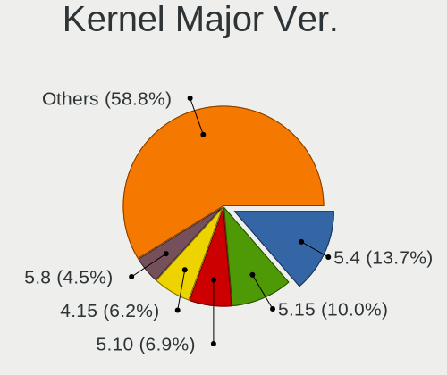
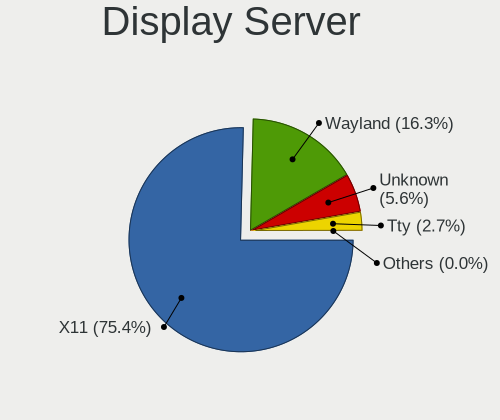
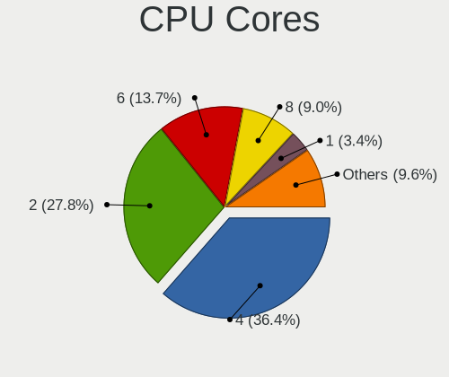
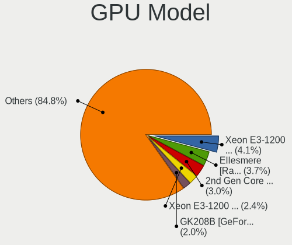
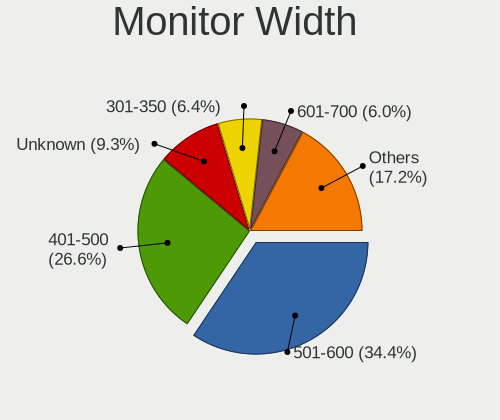

Linux - Tested Hardware & Statistics (Desktops)
-----------------------------------------------

A project to collect tested hardware configurations for Linux.

Anyone can contribute to this report by the [hw-probe](https://github.com/linuxhw/hw-probe) tool:

    sudo -E hw-probe -all -upload

Please contribute! Especially if your hardware is rare.

This report is for real hardware. Report for virtual hardware: [TestDays_VE](https://github.com/linuxhw/TestDays_VE)

Contents
--------

* [ Test Cases ](#test-cases)

* [ System ](#system)
  - [ OS                       ](#os)
  - [ OS Family                ](#os-family)
  - [ Kernel                   ](#kernel)
  - [ Kernel Family            ](#kernel-family)
  - [ Kernel Major Ver.        ](#kernel-major-ver)
  - [ Arch                     ](#arch)
  - [ DE                       ](#de)
  - [ Display Server           ](#display-server)
  - [ Display Manager          ](#display-manager)
  - [ OS Lang                  ](#os-lang)
  - [ Boot Mode                ](#boot-mode)
  - [ Filesystem               ](#filesystem)
  - [ Part. scheme             ](#part-scheme)
  - [ Dual Boot with Linux/BSD ](#dual-boot-with-linuxbsd)
  - [ Dual Boot (Win)          ](#dual-boot-win)

* [ Board ](#board)
  - [ Vendor                   ](#vendor)
  - [ Model                    ](#model)
  - [ Model Family             ](#model-family)
  - [ MFG Year                 ](#mfg-year)
  - [ Form Factor              ](#form-factor)
  - [ Secure Boot              ](#secure-boot)
  - [ Coreboot                 ](#coreboot)
  - [ RAM Size                 ](#ram-size)
  - [ RAM Used                 ](#ram-used)
  - [ Total Drives             ](#total-drives)
  - [ Has CD-ROM               ](#has-cd-rom)
  - [ Has Ethernet             ](#has-ethernet)
  - [ Has WiFi                 ](#has-wifi)
  - [ Has Bluetooth            ](#has-bluetooth)

* [ Location ](#location)
  - [ Country                  ](#country)
  - [ City                     ](#city)

* [ Drives ](#drives)
  - [ Drive Vendor             ](#drive-vendor)
  - [ Drive Model              ](#drive-model)
  - [ HDD Vendor               ](#hdd-vendor)
  - [ SSD Vendor               ](#ssd-vendor)
  - [ Drive Kind               ](#drive-kind)
  - [ Drive Connector          ](#drive-connector)
  - [ Drive Size               ](#drive-size)
  - [ Space Total              ](#space-total)
  - [ Space Used               ](#space-used)
  - [ Malfunc. Drives          ](#malfunc-drives)
  - [ Malfunc. Drive Vendor    ](#malfunc-drive-vendor)
  - [ Malfunc. HDD Vendor      ](#malfunc-hdd-vendor)
  - [ Malfunc. Drive Kind      ](#malfunc-drive-kind)
  - [ Failed Drives            ](#failed-drives)
  - [ Failed Drive Vendor      ](#failed-drive-vendor)
  - [ Drive Status             ](#drive-status)

* [ Storage controller ](#storage-controller)
  - [ Storage Vendor           ](#storage-vendor)
  - [ Storage Model            ](#storage-model)
  - [ Storage Kind             ](#storage-kind)

* [ Processor ](#processor)
  - [ CPU Vendor               ](#cpu-vendor)
  - [ CPU Model                ](#cpu-model)
  - [ CPU Model Family         ](#cpu-model-family)
  - [ CPU Cores                ](#cpu-cores)
  - [ CPU Sockets              ](#cpu-sockets)
  - [ CPU Threads              ](#cpu-threads)
  - [ CPU Op-Modes             ](#cpu-op-modes)
  - [ CPU Microcode            ](#cpu-microcode)
  - [ CPU Microarch            ](#cpu-microarch)

* [ Graphics ](#graphics)
  - [ GPU Vendor               ](#gpu-vendor)
  - [ GPU Model                ](#gpu-model)
  - [ GPU Combo                ](#gpu-combo)
  - [ GPU Driver               ](#gpu-driver)
  - [ GPU Memory               ](#gpu-memory)

* [ Monitor ](#monitor)
  - [ Monitor Vendor           ](#monitor-vendor)
  - [ Monitor Model            ](#monitor-model)
  - [ Monitor Resolution       ](#monitor-resolution)
  - [ Monitor Diagonal         ](#monitor-diagonal)
  - [ Monitor Width            ](#monitor-width)
  - [ Aspect Ratio             ](#aspect-ratio)
  - [ Monitor Area             ](#monitor-area)
  - [ Pixel Density            ](#pixel-density)
  - [ Multiple Monitors        ](#multiple-monitors)

* [ Network ](#network)
  - [ Net Controller Vendor    ](#net-controller-vendor)
  - [ Net Controller Model     ](#net-controller-model)
  - [ Wireless Vendor          ](#wireless-vendor)
  - [ Wireless Model           ](#wireless-model)
  - [ Ethernet Vendor          ](#ethernet-vendor)
  - [ Ethernet Model           ](#ethernet-model)
  - [ Net Controller Kind      ](#net-controller-kind)
  - [ Used Controller          ](#used-controller)
  - [ NICs                     ](#nics)
  - [ IPv6                     ](#ipv6)

* [ Bluetooth ](#bluetooth)
  - [ Bluetooth Vendor         ](#bluetooth-vendor)
  - [ Bluetooth Model          ](#bluetooth-model)

* [ Sound ](#sound)
  - [ Sound Vendor             ](#sound-vendor)
  - [ Sound Model              ](#sound-model)

* [ Memory ](#memory)
  - [ Memory Vendor            ](#memory-vendor)
  - [ Memory Model             ](#memory-model)
  - [ Memory Kind              ](#memory-kind)
  - [ Memory Form Factor       ](#memory-form-factor)
  - [ Memory Size              ](#memory-size)
  - [ Memory Speed             ](#memory-speed)

* [ Printers & scanners ](#printers--scanners)
  - [ Printer Vendor           ](#printer-vendor)
  - [ Printer Model            ](#printer-model)
  - [ Scanner Vendor           ](#scanner-vendor)
  - [ Scanner Model            ](#scanner-model)

* [ Camera ](#camera)
  - [ Camera Vendor            ](#camera-vendor)
  - [ Camera Model             ](#camera-model)

* [ Security ](#security)
  - [ Fingerprint Vendor       ](#fingerprint-vendor)
  - [ Fingerprint Model        ](#fingerprint-model)
  - [ Chipcard Vendor          ](#chipcard-vendor)
  - [ Chipcard Model           ](#chipcard-model)

* [ Unsupported ](#unsupported)
  - [ Unsupported Devices      ](#unsupported-devices)
  - [ Unsupported Device Types ](#unsupported-device-types)

Test Cases
----------

Total: 119174

| Vendor        | Model                       | Probe                                                      | Date         |
|---------------|-----------------------------|------------------------------------------------------------|--------------|
| ASUSTek       | Z170 PRO GAMING             | [b272d7b271](https://linux-hardware.org/?probe=b272d7b271) | Apr 01, 2023 |
| ASUSTek       | PRIME Z490-P                | [bbbfbb2dfc](https://linux-hardware.org/?probe=bbbfbb2dfc) | Apr 01, 2023 |
| HP            | 1495                        | [96283c0a09](https://linux-hardware.org/?probe=96283c0a09) | Apr 01, 2023 |
| Intel         | DB75EN AAG39650-303         | [50d4a766a6](https://linux-hardware.org/?probe=50d4a766a6) | Apr 01, 2023 |
| Acer          | H57M01                      | [215701a84d](https://linux-hardware.org/?probe=215701a84d) | Apr 01, 2023 |
| HP            | 1495                        | [f25125625a](https://linux-hardware.org/?probe=f25125625a) | Apr 01, 2023 |
| ASUSTek       | P8Z77-V LX                  | [ecd633a350](https://linux-hardware.org/?probe=ecd633a350) | Apr 01, 2023 |
| Acer          | Predator G3-605             | [eb21663788](https://linux-hardware.org/?probe=eb21663788) | Apr 01, 2023 |
| ASUSTek       | M5A97 EVO R2.0              | [3f218796ae](https://linux-hardware.org/?probe=3f218796ae) | Apr 01, 2023 |
| ASUSTek       | PRIME B250M-A               | [dc5fce2825](https://linux-hardware.org/?probe=dc5fce2825) | Apr 01, 2023 |
| Biostar       | A740G M2+                   | [182d84f68a](https://linux-hardware.org/?probe=182d84f68a) | Apr 01, 2023 |
| HP            | 8906 SMVB                   | [74430f2160](https://linux-hardware.org/?probe=74430f2160) | Apr 01, 2023 |
| Gigabyte      | Q87M-D2H                    | [b627db43dd](https://linux-hardware.org/?probe=b627db43dd) | Apr 01, 2023 |
| ASUSTek       | TUF B450M-PLUS GAMING       | [5ef1391fb2](https://linux-hardware.org/?probe=5ef1391fb2) | Apr 01, 2023 |
| Lenovo        | 317E SDK0K17763 WIN 1801... | [a4cad34ac9](https://linux-hardware.org/?probe=a4cad34ac9) | Apr 01, 2023 |
| Medion        | H61H2-LM3                   | [80bb5bbf28](https://linux-hardware.org/?probe=80bb5bbf28) | Apr 01, 2023 |
| Acer          | H11H4-AI V:1.0              | [d5337ce0e3](https://linux-hardware.org/?probe=d5337ce0e3) | Apr 01, 2023 |
| Dell          | 0MGK50 A02                  | [3a042b5160](https://linux-hardware.org/?probe=3a042b5160) | Apr 01, 2023 |
| Gigabyte      | Z370 HD3-CF                 | [824aa0ae13](https://linux-hardware.org/?probe=824aa0ae13) | Apr 01, 2023 |
| ASUSTek       | PRIME X470-PRO              | [96fcc41161](https://linux-hardware.org/?probe=96fcc41161) | Apr 01, 2023 |
| Gigabyte      | B450 I AORUS PRO WIFI-CF    | [b4a624599e](https://linux-hardware.org/?probe=b4a624599e) | Apr 01, 2023 |
| ASRock        | B450 Pro4 R2.0              | [046d59655e](https://linux-hardware.org/?probe=046d59655e) | Apr 01, 2023 |
| Gigabyte      | B150M-D2V DDR3-CF           | [35bae3b94d](https://linux-hardware.org/?probe=35bae3b94d) | Apr 01, 2023 |
| ASUSTek       | B250 MINING EXPERT          | [da86fa8f75](https://linux-hardware.org/?probe=da86fa8f75) | Apr 01, 2023 |
| MSI           | MEG X670E ACE               | [2b9356529f](https://linux-hardware.org/?probe=2b9356529f) | Apr 01, 2023 |
| MSI           | B450 GAMING PLUS            | [539137fb36](https://linux-hardware.org/?probe=539137fb36) | Apr 01, 2023 |
| Intel         | DH77EB AAG39073-304         | [f0d73d9284](https://linux-hardware.org/?probe=f0d73d9284) | Apr 01, 2023 |
| Gigabyte      | B550 AORUS ELITE V2         | [978a5e2579](https://linux-hardware.org/?probe=978a5e2579) | Apr 01, 2023 |
| Intel         | DG41RQ AAE54511-203         | [383835a445](https://linux-hardware.org/?probe=383835a445) | Apr 01, 2023 |
| Lenovo        | SHARKBAY NOK                | [091d2eda88](https://linux-hardware.org/?probe=091d2eda88) | Apr 01, 2023 |
| Gigabyte      | G41M-Combo                  | [ac658bcb80](https://linux-hardware.org/?probe=ac658bcb80) | Apr 01, 2023 |
| MSI           | MAG X570S TORPEDO MAX       | [664da8ff45](https://linux-hardware.org/?probe=664da8ff45) | Apr 01, 2023 |
| MSI           | P43T-C51                    | [d16b44b442](https://linux-hardware.org/?probe=d16b44b442) | Apr 01, 2023 |
| MSI           | MAG B660M MORTAR WIFI DD... | [c512f4cdd9](https://linux-hardware.org/?probe=c512f4cdd9) | Apr 01, 2023 |
| ASUSTek       | ROG STRIX X570-E GAMING     | [6fd833b58c](https://linux-hardware.org/?probe=6fd833b58c) | Apr 01, 2023 |
| Gigabyte      | MZGLKDP-00                  | [c9427f4873](https://linux-hardware.org/?probe=c9427f4873) | Apr 01, 2023 |
| Gigabyte      | F2A78M-DS2                  | [0528b2df2b](https://linux-hardware.org/?probe=0528b2df2b) | Apr 01, 2023 |
| ASUSTek       | PRIME B350M-A               | [f8afb163dc](https://linux-hardware.org/?probe=f8afb163dc) | Apr 01, 2023 |
| ASRock        | B460M Pro4                  | [1f3b96d1a0](https://linux-hardware.org/?probe=1f3b96d1a0) | Apr 01, 2023 |
| Acer          | Aspire XC-780               | [206239c162](https://linux-hardware.org/?probe=206239c162) | Apr 01, 2023 |
| MSI           | H97M-G43                    | [b93caf26e4](https://linux-hardware.org/?probe=b93caf26e4) | Apr 01, 2023 |
| ASUSTek       | PRIME B550M-A               | [79d44a9e66](https://linux-hardware.org/?probe=79d44a9e66) | Apr 01, 2023 |
| Fujitsu       | D3432-A1 S26361-D3432-A1    | [86241cd6ad](https://linux-hardware.org/?probe=86241cd6ad) | Apr 01, 2023 |
| Dell          | 09M8Y8 A01                  | [17d5390549](https://linux-hardware.org/?probe=17d5390549) | Apr 01, 2023 |
| MSI           | MAG B660M MORTAR WIFI DD... | [e615755655](https://linux-hardware.org/?probe=e615755655) | Apr 01, 2023 |
| HP            | 304Ah                       | [14d92e85a2](https://linux-hardware.org/?probe=14d92e85a2) | Apr 01, 2023 |
| AZW           | Green G3                    | [a987d9a5c1](https://linux-hardware.org/?probe=a987d9a5c1) | Apr 01, 2023 |
| ASUSTek       | ROG STRIX Z690-A GAMING ... | [1fa4ec7b05](https://linux-hardware.org/?probe=1fa4ec7b05) | Apr 01, 2023 |
| ASUSTek       | M5A78L LE                   | [af64a32a09](https://linux-hardware.org/?probe=af64a32a09) | Apr 01, 2023 |
| HP            | 84FD                        | [79367d5f7d](https://linux-hardware.org/?probe=79367d5f7d) | Apr 01, 2023 |
| MSI           | H510M-A PRO                 | [a6953d3b96](https://linux-hardware.org/?probe=a6953d3b96) | Apr 01, 2023 |
| ASRock        | H470M-STX                   | [c1f349f579](https://linux-hardware.org/?probe=c1f349f579) | Apr 01, 2023 |
| Lenovo        | 4030                        | [7a23fd4fb4](https://linux-hardware.org/?probe=7a23fd4fb4) | Apr 01, 2023 |
| Gigabyte      | X570 AORUS XTREME           | [1146b0ebfc](https://linux-hardware.org/?probe=1146b0ebfc) | Apr 01, 2023 |
| Gigabyte      | B450 AORUS M                | [c1a0385d07](https://linux-hardware.org/?probe=c1a0385d07) | Apr 01, 2023 |
| Dell          | 09KPNV A01                  | [2b25e4872f](https://linux-hardware.org/?probe=2b25e4872f) | Apr 01, 2023 |
| ASUSTek       | PRIME B550M-A WIFI II       | [ad3ead1116](https://linux-hardware.org/?probe=ad3ead1116) | Apr 01, 2023 |
| ASUSTek       | PRIME A320M-K               | [16f87cd333](https://linux-hardware.org/?probe=16f87cd333) | Apr 01, 2023 |
| ASUSTek       | TUF Gaming B550M-PLUS       | [e45ad193f8](https://linux-hardware.org/?probe=e45ad193f8) | Apr 01, 2023 |
| Gigabyte      | GA-MA785GM-US2H             | [e9fe5cb307](https://linux-hardware.org/?probe=e9fe5cb307) | Apr 01, 2023 |
| ASUSTek       | SABERTOOTH 990FX R2.0       | [d80d075b91](https://linux-hardware.org/?probe=d80d075b91) | Apr 01, 2023 |
| Medion        | H61H2-LM3                   | [2e79b95cb4](https://linux-hardware.org/?probe=2e79b95cb4) | Apr 01, 2023 |
| ASUSTek       | PRIME B550M-A AC            | [2cc7a15de5](https://linux-hardware.org/?probe=2cc7a15de5) | Apr 01, 2023 |
| ASRockRack    | X470D4U2-2T                 | [acb0f81194](https://linux-hardware.org/?probe=acb0f81194) | Apr 01, 2023 |
| Gigabyte      | B360 AORUS GAMING 3-CF      | [f54ccba86f](https://linux-hardware.org/?probe=f54ccba86f) | Apr 01, 2023 |
| Unknown       | X79                         | [d0592836a5](https://linux-hardware.org/?probe=d0592836a5) | Apr 01, 2023 |
| HP            | 18E7                        | [98319f4504](https://linux-hardware.org/?probe=98319f4504) | Apr 01, 2023 |
| Gigabyte      | Z97X-Gaming 3               | [89ca656f30](https://linux-hardware.org/?probe=89ca656f30) | Apr 01, 2023 |
| ASUSTek       | P8Z77-V PREMIUM             | [d774a892d1](https://linux-hardware.org/?probe=d774a892d1) | Apr 01, 2023 |
| Lenovo        | ThinkCentre M58 9728AHG     | [cb0fa70953](https://linux-hardware.org/?probe=cb0fa70953) | Apr 01, 2023 |
| ASRock        | FM2A88X Extreme6+           | [4a9aebc7f0](https://linux-hardware.org/?probe=4a9aebc7f0) | Apr 01, 2023 |
| Apple         | Mac-F4208DC8 PVT            | [f05009caac](https://linux-hardware.org/?probe=f05009caac) | Apr 01, 2023 |
| MSI           | X99A RAIDER                 | [50e745e72a](https://linux-hardware.org/?probe=50e745e72a) | Apr 01, 2023 |
| Dell          | 0GY6Y8 A03                  | [7754565ec1](https://linux-hardware.org/?probe=7754565ec1) | Apr 01, 2023 |
| Gigabyte      | Z77X-UD5H                   | [2be0fa6524](https://linux-hardware.org/?probe=2be0fa6524) | Apr 01, 2023 |
| Gigabyte      | B560M AORUS ELITE           | [ee536703f8](https://linux-hardware.org/?probe=ee536703f8) | Apr 01, 2023 |
| Dell          | 0TTDMJ A00                  | [5d6606235d](https://linux-hardware.org/?probe=5d6606235d) | Apr 01, 2023 |
| Gigabyte      | A320M-H-CF                  | [a5c21e7892](https://linux-hardware.org/?probe=a5c21e7892) | Apr 01, 2023 |
| Gigabyte      | Z170X-Gaming 7              | [f7c90851ac](https://linux-hardware.org/?probe=f7c90851ac) | Apr 01, 2023 |
| Gigabyte      | A320M-H-CF                  | [4b873550ab](https://linux-hardware.org/?probe=4b873550ab) | Apr 01, 2023 |
| Acer          | WG43M                       | [77cb0bf517](https://linux-hardware.org/?probe=77cb0bf517) | Apr 01, 2023 |
| HP            | 1998                        | [d88ffd3db4](https://linux-hardware.org/?probe=d88ffd3db4) | Apr 01, 2023 |
| MSI           | B550M PRO-VDH WIFI          | [e3a13c69ef](https://linux-hardware.org/?probe=e3a13c69ef) | Apr 01, 2023 |
| Dell          | 0M5DCD A00                  | [91cc314380](https://linux-hardware.org/?probe=91cc314380) | Apr 01, 2023 |
| MSI           | B450M PRO-M2 MAX            | [5a83c18a3e](https://linux-hardware.org/?probe=5a83c18a3e) | Apr 01, 2023 |
| ASUSTek       | Leonite2                    | [41353f6a59](https://linux-hardware.org/?probe=41353f6a59) | Apr 01, 2023 |
| Gigabyte      | F2A88XM-HD3                 | [39bc576f7f](https://linux-hardware.org/?probe=39bc576f7f) | Apr 01, 2023 |
| HP            | 8053                        | [6c887800bb](https://linux-hardware.org/?probe=6c887800bb) | Apr 01, 2023 |
| MSI           | B450M PRO-M2 MAX            | [94f75ee798](https://linux-hardware.org/?probe=94f75ee798) | Apr 01, 2023 |
| MSI           | H310M PRO-VDH PLUS          | [369bd03522](https://linux-hardware.org/?probe=369bd03522) | Apr 01, 2023 |
| Pegatron      | 2AC2                        | [ca0b0464d7](https://linux-hardware.org/?probe=ca0b0464d7) | Apr 01, 2023 |
| ASUSTek       | PRIME A320M-K               | [59c335754f](https://linux-hardware.org/?probe=59c335754f) | Apr 01, 2023 |
| ASUSTek       | P7P55D                      | [b50f27ad05](https://linux-hardware.org/?probe=b50f27ad05) | Mar 31, 2023 |
| Dell          | 04YP6J A02                  | [0223f7bb3e](https://linux-hardware.org/?probe=0223f7bb3e) | Mar 31, 2023 |
| ECS           | GeForce 8000 series         | [32e951a2ca](https://linux-hardware.org/?probe=32e951a2ca) | Mar 31, 2023 |
| MSI           | X570-A PRO                  | [3093c50d3d](https://linux-hardware.org/?probe=3093c50d3d) | Mar 31, 2023 |
| Intel         | H61 V1.1                    | [e670f092d7](https://linux-hardware.org/?probe=e670f092d7) | Mar 31, 2023 |
| Gigabyte      | Z170-HD3 DDR3-CF            | [dff9959cd7](https://linux-hardware.org/?probe=dff9959cd7) | Mar 31, 2023 |
| Gateway       | IPIMB-ARA                   | [9c300aea89](https://linux-hardware.org/?probe=9c300aea89) | Mar 31, 2023 |
| ASUSTek       | ROG STRIX B450-F GAMING     | [9e09a54915](https://linux-hardware.org/?probe=9e09a54915) | Mar 31, 2023 |
| ASUSTek       | TUF Gaming Z590-PLUS WIF... | [acfff71638](https://linux-hardware.org/?probe=acfff71638) | Mar 31, 2023 |
| HP            | 2AFA                        | [d177838277](https://linux-hardware.org/?probe=d177838277) | Mar 31, 2023 |
| Gigabyte      | H61M-S2V-B3                 | [45a242d18f](https://linux-hardware.org/?probe=45a242d18f) | Mar 31, 2023 |
| ASUSTek       | P8B75-V                     | [5ed3be8dbc](https://linux-hardware.org/?probe=5ed3be8dbc) | Mar 31, 2023 |
| ASUSTek       | TS10                        | [054de4f36a](https://linux-hardware.org/?probe=054de4f36a) | Mar 31, 2023 |
| ASUSTek       | M5A78L LE                   | [7a23362aac](https://linux-hardware.org/?probe=7a23362aac) | Mar 31, 2023 |
| HP            | 0A64h                       | [f4fd3904f0](https://linux-hardware.org/?probe=f4fd3904f0) | Mar 31, 2023 |
| ASRock        | Z87 Extreme6                | [675d214cbe](https://linux-hardware.org/?probe=675d214cbe) | Mar 31, 2023 |
| Dell          | 0JP3NX A00                  | [016632c560](https://linux-hardware.org/?probe=016632c560) | Mar 31, 2023 |
| Gigabyte      | H61M-DS2                    | [35e4f876ca](https://linux-hardware.org/?probe=35e4f876ca) | Mar 31, 2023 |
| ASUSTek       | B85M-G R2.0                 | [4434a1266b](https://linux-hardware.org/?probe=4434a1266b) | Mar 31, 2023 |
| Gigabyte      | B150M-D2V DDR3-CF           | [3599b8e875](https://linux-hardware.org/?probe=3599b8e875) | Mar 31, 2023 |
| Gigabyte      | H61M-DS2                    | [fca09d31a2](https://linux-hardware.org/?probe=fca09d31a2) | Mar 31, 2023 |
| MSI           | Z170A KRAIT GAMING 3X       | [672242513c](https://linux-hardware.org/?probe=672242513c) | Mar 31, 2023 |
| ASUSTek       | PRIME B660-PLUS D4          | [1ac381c18f](https://linux-hardware.org/?probe=1ac381c18f) | Mar 31, 2023 |
| MSI           | H81M-P33                    | [e2442d5cac](https://linux-hardware.org/?probe=e2442d5cac) | Mar 31, 2023 |
| Gigabyte      | Z77-DS3H                    | [79e2cfa0f1](https://linux-hardware.org/?probe=79e2cfa0f1) | Mar 31, 2023 |
| ASUSTek       | ROG STRIX B560-I GAMING ... | [0ff3ab318e](https://linux-hardware.org/?probe=0ff3ab318e) | Mar 31, 2023 |
| ASUSTek       | A58M-A/BR                   | [90724dc86e](https://linux-hardware.org/?probe=90724dc86e) | Mar 31, 2023 |
| ASUSTek       | PRIME Z690M-PLUS D4         | [51c601477f](https://linux-hardware.org/?probe=51c601477f) | Mar 31, 2023 |
| Lenovo        | ThinkStation D30 42234T7    | [47f6f4653b](https://linux-hardware.org/?probe=47f6f4653b) | Mar 31, 2023 |
| ASUSTek       | ROG STRIX B650E-F GAMING... | [8326806aa6](https://linux-hardware.org/?probe=8326806aa6) | Mar 31, 2023 |
| Gigabyte      | B550 AORUS ELITE V2         | [4d69417ed0](https://linux-hardware.org/?probe=4d69417ed0) | Mar 31, 2023 |
| Fujitsu Si... | MS-7504VP-PV                | [32c138c982](https://linux-hardware.org/?probe=32c138c982) | Mar 31, 2023 |
| ASUSTek       | TUF Gaming B550-PLUS        | [6694c9279d](https://linux-hardware.org/?probe=6694c9279d) | Mar 31, 2023 |
| MSI           | MAG Z690 TOMAHAWK WIFI      | [49917003da](https://linux-hardware.org/?probe=49917003da) | Mar 31, 2023 |
| ASUSTek       | B85M-G R2.0                 | [fbef2fe274](https://linux-hardware.org/?probe=fbef2fe274) | Mar 31, 2023 |
| MSI           | B450 TOMAHAWK MAX           | [d79127e48c](https://linux-hardware.org/?probe=d79127e48c) | Mar 31, 2023 |
| Apple         | Mac-F42C88C8 Proto1         | [fc44ad8c07](https://linux-hardware.org/?probe=fc44ad8c07) | Mar 31, 2023 |
| Dell          | 00F82W A02                  | [8bf22304e0](https://linux-hardware.org/?probe=8bf22304e0) | Mar 31, 2023 |
| ASUSTek       | A68HM-PLUS                  | [520ad2ca86](https://linux-hardware.org/?probe=520ad2ca86) | Mar 31, 2023 |
| ASRock        | A320M-DVS R4.0              | [e6463ab36d](https://linux-hardware.org/?probe=e6463ab36d) | Mar 31, 2023 |
| ASRock        | B450M Pro4                  | [dbe7f7ac9b](https://linux-hardware.org/?probe=dbe7f7ac9b) | Mar 31, 2023 |
| Gigabyte      | B250M-DS3H-CF               | [a025953f4c](https://linux-hardware.org/?probe=a025953f4c) | Mar 31, 2023 |
| Gigabyte      | Z77X-UD5H                   | [323d8881a5](https://linux-hardware.org/?probe=323d8881a5) | Mar 31, 2023 |
| Gigabyte      | Z390 M-CF                   | [a939015daa](https://linux-hardware.org/?probe=a939015daa) | Mar 31, 2023 |
| ASUSTek       | ROG STRIX B550-F GAMING     | [61e2653466](https://linux-hardware.org/?probe=61e2653466) | Mar 31, 2023 |
| Dell          | 0WMJ54 A00                  | [d11328af2a](https://linux-hardware.org/?probe=d11328af2a) | Mar 31, 2023 |
| MSI           | B450 TOMAHAWK MAX II        | [a89c429c84](https://linux-hardware.org/?probe=a89c429c84) | Mar 31, 2023 |
| MSI           | B550-A PRO                  | [ab4f36e0fa](https://linux-hardware.org/?probe=ab4f36e0fa) | Mar 31, 2023 |
| MSI           | B450 TOMAHAWK MAX           | [c27e3be5ba](https://linux-hardware.org/?probe=c27e3be5ba) | Mar 31, 2023 |
| Wistron       | ProLiant ML110 G5           | [925759c41c](https://linux-hardware.org/?probe=925759c41c) | Mar 31, 2023 |
| ASRock        | B760M Pro RS/D4             | [6a63402e9c](https://linux-hardware.org/?probe=6a63402e9c) | Mar 31, 2023 |
| ASRock        | N68-GS4 FX                  | [573f5db37d](https://linux-hardware.org/?probe=573f5db37d) | Mar 31, 2023 |
| MSI           | 970 GAMING                  | [d729a0a559](https://linux-hardware.org/?probe=d729a0a559) | Mar 31, 2023 |
| Dell          | 0HMX8D A01                  | [36b8532260](https://linux-hardware.org/?probe=36b8532260) | Mar 31, 2023 |
| MSI           | B550-A PRO                  | [f243351def](https://linux-hardware.org/?probe=f243351def) | Mar 31, 2023 |
| MSI           | Z270-A PRO                  | [a5d218b9a6](https://linux-hardware.org/?probe=a5d218b9a6) | Mar 31, 2023 |
| ASUSTek       | ROG STRIX B450-F GAMING     | [09679af7dc](https://linux-hardware.org/?probe=09679af7dc) | Mar 31, 2023 |
| ASUSTek       | TUF Gaming Z590-PLUS WIF... | [9addea9f4a](https://linux-hardware.org/?probe=9addea9f4a) | Mar 31, 2023 |
| ASUSTek       | ROG STRIX B450-F GAMING     | [1e78d2454c](https://linux-hardware.org/?probe=1e78d2454c) | Mar 31, 2023 |
| ASUSTek       | PRIME B650-PLUS             | [01492665ee](https://linux-hardware.org/?probe=01492665ee) | Mar 31, 2023 |
| Gigabyte      | Z68XP-UD3                   | [029afd6a5c](https://linux-hardware.org/?probe=029afd6a5c) | Mar 31, 2023 |
| ASUSTek       | ROG STRIX B360-F GAMING     | [8bc61e0fcd](https://linux-hardware.org/?probe=8bc61e0fcd) | Mar 31, 2023 |
| ASRock        | B550M-C                     | [c0fcfbc0ed](https://linux-hardware.org/?probe=c0fcfbc0ed) | Mar 31, 2023 |
| Fujitsu       | D3600-A1 S26361-D3600-A1    | [fc9a42e387](https://linux-hardware.org/?probe=fc9a42e387) | Mar 31, 2023 |
| Quanta        | 2AC5 100                    | [7f253a82dc](https://linux-hardware.org/?probe=7f253a82dc) | Mar 31, 2023 |
| Gigabyte      | X570 I AORUS PRO WIFI       | [871b458080](https://linux-hardware.org/?probe=871b458080) | Mar 31, 2023 |
| MSI           | B450 TOMAHAWK MAX           | [0b4fae8189](https://linux-hardware.org/?probe=0b4fae8189) | Mar 31, 2023 |
| Gigabyte      | GA-880GM-UD2H               | [90796fbad9](https://linux-hardware.org/?probe=90796fbad9) | Mar 31, 2023 |
| ASUSTek       | P8H67-M                     | [3806b33cae](https://linux-hardware.org/?probe=3806b33cae) | Mar 31, 2023 |
| Unknown       | Unknown                     | [1f64d2db28](https://linux-hardware.org/?probe=1f64d2db28) | Mar 31, 2023 |
| Gigabyte      | Z270P-D3-CF                 | [8ce3dc1981](https://linux-hardware.org/?probe=8ce3dc1981) | Mar 31, 2023 |
| ASUSTek       | TUF Z270 MARK 2             | [6bd60aa5f0](https://linux-hardware.org/?probe=6bd60aa5f0) | Mar 31, 2023 |
| ASUSTek       | Z97-K                       | [da56f6c38c](https://linux-hardware.org/?probe=da56f6c38c) | Mar 31, 2023 |
| ASRock        | H67DE3                      | [b055ccc048](https://linux-hardware.org/?probe=b055ccc048) | Mar 31, 2023 |
| MSI           | B450 TOMAHAWK MAX           | [13acfd725a](https://linux-hardware.org/?probe=13acfd725a) | Mar 31, 2023 |
| ASRock        | H67DE3                      | [c82ba90d70](https://linux-hardware.org/?probe=c82ba90d70) | Mar 31, 2023 |
| ASUSTek       | P8H67-M LE                  | [11b3a7cdb1](https://linux-hardware.org/?probe=11b3a7cdb1) | Mar 31, 2023 |
| ASUSTek       | P8Z77-V                     | [498726ce78](https://linux-hardware.org/?probe=498726ce78) | Mar 31, 2023 |
| Dell          | 042P49 A02                  | [46dc3b9655](https://linux-hardware.org/?probe=46dc3b9655) | Mar 31, 2023 |
| Medion        | MS-7728                     | [cf66e81623](https://linux-hardware.org/?probe=cf66e81623) | Mar 31, 2023 |
| Gigabyte      | TRX40 AORUS XTREME          | [0945961c85](https://linux-hardware.org/?probe=0945961c85) | Mar 31, 2023 |
| Gigabyte      | TRX40 AORUS XTREME          | [72c08c8ca9](https://linux-hardware.org/?probe=72c08c8ca9) | Mar 31, 2023 |
| Gigabyte      | 965P-DS4                    | [ddebc735da](https://linux-hardware.org/?probe=ddebc735da) | Mar 31, 2023 |
| Intel         | X79                         | [c06125262b](https://linux-hardware.org/?probe=c06125262b) | Mar 31, 2023 |
| Dell          | 0FG47G A02                  | [d1cf6fa11e](https://linux-hardware.org/?probe=d1cf6fa11e) | Mar 31, 2023 |
| Gigabyte      | B450 GAMING X               | [495c58a5c6](https://linux-hardware.org/?probe=495c58a5c6) | Mar 31, 2023 |
| Acer          | Aspire TC-875 V:1.0         | [8f9f4fb295](https://linux-hardware.org/?probe=8f9f4fb295) | Mar 31, 2023 |
| MSI           | H510M PRO-E                 | [9ec66a8f48](https://linux-hardware.org/?probe=9ec66a8f48) | Mar 31, 2023 |
| Gigabyte      | Z390 M-CF                   | [6bce2b9bc3](https://linux-hardware.org/?probe=6bce2b9bc3) | Mar 31, 2023 |
| MSI           | G31TM-P21                   | [7404d94ca4](https://linux-hardware.org/?probe=7404d94ca4) | Mar 31, 2023 |
| ASUSTek       | H110M-R                     | [bd1a48e47d](https://linux-hardware.org/?probe=bd1a48e47d) | Mar 31, 2023 |
| Gigabyte      | H310M H x.x                 | [68fce9ae2d](https://linux-hardware.org/?probe=68fce9ae2d) | Mar 31, 2023 |
| Gigabyte      | A320M-S2H-CF                | [1c982255fa](https://linux-hardware.org/?probe=1c982255fa) | Mar 31, 2023 |
| ASUSTek       | M4A88TD-V EVO/USB3          | [624d23335b](https://linux-hardware.org/?probe=624d23335b) | Mar 31, 2023 |
| ASUSTek       | TUF Gaming B550M-PLUS       | [7a0f5608b2](https://linux-hardware.org/?probe=7a0f5608b2) | Mar 31, 2023 |
| ECS           | H61H2-M6                    | [6c33ee7e15](https://linux-hardware.org/?probe=6c33ee7e15) | Mar 31, 2023 |
| Gigabyte      | B550M DS3H AC               | [f8e723a8dc](https://linux-hardware.org/?probe=f8e723a8dc) | Mar 31, 2023 |
| MSI           | PRO X670-P WIFI             | [bb72de54b6](https://linux-hardware.org/?probe=bb72de54b6) | Mar 31, 2023 |
| ASRock        | FM2A55M-DGS                 | [3ab2e2c720](https://linux-hardware.org/?probe=3ab2e2c720) | Mar 31, 2023 |
| ASRock        | Z97 Anniversary             | [c23aeb60ba](https://linux-hardware.org/?probe=c23aeb60ba) | Mar 31, 2023 |
| ECS           | G31T-M7                     | [c197c4ed1d](https://linux-hardware.org/?probe=c197c4ed1d) | Mar 31, 2023 |
| HP            | 3397                        | [5a25984320](https://linux-hardware.org/?probe=5a25984320) | Mar 31, 2023 |
| Gigabyte      | B460M AORUS ELITE           | [87145cd4b2](https://linux-hardware.org/?probe=87145cd4b2) | Mar 31, 2023 |
| Gigabyte      | B85M-HD3                    | [3d24b75a10](https://linux-hardware.org/?probe=3d24b75a10) | Mar 31, 2023 |
| Gigabyte      | B550M DS3H AC               | [4693b65922](https://linux-hardware.org/?probe=4693b65922) | Mar 31, 2023 |
| Lenovo        | 3708 SDK0J40700 WIN 3258... | [e84598d67c](https://linux-hardware.org/?probe=e84598d67c) | Mar 31, 2023 |
| Dell          | 00V62H A01                  | [05d42527df](https://linux-hardware.org/?probe=05d42527df) | Mar 31, 2023 |
| HP            | 1998                        | [c47c52dfc6](https://linux-hardware.org/?probe=c47c52dfc6) | Mar 31, 2023 |
| Gigabyte      | B75M-D3H                    | [871c53d3f3](https://linux-hardware.org/?probe=871c53d3f3) | Mar 31, 2023 |
| ASRock        | H61M                        | [29327171c4](https://linux-hardware.org/?probe=29327171c4) | Mar 31, 2023 |
| HP            | 8767 A                      | [186bad76b7](https://linux-hardware.org/?probe=186bad76b7) | Mar 31, 2023 |
| Gigabyte      | H310M A-CF                  | [c26786d423](https://linux-hardware.org/?probe=c26786d423) | Mar 31, 2023 |
| ASUSTek       | H97-PLUS                    | [5f163f6a24](https://linux-hardware.org/?probe=5f163f6a24) | Mar 31, 2023 |
| ASUSTek       | UN65U                       | [70d0f8f069](https://linux-hardware.org/?probe=70d0f8f069) | Mar 31, 2023 |
| ASUSTek       | M5A99FX PRO R2.0            | [0e374d0aea](https://linux-hardware.org/?probe=0e374d0aea) | Mar 31, 2023 |
| ASUSTek       | TUF B365M-PLUS GAMING       | [8d4ef602e5](https://linux-hardware.org/?probe=8d4ef602e5) | Mar 31, 2023 |
| MSI           | X470 GAMING PLUS MAX        | [d6b6c88578](https://linux-hardware.org/?probe=d6b6c88578) | Mar 31, 2023 |
| Dell          | 0PP150 A00                  | [fdc879a486](https://linux-hardware.org/?probe=fdc879a486) | Mar 31, 2023 |
| Gigabyte      | EP43-DS3L                   | [b7594db73b](https://linux-hardware.org/?probe=b7594db73b) | Mar 31, 2023 |
| MSI           | X470 GAMING PLUS MAX        | [704145641e](https://linux-hardware.org/?probe=704145641e) | Mar 31, 2023 |
| ASUSTek       | M5A78L-M LX/BR              | [1fa3e0934f](https://linux-hardware.org/?probe=1fa3e0934f) | Mar 31, 2023 |
| Dell          | 0K240Y A02                  | [ca6aacf14e](https://linux-hardware.org/?probe=ca6aacf14e) | Mar 31, 2023 |
| Gigabyte      | X670E AORUS MASTER          | [68731ac4ec](https://linux-hardware.org/?probe=68731ac4ec) | Mar 31, 2023 |
| ASUSTek       | TUF Gaming B660M-PLUS D4    | [ebd6135034](https://linux-hardware.org/?probe=ebd6135034) | Mar 31, 2023 |
| ASUSTek       | TUF Gaming B660M-PLUS D4    | [88864f0e2d](https://linux-hardware.org/?probe=88864f0e2d) | Mar 31, 2023 |
| Fujitsu       | D3417-B2 S26361-D3417-B2    | [56c886069b](https://linux-hardware.org/?probe=56c886069b) | Mar 31, 2023 |
| ASUSTek       | PRIME J4005I-C              | [193d27ceac](https://linux-hardware.org/?probe=193d27ceac) | Mar 31, 2023 |
| ASUSTek       | Maximus VIII IMPACT         | [deab2a5eac](https://linux-hardware.org/?probe=deab2a5eac) | Mar 31, 2023 |
| Gigabyte      | X670 AORUS ELITE AX         | [c239e06998](https://linux-hardware.org/?probe=c239e06998) | Mar 31, 2023 |
| Acer          | WG43M                       | [3b626d2ff9](https://linux-hardware.org/?probe=3b626d2ff9) | Mar 31, 2023 |
| MSI           | H110M PRO-VH PLUS           | [0992e2d8d8](https://linux-hardware.org/?probe=0992e2d8d8) | Mar 31, 2023 |
| OEM_MB        | NARRA3                      | [75050a4d2e](https://linux-hardware.org/?probe=75050a4d2e) | Mar 31, 2023 |
| Gigabyte      | F2A88X-UP4                  | [72c4b553b4](https://linux-hardware.org/?probe=72c4b553b4) | Mar 31, 2023 |
| ASRock        | Z87 Extreme11/ac            | [283593a105](https://linux-hardware.org/?probe=283593a105) | Mar 31, 2023 |
| ASUSTek       | M5A78L-M LX3                | [6ff0a3cb3f](https://linux-hardware.org/?probe=6ff0a3cb3f) | Mar 31, 2023 |
| ASUSTek       | M5A78L-M LX PLUS            | [deedee079c](https://linux-hardware.org/?probe=deedee079c) | Mar 31, 2023 |
| Foxconn       | 2ABF                        | [8daf4bf0a5](https://linux-hardware.org/?probe=8daf4bf0a5) | Mar 30, 2023 |
| Gigabyte      | B360M AORUS Gaming 3-CF     | [c346cf16d3](https://linux-hardware.org/?probe=c346cf16d3) | Mar 30, 2023 |
| ASUSTek       | Z87-K                       | [e596dbb5bd](https://linux-hardware.org/?probe=e596dbb5bd) | Mar 30, 2023 |
| Gigabyte      | A320M-S2H-CF                | [3aac57dfbd](https://linux-hardware.org/?probe=3aac57dfbd) | Mar 30, 2023 |
| ASRock        | H310CM-HDV                  | [a9a41a38ed](https://linux-hardware.org/?probe=a9a41a38ed) | Mar 30, 2023 |
| ASUSTek       | ROG CROSSHAIR VIII EXTRE... | [514d8ed8d6](https://linux-hardware.org/?probe=514d8ed8d6) | Mar 30, 2023 |
| ASUSTek       | PRIME A320M-K               | [3670f0a6ed](https://linux-hardware.org/?probe=3670f0a6ed) | Mar 30, 2023 |
| Gigabyte      | B550 AORUS ELITE            | [4cfac9a162](https://linux-hardware.org/?probe=4cfac9a162) | Mar 30, 2023 |
| Unknown       | iKoolCore R1 iKoolCore R... | [050875ba5f](https://linux-hardware.org/?probe=050875ba5f) | Mar 30, 2023 |
| ASUSTek       | EB1036                      | [955d389e06](https://linux-hardware.org/?probe=955d389e06) | Mar 30, 2023 |
| ASRock        | X570 Phantom Gaming 4       | [1417777bbc](https://linux-hardware.org/?probe=1417777bbc) | Mar 30, 2023 |
| Gigabyte      | Z170XP-SLI-CF               | [70efcb81e9](https://linux-hardware.org/?probe=70efcb81e9) | Mar 30, 2023 |
| AZW           | U59                         | [c87edfe3b6](https://linux-hardware.org/?probe=c87edfe3b6) | Mar 30, 2023 |
| ASRock        | X570 Phantom Gaming 4       | [2ac52b4538](https://linux-hardware.org/?probe=2ac52b4538) | Mar 30, 2023 |
| HP            | 843F                        | [862f573134](https://linux-hardware.org/?probe=862f573134) | Mar 30, 2023 |
| ASRock        | A320M-HDV R4.0              | [f5e2675cdd](https://linux-hardware.org/?probe=f5e2675cdd) | Mar 30, 2023 |
| Unknown       | Unknown                     | [3773f3cd04](https://linux-hardware.org/?probe=3773f3cd04) | Mar 30, 2023 |
| Dell          | 0KV62T A02                  | [c7765df604](https://linux-hardware.org/?probe=c7765df604) | Mar 30, 2023 |
| ASRock        | 970 Extreme3                | [906f9d6d04](https://linux-hardware.org/?probe=906f9d6d04) | Mar 30, 2023 |
| Gigabyte      | P41T-D3P                    | [c8cadc8a94](https://linux-hardware.org/?probe=c8cadc8a94) | Mar 30, 2023 |
| DFI           | LP UT X58                   | [cd706d90d3](https://linux-hardware.org/?probe=cd706d90d3) | Mar 30, 2023 |
| Gigabyte      | B250M-DS3H-CF               | [d72978731a](https://linux-hardware.org/?probe=d72978731a) | Mar 30, 2023 |
| ASUSTek       | ROG STRIX B360-F GAMING     | [0f26b74917](https://linux-hardware.org/?probe=0f26b74917) | Mar 30, 2023 |
| Packard Be... | FMP55                       | [88a15e20b2](https://linux-hardware.org/?probe=88a15e20b2) | Mar 30, 2023 |
| MSI           | Z370-A PRO                  | [9aba047596](https://linux-hardware.org/?probe=9aba047596) | Mar 30, 2023 |
| Gigabyte      | A520 AORUS ELITE            | [f7f74305ba](https://linux-hardware.org/?probe=f7f74305ba) | Mar 30, 2023 |
| MSI           | A320M PRO-VD PLUS           | [9e43a17d1a](https://linux-hardware.org/?probe=9e43a17d1a) | Mar 30, 2023 |
| ASUSTek       | M4A79T Deluxe               | [9828b40ec9](https://linux-hardware.org/?probe=9828b40ec9) | Mar 30, 2023 |
| Intel         | B75A                        | [b7b1423f34](https://linux-hardware.org/?probe=b7b1423f34) | Mar 30, 2023 |
| HP            | 0A64h                       | [9f50595e87](https://linux-hardware.org/?probe=9f50595e87) | Mar 30, 2023 |
| Biostar       | B550MX/E PRO                | [cffcb0a2a6](https://linux-hardware.org/?probe=cffcb0a2a6) | Mar 30, 2023 |
| Gigabyte      | H410M S2H V2                | [cf13162657](https://linux-hardware.org/?probe=cf13162657) | Mar 30, 2023 |
| ASRock        | FM2A88X Extreme6+           | [ad1392d8c0](https://linux-hardware.org/?probe=ad1392d8c0) | Mar 30, 2023 |
| Dell          | 09M8Y8 A01                  | [2c13e40cd2](https://linux-hardware.org/?probe=2c13e40cd2) | Mar 30, 2023 |
| HP            | 82B4                        | [9712d04ab5](https://linux-hardware.org/?probe=9712d04ab5) | Mar 30, 2023 |
| Lenovo        | SHARKBAY SDK0E50510 WIN     | [76e09994d0](https://linux-hardware.org/?probe=76e09994d0) | Mar 30, 2023 |
| Gigabyte      | H61M-S2V-B3                 | [41a76fad3f](https://linux-hardware.org/?probe=41a76fad3f) | Mar 30, 2023 |
| Dell          | 0T7D40 A01                  | [dc44647f41](https://linux-hardware.org/?probe=dc44647f41) | Mar 30, 2023 |
| ASUSTek       | Benicia                     | [7332efabad](https://linux-hardware.org/?probe=7332efabad) | Mar 30, 2023 |
| ASUSTek       | B85M-E                      | [7c7f9d0e36](https://linux-hardware.org/?probe=7c7f9d0e36) | Mar 30, 2023 |
| Packard Be... | FIH57                       | [f1336c6cc4](https://linux-hardware.org/?probe=f1336c6cc4) | Mar 30, 2023 |
| Pegatron      | 2ADC                        | [1326ad508e](https://linux-hardware.org/?probe=1326ad508e) | Mar 30, 2023 |
| Packard Be... | MCP73PV                     | [2082d90602](https://linux-hardware.org/?probe=2082d90602) | Mar 30, 2023 |
| Gigabyte      | B550M AORUS PRO-P           | [4ccaa78b43](https://linux-hardware.org/?probe=4ccaa78b43) | Mar 30, 2023 |
| Lenovo        | MAHOBAY NO DPK              | [3bf5fd0cfd](https://linux-hardware.org/?probe=3bf5fd0cfd) | Mar 30, 2023 |
| Acer          | Aspire XC-1760              | [68e6aec940](https://linux-hardware.org/?probe=68e6aec940) | Mar 30, 2023 |
| HP            | 18E7                        | [6b64a1639b](https://linux-hardware.org/?probe=6b64a1639b) | Mar 30, 2023 |
| ASUSTek       | H110M-R                     | [3c641024ba](https://linux-hardware.org/?probe=3c641024ba) | Mar 30, 2023 |
| HP            | 339A                        | [8f484ab259](https://linux-hardware.org/?probe=8f484ab259) | Mar 30, 2023 |
| MSI           | X79A-GD45                   | [6d78703b2c](https://linux-hardware.org/?probe=6d78703b2c) | Mar 30, 2023 |
| MSI           | B450M BAZOOKA V2            | [7888e091f7](https://linux-hardware.org/?probe=7888e091f7) | Mar 30, 2023 |
| MSI           | H510M-A PRO                 | [49a4903c58](https://linux-hardware.org/?probe=49a4903c58) | Mar 30, 2023 |
| ASUSTek       | ROG STRIX TRX40-E GAMING    | [fbcdd4ed13](https://linux-hardware.org/?probe=fbcdd4ed13) | Mar 30, 2023 |
| ASUSTek       | TUF Gaming B550M-PLUS       | [92981c741d](https://linux-hardware.org/?probe=92981c741d) | Mar 30, 2023 |
| MSI           | PRO X670-P WIFI             | [ed35fbea6c](https://linux-hardware.org/?probe=ed35fbea6c) | Mar 30, 2023 |
| ASUSTek       | ROG STRIX B660-F GAMING ... | [de5bf4239c](https://linux-hardware.org/?probe=de5bf4239c) | Mar 30, 2023 |
| ASUSTek       | P5G41T-M LX2/GB             | [f310910b0e](https://linux-hardware.org/?probe=f310910b0e) | Mar 30, 2023 |
| Gigabyte      | GA-880GA-UD3H               | [393fc00a5d](https://linux-hardware.org/?probe=393fc00a5d) | Mar 30, 2023 |
| ASRock        | X670E PG Lightning          | [6078dd3087](https://linux-hardware.org/?probe=6078dd3087) | Mar 30, 2023 |
| ASUSTek       | Leonite2                    | [21eb6fba07](https://linux-hardware.org/?probe=21eb6fba07) | Mar 30, 2023 |
| Gigabyte      | H61M-S1                     | [76e79f5f19](https://linux-hardware.org/?probe=76e79f5f19) | Mar 30, 2023 |
| HP            | 0AA4h                       | [97457bb10c](https://linux-hardware.org/?probe=97457bb10c) | Mar 30, 2023 |
| HP            | 82B4                        | [0829a64947](https://linux-hardware.org/?probe=0829a64947) | Mar 30, 2023 |
| Gigabyte      | H61M-S1                     | [78d1316a55](https://linux-hardware.org/?probe=78d1316a55) | Mar 30, 2023 |
| Medion        | B250H4-EM                   | [f569d44749](https://linux-hardware.org/?probe=f569d44749) | Mar 30, 2023 |
| Foxconn       | 2ABF                        | [8e1750d5e4](https://linux-hardware.org/?probe=8e1750d5e4) | Mar 30, 2023 |
| Fujitsu Si... | D2764-A1 S26361-D2764-A1    | [08af010307](https://linux-hardware.org/?probe=08af010307) | Mar 30, 2023 |
| MSI           | MAG B550M MORTAR WIFI       | [dfd9900ccf](https://linux-hardware.org/?probe=dfd9900ccf) | Mar 30, 2023 |
| Foxconn       | ETON                        | [52e92b5803](https://linux-hardware.org/?probe=52e92b5803) | Mar 30, 2023 |
| Gigabyte      | B450 AORUS PRO WIFI-CF      | [af4901f141](https://linux-hardware.org/?probe=af4901f141) | Mar 30, 2023 |
| ASRock        | H61M-HVS                    | [0672578da7](https://linux-hardware.org/?probe=0672578da7) | Mar 30, 2023 |
| ASUSTek       | P8H77-V                     | [1869e23c56](https://linux-hardware.org/?probe=1869e23c56) | Mar 30, 2023 |
| ASUSTek       | TUF Gaming X570-PRO WIFI... | [cfe80f22f8](https://linux-hardware.org/?probe=cfe80f22f8) | Mar 30, 2023 |
| ASUSTek       | ROG STRIX B550-F GAMING     | [244ffc8736](https://linux-hardware.org/?probe=244ffc8736) | Mar 30, 2023 |
| MSI           | H97 PC Mate                 | [37c098e51a](https://linux-hardware.org/?probe=37c098e51a) | Mar 30, 2023 |
| Gigabyte      | Z390 UD                     | [558d551d9a](https://linux-hardware.org/?probe=558d551d9a) | Mar 30, 2023 |
| ASUSTek       | M5A97                       | [4d12d122e1](https://linux-hardware.org/?probe=4d12d122e1) | Mar 30, 2023 |
| MSI           | MPG B550I GAMING EDGE WI... | [f0540604bc](https://linux-hardware.org/?probe=f0540604bc) | Mar 30, 2023 |
| Gigabyte      | H77N-WIFI                   | [24b14fa9bb](https://linux-hardware.org/?probe=24b14fa9bb) | Mar 30, 2023 |
| Shuttle       | FH170                       | [0fa0f1ab72](https://linux-hardware.org/?probe=0fa0f1ab72) | Mar 30, 2023 |
| ASRock        | B85M Pro4                   | [d237bcc0a2](https://linux-hardware.org/?probe=d237bcc0a2) | Mar 30, 2023 |
| HP            | 8399                        | [d8c0ad05f5](https://linux-hardware.org/?probe=d8c0ad05f5) | Mar 30, 2023 |
| Gigabyte      | GA-A55M-S2V                 | [6bb5f276cd](https://linux-hardware.org/?probe=6bb5f276cd) | Mar 30, 2023 |
| Gigabyte      | H77N-WIFI                   | [fecc161428](https://linux-hardware.org/?probe=fecc161428) | Mar 30, 2023 |
| Intel         | D510MO AAE76523-403         | [0d06f88081](https://linux-hardware.org/?probe=0d06f88081) | Mar 30, 2023 |
| MSI           | MPG B550I GAMING EDGE WI... | [1c575e8cb6](https://linux-hardware.org/?probe=1c575e8cb6) | Mar 30, 2023 |
| Gigabyte      | B75M-D3V                    | [d3ae118e3b](https://linux-hardware.org/?probe=d3ae118e3b) | Mar 30, 2023 |
| ASUSTek       | P5E WS Pro                  | [6c70ac23df](https://linux-hardware.org/?probe=6c70ac23df) | Mar 30, 2023 |
| ASUSTek       | F2A85-M                     | [4d6ae3ef0f](https://linux-hardware.org/?probe=4d6ae3ef0f) | Mar 30, 2023 |
| ASUSTek       | TUF Gaming X570-PLUS        | [a1d2ac5e6e](https://linux-hardware.org/?probe=a1d2ac5e6e) | Mar 30, 2023 |
| ASUSTek       | PRIME H310M-R R2.0          | [3ad3c5e45c](https://linux-hardware.org/?probe=3ad3c5e45c) | Mar 30, 2023 |
| HP            | 213D A01                    | [d5fb38a71b](https://linux-hardware.org/?probe=d5fb38a71b) | Mar 30, 2023 |
| Huanan        | X99-QD4 V1.0                | [d88393be26](https://linux-hardware.org/?probe=d88393be26) | Mar 30, 2023 |
| HP            | 213D A01                    | [79d8e1b64f](https://linux-hardware.org/?probe=79d8e1b64f) | Mar 30, 2023 |
| ECS           | H81H3-WM                    | [cbf3d55d63](https://linux-hardware.org/?probe=cbf3d55d63) | Mar 30, 2023 |
| Gigabyte      | H81M-S2V                    | [5a16920bc0](https://linux-hardware.org/?probe=5a16920bc0) | Mar 30, 2023 |
| Foxconn       | 2AB1 DVT                    | [a9e8e4d4b0](https://linux-hardware.org/?probe=a9e8e4d4b0) | Mar 30, 2023 |
| ASUSTek       | M4A77T/USB3                 | [b593e25f2a](https://linux-hardware.org/?probe=b593e25f2a) | Mar 30, 2023 |
| Shuttle       | FH270                       | [83c990d212](https://linux-hardware.org/?probe=83c990d212) | Mar 30, 2023 |
| MSI           | Z97 PC Mate                 | [1e3ec03234](https://linux-hardware.org/?probe=1e3ec03234) | Mar 30, 2023 |
| HP            | 3048h                       | [1a4d86fca8](https://linux-hardware.org/?probe=1a4d86fca8) | Mar 30, 2023 |
| MSI           | Z97 PC Mate                 | [fe068bd78d](https://linux-hardware.org/?probe=fe068bd78d) | Mar 30, 2023 |
| HP            | 8591                        | [b887990c12](https://linux-hardware.org/?probe=b887990c12) | Mar 30, 2023 |
| Acer          | Aspire TC-605               | [5938e606b6](https://linux-hardware.org/?probe=5938e606b6) | Mar 30, 2023 |
| Intel         | X99 V1.0                    | [13c66b0e69](https://linux-hardware.org/?probe=13c66b0e69) | Mar 30, 2023 |
| MSI           | FM2-A75MA-E35               | [10de0ae048](https://linux-hardware.org/?probe=10de0ae048) | Mar 30, 2023 |
| ASUSTek       | TUF Gaming B550M-PLUS       | [82118905ba](https://linux-hardware.org/?probe=82118905ba) | Mar 30, 2023 |
| ASUSTek       | TUF Z270 MARK 2             | [4976f6b6b2](https://linux-hardware.org/?probe=4976f6b6b2) | Mar 30, 2023 |
| Gigabyte      | J1900M-D2P                  | [881f70cb12](https://linux-hardware.org/?probe=881f70cb12) | Mar 30, 2023 |
| Gigabyte      | AB350-Gaming 3-CF           | [81dda92e58](https://linux-hardware.org/?probe=81dda92e58) | Mar 30, 2023 |
| ASUSTek       | TUF Gaming X570-PLUS        | [bc798d371a](https://linux-hardware.org/?probe=bc798d371a) | Mar 30, 2023 |
| Lenovo        | 30D2 SDK0J40697 WIN 3305... | [185cb6df15](https://linux-hardware.org/?probe=185cb6df15) | Mar 30, 2023 |
| MSI           | H81M-E34                    | [ac06c6037f](https://linux-hardware.org/?probe=ac06c6037f) | Mar 30, 2023 |
| ASUSTek       | Pro WS X570-ACE             | [6cc34607d1](https://linux-hardware.org/?probe=6cc34607d1) | Mar 30, 2023 |
| MSI           | B450 TOMAHAWK               | [9251f2d561](https://linux-hardware.org/?probe=9251f2d561) | Mar 30, 2023 |
| Lenovo        | SKYBAY SDK0J40705 WIN 34... | [936e8b10c5](https://linux-hardware.org/?probe=936e8b10c5) | Mar 30, 2023 |
| ASRock        | H110M-DGS R3.0              | [0580e11b2f](https://linux-hardware.org/?probe=0580e11b2f) | Mar 29, 2023 |
| HP            | 8433 11                     | [55f7473ba8](https://linux-hardware.org/?probe=55f7473ba8) | Mar 29, 2023 |
| MSI           | B450 TOMAHAWK               | [2d28ba397e](https://linux-hardware.org/?probe=2d28ba397e) | Mar 29, 2023 |
| ASUSTek       | ROG STRIX B450-F GAMING     | [cd308ca372](https://linux-hardware.org/?probe=cd308ca372) | Mar 29, 2023 |
| System76      | Thelio Mira thelio-mira-... | [4915a172bd](https://linux-hardware.org/?probe=4915a172bd) | Mar 29, 2023 |
| ASUSTek       | PRIME H610I-PLUS D4         | [7b984afb2c](https://linux-hardware.org/?probe=7b984afb2c) | Mar 29, 2023 |
| ASRock        | B650M PG Riptide            | [f019265109](https://linux-hardware.org/?probe=f019265109) | Mar 29, 2023 |
| Unknown       | Unknown                     | [e62607df55](https://linux-hardware.org/?probe=e62607df55) | Mar 29, 2023 |
| MSI           | B550M PRO-VDH WIFI          | [aaeb2f2269](https://linux-hardware.org/?probe=aaeb2f2269) | Mar 29, 2023 |
| MSI           | B550-A PRO                  | [b4a4247459](https://linux-hardware.org/?probe=b4a4247459) | Mar 29, 2023 |
| HOUTER        | ORO-PC                      | [9547c4bdac](https://linux-hardware.org/?probe=9547c4bdac) | Mar 29, 2023 |
| Intel         | DQ45CB E30148-207           | [e47e1626c3](https://linux-hardware.org/?probe=e47e1626c3) | Mar 29, 2023 |
| MSI           | 2AE0                        | [29c86e9653](https://linux-hardware.org/?probe=29c86e9653) | Mar 29, 2023 |
| Gigabyte      | X670E AORUS MASTER          | [872733b74c](https://linux-hardware.org/?probe=872733b74c) | Mar 29, 2023 |
| ASRock        | N68PV-GS                    | [1c473cd5c6](https://linux-hardware.org/?probe=1c473cd5c6) | Mar 29, 2023 |
| MSI           | H81M-P33                    | [4606b5b93d](https://linux-hardware.org/?probe=4606b5b93d) | Mar 29, 2023 |
| Gigabyte      | 945P-S3                     | [8aa985b6fa](https://linux-hardware.org/?probe=8aa985b6fa) | Mar 29, 2023 |
| MSI           | 2AE0                        | [53e6254c56](https://linux-hardware.org/?probe=53e6254c56) | Mar 29, 2023 |
| Fujitsu       | D3401-A1 S26361-D3401-A1    | [e772d0e916](https://linux-hardware.org/?probe=e772d0e916) | Mar 29, 2023 |
| ASUSTek       | M4A79 Deluxe                | [59c5a88b80](https://linux-hardware.org/?probe=59c5a88b80) | Mar 29, 2023 |
| Dell          | 0KWVT8 A02                  | [a46eb24b2a](https://linux-hardware.org/?probe=a46eb24b2a) | Mar 29, 2023 |
| AZW           | U59                         | [3776cd7fb3](https://linux-hardware.org/?probe=3776cd7fb3) | Mar 29, 2023 |
| AZW           | U59                         | [f7958b8f39](https://linux-hardware.org/?probe=f7958b8f39) | Mar 29, 2023 |
| ASUSTek       | M5A97 R2.0                  | [7483952d78](https://linux-hardware.org/?probe=7483952d78) | Mar 29, 2023 |
| ASUSTek       | ProArt Z690-CREATOR WIFI    | [55a22382cc](https://linux-hardware.org/?probe=55a22382cc) | Mar 29, 2023 |
| ASUSTek       | H81M-V3                     | [fd123bea36](https://linux-hardware.org/?probe=fd123bea36) | Mar 29, 2023 |
| Lenovo        | 3111 NOK                    | [f6004f6817](https://linux-hardware.org/?probe=f6004f6817) | Mar 29, 2023 |
| ASUSTek       | TUF Gaming Z590-PLUS WIF... | [baf3c567a7](https://linux-hardware.org/?probe=baf3c567a7) | Mar 29, 2023 |
| Dell          | 042P49 A01                  | [9a4f4be1ab](https://linux-hardware.org/?probe=9a4f4be1ab) | Mar 29, 2023 |
| Medion        | TJ4125                      | [e03693b0f0](https://linux-hardware.org/?probe=e03693b0f0) | Mar 29, 2023 |
| ASUSTek       | P7P55D-E                    | [3db646f782](https://linux-hardware.org/?probe=3db646f782) | Mar 29, 2023 |
| Dell          | 09KPNV A01                  | [6024b90eea](https://linux-hardware.org/?probe=6024b90eea) | Mar 29, 2023 |
| ASRock        | B550M Pro4                  | [a78f53a6b4](https://linux-hardware.org/?probe=a78f53a6b4) | Mar 29, 2023 |
| ASRockRack    | X470D4U2-2T                 | [38e3ecfb84](https://linux-hardware.org/?probe=38e3ecfb84) | Mar 29, 2023 |
| HP            | 3646h                       | [b173e99a5a](https://linux-hardware.org/?probe=b173e99a5a) | Mar 29, 2023 |
| ASRock        | B550M Pro4                  | [a4c3b109dc](https://linux-hardware.org/?probe=a4c3b109dc) | Mar 29, 2023 |
| MSI           | MPG Z390 GAMING PRO CARB... | [fb2605e6fa](https://linux-hardware.org/?probe=fb2605e6fa) | Mar 29, 2023 |
| IP3 Tech      | IB8                         | [c12033f9e7](https://linux-hardware.org/?probe=c12033f9e7) | Mar 29, 2023 |
| Dell          | 0TP412                      | [f9f3e5cc04](https://linux-hardware.org/?probe=f9f3e5cc04) | Mar 29, 2023 |
| ASRock        | 990FX Extreme3              | [ca172328f1](https://linux-hardware.org/?probe=ca172328f1) | Mar 29, 2023 |
| Gigabyte      | GA-A75-UD4H                 | [e5433e75fb](https://linux-hardware.org/?probe=e5433e75fb) | Mar 29, 2023 |
| ASUSTek       | CM1630                      | [d28e40c64b](https://linux-hardware.org/?probe=d28e40c64b) | Mar 29, 2023 |
| Dell          | 0K240Y A01                  | [ca97d61896](https://linux-hardware.org/?probe=ca97d61896) | Mar 29, 2023 |
| Gigabyte      | B650I AORUS ULTRA           | [a33a768662](https://linux-hardware.org/?probe=a33a768662) | Mar 29, 2023 |
| HP            | 806A                        | [477b1e2d83](https://linux-hardware.org/?probe=477b1e2d83) | Mar 29, 2023 |
| Gigabyte      | B550 AORUS ELITE V2         | [599577c3b4](https://linux-hardware.org/?probe=599577c3b4) | Mar 29, 2023 |
| ASUSTek       | PRIME A320M-K               | [4f9eed1de2](https://linux-hardware.org/?probe=4f9eed1de2) | Mar 29, 2023 |
| MSI           | MAG X570S TOMAHAWK MAX W... | [3b7fe31c07](https://linux-hardware.org/?probe=3b7fe31c07) | Mar 29, 2023 |
| Gigabyte      | B85M-D3V-A                  | [06ad8e8099](https://linux-hardware.org/?probe=06ad8e8099) | Mar 29, 2023 |
| Dell          | 0K240Y A01                  | [4071aa0407](https://linux-hardware.org/?probe=4071aa0407) | Mar 29, 2023 |
| Daten Tecn... | DQ77PRO                     | [86885bfc03](https://linux-hardware.org/?probe=86885bfc03) | Mar 29, 2023 |
| MSI           | X79A-GD45                   | [bb4680bc5b](https://linux-hardware.org/?probe=bb4680bc5b) | Mar 29, 2023 |
| EPoX Compu... | nForce3 DDR: 8KDA7I Seri... | [38e3c2378c](https://linux-hardware.org/?probe=38e3c2378c) | Mar 29, 2023 |
| ASUSTek       | Q170M2                      | [8808e457a1](https://linux-hardware.org/?probe=8808e457a1) | Mar 29, 2023 |
| ASUSTek       | PRIME B360M-C               | [e7b163ea80](https://linux-hardware.org/?probe=e7b163ea80) | Mar 29, 2023 |
| ASUSTek       | TUF Gaming X570-PLUS        | [78046d9b99](https://linux-hardware.org/?probe=78046d9b99) | Mar 29, 2023 |
| Intel         | 945GCT-M                    | [d7e65e945e](https://linux-hardware.org/?probe=d7e65e945e) | Mar 29, 2023 |
| ASRock        | H81M-HDS R2.0               | [1f333c98e1](https://linux-hardware.org/?probe=1f333c98e1) | Mar 29, 2023 |
| Gigabyte      | Z270P-D3-CF                 | [a091222ad4](https://linux-hardware.org/?probe=a091222ad4) | Mar 29, 2023 |
| ASUSTek       | P8Z77-V LX2                 | [23256b54cf](https://linux-hardware.org/?probe=23256b54cf) | Mar 29, 2023 |
| Dell          | 0T2HR0 A02                  | [bf959f65d2](https://linux-hardware.org/?probe=bf959f65d2) | Mar 29, 2023 |
| Intel         | H61                         | [bb6e201a08](https://linux-hardware.org/?probe=bb6e201a08) | Mar 29, 2023 |
| HP            | 1495                        | [75702f8b1d](https://linux-hardware.org/?probe=75702f8b1d) | Mar 29, 2023 |
| Maxtang       | FP30 V1.0                   | [e184bdb89c](https://linux-hardware.org/?probe=e184bdb89c) | Mar 29, 2023 |
| HP            | 1495                        | [c342260a77](https://linux-hardware.org/?probe=c342260a77) | Mar 29, 2023 |
| Graviton      | DMB-A520-MCA01              | [9d7a43d81f](https://linux-hardware.org/?probe=9d7a43d81f) | Mar 29, 2023 |
| Acer          | Veriton N4630G              | [fab3140b7b](https://linux-hardware.org/?probe=fab3140b7b) | Mar 29, 2023 |
| HP            | 0AA4h                       | [801f843749](https://linux-hardware.org/?probe=801f843749) | Mar 29, 2023 |
| Intel         | DQ67OW AAG28716-309         | [3394687910](https://linux-hardware.org/?probe=3394687910) | Mar 29, 2023 |
| Gigabyte      | B550M DS3H                  | [612dd1dba2](https://linux-hardware.org/?probe=612dd1dba2) | Mar 29, 2023 |
| Lenovo        | 30D2 NOK                    | [e4d898e37d](https://linux-hardware.org/?probe=e4d898e37d) | Mar 29, 2023 |
| ASUSTek       | PRIME H310M-R R2.0          | [8400d48ed0](https://linux-hardware.org/?probe=8400d48ed0) | Mar 29, 2023 |
| ASUSTek       | PRIME B350-PLUS             | [634c2e1e74](https://linux-hardware.org/?probe=634c2e1e74) | Mar 29, 2023 |
| Lenovo        | 3111 NOK                    | [6ef94ade27](https://linux-hardware.org/?probe=6ef94ade27) | Mar 29, 2023 |
| Gigabyte      | P41T-D3                     | [2941019778](https://linux-hardware.org/?probe=2941019778) | Mar 29, 2023 |
| Intel         | B75                         | [2bddb84c2e](https://linux-hardware.org/?probe=2bddb84c2e) | Mar 29, 2023 |
| ASUSTek       | H81M-V3                     | [ce98454e55](https://linux-hardware.org/?probe=ce98454e55) | Mar 29, 2023 |
| Dell          | 0200DY A01                  | [095eb7be41](https://linux-hardware.org/?probe=095eb7be41) | Mar 29, 2023 |
| Gigabyte      | B365M DS3H                  | [e6b01be2f1](https://linux-hardware.org/?probe=e6b01be2f1) | Mar 29, 2023 |
| ASUSTek       | ROG STRIX B365-G GAMING     | [307a8bce3e](https://linux-hardware.org/?probe=307a8bce3e) | Mar 29, 2023 |
| MSI           | B450M-A PRO MAX             | [54789b15f3](https://linux-hardware.org/?probe=54789b15f3) | Mar 29, 2023 |
| Win elemen... | M600                        | [7cf2343b6f](https://linux-hardware.org/?probe=7cf2343b6f) | Mar 29, 2023 |
| HOUTER        | IPMH61R1                    | [bcabc2573c](https://linux-hardware.org/?probe=bcabc2573c) | Mar 29, 2023 |
| ECS           | G31T-M                      | [d6149cbd0d](https://linux-hardware.org/?probe=d6149cbd0d) | Mar 29, 2023 |
| Acer          | Nitro N50-610               | [937d1bc73a](https://linux-hardware.org/?probe=937d1bc73a) | Mar 29, 2023 |
| ASRock        | B450 Pro4                   | [c77fc70f0c](https://linux-hardware.org/?probe=c77fc70f0c) | Mar 29, 2023 |
| ASUSTek       | H81M-A/BR                   | [c994f20b64](https://linux-hardware.org/?probe=c994f20b64) | Mar 29, 2023 |
| ASUSTek       | ROG STRIX B660-F GAMING ... | [dadeec8815](https://linux-hardware.org/?probe=dadeec8815) | Mar 29, 2023 |
| Acer          | Predator G3-605             | [8a1a55a1da](https://linux-hardware.org/?probe=8a1a55a1da) | Mar 29, 2023 |
| Gigabyte      | P55-UD6-C                   | [7c56c30e23](https://linux-hardware.org/?probe=7c56c30e23) | Mar 29, 2023 |
| Gigabyte      | H310M H x.x                 | [a927671ce2](https://linux-hardware.org/?probe=a927671ce2) | Mar 29, 2023 |
| Gigabyte      | P55-UD6-C                   | [010ed7a818](https://linux-hardware.org/?probe=010ed7a818) | Mar 29, 2023 |
| Dell          | 01XK1W A00                  | [bf9252a1ac](https://linux-hardware.org/?probe=bf9252a1ac) | Mar 29, 2023 |
| Intel         | DQ67OW AAG28716-309         | [3a82d680e5](https://linux-hardware.org/?probe=3a82d680e5) | Mar 29, 2023 |
| Gigabyte      | GA-MA790FXT-UD5P            | [452a3fa4a8](https://linux-hardware.org/?probe=452a3fa4a8) | Mar 29, 2023 |
| Acer          | H11H4-AI V:1.0              | [4266c0287d](https://linux-hardware.org/?probe=4266c0287d) | Mar 29, 2023 |
| ASUSTek       | H110M-A                     | [147c0afb99](https://linux-hardware.org/?probe=147c0afb99) | Mar 29, 2023 |
| ASRock        | X470 Master SLI             | [e4d56ca8c8](https://linux-hardware.org/?probe=e4d56ca8c8) | Mar 28, 2023 |
| MSI           | X570-A PRO                  | [0921fd9096](https://linux-hardware.org/?probe=0921fd9096) | Mar 28, 2023 |
| ASRock        | H61M-DG3/USB3               | [6e7b188568](https://linux-hardware.org/?probe=6e7b188568) | Mar 28, 2023 |
| Gigabyte      | B450 AORUS ELITE            | [9edda5f374](https://linux-hardware.org/?probe=9edda5f374) | Mar 28, 2023 |
| Gigabyte      | B450 AORUS ELITE            | [c25f99afed](https://linux-hardware.org/?probe=c25f99afed) | Mar 28, 2023 |
| HP            | 3398                        | [ed9f84a231](https://linux-hardware.org/?probe=ed9f84a231) | Mar 28, 2023 |
| MSI           | H61M-P20                    | [18409d7178](https://linux-hardware.org/?probe=18409d7178) | Mar 28, 2023 |
| Gigabyte      | H77M-D3H                    | [31a96824ea](https://linux-hardware.org/?probe=31a96824ea) | Mar 28, 2023 |
| Dell          | 0200DY A01                  | [722b28547b](https://linux-hardware.org/?probe=722b28547b) | Mar 28, 2023 |
| HP            | 0A60h                       | [6ad65f4f2b](https://linux-hardware.org/?probe=6ad65f4f2b) | Mar 28, 2023 |
| ASRock        | B550 Taichi                 | [94d97c5e0c](https://linux-hardware.org/?probe=94d97c5e0c) | Mar 28, 2023 |
| WinFast       | 6100M2MA FAB1.0             | [bed481b8ce](https://linux-hardware.org/?probe=bed481b8ce) | Mar 28, 2023 |
| Intel         | H61 V1.1                    | [497266ad29](https://linux-hardware.org/?probe=497266ad29) | Mar 28, 2023 |
| ASUSTek       | A78M-A                      | [e2ee931df2](https://linux-hardware.org/?probe=e2ee931df2) | Mar 28, 2023 |
| ASUSTek       | M3N78 PRO                   | [0f9abe9400](https://linux-hardware.org/?probe=0f9abe9400) | Mar 28, 2023 |
| Gigabyte      | H110M-S2H DDR3-CF           | [7ec74ffcfa](https://linux-hardware.org/?probe=7ec74ffcfa) | Mar 28, 2023 |
| HP            | 3047h                       | [c4f4f0c51d](https://linux-hardware.org/?probe=c4f4f0c51d) | Mar 28, 2023 |
| ASRock        | B550 Taichi                 | [b46a569742](https://linux-hardware.org/?probe=b46a569742) | Mar 28, 2023 |
| Gigabyte      | H410M H V3                  | [10fd7d1526](https://linux-hardware.org/?probe=10fd7d1526) | Mar 28, 2023 |
| HP            | 0AACh                       | [e313c99b98](https://linux-hardware.org/?probe=e313c99b98) | Mar 28, 2023 |
| HP            | 89B4 A                      | [cb8136a176](https://linux-hardware.org/?probe=cb8136a176) | Mar 28, 2023 |
| MSI           | B560M-A PRO                 | [62bfea11fe](https://linux-hardware.org/?probe=62bfea11fe) | Mar 28, 2023 |
| ASUSTek       | PRIME Z690-P WIFI           | [898059efa5](https://linux-hardware.org/?probe=898059efa5) | Mar 28, 2023 |
| ASUSTek       | Z97-P                       | [0a0ca96d28](https://linux-hardware.org/?probe=0a0ca96d28) | Mar 28, 2023 |
| ASRock        | J5040-ITX                   | [799a14a5d5](https://linux-hardware.org/?probe=799a14a5d5) | Mar 28, 2023 |
| MSI           | B450-A PRO MAX              | [f3ebf80a3d](https://linux-hardware.org/?probe=f3ebf80a3d) | Mar 28, 2023 |
| ASUSTek       | ROG STRIX B365-G GAMING     | [b924b0ff06](https://linux-hardware.org/?probe=b924b0ff06) | Mar 28, 2023 |
| Gigabyte      | H310M S2 x.x                | [21504643b4](https://linux-hardware.org/?probe=21504643b4) | Mar 28, 2023 |
| Gigabyte      | B550M AORUS PRO-P           | [c97dbb0917](https://linux-hardware.org/?probe=c97dbb0917) | Mar 28, 2023 |
| MSI           | Z170A SLI PLUS              | [50affe59d1](https://linux-hardware.org/?probe=50affe59d1) | Mar 28, 2023 |
| MSI           | B85-G43                     | [3dac8c76c2](https://linux-hardware.org/?probe=3dac8c76c2) | Mar 28, 2023 |
| HP            | 0AACh                       | [43dbfddd1b](https://linux-hardware.org/?probe=43dbfddd1b) | Mar 28, 2023 |
| Fujitsu       | D3162-A1 S26361-D3162-A1    | [4807db08a9](https://linux-hardware.org/?probe=4807db08a9) | Mar 28, 2023 |
| Lenovo        | SHARKBAY NOK                | [0cbe19c074](https://linux-hardware.org/?probe=0cbe19c074) | Mar 28, 2023 |
| Unknown       | Unknown                     | [fb22157f03](https://linux-hardware.org/?probe=fb22157f03) | Mar 28, 2023 |
| ASUSTek       | P5GC-VM/SI                  | [b53d1202dc](https://linux-hardware.org/?probe=b53d1202dc) | Mar 28, 2023 |
| Fujitsu       | D3222-A1 S26361-D3222-A1    | [ad5969356b](https://linux-hardware.org/?probe=ad5969356b) | Mar 28, 2023 |
| MSI           | X370 GAMING PLUS            | [53543ce276](https://linux-hardware.org/?probe=53543ce276) | Mar 28, 2023 |
| Gigabyte      | H110M-S2H DDR3-CF           | [7e5cb33850](https://linux-hardware.org/?probe=7e5cb33850) | Mar 28, 2023 |
| Supermicro    | X9DRi-LN4+/X9DR3-LN4+       | [3c3474d69b](https://linux-hardware.org/?probe=3c3474d69b) | Mar 28, 2023 |
| Supermicro    | X9DRi-LN4+/X9DR3-LN4+       | [21f6af6f50](https://linux-hardware.org/?probe=21f6af6f50) | Mar 28, 2023 |
| Gigabyte      | B85M-D3H                    | [a074e581b0](https://linux-hardware.org/?probe=a074e581b0) | Mar 28, 2023 |
| Gigabyte      | GA-780T-D3L                 | [4f523c6409](https://linux-hardware.org/?probe=4f523c6409) | Mar 28, 2023 |
| Lenovo        | 3178 SDK0J40700 WIN 3258... | [1c14b29af5](https://linux-hardware.org/?probe=1c14b29af5) | Mar 28, 2023 |
| Lenovo        | 36D9 SDK0J40700 WIN 3258... | [16db0eb166](https://linux-hardware.org/?probe=16db0eb166) | Mar 28, 2023 |
| ASUSTek       | P5G41T-M LX                 | [3f2f66842c](https://linux-hardware.org/?probe=3f2f66842c) | Mar 28, 2023 |
| Gigabyte      | H61M-S2P-R3                 | [428dc61d58](https://linux-hardware.org/?probe=428dc61d58) | Mar 28, 2023 |
| HP            | 09F0h                       | [540ec71101](https://linux-hardware.org/?probe=540ec71101) | Mar 28, 2023 |
| Dell          | 0R5KF8 A03                  | [decf0f5193](https://linux-hardware.org/?probe=decf0f5193) | Mar 28, 2023 |
| ASRock        | X399 Taichi                 | [f16690a3df](https://linux-hardware.org/?probe=f16690a3df) | Mar 28, 2023 |
| MSI           | B450M MORTAR                | [7febdf82c0](https://linux-hardware.org/?probe=7febdf82c0) | Mar 28, 2023 |
| Gigabyte      | H55M-USB3                   | [140b984b9f](https://linux-hardware.org/?probe=140b984b9f) | Mar 28, 2023 |
| MSI           | MAG B550 TOMAHAWK           | [fd1273ed2e](https://linux-hardware.org/?probe=fd1273ed2e) | Mar 28, 2023 |
| Lenovo        | NO DPK                      | [220c640743](https://linux-hardware.org/?probe=220c640743) | Mar 28, 2023 |
| Gigabyte      | 946GMX-S2                   | [41f98f54fd](https://linux-hardware.org/?probe=41f98f54fd) | Mar 28, 2023 |
| MSI           | H87-G41 PC Mate             | [0d1345af82](https://linux-hardware.org/?probe=0d1345af82) | Mar 28, 2023 |
| ASUSTek       | TUF Z390-PRO GAMING         | [5ac9dd16da](https://linux-hardware.org/?probe=5ac9dd16da) | Mar 28, 2023 |
| Dell          | 073MMW A02                  | [311057a095](https://linux-hardware.org/?probe=311057a095) | Mar 28, 2023 |
| Dell          | 0YXG0N A00                  | [d3875b50ac](https://linux-hardware.org/?probe=d3875b50ac) | Mar 28, 2023 |
| ASRock        | H510M-HVS                   | [97744fad07](https://linux-hardware.org/?probe=97744fad07) | Mar 28, 2023 |
| Dell          | 0WR7PY A01                  | [5f0453caf8](https://linux-hardware.org/?probe=5f0453caf8) | Mar 28, 2023 |
| ASUSTek       | PRIME H310M-A R2.0          | [8e7d5a0eb8](https://linux-hardware.org/?probe=8e7d5a0eb8) | Mar 28, 2023 |
| ASUSTek       | P8Z77-V LK                  | [b097373c25](https://linux-hardware.org/?probe=b097373c25) | Mar 28, 2023 |
| Gigabyte      | B450 AORUS PRO WIFI-CF      | [19ffc63f56](https://linux-hardware.org/?probe=19ffc63f56) | Mar 28, 2023 |
| ASUSTek       | PRIME B450M-A II            | [4fe0ddab4b](https://linux-hardware.org/?probe=4fe0ddab4b) | Mar 28, 2023 |
| Pegatron      | Maureen                     | [0fdcf4a5bc](https://linux-hardware.org/?probe=0fdcf4a5bc) | Mar 28, 2023 |
| ASRock        | G31M-S                      | [4ad324790c](https://linux-hardware.org/?probe=4ad324790c) | Mar 28, 2023 |
| ASRock        | G31M-S                      | [225f122e05](https://linux-hardware.org/?probe=225f122e05) | Mar 28, 2023 |
| MSI           | 770-C45                     | [9b23a7e2d0](https://linux-hardware.org/?probe=9b23a7e2d0) | Mar 28, 2023 |
| ASUSTek       | ROG STRIX X670E-E GAMING... | [d1e1b40549](https://linux-hardware.org/?probe=d1e1b40549) | Mar 28, 2023 |
| Unknown       | FT2000plus Generic Borad... | [43ec5396f3](https://linux-hardware.org/?probe=43ec5396f3) | Mar 28, 2023 |
| Unknown       | FT2000plus Generic Borad... | [c305aa7562](https://linux-hardware.org/?probe=c305aa7562) | Mar 28, 2023 |
| ZOTAC         | AMD M1                      | [2b2c8fd4fa](https://linux-hardware.org/?probe=2b2c8fd4fa) | Mar 28, 2023 |
| MSI           | X370 GAMING PRO CARBON      | [151a527b35](https://linux-hardware.org/?probe=151a527b35) | Mar 28, 2023 |
| Gigabyte      | X58A-UD3R                   | [74d9c5e704](https://linux-hardware.org/?probe=74d9c5e704) | Mar 28, 2023 |
| Lenovo        | ThinkStation S30 0568E8G    | [ea3855cca5](https://linux-hardware.org/?probe=ea3855cca5) | Mar 28, 2023 |
| ASUSTek       | PRIME H370-PLUS             | [4a7e7763c1](https://linux-hardware.org/?probe=4a7e7763c1) | Mar 28, 2023 |
| MSI           | MPG B550 GAMING PLUS        | [23438353bb](https://linux-hardware.org/?probe=23438353bb) | Mar 28, 2023 |
| Lenovo        | SHARKBAY 31900058 STD       | [5064a5267e](https://linux-hardware.org/?probe=5064a5267e) | Mar 28, 2023 |
| MSI           | MPG B550 GAMING PLUS        | [c49cc33482](https://linux-hardware.org/?probe=c49cc33482) | Mar 28, 2023 |
| ASUSTek       | A88XM-A                     | [405e95a907](https://linux-hardware.org/?probe=405e95a907) | Mar 28, 2023 |
| Unknown       | Unknown                     | [8f1561c37b](https://linux-hardware.org/?probe=8f1561c37b) | Mar 28, 2023 |
| Gigabyte      | B450M S2H                   | [7f46837f94](https://linux-hardware.org/?probe=7f46837f94) | Mar 28, 2023 |
| MSI           | B450M MORTAR MAX            | [29c85678af](https://linux-hardware.org/?probe=29c85678af) | Mar 28, 2023 |
| ASRock        | B650M PG Riptide WiFi       | [f17c95f91b](https://linux-hardware.org/?probe=f17c95f91b) | Mar 28, 2023 |
| Gigabyte      | X470 AORUS GAMING 7 WIFI... | [9c9e155f84](https://linux-hardware.org/?probe=9c9e155f84) | Mar 28, 2023 |
| ASUSTek       | PRIME H510M-E               | [046b4b7497](https://linux-hardware.org/?probe=046b4b7497) | Mar 28, 2023 |
| ASRock        | X470 Taichi                 | [79d0ee9715](https://linux-hardware.org/?probe=79d0ee9715) | Mar 28, 2023 |
| ASRock        | B650M PG Riptide WiFi       | [1b67e2c4fd](https://linux-hardware.org/?probe=1b67e2c4fd) | Mar 28, 2023 |
| Gigabyte      | A320M-S2H-CF                | [0f38ea375f](https://linux-hardware.org/?probe=0f38ea375f) | Mar 28, 2023 |
| ASUSTek       | PRIME X570-P                | [8234cd55a8](https://linux-hardware.org/?probe=8234cd55a8) | Mar 28, 2023 |
| ASUSTek       | ROG STRIX Z390-F GAMING     | [611b42e6fd](https://linux-hardware.org/?probe=611b42e6fd) | Mar 28, 2023 |
| Lenovo        | SHARKBAY SDK0J40709 WIN ... | [22e3e1831c](https://linux-hardware.org/?probe=22e3e1831c) | Mar 28, 2023 |
| ASUSTek       | PRIME B550M-A               | [4b0ae8033f](https://linux-hardware.org/?probe=4b0ae8033f) | Mar 28, 2023 |
| Pegatron      | 2AE3                        | [806b4e1780](https://linux-hardware.org/?probe=806b4e1780) | Mar 28, 2023 |
| Pegatron      | 2AE3                        | [23ce0f4fd5](https://linux-hardware.org/?probe=23ce0f4fd5) | Mar 28, 2023 |
| ASUSTek       | TUF Gaming B550M-PLUS       | [5969fea8f0](https://linux-hardware.org/?probe=5969fea8f0) | Mar 28, 2023 |
| MSI           | MPG X670E CARBON WIFI       | [cde470cb39](https://linux-hardware.org/?probe=cde470cb39) | Mar 28, 2023 |
| ASUSTek       | TUF Gaming X570-PLUS        | [c4bba42d7b](https://linux-hardware.org/?probe=c4bba42d7b) | Mar 28, 2023 |
| Intel         | H61                         | [56437a0e05](https://linux-hardware.org/?probe=56437a0e05) | Mar 28, 2023 |
| Gigabyte      | H61M-S1                     | [9af85c78cb](https://linux-hardware.org/?probe=9af85c78cb) | Mar 28, 2023 |
| ASUSTek       | ROG STRIX B550-F GAMING     | [a37020a71d](https://linux-hardware.org/?probe=a37020a71d) | Mar 28, 2023 |
| MSI           | B450 TOMAHAWK MAX II        | [b8d58bafe3](https://linux-hardware.org/?probe=b8d58bafe3) | Mar 28, 2023 |
| MSI           | B450 TOMAHAWK MAX           | [398927f75d](https://linux-hardware.org/?probe=398927f75d) | Mar 28, 2023 |
| MSI           | B550-A PRO                  | [999219f420](https://linux-hardware.org/?probe=999219f420) | Mar 28, 2023 |
| MSI           | B450 TOMAHAWK MAX II        | [68117fedfe](https://linux-hardware.org/?probe=68117fedfe) | Mar 28, 2023 |
| Lenovo        | ThinkServer TS130           | [2a36fc5043](https://linux-hardware.org/?probe=2a36fc5043) | Mar 28, 2023 |
| Gigabyte      | X570 AORUS MASTER           | [adee3bbdde](https://linux-hardware.org/?probe=adee3bbdde) | Mar 28, 2023 |
| Gigabyte      | A320M-H-CF                  | [6b4122e888](https://linux-hardware.org/?probe=6b4122e888) | Mar 28, 2023 |
| Lenovo        | 0x36A017AA SDK0J40709 WI... | [562426633d](https://linux-hardware.org/?probe=562426633d) | Mar 28, 2023 |
| Dell          | 06X1TJ A01                  | [7e99e3d73e](https://linux-hardware.org/?probe=7e99e3d73e) | Mar 28, 2023 |
| ASUSTek       | Z170-P                      | [03e9908048](https://linux-hardware.org/?probe=03e9908048) | Mar 28, 2023 |
| Dell          | 0G261D A00                  | [f63f67f28f](https://linux-hardware.org/?probe=f63f67f28f) | Mar 28, 2023 |
| ASRock        | Z68 Pro3-M                  | [60f0809fbf](https://linux-hardware.org/?probe=60f0809fbf) | Mar 28, 2023 |
| HP            | 1497                        | [94c6f8a63a](https://linux-hardware.org/?probe=94c6f8a63a) | Mar 27, 2023 |
| ASUSTek       | PRIME B350M-A               | [7e04c0e7cd](https://linux-hardware.org/?probe=7e04c0e7cd) | Mar 27, 2023 |
| MSI           | MAG B660M MORTAR WIFI DD... | [11cb22743c](https://linux-hardware.org/?probe=11cb22743c) | Mar 27, 2023 |
| Dell          | 08HPGT A01                  | [451ccd93f2](https://linux-hardware.org/?probe=451ccd93f2) | Mar 27, 2023 |
| Acer          | Predator G3-605             | [8caea0f833](https://linux-hardware.org/?probe=8caea0f833) | Mar 27, 2023 |
| Intel         | DN2820FYK H24582-203        | [11c83c2356](https://linux-hardware.org/?probe=11c83c2356) | Mar 27, 2023 |
| Dell          | 08HPGT A01                  | [e38a63e793](https://linux-hardware.org/?probe=e38a63e793) | Mar 27, 2023 |
| Huanan        | X99-F8D V2.6                | [65f96586ec](https://linux-hardware.org/?probe=65f96586ec) | Mar 27, 2023 |
| Gigabyte      | B550 AORUS ELITE V2         | [face5f2ef3](https://linux-hardware.org/?probe=face5f2ef3) | Mar 27, 2023 |
| Intel         | DN2820FYK H24582-203        | [ee7de6c56e](https://linux-hardware.org/?probe=ee7de6c56e) | Mar 27, 2023 |
| MACHINIST     | E5-MR9A PRO V1.1            | [727f980b20](https://linux-hardware.org/?probe=727f980b20) | Mar 27, 2023 |
| ASRock        | Z77 Extreme6                | [365cc196f2](https://linux-hardware.org/?probe=365cc196f2) | Mar 27, 2023 |
| Dell          | 0WMJ54 A01                  | [0b26a988f6](https://linux-hardware.org/?probe=0b26a988f6) | Mar 27, 2023 |
| Acer          | Nitro N50-640               | [2219ec0fad](https://linux-hardware.org/?probe=2219ec0fad) | Mar 27, 2023 |
| Gigabyte      | Z370 AORUS Gaming 7         | [91a63afb10](https://linux-hardware.org/?probe=91a63afb10) | Mar 27, 2023 |
| Gigabyte      | B450M S2H                   | [0901eb1e27](https://linux-hardware.org/?probe=0901eb1e27) | Mar 27, 2023 |
| Apple         | Mac-F4208DC8 PVT            | [cdb2c38b76](https://linux-hardware.org/?probe=cdb2c38b76) | Mar 27, 2023 |
| Intel         | X79v2.72 KD V2.0            | [7b9dfca8cc](https://linux-hardware.org/?probe=7b9dfca8cc) | Mar 27, 2023 |
| Foxconn       | 2AA9                        | [97192fc35b](https://linux-hardware.org/?probe=97192fc35b) | Mar 27, 2023 |
| Lenovo        | 36C5 SDK0J40700 WIN 3258... | [8d039976c9](https://linux-hardware.org/?probe=8d039976c9) | Mar 27, 2023 |
| MSI           | B550 GAMING GEN3            | [8b14146424](https://linux-hardware.org/?probe=8b14146424) | Mar 27, 2023 |
| ASUSTek       | PRIME B550M-K               | [81dc7d8f53](https://linux-hardware.org/?probe=81dc7d8f53) | Mar 27, 2023 |
| Gigabyte      | H97M-HD3                    | [1b531d5ada](https://linux-hardware.org/?probe=1b531d5ada) | Mar 27, 2023 |
| Dell          | 0YXG0N A00                  | [07527593cd](https://linux-hardware.org/?probe=07527593cd) | Mar 27, 2023 |
| MSI           | B450M BAZOOKA V2            | [f6236c5962](https://linux-hardware.org/?probe=f6236c5962) | Mar 27, 2023 |
| Pegatron      | 2AD5                        | [502ff745d4](https://linux-hardware.org/?probe=502ff745d4) | Mar 27, 2023 |
| ASUSTek       | PRIME Z590-P                | [ab55adbf68](https://linux-hardware.org/?probe=ab55adbf68) | Mar 27, 2023 |
| ASRock        | 770 Extreme3                | [9cd5d1485c](https://linux-hardware.org/?probe=9cd5d1485c) | Mar 27, 2023 |
| ASUSTek       | TUF B450M-PLUS GAMING       | [dcbcf69a04](https://linux-hardware.org/?probe=dcbcf69a04) | Mar 27, 2023 |
| Dell          | 0W2F8G A02                  | [511510b501](https://linux-hardware.org/?probe=511510b501) | Mar 27, 2023 |
| Gigabyte      | H81M-H                      | [709242697d](https://linux-hardware.org/?probe=709242697d) | Mar 27, 2023 |
| Gigabyte      | WRX80-SU8                   | [88c24f7e44](https://linux-hardware.org/?probe=88c24f7e44) | Mar 27, 2023 |
| Gigabyte      | A320M-S2H-CF                | [1dd1eab13e](https://linux-hardware.org/?probe=1dd1eab13e) | Mar 27, 2023 |
| HP            | 1998                        | [82adc9926e](https://linux-hardware.org/?probe=82adc9926e) | Mar 27, 2023 |
| Pegatron      | IPMIP-H55-GEN               | [7dcf9e9b51](https://linux-hardware.org/?probe=7dcf9e9b51) | Mar 27, 2023 |
| Dell          | 0G919G A00                  | [139207e1a7](https://linux-hardware.org/?probe=139207e1a7) | Mar 27, 2023 |
| HP            | 18E6                        | [a406dc2463](https://linux-hardware.org/?probe=a406dc2463) | Mar 27, 2023 |
| Gigabyte      | Q87M-D2H                    | [dd71be113d](https://linux-hardware.org/?probe=dd71be113d) | Mar 27, 2023 |
| Medion        | TJ4125                      | [571b476915](https://linux-hardware.org/?probe=571b476915) | Mar 27, 2023 |
| ASRock        | FM2A88X+ Killer             | [6180e562dd](https://linux-hardware.org/?probe=6180e562dd) | Mar 27, 2023 |
| Lenovo        | 102F NO DPK                 | [85a4bbf301](https://linux-hardware.org/?probe=85a4bbf301) | Mar 27, 2023 |
| ASUSTek       | P7H55                       | [40158bca43](https://linux-hardware.org/?probe=40158bca43) | Mar 27, 2023 |
| Gigabyte      | H310M H                     | [16ba0fa199](https://linux-hardware.org/?probe=16ba0fa199) | Mar 27, 2023 |
| Dell          | 0YXG0N A00                  | [9059f37aa1](https://linux-hardware.org/?probe=9059f37aa1) | Mar 27, 2023 |
| Gigabyte      | X570 AORUS PRO WIFI         | [14380327b0](https://linux-hardware.org/?probe=14380327b0) | Mar 27, 2023 |
| Gigabyte      | F2A88XM-D3H                 | [94cd15664b](https://linux-hardware.org/?probe=94cd15664b) | Mar 27, 2023 |
| Gateway       | IPIMB-ARA                   | [6b2eb0b9f7](https://linux-hardware.org/?probe=6b2eb0b9f7) | Mar 27, 2023 |
| HP            | 3648h                       | [fbc5138852](https://linux-hardware.org/?probe=fbc5138852) | Mar 27, 2023 |
| Lenovo        | ThinkCentre M71e 3157AE2    | [a71ced0077](https://linux-hardware.org/?probe=a71ced0077) | Mar 27, 2023 |
| ASUSTek       | ROG STRIX B450-F GAMING     | [bcd49e85cb](https://linux-hardware.org/?probe=bcd49e85cb) | Mar 27, 2023 |
| MSI           | G41M-P33 Combo              | [ea8ce90ed5](https://linux-hardware.org/?probe=ea8ce90ed5) | Mar 27, 2023 |
| Gigabyte      | Z790 AORUS ELITE AX         | [fa7272f576](https://linux-hardware.org/?probe=fa7272f576) | Mar 27, 2023 |
| HP            | 0AACh                       | [f354a2f03e](https://linux-hardware.org/?probe=f354a2f03e) | Mar 27, 2023 |
| ASRock        | A320M-HDV                   | [9685e81600](https://linux-hardware.org/?probe=9685e81600) | Mar 27, 2023 |
| MSI           | MPG B550 GAMING PLUS        | [011d1b8bf7](https://linux-hardware.org/?probe=011d1b8bf7) | Mar 27, 2023 |
| ASUSTek       | Pro WS WRX80E-SAGE SE WI... | [79dc82b50b](https://linux-hardware.org/?probe=79dc82b50b) | Mar 27, 2023 |
| ASRock        | B250M-HDV                   | [af90cee242](https://linux-hardware.org/?probe=af90cee242) | Mar 27, 2023 |
| Gigabyte      | H87M-D3H                    | [b277bc971f](https://linux-hardware.org/?probe=b277bc971f) | Mar 27, 2023 |
| ASUSTek       | M5A97 R2.0                  | [d56f48b9d1](https://linux-hardware.org/?probe=d56f48b9d1) | Mar 27, 2023 |
| ASUSTek       | X79-DELUXE                  | [da016d15c7](https://linux-hardware.org/?probe=da016d15c7) | Mar 27, 2023 |
| HP            | 3029h                       | [153b913406](https://linux-hardware.org/?probe=153b913406) | Mar 27, 2023 |
| Acer          | Veriton M4630G V:1.0        | [7fba52ef43](https://linux-hardware.org/?probe=7fba52ef43) | Mar 27, 2023 |
| Gigabyte      | H310M A-CF x.x              | [42f3323eed](https://linux-hardware.org/?probe=42f3323eed) | Mar 27, 2023 |
| Gigabyte      | H310M A-CF x.x              | [f24b69538d](https://linux-hardware.org/?probe=f24b69538d) | Mar 27, 2023 |
| ASUSTek       | P8Z77-V LK                  | [6b088adaf9](https://linux-hardware.org/?probe=6b088adaf9) | Mar 27, 2023 |
| Lenovo        | 36EB SDK0R32862 WIN 3258... | [943075edf7](https://linux-hardware.org/?probe=943075edf7) | Mar 27, 2023 |
| MSI           | B450 GAMING PLUS            | [5242d56a0f](https://linux-hardware.org/?probe=5242d56a0f) | Mar 27, 2023 |
| ASUSTek       | M3A78-CM                    | [7d0c0336c1](https://linux-hardware.org/?probe=7d0c0336c1) | Mar 27, 2023 |
| AZW           | U59                         | [7674bb8dc9](https://linux-hardware.org/?probe=7674bb8dc9) | Mar 27, 2023 |
| ASUSTek       | H110-PLUS                   | [b108ebc14f](https://linux-hardware.org/?probe=b108ebc14f) | Mar 27, 2023 |
| ASRock        | B450M Pro4                  | [a6bb6f959c](https://linux-hardware.org/?probe=a6bb6f959c) | Mar 27, 2023 |
| Lenovo        | SHARKBAY SDK0E50510 WIN     | [ebed945eae](https://linux-hardware.org/?probe=ebed945eae) | Mar 27, 2023 |
| Lenovo        | SHARKBAY SDK0E50510 WIN     | [fd16b858df](https://linux-hardware.org/?probe=fd16b858df) | Mar 27, 2023 |
| Unknown       | Unknown                     | [ecf55ab179](https://linux-hardware.org/?probe=ecf55ab179) | Mar 27, 2023 |
| Dell          | 0J8H4R A00                  | [63d85fd315](https://linux-hardware.org/?probe=63d85fd315) | Mar 27, 2023 |
| Dell          | 0200DY A02                  | [4f8515b9ed](https://linux-hardware.org/?probe=4f8515b9ed) | Mar 27, 2023 |
| Gigabyte      | B550 AORUS ELITE V2         | [33608bbcda](https://linux-hardware.org/?probe=33608bbcda) | Mar 27, 2023 |
| YANYU         | ITX-S192                    | [0d2fb6a8d7](https://linux-hardware.org/?probe=0d2fb6a8d7) | Mar 27, 2023 |
| Gigabyte      | G31M-ES2C                   | [fcd077e70a](https://linux-hardware.org/?probe=fcd077e70a) | Mar 27, 2023 |
| ASUSTek       | M5A97 EVO R2.0              | [9f3138d8d5](https://linux-hardware.org/?probe=9f3138d8d5) | Mar 27, 2023 |
| MSI           | X99A SLI PLUS               | [519fc70e27](https://linux-hardware.org/?probe=519fc70e27) | Mar 27, 2023 |
| ASUSTek       | Maximus VIII HERO           | [23ee1856bc](https://linux-hardware.org/?probe=23ee1856bc) | Mar 27, 2023 |
| HP            | 844C                        | [8270d682a8](https://linux-hardware.org/?probe=8270d682a8) | Mar 27, 2023 |
| HP            | 895D                        | [1cba23395d](https://linux-hardware.org/?probe=1cba23395d) | Mar 27, 2023 |
| Unknown       | 1.0                         | [e09cc1385b](https://linux-hardware.org/?probe=e09cc1385b) | Mar 27, 2023 |
| ASUSTek       | PRIME H310M-A R2.0          | [8af0f96567](https://linux-hardware.org/?probe=8af0f96567) | Mar 27, 2023 |
| HP            | 8954                        | [e7a2f29df5](https://linux-hardware.org/?probe=e7a2f29df5) | Mar 27, 2023 |
| ASRock        | AM1B-ITX                    | [e5dc5f70ac](https://linux-hardware.org/?probe=e5dc5f70ac) | Mar 27, 2023 |
| ASRock        | X570 Steel Legend           | [490155a63a](https://linux-hardware.org/?probe=490155a63a) | Mar 27, 2023 |
| MSI           | Z170A SLI PLUS              | [8a1c592e98](https://linux-hardware.org/?probe=8a1c592e98) | Mar 27, 2023 |
| ASUSTek       | N3150I-C                    | [6c977806a1](https://linux-hardware.org/?probe=6c977806a1) | Mar 27, 2023 |
| MSI           | B250M PRO-VDH 2018-05-07    | [6f7e481d06](https://linux-hardware.org/?probe=6f7e481d06) | Mar 27, 2023 |
| ASRock        | Z87 Killer                  | [53ec55f5ae](https://linux-hardware.org/?probe=53ec55f5ae) | Mar 27, 2023 |
| Gigabyte      | A520M H                     | [7afe508254](https://linux-hardware.org/?probe=7afe508254) | Mar 27, 2023 |
| ASUSTek       | P8H61-MX R2.0               | [9064f6704d](https://linux-hardware.org/?probe=9064f6704d) | Mar 27, 2023 |
| ASUSTek       | PRIME Z270-P                | [6f41d8a22c](https://linux-hardware.org/?probe=6f41d8a22c) | Mar 27, 2023 |
| Gigabyte      | Z590 GAMING X               | [de1cb772e9](https://linux-hardware.org/?probe=de1cb772e9) | Mar 27, 2023 |
| ASUSTek       | Z97-K R2.0                  | [b1e1f4d711](https://linux-hardware.org/?probe=b1e1f4d711) | Mar 27, 2023 |
| MSI           | PRO B660-A DDR4             | [6a882b7826](https://linux-hardware.org/?probe=6a882b7826) | Mar 27, 2023 |
| MSI           | H410M PRO-C                 | [95cb5acf9e](https://linux-hardware.org/?probe=95cb5acf9e) | Mar 27, 2023 |
| ASRockRack    | X470D4U2-2T                 | [d96c0cfcd9](https://linux-hardware.org/?probe=d96c0cfcd9) | Mar 27, 2023 |
| Gigabyte      | Z590 GAMING X               | [db7671affd](https://linux-hardware.org/?probe=db7671affd) | Mar 27, 2023 |
| Dell          | 01TJ2K A03                  | [f390eb34f6](https://linux-hardware.org/?probe=f390eb34f6) | Mar 27, 2023 |
| MSI           | X99A RAIDER                 | [761f7d71db](https://linux-hardware.org/?probe=761f7d71db) | Mar 27, 2023 |
| Gigabyte      | GA-970A-UD3                 | [8a713b663d](https://linux-hardware.org/?probe=8a713b663d) | Mar 27, 2023 |
| ASRock        | FM2A88X Extreme6+           | [6b00de6bed](https://linux-hardware.org/?probe=6b00de6bed) | Mar 27, 2023 |
| Unknown       | Unknown                     | [de6a63685a](https://linux-hardware.org/?probe=de6a63685a) | Mar 27, 2023 |
| Lenovo        | ThinkStation D30 42234T7    | [cfb8c9d396](https://linux-hardware.org/?probe=cfb8c9d396) | Mar 27, 2023 |
| ASUSTek       | P8H61-M LE                  | [e834f14d64](https://linux-hardware.org/?probe=e834f14d64) | Mar 27, 2023 |
| Lenovo        | ThinkCentre Edge71 1577K... | [ec1f547743](https://linux-hardware.org/?probe=ec1f547743) | Mar 27, 2023 |
| Gigabyte      | B650 AORUS ELITE AX         | [29ec74ac8b](https://linux-hardware.org/?probe=29ec74ac8b) | Mar 27, 2023 |
| MSI           | B550-A PRO                  | [ebb59fa31d](https://linux-hardware.org/?probe=ebb59fa31d) | Mar 27, 2023 |
| ASUSTek       | PRIME B450M-A               | [2077f4f3ab](https://linux-hardware.org/?probe=2077f4f3ab) | Mar 27, 2023 |
| ASRockRack    | D1541D4U-2T8R               | [012c10ae8c](https://linux-hardware.org/?probe=012c10ae8c) | Mar 27, 2023 |
| Acer          | Aspire M3910                | [8cc87c48d1](https://linux-hardware.org/?probe=8cc87c48d1) | Mar 27, 2023 |
| Intel         | X58M                        | [823813881b](https://linux-hardware.org/?probe=823813881b) | Mar 27, 2023 |
| ASUSTek       | P5GC-VM/SI                  | [e5cef530ff](https://linux-hardware.org/?probe=e5cef530ff) | Mar 27, 2023 |
| HP            | 1998                        | [2d5e0737e5](https://linux-hardware.org/?probe=2d5e0737e5) | Mar 27, 2023 |
| MSI           | PRO H610M-B DDR4            | [a9ca07dc80](https://linux-hardware.org/?probe=a9ca07dc80) | Mar 27, 2023 |
| Dell          | 07PR60 A01                  | [f312d049e0](https://linux-hardware.org/?probe=f312d049e0) | Mar 27, 2023 |
| ASRock        | FM2A55M-HD+ R2.0            | [a45bc637c9](https://linux-hardware.org/?probe=a45bc637c9) | Mar 27, 2023 |
| ASUSTek       | M4A78-HTPC                  | [be398d5786](https://linux-hardware.org/?probe=be398d5786) | Mar 27, 2023 |
| Dell          | 0JVY7H A00                  | [4fb29c4b54](https://linux-hardware.org/?probe=4fb29c4b54) | Mar 27, 2023 |
| Unknown       | Unknown                     | [6f77d9be36](https://linux-hardware.org/?probe=6f77d9be36) | Mar 26, 2023 |
| HP            | 18E4                        | [5d10e73e1d](https://linux-hardware.org/?probe=5d10e73e1d) | Mar 26, 2023 |
| ASUSTek       | TUF Gaming B550-PLUS        | [b084807397](https://linux-hardware.org/?probe=b084807397) | Mar 26, 2023 |
| HP            | 8704                        | [ab934a36cb](https://linux-hardware.org/?probe=ab934a36cb) | Mar 26, 2023 |
| ASUSTek       | ROG CROSSHAIR VIII HERO     | [878fa94b87](https://linux-hardware.org/?probe=878fa94b87) | Mar 26, 2023 |
| Gigabyte      | B85M-HD3                    | [36c8e41310](https://linux-hardware.org/?probe=36c8e41310) | Mar 26, 2023 |
| Fujitsu Si... | MS-7504VP-PV                | [83448b2d9b](https://linux-hardware.org/?probe=83448b2d9b) | Mar 26, 2023 |
| ASUSTek       | STRIX X99 GAMING            | [1c37ecb6c7](https://linux-hardware.org/?probe=1c37ecb6c7) | Mar 26, 2023 |
| ASUSTek       | PRIME H610M-K D4            | [f1ed5dd70d](https://linux-hardware.org/?probe=f1ed5dd70d) | Mar 26, 2023 |
| ASUSTek       | PRIME A320M-K               | [8d0ef2d912](https://linux-hardware.org/?probe=8d0ef2d912) | Mar 26, 2023 |
| ASRock        | X300-ITX                    | [34402bbf9b](https://linux-hardware.org/?probe=34402bbf9b) | Mar 26, 2023 |
| Dell          | 04YP6J A02                  | [797053b2f7](https://linux-hardware.org/?probe=797053b2f7) | Mar 26, 2023 |
| HPE           | ProLiant MicroServer Gen... | [66394c054f](https://linux-hardware.org/?probe=66394c054f) | Mar 26, 2023 |
| MSI           | Z490 PLUS                   | [06032b5e04](https://linux-hardware.org/?probe=06032b5e04) | Mar 26, 2023 |
| ASUSTek       | CROSSHAIR II FORMULA        | [35e0a73e8f](https://linux-hardware.org/?probe=35e0a73e8f) | Mar 26, 2023 |
| ASUSTek       | TUF Gaming B550-PLUS        | [bc38c5ed22](https://linux-hardware.org/?probe=bc38c5ed22) | Mar 26, 2023 |
| ASRock        | B450M-HDV R4.0              | [e069fb2622](https://linux-hardware.org/?probe=e069fb2622) | Mar 26, 2023 |
| ASRock        | AM1H-ITX                    | [8f1dcf05eb](https://linux-hardware.org/?probe=8f1dcf05eb) | Mar 26, 2023 |
| Gigabyte      | B550 AORUS PRO AC           | [8decb2b6c4](https://linux-hardware.org/?probe=8decb2b6c4) | Mar 26, 2023 |
| MSI           | MPG B550 GAMING PLUS        | [bf08e5eecd](https://linux-hardware.org/?probe=bf08e5eecd) | Mar 26, 2023 |
| Shenzhen M... | HX90G                       | [fb3f1be00d](https://linux-hardware.org/?probe=fb3f1be00d) | Mar 26, 2023 |
| Medion        | P2A4-EM                     | [45e86dd60d](https://linux-hardware.org/?probe=45e86dd60d) | Mar 26, 2023 |
| Huanan        | X99-F8 GAMING V5.0          | [922d8a7941](https://linux-hardware.org/?probe=922d8a7941) | Mar 26, 2023 |
| Gigabyte      | X470 AORUS ULTRA GAMING-... | [a8d31fc431](https://linux-hardware.org/?probe=a8d31fc431) | Mar 26, 2023 |
| ASRock        | B365 Pro4                   | [ec1dd7f3ab](https://linux-hardware.org/?probe=ec1dd7f3ab) | Mar 26, 2023 |
| Gigabyte      | MRHM3AP                     | [27ac802035](https://linux-hardware.org/?probe=27ac802035) | Mar 26, 2023 |
| Lenovo        | ThinkCentre M90p 3282A8U    | [5edac0955d](https://linux-hardware.org/?probe=5edac0955d) | Mar 26, 2023 |
| ASUSTek       | P8H67                       | [3b9e638ecb](https://linux-hardware.org/?probe=3b9e638ecb) | Mar 26, 2023 |
| Lenovo        | CRESCENTBAY SDK0J40677 W... | [479aff4877](https://linux-hardware.org/?probe=479aff4877) | Mar 26, 2023 |
| Lenovo        | 11061GG ThinkServer TS13... | [174e514c30](https://linux-hardware.org/?probe=174e514c30) | Mar 26, 2023 |
| Gigabyte      | H67MA-USB3-B3               | [ae3d30a042](https://linux-hardware.org/?probe=ae3d30a042) | Mar 26, 2023 |
| ASUSTek       | PRIME Z690-P WIFI           | [1821e3657a](https://linux-hardware.org/?probe=1821e3657a) | Mar 26, 2023 |
| Gigabyte      | H67MA-USB3-B3               | [b31a6f01f6](https://linux-hardware.org/?probe=b31a6f01f6) | Mar 26, 2023 |
| MSI           | A68HM-E33 V2                | [1531761af6](https://linux-hardware.org/?probe=1531761af6) | Mar 26, 2023 |
| Gigabyte      | Z590 D                      | [095ade7803](https://linux-hardware.org/?probe=095ade7803) | Mar 26, 2023 |
| PCWare        | IPMH61R3                    | [2fbd1f3f64](https://linux-hardware.org/?probe=2fbd1f3f64) | Mar 26, 2023 |
| MSI           | MEG B550 UNIFY              | [492a70f1c3](https://linux-hardware.org/?probe=492a70f1c3) | Mar 26, 2023 |
| HP            | ProLiant ML350 G5           | [b0000fc633](https://linux-hardware.org/?probe=b0000fc633) | Mar 26, 2023 |
| ASUSTek       | TUF Gaming Z690-PLUS WIF... | [aaae412a63](https://linux-hardware.org/?probe=aaae412a63) | Mar 26, 2023 |
| Gigabyte      | H77-DS3H                    | [36d80a146f](https://linux-hardware.org/?probe=36d80a146f) | Mar 26, 2023 |
| Packard Be... | MCP73PV                     | [87d1fd7511](https://linux-hardware.org/?probe=87d1fd7511) | Mar 26, 2023 |
| Lenovo        | CRESCENTBAY SDK0J40677 W... | [67ddc813cf](https://linux-hardware.org/?probe=67ddc813cf) | Mar 26, 2023 |
| Acer          | WG43M                       | [74320e2d13](https://linux-hardware.org/?probe=74320e2d13) | Mar 26, 2023 |
| Gigabyte      | H310M H x.x                 | [d79b6fc95c](https://linux-hardware.org/?probe=d79b6fc95c) | Mar 26, 2023 |
| Fujitsu       | D3233-A1 S26361-D3233-A1    | [b527095c8c](https://linux-hardware.org/?probe=b527095c8c) | Mar 26, 2023 |
| Foxconn       | G41MXE-V                    | [38d87a8061](https://linux-hardware.org/?probe=38d87a8061) | Mar 26, 2023 |
| Gigabyte      | B550 AORUS ELITE V2         | [6553d2c85a](https://linux-hardware.org/?probe=6553d2c85a) | Mar 26, 2023 |
| Dell          | 0GU083 A00                  | [e577b0129c](https://linux-hardware.org/?probe=e577b0129c) | Mar 26, 2023 |
| Wistron       | ProLiant ML110 G6           | [2e14ac2984](https://linux-hardware.org/?probe=2e14ac2984) | Mar 26, 2023 |
| MSI           | B550-A PRO                  | [eddf5a759a](https://linux-hardware.org/?probe=eddf5a759a) | Mar 26, 2023 |
| ASRock        | X370 Gaming X               | [0a19e934c3](https://linux-hardware.org/?probe=0a19e934c3) | Mar 26, 2023 |
| HP            | 1998                        | [346f37956b](https://linux-hardware.org/?probe=346f37956b) | Mar 26, 2023 |
| ASUSTek       | P8Z77-V LE                  | [b6a0d45508](https://linux-hardware.org/?probe=b6a0d45508) | Mar 26, 2023 |
| Chuwi         | RZBOX                       | [14ef8add03](https://linux-hardware.org/?probe=14ef8add03) | Mar 26, 2023 |
| ASRock        | H61M-DGS                    | [76fc7291a6](https://linux-hardware.org/?probe=76fc7291a6) | Mar 26, 2023 |
| Gigabyte      | B550 AORUS MASTER           | [a4f4013e4e](https://linux-hardware.org/?probe=a4f4013e4e) | Mar 26, 2023 |
| Gigabyte      | B550 AORUS MASTER           | [af88fa64c6](https://linux-hardware.org/?probe=af88fa64c6) | Mar 26, 2023 |
| ASUSTek       | TUF Gaming B550-PLUS        | [bbfe5423c9](https://linux-hardware.org/?probe=bbfe5423c9) | Mar 26, 2023 |
| Dell          | 0VHRW1 A03                  | [9aa3215de8](https://linux-hardware.org/?probe=9aa3215de8) | Mar 26, 2023 |
| Gigabyte      | Q87M-D2H                    | [8690ae647e](https://linux-hardware.org/?probe=8690ae647e) | Mar 26, 2023 |
| HP            | 0B54h D                     | [540caaf04c](https://linux-hardware.org/?probe=540caaf04c) | Mar 26, 2023 |
| ASUSTek       | ROG STRIX B550-F GAMING     | [cba16003d7](https://linux-hardware.org/?probe=cba16003d7) | Mar 26, 2023 |
| ASUSTek       | P5W DH Deluxe               | [781cafa540](https://linux-hardware.org/?probe=781cafa540) | Mar 26, 2023 |
| ASUSTek       | PRIME H510M-K               | [54e2f18738](https://linux-hardware.org/?probe=54e2f18738) | Mar 26, 2023 |
| ASUSTek       | M2N68-AM Plus               | [e274c03773](https://linux-hardware.org/?probe=e274c03773) | Mar 26, 2023 |
| MSI           | G41M-P33 Combo              | [6a3fedcc68](https://linux-hardware.org/?probe=6a3fedcc68) | Mar 26, 2023 |
| Gigabyte      | A520M H                     | [cfacabcd33](https://linux-hardware.org/?probe=cfacabcd33) | Mar 26, 2023 |
| Gigabyte      | A520M H                     | [ed01b04ada](https://linux-hardware.org/?probe=ed01b04ada) | Mar 26, 2023 |
| ASUSTek       | PRIME A520M-K               | [f01520e14a](https://linux-hardware.org/?probe=f01520e14a) | Mar 26, 2023 |
| Gigabyte      | B85M-D3H                    | [890cd39d63](https://linux-hardware.org/?probe=890cd39d63) | Mar 26, 2023 |
| Lenovo        | SHARKBAY NOK                | [74cf067852](https://linux-hardware.org/?probe=74cf067852) | Mar 26, 2023 |
| Shuttle       | B10IE01                     | [bc74a6b1a2](https://linux-hardware.org/?probe=bc74a6b1a2) | Mar 26, 2023 |
| ASUSTek       | PRIME B250M-A               | [3772f7397b](https://linux-hardware.org/?probe=3772f7397b) | Mar 26, 2023 |
| ASUSTek       | Maximus VIII HERO ALPHA     | [cc262bb41a](https://linux-hardware.org/?probe=cc262bb41a) | Mar 26, 2023 |
| ASUSTek       | PRIME B250M-A               | [915cac124b](https://linux-hardware.org/?probe=915cac124b) | Mar 26, 2023 |
| Acer          | Veriton M2631 V:1.0         | [4a4f12631a](https://linux-hardware.org/?probe=4a4f12631a) | Mar 26, 2023 |
| Dell          | 0MGK50 A02                  | [75b4691fd2](https://linux-hardware.org/?probe=75b4691fd2) | Mar 26, 2023 |
| ASUSTek       | M5A78L-M/USB3               | [c7e347798a](https://linux-hardware.org/?probe=c7e347798a) | Mar 26, 2023 |
| Dell          | 0VHRW1 A03                  | [129c2be9aa](https://linux-hardware.org/?probe=129c2be9aa) | Mar 26, 2023 |
| Pegatron      | Acacia                      | [4ce0966b14](https://linux-hardware.org/?probe=4ce0966b14) | Mar 26, 2023 |
| ASUSTek       | M5A78L/USB3                 | [732b7b7fab](https://linux-hardware.org/?probe=732b7b7fab) | Mar 26, 2023 |
| Pegatron      | Acacia                      | [4faa2a52d3](https://linux-hardware.org/?probe=4faa2a52d3) | Mar 26, 2023 |
| ASUSTek       | ROG CROSSHAIR X670E HERO    | [fc01cd79a4](https://linux-hardware.org/?probe=fc01cd79a4) | Mar 26, 2023 |
| Dell          | 0HY9JP A00                  | [d1c982b241](https://linux-hardware.org/?probe=d1c982b241) | Mar 26, 2023 |
| ASUSTek       | PRIME B365M-A               | [83fb0eaf6e](https://linux-hardware.org/?probe=83fb0eaf6e) | Mar 26, 2023 |
| Fujitsu       | D2917-A1 S26361-D2917-A1    | [0fc1609d81](https://linux-hardware.org/?probe=0fc1609d81) | Mar 26, 2023 |
| Lenovo        | 30C7 SDK0J40700 WIN 3258... | [0730a39a3a](https://linux-hardware.org/?probe=0730a39a3a) | Mar 26, 2023 |
| ASRockRack    | X470D4U2-2T                 | [da489de02c](https://linux-hardware.org/?probe=da489de02c) | Mar 26, 2023 |
| MSI           | X79A-GD45 Plus              | [0a5446e862](https://linux-hardware.org/?probe=0a5446e862) | Mar 26, 2023 |
| MSI           | MAG B550 TOMAHAWK           | [c08caf1dee](https://linux-hardware.org/?probe=c08caf1dee) | Mar 26, 2023 |
| HP            | 0B54h D                     | [3edc678017](https://linux-hardware.org/?probe=3edc678017) | Mar 26, 2023 |
| Dell          | 0MGK50 A02                  | [93b35b776a](https://linux-hardware.org/?probe=93b35b776a) | Mar 26, 2023 |
| ASUSTek       | PRIME Z690-P WIFI           | [c722a5f7b2](https://linux-hardware.org/?probe=c722a5f7b2) | Mar 26, 2023 |
| MSI           | X99A RAIDER                 | [dd6b3f7e44](https://linux-hardware.org/?probe=dd6b3f7e44) | Mar 26, 2023 |
| Gigabyte      | X670E AORUS MASTER          | [2e813c4a68](https://linux-hardware.org/?probe=2e813c4a68) | Mar 26, 2023 |
| HP            | 83E2                        | [00f64e69cd](https://linux-hardware.org/?probe=00f64e69cd) | Mar 26, 2023 |
| ASRock        | FM2A88X Extreme6+           | [a607ac616d](https://linux-hardware.org/?probe=a607ac616d) | Mar 26, 2023 |
| ASUSTek       | P5B-Deluxe                  | [f5a9d12043](https://linux-hardware.org/?probe=f5a9d12043) | Mar 26, 2023 |
| Shenzhen M... | HX90G                       | [b6bd6cab94](https://linux-hardware.org/?probe=b6bd6cab94) | Mar 26, 2023 |
| Lenovo        | ThinkCentre M90p 3282A8U    | [40b8057336](https://linux-hardware.org/?probe=40b8057336) | Mar 26, 2023 |
| Intel         | DG41CN AAE82429-102         | [c671afb118](https://linux-hardware.org/?probe=c671afb118) | Mar 26, 2023 |
| MSI           | MAG B550 TOMAHAWK           | [f6f4996c63](https://linux-hardware.org/?probe=f6f4996c63) | Mar 26, 2023 |
| ASUSTek       | ROG STRIX Z390-E GAMING     | [a57839f702](https://linux-hardware.org/?probe=a57839f702) | Mar 26, 2023 |
| HP            | 339A                        | [1009c2d048](https://linux-hardware.org/?probe=1009c2d048) | Mar 26, 2023 |
| ASUSTek       | M5A78L-M LX PLUS            | [7a2bce56b1](https://linux-hardware.org/?probe=7a2bce56b1) | Mar 26, 2023 |
| ASUSTek       | TUF Gaming B550M-PLUS       | [3711318620](https://linux-hardware.org/?probe=3711318620) | Mar 26, 2023 |
| Lenovo        | 3704 SDK0J40700 WIN 3258... | [b7b93f24a2](https://linux-hardware.org/?probe=b7b93f24a2) | Mar 26, 2023 |
| Gigabyte      | H410M H V3                  | [c47ec8c99a](https://linux-hardware.org/?probe=c47ec8c99a) | Mar 26, 2023 |
| Gigabyte      | X58A-UD3R                   | [2325b601fe](https://linux-hardware.org/?probe=2325b601fe) | Mar 25, 2023 |
| BESSTAR Te... | F6BFC                       | [881c531ee5](https://linux-hardware.org/?probe=881c531ee5) | Mar 25, 2023 |
| ASRock        | A320M-HDV R4.0              | [1b5f2b52bc](https://linux-hardware.org/?probe=1b5f2b52bc) | Mar 25, 2023 |
| Dell          | 02YYK5 A01                  | [92e64e0e8c](https://linux-hardware.org/?probe=92e64e0e8c) | Mar 25, 2023 |
| ASUSTek       | PRIME H310-PLUS             | [4fcf740ee9](https://linux-hardware.org/?probe=4fcf740ee9) | Mar 25, 2023 |
| Gigabyte      | Z77X-D3H                    | [5fff36a878](https://linux-hardware.org/?probe=5fff36a878) | Mar 25, 2023 |
| Gigabyte      | X570 AORUS ELITE            | [0f7d28bd43](https://linux-hardware.org/?probe=0f7d28bd43) | Mar 25, 2023 |
| Medion        | TJ4125                      | [74b96baec4](https://linux-hardware.org/?probe=74b96baec4) | Mar 25, 2023 |
| Gigabyte      | F2A55M-S1                   | [fff8f87d2a](https://linux-hardware.org/?probe=fff8f87d2a) | Mar 25, 2023 |
| ASUSTek       | PRIME Z690-P WIFI           | [9e318501f5](https://linux-hardware.org/?probe=9e318501f5) | Mar 25, 2023 |
| MSI           | PRO H610M-E DDR4            | [c33415cb2b](https://linux-hardware.org/?probe=c33415cb2b) | Mar 25, 2023 |
| ASUSTek       | Maximus VIII GENE           | [71ba42d727](https://linux-hardware.org/?probe=71ba42d727) | Mar 25, 2023 |
| HP            | 1497                        | [fb8706575a](https://linux-hardware.org/?probe=fb8706575a) | Mar 25, 2023 |
| ASUSTek       | Maximus VIII GENE           | [33ba03aebe](https://linux-hardware.org/?probe=33ba03aebe) | Mar 25, 2023 |
| ASUSTek       | ROG CROSSHAIR X670E HERO    | [f78ca791e0](https://linux-hardware.org/?probe=f78ca791e0) | Mar 25, 2023 |
| ASUSTek       | PRIME Z390-A                | [b9095b98c4](https://linux-hardware.org/?probe=b9095b98c4) | Mar 25, 2023 |
| ASUSTek       | STRIX Z270I GAMING          | [4253088a92](https://linux-hardware.org/?probe=4253088a92) | Mar 25, 2023 |
| ASUSTek       | H81I-PLUS                   | [98dc4bb06b](https://linux-hardware.org/?probe=98dc4bb06b) | Mar 25, 2023 |
| MSI           | B360M PRO-VD 2019-01-24     | [71fc8dc05c](https://linux-hardware.org/?probe=71fc8dc05c) | Mar 25, 2023 |
| Gigabyte      | B75M-D2V                    | [c98eac375f](https://linux-hardware.org/?probe=c98eac375f) | Mar 25, 2023 |
| ASUSTek       | P5G41T-M LX2/GB             | [8f04388ab5](https://linux-hardware.org/?probe=8f04388ab5) | Mar 25, 2023 |
| ASUSTek       | H81I-PLUS                   | [bb353ccddf](https://linux-hardware.org/?probe=bb353ccddf) | Mar 25, 2023 |
| ASUSTek       | PRIME B450M-K               | [95b0768bfc](https://linux-hardware.org/?probe=95b0768bfc) | Mar 25, 2023 |
| Lenovo        | ThinkCentre M58p 6137A2U    | [cc740804d7](https://linux-hardware.org/?probe=cc740804d7) | Mar 25, 2023 |
| Dell          | 0T7D40 A01                  | [9320ecf2b2](https://linux-hardware.org/?probe=9320ecf2b2) | Mar 25, 2023 |
| Fujitsu       | D3220-A1 S26361-D3220-A1    | [cb325c06e8](https://linux-hardware.org/?probe=cb325c06e8) | Mar 25, 2023 |
| MSI           | X470 GAMING PRO             | [b49dbdfa77](https://linux-hardware.org/?probe=b49dbdfa77) | Mar 25, 2023 |
| MSI           | B450M PRO-VDH MAX           | [76338f95ea](https://linux-hardware.org/?probe=76338f95ea) | Mar 25, 2023 |
| Lenovo        | 30D2 NOK                    | [dc62baadff](https://linux-hardware.org/?probe=dc62baadff) | Mar 25, 2023 |
| ASUSTek       | P8H77-M                     | [6fc56d2339](https://linux-hardware.org/?probe=6fc56d2339) | Mar 25, 2023 |
| MSI           | 2AE0                        | [43a4a75176](https://linux-hardware.org/?probe=43a4a75176) | Mar 25, 2023 |
| MSI           | Z170A PC MATE               | [ad4b4f6a8f](https://linux-hardware.org/?probe=ad4b4f6a8f) | Mar 25, 2023 |
| AZW           | MINI S                      | [f3381963ae](https://linux-hardware.org/?probe=f3381963ae) | Mar 25, 2023 |
| HP            | 3397                        | [2ad66803de](https://linux-hardware.org/?probe=2ad66803de) | Mar 25, 2023 |
| Lenovo        | 36F7 SDK0J40700 WIN 3258... | [e6219e18b1](https://linux-hardware.org/?probe=e6219e18b1) | Mar 25, 2023 |
| ASUSTek       | PRIME B450M-A               | [6601de8aae](https://linux-hardware.org/?probe=6601de8aae) | Mar 25, 2023 |
| MSI           | GF615M-P33                  | [51276a5f00](https://linux-hardware.org/?probe=51276a5f00) | Mar 25, 2023 |
| Lenovo        | SHARKBAY No DPK             | [2941abc936](https://linux-hardware.org/?probe=2941abc936) | Mar 25, 2023 |
| HP            | 8433 11                     | [1f76e1dc62](https://linux-hardware.org/?probe=1f76e1dc62) | Mar 25, 2023 |
| ASRock        | AB350 Gaming K4             | [ecc09c1362](https://linux-hardware.org/?probe=ecc09c1362) | Mar 25, 2023 |
| MSI           | A520M PRO                   | [c27ea21be5](https://linux-hardware.org/?probe=c27ea21be5) | Mar 25, 2023 |
| Packard Be... | FIH57                       | [794fd45482](https://linux-hardware.org/?probe=794fd45482) | Mar 25, 2023 |
| MSI           | H81M-P33                    | [0944bc82b9](https://linux-hardware.org/?probe=0944bc82b9) | Mar 25, 2023 |
| Gigabyte      | GA-78LMT-S2P                | [3ce94dae13](https://linux-hardware.org/?probe=3ce94dae13) | Mar 25, 2023 |
| MSI           | PRO B660-A DDR4             | [ef9408ce57](https://linux-hardware.org/?probe=ef9408ce57) | Mar 25, 2023 |
| ASRock        | AD525PV3                    | [84545fd0ea](https://linux-hardware.org/?probe=84545fd0ea) | Mar 25, 2023 |
| Fujitsu       | D3161-A1 S26361-D3161-A1    | [76d02ffbf0](https://linux-hardware.org/?probe=76d02ffbf0) | Mar 25, 2023 |
| ASUSTek       | TUF Gaming B550-PLUS WIF... | [227aba28f2](https://linux-hardware.org/?probe=227aba28f2) | Mar 25, 2023 |
| Dell          | 0RN474                      | [1fb7cf06d1](https://linux-hardware.org/?probe=1fb7cf06d1) | Mar 25, 2023 |
| HP            | 0AA4h                       | [a77b084eba](https://linux-hardware.org/?probe=a77b084eba) | Mar 25, 2023 |
| Foxconn       | 2ABF                        | [41289d94bf](https://linux-hardware.org/?probe=41289d94bf) | Mar 25, 2023 |
| Foxconn       | 2ABF                        | [1ccaab03c4](https://linux-hardware.org/?probe=1ccaab03c4) | Mar 25, 2023 |
| HP            | 8437                        | [cdc32d8d8b](https://linux-hardware.org/?probe=cdc32d8d8b) | Mar 25, 2023 |
| HP            | 8437                        | [6fbb459a03](https://linux-hardware.org/?probe=6fbb459a03) | Mar 25, 2023 |
| ASUSTek       | PRIME H310-PLUS             | [caa720b95b](https://linux-hardware.org/?probe=caa720b95b) | Mar 25, 2023 |
| MSI           | H110M PRO-D                 | [104b9b1c12](https://linux-hardware.org/?probe=104b9b1c12) | Mar 25, 2023 |
| Intel         | D2700DC AAG32420-602        | [0d20e81321](https://linux-hardware.org/?probe=0d20e81321) | Mar 25, 2023 |
| MSI           | H110M PRO-D                 | [a822425dcf](https://linux-hardware.org/?probe=a822425dcf) | Mar 25, 2023 |
| ASUSTek       | SABERTOOTH X79              | [6c64b62e05](https://linux-hardware.org/?probe=6c64b62e05) | Mar 25, 2023 |
| ASUSTek       | P5KPL-AM/PS                 | [02d9269abc](https://linux-hardware.org/?probe=02d9269abc) | Mar 25, 2023 |
| Dell          | 0654JC A01                  | [3771b8bf2e](https://linux-hardware.org/?probe=3771b8bf2e) | Mar 25, 2023 |
| MSI           | A320M-A PRO MAX             | [505777b9b6](https://linux-hardware.org/?probe=505777b9b6) | Mar 25, 2023 |
| ASUSTek       | P5B-Deluxe                  | [3d8b7a6d89](https://linux-hardware.org/?probe=3d8b7a6d89) | Mar 25, 2023 |
| Dell          | 01TKCC A01                  | [c250d03840](https://linux-hardware.org/?probe=c250d03840) | Mar 25, 2023 |
| HP            | 18E9                        | [f015f44555](https://linux-hardware.org/?probe=f015f44555) | Mar 25, 2023 |
| ASUSTek       | TUF Gaming X670E-PLUS WI... | [f2b287b461](https://linux-hardware.org/?probe=f2b287b461) | Mar 25, 2023 |
| Lenovo        | SHARKBAY NOK                | [df8f872445](https://linux-hardware.org/?probe=df8f872445) | Mar 25, 2023 |
| Gigabyte      | B450 AORUS ELITE            | [6e459078e7](https://linux-hardware.org/?probe=6e459078e7) | Mar 25, 2023 |
| ASRock        | N68-GS4/USB3 FX             | [b846b11174](https://linux-hardware.org/?probe=b846b11174) | Mar 25, 2023 |
| HP            | 1850                        | [5ae52efa64](https://linux-hardware.org/?probe=5ae52efa64) | Mar 25, 2023 |
| ASUSTek       | H97-PLUS                    | [30d5652df2](https://linux-hardware.org/?probe=30d5652df2) | Mar 25, 2023 |
| MSI           | MEG X570S ACE MAX           | [3a32e79b17](https://linux-hardware.org/?probe=3a32e79b17) | Mar 25, 2023 |
| Biostar       | A10N-9630E                  | [46af7d1f6d](https://linux-hardware.org/?probe=46af7d1f6d) | Mar 25, 2023 |
| Gigabyte      | B150M-D2V DDR3-CF           | [276aa0b036](https://linux-hardware.org/?probe=276aa0b036) | Mar 25, 2023 |
| Dell          | 0T1D10 A01                  | [6c4d5eee3f](https://linux-hardware.org/?probe=6c4d5eee3f) | Mar 25, 2023 |
| MSI           | H81M-E33                    | [47f031e68c](https://linux-hardware.org/?probe=47f031e68c) | Mar 25, 2023 |
| HP            | 83E2                        | [cd40c6aa18](https://linux-hardware.org/?probe=cd40c6aa18) | Mar 25, 2023 |
| ASUSTek       | H110M-K D3                  | [24a568ad05](https://linux-hardware.org/?probe=24a568ad05) | Mar 25, 2023 |
| ASUSTek       | ROG Maximus XII FORMULA     | [bf5cc186ea](https://linux-hardware.org/?probe=bf5cc186ea) | Mar 25, 2023 |
| ASUSTek       | P5KPL-AM SE                 | [357a52fe14](https://linux-hardware.org/?probe=357a52fe14) | Mar 25, 2023 |
| ASUSTek       | Pro WS WRX80E-SAGE SE WI... | [b9d321c70e](https://linux-hardware.org/?probe=b9d321c70e) | Mar 25, 2023 |
| ASUSTek       | ROG Maximus XII FORMULA     | [c37a546614](https://linux-hardware.org/?probe=c37a546614) | Mar 25, 2023 |
| Gigabyte      | X399 AORUS PRO-CF           | [99da9866a9](https://linux-hardware.org/?probe=99da9866a9) | Mar 25, 2023 |
| ASUSTek       | H81T R2.0                   | [92b97834aa](https://linux-hardware.org/?probe=92b97834aa) | Mar 25, 2023 |
| Dell          | 0D28YY A01                  | [38b08369e7](https://linux-hardware.org/?probe=38b08369e7) | Mar 25, 2023 |
| Gigabyte      | J1900M-D2P                  | [5acd2b0492](https://linux-hardware.org/?probe=5acd2b0492) | Mar 25, 2023 |
| Lenovo        | SHARKBAY SDK0E50510 PRO     | [e7b44d994b](https://linux-hardware.org/?probe=e7b44d994b) | Mar 25, 2023 |
| ASUSTek       | SABERTOOTH Z77              | [d5d190db2f](https://linux-hardware.org/?probe=d5d190db2f) | Mar 25, 2023 |
| AZW           | Green G3                    | [a0789502ab](https://linux-hardware.org/?probe=a0789502ab) | Mar 25, 2023 |
| Gigabyte      | F2A78M-HD2                  | [c7bf2c9968](https://linux-hardware.org/?probe=c7bf2c9968) | Mar 25, 2023 |
| HPE           | ProLiant MicroServer Gen... | [72f90312db](https://linux-hardware.org/?probe=72f90312db) | Mar 25, 2023 |
| Dell          | 00V62H A01                  | [5312ec3cc9](https://linux-hardware.org/?probe=5312ec3cc9) | Mar 25, 2023 |
| Gigabyte      | B550 AORUS PRO AC           | [2f5c339d88](https://linux-hardware.org/?probe=2f5c339d88) | Mar 25, 2023 |
| ASRock        | X99 Professional Gaming ... | [1cafadad17](https://linux-hardware.org/?probe=1cafadad17) | Mar 25, 2023 |
| Intel         | H61 V1.1                    | [e678dd580c](https://linux-hardware.org/?probe=e678dd580c) | Mar 25, 2023 |
| ASRock        | X99 Professional Gaming ... | [38cead30d5](https://linux-hardware.org/?probe=38cead30d5) | Mar 25, 2023 |
| HP            | 158A                        | [9ed0f8f65f](https://linux-hardware.org/?probe=9ed0f8f65f) | Mar 25, 2023 |
| MSI           | B450M BAZOOKA V2            | [3677f24e87](https://linux-hardware.org/?probe=3677f24e87) | Mar 25, 2023 |
| ASRock        | B550AM Gaming               | [be6e8f17cc](https://linux-hardware.org/?probe=be6e8f17cc) | Mar 25, 2023 |
| HP            | 8906 SMVB                   | [7650a804d9](https://linux-hardware.org/?probe=7650a804d9) | Mar 25, 2023 |
| MSI           | H55M-P31                    | [07a5228600](https://linux-hardware.org/?probe=07a5228600) | Mar 25, 2023 |
| ASUSTek       | ROG Maximus XII FORMULA     | [444375922e](https://linux-hardware.org/?probe=444375922e) | Mar 25, 2023 |
| HP            | 8433 11                     | [5ab010ffd4](https://linux-hardware.org/?probe=5ab010ffd4) | Mar 25, 2023 |
| Dell          | 00V62H A00                  | [34d3fc12b2](https://linux-hardware.org/?probe=34d3fc12b2) | Mar 25, 2023 |
| Dell          | 00V62H A00                  | [f7aaf1dcd0](https://linux-hardware.org/?probe=f7aaf1dcd0) | Mar 25, 2023 |
| ASUSTek       | PRIME B550M-A               | [623f5742ab](https://linux-hardware.org/?probe=623f5742ab) | Mar 25, 2023 |
| Fujitsu       | D3062-A1 S26361-D3062-A1    | [ca8bcc6073](https://linux-hardware.org/?probe=ca8bcc6073) | Mar 25, 2023 |
| ASUSTek       | PRIME X470-PRO              | [a05e768cca](https://linux-hardware.org/?probe=a05e768cca) | Mar 25, 2023 |
| Dell          | 0PU052                      | [ccea2ad8e8](https://linux-hardware.org/?probe=ccea2ad8e8) | Mar 25, 2023 |
| Dell          | 0RN474                      | [88b56f0530](https://linux-hardware.org/?probe=88b56f0530) | Mar 24, 2023 |
| Dell          | 02YYK5 A01                  | [aeb58a6898](https://linux-hardware.org/?probe=aeb58a6898) | Mar 24, 2023 |
| ASUSTek       | Basswood3G                  | [d71f476c72](https://linux-hardware.org/?probe=d71f476c72) | Mar 24, 2023 |
| Gigabyte      | Z690 AORUS PRO              | [9b8ddda3c3](https://linux-hardware.org/?probe=9b8ddda3c3) | Mar 24, 2023 |
| MSI           | G41M-P26                    | [b51977b3e0](https://linux-hardware.org/?probe=b51977b3e0) | Mar 24, 2023 |
| AZW           | Green G3                    | [7dcacb9c15](https://linux-hardware.org/?probe=7dcacb9c15) | Mar 24, 2023 |
| MSI           | G41M-P26                    | [a3f7279278](https://linux-hardware.org/?probe=a3f7279278) | Mar 24, 2023 |
| Gigabyte      | H310N                       | [33a905038c](https://linux-hardware.org/?probe=33a905038c) | Mar 24, 2023 |
| Dell          | 0PC5F7 A01                  | [61550296b7](https://linux-hardware.org/?probe=61550296b7) | Mar 24, 2023 |
| HP            | 0AACh                       | [2a1f96ca8d](https://linux-hardware.org/?probe=2a1f96ca8d) | Mar 24, 2023 |
| Gigabyte      | X470 AORUS ULTRA GAMING-... | [f185ea819d](https://linux-hardware.org/?probe=f185ea819d) | Mar 24, 2023 |
| ASUSTek       | PRIME Z590-A                | [9a8b9b917f](https://linux-hardware.org/?probe=9a8b9b917f) | Mar 24, 2023 |
| HP            | 3397                        | [aa383880bd](https://linux-hardware.org/?probe=aa383880bd) | Mar 24, 2023 |
| HP            | 3048h                       | [69cd88b0c0](https://linux-hardware.org/?probe=69cd88b0c0) | Mar 24, 2023 |
| Dell          | 0TP406                      | [a58cf3b551](https://linux-hardware.org/?probe=a58cf3b551) | Mar 24, 2023 |
| Gigabyte      | GA-MA790XT-UD4P             | [8a0cc5a4cb](https://linux-hardware.org/?probe=8a0cc5a4cb) | Mar 24, 2023 |
| Gigabyte      | H61M-DS2                    | [cea1787057](https://linux-hardware.org/?probe=cea1787057) | Mar 24, 2023 |
| HP            | 0A64h                       | [c53db667a1](https://linux-hardware.org/?probe=c53db667a1) | Mar 24, 2023 |
| Apple         | Mac-F4208DC8 PVT            | [fea1e4cf50](https://linux-hardware.org/?probe=fea1e4cf50) | Mar 24, 2023 |
| Dell          | 08NPPY A00                  | [38079fceb0](https://linux-hardware.org/?probe=38079fceb0) | Mar 24, 2023 |
| HP            | 212A                        | [df28b0fdb0](https://linux-hardware.org/?probe=df28b0fdb0) | Mar 24, 2023 |
| MSI           | A520M-A PRO                 | [f2a2593a06](https://linux-hardware.org/?probe=f2a2593a06) | Mar 24, 2023 |
| ASUSTek       | M4A78T-E                    | [a820ffe411](https://linux-hardware.org/?probe=a820ffe411) | Mar 24, 2023 |
| MACHINIST     | X99-RS9 V3.1                | [c1e2b5e7fb](https://linux-hardware.org/?probe=c1e2b5e7fb) | Mar 24, 2023 |
| HP            | 1790                        | [1a468c1b1c](https://linux-hardware.org/?probe=1a468c1b1c) | Mar 24, 2023 |
| ASRock        | Z370M Pro4                  | [765602e7bf](https://linux-hardware.org/?probe=765602e7bf) | Mar 24, 2023 |
| ASRock        | 990FX Extreme3              | [c310b97b8d](https://linux-hardware.org/?probe=c310b97b8d) | Mar 24, 2023 |
| Dell          | 040DDP A01                  | [0d62bf0ea8](https://linux-hardware.org/?probe=0d62bf0ea8) | Mar 24, 2023 |
| ASRock        | X570 Phantom Gaming 4       | [518cef7fe4](https://linux-hardware.org/?probe=518cef7fe4) | Mar 24, 2023 |
| ASUSTek       | TUF Gaming B550-PLUS WIF... | [5c811e496f](https://linux-hardware.org/?probe=5c811e496f) | Mar 24, 2023 |
| ASUSTek       | TUF Gaming X570-PLUS        | [eeeac5db0f](https://linux-hardware.org/?probe=eeeac5db0f) | Mar 24, 2023 |
| Gigabyte      | GA-890FXA-UD5               | [5fccdb098d](https://linux-hardware.org/?probe=5fccdb098d) | Mar 24, 2023 |
| Apple         | Mac-F4208DC8 PVT            | [b5cecce6b9](https://linux-hardware.org/?probe=b5cecce6b9) | Mar 24, 2023 |
| Gigabyte      | H170-D3H-CF                 | [0bcd7ee5e8](https://linux-hardware.org/?probe=0bcd7ee5e8) | Mar 24, 2023 |
| Intel         | X99 V1.x                    | [391a73b307](https://linux-hardware.org/?probe=391a73b307) | Mar 24, 2023 |
| HP            | 304Ah                       | [43990fede2](https://linux-hardware.org/?probe=43990fede2) | Mar 24, 2023 |
| ASUSTek       | TUF Gaming X670E-PLUS WI... | [dac7782920](https://linux-hardware.org/?probe=dac7782920) | Mar 24, 2023 |
| ASUSTek       | M32CD_A_F_K20CD_K31CD       | [dc56fbfedb](https://linux-hardware.org/?probe=dc56fbfedb) | Mar 24, 2023 |
| ASUSTek       | TUF Gaming X570-PLUS_BR     | [cce19de050](https://linux-hardware.org/?probe=cce19de050) | Mar 24, 2023 |
| ASUSTek       | M32CD_A_F_K20CD_K31CD       | [67d60d55e4](https://linux-hardware.org/?probe=67d60d55e4) | Mar 24, 2023 |
| Gigabyte      | H77N-WIFI                   | [1503a33123](https://linux-hardware.org/?probe=1503a33123) | Mar 24, 2023 |
| ASRock        | H310CM-HDV/M.2              | [cebe46bd74](https://linux-hardware.org/?probe=cebe46bd74) | Mar 24, 2023 |
| Gigabyte      | M52S-S3P                    | [c9ac6eb940](https://linux-hardware.org/?probe=c9ac6eb940) | Mar 24, 2023 |
| MSI           | MPG X570 GAMING PLUS        | [360866bcc5](https://linux-hardware.org/?probe=360866bcc5) | Mar 24, 2023 |
| QIYIDA        | X99-H9 V2.0                 | [ce9cdcc598](https://linux-hardware.org/?probe=ce9cdcc598) | Mar 24, 2023 |
| ASUSTek       | H110M-E/M.2                 | [177089e2e0](https://linux-hardware.org/?probe=177089e2e0) | Mar 24, 2023 |
| ASRock        | H110M-HDV                   | [cfe369e6b8](https://linux-hardware.org/?probe=cfe369e6b8) | Mar 24, 2023 |
| Gigabyte      | B450M DS3H-CF               | [81273bd2b0](https://linux-hardware.org/?probe=81273bd2b0) | Mar 24, 2023 |
| Gigabyte      | H410M S2                    | [08b36ebc25](https://linux-hardware.org/?probe=08b36ebc25) | Mar 24, 2023 |
| Gigabyte      | B450M DS3H-CF               | [2db2fb4a5a](https://linux-hardware.org/?probe=2db2fb4a5a) | Mar 24, 2023 |
| Gigabyte      | B450M DS3H-CF               | [79cbdbc9c1](https://linux-hardware.org/?probe=79cbdbc9c1) | Mar 24, 2023 |
| Lenovo        | SDK0E50519 WIN              | [2fb6bb5874](https://linux-hardware.org/?probe=2fb6bb5874) | Mar 24, 2023 |
| Gigabyte      | GA-880GM-UD2H               | [8e9a11831c](https://linux-hardware.org/?probe=8e9a11831c) | Mar 24, 2023 |
| HP            | 212B                        | [266912cedd](https://linux-hardware.org/?probe=266912cedd) | Mar 24, 2023 |
| ASUSTek       | ROG STRIX B550-F GAMING     | [0c824a1f88](https://linux-hardware.org/?probe=0c824a1f88) | Mar 24, 2023 |
| Biostar       | B150GT5                     | [e054bb7f91](https://linux-hardware.org/?probe=e054bb7f91) | Mar 24, 2023 |
| Dell          | 0HD5W2 A01                  | [e859e77bc7](https://linux-hardware.org/?probe=e859e77bc7) | Mar 24, 2023 |
| Dell          | 0NK5PH A00                  | [f76bc64ee4](https://linux-hardware.org/?probe=f76bc64ee4) | Mar 24, 2023 |
| HP            | 2B05                        | [b34e6d230c](https://linux-hardware.org/?probe=b34e6d230c) | Mar 24, 2023 |
| Gigabyte      | B550 AORUS MASTER           | [1f7c1bfa41](https://linux-hardware.org/?probe=1f7c1bfa41) | Mar 24, 2023 |
| Intel         | D945GNT AAC96315-405        | [fcc7a18f89](https://linux-hardware.org/?probe=fcc7a18f89) | Mar 24, 2023 |
| AZW           | U59                         | [b4058b773d](https://linux-hardware.org/?probe=b4058b773d) | Mar 24, 2023 |
| ASUSTek       | ROG STRIX B450-F GAMING ... | [4eb8132fd2](https://linux-hardware.org/?probe=4eb8132fd2) | Mar 24, 2023 |
| ASUSTek       | TUF Gaming B550-PLUS        | [dbf0b56c64](https://linux-hardware.org/?probe=dbf0b56c64) | Mar 24, 2023 |
| ASUSTek       | ROG STRIX Z390-F GAMING     | [ec6fdc917b](https://linux-hardware.org/?probe=ec6fdc917b) | Mar 24, 2023 |
| Gigabyte      | B360 AORUS GAMING 3 WIFI... | [b03324de35](https://linux-hardware.org/?probe=b03324de35) | Mar 24, 2023 |
| ASUSTek       | M4N98TD EVO                 | [9cb4b84924](https://linux-hardware.org/?probe=9cb4b84924) | Mar 24, 2023 |
| ASRock        | X670E Pro RS                | [8437e47a82](https://linux-hardware.org/?probe=8437e47a82) | Mar 24, 2023 |
| Dell          | 0HD5W2 A01                  | [ce7e17cb45](https://linux-hardware.org/?probe=ce7e17cb45) | Mar 24, 2023 |
| ASUSTek       | P8Z77-V LE                  | [c50deee021](https://linux-hardware.org/?probe=c50deee021) | Mar 24, 2023 |
| ASRock        | Z690 Taichi                 | [fbad15ab18](https://linux-hardware.org/?probe=fbad15ab18) | Mar 24, 2023 |
| ASUSTek       | Z170 PRO GAMING             | [b2cdf1deb7](https://linux-hardware.org/?probe=b2cdf1deb7) | Mar 24, 2023 |
| Intel         | HURONRIVER                  | [5bac43b2f0](https://linux-hardware.org/?probe=5bac43b2f0) | Mar 24, 2023 |
| ASRock        | X570 Steel Legend           | [05d4059f59](https://linux-hardware.org/?probe=05d4059f59) | Mar 24, 2023 |
| Gigabyte      | GA-880GM-USB3               | [e6219dd355](https://linux-hardware.org/?probe=e6219dd355) | Mar 24, 2023 |
| MSI           | B450 TOMAHAWK               | [29fce46770](https://linux-hardware.org/?probe=29fce46770) | Mar 24, 2023 |
| ASUSTek       | M5A78L-M LX/BR              | [4e2b8b9de9](https://linux-hardware.org/?probe=4e2b8b9de9) | Mar 24, 2023 |
| MSI           | B360M BAZOOKA               | [6d1a1f7bd2](https://linux-hardware.org/?probe=6d1a1f7bd2) | Mar 24, 2023 |
| ASUSTek       | TUF Gaming B550-PLUS        | [9240540b33](https://linux-hardware.org/?probe=9240540b33) | Mar 24, 2023 |
| HPE           | ProLiant MicroServer Gen... | [2c8daaa4f2](https://linux-hardware.org/?probe=2c8daaa4f2) | Mar 24, 2023 |
| ASUSTek       | ROG STRIX B650E-I GAMING... | [1e549ae67e](https://linux-hardware.org/?probe=1e549ae67e) | Mar 24, 2023 |
| Gigabyte      | B450M DS3H WIFI-CF          | [10b7d76bff](https://linux-hardware.org/?probe=10b7d76bff) | Mar 24, 2023 |
| Fujitsu       | D3162-B1 S26361-D3162-B1    | [a2c287936d](https://linux-hardware.org/?probe=a2c287936d) | Mar 24, 2023 |
| PCWare        | IPMH310G                    | [3cc2e91e56](https://linux-hardware.org/?probe=3cc2e91e56) | Mar 24, 2023 |
| MSI           | Z390-A PRO                  | [36d6fdda74](https://linux-hardware.org/?probe=36d6fdda74) | Mar 24, 2023 |
| ASRock        | B550M Pro4                  | [d18034c36c](https://linux-hardware.org/?probe=d18034c36c) | Mar 24, 2023 |
| HP            | 8906 SMVB                   | [ae7d4327f5](https://linux-hardware.org/?probe=ae7d4327f5) | Mar 24, 2023 |
| ASUSTek       | PRIME X470-PRO              | [8af246641b](https://linux-hardware.org/?probe=8af246641b) | Mar 24, 2023 |
| Unknown       | GB01                        | [ad0e76307c](https://linux-hardware.org/?probe=ad0e76307c) | Mar 24, 2023 |
| Gigabyte      | X570 AORUS MASTER           | [56854770ba](https://linux-hardware.org/?probe=56854770ba) | Mar 24, 2023 |
| MSI           | MAG B550 TOMAHAWK           | [5d056a33d2](https://linux-hardware.org/?probe=5d056a33d2) | Mar 24, 2023 |
| Gigabyte      | X570 AORUS MASTER           | [62a95efc48](https://linux-hardware.org/?probe=62a95efc48) | Mar 23, 2023 |
| Itautec       | ST 4265                     | [4671d7c30e](https://linux-hardware.org/?probe=4671d7c30e) | Mar 23, 2023 |
| MSI           | B450 GAMING PRO CARBON A... | [704fb36197](https://linux-hardware.org/?probe=704fb36197) | Mar 23, 2023 |
| ASUSTek       | TUF Gaming X570-PLUS        | [4731315325](https://linux-hardware.org/?probe=4731315325) | Mar 23, 2023 |
| ASRock        | X300M-STX                   | [0393d25a9d](https://linux-hardware.org/?probe=0393d25a9d) | Mar 23, 2023 |
| ASRock        | X300M-STX                   | [296411b749](https://linux-hardware.org/?probe=296411b749) | Mar 23, 2023 |
| Iskratel, ... | IN6011AX                    | [037350830e](https://linux-hardware.org/?probe=037350830e) | Mar 23, 2023 |
| Unknown       | X79M2-Q                     | [f517d6c26d](https://linux-hardware.org/?probe=f517d6c26d) | Mar 23, 2023 |
| Gigabyte      | Z97X-UD5H-BK                | [9d4137f8ea](https://linux-hardware.org/?probe=9d4137f8ea) | Mar 23, 2023 |
| ASUSTek       | P8P67 PRO                   | [7ed577df49](https://linux-hardware.org/?probe=7ed577df49) | Mar 23, 2023 |
| ASUSTek       | GRYPHON Z87                 | [befbe47acc](https://linux-hardware.org/?probe=befbe47acc) | Mar 23, 2023 |
| ASUSTek       | SABERTOOTH Z77              | [43113791e9](https://linux-hardware.org/?probe=43113791e9) | Mar 23, 2023 |
| Gigabyte      | A520M S2H                   | [50931f533e](https://linux-hardware.org/?probe=50931f533e) | Mar 23, 2023 |
| MSI           | B360M PRO-VH                | [2706ed39b7](https://linux-hardware.org/?probe=2706ed39b7) | Mar 23, 2023 |
| Gigabyte      | B550 AORUS PRO AC           | [592d9de1cb](https://linux-hardware.org/?probe=592d9de1cb) | Mar 23, 2023 |

...

System
------

OS
--

Installed operating systems

| Name               | Desktops | Percent |
|--------------------|----------|---------|
| Ubuntu 20.04       | 9488     | 11.36%  |
| Ubuntu 18.04       | 5364     | 6.42%   |
| Ubuntu 22.04       | 2731     | 3.27%   |
| OpenMandriva 4.2   | 2252     | 2.7%    |
| Debian 11          | 2152     | 2.58%   |
| ROSA R10           | 2140     | 2.56%   |
| ROSA R11           | 2087     | 2.5%    |
| OpenMandriva 4.3   | 2011     | 2.41%   |
| ROSA R8            | 1892     | 2.26%   |
| ROSA R6            | 1778     | 2.13%   |
| ROSA R7            | 1692     | 2.03%   |
| ROSA R8.1          | 1459     | 1.75%   |
| Arch Rolling       | 1303     | 1.56%   |
| ROSA R9            | 1277     | 1.53%   |
| BlackPanther 18.1  | 1212     | 1.45%   |
| ROSA R11.1         | 1165     | 1.39%   |
| KDE neon 20.04     | 1146     | 1.37%   |
| Linux Mint 20.3    | 1143     | 1.37%   |
| Manjaro            | 1081     | 1.29%   |
| Arch               | 1042     | 1.25%   |
| Zorin 16           | 1030     | 1.23%   |
| ROSA 12.2          | 1029     | 1.23%   |
| Linux Mint 20.1    | 911      | 1.09%   |
| Linux Mint 20.2    | 895      | 1.07%   |
| Linux Mint 19.3    | 860      | 1.03%   |
| Pop!_OS 20.04      | 859      | 1.03%   |
| OpenMandriva 23.01 | 847      | 1.01%   |
| Xubuntu 20.04      | 825      | 0.99%   |
| Pop!_OS 22.04      | 822      | 0.98%   |
| Linux Mint 20      | 790      | 0.95%   |
| Ubuntu 19.04       | 745      | 0.89%   |
| Ubuntu 19.10       | 742      | 0.89%   |
| Ubuntu 20.10       | 736      | 0.88%   |
| Debian 10          | 734      | 0.88%   |
| Pop!_OS 21.04      | 718      | 0.86%   |
| Ubuntu 21.10       | 711      | 0.85%   |
| Pop!_OS 20.10      | 672      | 0.8%    |
| Fedora 36          | 671      | 0.8%    |
| ArcoLinux Rolling  | 632      | 0.76%   |
| Ubuntu 21.04       | 610      | 0.73%   |

OS Family
---------

OS without a version

| Name          | Desktops | Percent |
|---------------|----------|---------|
| Ubuntu        | 21254    | 27.54%  |
| ROSA          | 13014    | 16.86%  |
| Linux Mint    | 6083     | 7.88%   |
| OpenMandriva  | 5725     | 7.42%   |
| Debian        | 3430     | 4.44%   |
| Fedora        | 3399     | 4.4%    |
| Pop!_OS       | 3305     | 4.28%   |
| Manjaro       | 2427     | 3.15%   |
| Arch          | 2304     | 2.99%   |
| Zorin         | 1647     | 2.13%   |
| Xubuntu       | 1559     | 2.02%   |
| KDE neon      | 1451     | 1.88%   |
| Kubuntu       | 1324     | 1.72%   |
| BlackPanther  | 1270     | 1.65%   |
| openSUSE      | 748      | 0.97%   |
| ArcoLinux     | 690      | 0.89%   |
| Endless       | 652      | 0.84%   |
| Gentoo        | 617      | 0.8%    |
| Ubuntu MATE   | 518      | 0.67%   |
| Ubuntu Unity  | 438      | 0.57%   |
| Elementary    | 391      | 0.51%   |
| Lubuntu       | 389      | 0.5%    |
| CentOS        | 330      | 0.43%   |
| Clear Linux   | 299      | 0.39%   |
| EndeavourOS   | 289      | 0.37%   |
| LMDE          | 257      | 0.33%   |
| Kali          | 247      | 0.32%   |
| ALT Linux     | 221      | 0.29%   |
| Nobara        | 190      | 0.25%   |
| Ubuntu Budgie | 173      | 0.22%   |
| MX            | 165      | 0.21%   |
| Garuda Linux  | 149      | 0.19%   |
| Red OS        | 127      | 0.16%   |
| RED           | 124      | 0.16%   |
| Peppermint    | 95       | 0.12%   |
| Parrot        | 92       | 0.12%   |
| LinuxFX       | 87       | 0.11%   |
| RHEL          | 79       | 0.1%    |
| SteamOS       | 77       | 0.1%    |
| Ubuntu Studio | 74       | 0.1%    |

Kernel
------

Version of the Linux kernel

| Version                            | Desktops | Percent |
|------------------------------------|----------|---------|
| 5.10.14-desktop-1omv4002           | 2183     | 2.35%   |
| 5.16.7-desktop-1omv4003            | 1908     | 2.06%   |
| 5.4.0-42-generic                   | 1388     | 1.5%    |
| 4.9.60-nrj-desktop-1rosa-x86_64    | 1048     | 1.13%   |
| 3.14.44-nrj-desktop-2rosa-x86_64   | 951      | 1.03%   |
| 4.9.20-nrj-desktop-1rosa-x86_64    | 947      | 1.02%   |
| 4.18.16-desktop-1bP                | 944      | 1.02%   |
| 4.15.0-desktop-45.1rosa-x86_64     | 916      | 0.99%   |
| 5.10.74-generic-2rosa2021.1-x86_64 | 913      | 0.98%   |
| 4.1.25-nrj-desktop-1rosa-x86_64    | 863      | 0.93%   |
| 6.1.1-desktop-1omv2290             | 768      | 0.83%   |
| 4.1.15-nrj-desktop-1rosa-x86_64    | 745      | 0.8%    |
| 5.4.0-58-generic                   | 694      | 0.75%   |
| 5.15.0-56-generic                  | 691      | 0.74%   |
| 5.4.0-52-generic                   | 633      | 0.68%   |
| 5.4.0-48-generic                   | 629      | 0.68%   |
| 5.15.0-52-generic                  | 528      | 0.57%   |
| 5.10.0-7-amd64                     | 517      | 0.56%   |
| 5.4.0-26-generic                   | 508      | 0.55%   |
| 4.1.34-nrj-desktop-2rosa-x86_64    | 500      | 0.54%   |
| 5.15.0-58-generic                  | 494      | 0.53%   |
| 5.4.0-40-generic                   | 450      | 0.49%   |
| 3.14.44-nrj-desktop-2rosa-i586     | 437      | 0.47%   |
| 5.15.0-46-generic                  | 429      | 0.46%   |
| 5.3.0-40-generic                   | 427      | 0.46%   |
| 4.9.124-nrj-desktop-1rosa-x86_64   | 413      | 0.45%   |
| 5.4.0-29-generic                   | 411      | 0.44%   |
| 5.4.0-54-generic                   | 409      | 0.44%   |
| 5.4.0-37-generic                   | 399      | 0.43%   |
| 5.15.0-48-generic                  | 398      | 0.43%   |
| 5.4.0-65-generic                   | 375      | 0.4%    |
| 5.11.0-27-generic                  | 373      | 0.4%    |
| 5.3.0-28-generic                   | 369      | 0.4%    |
| 5.3.0-46-generic                   | 361      | 0.39%   |
| 4.1.38-nrj-desktop-2rosa-x86_64    | 351      | 0.38%   |
| 5.13.0-39-generic                  | 346      | 0.37%   |
| 5.8.0-43-generic                   | 345      | 0.37%   |
| 5.19.0-35-generic                  | 343      | 0.37%   |
| 5.4.0-91-generic                   | 341      | 0.37%   |
| 5.11.0-37-generic                  | 341      | 0.37%   |

Kernel Family
-------------

Linux kernel without a distro release

| Version | Desktops | Percent |
|---------|----------|---------|
| 5.4.0   | 12991    | 14.89%  |
| 4.15.0  | 6604     | 7.57%   |
| 5.15.0  | 5108     | 5.86%   |
| 5.8.0   | 3868     | 4.43%   |
| 5.11.0  | 3637     | 4.17%   |
| 5.13.0  | 3044     | 3.49%   |
| 5.3.0   | 2768     | 3.17%   |
| 5.10.0  | 2246     | 2.57%   |
| 5.10.14 | 2203     | 2.53%   |
| 5.0.0   | 1972     | 2.26%   |
| 5.16.7  | 1927     | 2.21%   |
| 4.18.0  | 1533     | 1.76%   |
| 3.14.44 | 1382     | 1.58%   |
| 4.9.60  | 1298     | 1.49%   |
| 5.19.0  | 1268     | 1.45%   |
| 4.9.20  | 1247     | 1.43%   |
| 4.1.25  | 1162     | 1.33%   |
| 4.18.16 | 968      | 1.11%   |
| 4.1.15  | 961      | 1.1%    |
| 5.10.74 | 928      | 1.06%   |
| 6.1.1   | 862      | 0.99%   |
| 4.19.0  | 779      | 0.89%   |
| 4.1.34  | 690      | 0.79%   |
| 4.1.38  | 588      | 0.67%   |
| 4.9.9   | 503      | 0.58%   |
| 4.9.124 | 490      | 0.56%   |
| 5.6.14  | 369      | 0.42%   |
| 4.9.155 | 365      | 0.42%   |
| 4.1.16  | 329      | 0.38%   |
| 4.9.76  | 327      | 0.37%   |
| 4.9.41  | 308      | 0.35%   |
| 5.17.5  | 303      | 0.35%   |
| 5.4.32  | 291      | 0.33%   |
| 6.0.12  | 285      | 0.33%   |
| 4.4.0   | 260      | 0.3%    |
| 6.2.6   | 247      | 0.28%   |
| 5.4.83  | 243      | 0.28%   |
| 5.12.4  | 234      | 0.27%   |
| 3.10.0  | 210      | 0.24%   |
| 6.0.0   | 203      | 0.23%   |

Kernel Major Ver.
-----------------

Linux kernel major version

| Version | Desktops | Percent |
|---------|----------|---------|
| 5.4     | 14472    | 17.12%  |
| 5.15    | 7393     | 8.74%   |
| 5.10    | 6942     | 8.21%   |
| 4.15    | 6638     | 7.85%   |
| 5.8     | 4842     | 5.73%   |
| 4.9     | 4511     | 5.33%   |
| 5.11    | 4409     | 5.21%   |
| 4.1     | 3927     | 4.64%   |
| 5.13    | 3646     | 4.31%   |
| 5.3     | 3160     | 3.74%   |
| 5.16    | 2970     | 3.51%   |
| 4.18    | 2546     | 3.01%   |
| 5.0     | 2104     | 2.49%   |
| 5.19    | 2066     | 2.44%   |
| 6.1     | 1878     | 2.22%   |
| 3.14    | 1774     | 2.1%    |
| 6.0     | 1413     | 1.67%   |
| 5.18    | 1070     | 1.27%   |
| 5.6     | 1065     | 1.26%   |
| 5.17    | 1010     | 1.19%   |
| 4.19    | 984      | 1.16%   |
| 5.9     | 893      | 1.06%   |
| 5.14    | 810      | 0.96%   |
| 5.12    | 776      | 0.92%   |
| 5.7     | 664      | 0.79%   |
| 6.2     | 545      | 0.64%   |
| 5.5     | 364      | 0.43%   |
| 4.4     | 341      | 0.4%    |
| 3.10    | 245      | 0.29%   |
| 5.2     | 161      | 0.19%   |
| 5.1     | 132      | 0.16%   |
| 4.13    | 122      | 0.14%   |
| 4.14    | 91       | 0.11%   |
| 4.12    | 84       | 0.1%    |
| 4.8     | 66       | 0.08%   |
| 4.10    | 63       | 0.07%   |
| 4.20    | 62       | 0.07%   |
| 4.16    | 44       | 0.05%   |
| 4.17    | 40       | 0.05%   |
| 4.7     | 35       | 0.04%   |

Arch
----

OS architecture (x86_64, i586, etc.)

| Name        | Desktops | Percent |
|-------------|----------|---------|
| x86_64      | 70410    | 94.2%   |
| i686        | 4267     | 5.71%   |
| ppc64       | 10       | 0.01%   |
| armv7l      | 10       | 0.01%   |
| riscv64     | 8        | 0.01%   |
| aarch64     | 8        | 0.01%   |
| ppc         | 5        | 0.01%   |
| ppc64le     | 4        | 0.01%   |
| e2k         | 4        | 0.01%   |
| mips64      | 3        | 0.004%  |
| i586        | 3        | 0.004%  |
| loongarch64 | 2        | 0.003%  |
| armv5tel    | 2        | 0.003%  |
| unknow      | 1        | 0.001%  |
| sparc64     | 1        | 0.001%  |
| sh4a        | 1        | 0.001%  |
| s390x       | 1        | 0.001%  |
| armv6l      | 1        | 0.001%  |
| Unknown     | 1        | 0.001%  |

DE
--

Desktop Environment

| Name              | Desktops | Percent |
|-------------------|----------|---------|
| GNOME             | 26698    | 33.98%  |
| KDE5              | 15471    | 19.69%  |
| Unknown           | 9382     | 11.94%  |
| KDE4              | 9320     | 11.86%  |
| XFCE              | 4578     | 5.83%   |
| X-Cinnamon        | 4492     | 5.72%   |
| MATE              | 2075     | 2.64%   |
| KDE               | 1911     | 2.43%   |
| Cinnamon          | 918      | 1.17%   |
| LXQt              | 825      | 1.05%   |
| Unity             | 442      | 0.56%   |
| Pantheon          | 377      | 0.48%   |
| LXDE              | 363      | 0.46%   |
| Budgie            | 307      | 0.39%   |
| i3                | 294      | 0.37%   |
| Deepin            | 179      | 0.23%   |
| GNOME Flashback   | 161      | 0.2%    |
| GNOME Classic     | 109      | 0.14%   |
| GNUstep           | 95       | 0.12%   |
| awesome           | 79       | 0.1%    |
| Openbox           | 68       | 0.09%   |
| sway              | 49       | 0.06%   |
| bspwm             | 46       | 0.06%   |
| qtile             | 41       | 0.05%   |
| lightdm-xsession  | 37       | 0.05%   |
| trinity           | 29       | 0.04%   |
| DWM               | 28       | 0.04%   |
| xmonad            | 27       | 0.03%   |
| LeftWM            | 20       | 0.03%   |
| Hyprland          | 18       | 0.02%   |
| enlightenment     | 18       | 0.02%   |
| ICEWM             | 17       | 0.02%   |
| i3-with-shmlog    | 7        | 0.01%   |
| herbstluftwm      | 6        | 0.01%   |
| chadwm            | 6        | 0.01%   |
| Yaru:ubuntu:GNOME | 5        | 0.01%   |
| fluxbox           | 5        | 0.01%   |
| UKUI              | 4        | 0.01%   |
| fvwm              | 4        | 0.01%   |
| fly               | 4        | 0.01%   |

Display Server
--------------

X11 or Wayland

| Name        | Desktops | Percent |
|-------------|----------|---------|
| X11         | 62140    | 81.29%  |
| Wayland     | 7856     | 10.28%  |
| Unknown     | 4720     | 6.17%   |
| Tty         | 1709     | 2.24%   |
| Web         | 19       | 0.02%   |
| Unspecified | 3        | 0.004%  |

Display Manager
---------------

SDDM, LightDM, etc.

| Name    | Desktops | Percent |
|---------|----------|---------|
| Unknown | 34261    | 43.95%  |
| SDDM    | 14342    | 18.4%   |
| KDM     | 9404     | 12.06%  |
| GDM     | 6672     | 8.56%   |
| GDM3    | 5479     | 7.03%   |
| LightDM | 5125     | 6.57%   |
| TDM     | 2293     | 2.94%   |
| XDM     | 127      | 0.16%   |
| SLiM    | 87       | 0.11%   |
| LXDM    | 54       | 0.07%   |
| MDM     | 45       | 0.06%   |
| Ly      | 35       | 0.04%   |
| GREETD  | 14       | 0.02%   |
| NODM    | 11       | 0.01%   |
| FLY-DM  | 5        | 0.01%   |
| WDM     | 2        | 0.003%  |
| SLIMSKI | 2        | 0.003%  |
| XINIT   | 1        | 0.001%  |
| LYNDE   | 1        | 0.001%  |
| LDM     | 1        | 0.001%  |

OS Lang
-------

Language

| Lang    | Desktops | Percent |
|---------|----------|---------|
| en_US   | 22962    | 29.97%  |
| Unknown | 18927    | 24.7%   |
| ru_RU   | 5601     | 7.31%   |
| de_DE   | 5069     | 6.62%   |
| pt_BR   | 2966     | 3.87%   |
| en_GB   | 2922     | 3.81%   |
| fr_FR   | 2642     | 3.45%   |
| it_IT   | 1670     | 2.18%   |
| es_ES   | 1323     | 1.73%   |
| en_CA   | 1320     | 1.72%   |
| pl_PL   | 1034     | 1.35%   |
| C       | 1028     | 1.34%   |
| en_AU   | 1005     | 1.31%   |
| en_IN   | 570      | 0.74%   |
| nl_NL   | 497      | 0.65%   |
| es_AR   | 443      | 0.58%   |
| es_MX   | 357      | 0.47%   |
| hu_HU   | 354      | 0.46%   |
| cs_CZ   | 342      | 0.45%   |
| de_AT   | 293      | 0.38%   |
| ja_JP   | 253      | 0.33%   |
| en_ZA   | 234      | 0.31%   |
| sv_SE   | 231      | 0.3%    |
| pt_PT   | 229      | 0.3%    |
| ru_UA   | 212      | 0.28%   |
| zh_CN   | 192      | 0.25%   |
| fi_FI   | 187      | 0.24%   |
| de_CH   | 169      | 0.22%   |
| fr_CA   | 168      | 0.22%   |
| en_NZ   | 168      | 0.22%   |
| tr_TR   | 163      | 0.21%   |
| el_GR   | 158      | 0.21%   |
| es_CO   | 131      | 0.17%   |
| en_IE   | 130      | 0.17%   |
| nl_BE   | 123      | 0.16%   |
| fr_BE   | 122      | 0.16%   |
| es_CL   | 114      | 0.15%   |
| uk_UA   | 107      | 0.14%   |
| ro_RO   | 103      | 0.13%   |
| sk_SK   | 102      | 0.13%   |

Boot Mode
---------

EFI or BIOS

| Mode | Desktops | Percent |
|------|----------|---------|
| BIOS | 49289    | 64.68%  |
| EFI  | 26920    | 35.32%  |

Filesystem
----------

Type of filesystem

| Type                | Desktops | Percent |
|---------------------|----------|---------|
| Ext4                | 52151    | 67.71%  |
| Unknown             | 10182    | 13.22%  |
| Overlay             | 7459     | 9.68%   |
| Btrfs               | 4866     | 6.32%   |
| Xfs                 | 1123     | 1.46%   |
| Zfs                 | 533      | 0.69%   |
| Ext2                | 209      | 0.27%   |
| Ext3                | 204      | 0.26%   |
| F2fs                | 107      | 0.14%   |
| Tmpfs               | 74       | 0.1%    |
| Reiserfs            | 27       | 0.04%   |
| Aufs                | 24       | 0.03%   |
| Jfs                 | 18       | 0.02%   |
| Rootfs              | 11       | 0.01%   |
| XXXXXXX             | 8        | 0.01%   |
| SAMSUNG             | 6        | 0.01%   |
| XXXX                | 3        | 0.004%  |
| XXXXX               | 2        | 0.003%  |
| XXX4                | 2        | 0.003%  |
| XXX                 | 2        | 0.003%  |
| ExX4                | 2        | 0.003%  |
| XXXfs               | 1        | 0.001%  |
| SquXshfs            | 1        | 0.001%  |
| Fuse.sshfs          | 1        | 0.001%  |
| Fuse.snapfuse       | 1        | 0.001%  |
| Fuse.fuse-overlayfs | 1        | 0.001%  |
| Exfat               | 1        | 0.001%  |
| 2G                  | 1        | 0.001%  |

Part. scheme
------------

Scheme of partitioning

| Type    | Desktops | Percent |
|---------|----------|---------|
| Unknown | 37349    | 48.38%  |
| GPT     | 22409    | 29.03%  |
| MBR     | 17445    | 22.6%   |

Dual Boot with Linux/BSD
------------------------

Hosting more than one Linux/BSD

| Dual boot | Desktops | Percent |
|-----------|----------|---------|
| No        | 61780    | 80.64%  |
| Yes       | 14834    | 19.36%  |

Dual Boot (Win)
---------------

Hosting Linux and Windows

| Dual boot | Desktops | Percent |
|-----------|----------|---------|
| No        | 51196    | 66.79%  |
| Yes       | 25451    | 33.21%  |

Board
-----

Vendor
------

Motherboard manufacturer

| Name                | Desktops | Percent |
|---------------------|----------|---------|
| ASUSTek Computer    | 20693    | 27.83%  |
| Gigabyte Technology | 13606    | 18.3%   |
| MSI                 | 8557     | 11.51%  |
| ASRock              | 7183     | 9.66%   |
| Dell                | 5334     | 7.17%   |
| Hewlett-Packard     | 4570     | 6.15%   |
| Lenovo              | 2116     | 2.85%   |
| Intel               | 2038     | 2.74%   |
| Acer                | 1227     | 1.65%   |
| Unknown             | 941      | 1.27%   |
| Foxconn             | 778      | 1.05%   |
| ECS                 | 757      | 1.02%   |
| Pegatron            | 744      | 1%      |
| Biostar             | 744      | 1%      |
| Fujitsu             | 626      | 0.84%   |
| Medion              | 343      | 0.46%   |
| Supermicro          | 223      | 0.3%    |
| Fujitsu Siemens     | 203      | 0.27%   |
| Positivo            | 189      | 0.25%   |
| Apple               | 186      | 0.25%   |
| Huanan              | 184      | 0.25%   |
| Packard Bell        | 157      | 0.21%   |
| Shuttle             | 144      | 0.19%   |
| Alienware           | 143      | 0.19%   |
| PCWare              | 110      | 0.15%   |
| Gateway             | 110      | 0.15%   |
| eMachines           | 104      | 0.14%   |
| AZW                 | 99       | 0.13%   |
| BESSTAR Tech        | 94       | 0.13%   |
| OEM                 | 74       | 0.1%    |
| ASRockRack          | 68       | 0.09%   |
| AMI                 | 68       | 0.09%   |
| EVGA                | 66       | 0.09%   |
| ABIT                | 62       | 0.08%   |
| IBM                 | 48       | 0.06%   |
| AMD                 | 45       | 0.06%   |
| System76            | 44       | 0.06%   |
| Semp Toshiba        | 44       | 0.06%   |
| WinFast             | 41       | 0.06%   |
| Google              | 41       | 0.06%   |

Model
-----

Motherboard model

| Name                         | Desktops | Percent |
|------------------------------|----------|---------|
| ASUS All Series              | 1920     | 2.58%   |
| Unknown                      | 1039     | 1.4%    |
| Dell OptiPlex 7010           | 360      | 0.48%   |
| MSI MS-7C37                  | 329      | 0.44%   |
| ASUS TUF Gaming X570-PLUS    | 319      | 0.43%   |
| Gigabyte B450M DS3H          | 308      | 0.41%   |
| MSI MS-7C02                  | 291      | 0.39%   |
| ASUS PRIME A320M-K           | 278      | 0.37%   |
| MSI MS-7817                  | 272      | 0.37%   |
| Gigabyte 970A-DS3P           | 254      | 0.34%   |
| Dell OptiPlex 9020           | 245      | 0.33%   |
| MSI MS-7B86                  | 227      | 0.31%   |
| Dell OptiPlex 780            | 227      | 0.31%   |
| ASUS M5A78L-M/USB3           | 221      | 0.3%    |
| Dell OptiPlex 790            | 214      | 0.29%   |
| MSI MS-7721                  | 210      | 0.28%   |
| MSI MS-7693                  | 210      | 0.28%   |
| ASUS M5A97 R2.0              | 208      | 0.28%   |
| ASUS PRIME B450M-A           | 190      | 0.26%   |
| ASRock B450M Pro4            | 188      | 0.25%   |
| MSI MS-7A38                  | 187      | 0.25%   |
| Dell OptiPlex 3020           | 185      | 0.25%   |
| ASUS ROG STRIX B450-F GAMING | 183      | 0.25%   |
| MSI MS-7B79                  | 177      | 0.24%   |
| MSI MS-7C91                  | 170      | 0.23%   |
| HP Compaq Elite 8300 SFF     | 169      | 0.23%   |
| ASUS ROG STRIX B550-F GAMING | 169      | 0.23%   |
| Dell OptiPlex 755            | 168      | 0.23%   |
| Gigabyte A320M-S2H           | 162      | 0.22%   |
| Gigabyte G31M-ES2L           | 155      | 0.21%   |
| Dell OptiPlex 3010           | 149      | 0.2%    |
| ASRock N68C-S UCC            | 143      | 0.19%   |
| MSI MS-7C56                  | 141      | 0.19%   |
| MSI MS-7B89                  | 137      | 0.18%   |
| MSI MS-7A34                  | 136      | 0.18%   |
| HP EliteDesk 800 G1 SFF      | 136      | 0.18%   |
| ASUS M5A97 LE R2.0           | 136      | 0.18%   |
| ASUS SABERTOOTH 990FX R2.0   | 134      | 0.18%   |
| ASUS M5A78L-M LX3            | 133      | 0.18%   |
| Gigabyte H61M-S1             | 132      | 0.18%   |

Model Family
------------

Motherboard model prefix

| Name                   | Desktops | Percent |
|------------------------|----------|---------|
| Dell OptiPlex          | 3141     | 4.22%   |
| ASUS PRIME             | 3062     | 4.12%   |
| ASUS All               | 1920     | 2.58%   |
| ASUS ROG               | 1909     | 2.57%   |
| HP Compaq              | 1743     | 2.34%   |
| Lenovo ThinkCentre     | 1287     | 1.73%   |
| ASUS TUF               | 1242     | 1.67%   |
| Unknown                | 1039     | 1.4%    |
| Acer Aspire            | 773      | 1.04%   |
| Dell Precision         | 772      | 1.04%   |
| ASUS M5A78L-M          | 690      | 0.93%   |
| Gigabyte X570          | 569      | 0.77%   |
| Dell Inspiron          | 547      | 0.74%   |
| Gigabyte B450M         | 531      | 0.71%   |
| HP EliteDesk           | 505      | 0.68%   |
| ASUS P8H61-M           | 496      | 0.67%   |
| ASUS M5A97             | 485      | 0.65%   |
| Gigabyte B450          | 459      | 0.62%   |
| Fujitsu ESPRIMO        | 422      | 0.57%   |
| HP ProDesk             | 404      | 0.54%   |
| ASUS P8Z77-V           | 386      | 0.52%   |
| ASRock B450M           | 349      | 0.47%   |
| MSI MS-7C37            | 329      | 0.44%   |
| ASUS SABERTOOTH        | 321      | 0.43%   |
| ASUS P5KPL-AM          | 296      | 0.4%    |
| MSI MS-7C02            | 291      | 0.39%   |
| ASUS P5G41T-M          | 278      | 0.37%   |
| Gigabyte GA-78LMT-USB3 | 276      | 0.37%   |
| Acer Veriton           | 276      | 0.37%   |
| MSI MS-7817            | 272      | 0.37%   |
| Gigabyte 970A-DS3P     | 271      | 0.36%   |
| Dell XPS               | 269      | 0.36%   |
| Dell Vostro            | 269      | 0.36%   |
| ASUS P5K               | 252      | 0.34%   |
| Gigabyte Z390          | 251      | 0.34%   |
| Gigabyte B550          | 247      | 0.33%   |
| HP Pavilion            | 238      | 0.32%   |
| Lenovo IdeaCentre      | 235      | 0.32%   |
| ASRock X570            | 234      | 0.31%   |
| ASRock B450            | 233      | 0.31%   |

MFG Year
--------

Motherboard manufacture year

| Year    | Desktops | Percent |
|---------|----------|---------|
| 2012    | 7860     | 10.57%  |
| 2018    | 7085     | 9.53%   |
| 2013    | 6138     | 8.26%   |
| 2011    | 5907     | 7.94%   |
| 2019    | 4989     | 6.71%   |
| 2009    | 4915     | 6.61%   |
| 2010    | 4792     | 6.45%   |
| 2014    | 4490     | 6.04%   |
| 2020    | 4408     | 5.93%   |
| 2017    | 4290     | 5.77%   |
| 2008    | 3777     | 5.08%   |
| 2007    | 3195     | 4.3%    |
| 2015    | 3159     | 4.25%   |
| 2016    | 2953     | 3.97%   |
| 2021    | 2469     | 3.32%   |
| 2006    | 1764     | 2.37%   |
| 2022    | 864      | 1.16%   |
| 2005    | 720      | 0.97%   |
| 2004    | 235      | 0.32%   |
| Unknown | 129      | 0.17%   |
| 2003    | 124      | 0.17%   |
| 2023    | 32       | 0.04%   |
| 2002    | 30       | 0.04%   |
| 2001    | 17       | 0.02%   |
| 2000    | 9        | 0.01%   |

Form Factor
-----------

Physical design of the computer

| Name    | Desktops | Percent |
|---------|----------|---------|
| Desktop | 74351    | 100%    |

Secure Boot
-----------

Enabled or disabled

| State    | Desktops | Percent |
|----------|----------|---------|
| Disabled | 72954    | 97.82%  |
| Enabled  | 1624     | 2.18%   |

Coreboot
--------

Have coreboot on board

| Used | Desktops | Percent |
|------|----------|---------|
| No   | 74280    | 99.9%   |
| Yes  | 72       | 0.1%    |

RAM Size
--------

Total RAM memory

| Size in GB      | Desktops | Percent |
|-----------------|----------|---------|
| 16.01-24.0      | 16376    | 21.36%  |
| 8.01-16.0       | 15212    | 19.84%  |
| 3.01-4.0        | 14061    | 18.34%  |
| 4.01-8.0        | 10965    | 14.3%   |
| 32.01-64.0      | 8995     | 11.73%  |
| 1.01-2.0        | 3666     | 4.78%   |
| 64.01-256.0     | 2934     | 3.83%   |
| 2.01-3.0        | 1966     | 2.56%   |
| 24.01-32.0      | 1575     | 2.05%   |
| 0.51-1.0        | 562      | 0.73%   |
| Unknown         | 190      | 0.25%   |
| More than 256.0 | 106      | 0.14%   |
| 0.01-0.5        | 57       | 0.07%   |
| 0               | 1        | 0.001%  |

RAM Used
--------

Used RAM memory

| Used GB         | Desktops | Percent |
|-----------------|----------|---------|
| 1.01-2.0        | 30582    | 36.29%  |
| 2.01-3.0        | 16921    | 20.08%  |
| 0.51-1.0        | 12146    | 14.41%  |
| 4.01-8.0        | 9872     | 11.71%  |
| 3.01-4.0        | 8303     | 9.85%   |
| 8.01-16.0       | 3119     | 3.7%    |
| 0.01-0.5        | 1911     | 2.27%   |
| 16.01-24.0      | 647      | 0.77%   |
| Unknown         | 263      | 0.31%   |
| 24.01-32.0      | 228      | 0.27%   |
| 32.01-64.0      | 224      | 0.27%   |
| 64.01-256.0     | 58       | 0.07%   |
| 0               | 4        | 0.005%  |
| More than 256.0 | 2        | 0.002%  |

Total Drives
------------

Number of drives on board

| Drives  | Desktops | Percent |
|---------|----------|---------|
| 1       | 32373    | 41.22%  |
| 2       | 22171    | 28.23%  |
| 3       | 11680    | 14.87%  |
| 4       | 6057     | 7.71%   |
| 5       | 2857     | 3.64%   |
| 6       | 1284     | 1.63%   |
| 0       | 719      | 0.92%   |
| 7       | 624      | 0.79%   |
| 8       | 295      | 0.38%   |
| 9       | 167      | 0.21%   |
| 10      | 84       | 0.11%   |
| 11      | 66       | 0.08%   |
| 12      | 34       | 0.04%   |
| 13      | 29       | 0.04%   |
| Unknown | 24       | 0.03%   |
| 14      | 12       | 0.02%   |
| 20      | 7        | 0.01%   |
| 17      | 7        | 0.01%   |
| 16      | 7        | 0.01%   |
| 15      | 7        | 0.01%   |
| 18      | 5        | 0.01%   |
| 25      | 4        | 0.01%   |
| 21      | 4        | 0.01%   |
| 24      | 3        | 0.004%  |
| 23      | 3        | 0.004%  |
| 22      | 3        | 0.004%  |
| 19      | 3        | 0.004%  |
| 27      | 2        | 0.003%  |
| 71      | 1        | 0.001%  |
| 68      | 1        | 0.001%  |
| 51      | 1        | 0.001%  |
| 46      | 1        | 0.001%  |
| 45      | 1        | 0.001%  |
| 38      | 1        | 0.001%  |
| 32      | 1        | 0.001%  |
| 29      | 1        | 0.001%  |
| 28      | 1        | 0.001%  |

Has CD-ROM
----------

Has CD-ROM on board

| Presented | Desktops | Percent |
|-----------|----------|---------|
| Yes       | 38545    | 50.87%  |
| No        | 37226    | 49.13%  |

Has Ethernet
------------

Has Ethernet on board

| Presented | Desktops | Percent |
|-----------|----------|---------|
| Yes       | 73588    | 98.96%  |
| No        | 770      | 1.04%   |

Has WiFi
--------

Has WiFi module

| Presented | Desktops | Percent |
|-----------|----------|---------|
| No        | 46715    | 61.73%  |
| Yes       | 28958    | 38.27%  |

Has Bluetooth
-------------

Has Bluetooth module

| Presented | Desktops | Percent |
|-----------|----------|---------|
| No        | 56717    | 75.08%  |
| Yes       | 18830    | 24.92%  |

Location
--------

Country
-------

Geographic location (country)

| Country      | Desktops | Percent |
|--------------|----------|---------|
| USA          | 12007    | 15.93%  |
| Russia       | 11649    | 15.46%  |
| Germany      | 7100     | 9.42%   |
| Brazil       | 4411     | 5.85%   |
| Unknown      | 4135     | 5.49%   |
| France       | 3217     | 4.27%   |
| UK           | 2711     | 3.6%    |
| Italy        | 2469     | 3.28%   |
| Canada       | 2251     | 2.99%   |
| Spain        | 1824     | 2.42%   |
| Poland       | 1629     | 2.16%   |
| Hungary      | 1454     | 1.93%   |
| Australia    | 1311     | 1.74%   |
| Ukraine      | 1301     | 1.73%   |
| Netherlands  | 1267     | 1.68%   |
| India        | 885      | 1.17%   |
| Sweden       | 737      | 0.98%   |
| Switzerland  | 707      | 0.94%   |
| Argentina    | 696      | 0.92%   |
| Austria      | 656      | 0.87%   |
| Mexico       | 642      | 0.85%   |
| Belgium      | 592      | 0.79%   |
| Czechia      | 588      | 0.78%   |
| Finland      | 564      | 0.75%   |
| Greece       | 502      | 0.67%   |
| Romania      | 493      | 0.65%   |
| Japan        | 462      | 0.61%   |
| Portugal     | 402      | 0.53%   |
| Turkey       | 375      | 0.5%    |
| China        | 367      | 0.49%   |
| South Africa | 360      | 0.48%   |
| Bulgaria     | 324      | 0.43%   |
| Norway       | 323      | 0.43%   |
| Belarus      | 320      | 0.42%   |
| Denmark      | 290      | 0.38%   |
| Serbia       | 288      | 0.38%   |
| Indonesia    | 272      | 0.36%   |
| New Zealand  | 269      | 0.36%   |
| Slovakia     | 253      | 0.34%   |
| Israel       | 247      | 0.33%   |

City
----

Geographic location (city)

| City              | Desktops | Percent |
|-------------------|----------|---------|
| Unknown           | 4156     | 5.17%   |
| Moscow            | 1996     | 2.48%   |
| St Petersburg     | 805      | 1%      |
| Voronezh          | 768      | 0.96%   |
| Sao Paulo         | 611      | 0.76%   |
| Berlin            | 588      | 0.73%   |
| Budapest          | 509      | 0.63%   |
| Pecherskoye       | 421      | 0.52%   |
| Paris             | 412      | 0.51%   |
| Novosibirsk       | 381      | 0.47%   |
| Vienna            | 368      | 0.46%   |
| Sydney            | 365      | 0.45%   |
| Warsaw            | 333      | 0.41%   |
| Hamburg           | 315      | 0.39%   |
| Yekaterinburg     | 314      | 0.39%   |
| Rio de Janeiro    | 301      | 0.37%   |
| Milan             | 294      | 0.37%   |
| Rome              | 289      | 0.36%   |
| Madrid            | 285      | 0.35%   |
| Munich            | 279      | 0.35%   |
| Krasnodar         | 274      | 0.34%   |
| Athens            | 267      | 0.33%   |
| Kyiv              | 260      | 0.32%   |
| Melbourne         | 258      | 0.32%   |
| Samara            | 250      | 0.31%   |
| Nizhniy Novgorod  | 244      | 0.3%    |
| Amsterdam         | 239      | 0.3%    |
| Frankfurt am Main | 235      | 0.29%   |
| Helsinki          | 229      | 0.28%   |
| Zurich            | 228      | 0.28%   |
| Toronto           | 226      | 0.28%   |
| Rostov-on-Don     | 221      | 0.27%   |
| Montreal          | 214      | 0.27%   |
| London            | 202      | 0.25%   |
| Chelyabinsk       | 199      | 0.25%   |
| Perm              | 198      | 0.25%   |
| Brisbane          | 197      | 0.25%   |
| Barcelona         | 186      | 0.23%   |
| New York          | 173      | 0.22%   |
| Prague            | 172      | 0.21%   |

Drives
------

Drive Vendor
------------

Hard drive vendors

| Vendor                    | Desktops | Drives | Percent |
|---------------------------|----------|--------|---------|
| Seagate                   | 27483    | 46413  | 20.83%  |
| WDC                       | 27405    | 47528  | 20.77%  |
| Samsung Electronics       | 18729    | 32268  | 14.19%  |
| Kingston                  | 7683     | 10959  | 5.82%   |
| Toshiba                   | 7093     | 10552  | 5.38%   |
| Hitachi                   | 5410     | 7746   | 4.1%    |
| SanDisk                   | 4910     | 6945   | 3.72%   |
| Crucial                   | 4898     | 7172   | 3.71%   |
| A-DATA Technology         | 2053     | 2783   | 1.56%   |
| Intel                     | 2016     | 2959   | 1.53%   |
| Maxtor                    | 1473     | 1943   | 1.12%   |
| Unknown                   | 1260     | 1982   | 0.95%   |
| China                     | 1248     | 1688   | 0.95%   |
| HGST                      | 1215     | 2016   | 0.92%   |
| Phison                    | 1205     | 1757   | 0.91%   |
| OCZ                       | 987      | 1331   | 0.75%   |
| SPCC                      | 961      | 1297   | 0.73%   |
| PNY                       | 820      | 1118   | 0.62%   |
| Corsair                   | 694      | 959    | 0.53%   |
| Silicon Motion            | 664      | 916    | 0.5%    |
| Patriot                   | 638      | 866    | 0.48%   |
| Intenso                   | 600      | 849    | 0.45%   |
| SK hynix                  | 554      | 752    | 0.42%   |
| Transcend                 | 511      | 667    | 0.39%   |
| Micron Technology         | 485      | 640    | 0.37%   |
| Micron/Crucial Technology | 467      | 655    | 0.35%   |
| GOODRAM                   | 436      | 655    | 0.33%   |
| Plextor                   | 402      | 602    | 0.3%    |
| Apacer                    | 386      | 521    | 0.29%   |
| Hewlett-Packard           | 358      | 543    | 0.27%   |
| Phison Electronics        | 341      | 466    | 0.26%   |
| XPG                       | 339      | 464    | 0.26%   |
| Team                      | 327      | 431    | 0.25%   |
| Gigabyte Technology       | 320      | 458    | 0.24%   |
| JMicron Technology        | 302      | 391    | 0.23%   |
| Fujitsu                   | 259      | 319    | 0.2%    |
| Realtek Semiconductor     | 242      | 305    | 0.18%   |
| KingSpec                  | 234      | 308    | 0.18%   |
| ASMT                      | 214      | 298    | 0.16%   |
| Lexar                     | 197      | 223    | 0.15%   |

Drive Model
-----------

Hard drive models

| Model                                               | Desktops | Percent |
|-----------------------------------------------------|----------|---------|
| Seagate ST500DM002-1BD142 500GB                     | 2240     | 1.45%   |
| Kingston SA400S37240G 240GB SSD                     | 1633     | 1.06%   |
| Seagate ST1000DM010-2EP102 1TB                      | 1599     | 1.03%   |
| Toshiba DT01ACA100 1TB                              | 1338     | 0.87%   |
| Samsung SSD 850 EVO 250GB                           | 1271     | 0.82%   |
| Samsung SSD 860 EVO 500GB                           | 1265     | 0.82%   |
| WDC WD10EZEX-08WN4A0 1TB                            | 1161     | 0.75%   |
| Seagate ST2000DM008-2FR102 2TB                      | 1155     | 0.75%   |
| Kingston SA400S37120G 120GB SSD                     | 1103     | 0.71%   |
| Seagate ST3500418AS 500GB                           | 1068     | 0.69%   |
| Seagate ST1000DM003-1CH162 1TB                      | 1032     | 0.67%   |
| Samsung SSD 850 EVO 500GB                           | 956      | 0.62%   |
| Kingston SV300S37A120G 120GB SSD                    | 942      | 0.61%   |
| Toshiba DT01ACA050 500GB                            | 909      | 0.59%   |
| Seagate ST1000DM003-1ER162 1TB                      | 872      | 0.56%   |
| Samsung NVMe SSD Drive 500GB                        | 811      | 0.52%   |
| Samsung SSD 860 EVO 1TB                             | 802      | 0.52%   |
| Toshiba HDWD110 1TB                                 | 777      | 0.5%    |
| Kingston SA400S37480G 480GB SSD                     | 775      | 0.5%    |
| Samsung SSD 860 EVO 250GB                           | 739      | 0.48%   |
| Crucial CT500MX500SSD1 500GB                        | 659      | 0.43%   |
| Seagate ST31000528AS 1TB                            | 652      | 0.42%   |
| Seagate ST2000DM001-1ER164 2TB                      | 630      | 0.41%   |
| Samsung NVMe SSD Drive 1TB                          | 628      | 0.41%   |
| WDC WD10EZEX-00BN5A0 1TB                            | 605      | 0.39%   |
| Seagate ST2000DM001-1CH164 2TB                      | 603      | 0.39%   |
| Crucial CT1000MX500SSD1 1TB                         | 600      | 0.39%   |
| Toshiba DT01ACA200 2TB                              | 590      | 0.38%   |
| Seagate ST31000524AS 1TB                            | 586      | 0.38%   |
| Seagate ST2000DM006-2DM164 2TB                      | 584      | 0.38%   |
| Crucial CT240BX500SSD1 240GB                        | 583      | 0.38%   |
| Seagate ST4000DM004-2CV104 4TB                      | 574      | 0.37%   |
| Samsung NVMe SSD Controller SM981/PM981/PM983 250GB | 512      | 0.33%   |
| Seagate ST3500413AS 500GB                           | 493      | 0.32%   |
| WDC WDS240G2G0A-00JH30 240GB SSD                    | 488      | 0.32%   |
| WDC WD20EZRZ-00Z5HB0 2TB                            | 481      | 0.31%   |
| Samsung SSD 840 EVO 250GB                           | 456      | 0.3%    |
| WDC WD5000AAKX-001CA0 500GB                         | 455      | 0.29%   |
| Seagate Expansion+ 2TB                              | 453      | 0.29%   |
| Seagate ST1000DM003-1SB102 1TB                      | 447      | 0.29%   |

HDD Vendor
----------

Hard disk drive vendors

| Vendor              | Desktops | Drives | Percent |
|---------------------|----------|--------|---------|
| Seagate             | 27117    | 45554  | 36.78%  |
| WDC                 | 24881    | 42548  | 33.74%  |
| Toshiba             | 6474     | 9522   | 8.78%   |
| Hitachi             | 5410     | 7746   | 7.34%   |
| Samsung Electronics | 5190     | 7616   | 7.04%   |
| Maxtor              | 1441     | 1890   | 1.95%   |
| HGST                | 1209     | 1957   | 1.64%   |
| Unknown             | 493      | 682    | 0.67%   |
| Fujitsu             | 250      | 302    | 0.34%   |
| ASMT                | 193      | 273    | 0.26%   |
| Hewlett-Packard     | 139      | 218    | 0.19%   |
| SABRENT             | 137      | 168    | 0.19%   |
| Apple               | 87       | 98     | 0.12%   |
| Intenso             | 79       | 118    | 0.11%   |
| ExcelStor           | 56       | 68     | 0.08%   |
| WD MediaMax         | 44       | 62     | 0.06%   |
| USB3.0              | 44       | 51     | 0.06%   |
| JMicron Technology  | 39       | 67     | 0.05%   |
| ASMedia             | 37       | 56     | 0.05%   |
| IBM/Hitachi         | 33       | 39     | 0.04%   |
| HPE                 | 24       | 42     | 0.03%   |
| Quantum             | 22       | 24     | 0.03%   |
| HGST HTS            | 21       | 22     | 0.03%   |
| ASMT109x            | 21       | 31     | 0.03%   |
| USB                 | 19       | 24     | 0.03%   |
| MARVELL             | 18       | 25     | 0.02%   |
| LaCie               | 18       | 35     | 0.02%   |
| Magnetic Data       | 14       | 15     | 0.02%   |
| Unknown             | 13       | 17     | 0.02%   |
| KESU                | 12       | 22     | 0.02%   |
| IBM                 | 11       | 16     | 0.01%   |
| PHD 3.0             | 9        | 10     | 0.01%   |
| Synology            | 8        | 17     | 0.01%   |
| RSH-319             | 8        | 8      | 0.01%   |
| External            | 8        | 8      | 0.01%   |
| USB 3.0             | 7        | 15     | 0.01%   |
| MaxDigital          | 7        | 11     | 0.01%   |
| Pioneer             | 6        | 7      | 0.01%   |
| Maxone              | 6        | 8      | 0.01%   |
| H/W                 | 6        | 15     | 0.01%   |

SSD Vendor
----------

Solid state drive vendors

| Vendor              | Desktops | Drives | Percent |
|---------------------|----------|--------|---------|
| Samsung Electronics | 9795     | 15565  | 22.63%  |
| Kingston            | 6787     | 9578   | 15.68%  |
| Crucial             | 4473     | 6556   | 10.33%  |
| SanDisk             | 3565     | 4973   | 8.24%   |
| WDC                 | 2835     | 3870   | 6.55%   |
| A-DATA Technology   | 1730     | 2321   | 4%      |
| China               | 1232     | 1669   | 2.85%   |
| Intel               | 1170     | 1693   | 2.7%    |
| OCZ                 | 974      | 1292   | 2.25%   |
| SPCC                | 869      | 1171   | 2.01%   |
| PNY                 | 762      | 1045   | 1.76%   |
| Patriot             | 597      | 818    | 1.38%   |
| Toshiba             | 489      | 708    | 1.13%   |
| Corsair             | 472      | 638    | 1.09%   |
| Transcend           | 466      | 601    | 1.08%   |
| Intenso             | 436      | 601    | 1.01%   |
| GOODRAM             | 418      | 624    | 0.97%   |
| Plextor             | 364      | 541    | 0.84%   |
| Micron Technology   | 361      | 478    | 0.83%   |
| Apacer              | 355      | 481    | 0.82%   |
| Team                | 300      | 386    | 0.69%   |
| SK hynix            | 234      | 317    | 0.54%   |
| KingSpec            | 227      | 301    | 0.52%   |
| Gigabyte Technology | 207      | 295    | 0.48%   |
| Lexar               | 173      | 197    | 0.4%    |
| JMicron Technology  | 168      | 197    | 0.39%   |
| KingDian            | 164      | 215    | 0.38%   |
| Seagate             | 160      | 221    | 0.37%   |
| LITEON              | 157      | 192    | 0.36%   |
| Hewlett-Packard     | 155      | 212    | 0.36%   |
| Netac               | 137      | 231    | 0.32%   |
| LITEONIT            | 131      | 154    | 0.3%    |
| Smartbuy            | 130      | 180    | 0.3%    |
| Mushkin             | 124      | 181    | 0.29%   |
| AMD                 | 123      | 173    | 0.28%   |
| Unknown             | 116      | 135    | 0.27%   |
| Unknown             | 87       | 114    | 0.2%    |
| TO Exter            | 80       | 98     | 0.18%   |
| Verbatim            | 74       | 98     | 0.17%   |
| Leven               | 70       | 85     | 0.16%   |

Drive Kind
----------

HDD or SSD

| Kind    | Desktops | Drives | Percent |
|---------|----------|--------|---------|
| HDD     | 56328    | 119609 | 51.82%  |
| SSD     | 35641    | 61959  | 32.79%  |
| NVMe    | 14437    | 23782  | 13.28%  |
| Unknown | 1951     | 2893   | 1.79%   |
| MMC     | 335      | 421    | 0.31%   |

Drive Connector
---------------

SATA, SAS, NVMe, etc.

| Type | Desktops | Drives | Percent |
|------|----------|--------|---------|
| SATA | 69396    | 176478 | 77.99%  |
| NVMe | 14396    | 23677  | 16.18%  |
| SAS  | 4859     | 8088   | 5.46%   |
| MMC  | 335      | 421    | 0.38%   |

Drive Size
----------

Size of hard drive

| Size in TB      | Desktops | Drives | Percent |
|-----------------|----------|--------|---------|
| 0.01-0.5        | 54322    | 101958 | 54.03%  |
| 0.51-1.0        | 27009    | 45121  | 26.87%  |
| 1.01-2.0        | 10481    | 17418  | 10.43%  |
| 3.01-4.0        | 3231     | 6002   | 3.21%   |
| 2.01-3.0        | 2686     | 4762   | 2.67%   |
| 4.01-10.0       | 2381     | 5137   | 2.37%   |
| 10.01-20.0      | 397      | 1119   | 0.39%   |
| More than 100.0 | 18       | 37     | 0.02%   |
| 20.01-50.0      | 6        | 10     | 0.01%   |
| 0               | 5        | 4      | 0.005%  |

Space Total
-----------

Amount of disk space available on the file system

| Size in GB     | Desktops | Percent |
|----------------|----------|---------|
| 101-250        | 17943    | 21.99%  |
| 251-500        | 14190    | 17.39%  |
| 501-1000       | 11800    | 14.46%  |
| 1001-2000      | 8269     | 10.13%  |
| 1-20           | 6753     | 8.28%   |
| More than 3000 | 6314     | 7.74%   |
| 51-100         | 5418     | 6.64%   |
| Unknown        | 3977     | 4.87%   |
| 2001-3000      | 3721     | 4.56%   |
| 21-50          | 3204     | 3.93%   |

Space Used
----------

Amount of used disk space

| Used GB        | Desktops | Percent |
|----------------|----------|---------|
| 1-20           | 32617    | 39.02%  |
| 21-50          | 10883    | 13.02%  |
| 101-250        | 8629     | 10.32%  |
| 51-100         | 7335     | 8.78%   |
| 251-500        | 6305     | 7.54%   |
| 501-1000       | 5848     | 7%      |
| 1001-2000      | 3993     | 4.78%   |
| Unknown        | 3977     | 4.76%   |
| More than 3000 | 2413     | 2.89%   |
| 2001-3000      | 1568     | 1.88%   |
| 0              | 15       | 0.02%   |

Malfunc. Drives
---------------

Drive models with a malfunction

| Model                              | Desktops | Drives | Percent |
|------------------------------------|----------|--------|---------|
| Seagate ST500DM002-1BD142 500GB    | 479      | 609    | 2.88%   |
| Seagate ST3500418AS 500GB          | 293      | 386    | 1.76%   |
| Seagate ST31000528AS 1TB           | 156      | 194    | 0.94%   |
| WDC WD5000AAKX-001CA0 500GB        | 155      | 198    | 0.93%   |
| Seagate ST3250410AS 250GB          | 145      | 186    | 0.87%   |
| Seagate ST3250310AS 250GB          | 136      | 194    | 0.82%   |
| Kingston SV300S37A120G 120GB SSD   | 124      | 142    | 0.75%   |
| Seagate ST31000524AS 1TB           | 121      | 153    | 0.73%   |
| Seagate ST1000DM003-1CH162 1TB     | 121      | 163    | 0.73%   |
| Seagate ST1000DM003-9YN162 1TB     | 118      | 135    | 0.71%   |
| Seagate ST3320613AS 320GB          | 110      | 143    | 0.66%   |
| WDC WD10EARS-00Y5B1 1TB            | 105      | 152    | 0.63%   |
| WDC WD5000AADS-00S9B0 500GB        | 99       | 115    | 0.6%    |
| Hitachi HDS721010CLA332 1TB        | 97       | 119    | 0.58%   |
| Seagate ST3160815AS 160GB          | 96       | 112    | 0.58%   |
| Seagate ST3250318AS 250GB          | 95       | 121    | 0.57%   |
| Seagate ST31500341AS 1TB           | 93       | 126    | 0.56%   |
| Hitachi HDS721050CLA362 500GB      | 92       | 119    | 0.55%   |
| Seagate ST3500413AS 500GB          | 90       | 102    | 0.54%   |
| Toshiba DT01ACA100 1TB             | 89       | 117    | 0.54%   |
| Toshiba DT01ACA050 500GB           | 86       | 109    | 0.52%   |
| Hitachi HDP725050GLA360 500GB      | 82       | 107    | 0.49%   |
| Samsung Electronics HD080HJ 80GB   | 80       | 97     | 0.48%   |
| Seagate ST2000DM001-1CH164 2TB     | 78       | 94     | 0.47%   |
| Seagate ST3320620AS 320GB          | 75       | 101    | 0.45%   |
| WDC WD3200AAJS-00L7A0 320GB        | 74       | 84     | 0.44%   |
| Seagate ST380011A 80GB             | 74       | 84     | 0.44%   |
| Samsung Electronics HD161HJ 160GB  | 73       | 86     | 0.44%   |
| Hitachi HDS721616PLA380 160GB      | 73       | 92     | 0.44%   |
| WDC WD5000AAKX-00ERMA0 500GB       | 72       | 90     | 0.43%   |
| Seagate ST3160811AS 160GB          | 72       | 99     | 0.43%   |
| Seagate ST3500320AS 500GB          | 70       | 88     | 0.42%   |
| Seagate ST250DM000-1BD141 250GB    | 70       | 92     | 0.42%   |
| Samsung Electronics HD160JJ/ 160GB | 69       | 99     | 0.41%   |
| Seagate ST9500325AS 500GB          | 68       | 79     | 0.41%   |
| Maxtor STM3250310AS 250GB          | 67       | 86     | 0.4%    |
| Samsung Electronics HD103UJ 1TB    | 66       | 92     | 0.4%    |
| Seagate ST380815AS 80GB            | 65       | 83     | 0.39%   |
| Seagate ST3320418AS 320GB          | 65       | 83     | 0.39%   |
| Samsung Electronics HD321KJ 320GB  | 64       | 75     | 0.38%   |

Malfunc. Drive Vendor
---------------------

Vendors of faulty drives

| Vendor              | Desktops | Drives | Percent |
|---------------------|----------|--------|---------|
| Seagate             | 5108     | 7066   | 32.67%  |
| WDC                 | 4466     | 6135   | 28.57%  |
| Samsung Electronics | 1607     | 2128   | 10.28%  |
| Hitachi             | 1302     | 1723   | 8.33%   |
| Toshiba             | 559      | 702    | 3.58%   |
| Maxtor              | 481      | 589    | 3.08%   |
| Kingston            | 386      | 467    | 2.47%   |
| Intel               | 186      | 255    | 1.19%   |
| Crucial             | 180      | 225    | 1.15%   |
| SanDisk             | 170      | 200    | 1.09%   |
| A-DATA Technology   | 147      | 182    | 0.94%   |
| HGST                | 130      | 170    | 0.83%   |
| OCZ                 | 113      | 148    | 0.72%   |
| SPCC                | 74       | 94     | 0.47%   |
| Corsair             | 69       | 104    | 0.44%   |
| Fujitsu             | 46       | 54     | 0.29%   |
| China               | 40       | 47     | 0.26%   |
| Hewlett-Packard     | 38       | 42     | 0.24%   |
| Kingmax             | 30       | 57     | 0.19%   |
| SK hynix            | 28       | 47     | 0.18%   |
| Micron Technology   | 28       | 40     | 0.18%   |
| Plextor             | 21       | 35     | 0.13%   |
| IBM/Hitachi         | 21       | 27     | 0.13%   |
| ASMT                | 20       | 31     | 0.13%   |
| Intenso             | 19       | 26     | 0.12%   |
| KingSpec            | 18       | 21     | 0.12%   |
| Patriot             | 15       | 16     | 0.1%    |
| LITEONIT            | 15       | 15     | 0.1%    |
| Unknown             | 15       | 18     | 0.1%    |
| Transcend           | 13       | 21     | 0.08%   |
| ExcelStor           | 12       | 14     | 0.08%   |
| WD MediaMax         | 11       | 16     | 0.07%   |
| Netac               | 11       | 11     | 0.07%   |
| Apacer              | 11       | 16     | 0.07%   |
| AMD                 | 11       | 14     | 0.07%   |
| XPG                 | 10       | 12     | 0.06%   |
| Unknown             | 10       | 15     | 0.06%   |
| GOODRAM             | 10       | 10     | 0.06%   |
| Mushkin             | 9        | 9      | 0.06%   |
| LITEON              | 9        | 9      | 0.06%   |

Malfunc. HDD Vendor
-------------------

Vendors of faulty HDD drives

| Vendor              | Desktops | Drives | Percent |
|---------------------|----------|--------|---------|
| Seagate             | 5107     | 7063   | 37.89%  |
| WDC                 | 4381     | 6011   | 32.5%   |
| Samsung Electronics | 1340     | 1799   | 9.94%   |
| Hitachi             | 1302     | 1723   | 9.66%   |
| Toshiba             | 551      | 694    | 4.09%   |
| Maxtor              | 481      | 589    | 3.57%   |
| HGST                | 130      | 170    | 0.96%   |
| Fujitsu             | 46       | 54     | 0.34%   |
| Hewlett-Packard     | 24       | 28     | 0.18%   |
| IBM/Hitachi         | 21       | 27     | 0.16%   |
| ASMT                | 19       | 30     | 0.14%   |
| ExcelStor           | 12       | 14     | 0.09%   |
| WD MediaMax         | 11       | 16     | 0.08%   |
| IBM                 | 9        | 11     | 0.07%   |
| Unknown             | 8        | 13     | 0.06%   |
| QUANTUM             | 4        | 4      | 0.03%   |
| Apple               | 4        | 4      | 0.03%   |
| Unknown             | 4        | 5      | 0.03%   |
| USB3.0              | 3        | 3      | 0.02%   |
| HPE                 | 3        | 3      | 0.02%   |
| ASMedia             | 3        | 5      | 0.02%   |
| MDT                 | 2        | 2      | 0.01%   |
| TPH00100500GB       | 1        | 1      | 0.01%   |
| SABRENT             | 1        | 1      | 0.01%   |
| RSH-339             | 1        | 1      | 0.01%   |
| MaxDigital          | 1        | 1      | 0.01%   |
| Magnetic Data       | 1        | 1      | 0.01%   |
| LaCie               | 1        | 1      | 0.01%   |
| Intenso             | 1        | 1      | 0.01%   |
| ICY BOX             | 1        | 1      | 0.01%   |
| IB                  | 1        | 1      | 0.01%   |
| HGST HTS            | 1        | 1      | 0.01%   |
| FEASSO              | 1        | 2      | 0.01%   |
| DAS                 | 1        | 3      | 0.01%   |
| China               | 1        | 1      | 0.01%   |

Malfunc. Drive Kind
-------------------

Kinds of faulty drives

| Kind | Desktops | Drives | Percent |
|------|----------|--------|---------|
| HDD  | 11875    | 18284  | 84.78%  |
| SSD  | 1920     | 2493   | 13.71%  |
| NVMe | 212      | 275    | 1.51%   |

Failed Drives
-------------

Failed drive models

| Model                             | Desktops | Drives | Percent |
|-----------------------------------|----------|--------|---------|
| Seagate ST3500418AS 500GB         | 20       | 23     | 4.44%   |
| Seagate ST31000528AS 1TB          | 15       | 17     | 3.33%   |
| Samsung Electronics HD502HJ 500GB | 10       | 12     | 2.22%   |
| Hitachi HDS721010DLE630 1TB       | 9        | 16     | 2%      |
| Seagate ST31000524AS 1TB          | 8        | 10     | 1.78%   |
| Seagate ST500DM002-1BD142 500GB   | 7        | 8      | 1.56%   |
| Seagate ST3500412AS 500GB         | 6        | 8      | 1.33%   |
| Seagate ST3250318AS 250GB         | 6        | 10     | 1.33%   |
| Samsung Electronics HD252HJ 250GB | 6        | 10     | 1.33%   |
| Samsung Electronics HD103SJ 1TB   | 6        | 7      | 1.33%   |
| Seagate ST3500410AS 500GB         | 5        | 7      | 1.11%   |
| Samsung Electronics SSD 980 1TB   | 5        | 5      | 1.11%   |
| Samsung Electronics HD502IJ 500GB | 5        | 5      | 1.11%   |
| Samsung Electronics HD322GJ 320GB | 5        | 6      | 1.11%   |
| Toshiba DT01ACA100 1TB            | 4        | 5      | 0.89%   |
| Seagate ST31500341AS 1TB          | 4        | 6      | 0.89%   |
| Seagate ST31000333AS 1TB          | 4        | 4      | 0.89%   |
| Samsung Electronics SSD 980 500GB | 4        | 5      | 0.89%   |
| Samsung Electronics SP0411N 40GB  | 4        | 5      | 0.89%   |
| Hitachi HDS721050DLE630 500GB     | 4        | 4      | 0.89%   |
| Hitachi HDS721010CLA332 1TB       | 4        | 4      | 0.89%   |
| HGST HTS545050A7E380 500GB        | 4        | 4      | 0.89%   |
| Apple HDD HTS541010A9E662 1TB     | 4        | 4      | 0.89%   |
| WDC WD5000AAKS-00V1A0 500GB       | 3        | 4      | 0.67%   |
| WDC WD3200AAJS-00L7A0 320GB       | 3        | 4      | 0.67%   |
| WDC WD15EARS-00MVWB0 1TB          | 3        | 6      | 0.67%   |
| Toshiba MK5065GSX 500GB           | 3        | 3      | 0.67%   |
| Toshiba DT01ACA200 2TB            | 3        | 3      | 0.67%   |
| Toshiba DT01ACA050 500GB          | 3        | 3      | 0.67%   |
| Seagate ST500DM002-1BC142 500GB   | 3        | 3      | 0.67%   |
| Seagate ST3750528AS 752GB         | 3        | 3      | 0.67%   |
| Seagate ST3320613AS 320GB         | 3        | 4      | 0.67%   |
| Seagate ST32000542AS 2TB          | 3        | 5      | 0.67%   |
| Samsung Electronics HD204UI 2TB   | 3        | 3      | 0.67%   |
| Samsung Electronics HD103UJ 1TB   | 3        | 4      | 0.67%   |
| Maxtor 6Y080L0 82GB               | 3        | 3      | 0.67%   |
| Hitachi HDS721025CLA382 250GB     | 3        | 3      | 0.67%   |
| WDC WD800JD-00LSA0 80GB           | 2        | 3      | 0.44%   |
| WDC WD7501AALS-00J7B0 752GB       | 2        | 3      | 0.44%   |
| WDC WD3200BPVT-24ZEST0 320GB      | 2        | 2      | 0.44%   |

Failed Drive Vendor
-------------------

Failed drive vendors

| Vendor              | Desktops | Drives | Percent |
|---------------------|----------|--------|---------|
| Seagate             | 140      | 171    | 31.32%  |
| WDC                 | 97       | 117    | 21.7%   |
| Samsung Electronics | 97       | 114    | 21.7%   |
| Hitachi             | 36       | 44     | 8.05%   |
| Toshiba             | 27       | 28     | 6.04%   |
| Maxtor              | 11       | 11     | 2.46%   |
| HGST                | 11       | 11     | 2.46%   |
| Hewlett-Packard     | 4        | 8      | 0.89%   |
| Apple               | 4        | 4      | 0.89%   |
| Kingston            | 3        | 3      | 0.67%   |
| Intel               | 2        | 2      | 0.45%   |
| Crucial             | 2        | 2      | 0.45%   |
| Zheino              | 1        | 1      | 0.22%   |
| Unknown             | 1        | 1      | 0.22%   |
| Transcend           | 1        | 1      | 0.22%   |
| TPH00800640GB       | 1        | 1      | 0.22%   |
| SPCC                | 1        | 1      | 0.22%   |
| Patriot             | 1        | 2      | 0.22%   |
| OCZ-AGIL            | 1        | 1      | 0.22%   |
| OCZ                 | 1        | 1      | 0.22%   |
| Mushkin             | 1        | 1      | 0.22%   |
| Intenso             | 1        | 1      | 0.22%   |
| GOODRAM             | 1        | 1      | 0.22%   |
| Corsair             | 1        | 1      | 0.22%   |
| A-DATA Technology   | 1        | 1      | 0.22%   |

Drive Status
------------

Number of failed and malfunc. drives

| Status   | Desktops | Drives | Percent |
|----------|----------|--------|---------|
| Detected | 38946    | 106312 | 45.32%  |
| Works    | 33038    | 80767  | 38.45%  |
| Malfunc  | 13506    | 21052  | 15.72%  |
| Failed   | 440      | 529    | 0.51%   |
| Limited  | 4        | 4      | 0.005%  |

Storage controller
------------------

Storage Vendor
--------------

Storage controller vendors

| Vendor                           | Desktops | Percent |
|----------------------------------|----------|---------|
| Intel                            | 46973    | 46.5%   |
| AMD                              | 23384    | 23.15%  |
| Samsung Electronics              | 6079     | 6.02%   |
| ASMedia Technology               | 3399     | 3.36%   |
| Nvidia                           | 3350     | 3.32%   |
| JMicron Technology               | 3154     | 3.12%   |
| Marvell Technology Group         | 2721     | 2.69%   |
| SanDisk                          | 2157     | 2.14%   |
| Phison Electronics               | 1971     | 1.95%   |
| Kingston Technology Company      | 1131     | 1.12%   |
| Silicon Motion                   | 935      | 0.93%   |
| Micron/Crucial Technology        | 903      | 0.89%   |
| VIA Technologies                 | 836      | 0.83%   |
| ADATA Technology                 | 630      | 0.62%   |
| Realtek Semiconductor            | 407      | 0.4%    |
| LSI Logic / Symbios Logic        | 340      | 0.34%   |
| SK hynix                         | 316      | 0.31%   |
| Silicon Image                    | 302      | 0.3%    |
| Broadcom / LSI                   | 294      | 0.29%   |
| Toshiba America Info Systems     | 224      | 0.22%   |
| Adaptec                          | 166      | 0.16%   |
| Seagate Technology               | 158      | 0.16%   |
| Micron Technology                | 152      | 0.15%   |
| Silicon Integrated Systems [SiS] | 146      | 0.14%   |
| KIOXIA                           | 122      | 0.12%   |
| Integrated Technology Express    | 117      | 0.12%   |
| Lite-On Technology               | 107      | 0.11%   |
| MAXIO Technology (Hangzhou)      | 71       | 0.07%   |
| Shenzhen Longsys Electronics     | 52       | 0.05%   |
| Hewlett-Packard                  | 51       | 0.05%   |
| Promise Technology               | 34       | 0.03%   |
| OCZ Technology Group             | 34       | 0.03%   |
| ULi Electronics                  | 33       | 0.03%   |
| INNOGRIT                         | 31       | 0.03%   |
| HighPoint Technologies           | 27       | 0.03%   |
| 3ware                            | 24       | 0.02%   |
| Union Memory (Shenzhen)          | 19       | 0.02%   |
| Lite-On IT Corp. / Plextor       | 18       | 0.02%   |
| Netac Technology                 | 14       | 0.01%   |
| Solid State Storage Technology   | 13       | 0.01%   |

Storage Model
-------------

Storage controller models

| Model                                                                                   | Desktops | Percent |
|-----------------------------------------------------------------------------------------|----------|---------|
| AMD FCH SATA Controller [AHCI mode]                                                     | 12618    | 9.42%   |
| Intel 8 Series/C220 Series Chipset Family 6-port SATA Controller 1 [AHCI mode]          | 5189     | 3.88%   |
| Intel NM10/ICH7 Family SATA Controller [IDE mode]                                       | 5104     | 3.81%   |
| AMD SB7x0/SB8x0/SB9x0 IDE Controller                                                    | 4703     | 3.51%   |
| AMD 400 Series Chipset SATA Controller                                                  | 4598     | 3.43%   |
| Intel 6 Series/C200 Series Chipset Family 6 port Desktop SATA AHCI Controller           | 3936     | 2.94%   |
| Intel 82801G (ICH7 Family) IDE Controller                                               | 3920     | 2.93%   |
| Samsung NVMe SSD Controller SM981/PM981/PM983                                           | 3785     | 2.83%   |
| AMD SB7x0/SB8x0/SB9x0 SATA Controller [AHCI mode]                                       | 3481     | 2.6%    |
| Intel Q170/Q150/B150/H170/H110/Z170/CM236 Chipset SATA Controller [AHCI Mode]           | 3375     | 2.52%   |
| AMD SB7x0/SB8x0/SB9x0 SATA Controller [IDE mode]                                        | 3288     | 2.46%   |
| Intel 7 Series/C210 Series Chipset Family 6-port SATA Controller [AHCI mode]            | 3226     | 2.41%   |
| ASMedia ASM1062 Serial ATA Controller                                                   | 3178     | 2.37%   |
| Intel 200 Series PCH SATA controller [AHCI mode]                                        | 2879     | 2.15%   |
| Intel SATA Controller [RAID mode]                                                       | 2462     | 1.84%   |
| Intel 6 Series/C200 Series Chipset Family Desktop SATA Controller (IDE mode, ports 4-5) | 2275     | 1.7%    |
| Intel 6 Series/C200 Series Chipset Family Desktop SATA Controller (IDE mode, ports 0-3) | 2265     | 1.69%   |
| AMD 500 Series Chipset SATA Controller                                                  | 2136     | 1.6%    |
| Intel Cannon Lake PCH SATA AHCI Controller                                              | 1946     | 1.45%   |
| Nvidia MCP61 SATA Controller                                                            | 1767     | 1.32%   |
| JMicron JMB363 SATA/IDE Controller                                                      | 1689     | 1.26%   |
| Nvidia MCP61 IDE                                                                        | 1516     | 1.13%   |
| Intel 9 Series Chipset Family SATA Controller [AHCI Mode]                               | 1274     | 0.95%   |
| Intel 82801I (ICH9 Family) 2 port SATA Controller [IDE mode]                            | 1219     | 0.91%   |
| AMD FCH SATA Controller D                                                               | 1213     | 0.91%   |
| AMD 300 Series Chipset SATA Controller                                                  | 1161     | 0.87%   |
| Intel 82801JI (ICH10 Family) 4 port SATA IDE Controller #1                              | 1153     | 0.86%   |
| Intel 82801JI (ICH10 Family) 2 port SATA IDE Controller #2                              | 1127     | 0.84%   |
| Phison E12 NVMe Controller                                                              | 983      | 0.73%   |
| Intel 82801JI (ICH10 Family) SATA AHCI Controller                                       | 970      | 0.72%   |
| Samsung NVMe SSD Controller SM961/PM961/SM963                                           | 948      | 0.71%   |
| JMicron JMB368 IDE controller                                                           | 920      | 0.69%   |
| Intel 5 Series/3400 Series Chipset 4 port SATA IDE Controller                           | 895      | 0.67%   |
| Intel 500 Series Chipset Family SATA AHCI Controller                                    | 888      | 0.66%   |
| Samsung NVMe SSD Controller PM9A1/PM9A3/980PRO                                          | 885      | 0.66%   |
| Intel 5 Series/3400 Series Chipset 2 port SATA IDE Controller                           | 861      | 0.64%   |
| AMD FCH IDE Controller                                                                  | 801      | 0.6%    |
| Intel 5 Series/3400 Series Chipset 6 port SATA AHCI Controller                          | 784      | 0.59%   |
| Intel 4 Series Chipset PT IDER Controller                                               | 776      | 0.58%   |
| Intel 82801IR/IO/IH (ICH9R/DO/DH) 4 port SATA Controller [IDE mode]                     | 745      | 0.56%   |

Storage Kind
------------

Kind of storage controller (IDE, SATA, NVMe, SAS, ...)

| Kind | Desktops | Percent |
|------|----------|---------|
| SATA | 54696    | 54.45%  |
| IDE  | 25681    | 25.56%  |
| NVMe | 14591    | 14.52%  |
| RAID | 4589     | 4.57%   |
| SAS  | 560      | 0.56%   |
| SCSI | 338      | 0.34%   |

Processor
---------

CPU Vendor
----------

Processor vendors

| Vendor                   | Desktops | Percent |
|--------------------------|----------|---------|
| Intel                    | 47777    | 64.25%  |
| AMD                      | 26497    | 35.63%  |
| CentaurHauls             | 20       | 0.03%   |
| Unknown                  | 18       | 0.02%   |
| ARM                      | 9        | 0.01%   |
| CHRP IBM,8233-E8B        | 5        | 0.01%   |
| sifive,u74-mc            | 4        | 0.01%   |
| Marvell Semiconductor    | 4        | 0.01%   |
| sifive,bullet0           | 3        | 0.004%  |
| PowerNV C1P9S01 REV 1.01 | 2        | 0.003%  |
| CHRP IBM,9131-52A        | 2        | 0.003%  |
| PowerNV FP5466G2         | 1        | 0.001%  |
| PowerNV C829UAG3         | 1        | 0.001%  |
| PowerMac8,1              | 1        | 0.001%  |
| PowerMac7,2              | 1        | 0.001%  |
| PowerMac3,6              | 1        | 0.001%  |
| PowerMac11,2             | 1        | 0.001%  |
| PowerMac10,2             | 1        | 0.001%  |
| PowerBook6,7             | 1        | 0.001%  |
| PowerBook5,5             | 1        | 0.001%  |
| MBE8C-PC                 | 1        | 0.001%  |
| Loongson                 | 1        | 0.001%  |
| IBM/S390                 | 1        | 0.001%  |
| FSP-1                    | 1        | 0.001%  |
| Elbrus-MCST              | 1        | 0.001%  |
| E8C/EATX                 | 1        | 0.001%  |
| E8C-SWTX                 | 1        | 0.001%  |

CPU Model
---------

Processor models

| Model                                       | Desktops | Percent |
|---------------------------------------------|----------|---------|
| AMD Ryzen 5 3600 6-Core Processor           | 1316     | 1.76%   |
| AMD Ryzen 7 3700X 8-Core Processor          | 992      | 1.32%   |
| Intel Core 2 Duo CPU E8400 @ 3.00GHz        | 936      | 1.25%   |
| Intel Core i5-3470 CPU @ 3.20GHz            | 900      | 1.2%    |
| Intel Core i5-2400 CPU @ 3.10GHz            | 815      | 1.09%   |
| Intel Core i7-3770 CPU @ 3.40GHz            | 791      | 1.06%   |
| AMD Ryzen 5 2600 Six-Core Processor         | 729      | 0.97%   |
| AMD FX-8350 Eight-Core Processor            | 714      | 0.95%   |
| AMD FX-6300 Six-Core Processor              | 680      | 0.91%   |
| Intel Core i3-2120 CPU @ 3.30GHz            | 641      | 0.86%   |
| Intel Core i7-4790 CPU @ 3.60GHz            | 636      | 0.85%   |
| AMD Ryzen 9 3900X 12-Core Processor         | 632      | 0.84%   |
| AMD Ryzen 7 2700X Eight-Core Processor      | 616      | 0.82%   |
| Intel Core i7-2600 CPU @ 3.40GHz            | 581      | 0.78%   |
| Intel Core 2 Quad CPU Q6600 @ 2.40GHz       | 580      | 0.77%   |
| AMD Ryzen 5 1600 Six-Core Processor         | 578      | 0.77%   |
| Intel Core 2 Duo CPU E7500 @ 2.93GHz        | 560      | 0.75%   |
| AMD Ryzen 5 5600X 6-Core Processor          | 537      | 0.72%   |
| Intel Core i3-3220 CPU @ 3.30GHz            | 511      | 0.68%   |
| Intel Core i5-4460 CPU @ 3.20GHz            | 510      | 0.68%   |
| Intel Core i3-2100 CPU @ 3.10GHz            | 503      | 0.67%   |
| Intel Core i7-6700K CPU @ 4.00GHz           | 463      | 0.62%   |
| Intel Core i5-4570 CPU @ 3.20GHz            | 461      | 0.62%   |
| Intel Core i5-6500 CPU @ 3.20GHz            | 459      | 0.61%   |
| Intel Core i7-4790K CPU @ 4.00GHz           | 452      | 0.6%    |
| Intel Core i5-4590 CPU @ 3.30GHz            | 439      | 0.59%   |
| Intel Core i7-4770 CPU @ 3.40GHz            | 434      | 0.58%   |
| Intel Core i7-6700 CPU @ 3.40GHz            | 423      | 0.56%   |
| AMD Ryzen 5 3400G with Radeon Vega Graphics | 418      | 0.56%   |
| AMD Ryzen 3 2200G with Radeon Vega Graphics | 417      | 0.56%   |
| Intel Pentium 4 CPU 3.00GHz                 | 398      | 0.53%   |
| Intel Core i7-8700 CPU @ 3.20GHz            | 384      | 0.51%   |
| AMD Ryzen 7 5800X 8-Core Processor          | 383      | 0.51%   |
| AMD Ryzen 9 5900X 12-Core Processor         | 382      | 0.51%   |
| AMD Athlon II X2 250 Processor              | 367      | 0.49%   |
| Intel Core i5-8400 CPU @ 2.80GHz            | 366      | 0.49%   |
| Intel Core i5-7400 CPU @ 3.00GHz            | 355      | 0.47%   |
| Intel Core i5 CPU 650 @ 3.20GHz             | 345      | 0.46%   |
| AMD Ryzen 3 3200G with Radeon Vega Graphics | 345      | 0.46%   |
| AMD Ryzen 5 5600G with Radeon Graphics      | 344      | 0.46%   |

CPU Model Family
----------------

Processor model prefix

| Model                   | Desktops | Percent |
|-------------------------|----------|---------|
| Intel Core i5           | 12269    | 16.42%  |
| Intel Core i7           | 8762     | 11.72%  |
| Intel Core i3           | 5607     | 7.5%    |
| AMD Ryzen 5             | 5552     | 7.43%   |
| AMD Ryzen 7             | 3671     | 4.91%   |
| Intel Core 2 Duo        | 3502     | 4.69%   |
| Intel Xeon              | 3398     | 4.55%   |
| AMD FX                  | 3307     | 4.43%   |
| Intel Celeron           | 2637     | 3.53%   |
| Intel Pentium           | 2327     | 3.11%   |
| Intel Core 2 Quad       | 1989     | 2.66%   |
| Intel Pentium Dual-Core | 1726     | 2.31%   |
| AMD Ryzen 9             | 1717     | 2.3%    |
| AMD Athlon 64 X2        | 1366     | 1.83%   |
| Other                   | 1362     | 1.82%   |
| AMD Athlon II X2        | 1265     | 1.69%   |
| AMD Phenom II X4        | 1167     | 1.56%   |
| AMD Ryzen 3             | 1129     | 1.51%   |
| Intel Pentium 4         | 950      | 1.27%   |
| AMD A8                  | 804      | 1.08%   |
| Intel Core 2            | 751      | 1%      |
| AMD A10                 | 718      | 0.96%   |
| Intel Pentium Dual      | 681      | 0.91%   |
| Intel Core i9           | 625      | 0.84%   |
| Intel Atom              | 598      | 0.8%    |
| AMD Athlon II X4        | 596      | 0.8%    |
| AMD A4                  | 544      | 0.73%   |
| Intel Pentium D         | 462      | 0.62%   |
| AMD Phenom II X6        | 448      | 0.6%    |
| AMD A6                  | 446      | 0.6%    |
| AMD Athlon              | 441      | 0.59%   |
| AMD Ryzen Threadripper  | 423      | 0.57%   |
| AMD Phenom              | 359      | 0.48%   |
| AMD Sempron             | 311      | 0.42%   |
| AMD Athlon II X3        | 310      | 0.41%   |
| AMD Athlon 64           | 301      | 0.4%    |
| AMD Athlon X4           | 241      | 0.32%   |
| Intel Pentium Gold      | 215      | 0.29%   |
| AMD Phenom II X2        | 192      | 0.26%   |
| AMD Ryzen 5 PRO         | 152      | 0.2%    |

CPU Cores
---------

Number of processor cores

| Number  | Desktops | Percent |
|---------|----------|---------|
| 4       | 27754    | 36.93%  |
| 2       | 22752    | 30.27%  |
| 6       | 9397     | 12.5%   |
| 8       | 5919     | 7.88%   |
| 1       | 2951     | 3.93%   |
| 12      | 1712     | 2.28%   |
| 3       | 1464     | 1.95%   |
| Unknown | 1308     | 1.74%   |
| 16      | 1012     | 1.35%   |
| 10      | 418      | 0.56%   |
| 24      | 158      | 0.21%   |
| 32      | 99       | 0.13%   |
| 14      | 55       | 0.07%   |
| 20      | 41       | 0.05%   |
| 18      | 32       | 0.04%   |
| 64      | 25       | 0.03%   |
| 28      | 23       | 0.03%   |
| 5       | 9        | 0.01%   |
| 44      | 7        | 0.01%   |
| 36      | 5        | 0.01%   |
| 22      | 5        | 0.01%   |
| 40      | 4        | 0.01%   |
| 48      | 3        | 0.004%  |
| 15      | 1        | 0.001%  |

CPU Sockets
-----------

Number of sockets

| Number  | Desktops | Percent |
|---------|----------|---------|
| 1       | 73419    | 98.68%  |
| 2       | 887      | 1.19%   |
| Unknown | 89       | 0.12%   |
| 4       | 4        | 0.01%   |
| 0       | 2        | 0.003%  |
| 16      | 1        | 0.001%  |
| 6       | 1        | 0.001%  |

CPU Threads
-----------

Threads per core (Hyper-Threading)

| Number  | Desktops | Percent |
|---------|----------|---------|
| 2       | 37274    | 49.7%   |
| 1       | 36397    | 48.53%  |
| Unknown | 1308     | 1.74%   |
| 4       | 16       | 0.02%   |
| 8       | 6        | 0.01%   |
| 12      | 2        | 0.003%  |
| 6       | 2        | 0.003%  |

CPU Op-Modes
------------

CPU Operation Modes (32-bit, 64-bit)

| Op mode        | Desktops | Percent |
|----------------|----------|---------|
| 32-bit, 64-bit | 72565    | 97.19%  |
| Unknown        | 1404     | 1.88%   |
| 32-bit         | 599      | 0.8%    |
| 64-bit         | 96       | 0.13%   |

CPU Microcode
-------------

Microcode number

| Number     | Desktops | Percent |
|------------|----------|---------|
| Unknown    | 15309    | 19.77%  |
| 0x306c3    | 5812     | 7.51%   |
| 0x206a7    | 4628     | 5.98%   |
| 0x306a9    | 4532     | 5.85%   |
| 0x1067a    | 4487     | 5.8%    |
| 0x506e3    | 2448     | 3.16%   |
| 0x08701021 | 2166     | 2.8%    |
| 0x010000c8 | 1933     | 2.5%    |
| 0x906ea    | 1766     | 2.28%   |
| 0x906e9    | 1706     | 2.2%    |
| 0x06000852 | 1561     | 2.02%   |
| 0x0800820d | 1549     | 2%      |
| 0x06001119 | 1140     | 1.47%   |
| 0x6fb      | 1115     | 1.44%   |
| 0x6fd      | 1109     | 1.43%   |
| 0x08701013 | 1036     | 1.34%   |
| 0x10676    | 931      | 1.2%    |
| 0x08108109 | 714      | 0.92%   |
| 0x106e5    | 701      | 0.91%   |
| 0xa0653    | 652      | 0.84%   |
| 0x08001138 | 626      | 0.81%   |
| 0x906ed    | 599      | 0.77%   |
| 0xa0655    | 569      | 0.73%   |
| 0x20655    | 556      | 0.72%   |
| 0x306f2    | 531      | 0.69%   |
| 0x010000db | 529      | 0.68%   |
| 0x0a201016 | 528      | 0.68%   |
| 0x06003106 | 525      | 0.68%   |
| 0x106a5    | 493      | 0.64%   |
| 0x206d7    | 475      | 0.61%   |
| 0x08001137 | 452      | 0.58%   |
| 0x6f6      | 441      | 0.57%   |
| 0x0a201009 | 426      | 0.55%   |
| 0x906eb    | 421      | 0.54%   |
| 0x08101016 | 419      | 0.54%   |
| 0x0600063e | 411      | 0.53%   |
| 0x20652    | 393      | 0.51%   |
| 0xa0671    | 387      | 0.5%    |
| 0x206c2    | 358      | 0.46%   |
| 0x010000dc | 342      | 0.44%   |

CPU Microarch
-------------

Microarchitecture

| Name             | Desktops | Percent |
|------------------|----------|---------|
| Haswell          | 7725     | 10.34%  |
| Penryn           | 6204     | 8.3%    |
| KabyLake         | 5933     | 7.94%   |
| SandyBridge      | 5878     | 7.87%   |
| IvyBridge        | 5694     | 7.62%   |
| K10              | 4675     | 6.26%   |
| Zen 2            | 4518     | 6.05%   |
| Piledriver       | 3943     | 5.28%   |
| Core             | 3590     | 4.8%    |
| Skylake          | 3322     | 4.44%   |
| Zen+             | 3243     | 4.34%   |
| Zen              | 2679     | 3.58%   |
| Zen 3            | 2458     | 3.29%   |
| K8 Hammer        | 1983     | 2.65%   |
| NetBurst         | 1711     | 2.29%   |
| CometLake        | 1551     | 2.08%   |
| Westmere         | 1509     | 2.02%   |
| Nehalem          | 1468     | 1.96%   |
| Unknown          | 1042     | 1.39%   |
| Silvermont       | 750      | 1%      |
| Steamroller      | 706      | 0.94%   |
| Bulldozer        | 689      | 0.92%   |
| Bonnell          | 420      | 0.56%   |
| Excavator        | 415      | 0.56%   |
| Alderlake Hybrid | 395      | 0.53%   |
| K10 Llano        | 376      | 0.5%    |
| Goldmont plus    | 313      | 0.42%   |
| Broadwell        | 298      | 0.4%    |
| Icelake          | 272      | 0.36%   |
| Jaguar           | 243      | 0.33%   |
| Bobcat           | 240      | 0.32%   |
| Goldmont         | 189      | 0.25%   |
| Puma             | 107      | 0.14%   |
| Tremont          | 84       | 0.11%   |
| K6               | 60       | 0.08%   |
| TigerLake        | 27       | 0.04%   |
| P6               | 21       | 0.03%   |
| K8 & K10 hybrid  | 3        | 0.004%  |
| Geode            | 2        | 0.003%  |

Graphics
--------

GPU Vendor
----------

Vendors of graphics cards

| Vendor                                       | Desktops | Percent |
|----------------------------------------------|----------|---------|
| Nvidia                                       | 33030    | 41.6%   |
| AMD                                          | 23576    | 29.69%  |
| Intel                                        | 22053    | 27.78%  |
| Matrox Electronics Systems                   | 225      | 0.28%   |
| ASPEED Technology                            | 211      | 0.27%   |
| VIA Technologies                             | 132      | 0.17%   |
| Silicon Integrated Systems [SiS]             | 53       | 0.07%   |
| ATI Technologies                             | 43       | 0.05%   |
| XGI Technology (eXtreme Graphics Innovation) | 27       | 0.03%   |
| S3 Graphics                                  | 17       | 0.02%   |
| Silicon Motion                               | 11       | 0.01%   |
| Loongson Technology                          | 4        | 0.01%   |
| Zhaoxin                                      | 3        | 0.004%  |
| Conexant Systems                             | 2        | 0.003%  |
| Trident Microsystems                         | 1        | 0.001%  |
| Red Hat                                      | 1        | 0.001%  |
| NVidia / SGS Thomson (Joint Venture)         | 1        | 0.001%  |
| Moore Threads Technology                     | 1        | 0.001%  |
| Dome Imaging Systems                         | 1        | 0.001%  |
| Cirrus Logic                                 | 1        | 0.001%  |
| Alliance Semiconductor                       | 1        | 0.001%  |

GPU Model
---------

Graphics card models

| Model                                                                       | Desktops | Percent |
|-----------------------------------------------------------------------------|----------|---------|
| Intel Xeon E3-1200 v3/4th Gen Core Processor Integrated Graphics Controller | 3356     | 4.08%   |
| AMD Ellesmere [Radeon RX 470/480/570/570X/580/580X/590]                     | 3119     | 3.79%   |
| Intel 2nd Generation Core Processor Family Integrated Graphics Controller   | 2682     | 3.26%   |
| Intel Xeon E3-1200 v2/3rd Gen Core processor Graphics Controller            | 1986     | 2.41%   |
| Intel 4 Series Chipset Integrated Graphics Controller                       | 1782     | 2.17%   |
| Nvidia GK208B [GeForce GT 710]                                              | 1749     | 2.13%   |
| Nvidia GP107 [GeForce GTX 1050 Ti]                                          | 1660     | 2.02%   |
| Intel CoffeeLake-S GT2 [UHD Graphics 630]                                   | 1489     | 1.81%   |
| Nvidia GT218 [GeForce 210]                                                  | 1376     | 1.67%   |
| Intel HD Graphics 530                                                       | 1316     | 1.6%    |
| Nvidia GP106 [GeForce GTX 1060 6GB]                                         | 1086     | 1.32%   |
| Intel 82G33/G31 Express Integrated Graphics Controller                      | 950      | 1.15%   |
| AMD Cedar [Radeon HD 5000/6000/7350/8350 Series]                            | 942      | 1.14%   |
| AMD Navi 10 [Radeon RX 5600 OEM/5600 XT / 5700/5700 XT]                     | 941      | 1.14%   |
| Nvidia GP108 [GeForce GT 1030]                                              | 908      | 1.1%    |
| Intel HD Graphics 630                                                       | 891      | 1.08%   |
| AMD Picasso/Raven 2 [Radeon Vega Series / Radeon Vega Mobile Series]        | 822      | 1%      |
| Nvidia GM107 [GeForce GTX 750 Ti]                                           | 797      | 0.97%   |
| Intel 4th Generation Core Processor Family Integrated Graphics Controller   | 787      | 0.96%   |
| AMD Raven Ridge [Radeon Vega Series / Radeon Vega Mobile Series]            | 773      | 0.94%   |
| Nvidia GP104 [GeForce GTX 1070]                                             | 737      | 0.9%    |
| Intel CometLake-S GT2 [UHD Graphics 630]                                    | 731      | 0.89%   |
| Nvidia GK208B [GeForce GT 730]                                              | 715      | 0.87%   |
| Nvidia GM204 [GeForce GTX 970]                                              | 682      | 0.83%   |
| Nvidia GF119 [GeForce GT 610]                                               | 681      | 0.83%   |
| AMD Caicos [Radeon HD 6450/7450/8450 / R5 230 OEM]                          | 679      | 0.82%   |
| Intel IvyBridge GT2 [HD Graphics 4000]                                      | 670      | 0.81%   |
| Nvidia GM206 [GeForce GTX 960]                                              | 646      | 0.78%   |
| AMD RS780L [Radeon 3000]                                                    | 621      | 0.75%   |
| Intel 82945G/GZ Integrated Graphics Controller                              | 600      | 0.73%   |
| Nvidia GP104 [GeForce GTX 1080]                                             | 594      | 0.72%   |
| AMD Cezanne [Radeon Vega Series / Radeon Vega Mobile Series]                | 539      | 0.65%   |
| Nvidia GP107 [GeForce GTX 1050]                                             | 525      | 0.64%   |
| Nvidia GP106 [GeForce GTX 1060 3GB]                                         | 524      | 0.64%   |
| Nvidia GF108 [GeForce GT 630]                                               | 506      | 0.61%   |
| Nvidia GK107 [GeForce GTX 650]                                              | 502      | 0.61%   |
| Intel Core Processor Integrated Graphics Controller                         | 484      | 0.59%   |
| Nvidia TU117 [GeForce GTX 1650]                                             | 468      | 0.57%   |
| AMD Lexa PRO [Radeon 540/540X/550/550X / RX 540X/550/550X]                  | 465      | 0.56%   |
| Nvidia GP102 [GeForce GTX 1080 Ti]                                          | 464      | 0.56%   |

GPU Combo
---------

Combinations of graphics cards

| Name                              | Desktops | Percent |
|-----------------------------------|----------|---------|
| 1 x Nvidia                        | 30875    | 40.76%  |
| 1 x AMD                           | 21250    | 28.05%  |
| 1 x Intel                         | 18869    | 24.91%  |
| 2 x AMD                           | 1327     | 1.75%   |
| Intel + Nvidia                    | 1061     | 1.4%    |
| AMD + Nvidia                      | 571      | 0.75%   |
| Intel + AMD                       | 445      | 0.59%   |
| 2 x Nvidia                        | 402      | 0.53%   |
| 1 x Matrox                        | 191      | 0.25%   |
| 1 x ASPEED                        | 146      | 0.19%   |
| 1 x VIA                           | 130      | 0.17%   |
| Other                             | 99       | 0.13%   |
| 1 x SiS                           | 52       | 0.07%   |
| 2 x Intel                         | 45       | 0.06%   |
| Nvidia + ASPEED                   | 42       | 0.06%   |
| Intel + 2 x Nvidia                | 27       | 0.04%   |
| 1 x XGI                           | 23       | 0.03%   |
| Nvidia + Matrox                   | 23       | 0.03%   |
| 3 x AMD                           | 17       | 0.02%   |
| Intel + AMD + 1 x Nvidia          | 17       | 0.02%   |
| AMD + ASPEED                      | 15       | 0.02%   |
| 1 x S3 Graphics                   | 14       | 0.02%   |
| Intel + 2 x AMD                   | 13       | 0.02%   |
| 3 x Nvidia                        | 12       | 0.02%   |
| AMD + Matrox                      | 11       | 0.01%   |
| 2 x AMD + 1 x Nvidia              | 10       | 0.01%   |
| 1 x Silicon Motion                | 8        | 0.01%   |
| AMD + 2 x Nvidia                  | 7        | 0.01%   |
| 2 x Nvidia + 1 x ASPEED           | 3        | 0.004%  |
| Nvidia + XGI                      | 3        | 0.004%  |
| 1 x Intel + 3 x Nvidia            | 3        | 0.004%  |
| 4 x Nvidia                        | 2        | 0.003%  |
| 2 x AMD + 1 x Nvidia + 1 x ASPEED | 2        | 0.003%  |
| 2 x AMD + 1 x ASPEED              | 2        | 0.003%  |
| 1 x Zhaoxin                       | 2        | 0.003%  |
| 1 x Loongson Technology           | 2        | 0.003%  |
| 1 x Intel + 4 x Nvidia            | 2        | 0.003%  |
| 1 x Intel + 3 x AMD               | 2        | 0.003%  |
| Intel + Silicon Motion            | 2        | 0.003%  |
| 6 x Nvidia                        | 1        | 0.001%  |

GPU Driver
----------

Free vs proprietary

| Driver      | Desktops | Percent |
|-------------|----------|---------|
| Free        | 54621    | 71.14%  |
| Proprietary | 17661    | 23%     |
| Unknown     | 4493     | 5.85%   |

GPU Memory
----------

Total video memory

| Size in GB | Desktops | Percent |
|------------|----------|---------|
| Unknown    | 29148    | 37.28%  |
| 1.01-2.0   | 12140    | 15.53%  |
| 0.51-1.0   | 10431    | 13.34%  |
| 0.01-0.5   | 9909     | 12.67%  |
| 3.01-4.0   | 5966     | 7.63%   |
| 7.01-8.0   | 5586     | 7.14%   |
| 5.01-6.0   | 2287     | 2.93%   |
| 8.01-16.0  | 1552     | 1.99%   |
| 2.01-3.0   | 924      | 1.18%   |
| 16.01-24.0 | 178      | 0.23%   |
| 4.01-5.0   | 50       | 0.06%   |
| 32.01-64.0 | 6        | 0.01%   |
| 24.01-32.0 | 6        | 0.01%   |

Monitor
-------

Monitor Vendor
--------------

Monitor vendors

| Vendor               | Desktops | Percent |
|----------------------|----------|---------|
| Samsung Electronics  | 14018    | 18.2%   |
| Goldstar             | 8785     | 11.41%  |
| Dell                 | 7443     | 9.66%   |
| Acer                 | 6138     | 7.97%   |
| Hewlett-Packard      | 4795     | 6.23%   |
| BenQ                 | 4049     | 5.26%   |
| AOC                  | 3793     | 4.92%   |
| Philips              | 3634     | 4.72%   |
| Ancor Communications | 3567     | 4.63%   |
| ViewSonic            | 2010     | 2.61%   |
| Iiyama               | 1321     | 1.72%   |
| LG Electronics       | 1094     | 1.42%   |
| Unknown              | 1040     | 1.35%   |
| ASUSTek Computer     | 1023     | 1.33%   |
| Lenovo               | 929      | 1.21%   |
| Sony                 | 924      | 1.2%    |
| NEC Computers        | 787      | 1.02%   |
| Eizo                 | 536      | 0.7%    |
| Fujitsu Siemens      | 533      | 0.69%   |
| HannStar             | 404      | 0.52%   |
| Vizio                | 396      | 0.51%   |
| MSI                  | 336      | 0.44%   |
| Medion               | 326      | 0.42%   |
| Sceptre Tech         | 318      | 0.41%   |
| Toshiba              | 314      | 0.41%   |
| Panasonic            | 288      | 0.37%   |
| Vestel Elektronik    | 188      | 0.24%   |
| Hitachi              | 187      | 0.24%   |
| Gigabyte Technology  | 185      | 0.24%   |
| Unknown              | 182      | 0.24%   |
| Plain Tree Systems   | 168      | 0.22%   |
| Belinea              | 167      | 0.22%   |
| Idek Iiyama          | 166      | 0.22%   |
| Sharp                | 165      | 0.21%   |
| ___                  | 163      | 0.21%   |
| Packard Bell         | 155      | 0.2%    |
| Insignia             | 137      | 0.18%   |
| AUS                  | 127      | 0.16%   |
| Gateway              | 125      | 0.16%   |
| MStar                | 124      | 0.16%   |

Monitor Model
-------------

Monitor models

| Model                                                                  | Desktops | Percent |
|------------------------------------------------------------------------|----------|---------|
| Goldstar FULL HD GSM5B55 1920x1080 480x270mm 21.7-inch                 | 368      | 0.45%   |
| Goldstar ULTRAWIDE GSM59F1 2560x1080 673x284mm 28.8-inch               | 351      | 0.43%   |
| Samsung Electronics C24F390 SAM0D2C 1920x1080 521x293mm 23.5-inch      | 256      | 0.31%   |
| Goldstar IPS FULLHD GSM5AB8 1920x1080 480x270mm 21.7-inch              | 248      | 0.3%    |
| Samsung Electronics C27F390 SAM0D32 1920x1080 598x336mm 27.0-inch      | 226      | 0.27%   |
| Dell U2412M DELA07A 1920x1200 518x324mm 24.1-inch                      | 223      | 0.27%   |
| Samsung Electronics S24F350 SAM0D20 1920x1080 521x293mm 23.5-inch      | 198      | 0.24%   |
| Vestel Elektronik 55UHD_LCD_TV VES3700 3840x2160 1872x1053mm 84.6-inch | 187      | 0.23%   |
| Unknown                                                                | 182      | 0.22%   |
| Goldstar Ultra HD GSM5B09 3840x2160 600x340mm 27.2-inch                | 181      | 0.22%   |
| Goldstar W1943 GSM4BAD 1360x768 406x229mm 18.4-inch                    | 171      | 0.21%   |
| Philips PHL 223V5 PHLC0CF 1920x1080 477x268mm 21.5-inch                | 161      | 0.2%    |
| Ancor Communications ASUS VS247 ACI249A 1920x1080 521x293mm 23.5-inch  | 159      | 0.19%   |
| Samsung Electronics SyncMaster SAM01E1 1280x1024 376x301mm 19.0-inch   | 155      | 0.19%   |
| Samsung Electronics SyncMaster SAM011E 1280x1024 338x270mm 17.0-inch   | 154      | 0.19%   |
| AOC 24G2W1G5 AOC2402 1920x1080 527x296mm 23.8-inch                     | 154      | 0.19%   |
| Samsung Electronics U28E590 SAM0C4D 3840x2160 607x345mm 27.5-inch      | 153      | 0.19%   |
| Philips PHL 243V7 PHLC155 1920x1080 527x296mm 23.8-inch                | 149      | 0.18%   |
| Samsung Electronics SyncMaster SAM01B7 1280x1024 338x270mm 17.0-inch   | 142      | 0.17%   |
| AOC 27B2G5 AOC2702 1920x1080 598x336mm 27.0-inch                       | 139      | 0.17%   |
| BenQ GL2460 BNQ78CE 1920x1080 531x299mm 24.0-inch                      | 137      | 0.17%   |
| Philips PHL 243V5 PHLC0D1 1920x1080 521x293mm 23.5-inch                | 130      | 0.16%   |
| Ancor Communications ASUS VS228 ACI22FD 1920x1080 476x268mm 21.5-inch  | 124      | 0.15%   |
| BenQ GW2270 BNQ78DB 1920x1080 476x268mm 21.5-inch                      | 117      | 0.14%   |
| Ancor Communications VS248 ACI2498 1920x1080 531x299mm 24.0-inch       | 117      | 0.14%   |
| Acer AL1716A ACRAD46 1280x1024 338x270mm 17.0-inch                     | 115      | 0.14%   |
| BenQ GL2450H BNQ78A7 1920x1080 531x298mm 24.0-inch                     | 112      | 0.14%   |
| AOC 24B1W AOC2401 1920x1080 521x293mm 23.5-inch                        | 112      | 0.14%   |
| Goldstar HD GSM5ACB 1366x768 410x230mm 18.5-inch                       | 109      | 0.13%   |
| Unknown LCD Monitor SAMSUNG 1920x1080                                  | 107      | 0.13%   |
| Goldstar IPS FULLHD GSM5AB6 1920x1080 480x270mm 21.7-inch              | 107      | 0.13%   |
| AOC 2470W AOC2470 1920x1080 521x293mm 23.5-inch                        | 104      | 0.13%   |
| Goldstar W2243 GSM56FE 1920x1080 477x269mm 21.6-inch                   | 103      | 0.13%   |
| AOC 2270W AOC2270 1920x1080 477x268mm 21.5-inch                        | 103      | 0.13%   |
| AOC 1970W AOC1970 1366x768 410x230mm 18.5-inch                         | 102      | 0.12%   |
| Panasonic TV MEIA296 3840x2160 698x392mm 31.5-inch                     | 101      | 0.12%   |
| Goldstar W1942 GSM4B6F 1440x900 408x255mm 18.9-inch                    | 100      | 0.12%   |
| AOC 2460G5 AOC2460 1920x1080 531x299mm 24.0-inch                       | 100      | 0.12%   |
| Samsung Electronics SyncMaster SAM036E 1280x1024 376x301mm 19.0-inch   | 99       | 0.12%   |
| Ancor Communications VE247 ACI2493 1920x1080 531x299mm 24.0-inch       | 99       | 0.12%   |

Monitor Resolution
------------------

Monitor screen resolution

| Resolution         | Desktops | Percent |
|--------------------|----------|---------|
| 1920x1080 (FHD)    | 32598    | 43.09%  |
| 1280x1024 (SXGA)   | 8042     | 10.63%  |
| 3840x2160 (4K)     | 5226     | 6.91%   |
| 1680x1050 (WSXGA+) | 4552     | 6.02%   |
| 2560x1440 (QHD)    | 4238     | 5.6%    |
| 1366x768 (WXGA)    | 3192     | 4.22%   |
| 1440x900 (WXGA+)   | 3105     | 4.1%    |
| 1600x900 (HD+)     | 2393     | 3.16%   |
| 1920x1200 (WUXGA)  | 2061     | 2.72%   |
| Unknown            | 1880     | 2.49%   |
| 1360x768           | 1396     | 1.85%   |
| 2560x1080          | 1033     | 1.37%   |
| 3440x1440          | 1031     | 1.36%   |
| 3840x1080          | 785      | 1.04%   |
| 1024x768 (XGA)     | 750      | 0.99%   |
| 1600x1200          | 485      | 0.64%   |
| 1920x540           | 452      | 0.6%    |
| 1280x720 (HD)      | 252      | 0.33%   |
| 2560x1600          | 142      | 0.19%   |
| 2288x1287          | 118      | 0.16%   |
| 4480x1440          | 97       | 0.13%   |
| 3840x1600          | 96       | 0.13%   |
| 3840x1200          | 92       | 0.12%   |
| 5760x1080          | 86       | 0.11%   |
| 2048x1152          | 86       | 0.11%   |
| 3200x1080          | 82       | 0.11%   |
| 1400x1050          | 81       | 0.11%   |
| 1280x960           | 75       | 0.1%    |
| 1152x864           | 65       | 0.09%   |
| 5760x2160          | 64       | 0.08%   |
| 5120x1440          | 62       | 0.08%   |
| 3600x1080          | 62       | 0.08%   |
| 7680x2160          | 51       | 0.07%   |
| 1280x768           | 45       | 0.06%   |
| 3360x1080          | 33       | 0.04%   |
| 3520x1080          | 31       | 0.04%   |
| 2048x1536          | 28       | 0.04%   |
| 4480x1080          | 27       | 0.04%   |
| 3286x1080          | 27       | 0.04%   |
| 1280x800 (WXGA)    | 26       | 0.03%   |

Monitor Diagonal
----------------

Diagonal size in inches

| Inches  | Desktops | Percent |
|---------|----------|---------|
| 23      | 9167     | 11.94%  |
| 24      | 8948     | 11.66%  |
| 21      | 8847     | 11.53%  |
| 27      | 8387     | 10.93%  |
| Unknown | 7612     | 9.92%   |
| 19      | 6564     | 8.55%   |
| 17      | 4016     | 5.23%   |
| 18      | 3595     | 4.68%   |
| 22      | 3056     | 3.98%   |
| 20      | 2964     | 3.86%   |
| 31      | 2465     | 3.21%   |
| 34      | 1669     | 2.17%   |
| 15      | 1471     | 1.92%   |
| 84      | 870      | 1.13%   |
| 72      | 792      | 1.03%   |
| 32      | 749      | 0.98%   |
| 40      | 685      | 0.89%   |
| 54      | 521      | 0.68%   |
| 25      | 517      | 0.67%   |
| 26      | 303      | 0.39%   |
| 48      | 243      | 0.32%   |
| 52      | 232      | 0.3%    |
| 28      | 231      | 0.3%    |
| 46      | 207      | 0.27%   |
| 16      | 184      | 0.24%   |
| 42      | 177      | 0.23%   |
| 65      | 171      | 0.22%   |
| 37      | 167      | 0.22%   |
| 29      | 158      | 0.21%   |
| 49      | 136      | 0.18%   |
| 33      | 126      | 0.16%   |
| 39      | 119      | 0.16%   |
| 12      | 116      | 0.15%   |
| 36      | 107      | 0.14%   |
| 47      | 104      | 0.14%   |
| 14      | 104      | 0.14%   |
| 43      | 98       | 0.13%   |
| 35      | 91       | 0.12%   |
| 13      | 84       | 0.11%   |
| 142     | 83       | 0.11%   |

Monitor Width
-------------

Physical width

| Width in mm    | Desktops | Percent |
|----------------|----------|---------|
| 501-600        | 24566    | 32.95%  |
| 401-500        | 20739    | 27.82%  |
| Unknown        | 7612     | 10.21%  |
| 301-350        | 5351     | 7.18%   |
| 351-400        | 4330     | 5.81%   |
| 601-700        | 3807     | 5.11%   |
| 701-800        | 2631     | 3.53%   |
| 1001-1500      | 1895     | 2.54%   |
| 1501-2000      | 1781     | 2.39%   |
| 801-900        | 1080     | 1.45%   |
| 901-1000       | 362      | 0.49%   |
| 201-300        | 297      | 0.4%    |
| More than 2000 | 93       | 0.12%   |
| 101-200        | 10       | 0.01%   |
| 1-100          | 3        | 0.004%  |

Aspect Ratio
------------

Proportional relationship between the width and the height

| Ratio   | Desktops | Percent |
|---------|----------|---------|
| 16/9    | 42965    | 59.87%  |
| 16/10   | 9560     | 13.32%  |
| 5/4     | 7482     | 10.43%  |
| Unknown | 6653     | 9.27%   |
| 21/9    | 1991     | 2.77%   |
| 4/3     | 1928     | 2.69%   |
| 3/2     | 469      | 0.65%   |
| 32/9    | 278      | 0.39%   |
| 6/5     | 255      | 0.36%   |
| 1.00    | 98       | 0.14%   |
| 1.96    | 46       | 0.06%   |
| 0.56    | 10       | 0.01%   |
| 3.20    | 9        | 0.01%   |
| 2.00    | 5        | 0.01%   |
| 11/10   | 4        | 0.01%   |
| 0.80    | 4        | 0.01%   |
| 3.76    | 1        | 0.001%  |
| 2.65    | 1        | 0.001%  |
| 2.01    | 1        | 0.001%  |
| 1.03    | 1        | 0.001%  |
| 0.89    | 1        | 0.001%  |
| 0.75    | 1        | 0.001%  |
| 0.57    | 1        | 0.001%  |
| 0.31    | 1        | 0.001%  |
| 0.25    | 1        | 0.001%  |

Monitor Area
------------

Area in inch

| Area in inch | Desktops | Percent |
|----------------|----------|---------|
| 201-250        | 24226    | 32.16%  |
| 151-200        | 12278    | 16.3%   |
| 301-350        | 8580     | 11.39%  |
| Unknown        | 7612     | 10.11%  |
| 141-150        | 6546     | 8.69%   |
| 351-500        | 5244     | 6.96%   |
| 251-300        | 3436     | 4.56%   |
| More than 1000 | 3226     | 4.28%   |
| 501-1000       | 1995     | 2.65%   |
| 101-110        | 1104     | 1.47%   |
| 111-120        | 411      | 0.55%   |
| 131-140        | 237      | 0.31%   |
| 71-80          | 128      | 0.17%   |
| 121-130        | 108      | 0.14%   |
| 91-100         | 81       | 0.11%   |
| 81-90          | 72       | 0.1%    |
| 51-60          | 14       | 0.02%   |
| 1-40           | 13       | 0.02%   |
| 41-50          | 7        | 0.01%   |
| 61-70          | 6        | 0.01%   |

Pixel Density
-------------

Pixels per inch

| Density       | Desktops | Percent |
|---------------|----------|---------|
| 51-100        | 45459    | 63.01%  |
| 101-120       | 12879    | 17.85%  |
| Unknown       | 7613     | 10.55%  |
| 1-50          | 3120     | 4.32%   |
| 121-160       | 2146     | 2.97%   |
| 161-240       | 910      | 1.26%   |
| More than 240 | 16       | 0.02%   |

Multiple Monitors
-----------------

Total monitors connected

| Total | Desktops | Percent |
|-------|----------|---------|
| 1     | 59938    | 78.63%  |
| 2     | 10269    | 13.47%  |
| 0     | 4752     | 6.23%   |
| 3     | 1134     | 1.49%   |
| 4     | 121      | 0.16%   |
| 5     | 9        | 0.01%   |
| 6     | 4        | 0.01%   |
| 7     | 1        | 0.001%  |

Network
-------

Net Controller Vendor
---------------------

Controller vendors

| Vendor                            | Desktops | Percent |
|-----------------------------------|----------|---------|
| Realtek Semiconductor             | 45928    | 44.31%  |
| Intel                             | 25767    | 24.86%  |
| Qualcomm Atheros                  | 7564     | 7.3%    |
| Broadcom                          | 3054     | 2.95%   |
| Ralink Technology                 | 2865     | 2.76%   |
| Nvidia                            | 2812     | 2.71%   |
| TP-Link                           | 1711     | 1.65%   |
| Ralink                            | 1385     | 1.34%   |
| Marvell Technology Group          | 1061     | 1.02%   |
| Qualcomm Atheros Communications   | 854      | 0.82%   |
| Broadcom Limited                  | 704      | 0.68%   |
| D-Link System                     | 623      | 0.6%    |
| VIA Technologies                  | 598      | 0.58%   |
| Huawei Technologies               | 597      | 0.58%   |
| D-Link                            | 579      | 0.56%   |
| MediaTek                          | 555      | 0.54%   |
| NetGear                           | 544      | 0.52%   |
| Samsung Electronics               | 534      | 0.52%   |
| Microsoft                         | 508      | 0.49%   |
| ASUSTek Computer                  | 475      | 0.46%   |
| Aquantia                          | 414      | 0.4%    |
| Xiaomi                            | 323      | 0.31%   |
| Edimax Technology                 | 233      | 0.22%   |
| ASIX Electronics                  | 228      | 0.22%   |
| Belkin Components                 | 205      | 0.2%    |
| Linksys                           | 192      | 0.19%   |
| IMC Networks                      | 155      | 0.15%   |
| ZTE WCDMA Technologies MSM        | 127      | 0.12%   |
| Motorola PCS                      | 124      | 0.12%   |
| 3Com                              | 121      | 0.12%   |
| Sundance Technology Inc / IC Plus | 110      | 0.11%   |
| Silicon Integrated Systems [SiS]  | 103      | 0.1%    |
| AVM                               | 100      | 0.1%    |
| Qualcomm                          | 87       | 0.08%   |
| Mellanox Technologies             | 86       | 0.08%   |
| DisplayLink                       | 83       | 0.08%   |
| Gemtek                            | 80       | 0.08%   |
| Google                            | 69       | 0.07%   |
| Microchip Technology              | 68       | 0.07%   |
| Arduino SA                        | 65       | 0.06%   |

Net Controller Model
--------------------

Controller models

| Model                                                             | Desktops | Percent |
|-------------------------------------------------------------------|----------|---------|
| Realtek RTL8111/8168/8411 PCI Express Gigabit Ethernet Controller | 36941    | 32.02%  |
| Intel I211 Gigabit Network Connection                             | 3774     | 3.27%   |
| Intel Wi-Fi 6 AX200                                               | 2682     | 2.32%   |
| Intel 82579LM Gigabit Network Connection (Lewisville)             | 2623     | 2.27%   |
| Intel Ethernet Connection (2) I219-V                              | 2528     | 2.19%   |
| Realtek RTL8125 2.5GbE Controller                                 | 2331     | 2.02%   |
| Realtek RTL810xE PCI Express Fast Ethernet controller             | 2144     | 1.86%   |
| Nvidia MCP61 Ethernet                                             | 1548     | 1.34%   |
| Intel Ethernet Connection I217-LM                                 | 1372     | 1.19%   |
| Realtek RTL-8100/8101L/8139 PCI Fast Ethernet Adapter             | 1337     | 1.16%   |
| Intel 82579V Gigabit Network Connection                           | 1322     | 1.15%   |
| Ralink MT7601U Wireless Adapter                                   | 1237     | 1.07%   |
| Intel Ethernet Controller I225-V                                  | 1198     | 1.04%   |
| Intel Ethernet Connection (7) I219-V                              | 1137     | 0.99%   |
| Intel Dual Band Wireless-AC 3168NGW [Stone Peak]                  | 1057     | 0.92%   |
| Realtek RTL8188EUS 802.11n Wireless Network Adapter               | 1029     | 0.89%   |
| Intel 82567LM-3 Gigabit Network Connection                        | 894      | 0.77%   |
| Intel Ethernet Connection (2) I218-V                              | 809      | 0.7%    |
| Intel Ethernet Connection I217-V                                  | 785      | 0.68%   |
| Intel Wireless-AC 9260                                            | 727      | 0.63%   |
| Qualcomm Atheros AR8151 v2.0 Gigabit Ethernet                     | 712      | 0.62%   |
| Intel 82574L Gigabit Network Connection                           | 712      | 0.62%   |
| Qualcomm Atheros AR9271 802.11n                                   | 711      | 0.62%   |
| Qualcomm Atheros AR9485 Wireless Network Adapter                  | 685      | 0.59%   |
| Realtek RTL88x2bu [AC1200 Techkey]                                | 650      | 0.56%   |
| Realtek 802.11ac NIC                                              | 605      | 0.52%   |
| Qualcomm Atheros Killer E220x Gigabit Ethernet Controller         | 580      | 0.5%    |
| Intel Ethernet Connection (2) I219-LM                             | 577      | 0.5%    |
| Marvell Group 88E8056 PCI-E Gigabit Ethernet Controller           | 544      | 0.47%   |
| Qualcomm Atheros AR8121/AR8113/AR8114 Gigabit or Fast Ethernet    | 539      | 0.47%   |
| Ralink RT5370 Wireless Adapter                                    | 534      | 0.46%   |
| Broadcom BCM4360 802.11ac Wireless Network Adapter                | 511      | 0.44%   |
| Qualcomm Atheros AR8161 Gigabit Ethernet                          | 473      | 0.41%   |
| Intel Wi-Fi 6 AX210/AX211/AX411 160MHz                            | 469      | 0.41%   |
| Intel Cannon Lake PCH CNVi WiFi                                   | 456      | 0.4%    |
| Intel 82566DM-2 Gigabit Network Connection                        | 456      | 0.4%    |
| Realtek RTL8169 PCI Gigabit Ethernet Controller                   | 450      | 0.39%   |
| Intel I210 Gigabit Network Connection                             | 447      | 0.39%   |
| Ralink RT2870/RT3070 Wireless Adapter                             | 446      | 0.39%   |
| Qualcomm Atheros Attansic L1 Gigabit Ethernet                     | 441      | 0.38%   |

Wireless Vendor
---------------

Wireless vendors

| Vendor                                | Desktops | Percent |
|---------------------------------------|----------|---------|
| Intel                                 | 8151     | 26.16%  |
| Realtek Semiconductor                 | 6985     | 22.42%  |
| Qualcomm Atheros                      | 3461     | 11.11%  |
| Ralink Technology                     | 2865     | 9.2%    |
| TP-Link                               | 1666     | 5.35%   |
| Ralink                                | 1383     | 4.44%   |
| Broadcom                              | 1235     | 3.96%   |
| Qualcomm Atheros Communications       | 854      | 2.74%   |
| D-Link                                | 559      | 1.79%   |
| NetGear                               | 537      | 1.72%   |
| Microsoft                             | 502      | 1.61%   |
| ASUSTek Computer                      | 457      | 1.47%   |
| MediaTek                              | 415      | 1.33%   |
| D-Link System                         | 353      | 1.13%   |
| Edimax Technology                     | 233      | 0.75%   |
| Belkin Components                     | 200      | 0.64%   |
| Linksys                               | 183      | 0.59%   |
| Broadcom Limited                      | 163      | 0.52%   |
| IMC Networks                          | 155      | 0.5%    |
| AVM                                   | 100      | 0.32%   |
| Gemtek                                | 61       | 0.2%    |
| Sitecom Europe                        | 59       | 0.19%   |
| 802.11g Adapter [Linksys WUSB54GC v3] | 51       | 0.16%   |
| ZyDAS                                 | 47       | 0.15%   |
| ZyXEL Communications                  | 46       | 0.15%   |
| Mercucys                              | 46       | 0.15%   |
| Marvell Technology Group              | 36       | 0.12%   |
| Wilocity                              | 30       | 0.1%    |
| BUFFALO                               | 30       | 0.1%    |
| Micro Star International              | 28       | 0.09%   |
| Tenda                                 | 22       | 0.07%   |
| TRENDnet                              | 20       | 0.06%   |
| Wacom                                 | 18       | 0.06%   |
| Texas Instruments                     | 18       | 0.06%   |
| Accton Technology                     | 17       | 0.05%   |
| Xiaomi                                | 14       | 0.04%   |
| PLANEX                                | 13       | 0.04%   |
| AboCom Systems                        | 13       | 0.04%   |
| Guillemot                             | 11       | 0.04%   |
| Philips (or NXP)                      | 10       | 0.03%   |

Wireless Model
--------------

Wireless models

| Model                                                          | Desktops | Percent |
|----------------------------------------------------------------|----------|---------|
| Intel Wi-Fi 6 AX200                                            | 2682     | 8.48%   |
| Ralink MT7601U Wireless Adapter                                | 1237     | 3.91%   |
| Intel Dual Band Wireless-AC 3168NGW [Stone Peak]               | 1057     | 3.34%   |
| Realtek RTL8188EUS 802.11n Wireless Network Adapter            | 1029     | 3.25%   |
| Intel Wireless-AC 9260                                         | 727      | 2.3%    |
| Qualcomm Atheros AR9271 802.11n                                | 711      | 2.25%   |
| Qualcomm Atheros AR9485 Wireless Network Adapter               | 685      | 2.17%   |
| Realtek RTL88x2bu [AC1200 Techkey]                             | 650      | 2.06%   |
| Realtek 802.11ac NIC                                           | 605      | 1.91%   |
| Ralink RT5370 Wireless Adapter                                 | 534      | 1.69%   |
| Broadcom BCM4360 802.11ac Wireless Network Adapter             | 511      | 1.62%   |
| Intel Wi-Fi 6 AX210/AX211/AX411 160MHz                         | 469      | 1.48%   |
| Intel Cannon Lake PCH CNVi WiFi                                | 456      | 1.44%   |
| Ralink RT2870/RT3070 Wireless Adapter                          | 446      | 1.41%   |
| Realtek RTL8192CU 802.11n WLAN Adapter                         | 426      | 1.35%   |
| Realtek RTL8821CE 802.11ac PCIe Wireless Network Adapter       | 401      | 1.27%   |
| Intel Wireless 7260                                            | 399      | 1.26%   |
| Intel Wireless 3165                                            | 362      | 1.14%   |
| Intel Wireless 7265                                            | 346      | 1.09%   |
| TP-Link TL-WN823N v2/v3 [Realtek RTL8192EU]                    | 345      | 1.09%   |
| Qualcomm Atheros AR93xx Wireless Network Adapter               | 341      | 1.08%   |
| Qualcomm Atheros AR9227 Wireless Network Adapter               | 341      | 1.08%   |
| Realtek RTL8192EE PCIe Wireless Network Adapter                | 332      | 1.05%   |
| Qualcomm Atheros AR9287 Wireless Network Adapter (PCI-Express) | 326      | 1.03%   |
| Realtek RTL8188CUS 802.11n WLAN Adapter                        | 323      | 1.02%   |
| Intel Wireless 8260                                            | 292      | 0.92%   |
| Realtek RTL8188FTV 802.11b/g/n 1T1R 2.4G WLAN Adapter          | 287      | 0.91%   |
| TP-Link TL-WN722N v2/v3 [Realtek RTL8188EUS]                   | 285      | 0.9%    |
| Realtek RTL8822BE 802.11a/b/g/n/ac WiFi adapter                | 275      | 0.87%   |
| Realtek RTL8192EU 802.11b/g/n WLAN Adapter                     | 261      | 0.83%   |
| Qualcomm Atheros QCA6174 802.11ac Wireless Network Adapter     | 251      | 0.79%   |
| Realtek RTL8188EE Wireless Network Adapter                     | 246      | 0.78%   |
| Realtek RTL8812AE 802.11ac PCIe Wireless Network Adapter       | 245      | 0.77%   |
| Microsoft Xbox 360 Wireless Adapter                            | 242      | 0.77%   |
| Qualcomm Atheros AR9462 Wireless Network Adapter               | 236      | 0.75%   |
| Qualcomm Atheros AR9285 Wireless Network Adapter (PCI-Express) | 234      | 0.74%   |
| Realtek RTL8821AE 802.11ac PCIe Wireless Network Adapter       | 232      | 0.73%   |
| Intel Alder Lake-S PCH CNVi WiFi                               | 227      | 0.72%   |
| Intel Wireless 8265 / 8275                                     | 223      | 0.71%   |
| Intel Comet Lake PCH CNVi WiFi                                 | 222      | 0.7%    |

Ethernet Vendor
---------------

Ethernet vendors

| Vendor                                 | Desktops | Percent |
|----------------------------------------|----------|---------|
| Realtek Semiconductor                  | 43208    | 53.97%  |
| Intel                                  | 21701    | 27.1%   |
| Qualcomm Atheros                       | 4425     | 5.53%   |
| Nvidia                                 | 2809     | 3.51%   |
| Broadcom                               | 1871     | 2.34%   |
| Marvell Technology Group               | 1028     | 1.28%   |
| VIA Technologies                       | 579      | 0.72%   |
| Broadcom Limited                       | 542      | 0.68%   |
| Samsung Electronics                    | 524      | 0.65%   |
| Aquantia                               | 414      | 0.52%   |
| Xiaomi                                 | 309      | 0.39%   |
| Huawei Technologies                    | 291      | 0.36%   |
| D-Link System                          | 271      | 0.34%   |
| ASIX Electronics                       | 228      | 0.28%   |
| MediaTek                               | 134      | 0.17%   |
| 3Com                                   | 120      | 0.15%   |
| ZTE WCDMA Technologies MSM             | 114      | 0.14%   |
| Sundance Technology Inc / IC Plus      | 110      | 0.14%   |
| Silicon Integrated Systems [SiS]       | 101      | 0.13%   |
| DisplayLink                            | 83       | 0.1%    |
| Motorola PCS                           | 82       | 0.1%    |
| Qualcomm                               | 81       | 0.1%    |
| Mellanox Technologies                  | 69       | 0.09%   |
| Google                                 | 67       | 0.08%   |
| OPPO Electronics                       | 59       | 0.07%   |
| HTC (High Tech Computer)               | 53       | 0.07%   |
| JMicron Technology                     | 50       | 0.06%   |
| TP-Link                                | 49       | 0.06%   |
| Apple                                  | 45       | 0.06%   |
| ICS Advent                             | 34       | 0.04%   |
| Sony Ericsson Mobile Communications AB | 32       | 0.04%   |
| ADMtek                                 | 31       | 0.04%   |
| OnePlus Technology (Shenzhen)          | 29       | 0.04%   |
| HMD Global                             | 29       | 0.04%   |
| T & A Mobile Phones                    | 28       | 0.03%   |
| American Megatrends                    | 24       | 0.03%   |
| Spreadtrum Communications              | 23       | 0.03%   |
| LG Electronics                         | 23       | 0.03%   |
| Lenovo                                 | 23       | 0.03%   |
| Accton Technology                      | 22       | 0.03%   |

Ethernet Model
--------------

Ethernet models

| Model                                                             | Desktops | Percent |
|-------------------------------------------------------------------|----------|---------|
| Realtek RTL8111/8168/8411 PCI Express Gigabit Ethernet Controller | 36941    | 44.77%  |
| Intel I211 Gigabit Network Connection                             | 3774     | 4.57%   |
| Intel 82579LM Gigabit Network Connection (Lewisville)             | 2623     | 3.18%   |
| Intel Ethernet Connection (2) I219-V                              | 2528     | 3.06%   |
| Realtek RTL8125 2.5GbE Controller                                 | 2331     | 2.82%   |
| Realtek RTL810xE PCI Express Fast Ethernet controller             | 2144     | 2.6%    |
| Nvidia MCP61 Ethernet                                             | 1548     | 1.88%   |
| Intel Ethernet Connection I217-LM                                 | 1372     | 1.66%   |
| Realtek RTL-8100/8101L/8139 PCI Fast Ethernet Adapter             | 1337     | 1.62%   |
| Intel 82579V Gigabit Network Connection                           | 1322     | 1.6%    |
| Intel Ethernet Controller I225-V                                  | 1198     | 1.45%   |
| Intel Ethernet Connection (7) I219-V                              | 1137     | 1.38%   |
| Intel 82567LM-3 Gigabit Network Connection                        | 894      | 1.08%   |
| Intel Ethernet Connection (2) I218-V                              | 809      | 0.98%   |
| Intel Ethernet Connection I217-V                                  | 785      | 0.95%   |
| Qualcomm Atheros AR8151 v2.0 Gigabit Ethernet                     | 712      | 0.86%   |
| Intel 82574L Gigabit Network Connection                           | 712      | 0.86%   |
| Qualcomm Atheros Killer E220x Gigabit Ethernet Controller         | 580      | 0.7%    |
| Intel Ethernet Connection (2) I219-LM                             | 577      | 0.7%    |
| Marvell Group 88E8056 PCI-E Gigabit Ethernet Controller           | 544      | 0.66%   |
| Qualcomm Atheros AR8121/AR8113/AR8114 Gigabit or Fast Ethernet    | 539      | 0.65%   |
| Qualcomm Atheros AR8161 Gigabit Ethernet                          | 473      | 0.57%   |
| Intel 82566DM-2 Gigabit Network Connection                        | 456      | 0.55%   |
| Realtek RTL8169 PCI Gigabit Ethernet Controller                   | 450      | 0.55%   |
| Intel I210 Gigabit Network Connection                             | 447      | 0.54%   |
| Qualcomm Atheros Attansic L1 Gigabit Ethernet                     | 441      | 0.53%   |
| Realtek RTL8153 Gigabit Ethernet Adapter                          | 410      | 0.5%    |
| Samsung Galaxy series, misc. (tethering mode)                     | 371      | 0.45%   |
| Qualcomm Atheros AR8131 Gigabit Ethernet                          | 346      | 0.42%   |
| Broadcom NetXtreme BCM5761 Gigabit Ethernet PCIe                  | 306      | 0.37%   |
| Realtek RTL-8110SC/8169SC Gigabit Ethernet                        | 301      | 0.36%   |
| Qualcomm Atheros QCA8171 Gigabit Ethernet                         | 299      | 0.36%   |
| VIA VT6105/VT6106S [Rhine-III]                                    | 287      | 0.35%   |
| VIA VT6102/VT6103 [Rhine-II]                                      | 272      | 0.33%   |
| Intel 82578DM Gigabit Network Connection                          | 268      | 0.32%   |
| Aquantia AQC107 NBase-T/IEEE 802.3bz Ethernet Controller [AQtion] | 265      | 0.32%   |
| Nvidia MCP77 Ethernet                                             | 258      | 0.31%   |
| Xiaomi Mi/Redmi series (RNDIS)                                    | 248      | 0.3%    |
| Qualcomm Atheros AR8152 v2.0 Fast Ethernet                        | 247      | 0.3%    |
| Intel Ethernet Connection (14) I219-V                             | 240      | 0.29%   |

Net Controller Kind
-------------------

Ethernet, WiFi or modem

| Kind     | Desktops | Percent |
|----------|----------|---------|
| Ethernet | 73567    | 70.98%  |
| WiFi     | 28892    | 27.88%  |
| Modem    | 965      | 0.93%   |
| Unknown  | 223      | 0.22%   |

Used Controller
---------------

Currently used network controller

| Kind     | Desktops | Percent |
|----------|----------|---------|
| Ethernet | 59715    | 78.17%  |
| WiFi     | 16649    | 21.79%  |
| Unknown  | 26       | 0.03%   |
| Modem    | 5        | 0.01%   |

NICs
----

Total network controllers on board

| Total | Desktops | Percent |
|-------|----------|---------|
| 1     | 51633    | 68.8%   |
| 2     | 19590    | 26.1%   |
| 3     | 2525     | 3.36%   |
| 0     | 647      | 0.86%   |
| 4     | 387      | 0.52%   |
| 5     | 146      | 0.19%   |
| 6     | 68       | 0.09%   |
| 7     | 18       | 0.02%   |
| 8     | 13       | 0.02%   |
| 9     | 6        | 0.01%   |
| 18    | 3        | 0.004%  |
| 13    | 3        | 0.004%  |
| 10    | 3        | 0.004%  |
| 12    | 2        | 0.003%  |
| 33    | 1        | 0.001%  |
| 32    | 1        | 0.001%  |
| 21    | 1        | 0.001%  |
| 17    | 1        | 0.001%  |
| 14    | 1        | 0.001%  |

IPv6
----

IPv6 vs IPv4

| Used    | Desktops | Percent |
|---------|----------|---------|
| No      | 61273    | 80.26%  |
| Yes     | 11003    | 14.41%  |
| Unknown | 4068     | 5.33%   |

Bluetooth
---------

Bluetooth Vendor
----------------

Controller vendors

| Vendor                          | Desktops | Percent |
|---------------------------------|----------|---------|
| Intel                           | 7439     | 38.38%  |
| Cambridge Silicon Radio         | 5386     | 27.79%  |
| ASUSTek Computer                | 1403     | 7.24%   |
| Realtek Semiconductor           | 1244     | 6.42%   |
| Broadcom                        | 1158     | 5.97%   |
| Qualcomm Atheros Communications | 749      | 3.86%   |
| IMC Networks                    | 329      | 1.7%    |
| Apple                           | 275      | 1.42%   |
| MediaTek                        | 221      | 1.14%   |
| Integrated System Solution      | 164      | 0.85%   |
| TP-Link                         | 139      | 0.72%   |
| Lite-On Technology              | 129      | 0.67%   |
| Belkin Components               | 92       | 0.47%   |
| Dynex                           | 84       | 0.43%   |
| Foxconn / Hon Hai               | 63       | 0.33%   |
| Edimax Technology               | 60       | 0.31%   |
| HTC (High Tech Computer)        | 53       | 0.27%   |
| Micro Star International        | 43       | 0.22%   |
| Ralink                          | 39       | 0.2%    |
| Logitech                        | 36       | 0.19%   |
| Dell                            | 35       | 0.18%   |
| Conwise Technology              | 35       | 0.18%   |
| Hewlett-Packard                 | 33       | 0.17%   |
| Realtek                         | 27       | 0.14%   |
| SINO WEALTH                     | 13       | 0.07%   |
| Roper                           | 13       | 0.07%   |
| Toshiba                         | 12       | 0.06%   |
| Primax Electronics              | 12       | 0.06%   |
| D-Link System                   | 11       | 0.06%   |
| Unknown                         | 8        | 0.04%   |
| Kensington                      | 6        | 0.03%   |
| D-Link                          | 6        | 0.03%   |
| Creative Technology             | 6        | 0.03%   |
| Sitecom Europe                  | 5        | 0.03%   |
| Mobile Action Technology        | 5        | 0.03%   |
| Fujitsu                         | 5        | 0.03%   |
| Actions                         | 5        | 0.03%   |
| Accel Semiconductor             | 5        | 0.03%   |
| Qcom                            | 4        | 0.02%   |
| Motorola PCS                    | 4        | 0.02%   |

Bluetooth Model
---------------

Controller models

| Model                                                                | Desktops | Percent |
|----------------------------------------------------------------------|----------|---------|
| Cambridge Silicon Radio Bluetooth Dongle (HCI mode)                  | 5385     | 27.72%  |
| Intel AX200 Bluetooth                                                | 2475     | 12.74%  |
| Intel Bluetooth wireless interface                                   | 1622     | 8.35%   |
| Intel Wireless-AC 3168 Bluetooth                                     | 1021     | 5.26%   |
| Realtek Bluetooth Radio                                              | 856      | 4.41%   |
| Intel Wireless-AC 9260 Bluetooth Adapter                             | 701      | 3.61%   |
| Broadcom BCM20702A0 Bluetooth 4.0                                    | 640      | 3.29%   |
| Intel Bluetooth 9460/9560 Jefferson Peak (JfP)                       | 531      | 2.73%   |
| Intel AX201 Bluetooth                                                | 489      | 2.52%   |
| ASUS Broadcom BCM20702A0 Bluetooth                                   | 488      | 2.51%   |
| Intel AX210 Bluetooth                                                | 436      | 2.24%   |
| Realtek  Bluetooth 4.2 Adapter                                       | 259      | 1.33%   |
| ASUS Bluetooth Radio                                                 | 242      | 1.25%   |
| Qualcomm Atheros  Bluetooth Device                                   | 238      | 1.23%   |
| MediaTek Wireless_Device                                             | 220      | 1.13%   |
| Qualcomm Atheros AR3011 Bluetooth                                    | 219      | 1.13%   |
| IMC Networks Bluetooth Radio                                         | 177      | 0.91%   |
| ASUS ASUS USB-BT500                                                  | 163      | 0.84%   |
| TP-Link UB500 Adapter                                                | 139      | 0.72%   |
| ASUS BCM20702A0                                                      | 131      | 0.67%   |
| ASUS Bluetooth Adapter                                               | 119      | 0.61%   |
| Apple Bluetooth Host Controller                                      | 119      | 0.61%   |
| ASUS Qualcomm Bluetooth 4.1                                          | 111      | 0.57%   |
| Intel Centrino Bluetooth Wireless Transceiver                        | 102      | 0.53%   |
| Qualcomm Atheros Bluetooth USB Host Controller                       | 97       | 0.5%    |
| Qualcomm Atheros AR9462 Bluetooth                                    | 90       | 0.46%   |
| Lite-On Bluetooth Device                                             | 88       | 0.45%   |
| Integrated System Solution Bluetooth Device                          | 88       | 0.45%   |
| Broadcom BCM2045 Bluetooth                                           | 88       | 0.45%   |
| Dynex Bluetooth 4.0 Adapter [Broadcom, 1.12, BCM20702A0]             | 84       | 0.43%   |
| Intel Bluetooth Device                                               | 81       | 0.42%   |
| Integrated System Solution KY-BT100 Bluetooth Adapter                | 76       | 0.39%   |
| ASUS Broadcom BCM20702 Single-Chip Bluetooth 4.0 + LE                | 75       | 0.39%   |
| Realtek RTL8821A Bluetooth                                           | 72       | 0.37%   |
| ASUS Bluetooth Device                                                | 72       | 0.37%   |
| Apple Built-in Bluetooth 2.0+EDR HCI                                 | 72       | 0.37%   |
| Qualcomm Atheros QCA61x4 Bluetooth 4.0                               | 57       | 0.29%   |
| IMC Networks Bluetooth Device                                        | 56       | 0.29%   |
| HTC (High Tech Computer) Vive Hub Bluetooth 4.1 (Broadcom BCM920703) | 53       | 0.27%   |
| Broadcom BCM92046DG-CL1ROM Bluetooth 2.1 Adapter                     | 48       | 0.25%   |

Sound
-----

Sound Vendor
------------

Sound card vendors

| Vendor                               | Desktops | Percent |
|--------------------------------------|----------|---------|
| Intel                                | 45045    | 36.68%  |
| AMD                                  | 31278    | 25.47%  |
| Nvidia                               | 30018    | 24.44%  |
| C-Media Electronics                  | 3218     | 2.62%   |
| Creative Labs                        | 1807     | 1.47%   |
| Logitech                             | 1162     | 0.95%   |
| Texas Instruments                    | 611      | 0.5%    |
| VIA Technologies                     | 573      | 0.47%   |
| JMTek                                | 526      | 0.43%   |
| Kingston Technology                  | 456      | 0.37%   |
| Creative Technology                  | 442      | 0.36%   |
| ASUSTek Computer                     | 379      | 0.31%   |
| Generalplus Technology               | 367      | 0.3%    |
| Focusrite-Novation                   | 361      | 0.29%   |
| Razer USA                            | 357      | 0.29%   |
| Corsair                              | 347      | 0.28%   |
| SteelSeries ApS                      | 334      | 0.27%   |
| GN Netcom                            | 272      | 0.22%   |
| Plantronics                          | 239      | 0.19%   |
| Blue Microphones                     | 221      | 0.18%   |
| Tenx Technology                      | 161      | 0.13%   |
| Micro Star International             | 139      | 0.11%   |
| Silicon Integrated Systems [SiS]     | 137      | 0.11%   |
| Samson Technologies                  | 132      | 0.11%   |
| Realtek Semiconductor                | 130      | 0.11%   |
| BEHRINGER International              | 129      | 0.11%   |
| Sony                                 | 123      | 0.1%    |
| M-Audio                              | 116      | 0.09%   |
| Yamaha                               | 115      | 0.09%   |
| GYROCOM C&C                          | 110      | 0.09%   |
| Dell                                 | 107      | 0.09%   |
| Sennheiser Communications            | 102      | 0.08%   |
| Giga-Byte Technology                 | 93       | 0.08%   |
| XMOS                                 | 92       | 0.07%   |
| SAVITECH                             | 86       | 0.07%   |
| RODE Microphones                     | 84       | 0.07%   |
| Ensoniq                              | 80       | 0.07%   |
| Microsoft                            | 74       | 0.06%   |
| Thesycon Systemsoftware & Consulting | 67       | 0.05%   |
| Astro Gaming                         | 65       | 0.05%   |

Sound Model
-----------

Sound card models

| Model                                                                             | Desktops | Percent |
|-----------------------------------------------------------------------------------|----------|---------|
| AMD SBx00 Azalia (Intel HDA)                                                      | 6798     | 4.79%   |
| Intel 6 Series/C200 Series Chipset Family High Definition Audio Controller        | 6210     | 4.38%   |
| AMD Starship/Matisse HD Audio Controller                                          | 5752     | 4.05%   |
| Intel 8 Series/C220 Series Chipset High Definition Audio Controller               | 5516     | 3.89%   |
| Intel NM10/ICH7 Family High Definition Audio Controller                           | 5117     | 3.61%   |
| Intel 7 Series/C216 Chipset Family High Definition Audio Controller               | 4136     | 2.91%   |
| AMD Family 17h (Models 00h-0fh) HD Audio Controller                               | 3845     | 2.71%   |
| Intel Xeon E3-1200 v3/4th Gen Core Processor HD Audio Controller                  | 3688     | 2.6%    |
| Intel 100 Series/C230 Series Chipset Family HD Audio Controller                   | 3444     | 2.43%   |
| AMD Ellesmere HDMI Audio [Radeon RX 470/480 / 570/580/590]                        | 3172     | 2.23%   |
| Intel 200 Series PCH HD Audio                                                     | 3130     | 2.21%   |
| AMD Family 17h/19h HD Audio Controller                                            | 2993     | 2.11%   |
| AMD FCH Azalia Controller                                                         | 2787     | 1.96%   |
| Nvidia GK208 HDMI/DP Audio Controller                                             | 2687     | 1.89%   |
| Nvidia GP107GL High Definition Audio Controller                                   | 2349     | 1.65%   |
| AMD Oland/Hainan/Cape Verde/Pitcairn HDMI Audio [Radeon HD 7000 Series]           | 2295     | 1.62%   |
| Intel 82801JI (ICH10 Family) HD Audio Controller                                  | 2210     | 1.56%   |
| Intel Cannon Lake PCH cAVS                                                        | 2140     | 1.51%   |
| Nvidia High Definition Audio Controller                                           | 2111     | 1.49%   |
| Nvidia GF108 High Definition Audio Controller                                     | 1797     | 1.27%   |
| Intel 5 Series/3400 Series Chipset High Definition Audio                          | 1762     | 1.24%   |
| Intel 82801I (ICH9 Family) HD Audio Controller                                    | 1733     | 1.22%   |
| Nvidia MCP61 High Definition Audio                                                | 1712     | 1.21%   |
| Nvidia GP106 High Definition Audio Controller                                     | 1670     | 1.18%   |
| Nvidia GP104 High Definition Audio Controller                                     | 1611     | 1.13%   |
| AMD Raven/Raven2/Fenghuang HDMI/DP Audio Controller                               | 1582     | 1.11%   |
| AMD Baffin HDMI/DP Audio [Radeon RX 550 640SP / RX 560/560X]                      | 1345     | 0.95%   |
| Nvidia GM107 High Definition Audio Controller [GeForce 940MX]                     | 1342     | 0.95%   |
| Intel 9 Series Chipset Family HD Audio Controller                                 | 1307     | 0.92%   |
| AMD Navi 10 HDMI Audio                                                            | 1224     | 0.86%   |
| Nvidia GK107 HDMI Audio Controller                                                | 1217     | 0.86%   |
| Nvidia TU116 High Definition Audio Controller                                     | 1215     | 0.86%   |
| Nvidia GF119 HDMI Audio Controller                                                | 1150     | 0.81%   |
| AMD Navi 21/23 HDMI/DP Audio Controller                                           | 1102     | 0.78%   |
| AMD Cedar HDMI Audio [Radeon HD 5400/6300/7300 Series]                            | 1067     | 0.75%   |
| AMD Caicos HDMI Audio [Radeon HD 6450 / 7450/8450/8490 OEM / R5 230/235/235X OEM] | 1054     | 0.74%   |
| AMD Renoir Radeon High Definition Audio Controller                                | 975      | 0.69%   |
| Intel 82801JD/DO (ICH10 Family) HD Audio Controller                               | 965      | 0.68%   |
| Nvidia GK104 HDMI Audio Controller                                                | 917      | 0.65%   |
| Nvidia GP108 High Definition Audio Controller                                     | 905      | 0.64%   |

Memory
------

Memory Vendor
-------------

Memory module vendors

| Vendor              | Desktops | Percent |
|---------------------|----------|---------|
| Unknown             | 12422    | 25.24%  |
| Kingston            | 8583     | 17.44%  |
| Corsair             | 4947     | 10.05%  |
| Samsung Electronics | 4019     | 8.17%   |
| Crucial             | 3736     | 7.59%   |
| SK hynix            | 3266     | 6.64%   |
| G.Skill             | 3161     | 6.42%   |
| Micron Technology   | 1744     | 3.54%   |
| A-DATA Technology   | 788      | 1.6%    |
| Patriot             | 735      | 1.49%   |
| Team                | 557      | 1.13%   |
| Nanya Technology    | 554      | 1.13%   |
| AMD                 | 340      | 0.69%   |
| Elpida              | 316      | 0.64%   |
| Ramaxel Technology  | 293      | 0.6%    |
| GOODRAM             | 288      | 0.59%   |
| Unknown             | 287      | 0.58%   |
| Transcend           | 278      | 0.56%   |
| Kingmax             | 187      | 0.38%   |
| Silicon Power       | 168      | 0.34%   |
| Apacer              | 168      | 0.34%   |
| GeIL                | 140      | 0.28%   |
| Smart               | 131      | 0.27%   |
| Unknown (ABCD)      | 118      | 0.24%   |
| Unifosa             | 94       | 0.19%   |
| PNY                 | 93       | 0.19%   |
| Qumo                | 81       | 0.16%   |
| Goldkey             | 78       | 0.16%   |
| Qimonda             | 77       | 0.16%   |
| Avant               | 61       | 0.12%   |
| Kllisre             | 57       | 0.12%   |
| Foxline             | 57       | 0.12%   |
| CSX                 | 47       | 0.1%    |
| Atermiter           | 46       | 0.09%   |
| KETECH              | 41       | 0.08%   |
| Hewlett-Packard     | 38       | 0.08%   |
| ASint Technology    | 35       | 0.07%   |
| Ramos Technology    | 33       | 0.07%   |
| OCZ                 | 32       | 0.07%   |
| Neo Forza           | 30       | 0.06%   |

Memory Model
------------

Memory module models

| Model                                                  | Desktops | Percent |
|--------------------------------------------------------|----------|---------|
| Unknown RAM Module 2048MB DIMM DDR2 800MT/s            | 637      | 1.15%   |
| Unknown RAM Module 2048MB DIMM SDRAM                   | 610      | 1.1%    |
| Unknown RAM Module 4096MB DIMM 1333MT/s                | 574      | 1.03%   |
| Unknown RAM Module 2048MB DIMM 800MT/s                 | 567      | 1.02%   |
| Unknown RAM Module 2048MB DIMM 1333MT/s                | 518      | 0.93%   |
| Unknown RAM Module 1024MB DIMM SDRAM                   | 491      | 0.89%   |
| Corsair RAM CMK16GX4M2B3200C16 8GB DIMM DDR4 3600MT/s  | 434      | 0.78%   |
| Unknown RAM Module 1024MB DIMM DDR2 800MT/s            | 380      | 0.69%   |
| Kingston RAM KHX1600C9D3/4GX 4GB DIMM DDR3 1600MT/s    | 312      | 0.56%   |
| Corsair RAM CMK16GX4M2B3000C15 8GB DIMM DDR4 3200MT/s  | 310      | 0.56%   |
| Unknown RAM Module 1024MB DIMM 800MT/s                 | 298      | 0.54%   |
| Unknown RAM Module 1024MB DIMM DDR2 667MT/s            | 292      | 0.53%   |
| Unknown                                                | 287      | 0.52%   |
| Kingston RAM KHX1600C10D3/8G 8GB DIMM DDR3 1600MT/s    | 286      | 0.52%   |
| Unknown RAM Module 4096MB DIMM DDR3 1333MT/s           | 280      | 0.5%    |
| Unknown RAM Module 2048MB DIMM DDR2 667MT/s            | 277      | 0.5%    |
| Unknown RAM Module 4GB DIMM 1333MT/s                   | 247      | 0.45%   |
| Kingston RAM KHX2666C16/8G 8GB DIMM DDR4 3466MT/s      | 238      | 0.43%   |
| Unknown RAM Module 2GB DIMM DDR2 800MT/s               | 234      | 0.42%   |
| G.Skill RAM F4-3200C16-8GVKB 8GB DIMM DDR4 3866MT/s    | 226      | 0.41%   |
| Unknown RAM Module 2GB DIMM SDRAM                      | 222      | 0.4%    |
| G.Skill RAM F4-3200C16-16GVK 16GB DIMM DDR4 3600MT/s   | 217      | 0.39%   |
| Kingston RAM KHX3200C16D4/8GX 8GB DIMM DDR4 3600MT/s   | 214      | 0.39%   |
| Unknown RAM Module 4096MB DIMM 1600MT/s                | 210      | 0.38%   |
| Unknown RAM Module 2048MB DIMM 667MT/s                 | 208      | 0.37%   |
| Unknown RAM Module 2GB DIMM 800MT/s                    | 206      | 0.37%   |
| Kingston RAM KHX1866C10D3/8G 8GB DIMM DDR3 2133MT/s    | 202      | 0.36%   |
| Unknown RAM Module 1024MB DIMM 667MT/s                 | 200      | 0.36%   |
| Kingston RAM KHX2400C15/8G 8GB DIMM DDR4 3400MT/s      | 187      | 0.34%   |
| G.Skill RAM F4-3000C16-8GISB 8GB DIMM DDR4 3200MT/s    | 187      | 0.34%   |
| SK hynix RAM HMT351U6CFR8C-PB 4GB DIMM DDR3 1800MT/s   | 186      | 0.34%   |
| Unknown RAM Module 2048MB DIMM 400MT/s                 | 183      | 0.33%   |
| Unknown RAM Module 512MB DIMM SDRAM                    | 176      | 0.32%   |
| Unknown RAM Module 4GB DIMM DDR3 1333MT/s              | 173      | 0.31%   |
| Kingston RAM 99U5584-005.A00LF 4GB DIMM DDR3 1600MT/s  | 171      | 0.31%   |
| Corsair RAM CMK32GX4M2B3200C16 16GB DIMM DDR4 3400MT/s | 171      | 0.31%   |
| Unknown RAM Module 2GB DIMM 1333MT/s                   | 169      | 0.3%    |
| Unknown RAM Module 1024MB DIMM                         | 165      | 0.3%    |
| Micron RAM 8JTF51264AZ-1G6E1 4GB DIMM DDR3 1600MT/s    | 163      | 0.29%   |
| Samsung RAM M378B5273DH0-CH9 4GB DIMM DDR3 2133MT/s    | 156      | 0.28%   |

Memory Kind
-----------

Memory module kinds

| Kind         | Desktops | Percent |
|--------------|----------|---------|
| DDR4         | 15414    | 35.06%  |
| DDR3         | 15132    | 34.42%  |
| Unknown      | 5090     | 11.58%  |
| DDR2         | 3978     | 9.05%   |
| SDRAM        | 2994     | 6.81%   |
| DDR          | 905      | 2.06%   |
| DDR5         | 225      | 0.51%   |
| LPDDR4       | 161      | 0.37%   |
| DRAM         | 47       | 0.11%   |
| LPDDR3       | 13       | 0.03%   |
| DDR2 FB-DIMM | 2        | 0.005%  |
| RAM          | 1        | 0.002%  |

Memory Form Factor
------------------

Physical design of the memory module

| Name            | Desktops | Percent |
|-----------------|----------|---------|
| DIMM            | 41146    | 95.33%  |
| SODIMM          | 1818     | 4.21%   |
| FB-DIMM         | 81       | 0.19%   |
| RIMM            | 76       | 0.18%   |
| Row Of Chips    | 30       | 0.07%   |
| Unknown         | 10       | 0.02%   |
| Proprietary Car | 1        | 0.002%  |
| Chip            | 1        | 0.002%  |

Memory Size
-----------

Memory module size

| Size    | Desktops | Percent |
|---------|----------|---------|
| 8192    | 14077    | 28.86%  |
| 4096    | 12655    | 25.94%  |
| 2048    | 9928     | 20.35%  |
| 16384   | 5159     | 10.58%  |
| 1024    | 4359     | 8.94%   |
| 32768   | 1401     | 2.87%   |
| 512     | 951      | 1.95%   |
| 256     | 197      | 0.4%    |
| 65536   | 13       | 0.03%   |
| 128     | 11       | 0.02%   |
| 32      | 7        | 0.01%   |
| 16      | 7        | 0.01%   |
| 1536    | 4        | 0.01%   |
| 64      | 3        | 0.01%   |
| 3072    | 2        | 0.004%  |
| Unknown | 2        | 0.004%  |
| 131072  | 1        | 0.002%  |
| 13      | 1        | 0.002%  |

Memory Speed
------------

Memory module speed

| Speed   | Desktops | Percent |
|---------|----------|---------|
| 1600    | 8675     | 17.98%  |
| 1333    | 6717     | 13.92%  |
| 800     | 3513     | 7.28%   |
| 3200    | 2899     | 6.01%   |
| 2400    | 2733     | 5.67%   |
| Unknown | 2351     | 4.87%   |
| 3600    | 2321     | 4.81%   |
| 667     | 2141     | 4.44%   |
| 2133    | 2085     | 4.32%   |
| 2667    | 1853     | 3.84%   |
| 1867    | 1012     | 2.1%    |
| 3400    | 814      | 1.69%   |
| 1866    | 786      | 1.63%   |
| 3000    | 749      | 1.55%   |
| 400     | 725      | 1.5%    |
| 1066    | 687      | 1.42%   |
| 3466    | 627      | 1.3%    |
| 2666    | 586      | 1.21%   |
| 2933    | 507      | 1.05%   |
| 533     | 448      | 0.93%   |
| 1800    | 421      | 0.87%   |
| 3733    | 378      | 0.78%   |
| 3800    | 335      | 0.69%   |
| 333     | 330      | 0.68%   |
| 2800    | 316      | 0.66%   |
| 1067    | 309      | 0.64%   |
| 3866    | 302      | 0.63%   |
| 3266    | 286      | 0.59%   |
| 1334    | 188      | 0.39%   |
| 2048    | 175      | 0.36%   |
| 3666    | 154      | 0.32%   |
| 2000    | 143      | 0.3%    |
| 266     | 143      | 0.3%    |
| 4800    | 125      | 0.26%   |
| 1648    | 122      | 0.25%   |
| 3333    | 121      | 0.25%   |
| 49926   | 104      | 0.22%   |
| 1639    | 104      | 0.22%   |
| 3066    | 99       | 0.21%   |
| 2733    | 95       | 0.2%    |

Printers & scanners
-------------------

Printer Vendor
--------------

Printer device vendors

| Vendor                          | Desktops | Percent |
|---------------------------------|----------|---------|
| Hewlett-Packard                 | 1674     | 34.8%   |
| Canon                           | 835      | 17.36%  |
| Brother Industries              | 743      | 15.45%  |
| Samsung Electronics             | 581      | 12.08%  |
| Seiko Epson                     | 413      | 8.59%   |
| Xerox                           | 67       | 1.39%   |
| Prolific Technology             | 63       | 1.31%   |
| Dymo-CoStar                     | 50       | 1.04%   |
| Kyocera                         | 48       | 1%      |
| Lexmark International           | 47       | 0.98%   |
| QinHeng Electronics             | 46       | 0.96%   |
| Pantum                          | 41       | 0.85%   |
| Ricoh                           | 31       | 0.64%   |
| Panasonic (Matsushita)          | 31       | 0.64%   |
| Zebra                           | 20       | 0.42%   |
| Dell                            | 12       | 0.25%   |
| STMicroelectronics              | 11       | 0.23%   |
| Oki Data                        | 11       | 0.23%   |
| Fuji Xerox                      | 11       | 0.23%   |
| Apple                           | 9        | 0.19%   |
| Konica Minolta                  | 6        | 0.12%   |
| TSC Auto ID Technology          | 4        | 0.08%   |
| Star Micronics                  | 4        | 0.08%   |
| Citizen                         | 4        | 0.08%   |
| WinChipHead                     | 3        | 0.06%   |
| Sharp                           | 3        | 0.06%   |
| NXP Semiconductors              | 3        | 0.06%   |
| Magic Control Technology        | 3        | 0.06%   |
| Datamax-O'Neil                  | 3        | 0.06%   |
| BESTEASY                        | 3        | 0.06%   |
| ATEN International              | 3        | 0.06%   |
| Zhuhai Poskey Technology        | 2        | 0.04%   |
| Toshiba TEC                     | 2        | 0.04%   |
| Seiko Instruments               | 2        | 0.04%   |
| GODEX INTERNATIONAL             | 2        | 0.04%   |
| Custom Engineering SPA          | 2        | 0.04%   |
| cab Produkttechnik GmbH & Co KG | 2        | 0.04%   |
| Yurex                           | 1        | 0.02%   |
| Sato                            | 1        | 0.02%   |
| Samsung Info. Systems America   | 1        | 0.02%   |

Printer Model
-------------

Printer device models

| Model                                 | Desktops | Percent |
|---------------------------------------|----------|---------|
| HP LaserJet 1020                      | 90       | 1.85%   |
| HP LaserJet 1018                      | 67       | 1.38%   |
| Prolific PL2305 Parallel Port         | 63       | 1.29%   |
| Brother Printer                       | 57       | 1.17%   |
| HP DeskJet 2600 series                | 56       | 1.15%   |
| Samsung SCX-4200 series               | 50       | 1.03%   |
| Samsung M2020 Series                  | 50       | 1.03%   |
| Samsung M2070 Series                  | 47       | 0.97%   |
| HP LaserJet P1102                     | 47       | 0.97%   |
| HP DeskJet 2130 series                | 47       | 0.97%   |
| Seiko Epson Printer                   | 46       | 0.94%   |
| QinHeng CH340S                        | 46       | 0.94%   |
| Samsung SCX-3400 Series               | 44       | 0.9%    |
| HP LaserJet P1005                     | 44       | 0.9%    |
| Canon LBP2900                         | 43       | 0.88%   |
| Canon PIXMA MG2500 Series             | 41       | 0.84%   |
| HP ENVY 4520 series                   | 40       | 0.82%   |
| Brother HL-2030 Laser Printer         | 37       | 0.76%   |
| HP LaserJet 1010                      | 34       | 0.7%    |
| HP DeskJet 3630 series                | 32       | 0.66%   |
| Canon PIXMA MX920 Series              | 32       | 0.66%   |
| Samsung ML-1640 Series Laser Printer  | 31       | 0.64%   |
| HP Deskjet 2050 J510                  | 31       | 0.64%   |
| Canon MF4410                          | 28       | 0.57%   |
| Canon iP7200 series                   | 28       | 0.57%   |
| Samsung SCX-3200 Series               | 26       | 0.53%   |
| Samsung ML-216x Series Laser Printer  | 26       | 0.53%   |
| HP Deskjet 2540 series                | 26       | 0.53%   |
| Seiko Epson USB2.0 Printer (Hi-speed) | 25       | 0.51%   |
| Canon CanoScan LiDE 300               | 25       | 0.51%   |
| Brother HL-2130 series                | 25       | 0.51%   |
| Brother HL-1110 series                | 24       | 0.49%   |
| HP LaserJet 1200                      | 23       | 0.47%   |
| HP Deskjet 1050 J410                  | 23       | 0.47%   |
| Canon PIXMA MG3600 Series             | 23       | 0.47%   |
| Panasonic (Matsushita) KX-MB1500RU    | 22       | 0.45%   |
| HP LaserJet Professional P 1102w      | 22       | 0.45%   |
| HP ENVY 5000 series                   | 22       | 0.45%   |
| Canon MF3010                          | 22       | 0.45%   |
| Samsung ML-2010P Mono Laser Printer   | 21       | 0.43%   |

Scanner Vendor
--------------

Scanner device vendors

| Vendor                      | Desktops | Percent |
|-----------------------------|----------|---------|
| Canon                       | 582      | 51.05%  |
| Seiko Epson                 | 247      | 21.67%  |
| Hewlett-Packard             | 161      | 14.12%  |
| Mustek Systems              | 67       | 5.88%   |
| Ultima Electronics          | 23       | 2.02%   |
| Acer Peripherals (now BenQ) | 21       | 1.84%   |
| AGFA-Gevaert NV             | 14       | 1.23%   |
| KYE Systems (Mouse Systems) | 6        | 0.53%   |
| Plustek                     | 4        | 0.35%   |
| Fujitsu                     | 3        | 0.26%   |
| UMAX                        | 2        | 0.18%   |
| Microtek International      | 2        | 0.18%   |
| Avision                     | 2        | 0.18%   |
| Visioneer                   | 1        | 0.09%   |
| Syscan                      | 1        | 0.09%   |
| Salix Technology            | 1        | 0.09%   |
| Nikon                       | 1        | 0.09%   |
| Minolta                     | 1        | 0.09%   |
| Canon Electronics           | 1        | 0.09%   |

Scanner Model
-------------

Scanner device models

| Model                                                                                 | Desktops | Percent |
|---------------------------------------------------------------------------------------|----------|---------|
| Canon CanoScan LiDE 110                                                               | 85       | 7.44%   |
| Canon CanoScan LIDE 25                                                                | 73       | 6.39%   |
| Canon CanoScan LiDE 210                                                               | 71       | 6.21%   |
| Canon CanoScan N670U/N676U/LiDE 20                                                    | 58       | 5.07%   |
| Canon CanoScan LiDE 220                                                               | 49       | 4.29%   |
| Canon CanoScan LiDE 120                                                               | 45       | 3.94%   |
| Canon CanoScan LiDE 100                                                               | 35       | 3.06%   |
| HP ScanJet 2400c                                                                      | 31       | 2.71%   |
| Canon CanoScan N1240U/LiDE 30                                                         | 31       | 2.71%   |
| Seiko Epson GT-F500/GT-F550 [Perfection 2480/2580 PHOTO]                              | 23       | 2.01%   |
| Ultima Artec Ultima 2000 (GT6801 based)/Lifetec LT9385/ScanMagic 1200 UB Plus Scanner | 21       | 1.84%   |
| Seiko Epson GT-X770 [Perfection V500]                                                 | 21       | 1.84%   |
| Canon CanoScan LiDE 60                                                                | 21       | 1.84%   |
| Seiko Epson GT-X820 [Perfection V600 Photo]                                           | 20       | 1.75%   |
| Seiko Epson GT-F730 [GT-S630/Perfection V33/V330 Photo]                               | 19       | 1.66%   |
| Mustek Systems BearPaw 1200 CU Plus                                                   | 18       | 1.57%   |
| Canon CanoScan LiDE 50/LiDE 35/LiDE 40                                                | 18       | 1.57%   |
| Seiko Epson GT-F520/GT-F570 [Perfection 3590 PHOTO]                                   | 17       | 1.49%   |
| Canon CanoScan LiDE 200                                                               | 16       | 1.4%    |
| Seiko Epson GT-F650 [GT-S600/Perfection V10/V100]                                     | 14       | 1.22%   |
| Seiko Epson GT-8400UF [Perfection 1670/1670 PHOTO]                                    | 13       | 1.14%   |
| Seiko Epson GT-7400U [Perfection 1270]                                                | 11       | 0.96%   |
| Mustek Systems SNAPSCAN e22                                                           | 10       | 0.87%   |
| Canon CanoScan LiDE 90                                                                | 10       | 0.87%   |
| Canon CanoScan LiDE 700F                                                              | 10       | 0.87%   |
| Seiko Epson GT-9300UF [Perfection 2400 PHOTO]                                         | 9        | 0.79%   |
| Mustek Systems ScanExpress 1200 UB                                                    | 9        | 0.79%   |
| HP ScanJet 3800c                                                                      | 9        | 0.79%   |
| Canon CanoScan N650U/N656U                                                            | 9        | 0.79%   |
| Canon CanoScan 9000F Mark II                                                          | 9        | 0.79%   |
| Seiko Epson GT-F720 [GT-S620/Perfection V30/V300 Photo]                               | 8        | 0.7%    |
| HP ScanJet 3970c                                                                      | 8        | 0.7%    |
| Seiko Epson Scanner                                                                   | 7        | 0.61%   |
| Seiko Epson GT-X750 [Perfection 4490 Photo]                                           | 7        | 0.61%   |
| Seiko Epson GT-F670 [Perfection V200 Photo]                                           | 7        | 0.61%   |
| Mustek Systems BearPaw 2400 CU Plus                                                   | 7        | 0.61%   |
| HP PSC 1200                                                                           | 7        | 0.61%   |
| Seiko Epson Perfection 660                                                            | 6        | 0.52%   |
| Seiko Epson GT-F700 [Perfection V350]                                                 | 6        | 0.52%   |
| Seiko Epson GT-7200U [Perfection 1250/1250 PHOTO]                                     | 6        | 0.52%   |

Camera
------

Camera Vendor
-------------

Camera device vendors

| Vendor                        | Desktops | Percent |
|-------------------------------|----------|---------|
| Logitech                      | 5309     | 37.54%  |
| Microdia                      | 1163     | 8.22%   |
| Microsoft                     | 912      | 6.45%   |
| Z-Star Microelectronics       | 874      | 6.18%   |
| Samsung Electronics           | 472      | 3.34%   |
| Apple                         | 355      | 2.51%   |
| Sunplus Innovation Technology | 339      | 2.4%    |
| Chicony Electronics           | 328      | 2.32%   |
| KYE Systems (Mouse Systems)   | 295      | 2.09%   |
| Generalplus Technology        | 273      | 1.93%   |
| Realtek Semiconductor         | 268      | 1.9%    |
| Cubeternet                    | 250      | 1.77%   |
| Creative Technology           | 236      | 1.67%   |
| GEMBIRD                       | 223      | 1.58%   |
| Aveo Technology               | 202      | 1.43%   |
| Arkmicro Technologies         | 174      | 1.23%   |
| ARC International             | 164      | 1.16%   |
| Pixart Imaging                | 142      | 1%      |
| MacroSilicon                  | 114      | 0.81%   |
| Alcor Micro                   | 111      | 0.78%   |
| Jieli Technology              | 108      | 0.76%   |
| Hewlett-Packard               | 104      | 0.74%   |
| Razer USA                     | 74       | 0.52%   |
| Trust                         | 73       | 0.52%   |
| Huawei Technologies           | 73       | 0.52%   |
| LG Electronics                | 68       | 0.48%   |
| Genesys Logic                 | 68       | 0.48%   |
| IMC Networks                  | 59       | 0.42%   |
| webcam                        | 57       | 0.4%    |
| Guillemot                     | 57       | 0.4%    |
| AVerMedia Technologies        | 50       | 0.35%   |
| Philips (or NXP)              | 48       | 0.34%   |
| Valve Software                | 46       | 0.33%   |
| SunplusIT                     | 46       | 0.33%   |
| Sonix Technology              | 44       | 0.31%   |
| A4Tech                        | 37       | 0.26%   |
| Unknown                       | 34       | 0.24%   |
| Lenovo                        | 34       | 0.24%   |
| WaveRider Communications      | 31       | 0.22%   |
| Silicon Motion                | 31       | 0.22%   |

Camera Model
------------

Camera device models

| Model                                             | Desktops | Percent |
|---------------------------------------------------|----------|---------|
| Logitech Webcam C270                              | 1333     | 9.38%   |
| Logitech HD Pro Webcam C920                       | 739      | 5.2%    |
| Samsung Galaxy A5 (MTP)                           | 462      | 3.25%   |
| Z-Star Venus USB2.0 Camera                        | 384      | 2.7%    |
| Microsoft LifeCam HD-3000                         | 341      | 2.4%    |
| Apple iPhone 5/5C/5S/6/SE/7/8/X                   | 310      | 2.18%   |
| Logitech Webcam C310                              | 308      | 2.17%   |
| Microdia Camera                                   | 302      | 2.12%   |
| Logitech HD Webcam C525                           | 297      | 2.09%   |
| Logitech Webcam C170                              | 261      | 1.84%   |
| Logitech C922 Pro Stream Webcam                   | 261      | 1.84%   |
| Microdia USB 2.0 Camera                           | 257      | 1.81%   |
| Microdia Webcam Vitade AF                         | 242      | 1.7%    |
| Logitech HD Webcam C615                           | 208      | 1.46%   |
| Z-Star A4 TECH USB2.0 PC Camera J                 | 185      | 1.3%    |
| Generalplus GENERAL WEBCAM                        | 179      | 1.26%   |
| Z-Star Vimicro USB Camera (Altair)                | 165      | 1.16%   |
| ARC International Camera                          | 160      | 1.13%   |
| Arkmicro USB2.0 PC CAMERA                         | 149      | 1.05%   |
| Microdia Sonix USB 2.0 Camera                     | 139      | 0.98%   |
| Logitech Webcam C210                              | 131      | 0.92%   |
| Logitech BRIO Ultra HD Webcam                     | 126      | 0.89%   |
| Logitech HD Webcam C910                           | 119      | 0.84%   |
| GEMBIRD USB2.0 PC CAMERA                          | 118      | 0.83%   |
| Microsoft LifeCam Cinema                          | 116      | 0.82%   |
| Realtek FULL HD 1080P Webcam                      | 110      | 0.77%   |
| Logitech QuickCam Pro 9000                        | 108      | 0.76%   |
| Jieli USB PHY 2.0                                 | 108      | 0.76%   |
| Pixart Imaging GE 1.3 MP MiniCam Pro              | 106      | 0.75%   |
| Logitech Webcam C930e                             | 104      | 0.73%   |
| GEMBIRD Generic UVC 1.00 camera [AppoTech AX2311] | 100      | 0.7%    |
| Cubeternet GL-UPC822 UVC WebCam                   | 100      | 0.7%    |
| Logitech Webcam Pro 9000                          | 98       | 0.69%   |
| Logitech HD Webcam C510                           | 97       | 0.68%   |
| Logitech C920 PRO HD Webcam                       | 97       | 0.68%   |
| MacroSilicon USB Video                            | 91       | 0.64%   |
| Generalplus 808 Camera #9 (web-cam mode)          | 91       | 0.64%   |
| Microdia Integrated Camera                        | 87       | 0.61%   |
| Aveo USB2.0 Camera                                | 82       | 0.58%   |
| Logitech Webcam C110                              | 78       | 0.55%   |

Security
--------

Fingerprint Vendor
------------------

Fingerprint sensor vendors

| Vendor                     | Desktops | Percent |
|----------------------------|----------|---------|
| Elan Microelectronics      | 36       | 25.35%  |
| LighTuning Technology      | 15       | 10.56%  |
| Synaptics                  | 14       | 9.86%   |
| AuthenTec                  | 14       | 9.86%   |
| STMicroelectronics         | 13       | 9.15%   |
| DigitalPersona             | 12       | 8.45%   |
| Shenzhen Goodix Technology | 10       | 7.04%   |
| Microsoft                  | 10       | 7.04%   |
| Upek                       | 6        | 4.23%   |
| Validity Sensors           | 4        | 2.82%   |
| Dell                       | 4        | 2.82%   |
| Futronic Technology        | 2        | 1.41%   |
| Suprema                    | 1        | 0.7%    |
| Focal-systems.Corp         | 1        | 0.7%    |

Fingerprint Model
-----------------

Fingerprint sensor models

| Model                                                       | Desktops | Percent |
|-------------------------------------------------------------|----------|---------|
| Elan fingerprint sensor [FeinTech FPS00200]                 | 36       | 25.35%  |
| Synaptics  WBDI Fingerprint Reader - USB 052                | 14       | 9.86%   |
| STMicroelectronics Fingerprint Reader                       | 13       | 9.15%   |
| DigitalPersona Fingerprint Reader                           | 11       | 7.75%   |
| Microsoft Fingerprint Reader                                | 10       | 7.04%   |
| Shenzhen Goodix  Fingerprint Device                         | 9        | 6.34%   |
| LighTuning Fingerprint Sensor                               | 9        | 6.34%   |
| AuthenTec AES1600                                           | 6        | 4.23%   |
| Upek Biometric Touchchip/Touchstrip Fingerprint Sensor      | 5        | 3.52%   |
| LighTuning ES603 Swipe Fingerprint Sensor                   | 4        | 2.82%   |
| Dell MS819 Wired Mouse With Fingerprint Reader              | 4        | 2.82%   |
| AuthenTec Fingerprint Sensor                                | 4        | 2.82%   |
| Validity Sensors VFS 5011 fingerprint sensor                | 2        | 1.41%   |
| Validity Sensors Synaptics VFS7552 Touch Fingerprint Sensor | 2        | 1.41%   |
| LighTuning EgisTec Touch Fingerprint Sensor                 | 2        | 1.41%   |
| Futronic FS81 Fingerprint Scanner Module                    | 2        | 1.41%   |
| AuthenTec AES2550 Fingerprint Sensor                        | 2        | 1.41%   |
| AuthenTec AES2501 Fingerprint Sensor                        | 2        | 1.41%   |
| Upek TCS1C EIM/STM32 Fingerprint sensor                     | 1        | 0.7%    |
| Suprema SUP-SFR400(A) BioMini Fingerprint Reader            | 1        | 0.7%    |
| Shenzhen Goodix Fingerprint Reader                          | 1        | 0.7%    |
| Focal-systems.Corp FT9201Fingerprint.                       | 1        | 0.7%    |
| DigitalPersona Fingerprint Scanner, U.are.U 2000            | 1        | 0.7%    |

Chipcard Vendor
---------------

Chipcard module vendors

| Vendor                                  | Desktops | Percent |
|-----------------------------------------|----------|---------|
| Alcor Micro                             | 82       | 14.83%  |
| Advanced Card Systems                   | 60       | 10.85%  |
| SCM Microsystems                        | 58       | 10.49%  |
| Gemalto (was Gemplus)                   | 52       | 9.4%    |
| OmniKey                                 | 42       | 7.59%   |
| Realtek Semiconductor                   | 35       | 6.33%   |
| Reiner SCT Kartensysteme                | 24       | 4.34%   |
| Aladdin Knowledge Systems               | 24       | 4.34%   |
| Yubico.com                              | 17       | 3.07%   |
| VASCO Data Security International       | 17       | 3.07%   |
| Chicony Electronics                     | 17       | 3.07%   |
| Clay Logic                              | 16       | 2.89%   |
| Aktiv                                   | 16       | 2.89%   |
| Cherry                                  | 14       | 2.53%   |
| BIT4ID                                  | 12       | 2.17%   |
| Fujitsu Siemens Computers               | 11       | 1.99%   |
| Hewlett-Packard                         | 10       | 1.81%   |
| Aladdin R.D.                            | 8        | 1.45%   |
| Athena Smartcard Solutions              | 7        | 1.27%   |
| Giesecke & Devrient                     | 4        | 0.72%   |
| Lenovo                                  | 3        | 0.54%   |
| Kobil Systems                           | 3        | 0.54%   |
| Watchdata                               | 2        | 0.36%   |
| In Focus Systems                        | 2        | 0.36%   |
| Feitian Technologies                    | 2        | 0.36%   |
| Castles Technology                      | 2        | 0.36%   |
| Avtor                                   | 2        | 0.36%   |
| ST-Ericsson                             | 1        | 0.18%   |
| Purism, SPC                             | 1        | 0.18%   |
| Precise Biometrics                      | 1        | 0.18%   |
| Microchip Technology                    | 1        | 0.18%   |
| Mako Technologies                       | 1        | 0.18%   |
| Jing-Mold Enterprise                    | 1        | 0.18%   |
| HID Global                              | 1        | 0.18%   |
| Future Technology Devices International | 1        | 0.18%   |
| C3PO                                    | 1        | 0.18%   |
| BLUTRONICS                              | 1        | 0.18%   |
| BIFIT                                   | 1        | 0.18%   |

Chipcard Model
--------------

Chipcard module models

| Model                                                                      | Desktops | Percent |
|----------------------------------------------------------------------------|----------|---------|
| Alcor Micro AU9540 Smartcard Reader                                        | 53       | 9.55%   |
| Gemalto (was Gemplus) GemPC Twin SmartCard Reader                          | 46       | 8.29%   |
| SCM Microsystems SCR331-LC1 / SCR3310 SmartCard Reader                     | 35       | 6.31%   |
| Realtek Semiconductor Smart Card Reader Interface                          | 35       | 6.31%   |
| Advanced Card Systems ACR38 SmartCard Reader                               | 33       | 5.95%   |
| Alcor Micro Watchdata W 1981                                               | 29       | 5.23%   |
| Aladdin Knowledge Systems Token JC                                         | 24       | 4.32%   |
| OmniKey CardMan 3021 / 3121                                                | 20       | 3.6%    |
| Chicony Electronics HP Skylab USB Smartcard Keyboard                       | 17       | 3.06%   |
| Aktiv Rutoken lite                                                         | 15       | 2.7%    |
| OmniKey CardMan 1021                                                       | 13       | 2.34%   |
| VASCO Data Security International Digipass 905 SmartCard Reader            | 12       | 2.16%   |
| Reiner SCT Kartensysteme cyberJack RFID basis contactless smartcard reader | 12       | 2.16%   |
| Clay Logic Nitrokey Pro                                                    | 12       | 2.16%   |
| Yubico.com Yubikey 4/5 U2F+CCID                                            | 11       | 1.98%   |
| Advanced Card Systems ACR122U                                              | 11       | 1.98%   |
| Hewlett-Packard SC Keyboard - Apollo (Liteon)                              | 10       | 1.8%    |
| Cherry SmartCard Reader Keyboard KC 1000 SC                                | 9        | 1.62%   |
| BIT4ID miniLector EVO                                                      | 9        | 1.62%   |
| Fujitsu Siemens Computers SmartCard Reader 2A                              | 8        | 1.44%   |
| Reiner SCT Kartensysteme cyberJack one                                     | 7        | 1.26%   |
| Athena Smartcard Solutions ASEDrive CCID                                   | 7        | 1.26%   |
| Aladdin R.D. JaCarta                                                       | 7        | 1.26%   |
| SCM Microsystems SCR331 SmartCard Reader                                   | 6        | 1.08%   |
| Gemalto (was Gemplus) GemPC Key SmartCard Reader                           | 6        | 1.08%   |
| Advanced Card Systems ACR39U                                               | 6        | 1.08%   |
| SCM Microsystems SCR335 SmartCard Reader                                   | 5        | 0.9%    |
| Advanced Card Systems ACR1281 1S Dual Reader                               | 5        | 0.9%    |
| Yubico.com Yubikey 4/5 CCID                                                | 4        | 0.72%   |
| VASCO Data Security International DIGIPASS 870                             | 4        | 0.72%   |
| OmniKey 3x21 Smart Card Reader                                             | 4        | 0.72%   |
| Reiner SCT Kartensysteme tanJack USB                                       | 3        | 0.54%   |
| Lenovo Smartcard Keyboard                                                  | 3        | 0.54%   |
| Giesecke & Devrient StarSign CUT S                                         | 3        | 0.54%   |
| Yubico.com Yubikey NEO(-N) OTP+CCID                                        | 2        | 0.36%   |
| Watchdata USB Key                                                          | 2        | 0.36%   |
| SCM Microsystems SCR35xx Smart Card Reader                                 | 2        | 0.36%   |
| SCM Microsystems SCR3500 A Contact Reader                                  | 2        | 0.36%   |
| SCM Microsystems SCR3340 - ExpressCard54 Smart Card Reader                 | 2        | 0.36%   |
| SCM Microsystems SCR333 SmartCard Reader                                   | 2        | 0.36%   |

Unsupported
-----------

Unsupported Devices
-------------------

Total unsupported devices on board

| Total | Desktops | Percent |
|-------|----------|---------|
| 0     | 63381    | 83.01%  |
| 1     | 11068    | 14.5%   |
| 2     | 1422     | 1.86%   |
| 3     | 269      | 0.35%   |
| 4     | 107      | 0.14%   |
| 5     | 58       | 0.08%   |
| 6     | 24       | 0.03%   |
| 7     | 14       | 0.02%   |
| 8     | 7        | 0.01%   |
| 9     | 3        | 0.004%  |

Unsupported Device Types
------------------------

Types of unsupported devices

| Type                     | Desktops | Percent |
|--------------------------|----------|---------|
| Graphics card            | 5843     | 39.76%  |
| Net/wireless             | 3320     | 22.59%  |
| Communication controller | 1290     | 8.78%   |
| Unassigned class         | 933      | 6.35%   |
| Sound                    | 541      | 3.68%   |
| Multimedia controller    | 540      | 3.67%   |
| Camera                   | 349      | 2.37%   |
| Chipcard                 | 347      | 2.36%   |
| Bluetooth                | 290      | 1.97%   |
| Net/ethernet             | 245      | 1.67%   |
| Network                  | 192      | 1.31%   |
| Storage/raid             | 142      | 0.97%   |
| Fingerprint reader       | 123      | 0.84%   |
| Modem                    | 121      | 0.82%   |
| Card reader              | 119      | 0.81%   |
| Storage/ide              | 78       | 0.53%   |
| Dvb card                 | 71       | 0.48%   |
| Firewire controller      | 48       | 0.33%   |
| Tv card                  | 27       | 0.18%   |
| Storage/ata              | 22       | 0.15%   |
| Storage                  | 22       | 0.15%   |
| Storage/nvme             | 14       | 0.1%    |
| Video                    | 9        | 0.06%   |
| Wireless                 | 5        | 0.03%   |
| Unclassified device      | 5        | 0.03%   |

