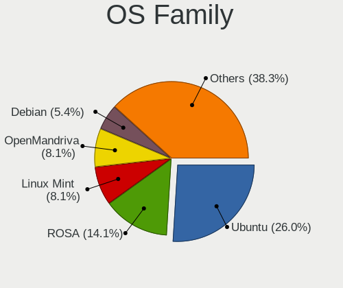

Linux - Tested Hardware & Statistics (Desktops)
-----------------------------------------------

A project to collect tested hardware configurations for Linux.

Anyone can contribute to this report by the [hw-probe](https://github.com/linuxhw/hw-probe) tool:

    sudo -E hw-probe -all -upload

Please contribute! Especially if your hardware is rare.

This report is for real hardware. Report for virtual hardware: [TestDays_VE](https://github.com/linuxhw/TestDays_VE)

Contents
--------

* [ Test Cases ](#test-cases)

* [ System ](#system)
  - [ OS                       ](#os)
  - [ OS Family                ](#os-family)
  - [ Kernel                   ](#kernel)
  - [ Kernel Family            ](#kernel-family)
  - [ Kernel Major Ver.        ](#kernel-major-ver)
  - [ Arch                     ](#arch)
  - [ DE                       ](#de)
  - [ Display Server           ](#display-server)
  - [ Display Manager          ](#display-manager)
  - [ OS Lang                  ](#os-lang)
  - [ Boot Mode                ](#boot-mode)
  - [ Filesystem               ](#filesystem)
  - [ Part. scheme             ](#part-scheme)
  - [ Dual Boot with Linux/BSD ](#dual-boot-with-linuxbsd)
  - [ Dual Boot (Win)          ](#dual-boot-win)

* [ Board ](#board)
  - [ Vendor                   ](#vendor)
  - [ Model                    ](#model)
  - [ Model Family             ](#model-family)
  - [ MFG Year                 ](#mfg-year)
  - [ Form Factor              ](#form-factor)
  - [ Secure Boot              ](#secure-boot)
  - [ Coreboot                 ](#coreboot)
  - [ RAM Size                 ](#ram-size)
  - [ RAM Used                 ](#ram-used)
  - [ Total Drives             ](#total-drives)
  - [ Has CD-ROM               ](#has-cd-rom)
  - [ Has Ethernet             ](#has-ethernet)
  - [ Has WiFi                 ](#has-wifi)
  - [ Has Bluetooth            ](#has-bluetooth)

* [ Location ](#location)
  - [ Country                  ](#country)
  - [ City                     ](#city)

* [ Drives ](#drives)
  - [ Drive Vendor             ](#drive-vendor)
  - [ Drive Model              ](#drive-model)
  - [ HDD Vendor               ](#hdd-vendor)
  - [ SSD Vendor               ](#ssd-vendor)
  - [ Drive Kind               ](#drive-kind)
  - [ Drive Connector          ](#drive-connector)
  - [ Drive Size               ](#drive-size)
  - [ Space Total              ](#space-total)
  - [ Space Used               ](#space-used)
  - [ Malfunc. Drives          ](#malfunc-drives)
  - [ Malfunc. Drive Vendor    ](#malfunc-drive-vendor)
  - [ Malfunc. HDD Vendor      ](#malfunc-hdd-vendor)
  - [ Malfunc. Drive Kind      ](#malfunc-drive-kind)
  - [ Failed Drives            ](#failed-drives)
  - [ Failed Drive Vendor      ](#failed-drive-vendor)
  - [ Drive Status             ](#drive-status)

* [ Storage controller ](#storage-controller)
  - [ Storage Vendor           ](#storage-vendor)
  - [ Storage Model            ](#storage-model)
  - [ Storage Kind             ](#storage-kind)

* [ Processor ](#processor)
  - [ CPU Vendor               ](#cpu-vendor)
  - [ CPU Model                ](#cpu-model)
  - [ CPU Model Family         ](#cpu-model-family)
  - [ CPU Cores                ](#cpu-cores)
  - [ CPU Sockets              ](#cpu-sockets)
  - [ CPU Threads              ](#cpu-threads)
  - [ CPU Op-Modes             ](#cpu-op-modes)
  - [ CPU Microcode            ](#cpu-microcode)
  - [ CPU Microarch            ](#cpu-microarch)

* [ Graphics ](#graphics)
  - [ GPU Vendor               ](#gpu-vendor)
  - [ GPU Model                ](#gpu-model)
  - [ GPU Combo                ](#gpu-combo)
  - [ GPU Driver               ](#gpu-driver)
  - [ GPU Memory               ](#gpu-memory)

* [ Monitor ](#monitor)
  - [ Monitor Vendor           ](#monitor-vendor)
  - [ Monitor Model            ](#monitor-model)
  - [ Monitor Resolution       ](#monitor-resolution)
  - [ Monitor Diagonal         ](#monitor-diagonal)
  - [ Monitor Width            ](#monitor-width)
  - [ Aspect Ratio             ](#aspect-ratio)
  - [ Monitor Area             ](#monitor-area)
  - [ Pixel Density            ](#pixel-density)
  - [ Multiple Monitors        ](#multiple-monitors)

* [ Network ](#network)
  - [ Net Controller Vendor    ](#net-controller-vendor)
  - [ Net Controller Model     ](#net-controller-model)
  - [ Wireless Vendor          ](#wireless-vendor)
  - [ Wireless Model           ](#wireless-model)
  - [ Ethernet Vendor          ](#ethernet-vendor)
  - [ Ethernet Model           ](#ethernet-model)
  - [ Net Controller Kind      ](#net-controller-kind)
  - [ Used Controller          ](#used-controller)
  - [ NICs                     ](#nics)
  - [ IPv6                     ](#ipv6)

* [ Bluetooth ](#bluetooth)
  - [ Bluetooth Vendor         ](#bluetooth-vendor)
  - [ Bluetooth Model          ](#bluetooth-model)

* [ Sound ](#sound)
  - [ Sound Vendor             ](#sound-vendor)
  - [ Sound Model              ](#sound-model)

* [ Memory ](#memory)
  - [ Memory Vendor            ](#memory-vendor)
  - [ Memory Model             ](#memory-model)
  - [ Memory Kind              ](#memory-kind)
  - [ Memory Form Factor       ](#memory-form-factor)
  - [ Memory Size              ](#memory-size)
  - [ Memory Speed             ](#memory-speed)

* [ Printers & scanners ](#printers--scanners)
  - [ Printer Vendor           ](#printer-vendor)
  - [ Printer Model            ](#printer-model)
  - [ Scanner Vendor           ](#scanner-vendor)
  - [ Scanner Model            ](#scanner-model)

* [ Camera ](#camera)
  - [ Camera Vendor            ](#camera-vendor)
  - [ Camera Model             ](#camera-model)

* [ Security ](#security)
  - [ Fingerprint Vendor       ](#fingerprint-vendor)
  - [ Fingerprint Model        ](#fingerprint-model)
  - [ Chipcard Vendor          ](#chipcard-vendor)
  - [ Chipcard Model           ](#chipcard-model)

* [ Unsupported ](#unsupported)
  - [ Unsupported Devices      ](#unsupported-devices)
  - [ Unsupported Device Types ](#unsupported-device-types)

Test Cases
----------

Total: 142237

| Vendor        | Model                       | Probe                                                      | Date         |
|---------------|-----------------------------|------------------------------------------------------------|--------------|
| ASRock        | Z790 PG Lightning           | [0b5268372a](https://linux-hardware.org/?probe=0b5268372a) | Dec 24, 2023 |
| MSI           | H97 PC Mate                 | [f1c5d0d405](https://linux-hardware.org/?probe=f1c5d0d405) | Dec 24, 2023 |
| HP            | 0B40h                       | [e3ad55af3f](https://linux-hardware.org/?probe=e3ad55af3f) | Dec 24, 2023 |
| Dell          | 0WMJ54 A01                  | [31f29a3843](https://linux-hardware.org/?probe=31f29a3843) | Dec 24, 2023 |
| ASUSTek       | Z97-K                       | [2474ae00d3](https://linux-hardware.org/?probe=2474ae00d3) | Dec 24, 2023 |
| ASUSTek       | M5A97 EVO R2.0              | [cccb18ead9](https://linux-hardware.org/?probe=cccb18ead9) | Dec 24, 2023 |
| MSI           | B450 GAMING PLUS MAX        | [587884179e](https://linux-hardware.org/?probe=587884179e) | Dec 24, 2023 |
| HP            | 82F1                        | [86959f8199](https://linux-hardware.org/?probe=86959f8199) | Dec 24, 2023 |
| Unknown       | Unknown                     | [74c274a303](https://linux-hardware.org/?probe=74c274a303) | Dec 24, 2023 |
| Unknown       | Unknown                     | [123aa39382](https://linux-hardware.org/?probe=123aa39382) | Dec 24, 2023 |
| Acer          | Aspire TC-885 V:1.1         | [bdb39d60de](https://linux-hardware.org/?probe=bdb39d60de) | Dec 24, 2023 |
| ASRock        | 990FX Extreme4              | [d698ea94f5](https://linux-hardware.org/?probe=d698ea94f5) | Dec 24, 2023 |
| ASRock        | H610D4-P1                   | [88f9c52b47](https://linux-hardware.org/?probe=88f9c52b47) | Dec 24, 2023 |
| ASRock        | 990FX Extreme4              | [bfe0870fab](https://linux-hardware.org/?probe=bfe0870fab) | Dec 24, 2023 |
| Intel         | H61                         | [a10f481c10](https://linux-hardware.org/?probe=a10f481c10) | Dec 24, 2023 |
| ASRock        | 990FX Extreme4              | [d6c1f0d202](https://linux-hardware.org/?probe=d6c1f0d202) | Dec 24, 2023 |
| MAXSUN        | MS-Terminator B550M         | [57ce047c4c](https://linux-hardware.org/?probe=57ce047c4c) | Dec 24, 2023 |
| Gigabyte      | AB350N-Gaming WIFI-CF       | [27a814dd64](https://linux-hardware.org/?probe=27a814dd64) | Dec 24, 2023 |
| HP            | 8918                        | [4b922c3362](https://linux-hardware.org/?probe=4b922c3362) | Dec 24, 2023 |
| Dell          | 0WR7PY A02                  | [df3b1f1cc3](https://linux-hardware.org/?probe=df3b1f1cc3) | Dec 24, 2023 |
| Gigabyte      | X670 GAMING X AX            | [4452cd4a25](https://linux-hardware.org/?probe=4452cd4a25) | Dec 24, 2023 |
| MSI           | X99A RAIDER                 | [b150280df5](https://linux-hardware.org/?probe=b150280df5) | Dec 24, 2023 |
| HP            | 2B29                        | [93ef9f39bd](https://linux-hardware.org/?probe=93ef9f39bd) | Dec 24, 2023 |
| Intel         | B85                         | [5b462c9ed1](https://linux-hardware.org/?probe=5b462c9ed1) | Dec 24, 2023 |
| ASUSTek       | PRIME B450M-A II            | [3366f8e90d](https://linux-hardware.org/?probe=3366f8e90d) | Dec 24, 2023 |
| ASUSTek       | PRIME B450M-A II            | [6484f4217b](https://linux-hardware.org/?probe=6484f4217b) | Dec 24, 2023 |
| Fujitsu       | D3061-A1 S26361-D3061-A1    | [646b9af5a9](https://linux-hardware.org/?probe=646b9af5a9) | Dec 24, 2023 |
| HP            | 21D0                        | [733191fd29](https://linux-hardware.org/?probe=733191fd29) | Dec 24, 2023 |
| ASUSTek       | P7P55D-E PRO                | [ef61ad2663](https://linux-hardware.org/?probe=ef61ad2663) | Dec 24, 2023 |
| MSI           | B350M PRO-VDH               | [d845a3492b](https://linux-hardware.org/?probe=d845a3492b) | Dec 24, 2023 |
| MSI           | B350M PRO-VDH               | [a6e1fc3b29](https://linux-hardware.org/?probe=a6e1fc3b29) | Dec 24, 2023 |
| MSI           | 770-C45                     | [b627deabe4](https://linux-hardware.org/?probe=b627deabe4) | Dec 24, 2023 |
| MSI           | MPG B650 EDGE WIFI          | [8503d79f6c](https://linux-hardware.org/?probe=8503d79f6c) | Dec 24, 2023 |
| MSI           | PRO B650-S WIFI             | [c084478d6e](https://linux-hardware.org/?probe=c084478d6e) | Dec 24, 2023 |
| ASRock        | X670E Taichi Carrara        | [3c53e69328](https://linux-hardware.org/?probe=3c53e69328) | Dec 24, 2023 |
| ASUSTek       | P5GC-MX/1333                | [a95c11e27b](https://linux-hardware.org/?probe=a95c11e27b) | Dec 23, 2023 |
| ASUSTek       | ROG STRIX B450-F GAMING     | [a84743b247](https://linux-hardware.org/?probe=a84743b247) | Dec 23, 2023 |
| ASUSTek       | H110M-A                     | [63306d22b2](https://linux-hardware.org/?probe=63306d22b2) | Dec 23, 2023 |
| Gigabyte      | GA-78LMT-USB3               | [dd658b1151](https://linux-hardware.org/?probe=dd658b1151) | Dec 23, 2023 |
| MSI           | H510M-A PRO                 | [fe19f4de86](https://linux-hardware.org/?probe=fe19f4de86) | Dec 23, 2023 |
| Acer          | TDPS05                      | [ce9b5d0c48](https://linux-hardware.org/?probe=ce9b5d0c48) | Dec 23, 2023 |
| ASUSTek       | TUF Gaming B550M-E          | [518e259c3c](https://linux-hardware.org/?probe=518e259c3c) | Dec 23, 2023 |
| ASRock        | B450 Gaming-ITX/ac          | [6c6f281927](https://linux-hardware.org/?probe=6c6f281927) | Dec 23, 2023 |
| Gigabyte      | B460M GAMING HD             | [6669971369](https://linux-hardware.org/?probe=6669971369) | Dec 23, 2023 |
| ASUSTek       | M2V                         | [67c7bc43ed](https://linux-hardware.org/?probe=67c7bc43ed) | Dec 23, 2023 |
| ASRock        | B450 Gaming-ITX/ac          | [5590fcbfaf](https://linux-hardware.org/?probe=5590fcbfaf) | Dec 23, 2023 |
| Dell          | 09KPNV A00                  | [a90623afe1](https://linux-hardware.org/?probe=a90623afe1) | Dec 23, 2023 |
| ASUSTek       | M2V                         | [1d6970f290](https://linux-hardware.org/?probe=1d6970f290) | Dec 23, 2023 |
| MSI           | 970 GAMING                  | [275aa2eb92](https://linux-hardware.org/?probe=275aa2eb92) | Dec 23, 2023 |
| Gigabyte      | Q87M-D2H                    | [4b2ed8b976](https://linux-hardware.org/?probe=4b2ed8b976) | Dec 23, 2023 |
| ASRock        | Q1900DC-ITX                 | [ee59bde7c9](https://linux-hardware.org/?probe=ee59bde7c9) | Dec 23, 2023 |
| ASRock        | Q1900DC-ITX                 | [9733217ad2](https://linux-hardware.org/?probe=9733217ad2) | Dec 23, 2023 |
| ASUSTek       | PRIME B450-PLUS             | [a32ea319ca](https://linux-hardware.org/?probe=a32ea319ca) | Dec 23, 2023 |
| AZW           | EQ                          | [a04c9735a7](https://linux-hardware.org/?probe=a04c9735a7) | Dec 23, 2023 |
| Acer          | Veriton X2631G V:1.0        | [a57f2ee15f](https://linux-hardware.org/?probe=a57f2ee15f) | Dec 23, 2023 |
| AZW           | EQ                          | [9b3d265cd1](https://linux-hardware.org/?probe=9b3d265cd1) | Dec 23, 2023 |
| Acer          | Veriton X2631G V:1.0        | [c9555a34f2](https://linux-hardware.org/?probe=c9555a34f2) | Dec 23, 2023 |
| Dell          | 0J1C3P A01                  | [faea7a3006](https://linux-hardware.org/?probe=faea7a3006) | Dec 23, 2023 |
| MSI           | MPG B550 GAMING PLUS        | [9aa71593d4](https://linux-hardware.org/?probe=9aa71593d4) | Dec 23, 2023 |
| MSI           | PRO Z790-A WIFI             | [8becdfe1a4](https://linux-hardware.org/?probe=8becdfe1a4) | Dec 23, 2023 |
| HP            | 1998                        | [c2e72e513c](https://linux-hardware.org/?probe=c2e72e513c) | Dec 23, 2023 |
| ASUSTek       | TUF B360-PLUS GAMING        | [b1c3408d24](https://linux-hardware.org/?probe=b1c3408d24) | Dec 23, 2023 |
| ASRock        | H310CM-HDV/M.2              | [76d95ab75c](https://linux-hardware.org/?probe=76d95ab75c) | Dec 23, 2023 |
| MSI           | MPG B550 GAMING PLUS        | [3819a04ddd](https://linux-hardware.org/?probe=3819a04ddd) | Dec 23, 2023 |
| Fujitsu       | D3161-A1 S26361-D3161-A1    | [c8bab56547](https://linux-hardware.org/?probe=c8bab56547) | Dec 23, 2023 |
| ASUSTek       | P8Z77-V PRO                 | [4f8558438f](https://linux-hardware.org/?probe=4f8558438f) | Dec 23, 2023 |
| Gigabyte      | GA-78LMT-S2P                | [6f36390142](https://linux-hardware.org/?probe=6f36390142) | Dec 23, 2023 |
| ASUSTek       | PRIME Z490-P                | [61724f27e7](https://linux-hardware.org/?probe=61724f27e7) | Dec 23, 2023 |
| Fujitsu       | D3161-A1 S26361-D3161-A1    | [c1069bda0b](https://linux-hardware.org/?probe=c1069bda0b) | Dec 23, 2023 |
| MSI           | H110M PRO-D                 | [7a442e82cf](https://linux-hardware.org/?probe=7a442e82cf) | Dec 23, 2023 |
| Gigabyte      | M68MT-S2                    | [ba4e48312e](https://linux-hardware.org/?probe=ba4e48312e) | Dec 23, 2023 |
| ASUSTek       | M4A785-M                    | [fe6c638acc](https://linux-hardware.org/?probe=fe6c638acc) | Dec 23, 2023 |
| HP            | 1998                        | [8eb25518c4](https://linux-hardware.org/?probe=8eb25518c4) | Dec 23, 2023 |
| HP            | 2ADC                        | [2c9d8d03d2](https://linux-hardware.org/?probe=2c9d8d03d2) | Dec 23, 2023 |
| Gigabyte      | M68MT-S2                    | [e91530e41d](https://linux-hardware.org/?probe=e91530e41d) | Dec 23, 2023 |
| Acer          | H81-M1                      | [e9fd2a5dc4](https://linux-hardware.org/?probe=e9fd2a5dc4) | Dec 23, 2023 |
| ASRock        | AMCP7A-ION                  | [fb0acc2d50](https://linux-hardware.org/?probe=fb0acc2d50) | Dec 23, 2023 |
| MSI           | B550-A PRO                  | [64a00841b2](https://linux-hardware.org/?probe=64a00841b2) | Dec 23, 2023 |
| Unknown       | Unknown                     | [9549fcd83e](https://linux-hardware.org/?probe=9549fcd83e) | Dec 23, 2023 |
| Acer          | TDPS05                      | [d0260b1327](https://linux-hardware.org/?probe=d0260b1327) | Dec 23, 2023 |
| MACHINIST     | X99-K9 V2.0                 | [7f4061fd49](https://linux-hardware.org/?probe=7f4061fd49) | Dec 23, 2023 |
| ASUSTek       | X99-A II                    | [37e4430c0e](https://linux-hardware.org/?probe=37e4430c0e) | Dec 23, 2023 |
| ASUSTek       | P5B-VM SE                   | [4640d8f333](https://linux-hardware.org/?probe=4640d8f333) | Dec 23, 2023 |
| MSI           | MPG B760I EDGE WIFI DDR4    | [58bbd67a73](https://linux-hardware.org/?probe=58bbd67a73) | Dec 23, 2023 |
| Foxconn       | 2ABF                        | [d12d3a2f21](https://linux-hardware.org/?probe=d12d3a2f21) | Dec 23, 2023 |
| MSI           | H110M PRO-D                 | [10257919e4](https://linux-hardware.org/?probe=10257919e4) | Dec 23, 2023 |
| HP            | 1497                        | [9d5244b557](https://linux-hardware.org/?probe=9d5244b557) | Dec 23, 2023 |
| Lenovo        | ThinkCentre M58 7373AJ5     | [201981bc3f](https://linux-hardware.org/?probe=201981bc3f) | Dec 23, 2023 |
| ASRock        | X370 Taichi                 | [689d51f57e](https://linux-hardware.org/?probe=689d51f57e) | Dec 23, 2023 |
| Dell          | 0WMJ54 A01                  | [ac0b6ab055](https://linux-hardware.org/?probe=ac0b6ab055) | Dec 23, 2023 |
| Gigabyte      | B85-HD3                     | [79fbb89592](https://linux-hardware.org/?probe=79fbb89592) | Dec 23, 2023 |
| ASUSTek       | PRIME B360-PLUS             | [4cd7d986cd](https://linux-hardware.org/?probe=4cd7d986cd) | Dec 23, 2023 |
| Dell          | 04Y8V0 A02                  | [1c3e40ac13](https://linux-hardware.org/?probe=1c3e40ac13) | Dec 23, 2023 |
| ASUSTek       | PRIME H310M-K R2.0          | [8decde512f](https://linux-hardware.org/?probe=8decde512f) | Dec 23, 2023 |
| T-bao Tian... | GOD78                       | [cd28753d06](https://linux-hardware.org/?probe=cd28753d06) | Dec 23, 2023 |
| ASUSTek       | P8H61-M LX                  | [29bb247885](https://linux-hardware.org/?probe=29bb247885) | Dec 23, 2023 |
| Foxconn       | 2ADA                        | [f30aec24c2](https://linux-hardware.org/?probe=f30aec24c2) | Dec 23, 2023 |
| MSI           | MS-7388                     | [5027d4b8ed](https://linux-hardware.org/?probe=5027d4b8ed) | Dec 23, 2023 |
| ASRock        | AMCP7A-ION                  | [7d19dec574](https://linux-hardware.org/?probe=7d19dec574) | Dec 23, 2023 |
| eMachines     | EMCP61M                     | [d464b480dd](https://linux-hardware.org/?probe=d464b480dd) | Dec 23, 2023 |
| ASUSTek       | TUF Gaming B650-PLUS WIF... | [a7194ce97c](https://linux-hardware.org/?probe=a7194ce97c) | Dec 23, 2023 |
| Dell          | 0VHWTR A02                  | [86e89b6ffd](https://linux-hardware.org/?probe=86e89b6ffd) | Dec 23, 2023 |
| ASRock        | B450 Steel Legend           | [039823b939](https://linux-hardware.org/?probe=039823b939) | Dec 23, 2023 |
| Lenovo        | NOK                         | [35841ab3ed](https://linux-hardware.org/?probe=35841ab3ed) | Dec 23, 2023 |
| Gigabyte      | EP45-DS3L                   | [a7ad5fb789](https://linux-hardware.org/?probe=a7ad5fb789) | Dec 23, 2023 |
| Lenovo        | SHARKBAY SDK0E50510 WIN     | [ab3cc8a89c](https://linux-hardware.org/?probe=ab3cc8a89c) | Dec 23, 2023 |
| Dell          | 0XPDFK A01                  | [538aa9126b](https://linux-hardware.org/?probe=538aa9126b) | Dec 23, 2023 |
| MSI           | 890FXA-GD70                 | [1093dc8236](https://linux-hardware.org/?probe=1093dc8236) | Dec 23, 2023 |
| MSI           | PRO H410M-B                 | [28d6a6092b](https://linux-hardware.org/?probe=28d6a6092b) | Dec 23, 2023 |
| Dell          | 0Y5DDC A00                  | [7ab5ac3907](https://linux-hardware.org/?probe=7ab5ac3907) | Dec 23, 2023 |
| MSI           | A88XM-E35                   | [dce385e94b](https://linux-hardware.org/?probe=dce385e94b) | Dec 23, 2023 |
| Foxconn       | 2ABF                        | [3441aa81e6](https://linux-hardware.org/?probe=3441aa81e6) | Dec 23, 2023 |
| ASUSTek       | PRIME A320M-K               | [aaf6ab3d26](https://linux-hardware.org/?probe=aaf6ab3d26) | Dec 23, 2023 |
| ASRock        | Z97 Pro4                    | [f8e2df67b1](https://linux-hardware.org/?probe=f8e2df67b1) | Dec 23, 2023 |
| ASUSTek       | ROG STRIX X570-E GAMING     | [391ef34135](https://linux-hardware.org/?probe=391ef34135) | Dec 23, 2023 |
| Unknown       | Unknown                     | [3ead5f7cee](https://linux-hardware.org/?probe=3ead5f7cee) | Dec 23, 2023 |
| Gigabyte      | D525TUD                     | [dd2248530b](https://linux-hardware.org/?probe=dd2248530b) | Dec 23, 2023 |
| Gigabyte      | Z390 UD                     | [cd36fc0dc1](https://linux-hardware.org/?probe=cd36fc0dc1) | Dec 23, 2023 |
| MSI           | PRO Z790-A WIFI             | [9b8ad6a3f1](https://linux-hardware.org/?probe=9b8ad6a3f1) | Dec 23, 2023 |
| Gigabyte      | X570 AORUS ELITE WIFI       | [6c9e82db47](https://linux-hardware.org/?probe=6c9e82db47) | Dec 23, 2023 |
| Dell          | 0D6H9T A00                  | [f6dd1b447a](https://linux-hardware.org/?probe=f6dd1b447a) | Dec 23, 2023 |
| Lenovo        | 30C0 SDK0J40697 WIN 3305... | [da46ad37d3](https://linux-hardware.org/?probe=da46ad37d3) | Dec 23, 2023 |
| ASUSTek       | M5A99FX PRO R2.0            | [1622d9b25b](https://linux-hardware.org/?probe=1622d9b25b) | Dec 23, 2023 |
| Gigabyte      | EP45-DS3L                   | [7cf925bed4](https://linux-hardware.org/?probe=7cf925bed4) | Dec 23, 2023 |
| MSI           | PRO Z790-A WIFI             | [ff13629db9](https://linux-hardware.org/?probe=ff13629db9) | Dec 23, 2023 |
| HP            | 8299                        | [7cb3e71107](https://linux-hardware.org/?probe=7cb3e71107) | Dec 23, 2023 |
| ASUSTek       | P7P55D-E                    | [dc2914021f](https://linux-hardware.org/?probe=dc2914021f) | Dec 23, 2023 |
| Dell          | 0NW73C A00                  | [5ac83b9740](https://linux-hardware.org/?probe=5ac83b9740) | Dec 23, 2023 |
| Lenovo        | SHARKBAY SDK0J40705 WIN ... | [739d4b0840](https://linux-hardware.org/?probe=739d4b0840) | Dec 23, 2023 |
| ASUSTek       | M4A89GTD-PRO                | [05b49062ef](https://linux-hardware.org/?probe=05b49062ef) | Dec 23, 2023 |
| HPE           | ProLiant MicroServer Gen... | [4d38d67af1](https://linux-hardware.org/?probe=4d38d67af1) | Dec 23, 2023 |
| Gigabyte      | X570 AORUS ELITE            | [9425eb3c77](https://linux-hardware.org/?probe=9425eb3c77) | Dec 23, 2023 |
| MSI           | B560M PRO                   | [3885df62ab](https://linux-hardware.org/?probe=3885df62ab) | Dec 23, 2023 |
| Gigabyte      | G41MT-D3                    | [d7f5fd2175](https://linux-hardware.org/?probe=d7f5fd2175) | Dec 23, 2023 |
| ASRock        | Z370 Professional Gaming... | [d46814af3c](https://linux-hardware.org/?probe=d46814af3c) | Dec 23, 2023 |
| eMachines     | EL1360                      | [af31609559](https://linux-hardware.org/?probe=af31609559) | Dec 23, 2023 |
| Unknown       | Unknown                     | [41b66d1144](https://linux-hardware.org/?probe=41b66d1144) | Dec 23, 2023 |
| ASUSTek       | P6T                         | [d90adb3a12](https://linux-hardware.org/?probe=d90adb3a12) | Dec 23, 2023 |
| Gigabyte      | Z97M-DS3H                   | [da051b693c](https://linux-hardware.org/?probe=da051b693c) | Dec 23, 2023 |
| ASUSTek       | ROG CROSSHAIR VIII IMPAC... | [a953876b2c](https://linux-hardware.org/?probe=a953876b2c) | Dec 23, 2023 |
| Gigabyte      | X570 AORUS PRO WIFI         | [bbd50ba27b](https://linux-hardware.org/?probe=bbd50ba27b) | Dec 23, 2023 |
| ASUSTek       | ROG STRIX X570-E GAMING     | [b9b670d3c0](https://linux-hardware.org/?probe=b9b670d3c0) | Dec 23, 2023 |
| AZW           | SER V1                      | [73cc7b7f87](https://linux-hardware.org/?probe=73cc7b7f87) | Dec 22, 2023 |
| MSI           | PRO B650M-A WIFI            | [4adc5f3f81](https://linux-hardware.org/?probe=4adc5f3f81) | Dec 22, 2023 |
| ASUSTek       | PRIME B450-PLUS             | [852693eb71](https://linux-hardware.org/?probe=852693eb71) | Dec 22, 2023 |
| Lenovo        | MAHOBAY NOK                 | [51cee07e16](https://linux-hardware.org/?probe=51cee07e16) | Dec 22, 2023 |
| ASRock        | H77 Pro4-M                  | [e2bc5dabc2](https://linux-hardware.org/?probe=e2bc5dabc2) | Dec 22, 2023 |
| Dell          | 0FDY5C A00                  | [a3fc39604c](https://linux-hardware.org/?probe=a3fc39604c) | Dec 22, 2023 |
| ASRock        | 4X4-4000 Series             | [b4333bcaaf](https://linux-hardware.org/?probe=b4333bcaaf) | Dec 22, 2023 |
| Dell          | 0K3CM7 A00                  | [019b46745e](https://linux-hardware.org/?probe=019b46745e) | Dec 22, 2023 |
| Alienware     | 0P0JWX A00                  | [99d0e56ef1](https://linux-hardware.org/?probe=99d0e56ef1) | Dec 22, 2023 |
| HP            | 8643 SMVB                   | [bbdb2204d8](https://linux-hardware.org/?probe=bbdb2204d8) | Dec 22, 2023 |
| ASUSTek       | Maximus VIII RANGER         | [3fa9465c1a](https://linux-hardware.org/?probe=3fa9465c1a) | Dec 22, 2023 |
| MSI           | 970 GAMING                  | [498753636e](https://linux-hardware.org/?probe=498753636e) | Dec 22, 2023 |
| ASRock        | Z790 Taichi                 | [3bc8305321](https://linux-hardware.org/?probe=3bc8305321) | Dec 22, 2023 |
| Dell          | 0D6H9T A00                  | [84275b737e](https://linux-hardware.org/?probe=84275b737e) | Dec 22, 2023 |
| ASUSTek       | PRIME B450-PLUS             | [c9bee45423](https://linux-hardware.org/?probe=c9bee45423) | Dec 22, 2023 |
| MSI           | MPG B550 GAMING PLUS        | [db8c00daf3](https://linux-hardware.org/?probe=db8c00daf3) | Dec 22, 2023 |
| Intel         | H61                         | [72c7724ef0](https://linux-hardware.org/?probe=72c7724ef0) | Dec 22, 2023 |
| HP            | 212B                        | [8fa44a703b](https://linux-hardware.org/?probe=8fa44a703b) | Dec 22, 2023 |
| HP            | 1495                        | [475715312b](https://linux-hardware.org/?probe=475715312b) | Dec 22, 2023 |
| AZW           | MINI S 10                   | [59d6fa667d](https://linux-hardware.org/?probe=59d6fa667d) | Dec 22, 2023 |
| Gigabyte      | Z790 GAMING X AX            | [155e0f1c37](https://linux-hardware.org/?probe=155e0f1c37) | Dec 22, 2023 |
| ASUSTek       | P8H61 EVO                   | [a123efbb84](https://linux-hardware.org/?probe=a123efbb84) | Dec 22, 2023 |
| ASUSTek       | H110M-K                     | [1049cbc16b](https://linux-hardware.org/?probe=1049cbc16b) | Dec 22, 2023 |
| Gigabyte      | B550 AORUS ELITE V2         | [f71924e3e4](https://linux-hardware.org/?probe=f71924e3e4) | Dec 22, 2023 |
| ASRock        | X300M-STX                   | [9109738b7f](https://linux-hardware.org/?probe=9109738b7f) | Dec 22, 2023 |
| ASRock        | X300M-STX                   | [4017c676bf](https://linux-hardware.org/?probe=4017c676bf) | Dec 22, 2023 |
| Dell          | 0X7841                      | [3757ec7f5f](https://linux-hardware.org/?probe=3757ec7f5f) | Dec 22, 2023 |
| Gigabyte      | H87M-HD3                    | [00781519db](https://linux-hardware.org/?probe=00781519db) | Dec 22, 2023 |
| ASUSTek       | ROG STRIX B650E-F GAMING... | [ff8ded7ff8](https://linux-hardware.org/?probe=ff8ded7ff8) | Dec 22, 2023 |
| MSI           | B450M PRO-VDH MAX           | [94462e79e4](https://linux-hardware.org/?probe=94462e79e4) | Dec 22, 2023 |
| MSI           | MAG B650M MORTAR WIFI       | [7e506254e0](https://linux-hardware.org/?probe=7e506254e0) | Dec 22, 2023 |
| Colorful T... | A320M-M.2 PRO V15           | [821494cfbf](https://linux-hardware.org/?probe=821494cfbf) | Dec 22, 2023 |
| MSI           | B450M PRO-VDH MAX           | [851dce0b14](https://linux-hardware.org/?probe=851dce0b14) | Dec 22, 2023 |
| ASUSTek       | Maximus VI GENE             | [178aab1062](https://linux-hardware.org/?probe=178aab1062) | Dec 22, 2023 |
| HP            | 886C                        | [2432d4f585](https://linux-hardware.org/?probe=2432d4f585) | Dec 22, 2023 |
| HP            | 83E0                        | [07e6f563f9](https://linux-hardware.org/?probe=07e6f563f9) | Dec 22, 2023 |
| MSI           | X570-A PRO                  | [27a132c185](https://linux-hardware.org/?probe=27a132c185) | Dec 22, 2023 |
| ASUSTek       | M4A785-M                    | [f6f10099c2](https://linux-hardware.org/?probe=f6f10099c2) | Dec 22, 2023 |
| ASUSTek       | SABERTOOTH 990FX R3.0       | [a1a6c29257](https://linux-hardware.org/?probe=a1a6c29257) | Dec 22, 2023 |
| Gigabyte      | B650 GAMING X AX            | [9c0210d1ed](https://linux-hardware.org/?probe=9c0210d1ed) | Dec 22, 2023 |
| ASUSTek       | P7H55-M LE                  | [d15476594e](https://linux-hardware.org/?probe=d15476594e) | Dec 22, 2023 |
| HP            | 8643 SMVB                   | [03ddd69e34](https://linux-hardware.org/?probe=03ddd69e34) | Dec 22, 2023 |
| MSI           | PRO Z790-A WIFI             | [8e38fb94ba](https://linux-hardware.org/?probe=8e38fb94ba) | Dec 22, 2023 |
| ASUSTek       | PRIME A320M-K               | [c83a6a5f5d](https://linux-hardware.org/?probe=c83a6a5f5d) | Dec 22, 2023 |
| ASUSTek       | B85-PLUS                    | [58a2ef76f9](https://linux-hardware.org/?probe=58a2ef76f9) | Dec 22, 2023 |
| Dell          | 0WR7PY A03                  | [9ff527cfd0](https://linux-hardware.org/?probe=9ff527cfd0) | Dec 22, 2023 |
| HP            | 8626                        | [b04d9fcad9](https://linux-hardware.org/?probe=b04d9fcad9) | Dec 22, 2023 |
| PCWare        | IPMH61R3                    | [891c2058a8](https://linux-hardware.org/?probe=891c2058a8) | Dec 22, 2023 |
| MSI           | B250M PRO-VD                | [1a4d75f062](https://linux-hardware.org/?probe=1a4d75f062) | Dec 22, 2023 |
| ASUSTek       | P7P55D PRO                  | [ce940a8975](https://linux-hardware.org/?probe=ce940a8975) | Dec 22, 2023 |
| Gigabyte      | B550 AORUS PRO AC           | [de502eec48](https://linux-hardware.org/?probe=de502eec48) | Dec 22, 2023 |
| MSI           | B75A-G43                    | [70c44f3ff8](https://linux-hardware.org/?probe=70c44f3ff8) | Dec 22, 2023 |
| ASUSTek       | PRIME X470-PRO              | [45079856a0](https://linux-hardware.org/?probe=45079856a0) | Dec 22, 2023 |
| Dell          | 0HY9JP A02                  | [6f47019169](https://linux-hardware.org/?probe=6f47019169) | Dec 22, 2023 |
| ASRock        | FM2A68M-HD+                 | [83fd663b68](https://linux-hardware.org/?probe=83fd663b68) | Dec 22, 2023 |
| Dell          | 0D4MD1 A00                  | [858b84769f](https://linux-hardware.org/?probe=858b84769f) | Dec 22, 2023 |
| Gigabyte      | Z390 AORUS PRO WIFI-CF      | [8a2d46dced](https://linux-hardware.org/?probe=8a2d46dced) | Dec 22, 2023 |
| ASUSTek       | B150-PRO D3                 | [a686071950](https://linux-hardware.org/?probe=a686071950) | Dec 22, 2023 |
| Gigabyte      | B550 AORUS PRO V2           | [be8f1bf021](https://linux-hardware.org/?probe=be8f1bf021) | Dec 22, 2023 |
| Gigabyte      | Z68MA-D2H-B3                | [f3f83a4f0a](https://linux-hardware.org/?probe=f3f83a4f0a) | Dec 22, 2023 |
| LattePanda    | Sigma                       | [09cb864933](https://linux-hardware.org/?probe=09cb864933) | Dec 22, 2023 |
| Alienware     | 0K9TKY A00                  | [ec6847b7f2](https://linux-hardware.org/?probe=ec6847b7f2) | Dec 22, 2023 |
| ASUSTek       | ROG STRIX Z790-I GAMING ... | [60e10649cc](https://linux-hardware.org/?probe=60e10649cc) | Dec 22, 2023 |
| Gigabyte      | B360M HD3                   | [9acf6baf05](https://linux-hardware.org/?probe=9acf6baf05) | Dec 22, 2023 |
| ASUSTek       | H110M-K                     | [55109c1bbc](https://linux-hardware.org/?probe=55109c1bbc) | Dec 22, 2023 |
| Gigabyte      | H81M-S2H                    | [bbd22340fc](https://linux-hardware.org/?probe=bbd22340fc) | Dec 22, 2023 |
| MSI           | B250M PRO-VH                | [6911b47a19](https://linux-hardware.org/?probe=6911b47a19) | Dec 22, 2023 |
| Gigabyte      | H81M-S2H                    | [fd80bdeaed](https://linux-hardware.org/?probe=fd80bdeaed) | Dec 22, 2023 |
| ASUSTek       | H110M-K                     | [ac7383c630](https://linux-hardware.org/?probe=ac7383c630) | Dec 22, 2023 |
| MSI           | H110M PRO-VH PLUS           | [7b862a6a81](https://linux-hardware.org/?probe=7b862a6a81) | Dec 22, 2023 |
| MSI           | H110M PRO-VH PLUS           | [17dd42b383](https://linux-hardware.org/?probe=17dd42b383) | Dec 22, 2023 |
| Gigabyte      | H81M-DS2                    | [e50bd82756](https://linux-hardware.org/?probe=e50bd82756) | Dec 22, 2023 |
| Gigabyte      | H81M-S2H                    | [2194b0ad9c](https://linux-hardware.org/?probe=2194b0ad9c) | Dec 22, 2023 |
| MSI           | H110M PRO-VH PLUS           | [c334514b1f](https://linux-hardware.org/?probe=c334514b1f) | Dec 22, 2023 |
| Gigabyte      | H81M-S2PV                   | [761eebee94](https://linux-hardware.org/?probe=761eebee94) | Dec 22, 2023 |
| Gigabyte      | H81M-S2PH                   | [b6608c7603](https://linux-hardware.org/?probe=b6608c7603) | Dec 22, 2023 |
| MSI           | B365M PRO-VH                | [33bccf75e0](https://linux-hardware.org/?probe=33bccf75e0) | Dec 22, 2023 |
| MSI           | H110M PRO-VH PLUS           | [59b5ebb0c3](https://linux-hardware.org/?probe=59b5ebb0c3) | Dec 22, 2023 |
| MSI           | H110M PRO-VH PLUS           | [0c51eb213d](https://linux-hardware.org/?probe=0c51eb213d) | Dec 22, 2023 |
| Gigabyte      | B250M-HD3-CF                | [347eec7ee9](https://linux-hardware.org/?probe=347eec7ee9) | Dec 22, 2023 |
| MSI           | B365M PRO-VH                | [561a4c0809](https://linux-hardware.org/?probe=561a4c0809) | Dec 22, 2023 |
| MSI           | H110M PRO-VH PLUS           | [27115feb62](https://linux-hardware.org/?probe=27115feb62) | Dec 22, 2023 |
| Gigabyte      | B560M AORUS PRO             | [3ce597e06a](https://linux-hardware.org/?probe=3ce597e06a) | Dec 22, 2023 |
| Gigabyte      | H81M-S2H                    | [be34427eb1](https://linux-hardware.org/?probe=be34427eb1) | Dec 22, 2023 |
| Gigabyte      | H81M-S2H                    | [496ad2d93b](https://linux-hardware.org/?probe=496ad2d93b) | Dec 22, 2023 |
| MSI           | B360M PRO-VH                | [d0bce14740](https://linux-hardware.org/?probe=d0bce14740) | Dec 22, 2023 |
| Gigabyte      | H81M-S2H                    | [5fb5668250](https://linux-hardware.org/?probe=5fb5668250) | Dec 22, 2023 |
| ASUSTek       | H110M-K                     | [caad19d314](https://linux-hardware.org/?probe=caad19d314) | Dec 22, 2023 |
| MSI           | B360M PRO-VH                | [b1c0126e05](https://linux-hardware.org/?probe=b1c0126e05) | Dec 22, 2023 |
| MSI           | B365M PRO-VH                | [d1c63c1a0b](https://linux-hardware.org/?probe=d1c63c1a0b) | Dec 22, 2023 |
| Gigabyte      | H81M-S2H                    | [a42bd5e717](https://linux-hardware.org/?probe=a42bd5e717) | Dec 22, 2023 |
| MSI           | B365M PRO-VH                | [a75998d2da](https://linux-hardware.org/?probe=a75998d2da) | Dec 22, 2023 |
| MSI           | B365M PRO-VH                | [b55f33d76e](https://linux-hardware.org/?probe=b55f33d76e) | Dec 22, 2023 |
| MSI           | B365M PRO-VH                | [49e9a2f26f](https://linux-hardware.org/?probe=49e9a2f26f) | Dec 22, 2023 |
| MSI           | B365M PRO-VH                | [8c3370c21e](https://linux-hardware.org/?probe=8c3370c21e) | Dec 22, 2023 |
| Gigabyte      | B560M AORUS PRO             | [94de79174c](https://linux-hardware.org/?probe=94de79174c) | Dec 22, 2023 |
| MSI           | B365M PRO-VH                | [59bc9b5d02](https://linux-hardware.org/?probe=59bc9b5d02) | Dec 22, 2023 |
| MSI           | B250M PRO-VH                | [87af1005b8](https://linux-hardware.org/?probe=87af1005b8) | Dec 22, 2023 |
| Gigabyte      | H81M-S2H                    | [55570e65a7](https://linux-hardware.org/?probe=55570e65a7) | Dec 22, 2023 |
| Gigabyte      | H81M-DS2                    | [eea4397d45](https://linux-hardware.org/?probe=eea4397d45) | Dec 22, 2023 |
| MSI           | B365M PRO-VH                | [b32df5066d](https://linux-hardware.org/?probe=b32df5066d) | Dec 22, 2023 |
| MSI           | B365M PRO-VH                | [a949e7fa06](https://linux-hardware.org/?probe=a949e7fa06) | Dec 22, 2023 |
| MSI           | B365M PRO-VH                | [e2b4e10140](https://linux-hardware.org/?probe=e2b4e10140) | Dec 22, 2023 |
| MSI           | B365M PRO-VH                | [87c9436145](https://linux-hardware.org/?probe=87c9436145) | Dec 22, 2023 |
| MSI           | B365M PRO-VH                | [b3a3b91d1d](https://linux-hardware.org/?probe=b3a3b91d1d) | Dec 22, 2023 |
| ASUSTek       | M5A78L-M LX V2              | [0ae8561f0a](https://linux-hardware.org/?probe=0ae8561f0a) | Dec 22, 2023 |
| Gigabyte      | H81M-S2PV                   | [2f23b66d3b](https://linux-hardware.org/?probe=2f23b66d3b) | Dec 22, 2023 |
| ASUSTek       | H110M-K                     | [617899113a](https://linux-hardware.org/?probe=617899113a) | Dec 22, 2023 |
| Gigabyte      | H81M-S2PV                   | [3092182d1d](https://linux-hardware.org/?probe=3092182d1d) | Dec 22, 2023 |
| Gigabyte      | H81M-S2H                    | [3f48c50868](https://linux-hardware.org/?probe=3f48c50868) | Dec 22, 2023 |
| MSI           | B250M PRO-VH                | [cac98c44ed](https://linux-hardware.org/?probe=cac98c44ed) | Dec 22, 2023 |
| Gigabyte      | H81M-S2H                    | [6d0e82b783](https://linux-hardware.org/?probe=6d0e82b783) | Dec 22, 2023 |
| Gigabyte      | H81M-DS2                    | [afd422517d](https://linux-hardware.org/?probe=afd422517d) | Dec 22, 2023 |
| MSI           | B360M PRO-VH                | [1db23ed649](https://linux-hardware.org/?probe=1db23ed649) | Dec 22, 2023 |
| MSI           | B360M PRO-VH                | [8ed791bd6d](https://linux-hardware.org/?probe=8ed791bd6d) | Dec 22, 2023 |
| Gigabyte      | H81M-S2H                    | [5a63cf039d](https://linux-hardware.org/?probe=5a63cf039d) | Dec 22, 2023 |
| MSI           | H110M PRO-VH PLUS           | [46e2b13b34](https://linux-hardware.org/?probe=46e2b13b34) | Dec 22, 2023 |
| MSI           | B250M PRO-VH                | [d09a9c1d0b](https://linux-hardware.org/?probe=d09a9c1d0b) | Dec 22, 2023 |
| Gigabyte      | H81M-S2H                    | [9181bd8696](https://linux-hardware.org/?probe=9181bd8696) | Dec 22, 2023 |
| MSI           | H110M PRO-VH PLUS           | [67188e1b67](https://linux-hardware.org/?probe=67188e1b67) | Dec 22, 2023 |
| Gigabyte      | H81M-DS2                    | [75e2601753](https://linux-hardware.org/?probe=75e2601753) | Dec 22, 2023 |
| MSI           | B250M PRO-VH                | [83d6013a05](https://linux-hardware.org/?probe=83d6013a05) | Dec 22, 2023 |
| Gigabyte      | H81M-S2H                    | [86e58bba42](https://linux-hardware.org/?probe=86e58bba42) | Dec 22, 2023 |
| Gigabyte      | H81M-S2H                    | [6b6c41afa2](https://linux-hardware.org/?probe=6b6c41afa2) | Dec 22, 2023 |
| Gigabyte      | B360M HD3                   | [635fdfc9be](https://linux-hardware.org/?probe=635fdfc9be) | Dec 22, 2023 |
| MSI           | B365M PRO-VH                | [057ea7f38a](https://linux-hardware.org/?probe=057ea7f38a) | Dec 22, 2023 |
| ASUSTek       | H110M-K                     | [0318224393](https://linux-hardware.org/?probe=0318224393) | Dec 22, 2023 |
| Gigabyte      | H81M-S2H                    | [6f2b8275b2](https://linux-hardware.org/?probe=6f2b8275b2) | Dec 22, 2023 |
| MSI           | B365M PRO-VH                | [4cd5825edf](https://linux-hardware.org/?probe=4cd5825edf) | Dec 22, 2023 |
| MSI           | B360M PRO-VH                | [3e070bb5d3](https://linux-hardware.org/?probe=3e070bb5d3) | Dec 22, 2023 |
| MSI           | H110M PRO-VH PLUS           | [c3140237d9](https://linux-hardware.org/?probe=c3140237d9) | Dec 22, 2023 |
| MSI           | B360M PRO-VH                | [2169da8737](https://linux-hardware.org/?probe=2169da8737) | Dec 22, 2023 |
| MSI           | B250M PRO-VH                | [968400d838](https://linux-hardware.org/?probe=968400d838) | Dec 22, 2023 |
| Gigabyte      | H610M S2H                   | [6c554a9668](https://linux-hardware.org/?probe=6c554a9668) | Dec 22, 2023 |
| ASUSTek       | STRIX X99 GAMING            | [2af66f541d](https://linux-hardware.org/?probe=2af66f541d) | Dec 22, 2023 |
| ASUSTek       | PRIME B450-PLUS             | [9515cb0c90](https://linux-hardware.org/?probe=9515cb0c90) | Dec 22, 2023 |
| ASRock        | J3160DC-ITX                 | [c84aa85d4e](https://linux-hardware.org/?probe=c84aa85d4e) | Dec 22, 2023 |
| ASUSTek       | M5A97 R2.0                  | [3ff2f289b9](https://linux-hardware.org/?probe=3ff2f289b9) | Dec 22, 2023 |
| Lenovo        | 3731 SDK0J40697 WIN 3305... | [090681a459](https://linux-hardware.org/?probe=090681a459) | Dec 22, 2023 |
| Gigabyte      | P35-DS3R                    | [741ad16651](https://linux-hardware.org/?probe=741ad16651) | Dec 22, 2023 |
| MACHINIST     | X99-RS9 V2.0                | [e0cd6655cb](https://linux-hardware.org/?probe=e0cd6655cb) | Dec 22, 2023 |
| SHANGZHAOY... | B85M-PRO V1.1               | [bd7c6e2693](https://linux-hardware.org/?probe=bd7c6e2693) | Dec 22, 2023 |
| Gigabyte      | B450M GAMING                | [1767c5b291](https://linux-hardware.org/?probe=1767c5b291) | Dec 21, 2023 |
| Gigabyte      | B760M AORUS ELITE AX        | [7eb85caf57](https://linux-hardware.org/?probe=7eb85caf57) | Dec 21, 2023 |
| Gigabyte      | GA-78LMT-S2P                | [dbc2e93666](https://linux-hardware.org/?probe=dbc2e93666) | Dec 21, 2023 |
| ASUSTek       | TUF Gaming B650M-PLUS       | [0dc09851b1](https://linux-hardware.org/?probe=0dc09851b1) | Dec 21, 2023 |
| Gigabyte      | B450 AORUS M                | [084e48827c](https://linux-hardware.org/?probe=084e48827c) | Dec 21, 2023 |
| MSI           | A320M-A PRO MAX             | [37e175c7a2](https://linux-hardware.org/?probe=37e175c7a2) | Dec 21, 2023 |
| Gigabyte      | GA-990XA-UD3                | [f8215b7e03](https://linux-hardware.org/?probe=f8215b7e03) | Dec 21, 2023 |
| Huanan        | X58 V1.0                    | [ac62468ad1](https://linux-hardware.org/?probe=ac62468ad1) | Dec 21, 2023 |
| Intel         | DH77EB AAG39073-304         | [83183dbb01](https://linux-hardware.org/?probe=83183dbb01) | Dec 21, 2023 |
| MSI           | MAG X570 TOMAHAWK WIFI      | [13b303a58b](https://linux-hardware.org/?probe=13b303a58b) | Dec 21, 2023 |
| ASRock        | A520M-HDV                   | [918677a1da](https://linux-hardware.org/?probe=918677a1da) | Dec 21, 2023 |
| Dell          | 0HD5W2 A00                  | [2bd748691b](https://linux-hardware.org/?probe=2bd748691b) | Dec 21, 2023 |
| Dell          | 0JP3NX A01                  | [706947928d](https://linux-hardware.org/?probe=706947928d) | Dec 21, 2023 |
| MSI           | MPG X570 GAMING EDGE WIF... | [628ca02992](https://linux-hardware.org/?probe=628ca02992) | Dec 21, 2023 |
| Gigabyte      | Z790 AORUS MASTER X         | [e71bed6be5](https://linux-hardware.org/?probe=e71bed6be5) | Dec 21, 2023 |
| Dell          | 0WMJ54 A01                  | [6cacd38012](https://linux-hardware.org/?probe=6cacd38012) | Dec 21, 2023 |
| ASRock        | A520M-HDV                   | [7136ba3916](https://linux-hardware.org/?probe=7136ba3916) | Dec 21, 2023 |
| Gigabyte      | X570 AORUS PRO WIFI         | [119a1632aa](https://linux-hardware.org/?probe=119a1632aa) | Dec 21, 2023 |
| Gigabyte      | Z170X-UD5-CF                | [67662437e4](https://linux-hardware.org/?probe=67662437e4) | Dec 21, 2023 |
| ASUSTek       | PRIME X670-P WIFI           | [64131ee7e0](https://linux-hardware.org/?probe=64131ee7e0) | Dec 21, 2023 |
| Gigabyte      | A320M-S2H-CF                | [7a1be2ed24](https://linux-hardware.org/?probe=7a1be2ed24) | Dec 21, 2023 |
| Gigabyte      | B560M AORUS ELITE           | [82304c2a5f](https://linux-hardware.org/?probe=82304c2a5f) | Dec 21, 2023 |
| Dell          | 0KWVT8 A03                  | [82a8bc3c6e](https://linux-hardware.org/?probe=82a8bc3c6e) | Dec 21, 2023 |
| Gigabyte      | AB350-Gaming 3-CF           | [b49d16daf5](https://linux-hardware.org/?probe=b49d16daf5) | Dec 21, 2023 |
| ASUSTek       | ROG STRIX X670E-E GAMING... | [278967cf92](https://linux-hardware.org/?probe=278967cf92) | Dec 21, 2023 |
| Lenovo        | SHARKBAY SDK0E50510 WIN     | [0bc1c80333](https://linux-hardware.org/?probe=0bc1c80333) | Dec 21, 2023 |
| Dell          | 033FF6 A00                  | [88cad415fb](https://linux-hardware.org/?probe=88cad415fb) | Dec 21, 2023 |
| ASUSTek       | M3N78-VM                    | [bd28c77bd4](https://linux-hardware.org/?probe=bd28c77bd4) | Dec 21, 2023 |
| ASRock        | B760M Pro RS                | [f648cda96d](https://linux-hardware.org/?probe=f648cda96d) | Dec 21, 2023 |
| HP            | 18E7                        | [71f34bba13](https://linux-hardware.org/?probe=71f34bba13) | Dec 21, 2023 |
| Gigabyte      | B660I AORUS PRO DDR4        | [f9552f9e38](https://linux-hardware.org/?probe=f9552f9e38) | Dec 21, 2023 |
| HP            | 876C SMVB                   | [c13f4eb91b](https://linux-hardware.org/?probe=c13f4eb91b) | Dec 21, 2023 |
| ASUSTek       | M5A97 LE R2.0               | [e222a97c0b](https://linux-hardware.org/?probe=e222a97c0b) | Dec 21, 2023 |
| ASUSTek       | Maximus VIII RANGER         | [b87a575222](https://linux-hardware.org/?probe=b87a575222) | Dec 21, 2023 |
| Gigabyte      | Z87-HD3                     | [49e514e9c4](https://linux-hardware.org/?probe=49e514e9c4) | Dec 21, 2023 |
| Acer          | Aspire XC-1760              | [ac3910a453](https://linux-hardware.org/?probe=ac3910a453) | Dec 21, 2023 |
| ASRock        | B450M Pro4                  | [8bce457975](https://linux-hardware.org/?probe=8bce457975) | Dec 21, 2023 |
| ASUSTek       | PRIME H510M-K               | [5c0166e1f8](https://linux-hardware.org/?probe=5c0166e1f8) | Dec 21, 2023 |
| ASUSTek       | P5G41T-M LX                 | [8bc6ac892f](https://linux-hardware.org/?probe=8bc6ac892f) | Dec 21, 2023 |
| Gigabyte      | B550 GAMING X V2            | [ce4bc6f455](https://linux-hardware.org/?probe=ce4bc6f455) | Dec 21, 2023 |
| MSI           | X570-A PRO                  | [07a7762b25](https://linux-hardware.org/?probe=07a7762b25) | Dec 21, 2023 |
| Gigabyte      | B660M GAMING DDR4           | [544fdd3054](https://linux-hardware.org/?probe=544fdd3054) | Dec 21, 2023 |
| Supermicro    | H13DSG-O-CPU                | [1ba9d3bc0c](https://linux-hardware.org/?probe=1ba9d3bc0c) | Dec 21, 2023 |
| INTECH PRO    | H510-M2 v5.0                | [9d99caa058](https://linux-hardware.org/?probe=9d99caa058) | Dec 21, 2023 |
| Gigabyte      | B550M S2H                   | [0cf7feafe8](https://linux-hardware.org/?probe=0cf7feafe8) | Dec 21, 2023 |
| MSI           | B450M PRO-VDH MAX           | [1b8100314e](https://linux-hardware.org/?probe=1b8100314e) | Dec 21, 2023 |
| Supermicro    | H13DSG-O-CPU                | [066ebdde5b](https://linux-hardware.org/?probe=066ebdde5b) | Dec 21, 2023 |
| MSI           | B85M-G43                    | [f2b41e4ce3](https://linux-hardware.org/?probe=f2b41e4ce3) | Dec 21, 2023 |
| Dell          | 0F6X5P A00                  | [fb2877e727](https://linux-hardware.org/?probe=fb2877e727) | Dec 21, 2023 |
| ASUSTek       | X99-DELUXE II               | [dca266a251](https://linux-hardware.org/?probe=dca266a251) | Dec 21, 2023 |
| Lenovo        | 318E SDK0J40697 WIN 3305... | [191d4913cd](https://linux-hardware.org/?probe=191d4913cd) | Dec 21, 2023 |
| Intel         | SKYBAY                      | [36f317de81](https://linux-hardware.org/?probe=36f317de81) | Dec 21, 2023 |
| Dell          | OptiPlex 5050               | [c1cffe744f](https://linux-hardware.org/?probe=c1cffe744f) | Dec 21, 2023 |
| ASUSTek       | TUF Gaming B550M-PLUS       | [6311def15e](https://linux-hardware.org/?probe=6311def15e) | Dec 21, 2023 |
| ASUSTek       | PRIME H510M-E               | [a2194f1fc6](https://linux-hardware.org/?probe=a2194f1fc6) | Dec 21, 2023 |
| Foxconn       | 2ADA                        | [735572694e](https://linux-hardware.org/?probe=735572694e) | Dec 21, 2023 |
| ASRock        | H61M-DGS R2.0               | [5693d09326](https://linux-hardware.org/?probe=5693d09326) | Dec 21, 2023 |
| ASRock        | B760 Pro RS/D4              | [4b020f53e1](https://linux-hardware.org/?probe=4b020f53e1) | Dec 21, 2023 |
| Dell          | 0NKW6Y A02                  | [d41c926291](https://linux-hardware.org/?probe=d41c926291) | Dec 21, 2023 |
| HP            | 18E7                        | [ad6cf02d18](https://linux-hardware.org/?probe=ad6cf02d18) | Dec 21, 2023 |
| Unknown       | Unknown                     | [ded73c0619](https://linux-hardware.org/?probe=ded73c0619) | Dec 21, 2023 |
| ASUSTek       | X99-DELUXE II               | [b9409f01d5](https://linux-hardware.org/?probe=b9409f01d5) | Dec 21, 2023 |
| ASUSTek       | M4A785TD-V EVO              | [8b094a74c9](https://linux-hardware.org/?probe=8b094a74c9) | Dec 21, 2023 |
| ASUSTek       | Z87-PRO                     | [1c5b8cb7de](https://linux-hardware.org/?probe=1c5b8cb7de) | Dec 21, 2023 |
| ASUSTek       | PRIME H610M-R D4            | [5e7428fc75](https://linux-hardware.org/?probe=5e7428fc75) | Dec 21, 2023 |
| ASUSTek       | M4A785-M                    | [271869a253](https://linux-hardware.org/?probe=271869a253) | Dec 21, 2023 |
| ASUSTek       | H97M-E                      | [090fcf5a52](https://linux-hardware.org/?probe=090fcf5a52) | Dec 21, 2023 |
| HP            | 18E7                        | [fdb8b2d229](https://linux-hardware.org/?probe=fdb8b2d229) | Dec 21, 2023 |
| Gigabyte      | Z390 AORUS PRO WIFI-CF      | [8eca3c15e7](https://linux-hardware.org/?probe=8eca3c15e7) | Dec 21, 2023 |
| ASUSTek       | H110M-A                     | [3b149d0e20](https://linux-hardware.org/?probe=3b149d0e20) | Dec 21, 2023 |
| ASRock        | Z77 Pro4                    | [d8d81bc3e2](https://linux-hardware.org/?probe=d8d81bc3e2) | Dec 21, 2023 |
| ASRock        | B550M Pro4                  | [bb26992a0a](https://linux-hardware.org/?probe=bb26992a0a) | Dec 21, 2023 |
| HP            | 2B4B                        | [19a3edb061](https://linux-hardware.org/?probe=19a3edb061) | Dec 21, 2023 |
| ASUSTek       | M2NPV-VM                    | [312d56f544](https://linux-hardware.org/?probe=312d56f544) | Dec 21, 2023 |
| ASUSTek       | Z10PG-D16 Series            | [6b3c6c4099](https://linux-hardware.org/?probe=6b3c6c4099) | Dec 21, 2023 |
| HP            | 2B28                        | [a3c79770af](https://linux-hardware.org/?probe=a3c79770af) | Dec 21, 2023 |
| Gigabyte      | Z590 AORUS ULTRA            | [341417afe4](https://linux-hardware.org/?probe=341417afe4) | Dec 21, 2023 |
| ASUSTek       | PRIME Z690-P                | [72187eb090](https://linux-hardware.org/?probe=72187eb090) | Dec 21, 2023 |
| Gigabyte      | A320M-H-CF                  | [4294629777](https://linux-hardware.org/?probe=4294629777) | Dec 21, 2023 |
| MSI           | NF725M-P43                  | [43756d6fad](https://linux-hardware.org/?probe=43756d6fad) | Dec 21, 2023 |
| Dell          | 0101XX A00                  | [13751aa80b](https://linux-hardware.org/?probe=13751aa80b) | Dec 21, 2023 |
| Lenovo        | SHARKBAY 0B98401 PRO        | [2675cca8c2](https://linux-hardware.org/?probe=2675cca8c2) | Dec 21, 2023 |
| Gigabyte      | GA-MA790FXT-UD5P            | [5fa215a8cd](https://linux-hardware.org/?probe=5fa215a8cd) | Dec 21, 2023 |
| AZW           | EQ                          | [11b8a012c0](https://linux-hardware.org/?probe=11b8a012c0) | Dec 21, 2023 |
| MSI           | 770-C45                     | [cf5f865e2a](https://linux-hardware.org/?probe=cf5f865e2a) | Dec 21, 2023 |
| Apple         | Mac-F221BEC8                | [c5d51ca43d](https://linux-hardware.org/?probe=c5d51ca43d) | Dec 21, 2023 |
| ASUSTek       | M5A99X EVO                  | [c0c637bbba](https://linux-hardware.org/?probe=c0c637bbba) | Dec 21, 2023 |
| ASUSTek       | ROG STRIX Z690-E GAMING ... | [47d1d26375](https://linux-hardware.org/?probe=47d1d26375) | Dec 21, 2023 |
| MSI           | H81M-E34                    | [4b1991c655](https://linux-hardware.org/?probe=4b1991c655) | Dec 21, 2023 |
| Shenzhen M... | F7BSC                       | [70147072be](https://linux-hardware.org/?probe=70147072be) | Dec 21, 2023 |
| Acer          | Aspire M3970                | [5da3b6c46f](https://linux-hardware.org/?probe=5da3b6c46f) | Dec 21, 2023 |
| ASRock        | B550M Pro4                  | [0f7957917e](https://linux-hardware.org/?probe=0f7957917e) | Dec 21, 2023 |
| ASUSTek       | M5A97 R2.0                  | [93a7029d22](https://linux-hardware.org/?probe=93a7029d22) | Dec 21, 2023 |
| Acer          | Veriton X2631G V:1.0        | [8116f31329](https://linux-hardware.org/?probe=8116f31329) | Dec 21, 2023 |
| Acer          | Veriton X2631G V:1.0        | [7597019eca](https://linux-hardware.org/?probe=7597019eca) | Dec 21, 2023 |
| Pegatron      | 2AB6                        | [fc2beada0a](https://linux-hardware.org/?probe=fc2beada0a) | Dec 21, 2023 |
| HP            | 82F1                        | [6e05cf58df](https://linux-hardware.org/?probe=6e05cf58df) | Dec 20, 2023 |
| ASUSTek       | TUF Gaming B550M-PLUS       | [d5f60126bb](https://linux-hardware.org/?probe=d5f60126bb) | Dec 20, 2023 |
| ASRock        | H610M-HVS                   | [25b5c11ccc](https://linux-hardware.org/?probe=25b5c11ccc) | Dec 20, 2023 |
| Gigabyte      | Z390 DESIGNARE-CF           | [680a9f5001](https://linux-hardware.org/?probe=680a9f5001) | Dec 20, 2023 |
| ASUSTek       | P5G41-M                     | [cbab9e248d](https://linux-hardware.org/?probe=cbab9e248d) | Dec 20, 2023 |
| ASUSTek       | VM40B                       | [8deb79e86e](https://linux-hardware.org/?probe=8deb79e86e) | Dec 20, 2023 |
| Lenovo        | ThinkCentre A70 7099L8G     | [9720608634](https://linux-hardware.org/?probe=9720608634) | Dec 20, 2023 |
| Dell          | 0FM586                      | [eadcdb629b](https://linux-hardware.org/?probe=eadcdb629b) | Dec 20, 2023 |
| HP            | 3396                        | [d0d084ecc8](https://linux-hardware.org/?probe=d0d084ecc8) | Dec 20, 2023 |
| Gigabyte      | B560M H                     | [6e7f8b2300](https://linux-hardware.org/?probe=6e7f8b2300) | Dec 20, 2023 |
| ASUSTek       | TUF Gaming B550M-PLUS       | [70aa06688c](https://linux-hardware.org/?probe=70aa06688c) | Dec 20, 2023 |
| MSI           | 760GM-P23                   | [cec4f5fa78](https://linux-hardware.org/?probe=cec4f5fa78) | Dec 20, 2023 |
| ASUSTek       | TUF Gaming B650M-E WIFI     | [2464a532b8](https://linux-hardware.org/?probe=2464a532b8) | Dec 20, 2023 |
| HC Technol... | HCAR5000-MI                 | [16f9dec3e0](https://linux-hardware.org/?probe=16f9dec3e0) | Dec 20, 2023 |
| ASUSTek       | M4A785TD-M EVO              | [ae2fef5c99](https://linux-hardware.org/?probe=ae2fef5c99) | Dec 20, 2023 |
| Hampoo        | Cherry Trail CR             | [2c180fa555](https://linux-hardware.org/?probe=2c180fa555) | Dec 20, 2023 |
| ASUSTek       | ROG STRIX Z390-F GAMING     | [761fb59fa5](https://linux-hardware.org/?probe=761fb59fa5) | Dec 20, 2023 |
| Dell          | 0D6H9T A00                  | [2c968508ee](https://linux-hardware.org/?probe=2c968508ee) | Dec 20, 2023 |
| MSI           | MPG X570 GAMING PRO CARB... | [67098aebca](https://linux-hardware.org/?probe=67098aebca) | Dec 20, 2023 |
| Gigabyte      | Z77X-UD3H                   | [25a077d35e](https://linux-hardware.org/?probe=25a077d35e) | Dec 20, 2023 |
| ASUSTek       | ROG CROSSHAIR VIII HERO     | [98298e164f](https://linux-hardware.org/?probe=98298e164f) | Dec 20, 2023 |
| HP            | 805D                        | [6768e6fc48](https://linux-hardware.org/?probe=6768e6fc48) | Dec 20, 2023 |
| Dell          | 042P49 A01                  | [fb968ffb8b](https://linux-hardware.org/?probe=fb968ffb8b) | Dec 20, 2023 |
| Lenovo        | 317C NOK                    | [87064e6d98](https://linux-hardware.org/?probe=87064e6d98) | Dec 20, 2023 |
| ASUSTek       | PRIME B250M-A               | [11628f388e](https://linux-hardware.org/?probe=11628f388e) | Dec 20, 2023 |
| HP            | 1632                        | [e9f36a25a0](https://linux-hardware.org/?probe=e9f36a25a0) | Dec 20, 2023 |
| Gigabyte      | H81M-DS2                    | [1da522781e](https://linux-hardware.org/?probe=1da522781e) | Dec 20, 2023 |
| Pegatron      | TRUCKEE                     | [dbf9508eef](https://linux-hardware.org/?probe=dbf9508eef) | Dec 20, 2023 |
| MSI           | PRO Z690-A WIFI             | [d6a5b20ac6](https://linux-hardware.org/?probe=d6a5b20ac6) | Dec 20, 2023 |
| ASUSTek       | TUF Gaming X570-PLUS        | [98eee633b1](https://linux-hardware.org/?probe=98eee633b1) | Dec 20, 2023 |
| ECS           | H81H3-MV                    | [95bd5100ac](https://linux-hardware.org/?probe=95bd5100ac) | Dec 20, 2023 |
| Gigabyte      | B550M DS3H                  | [35547b20b3](https://linux-hardware.org/?probe=35547b20b3) | Dec 20, 2023 |
| ASUSTek       | V6-P5G31E                   | [83a8408a7e](https://linux-hardware.org/?probe=83a8408a7e) | Dec 20, 2023 |
| MSI           | PRO Z690-A DDR4             | [55f164e414](https://linux-hardware.org/?probe=55f164e414) | Dec 20, 2023 |
| Intel         | DX58SO AAE29331-701         | [2d58e75a01](https://linux-hardware.org/?probe=2d58e75a01) | Dec 20, 2023 |
| Intel         | H61                         | [01b739e240](https://linux-hardware.org/?probe=01b739e240) | Dec 20, 2023 |
| Intel         | SKYBAY                      | [09a66cdc69](https://linux-hardware.org/?probe=09a66cdc69) | Dec 20, 2023 |
| HP            | 3047h                       | [8f868cea54](https://linux-hardware.org/?probe=8f868cea54) | Dec 20, 2023 |
| Gigabyte      | F2A88XM-D3H                 | [d111002a9c](https://linux-hardware.org/?probe=d111002a9c) | Dec 20, 2023 |
| MSI           | B450-A PRO MAX              | [f46e034f2c](https://linux-hardware.org/?probe=f46e034f2c) | Dec 20, 2023 |
| Dell          | 09KPNV A00                  | [e696fd9ae0](https://linux-hardware.org/?probe=e696fd9ae0) | Dec 20, 2023 |
| Gigabyte      | H81M-S                      | [5583555782](https://linux-hardware.org/?probe=5583555782) | Dec 20, 2023 |
| Gigabyte      | H81M-S                      | [eded3a5ce4](https://linux-hardware.org/?probe=eded3a5ce4) | Dec 20, 2023 |
| HP            | 3047h                       | [6e6ab07000](https://linux-hardware.org/?probe=6e6ab07000) | Dec 20, 2023 |
| ASUSTek       | Pro WS WRX80E-SAGE SE WI... | [aa11af3235](https://linux-hardware.org/?probe=aa11af3235) | Dec 20, 2023 |
| HP            | 3047h                       | [a1f3ed3f68](https://linux-hardware.org/?probe=a1f3ed3f68) | Dec 20, 2023 |
| Gigabyte      | H370M DS3H-CF               | [4b6f645ef6](https://linux-hardware.org/?probe=4b6f645ef6) | Dec 20, 2023 |
| ASUSTek       | TUF Gaming B650M-PLUS       | [088b57605f](https://linux-hardware.org/?probe=088b57605f) | Dec 20, 2023 |
| Unknown       | Unknown                     | [675b79ace4](https://linux-hardware.org/?probe=675b79ace4) | Dec 20, 2023 |
| Dell          | 0C522T A03                  | [7cd9f2379e](https://linux-hardware.org/?probe=7cd9f2379e) | Dec 20, 2023 |
| Unknown       | Unknown                     | [32f0587c3f](https://linux-hardware.org/?probe=32f0587c3f) | Dec 20, 2023 |
| ASUSTek       | Z97-PRO                     | [917d636ff9](https://linux-hardware.org/?probe=917d636ff9) | Dec 20, 2023 |
| Gigabyte      | Z690 AORUS XTREME           | [c721656dbe](https://linux-hardware.org/?probe=c721656dbe) | Dec 20, 2023 |
| MSI           | H61M-E33                    | [ab39035cef](https://linux-hardware.org/?probe=ab39035cef) | Dec 20, 2023 |
| ASRock        | B550 Pro4                   | [786ded3bc9](https://linux-hardware.org/?probe=786ded3bc9) | Dec 20, 2023 |
| ASUSTek       | P7P55D PRO                  | [15f5598650](https://linux-hardware.org/?probe=15f5598650) | Dec 20, 2023 |
| Gigabyte      | Z390 UD                     | [d2841c3b1e](https://linux-hardware.org/?probe=d2841c3b1e) | Dec 20, 2023 |
| ASUSTek       | K30AD_M31AD_M51AD_M32AD     | [ee1a222677](https://linux-hardware.org/?probe=ee1a222677) | Dec 20, 2023 |
| ASUSTek       | M4A89GTD-PRO/USB3           | [af51ef8978](https://linux-hardware.org/?probe=af51ef8978) | Dec 20, 2023 |
| Dell          | 06X1TJ A00                  | [eac468f369](https://linux-hardware.org/?probe=eac468f369) | Dec 20, 2023 |
| ASUSTek       | P8Z77-M PRO                 | [58517da295](https://linux-hardware.org/?probe=58517da295) | Dec 20, 2023 |
| MSI           | A78M-E45                    | [6d11f72d41](https://linux-hardware.org/?probe=6d11f72d41) | Dec 20, 2023 |
| ASUSTek       | Maximus VIII EXTREME        | [d2ed93003e](https://linux-hardware.org/?probe=d2ed93003e) | Dec 20, 2023 |
| Gigabyte      | A520M DS3H V2               | [3ba51c21e8](https://linux-hardware.org/?probe=3ba51c21e8) | Dec 20, 2023 |
| MSI           | B150M MORTAR                | [d0276bd5b7](https://linux-hardware.org/?probe=d0276bd5b7) | Dec 20, 2023 |
| AZW           | MINI S                      | [78169fe4be](https://linux-hardware.org/?probe=78169fe4be) | Dec 20, 2023 |
| ASRock        | M3A UCC                     | [f28e499d94](https://linux-hardware.org/?probe=f28e499d94) | Dec 20, 2023 |
| MSI           | 970 GAMING                  | [cb71670ca0](https://linux-hardware.org/?probe=cb71670ca0) | Dec 20, 2023 |
| Unknown       | Unknown                     | [2ff77e3571](https://linux-hardware.org/?probe=2ff77e3571) | Dec 20, 2023 |
| HP            | 18E7                        | [fad52327eb](https://linux-hardware.org/?probe=fad52327eb) | Dec 20, 2023 |
| ASUSTek       | M4A89GTD-PRO/USB3           | [7cda066ff6](https://linux-hardware.org/?probe=7cda066ff6) | Dec 20, 2023 |
| Gigabyte      | B85M-D3H                    | [a641f9b41d](https://linux-hardware.org/?probe=a641f9b41d) | Dec 20, 2023 |
| Gigabyte      | B650 AORUS ELITE AX         | [8703894e1c](https://linux-hardware.org/?probe=8703894e1c) | Dec 20, 2023 |
| ASUSTek       | M3N78-VM                    | [5d7048af51](https://linux-hardware.org/?probe=5d7048af51) | Dec 20, 2023 |
| ASUSTek       | PRIME H510M-K               | [b6b4165e86](https://linux-hardware.org/?probe=b6b4165e86) | Dec 20, 2023 |
| Medion        | TJ4125                      | [8fce958467](https://linux-hardware.org/?probe=8fce958467) | Dec 20, 2023 |
| Intel         | DH55TC AAE70932-206         | [3003aeb5a9](https://linux-hardware.org/?probe=3003aeb5a9) | Dec 20, 2023 |
| ASUSTek       | PRIME B550-PLUS             | [85087e0568](https://linux-hardware.org/?probe=85087e0568) | Dec 20, 2023 |
| MSI           | PRO Z690-A DDR4             | [b758a439b8](https://linux-hardware.org/?probe=b758a439b8) | Dec 20, 2023 |
| ASUSTek       | TUF Gaming X570-PLUS        | [f912bcd96a](https://linux-hardware.org/?probe=f912bcd96a) | Dec 20, 2023 |
| HP            | 1905                        | [540abb14df](https://linux-hardware.org/?probe=540abb14df) | Dec 20, 2023 |
| HP            | 1998                        | [bc41363911](https://linux-hardware.org/?probe=bc41363911) | Dec 20, 2023 |
| Dell          | 042P49 A01                  | [8e5afdac96](https://linux-hardware.org/?probe=8e5afdac96) | Dec 20, 2023 |
| Supermicro    | X9DRD-7LN4F                 | [56a303c264](https://linux-hardware.org/?probe=56a303c264) | Dec 20, 2023 |
| ASUSTek       | TUF Gaming Z790-PLUS WIF... | [b45e149ce8](https://linux-hardware.org/?probe=b45e149ce8) | Dec 20, 2023 |
| ASUSTek       | ROG STRIX B550-F GAMING     | [84530cb3ca](https://linux-hardware.org/?probe=84530cb3ca) | Dec 20, 2023 |
| ASRock        | AB350 Pro4                  | [bb15070eb2](https://linux-hardware.org/?probe=bb15070eb2) | Dec 19, 2023 |
| ASUSTek       | TUF Gaming Z790-PLUS WIF... | [10470437db](https://linux-hardware.org/?probe=10470437db) | Dec 19, 2023 |
| ASUSTek       | Pro B550M-C                 | [4e3b422400](https://linux-hardware.org/?probe=4e3b422400) | Dec 19, 2023 |
| ASUSTek       | ROG STRIX Z690-F GAMING ... | [176468573a](https://linux-hardware.org/?probe=176468573a) | Dec 19, 2023 |
| ASRock        | FM2A58M-HD+                 | [09ab03cdcd](https://linux-hardware.org/?probe=09ab03cdcd) | Dec 19, 2023 |
| ANGXUN        | X79-VG2 V1.3                | [532c5b5ddc](https://linux-hardware.org/?probe=532c5b5ddc) | Dec 19, 2023 |
| ASUSTek       | PRIME A320M-K               | [3eead324a8](https://linux-hardware.org/?probe=3eead324a8) | Dec 19, 2023 |
| Gigabyte      | 970-GAMING                  | [403d617fdd](https://linux-hardware.org/?probe=403d617fdd) | Dec 19, 2023 |
| Gigabyte      | Z77-DS3H                    | [6c1f758e88](https://linux-hardware.org/?probe=6c1f758e88) | Dec 19, 2023 |
| Gigabyte      | GA-78LMT-S2P                | [0e95772674](https://linux-hardware.org/?probe=0e95772674) | Dec 19, 2023 |
| ASUSTek       | TUF Gaming Z690-PLUS D4     | [ec86cf0c12](https://linux-hardware.org/?probe=ec86cf0c12) | Dec 19, 2023 |
| Gigabyte      | GA-78LMT-S2P                | [f2d2625715](https://linux-hardware.org/?probe=f2d2625715) | Dec 19, 2023 |
| Gigabyte      | Z790 UD                     | [94a40a476d](https://linux-hardware.org/?probe=94a40a476d) | Dec 19, 2023 |
| ASRock        | 970M Pro3                   | [85233c464d](https://linux-hardware.org/?probe=85233c464d) | Dec 19, 2023 |
| ASUSTek       | H110M-R                     | [ca0eab5d48](https://linux-hardware.org/?probe=ca0eab5d48) | Dec 19, 2023 |
| Gigabyte      | B85M-D3H                    | [1dd35fdb02](https://linux-hardware.org/?probe=1dd35fdb02) | Dec 19, 2023 |
| MSI           | B85-G43                     | [2c855d2376](https://linux-hardware.org/?probe=2c855d2376) | Dec 19, 2023 |
| Gigabyte      | GA-MA78LMT-US2H             | [a1f4076586](https://linux-hardware.org/?probe=a1f4076586) | Dec 19, 2023 |
| AZW           | MINI S 10                   | [9fd8cc1993](https://linux-hardware.org/?probe=9fd8cc1993) | Dec 19, 2023 |
| Lenovo        | 310C SDK0J40705 WIN 3425... | [c1ee1cd84d](https://linux-hardware.org/?probe=c1ee1cd84d) | Dec 19, 2023 |
| ASRock        | 970M Pro3                   | [acebee7435](https://linux-hardware.org/?probe=acebee7435) | Dec 19, 2023 |
| System76      | Thelio thelio-r3            | [86b686b3cf](https://linux-hardware.org/?probe=86b686b3cf) | Dec 19, 2023 |
| ASRock        | X670E PG Lightning          | [c41952876f](https://linux-hardware.org/?probe=c41952876f) | Dec 19, 2023 |
| Lenovo        | 313F SEK0N11856 IOT 3288... | [1a65cf0f52](https://linux-hardware.org/?probe=1a65cf0f52) | Dec 19, 2023 |
| ASUSTek       | SABERTOOTH Z170 MARK 1      | [4ea2f3364d](https://linux-hardware.org/?probe=4ea2f3364d) | Dec 19, 2023 |
| ASUSTek       | P8H61-M LX3 PLUS R2.0       | [bd012749e2](https://linux-hardware.org/?probe=bd012749e2) | Dec 19, 2023 |
| MSI           | 970A-G46                    | [078bef5c72](https://linux-hardware.org/?probe=078bef5c72) | Dec 19, 2023 |
| Gigabyte      | Z390 UD                     | [8e6c8be806](https://linux-hardware.org/?probe=8e6c8be806) | Dec 19, 2023 |
| ASUSTek       | PRIME B450M-A               | [e66c224547](https://linux-hardware.org/?probe=e66c224547) | Dec 19, 2023 |
| Lenovo        | 30BE SDK0J40697 WIN 3305... | [9b8d8ec134](https://linux-hardware.org/?probe=9b8d8ec134) | Dec 19, 2023 |
| ECS           | Nettle2                     | [b6a487a1d8](https://linux-hardware.org/?probe=b6a487a1d8) | Dec 19, 2023 |
| Lenovo        | MAHOBAY NOK                 | [7fe77a3476](https://linux-hardware.org/?probe=7fe77a3476) | Dec 19, 2023 |
| Lenovo        | 30BE SDK0J40705 WIN 3425... | [65b6d3dcc0](https://linux-hardware.org/?probe=65b6d3dcc0) | Dec 19, 2023 |
| Lenovo        | 30BE SDK0J40705 WIN 3425... | [ab5bffcf0a](https://linux-hardware.org/?probe=ab5bffcf0a) | Dec 19, 2023 |
| Lenovo        | SHARKBAY 0B98401 PRO        | [9f3471e435](https://linux-hardware.org/?probe=9f3471e435) | Dec 19, 2023 |
| Lenovo        | SKYBAY SDK0J40705 WIN 34... | [752a59a0cc](https://linux-hardware.org/?probe=752a59a0cc) | Dec 19, 2023 |
| MSI           | Z77A-G45                    | [047feb8e76](https://linux-hardware.org/?probe=047feb8e76) | Dec 19, 2023 |
| Gigabyte      | B450M DS3H-CF               | [cc583aec32](https://linux-hardware.org/?probe=cc583aec32) | Dec 19, 2023 |
| Lenovo        | SHARKBAY SDK0E50510 WIN     | [bff7dced45](https://linux-hardware.org/?probe=bff7dced45) | Dec 19, 2023 |
| MSI           | MAG B550 TOMAHAWK           | [35272a3d20](https://linux-hardware.org/?probe=35272a3d20) | Dec 19, 2023 |
| Biostar       | A320MH                      | [9ec714a02b](https://linux-hardware.org/?probe=9ec714a02b) | Dec 19, 2023 |
| ASUSTek       | TUF Gaming B550M-E          | [3dee3cb4bf](https://linux-hardware.org/?probe=3dee3cb4bf) | Dec 19, 2023 |
| HP            | 83E0                        | [8f41483d26](https://linux-hardware.org/?probe=8f41483d26) | Dec 19, 2023 |
| ASUSTek       | ROG STRIX X570-E GAMING     | [18cb796b47](https://linux-hardware.org/?probe=18cb796b47) | Dec 19, 2023 |
| ASUSTek       | ROG STRIX B450-F GAMING     | [67c84a4903](https://linux-hardware.org/?probe=67c84a4903) | Dec 19, 2023 |
| Dell          | 042P49 A02                  | [11f6da5848](https://linux-hardware.org/?probe=11f6da5848) | Dec 19, 2023 |
| ASRock        | B550M Pro4                  | [a32cb7798b](https://linux-hardware.org/?probe=a32cb7798b) | Dec 19, 2023 |
| ASUSTek       | Maximus VII HERO            | [30ecc8cbbb](https://linux-hardware.org/?probe=30ecc8cbbb) | Dec 19, 2023 |
| MSI           | B450M PRO-VDH PLUS          | [df369cf5be](https://linux-hardware.org/?probe=df369cf5be) | Dec 19, 2023 |
| ASUSTek       | H110M-R                     | [61211b72bb](https://linux-hardware.org/?probe=61211b72bb) | Dec 19, 2023 |
| Lenovo        | 3704 SDK0K17763 WIN 1801... | [9a2472e628](https://linux-hardware.org/?probe=9a2472e628) | Dec 19, 2023 |
| Fujitsu       | D3221-A1 S26361-D3221-A1    | [843515c201](https://linux-hardware.org/?probe=843515c201) | Dec 19, 2023 |
| Lenovo        | SHARKBAY 0B98401 PRO        | [993b9536cf](https://linux-hardware.org/?probe=993b9536cf) | Dec 19, 2023 |
| Lenovo        | 30BE SDK0J40705 WIN 3425... | [782dad2128](https://linux-hardware.org/?probe=782dad2128) | Dec 19, 2023 |
| ASUSTek       | PRIME Z390-P                | [29169b6700](https://linux-hardware.org/?probe=29169b6700) | Dec 19, 2023 |
| Dell          | 0C522T A03                  | [35b8611349](https://linux-hardware.org/?probe=35b8611349) | Dec 19, 2023 |
| ASUSTek       | H81-PLUS                    | [359af07cb2](https://linux-hardware.org/?probe=359af07cb2) | Dec 19, 2023 |
| ASUSTek       | H81-PLUS                    | [b4b91802b5](https://linux-hardware.org/?probe=b4b91802b5) | Dec 19, 2023 |
| MSI           | X570-A PRO                  | [3cf8d970f8](https://linux-hardware.org/?probe=3cf8d970f8) | Dec 19, 2023 |
| Dell          | 0PJDGF A02                  | [cfdd125cd5](https://linux-hardware.org/?probe=cfdd125cd5) | Dec 19, 2023 |
| Dell          | 0PJDGF A02                  | [edcd06b95f](https://linux-hardware.org/?probe=edcd06b95f) | Dec 19, 2023 |
| ASUSTek       | P5B                         | [a700c11a65](https://linux-hardware.org/?probe=a700c11a65) | Dec 19, 2023 |
| MSI           | MAG Z790 TOMAHAWK WIFI      | [619bbec719](https://linux-hardware.org/?probe=619bbec719) | Dec 19, 2023 |
| HP            | 0AA8h                       | [49435a98d1](https://linux-hardware.org/?probe=49435a98d1) | Dec 19, 2023 |
| Gigabyte      | Z77X-UP5 TH-CF              | [ee9b8f604a](https://linux-hardware.org/?probe=ee9b8f604a) | Dec 19, 2023 |
| Gigabyte      | B550M DS3H                  | [0fd7e9086a](https://linux-hardware.org/?probe=0fd7e9086a) | Dec 19, 2023 |
| AAEON         | MF-001 V1.0                 | [9e7c59246d](https://linux-hardware.org/?probe=9e7c59246d) | Dec 19, 2023 |
| Acer          | Aspire M3970                | [5767513b0e](https://linux-hardware.org/?probe=5767513b0e) | Dec 19, 2023 |
| ASRock        | B450M/ac                    | [1375b869d1](https://linux-hardware.org/?probe=1375b869d1) | Dec 19, 2023 |
| ASUSTek       | ROG STRIX Z690-E GAMING ... | [6a962e40ec](https://linux-hardware.org/?probe=6a962e40ec) | Dec 19, 2023 |
| MSI           | B360-A PRO                  | [a19733520c](https://linux-hardware.org/?probe=a19733520c) | Dec 19, 2023 |
| MSI           | MEG Z690 UNIFY              | [33f139b941](https://linux-hardware.org/?probe=33f139b941) | Dec 19, 2023 |
| ASRock        | B450M-HDV R4.0              | [02d834a147](https://linux-hardware.org/?probe=02d834a147) | Dec 19, 2023 |
| ECS           | GeForce 8000 series         | [d436bb4acc](https://linux-hardware.org/?probe=d436bb4acc) | Dec 19, 2023 |
| MSI           | H97M-P35                    | [759943cd15](https://linux-hardware.org/?probe=759943cd15) | Dec 19, 2023 |
| ASRock        | X570 Steel Legend           | [0fe8df6dfe](https://linux-hardware.org/?probe=0fe8df6dfe) | Dec 19, 2023 |
| HP            | 3033h                       | [e57ef2fb67](https://linux-hardware.org/?probe=e57ef2fb67) | Dec 19, 2023 |
| Gigabyte      | X570 AORUS MASTER           | [8dac564efb](https://linux-hardware.org/?probe=8dac564efb) | Dec 19, 2023 |
| Unknown       | X79                         | [167cf0a87f](https://linux-hardware.org/?probe=167cf0a87f) | Dec 19, 2023 |
| Gigabyte      | X570 AORUS MASTER           | [6184376b69](https://linux-hardware.org/?probe=6184376b69) | Dec 19, 2023 |
| Unknown       | X79                         | [3961be9cb6](https://linux-hardware.org/?probe=3961be9cb6) | Dec 19, 2023 |
| ASRock        | B550 Phantom Gaming 4/ac    | [0759f6c04f](https://linux-hardware.org/?probe=0759f6c04f) | Dec 19, 2023 |
| ASRock        | B550 Phantom Gaming 4/ac    | [939c3a4be6](https://linux-hardware.org/?probe=939c3a4be6) | Dec 19, 2023 |
| Biostar       | A55MH                       | [f1106ef8c7](https://linux-hardware.org/?probe=f1106ef8c7) | Dec 19, 2023 |
| MSI           | B550M PRO-VDH WIFI          | [19af9254cb](https://linux-hardware.org/?probe=19af9254cb) | Dec 19, 2023 |
| MSI           | A520M-A PRO                 | [5781ca34c8](https://linux-hardware.org/?probe=5781ca34c8) | Dec 19, 2023 |
| Gigabyte      | Z590I VISION D              | [92531d60e9](https://linux-hardware.org/?probe=92531d60e9) | Dec 19, 2023 |
| Win elemen... | M600                        | [0d0f7a6719](https://linux-hardware.org/?probe=0d0f7a6719) | Dec 19, 2023 |
| ECS           | H61H2-M2                    | [d38a6ca473](https://linux-hardware.org/?probe=d38a6ca473) | Dec 19, 2023 |
| MSI           | B450M BAZOOKA               | [0bfcb5be94](https://linux-hardware.org/?probe=0bfcb5be94) | Dec 19, 2023 |
| MSI           | B250M PRO-VD                | [925bd9bbac](https://linux-hardware.org/?probe=925bd9bbac) | Dec 19, 2023 |
| HP            | 81B3                        | [86d9fc12a5](https://linux-hardware.org/?probe=86d9fc12a5) | Dec 19, 2023 |
| ASUSTek       | Pro B550M-C                 | [1cd7c1b629](https://linux-hardware.org/?probe=1cd7c1b629) | Dec 19, 2023 |
| HP            | 828A                        | [94483ed23a](https://linux-hardware.org/?probe=94483ed23a) | Dec 19, 2023 |
| ASUSTek       | ROG STRIX B560-E GAMING ... | [fd9a0ec0c4](https://linux-hardware.org/?probe=fd9a0ec0c4) | Dec 19, 2023 |
| Dell          | 0Y7WYT A00                  | [705321d0b6](https://linux-hardware.org/?probe=705321d0b6) | Dec 19, 2023 |
| MSI           | B450 GAMING PLUS MAX        | [ed64e6b1ec](https://linux-hardware.org/?probe=ed64e6b1ec) | Dec 19, 2023 |
| ASUSTek       | PRIME B760-PLUS             | [f3149a6f22](https://linux-hardware.org/?probe=f3149a6f22) | Dec 19, 2023 |
| ASUSTek       | TUF Gaming A520M-PLUS WI... | [8efe53adcb](https://linux-hardware.org/?probe=8efe53adcb) | Dec 18, 2023 |
| Intel         | DH61WW AAG23116-206         | [c387c14ff7](https://linux-hardware.org/?probe=c387c14ff7) | Dec 18, 2023 |
| ASRock        | B650M Pro RS                | [df96c996dd](https://linux-hardware.org/?probe=df96c996dd) | Dec 18, 2023 |
| Dell          | 0KV62T A00                  | [b6ca701110](https://linux-hardware.org/?probe=b6ca701110) | Dec 18, 2023 |
| Intel         | DH61WW AAG23116-206         | [a1760c437e](https://linux-hardware.org/?probe=a1760c437e) | Dec 18, 2023 |
| Gigabyte      | B550 AORUS MASTER           | [7bd446ee65](https://linux-hardware.org/?probe=7bd446ee65) | Dec 18, 2023 |
| ASUSTek       | TUF Gaming B650-PLUS WIF... | [5881287b44](https://linux-hardware.org/?probe=5881287b44) | Dec 18, 2023 |
| HP            | 3647h                       | [0e741d6d7c](https://linux-hardware.org/?probe=0e741d6d7c) | Dec 18, 2023 |
| Unknown       | HX90                        | [2bf61c79c6](https://linux-hardware.org/?probe=2bf61c79c6) | Dec 18, 2023 |
| MSI           | MAG B550 TOMAHAWK           | [38b0463b4a](https://linux-hardware.org/?probe=38b0463b4a) | Dec 18, 2023 |
| ASUSTek       | WS X299 SAGE                | [cc5a70ea88](https://linux-hardware.org/?probe=cc5a70ea88) | Dec 18, 2023 |
| MSI           | MAG X670E TOMAHAWK WIFI     | [5255e11641](https://linux-hardware.org/?probe=5255e11641) | Dec 18, 2023 |
| Supermicro    | X7DWA                       | [2ea00dfda4](https://linux-hardware.org/?probe=2ea00dfda4) | Dec 18, 2023 |
| MSI           | MAG X570 TOMAHAWK WIFI      | [e4916226ac](https://linux-hardware.org/?probe=e4916226ac) | Dec 18, 2023 |
| ASUSTek       | ROG STRIX B550-F GAMING     | [a36fe89aa8](https://linux-hardware.org/?probe=a36fe89aa8) | Dec 18, 2023 |
| ASUSTek       | STRIX X99 GAMING            | [4becb790c2](https://linux-hardware.org/?probe=4becb790c2) | Dec 18, 2023 |
| Supermicro    | X7DWA                       | [6357637f80](https://linux-hardware.org/?probe=6357637f80) | Dec 18, 2023 |
| Gigabyte      | Z77-D3H                     | [8f34c208f2](https://linux-hardware.org/?probe=8f34c208f2) | Dec 18, 2023 |
| Packard Be... | Veriton M275                | [2263820deb](https://linux-hardware.org/?probe=2263820deb) | Dec 18, 2023 |
| Dell          | 0NV0M7 A02                  | [577e6d8d0e](https://linux-hardware.org/?probe=577e6d8d0e) | Dec 18, 2023 |
| Gigabyte      | H61M-S1                     | [44c8944047](https://linux-hardware.org/?probe=44c8944047) | Dec 18, 2023 |
| HP            | 8653 A                      | [0fd89faa0c](https://linux-hardware.org/?probe=0fd89faa0c) | Dec 18, 2023 |
| MSI           | B560M PRO-E                 | [f8bcb73f0b](https://linux-hardware.org/?probe=f8bcb73f0b) | Dec 18, 2023 |
| Fujitsu       | D3161-A1 S26361-D3161-A1    | [985b139723](https://linux-hardware.org/?probe=985b139723) | Dec 18, 2023 |
| MSI           | MAG B550M MORTAR            | [6d81343411](https://linux-hardware.org/?probe=6d81343411) | Dec 18, 2023 |
| ASUSTek       | ROG CROSSHAIR VIII DARK ... | [ce269919cd](https://linux-hardware.org/?probe=ce269919cd) | Dec 18, 2023 |
| HP            | 1632                        | [db207cb310](https://linux-hardware.org/?probe=db207cb310) | Dec 18, 2023 |
| MSI           | Z77A-GD65                   | [a6d9b065a7](https://linux-hardware.org/?probe=a6d9b065a7) | Dec 18, 2023 |
| MSI           | B550-A PRO                  | [d333f0b082](https://linux-hardware.org/?probe=d333f0b082) | Dec 18, 2023 |
| Gigabyte      | F2A88XM-HD3                 | [d688c80ef7](https://linux-hardware.org/?probe=d688c80ef7) | Dec 18, 2023 |
| ASUSTek       | ROG STRIX B550-F GAMING     | [bd0bcd2eba](https://linux-hardware.org/?probe=bd0bcd2eba) | Dec 18, 2023 |
| ASUSTek       | ROG STRIX Z390-E GAMING     | [a62323f9e3](https://linux-hardware.org/?probe=a62323f9e3) | Dec 18, 2023 |
| Gigabyte      | B550M AORUS ELITE           | [e4935d995b](https://linux-hardware.org/?probe=e4935d995b) | Dec 18, 2023 |
| Dell          | 0T10XW A00                  | [ffff088d9c](https://linux-hardware.org/?probe=ffff088d9c) | Dec 18, 2023 |
| Fujitsu       | D3233-A1 S26361-D3233-A1    | [f93e198dd4](https://linux-hardware.org/?probe=f93e198dd4) | Dec 18, 2023 |
| ASUSTek       | H110M-D                     | [c26e0d3896](https://linux-hardware.org/?probe=c26e0d3896) | Dec 18, 2023 |
| Gigabyte      | B550M AORUS ELITE           | [6d6246b5bf](https://linux-hardware.org/?probe=6d6246b5bf) | Dec 18, 2023 |
| HP            | 1998                        | [1d45f9958a](https://linux-hardware.org/?probe=1d45f9958a) | Dec 18, 2023 |
| Medion        | TJ4125                      | [c7eeb77279](https://linux-hardware.org/?probe=c7eeb77279) | Dec 18, 2023 |
| Gigabyte      | B85M-D3H                    | [95d29a0474](https://linux-hardware.org/?probe=95d29a0474) | Dec 18, 2023 |
| Dell          | 0NC2VH A01                  | [5976f16a69](https://linux-hardware.org/?probe=5976f16a69) | Dec 18, 2023 |
| ASUSTek       | ROG STRIX X470-F GAMING     | [2501635862](https://linux-hardware.org/?probe=2501635862) | Dec 18, 2023 |
| MSI           | MPG Z390 GAMING PLUS        | [d56dcc35b9](https://linux-hardware.org/?probe=d56dcc35b9) | Dec 18, 2023 |
| ASUSTek       | M3A78-CM                    | [89fd7ee431](https://linux-hardware.org/?probe=89fd7ee431) | Dec 18, 2023 |
| ASRock        | B450M-HDV R4.0              | [da0af8ac25](https://linux-hardware.org/?probe=da0af8ac25) | Dec 18, 2023 |
| Gigabyte      | H410M S2H V3                | [498141a78c](https://linux-hardware.org/?probe=498141a78c) | Dec 18, 2023 |
| Gigabyte      | Z270N-WIFI-CF               | [2e837d2a52](https://linux-hardware.org/?probe=2e837d2a52) | Dec 18, 2023 |
| Gigabyte      | GA-A55M-S2V                 | [c66e6657fe](https://linux-hardware.org/?probe=c66e6657fe) | Dec 18, 2023 |
| ASUSTek       | PRIME H310I-PLUS R2.0       | [1e1b811e8b](https://linux-hardware.org/?probe=1e1b811e8b) | Dec 18, 2023 |
| MSI           | B450M MORTAR                | [5de00ab671](https://linux-hardware.org/?probe=5de00ab671) | Dec 18, 2023 |
| MSI           | X470 GAMING PRO CARBON      | [6115b25184](https://linux-hardware.org/?probe=6115b25184) | Dec 18, 2023 |
| ASUSTek       | P5LD2                       | [6b2cff0ab3](https://linux-hardware.org/?probe=6b2cff0ab3) | Dec 18, 2023 |
| MSI           | B450M MORTAR                | [b6e59d6e3e](https://linux-hardware.org/?probe=b6e59d6e3e) | Dec 18, 2023 |
| Gigabyte      | A520 AORUS ELITE            | [3504b628f1](https://linux-hardware.org/?probe=3504b628f1) | Dec 18, 2023 |
| ASUSTek       | P8H61                       | [e0b9ef0f5e](https://linux-hardware.org/?probe=e0b9ef0f5e) | Dec 18, 2023 |
| HC Technol... | HCAR5000-MI                 | [0cf5577833](https://linux-hardware.org/?probe=0cf5577833) | Dec 18, 2023 |
| ASUSTek       | ROG STRIX X670E-E GAMING... | [2b7376d8a1](https://linux-hardware.org/?probe=2b7376d8a1) | Dec 18, 2023 |
| ASUSTek       | P8H61                       | [e83b933182](https://linux-hardware.org/?probe=e83b933182) | Dec 18, 2023 |
| Dell          | 06FW8P A02                  | [7b66e504eb](https://linux-hardware.org/?probe=7b66e504eb) | Dec 18, 2023 |
| HC Technol... | HCAR5000-MI                 | [2bee7533b2](https://linux-hardware.org/?probe=2bee7533b2) | Dec 18, 2023 |
| BESSTAR Te... | UM700                       | [ac4adad071](https://linux-hardware.org/?probe=ac4adad071) | Dec 18, 2023 |
| ASUSTek       | TUF Gaming B660M-E D4       | [ff5da894f9](https://linux-hardware.org/?probe=ff5da894f9) | Dec 18, 2023 |
| ASUSTek       | Z87-A                       | [4824537107](https://linux-hardware.org/?probe=4824537107) | Dec 18, 2023 |
| ASRock        | H61M-DGS R2.0               | [dc6e7e06c3](https://linux-hardware.org/?probe=dc6e7e06c3) | Dec 18, 2023 |
| Gigabyte      | H510M H V2                  | [3228539880](https://linux-hardware.org/?probe=3228539880) | Dec 18, 2023 |
| Unknown       | Unknown                     | [3764b249f4](https://linux-hardware.org/?probe=3764b249f4) | Dec 18, 2023 |
| ASUSTek       | PRIME B360M-K               | [d52ec68e39](https://linux-hardware.org/?probe=d52ec68e39) | Dec 18, 2023 |
| HP            | 8643 SMVB                   | [70ece5f797](https://linux-hardware.org/?probe=70ece5f797) | Dec 18, 2023 |
| MSI           | MAG B550M BAZOOKA           | [474668dbec](https://linux-hardware.org/?probe=474668dbec) | Dec 18, 2023 |
| BESSTAR Te... | T3 MRD                      | [56e6c430f4](https://linux-hardware.org/?probe=56e6c430f4) | Dec 18, 2023 |
| BESSTAR Te... | T3 MRD                      | [03025f41df](https://linux-hardware.org/?probe=03025f41df) | Dec 18, 2023 |
| ASRock        | B550 Pro4                   | [1a4597db9e](https://linux-hardware.org/?probe=1a4597db9e) | Dec 18, 2023 |
| ASUSTek       | TUF Gaming B650-PLUS WIF... | [7383998676](https://linux-hardware.org/?probe=7383998676) | Dec 18, 2023 |
| Biostar       | H610MH                      | [6a0d454360](https://linux-hardware.org/?probe=6a0d454360) | Dec 18, 2023 |
| ASUSTek       | WS X299 SAGE                | [6e76ff78f6](https://linux-hardware.org/?probe=6e76ff78f6) | Dec 18, 2023 |
| ASUSTek       | PRIME B250M-PLUS            | [8cb0e95e29](https://linux-hardware.org/?probe=8cb0e95e29) | Dec 18, 2023 |
| MSI           | X99A RAIDER                 | [84c183a024](https://linux-hardware.org/?probe=84c183a024) | Dec 18, 2023 |
| ASUSTek       | ROG STRIX X570-E GAMING     | [c2a8ace4dd](https://linux-hardware.org/?probe=c2a8ace4dd) | Dec 18, 2023 |
| Gigabyte      | B550 GAMING X               | [6ecd3ce2c3](https://linux-hardware.org/?probe=6ecd3ce2c3) | Dec 18, 2023 |
| ASRock        | X570 Steel Legend           | [16550580d3](https://linux-hardware.org/?probe=16550580d3) | Dec 18, 2023 |
| ASRock        | X399 Taichi                 | [877c79184e](https://linux-hardware.org/?probe=877c79184e) | Dec 18, 2023 |
| MSI           | X470 GAMING PRO             | [64d4715e81](https://linux-hardware.org/?probe=64d4715e81) | Dec 18, 2023 |
| HP            | 8643 SMVB                   | [5082c6046e](https://linux-hardware.org/?probe=5082c6046e) | Dec 18, 2023 |
| MSI           | MAG X570 TOMAHAWK WIFI      | [85358f7505](https://linux-hardware.org/?probe=85358f7505) | Dec 18, 2023 |
| Gigabyte      | AB350-Gaming-CF             | [e0b7c61c9f](https://linux-hardware.org/?probe=e0b7c61c9f) | Dec 18, 2023 |
| Dell          | 051FJ8 A00                  | [18f1d4c5d0](https://linux-hardware.org/?probe=18f1d4c5d0) | Dec 18, 2023 |
| MSI           | A75MA-G55                   | [6af3c61744](https://linux-hardware.org/?probe=6af3c61744) | Dec 18, 2023 |
| ASUSTek       | PRIME H310M-A R2.0          | [c0b618e2ab](https://linux-hardware.org/?probe=c0b618e2ab) | Dec 18, 2023 |
| MSI           | MAG X570 TOMAHAWK WIFI      | [2c85a450a7](https://linux-hardware.org/?probe=2c85a450a7) | Dec 18, 2023 |
| ASUSTek       | PRIME B660M-A WIFI D4       | [2eb95b1a7c](https://linux-hardware.org/?probe=2eb95b1a7c) | Dec 18, 2023 |
| Gigabyte      | H61M-S2PV                   | [bad7f51319](https://linux-hardware.org/?probe=bad7f51319) | Dec 18, 2023 |
| ASUSTek       | X99-WS/IPMI                 | [d6ddc6fdde](https://linux-hardware.org/?probe=d6ddc6fdde) | Dec 18, 2023 |
| Gigabyte      | B550I AORUS PRO AX          | [825b7230bc](https://linux-hardware.org/?probe=825b7230bc) | Dec 18, 2023 |
| Gigabyte      | H61M-S2PV                   | [c3968eb521](https://linux-hardware.org/?probe=c3968eb521) | Dec 18, 2023 |
| ASRock        | AB350M-HDV                  | [2860ba102d](https://linux-hardware.org/?probe=2860ba102d) | Dec 18, 2023 |
| ASRock        | H61M-HP4                    | [05fe81411e](https://linux-hardware.org/?probe=05fe81411e) | Dec 18, 2023 |
| MSI           | Z87-G45 GAMING              | [e728e078f2](https://linux-hardware.org/?probe=e728e078f2) | Dec 18, 2023 |
| HP            | 18E7                        | [20a3bd6bee](https://linux-hardware.org/?probe=20a3bd6bee) | Dec 17, 2023 |
| Gigabyte      | B450 AORUS PRO WIFI-CF      | [79c73e5927](https://linux-hardware.org/?probe=79c73e5927) | Dec 17, 2023 |
| Lenovo        | SHARKBAY 0B98401 WIN        | [ad8a2053bc](https://linux-hardware.org/?probe=ad8a2053bc) | Dec 17, 2023 |
| ASRock        | X670E Taichi Carrara        | [2d0eb33a7a](https://linux-hardware.org/?probe=2d0eb33a7a) | Dec 17, 2023 |
| Dell          | 0782GW A00                  | [bb37946b48](https://linux-hardware.org/?probe=bb37946b48) | Dec 17, 2023 |
| Dell          | 0782GW A00                  | [a4753bb26d](https://linux-hardware.org/?probe=a4753bb26d) | Dec 17, 2023 |
| Gigabyte      | F2A88XM-HD3                 | [b4c4267477](https://linux-hardware.org/?probe=b4c4267477) | Dec 17, 2023 |
| Biostar       | B550MH                      | [32131b6631](https://linux-hardware.org/?probe=32131b6631) | Dec 17, 2023 |
| ASUSTek       | P6X58D PREMIUM              | [c7aaf87bcd](https://linux-hardware.org/?probe=c7aaf87bcd) | Dec 17, 2023 |
| MSI           | MPG X570 GAMING PLUS        | [cd04b1b3df](https://linux-hardware.org/?probe=cd04b1b3df) | Dec 17, 2023 |
| ASRock        | Z370M-ITX/ac                | [0f7c6a7383](https://linux-hardware.org/?probe=0f7c6a7383) | Dec 17, 2023 |
| ASRock        | Z790 Taichi                 | [bffb0cadbe](https://linux-hardware.org/?probe=bffb0cadbe) | Dec 17, 2023 |
| ASRock        | Z390 Extreme4               | [4067f8d4cb](https://linux-hardware.org/?probe=4067f8d4cb) | Dec 17, 2023 |
| ASUSTek       | PRIME B350-PLUS             | [448a2dec7d](https://linux-hardware.org/?probe=448a2dec7d) | Dec 17, 2023 |
| ASUSTek       | PRIME B450M-K II            | [8425b10899](https://linux-hardware.org/?probe=8425b10899) | Dec 17, 2023 |
| ASUSTek       | ROG STRIX B550-I GAMING     | [0bedf3955a](https://linux-hardware.org/?probe=0bedf3955a) | Dec 17, 2023 |
| Biostar       | B550MH                      | [97d9affd9d](https://linux-hardware.org/?probe=97d9affd9d) | Dec 17, 2023 |
| ASUSTek       | PRIME B350-PLUS             | [ebfec06632](https://linux-hardware.org/?probe=ebfec06632) | Dec 17, 2023 |
| PELADN        | HA-3                        | [cd40102512](https://linux-hardware.org/?probe=cd40102512) | Dec 17, 2023 |
| ASRock        | AB350M-HDV                  | [8d45a13b61](https://linux-hardware.org/?probe=8d45a13b61) | Dec 17, 2023 |
| HP            | 802E                        | [191904a770](https://linux-hardware.org/?probe=191904a770) | Dec 17, 2023 |
| ASRock        | B460 Phantom Gaming 4       | [8a69294494](https://linux-hardware.org/?probe=8a69294494) | Dec 17, 2023 |
| Gigabyte      | A320M-S2H-CF                | [74cbcabaa1](https://linux-hardware.org/?probe=74cbcabaa1) | Dec 17, 2023 |
| Fujitsu       | D3220-A1 S26361-D3220-A1    | [4302968166](https://linux-hardware.org/?probe=4302968166) | Dec 17, 2023 |
| Apple         | Mac-F60DEB81FF30ACF6 Mac... | [a411802ac6](https://linux-hardware.org/?probe=a411802ac6) | Dec 17, 2023 |
| Gigabyte      | A320M-H-CF                  | [d346ec3767](https://linux-hardware.org/?probe=d346ec3767) | Dec 17, 2023 |
| Fujitsu       | D3220-A1 S26361-D3220-A1    | [0eb62b79e1](https://linux-hardware.org/?probe=0eb62b79e1) | Dec 17, 2023 |
| ASUSTek       | M5A78L-M LE                 | [d70deaa140](https://linux-hardware.org/?probe=d70deaa140) | Dec 17, 2023 |
| Dell          | 05DN3X A00                  | [d14a1553b4](https://linux-hardware.org/?probe=d14a1553b4) | Dec 17, 2023 |
| ASUSTek       | Maximus VIII EXTREME        | [2d78f7257c](https://linux-hardware.org/?probe=2d78f7257c) | Dec 17, 2023 |
| Dell          | 0J1C3P A01                  | [99eb1f88a4](https://linux-hardware.org/?probe=99eb1f88a4) | Dec 17, 2023 |
| ASRock        | B450M Pro4                  | [45d168f910](https://linux-hardware.org/?probe=45d168f910) | Dec 17, 2023 |
| Gigabyte      | X570S UD                    | [058c14cd39](https://linux-hardware.org/?probe=058c14cd39) | Dec 17, 2023 |
| ASUSTek       | M4A87TD/USB3                | [df3eb3c253](https://linux-hardware.org/?probe=df3eb3c253) | Dec 17, 2023 |
| MSI           | MAG B650 TOMAHAWK WIFI      | [ec58c18087](https://linux-hardware.org/?probe=ec58c18087) | Dec 17, 2023 |
| Dell          | 07N90W A02                  | [0c471e8b44](https://linux-hardware.org/?probe=0c471e8b44) | Dec 17, 2023 |
| ASRock        | X670E PG Lightning          | [b6aa52f693](https://linux-hardware.org/?probe=b6aa52f693) | Dec 17, 2023 |
| ASUSTek       | PRIME X470-PRO              | [294d96c3dd](https://linux-hardware.org/?probe=294d96c3dd) | Dec 17, 2023 |
| ASRock        | Z77 Extreme4                | [ead1dfb3ae](https://linux-hardware.org/?probe=ead1dfb3ae) | Dec 17, 2023 |
| ASRock        | H61M-VG4                    | [a845742a42](https://linux-hardware.org/?probe=a845742a42) | Dec 17, 2023 |
| ASUSTek       | ROG CROSSHAIR VIII HERO     | [def7de5871](https://linux-hardware.org/?probe=def7de5871) | Dec 17, 2023 |
| ASUSTek       | CROSSHAIR VI HERO           | [b595a47be1](https://linux-hardware.org/?probe=b595a47be1) | Dec 17, 2023 |
| Dell          | 02K9CR A02                  | [aeb868db71](https://linux-hardware.org/?probe=aeb868db71) | Dec 17, 2023 |
| ASUSTek       | TUF H310M-PLUS GAMING/BR    | [b6b44f1b80](https://linux-hardware.org/?probe=b6b44f1b80) | Dec 17, 2023 |
| HP            | 1497                        | [20ba1e3df2](https://linux-hardware.org/?probe=20ba1e3df2) | Dec 17, 2023 |
| ASUSTek       | STRIX Z270H GAMING          | [74584680bb](https://linux-hardware.org/?probe=74584680bb) | Dec 17, 2023 |
| ASRock        | Z390 Extreme4               | [5db549dd99](https://linux-hardware.org/?probe=5db549dd99) | Dec 17, 2023 |
| Unknown       | YL-J1900-V1                 | [257144f3a3](https://linux-hardware.org/?probe=257144f3a3) | Dec 17, 2023 |
| Unknown       | YL-J1900-V1                 | [c14e43b65f](https://linux-hardware.org/?probe=c14e43b65f) | Dec 17, 2023 |
| MSI           | MAG X570S TORPEDO MAX       | [3a10e23529](https://linux-hardware.org/?probe=3a10e23529) | Dec 17, 2023 |
| ASUSTek       | P4P800-VM                   | [8fb6faae11](https://linux-hardware.org/?probe=8fb6faae11) | Dec 17, 2023 |
| Gigabyte      | Z790 UD                     | [bfe9651fbd](https://linux-hardware.org/?probe=bfe9651fbd) | Dec 17, 2023 |
| MSI           | 2A9C                        | [342d099a7f](https://linux-hardware.org/?probe=342d099a7f) | Dec 17, 2023 |
| Medion        | B660H7-M20                  | [749b3e49ca](https://linux-hardware.org/?probe=749b3e49ca) | Dec 17, 2023 |
| ASUSTek       | PRIME H510M-A WIFI          | [2335d46852](https://linux-hardware.org/?probe=2335d46852) | Dec 17, 2023 |
| ASUSTek       | PRIME B550-PLUS             | [39c5fad7d0](https://linux-hardware.org/?probe=39c5fad7d0) | Dec 17, 2023 |
| ASUSTek       | PRIME B550-PLUS             | [d3ff600405](https://linux-hardware.org/?probe=d3ff600405) | Dec 17, 2023 |
| Gigabyte      | B550M DS3H                  | [28d755787e](https://linux-hardware.org/?probe=28d755787e) | Dec 17, 2023 |
| ASRock        | G41C-GS                     | [cea8e45a31](https://linux-hardware.org/?probe=cea8e45a31) | Dec 17, 2023 |
| ASRock        | H310CM-HG4                  | [4e47d91bc7](https://linux-hardware.org/?probe=4e47d91bc7) | Dec 17, 2023 |
| Gigabyte      | Q87M-D2H                    | [378b82ce2f](https://linux-hardware.org/?probe=378b82ce2f) | Dec 17, 2023 |
| Fujitsu       | D3230-A1 S26361-D3230-A1    | [447fb33261](https://linux-hardware.org/?probe=447fb33261) | Dec 17, 2023 |
| ASUSTek       | PRIME H510M-D               | [88afe6fd6a](https://linux-hardware.org/?probe=88afe6fd6a) | Dec 17, 2023 |
| Dell          | 06X1TJ A00                  | [b9738c48b0](https://linux-hardware.org/?probe=b9738c48b0) | Dec 17, 2023 |
| ASRock        | H61M-DGS R2.0               | [b8bef59357](https://linux-hardware.org/?probe=b8bef59357) | Dec 17, 2023 |
| ASRock        | H310M-STX                   | [df11c23d7c](https://linux-hardware.org/?probe=df11c23d7c) | Dec 17, 2023 |
| ASUSTek       | P8Z77-V LE                  | [1c2f8035bb](https://linux-hardware.org/?probe=1c2f8035bb) | Dec 17, 2023 |
| Gigabyte      | B450 AORUS PRO-CF           | [60e69d071e](https://linux-hardware.org/?probe=60e69d071e) | Dec 17, 2023 |
| Gigabyte      | Q87M-D2H                    | [e7f9b37ee3](https://linux-hardware.org/?probe=e7f9b37ee3) | Dec 17, 2023 |
| Lenovo        | 1036 NO DPK                 | [2262526770](https://linux-hardware.org/?probe=2262526770) | Dec 17, 2023 |
| Lenovo        | 1036 NO DPK                 | [ed366a10ca](https://linux-hardware.org/?probe=ed366a10ca) | Dec 17, 2023 |
| ASUSTek       | ROG STRIX B550-E GAMING     | [316b12645c](https://linux-hardware.org/?probe=316b12645c) | Dec 17, 2023 |
| Gigabyte      | Q87M-D2H                    | [935f688c90](https://linux-hardware.org/?probe=935f688c90) | Dec 17, 2023 |
| ASUSTek       | PRIME A320M-K               | [1f0e0f04f8](https://linux-hardware.org/?probe=1f0e0f04f8) | Dec 17, 2023 |
| ASRock        | H61M-DGS R2.0               | [d60c1bd23e](https://linux-hardware.org/?probe=d60c1bd23e) | Dec 17, 2023 |
| ASUSTek       | TUF B450M-PRO GAMING        | [c6fa46e494](https://linux-hardware.org/?probe=c6fa46e494) | Dec 17, 2023 |
| Gigabyte      | B450 GAMING X               | [28f3e414e2](https://linux-hardware.org/?probe=28f3e414e2) | Dec 17, 2023 |
| ASUSTek       | PRIME A320M-K               | [65aee92c23](https://linux-hardware.org/?probe=65aee92c23) | Dec 17, 2023 |
| ASRock        | H61M-DGS R2.0               | [f627f950ab](https://linux-hardware.org/?probe=f627f950ab) | Dec 17, 2023 |
| Lenovo        | 1036 NO DPK                 | [9b32bafcb5](https://linux-hardware.org/?probe=9b32bafcb5) | Dec 17, 2023 |
| Gigabyte      | Q87M-D2H                    | [f53d129b3d](https://linux-hardware.org/?probe=f53d129b3d) | Dec 17, 2023 |
| ASUSTek       | PRIME A520M-E               | [02e1fcae39](https://linux-hardware.org/?probe=02e1fcae39) | Dec 17, 2023 |
| MSI           | MS-7255                     | [efdf3ede47](https://linux-hardware.org/?probe=efdf3ede47) | Dec 17, 2023 |
| Foxconn       | 2ABF                        | [907abd30c7](https://linux-hardware.org/?probe=907abd30c7) | Dec 17, 2023 |
| ASUSTek       | PRIME A520M-E               | [c878de7adb](https://linux-hardware.org/?probe=c878de7adb) | Dec 17, 2023 |
| Unknown       | Unknown                     | [c88b531754](https://linux-hardware.org/?probe=c88b531754) | Dec 17, 2023 |
| Unknown       | Unknown                     | [e3d9d4d8a7](https://linux-hardware.org/?probe=e3d9d4d8a7) | Dec 17, 2023 |
| Gigabyte      | GA-MA69G-S3H                | [d0b623f72b](https://linux-hardware.org/?probe=d0b623f72b) | Dec 17, 2023 |
| HP            | 1790                        | [2d8c859110](https://linux-hardware.org/?probe=2d8c859110) | Dec 17, 2023 |
| MSI           | MAG A520M VECTOR WIFI       | [0f2293e8d1](https://linux-hardware.org/?probe=0f2293e8d1) | Dec 17, 2023 |
| Gigabyte      | GA-870A-UD3                 | [4a6ea199e2](https://linux-hardware.org/?probe=4a6ea199e2) | Dec 17, 2023 |
| ASRock        | 990FX Extreme4              | [ad7f762f22](https://linux-hardware.org/?probe=ad7f762f22) | Dec 17, 2023 |
| Fujitsu       | D3501-A1 S26361-D3501-A1    | [47747d42ef](https://linux-hardware.org/?probe=47747d42ef) | Dec 17, 2023 |
| ASUSTek       | ROG STRIX B660-A GAMING ... | [b9029b0475](https://linux-hardware.org/?probe=b9029b0475) | Dec 17, 2023 |
| Dell          | 053CWD A00                  | [6cee8cbfd7](https://linux-hardware.org/?probe=6cee8cbfd7) | Dec 17, 2023 |
| MSI           | X99A RAIDER                 | [047995ad80](https://linux-hardware.org/?probe=047995ad80) | Dec 17, 2023 |
| Gigabyte      | 970A-D3P                    | [27f1370b2c](https://linux-hardware.org/?probe=27f1370b2c) | Dec 17, 2023 |
| MSI           | MAG B550 TOMAHAWK           | [5c8981cf69](https://linux-hardware.org/?probe=5c8981cf69) | Dec 17, 2023 |
| Gigabyte      | F2A88XN-WIFI                | [90024d365b](https://linux-hardware.org/?probe=90024d365b) | Dec 17, 2023 |
| MSI           | MPG Z790 EDGE TI MAX WIF... | [47bc0a39bf](https://linux-hardware.org/?probe=47bc0a39bf) | Dec 17, 2023 |
| Acer          | Aspire M3920                | [ccca1b4884](https://linux-hardware.org/?probe=ccca1b4884) | Dec 17, 2023 |
| ASRock        | X399 Taichi                 | [776cc9f3bb](https://linux-hardware.org/?probe=776cc9f3bb) | Dec 17, 2023 |
| ASUSTek       | M4A89GTD-PRO/USB3           | [8adfc82dc5](https://linux-hardware.org/?probe=8adfc82dc5) | Dec 17, 2023 |
| Dell          | 0KWVT8 A03                  | [d5632292b6](https://linux-hardware.org/?probe=d5632292b6) | Dec 17, 2023 |
| Dell          | 0KWVT8 A03                  | [6745d8d399](https://linux-hardware.org/?probe=6745d8d399) | Dec 17, 2023 |
| HP            | 2B5B                        | [fb3877b170](https://linux-hardware.org/?probe=fb3877b170) | Dec 17, 2023 |
| ASUSTek       | TUF B450-PLUS GAMING        | [a5e443e89c](https://linux-hardware.org/?probe=a5e443e89c) | Dec 17, 2023 |
| Gigabyte      | B75M-D3H                    | [f306ab4590](https://linux-hardware.org/?probe=f306ab4590) | Dec 17, 2023 |
| Medion        | TJ4125                      | [7556d73046](https://linux-hardware.org/?probe=7556d73046) | Dec 17, 2023 |
| Gigabyte      | H77M-D3H                    | [de9dcb40ba](https://linux-hardware.org/?probe=de9dcb40ba) | Dec 17, 2023 |
| ASUSTek       | PRIME B760-PLUS             | [b7a7aa8d5d](https://linux-hardware.org/?probe=b7a7aa8d5d) | Dec 17, 2023 |
| Dell          | 0PC5F7 A03                  | [b280c267db](https://linux-hardware.org/?probe=b280c267db) | Dec 17, 2023 |
| Gigabyte      | B85M-D3H                    | [4d81e6300c](https://linux-hardware.org/?probe=4d81e6300c) | Dec 17, 2023 |
| Shenzhen M... | TH80                        | [1ad9ee524d](https://linux-hardware.org/?probe=1ad9ee524d) | Dec 16, 2023 |
| Gigabyte      | A520M S2H                   | [0b4a9d3a4e](https://linux-hardware.org/?probe=0b4a9d3a4e) | Dec 16, 2023 |
| ASUSTek       | PRIME B460M-A               | [28b95cc0b7](https://linux-hardware.org/?probe=28b95cc0b7) | Dec 16, 2023 |
| Gigabyte      | F2A88XM-HD3                 | [6d3774729f](https://linux-hardware.org/?probe=6d3774729f) | Dec 16, 2023 |
| ASUSTek       | M4A89GTD-PRO/USB3           | [ad9eaf3ae6](https://linux-hardware.org/?probe=ad9eaf3ae6) | Dec 16, 2023 |
| Acer          | FIH57                       | [0edb232edf](https://linux-hardware.org/?probe=0edb232edf) | Dec 16, 2023 |
| Dell          | 0GXM1W A00                  | [476c368866](https://linux-hardware.org/?probe=476c368866) | Dec 16, 2023 |
| Inventec      | DQ Class A02                | [73df6dfb3b](https://linux-hardware.org/?probe=73df6dfb3b) | Dec 16, 2023 |
| MSI           | B450 TOMAHAWK               | [f02dc20ac0](https://linux-hardware.org/?probe=f02dc20ac0) | Dec 16, 2023 |
| ASRock        | Z77 Pro4                    | [15ce6626f3](https://linux-hardware.org/?probe=15ce6626f3) | Dec 16, 2023 |
| Gigabyte      | H310M A-CF x.x              | [24522df925](https://linux-hardware.org/?probe=24522df925) | Dec 16, 2023 |
| MSI           | Z97-G43                     | [84486f678f](https://linux-hardware.org/?probe=84486f678f) | Dec 16, 2023 |
| Gigabyte      | B85-HD3-A                   | [e3d139cdb3](https://linux-hardware.org/?probe=e3d139cdb3) | Dec 16, 2023 |
| Dell          | 08HPGT A01                  | [f4932d00ca](https://linux-hardware.org/?probe=f4932d00ca) | Dec 16, 2023 |
| ASUSTek       | PRIME B760-PLUS             | [a7dd86011c](https://linux-hardware.org/?probe=a7dd86011c) | Dec 16, 2023 |
| Intel         | LADPNVMO AAE76523-300       | [9f0d5821e3](https://linux-hardware.org/?probe=9f0d5821e3) | Dec 16, 2023 |
| Intel         | SHARKBAY                    | [efe58ba5df](https://linux-hardware.org/?probe=efe58ba5df) | Dec 16, 2023 |
| Intel         | H81                         | [9aaa6b2ab6](https://linux-hardware.org/?probe=9aaa6b2ab6) | Dec 16, 2023 |
| Foxconn       | G41MX/G41MX-K 2.0 1.0       | [cdebd77402](https://linux-hardware.org/?probe=cdebd77402) | Dec 16, 2023 |
| ASUSTek       | ROG STRIX X670E-F GAMING... | [36f9f51f5d](https://linux-hardware.org/?probe=36f9f51f5d) | Dec 16, 2023 |
| MSI           | MPG X570 GAMING PLUS        | [57a64ca85e](https://linux-hardware.org/?probe=57a64ca85e) | Dec 16, 2023 |
| HP            | 3397                        | [7b379848f1](https://linux-hardware.org/?probe=7b379848f1) | Dec 16, 2023 |
| OEM           | B75 Ver:1.41                | [4117a986c8](https://linux-hardware.org/?probe=4117a986c8) | Dec 16, 2023 |
| ASRock        | 970M Pro3                   | [1e7fb2b8d8](https://linux-hardware.org/?probe=1e7fb2b8d8) | Dec 16, 2023 |
| Gigabyte      | H310M A-CF x.x              | [528bd3903d](https://linux-hardware.org/?probe=528bd3903d) | Dec 16, 2023 |
| ASUSTek       | PRIME H510M-A WIFI          | [e97f16f34e](https://linux-hardware.org/?probe=e97f16f34e) | Dec 16, 2023 |
| Gigabyte      | 970A-DS3P                   | [e6019b847e](https://linux-hardware.org/?probe=e6019b847e) | Dec 16, 2023 |
| Dell          | 08WKV3 A00                  | [75274d24c0](https://linux-hardware.org/?probe=75274d24c0) | Dec 16, 2023 |
| ASUSTek       | Pro WS W680M-ACE SE         | [f1b9ec56ea](https://linux-hardware.org/?probe=f1b9ec56ea) | Dec 16, 2023 |
| Dell          | 0HD5W2 A01                  | [cf61f7b65b](https://linux-hardware.org/?probe=cf61f7b65b) | Dec 16, 2023 |
| HP            | 2B05                        | [81e68a1fb8](https://linux-hardware.org/?probe=81e68a1fb8) | Dec 16, 2023 |
| Gigabyte      | Z77-D3H                     | [52012e39df](https://linux-hardware.org/?probe=52012e39df) | Dec 16, 2023 |
| HP            | 2B05                        | [2063743d90](https://linux-hardware.org/?probe=2063743d90) | Dec 16, 2023 |
| ASUSTek       | Z97-PRO                     | [383682bb1f](https://linux-hardware.org/?probe=383682bb1f) | Dec 16, 2023 |
| Acer          | EG43M                       | [62c8e8acf8](https://linux-hardware.org/?probe=62c8e8acf8) | Dec 16, 2023 |
| HP            | 1790                        | [9bb2d6fcb4](https://linux-hardware.org/?probe=9bb2d6fcb4) | Dec 16, 2023 |
| HP            | 8653 A                      | [186fc771e8](https://linux-hardware.org/?probe=186fc771e8) | Dec 16, 2023 |
| ASUSTek       | PRIME A320M-A               | [862ce85408](https://linux-hardware.org/?probe=862ce85408) | Dec 16, 2023 |
| ASUSTek       | Z97-PRO                     | [a0e9f7ca57](https://linux-hardware.org/?probe=a0e9f7ca57) | Dec 16, 2023 |
| MSI           | Z77A-G43                    | [9afc3e4d49](https://linux-hardware.org/?probe=9afc3e4d49) | Dec 16, 2023 |
| ASUSTek       | PRIME B450-PLUS             | [05f4c47ed0](https://linux-hardware.org/?probe=05f4c47ed0) | Dec 16, 2023 |
| Dell          | 02YYK5 A01                  | [0558258245](https://linux-hardware.org/?probe=0558258245) | Dec 16, 2023 |
| Dell          | 0RT6HT A01                  | [3509be8560](https://linux-hardware.org/?probe=3509be8560) | Dec 16, 2023 |
| Dell          | 0HY9JP A00                  | [5af488fb21](https://linux-hardware.org/?probe=5af488fb21) | Dec 16, 2023 |
| Gigabyte      | GA-78LMT-USB3 x.x           | [68d2205ed1](https://linux-hardware.org/?probe=68d2205ed1) | Dec 16, 2023 |
| ASUSTek       | F2A85-V PRO                 | [1909f0bbc0](https://linux-hardware.org/?probe=1909f0bbc0) | Dec 16, 2023 |
| Unknown       | Unknown                     | [678b41c4e7](https://linux-hardware.org/?probe=678b41c4e7) | Dec 16, 2023 |
| MSI           | MPG Z490 GAMING PLUS        | [faf62fd1be](https://linux-hardware.org/?probe=faf62fd1be) | Dec 16, 2023 |
| ASUSTek       | TUF Gaming B550-PLUS        | [41fd53bbff](https://linux-hardware.org/?probe=41fd53bbff) | Dec 16, 2023 |
| ASRock        | X570 Taichi                 | [6458d64d28](https://linux-hardware.org/?probe=6458d64d28) | Dec 16, 2023 |
| HP            | 3647h                       | [4feaf76045](https://linux-hardware.org/?probe=4feaf76045) | Dec 16, 2023 |
| HP            | 0AA8h                       | [5264c3d3e1](https://linux-hardware.org/?probe=5264c3d3e1) | Dec 16, 2023 |
| ASUSTek       | ROG STRIX B550-F GAMING     | [72b7f2d771](https://linux-hardware.org/?probe=72b7f2d771) | Dec 16, 2023 |
| AMI           | Intel                       | [9564eaaec0](https://linux-hardware.org/?probe=9564eaaec0) | Dec 16, 2023 |
| ASUSTek       | ROG Maximus Z790 HERO       | [64bf6abdc6](https://linux-hardware.org/?probe=64bf6abdc6) | Dec 16, 2023 |
| Gigabyte      | B550M DS3H                  | [50ad2630fb](https://linux-hardware.org/?probe=50ad2630fb) | Dec 16, 2023 |
| HP            | 0AA8h                       | [e20c0fc21b](https://linux-hardware.org/?probe=e20c0fc21b) | Dec 16, 2023 |
| MSI           | Z77A-G43                    | [25c5c9bb33](https://linux-hardware.org/?probe=25c5c9bb33) | Dec 16, 2023 |
| AZW           | MINI S 10                   | [c3fcd194a9](https://linux-hardware.org/?probe=c3fcd194a9) | Dec 16, 2023 |
| ASUSTek       | Z170-A                      | [9c68457da9](https://linux-hardware.org/?probe=9c68457da9) | Dec 16, 2023 |
| Gigabyte      | H110M-S2H-CF                | [26e619e2e4](https://linux-hardware.org/?probe=26e619e2e4) | Dec 16, 2023 |
| Dell          | 0VHWTR A01                  | [78ef6792a1](https://linux-hardware.org/?probe=78ef6792a1) | Dec 16, 2023 |
| MSI           | X470 GAMING PLUS MAX        | [fee42ea005](https://linux-hardware.org/?probe=fee42ea005) | Dec 16, 2023 |
| Gigabyte      | Z87X-UD3H-CF                | [bb3e11a8bf](https://linux-hardware.org/?probe=bb3e11a8bf) | Dec 16, 2023 |
| Dell          | 0J8H4R A00                  | [4f6031c3b2](https://linux-hardware.org/?probe=4f6031c3b2) | Dec 16, 2023 |
| ASUSTek       | TUF Gaming B550M-E          | [7866cd7449](https://linux-hardware.org/?probe=7866cd7449) | Dec 16, 2023 |
| AZW           | MINI S 10                   | [eae1cb11b4](https://linux-hardware.org/?probe=eae1cb11b4) | Dec 16, 2023 |
| MSI           | PRO Z790-A MAX WIFI         | [2832959c86](https://linux-hardware.org/?probe=2832959c86) | Dec 16, 2023 |
| ASUSTek       | ROG STRIX B550-E GAMING     | [ec182b1b52](https://linux-hardware.org/?probe=ec182b1b52) | Dec 16, 2023 |
| MSI           | PRO Z790-A MAX WIFI         | [01f18b5c6f](https://linux-hardware.org/?probe=01f18b5c6f) | Dec 16, 2023 |
| HP            | 8265                        | [58cc9fa090](https://linux-hardware.org/?probe=58cc9fa090) | Dec 16, 2023 |
| Gigabyte      | B660 DS3H DDR4              | [51a1a58859](https://linux-hardware.org/?probe=51a1a58859) | Dec 16, 2023 |
| Gigabyte      | G41MT-D3                    | [39e7517ac6](https://linux-hardware.org/?probe=39e7517ac6) | Dec 16, 2023 |
| ASUSTek       | PRIME B550-PLUS             | [45900bcfb2](https://linux-hardware.org/?probe=45900bcfb2) | Dec 16, 2023 |
| ASUSTek       | TUF Gaming X570-PLUS        | [976a5e3ec2](https://linux-hardware.org/?probe=976a5e3ec2) | Dec 16, 2023 |
| Dell          | 0RY007                      | [162add826a](https://linux-hardware.org/?probe=162add826a) | Dec 16, 2023 |
| Gigabyte      | H410M H V3                  | [7da400b028](https://linux-hardware.org/?probe=7da400b028) | Dec 16, 2023 |
| Gigabyte      | X570 AORUS MASTER           | [68a9708e6a](https://linux-hardware.org/?probe=68a9708e6a) | Dec 16, 2023 |
| Gigabyte      | B550 AORUS ELITE V2         | [e8847d53ec](https://linux-hardware.org/?probe=e8847d53ec) | Dec 16, 2023 |
| Acer          | Aspire TC-885 V:1.1         | [0462d406ad](https://linux-hardware.org/?probe=0462d406ad) | Dec 16, 2023 |
| ASRock        | Z790 Taichi                 | [a27506c744](https://linux-hardware.org/?probe=a27506c744) | Dec 16, 2023 |
| ASRock        | Z790 Taichi                 | [9a257410d4](https://linux-hardware.org/?probe=9a257410d4) | Dec 16, 2023 |
| ASUSTek       | ProArt X570-CREATOR WIFI    | [a9b6f1553d](https://linux-hardware.org/?probe=a9b6f1553d) | Dec 16, 2023 |
| ASRock        | B450M-HDV R4.0              | [e93c46f2e9](https://linux-hardware.org/?probe=e93c46f2e9) | Dec 16, 2023 |
| ASRock        | B450M-HDV R4.0              | [25eb2af58f](https://linux-hardware.org/?probe=25eb2af58f) | Dec 16, 2023 |
| Gigabyte      | 970-GAMING                  | [f1f6a55f9c](https://linux-hardware.org/?probe=f1f6a55f9c) | Dec 16, 2023 |
| Gigabyte      | 970-GAMING                  | [8b6e7627f9](https://linux-hardware.org/?probe=8b6e7627f9) | Dec 16, 2023 |
| MSI           | MPG B550 GAMING PLUS        | [7ad9484605](https://linux-hardware.org/?probe=7ad9484605) | Dec 16, 2023 |
| ASUSTek       | ROG STRIX B760-F GAMING ... | [f3938de13a](https://linux-hardware.org/?probe=f3938de13a) | Dec 16, 2023 |
| Fujitsu       | D3513-A1 S26361-D3513-A1    | [6f4f0f65bb](https://linux-hardware.org/?probe=6f4f0f65bb) | Dec 15, 2023 |
| Gigabyte      | P55A-UD3                    | [485f360521](https://linux-hardware.org/?probe=485f360521) | Dec 15, 2023 |
| HP            | 2AFB                        | [4160a75172](https://linux-hardware.org/?probe=4160a75172) | Dec 15, 2023 |
| MSI           | PRO H410M-B                 | [0729c86d23](https://linux-hardware.org/?probe=0729c86d23) | Dec 15, 2023 |
| HP            | 886C                        | [4b404f8509](https://linux-hardware.org/?probe=4b404f8509) | Dec 15, 2023 |
| HP            | 81C5 MVB                    | [77e3f530d5](https://linux-hardware.org/?probe=77e3f530d5) | Dec 15, 2023 |
| Gigabyte      | H57M-USB3                   | [38bb251f37](https://linux-hardware.org/?probe=38bb251f37) | Dec 15, 2023 |
| Dell          | 0FM586                      | [c895a8d51f](https://linux-hardware.org/?probe=c895a8d51f) | Dec 15, 2023 |
| HP            | 84FD                        | [288748c642](https://linux-hardware.org/?probe=288748c642) | Dec 15, 2023 |
| ASUSTek       | ROG STRIX B550-F GAMING     | [e1e496f1a9](https://linux-hardware.org/?probe=e1e496f1a9) | Dec 15, 2023 |
| AZW           | MINI S 10                   | [8d0d99e3ca](https://linux-hardware.org/?probe=8d0d99e3ca) | Dec 15, 2023 |
| VIA Techno... | AMOS-3005                   | [10cf5bf932](https://linux-hardware.org/?probe=10cf5bf932) | Dec 15, 2023 |
| Lenovo        | 1036 NO DPK                 | [08f10e4a70](https://linux-hardware.org/?probe=08f10e4a70) | Dec 15, 2023 |
| VIA Techno... | AMOS-3005                   | [0af62d144a](https://linux-hardware.org/?probe=0af62d144a) | Dec 15, 2023 |
| MSI           | B450 TOMAHAWK MAX II        | [8fc6a74916](https://linux-hardware.org/?probe=8fc6a74916) | Dec 15, 2023 |
| MSI           | Z77A-GD65                   | [61b10e308f](https://linux-hardware.org/?probe=61b10e308f) | Dec 15, 2023 |
| Gigabyte      | D525TUD                     | [34a66d3cef](https://linux-hardware.org/?probe=34a66d3cef) | Dec 15, 2023 |
| HP            | 2B18                        | [7015a76fe4](https://linux-hardware.org/?probe=7015a76fe4) | Dec 15, 2023 |
| Gigabyte      | B85-HD3-A                   | [b60d191f59](https://linux-hardware.org/?probe=b60d191f59) | Dec 15, 2023 |
| Dell          | 0M5WNK A02                  | [f47a8fcf1f](https://linux-hardware.org/?probe=f47a8fcf1f) | Dec 15, 2023 |
| Shenzhen M... | AHBNB OEM                   | [1fae1d3423](https://linux-hardware.org/?probe=1fae1d3423) | Dec 15, 2023 |
| Shenzhen M... | AHBNB OEM                   | [1a70a13ff4](https://linux-hardware.org/?probe=1a70a13ff4) | Dec 15, 2023 |
| Shenzhen M... | AHBNB OEM                   | [8be30808ec](https://linux-hardware.org/?probe=8be30808ec) | Dec 15, 2023 |
| Shenzhen M... | AHBNB OEM                   | [1e0ba866f7](https://linux-hardware.org/?probe=1e0ba866f7) | Dec 15, 2023 |
| MSI           | H61M-P21                    | [e452b4a816](https://linux-hardware.org/?probe=e452b4a816) | Dec 15, 2023 |
| MSI           | B450 GAMING PLUS MAX        | [a2e31b8b20](https://linux-hardware.org/?probe=a2e31b8b20) | Dec 15, 2023 |
| ASUSTek       | M5A78L-M LX                 | [6225f2f85f](https://linux-hardware.org/?probe=6225f2f85f) | Dec 15, 2023 |
| Dell          | 0C27VV A02                  | [94560c4ce8](https://linux-hardware.org/?probe=94560c4ce8) | Dec 15, 2023 |
| Fujitsu       | D3233-A1 S26361-D3233-A1    | [a785d6574b](https://linux-hardware.org/?probe=a785d6574b) | Dec 15, 2023 |
| HP            | 1494                        | [0c31d410f6](https://linux-hardware.org/?probe=0c31d410f6) | Dec 15, 2023 |
| HP            | 81C5 MVB                    | [f595f75af9](https://linux-hardware.org/?probe=f595f75af9) | Dec 15, 2023 |
| HP            | 09CCh                       | [e966e2bb97](https://linux-hardware.org/?probe=e966e2bb97) | Dec 15, 2023 |
| Gigabyte      | B760M D3H DDR4              | [339b5b1b33](https://linux-hardware.org/?probe=339b5b1b33) | Dec 15, 2023 |
| Dell          | 03NVJ6 A02                  | [7f5a3db82c](https://linux-hardware.org/?probe=7f5a3db82c) | Dec 15, 2023 |
| MSI           | X470 GAMING PLUS MAX        | [20a11e4c01](https://linux-hardware.org/?probe=20a11e4c01) | Dec 15, 2023 |
| MSI           | MAG B550 TOMAHAWK           | [b653a2fdf8](https://linux-hardware.org/?probe=b653a2fdf8) | Dec 15, 2023 |
| MSI           | MPG B650 CARBON WIFI        | [dd6121c135](https://linux-hardware.org/?probe=dd6121c135) | Dec 15, 2023 |
| MSI           | MPG B650 CARBON WIFI        | [9268266cec](https://linux-hardware.org/?probe=9268266cec) | Dec 15, 2023 |
| Dell          | 09M8Y8 A01                  | [8b05ff3549](https://linux-hardware.org/?probe=8b05ff3549) | Dec 15, 2023 |
| PCWare        | IPMH61R3                    | [ecac398c88](https://linux-hardware.org/?probe=ecac398c88) | Dec 15, 2023 |
| Dell          | 0HY9JP A00                  | [3a2a8878eb](https://linux-hardware.org/?probe=3a2a8878eb) | Dec 15, 2023 |
| Fujitsu       | D3222-A1 S26361-D3222-A1    | [7701847681](https://linux-hardware.org/?probe=7701847681) | Dec 15, 2023 |
| Google        | Guado                       | [e981ac3399](https://linux-hardware.org/?probe=e981ac3399) | Dec 15, 2023 |
| ASRock        | H570 Phantom Gaming 4       | [b942870c3a](https://linux-hardware.org/?probe=b942870c3a) | Dec 15, 2023 |
| Gigabyte      | Z790 UD                     | [77da8f68cd](https://linux-hardware.org/?probe=77da8f68cd) | Dec 15, 2023 |
| Gigabyte      | MZAPLBP-00                  | [3935358dce](https://linux-hardware.org/?probe=3935358dce) | Dec 15, 2023 |
| ASUSTek       | ROG STRIX B550-F GAMING     | [646c709529](https://linux-hardware.org/?probe=646c709529) | Dec 15, 2023 |
| XDO.AI        | Pantera Pico PC             | [6358b586ac](https://linux-hardware.org/?probe=6358b586ac) | Dec 15, 2023 |
| ASRock        | H310CM-HDV/M.2              | [c3604a3f0d](https://linux-hardware.org/?probe=c3604a3f0d) | Dec 15, 2023 |
| ASUSTek       | PRIME B450-PLUS             | [971233beec](https://linux-hardware.org/?probe=971233beec) | Dec 15, 2023 |
| Inventec      | DQ Class A02                | [98e30b12f1](https://linux-hardware.org/?probe=98e30b12f1) | Dec 15, 2023 |
| Gigabyte      | F2A88XM-HD3                 | [470281aedd](https://linux-hardware.org/?probe=470281aedd) | Dec 15, 2023 |
| HP            | 18E7                        | [5923f47c4b](https://linux-hardware.org/?probe=5923f47c4b) | Dec 15, 2023 |
| Gigabyte      | H310M A-CF                  | [cdf7a1ffd4](https://linux-hardware.org/?probe=cdf7a1ffd4) | Dec 15, 2023 |
| MSI           | FM2-A75MA-E35               | [f589fd16ee](https://linux-hardware.org/?probe=f589fd16ee) | Dec 15, 2023 |
| Gigabyte      | Z170-D3H-CF                 | [059715d1bf](https://linux-hardware.org/?probe=059715d1bf) | Dec 15, 2023 |
| Gigabyte      | Z790 AORUS MASTER           | [6af7c135e1](https://linux-hardware.org/?probe=6af7c135e1) | Dec 15, 2023 |
| ASUSTek       | M5A99FX PRO R2.0            | [969d4fd521](https://linux-hardware.org/?probe=969d4fd521) | Dec 15, 2023 |
| Gigabyte      | X570 AORUS ELITE WIFI       | [8a3e0ce72f](https://linux-hardware.org/?probe=8a3e0ce72f) | Dec 15, 2023 |
| ASRock        | 760GM-HDV                   | [c1403f5d52](https://linux-hardware.org/?probe=c1403f5d52) | Dec 15, 2023 |
| ASUSTek       | TUF Gaming Z490-PLUS        | [a80537094f](https://linux-hardware.org/?probe=a80537094f) | Dec 15, 2023 |
| MSI           | PRO B650-P WIFI             | [06ed7608bf](https://linux-hardware.org/?probe=06ed7608bf) | Dec 15, 2023 |
| Gigabyte      | B550M DS3H AC               | [95a15638a4](https://linux-hardware.org/?probe=95a15638a4) | Dec 15, 2023 |
| Gigabyte      | B550M DS3H AC               | [7482b66564](https://linux-hardware.org/?probe=7482b66564) | Dec 15, 2023 |
| HP            | 8592                        | [511feb6066](https://linux-hardware.org/?probe=511feb6066) | Dec 15, 2023 |
| Biostar       | A32M2                       | [f3fb9d0673](https://linux-hardware.org/?probe=f3fb9d0673) | Dec 15, 2023 |
| ASUSTek       | M5A78L-M/USB3               | [fd99170725](https://linux-hardware.org/?probe=fd99170725) | Dec 15, 2023 |
| ASUSTek       | H81M-CS/BR                  | [39094226f9](https://linux-hardware.org/?probe=39094226f9) | Dec 15, 2023 |
| HP            | 8592                        | [c5817452fd](https://linux-hardware.org/?probe=c5817452fd) | Dec 15, 2023 |
| Lenovo        | SHARKBAY 0B98401 WIN        | [8939c99ccb](https://linux-hardware.org/?probe=8939c99ccb) | Dec 15, 2023 |
| MSI           | B550M PRO-VDH WIFI          | [06a409ecda](https://linux-hardware.org/?probe=06a409ecda) | Dec 15, 2023 |
| Gigabyte      | B250M-D2V-CF                | [e0e94706d7](https://linux-hardware.org/?probe=e0e94706d7) | Dec 15, 2023 |
| ASUSTek       | PRIME B650-PLUS             | [66c7791a94](https://linux-hardware.org/?probe=66c7791a94) | Dec 15, 2023 |
| ASUSTek       | PRIME B550M-A               | [fe2ebbb9af](https://linux-hardware.org/?probe=fe2ebbb9af) | Dec 14, 2023 |
| ASRock        | 990FX Extreme4              | [46178ea298](https://linux-hardware.org/?probe=46178ea298) | Dec 14, 2023 |
| JUXIESHI      | X99-MR9A PRO MAX V5.0       | [9e2f9a2d1b](https://linux-hardware.org/?probe=9e2f9a2d1b) | Dec 14, 2023 |
| ASUSTek       | Maximus VIII HERO           | [b65075cb67](https://linux-hardware.org/?probe=b65075cb67) | Dec 14, 2023 |
| ASUSTek       | M4A78T-E                    | [f34b148b2e](https://linux-hardware.org/?probe=f34b148b2e) | Dec 14, 2023 |
| XFX           | MI-9300-7AS9                | [a3015ca40c](https://linux-hardware.org/?probe=a3015ca40c) | Dec 14, 2023 |
| MSI           | PRO B760-P WIFI DDR4        | [0305f80c2d](https://linux-hardware.org/?probe=0305f80c2d) | Dec 14, 2023 |
| Acer          | MCP7A                       | [12708a342e](https://linux-hardware.org/?probe=12708a342e) | Dec 14, 2023 |
| HP            | 0B4Ch D                     | [e40498b1d1](https://linux-hardware.org/?probe=e40498b1d1) | Dec 14, 2023 |
| Gigabyte      | H410M H V3                  | [048f7ace00](https://linux-hardware.org/?probe=048f7ace00) | Dec 14, 2023 |
| ASUSTek       | TUF Gaming B650M-PLUS       | [a142ccc9e7](https://linux-hardware.org/?probe=a142ccc9e7) | Dec 14, 2023 |
| ASRock        | Z68 Pro3-M                  | [5724665c2a](https://linux-hardware.org/?probe=5724665c2a) | Dec 14, 2023 |
| HP            | 0B4Ch D                     | [bb8a731dab](https://linux-hardware.org/?probe=bb8a731dab) | Dec 14, 2023 |
| Dell          | 0NW6H5 A00                  | [eb487bbab2](https://linux-hardware.org/?probe=eb487bbab2) | Dec 14, 2023 |
| Shuttle       | DS10U                       | [2b28414f3d](https://linux-hardware.org/?probe=2b28414f3d) | Dec 14, 2023 |
| Shuttle       | DS10U                       | [0a9d211454](https://linux-hardware.org/?probe=0a9d211454) | Dec 14, 2023 |
| Gigabyte      | P35-DS4                     | [23e146afdc](https://linux-hardware.org/?probe=23e146afdc) | Dec 14, 2023 |
| ECS           | G31T-M9                     | [30204f2a00](https://linux-hardware.org/?probe=30204f2a00) | Dec 14, 2023 |
| ASUSTek       | PRIME B460M-A               | [1c7f9648af](https://linux-hardware.org/?probe=1c7f9648af) | Dec 14, 2023 |
| HP            | 1496                        | [a89ca6e62d](https://linux-hardware.org/?probe=a89ca6e62d) | Dec 14, 2023 |
| Acer          | Aspire M3910                | [f12298a018](https://linux-hardware.org/?probe=f12298a018) | Dec 14, 2023 |
| Dell          | 0J8H4R A00                  | [17fcc16842](https://linux-hardware.org/?probe=17fcc16842) | Dec 14, 2023 |
| AZW           | EQ                          | [b6aa615ccf](https://linux-hardware.org/?probe=b6aa615ccf) | Dec 14, 2023 |
| Gigabyte      | 970A-DS3P                   | [35e6b7852f](https://linux-hardware.org/?probe=35e6b7852f) | Dec 14, 2023 |
| Gigabyte      | 970A-DS3P                   | [e3a708296c](https://linux-hardware.org/?probe=e3a708296c) | Dec 14, 2023 |
| TECHNOPC      | NANO 5                      | [3ac9d2eb32](https://linux-hardware.org/?probe=3ac9d2eb32) | Dec 14, 2023 |
| ZOTAC         | Unknown                     | [a91d567af3](https://linux-hardware.org/?probe=a91d567af3) | Dec 14, 2023 |
| Unknown       | Unknown                     | [9fb745d9fe](https://linux-hardware.org/?probe=9fb745d9fe) | Dec 14, 2023 |
| MSI           | Z370 GAMING PLUS            | [57cc6cbccf](https://linux-hardware.org/?probe=57cc6cbccf) | Dec 14, 2023 |
| ASUSTek       | PRIME H670-PLUS D4          | [e8965075d3](https://linux-hardware.org/?probe=e8965075d3) | Dec 14, 2023 |
| Intel         | DH61BF AAG81311-101         | [9d6455339e](https://linux-hardware.org/?probe=9d6455339e) | Dec 14, 2023 |
| Lenovo        | SDK0J40700 WIN              | [48c963a11d](https://linux-hardware.org/?probe=48c963a11d) | Dec 14, 2023 |
| MSI           | MEG Z390 GODLIKE            | [e384ee26a6](https://linux-hardware.org/?probe=e384ee26a6) | Dec 14, 2023 |
| ASUSTek       | Pro WS X570-ACE             | [ebfb65701f](https://linux-hardware.org/?probe=ebfb65701f) | Dec 14, 2023 |
| HP            | 8463                        | [0d01616e1c](https://linux-hardware.org/?probe=0d01616e1c) | Dec 14, 2023 |
| ASUSTek       | ROG STRIX B550-E GAMING     | [39f4b40998](https://linux-hardware.org/?probe=39f4b40998) | Dec 14, 2023 |
| Google        | Guado                       | [50ceaa2515](https://linux-hardware.org/?probe=50ceaa2515) | Dec 14, 2023 |
| MSI           | G41M-P26                    | [fea030b929](https://linux-hardware.org/?probe=fea030b929) | Dec 14, 2023 |
| ASUSTek       | SABERTOOTH 990FX R2.0       | [545a3cecbc](https://linux-hardware.org/?probe=545a3cecbc) | Dec 14, 2023 |
| ASUSTek       | PRIME A320M-K               | [7e358e1c4b](https://linux-hardware.org/?probe=7e358e1c4b) | Dec 14, 2023 |
| ASUSTek       | TUF B360M-PLUS GAMING       | [2982c2a2c6](https://linux-hardware.org/?probe=2982c2a2c6) | Dec 14, 2023 |
| Lenovo        | 3731 SDK0J40697 WIN 3305... | [71e69ec2bd](https://linux-hardware.org/?probe=71e69ec2bd) | Dec 14, 2023 |
| HP            | 212B                        | [1ce8b8d929](https://linux-hardware.org/?probe=1ce8b8d929) | Dec 14, 2023 |
| Gigabyte      | X38-DQ6                     | [67c13b1f2a](https://linux-hardware.org/?probe=67c13b1f2a) | Dec 14, 2023 |
| Fujitsu       | D3432-A1 S26361-D3432-A1    | [742681b576](https://linux-hardware.org/?probe=742681b576) | Dec 14, 2023 |
| Gigabyte      | A320M-S2H-CF                | [eddc4eec8d](https://linux-hardware.org/?probe=eddc4eec8d) | Dec 14, 2023 |
| Fujitsu       | D3432-A1 S26361-D3432-A1    | [72cd581273](https://linux-hardware.org/?probe=72cd581273) | Dec 14, 2023 |
| MSI           | B450M PRO-M2 MAX            | [93e9419d49](https://linux-hardware.org/?probe=93e9419d49) | Dec 14, 2023 |
| ASUSTek       | P8H61                       | [00f636bb09](https://linux-hardware.org/?probe=00f636bb09) | Dec 14, 2023 |
| XDO.AI        | Pantera Pico PC             | [fabfe15230](https://linux-hardware.org/?probe=fabfe15230) | Dec 14, 2023 |
| HC Technol... | HCAR5000-MI                 | [d4d42016ea](https://linux-hardware.org/?probe=d4d42016ea) | Dec 14, 2023 |
| HP            | 1495                        | [bd97989dd8](https://linux-hardware.org/?probe=bd97989dd8) | Dec 14, 2023 |
| ASUSTek       | P7P55D-E                    | [3280eaaea1](https://linux-hardware.org/?probe=3280eaaea1) | Dec 14, 2023 |
| HP            | 3047h                       | [d7d067e46c](https://linux-hardware.org/?probe=d7d067e46c) | Dec 14, 2023 |
| Dell          | 0TTDMJ A00                  | [66477630d7](https://linux-hardware.org/?probe=66477630d7) | Dec 14, 2023 |
| ASRock        | Z68 Pro3                    | [0f58876ad4](https://linux-hardware.org/?probe=0f58876ad4) | Dec 14, 2023 |
| ASUSTek       | PRIME H270-PRO              | [b701b34038](https://linux-hardware.org/?probe=b701b34038) | Dec 14, 2023 |
| MSI           | B550M PRO-VDH WIFI          | [7e77c20625](https://linux-hardware.org/?probe=7e77c20625) | Dec 14, 2023 |
| MSI           | B460M PRO-VDH               | [262206ab21](https://linux-hardware.org/?probe=262206ab21) | Dec 14, 2023 |
| ASRock        | 990FX Extreme4              | [f1860954b3](https://linux-hardware.org/?probe=f1860954b3) | Dec 14, 2023 |
| Gigabyte      | H410M S2H V3                | [101f8237e0](https://linux-hardware.org/?probe=101f8237e0) | Dec 14, 2023 |
| ASRock        | 990FX Extreme4              | [1ed13ea8f2](https://linux-hardware.org/?probe=1ed13ea8f2) | Dec 14, 2023 |
| ASUSTek       | M4A89GTD-PRO/USB3           | [9362181823](https://linux-hardware.org/?probe=9362181823) | Dec 14, 2023 |
| ASRock        | 990FX Extreme4              | [eafb9ad287](https://linux-hardware.org/?probe=eafb9ad287) | Dec 14, 2023 |
| ASRock        | 990FX Extreme4              | [3504153caa](https://linux-hardware.org/?probe=3504153caa) | Dec 14, 2023 |

...

System
------

OS
--

Installed operating systems

| Name               | Desktops | Percent |
|--------------------|----------|---------|
| Ubuntu 20.04       | 9780     | 9.86%   |
| Ubuntu 18.04       | 5422     | 5.47%   |
| Ubuntu 22.04       | 4663     | 4.7%    |
| Debian 11          | 2540     | 2.56%   |
| OpenMandriva 4.2   | 2291     | 2.31%   |
| OpenMandriva 4.3   | 2147     | 2.16%   |
| ROSA R10           | 2140     | 2.16%   |
| ROSA R11           | 2089     | 2.11%   |
| Arch Rolling       | 1903     | 1.92%   |
| ROSA R8            | 1892     | 1.91%   |
| ROSA R6            | 1778     | 1.79%   |
| ROSA R7            | 1692     | 1.71%   |
| ROSA R8.1          | 1459     | 1.47%   |
| Zorin 16           | 1389     | 1.4%    |
| Pop!_OS 22.04      | 1319     | 1.33%   |
| BlackPanther 18.1  | 1309     | 1.32%   |
| Manjaro            | 1286     | 1.3%    |
| ROSA R9            | 1277     | 1.29%   |
| Linux Mint 20.3    | 1253     | 1.26%   |
| ROSA R11.1         | 1195     | 1.2%    |
| KDE neon 20.04     | 1147     | 1.16%   |
| Arch               | 1041     | 1.05%   |
| ROSA 12.2          | 1037     | 1.05%   |
| Linux Mint 21.1    | 1033     | 1.04%   |
| ArcoLinux Rolling  | 974      | 0.98%   |
| OpenMandriva 23.01 | 924      | 0.93%   |
| Linux Mint 20.1    | 923      | 0.93%   |
| Linux Mint 20.2    | 917      | 0.92%   |
| Fedora 38          | 904      | 0.91%   |
| Debian 12          | 874      | 0.88%   |
| Linux Mint 19.3    | 872      | 0.88%   |
| OpenMandriva 23.03 | 871      | 0.88%   |
| Pop!_OS 20.04      | 862      | 0.87%   |
| Xubuntu 20.04      | 854      | 0.86%   |
| Linux Mint 20      | 802      | 0.81%   |
| Debian 10          | 752      | 0.76%   |
| Ubuntu 19.04       | 745      | 0.75%   |
| Ubuntu 19.10       | 742      | 0.75%   |
| Ubuntu 20.10       | 740      | 0.75%   |
| Linux Mint 21.2    | 725      | 0.73%   |

OS Family
---------

OS without a version

| Name          | Desktops | Percent |
|---------------|----------|---------|
| Ubuntu        | 24096    | 26.45%  |
| ROSA          | 13544    | 14.87%  |
| OpenMandriva  | 7458     | 8.19%   |
| Linux Mint    | 7425     | 8.15%   |
| Debian        | 4626     | 5.08%   |
| Fedora        | 4475     | 4.91%   |
| Pop!_OS       | 3795     | 4.17%   |
| Arch          | 2890     | 3.17%   |
| Manjaro       | 2779     | 3.05%   |
| Zorin         | 2024     | 2.22%   |
| Xubuntu       | 1718     | 1.89%   |
| Kubuntu       | 1645     | 1.81%   |
| KDE neon      | 1638     | 1.8%    |
| BlackPanther  | 1384     | 1.52%   |
| ArcoLinux     | 1037     | 1.14%   |
| openSUSE      | 1022     | 1.12%   |
| Gentoo        | 745      | 0.82%   |
| Endless       | 665      | 0.73%   |
| Ubuntu MATE   | 585      | 0.64%   |
| Ubuntu Unity  | 466      | 0.51%   |
| Elementary    | 461      | 0.51%   |
| Lubuntu       | 451      | 0.5%    |
| EndeavourOS   | 425      | 0.47%   |
| CentOS        | 421      | 0.46%   |
| Nobara        | 373      | 0.41%   |
| LMDE          | 343      | 0.38%   |
| Kali          | 336      | 0.37%   |
| Clear Linux   | 311      | 0.34%   |
| ALT Linux     | 289      | 0.32%   |
| MX            | 227      | 0.25%   |
| Garuda Linux  | 223      | 0.24%   |
| Ubuntu Budgie | 191      | 0.21%   |
| Red OS        | 191      | 0.21%   |
| Xero          | 139      | 0.15%   |
| RED           | 125      | 0.14%   |
| Parrot        | 125      | 0.14%   |
| SteamOS       | 111      | 0.12%   |
| Peppermint    | 100      | 0.11%   |
| RHEL          | 96       | 0.11%   |
| Ubuntu Studio | 90       | 0.1%    |

Kernel
------

Version of the Linux kernel

| Version                            | Desktops | Percent |
|------------------------------------|----------|---------|
| 5.10.14-desktop-1omv4002           | 2224     | 2.01%   |
| 5.16.7-desktop-1omv4003            | 1994     | 1.8%    |
| 5.4.0-42-generic                   | 1393     | 1.26%   |
| 4.9.60-nrj-desktop-1rosa-x86_64    | 1048     | 0.95%   |
| 4.18.16-desktop-1bP                | 992      | 0.9%    |
| 3.14.44-nrj-desktop-2rosa-x86_64   | 951      | 0.86%   |
| 4.9.20-nrj-desktop-1rosa-x86_64    | 947      | 0.86%   |
| 5.10.74-generic-2rosa2021.1-x86_64 | 934      | 0.84%   |
| 4.15.0-desktop-45.1rosa-x86_64     | 918      | 0.83%   |
| 4.1.25-nrj-desktop-1rosa-x86_64    | 863      | 0.78%   |
| 6.2.6-desktop-1omv2390             | 845      | 0.76%   |
| 6.1.1-desktop-1omv2290             | 839      | 0.76%   |
| 5.15.0-56-generic                  | 761      | 0.69%   |
| 4.1.15-nrj-desktop-1rosa-x86_64    | 745      | 0.67%   |
| 5.4.0-58-generic                   | 699      | 0.63%   |
| 5.4.0-52-generic                   | 635      | 0.57%   |
| 5.4.0-48-generic                   | 630      | 0.57%   |
| 5.15.0-58-generic                  | 549      | 0.5%    |
| 6.4.11-desktop-1omv2390            | 545      | 0.49%   |
| 5.15.0-52-generic                  | 532      | 0.48%   |
| 5.10.0-7-amd64                     | 517      | 0.47%   |
| 5.4.0-26-generic                   | 511      | 0.46%   |
| 4.1.34-nrj-desktop-2rosa-x86_64    | 500      | 0.45%   |
| 5.4.0-40-generic                   | 450      | 0.41%   |
| 5.15.0-46-generic                  | 441      | 0.4%    |
| 3.14.44-nrj-desktop-2rosa-i586     | 437      | 0.4%    |
| 5.3.0-40-generic                   | 427      | 0.39%   |
| 5.4.0-54-generic                   | 413      | 0.37%   |
| 4.9.124-nrj-desktop-1rosa-x86_64   | 413      | 0.37%   |
| 5.4.0-29-generic                   | 411      | 0.37%   |
| 5.15.0-48-generic                  | 403      | 0.36%   |
| 5.4.0-37-generic                   | 399      | 0.36%   |
| 5.6.14-desktop-2bP                 | 389      | 0.35%   |
| 5.11.0-27-generic                  | 376      | 0.34%   |
| 5.4.0-65-generic                   | 375      | 0.34%   |
| 5.3.0-28-generic                   | 371      | 0.34%   |
| 5.3.0-46-generic                   | 361      | 0.33%   |
| 5.19.0-35-generic                  | 356      | 0.32%   |
| 5.15.0-60-generic                  | 352      | 0.32%   |
| 4.1.38-nrj-desktop-2rosa-x86_64    | 351      | 0.32%   |

Kernel Family
-------------

Linux kernel without a distro release

| Version | Desktops | Percent |
|---------|----------|---------|
| 5.4.0   | 13285    | 12.78%  |
| 5.15.0  | 7405     | 7.12%   |
| 4.15.0  | 6672     | 6.42%   |
| 5.8.0   | 3877     | 3.73%   |
| 5.11.0  | 3649     | 3.51%   |
| 5.13.0  | 3065     | 2.95%   |
| 5.3.0   | 2770     | 2.66%   |
| 5.10.0  | 2610     | 2.51%   |
| 5.19.0  | 2468     | 2.37%   |
| 5.10.14 | 2244     | 2.16%   |
| 5.16.7  | 2013     | 1.94%   |
| 5.0.0   | 1977     | 1.9%    |
| 6.2.0   | 1968     | 1.89%   |
| 4.18.0  | 1554     | 1.49%   |
| 3.14.44 | 1382     | 1.33%   |
| 4.9.60  | 1298     | 1.25%   |
| 4.9.20  | 1248     | 1.2%    |
| 6.2.6   | 1217     | 1.17%   |
| 4.1.25  | 1162     | 1.12%   |
| 6.1.0   | 1082     | 1.04%   |
| 4.18.16 | 1016     | 0.98%   |
| 4.1.15  | 961      | 0.92%   |
| 5.10.74 | 950      | 0.91%   |
| 6.1.1   | 936      | 0.9%    |
| 4.19.0  | 801      | 0.77%   |
| 4.1.34  | 690      | 0.66%   |
| 6.4.11  | 637      | 0.61%   |
| 4.1.38  | 588      | 0.57%   |
| 4.9.9   | 503      | 0.48%   |
| 4.9.124 | 490      | 0.47%   |
| 5.6.14  | 426      | 0.41%   |
| 6.5.0   | 402      | 0.39%   |
| 4.9.155 | 368      | 0.35%   |
| 6.6.2   | 353      | 0.34%   |
| 4.1.16  | 329      | 0.32%   |
| 4.9.76  | 327      | 0.31%   |
| 6.1.20  | 316      | 0.3%    |
| 5.17.5  | 311      | 0.3%    |
| 4.9.41  | 308      | 0.3%    |
| 6.0.12  | 301      | 0.29%   |

Kernel Major Ver.
-----------------

Linux kernel major version

| Version | Desktops | Percent |
|---------|----------|---------|
| 5.4     | 14793    | 14.67%  |
| 5.15    | 9951     | 9.87%   |
| 5.10    | 7462     | 7.4%    |
| 4.15    | 6706     | 6.65%   |
| 5.8     | 4851     | 4.81%   |
| 4.9     | 4517     | 4.48%   |
| 5.11    | 4428     | 4.39%   |
| 6.2     | 4113     | 4.08%   |
| 4.1     | 3927     | 3.9%    |
| 6.1     | 3909     | 3.88%   |
| 5.13    | 3670     | 3.64%   |
| 5.19    | 3284     | 3.26%   |
| 5.3     | 3166     | 3.14%   |
| 5.16    | 3111     | 3.09%   |
| 4.18    | 2615     | 2.59%   |
| 5.0     | 2109     | 2.09%   |
| 3.14    | 1774     | 1.76%   |
| 6.4     | 1749     | 1.74%   |
| 6.5     | 1615     | 1.6%    |
| 6.0     | 1492     | 1.48%   |
| 5.6     | 1122     | 1.11%   |
| 5.18    | 1087     | 1.08%   |
| 5.17    | 1031     | 1.02%   |
| 4.19    | 1009     | 1%      |
| 6.3     | 988      | 0.98%   |
| 5.14    | 970      | 0.96%   |
| 5.9     | 894      | 0.89%   |
| 6.6     | 854      | 0.85%   |
| 5.12    | 779      | 0.77%   |
| 5.7     | 664      | 0.66%   |
| 5.5     | 364      | 0.36%   |
| 4.4     | 347      | 0.34%   |
| 3.10    | 326      | 0.32%   |
| 5.2     | 161      | 0.16%   |
| 5.1     | 132      | 0.13%   |
| 4.13    | 122      | 0.12%   |
| 4.14    | 91       | 0.09%   |
| 4.12    | 84       | 0.08%   |
| 4.8     | 69       | 0.07%   |
| 4.10    | 65       | 0.06%   |

Arch
----

OS architecture (x86_64, i586, etc.)

| Name        | Desktops | Percent |
|-------------|----------|---------|
| x86_64      | 83459    | 94.96%  |
| i686        | 4349     | 4.95%   |
| armv7l      | 14       | 0.02%   |
| riscv64     | 11       | 0.01%   |
| ppc64       | 10       | 0.01%   |
| aarch64     | 9        | 0.01%   |
| loongarch64 | 6        | 0.01%   |
| e2k         | 6        | 0.01%   |
| ppc64le     | 5        | 0.01%   |
| ppc         | 5        | 0.01%   |
| mips64      | 3        | 0.003%  |
| i586        | 3        | 0.003%  |
| armv5tel    | 2        | 0.002%  |
| unknow      | 1        | 0.001%  |
| sparc64     | 1        | 0.001%  |
| sh4a        | 1        | 0.001%  |
| s390x       | 1        | 0.001%  |
| i486        | 1        | 0.001%  |
| armv6l      | 1        | 0.001%  |
| Unknown     | 1        | 0.001%  |

DE
--

Desktop Environment

| Name              | Desktops | Percent |
|-------------------|----------|---------|
| GNOME             | 32078    | 34.67%  |
| KDE5              | 19539    | 21.12%  |
| Unknown           | 10216    | 11.04%  |
| KDE4              | 9341     | 10.1%   |
| X-Cinnamon        | 5725     | 6.19%   |
| XFCE              | 5516     | 5.96%   |
| MATE              | 2509     | 2.71%   |
| KDE               | 1935     | 2.09%   |
| LXQt              | 1105     | 1.19%   |
| Cinnamon          | 1030     | 1.11%   |
| Unity             | 468      | 0.51%   |
| Pantheon          | 449      | 0.49%   |
| LXDE              | 410      | 0.44%   |
| i3                | 385      | 0.42%   |
| Budgie            | 368      | 0.4%    |
| Deepin            | 209      | 0.23%   |
| GNOME Flashback   | 188      | 0.2%    |
| GNOME Classic     | 136      | 0.15%   |
| GNUstep           | 129      | 0.14%   |
| awesome           | 89       | 0.1%    |
| Hyprland          | 88       | 0.1%    |
| openbox           | 79       | 0.09%   |
| sway              | 74       | 0.08%   |
| bspwm             | 57       | 0.06%   |
| qtile             | 48       | 0.05%   |
| lightdm-xsession  | 42       | 0.05%   |
| dwm               | 35       | 0.04%   |
| Trinity           | 34       | 0.04%   |
| xmonad            | 28       | 0.03%   |
| icewm             | 26       | 0.03%   |
| Enlightenment     | 26       | 0.03%   |
| LeftWM            | 20       | 0.02%   |
| chadwm            | 12       | 0.01%   |
| i3-with-shmlog    | 9        | 0.01%   |
| herbstluftwm      | 8        | 0.01%   |
| Yaru:ubuntu:GNOME | 6        | 0.01%   |
| UKUI              | 6        | 0.01%   |
| fly               | 6        | 0.01%   |
| fluxbox           | 5        | 0.01%   |
| DDE               | 5        | 0.01%   |

Display Server
--------------

X11 or Wayland

| Name        | Desktops | Percent |
|-------------|----------|---------|
| X11         | 70278    | 77.62%  |
| Wayland     | 12749    | 14.08%  |
| Unknown     | 5151     | 5.69%   |
| Tty         | 2338     | 2.58%   |
| Web         | 22       | 0.02%   |
| Unspecified | 5        | 0.01%   |

Display Manager
---------------

SDDM, LightDM, etc.

| Name    | Desktops | Percent |
|---------|----------|---------|
| Unknown | 38923    | 42.35%  |
| SDDM    | 17861    | 19.43%  |
| KDM     | 9425     | 10.25%  |
| GDM3    | 8153     | 8.87%   |
| GDM     | 7848     | 8.54%   |
| LightDM | 6939     | 7.55%   |
| TDM     | 2295     | 2.5%    |
| XDM     | 135      | 0.15%   |
| SLiM    | 106      | 0.12%   |
| LXDM    | 70       | 0.08%   |
| MDM     | 45       | 0.05%   |
| Ly      | 38       | 0.04%   |
| GREETD  | 22       | 0.02%   |
| NODM    | 19       | 0.02%   |
| LY-DM   | 13       | 0.01%   |
| SLIMSKI | 7        | 0.01%   |
| FLY-DM  | 7        | 0.01%   |
| WDM     | 4        | 0.004%  |
| LDM     | 2        | 0.002%  |
| XINIT   | 1        | 0.001%  |
| SU      | 1        | 0.001%  |
| LYNDE   | 1        | 0.001%  |
| LEMURS  | 1        | 0.001%  |
| EMPTTY  | 1        | 0.001%  |

OS Lang
-------

Language

| Lang    | Desktops | Percent |
|---------|----------|---------|
| en_US   | 28691    | 31.79%  |
| Unknown | 19263    | 21.35%  |
| ru_RU   | 6760     | 7.49%   |
| de_DE   | 6140     | 6.8%    |
| en_GB   | 3592     | 3.98%   |
| pt_BR   | 3545     | 3.93%   |
| fr_FR   | 3271     | 3.62%   |
| it_IT   | 2064     | 2.29%   |
| es_ES   | 1636     | 1.81%   |
| en_CA   | 1598     | 1.77%   |
| C       | 1372     | 1.52%   |
| pl_PL   | 1234     | 1.37%   |
| en_AU   | 1219     | 1.35%   |
| en_IN   | 687      | 0.76%   |
| nl_NL   | 573      | 0.63%   |
| es_AR   | 538      | 0.6%    |
| es_MX   | 473      | 0.52%   |
| hu_HU   | 419      | 0.46%   |
| cs_CZ   | 405      | 0.45%   |
| de_AT   | 357      | 0.4%    |
| ja_JP   | 303      | 0.34%   |
| en_ZA   | 289      | 0.32%   |
| pt_PT   | 276      | 0.31%   |
| sv_SE   | 269      | 0.3%    |
| zh_CN   | 257      | 0.28%   |
| fi_FI   | 229      | 0.25%   |
| ru_UA   | 219      | 0.24%   |
| tr_TR   | 215      | 0.24%   |
| de_CH   | 213      | 0.24%   |
| fr_CA   | 198      | 0.22%   |
| en_NZ   | 196      | 0.22%   |
| el_GR   | 172      | 0.19%   |
| es_CO   | 161      | 0.18%   |
| en_IE   | 155      | 0.17%   |
| fr_BE   | 154      | 0.17%   |
| nl_BE   | 149      | 0.17%   |
| es_CL   | 144      | 0.16%   |
| es_VE   | 127      | 0.14%   |
| sk_SK   | 125      | 0.14%   |
| zh_TW   | 123      | 0.14%   |

Boot Mode
---------

EFI or BIOS

| Mode | Desktops | Percent |
|------|----------|---------|
| BIOS | 56154    | 62.5%   |
| EFI  | 33698    | 37.5%   |

Filesystem
----------

Type of filesystem

| Type                | Desktops | Percent |
|---------------------|----------|---------|
| Ext4                | 60366    | 66.12%  |
| Unknown             | 10187    | 11.16%  |
| Overlay             | 8721     | 9.55%   |
| Btrfs               | 7164     | 7.85%   |
| Tmpfs               | 2098     | 2.3%    |
| Xfs                 | 1362     | 1.49%   |
| Zfs                 | 636      | 0.7%    |
| Ext3                | 256      | 0.28%   |
| Ext2                | 220      | 0.24%   |
| F2fs                | 144      | 0.16%   |
| Reiserfs            | 35       | 0.04%   |
| Aufs                | 29       | 0.03%   |
| Jfs                 | 27       | 0.03%   |
| Rootfs              | 19       | 0.02%   |
| XXXXXXX             | 10       | 0.01%   |
| SAMSUNG             | 6        | 0.01%   |
| XXXX                | 4        | 0.004%  |
| XXXXX               | 3        | 0.003%  |
| XXX4                | 2        | 0.002%  |
| XXX                 | 2        | 0.002%  |
| ExX4                | 2        | 0.002%  |
| XXXfs               | 1        | 0.001%  |
| SquXshfs            | 1        | 0.001%  |
| Ntfs                | 1        | 0.001%  |
| Nilfs2              | 1        | 0.001%  |
| Fuse.sshfs          | 1        | 0.001%  |
| Fuse.snapfuse       | 1        | 0.001%  |
| Fuse.fuse-overlayfs | 1        | 0.001%  |
| Fake                | 1        | 0.001%  |
| Exfat               | 1        | 0.001%  |
| 2G                  | 1        | 0.001%  |

Part. scheme
------------

Scheme of partitioning

| Type    | Desktops | Percent |
|---------|----------|---------|
| Unknown | 41298    | 45.35%  |
| GPT     | 30433    | 33.42%  |
| MBR     | 19328    | 21.23%  |

Dual Boot with Linux/BSD
------------------------

Hosting more than one Linux/BSD

| Dual boot | Desktops | Percent |
|-----------|----------|---------|
| No        | 72588    | 80.32%  |
| Yes       | 17788    | 19.68%  |

Dual Boot (Win)
---------------

Hosting Linux and Windows

| Dual boot | Desktops | Percent |
|-----------|----------|---------|
| No        | 60353    | 66.86%  |
| Yes       | 29910    | 33.14%  |

Board
-----

Vendor
------

Motherboard manufacturer

| Name                                 | Desktops | Percent |
|--------------------------------------|----------|---------|
| ASUSTek Computer                     | 23928    | 27.35%  |
| Gigabyte Technology                  | 15754    | 18.01%  |
| MSI                                  | 10271    | 11.74%  |
| ASRock                               | 8239     | 9.42%   |
| Dell                                 | 6365     | 7.28%   |
| Hewlett-Packard                      | 5567     | 6.36%   |
| Lenovo                               | 2591     | 2.96%   |
| Intel                                | 2430     | 2.78%   |
| Acer                                 | 1439     | 1.64%   |
| Unknown                              | 1204     | 1.38%   |
| Foxconn                              | 872      | 1%      |
| Biostar                              | 857      | 0.98%   |
| Pegatron                             | 843      | 0.96%   |
| ECS                                  | 826      | 0.94%   |
| Fujitsu                              | 789      | 0.9%    |
| Medion                               | 385      | 0.44%   |
| Supermicro                           | 284      | 0.32%   |
| Apple                                | 236      | 0.27%   |
| Huanan                               | 234      | 0.27%   |
| Fujitsu Siemens                      | 220      | 0.25%   |
| Positivo                             | 219      | 0.25%   |
| AZW                                  | 207      | 0.24%   |
| Shuttle                              | 169      | 0.19%   |
| Packard Bell                         | 169      | 0.19%   |
| Alienware                            | 169      | 0.19%   |
| BESSTAR Tech                         | 130      | 0.15%   |
| Gateway                              | 127      | 0.15%   |
| PCWare                               | 125      | 0.14%   |
| eMachines                            | 120      | 0.14%   |
| AMI                                  | 91       | 0.1%    |
| OEM                                  | 90       | 0.1%    |
| ASRockRack                           | 84       | 0.1%    |
| EVGA                                 | 73       | 0.08%   |
| Shenzhen Meigao Electronic Equipment | 67       | 0.08%   |
| ABIT                                 | 65       | 0.07%   |
| MACHINIST                            | 63       | 0.07%   |
| Inventec                             | 57       | 0.07%   |
| System76                             | 55       | 0.06%   |
| Google                               | 53       | 0.06%   |
| Semp Toshiba                         | 52       | 0.06%   |

Model
-----

Motherboard model

| Name                         | Desktops | Percent |
|------------------------------|----------|---------|
| ASUS All Series              | 2160     | 2.47%   |
| Unknown                      | 1317     | 1.51%   |
| Dell OptiPlex 7010           | 442      | 0.51%   |
| ASUS TUF Gaming X570-PLUS    | 393      | 0.45%   |
| MSI MS-7C37                  | 391      | 0.45%   |
| MSI MS-7C02                  | 343      | 0.39%   |
| Gigabyte B450M DS3H          | 343      | 0.39%   |
| ASUS PRIME A320M-K           | 328      | 0.37%   |
| Dell OptiPlex 9020           | 314      | 0.36%   |
| MSI MS-7817                  | 308      | 0.35%   |
| MSI MS-7B86                  | 278      | 0.32%   |
| Gigabyte 970A-DS3P           | 278      | 0.32%   |
| Dell OptiPlex 780            | 256      | 0.29%   |
| Dell OptiPlex 790            | 246      | 0.28%   |
| ASUS M5A78L-M/USB3           | 239      | 0.27%   |
| MSI MS-7721                  | 235      | 0.27%   |
| MSI MS-7C91                  | 234      | 0.27%   |
| ASUS M5A97 R2.0              | 230      | 0.26%   |
| MSI MS-7693                  | 229      | 0.26%   |
| MSI MS-7A38                  | 224      | 0.26%   |
| Dell OptiPlex 3020           | 223      | 0.25%   |
| MSI MS-7B79                  | 222      | 0.25%   |
| ASUS ROG STRIX B550-F GAMING | 218      | 0.25%   |
| ASRock B450M Pro4            | 214      | 0.24%   |
| ASUS PRIME B450M-A           | 208      | 0.24%   |
| ASUS ROG STRIX B450-F GAMING | 205      | 0.23%   |
| HP Compaq Elite 8300 SFF     | 204      | 0.23%   |
| MSI MS-7C56                  | 199      | 0.23%   |
| Dell OptiPlex 755            | 191      | 0.22%   |
| Gigabyte A320M-S2H           | 190      | 0.22%   |
| Dell OptiPlex 3010           | 173      | 0.2%    |
| MSI MS-7B89                  | 167      | 0.19%   |
| Gigabyte G31M-ES2L           | 167      | 0.19%   |
| HP EliteDesk 800 G1 SFF      | 164      | 0.19%   |
| Intel H61                    | 159      | 0.18%   |
| Gigabyte X570 AORUS ELITE    | 158      | 0.18%   |
| MSI MS-7A34                  | 153      | 0.17%   |
| Dell OptiPlex 990            | 153      | 0.17%   |
| ASUS PRIME B350-PLUS         | 152      | 0.17%   |
| ASUS M5A97 LE R2.0           | 150      | 0.17%   |

Model Family
------------

Motherboard model prefix

| Name                   | Desktops | Percent |
|------------------------|----------|---------|
| ASUS PRIME             | 3841     | 4.39%   |
| Dell OptiPlex          | 3795     | 4.34%   |
| ASUS ROG               | 2492     | 2.85%   |
| ASUS All               | 2160     | 2.47%   |
| HP Compaq              | 2019     | 2.31%   |
| ASUS TUF               | 1632     | 1.87%   |
| Lenovo ThinkCentre     | 1582     | 1.81%   |
| Unknown                | 1317     | 1.51%   |
| Dell Precision         | 929      | 1.06%   |
| Acer Aspire            | 877      | 1%      |
| ASUS M5A78L-M          | 757      | 0.87%   |
| HP EliteDesk           | 681      | 0.78%   |
| Gigabyte X570          | 677      | 0.77%   |
| Dell Inspiron          | 638      | 0.73%   |
| Gigabyte B450M         | 623      | 0.71%   |
| ASUS P8H61-M           | 548      | 0.63%   |
| Fujitsu ESPRIMO        | 541      | 0.62%   |
| ASUS M5A97             | 529      | 0.6%    |
| HP ProDesk             | 525      | 0.6%    |
| Gigabyte B450          | 517      | 0.59%   |
| ASUS P8Z77-V           | 423      | 0.48%   |
| ASRock B450M           | 396      | 0.45%   |
| MSI MS-7C37            | 391      | 0.45%   |
| ASUS SABERTOOTH        | 355      | 0.41%   |
| Gigabyte B550          | 352      | 0.4%    |
| MSI MS-7C02            | 343      | 0.39%   |
| Acer Veriton           | 343      | 0.39%   |
| Dell XPS               | 324      | 0.37%   |
| Gigabyte GA-78LMT-USB3 | 311      | 0.36%   |
| Dell Vostro            | 311      | 0.36%   |
| ASUS P5G41T-M          | 310      | 0.35%   |
| MSI MS-7817            | 308      | 0.35%   |
| ASUS P5KPL-AM          | 306      | 0.35%   |
| Gigabyte 970A-DS3P     | 303      | 0.35%   |
| Gigabyte Z390          | 296      | 0.34%   |
| Lenovo IdeaCentre      | 287      | 0.33%   |
| ASRock B450            | 287      | 0.33%   |
| HP Pavilion            | 282      | 0.32%   |
| Gigabyte B550M         | 279      | 0.32%   |
| MSI MS-7B86            | 278      | 0.32%   |

MFG Year
--------

Motherboard manufacture year

| Year    | Desktops | Percent |
|---------|----------|---------|
| 2012    | 8894     | 10.17%  |
| 2018    | 8310     | 9.5%    |
| 2013    | 7017     | 8.02%   |
| 2011    | 6666     | 7.62%   |
| 2019    | 5905     | 6.75%   |
| 2020    | 5658     | 6.47%   |
| 2009    | 5437     | 6.21%   |
| 2014    | 5402     | 6.17%   |
| 2010    | 5290     | 6.05%   |
| 2017    | 5035     | 5.76%   |
| 2008    | 4093     | 4.68%   |
| 2015    | 3632     | 4.15%   |
| 2021    | 3486     | 3.98%   |
| 2016    | 3444     | 3.94%   |
| 2007    | 3433     | 3.92%   |
| 2022    | 2019     | 2.31%   |
| 2006    | 1836     | 2.1%    |
| 2005    | 740      | 0.85%   |
| 2023    | 600      | 0.69%   |
| 2004    | 246      | 0.28%   |
| Unknown | 148      | 0.17%   |
| 2003    | 135      | 0.15%   |
| 2002    | 33       | 0.04%   |
| 2001    | 19       | 0.02%   |
| 2000    | 9        | 0.01%   |
| 2024    | 2        | 0.002%  |

Form Factor
-----------

Physical design of the computer

| Name    | Desktops | Percent |
|---------|----------|---------|
| Desktop | 87489    | 100%    |

Secure Boot
-----------

Enabled or disabled

| State    | Desktops | Percent |
|----------|----------|---------|
| Disabled | 85680    | 97.59%  |
| Enabled  | 2115     | 2.41%   |

Coreboot
--------

Have coreboot on board

| Used | Desktops | Percent |
|------|----------|---------|
| No   | 87406    | 99.9%   |
| Yes  | 84       | 0.1%    |

RAM Size
--------

Total RAM memory

| Size in GB      | Desktops | Percent |
|-----------------|----------|---------|
| 16.01-24.0      | 19771    | 21.87%  |
| 8.01-16.0       | 17283    | 19.12%  |
| 3.01-4.0        | 15350    | 16.98%  |
| 4.01-8.0        | 13060    | 14.45%  |
| 32.01-64.0      | 11691    | 12.93%  |
| 64.01-256.0     | 4100     | 4.54%   |
| 1.01-2.0        | 3861     | 4.27%   |
| 24.01-32.0      | 2199     | 2.43%   |
| 2.01-3.0        | 2083     | 2.3%    |
| 0.51-1.0        | 585      | 0.65%   |
| Unknown         | 192      | 0.21%   |
| More than 256.0 | 146      | 0.16%   |
| 0.01-0.5        | 60       | 0.07%   |
| 0               | 2        | 0.002%  |

RAM Used
--------

Used RAM memory

| Used GB         | Desktops | Percent |
|-----------------|----------|---------|
| 1.01-2.0        | 34707    | 34.77%  |
| 2.01-3.0        | 20715    | 20.76%  |
| 0.51-1.0        | 12925    | 12.95%  |
| 4.01-8.0        | 12881    | 12.91%  |
| 3.01-4.0        | 10520    | 10.54%  |
| 8.01-16.0       | 4150     | 4.16%   |
| 0.01-0.5        | 2114     | 2.12%   |
| 16.01-24.0      | 857      | 0.86%   |
| 24.01-32.0      | 306      | 0.31%   |
| 32.01-64.0      | 281      | 0.28%   |
| Unknown         | 268      | 0.27%   |
| 64.01-256.0     | 75       | 0.08%   |
| 0               | 5        | 0.01%   |
| More than 256.0 | 2        | 0.002%  |

Total Drives
------------

Number of drives on board

| Drives  | Desktops | Percent |
|---------|----------|---------|
| 1       | 37602    | 40.52%  |
| 2       | 26132    | 28.16%  |
| 3       | 14032    | 15.12%  |
| 4       | 7338     | 7.91%   |
| 5       | 3489     | 3.76%   |
| 6       | 1637     | 1.76%   |
| 0       | 831      | 0.9%    |
| 7       | 761      | 0.82%   |
| 8       | 365      | 0.39%   |
| 9       | 216      | 0.23%   |
| 10      | 111      | 0.12%   |
| 11      | 82       | 0.09%   |
| 12      | 41       | 0.04%   |
| 13      | 39       | 0.04%   |
| Unknown | 24       | 0.03%   |
| 14      | 16       | 0.02%   |
| 17      | 8        | 0.01%   |
| 16      | 8        | 0.01%   |
| 20      | 7        | 0.01%   |
| 19      | 7        | 0.01%   |
| 15      | 7        | 0.01%   |
| 21      | 6        | 0.01%   |
| 25      | 5        | 0.01%   |
| 18      | 5        | 0.01%   |
| 27      | 3        | 0.003%  |
| 24      | 3        | 0.003%  |
| 23      | 3        | 0.003%  |
| 22      | 3        | 0.003%  |
| 32      | 2        | 0.002%  |
| 29      | 2        | 0.002%  |
| 28      | 2        | 0.002%  |
| 26      | 2        | 0.002%  |
| 410     | 1        | 0.001%  |
| 101     | 1        | 0.001%  |
| 71      | 1        | 0.001%  |
| 68      | 1        | 0.001%  |
| 51      | 1        | 0.001%  |
| 46      | 1        | 0.001%  |
| 45      | 1        | 0.001%  |
| 38      | 1        | 0.001%  |

Has CD-ROM
----------

Has CD-ROM on board

| Presented | Desktops | Percent |
|-----------|----------|---------|
| No        | 45515    | 51%     |
| Yes       | 43730    | 49%     |

Has Ethernet
------------

Has Ethernet on board

| Presented | Desktops | Percent |
|-----------|----------|---------|
| Yes       | 86568    | 98.93%  |
| No        | 932      | 1.07%   |

Has WiFi
--------

Has WiFi module

| Presented | Desktops | Percent |
|-----------|----------|---------|
| No        | 53764    | 60.33%  |
| Yes       | 35356    | 39.67%  |

Has Bluetooth
-------------

Has Bluetooth module

| Presented | Desktops | Percent |
|-----------|----------|---------|
| No        | 64956    | 72.99%  |
| Yes       | 24040    | 27.01%  |

Location
--------

Country
-------

Geographic location (country)

| Country      | Desktops | Percent |
|--------------|----------|---------|
| USA          | 14580    | 16.46%  |
| Russia       | 12949    | 14.62%  |
| Germany      | 8480     | 9.57%   |
| Brazil       | 5212     | 5.88%   |
| Unknown      | 4135     | 4.67%   |
| France       | 3921     | 4.43%   |
| UK           | 3234     | 3.65%   |
| Italy        | 2989     | 3.37%   |
| Canada       | 2728     | 3.08%   |
| Spain        | 2179     | 2.46%   |
| Poland       | 1930     | 2.18%   |
| Hungary      | 1665     | 1.88%   |
| Australia    | 1655     | 1.87%   |
| Netherlands  | 1510     | 1.7%    |
| Ukraine      | 1352     | 1.53%   |
| India        | 1059     | 1.2%    |
| Sweden       | 896      | 1.01%   |
| Switzerland  | 891      | 1.01%   |
| Argentina    | 847      | 0.96%   |
| Mexico       | 824      | 0.93%   |
| Austria      | 782      | 0.88%   |
| Belgium      | 704      | 0.79%   |
| Czechia      | 699      | 0.79%   |
| Finland      | 665      | 0.75%   |
| Romania      | 579      | 0.65%   |
| Japan        | 575      | 0.65%   |
| Greece       | 573      | 0.65%   |
| Portugal     | 488      | 0.55%   |
| China        | 477      | 0.54%   |
| Turkey       | 474      | 0.53%   |
| South Africa | 431      | 0.49%   |
| Norway       | 395      | 0.45%   |
| Bulgaria     | 376      | 0.42%   |
| Denmark      | 354      | 0.4%    |
| Belarus      | 352      | 0.4%    |
| Serbia       | 338      | 0.38%   |
| Indonesia    | 324      | 0.37%   |
| New Zealand  | 310      | 0.35%   |
| Slovakia     | 303      | 0.34%   |
| Colombia     | 300      | 0.34%   |

City
----

Geographic location (city)

| City              | Desktops | Percent |
|-------------------|----------|---------|
| Unknown           | 4159     | 4.37%   |
| Moscow            | 2309     | 2.43%   |
| St Petersburg     | 914      | 0.96%   |
| Voronezh          | 893      | 0.94%   |
| Berlin            | 701      | 0.74%   |
| Sao Paulo         | 697      | 0.73%   |
| Budapest          | 579      | 0.61%   |
| Paris             | 499      | 0.52%   |
| Sydney            | 457      | 0.48%   |
| Vienna            | 432      | 0.45%   |
| Pecherskoye       | 422      | 0.44%   |
| Novosibirsk       | 414      | 0.44%   |
| Warsaw            | 407      | 0.43%   |
| Melbourne         | 393      | 0.41%   |
| Hamburg           | 372      | 0.39%   |
| Rio de Janeiro    | 371      | 0.39%   |
| Milan             | 360      | 0.38%   |
| Rome              | 354      | 0.37%   |
| Yekaterinburg     | 349      | 0.37%   |
| Madrid            | 334      | 0.35%   |
| Munich            | 327      | 0.34%   |
| Athens            | 308      | 0.32%   |
| Krasnodar         | 305      | 0.32%   |
| Zurich            | 300      | 0.32%   |
| Amsterdam         | 287      | 0.3%    |
| Toronto           | 285      | 0.3%    |
| Frankfurt am Main | 281      | 0.3%    |
| Kyiv              | 275      | 0.29%   |
| Helsinki          | 275      | 0.29%   |
| Samara            | 267      | 0.28%   |
| Montreal          | 262      | 0.28%   |
| Nizhniy Novgorod  | 256      | 0.27%   |
| Rostov-on-Don     | 248      | 0.26%   |
| Brisbane          | 238      | 0.25%   |
| London            | 227      | 0.24%   |
| Barcelona         | 225      | 0.24%   |
| Perm              | 222      | 0.23%   |
| Chelyabinsk       | 211      | 0.22%   |
| New York          | 210      | 0.22%   |
| Prague            | 208      | 0.22%   |

Drives
------

Drive Vendor
------------

Hard drive vendors

| Vendor                      | Desktops | Drives | Percent |
|-----------------------------|----------|--------|---------|
| WDC                         | 31416    | 55491  | 19.94%  |
| Seagate                     | 31402    | 53668  | 19.93%  |
| Samsung Electronics         | 22531    | 39910  | 14.3%   |
| Kingston                    | 9267     | 13446  | 5.88%   |
| Toshiba                     | 8268     | 12506  | 5.25%   |
| SanDisk                     | 6272     | 9134   | 3.98%   |
| Crucial                     | 6113     | 9098   | 3.88%   |
| Hitachi                     | 6065     | 8833   | 3.85%   |
| A-DATA Technology           | 2473     | 3385   | 1.57%   |
| Intel                       | 2392     | 3609   | 1.52%   |
| China                       | 1687     | 2280   | 1.07%   |
| Maxtor                      | 1592     | 2114   | 1.01%   |
| Unknown                     | 1565     | 2487   | 0.99%   |
| HGST                        | 1479     | 2540   | 0.94%   |
| Phison                      | 1278     | 1880   | 0.81%   |
| SPCC                        | 1180     | 1638   | 0.75%   |
| OCZ                         | 1094     | 1468   | 0.69%   |
| PNY                         | 1043     | 1478   | 0.66%   |
| Silicon Motion              | 876      | 1215   | 0.56%   |
| Micron/Crucial Technology   | 828      | 1180   | 0.53%   |
| Patriot                     | 800      | 1115   | 0.51%   |
| Corsair                     | 782      | 1084   | 0.5%    |
| Intenso                     | 764      | 1106   | 0.48%   |
| SK hynix                    | 763      | 1054   | 0.48%   |
| Phison Electronics          | 733      | 1049   | 0.47%   |
| Micron Technology           | 636      | 851    | 0.4%    |
| Transcend                   | 602      | 805    | 0.38%   |
| GOODRAM                     | 526      | 833    | 0.33%   |
| Apacer                      | 498      | 668    | 0.32%   |
| Hewlett-Packard             | 441      | 673    | 0.28%   |
| Plextor                     | 434      | 649    | 0.28%   |
| Team                        | 428      | 573    | 0.27%   |
| Gigabyte Technology         | 401      | 580    | 0.25%   |
| Kingston Technology Company | 396      | 499    | 0.25%   |
| JMicron Technology          | 387      | 503    | 0.25%   |
| XPG                         | 380      | 531    | 0.24%   |
| Realtek Semiconductor       | 346      | 450    | 0.22%   |
| Unknown                     | 319      | 381    | 0.2%    |
| KingSpec                    | 315      | 413    | 0.2%    |
| Fujitsu                     | 296      | 388    | 0.19%   |

Drive Model
-----------

Hard drive models

| Model                                               | Desktops | Percent |
|-----------------------------------------------------|----------|---------|
| Seagate ST500DM002-1BD142 500GB                     | 2522     | 1.37%   |
| Kingston SA400S37240G 240GB SSD                     | 1993     | 1.08%   |
| Seagate ST1000DM010-2EP102 1TB                      | 1889     | 1.02%   |
| Toshiba DT01ACA100 1TB                              | 1559     | 0.84%   |
| Samsung SSD 850 EVO 250GB                           | 1492     | 0.81%   |
| Samsung SSD 860 EVO 500GB                           | 1486     | 0.8%    |
| Seagate ST2000DM008-2FR102 2TB                      | 1430     | 0.77%   |
| WDC WD10EZEX-08WN4A0 1TB                            | 1391     | 0.75%   |
| Kingston SA400S37120G 120GB SSD                     | 1262     | 0.68%   |
| Seagate ST3500418AS 500GB                           | 1169     | 0.63%   |
| Seagate ST1000DM003-1CH162 1TB                      | 1167     | 0.63%   |
| Samsung NVMe SSD Controller SM981/PM981/PM983 250GB | 1141     | 0.62%   |
| Samsung SSD 850 EVO 500GB                           | 1112     | 0.6%    |
| Kingston SV300S37A120G 120GB SSD                    | 1046     | 0.57%   |
| Seagate ST1000DM003-1ER162 1TB                      | 1027     | 0.56%   |
| Toshiba DT01ACA050 500GB                            | 1021     | 0.55%   |
| Kingston SA400S37480G 480GB SSD                     | 1020     | 0.55%   |
| Samsung SSD 860 EVO 1TB                             | 967      | 0.52%   |
| Toshiba HDWD110 1TB                                 | 886      | 0.48%   |
| Crucial CT500MX500SSD1 500GB                        | 838      | 0.45%   |
| Samsung SSD 860 EVO 250GB                           | 836      | 0.45%   |
| Samsung NVMe SSD Drive 500GB                        | 812      | 0.44%   |
| Crucial CT1000MX500SSD1 1TB                         | 770      | 0.42%   |
| Crucial CT240BX500SSD1 240GB                        | 726      | 0.39%   |
| Seagate ST4000DM004-2CV104 4TB                      | 725      | 0.39%   |
| Seagate ST31000528AS 1TB                            | 725      | 0.39%   |
| Seagate ST2000DM001-1ER164 2TB                      | 725      | 0.39%   |
| WDC WD10EZEX-00BN5A0 1TB                            | 685      | 0.37%   |
| Seagate ST2000DM006-2DM164 2TB                      | 678      | 0.37%   |
| Seagate ST2000DM001-1CH164 2TB                      | 676      | 0.37%   |
| Toshiba DT01ACA200 2TB                              | 662      | 0.36%   |
| Seagate ST31000524AS 1TB                            | 648      | 0.35%   |
| Samsung NVMe SSD Drive 1TB                          | 640      | 0.35%   |
| Samsung NVMe SSD Controller PM9A1/PM9A3/980PRO 2TB  | 603      | 0.33%   |
| WDC WDS240G2G0A-00JH30 240GB SSD                    | 565      | 0.31%   |
| Seagate ST1000DM003-1SB102 1TB                      | 549      | 0.3%    |
| WDC WD20EZRZ-00Z5HB0 2TB                            | 543      | 0.29%   |
| Seagate ST3500413AS 500GB                           | 537      | 0.29%   |
| Samsung SSD 840 EVO 250GB                           | 528      | 0.29%   |
| Unknown SD/MMC/MS PRO 128GB                         | 525      | 0.28%   |

HDD Vendor
----------

Hard disk drive vendors

| Vendor              | Desktops | Drives | Percent |
|---------------------|----------|--------|---------|
| Seagate             | 30935    | 52589  | 36.85%  |
| WDC                 | 28402    | 49393  | 33.83%  |
| Toshiba             | 7533     | 11291  | 8.97%   |
| Hitachi             | 6063     | 8831   | 7.22%   |
| Samsung Electronics | 5659     | 8407   | 6.74%   |
| Maxtor              | 1556     | 2051   | 1.85%   |
| HGST                | 1471     | 2457   | 1.75%   |
| Unknown             | 596      | 825    | 0.71%   |
| Fujitsu             | 286      | 369    | 0.34%   |
| Hewlett-Packard     | 159      | 267    | 0.19%   |
| Apple               | 118      | 131    | 0.14%   |
| Intenso             | 99       | 147    | 0.12%   |
| TO Exter            | 95       | 117    | 0.11%   |
| ASMT                | 95       | 170    | 0.11%   |
| External            | 64       | 75     | 0.08%   |
| ExcelStor           | 63       | 76     | 0.08%   |
| USB3.0              | 57       | 65     | 0.07%   |
| WD MediaMax         | 52       | 81     | 0.06%   |
| JMicron Technology  | 42       | 92     | 0.05%   |
| IBM/Hitachi         | 36       | 43     | 0.04%   |
| HPE                 | 32       | 55     | 0.04%   |
| StoreJet            | 27       | 29     | 0.03%   |
| Unknown             | 27       | 34     | 0.03%   |
| USB                 | 25       | 33     | 0.03%   |
| LaCie               | 25       | 45     | 0.03%   |
| QUANTUM             | 24       | 26     | 0.03%   |
| HGST HTS            | 24       | 25     | 0.03%   |
| SSK                 | 22       | 25     | 0.03%   |
| Inateck             | 20       | 25     | 0.02%   |
| ASMT109x            | 20       | 30     | 0.02%   |
| SABRENT             | 19       | 29     | 0.02%   |
| MARVELL             | 19       | 26     | 0.02%   |
| ASMedia             | 19       | 29     | 0.02%   |
| Magnetic Data       | 15       | 16     | 0.02%   |
| KESU                | 13       | 23     | 0.02%   |
| IBM                 | 12       | 17     | 0.01%   |
| MaxDigital          | 11       | 17     | 0.01%   |
| Maxone              | 10       | 14     | 0.01%   |
| Synology            | 9        | 18     | 0.01%   |
| RSH-319             | 9        | 9      | 0.01%   |

SSD Vendor
----------

Solid state drive vendors

| Vendor              | Desktops | Drives | Percent |
|---------------------|----------|--------|---------|
| Samsung Electronics | 11772    | 19097  | 22.36%  |
| Kingston            | 8023     | 11486  | 15.24%  |
| Crucial             | 5527     | 8204   | 10.5%   |
| SanDisk             | 4184     | 5951   | 7.95%   |
| WDC                 | 3415     | 4771   | 6.49%   |
| A-DATA Technology   | 2066     | 2808   | 3.92%   |
| China               | 1670     | 2259   | 3.17%   |
| Intel               | 1365     | 2054   | 2.59%   |
| OCZ                 | 1081     | 1429   | 2.05%   |
| SPCC                | 1057     | 1462   | 2.01%   |
| PNY                 | 974      | 1388   | 1.85%   |
| Patriot             | 740      | 1046   | 1.41%   |
| Intenso             | 564      | 799    | 1.07%   |
| Toshiba             | 562      | 824    | 1.07%   |
| Transcend           | 546      | 720    | 1.04%   |
| Corsair             | 517      | 713    | 0.98%   |
| GOODRAM             | 505      | 795    | 0.96%   |
| Micron Technology   | 457      | 617    | 0.87%   |
| Apacer              | 451      | 603    | 0.86%   |
| Plextor             | 392      | 581    | 0.74%   |
| Team                | 388      | 511    | 0.74%   |
| KingSpec            | 305      | 403    | 0.58%   |
| SK hynix            | 296      | 407    | 0.56%   |
| Gigabyte Technology | 264      | 387    | 0.5%    |
| Lexar               | 223      | 264    | 0.42%   |
| JMicron Technology  | 221      | 258    | 0.42%   |
| Hewlett-Packard     | 201      | 269    | 0.38%   |
| Netac               | 199      | 334    | 0.38%   |
| LITEON              | 186      | 235    | 0.35%   |
| Seagate             | 184      | 259    | 0.35%   |
| KingDian            | 177      | 241    | 0.34%   |
| Unknown             | 174      | 201    | 0.33%   |
| AMD                 | 164      | 220    | 0.31%   |
| ASMT                | 158      | 194    | 0.3%    |
| LITEONIT            | 153      | 184    | 0.29%   |
| Mushkin             | 150      | 212    | 0.28%   |
| Smartbuy            | 147      | 205    | 0.28%   |
| Verbatim            | 104      | 142    | 0.2%    |
| Unknown             | 90       | 119    | 0.17%   |
| Leven               | 88       | 110    | 0.17%   |

Drive Kind
----------

HDD or SSD

| Kind    | Desktops | Drives | Percent |
|---------|----------|--------|---------|
| HDD     | 64140    | 138348 | 49.45%  |
| SSD     | 43023    | 77002  | 33.17%  |
| NVMe    | 19759    | 33704  | 15.23%  |
| Unknown | 2370     | 3578   | 1.83%   |
| MMC     | 412      | 523    | 0.32%   |

Drive Connector
---------------

SATA, SAS, NVMe, etc.

| Type | Desktops | Drives | Percent |
|------|----------|--------|---------|
| SATA | 80602    | 208966 | 75.55%  |
| NVMe | 19626    | 33342  | 18.4%   |
| SAS  | 6049     | 10324  | 5.67%   |
| MMC  | 412      | 523    | 0.39%   |

Drive Size
----------

Size of hard drive

| Size in TB      | Desktops | Drives | Percent |
|-----------------|----------|--------|---------|
| 0.01-0.5        | 62086    | 118255 | 52.98%  |
| 0.51-1.0        | 32270    | 55159  | 27.54%  |
| 1.01-2.0        | 12185    | 20663  | 10.4%   |
| 3.01-4.0        | 4139     | 7814   | 3.53%   |
| 2.01-3.0        | 3048     | 5531   | 2.6%    |
| 4.01-10.0       | 2891     | 6378   | 2.47%   |
| 10.01-20.0      | 544      | 1512   | 0.46%   |
| More than 100.0 | 16       | 18     | 0.01%   |
| 20.01-50.0      | 10       | 15     | 0.01%   |
| 0               | 6        | 5      | 0.01%   |

Space Total
-----------

Amount of disk space available on the file system

| Size in GB     | Desktops | Percent |
|----------------|----------|---------|
| 101-250        | 20715    | 21.47%  |
| 251-500        | 16646    | 17.25%  |
| 501-1000       | 14257    | 14.78%  |
| 1001-2000      | 10121    | 10.49%  |
| More than 3000 | 8242     | 8.54%   |
| 1-20           | 7759     | 8.04%   |
| 51-100         | 6070     | 6.29%   |
| Unknown        | 4627     | 4.8%    |
| 2001-3000      | 4520     | 4.68%   |
| 21-50          | 3534     | 3.66%   |
| 0              | 1        | 0.001%  |

Space Used
----------

Amount of used disk space

| Used GB        | Desktops | Percent |
|----------------|----------|---------|
| 1-20           | 37143    | 37.52%  |
| 21-50          | 13127    | 13.26%  |
| 101-250        | 10494    | 10.6%   |
| 51-100         | 8903     | 8.99%   |
| 251-500        | 7644     | 7.72%   |
| 501-1000       | 7054     | 7.13%   |
| 1001-2000      | 4908     | 4.96%   |
| Unknown        | 4627     | 4.67%   |
| More than 3000 | 3125     | 3.16%   |
| 2001-3000      | 1937     | 1.96%   |
| 0              | 26       | 0.03%   |

Malfunc. Drives
---------------

Drive models with a malfunction

| Model                              | Desktops | Drives | Percent |
|------------------------------------|----------|--------|---------|
| Seagate ST500DM002-1BD142 500GB    | 550      | 703    | 2.86%   |
| Seagate ST3500418AS 500GB          | 328      | 439    | 1.71%   |
| WDC WD5000AAKX-001CA0 500GB        | 175      | 221    | 0.91%   |
| Seagate ST31000528AS 1TB           | 174      | 217    | 0.91%   |
| Seagate ST3250410AS 250GB          | 155      | 199    | 0.81%   |
| Seagate ST3250310AS 250GB          | 149      | 215    | 0.78%   |
| Kingston SV300S37A120G 120GB SSD   | 142      | 164    | 0.74%   |
| Seagate ST1000DM003-1CH162 1TB     | 137      | 188    | 0.71%   |
| Seagate ST31000524AS 1TB           | 133      | 169    | 0.69%   |
| Seagate ST1000DM003-9YN162 1TB     | 126      | 148    | 0.66%   |
| WDC WD10EARS-00Y5B1 1TB            | 117      | 169    | 0.61%   |
| Seagate ST3320613AS 320GB          | 113      | 150    | 0.59%   |
| Toshiba DT01ACA100 1TB             | 108      | 150    | 0.56%   |
| Hitachi HDS721010CLA332 1TB        | 108      | 132    | 0.56%   |
| Toshiba DT01ACA050 500GB           | 107      | 135    | 0.56%   |
| Seagate ST3160815AS 160GB          | 105      | 123    | 0.55%   |
| Seagate ST3500413AS 500GB          | 104      | 121    | 0.54%   |
| WDC WD5000AADS-00S9B0 500GB        | 102      | 119    | 0.53%   |
| Seagate ST3250318AS 250GB          | 101      | 132    | 0.53%   |
| Hitachi HDS721050CLA362 500GB      | 100      | 130    | 0.52%   |
| Seagate ST31500341AS 1TB           | 96       | 131    | 0.5%    |
| Seagate ST2000DM001-1CH164 2TB     | 90       | 111    | 0.47%   |
| Hitachi HDP725050GLA360 500GB      | 89       | 115    | 0.46%   |
| Seagate ST1000DM010-2EP102 1TB     | 85       | 109    | 0.44%   |
| Samsung Electronics HD080HJ 80GB   | 85       | 102    | 0.44%   |
| WDC WD3200AAJS-00L7A0 320GB        | 81       | 91     | 0.42%   |
| WDC WD5000AAKX-00ERMA0 500GB       | 80       | 103    | 0.42%   |
| Seagate ST9500325AS 500GB          | 80       | 96     | 0.42%   |
| Samsung Electronics HD161HJ 160GB  | 80       | 93     | 0.42%   |
| Hitachi HDS721616PLA380 160GB      | 78       | 97     | 0.41%   |
| Seagate ST3320620AS 320GB          | 77       | 103    | 0.4%    |
| Seagate ST250DM000-1BD141 250GB    | 76       | 100    | 0.4%    |
| Seagate ST380011A 80GB             | 75       | 85     | 0.39%   |
| Seagate ST3500320AS 500GB          | 75       | 94     | 0.39%   |
| Seagate ST3160811AS 160GB          | 74       | 102    | 0.39%   |
| Seagate ST3320418AS 320GB          | 73       | 94     | 0.38%   |
| Samsung Electronics HD103UJ 1TB    | 73       | 113    | 0.38%   |
| WDC WD20EARS-00MVWB0 2TB           | 72       | 94     | 0.37%   |
| Samsung Electronics HD160JJ/ 160GB | 72       | 102    | 0.37%   |
| Maxtor STM3250310AS 250GB          | 72       | 94     | 0.37%   |

Malfunc. Drive Vendor
---------------------

Vendors of faulty drives

| Vendor                | Desktops | Drives | Percent |
|-----------------------|----------|--------|---------|
| Seagate               | 5758     | 7992   | 31.83%  |
| WDC                   | 5135     | 7130   | 28.39%  |
| Samsung Electronics   | 1860     | 2525   | 10.28%  |
| Hitachi               | 1467     | 1928   | 8.11%   |
| Toshiba               | 692      | 875    | 3.83%   |
| Maxtor                | 532      | 661    | 2.94%   |
| Kingston              | 447      | 557    | 2.47%   |
| Intel                 | 229      | 354    | 1.27%   |
| Crucial               | 223      | 289    | 1.23%   |
| SanDisk               | 211      | 250    | 1.17%   |
| A-DATA Technology     | 182      | 235    | 1.01%   |
| HGST                  | 163      | 226    | 0.9%    |
| OCZ                   | 127      | 164    | 0.7%    |
| SPCC                  | 85       | 105    | 0.47%   |
| Corsair               | 79       | 118    | 0.44%   |
| China                 | 70       | 79     | 0.39%   |
| Fujitsu               | 54       | 66     | 0.3%    |
| Hewlett-Packard       | 44       | 50     | 0.24%   |
| Micron Technology     | 42       | 60     | 0.23%   |
| SK hynix              | 35       | 56     | 0.19%   |
| Kingmax               | 30       | 58     | 0.17%   |
| Intenso               | 29       | 37     | 0.16%   |
| Plextor               | 24       | 40     | 0.13%   |
| IBM/Hitachi           | 24       | 31     | 0.13%   |
| KingSpec              | 23       | 26     | 0.13%   |
| ASMT                  | 23       | 35     | 0.13%   |
| Patriot               | 21       | 22     | 0.12%   |
| Netac                 | 21       | 23     | 0.12%   |
| Unknown               | 20       | 23     | 0.11%   |
| WD MediaMax           | 16       | 21     | 0.09%   |
| Transcend             | 16       | 27     | 0.09%   |
| LITEONIT              | 16       | 16     | 0.09%   |
| ExcelStor             | 16       | 18     | 0.09%   |
| AMD                   | 16       | 19     | 0.09%   |
| XPG                   | 13       | 17     | 0.07%   |
| Apacer                | 13       | 18     | 0.07%   |
| Unknown               | 12       | 17     | 0.07%   |
| PNY                   | 12       | 16     | 0.07%   |
| LITEON                | 12       | 12     | 0.07%   |
| Realtek Semiconductor | 11       | 18     | 0.06%   |

Malfunc. HDD Vendor
-------------------

Vendors of faulty HDD drives

| Vendor              | Desktops | Drives | Percent |
|---------------------|----------|--------|---------|
| Seagate             | 5757     | 7989   | 37.62%  |
| WDC                 | 5011     | 6953   | 32.74%  |
| Samsung Electronics | 1467     | 1997   | 9.59%   |
| Hitachi             | 1467     | 1928   | 9.59%   |
| Toshiba             | 680      | 863    | 4.44%   |
| Maxtor              | 532      | 661    | 3.48%   |
| HGST                | 163      | 226    | 1.07%   |
| Fujitsu             | 54       | 66     | 0.35%   |
| Hewlett-Packard     | 27       | 33     | 0.18%   |
| IBM/Hitachi         | 24       | 31     | 0.16%   |
| WD MediaMax         | 16       | 21     | 0.1%    |
| ExcelStor           | 16       | 18     | 0.1%    |
| ASMT                | 13       | 21     | 0.08%   |
| Unknown             | 10       | 15     | 0.07%   |
| IBM                 | 10       | 12     | 0.07%   |
| Apple               | 9        | 9      | 0.06%   |
| Unknown             | 6        | 7      | 0.04%   |
| Quantum             | 5        | 5      | 0.03%   |
| HPE                 | 4        | 6      | 0.03%   |
| ASMedia             | 4        | 8      | 0.03%   |
| USB3.0              | 3        | 3      | 0.02%   |
| MDT                 | 3        | 3      | 0.02%   |
| TO Exter            | 2        | 2      | 0.01%   |
| Magnetic Data       | 2        | 2      | 0.01%   |
| Intenso             | 2        | 2      | 0.01%   |
| Initio              | 2        | 2      | 0.01%   |
| TPH00100500GB       | 1        | 1      | 0.01%   |
| StoreJet            | 1        | 1      | 0.01%   |
| SAGE                | 1        | 1      | 0.01%   |
| RSH-339             | 1        | 1      | 0.01%   |
| RSH-319             | 1        | 1      | 0.01%   |
| MaxDigital          | 1        | 1      | 0.01%   |
| MARSHAL             | 1        | 1      | 0.01%   |
| LaCie               | 1        | 1      | 0.01%   |
| Inateck             | 1        | 1      | 0.01%   |
| ICY BOX             | 1        | 2      | 0.01%   |
| IB                  | 1        | 1      | 0.01%   |
| HGST HTS            | 1        | 1      | 0.01%   |
| FEASSO              | 1        | 2      | 0.01%   |
| DAS                 | 1        | 3      | 0.01%   |

Malfunc. Drive Kind
-------------------

Kinds of faulty drives

| Kind    | Desktops | Drives | Percent |
|---------|----------|--------|---------|
| HDD     | 13480    | 20903  | 83.07%  |
| SSD     | 2429     | 3249   | 14.97%  |
| NVMe    | 318      | 429    | 1.96%   |
| Unknown | 1        | 2      | 0.01%   |

Failed Drives
-------------

Failed drive models

| Model                                 | Desktops | Drives | Percent |
|---------------------------------------|----------|--------|---------|
| Seagate ST3500418AS 500GB             | 21       | 25     | 4.2%    |
| Seagate ST31000528AS 1TB              | 17       | 20     | 3.4%    |
| Samsung Electronics HD502HJ 500GB     | 11       | 16     | 2.2%    |
| Hitachi HDS721010DLE630 1TB           | 10       | 21     | 2%      |
| Seagate ST500DM002-1BD142 500GB       | 9        | 10     | 1.8%    |
| Samsung Electronics HD103SJ 1TB       | 9        | 11     | 1.8%    |
| Seagate ST31000524AS 1TB              | 8        | 10     | 1.6%    |
| Seagate ST3250318AS 250GB             | 7        | 11     | 1.4%    |
| Samsung Electronics SSD 980 1TB       | 7        | 8      | 1.4%    |
| Seagate ST3500412AS 500GB             | 6        | 8      | 1.2%    |
| Samsung Electronics HD252HJ 250GB     | 6        | 10     | 1.2%    |
| Toshiba DT01ACA100 1TB                | 5        | 6      | 1%      |
| Seagate ST3500410AS 500GB             | 5        | 7      | 1%      |
| Seagate ST3320613AS 320GB             | 5        | 6      | 1%      |
| Samsung Electronics SSD 980 500GB     | 5        | 6      | 1%      |
| Samsung Electronics HD502IJ 500GB     | 5        | 5      | 1%      |
| Samsung Electronics HD322GJ 320GB     | 5        | 6      | 1%      |
| Apple HDD HTS541010A9E662 1TB         | 5        | 5      | 1%      |
| Toshiba DT01ACA050 500GB              | 4        | 4      | 0.8%    |
| Seagate ST31500341AS 1TB              | 4        | 6      | 0.8%    |
| Seagate ST31000333AS 1TB              | 4        | 4      | 0.8%    |
| Samsung Electronics SP0411N 40GB      | 4        | 5      | 0.8%    |
| Hitachi HDS721050DLE630 500GB         | 4        | 4      | 0.8%    |
| Hitachi HDS721010CLA332 1TB           | 4        | 4      | 0.8%    |
| HGST HTS545050A7E380 500GB            | 4        | 4      | 0.8%    |
| WDC WD5000AAKS-00V1A0 500GB           | 3        | 4      | 0.6%    |
| WDC WD3200AAJS-00L7A0 320GB           | 3        | 4      | 0.6%    |
| WDC WD20EARS-00MVWB0 2TB              | 3        | 4      | 0.6%    |
| WDC WD15EARS-00MVWB0 1TB              | 3        | 6      | 0.6%    |
| Toshiba MK5065GSX 500GB               | 3        | 3      | 0.6%    |
| Toshiba DT01ACA200 2TB                | 3        | 3      | 0.6%    |
| Seagate ST500DM002-1BC142 500GB       | 3        | 3      | 0.6%    |
| Seagate ST3750528AS 752GB             | 3        | 3      | 0.6%    |
| Seagate ST3500630AS 500GB             | 3        | 4      | 0.6%    |
| Seagate ST32000542AS 2TB              | 3        | 5      | 0.6%    |
| Samsung Electronics SSD 960 EVO 250GB | 3        | 4      | 0.6%    |
| Samsung Electronics HD204UI 2TB       | 3        | 3      | 0.6%    |
| Samsung Electronics HD103UJ 1TB       | 3        | 5      | 0.6%    |
| Maxtor 6Y080L0 82GB                   | 3        | 3      | 0.6%    |
| Hitachi HDS721025CLA382 250GB         | 3        | 3      | 0.6%    |

Failed Drive Vendor
-------------------

Failed drive vendors

| Vendor              | Desktops | Drives | Percent |
|---------------------|----------|--------|---------|
| Seagate             | 152      | 185    | 30.58%  |
| Samsung Electronics | 109      | 133    | 21.93%  |
| WDC                 | 107      | 129    | 21.53%  |
| Hitachi             | 38       | 50     | 7.65%   |
| Toshiba             | 33       | 37     | 6.64%   |
| Maxtor              | 12       | 12     | 2.41%   |
| HGST                | 12       | 13     | 2.41%   |
| Apple               | 5        | 5      | 1.01%   |
| Intel               | 4        | 7      | 0.8%    |
| Hewlett-Packard     | 4        | 8      | 0.8%    |
| Kingston            | 3        | 3      | 0.6%    |
| Mushkin             | 2        | 2      | 0.4%    |
| Crucial             | 2        | 2      | 0.4%    |
| Zheino              | 1        | 1      | 0.2%    |
| Unknown             | 1        | 1      | 0.2%    |
| Transcend           | 1        | 1      | 0.2%    |
| TPH00800640GB       | 1        | 1      | 0.2%    |
| SPCC                | 1        | 1      | 0.2%    |
| SK hynix            | 1        | 1      | 0.2%    |
| Patriot             | 1        | 2      | 0.2%    |
| OCZ-AGIL            | 1        | 1      | 0.2%    |
| OCZ                 | 1        | 1      | 0.2%    |
| Intenso             | 1        | 1      | 0.2%    |
| Inland              | 1        | 1      | 0.2%    |
| GOODRAM             | 1        | 1      | 0.2%    |
| Corsair             | 1        | 1      | 0.2%    |
| A-DATA Technology   | 1        | 1      | 0.2%    |

Drive Status
------------

Number of failed and malfunc. drives

| Status   | Desktops | Drives | Percent |
|----------|----------|--------|---------|
| Detected | 45556    | 126775 | 44.84%  |
| Works    | 39953    | 101190 | 39.32%  |
| Malfunc  | 15594    | 24583  | 15.35%  |
| Failed   | 490      | 601    | 0.48%   |
| Limited  | 5        | 5      | 0.005%  |
| Fixed    | 1        | 1      | 0.001%  |

Storage controller
------------------

Storage Vendor
--------------

Storage controller vendors

| Vendor                           | Desktops | Percent |
|----------------------------------|----------|---------|
| Intel                            | 55155    | 45.3%   |
| AMD                              | 27997    | 23%     |
| Samsung Electronics              | 8005     | 6.58%   |
| ASMedia Technology               | 4142     | 3.4%    |
| Nvidia                           | 3536     | 2.9%    |
| JMicron Technology               | 3470     | 2.85%   |
| SanDisk                          | 3075     | 2.53%   |
| Marvell Technology Group         | 3033     | 2.49%   |
| Phison Electronics               | 2513     | 2.06%   |
| Kingston Technology Company      | 1778     | 1.46%   |
| Micron/Crucial Technology        | 1433     | 1.18%   |
| Silicon Motion                   | 1213     | 1%      |
| VIA Technologies                 | 906      | 0.74%   |
| ADATA Technology                 | 840      | 0.69%   |
| Realtek Semiconductor            | 567      | 0.47%   |
| SK hynix                         | 462      | 0.38%   |
| LSI Logic / Symbios Logic        | 397      | 0.33%   |
| Broadcom / LSI                   | 366      | 0.3%    |
| Silicon Image                    | 332      | 0.27%   |
| Toshiba America Info Systems     | 282      | 0.23%   |
| MAXIO Technology (Hangzhou)      | 282      | 0.23%   |
| Seagate Technology               | 225      | 0.18%   |
| Micron Technology                | 211      | 0.17%   |
| Adaptec                          | 201      | 0.17%   |
| KIOXIA                           | 193      | 0.16%   |
| Silicon Integrated Systems [SiS] | 154      | 0.13%   |
| Integrated Technology Express    | 125      | 0.1%    |
| Lite-On Technology               | 116      | 0.1%    |
| Shenzhen Longsys Electronics     | 105      | 0.09%   |
| INNOGRIT                         | 70       | 0.06%   |
| Hewlett-Packard                  | 56       | 0.05%   |
| Netac Technology                 | 46       | 0.04%   |
| OCZ Technology Group             | 37       | 0.03%   |
| Promise Technology               | 35       | 0.03%   |
| ULi Electronics                  | 33       | 0.03%   |
| HighPoint Technologies           | 32       | 0.03%   |
| Union Memory (Shenzhen)          | 27       | 0.02%   |
| Solidigm                         | 26       | 0.02%   |
| 3ware                            | 25       | 0.02%   |
| Solid State Storage Technology   | 24       | 0.02%   |

Storage Model
-------------

Storage controller models

| Model                                                                                   | Desktops | Percent |
|-----------------------------------------------------------------------------------------|----------|---------|
| AMD FCH SATA Controller [AHCI mode]                                                     | 15172    | 9.56%   |
| Intel 8 Series/C220 Series Chipset Family 6-port SATA Controller 1 [AHCI mode]          | 6180     | 3.89%   |
| Intel NM10/ICH7 Family SATA Controller [IDE mode]                                       | 5479     | 3.45%   |
| AMD 400 Series Chipset SATA Controller                                                  | 5458     | 3.44%   |
| AMD SB7x0/SB8x0/SB9x0 IDE Controller                                                    | 5160     | 3.25%   |
| Samsung NVMe SSD Controller SM981/PM981/PM983                                           | 4675     | 2.94%   |
| Intel 6 Series/C200 Series Chipset Family 6 port Desktop SATA AHCI Controller           | 4528     | 2.85%   |
| Intel 82801G (ICH7 Family) IDE Controller                                               | 4199     | 2.65%   |
| Intel Q170/Q150/B150/H170/H110/Z170/CM236 Chipset SATA Controller [AHCI Mode]           | 4027     | 2.54%   |
| AMD SB7x0/SB8x0/SB9x0 SATA Controller [AHCI mode]                                       | 3860     | 2.43%   |
| ASMedia ASM1062 Serial ATA Controller                                                   | 3830     | 2.41%   |
| Intel 7 Series/C210 Series Chipset Family 6-port SATA Controller [AHCI mode]            | 3722     | 2.34%   |
| AMD SB7x0/SB8x0/SB9x0 SATA Controller [IDE mode]                                        | 3601     | 2.27%   |
| Intel 200 Series PCH SATA controller [AHCI mode]                                        | 3465     | 2.18%   |
| AMD 500 Series Chipset SATA Controller                                                  | 3104     | 1.96%   |
| Intel SATA Controller [RAID mode]                                                       | 2909     | 1.83%   |
| Intel 6 Series/C200 Series Chipset Family Desktop SATA Controller (IDE mode, ports 4-5) | 2527     | 1.59%   |
| Intel 6 Series/C200 Series Chipset Family Desktop SATA Controller (IDE mode, ports 0-3) | 2515     | 1.58%   |
| Intel Cannon Lake PCH SATA AHCI Controller                                              | 2372     | 1.49%   |
| Nvidia MCP61 SATA Controller                                                            | 1868     | 1.18%   |
| JMicron JMB363 SATA/IDE Controller                                                      | 1842     | 1.16%   |
| Nvidia MCP61 IDE                                                                        | 1597     | 1.01%   |
| Intel 9 Series Chipset Family SATA Controller [AHCI Mode]                               | 1463     | 0.92%   |
| Samsung NVMe SSD Controller PM9A1/PM9A3/980PRO                                          | 1459     | 0.92%   |
| AMD FCH SATA Controller D                                                               | 1455     | 0.92%   |
| AMD 300 Series Chipset SATA Controller                                                  | 1338     | 0.84%   |
| Intel 82801I (ICH9 Family) 2 port SATA Controller [IDE mode]                            | 1299     | 0.82%   |
| Intel 82801JI (ICH10 Family) 4 port SATA IDE Controller #1                              | 1253     | 0.79%   |
| Intel 500 Series Chipset Family SATA AHCI Controller                                    | 1247     | 0.79%   |
| Intel 82801JI (ICH10 Family) 2 port SATA IDE Controller #2                              | 1222     | 0.77%   |
| Phison E12 NVMe Controller                                                              | 1188     | 0.75%   |
| Samsung NVMe SSD Controller SM961/PM961/SM963                                           | 1114     | 0.7%    |
| Intel 82801JI (ICH10 Family) SATA AHCI Controller                                       | 1105     | 0.7%    |
| JMicron JMB368 IDE controller                                                           | 997      | 0.63%   |
| Intel Alder Lake-S PCH SATA Controller [AHCI Mode]                                      | 977      | 0.62%   |
| Intel 5 Series/3400 Series Chipset 4 port SATA IDE Controller                           | 977      | 0.62%   |
| Intel 5 Series/3400 Series Chipset 2 port SATA IDE Controller                           | 941      | 0.59%   |
| Silicon Motion SM2263EN/SM2263XT (DRAM-less) NVMe SSD Controllers                       | 899      | 0.57%   |
| Intel 5 Series/3400 Series Chipset 6 port SATA AHCI Controller                          | 897      | 0.57%   |
| Samsung NVMe SSD Controller 980 (DRAM-less)                                             | 882      | 0.56%   |

Storage Kind
------------

Kind of storage controller (IDE, SATA, NVMe, SAS, ...)

| Kind | Desktops | Percent |
|------|----------|---------|
| SATA | 65884    | 54.79%  |
| IDE  | 27916    | 23.22%  |
| NVMe | 19829    | 16.49%  |
| RAID | 5539     | 4.61%   |
| SAS  | 692      | 0.58%   |
| SCSI | 380      | 0.32%   |

Processor
---------

CPU Vendor
----------

Processor vendors

| Vendor                   | Desktops | Percent |
|--------------------------|----------|---------|
| Intel                    | 56028    | 64.03%  |
| AMD                      | 31361    | 35.84%  |
| CentaurHauls             | 25       | 0.03%   |
| Unknown                  | 21       | 0.02%   |
| ARM                      | 13       | 0.01%   |
| sifive,u74-mc            | 7        | 0.01%   |
| Marvell Semiconductor    | 5        | 0.01%   |
| Loongson                 | 5        | 0.01%   |
| CHRP IBM,8233-E8B        | 5        | 0.01%   |
| sifive,bullet0           | 3        | 0.003%  |
| PowerNV C1P9S01 REV 1.01 | 3        | 0.003%  |
| CHRP IBM,9131-52A        | 2        | 0.002%  |
| PowerNV FP5466G2         | 1        | 0.001%  |
| PowerNV C829UAG3         | 1        | 0.001%  |
| PowerMac8,1              | 1        | 0.001%  |
| PowerMac7,2              | 1        | 0.001%  |
| PowerMac3,6              | 1        | 0.001%  |
| PowerMac11,2             | 1        | 0.001%  |
| PowerMac10,2             | 1        | 0.001%  |
| PowerBook6,7             | 1        | 0.001%  |
| PowerBook5,5             | 1        | 0.001%  |
| MBE8C-PC                 | 1        | 0.001%  |
| iSH                      | 1        | 0.001%  |
| IBM/S390                 | 1        | 0.001%  |
| FSP-1                    | 1        | 0.001%  |
| Elbrus-MCST              | 1        | 0.001%  |
| EL2S4                    | 1        | 0.001%  |
| E8C/EATX                 | 1        | 0.001%  |
| E8C-SWTX                 | 1        | 0.001%  |
| E8C-mITX                 | 1        | 0.001%  |

CPU Model
---------

Processor models

| Model                                       | Desktops | Percent |
|---------------------------------------------|----------|---------|
| AMD Ryzen 5 3600 6-Core Processor           | 1580     | 1.79%   |
| AMD Ryzen 7 3700X 8-Core Processor          | 1150     | 1.3%    |
| Intel Core i5-3470 CPU @ 3.20GHz            | 1065     | 1.21%   |
| Intel Core 2 Duo CPU E8400 @ 3.00GHz        | 1028     | 1.17%   |
| Intel Core i5-2400 CPU @ 3.10GHz            | 944      | 1.07%   |
| Intel Core i7-3770 CPU @ 3.40GHz            | 928      | 1.05%   |
| AMD Ryzen 5 2600 Six-Core Processor         | 847      | 0.96%   |
| AMD FX-8350 Eight-Core Processor            | 794      | 0.9%    |
| Intel Core i7-4790 CPU @ 3.60GHz            | 785      | 0.89%   |
| AMD FX-6300 Six-Core Processor              | 763      | 0.86%   |
| AMD Ryzen 5 5600X 6-Core Processor          | 761      | 0.86%   |
| AMD Ryzen 9 3900X 12-Core Processor         | 730      | 0.83%   |
| Intel Core i3-2120 CPU @ 3.30GHz            | 728      | 0.83%   |
| AMD Ryzen 7 2700X Eight-Core Processor      | 696      | 0.79%   |
| Intel Core i7-2600 CPU @ 3.40GHz            | 679      | 0.77%   |
| AMD Ryzen 5 1600 Six-Core Processor         | 655      | 0.74%   |
| Intel Core 2 Quad CPU Q6600 @ 2.40GHz       | 630      | 0.71%   |
| Intel Core 2 Duo CPU E7500 @ 2.93GHz        | 610      | 0.69%   |
| Intel Core i5-4460 CPU @ 3.20GHz            | 607      | 0.69%   |
| Intel Core i3-3220 CPU @ 3.30GHz            | 589      | 0.67%   |
| Intel Core i5-6500 CPU @ 3.20GHz            | 565      | 0.64%   |
| AMD Ryzen 7 5800X 8-Core Processor          | 562      | 0.64%   |
| Intel Core i3-2100 CPU @ 3.10GHz            | 559      | 0.63%   |
| AMD Ryzen 5 5600G with Radeon Graphics      | 558      | 0.63%   |
| Intel Core i5-4590 CPU @ 3.30GHz            | 544      | 0.62%   |
| Intel Core i5-4570 CPU @ 3.20GHz            | 542      | 0.61%   |
| Intel Core i7-4790K CPU @ 4.00GHz           | 533      | 0.6%    |
| AMD Ryzen 9 5900X 12-Core Processor         | 531      | 0.6%    |
| Intel Core i7-6700K CPU @ 4.00GHz           | 530      | 0.6%    |
| Intel Core i7-6700 CPU @ 3.40GHz            | 521      | 0.59%   |
| Intel Core i7-4770 CPU @ 3.40GHz            | 517      | 0.59%   |
| AMD Ryzen 5 3400G with Radeon Vega Graphics | 494      | 0.56%   |
| AMD Ryzen 3 2200G with Radeon Vega Graphics | 487      | 0.55%   |
| Intel Core i7-8700 CPU @ 3.20GHz            | 456      | 0.52%   |
| Intel Core i5-7400 CPU @ 3.00GHz            | 440      | 0.5%    |
| Intel Core i5-8400 CPU @ 2.80GHz            | 438      | 0.5%    |
| AMD Ryzen 3 3200G with Radeon Vega Graphics | 412      | 0.47%   |
| AMD Ryzen 7 5700G with Radeon Graphics      | 411      | 0.47%   |
| Intel Pentium 4 CPU 3.00GHz                 | 410      | 0.46%   |
| AMD Athlon II X2 250 Processor              | 406      | 0.46%   |

CPU Model Family
----------------

Processor model prefix

| Model                   | Desktops | Percent |
|-------------------------|----------|---------|
| Intel Core i5           | 14588    | 16.58%  |
| Intel Core i7           | 10395    | 11.82%  |
| AMD Ryzen 5             | 6991     | 7.95%   |
| Intel Core i3           | 6502     | 7.39%   |
| AMD Ryzen 7             | 4758     | 5.41%   |
| Intel Xeon              | 4124     | 4.69%   |
| Intel Core 2 Duo        | 3795     | 4.31%   |
| AMD FX                  | 3650     | 4.15%   |
| Intel Celeron           | 3029     | 3.44%   |
| Intel Pentium           | 2582     | 2.93%   |
| AMD Ryzen 9             | 2434     | 2.77%   |
| Other                   | 2383     | 2.71%   |
| Intel Core 2 Quad       | 2189     | 2.49%   |
| Intel Pentium Dual-Core | 1887     | 2.14%   |
| AMD Athlon 64 X2        | 1424     | 1.62%   |
| AMD Athlon II X2        | 1374     | 1.56%   |
| AMD Ryzen 3             | 1330     | 1.51%   |
| AMD Phenom II X4        | 1297     | 1.47%   |
| Intel Pentium 4         | 987      | 1.12%   |
| AMD A8                  | 887      | 1.01%   |
| AMD A10                 | 814      | 0.93%   |
| Intel Core 2            | 804      | 0.91%   |
| Intel Core i9           | 779      | 0.89%   |
| Intel Pentium Dual      | 724      | 0.82%   |
| Intel Atom              | 669      | 0.76%   |
| AMD Athlon II X4        | 630      | 0.72%   |
| AMD A4                  | 589      | 0.67%   |
| AMD A6                  | 510      | 0.58%   |
| AMD Athlon              | 504      | 0.57%   |
| AMD Phenom II X6        | 498      | 0.57%   |
| AMD Ryzen Threadripper  | 488      | 0.55%   |
| Intel Pentium D         | 474      | 0.54%   |
| AMD Phenom              | 372      | 0.42%   |
| AMD Athlon II X3        | 328      | 0.37%   |
| AMD Sempron             | 327      | 0.37%   |
| AMD Athlon 64           | 312      | 0.35%   |
| AMD Athlon X4           | 262      | 0.3%    |
| Intel Pentium Gold      | 258      | 0.29%   |
| AMD Ryzen 5 PRO         | 210      | 0.24%   |
| AMD Phenom II X2        | 209      | 0.24%   |

CPU Cores
---------

Number of processor cores

| Number  | Desktops | Percent |
|---------|----------|---------|
| 4       | 32474    | 36.73%  |
| 2       | 25261    | 28.57%  |
| 6       | 11792    | 13.34%  |
| 8       | 7607     | 8.6%    |
| 1       | 3155     | 3.57%   |
| 12      | 2326     | 2.63%   |
| 3       | 1616     | 1.83%   |
| 16      | 1479     | 1.67%   |
| Unknown | 1315     | 1.49%   |
| 10      | 603      | 0.68%   |
| 24      | 291      | 0.33%   |
| 14      | 155      | 0.18%   |
| 32      | 115      | 0.13%   |
| 20      | 52       | 0.06%   |
| 18      | 51       | 0.06%   |
| 28      | 41       | 0.05%   |
| 64      | 27       | 0.03%   |
| 5       | 14       | 0.02%   |
| 36      | 13       | 0.01%   |
| 44      | 9        | 0.01%   |
| 22      | 9        | 0.01%   |
| 40      | 4        | 0.005%  |
| 48      | 3        | 0.003%  |
| 128     | 2        | 0.002%  |
| 15      | 1        | 0.001%  |
| 7       | 1        | 0.001%  |

CPU Sockets
-----------

Number of sockets

| Number  | Desktops | Percent |
|---------|----------|---------|
| 1       | 86356    | 98.64%  |
| 2       | 1080     | 1.23%   |
| Unknown | 95       | 0.11%   |
| 4       | 6        | 0.01%   |
| 0       | 3        | 0.003%  |
| 16      | 2        | 0.002%  |
| 6       | 2        | 0.002%  |
| 14      | 1        | 0.001%  |

CPU Threads
-----------

Threads per core (Hyper-Threading)

| Number  | Desktops | Percent |
|---------|----------|---------|
| 2       | 45591    | 51.68%  |
| 1       | 41271    | 46.79%  |
| Unknown | 1315     | 1.49%   |
| 4       | 20       | 0.02%   |
| 8       | 8        | 0.01%   |
| 12      | 4        | 0.005%  |
| 6       | 2        | 0.002%  |

CPU Op-Modes
------------

CPU Operation Modes (32-bit, 64-bit)

| Op mode        | Desktops | Percent |
|----------------|----------|---------|
| 32-bit, 64-bit | 85661    | 97.55%  |
| Unknown        | 1429     | 1.63%   |
| 32-bit         | 622      | 0.71%   |
| 64-bit         | 96       | 0.11%   |

CPU Microcode
-------------

Microcode number

| Number     | Desktops | Percent |
|------------|----------|---------|
| Unknown    | 22397    | 24.4%   |
| 0x306c3    | 6354     | 6.92%   |
| 0x206a7    | 4911     | 5.35%   |
| 0x306a9    | 4862     | 5.3%    |
| 0x1067a    | 4723     | 5.15%   |
| 0x506e3    | 2669     | 2.91%   |
| 0x08701021 | 2473     | 2.69%   |
| 0x010000c8 | 2079     | 2.27%   |
| 0x906ea    | 1933     | 2.11%   |
| 0x906e9    | 1897     | 2.07%   |
| 0x0800820d | 1765     | 1.92%   |
| 0x06000852 | 1685     | 1.84%   |
| 0x06001119 | 1213     | 1.32%   |
| 0x6fb      | 1157     | 1.26%   |
| 0x6fd      | 1153     | 1.26%   |
| 0x08701013 | 1098     | 1.2%    |
| 0x10676    | 970      | 1.06%   |
| 0x08108109 | 884      | 0.96%   |
| 0xa0653    | 770      | 0.84%   |
| 0x106e5    | 740      | 0.81%   |
| 0x08001138 | 711      | 0.77%   |
| 0x906ed    | 658      | 0.72%   |
| 0x0a201016 | 658      | 0.72%   |
| 0xa0655    | 640      | 0.7%    |
| 0x306f2    | 597      | 0.65%   |
| 0x06003106 | 593      | 0.65%   |
| 0x20655    | 592      | 0.65%   |
| 0x010000db | 557      | 0.61%   |
| 0x106a5    | 527      | 0.57%   |
| 0x206d7    | 513      | 0.56%   |
| 0x08101016 | 490      | 0.53%   |
| 0x08001137 | 487      | 0.53%   |
| 0xa0671    | 473      | 0.52%   |
| 0x0a201009 | 467      | 0.51%   |
| 0x0a601203 | 456      | 0.5%    |
| 0x6f6      | 454      | 0.49%   |
| 0x906eb    | 450      | 0.49%   |
| 0x0a20120a | 449      | 0.49%   |
| 0x0600063e | 442      | 0.48%   |
| 0x0a50000d | 434      | 0.47%   |

CPU Microarch
-------------

Microarchitecture

| Name             | Desktops | Percent |
|------------------|----------|---------|
| Haswell          | 9172     | 10.42%  |
| KabyLake         | 7150     | 8.12%   |
| Penryn           | 6810     | 7.74%   |
| SandyBridge      | 6651     | 7.56%   |
| IvyBridge        | 6592     | 7.49%   |
| Zen 2            | 5374     | 6.11%   |
| K10              | 5075     | 5.77%   |
| Piledriver       | 4332     | 4.92%   |
| Skylake          | 4009     | 4.56%   |
| Core             | 3835     | 4.36%   |
| Zen 3            | 3803     | 4.32%   |
| Zen+             | 3789     | 4.31%   |
| Zen              | 3013     | 3.42%   |
| K8 Hammer        | 2073     | 2.36%   |
| CometLake        | 2036     | 2.31%   |
| Unknown          | 2033     | 2.31%   |
| NetBurst         | 1768     | 2.01%   |
| Westmere         | 1727     | 1.96%   |
| Nehalem          | 1644     | 1.87%   |
| Silvermont       | 846      | 0.96%   |
| Alderlake Hybrid | 844      | 0.96%   |
| Steamroller      | 806      | 0.92%   |
| Bulldozer        | 754      | 0.86%   |
| Excavator        | 498      | 0.57%   |
| Bonnell          | 459      | 0.52%   |
| Icelake          | 446      | 0.51%   |
| K10 Llano        | 415      | 0.47%   |
| Broadwell        | 411      | 0.47%   |
| Goldmont plus    | 372      | 0.42%   |
| Jaguar           | 280      | 0.32%   |
| Bobcat           | 272      | 0.31%   |
| Goldmont         | 232      | 0.26%   |
| Tremont          | 160      | 0.18%   |
| Puma             | 129      | 0.15%   |
| K6               | 62       | 0.07%   |
| TigerLake        | 55       | 0.06%   |
| Gracemont        | 49       | 0.06%   |
| P6               | 24       | 0.03%   |
| K8 & K10 hybrid  | 3        | 0.003%  |
| Geode            | 2        | 0.002%  |

Graphics
--------

GPU Vendor
----------

Vendors of graphics cards

| Vendor                                       | Desktops | Percent |
|----------------------------------------------|----------|---------|
| Nvidia                                       | 38313    | 40.85%  |
| AMD                                          | 28124    | 29.99%  |
| Intel                                        | 26474    | 28.23%  |
| ASPEED Technology                            | 280      | 0.3%    |
| Matrox Electronics Systems                   | 262      | 0.28%   |
| VIA Technologies                             | 142      | 0.15%   |
| Silicon Integrated Systems [SiS]             | 56       | 0.06%   |
| ATI Technologies                             | 49       | 0.05%   |
| XGI Technology (eXtreme Graphics Innovation) | 29       | 0.03%   |
| S3 Graphics                                  | 20       | 0.02%   |
| Silicon Motion                               | 12       | 0.01%   |
| Loongson Technology                          | 8        | 0.01%   |
| Red Hat                                      | 5        | 0.01%   |
| Zhaoxin                                      | 4        | 0.004%  |
| NVidia / SGS Thomson (Joint Venture)         | 3        | 0.003%  |
| Conexant Systems                             | 2        | 0.002%  |
| Trident Microsystems                         | 1        | 0.001%  |
| Moore Threads Technology                     | 1        | 0.001%  |
| Dome Imaging Systems                         | 1        | 0.001%  |
| Cirrus Logic                                 | 1        | 0.001%  |
| Alliance Semiconductor                       | 1        | 0.001%  |
| 3DLabs                                       | 1        | 0.001%  |

GPU Model
---------

Graphics card models

| Model                                                                       | Desktops | Percent |
|-----------------------------------------------------------------------------|----------|---------|
| Intel Xeon E3-1200 v3/4th Gen Core Processor Integrated Graphics Controller | 4035     | 4.14%   |
| AMD Ellesmere [Radeon RX 470/480/570/570X/580/580X/590]                     | 3629     | 3.73%   |
| Intel 2nd Generation Core Processor Family Integrated Graphics Controller   | 3037     | 3.12%   |
| Intel Xeon E3-1200 v2/3rd Gen Core processor Graphics Controller            | 2348     | 2.41%   |
| Intel 4 Series Chipset Integrated Graphics Controller                       | 2001     | 2.05%   |
| Nvidia GK208B [GeForce GT 710]                                              | 1978     | 2.03%   |
| Nvidia GP107 [GeForce GTX 1050 Ti]                                          | 1917     | 1.97%   |
| Intel CoffeeLake-S GT2 [UHD Graphics 630]                                   | 1835     | 1.88%   |
| Intel HD Graphics 530                                                       | 1683     | 1.73%   |
| Nvidia GT218 [GeForce 210]                                                  | 1495     | 1.53%   |
| Nvidia GP106 [GeForce GTX 1060 6GB]                                         | 1254     | 1.29%   |
| Intel HD Graphics 630                                                       | 1109     | 1.14%   |
| AMD Navi 10 [Radeon RX 5600 OEM/5600 XT / 5700/5700 XT]                     | 1098     | 1.13%   |
| Nvidia GP108 [GeForce GT 1030]                                              | 1096     | 1.13%   |
| AMD Cedar [Radeon HD 5000/6000/7350/8350 Series]                            | 1070     | 1.1%    |
| Intel 82G33/G31 Express Integrated Graphics Controller                      | 1041     | 1.07%   |
| AMD Picasso/Raven 2 [Radeon Vega Series / Radeon Vega Mobile Series]        | 1012     | 1.04%   |
| Intel 4th Generation Core Processor Family Integrated Graphics Controller   | 933      | 0.96%   |
| Intel CometLake-S GT2 [UHD Graphics 630]                                    | 924      | 0.95%   |
| Nvidia GM107 [GeForce GTX 750 Ti]                                           | 906      | 0.93%   |
| AMD Raven Ridge [Radeon Vega Series / Radeon Vega Mobile Series]            | 894      | 0.92%   |
| AMD Cezanne [Radeon Vega Series / Radeon Vega Mobile Series]                | 864      | 0.89%   |
| Nvidia GP104 [GeForce GTX 1070]                                             | 856      | 0.88%   |
| Nvidia GK208B [GeForce GT 730]                                              | 848      | 0.87%   |
| Intel IvyBridge GT2 [HD Graphics 4000]                                      | 785      | 0.81%   |
| AMD Caicos [Radeon HD 6450/7450/8450 / R5 230 OEM]                          | 771      | 0.79%   |
| Nvidia GF119 [GeForce GT 610]                                               | 770      | 0.79%   |
| Nvidia GM204 [GeForce GTX 970]                                              | 769      | 0.79%   |
| Nvidia GM206 [GeForce GTX 960]                                              | 737      | 0.76%   |
| AMD RS780L [Radeon 3000]                                                    | 700      | 0.72%   |
| Nvidia GP104 [GeForce GTX 1080]                                             | 687      | 0.71%   |
| Intel 82945G/GZ Integrated Graphics Controller                              | 628      | 0.64%   |
| Nvidia GP106 [GeForce GTX 1060 3GB]                                         | 611      | 0.63%   |
| Nvidia TU117 [GeForce GTX 1650]                                             | 608      | 0.62%   |
| Nvidia GP107 [GeForce GTX 1050]                                             | 601      | 0.62%   |
| AMD Lexa PRO [Radeon 540/540X/550/550X / RX 540X/550/550X]                  | 568      | 0.58%   |
| Intel Core Processor Integrated Graphics Controller                         | 559      | 0.57%   |
| AMD Raphael                                                                 | 559      | 0.57%   |
| AMD Navi 23 [Radeon RX 6600/6600 XT/6600M]                                  | 558      | 0.57%   |
| Nvidia GF108 [GeForce GT 630]                                               | 545      | 0.56%   |

GPU Combo
---------

Combinations of graphics cards

| Name                                     | Desktops | Percent |
|------------------------------------------|----------|---------|
| 1 x Nvidia                               | 35508    | 39.78%  |
| 1 x AMD                                  | 25096    | 28.11%  |
| 1 x Intel                                | 22527    | 25.24%  |
| 2 x AMD                                  | 1637     | 1.83%   |
| Intel + Nvidia                           | 1376     | 1.54%   |
| AMD + Nvidia                             | 854      | 0.96%   |
| Intel + AMD                              | 581      | 0.65%   |
| 2 x Nvidia                               | 467      | 0.52%   |
| 1 x Matrox                               | 221      | 0.25%   |
| 1 x ASPEED                               | 204      | 0.23%   |
| 1 x VIA                                  | 139      | 0.16%   |
| Other                                    | 126      | 0.14%   |
| 2 x Intel                                | 114      | 0.13%   |
| 1 x SiS                                  | 55       | 0.06%   |
| Nvidia + ASPEED                          | 50       | 0.06%   |
| Intel + 2 x Nvidia                       | 30       | 0.03%   |
| Nvidia + Matrox                          | 28       | 0.03%   |
| 1 x XGI                                  | 25       | 0.03%   |
| 3 x AMD                                  | 20       | 0.02%   |
| Intel + AMD + 1 x Nvidia                 | 20       | 0.02%   |
| Intel + 2 x AMD                          | 18       | 0.02%   |
| AMD + ASPEED                             | 18       | 0.02%   |
| 1 x S3 Graphics                          | 16       | 0.02%   |
| AMD + Matrox                             | 15       | 0.02%   |
| 3 x Nvidia                               | 13       | 0.01%   |
| 2 x AMD + 1 x Nvidia                     | 13       | 0.01%   |
| AMD + 2 x Nvidia                         | 10       | 0.01%   |
| 1 x Silicon Motion                       | 9        | 0.01%   |
| 1 x Red Hat                              | 5        | 0.01%   |
| 1 x Intel + 3 x Nvidia                   | 5        | 0.01%   |
| 1 x Loongson Technology                  | 4        | 0.004%  |
| 2 x Nvidia + 1 x ASPEED                  | 3        | 0.003%  |
| 1 x Zhaoxin                              | 3        | 0.003%  |
| 1 x NVidia / SGS Thomson (Joint Venture) | 3        | 0.003%  |
| Nvidia + XGI                             | 3        | 0.003%  |
| AMD + Loongson Technology                | 3        | 0.003%  |
| 4 x Nvidia                               | 2        | 0.002%  |
| 2 x AMD + 1 x Nvidia + 1 x ASPEED        | 2        | 0.002%  |
| 2 x AMD + 1 x ASPEED                     | 2        | 0.002%  |
| 1 x Intel + 4 x Nvidia                   | 2        | 0.002%  |

GPU Driver
----------

Free vs proprietary

| Driver      | Desktops | Percent |
|-------------|----------|---------|
| Free        | 64274    | 71.15%  |
| Proprietary | 20757    | 22.98%  |
| Unknown     | 5308     | 5.88%   |

GPU Memory
----------

Total video memory

| Size in GB | Desktops | Percent |
|------------|----------|---------|
| Unknown    | 36073    | 39.15%  |
| 1.01-2.0   | 13500    | 14.65%  |
| 0.51-1.0   | 11343    | 12.31%  |
| 0.01-0.5   | 10877    | 11.8%   |
| 3.01-4.0   | 6930     | 7.52%   |
| 7.01-8.0   | 6894     | 7.48%   |
| 5.01-6.0   | 2717     | 2.95%   |
| 8.01-16.0  | 2318     | 2.52%   |
| 2.01-3.0   | 1033     | 1.12%   |
| 16.01-24.0 | 384      | 0.42%   |
| 4.01-5.0   | 64       | 0.07%   |
| 32.01-64.0 | 8        | 0.01%   |
| 24.01-32.0 | 6        | 0.01%   |

Monitor
-------

Monitor Vendor
--------------

Monitor vendors

| Vendor               | Desktops | Percent |
|----------------------|----------|---------|
| Samsung Electronics  | 16301    | 17.84%  |
| Goldstar             | 10436    | 11.42%  |
| Dell                 | 8954     | 9.8%    |
| Acer                 | 7167     | 7.84%   |
| Hewlett-Packard      | 5737     | 6.28%   |
| BenQ                 | 4634     | 5.07%   |
| AOC                  | 4544     | 4.97%   |
| Philips              | 4307     | 4.71%   |
| Ancor Communications | 4132     | 4.52%   |
| ViewSonic            | 2308     | 2.53%   |
| Iiyama               | 1600     | 1.75%   |
| ASUSTek Computer     | 1370     | 1.5%    |
| Lenovo               | 1229     | 1.35%   |
| LG Electronics       | 1201     | 1.31%   |
| Unknown              | 1187     | 1.3%    |
| Sony                 | 1085     | 1.19%   |
| NEC Computers        | 881      | 0.96%   |
| Fujitsu Siemens      | 645      | 0.71%   |
| Eizo                 | 637      | 0.7%    |
| MSI                  | 507      | 0.55%   |
| Vizio                | 468      | 0.51%   |
| HannStar             | 450      | 0.49%   |
| Sceptre Tech         | 414      | 0.45%   |
| Toshiba              | 357      | 0.39%   |
| Medion               | 353      | 0.39%   |
| Panasonic            | 345      | 0.38%   |
| Gigabyte Technology  | 303      | 0.33%   |
| Unknown              | 290      | 0.32%   |
| Vestel Elektronik    | 219      | 0.24%   |
| Hitachi              | 217      | 0.24%   |
| Sharp                | 192      | 0.21%   |
| Packard Bell         | 187      | 0.2%    |
| Plain Tree Systems   | 185      | 0.2%    |
| ___                  | 184      | 0.2%    |
| Belinea              | 182      | 0.2%    |
| Idek Iiyama          | 180      | 0.2%    |
| HKC                  | 170      | 0.19%   |
| Insignia             | 169      | 0.18%   |
| RTK                  | 159      | 0.17%   |
| MStar                | 149      | 0.16%   |

Monitor Model
-------------

Monitor models

| Model                                                                 | Desktops | Percent |
|-----------------------------------------------------------------------|----------|---------|
| Goldstar FULL HD GSM5B55 1920x1080 480x270mm 21.7-inch                | 459      | 0.47%   |
| Goldstar ULTRAWIDE GSM59F1 2560x1080 798x334mm 34.1-inch              | 422      | 0.43%   |
| Samsung Electronics C24F390 SAM0D2C 1920x1080 521x293mm 23.5-inch     | 319      | 0.33%   |
| Goldstar LG IPS FULLHD GSM5AB8 1920x1080 480x270mm 21.7-inch          | 294      | 0.3%    |
| Unknown                                                               | 290      | 0.3%    |
| Samsung Electronics C27F390 SAM0D32 1920x1080 598x336mm 27.0-inch     | 284      | 0.29%   |
| Dell U2412M DELA07A 1920x1200 518x324mm 24.1-inch                     | 262      | 0.27%   |
| Samsung Electronics S24F350 SAM0D20 1920x1080 521x293mm 23.5-inch     | 240      | 0.25%   |
| Goldstar LG Ultra HD GSM5B09 3840x2160 600x340mm 27.2-inch            | 224      | 0.23%   |
| Vestel Elektronik 32W_LCD_TV VES3700 1920x1080 706x398mm 31.9-inch    | 217      | 0.22%   |
| AOC 27V2G5 AOC2702 1920x1080 598x336mm 27.0-inch                      | 207      | 0.21%   |
| Samsung Electronics U28E590 SAM0C4D 3840x2160 610x350mm 27.7-inch     | 195      | 0.2%    |
| AOC 24G2W1G4 AOC2402 1920x1080 527x296mm 23.8-inch                    | 194      | 0.2%    |
| Goldstar W1943 GSM4BAD 1360x768 406x229mm 18.4-inch                   | 192      | 0.2%    |
| Philips PHL 223V5 PHLC0CF 1920x1080 477x268mm 21.5-inch               | 191      | 0.2%    |
| Ancor Communications ASUS VS247 ACI249A 1920x1080 521x293mm 23.5-inch | 183      | 0.19%   |
| Philips PHL 243V7 PHLC155 1920x1080 527x296mm 23.8-inch               | 179      | 0.18%   |
| Samsung Electronics SyncMaster SAM01E1 1280x1024 380x300mm 19.1-inch  | 164      | 0.17%   |
| Samsung Electronics SyncMaster SAM011E 1280x1024 338x270mm 17.0-inch  | 161      | 0.16%   |
| Unknown LCD Monitor FFFF 2288x1287 2550x2550mm 142.0-inch             | 159      | 0.16%   |
| Philips PHL 243V5 PHLC0D1 1920x1080 521x293mm 23.5-inch               | 156      | 0.16%   |
| BenQ GL2460 BNQ78CE 1920x1080 531x299mm 24.0-inch                     | 156      | 0.16%   |
| Samsung Electronics SyncMaster SAM01B7 1280x1024 340x270mm 17.1-inch  | 155      | 0.16%   |
| AOC 24B1W AOC2401 1920x1080 521x293mm 23.5-inch                       | 150      | 0.15%   |
| Ancor Communications ASUS VS228 ACI22FD 1920x1080 480x270mm 21.7-inch | 148      | 0.15%   |
| BenQ GW2270 BNQ78DB 1920x1080 476x268mm 21.5-inch                     | 143      | 0.15%   |
| BenQ GL2450H BNQ78A7 1920x1080 530x300mm 24.0-inch                    | 135      | 0.14%   |
| Goldstar HDR WFHD GSM7714 2560x1080 798x334mm 34.1-inch               | 129      | 0.13%   |
| Ancor Communications VS248 ACI2498 1920x1080 531x299mm 24.0-inch      | 129      | 0.13%   |
| AOC 2470W AOC2470 1920x1080 521x293mm 23.5-inch                       | 125      | 0.13%   |
| Panasonic TV MEIA296 1920x1080 698x392mm 31.5-inch                    | 124      | 0.13%   |
| AOC 2270W AOC2270 1920x1080 477x268mm 21.5-inch                       | 122      | 0.12%   |
| Acer AL1716A ACRAD46 1280x1024 338x270mm 17.0-inch                    | 122      | 0.12%   |
| Goldstar HD GSM5ACB 1366x768 410x230mm 18.5-inch                      | 121      | 0.12%   |
| Goldstar IPS FULLHD GSM5AB6 1920x1080 480x270mm 21.7-inch             | 120      | 0.12%   |
| Goldstar ULTRAWIDE GSM76F9 2560x1080 531x298mm 24.0-inch              | 119      | 0.12%   |
| Unknown LCD Monitor SAMSUNG 1920x1080                                 | 117      | 0.12%   |
| AOC 2460 AOC2460 1920x1080 531x299mm 24.0-inch                        | 117      | 0.12%   |
| Ancor Communications VE247 ACI2493 1920x1080 531x299mm 24.0-inch      | 117      | 0.12%   |
| Goldstar HDR 4K GSM7706 3840x2160 600x340mm 27.2-inch                 | 115      | 0.12%   |

Monitor Resolution
------------------

Monitor screen resolution

| Resolution         | Desktops | Percent |
|--------------------|----------|---------|
| 1920x1080 (FHD)    | 38795    | 43.34%  |
| 1280x1024 (SXGA)   | 8745     | 9.77%   |
| 3840x2160 (4K)     | 6886     | 7.69%   |
| 2560x1440 (QHD)    | 5657     | 6.32%   |
| 1680x1050 (WSXGA+) | 5098     | 5.7%    |
| 1366x768 (WXGA)    | 3669     | 4.1%    |
| 1440x900 (WXGA+)   | 3483     | 3.89%   |
| 1600x900 (HD+)     | 2761     | 3.08%   |
| 1920x1200 (WUXGA)  | 2430     | 2.71%   |
| Unknown            | 2099     | 2.35%   |
| 1360x768           | 1583     | 1.77%   |
| 3440x1440          | 1388     | 1.55%   |
| 2560x1080          | 1282     | 1.43%   |
| 3840x1080          | 925      | 1.03%   |
| 1024x768 (XGA)     | 835      | 0.93%   |
| 1600x1200          | 534      | 0.6%    |
| 1920x540           | 526      | 0.59%   |
| 1280x720 (HD)      | 286      | 0.32%   |
| 2288x1287          | 197      | 0.22%   |
| 2560x1600          | 185      | 0.21%   |
| 3840x1600          | 123      | 0.14%   |
| 4480x1440          | 111      | 0.12%   |
| 3840x1200          | 105      | 0.12%   |
| 2048x1152          | 104      | 0.12%   |
| 5760x1080          | 92       | 0.1%    |
| 1400x1050          | 89       | 0.1%    |
| 3200x1080          | 86       | 0.1%    |
| 1280x960           | 86       | 0.1%    |
| 5120x1440          | 74       | 0.08%   |
| 5760x2160          | 72       | 0.08%   |
| 1152x864           | 67       | 0.07%   |
| 3600x1080          | 64       | 0.07%   |
| 7680x2160          | 56       | 0.06%   |
| 1280x768           | 52       | 0.06%   |
| 3360x1080          | 36       | 0.04%   |
| 3520x1080          | 32       | 0.04%   |
| 1280x800 (WXGA)    | 32       | 0.04%   |
| 4480x1080          | 29       | 0.03%   |
| 2048x1536          | 29       | 0.03%   |
| 3286x1080          | 27       | 0.03%   |

Monitor Diagonal
----------------

Diagonal size in inches

| Inches  | Desktops | Percent |
|---------|----------|---------|
| 24      | 11100    | 12.18%  |
| 23      | 10774    | 11.82%  |
| 27      | 10667    | 11.7%   |
| 21      | 10416    | 11.43%  |
| Unknown | 8528     | 9.36%   |
| 19      | 7301     | 8.01%   |
| 17      | 4365     | 4.79%   |
| 18      | 4051     | 4.44%   |
| 22      | 3452     | 3.79%   |
| 20      | 3401     | 3.73%   |
| 31      | 3278     | 3.6%    |
| 34      | 2174     | 2.39%   |
| 15      | 1645     | 1.8%    |
| 84      | 1100     | 1.21%   |
| 72      | 945      | 1.04%   |
| 40      | 891      | 0.98%   |
| 32      | 887      | 0.97%   |
| 54      | 741      | 0.81%   |
| 25      | 599      | 0.66%   |
| 26      | 387      | 0.42%   |
| 28      | 318      | 0.35%   |
| 48      | 310      | 0.34%   |
| 52      | 281      | 0.31%   |
| 46      | 268      | 0.29%   |
| 42      | 231      | 0.25%   |
| 65      | 220      | 0.24%   |
| 16      | 212      | 0.23%   |
| 29      | 204      | 0.22%   |
| 37      | 202      | 0.22%   |
| 33      | 162      | 0.18%   |
| 49      | 161      | 0.18%   |
| 142     | 159      | 0.17%   |
| 12      | 149      | 0.16%   |
| 39      | 137      | 0.15%   |
| 35      | 126      | 0.14%   |
| 14      | 124      | 0.14%   |
| 36      | 123      | 0.13%   |
| 43      | 122      | 0.13%   |
| 13      | 115      | 0.13%   |
| 60      | 79       | 0.09%   |

Monitor Width
-------------

Physical width

| Width in mm    | Desktops | Percent |
|----------------|----------|---------|
| 501-600        | 30003    | 33.95%  |
| 401-500        | 23897    | 27.04%  |
| Unknown        | 8528     | 9.65%   |
| 301-350        | 5844     | 6.61%   |
| 601-700        | 5017     | 5.68%   |
| 351-400        | 4779     | 5.41%   |
| 701-800        | 3320     | 3.76%   |
| 1001-1500      | 2381     | 2.69%   |
| 1501-2000      | 2198     | 2.49%   |
| 801-900        | 1384     | 1.57%   |
| 901-1000       | 455      | 0.51%   |
| 201-300        | 377      | 0.43%   |
| More than 2000 | 171      | 0.19%   |
| 101-200        | 12       | 0.01%   |
| 1-100          | 3        | 0.003%  |

Aspect Ratio
------------

Proportional relationship between the width and the height

| Ratio   | Desktops | Percent |
|---------|----------|---------|
| 16/9    | 51923    | 61.33%  |
| 16/10   | 10970    | 12.96%  |
| 5/4     | 8152     | 9.63%   |
| Unknown | 7386     | 8.72%   |
| 21/9    | 2597     | 3.07%   |
| 4/3     | 2148     | 2.54%   |
| 3/2     | 535      | 0.63%   |
| 32/9    | 379      | 0.45%   |
| 6/5     | 281      | 0.33%   |
| 1.00    | 176      | 0.21%   |
| 1.96    | 52       | 0.06%   |
| 0.56    | 16       | 0.02%   |
| 3.20    | 13       | 0.02%   |
| 2.00    | 13       | 0.02%   |
| 2.12    | 4        | 0.005%  |
| 11/10   | 4        | 0.005%  |
| 0.80    | 4        | 0.005%  |
| 0.89    | 3        | 0.004%  |
| 0.75    | 3        | 0.004%  |
| 0.25    | 2        | 0.002%  |
| 3.76    | 1        | 0.001%  |
| 2.65    | 1        | 0.001%  |
| 2.01    | 1        | 0.001%  |
| 1.03    | 1        | 0.001%  |
| 0.57    | 1        | 0.001%  |
| 0.31    | 1        | 0.001%  |

Monitor Area
------------

Area in inch

| Area in inch | Desktops | Percent |
|----------------|----------|---------|
| 201-250        | 28801    | 32.24%  |
| 151-200        | 13733    | 15.37%  |
| 301-350        | 10905    | 12.21%  |
| Unknown        | 8528     | 9.55%   |
| 141-150        | 7236     | 8.1%    |
| 351-500        | 6836     | 7.65%   |
| 251-300        | 4227     | 4.73%   |
| More than 1000 | 4084     | 4.57%   |
| 501-1000       | 2482     | 2.78%   |
| 101-110        | 1267     | 1.42%   |
| 111-120        | 434      | 0.49%   |
| 131-140        | 273      | 0.31%   |
| 71-80          | 179      | 0.2%    |
| 121-130        | 123      | 0.14%   |
| 81-90          | 92       | 0.1%    |
| 91-100         | 89       | 0.1%    |
| 51-60          | 20       | 0.02%   |
| 1-40           | 14       | 0.02%   |
| 41-50          | 11       | 0.01%   |
| 61-70          | 7        | 0.01%   |

Pixel Density
-------------

Pixels per inch

| Density       | Desktops | Percent |
|---------------|----------|---------|
| 51-100        | 53434    | 62.58%  |
| 101-120       | 15571    | 18.24%  |
| Unknown       | 8529     | 9.99%   |
| 1-50          | 3778     | 4.42%   |
| 121-160       | 2812     | 3.29%   |
| 161-240       | 1237     | 1.45%   |
| More than 240 | 21       | 0.02%   |

Multiple Monitors
-----------------

Total monitors connected

| Total | Desktops | Percent |
|-------|----------|---------|
| 1     | 69922    | 77.78%  |
| 2     | 12550    | 13.96%  |
| 0     | 5768     | 6.42%   |
| 3     | 1471     | 1.64%   |
| 4     | 173      | 0.19%   |
| 5     | 11       | 0.01%   |
| 6     | 5        | 0.01%   |
| 7     | 1        | 0.001%  |

Network
-------

Net Controller Vendor
---------------------

Controller vendors

| Vendor                            | Desktops | Percent |
|-----------------------------------|----------|---------|
| Realtek Semiconductor             | 54312    | 44.24%  |
| Intel                             | 31604    | 25.74%  |
| Qualcomm Atheros                  | 8487     | 6.91%   |
| Broadcom                          | 3536     | 2.88%   |
| Ralink Technology                 | 3213     | 2.62%   |
| Nvidia                            | 2956     | 2.41%   |
| TP-Link                           | 2135     | 1.74%   |
| Ralink                            | 1535     | 1.25%   |
| MediaTek                          | 1166     | 0.95%   |
| Marvell Technology Group          | 1132     | 0.92%   |
| Qualcomm Atheros Communications   | 952      | 0.78%   |
| Broadcom Limited                  | 784      | 0.64%   |
| D-Link System                     | 689      | 0.56%   |
| D-Link                            | 661      | 0.54%   |
| NetGear                           | 649      | 0.53%   |
| Microsoft                         | 639      | 0.52%   |
| Huawei Technologies               | 638      | 0.52%   |
| Samsung Electronics               | 622      | 0.51%   |
| VIA Technologies                  | 618      | 0.5%    |
| ASUSTek Computer                  | 545      | 0.44%   |
| Aquantia                          | 545      | 0.44%   |
| Xiaomi                            | 382      | 0.31%   |
| ASIX Electronics                  | 307      | 0.25%   |
| Edimax Technology                 | 265      | 0.22%   |
| Belkin Components                 | 229      | 0.19%   |
| Linksys                           | 226      | 0.18%   |
| IMC Networks                      | 164      | 0.13%   |
| Motorola PCS                      | 143      | 0.12%   |
| ZTE WCDMA Technologies MSM        | 138      | 0.11%   |
| 3Com                              | 133      | 0.11%   |
| DisplayLink                       | 126      | 0.1%    |
| AVM                               | 125      | 0.1%    |
| Mellanox Technologies             | 117      | 0.1%    |
| Qualcomm                          | 114      | 0.09%   |
| Sundance Technology Inc / IC Plus | 112      | 0.09%   |
| Silicon Integrated Systems [SiS]  | 109      | 0.09%   |
| Google                            | 97       | 0.08%   |
| OPPO Electronics                  | 91       | 0.07%   |
| Gemtek                            | 84       | 0.07%   |
| Arduino SA                        | 79       | 0.06%   |

Net Controller Model
--------------------

Controller models

| Model                                                             | Desktops | Percent |
|-------------------------------------------------------------------|----------|---------|
| Realtek RTL8111/8168/8411 PCI Express Gigabit Ethernet Controller | 43123    | 31.39%  |
| Intel I211 Gigabit Network Connection                             | 4393     | 3.2%    |
| Realtek RTL8125 2.5GbE Controller                                 | 3540     | 2.58%   |
| Intel Wi-Fi 6 AX200                                               | 3267     | 2.38%   |
| Intel 82579LM Gigabit Network Connection (Lewisville)             | 3111     | 2.26%   |
| Intel Ethernet Connection (2) I219-V                              | 2924     | 2.13%   |
| Realtek RTL810xE PCI Express Fast Ethernet controller             | 2405     | 1.75%   |
| Intel Ethernet Controller I225-V                                  | 1861     | 1.35%   |
| Intel Ethernet Connection I217-LM                                 | 1753     | 1.28%   |
| Nvidia MCP61 Ethernet                                             | 1632     | 1.19%   |
| Intel 82579V Gigabit Network Connection                           | 1497     | 1.09%   |
| Realtek RTL-8100/8101L/8139 PCI Fast Ethernet Adapter             | 1417     | 1.03%   |
| Ralink MT7601U Wireless Adapter                                   | 1412     | 1.03%   |
| Intel Ethernet Connection (7) I219-V                              | 1344     | 0.98%   |
| Intel Dual Band Wireless-AC 3168NGW [Stone Peak]                  | 1293     | 0.94%   |
| Realtek RTL8188EUS 802.11n Wireless Network Adapter               | 1193     | 0.87%   |
| Intel 82567LM-3 Gigabit Network Connection                        | 1003     | 0.73%   |
| Intel Ethernet Connection (2) I218-V                              | 924      | 0.67%   |
| Intel Ethernet Connection I217-V                                  | 913      | 0.66%   |
| Intel Wi-Fi 6 AX210/AX211/AX411 160MHz                            | 878      | 0.64%   |
| Intel Wireless-AC 9260                                            | 869      | 0.63%   |
| Realtek RTL88x2bu [AC1200 Techkey]                                | 824      | 0.6%    |
| Intel 82574L Gigabit Network Connection                           | 821      | 0.6%    |
| Qualcomm Atheros AR8151 v2.0 Gigabit Ethernet                     | 810      | 0.59%   |
| Realtek 802.11ac NIC                                              | 809      | 0.59%   |
| Qualcomm Atheros AR9271 802.11n                                   | 793      | 0.58%   |
| Qualcomm Atheros AR9485 Wireless Network Adapter                  | 778      | 0.57%   |
| Intel Ethernet Connection (2) I219-LM                             | 762      | 0.55%   |
| Qualcomm Atheros Killer E220x Gigabit Ethernet Controller         | 678      | 0.49%   |
| Broadcom BCM4360 802.11ac Dual Band Wireless Network Adapter      | 597      | 0.43%   |
| Ralink RT5370 Wireless Adapter                                    | 591      | 0.43%   |
| Marvell Group 88E8056 PCI-E Gigabit Ethernet Controller           | 585      | 0.43%   |
| Realtek RTL8821CE 802.11ac PCIe Wireless Network Adapter          | 575      | 0.42%   |
| Qualcomm Atheros AR8121/AR8113/AR8114 Gigabit or Fast Ethernet    | 567      | 0.41%   |
| Realtek RTL8153 Gigabit Ethernet Adapter                          | 562      | 0.41%   |
| Intel I210 Gigabit Network Connection                             | 558      | 0.41%   |
| Intel Cannon Lake PCH CNVi WiFi                                   | 547      | 0.4%    |
| Qualcomm Atheros AR8161 Gigabit Ethernet                          | 516      | 0.38%   |
| Intel 82566DM-2 Gigabit Network Connection                        | 507      | 0.37%   |
| Realtek RTL8169 PCI Gigabit Ethernet Controller                   | 494      | 0.36%   |

Wireless Vendor
---------------

Wireless vendors

| Vendor                                | Desktops | Percent |
|---------------------------------------|----------|---------|
| Intel                                 | 10573    | 27.76%  |
| Realtek Semiconductor                 | 8539     | 22.42%  |
| Qualcomm Atheros                      | 3941     | 10.35%  |
| Ralink Technology                     | 3213     | 8.43%   |
| TP-Link                               | 2080     | 5.46%   |
| Ralink                                | 1533     | 4.02%   |
| Broadcom                              | 1443     | 3.79%   |
| MediaTek                              | 1000     | 2.63%   |
| Qualcomm Atheros Communications       | 952      | 2.5%    |
| NetGear                               | 641      | 1.68%   |
| D-Link                                | 641      | 1.68%   |
| Microsoft                             | 631      | 1.66%   |
| ASUSTek Computer                      | 525      | 1.38%   |
| D-Link System                         | 395      | 1.04%   |
| Edimax Technology                     | 265      | 0.7%    |
| Belkin Components                     | 223      | 0.59%   |
| Linksys                               | 215      | 0.56%   |
| Broadcom Limited                      | 191      | 0.5%    |
| IMC Networks                          | 164      | 0.43%   |
| AVM                                   | 125      | 0.33%   |
| Gemtek                                | 65       | 0.17%   |
| Sitecom Europe                        | 62       | 0.16%   |
| 802.11g Adapter [Linksys WUSB54GC v3] | 60       | 0.16%   |
| Mercucys                              | 57       | 0.15%   |
| ZyDAS                                 | 53       | 0.14%   |
| ZyXEL Communications                  | 50       | 0.13%   |
| Marvell Technology Group              | 41       | 0.11%   |
| Wilocity                              | 38       | 0.1%    |
| BUFFALO                               | 38       | 0.1%    |
| Tenda                                 | 31       | 0.08%   |
| Micro Star International              | 31       | 0.08%   |
| Wacom                                 | 23       | 0.06%   |
| TRENDnet                              | 21       | 0.06%   |
| Texas Instruments                     | 20       | 0.05%   |
| Accton Technology                     | 19       | 0.05%   |
| Xiaomi                                | 18       | 0.05%   |
| Guillemot                             | 15       | 0.04%   |
| PLANEX                                | 13       | 0.03%   |
| AboCom Systems                        | 13       | 0.03%   |
| Philips (or NXP)                      | 11       | 0.03%   |

Wireless Model
--------------

Wireless models

| Model                                                          | Desktops | Percent |
|----------------------------------------------------------------|----------|---------|
| Intel Wi-Fi 6 AX200                                            | 3267     | 8.45%   |
| Ralink MT7601U Wireless Adapter                                | 1412     | 3.65%   |
| Intel Dual Band Wireless-AC 3168NGW [Stone Peak]               | 1293     | 3.34%   |
| Realtek RTL8188EUS 802.11n Wireless Network Adapter            | 1193     | 3.08%   |
| Intel Wi-Fi 6 AX210/AX211/AX411 160MHz                         | 878      | 2.27%   |
| Intel Wireless-AC 9260                                         | 869      | 2.25%   |
| Realtek RTL88x2bu [AC1200 Techkey]                             | 824      | 2.13%   |
| Realtek 802.11ac NIC                                           | 809      | 2.09%   |
| Qualcomm Atheros AR9271 802.11n                                | 793      | 2.05%   |
| Qualcomm Atheros AR9485 Wireless Network Adapter               | 778      | 2.01%   |
| Broadcom BCM4360 802.11ac Dual Band Wireless Network Adapter   | 597      | 1.54%   |
| Ralink RT5370 Wireless Adapter                                 | 591      | 1.53%   |
| Realtek RTL8821CE 802.11ac PCIe Wireless Network Adapter       | 575      | 1.49%   |
| Intel Cannon Lake PCH CNVi WiFi                                | 547      | 1.41%   |
| Ralink RT2870/RT3070 Wireless Adapter                          | 490      | 1.27%   |
| Intel Wireless 7260                                            | 486      | 1.26%   |
| Realtek RTL8192CU 802.11n WLAN Adapter                         | 477      | 1.23%   |
| Intel Wireless 7265                                            | 470      | 1.22%   |
| Intel Wireless 3165                                            | 448      | 1.16%   |
| TP-Link TL-WN823N v2/v3 [Realtek RTL8192EU]                    | 428      | 1.11%   |
| MediaTek MT7921K (RZ608) Wi-Fi 6E 80MHz                        | 415      | 1.07%   |
| Realtek RTL8192EE PCIe Wireless Network Adapter                | 394      | 1.02%   |
| Qualcomm Atheros AR93xx Wireless Network Adapter               | 394      | 1.02%   |
| Intel Alder Lake-S PCH CNVi WiFi                               | 383      | 0.99%   |
| Qualcomm Atheros AR9227 Wireless Network Adapter               | 367      | 0.95%   |
| Qualcomm Atheros AR9287 Wireless Network Adapter (PCI-Express) | 363      | 0.94%   |
| Realtek RTL8188FTV 802.11b/g/n 1T1R 2.4G WLAN Adapter          | 362      | 0.94%   |
| Realtek RTL8188CUS 802.11n WLAN Adapter                        | 353      | 0.91%   |
| MediaTek MT7922 802.11ax PCI Express Wireless Network Adapter  | 340      | 0.88%   |
| Intel Wireless 8260                                            | 340      | 0.88%   |
| TP-Link TL-WN722N v2/v3 [Realtek RTL8188EUS]                   | 334      | 0.86%   |
| Realtek RTL8192EU 802.11b/g/n WLAN Adapter                     | 319      | 0.82%   |
| Realtek RTL8822BE 802.11a/b/g/n/ac WiFi adapter                | 312      | 0.81%   |
| Qualcomm Atheros QCA6174 802.11ac Wireless Network Adapter     | 306      | 0.79%   |
| Realtek RTL8188EE Wireless Network Adapter                     | 293      | 0.76%   |
| Intel Comet Lake PCH CNVi WiFi                                 | 293      | 0.76%   |
| Realtek RTL8812AE 802.11ac PCIe Wireless Network Adapter       | 288      | 0.74%   |
| Microsoft Xbox 360 Wireless Adapter                            | 284      | 0.73%   |
| Intel Wireless 8265 / 8275                                     | 268      | 0.69%   |
| Realtek RTL8821AE 802.11ac PCIe Wireless Network Adapter       | 265      | 0.69%   |

Ethernet Vendor
---------------

Ethernet vendors

| Vendor                                 | Desktops | Percent |
|----------------------------------------|----------|---------|
| Realtek Semiconductor                  | 51038    | 54.23%  |
| Intel                                  | 26286    | 27.93%  |
| Qualcomm Atheros                       | 4910     | 5.22%   |
| Nvidia                                 | 2952     | 3.14%   |
| Broadcom                               | 2163     | 2.3%    |
| Marvell Technology Group               | 1094     | 1.16%   |
| VIA Technologies                       | 598      | 0.64%   |
| Broadcom Limited                       | 594      | 0.63%   |
| Aquantia                               | 545      | 0.58%   |
| Samsung Electronics                    | 439      | 0.47%   |
| Xiaomi                                 | 364      | 0.39%   |
| Huawei Technologies                    | 326      | 0.35%   |
| ASIX Electronics                       | 307      | 0.33%   |
| D-Link System                          | 295      | 0.31%   |
| MediaTek                               | 157      | 0.17%   |
| 3Com                                   | 132      | 0.14%   |
| DisplayLink                            | 126      | 0.13%   |
| ZTE WCDMA Technologies MSM             | 124      | 0.13%   |
| Sundance Technology Inc / IC Plus      | 112      | 0.12%   |
| Silicon Integrated Systems [SiS]       | 107      | 0.11%   |
| Qualcomm                               | 107      | 0.11%   |
| Motorola PCS                           | 98       | 0.1%    |
| Google                                 | 95       | 0.1%    |
| Mellanox Technologies                  | 94       | 0.1%    |
| OPPO Electronics                       | 90       | 0.1%    |
| TP-Link                                | 59       | 0.06%   |
| JMicron Technology                     | 59       | 0.06%   |
| HTC (High Tech Computer)               | 53       | 0.06%   |
| Apple                                  | 51       | 0.05%   |
| ICS Advent                             | 44       | 0.05%   |
| T & A Mobile Phones                    | 36       | 0.04%   |
| Sony Ericsson Mobile Communications AB | 36       | 0.04%   |
| American Megatrends                    | 35       | 0.04%   |
| ADMtek                                 | 32       | 0.03%   |
| HMD Global                             | 30       | 0.03%   |
| OnePlus Technology (Shenzhen)          | 29       | 0.03%   |
| Lenovo                                 | 27       | 0.03%   |
| Spreadtrum Communications              | 26       | 0.03%   |
| Accton Technology                      | 26       | 0.03%   |
| LG Electronics                         | 23       | 0.02%   |

Ethernet Model
--------------

Ethernet models

| Model                                                             | Desktops | Percent |
|-------------------------------------------------------------------|----------|---------|
| Realtek RTL8111/8168/8411 PCI Express Gigabit Ethernet Controller | 43123    | 44.4%   |
| Intel I211 Gigabit Network Connection                             | 4393     | 4.52%   |
| Realtek RTL8125 2.5GbE Controller                                 | 3540     | 3.65%   |
| Intel 82579LM Gigabit Network Connection (Lewisville)             | 3111     | 3.2%    |
| Intel Ethernet Connection (2) I219-V                              | 2924     | 3.01%   |
| Realtek RTL810xE PCI Express Fast Ethernet controller             | 2405     | 2.48%   |
| Intel Ethernet Controller I225-V                                  | 1861     | 1.92%   |
| Intel Ethernet Connection I217-LM                                 | 1753     | 1.81%   |
| Nvidia MCP61 Ethernet                                             | 1632     | 1.68%   |
| Intel 82579V Gigabit Network Connection                           | 1497     | 1.54%   |
| Realtek RTL-8100/8101L/8139 PCI Fast Ethernet Adapter             | 1417     | 1.46%   |
| Intel Ethernet Connection (7) I219-V                              | 1344     | 1.38%   |
| Intel 82567LM-3 Gigabit Network Connection                        | 1003     | 1.03%   |
| Intel Ethernet Connection (2) I218-V                              | 924      | 0.95%   |
| Intel Ethernet Connection I217-V                                  | 913      | 0.94%   |
| Intel 82574L Gigabit Network Connection                           | 821      | 0.85%   |
| Qualcomm Atheros AR8151 v2.0 Gigabit Ethernet                     | 810      | 0.83%   |
| Intel Ethernet Connection (2) I219-LM                             | 762      | 0.78%   |
| Qualcomm Atheros Killer E220x Gigabit Ethernet Controller         | 678      | 0.7%    |
| Marvell Group 88E8056 PCI-E Gigabit Ethernet Controller           | 585      | 0.6%    |
| Qualcomm Atheros AR8121/AR8113/AR8114 Gigabit or Fast Ethernet    | 567      | 0.58%   |
| Realtek RTL8153 Gigabit Ethernet Adapter                          | 562      | 0.58%   |
| Intel I210 Gigabit Network Connection                             | 558      | 0.57%   |
| Qualcomm Atheros AR8161 Gigabit Ethernet                          | 516      | 0.53%   |
| Intel 82566DM-2 Gigabit Network Connection                        | 507      | 0.52%   |
| Realtek RTL8169 PCI Gigabit Ethernet Controller                   | 494      | 0.51%   |
| Qualcomm Atheros Attansic L1 Gigabit Ethernet                     | 469      | 0.48%   |
| Samsung Galaxy series, misc. (tethering mode)                     | 436      | 0.45%   |
| Qualcomm Atheros AR8131 Gigabit Ethernet                          | 383      | 0.39%   |
| Broadcom NetXtreme BCM5761 Gigabit Ethernet PCIe                  | 370      | 0.38%   |
| Aquantia AQC107 NBase-T/IEEE 802.3bz Ethernet Controller [AQtion] | 336      | 0.35%   |
| Qualcomm Atheros QCA8171 Gigabit Ethernet                         | 325      | 0.33%   |
| Realtek RTL-8110SC/8169SC Gigabit Ethernet                        | 323      | 0.33%   |
| Intel Ethernet Connection (14) I219-V                             | 322      | 0.33%   |
| Intel Ethernet Connection (7) I219-LM                             | 310      | 0.32%   |
| Intel 82578DM Gigabit Network Connection                          | 302      | 0.31%   |
| VIA VT6105/VT6106S [Rhine-III]                                    | 294      | 0.3%    |
| Xiaomi Mi/Redmi series (RNDIS)                                    | 284      | 0.29%   |
| VIA VT6102/VT6103 [Rhine-II]                                      | 284      | 0.29%   |
| Qualcomm Atheros AR8152 v2.0 Fast Ethernet                        | 276      | 0.28%   |

Net Controller Kind
-------------------

Ethernet, WiFi or modem

| Kind     | Desktops | Percent |
|----------|----------|---------|
| Ethernet | 86546    | 70.16%  |
| WiFi     | 35268    | 28.59%  |
| Modem    | 1291     | 1.05%   |
| Unknown  | 255      | 0.21%   |

Used Controller
---------------

Currently used network controller

| Kind     | Desktops | Percent |
|----------|----------|---------|
| Ethernet | 70076    | 77.65%  |
| WiFi     | 20108    | 22.28%  |
| Modem    | 29       | 0.03%   |
| Unknown  | 28       | 0.03%   |

NICs
----

Total network controllers on board

| Total | Desktops | Percent |
|-------|----------|---------|
| 1     | 59451    | 67.26%  |
| 2     | 24163    | 27.34%  |
| 3     | 3162     | 3.58%   |
| 0     | 766      | 0.87%   |
| 4     | 497      | 0.56%   |
| 5     | 183      | 0.21%   |
| 6     | 90       | 0.1%    |
| 7     | 28       | 0.03%   |
| 8     | 16       | 0.02%   |
| 9     | 10       | 0.01%   |
| 10    | 5        | 0.01%   |
| 13    | 4        | 0.005%  |
| 12    | 4        | 0.005%  |
| 18    | 3        | 0.003%  |
| 33    | 2        | 0.002%  |
| 17    | 2        | 0.002%  |
| 11    | 2        | 0.002%  |
| 32    | 1        | 0.001%  |
| 21    | 1        | 0.001%  |
| 14    | 1        | 0.001%  |

IPv6
----

IPv6 vs IPv4

| Used    | Desktops | Percent |
|---------|----------|---------|
| No      | 70588    | 78.47%  |
| Yes     | 15305    | 17.01%  |
| Unknown | 4068     | 4.52%   |

Bluetooth
---------

Bluetooth Vendor
----------------

Controller vendors

| Vendor                          | Desktops | Percent |
|---------------------------------|----------|---------|
| Intel                           | 9714     | 39.13%  |
| Cambridge Silicon Radio         | 6342     | 25.54%  |
| Realtek Semiconductor           | 1789     | 7.21%   |
| ASUSTek Computer                | 1687     | 6.79%   |
| Broadcom                        | 1334     | 5.37%   |
| Qualcomm Atheros Communications | 880      | 3.54%   |
| MediaTek                        | 622      | 2.51%   |
| IMC Networks                    | 477      | 1.92%   |
| Apple                           | 342      | 1.38%   |
| TP-Link                         | 282      | 1.14%   |
| Integrated System Solution      | 180      | 0.72%   |
| Lite-On Technology              | 160      | 0.64%   |
| Foxconn / Hon Hai               | 155      | 0.62%   |
| Belkin Components               | 108      | 0.43%   |
| Dynex                           | 102      | 0.41%   |
| Edimax Technology               | 78       | 0.31%   |
| HTC (High Tech Computer)        | 62       | 0.25%   |
| Realtek                         | 59       | 0.24%   |
| Micro Star International        | 47       | 0.19%   |
| Ralink                          | 46       | 0.19%   |
| Logitech                        | 41       | 0.17%   |
| Dell                            | 39       | 0.16%   |
| Conwise Technology              | 36       | 0.14%   |
| Actions                         | 35       | 0.14%   |
| Hewlett-Packard                 | 34       | 0.14%   |
| Unknown                         | 23       | 0.09%   |
| Primax Electronics              | 15       | 0.06%   |
| Toshiba                         | 14       | 0.06%   |
| SINO WEALTH                     | 14       | 0.06%   |
| Roper                           | 14       | 0.06%   |
| D-Link System                   | 11       | 0.04%   |
| Kensington                      | 9        | 0.04%   |
| D-Link                          | 9        | 0.04%   |
| Creative Technology             | 7        | 0.03%   |
| Mobile Action Technology        | 6        | 0.02%   |
| Fujitsu                         | 6        | 0.02%   |
| Sitecom Europe                  | 5        | 0.02%   |
| Accel Semiconductor             | 5        | 0.02%   |
| Qcom                            | 4        | 0.02%   |
| Motorola PCS                    | 4        | 0.02%   |

Bluetooth Model
---------------

Controller models

| Model                                                    | Desktops | Percent |
|----------------------------------------------------------|----------|---------|
| Cambridge Silicon Radio Bluetooth Dongle (HCI mode)      | 6341     | 25.48%  |
| Intel AX200 Bluetooth                                    | 3026     | 12.16%  |
| Intel Bluetooth wireless interface                       | 1999     | 8.03%   |
| Realtek Bluetooth Radio                                  | 1297     | 5.21%   |
| Intel Wireless-AC 3168 Bluetooth                         | 1252     | 5.03%   |
| Intel Wireless-AC 9260 Bluetooth Adapter                 | 839      | 3.37%   |
| Intel AX210 Bluetooth                                    | 807      | 3.24%   |
| Intel AX201 Bluetooth                                    | 745      | 2.99%   |
| Broadcom BCM20702A0 Bluetooth 4.0                        | 733      | 2.95%   |
| Intel Bluetooth 9460/9560 Jefferson Peak (JfP)           | 657      | 2.64%   |
| MediaTek Wireless_Device                                 | 621      | 2.5%    |
| ASUS Broadcom BCM20702A0 Bluetooth                       | 565      | 2.27%   |
| Realtek  Bluetooth 4.2 Adapter                           | 320      | 1.29%   |
| Qualcomm Atheros  Bluetooth Device                       | 294      | 1.18%   |
| Intel Bluetooth Device                                   | 291      | 1.17%   |
| ASUS Bluetooth Radio                                     | 286      | 1.15%   |
| TP-Link TP-Cdj+ UB5A Adapter                             | 282      | 1.13%   |
| IMC Networks Bluetooth Radio                             | 271      | 1.09%   |
| ASUS ASUS USB-BT500                                      | 249      | 1%      |
| Qualcomm Atheros AR3011 Bluetooth                        | 236      | 0.95%   |
| ASUS BCM20702A0                                          | 155      | 0.62%   |
| Apple Bluetooth Host Controller                          | 152      | 0.61%   |
| ASUS Qualcomm Bluetooth 4.1                              | 133      | 0.53%   |
| ASUS Bluetooth Adapter                                   | 129      | 0.52%   |
| Intel Centrino Bluetooth Wireless Transceiver            | 126      | 0.51%   |
| Qualcomm Atheros Bluetooth USB Host Controller           | 116      | 0.47%   |
| Qualcomm Atheros AR9462 Bluetooth                        | 110      | 0.44%   |
| Foxconn / Hon Hai Wireless_Device                        | 107      | 0.43%   |
| Broadcom BCM2045 Bluetooth                               | 103      | 0.41%   |
| Lite-On Bluetooth Device                                 | 102      | 0.41%   |
| Dynex Bluetooth 4.0 Adapter [Broadcom, 1.12, BCM20702A0] | 102      | 0.41%   |
| Integrated System Solution Bluetooth Device              | 97       | 0.39%   |
| Apple Built-in Bluetooth 2.0+EDR HCI                     | 95       | 0.38%   |
| ASUS Broadcom BCM20702 Single-Chip Bluetooth 4.0 + LE    | 87       | 0.35%   |
| Integrated System Solution KY-BT100 Bluetooth Adapter    | 83       | 0.33%   |
| IMC Networks Wireless_Device                             | 81       | 0.33%   |
| ASUS Bluetooth Device                                    | 81       | 0.33%   |
| Qualcomm Atheros QCA61x4 Bluetooth 4.0                   | 71       | 0.29%   |
| Realtek 802.11ac WLAN Adapter                            | 68       | 0.27%   |
| Realtek Bluetooth 5.1 Radio                              | 63       | 0.25%   |

Sound
-----

Sound Vendor
------------

Sound card vendors

| Vendor                               | Desktops | Percent |
|--------------------------------------|----------|---------|
| Intel                                | 52989    | 36.34%  |
| AMD                                  | 37202    | 25.51%  |
| Nvidia                               | 35072    | 24.05%  |
| C-Media Electronics                  | 3844     | 2.64%   |
| Creative Labs                        | 2025     | 1.39%   |
| Logitech                             | 1464     | 1%      |
| Texas Instruments                    | 747      | 0.51%   |
| JMTek                                | 647      | 0.44%   |
| ASUSTek Computer                     | 627      | 0.43%   |
| VIA Technologies                     | 621      | 0.43%   |
| Kingston Technology                  | 591      | 0.41%   |
| Creative Technology                  | 519      | 0.36%   |
| Generalplus Technology               | 484      | 0.33%   |
| Razer USA                            | 471      | 0.32%   |
| Focusrite-Novation                   | 467      | 0.32%   |
| SteelSeries ApS                      | 445      | 0.31%   |
| Corsair                              | 423      | 0.29%   |
| GN Netcom                            | 358      | 0.25%   |
| Micro Star International             | 306      | 0.21%   |
| Plantronics                          | 279      | 0.19%   |
| Blue Microphones                     | 268      | 0.18%   |
| Tenx Technology                      | 185      | 0.13%   |
| Realtek Semiconductor                | 170      | 0.12%   |
| DSEA A/S                             | 165      | 0.11%   |
| BEHRINGER International              | 164      | 0.11%   |
| Samson Technologies                  | 161      | 0.11%   |
| Sony                                 | 154      | 0.11%   |
| Silicon Integrated Systems [SiS]     | 145      | 0.1%    |
| M-Audio                              | 140      | 0.1%    |
| Dell                                 | 139      | 0.1%    |
| Yamaha                               | 136      | 0.09%   |
| GYROCOM C&C                          | 124      | 0.09%   |
| Giga-Byte Technology                 | 115      | 0.08%   |
| XMOS                                 | 111      | 0.08%   |
| RODE Microphones                     | 109      | 0.07%   |
| SAVITECH                             | 99       | 0.07%   |
| Thesycon Systemsoftware & Consulting | 91       | 0.06%   |
| Ensoniq                              | 89       | 0.06%   |
| Microsoft                            | 88       | 0.06%   |
| KTMicro                              | 87       | 0.06%   |

Sound Model
-----------

Sound card models

| Model                                                                             | Desktops | Percent |
|-----------------------------------------------------------------------------------|----------|---------|
| AMD SBx00 Azalia (Intel HDA)                                                      | 7471     | 4.41%   |
| AMD Starship/Matisse HD Audio Controller                                          | 7265     | 4.29%   |
| Intel 6 Series/C200 Series Chipset Family High Definition Audio Controller        | 7051     | 4.16%   |
| Intel 8 Series/C220 Series Chipset High Definition Audio Controller               | 6604     | 3.9%    |
| Intel NM10/ICH7 Family High Definition Audio Controller                           | 5506     | 3.25%   |
| Intel 7 Series/C216 Chipset Family High Definition Audio Controller               | 4770     | 2.82%   |
| Intel Xeon E3-1200 v3/4th Gen Core Processor HD Audio Controller                  | 4448     | 2.63%   |
| AMD Family 17h/19h HD Audio Controller                                            | 4371     | 2.58%   |
| AMD Family 17h (Models 00h-0fh) HD Audio Controller                               | 4345     | 2.56%   |
| Intel 100 Series/C230 Series Chipset Family HD Audio Controller                   | 4115     | 2.43%   |
| Intel 200 Series PCH HD Audio                                                     | 3777     | 2.23%   |
| AMD Ellesmere HDMI Audio [Radeon RX 470/480 / 570/580/590]                        | 3757     | 2.22%   |
| AMD FCH Azalia Controller                                                         | 3105     | 1.83%   |
| Nvidia GK208 HDMI/DP Audio Controller                                             | 3074     | 1.81%   |
| Nvidia GP107GL High Definition Audio Controller                                   | 2718     | 1.6%    |
| Intel Cannon Lake PCH cAVS                                                        | 2607     | 1.54%   |
| AMD Oland/Hainan/Cape Verde/Pitcairn HDMI Audio [Radeon HD 7000 Series]           | 2591     | 1.53%   |
| Intel 82801JI (ICH10 Family) HD Audio Controller                                  | 2478     | 1.46%   |
| Nvidia High Definition Audio Controller                                           | 2302     | 1.36%   |
| Intel 5 Series/3400 Series Chipset High Definition Audio                          | 1973     | 1.16%   |
| Nvidia GF108 High Definition Audio Controller                                     | 1968     | 1.16%   |
| Nvidia GP106 High Definition Audio Controller                                     | 1947     | 1.15%   |
| AMD Navi 21/23 HDMI/DP Audio Controller                                           | 1892     | 1.12%   |
| AMD Raven/Raven2/Fenghuang HDMI/DP Audio Controller                               | 1884     | 1.11%   |
| Nvidia GP104 High Definition Audio Controller                                     | 1874     | 1.11%   |
| Intel 82801I (ICH9 Family) HD Audio Controller                                    | 1870     | 1.1%    |
| Nvidia MCP61 High Definition Audio                                                | 1808     | 1.07%   |
| AMD Renoir Radeon High Definition Audio Controller                                | 1583     | 0.93%   |
| Nvidia GM107 High Definition Audio Controller [GeForce 940MX]                     | 1560     | 0.92%   |
| AMD Baffin HDMI/DP Audio [Radeon RX 550 640SP / RX 560/560X]                      | 1557     | 0.92%   |
| Nvidia TU116 High Definition Audio Controller                                     | 1541     | 0.91%   |
| Intel 9 Series Chipset Family HD Audio Controller                                 | 1510     | 0.89%   |
| AMD Navi 10 HDMI Audio                                                            | 1435     | 0.85%   |
| Nvidia GK107 HDMI Audio Controller                                                | 1364     | 0.8%    |
| Nvidia GF119 HDMI Audio Controller                                                | 1296     | 0.76%   |
| AMD Cedar HDMI Audio [Radeon HD 5400/6300/7300 Series]                            | 1207     | 0.71%   |
| AMD Caicos HDMI Audio [Radeon HD 6450 / 7450/8450/8490 OEM / R5 230/235/235X OEM] | 1194     | 0.7%    |
| Nvidia GP108 High Definition Audio Controller                                     | 1094     | 0.65%   |
| Nvidia TU106 High Definition Audio Controller                                     | 1085     | 0.64%   |
| Intel 82801JD/DO (ICH10 Family) HD Audio Controller                               | 1080     | 0.64%   |

Memory
------

Memory Vendor
-------------

Memory module vendors

| Vendor                       | Desktops | Percent |
|------------------------------|----------|---------|
| Unknown                      | 13452    | 22.91%  |
| Kingston                     | 10289    | 17.53%  |
| Corsair                      | 6116     | 10.42%  |
| Samsung Electronics          | 4970     | 8.47%   |
| Crucial                      | 4446     | 7.57%   |
| SK hynix                     | 4034     | 6.87%   |
| G.Skill                      | 3985     | 6.79%   |
| Micron Technology            | 2176     | 3.71%   |
| A-DATA Technology            | 1047     | 1.78%   |
| Patriot                      | 862      | 1.47%   |
| Team                         | 722      | 1.23%   |
| Nanya Technology             | 654      | 1.11%   |
| Unknown                      | 498      | 0.85%   |
| AMD                          | 402      | 0.68%   |
| Ramaxel Technology           | 368      | 0.63%   |
| Elpida                       | 357      | 0.61%   |
| GOODRAM                      | 337      | 0.57%   |
| Transcend                    | 321      | 0.55%   |
| Apacer                       | 222      | 0.38%   |
| Kingmax                      | 211      | 0.36%   |
| Silicon Power                | 189      | 0.32%   |
| Smart                        | 163      | 0.28%   |
| GeIL                         | 163      | 0.28%   |
| Unknown (ABCD)               | 160      | 0.27%   |
| PNY                          | 115      | 0.2%    |
| Unifosa                      | 110      | 0.19%   |
| Goldkey                      | 88       | 0.15%   |
| Qimonda                      | 85       | 0.14%   |
| Qumo                         | 82       | 0.14%   |
| Avant                        | 81       | 0.14%   |
| Kllisre                      | 68       | 0.12%   |
| Foxline                      | 68       | 0.12%   |
| Atermiter                    | 62       | 0.11%   |
| CSX                          | 55       | 0.09%   |
| Hewlett-Packard              | 53       | 0.09%   |
| Patriot Memory (PDP Systems) | 51       | 0.09%   |
| ASint Technology             | 47       | 0.08%   |
| KETECH                       | 42       | 0.07%   |
| Hikvision                    | 41       | 0.07%   |
| Timetec                      | 38       | 0.06%   |

Memory Model
------------

Memory module models

| Model                                                  | Desktops | Percent |
|--------------------------------------------------------|----------|---------|
| Unknown RAM Module 2048MB DIMM DDR2 800MT/s            | 640      | 0.97%   |
| Unknown RAM Module 2048MB DIMM SDRAM                   | 613      | 0.93%   |
| Unknown RAM Module 4096MB DIMM 1333MT/s                | 581      | 0.88%   |
| Unknown RAM Module 2048MB DIMM 800MT/s                 | 576      | 0.87%   |
| Corsair RAM CMK16GX4M2B3200C16 8GB DIMM DDR4 3600MT/s  | 555      | 0.84%   |
| Unknown RAM Module 2048MB DIMM 1333MT/s                | 521      | 0.79%   |
| Unknown                                                | 498      | 0.75%   |
| Unknown RAM Module 1024MB DIMM SDRAM                   | 493      | 0.75%   |
| Unknown RAM Module 1024MB DIMM DDR2 800MT/s            | 383      | 0.58%   |
| Corsair RAM CMK16GX4M2B3000C15 8GB DIMM DDR4 3533MT/s  | 358      | 0.54%   |
| Kingston RAM KHX1600C9D3/4GX 4GB DIMM DDR3 1600MT/s    | 349      | 0.53%   |
| Kingston RAM KHX1600C10D3/8G 4GB DIMM DDR3 1648MT/s    | 331      | 0.5%    |
| Unknown RAM Module 4GB DIMM 1333MT/s                   | 317      | 0.48%   |
| Unknown RAM Module 1024MB DIMM 800MT/s                 | 299      | 0.45%   |
| Unknown RAM Module 2GB DIMM DDR2 800MT/s               | 295      | 0.45%   |
| Unknown RAM Module 1024MB DIMM DDR2 667MT/s            | 295      | 0.45%   |
| Unknown RAM Module 4096MB DIMM DDR3 1333MT/s           | 287      | 0.43%   |
| Unknown RAM Module 2GB DIMM SDRAM                      | 283      | 0.43%   |
| Unknown RAM Module 2048MB DIMM DDR2 667MT/s            | 282      | 0.43%   |
| G.Skill RAM F4-3200C16-8GVKB 8GB DIMM DDR4 3866MT/s    | 276      | 0.42%   |
| Kingston RAM KHX2666C16/8G 8GB DIMM DDR4 3466MT/s      | 269      | 0.41%   |
| Kingston RAM KHX3200C16D4/8GX 8GB DIMM DDR4 3733MT/s   | 262      | 0.4%    |
| G.Skill RAM F4-3200C16-16GVK 16GB DIMM DDR4 3600MT/s   | 261      | 0.4%    |
| Unknown RAM Module 2GB DIMM 800MT/s                    | 245      | 0.37%   |
| Kingston RAM KHX1866C10D3/8G 8GB DIMM DDR3 2133MT/s    | 228      | 0.35%   |
| Unknown RAM Module 4GB DIMM DDR3 1333MT/s              | 223      | 0.34%   |
| SK hynix RAM HMT351U6CFR8C-PB 4GB DIMM DDR3 1800MT/s   | 220      | 0.33%   |
| Micron RAM 8JTF51264AZ-1G6E1 4GB DIMM DDR3 1600MT/s    | 220      | 0.33%   |
| Kingston RAM KHX2400C15/8G 8GB DIMM DDR4 3400MT/s      | 216      | 0.33%   |
| G.Skill RAM F4-3000C16-8GISB 8192MB DIMM DDR4 3200MT/s | 216      | 0.33%   |
| Unknown RAM Module 4096MB DIMM 1600MT/s                | 214      | 0.32%   |
| Unknown RAM Module 2GB DIMM 1333MT/s                   | 212      | 0.32%   |
| Unknown RAM Module 2048MB DIMM 667MT/s                 | 211      | 0.32%   |
| Unknown RAM Module 1024MB DIMM 667MT/s                 | 204      | 0.31%   |
| Corsair RAM CMK32GX4M2B3200C16 16GB DIMM DDR4 3400MT/s | 198      | 0.3%    |
| Samsung RAM M378B5173QH0-CK0 4GB DIMM DDR3 1600MT/s    | 191      | 0.29%   |
| Samsung RAM M378B5273DH0-CH9 4GB DIMM DDR3 2133MT/s    | 188      | 0.28%   |
| Kingston RAM 99U5584-005.A00LF 4GB DIMM DDR3 1600MT/s  | 187      | 0.28%   |
| Samsung RAM M378B5173DB0-CK0 4GB DIMM DDR3 1600MT/s    | 185      | 0.28%   |
| Unknown RAM Module 2048MB DIMM 400MT/s                 | 183      | 0.28%   |

Memory Kind
-----------

Memory module kinds

| Kind         | Desktops | Percent |
|--------------|----------|---------|
| DDR4         | 19498    | 37.3%   |
| DDR3         | 17472    | 33.42%  |
| Unknown      | 5514     | 10.55%  |
| DDR2         | 4325     | 8.27%   |
| SDRAM        | 3342     | 6.39%   |
| DDR          | 969      | 1.85%   |
| DDR5         | 805      | 1.54%   |
| LPDDR4       | 223      | 0.43%   |
| DRAM         | 87       | 0.17%   |
| LPDDR3       | 19       | 0.04%   |
| LPDDR5       | 10       | 0.02%   |
| RAM          | 5        | 0.01%   |
| DDR2 FB-DIMM | 4        | 0.01%   |

Memory Form Factor
------------------

Physical design of the memory module

| Name            | Desktops | Percent |
|-----------------|----------|---------|
| DIMM            | 48482    | 94.5%   |
| SODIMM          | 2560     | 4.99%   |
| RIMM            | 101      | 0.2%    |
| FB-DIMM         | 91       | 0.18%   |
| Row Of Chips    | 58       | 0.11%   |
| Unknown         | 11       | 0.02%   |
| Proprietary Car | 1        | 0.002%  |
| Chip            | 1        | 0.002%  |

Memory Size
-----------

Memory module size

| Size    | Desktops | Percent |
|---------|----------|---------|
| 8192    | 17380    | 30.01%  |
| 4096    | 14509    | 25.05%  |
| 2048    | 10941    | 18.89%  |
| 16384   | 6974     | 12.04%  |
| 1024    | 4596     | 7.94%   |
| 32768   | 2225     | 3.84%   |
| 512     | 1002     | 1.73%   |
| 256     | 204      | 0.35%   |
| 65536   | 18       | 0.03%   |
| 49152   | 12       | 0.02%   |
| 128     | 12       | 0.02%   |
| 16      | 8        | 0.01%   |
| 32      | 7        | 0.01%   |
| 1536    | 4        | 0.01%   |
| 64      | 4        | 0.01%   |
| 3072    | 3        | 0.01%   |
| 131072  | 2        | 0.003%  |
| Unknown | 2        | 0.003%  |
| 24576   | 1        | 0.002%  |
| 15616   | 1        | 0.002%  |
| 12536   | 1        | 0.002%  |
| 12333   | 1        | 0.002%  |
| 6144    | 1        | 0.002%  |
| 13      | 1        | 0.002%  |

Memory Speed
------------

Memory module speed

| Speed   | Desktops | Percent |
|---------|----------|---------|
| 1600    | 9859     | 17.09%  |
| 1333    | 7573     | 13.13%  |
| 3200    | 4094     | 7.1%    |
| 800     | 3766     | 6.53%   |
| 2400    | 3188     | 5.53%   |
| 3600    | 2981     | 5.17%   |
| Unknown | 2529     | 4.38%   |
| 2133    | 2429     | 4.21%   |
| 2667    | 2420     | 4.2%    |
| 667     | 2338     | 4.05%   |
| 1867    | 1190     | 2.06%   |
| 1866    | 961      | 1.67%   |
| 3400    | 902      | 1.56%   |
| 3000    | 833      | 1.44%   |
| 1800    | 826      | 1.43%   |
| 3733    | 783      | 1.36%   |
| 2666    | 783      | 1.36%   |
| 1066    | 770      | 1.34%   |
| 400     | 768      | 1.33%   |
| 2933    | 690      | 1.2%    |
| 3800    | 494      | 0.86%   |
| 533     | 476      | 0.83%   |
| 3533    | 390      | 0.68%   |
| 3866    | 367      | 0.64%   |
| 3466    | 365      | 0.63%   |
| 1067    | 349      | 0.61%   |
| 333     | 345      | 0.6%    |
| 2800    | 344      | 0.6%    |
| 4800    | 297      | 0.51%   |
| 3666    | 228      | 0.4%    |
| 1334    | 220      | 0.38%   |
| 2048    | 196      | 0.34%   |
| 2000    | 177      | 0.31%   |
| 3266    | 170      | 0.29%   |
| 3534    | 157      | 0.27%   |
| 6000    | 155      | 0.27%   |
| 1648    | 154      | 0.27%   |
| 266     | 147      | 0.25%   |
| 2733    | 125      | 0.22%   |
| 1639    | 119      | 0.21%   |

Printers & scanners
-------------------

Printer Vendor
--------------

Printer device vendors

| Vendor                          | Desktops | Percent |
|---------------------------------|----------|---------|
| Hewlett-Packard                 | 1895     | 34.71%  |
| Canon                           | 923      | 16.91%  |
| Brother Industries              | 864      | 15.83%  |
| Samsung Electronics             | 637      | 11.67%  |
| Seiko Epson                     | 484      | 8.87%   |
| Xerox                           | 78       | 1.43%   |
| Prolific Technology             | 67       | 1.23%   |
| Dymo-CoStar                     | 64       | 1.17%   |
| Pantum                          | 56       | 1.03%   |
| Lexmark International           | 56       | 1.03%   |
| Kyocera                         | 53       | 0.97%   |
| QinHeng Electronics             | 50       | 0.92%   |
| Ricoh                           | 35       | 0.64%   |
| Panasonic (Matsushita)          | 31       | 0.57%   |
| Zebra                           | 23       | 0.42%   |
| STMicroelectronics              | 16       | 0.29%   |
| Dell                            | 14       | 0.26%   |
| Oki Data                        | 12       | 0.22%   |
| Fuji Xerox                      | 12       | 0.22%   |
| Apple                           | 10       | 0.18%   |
| Konica Minolta                  | 6        | 0.11%   |
| Star Micronics                  | 5        | 0.09%   |
| TSC Auto ID Technology          | 4        | 0.07%   |
| Custom Engineering SPA          | 4        | 0.07%   |
| Citizen                         | 4        | 0.07%   |
| WinChipHead                     | 3        | 0.05%   |
| Sharp                           | 3        | 0.05%   |
| NXP Semiconductors              | 3        | 0.05%   |
| Magic Control Technology        | 3        | 0.05%   |
| Datamax-O'Neil                  | 3        | 0.05%   |
| BESTEASY                        | 3        | 0.05%   |
| ATEN International              | 3        | 0.05%   |
| Zhuhai Poskey Technology        | 2        | 0.04%   |
| Toshiba TEC                     | 2        | 0.04%   |
| Seiko Instruments               | 2        | 0.04%   |
| Samsung Info. Systems America   | 2        | 0.04%   |
| Philips (or NXP)                | 2        | 0.04%   |
| GODEX INTERNATIONAL             | 2        | 0.04%   |
| cab Produkttechnik GmbH & Co KG | 2        | 0.04%   |
| Yurex                           | 1        | 0.02%   |

Printer Model
-------------

Printer device models

| Model                                | Desktops | Percent |
|--------------------------------------|----------|---------|
| HP LaserJet 1020                     | 96       | 1.74%   |
| HP LaserJet 1018                     | 73       | 1.32%   |
| Prolific PL2305 Parallel Port        | 67       | 1.21%   |
| HP DeskJet 2620 All-in-One Printer   | 67       | 1.21%   |
| Brother Printer                      | 59       | 1.07%   |
| Samsung M2020 Series                 | 58       | 1.05%   |
| Samsung M2070 Series                 | 56       | 1.01%   |
| HP LaserJet P1102                    | 55       | 0.99%   |
| HP DeskJet 2130 series               | 52       | 0.94%   |
| Samsung SCX-4200 series              | 51       | 0.92%   |
| QinHeng CH340S                       | 50       | 0.9%    |
| Seiko Epson Printer                  | 48       | 0.87%   |
| HP LaserJet P1005                    | 46       | 0.83%   |
| Samsung SCX-3400 Series              | 45       | 0.81%   |
| Canon PIXMA MG2500 Series            | 44       | 0.8%    |
| Canon LBP2900                        | 44       | 0.8%    |
| HP ENVY 4520 series                  | 42       | 0.76%   |
| Brother HL-2030 Laser Printer        | 40       | 0.72%   |
| Samsung ML-1640 Series Laser Printer | 37       | 0.67%   |
| HP LaserJet 1010                     | 37       | 0.67%   |
| HP DeskJet 3630 series               | 37       | 0.67%   |
| HP Deskjet 2050 J510                 | 35       | 0.63%   |
| Canon PIXMA MX920 Series             | 32       | 0.58%   |
| HP DeskJet 2700 series               | 31       | 0.56%   |
| Samsung SCX-3200 Series              | 30       | 0.54%   |
| Canon LiDE 400                       | 30       | 0.54%   |
| Canon CanoScan LiDE 300              | 30       | 0.54%   |
| Canon MF4410                         | 29       | 0.52%   |
| Samsung ML-216x Series Laser Printer | 28       | 0.51%   |
| Canon iP7200 series                  | 28       | 0.51%   |
| Seiko Epson USB2.0 Printer           | 26       | 0.47%   |
| HP LaserJet 1200                     | 26       | 0.47%   |
| HP ENVY 5000 series                  | 26       | 0.47%   |
| HP Deskjet 2540 series               | 26       | 0.47%   |
| Canon PIXMA MG3600 Series            | 26       | 0.47%   |
| Brother HL-2130 series               | 26       | 0.47%   |
| HP DeskJet 3700 series               | 25       | 0.45%   |
| HP Deskjet 1050 J410                 | 25       | 0.45%   |
| Canon MF4010 series                  | 25       | 0.45%   |
| Canon MF3010                         | 25       | 0.45%   |

Scanner Vendor
--------------

Scanner device vendors

| Vendor                      | Desktops | Percent |
|-----------------------------|----------|---------|
| Canon                       | 661      | 52.17%  |
| Seiko Epson                 | 272      | 21.47%  |
| Hewlett-Packard             | 172      | 13.58%  |
| Mustek Systems              | 71       | 5.6%    |
| Ultima Electronics          | 23       | 1.82%   |
| Acer Peripherals (now BenQ) | 21       | 1.66%   |
| AGFA-Gevaert NV             | 16       | 1.26%   |
| Plustek                     | 8        | 0.63%   |
| KYE Systems (Mouse Systems) | 7        | 0.55%   |
| UMAX                        | 3        | 0.24%   |
| Fujitsu                     | 3        | 0.24%   |
| Microtek International      | 2        | 0.16%   |
| Avision                     | 2        | 0.16%   |
| Visioneer                   | 1        | 0.08%   |
| Syscan                      | 1        | 0.08%   |
| Salix Technology            | 1        | 0.08%   |
| Nikon                       | 1        | 0.08%   |
| Minolta                     | 1        | 0.08%   |
| Canon Electronics           | 1        | 0.08%   |

Scanner Model
-------------

Scanner device models

| Model                                                                                 | Desktops | Percent |
|---------------------------------------------------------------------------------------|----------|---------|
| Canon CanoScan LiDE 110                                                               | 94       | 7.4%    |
| Canon CanoScan LiDE 210                                                               | 83       | 6.53%   |
| Canon CanoScan LIDE 25                                                                | 80       | 6.29%   |
| Canon CanoScan N670U/N676U/LiDE 20                                                    | 67       | 5.27%   |
| Canon CanoScan LiDE 220                                                               | 61       | 4.8%    |
| Canon CanoScan LiDE 120                                                               | 47       | 3.7%    |
| Canon CanoScan LiDE 100                                                               | 38       | 2.99%   |
| HP ScanJet 2400c                                                                      | 33       | 2.6%    |
| Canon CanoScan N1240U/LiDE 30                                                         | 33       | 2.6%    |
| Seiko Epson GT-F500/GT-F550 [Perfection 2480/2580 PHOTO]                              | 24       | 1.89%   |
| Canon CanoScan LiDE 60                                                                | 24       | 1.89%   |
| Seiko Epson GT-X820 [Perfection V600 Photo]                                           | 23       | 1.81%   |
| Seiko Epson GT-X770 [Perfection V500]                                                 | 23       | 1.81%   |
| Ultima Artec Ultima 2000 (GT6801 based)/Lifetec LT9385/ScanMagic 1200 UB Plus Scanner | 21       | 1.65%   |
| Canon CanoScan LiDE 50/LiDE 35/LiDE 40                                                | 21       | 1.65%   |
| Canon CanoScan LiDE 200                                                               | 21       | 1.65%   |
| Seiko Epson GT-F730 [GT-S630/Perfection V33/V330 Photo]                               | 20       | 1.57%   |
| Seiko Epson GT-F520/GT-F570 [Perfection 3590 PHOTO]                                   | 18       | 1.42%   |
| Mustek Systems BearPaw 1200 CU Plus                                                   | 18       | 1.42%   |
| Seiko Epson GT-F650 [GT-S600/Perfection V10/V100]                                     | 15       | 1.18%   |
| Seiko Epson GT-8400UF [Perfection 1670/1670 PHOTO]                                    | 13       | 1.02%   |
| Canon CanoScan LiDE 90                                                                | 12       | 0.94%   |
| Seiko Epson GT-7400U [Perfection 1270]                                                | 11       | 0.87%   |
| Mustek Systems ScanExpress 1200 UB                                                    | 11       | 0.87%   |
| Canon CanoScan LiDE 700F                                                              | 11       | 0.87%   |
| Seiko Epson GT-F720 [GT-S620/Perfection V30/V300 Photo]                               | 10       | 0.79%   |
| Seiko Epson GT-9300UF [Perfection 2400 PHOTO]                                         | 10       | 0.79%   |
| Mustek Systems SNAPSCAN e22                                                           | 10       | 0.79%   |
| Canon CanoScan N650U/N656U                                                            | 10       | 0.79%   |
| HP ScanJet 3800c                                                                      | 9        | 0.71%   |
| Canon CanoScan 9000F Mark II                                                          | 9        | 0.71%   |
| Seiko Epson Scanner                                                                   | 8        | 0.63%   |
| Seiko Epson GT-X750 [Perfection 4490 Photo]                                           | 8        | 0.63%   |
| Seiko Epson GT-F700 [Perfection V350]                                                 | 8        | 0.63%   |
| HP ScanJet 3970c                                                                      | 8        | 0.63%   |
| Seiko Epson GT-F670 [Perfection V200 Photo]                                           | 7        | 0.55%   |
| Seiko Epson GT-8300UF [Perfection 1660 PHOTO]                                         | 7        | 0.55%   |
| Seiko Epson GT-7200U [Perfection 1250/1250 PHOTO]                                     | 7        | 0.55%   |
| Mustek Systems BearPaw 2448 TA Plus                                                   | 7        | 0.55%   |
| Mustek Systems BearPaw 2400 CU Plus                                                   | 7        | 0.55%   |

Camera
------

Camera Vendor
-------------

Camera device vendors

| Vendor                        | Desktops | Percent |
|-------------------------------|----------|---------|
| Logitech                      | 6196     | 37.17%  |
| Microdia                      | 1405     | 8.43%   |
| Microsoft                     | 1047     | 6.28%   |
| Z-Star Microelectronics       | 927      | 5.56%   |
| Samsung Electronics           | 549      | 3.29%   |
| Sunplus Innovation Technology | 470      | 2.82%   |
| Apple                         | 417      | 2.5%    |
| Chicony Electronics           | 386      | 2.32%   |
| Generalplus Technology        | 349      | 2.09%   |
| KYE Systems (Mouse Systems)   | 328      | 1.97%   |
| Realtek Semiconductor         | 316      | 1.9%    |
| Creative Technology           | 272      | 1.63%   |
| Cubeternet                    | 266      | 1.6%    |
| GEMBIRD                       | 255      | 1.53%   |
| Aveo Technology               | 213      | 1.28%   |
| ARC International             | 209      | 1.25%   |
| Arkmicro Technologies         | 182      | 1.09%   |
| MacroSilicon                  | 152      | 0.91%   |
| Pixart Imaging                | 150      | 0.9%    |
| Jieli Technology              | 142      | 0.85%   |
| Hewlett-Packard               | 122      | 0.73%   |
| Alcor Micro                   | 120      | 0.72%   |
| Trust                         | 103      | 0.62%   |
| Razer USA                     | 99       | 0.59%   |
| HDR webcam                    | 87       | 0.52%   |
| Huawei Technologies           | 82       | 0.49%   |
| Genesys Logic                 | 80       | 0.48%   |
| LG Electronics                | 72       | 0.43%   |
| AVerMedia Technologies        | 68       | 0.41%   |
| IMC Networks                  | 66       | 0.4%    |
| Valve Software                | 61       | 0.37%   |
| Guillemot                     | 61       | 0.37%   |
| SunplusIT                     | 59       | 0.35%   |
| Sonix Technology              | 59       | 0.35%   |
| A4Tech                        | 51       | 0.31%   |
| Philips (or NXP)              | 50       | 0.3%    |
| WaveRider Communications      | 46       | 0.28%   |
| Unknown                       | 42       | 0.25%   |
| Lenovo                        | 40       | 0.24%   |
| Silicon Motion                | 36       | 0.22%   |

Camera Model
------------

Camera device models

| Model                                             | Desktops | Percent |
|---------------------------------------------------|----------|---------|
| Logitech Webcam C270                              | 1521     | 9.07%   |
| Logitech HD Pro Webcam C920                       | 868      | 5.17%   |
| Samsung Galaxy series, misc. (MTP mode)           | 538      | 3.21%   |
| Z-Star Venus USB2.0 Camera                        | 401      | 2.39%   |
| Microsoft LifeCam HD-3000                         | 391      | 2.33%   |
| Apple iPhone 5/5C/5S/6/SE/7/8/X/XR                | 367      | 2.19%   |
| Logitech Webcam C310                              | 342      | 2.04%   |
| Logitech C922 Pro Stream Webcam                   | 337      | 2.01%   |
| Microdia Camera                                   | 333      | 1.99%   |
| Logitech HD Webcam C525                           | 328      | 1.96%   |
| Microdia Webcam Vitade AF                         | 301      | 1.79%   |
| Logitech Webcam C170                              | 297      | 1.77%   |
| Logitech HD Webcam C615                           | 243      | 1.45%   |
| ARC International Camera                          | 204      | 1.22%   |
| Generalplus GENERAL WEBCAM                        | 197      | 1.17%   |
| Microdia USB Camera                               | 195      | 1.16%   |
| Z-Star A4 TECH USB2.0 PC Camera J                 | 188      | 1.12%   |
| Logitech BRIO Ultra HD Webcam                     | 172      | 1.03%   |
| Z-Star A4 TECH USB2.0 PC Camera E                 | 171      | 1.02%   |
| Microdia USB 2.0 Camera                           | 162      | 0.97%   |
| Logitech C920 PRO HD Webcam                       | 161      | 0.96%   |
| Microdia Sonix USB 2.0 Camera                     | 157      | 0.94%   |
| Jieli USB PHY 2.0                                 | 141      | 0.84%   |
| Arkmicro Acme CA04                                | 139      | 0.83%   |
| Logitech Webcam C930e                             | 136      | 0.81%   |
| GEMBIRD USB2.0 PC CAMERA                          | 136      | 0.81%   |
| Logitech Webcam C210                              | 134      | 0.8%    |
| Logitech HD Webcam C910                           | 134      | 0.8%    |
| Microsoft LifeCam Cinema                          | 132      | 0.79%   |
| Realtek FULL HD 1080P Webcam                      | 121      | 0.72%   |
| MacroSilicon USB Video                            | 119      | 0.71%   |
| Logitech QuickCam Pro 9000                        | 119      | 0.71%   |
| Pixart Imaging GE 1.3 MP MiniCam Pro              | 112      | 0.67%   |
| Logitech HD Webcam C510                           | 112      | 0.67%   |
| Microdia Integrated Camera                        | 111      | 0.66%   |
| GEMBIRD Generic UVC 1.00 camera [AppoTech AX2311] | 111      | 0.66%   |
| Logitech Webcam Pro 9000                          | 106      | 0.63%   |
| Cubeternet GL-UPC822 UVC WebCam                   | 105      | 0.63%   |
| Generalplus 808 Camera #9 (web-cam mode)          | 104      | 0.62%   |
| Sunplus FHD Camera Microphone                     | 103      | 0.61%   |

Security
--------

Fingerprint Vendor
------------------

Fingerprint sensor vendors

| Vendor                     | Desktops | Percent |
|----------------------------|----------|---------|
| Elan Microelectronics      | 37       | 21.14%  |
| LighTuning Technology      | 26       | 14.86%  |
| AuthenTec                  | 19       | 10.86%  |
| Synaptics                  | 18       | 10.29%  |
| STMicroelectronics         | 15       | 8.57%   |
| DigitalPersona             | 15       | 8.57%   |
| Shenzhen Goodix Technology | 12       | 6.86%   |
| Microsoft                  | 10       | 5.71%   |
| Dell                       | 8        | 4.57%   |
| Upek                       | 7        | 4%      |
| Validity Sensors           | 4        | 2.29%   |
| Futronic Technology        | 2        | 1.14%   |
| Suprema                    | 1        | 0.57%   |
| Focal-systems.Corp         | 1        | 0.57%   |

Fingerprint Model
-----------------

Fingerprint sensor models

| Model                                                       | Desktops | Percent |
|-------------------------------------------------------------|----------|---------|
| Elan fingerprint sensor [FeinTech FPS00200]                 | 37       | 21.14%  |
| LighTuning Fingerprint Sensor                               | 20       | 11.43%  |
| Synaptics  WBDI Fingerprint Reader - USB 052                | 17       | 9.71%   |
| STMicroelectronics Fingerprint Reader                       | 15       | 8.57%   |
| DigitalPersona Fingerprint Reader                           | 14       | 8%      |
| Shenzhen Goodix  FingerPrint Device                         | 11       | 6.29%   |
| Microsoft Fingerprint Reader                                | 10       | 5.71%   |
| Dell MS819 Wired Mouse With Fingerprint Reader              | 8        | 4.57%   |
| AuthenTec Fingerprint Sensor                                | 6        | 3.43%   |
| AuthenTec AES1600                                           | 6        | 3.43%   |
| Upek Biometric Touchchip/Touchstrip Fingerprint Sensor      | 5        | 2.86%   |
| LighTuning ES603 Swipe Fingerprint Sensor                   | 4        | 2.29%   |
| AuthenTec AES2501 Fingerprint Sensor                        | 4        | 2.29%   |
| AuthenTec AES2550 Fingerprint Sensor                        | 3        | 1.71%   |
| Validity Sensors VFS 5011 fingerprint sensor                | 2        | 1.14%   |
| Validity Sensors Synaptics VFS7552 Touch Fingerprint Sensor | 2        | 1.14%   |
| Upek TCS1C EIM/STM32 Fingerprint sensor                     | 2        | 1.14%   |
| LighTuning EgisTec Touch Fingerprint Sensor                 | 2        | 1.14%   |
| Futronic FS81 Fingerprint Scanner Module                    | 2        | 1.14%   |
| Synaptics  FS7604 Touch Fingerprint Sensor with PurePrint   | 1        | 0.57%   |
| Suprema SUP-SFR400(A) BioMini Fingerprint Reader            | 1        | 0.57%   |
| Shenzhen Goodix Fingerprint Reader                          | 1        | 0.57%   |
| Focal-systems.Corp FT9201Fingerprint.                       | 1        | 0.57%   |
| DigitalPersona Fingerprint Scanner, U.are.U 2000            | 1        | 0.57%   |

Chipcard Vendor
---------------

Chipcard module vendors

| Vendor                                  | Desktops | Percent |
|-----------------------------------------|----------|---------|
| Alcor Micro                             | 95       | 15.13%  |
| Advanced Card Systems                   | 67       | 10.67%  |
| SCM Microsystems                        | 62       | 9.87%   |
| Gemalto (was Gemplus)                   | 59       | 9.39%   |
| OmniKey                                 | 51       | 8.12%   |
| Realtek Semiconductor                   | 42       | 6.69%   |
| Reiner SCT Kartensysteme                | 26       | 4.14%   |
| Aladdin Knowledge Systems               | 26       | 4.14%   |
| Chicony Electronics                     | 22       | 3.5%    |
| Yubico.com                              | 19       | 3.03%   |
| VASCO Data Security International       | 19       | 3.03%   |
| Aktiv                                   | 18       | 2.87%   |
| Cherry                                  | 17       | 2.71%   |
| Clay Logic                              | 16       | 2.55%   |
| Bit4id                                  | 15       | 2.39%   |
| Hewlett-Packard                         | 11       | 1.75%   |
| Fujitsu Siemens Computers               | 11       | 1.75%   |
| Aladdin R.D.                            | 9        | 1.43%   |
| Athena Smartcard Solutions              | 7        | 1.11%   |
| Giesecke & Devrient                     | 5        | 0.8%    |
| Castles Technology                      | 4        | 0.64%   |
| Lenovo                                  | 3        | 0.48%   |
| Kobil Systems                           | 3        | 0.48%   |
| Watchdata                               | 2        | 0.32%   |
| Jing-Mold Enterprise                    | 2        | 0.32%   |
| In Focus Systems                        | 2        | 0.32%   |
| Feitian Technologies                    | 2        | 0.32%   |
| C3PO                                    | 2        | 0.32%   |
| Avtor                                   | 2        | 0.32%   |
| ST-Ericsson                             | 1        | 0.16%   |
| Purism, SPC                             | 1        | 0.16%   |
| Precise Biometrics                      | 1        | 0.16%   |
| Microchip Technology                    | 1        | 0.16%   |
| Mako Technologies                       | 1        | 0.16%   |
| HID Global                              | 1        | 0.16%   |
| Future Technology Devices International | 1        | 0.16%   |
| BLUTRONICS                              | 1        | 0.16%   |
| BIFIT                                   | 1        | 0.16%   |

Chipcard Model
--------------

Chipcard module models

| Model                                                                      | Desktops | Percent |
|----------------------------------------------------------------------------|----------|---------|
| Alcor Micro AU9540 Smartcard Reader                                        | 62       | 9.84%   |
| Gemalto (was Gemplus) GemPC Twin SmartCard Reader                          | 52       | 8.25%   |
| Realtek Semiconductor Smart Card Reader Interface                          | 42       | 6.67%   |
| Advanced Card Systems ACR38 SmartCard Reader                               | 37       | 5.87%   |
| SCM Microsystems SCR331-LC1 / SCR3310 SmartCard Reader                     | 35       | 5.56%   |
| Alcor Micro Watchdata W 1981                                               | 33       | 5.24%   |
| Aladdin Knowledge Systems Token JC                                         | 26       | 4.13%   |
| OmniKey CardMan 3021 / 3121                                                | 22       | 3.49%   |
| Chicony Electronics HP Skylab USB Smartcard Keyboard                       | 22       | 3.49%   |
| Aktiv Rutoken lite                                                         | 17       | 2.7%    |
| OmniKey CardMan 1021                                                       | 15       | 2.38%   |
| Reiner SCT Kartensysteme cyberJack RFID basis contactless smartcard reader | 14       | 2.22%   |
| Advanced Card Systems ACR122U                                              | 14       | 2.22%   |
| Yubico.com Yubikey 4/5 U2F+CCID                                            | 13       | 2.06%   |
| VASCO Data Security International Digipass 905 SmartCard Reader            | 13       | 2.06%   |
| Clay Logic Nitrokey Pro                                                    | 12       | 1.9%    |
| Hewlett-Packard SC Keyboard - Apollo (Liteon)                              | 11       | 1.75%   |
| Cherry SmartCard Reader Keyboard KC 1000 SC                                | 11       | 1.75%   |
| Bit4id miniLector EVO                                                      | 11       | 1.75%   |
| Fujitsu Siemens Computers SmartCard Reader 2A                              | 8        | 1.27%   |
| SCM Microsystems SCR331 SmartCard Reader                                   | 7        | 1.11%   |
| Reiner SCT Kartensysteme cyberJack one                                     | 7        | 1.11%   |
| Gemalto (was Gemplus) GemPC Key SmartCard Reader                           | 7        | 1.11%   |
| Athena Smartcard Solutions ASEDrive CCID                                   | 7        | 1.11%   |
| Aladdin R.D. JaCarta                                                       | 7        | 1.11%   |
| OmniKey CardMan 3121 (HID Technologies)                                    | 6        | 0.95%   |
| Advanced Card Systems ACR39U                                               | 6        | 0.95%   |
| VASCO Data Security International DIGIPASS 870                             | 5        | 0.79%   |
| SCM Microsystems SCR335 SmartCard Reader                                   | 5        | 0.79%   |
| Advanced Card Systems ACR1281 1S Dual Reader                               | 5        | 0.79%   |
| Yubico.com Yubikey 4/5 CCID                                                | 4        | 0.63%   |
| OmniKey 3x21 Smart Card Reader                                             | 4        | 0.63%   |
| Giesecke & Devrient StarSign CUT S                                         | 4        | 0.63%   |
| Castles Technology EZCCID Smart Card Reader                                | 4        | 0.63%   |
| Reiner SCT Kartensysteme tanJack USB                                       | 3        | 0.48%   |
| Lenovo Smartcard Keyboard                                                  | 3        | 0.48%   |
| Bit4id miniLector-s                                                        | 3        | 0.48%   |
| Yubico.com Yubikey NEO(-N) OTP+CCID                                        | 2        | 0.32%   |
| Watchdata USB Key                                                          | 2        | 0.32%   |
| SCM Microsystems uTrust 3700 F CL Reader                                   | 2        | 0.32%   |

Unsupported
-----------

Unsupported Devices
-------------------

Total unsupported devices on board

| Total | Desktops | Percent |
|-------|----------|---------|
| 0     | 74098    | 82.34%  |
| 1     | 13490    | 14.99%  |
| 2     | 1770     | 1.97%   |
| 3     | 341      | 0.38%   |
| 4     | 162      | 0.18%   |
| 5     | 71       | 0.08%   |
| 6     | 36       | 0.04%   |
| 7     | 15       | 0.02%   |
| 8     | 8        | 0.01%   |
| 9     | 3        | 0.003%  |
| 10    | 1        | 0.001%  |

Unsupported Device Types
------------------------

Types of unsupported devices

| Type                     | Desktops | Percent |
|--------------------------|----------|---------|
| Graphics card            | 7423     | 41.06%  |
| Net/wireless             | 3994     | 22.09%  |
| Communication controller | 1521     | 8.41%   |
| Unassigned class         | 1175     | 6.5%    |
| Sound                    | 662      | 3.66%   |
| Multimedia controller    | 634      | 3.51%   |
| Camera                   | 404      | 2.23%   |
| Chipcard                 | 393      | 2.17%   |
| Bluetooth                | 372      | 2.06%   |
| Net/ethernet             | 305      | 1.69%   |
| Network                  | 226      | 1.25%   |
| Storage/raid             | 189      | 1.05%   |
| Fingerprint reader       | 151      | 0.84%   |
| Card reader              | 138      | 0.76%   |
| Modem                    | 127      | 0.7%    |
| Storage/ide              | 94       | 0.52%   |
| Dvb card                 | 81       | 0.45%   |
| Firewire controller      | 62       | 0.34%   |
| Tv card                  | 29       | 0.16%   |
| Storage/ata              | 29       | 0.16%   |
| Storage                  | 25       | 0.14%   |
| Storage/nvme             | 21       | 0.12%   |
| Video                    | 11       | 0.06%   |
| Wireless                 | 6        | 0.03%   |
| Unclassified device      | 6        | 0.03%   |

