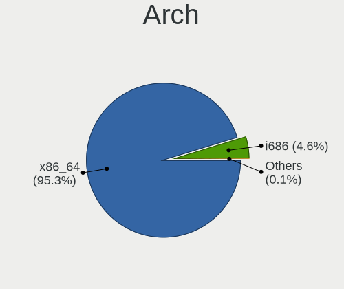
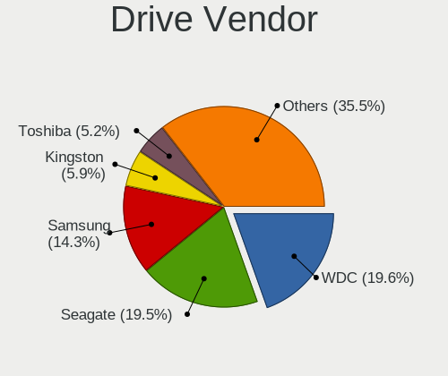
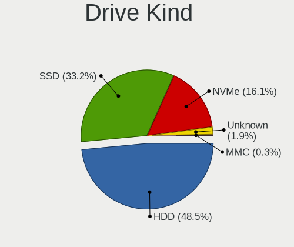
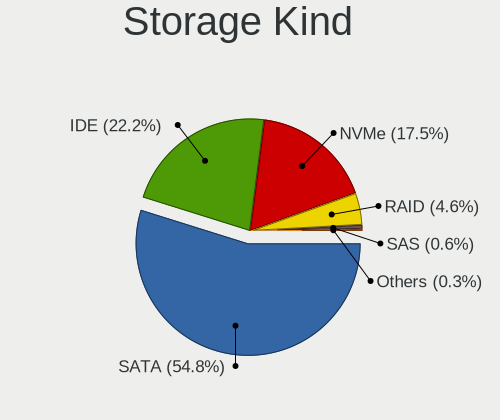
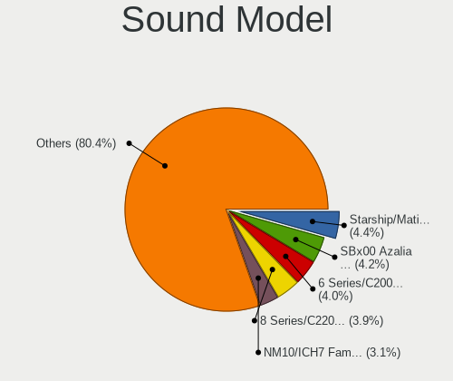
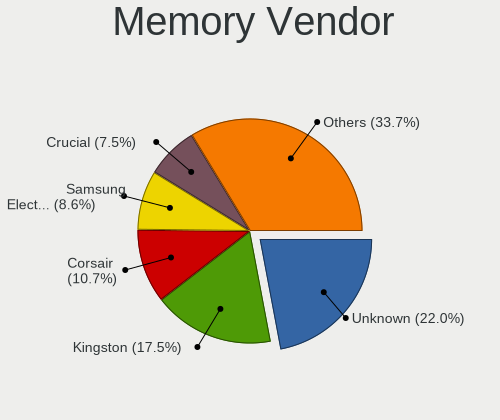

Linux - Tested Hardware & Statistics (Desktops)
-----------------------------------------------

A project to collect tested hardware configurations for Linux.

Anyone can contribute to this report by the [hw-probe](https://github.com/linuxhw/hw-probe) tool:

    sudo -E hw-probe -all -upload

Please contribute! Especially if your hardware is rare.

This report is for real hardware. Report for virtual hardware: [TestCoverage_VE](https://github.com/linuxhw/TestCoverage_VE)

Contents
--------

* [ Test Cases ](#test-cases)

* [ System ](#system)
  - [ OS                       ](#os)
  - [ OS Family                ](#os-family)
  - [ Kernel                   ](#kernel)
  - [ Kernel Family            ](#kernel-family)
  - [ Kernel Major Ver.        ](#kernel-major-ver)
  - [ Arch                     ](#arch)
  - [ DE                       ](#de)
  - [ Display Server           ](#display-server)
  - [ Display Manager          ](#display-manager)
  - [ OS Lang                  ](#os-lang)
  - [ Boot Mode                ](#boot-mode)
  - [ Filesystem               ](#filesystem)
  - [ Part. scheme             ](#part-scheme)
  - [ Dual Boot with Linux/BSD ](#dual-boot-with-linuxbsd)
  - [ Dual Boot (Win)          ](#dual-boot-win)

* [ Board ](#board)
  - [ Vendor                   ](#vendor)
  - [ Model                    ](#model)
  - [ Model Family             ](#model-family)
  - [ MFG Year                 ](#mfg-year)
  - [ Form Factor              ](#form-factor)
  - [ Secure Boot              ](#secure-boot)
  - [ Coreboot                 ](#coreboot)
  - [ RAM Size                 ](#ram-size)
  - [ RAM Used                 ](#ram-used)
  - [ Total Drives             ](#total-drives)
  - [ Has CD-ROM               ](#has-cd-rom)
  - [ Has Ethernet             ](#has-ethernet)
  - [ Has WiFi                 ](#has-wifi)
  - [ Has Bluetooth            ](#has-bluetooth)

* [ Location ](#location)
  - [ Country                  ](#country)
  - [ City                     ](#city)

* [ Drives ](#drives)
  - [ Drive Vendor             ](#drive-vendor)
  - [ Drive Model              ](#drive-model)
  - [ HDD Vendor               ](#hdd-vendor)
  - [ SSD Vendor               ](#ssd-vendor)
  - [ Drive Kind               ](#drive-kind)
  - [ Drive Connector          ](#drive-connector)
  - [ Drive Size               ](#drive-size)
  - [ Space Total              ](#space-total)
  - [ Space Used               ](#space-used)
  - [ Malfunc. Drives          ](#malfunc-drives)
  - [ Malfunc. Drive Vendor    ](#malfunc-drive-vendor)
  - [ Malfunc. HDD Vendor      ](#malfunc-hdd-vendor)
  - [ Malfunc. Drive Kind      ](#malfunc-drive-kind)
  - [ Failed Drives            ](#failed-drives)
  - [ Failed Drive Vendor      ](#failed-drive-vendor)
  - [ Drive Status             ](#drive-status)

* [ Storage controller ](#storage-controller)
  - [ Storage Vendor           ](#storage-vendor)
  - [ Storage Model            ](#storage-model)
  - [ Storage Kind             ](#storage-kind)

* [ Processor ](#processor)
  - [ CPU Vendor               ](#cpu-vendor)
  - [ CPU Model                ](#cpu-model)
  - [ CPU Model Family         ](#cpu-model-family)
  - [ CPU Cores                ](#cpu-cores)
  - [ CPU Sockets              ](#cpu-sockets)
  - [ CPU Threads              ](#cpu-threads)
  - [ CPU Op-Modes             ](#cpu-op-modes)
  - [ CPU Microcode            ](#cpu-microcode)
  - [ CPU Microarch            ](#cpu-microarch)

* [ Graphics ](#graphics)
  - [ GPU Vendor               ](#gpu-vendor)
  - [ GPU Model                ](#gpu-model)
  - [ GPU Combo                ](#gpu-combo)
  - [ GPU Driver               ](#gpu-driver)
  - [ GPU Memory               ](#gpu-memory)

* [ Monitor ](#monitor)
  - [ Monitor Vendor           ](#monitor-vendor)
  - [ Monitor Model            ](#monitor-model)
  - [ Monitor Resolution       ](#monitor-resolution)
  - [ Monitor Diagonal         ](#monitor-diagonal)
  - [ Monitor Width            ](#monitor-width)
  - [ Aspect Ratio             ](#aspect-ratio)
  - [ Monitor Area             ](#monitor-area)
  - [ Pixel Density            ](#pixel-density)
  - [ Multiple Monitors        ](#multiple-monitors)

* [ Network ](#network)
  - [ Net Controller Vendor    ](#net-controller-vendor)
  - [ Net Controller Model     ](#net-controller-model)
  - [ Wireless Vendor          ](#wireless-vendor)
  - [ Wireless Model           ](#wireless-model)
  - [ Ethernet Vendor          ](#ethernet-vendor)
  - [ Ethernet Model           ](#ethernet-model)
  - [ Net Controller Kind      ](#net-controller-kind)
  - [ Used Controller          ](#used-controller)
  - [ NICs                     ](#nics)
  - [ IPv6                     ](#ipv6)

* [ Bluetooth ](#bluetooth)
  - [ Bluetooth Vendor         ](#bluetooth-vendor)
  - [ Bluetooth Model          ](#bluetooth-model)

* [ Sound ](#sound)
  - [ Sound Vendor             ](#sound-vendor)
  - [ Sound Model              ](#sound-model)

* [ Memory ](#memory)
  - [ Memory Vendor            ](#memory-vendor)
  - [ Memory Model             ](#memory-model)
  - [ Memory Kind              ](#memory-kind)
  - [ Memory Form Factor       ](#memory-form-factor)
  - [ Memory Size              ](#memory-size)
  - [ Memory Speed             ](#memory-speed)

* [ Printers & scanners ](#printers--scanners)
  - [ Printer Vendor           ](#printer-vendor)
  - [ Printer Model            ](#printer-model)
  - [ Scanner Vendor           ](#scanner-vendor)
  - [ Scanner Model            ](#scanner-model)

* [ Camera ](#camera)
  - [ Camera Vendor            ](#camera-vendor)
  - [ Camera Model             ](#camera-model)

* [ Security ](#security)
  - [ Fingerprint Vendor       ](#fingerprint-vendor)
  - [ Fingerprint Model        ](#fingerprint-model)
  - [ Chipcard Vendor          ](#chipcard-vendor)
  - [ Chipcard Model           ](#chipcard-model)

* [ Unsupported ](#unsupported)
  - [ Unsupported Devices      ](#unsupported-devices)
  - [ Unsupported Device Types ](#unsupported-device-types)

Test Cases
----------

Total: 110004

| Vendor        | Model                       | Probe                                                      | Date         |
|---------------|-----------------------------|------------------------------------------------------------|--------------|
| MSI           | MS-B0A41                    | [c69ab6fbe8](https://linux-hardware.org/?probe=c69ab6fbe8) | Jan 01, 2023 |
| Gigabyte      | B450 AORUS PRO WIFI-CF      | [b79de349a9](https://linux-hardware.org/?probe=b79de349a9) | Jan 01, 2023 |
| HP            | 18E4                        | [c83c8341e3](https://linux-hardware.org/?probe=c83c8341e3) | Jan 01, 2023 |
| MSI           | MPG B560I GAMING EDGE WI... | [20eb2d93e2](https://linux-hardware.org/?probe=20eb2d93e2) | Jan 01, 2023 |
| ASUSTek       | TUF Gaming B550M-PLUS       | [2c31fd54e4](https://linux-hardware.org/?probe=2c31fd54e4) | Jan 01, 2023 |
| ASUSTek       | PRIME A320M-K               | [afbe6b4362](https://linux-hardware.org/?probe=afbe6b4362) | Dec 31, 2022 |
| HP            | 806A                        | [72e5b78d96](https://linux-hardware.org/?probe=72e5b78d96) | Dec 31, 2022 |
| HP            | 802F                        | [22444b4b2c](https://linux-hardware.org/?probe=22444b4b2c) | Dec 31, 2022 |
| ASUSTek       | TUF Z390-PRO GAMING         | [de65f4b654](https://linux-hardware.org/?probe=de65f4b654) | Dec 31, 2022 |
| Unknown       | Intel X79                   | [f26c05e261](https://linux-hardware.org/?probe=f26c05e261) | Dec 31, 2022 |
| ASUSTek       | PRIME B550M-A               | [162ad451eb](https://linux-hardware.org/?probe=162ad451eb) | Dec 31, 2022 |
| Fujitsu Si... | D2420 S26361-D2420          | [9e8c937daa](https://linux-hardware.org/?probe=9e8c937daa) | Dec 31, 2022 |
| Acer          | Predator PO3-600 V:1.1      | [e5f5073bcd](https://linux-hardware.org/?probe=e5f5073bcd) | Dec 31, 2022 |
| ASUSTek       | TUF Gaming X570-PLUS        | [ea3b140a7f](https://linux-hardware.org/?probe=ea3b140a7f) | Dec 31, 2022 |
| Lenovo        | ThinkCentre M90 3692X01     | [702838caff](https://linux-hardware.org/?probe=702838caff) | Dec 31, 2022 |
| ASUSTek       | P5KPL-AM SE                 | [c6c0626dd1](https://linux-hardware.org/?probe=c6c0626dd1) | Dec 31, 2022 |
| Dell          | 0PTTT9 A00                  | [7f2851fcf5](https://linux-hardware.org/?probe=7f2851fcf5) | Dec 31, 2022 |
| Dell          | 0JP3NX A01                  | [0749146323](https://linux-hardware.org/?probe=0749146323) | Dec 31, 2022 |
| ASUSTek       | TUF Gaming B560-PLUS WIF... | [7295ec02b5](https://linux-hardware.org/?probe=7295ec02b5) | Dec 31, 2022 |
| ASUSTek       | PRIME B350-PLUS             | [c4eccac7c7](https://linux-hardware.org/?probe=c4eccac7c7) | Dec 31, 2022 |
| MSI           | A88X-G45 GAMING             | [891e0757ed](https://linux-hardware.org/?probe=891e0757ed) | Dec 31, 2022 |
| Dell          | 0VR8V9 A01                  | [0e7d4ac326](https://linux-hardware.org/?probe=0e7d4ac326) | Dec 31, 2022 |
| MSI           | B360M BAZOOKA               | [ad26afeb83](https://linux-hardware.org/?probe=ad26afeb83) | Dec 31, 2022 |
| Dell          | 0GWHMW A01                  | [59287847c9](https://linux-hardware.org/?probe=59287847c9) | Dec 31, 2022 |
| ASUSTek       | ROG STRIX X570-F GAMING     | [7e22db9b23](https://linux-hardware.org/?probe=7e22db9b23) | Dec 31, 2022 |
| MSI           | A88X-G45 GAMING             | [bdb45edaad](https://linux-hardware.org/?probe=bdb45edaad) | Dec 31, 2022 |
| MSI           | B250M PRO-VDH               | [0a4b320a9e](https://linux-hardware.org/?probe=0a4b320a9e) | Dec 31, 2022 |
| MSI           | MPG X570 GAMING PRO CARB... | [ecf944f539](https://linux-hardware.org/?probe=ecf944f539) | Dec 31, 2022 |
| ASUSTek       | Crosshair IV Formula        | [da685b7ff8](https://linux-hardware.org/?probe=da685b7ff8) | Dec 31, 2022 |
| ASUSTek       | M5A78L-M/USB3               | [2508c5972e](https://linux-hardware.org/?probe=2508c5972e) | Dec 31, 2022 |
| Google        | Teemo                       | [6f6671a40e](https://linux-hardware.org/?probe=6f6671a40e) | Dec 31, 2022 |
| ASUSTek       | UN45                        | [bde2e2efb1](https://linux-hardware.org/?probe=bde2e2efb1) | Dec 31, 2022 |
| ASUSTek       | M5A78L-M/USB3               | [e18f6635d3](https://linux-hardware.org/?probe=e18f6635d3) | Dec 31, 2022 |
| Gigabyte      | AB350-Gaming 3-CF           | [500ce7ae28](https://linux-hardware.org/?probe=500ce7ae28) | Dec 31, 2022 |
| ASUSTek       | PRIME B550M-A               | [2161cbc9a0](https://linux-hardware.org/?probe=2161cbc9a0) | Dec 31, 2022 |
| Gigabyte      | B75M-D3V                    | [ce23d2f7cd](https://linux-hardware.org/?probe=ce23d2f7cd) | Dec 31, 2022 |
| ASUSTek       | ROG STRIX X570-E GAMING     | [f16b55ea54](https://linux-hardware.org/?probe=f16b55ea54) | Dec 31, 2022 |
| MSI           | Z170A GAMING PRO CARBON     | [7c96c6776e](https://linux-hardware.org/?probe=7c96c6776e) | Dec 31, 2022 |
| Medion        | MS-7728                     | [3d6078552c](https://linux-hardware.org/?probe=3d6078552c) | Dec 31, 2022 |
| Google        | Teemo                       | [e3c39f29da](https://linux-hardware.org/?probe=e3c39f29da) | Dec 31, 2022 |
| Dell          | 0T10XW A00                  | [21638e1dfe](https://linux-hardware.org/?probe=21638e1dfe) | Dec 31, 2022 |
| ASUSTek       | PRIME B250M-K               | [9db6f0fda7](https://linux-hardware.org/?probe=9db6f0fda7) | Dec 31, 2022 |
| ASUSTek       | PRIME H610M-K D4            | [0031785936](https://linux-hardware.org/?probe=0031785936) | Dec 31, 2022 |
| ASRock        | B360M Performance           | [679d25f9be](https://linux-hardware.org/?probe=679d25f9be) | Dec 31, 2022 |
| MSI           | MS-7502 Fab D               | [9126e1035f](https://linux-hardware.org/?probe=9126e1035f) | Dec 31, 2022 |
| Phoenix       | 945GM                       | [d391eaf6e2](https://linux-hardware.org/?probe=d391eaf6e2) | Dec 31, 2022 |
| MSI           | B250M BAZOOKA               | [5b204eade4](https://linux-hardware.org/?probe=5b204eade4) | Dec 31, 2022 |
| HP            | 21B4 A01                    | [cdc9730e81](https://linux-hardware.org/?probe=cdc9730e81) | Dec 31, 2022 |
| Lenovo        | ThinkCentre M58p 9728W47    | [68bc291efd](https://linux-hardware.org/?probe=68bc291efd) | Dec 31, 2022 |
| ASRock        | A320M-DGS                   | [a9df519d4f](https://linux-hardware.org/?probe=a9df519d4f) | Dec 31, 2022 |
| Gigabyte      | F2A68HM-DS2                 | [7b10613c1e](https://linux-hardware.org/?probe=7b10613c1e) | Dec 31, 2022 |
| HP            | 840A                        | [ad51866fe9](https://linux-hardware.org/?probe=ad51866fe9) | Dec 31, 2022 |
| ASRock        | B550 Steel Legend           | [8705e10ac6](https://linux-hardware.org/?probe=8705e10ac6) | Dec 31, 2022 |
| Shuttle       | SH570                       | [09994766ed](https://linux-hardware.org/?probe=09994766ed) | Dec 31, 2022 |
| Shuttle       | SH570                       | [f4d5ef752c](https://linux-hardware.org/?probe=f4d5ef752c) | Dec 31, 2022 |
| AZW           | U59                         | [39f0dfe71f](https://linux-hardware.org/?probe=39f0dfe71f) | Dec 31, 2022 |
| Dell          | 0KWVT8 A03                  | [ad32666c8c](https://linux-hardware.org/?probe=ad32666c8c) | Dec 31, 2022 |
| MSI           | B550M PRO-VDH WIFI          | [92920d8ac2](https://linux-hardware.org/?probe=92920d8ac2) | Dec 31, 2022 |
| ASUSTek       | PRIME H610M-K D4            | [4bd2096c80](https://linux-hardware.org/?probe=4bd2096c80) | Dec 31, 2022 |
| ASRock        | A320M-DVS R4.0              | [f82bf510be](https://linux-hardware.org/?probe=f82bf510be) | Dec 31, 2022 |
| Gigabyte      | W480 VISION D               | [133d8a7f70](https://linux-hardware.org/?probe=133d8a7f70) | Dec 31, 2022 |
| AZW           | Green G2                    | [257948e699](https://linux-hardware.org/?probe=257948e699) | Dec 31, 2022 |
| ASRock        | X99 Extreme3                | [565f486b7f](https://linux-hardware.org/?probe=565f486b7f) | Dec 31, 2022 |
| ASRock        | X99 Extreme3                | [eaf8cc0ed5](https://linux-hardware.org/?probe=eaf8cc0ed5) | Dec 31, 2022 |
| ASUSTek       | E410                        | [98e0007b65](https://linux-hardware.org/?probe=98e0007b65) | Dec 31, 2022 |
| Intel         | DB75EN AAG39650-400         | [086831bbca](https://linux-hardware.org/?probe=086831bbca) | Dec 31, 2022 |
| MSI           | X99A RAIDER                 | [8582096251](https://linux-hardware.org/?probe=8582096251) | Dec 31, 2022 |
| ASRock        | FM2A88X Extreme6+           | [c45e0f54fd](https://linux-hardware.org/?probe=c45e0f54fd) | Dec 31, 2022 |
| Dell          | 0D24M8 A00                  | [def123de2d](https://linux-hardware.org/?probe=def123de2d) | Dec 31, 2022 |
| MSI           | MPG Z490 GAMING PLUS        | [b4aecf5fa1](https://linux-hardware.org/?probe=b4aecf5fa1) | Dec 31, 2022 |
| Dell          | 0VNP2H A02                  | [5d3da04d45](https://linux-hardware.org/?probe=5d3da04d45) | Dec 31, 2022 |
| ASRock        | B450 Gaming-ITX/ac          | [afdda0ad31](https://linux-hardware.org/?probe=afdda0ad31) | Dec 31, 2022 |
| ASRock        | B450 Gaming-ITX/ac          | [3659d7377d](https://linux-hardware.org/?probe=3659d7377d) | Dec 31, 2022 |
| Lenovo        | Win8 Pro DPK TPG            | [9561e51689](https://linux-hardware.org/?probe=9561e51689) | Dec 31, 2022 |
| MAXSUN        | MS-TZZ A320M.2-VH           | [8f06578f10](https://linux-hardware.org/?probe=8f06578f10) | Dec 31, 2022 |
| ASUSTek       | Z97-A                       | [6f61aac097](https://linux-hardware.org/?probe=6f61aac097) | Dec 31, 2022 |
| HP            | 18E4                        | [1b1eccbbe1](https://linux-hardware.org/?probe=1b1eccbbe1) | Dec 31, 2022 |
| Gigabyte      | GA-78LMT-USB3 SEx           | [b0dd8fc6b5](https://linux-hardware.org/?probe=b0dd8fc6b5) | Dec 31, 2022 |
| Gigabyte      | G31M-S2C                    | [39f08657f8](https://linux-hardware.org/?probe=39f08657f8) | Dec 31, 2022 |
| ASUSTek       | Benicia                     | [9d307c5f2f](https://linux-hardware.org/?probe=9d307c5f2f) | Dec 31, 2022 |
| ASUSTek       | P5Q-PRO                     | [cec0830928](https://linux-hardware.org/?probe=cec0830928) | Dec 31, 2022 |
| Gigabyte      | GA-MA785GMT-UD2H            | [c4059f2954](https://linux-hardware.org/?probe=c4059f2954) | Dec 31, 2022 |
| MSI           | MAG B650 TOMAHAWK WIFI      | [b1220a23ad](https://linux-hardware.org/?probe=b1220a23ad) | Dec 31, 2022 |
| MSI           | MAG B650 TOMAHAWK WIFI      | [31343e35f0](https://linux-hardware.org/?probe=31343e35f0) | Dec 31, 2022 |
| Shuttle       | SH570                       | [2d7f57de8f](https://linux-hardware.org/?probe=2d7f57de8f) | Dec 31, 2022 |
| ASUSTek       | Pro WS X570-ACE             | [fc2f55c02e](https://linux-hardware.org/?probe=fc2f55c02e) | Dec 31, 2022 |
| MSI           | MPG X570 GAMING PRO CARB... | [1347eaedb9](https://linux-hardware.org/?probe=1347eaedb9) | Dec 31, 2022 |
| ASUSTek       | Benicia                     | [bc835cbca9](https://linux-hardware.org/?probe=bc835cbca9) | Dec 31, 2022 |
| Foxconn       | 2ADA                        | [92ce347d5f](https://linux-hardware.org/?probe=92ce347d5f) | Dec 31, 2022 |
| ASRock        | X79 Extreme6                | [5ea31811b4](https://linux-hardware.org/?probe=5ea31811b4) | Dec 30, 2022 |
| MSI           | Boston                      | [a5fd252dc2](https://linux-hardware.org/?probe=a5fd252dc2) | Dec 30, 2022 |
| Dell          | 0GDG8Y A00                  | [8c8e9d66e7](https://linux-hardware.org/?probe=8c8e9d66e7) | Dec 30, 2022 |
| MSI           | H510M-A PRO                 | [4dba3b7c55](https://linux-hardware.org/?probe=4dba3b7c55) | Dec 30, 2022 |
| ASUSTek       | PRIME B450M-K               | [cc1d0776d5](https://linux-hardware.org/?probe=cc1d0776d5) | Dec 30, 2022 |
| Gigabyte      | H55M-USB3                   | [729e1569a8](https://linux-hardware.org/?probe=729e1569a8) | Dec 30, 2022 |
| Gigabyte      | H61M-DS2                    | [dff8a56537](https://linux-hardware.org/?probe=dff8a56537) | Dec 30, 2022 |
| Gigabyte      | H55M-USB3                   | [8fdced7ae8](https://linux-hardware.org/?probe=8fdced7ae8) | Dec 30, 2022 |
| MSI           | B360M GAMING PLUS           | [9d4f6afc25](https://linux-hardware.org/?probe=9d4f6afc25) | Dec 30, 2022 |
| ASUSTek       | PRIME X670-P WIFI           | [cecef0575d](https://linux-hardware.org/?probe=cecef0575d) | Dec 30, 2022 |
| Dell          | 0KWVT8 A03                  | [17fc3a4abc](https://linux-hardware.org/?probe=17fc3a4abc) | Dec 30, 2022 |
| ASUSTek       | TUF Gaming B550-PLUS        | [76e9829e66](https://linux-hardware.org/?probe=76e9829e66) | Dec 30, 2022 |
| ASUSTek       | PRIME B550M-A               | [83810bf0a9](https://linux-hardware.org/?probe=83810bf0a9) | Dec 30, 2022 |
| Dell          | 0XPDFK A01                  | [37d47ff0dc](https://linux-hardware.org/?probe=37d47ff0dc) | Dec 30, 2022 |
| ASUSTek       | Z170M-PLUS                  | [858fd62d74](https://linux-hardware.org/?probe=858fd62d74) | Dec 30, 2022 |
| ASUSTek       | P8Z77-V                     | [b0a607e8d8](https://linux-hardware.org/?probe=b0a607e8d8) | Dec 30, 2022 |
| Gigabyte      | GA-78LMT-USB3               | [6de26a316e](https://linux-hardware.org/?probe=6de26a316e) | Dec 30, 2022 |
| Gigabyte      | B550 AORUS PRO              | [c8da48f03c](https://linux-hardware.org/?probe=c8da48f03c) | Dec 30, 2022 |
| Fujitsu       | D3003-S2 S26361-D3003-S2    | [cb55beafca](https://linux-hardware.org/?probe=cb55beafca) | Dec 30, 2022 |
| AZW           | Green G2                    | [33f1a5c1a9](https://linux-hardware.org/?probe=33f1a5c1a9) | Dec 30, 2022 |
| Gigabyte      | A320M-H-CF                  | [b4511daea8](https://linux-hardware.org/?probe=b4511daea8) | Dec 30, 2022 |
| ASUSTek       | PRIME X670-P WIFI           | [498c8c83e2](https://linux-hardware.org/?probe=498c8c83e2) | Dec 30, 2022 |
| ASRock        | X670E Steel Legend          | [6aa950201f](https://linux-hardware.org/?probe=6aa950201f) | Dec 30, 2022 |
| MSI           | MPG X570 GAMING PRO CARB... | [7b3c89637b](https://linux-hardware.org/?probe=7b3c89637b) | Dec 30, 2022 |
| MSI           | Z87-G45 GAMING              | [c2d592a9e5](https://linux-hardware.org/?probe=c2d592a9e5) | Dec 30, 2022 |
| Acer          | Aspire XC-1660 V:1.1        | [9c4b578c67](https://linux-hardware.org/?probe=9c4b578c67) | Dec 30, 2022 |
| Lenovo        | ChiefRiver                  | [847a9e86cd](https://linux-hardware.org/?probe=847a9e86cd) | Dec 30, 2022 |
| ASRock        | J3455-ITX                   | [4f45d532ac](https://linux-hardware.org/?probe=4f45d532ac) | Dec 30, 2022 |
| Fujitsu       | D3003-S2 S26361-D3003-S2    | [938db016a2](https://linux-hardware.org/?probe=938db016a2) | Dec 30, 2022 |
| ASRock        | B450M Pro4                  | [4393041949](https://linux-hardware.org/?probe=4393041949) | Dec 30, 2022 |
| Dell          | 0HN7XN A00                  | [27fa9012d0](https://linux-hardware.org/?probe=27fa9012d0) | Dec 30, 2022 |
| HP            | ProLiant MicroServer        | [03b6f5a97d](https://linux-hardware.org/?probe=03b6f5a97d) | Dec 30, 2022 |
| Gigabyte      | H61M-DS2                    | [4ea88219d8](https://linux-hardware.org/?probe=4ea88219d8) | Dec 30, 2022 |
| Gigabyte      | B550M AORUS PRO-P           | [de6ea0ae2e](https://linux-hardware.org/?probe=de6ea0ae2e) | Dec 30, 2022 |
| Intel         | H61                         | [b294748570](https://linux-hardware.org/?probe=b294748570) | Dec 30, 2022 |
| AZW           | U59                         | [290e34b89a](https://linux-hardware.org/?probe=290e34b89a) | Dec 30, 2022 |
| Gigabyte      | Z390 UD                     | [70dc568eae](https://linux-hardware.org/?probe=70dc568eae) | Dec 30, 2022 |
| ASRock        | N68-GS4 FX                  | [379552e4d2](https://linux-hardware.org/?probe=379552e4d2) | Dec 30, 2022 |
| MSI           | 760GM-P23                   | [06c8e21a6f](https://linux-hardware.org/?probe=06c8e21a6f) | Dec 30, 2022 |
| ASUSTek       | PRIME B560M-A               | [ee7c086eb6](https://linux-hardware.org/?probe=ee7c086eb6) | Dec 30, 2022 |
| MSI           | H61M-P22                    | [23b5356c0a](https://linux-hardware.org/?probe=23b5356c0a) | Dec 30, 2022 |
| ASRock        | 960GM-GS3 FX                | [1d8b5f0509](https://linux-hardware.org/?probe=1d8b5f0509) | Dec 30, 2022 |
| ASUSTek       | PRIME B450M-A II            | [0842d26251](https://linux-hardware.org/?probe=0842d26251) | Dec 30, 2022 |
| Gigabyte      | Z87-HD3                     | [97f08bd689](https://linux-hardware.org/?probe=97f08bd689) | Dec 30, 2022 |
| Acer          | Aspire XC-1660 V:1.1        | [c352c59c64](https://linux-hardware.org/?probe=c352c59c64) | Dec 30, 2022 |
| ASUSTek       | P7P55D-E                    | [f725a0095a](https://linux-hardware.org/?probe=f725a0095a) | Dec 30, 2022 |
| Acer          | Aspire XC-885 V:1.1         | [4f3bc75747](https://linux-hardware.org/?probe=4f3bc75747) | Dec 30, 2022 |
| ASRock        | H270 Pro4                   | [669d1fd05e](https://linux-hardware.org/?probe=669d1fd05e) | Dec 30, 2022 |
| ASUSTek       | UN65U                       | [b7f1365865](https://linux-hardware.org/?probe=b7f1365865) | Dec 30, 2022 |
| Acer          | Aspire XC-885 V:1.1         | [e0f8b8c7b9](https://linux-hardware.org/?probe=e0f8b8c7b9) | Dec 30, 2022 |
| ASUSTek       | PRIME B450M-A II            | [d91b55f9f1](https://linux-hardware.org/?probe=d91b55f9f1) | Dec 30, 2022 |
| ASUSTek       | G10DK                       | [5a5172ad44](https://linux-hardware.org/?probe=5a5172ad44) | Dec 30, 2022 |
| ASUSTek       | ROG STRIX B360-F GAMING     | [aa6b264eb4](https://linux-hardware.org/?probe=aa6b264eb4) | Dec 30, 2022 |
| Intel         | LADPNVMO AAE76523-300       | [4e6065532f](https://linux-hardware.org/?probe=4e6065532f) | Dec 30, 2022 |
| MSI           | MPG Z490 GAMING EDGE WIF... | [056ae8185c](https://linux-hardware.org/?probe=056ae8185c) | Dec 30, 2022 |
| Lenovo        | ThinkStation C20 4263BA7    | [7b55955e2a](https://linux-hardware.org/?probe=7b55955e2a) | Dec 30, 2022 |
| Gigabyte      | B450M DS3H-CF               | [47f838ca34](https://linux-hardware.org/?probe=47f838ca34) | Dec 30, 2022 |
| Gigabyte      | H310M S2 x.x                | [9aba0ac647](https://linux-hardware.org/?probe=9aba0ac647) | Dec 30, 2022 |
| ASUSTek       | ROG STRIX X570-I GAMING     | [a634defd54](https://linux-hardware.org/?probe=a634defd54) | Dec 30, 2022 |
| HP            | 2B36                        | [4b363628a9](https://linux-hardware.org/?probe=4b363628a9) | Dec 30, 2022 |
| ASRock        | H110 Pro BTC+               | [a7ccef79ad](https://linux-hardware.org/?probe=a7ccef79ad) | Dec 30, 2022 |
| ASUSTek       | Z87-PLUS                    | [85bfa942e6](https://linux-hardware.org/?probe=85bfa942e6) | Dec 30, 2022 |
| HP            | 2B36                        | [be6670b1ad](https://linux-hardware.org/?probe=be6670b1ad) | Dec 30, 2022 |
| Gigabyte      | H55M-USB3                   | [6621ba66ac](https://linux-hardware.org/?probe=6621ba66ac) | Dec 30, 2022 |
| HOUTER        | IPMIP-GS                    | [6fddf7d035](https://linux-hardware.org/?probe=6fddf7d035) | Dec 30, 2022 |
| ASUSTek       | PRIME Z690M-PLUS D4         | [b1bfc3d1ff](https://linux-hardware.org/?probe=b1bfc3d1ff) | Dec 30, 2022 |
| Biostar       | TA970                       | [6a55825894](https://linux-hardware.org/?probe=6a55825894) | Dec 30, 2022 |
| ASRock        | FM2A88X Extreme6+           | [8289d108fb](https://linux-hardware.org/?probe=8289d108fb) | Dec 30, 2022 |
| MSI           | X99A RAIDER                 | [3b0d4e8973](https://linux-hardware.org/?probe=3b0d4e8973) | Dec 30, 2022 |
| Gigabyte      | AB350M-DS3H V2-CF           | [1c7a329282](https://linux-hardware.org/?probe=1c7a329282) | Dec 30, 2022 |
| ASUSTek       | PRIME B550M-A               | [da9b785d2a](https://linux-hardware.org/?probe=da9b785d2a) | Dec 30, 2022 |
| Intel         | X99                         | [ad6b288b38](https://linux-hardware.org/?probe=ad6b288b38) | Dec 30, 2022 |
| ASUSTek       | PRIME X399-A                | [d8ae46ad2b](https://linux-hardware.org/?probe=d8ae46ad2b) | Dec 30, 2022 |
| ASUSTek       | Z87-PRO                     | [eafab9edba](https://linux-hardware.org/?probe=eafab9edba) | Dec 30, 2022 |
| ASUSTek       | M3A78-CM                    | [9a05e8c413](https://linux-hardware.org/?probe=9a05e8c413) | Dec 30, 2022 |
| ASUSTek       | TUF Gaming X570-PLUS        | [da829c6683](https://linux-hardware.org/?probe=da829c6683) | Dec 30, 2022 |
| Gigabyte      | M68MT-S2P                   | [93adad7445](https://linux-hardware.org/?probe=93adad7445) | Dec 30, 2022 |
| Gigabyte      | B450 AORUS ELITE V2         | [4b3cfd1d9c](https://linux-hardware.org/?probe=4b3cfd1d9c) | Dec 30, 2022 |
| Acer          | Veriton N4680G              | [0053ddb3c9](https://linux-hardware.org/?probe=0053ddb3c9) | Dec 30, 2022 |
| ASUSTek       | TUF Gaming B560M-PLUS       | [b38e3cc51e](https://linux-hardware.org/?probe=b38e3cc51e) | Dec 30, 2022 |
| BESSTAR Te... | C-J34 Pro                   | [1b54a52c3c](https://linux-hardware.org/?probe=1b54a52c3c) | Dec 30, 2022 |
| Gigabyte      | 970A-DS3P                   | [c841093094](https://linux-hardware.org/?probe=c841093094) | Dec 30, 2022 |
| Fujitsu Si... | D2420 S26361-D2420          | [019236854d](https://linux-hardware.org/?probe=019236854d) | Dec 30, 2022 |
| ASUSTek       | M5A88-M                     | [dc7201711c](https://linux-hardware.org/?probe=dc7201711c) | Dec 30, 2022 |
| Fujitsu Si... | D2420 S26361-D2420          | [d6f064e643](https://linux-hardware.org/?probe=d6f064e643) | Dec 30, 2022 |
| Gigabyte      | Z490I AORUS ULTRA           | [6cf8d26754](https://linux-hardware.org/?probe=6cf8d26754) | Dec 30, 2022 |
| MSI           | MAG B660M MORTAR WIFI DD... | [d689576b2d](https://linux-hardware.org/?probe=d689576b2d) | Dec 29, 2022 |
| MSI           | X99A RAIDER                 | [59f6170d5b](https://linux-hardware.org/?probe=59f6170d5b) | Dec 29, 2022 |
| MSI           | X570-A PRO                  | [7af9125172](https://linux-hardware.org/?probe=7af9125172) | Dec 29, 2022 |
| MSI           | MAG B650 TOMAHAWK WIFI      | [bdc5158ffb](https://linux-hardware.org/?probe=bdc5158ffb) | Dec 29, 2022 |
| HP            | 339A                        | [8e0b785427](https://linux-hardware.org/?probe=8e0b785427) | Dec 29, 2022 |
| MSI           | A320M-A PRO MAX             | [6a419b06d6](https://linux-hardware.org/?probe=6a419b06d6) | Dec 29, 2022 |
| ASRock        | B650M PG Riptide            | [614e6307eb](https://linux-hardware.org/?probe=614e6307eb) | Dec 29, 2022 |
| ASRock        | P67 Pro3                    | [47ea7331f5](https://linux-hardware.org/?probe=47ea7331f5) | Dec 29, 2022 |
| HP            | 1998                        | [c3404205e3](https://linux-hardware.org/?probe=c3404205e3) | Dec 29, 2022 |
| ASUSTek       | PRIME B360M-C               | [c38ca6386e](https://linux-hardware.org/?probe=c38ca6386e) | Dec 29, 2022 |
| ASUSTek       | G10DK                       | [26e2460b8d](https://linux-hardware.org/?probe=26e2460b8d) | Dec 29, 2022 |
| ASUSTek       | M5A78L-M LX                 | [b0f7933824](https://linux-hardware.org/?probe=b0f7933824) | Dec 29, 2022 |
| BESSTAR Te... | HM80                        | [9af0f05e7e](https://linux-hardware.org/?probe=9af0f05e7e) | Dec 29, 2022 |
| ASUSTek       | H81M-A                      | [10f0b28589](https://linux-hardware.org/?probe=10f0b28589) | Dec 29, 2022 |
| Dell          | 0UW457 A04                  | [047e7036d4](https://linux-hardware.org/?probe=047e7036d4) | Dec 29, 2022 |
| MSI           | B550M PRO-VDH WIFI          | [17f72460f6](https://linux-hardware.org/?probe=17f72460f6) | Dec 29, 2022 |
| ASUSTek       | STRIKER II EXTREME          | [3258ffa0c1](https://linux-hardware.org/?probe=3258ffa0c1) | Dec 29, 2022 |
| Gigabyte      | H510M H                     | [24574296e5](https://linux-hardware.org/?probe=24574296e5) | Dec 29, 2022 |
| MSI           | B550M PRO                   | [61b36bfa2e](https://linux-hardware.org/?probe=61b36bfa2e) | Dec 29, 2022 |
| MSI           | B75MA-P45                   | [f0b4df8849](https://linux-hardware.org/?probe=f0b4df8849) | Dec 29, 2022 |
| Intel         | DP55WB AAE64798-206         | [2373b5141b](https://linux-hardware.org/?probe=2373b5141b) | Dec 29, 2022 |
| Gigabyte      | H61M-D2H                    | [28aede6faf](https://linux-hardware.org/?probe=28aede6faf) | Dec 29, 2022 |
| HP            | 0AE8h                       | [b23a6da065](https://linux-hardware.org/?probe=b23a6da065) | Dec 29, 2022 |
| ASUSTek       | ROG STRIX B650E-I GAMING... | [e4c8909f2c](https://linux-hardware.org/?probe=e4c8909f2c) | Dec 29, 2022 |
| ASUSTek       | Z170 PRO GAMING/AURA        | [87e8ae1350](https://linux-hardware.org/?probe=87e8ae1350) | Dec 29, 2022 |
| Gigabyte      | B550 AORUS PRO V2           | [7a7f335c4a](https://linux-hardware.org/?probe=7a7f335c4a) | Dec 29, 2022 |
| Gigabyte      | B450M GAMING                | [199a8927b8](https://linux-hardware.org/?probe=199a8927b8) | Dec 29, 2022 |
| Dell          | 0KRC95 A02                  | [4cf9d40c0d](https://linux-hardware.org/?probe=4cf9d40c0d) | Dec 29, 2022 |
| Gigabyte      | B450M GAMING                | [012f398d07](https://linux-hardware.org/?probe=012f398d07) | Dec 29, 2022 |
| MSI           | B450M PRO-VDH MAX           | [0447771b4f](https://linux-hardware.org/?probe=0447771b4f) | Dec 29, 2022 |
| Gigabyte      | Z97M-DS3H                   | [9b264f00f0](https://linux-hardware.org/?probe=9b264f00f0) | Dec 29, 2022 |
| Gigabyte      | B550 GAMING X               | [6e92b3e37b](https://linux-hardware.org/?probe=6e92b3e37b) | Dec 29, 2022 |
| Gigabyte      | B660M AORUS PRO AX DDR4     | [c6325d4647](https://linux-hardware.org/?probe=c6325d4647) | Dec 29, 2022 |
| MSI           | MPG Z490 GAMING EDGE WIF... | [a72887241e](https://linux-hardware.org/?probe=a72887241e) | Dec 29, 2022 |
| ASUSTek       | H97-PRO                     | [b96b861fd7](https://linux-hardware.org/?probe=b96b861fd7) | Dec 29, 2022 |
| Gigabyte      | H61M-DS2                    | [50149bf9e3](https://linux-hardware.org/?probe=50149bf9e3) | Dec 29, 2022 |
| Unknown       | Freecom Silverstore HNCN... | [723fbcd23f](https://linux-hardware.org/?probe=723fbcd23f) | Dec 29, 2022 |
| Gigabyte      | H61M-DS2                    | [b0a40a3ac0](https://linux-hardware.org/?probe=b0a40a3ac0) | Dec 29, 2022 |
| MSI           | Z490-A PRO                  | [e4e5afd812](https://linux-hardware.org/?probe=e4e5afd812) | Dec 29, 2022 |
| ASRock        | B550 Taichi                 | [469f9d71e2](https://linux-hardware.org/?probe=469f9d71e2) | Dec 29, 2022 |
| HP            | ProLiant ML110 Gen9         | [ea9aef1e8d](https://linux-hardware.org/?probe=ea9aef1e8d) | Dec 29, 2022 |
| ASUSTek       | TUF Gaming B560M-PLUS       | [adb13e2649](https://linux-hardware.org/?probe=adb13e2649) | Dec 29, 2022 |
| MSI           | Z97 PC Mate                 | [1b7e70ab6e](https://linux-hardware.org/?probe=1b7e70ab6e) | Dec 29, 2022 |
| Dell          | 0KRC95 A02                  | [7e53808767](https://linux-hardware.org/?probe=7e53808767) | Dec 29, 2022 |
| ASUSTek       | PRIME A320M-A               | [2cdb821b42](https://linux-hardware.org/?probe=2cdb821b42) | Dec 29, 2022 |
| ASUSTek       | PRIME H310M-R R2.0          | [6f0f984312](https://linux-hardware.org/?probe=6f0f984312) | Dec 29, 2022 |
| Intel         | H61                         | [39f3cddffb](https://linux-hardware.org/?probe=39f3cddffb) | Dec 29, 2022 |
| MSI           | Z390-A PRO                  | [3a3375e173](https://linux-hardware.org/?probe=3a3375e173) | Dec 29, 2022 |
| ASUSTek       | PRIME X570-P                | [33fd3ed258](https://linux-hardware.org/?probe=33fd3ed258) | Dec 29, 2022 |
| HP            | 8399                        | [8a4ef9ab88](https://linux-hardware.org/?probe=8a4ef9ab88) | Dec 29, 2022 |
| Unknown       | Unknown                     | [34b6109940](https://linux-hardware.org/?probe=34b6109940) | Dec 29, 2022 |
| Gigabyte      | M61SME-S2L                  | [660194090d](https://linux-hardware.org/?probe=660194090d) | Dec 29, 2022 |
| Gigabyte      | M61SME-S2L                  | [7ba365cac3](https://linux-hardware.org/?probe=7ba365cac3) | Dec 29, 2022 |
| ASUSTek       | H110M-K                     | [4dab06b05f](https://linux-hardware.org/?probe=4dab06b05f) | Dec 29, 2022 |
| ASUSTek       | P6T DELUXE V2               | [0d8d6061d7](https://linux-hardware.org/?probe=0d8d6061d7) | Dec 29, 2022 |
| ASUSTek       | P6T DELUXE V2               | [4bda137e99](https://linux-hardware.org/?probe=4bda137e99) | Dec 29, 2022 |
| Gigabyte      | H61M-S2V-B3                 | [b3970a8e5a](https://linux-hardware.org/?probe=b3970a8e5a) | Dec 29, 2022 |
| Gigabyte      | B360M HD3                   | [556bc61c51](https://linux-hardware.org/?probe=556bc61c51) | Dec 29, 2022 |
| ASUSTek       | Z87M-PLUS                   | [6dac0c0943](https://linux-hardware.org/?probe=6dac0c0943) | Dec 29, 2022 |
| Gigabyte      | B360M HD3                   | [f0ab6f0649](https://linux-hardware.org/?probe=f0ab6f0649) | Dec 29, 2022 |
| ASUSTek       | P5K SE/EPU                  | [6eed1ad6e5](https://linux-hardware.org/?probe=6eed1ad6e5) | Dec 29, 2022 |
| Acer          | Nitro N50-610               | [fdb09844e9](https://linux-hardware.org/?probe=fdb09844e9) | Dec 29, 2022 |
| Acer          | Nitro N50-610               | [9ff3461c31](https://linux-hardware.org/?probe=9ff3461c31) | Dec 29, 2022 |
| HP            | 8399                        | [204c8c0a3f](https://linux-hardware.org/?probe=204c8c0a3f) | Dec 29, 2022 |
| HP            | 158A                        | [bfd338cf36](https://linux-hardware.org/?probe=bfd338cf36) | Dec 29, 2022 |
| Dell          | 0KWVT8 A03                  | [7ce6d4b3e3](https://linux-hardware.org/?probe=7ce6d4b3e3) | Dec 29, 2022 |
| Dell          | 0KWVT8 A03                  | [f828f74e07](https://linux-hardware.org/?probe=f828f74e07) | Dec 29, 2022 |
| ASRock        | FM2A88X Extreme6+           | [12c052156c](https://linux-hardware.org/?probe=12c052156c) | Dec 29, 2022 |
| MSI           | X99A RAIDER                 | [daf7777113](https://linux-hardware.org/?probe=daf7777113) | Dec 29, 2022 |
| MSI           | X370 GAMING M7 ACK          | [60fe0d0b31](https://linux-hardware.org/?probe=60fe0d0b31) | Dec 29, 2022 |
| ASUSTek       | PRIME B550M-A               | [e6ac6cac6c](https://linux-hardware.org/?probe=e6ac6cac6c) | Dec 29, 2022 |
| Acer          | Aspire XC-603G              | [08dc8ac6b7](https://linux-hardware.org/?probe=08dc8ac6b7) | Dec 29, 2022 |
| Acer          | Aspire X3960                | [f045d61192](https://linux-hardware.org/?probe=f045d61192) | Dec 29, 2022 |
| HP            | 0B4Ch D                     | [ed3b8e2e69](https://linux-hardware.org/?probe=ed3b8e2e69) | Dec 29, 2022 |
| ASRock        | X570 Taichi                 | [c1e5e82fbb](https://linux-hardware.org/?probe=c1e5e82fbb) | Dec 29, 2022 |
| ASUSTek       | ROG CROSSHAIR VII HERO      | [4ca2070d42](https://linux-hardware.org/?probe=4ca2070d42) | Dec 29, 2022 |
| ASRock        | Z790 PG Riptide             | [19c8814aba](https://linux-hardware.org/?probe=19c8814aba) | Dec 29, 2022 |
| ASUSTek       | P5K SE/EPU                  | [3f0c89985c](https://linux-hardware.org/?probe=3f0c89985c) | Dec 29, 2022 |
| HP            | ProLiant ML110 Gen9         | [728793a92a](https://linux-hardware.org/?probe=728793a92a) | Dec 29, 2022 |
| Acer          | Aspire X3960                | [75e053c90f](https://linux-hardware.org/?probe=75e053c90f) | Dec 29, 2022 |
| PCWare        | IPMH61R1                    | [a221946f02](https://linux-hardware.org/?probe=a221946f02) | Dec 29, 2022 |
| Pegatron      | 2AC2                        | [adc3978bcc](https://linux-hardware.org/?probe=adc3978bcc) | Dec 29, 2022 |
| ASUSTek       | ROG STRIX B450-F GAMING     | [2d47973101](https://linux-hardware.org/?probe=2d47973101) | Dec 29, 2022 |
| Dell          | 0T10XW A01                  | [8b16a66b73](https://linux-hardware.org/?probe=8b16a66b73) | Dec 29, 2022 |
| MSI           | PRO B660M-A DDR4            | [dbc37ff826](https://linux-hardware.org/?probe=dbc37ff826) | Dec 29, 2022 |
| Dell          | 0NNGP2 A00                  | [12638171d9](https://linux-hardware.org/?probe=12638171d9) | Dec 28, 2022 |
| ASUSTek       | M5A78L/USB3                 | [b89e7eb1c9](https://linux-hardware.org/?probe=b89e7eb1c9) | Dec 28, 2022 |
| Acer          | Aspire M3920                | [49cb4f51a8](https://linux-hardware.org/?probe=49cb4f51a8) | Dec 28, 2022 |
| Dell          | 0JP3NX A01                  | [3b094471e0](https://linux-hardware.org/?probe=3b094471e0) | Dec 28, 2022 |
| Gigabyte      | Z77M-D3H                    | [f20c6365d3](https://linux-hardware.org/?probe=f20c6365d3) | Dec 28, 2022 |
| Dell          | 0VRWRC A00                  | [2135b5161f](https://linux-hardware.org/?probe=2135b5161f) | Dec 28, 2022 |
| HP            | 805D                        | [cf88e571df](https://linux-hardware.org/?probe=cf88e571df) | Dec 28, 2022 |
| Intel         | X99                         | [eb6babb799](https://linux-hardware.org/?probe=eb6babb799) | Dec 28, 2022 |
| ASUSTek       | ROG STRIX B550-A GAMING     | [447852c33b](https://linux-hardware.org/?probe=447852c33b) | Dec 28, 2022 |
| Gigabyte      | A320M-H-CF                  | [83608f4248](https://linux-hardware.org/?probe=83608f4248) | Dec 28, 2022 |
| ASUSTek       | PRIME B550M-A               | [1219225d5d](https://linux-hardware.org/?probe=1219225d5d) | Dec 28, 2022 |
| ASUSTek       | G10DK                       | [1ffb248d93](https://linux-hardware.org/?probe=1ffb248d93) | Dec 28, 2022 |
| Lenovo        | No DPK                      | [944f84567a](https://linux-hardware.org/?probe=944f84567a) | Dec 28, 2022 |
| Fujitsu       | D3161-A1 S26361-D3161-A1    | [efa2d6986f](https://linux-hardware.org/?probe=efa2d6986f) | Dec 28, 2022 |
| ASUSTek       | PRIME B450-PLUS             | [e9a313bb81](https://linux-hardware.org/?probe=e9a313bb81) | Dec 28, 2022 |
| Lanix         | P55M-UD2 LNXACT             | [5575ce838c](https://linux-hardware.org/?probe=5575ce838c) | Dec 28, 2022 |
| Gigabyte      | Z370XP SLI-CF               | [be56999d2a](https://linux-hardware.org/?probe=be56999d2a) | Dec 28, 2022 |
| HP            | 339A                        | [eb2bb9bcec](https://linux-hardware.org/?probe=eb2bb9bcec) | Dec 28, 2022 |
| HP            | 840A                        | [85b8b7f9b1](https://linux-hardware.org/?probe=85b8b7f9b1) | Dec 28, 2022 |
| ASUSTek       | M5A78L-M LE/USB3            | [d0969c6a4c](https://linux-hardware.org/?probe=d0969c6a4c) | Dec 28, 2022 |
| ASUSTek       | ROG STRIX B450-F GAMING     | [24b822291e](https://linux-hardware.org/?probe=24b822291e) | Dec 28, 2022 |
| ASUSTek       | M5A78L-M LE/USB3            | [8a4dce4662](https://linux-hardware.org/?probe=8a4dce4662) | Dec 28, 2022 |
| HP            | ProLiant ML30 Gen9          | [174e7e831b](https://linux-hardware.org/?probe=174e7e831b) | Dec 28, 2022 |
| ASRock        | H61M-ITX                    | [0ee8e9bb5b](https://linux-hardware.org/?probe=0ee8e9bb5b) | Dec 28, 2022 |
| ASRock        | B450 Gaming K4              | [1afc5015f1](https://linux-hardware.org/?probe=1afc5015f1) | Dec 28, 2022 |
| MSI           | PRO Z690-A WIFI DDR4        | [a4292b855d](https://linux-hardware.org/?probe=a4292b855d) | Dec 28, 2022 |
| ASUSTek       | PRIME B450M-A               | [422238387a](https://linux-hardware.org/?probe=422238387a) | Dec 28, 2022 |
| Dell          | 03KWTV A02                  | [82612358ac](https://linux-hardware.org/?probe=82612358ac) | Dec 28, 2022 |
| HP            | 0A54h                       | [7f1e1152d9](https://linux-hardware.org/?probe=7f1e1152d9) | Dec 28, 2022 |
| Dell          | 0D883F A06                  | [23c5689182](https://linux-hardware.org/?probe=23c5689182) | Dec 28, 2022 |
| Gigabyte      | B365M DS3H                  | [0dc3c192fd](https://linux-hardware.org/?probe=0dc3c192fd) | Dec 28, 2022 |
| Dell          | 0D883F A06                  | [8e9e780028](https://linux-hardware.org/?probe=8e9e780028) | Dec 28, 2022 |
| ASUSTek       | M5A78L-M LX                 | [a8b80cb4f6](https://linux-hardware.org/?probe=a8b80cb4f6) | Dec 28, 2022 |
| Dell          | 0TTDMJ A00                  | [198e723dc2](https://linux-hardware.org/?probe=198e723dc2) | Dec 28, 2022 |
| MSI           | Z270 PC MATE                | [08186ccafe](https://linux-hardware.org/?probe=08186ccafe) | Dec 28, 2022 |
| Dell          | 0JP3NX A01                  | [acbe3ce1ef](https://linux-hardware.org/?probe=acbe3ce1ef) | Dec 28, 2022 |
| BESSTAR Te... | F6BFC                       | [7c6adb6279](https://linux-hardware.org/?probe=7c6adb6279) | Dec 28, 2022 |
| ASRock        | B75 Pro3-M                  | [108f0c24de](https://linux-hardware.org/?probe=108f0c24de) | Dec 28, 2022 |
| Dell          | 0N4YC8 A00                  | [fc766b2a1b](https://linux-hardware.org/?probe=fc766b2a1b) | Dec 28, 2022 |
| BESSTAR Te... | F6BFC                       | [59b38f9b63](https://linux-hardware.org/?probe=59b38f9b63) | Dec 28, 2022 |
| HP            | 0AE4h                       | [c44d06efa6](https://linux-hardware.org/?probe=c44d06efa6) | Dec 28, 2022 |
| Biostar       | TZ68K+                      | [7bb1d349cc](https://linux-hardware.org/?probe=7bb1d349cc) | Dec 28, 2022 |
| Biostar       | TZ68K+                      | [1d200fa462](https://linux-hardware.org/?probe=1d200fa462) | Dec 28, 2022 |
| Dell          | 0YXT71 A01                  | [ed5e31a6bc](https://linux-hardware.org/?probe=ed5e31a6bc) | Dec 28, 2022 |
| ASUSTek       | ROG STRIX B550-F GAMING     | [6297565fda](https://linux-hardware.org/?probe=6297565fda) | Dec 28, 2022 |
| MSI           | Z370 PC PRO                 | [367bcf2d16](https://linux-hardware.org/?probe=367bcf2d16) | Dec 28, 2022 |
| ASRock        | X570M Pro4                  | [71d2c76079](https://linux-hardware.org/?probe=71d2c76079) | Dec 28, 2022 |
| Dell          | 0HY9JP A01                  | [97a3e6ce9d](https://linux-hardware.org/?probe=97a3e6ce9d) | Dec 28, 2022 |
| ASUSTek       | ROG STRIX B365-G GAMING     | [328cfe3747](https://linux-hardware.org/?probe=328cfe3747) | Dec 28, 2022 |
| MSI           | MAG B550M MORTAR            | [bf50da5153](https://linux-hardware.org/?probe=bf50da5153) | Dec 28, 2022 |
| ASRock        | Z790M-ITX WiFi              | [c1c0ab5824](https://linux-hardware.org/?probe=c1c0ab5824) | Dec 28, 2022 |
| ASUSTek       | PRIME A320M-K               | [20c0841830](https://linux-hardware.org/?probe=20c0841830) | Dec 28, 2022 |
| ASUSTek       | PRIME Z790-P WIFI           | [7bb247e453](https://linux-hardware.org/?probe=7bb247e453) | Dec 28, 2022 |
| Pegatron      | 2AB6                        | [742c9ebcca](https://linux-hardware.org/?probe=742c9ebcca) | Dec 28, 2022 |
| Pegatron      | 2AB6                        | [9e95c7e7c7](https://linux-hardware.org/?probe=9e95c7e7c7) | Dec 28, 2022 |
| ASUSTek       | ROG STRIX B350-F GAMING     | [71bccea2dc](https://linux-hardware.org/?probe=71bccea2dc) | Dec 28, 2022 |
| MSI           | Z97 GAMING 3                | [519607ec55](https://linux-hardware.org/?probe=519607ec55) | Dec 28, 2022 |
| ASUSTek       | M4A79XTD EVO                | [91c217e497](https://linux-hardware.org/?probe=91c217e497) | Dec 28, 2022 |
| HP            | 158A                        | [c80bfd7c30](https://linux-hardware.org/?probe=c80bfd7c30) | Dec 28, 2022 |
| HP            | 1905                        | [5c576316f8](https://linux-hardware.org/?probe=5c576316f8) | Dec 28, 2022 |
| ASUSTek       | P5K SE/EPU                  | [ea64c817e2](https://linux-hardware.org/?probe=ea64c817e2) | Dec 28, 2022 |
| ASUSTek       | P5K SE/EPU                  | [b1c95f1d21](https://linux-hardware.org/?probe=b1c95f1d21) | Dec 28, 2022 |
| ASRock        | H270 Pro4                   | [18c67453d3](https://linux-hardware.org/?probe=18c67453d3) | Dec 28, 2022 |
| ASRock        | H270 Pro4                   | [411b246a3f](https://linux-hardware.org/?probe=411b246a3f) | Dec 28, 2022 |
| ASUSTek       | ROG STRIX X670E-I GAMING... | [338e7b0029](https://linux-hardware.org/?probe=338e7b0029) | Dec 28, 2022 |
| ASUSTek       | Z87-C                       | [4929f6a6c9](https://linux-hardware.org/?probe=4929f6a6c9) | Dec 28, 2022 |
| Gigabyte      | B365M D2V                   | [93f7c010a2](https://linux-hardware.org/?probe=93f7c010a2) | Dec 28, 2022 |
| Dell          | 00CV7F A00                  | [49a36278c4](https://linux-hardware.org/?probe=49a36278c4) | Dec 28, 2022 |
| ASRock        | FM2A88X Extreme6+           | [f5ac2a0028](https://linux-hardware.org/?probe=f5ac2a0028) | Dec 28, 2022 |
| ASUSTek       | Z170M-PLUS                  | [6b61c9a811](https://linux-hardware.org/?probe=6b61c9a811) | Dec 28, 2022 |
| MSI           | X99A RAIDER                 | [2d572d06d7](https://linux-hardware.org/?probe=2d572d06d7) | Dec 28, 2022 |
| HP            | 2AF7                        | [9663a281c1](https://linux-hardware.org/?probe=9663a281c1) | Dec 28, 2022 |
| MSI           | Z97 GAMING 3                | [7aab4546f6](https://linux-hardware.org/?probe=7aab4546f6) | Dec 28, 2022 |
| ASRock        | Z370M-ITX/ac                | [f87fbed6a1](https://linux-hardware.org/?probe=f87fbed6a1) | Dec 28, 2022 |
| ASRock        | X470 Gaming-ITX/ac          | [c4d1d971d1](https://linux-hardware.org/?probe=c4d1d971d1) | Dec 28, 2022 |
| MSI           | MEG X570 UNIFY              | [2c2bf7f512](https://linux-hardware.org/?probe=2c2bf7f512) | Dec 28, 2022 |
| MSI           | MEG X570 UNIFY              | [19f962298b](https://linux-hardware.org/?probe=19f962298b) | Dec 28, 2022 |
| Lenovo        | 0B98401 WIN                 | [0f71bbaf67](https://linux-hardware.org/?probe=0f71bbaf67) | Dec 28, 2022 |
| Dell          | 040DDP A01                  | [3548fd618d](https://linux-hardware.org/?probe=3548fd618d) | Dec 28, 2022 |
| Gigabyte      | B650I AORUS ULTRA           | [3c25f43c23](https://linux-hardware.org/?probe=3c25f43c23) | Dec 28, 2022 |
| Gigabyte      | MJPLNBB-00                  | [879a5b77ff](https://linux-hardware.org/?probe=879a5b77ff) | Dec 28, 2022 |
| Gigabyte      | AB350M-DS3H V2-CF           | [2522f716da](https://linux-hardware.org/?probe=2522f716da) | Dec 28, 2022 |
| HP            | 2B4B                        | [b07e2ecc23](https://linux-hardware.org/?probe=b07e2ecc23) | Dec 28, 2022 |
| Apple         | Mac-F221BEC8                | [85730ed1a1](https://linux-hardware.org/?probe=85730ed1a1) | Dec 28, 2022 |
| Dell          | 0HN7XN A01                  | [43a0d87199](https://linux-hardware.org/?probe=43a0d87199) | Dec 28, 2022 |
| ASRock        | J3455-ITX                   | [6e628aeb01](https://linux-hardware.org/?probe=6e628aeb01) | Dec 28, 2022 |
| Gigabyte      | A320M-H-CF                  | [aff2b93aa5](https://linux-hardware.org/?probe=aff2b93aa5) | Dec 28, 2022 |
| ASUSTek       | P8Z77-V PRO                 | [79427500b5](https://linux-hardware.org/?probe=79427500b5) | Dec 28, 2022 |
| Gigabyte      | Z590 AORUS PRO AX           | [d680b8dd2a](https://linux-hardware.org/?probe=d680b8dd2a) | Dec 28, 2022 |
| Gigabyte      | GB-BRR3H-4300               | [241d631981](https://linux-hardware.org/?probe=241d631981) | Dec 28, 2022 |
| MSI           | MAG X570S TOMAHAWK MAX W... | [1522e4a536](https://linux-hardware.org/?probe=1522e4a536) | Dec 28, 2022 |
| Acer          | Aspire XC-603G              | [e8adbb63a4](https://linux-hardware.org/?probe=e8adbb63a4) | Dec 28, 2022 |
| ASRock        | 4CoreDual-SATA2             | [05ae1afd3f](https://linux-hardware.org/?probe=05ae1afd3f) | Dec 28, 2022 |
| ASRock        | B450M Pro4                  | [fcaf938a12](https://linux-hardware.org/?probe=fcaf938a12) | Dec 28, 2022 |
| ASUSTek       | M4N72-E                     | [1902350147](https://linux-hardware.org/?probe=1902350147) | Dec 28, 2022 |
| ASUSTek       | P8H61-M LE R2.0             | [b9fd8381a4](https://linux-hardware.org/?probe=b9fd8381a4) | Dec 27, 2022 |
| ASUSTek       | TUF Gaming X570-PLUS        | [3ba397a9f4](https://linux-hardware.org/?probe=3ba397a9f4) | Dec 27, 2022 |
| Gigabyte      | X570 AORUS ELITE WIFI       | [49ca01435b](https://linux-hardware.org/?probe=49ca01435b) | Dec 27, 2022 |
| Gigabyte      | B550 AORUS PRO V2           | [6d56c4c392](https://linux-hardware.org/?probe=6d56c4c392) | Dec 27, 2022 |
| Gigabyte      | B550 AORUS PRO V2           | [d6a12148ec](https://linux-hardware.org/?probe=d6a12148ec) | Dec 27, 2022 |
| HP            | 0AE8h                       | [c1bd1ff073](https://linux-hardware.org/?probe=c1bd1ff073) | Dec 27, 2022 |
| Apple         | Mac-F221BEC8                | [94ae481e51](https://linux-hardware.org/?probe=94ae481e51) | Dec 27, 2022 |
| ASUSTek       | ROG STRIX B550-F GAMING     | [c62ee60963](https://linux-hardware.org/?probe=c62ee60963) | Dec 27, 2022 |
| ASUSTek       | PRIME B360M-K               | [48f161dfc8](https://linux-hardware.org/?probe=48f161dfc8) | Dec 27, 2022 |
| ASUSTek       | M4A785-M                    | [7fb63e4360](https://linux-hardware.org/?probe=7fb63e4360) | Dec 27, 2022 |
| Gigabyte      | B550M AORUS PRO-P           | [bd232cd937](https://linux-hardware.org/?probe=bd232cd937) | Dec 27, 2022 |
| Dell          | 0XHGV1 A01                  | [415c0ff63e](https://linux-hardware.org/?probe=415c0ff63e) | Dec 27, 2022 |
| MSI           | B350 PC MATE                | [3b9dbdb180](https://linux-hardware.org/?probe=3b9dbdb180) | Dec 27, 2022 |
| MSI           | MPG X570 GAMING PLUS        | [1aac1f7eca](https://linux-hardware.org/?probe=1aac1f7eca) | Dec 27, 2022 |
| HP            | 304Bh                       | [d85d0d4017](https://linux-hardware.org/?probe=d85d0d4017) | Dec 27, 2022 |
| Gigabyte      | H97-HD3                     | [1707593d6d](https://linux-hardware.org/?probe=1707593d6d) | Dec 27, 2022 |
| ASUSTek       | ROG STRIX B550-A GAMING     | [bc58be5546](https://linux-hardware.org/?probe=bc58be5546) | Dec 27, 2022 |
| Itautec       | ST 4265                     | [38e4a07f9a](https://linux-hardware.org/?probe=38e4a07f9a) | Dec 27, 2022 |
| MSI           | Z97 PC Mate                 | [defccc0ef1](https://linux-hardware.org/?probe=defccc0ef1) | Dec 27, 2022 |
| Dell          | 0KWVT8 A03                  | [9d2542cf36](https://linux-hardware.org/?probe=9d2542cf36) | Dec 27, 2022 |
| Unknown       | Unknown                     | [ccce0caf7e](https://linux-hardware.org/?probe=ccce0caf7e) | Dec 27, 2022 |
| ASUSTek       | ROG STRIX B550-A GAMING     | [f9bde62142](https://linux-hardware.org/?probe=f9bde62142) | Dec 27, 2022 |
| ASUSTek       | ROG STRIX B450-F GAMING ... | [ee98173357](https://linux-hardware.org/?probe=ee98173357) | Dec 27, 2022 |
| ASRock        | H510M-HVS                   | [3733446191](https://linux-hardware.org/?probe=3733446191) | Dec 27, 2022 |
| Dell          | 0M017G A00                  | [5c41315695](https://linux-hardware.org/?probe=5c41315695) | Dec 27, 2022 |
| ASRock        | N68-GE3 UCC                 | [57a42cabf6](https://linux-hardware.org/?probe=57a42cabf6) | Dec 27, 2022 |
| ASRock        | H61M-HG4                    | [8658fa0fa3](https://linux-hardware.org/?probe=8658fa0fa3) | Dec 27, 2022 |
| ASUSTek       | PRIME X570-P                | [fba6e6e090](https://linux-hardware.org/?probe=fba6e6e090) | Dec 27, 2022 |
| Acer          | Aspire M3970                | [c2232f44d6](https://linux-hardware.org/?probe=c2232f44d6) | Dec 27, 2022 |
| ASRock        | H61M-HG4                    | [cf7ba71c5e](https://linux-hardware.org/?probe=cf7ba71c5e) | Dec 27, 2022 |
| Megaware      | MW-H61M-2H v1.3 - 17/07/... | [868a87a1f8](https://linux-hardware.org/?probe=868a87a1f8) | Dec 27, 2022 |
| ASUSTek       | ROG STRIX B550-F GAMING     | [20ca7dd779](https://linux-hardware.org/?probe=20ca7dd779) | Dec 27, 2022 |
| Gigabyte      | B85M-D3H                    | [4283e3bb1e](https://linux-hardware.org/?probe=4283e3bb1e) | Dec 27, 2022 |
| Gigabyte      | B450 I AORUS PRO WIFI-CF    | [dab993d989](https://linux-hardware.org/?probe=dab993d989) | Dec 27, 2022 |
| Dell          | 0KWVT8 A03                  | [f2998cdede](https://linux-hardware.org/?probe=f2998cdede) | Dec 27, 2022 |
| MSI           | MPG Z390 GAMING EDGE AC     | [31f25029c1](https://linux-hardware.org/?probe=31f25029c1) | Dec 27, 2022 |
| ASUSTek       | PRIME B450-PLUS             | [ee1658b320](https://linux-hardware.org/?probe=ee1658b320) | Dec 27, 2022 |
| ASUSTek       | TUF Gaming B550-PLUS        | [f2751df7ec](https://linux-hardware.org/?probe=f2751df7ec) | Dec 27, 2022 |
| ASUSTek       | H97I-PLUS                   | [8f039f1be9](https://linux-hardware.org/?probe=8f039f1be9) | Dec 27, 2022 |
| Gigabyte      | Z370 HD3-CF                 | [ac6571db76](https://linux-hardware.org/?probe=ac6571db76) | Dec 27, 2022 |
| HP            | 876C SMVB                   | [7926807626](https://linux-hardware.org/?probe=7926807626) | Dec 27, 2022 |
| MSI           | Z390-A PRO                  | [e2feef912f](https://linux-hardware.org/?probe=e2feef912f) | Dec 27, 2022 |
| Dell          | 0J1C3P A00                  | [5da7f2d3a9](https://linux-hardware.org/?probe=5da7f2d3a9) | Dec 27, 2022 |
| Pegatron      | APX85-GS                    | [82db9f15c6](https://linux-hardware.org/?probe=82db9f15c6) | Dec 27, 2022 |
| Intel         | X79 (INTEL Xeon E5/Corei... | [23dc9112a8](https://linux-hardware.org/?probe=23dc9112a8) | Dec 27, 2022 |
| Gigabyte      | 970-GAMING                  | [4a2d0b56d6](https://linux-hardware.org/?probe=4a2d0b56d6) | Dec 27, 2022 |
| Dell          | 040DDP A01                  | [92825b79ee](https://linux-hardware.org/?probe=92825b79ee) | Dec 27, 2022 |
| ASUSTek       | ROG STRIX X570-I GAMING     | [731f916db1](https://linux-hardware.org/?probe=731f916db1) | Dec 27, 2022 |
| Gigabyte      | GA-890XA-UD3                | [492719506f](https://linux-hardware.org/?probe=492719506f) | Dec 27, 2022 |
| Gigabyte      | H510M S2H V2                | [a47cb3fa7c](https://linux-hardware.org/?probe=a47cb3fa7c) | Dec 27, 2022 |
| Acer          | Aspire TC-865 V:1.1         | [0c8add55fe](https://linux-hardware.org/?probe=0c8add55fe) | Dec 27, 2022 |
| ASRock        | H470M-HVS                   | [210f0c0375](https://linux-hardware.org/?probe=210f0c0375) | Dec 27, 2022 |
| ASUSTek       | Z87-K                       | [9c65749eb1](https://linux-hardware.org/?probe=9c65749eb1) | Dec 27, 2022 |
| Gigabyte      | B360M D3H-CF                | [2041ed5cba](https://linux-hardware.org/?probe=2041ed5cba) | Dec 27, 2022 |
| Gigabyte      | 990FXA-UD3 R5               | [734c3742b1](https://linux-hardware.org/?probe=734c3742b1) | Dec 27, 2022 |
| Gigabyte      | H510M S2H V2                | [7ddc3d0292](https://linux-hardware.org/?probe=7ddc3d0292) | Dec 27, 2022 |
| MSI           | B450M PRO-M2                | [89d9265559](https://linux-hardware.org/?probe=89d9265559) | Dec 27, 2022 |
| Acer          | Aspire XC-885 V:1.1         | [bfc68f7816](https://linux-hardware.org/?probe=bfc68f7816) | Dec 27, 2022 |
| ASUSTek       | ROG STRIX B550-F GAMING     | [41b062ea94](https://linux-hardware.org/?probe=41b062ea94) | Dec 27, 2022 |
| Gigabyte      | H270-HD3-CF                 | [031a62faa8](https://linux-hardware.org/?probe=031a62faa8) | Dec 27, 2022 |
| Gigabyte      | 990FXA-UD3 R5               | [bb6dddc780](https://linux-hardware.org/?probe=bb6dddc780) | Dec 27, 2022 |
| Acer          | Aspire XC-780               | [0d90d1884c](https://linux-hardware.org/?probe=0d90d1884c) | Dec 27, 2022 |
| ASRock        | AD2700-ITX                  | [d4fff49f31](https://linux-hardware.org/?probe=d4fff49f31) | Dec 27, 2022 |
| HP            | 304Bh                       | [02c61d35f2](https://linux-hardware.org/?probe=02c61d35f2) | Dec 27, 2022 |
| HP            | ProLiant ML110 G7           | [7b4b133211](https://linux-hardware.org/?probe=7b4b133211) | Dec 27, 2022 |
| ASUSTek       | TUF Gaming X570-PLUS        | [6db0562083](https://linux-hardware.org/?probe=6db0562083) | Dec 27, 2022 |
| ASRock        | Z690 Taichi                 | [4a4e2975d2](https://linux-hardware.org/?probe=4a4e2975d2) | Dec 27, 2022 |
| MSI           | Z270 GAMING PRO CARBON      | [f422489705](https://linux-hardware.org/?probe=f422489705) | Dec 27, 2022 |
| ASRock        | Z390M-ITX/ac                | [23d6589918](https://linux-hardware.org/?probe=23d6589918) | Dec 27, 2022 |
| ASRock        | Brazos                      | [f5183b395b](https://linux-hardware.org/?probe=f5183b395b) | Dec 27, 2022 |
| Gigabyte      | H61M-S2PV                   | [4403153e04](https://linux-hardware.org/?probe=4403153e04) | Dec 27, 2022 |
| MSI           | B450 GAMING PLUS MAX        | [bfec1ebd66](https://linux-hardware.org/?probe=bfec1ebd66) | Dec 27, 2022 |
| ASUSTek       | M5A78L-M LX3                | [a6c0667059](https://linux-hardware.org/?probe=a6c0667059) | Dec 27, 2022 |
| ASUSTek       | M5A78L-M LX3                | [ad94a727ab](https://linux-hardware.org/?probe=ad94a727ab) | Dec 27, 2022 |
| ASUSTek       | M4A89GTD-PRO/USB3           | [f51a366bc2](https://linux-hardware.org/?probe=f51a366bc2) | Dec 26, 2022 |
| Dell          | 0PTTT9 A01                  | [78512365ca](https://linux-hardware.org/?probe=78512365ca) | Dec 26, 2022 |
| Itautec       | ST 4265                     | [8323542129](https://linux-hardware.org/?probe=8323542129) | Dec 26, 2022 |
| HP            | 2B29                        | [b83d4fafa0](https://linux-hardware.org/?probe=b83d4fafa0) | Dec 26, 2022 |
| Alienware     | 07JNH0 A00                  | [41c418873b](https://linux-hardware.org/?probe=41c418873b) | Dec 26, 2022 |
| Dell          | 02YRK5 A02                  | [56dc5ff1b9](https://linux-hardware.org/?probe=56dc5ff1b9) | Dec 26, 2022 |
| NCR           | Pocono                      | [d50ad710fb](https://linux-hardware.org/?probe=d50ad710fb) | Dec 26, 2022 |
| MSI           | X470 GAMING PLUS MAX        | [bc68280036](https://linux-hardware.org/?probe=bc68280036) | Dec 26, 2022 |
| Dell          | 05DN3X A00                  | [f8fe045913](https://linux-hardware.org/?probe=f8fe045913) | Dec 26, 2022 |
| ASUSTek       | B85M-E/DASH                 | [b2acfa6e70](https://linux-hardware.org/?probe=b2acfa6e70) | Dec 26, 2022 |
| ASUSTek       | B85M-E/DASH                 | [59e6ec4132](https://linux-hardware.org/?probe=59e6ec4132) | Dec 26, 2022 |
| ASUSTek       | A88XM-A                     | [8633f00865](https://linux-hardware.org/?probe=8633f00865) | Dec 26, 2022 |
| ASUSTek       | B85M-GAMER                  | [ded2e7e4e6](https://linux-hardware.org/?probe=ded2e7e4e6) | Dec 26, 2022 |
| Lenovo        | 3106 SDK0J40697 WIN 3305... | [5ce1ea886f](https://linux-hardware.org/?probe=5ce1ea886f) | Dec 26, 2022 |
| Gigabyte      | Z690 AORUS MASTER           | [ebf2a443c2](https://linux-hardware.org/?probe=ebf2a443c2) | Dec 26, 2022 |
| Acer          | Veriton NBU                 | [cca454d1bd](https://linux-hardware.org/?probe=cca454d1bd) | Dec 26, 2022 |
| ASRock        | AB350M-HDV                  | [666ea6d820](https://linux-hardware.org/?probe=666ea6d820) | Dec 26, 2022 |
| MSI           | MAG B560 TORPEDO            | [35bbf3abb3](https://linux-hardware.org/?probe=35bbf3abb3) | Dec 26, 2022 |
| Gigabyte      | B660M GAMING DDR4           | [2618b85414](https://linux-hardware.org/?probe=2618b85414) | Dec 26, 2022 |
| Gigabyte      | M61SME-S2                   | [5d0485ba40](https://linux-hardware.org/?probe=5d0485ba40) | Dec 26, 2022 |
| ASUSTek       | G10DK                       | [30007c6ff0](https://linux-hardware.org/?probe=30007c6ff0) | Dec 26, 2022 |
| Gigabyte      | M61SME-S2                   | [d68451099d](https://linux-hardware.org/?probe=d68451099d) | Dec 26, 2022 |
| ASUSTek       | Crosshair IV Formula        | [77ee14ad98](https://linux-hardware.org/?probe=77ee14ad98) | Dec 26, 2022 |
| BESSTAR Te... | HM90                        | [01cd4c50dd](https://linux-hardware.org/?probe=01cd4c50dd) | Dec 26, 2022 |
| ASUSTek       | Crosshair IV Formula        | [1c022f7ff8](https://linux-hardware.org/?probe=1c022f7ff8) | Dec 26, 2022 |
| MSI           | MPG B550 GAMING PLUS        | [305018336b](https://linux-hardware.org/?probe=305018336b) | Dec 26, 2022 |
| ASRock        | Z370 Extreme4               | [8b02482c16](https://linux-hardware.org/?probe=8b02482c16) | Dec 26, 2022 |
| Lenovo        | 3106 SDK0J40697 WIN 3305... | [f56ea263a2](https://linux-hardware.org/?probe=f56ea263a2) | Dec 26, 2022 |
| ASUSTek       | M5A78L-M LX3                | [aef3959b18](https://linux-hardware.org/?probe=aef3959b18) | Dec 26, 2022 |
| ASUSTek       | M5A97 R2.0                  | [be1ace7f20](https://linux-hardware.org/?probe=be1ace7f20) | Dec 26, 2022 |
| Lenovo        | ThinkStation D30 42234T7    | [6ad649ad46](https://linux-hardware.org/?probe=6ad649ad46) | Dec 26, 2022 |
| MSI           | Z390-A PRO                  | [9bfeb5727a](https://linux-hardware.org/?probe=9bfeb5727a) | Dec 26, 2022 |
| ASUSTek       | ROG STRIX B550-E GAMING     | [e8dce940d8](https://linux-hardware.org/?probe=e8dce940d8) | Dec 26, 2022 |
| ASUSTek       | M5A78L-M LX V2              | [f040219e23](https://linux-hardware.org/?probe=f040219e23) | Dec 26, 2022 |
| Gigabyte      | GB-BRR7H-4700               | [43c2d92e5f](https://linux-hardware.org/?probe=43c2d92e5f) | Dec 26, 2022 |
| ASUSTek       | TUF Gaming X570-PLUS        | [eda96539d7](https://linux-hardware.org/?probe=eda96539d7) | Dec 26, 2022 |
| ASUSTek       | A88XM-A                     | [802e7982de](https://linux-hardware.org/?probe=802e7982de) | Dec 26, 2022 |
| ASUSTek       | PRIME H510T2/CSM            | [b5ff4bd9d6](https://linux-hardware.org/?probe=b5ff4bd9d6) | Dec 26, 2022 |
| Gigabyte      | B360M H                     | [2f0d1b1c8d](https://linux-hardware.org/?probe=2f0d1b1c8d) | Dec 26, 2022 |
| Gigabyte      | B365M DS3H                  | [f9d83535bd](https://linux-hardware.org/?probe=f9d83535bd) | Dec 26, 2022 |
| HP            | 1495                        | [b8e1dc67eb](https://linux-hardware.org/?probe=b8e1dc67eb) | Dec 26, 2022 |
| ASUSTek       | PRIME A320M-K               | [d90a9cdcd3](https://linux-hardware.org/?probe=d90a9cdcd3) | Dec 26, 2022 |
| Lenovo        | SHARKBAY NOK                | [46123218f3](https://linux-hardware.org/?probe=46123218f3) | Dec 26, 2022 |
| ASUSTek       | PRIME A320M-K               | [fc0eac877c](https://linux-hardware.org/?probe=fc0eac877c) | Dec 26, 2022 |
| Gigabyte      | F2A55M-DS2                  | [735d3cfda2](https://linux-hardware.org/?probe=735d3cfda2) | Dec 26, 2022 |
| ASRock        | FM2A88X Extreme6+           | [8d1181c71b](https://linux-hardware.org/?probe=8d1181c71b) | Dec 26, 2022 |
| MSI           | X99A RAIDER                 | [cbe4c82d15](https://linux-hardware.org/?probe=cbe4c82d15) | Dec 26, 2022 |
| Gigabyte      | B150M-D2V DDR3-CF           | [cd90f1782c](https://linux-hardware.org/?probe=cd90f1782c) | Dec 26, 2022 |
| ASUSTek       | TUF Gaming B550M-PLUS WI... | [b181e9e5a3](https://linux-hardware.org/?probe=b181e9e5a3) | Dec 26, 2022 |
| Unknown       | HX90                        | [d4265ad971](https://linux-hardware.org/?probe=d4265ad971) | Dec 26, 2022 |
| Dell          | 0XHGV1 A01                  | [5d26c7c543](https://linux-hardware.org/?probe=5d26c7c543) | Dec 26, 2022 |
| Gigabyte      | 970-GAMING                  | [9df04c213d](https://linux-hardware.org/?probe=9df04c213d) | Dec 26, 2022 |
| Gigabyte      | Z97M-DS3H                   | [02f55ff55b](https://linux-hardware.org/?probe=02f55ff55b) | Dec 26, 2022 |
| HP            | 3397                        | [c546bb007b](https://linux-hardware.org/?probe=c546bb007b) | Dec 26, 2022 |
| HP            | 3397                        | [4286520907](https://linux-hardware.org/?probe=4286520907) | Dec 26, 2022 |
| Gigabyte      | AB350-Gaming-CF             | [5d2498f405](https://linux-hardware.org/?probe=5d2498f405) | Dec 26, 2022 |
| ASUSTek       | PRIME B550M-A               | [8ca73d6b87](https://linux-hardware.org/?probe=8ca73d6b87) | Dec 26, 2022 |
| HP            | 304Ah                       | [6106d55390](https://linux-hardware.org/?probe=6106d55390) | Dec 26, 2022 |
| ASUSTek       | M4A88T-V EVO/USB3           | [05163a2fb9](https://linux-hardware.org/?probe=05163a2fb9) | Dec 26, 2022 |
| Gigabyte      | X470 AORUS GAMING 7 WIFI... | [7e46b9fd5b](https://linux-hardware.org/?probe=7e46b9fd5b) | Dec 26, 2022 |
| ASUSTek       | M3A32-MVP DELUXE            | [0fa5809533](https://linux-hardware.org/?probe=0fa5809533) | Dec 26, 2022 |
| Gigabyte      | G41MT-S2PT                  | [14611d6c99](https://linux-hardware.org/?probe=14611d6c99) | Dec 26, 2022 |
| Dell          | 00V62H A00                  | [dde339b7c9](https://linux-hardware.org/?probe=dde339b7c9) | Dec 26, 2022 |
| HP            | 2AF7                        | [96344d97ba](https://linux-hardware.org/?probe=96344d97ba) | Dec 26, 2022 |
| Matrox Ele... | 4GPMOBIL 7449-03-0          | [c02a37a124](https://linux-hardware.org/?probe=c02a37a124) | Dec 26, 2022 |
| Gigabyte      | Z590 AORUS ULTRA            | [4ab759533b](https://linux-hardware.org/?probe=4ab759533b) | Dec 25, 2022 |
| MSI           | B350 KRAIT GAMING           | [896aebf101](https://linux-hardware.org/?probe=896aebf101) | Dec 25, 2022 |
| Gigabyte      | GA-970A-D3                  | [82b0efdce8](https://linux-hardware.org/?probe=82b0efdce8) | Dec 25, 2022 |
| Gigabyte      | H61M-S1                     | [384000d018](https://linux-hardware.org/?probe=384000d018) | Dec 25, 2022 |
| ASUSTek       | P8H61-MX R2.0               | [5174af9fdd](https://linux-hardware.org/?probe=5174af9fdd) | Dec 25, 2022 |
| ASRock        | H110 Pro BTC+               | [29311fe64c](https://linux-hardware.org/?probe=29311fe64c) | Dec 25, 2022 |
| ASUSTek       | P5G41T-M LX                 | [01466a6701](https://linux-hardware.org/?probe=01466a6701) | Dec 25, 2022 |
| Gigabyte      | B660M AORUS PRO AX DDR4     | [7b965d8da8](https://linux-hardware.org/?probe=7b965d8da8) | Dec 25, 2022 |
| ASUSTek       | H81M-K                      | [c702bed39d](https://linux-hardware.org/?probe=c702bed39d) | Dec 25, 2022 |
| Gateway       | G33M05G1 MP                 | [8a495d2b75](https://linux-hardware.org/?probe=8a495d2b75) | Dec 25, 2022 |
| ASUSTek       | ROG STRIX X670E-E GAMING... | [5d95c28ac6](https://linux-hardware.org/?probe=5d95c28ac6) | Dec 25, 2022 |
| ASUSTek       | P7H55-M/USB3                | [85b55a267a](https://linux-hardware.org/?probe=85b55a267a) | Dec 25, 2022 |
| ASUSTek       | ROG STRIX B550-F GAMING     | [c44d3c60da](https://linux-hardware.org/?probe=c44d3c60da) | Dec 25, 2022 |
| Lenovo        | 102F SBB0J05441 WIN 3305... | [fee0a76158](https://linux-hardware.org/?probe=fee0a76158) | Dec 25, 2022 |
| MSI           | MPG B550 GAMING PLUS        | [4c97c87b61](https://linux-hardware.org/?probe=4c97c87b61) | Dec 25, 2022 |
| Lenovo        | ThinkStation D30 42234T7    | [6ac63aca4f](https://linux-hardware.org/?probe=6ac63aca4f) | Dec 25, 2022 |
| ECS           | H81H3-WM                    | [6791862ef9](https://linux-hardware.org/?probe=6791862ef9) | Dec 25, 2022 |
| HP            | 1495                        | [681abdb8a2](https://linux-hardware.org/?probe=681abdb8a2) | Dec 25, 2022 |
| MSI           | Boston                      | [5ffbd4e9a5](https://linux-hardware.org/?probe=5ffbd4e9a5) | Dec 25, 2022 |
| Gigabyte      | A320M-S2H V2-CF             | [8994b9a877](https://linux-hardware.org/?probe=8994b9a877) | Dec 25, 2022 |
| Dell          | 0MN1TX A02                  | [513af674c0](https://linux-hardware.org/?probe=513af674c0) | Dec 25, 2022 |
| HP            | ProLiant ML110 Gen9         | [90bb379f4e](https://linux-hardware.org/?probe=90bb379f4e) | Dec 25, 2022 |
| ASRock        | Z390 Phantom Gaming 6       | [61be8271df](https://linux-hardware.org/?probe=61be8271df) | Dec 25, 2022 |
| Foxconn       | 2ADA                        | [7a7d8227ee](https://linux-hardware.org/?probe=7a7d8227ee) | Dec 25, 2022 |
| MSI           | B450M PRO-VDH MAX           | [410ac6980a](https://linux-hardware.org/?probe=410ac6980a) | Dec 25, 2022 |
| Gigabyte      | X570 I AORUS PRO WIFI       | [8d9b11c617](https://linux-hardware.org/?probe=8d9b11c617) | Dec 25, 2022 |
| ASUSTek       | F1A55-M LX R2.0             | [177c5ee2a6](https://linux-hardware.org/?probe=177c5ee2a6) | Dec 25, 2022 |
| ASUSTek       | TUF Gaming B560M-PLUS WI... | [8762b5f41f](https://linux-hardware.org/?probe=8762b5f41f) | Dec 25, 2022 |
| ASUSTek       | ROG STRIX X670E-F GAMING... | [628cefc78a](https://linux-hardware.org/?probe=628cefc78a) | Dec 25, 2022 |
| ASUSTek       | M3N-HT DELUXE               | [cbbfeef21b](https://linux-hardware.org/?probe=cbbfeef21b) | Dec 25, 2022 |
| ASUSTek       | M3N-HT DELUXE               | [30c464408a](https://linux-hardware.org/?probe=30c464408a) | Dec 25, 2022 |
| Biostar       | AM1MHP                      | [a4c61d5381](https://linux-hardware.org/?probe=a4c61d5381) | Dec 25, 2022 |
| Gigabyte      | B450 AORUS ELITE            | [d66772a936](https://linux-hardware.org/?probe=d66772a936) | Dec 25, 2022 |
| ASUSTek       | M4A785-M                    | [f36c085389](https://linux-hardware.org/?probe=f36c085389) | Dec 25, 2022 |
| Gigabyte      | B150M-D2V DDR3-CF           | [78418bfaa6](https://linux-hardware.org/?probe=78418bfaa6) | Dec 25, 2022 |
| ASUSTek       | M5A97 PLUS                  | [8a1cb3f5e7](https://linux-hardware.org/?probe=8a1cb3f5e7) | Dec 25, 2022 |
| Gigabyte      | AB350-Gaming 3-CF           | [c545cf1f08](https://linux-hardware.org/?probe=c545cf1f08) | Dec 25, 2022 |
| MSI           | 970A-G46                    | [4b2435b250](https://linux-hardware.org/?probe=4b2435b250) | Dec 25, 2022 |
| ASUSTek       | PRIME Z270-P                | [b9e4ff3fea](https://linux-hardware.org/?probe=b9e4ff3fea) | Dec 25, 2022 |
| ASUSTek       | PRIME A320M-K               | [1762f53462](https://linux-hardware.org/?probe=1762f53462) | Dec 25, 2022 |
| Fujitsu       | D3221-A1 S26361-D3221-A1    | [8855d29d69](https://linux-hardware.org/?probe=8855d29d69) | Dec 25, 2022 |
| ASRock        | H110 Pro BTC+               | [90f3fd2f80](https://linux-hardware.org/?probe=90f3fd2f80) | Dec 25, 2022 |
| Huanan        | B660-D4 V1.0                | [2a3d5dc01f](https://linux-hardware.org/?probe=2a3d5dc01f) | Dec 25, 2022 |
| Gigabyte      | 970-GAMING                  | [ef0c06d132](https://linux-hardware.org/?probe=ef0c06d132) | Dec 25, 2022 |
| Gigabyte      | 970-GAMING                  | [9de3d146ff](https://linux-hardware.org/?probe=9de3d146ff) | Dec 25, 2022 |
| ASUSTek       | ROG STRIX B550-F GAMING     | [a46d6a7706](https://linux-hardware.org/?probe=a46d6a7706) | Dec 25, 2022 |
| Acer          | Aspire XC-704               | [c4e808c172](https://linux-hardware.org/?probe=c4e808c172) | Dec 25, 2022 |
| Acer          | Aspire XC-704               | [9f3adaa228](https://linux-hardware.org/?probe=9f3adaa228) | Dec 25, 2022 |
| HP            | 0AACh                       | [b83da338ee](https://linux-hardware.org/?probe=b83da338ee) | Dec 25, 2022 |
| Gigabyte      | B550I AORUS PRO AX          | [beeeff23a5](https://linux-hardware.org/?probe=beeeff23a5) | Dec 25, 2022 |
| ASRock        | 970DE3/U3S3                 | [1505706e04](https://linux-hardware.org/?probe=1505706e04) | Dec 25, 2022 |
| ASUSTek       | X99-DELUXE                  | [3d538213fc](https://linux-hardware.org/?probe=3d538213fc) | Dec 25, 2022 |
| ASUSTek       | SABERTOOTH 990FX            | [d759e5fe02](https://linux-hardware.org/?probe=d759e5fe02) | Dec 25, 2022 |
| ASUSTek       | G10DK                       | [13379a69a6](https://linux-hardware.org/?probe=13379a69a6) | Dec 25, 2022 |
| ASUSTek       | P7H55-M PRO                 | [b445490856](https://linux-hardware.org/?probe=b445490856) | Dec 25, 2022 |
| ASUSTek       | PRIME B450M-GAMING/BR       | [e12a45a65f](https://linux-hardware.org/?probe=e12a45a65f) | Dec 25, 2022 |
| HP            | 8265                        | [30ff2fbdaa](https://linux-hardware.org/?probe=30ff2fbdaa) | Dec 25, 2022 |
| ASUSTek       | PRIME B450M-GAMING/BR       | [4f28247dcb](https://linux-hardware.org/?probe=4f28247dcb) | Dec 25, 2022 |
| Unknown       | Unknown                     | [9d66e8f05d](https://linux-hardware.org/?probe=9d66e8f05d) | Dec 25, 2022 |
| HP            | 2AF7                        | [287696b4fc](https://linux-hardware.org/?probe=287696b4fc) | Dec 25, 2022 |
| MSI           | B450 GAMING PRO CARBON A... | [82de75771e](https://linux-hardware.org/?probe=82de75771e) | Dec 25, 2022 |
| Gigabyte      | EP45-DS3L                   | [b95d3d3c7a](https://linux-hardware.org/?probe=b95d3d3c7a) | Dec 25, 2022 |
| ASUSTek       | PRIME B550M-A               | [8bfc8d2560](https://linux-hardware.org/?probe=8bfc8d2560) | Dec 25, 2022 |
| Lenovo        | SHARKBAY 0B98401 WIN        | [0900400806](https://linux-hardware.org/?probe=0900400806) | Dec 25, 2022 |
| Gigabyte      | GA-770T-USB3                | [08d1b04754](https://linux-hardware.org/?probe=08d1b04754) | Dec 25, 2022 |
| ASRock        | FM2A88X Extreme6+           | [b6def743ea](https://linux-hardware.org/?probe=b6def743ea) | Dec 25, 2022 |
| MSI           | X99A RAIDER                 | [8636b69474](https://linux-hardware.org/?probe=8636b69474) | Dec 25, 2022 |
| Dell          | 040DDP A01                  | [2fc87b6525](https://linux-hardware.org/?probe=2fc87b6525) | Dec 25, 2022 |
| HP            | 3648h                       | [5b3a2d7e48](https://linux-hardware.org/?probe=5b3a2d7e48) | Dec 25, 2022 |
| HP            | 18E7                        | [260119e159](https://linux-hardware.org/?probe=260119e159) | Dec 25, 2022 |
| Gigabyte      | Z690 AORUS ULTRA            | [46705eb79f](https://linux-hardware.org/?probe=46705eb79f) | Dec 25, 2022 |
| Gigabyte      | B450M DS3H-CF               | [f48ac4aa81](https://linux-hardware.org/?probe=f48ac4aa81) | Dec 25, 2022 |
| Supermicro    | C2SBX                       | [1b275899d5](https://linux-hardware.org/?probe=1b275899d5) | Dec 25, 2022 |
| MSI           | X470 GAMING PRO CARBON      | [10b9f48473](https://linux-hardware.org/?probe=10b9f48473) | Dec 25, 2022 |
| ASRock        | Q1900M                      | [051ff70bc8](https://linux-hardware.org/?probe=051ff70bc8) | Dec 25, 2022 |
| Gigabyte      | B450M S2H                   | [500abd4186](https://linux-hardware.org/?probe=500abd4186) | Dec 25, 2022 |
| MSI           | MAG X570S TOMAHAWK MAX W... | [b98be1b1e7](https://linux-hardware.org/?probe=b98be1b1e7) | Dec 25, 2022 |
| ASUSTek       | TUF Gaming X570-PLUS        | [571019b4b2](https://linux-hardware.org/?probe=571019b4b2) | Dec 25, 2022 |
| ASRock        | 970DE3/U3S3                 | [1c996d8122](https://linux-hardware.org/?probe=1c996d8122) | Dec 25, 2022 |
| ASUSTek       | M32CD_A_F_K20CD_K31CD       | [384d09ccdb](https://linux-hardware.org/?probe=384d09ccdb) | Dec 25, 2022 |
| MSI           | MAG B650M MORTAR WIFI       | [d66db29328](https://linux-hardware.org/?probe=d66db29328) | Dec 25, 2022 |
| ASRock        | A75M-HVS                    | [5368526dc0](https://linux-hardware.org/?probe=5368526dc0) | Dec 25, 2022 |
| Dell          | 0DN075                      | [9fd08be389](https://linux-hardware.org/?probe=9fd08be389) | Dec 25, 2022 |
| ASUSTek       | ROG STRIX X670E-E GAMING... | [a98ca87f6a](https://linux-hardware.org/?probe=a98ca87f6a) | Dec 25, 2022 |
| ASRock        | A75M-HVS                    | [fab270a7bf](https://linux-hardware.org/?probe=fab270a7bf) | Dec 25, 2022 |
| ASUSTek       | NARRA3                      | [cc0a64d0df](https://linux-hardware.org/?probe=cc0a64d0df) | Dec 25, 2022 |
| ASRock        | N3700-ITX                   | [dc3f0d5062](https://linux-hardware.org/?probe=dc3f0d5062) | Dec 25, 2022 |
| ASUSTek       | ROG STRIX X670E-E GAMING... | [00af244895](https://linux-hardware.org/?probe=00af244895) | Dec 25, 2022 |
| Dell          | 0D6H9T A00                  | [778c642778](https://linux-hardware.org/?probe=778c642778) | Dec 25, 2022 |
| Dell          | 08NPPY A00                  | [5572500fdb](https://linux-hardware.org/?probe=5572500fdb) | Dec 25, 2022 |
| ASRock        | 970 Extreme4                | [2655b3c6b6](https://linux-hardware.org/?probe=2655b3c6b6) | Dec 24, 2022 |
| Dell          | 0D6H9T A00                  | [ef62b12cdb](https://linux-hardware.org/?probe=ef62b12cdb) | Dec 24, 2022 |
| ASUSTek       | ProArt Z690-CREATOR WIFI    | [04b76a7e78](https://linux-hardware.org/?probe=04b76a7e78) | Dec 24, 2022 |
| Pegatron      | IPPPV-D3G                   | [4d1a2299dc](https://linux-hardware.org/?probe=4d1a2299dc) | Dec 24, 2022 |
| ASUSTek       | PRIME B450M-A               | [1fc8c5a4d4](https://linux-hardware.org/?probe=1fc8c5a4d4) | Dec 24, 2022 |
| HP            | 8265                        | [188eaf4f00](https://linux-hardware.org/?probe=188eaf4f00) | Dec 24, 2022 |
| ASRock        | B365M-HDV                   | [84ea64b29c](https://linux-hardware.org/?probe=84ea64b29c) | Dec 24, 2022 |
| ASRock        | B365M-HDV                   | [407f76f02f](https://linux-hardware.org/?probe=407f76f02f) | Dec 24, 2022 |
| ASRock        | FM2A78M-HD+ R2.0            | [ff69d47b58](https://linux-hardware.org/?probe=ff69d47b58) | Dec 24, 2022 |
| ASUSTek       | ROG STRIX B550-F GAMING     | [91fb8b9a21](https://linux-hardware.org/?probe=91fb8b9a21) | Dec 24, 2022 |
| ASRock        | FM2A78M-HD+ R2.0            | [696403dae4](https://linux-hardware.org/?probe=696403dae4) | Dec 24, 2022 |
| Dell          | 0HY9JP A02                  | [c195f58592](https://linux-hardware.org/?probe=c195f58592) | Dec 24, 2022 |
| ASRock        | B450 Gaming K4              | [bb8b44cf69](https://linux-hardware.org/?probe=bb8b44cf69) | Dec 24, 2022 |
| ASUSTek       | P8H67-M LE                  | [892d40f349](https://linux-hardware.org/?probe=892d40f349) | Dec 24, 2022 |
| ASUSTek       | ROG STRIX X570-E GAMING     | [2e23d15c25](https://linux-hardware.org/?probe=2e23d15c25) | Dec 24, 2022 |
| Gigabyte      | Z390 M GAMING-CF            | [7edfc4df26](https://linux-hardware.org/?probe=7edfc4df26) | Dec 24, 2022 |
| ASRock        | H510M-HDV R2.0              | [70312467b7](https://linux-hardware.org/?probe=70312467b7) | Dec 24, 2022 |
| ASUSTek       | P7P55D-E                    | [a6be229477](https://linux-hardware.org/?probe=a6be229477) | Dec 24, 2022 |
| Gigabyte      | Z390 M GAMING-CF            | [7f19b0ef63](https://linux-hardware.org/?probe=7f19b0ef63) | Dec 24, 2022 |
| ASUSTek       | P8H67-M LE                  | [7517437358](https://linux-hardware.org/?probe=7517437358) | Dec 24, 2022 |
| Gigabyte      | B660M D2H DDR4              | [c34803fb1e](https://linux-hardware.org/?probe=c34803fb1e) | Dec 24, 2022 |
| ASUSTek       | TUF B450-PLUS GAMING        | [9e269ee2a4](https://linux-hardware.org/?probe=9e269ee2a4) | Dec 24, 2022 |
| Intel         | JSL MRD                     | [f567ba0a06](https://linux-hardware.org/?probe=f567ba0a06) | Dec 24, 2022 |
| BESSTAR Te... | HM90                        | [3672c73d5a](https://linux-hardware.org/?probe=3672c73d5a) | Dec 24, 2022 |
| ASRock        | X670E Pro RS                | [b7a0a3d703](https://linux-hardware.org/?probe=b7a0a3d703) | Dec 24, 2022 |
| ASUSTek       | PRIME B450M-GAMING/BR       | [c7d8ce8f80](https://linux-hardware.org/?probe=c7d8ce8f80) | Dec 24, 2022 |
| ASUSTek       | PRIME B450-PLUS             | [e3e2773bde](https://linux-hardware.org/?probe=e3e2773bde) | Dec 24, 2022 |
| Gigabyte      | H61M-S2V-B3                 | [6f60f1b6da](https://linux-hardware.org/?probe=6f60f1b6da) | Dec 24, 2022 |
| MSI           | MS-B1421                    | [58968767bd](https://linux-hardware.org/?probe=58968767bd) | Dec 24, 2022 |
| ASUSTek       | PRIME Z790-P WIFI           | [e853f645cf](https://linux-hardware.org/?probe=e853f645cf) | Dec 24, 2022 |
| MSI           | B450 TOMAHAWK MAX           | [457612540c](https://linux-hardware.org/?probe=457612540c) | Dec 24, 2022 |
| Dell          | 0Y5DDC A00                  | [c107bb3a14](https://linux-hardware.org/?probe=c107bb3a14) | Dec 24, 2022 |
| Gigabyte      | B550 AORUS PRO AC           | [83203eef25](https://linux-hardware.org/?probe=83203eef25) | Dec 24, 2022 |
| ASRock        | FM2A68M-DG3+                | [11eb39826a](https://linux-hardware.org/?probe=11eb39826a) | Dec 24, 2022 |
| Gigabyte      | GA-78LMT-USB3 SEx           | [82f8802857](https://linux-hardware.org/?probe=82f8802857) | Dec 24, 2022 |
| ASUSTek       | ROG Maximus Z690 EXTREME    | [4d19273307](https://linux-hardware.org/?probe=4d19273307) | Dec 24, 2022 |
| Gigabyte      | 970-GAMING                  | [c49123106a](https://linux-hardware.org/?probe=c49123106a) | Dec 24, 2022 |
| Gigabyte      | B550 AORUS ELITE AX V2      | [5047d29893](https://linux-hardware.org/?probe=5047d29893) | Dec 24, 2022 |
| AMI           | Cherry Trail FFD            | [7070bf387d](https://linux-hardware.org/?probe=7070bf387d) | Dec 24, 2022 |
| Dell          | 0M863N A00                  | [ce9fc7a224](https://linux-hardware.org/?probe=ce9fc7a224) | Dec 24, 2022 |
| ASUSTek       | P5K SE/EPU                  | [6e816fc83e](https://linux-hardware.org/?probe=6e816fc83e) | Dec 24, 2022 |
| ASUSTek       | P8B75-V                     | [cf3882b3f7](https://linux-hardware.org/?probe=cf3882b3f7) | Dec 24, 2022 |
| HP            | ProLiant MicroServer        | [b95892f2dc](https://linux-hardware.org/?probe=b95892f2dc) | Dec 24, 2022 |
| Gigabyte      | GA-78LMT-USB3               | [03c35b7588](https://linux-hardware.org/?probe=03c35b7588) | Dec 24, 2022 |
| ASUSTek       | ROG STRIX B550-F GAMING ... | [dc6cc81a73](https://linux-hardware.org/?probe=dc6cc81a73) | Dec 24, 2022 |
| ASUSTek       | M5A97 EVO R2.0              | [3f022cb1a7](https://linux-hardware.org/?probe=3f022cb1a7) | Dec 24, 2022 |
| ASUSTek       | M5A97 EVO R2.0              | [7c5a7b9036](https://linux-hardware.org/?probe=7c5a7b9036) | Dec 24, 2022 |
| ASUSTek       | PRIME Z390-A                | [da48bed048](https://linux-hardware.org/?probe=da48bed048) | Dec 24, 2022 |
| Gigabyte      | H55M-S2H                    | [7cecfa756a](https://linux-hardware.org/?probe=7cecfa756a) | Dec 24, 2022 |
| ASUSTek       | WS C422 DC                  | [7be7c81575](https://linux-hardware.org/?probe=7be7c81575) | Dec 24, 2022 |
| ASUSTek       | WS C422 DC                  | [526414fd8f](https://linux-hardware.org/?probe=526414fd8f) | Dec 24, 2022 |
| Gigabyte      | AX370-Gaming-CF             | [4770daed30](https://linux-hardware.org/?probe=4770daed30) | Dec 24, 2022 |
| ASUSTek       | TUF Gaming B550M-PLUS       | [8df9791e32](https://linux-hardware.org/?probe=8df9791e32) | Dec 24, 2022 |
| Foxconn       | 2AA9                        | [07650be639](https://linux-hardware.org/?probe=07650be639) | Dec 24, 2022 |
| HP            | 8061                        | [4427032526](https://linux-hardware.org/?probe=4427032526) | Dec 24, 2022 |
| Supermicro    | X10DSC+                     | [cf559d5e84](https://linux-hardware.org/?probe=cf559d5e84) | Dec 24, 2022 |
| MSI           | TRX40 PRO 10G               | [f83cf989ef](https://linux-hardware.org/?probe=f83cf989ef) | Dec 24, 2022 |
| MSI           | B450M MORTAR TITANIUM       | [2a7ce79df8](https://linux-hardware.org/?probe=2a7ce79df8) | Dec 24, 2022 |
| MiTAC         | PD14RI                      | [eb02828e7c](https://linux-hardware.org/?probe=eb02828e7c) | Dec 24, 2022 |
| ASRock        | B75 Pro3-M                  | [e24692f75f](https://linux-hardware.org/?probe=e24692f75f) | Dec 24, 2022 |
| MSI           | Z270M MORTAR                | [70564a2846](https://linux-hardware.org/?probe=70564a2846) | Dec 24, 2022 |
| MACHINIST     | X99-RS9 V2.0                | [27612d2f72](https://linux-hardware.org/?probe=27612d2f72) | Dec 24, 2022 |
| Pegatron      | 2AEE                        | [f04af232be](https://linux-hardware.org/?probe=f04af232be) | Dec 24, 2022 |
| MSI           | MAG B650 TOMAHAWK WIFI      | [bf8f02ac85](https://linux-hardware.org/?probe=bf8f02ac85) | Dec 24, 2022 |
| MSI           | H61M-P20                    | [07b5fe983c](https://linux-hardware.org/?probe=07b5fe983c) | Dec 24, 2022 |
| ASRock        | FM2A88X Extreme6+           | [f5fa069144](https://linux-hardware.org/?probe=f5fa069144) | Dec 24, 2022 |
| MSI           | X99A RAIDER                 | [a375cc62c7](https://linux-hardware.org/?probe=a375cc62c7) | Dec 24, 2022 |
| ASUSTek       | Maximus VI EXTREME          | [f1dc299d0c](https://linux-hardware.org/?probe=f1dc299d0c) | Dec 24, 2022 |
| HP            | 0AACh                       | [4a7840e1cf](https://linux-hardware.org/?probe=4a7840e1cf) | Dec 24, 2022 |
| ASUSTek       | PRIME B550M-A               | [52edc0816c](https://linux-hardware.org/?probe=52edc0816c) | Dec 24, 2022 |
| ASUSTek       | M5A78L-M/USB3               | [3dce1a76e7](https://linux-hardware.org/?probe=3dce1a76e7) | Dec 24, 2022 |
| MSI           | H61M-P20                    | [e1d50cc8f4](https://linux-hardware.org/?probe=e1d50cc8f4) | Dec 24, 2022 |
| ASRock        | B550 Phantom Gaming 4/ac    | [2d3121d44e](https://linux-hardware.org/?probe=2d3121d44e) | Dec 24, 2022 |
| Intel         | H61                         | [8d5eb236e1](https://linux-hardware.org/?probe=8d5eb236e1) | Dec 24, 2022 |
| MSI           | MAG B650M MORTAR WIFI       | [2979740651](https://linux-hardware.org/?probe=2979740651) | Dec 24, 2022 |
| Gigabyte      | Z690 AORUS ULTRA            | [926850a516](https://linux-hardware.org/?probe=926850a516) | Dec 24, 2022 |
| HP            | 1589                        | [4769414712](https://linux-hardware.org/?probe=4769414712) | Dec 24, 2022 |
| Gigabyte      | A520M S2H                   | [eb7bb6fb36](https://linux-hardware.org/?probe=eb7bb6fb36) | Dec 24, 2022 |
| Dell          | 08HPGT A01                  | [0411078911](https://linux-hardware.org/?probe=0411078911) | Dec 24, 2022 |
| Gigabyte      | X470 AORUS GAMING 7 WIFI... | [40c2593694](https://linux-hardware.org/?probe=40c2593694) | Dec 24, 2022 |
| ASRock        | B450 Pro4                   | [70ff83271a](https://linux-hardware.org/?probe=70ff83271a) | Dec 24, 2022 |
| ASRock        | X570 Steel Legend           | [7b79249b18](https://linux-hardware.org/?probe=7b79249b18) | Dec 23, 2022 |
| Gigabyte      | A320M-H-CF                  | [81febc2905](https://linux-hardware.org/?probe=81febc2905) | Dec 23, 2022 |
| Gigabyte      | F2A68HM-DS2                 | [ba498df129](https://linux-hardware.org/?probe=ba498df129) | Dec 23, 2022 |
| HP            | 2AF7                        | [7b79dd8352](https://linux-hardware.org/?probe=7b79dd8352) | Dec 23, 2022 |
| ASUSTek       | H97-PLUS                    | [0d45265efc](https://linux-hardware.org/?probe=0d45265efc) | Dec 23, 2022 |
| Dell          | 0T656F A02                  | [35aa2eee2a](https://linux-hardware.org/?probe=35aa2eee2a) | Dec 23, 2022 |
| Dell          | 0NW6H5 A00                  | [6c7eeae2e3](https://linux-hardware.org/?probe=6c7eeae2e3) | Dec 23, 2022 |
| HP            | 876C SMVB                   | [988b03aae5](https://linux-hardware.org/?probe=988b03aae5) | Dec 23, 2022 |
| Dell          | 0J3C2F A00                  | [f993ebb9ed](https://linux-hardware.org/?probe=f993ebb9ed) | Dec 23, 2022 |
| ASUSTek       | M5A78L/USB3                 | [348c431775](https://linux-hardware.org/?probe=348c431775) | Dec 23, 2022 |
| MSI           | B450 TOMAHAWK MAX           | [568df9daf7](https://linux-hardware.org/?probe=568df9daf7) | Dec 23, 2022 |
| ASUSTek       | M2N-SLI DELUXE              | [0836c3b800](https://linux-hardware.org/?probe=0836c3b800) | Dec 23, 2022 |
| ASUSTek       | PRIME B450M-K II            | [9a6b000b23](https://linux-hardware.org/?probe=9a6b000b23) | Dec 23, 2022 |
| Unknown       | Unknown                     | [85a74e99ff](https://linux-hardware.org/?probe=85a74e99ff) | Dec 23, 2022 |
| MSI           | Z170-A PRO                  | [3948dcc7ef](https://linux-hardware.org/?probe=3948dcc7ef) | Dec 23, 2022 |
| Gigabyte      | X570 AORUS XTREME           | [0ca6dca505](https://linux-hardware.org/?probe=0ca6dca505) | Dec 23, 2022 |
| HP            | 2AF7                        | [5ef9ce3357](https://linux-hardware.org/?probe=5ef9ce3357) | Dec 23, 2022 |
| MSI           | 880GM-E41                   | [2880803d71](https://linux-hardware.org/?probe=2880803d71) | Dec 23, 2022 |
| Gigabyte      | H510M H                     | [7de172c3b1](https://linux-hardware.org/?probe=7de172c3b1) | Dec 23, 2022 |
| MSI           | B550-A PRO                  | [a54a0884ce](https://linux-hardware.org/?probe=a54a0884ce) | Dec 23, 2022 |
| Unknown       | 865GV-ICH5                  | [fe2ef2ef31](https://linux-hardware.org/?probe=fe2ef2ef31) | Dec 23, 2022 |
| Dell          | 0PTTT9 A01                  | [4618f09759](https://linux-hardware.org/?probe=4618f09759) | Dec 23, 2022 |
| MSI           | Z270 TOMAHAWK               | [b721ac26e2](https://linux-hardware.org/?probe=b721ac26e2) | Dec 23, 2022 |
| Lenovo        | ThinkCentre M71e 3129C3G    | [cb9f99f1cf](https://linux-hardware.org/?probe=cb9f99f1cf) | Dec 23, 2022 |
| ASUSTek       | ROG STRIX Z590-F GAMING ... | [9e19c2db67](https://linux-hardware.org/?probe=9e19c2db67) | Dec 23, 2022 |
| MSI           | Z97A GAMING 7               | [31cb5ca381](https://linux-hardware.org/?probe=31cb5ca381) | Dec 23, 2022 |
| ASUSTek       | TUF B360-PRO GAMING         | [561b98afc3](https://linux-hardware.org/?probe=561b98afc3) | Dec 23, 2022 |
| ASUSTek       | H81M-C                      | [73dc1109eb](https://linux-hardware.org/?probe=73dc1109eb) | Dec 23, 2022 |
| ASRock        | H270 Pro4                   | [548ba72d05](https://linux-hardware.org/?probe=548ba72d05) | Dec 23, 2022 |
| Dell          | 0C2KJT A00                  | [08a8cc75ac](https://linux-hardware.org/?probe=08a8cc75ac) | Dec 23, 2022 |
| MSI           | B450-A PRO                  | [ee92214342](https://linux-hardware.org/?probe=ee92214342) | Dec 23, 2022 |
| Dell          | 0C2KJT A00                  | [bd8a5003e8](https://linux-hardware.org/?probe=bd8a5003e8) | Dec 23, 2022 |
| ASRock        | A320M-HDV R4.0              | [41ec48c0e5](https://linux-hardware.org/?probe=41ec48c0e5) | Dec 23, 2022 |
| Gigabyte      | X570 AORUS XTREME           | [7123056cea](https://linux-hardware.org/?probe=7123056cea) | Dec 23, 2022 |
| ASUSTek       | ROG STRIX Z690-A GAMING ... | [7fe5933133](https://linux-hardware.org/?probe=7fe5933133) | Dec 23, 2022 |
| ASUSTek       | ROG Maximus Z790 HERO       | [6ca59441d7](https://linux-hardware.org/?probe=6ca59441d7) | Dec 23, 2022 |
| MSI           | B550M PRO                   | [57f4a4985a](https://linux-hardware.org/?probe=57f4a4985a) | Dec 23, 2022 |
| Dell          | 0JJW8N A03                  | [5917cccca0](https://linux-hardware.org/?probe=5917cccca0) | Dec 23, 2022 |
| ASUSTek       | 970 PRO GAMING/AURA         | [723811132a](https://linux-hardware.org/?probe=723811132a) | Dec 23, 2022 |
| ASUSTek       | M5A78L-M LE/USB3            | [c5cc33f2c6](https://linux-hardware.org/?probe=c5cc33f2c6) | Dec 23, 2022 |
| Gigabyte      | MJPLNBB-00                  | [a9e701a27a](https://linux-hardware.org/?probe=a9e701a27a) | Dec 23, 2022 |
| Dell          | 0WMJ54 A01                  | [b0b07249ae](https://linux-hardware.org/?probe=b0b07249ae) | Dec 23, 2022 |
| ASUSTek       | PRIME H510T2/CSM            | [f5f35c12a4](https://linux-hardware.org/?probe=f5f35c12a4) | Dec 23, 2022 |
| ASUSTek       | PRIME H510T2/CSM            | [686b84facc](https://linux-hardware.org/?probe=686b84facc) | Dec 23, 2022 |
| Lenovo        | 3741 SDK0T76461 WIN 3422... | [70e125f0d0](https://linux-hardware.org/?probe=70e125f0d0) | Dec 23, 2022 |
| ASUSTek       | Z170 PRO GAMING             | [c17fe8cbe0](https://linux-hardware.org/?probe=c17fe8cbe0) | Dec 23, 2022 |
| Gigabyte      | H310M A-CF x.x              | [daf1310bfa](https://linux-hardware.org/?probe=daf1310bfa) | Dec 23, 2022 |
| ASRock        | N68-GE3 UCC                 | [2892951c9c](https://linux-hardware.org/?probe=2892951c9c) | Dec 23, 2022 |
| Gigabyte      | Z170X-Gaming 3              | [3073d2d4e1](https://linux-hardware.org/?probe=3073d2d4e1) | Dec 23, 2022 |
| MSI           | H510M BOMBER                | [bb7a4c8457](https://linux-hardware.org/?probe=bb7a4c8457) | Dec 23, 2022 |
| Dell          | 07N90W A00                  | [4fef96ef97](https://linux-hardware.org/?probe=4fef96ef97) | Dec 23, 2022 |
| MSI           | A78M-E35                    | [8eeb54e414](https://linux-hardware.org/?probe=8eeb54e414) | Dec 23, 2022 |
| ASRock        | FM2A88X Extreme6+           | [88df914367](https://linux-hardware.org/?probe=88df914367) | Dec 23, 2022 |
| ASUSTek       | M5A78L-M LE/USB3            | [ffbf35fd33](https://linux-hardware.org/?probe=ffbf35fd33) | Dec 23, 2022 |
| MSI           | X99A RAIDER                 | [c36553b2b8](https://linux-hardware.org/?probe=c36553b2b8) | Dec 23, 2022 |
| ASUSTek       | TUF Gaming X570-PLUS        | [fe5df748b0](https://linux-hardware.org/?probe=fe5df748b0) | Dec 23, 2022 |
| MSI           | MPG Z390 GAMING PRO CARB... | [841b610817](https://linux-hardware.org/?probe=841b610817) | Dec 23, 2022 |
| ASRock        | Z97 Anniversary             | [c4e60094f3](https://linux-hardware.org/?probe=c4e60094f3) | Dec 23, 2022 |
| ASUSTek       | M3A78-CM                    | [0277928378](https://linux-hardware.org/?probe=0277928378) | Dec 23, 2022 |
| Dell          | 05GD68 A00                  | [a868fc6557](https://linux-hardware.org/?probe=a868fc6557) | Dec 23, 2022 |
| Gigabyte      | H510M H                     | [d592546f0a](https://linux-hardware.org/?probe=d592546f0a) | Dec 23, 2022 |
| Gigabyte      | H510M H                     | [52f1e32fc8](https://linux-hardware.org/?probe=52f1e32fc8) | Dec 23, 2022 |
| ASUSTek       | TUF Gaming B550-PLUS        | [87da3fdf4d](https://linux-hardware.org/?probe=87da3fdf4d) | Dec 23, 2022 |
| ASUSTek       | PRIME A320M-K               | [bc1c9956b3](https://linux-hardware.org/?probe=bc1c9956b3) | Dec 23, 2022 |
| Intel         | X99                         | [191fefa053](https://linux-hardware.org/?probe=191fefa053) | Dec 23, 2022 |
| ASUSTek       | ROG CROSSHAIR VIII HERO     | [23f2e15649](https://linux-hardware.org/?probe=23f2e15649) | Dec 22, 2022 |
| ASUSTek       | M4A89GTD-PRO/USB3           | [73c8ec2eb1](https://linux-hardware.org/?probe=73c8ec2eb1) | Dec 22, 2022 |
| ASUSTek       | PRIME A320M-K               | [61b7eaac72](https://linux-hardware.org/?probe=61b7eaac72) | Dec 22, 2022 |
| ASUSTek       | PRIME B450M-A               | [360e473cf9](https://linux-hardware.org/?probe=360e473cf9) | Dec 22, 2022 |
| ASUSTek       | B85-PLUS                    | [16b14098bf](https://linux-hardware.org/?probe=16b14098bf) | Dec 22, 2022 |
| ASRock        | G31M-S                      | [476c5ec563](https://linux-hardware.org/?probe=476c5ec563) | Dec 22, 2022 |
| ASUSTek       | PRIME B350M-A               | [b03e4717c0](https://linux-hardware.org/?probe=b03e4717c0) | Dec 22, 2022 |
| Dell          | 0YJPT1 A00                  | [f78b9b1a90](https://linux-hardware.org/?probe=f78b9b1a90) | Dec 22, 2022 |
| ASRock        | FM2A88M-HD+                 | [18b83ae613](https://linux-hardware.org/?probe=18b83ae613) | Dec 22, 2022 |
| ASUSTek       | ROG STRIX Z590-F GAMING ... | [ec808658f8](https://linux-hardware.org/?probe=ec808658f8) | Dec 22, 2022 |
| ASUSTek       | P5K                         | [406d3a2d92](https://linux-hardware.org/?probe=406d3a2d92) | Dec 22, 2022 |
| MSI           | 2A9C                        | [031afb1b20](https://linux-hardware.org/?probe=031afb1b20) | Dec 22, 2022 |
| MSI           | H61MU-E35                   | [cb9ec3d5ad](https://linux-hardware.org/?probe=cb9ec3d5ad) | Dec 22, 2022 |
| MSI           | H61MU-E35                   | [bfdc9d1e12](https://linux-hardware.org/?probe=bfdc9d1e12) | Dec 22, 2022 |
| Gigabyte      | MJPLNBB-00                  | [17c300ac96](https://linux-hardware.org/?probe=17c300ac96) | Dec 22, 2022 |
| Intel         | X99                         | [24e1c625cb](https://linux-hardware.org/?probe=24e1c625cb) | Dec 22, 2022 |
| Acer          | Aspire M3920                | [803cd5d8f9](https://linux-hardware.org/?probe=803cd5d8f9) | Dec 22, 2022 |
| Acer          | Predator PO3-600 V:1.1      | [4a49555de6](https://linux-hardware.org/?probe=4a49555de6) | Dec 22, 2022 |
| ASRock        | X570 Taichi                 | [e48882ad67](https://linux-hardware.org/?probe=e48882ad67) | Dec 22, 2022 |
| Acer          | Predator PO3-600 V:1.1      | [8cb7f41543](https://linux-hardware.org/?probe=8cb7f41543) | Dec 22, 2022 |
| Lenovo        | SHARKBAY 0B98401 PRO        | [08d715eaea](https://linux-hardware.org/?probe=08d715eaea) | Dec 22, 2022 |
| Gigabyte      | EP43-DS3                    | [d0f0cd82f9](https://linux-hardware.org/?probe=d0f0cd82f9) | Dec 22, 2022 |
| Gigabyte      | B550 AORUS ELITE AX V2      | [ae98ccd9c2](https://linux-hardware.org/?probe=ae98ccd9c2) | Dec 22, 2022 |
| ASRock        | A320M-HD                    | [5307c53c91](https://linux-hardware.org/?probe=5307c53c91) | Dec 22, 2022 |
| Gigabyte      | GA-990FXA-D3                | [30822e6e18](https://linux-hardware.org/?probe=30822e6e18) | Dec 22, 2022 |
| Unknown       | 865GV-ICH5                  | [f42b7383f4](https://linux-hardware.org/?probe=f42b7383f4) | Dec 22, 2022 |
| Dell          | 0GY6Y8 A02                  | [1044231936](https://linux-hardware.org/?probe=1044231936) | Dec 22, 2022 |
| Lenovo        | SHARKBAY SDK0E50510 WIN     | [877545dd5c](https://linux-hardware.org/?probe=877545dd5c) | Dec 22, 2022 |
| ASUSTek       | ROG Maximus Z790 HERO       | [e486047e83](https://linux-hardware.org/?probe=e486047e83) | Dec 22, 2022 |
| Dell          | 00V62H A01                  | [296edfbde5](https://linux-hardware.org/?probe=296edfbde5) | Dec 22, 2022 |
| ASRock        | A320M Pro4-F                | [4f2abe0c64](https://linux-hardware.org/?probe=4f2abe0c64) | Dec 22, 2022 |
| Dell          | 0J1C3P A00                  | [b65b20a073](https://linux-hardware.org/?probe=b65b20a073) | Dec 22, 2022 |
| Gigabyte      | B450 AORUS ELITE V2         | [2683bf55bf](https://linux-hardware.org/?probe=2683bf55bf) | Dec 22, 2022 |
| ECS           | H110M4-C2H                  | [f349ed8914](https://linux-hardware.org/?probe=f349ed8914) | Dec 22, 2022 |
| ASUSTek       | M3A78-EM                    | [b1fb2ae232](https://linux-hardware.org/?probe=b1fb2ae232) | Dec 22, 2022 |
| ASRock        | X300M-STX                   | [3d90b10b72](https://linux-hardware.org/?probe=3d90b10b72) | Dec 22, 2022 |
| Gigabyte      | Z490I AORUS ULTRA           | [de140c1edd](https://linux-hardware.org/?probe=de140c1edd) | Dec 22, 2022 |
| ASRock        | B450 Pro4                   | [61f064d35f](https://linux-hardware.org/?probe=61f064d35f) | Dec 22, 2022 |
| ASRock        | B450 Pro4                   | [d387b553bd](https://linux-hardware.org/?probe=d387b553bd) | Dec 22, 2022 |
| ASUSTek       | PRIME Z390-P                | [1a9f9ac05f](https://linux-hardware.org/?probe=1a9f9ac05f) | Dec 22, 2022 |
| ASUSTek       | PRIME Z690M-HZ              | [4a8c08c437](https://linux-hardware.org/?probe=4a8c08c437) | Dec 22, 2022 |
| Dell          | 0H4VK7 A01                  | [c2f0c73bec](https://linux-hardware.org/?probe=c2f0c73bec) | Dec 22, 2022 |
| Gigabyte      | B550 AORUS ELITE AX V2      | [c485d688ad](https://linux-hardware.org/?probe=c485d688ad) | Dec 22, 2022 |
| HP            | 81C9                        | [cb40ddba01](https://linux-hardware.org/?probe=cb40ddba01) | Dec 22, 2022 |
| DEPO Compu... | DPH410S                     | [0ba02e46fa](https://linux-hardware.org/?probe=0ba02e46fa) | Dec 22, 2022 |
| ASUSTek       | PRIME Z490-A                | [59d46f37db](https://linux-hardware.org/?probe=59d46f37db) | Dec 22, 2022 |
| Lenovo        | 310B SDK0J40705 WIN 3425... | [abb4201228](https://linux-hardware.org/?probe=abb4201228) | Dec 22, 2022 |
| MSI           | B550-A PRO                  | [3d63d2fe51](https://linux-hardware.org/?probe=3d63d2fe51) | Dec 22, 2022 |
| ASRock        | H470M Pro4                  | [b69ccc3353](https://linux-hardware.org/?probe=b69ccc3353) | Dec 22, 2022 |
| MSI           | B550M PRO-VDH WIFI          | [d5b04a241c](https://linux-hardware.org/?probe=d5b04a241c) | Dec 22, 2022 |
| ASRock        | N68-GE3 UCC                 | [ddc35a5b0d](https://linux-hardware.org/?probe=ddc35a5b0d) | Dec 22, 2022 |
| MSI           | B450M MORTAR                | [2279954594](https://linux-hardware.org/?probe=2279954594) | Dec 22, 2022 |
| ASUSTek       | Z170-A                      | [9790670c6f](https://linux-hardware.org/?probe=9790670c6f) | Dec 22, 2022 |
| Gigabyte      | AX370-Gaming K5-CF          | [4d83f18afd](https://linux-hardware.org/?probe=4d83f18afd) | Dec 22, 2022 |
| ASUSTek       | P5K PRO                     | [4088ff40e3](https://linux-hardware.org/?probe=4088ff40e3) | Dec 22, 2022 |
| ASUSTek       | PRIME B550M-A               | [83436ff428](https://linux-hardware.org/?probe=83436ff428) | Dec 22, 2022 |
| HP            | 8053                        | [38b3012a7c](https://linux-hardware.org/?probe=38b3012a7c) | Dec 22, 2022 |
| Gigabyte      | X570S I AORUS PRO AX        | [3f3c7b0e92](https://linux-hardware.org/?probe=3f3c7b0e92) | Dec 22, 2022 |
| ASRock        | FM2A88X Extreme6+           | [6eb006d2d4](https://linux-hardware.org/?probe=6eb006d2d4) | Dec 22, 2022 |
| MSI           | X99A RAIDER                 | [bfe7b1ec1d](https://linux-hardware.org/?probe=bfe7b1ec1d) | Dec 22, 2022 |
| HP            | 2AF8                        | [54bf4b18ba](https://linux-hardware.org/?probe=54bf4b18ba) | Dec 22, 2022 |
| ASUSTek       | P7P55D PRO                  | [7402ac8671](https://linux-hardware.org/?probe=7402ac8671) | Dec 22, 2022 |
| HP            | 8027                        | [752200e795](https://linux-hardware.org/?probe=752200e795) | Dec 22, 2022 |
| ASUSTek       | ROG CROSSHAIR VI EXTREME    | [0410f7cdcf](https://linux-hardware.org/?probe=0410f7cdcf) | Dec 22, 2022 |
| ASRock        | FM2A75 Pro4                 | [88062c13c8](https://linux-hardware.org/?probe=88062c13c8) | Dec 22, 2022 |
| ASUSTek       | Z87-K                       | [41fcdb5532](https://linux-hardware.org/?probe=41fcdb5532) | Dec 22, 2022 |
| Dell          | 09KPNV A01                  | [534f769938](https://linux-hardware.org/?probe=534f769938) | Dec 22, 2022 |
| ASRock        | N68C-S UCC                  | [279e1eacf6](https://linux-hardware.org/?probe=279e1eacf6) | Dec 22, 2022 |
| HP            | 8265                        | [9050546a5b](https://linux-hardware.org/?probe=9050546a5b) | Dec 22, 2022 |
| ASRock        | G31M-S                      | [88d93da5a7](https://linux-hardware.org/?probe=88d93da5a7) | Dec 22, 2022 |
| Dell          | 0T10XW A00                  | [b8f7268dcf](https://linux-hardware.org/?probe=b8f7268dcf) | Dec 22, 2022 |
| ASUSTek       | PRIME B550M-A               | [90f9fb28f8](https://linux-hardware.org/?probe=90f9fb28f8) | Dec 22, 2022 |
| PERTOSA       | IPMSBA                      | [8cd4fff2ce](https://linux-hardware.org/?probe=8cd4fff2ce) | Dec 22, 2022 |
| Gigabyte      | B450M DS3H-CF               | [fe4ef75450](https://linux-hardware.org/?probe=fe4ef75450) | Dec 21, 2022 |
| ASUSTek       | B85-PLUS                    | [cbad10e284](https://linux-hardware.org/?probe=cbad10e284) | Dec 21, 2022 |
| MSI           | G41M4                       | [b651925b13](https://linux-hardware.org/?probe=b651925b13) | Dec 21, 2022 |
| ASUSTek       | M5A78L-M/USB3               | [ec54aedcc6](https://linux-hardware.org/?probe=ec54aedcc6) | Dec 21, 2022 |
| Dell          | 0RY007                      | [0cdfef97e7](https://linux-hardware.org/?probe=0cdfef97e7) | Dec 21, 2022 |
| ASUSTek       | PRIME X370-PRO              | [10a98289bb](https://linux-hardware.org/?probe=10a98289bb) | Dec 21, 2022 |
| Gigabyte      | B450 AORUS M                | [74f0c818d6](https://linux-hardware.org/?probe=74f0c818d6) | Dec 21, 2022 |
| ASUSTek       | VANGUARD B85                | [73560a1b6a](https://linux-hardware.org/?probe=73560a1b6a) | Dec 21, 2022 |
| HP            | 212B                        | [3df121c98b](https://linux-hardware.org/?probe=3df121c98b) | Dec 21, 2022 |
| Dell          | 018D1Y A00                  | [d63c07df34](https://linux-hardware.org/?probe=d63c07df34) | Dec 21, 2022 |
| Dell          | 05GD68 A00                  | [4589f84dfd](https://linux-hardware.org/?probe=4589f84dfd) | Dec 21, 2022 |
| Dell          | 0T10XW A02                  | [f39488c597](https://linux-hardware.org/?probe=f39488c597) | Dec 21, 2022 |
| MSI           | H97M-G43                    | [a34bd69442](https://linux-hardware.org/?probe=a34bd69442) | Dec 21, 2022 |
| Dell          | 0T10XW A02                  | [0243df6ce4](https://linux-hardware.org/?probe=0243df6ce4) | Dec 21, 2022 |
| Gigabyte      | X470 AORUS GAMING 5 WIFI... | [003ac98d7f](https://linux-hardware.org/?probe=003ac98d7f) | Dec 21, 2022 |
| Gigabyte      | F2A68HM-DS2                 | [b7311f5a21](https://linux-hardware.org/?probe=b7311f5a21) | Dec 21, 2022 |
| Gigabyte      | Z97M-DS3H                   | [9ada5592f6](https://linux-hardware.org/?probe=9ada5592f6) | Dec 21, 2022 |
| eMachines     | ET1331                      | [0f9b49ac6e](https://linux-hardware.org/?probe=0f9b49ac6e) | Dec 21, 2022 |
| Acer          | ERC410M                     | [e25233896a](https://linux-hardware.org/?probe=e25233896a) | Dec 21, 2022 |
| ASUSTek       | PRIME H670-PLUS D4          | [117f4c04d6](https://linux-hardware.org/?probe=117f4c04d6) | Dec 21, 2022 |
| ASUSTek       | PRIME H510M-K               | [768834619c](https://linux-hardware.org/?probe=768834619c) | Dec 21, 2022 |
| HP            | 339A                        | [77b8b56b9d](https://linux-hardware.org/?probe=77b8b56b9d) | Dec 21, 2022 |
| ASUSTek       | P8Z77-V PRO                 | [2ad8b45619](https://linux-hardware.org/?probe=2ad8b45619) | Dec 21, 2022 |
| ASUSTek       | P5KPL-AM IN/ROEM/SI         | [c39538e70e](https://linux-hardware.org/?probe=c39538e70e) | Dec 21, 2022 |
| ASUSTek       | P8Z77-V PRO                 | [0e53e0be48](https://linux-hardware.org/?probe=0e53e0be48) | Dec 21, 2022 |
| HP            | 3047h                       | [f5492c4ad4](https://linux-hardware.org/?probe=f5492c4ad4) | Dec 21, 2022 |
| ASRock        | N68C-S UCC                  | [8d8716cdca](https://linux-hardware.org/?probe=8d8716cdca) | Dec 21, 2022 |
| ASUSTek       | P8Z77-M PRO                 | [afc187a5af](https://linux-hardware.org/?probe=afc187a5af) | Dec 21, 2022 |
| MSI           | A320M-A PRO                 | [88eb56085f](https://linux-hardware.org/?probe=88eb56085f) | Dec 21, 2022 |
| ASUSTek       | ROG STRIX B450-F GAMING     | [64f6471e58](https://linux-hardware.org/?probe=64f6471e58) | Dec 21, 2022 |
| ASUSTek       | B85-PRO GAMER               | [6a6ba7eba1](https://linux-hardware.org/?probe=6a6ba7eba1) | Dec 21, 2022 |
| ASRock        | ALiveXFire-eSATA2           | [e7383e309b](https://linux-hardware.org/?probe=e7383e309b) | Dec 21, 2022 |
| MSI           | B85M-E45                    | [b60edb092f](https://linux-hardware.org/?probe=b60edb092f) | Dec 21, 2022 |
| ASRock        | B450 Pro4 R2.0              | [90aaabb4b2](https://linux-hardware.org/?probe=90aaabb4b2) | Dec 21, 2022 |
| Gigabyte      | H170M-DS3H-CF               | [714dafad38](https://linux-hardware.org/?probe=714dafad38) | Dec 21, 2022 |
| Gigabyte      | Z97M-DS3H                   | [dca79c9d6d](https://linux-hardware.org/?probe=dca79c9d6d) | Dec 21, 2022 |
| ASUSTek       | M4A88T-M                    | [c646f359b8](https://linux-hardware.org/?probe=c646f359b8) | Dec 21, 2022 |
| MSI           | MAG B560M MORTAR            | [9b1e668d0a](https://linux-hardware.org/?probe=9b1e668d0a) | Dec 21, 2022 |
| HP            | 8266                        | [321dbc66bf](https://linux-hardware.org/?probe=321dbc66bf) | Dec 21, 2022 |
| HP            | 0980h                       | [d54665c87c](https://linux-hardware.org/?probe=d54665c87c) | Dec 21, 2022 |
| Biostar       | H61MGV                      | [afabc0346a](https://linux-hardware.org/?probe=afabc0346a) | Dec 21, 2022 |
| Dell          | 0K071D A01                  | [49612bc7d4](https://linux-hardware.org/?probe=49612bc7d4) | Dec 21, 2022 |
| Biostar       | H61MGV                      | [31991e3f93](https://linux-hardware.org/?probe=31991e3f93) | Dec 21, 2022 |
| Dell          | 0K071D A01                  | [94204a7d2c](https://linux-hardware.org/?probe=94204a7d2c) | Dec 21, 2022 |
| ASUSTek       | PRIME B250-PLUS             | [4d24d45918](https://linux-hardware.org/?probe=4d24d45918) | Dec 21, 2022 |
| ASUSTek       | PRIME X399-A                | [243fccb6fa](https://linux-hardware.org/?probe=243fccb6fa) | Dec 21, 2022 |
| ASRock        | X670E Taichi                | [e1b13226a4](https://linux-hardware.org/?probe=e1b13226a4) | Dec 21, 2022 |
| PCWare        | IPMH310 PRO 1.0             | [c4dea5edbb](https://linux-hardware.org/?probe=c4dea5edbb) | Dec 21, 2022 |
| Gigabyte      | F2A88XM-D3H                 | [37de981132](https://linux-hardware.org/?probe=37de981132) | Dec 21, 2022 |
| ASUSTek       | P5KPL-AM EPU                | [fc162d4cb2](https://linux-hardware.org/?probe=fc162d4cb2) | Dec 21, 2022 |
| ASUSTek       | P5KPL-AM EPU                | [1cdb02c6db](https://linux-hardware.org/?probe=1cdb02c6db) | Dec 21, 2022 |
| MSI           | B450-A PRO MAX              | [8ea27950b9](https://linux-hardware.org/?probe=8ea27950b9) | Dec 21, 2022 |
| HP            | 8594                        | [de0b36257e](https://linux-hardware.org/?probe=de0b36257e) | Dec 21, 2022 |
| MSI           | MPG B550 GAMING PLUS        | [07dc9b96c1](https://linux-hardware.org/?probe=07dc9b96c1) | Dec 21, 2022 |
| Gigabyte      | B550 AORUS PRO AC           | [cfeb9545a3](https://linux-hardware.org/?probe=cfeb9545a3) | Dec 21, 2022 |
| HP            | 2B47                        | [8980bff4e8](https://linux-hardware.org/?probe=8980bff4e8) | Dec 21, 2022 |
| Gigabyte      | EP41-UD3L                   | [0456782550](https://linux-hardware.org/?probe=0456782550) | Dec 21, 2022 |
| PERTOSA       | GA-H110TN-M                 | [048d8cca49](https://linux-hardware.org/?probe=048d8cca49) | Dec 21, 2022 |
| Dell          | 0HY9JP A01                  | [618484d726](https://linux-hardware.org/?probe=618484d726) | Dec 21, 2022 |
| MSI           | B250M GAMING PRO            | [76fd6916b6](https://linux-hardware.org/?probe=76fd6916b6) | Dec 21, 2022 |
| ASUSTek       | TUF Gaming Z590-PLUS WIF... | [8428e68855](https://linux-hardware.org/?probe=8428e68855) | Dec 21, 2022 |
| ASUSTek       | PRIME B550M-A               | [3f3d7ab961](https://linux-hardware.org/?probe=3f3d7ab961) | Dec 21, 2022 |
| Intel         | X99 V1.0                    | [20c96ed6dd](https://linux-hardware.org/?probe=20c96ed6dd) | Dec 21, 2022 |
| ASRock        | FM2A88X Extreme6+           | [bd7ed31b20](https://linux-hardware.org/?probe=bd7ed31b20) | Dec 21, 2022 |
| HP            | ProLiant MicroServer Gen... | [57182d09ed](https://linux-hardware.org/?probe=57182d09ed) | Dec 21, 2022 |
| MSI           | X99A RAIDER                 | [3832e7e0af](https://linux-hardware.org/?probe=3832e7e0af) | Dec 21, 2022 |
| Dell          | 02GDWG A00                  | [d20f5b0751](https://linux-hardware.org/?probe=d20f5b0751) | Dec 21, 2022 |
| Lenovo        | Win8 Pro DPK TPG            | [7ce8a10de4](https://linux-hardware.org/?probe=7ce8a10de4) | Dec 21, 2022 |
| Intel         | DQ77CP AAG67261-300         | [908f619aa7](https://linux-hardware.org/?probe=908f619aa7) | Dec 21, 2022 |
| Lenovo        | Win8 Pro DPK TPG            | [a4c1397ad3](https://linux-hardware.org/?probe=a4c1397ad3) | Dec 21, 2022 |
| ZOTAC         | NM10                        | [98b6981431](https://linux-hardware.org/?probe=98b6981431) | Dec 21, 2022 |
| Gigabyte      | M68MT-S2P                   | [363c106fa2](https://linux-hardware.org/?probe=363c106fa2) | Dec 21, 2022 |
| ASUSTek       | ROG STRIX B550-F GAMING     | [cb70181c3a](https://linux-hardware.org/?probe=cb70181c3a) | Dec 21, 2022 |
| Gigabyte      | M68MT-S2P                   | [ed29442d39](https://linux-hardware.org/?probe=ed29442d39) | Dec 21, 2022 |
| Intel         | B75                         | [368e71afd7](https://linux-hardware.org/?probe=368e71afd7) | Dec 21, 2022 |
| ASUSTek       | M5A99FX PRO R2.0            | [a7602bb40c](https://linux-hardware.org/?probe=a7602bb40c) | Dec 21, 2022 |
| ASRock        | AB350 Pro4                  | [c7005e1e89](https://linux-hardware.org/?probe=c7005e1e89) | Dec 21, 2022 |
| ASUSTek       | ROG STRIX B450-F GAMING     | [b01c41faa0](https://linux-hardware.org/?probe=b01c41faa0) | Dec 21, 2022 |
| Lenovo        | ThinkCentre A62 9486E4S     | [cb7cb7b7d7](https://linux-hardware.org/?probe=cb7cb7b7d7) | Dec 21, 2022 |
| Dell          | 02YRK5 A02                  | [f5f6093483](https://linux-hardware.org/?probe=f5f6093483) | Dec 21, 2022 |
| Fujitsu       | D3222-A1 S26361-D3222-A1    | [c4719bd0ac](https://linux-hardware.org/?probe=c4719bd0ac) | Dec 21, 2022 |
| MSI           | MS-7318                     | [4622016059](https://linux-hardware.org/?probe=4622016059) | Dec 21, 2022 |
| MSI           | B250M GAMING PRO            | [9ae81949ed](https://linux-hardware.org/?probe=9ae81949ed) | Dec 21, 2022 |
| Intel         | X99 V1.x                    | [5e961d12dc](https://linux-hardware.org/?probe=5e961d12dc) | Dec 21, 2022 |
| MSI           | B250M GAMING PRO            | [15f51cd9d9](https://linux-hardware.org/?probe=15f51cd9d9) | Dec 21, 2022 |
| Dell          | 0HY9JP A01                  | [997bfbe676](https://linux-hardware.org/?probe=997bfbe676) | Dec 21, 2022 |
| Gigabyte      | B450M DS3H-CF               | [827c7f9bd3](https://linux-hardware.org/?probe=827c7f9bd3) | Dec 21, 2022 |
| Gigabyte      | B650 AORUS ELITE AX         | [58da003de3](https://linux-hardware.org/?probe=58da003de3) | Dec 21, 2022 |
| ASUSTek       | H110M-E/M.2                 | [82584d7e83](https://linux-hardware.org/?probe=82584d7e83) | Dec 20, 2022 |
| Gigabyte      | B85M-D3H                    | [0b63acf3b2](https://linux-hardware.org/?probe=0b63acf3b2) | Dec 20, 2022 |
| ASUSTek       | M2N-E                       | [d27a2a4e0f](https://linux-hardware.org/?probe=d27a2a4e0f) | Dec 20, 2022 |
| ASUSTek       | ROG ZENITH II EXTREME       | [19c80082a1](https://linux-hardware.org/?probe=19c80082a1) | Dec 20, 2022 |
| PCWare        | IPMH81G1                    | [3dc25592eb](https://linux-hardware.org/?probe=3dc25592eb) | Dec 20, 2022 |
| HP            | 8906 SMVB                   | [aeb826326b](https://linux-hardware.org/?probe=aeb826326b) | Dec 20, 2022 |
| HP            | 09CCh                       | [60d8cc87c7](https://linux-hardware.org/?probe=60d8cc87c7) | Dec 20, 2022 |
| MSI           | H81M-P33                    | [5d91d96949](https://linux-hardware.org/?probe=5d91d96949) | Dec 20, 2022 |
| Gigabyte      | EP43-S3L                    | [8a24afa21d](https://linux-hardware.org/?probe=8a24afa21d) | Dec 20, 2022 |
| HP            | 212A                        | [32c96df530](https://linux-hardware.org/?probe=32c96df530) | Dec 20, 2022 |
| Dell          | 0VHWTR A01                  | [a5070ec279](https://linux-hardware.org/?probe=a5070ec279) | Dec 20, 2022 |
| Intel         | X99                         | [ce9b83b781](https://linux-hardware.org/?probe=ce9b83b781) | Dec 20, 2022 |
| ASUSTek       | P4S533VX                    | [b6ffda4f06](https://linux-hardware.org/?probe=b6ffda4f06) | Dec 20, 2022 |
| Dell          | 0T7495                      | [c729382738](https://linux-hardware.org/?probe=c729382738) | Dec 20, 2022 |
| Intel         | H81                         | [747dd5e27a](https://linux-hardware.org/?probe=747dd5e27a) | Dec 20, 2022 |
| ASRock        | X58 Extreme                 | [deac73631d](https://linux-hardware.org/?probe=deac73631d) | Dec 20, 2022 |
| ASRock        | X58 Extreme                 | [c7e538f7b3](https://linux-hardware.org/?probe=c7e538f7b3) | Dec 20, 2022 |
| ASUSTek       | P5K                         | [e88b53b804](https://linux-hardware.org/?probe=e88b53b804) | Dec 20, 2022 |
| Gigabyte      | B75M-D3H                    | [77bf96f401](https://linux-hardware.org/?probe=77bf96f401) | Dec 20, 2022 |
| ASUSTek       | P8P67 PRO                   | [51c1da3d29](https://linux-hardware.org/?probe=51c1da3d29) | Dec 20, 2022 |
| Dell          | 0MGK50 A04                  | [931b01be38](https://linux-hardware.org/?probe=931b01be38) | Dec 20, 2022 |
| ASRock        | Z790 Pro RS WiFi            | [d54c198ec8](https://linux-hardware.org/?probe=d54c198ec8) | Dec 20, 2022 |
| ASUSTek       | ROG CROSSHAIR VIII HERO     | [17630a4351](https://linux-hardware.org/?probe=17630a4351) | Dec 20, 2022 |
| ASRock        | Z87 Extreme4                | [60683b36c2](https://linux-hardware.org/?probe=60683b36c2) | Dec 20, 2022 |
| ASUSTek       | Maximus VIII RANGER         | [8a09a51987](https://linux-hardware.org/?probe=8a09a51987) | Dec 20, 2022 |
| MSI           | B550-A PRO                  | [d2ebdf5627](https://linux-hardware.org/?probe=d2ebdf5627) | Dec 20, 2022 |
| ASUSTek       | TUF Gaming B650M-PLUS       | [ef5cd85ef3](https://linux-hardware.org/?probe=ef5cd85ef3) | Dec 20, 2022 |
| HP            | 8906 SMVB                   | [c7b2f48d96](https://linux-hardware.org/?probe=c7b2f48d96) | Dec 20, 2022 |
| MSI           | Z270 SLI PLUS               | [caaac44bac](https://linux-hardware.org/?probe=caaac44bac) | Dec 20, 2022 |
| Gigabyte      | F2A88XM-D3H                 | [b270e219ba](https://linux-hardware.org/?probe=b270e219ba) | Dec 20, 2022 |
| Foxconn       | 17A0                        | [58a3486afd](https://linux-hardware.org/?probe=58a3486afd) | Dec 20, 2022 |
| ASUSTek       | TUF Gaming B450-PLUS II     | [e7cfce65f6](https://linux-hardware.org/?probe=e7cfce65f6) | Dec 20, 2022 |
| Dell          | 0M017G A00                  | [6d65d5022d](https://linux-hardware.org/?probe=6d65d5022d) | Dec 20, 2022 |
| HP            | 0980h                       | [3faf0c7996](https://linux-hardware.org/?probe=3faf0c7996) | Dec 20, 2022 |
| ASUSTek       | P8H61-M LX3 PLUS R2.0       | [82687103ac](https://linux-hardware.org/?probe=82687103ac) | Dec 20, 2022 |
| Alienware     | 07JNH0 A02                  | [558828391f](https://linux-hardware.org/?probe=558828391f) | Dec 20, 2022 |
| HP            | 806A                        | [2bd948ac57](https://linux-hardware.org/?probe=2bd948ac57) | Dec 20, 2022 |
| ASUSTek       | P5QL PRO                    | [44d3238797](https://linux-hardware.org/?probe=44d3238797) | Dec 20, 2022 |
| Huanan        | X79 (INTEL Xeon E5/Core ... | [65d1b97540](https://linux-hardware.org/?probe=65d1b97540) | Dec 20, 2022 |
| Huanan        | X79 (INTEL Xeon E5/Core ... | [18ad099caf](https://linux-hardware.org/?probe=18ad099caf) | Dec 20, 2022 |
| Intel         | DG35EC AAE29266-205         | [3cee3ad865](https://linux-hardware.org/?probe=3cee3ad865) | Dec 20, 2022 |
| Gigabyte      | GA-A75M-UD2H                | [f7e97a6c6c](https://linux-hardware.org/?probe=f7e97a6c6c) | Dec 20, 2022 |
| ASUSTek       | P8H61-M LX3 PLUS R2.0       | [7f18d05353](https://linux-hardware.org/?probe=7f18d05353) | Dec 20, 2022 |
| ASRock        | Z170 Pro4                   | [ca027f264a](https://linux-hardware.org/?probe=ca027f264a) | Dec 20, 2022 |
| ASUSTek       | H81M-C                      | [9ae92c3b1e](https://linux-hardware.org/?probe=9ae92c3b1e) | Dec 20, 2022 |
| ASUSTek       | PRIME B350-PLUS             | [5d3e747abe](https://linux-hardware.org/?probe=5d3e747abe) | Dec 20, 2022 |
| Dell          | 0Y2K8N A00                  | [840fbab6e4](https://linux-hardware.org/?probe=840fbab6e4) | Dec 20, 2022 |
| Gigabyte      | H61M-S2V-B3                 | [1f8d567742](https://linux-hardware.org/?probe=1f8d567742) | Dec 20, 2022 |
| Acer          | Aspire XC-830               | [ee5a538a22](https://linux-hardware.org/?probe=ee5a538a22) | Dec 20, 2022 |
| HP            | 3048h                       | [4535cf0f5a](https://linux-hardware.org/?probe=4535cf0f5a) | Dec 20, 2022 |
| MSI           | X470 GAMING PLUS MAX        | [e2942bceb2](https://linux-hardware.org/?probe=e2942bceb2) | Dec 20, 2022 |
| Gigabyte      | F2A88XM-D3H                 | [525bdfe9c0](https://linux-hardware.org/?probe=525bdfe9c0) | Dec 20, 2022 |
| Gigabyte      | B85M-DS3H-A                 | [d2c931919d](https://linux-hardware.org/?probe=d2c931919d) | Dec 20, 2022 |
| Gigabyte      | H77N-WIFI                   | [a39b8f54af](https://linux-hardware.org/?probe=a39b8f54af) | Dec 20, 2022 |
| ASUSTek       | M4A79XTD EVO                | [7c854ad5e0](https://linux-hardware.org/?probe=7c854ad5e0) | Dec 20, 2022 |
| Biostar       | A10N-9630E                  | [bc183b5af7](https://linux-hardware.org/?probe=bc183b5af7) | Dec 20, 2022 |
| ASUSTek       | M4A79XTD EVO                | [f82010222c](https://linux-hardware.org/?probe=f82010222c) | Dec 20, 2022 |
| ASRock        | B450M Pro4                  | [83df1364c8](https://linux-hardware.org/?probe=83df1364c8) | Dec 20, 2022 |
| ASUSTek       | PRIME B550M-A               | [487d7751d8](https://linux-hardware.org/?probe=487d7751d8) | Dec 20, 2022 |
| Supermicro    | X9DR3-F                     | [0a1557ab4a](https://linux-hardware.org/?probe=0a1557ab4a) | Dec 20, 2022 |
| MSI           | X99A RAIDER                 | [8a7ee1147b](https://linux-hardware.org/?probe=8a7ee1147b) | Dec 20, 2022 |
| ASRock        | FM2A88X Extreme6+           | [9451dc3035](https://linux-hardware.org/?probe=9451dc3035) | Dec 20, 2022 |
| Gigabyte      | F2A68HM-H                   | [79cf1b618f](https://linux-hardware.org/?probe=79cf1b618f) | Dec 20, 2022 |
| Lenovo        | ThinkCentre M91p 7033H45    | [c1ae836095](https://linux-hardware.org/?probe=c1ae836095) | Dec 20, 2022 |
| ASUSTek       | M4A89GTD-PRO/USB3           | [a92a6ed3bb](https://linux-hardware.org/?probe=a92a6ed3bb) | Dec 20, 2022 |
| Dell          | 0MN1TX A00                  | [f2ae430663](https://linux-hardware.org/?probe=f2ae430663) | Dec 20, 2022 |
| ASUSTek       | ROG STRIX B450-F GAMING     | [8862992776](https://linux-hardware.org/?probe=8862992776) | Dec 20, 2022 |
| Gigabyte      | B550I AORUS PRO AX          | [33fce09f33](https://linux-hardware.org/?probe=33fce09f33) | Dec 20, 2022 |
| Gigabyte      | B550I AORUS PRO AX          | [858931394a](https://linux-hardware.org/?probe=858931394a) | Dec 20, 2022 |
| ASUSTek       | ROG STRIX Z370-E GAMING     | [b33ef3c622](https://linux-hardware.org/?probe=b33ef3c622) | Dec 20, 2022 |
| Gigabyte      | Z690 AORUS PRO              | [dd024e0315](https://linux-hardware.org/?probe=dd024e0315) | Dec 20, 2022 |
| HP            | 83E9                        | [02e854bd7c](https://linux-hardware.org/?probe=02e854bd7c) | Dec 20, 2022 |
| MSI           | Z370 PC PRO                 | [e048dd7a4e](https://linux-hardware.org/?probe=e048dd7a4e) | Dec 20, 2022 |
| HP            | 18E7                        | [c3b91e80df](https://linux-hardware.org/?probe=c3b91e80df) | Dec 20, 2022 |
| ASUSTek       | TUF Gaming B660M-PLUS WI... | [60dbf09ee4](https://linux-hardware.org/?probe=60dbf09ee4) | Dec 20, 2022 |
| ASUSTek       | PRIME X570-PRO              | [6a731c5c9b](https://linux-hardware.org/?probe=6a731c5c9b) | Dec 20, 2022 |
| ECS           | G31T-M7                     | [327ac25b68](https://linux-hardware.org/?probe=327ac25b68) | Dec 20, 2022 |
| ASRock        | Z77M                        | [33c2afa3e0](https://linux-hardware.org/?probe=33c2afa3e0) | Dec 20, 2022 |
| Gigabyte      | 945GCMX-S2                  | [3b9937e6df](https://linux-hardware.org/?probe=3b9937e6df) | Dec 20, 2022 |
| ASRock        | B450 Steel Legend           | [3ac7c51787](https://linux-hardware.org/?probe=3ac7c51787) | Dec 20, 2022 |
| Gigabyte      | H61M-USB3V                  | [3161a64c4b](https://linux-hardware.org/?probe=3161a64c4b) | Dec 19, 2022 |
| Unknown       | Unknown                     | [5ad56cab50](https://linux-hardware.org/?probe=5ad56cab50) | Dec 19, 2022 |
| Unknown       | Unknown                     | [e06ebbd650](https://linux-hardware.org/?probe=e06ebbd650) | Dec 19, 2022 |
| ASUSTek       | M4A88T-M/USB3               | [52b5b53173](https://linux-hardware.org/?probe=52b5b53173) | Dec 19, 2022 |
| Lenovo        | 3000 8702z                  | [68bc77cd5f](https://linux-hardware.org/?probe=68bc77cd5f) | Dec 19, 2022 |
| Dell          | 0D6H9T A03                  | [835cdeea5e](https://linux-hardware.org/?probe=835cdeea5e) | Dec 19, 2022 |
| HP            | 0AA8h                       | [f04f3c4d42](https://linux-hardware.org/?probe=f04f3c4d42) | Dec 19, 2022 |
| HP            | 3048h                       | [1d795fdd33](https://linux-hardware.org/?probe=1d795fdd33) | Dec 19, 2022 |
| ASUSTek       | Maximus VI EXTREME          | [e3aee1c90e](https://linux-hardware.org/?probe=e3aee1c90e) | Dec 19, 2022 |
| Gigabyte      | P75-D3P                     | [ff2420e759](https://linux-hardware.org/?probe=ff2420e759) | Dec 19, 2022 |
| ASUSTek       | M4A88T-M/USB3               | [64972eb902](https://linux-hardware.org/?probe=64972eb902) | Dec 19, 2022 |
| Gigabyte      | Z170X-Gaming 7              | [d7a2fa6abf](https://linux-hardware.org/?probe=d7a2fa6abf) | Dec 19, 2022 |
| Gigabyte      | B85-HD3                     | [a8d78baa67](https://linux-hardware.org/?probe=a8d78baa67) | Dec 19, 2022 |
| ASUSTek       | ROG STRIX B550-I GAMING     | [03dfcb8079](https://linux-hardware.org/?probe=03dfcb8079) | Dec 19, 2022 |
| ASUSTek       | PRIME A320M-K               | [3b38fc673c](https://linux-hardware.org/?probe=3b38fc673c) | Dec 19, 2022 |
| ASUSTek       | ROG STRIX B550-I GAMING     | [1f6885ef2f](https://linux-hardware.org/?probe=1f6885ef2f) | Dec 19, 2022 |
| ASRock        | Z170 Extreme6+              | [74b4357180](https://linux-hardware.org/?probe=74b4357180) | Dec 19, 2022 |
| MSI           | MAG B550 TOMAHAWK           | [353cbeb5c8](https://linux-hardware.org/?probe=353cbeb5c8) | Dec 19, 2022 |
| Gigabyte      | 970-GAMING                  | [cf93a75cf0](https://linux-hardware.org/?probe=cf93a75cf0) | Dec 19, 2022 |
| MSI           | B350 PC MATE                | [9bdee62034](https://linux-hardware.org/?probe=9bdee62034) | Dec 19, 2022 |
| MSI           | H81M-E34                    | [3aa811568d](https://linux-hardware.org/?probe=3aa811568d) | Dec 19, 2022 |
| ASUSTek       | PRIME B550-PLUS             | [70b20b876e](https://linux-hardware.org/?probe=70b20b876e) | Dec 19, 2022 |
| ASUSTek       | PRIME B450M-K               | [de20614d06](https://linux-hardware.org/?probe=de20614d06) | Dec 19, 2022 |
| Gigabyte      | H110M-S2H-CF                | [cdbf94efce](https://linux-hardware.org/?probe=cdbf94efce) | Dec 19, 2022 |
| ASUSTek       | ROG CROSSHAIR VIII HERO     | [c7b01f9875](https://linux-hardware.org/?probe=c7b01f9875) | Dec 19, 2022 |
| ASUSTek       | PRIME X570-PRO              | [cc8dd14279](https://linux-hardware.org/?probe=cc8dd14279) | Dec 19, 2022 |
| MSI           | X470 GAMING PLUS            | [44cdfa03bf](https://linux-hardware.org/?probe=44cdfa03bf) | Dec 19, 2022 |
| Gigabyte      | 970A-DS3P                   | [66e45d9a82](https://linux-hardware.org/?probe=66e45d9a82) | Dec 19, 2022 |
| ASUSTek       | PRIME B450M-K               | [90ea21bd4a](https://linux-hardware.org/?probe=90ea21bd4a) | Dec 19, 2022 |
| ASUSTek       | P7P55D EVO                  | [c8f2df83aa](https://linux-hardware.org/?probe=c8f2df83aa) | Dec 19, 2022 |

...

System
------

OS
--

Installed operating systems

| Name              | Desktops | Percent |
|-------------------|----------|---------|
| Ubuntu 20.04      | 9356     | 12.09%  |
| Ubuntu 18.04      | 5328     | 6.88%   |
| OpenMandriva 4.2  | 2233     | 2.89%   |
| ROSA R10          | 2140     | 2.76%   |
| ROSA R11          | 2086     | 2.7%    |
| Ubuntu 22.04      | 1940     | 2.51%   |
| ROSA R8           | 1892     | 2.44%   |
| OpenMandriva 4.3  | 1879     | 2.43%   |
| Debian 11         | 1839     | 2.38%   |
| ROSA R6           | 1778     | 2.3%    |
| ROSA R7           | 1692     | 2.19%   |
| ROSA R8.1         | 1459     | 1.89%   |
| ROSA R9           | 1277     | 1.65%   |
| BlackPanther 18.1 | 1192     | 1.54%   |
| ROSA R11.1        | 1149     | 1.48%   |
| KDE neon 20.04    | 1144     | 1.48%   |
| Arch Rolling      | 1108     | 1.43%   |
| Linux Mint 20.3   | 1056     | 1.36%   |
| Arch              | 1043     | 1.35%   |
| ROSA 12.2         | 1020     | 1.32%   |
| Manjaro           | 986      | 1.27%   |
| Linux Mint 20.1   | 898      | 1.16%   |
| Linux Mint 20.2   | 884      | 1.14%   |
| Zorin 16          | 879      | 1.14%   |
| Pop!_OS 20.04     | 857      | 1.11%   |
| Linux Mint 19.3   | 852      | 1.1%    |
| Xubuntu 20.04     | 798      | 1.03%   |
| Linux Mint 20     | 781      | 1.01%   |
| Ubuntu 19.04      | 745      | 0.96%   |
| Ubuntu 19.10      | 742      | 0.96%   |
| Ubuntu 20.10      | 735      | 0.95%   |
| Debian 10         | 725      | 0.94%   |
| Pop!_OS 21.04     | 718      | 0.93%   |
| Ubuntu 21.10      | 709      | 0.92%   |
| Pop!_OS 20.10     | 671      | 0.87%   |
| Fedora 36         | 647      | 0.84%   |
| Ubuntu 21.04      | 609      | 0.79%   |
| Pop!_OS 22.04     | 605      | 0.78%   |
| Kubuntu 20.04     | 571      | 0.74%   |
| ArcoLinux Rolling | 571      | 0.74%   |

OS Family
---------

OS without a version

| Name          | Desktops | Percent |
|---------------|----------|---------|
| Ubuntu        | 20153    | 28.12%  |
| ROSA          | 12795    | 17.85%  |
| Linux Mint    | 5518     | 7.7%    |
| OpenMandriva  | 4685     | 6.54%   |
| Fedora        | 3130     | 4.37%   |
| Pop!_OS       | 3095     | 4.32%   |
| Debian        | 3053     | 4.26%   |
| Manjaro       | 2272     | 3.17%   |
| Arch          | 2119     | 2.96%   |
| Zorin         | 1486     | 2.07%   |
| Xubuntu       | 1475     | 2.06%   |
| KDE neon      | 1357     | 1.89%   |
| BlackPanther  | 1250     | 1.74%   |
| Kubuntu       | 1192     | 1.66%   |
| openSUSE      | 673      | 0.94%   |
| Endless       | 640      | 0.89%   |
| ArcoLinux     | 625      | 0.87%   |
| Gentoo        | 573      | 0.8%    |
| Ubuntu MATE   | 487      | 0.68%   |
| Ubuntu Unity  | 420      | 0.59%   |
| Elementary    | 354      | 0.49%   |
| Lubuntu       | 353      | 0.49%   |
| CentOS        | 321      | 0.45%   |
| Clear Linux   | 289      | 0.4%    |
| EndeavourOS   | 247      | 0.34%   |
| LMDE          | 226      | 0.32%   |
| Kali          | 216      | 0.3%    |
| ALT Linux     | 194      | 0.27%   |
| Ubuntu Budgie | 163      | 0.23%   |
| MX            | 133      | 0.19%   |
| Garuda Linux  | 125      | 0.17%   |
| RED           | 124      | 0.17%   |
| Nobara        | 110      | 0.15%   |
| Peppermint    | 94       | 0.13%   |
| Red OS        | 85       | 0.12%   |
| LinuxFX       | 85       | 0.12%   |
| Parrot        | 84       | 0.12%   |
| RHEL          | 72       | 0.1%    |
| Ubuntu Studio | 66       | 0.09%   |
| Solus         | 63       | 0.09%   |

Kernel
------

Version of the Linux kernel

| Version                            | Desktops | Percent |
|------------------------------------|----------|---------|
| 5.10.14-desktop-1omv4002           | 2163     | 2.52%   |
| 5.16.7-desktop-1omv4003            | 1815     | 2.11%   |
| 5.4.0-42-generic                   | 1385     | 1.61%   |
| 4.9.60-nrj-desktop-1rosa-x86_64    | 1048     | 1.22%   |
| 3.14.44-nrj-desktop-2rosa-x86_64   | 951      | 1.11%   |
| 4.9.20-nrj-desktop-1rosa-x86_64    | 947      | 1.1%    |
| 4.18.16-desktop-1bP                | 933      | 1.09%   |
| 4.15.0-desktop-45.1rosa-x86_64     | 916      | 1.07%   |
| 5.10.74-generic-2rosa2021.1-x86_64 | 899      | 1.05%   |
| 4.1.25-nrj-desktop-1rosa-x86_64    | 863      | 1.01%   |
| 4.1.15-nrj-desktop-1rosa-x86_64    | 745      | 0.87%   |
| 5.4.0-58-generic                   | 694      | 0.81%   |
| 5.4.0-52-generic                   | 633      | 0.74%   |
| 5.4.0-48-generic                   | 629      | 0.73%   |
| 5.15.0-52-generic                  | 518      | 0.6%    |
| 5.10.0-7-amd64                     | 517      | 0.6%    |
| 5.15.0-56-generic                  | 513      | 0.6%    |
| 5.4.0-26-generic                   | 508      | 0.59%   |
| 4.1.34-nrj-desktop-2rosa-x86_64    | 500      | 0.58%   |
| 5.4.0-40-generic                   | 450      | 0.52%   |
| 3.14.44-nrj-desktop-2rosa-i586     | 437      | 0.51%   |
| 5.3.0-40-generic                   | 427      | 0.5%    |
| 5.15.0-46-generic                  | 422      | 0.49%   |
| 4.9.124-nrj-desktop-1rosa-x86_64   | 413      | 0.48%   |
| 5.4.0-29-generic                   | 411      | 0.48%   |
| 5.4.0-54-generic                   | 408      | 0.48%   |
| 5.4.0-37-generic                   | 399      | 0.46%   |
| 5.15.0-48-generic                  | 396      | 0.46%   |
| 5.4.0-65-generic                   | 375      | 0.44%   |
| 5.11.0-27-generic                  | 372      | 0.43%   |
| 5.3.0-28-generic                   | 369      | 0.43%   |
| 5.3.0-46-generic                   | 361      | 0.42%   |
| 4.1.38-nrj-desktop-2rosa-x86_64    | 351      | 0.41%   |
| 5.13.0-39-generic                  | 345      | 0.4%    |
| 5.8.0-43-generic                   | 343      | 0.4%    |
| 5.11.0-7620-generic                | 341      | 0.4%    |
| 5.11.0-37-generic                  | 341      | 0.4%    |
| 5.4.0-47-generic                   | 340      | 0.4%    |
| 5.4.0-91-generic                   | 337      | 0.39%   |
| 4.9.9-nrj-desktop-1rosa-x86_64     | 330      | 0.38%   |

Kernel Family
-------------

Linux kernel without a distro release

| Version | Desktops | Percent |
|---------|----------|---------|
| 5.4.0   | 12769    | 15.82%  |
| 4.15.0  | 6572     | 8.14%   |
| 5.8.0   | 3862     | 4.79%   |
| 5.15.0  | 3739     | 4.63%   |
| 5.11.0  | 3628     | 4.5%    |
| 5.13.0  | 3005     | 3.72%   |
| 5.3.0   | 2768     | 3.43%   |
| 5.10.14 | 2183     | 2.71%   |
| 5.0.0   | 1970     | 2.44%   |
| 5.10.0  | 1949     | 2.42%   |
| 5.16.7  | 1834     | 2.27%   |
| 4.18.0  | 1526     | 1.89%   |
| 3.14.44 | 1382     | 1.71%   |
| 4.9.60  | 1298     | 1.61%   |
| 4.9.20  | 1247     | 1.55%   |
| 4.1.25  | 1162     | 1.44%   |
| 4.1.15  | 961      | 1.19%   |
| 4.18.16 | 957      | 1.19%   |
| 5.10.74 | 914      | 1.13%   |
| 4.19.0  | 766      | 0.95%   |
| 4.1.34  | 690      | 0.86%   |
| 4.1.38  | 588      | 0.73%   |
| 4.9.9   | 503      | 0.62%   |
| 4.9.124 | 490      | 0.61%   |
| 5.19.0  | 460      | 0.57%   |
| 4.9.155 | 362      | 0.45%   |
| 5.6.14  | 355      | 0.44%   |
| 4.1.16  | 329      | 0.41%   |
| 4.9.76  | 327      | 0.41%   |
| 4.9.41  | 308      | 0.38%   |
| 5.17.5  | 299      | 0.37%   |
| 5.4.32  | 288      | 0.36%   |
| 4.4.0   | 254      | 0.31%   |
| 5.4.83  | 238      | 0.29%   |
| 5.12.4  | 233      | 0.29%   |
| 3.10.0  | 203      | 0.25%   |
| 4.1.22  | 197      | 0.24%   |
| 3.14.53 | 195      | 0.24%   |
| 5.9.16  | 193      | 0.24%   |
| 4.1.19  | 192      | 0.24%   |

Kernel Major Ver.
-----------------

Linux kernel major version

| Version | Desktops | Percent |
|---------|----------|---------|
| 5.4     | 14238    | 18.21%  |
| 4.15    | 6606     | 8.45%   |
| 5.10    | 6567     | 8.4%    |
| 5.15    | 5659     | 7.24%   |
| 5.8     | 4836     | 6.18%   |
| 4.9     | 4506     | 5.76%   |
| 5.11    | 4389     | 5.61%   |
| 4.1     | 3926     | 5.02%   |
| 5.13    | 3600     | 4.6%    |
| 5.3     | 3159     | 4.04%   |
| 5.16    | 2830     | 3.62%   |
| 4.18    | 2528     | 3.23%   |
| 5.0     | 2101     | 2.69%   |
| 3.14    | 1774     | 2.27%   |
| 5.19    | 1227     | 1.57%   |
| 5.6     | 1051     | 1.34%   |
| 5.18    | 1043     | 1.33%   |
| 6.0     | 1022     | 1.31%   |
| 5.17    | 987      | 1.26%   |
| 4.19    | 968      | 1.24%   |
| 5.9     | 892      | 1.14%   |
| 5.12    | 773      | 0.99%   |
| 5.14    | 759      | 0.97%   |
| 5.7     | 663      | 0.85%   |
| 5.5     | 363      | 0.46%   |
| 4.4     | 335      | 0.43%   |
| 3.10    | 237      | 0.3%    |
| 5.2     | 161      | 0.21%   |
| 5.1     | 132      | 0.17%   |
| 4.13    | 122      | 0.16%   |
| 4.14    | 91       | 0.12%   |
| 4.12    | 84       | 0.11%   |
| 6.1     | 68       | 0.09%   |
| 4.8     | 65       | 0.08%   |
| 4.10    | 63       | 0.08%   |
| 4.20    | 62       | 0.08%   |
| 4.16    | 44       | 0.06%   |
| 4.17    | 40       | 0.05%   |
| 4.7     | 35       | 0.04%   |
| 2.6     | 24       | 0.03%   |

Arch
----

OS architecture (x86_64, i586, etc.)

| Name     | Desktops | Percent |
|----------|----------|---------|
| x86_64   | 65256    | 93.85%  |
| i686     | 4222     | 6.07%   |
| armv7l   | 10       | 0.01%   |
| ppc64    | 9        | 0.01%   |
| riscv64  | 7        | 0.01%   |
| aarch64  | 7        | 0.01%   |
| ppc      | 5        | 0.01%   |
| e2k      | 4        | 0.01%   |
| ppc64le  | 3        | 0.004%  |
| mips64   | 2        | 0.003%  |
| i586     | 2        | 0.003%  |
| armv5tel | 2        | 0.003%  |
| unknow   | 1        | 0.001%  |
| sh4a     | 1        | 0.001%  |
| s390x    | 1        | 0.001%  |
| armv6l   | 1        | 0.001%  |
| Unknown  | 1        | 0.001%  |

DE
--

Desktop Environment

| Name              | Desktops | Percent |
|-------------------|----------|---------|
| GNOME             | 24601    | 33.68%  |
| KDE5              | 13733    | 18.8%   |
| KDE4              | 9310     | 12.74%  |
| Unknown           | 9083     | 12.43%  |
| XFCE              | 4236     | 5.8%    |
| X-Cinnamon        | 4006     | 5.48%   |
| KDE               | 1897     | 2.6%    |
| MATE              | 1889     | 2.59%   |
| Cinnamon          | 872      | 1.19%   |
| LXQt              | 747      | 1.02%   |
| Unity             | 425      | 0.58%   |
| LXDE              | 342      | 0.47%   |
| Pantheon          | 338      | 0.46%   |
| Budgie            | 291      | 0.4%    |
| i3                | 264      | 0.36%   |
| Deepin            | 173      | 0.24%   |
| GNOME Flashback   | 157      | 0.21%   |
| GNOME Classic     | 101      | 0.14%   |
| GNUstep           | 95       | 0.13%   |
| awesome           | 74       | 0.1%    |
| Openbox           | 59       | 0.08%   |
| sway              | 43       | 0.06%   |
| bspwm             | 41       | 0.06%   |
| qtile             | 37       | 0.05%   |
| lightdm-xsession  | 32       | 0.04%   |
| trinity           | 27       | 0.04%   |
| DWM               | 26       | 0.04%   |
| xmonad            | 25       | 0.03%   |
| Enlightenment     | 17       | 0.02%   |
| LeftWM            | 15       | 0.02%   |
| icewm             | 14       | 0.02%   |
| i3-with-shmlog    | 6        | 0.01%   |
| herbstluftwm      | 6        | 0.01%   |
| Hyprland          | 5        | 0.01%   |
| fluxbox           | 5        | 0.01%   |
| Yaru:ubuntu:GNOME | 4        | 0.01%   |
| FVWM              | 4        | 0.01%   |
| fly               | 4        | 0.01%   |
| UKUI              | 3        | 0.004%  |
| jwm               | 3        | 0.004%  |

Display Server
--------------

X11 or Wayland

| Name        | Desktops | Percent |
|-------------|----------|---------|
| X11         | 58395    | 82.27%  |
| Wayland     | 6490     | 9.14%   |
| Unknown     | 4578     | 6.45%   |
| Tty         | 1498     | 2.11%   |
| Web         | 18       | 0.03%   |
| Unspecified | 3        | 0.004%  |

Display Manager
---------------

SDDM, LightDM, etc.

| Name    | Desktops | Percent |
|---------|----------|---------|
| Unknown | 32564    | 44.97%  |
| SDDM    | 12866    | 17.77%  |
| KDM     | 9395     | 12.97%  |
| GDM     | 6109     | 8.44%   |
| GDM3    | 4447     | 6.14%   |
| LightDM | 4396     | 6.07%   |
| TDM     | 2290     | 3.16%   |
| XDM     | 122      | 0.17%   |
| SLiM    | 79       | 0.11%   |
| LXDM    | 45       | 0.06%   |
| MDM     | 44       | 0.06%   |
| Ly      | 32       | 0.04%   |
| GREETD  | 11       | 0.02%   |
| NODM    | 9        | 0.01%   |
| FLY-DM  | 5        | 0.01%   |
| WDM     | 2        | 0.003%  |
| SLIMSKI | 2        | 0.003%  |
| XINIT   | 1        | 0.001%  |
| LDM     | 1        | 0.001%  |

OS Lang
-------

Language

| Lang    | Desktops | Percent |
|---------|----------|---------|
| en_US   | 20627    | 28.97%  |
| Unknown | 18816    | 26.43%  |
| ru_RU   | 5081     | 7.14%   |
| de_DE   | 4594     | 6.45%   |
| pt_BR   | 2765     | 3.88%   |
| en_GB   | 2677     | 3.76%   |
| fr_FR   | 2389     | 3.36%   |
| it_IT   | 1512     | 2.12%   |
| es_ES   | 1206     | 1.69%   |
| en_CA   | 1202     | 1.69%   |
| pl_PL   | 944      | 1.33%   |
| C       | 944      | 1.33%   |
| en_AU   | 939      | 1.32%   |
| en_IN   | 539      | 0.76%   |
| nl_NL   | 454      | 0.64%   |
| es_AR   | 422      | 0.59%   |
| hu_HU   | 327      | 0.46%   |
| es_MX   | 324      | 0.46%   |
| cs_CZ   | 310      | 0.44%   |
| de_AT   | 255      | 0.36%   |
| ja_JP   | 240      | 0.34%   |
| en_ZA   | 222      | 0.31%   |
| sv_SE   | 217      | 0.3%    |
| pt_PT   | 215      | 0.3%    |
| ru_UA   | 204      | 0.29%   |
| zh_CN   | 176      | 0.25%   |
| fi_FI   | 169      | 0.24%   |
| fr_CA   | 158      | 0.22%   |
| tr_TR   | 152      | 0.21%   |
| de_CH   | 152      | 0.21%   |
| en_NZ   | 151      | 0.21%   |
| el_GR   | 148      | 0.21%   |
| es_CO   | 116      | 0.16%   |
| en_IE   | 116      | 0.16%   |
| nl_BE   | 115      | 0.16%   |
| fr_BE   | 111      | 0.16%   |
| uk_UA   | 104      | 0.15%   |
| es_CL   | 102      | 0.14%   |
| ro_RO   | 95       | 0.13%   |
| sk_SK   | 93       | 0.13%   |

Boot Mode
---------

EFI or BIOS

| Mode | Desktops | Percent |
|------|----------|---------|
| BIOS | 46476    | 65.63%  |
| EFI  | 24340    | 34.37%  |

Filesystem
----------

Type of filesystem

| Type                | Desktops | Percent |
|---------------------|----------|---------|
| Ext4                | 48423    | 67.71%  |
| Unknown             | 10177    | 14.23%  |
| Overlay             | 6569     | 9.19%   |
| Btrfs               | 4177     | 5.84%   |
| Xfs                 | 1030     | 1.44%   |
| Zfs                 | 478      | 0.67%   |
| Ext2                | 202      | 0.28%   |
| Ext3                | 195      | 0.27%   |
| F2fs                | 95       | 0.13%   |
| Tmpfs               | 61       | 0.09%   |
| Reiserfs            | 26       | 0.04%   |
| Aufs                | 23       | 0.03%   |
| Jfs                 | 16       | 0.02%   |
| Rootfs              | 10       | 0.01%   |
| XXXXXXX             | 7        | 0.01%   |
| SAMSUNG             | 6        | 0.01%   |
| XXXX                | 3        | 0.004%  |
| XXXXX               | 2        | 0.003%  |
| XXX                 | 2        | 0.003%  |
| ExX4                | 2        | 0.003%  |
| XXXfs               | 1        | 0.001%  |
| XXX4                | 1        | 0.001%  |
| SquXshfs            | 1        | 0.001%  |
| Fuse.sshfs          | 1        | 0.001%  |
| Fuse.snapfuse       | 1        | 0.001%  |
| Fuse.fuse-overlayfs | 1        | 0.001%  |
| Exfat               | 1        | 0.001%  |
| 2G                  | 1        | 0.001%  |

Part. scheme
------------

Scheme of partitioning

| Type    | Desktops | Percent |
|---------|----------|---------|
| Unknown | 35916    | 50.14%  |
| GPT     | 19208    | 26.81%  |
| MBR     | 16511    | 23.05%  |

Dual Boot with Linux/BSD
------------------------

Hosting more than one Linux/BSD

| Dual boot | Desktops | Percent |
|-----------|----------|---------|
| No        | 57703    | 81.07%  |
| Yes       | 13476    | 18.93%  |

Dual Boot (Win)
---------------

Hosting Linux and Windows

| Dual boot | Desktops | Percent |
|-----------|----------|---------|
| No        | 47677    | 66.91%  |
| Yes       | 23582    | 33.09%  |

Board
-----

Vendor
------

Motherboard manufacturer

| Name                | Desktops | Percent |
|---------------------|----------|---------|
| ASUSTek Computer    | 19351    | 27.99%  |
| Gigabyte Technology | 12734    | 18.42%  |
| MSI                 | 7909     | 11.44%  |
| ASRock              | 6737     | 9.74%   |
| Dell                | 4927     | 7.13%   |
| Hewlett-Packard     | 4176     | 6.04%   |
| Lenovo              | 1924     | 2.78%   |
| Intel               | 1911     | 2.76%   |
| Acer                | 1146     | 1.66%   |
| Unknown             | 864      | 1.25%   |
| Foxconn             | 738      | 1.07%   |
| ECS                 | 730      | 1.06%   |
| Biostar             | 706      | 1.02%   |
| Pegatron            | 697      | 1.01%   |
| Fujitsu             | 566      | 0.82%   |
| Medion              | 319      | 0.46%   |
| Supermicro          | 206      | 0.3%    |
| Fujitsu Siemens     | 196      | 0.28%   |
| Positivo            | 178      | 0.26%   |
| Apple               | 175      | 0.25%   |
| Huanan              | 164      | 0.24%   |
| Packard Bell        | 146      | 0.21%   |
| Shuttle             | 136      | 0.2%    |
| Alienware           | 134      | 0.19%   |
| Gateway             | 106      | 0.15%   |
| PCWare              | 105      | 0.15%   |
| eMachines           | 100      | 0.14%   |
| BESSTAR Tech        | 78       | 0.11%   |
| OEM                 | 66       | 0.1%    |
| EVGA                | 63       | 0.09%   |
| AMI                 | 62       | 0.09%   |
| ABIT                | 62       | 0.09%   |
| AZW                 | 59       | 0.09%   |
| ASRockRack          | 53       | 0.08%   |
| IBM                 | 47       | 0.07%   |
| Semp Toshiba        | 43       | 0.06%   |
| System76            | 42       | 0.06%   |
| WinFast             | 40       | 0.06%   |
| AMD                 | 40       | 0.06%   |
| Itautec             | 37       | 0.05%   |

Model
-----

Motherboard model

| Name                         | Desktops | Percent |
|------------------------------|----------|---------|
| ASUS All Series              | 1802     | 2.61%   |
| Unknown                      | 953      | 1.38%   |
| Dell OptiPlex 7010           | 337      | 0.49%   |
| MSI MS-7C37                  | 297      | 0.43%   |
| Gigabyte B450M DS3H          | 291      | 0.42%   |
| ASUS TUF Gaming X570-PLUS    | 285      | 0.41%   |
| MSI MS-7C02                  | 269      | 0.39%   |
| MSI MS-7817                  | 258      | 0.37%   |
| ASUS PRIME A320M-K           | 250      | 0.36%   |
| Gigabyte 970A-DS3P           | 249      | 0.36%   |
| Dell OptiPlex 9020           | 222      | 0.32%   |
| ASUS M5A78L-M/USB3           | 214      | 0.31%   |
| Dell OptiPlex 780            | 211      | 0.31%   |
| MSI MS-7B86                  | 206      | 0.3%    |
| MSI MS-7721                  | 199      | 0.29%   |
| MSI MS-7693                  | 198      | 0.29%   |
| Dell OptiPlex 790            | 197      | 0.28%   |
| ASUS M5A97 R2.0              | 192      | 0.28%   |
| MSI MS-7A38                  | 179      | 0.26%   |
| ASUS PRIME B450M-A           | 174      | 0.25%   |
| ASRock B450M Pro4            | 170      | 0.25%   |
| ASUS ROG STRIX B450-F GAMING | 167      | 0.24%   |
| MSI MS-7B79                  | 163      | 0.24%   |
| Dell OptiPlex 3020           | 163      | 0.24%   |
| Dell OptiPlex 755            | 159      | 0.23%   |
| HP Compaq Elite 8300 SFF     | 153      | 0.22%   |
| Gigabyte G31M-ES2L           | 152      | 0.22%   |
| Gigabyte A320M-S2H           | 146      | 0.21%   |
| ASUS ROG STRIX B550-F GAMING | 145      | 0.21%   |
| MSI MS-7C91                  | 140      | 0.2%    |
| Dell OptiPlex 3010           | 140      | 0.2%    |
| ASRock N68C-S UCC            | 139      | 0.2%    |
| ASUS M5A97 LE R2.0           | 132      | 0.19%   |
| ASUS PRIME B350-PLUS         | 130      | 0.19%   |
| ASUS M5A78L-M LX3            | 129      | 0.19%   |
| MSI MS-7A34                  | 128      | 0.19%   |
| ASUS SABERTOOTH 990FX R2.0   | 127      | 0.18%   |
| HP EliteDesk 800 G1 SFF      | 126      | 0.18%   |
| Gigabyte H61M-S1             | 125      | 0.18%   |
| Dell OptiPlex 390            | 125      | 0.18%   |

Model Family
------------

Motherboard model prefix

| Name                   | Desktops | Percent |
|------------------------|----------|---------|
| Dell OptiPlex          | 2890     | 4.18%   |
| ASUS PRIME             | 2747     | 3.97%   |
| ASUS All               | 1802     | 2.61%   |
| ASUS ROG               | 1699     | 2.46%   |
| HP Compaq              | 1630     | 2.36%   |
| Lenovo ThinkCentre     | 1179     | 1.71%   |
| ASUS TUF               | 1086     | 1.57%   |
| Unknown                | 953      | 1.38%   |
| Acer Aspire            | 727      | 1.05%   |
| Dell Precision         | 708      | 1.02%   |
| ASUS M5A78L-M          | 661      | 0.96%   |
| Gigabyte X570          | 535      | 0.77%   |
| Dell Inspiron          | 516      | 0.75%   |
| Gigabyte B450M         | 478      | 0.69%   |
| ASUS P8H61-M           | 473      | 0.68%   |
| ASUS M5A97             | 457      | 0.66%   |
| HP EliteDesk           | 447      | 0.65%   |
| Gigabyte B450          | 433      | 0.63%   |
| Fujitsu ESPRIMO        | 374      | 0.54%   |
| ASUS P8Z77-V           | 371      | 0.54%   |
| HP ProDesk             | 362      | 0.52%   |
| ASRock B450M           | 316      | 0.46%   |
| ASUS SABERTOOTH        | 306      | 0.44%   |
| MSI MS-7C37            | 297      | 0.43%   |
| ASUS P5KPL-AM          | 291      | 0.42%   |
| MSI MS-7C02            | 269      | 0.39%   |
| ASUS P5G41T-M          | 267      | 0.39%   |
| Gigabyte GA-78LMT-USB3 | 265      | 0.38%   |
| Gigabyte 970A-DS3P     | 265      | 0.38%   |
| MSI MS-7817            | 258      | 0.37%   |
| Acer Veriton           | 258      | 0.37%   |
| Dell Vostro            | 249      | 0.36%   |
| Dell XPS               | 248      | 0.36%   |
| ASUS P5K               | 247      | 0.36%   |
| Gigabyte Z390          | 232      | 0.34%   |
| ASRock B450            | 217      | 0.31%   |
| ASRock X570            | 216      | 0.31%   |
| Lenovo IdeaCentre      | 210      | 0.3%    |
| MSI MS-7B86            | 206      | 0.3%    |
| Gigabyte B550          | 206      | 0.3%    |

MFG Year
--------

Motherboard manufacture year

| Year    | Desktops | Percent |
|---------|----------|---------|
| 2012    | 7436     | 10.75%  |
| 2018    | 6574     | 9.51%   |
| 2013    | 5764     | 8.34%   |
| 2011    | 5626     | 8.14%   |
| 2009    | 4688     | 6.78%   |
| 2019    | 4621     | 6.68%   |
| 2010    | 4586     | 6.63%   |
| 2014    | 4205     | 6.08%   |
| 2017    | 4024     | 5.82%   |
| 2020    | 3874     | 5.6%    |
| 2008    | 3622     | 5.24%   |
| 2007    | 3110     | 4.5%    |
| 2015    | 2846     | 4.12%   |
| 2016    | 2771     | 4.01%   |
| 2021    | 2025     | 2.93%   |
| 2006    | 1691     | 2.45%   |
| 2005    | 703      | 1.02%   |
| 2022    | 455      | 0.66%   |
| 2004    | 234      | 0.34%   |
| 2003    | 122      | 0.18%   |
| Unknown | 117      | 0.17%   |
| 2002    | 28       | 0.04%   |
| 2001    | 16       | 0.02%   |
| 2000    | 9        | 0.01%   |

Form Factor
-----------

Physical design of the computer

| Name    | Desktops | Percent |
|---------|----------|---------|
| Desktop | 69147    | 100%    |

Secure Boot
-----------

Enabled or disabled

| State    | Desktops | Percent |
|----------|----------|---------|
| Disabled | 67902    | 97.92%  |
| Enabled  | 1445     | 2.08%   |

Coreboot
--------

Have coreboot on board

| Used | Desktops | Percent |
|------|----------|---------|
| No   | 69082    | 99.91%  |
| Yes  | 65       | 0.09%   |

RAM Size
--------

Total RAM memory

| Size in GB      | Desktops | Percent |
|-----------------|----------|---------|
| 16.01-24.0      | 15009    | 21.06%  |
| 8.01-16.0       | 14322    | 20.1%   |
| 3.01-4.0        | 13493    | 18.94%  |
| 4.01-8.0        | 10145    | 14.24%  |
| 32.01-64.0      | 7975     | 11.19%  |
| 1.01-2.0        | 3558     | 4.99%   |
| 64.01-256.0     | 2574     | 3.61%   |
| 2.01-3.0        | 1911     | 2.68%   |
| 24.01-32.0      | 1383     | 1.94%   |
| 0.51-1.0        | 551      | 0.77%   |
| Unknown         | 187      | 0.26%   |
| More than 256.0 | 93       | 0.13%   |
| 0.01-0.5        | 53       | 0.07%   |
| 0               | 1        | 0.001%  |

RAM Used
--------

Used RAM memory

| Used GB         | Desktops | Percent |
|-----------------|----------|---------|
| 1.01-2.0        | 28688    | 36.71%  |
| 2.01-3.0        | 15380    | 19.68%  |
| 0.51-1.0        | 11823    | 15.13%  |
| 4.01-8.0        | 8814     | 11.28%  |
| 3.01-4.0        | 7541     | 9.65%   |
| 8.01-16.0       | 2800     | 3.58%   |
| 0.01-0.5        | 1838     | 2.35%   |
| 16.01-24.0      | 577      | 0.74%   |
| Unknown         | 258      | 0.33%   |
| 24.01-32.0      | 199      | 0.25%   |
| 32.01-64.0      | 190      | 0.24%   |
| 64.01-256.0     | 46       | 0.06%   |
| 0               | 3        | 0.004%  |
| More than 256.0 | 1        | 0.001%  |

Total Drives
------------

Number of drives on board

| Drives  | Desktops | Percent |
|---------|----------|---------|
| 1       | 30302    | 41.54%  |
| 2       | 20623    | 28.27%  |
| 3       | 10809    | 14.82%  |
| 4       | 5518     | 7.56%   |
| 5       | 2600     | 3.56%   |
| 6       | 1167     | 1.6%    |
| 0       | 672      | 0.92%   |
| 7       | 567      | 0.78%   |
| 8       | 260      | 0.36%   |
| 9       | 151      | 0.21%   |
| 10      | 75       | 0.1%    |
| 11      | 60       | 0.08%   |
| 12      | 30       | 0.04%   |
| Unknown | 24       | 0.03%   |
| 13      | 23       | 0.03%   |
| 14      | 10       | 0.01%   |
| 16      | 7        | 0.01%   |
| 15      | 7        | 0.01%   |
| 20      | 6        | 0.01%   |
| 17      | 6        | 0.01%   |
| 24      | 3        | 0.004%  |
| 23      | 3        | 0.004%  |
| 21      | 3        | 0.004%  |
| 19      | 3        | 0.004%  |
| 18      | 3        | 0.004%  |
| 27      | 2        | 0.003%  |
| 25      | 2        | 0.003%  |
| 22      | 2        | 0.003%  |
| 71      | 1        | 0.001%  |
| 68      | 1        | 0.001%  |
| 51      | 1        | 0.001%  |
| 46      | 1        | 0.001%  |
| 45      | 1        | 0.001%  |
| 32      | 1        | 0.001%  |
| 28      | 1        | 0.001%  |

Has CD-ROM
----------

Has CD-ROM on board

| Presented | Desktops | Percent |
|-----------|----------|---------|
| Yes       | 36329    | 51.58%  |
| No        | 34108    | 48.42%  |

Has Ethernet
------------

Has Ethernet on board

| Presented | Desktops | Percent |
|-----------|----------|---------|
| Yes       | 68420    | 98.94%  |
| No        | 734      | 1.06%   |

Has WiFi
--------

Has WiFi module

| Presented | Desktops | Percent |
|-----------|----------|---------|
| No        | 43885    | 62.39%  |
| Yes       | 26456    | 37.61%  |

Has Bluetooth
-------------

Has Bluetooth module

| Presented | Desktops | Percent |
|-----------|----------|---------|
| No        | 53319    | 75.95%  |
| Yes       | 16881    | 24.05%  |

Location
--------

Country
-------

Geographic location (country)

| Country      | Desktops | Percent |
|--------------|----------|---------|
| Russia       | 11083    | 15.81%  |
| USA          | 10925    | 15.58%  |
| Germany      | 6505     | 9.28%   |
| Brazil       | 4137     | 5.9%    |
| Unknown      | 4135     | 5.9%    |
| France       | 2934     | 4.18%   |
| UK           | 2510     | 3.58%   |
| Italy        | 2258     | 3.22%   |
| Canada       | 2049     | 2.92%   |
| Spain        | 1673     | 2.39%   |
| Poland       | 1503     | 2.14%   |
| Hungary      | 1396     | 1.99%   |
| Ukraine      | 1273     | 1.82%   |
| Australia    | 1210     | 1.73%   |
| Netherlands  | 1156     | 1.65%   |
| India        | 834      | 1.19%   |
| Sweden       | 688      | 0.98%   |
| Switzerland  | 665      | 0.95%   |
| Argentina    | 661      | 0.94%   |
| Austria      | 600      | 0.86%   |
| Mexico       | 589      | 0.84%   |
| Belgium      | 550      | 0.78%   |
| Czechia      | 542      | 0.77%   |
| Finland      | 496      | 0.71%   |
| Greece       | 473      | 0.67%   |
| Romania      | 456      | 0.65%   |
| Japan        | 430      | 0.61%   |
| Portugal     | 376      | 0.54%   |
| Turkey       | 343      | 0.49%   |
| South Africa | 342      | 0.49%   |
| China        | 330      | 0.47%   |
| Belarus      | 304      | 0.43%   |
| Bulgaria     | 298      | 0.42%   |
| Norway       | 297      | 0.42%   |
| Serbia       | 275      | 0.39%   |
| Denmark      | 258      | 0.37%   |
| Indonesia    | 255      | 0.36%   |
| New Zealand  | 248      | 0.35%   |
| Israel       | 235      | 0.34%   |
| Slovakia     | 229      | 0.33%   |

City
----

Geographic location (city)

| City              | Desktops | Percent |
|-------------------|----------|---------|
| Unknown           | 4156     | 5.58%   |
| Moscow            | 1881     | 2.52%   |
| St Petersburg     | 765      | 1.03%   |
| Voronezh          | 713      | 0.96%   |
| Sao Paulo         | 579      | 0.78%   |
| Berlin            | 540      | 0.72%   |
| Budapest          | 487      | 0.65%   |
| Pecherskoye       | 421      | 0.56%   |
| Paris             | 386      | 0.52%   |
| Novosibirsk       | 361      | 0.48%   |
| Vienna            | 340      | 0.46%   |
| Sydney            | 337      | 0.45%   |
| Warsaw            | 309      | 0.41%   |
| Yekaterinburg     | 300      | 0.4%    |
| Hamburg           | 287      | 0.38%   |
| Rio de Janeiro    | 277      | 0.37%   |
| Milan             | 272      | 0.36%   |
| Rome              | 265      | 0.36%   |
| Munich            | 261      | 0.35%   |
| Krasnodar         | 258      | 0.35%   |
| Madrid            | 256      | 0.34%   |
| Kyiv              | 254      | 0.34%   |
| Athens            | 253      | 0.34%   |
| Melbourne         | 235      | 0.32%   |
| Samara            | 232      | 0.31%   |
| Nizhniy Novgorod  | 231      | 0.31%   |
| Frankfurt am Main | 223      | 0.3%    |
| Zurich            | 219      | 0.29%   |
| Amsterdam         | 217      | 0.29%   |
| Rostov-on-Don     | 216      | 0.29%   |
| Toronto           | 211      | 0.28%   |
| Helsinki          | 202      | 0.27%   |
| Montreal          | 198      | 0.27%   |
| Chelyabinsk       | 190      | 0.25%   |
| Perm              | 189      | 0.25%   |
| Brisbane          | 184      | 0.25%   |
| Barcelona         | 177      | 0.24%   |
| Buenos Aires      | 169      | 0.23%   |
| London            | 167      | 0.22%   |
| Prague            | 158      | 0.21%   |

Drives
------

Drive Vendor
------------

Hard drive vendors

| Vendor                    | Desktops | Drives | Percent |
|---------------------------|----------|--------|---------|
| Seagate                   | 25824    | 43278  | 21.2%   |
| WDC                       | 25684    | 44226  | 21.09%  |
| Samsung Electronics       | 17277    | 29466  | 14.19%  |
| Kingston                  | 7044     | 9982   | 5.78%   |
| Toshiba                   | 6590     | 9762   | 5.41%   |
| Hitachi                   | 5150     | 7313   | 4.23%   |
| Crucial                   | 4392     | 6402   | 3.61%   |
| Sandisk                   | 4386     | 6141   | 3.6%    |
| A-DATA Technology         | 1902     | 2578   | 1.56%   |
| Intel                     | 1860     | 2707   | 1.53%   |
| Maxtor                    | 1419     | 1868   | 1.17%   |
| Phison                    | 1165     | 1691   | 0.96%   |
| Unknown                   | 1154     | 1796   | 0.95%   |
| HGST                      | 1111     | 1835   | 0.91%   |
| China                     | 1070     | 1438   | 0.88%   |
| OCZ                       | 945      | 1260   | 0.78%   |
| SPCC                      | 867      | 1163   | 0.71%   |
| PNY                       | 723      | 965    | 0.59%   |
| Corsair                   | 652      | 889    | 0.54%   |
| Patriot                   | 582      | 785    | 0.48%   |
| Silicon Motion            | 576      | 777    | 0.47%   |
| Intenso                   | 529      | 747    | 0.43%   |
| SK hynix                  | 485      | 653    | 0.4%    |
| Transcend                 | 469      | 616    | 0.39%   |
| Micron Technology         | 433      | 572    | 0.36%   |
| GOODRAM                   | 391      | 573    | 0.32%   |
| Plextor                   | 387      | 580    | 0.32%   |
| Micron/Crucial Technology | 386      | 532    | 0.32%   |
| Apacer                    | 343      | 460    | 0.28%   |
| Hewlett-Packard           | 324      | 470    | 0.27%   |
| XPG                       | 320      | 433    | 0.26%   |
| Team                      | 284      | 376    | 0.23%   |
| Gigabyte Technology       | 281      | 403    | 0.23%   |
| JMicron Technology        | 265      | 342    | 0.22%   |
| Fujitsu                   | 241      | 297    | 0.2%    |
| KingSpec                  | 212      | 283    | 0.17%   |
| Phison Electronics        | 210      | 285    | 0.17%   |
| Realtek Semiconductor     | 202      | 252    | 0.17%   |
| ASMT                      | 194      | 273    | 0.16%   |
| HUAWEI                    | 170      | 200    | 0.14%   |

Drive Model
-----------

Hard drive models

| Model                            | Desktops | Percent |
|----------------------------------|----------|---------|
| Seagate ST500DM002-1BD142 500GB  | 2119     | 1.49%   |
| Kingston SA400S37240G 240GB SSD  | 1478     | 1.04%   |
| Seagate ST1000DM010-2EP102 1TB   | 1472     | 1.03%   |
| Toshiba DT01ACA100 1TB           | 1262     | 0.89%   |
| Samsung SSD 850 EVO 250GB        | 1189     | 0.83%   |
| Samsung SSD 860 EVO 500GB        | 1171     | 0.82%   |
| WDC WD10EZEX-08WN4A0 1TB         | 1086     | 0.76%   |
| Seagate ST2000DM008-2FR102 2TB   | 1043     | 0.73%   |
| Kingston SA400S37120G 120GB SSD  | 1036     | 0.73%   |
| Seagate ST3500418AS 500GB        | 1023     | 0.72%   |
| Seagate ST1000DM003-1CH162 1TB   | 980      | 0.69%   |
| Kingston SV300S37A120G 120GB SSD | 895      | 0.63%   |
| Samsung SSD 850 EVO 500GB        | 874      | 0.61%   |
| Toshiba DT01ACA050 500GB         | 848      | 0.6%    |
| Seagate ST1000DM003-1ER162 1TB   | 827      | 0.58%   |
| Samsung NVMe SSD Drive 500GB     | 811      | 0.57%   |
| Samsung SSD 860 EVO 1TB          | 761      | 0.53%   |
| Toshiba HDWD110 1TB              | 723      | 0.51%   |
| Samsung SSD 860 EVO 250GB        | 688      | 0.48%   |
| Kingston SA400S37480G 480GB SSD  | 676      | 0.47%   |
| Samsung NVMe SSD Drive 1TB       | 627      | 0.44%   |
| Seagate ST31000528AS 1TB         | 621      | 0.44%   |
| Crucial CT500MX500SSD1 500GB     | 596      | 0.42%   |
| Seagate ST2000DM001-1ER164 2TB   | 583      | 0.41%   |
| WDC WD10EZEX-00BN5A0 1TB         | 575      | 0.4%    |
| Seagate ST2000DM001-1CH164 2TB   | 573      | 0.4%    |
| Seagate ST31000524AS 1TB         | 564      | 0.4%    |
| Seagate ST2000DM006-2DM164 2TB   | 555      | 0.39%   |
| Toshiba DT01ACA200 2TB           | 537      | 0.38%   |
| Crucial CT1000MX500SSD1 1TB      | 528      | 0.37%   |
| Crucial CT240BX500SSD1 240GB     | 527      | 0.37%   |
| Seagate ST4000DM004-2CV104 4TB   | 518      | 0.36%   |
| Seagate ST3500413AS 500GB        | 459      | 0.32%   |
| WDC WDS240G2G0A-00JH30 240GB SSD | 450      | 0.32%   |
| WDC WD5000AAKX-001CA0 500GB      | 443      | 0.31%   |
| WDC WD20EZRZ-00Z5HB0 2TB         | 440      | 0.31%   |
| Samsung SSD 840 EVO 250GB        | 429      | 0.3%    |
| Seagate ST3160815AS 160GB        | 426      | 0.3%    |
| Samsung HD103SJ 1TB              | 426      | 0.3%    |
| Seagate Expansion 4TB            | 421      | 0.3%    |

HDD Vendor
----------

Hard disk drive vendors

| Vendor              | Desktops | Drives | Percent |
|---------------------|----------|--------|---------|
| Seagate             | 25484    | 42494  | 36.81%  |
| WDC                 | 23404    | 39726  | 33.8%   |
| Toshiba             | 6021     | 8821   | 8.7%    |
| Hitachi             | 5150     | 7313   | 7.44%   |
| Samsung Electronics | 4977     | 7265   | 7.19%   |
| Maxtor              | 1388     | 1820   | 2%      |
| HGST                | 1107     | 1779   | 1.6%    |
| Unknown             | 447      | 618    | 0.65%   |
| Fujitsu             | 232      | 280    | 0.34%   |
| ASMT                | 160      | 228    | 0.23%   |
| Hewlett-Packard     | 124      | 193    | 0.18%   |
| Apple               | 77       | 87     | 0.11%   |
| Intenso             | 70       | 104    | 0.1%    |
| ExcelStor           | 54       | 66     | 0.08%   |
| WD MediaMax         | 42       | 58     | 0.06%   |
| USB3.0              | 39       | 45     | 0.06%   |
| JMicron Technology  | 37       | 59     | 0.05%   |
| IBM/Hitachi         | 33       | 38     | 0.05%   |
| ASMedia             | 23       | 34     | 0.03%   |
| ASMT109x            | 21       | 31     | 0.03%   |
| Quantum             | 20       | 21     | 0.03%   |
| USB                 | 18       | 23     | 0.03%   |
| HPE                 | 18       | 31     | 0.03%   |
| HGST HTS            | 18       | 18     | 0.03%   |
| MARVELL             | 17       | 24     | 0.02%   |
| LaCie               | 17       | 32     | 0.02%   |
| Magnetic Data       | 14       | 15     | 0.02%   |
| KESU                | 12       | 20     | 0.02%   |
| Inateck             | 12       | 17     | 0.02%   |
| SABRENT             | 11       | 16     | 0.02%   |
| IBM                 | 11       | 16     | 0.02%   |
| Unknown             | 11       | 15     | 0.02%   |
| RSH-319             | 8        | 8      | 0.01%   |
| USB 3.0             | 7        | 15     | 0.01%   |
| Synology            | 7        | 15     | 0.01%   |
| PHD 3.0             | 7        | 8      | 0.01%   |
| MaxDigital          | 7        | 11     | 0.01%   |
| Pioneer             | 6        | 7      | 0.01%   |
| Maxone              | 6        | 8      | 0.01%   |
| External            | 6        | 6      | 0.01%   |

SSD Vendor
----------

Solid state drive vendors

| Vendor              | Desktops | Drives | Percent |
|---------------------|----------|--------|---------|
| Samsung Electronics | 9028     | 14206  | 22.79%  |
| Kingston            | 6277     | 8790   | 15.85%  |
| Crucial             | 4041     | 5888   | 10.2%   |
| SanDisk             | 3309     | 4578   | 8.35%   |
| WDC                 | 2583     | 3510   | 6.52%   |
| A-DATA Technology   | 1605     | 2151   | 4.05%   |
| Intel               | 1097     | 1575   | 2.77%   |
| China               | 1056     | 1423   | 2.67%   |
| OCZ                 | 932      | 1221   | 2.35%   |
| SPCC                | 788      | 1053   | 1.99%   |
| PNY                 | 677      | 906    | 1.71%   |
| Patriot             | 545      | 742    | 1.38%   |
| Toshiba             | 456      | 655    | 1.15%   |
| Corsair             | 451      | 602    | 1.14%   |
| Transcend           | 427      | 556    | 1.08%   |
| Intenso             | 387      | 530    | 0.98%   |
| GOODRAM             | 375      | 550    | 0.95%   |
| Plextor             | 352      | 523    | 0.89%   |
| Micron Technology   | 327      | 430    | 0.83%   |
| Apacer              | 318      | 431    | 0.8%    |
| Team                | 264      | 338    | 0.67%   |
| SK hynix            | 216      | 285    | 0.55%   |
| KingSpec            | 206      | 277    | 0.52%   |
| Gigabyte Technology | 187      | 268    | 0.47%   |
| Lexar               | 153      | 172    | 0.39%   |
| KingDian            | 153      | 201    | 0.39%   |
| Seagate             | 147      | 200    | 0.37%   |
| JMicron Technology  | 145      | 171    | 0.37%   |
| Hewlett-Packard     | 143      | 194    | 0.36%   |
| LITEON              | 141      | 174    | 0.36%   |
| Smartbuy            | 124      | 168    | 0.31%   |
| LITEONIT            | 119      | 141    | 0.3%    |
| AMD                 | 118      | 161    | 0.3%    |
| Mushkin             | 117      | 171    | 0.3%    |
| Netac               | 114      | 203    | 0.29%   |
| Unknown             | 98       | 114    | 0.25%   |
| Unknown             | 89       | 113    | 0.22%   |
| TO Exter            | 72       | 90     | 0.18%   |
| Verbatim            | 67       | 87     | 0.17%   |
| Kingmax             | 67       | 113    | 0.17%   |

Drive Kind
----------

HDD or SSD

| Kind    | Desktops | Drives | Percent |
|---------|----------|--------|---------|
| HDD     | 52940    | 111562 | 52.73%  |
| SSD     | 32732    | 56333  | 32.6%   |
| NVMe    | 12654    | 20643  | 12.6%   |
| Unknown | 1764     | 2608   | 1.76%   |
| MMC     | 302      | 385    | 0.3%    |

Drive Connector
---------------

SATA, SAS, NVMe, etc.

| Type | Desktops | Drives | Percent |
|------|----------|--------|---------|
| SATA | 64846    | 163441 | 79%     |
| NVMe | 12550    | 20428  | 15.29%  |
| SAS  | 4389     | 7277   | 5.35%   |
| MMC  | 302      | 385    | 0.37%   |

Drive Size
----------

Size of hard drive

| Size in TB      | Desktops | Drives | Percent |
|-----------------|----------|--------|---------|
| 0.01-0.5        | 51034    | 95192  | 54.51%  |
| 0.51-1.0        | 25027    | 41517  | 26.73%  |
| 1.01-2.0        | 9266     | 15411  | 9.9%    |
| 3.01-4.0        | 3399     | 6100   | 3.63%   |
| 2.01-3.0        | 2425     | 4273   | 2.59%   |
| 4.01-10.0       | 2088     | 4451   | 2.23%   |
| 10.01-20.0      | 366      | 929    | 0.39%   |
| 20.01-50.0      | 7        | 17     | 0.01%   |
| 0               | 5        | 4      | 0.01%   |
| More than 100.0 | 1        | 1      | 0.001%  |

Space Total
-----------

Amount of disk space available on the file system

| Size in GB     | Desktops | Percent |
|----------------|----------|---------|
| 101-250        | 16809    | 22.19%  |
| 251-500        | 13206    | 17.44%  |
| 501-1000       | 10915    | 14.41%  |
| 1001-2000      | 7597     | 10.03%  |
| 1-20           | 6140     | 8.11%   |
| More than 3000 | 5749     | 7.59%   |
| 51-100         | 5164     | 6.82%   |
| Unknown        | 3687     | 4.87%   |
| 2001-3000      | 3433     | 4.53%   |
| 21-50          | 3041     | 4.01%   |

Space Used
----------

Amount of used disk space

| Used GB        | Desktops | Percent |
|----------------|----------|---------|
| 1-20           | 30561    | 39.39%  |
| 21-50          | 10040    | 12.94%  |
| 101-250        | 7978     | 10.28%  |
| 51-100         | 6757     | 8.71%   |
| 251-500        | 5821     | 7.5%    |
| 501-1000       | 5370     | 6.92%   |
| 1001-2000      | 3701     | 4.77%   |
| Unknown        | 3687     | 4.75%   |
| More than 3000 | 2218     | 2.86%   |
| 2001-3000      | 1433     | 1.85%   |
| 0              | 14       | 0.02%   |

Malfunc. Drives
---------------

Drive models with a malfunction

| Model                              | Desktops | Drives | Percent |
|------------------------------------|----------|--------|---------|
| Seagate ST500DM002-1BD142 500GB    | 443      | 563    | 2.85%   |
| Seagate ST3500418AS 500GB          | 278      | 367    | 1.79%   |
| WDC WD5000AAKX-001CA0 500GB        | 152      | 193    | 0.98%   |
| Seagate ST31000528AS 1TB           | 147      | 184    | 0.95%   |
| Seagate ST3250410AS 250GB          | 142      | 180    | 0.91%   |
| Seagate ST3250310AS 250GB          | 130      | 186    | 0.84%   |
| Kingston SV300S37A120G 120GB SSD   | 114      | 129    | 0.73%   |
| Seagate ST31000524AS 1TB           | 112      | 144    | 0.72%   |
| Seagate ST1000DM003-1CH162 1TB     | 112      | 152    | 0.72%   |
| Seagate ST1000DM003-9YN162 1TB     | 111      | 126    | 0.71%   |
| Seagate ST3320613AS 320GB          | 105      | 135    | 0.68%   |
| WDC WD10EARS-00Y5B1 1TB            | 99       | 142    | 0.64%   |
| WDC WD5000AADS-00S9B0 500GB        | 96       | 112    | 0.62%   |
| Seagate ST3160815AS 160GB          | 95       | 111    | 0.61%   |
| Seagate ST3250318AS 250GB          | 92       | 117    | 0.59%   |
| Hitachi HDS721050CLA362 500GB      | 92       | 116    | 0.59%   |
| Hitachi HDS721010CLA332 1TB        | 88       | 110    | 0.57%   |
| Seagate ST31500341AS 1TB           | 87       | 120    | 0.56%   |
| Seagate ST3500413AS 500GB          | 80       | 90     | 0.52%   |
| Samsung Electronics HD080HJ/ 80GB  | 79       | 96     | 0.51%   |
| Toshiba DT01ACA100 1TB             | 78       | 100    | 0.5%    |
| Hitachi HDP725050GLA360 500GB      | 78       | 102    | 0.5%    |
| Toshiba DT01ACA050 500GB           | 76       | 97     | 0.49%   |
| Seagate ST380011A 80GB             | 74       | 84     | 0.48%   |
| Seagate ST3320620AS 320GB          | 72       | 96     | 0.46%   |
| WDC WD3200AAJS-00L7A0 320GB        | 71       | 80     | 0.46%   |
| Seagate ST3160811AS 160GB          | 71       | 98     | 0.46%   |
| Samsung Electronics HD161HJ 160GB  | 71       | 84     | 0.46%   |
| Seagate ST2000DM001-1CH164 2TB     | 69       | 84     | 0.44%   |
| Samsung Electronics HD160JJ/ 160GB | 69       | 99     | 0.44%   |
| Hitachi HDS721616PLA380 160GB      | 69       | 87     | 0.44%   |
| Seagate ST3500320AS 500GB          | 67       | 85     | 0.43%   |
| WDC WD5000AAKX-00ERMA0 500GB       | 66       | 84     | 0.42%   |
| Seagate ST9500325AS 500GB          | 66       | 76     | 0.42%   |
| Seagate ST380815AS 80GB            | 65       | 83     | 0.42%   |
| Seagate ST3320418AS 320GB          | 63       | 79     | 0.41%   |
| Seagate ST250DM000-1BD141 250GB    | 63       | 83     | 0.41%   |
| Samsung Electronics HD103UJ 1TB    | 63       | 87     | 0.41%   |
| Samsung Electronics HD321KJ 320GB  | 62       | 73     | 0.4%    |
| Maxtor STM3250310AS 250GB          | 62       | 81     | 0.4%    |

Malfunc. Drive Vendor
---------------------

Vendors of faulty drives

| Vendor              | Desktops | Drives | Percent |
|---------------------|----------|--------|---------|
| Seagate             | 4797     | 6618   | 32.83%  |
| WDC                 | 4182     | 5740   | 28.62%  |
| Samsung Electronics | 1528     | 2019   | 10.46%  |
| Hitachi             | 1233     | 1627   | 8.44%   |
| Toshiba             | 500      | 632    | 3.42%   |
| Maxtor              | 459      | 563    | 3.14%   |
| Kingston            | 352      | 417    | 2.41%   |
| Intel               | 170      | 224    | 1.16%   |
| Crucial             | 160      | 200    | 1.1%    |
| SanDisk             | 152      | 178    | 1.04%   |
| A-DATA Technology   | 134      | 169    | 0.92%   |
| HGST                | 119      | 152    | 0.81%   |
| OCZ                 | 106      | 139    | 0.73%   |
| SPCC                | 73       | 93     | 0.5%    |
| Corsair             | 66       | 96     | 0.45%   |
| Fujitsu             | 45       | 53     | 0.31%   |
| China               | 32       | 38     | 0.22%   |
| Kingmax             | 30       | 56     | 0.21%   |
| Hewlett-Packard     | 29       | 33     | 0.2%    |
| SK hynix            | 26       | 43     | 0.18%   |
| Micron Technology   | 26       | 32     | 0.18%   |
| Plextor             | 21       | 35     | 0.14%   |
| IBM/Hitachi         | 21       | 26     | 0.14%   |
| ASMT                | 19       | 30     | 0.13%   |
| Intenso             | 16       | 23     | 0.11%   |
| Patriot             | 14       | 15     | 0.1%    |
| LITEONIT            | 14       | 14     | 0.1%    |
| KingSpec            | 14       | 15     | 0.1%    |
| ExcelStor           | 12       | 14     | 0.08%   |
| Unknown             | 12       | 14     | 0.08%   |
| WD MediaMax         | 11       | 16     | 0.08%   |
| Transcend           | 11       | 17     | 0.08%   |
| Unknown             | 10       | 15     | 0.07%   |
| AMD                 | 10       | 12     | 0.07%   |
| LITEON              | 9        | 9      | 0.06%   |
| IBM                 | 9        | 11     | 0.06%   |
| GOODRAM             | 9        | 9      | 0.06%   |
| XPG                 | 8        | 8      | 0.05%   |
| OCZ-VERTEX3         | 8        | 14     | 0.05%   |
| Mushkin             | 8        | 8      | 0.05%   |

Malfunc. HDD Vendor
-------------------

Vendors of faulty HDD drives

| Vendor              | Desktops | Drives | Percent |
|---------------------|----------|--------|---------|
| Seagate             | 4796     | 6615   | 37.84%  |
| WDC                 | 4115     | 5640   | 32.46%  |
| Samsung Electronics | 1297     | 1739   | 10.23%  |
| Hitachi             | 1233     | 1627   | 9.73%   |
| Toshiba             | 493      | 625    | 3.89%   |
| Maxtor              | 459      | 563    | 3.62%   |
| HGST                | 119      | 152    | 0.94%   |
| Fujitsu             | 45       | 53     | 0.36%   |
| IBM/Hitachi         | 21       | 26     | 0.17%   |
| Hewlett-Packard     | 17       | 21     | 0.13%   |
| ExcelStor           | 12       | 14     | 0.09%   |
| ASMT                | 12       | 19     | 0.09%   |
| WD MediaMax         | 11       | 16     | 0.09%   |
| IBM                 | 9        | 11     | 0.07%   |
| Unknown             | 8        | 13     | 0.06%   |
| Unknown             | 4        | 5      | 0.03%   |
| Quantum             | 3        | 3      | 0.02%   |
| HPE                 | 3        | 3      | 0.02%   |
| Apple               | 3        | 3      | 0.02%   |
| MDT                 | 2        | 2      | 0.02%   |
| USB3.0              | 1        | 1      | 0.01%   |
| TPH00100500GB       | 1        | 1      | 0.01%   |
| RSH-339             | 1        | 1      | 0.01%   |
| MaxDigital          | 1        | 1      | 0.01%   |
| Magnetic Data       | 1        | 1      | 0.01%   |
| Initio              | 1        | 1      | 0.01%   |
| Inateck             | 1        | 1      | 0.01%   |
| ICY BOX             | 1        | 1      | 0.01%   |
| IB                  | 1        | 1      | 0.01%   |
| HGST HTS            | 1        | 1      | 0.01%   |
| FEASSO              | 1        | 2      | 0.01%   |
| DAS                 | 1        | 3      | 0.01%   |
| China               | 1        | 1      | 0.01%   |
| ASMedia             | 1        | 1      | 0.01%   |

Malfunc. Drive Kind
-------------------

Kinds of faulty drives

| Kind | Desktops | Drives | Percent |
|------|----------|--------|---------|
| HDD  | 11169    | 17167  | 85.36%  |
| SSD  | 1736     | 2230   | 13.27%  |
| NVMe | 179      | 226    | 1.37%   |

Failed Drives
-------------

Failed drive models

| Model                             | Desktops | Drives | Percent |
|-----------------------------------|----------|--------|---------|
| Seagate ST3500418AS 500GB         | 19       | 22     | 4.46%   |
| Seagate ST31000528AS 1TB          | 14       | 16     | 3.29%   |
| Samsung Electronics HD502HJ 500GB | 9        | 11     | 2.11%   |
| Hitachi HDS721010DLE630 1TB       | 9        | 16     | 2.11%   |
| Seagate ST31000524AS 1TB          | 8        | 10     | 1.88%   |
| Seagate ST500DM002-1BD142 500GB   | 6        | 7      | 1.41%   |
| Seagate ST3500412AS 500GB         | 6        | 8      | 1.41%   |
| Seagate ST3250318AS 250GB         | 6        | 10     | 1.41%   |
| Samsung Electronics HD103SJ 1TB   | 6        | 7      | 1.41%   |
| Seagate ST3500410AS 500GB         | 5        | 7      | 1.17%   |
| Samsung Electronics HD502IJ 500GB | 5        | 5      | 1.17%   |
| Samsung Electronics HD322GJ 320GB | 5        | 6      | 1.17%   |
| Samsung Electronics HD252HJ 250GB | 5        | 9      | 1.17%   |
| Seagate ST31500341AS 1TB          | 4        | 6      | 0.94%   |
| Seagate ST31000333AS 1TB          | 4        | 4      | 0.94%   |
| Samsung Electronics SP0411N 40GB  | 4        | 5      | 0.94%   |
| Hitachi HDS721050DLE630 500GB     | 4        | 4      | 0.94%   |
| Hitachi HDS721010CLA332 1TB       | 4        | 4      | 0.94%   |
| HGST HTS545050A7E380 500GB        | 4        | 4      | 0.94%   |
| Apple HDD HTS541010A9E662 1TB     | 4        | 4      | 0.94%   |
| WDC WD5000AAKS-00V1A0 500GB       | 3        | 4      | 0.7%    |
| WDC WD3200AAJS-00L7A0 320GB       | 3        | 4      | 0.7%    |
| WDC WD15EARS-00MVWB0 1TB          | 3        | 6      | 0.7%    |
| Toshiba MK5065GSX 500GB           | 3        | 3      | 0.7%    |
| Toshiba DT01ACA200 2TB            | 3        | 3      | 0.7%    |
| Toshiba DT01ACA100 1TB            | 3        | 4      | 0.7%    |
| Seagate ST500DM002-1BC142 500GB   | 3        | 3      | 0.7%    |
| Seagate ST3750528AS 752GB         | 3        | 3      | 0.7%    |
| Seagate ST3320613AS 320GB         | 3        | 4      | 0.7%    |
| Seagate ST32000542AS 2TB          | 3        | 5      | 0.7%    |
| Samsung Electronics SSD 980 500GB | 3        | 4      | 0.7%    |
| Samsung Electronics SSD 980 1TB   | 3        | 3      | 0.7%    |
| Samsung Electronics HD204UI 2TB   | 3        | 3      | 0.7%    |
| Maxtor 6Y080L0 81GB               | 3        | 3      | 0.7%    |
| Hitachi HDS721025CLA382 250GB     | 3        | 3      | 0.7%    |
| WDC WD800JD-00LSA0 80GB           | 2        | 2      | 0.47%   |
| WDC WD7501AALS-00J7B0 752GB       | 2        | 2      | 0.47%   |
| WDC WD3200BPVT-24ZEST0 320GB      | 2        | 2      | 0.47%   |
| WDC WD30EZRS-00J99B0 3TB          | 2        | 3      | 0.47%   |
| WDC WD2500JS-22NCB1 250GB         | 2        | 3      | 0.47%   |

Failed Drive Vendor
-------------------

Failed drive vendors

| Vendor              | Desktops | Drives | Percent |
|---------------------|----------|--------|---------|
| Seagate             | 135      | 166    | 31.84%  |
| WDC                 | 94       | 111    | 22.17%  |
| Samsung Electronics | 86       | 102    | 20.28%  |
| Hitachi             | 36       | 44     | 8.49%   |
| Toshiba             | 25       | 26     | 5.9%    |
| Maxtor              | 11       | 11     | 2.59%   |
| HGST                | 10       | 10     | 2.36%   |
| Hewlett-Packard     | 4        | 8      | 0.94%   |
| Apple               | 4        | 4      | 0.94%   |
| Kingston            | 3        | 3      | 0.71%   |
| Crucial             | 2        | 2      | 0.47%   |
| Zheino              | 1        | 1      | 0.24%   |
| Unknown             | 1        | 1      | 0.24%   |
| Transcend           | 1        | 1      | 0.24%   |
| TPH00800640GB       | 1        | 1      | 0.24%   |
| SPCC                | 1        | 1      | 0.24%   |
| Patriot             | 1        | 2      | 0.24%   |
| OCZ-AGIL            | 1        | 1      | 0.24%   |
| OCZ                 | 1        | 1      | 0.24%   |
| Mushkin             | 1        | 1      | 0.24%   |
| Intenso             | 1        | 1      | 0.24%   |
| Intel               | 1        | 1      | 0.24%   |
| GOODRAM             | 1        | 1      | 0.24%   |
| Corsair             | 1        | 1      | 0.24%   |
| A-DATA Technology   | 1        | 1      | 0.24%   |

Drive Status
------------

Number of failed and malfunc. drives

| Status   | Desktops | Drives | Percent |
|----------|----------|--------|---------|
| Detected | 36438    | 98697  | 45.73%  |
| Works    | 30195    | 72706  | 37.9%   |
| Malfunc  | 12625    | 19623  | 15.85%  |
| Failed   | 417      | 502    | 0.52%   |
| Limited  | 3        | 3      | 0.004%  |

Storage controller
------------------

Storage Vendor
--------------

Storage controller vendors

| Vendor                           | Desktops | Percent |
|----------------------------------|----------|---------|
| Intel                            | 43762    | 46.99%  |
| AMD                              | 21545    | 23.13%  |
| Samsung Electronics              | 5413     | 5.81%   |
| Nvidia                           | 3247     | 3.49%   |
| ASMedia Technology               | 3118     | 3.35%   |
| JMicron Technology               | 3027     | 3.25%   |
| Marvell Technology Group         | 2590     | 2.78%   |
| SanDisk                          | 1801     | 1.93%   |
| Phison Electronics               | 1754     | 1.88%   |
| Kingston Technology Company      | 930      | 1%      |
| Silicon Motion                   | 814      | 0.87%   |
| VIA Technologies                 | 811      | 0.87%   |
| Micron/Crucial Technology        | 745      | 0.8%    |
| ADATA Technology                 | 565      | 0.61%   |
| Realtek Semiconductor            | 349      | 0.37%   |
| LSI Logic / Symbios Logic        | 315      | 0.34%   |
| Silicon Image                    | 285      | 0.31%   |
| SK hynix                         | 270      | 0.29%   |
| Broadcom / LSI                   | 260      | 0.28%   |
| Toshiba America Info Systems     | 201      | 0.22%   |
| Adaptec                          | 156      | 0.17%   |
| Silicon Integrated Systems [SiS] | 143      | 0.15%   |
| Seagate Technology               | 143      | 0.15%   |
| Micron Technology                | 132      | 0.14%   |
| Integrated Technology Express    | 112      | 0.12%   |
| Lite-On Technology               | 99       | 0.11%   |
| KIOXIA                           | 95       | 0.1%    |
| Hewlett-Packard                  | 45       | 0.05%   |
| MAXIO Technology (Hangzhou)      | 40       | 0.04%   |
| Shenzhen Longsys Electronics     | 39       | 0.04%   |
| ULi Electronics                  | 32       | 0.03%   |
| OCZ Technology Group             | 31       | 0.03%   |
| Promise Technology               | 30       | 0.03%   |
| HighPoint Technologies           | 26       | 0.03%   |
| INNOGRIT                         | 25       | 0.03%   |
| 3ware                            | 21       | 0.02%   |
| Lite-On IT Corp. / Plextor       | 18       | 0.02%   |
| Union Memory (Shenzhen)          | 15       | 0.02%   |
| Solid State Storage Technology   | 11       | 0.01%   |
| Broadcom                         | 9        | 0.01%   |

Storage Model
-------------

Storage controller models

| Model                                                                                   | Desktops | Percent |
|-----------------------------------------------------------------------------------------|----------|---------|
| AMD FCH SATA Controller [AHCI mode]                                                     | 11522    | 9.27%   |
| Intel NM10/ICH7 Family SATA Controller [IDE mode]                                       | 4933     | 3.97%   |
| Intel 8 Series/C220 Series Chipset Family 6-port SATA Controller 1 [AHCI mode]          | 4816     | 3.88%   |
| AMD SB7x0/SB8x0/SB9x0 IDE Controller                                                    | 4518     | 3.64%   |
| AMD 400 Series Chipset SATA Controller                                                  | 4228     | 3.4%    |
| Intel 82801G (ICH7 Family) IDE Controller                                               | 3789     | 3.05%   |
| Intel 6 Series/C200 Series Chipset Family 6 port Desktop SATA AHCI Controller           | 3714     | 2.99%   |
| Samsung NVMe SSD Controller SM981/PM981/PM983                                           | 3428     | 2.76%   |
| AMD SB7x0/SB8x0/SB9x0 SATA Controller [AHCI mode]                                       | 3303     | 2.66%   |
| AMD SB7x0/SB8x0/SB9x0 SATA Controller [IDE mode]                                        | 3169     | 2.55%   |
| Intel Q170/Q150/B150/H170/H110/Z170/CM236 Chipset SATA Controller [AHCI Mode]           | 3140     | 2.53%   |
| Intel 7 Series/C210 Series Chipset Family 6-port SATA Controller [AHCI mode]            | 3013     | 2.42%   |
| ASMedia ASM1062 Serial ATA Controller                                                   | 2929     | 2.36%   |
| Intel 200 Series PCH SATA controller [AHCI mode]                                        | 2645     | 2.13%   |
| Intel SATA Controller [RAID mode]                                                       | 2295     | 1.85%   |
| Intel 6 Series/C200 Series Chipset Family Desktop SATA Controller (IDE mode, ports 4-5) | 2172     | 1.75%   |
| Intel 6 Series/C200 Series Chipset Family Desktop SATA Controller (IDE mode, ports 0-3) | 2164     | 1.74%   |
| AMD 500 Series Chipset SATA Controller                                                  | 1781     | 1.43%   |
| Intel Cannon Lake PCH SATA AHCI Controller                                              | 1758     | 1.41%   |
| Nvidia MCP61 SATA Controller                                                            | 1717     | 1.38%   |
| JMicron JMB363 SATA/IDE Controller                                                      | 1624     | 1.31%   |
| Nvidia MCP61 IDE                                                                        | 1474     | 1.19%   |
| Intel 9 Series Chipset Family SATA Controller [AHCI Mode]                               | 1189     | 0.96%   |
| Intel 82801I (ICH9 Family) 2 port SATA Controller [IDE mode]                            | 1172     | 0.94%   |
| AMD FCH SATA Controller D                                                               | 1113     | 0.9%    |
| Intel 82801JI (ICH10 Family) 4 port SATA IDE Controller #1                              | 1112     | 0.89%   |
| Intel 82801JI (ICH10 Family) 2 port SATA IDE Controller #2                              | 1088     | 0.88%   |
| AMD 300 Series Chipset SATA Controller                                                  | 1085     | 0.87%   |
| Intel 82801JI (ICH10 Family) SATA AHCI Controller                                       | 924      | 0.74%   |
| Phison E12 NVMe Controller                                                              | 899      | 0.72%   |
| JMicron JMB368 IDE controller                                                           | 890      | 0.72%   |
| Samsung NVMe SSD Controller SM961/PM961/SM963                                           | 882      | 0.71%   |
| Intel 5 Series/3400 Series Chipset 4 port SATA IDE Controller                           | 851      | 0.68%   |
| Intel 5 Series/3400 Series Chipset 2 port SATA IDE Controller                           | 818      | 0.66%   |
| AMD FCH IDE Controller                                                                  | 769      | 0.62%   |
| Intel 4 Series Chipset PT IDER Controller                                               | 748      | 0.6%    |
| Intel 5 Series/3400 Series Chipset 6 port SATA AHCI Controller                          | 746      | 0.6%    |
| Intel 500 Series Chipset Family SATA AHCI Controller                                    | 743      | 0.6%    |
| Samsung NVMe SSD Controller PM9A1/PM9A3/980PRO                                          | 714      | 0.57%   |
| Intel 82801IR/IO/IH (ICH9R/DO/DH) 4 port SATA Controller [IDE mode]                     | 710      | 0.57%   |

Storage Kind
------------

Kind of storage controller (IDE, SATA, NVMe, SAS, ...)

| Kind | Desktops | Percent |
|------|----------|---------|
| SATA | 50396    | 54.32%  |
| IDE  | 24715    | 26.64%  |
| NVMe | 12743    | 13.73%  |
| RAID | 4117     | 4.44%   |
| SAS  | 491      | 0.53%   |
| SCSI | 319      | 0.34%   |

Processor
---------

CPU Vendor
----------

Processor vendors

| Vendor                   | Desktops | Percent |
|--------------------------|----------|---------|
| Intel                    | 44535    | 64.4%   |
| AMD                      | 24545    | 35.49%  |
| CentaurHauls             | 17       | 0.02%   |
| Unknown                  | 14       | 0.02%   |
| ARM                      | 9        | 0.01%   |
| Marvell Semiconductor    | 4        | 0.01%   |
| CHRP IBM,8233-E8B        | 4        | 0.01%   |
| sifive,u74-mc            | 3        | 0.004%  |
| sifive,bullet0           | 3        | 0.004%  |
| PowerNV C1P9S01 REV 1.01 | 2        | 0.003%  |
| CHRP IBM,9131-52A        | 2        | 0.003%  |
| PowerNV FP5466G2         | 1        | 0.001%  |
| PowerMac8,1              | 1        | 0.001%  |
| PowerMac7,2              | 1        | 0.001%  |
| PowerMac3,6              | 1        | 0.001%  |
| PowerMac11,2             | 1        | 0.001%  |
| PowerMac10,2             | 1        | 0.001%  |
| PowerBook6,7             | 1        | 0.001%  |
| PowerBook5,5             | 1        | 0.001%  |
| MBE8C-PC                 | 1        | 0.001%  |
| IBM/S390                 | 1        | 0.001%  |
| FSP-1                    | 1        | 0.001%  |
| Elbrus-MCST              | 1        | 0.001%  |
| E8C/EATX                 | 1        | 0.001%  |
| E8C-SWTX                 | 1        | 0.001%  |

CPU Model
---------

Processor models

| Model                                       | Desktops | Percent |
|---------------------------------------------|----------|---------|
| AMD Ryzen 5 3600 6-Core Processor           | 1204     | 1.73%   |
| AMD Ryzen 7 3700X 8-Core Processor          | 906      | 1.3%    |
| Intel Core 2 Duo CPU E8400 @ 3.00GHz        | 899      | 1.29%   |
| Intel Core i5-3470 CPU @ 3.20GHz            | 843      | 1.21%   |
| Intel Core i5-2400 CPU @ 3.10GHz            | 768      | 1.1%    |
| Intel Core i7-3770 CPU @ 3.40GHz            | 719      | 1.03%   |
| AMD Ryzen 5 2600 Six-Core Processor         | 671      | 0.96%   |
| AMD FX-8350 Eight-Core Processor            | 671      | 0.96%   |
| AMD FX-6300 Six-Core Processor              | 657      | 0.94%   |
| Intel Core i3-2120 CPU @ 3.30GHz            | 614      | 0.88%   |
| AMD Ryzen 9 3900X 12-Core Processor         | 596      | 0.86%   |
| Intel Core i7-4790 CPU @ 3.60GHz            | 588      | 0.84%   |
| AMD Ryzen 7 2700X Eight-Core Processor      | 579      | 0.83%   |
| Intel Core 2 Quad CPU Q6600 @ 2.40GHz       | 552      | 0.79%   |
| Intel Core i7-2600 CPU @ 3.40GHz            | 544      | 0.78%   |
| AMD Ryzen 5 1600 Six-Core Processor         | 541      | 0.78%   |
| Intel Core 2 Duo CPU E7500 @ 2.93GHz        | 532      | 0.76%   |
| Intel Core i3-2100 CPU @ 3.10GHz            | 482      | 0.69%   |
| Intel Core i3-3220 CPU @ 3.30GHz            | 479      | 0.69%   |
| Intel Core i5-4460 CPU @ 3.20GHz            | 476      | 0.68%   |
| AMD Ryzen 5 5600X 6-Core Processor          | 460      | 0.66%   |
| Intel Core i7-6700K CPU @ 4.00GHz           | 434      | 0.62%   |
| Intel Core i7-4790K CPU @ 4.00GHz           | 426      | 0.61%   |
| Intel Core i5-4570 CPU @ 3.20GHz            | 418      | 0.6%    |
| Intel Core i5-6500 CPU @ 3.20GHz            | 409      | 0.59%   |
| Intel Core i5-4590 CPU @ 3.30GHz            | 404      | 0.58%   |
| Intel Core i7-4770 CPU @ 3.40GHz            | 400      | 0.57%   |
| AMD Ryzen 3 2200G with Radeon Vega Graphics | 397      | 0.57%   |
| AMD Ryzen 5 3400G with Radeon Vega Graphics | 393      | 0.56%   |
| Intel Pentium 4 CPU 3.00GHz                 | 389      | 0.56%   |
| Intel Core i7-6700 CPU @ 3.40GHz            | 387      | 0.56%   |
| AMD Athlon II X2 250 Processor              | 359      | 0.52%   |
| Intel Core i7-8700 CPU @ 3.20GHz            | 351      | 0.5%    |
| Intel Core i5-7400 CPU @ 3.00GHz            | 334      | 0.48%   |
| Intel Core i5-8400 CPU @ 2.80GHz            | 332      | 0.48%   |
| Intel Core i5 CPU 650 @ 3.20GHz             | 330      | 0.47%   |
| AMD Ryzen 3 3200G with Radeon Vega Graphics | 329      | 0.47%   |
| Intel Core i5-3570K CPU @ 3.40GHz           | 328      | 0.47%   |
| AMD Ryzen 9 5900X 12-Core Processor         | 328      | 0.47%   |
| AMD Ryzen 7 5800X 8-Core Processor          | 326      | 0.47%   |

CPU Model Family
----------------

Processor model prefix

| Model                   | Desktops | Percent |
|-------------------------|----------|---------|
| Intel Core i5           | 11385    | 16.39%  |
| Intel Core i7           | 8122     | 11.69%  |
| Intel Core i3           | 5227     | 7.52%   |
| AMD Ryzen 5             | 4953     | 7.13%   |
| Intel Core 2 Duo        | 3367     | 4.85%   |
| AMD Ryzen 7             | 3266     | 4.7%    |
| AMD FX                  | 3160     | 4.55%   |
| Intel Xeon              | 3134     | 4.51%   |
| Intel Celeron           | 2452     | 3.53%   |
| Intel Pentium           | 2218     | 3.19%   |
| Intel Core 2 Quad       | 1895     | 2.73%   |
| Intel Pentium Dual-Core | 1668     | 2.4%    |
| AMD Ryzen 9             | 1481     | 2.13%   |
| AMD Athlon 64 X2        | 1328     | 1.91%   |
| AMD Athlon II X2        | 1224     | 1.76%   |
| AMD Phenom II X4        | 1123     | 1.62%   |
| AMD Ryzen 3             | 1065     | 1.53%   |
| Other                   | 1030     | 1.48%   |
| Intel Pentium 4         | 927      | 1.33%   |
| AMD A8                  | 760      | 1.09%   |
| Intel Core 2            | 722      | 1.04%   |
| AMD A10                 | 679      | 0.98%   |
| Intel Pentium Dual      | 656      | 0.94%   |
| Intel Core i9           | 575      | 0.83%   |
| AMD Athlon II X4        | 573      | 0.82%   |
| Intel Atom              | 567      | 0.82%   |
| AMD A4                  | 511      | 0.74%   |
| Intel Pentium D         | 445      | 0.64%   |
| AMD A6                  | 423      | 0.61%   |
| AMD Phenom II X6        | 419      | 0.6%    |
| AMD Athlon              | 418      | 0.6%    |
| AMD Ryzen Threadripper  | 394      | 0.57%   |
| AMD Phenom              | 349      | 0.5%    |
| AMD Sempron             | 305      | 0.44%   |
| AMD Athlon II X3        | 302      | 0.43%   |
| AMD Athlon 64           | 296      | 0.43%   |
| AMD Athlon X4           | 226      | 0.33%   |
| Intel Pentium Gold      | 200      | 0.29%   |
| AMD Phenom II X2        | 186      | 0.27%   |
| AMD Ryzen 5 PRO         | 134      | 0.19%   |

CPU Cores
---------

Number of processor cores

| Number  | Desktops | Percent |
|---------|----------|---------|
| 4       | 25880    | 37.02%  |
| 2       | 21656    | 30.98%  |
| 6       | 8422     | 12.05%  |
| 8       | 5283     | 7.56%   |
| 1       | 2837     | 4.06%   |
| 12      | 1509     | 2.16%   |
| 3       | 1405     | 2.01%   |
| Unknown | 1307     | 1.87%   |
| 16      | 845      | 1.21%   |
| 10      | 363      | 0.52%   |
| 24      | 133      | 0.19%   |
| 32      | 92       | 0.13%   |
| 14      | 38       | 0.05%   |
| 20      | 33       | 0.05%   |
| 18      | 30       | 0.04%   |
| 64      | 22       | 0.03%   |
| 28      | 18       | 0.03%   |
| 5       | 9        | 0.01%   |
| 44      | 6        | 0.01%   |
| 40      | 4        | 0.01%   |
| 22      | 4        | 0.01%   |
| 48      | 3        | 0.004%  |
| 36      | 2        | 0.003%  |
| 15      | 1        | 0.001%  |

CPU Sockets
-----------

Number of sockets

| Number  | Desktops | Percent |
|---------|----------|---------|
| 1       | 68290    | 98.69%  |
| 2       | 813      | 1.17%   |
| Unknown | 88       | 0.13%   |
| 4       | 4        | 0.01%   |
| 6       | 1        | 0.001%  |
| 0       | 1        | 0.001%  |

CPU Threads
-----------

Threads per core (Hyper-Threading)

| Number  | Desktops | Percent |
|---------|----------|---------|
| 1       | 34398    | 49.29%  |
| 2       | 34060    | 48.81%  |
| Unknown | 1307     | 1.87%   |
| 4       | 10       | 0.01%   |
| 8       | 3        | 0.004%  |
| 6       | 2        | 0.003%  |

CPU Op-Modes
------------

CPU Operation Modes (32-bit, 64-bit)

| Op mode        | Desktops | Percent |
|----------------|----------|---------|
| 32-bit, 64-bit | 67377    | 97.01%  |
| Unknown        | 1393     | 2.01%   |
| 32-bit         | 590      | 0.85%   |
| 64-bit         | 96       | 0.14%   |

CPU Microcode
-------------

Microcode number

| Number     | Desktops | Percent |
|------------|----------|---------|
| Unknown    | 13524    | 18.83%  |
| 0x306c3    | 5485     | 7.64%   |
| 0x206a7    | 4431     | 6.17%   |
| 0x1067a    | 4335     | 6.04%   |
| 0x306a9    | 4296     | 5.98%   |
| 0x506e3    | 2285     | 3.18%   |
| 0x08701021 | 1980     | 2.76%   |
| 0x010000c8 | 1884     | 2.62%   |
| 0x906ea    | 1642     | 2.29%   |
| 0x906e9    | 1608     | 2.24%   |
| 0x06000852 | 1507     | 2.1%    |
| 0x0800820d | 1442     | 2.01%   |
| 0x06001119 | 1096     | 1.53%   |
| 0x6fb      | 1082     | 1.51%   |
| 0x6fd      | 1078     | 1.5%    |
| 0x08701013 | 994      | 1.38%   |
| 0x10676    | 907      | 1.26%   |
| 0x08108109 | 675      | 0.94%   |
| 0x106e5    | 673      | 0.94%   |
| 0x08001138 | 582      | 0.81%   |
| 0xa0653    | 573      | 0.8%    |
| 0x906ed    | 551      | 0.77%   |
| 0x20655    | 532      | 0.74%   |
| 0x010000db | 514      | 0.72%   |
| 0xa0655    | 513      | 0.71%   |
| 0x06003106 | 497      | 0.69%   |
| 0x306f2    | 491      | 0.68%   |
| 0x106a5    | 476      | 0.66%   |
| 0x206d7    | 451      | 0.63%   |
| 0x0a201016 | 446      | 0.62%   |
| 0x08001137 | 430      | 0.6%    |
| 0x6f6      | 426      | 0.59%   |
| 0x0a201009 | 408      | 0.57%   |
| 0x0600063e | 398      | 0.55%   |
| 0x906eb    | 390      | 0.54%   |
| 0x08101016 | 379      | 0.53%   |
| 0x20652    | 378      | 0.53%   |
| 0x206c2    | 348      | 0.48%   |
| 0xa0671    | 338      | 0.47%   |
| 0x010000dc | 330      | 0.46%   |

CPU Microarch
-------------

Microarchitecture

| Name             | Desktops | Percent |
|------------------|----------|---------|
| Haswell          | 7174     | 10.33%  |
| Penryn           | 5962     | 8.58%   |
| SandyBridge      | 5577     | 8.03%   |
| KabyLake         | 5448     | 7.84%   |
| IvyBridge        | 5309     | 7.64%   |
| K10              | 4500     | 6.48%   |
| Zen 2            | 4151     | 5.97%   |
| Piledriver       | 3750     | 5.4%    |
| Core             | 3463     | 4.98%   |
| Skylake          | 3060     | 4.4%    |
| Zen+             | 3023     | 4.35%   |
| Zen              | 2507     | 3.61%   |
| Zen 3            | 1960     | 2.82%   |
| K8 Hammer        | 1931     | 2.78%   |
| NetBurst         | 1668     | 2.4%    |
| Westmere         | 1437     | 2.07%   |
| Nehalem          | 1398     | 2.01%   |
| CometLake        | 1362     | 1.96%   |
| Unknown          | 763      | 1.1%    |
| Silvermont       | 700      | 1.01%   |
| Bulldozer        | 667      | 0.96%   |
| Steamroller      | 659      | 0.95%   |
| Bonnell          | 394      | 0.57%   |
| Excavator        | 380      | 0.55%   |
| K10 Llano        | 359      | 0.52%   |
| Goldmont plus    | 282      | 0.41%   |
| Broadwell        | 262      | 0.38%   |
| Alderlake Hybrid | 252      | 0.36%   |
| Jaguar           | 233      | 0.34%   |
| Icelake          | 224      | 0.32%   |
| Bobcat           | 212      | 0.31%   |
| Goldmont         | 170      | 0.24%   |
| Puma             | 101      | 0.15%   |
| K6               | 59       | 0.08%   |
| Tremont          | 33       | 0.05%   |
| TigerLake        | 21       | 0.03%   |
| P6               | 20       | 0.03%   |
| K8 & K10 hybrid  | 3        | 0.004%  |
| Geode            | 1        | 0.001%  |

Graphics
--------

GPU Vendor
----------

Vendors of graphics cards

| Vendor                                       | Desktops | Percent |
|----------------------------------------------|----------|---------|
| Nvidia                                       | 30860    | 41.87%  |
| AMD                                          | 21844    | 29.63%  |
| Intel                                        | 20341    | 27.6%   |
| Matrox Electronics Systems                   | 199      | 0.27%   |
| ASPEED Technology                            | 182      | 0.25%   |
| VIA Technologies                             | 128      | 0.17%   |
| Silicon Integrated Systems [SiS]             | 51       | 0.07%   |
| ATI Technologies                             | 39       | 0.05%   |
| XGI Technology (eXtreme Graphics Innovation) | 27       | 0.04%   |
| S3 Graphics                                  | 17       | 0.02%   |
| Silicon Motion                               | 11       | 0.01%   |
| Zhaoxin                                      | 2        | 0.003%  |
| Loongson Technology                          | 2        | 0.003%  |
| Conexant Systems                             | 2        | 0.003%  |
| Trident Microsystems                         | 1        | 0.001%  |
| Red Hat                                      | 1        | 0.001%  |
| NVidia / SGS Thomson (Joint Venture)         | 1        | 0.001%  |
| Moore Threads Technology                     | 1        | 0.001%  |
| Dome Imaging Systems                         | 1        | 0.001%  |
| Cirrus Logic                                 | 1        | 0.001%  |
| Alliance Semiconductor                       | 1        | 0.001%  |

GPU Model
---------

Graphics card models

| Model                                                                       | Desktops | Percent |
|-----------------------------------------------------------------------------|----------|---------|
| Intel Xeon E3-1200 v3/4th Gen Core Processor Integrated Graphics Controller | 3094     | 4.05%   |
| AMD Ellesmere [Radeon RX 470/480/570/570X/580/580X/590]                     | 2895     | 3.79%   |
| Intel 2nd Generation Core Processor Family Integrated Graphics Controller   | 2524     | 3.3%    |
| Intel Xeon E3-1200 v2/3rd Gen Core processor Graphics Controller            | 1846     | 2.42%   |
| Intel 4 Series Chipset Integrated Graphics Controller                       | 1697     | 2.22%   |
| Nvidia GK208B [GeForce GT 710]                                              | 1628     | 2.13%   |
| Nvidia GP107 [GeForce GTX 1050 Ti]                                          | 1536     | 2.01%   |
| Intel CoffeeLake-S GT2 [UHD Graphics 630]                                   | 1357     | 1.78%   |
| Nvidia GT218 [GeForce 210]                                                  | 1316     | 1.72%   |
| Intel HD Graphics 530                                                       | 1168     | 1.53%   |
| Nvidia GP106 [GeForce GTX 1060 6GB]                                         | 1003     | 1.31%   |
| Intel 82G33/G31 Express Integrated Graphics Controller                      | 916      | 1.2%    |
| AMD Cedar [Radeon HD 5000/6000/7350/8350 Series]                            | 903      | 1.18%   |
| AMD Navi 10 [Radeon RX 5600 OEM/5600 XT / 5700/5700 XT]                     | 862      | 1.13%   |
| Intel HD Graphics 630                                                       | 823      | 1.08%   |
| Nvidia GP108 [GeForce GT 1030]                                              | 810      | 1.06%   |
| AMD Picasso/Raven 2 [Radeon Vega Series / Radeon Vega Mobile Series]        | 766      | 1%      |
| Nvidia GM107 [GeForce GTX 750 Ti]                                           | 738      | 0.97%   |
| Intel 4th Generation Core Processor Family Integrated Graphics Controller   | 733      | 0.96%   |
| AMD Raven Ridge [Radeon Vega Series / Radeon Vega Mobile Series]            | 720      | 0.94%   |
| Nvidia GP104 [GeForce GTX 1070]                                             | 704      | 0.92%   |
| Nvidia GK208B [GeForce GT 730]                                              | 665      | 0.87%   |
| Intel CometLake-S GT2 [UHD Graphics 630]                                    | 662      | 0.87%   |
| Nvidia GF119 [GeForce GT 610]                                               | 657      | 0.86%   |
| Nvidia GM204 [GeForce GTX 970]                                              | 647      | 0.85%   |
| AMD Caicos [Radeon HD 6450/7450/8450 / R5 230 OEM]                          | 645      | 0.84%   |
| Intel IvyBridge GT2 [HD Graphics 4000]                                      | 626      | 0.82%   |
| Nvidia GM206 [GeForce GTX 960]                                              | 597      | 0.78%   |
| AMD RS780L [Radeon 3000]                                                    | 593      | 0.78%   |
| Intel 82945G/GZ Integrated Graphics Controller                              | 580      | 0.76%   |
| Nvidia GP104 [GeForce GTX 1080]                                             | 552      | 0.72%   |
| Nvidia GP107 [GeForce GTX 1050]                                             | 493      | 0.65%   |
| Nvidia GP106 [GeForce GTX 1060 3GB]                                         | 492      | 0.64%   |
| Nvidia GF108 [GeForce GT 630]                                               | 485      | 0.64%   |
| Nvidia GK107 [GeForce GTX 650]                                              | 484      | 0.63%   |
| Intel Core Processor Integrated Graphics Controller                         | 458      | 0.6%    |
| Nvidia G96C [GeForce 9500 GT]                                               | 447      | 0.59%   |
| Nvidia GP102 [GeForce GTX 1080 Ti]                                          | 439      | 0.57%   |
| Nvidia GF116 [GeForce GTX 550 Ti]                                           | 434      | 0.57%   |
| AMD Lexa PRO [Radeon 540/540X/550/550X / RX 540X/550/550X]                  | 422      | 0.55%   |

GPU Combo
---------

Combinations of graphics cards

| Name                              | Desktops | Percent |
|-----------------------------------|----------|---------|
| 1 x Nvidia                        | 28938    | 41.1%   |
| 1 x AMD                           | 19744    | 28.04%  |
| 1 x Intel                         | 17449    | 24.78%  |
| 2 x AMD                           | 1225     | 1.74%   |
| Intel + Nvidia                    | 945      | 1.34%   |
| AMD + Nvidia                      | 489      | 0.69%   |
| Intel + AMD                       | 395      | 0.56%   |
| 2 x Nvidia                        | 373      | 0.53%   |
| 1 x Matrox                        | 169      | 0.24%   |
| 1 x ASPEED                        | 129      | 0.18%   |
| 1 x VIA                           | 126      | 0.18%   |
| Other                             | 93       | 0.13%   |
| 1 x SiS                           | 50       | 0.07%   |
| Nvidia + ASPEED                   | 33       | 0.05%   |
| 1 x XGI                           | 23       | 0.03%   |
| Intel + 2 x Nvidia                | 23       | 0.03%   |
| 2 x Intel                         | 22       | 0.03%   |
| Nvidia + Matrox                   | 21       | 0.03%   |
| 3 x AMD                           | 15       | 0.02%   |
| Intel + AMD + 1 x Nvidia          | 15       | 0.02%   |
| 1 x S3 Graphics                   | 14       | 0.02%   |
| Intel + 2 x AMD                   | 13       | 0.02%   |
| AMD + ASPEED                      | 13       | 0.02%   |
| 3 x Nvidia                        | 12       | 0.02%   |
| 2 x AMD + 1 x Nvidia              | 10       | 0.01%   |
| 1 x Silicon Motion                | 8        | 0.01%   |
| AMD + Matrox                      | 8        | 0.01%   |
| AMD + 2 x Nvidia                  | 7        | 0.01%   |
| 2 x Nvidia + 1 x ASPEED           | 3        | 0.004%  |
| Nvidia + XGI                      | 3        | 0.004%  |
| 1 x Intel + 3 x Nvidia            | 3        | 0.004%  |
| 4 x Nvidia                        | 2        | 0.003%  |
| 2 x AMD + 1 x Nvidia + 1 x ASPEED | 2        | 0.003%  |
| 1 x Intel + 4 x Nvidia            | 2        | 0.003%  |
| 1 x Intel + 3 x AMD               | 2        | 0.003%  |
| Intel + Silicon Motion            | 2        | 0.003%  |
| 6 x Nvidia                        | 1        | 0.001%  |
| 5 x Nvidia                        | 1        | 0.001%  |
| 5 x AMD                           | 1        | 0.001%  |
| 3 x AMD + 1 x Nvidia              | 1        | 0.001%  |

GPU Driver
----------

Free vs proprietary

| Driver      | Desktops | Percent |
|-------------|----------|---------|
| Free        | 50699    | 71.01%  |
| Proprietary | 16513    | 23.13%  |
| Unknown     | 4183     | 5.86%   |

GPU Memory
----------

Total video memory

| Size in GB | Desktops | Percent |
|------------|----------|---------|
| Unknown    | 26435    | 36.4%   |
| 1.01-2.0   | 11557    | 15.91%  |
| 0.51-1.0   | 10005    | 13.78%  |
| 0.01-0.5   | 9502     | 13.08%  |
| 3.01-4.0   | 5573     | 7.67%   |
| 7.01-8.0   | 5099     | 7.02%   |
| 5.01-6.0   | 2108     | 2.9%    |
| 8.01-16.0  | 1299     | 1.79%   |
| 2.01-3.0   | 861      | 1.19%   |
| 16.01-24.0 | 131      | 0.18%   |
| 4.01-5.0   | 46       | 0.06%   |
| 32.01-64.0 | 6        | 0.01%   |
| 24.01-32.0 | 5        | 0.01%   |

Monitor
-------

Monitor Vendor
--------------

Monitor vendors

| Vendor               | Desktops | Percent |
|----------------------|----------|---------|
| Samsung Electronics  | 13197    | 18.32%  |
| Goldstar             | 8456     | 11.74%  |
| Dell                 | 6979     | 9.69%   |
| Acer                 | 5748     | 7.98%   |
| Hewlett-Packard      | 4412     | 6.12%   |
| BenQ                 | 3834     | 5.32%   |
| AOC                  | 3516     | 4.88%   |
| Philips              | 3408     | 4.73%   |
| Ancor Communications | 3393     | 4.71%   |
| ViewSonic            | 1883     | 2.61%   |
| Iiyama               | 1209     | 1.68%   |
| LG Electronics       | 1039     | 1.44%   |
| Unknown              | 999      | 1.39%   |
| ASUSTek Computer     | 868      | 1.2%    |
| Sony                 | 857      | 1.19%   |
| Lenovo               | 835      | 1.16%   |
| NEC Computers        | 754      | 1.05%   |
| Fujitsu Siemens      | 497      | 0.69%   |
| Eizo                 | 489      | 0.68%   |
| HannStar             | 374      | 0.52%   |
| Vizio                | 363      | 0.5%    |
| Medion               | 301      | 0.42%   |
| Sceptre Tech         | 299      | 0.42%   |
| Toshiba              | 291      | 0.4%    |
| MSI                  | 288      | 0.4%    |
| Panasonic            | 271      | 0.38%   |
| Vestel Elektronik    | 175      | 0.24%   |
| Hitachi              | 170      | 0.24%   |
| Plain Tree Systems   | 165      | 0.23%   |
| ___                  | 161      | 0.22%   |
| Belinea              | 156      | 0.22%   |
| Packard Bell         | 153      | 0.21%   |
| Sharp                | 149      | 0.21%   |
| Gigabyte Technology  | 149      | 0.21%   |
| Idek Iiyama          | 146      | 0.2%    |
| Unknown              | 132      | 0.18%   |
| Insignia             | 121      | 0.17%   |
| AUS                  | 117      | 0.16%   |
| Gateway              | 116      | 0.16%   |
| MStar                | 115      | 0.16%   |

Monitor Model
-------------

Monitor models

| Model                                                                 | Desktops | Percent |
|-----------------------------------------------------------------------|----------|---------|
| Goldstar FULL HD GSM5B55 1920x1080 480x270mm 21.7-inch                | 336      | 0.44%   |
| Goldstar ULTRAWIDE GSM59F1 2560x1080 798x334mm 34.1-inch              | 334      | 0.43%   |
| Samsung Electronics C24F390 SAM0D2C 1920x1080 521x293mm 23.5-inch     | 232      | 0.3%    |
| Goldstar IPS FULLHD GSM5AB8 1920x1080 480x270mm 21.7-inch             | 225      | 0.29%   |
| Dell U2412M DELA07A 1920x1200 518x324mm 24.1-inch                     | 209      | 0.27%   |
| Samsung Electronics C27F390 SAM0D32 1920x1080 598x336mm 27.0-inch     | 208      | 0.27%   |
| Samsung Electronics S24F350 SAM0D20 1920x1080 520x290mm 23.4-inch     | 177      | 0.23%   |
| Vestel Elektronik 40UHD_LCD_TV VES3700 3840x2160 890x500mm 40.2-inch  | 175      | 0.23%   |
| Goldstar W1943 GSM4BAD 1360x768 406x229mm 18.4-inch                   | 167      | 0.22%   |
| Goldstar HDR 4K GSM7707 3840x2160 600x340mm 27.2-inch                 | 161      | 0.21%   |
| Goldstar Ultra HD GSM5B09 3840x2160 600x340mm 27.2-inch               | 160      | 0.21%   |
| Philips PHL 223V5 PHLC0CF 1920x1080 477x268mm 21.5-inch               | 153      | 0.2%    |
| Ancor Communications ASUS VS247 ACI249A 1920x1080 521x293mm 23.5-inch | 152      | 0.2%    |
| Samsung Electronics SyncMaster SAM011E 1280x1024 338x270mm 17.0-inch  | 151      | 0.2%    |
| Samsung Electronics SyncMaster SAM01E1 1280x1024 376x301mm 19.0-inch  | 148      | 0.19%   |
| Samsung Electronics SyncMaster SAM01B7 1280x1024 338x270mm 17.0-inch  | 139      | 0.18%   |
| Samsung Electronics U28E590 SAM0C4D 3840x2160 607x345mm 27.5-inch     | 138      | 0.18%   |
| Philips PHL 243V7 PHLC155 1920x1080 527x296mm 23.8-inch               | 133      | 0.17%   |
| Unknown                                                               | 132      | 0.17%   |
| AOC 24G2W1G5 AOC2402 1920x1080 527x296mm 23.8-inch                    | 131      | 0.17%   |
| Philips PHL 243V5 PHLC0D1 1920x1080 521x293mm 23.5-inch               | 126      | 0.16%   |
| BenQ GL2460 BNQ78CE 1920x1080 531x299mm 24.0-inch                     | 125      | 0.16%   |
| Ancor Communications ASUS VS228 ACI22FD 1920x1080 476x268mm 21.5-inch | 118      | 0.15%   |
| Dell U2412M DELA07B 1920x1200 518x324mm 24.1-inch                     | 116      | 0.15%   |
| BenQ GL2450H BNQ78A7 1920x1080 531x298mm 24.0-inch                    | 112      | 0.15%   |
| Acer AL1716A ACRAD46 1280x1024 338x270mm 17.0-inch                    | 110      | 0.14%   |
| BenQ GW2270 BNQ78DB 1920x1080 480x270mm 21.7-inch                     | 109      | 0.14%   |
| Ancor Communications VS248 ACI2498 1920x1080 531x299mm 24.0-inch      | 109      | 0.14%   |
| AOC 27V2G5 AOC2702 1920x1080 598x336mm 27.0-inch                      | 108      | 0.14%   |
| Goldstar HD GSM5ACB 1366x768 410x230mm 18.5-inch                      | 104      | 0.14%   |
| Unknown LCD Monitor SAMSUNG 1920x1080                                 | 103      | 0.13%   |
| Goldstar LG ULTRAGEAR GSM5B7F 2560x1440 600x340mm 27.2-inch           | 102      | 0.13%   |
| Goldstar W2243 GSM56FE 1920x1080 480x270mm 21.7-inch                  | 100      | 0.13%   |
| Goldstar IPS FULLHD GSM5AB6 1920x1080 480x270mm 21.7-inch             | 100      | 0.13%   |
| AOC 24B1W AOC2401 1920x1080 521x293mm 23.5-inch                       | 100      | 0.13%   |
| AOC 2470W AOC2470 1920x1080 521x293mm 23.5-inch                       | 100      | 0.13%   |
| AOC 1970W AOC1970 1366x768 410x230mm 18.5-inch                        | 98       | 0.13%   |
| AOC 2270W AOC2270 1920x1080 477x268mm 21.5-inch                       | 96       | 0.12%   |
| Samsung Electronics SyncMaster SAM036E 1280x1024 376x301mm 19.0-inch  | 95       | 0.12%   |
| Goldstar W1942 GSM4B6F 1440x900 408x255mm 18.9-inch                   | 94       | 0.12%   |

Monitor Resolution
------------------

Monitor screen resolution

| Resolution         | Desktops | Percent |
|--------------------|----------|---------|
| 1920x1080 (FHD)    | 30381    | 42.93%  |
| 1280x1024 (SXGA)   | 7714     | 10.9%   |
| 3840x2160 (4K)     | 4792     | 6.77%   |
| 1680x1050 (WSXGA+) | 4311     | 6.09%   |
| 2560x1440 (QHD)    | 3823     | 5.4%    |
| 1366x768 (WXGA)    | 3021     | 4.27%   |
| 1440x900 (WXGA+)   | 2972     | 4.2%    |
| 1600x900 (HD+)     | 2256     | 3.19%   |
| 1920x1200 (WUXGA)  | 1994     | 2.82%   |
| Unknown            | 1753     | 2.48%   |
| 1360x768           | 1332     | 1.88%   |
| 2560x1080          | 959      | 1.35%   |
| 3440x1440          | 884      | 1.25%   |
| 3840x1080          | 736      | 1.04%   |
| 1024x768 (XGA)     | 723      | 1.02%   |
| 1600x1200          | 461      | 0.65%   |
| 1920x540           | 417      | 0.59%   |
| 1280x720 (HD)      | 237      | 0.33%   |
| 2560x1600          | 128      | 0.18%   |
| 2288x1287          | 95       | 0.13%   |
| 4480x1440          | 91       | 0.13%   |
| 3840x1200          | 87       | 0.12%   |
| 2048x1152          | 83       | 0.12%   |
| 3840x1600          | 79       | 0.11%   |
| 3200x1080          | 77       | 0.11%   |
| 1400x1050          | 76       | 0.11%   |
| 5760x1080          | 75       | 0.11%   |
| 1280x960           | 71       | 0.1%    |
| 1152x864           | 64       | 0.09%   |
| 3600x1080          | 60       | 0.08%   |
| 5760x2160          | 59       | 0.08%   |
| 5120x1440          | 59       | 0.08%   |
| 7680x2160          | 48       | 0.07%   |
| 1280x768           | 43       | 0.06%   |
| 3520x1080          | 29       | 0.04%   |
| 3360x1080          | 28       | 0.04%   |
| 2048x1536          | 28       | 0.04%   |
| 4480x1080          | 26       | 0.04%   |
| 3286x1080          | 24       | 0.03%   |
| 1280x800 (WXGA)    | 21       | 0.03%   |

Monitor Diagonal
----------------

Diagonal size in inches

| Inches  | Desktops | Percent |
|---------|----------|---------|
| 23      | 8542     | 11.9%   |
| 24      | 8348     | 11.63%  |
| 21      | 8311     | 11.58%  |
| 27      | 7991     | 11.13%  |
| Unknown | 7155     | 9.97%   |
| 19      | 6273     | 8.74%   |
| 17      | 3865     | 5.39%   |
| 18      | 3412     | 4.75%   |
| 22      | 2909     | 4.05%   |
| 20      | 2799     | 3.9%    |
| 31      | 2197     | 3.06%   |
| 34      | 1489     | 2.07%   |
| 15      | 1406     | 1.96%   |
| 84      | 782      | 1.09%   |
| 72      | 734      | 1.02%   |
| 32      | 667      | 0.93%   |
| 54      | 513      | 0.71%   |
| 25      | 475      | 0.66%   |
| 40      | 433      | 0.6%    |
| 26      | 290      | 0.4%    |
| 48      | 213      | 0.3%    |
| 52      | 204      | 0.28%   |
| 28      | 203      | 0.28%   |
| 46      | 195      | 0.27%   |
| 16      | 174      | 0.24%   |
| 42      | 155      | 0.22%   |
| 37      | 150      | 0.21%   |
| 49      | 144      | 0.2%    |
| 65      | 143      | 0.2%    |
| 29      | 134      | 0.19%   |
| 33      | 118      | 0.16%   |
| 39      | 113      | 0.16%   |
| 12      | 104      | 0.14%   |
| 43      | 98       | 0.14%   |
| 14      | 92       | 0.13%   |
| 13      | 84       | 0.12%   |
| 47      | 82       | 0.11%   |
| 35      | 76       | 0.11%   |
| 142     | 64       | 0.09%   |
| 60      | 62       | 0.09%   |

Monitor Width
-------------

Physical width

| Width in mm    | Desktops | Percent |
|----------------|----------|---------|
| 501-600        | 23026    | 33.04%  |
| 401-500        | 19601    | 28.13%  |
| Unknown        | 7155     | 10.27%  |
| 301-350        | 5132     | 7.36%   |
| 351-400        | 4154     | 5.96%   |
| 601-700        | 3437     | 4.93%   |
| 701-800        | 2318     | 3.33%   |
| 1001-1500      | 1761     | 2.53%   |
| 1501-2000      | 1618     | 2.32%   |
| 801-900        | 778      | 1.12%   |
| 901-1000       | 344      | 0.49%   |
| 201-300        | 273      | 0.39%   |
| More than 2000 | 73       | 0.1%    |
| 101-200        | 14       | 0.02%   |
| 1-100          | 3        | 0.004%  |

Aspect Ratio
------------

Proportional relationship between the width and the height

| Ratio   | Desktops | Percent |
|---------|----------|---------|
| 16/9    | 39971    | 59.51%  |
| 16/10   | 9039     | 13.46%  |
| 5/4     | 7175     | 10.68%  |
| Unknown | 6253     | 9.31%   |
| 4/3     | 1853     | 2.76%   |
| 21/9    | 1765     | 2.63%   |
| 3/2     | 449      | 0.67%   |
| 32/9    | 266      | 0.4%    |
| 6/5     | 246      | 0.37%   |
| 1.00    | 73       | 0.11%   |
| 1.96    | 41       | 0.06%   |
| 3.20    | 9        | 0.01%   |
| 0.56    | 7        | 0.01%   |
| 2.00    | 5        | 0.01%   |
| 11/10   | 3        | 0.004%  |
| 1.98    | 3        | 0.004%  |
| 0.80    | 3        | 0.004%  |
| 3.76    | 1        | 0.001%  |
| 2.65    | 1        | 0.001%  |
| 2.01    | 1        | 0.001%  |
| 1.03    | 1        | 0.001%  |
| 0.89    | 1        | 0.001%  |
| 0.75    | 1        | 0.001%  |
| 0.57    | 1        | 0.001%  |
| 0.31    | 1        | 0.001%  |
| 0.25    | 1        | 0.001%  |

Monitor Area
------------

Area in inch

| Area in inch | Desktops | Percent |
|----------------|----------|---------|
| 201-250        | 22682    | 32.19%  |
| 151-200        | 11639    | 16.52%  |
| 301-350        | 8158     | 11.58%  |
| Unknown        | 7155     | 10.15%  |
| 141-150        | 6252     | 8.87%   |
| 351-500        | 4672     | 6.63%   |
| 251-300        | 3262     | 4.63%   |
| More than 1000 | 2952     | 4.19%   |
| 501-1000       | 1608     | 2.28%   |
| 101-110        | 1048     | 1.49%   |
| 111-120        | 393      | 0.56%   |
| 131-140        | 238      | 0.34%   |
| 71-80          | 116      | 0.16%   |
| 121-130        | 104      | 0.15%   |
| 91-100         | 75       | 0.11%   |
| 81-90          | 70       | 0.1%    |
| 1-40           | 17       | 0.02%   |
| 51-60          | 14       | 0.02%   |
| 41-50          | 7        | 0.01%   |
| 61-70          | 6        | 0.01%   |

Pixel Density
-------------

Pixels per inch

| Density       | Desktops | Percent |
|---------------|----------|---------|
| 51-100        | 42517    | 62.99%  |
| 101-120       | 11979    | 17.75%  |
| Unknown       | 7156     | 10.6%   |
| 1-50          | 2921     | 4.33%   |
| 121-160       | 1940     | 2.87%   |
| 161-240       | 975      | 1.44%   |
| More than 240 | 14       | 0.02%   |

Multiple Monitors
-----------------

Total monitors connected

| Total | Desktops | Percent |
|-------|----------|---------|
| 1     | 55887    | 78.92%  |
| 2     | 9451     | 13.35%  |
| 0     | 4305     | 6.08%   |
| 3     | 1047     | 1.48%   |
| 4     | 116      | 0.16%   |
| 5     | 8        | 0.01%   |
| 6     | 4        | 0.01%   |
| 7     | 1        | 0.001%  |

Network
-------

Net Controller Vendor
---------------------

Controller vendors

| Vendor                            | Desktops | Percent |
|-----------------------------------|----------|---------|
| Realtek Semiconductor             | 42649    | 44.37%  |
| Intel                             | 23472    | 24.42%  |
| Qualcomm Atheros                  | 7197     | 7.49%   |
| Broadcom                          | 2864     | 2.98%   |
| Nvidia                            | 2730     | 2.84%   |
| Ralink Technology                 | 2688     | 2.8%    |
| TP-Link                           | 1546     | 1.61%   |
| Ralink                            | 1305     | 1.36%   |
| Marvell Technology Group          | 1015     | 1.06%   |
| Qualcomm Atheros Communications   | 806      | 0.84%   |
| Broadcom Limited                  | 659      | 0.69%   |
| D-Link System                     | 598      | 0.62%   |
| VIA Technologies                  | 583      | 0.61%   |
| Huawei Technologies               | 571      | 0.59%   |
| D-Link                            | 542      | 0.56%   |
| NetGear                           | 511      | 0.53%   |
| Samsung Electronics               | 489      | 0.51%   |
| Microsoft                         | 473      | 0.49%   |
| ASUSTek Computer                  | 451      | 0.47%   |
| MediaTek                          | 398      | 0.41%   |
| Aquantia                          | 371      | 0.39%   |
| Xiaomi                            | 296      | 0.31%   |
| Edimax Technology                 | 218      | 0.23%   |
| ASIX Electronics                  | 210      | 0.22%   |
| Linksys                           | 191      | 0.2%    |
| Belkin Components                 | 190      | 0.2%    |
| IMC Networks                      | 149      | 0.15%   |
| ZTE WCDMA Technologies MSM        | 122      | 0.13%   |
| 3Com                              | 116      | 0.12%   |
| Motorola PCS                      | 113      | 0.12%   |
| Sundance Technology Inc / IC Plus | 108      | 0.11%   |
| Silicon Integrated Systems [SiS]  | 102      | 0.11%   |
| AVM                               | 94       | 0.1%    |
| Qualcomm                          | 79       | 0.08%   |
| Mellanox Technologies             | 78       | 0.08%   |
| Gemtek                            | 77       | 0.08%   |
| DisplayLink                       | 75       | 0.08%   |
| Microchip Technology              | 65       | 0.07%   |
| Arduino SA                        | 63       | 0.07%   |
| Google                            | 61       | 0.06%   |

Net Controller Model
--------------------

Controller models

| Model                                                             | Desktops | Percent |
|-------------------------------------------------------------------|----------|---------|
| Realtek RTL8111/8168/8411 PCI Express Gigabit Ethernet Controller | 34433    | 32.25%  |
| Intel I211 Gigabit Network Connection                             | 3536     | 3.31%   |
| Intel Wi-Fi 6 AX200                                               | 2433     | 2.28%   |
| Intel 82579LM Gigabit Network Connection (Lewisville)             | 2418     | 2.26%   |
| Intel Ethernet Connection (2) I219-V                              | 2360     | 2.21%   |
| Realtek RTL810xE PCI Express Fast Ethernet controller             | 2029     | 1.9%    |
| Realtek RTL8125 2.5GbE Controller                                 | 1932     | 1.81%   |
| Nvidia MCP61 Ethernet                                             | 1503     | 1.41%   |
| Realtek RTL-8100/8101L/8139 PCI Fast Ethernet Adapter             | 1313     | 1.23%   |
| Intel 82579V Gigabit Network Connection                           | 1254     | 1.17%   |
| Intel Ethernet Connection I217-LM                                 | 1242     | 1.16%   |
| Ralink MT7601U Wireless Adapter                                   | 1156     | 1.08%   |
| Intel Ethernet Connection (7) I219-V                              | 1036     | 0.97%   |
| Intel Dual Band Wireless-AC 3168NGW [Stone Peak]                  | 956      | 0.9%    |
| Realtek RTL8188EUS 802.11n Wireless Network Adapter               | 952      | 0.89%   |
| Intel Ethernet Controller I225-V                                  | 936      | 0.88%   |
| Intel 82567LM-3 Gigabit Network Connection                        | 856      | 0.8%    |
| Intel Ethernet Connection (2) I218-V                              | 758      | 0.71%   |
| Intel Ethernet Connection I217-V                                  | 725      | 0.68%   |
| Qualcomm Atheros AR8151 v2.0 Gigabit Ethernet                     | 691      | 0.65%   |
| Qualcomm Atheros AR9271 802.11n                                   | 675      | 0.63%   |
| Intel Wireless-AC 9260                                            | 675      | 0.63%   |
| Intel 82574L Gigabit Network Connection                           | 664      | 0.62%   |
| Qualcomm Atheros AR9485 Wireless Network Adapter                  | 651      | 0.61%   |
| Realtek RTL88x2bu [AC1200 Techkey]                                | 578      | 0.54%   |
| Qualcomm Atheros Killer E220x Gigabit Ethernet Controller         | 544      | 0.51%   |
| Marvell Group 88E8056 PCI-E Gigabit Ethernet Controller           | 525      | 0.49%   |
| Qualcomm Atheros AR8121/AR8113/AR8114 Gigabit or Fast Ethernet    | 519      | 0.49%   |
| Intel Ethernet Connection (2) I219-LM                             | 517      | 0.48%   |
| Ralink RT5370 Wireless Adapter                                    | 504      | 0.47%   |
| Realtek 802.11ac NIC                                              | 488      | 0.46%   |
| Broadcom BCM4360 802.11ac Wireless Network Adapter                | 471      | 0.44%   |
| Qualcomm Atheros AR8161 Gigabit Ethernet                          | 442      | 0.41%   |
| Realtek RTL8169 PCI Gigabit Ethernet Controller                   | 430      | 0.4%    |
| Intel 82566DM-2 Gigabit Network Connection                        | 429      | 0.4%    |
| Qualcomm Atheros Attansic L1 Gigabit Ethernet                     | 427      | 0.4%    |
| Ralink RT2870/RT3070 Wireless Adapter                             | 419      | 0.39%   |
| Realtek RTL8192CU 802.11n WLAN Adapter                            | 408      | 0.38%   |
| Intel Cannon Lake PCH CNVi WiFi                                   | 408      | 0.38%   |
| Intel I210 Gigabit Network Connection                             | 404      | 0.38%   |

Wireless Vendor
---------------

Wireless vendors

| Vendor                                | Desktops | Percent |
|---------------------------------------|----------|---------|
| Intel                                 | 7232     | 25.4%   |
| Realtek Semiconductor                 | 6364     | 22.35%  |
| Qualcomm Atheros                      | 3271     | 11.49%  |
| Ralink Technology                     | 2688     | 9.44%   |
| TP-Link                               | 1504     | 5.28%   |
| Ralink                                | 1303     | 4.58%   |
| Broadcom                              | 1155     | 4.06%   |
| Qualcomm Atheros Communications       | 806      | 2.83%   |
| D-Link                                | 515      | 1.81%   |
| NetGear                               | 505      | 1.77%   |
| Microsoft                             | 467      | 1.64%   |
| ASUSTek Computer                      | 433      | 1.52%   |
| D-Link System                         | 339      | 1.19%   |
| MediaTek                              | 265      | 0.93%   |
| Edimax Technology                     | 218      | 0.77%   |
| Belkin Components                     | 185      | 0.65%   |
| Linksys                               | 183      | 0.64%   |
| Broadcom Limited                      | 152      | 0.53%   |
| IMC Networks                          | 149      | 0.52%   |
| AVM                                   | 94       | 0.33%   |
| Gemtek                                | 58       | 0.2%    |
| Sitecom Europe                        | 56       | 0.2%    |
| ZyXEL Communications                  | 45       | 0.16%   |
| ZyDAS                                 | 43       | 0.15%   |
| Mercucys                              | 41       | 0.14%   |
| 802.11g Adapter [Linksys WUSB54GC v3] | 35       | 0.12%   |
| Marvell Technology Group              | 34       | 0.12%   |
| Wilocity                              | 30       | 0.11%   |
| BUFFALO                               | 29       | 0.1%    |
| Micro Star International              | 28       | 0.1%    |
| TRENDnet                              | 20       | 0.07%   |
| Tenda                                 | 19       | 0.07%   |
| Wacom                                 | 17       | 0.06%   |
| Texas Instruments                     | 17       | 0.06%   |
| Accton Technology                     | 16       | 0.06%   |
| Xiaomi                                | 14       | 0.05%   |
| PLANEX                                | 13       | 0.05%   |
| AboCom Systems                        | 12       | 0.04%   |
| Guillemot                             | 11       | 0.04%   |
| Sagem                                 | 9        | 0.03%   |

Wireless Model
--------------

Wireless models

| Model                                                          | Desktops | Percent |
|----------------------------------------------------------------|----------|---------|
| Intel Wi-Fi 6 AX200                                            | 2433     | 8.42%   |
| Ralink MT7601U Wireless Adapter                                | 1156     | 4%      |
| Intel Dual Band Wireless-AC 3168NGW [Stone Peak]               | 956      | 3.31%   |
| Realtek RTL8188EUS 802.11n Wireless Network Adapter            | 952      | 3.29%   |
| Qualcomm Atheros AR9271 802.11n                                | 675      | 2.34%   |
| Intel Wireless-AC 9260                                         | 675      | 2.34%   |
| Qualcomm Atheros AR9485 Wireless Network Adapter               | 651      | 2.25%   |
| Realtek RTL88x2bu [AC1200 Techkey]                             | 578      | 2%      |
| Ralink RT5370 Wireless Adapter                                 | 504      | 1.74%   |
| Realtek 802.11ac NIC                                           | 488      | 1.69%   |
| Broadcom BCM4360 802.11ac Wireless Network Adapter             | 471      | 1.63%   |
| Ralink RT2870/RT3070 Wireless Adapter                          | 419      | 1.45%   |
| Realtek RTL8192CU 802.11n WLAN Adapter                         | 408      | 1.41%   |
| Intel Cannon Lake PCH CNVi WiFi                                | 408      | 1.41%   |
| Intel Wireless 7260                                            | 359      | 1.24%   |
| Intel Wi-Fi 6 AX210/AX211/AX411 160MHz                         | 355      | 1.23%   |
| Qualcomm Atheros AR9227 Wireless Network Adapter               | 327      | 1.13%   |
| Realtek RTL8821CE 802.11ac PCIe Wireless Network Adapter       | 326      | 1.13%   |
| TP-Link TL-WN823N v2/v3 [Realtek RTL8192EU]                    | 323      | 1.12%   |
| Qualcomm Atheros AR93xx Wireless Network Adapter               | 323      | 1.12%   |
| Intel Wireless 3165                                            | 311      | 1.08%   |
| Realtek RTL8188CUS 802.11n WLAN Adapter                        | 309      | 1.07%   |
| Qualcomm Atheros AR9287 Wireless Network Adapter (PCI-Express) | 309      | 1.07%   |
| Realtek RTL8192EE PCIe Wireless Network Adapter                | 300      | 1.04%   |
| Intel Wireless 7265                                            | 298      | 1.03%   |
| Intel Wireless 8260                                            | 266      | 0.92%   |
| Realtek RTL8188FTV 802.11b/g/n 1T1R 2.4G WLAN Adapter          | 262      | 0.91%   |
| TP-Link TL-WN722N v2/v3 [Realtek RTL8188EUS]                   | 260      | 0.9%    |
| Realtek RTL8822BE 802.11a/b/g/n/ac WiFi adapter                | 256      | 0.89%   |
| Qualcomm Atheros QCA6174 802.11ac Wireless Network Adapter     | 237      | 0.82%   |
| Realtek RTL8192EU 802.11b/g/n WLAN Adapter                     | 232      | 0.8%    |
| Realtek RTL8188EE Wireless Network Adapter                     | 231      | 0.8%    |
| Microsoft Xbox 360 Wireless Adapter                            | 227      | 0.79%   |
| Realtek RTL8812AE 802.11ac PCIe Wireless Network Adapter       | 225      | 0.78%   |
| Qualcomm Atheros AR9285 Wireless Network Adapter (PCI-Express) | 217      | 0.75%   |
| Qualcomm Atheros AR9462 Wireless Network Adapter               | 215      | 0.74%   |
| Realtek RTL8821AE 802.11ac PCIe Wireless Network Adapter       | 210      | 0.73%   |
| Realtek RTL8192CE PCIe Wireless Network Adapter                | 206      | 0.71%   |
| Ralink RT3090 Wireless 802.11n 1T/1R PCIe                      | 204      | 0.71%   |
| Intel Wireless 8265 / 8275                                     | 204      | 0.71%   |

Ethernet Vendor
---------------

Ethernet vendors

| Vendor                                 | Desktops | Percent |
|----------------------------------------|----------|---------|
| Realtek Semiconductor                  | 40148    | 53.93%  |
| Intel                                  | 19898    | 26.73%  |
| Qualcomm Atheros                       | 4232     | 5.68%   |
| Nvidia                                 | 2727     | 3.66%   |
| Broadcom                               | 1757     | 2.36%   |
| Marvell Technology Group               | 983      | 1.32%   |
| VIA Technologies                       | 564      | 0.76%   |
| Broadcom Limited                       | 508      | 0.68%   |
| Samsung Electronics                    | 479      | 0.64%   |
| Aquantia                               | 371      | 0.5%    |
| Xiaomi                                 | 282      | 0.38%   |
| Huawei Technologies                    | 270      | 0.36%   |
| D-Link System                          | 260      | 0.35%   |
| ASIX Electronics                       | 210      | 0.28%   |
| MediaTek                               | 127      | 0.17%   |
| 3Com                                   | 115      | 0.15%   |
| ZTE WCDMA Technologies MSM             | 110      | 0.15%   |
| Sundance Technology Inc / IC Plus      | 108      | 0.15%   |
| Silicon Integrated Systems [SiS]       | 100      | 0.13%   |
| Motorola PCS                           | 75       | 0.1%    |
| DisplayLink                            | 75       | 0.1%    |
| Qualcomm                               | 73       | 0.1%    |
| Mellanox Technologies                  | 63       | 0.08%   |
| Google                                 | 59       | 0.08%   |
| HTC (High Tech Computer)               | 52       | 0.07%   |
| OPPO Electronics                       | 51       | 0.07%   |
| JMicron Technology                     | 47       | 0.06%   |
| TP-Link                                | 45       | 0.06%   |
| Apple                                  | 43       | 0.06%   |
| Sony Ericsson Mobile Communications AB | 30       | 0.04%   |
| ADMtek                                 | 30       | 0.04%   |
| ICS Advent                             | 29       | 0.04%   |
| OnePlus Technology (Shenzhen)          | 28       | 0.04%   |
| HMD Global                             | 27       | 0.04%   |
| D-Link                                 | 27       | 0.04%   |
| T & A Mobile Phones                    | 26       | 0.03%   |
| Spreadtrum Communications              | 23       | 0.03%   |
| LG Electronics                         | 22       | 0.03%   |
| Lenovo                                 | 20       | 0.03%   |
| Accton Technology                      | 20       | 0.03%   |

Ethernet Model
--------------

Ethernet models

| Model                                                             | Desktops | Percent |
|-------------------------------------------------------------------|----------|---------|
| Realtek RTL8111/8168/8411 PCI Express Gigabit Ethernet Controller | 34433    | 44.89%  |
| Intel I211 Gigabit Network Connection                             | 3536     | 4.61%   |
| Intel 82579LM Gigabit Network Connection (Lewisville)             | 2418     | 3.15%   |
| Intel Ethernet Connection (2) I219-V                              | 2360     | 3.08%   |
| Realtek RTL810xE PCI Express Fast Ethernet controller             | 2029     | 2.65%   |
| Realtek RTL8125 2.5GbE Controller                                 | 1931     | 2.52%   |
| Nvidia MCP61 Ethernet                                             | 1503     | 1.96%   |
| Realtek RTL-8100/8101L/8139 PCI Fast Ethernet Adapter             | 1313     | 1.71%   |
| Intel 82579V Gigabit Network Connection                           | 1254     | 1.63%   |
| Intel Ethernet Connection I217-LM                                 | 1242     | 1.62%   |
| Intel Ethernet Connection (7) I219-V                              | 1036     | 1.35%   |
| Intel Ethernet Controller I225-V                                  | 936      | 1.22%   |
| Intel 82567LM-3 Gigabit Network Connection                        | 856      | 1.12%   |
| Intel Ethernet Connection (2) I218-V                              | 758      | 0.99%   |
| Intel Ethernet Connection I217-V                                  | 725      | 0.95%   |
| Qualcomm Atheros AR8151 v2.0 Gigabit Ethernet                     | 691      | 0.9%    |
| Intel 82574L Gigabit Network Connection                           | 664      | 0.87%   |
| Qualcomm Atheros Killer E220x Gigabit Ethernet Controller         | 544      | 0.71%   |
| Marvell Group 88E8056 PCI-E Gigabit Ethernet Controller           | 525      | 0.68%   |
| Qualcomm Atheros AR8121/AR8113/AR8114 Gigabit or Fast Ethernet    | 519      | 0.68%   |
| Intel Ethernet Connection (2) I219-LM                             | 517      | 0.67%   |
| Qualcomm Atheros AR8161 Gigabit Ethernet                          | 442      | 0.58%   |
| Realtek RTL8169 PCI Gigabit Ethernet Controller                   | 430      | 0.56%   |
| Intel 82566DM-2 Gigabit Network Connection                        | 429      | 0.56%   |
| Qualcomm Atheros Attansic L1 Gigabit Ethernet                     | 427      | 0.56%   |
| Intel I210 Gigabit Network Connection                             | 404      | 0.53%   |
| Realtek RTL8153 Gigabit Ethernet Adapter                          | 368      | 0.48%   |
| Samsung Galaxy series, misc. (tethering mode)                     | 340      | 0.44%   |
| Qualcomm Atheros AR8131 Gigabit Ethernet                          | 332      | 0.43%   |
| Realtek RTL-8110SC/8169SC Gigabit Ethernet                        | 295      | 0.38%   |
| Qualcomm Atheros QCA8171 Gigabit Ethernet                         | 288      | 0.38%   |
| Broadcom NetXtreme BCM5761 Gigabit Ethernet PCIe                  | 283      | 0.37%   |
| VIA VT6105/VT6106S [Rhine-III]                                    | 280      | 0.37%   |
| VIA VT6102/VT6103 [Rhine-II]                                      | 264      | 0.34%   |
| Intel 82578DM Gigabit Network Connection                          | 254      | 0.33%   |
| Nvidia MCP77 Ethernet                                             | 249      | 0.32%   |
| Aquantia AQC107 NBase-T/IEEE 802.3bz Ethernet Controller [AQtion] | 248      | 0.32%   |
| Qualcomm Atheros AR8152 v2.0 Fast Ethernet                        | 240      | 0.31%   |
| Xiaomi Mi/Redmi series (RNDIS)                                    | 224      | 0.29%   |
| Marvell Group 88E8001 Gigabit Ethernet Controller                 | 223      | 0.29%   |

Net Controller Kind
-------------------

Ethernet, WiFi or modem

| Kind     | Desktops | Percent |
|----------|----------|---------|
| Ethernet | 68399    | 71.29%  |
| WiFi     | 26419    | 27.54%  |
| Modem    | 912      | 0.95%   |
| Unknown  | 212      | 0.22%   |

Used Controller
---------------

Currently used network controller

| Kind     | Desktops | Percent |
|----------|----------|---------|
| Ethernet | 55567    | 78.3%   |
| WiFi     | 15365    | 21.65%  |
| Unknown  | 27       | 0.04%   |
| Modem    | 4        | 0.01%   |

NICs
----

Total network controllers on board

| Total | Desktops | Percent |
|-------|----------|---------|
| 1     | 48441    | 69.43%  |
| 2     | 17827    | 25.55%  |
| 3     | 2298     | 3.29%   |
| 0     | 619      | 0.89%   |
| 4     | 346      | 0.5%    |
| 5     | 131      | 0.19%   |
| 6     | 58       | 0.08%   |
| 7     | 16       | 0.02%   |
| 8     | 12       | 0.02%   |
| 9     | 5        | 0.01%   |
| 18    | 3        | 0.004%  |
| 13    | 3        | 0.004%  |
| 10    | 3        | 0.004%  |
| 12    | 2        | 0.003%  |
| 33    | 1        | 0.001%  |
| 32    | 1        | 0.001%  |
| 21    | 1        | 0.001%  |
| 17    | 1        | 0.001%  |
| 14    | 1        | 0.001%  |

IPv6
----

IPv6 vs IPv4

| Used    | Desktops | Percent |
|---------|----------|---------|
| No      | 57557    | 81.1%   |
| Yes     | 9346     | 13.17%  |
| Unknown | 4068     | 5.73%   |

Bluetooth
---------

Bluetooth Vendor
----------------

Controller vendors

| Vendor                          | Desktops | Percent |
|---------------------------------|----------|---------|
| Intel                           | 6586     | 37.94%  |
| Cambridge Silicon Radio         | 4977     | 28.67%  |
| ASUSTek Computer                | 1261     | 7.26%   |
| Broadcom                        | 1096     | 6.31%   |
| Realtek Semiconductor           | 1062     | 6.12%   |
| Qualcomm Atheros Communications | 694      | 4%      |
| IMC Networks                    | 280      | 1.61%   |
| Apple                           | 253      | 1.46%   |
| Integrated System Solution      | 155      | 0.89%   |
| MediaTek                        | 131      | 0.75%   |
| Lite-On Technology              | 120      | 0.69%   |
| TP-Link                         | 86       | 0.5%    |
| Belkin Components               | 85       | 0.49%   |
| Dynex                           | 74       | 0.43%   |
| HTC (High Tech Computer)        | 52       | 0.3%    |
| Edimax Technology               | 50       | 0.29%   |
| Micro Star International        | 41       | 0.24%   |
| Foxconn / Hon Hai               | 40       | 0.23%   |
| Ralink                          | 36       | 0.21%   |
| Dell                            | 35       | 0.2%    |
| Logitech                        | 34       | 0.2%    |
| Conwise Technology              | 33       | 0.19%   |
| Hewlett-Packard                 | 31       | 0.18%   |
| Realtek                         | 21       | 0.12%   |
| Roper                           | 13       | 0.07%   |
| Toshiba                         | 11       | 0.06%   |
| Primax Electronics              | 11       | 0.06%   |
| D-Link System                   | 10       | 0.06%   |
| SINO WEALTH                     | 9        | 0.05%   |
| Unknown                         | 7        | 0.04%   |
| Unknown                         | 6        | 0.03%   |
| Kensington                      | 6        | 0.03%   |
| D-Link                          | 6        | 0.03%   |
| Fujitsu                         | 5        | 0.03%   |
| Creative Technology             | 5        | 0.03%   |
| Sitecom Europe                  | 4        | 0.02%   |
| Motorola PCS                    | 4        | 0.02%   |
| Mobile Action Technology        | 4        | 0.02%   |
| TRENDnet                        | 3        | 0.02%   |
| Qcom                            | 3        | 0.02%   |

Bluetooth Model
---------------

Controller models

| Model                                                                | Desktops | Percent |
|----------------------------------------------------------------------|----------|---------|
| Cambridge Silicon Radio Bluetooth Dongle (HCI mode)                  | 4976     | 28.61%  |
| Intel AX200 Bluetooth                                                | 2243     | 12.9%   |
| Intel Bluetooth wireless interface                                   | 1441     | 8.29%   |
| Intel Wireless-AC 3168 Bluetooth                                     | 923      | 5.31%   |
| Realtek Bluetooth Radio                                              | 738      | 4.24%   |
| Intel Wireless-AC 9260 Bluetooth Adapter                             | 651      | 3.74%   |
| Broadcom BCM20702A0 Bluetooth 4.0                                    | 607      | 3.49%   |
| Intel Bluetooth 9460/9560 Jefferson Peak (JfP)                       | 473      | 2.72%   |
| ASUS Broadcom BCM20702A0 Bluetooth                                   | 456      | 2.62%   |
| Intel AX201 Bluetooth                                                | 395      | 2.27%   |
| Intel AX210 Bluetooth                                                | 332      | 1.91%   |
| Realtek  Bluetooth 4.2 Adapter                                       | 228      | 1.31%   |
| Qualcomm Atheros  Bluetooth Device                                   | 212      | 1.22%   |
| Qualcomm Atheros AR3011 Bluetooth                                    | 211      | 1.21%   |
| ASUS Bluetooth Radio                                                 | 196      | 1.13%   |
| ASUS Bluetooth Device                                                | 192      | 1.1%    |
| IMC Networks Bluetooth Radio                                         | 152      | 0.87%   |
| MediaTek Wireless_Device                                             | 130      | 0.75%   |
| ASUS BCM20702A0                                                      | 123      | 0.71%   |
| Apple Bluetooth USB Host Controller                                  | 115      | 0.66%   |
| ASUS Bluetooth Adapter                                               | 113      | 0.65%   |
| ASUS Qualcomm Bluetooth 4.1                                          | 106      | 0.61%   |
| Intel Centrino Bluetooth Wireless Transceiver                        | 94       | 0.54%   |
| Qualcomm Atheros Bluetooth USB Host Controller                       | 87       | 0.5%    |
| Qualcomm Atheros AR9462 Bluetooth                                    | 87       | 0.5%    |
| TP-Link UB500 Adapter                                                | 86       | 0.49%   |
| Integrated System Solution Bluetooth Device                          | 83       | 0.48%   |
| Broadcom BCM2045 Bluetooth                                           | 82       | 0.47%   |
| Lite-On Bluetooth Device                                             | 81       | 0.47%   |
| Dynex Bluetooth 4.0 Adapter [Broadcom, 1.12, BCM20702A0]             | 74       | 0.43%   |
| Integrated System Solution KY-BT100 Bluetooth Adapter                | 72       | 0.41%   |
| ASUS Broadcom BCM20702 Single-Chip Bluetooth 4.0 + LE                | 70       | 0.4%    |
| Apple Built-in Bluetooth 2.0+EDR HCI                                 | 69       | 0.4%    |
| Realtek RTL8821A Bluetooth                                           | 64       | 0.37%   |
| IMC Networks Bluetooth Device                                        | 54       | 0.31%   |
| Qualcomm Atheros QCA61x4 Bluetooth 4.0                               | 52       | 0.3%    |
| HTC (High Tech Computer) Vive Hub Bluetooth 4.1 (Broadcom BCM920703) | 52       | 0.3%    |
| Intel Bluetooth Device                                               | 46       | 0.26%   |
| Broadcom BCM92046DG-CL1ROM Bluetooth 2.1 Adapter                     | 46       | 0.26%   |
| Apple Bluetooth HCI                                                  | 44       | 0.25%   |

Sound
-----

Sound Vendor
------------

Sound card vendors

| Vendor                           | Desktops | Percent |
|----------------------------------|----------|---------|
| Intel                            | 41934    | 36.86%  |
| AMD                              | 28952    | 25.45%  |
| Nvidia                           | 27961    | 24.58%  |
| C-Media Electronics              | 2974     | 2.61%   |
| Creative Labs                    | 1696     | 1.49%   |
| Logitech                         | 1065     | 0.94%   |
| Texas Instruments                | 552      | 0.49%   |
| VIA Technologies                 | 549      | 0.48%   |
| JMTek                            | 468      | 0.41%   |
| Kingston Technology              | 413      | 0.36%   |
| Creative Technology              | 407      | 0.36%   |
| Generalplus Technology           | 320      | 0.28%   |
| Focusrite-Novation               | 320      | 0.28%   |
| Corsair                          | 318      | 0.28%   |
| Razer USA                        | 314      | 0.28%   |
| ASUSTek Computer                 | 308      | 0.27%   |
| SteelSeries ApS                  | 295      | 0.26%   |
| GN Netcom                        | 237      | 0.21%   |
| Plantronics                      | 220      | 0.19%   |
| Blue Microphones                 | 206      | 0.18%   |
| Tenx Technology                  | 145      | 0.13%   |
| Silicon Integrated Systems [SiS] | 134      | 0.12%   |
| BEHRINGER International          | 121      | 0.11%   |
| Samson Technologies              | 118      | 0.1%    |
| Realtek Semiconductor            | 111      | 0.1%    |
| M-Audio                          | 110      | 0.1%    |
| Sony                             | 109      | 0.1%    |
| Yamaha                           | 108      | 0.09%   |
| GYROCOM C&C                      | 100      | 0.09%   |
| Micro Star International         | 92       | 0.08%   |
| Dell                             | 92       | 0.08%   |
| Sennheiser Communications        | 88       | 0.08%   |
| SAVITECH                         | 81       | 0.07%   |
| Giga-Byte Technology             | 81       | 0.07%   |
| XMOS                             | 80       | 0.07%   |
| RODE Microphones                 | 78       | 0.07%   |
| Ensoniq                          | 76       | 0.07%   |
| Microsoft                        | 69       | 0.06%   |
| DSEA A/S                         | 65       | 0.06%   |
| Unknown                          | 60       | 0.05%   |

Sound Model
-----------

Sound card models

| Model                                                                             | Desktops | Percent |
|-----------------------------------------------------------------------------------|----------|---------|
| AMD SBx00 Azalia (Intel HDA)                                                      | 6498     | 4.95%   |
| Intel 6 Series/C200 Series Chipset Family High Definition Audio Controller        | 5889     | 4.49%   |
| AMD Starship/Matisse HD Audio Controller                                          | 5155     | 3.93%   |
| Intel 8 Series/C220 Series Chipset High Definition Audio Controller               | 5113     | 3.9%    |
| Intel NM10/ICH7 Family High Definition Audio Controller                           | 4946     | 3.77%   |
| Intel 7 Series/C216 Chipset Family High Definition Audio Controller               | 3868     | 2.95%   |
| AMD Family 17h (Models 00h-0fh) HD Audio Controller                               | 3598     | 2.74%   |
| Intel Xeon E3-1200 v3/4th Gen Core Processor HD Audio Controller                  | 3397     | 2.59%   |
| Intel 100 Series/C230 Series Chipset Family HD Audio Controller                   | 3197     | 2.44%   |
| AMD Ellesmere HDMI Audio [Radeon RX 470/480 / 570/580/590]                        | 2920     | 2.23%   |
| Intel 200 Series PCH HD Audio                                                     | 2875     | 2.19%   |
| AMD FCH Azalia Controller                                                         | 2639     | 2.01%   |
| AMD Family 17h/19h HD Audio Controller                                            | 2541     | 1.94%   |
| Nvidia GK208 HDMI/DP Audio Controller                                             | 2503     | 1.91%   |
| AMD Oland/Hainan/Cape Verde/Pitcairn HDMI Audio [Radeon HD 7000 Series]           | 2190     | 1.67%   |
| Nvidia GP107GL High Definition Audio Controller                                   | 2174     | 1.66%   |
| Intel 82801JI (ICH10 Family) HD Audio Controller                                  | 2115     | 1.61%   |
| Nvidia High Definition Audio Controller                                           | 2018     | 1.54%   |
| Intel Cannon Lake PCH cAVS                                                        | 1939     | 1.48%   |
| Nvidia GF108 High Definition Audio Controller                                     | 1726     | 1.32%   |
| Intel 5 Series/3400 Series Chipset High Definition Audio                          | 1675     | 1.28%   |
| Intel 82801I (ICH9 Family) HD Audio Controller                                    | 1665     | 1.27%   |
| Nvidia MCP61 High Definition Audio                                                | 1664     | 1.27%   |
| Nvidia GP106 High Definition Audio Controller                                     | 1546     | 1.18%   |
| Nvidia GP104 High Definition Audio Controller                                     | 1510     | 1.15%   |
| AMD Raven/Raven2/Fenghuang HDMI/DP Audio Controller                               | 1473     | 1.12%   |
| AMD Baffin HDMI/DP Audio [Radeon RX 550 640SP / RX 560/560X]                      | 1251     | 0.95%   |
| Nvidia GM107 High Definition Audio Controller [GeForce 940MX]                     | 1243     | 0.95%   |
| Intel 9 Series Chipset Family HD Audio Controller                                 | 1220     | 0.93%   |
| Nvidia GK107 HDMI Audio Controller                                                | 1162     | 0.89%   |
| AMD Navi 10 HDMI Audio                                                            | 1126     | 0.86%   |
| Nvidia GF119 HDMI Audio Controller                                                | 1098     | 0.84%   |
| Nvidia TU116 High Definition Audio Controller                                     | 1097     | 0.84%   |
| AMD Cedar HDMI Audio [Radeon HD 5400/6300/7300 Series]                            | 1021     | 0.78%   |
| AMD Caicos HDMI Audio [Radeon HD 6450 / 7450/8450/8490 OEM / R5 230/235/235X OEM] | 994      | 0.76%   |
| Intel 82801JD/DO (ICH10 Family) HD Audio Controller                               | 923      | 0.7%    |
| Nvidia GK104 HDMI Audio Controller                                                | 871      | 0.66%   |
| Nvidia GM206 High Definition Audio Controller                                     | 826      | 0.63%   |
| Nvidia GM204 High Definition Audio Controller                                     | 821      | 0.63%   |
| Nvidia TU106 High Definition Audio Controller                                     | 818      | 0.62%   |

Memory
------

Memory Vendor
-------------

Memory module vendors

| Vendor              | Desktops | Percent |
|---------------------|----------|---------|
| Unknown             | 11909    | 26.26%  |
| Kingston            | 7929     | 17.48%  |
| Corsair             | 4499     | 9.92%   |
| Samsung Electronics | 3639     | 8.02%   |
| Crucial             | 3421     | 7.54%   |
| SK hynix            | 2979     | 6.57%   |
| G.Skill             | 2816     | 6.21%   |
| Micron Technology   | 1555     | 3.43%   |
| A-DATA Technology   | 686      | 1.51%   |
| Patriot             | 678      | 1.49%   |
| Nanya Technology    | 516      | 1.14%   |
| Team                | 490      | 1.08%   |
| AMD                 | 305      | 0.67%   |
| Elpida              | 298      | 0.66%   |
| Transcend           | 262      | 0.58%   |
| GOODRAM             | 259      | 0.57%   |
| Ramaxel Technology  | 257      | 0.57%   |
| Unknown             | 255      | 0.56%   |
| Kingmax             | 180      | 0.4%    |
| Silicon Power       | 159      | 0.35%   |
| Apacer              | 145      | 0.32%   |
| GeIL                | 132      | 0.29%   |
| Smart               | 119      | 0.26%   |
| Unknown (ABCD)      | 94       | 0.21%   |
| PNY                 | 84       | 0.19%   |
| Unifosa             | 83       | 0.18%   |
| Qumo                | 77       | 0.17%   |
| Goldkey             | 74       | 0.16%   |
| Qimonda             | 73       | 0.16%   |
| Kllisre             | 56       | 0.12%   |
| Avant               | 54       | 0.12%   |
| Foxline             | 50       | 0.11%   |
| CSX                 | 42       | 0.09%   |
| KETECH              | 41       | 0.09%   |
| Atermiter           | 37       | 0.08%   |
| Hewlett-Packard     | 33       | 0.07%   |
| ASint Technology    | 33       | 0.07%   |
| OCZ                 | 31       | 0.07%   |
| Ramos Technology    | 30       | 0.07%   |
| Hikvision           | 29       | 0.06%   |

Memory Model
------------

Memory module models

| Model                                                   | Desktops | Percent |
|---------------------------------------------------------|----------|---------|
| Unknown RAM Module 2048MB DIMM DDR2 800MT/s             | 635      | 1.24%   |
| Unknown RAM Module 2048MB DIMM SDRAM                    | 607      | 1.18%   |
| Unknown RAM Module 4096MB DIMM 1333MT/s                 | 571      | 1.11%   |
| Unknown RAM Module 2048MB DIMM 800MT/s                  | 565      | 1.1%    |
| Unknown RAM Module 2048MB DIMM 1333MT/s                 | 517      | 1.01%   |
| Unknown RAM Module 1024MB DIMM SDRAM                    | 489      | 0.95%   |
| Corsair RAM CMK16GX4M2B3200C16 8GB DIMM DDR4 3600MT/s   | 387      | 0.76%   |
| Unknown RAM Module 1024MB DIMM DDR2 800MT/s             | 379      | 0.74%   |
| Unknown RAM Module 1024MB DIMM 800MT/s                  | 298      | 0.58%   |
| Unknown RAM Module 1024MB DIMM DDR2 667MT/s             | 292      | 0.57%   |
| Kingston RAM KHX1600C9D3/4GX 4GB DIMM DDR3 2400MT/s     | 291      | 0.57%   |
| Corsair RAM CMK16GX4M2B3000C15 8GB DIMM DDR4 3200MT/s   | 283      | 0.55%   |
| Unknown RAM Module 4096MB DIMM DDR3 1333MT/s            | 278      | 0.54%   |
| Unknown RAM Module 2048MB DIMM DDR2 667MT/s             | 276      | 0.54%   |
| Kingston RAM KHX1600C10D3/8G 8192MB DIMM DDR3 1600MT/s  | 271      | 0.53%   |
| Unknown                                                 | 255      | 0.5%    |
| Kingston RAM KHX2666C16/8G 8GB DIMM DDR4 3466MT/s       | 218      | 0.43%   |
| Unknown RAM Module 4GB DIMM 1333MT/s                    | 216      | 0.42%   |
| Unknown RAM Module 4096MB DIMM 1600MT/s                 | 209      | 0.41%   |
| Unknown RAM Module 2048MB DIMM 667MT/s                  | 208      | 0.41%   |
| Unknown RAM Module 1024MB DIMM 667MT/s                  | 200      | 0.39%   |
| Kingston RAM KHX3200C16D4/8GX 8GB DIMM DDR4 3600MT/s    | 200      | 0.39%   |
| G.Skill RAM F4-3200C16-8GVKB 8GB DIMM DDR4 3866MT/s     | 200      | 0.39%   |
| Unknown RAM Module 2GB DIMM SDRAM                       | 198      | 0.39%   |
| Unknown RAM Module 2GB DIMM DDR2 800MT/s                | 197      | 0.38%   |
| G.Skill RAM F4-3200C16-16GVK 16GB DIMM DDR4 3600MT/s    | 195      | 0.38%   |
| Kingston RAM KHX1866C10D3/8G 8GB DIMM DDR3 2133MT/s     | 188      | 0.37%   |
| Unknown RAM Module 2048MB DIMM 400MT/s                  | 183      | 0.36%   |
| Unknown RAM Module 2GB DIMM 800MT/s                     | 179      | 0.35%   |
| G.Skill RAM F4-3000C16-8GISB 8GB DIMM DDR4 3200MT/s     | 173      | 0.34%   |
| Unknown RAM Module 512MB DIMM SDRAM                     | 172      | 0.34%   |
| Kingston RAM KHX2400C15/8G 8192MB DIMM DDR4 3400MT/s    | 171      | 0.33%   |
| SK hynix RAM HMT351U6CFR8C-PB 4096MB DIMM DDR3 1800MT/s | 170      | 0.33%   |
| Unknown RAM Module 1024MB DIMM                          | 165      | 0.32%   |
| Corsair RAM CMK32GX4M2B3200C16 16GB DIMM DDR4 3400MT/s  | 161      | 0.31%   |
| Kingston RAM 99U5584-005.A00LF 4GB DIMM DDR3 1600MT/s   | 156      | 0.3%    |
| Unknown RAM Module 2GB DIMM 1333MT/s                    | 153      | 0.3%    |
| Unknown RAM Module 2048MB DIMM DDR3 1333MT/s            | 153      | 0.3%    |
| Samsung RAM M378B5273DH0-CH9 4096MB DIMM DDR3 2133MT/s  | 149      | 0.29%   |
| Unknown RAM Module 2048MB DIMM DDR 1333MT/s             | 146      | 0.28%   |

Memory Kind
-----------

Memory module kinds

| Kind         | Desktops | Percent |
|--------------|----------|---------|
| DDR3         | 14124    | 34.81%  |
| DDR4         | 13717    | 33.81%  |
| Unknown      | 4912     | 12.11%  |
| DDR2         | 3855     | 9.5%    |
| SDRAM        | 2800     | 6.9%    |
| DDR          | 873      | 2.15%   |
| LPDDR4       | 126      | 0.31%   |
| DDR5         | 104      | 0.26%   |
| DRAM         | 46       | 0.11%   |
| LPDDR3       | 10       | 0.02%   |
| DDR2 FB-DIMM | 2        | 0.005%  |
| RAM          | 1        | 0.002%  |

Memory Form Factor
------------------

Physical design of the memory module

| Name            | Desktops | Percent |
|-----------------|----------|---------|
| DIMM            | 38137    | 95.72%  |
| SODIMM          | 1535     | 3.85%   |
| FB-DIMM         | 75       | 0.19%   |
| RIMM            | 67       | 0.17%   |
| Row Of Chips    | 18       | 0.05%   |
| Unknown         | 9        | 0.02%   |
| Proprietary Car | 1        | 0.003%  |
| Chip            | 1        | 0.003%  |

Memory Size
-----------

Memory module size

| Size    | Desktops | Percent |
|---------|----------|---------|
| 8192    | 12732    | 28.24%  |
| 4096    | 11807    | 26.18%  |
| 2048    | 9459     | 20.98%  |
| 16384   | 4542     | 10.07%  |
| 1024    | 4243     | 9.41%   |
| 32768   | 1127     | 2.5%    |
| 512     | 935      | 2.07%   |
| 256     | 197      | 0.44%   |
| 65536   | 11       | 0.02%   |
| 128     | 11       | 0.02%   |
| 32      | 7        | 0.02%   |
| 16      | 7        | 0.02%   |
| 1536    | 4        | 0.01%   |
| 64      | 3        | 0.01%   |
| 6144    | 2        | 0.004%  |
| 3072    | 2        | 0.004%  |
| 131072  | 1        | 0.002%  |
| 13      | 1        | 0.002%  |
| Unknown | 1        | 0.002%  |

Memory Speed
------------

Memory module speed

| Speed   | Desktops | Percent |
|---------|----------|---------|
| 1600    | 8041     | 18.11%  |
| 1333    | 6339     | 14.28%  |
| 800     | 3384     | 7.62%   |
| 3200    | 2902     | 6.54%   |
| 2400    | 2486     | 5.6%    |
| Unknown | 2273     | 5.12%   |
| 3600    | 2120     | 4.77%   |
| 667     | 2085     | 4.7%    |
| 2133    | 1931     | 4.35%   |
| 2667    | 1607     | 3.62%   |
| 1867    | 949      | 2.14%   |
| 1866    | 705      | 1.59%   |
| 400     | 703      | 1.58%   |
| 3000    | 673      | 1.52%   |
| 1066    | 653      | 1.47%   |
| 3400    | 643      | 1.45%   |
| 3466    | 561      | 1.26%   |
| 2666    | 560      | 1.26%   |
| 2933    | 447      | 1.01%   |
| 533     | 429      | 0.97%   |
| 1800    | 395      | 0.89%   |
| 3733    | 326      | 0.73%   |
| 333     | 322      | 0.73%   |
| 1067    | 291      | 0.66%   |
| 2800    | 266      | 0.6%    |
| 3866    | 265      | 0.6%    |
| 3800    | 233      | 0.52%   |
| 1334    | 179      | 0.4%    |
| 2048    | 161      | 0.36%   |
| 266     | 139      | 0.31%   |
| 2000    | 133      | 0.3%    |
| 1648    | 113      | 0.25%   |
| 49926   | 100      | 0.23%   |
| 1639    | 97       | 0.22%   |
| 3333    | 93       | 0.21%   |
| 3066    | 91       | 0.2%    |
| 3334    | 87       | 0.2%    |
| 2733    | 86       | 0.19%   |
| 3100    | 82       | 0.18%   |
| 4800    | 81       | 0.18%   |

Printers & scanners
-------------------

Printer Vendor
--------------

Printer device vendors

| Vendor                          | Desktops | Percent |
|---------------------------------|----------|---------|
| Hewlett-Packard                 | 1580     | 35.04%  |
| Canon                           | 782      | 17.34%  |
| Brother Industries              | 684      | 15.17%  |
| Samsung Electronics             | 557      | 12.35%  |
| Seiko Epson                     | 383      | 8.49%   |
| Xerox                           | 66       | 1.46%   |
| Prolific Technology             | 61       | 1.35%   |
| Kyocera                         | 44       | 0.98%   |
| Dymo-CoStar                     | 44       | 0.98%   |
| QinHeng Electronics             | 41       | 0.91%   |
| Pantum                          | 41       | 0.91%   |
| Lexmark International           | 39       | 0.86%   |
| Panasonic (Matsushita)          | 31       | 0.69%   |
| Ricoh                           | 29       | 0.64%   |
| Zebra                           | 17       | 0.38%   |
| Fuji Xerox                      | 11       | 0.24%   |
| Dell                            | 11       | 0.24%   |
| Oki Data                        | 10       | 0.22%   |
| STMicroelectronics              | 8        | 0.18%   |
| Apple                           | 8        | 0.18%   |
| Konica Minolta                  | 5        | 0.11%   |
| TSC Auto ID Technology          | 4        | 0.09%   |
| Star Micronics                  | 4        | 0.09%   |
| WinChipHead                     | 3        | 0.07%   |
| Sharp                           | 3        | 0.07%   |
| NXP Semiconductors              | 3        | 0.07%   |
| Magic Control Technology        | 3        | 0.07%   |
| Datamax-O'Neil                  | 3        | 0.07%   |
| Citizen                         | 3        | 0.07%   |
| ATEN International              | 3        | 0.07%   |
| Zhuhai Poskey Technology        | 2        | 0.04%   |
| Toshiba TEC                     | 2        | 0.04%   |
| Seiko Instruments               | 2        | 0.04%   |
| SAT                             | 2        | 0.04%   |
| GODEX INTERNATIONAL             | 2        | 0.04%   |
| Custom Engineering SPA          | 2        | 0.04%   |
| cab Produkttechnik GmbH & Co KG | 2        | 0.04%   |
| Yurex                           | 1        | 0.02%   |
| Sato                            | 1        | 0.02%   |
| Samsung Info. Systems America   | 1        | 0.02%   |

Printer Model
-------------

Printer device models

| Model                                 | Desktops | Percent |
|---------------------------------------|----------|---------|
| HP LaserJet 1020                      | 89       | 1.95%   |
| Prolific PL2305 Parallel Port         | 61       | 1.34%   |
| HP LaserJet 1018                      | 60       | 1.31%   |
| HP DeskJet 2620 All-in-One Printer    | 53       | 1.16%   |
| Brother Printer                       | 53       | 1.16%   |
| Samsung SCX-4200 series               | 48       | 1.05%   |
| Seiko Epson Printer                   | 46       | 1.01%   |
| Samsung M2020 Series                  | 46       | 1.01%   |
| HP LaserJet P1102                     | 46       | 1.01%   |
| Samsung M2070 Series                  | 44       | 0.96%   |
| Samsung SCX-3400 Series               | 43       | 0.94%   |
| Canon LBP2900                         | 43       | 0.94%   |
| HP DeskJet 2130 series                | 42       | 0.92%   |
| QinHeng CH340S                        | 41       | 0.9%    |
| HP LaserJet P1005                     | 41       | 0.9%    |
| HP ENVY 4520 series                   | 38       | 0.83%   |
| Canon PIXMA MG2500 Series             | 37       | 0.81%   |
| Brother HL-2030 Laser Printer         | 36       | 0.79%   |
| HP LaserJet 1010                      | 33       | 0.72%   |
| HP DeskJet 3630 series                | 31       | 0.68%   |
| Samsung ML-1640 Series Laser Printer  | 30       | 0.66%   |
| HP Deskjet 2050 J510                  | 30       | 0.66%   |
| Canon PIXMA MX920 Series              | 29       | 0.63%   |
| Canon MF4410                          | 27       | 0.59%   |
| Canon iP7200 series                   | 27       | 0.59%   |
| Samsung SCX-3200 Series               | 26       | 0.57%   |
| Samsung ML-216x Series Laser Printer  | 26       | 0.57%   |
| HP Deskjet 2540 series                | 26       | 0.57%   |
| Seiko Epson USB2.0 Printer (Hi-speed) | 25       | 0.55%   |
| HP Deskjet 1050 J410                  | 23       | 0.5%    |
| Canon PIXMA MG3600 Series             | 23       | 0.5%    |
| Canon CanoScan LiDE 300               | 23       | 0.5%    |
| Brother HL-2130 series                | 23       | 0.5%    |
| Brother HL-1110 series                | 23       | 0.5%    |
| Panasonic (Matsushita) KX-MB1500RU    | 22       | 0.48%   |
| HP LaserJet Professional P 1102w      | 22       | 0.48%   |
| HP LaserJet 1200                      | 22       | 0.48%   |
| Canon MF3010                          | 22       | 0.48%   |
| Samsung ML-2010P Mono Laser Printer   | 21       | 0.46%   |
| HP LaserJet 1320                      | 21       | 0.46%   |

Scanner Vendor
--------------

Scanner device vendors

| Vendor                      | Desktops | Percent |
|-----------------------------|----------|---------|
| Canon                       | 552      | 50.97%  |
| Seiko Epson                 | 230      | 21.24%  |
| Hewlett-Packard             | 155      | 14.31%  |
| Mustek Systems              | 66       | 6.09%   |
| Ultima Electronics          | 23       | 2.12%   |
| Acer Peripherals (now BenQ) | 20       | 1.85%   |
| AGFA-Gevaert NV             | 13       | 1.2%    |
| KYE Systems (Mouse Systems) | 6        | 0.55%   |
| Plustek                     | 4        | 0.37%   |
| Fujitsu                     | 3        | 0.28%   |
| UMAX                        | 2        | 0.18%   |
| Microtek International      | 2        | 0.18%   |
| Avision                     | 2        | 0.18%   |
| Visioneer                   | 1        | 0.09%   |
| Syscan                      | 1        | 0.09%   |
| Nikon                       | 1        | 0.09%   |
| Minolta                     | 1        | 0.09%   |
| Canon Electronics           | 1        | 0.09%   |

Scanner Model
-------------

Scanner device models

| Model                                                                                 | Desktops | Percent |
|---------------------------------------------------------------------------------------|----------|---------|
| Canon CanoScan LiDE 110                                                               | 80       | 7.37%   |
| Canon CanoScan LIDE 25                                                                | 73       | 6.72%   |
| Canon CanoScan LiDE 210                                                               | 65       | 5.99%   |
| Canon CanoScan N670U/N676U/LiDE 20                                                    | 56       | 5.16%   |
| Canon CanoScan LiDE 220                                                               | 48       | 4.42%   |
| Canon CanoScan LiDE 120                                                               | 43       | 3.96%   |
| HP ScanJet 2400c                                                                      | 31       | 2.85%   |
| Canon CanoScan N1240U/LiDE 30                                                         | 31       | 2.85%   |
| Canon CanoScan LiDE 100                                                               | 30       | 2.76%   |
| Seiko Epson GT-F500/GT-F550 [Perfection 2480/2580 PHOTO]                              | 22       | 2.03%   |
| Ultima Artec Ultima 2000 (GT6801 based)/Lifetec LT9385/ScanMagic 1200 UB Plus Scanner | 21       | 1.93%   |
| Seiko Epson GT-X820 [Perfection V600 Photo]                                           | 19       | 1.75%   |
| Seiko Epson GT-F730 [GT-S630/Perfection V33/V330 Photo]                               | 19       | 1.75%   |
| Canon CanoScan LiDE 60                                                                | 19       | 1.75%   |
| Seiko Epson GT-X770 [Perfection V500]                                                 | 18       | 1.66%   |
| Mustek Systems BearPaw 1200 CU Plus                                                   | 18       | 1.66%   |
| Seiko Epson GT-F520/GT-F570 [Perfection 3590 PHOTO]                                   | 17       | 1.57%   |
| Canon CanoScan LiDE 50/LiDE 35/LiDE 40                                                | 16       | 1.47%   |
| Seiko Epson GT-F650 [GT-S600/Perfection V10/V100]                                     | 13       | 1.2%    |
| Canon CanoScan LiDE 200                                                               | 13       | 1.2%    |
| Seiko Epson GT-8400UF [Perfection 1670/1670 PHOTO]                                    | 12       | 1.1%    |
| Seiko Epson GT-7400U [Perfection 1270]                                                | 11       | 1.01%   |
| Mustek Systems SNAPSCAN e22                                                           | 10       | 0.92%   |
| Canon CanoScan LiDE 90                                                                | 10       | 0.92%   |
| Canon CanoScan LiDE 700F                                                              | 10       | 0.92%   |
| Canon CanoScan N650U/N656U                                                            | 9        | 0.83%   |
| Seiko Epson GT-F720 [GT-S620/Perfection V30/V300 Photo]                               | 8        | 0.74%   |
| Seiko Epson GT-9300UF [Perfection 2400 PHOTO]                                         | 8        | 0.74%   |
| Mustek Systems ScanExpress 1200 UB                                                    | 8        | 0.74%   |
| HP ScanJet 3800c                                                                      | 8        | 0.74%   |
| Canon CanoScan 9000F Mark II                                                          | 8        | 0.74%   |
| Seiko Epson Scanner                                                                   | 7        | 0.64%   |
| Seiko Epson GT-X750 [Perfection 4490 Photo]                                           | 7        | 0.64%   |
| Seiko Epson GT-F670 [Perfection V200 Photo]                                           | 7        | 0.64%   |
| Mustek Systems BearPaw 2400 CU Plus                                                   | 7        | 0.64%   |
| HP ScanJet 3970c                                                                      | 7        | 0.64%   |
| HP PSC 1200                                                                           | 7        | 0.64%   |
| Seiko Epson Perfection 660                                                            | 6        | 0.55%   |
| Seiko Epson GT-7200U [Perfection 1250/1250 PHOTO]                                     | 6        | 0.55%   |
| Mustek Systems BearPaw 2448 TA Plus                                                   | 6        | 0.55%   |

Camera
------

Camera Vendor
-------------

Camera device vendors

| Vendor                        | Desktops | Percent |
|-------------------------------|----------|---------|
| Logitech                      | 4938     | 37.66%  |
| Microdia                      | 1074     | 8.19%   |
| Z-Star Microelectronics       | 856      | 6.53%   |
| Microsoft                     | 848      | 6.47%   |
| Samsung Electronics           | 433      | 3.3%    |
| Apple                         | 324      | 2.47%   |
| Chicony Electronics           | 306      | 2.33%   |
| Sunplus Innovation Technology | 295      | 2.25%   |
| KYE Systems (Mouse Systems)   | 284      | 2.17%   |
| Generalplus Technology        | 247      | 1.88%   |
| Realtek Semiconductor         | 243      | 1.85%   |
| Cubeternet                    | 237      | 1.81%   |
| Creative Technology           | 224      | 1.71%   |
| GEMBIRD                       | 212      | 1.62%   |
| Aveo Technology               | 196      | 1.49%   |
| Arkmicro Technologies         | 170      | 1.3%    |
| ARC International             | 145      | 1.11%   |
| Pixart Imaging                | 142      | 1.08%   |
| Alcor Micro                   | 106      | 0.81%   |
| MacroSilicon                  | 104      | 0.79%   |
| Hewlett-Packard               | 97       | 0.74%   |
| Jieli Technology              | 95       | 0.72%   |
| Huawei Technologies           | 69       | 0.53%   |
| Genesys Logic                 | 68       | 0.52%   |
| Trust                         | 67       | 0.51%   |
| Razer USA                     | 64       | 0.49%   |
| LG Electronics                | 62       | 0.47%   |
| IMC Networks                  | 57       | 0.43%   |
| HD 2MP WEBCAM                 | 53       | 0.4%    |
| Guillemot                     | 53       | 0.4%    |
| AVerMedia Technologies        | 46       | 0.35%   |
| Philips (or NXP)              | 44       | 0.34%   |
| Valve Software                | 43       | 0.33%   |
| Unknown                       | 42       | 0.32%   |
| Sonix Technology              | 39       | 0.3%    |
| A4Tech                        | 35       | 0.27%   |
| Silicon Motion                | 29       | 0.22%   |
| Lenovo                        | 29       | 0.22%   |
| Google                        | 26       | 0.2%    |
| Acer                          | 26       | 0.2%    |

Camera Model
------------

Camera device models

| Model                                             | Desktops | Percent |
|---------------------------------------------------|----------|---------|
| Logitech Webcam C270                              | 1250     | 9.48%   |
| Logitech HD Pro Webcam C920                       | 688      | 5.22%   |
| Samsung Galaxy A5 (MTP)                           | 423      | 3.21%   |
| Z-Star Venus USB2.0 Camera                        | 374      | 2.84%   |
| Microsoft LifeCam HD-3000                         | 319      | 2.42%   |
| Logitech Webcam C310                              | 294      | 2.23%   |
| Microdia Camera                                   | 286      | 2.17%   |
| Apple iPhone5/5C/5S/6                             | 281      | 2.13%   |
| Logitech HD Webcam C525                           | 276      | 2.09%   |
| Logitech Webcam C170                              | 250      | 1.9%    |
| Microdia USB 2.0 Camera                           | 239      | 1.81%   |
| Logitech C922 Pro Stream Webcam                   | 236      | 1.79%   |
| Microdia Webcam Vitade AF                         | 219      | 1.66%   |
| Logitech HD Webcam C615                           | 189      | 1.43%   |
| Z-Star A4 TECH USB2.0 PC Camera J                 | 183      | 1.39%   |
| Z-Star Vimicro USB Camera (Altair)                | 163      | 1.24%   |
| Arkmicro USB2.0 PC CAMERA                         | 146      | 1.11%   |
| ARC International Camera                          | 141      | 1.07%   |
| Microdia Sonix USB 2.0 Camera                     | 134      | 1.02%   |
| Generalplus GENERAL WEBCAM                        | 133      | 1.01%   |
| Logitech Webcam C210                              | 129      | 0.98%   |
| GEMBIRD USB2.0 PC CAMERA                          | 112      | 0.85%   |
| Logitech HD Webcam C910                           | 110      | 0.83%   |
| Logitech BRIO Ultra HD Webcam                     | 109      | 0.83%   |
| Microsoft LifeCam Cinema                          | 107      | 0.81%   |
| Pixart Imaging GE 1.3 MP MiniCam Pro              | 106      | 0.8%    |
| Logitech QuickCam Pro 9000                        | 100      | 0.76%   |
| Logitech Webcam C930e                             | 98       | 0.74%   |
| Logitech Webcam Pro 9000                          | 96       | 0.73%   |
| Jieli USB PHY 2.0                                 | 95       | 0.72%   |
| GEMBIRD Generic UVC 1.00 camera [AppoTech AX2311] | 95       | 0.72%   |
| Realtek Full HD webcam                            | 94       | 0.71%   |
| Logitech HD Webcam C510                           | 93       | 0.71%   |
| Cubeternet GL-UPC822 UVC WebCam                   | 93       | 0.71%   |
| MacroSilicon USB Video                            | 83       | 0.63%   |
| Generalplus 808 Camera #9 (web-cam mode)          | 83       | 0.63%   |
| Aveo USB2.0 Camera                                | 80       | 0.61%   |
| Microdia Integrated Camera                        | 77       | 0.58%   |
| Logitech Webcam C110                              | 76       | 0.58%   |
| Alcor Micro USB 2.0 PC Camera                     | 74       | 0.56%   |

Security
--------

Fingerprint Vendor
------------------

Fingerprint sensor vendors

| Vendor                     | Desktops | Percent |
|----------------------------|----------|---------|
| Elan Microelectronics      | 34       | 29.06%  |
| Synaptics                  | 13       | 11.11%  |
| STMicroelectronics         | 12       | 10.26%  |
| Shenzhen Goodix Technology | 10       | 8.55%   |
| DigitalPersona             | 9        | 7.69%   |
| AuthenTec                  | 9        | 7.69%   |
| LighTuning Technology      | 7        | 5.98%   |
| Upek                       | 6        | 5.13%   |
| Microsoft                  | 6        | 5.13%   |
| Validity Sensors           | 4        | 3.42%   |
| Dell                       | 4        | 3.42%   |
| Futronic Technology        | 2        | 1.71%   |
| Suprema                    | 1        | 0.85%   |

Fingerprint Model
-----------------

Fingerprint sensor models

| Model                                                       | Desktops | Percent |
|-------------------------------------------------------------|----------|---------|
| Elan fingerprint sensor [FeinTech FPS00200]                 | 34       | 29.06%  |
| Synaptics  WBDI Fingerprint Reader - USB 052                | 13       | 11.11%  |
| STMicroelectronics Fingerprint Reader                       | 12       | 10.26%  |
| Shenzhen Goodix  Fingerprint Device                         | 9        | 7.69%   |
| DigitalPersona Fingerprint Reader                           | 8        | 6.84%   |
| Microsoft Fingerprint Reader                                | 6        | 5.13%   |
| Upek Biometric Touchchip/Touchstrip Fingerprint Sensor      | 5        | 4.27%   |
| LighTuning ES603 Swipe Fingerprint Sensor                   | 4        | 3.42%   |
| Dell MS819 Wired Mouse With Fingerprint Reader              | 4        | 3.42%   |
| AuthenTec AES1600                                           | 3        | 2.56%   |
| Validity Sensors VFS 5011 fingerprint sensor                | 2        | 1.71%   |
| Validity Sensors Synaptics VFS7552 Touch Fingerprint Sensor | 2        | 1.71%   |
| LighTuning EgisTec Touch Fingerprint Sensor                 | 2        | 1.71%   |
| Futronic FS81 Fingerprint Scanner Module                    | 2        | 1.71%   |
| AuthenTec Fingerprint Sensor                                | 2        | 1.71%   |
| AuthenTec AES2550 Fingerprint Sensor                        | 2        | 1.71%   |
| AuthenTec AES2501 Fingerprint Sensor                        | 2        | 1.71%   |
| Upek TCS1C EIM/STM32 Fingerprint sensor                     | 1        | 0.85%   |
| Suprema SUP-SFR400(A) BioMini Fingerprint Reader            | 1        | 0.85%   |
| Shenzhen Goodix Fingerprint Reader                          | 1        | 0.85%   |
| LighTuning Fingerprint Sensor                               | 1        | 0.85%   |
| DigitalPersona Fingerprint Scanner, U.are.U 2000            | 1        | 0.85%   |

Chipcard Vendor
---------------

Chipcard module vendors

| Vendor                                  | Desktops | Percent |
|-----------------------------------------|----------|---------|
| Alcor Micro                             | 77       | 15.13%  |
| Advanced Card Systems                   | 56       | 11%     |
| SCM Microsystems                        | 52       | 10.22%  |
| Gemalto (was Gemplus)                   | 48       | 9.43%   |
| OmniKey                                 | 40       | 7.86%   |
| Realtek Semiconductor                   | 33       | 6.48%   |
| Aladdin Knowledge Systems               | 21       | 4.13%   |
| Reiner SCT Kartensysteme                | 20       | 3.93%   |
| Yubico.com                              | 15       | 2.95%   |
| VASCO Data Security International       | 15       | 2.95%   |
| Clay Logic                              | 15       | 2.95%   |
| Chicony Electronics                     | 15       | 2.95%   |
| Aktiv                                   | 14       | 2.75%   |
| Cherry                                  | 13       | 2.55%   |
| Fujitsu Siemens Computers               | 11       | 2.16%   |
| Hewlett-Packard                         | 10       | 1.96%   |
| BIT4ID                                  | 10       | 1.96%   |
| Athena Smartcard Solutions              | 7        | 1.38%   |
| Aladdin R.D.                            | 7        | 1.38%   |
| Giesecke & Devrient                     | 4        | 0.79%   |
| Lenovo                                  | 3        | 0.59%   |
| Kobil Systems                           | 3        | 0.59%   |
| Watchdata                               | 2        | 0.39%   |
| In Focus Systems                        | 2        | 0.39%   |
| Feitian Technologies                    | 2        | 0.39%   |
| Castles Technology                      | 2        | 0.39%   |
| Avtor                                   | 2        | 0.39%   |
| ST-Ericsson                             | 1        | 0.2%    |
| Precise Biometrics                      | 1        | 0.2%    |
| Microchip Technology                    | 1        | 0.2%    |
| Mako Technologies                       | 1        | 0.2%    |
| Jing-Mold Enterprise                    | 1        | 0.2%    |
| HID Global                              | 1        | 0.2%    |
| Future Technology Devices International | 1        | 0.2%    |
| C3PO                                    | 1        | 0.2%    |
| BLUTRONICS                              | 1        | 0.2%    |
| BIFIT                                   | 1        | 0.2%    |

Chipcard Model
--------------

Chipcard module models

| Model                                                                      | Desktops | Percent |
|----------------------------------------------------------------------------|----------|---------|
| Alcor Micro AU9540 Smartcard Reader                                        | 49       | 9.59%   |
| Gemalto (was Gemplus) GemPC Twin SmartCard Reader                          | 42       | 8.22%   |
| Realtek Semiconductor Smart Card Reader Interface                          | 33       | 6.46%   |
| SCM Microsystems SCR331-LC1 / SCR3310 SmartCard Reader                     | 31       | 6.07%   |
| Advanced Card Systems ACR38 SmartCard Reader                               | 31       | 6.07%   |
| Alcor Micro Watchdata W 1981                                               | 28       | 5.48%   |
| Aladdin Knowledge Systems Token JC                                         | 21       | 4.11%   |
| OmniKey CardMan 3021 / 3121                                                | 19       | 3.72%   |
| Chicony Electronics HP Skylab USB Smartcard Keyboard                       | 15       | 2.94%   |
| OmniKey CardMan 1021                                                       | 13       | 2.54%   |
| Aktiv Rutoken lite                                                         | 13       | 2.54%   |
| Clay Logic Nitrokey Pro                                                    | 12       | 2.35%   |
| Yubico.com Yubikey 4/5 U2F+CCID                                            | 10       | 1.96%   |
| VASCO Data Security International Digipass 905 SmartCard Reader            | 10       | 1.96%   |
| Hewlett-Packard SC Keyboard - Apollo (Liteon)                              | 10       | 1.96%   |
| Advanced Card Systems ACR122U                                              | 10       | 1.96%   |
| BIT4ID miniLector EVO                                                      | 9        | 1.76%   |
| Reiner SCT Kartensysteme cyberJack RFID basis contactless smartcard reader | 8        | 1.57%   |
| Fujitsu Siemens Computers SmartCard Reader 2A                              | 8        | 1.57%   |
| Cherry SmartCard Reader Keyboard KC 1000 SC                                | 8        | 1.57%   |
| Reiner SCT Kartensysteme cyberJack one                                     | 7        | 1.37%   |
| Athena Smartcard Solutions ASEDrive CCID                                   | 7        | 1.37%   |
| Aladdin R.D. JaCarta                                                       | 7        | 1.37%   |
| SCM Microsystems SCR331 SmartCard Reader                                   | 6        | 1.17%   |
| Gemalto (was Gemplus) GemPC Key SmartCard Reader                           | 6        | 1.17%   |
| SCM Microsystems SCR335 SmartCard Reader                                   | 5        | 0.98%   |
| Advanced Card Systems ACR39U                                               | 5        | 0.98%   |
| Advanced Card Systems ACR1281 1S Dual Reader                               | 5        | 0.98%   |
| VASCO Data Security International DIGIPASS 870                             | 4        | 0.78%   |
| OmniKey 3x21 Smart Card Reader                                             | 4        | 0.78%   |
| Yubico.com Yubikey 4/5 CCID                                                | 3        | 0.59%   |
| Reiner SCT Kartensysteme tanJack USB                                       | 3        | 0.59%   |
| Lenovo Smartcard Keyboard                                                  | 3        | 0.59%   |
| Giesecke & Devrient StarSign CUT S                                         | 3        | 0.59%   |
| Yubico.com Yubikey NEO(-N) OTP+CCID                                        | 2        | 0.39%   |
| Watchdata USB Key                                                          | 2        | 0.39%   |
| SCM Microsystems SCR35xx Smart Card Reader                                 | 2        | 0.39%   |
| SCM Microsystems SCR3500 A Contact Reader                                  | 2        | 0.39%   |
| SCM Microsystems SCR3340 - ExpressCard54 Smart Card Reader                 | 2        | 0.39%   |
| SCM Microsystems CLOUD 2700 F Smart Card Reader                            | 2        | 0.39%   |

Unsupported
-----------

Unsupported Devices
-------------------

Total unsupported devices on board

| Total | Desktops | Percent |
|-------|----------|---------|
| 0     | 59141    | 83.34%  |
| 1     | 10157    | 14.31%  |
| 2     | 1235     | 1.74%   |
| 3     | 233      | 0.33%   |
| 4     | 97       | 0.14%   |
| 5     | 54       | 0.08%   |
| 6     | 21       | 0.03%   |
| 7     | 13       | 0.02%   |
| 8     | 6        | 0.01%   |
| 9     | 3        | 0.004%  |

Unsupported Device Types
------------------------

Types of unsupported devices

| Type                     | Desktops | Percent |
|--------------------------|----------|---------|
| Graphics card            | 5263     | 39.43%  |
| Net/wireless             | 3026     | 22.67%  |
| Communication controller | 1187     | 8.89%   |
| Unassigned class         | 856      | 6.41%   |
| Multimedia controller    | 500      | 3.75%   |
| Sound                    | 492      | 3.69%   |
| Chipcard                 | 321      | 2.4%    |
| Camera                   | 311      | 2.33%   |
| Bluetooth                | 263      | 1.97%   |
| Net/ethernet             | 222      | 1.66%   |
| Network                  | 183      | 1.37%   |
| Storage/raid             | 122      | 0.91%   |
| Modem                    | 113      | 0.85%   |
| Card reader              | 112      | 0.84%   |
| Fingerprint reader       | 100      | 0.75%   |
| Storage/ide              | 74       | 0.55%   |
| Dvb card                 | 66       | 0.49%   |
| Firewire controller      | 46       | 0.34%   |
| Tv card                  | 25       | 0.19%   |
| Storage                  | 21       | 0.16%   |
| Storage/ata              | 20       | 0.15%   |
| Video                    | 9        | 0.07%   |
| Storage/nvme             | 9        | 0.07%   |
| Wireless                 | 4        | 0.03%   |
| Unclassified device      | 4        | 0.03%   |

