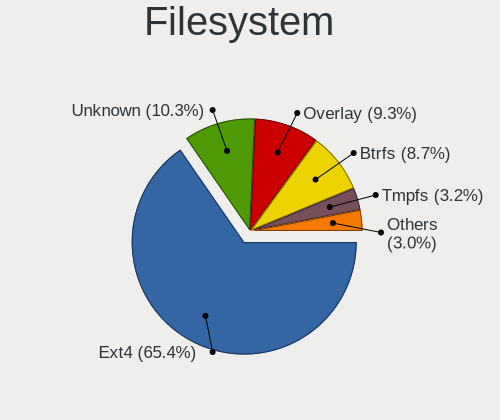
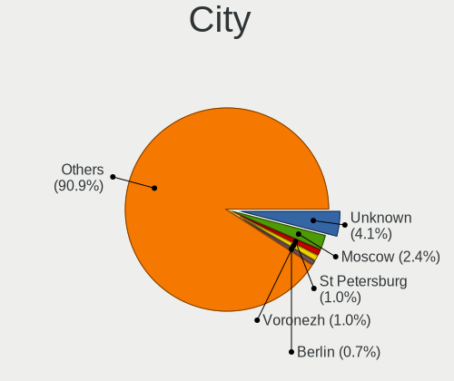
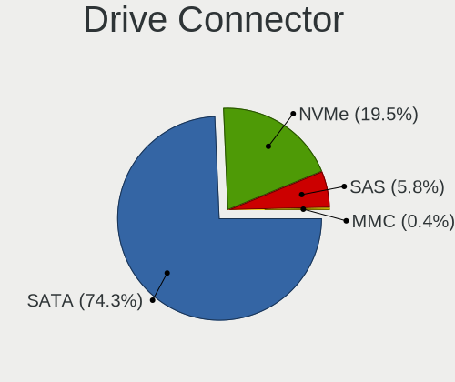
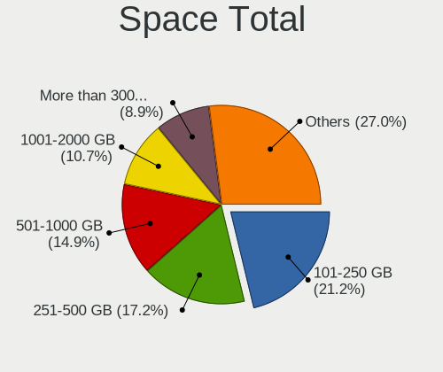
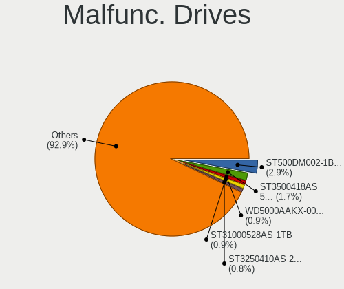
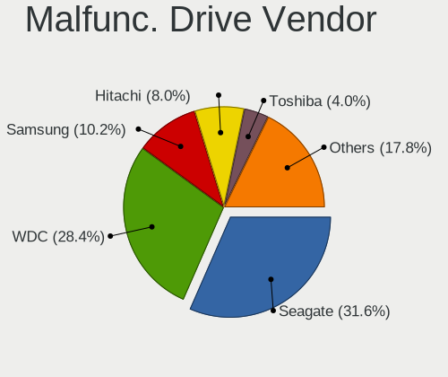
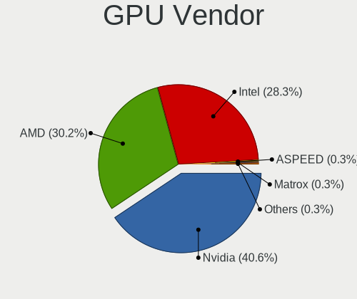
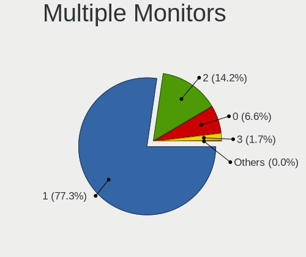
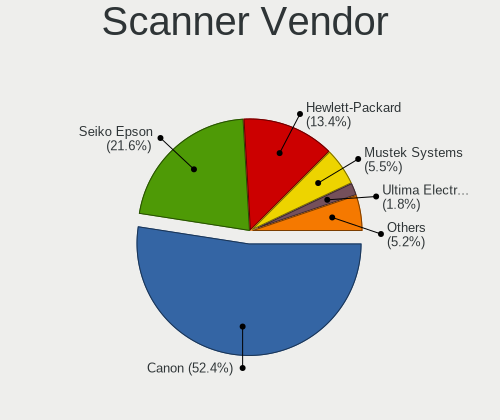

Linux - Tested Hardware & Statistics (Desktops)
-----------------------------------------------

A project to collect tested hardware configurations for Linux.

Anyone can contribute to this report by the [hw-probe](https://github.com/linuxhw/hw-probe) tool:

    sudo -E hw-probe -all -upload

Please contribute! Especially if your hardware is rare.

This report is for real hardware. Report for virtual hardware: [TestCoverage_VE](https://github.com/linuxhw/TestCoverage_VE)

Contents
--------

* [ Test Cases ](#test-cases)

* [ System ](#system)
  - [ OS                       ](#os)
  - [ OS Family                ](#os-family)
  - [ Kernel                   ](#kernel)
  - [ Kernel Family            ](#kernel-family)
  - [ Kernel Major Ver.        ](#kernel-major-ver)
  - [ Arch                     ](#arch)
  - [ DE                       ](#de)
  - [ Display Server           ](#display-server)
  - [ Display Manager          ](#display-manager)
  - [ OS Lang                  ](#os-lang)
  - [ Boot Mode                ](#boot-mode)
  - [ Filesystem               ](#filesystem)
  - [ Part. scheme             ](#part-scheme)
  - [ Dual Boot with Linux/BSD ](#dual-boot-with-linuxbsd)
  - [ Dual Boot (Win)          ](#dual-boot-win)

* [ Board ](#board)
  - [ Vendor                   ](#vendor)
  - [ Model                    ](#model)
  - [ Model Family             ](#model-family)
  - [ MFG Year                 ](#mfg-year)
  - [ Form Factor              ](#form-factor)
  - [ Secure Boot              ](#secure-boot)
  - [ Coreboot                 ](#coreboot)
  - [ RAM Size                 ](#ram-size)
  - [ RAM Used                 ](#ram-used)
  - [ Total Drives             ](#total-drives)
  - [ Has CD-ROM               ](#has-cd-rom)
  - [ Has Ethernet             ](#has-ethernet)
  - [ Has WiFi                 ](#has-wifi)
  - [ Has Bluetooth            ](#has-bluetooth)

* [ Location ](#location)
  - [ Country                  ](#country)
  - [ City                     ](#city)

* [ Drives ](#drives)
  - [ Drive Vendor             ](#drive-vendor)
  - [ Drive Model              ](#drive-model)
  - [ HDD Vendor               ](#hdd-vendor)
  - [ SSD Vendor               ](#ssd-vendor)
  - [ Drive Kind               ](#drive-kind)
  - [ Drive Connector          ](#drive-connector)
  - [ Drive Size               ](#drive-size)
  - [ Space Total              ](#space-total)
  - [ Space Used               ](#space-used)
  - [ Malfunc. Drives          ](#malfunc-drives)
  - [ Malfunc. Drive Vendor    ](#malfunc-drive-vendor)
  - [ Malfunc. HDD Vendor      ](#malfunc-hdd-vendor)
  - [ Malfunc. Drive Kind      ](#malfunc-drive-kind)
  - [ Failed Drives            ](#failed-drives)
  - [ Failed Drive Vendor      ](#failed-drive-vendor)
  - [ Drive Status             ](#drive-status)

* [ Storage controller ](#storage-controller)
  - [ Storage Vendor           ](#storage-vendor)
  - [ Storage Model            ](#storage-model)
  - [ Storage Kind             ](#storage-kind)

* [ Processor ](#processor)
  - [ CPU Vendor               ](#cpu-vendor)
  - [ CPU Model                ](#cpu-model)
  - [ CPU Model Family         ](#cpu-model-family)
  - [ CPU Cores                ](#cpu-cores)
  - [ CPU Sockets              ](#cpu-sockets)
  - [ CPU Threads              ](#cpu-threads)
  - [ CPU Op-Modes             ](#cpu-op-modes)
  - [ CPU Microcode            ](#cpu-microcode)
  - [ CPU Microarch            ](#cpu-microarch)

* [ Graphics ](#graphics)
  - [ GPU Vendor               ](#gpu-vendor)
  - [ GPU Model                ](#gpu-model)
  - [ GPU Combo                ](#gpu-combo)
  - [ GPU Driver               ](#gpu-driver)
  - [ GPU Memory               ](#gpu-memory)

* [ Monitor ](#monitor)
  - [ Monitor Vendor           ](#monitor-vendor)
  - [ Monitor Model            ](#monitor-model)
  - [ Monitor Resolution       ](#monitor-resolution)
  - [ Monitor Diagonal         ](#monitor-diagonal)
  - [ Monitor Width            ](#monitor-width)
  - [ Aspect Ratio             ](#aspect-ratio)
  - [ Monitor Area             ](#monitor-area)
  - [ Pixel Density            ](#pixel-density)
  - [ Multiple Monitors        ](#multiple-monitors)

* [ Network ](#network)
  - [ Net Controller Vendor    ](#net-controller-vendor)
  - [ Net Controller Model     ](#net-controller-model)
  - [ Wireless Vendor          ](#wireless-vendor)
  - [ Wireless Model           ](#wireless-model)
  - [ Ethernet Vendor          ](#ethernet-vendor)
  - [ Ethernet Model           ](#ethernet-model)
  - [ Net Controller Kind      ](#net-controller-kind)
  - [ Used Controller          ](#used-controller)
  - [ NICs                     ](#nics)
  - [ IPv6                     ](#ipv6)

* [ Bluetooth ](#bluetooth)
  - [ Bluetooth Vendor         ](#bluetooth-vendor)
  - [ Bluetooth Model          ](#bluetooth-model)

* [ Sound ](#sound)
  - [ Sound Vendor             ](#sound-vendor)
  - [ Sound Model              ](#sound-model)

* [ Memory ](#memory)
  - [ Memory Vendor            ](#memory-vendor)
  - [ Memory Model             ](#memory-model)
  - [ Memory Kind              ](#memory-kind)
  - [ Memory Form Factor       ](#memory-form-factor)
  - [ Memory Size              ](#memory-size)
  - [ Memory Speed             ](#memory-speed)

* [ Printers & scanners ](#printers--scanners)
  - [ Printer Vendor           ](#printer-vendor)
  - [ Printer Model            ](#printer-model)
  - [ Scanner Vendor           ](#scanner-vendor)
  - [ Scanner Model            ](#scanner-model)

* [ Camera ](#camera)
  - [ Camera Vendor            ](#camera-vendor)
  - [ Camera Model             ](#camera-model)

* [ Security ](#security)
  - [ Fingerprint Vendor       ](#fingerprint-vendor)
  - [ Fingerprint Model        ](#fingerprint-model)
  - [ Chipcard Vendor          ](#chipcard-vendor)
  - [ Chipcard Model           ](#chipcard-model)

* [ Unsupported ](#unsupported)
  - [ Unsupported Devices      ](#unsupported-devices)
  - [ Unsupported Device Types ](#unsupported-device-types)

Test Cases
----------

Total: 105088

| Vendor        | Model                       | Probe                                                      | Date         |
|---------------|-----------------------------|------------------------------------------------------------|--------------|
| Dell          | 0GY6Y8 A02                  | [760c526784](https://linux-hardware.org/?probe=760c526784) | Nov 02, 2022 |
| HP            | 3397                        | [24eb596bce](https://linux-hardware.org/?probe=24eb596bce) | Nov 02, 2022 |
| Dell          | 040DDP A00                  | [fba864b37c](https://linux-hardware.org/?probe=fba864b37c) | Nov 02, 2022 |
| ASRock        | 4CoreDual-SATA2             | [0a598dc332](https://linux-hardware.org/?probe=0a598dc332) | Nov 02, 2022 |
| Shenzhen a... | AC1-DP                      | [754335ffe9](https://linux-hardware.org/?probe=754335ffe9) | Nov 02, 2022 |
| MSI           | H81M-E35 V2                 | [db83c146a6](https://linux-hardware.org/?probe=db83c146a6) | Nov 02, 2022 |
| ASUSTek       | PRIME H410M-A               | [b3cac9f8b8](https://linux-hardware.org/?probe=b3cac9f8b8) | Nov 02, 2022 |
| HP            | 18E7                        | [c0d5c58895](https://linux-hardware.org/?probe=c0d5c58895) | Nov 02, 2022 |
| Dell          | 07N90W A00                  | [e941d01470](https://linux-hardware.org/?probe=e941d01470) | Nov 02, 2022 |
| MSI           | MS-7392                     | [d453f89064](https://linux-hardware.org/?probe=d453f89064) | Nov 02, 2022 |
| Gigabyte      | B450 AORUS M                | [e4dfd41fa4](https://linux-hardware.org/?probe=e4dfd41fa4) | Nov 02, 2022 |
| ASUSTek       | M5A78L-M LX3 PLUS           | [23a62c3509](https://linux-hardware.org/?probe=23a62c3509) | Nov 02, 2022 |
| HP            | 18E4                        | [1b1339be3d](https://linux-hardware.org/?probe=1b1339be3d) | Nov 02, 2022 |
| ASUSTek       | P7H55-M LE                  | [383066ca1c](https://linux-hardware.org/?probe=383066ca1c) | Nov 02, 2022 |
| MSI           | MPG B550I GAMING EDGE WI... | [77f847ca29](https://linux-hardware.org/?probe=77f847ca29) | Nov 02, 2022 |
| Gigabyte      | B450 I AORUS PRO WIFI-CF    | [895a345eb9](https://linux-hardware.org/?probe=895a345eb9) | Nov 02, 2022 |
| Gigabyte      | B450 I AORUS PRO WIFI-CF    | [9d9d3a4967](https://linux-hardware.org/?probe=9d9d3a4967) | Nov 02, 2022 |
| Fujitsu       | D2628-C1 S26361-D2628-C1    | [a2af2980ad](https://linux-hardware.org/?probe=a2af2980ad) | Nov 02, 2022 |
| ASUSTek       | H81T                        | [7598a634e6](https://linux-hardware.org/?probe=7598a634e6) | Nov 02, 2022 |
| MSI           | MAG X570S TOMAHAWK MAX W... | [c9041d22be](https://linux-hardware.org/?probe=c9041d22be) | Nov 02, 2022 |
| ASUSTek       | M5A78L-M LX3 PLUS           | [d34ccf5e7a](https://linux-hardware.org/?probe=d34ccf5e7a) | Nov 02, 2022 |
| ASUSTek       | M5A78L-M LX3 PLUS           | [eb06593b9e](https://linux-hardware.org/?probe=eb06593b9e) | Nov 02, 2022 |
| ASRock        | B450 Pro4                   | [5da1d76cd5](https://linux-hardware.org/?probe=5da1d76cd5) | Nov 02, 2022 |
| MSI           | X399 SLI PLUS               | [4191ce8788](https://linux-hardware.org/?probe=4191ce8788) | Nov 02, 2022 |
| MSI           | MAG Z390 TOMAHAWK           | [4f1e0d9702](https://linux-hardware.org/?probe=4f1e0d9702) | Nov 02, 2022 |
| ASUSTek       | Z590 WIFI GUNDAM EDITION    | [74f8de9f71](https://linux-hardware.org/?probe=74f8de9f71) | Nov 02, 2022 |
| ASUSTek       | B85-PLUS                    | [dd24c26ffa](https://linux-hardware.org/?probe=dd24c26ffa) | Nov 02, 2022 |
| HP            | 1589                        | [81a347a6a7](https://linux-hardware.org/?probe=81a347a6a7) | Nov 02, 2022 |
| MSI           | MAG Z390 TOMAHAWK           | [842320d7b3](https://linux-hardware.org/?probe=842320d7b3) | Nov 02, 2022 |
| HP            | 18E5                        | [3df38ade7e](https://linux-hardware.org/?probe=3df38ade7e) | Nov 02, 2022 |
| Gigabyte      | H77N-WIFI                   | [d8b066edcd](https://linux-hardware.org/?probe=d8b066edcd) | Nov 02, 2022 |
| ASUSTek       | ROG STRIX X570-F GAMING     | [711e95b72e](https://linux-hardware.org/?probe=711e95b72e) | Nov 02, 2022 |
| ASUSTek       | ROG STRIX X570-F GAMING     | [ff0c19c661](https://linux-hardware.org/?probe=ff0c19c661) | Nov 02, 2022 |
| Gigabyte      | Z270-HD3P-CF                | [8b8ec08876](https://linux-hardware.org/?probe=8b8ec08876) | Nov 02, 2022 |
| Dell          | 0GWHMW A01                  | [732eaeede7](https://linux-hardware.org/?probe=732eaeede7) | Nov 02, 2022 |
| Lenovo        | 361A SDK0K17763 WIN         | [5d34d86be3](https://linux-hardware.org/?probe=5d34d86be3) | Nov 02, 2022 |
| Gigabyte      | B450M GAMING-CF             | [95e2a1e7d9](https://linux-hardware.org/?probe=95e2a1e7d9) | Nov 02, 2022 |
| ASUSTek       | ROG STRIX Z490-G GAMING     | [706fb22c95](https://linux-hardware.org/?probe=706fb22c95) | Nov 02, 2022 |
| Gigabyte      | X570 GAMING X               | [b3613b84ad](https://linux-hardware.org/?probe=b3613b84ad) | Nov 02, 2022 |
| Dell          | 0JGM7F A00                  | [28f4800b2b](https://linux-hardware.org/?probe=28f4800b2b) | Nov 02, 2022 |
| ASUSTek       | P7H55-M LE                  | [66acf8991e](https://linux-hardware.org/?probe=66acf8991e) | Nov 02, 2022 |
| ASRock        | Q1900B-ITX                  | [6305a98777](https://linux-hardware.org/?probe=6305a98777) | Nov 02, 2022 |
| ASUSTek       | ROG STRIX X570-E GAMING     | [86bf890d23](https://linux-hardware.org/?probe=86bf890d23) | Nov 02, 2022 |
| ASUSTek       | ROG STRIX Z490-G GAMING     | [da6ecef3a7](https://linux-hardware.org/?probe=da6ecef3a7) | Nov 02, 2022 |
| HP            | 18E5                        | [8204df7795](https://linux-hardware.org/?probe=8204df7795) | Nov 02, 2022 |
| Lenovo        | 3132 SDK0R32862 WIN 3258... | [f8708425a1](https://linux-hardware.org/?probe=f8708425a1) | Nov 02, 2022 |
| HP            | 8054                        | [0f866b3605](https://linux-hardware.org/?probe=0f866b3605) | Nov 02, 2022 |
| ASUSTek       | ROG STRIX B550-F GAMING     | [4e97493141](https://linux-hardware.org/?probe=4e97493141) | Nov 02, 2022 |
| MSI           | H110M PRO-VD                | [1fb0a79791](https://linux-hardware.org/?probe=1fb0a79791) | Nov 02, 2022 |
| Dell          | 0K240Y A01                  | [41707b16d1](https://linux-hardware.org/?probe=41707b16d1) | Nov 02, 2022 |
| Unknown       | Unknown                     | [bc4f9a5a35](https://linux-hardware.org/?probe=bc4f9a5a35) | Nov 02, 2022 |
| ASRock        | N68C-GS UCC                 | [9430ecf81c](https://linux-hardware.org/?probe=9430ecf81c) | Nov 02, 2022 |
| ASUSTek       | ProArt Z690-CREATOR WIFI    | [ec359017a2](https://linux-hardware.org/?probe=ec359017a2) | Nov 02, 2022 |
| Gigabyte      | 970A-DS3P                   | [a9f10f8922](https://linux-hardware.org/?probe=a9f10f8922) | Nov 02, 2022 |
| ASUSTek       | ROG CROSSHAIR VIII IMPAC... | [63bf11c696](https://linux-hardware.org/?probe=63bf11c696) | Nov 02, 2022 |
| ASUSTek       | H61M-K                      | [3773260366](https://linux-hardware.org/?probe=3773260366) | Nov 02, 2022 |
| Lenovo        | ThinkCentre A57 970274G     | [809e137f17](https://linux-hardware.org/?probe=809e137f17) | Nov 02, 2022 |
| HP            | 212A                        | [80abe48959](https://linux-hardware.org/?probe=80abe48959) | Nov 02, 2022 |
| Pegatron      | 2AD5                        | [0b91ee456b](https://linux-hardware.org/?probe=0b91ee456b) | Nov 02, 2022 |
| Gigabyte      | A520M DS3H                  | [8fe13e2165](https://linux-hardware.org/?probe=8fe13e2165) | Nov 02, 2022 |
| Gigabyte      | H97-HD3                     | [22214c7851](https://linux-hardware.org/?probe=22214c7851) | Nov 02, 2022 |
| Dell          | 0GDG8Y A00                  | [609ccd3204](https://linux-hardware.org/?probe=609ccd3204) | Nov 02, 2022 |
| ASRock        | H510M-HVS R2.0              | [562f466f8d](https://linux-hardware.org/?probe=562f466f8d) | Nov 02, 2022 |
| ASRock        | B450M Pro4                  | [38b68c6946](https://linux-hardware.org/?probe=38b68c6946) | Nov 02, 2022 |
| Gigabyte      | Q270M-D3H                   | [46874cc0a1](https://linux-hardware.org/?probe=46874cc0a1) | Nov 02, 2022 |
| Gigabyte      | 970A-DS3P                   | [65231808f8](https://linux-hardware.org/?probe=65231808f8) | Nov 02, 2022 |
| ASUSTek       | F2A55-M LK                  | [40cedc7d2c](https://linux-hardware.org/?probe=40cedc7d2c) | Nov 02, 2022 |
| ASRock        | H510M-HVS R2.0              | [b68271c648](https://linux-hardware.org/?probe=b68271c648) | Nov 02, 2022 |
| ASRock        | N68-S3 FX                   | [22f68458d4](https://linux-hardware.org/?probe=22f68458d4) | Nov 02, 2022 |
| Gigabyte      | AB350M-DS3H V2-CF           | [7b42bc51be](https://linux-hardware.org/?probe=7b42bc51be) | Nov 02, 2022 |
| ASUSTek       | PRIME B550M-A               | [454939df34](https://linux-hardware.org/?probe=454939df34) | Nov 02, 2022 |
| MSI           | X99A RAIDER                 | [36eda457da](https://linux-hardware.org/?probe=36eda457da) | Nov 02, 2022 |
| ASRock        | FM2A88X Extreme6+           | [4e260473ba](https://linux-hardware.org/?probe=4e260473ba) | Nov 02, 2022 |
| MSI           | H97 GAMING 3                | [1a8c44ca83](https://linux-hardware.org/?probe=1a8c44ca83) | Nov 02, 2022 |
| Lenovo        | 312A SDK0J40697 WIN 3305... | [fe91c11062](https://linux-hardware.org/?probe=fe91c11062) | Nov 02, 2022 |
| Gigabyte      | X570 AORUS ELITE            | [9b093574b9](https://linux-hardware.org/?probe=9b093574b9) | Nov 02, 2022 |
| Lenovo        | H420                        | [3e3f04d875](https://linux-hardware.org/?probe=3e3f04d875) | Nov 02, 2022 |
| Foxconn       | 2A92                        | [0898482b18](https://linux-hardware.org/?probe=0898482b18) | Nov 02, 2022 |
| ASUSTek       | M3A78-CM                    | [5f81698e9a](https://linux-hardware.org/?probe=5f81698e9a) | Nov 02, 2022 |
| ASUSTek       | P5K-E                       | [6b48759d1d](https://linux-hardware.org/?probe=6b48759d1d) | Nov 02, 2022 |
| Pegatron      | 2AD5                        | [5f90d4e478](https://linux-hardware.org/?probe=5f90d4e478) | Nov 02, 2022 |
| Gigabyte      | EP45-DS4                    | [fa96a26c5a](https://linux-hardware.org/?probe=fa96a26c5a) | Nov 02, 2022 |
| ASUSTek       | PRO B460M-C                 | [dcf7112b3d](https://linux-hardware.org/?probe=dcf7112b3d) | Nov 01, 2022 |
| ASUSTek       | PRO B460M-C                 | [a333f47ffa](https://linux-hardware.org/?probe=a333f47ffa) | Nov 01, 2022 |
| HP            | 1905                        | [df0d192970](https://linux-hardware.org/?probe=df0d192970) | Nov 01, 2022 |
| Dell          | 02YRK5 A02                  | [2c63ff26e5](https://linux-hardware.org/?probe=2c63ff26e5) | Nov 01, 2022 |
| ASRock        | AB350 Gaming K4             | [36387e4f11](https://linux-hardware.org/?probe=36387e4f11) | Nov 01, 2022 |
| Phoenix       | POULSBO                     | [177f05205b](https://linux-hardware.org/?probe=177f05205b) | Nov 01, 2022 |
| MSI           | H61M-P31                    | [819c124b25](https://linux-hardware.org/?probe=819c124b25) | Nov 01, 2022 |
| ECS           | H61H2-M2                    | [b70c0aa20d](https://linux-hardware.org/?probe=b70c0aa20d) | Nov 01, 2022 |
| Intel         | H61                         | [326fa40958](https://linux-hardware.org/?probe=326fa40958) | Nov 01, 2022 |
| ASUSTek       | TUF Gaming B550M-PLUS WI... | [d28b33e126](https://linux-hardware.org/?probe=d28b33e126) | Nov 01, 2022 |
| Gigabyte      | P55-UD6                     | [2898ec20b3](https://linux-hardware.org/?probe=2898ec20b3) | Nov 01, 2022 |
| ASUSTek       | H97I-PLUS                   | [13bf376807](https://linux-hardware.org/?probe=13bf376807) | Nov 01, 2022 |
| Acer          | Aspire X1430                | [f48a8d45d8](https://linux-hardware.org/?probe=f48a8d45d8) | Nov 01, 2022 |
| Gigabyte      | H81M-DS2V                   | [caffb9ebd7](https://linux-hardware.org/?probe=caffb9ebd7) | Nov 01, 2022 |
| HP            | 3646h                       | [f88c9632b4](https://linux-hardware.org/?probe=f88c9632b4) | Nov 01, 2022 |
| MSI           | B75A-IE35                   | [57b74e4ca2](https://linux-hardware.org/?probe=57b74e4ca2) | Nov 01, 2022 |
| VS Company    | G31T-M                      | [75eb6866e0](https://linux-hardware.org/?probe=75eb6866e0) | Nov 01, 2022 |
| Gigabyte      | P55A-UD3                    | [cd300a0714](https://linux-hardware.org/?probe=cd300a0714) | Nov 01, 2022 |
| MSI           | Z370 GAMING PLUS            | [527c779cfb](https://linux-hardware.org/?probe=527c779cfb) | Nov 01, 2022 |
| ASUSTek       | M5A78L-M LX V2              | [50bd7a7436](https://linux-hardware.org/?probe=50bd7a7436) | Nov 01, 2022 |
| Lenovo        | ThinkCentre M55E 898578G    | [d025c115d8](https://linux-hardware.org/?probe=d025c115d8) | Nov 01, 2022 |
| Dell          | 06D7TR A02                  | [a27d97c026](https://linux-hardware.org/?probe=a27d97c026) | Nov 01, 2022 |
| Gigabyte      | H610M H DDR4                | [b726668f90](https://linux-hardware.org/?probe=b726668f90) | Nov 01, 2022 |
| Dell          | 0XR1GT A00                  | [8f551aaa52](https://linux-hardware.org/?probe=8f551aaa52) | Nov 01, 2022 |
| Dell          | 06D7TR A02                  | [f8a4053db1](https://linux-hardware.org/?probe=f8a4053db1) | Nov 01, 2022 |
| Dell          | 0C522T A01                  | [efee8139b0](https://linux-hardware.org/?probe=efee8139b0) | Nov 01, 2022 |
| ASUSTek       | Z97-PRO GAMER               | [4b9071c932](https://linux-hardware.org/?probe=4b9071c932) | Nov 01, 2022 |
| Dell          | 088DT1 A01                  | [efcbf8a2eb](https://linux-hardware.org/?probe=efcbf8a2eb) | Nov 01, 2022 |
| ASUSTek       | BM2AD_D510MT_D310MT         | [8f2b0bc926](https://linux-hardware.org/?probe=8f2b0bc926) | Nov 01, 2022 |
| ASUSTek       | PRIME B560M-A               | [499932f589](https://linux-hardware.org/?probe=499932f589) | Nov 01, 2022 |
| MSI           | B450M MORTAR MAX            | [034414a73e](https://linux-hardware.org/?probe=034414a73e) | Nov 01, 2022 |
| MSI           | B450M MORTAR MAX            | [6f635f46c6](https://linux-hardware.org/?probe=6f635f46c6) | Nov 01, 2022 |
| MSI           | MAG B550 TOMAHAWK           | [8ce0b9271b](https://linux-hardware.org/?probe=8ce0b9271b) | Nov 01, 2022 |
| Gigabyte      | EP45-DS4                    | [2eb78b1c3d](https://linux-hardware.org/?probe=2eb78b1c3d) | Nov 01, 2022 |
| ASUSTek       | Z170 PRO GAMING/AURA        | [f0db98f6bb](https://linux-hardware.org/?probe=f0db98f6bb) | Nov 01, 2022 |
| ASUSTek       | CROSSBLADE RANGER           | [5f92247b16](https://linux-hardware.org/?probe=5f92247b16) | Nov 01, 2022 |
| ASUSTek       | Z170 PRO GAMING/AURA        | [fc832e8881](https://linux-hardware.org/?probe=fc832e8881) | Nov 01, 2022 |
| Gigabyte      | H310M H                     | [115025ee59](https://linux-hardware.org/?probe=115025ee59) | Nov 01, 2022 |
| Gigabyte      | H310M H                     | [74af46599e](https://linux-hardware.org/?probe=74af46599e) | Nov 01, 2022 |
| Gigabyte      | B450M H                     | [06bbc75ef0](https://linux-hardware.org/?probe=06bbc75ef0) | Nov 01, 2022 |
| Fujitsu       | D2828-A2 S26361-D2828-A2    | [cf394ed108](https://linux-hardware.org/?probe=cf394ed108) | Nov 01, 2022 |
| Dell          | 07C0H8 A00                  | [1b2cb018d0](https://linux-hardware.org/?probe=1b2cb018d0) | Nov 01, 2022 |
| Gigabyte      | B550 UD AC                  | [c5a5219cf3](https://linux-hardware.org/?probe=c5a5219cf3) | Nov 01, 2022 |
| Fujitsu       | D2628-C1 S26361-D2628-C1    | [245ec71478](https://linux-hardware.org/?probe=245ec71478) | Nov 01, 2022 |
| MSI           | MAG B660M MORTAR WIFI DD... | [115e9027d0](https://linux-hardware.org/?probe=115e9027d0) | Nov 01, 2022 |
| ASUSTek       | PRIME H310M-K               | [9efd2724b2](https://linux-hardware.org/?probe=9efd2724b2) | Nov 01, 2022 |
| Dell          | 0GY6Y8 A02                  | [50d2f412f0](https://linux-hardware.org/?probe=50d2f412f0) | Nov 01, 2022 |
| ASUSTek       | H110M-D                     | [248b9533a3](https://linux-hardware.org/?probe=248b9533a3) | Nov 01, 2022 |
| Unknown       | Unknown                     | [f87c0b1010](https://linux-hardware.org/?probe=f87c0b1010) | Nov 01, 2022 |
| Acer          | H410H6-M17 P21-A1           | [9333be5120](https://linux-hardware.org/?probe=9333be5120) | Nov 01, 2022 |
| Gigabyte      | Z170-HD3P-CF                | [5fd845ca54](https://linux-hardware.org/?probe=5fd845ca54) | Nov 01, 2022 |
| ASUSTek       | B150 PRO GAMING             | [b2229c56c4](https://linux-hardware.org/?probe=b2229c56c4) | Nov 01, 2022 |
| ASRock        | B450M Pro4                  | [45a2f4473b](https://linux-hardware.org/?probe=45a2f4473b) | Nov 01, 2022 |
| ASRock        | B365M-HDV                   | [29a6bce4c0](https://linux-hardware.org/?probe=29a6bce4c0) | Nov 01, 2022 |
| HP            | 8591                        | [98bde1bd5a](https://linux-hardware.org/?probe=98bde1bd5a) | Nov 01, 2022 |
| ASUSTek       | H81M-C                      | [76052b7756](https://linux-hardware.org/?probe=76052b7756) | Nov 01, 2022 |
| Intel         | DH61DL AAG14066-205         | [0f62f6f3b1](https://linux-hardware.org/?probe=0f62f6f3b1) | Nov 01, 2022 |
| Gigabyte      | X570S AERO G                | [92fccb6716](https://linux-hardware.org/?probe=92fccb6716) | Nov 01, 2022 |
| MSI           | H61M-P32/W8                 | [14df9c3c14](https://linux-hardware.org/?probe=14df9c3c14) | Nov 01, 2022 |
| MSI           | H81M-E33                    | [ee4c33d7b1](https://linux-hardware.org/?probe=ee4c33d7b1) | Nov 01, 2022 |
| ASUSTek       | TUF Gaming X570-PLUS        | [6e577f6de5](https://linux-hardware.org/?probe=6e577f6de5) | Nov 01, 2022 |
| MSI           | 0A90                        | [47fa407c02](https://linux-hardware.org/?probe=47fa407c02) | Nov 01, 2022 |
| HP            | 339A                        | [68392c18c9](https://linux-hardware.org/?probe=68392c18c9) | Nov 01, 2022 |
| ASUSTek       | PRIME A320M-K               | [a14fa00a56](https://linux-hardware.org/?probe=a14fa00a56) | Nov 01, 2022 |
| ASUSTek       | PRIME A320M-K               | [bfa1db2eb1](https://linux-hardware.org/?probe=bfa1db2eb1) | Nov 01, 2022 |
| OEM           | H310MD4                     | [947bf0d86f](https://linux-hardware.org/?probe=947bf0d86f) | Nov 01, 2022 |
| ASUSTek       | PRIME B550M-A               | [321eae8d23](https://linux-hardware.org/?probe=321eae8d23) | Nov 01, 2022 |
| MSI           | Z390-A PRO                  | [3eea020596](https://linux-hardware.org/?probe=3eea020596) | Nov 01, 2022 |
| ASRock        | N68C-GS FX                  | [f7a9c5f382](https://linux-hardware.org/?probe=f7a9c5f382) | Nov 01, 2022 |
| Lenovo        | SHARKBAY NOK                | [722ae37952](https://linux-hardware.org/?probe=722ae37952) | Nov 01, 2022 |
| ASUSTek       | H61M-K                      | [ca5a47c66a](https://linux-hardware.org/?probe=ca5a47c66a) | Nov 01, 2022 |
| ASRock        | AB350 Gaming K4             | [560d84828c](https://linux-hardware.org/?probe=560d84828c) | Nov 01, 2022 |
| MSI           | MAG B550 TOMAHAWK           | [24203a87c9](https://linux-hardware.org/?probe=24203a87c9) | Nov 01, 2022 |
| ASUSTek       | ROG STRIX X670E-I GAMING... | [77ccdee0fe](https://linux-hardware.org/?probe=77ccdee0fe) | Nov 01, 2022 |
| Acer          | Aspire XC-1660G V:1.1       | [a3a55bf3e4](https://linux-hardware.org/?probe=a3a55bf3e4) | Nov 01, 2022 |
| MSI           | X99A RAIDER                 | [2f3428a435](https://linux-hardware.org/?probe=2f3428a435) | Nov 01, 2022 |
| ASRock        | FM2A88X Extreme6+           | [cf7b016772](https://linux-hardware.org/?probe=cf7b016772) | Nov 01, 2022 |
| Acer          | Aspire XC-1660G V:1.1       | [8d99f1fb3b](https://linux-hardware.org/?probe=8d99f1fb3b) | Nov 01, 2022 |
| MSI           | MEG X570 UNIFY              | [1a88842782](https://linux-hardware.org/?probe=1a88842782) | Nov 01, 2022 |
| ASUSTek       | ROG STRIX B450-F GAMING     | [7a29190887](https://linux-hardware.org/?probe=7a29190887) | Nov 01, 2022 |
| MSI           | MEG X570 UNIFY              | [11de150949](https://linux-hardware.org/?probe=11de150949) | Nov 01, 2022 |
| BCM           | MX110HD                     | [60c3eb0c5c](https://linux-hardware.org/?probe=60c3eb0c5c) | Nov 01, 2022 |
| ASUSTek       | B150M-V PLUS                | [a451844625](https://linux-hardware.org/?probe=a451844625) | Nov 01, 2022 |
| HP            | 8054                        | [9e1b99d9bb](https://linux-hardware.org/?probe=9e1b99d9bb) | Nov 01, 2022 |
| MSI           | PRO B660M-A DDR4            | [f6b6afc8a3](https://linux-hardware.org/?probe=f6b6afc8a3) | Nov 01, 2022 |
| ASUSTek       | PRIME B360M-A               | [c46dd8d9b6](https://linux-hardware.org/?probe=c46dd8d9b6) | Nov 01, 2022 |
| ASUSTek       | PRIME A320M-K               | [689b5a4022](https://linux-hardware.org/?probe=689b5a4022) | Nov 01, 2022 |
| ASRock        | 4CoreDual-SATA2             | [446799aa8e](https://linux-hardware.org/?probe=446799aa8e) | Nov 01, 2022 |
| ASUSTek       | SABERTOOTH Z87              | [d39c952932](https://linux-hardware.org/?probe=d39c952932) | Nov 01, 2022 |
| Dell          | 082WXT A03                  | [ab3dad5a31](https://linux-hardware.org/?probe=ab3dad5a31) | Nov 01, 2022 |
| HP            | 09F8h                       | [f1107e91f2](https://linux-hardware.org/?probe=f1107e91f2) | Nov 01, 2022 |
| ASUSTek       | TUF Gaming X570-PLUS        | [0131299a9e](https://linux-hardware.org/?probe=0131299a9e) | Nov 01, 2022 |
| ASUSTek       | TUF Gaming X570-PLUS        | [d729001115](https://linux-hardware.org/?probe=d729001115) | Nov 01, 2022 |
| ASUSTek       | PRIME Z690-P D4             | [21213fdeec](https://linux-hardware.org/?probe=21213fdeec) | Oct 31, 2022 |
| Gigabyte      | AB350M-DS3H V2-CF           | [27b07caa39](https://linux-hardware.org/?probe=27b07caa39) | Oct 31, 2022 |
| ASUSTek       | H97-PRO                     | [bae404d45c](https://linux-hardware.org/?probe=bae404d45c) | Oct 31, 2022 |
| AOpen         | aVKx-DE R1.03 55DEL10001... | [b487a7aee3](https://linux-hardware.org/?probe=b487a7aee3) | Oct 31, 2022 |
| Dell          | 040DDP A00                  | [22b1e93203](https://linux-hardware.org/?probe=22b1e93203) | Oct 31, 2022 |
| ASUSTek       | SABERTOOTH Z77              | [8b208b8383](https://linux-hardware.org/?probe=8b208b8383) | Oct 31, 2022 |
| HP            | 1850                        | [b39eac8f74](https://linux-hardware.org/?probe=b39eac8f74) | Oct 31, 2022 |
| ASUSTek       | PRIME A320M-K               | [87187c0e23](https://linux-hardware.org/?probe=87187c0e23) | Oct 31, 2022 |
| Acer          | Aspire TC-280               | [68679c6495](https://linux-hardware.org/?probe=68679c6495) | Oct 31, 2022 |
| MSI           | B450 TOMAHAWK MAX           | [183545ed4e](https://linux-hardware.org/?probe=183545ed4e) | Oct 31, 2022 |
| ECS           | H61H2-CM                    | [792ce0e34e](https://linux-hardware.org/?probe=792ce0e34e) | Oct 31, 2022 |
| ASUSTek       | Z97-P                       | [72467c5d61](https://linux-hardware.org/?probe=72467c5d61) | Oct 31, 2022 |
| MSI           | A320M-A PRO                 | [8769289ea5](https://linux-hardware.org/?probe=8769289ea5) | Oct 31, 2022 |
| MSI           | Z170M MORTAR                | [041dbc2c18](https://linux-hardware.org/?probe=041dbc2c18) | Oct 31, 2022 |
| Dell          | 03NVJ6 A03                  | [adebd09dc4](https://linux-hardware.org/?probe=adebd09dc4) | Oct 31, 2022 |
| ASUSTek       | ROG STRIX B450-F GAMING     | [4c3ae53c16](https://linux-hardware.org/?probe=4c3ae53c16) | Oct 31, 2022 |
| MSI           | H81M-P33                    | [29e4a4ec52](https://linux-hardware.org/?probe=29e4a4ec52) | Oct 31, 2022 |
| ASUSTek       | PRIME Z690M-PLUS D4         | [96d61ed3e1](https://linux-hardware.org/?probe=96d61ed3e1) | Oct 31, 2022 |
| MSI           | MEG Z590 ACE                | [1082f00d60](https://linux-hardware.org/?probe=1082f00d60) | Oct 31, 2022 |
| ASUSTek       | Z87-K                       | [7edc0875ed](https://linux-hardware.org/?probe=7edc0875ed) | Oct 31, 2022 |
| ASUSTek       | VM60                        | [2cb5cc2932](https://linux-hardware.org/?probe=2cb5cc2932) | Oct 31, 2022 |
| MSI           | B450-A PRO MAX              | [8e480ded02](https://linux-hardware.org/?probe=8e480ded02) | Oct 31, 2022 |
| ASRock        | 960GM-VGS3 FX               | [f31f613901](https://linux-hardware.org/?probe=f31f613901) | Oct 31, 2022 |
| Pegatron      | 2AABh                       | [94dd13992c](https://linux-hardware.org/?probe=94dd13992c) | Oct 31, 2022 |
| MSI           | X570-A PRO                  | [c60d9aa72d](https://linux-hardware.org/?probe=c60d9aa72d) | Oct 31, 2022 |
| Gigabyte      | X99-SLI-CF                  | [d6bc77d638](https://linux-hardware.org/?probe=d6bc77d638) | Oct 31, 2022 |
| ASUSTek       | P9X79                       | [3af3091881](https://linux-hardware.org/?probe=3af3091881) | Oct 31, 2022 |
| ASUSTek       | M4A78                       | [8eb1316a14](https://linux-hardware.org/?probe=8eb1316a14) | Oct 31, 2022 |
| ASUSTek       | CG8480                      | [0f7c1dc1cf](https://linux-hardware.org/?probe=0f7c1dc1cf) | Oct 31, 2022 |
| MSI           | H110M PRO-VD PLUS           | [ced3229025](https://linux-hardware.org/?probe=ced3229025) | Oct 31, 2022 |
| Gigabyte      | X570 AORUS ELITE            | [966eb5bb18](https://linux-hardware.org/?probe=966eb5bb18) | Oct 31, 2022 |
| Lenovo        | 3102 SDK0J40697 WIN 3305... | [a5d58af861](https://linux-hardware.org/?probe=a5d58af861) | Oct 31, 2022 |
| HP            | 3397                        | [942cfa2a25](https://linux-hardware.org/?probe=942cfa2a25) | Oct 31, 2022 |
| ASUSTek       | Crosshair V Formula         | [c07ddbeb76](https://linux-hardware.org/?probe=c07ddbeb76) | Oct 31, 2022 |
| Unknown       | Unknown                     | [7cce0a2867](https://linux-hardware.org/?probe=7cce0a2867) | Oct 31, 2022 |
| ASUSTek       | H81M-C                      | [2fdcf19b6d](https://linux-hardware.org/?probe=2fdcf19b6d) | Oct 31, 2022 |
| ASRock        | B560M Pro4                  | [865aef7529](https://linux-hardware.org/?probe=865aef7529) | Oct 31, 2022 |
| Gigabyte      | X570 AORUS ELITE            | [860f45c4c1](https://linux-hardware.org/?probe=860f45c4c1) | Oct 31, 2022 |
| Gigabyte      | Z270-HD3P-CF                | [e309413fea](https://linux-hardware.org/?probe=e309413fea) | Oct 31, 2022 |
| ASUSTek       | B85-PRO GAMER               | [678ca55a4c](https://linux-hardware.org/?probe=678ca55a4c) | Oct 31, 2022 |
| ASUSTek       | M4A78 PLUS                  | [bac044cd22](https://linux-hardware.org/?probe=bac044cd22) | Oct 31, 2022 |
| Gigabyte      | X570 AORUS ELITE            | [f497e98b58](https://linux-hardware.org/?probe=f497e98b58) | Oct 31, 2022 |
| ASUSTek       | A8R32-MVP Deluxe            | [a2a8473e4b](https://linux-hardware.org/?probe=a2a8473e4b) | Oct 31, 2022 |
| Foxconn       | RS690M2MA 0A                | [29605bcad9](https://linux-hardware.org/?probe=29605bcad9) | Oct 31, 2022 |
| ASUSTek       | PRIME Z270-P                | [fffb5288e0](https://linux-hardware.org/?probe=fffb5288e0) | Oct 31, 2022 |
| ASUSTek       | M4A78                       | [81374a561c](https://linux-hardware.org/?probe=81374a561c) | Oct 31, 2022 |
| ASUSTek       | PRIME B450-PLUS             | [ce4bda1df2](https://linux-hardware.org/?probe=ce4bda1df2) | Oct 31, 2022 |
| ASUSTek       | P8H77-M                     | [2ae72e7e22](https://linux-hardware.org/?probe=2ae72e7e22) | Oct 31, 2022 |
| HP            | Compaq 8000 Elite CMT PC    | [fbe835b8ef](https://linux-hardware.org/?probe=fbe835b8ef) | Oct 31, 2022 |
| Gigabyte      | B660M GAMING X AX           | [d48fe55211](https://linux-hardware.org/?probe=d48fe55211) | Oct 31, 2022 |
| Gigabyte      | GA-MA770-UD3                | [e49d4af683](https://linux-hardware.org/?probe=e49d4af683) | Oct 31, 2022 |
| HP            | 1790                        | [6dc2cef5ea](https://linux-hardware.org/?probe=6dc2cef5ea) | Oct 31, 2022 |
| Dell          | 0NDYHG A00                  | [1542958ace](https://linux-hardware.org/?probe=1542958ace) | Oct 31, 2022 |
| ASRock        | H470M-HDV                   | [a4e522270c](https://linux-hardware.org/?probe=a4e522270c) | Oct 31, 2022 |
| ASUSTek       | PRIME B350-PLUS             | [43a99f49f8](https://linux-hardware.org/?probe=43a99f49f8) | Oct 31, 2022 |
| Biostar       | H310MHC2                    | [5ad5ba772f](https://linux-hardware.org/?probe=5ad5ba772f) | Oct 31, 2022 |
| Seco          | C40 C                       | [08509c30b6](https://linux-hardware.org/?probe=08509c30b6) | Oct 31, 2022 |
| Intel         | DG41AN AAE92991-401         | [cd670cef3d](https://linux-hardware.org/?probe=cd670cef3d) | Oct 31, 2022 |
| HP            | 18E4                        | [89b197e8a9](https://linux-hardware.org/?probe=89b197e8a9) | Oct 31, 2022 |
| MSI           | MAG B660M MORTAR DDR4       | [14e8385f99](https://linux-hardware.org/?probe=14e8385f99) | Oct 31, 2022 |
| Gigabyte      | A520M H                     | [0a8043d206](https://linux-hardware.org/?probe=0a8043d206) | Oct 31, 2022 |
| ASRock        | B550 Phantom Gaming 4       | [5e87d391a3](https://linux-hardware.org/?probe=5e87d391a3) | Oct 31, 2022 |
| Gigabyte      | B450 AORUS M                | [13741c554f](https://linux-hardware.org/?probe=13741c554f) | Oct 31, 2022 |
| Intel         | D946GZAB AAD66610-300       | [33c41323a3](https://linux-hardware.org/?probe=33c41323a3) | Oct 31, 2022 |
| ASUSTek       | M5A78L/USB3                 | [b5098e9fe5](https://linux-hardware.org/?probe=b5098e9fe5) | Oct 31, 2022 |
| Samsung       | DeskTop System              | [56b4bb00b0](https://linux-hardware.org/?probe=56b4bb00b0) | Oct 31, 2022 |
| Lenovo        | 31900058 STD                | [d7cc344b2f](https://linux-hardware.org/?probe=d7cc344b2f) | Oct 31, 2022 |
| ASUSTek       | TUF Gaming B550M-PLUS       | [919fad100f](https://linux-hardware.org/?probe=919fad100f) | Oct 31, 2022 |
| Gigabyte      | B85M-D3V-A                  | [4b5140c9f3](https://linux-hardware.org/?probe=4b5140c9f3) | Oct 31, 2022 |
| ASUSTek       | PRIME B450M-A II            | [c23efa8caa](https://linux-hardware.org/?probe=c23efa8caa) | Oct 31, 2022 |
| Gigabyte      | B450 AORUS M                | [e6e466cd8f](https://linux-hardware.org/?probe=e6e466cd8f) | Oct 31, 2022 |
| MSI           | 990FXA-GD80                 | [baaa1111ec](https://linux-hardware.org/?probe=baaa1111ec) | Oct 31, 2022 |
| Gigabyte      | GA-770TA-UD3                | [4833a609c3](https://linux-hardware.org/?probe=4833a609c3) | Oct 31, 2022 |
| MSI           | AM1I                        | [30014de18a](https://linux-hardware.org/?probe=30014de18a) | Oct 31, 2022 |
| Unknown       | Unknown                     | [0e92fb8c99](https://linux-hardware.org/?probe=0e92fb8c99) | Oct 31, 2022 |
| Dell          | 0GXM1W A00                  | [598d815c17](https://linux-hardware.org/?probe=598d815c17) | Oct 31, 2022 |
| MSI           | B450M BAZOOKA MAX WIFI      | [8b8c978f0b](https://linux-hardware.org/?probe=8b8c978f0b) | Oct 31, 2022 |
| ASRock        | N68C-GS FX                  | [e24bf2e31f](https://linux-hardware.org/?probe=e24bf2e31f) | Oct 31, 2022 |
| ASRock        | X670E Pro RS                | [5ebdf73c67](https://linux-hardware.org/?probe=5ebdf73c67) | Oct 31, 2022 |
| ASUSTek       | P8Z77-M PRO                 | [479fdd085d](https://linux-hardware.org/?probe=479fdd085d) | Oct 31, 2022 |
| ASUSTek       | TUF Z390M-PRO GAMING        | [dfde89926c](https://linux-hardware.org/?probe=dfde89926c) | Oct 31, 2022 |
| WTM           | W-N95 B0                    | [56611d3c8f](https://linux-hardware.org/?probe=56611d3c8f) | Oct 31, 2022 |
| ASUSTek       | TUF Z390M-PRO GAMING        | [135f93d663](https://linux-hardware.org/?probe=135f93d663) | Oct 31, 2022 |
| Intel         | D33217GKE G76540-201        | [b3403874f4](https://linux-hardware.org/?probe=b3403874f4) | Oct 31, 2022 |
| MSI           | X99A RAIDER                 | [2f41c9eaa5](https://linux-hardware.org/?probe=2f41c9eaa5) | Oct 31, 2022 |
| Gigabyte      | H77N-WIFI                   | [d4340d8d66](https://linux-hardware.org/?probe=d4340d8d66) | Oct 31, 2022 |
| ASRock        | FM2A88X Extreme6+           | [5bd92395da](https://linux-hardware.org/?probe=5bd92395da) | Oct 31, 2022 |
| ASRock        | X470 Taichi                 | [d808be6d90](https://linux-hardware.org/?probe=d808be6d90) | Oct 31, 2022 |
| MSI           | MAG B550M MORTAR WIFI       | [56ee27b737](https://linux-hardware.org/?probe=56ee27b737) | Oct 31, 2022 |
| ASUSTek       | P5Q-E                       | [0ef6be44d0](https://linux-hardware.org/?probe=0ef6be44d0) | Oct 31, 2022 |
| Gigabyte      | Z77X-UP4 TH                 | [5eabf4c6b3](https://linux-hardware.org/?probe=5eabf4c6b3) | Oct 31, 2022 |
| Pegatron      | IPPCR-SS                    | [9427da0212](https://linux-hardware.org/?probe=9427da0212) | Oct 31, 2022 |
| ASUSTek       | M5A78L-M/USB3               | [4ac9bf1711](https://linux-hardware.org/?probe=4ac9bf1711) | Oct 31, 2022 |
| ASUSTek       | PRIME Z690-A                | [b1027d78bc](https://linux-hardware.org/?probe=b1027d78bc) | Oct 31, 2022 |
| Gigabyte      | X570S AERO G                | [600587e66a](https://linux-hardware.org/?probe=600587e66a) | Oct 31, 2022 |
| Gigabyte      | AB350-Gaming-CF             | [c085788e44](https://linux-hardware.org/?probe=c085788e44) | Oct 31, 2022 |
| ASUSTek       | M5A99FX PRO R2.0            | [4179fe16d6](https://linux-hardware.org/?probe=4179fe16d6) | Oct 31, 2022 |
| Gigabyte      | Z170-Gaming K3              | [d84f634b59](https://linux-hardware.org/?probe=d84f634b59) | Oct 31, 2022 |
| Dell          | 042P49 A01                  | [1fb51cc10c](https://linux-hardware.org/?probe=1fb51cc10c) | Oct 31, 2022 |
| MSI           | MS-7309                     | [a6b1a7d329](https://linux-hardware.org/?probe=a6b1a7d329) | Oct 31, 2022 |
| ASRock        | Z97 Extreme3                | [c741e4ffe8](https://linux-hardware.org/?probe=c741e4ffe8) | Oct 31, 2022 |
| Gigabyte      | H410M S2H V3                | [202065a62d](https://linux-hardware.org/?probe=202065a62d) | Oct 30, 2022 |
| MSI           | MS-7309                     | [3c519589ad](https://linux-hardware.org/?probe=3c519589ad) | Oct 30, 2022 |
| MSI           | Z97 GAMING 3                | [cc2d45c3ff](https://linux-hardware.org/?probe=cc2d45c3ff) | Oct 30, 2022 |
| ECS           | H81H3-M4                    | [a4e0449df5](https://linux-hardware.org/?probe=a4e0449df5) | Oct 30, 2022 |
| MSI           | B550M PRO-VDH WIFI          | [472a3f2707](https://linux-hardware.org/?probe=472a3f2707) | Oct 30, 2022 |
| ASUSTek       | PRIME X570-PRO              | [3fbcca75d5](https://linux-hardware.org/?probe=3fbcca75d5) | Oct 30, 2022 |
| ASUSTek       | P7P55D-E PRO                | [1e0daee604](https://linux-hardware.org/?probe=1e0daee604) | Oct 30, 2022 |
| ASUSTek       | ROG STRIX B450-F GAMING     | [71de876615](https://linux-hardware.org/?probe=71de876615) | Oct 30, 2022 |
| Gigabyte      | X570 GAMING X               | [d6c135685f](https://linux-hardware.org/?probe=d6c135685f) | Oct 30, 2022 |
| HP            | 18E7                        | [6393aa1211](https://linux-hardware.org/?probe=6393aa1211) | Oct 30, 2022 |
| ASUSTek       | PHOENIX                     | [d4f8ae717d](https://linux-hardware.org/?probe=d4f8ae717d) | Oct 30, 2022 |
| ASUSTek       | A8N32-SLI-Deluxe            | [85389b6454](https://linux-hardware.org/?probe=85389b6454) | Oct 30, 2022 |
| MSI           | B550-A PRO                  | [0d67856d8a](https://linux-hardware.org/?probe=0d67856d8a) | Oct 30, 2022 |
| MSI           | B550-A PRO                  | [9845791d39](https://linux-hardware.org/?probe=9845791d39) | Oct 30, 2022 |
| MSI           | Z97 GAMING 3                | [c0926e68a0](https://linux-hardware.org/?probe=c0926e68a0) | Oct 30, 2022 |
| Gigabyte      | Z77M-D3H                    | [83cd207e4e](https://linux-hardware.org/?probe=83cd207e4e) | Oct 30, 2022 |
| ASRock        | FM2A88X-ITX+                | [08cf9e2ccd](https://linux-hardware.org/?probe=08cf9e2ccd) | Oct 30, 2022 |
| Pegatron      | IPMIP-GS                    | [4e46d903ae](https://linux-hardware.org/?probe=4e46d903ae) | Oct 30, 2022 |
| MSI           | A320M PRO-M2 V2             | [d7c699118b](https://linux-hardware.org/?probe=d7c699118b) | Oct 30, 2022 |
| Foxconn       | 2ABF                        | [ad558f1150](https://linux-hardware.org/?probe=ad558f1150) | Oct 30, 2022 |
| Gigabyte      | B550 AORUS ELITE V2         | [738569f811](https://linux-hardware.org/?probe=738569f811) | Oct 30, 2022 |
| ASUSTek       | Leonite2                    | [955ce84cf2](https://linux-hardware.org/?probe=955ce84cf2) | Oct 30, 2022 |
| Gigabyte      | G1.Sniper B5-CF             | [c128f85cdc](https://linux-hardware.org/?probe=c128f85cdc) | Oct 30, 2022 |
| ASUSTek       | PRIME H310M-E R2.0/BR       | [93d25dfb1f](https://linux-hardware.org/?probe=93d25dfb1f) | Oct 30, 2022 |
| ASRock        | B550M Pro4                  | [078fd46e0a](https://linux-hardware.org/?probe=078fd46e0a) | Oct 30, 2022 |
| ASUSTek       | PRIME H310M-E R2.0/BR       | [8384c9e137](https://linux-hardware.org/?probe=8384c9e137) | Oct 30, 2022 |
| Lenovo        | 0B98401 WIN                 | [25805a13b0](https://linux-hardware.org/?probe=25805a13b0) | Oct 30, 2022 |
| MSI           | B250M GAMING PRO            | [98979beea7](https://linux-hardware.org/?probe=98979beea7) | Oct 30, 2022 |
| Biostar       | PE24                        | [57ad96c14e](https://linux-hardware.org/?probe=57ad96c14e) | Oct 30, 2022 |
| ASUSTek       | PRIME H370-A                | [f7dd154c47](https://linux-hardware.org/?probe=f7dd154c47) | Oct 30, 2022 |
| Shuttle       | FH61R                       | [26f86947ef](https://linux-hardware.org/?probe=26f86947ef) | Oct 30, 2022 |
| HP            | 158B                        | [9c02b7fe58](https://linux-hardware.org/?probe=9c02b7fe58) | Oct 30, 2022 |
| ASUSTek       | PRIME B550-PLUS             | [4820bca604](https://linux-hardware.org/?probe=4820bca604) | Oct 30, 2022 |
| ASUSTek       | A88XM-PLUS                  | [10aa435a0b](https://linux-hardware.org/?probe=10aa435a0b) | Oct 30, 2022 |
| ASUSTek       | PRIME B550-PLUS             | [cdca8a4d95](https://linux-hardware.org/?probe=cdca8a4d95) | Oct 30, 2022 |
| ASRock        | FM2A88X-ITX+                | [e28a25b18a](https://linux-hardware.org/?probe=e28a25b18a) | Oct 30, 2022 |
| MSI           | MPG B550 GAMING PLUS        | [1f7df5159e](https://linux-hardware.org/?probe=1f7df5159e) | Oct 30, 2022 |
| ASRock        | 960GM-VGS3 FX               | [ac82c6bda9](https://linux-hardware.org/?probe=ac82c6bda9) | Oct 30, 2022 |
| MSI           | Z77A-GD65                   | [a7bc380726](https://linux-hardware.org/?probe=a7bc380726) | Oct 30, 2022 |
| ASRock        | X570 Pro4                   | [d2407c253b](https://linux-hardware.org/?probe=d2407c253b) | Oct 30, 2022 |
| MSI           | B450 GAMING PLUS MAX        | [e638ed7bd3](https://linux-hardware.org/?probe=e638ed7bd3) | Oct 30, 2022 |
| Dell          | 07N90W A00                  | [60ca16eaff](https://linux-hardware.org/?probe=60ca16eaff) | Oct 30, 2022 |
| ASUSTek       | PRIME X470-PRO              | [a8b08a47aa](https://linux-hardware.org/?probe=a8b08a47aa) | Oct 30, 2022 |
| ASUSTek       | A8N32-SLI-Deluxe            | [55be6f23ce](https://linux-hardware.org/?probe=55be6f23ce) | Oct 30, 2022 |
| Intel         | D33217GKE G76540-203        | [95238cc6e8](https://linux-hardware.org/?probe=95238cc6e8) | Oct 30, 2022 |
| ASUSTek       | P6TD DELUXE                 | [faa61ea635](https://linux-hardware.org/?probe=faa61ea635) | Oct 30, 2022 |
| ASUSTek       | M5A78L-M/USB3               | [d7e9fb65d0](https://linux-hardware.org/?probe=d7e9fb65d0) | Oct 30, 2022 |
| Unknown       | Unknown                     | [673c23713c](https://linux-hardware.org/?probe=673c23713c) | Oct 30, 2022 |
| Intel         | D33217GKE G76540-203        | [51a91ba41f](https://linux-hardware.org/?probe=51a91ba41f) | Oct 30, 2022 |
| MSI           | Z77A-G45 Thunderbolt        | [fa189cf50b](https://linux-hardware.org/?probe=fa189cf50b) | Oct 30, 2022 |
| ASUSTek       | CROSSHAIR VI HERO           | [7712ce88c4](https://linux-hardware.org/?probe=7712ce88c4) | Oct 30, 2022 |
| HP            | 1495                        | [b62f9d83b9](https://linux-hardware.org/?probe=b62f9d83b9) | Oct 30, 2022 |
| Huanan        | H510-D4 V4.0                | [89b298973c](https://linux-hardware.org/?probe=89b298973c) | Oct 30, 2022 |
| Gigabyte      | X570S AORUS PRO AX          | [03d14141e4](https://linux-hardware.org/?probe=03d14141e4) | Oct 30, 2022 |
| ASUSTek       | PRIME B560M-K               | [416db8870a](https://linux-hardware.org/?probe=416db8870a) | Oct 30, 2022 |
| MSI           | A320M-A PRO MAX             | [80d6d99bcf](https://linux-hardware.org/?probe=80d6d99bcf) | Oct 30, 2022 |
| Medion        | MS-7707                     | [4f018e8577](https://linux-hardware.org/?probe=4f018e8577) | Oct 30, 2022 |
| Gigabyte      | 970A-UD3P                   | [5f7d9d2a04](https://linux-hardware.org/?probe=5f7d9d2a04) | Oct 30, 2022 |
| ASRock        | N68C-GS FX                  | [bf96e5a0a1](https://linux-hardware.org/?probe=bf96e5a0a1) | Oct 30, 2022 |
| ASRock        | H410M-HVS                   | [2d540e06b9](https://linux-hardware.org/?probe=2d540e06b9) | Oct 30, 2022 |
| ASUSTek       | PRIME A320M-K               | [6bbea41ce5](https://linux-hardware.org/?probe=6bbea41ce5) | Oct 30, 2022 |
| Unknown       | Unknown                     | [a517f2e2dd](https://linux-hardware.org/?probe=a517f2e2dd) | Oct 30, 2022 |
| EVGA          | 122-CK-NF68 2               | [91b3144c5c](https://linux-hardware.org/?probe=91b3144c5c) | Oct 30, 2022 |
| ASUSTek       | SABERTOOTH 990FX R2.0       | [b132f4c4e9](https://linux-hardware.org/?probe=b132f4c4e9) | Oct 30, 2022 |
| Dell          | 0M5DCD A00                  | [c3049c59a8](https://linux-hardware.org/?probe=c3049c59a8) | Oct 30, 2022 |
| Dell          | 0M5DCD A00                  | [daae18ab91](https://linux-hardware.org/?probe=daae18ab91) | Oct 30, 2022 |
| ASUSTek       | SABERTOOTH 990FX R2.0       | [7e1df59daa](https://linux-hardware.org/?probe=7e1df59daa) | Oct 30, 2022 |
| ASUSTek       | TUF Gaming B450M-PLUS II    | [8e2ab3d61b](https://linux-hardware.org/?probe=8e2ab3d61b) | Oct 30, 2022 |
| HP            | 3048h                       | [6ce1d2bf43](https://linux-hardware.org/?probe=6ce1d2bf43) | Oct 30, 2022 |
| ASRock        | FM2A88X Extreme6+           | [c8392f24d9](https://linux-hardware.org/?probe=c8392f24d9) | Oct 30, 2022 |
| MSI           | X99A RAIDER                 | [7ddd09eeec](https://linux-hardware.org/?probe=7ddd09eeec) | Oct 30, 2022 |
| Dell          | 0WMJ54 A01                  | [3760efa49c](https://linux-hardware.org/?probe=3760efa49c) | Oct 30, 2022 |
| Dell          | 0C27VV A01                  | [ed46beadef](https://linux-hardware.org/?probe=ed46beadef) | Oct 30, 2022 |
| Dell          | 0WMJ54 A01                  | [1b614b2744](https://linux-hardware.org/?probe=1b614b2744) | Oct 30, 2022 |
| MSI           | B450-A PRO MAX              | [0e8db93a43](https://linux-hardware.org/?probe=0e8db93a43) | Oct 30, 2022 |
| Apple         | Mac-F221BEC8                | [12b6232cdd](https://linux-hardware.org/?probe=12b6232cdd) | Oct 30, 2022 |
| MSI           | B550M PRO-VDH WIFI          | [44eaa95ffc](https://linux-hardware.org/?probe=44eaa95ffc) | Oct 30, 2022 |
| Gigabyte      | G41M-Combo                  | [180622c3be](https://linux-hardware.org/?probe=180622c3be) | Oct 30, 2022 |
| Dell          | 02YYK5 A01                  | [b7760774ca](https://linux-hardware.org/?probe=b7760774ca) | Oct 30, 2022 |
| ASRock        | B450M Pro4-F R2.0           | [5fb37123e0](https://linux-hardware.org/?probe=5fb37123e0) | Oct 30, 2022 |
| Dell          | 0G214D A00                  | [43b30d9a84](https://linux-hardware.org/?probe=43b30d9a84) | Oct 30, 2022 |
| Dell          | 0G214D A00                  | [2ee26099ae](https://linux-hardware.org/?probe=2ee26099ae) | Oct 30, 2022 |
| ASUSTek       | P7H55-M/USB3                | [8983159779](https://linux-hardware.org/?probe=8983159779) | Oct 30, 2022 |
| MSI           | MS-7358                     | [3ddf4b8fff](https://linux-hardware.org/?probe=3ddf4b8fff) | Oct 30, 2022 |
| ASUSTek       | ROG STRIX Z690-F GAMING ... | [7047610fd9](https://linux-hardware.org/?probe=7047610fd9) | Oct 30, 2022 |
| ASUSTek       | PRIME A320M-K               | [4bc0220a01](https://linux-hardware.org/?probe=4bc0220a01) | Oct 30, 2022 |
| ASUSTek       | H97-PLUS                    | [f22f67754e](https://linux-hardware.org/?probe=f22f67754e) | Oct 29, 2022 |
| Gigabyte      | B450M DS3H V2               | [97d7d8c2d9](https://linux-hardware.org/?probe=97d7d8c2d9) | Oct 29, 2022 |
| ASUSTek       | ROG STRIX B365-G GAMING     | [7f78f3451e](https://linux-hardware.org/?probe=7f78f3451e) | Oct 29, 2022 |
| MSI           | Z170A GAMING PRO CARBON     | [d0814afd39](https://linux-hardware.org/?probe=d0814afd39) | Oct 29, 2022 |
| ASRock        | 960GM-VGS3 FX               | [5769997d2a](https://linux-hardware.org/?probe=5769997d2a) | Oct 29, 2022 |
| MSI           | A320M-A PRO                 | [23ad30db1a](https://linux-hardware.org/?probe=23ad30db1a) | Oct 29, 2022 |
| ASUSTek       | PRIME A320M-K               | [bd18c2b33d](https://linux-hardware.org/?probe=bd18c2b33d) | Oct 29, 2022 |
| ASUSTek       | G11CD                       | [2a9d64387c](https://linux-hardware.org/?probe=2a9d64387c) | Oct 29, 2022 |
| Gigabyte      | B450M DS3H-CF               | [47b5907eec](https://linux-hardware.org/?probe=47b5907eec) | Oct 29, 2022 |
| ASRock        | Z690 Steel Legend           | [cbfd203fd4](https://linux-hardware.org/?probe=cbfd203fd4) | Oct 29, 2022 |
| ASUSTek       | M4A78                       | [d88d101a3c](https://linux-hardware.org/?probe=d88d101a3c) | Oct 29, 2022 |
| ASUSTek       | TUF Gaming X570-PLUS_BR     | [eb71b41aa8](https://linux-hardware.org/?probe=eb71b41aa8) | Oct 29, 2022 |
| HP            | 0AECh D                     | [ee09a01e9e](https://linux-hardware.org/?probe=ee09a01e9e) | Oct 29, 2022 |
| ASUSTek       | TUF Gaming X570-PLUS_BR     | [ae6fd2de89](https://linux-hardware.org/?probe=ae6fd2de89) | Oct 29, 2022 |
| ASUSTek       | P5Q SE2                     | [7d576ac245](https://linux-hardware.org/?probe=7d576ac245) | Oct 29, 2022 |
| HP            | ProLiant ML310e Gen8 v2     | [768d0e85c9](https://linux-hardware.org/?probe=768d0e85c9) | Oct 29, 2022 |
| ASUSTek       | ROG CROSSHAIR VIII HERO     | [7d6c392e74](https://linux-hardware.org/?probe=7d6c392e74) | Oct 29, 2022 |
| ASRock        | Z77 Pro4                    | [5ab5790e5f](https://linux-hardware.org/?probe=5ab5790e5f) | Oct 29, 2022 |
| MSI           | B450M MORTAR MAX            | [d8321f617e](https://linux-hardware.org/?probe=d8321f617e) | Oct 29, 2022 |
| Gigabyte      | Z690 AORUS MASTER           | [2a7d6b757b](https://linux-hardware.org/?probe=2a7d6b757b) | Oct 29, 2022 |
| MSI           | B560M PRO-VDH               | [ab324c3cdd](https://linux-hardware.org/?probe=ab324c3cdd) | Oct 29, 2022 |
| ASRock        | Z77 Pro4                    | [74cc7f147b](https://linux-hardware.org/?probe=74cc7f147b) | Oct 29, 2022 |
| Gigabyte      | B450M DS3H V2               | [ba5da6b270](https://linux-hardware.org/?probe=ba5da6b270) | Oct 29, 2022 |
| MSI           | B450M MORTAR MAX            | [7f67023fa9](https://linux-hardware.org/?probe=7f67023fa9) | Oct 29, 2022 |
| Gigabyte      | B550 AORUS ELITE            | [957fc9af86](https://linux-hardware.org/?probe=957fc9af86) | Oct 29, 2022 |
| Fujitsu       | D3161-A1 S26361-D3161-A1    | [068d4ec2e6](https://linux-hardware.org/?probe=068d4ec2e6) | Oct 29, 2022 |
| Gigabyte      | GA-790XTA-UD4               | [a750edc641](https://linux-hardware.org/?probe=a750edc641) | Oct 29, 2022 |
| ASRock        | H410M-HVS                   | [9371d71f6d](https://linux-hardware.org/?probe=9371d71f6d) | Oct 29, 2022 |
| ASUSTek       | M3N-HT DELUXE               | [290f3b115f](https://linux-hardware.org/?probe=290f3b115f) | Oct 29, 2022 |
| ASUSTek       | M3N-HT DELUXE               | [bf841b86f5](https://linux-hardware.org/?probe=bf841b86f5) | Oct 29, 2022 |
| Gigabyte      | Z390 AORUS PRO-CF           | [05b5af2e63](https://linux-hardware.org/?probe=05b5af2e63) | Oct 29, 2022 |
| HP            | 18E7                        | [d4a4ad62cb](https://linux-hardware.org/?probe=d4a4ad62cb) | Oct 29, 2022 |
| Lenovo        | 3717 SDK0J40709 WIN 3259... | [39d64a1014](https://linux-hardware.org/?probe=39d64a1014) | Oct 29, 2022 |
| Dell          | 0T2HR0 A02                  | [e4b1137777](https://linux-hardware.org/?probe=e4b1137777) | Oct 29, 2022 |
| Dell          | 0NW6H5 A00                  | [d768cd4c66](https://linux-hardware.org/?probe=d768cd4c66) | Oct 29, 2022 |
| Unknown       | Unknown                     | [03f3800569](https://linux-hardware.org/?probe=03f3800569) | Oct 29, 2022 |
| Unknown       | Unknown                     | [1b29e58b30](https://linux-hardware.org/?probe=1b29e58b30) | Oct 29, 2022 |
| ASUSTek       | M4A785-M                    | [73eae83658](https://linux-hardware.org/?probe=73eae83658) | Oct 29, 2022 |
| Foxconn       | 2ADA                        | [16815dacc1](https://linux-hardware.org/?probe=16815dacc1) | Oct 29, 2022 |
| MSI           | B450M PRO-M2 MAX            | [6549416d9d](https://linux-hardware.org/?probe=6549416d9d) | Oct 29, 2022 |
| Gigabyte      | B550M DS3H                  | [4234f1fe02](https://linux-hardware.org/?probe=4234f1fe02) | Oct 29, 2022 |
| Gigabyte      | B550M DS3H                  | [6ab822b64c](https://linux-hardware.org/?probe=6ab822b64c) | Oct 29, 2022 |
| Foxconn       | 2ACA                        | [69544f77d0](https://linux-hardware.org/?probe=69544f77d0) | Oct 29, 2022 |
| Gigabyte      | Z370 HD3-CF                 | [06cb3f01ba](https://linux-hardware.org/?probe=06cb3f01ba) | Oct 29, 2022 |
| MACHINIST     | X99-RS9 V2.0                | [650f1fd648](https://linux-hardware.org/?probe=650f1fd648) | Oct 29, 2022 |
| Fujitsu       | D3221-A1 S26361-D3221-A1    | [2c57f9b6a3](https://linux-hardware.org/?probe=2c57f9b6a3) | Oct 29, 2022 |
| ASRock        | B450M Pro4                  | [0616272661](https://linux-hardware.org/?probe=0616272661) | Oct 29, 2022 |
| ASUSTek       | PRIME A320M-K               | [25caeb6d9e](https://linux-hardware.org/?probe=25caeb6d9e) | Oct 29, 2022 |
| ASUSTek       | ROG Maximus XII HERO        | [048348c6ba](https://linux-hardware.org/?probe=048348c6ba) | Oct 29, 2022 |
| ASRock        | 890GX Extreme3              | [ff1af2eaf0](https://linux-hardware.org/?probe=ff1af2eaf0) | Oct 29, 2022 |
| HP            | 8653 A                      | [9c19089f51](https://linux-hardware.org/?probe=9c19089f51) | Oct 29, 2022 |
| Dell          | 07N90W A00                  | [ded0ce1d3e](https://linux-hardware.org/?probe=ded0ce1d3e) | Oct 29, 2022 |
| Gigabyte      | H110M-M2-CF                 | [34c4f594c4](https://linux-hardware.org/?probe=34c4f594c4) | Oct 29, 2022 |
| Gigabyte      | GA-MA770-UD3                | [52a6d45e82](https://linux-hardware.org/?probe=52a6d45e82) | Oct 29, 2022 |
| Gigabyte      | H77-DS3H                    | [4457c6182e](https://linux-hardware.org/?probe=4457c6182e) | Oct 29, 2022 |
| Dell          | 0Y5DDC A00                  | [e3421b1908](https://linux-hardware.org/?probe=e3421b1908) | Oct 29, 2022 |
| ASUSTek       | ROG STRIX X570-E GAMING     | [98fe919d0e](https://linux-hardware.org/?probe=98fe919d0e) | Oct 29, 2022 |
| ASUSTek       | LEUCITE3                    | [f51161d005](https://linux-hardware.org/?probe=f51161d005) | Oct 29, 2022 |
| ASUSTek       | LEUCITE3                    | [4c4e1b6871](https://linux-hardware.org/?probe=4c4e1b6871) | Oct 29, 2022 |
| MSI           | P45 Platinum                | [5507d45c35](https://linux-hardware.org/?probe=5507d45c35) | Oct 29, 2022 |
| ASUSTek       | ROG STRIX X570-E GAMING     | [9a6e9239e1](https://linux-hardware.org/?probe=9a6e9239e1) | Oct 29, 2022 |
| ASUSTek       | STRIX X99 GAMING            | [f111078004](https://linux-hardware.org/?probe=f111078004) | Oct 29, 2022 |
| ASUSTek       | P5KPL-AM SE                 | [95af9b0439](https://linux-hardware.org/?probe=95af9b0439) | Oct 29, 2022 |
| Acer          | Predator PO3-620            | [e737f3b4bd](https://linux-hardware.org/?probe=e737f3b4bd) | Oct 29, 2022 |
| Dell          | 07N90W A00                  | [73f4952d74](https://linux-hardware.org/?probe=73f4952d74) | Oct 29, 2022 |
| Gigabyte      | B550M DS3H                  | [1c5d979ba1](https://linux-hardware.org/?probe=1c5d979ba1) | Oct 29, 2022 |
| ASUSTek       | PRIME B365M-C               | [ccf9650f9a](https://linux-hardware.org/?probe=ccf9650f9a) | Oct 29, 2022 |
| Dell          | 0WN7Y6 A01                  | [4a5527f98a](https://linux-hardware.org/?probe=4a5527f98a) | Oct 29, 2022 |
| ASUSTek       | ROG CROSSHAIR VIII HERO     | [77ef1a661c](https://linux-hardware.org/?probe=77ef1a661c) | Oct 29, 2022 |
| ASRock        | N68-GS4 FX                  | [04334f2930](https://linux-hardware.org/?probe=04334f2930) | Oct 29, 2022 |
| ASUSTek       | PRIME Q270M-C               | [4440c6ed51](https://linux-hardware.org/?probe=4440c6ed51) | Oct 29, 2022 |
| ASUSTek       | PRIME A320I-K               | [91f4cd151f](https://linux-hardware.org/?probe=91f4cd151f) | Oct 29, 2022 |
| Dell          | 0478VN A00                  | [883100c74f](https://linux-hardware.org/?probe=883100c74f) | Oct 29, 2022 |
| MSI           | X570-A PRO                  | [1d3ff229c6](https://linux-hardware.org/?probe=1d3ff229c6) | Oct 29, 2022 |
| Google        | Kench                       | [faf24fddcd](https://linux-hardware.org/?probe=faf24fddcd) | Oct 29, 2022 |
| ASUSTek       | M5A78L-M LX PLUS            | [345683b134](https://linux-hardware.org/?probe=345683b134) | Oct 29, 2022 |
| MSI           | X99A RAIDER                 | [782207dfcf](https://linux-hardware.org/?probe=782207dfcf) | Oct 29, 2022 |
| ASRock        | FM2A88X Extreme6+           | [75b050a9f0](https://linux-hardware.org/?probe=75b050a9f0) | Oct 29, 2022 |
| ASRock        | FM2A88X-ITX+                | [00b65eaa83](https://linux-hardware.org/?probe=00b65eaa83) | Oct 29, 2022 |
| Dell          | 0D24M8 A01                  | [55aa58c274](https://linux-hardware.org/?probe=55aa58c274) | Oct 29, 2022 |
| Gigabyte      | B550 GAMING X V2            | [7b3b808198](https://linux-hardware.org/?probe=7b3b808198) | Oct 29, 2022 |
| Techvision    | TVI7309X B0                 | [65b5280dd1](https://linux-hardware.org/?probe=65b5280dd1) | Oct 29, 2022 |
| ASUSTek       | PRIME H410M-K               | [5a371accfe](https://linux-hardware.org/?probe=5a371accfe) | Oct 29, 2022 |
| Dell          | 0478VN A00                  | [629858e96c](https://linux-hardware.org/?probe=629858e96c) | Oct 29, 2022 |
| Gigabyte      | X570 AORUS ELITE            | [836d9e4de1](https://linux-hardware.org/?probe=836d9e4de1) | Oct 29, 2022 |
| Gigabyte      | X570 AORUS ELITE            | [b7b7481628](https://linux-hardware.org/?probe=b7b7481628) | Oct 29, 2022 |
| Gigabyte      | B550 GAMING X V2            | [b4ba1b8d5a](https://linux-hardware.org/?probe=b4ba1b8d5a) | Oct 29, 2022 |
| Acer          | Aspire TC-885 V:1.1         | [81ccab7297](https://linux-hardware.org/?probe=81ccab7297) | Oct 29, 2022 |
| ASRock        | B85 Pro4                    | [856d32288b](https://linux-hardware.org/?probe=856d32288b) | Oct 29, 2022 |
| Gigabyte      | EX58-UD3R                   | [0d76cc7e31](https://linux-hardware.org/?probe=0d76cc7e31) | Oct 29, 2022 |
| MSI           | B560M PRO                   | [a84dc6f9cb](https://linux-hardware.org/?probe=a84dc6f9cb) | Oct 29, 2022 |
| ASRock        | H81M-ITX                    | [56f93814ea](https://linux-hardware.org/?probe=56f93814ea) | Oct 28, 2022 |
| Dell          | 0GY6Y8 A03                  | [1c95e9ba40](https://linux-hardware.org/?probe=1c95e9ba40) | Oct 28, 2022 |
| MSI           | MPG B550 GAMING PLUS        | [7d5d2ec0ba](https://linux-hardware.org/?probe=7d5d2ec0ba) | Oct 28, 2022 |
| Gigabyte      | B550M DS3H                  | [8a918b4739](https://linux-hardware.org/?probe=8a918b4739) | Oct 28, 2022 |
| ASUSTek       | PRIME X570-PRO              | [e51ca052ec](https://linux-hardware.org/?probe=e51ca052ec) | Oct 28, 2022 |
| ASRock        | H510M-HVS                   | [e9ce2f5011](https://linux-hardware.org/?probe=e9ce2f5011) | Oct 28, 2022 |
| Lenovo        | ThinkCentre M58p 6234CZ6    | [5831a0d715](https://linux-hardware.org/?probe=5831a0d715) | Oct 28, 2022 |
| ASUSTek       | PRIME A320M-K               | [5876a2f3d6](https://linux-hardware.org/?probe=5876a2f3d6) | Oct 28, 2022 |
| HP            | 8653 A                      | [bc1f3b445b](https://linux-hardware.org/?probe=bc1f3b445b) | Oct 28, 2022 |
| Intel         | B75                         | [59cc97d6c7](https://linux-hardware.org/?probe=59cc97d6c7) | Oct 28, 2022 |
| ASUSTek       | PRIME H670-PLUS D4          | [ce9a718851](https://linux-hardware.org/?probe=ce9a718851) | Oct 28, 2022 |
| Acer          | MCP7A                       | [c14a31f6ab](https://linux-hardware.org/?probe=c14a31f6ab) | Oct 28, 2022 |
| Unknown       | 775V88+                     | [f1a685b497](https://linux-hardware.org/?probe=f1a685b497) | Oct 28, 2022 |
| Gigabyte      | Z370M DS3H-CF               | [1b93a2f7df](https://linux-hardware.org/?probe=1b93a2f7df) | Oct 28, 2022 |
| HP            | 18E4                        | [9d0444b1b8](https://linux-hardware.org/?probe=9d0444b1b8) | Oct 28, 2022 |
| Gigabyte      | Z370M DS3H-CF               | [9a01d62b1e](https://linux-hardware.org/?probe=9a01d62b1e) | Oct 28, 2022 |
| ASUSTek       | P5K                         | [6d87562df6](https://linux-hardware.org/?probe=6d87562df6) | Oct 28, 2022 |
| ASUSTek       | CM1730,CM1830               | [0915c0bf5a](https://linux-hardware.org/?probe=0915c0bf5a) | Oct 28, 2022 |
| ASUSTek       | TUF H370-PRO GAMING WIFI    | [48cbfa7a78](https://linux-hardware.org/?probe=48cbfa7a78) | Oct 28, 2022 |
| ASRock        | Z370 Pro4                   | [04e898b2f6](https://linux-hardware.org/?probe=04e898b2f6) | Oct 28, 2022 |
| ASRock        | H510M-HVS                   | [e377db3a9e](https://linux-hardware.org/?probe=e377db3a9e) | Oct 28, 2022 |
| MSI           | MAG B550 TOMAHAWK           | [f45ab957da](https://linux-hardware.org/?probe=f45ab957da) | Oct 28, 2022 |
| Lenovo        | 317E SDK0J40700 WIN 3258... | [8c85b7ec2e](https://linux-hardware.org/?probe=8c85b7ec2e) | Oct 28, 2022 |
| Gigabyte      | B550 GAMING X V2            | [5405caf9dc](https://linux-hardware.org/?probe=5405caf9dc) | Oct 28, 2022 |
| Dell          | 02M8NY A01                  | [47c0e65f02](https://linux-hardware.org/?probe=47c0e65f02) | Oct 28, 2022 |
| Dell          | 0XHGV1 A00                  | [8fad928e72](https://linux-hardware.org/?probe=8fad928e72) | Oct 28, 2022 |
| Intel         | D33217GKE G76540-203        | [2501d67199](https://linux-hardware.org/?probe=2501d67199) | Oct 28, 2022 |
| MSI           | MAG B560 TOMAHAWK WIFI      | [429fd34d64](https://linux-hardware.org/?probe=429fd34d64) | Oct 28, 2022 |
| ASUSTek       | H81M-C                      | [c96189c44c](https://linux-hardware.org/?probe=c96189c44c) | Oct 28, 2022 |
| Gigabyte      | B560M H                     | [00766db60b](https://linux-hardware.org/?probe=00766db60b) | Oct 28, 2022 |
| Gigabyte      | G41MT-D3                    | [2e4153161f](https://linux-hardware.org/?probe=2e4153161f) | Oct 28, 2022 |
| ASUSTek       | M5A87                       | [88e6b582c9](https://linux-hardware.org/?probe=88e6b582c9) | Oct 28, 2022 |
| Gigabyte      | H310M S2H x.x               | [acdf2a172f](https://linux-hardware.org/?probe=acdf2a172f) | Oct 28, 2022 |
| Intel         | D33217GKE G76540-203        | [9827bdf3f6](https://linux-hardware.org/?probe=9827bdf3f6) | Oct 28, 2022 |
| MSI           | H81M-P33                    | [16a78334cd](https://linux-hardware.org/?probe=16a78334cd) | Oct 28, 2022 |
| Lenovo        | MAHOBAY NOK                 | [267b0a3f94](https://linux-hardware.org/?probe=267b0a3f94) | Oct 28, 2022 |
| Gigabyte      | GA-MA790FX-DQ6              | [8ba31a020c](https://linux-hardware.org/?probe=8ba31a020c) | Oct 28, 2022 |
| Gigabyte      | PH67-UD3-B3                 | [c66fb514ab](https://linux-hardware.org/?probe=c66fb514ab) | Oct 28, 2022 |
| MSI           | Z370 KRAIT GAMING           | [cbf597cec1](https://linux-hardware.org/?probe=cbf597cec1) | Oct 28, 2022 |
| ASRock        | H61M-VS                     | [9a48b2a679](https://linux-hardware.org/?probe=9a48b2a679) | Oct 28, 2022 |
| ASUSTek       | P8B75-V                     | [4783ed1083](https://linux-hardware.org/?probe=4783ed1083) | Oct 28, 2022 |
| HP            | 3396                        | [d42479acb8](https://linux-hardware.org/?probe=d42479acb8) | Oct 28, 2022 |
| ASUSTek       | ET2700I                     | [ce0d0e61eb](https://linux-hardware.org/?probe=ce0d0e61eb) | Oct 28, 2022 |
| ASUSTek       | STRIX X99 GAMING            | [b683357ec4](https://linux-hardware.org/?probe=b683357ec4) | Oct 28, 2022 |
| Gigabyte      | Z97M-DS3H                   | [9914e4d771](https://linux-hardware.org/?probe=9914e4d771) | Oct 28, 2022 |
| MSI           | 0A90                        | [a15ab9db5e](https://linux-hardware.org/?probe=a15ab9db5e) | Oct 28, 2022 |
| Gigabyte      | GA-880GM-D2H                | [cacdacb3ad](https://linux-hardware.org/?probe=cacdacb3ad) | Oct 28, 2022 |
| MSI           | X470 GAMING PLUS            | [f296db20db](https://linux-hardware.org/?probe=f296db20db) | Oct 28, 2022 |
| ASUSTek       | X99-A/USB                   | [ca0810aab5](https://linux-hardware.org/?probe=ca0810aab5) | Oct 28, 2022 |
| ASUSTek       | P9X79-WS-SYS                | [8b10d380a5](https://linux-hardware.org/?probe=8b10d380a5) | Oct 28, 2022 |
| ASRock        | Z87 Extreme6                | [a3056065b9](https://linux-hardware.org/?probe=a3056065b9) | Oct 28, 2022 |
| Dell          | 0KRC95 A02                  | [8afc3da46d](https://linux-hardware.org/?probe=8afc3da46d) | Oct 28, 2022 |
| Acer          | Aspire TC-710 V:1.1         | [b9c0f59afa](https://linux-hardware.org/?probe=b9c0f59afa) | Oct 28, 2022 |
| Dell          | 06D7TR A02                  | [42e2c69893](https://linux-hardware.org/?probe=42e2c69893) | Oct 28, 2022 |
| ASRock        | Z87 Extreme6                | [b9e3562398](https://linux-hardware.org/?probe=b9e3562398) | Oct 28, 2022 |
| MSI           | Z97 GAMING 3                | [4488ff5b26](https://linux-hardware.org/?probe=4488ff5b26) | Oct 28, 2022 |
| ASUSTek       | M5A99FX PRO R2.0            | [060c8aadd1](https://linux-hardware.org/?probe=060c8aadd1) | Oct 28, 2022 |
| ASRock        | Z270 Killer SLI/ac          | [22ec61d307](https://linux-hardware.org/?probe=22ec61d307) | Oct 28, 2022 |
| ASUSTek       | ROG CROSSHAIR VII HERO      | [1759cbebe1](https://linux-hardware.org/?probe=1759cbebe1) | Oct 28, 2022 |
| Gigabyte      | A320M-S2H-CF                | [594b16e254](https://linux-hardware.org/?probe=594b16e254) | Oct 28, 2022 |
| Dell          | 0WMJ54 A01                  | [41e9e7aba7](https://linux-hardware.org/?probe=41e9e7aba7) | Oct 28, 2022 |
| Gigabyte      | H110M-A-CF                  | [54b0296df7](https://linux-hardware.org/?probe=54b0296df7) | Oct 28, 2022 |
| ASRock        | X570 Taichi                 | [967f52e510](https://linux-hardware.org/?probe=967f52e510) | Oct 28, 2022 |
| HP            | 339A                        | [0fdbd7b1d7](https://linux-hardware.org/?probe=0fdbd7b1d7) | Oct 28, 2022 |
| ASUSTek       | PRIME X370-PRO              | [d3cf194e94](https://linux-hardware.org/?probe=d3cf194e94) | Oct 28, 2022 |
| ASRock        | X99 Extreme4                | [72102d6890](https://linux-hardware.org/?probe=72102d6890) | Oct 28, 2022 |
| Alienware     | 07W25T A01                  | [107ec47dd5](https://linux-hardware.org/?probe=107ec47dd5) | Oct 28, 2022 |
| Gigabyte      | B450M DS3H-CF               | [38135da604](https://linux-hardware.org/?probe=38135da604) | Oct 28, 2022 |
| Alienware     | 07W25T A01                  | [0338285f54](https://linux-hardware.org/?probe=0338285f54) | Oct 28, 2022 |
| ASUSTek       | PHOENIX                     | [827dd1396b](https://linux-hardware.org/?probe=827dd1396b) | Oct 28, 2022 |
| Dell          | 0RD203                      | [b427b55c0b](https://linux-hardware.org/?probe=b427b55c0b) | Oct 28, 2022 |
| ASUSTek       | ROG CROSSHAIR VI EXTREME    | [d66f4b6bd9](https://linux-hardware.org/?probe=d66f4b6bd9) | Oct 28, 2022 |
| Alienware     | 07W25T A01                  | [e320ad09bc](https://linux-hardware.org/?probe=e320ad09bc) | Oct 28, 2022 |
| Lenovo        | ThinkCentre M71e 3134C2U    | [a1cec3edba](https://linux-hardware.org/?probe=a1cec3edba) | Oct 28, 2022 |
| HP            | ProLiant MicroServer Gen... | [6cfd4bdb14](https://linux-hardware.org/?probe=6cfd4bdb14) | Oct 28, 2022 |
| Unknown       | Unknown                     | [8d93ee0286](https://linux-hardware.org/?probe=8d93ee0286) | Oct 28, 2022 |
| Intel         | DG965OT AAD63733-203        | [28ad26edff](https://linux-hardware.org/?probe=28ad26edff) | Oct 28, 2022 |
| Gigabyte      | X58A-UD3R                   | [560f96a33a](https://linux-hardware.org/?probe=560f96a33a) | Oct 28, 2022 |
| ASUSTek       | ROG CROSSHAIR VII HERO      | [ac3b0eaf36](https://linux-hardware.org/?probe=ac3b0eaf36) | Oct 28, 2022 |
| ASUSTek       | PRIME Z690-P WIFI D4        | [327ee3d5b0](https://linux-hardware.org/?probe=327ee3d5b0) | Oct 28, 2022 |
| Pegatron      | TRUCKEE                     | [2a6fe2bcd1](https://linux-hardware.org/?probe=2a6fe2bcd1) | Oct 28, 2022 |
| Alienware     | 046MHW A00                  | [5a5511a68b](https://linux-hardware.org/?probe=5a5511a68b) | Oct 27, 2022 |
| Intel         | DH61DL AAG14066-205         | [9031f7b82b](https://linux-hardware.org/?probe=9031f7b82b) | Oct 27, 2022 |
| ASUSTek       | P9X79 DELUXE                | [210e6b1755](https://linux-hardware.org/?probe=210e6b1755) | Oct 27, 2022 |
| ASUSTek       | Z170I PRO GAMING            | [2ae55c9228](https://linux-hardware.org/?probe=2ae55c9228) | Oct 27, 2022 |
| AZW           | Green G2                    | [628aba3de0](https://linux-hardware.org/?probe=628aba3de0) | Oct 27, 2022 |
| Gateway       | SX2851                      | [500b4bb8ec](https://linux-hardware.org/?probe=500b4bb8ec) | Oct 27, 2022 |
| Lenovo        | 0B98401 PRO                 | [99f9bbd5ad](https://linux-hardware.org/?probe=99f9bbd5ad) | Oct 27, 2022 |
| MSI           | H110M PRO-VD PLUS           | [d3c4092754](https://linux-hardware.org/?probe=d3c4092754) | Oct 27, 2022 |
| Gigabyte      | Z77X-UP7                    | [c33d6de923](https://linux-hardware.org/?probe=c33d6de923) | Oct 27, 2022 |
| ASUSTek       | PRIME X570-PRO              | [ea04a21af7](https://linux-hardware.org/?probe=ea04a21af7) | Oct 27, 2022 |
| MSI           | MPG Z390I GAMING EDGE AC    | [1627ad94ef](https://linux-hardware.org/?probe=1627ad94ef) | Oct 27, 2022 |
| Gigabyte      | B450 AORUS ELITE            | [81e31b481f](https://linux-hardware.org/?probe=81e31b481f) | Oct 27, 2022 |
| Packard Be... | IMEDIA S3810                | [f492fb9369](https://linux-hardware.org/?probe=f492fb9369) | Oct 27, 2022 |
| MSI           | B450M GAMING PLUS           | [b31400d1d1](https://linux-hardware.org/?probe=b31400d1d1) | Oct 27, 2022 |
| Gigabyte      | F2A88X-D3H                  | [dc1e16bba1](https://linux-hardware.org/?probe=dc1e16bba1) | Oct 27, 2022 |
| MSI           | H81M-E33                    | [f0613bfce8](https://linux-hardware.org/?probe=f0613bfce8) | Oct 27, 2022 |
| Biostar       | H61MH                       | [f505de310c](https://linux-hardware.org/?probe=f505de310c) | Oct 27, 2022 |
| ASUSTek       | P8B75-V                     | [ca5c26654a](https://linux-hardware.org/?probe=ca5c26654a) | Oct 27, 2022 |
| ASUSTek       | M5A97 PRO                   | [de99c600e5](https://linux-hardware.org/?probe=de99c600e5) | Oct 27, 2022 |
| ASUSTek       | TUF Gaming X570-PLUS        | [0325c2200c](https://linux-hardware.org/?probe=0325c2200c) | Oct 27, 2022 |
| Lenovo        | 3102 NOK                    | [973ebfcf3e](https://linux-hardware.org/?probe=973ebfcf3e) | Oct 27, 2022 |
| Gigabyte      | H110M-S2V-CF                | [1d4dfc3e06](https://linux-hardware.org/?probe=1d4dfc3e06) | Oct 27, 2022 |
| MSI           | B450M MORTAR                | [44e8a164d1](https://linux-hardware.org/?probe=44e8a164d1) | Oct 27, 2022 |
| ASUSTek       | P8H61/USB3                  | [c20c97e43e](https://linux-hardware.org/?probe=c20c97e43e) | Oct 27, 2022 |
| HP            | 8643 SMVB                   | [34f98de888](https://linux-hardware.org/?probe=34f98de888) | Oct 27, 2022 |
| HP            | 8643 SMVB                   | [b29a0df34f](https://linux-hardware.org/?probe=b29a0df34f) | Oct 27, 2022 |
| Gigabyte      | H61N-USB3                   | [ff94581714](https://linux-hardware.org/?probe=ff94581714) | Oct 27, 2022 |
| Apple         | Mac-F221BEC8                | [0bf03c49f7](https://linux-hardware.org/?probe=0bf03c49f7) | Oct 27, 2022 |
| ASRock        | Z77 Pro4-M                  | [b388ac6776](https://linux-hardware.org/?probe=b388ac6776) | Oct 27, 2022 |
| HP            | 844C                        | [7e994c50c9](https://linux-hardware.org/?probe=7e994c50c9) | Oct 27, 2022 |
| Fujitsu       | D2990-A2 S26361-D2990-A2    | [6de2b1229f](https://linux-hardware.org/?probe=6de2b1229f) | Oct 27, 2022 |
| Gigabyte      | F2A88X-D3H                  | [7290b40608](https://linux-hardware.org/?probe=7290b40608) | Oct 27, 2022 |
| Dell          | 09KPNV A00                  | [c25493f420](https://linux-hardware.org/?probe=c25493f420) | Oct 27, 2022 |
| ASRock        | B550M Pro4                  | [b21b6b2908](https://linux-hardware.org/?probe=b21b6b2908) | Oct 27, 2022 |
| MSI           | X58 Pro                     | [6c449246c8](https://linux-hardware.org/?probe=6c449246c8) | Oct 27, 2022 |
| ASRock        | H61M-VG4                    | [25b8826346](https://linux-hardware.org/?probe=25b8826346) | Oct 27, 2022 |
| ASUSTek       | TUF Gaming B550-PLUS        | [8948294711](https://linux-hardware.org/?probe=8948294711) | Oct 27, 2022 |
| HP            | 894B 10                     | [56afe0f581](https://linux-hardware.org/?probe=56afe0f581) | Oct 27, 2022 |
| ASRock        | B550M-HDV                   | [4d5068a3be](https://linux-hardware.org/?probe=4d5068a3be) | Oct 27, 2022 |
| Gigabyte      | AX370M-Gaming 3-CF          | [abe170cf19](https://linux-hardware.org/?probe=abe170cf19) | Oct 27, 2022 |
| MSI           | B450 TOMAHAWK MAX           | [b682a38061](https://linux-hardware.org/?probe=b682a38061) | Oct 27, 2022 |
| MSI           | B85-G43                     | [48ac016cd9](https://linux-hardware.org/?probe=48ac016cd9) | Oct 27, 2022 |
| ASUSTek       | P8H61-M LE R2.0             | [6b01f2f498](https://linux-hardware.org/?probe=6b01f2f498) | Oct 27, 2022 |
| MSI           | H110M PRO-VD                | [175f39979c](https://linux-hardware.org/?probe=175f39979c) | Oct 27, 2022 |
| Intel         | H410M-E                     | [854c3ec5b1](https://linux-hardware.org/?probe=854c3ec5b1) | Oct 27, 2022 |
| Lenovo        | 3188 SDK0J40697 WIN 3305... | [9c429fe90c](https://linux-hardware.org/?probe=9c429fe90c) | Oct 27, 2022 |
| Dell          | 0K240Y A01                  | [4be40e9739](https://linux-hardware.org/?probe=4be40e9739) | Oct 27, 2022 |
| Gigabyte      | H97N-WIFI                   | [aa2345213b](https://linux-hardware.org/?probe=aa2345213b) | Oct 27, 2022 |
| HP            | 8653 A                      | [92b68870ca](https://linux-hardware.org/?probe=92b68870ca) | Oct 27, 2022 |
| ASUSTek       | PRIME B660-PLUS D4          | [5b6d2d2922](https://linux-hardware.org/?probe=5b6d2d2922) | Oct 27, 2022 |
| HP            | 1589                        | [4a15b6de0f](https://linux-hardware.org/?probe=4a15b6de0f) | Oct 27, 2022 |
| Gigabyte      | H370 HD3-CF                 | [275bc51aaf](https://linux-hardware.org/?probe=275bc51aaf) | Oct 27, 2022 |
| HP            | 8425                        | [6d26af6597](https://linux-hardware.org/?probe=6d26af6597) | Oct 27, 2022 |
| ASUSTek       | ROG CROSSHAIR VIII HERO     | [865ff52614](https://linux-hardware.org/?probe=865ff52614) | Oct 27, 2022 |
| ASUSTek       | M5A78L-M LE                 | [6954f669c5](https://linux-hardware.org/?probe=6954f669c5) | Oct 27, 2022 |
| ASUSTek       | ROG CROSSHAIR VIII HERO     | [4411ceb907](https://linux-hardware.org/?probe=4411ceb907) | Oct 27, 2022 |
| HP            | 2B17                        | [9e5c7e9258](https://linux-hardware.org/?probe=9e5c7e9258) | Oct 27, 2022 |
| Biostar       | A320MH                      | [d01d91204f](https://linux-hardware.org/?probe=d01d91204f) | Oct 27, 2022 |
| Biostar       | A320MH                      | [768dff7065](https://linux-hardware.org/?probe=768dff7065) | Oct 27, 2022 |
| Dell          | 0K240Y A01                  | [fc26c82789](https://linux-hardware.org/?probe=fc26c82789) | Oct 27, 2022 |
| ASUSTek       | V-P7H55E                    | [8e25520b70](https://linux-hardware.org/?probe=8e25520b70) | Oct 27, 2022 |
| Biostar       | TB250-BTC                   | [89e7931244](https://linux-hardware.org/?probe=89e7931244) | Oct 27, 2022 |
| Gigabyte      | 970A-DS3P                   | [7e31b6af67](https://linux-hardware.org/?probe=7e31b6af67) | Oct 27, 2022 |
| ASRock        | FM2A88X Extreme6+           | [bd9367f2b7](https://linux-hardware.org/?probe=bd9367f2b7) | Oct 27, 2022 |
| Gigabyte      | 970A-DS3P                   | [6823943242](https://linux-hardware.org/?probe=6823943242) | Oct 27, 2022 |
| Intel         | H55                         | [fb3cf518ac](https://linux-hardware.org/?probe=fb3cf518ac) | Oct 27, 2022 |
| QIYIDA        | X99-H9 V2.0                 | [9285fb0d9d](https://linux-hardware.org/?probe=9285fb0d9d) | Oct 27, 2022 |
| Gigabyte      | B450 I AORUS PRO WIFI-CF    | [22dedf6886](https://linux-hardware.org/?probe=22dedf6886) | Oct 27, 2022 |
| ASUSTek       | PRIME B550M-A               | [6650af69ad](https://linux-hardware.org/?probe=6650af69ad) | Oct 27, 2022 |
| ASUSTek       | ROG STRIX X570-E GAMING     | [9e7c028b0b](https://linux-hardware.org/?probe=9e7c028b0b) | Oct 27, 2022 |
| Huanan        | X99-QD4 V1.0                | [2e4c04ada0](https://linux-hardware.org/?probe=2e4c04ada0) | Oct 27, 2022 |
| Gigabyte      | 970A-DS3P                   | [1bc5db124b](https://linux-hardware.org/?probe=1bc5db124b) | Oct 27, 2022 |
| Dell          | 0KWVT8 A02                  | [01613e9e80](https://linux-hardware.org/?probe=01613e9e80) | Oct 27, 2022 |
| Gigabyte      | B450M DS3H-CF               | [4659be383c](https://linux-hardware.org/?probe=4659be383c) | Oct 27, 2022 |
| Intel         | X79G V2.x                   | [9c19f9e755](https://linux-hardware.org/?probe=9c19f9e755) | Oct 27, 2022 |
| HP            | 1494                        | [ce43cdfac1](https://linux-hardware.org/?probe=ce43cdfac1) | Oct 26, 2022 |
| HP            | 1494                        | [a23d74a9b3](https://linux-hardware.org/?probe=a23d74a9b3) | Oct 26, 2022 |
| MSI           | X299 SLI PLUS               | [4b79f3c1e6](https://linux-hardware.org/?probe=4b79f3c1e6) | Oct 26, 2022 |
| Intel         | D34010WYK H14771-301        | [cea24a780a](https://linux-hardware.org/?probe=cea24a780a) | Oct 26, 2022 |
| ASUSTek       | TUF Gaming B460M-PLUS       | [d2debd1dab](https://linux-hardware.org/?probe=d2debd1dab) | Oct 26, 2022 |
| MSI           | MPG Z390 GAMING PRO CARB... | [97d2bacb5d](https://linux-hardware.org/?probe=97d2bacb5d) | Oct 26, 2022 |
| Gigabyte      | GA-990FXA-UD5               | [6faf6b40b1](https://linux-hardware.org/?probe=6faf6b40b1) | Oct 26, 2022 |
| Acer          | Veriton M275                | [c4604d6f2a](https://linux-hardware.org/?probe=c4604d6f2a) | Oct 26, 2022 |
| ASUSTek       | P9X79 DELUXE                | [a1125bf007](https://linux-hardware.org/?probe=a1125bf007) | Oct 26, 2022 |
| Huanan        | X99-QD4 V1.0                | [cb31f9ab8b](https://linux-hardware.org/?probe=cb31f9ab8b) | Oct 26, 2022 |
| Gigabyte      | B450M DS3H V2               | [c2c9c1bb9b](https://linux-hardware.org/?probe=c2c9c1bb9b) | Oct 26, 2022 |
| MSI           | H81M-P33                    | [e4f38c5519](https://linux-hardware.org/?probe=e4f38c5519) | Oct 26, 2022 |
| Unknown       | Unknown                     | [79b9335389](https://linux-hardware.org/?probe=79b9335389) | Oct 26, 2022 |
| ASUSTek       | Maximus VIII HERO           | [cb657f604d](https://linux-hardware.org/?probe=cb657f604d) | Oct 26, 2022 |
| ASUSTek       | M5A78L-M/USB3               | [6c7c7fa216](https://linux-hardware.org/?probe=6c7c7fa216) | Oct 26, 2022 |
| Gigabyte      | X570 AORUS ELITE            | [82fcc1ecc7](https://linux-hardware.org/?probe=82fcc1ecc7) | Oct 26, 2022 |
| Gigabyte      | B450 I AORUS PRO WIFI-CF    | [d8343e2db5](https://linux-hardware.org/?probe=d8343e2db5) | Oct 26, 2022 |
| Unknown       | Unknown                     | [07a0af33a1](https://linux-hardware.org/?probe=07a0af33a1) | Oct 26, 2022 |
| Intel         | H55                         | [f634aefb9a](https://linux-hardware.org/?probe=f634aefb9a) | Oct 26, 2022 |
| Unknown       | Unknown                     | [3ba090d9a2](https://linux-hardware.org/?probe=3ba090d9a2) | Oct 26, 2022 |
| Gigabyte      | H410M S2H V3                | [9e8ec19352](https://linux-hardware.org/?probe=9e8ec19352) | Oct 26, 2022 |
| Fujitsu       | D3498-A2 S26361-D3498-A2    | [d34926f87f](https://linux-hardware.org/?probe=d34926f87f) | Oct 26, 2022 |
| ASUSTek       | P7H57D-V EVO                | [785405287b](https://linux-hardware.org/?probe=785405287b) | Oct 26, 2022 |
| Lenovo        | ThinkServer TS440           | [acdfb9b02e](https://linux-hardware.org/?probe=acdfb9b02e) | Oct 26, 2022 |
| MSI           | ZH77A-G43                   | [ff43c876e9](https://linux-hardware.org/?probe=ff43c876e9) | Oct 26, 2022 |
| AMI           | Cherry Trail CR             | [8cf0d29214](https://linux-hardware.org/?probe=8cf0d29214) | Oct 26, 2022 |
| ASUSTek       | TUF B450M-PLUS GAMING       | [469345600b](https://linux-hardware.org/?probe=469345600b) | Oct 26, 2022 |
| HP            | 8717                        | [c2fcc7119a](https://linux-hardware.org/?probe=c2fcc7119a) | Oct 26, 2022 |
| AMI           | Cherry Trail CR             | [e8f64c2c8c](https://linux-hardware.org/?probe=e8f64c2c8c) | Oct 26, 2022 |
| ASUSTek       | TUF Gaming B660M-PLUS D4    | [26c34998ae](https://linux-hardware.org/?probe=26c34998ae) | Oct 26, 2022 |
| ASRock        | H470M-STX                   | [02f3177542](https://linux-hardware.org/?probe=02f3177542) | Oct 26, 2022 |
| Fujitsu       | D3161-A1 S26361-D3161-A1    | [06f33f301b](https://linux-hardware.org/?probe=06f33f301b) | Oct 26, 2022 |
| Fujitsu       | D3313-A1 S26361-D3313-A1    | [8c97ee418a](https://linux-hardware.org/?probe=8c97ee418a) | Oct 26, 2022 |
| Fujitsu       | D3221-A1 S26361-D3221-A1    | [7a0f5285f2](https://linux-hardware.org/?probe=7a0f5285f2) | Oct 26, 2022 |
| Gigabyte      | X570 AORUS ELITE            | [8a718e0ade](https://linux-hardware.org/?probe=8a718e0ade) | Oct 26, 2022 |
| ASRock        | H77 Pro4/MVP                | [94d8bc13bb](https://linux-hardware.org/?probe=94d8bc13bb) | Oct 26, 2022 |
| Pegatron      | 2AD5                        | [daf7975ca0](https://linux-hardware.org/?probe=daf7975ca0) | Oct 26, 2022 |
| Gigabyte      | EP43-DS3L                   | [f9e114a7e9](https://linux-hardware.org/?probe=f9e114a7e9) | Oct 26, 2022 |
| ASUSTek       | TUF Gaming B450M-PRO S      | [8cb2cd8c19](https://linux-hardware.org/?probe=8cb2cd8c19) | Oct 26, 2022 |
| ASUSTek       | B85M-G                      | [0d3545c6aa](https://linux-hardware.org/?probe=0d3545c6aa) | Oct 26, 2022 |
| HP            | 3029h                       | [46c9e39101](https://linux-hardware.org/?probe=46c9e39101) | Oct 26, 2022 |
| ASRock        | B450 Pro4                   | [666aba57b3](https://linux-hardware.org/?probe=666aba57b3) | Oct 26, 2022 |
| MSI           | MPG Z490 GAMING EDGE WIF... | [ed68d3c49d](https://linux-hardware.org/?probe=ed68d3c49d) | Oct 26, 2022 |
| MSI           | MPG Z490 GAMING EDGE WIF... | [8248930fb7](https://linux-hardware.org/?probe=8248930fb7) | Oct 26, 2022 |
| ASRock        | FM2A78M-HD+                 | [2d0d5ac22b](https://linux-hardware.org/?probe=2d0d5ac22b) | Oct 26, 2022 |
| Intel         | H410M-E                     | [69d7d07e13](https://linux-hardware.org/?probe=69d7d07e13) | Oct 26, 2022 |
| Lenovo        | 1048 SDK0Q40104 WIN 3915... | [2bed8fe9b1](https://linux-hardware.org/?probe=2bed8fe9b1) | Oct 26, 2022 |
| HP            | 1494                        | [fa63090109](https://linux-hardware.org/?probe=fa63090109) | Oct 26, 2022 |
| Fujitsu       | D2679-B1 S26361-D2679-Bx... | [8e957f305e](https://linux-hardware.org/?probe=8e957f305e) | Oct 26, 2022 |
| ASUSTek       | PRIME Z690-P D4             | [5bc9d4bdc8](https://linux-hardware.org/?probe=5bc9d4bdc8) | Oct 26, 2022 |
| HP            | 8509                        | [81bfb5a782](https://linux-hardware.org/?probe=81bfb5a782) | Oct 26, 2022 |
| ASUSTek       | P8H67-M PRO                 | [b50585b578](https://linux-hardware.org/?probe=b50585b578) | Oct 26, 2022 |
| ASUSTek       | B85M-G                      | [0b8dc998a9](https://linux-hardware.org/?probe=0b8dc998a9) | Oct 26, 2022 |
| ASUSTek       | TUF Gaming Z690-PLUS WIF... | [58af9b9a77](https://linux-hardware.org/?probe=58af9b9a77) | Oct 26, 2022 |
| ASUSTek       | Z87-A                       | [0b4711df41](https://linux-hardware.org/?probe=0b4711df41) | Oct 26, 2022 |
| ASRock        | 970 Pro3 R2.0               | [c2b4882963](https://linux-hardware.org/?probe=c2b4882963) | Oct 26, 2022 |
| Gigabyte      | GA-MA770-UD3                | [dbb72f4c00](https://linux-hardware.org/?probe=dbb72f4c00) | Oct 26, 2022 |
| MSI           | MEG X570 GODLIKE            | [6659cbf83d](https://linux-hardware.org/?probe=6659cbf83d) | Oct 26, 2022 |
| MiTAC         | E220 E220AQ-601             | [1ee0c036f8](https://linux-hardware.org/?probe=1ee0c036f8) | Oct 26, 2022 |
| ASUSTek       | PRIME H310M-R R2.0          | [c1067e423b](https://linux-hardware.org/?probe=c1067e423b) | Oct 26, 2022 |
| Intel         | B75                         | [eb7c27f1e5](https://linux-hardware.org/?probe=eb7c27f1e5) | Oct 26, 2022 |
| Intel         | D945GCNL AAD97184-102       | [a057daae25](https://linux-hardware.org/?probe=a057daae25) | Oct 26, 2022 |
| HP            | 2B2C                        | [6f90b1e25e](https://linux-hardware.org/?probe=6f90b1e25e) | Oct 26, 2022 |
| HP            | 1495                        | [64e8d1cff2](https://linux-hardware.org/?probe=64e8d1cff2) | Oct 26, 2022 |
| ASUSTek       | ROG STRIX Z690-F GAMING ... | [3acf0ca326](https://linux-hardware.org/?probe=3acf0ca326) | Oct 26, 2022 |
| Gigabyte      | B365M DS3H                  | [2dd0f7f115](https://linux-hardware.org/?probe=2dd0f7f115) | Oct 26, 2022 |
| ASRock        | FM2A88X Extreme6+           | [317d318d85](https://linux-hardware.org/?probe=317d318d85) | Oct 26, 2022 |
| Alienware     | 0PGRP5 A02                  | [126f440ca7](https://linux-hardware.org/?probe=126f440ca7) | Oct 26, 2022 |
| HP            | ProLiant ML350 G6           | [d080f0956b](https://linux-hardware.org/?probe=d080f0956b) | Oct 26, 2022 |
| Dell          | 0WR7PY A03                  | [fa0daeab26](https://linux-hardware.org/?probe=fa0daeab26) | Oct 26, 2022 |
| Gigabyte      | B450 AORUS M                | [1603f6064b](https://linux-hardware.org/?probe=1603f6064b) | Oct 26, 2022 |
| MSI           | MS-7309                     | [fe0fae3528](https://linux-hardware.org/?probe=fe0fae3528) | Oct 26, 2022 |
| PCWare        | IPMH61R3                    | [9f9410b99d](https://linux-hardware.org/?probe=9f9410b99d) | Oct 25, 2022 |
| ASUSTek       | ROG STRIX B550-F GAMING     | [705e51d33e](https://linux-hardware.org/?probe=705e51d33e) | Oct 25, 2022 |
| ASUSTek       | M4A87TD EVO                 | [c304ae4e48](https://linux-hardware.org/?probe=c304ae4e48) | Oct 25, 2022 |
| Toshiba       | STI 005492G                 | [e7fccc3a84](https://linux-hardware.org/?probe=e7fccc3a84) | Oct 25, 2022 |
| ASUSTek       | PRIME X570-P                | [7910e04e13](https://linux-hardware.org/?probe=7910e04e13) | Oct 25, 2022 |
| ASUSTek       | M4A87TD EVO                 | [1f62025135](https://linux-hardware.org/?probe=1f62025135) | Oct 25, 2022 |
| MSI           | MS-7309                     | [2db582d6dd](https://linux-hardware.org/?probe=2db582d6dd) | Oct 25, 2022 |
| MSI           | MPG B550 GAMING EDGE WIF... | [50c68d9bb4](https://linux-hardware.org/?probe=50c68d9bb4) | Oct 25, 2022 |
| ASUSTek       | Z87-PRO                     | [a48316f550](https://linux-hardware.org/?probe=a48316f550) | Oct 25, 2022 |
| ASUSTek       | ROG STRIX B550-F GAMING     | [824eb583d8](https://linux-hardware.org/?probe=824eb583d8) | Oct 25, 2022 |
| ASUSTek       | SABERTOOTH 990FX R2.0       | [6ffc032b64](https://linux-hardware.org/?probe=6ffc032b64) | Oct 25, 2022 |
| ASUSTek       | ROG STRIX B550-F GAMING     | [2227bb9824](https://linux-hardware.org/?probe=2227bb9824) | Oct 25, 2022 |
| HP            | 2AA2                        | [36f40353c8](https://linux-hardware.org/?probe=36f40353c8) | Oct 25, 2022 |
| Alienware     | 046MHW A00                  | [592883e78e](https://linux-hardware.org/?probe=592883e78e) | Oct 25, 2022 |
| Lenovo        | 102F SDK0J40705 WIN 3425... | [958c0a2ae7](https://linux-hardware.org/?probe=958c0a2ae7) | Oct 25, 2022 |
| ASUSTek       | PRIME X570-PRO              | [6d4b1d0bb3](https://linux-hardware.org/?probe=6d4b1d0bb3) | Oct 25, 2022 |
| Alienware     | 046MHW A00                  | [734fb9ac8c](https://linux-hardware.org/?probe=734fb9ac8c) | Oct 25, 2022 |
| Acer          | Veriton NBU                 | [7be04cd3ed](https://linux-hardware.org/?probe=7be04cd3ed) | Oct 25, 2022 |
| Gigabyte      | H370 AORUS GAMING 3 WIFI... | [1f3561258a](https://linux-hardware.org/?probe=1f3561258a) | Oct 25, 2022 |
| Gigabyte      | GA-MA770-UD3                | [ef555f6161](https://linux-hardware.org/?probe=ef555f6161) | Oct 25, 2022 |
| Gigabyte      | H97M-D3H                    | [72532e08fe](https://linux-hardware.org/?probe=72532e08fe) | Oct 25, 2022 |
| ASUSTek       | B250 MINING EXPERT          | [24b035a7a4](https://linux-hardware.org/?probe=24b035a7a4) | Oct 25, 2022 |
| Gigabyte      | P35-DS3L                    | [2f5cb804c0](https://linux-hardware.org/?probe=2f5cb804c0) | Oct 25, 2022 |
| Fujitsu       | D3161-A1 S26361-D3161-A1    | [46d64e9947](https://linux-hardware.org/?probe=46d64e9947) | Oct 25, 2022 |
| Gigabyte      | 990FXA-UD3                  | [332886e612](https://linux-hardware.org/?probe=332886e612) | Oct 25, 2022 |
| MSI           | B450 GAMING PLUS MAX        | [bb655d6ea7](https://linux-hardware.org/?probe=bb655d6ea7) | Oct 25, 2022 |
| Gigabyte      | AB350M-Gaming 3-CF          | [926be6d85b](https://linux-hardware.org/?probe=926be6d85b) | Oct 25, 2022 |
| ASUSTek       | P5K-VM                      | [cc1ae5c7f4](https://linux-hardware.org/?probe=cc1ae5c7f4) | Oct 25, 2022 |
| Dell          | 040DDP A01                  | [cc0b502ddf](https://linux-hardware.org/?probe=cc0b502ddf) | Oct 25, 2022 |
| ASUSTek       | H110M-K                     | [06c00dc8d5](https://linux-hardware.org/?probe=06c00dc8d5) | Oct 25, 2022 |
| Lenovo        | SHARKBAY 31900058 STD       | [bd3a8063b3](https://linux-hardware.org/?probe=bd3a8063b3) | Oct 25, 2022 |
| ASRock        | AB350 Pro4                  | [82ee095168](https://linux-hardware.org/?probe=82ee095168) | Oct 25, 2022 |
| ASRock        | G41C-GS                     | [a38f9baa55](https://linux-hardware.org/?probe=a38f9baa55) | Oct 25, 2022 |
| MSI           | Z170A GAMING M5             | [b5dcdb6844](https://linux-hardware.org/?probe=b5dcdb6844) | Oct 25, 2022 |
| Gigabyte      | AB350M-Gaming 3-CF          | [94a393835b](https://linux-hardware.org/?probe=94a393835b) | Oct 25, 2022 |
| Techvision    | TVI7309X B0                 | [cf2d75ffa9](https://linux-hardware.org/?probe=cf2d75ffa9) | Oct 25, 2022 |
| Biostar       | H61MLV2                     | [5b6f2b76da](https://linux-hardware.org/?probe=5b6f2b76da) | Oct 25, 2022 |
| ASUSTek       | TUF Gaming B550M-PLUS       | [3c65639aad](https://linux-hardware.org/?probe=3c65639aad) | Oct 25, 2022 |
| ASRock        | 4Core1600-GLAN/M            | [33bf20761f](https://linux-hardware.org/?probe=33bf20761f) | Oct 25, 2022 |
| ASUSTek       | M2N-MX SE Plus              | [eca0e58bd8](https://linux-hardware.org/?probe=eca0e58bd8) | Oct 25, 2022 |
| Gigabyte      | 970A-DS3P                   | [995f7abb0c](https://linux-hardware.org/?probe=995f7abb0c) | Oct 25, 2022 |
| ASUSTek       | A8R32-MVP Deluxe            | [6896f337ab](https://linux-hardware.org/?probe=6896f337ab) | Oct 25, 2022 |
| Unknown       | 1.0                         | [cf3a9de207](https://linux-hardware.org/?probe=cf3a9de207) | Oct 25, 2022 |
| ASUSTek       | PRIME Z490-P                | [0eb9c3ebff](https://linux-hardware.org/?probe=0eb9c3ebff) | Oct 25, 2022 |
| Pegatron      | Benicia                     | [3735dca311](https://linux-hardware.org/?probe=3735dca311) | Oct 25, 2022 |
| Lenovo        | MAHOBAY NOK                 | [91437ee9a7](https://linux-hardware.org/?probe=91437ee9a7) | Oct 25, 2022 |
| MSI           | B450M PRO-VDH MAX           | [c1ce4e70e0](https://linux-hardware.org/?probe=c1ce4e70e0) | Oct 25, 2022 |
| ASUSTek       | PRIME B550M-A               | [64e6199c96](https://linux-hardware.org/?probe=64e6199c96) | Oct 25, 2022 |
| HP            | 805F                        | [eaa3994f86](https://linux-hardware.org/?probe=eaa3994f86) | Oct 25, 2022 |
| MSI           | H81M-P33                    | [b0f36ae0c5](https://linux-hardware.org/?probe=b0f36ae0c5) | Oct 25, 2022 |
| ASUSTek       | TUF Gaming B450M-PRO II     | [ab5d5a6170](https://linux-hardware.org/?probe=ab5d5a6170) | Oct 25, 2022 |
| HP            | 21B4 A01                    | [ec46b18fd5](https://linux-hardware.org/?probe=ec46b18fd5) | Oct 25, 2022 |
| MSI           | X470 GAMING PLUS MAX        | [040714e135](https://linux-hardware.org/?probe=040714e135) | Oct 25, 2022 |
| Gigabyte      | X58A-UD7                    | [6d3bf37ff3](https://linux-hardware.org/?probe=6d3bf37ff3) | Oct 25, 2022 |
| ASUSTek       | M5A78L-M/USB3               | [6a9d81591f](https://linux-hardware.org/?probe=6a9d81591f) | Oct 25, 2022 |
| Lenovo        | 318E NOK                    | [6b190bfb4f](https://linux-hardware.org/?probe=6b190bfb4f) | Oct 25, 2022 |
| ASUSTek       | PRIME H370-PLUS             | [ef9fdf5dcd](https://linux-hardware.org/?probe=ef9fdf5dcd) | Oct 25, 2022 |
| ASUSTek       | PRIME B450-PLUS             | [0c63b974e1](https://linux-hardware.org/?probe=0c63b974e1) | Oct 25, 2022 |
| Gigabyte      | G41MT-S2PT                  | [2fb43f4be2](https://linux-hardware.org/?probe=2fb43f4be2) | Oct 25, 2022 |
| ASUSTek       | H81M-K                      | [92dbe47379](https://linux-hardware.org/?probe=92dbe47379) | Oct 25, 2022 |
| ASUSTek       | PRO H410M-C                 | [00e64f6075](https://linux-hardware.org/?probe=00e64f6075) | Oct 25, 2022 |
| HP            | 3029h                       | [c278953154](https://linux-hardware.org/?probe=c278953154) | Oct 25, 2022 |
| ASUSTek       | M3N78-VM                    | [1c68e176b6](https://linux-hardware.org/?probe=1c68e176b6) | Oct 25, 2022 |
| ASUSTek       | PRIME B450-PLUS             | [3a10949e83](https://linux-hardware.org/?probe=3a10949e83) | Oct 25, 2022 |
| MSI           | B550M PRO-VDH WIFI          | [696c30d8c3](https://linux-hardware.org/?probe=696c30d8c3) | Oct 25, 2022 |
| MSI           | H97 PC Mate                 | [1916f5c048](https://linux-hardware.org/?probe=1916f5c048) | Oct 25, 2022 |
| Gigabyte      | F2A78M-HD2                  | [6cffc39cfc](https://linux-hardware.org/?probe=6cffc39cfc) | Oct 25, 2022 |
| ASUSTek       | ROG STRIX X670E-F GAMING... | [fbd1924bea](https://linux-hardware.org/?probe=fbd1924bea) | Oct 25, 2022 |
| Gigabyte      | B85M-D3V-A                  | [055062356e](https://linux-hardware.org/?probe=055062356e) | Oct 25, 2022 |
| ASRock        | FM2A88M-HD+ R2.0            | [10e0a497e9](https://linux-hardware.org/?probe=10e0a497e9) | Oct 25, 2022 |
| Dell          | 0HN7XN A01                  | [c512f7e4c8](https://linux-hardware.org/?probe=c512f7e4c8) | Oct 25, 2022 |
| Gigabyte      | Z590I VISION D              | [be4c6573cd](https://linux-hardware.org/?probe=be4c6573cd) | Oct 25, 2022 |
| MSI           | X470 GAMING PLUS MAX        | [82fb357322](https://linux-hardware.org/?probe=82fb357322) | Oct 25, 2022 |
| ASUSTek       | H81M-PLUS                   | [ffe63e6795](https://linux-hardware.org/?probe=ffe63e6795) | Oct 25, 2022 |
| Gigabyte      | P41T-D3                     | [fa69e3fada](https://linux-hardware.org/?probe=fa69e3fada) | Oct 25, 2022 |
| ASUSTek       | P8H61-M LX3 PLUS R2.0       | [285e8cd1a5](https://linux-hardware.org/?probe=285e8cd1a5) | Oct 25, 2022 |
| Gigabyte      | B450 I AORUS PRO WIFI-CF    | [4e2d4383c0](https://linux-hardware.org/?probe=4e2d4383c0) | Oct 25, 2022 |
| Gigabyte      | P41T-D3                     | [c96d8030a6](https://linux-hardware.org/?probe=c96d8030a6) | Oct 25, 2022 |
| Gigabyte      | Z690 UD DDR4                | [c838769296](https://linux-hardware.org/?probe=c838769296) | Oct 25, 2022 |
| ASUSTek       | PRIME B550-PLUS             | [db4db1b508](https://linux-hardware.org/?probe=db4db1b508) | Oct 25, 2022 |
| Gigabyte      | A520M DS3H                  | [88e45a4e65](https://linux-hardware.org/?probe=88e45a4e65) | Oct 25, 2022 |
| MSI           | B450 TOMAHAWK MAX           | [7b59865f68](https://linux-hardware.org/?probe=7b59865f68) | Oct 25, 2022 |
| ASUSTek       | PRIME H610M-A D4            | [daa76e4b78](https://linux-hardware.org/?probe=daa76e4b78) | Oct 25, 2022 |
| ASUSTek       | K30AD_M31AD_M51AD_M32AD     | [7027921568](https://linux-hardware.org/?probe=7027921568) | Oct 25, 2022 |
| MSI           | H110M PRO-VD                | [f8466185a4](https://linux-hardware.org/?probe=f8466185a4) | Oct 25, 2022 |
| ASRock        | G41C-GS                     | [218d55e0ca](https://linux-hardware.org/?probe=218d55e0ca) | Oct 25, 2022 |
| ASUSTek       | PRIME X570-PRO              | [3ab5922ddf](https://linux-hardware.org/?probe=3ab5922ddf) | Oct 25, 2022 |
| Gigabyte      | 965P-DS3                    | [18dad8d151](https://linux-hardware.org/?probe=18dad8d151) | Oct 25, 2022 |
| MSI           | H61M-P31/W8                 | [7ba2ecf5f0](https://linux-hardware.org/?probe=7ba2ecf5f0) | Oct 25, 2022 |
| Acer          | Veriton M2631 V:1.0         | [1d5e3aa9f0](https://linux-hardware.org/?probe=1d5e3aa9f0) | Oct 25, 2022 |
| MSI           | Z97-G55 SLI                 | [25ddd5274f](https://linux-hardware.org/?probe=25ddd5274f) | Oct 25, 2022 |
| ASUSTek       | TUF Gaming B550-PLUS        | [74ca211759](https://linux-hardware.org/?probe=74ca211759) | Oct 25, 2022 |
| ASUSTek       | PRIME X470-PRO              | [b4d5421b09](https://linux-hardware.org/?probe=b4d5421b09) | Oct 25, 2022 |
| MSI           | MAG Z490 TOMAHAWK           | [aa4a86445a](https://linux-hardware.org/?probe=aa4a86445a) | Oct 25, 2022 |
| ASUSTek       | H81M-K                      | [247782b262](https://linux-hardware.org/?probe=247782b262) | Oct 25, 2022 |
| MSI           | B450M-A PRO MAX             | [9f404fe6b4](https://linux-hardware.org/?probe=9f404fe6b4) | Oct 25, 2022 |
| ASUSTek       | PRIME Z490-A                | [76fa0d836f](https://linux-hardware.org/?probe=76fa0d836f) | Oct 25, 2022 |
| Dell          | 0Y5DDC A00                  | [bc39e0cfd6](https://linux-hardware.org/?probe=bc39e0cfd6) | Oct 25, 2022 |
| Dell          | 0MWYPT A02                  | [cf186994cc](https://linux-hardware.org/?probe=cf186994cc) | Oct 25, 2022 |
| MSI           | MAG X570S TOMAHAWK MAX W... | [c05a08e1af](https://linux-hardware.org/?probe=c05a08e1af) | Oct 25, 2022 |
| ASUSTek       | ROG ZENITH EXTREME          | [13830bd661](https://linux-hardware.org/?probe=13830bd661) | Oct 25, 2022 |
| ASUSTek       | ROG ZENITH EXTREME          | [6c8e8f4707](https://linux-hardware.org/?probe=6c8e8f4707) | Oct 25, 2022 |
| ASUSTek       | ROG ZENITH EXTREME          | [5fa6c73455](https://linux-hardware.org/?probe=5fa6c73455) | Oct 25, 2022 |
| ASRock        | B450 Gaming K4              | [122a54b0c2](https://linux-hardware.org/?probe=122a54b0c2) | Oct 25, 2022 |
| ASUSTek       | P5Q3 DELUXE                 | [a25c84e8f1](https://linux-hardware.org/?probe=a25c84e8f1) | Oct 25, 2022 |
| ASRock        | N68-S                       | [f1f502f834](https://linux-hardware.org/?probe=f1f502f834) | Oct 25, 2022 |
| MSI           | MPG B560I GAMING EDGE WI... | [3cd266dbbb](https://linux-hardware.org/?probe=3cd266dbbb) | Oct 25, 2022 |
| MSI           | MAG A520M VECTOR WIFI       | [91a8a52c4a](https://linux-hardware.org/?probe=91a8a52c4a) | Oct 25, 2022 |
| MSI           | B450 GAMING PRO CARBON M... | [3e0aed8ddf](https://linux-hardware.org/?probe=3e0aed8ddf) | Oct 25, 2022 |
| ASUSTek       | ROG STRIX B450-E GAMING     | [51cf8b4f9d](https://linux-hardware.org/?probe=51cf8b4f9d) | Oct 25, 2022 |
| Dell          | 0YJPT1 A00                  | [bb1a7da646](https://linux-hardware.org/?probe=bb1a7da646) | Oct 25, 2022 |
| ASRock        | B660M Pro RS                | [e3b389cb66](https://linux-hardware.org/?probe=e3b389cb66) | Oct 25, 2022 |
| ASRock        | A320M-HDV R4.0              | [17a0e006d0](https://linux-hardware.org/?probe=17a0e006d0) | Oct 25, 2022 |
| ASUSTek       | PRIME B550M-A               | [a55a6ef774](https://linux-hardware.org/?probe=a55a6ef774) | Oct 25, 2022 |
| ASUSTek       | Pro WS X570-ACE             | [52a4b91a1e](https://linux-hardware.org/?probe=52a4b91a1e) | Oct 25, 2022 |
| Dell          | 01XK1W A00                  | [c0fb49f07a](https://linux-hardware.org/?probe=c0fb49f07a) | Oct 25, 2022 |
| HP            | 1589                        | [ad8920e059](https://linux-hardware.org/?probe=ad8920e059) | Oct 25, 2022 |
| Fujitsu       | D3161-A1 S26361-D3161-A1    | [4ef2a348fc](https://linux-hardware.org/?probe=4ef2a348fc) | Oct 25, 2022 |
| Huanan        | X79 (INTEL Xeon E5/Core ... | [601e080563](https://linux-hardware.org/?probe=601e080563) | Oct 25, 2022 |
| ASUSTek       | PRIME B550-PLUS             | [b8b23daad5](https://linux-hardware.org/?probe=b8b23daad5) | Oct 25, 2022 |
| MSI           | MAG X570S TORPEDO MAX       | [c77d3dfeba](https://linux-hardware.org/?probe=c77d3dfeba) | Oct 25, 2022 |
| ASUSTek       | TUF Gaming X570-PLUS        | [6e98085fc5](https://linux-hardware.org/?probe=6e98085fc5) | Oct 25, 2022 |
| Gigabyte      | P35C-DS3R                   | [c6966a0df9](https://linux-hardware.org/?probe=c6966a0df9) | Oct 25, 2022 |
| Gigabyte      | Z87-HD3                     | [da7fe35832](https://linux-hardware.org/?probe=da7fe35832) | Oct 25, 2022 |
| Dell          | 0HY9JP A00                  | [ecbfb1ca5c](https://linux-hardware.org/?probe=ecbfb1ca5c) | Oct 25, 2022 |
| MSI           | Z170A GAMING M7             | [3326f67ecf](https://linux-hardware.org/?probe=3326f67ecf) | Oct 25, 2022 |
| Gigabyte      | P35C-DS3R                   | [5b4ecfb7e9](https://linux-hardware.org/?probe=5b4ecfb7e9) | Oct 25, 2022 |
| Intel         | DH61AG AAG23736-507         | [7fa3b3bc6a](https://linux-hardware.org/?probe=7fa3b3bc6a) | Oct 25, 2022 |
| ASUSTek       | TUF Z390-PRO GAMING         | [2c4d63c9b2](https://linux-hardware.org/?probe=2c4d63c9b2) | Oct 24, 2022 |
| ASUSTek       | PRIME B350-PLUS             | [65c39a9702](https://linux-hardware.org/?probe=65c39a9702) | Oct 24, 2022 |
| ASUSTek       | ROG STRIX X670E-E GAMING... | [cc2fc1e863](https://linux-hardware.org/?probe=cc2fc1e863) | Oct 24, 2022 |
| ASRock        | H110M-ITX                   | [6818d9b7e2](https://linux-hardware.org/?probe=6818d9b7e2) | Oct 24, 2022 |
| Gigabyte      | GA-MA78GM-S2H               | [a0e0f661af](https://linux-hardware.org/?probe=a0e0f661af) | Oct 24, 2022 |
| Unknown       | SKYBAY                      | [63f22191e8](https://linux-hardware.org/?probe=63f22191e8) | Oct 24, 2022 |
| ASRock        | H370M-ITX/ac                | [fa925dcefb](https://linux-hardware.org/?probe=fa925dcefb) | Oct 24, 2022 |
| MSI           | H510M-A PRO                 | [02e8dbe21d](https://linux-hardware.org/?probe=02e8dbe21d) | Oct 24, 2022 |
| ASUSTek       | PRIME B350-PLUS             | [544988df6e](https://linux-hardware.org/?probe=544988df6e) | Oct 24, 2022 |
| ASUSTek       | PRIME Z390-P                | [261e670072](https://linux-hardware.org/?probe=261e670072) | Oct 24, 2022 |
| ASUSTek       | ROG CROSSHAIR X670E HERO    | [54710cefe5](https://linux-hardware.org/?probe=54710cefe5) | Oct 24, 2022 |
| ASRock        | Z170 Gaming K4              | [184139e7bc](https://linux-hardware.org/?probe=184139e7bc) | Oct 24, 2022 |
| ASUSTek       | H81M-C                      | [1deed99314](https://linux-hardware.org/?probe=1deed99314) | Oct 24, 2022 |
| ASUSTek       | H81M-PLUS                   | [b0700ec521](https://linux-hardware.org/?probe=b0700ec521) | Oct 24, 2022 |
| ASUSTek       | M4A78T-E                    | [ee86cdac2a](https://linux-hardware.org/?probe=ee86cdac2a) | Oct 24, 2022 |
| ASUSTek       | ROG STRIX Z590-E GAMING ... | [5106f6a251](https://linux-hardware.org/?probe=5106f6a251) | Oct 24, 2022 |
| Lenovo        | 3708 SDK0J40700 WIN 3258... | [df05c11ff4](https://linux-hardware.org/?probe=df05c11ff4) | Oct 24, 2022 |
| ASUSTek       | ROG STRIX X470-F GAMING     | [b4f3e516e3](https://linux-hardware.org/?probe=b4f3e516e3) | Oct 24, 2022 |
| MSI           | MAG X570S TOMAHAWK MAX W... | [936e43f0bc](https://linux-hardware.org/?probe=936e43f0bc) | Oct 24, 2022 |
| Gigabyte      | X570 AORUS ELITE            | [581fb21345](https://linux-hardware.org/?probe=581fb21345) | Oct 24, 2022 |
| Gigabyte      | 990FXA-UD5 R5               | [3f6368ca5a](https://linux-hardware.org/?probe=3f6368ca5a) | Oct 24, 2022 |
| Fujitsu       | D3162-A1 S26361-D3162-A1    | [aa82a1f3c9](https://linux-hardware.org/?probe=aa82a1f3c9) | Oct 24, 2022 |
| ASRock        | B450 Gaming-ITX/ac          | [c76c6f0a0e](https://linux-hardware.org/?probe=c76c6f0a0e) | Oct 24, 2022 |
| Gigabyte      | B365M D2V                   | [c852b8f3f7](https://linux-hardware.org/?probe=c852b8f3f7) | Oct 24, 2022 |
| ASUSTek       | ROG STRIX Z390-E GAMING     | [f42213926f](https://linux-hardware.org/?probe=f42213926f) | Oct 24, 2022 |
| Dell          | 0M5WNK A00                  | [fad0f2f50e](https://linux-hardware.org/?probe=fad0f2f50e) | Oct 24, 2022 |
| ASUSTek       | Maximus VI EXTREME          | [e5264df501](https://linux-hardware.org/?probe=e5264df501) | Oct 24, 2022 |
| ASUSTek       | TUF Gaming B560M-PLUS       | [91bf754e64](https://linux-hardware.org/?probe=91bf754e64) | Oct 24, 2022 |
| MSI           | MPG B550 GAMING PLUS        | [b63ff47508](https://linux-hardware.org/?probe=b63ff47508) | Oct 24, 2022 |
| ASUSTek       | H97-PLUS                    | [aaf3b72437](https://linux-hardware.org/?probe=aaf3b72437) | Oct 24, 2022 |
| ASUSTek       | H170 PRO GAMING             | [905f41afd6](https://linux-hardware.org/?probe=905f41afd6) | Oct 24, 2022 |
| MSI           | B560M PRO-VDH               | [0a2cbff604](https://linux-hardware.org/?probe=0a2cbff604) | Oct 24, 2022 |
| Acer          | Aspire MC605 v1.0           | [9544ff7787](https://linux-hardware.org/?probe=9544ff7787) | Oct 24, 2022 |
| HP            | 3048h                       | [3c3f7eda5e](https://linux-hardware.org/?probe=3c3f7eda5e) | Oct 24, 2022 |
| ASRock        | X370 Gaming K4              | [5658dbff1b](https://linux-hardware.org/?probe=5658dbff1b) | Oct 24, 2022 |
| ASUSTek       | PRIME H510M-A               | [83f5d2034b](https://linux-hardware.org/?probe=83f5d2034b) | Oct 24, 2022 |
| ASUSTek       | TUF B450-PLUS GAMING        | [1dea808353](https://linux-hardware.org/?probe=1dea808353) | Oct 24, 2022 |
| HP            | 805A                        | [dbe3ff75e8](https://linux-hardware.org/?probe=dbe3ff75e8) | Oct 24, 2022 |
| Gigabyte      | B85M-D3H                    | [f4182ec2e9](https://linux-hardware.org/?probe=f4182ec2e9) | Oct 24, 2022 |
| HP            | 1589                        | [0be048ec45](https://linux-hardware.org/?probe=0be048ec45) | Oct 24, 2022 |
| Gigabyte      | B550M AORUS PRO-P           | [4b88876126](https://linux-hardware.org/?probe=4b88876126) | Oct 24, 2022 |
| Gigabyte      | H310M H                     | [3a8627fb53](https://linux-hardware.org/?probe=3a8627fb53) | Oct 24, 2022 |
| ASRock        | H61M-VG4                    | [b393d57b17](https://linux-hardware.org/?probe=b393d57b17) | Oct 24, 2022 |
| ASUSTek       | PRIME B550M-A               | [baf284f131](https://linux-hardware.org/?probe=baf284f131) | Oct 24, 2022 |
| Dell          | 0GX297                      | [a047bbd7a0](https://linux-hardware.org/?probe=a047bbd7a0) | Oct 24, 2022 |
| ASUSTek       | H170M-PLUS/BR               | [31cae2266e](https://linux-hardware.org/?probe=31cae2266e) | Oct 24, 2022 |
| MSI           | B350M PRO-VD PLUS           | [93068b4cf8](https://linux-hardware.org/?probe=93068b4cf8) | Oct 24, 2022 |
| ASRock        | N68-VS3 UCC                 | [82afa0e5bc](https://linux-hardware.org/?probe=82afa0e5bc) | Oct 24, 2022 |
| ASUSTek       | PRIME B360M-A               | [19ccd70ee8](https://linux-hardware.org/?probe=19ccd70ee8) | Oct 24, 2022 |
| MSI           | MPG Z490 GAMING EDGE WIF... | [01c09a61ae](https://linux-hardware.org/?probe=01c09a61ae) | Oct 24, 2022 |
| ASUSTek       | ROG STRIX B550-I GAMING     | [638c72b105](https://linux-hardware.org/?probe=638c72b105) | Oct 24, 2022 |
| ASUSTek       | PRIME B450M-A               | [fb3feaef06](https://linux-hardware.org/?probe=fb3feaef06) | Oct 24, 2022 |
| Lenovo        | 0x36C017AA SDK0J40700 WI... | [0d21d658ee](https://linux-hardware.org/?probe=0d21d658ee) | Oct 24, 2022 |
| Gigabyte      | H410M H V3                  | [b4c5ed92b7](https://linux-hardware.org/?probe=b4c5ed92b7) | Oct 24, 2022 |
| ASUSTek       | M5A97 LE R2.0               | [93fdeacbba](https://linux-hardware.org/?probe=93fdeacbba) | Oct 24, 2022 |
| MSI           | MAG X570S TORPEDO MAX       | [a8ab16a5c5](https://linux-hardware.org/?probe=a8ab16a5c5) | Oct 24, 2022 |
| ASUSTek       | P8Z77-V LE PLUS             | [164b8dd0d8](https://linux-hardware.org/?probe=164b8dd0d8) | Oct 24, 2022 |
| Hardkernel    | ODROID-H2                   | [6398e45c99](https://linux-hardware.org/?probe=6398e45c99) | Oct 24, 2022 |
| MSI           | B450M GAMING PLUS           | [e3041ae2eb](https://linux-hardware.org/?probe=e3041ae2eb) | Oct 24, 2022 |
| Dell          | 042P49 A02                  | [d9590e8d45](https://linux-hardware.org/?probe=d9590e8d45) | Oct 24, 2022 |
| ASUSTek       | TUF B450M-PLUS GAMING       | [2a57a65990](https://linux-hardware.org/?probe=2a57a65990) | Oct 24, 2022 |
| MSI           | MPG X570 GAMING PLUS        | [5010a8ef47](https://linux-hardware.org/?probe=5010a8ef47) | Oct 24, 2022 |
| Dell          | 0RW199                      | [dc99b64e62](https://linux-hardware.org/?probe=dc99b64e62) | Oct 24, 2022 |
| MSI           | B450M MORTAR TITANIUM       | [37a0403fc9](https://linux-hardware.org/?probe=37a0403fc9) | Oct 24, 2022 |
| Acer          | Aspire XC-830               | [2692d8c0cd](https://linux-hardware.org/?probe=2692d8c0cd) | Oct 24, 2022 |
| Biostar       | PE24                        | [b8be82bb66](https://linux-hardware.org/?probe=b8be82bb66) | Oct 24, 2022 |
| Gigabyte      | E350N WIN8                  | [bff16c4d6c](https://linux-hardware.org/?probe=bff16c4d6c) | Oct 24, 2022 |
| ASUSTek       | PRIME H510M-K               | [af2163c4dd](https://linux-hardware.org/?probe=af2163c4dd) | Oct 24, 2022 |
| Gigabyte      | EP45-DS3L                   | [ee6005f3e7](https://linux-hardware.org/?probe=ee6005f3e7) | Oct 24, 2022 |
| Gigabyte      | EP45-DS3L                   | [b2a8d40905](https://linux-hardware.org/?probe=b2a8d40905) | Oct 24, 2022 |
| Gigabyte      | H61M-S2PV                   | [a876af89ec](https://linux-hardware.org/?probe=a876af89ec) | Oct 24, 2022 |
| Gigabyte      | GA-78LMT-USB3 SEx           | [fe9ec739e2](https://linux-hardware.org/?probe=fe9ec739e2) | Oct 24, 2022 |
| ASRock        | H61M-VG4                    | [1e80f1de23](https://linux-hardware.org/?probe=1e80f1de23) | Oct 24, 2022 |
| HP            | 2B17                        | [4a29395403](https://linux-hardware.org/?probe=4a29395403) | Oct 24, 2022 |
| ASUSTek       | PRIME A320M-K               | [c0b3f0d88e](https://linux-hardware.org/?probe=c0b3f0d88e) | Oct 24, 2022 |
| Dell          | 07N90W A00                  | [bde1361eae](https://linux-hardware.org/?probe=bde1361eae) | Oct 24, 2022 |
| Inventec      | DQ Class A02                | [f64d3223c5](https://linux-hardware.org/?probe=f64d3223c5) | Oct 24, 2022 |
| Inventec      | DQ Class A02                | [c4fddde4b6](https://linux-hardware.org/?probe=c4fddde4b6) | Oct 24, 2022 |
| HP            | 8055                        | [624dddbaec](https://linux-hardware.org/?probe=624dddbaec) | Oct 24, 2022 |
| Acer          | Aspire XC-830               | [8b6263dc68](https://linux-hardware.org/?probe=8b6263dc68) | Oct 24, 2022 |
| Dell          | 0J3C2F A00                  | [d165241883](https://linux-hardware.org/?probe=d165241883) | Oct 24, 2022 |
| Gigabyte      | B450 AORUS M                | [08c2a2abf9](https://linux-hardware.org/?probe=08c2a2abf9) | Oct 24, 2022 |
| Gigabyte      | X58A-UD7                    | [8b0cff9259](https://linux-hardware.org/?probe=8b0cff9259) | Oct 24, 2022 |
| ASUSTek       | PRIME X570-PRO              | [8b0377a420](https://linux-hardware.org/?probe=8b0377a420) | Oct 24, 2022 |
| Gigabyte      | Z77-DS3H                    | [e894ec1b8d](https://linux-hardware.org/?probe=e894ec1b8d) | Oct 24, 2022 |
| Gigabyte      | H310M S2H x.x               | [cce2975614](https://linux-hardware.org/?probe=cce2975614) | Oct 24, 2022 |
| ASUSTek       | P8H77-V                     | [fdb1bce84a](https://linux-hardware.org/?probe=fdb1bce84a) | Oct 24, 2022 |
| ECS           | H310CH5-M2                  | [e9d2a5becb](https://linux-hardware.org/?probe=e9d2a5becb) | Oct 24, 2022 |
| Dell          | 040DDP A01                  | [083b2c218e](https://linux-hardware.org/?probe=083b2c218e) | Oct 24, 2022 |
| ASUSTek       | P5QL-E                      | [41810c587a](https://linux-hardware.org/?probe=41810c587a) | Oct 24, 2022 |
| Gigabyte      | G41M-ES2L                   | [a995e58f10](https://linux-hardware.org/?probe=a995e58f10) | Oct 24, 2022 |
| MSI           | PRO H610M-B DDR4            | [25db5739b7](https://linux-hardware.org/?probe=25db5739b7) | Oct 24, 2022 |
| Gigabyte      | Z690 UD DDR4                | [8cc3ca1253](https://linux-hardware.org/?probe=8cc3ca1253) | Oct 24, 2022 |
| Gigabyte      | Z97N-WIFI                   | [dd5c78f136](https://linux-hardware.org/?probe=dd5c78f136) | Oct 24, 2022 |
| Gigabyte      | H81M-S2PV                   | [23be2713d2](https://linux-hardware.org/?probe=23be2713d2) | Oct 24, 2022 |
| Gigabyte      | Z97N-WIFI                   | [10d8d16b6c](https://linux-hardware.org/?probe=10d8d16b6c) | Oct 24, 2022 |
| ASUSTek       | PRIME B550M-A               | [c9b4dc7a70](https://linux-hardware.org/?probe=c9b4dc7a70) | Oct 24, 2022 |
| ASUSTek       | PRIME B550M-A               | [b237965d1c](https://linux-hardware.org/?probe=b237965d1c) | Oct 24, 2022 |
| Biostar       | B450MH                      | [048cd18957](https://linux-hardware.org/?probe=048cd18957) | Oct 24, 2022 |
| Medion        | B460H6-EM                   | [9023ea833f](https://linux-hardware.org/?probe=9023ea833f) | Oct 24, 2022 |
| Dell          | 0200DY A02                  | [69327d2615](https://linux-hardware.org/?probe=69327d2615) | Oct 24, 2022 |
| MSI           | PRO Z690-A DDR4             | [6331b122dc](https://linux-hardware.org/?probe=6331b122dc) | Oct 24, 2022 |
| Gigabyte      | B450M DS3H-CF               | [4540d714bc](https://linux-hardware.org/?probe=4540d714bc) | Oct 24, 2022 |
| HP            | 225E                        | [7e246d254b](https://linux-hardware.org/?probe=7e246d254b) | Oct 24, 2022 |
| MSI           | MAG Z490 TOMAHAWK           | [25db15ea87](https://linux-hardware.org/?probe=25db15ea87) | Oct 24, 2022 |
| HP            | 8767 A                      | [7ecf583dab](https://linux-hardware.org/?probe=7ecf583dab) | Oct 24, 2022 |
| MSI           | 970A-G46                    | [38541ac772](https://linux-hardware.org/?probe=38541ac772) | Oct 24, 2022 |
| MSI           | MPG B550 GAMING EDGE WIF... | [ce143b473f](https://linux-hardware.org/?probe=ce143b473f) | Oct 24, 2022 |
| HP            | 828A                        | [2123f2610c](https://linux-hardware.org/?probe=2123f2610c) | Oct 24, 2022 |
| Intel         | D34010WYK H14771-301        | [18d8d35afa](https://linux-hardware.org/?probe=18d8d35afa) | Oct 24, 2022 |
| HP            | 3048h                       | [3d3f080f50](https://linux-hardware.org/?probe=3d3f080f50) | Oct 24, 2022 |
| ASUSTek       | STRIX Z270F GAMING          | [ce3e956a0a](https://linux-hardware.org/?probe=ce3e956a0a) | Oct 24, 2022 |
| Biostar       | A320MH                      | [b38eca2979](https://linux-hardware.org/?probe=b38eca2979) | Oct 24, 2022 |
| ASRock        | Z97 Anniversary             | [9c94714d56](https://linux-hardware.org/?probe=9c94714d56) | Oct 24, 2022 |
| ASUSTek       | M3A78-CM                    | [ce77ed764b](https://linux-hardware.org/?probe=ce77ed764b) | Oct 24, 2022 |
| HP            | 2B05                        | [c059b9a786](https://linux-hardware.org/?probe=c059b9a786) | Oct 24, 2022 |
| Dell          | 01XK1W A00                  | [86e8f9141a](https://linux-hardware.org/?probe=86e8f9141a) | Oct 24, 2022 |
| ASRock        | P45TS                       | [484f63b830](https://linux-hardware.org/?probe=484f63b830) | Oct 24, 2022 |
| Gigabyte      | AB350-Gaming-CF             | [d18380bf4c](https://linux-hardware.org/?probe=d18380bf4c) | Oct 24, 2022 |
| Soyo          | SY-B250 BTC                 | [2be8fe0c55](https://linux-hardware.org/?probe=2be8fe0c55) | Oct 23, 2022 |
| MSI           | Z390-A PRO                  | [40f916420e](https://linux-hardware.org/?probe=40f916420e) | Oct 23, 2022 |
| Gigabyte      | Z390 UD                     | [17adb9ee1e](https://linux-hardware.org/?probe=17adb9ee1e) | Oct 23, 2022 |
| Acer          | Aspire X3990                | [e741844a8f](https://linux-hardware.org/?probe=e741844a8f) | Oct 23, 2022 |
| Lenovo        | ThinkCentre M81 5048E2G     | [35840b3b8c](https://linux-hardware.org/?probe=35840b3b8c) | Oct 23, 2022 |
| Gigabyte      | B450M DS3H V2               | [a159a5720e](https://linux-hardware.org/?probe=a159a5720e) | Oct 23, 2022 |
| Gigabyte      | Z97-D3H-CF                  | [5ff7cf2e42](https://linux-hardware.org/?probe=5ff7cf2e42) | Oct 23, 2022 |
| ASUSTek       | ROG STRIX Z390-E GAMING     | [7e40be1c82](https://linux-hardware.org/?probe=7e40be1c82) | Oct 23, 2022 |
| ASUSTek       | PB62                        | [ddec39293d](https://linux-hardware.org/?probe=ddec39293d) | Oct 23, 2022 |
| ASRock        | H81M-HG4 R4.0               | [da9c01eb20](https://linux-hardware.org/?probe=da9c01eb20) | Oct 23, 2022 |
| MSI           | Z68MA-G45                   | [3f398756eb](https://linux-hardware.org/?probe=3f398756eb) | Oct 23, 2022 |
| MSI           | Z68MA-G45                   | [d96627943d](https://linux-hardware.org/?probe=d96627943d) | Oct 23, 2022 |
| ASUSTek       | P8Z68-V LX                  | [86cff422a6](https://linux-hardware.org/?probe=86cff422a6) | Oct 23, 2022 |
| MSI           | B350M MORTAR                | [9312be9510](https://linux-hardware.org/?probe=9312be9510) | Oct 23, 2022 |
| ASUSTek       | PRIME Z690-P WIFI D4        | [f82a2d8d8e](https://linux-hardware.org/?probe=f82a2d8d8e) | Oct 23, 2022 |
| Biostar       | TH67XE                      | [b523b997f6](https://linux-hardware.org/?probe=b523b997f6) | Oct 23, 2022 |
| MSI           | MPG X570 GAMING PLUS        | [e59cef718b](https://linux-hardware.org/?probe=e59cef718b) | Oct 23, 2022 |
| Medion        | MS-7707                     | [e6d2f4c633](https://linux-hardware.org/?probe=e6d2f4c633) | Oct 23, 2022 |
| ASRock        | FM2A88X-ITX+                | [4865089bf5](https://linux-hardware.org/?probe=4865089bf5) | Oct 23, 2022 |
| ASUSTek       | PRIME Z690-P WIFI D4        | [25295c680c](https://linux-hardware.org/?probe=25295c680c) | Oct 23, 2022 |
| ASUSTek       | TUF Gaming B560M-PLUS WI... | [9e63ba2bf9](https://linux-hardware.org/?probe=9e63ba2bf9) | Oct 23, 2022 |
| ASUSTek       | PRIME X570-P                | [5558f9e3f7](https://linux-hardware.org/?probe=5558f9e3f7) | Oct 23, 2022 |
| Gigabyte      | G41MT-S2P                   | [9d2d49b8e4](https://linux-hardware.org/?probe=9d2d49b8e4) | Oct 23, 2022 |
| Gigabyte      | GA-78LMT-S2                 | [dad9e03a82](https://linux-hardware.org/?probe=dad9e03a82) | Oct 23, 2022 |
| Acer          | WMCP78M                     | [f4e3945dea](https://linux-hardware.org/?probe=f4e3945dea) | Oct 23, 2022 |
| HP            | 8906 SMVB                   | [3e86b56fb8](https://linux-hardware.org/?probe=3e86b56fb8) | Oct 23, 2022 |
| ASUSTek       | M5A99X EVO R2.0             | [5b61c1c241](https://linux-hardware.org/?probe=5b61c1c241) | Oct 23, 2022 |
| OEM           | G41 775 ICH7 8712           | [1f3d807ceb](https://linux-hardware.org/?probe=1f3d807ceb) | Oct 23, 2022 |
| ASUSTek       | Z97I-PLUS                   | [d7c07287bd](https://linux-hardware.org/?probe=d7c07287bd) | Oct 23, 2022 |
| ASUSTek       | ROG STRIX B550-I GAMING     | [50b6612f7d](https://linux-hardware.org/?probe=50b6612f7d) | Oct 23, 2022 |
| ASRock        | G31M-S                      | [5f1ca232ea](https://linux-hardware.org/?probe=5f1ca232ea) | Oct 23, 2022 |
| Dell          | 0JP3NX A01                  | [86365f2c05](https://linux-hardware.org/?probe=86365f2c05) | Oct 23, 2022 |
| HP            | 3648h                       | [ca842c5896](https://linux-hardware.org/?probe=ca842c5896) | Oct 23, 2022 |
| Gigabyte      | B150N Phoenix-WIFI-CF       | [6a42097b41](https://linux-hardware.org/?probe=6a42097b41) | Oct 23, 2022 |
| Gigabyte      | G31M-S2L                    | [0c7ba9c00c](https://linux-hardware.org/?probe=0c7ba9c00c) | Oct 23, 2022 |
| HP            | 3397                        | [6f58590d3d](https://linux-hardware.org/?probe=6f58590d3d) | Oct 23, 2022 |
| ASUSTek       | M3N-HT DELUXE               | [eafcc0b1b0](https://linux-hardware.org/?probe=eafcc0b1b0) | Oct 23, 2022 |
| MSI           | Z97S SLI Krait Edition      | [e31e22263a](https://linux-hardware.org/?probe=e31e22263a) | Oct 23, 2022 |
| ASUSTek       | M3N-HT DELUXE               | [b7b190000b](https://linux-hardware.org/?probe=b7b190000b) | Oct 23, 2022 |
| MSI           | A320M PRO-M2 V2             | [1691497b7a](https://linux-hardware.org/?probe=1691497b7a) | Oct 23, 2022 |
| HP            | 805D                        | [916b6f09ac](https://linux-hardware.org/?probe=916b6f09ac) | Oct 23, 2022 |
| Unknown       | 1.0                         | [2a12c33601](https://linux-hardware.org/?probe=2a12c33601) | Oct 23, 2022 |
| HP            | 8055                        | [27793140bf](https://linux-hardware.org/?probe=27793140bf) | Oct 23, 2022 |
| ASUSTek       | P9X79 WS                    | [86f91e4898](https://linux-hardware.org/?probe=86f91e4898) | Oct 23, 2022 |
| MSI           | 760GM-P23                   | [21db3e8ee8](https://linux-hardware.org/?probe=21db3e8ee8) | Oct 23, 2022 |
| HP            | 0B40h                       | [981b4e9553](https://linux-hardware.org/?probe=981b4e9553) | Oct 23, 2022 |
| Biostar       | PE24                        | [fdff26d0b5](https://linux-hardware.org/?probe=fdff26d0b5) | Oct 23, 2022 |
| HP            | 3647h                       | [b65d5d4bff](https://linux-hardware.org/?probe=b65d5d4bff) | Oct 23, 2022 |
| Dell          | 0JP3NX A00                  | [8b457c11e8](https://linux-hardware.org/?probe=8b457c11e8) | Oct 23, 2022 |
| Dell          | 0HN7XN A01                  | [02ae77c047](https://linux-hardware.org/?probe=02ae77c047) | Oct 23, 2022 |
| Gigabyte      | X570S AORUS MASTER          | [b9e4b934ee](https://linux-hardware.org/?probe=b9e4b934ee) | Oct 23, 2022 |
| ASUSTek       | TUF Gaming B550-PLUS        | [22ea226b97](https://linux-hardware.org/?probe=22ea226b97) | Oct 23, 2022 |
| AZW           | Green G2                    | [56ee35acfc](https://linux-hardware.org/?probe=56ee35acfc) | Oct 23, 2022 |
| ASUSTek       | Z170-A                      | [22a96186fa](https://linux-hardware.org/?probe=22a96186fa) | Oct 23, 2022 |
| Dell          | 08HPGT A01                  | [6f5cd6be2e](https://linux-hardware.org/?probe=6f5cd6be2e) | Oct 23, 2022 |
| ASUSTek       | A88X-PLUS                   | [7435d326b7](https://linux-hardware.org/?probe=7435d326b7) | Oct 23, 2022 |
| Dell          | 0YJPT1 A00                  | [678916671d](https://linux-hardware.org/?probe=678916671d) | Oct 23, 2022 |
| ASUSTek       | PRIME B450M-A               | [19c3c8e1f6](https://linux-hardware.org/?probe=19c3c8e1f6) | Oct 23, 2022 |
| MSI           | MAG B550M MORTAR WIFI       | [ce7a9a3171](https://linux-hardware.org/?probe=ce7a9a3171) | Oct 23, 2022 |
| ASUSTek       | P8P67 LE                    | [a78f249f0e](https://linux-hardware.org/?probe=a78f249f0e) | Oct 23, 2022 |
| Lenovo        | SHARKBAY 0B98401 WIN        | [04ea0c7dd2](https://linux-hardware.org/?probe=04ea0c7dd2) | Oct 23, 2022 |
| Lenovo        | ThinkCentre A57 9851CDF     | [8910fecc7d](https://linux-hardware.org/?probe=8910fecc7d) | Oct 23, 2022 |
| ASUSTek       | F2A85-V PRO                 | [ff4b30eab7](https://linux-hardware.org/?probe=ff4b30eab7) | Oct 23, 2022 |
| ASRock        | B450M Pro4                  | [23a298a9a5](https://linux-hardware.org/?probe=23a298a9a5) | Oct 23, 2022 |
| ASUSTek       | PRIME Z690-A                | [978194c9ec](https://linux-hardware.org/?probe=978194c9ec) | Oct 23, 2022 |
| Gigabyte      | Z97-HD3                     | [f79eb0cbb0](https://linux-hardware.org/?probe=f79eb0cbb0) | Oct 23, 2022 |
| Gigabyte      | B550 AORUS PRO              | [76c1dffd95](https://linux-hardware.org/?probe=76c1dffd95) | Oct 23, 2022 |
| ASUSTek       | PRIME X570-PRO              | [9035fff7ea](https://linux-hardware.org/?probe=9035fff7ea) | Oct 23, 2022 |
| Unknown       | Unknown                     | [cd2e9dd7af](https://linux-hardware.org/?probe=cd2e9dd7af) | Oct 23, 2022 |
| Unknown       | Unknown                     | [5962a98f24](https://linux-hardware.org/?probe=5962a98f24) | Oct 23, 2022 |
| ASUSTek       | TUF Gaming B550M-PLUS       | [4adb8fc7ec](https://linux-hardware.org/?probe=4adb8fc7ec) | Oct 23, 2022 |
| Lenovo        | 30D2 SDK0J40697 WIN 3305... | [839e67703e](https://linux-hardware.org/?probe=839e67703e) | Oct 23, 2022 |
| Lenovo        | SHARKBAY NOK                | [153aaa07cd](https://linux-hardware.org/?probe=153aaa07cd) | Oct 23, 2022 |

...

System
------

OS
--

Installed operating systems

| Name              | Desktops | Percent |
|-------------------|----------|---------|
| Ubuntu 20.04      | 9247     | 12.47%  |
| Ubuntu 18.04      | 5280     | 7.12%   |
| OpenMandriva 4.2  | 2222     | 3%      |
| ROSA R10          | 2140     | 2.89%   |
| ROSA R11          | 2083     | 2.81%   |
| ROSA R8           | 1892     | 2.55%   |
| ROSA R6           | 1778     | 2.4%    |
| OpenMandriva 4.3  | 1698     | 2.29%   |
| ROSA R7           | 1692     | 2.28%   |
| Debian 11         | 1680     | 2.27%   |
| ROSA R8.1         | 1459     | 1.97%   |
| Ubuntu 22.04      | 1454     | 1.96%   |
| ROSA R9           | 1277     | 1.72%   |
| BlackPanther 18.1 | 1182     | 1.59%   |
| KDE neon 20.04    | 1141     | 1.54%   |
| ROSA R11.1        | 1137     | 1.53%   |
| Arch              | 1043     | 1.41%   |
| ROSA 12.2         | 1000     | 1.35%   |
| Arch Rolling      | 999      | 1.35%   |
| Linux Mint 20.3   | 991      | 1.34%   |
| Manjaro           | 948      | 1.28%   |
| Linux Mint 20.1   | 896      | 1.21%   |
| Linux Mint 20.2   | 874      | 1.18%   |
| Pop!_OS 20.04     | 855      | 1.15%   |
| Linux Mint 19.3   | 847      | 1.14%   |
| Xubuntu 20.04     | 782      | 1.05%   |
| Zorin 16          | 780      | 1.05%   |
| Linux Mint 20     | 776      | 1.05%   |
| Ubuntu 19.04      | 745      | 1%      |
| Ubuntu 19.10      | 742      | 1%      |
| Ubuntu 20.10      | 734      | 0.99%   |
| Pop!_OS 21.04     | 718      | 0.97%   |
| Debian 10         | 716      | 0.97%   |
| Ubuntu 21.10      | 707      | 0.95%   |
| Pop!_OS 20.10     | 670      | 0.9%    |
| Ubuntu 21.04      | 609      | 0.82%   |
| Fedora 36         | 591      | 0.8%    |
| Kubuntu 20.04     | 563      | 0.76%   |
| Fedora 33         | 562      | 0.76%   |
| ArcoLinux Rolling | 538      | 0.73%   |

OS Family
---------

OS without a version

| Name          | Desktops | Percent |
|---------------|----------|---------|
| Ubuntu        | 19385    | 28.21%  |
| ROSA          | 12614    | 18.36%  |
| Linux Mint    | 5277     | 7.68%   |
| OpenMandriva  | 4395     | 6.4%    |
| Pop!_OS       | 2968     | 4.32%   |
| Fedora        | 2917     | 4.24%   |
| Debian        | 2854     | 4.15%   |
| Manjaro       | 2194     | 3.19%   |
| Arch          | 2016     | 2.93%   |
| Xubuntu       | 1428     | 2.08%   |
| Zorin         | 1384     | 2.01%   |
| KDE neon      | 1303     | 1.9%    |
| BlackPanther  | 1240     | 1.8%    |
| Kubuntu       | 1110     | 1.62%   |
| Endless       | 635      | 0.92%   |
| openSUSE      | 623      | 0.91%   |
| ArcoLinux     | 588      | 0.86%   |
| Gentoo        | 539      | 0.78%   |
| Ubuntu MATE   | 463      | 0.67%   |
| Ubuntu Unity  | 413      | 0.6%    |
| Lubuntu       | 335      | 0.49%   |
| Elementary    | 334      | 0.49%   |
| CentOS        | 309      | 0.45%   |
| Clear Linux   | 282      | 0.41%   |
| EndeavourOS   | 230      | 0.33%   |
| LMDE          | 212      | 0.31%   |
| Kali          | 198      | 0.29%   |
| ALT Linux     | 188      | 0.27%   |
| Ubuntu Budgie | 156      | 0.23%   |
| RED           | 124      | 0.18%   |
| MX            | 121      | 0.18%   |
| Garuda Linux  | 117      | 0.17%   |
| Peppermint    | 94       | 0.14%   |
| LinuxFX       | 83       | 0.12%   |
| Parrot        | 80       | 0.12%   |
| Nobara        | 76       | 0.11%   |
| RHEL          | 70       | 0.1%    |
| Red OS        | 66       | 0.1%    |
| Reborn OS     | 62       | 0.09%   |
| Ubuntu Studio | 61       | 0.09%   |

Kernel
------

Version of the Linux kernel

| Version                            | Desktops | Percent |
|------------------------------------|----------|---------|
| 5.10.14-desktop-1omv4002           | 2153     | 2.62%   |
| 5.16.7-desktop-1omv4003            | 1645     | 2%      |
| 5.4.0-42-generic                   | 1384     | 1.68%   |
| 4.9.60-nrj-desktop-1rosa-x86_64    | 1048     | 1.27%   |
| 3.14.44-nrj-desktop-2rosa-x86_64   | 951      | 1.16%   |
| 4.9.20-nrj-desktop-1rosa-x86_64    | 947      | 1.15%   |
| 4.18.16-desktop-1bP                | 928      | 1.13%   |
| 4.15.0-desktop-45.1rosa-x86_64     | 914      | 1.11%   |
| 5.10.74-generic-2rosa2021.1-x86_64 | 878      | 1.07%   |
| 4.1.25-nrj-desktop-1rosa-x86_64    | 863      | 1.05%   |
| 4.1.15-nrj-desktop-1rosa-x86_64    | 745      | 0.91%   |
| 5.4.0-58-generic                   | 694      | 0.84%   |
| 5.4.0-52-generic                   | 633      | 0.77%   |
| 5.4.0-48-generic                   | 629      | 0.77%   |
| 5.4.0-26-generic                   | 506      | 0.62%   |
| 4.1.34-nrj-desktop-2rosa-x86_64    | 500      | 0.61%   |
| 5.10.0-7-amd64                     | 497      | 0.6%    |
| 5.4.0-40-generic                   | 450      | 0.55%   |
| 3.14.44-nrj-desktop-2rosa-i586     | 437      | 0.53%   |
| 5.3.0-40-generic                   | 427      | 0.52%   |
| 5.15.0-46-generic                  | 414      | 0.5%    |
| 4.9.124-nrj-desktop-1rosa-x86_64   | 413      | 0.5%    |
| 5.4.0-29-generic                   | 411      | 0.5%    |
| 5.4.0-54-generic                   | 408      | 0.5%    |
| 5.4.0-37-generic                   | 399      | 0.49%   |
| 5.15.0-48-generic                  | 386      | 0.47%   |
| 5.4.0-65-generic                   | 374      | 0.45%   |
| 5.3.0-28-generic                   | 369      | 0.45%   |
| 5.11.0-27-generic                  | 368      | 0.45%   |
| 5.3.0-46-generic                   | 361      | 0.44%   |
| 4.1.38-nrj-desktop-2rosa-x86_64    | 351      | 0.43%   |
| 5.8.0-43-generic                   | 343      | 0.42%   |
| 5.13.0-39-generic                  | 343      | 0.42%   |
| 5.11.0-7620-generic                | 341      | 0.41%   |
| 5.4.0-47-generic                   | 340      | 0.41%   |
| 5.11.0-37-generic                  | 340      | 0.41%   |
| 5.4.0-91-generic                   | 334      | 0.41%   |
| 4.9.9-nrj-desktop-1rosa-x86_64     | 330      | 0.4%    |
| 5.11.0-38-generic                  | 320      | 0.39%   |
| 5.8.0-7630-generic                 | 317      | 0.39%   |

Kernel Family
-------------

Linux kernel without a distro release

| Version | Desktops | Percent |
|---------|----------|---------|
| 5.4.0   | 12611    | 16.32%  |
| 4.15.0  | 6485     | 8.39%   |
| 5.8.0   | 3856     | 4.99%   |
| 5.11.0  | 3607     | 4.67%   |
| 5.13.0  | 2986     | 3.86%   |
| 5.3.0   | 2768     | 3.58%   |
| 5.15.0  | 2713     | 3.51%   |
| 5.10.14 | 2173     | 2.81%   |
| 5.0.0   | 1968     | 2.55%   |
| 5.10.0  | 1794     | 2.32%   |
| 5.16.7  | 1664     | 2.15%   |
| 4.18.0  | 1520     | 1.97%   |
| 3.14.44 | 1382     | 1.79%   |
| 4.9.60  | 1298     | 1.68%   |
| 4.9.20  | 1247     | 1.61%   |
| 4.1.25  | 1162     | 1.5%    |
| 4.1.15  | 961      | 1.24%   |
| 4.18.16 | 952      | 1.23%   |
| 5.10.74 | 893      | 1.16%   |
| 4.19.0  | 760      | 0.98%   |
| 4.1.34  | 690      | 0.89%   |
| 4.1.38  | 588      | 0.76%   |
| 4.9.9   | 503      | 0.65%   |
| 4.9.124 | 490      | 0.63%   |
| 4.9.155 | 360      | 0.47%   |
| 5.6.14  | 350      | 0.45%   |
| 4.1.16  | 329      | 0.43%   |
| 4.9.76  | 327      | 0.42%   |
| 4.9.41  | 308      | 0.4%    |
| 5.17.5  | 294      | 0.38%   |
| 5.4.32  | 287      | 0.37%   |
| 5.19.0  | 256      | 0.33%   |
| 4.4.0   | 251      | 0.32%   |
| 5.4.83  | 236      | 0.31%   |
| 5.12.4  | 233      | 0.3%    |
| 3.10.0  | 198      | 0.26%   |
| 4.1.22  | 197      | 0.25%   |
| 3.14.53 | 195      | 0.25%   |
| 5.9.16  | 192      | 0.25%   |
| 4.1.19  | 192      | 0.25%   |

Kernel Major Ver.
-----------------

Linux kernel major version

| Version | Desktops | Percent |
|---------|----------|---------|
| 5.4     | 14074    | 18.79%  |
| 4.15    | 6516     | 8.7%    |
| 5.10    | 6338     | 8.46%   |
| 5.8     | 4830     | 6.45%   |
| 4.9     | 4504     | 6.01%   |
| 5.11    | 4364     | 5.83%   |
| 5.15    | 4361     | 5.82%   |
| 4.1     | 3924     | 5.24%   |
| 5.13    | 3582     | 4.78%   |
| 5.3     | 3156     | 4.21%   |
| 5.16    | 2643     | 3.53%   |
| 4.18    | 2517     | 3.36%   |
| 5.0     | 2099     | 2.8%    |
| 3.14    | 1774     | 2.37%   |
| 5.6     | 1046     | 1.4%    |
| 5.18    | 1022     | 1.36%   |
| 5.17    | 965      | 1.29%   |
| 4.19    | 956      | 1.28%   |
| 5.19    | 930      | 1.24%   |
| 5.9     | 890      | 1.19%   |
| 5.12    | 775      | 1.03%   |
| 5.14    | 738      | 0.99%   |
| 5.7     | 662      | 0.88%   |
| 5.5     | 363      | 0.48%   |
| 4.4     | 332      | 0.44%   |
| 3.10    | 232      | 0.31%   |
| 6.0     | 197      | 0.26%   |
| 5.2     | 161      | 0.21%   |
| 5.1     | 132      | 0.18%   |
| 4.13    | 121      | 0.16%   |
| 4.14    | 91       | 0.12%   |
| 4.12    | 84       | 0.11%   |
| 4.8     | 65       | 0.09%   |
| 4.10    | 63       | 0.08%   |
| 4.20    | 62       | 0.08%   |
| 4.16    | 44       | 0.06%   |
| 4.17    | 39       | 0.05%   |
| 4.7     | 35       | 0.05%   |
| 2.6     | 24       | 0.03%   |
| 4.6     | 23       | 0.03%   |

Arch
----

OS architecture (x86_64, i586, etc.)

| Name     | Desktops | Percent |
|----------|----------|---------|
| x86_64   | 62460    | 93.63%  |
| i686     | 4198     | 6.29%   |
| armv7l   | 10       | 0.01%   |
| ppc64    | 7        | 0.01%   |
| aarch64  | 7        | 0.01%   |
| riscv64  | 6        | 0.01%   |
| ppc      | 5        | 0.01%   |
| ppc64le  | 3        | 0.004%  |
| e2k      | 3        | 0.004%  |
| mips64   | 2        | 0.003%  |
| i586     | 2        | 0.003%  |
| armv5tel | 2        | 0.003%  |
| unknow   | 1        | 0.001%  |
| sh4a     | 1        | 0.001%  |
| s390x    | 1        | 0.001%  |
| armv6l   | 1        | 0.001%  |
| Unknown  | 1        | 0.001%  |

DE
--

Desktop Environment

| Name              | Desktops | Percent |
|-------------------|----------|---------|
| GNOME             | 23376    | 33.36%  |
| KDE5              | 12961    | 18.5%   |
| KDE4              | 9299     | 13.27%  |
| Unknown           | 8850     | 12.63%  |
| XFCE              | 4018     | 5.73%   |
| X-Cinnamon        | 3788     | 5.41%   |
| KDE               | 1890     | 2.7%    |
| MATE              | 1795     | 2.56%   |
| Cinnamon          | 846      | 1.21%   |
| LXQt              | 706      | 1.01%   |
| Unity             | 418      | 0.6%    |
| LXDE              | 327      | 0.47%   |
| Pantheon          | 317      | 0.45%   |
| Budgie            | 281      | 0.4%    |
| i3                | 244      | 0.35%   |
| Deepin            | 170      | 0.24%   |
| GNOME Flashback   | 152      | 0.22%   |
| GNUstep           | 95       | 0.14%   |
| GNOME Classic     | 94       | 0.13%   |
| awesome           | 69       | 0.1%    |
| Openbox           | 57       | 0.08%   |
| bspwm             | 39       | 0.06%   |
| sway              | 36       | 0.05%   |
| qtile             | 36       | 0.05%   |
| lightdm-xsession  | 30       | 0.04%   |
| xmonad            | 25       | 0.04%   |
| DWM               | 23       | 0.03%   |
| Trinity           | 22       | 0.03%   |
| enlightenment     | 16       | 0.02%   |
| ICEWM             | 14       | 0.02%   |
| LeftWM            | 13       | 0.02%   |
| herbstluftwm      | 6        | 0.01%   |
| i3-with-shmlog    | 5        | 0.01%   |
| fluxbox           | 5        | 0.01%   |
| FVWM              | 4        | 0.01%   |
| fly               | 4        | 0.01%   |
| Yaru:ubuntu:GNOME | 3        | 0.004%  |
| UKUI              | 3        | 0.004%  |
| jwm               | 3        | 0.004%  |
| Cutefish          | 3        | 0.004%  |

Display Server
--------------

X11 or Wayland

| Name        | Desktops | Percent |
|-------------|----------|---------|
| X11         | 56450    | 82.99%  |
| Wayland     | 5707     | 8.39%   |
| Unknown     | 4475     | 6.58%   |
| Tty         | 1374     | 2.02%   |
| Web         | 14       | 0.02%   |
| Unspecified | 3        | 0.004%  |

Display Manager
---------------

SDDM, LightDM, etc.

| Name    | Desktops | Percent |
|---------|----------|---------|
| Unknown | 31584    | 45.49%  |
| SDDM    | 12220    | 17.6%   |
| KDM     | 9383     | 13.51%  |
| GDM     | 5817     | 8.38%   |
| LightDM | 4016     | 5.78%   |
| GDM3    | 3794     | 5.46%   |
| TDM     | 2287     | 3.29%   |
| XDM     | 115      | 0.17%   |
| SLiM    | 78       | 0.11%   |
| MDM     | 44       | 0.06%   |
| LXDM    | 41       | 0.06%   |
| Ly      | 31       | 0.04%   |
| NODM    | 9        | 0.01%   |
| GREETD  | 6        | 0.01%   |
| FLY-DM  | 4        | 0.01%   |
| SLIMSKI | 2        | 0.003%  |
| XINIT   | 1        | 0.001%  |
| WDM     | 1        | 0.001%  |
| LDM     | 1        | 0.001%  |

OS Lang
-------

Language

| Lang    | Desktops | Percent |
|---------|----------|---------|
| en_US   | 19454    | 28.48%  |
| Unknown | 18696    | 27.37%  |
| ru_RU   | 4774     | 6.99%   |
| de_DE   | 4402     | 6.44%   |
| pt_BR   | 2655     | 3.89%   |
| en_GB   | 2546     | 3.73%   |
| fr_FR   | 2243     | 3.28%   |
| it_IT   | 1403     | 2.05%   |
| es_ES   | 1155     | 1.69%   |
| en_CA   | 1143     | 1.67%   |
| en_AU   | 900      | 1.32%   |
| pl_PL   | 894      | 1.31%   |
| C       | 875      | 1.28%   |
| en_IN   | 517      | 0.76%   |
| nl_NL   | 437      | 0.64%   |
| es_AR   | 407      | 0.6%    |
| hu_HU   | 315      | 0.46%   |
| es_MX   | 309      | 0.45%   |
| cs_CZ   | 291      | 0.43%   |
| de_AT   | 242      | 0.35%   |
| ja_JP   | 226      | 0.33%   |
| en_ZA   | 211      | 0.31%   |
| sv_SE   | 210      | 0.31%   |
| ru_UA   | 203      | 0.3%    |
| pt_PT   | 201      | 0.29%   |
| zh_CN   | 166      | 0.24%   |
| fi_FI   | 156      | 0.23%   |
| fr_CA   | 153      | 0.22%   |
| de_CH   | 150      | 0.22%   |
| en_NZ   | 143      | 0.21%   |
| el_GR   | 143      | 0.21%   |
| tr_TR   | 142      | 0.21%   |
| en_IE   | 113      | 0.17%   |
| nl_BE   | 112      | 0.16%   |
| es_CO   | 107      | 0.16%   |
| fr_BE   | 106      | 0.16%   |
| uk_UA   | 103      | 0.15%   |
| es_CL   | 101      | 0.15%   |
| ro_RO   | 91       | 0.13%   |
| sk_SK   | 90       | 0.13%   |

Boot Mode
---------

EFI or BIOS

| Mode | Desktops | Percent |
|------|----------|---------|
| BIOS | 44874    | 66.09%  |
| EFI  | 23022    | 33.91%  |

Filesystem
----------

Type of filesystem

| Type                | Desktops | Percent |
|---------------------|----------|---------|
| Ext4                | 46316    | 67.51%  |
| Unknown             | 10177    | 14.83%  |
| Overlay             | 6239     | 9.09%   |
| Btrfs               | 3813     | 5.56%   |
| Xfs                 | 981      | 1.43%   |
| Zfs                 | 439      | 0.64%   |
| Ext2                | 198      | 0.29%   |
| Ext3                | 191      | 0.28%   |
| F2fs                | 90       | 0.13%   |
| Tmpfs               | 59       | 0.09%   |
| Reiserfs            | 24       | 0.03%   |
| Aufs                | 23       | 0.03%   |
| Jfs                 | 15       | 0.02%   |
| Rootfs              | 9        | 0.01%   |
| SAMSUNG             | 6        | 0.01%   |
| XXXXXXX             | 5        | 0.01%   |
| XXXX                | 3        | 0.004%  |
| XXXXX               | 2        | 0.003%  |
| XXX                 | 2        | 0.003%  |
| ExX4                | 2        | 0.003%  |
| XXXfs               | 1        | 0.001%  |
| XXX4                | 1        | 0.001%  |
| SquXshfs            | 1        | 0.001%  |
| Fuse.sshfs          | 1        | 0.001%  |
| Fuse.snapfuse       | 1        | 0.001%  |
| Fuse.fuse-overlayfs | 1        | 0.001%  |
| Exfat               | 1        | 0.001%  |
| 2G                  | 1        | 0.001%  |

Part. scheme
------------

Scheme of partitioning

| Type    | Desktops | Percent |
|---------|----------|---------|
| Unknown | 35155    | 51.24%  |
| GPT     | 17492    | 25.5%   |
| MBR     | 15960    | 23.26%  |

Dual Boot with Linux/BSD
------------------------

Hosting more than one Linux/BSD

| Dual boot | Desktops | Percent |
|-----------|----------|---------|
| No        | 55476    | 81.26%  |
| Yes       | 12791    | 18.74%  |

Dual Boot (Win)
---------------

Hosting Linux and Windows

| Dual boot | Desktops | Percent |
|-----------|----------|---------|
| No        | 45802    | 67.01%  |
| Yes       | 22546    | 32.99%  |

Board
-----

Vendor
------

Motherboard manufacturer

| Name                | Desktops | Percent |
|---------------------|----------|---------|
| ASUSTek Computer    | 18572    | 28%     |
| Gigabyte Technology | 12256    | 18.48%  |
| MSI                 | 7554     | 11.39%  |
| ASRock              | 6509     | 9.81%   |
| Dell                | 4678     | 7.05%   |
| Hewlett-Packard     | 3980     | 6%      |
| Intel               | 1840     | 2.77%   |
| Lenovo              | 1834     | 2.77%   |
| Acer                | 1099     | 1.66%   |
| Unknown             | 826      | 1.25%   |
| ECS                 | 721      | 1.09%   |
| Foxconn             | 716      | 1.08%   |
| Biostar             | 685      | 1.03%   |
| Pegatron            | 670      | 1.01%   |
| Fujitsu             | 533      | 0.8%    |
| Medion              | 310      | 0.47%   |
| Supermicro          | 199      | 0.3%    |
| Fujitsu Siemens     | 192      | 0.29%   |
| Positivo            | 175      | 0.26%   |
| Apple               | 165      | 0.25%   |
| Huanan              | 152      | 0.23%   |
| Packard Bell        | 143      | 0.22%   |
| Shuttle             | 131      | 0.2%    |
| Alienware           | 129      | 0.19%   |
| Gateway             | 101      | 0.15%   |
| PCWare              | 99       | 0.15%   |
| eMachines           | 97       | 0.15%   |
| OEM                 | 64       | 0.1%    |
| BESSTAR Tech        | 63       | 0.09%   |
| EVGA                | 62       | 0.09%   |
| ABIT                | 61       | 0.09%   |
| AMI                 | 59       | 0.09%   |
| ASRockRack          | 53       | 0.08%   |
| AZW                 | 49       | 0.07%   |
| IBM                 | 44       | 0.07%   |
| Semp Toshiba        | 43       | 0.06%   |
| WinFast             | 40       | 0.06%   |
| System76            | 39       | 0.06%   |
| AMD                 | 38       | 0.06%   |
| Itautec             | 36       | 0.05%   |

Model
-----

Motherboard model

| Name                         | Desktops | Percent |
|------------------------------|----------|---------|
| ASUS All Series              | 1747     | 2.63%   |
| Unknown                      | 915      | 1.38%   |
| Dell OptiPlex 7010           | 319      | 0.48%   |
| MSI MS-7C37                  | 287      | 0.43%   |
| Gigabyte B450M DS3H          | 279      | 0.42%   |
| ASUS TUF Gaming X570-PLUS    | 266      | 0.4%    |
| MSI MS-7C02                  | 258      | 0.39%   |
| MSI MS-7817                  | 250      | 0.38%   |
| Gigabyte 970A-DS3P           | 242      | 0.36%   |
| ASUS PRIME A320M-K           | 238      | 0.36%   |
| Dell OptiPlex 9020           | 214      | 0.32%   |
| ASUS M5A78L-M/USB3           | 209      | 0.32%   |
| Dell OptiPlex 780            | 204      | 0.31%   |
| MSI MS-7B86                  | 198      | 0.3%    |
| MSI MS-7721                  | 193      | 0.29%   |
| MSI MS-7693                  | 193      | 0.29%   |
| Dell OptiPlex 790            | 189      | 0.28%   |
| ASUS M5A97 R2.0              | 188      | 0.28%   |
| MSI MS-7A38                  | 169      | 0.25%   |
| ASRock B450M Pro4            | 165      | 0.25%   |
| ASUS PRIME B450M-A           | 164      | 0.25%   |
| ASUS ROG STRIX B450-F GAMING | 160      | 0.24%   |
| Dell OptiPlex 755            | 155      | 0.23%   |
| MSI MS-7B79                  | 154      | 0.23%   |
| Dell OptiPlex 3020           | 154      | 0.23%   |
| Gigabyte G31M-ES2L           | 149      | 0.22%   |
| HP Compaq Elite 8300 SFF     | 141      | 0.21%   |
| Gigabyte A320M-S2H           | 140      | 0.21%   |
| ASRock N68C-S UCC            | 136      | 0.21%   |
| ASUS ROG STRIX B550-F GAMING | 133      | 0.2%    |
| ASUS M5A97 LE R2.0           | 130      | 0.2%    |
| MSI MS-7C91                  | 129      | 0.19%   |
| Dell OptiPlex 3010           | 128      | 0.19%   |
| ASUS PRIME B350-PLUS         | 127      | 0.19%   |
| ASUS M5A78L-M LX3            | 127      | 0.19%   |
| ASUS SABERTOOTH 990FX R2.0   | 124      | 0.19%   |
| MSI MS-7A34                  | 122      | 0.18%   |
| Gigabyte H61M-S1             | 122      | 0.18%   |
| MSI MS-7B89                  | 120      | 0.18%   |
| HP EliteDesk 800 G1 SFF      | 120      | 0.18%   |

Model Family
------------

Motherboard model prefix

| Name                   | Desktops | Percent |
|------------------------|----------|---------|
| Dell OptiPlex          | 2749     | 4.14%   |
| ASUS PRIME             | 2574     | 3.88%   |
| ASUS All               | 1747     | 2.63%   |
| HP Compaq              | 1578     | 2.38%   |
| ASUS ROG               | 1552     | 2.34%   |
| Lenovo ThinkCentre     | 1121     | 1.69%   |
| ASUS TUF               | 1017     | 1.53%   |
| Unknown                | 915      | 1.38%   |
| Acer Aspire            | 702      | 1.06%   |
| Dell Precision         | 668      | 1.01%   |
| ASUS M5A78L-M          | 642      | 0.97%   |
| Gigabyte X570          | 519      | 0.78%   |
| Dell Inspiron          | 487      | 0.73%   |
| ASUS P8H61-M           | 461      | 0.7%    |
| Gigabyte B450M         | 460      | 0.69%   |
| ASUS M5A97             | 446      | 0.67%   |
| HP EliteDesk           | 421      | 0.63%   |
| Gigabyte B450          | 415      | 0.63%   |
| ASUS P8Z77-V           | 356      | 0.54%   |
| Fujitsu ESPRIMO        | 354      | 0.53%   |
| HP ProDesk             | 336      | 0.51%   |
| ASRock B450M           | 302      | 0.46%   |
| ASUS SABERTOOTH        | 297      | 0.45%   |
| MSI MS-7C37            | 287      | 0.43%   |
| ASUS P5KPL-AM          | 282      | 0.43%   |
| ASUS P5G41T-M          | 264      | 0.4%    |
| MSI MS-7C02            | 258      | 0.39%   |
| Gigabyte GA-78LMT-USB3 | 255      | 0.38%   |
| Gigabyte 970A-DS3P     | 255      | 0.38%   |
| MSI MS-7817            | 250      | 0.38%   |
| Acer Veriton           | 243      | 0.37%   |
| ASUS P5K               | 238      | 0.36%   |
| Dell Vostro            | 235      | 0.35%   |
| Dell XPS               | 234      | 0.35%   |
| Gigabyte Z390          | 224      | 0.34%   |
| ASRock B450            | 207      | 0.31%   |
| ASRock X570            | 203      | 0.31%   |
| Lenovo IdeaCentre      | 202      | 0.3%    |
| MSI MS-7B86            | 198      | 0.3%    |
| ASUS P5Q               | 197      | 0.3%    |

MFG Year
--------

Motherboard manufacture year

| Year    | Desktops | Percent |
|---------|----------|---------|
| 2012    | 7139     | 10.76%  |
| 2018    | 6302     | 9.5%    |
| 2013    | 5588     | 8.42%   |
| 2011    | 5456     | 8.23%   |
| 2010    | 4510     | 6.8%    |
| 2009    | 4499     | 6.78%   |
| 2019    | 4381     | 6.61%   |
| 2014    | 4061     | 6.12%   |
| 2017    | 3801     | 5.73%   |
| 2020    | 3648     | 5.5%    |
| 2008    | 3540     | 5.34%   |
| 2007    | 3046     | 4.59%   |
| 2015    | 2735     | 4.12%   |
| 2016    | 2669     | 4.02%   |
| 2021    | 1779     | 2.68%   |
| 2006    | 1675     | 2.53%   |
| 2005    | 691      | 1.04%   |
| 2022    | 289      | 0.44%   |
| 2004    | 231      | 0.35%   |
| 2003    | 122      | 0.18%   |
| Unknown | 113      | 0.17%   |
| 2002    | 27       | 0.04%   |
| 2001    | 16       | 0.02%   |
| 2000    | 9        | 0.01%   |

Form Factor
-----------

Physical design of the computer

| Name    | Desktops | Percent |
|---------|----------|---------|
| Desktop | 66327    | 100%    |

Secure Boot
-----------

Enabled or disabled

| State    | Desktops | Percent |
|----------|----------|---------|
| Disabled | 65160    | 97.97%  |
| Enabled  | 1349     | 2.03%   |

Coreboot
--------

Have coreboot on board

| Used | Desktops | Percent |
|------|----------|---------|
| No   | 66264    | 99.91%  |
| Yes  | 63       | 0.09%   |

RAM Size
--------

Total RAM memory

| Size in GB      | Desktops | Percent |
|-----------------|----------|---------|
| 16.01-24.0      | 14296    | 20.91%  |
| 8.01-16.0       | 13824    | 20.22%  |
| 3.01-4.0        | 13151    | 19.24%  |
| 4.01-8.0        | 9749     | 14.26%  |
| 32.01-64.0      | 7459     | 10.91%  |
| 1.01-2.0        | 3499     | 5.12%   |
| 64.01-256.0     | 2339     | 3.42%   |
| 2.01-3.0        | 1889     | 2.76%   |
| 24.01-32.0      | 1291     | 1.89%   |
| 0.51-1.0        | 545      | 0.8%    |
| Unknown         | 182      | 0.27%   |
| More than 256.0 | 78       | 0.11%   |
| 0.01-0.5        | 52       | 0.08%   |
| 0               | 1        | 0.001%  |

RAM Used
--------

Used RAM memory

| Used GB         | Desktops | Percent |
|-----------------|----------|---------|
| 1.01-2.0        | 27759    | 37.05%  |
| 2.01-3.0        | 14609    | 19.5%   |
| 0.51-1.0        | 11615    | 15.5%   |
| 4.01-8.0        | 8276     | 11.05%  |
| 3.01-4.0        | 7087     | 9.46%   |
| 8.01-16.0       | 2614     | 3.49%   |
| 0.01-0.5        | 1796     | 2.4%    |
| 16.01-24.0      | 534      | 0.71%   |
| Unknown         | 253      | 0.34%   |
| 24.01-32.0      | 191      | 0.25%   |
| 32.01-64.0      | 145      | 0.19%   |
| 64.01-256.0     | 36       | 0.05%   |
| 0               | 2        | 0.003%  |
| More than 256.0 | 1        | 0.001%  |

Total Drives
------------

Number of drives on board

| Drives  | Desktops | Percent |
|---------|----------|---------|
| 1       | 29225    | 41.77%  |
| 2       | 19772    | 28.26%  |
| 3       | 10339    | 14.78%  |
| 4       | 5234     | 7.48%   |
| 5       | 2463     | 3.52%   |
| 6       | 1106     | 1.58%   |
| 0       | 650      | 0.93%   |
| 7       | 530      | 0.76%   |
| 8       | 245      | 0.35%   |
| 9       | 144      | 0.21%   |
| 10      | 68       | 0.1%    |
| 11      | 57       | 0.08%   |
| 12      | 25       | 0.04%   |
| Unknown | 24       | 0.03%   |
| 13      | 22       | 0.03%   |
| 14      | 9        | 0.01%   |
| 17      | 6        | 0.01%   |
| 16      | 6        | 0.01%   |
| 15      | 6        | 0.01%   |
| 20      | 5        | 0.01%   |
| 24      | 3        | 0.004%  |
| 19      | 3        | 0.004%  |
| 27      | 2        | 0.003%  |
| 25      | 2        | 0.003%  |
| 23      | 2        | 0.003%  |
| 22      | 2        | 0.003%  |
| 21      | 2        | 0.003%  |
| 18      | 2        | 0.003%  |
| 71      | 1        | 0.001%  |
| 68      | 1        | 0.001%  |
| 51      | 1        | 0.001%  |
| 46      | 1        | 0.001%  |
| 45      | 1        | 0.001%  |
| 32      | 1        | 0.001%  |
| 28      | 1        | 0.001%  |

Has CD-ROM
----------

Has CD-ROM on board

| Presented | Desktops | Percent |
|-----------|----------|---------|
| Yes       | 35334    | 52.28%  |
| No        | 32247    | 47.72%  |

Has Ethernet
------------

Has Ethernet on board

| Presented | Desktops | Percent |
|-----------|----------|---------|
| Yes       | 65631    | 98.94%  |
| No        | 703      | 1.06%   |

Has WiFi
--------

Has WiFi module

| Presented | Desktops | Percent |
|-----------|----------|---------|
| No        | 42305    | 62.71%  |
| Yes       | 25156    | 37.29%  |

Has Bluetooth
-------------

Has Bluetooth module

| Presented | Desktops | Percent |
|-----------|----------|---------|
| No        | 51450    | 76.44%  |
| Yes       | 15861    | 23.56%  |

Location
--------

Country
-------

Geographic location (country)

| Country      | Desktops | Percent |
|--------------|----------|---------|
| Russia       | 10739    | 15.96%  |
| USA          | 10388    | 15.44%  |
| Germany      | 6235     | 9.27%   |
| Unknown      | 4068     | 6.05%   |
| Brazil       | 3996     | 5.94%   |
| France       | 2771     | 4.12%   |
| UK           | 2405     | 3.57%   |
| Italy        | 2108     | 3.13%   |
| Canada       | 1942     | 2.89%   |
| Spain        | 1611     | 2.39%   |
| Poland       | 1429     | 2.12%   |
| Hungary      | 1363     | 2.03%   |
| Ukraine      | 1261     | 1.87%   |
| Australia    | 1161     | 1.73%   |
| Netherlands  | 1114     | 1.66%   |
| India        | 806      | 1.2%    |
| Sweden       | 664      | 0.99%   |
| Switzerland  | 644      | 0.96%   |
| Argentina    | 639      | 0.95%   |
| Austria      | 571      | 0.85%   |
| Mexico       | 568      | 0.84%   |
| Belgium      | 530      | 0.79%   |
| Czechia      | 515      | 0.77%   |
| Finland      | 472      | 0.7%    |
| Greece       | 441      | 0.66%   |
| Romania      | 435      | 0.65%   |
| Japan        | 407      | 0.6%    |
| Portugal     | 352      | 0.52%   |
| South Africa | 327      | 0.49%   |
| Turkey       | 324      | 0.48%   |
| China        | 306      | 0.45%   |
| Belarus      | 296      | 0.44%   |
| Norway       | 288      | 0.43%   |
| Bulgaria     | 283      | 0.42%   |
| Serbia       | 260      | 0.39%   |
| Denmark      | 242      | 0.36%   |
| New Zealand  | 237      | 0.35%   |
| Indonesia    | 237      | 0.35%   |
| Israel       | 230      | 0.34%   |
| Slovakia     | 219      | 0.33%   |

City
----

Geographic location (city)

| City              | Desktops | Percent |
|-------------------|----------|---------|
| Unknown           | 4089     | 5.72%   |
| Moscow            | 1813     | 2.54%   |
| St Petersburg     | 735      | 1.03%   |
| Voronezh          | 685      | 0.96%   |
| Sao Paulo         | 562      | 0.79%   |
| Berlin            | 520      | 0.73%   |
| Budapest          | 473      | 0.66%   |
| Pecherskoye       | 421      | 0.59%   |
| Paris             | 373      | 0.52%   |
| Novosibirsk       | 348      | 0.49%   |
| Sydney            | 325      | 0.46%   |
| Vienna            | 322      | 0.45%   |
| Warsaw            | 293      | 0.41%   |
| Yekaterinburg     | 291      | 0.41%   |
| Hamburg           | 272      | 0.38%   |
| Rio de Janeiro    | 264      | 0.37%   |
| Madrid            | 251      | 0.35%   |
| Munich            | 250      | 0.35%   |
| Milan             | 250      | 0.35%   |
| Kyiv              | 250      | 0.35%   |
| Krasnodar         | 246      | 0.34%   |
| Athens            | 244      | 0.34%   |
| Rome              | 243      | 0.34%   |
| Samara            | 227      | 0.32%   |
| Nizhniy Novgorod  | 222      | 0.31%   |
| Melbourne         | 222      | 0.31%   |
| Zurich            | 214      | 0.3%    |
| Frankfurt am Main | 214      | 0.3%    |
| Rostov-on-Don     | 211      | 0.3%    |
| Amsterdam         | 206      | 0.29%   |
| Toronto           | 199      | 0.28%   |
| Montreal          | 193      | 0.27%   |
| Helsinki          | 191      | 0.27%   |
| Chelyabinsk       | 185      | 0.26%   |
| Perm              | 183      | 0.26%   |
| Barcelona         | 174      | 0.24%   |
| Brisbane          | 171      | 0.24%   |
| Buenos Aires      | 167      | 0.23%   |
| London            | 152      | 0.21%   |
| Prague            | 151      | 0.21%   |

Drives
------

Drive Vendor
------------

Hard drive vendors

| Vendor                    | Desktops | Drives | Percent |
|---------------------------|----------|--------|---------|
| Seagate                   | 24855    | 41540  | 21.37%  |
| WDC                       | 24752    | 42457  | 21.28%  |
| Samsung Electronics       | 16425    | 27955  | 14.12%  |
| Kingston                  | 6671     | 9432   | 5.73%   |
| Toshiba                   | 6336     | 9331   | 5.45%   |
| Hitachi                   | 4991     | 7038   | 4.29%   |
| Crucial                   | 4150     | 6032   | 3.57%   |
| SanDisk                   | 4108     | 5731   | 3.53%   |
| A-DATA Technology         | 1815     | 2459   | 1.56%   |
| Intel                     | 1787     | 2593   | 1.54%   |
| Maxtor                    | 1388     | 1828   | 1.19%   |
| Phison                    | 1141     | 1667   | 0.98%   |
| Unknown                   | 1101     | 1698   | 0.95%   |
| HGST                      | 1065     | 1750   | 0.92%   |
| China                     | 991      | 1325   | 0.85%   |
| OCZ                       | 921      | 1228   | 0.79%   |
| SPCC                      | 824      | 1095   | 0.71%   |
| PNY                       | 684      | 915    | 0.59%   |
| Corsair                   | 629      | 847    | 0.54%   |
| Patriot                   | 547      | 738    | 0.47%   |
| Silicon Motion            | 528      | 718    | 0.45%   |
| Intenso                   | 493      | 696    | 0.42%   |
| SK hynix                  | 455      | 603    | 0.39%   |
| Transcend                 | 450      | 592    | 0.39%   |
| Micron Technology         | 401      | 534    | 0.34%   |
| Plextor                   | 382      | 571    | 0.33%   |
| GOODRAM                   | 374      | 540    | 0.32%   |
| Micron/Crucial Technology | 350      | 486    | 0.3%    |
| Apacer                    | 313      | 421    | 0.27%   |
| XPG                       | 309      | 418    | 0.27%   |
| Hewlett-Packard           | 302      | 442    | 0.26%   |
| Gigabyte Technology       | 269      | 378    | 0.23%   |
| Team                      | 262      | 350    | 0.23%   |
| JMicron Technology        | 250      | 323    | 0.21%   |
| Fujitsu                   | 239      | 293    | 0.21%   |
| KingSpec                  | 197      | 265    | 0.17%   |
| Realtek Semiconductor     | 190      | 236    | 0.16%   |
| ASMT                      | 185      | 257    | 0.16%   |
| HUAWEI                    | 170      | 200    | 0.15%   |
| Lexar                     | 157      | 174    | 0.13%   |

Drive Model
-----------

Hard drive models

| Model                            | Desktops | Percent |
|----------------------------------|----------|---------|
| Seagate ST500DM002-1BD142 500GB  | 2039     | 1.5%    |
| Seagate ST1000DM010-2EP102 1TB   | 1407     | 1.03%   |
| Kingston SA400S37240G 240GB SSD  | 1371     | 1.01%   |
| Toshiba DT01ACA100 1TB           | 1210     | 0.89%   |
| Samsung SSD 850 EVO 250GB        | 1142     | 0.84%   |
| Samsung SSD 860 EVO 500GB        | 1088     | 0.8%    |
| WDC WD10EZEX-08WN4A0 1TB         | 1032     | 0.76%   |
| Seagate ST3500418AS 500GB        | 998      | 0.73%   |
| Kingston SA400S37120G 120GB SSD  | 998      | 0.73%   |
| Seagate ST2000DM008-2FR102 2TB   | 979      | 0.72%   |
| Seagate ST1000DM003-1CH162 1TB   | 951      | 0.7%    |
| Kingston SV300S37A120G 120GB SSD | 880      | 0.65%   |
| Samsung SSD 850 EVO 500GB        | 834      | 0.61%   |
| Toshiba DT01ACA050 500GB         | 828      | 0.61%   |
| Samsung NVMe SSD Drive 500GB     | 810      | 0.6%    |
| Seagate ST1000DM003-1ER162 1TB   | 795      | 0.58%   |
| Samsung SSD 860 EVO 1TB          | 727      | 0.53%   |
| Toshiba HDWD110 1TB              | 690      | 0.51%   |
| Samsung SSD 860 EVO 250GB        | 666      | 0.49%   |
| Samsung NVMe SSD Drive 1TB       | 626      | 0.46%   |
| Kingston SA400S37480G 480GB SSD  | 611      | 0.45%   |
| Seagate ST31000528AS 1TB         | 610      | 0.45%   |
| Crucial CT500MX500SSD1 500GB     | 566      | 0.42%   |
| Seagate ST2000DM001-1ER164 2TB   | 564      | 0.41%   |
| WDC WD10EZEX-00BN5A0 1TB         | 558      | 0.41%   |
| Seagate ST2000DM001-1CH164 2TB   | 556      | 0.41%   |
| Seagate ST31000524AS 1TB         | 548      | 0.4%    |
| Seagate ST2000DM006-2DM164 2TB   | 528      | 0.39%   |
| Toshiba DT01ACA200 2TB           | 516      | 0.38%   |
| Crucial CT240BX500SSD1 240GB     | 499      | 0.37%   |
| Seagate ST4000DM004-2CV104 4TB   | 494      | 0.36%   |
| Crucial CT1000MX500SSD1 1TB      | 484      | 0.36%   |
| Seagate ST3500413AS 500GB        | 446      | 0.33%   |
| WDC WDS240G2G0A-00JH30 240GB SSD | 438      | 0.32%   |
| WDC WD5000AAKX-001CA0 500GB      | 436      | 0.32%   |
| WDC WD20EZRZ-00Z5HB0 2TB         | 425      | 0.31%   |
| Seagate ST3160815AS 160GB        | 420      | 0.31%   |
| Samsung SSD 840 EVO 250GB        | 414      | 0.3%    |
| Samsung HD103SJ 1TB              | 410      | 0.3%    |
| Seagate Expansion 2TB            | 398      | 0.29%   |

HDD Vendor
----------

Hard disk drive vendors

| Vendor              | Desktops | Drives | Percent |
|---------------------|----------|--------|---------|
| Seagate             | 24536    | 40805  | 36.73%  |
| WDC                 | 22582    | 38189  | 33.8%   |
| Toshiba             | 5786     | 8441   | 8.66%   |
| Hitachi             | 4991     | 7038   | 7.47%   |
| Samsung Electronics | 4850     | 7063   | 7.26%   |
| Maxtor              | 1357     | 1782   | 2.03%   |
| HGST                | 1062     | 1700   | 1.59%   |
| Unknown             | 421      | 579    | 0.63%   |
| Fujitsu             | 230      | 278    | 0.34%   |
| SABRENT             | 118      | 142    | 0.18%   |
| Hewlett-Packard     | 117      | 186    | 0.18%   |
| Apple               | 75       | 86     | 0.11%   |
| ASMT                | 66       | 117    | 0.1%    |
| Intenso             | 62       | 94     | 0.09%   |
| ExcelStor           | 53       | 65     | 0.08%   |
| WD MediaMax         | 41       | 57     | 0.06%   |
| JMicron Technology  | 37       | 58     | 0.06%   |
| USB3.0              | 33       | 38     | 0.05%   |
| IBM/Hitachi         | 33       | 38     | 0.05%   |
| ASMT109x            | 21       | 31     | 0.03%   |
| ASMedia             | 21       | 31     | 0.03%   |
| Quantum             | 20       | 21     | 0.03%   |
| USB                 | 18       | 22     | 0.03%   |
| HPE                 | 18       | 28     | 0.03%   |
| MARVELL             | 17       | 24     | 0.03%   |
| LaCie               | 16       | 31     | 0.02%   |
| Magnetic Data       | 14       | 15     | 0.02%   |
| KESU                | 12       | 20     | 0.02%   |
| Inateck             | 12       | 17     | 0.02%   |
| IBM                 | 11       | 16     | 0.02%   |
| HGST HTS            | 11       | 11     | 0.02%   |
| SATAFIRM            | 9        | 10     | 0.01%   |
| Unknown             | 9        | 12     | 0.01%   |
| RSH-319             | 8        | 8      | 0.01%   |
| USB 3.0             | 7        | 14     | 0.01%   |
| Synology            | 7        | 15     | 0.01%   |
| MaxDigital          | 7        | 11     | 0.01%   |
| PHD 3.0             | 6        | 7      | 0.01%   |
| Maxone              | 6        | 8      | 0.01%   |
| Dell                | 6        | 10     | 0.01%   |

SSD Vendor
----------

Solid state drive vendors

| Vendor              | Desktops | Drives | Percent |
|---------------------|----------|--------|---------|
| Samsung Electronics | 8580     | 13489  | 22.84%  |
| Kingston            | 5968     | 8337   | 15.89%  |
| Crucial             | 3818     | 5552   | 10.16%  |
| SanDisk             | 3143     | 4347   | 8.37%   |
| WDC                 | 2471     | 3342   | 6.58%   |
| A-DATA Technology   | 1528     | 2048   | 4.07%   |
| Intel               | 1066     | 1525   | 2.84%   |
| China               | 978      | 1311   | 2.6%    |
| OCZ                 | 908      | 1189   | 2.42%   |
| SPCC                | 751      | 994    | 2%      |
| PNY                 | 638      | 856    | 1.7%    |
| Patriot             | 513      | 698    | 1.37%   |
| Toshiba             | 442      | 625    | 1.18%   |
| Corsair             | 440      | 580    | 1.17%   |
| Transcend           | 410      | 536    | 1.09%   |
| Intenso             | 364      | 497    | 0.97%   |
| GOODRAM             | 358      | 517    | 0.95%   |
| Plextor             | 347      | 515    | 0.92%   |
| Micron Technology   | 310      | 410    | 0.83%   |
| Apacer              | 292      | 397    | 0.78%   |
| Team                | 244      | 315    | 0.65%   |
| SK hynix            | 207      | 271    | 0.55%   |
| KingSpec            | 192      | 260    | 0.51%   |
| Gigabyte Technology | 178      | 250    | 0.47%   |
| KingDian            | 148      | 194    | 0.39%   |
| Lexar               | 145      | 161    | 0.39%   |
| Seagate             | 143      | 193    | 0.38%   |
| LITEON              | 133      | 165    | 0.35%   |
| Hewlett-Packard     | 131      | 176    | 0.35%   |
| Smartbuy            | 123      | 165    | 0.33%   |
| ASMT                | 117      | 137    | 0.31%   |
| LITEONIT            | 114      | 135    | 0.3%    |
| Mushkin             | 110      | 162    | 0.29%   |
| Netac               | 107      | 192    | 0.28%   |
| AMD                 | 106      | 147    | 0.28%   |
| Unknown             | 88       | 108    | 0.23%   |
| Unknown             | 81       | 93     | 0.22%   |
| TO Exter            | 68       | 83     | 0.18%   |
| Kingmax             | 65       | 109    | 0.17%   |
| Verbatim            | 64       | 79     | 0.17%   |

Drive Kind
----------

HDD or SSD

| Kind    | Desktops | Drives | Percent |
|---------|----------|--------|---------|
| HDD     | 51088    | 107284 | 53.28%  |
| SSD     | 31115    | 53300  | 32.45%  |
| NVMe    | 11734    | 19051  | 12.24%  |
| Unknown | 1669     | 2458   | 1.74%   |
| MMC     | 287      | 365    | 0.3%    |

Drive Connector
---------------

SATA, SAS, NVMe, etc.

| Type | Desktops | Drives | Percent |
|------|----------|--------|---------|
| SATA | 62351    | 156475 | 79.55%  |
| NVMe | 11605    | 18818  | 14.81%  |
| SAS  | 4135     | 6800   | 5.28%   |
| MMC  | 287      | 365    | 0.37%   |

Drive Size
----------

Size of hard drive

| Size in TB      | Desktops | Drives | Percent |
|-----------------|----------|--------|---------|
| 0.01-0.5        | 48905    | 90922  | 54.53%  |
| 0.51-1.0        | 24159    | 40144  | 26.94%  |
| 1.01-2.0        | 9252     | 15306  | 10.32%  |
| 3.01-4.0        | 2975     | 5480   | 3.32%   |
| 2.01-3.0        | 2327     | 4076   | 2.59%   |
| 4.01-10.0       | 1777     | 3852   | 1.98%   |
| 10.01-20.0      | 285      | 783    | 0.32%   |
| 20.01-50.0      | 7        | 17     | 0.01%   |
| 0               | 4        | 3      | 0.004%  |
| More than 100.0 | 1        | 1      | 0.001%  |

Space Total
-----------

Amount of disk space available on the file system

| Size in GB     | Desktops | Percent |
|----------------|----------|---------|
| 101-250        | 16176    | 22.27%  |
| 251-500        | 12705    | 17.49%  |
| 501-1000       | 10482    | 14.43%  |
| 1001-2000      | 7248     | 9.98%   |
| 1-20           | 5878     | 8.09%   |
| More than 3000 | 5404     | 7.44%   |
| 51-100         | 5018     | 6.91%   |
| Unknown        | 3491     | 4.81%   |
| 2001-3000      | 3270     | 4.5%    |
| 21-50          | 2975     | 4.1%    |

Space Used
----------

Amount of used disk space

| Used GB        | Desktops | Percent |
|----------------|----------|---------|
| 1-20           | 29553    | 39.74%  |
| 21-50          | 9617     | 12.93%  |
| 101-250        | 7601     | 10.22%  |
| 51-100         | 6435     | 8.65%   |
| 251-500        | 5568     | 7.49%   |
| 501-1000       | 5117     | 6.88%   |
| 1001-2000      | 3514     | 4.73%   |
| Unknown        | 3491     | 4.69%   |
| More than 3000 | 2092     | 2.81%   |
| 2001-3000      | 1362     | 1.83%   |
| 0              | 12       | 0.02%   |

Malfunc. Drives
---------------

Drive models with a malfunction

| Model                             | Desktops | Drives | Percent |
|-----------------------------------|----------|--------|---------|
| Seagate ST500DM002-1BD142 500GB   | 427      | 539    | 2.84%   |
| Seagate ST3500418AS 500GB         | 270      | 358    | 1.8%    |
| WDC WD5000AAKX-001CA0 500GB       | 150      | 189    | 1%      |
| Seagate ST31000528AS 1TB          | 144      | 181    | 0.96%   |
| Seagate ST3250410AS 250GB         | 139      | 177    | 0.93%   |
| Seagate ST3250310AS 250GB         | 129      | 184    | 0.86%   |
| Kingston SV300S37A120G 120GB SSD  | 112      | 127    | 0.75%   |
| Seagate ST1000DM003-1CH162 1TB    | 111      | 151    | 0.74%   |
| Seagate ST31000524AS 1TB          | 109      | 141    | 0.73%   |
| Seagate ST1000DM003-9YN162 1TB    | 106      | 121    | 0.71%   |
| Seagate ST3320613AS 320GB         | 100      | 130    | 0.67%   |
| WDC WD10EARS-00Y5B1 1TB           | 97       | 138    | 0.65%   |
| Seagate ST3160815AS 160GB         | 94       | 110    | 0.63%   |
| WDC WD5000AADS-00S9B0 500GB       | 93       | 109    | 0.62%   |
| Hitachi HDS721050CLA362 500GB     | 90       | 114    | 0.6%    |
| Seagate ST3250318AS 250GB         | 88       | 113    | 0.59%   |
| Hitachi HDS721010CLA332 1TB       | 88       | 110    | 0.59%   |
| Seagate ST31500341AS 1TB          | 87       | 121    | 0.58%   |
| Samsung Electronics HD080HJ 80GB  | 79       | 96     | 0.53%   |
| Seagate ST3500413AS 500GB         | 77       | 86     | 0.51%   |
| Hitachi HDP725050GLA360 500GB     | 76       | 100    | 0.51%   |
| Toshiba DT01ACA100 1TB            | 75       | 97     | 0.5%    |
| Toshiba DT01ACA050 500GB          | 75       | 96     | 0.5%    |
| Seagate ST380011A 80GB            | 73       | 83     | 0.49%   |
| WDC WD3200AAJS-00L7A0 320GB       | 71       | 80     | 0.47%   |
| Seagate ST3320620AS 320GB         | 71       | 94     | 0.47%   |
| Seagate ST3160811AS 160GB         | 71       | 98     | 0.47%   |
| Samsung Electronics HD161HJ 160GB | 69       | 82     | 0.46%   |
| Samsung Electronics HD160JJ 160GB | 69       | 99     | 0.46%   |
| Seagate ST3500320AS 500GB         | 67       | 85     | 0.45%   |
| Seagate ST2000DM001-1CH164 2TB    | 67       | 82     | 0.45%   |
| Hitachi HDS721616PLA380 160GB     | 66       | 84     | 0.44%   |
| WDC WD5000AAKX-00ERMA0 500GB      | 65       | 83     | 0.43%   |
| Seagate ST380815AS 80GB           | 64       | 82     | 0.43%   |
| Seagate ST250DM000-1BD141 250GB   | 63       | 82     | 0.42%   |
| Samsung Electronics HD103UJ 1TB   | 63       | 87     | 0.42%   |
| Seagate ST9500325AS 500GB         | 62       | 72     | 0.41%   |
| Samsung Electronics HD321KJ 320GB | 62       | 73     | 0.41%   |
| Maxtor STM3250310AS 250GB         | 60       | 79     | 0.4%    |
| Seagate ST3320418AS 320GB         | 58       | 74     | 0.39%   |

Malfunc. Drive Vendor
---------------------

Vendors of faulty drives

| Vendor              | Desktops | Drives | Percent |
|---------------------|----------|--------|---------|
| Seagate             | 4657     | 6417   | 32.97%  |
| WDC                 | 4040     | 5533   | 28.6%   |
| Samsung Electronics | 1485     | 1967   | 10.51%  |
| Hitachi             | 1196     | 1577   | 8.47%   |
| Toshiba             | 484      | 615    | 3.43%   |
| Maxtor              | 448      | 551    | 3.17%   |
| Kingston            | 337      | 402    | 2.39%   |
| Intel               | 161      | 207    | 1.14%   |
| Crucial             | 150      | 189    | 1.06%   |
| SanDisk             | 144      | 170    | 1.02%   |
| A-DATA Technology   | 126      | 159    | 0.89%   |
| HGST                | 114      | 139    | 0.81%   |
| OCZ                 | 105      | 138    | 0.74%   |
| SPCC                | 70       | 90     | 0.5%    |
| Corsair             | 65       | 92     | 0.46%   |
| Fujitsu             | 45       | 53     | 0.32%   |
| Kingmax             | 30       | 54     | 0.21%   |
| Hewlett-Packard     | 29       | 33     | 0.21%   |
| China               | 29       | 35     | 0.21%   |
| SK hynix            | 25       | 41     | 0.18%   |
| Micron Technology   | 23       | 29     | 0.16%   |
| Plextor             | 21       | 34     | 0.15%   |
| IBM/Hitachi         | 21       | 26     | 0.15%   |
| ASMT                | 17       | 25     | 0.12%   |
| Intenso             | 15       | 21     | 0.11%   |
| KingSpec            | 14       | 14     | 0.1%    |
| LITEONIT            | 13       | 13     | 0.09%   |
| Patriot             | 12       | 13     | 0.08%   |
| ExcelStor           | 12       | 14     | 0.08%   |
| WD MediaMax         | 11       | 16     | 0.08%   |
| Transcend           | 11       | 16     | 0.08%   |
| Unknown             | 10       | 15     | 0.07%   |
| LITEON              | 9        | 9      | 0.06%   |
| IBM                 | 9        | 11     | 0.06%   |
| GOODRAM             | 9        | 9      | 0.06%   |
| Unknown             | 9        | 11     | 0.06%   |
| Mushkin             | 8        | 8      | 0.06%   |
| AMD                 | 8        | 10     | 0.06%   |
| OCZ-VERTEX3         | 7        | 13     | 0.05%   |
| Drevo               | 7        | 12     | 0.05%   |

Malfunc. HDD Vendor
-------------------

Vendors of faulty HDD drives

| Vendor              | Desktops | Drives | Percent |
|---------------------|----------|--------|---------|
| Seagate             | 4656     | 6414   | 37.85%  |
| WDC                 | 3979     | 5442   | 32.35%  |
| Samsung Electronics | 1269     | 1696   | 10.32%  |
| Hitachi             | 1196     | 1577   | 9.72%   |
| Toshiba             | 478      | 609    | 3.89%   |
| Maxtor              | 448      | 551    | 3.64%   |
| HGST                | 114      | 139    | 0.93%   |
| Fujitsu             | 45       | 53     | 0.37%   |
| IBM/Hitachi         | 21       | 26     | 0.17%   |
| Hewlett-Packard     | 17       | 21     | 0.14%   |
| ExcelStor           | 12       | 14     | 0.1%    |
| WD MediaMax         | 11       | 16     | 0.09%   |
| IBM                 | 9        | 11     | 0.07%   |
| Unknown             | 8        | 13     | 0.07%   |
| ASMT                | 8        | 12     | 0.07%   |
| Quantum             | 3        | 3      | 0.02%   |
| HPE                 | 3        | 3      | 0.02%   |
| Apple               | 3        | 3      | 0.02%   |
| Unknown             | 3        | 4      | 0.02%   |
| MDT                 | 2        | 2      | 0.02%   |
| TPH00100500GB       | 1        | 1      | 0.01%   |
| SATAFIRM            | 1        | 1      | 0.01%   |
| SABRENT             | 1        | 1      | 0.01%   |
| RSH-339             | 1        | 1      | 0.01%   |
| MaxDigital          | 1        | 1      | 0.01%   |
| Magnetic Data       | 1        | 1      | 0.01%   |
| Initio              | 1        | 1      | 0.01%   |
| Inateck             | 1        | 1      | 0.01%   |
| ICY BOX             | 1        | 1      | 0.01%   |
| IB                  | 1        | 1      | 0.01%   |
| HGST HTS            | 1        | 1      | 0.01%   |
| FEASSO              | 1        | 2      | 0.01%   |
| DAS                 | 1        | 3      | 0.01%   |
| China               | 1        | 1      | 0.01%   |
| ASMedia             | 1        | 1      | 0.01%   |

Malfunc. Drive Kind
-------------------

Kinds of faulty drives

| Kind | Desktops | Drives | Percent |
|------|----------|--------|---------|
| HDD  | 10822    | 16627  | 85.7%   |
| SSD  | 1641     | 2109   | 12.99%  |
| NVMe | 165      | 215    | 1.31%   |

Failed Drives
-------------

Failed drive models

| Model                             | Desktops | Drives | Percent |
|-----------------------------------|----------|--------|---------|
| Seagate ST3500418AS 500GB         | 18       | 21     | 4.4%    |
| Seagate ST31000528AS 1TB          | 14       | 16     | 3.42%   |
| Samsung Electronics HD502HJ 500GB | 9        | 11     | 2.2%    |
| Hitachi HDS721010DLE630 1TB       | 9        | 16     | 2.2%    |
| Seagate ST31000524AS 1TB          | 8        | 10     | 1.96%   |
| Seagate ST500DM002-1BD142 500GB   | 6        | 6      | 1.47%   |
| Seagate ST3500412AS 500GB         | 6        | 8      | 1.47%   |
| Samsung Electronics HD103SJ 1TB   | 6        | 7      | 1.47%   |
| Seagate ST3500410AS 500GB         | 5        | 6      | 1.22%   |
| Seagate ST3250318AS 250GB         | 5        | 9      | 1.22%   |
| Samsung Electronics HD502IJ 500GB | 5        | 5      | 1.22%   |
| Samsung Electronics HD322GJ 320GB | 5        | 6      | 1.22%   |
| Samsung Electronics HD252HJ 250GB | 5        | 9      | 1.22%   |
| Seagate ST31500341AS 1TB          | 4        | 5      | 0.98%   |
| Seagate ST31000333AS 1TB          | 4        | 4      | 0.98%   |
| Samsung Electronics SP0411N 40GB  | 4        | 5      | 0.98%   |
| Hitachi HDS721010CLA332 1TB       | 4        | 4      | 0.98%   |
| Apple HDD HTS541010A9E662 1TB     | 4        | 4      | 0.98%   |
| WDC WD5000AAKS-00V1A0 500GB       | 3        | 4      | 0.73%   |
| WDC WD3200AAJS-00L7A0 320GB       | 3        | 4      | 0.73%   |
| WDC WD15EARS-00MVWB0 1TB          | 3        | 6      | 0.73%   |
| Toshiba MK5065GSX 500GB           | 3        | 3      | 0.73%   |
| Toshiba DT01ACA200 2TB            | 3        | 3      | 0.73%   |
| Seagate ST500DM002-1BC142 500GB   | 3        | 3      | 0.73%   |
| Seagate ST3750528AS 752GB         | 3        | 3      | 0.73%   |
| Seagate ST3320613AS 320GB         | 3        | 4      | 0.73%   |
| Seagate ST32000542AS 2TB          | 3        | 5      | 0.73%   |
| Samsung Electronics SSD 980 500GB | 3        | 4      | 0.73%   |
| Samsung Electronics HD204UI 2TB   | 3        | 3      | 0.73%   |
| Maxtor 6Y080L0 81GB               | 3        | 3      | 0.73%   |
| Hitachi HDS721050DLE630 500GB     | 3        | 3      | 0.73%   |
| Hitachi HDS721025CLA382 250GB     | 3        | 3      | 0.73%   |
| HGST HTS545050A7E380 500GB        | 3        | 3      | 0.73%   |
| WDC WD800JD-00LSA0 80GB           | 2        | 2      | 0.49%   |
| WDC WD3200BPVT-24ZEST0 320GB      | 2        | 2      | 0.49%   |
| WDC WD30EZRS-00J99B0 3TB          | 2        | 3      | 0.49%   |
| WDC WD2500JS-22NCB1 250GB         | 2        | 3      | 0.49%   |
| WDC WD20EZRX-00D8PB0 2TB          | 2        | 2      | 0.49%   |
| WDC WD20EARS-00MVWB0 2TB          | 2        | 2      | 0.49%   |
| Toshiba MK1059GSM 1TB             | 2        | 2      | 0.49%   |

Failed Drive Vendor
-------------------

Failed drive vendors

| Vendor              | Desktops | Drives | Percent |
|---------------------|----------|--------|---------|
| Seagate             | 132      | 160    | 32.43%  |
| WDC                 | 92       | 108    | 22.6%   |
| Samsung Electronics | 81       | 97     | 19.9%   |
| Hitachi             | 35       | 43     | 8.6%    |
| Toshiba             | 22       | 23     | 5.41%   |
| Maxtor              | 11       | 11     | 2.7%    |
| HGST                | 9        | 9      | 2.21%   |
| Apple               | 4        | 4      | 0.98%   |
| Kingston            | 3        | 3      | 0.74%   |
| Hewlett-Packard     | 3        | 6      | 0.74%   |
| Crucial             | 2        | 2      | 0.49%   |
| Zheino              | 1        | 1      | 0.25%   |
| Unknown             | 1        | 1      | 0.25%   |
| Transcend           | 1        | 1      | 0.25%   |
| TPH00800640GB       | 1        | 1      | 0.25%   |
| Patriot             | 1        | 2      | 0.25%   |
| OCZ-AGIL            | 1        | 1      | 0.25%   |
| OCZ                 | 1        | 1      | 0.25%   |
| Mushkin             | 1        | 1      | 0.25%   |
| Intenso             | 1        | 1      | 0.25%   |
| Intel               | 1        | 1      | 0.25%   |
| GOODRAM             | 1        | 1      | 0.25%   |
| Corsair             | 1        | 1      | 0.25%   |
| A-DATA Technology   | 1        | 1      | 0.25%   |

Drive Status
------------

Number of failed and malfunc. drives

| Status   | Desktops | Drives | Percent |
|----------|----------|--------|---------|
| Detected | 35032    | 94314  | 45.86%  |
| Works    | 28751    | 68711  | 37.64%  |
| Malfunc  | 12195    | 18951  | 15.97%  |
| Failed   | 401      | 480    | 0.52%   |
| Limited  | 2        | 2      | 0.003%  |

Storage controller
------------------

Storage Vendor
--------------

Storage controller vendors

| Vendor                           | Desktops | Percent |
|----------------------------------|----------|---------|
| Intel                            | 42021    | 47.26%  |
| AMD                              | 20536    | 23.1%   |
| Samsung Electronics              | 5025     | 5.65%   |
| Nvidia                           | 3191     | 3.59%   |
| ASMedia Technology               | 2969     | 3.34%   |
| JMicron Technology               | 2957     | 3.33%   |
| Marvell Technology Group         | 2514     | 2.83%   |
| Phison Electronics               | 1645     | 1.85%   |
| SanDisk                          | 1639     | 1.84%   |
| Kingston Technology Company      | 837      | 0.94%   |
| VIA Technologies                 | 794      | 0.89%   |
| Silicon Motion                   | 752      | 0.85%   |
| Micron/Crucial Technology        | 691      | 0.78%   |
| ADATA Technology                 | 530      | 0.6%    |
| Realtek Semiconductor            | 328      | 0.37%   |
| LSI Logic / Symbios Logic        | 297      | 0.33%   |
| Silicon Image                    | 278      | 0.31%   |
| SK hynix                         | 250      | 0.28%   |
| Broadcom / LSI                   | 246      | 0.28%   |
| Toshiba America Info Systems     | 190      | 0.21%   |
| Adaptec                          | 146      | 0.16%   |
| Silicon Integrated Systems [SiS] | 142      | 0.16%   |
| Seagate Technology               | 131      | 0.15%   |
| Micron Technology                | 116      | 0.13%   |
| Integrated Technology Express    | 110      | 0.12%   |
| Lite-On Technology               | 95       | 0.11%   |
| KIOXIA                           | 77       | 0.09%   |
| Hewlett-Packard                  | 42       | 0.05%   |
| Shenzhen Longsys Electronics     | 38       | 0.04%   |
| ULi Electronics                  | 32       | 0.04%   |
| OCZ Technology Group             | 31       | 0.03%   |
| Promise Technology               | 30       | 0.03%   |
| MAXIO Technology (Hangzhou)      | 28       | 0.03%   |
| HighPoint Technologies           | 26       | 0.03%   |
| Unknown                          | 23       | 0.03%   |
| 3ware                            | 21       | 0.02%   |
| Lite-On IT Corp. / Plextor       | 18       | 0.02%   |
| Union Memory (Shenzhen)          | 13       | 0.01%   |
| Solid State Storage Technology   | 11       | 0.01%   |
| Broadcom                         | 9        | 0.01%   |

Storage Model
-------------

Storage controller models

| Model                                                                                   | Desktops | Percent |
|-----------------------------------------------------------------------------------------|----------|---------|
| AMD FCH SATA Controller [AHCI mode]                                                     | 11024    | 9.26%   |
| Intel NM10/ICH7 Family SATA Controller [IDE mode]                                       | 4848     | 4.07%   |
| Intel 8 Series/C220 Series Chipset Family 6-port SATA Controller 1 [AHCI mode]          | 4627     | 3.89%   |
| AMD SB7x0/SB8x0/SB9x0 IDE Controller                                                    | 4387     | 3.68%   |
| AMD 400 Series Chipset SATA Controller                                                  | 4023     | 3.38%   |
| Intel 82801G (ICH7 Family) IDE Controller                                               | 3731     | 3.13%   |
| Intel 6 Series/C200 Series Chipset Family 6 port Desktop SATA AHCI Controller           | 3595     | 3.02%   |
| Samsung NVMe SSD Controller SM981/PM981/PM983                                           | 3228     | 2.71%   |
| AMD SB7x0/SB8x0/SB9x0 SATA Controller [AHCI mode]                                       | 3206     | 2.69%   |
| AMD SB7x0/SB8x0/SB9x0 SATA Controller [IDE mode]                                        | 3075     | 2.58%   |
| Intel Q170/Q150/B150/H170/H110/Z170/CM236 Chipset SATA Controller [AHCI Mode]           | 3013     | 2.53%   |
| Intel 7 Series/C210 Series Chipset Family 6-port SATA Controller [AHCI mode]            | 2899     | 2.43%   |
| ASMedia ASM1062 Serial ATA Controller                                                   | 2795     | 2.35%   |
| Intel 200 Series PCH SATA controller [AHCI mode]                                        | 2477     | 2.08%   |
| Intel SATA Controller [RAID mode]                                                       | 2192     | 1.84%   |
| Intel 6 Series/C200 Series Chipset Family Desktop SATA Controller (IDE mode, ports 4-5) | 2109     | 1.77%   |
| Intel 6 Series/C200 Series Chipset Family Desktop SATA Controller (IDE mode, ports 0-3) | 2101     | 1.76%   |
| Nvidia MCP61 SATA Controller                                                            | 1688     | 1.42%   |
| Intel Cannon Lake PCH SATA AHCI Controller                                              | 1687     | 1.42%   |
| AMD 500 Series Chipset SATA Controller                                                  | 1606     | 1.35%   |
| JMicron JMB363 SATA/IDE Controller                                                      | 1584     | 1.33%   |
| Nvidia MCP61 IDE                                                                        | 1450     | 1.22%   |
| Intel 9 Series Chipset Family SATA Controller [AHCI Mode]                               | 1151     | 0.97%   |
| Intel 82801I (ICH9 Family) 2 port SATA Controller [IDE mode]                            | 1140     | 0.96%   |
| Intel 82801JI (ICH10 Family) 4 port SATA IDE Controller #1                              | 1083     | 0.91%   |
| Intel 82801JI (ICH10 Family) 2 port SATA IDE Controller #2                              | 1058     | 0.89%   |
| AMD FCH SATA Controller D                                                               | 1055     | 0.89%   |
| AMD 300 Series Chipset SATA Controller                                                  | 1046     | 0.88%   |
| Intel 82801JI (ICH10 Family) SATA AHCI Controller                                       | 892      | 0.75%   |
| JMicron JMB368 IDE controller                                                           | 872      | 0.73%   |
| Phison E12 NVMe Controller                                                              | 852      | 0.72%   |
| Samsung NVMe SSD Controller SM961/PM961/SM963                                           | 847      | 0.71%   |
| Intel 5 Series/3400 Series Chipset 4 port SATA IDE Controller                           | 823      | 0.69%   |
| Intel 5 Series/3400 Series Chipset 2 port SATA IDE Controller                           | 791      | 0.66%   |
| AMD FCH IDE Controller                                                                  | 748      | 0.63%   |
| Intel 4 Series Chipset PT IDER Controller                                               | 731      | 0.61%   |
| Intel 5 Series/3400 Series Chipset 6 port SATA AHCI Controller                          | 713      | 0.6%    |
| Intel 82801IR/IO/IH (ICH9R/DO/DH) 4 port SATA Controller [IDE mode]                     | 691      | 0.58%   |
| Intel 500 Series Chipset Family SATA AHCI Controller                                    | 660      | 0.55%   |
| Intel 7 Series/C210 Series Chipset Family 4-port SATA Controller [IDE mode]             | 643      | 0.54%   |

Storage Kind
------------

Kind of storage controller (IDE, SATA, NVMe, SAS, ...)

| Kind | Desktops | Percent |
|------|----------|---------|
| SATA | 48028    | 54.15%  |
| IDE  | 24139    | 27.21%  |
| NVMe | 11798    | 13.3%   |
| RAID | 3970     | 4.48%   |
| SAS  | 463      | 0.52%   |
| SCSI | 304      | 0.34%   |

Processor
---------

CPU Vendor
----------

Processor vendors

| Vendor                   | Desktops | Percent |
|--------------------------|----------|---------|
| Intel                    | 42782    | 64.5%   |
| AMD                      | 23481    | 35.4%   |
| CentaurHauls             | 16       | 0.02%   |
| Unknown                  | 14       | 0.02%   |
| ARM                      | 9        | 0.01%   |
| Marvell Semiconductor    | 4        | 0.01%   |
| sifive,bullet0           | 3        | 0.005%  |
| sifive,u74-mc            | 2        | 0.003%  |
| PowerNV C1P9S01 REV 1.01 | 2        | 0.003%  |
| CHRP IBM,9131-52A        | 2        | 0.003%  |
| CHRP IBM,8233-E8B        | 2        | 0.003%  |
| PowerNV FP5466G2         | 1        | 0.002%  |
| PowerMac8,1              | 1        | 0.002%  |
| PowerMac7,2              | 1        | 0.002%  |
| PowerMac3,6              | 1        | 0.002%  |
| PowerMac11,2             | 1        | 0.002%  |
| PowerMac10,2             | 1        | 0.002%  |
| PowerBook6,7             | 1        | 0.002%  |
| PowerBook5,5             | 1        | 0.002%  |
| MBE8C-PC                 | 1        | 0.002%  |
| IBM/S390                 | 1        | 0.002%  |
| FSP-1                    | 1        | 0.002%  |
| E8C/EATX                 | 1        | 0.002%  |
| E8C-SWTX                 | 1        | 0.002%  |

CPU Model
---------

Processor models

| Model                                       | Desktops | Percent |
|---------------------------------------------|----------|---------|
| AMD Ryzen 5 3600 6-Core Processor           | 1150     | 1.72%   |
| Intel Core 2 Duo CPU E8400 @ 3.00GHz        | 883      | 1.32%   |
| AMD Ryzen 7 3700X 8-Core Processor          | 871      | 1.3%    |
| Intel Core i5-3470 CPU @ 3.20GHz            | 811      | 1.21%   |
| Intel Core i5-2400 CPU @ 3.10GHz            | 738      | 1.11%   |
| Intel Core i7-3770 CPU @ 3.40GHz            | 696      | 1.04%   |
| AMD FX-8350 Eight-Core Processor            | 655      | 0.98%   |
| AMD Ryzen 5 2600 Six-Core Processor         | 640      | 0.96%   |
| AMD FX-6300 Six-Core Processor              | 633      | 0.95%   |
| Intel Core i3-2120 CPU @ 3.30GHz            | 595      | 0.89%   |
| AMD Ryzen 9 3900X 12-Core Processor         | 569      | 0.85%   |
| Intel Core i7-4790 CPU @ 3.60GHz            | 567      | 0.85%   |
| AMD Ryzen 7 2700X Eight-Core Processor      | 563      | 0.84%   |
| Intel Core 2 Quad CPU Q6600 @ 2.40GHz       | 536      | 0.8%    |
| Intel Core i7-2600 CPU @ 3.40GHz            | 528      | 0.79%   |
| AMD Ryzen 5 1600 Six-Core Processor         | 526      | 0.79%   |
| Intel Core 2 Duo CPU E7500 @ 2.93GHz        | 518      | 0.78%   |
| Intel Core i3-2100 CPU @ 3.10GHz            | 465      | 0.7%    |
| Intel Core i3-3220 CPU @ 3.30GHz            | 464      | 0.69%   |
| Intel Core i5-4460 CPU @ 3.20GHz            | 460      | 0.69%   |
| AMD Ryzen 5 5600X 6-Core Processor          | 424      | 0.63%   |
| Intel Core i7-6700K CPU @ 4.00GHz           | 412      | 0.62%   |
| Intel Core i7-4790K CPU @ 4.00GHz           | 412      | 0.62%   |
| Intel Core i5-4570 CPU @ 3.20GHz            | 400      | 0.6%    |
| Intel Core i5-4590 CPU @ 3.30GHz            | 391      | 0.59%   |
| AMD Ryzen 3 2200G with Radeon Vega Graphics | 390      | 0.58%   |
| Intel Core i7-4770 CPU @ 3.40GHz            | 388      | 0.58%   |
| Intel Pentium 4 CPU 3.00GHz                 | 387      | 0.58%   |
| Intel Core i5-6500 CPU @ 3.20GHz            | 387      | 0.58%   |
| AMD Ryzen 5 3400G with Radeon Vega Graphics | 377      | 0.56%   |
| Intel Core i7-6700 CPU @ 3.40GHz            | 369      | 0.55%   |
| AMD Athlon II X2 250 Processor              | 349      | 0.52%   |
| Intel Core i7-8700 CPU @ 3.20GHz            | 335      | 0.5%    |
| Intel Core i5-7400 CPU @ 3.00GHz            | 319      | 0.48%   |
| Intel Core i5 CPU 650 @ 3.20GHz             | 319      | 0.48%   |
| Intel Core i5-8400 CPU @ 2.80GHz            | 318      | 0.48%   |
| Intel Core i5-3570K CPU @ 3.40GHz           | 312      | 0.47%   |
| AMD Ryzen 3 3200G with Radeon Vega Graphics | 312      | 0.47%   |
| Intel Core i5-2500 CPU @ 3.30GHz            | 307      | 0.46%   |
| Intel Core i5-3570 CPU @ 3.40GHz            | 304      | 0.46%   |

CPU Model Family
----------------

Processor model prefix

| Model                   | Desktops | Percent |
|-------------------------|----------|---------|
| Intel Core i5           | 10900    | 16.36%  |
| Intel Core i7           | 7750     | 11.63%  |
| Intel Core i3           | 5028     | 7.54%   |
| AMD Ryzen 5             | 4653     | 6.98%   |
| Intel Core 2 Duo        | 3292     | 4.94%   |
| AMD Ryzen 7             | 3080     | 4.62%   |
| AMD FX                  | 3054     | 4.58%   |
| Intel Xeon              | 2980     | 4.47%   |
| Intel Celeron           | 2365     | 3.55%   |
| Intel Pentium           | 2156     | 3.24%   |
| Intel Core 2 Quad       | 1846     | 2.77%   |
| Intel Pentium Dual-Core | 1635     | 2.45%   |
| AMD Ryzen 9             | 1343     | 2.02%   |
| AMD Athlon 64 X2        | 1313     | 1.97%   |
| AMD Athlon II X2        | 1190     | 1.79%   |
| AMD Phenom II X4        | 1100     | 1.65%   |
| AMD Ryzen 3             | 1027     | 1.54%   |
| Intel Pentium 4         | 921      | 1.38%   |
| Other                   | 874      | 1.31%   |
| AMD A8                  | 740      | 1.11%   |
| Intel Core 2            | 714      | 1.07%   |
| AMD A10                 | 652      | 0.98%   |
| Intel Pentium Dual      | 648      | 0.97%   |
| AMD Athlon II X4        | 557      | 0.84%   |
| Intel Core i9           | 551      | 0.83%   |
| Intel Atom              | 546      | 0.82%   |
| AMD A4                  | 498      | 0.75%   |
| Intel Pentium D         | 438      | 0.66%   |
| AMD Phenom II X6        | 405      | 0.61%   |
| AMD Athlon              | 403      | 0.6%    |
| AMD A6                  | 402      | 0.6%    |
| AMD Ryzen Threadripper  | 370      | 0.56%   |
| AMD Phenom              | 339      | 0.51%   |
| AMD Sempron             | 299      | 0.45%   |
| AMD Athlon 64           | 296      | 0.44%   |
| AMD Athlon II X3        | 290      | 0.44%   |
| AMD Athlon X4           | 224      | 0.34%   |
| Intel Pentium Gold      | 188      | 0.28%   |
| AMD Phenom II X2        | 184      | 0.28%   |
| AMD Ryzen 5 PRO         | 126      | 0.19%   |

CPU Cores
---------

Number of processor cores

| Number  | Desktops | Percent |
|---------|----------|---------|
| 4       | 24896    | 37.12%  |
| 2       | 21051    | 31.39%  |
| 6       | 7892     | 11.77%  |
| 8       | 4967     | 7.41%   |
| 1       | 2781     | 4.15%   |
| 12      | 1381     | 2.06%   |
| 3       | 1356     | 2.02%   |
| Unknown | 1306     | 1.95%   |
| 16      | 754      | 1.12%   |
| 10      | 328      | 0.49%   |
| 24      | 109      | 0.16%   |
| 32      | 88       | 0.13%   |
| 20      | 32       | 0.05%   |
| 14      | 32       | 0.05%   |
| 18      | 27       | 0.04%   |
| 64      | 21       | 0.03%   |
| 28      | 16       | 0.02%   |
| 5       | 9        | 0.01%   |
| 44      | 5        | 0.01%   |
| 22      | 4        | 0.01%   |
| 48      | 3        | 0.004%  |
| 40      | 3        | 0.004%  |
| 36      | 2        | 0.003%  |
| 15      | 1        | 0.001%  |

CPU Sockets
-----------

Number of sockets

| Number  | Desktops | Percent |
|---------|----------|---------|
| 1       | 65511    | 98.7%   |
| 2       | 774      | 1.17%   |
| Unknown | 87       | 0.13%   |
| 4       | 3        | 0.005%  |
| 6       | 1        | 0.002%  |
| 0       | 1        | 0.002%  |

CPU Threads
-----------

Threads per core (Hyper-Threading)

| Number  | Desktops | Percent |
|---------|----------|---------|
| 1       | 33292    | 49.72%  |
| 2       | 32343    | 48.31%  |
| Unknown | 1306     | 1.95%   |
| 4       | 8        | 0.01%   |
| 8       | 3        | 0.004%  |
| 6       | 1        | 0.001%  |

CPU Op-Modes
------------

CPU Operation Modes (32-bit, 64-bit)

| Op mode        | Desktops | Percent |
|----------------|----------|---------|
| 32-bit, 64-bit | 64563    | 96.89%  |
| Unknown        | 1389     | 2.08%   |
| 32-bit         | 586      | 0.88%   |
| 64-bit         | 96       | 0.14%   |

CPU Microcode
-------------

Microcode number

| Number     | Desktops | Percent |
|------------|----------|---------|
| Unknown    | 12655    | 18.38%  |
| 0x306c3    | 5318     | 7.73%   |
| 0x206a7    | 4331     | 6.29%   |
| 0x1067a    | 4245     | 6.17%   |
| 0x306a9    | 4148     | 6.03%   |
| 0x506e3    | 2195     | 3.19%   |
| 0x08701021 | 1886     | 2.74%   |
| 0x010000c8 | 1849     | 2.69%   |
| 0x906ea    | 1572     | 2.28%   |
| 0x906e9    | 1560     | 2.27%   |
| 0x06000852 | 1478     | 2.15%   |
| 0x0800820d | 1395     | 2.03%   |
| 0x06001119 | 1069     | 1.55%   |
| 0x6fd      | 1065     | 1.55%   |
| 0x6fb      | 1053     | 1.53%   |
| 0x08701013 | 969      | 1.41%   |
| 0x10676    | 889      | 1.29%   |
| 0x106e5    | 651      | 0.95%   |
| 0x08108109 | 644      | 0.94%   |
| 0x08001138 | 560      | 0.81%   |
| 0xa0653    | 527      | 0.77%   |
| 0x906ed    | 526      | 0.76%   |
| 0x20655    | 517      | 0.75%   |
| 0x010000db | 506      | 0.74%   |
| 0x06003106 | 485      | 0.7%    |
| 0xa0655    | 482      | 0.7%    |
| 0x106a5    | 461      | 0.67%   |
| 0x306f2    | 457      | 0.66%   |
| 0x206d7    | 426      | 0.62%   |
| 0x08001137 | 425      | 0.62%   |
| 0x6f6      | 422      | 0.61%   |
| 0x0a201016 | 403      | 0.59%   |
| 0x0a201009 | 394      | 0.57%   |
| 0x0600063e | 383      | 0.56%   |
| 0x906eb    | 380      | 0.55%   |
| 0x20652    | 367      | 0.53%   |
| 0x08101016 | 362      | 0.53%   |
| 0x206c2    | 334      | 0.49%   |
| 0x010000dc | 324      | 0.47%   |
| 0x10677    | 320      | 0.46%   |

CPU Microarch
-------------

Microarchitecture

| Name             | Desktops | Percent |
|------------------|----------|---------|
| Haswell          | 6902     | 10.36%  |
| Penryn           | 5827     | 8.74%   |
| SandyBridge      | 5397     | 8.1%    |
| KabyLake         | 5218     | 7.83%   |
| IvyBridge        | 5106     | 7.66%   |
| K10              | 4380     | 6.57%   |
| Zen 2            | 3941     | 5.91%   |
| Piledriver       | 3630     | 5.45%   |
| Core             | 3395     | 5.09%   |
| Zen+             | 2905     | 4.36%   |
| Skylake          | 2863     | 4.3%    |
| Zen              | 2425     | 3.64%   |
| K8 Hammer        | 1909     | 2.86%   |
| Zen 3            | 1708     | 2.56%   |
| NetBurst         | 1649     | 2.47%   |
| Westmere         | 1379     | 2.07%   |
| Nehalem          | 1349     | 2.02%   |
| CometLake        | 1259     | 1.89%   |
| Silvermont       | 675      | 1.01%   |
| Bulldozer        | 644      | 0.97%   |
| Steamroller      | 638      | 0.96%   |
| Unknown          | 634      | 0.95%   |
| Bonnell          | 382      | 0.57%   |
| Excavator        | 364      | 0.55%   |
| K10 Llano        | 344      | 0.52%   |
| Goldmont plus    | 266      | 0.4%    |
| Broadwell        | 248      | 0.37%   |
| Jaguar           | 226      | 0.34%   |
| Bobcat           | 205      | 0.31%   |
| Icelake          | 197      | 0.3%    |
| Alderlake Hybrid | 185      | 0.28%   |
| Goldmont         | 159      | 0.24%   |
| Puma             | 98       | 0.15%   |
| K6               | 59       | 0.09%   |
| Tremont          | 24       | 0.04%   |
| TigerLake        | 20       | 0.03%   |
| P6               | 20       | 0.03%   |
| K8 & K10 hybrid  | 3        | 0.005%  |
| Geode            | 1        | 0.002%  |

Graphics
--------

GPU Vendor
----------

Vendors of graphics cards

| Vendor                                       | Desktops | Percent |
|----------------------------------------------|----------|---------|
| Nvidia                                       | 29627    | 41.93%  |
| AMD                                          | 20907    | 29.59%  |
| Intel                                        | 19483    | 27.57%  |
| Matrox Electronics Systems                   | 189      | 0.27%   |
| ASPEED Technology                            | 172      | 0.24%   |
| VIA Technologies                             | 126      | 0.18%   |
| Silicon Integrated Systems [SiS]             | 51       | 0.07%   |
| ATI Technologies                             | 38       | 0.05%   |
| XGI Technology (eXtreme Graphics Innovation) | 27       | 0.04%   |
| S3 Graphics                                  | 17       | 0.02%   |
| Silicon Motion                               | 11       | 0.02%   |
| Zhaoxin                                      | 2        | 0.003%  |
| Loongson Technology                          | 2        | 0.003%  |
| Trident Microsystems                         | 1        | 0.001%  |
| NVidia / SGS Thomson (Joint Venture)         | 1        | 0.001%  |
| Moore Threads Technology                     | 1        | 0.001%  |
| Dome Imaging Systems                         | 1        | 0.001%  |
| Conexant Systems                             | 1        | 0.001%  |
| Cirrus Logic                                 | 1        | 0.001%  |
| Alliance Semiconductor                       | 1        | 0.001%  |

GPU Model
---------

Graphics card models

| Model                                                                       | Desktops | Percent |
|-----------------------------------------------------------------------------|----------|---------|
| Intel Xeon E3-1200 v3/4th Gen Core Processor Integrated Graphics Controller | 2981     | 4.07%   |
| AMD Ellesmere [Radeon RX 470/480/570/570X/580/580X/590]                     | 2781     | 3.8%    |
| Intel 2nd Generation Core Processor Family Integrated Graphics Controller   | 2429     | 3.32%   |
| Intel Xeon E3-1200 v2/3rd Gen Core processor Graphics Controller            | 1758     | 2.4%    |
| Intel 4 Series Chipset Integrated Graphics Controller                       | 1649     | 2.25%   |
| Nvidia GK208B [GeForce GT 710]                                              | 1529     | 2.09%   |
| Nvidia GP107 [GeForce GTX 1050 Ti]                                          | 1470     | 2.01%   |
| Intel CoffeeLake-S GT2 [UHD Graphics 630]                                   | 1304     | 1.78%   |
| Nvidia GT218 [GeForce 210]                                                  | 1281     | 1.75%   |
| Intel HD Graphics 530                                                       | 1102     | 1.51%   |
| Nvidia GP106 [GeForce GTX 1060 6GB]                                         | 969      | 1.32%   |
| Intel 82G33/G31 Express Integrated Graphics Controller                      | 896      | 1.22%   |
| AMD Cedar [Radeon HD 5000/6000/7350/8350 Series]                            | 877      | 1.2%    |
| AMD Navi 10 [Radeon RX 5600 OEM/5600 XT / 5700/5700 XT]                     | 834      | 1.14%   |
| Intel HD Graphics 630                                                       | 789      | 1.08%   |
| Nvidia GP108 [GeForce GT 1030]                                              | 764      | 1.04%   |
| AMD Picasso/Raven 2 [Radeon Vega Series / Radeon Vega Mobile Series]        | 726      | 0.99%   |
| Nvidia GM107 [GeForce GTX 750 Ti]                                           | 720      | 0.98%   |
| Intel 4th Generation Core Processor Family Integrated Graphics Controller   | 701      | 0.96%   |
| AMD Raven Ridge [Radeon Vega Series / Radeon Vega Mobile Series]            | 694      | 0.95%   |
| Nvidia GP104 [GeForce GTX 1070]                                             | 665      | 0.91%   |
| Nvidia GF119 [GeForce GT 610]                                               | 637      | 0.87%   |
| Nvidia GK208B [GeForce GT 730]                                              | 635      | 0.87%   |
| Nvidia GM204 [GeForce GTX 970]                                              | 627      | 0.86%   |
| Intel CometLake-S GT2 [UHD Graphics 630]                                    | 613      | 0.84%   |
| AMD Caicos [Radeon HD 6450/7450/8450 / R5 230 OEM]                          | 600      | 0.82%   |
| Intel IvyBridge GT2 [HD Graphics 4000]                                      | 597      | 0.82%   |
| Nvidia GM206 [GeForce GTX 960]                                              | 580      | 0.79%   |
| AMD RS780L [Radeon 3000]                                                    | 577      | 0.79%   |
| Intel 82945G/GZ Integrated Graphics Controller                              | 576      | 0.79%   |
| Nvidia GP104 [GeForce GTX 1080]                                             | 527      | 0.72%   |
| Nvidia GP106 [GeForce GTX 1060 3GB]                                         | 476      | 0.65%   |
| Nvidia GK107 [GeForce GTX 650]                                              | 475      | 0.65%   |
| Nvidia GF108 [GeForce GT 630]                                               | 472      | 0.64%   |
| Nvidia GP107 [GeForce GTX 1050]                                             | 469      | 0.64%   |
| Nvidia G96C [GeForce 9500 GT]                                               | 440      | 0.6%    |
| Intel Core Processor Integrated Graphics Controller                         | 437      | 0.6%    |
| Nvidia GF116 [GeForce GTX 550 Ti]                                           | 427      | 0.58%   |
| Nvidia GP102 [GeForce GTX 1080 Ti]                                          | 425      | 0.58%   |
| AMD Lexa PRO [Radeon 540/540X/550/550X / RX 540X/550/550X]                  | 401      | 0.55%   |

GPU Combo
---------

Combinations of graphics cards

| Name                              | Desktops | Percent |
|-----------------------------------|----------|---------|
| 1 x Nvidia                        | 27828    | 41.21%  |
| 1 x AMD                           | 18927    | 28.03%  |
| 1 x Intel                         | 16724    | 24.77%  |
| 2 x AMD                           | 1170     | 1.73%   |
| Intel + Nvidia                    | 899      | 1.33%   |
| AMD + Nvidia                      | 433      | 0.64%   |
| Intel + AMD                       | 378      | 0.56%   |
| 2 x Nvidia                        | 354      | 0.52%   |
| 1 x Matrox                        | 160      | 0.24%   |
| 1 x VIA                           | 124      | 0.18%   |
| 1 x ASPEED                        | 123      | 0.18%   |
| Other                             | 89       | 0.13%   |
| 1 x SiS                           | 50       | 0.07%   |
| Nvidia + ASPEED                   | 30       | 0.04%   |
| 1 x XGI                           | 23       | 0.03%   |
| Intel + 2 x Nvidia                | 21       | 0.03%   |
| Nvidia + Matrox                   | 20       | 0.03%   |
| 2 x Intel                         | 15       | 0.02%   |
| Intel + AMD + 1 x Nvidia          | 15       | 0.02%   |
| 3 x AMD                           | 14       | 0.02%   |
| 1 x S3 Graphics                   | 14       | 0.02%   |
| AMD + ASPEED                      | 13       | 0.02%   |
| Intel + 2 x AMD                   | 12       | 0.02%   |
| 3 x Nvidia                        | 11       | 0.02%   |
| 2 x AMD + 1 x Nvidia              | 10       | 0.01%   |
| 1 x Silicon Motion                | 8        | 0.01%   |
| AMD + Matrox                      | 8        | 0.01%   |
| AMD + 2 x Nvidia                  | 7        | 0.01%   |
| Nvidia + XGI                      | 3        | 0.004%  |
| 1 x Intel + 3 x Nvidia            | 3        | 0.004%  |
| 4 x Nvidia                        | 2        | 0.003%  |
| 2 x Nvidia + 1 x ASPEED           | 2        | 0.003%  |
| 2 x AMD + 1 x Nvidia + 1 x ASPEED | 2        | 0.003%  |
| 1 x Intel + 4 x Nvidia            | 2        | 0.003%  |
| 1 x Intel + 3 x AMD               | 2        | 0.003%  |
| Intel + Silicon Motion            | 2        | 0.003%  |
| 6 x Nvidia                        | 1        | 0.001%  |
| 5 x Nvidia                        | 1        | 0.001%  |
| 5 x AMD                           | 1        | 0.001%  |
| 3 x AMD + 1 x Nvidia              | 1        | 0.001%  |

GPU Driver
----------

Free vs proprietary

| Driver      | Desktops | Percent |
|-------------|----------|---------|
| Free        | 48639    | 71.01%  |
| Proprietary | 15867    | 23.17%  |
| Unknown     | 3987     | 5.82%   |

GPU Memory
----------

Total video memory

| Size in GB | Desktops | Percent |
|------------|----------|---------|
| Unknown    | 24979    | 35.88%  |
| 1.01-2.0   | 11236    | 16.14%  |
| 0.51-1.0   | 9725     | 13.97%  |
| 0.01-0.5   | 9287     | 13.34%  |
| 3.01-4.0   | 5367     | 7.71%   |
| 7.01-8.0   | 4833     | 6.94%   |
| 5.01-6.0   | 2019     | 2.9%    |
| 8.01-16.0  | 1179     | 1.69%   |
| 2.01-3.0   | 837      | 1.2%    |
| 16.01-24.0 | 111      | 0.16%   |
| 4.01-5.0   | 44       | 0.06%   |
| 32.01-64.0 | 6        | 0.01%   |
| 24.01-32.0 | 4        | 0.01%   |

Monitor
-------

Monitor Vendor
--------------

Monitor vendors

| Vendor               | Desktops | Percent |
|----------------------|----------|---------|
| Samsung Electronics  | 12737    | 18.43%  |
| Goldstar             | 8142     | 11.78%  |
| Dell                 | 6663     | 9.64%   |
| Acer                 | 5522     | 7.99%   |
| Hewlett-Packard      | 4197     | 6.07%   |
| BenQ                 | 3685     | 5.33%   |
| AOC                  | 3377     | 4.89%   |
| Philips              | 3282     | 4.75%   |
| Ancor Communications | 3273     | 4.73%   |
| ViewSonic            | 1818     | 2.63%   |
| Iiyama               | 1147     | 1.66%   |
| LG Electronics       | 1012     | 1.46%   |
| Unknown              | 978      | 1.41%   |
| Sony                 | 824      | 1.19%   |
| Lenovo               | 795      | 1.15%   |
| ASUSTek Computer     | 787      | 1.14%   |
| NEC Computers        | 732      | 1.06%   |
| Fujitsu Siemens      | 480      | 0.69%   |
| Eizo                 | 458      | 0.66%   |
| HannStar             | 366      | 0.53%   |
| Vizio                | 349      | 0.5%    |
| Medion               | 289      | 0.42%   |
| Sceptre Tech         | 279      | 0.4%    |
| Toshiba              | 277      | 0.4%    |
| Panasonic            | 261      | 0.38%   |
| MSI                  | 256      | 0.37%   |
| Vestel Elektronik    | 168      | 0.24%   |
| Plain Tree Systems   | 161      | 0.23%   |
| Hitachi              | 160      | 0.23%   |
| ___                  | 155      | 0.22%   |
| Belinea              | 150      | 0.22%   |
| Packard Bell         | 148      | 0.21%   |
| Idek Iiyama          | 145      | 0.21%   |
| Sharp                | 142      | 0.21%   |
| Gigabyte Technology  | 131      | 0.19%   |
| Insignia             | 117      | 0.17%   |
| Unknown              | 116      | 0.17%   |
| AUS                  | 114      | 0.16%   |
| MStar                | 113      | 0.16%   |
| Gateway              | 111      | 0.16%   |

Monitor Model
-------------

Monitor models

| Model                                                                  | Desktops | Percent |
|------------------------------------------------------------------------|----------|---------|
| Goldstar ULTRAWIDE GSM59F1 2560x1080 798x334mm 34.1-inch               | 323      | 0.44%   |
| Goldstar FULL HD GSM5B55 1920x1080 480x270mm 21.7-inch                 | 313      | 0.42%   |
| Goldstar IPS FULLHD GSM5AB8 1920x1080 480x270mm 21.7-inch              | 220      | 0.3%    |
| Samsung Electronics C24F390 SAM0D2C 1920x1080 520x290mm 23.4-inch      | 218      | 0.3%    |
| Samsung Electronics C27F390 SAM0D32 1920x1080 598x336mm 27.0-inch      | 201      | 0.27%   |
| Dell U2412M DELA07A 1920x1200 518x324mm 24.1-inch                      | 199      | 0.27%   |
| Vestel Elektronik 50UHD_LCD_TV VES3700 3840x2160 1872x1053mm 84.6-inch | 168      | 0.23%   |
| Samsung Electronics S24F350 SAM0D20 1920x1080 521x293mm 23.5-inch      | 163      | 0.22%   |
| Goldstar W1943 GSM4BAD 1360x768 406x229mm 18.4-inch                    | 162      | 0.22%   |
| Goldstar Ultra HD GSM5B09 3840x2160 600x340mm 27.2-inch                | 155      | 0.21%   |
| Samsung Electronics SyncMaster SAM011E 1280x1024 338x270mm 17.0-inch   | 149      | 0.2%    |
| Philips PHL 223V5 PHLC0CF 1920x1080 477x268mm 21.5-inch                | 149      | 0.2%    |
| Ancor Communications ASUS VS247 ACI249A 1920x1080 521x293mm 23.5-inch  | 147      | 0.2%    |
| Samsung Electronics SyncMaster SAM01E1 1280x1024 376x301mm 19.0-inch   | 146      | 0.2%    |
| Goldstar LG HDR 4K GSM7707 3840x2160 600x340mm 27.2-inch               | 146      | 0.2%    |
| Samsung Electronics SyncMaster SAM01B7 1280x1024 340x270mm 17.1-inch   | 135      | 0.18%   |
| Samsung Electronics U28E590 SAM0C4D 3840x2160 607x345mm 27.5-inch      | 130      | 0.18%   |
| Philips PHL 243V7 PHLC155 1920x1080 530x300mm 24.0-inch                | 125      | 0.17%   |
| Philips PHL 243V5 PHLC0D1 1920x1080 520x290mm 23.4-inch                | 122      | 0.17%   |
| BenQ GL2460 BNQ78CE 1920x1080 531x299mm 24.0-inch                      | 120      | 0.16%   |
| AOC 24V2W1G5 AOC2402 1920x1080 527x296mm 23.8-inch                     | 116      | 0.16%   |
| Unknown                                                                | 116      | 0.16%   |
| Dell U2412M DELA07B 1920x1200 518x324mm 24.1-inch                      | 110      | 0.15%   |
| Ancor Communications ASUS VS228 ACI22FD 1920x1080 476x268mm 21.5-inch  | 109      | 0.15%   |
| Acer AL1716 ACRAD46 1280x1024 338x270mm 17.0-inch                      | 106      | 0.14%   |
| BenQ GL2450H BNQ78A7 1920x1080 531x298mm 24.0-inch                     | 105      | 0.14%   |
| Ancor Communications VS248 ACI2498 1920x1080 531x299mm 24.0-inch       | 103      | 0.14%   |
| Goldstar HD GSM5ACB 1366x768 410x230mm 18.5-inch                       | 101      | 0.14%   |
| BenQ GW2270 BNQ78DB 1920x1080 480x270mm 21.7-inch                      | 101      | 0.14%   |
| Unknown LCD Monitor SAMSUNG 1920x1080                                  | 100      | 0.14%   |
| AOC 27G2G3 AOC2702 1920x1080 598x336mm 27.0-inch                       | 99       | 0.13%   |
| Goldstar W2243 GSM56FE 1920x1080 477x268mm 21.5-inch                   | 98       | 0.13%   |
| Goldstar IPS FULLHD GSM5AB6 1920x1080 480x270mm 21.7-inch              | 98       | 0.13%   |
| AOC 24G1WG3 AOC2401 1920x1080 521x293mm 23.5-inch                      | 98       | 0.13%   |
| Goldstar 27GL850 GSM5B7F 2560x1440 597x336mm 27.0-inch                 | 97       | 0.13%   |
| AOC 2470W AOC2470 1920x1080 521x293mm 23.5-inch                        | 96       | 0.13%   |
| Samsung Electronics SyncMaster SAM036E 1280x1024 380x300mm 19.1-inch   | 95       | 0.13%   |
| Goldstar W1942 GSM4B6F 1440x900 408x255mm 18.9-inch                    | 92       | 0.12%   |
| AOC 2270W AOC2270 1920x1080 477x268mm 21.5-inch                        | 92       | 0.12%   |
| AOC 1970W AOC1970 1366x768 410x230mm 18.5-inch                         | 92       | 0.12%   |

Monitor Resolution
------------------

Monitor screen resolution

| Resolution         | Desktops | Percent |
|--------------------|----------|---------|
| 1920x1080 (FHD)    | 29105    | 42.84%  |
| 1280x1024 (SXGA)   | 7548     | 11.11%  |
| 3840x2160 (4K)     | 4494     | 6.61%   |
| 1680x1050 (WSXGA+) | 4177     | 6.15%   |
| 2560x1440 (QHD)    | 3569     | 5.25%   |
| 1366x768 (WXGA)    | 2934     | 4.32%   |
| 1440x900 (WXGA+)   | 2893     | 4.26%   |
| 1600x900 (HD+)     | 2166     | 3.19%   |
| 1920x1200 (WUXGA)  | 1906     | 2.81%   |
| Unknown            | 1708     | 2.51%   |
| 1360x768           | 1284     | 1.89%   |
| 2560x1080          | 912      | 1.34%   |
| 3440x1440          | 820      | 1.21%   |
| 1024x768 (XGA)     | 709      | 1.04%   |
| 3840x1080          | 705      | 1.04%   |
| 1600x1200          | 447      | 0.66%   |
| 1920x540           | 401      | 0.59%   |
| 1280x720 (HD)      | 233      | 0.34%   |
| 2560x1600          | 115      | 0.17%   |
| 4480x1440          | 89       | 0.13%   |
| 2288x1287          | 85       | 0.13%   |
| 3840x1200          | 83       | 0.12%   |
| 2048x1152          | 81       | 0.12%   |
| 3840x1600          | 75       | 0.11%   |
| 1400x1050          | 74       | 0.11%   |
| 5760x1080          | 73       | 0.11%   |
| 3200x1080          | 73       | 0.11%   |
| 1280x960           | 70       | 0.1%    |
| 1152x864           | 63       | 0.09%   |
| 5120x1440          | 59       | 0.09%   |
| 5760x2160          | 58       | 0.09%   |
| 3600x1080          | 58       | 0.09%   |
| 7680x2160          | 47       | 0.07%   |
| 1280x768           | 41       | 0.06%   |
| 3520x1080          | 28       | 0.04%   |
| 3360x1080          | 28       | 0.04%   |
| 2048x1536          | 28       | 0.04%   |
| 4480x1080          | 25       | 0.04%   |
| 3286x1080          | 24       | 0.04%   |
| 1280x800 (WXGA)    | 21       | 0.03%   |

Monitor Diagonal
----------------

Diagonal size in inches

| Inches  | Desktops | Percent |
|---------|----------|---------|
| 23      | 8168     | 11.87%  |
| 21      | 7981     | 11.59%  |
| 24      | 7939     | 11.53%  |
| 27      | 7520     | 10.92%  |
| Unknown | 6973     | 10.13%  |
| 19      | 6117     | 8.89%   |
| 17      | 3771     | 5.48%   |
| 18      | 3297     | 4.79%   |
| 22      | 2813     | 4.09%   |
| 20      | 2698     | 3.92%   |
| 31      | 2057     | 2.99%   |
| 34      | 1392     | 2.02%   |
| 15      | 1390     | 2.02%   |
| 84      | 739      | 1.07%   |
| 72      | 700      | 1.02%   |
| 32      | 633      | 0.92%   |
| 54      | 496      | 0.72%   |
| 25      | 449      | 0.65%   |
| 40      | 441      | 0.64%   |
| 26      | 271      | 0.39%   |
| 46      | 204      | 0.3%    |
| 52      | 199      | 0.29%   |
| 48      | 198      | 0.29%   |
| 28      | 192      | 0.28%   |
| 16      | 169      | 0.25%   |
| 42      | 145      | 0.21%   |
| 37      | 144      | 0.21%   |
| 65      | 139      | 0.2%    |
| 49      | 136      | 0.2%    |
| 29      | 126      | 0.18%   |
| 33      | 111      | 0.16%   |
| 39      | 106      | 0.15%   |
| 12      | 99       | 0.14%   |
| 43      | 91       | 0.13%   |
| 14      | 88       | 0.13%   |
| 13      | 83       | 0.12%   |
| 47      | 77       | 0.11%   |
| 35      | 70       | 0.1%    |
| 60      | 58       | 0.08%   |
| 142     | 56       | 0.08%   |

Monitor Width
-------------

Physical width

| Width in mm    | Desktops | Percent |
|----------------|----------|---------|
| 501-600        | 21870    | 32.7%   |
| 401-500        | 18901    | 28.26%  |
| Unknown        | 6973     | 10.43%  |
| 301-350        | 5026     | 7.52%   |
| 351-400        | 4063     | 6.08%   |
| 601-700        | 3237     | 4.84%   |
| 701-800        | 2166     | 3.24%   |
| 1001-1500      | 1670     | 2.5%    |
| 1501-2000      | 1537     | 2.3%    |
| 801-900        | 762      | 1.14%   |
| 901-1000       | 326      | 0.49%   |
| 201-300        | 265      | 0.4%    |
| More than 2000 | 64       | 0.1%    |
| 101-200        | 13       | 0.02%   |
| 1-100          | 3        | 0.004%  |

Aspect Ratio
------------

Proportional relationship between the width and the height

| Ratio   | Desktops | Percent |
|---------|----------|---------|
| 16/9    | 38139    | 59.13%  |
| 16/10   | 8726     | 13.53%  |
| 5/4     | 7008     | 10.87%  |
| Unknown | 6111     | 9.47%   |
| 4/3     | 1807     | 2.8%    |
| 21/9    | 1653     | 2.56%   |
| 3/2     | 441      | 0.68%   |
| 32/9    | 245      | 0.38%   |
| 6/5     | 238      | 0.37%   |
| 1.00    | 64       | 0.1%    |
| 1.96    | 40       | 0.06%   |
| 3.20    | 8        | 0.01%   |
| 2.00    | 4        | 0.01%   |
| 11/10   | 3        | 0.005%  |
| 1.98    | 3        | 0.005%  |
| 0.80    | 3        | 0.005%  |
| 3.76    | 1        | 0.002%  |
| 2.01    | 1        | 0.002%  |
| 1.03    | 1        | 0.002%  |
| 0.75    | 1        | 0.002%  |
| 0.57    | 1        | 0.002%  |
| 0.56    | 1        | 0.002%  |
| 0.31    | 1        | 0.002%  |

Monitor Area
------------

Area in inch

| Area in inch | Desktops | Percent |
|----------------|----------|---------|
| 201-250        | 21676    | 32.07%  |
| 151-200        | 11340    | 16.78%  |
| 301-350        | 7673     | 11.35%  |
| Unknown        | 6973     | 10.32%  |
| 141-150        | 6070     | 8.98%   |
| 351-500        | 4381     | 6.48%   |
| 251-300        | 3095     | 4.58%   |
| More than 1000 | 2780     | 4.11%   |
| 501-1000       | 1557     | 2.3%    |
| 101-110        | 1038     | 1.54%   |
| 111-120        | 382      | 0.57%   |
| 131-140        | 231      | 0.34%   |
| 71-80          | 110      | 0.16%   |
| 121-130        | 101      | 0.15%   |
| 91-100         | 75       | 0.11%   |
| 81-90          | 69       | 0.1%    |
| 1-40           | 16       | 0.02%   |
| 51-60          | 14       | 0.02%   |
| 41-50          | 7        | 0.01%   |
| 61-70          | 6        | 0.01%   |

Pixel Density
-------------

Pixels per inch

| Density       | Desktops | Percent |
|---------------|----------|---------|
| 51-100        | 40851    | 63.05%  |
| 101-120       | 11432    | 17.64%  |
| Unknown       | 6974     | 10.76%  |
| 1-50          | 2789     | 4.3%    |
| 121-160       | 1824     | 2.82%   |
| 161-240       | 908      | 1.4%    |
| More than 240 | 13       | 0.02%   |

Multiple Monitors
-----------------

Total monitors connected

| Total | Desktops | Percent |
|-------|----------|---------|
| 1     | 53774    | 79.18%  |
| 2     | 9013     | 13.27%  |
| 0     | 4012     | 5.91%   |
| 3     | 990      | 1.46%   |
| 4     | 110      | 0.16%   |
| 5     | 8        | 0.01%   |
| 6     | 3        | 0.004%  |
| 7     | 1        | 0.001%  |

Network
-------

Net Controller Vendor
---------------------

Controller vendors

| Vendor                            | Desktops | Percent |
|-----------------------------------|----------|---------|
| Realtek Semiconductor             | 40864    | 44.38%  |
| Intel                             | 22243    | 24.16%  |
| Qualcomm Atheros                  | 6994     | 7.6%    |
| Broadcom                          | 2746     | 2.98%   |
| Nvidia                            | 2684     | 2.92%   |
| Ralink Technology                 | 2609     | 2.83%   |
| TP-Link                           | 1455     | 1.58%   |
| Ralink                            | 1264     | 1.37%   |
| Marvell Technology Group          | 991      | 1.08%   |
| Qualcomm Atheros Communications   | 788      | 0.86%   |
| Broadcom Limited                  | 638      | 0.69%   |
| D-Link System                     | 589      | 0.64%   |
| VIA Technologies                  | 577      | 0.63%   |
| Huawei Technologies               | 562      | 0.61%   |
| D-Link                            | 530      | 0.58%   |
| NetGear                           | 487      | 0.53%   |
| Samsung Electronics               | 465      | 0.51%   |
| Microsoft                         | 458      | 0.5%    |
| ASUSTek Computer                  | 434      | 0.47%   |
| Aquantia                          | 352      | 0.38%   |
| MediaTek                          | 319      | 0.35%   |
| Xiaomi                            | 283      | 0.31%   |
| Edimax Technology                 | 205      | 0.22%   |
| ASIX Electronics                  | 194      | 0.21%   |
| Linksys                           | 184      | 0.2%    |
| Belkin Components                 | 182      | 0.2%    |
| IMC Networks                      | 145      | 0.16%   |
| ZTE WCDMA Technologies MSM        | 121      | 0.13%   |
| 3Com                              | 114      | 0.12%   |
| Motorola PCS                      | 110      | 0.12%   |
| Sundance Technology Inc / IC Plus | 106      | 0.12%   |
| Silicon Integrated Systems [SiS]  | 102      | 0.11%   |
| AVM                               | 91       | 0.1%    |
| Gemtek                            | 77       | 0.08%   |
| Qualcomm                          | 75       | 0.08%   |
| Mellanox Technologies             | 72       | 0.08%   |
| DisplayLink                       | 69       | 0.07%   |
| Microchip Technology              | 63       | 0.07%   |
| Arduino SA                        | 59       | 0.06%   |
| Google                            | 56       | 0.06%   |

Net Controller Model
--------------------

Controller models

| Model                                                             | Desktops | Percent |
|-------------------------------------------------------------------|----------|---------|
| Realtek RTL8111/8168/8411 PCI Express Gigabit Ethernet Controller | 33049    | 32.36%  |
| Intel I211 Gigabit Network Connection                             | 3377     | 3.31%   |
| Intel 82579LM Gigabit Network Connection (Lewisville)             | 2321     | 2.27%   |
| Intel Wi-Fi 6 AX200                                               | 2293     | 2.25%   |
| Intel Ethernet Connection (2) I219-V                              | 2209     | 2.16%   |
| Realtek RTL810xE PCI Express Fast Ethernet controller             | 1990     | 1.95%   |
| Realtek RTL8125 2.5GbE Controller                                 | 1745     | 1.71%   |
| Nvidia MCP61 Ethernet                                             | 1479     | 1.45%   |
| Realtek RTL-8100/8101L/8139 PCI Fast Ethernet Adapter             | 1291     | 1.26%   |
| Intel 82579V Gigabit Network Connection                           | 1214     | 1.19%   |
| Intel Ethernet Connection I217-LM                                 | 1178     | 1.15%   |
| Ralink MT7601U Wireless Adapter                                   | 1117     | 1.09%   |
| Intel Ethernet Connection (7) I219-V                              | 993      | 0.97%   |
| Realtek RTL8188EUS 802.11n Wireless Network Adapter               | 924      | 0.9%    |
| Intel Dual Band Wireless-AC 3168NGW [Stone Peak]                  | 907      | 0.89%   |
| Intel 82567LM-3 Gigabit Network Connection                        | 836      | 0.82%   |
| Intel Ethernet Controller I225-V                                  | 806      | 0.79%   |
| Intel Ethernet Connection (2) I218-V                              | 733      | 0.72%   |
| Intel Ethernet Connection I217-V                                  | 706      | 0.69%   |
| Qualcomm Atheros AR8151 v2.0 Gigabit Ethernet                     | 677      | 0.66%   |
| Qualcomm Atheros AR9271 802.11n                                   | 658      | 0.64%   |
| Intel Wireless-AC 9260                                            | 645      | 0.63%   |
| Intel 82574L Gigabit Network Connection                           | 636      | 0.62%   |
| Qualcomm Atheros AR9485 Wireless Network Adapter                  | 630      | 0.62%   |
| Realtek RTL88x2bu [AC1200 Techkey]                                | 545      | 0.53%   |
| Qualcomm Atheros Killer E220x Gigabit Ethernet Controller         | 530      | 0.52%   |
| Marvell Group 88E8056 PCI-E Gigabit Ethernet Controller           | 514      | 0.5%    |
| Qualcomm Atheros AR8121/AR8113/AR8114 Gigabit or Fast Ethernet    | 507      | 0.5%    |
| Ralink RT5370 Wireless Adapter                                    | 492      | 0.48%   |
| Intel Ethernet Connection (2) I219-LM                             | 492      | 0.48%   |
| Realtek 802.11ac NIC                                              | 473      | 0.46%   |
| Broadcom BCM4360 802.11ac Wireless Network Adapter                | 451      | 0.44%   |
| Qualcomm Atheros AR8161 Gigabit Ethernet                          | 435      | 0.43%   |
| Realtek RTL8169 PCI Gigabit Ethernet Controller                   | 422      | 0.41%   |
| Intel 82566DM-2 Gigabit Network Connection                        | 418      | 0.41%   |
| Qualcomm Atheros Attansic L1 Gigabit Ethernet                     | 417      | 0.41%   |
| Ralink RT2870/RT3070 Wireless Adapter                             | 411      | 0.4%    |
| Realtek RTL8192CU 802.11n WLAN Adapter                            | 396      | 0.39%   |
| Intel Cannon Lake PCH CNVi WiFi                                   | 394      | 0.39%   |
| Intel I210 Gigabit Network Connection                             | 388      | 0.38%   |

Wireless Vendor
---------------

Wireless vendors

| Vendor                                | Desktops | Percent |
|---------------------------------------|----------|---------|
| Intel                                 | 6776     | 25.01%  |
| Realtek Semiconductor                 | 6029     | 22.25%  |
| Qualcomm Atheros                      | 3151     | 11.63%  |
| Ralink Technology                     | 2609     | 9.63%   |
| TP-Link                               | 1416     | 5.23%   |
| Ralink                                | 1262     | 4.66%   |
| Broadcom                              | 1111     | 4.1%    |
| Qualcomm Atheros Communications       | 788      | 2.91%   |
| D-Link                                | 512      | 1.89%   |
| NetGear                               | 481      | 1.78%   |
| Microsoft                             | 452      | 1.67%   |
| ASUSTek Computer                      | 416      | 1.54%   |
| D-Link System                         | 334      | 1.23%   |
| Edimax Technology                     | 205      | 0.76%   |
| MediaTek                              | 191      | 0.71%   |
| Linksys                               | 177      | 0.65%   |
| Belkin Components                     | 177      | 0.65%   |
| IMC Networks                          | 145      | 0.54%   |
| Broadcom Limited                      | 143      | 0.53%   |
| AVM                                   | 91       | 0.34%   |
| Gemtek                                | 58       | 0.21%   |
| Sitecom Europe                        | 54       | 0.2%    |
| ZyXEL Communications                  | 45       | 0.17%   |
| ZyDAS                                 | 42       | 0.16%   |
| Mercucys                              | 39       | 0.14%   |
| 802.11g Adapter [Linksys WUSB54GC v3] | 35       | 0.13%   |
| Marvell Technology Group              | 34       | 0.13%   |
| Wilocity                              | 29       | 0.11%   |
| BUFFALO                               | 29       | 0.11%   |
| Micro Star International              | 28       | 0.1%    |
| TRENDnet                              | 19       | 0.07%   |
| Tenda                                 | 19       | 0.07%   |
| Texas Instruments                     | 17       | 0.06%   |
| Wacom                                 | 16       | 0.06%   |
| Accton Technology                     | 15       | 0.06%   |
| Xiaomi                                | 14       | 0.05%   |
| AboCom Systems                        | 12       | 0.04%   |
| PLANEX                                | 11       | 0.04%   |
| Guillemot                             | 11       | 0.04%   |
| Sagem                                 | 8        | 0.03%   |

Wireless Model
--------------

Wireless models

| Model                                                          | Desktops | Percent |
|----------------------------------------------------------------|----------|---------|
| Intel Wi-Fi 6 AX200                                            | 2293     | 8.34%   |
| Ralink MT7601U Wireless Adapter                                | 1117     | 4.06%   |
| Realtek RTL8188EUS 802.11n Wireless Network Adapter            | 924      | 3.36%   |
| Intel Dual Band Wireless-AC 3168NGW [Stone Peak]               | 907      | 3.3%    |
| Qualcomm Atheros AR9271 802.11n                                | 658      | 2.39%   |
| Intel Wireless-AC 9260                                         | 645      | 2.35%   |
| Qualcomm Atheros AR9485 Wireless Network Adapter               | 630      | 2.29%   |
| Realtek RTL88x2bu [AC1200 Techkey]                             | 545      | 1.98%   |
| Ralink RT5370 Wireless Adapter                                 | 492      | 1.79%   |
| Realtek 802.11ac NIC                                           | 473      | 1.72%   |
| Broadcom BCM4360 802.11ac Wireless Network Adapter             | 451      | 1.64%   |
| Ralink RT2870/RT3070 Wireless Adapter                          | 411      | 1.5%    |
| Realtek RTL8192CU 802.11n WLAN Adapter                         | 396      | 1.44%   |
| Intel Cannon Lake PCH CNVi WiFi                                | 394      | 1.43%   |
| Intel Wireless 7260                                            | 346      | 1.26%   |
| Qualcomm Atheros AR9227 Wireless Network Adapter               | 315      | 1.15%   |
| Qualcomm Atheros AR93xx Wireless Network Adapter               | 311      | 1.13%   |
| TP-Link TL-WN823N v2/v3 [Realtek RTL8192EU]                    | 304      | 1.11%   |
| Qualcomm Atheros AR9287 Wireless Network Adapter (PCI-Express) | 301      | 1.09%   |
| Realtek RTL8188CUS 802.11n WLAN Adapter                        | 299      | 1.09%   |
| Intel Wi-Fi 6 AX210/AX211/AX411 160MHz                         | 290      | 1.05%   |
| Realtek RTL8821CE 802.11ac PCIe Wireless Network Adapter       | 287      | 1.04%   |
| Intel Wireless 3165                                            | 287      | 1.04%   |
| Realtek RTL8192EE PCIe Wireless Network Adapter                | 280      | 1.02%   |
| Intel Wireless 7265                                            | 277      | 1.01%   |
| Intel Wireless 8260                                            | 260      | 0.95%   |
| Realtek RTL8188FTV 802.11b/g/n 1T1R 2.4G WLAN Adapter          | 253      | 0.92%   |
| TP-Link TL-WN722N v2/v3 [Realtek RTL8188EUS]                   | 247      | 0.9%    |
| Realtek RTL8192EU 802.11b/g/n WLAN Adapter                     | 228      | 0.83%   |
| Qualcomm Atheros QCA6174 802.11ac Wireless Network Adapter     | 227      | 0.83%   |
| Realtek RTL8188EE Wireless Network Adapter                     | 222      | 0.81%   |
| Microsoft Xbox 360 Wireless Adapter                            | 222      | 0.81%   |
| Realtek RTL8822BE 802.11a/b/g/n/ac WiFi adapter                | 211      | 0.77%   |
| Realtek RTL8812AE 802.11ac PCIe Wireless Network Adapter       | 211      | 0.77%   |
| Qualcomm Atheros AR9285 Wireless Network Adapter (PCI-Express) | 210      | 0.76%   |
| Qualcomm Atheros AR9462 Wireless Network Adapter               | 204      | 0.74%   |
| Realtek RTL8821AE 802.11ac PCIe Wireless Network Adapter       | 199      | 0.72%   |
| Ralink RT3090 Wireless 802.11n 1T/1R PCIe                      | 199      | 0.72%   |
| Intel Wireless 8265 / 8275                                     | 198      | 0.72%   |
| Realtek RTL8192CE PCIe Wireless Network Adapter                | 197      | 0.72%   |

Ethernet Vendor
---------------

Ethernet vendors

| Vendor                                 | Desktops | Percent |
|----------------------------------------|----------|---------|
| Realtek Semiconductor                  | 38494    | 53.93%  |
| Intel                                  | 18919    | 26.5%   |
| Qualcomm Atheros                       | 4137     | 5.8%    |
| Nvidia                                 | 2681     | 3.76%   |
| Broadcom                               | 1682     | 2.36%   |
| Marvell Technology Group               | 959      | 1.34%   |
| VIA Technologies                       | 559      | 0.78%   |
| Broadcom Limited                       | 496      | 0.69%   |
| Samsung Electronics                    | 455      | 0.64%   |
| Aquantia                               | 352      | 0.49%   |
| Xiaomi                                 | 269      | 0.38%   |
| Huawei Technologies                    | 262      | 0.37%   |
| D-Link System                          | 256      | 0.36%   |
| ASIX Electronics                       | 194      | 0.27%   |
| MediaTek                               | 122      | 0.17%   |
| 3Com                                   | 113      | 0.16%   |
| ZTE WCDMA Technologies MSM             | 109      | 0.15%   |
| Sundance Technology Inc / IC Plus      | 106      | 0.15%   |
| Silicon Integrated Systems [SiS]       | 100      | 0.14%   |
| Motorola PCS                           | 72       | 0.1%    |
| Qualcomm                               | 69       | 0.1%    |
| DisplayLink                            | 69       | 0.1%    |
| Mellanox Technologies                  | 57       | 0.08%   |
| Google                                 | 54       | 0.08%   |
| JMicron Technology                     | 44       | 0.06%   |
| OPPO Electronics                       | 43       | 0.06%   |
| TP-Link                                | 42       | 0.06%   |
| HTC (High Tech Computer)               | 41       | 0.06%   |
| Apple                                  | 41       | 0.06%   |
| Sony Ericsson Mobile Communications AB | 30       | 0.04%   |
| ADMtek                                 | 30       | 0.04%   |
| ICS Advent                             | 28       | 0.04%   |
| HMD Global                             | 27       | 0.04%   |
| OnePlus                                | 26       | 0.04%   |
| T & A Mobile Phones                    | 25       | 0.04%   |
| Spreadtrum Communications              | 22       | 0.03%   |
| LG Electronics                         | 21       | 0.03%   |
| Accton Technology                      | 20       | 0.03%   |
| Lenovo                                 | 19       | 0.03%   |
| Gemtek                                 | 19       | 0.03%   |

Ethernet Model
--------------

Ethernet models

| Model                                                             | Desktops | Percent |
|-------------------------------------------------------------------|----------|---------|
| Realtek RTL8111/8168/8411 PCI Express Gigabit Ethernet Controller | 33049    | 44.95%  |
| Intel I211 Gigabit Network Connection                             | 3377     | 4.59%   |
| Intel 82579LM Gigabit Network Connection (Lewisville)             | 2321     | 3.16%   |
| Intel Ethernet Connection (2) I219-V                              | 2209     | 3%      |
| Realtek RTL810xE PCI Express Fast Ethernet controller             | 1990     | 2.71%   |
| Realtek RTL8125 2.5GbE Controller                                 | 1744     | 2.37%   |
| Nvidia MCP61 Ethernet                                             | 1479     | 2.01%   |
| Realtek RTL-8100/8101L/8139 PCI Fast Ethernet Adapter             | 1291     | 1.76%   |
| Intel 82579V Gigabit Network Connection                           | 1214     | 1.65%   |
| Intel Ethernet Connection I217-LM                                 | 1178     | 1.6%    |
| Intel Ethernet Connection (7) I219-V                              | 993      | 1.35%   |
| Intel 82567LM-3 Gigabit Network Connection                        | 836      | 1.14%   |
| Intel Ethernet Controller I225-V                                  | 806      | 1.1%    |
| Intel Ethernet Connection (2) I218-V                              | 733      | 1%      |
| Intel Ethernet Connection I217-V                                  | 706      | 0.96%   |
| Qualcomm Atheros AR8151 v2.0 Gigabit Ethernet                     | 677      | 0.92%   |
| Intel 82574L Gigabit Network Connection                           | 636      | 0.87%   |
| Qualcomm Atheros Killer E220x Gigabit Ethernet Controller         | 530      | 0.72%   |
| Marvell Group 88E8056 PCI-E Gigabit Ethernet Controller           | 514      | 0.7%    |
| Qualcomm Atheros AR8121/AR8113/AR8114 Gigabit or Fast Ethernet    | 507      | 0.69%   |
| Intel Ethernet Connection (2) I219-LM                             | 492      | 0.67%   |
| Qualcomm Atheros AR8161 Gigabit Ethernet                          | 435      | 0.59%   |
| Realtek RTL8169 PCI Gigabit Ethernet Controller                   | 422      | 0.57%   |
| Intel 82566DM-2 Gigabit Network Connection                        | 418      | 0.57%   |
| Qualcomm Atheros Attansic L1 Gigabit Ethernet                     | 417      | 0.57%   |
| Intel I210 Gigabit Network Connection                             | 388      | 0.53%   |
| Realtek RTL8153 Gigabit Ethernet Adapter                          | 336      | 0.46%   |
| Qualcomm Atheros AR8131 Gigabit Ethernet                          | 326      | 0.44%   |
| Samsung Galaxy series, misc. (tethering mode)                     | 323      | 0.44%   |
| Realtek RTL-8110SC/8169SC Gigabit Ethernet                        | 286      | 0.39%   |
| Qualcomm Atheros QCA8171 Gigabit Ethernet                         | 280      | 0.38%   |
| VIA VT6105/VT6106S [Rhine-III]                                    | 278      | 0.38%   |
| Broadcom NetXtreme BCM5761 Gigabit Ethernet PCIe                  | 272      | 0.37%   |
| VIA VT6102/VT6103 [Rhine-II]                                      | 261      | 0.36%   |
| Nvidia MCP77 Ethernet                                             | 242      | 0.33%   |
| Intel 82578DM Gigabit Network Connection                          | 241      | 0.33%   |
| Aquantia AQC107 NBase-T/IEEE 802.3bz Ethernet Controller [AQtion] | 240      | 0.33%   |
| Qualcomm Atheros AR8152 v2.0 Fast Ethernet                        | 236      | 0.32%   |
| Marvell Group 88E8001 Gigabit Ethernet Controller                 | 219      | 0.3%    |
| Xiaomi Mi/Redmi series (RNDIS)                                    | 212      | 0.29%   |

Net Controller Kind
-------------------

Ethernet, WiFi or modem

| Kind     | Desktops | Percent |
|----------|----------|---------|
| Ethernet | 65610    | 71.45%  |
| WiFi     | 25122    | 27.36%  |
| Modem    | 888      | 0.97%   |
| Unknown  | 205      | 0.22%   |

Used Controller
---------------

Currently used network controller

| Kind     | Desktops | Percent |
|----------|----------|---------|
| Ethernet | 53285    | 78.33%  |
| WiFi     | 14705    | 21.62%  |
| Unknown  | 26       | 0.04%   |
| Modem    | 10       | 0.01%   |

NICs
----

Total network controllers on board

| Total | Desktops | Percent |
|-------|----------|---------|
| 1     | 46708    | 69.81%  |
| 2     | 16890    | 25.24%  |
| 3     | 2164     | 3.23%   |
| 0     | 595      | 0.89%   |
| 4     | 331      | 0.49%   |
| 5     | 120      | 0.18%   |
| 6     | 56       | 0.08%   |
| 7     | 15       | 0.02%   |
| 8     | 12       | 0.02%   |
| 9     | 5        | 0.01%   |
| 18    | 3        | 0.004%  |
| 13    | 3        | 0.004%  |
| 10    | 3        | 0.004%  |
| 12    | 2        | 0.003%  |
| 33    | 1        | 0.001%  |
| 32    | 1        | 0.001%  |
| 21    | 1        | 0.001%  |
| 17    | 1        | 0.001%  |
| 14    | 1        | 0.001%  |

IPv6
----

IPv6 vs IPv4

| Used    | Desktops | Percent |
|---------|----------|---------|
| No      | 55484    | 81.51%  |
| Yes     | 8519     | 12.51%  |
| Unknown | 4068     | 5.98%   |

Bluetooth
---------

Bluetooth Vendor
----------------

Controller vendors

| Vendor                          | Desktops | Percent |
|---------------------------------|----------|---------|
| Intel                           | 6164     | 37.79%  |
| Cambridge Silicon Radio         | 4746     | 29.1%   |
| ASUSTek Computer                | 1199     | 7.35%   |
| Broadcom                        | 1055     | 6.47%   |
| Realtek Semiconductor           | 953      | 5.84%   |
| Qualcomm Atheros Communications | 665      | 4.08%   |
| IMC Networks                    | 262      | 1.61%   |
| Apple                           | 240      | 1.47%   |
| Integrated System Solution      | 150      | 0.92%   |
| Lite-On Technology              | 108      | 0.66%   |
| MediaTek                        | 83       | 0.51%   |
| Belkin Components               | 82       | 0.5%    |
| Dynex                           | 73       | 0.45%   |
| TP-Link                         | 59       | 0.36%   |
| HTC (High Tech Computer)        | 51       | 0.31%   |
| Edimax Technology               | 47       | 0.29%   |
| Micro Star International        | 41       | 0.25%   |
| Ralink                          | 36       | 0.22%   |
| Dell                            | 35       | 0.21%   |
| Logitech                        | 33       | 0.2%    |
| Conwise Technology              | 32       | 0.2%    |
| Hewlett-Packard                 | 30       | 0.18%   |
| Foxconn / Hon Hai               | 28       | 0.17%   |
| Realtek                         | 16       | 0.1%    |
| Roper                           | 13       | 0.08%   |
| Primax Electronics              | 11       | 0.07%   |
| Toshiba                         | 10       | 0.06%   |
| D-Link System                   | 10       | 0.06%   |
| SINO WEALTH                     | 8        | 0.05%   |
| Unknown                         | 7        | 0.04%   |
| Unknown                         | 6        | 0.04%   |
| Kensington                      | 6        | 0.04%   |
| D-Link                          | 6        | 0.04%   |
| Fujitsu                         | 5        | 0.03%   |
| Creative Technology             | 5        | 0.03%   |
| Sitecom Europe                  | 4        | 0.02%   |
| Motorola PCS                    | 4        | 0.02%   |
| Mobile Action Technology        | 4        | 0.02%   |
| TRENDnet                        | 3        | 0.02%   |
| Qcom                            | 3        | 0.02%   |

Bluetooth Model
---------------

Controller models

| Model                                                                | Desktops | Percent |
|----------------------------------------------------------------------|----------|---------|
| Cambridge Silicon Radio Bluetooth Dongle (HCI mode)                  | 4745     | 29.05%  |
| Intel AX200 Bluetooth                                                | 2117     | 12.96%  |
| Intel Bluetooth wireless interface                                   | 1374     | 8.41%   |
| Intel Wireless-AC 3168 Bluetooth                                     | 875      | 5.36%   |
| Realtek Bluetooth Radio                                              | 657      | 4.02%   |
| Intel Wireless-AC 9260 Bluetooth Adapter                             | 622      | 3.81%   |
| Broadcom BCM20702A0 Bluetooth 4.0                                    | 585      | 3.58%   |
| Intel Bluetooth 9460/9560 Jefferson Peak (JfP)                       | 453      | 2.77%   |
| ASUS Broadcom BCM20702A0 Bluetooth                                   | 446      | 2.73%   |
| Intel AX201 Bluetooth                                                | 343      | 2.1%    |
| Intel AX210 Bluetooth                                                | 270      | 1.65%   |
| Realtek  Bluetooth 4.2 Adapter                                       | 211      | 1.29%   |
| Qualcomm Atheros AR3011 Bluetooth                                    | 206      | 1.26%   |
| Qualcomm Atheros  Bluetooth Device                                   | 202      | 1.24%   |
| ASUS Bluetooth Radio                                                 | 182      | 1.11%   |
| IMC Networks Bluetooth Radio                                         | 140      | 0.86%   |
| ASUS BCM20702A0                                                      | 121      | 0.74%   |
| ASUS Bluetooth Adapter                                               | 111      | 0.68%   |
| Apple Bluetooth USB Host Controller                                  | 109      | 0.67%   |
| ASUS Qualcomm Bluetooth 4.1                                          | 103      | 0.63%   |
| ASUS ASUS USB-BT500                                                  | 102      | 0.62%   |
| Intel Centrino Bluetooth Wireless Transceiver                        | 90       | 0.55%   |
| Qualcomm Atheros Bluetooth USB Host Controller                       | 84       | 0.51%   |
| MediaTek Wireless_Device                                             | 82       | 0.5%    |
| Qualcomm Atheros AR9462 Bluetooth                                    | 80       | 0.49%   |
| Integrated System Solution Bluetooth Device                          | 80       | 0.49%   |
| Broadcom BCM2045 Bluetooth                                           | 78       | 0.48%   |
| Lite-On Bluetooth Device                                             | 75       | 0.46%   |
| Dynex Bluetooth 4.0 Adapter [Broadcom, 1.12, BCM20702A0]             | 73       | 0.45%   |
| Integrated System Solution KY-BT100 Bluetooth Adapter                | 70       | 0.43%   |
| ASUS Bluetooth Device                                                | 66       | 0.4%    |
| Apple Built-in Bluetooth 2.0+EDR HCI                                 | 64       | 0.39%   |
| ASUS Broadcom BCM20702 Single-Chip Bluetooth 4.0 + LE                | 63       | 0.39%   |
| TP-Link TPuLink UB500 Adapter                                        | 59       | 0.36%   |
| Realtek RTL8821A Bluetooth                                           | 59       | 0.36%   |
| IMC Networks Bluetooth Device                                        | 53       | 0.32%   |
| HTC (High Tech Computer) Vive Hub Bluetooth 4.1 (Broadcom BCM920703) | 51       | 0.31%   |
| Qualcomm Atheros QCA61x4 Bluetooth 4.0                               | 48       | 0.29%   |
| Broadcom BCM92046DG-CL1ROM Bluetooth 2.1 Adapter                     | 44       | 0.27%   |
| Apple Bluetooth HCI                                                  | 43       | 0.26%   |

Sound
-----

Sound Vendor
------------

Sound card vendors

| Vendor                           | Desktops | Percent |
|----------------------------------|----------|---------|
| Intel                            | 40264    | 36.99%  |
| AMD                              | 27655    | 25.41%  |
| Nvidia                           | 26776    | 24.6%   |
| C-Media Electronics              | 2851     | 2.62%   |
| Creative Labs                    | 1643     | 1.51%   |
| Logitech                         | 1010     | 0.93%   |
| VIA Technologies                 | 543      | 0.5%    |
| Texas Instruments                | 527      | 0.48%   |
| JMTek                            | 444      | 0.41%   |
| Creative Technology              | 394      | 0.36%   |
| Kingston Technology              | 380      | 0.35%   |
| Generalplus Technology           | 307      | 0.28%   |
| Focusrite-Novation               | 306      | 0.28%   |
| Corsair                          | 304      | 0.28%   |
| Razer USA                        | 288      | 0.26%   |
| SteelSeries ApS                  | 274      | 0.25%   |
| ASUSTek Computer                 | 258      | 0.24%   |
| GN Netcom                        | 221      | 0.2%    |
| Plantronics                      | 214      | 0.2%    |
| Blue Microphones                 | 200      | 0.18%   |
| Tenx Technology                  | 139      | 0.13%   |
| Silicon Integrated Systems [SiS] | 133      | 0.12%   |
| Sennheiser Communications        | 116      | 0.11%   |
| BEHRINGER International          | 113      | 0.1%    |
| Samson Technologies              | 110      | 0.1%    |
| Yamaha                           | 105      | 0.1%    |
| Realtek Semiconductor            | 105      | 0.1%    |
| M-Audio                          | 104      | 0.1%    |
| Sony                             | 100      | 0.09%   |
| GYROCOM C&C                      | 96       | 0.09%   |
| Dell                             | 91       | 0.08%   |
| XMOS                             | 78       | 0.07%   |
| SAVITECH                         | 75       | 0.07%   |
| RODE Microphones                 | 74       | 0.07%   |
| Ensoniq                          | 73       | 0.07%   |
| Micro Star International         | 71       | 0.07%   |
| Giga-Byte Technology             | 70       | 0.06%   |
| Microsoft                        | 68       | 0.06%   |
| Unknown                          | 57       | 0.05%   |
| Cambridge Silicon Radio          | 55       | 0.05%   |

Sound Model
-----------

Sound card models

| Model                                                                             | Desktops | Percent |
|-----------------------------------------------------------------------------------|----------|---------|
| AMD SBx00 Azalia (Intel HDA)                                                      | 6304     | 5.02%   |
| Intel 6 Series/C200 Series Chipset Family High Definition Audio Controller        | 5700     | 4.54%   |
| Intel 8 Series/C220 Series Chipset High Definition Audio Controller               | 4914     | 3.92%   |
| Intel NM10/ICH7 Family High Definition Audio Controller                           | 4856     | 3.87%   |
| AMD Starship/Matisse HD Audio Controller                                          | 4812     | 3.83%   |
| Intel 7 Series/C216 Chipset Family High Definition Audio Controller               | 3716     | 2.96%   |
| AMD Family 17h (Models 00h-0fh) HD Audio Controller                               | 3476     | 2.77%   |
| Intel Xeon E3-1200 v3/4th Gen Core Processor HD Audio Controller                  | 3262     | 2.6%    |
| Intel 100 Series/C230 Series Chipset Family HD Audio Controller                   | 3064     | 2.44%   |
| AMD Ellesmere HDMI Audio [Radeon RX 470/480 / 570/580/590]                        | 2804     | 2.23%   |
| Intel 200 Series PCH HD Audio                                                     | 2692     | 2.15%   |
| AMD FCH Azalia Controller                                                         | 2555     | 2.04%   |
| Nvidia GK208 HDMI/DP Audio Controller                                             | 2363     | 1.88%   |
| AMD Family 17h/19h HD Audio Controller                                            | 2323     | 1.85%   |
| AMD Oland/Hainan/Cape Verde/Pitcairn HDMI Audio [Radeon HD 7000 Series]           | 2134     | 1.7%    |
| Nvidia GP107GL High Definition Audio Controller                                   | 2079     | 1.66%   |
| Intel 82801JI (ICH10 Family) HD Audio Controller                                  | 2049     | 1.63%   |
| Nvidia High Definition Audio Controller                                           | 1966     | 1.57%   |
| Intel Cannon Lake PCH cAVS                                                        | 1859     | 1.48%   |
| Nvidia GF108 High Definition Audio Controller                                     | 1674     | 1.33%   |
| Nvidia MCP61 High Definition Audio                                                | 1635     | 1.3%    |
| Intel 82801I (ICH9 Family) HD Audio Controller                                    | 1618     | 1.29%   |
| Intel 5 Series/3400 Series Chipset High Definition Audio                          | 1614     | 1.29%   |
| Nvidia GP106 High Definition Audio Controller                                     | 1494     | 1.19%   |
| Nvidia GP104 High Definition Audio Controller                                     | 1438     | 1.15%   |
| AMD Raven/Raven2/Fenghuang HDMI/DP Audio Controller                               | 1408     | 1.12%   |
| Nvidia GM107 High Definition Audio Controller [GeForce 940MX]                     | 1209     | 0.96%   |
| AMD Baffin HDMI/DP Audio [Radeon RX 550 640SP / RX 560/560X]                      | 1195     | 0.95%   |
| Intel 9 Series Chipset Family HD Audio Controller                                 | 1184     | 0.94%   |
| Nvidia GK107 HDMI Audio Controller                                                | 1128     | 0.9%    |
| AMD Navi 10 HDMI Audio                                                            | 1081     | 0.86%   |
| Nvidia GF119 HDMI Audio Controller                                                | 1061     | 0.85%   |
| Nvidia TU116 High Definition Audio Controller                                     | 1022     | 0.81%   |
| AMD Cedar HDMI Audio [Radeon HD 5400/6300/7300 Series]                            | 994      | 0.79%   |
| AMD Caicos HDMI Audio [Radeon HD 6450 / 7450/8450/8490 OEM / R5 230/235/235X OEM] | 938      | 0.75%   |
| Intel 82801JD/DO (ICH10 Family) HD Audio Controller                               | 902      | 0.72%   |
| Nvidia GK104 HDMI Audio Controller                                                | 840      | 0.67%   |
| Nvidia GM206 High Definition Audio Controller                                     | 797      | 0.64%   |
| Nvidia GM204 High Definition Audio Controller                                     | 797      | 0.64%   |
| Nvidia TU106 High Definition Audio Controller                                     | 768      | 0.61%   |

Memory
------

Memory Vendor
-------------

Memory module vendors

| Vendor              | Desktops | Percent |
|---------------------|----------|---------|
| Unknown             | 11627    | 26.81%  |
| Kingston            | 7552     | 17.41%  |
| Corsair             | 4245     | 9.79%   |
| Samsung Electronics | 3448     | 7.95%   |
| Crucial             | 3282     | 7.57%   |
| SK hynix            | 2834     | 6.53%   |
| G.Skill             | 2693     | 6.21%   |
| Micron Technology   | 1474     | 3.4%    |
| Patriot             | 642      | 1.48%   |
| A-DATA Technology   | 642      | 1.48%   |
| Nanya Technology    | 495      | 1.14%   |
| Team                | 456      | 1.05%   |
| AMD                 | 290      | 0.67%   |
| Elpida              | 282      | 0.65%   |
| Transcend           | 254      | 0.59%   |
| GOODRAM             | 252      | 0.58%   |
| Ramaxel Technology  | 239      | 0.55%   |
| Unknown             | 197      | 0.45%   |
| Kingmax             | 177      | 0.41%   |
| Silicon Power       | 154      | 0.36%   |
| Apacer              | 135      | 0.31%   |
| GeIL                | 129      | 0.3%    |
| Smart               | 114      | 0.26%   |
| Unknown (ABCD)      | 83       | 0.19%   |
| Unifosa             | 80       | 0.18%   |
| PNY                 | 78       | 0.18%   |
| Qumo                | 76       | 0.18%   |
| Goldkey             | 72       | 0.17%   |
| Qimonda             | 71       | 0.16%   |
| Kllisre             | 54       | 0.12%   |
| Avant               | 51       | 0.12%   |
| Foxline             | 46       | 0.11%   |
| KETECH              | 41       | 0.09%   |
| CSX                 | 41       | 0.09%   |
| Atermiter           | 33       | 0.08%   |
| ASint Technology    | 32       | 0.07%   |
| OCZ                 | 31       | 0.07%   |
| Hewlett-Packard     | 31       | 0.07%   |
| Ramos Technology    | 29       | 0.07%   |
| Neo Forza           | 26       | 0.06%   |

Memory Model
------------

Memory module models

| Model                                                    | Desktops | Percent |
|----------------------------------------------------------|----------|---------|
| Unknown RAM Module 2048MB DIMM DDR2 800MT/s              | 631      | 1.29%   |
| Unknown RAM Module 2048MB DIMM SDRAM                     | 606      | 1.24%   |
| Unknown RAM Module 4096MB DIMM 1333MT/s                  | 567      | 1.16%   |
| Unknown RAM Module 2048MB DIMM 800MT/s                   | 565      | 1.15%   |
| Unknown RAM Module 2048MB DIMM 1333MT/s                  | 514      | 1.05%   |
| Unknown RAM Module 1024MB DIMM SDRAM                     | 486      | 0.99%   |
| Unknown RAM Module 1024MB DIMM DDR2 800MT/s              | 375      | 0.76%   |
| Corsair RAM CMK16GX4M2B3200C16 8192MB DIMM DDR4 3600MT/s | 365      | 0.74%   |
| Unknown RAM Module 1024MB DIMM 800MT/s                   | 298      | 0.61%   |
| Unknown RAM Module 1024MB DIMM DDR2 667MT/s              | 292      | 0.6%    |
| Kingston RAM KHX1600C9D3/4GX 4GB DIMM DDR3 2400MT/s      | 281      | 0.57%   |
| Unknown RAM Module 4096MB DIMM DDR3 1333MT/s             | 278      | 0.57%   |
| Unknown RAM Module 2048MB DIMM DDR2 667MT/s              | 275      | 0.56%   |
| Corsair RAM CMK16GX4M2B3000C15 8GB DIMM DDR4 3200MT/s    | 268      | 0.55%   |
| Kingston RAM KHX1600C10D3/8G 8GB DIMM DDR3 1600MT/s      | 259      | 0.53%   |
| Unknown RAM Module 4096MB DIMM 1600MT/s                  | 208      | 0.42%   |
| Unknown RAM Module 2048MB DIMM 667MT/s                   | 208      | 0.42%   |
| Unknown RAM Module 4GB DIMM 1333MT/s                     | 204      | 0.42%   |
| Kingston RAM KHX2666C16/8G 8GB DIMM DDR4 3466MT/s        | 202      | 0.41%   |
| Unknown RAM Module 1024MB DIMM 667MT/s                   | 200      | 0.41%   |
| Unknown                                                  | 197      | 0.4%    |
| G.Skill RAM F4-3200C16-8GVKB 8GB DIMM DDR4 3866MT/s      | 193      | 0.39%   |
| Unknown RAM Module 2GB DIMM SDRAM                        | 189      | 0.39%   |
| Kingston RAM KHX1866C10D3/8G 8GB DIMM DDR3 2133MT/s      | 187      | 0.38%   |
| Kingston RAM KHX3200C16D4/8GX 8GB DIMM DDR4 3600MT/s     | 184      | 0.38%   |
| G.Skill RAM F4-3200C16-16GVK 16GB DIMM DDR4 3600MT/s     | 184      | 0.38%   |
| Unknown RAM Module 2048MB DIMM 400MT/s                   | 182      | 0.37%   |
| Unknown RAM Module 2GB DIMM DDR2 800MT/s                 | 179      | 0.36%   |
| Unknown RAM Module 512MB DIMM SDRAM                      | 171      | 0.35%   |
| SK hynix RAM HMT351U6CFR8C-PB 4096MB DIMM DDR3 1800MT/s  | 166      | 0.34%   |
| Unknown RAM Module 1024MB DIMM                           | 165      | 0.34%   |
| G.Skill RAM F4-3000C16-8GISB 8GB DIMM DDR4 3200MT/s      | 165      | 0.34%   |
| Kingston RAM KHX2400C15/8G 8GB DIMM DDR4 3400MT/s        | 164      | 0.33%   |
| Unknown RAM Module 2GB DIMM 800MT/s                      | 162      | 0.33%   |
| Corsair RAM CMK32GX4M2B3200C16 16GB DIMM DDR4 3400MT/s   | 155      | 0.32%   |
| Unknown RAM Module 2048MB DIMM DDR3 1333MT/s             | 153      | 0.31%   |
| Kingston RAM 99U5584-005.A00LF 4096MB DIMM DDR3 1600MT/s | 150      | 0.31%   |
| Unknown RAM Module 2GB DIMM 1333MT/s                     | 144      | 0.29%   |
| Unknown RAM Module 2048MB DIMM DDR 1333MT/s              | 144      | 0.29%   |
| Unknown RAM Module 4096MB DIMM DDR3 1600MT/s             | 142      | 0.29%   |

Memory Kind
-----------

Memory module kinds

| Kind         | Desktops | Percent |
|--------------|----------|---------|
| DDR3         | 13606    | 35.04%  |
| DDR4         | 12856    | 33.11%  |
| Unknown      | 4825     | 12.43%  |
| DDR2         | 3759     | 9.68%   |
| SDRAM        | 2734     | 7.04%   |
| DDR          | 852      | 2.19%   |
| LPDDR4       | 109      | 0.28%   |
| DRAM         | 45       | 0.12%   |
| DDR5         | 28       | 0.07%   |
| LPDDR3       | 10       | 0.03%   |
| DDR2 FB-DIMM | 2        | 0.01%   |

Memory Form Factor
------------------

Physical design of the memory module

| Name            | Desktops | Percent |
|-----------------|----------|---------|
| DIMM            | 36534    | 95.82%  |
| SODIMM          | 1437     | 3.77%   |
| FB-DIMM         | 70       | 0.18%   |
| RIMM            | 63       | 0.17%   |
| Row Of Chips    | 12       | 0.03%   |
| Unknown         | 9        | 0.02%   |
| Proprietary Car | 1        | 0.003%  |
| Chip            | 1        | 0.003%  |

Memory Size
-----------

Memory module size

| Size    | Desktops | Percent |
|---------|----------|---------|
| 8192    | 12058    | 27.91%  |
| 4096    | 11410    | 26.41%  |
| 2048    | 9225     | 21.36%  |
| 16384   | 4184     | 9.69%   |
| 1024    | 4174     | 9.66%   |
| 32768   | 977      | 2.26%   |
| 512     | 930      | 2.15%   |
| 256     | 193      | 0.45%   |
| 128     | 11       | 0.03%   |
| 65536   | 10       | 0.02%   |
| 32      | 7        | 0.02%   |
| 16      | 7        | 0.02%   |
| 1536    | 4        | 0.01%   |
| 64      | 3        | 0.01%   |
| 3072    | 2        | 0.005%  |
| 131072  | 1        | 0.002%  |
| 13      | 1        | 0.002%  |
| Unknown | 1        | 0.002%  |

Memory Speed
------------

Memory module speed

| Speed   | Desktops | Percent |
|---------|----------|---------|
| 1600    | 7769     | 18.32%  |
| 1333    | 6156     | 14.52%  |
| 800     | 3290     | 7.76%   |
| 3200    | 2593     | 6.11%   |
| 2400    | 2387     | 5.63%   |
| Unknown | 2248     | 5.3%    |
| 667     | 2046     | 4.82%   |
| 3600    | 1996     | 4.71%   |
| 2133    | 1797     | 4.24%   |
| 2667    | 1560     | 3.68%   |
| 1867    | 890      | 2.1%    |
| 400     | 686      | 1.62%   |
| 1866    | 670      | 1.58%   |
| 3000    | 648      | 1.53%   |
| 1066    | 627      | 1.48%   |
| 3400    | 610      | 1.44%   |
| 2666    | 546      | 1.29%   |
| 3466    | 523      | 1.23%   |
| 533     | 420      | 0.99%   |
| 2933    | 403      | 0.95%   |
| 1800    | 384      | 0.91%   |
| 333     | 319      | 0.75%   |
| 1067    | 288      | 0.68%   |
| 3866    | 258      | 0.61%   |
| 2800    | 242      | 0.57%   |
| 3733    | 234      | 0.55%   |
| 3800    | 216      | 0.51%   |
| 1334    | 170      | 0.4%    |
| 2048    | 153      | 0.36%   |
| 266     | 139      | 0.33%   |
| 2000    | 128      | 0.3%    |
| 49926   | 95       | 0.22%   |
| 1639    | 94       | 0.22%   |
| 3066    | 87       | 0.21%   |
| 3333    | 85       | 0.2%    |
| 2733    | 85       | 0.2%    |
| 3334    | 83       | 0.2%    |
| 3266    | 79       | 0.19%   |
| 3100    | 78       | 0.18%   |
| 2866    | 72       | 0.17%   |

Printers & scanners
-------------------

Printer Vendor
--------------

Printer device vendors

| Vendor                          | Desktops | Percent |
|---------------------------------|----------|---------|
| Hewlett-Packard                 | 1533     | 35.21%  |
| Canon                           | 752      | 17.27%  |
| Brother Industries              | 655      | 15.04%  |
| Samsung Electronics             | 539      | 12.38%  |
| Seiko Epson                     | 371      | 8.52%   |
| Xerox                           | 65       | 1.49%   |
| Prolific Technology             | 60       | 1.38%   |
| Kyocera                         | 43       | 0.99%   |
| Dymo-CoStar                     | 43       | 0.99%   |
| QinHeng Electronics             | 41       | 0.94%   |
| Lexmark International           | 36       | 0.83%   |
| Pantum                          | 35       | 0.8%    |
| Panasonic (Matsushita)          | 31       | 0.71%   |
| Ricoh                           | 27       | 0.62%   |
| Zebra                           | 17       | 0.39%   |
| Fuji Xerox                      | 11       | 0.25%   |
| Dell                            | 11       | 0.25%   |
| Oki Data                        | 10       | 0.23%   |
| STMicroelectronics              | 8        | 0.18%   |
| Apple                           | 6        | 0.14%   |
| Konica Minolta                  | 5        | 0.11%   |
| TSC Auto ID Technology          | 4        | 0.09%   |
| Star Micronics                  | 4        | 0.09%   |
| WinChipHead                     | 3        | 0.07%   |
| Sharp                           | 3        | 0.07%   |
| NXP Semiconductors              | 3        | 0.07%   |
| Magic Control Technology        | 3        | 0.07%   |
| Datamax-O'Neil                  | 3        | 0.07%   |
| ATEN International              | 3        | 0.07%   |
| Zhuhai Poskey Technology        | 2        | 0.05%   |
| Toshiba TEC                     | 2        | 0.05%   |
| Seiko Instruments               | 2        | 0.05%   |
| SAT                             | 2        | 0.05%   |
| GODEX INTERNATIONAL             | 2        | 0.05%   |
| Custom Engineering SPA          | 2        | 0.05%   |
| Citizen                         | 2        | 0.05%   |
| cab Produkttechnik GmbH & Co KG | 2        | 0.05%   |
| Yurex                           | 1        | 0.02%   |
| Sato                            | 1        | 0.02%   |
| Samsung Info. Systems America   | 1        | 0.02%   |

Printer Model
-------------

Printer device models

| Model                                 | Desktops | Percent |
|---------------------------------------|----------|---------|
| HP LaserJet 1020                      | 89       | 2.02%   |
| Prolific PL2305 Parallel Port         | 60       | 1.36%   |
| HP LaserJet 1018                      | 60       | 1.36%   |
| HP DeskJet 2620 All-in-One Printer    | 52       | 1.18%   |
| Brother Printer                       | 51       | 1.16%   |
| Samsung SCX-4200 series               | 48       | 1.09%   |
| Seiko Epson Printer                   | 46       | 1.04%   |
| HP LaserJet P1102                     | 45       | 1.02%   |
| Samsung M2020 Series                  | 44       | 1%      |
| Samsung SCX-3400 Series               | 42       | 0.95%   |
| Canon LBP2900                         | 42       | 0.95%   |
| Samsung M2070 Series                  | 41       | 0.93%   |
| QinHeng CH340S                        | 41       | 0.93%   |
| HP LaserJet P1005                     | 39       | 0.88%   |
| HP DeskJet 2130 series                | 39       | 0.88%   |
| HP ENVY 4520 series                   | 37       | 0.84%   |
| Canon PIXMA MG2500 Series             | 35       | 0.79%   |
| Brother HL-2030 Laser Printer         | 35       | 0.79%   |
| HP LaserJet 1010                      | 33       | 0.75%   |
| HP DeskJet 3630 series                | 29       | 0.66%   |
| Samsung ML-1640 Series Laser Printer  | 28       | 0.64%   |
| HP Deskjet 2050 J510                  | 28       | 0.64%   |
| Canon PIXMA MX920 Series              | 27       | 0.61%   |
| Canon iP7200 series                   | 27       | 0.61%   |
| Samsung SCX-3200 Series               | 26       | 0.59%   |
| HP Deskjet 2540 series                | 26       | 0.59%   |
| Seiko Epson USB2.0 Printer (Hi-speed) | 25       | 0.57%   |
| Samsung ML-216x Series Laser Printer  | 25       | 0.57%   |
| Canon MF4410                          | 25       | 0.57%   |
| HP Deskjet 1050 J410                  | 23       | 0.52%   |
| Panasonic (Matsushita) KX-MB1520G     | 22       | 0.5%    |
| HP LaserJet Professional P 1102w      | 22       | 0.5%    |
| Canon PIXMA MG3600 Series             | 22       | 0.5%    |
| Canon MF3010                          | 22       | 0.5%    |
| Canon CanoScan LiDE 300               | 22       | 0.5%    |
| Brother HL-2130 series                | 22       | 0.5%    |
| Brother HL-1110 series                | 22       | 0.5%    |
| Samsung ML-2010P Mono Laser Printer   | 21       | 0.48%   |
| HP LaserJet 1200                      | 21       | 0.48%   |
| HP LaserJet P1006                     | 19       | 0.43%   |

Scanner Vendor
--------------

Scanner device vendors

| Vendor                      | Desktops | Percent |
|-----------------------------|----------|---------|
| Canon                       | 537      | 50.95%  |
| Seiko Epson                 | 220      | 20.87%  |
| Hewlett-Packard             | 152      | 14.42%  |
| Mustek Systems              | 66       | 6.26%   |
| Ultima Electronics          | 23       | 2.18%   |
| Acer Peripherals (now BenQ) | 19       | 1.8%    |
| AGFA-Gevaert NV             | 13       | 1.23%   |
| KYE Systems (Mouse Systems) | 6        | 0.57%   |
| Plustek                     | 4        | 0.38%   |
| Fujitsu                     | 3        | 0.28%   |
| UMAX                        | 2        | 0.19%   |
| Microtek International      | 2        | 0.19%   |
| Avision                     | 2        | 0.19%   |
| Visioneer                   | 1        | 0.09%   |
| Syscan                      | 1        | 0.09%   |
| Nikon                       | 1        | 0.09%   |
| Minolta                     | 1        | 0.09%   |
| Canon Electronics           | 1        | 0.09%   |

Scanner Model
-------------

Scanner device models

| Model                                                                                 | Desktops | Percent |
|---------------------------------------------------------------------------------------|----------|---------|
| Canon CanoScan LiDE 110                                                               | 78       | 7.38%   |
| Canon CanoScan LIDE 25                                                                | 72       | 6.81%   |
| Canon CanoScan LiDE 210                                                               | 61       | 5.77%   |
| Canon CanoScan N670U/N676U/LiDE 20                                                    | 56       | 5.3%    |
| Canon CanoScan LiDE 220                                                               | 46       | 4.35%   |
| Canon CanoScan LiDE 120                                                               | 40       | 3.78%   |
| HP ScanJet 2400c                                                                      | 31       | 2.93%   |
| Canon CanoScan N1240U/LiDE 30                                                         | 31       | 2.93%   |
| Canon CanoScan LiDE 100                                                               | 30       | 2.84%   |
| Ultima Artec Ultima 2000 (GT6801 based)/Lifetec LT9385/ScanMagic 1200 UB Plus Scanner | 21       | 1.99%   |
| Seiko Epson GT-F500/GT-F550 [Perfection 2480/2580 PHOTO]                              | 20       | 1.89%   |
| Seiko Epson GT-F730 [GT-S630/Perfection V33/V330 Photo]                               | 19       | 1.8%    |
| Seiko Epson GT-X770 [Perfection V500]                                                 | 18       | 1.7%    |
| Mustek Systems BearPaw 1200 CU Plus                                                   | 18       | 1.7%    |
| Canon CanoScan LiDE 60                                                                | 18       | 1.7%    |
| Seiko Epson GT-X820 [Perfection V600 Photo]                                           | 17       | 1.61%   |
| Seiko Epson GT-F520/GT-F570 [Perfection 3590 PHOTO]                                   | 17       | 1.61%   |
| Canon CanoScan LiDE 50/LiDE 35/LiDE 40                                                | 16       | 1.51%   |
| Canon CanoScan LiDE 200                                                               | 13       | 1.23%   |
| Seiko Epson GT-F650 [GT-S600/Perfection V10/V100]                                     | 12       | 1.14%   |
| Seiko Epson GT-8400UF [Perfection 1670/1670 PHOTO]                                    | 12       | 1.14%   |
| Seiko Epson GT-7400U [Perfection 1270]                                                | 11       | 1.04%   |
| Mustek Systems SNAPSCAN e22                                                           | 10       | 0.95%   |
| Canon CanoScan LiDE 90                                                                | 10       | 0.95%   |
| Canon CanoScan LiDE 700F                                                              | 10       | 0.95%   |
| Seiko Epson GT-F720 [GT-S620/Perfection V30/V300 Photo]                               | 8        | 0.76%   |
| Seiko Epson GT-9300UF [Perfection 2400 PHOTO]                                         | 8        | 0.76%   |
| Mustek Systems ScanExpress 1200 UB                                                    | 8        | 0.76%   |
| HP ScanJet 3800c                                                                      | 8        | 0.76%   |
| Canon CanoScan N650U/N656U                                                            | 8        | 0.76%   |
| Seiko Epson Scanner                                                                   | 7        | 0.66%   |
| Seiko Epson GT-X750 [Perfection 4490 Photo]                                           | 7        | 0.66%   |
| Seiko Epson GT-F670 [Perfection V200 Photo]                                           | 7        | 0.66%   |
| Mustek Systems BearPaw 2400 CU Plus                                                   | 7        | 0.66%   |
| HP ScanJet 3970c                                                                      | 7        | 0.66%   |
| HP PSC 1200                                                                           | 7        | 0.66%   |
| Canon CanoScan 9000F Mark II                                                          | 7        | 0.66%   |
| Seiko Epson Perfection 660                                                            | 6        | 0.57%   |
| Seiko Epson GT-7200U [Perfection 1250/1250 PHOTO]                                     | 6        | 0.57%   |
| Mustek Systems BearPaw 2448 TA Plus                                                   | 6        | 0.57%   |

Camera
------

Camera Vendor
-------------

Camera device vendors

| Vendor                        | Desktops | Percent |
|-------------------------------|----------|---------|
| Logitech                      | 4755     | 37.86%  |
| Microdia                      | 1002     | 7.98%   |
| Z-Star Microelectronics       | 841      | 6.7%    |
| Microsoft                     | 814      | 6.48%   |
| Samsung Electronics           | 413      | 3.29%   |
| Apple                         | 305      | 2.43%   |
| Chicony Electronics           | 288      | 2.29%   |
| Sunplus Innovation Technology | 277      | 2.21%   |
| KYE Systems (Mouse Systems)   | 275      | 2.19%   |
| Generalplus Technology        | 230      | 1.83%   |
| Cubeternet                    | 230      | 1.83%   |
| Realtek Semiconductor         | 225      | 1.79%   |
| Creative Technology           | 219      | 1.74%   |
| GEMBIRD                       | 209      | 1.66%   |
| Aveo Technology               | 192      | 1.53%   |
| Arkmicro Technologies         | 168      | 1.34%   |
| Pixart Imaging                | 141      | 1.12%   |
| ARC International             | 138      | 1.1%    |
| Alcor Micro                   | 103      | 0.82%   |
| MacroSilicon                  | 102      | 0.81%   |
| Hewlett-Packard               | 93       | 0.74%   |
| Jieli Technology              | 91       | 0.72%   |
| Huawei Technologies           | 66       | 0.53%   |
| Genesys Logic                 | 66       | 0.53%   |
| Trust                         | 62       | 0.49%   |
| Razer USA                     | 62       | 0.49%   |
| LG Electronics                | 60       | 0.48%   |
| IMC Networks                  | 56       | 0.45%   |
| Guillemot                     | 50       | 0.4%    |
| 2M UVC CAMERA                 | 50       | 0.4%    |
| AVerMedia Technologies        | 45       | 0.36%   |
| Philips (or NXP)              | 43       | 0.34%   |
| Valve Software                | 40       | 0.32%   |
| Unknown                       | 40       | 0.32%   |
| Sonix Technology              | 37       | 0.29%   |
| A4Tech                        | 33       | 0.26%   |
| Silicon Motion                | 27       | 0.21%   |
| Lenovo                        | 27       | 0.21%   |
| Acer                          | 26       | 0.21%   |
| OmniVision Technologies       | 24       | 0.19%   |

Camera Model
------------

Camera device models

| Model                                             | Desktops | Percent |
|---------------------------------------------------|----------|---------|
| Logitech Webcam C270                              | 1208     | 9.57%   |
| Logitech HD Pro Webcam C920                       | 659      | 5.22%   |
| Samsung Galaxy series, misc. (MTP mode)           | 403      | 3.19%   |
| Z-Star Venus USB2.0 Camera                        | 368      | 2.91%   |
| Microsoft LifeCam HD-3000                         | 305      | 2.42%   |
| Logitech Webcam C310                              | 285      | 2.26%   |
| Microdia Camera                                   | 270      | 2.14%   |
| Logitech HD Webcam C525                           | 267      | 2.11%   |
| Apple iPhone 5/5C/5S/6/SE                         | 262      | 2.08%   |
| Logitech Webcam C170                              | 245      | 1.94%   |
| Logitech C922 Pro Stream Webcam                   | 222      | 1.76%   |
| Microdia Webcam Vitade AF                         | 198      | 1.57%   |
| Z-Star A4 TECH USB2.0 PC Camera J                 | 180      | 1.43%   |
| Logitech HD Webcam C615                           | 175      | 1.39%   |
| Z-Star USB2.0 Camera                              | 163      | 1.29%   |
| Generalplus GENERAL WEBCAM                        | 150      | 1.19%   |
| Arkmicro USB2.0 PC CAMERA                         | 144      | 1.14%   |
| ARC International Camera                          | 134      | 1.06%   |
| Microdia Sonix USB 2.0 Camera                     | 130      | 1.03%   |
| Logitech Webcam C210                              | 126      | 1%      |
| Microdia USB 2.0 Camera                           | 122      | 0.97%   |
| GEMBIRD USB2.0 PC CAMERA                          | 111      | 0.88%   |
| Pixart Imaging GE 1.3 MP MiniCam Pro              | 106      | 0.84%   |
| Microsoft LifeCam Cinema                          | 106      | 0.84%   |
| Logitech HD Webcam C910                           | 105      | 0.83%   |
| Logitech BRIO Ultra HD Webcam                     | 105      | 0.83%   |
| Microdia USB Live camera                          | 101      | 0.8%    |
| Logitech QuickCam Pro 9000                        | 100      | 0.79%   |
| Logitech Webcam Pro 9000                          | 95       | 0.75%   |
| Logitech Webcam C930e                             | 94       | 0.74%   |
| GEMBIRD Generic UVC 1.00 camera [AppoTech AX2311] | 93       | 0.74%   |
| Jieli USB PHY 2.0                                 | 91       | 0.72%   |
| Cubeternet GL-UPC822 UVC WebCam                   | 91       | 0.72%   |
| Logitech HD Webcam C510                           | 89       | 0.7%    |
| Realtek FULL HD 1080P Webcam                      | 83       | 0.66%   |
| Sunplus Full HD webcam                            | 82       | 0.65%   |
| MacroSilicon USB Video                            | 81       | 0.64%   |
| Generalplus 808 Camera                            | 78       | 0.62%   |
| Aveo USB2.0 Camera                                | 78       | 0.62%   |
| Logitech Webcam C110                              | 74       | 0.59%   |

Security
--------

Fingerprint Vendor
------------------

Fingerprint sensor vendors

| Vendor                     | Desktops | Percent |
|----------------------------|----------|---------|
| Elan Microelectronics      | 34       | 29.57%  |
| Synaptics                  | 13       | 11.3%   |
| STMicroelectronics         | 11       | 9.57%   |
| Shenzhen Goodix Technology | 10       | 8.7%    |
| DigitalPersona             | 9        | 7.83%   |
| AuthenTec                  | 9        | 7.83%   |
| LighTuning Technology      | 7        | 6.09%   |
| Upek                       | 6        | 5.22%   |
| Microsoft                  | 5        | 4.35%   |
| Validity Sensors           | 4        | 3.48%   |
| Dell                       | 4        | 3.48%   |
| Futronic Technology        | 2        | 1.74%   |
| Suprema                    | 1        | 0.87%   |

Fingerprint Model
-----------------

Fingerprint sensor models

| Model                                                       | Desktops | Percent |
|-------------------------------------------------------------|----------|---------|
| Elan fingerprint sensor [FeinTech FPS00200]                 | 34       | 29.57%  |
| Synaptics  WBDI Fingerprint Reader - USB 052                | 13       | 11.3%   |
| STMicroelectronics Fingerprint Reader                       | 11       | 9.57%   |
| Shenzhen Goodix  Fingerprint Device                         | 9        | 7.83%   |
| DigitalPersona Fingerprint Reader                           | 8        | 6.96%   |
| Upek Biometric Touchchip/Touchstrip Fingerprint Sensor      | 5        | 4.35%   |
| Microsoft Fingerprint Reader                                | 5        | 4.35%   |
| LighTuning EgisTec_ES603                                    | 4        | 3.48%   |
| Dell MS819 Wired Mouse With Fingerprint Reader              | 4        | 3.48%   |
| AuthenTec AES1600                                           | 3        | 2.61%   |
| Validity Sensors VFS 5011 fingerprint sensor                | 2        | 1.74%   |
| Validity Sensors Synaptics VFS7552 Touch Fingerprint Sensor | 2        | 1.74%   |
| LighTuning EgisTec Touch Fingerprint Sensor                 | 2        | 1.74%   |
| Futronic FS81 Fingerprint Scanner Module                    | 2        | 1.74%   |
| AuthenTec Fingerprint Sensor                                | 2        | 1.74%   |
| AuthenTec AES2550 Fingerprint Sensor                        | 2        | 1.74%   |
| AuthenTec AES2501 Fingerprint Sensor                        | 2        | 1.74%   |
| Upek TCS1C EIM/STM32 Fingerprint sensor                     | 1        | 0.87%   |
| Suprema SUP-SFR400(A) BioMini Fingerprint Reader            | 1        | 0.87%   |
| Shenzhen Goodix Fingerprint Reader                          | 1        | 0.87%   |
| LighTuning Fingerprint Sensor                               | 1        | 0.87%   |
| DigitalPersona Fingerprint Scanner, U.are.U 2000            | 1        | 0.87%   |

Chipcard Vendor
---------------

Chipcard module vendors

| Vendor                                  | Desktops | Percent |
|-----------------------------------------|----------|---------|
| Alcor Micro                             | 76       | 15.48%  |
| Advanced Card Systems                   | 55       | 11.2%   |
| SCM Microsystems                        | 47       | 9.57%   |
| Gemalto (was Gemplus)                   | 46       | 9.37%   |
| OmniKey                                 | 39       | 7.94%   |
| Realtek Semiconductor                   | 31       | 6.31%   |
| Aladdin Knowledge Systems               | 21       | 4.28%   |
| Reiner SCT Kartensysteme                | 20       | 4.07%   |
| Clay Logic                              | 15       | 3.05%   |
| Yubico.com                              | 14       | 2.85%   |
| VASCO Data Security International       | 14       | 2.85%   |
| Chicony Electronics                     | 14       | 2.85%   |
| Cherry                                  | 13       | 2.65%   |
| Aktiv                                   | 13       | 2.65%   |
| Fujitsu Siemens Computers               | 11       | 2.24%   |
| Hewlett-Packard                         | 10       | 2.04%   |
| BIT4ID                                  | 10       | 2.04%   |
| Athena Smartcard Solutions              | 7        | 1.43%   |
| Aladdin R.D.                            | 7        | 1.43%   |
| Giesecke & Devrient                     | 4        | 0.81%   |
| Kobil Systems                           | 3        | 0.61%   |
| Watchdata                               | 2        | 0.41%   |
| Lenovo                                  | 2        | 0.41%   |
| In Focus Systems                        | 2        | 0.41%   |
| Castles Technology                      | 2        | 0.41%   |
| Avtor                                   | 2        | 0.41%   |
| ST-Ericsson                             | 1        | 0.2%    |
| Precise Biometrics                      | 1        | 0.2%    |
| Microchip Technology                    | 1        | 0.2%    |
| Mako Technologies                       | 1        | 0.2%    |
| Jing-Mold Enterprise                    | 1        | 0.2%    |
| HID Global                              | 1        | 0.2%    |
| Future Technology Devices International | 1        | 0.2%    |
| Feitian Technologies                    | 1        | 0.2%    |
| C3PO                                    | 1        | 0.2%    |
| BLUTRONICS                              | 1        | 0.2%    |
| BIFIT                                   | 1        | 0.2%    |

Chipcard Model
--------------

Chipcard module models

| Model                                                                      | Desktops | Percent |
|----------------------------------------------------------------------------|----------|---------|
| Alcor Micro AU9540 Smartcard Reader                                        | 49       | 9.94%   |
| Gemalto (was Gemplus) GemPC Twin SmartCard Reader                          | 40       | 8.11%   |
| Realtek Semiconductor Smart Card Reader Interface                          | 31       | 6.29%   |
| Advanced Card Systems ACR38 SmartCard Reader                               | 30       | 6.09%   |
| SCM Microsystems SCR331-LC1 / SCR3310 SmartCard Reader                     | 27       | 5.48%   |
| Alcor Micro Watchdata W 1981                                               | 27       | 5.48%   |
| Aladdin Knowledge Systems Token JC                                         | 21       | 4.26%   |
| OmniKey CardMan 3021 / 3121                                                | 19       | 3.85%   |
| Chicony Electronics HP Skylab USB Smartcard Keyboard                       | 14       | 2.84%   |
| OmniKey CardMan 1021                                                       | 12       | 2.43%   |
| Clay Logic Nitrokey Pro                                                    | 12       | 2.43%   |
| Aktiv Rutoken lite                                                         | 12       | 2.43%   |
| Yubico.com Yubikey 4/5 U2F+CCID                                            | 10       | 2.03%   |
| VASCO Data Security International Digipass 905 SmartCard Reader            | 10       | 2.03%   |
| Hewlett-Packard SC Keyboard - Apollo (Liteon)                              | 10       | 2.03%   |
| Advanced Card Systems ACR122U                                              | 10       | 2.03%   |
| BIT4ID miniLector EVO                                                      | 9        | 1.83%   |
| Reiner SCT Kartensysteme cyberJack RFID basis contactless smartcard reader | 8        | 1.62%   |
| Fujitsu Siemens Computers SmartCard Reader 2A                              | 8        | 1.62%   |
| Cherry SmartCard Reader Keyboard KC 1000 SC                                | 8        | 1.62%   |
| Reiner SCT Kartensysteme cyberJack one                                     | 7        | 1.42%   |
| Athena Smartcard Solutions ASEDrive CCID                                   | 7        | 1.42%   |
| Aladdin R.D. JaCarta                                                       | 7        | 1.42%   |
| Gemalto (was Gemplus) GemPC Key SmartCard Reader                           | 6        | 1.22%   |
| SCM Microsystems SCR335 SmartCard Reader                                   | 5        | 1.01%   |
| SCM Microsystems SCR331 SmartCard Reader                                   | 5        | 1.01%   |
| Advanced Card Systems ACR39U                                               | 5        | 1.01%   |
| Advanced Card Systems ACR1281 1S Dual Reader                               | 5        | 1.01%   |
| VASCO Data Security International DIGIPASS 870                             | 4        | 0.81%   |
| OmniKey 3x21 Smart Card Reader                                             | 4        | 0.81%   |
| Reiner SCT Kartensysteme tanJack USB                                       | 3        | 0.61%   |
| Giesecke & Devrient StarSign CUT S                                         | 3        | 0.61%   |
| Yubico.com Yubikey NEO(-N) OTP+CCID                                        | 2        | 0.41%   |
| Yubico.com Yubikey 4/5 CCID                                                | 2        | 0.41%   |
| Watchdata USB Key                                                          | 2        | 0.41%   |
| SCM Microsystems SCR35xx Smart Card Reader                                 | 2        | 0.41%   |
| SCM Microsystems SCR3500 A Contact Reader                                  | 2        | 0.41%   |
| SCM Microsystems SCR3340 - ExpressCard54 Smart Card Reader                 | 2        | 0.41%   |
| SCM Microsystems CLOUD 2700 F Smart Card Reader                            | 2        | 0.41%   |
| Reiner SCT Kartensysteme cyberJack e-com/pinpad                            | 2        | 0.41%   |

Unsupported
-----------

Unsupported Devices
-------------------

Total unsupported devices on board

| Total | Desktops | Percent |
|-------|----------|---------|
| 0     | 56835    | 83.53%  |
| 1     | 9634     | 14.16%  |
| 2     | 1184     | 1.74%   |
| 3     | 219      | 0.32%   |
| 4     | 84       | 0.12%   |
| 5     | 45       | 0.07%   |
| 6     | 18       | 0.03%   |
| 7     | 11       | 0.02%   |
| 8     | 5        | 0.01%   |
| 9     | 3        | 0.004%  |

Unsupported Device Types
------------------------

Types of unsupported devices

| Type                     | Desktops | Percent |
|--------------------------|----------|---------|
| Graphics card            | 4973     | 39.44%  |
| Net/wireless             | 2857     | 22.66%  |
| Communication controller | 1123     | 8.91%   |
| Unassigned class         | 814      | 6.46%   |
| Multimedia controller    | 475      | 3.77%   |
| Sound                    | 457      | 3.62%   |
| Chipcard                 | 312      | 2.47%   |
| Camera                   | 295      | 2.34%   |
| Bluetooth                | 238      | 1.89%   |
| Net/ethernet             | 200      | 1.59%   |
| Network                  | 172      | 1.36%   |
| Storage/raid             | 110      | 0.87%   |
| Modem                    | 109      | 0.86%   |
| Card reader              | 108      | 0.86%   |
| Fingerprint reader       | 98       | 0.78%   |
| Storage/ide              | 72       | 0.57%   |
| Dvb card                 | 63       | 0.5%    |
| Firewire controller      | 46       | 0.36%   |
| Tv card                  | 21       | 0.17%   |
| Storage                  | 21       | 0.17%   |
| Storage/ata              | 18       | 0.14%   |
| Video                    | 9        | 0.07%   |
| Storage/nvme             | 9        | 0.07%   |
| Wireless                 | 4        | 0.03%   |
| Unclassified device      | 4        | 0.03%   |

