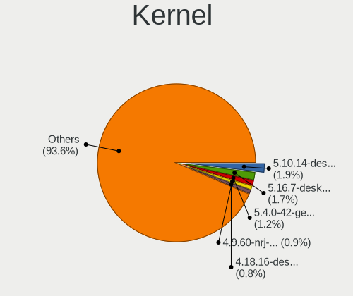
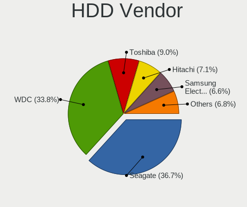
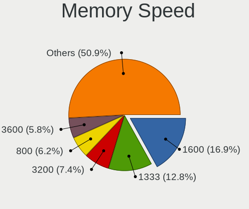
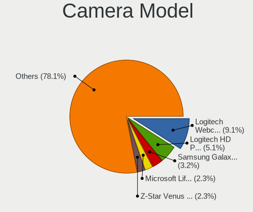

Linux - Tested Hardware & Statistics (Desktops)
-----------------------------------------------

A project to collect tested hardware configurations for Linux.

Anyone can contribute to this report by the [hw-probe](https://github.com/linuxhw/hw-probe) tool:

    sudo -E hw-probe -all -upload

Please contribute! Especially if your hardware is rare.

This report is for real hardware. Report for virtual hardware: [TestCoverage_VE](https://github.com/linuxhw/TestCoverage_VE)

Contents
--------

* [ Test Cases ](#test-cases)

* [ System ](#system)
  - [ OS                       ](#os)
  - [ OS Family                ](#os-family)
  - [ Kernel                   ](#kernel)
  - [ Kernel Family            ](#kernel-family)
  - [ Kernel Major Ver.        ](#kernel-major-ver)
  - [ Arch                     ](#arch)
  - [ DE                       ](#de)
  - [ Display Server           ](#display-server)
  - [ Display Manager          ](#display-manager)
  - [ OS Lang                  ](#os-lang)
  - [ Boot Mode                ](#boot-mode)
  - [ Filesystem               ](#filesystem)
  - [ Part. scheme             ](#part-scheme)
  - [ Dual Boot with Linux/BSD ](#dual-boot-with-linuxbsd)
  - [ Dual Boot (Win)          ](#dual-boot-win)

* [ Board ](#board)
  - [ Vendor                   ](#vendor)
  - [ Model                    ](#model)
  - [ Model Family             ](#model-family)
  - [ MFG Year                 ](#mfg-year)
  - [ Form Factor              ](#form-factor)
  - [ Secure Boot              ](#secure-boot)
  - [ Coreboot                 ](#coreboot)
  - [ RAM Size                 ](#ram-size)
  - [ RAM Used                 ](#ram-used)
  - [ Total Drives             ](#total-drives)
  - [ Has CD-ROM               ](#has-cd-rom)
  - [ Has Ethernet             ](#has-ethernet)
  - [ Has WiFi                 ](#has-wifi)
  - [ Has Bluetooth            ](#has-bluetooth)

* [ Location ](#location)
  - [ Country                  ](#country)
  - [ City                     ](#city)

* [ Drives ](#drives)
  - [ Drive Vendor             ](#drive-vendor)
  - [ Drive Model              ](#drive-model)
  - [ HDD Vendor               ](#hdd-vendor)
  - [ SSD Vendor               ](#ssd-vendor)
  - [ Drive Kind               ](#drive-kind)
  - [ Drive Connector          ](#drive-connector)
  - [ Drive Size               ](#drive-size)
  - [ Space Total              ](#space-total)
  - [ Space Used               ](#space-used)
  - [ Malfunc. Drives          ](#malfunc-drives)
  - [ Malfunc. Drive Vendor    ](#malfunc-drive-vendor)
  - [ Malfunc. HDD Vendor      ](#malfunc-hdd-vendor)
  - [ Malfunc. Drive Kind      ](#malfunc-drive-kind)
  - [ Failed Drives            ](#failed-drives)
  - [ Failed Drive Vendor      ](#failed-drive-vendor)
  - [ Drive Status             ](#drive-status)

* [ Storage controller ](#storage-controller)
  - [ Storage Vendor           ](#storage-vendor)
  - [ Storage Model            ](#storage-model)
  - [ Storage Kind             ](#storage-kind)

* [ Processor ](#processor)
  - [ CPU Vendor               ](#cpu-vendor)
  - [ CPU Model                ](#cpu-model)
  - [ CPU Model Family         ](#cpu-model-family)
  - [ CPU Cores                ](#cpu-cores)
  - [ CPU Sockets              ](#cpu-sockets)
  - [ CPU Threads              ](#cpu-threads)
  - [ CPU Op-Modes             ](#cpu-op-modes)
  - [ CPU Microcode            ](#cpu-microcode)
  - [ CPU Microarch            ](#cpu-microarch)

* [ Graphics ](#graphics)
  - [ GPU Vendor               ](#gpu-vendor)
  - [ GPU Model                ](#gpu-model)
  - [ GPU Combo                ](#gpu-combo)
  - [ GPU Driver               ](#gpu-driver)
  - [ GPU Memory               ](#gpu-memory)

* [ Monitor ](#monitor)
  - [ Monitor Vendor           ](#monitor-vendor)
  - [ Monitor Model            ](#monitor-model)
  - [ Monitor Resolution       ](#monitor-resolution)
  - [ Monitor Diagonal         ](#monitor-diagonal)
  - [ Monitor Width            ](#monitor-width)
  - [ Aspect Ratio             ](#aspect-ratio)
  - [ Monitor Area             ](#monitor-area)
  - [ Pixel Density            ](#pixel-density)
  - [ Multiple Monitors        ](#multiple-monitors)

* [ Network ](#network)
  - [ Net Controller Vendor    ](#net-controller-vendor)
  - [ Net Controller Model     ](#net-controller-model)
  - [ Wireless Vendor          ](#wireless-vendor)
  - [ Wireless Model           ](#wireless-model)
  - [ Ethernet Vendor          ](#ethernet-vendor)
  - [ Ethernet Model           ](#ethernet-model)
  - [ Net Controller Kind      ](#net-controller-kind)
  - [ Used Controller          ](#used-controller)
  - [ NICs                     ](#nics)
  - [ IPv6                     ](#ipv6)

* [ Bluetooth ](#bluetooth)
  - [ Bluetooth Vendor         ](#bluetooth-vendor)
  - [ Bluetooth Model          ](#bluetooth-model)

* [ Sound ](#sound)
  - [ Sound Vendor             ](#sound-vendor)
  - [ Sound Model              ](#sound-model)

* [ Memory ](#memory)
  - [ Memory Vendor            ](#memory-vendor)
  - [ Memory Model             ](#memory-model)
  - [ Memory Kind              ](#memory-kind)
  - [ Memory Form Factor       ](#memory-form-factor)
  - [ Memory Size              ](#memory-size)
  - [ Memory Speed             ](#memory-speed)

* [ Printers & scanners ](#printers--scanners)
  - [ Printer Vendor           ](#printer-vendor)
  - [ Printer Model            ](#printer-model)
  - [ Scanner Vendor           ](#scanner-vendor)
  - [ Scanner Model            ](#scanner-model)

* [ Camera ](#camera)
  - [ Camera Vendor            ](#camera-vendor)
  - [ Camera Model             ](#camera-model)

* [ Security ](#security)
  - [ Fingerprint Vendor       ](#fingerprint-vendor)
  - [ Fingerprint Model        ](#fingerprint-model)
  - [ Chipcard Vendor          ](#chipcard-vendor)
  - [ Chipcard Model           ](#chipcard-model)

* [ Unsupported ](#unsupported)
  - [ Unsupported Devices      ](#unsupported-devices)
  - [ Unsupported Device Types ](#unsupported-device-types)

Test Cases
----------

Total: 103488

| Vendor        | Model                       | Probe                                                      | Date         |
|---------------|-----------------------------|------------------------------------------------------------|--------------|
| ASUSTek       | P8H61-M LX3 R2.0            | [8538f5cbeb](https://linux-hardware.org/?probe=8538f5cbeb) | May 01, 2022 |
| ASUSTek       | PRIME B550M-A               | [379c6be15c](https://linux-hardware.org/?probe=379c6be15c) | May 01, 2022 |
| Gigabyte      | GA-78LMT-S2P                | [b8194d3077](https://linux-hardware.org/?probe=b8194d3077) | May 01, 2022 |
| ASUSTek       | PRIME B550M-A               | [620c550b04](https://linux-hardware.org/?probe=620c550b04) | May 01, 2022 |
| Dell          | 0M017G A01                  | [653212f53c](https://linux-hardware.org/?probe=653212f53c) | May 01, 2022 |
| Pegatron      | 2AB5                        | [534476ac99](https://linux-hardware.org/?probe=534476ac99) | Apr 30, 2022 |
| HP            | 0B48h                       | [4c6e5824f2](https://linux-hardware.org/?probe=4c6e5824f2) | Apr 30, 2022 |
| Gigabyte      | B365M DS3H                  | [247ab2d4f1](https://linux-hardware.org/?probe=247ab2d4f1) | Apr 30, 2022 |
| Gigabyte      | B550 AORUS ELITE AX V2      | [cb6d49fe71](https://linux-hardware.org/?probe=cb6d49fe71) | Apr 30, 2022 |
| ASUSTek       | TUF Gaming B550-PLUS        | [57241594ad](https://linux-hardware.org/?probe=57241594ad) | Apr 30, 2022 |
| ASUSTek       | TUF Gaming Z690-PLUS WIF... | [b4d4e52220](https://linux-hardware.org/?probe=b4d4e52220) | Apr 30, 2022 |
| Positivo      | POS-ECIG41BSA               | [b622f7f43f](https://linux-hardware.org/?probe=b622f7f43f) | Apr 30, 2022 |
| ASUSTek       | ROG Maximus X HERO          | [18daf9705b](https://linux-hardware.org/?probe=18daf9705b) | Apr 30, 2022 |
| ASUSTek       | PRIME B350M-A               | [87542ba2c2](https://linux-hardware.org/?probe=87542ba2c2) | Apr 30, 2022 |
| Medion        | MS-7616                     | [f3572ea9a5](https://linux-hardware.org/?probe=f3572ea9a5) | Apr 30, 2022 |
| LattePanda    | Alpha                       | [4e0dc573e1](https://linux-hardware.org/?probe=4e0dc573e1) | Apr 30, 2022 |
| MSI           | A320M-A PRO MAX             | [dc1c0d091e](https://linux-hardware.org/?probe=dc1c0d091e) | Apr 30, 2022 |
| MSI           | B550-A PRO                  | [d2903d25c5](https://linux-hardware.org/?probe=d2903d25c5) | Apr 30, 2022 |
| Lenovo        | MAHOBAY                     | [5a54ce639c](https://linux-hardware.org/?probe=5a54ce639c) | Apr 30, 2022 |
| Gigabyte      | F2A68HM-S1                  | [23a77acbe8](https://linux-hardware.org/?probe=23a77acbe8) | Apr 30, 2022 |
| Gigabyte      | H61M-S2PV                   | [6b213d6f7e](https://linux-hardware.org/?probe=6b213d6f7e) | Apr 30, 2022 |
| ASUSTek       | Z8NA-D6                     | [5f540a16c9](https://linux-hardware.org/?probe=5f540a16c9) | Apr 30, 2022 |
| Gigabyte      | H61M-DS2 x.x                | [463e99eb8c](https://linux-hardware.org/?probe=463e99eb8c) | Apr 30, 2022 |
| Fujitsu Si... | D2660-A1 S26361-D2660-A1    | [bb192229b3](https://linux-hardware.org/?probe=bb192229b3) | Apr 30, 2022 |
| MSI           | X570-A PRO                  | [ff568c874c](https://linux-hardware.org/?probe=ff568c874c) | Apr 30, 2022 |
| Gigabyte      | B365M DS3H                  | [0a00cf3e33](https://linux-hardware.org/?probe=0a00cf3e33) | Apr 30, 2022 |
| Gigabyte      | B365M DS3H                  | [f140b54261](https://linux-hardware.org/?probe=f140b54261) | Apr 30, 2022 |
| MSI           | PRO H610M-G DDR4            | [f7806fa6f0](https://linux-hardware.org/?probe=f7806fa6f0) | Apr 30, 2022 |
| ASUSTek       | PRIME B550M-K               | [92c09fc927](https://linux-hardware.org/?probe=92c09fc927) | Apr 30, 2022 |
| HP            | 0AECh D                     | [89441b750f](https://linux-hardware.org/?probe=89441b750f) | Apr 30, 2022 |
| ASRock        | B560 Pro4                   | [a788b08450](https://linux-hardware.org/?probe=a788b08450) | Apr 30, 2022 |
| MSI           | B450M GAMING PLUS           | [0929d58de7](https://linux-hardware.org/?probe=0929d58de7) | Apr 30, 2022 |
| Fujitsu Si... | D2660-A1 S26361-D2660-A1    | [a5ce52429c](https://linux-hardware.org/?probe=a5ce52429c) | Apr 30, 2022 |
| Gigabyte      | A320M-S2H-CF                | [9e846e3cb1](https://linux-hardware.org/?probe=9e846e3cb1) | Apr 30, 2022 |
| ASUSTek       | TUF Gaming X570-PLUS        | [22008db28a](https://linux-hardware.org/?probe=22008db28a) | Apr 30, 2022 |
| ASRock        | X470 Gaming-ITX/ac          | [2b03a9568d](https://linux-hardware.org/?probe=2b03a9568d) | Apr 30, 2022 |
| MSI           | B560M-A PRO                 | [21dbd84bbc](https://linux-hardware.org/?probe=21dbd84bbc) | Apr 30, 2022 |
| ASRock        | B550 Extreme4               | [7a90a198f5](https://linux-hardware.org/?probe=7a90a198f5) | Apr 30, 2022 |
| Gigabyte      | B550 AORUS ELITE AX V2      | [83e47f9c91](https://linux-hardware.org/?probe=83e47f9c91) | Apr 30, 2022 |
| ASUSTek       | P8H61-M                     | [942f86f88a](https://linux-hardware.org/?probe=942f86f88a) | Apr 30, 2022 |
| ASUSTek       | Pro WS WRX80E-SAGE SE WI... | [10975a661b](https://linux-hardware.org/?probe=10975a661b) | Apr 30, 2022 |
| Apple         | Mac-F42C88C8 Proto1         | [3edd5f05f7](https://linux-hardware.org/?probe=3edd5f05f7) | Apr 30, 2022 |
| Dell          | 0TY915                      | [ef4cf49069](https://linux-hardware.org/?probe=ef4cf49069) | Apr 30, 2022 |
| Gigabyte      | A320M-S2H-CF                | [2f94f4673a](https://linux-hardware.org/?probe=2f94f4673a) | Apr 30, 2022 |
| ASUSTek       | PRIME Z390-A                | [c4d7dc5e80](https://linux-hardware.org/?probe=c4d7dc5e80) | Apr 30, 2022 |
| MSI           | MPG Z490 GAMING PLUS        | [8d3881574d](https://linux-hardware.org/?probe=8d3881574d) | Apr 30, 2022 |
| HP            | 1791                        | [877270ede6](https://linux-hardware.org/?probe=877270ede6) | Apr 30, 2022 |
| ASRock        | X99 Extreme4                | [d45e1e88db](https://linux-hardware.org/?probe=d45e1e88db) | Apr 30, 2022 |
| ASRock        | X99 Extreme4                | [41cec63ac6](https://linux-hardware.org/?probe=41cec63ac6) | Apr 30, 2022 |
| ASRock        | 880GM-LE FX                 | [f695420d7e](https://linux-hardware.org/?probe=f695420d7e) | Apr 30, 2022 |
| ASUSTek       | Lancaster8                  | [912f9bb3f9](https://linux-hardware.org/?probe=912f9bb3f9) | Apr 30, 2022 |
| Gigabyte      | H97-Gaming 3                | [150f5a4bd0](https://linux-hardware.org/?probe=150f5a4bd0) | Apr 30, 2022 |
| ASUSTek       | PRIME Z490-P                | [b6658c2ada](https://linux-hardware.org/?probe=b6658c2ada) | Apr 30, 2022 |
| ASUSTek       | M5A78L LE                   | [9328531b5a](https://linux-hardware.org/?probe=9328531b5a) | Apr 30, 2022 |
| HP            | 1494                        | [939f3b7987](https://linux-hardware.org/?probe=939f3b7987) | Apr 30, 2022 |
| ASUSTek       | P5QL                        | [121da21f08](https://linux-hardware.org/?probe=121da21f08) | Apr 30, 2022 |
| ASRock        | P67 Pro3                    | [8e26d23d06](https://linux-hardware.org/?probe=8e26d23d06) | Apr 30, 2022 |
| ASRock        | B550 Extreme4               | [75362e2061](https://linux-hardware.org/?probe=75362e2061) | Apr 30, 2022 |
| Gigabyte      | B550M DS3H                  | [f62d8963d7](https://linux-hardware.org/?probe=f62d8963d7) | Apr 30, 2022 |
| MSI           | B450 TOMAHAWK MAX II        | [6db8017245](https://linux-hardware.org/?probe=6db8017245) | Apr 30, 2022 |
| Gigabyte      | M68MT-S2                    | [f3b89e43d4](https://linux-hardware.org/?probe=f3b89e43d4) | Apr 30, 2022 |
| ASUSTek       | PRIME Z490-P                | [c6a75d1040](https://linux-hardware.org/?probe=c6a75d1040) | Apr 30, 2022 |
| ASUSTek       | ROG STRIX B560-I GAMING ... | [e8fee79ec7](https://linux-hardware.org/?probe=e8fee79ec7) | Apr 30, 2022 |
| Lenovo        | ThinkCentre M58 7627AD5     | [05a686b922](https://linux-hardware.org/?probe=05a686b922) | Apr 30, 2022 |
| Intel         | DCP847SKE G80890-105        | [45dc47c8aa](https://linux-hardware.org/?probe=45dc47c8aa) | Apr 30, 2022 |
| ASRock        | B75M-ITX                    | [dbc851e0d3](https://linux-hardware.org/?probe=dbc851e0d3) | Apr 30, 2022 |
| ASUSTek       | CROSSHAIR VI HERO           | [5220d21e84](https://linux-hardware.org/?probe=5220d21e84) | Apr 30, 2022 |
| Gigabyte      | H310N x.x                   | [d0daa33c07](https://linux-hardware.org/?probe=d0daa33c07) | Apr 30, 2022 |
| Medion        | Cattle24 1M                 | [920d1b35ab](https://linux-hardware.org/?probe=920d1b35ab) | Apr 30, 2022 |
| ASRock        | A300M-STX                   | [1c72c0839b](https://linux-hardware.org/?probe=1c72c0839b) | Apr 30, 2022 |
| Intel         | V1.3                        | [a01993f2fa](https://linux-hardware.org/?probe=a01993f2fa) | Apr 30, 2022 |
| Gigabyte      | GA-970A-UD3                 | [0158bc69ec](https://linux-hardware.org/?probe=0158bc69ec) | Apr 30, 2022 |
| Dell          | 09KPNV A00                  | [6ae554c455](https://linux-hardware.org/?probe=6ae554c455) | Apr 30, 2022 |
| ASUSTek       | P5KPL-AM                    | [7c398e1d2b](https://linux-hardware.org/?probe=7c398e1d2b) | Apr 30, 2022 |
| Gigabyte      | G1.Sniper A88X-CF           | [89323fb22d](https://linux-hardware.org/?probe=89323fb22d) | Apr 30, 2022 |
| ASUSTek       | ROG STRIX B550-F GAMING     | [f4a6777382](https://linux-hardware.org/?probe=f4a6777382) | Apr 30, 2022 |
| Lenovo        | 36C5 SDK0J40700 WIN 3258... | [d9ac32b17d](https://linux-hardware.org/?probe=d9ac32b17d) | Apr 30, 2022 |
| ASUSTek       | A55M-E                      | [eed78fb5ab](https://linux-hardware.org/?probe=eed78fb5ab) | Apr 30, 2022 |
| HP            | 1497                        | [559a844943](https://linux-hardware.org/?probe=559a844943) | Apr 30, 2022 |
| MSI           | MPG Z390 GAMING PRO CARB... | [07a115654d](https://linux-hardware.org/?probe=07a115654d) | Apr 30, 2022 |
| HP            | 3396                        | [468c2975ee](https://linux-hardware.org/?probe=468c2975ee) | Apr 30, 2022 |
| MSI           | H87I                        | [af4a26a5ea](https://linux-hardware.org/?probe=af4a26a5ea) | Apr 30, 2022 |
| ASRock        | Z68 Extreme4 Gen3           | [6afc1a0af8](https://linux-hardware.org/?probe=6afc1a0af8) | Apr 30, 2022 |
| Supermicro    | X9DRi-LN4+/X9DR3-LN4+       | [89def966af](https://linux-hardware.org/?probe=89def966af) | Apr 30, 2022 |
| ASUSTek       | H81M-K                      | [d5d92c2890](https://linux-hardware.org/?probe=d5d92c2890) | Apr 30, 2022 |
| MSI           | MPG X570 GAMING PLUS        | [af01f27647](https://linux-hardware.org/?probe=af01f27647) | Apr 30, 2022 |
| ASUSTek       | PRIME B350-PLUS             | [13fd8e249d](https://linux-hardware.org/?probe=13fd8e249d) | Apr 30, 2022 |
| JINGSHA       | Unknown                     | [e1b9c4eab0](https://linux-hardware.org/?probe=e1b9c4eab0) | Apr 30, 2022 |
| Lenovo        | 3098 SDK0E50510 WIN 2625... | [3b9e57fc42](https://linux-hardware.org/?probe=3b9e57fc42) | Apr 30, 2022 |
| Huanan        | X99-BD4 V/OPCZAO            | [2f215a330a](https://linux-hardware.org/?probe=2f215a330a) | Apr 30, 2022 |
| MSI           | MAG B550M MORTAR            | [c994128afd](https://linux-hardware.org/?probe=c994128afd) | Apr 30, 2022 |
| ASUSTek       | PRIME B450M-A               | [a53000596e](https://linux-hardware.org/?probe=a53000596e) | Apr 30, 2022 |
| ASRock        | FM2A88X Extreme6+           | [437484b928](https://linux-hardware.org/?probe=437484b928) | Apr 30, 2022 |
| Dell          | 0K068D A00                  | [a73170db03](https://linux-hardware.org/?probe=a73170db03) | Apr 30, 2022 |
| Pegatron      | 2AC2                        | [a87f5d4c6e](https://linux-hardware.org/?probe=a87f5d4c6e) | Apr 30, 2022 |
| MSI           | B550-A PRO                  | [0b23621ed1](https://linux-hardware.org/?probe=0b23621ed1) | Apr 30, 2022 |
| HP            | 18E7                        | [90a161bd80](https://linux-hardware.org/?probe=90a161bd80) | Apr 30, 2022 |
| Gigabyte      | 990FXA-UD3                  | [9b128bc47e](https://linux-hardware.org/?probe=9b128bc47e) | Apr 30, 2022 |
| MSI           | A88XM-E45 V2                | [a50ad068b1](https://linux-hardware.org/?probe=a50ad068b1) | Apr 30, 2022 |
| ASUSTek       | TUF Gaming X570-PLUS        | [a1199bffe2](https://linux-hardware.org/?probe=a1199bffe2) | Apr 30, 2022 |
| ASUSTek       | ROG STRIX B550-A GAMING     | [297dca51b9](https://linux-hardware.org/?probe=297dca51b9) | Apr 30, 2022 |
| ASUSTek       | P8Z68-V                     | [e6557824cb](https://linux-hardware.org/?probe=e6557824cb) | Apr 30, 2022 |
| Gigabyte      | B560M DS3H V2               | [c2096251fc](https://linux-hardware.org/?probe=c2096251fc) | Apr 30, 2022 |
| ASUSTek       | ROG STRIX B450-F GAMING     | [da04f72dfc](https://linux-hardware.org/?probe=da04f72dfc) | Apr 30, 2022 |
| Lenovo        | SHARKBAY 0B98405 STD        | [4842f5aef2](https://linux-hardware.org/?probe=4842f5aef2) | Apr 30, 2022 |
| Gigabyte      | B550M DS3H                  | [7797c23169](https://linux-hardware.org/?probe=7797c23169) | Apr 30, 2022 |
| Foxconn       | 2A92                        | [298326d530](https://linux-hardware.org/?probe=298326d530) | Apr 30, 2022 |
| ASRock        | Z370 Gaming K6              | [63d2d272b6](https://linux-hardware.org/?probe=63d2d272b6) | Apr 30, 2022 |
| Foxconn       | 2A92                        | [a710d4a58f](https://linux-hardware.org/?probe=a710d4a58f) | Apr 30, 2022 |
| MSI           | MAG B460M MORTAR            | [07cb268e5e](https://linux-hardware.org/?probe=07cb268e5e) | Apr 30, 2022 |
| Gigabyte      | H610I DDR4                  | [b9ee954651](https://linux-hardware.org/?probe=b9ee954651) | Apr 30, 2022 |
| EVGA          | X58 SLI Classified Tyler... | [07254f2dbb](https://linux-hardware.org/?probe=07254f2dbb) | Apr 30, 2022 |
| Gigabyte      | B85M-D3H                    | [aab74c31b9](https://linux-hardware.org/?probe=aab74c31b9) | Apr 30, 2022 |
| HP            | 0B54h D                     | [2023024a05](https://linux-hardware.org/?probe=2023024a05) | Apr 29, 2022 |
| Gigabyte      | H610I DDR4                  | [ead878ad96](https://linux-hardware.org/?probe=ead878ad96) | Apr 29, 2022 |
| Gigabyte      | GA-MA770-UD3                | [4924979f39](https://linux-hardware.org/?probe=4924979f39) | Apr 29, 2022 |
| Gigabyte      | B550 AORUS ELITE V2         | [7cd33daa8a](https://linux-hardware.org/?probe=7cd33daa8a) | Apr 29, 2022 |
| Gigabyte      | H170-HD3 DDR3-CF            | [b23594dfa0](https://linux-hardware.org/?probe=b23594dfa0) | Apr 29, 2022 |
| Gigabyte      | H170-HD3 DDR3-CF            | [d17a3858ad](https://linux-hardware.org/?probe=d17a3858ad) | Apr 29, 2022 |
| ASUSTek       | ROG STRIX X570-E GAMING     | [970d30df6d](https://linux-hardware.org/?probe=970d30df6d) | Apr 29, 2022 |
| ASUSTek       | TUF Gaming X570-PLUS        | [f157b373a1](https://linux-hardware.org/?probe=f157b373a1) | Apr 29, 2022 |
| ASUSTek       | TUF Gaming X570-PLUS        | [f339d2405b](https://linux-hardware.org/?probe=f339d2405b) | Apr 29, 2022 |
| ASUSTek       | PRIME H510M-E               | [5c9e5fc14c](https://linux-hardware.org/?probe=5c9e5fc14c) | Apr 29, 2022 |
| MSI           | A320M PRO-E                 | [655905bb3b](https://linux-hardware.org/?probe=655905bb3b) | Apr 29, 2022 |
| Biostar       | J3060NH                     | [b058b65094](https://linux-hardware.org/?probe=b058b65094) | Apr 29, 2022 |
| MSI           | H110M PRO-VH PLUS           | [876baf36d7](https://linux-hardware.org/?probe=876baf36d7) | Apr 29, 2022 |
| ASRock        | B450M Steel Legend          | [c40273d0bc](https://linux-hardware.org/?probe=c40273d0bc) | Apr 29, 2022 |
| ASUSTek       | ROG STRIX X470-F GAMING     | [809ea3e76a](https://linux-hardware.org/?probe=809ea3e76a) | Apr 29, 2022 |
| Gigabyte      | Z68AP-D3                    | [af8b52acd3](https://linux-hardware.org/?probe=af8b52acd3) | Apr 29, 2022 |
| ASRock        | ALiveNF6G-GLAN              | [7dfb4ca9f5](https://linux-hardware.org/?probe=7dfb4ca9f5) | Apr 29, 2022 |
| MSI           | B450 TOMAHAWK MAX           | [b443315241](https://linux-hardware.org/?probe=b443315241) | Apr 29, 2022 |
| Dell          | 0G261D A00                  | [860d883e5b](https://linux-hardware.org/?probe=860d883e5b) | Apr 29, 2022 |
| Fujitsu       | D3222-A1 S26361-D3222-A1    | [fe522bdf2e](https://linux-hardware.org/?probe=fe522bdf2e) | Apr 29, 2022 |
| Unknown       | Intel X79                   | [95d09d79ca](https://linux-hardware.org/?probe=95d09d79ca) | Apr 29, 2022 |
| MSI           | MPG B550 GAMING PLUS        | [af2b0de49b](https://linux-hardware.org/?probe=af2b0de49b) | Apr 29, 2022 |
| Lenovo        | MAHOBAY NOK                 | [ab21675303](https://linux-hardware.org/?probe=ab21675303) | Apr 29, 2022 |
| Dell          | 0VNP2H A00                  | [bb480c7f9c](https://linux-hardware.org/?probe=bb480c7f9c) | Apr 29, 2022 |
| ASUSTek       | M5A97 LE R2.0               | [686f4acac4](https://linux-hardware.org/?probe=686f4acac4) | Apr 29, 2022 |
| Dell          | 0GY6Y8 A03                  | [b4946e7399](https://linux-hardware.org/?probe=b4946e7399) | Apr 29, 2022 |
| HP            | 83EE                        | [55171637ca](https://linux-hardware.org/?probe=55171637ca) | Apr 29, 2022 |
| ASUSTek       | ROG STRIX X299-E GAMING ... | [bce425f138](https://linux-hardware.org/?probe=bce425f138) | Apr 29, 2022 |
| Supermicro    | X7DB8                       | [a2dd962374](https://linux-hardware.org/?probe=a2dd962374) | Apr 29, 2022 |
| ASUSTek       | Rampage IV EXTREME          | [111d072676](https://linux-hardware.org/?probe=111d072676) | Apr 29, 2022 |
| ASUSTek       | ROG STRIX Z370-E GAMING     | [fafda83c57](https://linux-hardware.org/?probe=fafda83c57) | Apr 29, 2022 |
| MSI           | Z390-A PRO                  | [e2f7ad0f81](https://linux-hardware.org/?probe=e2f7ad0f81) | Apr 29, 2022 |
| Gigabyte      | P31-ES3G                    | [dc8419dcb3](https://linux-hardware.org/?probe=dc8419dcb3) | Apr 29, 2022 |
| Dell          | 07WP95 A02                  | [8dd4d42608](https://linux-hardware.org/?probe=8dd4d42608) | Apr 29, 2022 |
| Supermicro    | X11SSH-F                    | [0d475e91f3](https://linux-hardware.org/?probe=0d475e91f3) | Apr 29, 2022 |
| HARDKERNEL    | ODROID-H2                   | [c3303164ff](https://linux-hardware.org/?probe=c3303164ff) | Apr 29, 2022 |
| Gigabyte      | AB350-Gaming 3-CF           | [7b292b972d](https://linux-hardware.org/?probe=7b292b972d) | Apr 29, 2022 |
| ASUSTek       | PRIME H610M-A D4            | [e9376d24f0](https://linux-hardware.org/?probe=e9376d24f0) | Apr 29, 2022 |
| MSI           | H110M PRO-VD                | [e750916955](https://linux-hardware.org/?probe=e750916955) | Apr 29, 2022 |
| Acer          | Aspire XC-830               | [257e472e1a](https://linux-hardware.org/?probe=257e472e1a) | Apr 29, 2022 |
| Foxconn       | H61MD/H61MD-V               | [25b52955ee](https://linux-hardware.org/?probe=25b52955ee) | Apr 29, 2022 |
| ASUSTek       | P8Z77-V LX                  | [3b8440b69f](https://linux-hardware.org/?probe=3b8440b69f) | Apr 29, 2022 |
| Lenovo        | Win8 Pro DPK TPG            | [9b78e9af72](https://linux-hardware.org/?probe=9b78e9af72) | Apr 29, 2022 |
| ASUSTek       | ROG STRIX B450-F GAMING     | [ffdfb3a578](https://linux-hardware.org/?probe=ffdfb3a578) | Apr 29, 2022 |
| HP            | 158A                        | [11b5037897](https://linux-hardware.org/?probe=11b5037897) | Apr 29, 2022 |
| ASUSTek       | ROG STRIX B450-F GAMING     | [55c0ec3653](https://linux-hardware.org/?probe=55c0ec3653) | Apr 29, 2022 |
| Huanan        | X99-BD4 V/OPCZAO            | [a5743a1922](https://linux-hardware.org/?probe=a5743a1922) | Apr 29, 2022 |
| ASUSTek       | M4N68T                      | [8113a96dff](https://linux-hardware.org/?probe=8113a96dff) | Apr 29, 2022 |
| ASUSTek       | B150 PRO GAMING D3          | [e258d71e2e](https://linux-hardware.org/?probe=e258d71e2e) | Apr 29, 2022 |
| Gigabyte      | B365M H                     | [6755ed2aa6](https://linux-hardware.org/?probe=6755ed2aa6) | Apr 29, 2022 |
| Gigabyte      | X570 AORUS ULTRA            | [6bb8f4af30](https://linux-hardware.org/?probe=6bb8f4af30) | Apr 29, 2022 |
| ASUSTek       | TUF Gaming X570-PLUS        | [7e84138ea1](https://linux-hardware.org/?probe=7e84138ea1) | Apr 29, 2022 |
| ASRock        | B450M-HDV R4.0              | [bce1bba9ff](https://linux-hardware.org/?probe=bce1bba9ff) | Apr 29, 2022 |
| ASUSTek       | M5A78L-M PLUS/USB3          | [88c6676e7b](https://linux-hardware.org/?probe=88c6676e7b) | Apr 29, 2022 |
| MSI           | MPG X570 GAMING PLUS        | [e45e120b35](https://linux-hardware.org/?probe=e45e120b35) | Apr 29, 2022 |
| Gigabyte      | B450M S2H                   | [2e84d98937](https://linux-hardware.org/?probe=2e84d98937) | Apr 29, 2022 |
| ASRock        | A300M-STX                   | [48af028244](https://linux-hardware.org/?probe=48af028244) | Apr 29, 2022 |
| Intel         | X79 V2.72B                  | [396faf60b6](https://linux-hardware.org/?probe=396faf60b6) | Apr 29, 2022 |
| ASUSTek       | ROG STRIX Z370-F GAMING     | [965985d6f4](https://linux-hardware.org/?probe=965985d6f4) | Apr 29, 2022 |
| Foxconn       | 2A8C                        | [eb747a3063](https://linux-hardware.org/?probe=eb747a3063) | Apr 29, 2022 |
| ASUSTek       | P8Z77-V                     | [b3506ef75d](https://linux-hardware.org/?probe=b3506ef75d) | Apr 29, 2022 |
| PCWare        | IPX4105G Pro                | [073d789fc4](https://linux-hardware.org/?probe=073d789fc4) | Apr 29, 2022 |
| HP            | 3396                        | [bd2e5eb69c](https://linux-hardware.org/?probe=bd2e5eb69c) | Apr 29, 2022 |
| HP            | 3396                        | [705baf56a1](https://linux-hardware.org/?probe=705baf56a1) | Apr 29, 2022 |
| Pepper Job... | GLK-UC2X                    | [28495f32bd](https://linux-hardware.org/?probe=28495f32bd) | Apr 29, 2022 |
| Gigabyte      | Z77X-UD3H                   | [b07e1c97aa](https://linux-hardware.org/?probe=b07e1c97aa) | Apr 29, 2022 |
| Gigabyte      | B360M AORUS Gaming 3-CF     | [6a5bc03a3a](https://linux-hardware.org/?probe=6a5bc03a3a) | Apr 29, 2022 |
| Gigabyte      | Z170X-UD3-CF                | [ca711b9db0](https://linux-hardware.org/?probe=ca711b9db0) | Apr 29, 2022 |
| ASRock        | A520M Pro4                  | [45630a42df](https://linux-hardware.org/?probe=45630a42df) | Apr 29, 2022 |
| Lite-On       | 08FCh E01                   | [876d70350c](https://linux-hardware.org/?probe=876d70350c) | Apr 29, 2022 |
| Gigabyte      | G41MT-D3                    | [905e3ffa68](https://linux-hardware.org/?probe=905e3ffa68) | Apr 29, 2022 |
| Gigabyte      | X570 AORUS ULTRA            | [d3872db37e](https://linux-hardware.org/?probe=d3872db37e) | Apr 29, 2022 |
| Gigabyte      | G1.Sniper A88X-CF           | [c64aa4070a](https://linux-hardware.org/?probe=c64aa4070a) | Apr 29, 2022 |
| MSI           | MAG Z690 TOMAHAWK WIFI D... | [e37bc471b1](https://linux-hardware.org/?probe=e37bc471b1) | Apr 29, 2022 |
| Alienware     | 07W25T A00                  | [b989838f70](https://linux-hardware.org/?probe=b989838f70) | Apr 29, 2022 |
| ASRock        | FM2A88X Extreme6+           | [297ddaddf9](https://linux-hardware.org/?probe=297ddaddf9) | Apr 29, 2022 |
| OEM           | V1.0                        | [167ee50568](https://linux-hardware.org/?probe=167ee50568) | Apr 29, 2022 |
| Gigabyte      | Z370 AORUS Gaming 5-CF      | [2cfdf9b28a](https://linux-hardware.org/?probe=2cfdf9b28a) | Apr 29, 2022 |
| ASUSTek       | PRIME H310M-E R2.0          | [2b7167b16e](https://linux-hardware.org/?probe=2b7167b16e) | Apr 29, 2022 |
| Pegatron      | 2AC2                        | [2b0042d784](https://linux-hardware.org/?probe=2b0042d784) | Apr 29, 2022 |
| Lenovo        | ThinkCentre M91p 7052A9G    | [277754d8c1](https://linux-hardware.org/?probe=277754d8c1) | Apr 29, 2022 |
| MSI           | B450 TOMAHAWK MAX           | [589a22c0c6](https://linux-hardware.org/?probe=589a22c0c6) | Apr 29, 2022 |
| ASUSTek       | M5A78L-M PLUS/USB3          | [f2bdbd2a4a](https://linux-hardware.org/?probe=f2bdbd2a4a) | Apr 29, 2022 |
| MSI           | MAG Z490 TOMAHAWK           | [27df4d83ea](https://linux-hardware.org/?probe=27df4d83ea) | Apr 29, 2022 |
| HP            | 8433 11                     | [a5b829538b](https://linux-hardware.org/?probe=a5b829538b) | Apr 29, 2022 |
| ASUSTek       | PRIME B360M-A               | [519ed87066](https://linux-hardware.org/?probe=519ed87066) | Apr 29, 2022 |
| ASUSTek       | PRIME B360M-A               | [c46a1d595b](https://linux-hardware.org/?probe=c46a1d595b) | Apr 29, 2022 |
| MSI           | A78M-E35                    | [8f9bf75a08](https://linux-hardware.org/?probe=8f9bf75a08) | Apr 29, 2022 |
| ASUSTek       | TUF Gaming X570-PLUS        | [a26fd2399d](https://linux-hardware.org/?probe=a26fd2399d) | Apr 29, 2022 |
| ASUSTek       | Z87-WS                      | [1c67952875](https://linux-hardware.org/?probe=1c67952875) | Apr 29, 2022 |
| Dell          | 0T568R A00                  | [290f6d6b48](https://linux-hardware.org/?probe=290f6d6b48) | Apr 29, 2022 |
| Gigabyte      | B550 AORUS PRO              | [9686556653](https://linux-hardware.org/?probe=9686556653) | Apr 29, 2022 |
| HP            | 8704                        | [41d896b51d](https://linux-hardware.org/?probe=41d896b51d) | Apr 29, 2022 |
| ASUSTek       | H81M-E                      | [4cf62cf9a3](https://linux-hardware.org/?probe=4cf62cf9a3) | Apr 29, 2022 |
| Gigabyte      | H55M-UD2H                   | [12e326fab8](https://linux-hardware.org/?probe=12e326fab8) | Apr 28, 2022 |
| ASUSTek       | ROG STRIX B450-F GAMING     | [aed5ee3ded](https://linux-hardware.org/?probe=aed5ee3ded) | Apr 28, 2022 |
| ASRock        | X470 Gaming-ITX/ac          | [c7eeb7b79d](https://linux-hardware.org/?probe=c7eeb7b79d) | Apr 28, 2022 |
| MSI           | X470 GAMING PLUS MAX        | [d291472a69](https://linux-hardware.org/?probe=d291472a69) | Apr 28, 2022 |
| ASUSTek       | CROSSHAIR VI HERO           | [c4fc81307d](https://linux-hardware.org/?probe=c4fc81307d) | Apr 28, 2022 |
| ASRock        | P67 Pro3                    | [f7fed2c8eb](https://linux-hardware.org/?probe=f7fed2c8eb) | Apr 28, 2022 |
| Intel         | MAHOBAY                     | [ca65be05f0](https://linux-hardware.org/?probe=ca65be05f0) | Apr 28, 2022 |
| ASUSTek       | PRIME X470-PRO              | [8c1bf73769](https://linux-hardware.org/?probe=8c1bf73769) | Apr 28, 2022 |
| Gigabyte      | B550 AORUS ELITE AX V2      | [ab83eedd1f](https://linux-hardware.org/?probe=ab83eedd1f) | Apr 28, 2022 |
| Lenovo        | ThinkCentre M57 6072A5G     | [373677ac37](https://linux-hardware.org/?probe=373677ac37) | Apr 28, 2022 |
| ASUSTek       | B150M-A                     | [fa213f6681](https://linux-hardware.org/?probe=fa213f6681) | Apr 28, 2022 |
| Gigabyte      | A320M-S2H V2-CF             | [02b4a9bd72](https://linux-hardware.org/?probe=02b4a9bd72) | Apr 28, 2022 |
| ASRock        | H61M-VG4                    | [92f92ef4ee](https://linux-hardware.org/?probe=92f92ef4ee) | Apr 28, 2022 |
| ASRock        | G31M-S                      | [296df4a9d4](https://linux-hardware.org/?probe=296df4a9d4) | Apr 28, 2022 |
| ASUSTek       | M5A78L-M/USB3               | [f45e5abc4a](https://linux-hardware.org/?probe=f45e5abc4a) | Apr 28, 2022 |
| ASUSTek       | M5A78L-M/USB3               | [6f3ea2d512](https://linux-hardware.org/?probe=6f3ea2d512) | Apr 28, 2022 |
| Gigabyte      | B450 AORUS M                | [de4ae72708](https://linux-hardware.org/?probe=de4ae72708) | Apr 28, 2022 |
| MSI           | MEG Z590 GODLIKE            | [d0ca0e52ad](https://linux-hardware.org/?probe=d0ca0e52ad) | Apr 28, 2022 |
| BESSTAR Te... | HM90                        | [814f90b822](https://linux-hardware.org/?probe=814f90b822) | Apr 28, 2022 |
| ASUSTek       | ROG CROSSHAIR VIII HERO     | [29e1e28903](https://linux-hardware.org/?probe=29e1e28903) | Apr 28, 2022 |
| ASRock        | B450M Pro4                  | [773f69d63b](https://linux-hardware.org/?probe=773f69d63b) | Apr 28, 2022 |
| MSI           | MEG Z590 GODLIKE            | [ec7e5a0314](https://linux-hardware.org/?probe=ec7e5a0314) | Apr 28, 2022 |
| Intel         | H61M-S2PV                   | [caa602b556](https://linux-hardware.org/?probe=caa602b556) | Apr 28, 2022 |
| Gigabyte      | H67M-UD2H-B3                | [7defbcb7bb](https://linux-hardware.org/?probe=7defbcb7bb) | Apr 28, 2022 |
| Lenovo        | ThinkCentre A57 98517HG     | [e8cab6c0fb](https://linux-hardware.org/?probe=e8cab6c0fb) | Apr 28, 2022 |
| Lenovo        | ThinkCentre A57 98517HG     | [f6bfd948e9](https://linux-hardware.org/?probe=f6bfd948e9) | Apr 28, 2022 |
| Acer          | Aspire XC-830               | [4e6d6e311c](https://linux-hardware.org/?probe=4e6d6e311c) | Apr 28, 2022 |
| Gigabyte      | H310M H                     | [182e82d90e](https://linux-hardware.org/?probe=182e82d90e) | Apr 28, 2022 |
| Acer          | Predator G3620              | [556a67d50d](https://linux-hardware.org/?probe=556a67d50d) | Apr 28, 2022 |
| MSI           | H55M-E23                    | [4ab5f58470](https://linux-hardware.org/?probe=4ab5f58470) | Apr 28, 2022 |
| ASUSTek       | P5KPL-AM                    | [7669e97557](https://linux-hardware.org/?probe=7669e97557) | Apr 28, 2022 |
| Dell          | 0J37VM A00                  | [76f13aa200](https://linux-hardware.org/?probe=76f13aa200) | Apr 28, 2022 |
| ASUSTek       | H81M-E                      | [b485d8f932](https://linux-hardware.org/?probe=b485d8f932) | Apr 28, 2022 |
| ASRock        | P67 Pro3                    | [95e665d1f5](https://linux-hardware.org/?probe=95e665d1f5) | Apr 28, 2022 |
| Lenovo        | NOK                         | [4ea735896c](https://linux-hardware.org/?probe=4ea735896c) | Apr 28, 2022 |
| ASRock        | A320M-HDV R4.0              | [0b88a7422d](https://linux-hardware.org/?probe=0b88a7422d) | Apr 28, 2022 |
| MSI           | H510I PRO WIFI              | [5e6c23c3b5](https://linux-hardware.org/?probe=5e6c23c3b5) | Apr 28, 2022 |
| HP            | 8299                        | [7a54bfae05](https://linux-hardware.org/?probe=7a54bfae05) | Apr 28, 2022 |
| ASUSTek       | PRIME B450M-A II            | [21b89b5942](https://linux-hardware.org/?probe=21b89b5942) | Apr 28, 2022 |
| MSI           | B450-A PRO MAX              | [efd0934b49](https://linux-hardware.org/?probe=efd0934b49) | Apr 28, 2022 |
| Dell          | 08HPGT A01                  | [a12d1b0c47](https://linux-hardware.org/?probe=a12d1b0c47) | Apr 28, 2022 |
| ASUSTek       | PRIME B450M-A II            | [cc6cd50096](https://linux-hardware.org/?probe=cc6cd50096) | Apr 28, 2022 |
| ASUSTek       | M5A78L LE                   | [96739891ab](https://linux-hardware.org/?probe=96739891ab) | Apr 28, 2022 |
| Gigabyte      | B450 AORUS M                | [13f68cfe10](https://linux-hardware.org/?probe=13f68cfe10) | Apr 28, 2022 |
| Acer          | Veriton X2640G V:1.0        | [c75ef7f42d](https://linux-hardware.org/?probe=c75ef7f42d) | Apr 28, 2022 |
| Acer          | Veriton X2640G V:1.0        | [af1b36d1f6](https://linux-hardware.org/?probe=af1b36d1f6) | Apr 28, 2022 |
| HP            | 1495                        | [b6e482940f](https://linux-hardware.org/?probe=b6e482940f) | Apr 28, 2022 |
| MSI           | MEG Z590 GODLIKE            | [db3540f085](https://linux-hardware.org/?probe=db3540f085) | Apr 28, 2022 |
| HP            | 22F8                        | [34b2b0f23f](https://linux-hardware.org/?probe=34b2b0f23f) | Apr 28, 2022 |
| MSI           | MEG Z590 GODLIKE            | [a2f86e2fea](https://linux-hardware.org/?probe=a2f86e2fea) | Apr 28, 2022 |
| Gigabyte      | X570 AORUS PRO              | [44e25caaa1](https://linux-hardware.org/?probe=44e25caaa1) | Apr 28, 2022 |
| HP            | 1495                        | [632386ed8d](https://linux-hardware.org/?probe=632386ed8d) | Apr 28, 2022 |
| Gigabyte      | B450M DS3H V2               | [94a47b7e85](https://linux-hardware.org/?probe=94a47b7e85) | Apr 28, 2022 |
| ASUSTek       | TUF Z390-PLUS GAMING        | [919872f97b](https://linux-hardware.org/?probe=919872f97b) | Apr 28, 2022 |
| ASRock        | P67 Pro3                    | [27b6c6ce37](https://linux-hardware.org/?probe=27b6c6ce37) | Apr 28, 2022 |
| MSI           | X470 GAMING PLUS            | [b483bb308e](https://linux-hardware.org/?probe=b483bb308e) | Apr 28, 2022 |
| MSI           | MAG Z690 TOMAHAWK WIFI D... | [46430e1117](https://linux-hardware.org/?probe=46430e1117) | Apr 28, 2022 |
| Gigabyte      | EX58-UD4P                   | [910da71dd2](https://linux-hardware.org/?probe=910da71dd2) | Apr 28, 2022 |
| ECS           | A780LM-M2                   | [ae8fabafb3](https://linux-hardware.org/?probe=ae8fabafb3) | Apr 28, 2022 |
| Dell          | 09KPNV A00                  | [5046e0575b](https://linux-hardware.org/?probe=5046e0575b) | Apr 28, 2022 |
| ASRock        | FM2A88X Extreme6+           | [0c6a314aa5](https://linux-hardware.org/?probe=0c6a314aa5) | Apr 28, 2022 |
| MSI           | MAG B550M MORTAR WIFI       | [8d8cef9b7d](https://linux-hardware.org/?probe=8d8cef9b7d) | Apr 28, 2022 |
| Dell          | 0NW73C A00                  | [344e2b816e](https://linux-hardware.org/?probe=344e2b816e) | Apr 28, 2022 |
| ASUSTek       | ROG CROSSHAIR VIII HERO     | [6f7b2f6a78](https://linux-hardware.org/?probe=6f7b2f6a78) | Apr 28, 2022 |
| MSI           | MAG B550M MORTAR WIFI       | [6f320b7fcb](https://linux-hardware.org/?probe=6f320b7fcb) | Apr 28, 2022 |
| ASRock        | B550M Pro4                  | [1715307c13](https://linux-hardware.org/?probe=1715307c13) | Apr 28, 2022 |
| ASRock        | B550M Pro4                  | [31f358fdd0](https://linux-hardware.org/?probe=31f358fdd0) | Apr 28, 2022 |
| MSI           | B450M PRO-VDH MAX           | [2514409f18](https://linux-hardware.org/?probe=2514409f18) | Apr 28, 2022 |
| Dell          | 088DT1 A01                  | [b664b8720e](https://linux-hardware.org/?probe=b664b8720e) | Apr 28, 2022 |
| ASUSTek       | PRIME H310M-D R2.0          | [2999ff1487](https://linux-hardware.org/?probe=2999ff1487) | Apr 28, 2022 |
| ASRock        | B450M Pro4                  | [2943b21899](https://linux-hardware.org/?probe=2943b21899) | Apr 28, 2022 |
| ASUSTek       | P9X79 LE                    | [ad35094812](https://linux-hardware.org/?probe=ad35094812) | Apr 28, 2022 |
| MSI           | B450M PRO-VDH PLUS          | [c4f91167bb](https://linux-hardware.org/?probe=c4f91167bb) | Apr 27, 2022 |
| Dell          | 0J3C2F A00                  | [464c70eb8d](https://linux-hardware.org/?probe=464c70eb8d) | Apr 27, 2022 |
| Fujitsu       | D3162-A1 S26361-D3162-A1    | [19e0445e6f](https://linux-hardware.org/?probe=19e0445e6f) | Apr 27, 2022 |
| ASUSTek       | H110M-D D3                  | [e94f15dbb8](https://linux-hardware.org/?probe=e94f15dbb8) | Apr 27, 2022 |
| ECS           | GeForce7050M-M              | [7b99513a4a](https://linux-hardware.org/?probe=7b99513a4a) | Apr 27, 2022 |
| ECS           | GeForce7050M-M              | [d957db1716](https://linux-hardware.org/?probe=d957db1716) | Apr 27, 2022 |
| ECS           | H61H2-CM                    | [00620504c7](https://linux-hardware.org/?probe=00620504c7) | Apr 27, 2022 |
| Dell          | 0YJHYD A00                  | [6111a9976e](https://linux-hardware.org/?probe=6111a9976e) | Apr 27, 2022 |
| ASUSTek       | PRIME Z490-A                | [2ae652bf21](https://linux-hardware.org/?probe=2ae652bf21) | Apr 27, 2022 |
| ASUSTek       | P5Q-E                       | [f70215ac5e](https://linux-hardware.org/?probe=f70215ac5e) | Apr 27, 2022 |
| Dell          | 0M5DCD A00                  | [f420f53eca](https://linux-hardware.org/?probe=f420f53eca) | Apr 27, 2022 |
| ASUSTek       | Z87-PLUS                    | [3b25bc9d0d](https://linux-hardware.org/?probe=3b25bc9d0d) | Apr 27, 2022 |
| ASRock        | X470 Gaming-ITX/ac          | [d5d6cde087](https://linux-hardware.org/?probe=d5d6cde087) | Apr 27, 2022 |
| Lanix         | EQ45M-S2 LNXACT             | [485f464d12](https://linux-hardware.org/?probe=485f464d12) | Apr 27, 2022 |
| Dell          | 08NPPY A00                  | [6c4d2173a5](https://linux-hardware.org/?probe=6c4d2173a5) | Apr 27, 2022 |
| Intel         | DH61BF AAG81311-101         | [f40f12b9be](https://linux-hardware.org/?probe=f40f12b9be) | Apr 27, 2022 |
| ASRock        | B550 Extreme4               | [a7061bdb08](https://linux-hardware.org/?probe=a7061bdb08) | Apr 27, 2022 |
| Gigabyte      | Z590 UD                     | [b304c37639](https://linux-hardware.org/?probe=b304c37639) | Apr 27, 2022 |
| Acer          | Aspire XC-830               | [2fa6666d88](https://linux-hardware.org/?probe=2fa6666d88) | Apr 27, 2022 |
| ASUSTek       | H87-PRO                     | [476e417317](https://linux-hardware.org/?probe=476e417317) | Apr 27, 2022 |
| Dell          | 0M5DCD A00                  | [a8752656c1](https://linux-hardware.org/?probe=a8752656c1) | Apr 27, 2022 |
| Gigabyte      | B450 GAMING X               | [155297b5da](https://linux-hardware.org/?probe=155297b5da) | Apr 27, 2022 |
| Acer          | Aspire XC-830               | [b45bd0a0a0](https://linux-hardware.org/?probe=b45bd0a0a0) | Apr 27, 2022 |
| ASUSTek       | PRIME H570-PLUS             | [217e24d827](https://linux-hardware.org/?probe=217e24d827) | Apr 27, 2022 |
| Dell          | 0R1PCR A00                  | [feec38a0f5](https://linux-hardware.org/?probe=feec38a0f5) | Apr 27, 2022 |
| ASUSTek       | Z97M-PLUS/BR                | [c82cd4f476](https://linux-hardware.org/?probe=c82cd4f476) | Apr 27, 2022 |
| ASUSTek       | M51BC                       | [f997f2d1c1](https://linux-hardware.org/?probe=f997f2d1c1) | Apr 27, 2022 |
| Gigabyte      | F2A68HM-S1                  | [e1f76d9f38](https://linux-hardware.org/?probe=e1f76d9f38) | Apr 27, 2022 |
| MSI           | B550M PRO-VDH WIFI          | [b923126955](https://linux-hardware.org/?probe=b923126955) | Apr 27, 2022 |
| ASUSTek       | SABERTOOTH Z170 S           | [21663dc8b3](https://linux-hardware.org/?probe=21663dc8b3) | Apr 27, 2022 |
| ASUSTek       | Z170-A                      | [127862c3f7](https://linux-hardware.org/?probe=127862c3f7) | Apr 27, 2022 |
| Dell          | 0WR7PY A01                  | [0212dc3208](https://linux-hardware.org/?probe=0212dc3208) | Apr 27, 2022 |
| ASUSTek       | TUF B450-PRO GAMING         | [4185312ca8](https://linux-hardware.org/?probe=4185312ca8) | Apr 27, 2022 |
| ASUSTek       | TUF B450-PRO GAMING         | [88248eb2e6](https://linux-hardware.org/?probe=88248eb2e6) | Apr 27, 2022 |
| HP            | 1588h                       | [20624367eb](https://linux-hardware.org/?probe=20624367eb) | Apr 27, 2022 |
| MSI           | H510I PRO WIFI              | [f6df392394](https://linux-hardware.org/?probe=f6df392394) | Apr 27, 2022 |
| MSI           | B450M PRO-VDH MAX           | [185c64fa0d](https://linux-hardware.org/?probe=185c64fa0d) | Apr 27, 2022 |
| NF541         | 1.0                         | [c0999696b6](https://linux-hardware.org/?probe=c0999696b6) | Apr 27, 2022 |
| MSI           | H510I PRO WIFI              | [3599ba9485](https://linux-hardware.org/?probe=3599ba9485) | Apr 27, 2022 |
| Lenovo        | MAHOBAY 0B98401 PRO         | [c6bf48bfb3](https://linux-hardware.org/?probe=c6bf48bfb3) | Apr 27, 2022 |
| Gigabyte      | B550M AORUS PRO-P           | [b15f34dd41](https://linux-hardware.org/?probe=b15f34dd41) | Apr 27, 2022 |
| ASRock        | B550M Pro4                  | [99b46394bf](https://linux-hardware.org/?probe=99b46394bf) | Apr 27, 2022 |
| Biostar       | A68N-2100K                  | [db9760ae3a](https://linux-hardware.org/?probe=db9760ae3a) | Apr 27, 2022 |
| HP            | 8437                        | [c9444c57eb](https://linux-hardware.org/?probe=c9444c57eb) | Apr 27, 2022 |
| Unknown       | Unknown                     | [82ad7e86b5](https://linux-hardware.org/?probe=82ad7e86b5) | Apr 27, 2022 |
| HP            | 1588h                       | [831e4e5993](https://linux-hardware.org/?probe=831e4e5993) | Apr 27, 2022 |
| Biostar       | A68N-2100K                  | [87d629883f](https://linux-hardware.org/?probe=87d629883f) | Apr 27, 2022 |
| HP            | 8437                        | [cb1aa84569](https://linux-hardware.org/?probe=cb1aa84569) | Apr 27, 2022 |
| ASUSTek       | H110M-A/M.2                 | [4c6852d631](https://linux-hardware.org/?probe=4c6852d631) | Apr 27, 2022 |
| ASUSTek       | TUF Gaming B450-PLUS II     | [f06ce3d416](https://linux-hardware.org/?probe=f06ce3d416) | Apr 27, 2022 |
| MSI           | B85M-P33                    | [b18d0beead](https://linux-hardware.org/?probe=b18d0beead) | Apr 27, 2022 |
| Gigabyte      | H110M-S2H-CF                | [e612a2bab1](https://linux-hardware.org/?probe=e612a2bab1) | Apr 27, 2022 |
| Gigabyte      | X570 I AORUS PRO WIFI       | [11a6c8f173](https://linux-hardware.org/?probe=11a6c8f173) | Apr 27, 2022 |
| Gigabyte      | X570 UD                     | [67f24b974b](https://linux-hardware.org/?probe=67f24b974b) | Apr 27, 2022 |
| ASRock        | H61M-VG4                    | [204b1328f2](https://linux-hardware.org/?probe=204b1328f2) | Apr 27, 2022 |
| Gigabyte      | 970A-DS3P                   | [1fc7423fdf](https://linux-hardware.org/?probe=1fc7423fdf) | Apr 27, 2022 |
| Lenovo        | NOK                         | [6d17068770](https://linux-hardware.org/?probe=6d17068770) | Apr 27, 2022 |
| ASUSTek       | Z170-A                      | [e2461ef9a7](https://linux-hardware.org/?probe=e2461ef9a7) | Apr 27, 2022 |
| ASRockRack    | B565D4-V1L                  | [bf0b5a06c9](https://linux-hardware.org/?probe=bf0b5a06c9) | Apr 27, 2022 |
| Gigabyte      | H61M-S1                     | [32fd06793f](https://linux-hardware.org/?probe=32fd06793f) | Apr 27, 2022 |
| Medion        | B460H6-EM                   | [82b4baa4ed](https://linux-hardware.org/?probe=82b4baa4ed) | Apr 27, 2022 |
| ASUSTek       | SABERTOOTH Z77              | [d354934f98](https://linux-hardware.org/?probe=d354934f98) | Apr 27, 2022 |
| ASUSTek       | VANGUARD B85                | [d591002039](https://linux-hardware.org/?probe=d591002039) | Apr 27, 2022 |
| Pegatron      | 2A99                        | [92c0dec6fa](https://linux-hardware.org/?probe=92c0dec6fa) | Apr 27, 2022 |
| ASUSTek       | Pro WS WRX80E-SAGE SE WI... | [a3f49d1a04](https://linux-hardware.org/?probe=a3f49d1a04) | Apr 27, 2022 |
| Medion        | B360H4-EM V1.0              | [9ed05797b0](https://linux-hardware.org/?probe=9ed05797b0) | Apr 27, 2022 |
| ASUSTek       | Pro WS WRX80E-SAGE SE WI... | [b47f678ce9](https://linux-hardware.org/?probe=b47f678ce9) | Apr 27, 2022 |
| Medion        | B360H4-EM V1.0              | [7a35687e1d](https://linux-hardware.org/?probe=7a35687e1d) | Apr 27, 2022 |
| ASRock        | H61M-VG4                    | [fff58f97e8](https://linux-hardware.org/?probe=fff58f97e8) | Apr 27, 2022 |
| Gigabyte      | P31-ES3G                    | [c3df637d15](https://linux-hardware.org/?probe=c3df637d15) | Apr 27, 2022 |
| Gigabyte      | GA-880GM-UD2H               | [3c53a0e59d](https://linux-hardware.org/?probe=3c53a0e59d) | Apr 27, 2022 |
| ASUSTek       | P9X79                       | [ba50a20e23](https://linux-hardware.org/?probe=ba50a20e23) | Apr 27, 2022 |
| ASUSTek       | PRIME X570-P                | [1243ca01bb](https://linux-hardware.org/?probe=1243ca01bb) | Apr 27, 2022 |
| Biostar       | H410MH S2                   | [2670b60f3c](https://linux-hardware.org/?probe=2670b60f3c) | Apr 27, 2022 |
| Biostar       | H410MH S2                   | [21763ed6a1](https://linux-hardware.org/?probe=21763ed6a1) | Apr 27, 2022 |
| ASUSTek       | TUF Z390-PLUS GAMING        | [77c2b99e9b](https://linux-hardware.org/?probe=77c2b99e9b) | Apr 27, 2022 |
| ASRock        | P67 Pro3                    | [fe31926e33](https://linux-hardware.org/?probe=fe31926e33) | Apr 27, 2022 |
| Gigabyte      | H61M-S2PV                   | [f09766a481](https://linux-hardware.org/?probe=f09766a481) | Apr 27, 2022 |
| ASRock        | AB350M-HDV                  | [6ee4ea44a8](https://linux-hardware.org/?probe=6ee4ea44a8) | Apr 27, 2022 |
| Dell          | 01HYR7 A01                  | [d7757bf097](https://linux-hardware.org/?probe=d7757bf097) | Apr 27, 2022 |
| Pegatron      | 2A73h                       | [a756a0148d](https://linux-hardware.org/?probe=a756a0148d) | Apr 27, 2022 |
| Foxconn       | H61MXE                      | [d8168e72e7](https://linux-hardware.org/?probe=d8168e72e7) | Apr 27, 2022 |
| ASUSTek       | PRIME H510M-K               | [31217e01e3](https://linux-hardware.org/?probe=31217e01e3) | Apr 27, 2022 |
| ASUSTek       | PRIME B660M-A WIFI D4       | [288bb26592](https://linux-hardware.org/?probe=288bb26592) | Apr 27, 2022 |
| HP            | 22F8                        | [eb4d49a17b](https://linux-hardware.org/?probe=eb4d49a17b) | Apr 27, 2022 |
| ASUSTek       | PRIME Z690-P WIFI D4        | [97a2717eb9](https://linux-hardware.org/?probe=97a2717eb9) | Apr 27, 2022 |
| Dell          | 0T10XW A02                  | [9202f4bade](https://linux-hardware.org/?probe=9202f4bade) | Apr 27, 2022 |
| Apple         | Mac-F42C88C8 Proto1         | [56da721176](https://linux-hardware.org/?probe=56da721176) | Apr 27, 2022 |
| Apple         | Mac-F42C88C8 Proto1         | [1619af58d4](https://linux-hardware.org/?probe=1619af58d4) | Apr 27, 2022 |
| ASUSTek       | PRIME H510M-K               | [67c03df307](https://linux-hardware.org/?probe=67c03df307) | Apr 27, 2022 |
| ASRock        | FM2A88X Extreme6+           | [6d102c467b](https://linux-hardware.org/?probe=6d102c467b) | Apr 27, 2022 |
| Foxconn       | 2AB1                        | [2d6ef9c4b6](https://linux-hardware.org/?probe=2d6ef9c4b6) | Apr 27, 2022 |
| ASUSTek       | Acacia                      | [d43c62d4ab](https://linux-hardware.org/?probe=d43c62d4ab) | Apr 27, 2022 |
| ASRock        | B450 Steel Legend           | [bf0a56358c](https://linux-hardware.org/?probe=bf0a56358c) | Apr 27, 2022 |
| Gigabyte      | Z370P D3-CF                 | [fd2b7d1fe2](https://linux-hardware.org/?probe=fd2b7d1fe2) | Apr 27, 2022 |
| ASUSTek       | GA15DH                      | [30a22d7be3](https://linux-hardware.org/?probe=30a22d7be3) | Apr 27, 2022 |
| MSI           | H510M-A PRO                 | [7630e097d9](https://linux-hardware.org/?probe=7630e097d9) | Apr 27, 2022 |
| Gigabyte      | G1.Sniper A88X-CF           | [68fdd1e81a](https://linux-hardware.org/?probe=68fdd1e81a) | Apr 27, 2022 |
| MSI           | MPG X570 GAMING EDGE WIF... | [a547974d27](https://linux-hardware.org/?probe=a547974d27) | Apr 27, 2022 |
| Dell          | 00V62H A01                  | [7c7b023841](https://linux-hardware.org/?probe=7c7b023841) | Apr 27, 2022 |
| Biostar       | G41D3C                      | [a6db6a2cdf](https://linux-hardware.org/?probe=a6db6a2cdf) | Apr 27, 2022 |
| MSI           | MPG X570 GAMING EDGE WIF... | [7be2e51c84](https://linux-hardware.org/?probe=7be2e51c84) | Apr 27, 2022 |
| Biostar       | G41D3C                      | [0a4b95688a](https://linux-hardware.org/?probe=0a4b95688a) | Apr 27, 2022 |
| MSI           | MPG X570 GAMING PLUS        | [bd185a521b](https://linux-hardware.org/?probe=bd185a521b) | Apr 27, 2022 |
| ASUSTek       | H110M-D D3                  | [abc1b924c9](https://linux-hardware.org/?probe=abc1b924c9) | Apr 27, 2022 |
| MSI           | MPG X570 GAMING PLUS        | [80792ef9d7](https://linux-hardware.org/?probe=80792ef9d7) | Apr 27, 2022 |
| Gigabyte      | B560M DS3H V2               | [4854a84496](https://linux-hardware.org/?probe=4854a84496) | Apr 27, 2022 |
| Fujitsu Si... | D2151-A1 S26361-D2151-A1    | [4db68ede02](https://linux-hardware.org/?probe=4db68ede02) | Apr 27, 2022 |
| ASUSTek       | B85M-E                      | [05896f4d55](https://linux-hardware.org/?probe=05896f4d55) | Apr 27, 2022 |
| ASUSTek       | Z97M-PLUS/BR                | [8dafe7350b](https://linux-hardware.org/?probe=8dafe7350b) | Apr 27, 2022 |
| ASUSTek       | ROG CROSSHAIR VIII HERO     | [1f10d820f8](https://linux-hardware.org/?probe=1f10d820f8) | Apr 27, 2022 |
| ASUSTek       | TUF Gaming X570-PLUS        | [31b5451ae1](https://linux-hardware.org/?probe=31b5451ae1) | Apr 27, 2022 |
| ASUSTek       | ROG CROSSHAIR VIII HERO     | [dfadead480](https://linux-hardware.org/?probe=dfadead480) | Apr 27, 2022 |
| ASUSTek       | P5Q-E                       | [1a2453d50d](https://linux-hardware.org/?probe=1a2453d50d) | Apr 27, 2022 |
| Gigabyte      | GA-78LMT-USB3 SEx           | [5721b7c107](https://linux-hardware.org/?probe=5721b7c107) | Apr 27, 2022 |
| MSI           | Z370 SLI PLUS               | [75dbc4ddab](https://linux-hardware.org/?probe=75dbc4ddab) | Apr 27, 2022 |
| Gigabyte      | B550I AORUS PRO AX          | [3c6aace75c](https://linux-hardware.org/?probe=3c6aace75c) | Apr 27, 2022 |
| ASUSTek       | B85M-E                      | [c4ccc166be](https://linux-hardware.org/?probe=c4ccc166be) | Apr 27, 2022 |
| Gigabyte      | B450M DS3H-CF               | [a7eeea4f7c](https://linux-hardware.org/?probe=a7eeea4f7c) | Apr 27, 2022 |
| Dell          | 00V62H A01                  | [eddac3b03f](https://linux-hardware.org/?probe=eddac3b03f) | Apr 27, 2022 |
| MSI           | Z97-G45 GAMING              | [6660cb5133](https://linux-hardware.org/?probe=6660cb5133) | Apr 27, 2022 |
| MSI           | 880GMA-E35                  | [6ff68166f7](https://linux-hardware.org/?probe=6ff68166f7) | Apr 26, 2022 |
| Dell          | 06JWJY A01                  | [938679bafe](https://linux-hardware.org/?probe=938679bafe) | Apr 26, 2022 |
| ASUSTek       | Maximus II Formula          | [66a4342140](https://linux-hardware.org/?probe=66a4342140) | Apr 26, 2022 |
| Dell          | 0DR845                      | [5f00785e45](https://linux-hardware.org/?probe=5f00785e45) | Apr 26, 2022 |
| ASRock        | B550 Extreme4               | [fcd8a2962e](https://linux-hardware.org/?probe=fcd8a2962e) | Apr 26, 2022 |
| ASRock        | B550M Pro4                  | [003eab04ae](https://linux-hardware.org/?probe=003eab04ae) | Apr 26, 2022 |
| Casper        | NIRVANA NOTEBOOK            | [d74b2d8bb3](https://linux-hardware.org/?probe=d74b2d8bb3) | Apr 26, 2022 |
| Dell          | 0WR7PY A03                  | [4ac0a4dff1](https://linux-hardware.org/?probe=4ac0a4dff1) | Apr 26, 2022 |
| HP            | 09F8h                       | [8605181df9](https://linux-hardware.org/?probe=8605181df9) | Apr 26, 2022 |
| MSI           | MEG X570 UNIFY              | [4f7c3fc75d](https://linux-hardware.org/?probe=4f7c3fc75d) | Apr 26, 2022 |
| ASRock        | X300M-STX                   | [35a063e4e9](https://linux-hardware.org/?probe=35a063e4e9) | Apr 26, 2022 |
| ASUSTek       | M5A78L-M LX3                | [9fc1163ba6](https://linux-hardware.org/?probe=9fc1163ba6) | Apr 26, 2022 |
| Gigabyte      | F2A78M-HD2                  | [454d879501](https://linux-hardware.org/?probe=454d879501) | Apr 26, 2022 |
| Gigabyte      | B660M DS3H AX DDR4          | [0633ac7757](https://linux-hardware.org/?probe=0633ac7757) | Apr 26, 2022 |
| ASRock        | P67 Pro3                    | [2e36dc12d2](https://linux-hardware.org/?probe=2e36dc12d2) | Apr 26, 2022 |
| ASUSTek       | PRIME B450M-K               | [458eb421b9](https://linux-hardware.org/?probe=458eb421b9) | Apr 26, 2022 |
| Itautec       | NT 2030                     | [ce556d6808](https://linux-hardware.org/?probe=ce556d6808) | Apr 26, 2022 |
| Gigabyte      | H67MA-USB3-B3               | [f2fb45ef53](https://linux-hardware.org/?probe=f2fb45ef53) | Apr 26, 2022 |
| ASRock        | FM2A75M Pro4+               | [0fc510a45a](https://linux-hardware.org/?probe=0fc510a45a) | Apr 26, 2022 |
| Gigabyte      | H67MA-USB3-B3               | [d1e23f1023](https://linux-hardware.org/?probe=d1e23f1023) | Apr 26, 2022 |
| ASRock        | FM2A75M Pro4+               | [e8cef8d7a9](https://linux-hardware.org/?probe=e8cef8d7a9) | Apr 26, 2022 |
| SLIMBOOK      | ONE-AMD-M4                  | [99911022e9](https://linux-hardware.org/?probe=99911022e9) | Apr 26, 2022 |
| Biostar       | G41D3C                      | [a91924c1db](https://linux-hardware.org/?probe=a91924c1db) | Apr 26, 2022 |
| Biostar       | G41D3C                      | [cf7cab4e09](https://linux-hardware.org/?probe=cf7cab4e09) | Apr 26, 2022 |
| Gigabyte      | B660M DS3H AX DDR4          | [56902c7998](https://linux-hardware.org/?probe=56902c7998) | Apr 26, 2022 |
| ASUSTek       | B85M-G                      | [a8934b94b8](https://linux-hardware.org/?probe=a8934b94b8) | Apr 26, 2022 |
| ASUSTek       | ROG STRIX B450-I GAMING     | [4b9faf4848](https://linux-hardware.org/?probe=4b9faf4848) | Apr 26, 2022 |
| AZW           | U59                         | [ecee060925](https://linux-hardware.org/?probe=ecee060925) | Apr 26, 2022 |
| ASUSTek       | ROG STRIX B550-I GAMING     | [5456280ec0](https://linux-hardware.org/?probe=5456280ec0) | Apr 26, 2022 |
| ASUSTek       | Hematite                    | [a6eec927f0](https://linux-hardware.org/?probe=a6eec927f0) | Apr 26, 2022 |
| Dell          | 0VNM11 A00                  | [6aae7c23ad](https://linux-hardware.org/?probe=6aae7c23ad) | Apr 26, 2022 |
| MSI           | H510M-A PRO                 | [6dcece8c55](https://linux-hardware.org/?probe=6dcece8c55) | Apr 26, 2022 |
| MSI           | H170A PC MATE               | [558be4bee8](https://linux-hardware.org/?probe=558be4bee8) | Apr 26, 2022 |
| ASUSTek       | PRIME H510M-K               | [2b03d8c6f0](https://linux-hardware.org/?probe=2b03d8c6f0) | Apr 26, 2022 |
| ASUSTek       | P5G41T-M LX2/GB             | [36ae8140f9](https://linux-hardware.org/?probe=36ae8140f9) | Apr 26, 2022 |
| MSI           | A320M-A PRO MAX             | [e06fd46729](https://linux-hardware.org/?probe=e06fd46729) | Apr 26, 2022 |
| ASUSTek       | ROG CROSSHAIR VIII DARK ... | [f37918f4d4](https://linux-hardware.org/?probe=f37918f4d4) | Apr 26, 2022 |
| Lenovo        | 3106 SDK0J40705 WIN 3425... | [93c883ef59](https://linux-hardware.org/?probe=93c883ef59) | Apr 26, 2022 |
| Gigabyte      | Z590 D                      | [afad17a56d](https://linux-hardware.org/?probe=afad17a56d) | Apr 26, 2022 |
| Unknown       | 1.0                         | [7c17b2186e](https://linux-hardware.org/?probe=7c17b2186e) | Apr 26, 2022 |
| Biostar       | G31M+                       | [b756b9bc9f](https://linux-hardware.org/?probe=b756b9bc9f) | Apr 26, 2022 |
| Gigabyte      | Z370 HD3P-CF                | [faee56dd80](https://linux-hardware.org/?probe=faee56dd80) | Apr 26, 2022 |
| Gigabyte      | H77N-WIFI                   | [205ae74d07](https://linux-hardware.org/?probe=205ae74d07) | Apr 26, 2022 |
| Apple         | Mac-F42C88C8 Proto1         | [486215d495](https://linux-hardware.org/?probe=486215d495) | Apr 26, 2022 |
| ASUSTek       | PRIME H510M-K               | [7e8c222029](https://linux-hardware.org/?probe=7e8c222029) | Apr 26, 2022 |
| Biostar       | J3160NH                     | [8ffd3a1aa4](https://linux-hardware.org/?probe=8ffd3a1aa4) | Apr 26, 2022 |
| ASRock        | FM2A88X Extreme6+           | [c18a182bcd](https://linux-hardware.org/?probe=c18a182bcd) | Apr 26, 2022 |
| MSI           | MS-6701                     | [8853d92523](https://linux-hardware.org/?probe=8853d92523) | Apr 26, 2022 |
| MSI           | MS-6701                     | [0bde2af604](https://linux-hardware.org/?probe=0bde2af604) | Apr 26, 2022 |
| Gigabyte      | X570 AORUS ULTRA            | [00728feb75](https://linux-hardware.org/?probe=00728feb75) | Apr 26, 2022 |
| ASUSTek       | M3A78-CM                    | [b9b5673dac](https://linux-hardware.org/?probe=b9b5673dac) | Apr 26, 2022 |
| Gigabyte      | B85M-D2V                    | [ca876d7b83](https://linux-hardware.org/?probe=ca876d7b83) | Apr 26, 2022 |
| ASUSTek       | PRIME X570-P                | [6bee5ac8c6](https://linux-hardware.org/?probe=6bee5ac8c6) | Apr 26, 2022 |
| ASUSTek       | PRIME X570-PRO              | [ed0065a715](https://linux-hardware.org/?probe=ed0065a715) | Apr 26, 2022 |
| Dell          | 0WMJ54 A01                  | [ff9f82ef2d](https://linux-hardware.org/?probe=ff9f82ef2d) | Apr 26, 2022 |
| ASUSTek       | PRIME X570-P                | [a304ccdfb1](https://linux-hardware.org/?probe=a304ccdfb1) | Apr 26, 2022 |
| Alienware     | 02XRCM A01                  | [90cc83b1aa](https://linux-hardware.org/?probe=90cc83b1aa) | Apr 26, 2022 |
| ASUSTek       | ROG Maximus XI CODE         | [8cca49b0ee](https://linux-hardware.org/?probe=8cca49b0ee) | Apr 25, 2022 |
| ASRock        | B550M Pro4                  | [feea6c0d76](https://linux-hardware.org/?probe=feea6c0d76) | Apr 25, 2022 |
| System76      | Thelio thelio-r2            | [aae937be8b](https://linux-hardware.org/?probe=aae937be8b) | Apr 25, 2022 |
| Lenovo        | 3132 SDK0J40697 WIN 3305... | [c26bb7d11c](https://linux-hardware.org/?probe=c26bb7d11c) | Apr 25, 2022 |
| ASRock        | X470 Gaming-ITX/ac          | [28e635a30b](https://linux-hardware.org/?probe=28e635a30b) | Apr 25, 2022 |
| Unknown       | Unknown                     | [f67ff826d9](https://linux-hardware.org/?probe=f67ff826d9) | Apr 25, 2022 |
| HP            | 3397                        | [754e703cc5](https://linux-hardware.org/?probe=754e703cc5) | Apr 25, 2022 |
| Gigabyte      | X570S AORUS MASTER          | [5ac12e226f](https://linux-hardware.org/?probe=5ac12e226f) | Apr 25, 2022 |
| MSI           | Z68A-GD80                   | [fedca9082a](https://linux-hardware.org/?probe=fedca9082a) | Apr 25, 2022 |
| ASRock        | A320M-HD                    | [f99a1a0591](https://linux-hardware.org/?probe=f99a1a0591) | Apr 25, 2022 |
| Acer          | Aspire TC-780               | [501877dba5](https://linux-hardware.org/?probe=501877dba5) | Apr 25, 2022 |
| Dell          | 0J3C2F A02                  | [833d1610d5](https://linux-hardware.org/?probe=833d1610d5) | Apr 25, 2022 |
| ASUSTek       | P6T DELUXE V2               | [0e266b4987](https://linux-hardware.org/?probe=0e266b4987) | Apr 25, 2022 |
| ASUSTek       | PRIME X470-PRO              | [5e1b40c8b5](https://linux-hardware.org/?probe=5e1b40c8b5) | Apr 25, 2022 |
| ASUSTek       | M4A87TD/USB3                | [9574f78f95](https://linux-hardware.org/?probe=9574f78f95) | Apr 25, 2022 |
| ASRock        | H61M-DGS                    | [c8019d43f7](https://linux-hardware.org/?probe=c8019d43f7) | Apr 25, 2022 |
| Gigabyte      | Z390 UD                     | [f7290e5680](https://linux-hardware.org/?probe=f7290e5680) | Apr 25, 2022 |
| ASRock        | H97 Pro4                    | [e937f129bf](https://linux-hardware.org/?probe=e937f129bf) | Apr 25, 2022 |
| ASUSTek       | P5GC-MX/MEDION/SI           | [8801f8d20c](https://linux-hardware.org/?probe=8801f8d20c) | Apr 25, 2022 |
| ASUSTek       | M5A78L-M LX3                | [5991a49238](https://linux-hardware.org/?probe=5991a49238) | Apr 25, 2022 |
| ASUSTek       | ROG STRIX B550-F GAMING     | [35975b7d55](https://linux-hardware.org/?probe=35975b7d55) | Apr 25, 2022 |
| ASUSTek       | A55BM-E                     | [b2b220b65d](https://linux-hardware.org/?probe=b2b220b65d) | Apr 25, 2022 |
| ASRock        | G31M-VS2                    | [912aa8341f](https://linux-hardware.org/?probe=912aa8341f) | Apr 25, 2022 |
| ASUSTek       | PRIME A320M-K               | [f4f8108d1e](https://linux-hardware.org/?probe=f4f8108d1e) | Apr 25, 2022 |
| Lenovo        | ThinkCentre M57 6072A5G     | [c56e03f023](https://linux-hardware.org/?probe=c56e03f023) | Apr 25, 2022 |
| Lenovo        | ThinkCentre M57 6072A5G     | [d01598be7b](https://linux-hardware.org/?probe=d01598be7b) | Apr 25, 2022 |
| Dell          | 042P49 A02                  | [cc2266d5aa](https://linux-hardware.org/?probe=cc2266d5aa) | Apr 25, 2022 |
| ASUSTek       | M2N-MX SE Plus              | [7c068a38f3](https://linux-hardware.org/?probe=7c068a38f3) | Apr 25, 2022 |
| HP            | 82FE 11                     | [1b7d145108](https://linux-hardware.org/?probe=1b7d145108) | Apr 25, 2022 |
| ASRock        | X570 Pro4                   | [678366aef2](https://linux-hardware.org/?probe=678366aef2) | Apr 25, 2022 |
| Gigabyte      | X570 AORUS MASTER           | [4a9e24224a](https://linux-hardware.org/?probe=4a9e24224a) | Apr 25, 2022 |
| MSI           | B450 TOMAHAWK               | [148f1cc5e8](https://linux-hardware.org/?probe=148f1cc5e8) | Apr 25, 2022 |
| EVGA          | X299 MICRO                  | [924977085d](https://linux-hardware.org/?probe=924977085d) | Apr 25, 2022 |
| Dell          | 0HN7XN A01                  | [a282e15540](https://linux-hardware.org/?probe=a282e15540) | Apr 25, 2022 |
| ASUSTek       | B85-PRO GAMER               | [c76074f5e0](https://linux-hardware.org/?probe=c76074f5e0) | Apr 25, 2022 |
| ASUSTek       | P5G41T-M LX3                | [43adb86887](https://linux-hardware.org/?probe=43adb86887) | Apr 25, 2022 |
| ASUSTek       | PRIME B350-PLUS             | [b24ac490a1](https://linux-hardware.org/?probe=b24ac490a1) | Apr 25, 2022 |
| ASUSTek       | H81M-C                      | [643eb9c031](https://linux-hardware.org/?probe=643eb9c031) | Apr 25, 2022 |
| ASUSTek       | P5G41T-M LX3                | [ba9b8d5ac1](https://linux-hardware.org/?probe=ba9b8d5ac1) | Apr 25, 2022 |
| MSI           | MEG X570 ACE                | [6807da5804](https://linux-hardware.org/?probe=6807da5804) | Apr 25, 2022 |
| ASUSTek       | P7P55 LX                    | [82c13f2b01](https://linux-hardware.org/?probe=82c13f2b01) | Apr 25, 2022 |
| ASUSTek       | G20AJ                       | [ed023008e4](https://linux-hardware.org/?probe=ed023008e4) | Apr 25, 2022 |
| ASUSTek       | P5KPL-AM EPU                | [71c83c7998](https://linux-hardware.org/?probe=71c83c7998) | Apr 25, 2022 |
| MSI           | MEG X570 ACE                | [e558893ff0](https://linux-hardware.org/?probe=e558893ff0) | Apr 25, 2022 |
| Acer          | Veriton X2640G V:1.0        | [f1e5d5715f](https://linux-hardware.org/?probe=f1e5d5715f) | Apr 25, 2022 |
| Acer          | Veriton X2640G V:1.0        | [a0e3085b4c](https://linux-hardware.org/?probe=a0e3085b4c) | Apr 25, 2022 |
| Acer          | Veriton X2640G V:1.0        | [9819b3fc78](https://linux-hardware.org/?probe=9819b3fc78) | Apr 25, 2022 |
| Acer          | Veriton X2640G V:1.0        | [d27d03b7e4](https://linux-hardware.org/?probe=d27d03b7e4) | Apr 25, 2022 |
| Acer          | Veriton X2640G V:1.0        | [a8784c861a](https://linux-hardware.org/?probe=a8784c861a) | Apr 25, 2022 |
| Acer          | Veriton X2640G V:1.0        | [b970feef75](https://linux-hardware.org/?probe=b970feef75) | Apr 25, 2022 |
| Acer          | Veriton X2640G V:1.0        | [6bfffcf96a](https://linux-hardware.org/?probe=6bfffcf96a) | Apr 25, 2022 |
| MSI           | MEG B550 UNIFY              | [3cf3319591](https://linux-hardware.org/?probe=3cf3319591) | Apr 25, 2022 |
| Gigabyte      | G1.Sniper A88X-CF           | [392c7e4d0d](https://linux-hardware.org/?probe=392c7e4d0d) | Apr 25, 2022 |
| HP            | 0AACh                       | [f9e511945d](https://linux-hardware.org/?probe=f9e511945d) | Apr 25, 2022 |
| Gigabyte      | AB350-Gaming 3-CF           | [9236e9bc93](https://linux-hardware.org/?probe=9236e9bc93) | Apr 25, 2022 |
| ASUSTek       | PRIME B550M-A               | [9499befe8c](https://linux-hardware.org/?probe=9499befe8c) | Apr 25, 2022 |
| ASUSTek       | PRO A320M-R WI-FI           | [0cbc3290f0](https://linux-hardware.org/?probe=0cbc3290f0) | Apr 25, 2022 |
| HP            | 82FE 11                     | [895a0442d0](https://linux-hardware.org/?probe=895a0442d0) | Apr 25, 2022 |
| ASUSTek       | PRIME B550M-A               | [3f04d2aaa5](https://linux-hardware.org/?probe=3f04d2aaa5) | Apr 25, 2022 |
| HP            | 212B                        | [f202f01728](https://linux-hardware.org/?probe=f202f01728) | Apr 25, 2022 |
| ASUSTek       | H81M-PLUS                   | [4479bed84f](https://linux-hardware.org/?probe=4479bed84f) | Apr 25, 2022 |
| ASRock        | B450M Steel Legend          | [06ecfd2026](https://linux-hardware.org/?probe=06ecfd2026) | Apr 25, 2022 |
| Pegatron      | Narra6                      | [0bfaba2999](https://linux-hardware.org/?probe=0bfaba2999) | Apr 25, 2022 |
| Lenovo        | 3716 SDK0R32862 WIN 3258... | [8cba4892be](https://linux-hardware.org/?probe=8cba4892be) | Apr 25, 2022 |
| ASUSTek       | H81M-PLUS                   | [4fd4202535](https://linux-hardware.org/?probe=4fd4202535) | Apr 25, 2022 |
| Dell          | 0KP561                      | [0467bf679e](https://linux-hardware.org/?probe=0467bf679e) | Apr 25, 2022 |
| MSI           | Z97 GAMING 5                | [f41f324f01](https://linux-hardware.org/?probe=f41f324f01) | Apr 25, 2022 |
| Gigabyte      | GA-870A-UD3                 | [37314a1343](https://linux-hardware.org/?probe=37314a1343) | Apr 25, 2022 |
| ASUSTek       | PRIME B460M-A               | [d1d705c163](https://linux-hardware.org/?probe=d1d705c163) | Apr 25, 2022 |
| ASUSTek       | PRIME B460M-A               | [97ff7b7591](https://linux-hardware.org/?probe=97ff7b7591) | Apr 25, 2022 |
| Intel         | DH61CR AAG14064-204         | [82d6475ef3](https://linux-hardware.org/?probe=82d6475ef3) | Apr 25, 2022 |
| Supermicro    | X7DWT                       | [d7d46c682c](https://linux-hardware.org/?probe=d7d46c682c) | Apr 25, 2022 |
| Supermicro    | X7DWT                       | [4570a2caf7](https://linux-hardware.org/?probe=4570a2caf7) | Apr 25, 2022 |
| ASUSTek       | PRIME Z690M-PLUS D4         | [f0aea29124](https://linux-hardware.org/?probe=f0aea29124) | Apr 25, 2022 |
| ASUSTek       | H81M-V3                     | [4d87f6f113](https://linux-hardware.org/?probe=4d87f6f113) | Apr 25, 2022 |
| HP            | 2B47                        | [3805de3dc4](https://linux-hardware.org/?probe=3805de3dc4) | Apr 25, 2022 |
| Gigabyte      | B150N Phoenix-WIFI-CF       | [dbaaf867f6](https://linux-hardware.org/?probe=dbaaf867f6) | Apr 25, 2022 |
| Apple         | Mac-F42C88C8 Proto1         | [be64d5f610](https://linux-hardware.org/?probe=be64d5f610) | Apr 25, 2022 |
| Dell          | 0T10XW A02                  | [cd96ab234b](https://linux-hardware.org/?probe=cd96ab234b) | Apr 25, 2022 |
| ASUSTek       | P8Z68-V LX                  | [5df6c147c0](https://linux-hardware.org/?probe=5df6c147c0) | Apr 25, 2022 |
| ASUSTek       | ROG STRIX Z590-F GAMING ... | [1b0a41c232](https://linux-hardware.org/?probe=1b0a41c232) | Apr 25, 2022 |
| Foxconn       | 2ABF                        | [a7f5507dcd](https://linux-hardware.org/?probe=a7f5507dcd) | Apr 24, 2022 |
| ASRock        | Z270 Extreme4               | [b060c039ca](https://linux-hardware.org/?probe=b060c039ca) | Apr 24, 2022 |
| Gigabyte      | A320M-S2H V2-CF             | [4b41ff5fb9](https://linux-hardware.org/?probe=4b41ff5fb9) | Apr 24, 2022 |
| ASUSTek       | PRIME H570-PLUS             | [deb39edb0a](https://linux-hardware.org/?probe=deb39edb0a) | Apr 24, 2022 |
| Gigabyte      | B550 AORUS PRO AC           | [c0af99fa7e](https://linux-hardware.org/?probe=c0af99fa7e) | Apr 24, 2022 |
| Foxconn       | 2ABF                        | [e039df74b3](https://linux-hardware.org/?probe=e039df74b3) | Apr 24, 2022 |
| Gigabyte      | P55M-UD2                    | [5f9ffc8d46](https://linux-hardware.org/?probe=5f9ffc8d46) | Apr 24, 2022 |
| ASUSTek       | P8H61-M LE                  | [9d244bbdcc](https://linux-hardware.org/?probe=9d244bbdcc) | Apr 24, 2022 |
| Dell          | 08HPGT A01                  | [9c9601a864](https://linux-hardware.org/?probe=9c9601a864) | Apr 24, 2022 |
| Lenovo        | SDK0E50510 WIN              | [de010dfc55](https://linux-hardware.org/?probe=de010dfc55) | Apr 24, 2022 |
| Gigabyte      | AB350-Gaming-CF             | [66bb137352](https://linux-hardware.org/?probe=66bb137352) | Apr 24, 2022 |
| MSI           | G31TM-P35                   | [711f26a820](https://linux-hardware.org/?probe=711f26a820) | Apr 24, 2022 |
| Gigabyte      | AB350M-DS3H V2-CF           | [b0a2546f9f](https://linux-hardware.org/?probe=b0a2546f9f) | Apr 24, 2022 |
| MSI           | 760GM-P21                   | [3582362347](https://linux-hardware.org/?probe=3582362347) | Apr 24, 2022 |
| Dell          | 06NWYK A01                  | [14b3e7c65a](https://linux-hardware.org/?probe=14b3e7c65a) | Apr 24, 2022 |
| ASUSTek       | P8H61-M LX2                 | [a60c0bf48d](https://linux-hardware.org/?probe=a60c0bf48d) | Apr 24, 2022 |
| Positivo      | POS-EIBTDB                  | [2b6822eb50](https://linux-hardware.org/?probe=2b6822eb50) | Apr 24, 2022 |
| Gigabyte      | G41M-Combo                  | [5bfd7adb54](https://linux-hardware.org/?probe=5bfd7adb54) | Apr 24, 2022 |
| Dell          | 06CV2N A00                  | [f9e949ad9b](https://linux-hardware.org/?probe=f9e949ad9b) | Apr 24, 2022 |
| MSI           | Z390-A PRO                  | [d4a06d7bbe](https://linux-hardware.org/?probe=d4a06d7bbe) | Apr 24, 2022 |
| Dell          | 08WKV3 A00                  | [e6ef37e2a0](https://linux-hardware.org/?probe=e6ef37e2a0) | Apr 24, 2022 |
| Gigabyte      | H310M H                     | [5c94950753](https://linux-hardware.org/?probe=5c94950753) | Apr 24, 2022 |
| MSI           | Z390-A PRO                  | [6c64775a71](https://linux-hardware.org/?probe=6c64775a71) | Apr 24, 2022 |
| ASUSTek       | Pro WS X570-ACE             | [1612f46137](https://linux-hardware.org/?probe=1612f46137) | Apr 24, 2022 |
| Dell          | 0GXM1W A02                  | [6564561a75](https://linux-hardware.org/?probe=6564561a75) | Apr 24, 2022 |
| Casper        | NIRVANA NOTEBOOK            | [0d4977ae14](https://linux-hardware.org/?probe=0d4977ae14) | Apr 24, 2022 |
| MSI           | G31M3 V2                    | [4c1d75729a](https://linux-hardware.org/?probe=4c1d75729a) | Apr 24, 2022 |
| MSI           | B250M PRO-VDH               | [a1ff9cf092](https://linux-hardware.org/?probe=a1ff9cf092) | Apr 24, 2022 |
| ASRock        | Z170 Gaming K4              | [96b772b4e6](https://linux-hardware.org/?probe=96b772b4e6) | Apr 24, 2022 |
| ASUSTek       | H97I-PLUS                   | [1b392b96c3](https://linux-hardware.org/?probe=1b392b96c3) | Apr 24, 2022 |
| Gigabyte      | H110M-S2PV-CF               | [d076b5c763](https://linux-hardware.org/?probe=d076b5c763) | Apr 24, 2022 |
| Acer          | FX58M                       | [af1d52769d](https://linux-hardware.org/?probe=af1d52769d) | Apr 24, 2022 |
| HP            | 821D                        | [6a70c646a5](https://linux-hardware.org/?probe=6a70c646a5) | Apr 24, 2022 |
| MSI           | B450 TOMAHAWK MAX           | [182279920b](https://linux-hardware.org/?probe=182279920b) | Apr 24, 2022 |
| ASUSTek       | P5KPL-AM SE                 | [d3d995a41b](https://linux-hardware.org/?probe=d3d995a41b) | Apr 24, 2022 |
| Gigabyte      | Z87X-UD5 TH-CF              | [5dc83ea64b](https://linux-hardware.org/?probe=5dc83ea64b) | Apr 24, 2022 |
| Acer          | FX58M                       | [3074ddb372](https://linux-hardware.org/?probe=3074ddb372) | Apr 24, 2022 |
| MSI           | G31TM-P35                   | [2c1b91769f](https://linux-hardware.org/?probe=2c1b91769f) | Apr 24, 2022 |
| ASRock        | B550 Taichi                 | [12060212f8](https://linux-hardware.org/?probe=12060212f8) | Apr 24, 2022 |
| Gigabyte      | X570S AORUS MASTER          | [fee9fe1263](https://linux-hardware.org/?probe=fee9fe1263) | Apr 24, 2022 |
| Gigabyte      | B360 AORUS GAMING 3 WIFI... | [fabaa5b3ab](https://linux-hardware.org/?probe=fabaa5b3ab) | Apr 24, 2022 |
| Gigabyte      | B450M DS3H-CF               | [2b65eeae8d](https://linux-hardware.org/?probe=2b65eeae8d) | Apr 24, 2022 |
| Dell          | 0WMJ54 A01                  | [2e3ae2a664](https://linux-hardware.org/?probe=2e3ae2a664) | Apr 24, 2022 |
| Lenovo        | SHARKBAY 31900058 STD       | [b36aa38e8a](https://linux-hardware.org/?probe=b36aa38e8a) | Apr 24, 2022 |
| ASUSTek       | M5A78L-M/USB3               | [4d564b4038](https://linux-hardware.org/?probe=4d564b4038) | Apr 24, 2022 |
| ASUSTek       | SABERTOOTH 990FX            | [f82141025b](https://linux-hardware.org/?probe=f82141025b) | Apr 24, 2022 |
| Dell          | 0XR1GT A00                  | [2a3b9ad6cf](https://linux-hardware.org/?probe=2a3b9ad6cf) | Apr 24, 2022 |
| ASRock        | B560 Pro4                   | [734fbc9db6](https://linux-hardware.org/?probe=734fbc9db6) | Apr 24, 2022 |
| ASUSTek       | P5GD1                       | [11b7aa3465](https://linux-hardware.org/?probe=11b7aa3465) | Apr 24, 2022 |
| ASRock        | P67 Pro3                    | [2aa7f09968](https://linux-hardware.org/?probe=2aa7f09968) | Apr 24, 2022 |
| Dell          | 0GXM1W A02                  | [af6b49b2a5](https://linux-hardware.org/?probe=af6b49b2a5) | Apr 24, 2022 |
| Lenovo        | ThinkCentre M58p 7220A72    | [e686789a94](https://linux-hardware.org/?probe=e686789a94) | Apr 24, 2022 |
| Acer          | Aspire TC-390               | [69a7263b5a](https://linux-hardware.org/?probe=69a7263b5a) | Apr 24, 2022 |
| ASRock        | H110 Pro BTC+               | [1251ef669d](https://linux-hardware.org/?probe=1251ef669d) | Apr 24, 2022 |
| ASUSTek       | SABERTOOTH 990FX            | [6d624aee80](https://linux-hardware.org/?probe=6d624aee80) | Apr 24, 2022 |
| MSI           | MAG Z490 TOMAHAWK           | [88318f48e8](https://linux-hardware.org/?probe=88318f48e8) | Apr 24, 2022 |
| Gigabyte      | Z370P D3-CF                 | [df7e090d9c](https://linux-hardware.org/?probe=df7e090d9c) | Apr 24, 2022 |
| Gigabyte      | B550M DS3H                  | [1c1ffc0da8](https://linux-hardware.org/?probe=1c1ffc0da8) | Apr 24, 2022 |
| ASRock        | X300M-STX                   | [096a0bc434](https://linux-hardware.org/?probe=096a0bc434) | Apr 24, 2022 |
| Biostar       | NM70I-1017U                 | [c27061c8f4](https://linux-hardware.org/?probe=c27061c8f4) | Apr 24, 2022 |
| ASUSTek       | M4A89GTD-PRO/USB3           | [dbb48b83bf](https://linux-hardware.org/?probe=dbb48b83bf) | Apr 24, 2022 |
| ASRock        | X300M-STX                   | [3e5e1e7137](https://linux-hardware.org/?probe=3e5e1e7137) | Apr 24, 2022 |
| Gigabyte      | B560M H                     | [fa2c44bf71](https://linux-hardware.org/?probe=fa2c44bf71) | Apr 24, 2022 |
| ASRock        | FM2A88X Extreme6+           | [f1cdf5f3e7](https://linux-hardware.org/?probe=f1cdf5f3e7) | Apr 24, 2022 |
| Dell          | 0T1D10 A01                  | [660e4984f7](https://linux-hardware.org/?probe=660e4984f7) | Apr 24, 2022 |
| MSI           | MAG B550 TOMAHAWK           | [3f1d42f10f](https://linux-hardware.org/?probe=3f1d42f10f) | Apr 24, 2022 |
| Gigabyte      | G1.Sniper B5-CF             | [4f148a3f66](https://linux-hardware.org/?probe=4f148a3f66) | Apr 24, 2022 |
| Gigabyte      | G1.Sniper B5-CF             | [e0e448efcb](https://linux-hardware.org/?probe=e0e448efcb) | Apr 24, 2022 |
| Gigabyte      | GA-78LMT-USB3 R2 sex        | [a1eaf40bdb](https://linux-hardware.org/?probe=a1eaf40bdb) | Apr 24, 2022 |
| ASUSTek       | B85M-E                      | [31572b098d](https://linux-hardware.org/?probe=31572b098d) | Apr 24, 2022 |
| Gigabyte      | B450 AORUS M                | [20d9884cb6](https://linux-hardware.org/?probe=20d9884cb6) | Apr 24, 2022 |
| Dell          | 0GY6Y8 A03                  | [58065270dd](https://linux-hardware.org/?probe=58065270dd) | Apr 24, 2022 |
| Gigabyte      | B450 AORUS M                | [dac092d7bc](https://linux-hardware.org/?probe=dac092d7bc) | Apr 24, 2022 |
| ASUSTek       | F2A85-M PRO                 | [e0298dd8f0](https://linux-hardware.org/?probe=e0298dd8f0) | Apr 24, 2022 |
| Intel         | DN2820FYB H24582-205        | [fb612cbcd5](https://linux-hardware.org/?probe=fb612cbcd5) | Apr 24, 2022 |
| ASRock        | B550M Pro4                  | [3d46ae9ba9](https://linux-hardware.org/?probe=3d46ae9ba9) | Apr 23, 2022 |
| ASUSTek       | TUF B450-PLUS GAMING        | [f7838121d2](https://linux-hardware.org/?probe=f7838121d2) | Apr 23, 2022 |
| Gigabyte      | GA-78LMT-S2P                | [3aeeaee161](https://linux-hardware.org/?probe=3aeeaee161) | Apr 23, 2022 |
| HP            | 2820h                       | [3918640e67](https://linux-hardware.org/?probe=3918640e67) | Apr 23, 2022 |
| Dell          | 018D1Y A00                  | [705fbe0501](https://linux-hardware.org/?probe=705fbe0501) | Apr 23, 2022 |
| MSI           | H81M-E33                    | [a56e939c9f](https://linux-hardware.org/?probe=a56e939c9f) | Apr 23, 2022 |
| ASUSTek       | PRIME Z270-P                | [6cc8c69a6c](https://linux-hardware.org/?probe=6cc8c69a6c) | Apr 23, 2022 |
| ASUSTek       | B85M-E                      | [037b7180fd](https://linux-hardware.org/?probe=037b7180fd) | Apr 23, 2022 |
| Gigabyte      | H61M-S1                     | [0ca4241f02](https://linux-hardware.org/?probe=0ca4241f02) | Apr 23, 2022 |
| ASRock        | P67 Pro3                    | [37473be9b0](https://linux-hardware.org/?probe=37473be9b0) | Apr 23, 2022 |
| ASUSTek       | M4A78-E                     | [e4779f4dc8](https://linux-hardware.org/?probe=e4779f4dc8) | Apr 23, 2022 |
| ASRock        | B550 Phantom Gaming-ITX/... | [81f1c06851](https://linux-hardware.org/?probe=81f1c06851) | Apr 23, 2022 |
| ASUSTek       | M5A97 R2.0                  | [d68949ed95](https://linux-hardware.org/?probe=d68949ed95) | Apr 23, 2022 |
| Alienware     | 07HV66 A00                  | [7b889c5010](https://linux-hardware.org/?probe=7b889c5010) | Apr 23, 2022 |
| Gigabyte      | X470 AORUS ULTRA GAMING-... | [31ff0c4c22](https://linux-hardware.org/?probe=31ff0c4c22) | Apr 23, 2022 |
| MSI           | Z390-A PRO                  | [ada0b8f67a](https://linux-hardware.org/?probe=ada0b8f67a) | Apr 23, 2022 |
| ASUSTek       | AM1M-A                      | [11bded9e5f](https://linux-hardware.org/?probe=11bded9e5f) | Apr 23, 2022 |
| ASUSTek       | AM1I-A                      | [b041f2cde0](https://linux-hardware.org/?probe=b041f2cde0) | Apr 23, 2022 |
| MSI           | X570-A PRO                  | [b6a4a77ba4](https://linux-hardware.org/?probe=b6a4a77ba4) | Apr 23, 2022 |
| HP            | 21EF                        | [9e37979ea3](https://linux-hardware.org/?probe=9e37979ea3) | Apr 23, 2022 |
| Pegatron      | IPPPV-D3G                   | [2eea78768b](https://linux-hardware.org/?probe=2eea78768b) | Apr 23, 2022 |
| MSI           | E350IA-E45                  | [8271a7f1d5](https://linux-hardware.org/?probe=8271a7f1d5) | Apr 23, 2022 |
| Intel         | X99                         | [1c9a508130](https://linux-hardware.org/?probe=1c9a508130) | Apr 23, 2022 |
| Gigabyte      | GB-BRR7H-4800               | [475131a6f4](https://linux-hardware.org/?probe=475131a6f4) | Apr 23, 2022 |
| Pegatron      | IPMH61P1                    | [73ac7e5e3e](https://linux-hardware.org/?probe=73ac7e5e3e) | Apr 23, 2022 |
| MSI           | E350IA-E45                  | [da7d376e11](https://linux-hardware.org/?probe=da7d376e11) | Apr 23, 2022 |
| MSI           | PRO B660M-A WIFI DDR4       | [0534d32a13](https://linux-hardware.org/?probe=0534d32a13) | Apr 23, 2022 |
| Gigabyte      | A320M-S2H-CF                | [3d101a3380](https://linux-hardware.org/?probe=3d101a3380) | Apr 23, 2022 |
| ASRock        | B450 Pro4                   | [61ab02b4e8](https://linux-hardware.org/?probe=61ab02b4e8) | Apr 23, 2022 |
| Gigabyte      | X570 AORUS PRO              | [187db4f8e4](https://linux-hardware.org/?probe=187db4f8e4) | Apr 23, 2022 |
| ASUSTek       | M4A78-EM                    | [5ef7775195](https://linux-hardware.org/?probe=5ef7775195) | Apr 23, 2022 |
| Gigabyte      | Z390 M GAMING-CF            | [929f99800a](https://linux-hardware.org/?probe=929f99800a) | Apr 23, 2022 |
| Biostar       | G41D3C                      | [ac5c2d8b54](https://linux-hardware.org/?probe=ac5c2d8b54) | Apr 23, 2022 |
| Biostar       | G41D3C                      | [6fdf919c55](https://linux-hardware.org/?probe=6fdf919c55) | Apr 23, 2022 |
| Dell          | 0KJCC5 A00                  | [00181fd144](https://linux-hardware.org/?probe=00181fd144) | Apr 23, 2022 |
| ASRock        | B85M Pro3                   | [551ea1b91f](https://linux-hardware.org/?probe=551ea1b91f) | Apr 23, 2022 |
| Gigabyte      | F2A88XN-WIFI                | [347ded3d71](https://linux-hardware.org/?probe=347ded3d71) | Apr 23, 2022 |
| MSI           | H510M PRO                   | [62b9c33cba](https://linux-hardware.org/?probe=62b9c33cba) | Apr 23, 2022 |
| MSI           | PRO B660-A DDR4             | [ec79dfd8b1](https://linux-hardware.org/?probe=ec79dfd8b1) | Apr 23, 2022 |
| Dell          | 04GJJT A00                  | [73fe079eb6](https://linux-hardware.org/?probe=73fe079eb6) | Apr 23, 2022 |
| HP            | 0AECh D                     | [5fd33a9a4e](https://linux-hardware.org/?probe=5fd33a9a4e) | Apr 23, 2022 |
| Foxconn       | 945 7AD Series              | [04346c58f5](https://linux-hardware.org/?probe=04346c58f5) | Apr 23, 2022 |
| ECS           | Iris8                       | [1cff4313c1](https://linux-hardware.org/?probe=1cff4313c1) | Apr 23, 2022 |
| Unknown       | Unknown                     | [5d54074527](https://linux-hardware.org/?probe=5d54074527) | Apr 23, 2022 |
| Gigabyte      | B550M DS3H                  | [c668e0d48e](https://linux-hardware.org/?probe=c668e0d48e) | Apr 23, 2022 |
| ASUSTek       | ROG STRIX B550-I GAMING     | [b9ea98672f](https://linux-hardware.org/?probe=b9ea98672f) | Apr 23, 2022 |
| MSI           | P67A-GD65                   | [ff96b12477](https://linux-hardware.org/?probe=ff96b12477) | Apr 23, 2022 |
| Gigabyte      | 990XA-UD3                   | [d01bcb69ea](https://linux-hardware.org/?probe=d01bcb69ea) | Apr 23, 2022 |
| Dell          | 00V62H A00                  | [2da43c32a4](https://linux-hardware.org/?probe=2da43c32a4) | Apr 23, 2022 |
| ASUSTek       | PRIME Z590-A                | [7f7ea99704](https://linux-hardware.org/?probe=7f7ea99704) | Apr 23, 2022 |
| HP            | 3646h                       | [131d2ef893](https://linux-hardware.org/?probe=131d2ef893) | Apr 23, 2022 |
| MSI           | 770-G45                     | [5c1bce29f2](https://linux-hardware.org/?probe=5c1bce29f2) | Apr 23, 2022 |
| Gigabyte      | E2500N                      | [92784cd549](https://linux-hardware.org/?probe=92784cd549) | Apr 23, 2022 |
| HP            | 09F8h                       | [5042a34dcd](https://linux-hardware.org/?probe=5042a34dcd) | Apr 23, 2022 |
| Dell          | 0HD5W2 A00                  | [3b01c4a4a5](https://linux-hardware.org/?probe=3b01c4a4a5) | Apr 23, 2022 |
| ASUSTek       | PRIME H310M-R R2.0          | [661b8cc46d](https://linux-hardware.org/?probe=661b8cc46d) | Apr 23, 2022 |
| AZW           | GTi                         | [e2d4a0da2e](https://linux-hardware.org/?probe=e2d4a0da2e) | Apr 23, 2022 |
| AZW           | GTi                         | [cde74551bf](https://linux-hardware.org/?probe=cde74551bf) | Apr 23, 2022 |
| Dell          | 0NW73C A01                  | [430f7b0e3a](https://linux-hardware.org/?probe=430f7b0e3a) | Apr 23, 2022 |
| ASRock        | FM2A75M Pro4+               | [2ccbcae022](https://linux-hardware.org/?probe=2ccbcae022) | Apr 23, 2022 |
| Gigabyte      | B560M H                     | [bb325bf209](https://linux-hardware.org/?probe=bb325bf209) | Apr 23, 2022 |
| ASRock        | FM2A75M Pro4+               | [ec77795911](https://linux-hardware.org/?probe=ec77795911) | Apr 23, 2022 |
| ASUSTek       | P8H61-M LX R2.0             | [e17b0d706a](https://linux-hardware.org/?probe=e17b0d706a) | Apr 23, 2022 |
| Dell          | 0XR1GT A00                  | [fb3d31a363](https://linux-hardware.org/?probe=fb3d31a363) | Apr 23, 2022 |
| MSI           | PRO B660M-A WIFI DDR4       | [8ae54427ca](https://linux-hardware.org/?probe=8ae54427ca) | Apr 23, 2022 |
| MSI           | MS-1T11                     | [9c16a631ef](https://linux-hardware.org/?probe=9c16a631ef) | Apr 23, 2022 |
| Dell          | 0XR1GT A00                  | [a0eb199a0c](https://linux-hardware.org/?probe=a0eb199a0c) | Apr 23, 2022 |
| ASUSTek       | ROG STRIX Z390-F GAMING     | [7ad6e17281](https://linux-hardware.org/?probe=7ad6e17281) | Apr 23, 2022 |
| ASUSTek       | ROG STRIX Z390-F GAMING     | [73c09c4d29](https://linux-hardware.org/?probe=73c09c4d29) | Apr 23, 2022 |
| MSI           | MS-1T11                     | [e263cd80f5](https://linux-hardware.org/?probe=e263cd80f5) | Apr 23, 2022 |
| ASRock        | H410M-HVS                   | [5357a4e149](https://linux-hardware.org/?probe=5357a4e149) | Apr 23, 2022 |
| Dell          | 0HY9JP A00                  | [9a884ccaa8](https://linux-hardware.org/?probe=9a884ccaa8) | Apr 23, 2022 |
| Lenovo        | SHARKBAY SDK0E50510 WIN     | [7538f27511](https://linux-hardware.org/?probe=7538f27511) | Apr 23, 2022 |
| ASRock        | H410M-HVS                   | [97f2c666ff](https://linux-hardware.org/?probe=97f2c666ff) | Apr 23, 2022 |
| ASRock        | P5B-DE                      | [b9b6d17274](https://linux-hardware.org/?probe=b9b6d17274) | Apr 23, 2022 |
| Gigabyte      | A320M-H-CF                  | [da2e3a603d](https://linux-hardware.org/?probe=da2e3a603d) | Apr 23, 2022 |
| ASUSTek       | TUF Gaming B550M-PLUS       | [6af9cfacd0](https://linux-hardware.org/?probe=6af9cfacd0) | Apr 23, 2022 |
| MSI           | G41M-S01                    | [cd81f73a4d](https://linux-hardware.org/?probe=cd81f73a4d) | Apr 23, 2022 |
| ASUSTek       | TUF Gaming X570-PRO         | [afcef911ce](https://linux-hardware.org/?probe=afcef911ce) | Apr 23, 2022 |
| HP            | 22F8                        | [67dc13d1ad](https://linux-hardware.org/?probe=67dc13d1ad) | Apr 23, 2022 |
| ASRock        | FM2A88X Extreme6+           | [7a1a93bd80](https://linux-hardware.org/?probe=7a1a93bd80) | Apr 23, 2022 |
| Lenovo        | 3733 SDK0T76461 WIN 3422... | [037284e799](https://linux-hardware.org/?probe=037284e799) | Apr 23, 2022 |
| Intel         | H81                         | [9720e797c4](https://linux-hardware.org/?probe=9720e797c4) | Apr 23, 2022 |
| MSI           | Z590-A PRO                  | [5b78ae1e5e](https://linux-hardware.org/?probe=5b78ae1e5e) | Apr 23, 2022 |
| Gigabyte      | B450 I AORUS PRO WIFI-CF    | [3cb8eac116](https://linux-hardware.org/?probe=3cb8eac116) | Apr 23, 2022 |
| Intel         | H81                         | [2c89989829](https://linux-hardware.org/?probe=2c89989829) | Apr 23, 2022 |
| ASUSTek       | ROG STRIX B450-F GAMING ... | [2bcb31328e](https://linux-hardware.org/?probe=2bcb31328e) | Apr 23, 2022 |
| ASUSTek       | ROG STRIX B365-G GAMING     | [14089322a6](https://linux-hardware.org/?probe=14089322a6) | Apr 23, 2022 |
| Dell          | 0GY6Y8 A00                  | [cb93a4a05d](https://linux-hardware.org/?probe=cb93a4a05d) | Apr 23, 2022 |
| HP            | 18E9                        | [36ff483a2f](https://linux-hardware.org/?probe=36ff483a2f) | Apr 23, 2022 |
| MSI           | Z77A-GD65                   | [75dc6c44e5](https://linux-hardware.org/?probe=75dc6c44e5) | Apr 23, 2022 |
| ASUSTek       | ROG STRIX B550-I GAMING     | [c3f809fc02](https://linux-hardware.org/?probe=c3f809fc02) | Apr 23, 2022 |
| ASUSTek       | PRIME B560-PLUS             | [8e31efa5fa](https://linux-hardware.org/?probe=8e31efa5fa) | Apr 23, 2022 |
| ASRock        | QC5000M                     | [b9341a0704](https://linux-hardware.org/?probe=b9341a0704) | Apr 23, 2022 |
| Pegatron      | 2A86E01                     | [9c1149c9f7](https://linux-hardware.org/?probe=9c1149c9f7) | Apr 23, 2022 |
| Dell          | 0WR7PY A01                  | [66c6e57421](https://linux-hardware.org/?probe=66c6e57421) | Apr 23, 2022 |
| HP            | 8053                        | [f214dbdf74](https://linux-hardware.org/?probe=f214dbdf74) | Apr 23, 2022 |
| ASUSTek       | PRIME A320M-C R2.0          | [ba551e9420](https://linux-hardware.org/?probe=ba551e9420) | Apr 23, 2022 |
| ASUSTek       | H81M-A                      | [01c63fa622](https://linux-hardware.org/?probe=01c63fa622) | Apr 22, 2022 |
| Pegatron      | IPMH61P1                    | [26a1791ea4](https://linux-hardware.org/?probe=26a1791ea4) | Apr 22, 2022 |
| Seco          | C40 C                       | [3e1fffcda7](https://linux-hardware.org/?probe=3e1fffcda7) | Apr 22, 2022 |
| HP            | 8719                        | [7e0ae3d91f](https://linux-hardware.org/?probe=7e0ae3d91f) | Apr 22, 2022 |
| ASUSTek       | P8H61-M LX3 R2.0            | [1d8b10f388](https://linux-hardware.org/?probe=1d8b10f388) | Apr 22, 2022 |
| HP            | 8768 A                      | [a939560d30](https://linux-hardware.org/?probe=a939560d30) | Apr 22, 2022 |
| ASRock        | H97 Pro4                    | [2147b931e3](https://linux-hardware.org/?probe=2147b931e3) | Apr 22, 2022 |
| Dell          | 088DT1 A01                  | [9e72ff0940](https://linux-hardware.org/?probe=9e72ff0940) | Apr 22, 2022 |
| Gigabyte      | B450M DS3H-CF               | [413f4ca17d](https://linux-hardware.org/?probe=413f4ca17d) | Apr 22, 2022 |
| MSI           | Boston                      | [2f29911ce8](https://linux-hardware.org/?probe=2f29911ce8) | Apr 22, 2022 |
| ASUSTek       | CROSSHAIR II FORMULA        | [d35c4838f2](https://linux-hardware.org/?probe=d35c4838f2) | Apr 22, 2022 |
| ASUSTek       | CROSSHAIR II FORMULA        | [61e0546ed7](https://linux-hardware.org/?probe=61e0546ed7) | Apr 22, 2022 |
| Supermicro    | X5DP8                       | [991180636d](https://linux-hardware.org/?probe=991180636d) | Apr 22, 2022 |
| MSI           | MS-7267                     | [d0d0dc78d5](https://linux-hardware.org/?probe=d0d0dc78d5) | Apr 22, 2022 |
| ASUSTek       | M5A78L-M/USB3               | [4033356f39](https://linux-hardware.org/?probe=4033356f39) | Apr 22, 2022 |
| ASUSTek       | P7H55-M BR                  | [e3c7a6ade9](https://linux-hardware.org/?probe=e3c7a6ade9) | Apr 22, 2022 |
| Supermicro    | X5DP8                       | [3e50d9b6b4](https://linux-hardware.org/?probe=3e50d9b6b4) | Apr 22, 2022 |
| ASRock        | H110M-DVS R2.0              | [f682ddf4ed](https://linux-hardware.org/?probe=f682ddf4ed) | Apr 22, 2022 |
| ASUSTek       | SABERTOOTH X99              | [51cc264c62](https://linux-hardware.org/?probe=51cc264c62) | Apr 22, 2022 |
| MSI           | MPG Z590 GAMING EDGE WIF... | [18f00ab5d9](https://linux-hardware.org/?probe=18f00ab5d9) | Apr 22, 2022 |
| MSI           | B250M BAZOOKA               | [36386a3115](https://linux-hardware.org/?probe=36386a3115) | Apr 22, 2022 |
| ASUSTek       | P5B                         | [223154e54d](https://linux-hardware.org/?probe=223154e54d) | Apr 22, 2022 |
| Dell          | 0GDG8Y A00                  | [a0ab7e8078](https://linux-hardware.org/?probe=a0ab7e8078) | Apr 22, 2022 |
| AMI           | Cherry Trail Tablet         | [a2179e3116](https://linux-hardware.org/?probe=a2179e3116) | Apr 22, 2022 |
| HP            | 3646h                       | [e232464dd6](https://linux-hardware.org/?probe=e232464dd6) | Apr 22, 2022 |
| Gigabyte      | B360M H                     | [ec4003c77d](https://linux-hardware.org/?probe=ec4003c77d) | Apr 22, 2022 |
| MSI           | Z77A-G43                    | [e0729e8375](https://linux-hardware.org/?probe=e0729e8375) | Apr 22, 2022 |
| Gateway       | SX2185                      | [d22bb794a1](https://linux-hardware.org/?probe=d22bb794a1) | Apr 22, 2022 |
| ASUSTek       | PRIME B560M-A AC            | [cf250660ab](https://linux-hardware.org/?probe=cf250660ab) | Apr 22, 2022 |
| Lenovo        | NO DPK                      | [709f4d5f8c](https://linux-hardware.org/?probe=709f4d5f8c) | Apr 22, 2022 |
| ASUSTek       | PRIME B560M-A AC            | [1ca3d685bc](https://linux-hardware.org/?probe=1ca3d685bc) | Apr 22, 2022 |
| Gigabyte      | G33M-DS2R                   | [d2cd51f72d](https://linux-hardware.org/?probe=d2cd51f72d) | Apr 22, 2022 |
| HP            | 158B                        | [af3f62d027](https://linux-hardware.org/?probe=af3f62d027) | Apr 22, 2022 |
| Dell          | 0HY9JP A00                  | [40d59bce4b](https://linux-hardware.org/?probe=40d59bce4b) | Apr 22, 2022 |
| Biostar       | J3060NH                     | [0c990ac779](https://linux-hardware.org/?probe=0c990ac779) | Apr 22, 2022 |
| MSI           | MEG X570 GODLIKE            | [db3046a43d](https://linux-hardware.org/?probe=db3046a43d) | Apr 22, 2022 |
| ASUSTek       | ROG Maximus XIII HERO       | [6ba25a4781](https://linux-hardware.org/?probe=6ba25a4781) | Apr 22, 2022 |
| ASUSTek       | P8Z77-V LX                  | [891c8720c2](https://linux-hardware.org/?probe=891c8720c2) | Apr 22, 2022 |
| Lenovo        | SKYBAY SDK0J40705 WIN 34... | [30f8dbd98c](https://linux-hardware.org/?probe=30f8dbd98c) | Apr 22, 2022 |
| ASUSTek       | H110M-K                     | [c80263e88a](https://linux-hardware.org/?probe=c80263e88a) | Apr 22, 2022 |
| ASUSTek       | Z87-PLUS                    | [cdc3ddaa2d](https://linux-hardware.org/?probe=cdc3ddaa2d) | Apr 22, 2022 |
| Lenovo        | SKYBAY SDK0J40705 WIN 34... | [179d1e1a0f](https://linux-hardware.org/?probe=179d1e1a0f) | Apr 22, 2022 |
| Gigabyte      | A320M-S2H-CF                | [4bb685c310](https://linux-hardware.org/?probe=4bb685c310) | Apr 22, 2022 |
| ASUSTek       | P5B                         | [00f8e07a8d](https://linux-hardware.org/?probe=00f8e07a8d) | Apr 22, 2022 |
| ASRock        | AB350M Pro4                 | [544c5dbbf7](https://linux-hardware.org/?probe=544c5dbbf7) | Apr 22, 2022 |
| Dell          | 0T10XW A00                  | [508d41c597](https://linux-hardware.org/?probe=508d41c597) | Apr 22, 2022 |
| ASUSTek       | Z87-A                       | [ef07d8d824](https://linux-hardware.org/?probe=ef07d8d824) | Apr 22, 2022 |
| ASUSTek       | H81M-K                      | [95a2757020](https://linux-hardware.org/?probe=95a2757020) | Apr 22, 2022 |
| ASUSTek       | ROG STRIX B365-G GAMING     | [703d6d22db](https://linux-hardware.org/?probe=703d6d22db) | Apr 22, 2022 |
| ASUSTek       | H170M-PLUS                  | [86f45617ad](https://linux-hardware.org/?probe=86f45617ad) | Apr 22, 2022 |
| Colorful T... | C.H81A-BTC V20              | [1f0dab0203](https://linux-hardware.org/?probe=1f0dab0203) | Apr 22, 2022 |
| ASUSTek       | P5QC                        | [63f53fd6cb](https://linux-hardware.org/?probe=63f53fd6cb) | Apr 22, 2022 |
| ASUSTek       | PRIME X570-P                | [2c7cee55b7](https://linux-hardware.org/?probe=2c7cee55b7) | Apr 22, 2022 |
| ASUSTek       | PRIME X570-P                | [b8a5ec8483](https://linux-hardware.org/?probe=b8a5ec8483) | Apr 22, 2022 |
| Dell          | 06NWYK A00                  | [e67d861aba](https://linux-hardware.org/?probe=e67d861aba) | Apr 22, 2022 |
| ASUSTek       | P9X79                       | [5f754cd313](https://linux-hardware.org/?probe=5f754cd313) | Apr 22, 2022 |
| ASRock        | G31M-VS2                    | [962b281504](https://linux-hardware.org/?probe=962b281504) | Apr 22, 2022 |
| ASRock        | Z370 Pro4-IB                | [c0c51e4d53](https://linux-hardware.org/?probe=c0c51e4d53) | Apr 22, 2022 |
| Medion        | H110H4-EM                   | [bdbf84afd8](https://linux-hardware.org/?probe=bdbf84afd8) | Apr 22, 2022 |
| ASUSTek       | M5A78L-M LX3                | [2b17dd2971](https://linux-hardware.org/?probe=2b17dd2971) | Apr 22, 2022 |
| ASUSTek       | TUF Gaming X570-PRO         | [8e0d54760d](https://linux-hardware.org/?probe=8e0d54760d) | Apr 22, 2022 |
| Intel         | DH61SA AAG38870-201         | [d8868878ca](https://linux-hardware.org/?probe=d8868878ca) | Apr 22, 2022 |
| Gigabyte      | H310M S2H x.x               | [bde3fa1f37](https://linux-hardware.org/?probe=bde3fa1f37) | Apr 22, 2022 |
| MSI           | B350M MORTAR ARCTIC         | [6c6203c7ff](https://linux-hardware.org/?probe=6c6203c7ff) | Apr 22, 2022 |
| Gigabyte      | Z590 VISION G               | [597940fbe8](https://linux-hardware.org/?probe=597940fbe8) | Apr 22, 2022 |
| Dell          | 0T10XW A00                  | [de27893552](https://linux-hardware.org/?probe=de27893552) | Apr 22, 2022 |
| HP            | 2B4B                        | [c3dd8ed52a](https://linux-hardware.org/?probe=c3dd8ed52a) | Apr 22, 2022 |
| ASUSTek       | PRIME TRX40-PRO S           | [017717599c](https://linux-hardware.org/?probe=017717599c) | Apr 22, 2022 |
| Lenovo        | 31900058 STD                | [0e3c909996](https://linux-hardware.org/?probe=0e3c909996) | Apr 22, 2022 |
| Dell          | 0HD5W2 A00                  | [ddfd89e9dc](https://linux-hardware.org/?probe=ddfd89e9dc) | Apr 22, 2022 |
| MSI           | MPG B550 GAMING EDGE WIF... | [a76e953825](https://linux-hardware.org/?probe=a76e953825) | Apr 22, 2022 |
| Gigabyte      | B550M AORUS ELITE           | [acc082b594](https://linux-hardware.org/?probe=acc082b594) | Apr 22, 2022 |
| Biostar       | TB250-BTC                   | [dd7f66f6dc](https://linux-hardware.org/?probe=dd7f66f6dc) | Apr 22, 2022 |
| ASRock        | Z87 Pro4                    | [0c4cc8712f](https://linux-hardware.org/?probe=0c4cc8712f) | Apr 22, 2022 |
| ASRock        | B550M Pro4                  | [b82721163b](https://linux-hardware.org/?probe=b82721163b) | Apr 22, 2022 |
| Dell          | 0X9M3X A01                  | [29a508398a](https://linux-hardware.org/?probe=29a508398a) | Apr 22, 2022 |
| Gigabyte      | G31M-ES2L                   | [0150424029](https://linux-hardware.org/?probe=0150424029) | Apr 22, 2022 |
| Dell          | 0KP561                      | [87398af452](https://linux-hardware.org/?probe=87398af452) | Apr 22, 2022 |
| Intel         | DQ45CB AAE30148-206         | [c4278ebcaa](https://linux-hardware.org/?probe=c4278ebcaa) | Apr 22, 2022 |
| Dell          | 073MMW A03                  | [f3ecf74145](https://linux-hardware.org/?probe=f3ecf74145) | Apr 22, 2022 |
| Acer          | Predator G3610              | [a53edf84d4](https://linux-hardware.org/?probe=a53edf84d4) | Apr 22, 2022 |
| Gigabyte      | Z370 HD3-CF                 | [8888cb88d3](https://linux-hardware.org/?probe=8888cb88d3) | Apr 22, 2022 |
| ASUSTek       | P8H77-M                     | [1b5a8b5542](https://linux-hardware.org/?probe=1b5a8b5542) | Apr 21, 2022 |
| MSI           | MAG B460 TOMAHAWK           | [8ef18c7ea4](https://linux-hardware.org/?probe=8ef18c7ea4) | Apr 21, 2022 |
| MSI           | 970A-G45                    | [35f8f0652d](https://linux-hardware.org/?probe=35f8f0652d) | Apr 21, 2022 |
| SiS Techno... | 741                         | [46a25ce1d0](https://linux-hardware.org/?probe=46a25ce1d0) | Apr 21, 2022 |
| Gigabyte      | B450M DS3H-CF               | [3a052b2111](https://linux-hardware.org/?probe=3a052b2111) | Apr 21, 2022 |
| Dell          | 040DDP A01                  | [6e37f18366](https://linux-hardware.org/?probe=6e37f18366) | Apr 21, 2022 |
| SiS Techno... | 741                         | [7cf3dd5251](https://linux-hardware.org/?probe=7cf3dd5251) | Apr 21, 2022 |
| AMI           | Cherry Trail CR             | [61d45f784c](https://linux-hardware.org/?probe=61d45f784c) | Apr 21, 2022 |
| ASUSTek       | P5P43TD                     | [8c7c0bd289](https://linux-hardware.org/?probe=8c7c0bd289) | Apr 21, 2022 |
| Gigabyte      | Z97X-UD5H                   | [15bba912da](https://linux-hardware.org/?probe=15bba912da) | Apr 21, 2022 |
| Gigabyte      | 970A-UD3P                   | [98eb9909d0](https://linux-hardware.org/?probe=98eb9909d0) | Apr 21, 2022 |
| Gigabyte      | B550 AORUS ELITE AX V2      | [bb2195b690](https://linux-hardware.org/?probe=bb2195b690) | Apr 21, 2022 |
| ASUSTek       | PRIME B450M-A               | [a3a204ed56](https://linux-hardware.org/?probe=a3a204ed56) | Apr 21, 2022 |
| MSI           | B550-A PRO                  | [212c60ebc5](https://linux-hardware.org/?probe=212c60ebc5) | Apr 21, 2022 |
| ASUSTek       | M5A78L-M LX3                | [caebf74610](https://linux-hardware.org/?probe=caebf74610) | Apr 21, 2022 |
| Gigabyte      | X570 AORUS ELITE WIFI       | [82b11931ed](https://linux-hardware.org/?probe=82b11931ed) | Apr 21, 2022 |
| ASUSTek       | CROSSHAIR V FORMULA-Z       | [d2ba372696](https://linux-hardware.org/?probe=d2ba372696) | Apr 21, 2022 |
| Gigabyte      | X570S AORUS MASTER          | [040fc5ac90](https://linux-hardware.org/?probe=040fc5ac90) | Apr 21, 2022 |
| ASUSTek       | CROSSHAIR V FORMULA-Z       | [753f5d4e22](https://linux-hardware.org/?probe=753f5d4e22) | Apr 21, 2022 |
| Gigabyte      | B550 AORUS ELITE AX V2      | [074f40a67b](https://linux-hardware.org/?probe=074f40a67b) | Apr 21, 2022 |
| Gigabyte      | GA-78LMT-USB3               | [8034b9ae8c](https://linux-hardware.org/?probe=8034b9ae8c) | Apr 21, 2022 |
| Gigabyte      | Z270XP-SLI-CF               | [f1a2e57e22](https://linux-hardware.org/?probe=f1a2e57e22) | Apr 21, 2022 |
| ASUSTek       | H170M-PLUS                  | [c021555957](https://linux-hardware.org/?probe=c021555957) | Apr 21, 2022 |
| Pegatron      | EVANS                       | [118f512619](https://linux-hardware.org/?probe=118f512619) | Apr 21, 2022 |
| Intel         | X99                         | [f7410bb2fd](https://linux-hardware.org/?probe=f7410bb2fd) | Apr 21, 2022 |
| ASUSTek       | PRIME H310M-D R2.0          | [9c06485301](https://linux-hardware.org/?probe=9c06485301) | Apr 21, 2022 |
| Dell          | 02X6YT A01                  | [f672bdbf0e](https://linux-hardware.org/?probe=f672bdbf0e) | Apr 21, 2022 |
| ASRock        | X470 Taichi                 | [0da1d9833d](https://linux-hardware.org/?probe=0da1d9833d) | Apr 21, 2022 |
| ECS           | H61H2-MV                    | [939f87564f](https://linux-hardware.org/?probe=939f87564f) | Apr 21, 2022 |
| HP            | 8054                        | [f9ec7b0896](https://linux-hardware.org/?probe=f9ec7b0896) | Apr 21, 2022 |
| ASUSTek       | PRIME A320M-K               | [822db71f7a](https://linux-hardware.org/?probe=822db71f7a) | Apr 21, 2022 |
| ASUSTek       | H97-PLUS                    | [6495b55188](https://linux-hardware.org/?probe=6495b55188) | Apr 21, 2022 |
| Unknown       | Unknown                     | [80099b4b7f](https://linux-hardware.org/?probe=80099b4b7f) | Apr 21, 2022 |
| KLLISRE       | X99-B5 V1.1                 | [14e557ad2d](https://linux-hardware.org/?probe=14e557ad2d) | Apr 21, 2022 |
| MSI           | 0A48                        | [1e73c16d0c](https://linux-hardware.org/?probe=1e73c16d0c) | Apr 21, 2022 |
| Lenovo        | ThinkCentre M58 6258D3G     | [b84eab559e](https://linux-hardware.org/?probe=b84eab559e) | Apr 21, 2022 |
| Gigabyte      | G41MT-USB3                  | [10f3a0eaae](https://linux-hardware.org/?probe=10f3a0eaae) | Apr 21, 2022 |
| Dell          | 04GJJT A00                  | [5f2f4d715e](https://linux-hardware.org/?probe=5f2f4d715e) | Apr 21, 2022 |
| HP            | 304Ah                       | [08fbf0f311](https://linux-hardware.org/?probe=08fbf0f311) | Apr 21, 2022 |
| ASRock        | H61M-VG4                    | [a2452e4824](https://linux-hardware.org/?probe=a2452e4824) | Apr 21, 2022 |
| Acer          | Veriton M2631 V:1.0         | [4f27720e96](https://linux-hardware.org/?probe=4f27720e96) | Apr 21, 2022 |
| Dell          | 0WMJ54 A01                  | [37ec4fb91d](https://linux-hardware.org/?probe=37ec4fb91d) | Apr 21, 2022 |
| Dell          | 0JP3NX A01                  | [e1c710c88f](https://linux-hardware.org/?probe=e1c710c88f) | Apr 21, 2022 |
| Dell          | 0JP3NX A01                  | [8e6566a555](https://linux-hardware.org/?probe=8e6566a555) | Apr 21, 2022 |
| Unknown       | Unknown                     | [c7c9ed4c0e](https://linux-hardware.org/?probe=c7c9ed4c0e) | Apr 21, 2022 |
| ASUSTek       | Z170-P                      | [aa004d1627](https://linux-hardware.org/?probe=aa004d1627) | Apr 21, 2022 |
| Gigabyte      | B450M GAMING                | [bf31ebdabe](https://linux-hardware.org/?probe=bf31ebdabe) | Apr 21, 2022 |
| Gigabyte      | Z170-Gaming K3              | [e21b7b0696](https://linux-hardware.org/?probe=e21b7b0696) | Apr 21, 2022 |
| ASUSTek       | P8Z77-V LX                  | [878d9753ef](https://linux-hardware.org/?probe=878d9753ef) | Apr 21, 2022 |
| Lenovo        | ThinkStation XXXX 415852... | [afabe3060d](https://linux-hardware.org/?probe=afabe3060d) | Apr 21, 2022 |
| Gigabyte      | AB350M-HD3-CF               | [dd16ab4768](https://linux-hardware.org/?probe=dd16ab4768) | Apr 21, 2022 |
| ASUSTek       | 970 PRO GAMING/AURA         | [9a6d4db5b7](https://linux-hardware.org/?probe=9a6d4db5b7) | Apr 21, 2022 |
| Unknown       | G41 Series                  | [c6040e6638](https://linux-hardware.org/?probe=c6040e6638) | Apr 21, 2022 |
| MSI           | Z97 GAMING 5                | [180e1b4ab7](https://linux-hardware.org/?probe=180e1b4ab7) | Apr 21, 2022 |
| HP            | 2AF7                        | [0a92bfa831](https://linux-hardware.org/?probe=0a92bfa831) | Apr 21, 2022 |
| ASRock        | B560M Pro4                  | [ab9982c327](https://linux-hardware.org/?probe=ab9982c327) | Apr 21, 2022 |
| Gigabyte      | EP45-DS3L                   | [948b64fcc9](https://linux-hardware.org/?probe=948b64fcc9) | Apr 21, 2022 |
| ASUSTek       | TUF Gaming X570-PLUS        | [93a5ff0ad9](https://linux-hardware.org/?probe=93a5ff0ad9) | Apr 21, 2022 |
| MSI           | MAG X570 TOMAHAWK WIFI      | [68a04098ec](https://linux-hardware.org/?probe=68a04098ec) | Apr 21, 2022 |
| ASUSTek       | Z87-K                       | [480a64a95a](https://linux-hardware.org/?probe=480a64a95a) | Apr 21, 2022 |
| Gigabyte      | H310M S2                    | [0f18c98ee7](https://linux-hardware.org/?probe=0f18c98ee7) | Apr 21, 2022 |
| Gigabyte      | H61M-DS2 DVI                | [8ed5a0f97a](https://linux-hardware.org/?probe=8ed5a0f97a) | Apr 21, 2022 |
| ASUSTek       | ROG CROSSHAIR VIII DARK ... | [fc1fd7355c](https://linux-hardware.org/?probe=fc1fd7355c) | Apr 21, 2022 |
| Lenovo        | 3102 SDK0J40697 WIN 3305... | [7b24feb14a](https://linux-hardware.org/?probe=7b24feb14a) | Apr 21, 2022 |
| MSI           | Z97-G43 GAMING              | [a4d2dc6c95](https://linux-hardware.org/?probe=a4d2dc6c95) | Apr 21, 2022 |
| Dell          | 042P49 A02                  | [40c3ccc42c](https://linux-hardware.org/?probe=40c3ccc42c) | Apr 21, 2022 |
| Gigabyte      | GA-MA785G-UD3H              | [1c54ba7a0c](https://linux-hardware.org/?probe=1c54ba7a0c) | Apr 21, 2022 |
| ASUSTek       | ROG STRIX B550-F GAMING     | [ff5e15c4d9](https://linux-hardware.org/?probe=ff5e15c4d9) | Apr 21, 2022 |
| ASUSTek       | B85M-E                      | [b59670505a](https://linux-hardware.org/?probe=b59670505a) | Apr 21, 2022 |
| Gigabyte      | B550 AORUS ELITE V2         | [cb4bc274b3](https://linux-hardware.org/?probe=cb4bc274b3) | Apr 21, 2022 |
| ASRock        | B560 Pro4                   | [5fdc5a8e7b](https://linux-hardware.org/?probe=5fdc5a8e7b) | Apr 21, 2022 |
| Gigabyte      | B85M-D3H                    | [3e69787ee4](https://linux-hardware.org/?probe=3e69787ee4) | Apr 21, 2022 |
| ASUSTek       | ROG STRIX B550-F GAMING     | [6af0b2a3c9](https://linux-hardware.org/?probe=6af0b2a3c9) | Apr 21, 2022 |
| Acer          | Nitro N50-600 V:1.1         | [15332404e6](https://linux-hardware.org/?probe=15332404e6) | Apr 21, 2022 |
| Gigabyte      | B550M AORUS ELITE           | [4521315d14](https://linux-hardware.org/?probe=4521315d14) | Apr 21, 2022 |
| Gigabyte      | B550M AORUS ELITE           | [fff2447e5a](https://linux-hardware.org/?probe=fff2447e5a) | Apr 21, 2022 |
| Acer          | Nitro N50-600 V:1.1         | [b272388aa6](https://linux-hardware.org/?probe=b272388aa6) | Apr 21, 2022 |
| Dell          | 0T1D10 A01                  | [2cb73e0d8b](https://linux-hardware.org/?probe=2cb73e0d8b) | Apr 21, 2022 |
| Apple         | Mac-F42C88C8 Proto1         | [2e19ae4498](https://linux-hardware.org/?probe=2e19ae4498) | Apr 21, 2022 |
| Lenovo        | SHARKBAY SDK0J40705 WIN ... | [91aa85fff9](https://linux-hardware.org/?probe=91aa85fff9) | Apr 21, 2022 |
| ASUSTek       | P6T DELUXE V2               | [ef169ddb1d](https://linux-hardware.org/?probe=ef169ddb1d) | Apr 20, 2022 |
| MSI           | Z170A GAMING M3             | [84f6645ca5](https://linux-hardware.org/?probe=84f6645ca5) | Apr 20, 2022 |
| ASUSTek       | PRIME B450M-GAMING/BR       | [c568c44d81](https://linux-hardware.org/?probe=c568c44d81) | Apr 20, 2022 |
| ASUSTek       | P6T DELUXE V2               | [c1d8847c06](https://linux-hardware.org/?probe=c1d8847c06) | Apr 20, 2022 |
| Dell          | 00VTMF A01                  | [5c93377fd1](https://linux-hardware.org/?probe=5c93377fd1) | Apr 20, 2022 |
| Unknown       | RS780-SB700                 | [eb3aa5fa60](https://linux-hardware.org/?probe=eb3aa5fa60) | Apr 20, 2022 |
| ASUSTek       | M4A785-M                    | [03878be4ec](https://linux-hardware.org/?probe=03878be4ec) | Apr 20, 2022 |
| MSI           | X470 GAMING PLUS            | [33bcd3ec01](https://linux-hardware.org/?probe=33bcd3ec01) | Apr 20, 2022 |
| Apple         | Mac-F42C88C8 Proto1         | [5fbb55d515](https://linux-hardware.org/?probe=5fbb55d515) | Apr 20, 2022 |
| Lenovo        | SHARKBAY 0B98401 PRO        | [0ceaadd5e3](https://linux-hardware.org/?probe=0ceaadd5e3) | Apr 20, 2022 |
| ASRock        | X470 Gaming-ITX/ac          | [e71954f2f9](https://linux-hardware.org/?probe=e71954f2f9) | Apr 20, 2022 |
| Gigabyte      | P55M-UD2                    | [bc5f8558f3](https://linux-hardware.org/?probe=bc5f8558f3) | Apr 20, 2022 |
| MSI           | B450M MORTAR                | [74323309f1](https://linux-hardware.org/?probe=74323309f1) | Apr 20, 2022 |
| Dell          | 0200DY A01                  | [5cb77cb68e](https://linux-hardware.org/?probe=5cb77cb68e) | Apr 20, 2022 |
| Lenovo        | SDK0E50510 WIN              | [3d829a871e](https://linux-hardware.org/?probe=3d829a871e) | Apr 20, 2022 |
| Dell          | 02KGF7 A00                  | [960e7981ca](https://linux-hardware.org/?probe=960e7981ca) | Apr 20, 2022 |
| MSI           | MPG Z390 GAMING EDGE AC     | [7beb17ef96](https://linux-hardware.org/?probe=7beb17ef96) | Apr 20, 2022 |
| ASUSTek       | TUF Gaming X570-PLUS        | [4daf24b44d](https://linux-hardware.org/?probe=4daf24b44d) | Apr 20, 2022 |
| ASUSTek       | P8H67-M LE                  | [0d5a9fcacc](https://linux-hardware.org/?probe=0d5a9fcacc) | Apr 20, 2022 |
| ASUSTek       | PRIME Z390-P                | [c9ef889715](https://linux-hardware.org/?probe=c9ef889715) | Apr 20, 2022 |
| Dell          | 0HJ054                      | [8289626c00](https://linux-hardware.org/?probe=8289626c00) | Apr 20, 2022 |
| ASUSTek       | P5G41T-M LX3                | [a21dad9ee4](https://linux-hardware.org/?probe=a21dad9ee4) | Apr 20, 2022 |
| Gigabyte      | H110M-M2-CF                 | [089f66bac4](https://linux-hardware.org/?probe=089f66bac4) | Apr 20, 2022 |
| ASUSTek       | H87-PRO                     | [aa1df63f27](https://linux-hardware.org/?probe=aa1df63f27) | Apr 20, 2022 |
| ASUSTek       | P5GC-MX                     | [810607b312](https://linux-hardware.org/?probe=810607b312) | Apr 20, 2022 |
| MSI           | X470 GAMING PLUS            | [54084b1049](https://linux-hardware.org/?probe=54084b1049) | Apr 20, 2022 |
| eMachines     | MCP61PM-GM                  | [16c4522843](https://linux-hardware.org/?probe=16c4522843) | Apr 20, 2022 |
| Gigabyte      | B560M AORUS PRO AX          | [61ca629904](https://linux-hardware.org/?probe=61ca629904) | Apr 20, 2022 |
| Gigabyte      | B560M AORUS PRO AX          | [c722e417a1](https://linux-hardware.org/?probe=c722e417a1) | Apr 20, 2022 |
| Gigabyte      | H310M H                     | [9a462cda5a](https://linux-hardware.org/?probe=9a462cda5a) | Apr 20, 2022 |
| Dell          | 0N4YC8 A00                  | [32cc2a24ac](https://linux-hardware.org/?probe=32cc2a24ac) | Apr 20, 2022 |
| Gigabyte      | 945GCM-S2L                  | [76bcd3a380](https://linux-hardware.org/?probe=76bcd3a380) | Apr 20, 2022 |
| HP            | 3047h                       | [36a3e2ab98](https://linux-hardware.org/?probe=36a3e2ab98) | Apr 20, 2022 |
| Dell          | 0HD5W2 A01                  | [d493d2cda0](https://linux-hardware.org/?probe=d493d2cda0) | Apr 20, 2022 |
| Dell          | 0FGK1C A00                  | [b8fe9256d0](https://linux-hardware.org/?probe=b8fe9256d0) | Apr 20, 2022 |
| Gigabyte      | P31-ES3G                    | [96e7ccb1b4](https://linux-hardware.org/?probe=96e7ccb1b4) | Apr 20, 2022 |
| MSI           | A320M-A PRO MAX             | [b925b403ca](https://linux-hardware.org/?probe=b925b403ca) | Apr 20, 2022 |
| Dell          | 040DDP A01                  | [0830bf0a35](https://linux-hardware.org/?probe=0830bf0a35) | Apr 20, 2022 |
| Gigabyte      | MZAPLBP-00                  | [62b2cada75](https://linux-hardware.org/?probe=62b2cada75) | Apr 20, 2022 |
| HP            | 3048h                       | [b35df4ed74](https://linux-hardware.org/?probe=b35df4ed74) | Apr 20, 2022 |
| Unknown       | RS690-SB600                 | [0cb86e267f](https://linux-hardware.org/?probe=0cb86e267f) | Apr 20, 2022 |
| MSI           | Z97 GAMING 5                | [a6bd59cad3](https://linux-hardware.org/?probe=a6bd59cad3) | Apr 20, 2022 |
| Lenovo        | 31900058 STD                | [a6e1c8829e](https://linux-hardware.org/?probe=a6e1c8829e) | Apr 20, 2022 |
| MSI           | H110M PRO-VD PLUS           | [37d0f0bb74](https://linux-hardware.org/?probe=37d0f0bb74) | Apr 20, 2022 |
| HP            | 2B2C                        | [195e5473e9](https://linux-hardware.org/?probe=195e5473e9) | Apr 20, 2022 |
| ASUSTek       | PRIME B450M-K               | [f1881dec46](https://linux-hardware.org/?probe=f1881dec46) | Apr 20, 2022 |
| Foxconn       | 2AB1                        | [f32b27ae86](https://linux-hardware.org/?probe=f32b27ae86) | Apr 20, 2022 |
| Gigabyte      | A320M-S2H-CF                | [9b742eb785](https://linux-hardware.org/?probe=9b742eb785) | Apr 20, 2022 |
| Dell          | 0YF8P5 A00                  | [11d8a53dd0](https://linux-hardware.org/?probe=11d8a53dd0) | Apr 20, 2022 |
| ASUSTek       | ROG STRIX B550-F GAMING     | [466f67adb3](https://linux-hardware.org/?probe=466f67adb3) | Apr 20, 2022 |
| ASRock        | B550 Pro4                   | [a1806b3e86](https://linux-hardware.org/?probe=a1806b3e86) | Apr 20, 2022 |
| ASUSTek       | M5A78L-M LX V2              | [f830e867e5](https://linux-hardware.org/?probe=f830e867e5) | Apr 20, 2022 |
| ASUSTek       | A8R32-MVP Deluxe            | [7969fc986b](https://linux-hardware.org/?probe=7969fc986b) | Apr 20, 2022 |
| Gigabyte      | H77N-WIFI                   | [c76d7ab314](https://linux-hardware.org/?probe=c76d7ab314) | Apr 20, 2022 |
| ASRock        | N68-GS4 FX R2.0             | [d126b742fe](https://linux-hardware.org/?probe=d126b742fe) | Apr 20, 2022 |
| Gigabyte      | B450 AORUS M                | [ff11434d18](https://linux-hardware.org/?probe=ff11434d18) | Apr 20, 2022 |
| ASRock        | N68-GS4 FX R2.0             | [888cf862fc](https://linux-hardware.org/?probe=888cf862fc) | Apr 20, 2022 |
| Dell          | 06D7TR A01                  | [fe1217f09c](https://linux-hardware.org/?probe=fe1217f09c) | Apr 20, 2022 |
| ASRock        | X470 Taichi Ultimate        | [d10be6941f](https://linux-hardware.org/?probe=d10be6941f) | Apr 20, 2022 |
| Biostar       | J3060NH                     | [cd7f6e4843](https://linux-hardware.org/?probe=cd7f6e4843) | Apr 20, 2022 |
| ASRock        | X470 Taichi Ultimate        | [a92dda8ded](https://linux-hardware.org/?probe=a92dda8ded) | Apr 20, 2022 |
| ASUSTek       | PRIME A520M-E               | [0aa2639b59](https://linux-hardware.org/?probe=0aa2639b59) | Apr 20, 2022 |
| MSI           | B550-A PRO                  | [3af8357ab9](https://linux-hardware.org/?probe=3af8357ab9) | Apr 20, 2022 |
| Gigabyte      | Z68AP-D3                    | [76d25fd5c1](https://linux-hardware.org/?probe=76d25fd5c1) | Apr 20, 2022 |
| MSI           | Z390-A PRO                  | [4121c8fcc2](https://linux-hardware.org/?probe=4121c8fcc2) | Apr 20, 2022 |
| ASUSTek       | ROG CROSSHAIR VIII HERO     | [4a4df2dc70](https://linux-hardware.org/?probe=4a4df2dc70) | Apr 20, 2022 |
| ASUSTek       | Q87M-E                      | [e409d7a8df](https://linux-hardware.org/?probe=e409d7a8df) | Apr 20, 2022 |
| Dell          | 040DDP A01                  | [1f14473753](https://linux-hardware.org/?probe=1f14473753) | Apr 19, 2022 |
| Gigabyte      | X570 AORUS ELITE            | [fd661468b9](https://linux-hardware.org/?probe=fd661468b9) | Apr 19, 2022 |
| ASUSTek       | M5A78L-M/USB3               | [b09a55b7ad](https://linux-hardware.org/?probe=b09a55b7ad) | Apr 19, 2022 |
| Gigabyte      | EP45-DS3L                   | [35d6ec9f89](https://linux-hardware.org/?probe=35d6ec9f89) | Apr 19, 2022 |
| Lenovo        | SHARKBAY 31900058 STD       | [beab5308cb](https://linux-hardware.org/?probe=beab5308cb) | Apr 19, 2022 |
| MSI           | 2AE0                        | [da90dbf2f2](https://linux-hardware.org/?probe=da90dbf2f2) | Apr 19, 2022 |
| Foxconn       | G41MXP/G41MXP-V             | [61c0639dae](https://linux-hardware.org/?probe=61c0639dae) | Apr 19, 2022 |
| HP            | 8437                        | [f359fffed7](https://linux-hardware.org/?probe=f359fffed7) | Apr 19, 2022 |
| HP            | 18E7                        | [1b6db66cc1](https://linux-hardware.org/?probe=1b6db66cc1) | Apr 19, 2022 |
| MSI           | X99A SLI PLUS               | [0b935aadb3](https://linux-hardware.org/?probe=0b935aadb3) | Apr 19, 2022 |
| Lenovo        | 3098 NOK                    | [a9126e3886](https://linux-hardware.org/?probe=a9126e3886) | Apr 19, 2022 |
| Dell          | 02YYK5 A01                  | [a3bf1cf766](https://linux-hardware.org/?probe=a3bf1cf766) | Apr 19, 2022 |
| Huanan        | X79 V2.47                   | [7441d98b6a](https://linux-hardware.org/?probe=7441d98b6a) | Apr 19, 2022 |
| ASRock        | B450M Pro4-F                | [68d9ef89c7](https://linux-hardware.org/?probe=68d9ef89c7) | Apr 19, 2022 |
| ASRock        | X79 Extreme9                | [e483a6e634](https://linux-hardware.org/?probe=e483a6e634) | Apr 19, 2022 |
| Gigabyte      | H81M-S2H                    | [85082e6de6](https://linux-hardware.org/?probe=85082e6de6) | Apr 19, 2022 |
| MSI           | B450 TOMAHAWK               | [4c46fa8a5b](https://linux-hardware.org/?probe=4c46fa8a5b) | Apr 19, 2022 |
| Gigabyte      | B550M S2H                   | [208972e3b5](https://linux-hardware.org/?probe=208972e3b5) | Apr 19, 2022 |
| HP            | 339A                        | [229032eb98](https://linux-hardware.org/?probe=229032eb98) | Apr 19, 2022 |
| Dell          | 0GY6Y8 A02                  | [abf93cff25](https://linux-hardware.org/?probe=abf93cff25) | Apr 19, 2022 |
| ASRock        | A320M-DGS                   | [b7df060840](https://linux-hardware.org/?probe=b7df060840) | Apr 19, 2022 |
| ASRock        | A320M-DGS                   | [70fe08376f](https://linux-hardware.org/?probe=70fe08376f) | Apr 19, 2022 |
| Gigabyte      | X99-UD4-CF                  | [db53151112](https://linux-hardware.org/?probe=db53151112) | Apr 19, 2022 |
| MSI           | B150 PC MATE                | [34c7fe45bc](https://linux-hardware.org/?probe=34c7fe45bc) | Apr 19, 2022 |
| ASUSTek       | P8Z77-V                     | [40e958c5e1](https://linux-hardware.org/?probe=40e958c5e1) | Apr 19, 2022 |
| ASUSTek       | H61M-K                      | [4fd2fa24e4](https://linux-hardware.org/?probe=4fd2fa24e4) | Apr 19, 2022 |
| MSI           | MS-7388                     | [2d133cd746](https://linux-hardware.org/?probe=2d133cd746) | Apr 19, 2022 |
| Gigabyte      | H77N-WIFI                   | [80950d86dc](https://linux-hardware.org/?probe=80950d86dc) | Apr 19, 2022 |
| Medion        | H110H4-EM                   | [358d943521](https://linux-hardware.org/?probe=358d943521) | Apr 19, 2022 |
| ASUSTek       | Leonite2                    | [e8813012dd](https://linux-hardware.org/?probe=e8813012dd) | Apr 19, 2022 |
| MSI           | Z97 GAMING 5                | [350979cb0a](https://linux-hardware.org/?probe=350979cb0a) | Apr 19, 2022 |
| Medion        | H81H3-EM2                   | [f9a0473778](https://linux-hardware.org/?probe=f9a0473778) | Apr 19, 2022 |
| Gigabyte      | B250M-D3H-CF                | [72972fdcd8](https://linux-hardware.org/?probe=72972fdcd8) | Apr 19, 2022 |
| Medion        | D3F3-EM2                    | [733df830d1](https://linux-hardware.org/?probe=733df830d1) | Apr 19, 2022 |
| Lenovo        | 312A SDK0J40697 WIN 3305... | [0e53d4286d](https://linux-hardware.org/?probe=0e53d4286d) | Apr 19, 2022 |
| Gigabyte      | H77N-WIFI                   | [547f0a3baa](https://linux-hardware.org/?probe=547f0a3baa) | Apr 19, 2022 |
| MSI           | AMETHYST-M                  | [73864e97e4](https://linux-hardware.org/?probe=73864e97e4) | Apr 19, 2022 |
| Dell          | Precision 3260              | [70a8481a89](https://linux-hardware.org/?probe=70a8481a89) | Apr 19, 2022 |
| MSI           | B450 TOMAHAWK MAX           | [34c876e7e6](https://linux-hardware.org/?probe=34c876e7e6) | Apr 19, 2022 |
| ASUSTek       | M5A97                       | [8a262ac580](https://linux-hardware.org/?probe=8a262ac580) | Apr 19, 2022 |
| Lenovo        | ThinkCentre M81 5049W16     | [0fd05faa69](https://linux-hardware.org/?probe=0fd05faa69) | Apr 19, 2022 |
| Dell          | 0M5DCD A00                  | [d985c073a1](https://linux-hardware.org/?probe=d985c073a1) | Apr 19, 2022 |
| Intel         | SKYBAY                      | [ec99a4a73b](https://linux-hardware.org/?probe=ec99a4a73b) | Apr 19, 2022 |
| ASRock        | FM2A88X Pro+                | [fecedeccaf](https://linux-hardware.org/?probe=fecedeccaf) | Apr 19, 2022 |
| Intel         | SKYBAY                      | [807bf178aa](https://linux-hardware.org/?probe=807bf178aa) | Apr 19, 2022 |
| Dell          | 0WR7PY A01                  | [6fa162f829](https://linux-hardware.org/?probe=6fa162f829) | Apr 19, 2022 |
| ASUSTek       | M5A78L-M PLUS/USB3          | [79eb10a5ef](https://linux-hardware.org/?probe=79eb10a5ef) | Apr 19, 2022 |
| HP            | 18E7                        | [5f675779f1](https://linux-hardware.org/?probe=5f675779f1) | Apr 19, 2022 |
| ASUSTek       | M5A78L-M LX                 | [10f79ec4bc](https://linux-hardware.org/?probe=10f79ec4bc) | Apr 19, 2022 |
| Inventec      | D CLASS A02                 | [d00d37285b](https://linux-hardware.org/?probe=d00d37285b) | Apr 19, 2022 |
| MSI           | Z170A GAMING M5             | [9cabfec30b](https://linux-hardware.org/?probe=9cabfec30b) | Apr 19, 2022 |
| HP            | 3397                        | [feeb7b4a56](https://linux-hardware.org/?probe=feeb7b4a56) | Apr 19, 2022 |
| MSI           | B550M PRO-VDH WIFI          | [4ec65c693a](https://linux-hardware.org/?probe=4ec65c693a) | Apr 19, 2022 |
| ASRock        | B560 Pro4                   | [1c3459c038](https://linux-hardware.org/?probe=1c3459c038) | Apr 19, 2022 |
| MSI           | B450M PRO-VDH MAX           | [73dbb7e52a](https://linux-hardware.org/?probe=73dbb7e52a) | Apr 19, 2022 |
| Dell          | 0C522T A00                  | [8684c390a7](https://linux-hardware.org/?probe=8684c390a7) | Apr 19, 2022 |
| ASRock        | N3150M                      | [0ee71f6582](https://linux-hardware.org/?probe=0ee71f6582) | Apr 19, 2022 |
| Dell          | 0CU568 A00                  | [b544c48421](https://linux-hardware.org/?probe=b544c48421) | Apr 19, 2022 |
| HP            | 8265                        | [6a7abd0db8](https://linux-hardware.org/?probe=6a7abd0db8) | Apr 19, 2022 |
| Dell          | 0CU568 A00                  | [84f7029c22](https://linux-hardware.org/?probe=84f7029c22) | Apr 19, 2022 |
| ASUSTek       | M5A97                       | [3a20d298f9](https://linux-hardware.org/?probe=3a20d298f9) | Apr 19, 2022 |
| ASUSTek       | M3A78-CM                    | [40898b5295](https://linux-hardware.org/?probe=40898b5295) | Apr 19, 2022 |
| HP            | 82B4                        | [d15212b522](https://linux-hardware.org/?probe=d15212b522) | Apr 19, 2022 |
| Dell          | 0C522T A00                  | [d6203110b3](https://linux-hardware.org/?probe=d6203110b3) | Apr 19, 2022 |
| HP            | 2820h                       | [21046a0077](https://linux-hardware.org/?probe=21046a0077) | Apr 19, 2022 |
| HP            | 82B4                        | [c3ed060808](https://linux-hardware.org/?probe=c3ed060808) | Apr 19, 2022 |
| Biostar       | H55A+                       | [3b18e10f6c](https://linux-hardware.org/?probe=3b18e10f6c) | Apr 19, 2022 |
| Lenovo        | ThinkStation C20 4263BA7    | [d162e9aa70](https://linux-hardware.org/?probe=d162e9aa70) | Apr 19, 2022 |
| Alienware     | 0VDT73 A00                  | [1053bd7904](https://linux-hardware.org/?probe=1053bd7904) | Apr 18, 2022 |
| ASUSTek       | M2N68-AM                    | [15c9b8ea76](https://linux-hardware.org/?probe=15c9b8ea76) | Apr 18, 2022 |
| ASUSTek       | TUF Gaming X570-PLUS        | [dc42beaa8d](https://linux-hardware.org/?probe=dc42beaa8d) | Apr 18, 2022 |
| Intel         | X79G V2.x                   | [497807c732](https://linux-hardware.org/?probe=497807c732) | Apr 18, 2022 |
| Apple         | Mac-F221BEC8                | [f01fe0dd05](https://linux-hardware.org/?probe=f01fe0dd05) | Apr 18, 2022 |
| Gigabyte      | B450M DS3H-CF               | [66ac59c0a3](https://linux-hardware.org/?probe=66ac59c0a3) | Apr 18, 2022 |
| MSI           | Z97-G43 GAMING              | [927a1a0b8d](https://linux-hardware.org/?probe=927a1a0b8d) | Apr 18, 2022 |
| Gigabyte      | X99-UD4-CF                  | [86aeb14193](https://linux-hardware.org/?probe=86aeb14193) | Apr 18, 2022 |
| HP            | ML110 G4                    | [f8ffa1a82a](https://linux-hardware.org/?probe=f8ffa1a82a) | Apr 18, 2022 |
| Lenovo        | SHARKBAY SDK0E50512 STD     | [14fa81fab9](https://linux-hardware.org/?probe=14fa81fab9) | Apr 18, 2022 |
| MSI           | Boston                      | [ee1d487c1e](https://linux-hardware.org/?probe=ee1d487c1e) | Apr 18, 2022 |
| Gigabyte      | B365M DS3H                  | [ed62d97841](https://linux-hardware.org/?probe=ed62d97841) | Apr 18, 2022 |
| MSI           | B450 TOMAHAWK MAX           | [5d0b8a14f2](https://linux-hardware.org/?probe=5d0b8a14f2) | Apr 18, 2022 |
| ASUSTek       | PRIME H510M-A               | [59fb2af2c2](https://linux-hardware.org/?probe=59fb2af2c2) | Apr 18, 2022 |
| ASRock        | Z490 Pro4                   | [67071d11a1](https://linux-hardware.org/?probe=67071d11a1) | Apr 18, 2022 |
| ASRock        | AB350 Gaming-ITX/ac         | [c8b6437680](https://linux-hardware.org/?probe=c8b6437680) | Apr 18, 2022 |
| Dell          | 0TTDMJ A00                  | [4db6e91115](https://linux-hardware.org/?probe=4db6e91115) | Apr 18, 2022 |
| Huanan        | X79 249PC V2.2              | [209e881793](https://linux-hardware.org/?probe=209e881793) | Apr 18, 2022 |
| ASUSTek       | M4A87TD/USB3                | [bee196bace](https://linux-hardware.org/?probe=bee196bace) | Apr 18, 2022 |
| ASUSTek       | WS C422 SAGE/10G            | [27db6c7db6](https://linux-hardware.org/?probe=27db6c7db6) | Apr 18, 2022 |
| MSI           | Z170M MORTAR                | [90597097b2](https://linux-hardware.org/?probe=90597097b2) | Apr 18, 2022 |
| MSI           | Z390-A PRO                  | [3ebe403371](https://linux-hardware.org/?probe=3ebe403371) | Apr 18, 2022 |
| Dell          | 06D7TR A01                  | [36f481beb4](https://linux-hardware.org/?probe=36f481beb4) | Apr 18, 2022 |
| ASUSTek       | PRIME B450-PLUS             | [49d51ee541](https://linux-hardware.org/?probe=49d51ee541) | Apr 18, 2022 |
| ASRock        | 970 Pro3 R2.0               | [fefd073d6d](https://linux-hardware.org/?probe=fefd073d6d) | Apr 18, 2022 |
| Gigabyte      | Z490M                       | [2138ce9310](https://linux-hardware.org/?probe=2138ce9310) | Apr 18, 2022 |
| ASUSTek       | P8Z77-V LX                  | [37fa300c26](https://linux-hardware.org/?probe=37fa300c26) | Apr 18, 2022 |
| Gigabyte      | GA-78LMT-USB3 SEx           | [179b76718e](https://linux-hardware.org/?probe=179b76718e) | Apr 18, 2022 |
| ASUSTek       | ROG Maximus XI HERO         | [d2a4b7e7ed](https://linux-hardware.org/?probe=d2a4b7e7ed) | Apr 18, 2022 |
| ASUSTek       | P8Z68 DELUXE                | [4df90e6250](https://linux-hardware.org/?probe=4df90e6250) | Apr 18, 2022 |
| Shuttle       | FH61V                       | [2fae1ee493](https://linux-hardware.org/?probe=2fae1ee493) | Apr 18, 2022 |
| ASUSTek       | PRIME X399-A                | [e595903b64](https://linux-hardware.org/?probe=e595903b64) | Apr 18, 2022 |
| ASRock        | Z170 Gaming K4              | [81e06a1dcb](https://linux-hardware.org/?probe=81e06a1dcb) | Apr 18, 2022 |
| Gigabyte      | B450 AORUS PRO-CF           | [874e39c8ef](https://linux-hardware.org/?probe=874e39c8ef) | Apr 18, 2022 |
| MSI           | G41M-P33 Combo              | [b3c127802c](https://linux-hardware.org/?probe=b3c127802c) | Apr 18, 2022 |
| MSI           | Z87-GD65 GAMING             | [5bfeeef88e](https://linux-hardware.org/?probe=5bfeeef88e) | Apr 18, 2022 |
| Dell          | 09M8Y8 A01                  | [8b989c82a2](https://linux-hardware.org/?probe=8b989c82a2) | Apr 18, 2022 |
| MSI           | Z370-A PRO                  | [9f5287d8cb](https://linux-hardware.org/?probe=9f5287d8cb) | Apr 18, 2022 |
| ASUSTek       | H97M-PLUS                   | [71ace683c7](https://linux-hardware.org/?probe=71ace683c7) | Apr 18, 2022 |
| Gigabyte      | B450 AORUS ELITE            | [e269a6b9b8](https://linux-hardware.org/?probe=e269a6b9b8) | Apr 18, 2022 |
| Dell          | 09M8Y8 A01                  | [fff624b795](https://linux-hardware.org/?probe=fff624b795) | Apr 18, 2022 |
| ASRock        | X570 Taichi Razer Editio... | [b3f2a146ea](https://linux-hardware.org/?probe=b3f2a146ea) | Apr 18, 2022 |
| ASRock        | X570 Taichi Razer Editio... | [d597e4df9c](https://linux-hardware.org/?probe=d597e4df9c) | Apr 18, 2022 |
| ASRock        | Z87M Extreme4               | [83ffe21604](https://linux-hardware.org/?probe=83ffe21604) | Apr 18, 2022 |
| ASUSTek       | M4A88T-I DELUXE             | [24d5e6293f](https://linux-hardware.org/?probe=24d5e6293f) | Apr 18, 2022 |
| Dell          | 0X9M3X A05                  | [f049c88dfe](https://linux-hardware.org/?probe=f049c88dfe) | Apr 18, 2022 |
| ASUSTek       | H87-PLUS                    | [10e97d2168](https://linux-hardware.org/?probe=10e97d2168) | Apr 18, 2022 |
| Gigabyte      | H61M-D2P-B3                 | [c4561b1073](https://linux-hardware.org/?probe=c4561b1073) | Apr 18, 2022 |
| Gigabyte      | GA-78LMT-USB3               | [70beb92c3b](https://linux-hardware.org/?probe=70beb92c3b) | Apr 18, 2022 |
| Acer          | RS780HVF                    | [cfccb88227](https://linux-hardware.org/?probe=cfccb88227) | Apr 18, 2022 |
| Acer          | Aspire TC-115               | [16d5411ae8](https://linux-hardware.org/?probe=16d5411ae8) | Apr 18, 2022 |
| Pegatron      | 2AC3                        | [771e8a4439](https://linux-hardware.org/?probe=771e8a4439) | Apr 18, 2022 |
| ASRock        | X99X Killer                 | [c6d6bddd17](https://linux-hardware.org/?probe=c6d6bddd17) | Apr 18, 2022 |
| Gigabyte      | B85M-DS3H                   | [c278a421cd](https://linux-hardware.org/?probe=c278a421cd) | Apr 18, 2022 |
| MSI           | X470 GAMING PLUS            | [2ddbae278a](https://linux-hardware.org/?probe=2ddbae278a) | Apr 18, 2022 |
| Gigabyte      | X570 AORUS ELITE            | [59bc74a946](https://linux-hardware.org/?probe=59bc74a946) | Apr 18, 2022 |
| ASRock        | AD2700-ITX                  | [a9a471ad26](https://linux-hardware.org/?probe=a9a471ad26) | Apr 18, 2022 |
| ASUSTek       | P8H67-M LE                  | [3bea0f2a6a](https://linux-hardware.org/?probe=3bea0f2a6a) | Apr 18, 2022 |
| Intel         | SKYBAY                      | [5ce5f89e30](https://linux-hardware.org/?probe=5ce5f89e30) | Apr 18, 2022 |
| Intel         | SKYBAY                      | [016707b662](https://linux-hardware.org/?probe=016707b662) | Apr 18, 2022 |
| Gigabyte      | A320M-H-CF                  | [6247b19a2f](https://linux-hardware.org/?probe=6247b19a2f) | Apr 18, 2022 |
| Acer          | Veriton X2640G V:1.0        | [472e946f77](https://linux-hardware.org/?probe=472e946f77) | Apr 18, 2022 |
| Intel         | SKYBAY                      | [f227fe1fc7](https://linux-hardware.org/?probe=f227fe1fc7) | Apr 18, 2022 |
| Intel         | SKYBAY                      | [49039d6324](https://linux-hardware.org/?probe=49039d6324) | Apr 18, 2022 |
| Intel         | SKYBAY                      | [39553516dd](https://linux-hardware.org/?probe=39553516dd) | Apr 18, 2022 |
| Intel         | SKYBAY                      | [9f87ee8978](https://linux-hardware.org/?probe=9f87ee8978) | Apr 18, 2022 |
| Lenovo        | NOK                         | [bbb26b6822](https://linux-hardware.org/?probe=bbb26b6822) | Apr 18, 2022 |
| ECS           | H61H2-M13                   | [f3d574e81e](https://linux-hardware.org/?probe=f3d574e81e) | Apr 18, 2022 |
| ASUSTek       | TUF Z390-PLUS GAMING        | [dddd6b6edd](https://linux-hardware.org/?probe=dddd6b6edd) | Apr 18, 2022 |
| ASUSTek       | TUF Gaming Z690-PLUS D4     | [fb3e0b6b22](https://linux-hardware.org/?probe=fb3e0b6b22) | Apr 18, 2022 |
| HP            | 2B2C                        | [5c21edefdc](https://linux-hardware.org/?probe=5c21edefdc) | Apr 18, 2022 |
| ASUSTek       | PRIME Z390-A                | [81d7ace164](https://linux-hardware.org/?probe=81d7ace164) | Apr 18, 2022 |
| Gigabyte      | J1900M-D2P                  | [170db82573](https://linux-hardware.org/?probe=170db82573) | Apr 18, 2022 |
| ASUSTek       | Rampage V EDITION 10        | [028f7e340b](https://linux-hardware.org/?probe=028f7e340b) | Apr 18, 2022 |
| ASRock        | AD525PV3                    | [b5c71cfdef](https://linux-hardware.org/?probe=b5c71cfdef) | Apr 18, 2022 |
| Biostar       | A320MH                      | [9beb151bac](https://linux-hardware.org/?probe=9beb151bac) | Apr 18, 2022 |
| MSI           | Z590-A PRO                  | [ebe60e3c9e](https://linux-hardware.org/?probe=ebe60e3c9e) | Apr 18, 2022 |
| MSI           | B350M BAZOOKA               | [3a370d720b](https://linux-hardware.org/?probe=3a370d720b) | Apr 18, 2022 |
| Lenovo        | ThinkCentre A57 98517HG     | [d624a31b69](https://linux-hardware.org/?probe=d624a31b69) | Apr 18, 2022 |
| Gigabyte      | B550 GAMING X V2            | [278c76b54f](https://linux-hardware.org/?probe=278c76b54f) | Apr 18, 2022 |
| ASUSTek       | ROG CROSSHAIR VIII HERO     | [ff70aec1ae](https://linux-hardware.org/?probe=ff70aec1ae) | Apr 18, 2022 |
| ASUSTek       | ROG STRIX B550-F GAMING     | [4c8ca0d53f](https://linux-hardware.org/?probe=4c8ca0d53f) | Apr 18, 2022 |
| Gigabyte      | X570 GAMING X               | [d0cd53048e](https://linux-hardware.org/?probe=d0cd53048e) | Apr 18, 2022 |
| ASRock        | Z68 Extreme4                | [36da46e911](https://linux-hardware.org/?probe=36da46e911) | Apr 18, 2022 |
| Gigabyte      | X570 GAMING X               | [8436ff452b](https://linux-hardware.org/?probe=8436ff452b) | Apr 18, 2022 |
| ECS           | H310H5-M2                   | [653fae2086](https://linux-hardware.org/?probe=653fae2086) | Apr 18, 2022 |
| ASUSTek       | PRIME B460M-A               | [98637b4cf2](https://linux-hardware.org/?probe=98637b4cf2) | Apr 18, 2022 |
| ASUSTek       | P5QL-E                      | [f5e7c2d5a1](https://linux-hardware.org/?probe=f5e7c2d5a1) | Apr 18, 2022 |
| Gigabyte      | G41MT-ES2L                  | [fbeec44852](https://linux-hardware.org/?probe=fbeec44852) | Apr 18, 2022 |
| ASRock        | Z87 Extreme6                | [d7e24821ee](https://linux-hardware.org/?probe=d7e24821ee) | Apr 18, 2022 |
| ASUSTek       | ROG STRIX X570-E GAMING     | [f727388ac8](https://linux-hardware.org/?probe=f727388ac8) | Apr 17, 2022 |
| ASUSTek       | ROG STRIX X570-E GAMING     | [c1102c77ec](https://linux-hardware.org/?probe=c1102c77ec) | Apr 17, 2022 |
| MSI           | B450-A PRO MAX              | [9ce44bf30d](https://linux-hardware.org/?probe=9ce44bf30d) | Apr 17, 2022 |
| Gigabyte      | G41MT-USB3                  | [4618c00b42](https://linux-hardware.org/?probe=4618c00b42) | Apr 17, 2022 |
| ASRock        | N68C-GS UCC                 | [444d0034c0](https://linux-hardware.org/?probe=444d0034c0) | Apr 17, 2022 |
| ASUSTek       | PRIME H410M-E               | [583693a1a9](https://linux-hardware.org/?probe=583693a1a9) | Apr 17, 2022 |
| Fujitsu       | D3162-C1 S26361-D3162-C1    | [3ef27dafd2](https://linux-hardware.org/?probe=3ef27dafd2) | Apr 17, 2022 |
| Foxconn       | 2ABF                        | [ce158f41e2](https://linux-hardware.org/?probe=ce158f41e2) | Apr 17, 2022 |
| Gigabyte      | AB350-Gaming-CF             | [2e392a500b](https://linux-hardware.org/?probe=2e392a500b) | Apr 17, 2022 |
| Intel         | Unknown                     | [b734cf3221](https://linux-hardware.org/?probe=b734cf3221) | Apr 17, 2022 |
| Gigabyte      | Z490I AORUS ULTRA           | [7b61fb0ba4](https://linux-hardware.org/?probe=7b61fb0ba4) | Apr 17, 2022 |
| Gigabyte      | X570 AORUS ELITE            | [f7008a1e16](https://linux-hardware.org/?probe=f7008a1e16) | Apr 17, 2022 |
| Gigabyte      | H170-HD3-CF                 | [cebf5b3135](https://linux-hardware.org/?probe=cebf5b3135) | Apr 17, 2022 |
| HP            | 86E9 A                      | [11004e6442](https://linux-hardware.org/?probe=11004e6442) | Apr 17, 2022 |
| ASUSTek       | PRIME B660-PLUS D4          | [d921190f7e](https://linux-hardware.org/?probe=d921190f7e) | Apr 17, 2022 |
| HP            | 339A                        | [7949378026](https://linux-hardware.org/?probe=7949378026) | Apr 17, 2022 |
| ASUSTek       | P8H77-M LE                  | [f940c46866](https://linux-hardware.org/?probe=f940c46866) | Apr 17, 2022 |
| MSI           | B350M PRO-VDH               | [884f15c1df](https://linux-hardware.org/?probe=884f15c1df) | Apr 17, 2022 |
| ASUSTek       | ROG STRIX B450-F GAMING     | [cc4a1b8b6f](https://linux-hardware.org/?probe=cc4a1b8b6f) | Apr 17, 2022 |
| Dell          | 0N4YC8 A00                  | [b4ea114ce4](https://linux-hardware.org/?probe=b4ea114ce4) | Apr 17, 2022 |
| Unknown       | Unknown                     | [f5deab7689](https://linux-hardware.org/?probe=f5deab7689) | Apr 17, 2022 |
| Gigabyte      | H310M S2H x.x               | [a0325fabb2](https://linux-hardware.org/?probe=a0325fabb2) | Apr 17, 2022 |
| Gigabyte      | H310M S2H x.x               | [d775ab24fe](https://linux-hardware.org/?probe=d775ab24fe) | Apr 17, 2022 |
| Lenovo        | 30D0 SDK0J40705 WIN 3425... | [fa96d5405d](https://linux-hardware.org/?probe=fa96d5405d) | Apr 17, 2022 |
| ASUSTek       | M5A97 LE R2.0               | [49c981ee41](https://linux-hardware.org/?probe=49c981ee41) | Apr 17, 2022 |
| BESSTAR Te... | UM250 V1.0                  | [271eb8380b](https://linux-hardware.org/?probe=271eb8380b) | Apr 17, 2022 |
| HP            | 1850                        | [7c24268bc3](https://linux-hardware.org/?probe=7c24268bc3) | Apr 17, 2022 |
| Fujitsu       | D2828-A2 S26361-D2828-A2    | [44e20e1af0](https://linux-hardware.org/?probe=44e20e1af0) | Apr 17, 2022 |
| ASRockRack    | X470D4U                     | [1b9b990e65](https://linux-hardware.org/?probe=1b9b990e65) | Apr 17, 2022 |
| Gigabyte      | M61PME-S2P                  | [a245e4681b](https://linux-hardware.org/?probe=a245e4681b) | Apr 17, 2022 |
| MSI           | Z77A-GD65                   | [0350456f3b](https://linux-hardware.org/?probe=0350456f3b) | Apr 17, 2022 |
| Gigabyte      | B550 AORUS ELITE V2         | [b35ed6654a](https://linux-hardware.org/?probe=b35ed6654a) | Apr 17, 2022 |
| ASUSTek       | M4A785-M                    | [25526ee77d](https://linux-hardware.org/?probe=25526ee77d) | Apr 17, 2022 |
| MACHINIST     | B75 PRO V1.0                | [bc17af5881](https://linux-hardware.org/?probe=bc17af5881) | Apr 17, 2022 |
| ASUSTek       | P8Z77-V LX2                 | [a61fc6c54e](https://linux-hardware.org/?probe=a61fc6c54e) | Apr 17, 2022 |
| ASUSTek       | B85M-E                      | [b68f986aaf](https://linux-hardware.org/?probe=b68f986aaf) | Apr 17, 2022 |
| ASUSTek       | TUF Gaming H570-PRO         | [94b69dd7bc](https://linux-hardware.org/?probe=94b69dd7bc) | Apr 17, 2022 |
| ASUSTek       | B85M-E                      | [93306ff9ee](https://linux-hardware.org/?probe=93306ff9ee) | Apr 17, 2022 |
| ASRock        | P67 Pro3                    | [18865ac675](https://linux-hardware.org/?probe=18865ac675) | Apr 17, 2022 |
| ASUSTek       | PRIME Z490-A                | [1bf9523120](https://linux-hardware.org/?probe=1bf9523120) | Apr 17, 2022 |
| Lenovo        | 3714 NOK                    | [80ed454cc3](https://linux-hardware.org/?probe=80ed454cc3) | Apr 17, 2022 |
| ASRock        | N68-GS                      | [b2c1441699](https://linux-hardware.org/?probe=b2c1441699) | Apr 17, 2022 |
| Gigabyte      | A320M-S2H V2-CF             | [1675f1f8a1](https://linux-hardware.org/?probe=1675f1f8a1) | Apr 17, 2022 |
| MSI           | Z590-A PRO                  | [52a97f186f](https://linux-hardware.org/?probe=52a97f186f) | Apr 17, 2022 |
| Gigabyte      | B550M S2H                   | [1127f26185](https://linux-hardware.org/?probe=1127f26185) | Apr 17, 2022 |
| HP            | 18E5                        | [211d35a24b](https://linux-hardware.org/?probe=211d35a24b) | Apr 17, 2022 |
| Intel         | DH61BE AAG14062-206         | [4816f51374](https://linux-hardware.org/?probe=4816f51374) | Apr 17, 2022 |
| Gigabyte      | M61PME-S2P                  | [c354af5ec4](https://linux-hardware.org/?probe=c354af5ec4) | Apr 17, 2022 |
| ASUSTek       | M5A99X EVO R2.0             | [211859a28f](https://linux-hardware.org/?probe=211859a28f) | Apr 17, 2022 |
| HP            | 3396                        | [2c07ec89d4](https://linux-hardware.org/?probe=2c07ec89d4) | Apr 17, 2022 |
| J&W           | J1900T                      | [7c87f17ed7](https://linux-hardware.org/?probe=7c87f17ed7) | Apr 17, 2022 |
| MSI           | B450 GAMING PRO CARBON A... | [be1e468728](https://linux-hardware.org/?probe=be1e468728) | Apr 17, 2022 |
| ASUSTek       | PRIME X399-A                | [b2fe9a09fd](https://linux-hardware.org/?probe=b2fe9a09fd) | Apr 17, 2022 |
| ASUSTek       | M5A99X EVO R2.0             | [ae0700c71c](https://linux-hardware.org/?probe=ae0700c71c) | Apr 17, 2022 |
| Dell          | 0KV62T A01                  | [0c6e50ed20](https://linux-hardware.org/?probe=0c6e50ed20) | Apr 17, 2022 |
| HP            | 18E4                        | [695c520694](https://linux-hardware.org/?probe=695c520694) | Apr 17, 2022 |
| Dell          | 0KV62T A01                  | [7bed7782c4](https://linux-hardware.org/?probe=7bed7782c4) | Apr 17, 2022 |
| ASRock        | FM2A88X Extreme6+           | [e5cc93cddd](https://linux-hardware.org/?probe=e5cc93cddd) | Apr 17, 2022 |
| ASUSTek       | P5K Deluxe                  | [e7b66178ce](https://linux-hardware.org/?probe=e7b66178ce) | Apr 17, 2022 |
| MSI           | H81M-E33                    | [ff9197cd63](https://linux-hardware.org/?probe=ff9197cd63) | Apr 17, 2022 |
| Fujitsu       | D3091-A1 S26361-D3091-A1    | [d2559a2f19](https://linux-hardware.org/?probe=d2559a2f19) | Apr 17, 2022 |
| MSI           | MAG B460M MORTAR            | [278ccbaf44](https://linux-hardware.org/?probe=278ccbaf44) | Apr 17, 2022 |
| MSI           | B450I GAMING PLUS MAX WI... | [f0d5c82d74](https://linux-hardware.org/?probe=f0d5c82d74) | Apr 17, 2022 |
| ASUSTek       | ROG STRIX B450-F GAMING ... | [601e55a0a8](https://linux-hardware.org/?probe=601e55a0a8) | Apr 17, 2022 |
| ASUSTek       | TUF Gaming X570-PLUS        | [c5bc86febb](https://linux-hardware.org/?probe=c5bc86febb) | Apr 17, 2022 |
| ASRock        | B450 Gaming-ITX/ac          | [063cead5c3](https://linux-hardware.org/?probe=063cead5c3) | Apr 17, 2022 |
| ASUSTek       | P5GC-MX                     | [55cd1e5c8f](https://linux-hardware.org/?probe=55cd1e5c8f) | Apr 17, 2022 |
| ASUSTek       | PRIME A320M-K               | [bdb3506164](https://linux-hardware.org/?probe=bdb3506164) | Apr 17, 2022 |
| Dell          | 0VNP2H A00                  | [88c090370a](https://linux-hardware.org/?probe=88c090370a) | Apr 17, 2022 |
| Dell          | 0VNP2H A00                  | [acfe3213d0](https://linux-hardware.org/?probe=acfe3213d0) | Apr 17, 2022 |
| MSI           | B350M BAZOOKA               | [30cb790818](https://linux-hardware.org/?probe=30cb790818) | Apr 17, 2022 |
| Gigabyte      | 970A-UD3                    | [7128f5f2b4](https://linux-hardware.org/?probe=7128f5f2b4) | Apr 17, 2022 |
| Lenovo        | MAHOBAY Win8 Pro DPK TPG    | [4dbd302f8c](https://linux-hardware.org/?probe=4dbd302f8c) | Apr 17, 2022 |
| ASUSTek       | TUF Gaming X570-PLUS        | [a4dda68647](https://linux-hardware.org/?probe=a4dda68647) | Apr 17, 2022 |
| Gigabyte      | GA-MA69VM-S2                | [5aa8ec8c7e](https://linux-hardware.org/?probe=5aa8ec8c7e) | Apr 17, 2022 |
| MSI           | H510M PRO                   | [a9ce7c295a](https://linux-hardware.org/?probe=a9ce7c295a) | Apr 17, 2022 |
| ASUSTek       | PRIME B550M-A               | [72a48fb5d6](https://linux-hardware.org/?probe=72a48fb5d6) | Apr 17, 2022 |
| ASRock        | N68-GS4 FX R2.0             | [8f8f3b74e6](https://linux-hardware.org/?probe=8f8f3b74e6) | Apr 16, 2022 |
| Dell          | 0HY9JP A00                  | [a767ef8b4e](https://linux-hardware.org/?probe=a767ef8b4e) | Apr 16, 2022 |
| ASUSTek       | H110M-A/M.2                 | [1cfc273a11](https://linux-hardware.org/?probe=1cfc273a11) | Apr 16, 2022 |
| HP            | 1497                        | [6d2caeac34](https://linux-hardware.org/?probe=6d2caeac34) | Apr 16, 2022 |
| Dell          | 0HY9JP A00                  | [5ce6ef2934](https://linux-hardware.org/?probe=5ce6ef2934) | Apr 16, 2022 |
| MSI           | MS-7438 100                 | [bac261ba9a](https://linux-hardware.org/?probe=bac261ba9a) | Apr 16, 2022 |
| MSI           | 970 GAMING                  | [1ed579d3d1](https://linux-hardware.org/?probe=1ed579d3d1) | Apr 16, 2022 |
| MSI           | 970 GAMING                  | [dae8a4db62](https://linux-hardware.org/?probe=dae8a4db62) | Apr 16, 2022 |
| ASUSTek       | M5A78L-M/USB3               | [f20c2c3665](https://linux-hardware.org/?probe=f20c2c3665) | Apr 16, 2022 |
| Dell          | 0HY9JP A00                  | [fed643b7ec](https://linux-hardware.org/?probe=fed643b7ec) | Apr 16, 2022 |
| AZW           | U59                         | [fc7e5f0c5c](https://linux-hardware.org/?probe=fc7e5f0c5c) | Apr 16, 2022 |
| Gigabyte      | F2A68HM-DS2                 | [a016ec1bce](https://linux-hardware.org/?probe=a016ec1bce) | Apr 16, 2022 |
| MSI           | A320M PRO-M2 V2             | [7a3fa3e4a4](https://linux-hardware.org/?probe=7a3fa3e4a4) | Apr 16, 2022 |
| AZW           | U59                         | [377d280037](https://linux-hardware.org/?probe=377d280037) | Apr 16, 2022 |
| Dell          | 02YYK5 A01                  | [f2e4d7052d](https://linux-hardware.org/?probe=f2e4d7052d) | Apr 16, 2022 |
| Apple         | Mac-F221BEC8                | [32bdb05198](https://linux-hardware.org/?probe=32bdb05198) | Apr 16, 2022 |
| ASUSTek       | P8B75-M                     | [861c47b139](https://linux-hardware.org/?probe=861c47b139) | Apr 16, 2022 |
| ASUSTek       | H61M-K                      | [c2a4357527](https://linux-hardware.org/?probe=c2a4357527) | Apr 16, 2022 |
| MSI           | 970 GAMING                  | [10ad704b03](https://linux-hardware.org/?probe=10ad704b03) | Apr 16, 2022 |
| ASUSTek       | P6T DELUXE                  | [1ceaddfc92](https://linux-hardware.org/?probe=1ceaddfc92) | Apr 16, 2022 |
| ASUSTek       | D540MA-C                    | [f8639b84f5](https://linux-hardware.org/?probe=f8639b84f5) | Apr 16, 2022 |
| Gigabyte      | GA-990FX-GAMING             | [dc1e145cf3](https://linux-hardware.org/?probe=dc1e145cf3) | Apr 16, 2022 |
| Gigabyte      | H61M-S1                     | [dfd89c6a60](https://linux-hardware.org/?probe=dfd89c6a60) | Apr 16, 2022 |
| ASUSTek       | H61M-K                      | [690867d18c](https://linux-hardware.org/?probe=690867d18c) | Apr 16, 2022 |
| ASRock        | H110M-DVS R2.0              | [aa88339957](https://linux-hardware.org/?probe=aa88339957) | Apr 16, 2022 |
| ASUSTek       | A68HM-PLUS                  | [0bfefd6499](https://linux-hardware.org/?probe=0bfefd6499) | Apr 16, 2022 |
| ASUSTek       | 970 PRO GAMING/AURA         | [7efbdedc5f](https://linux-hardware.org/?probe=7efbdedc5f) | Apr 16, 2022 |
| MSI           | B560M-A PRO                 | [c394557d17](https://linux-hardware.org/?probe=c394557d17) | Apr 16, 2022 |
| Dell          | 08WKV3 A00                  | [f3afe20dae](https://linux-hardware.org/?probe=f3afe20dae) | Apr 16, 2022 |
| ASUSTek       | ROG STRIX B560-A GAMING ... | [9a5d59c375](https://linux-hardware.org/?probe=9a5d59c375) | Apr 16, 2022 |
| Medion        | H110H4-EM                   | [b1fcc5abcf](https://linux-hardware.org/?probe=b1fcc5abcf) | Apr 16, 2022 |
| ASUSTek       | PRIME A320M-K               | [b5094d96cc](https://linux-hardware.org/?probe=b5094d96cc) | Apr 16, 2022 |
| ASRock        | B560M Pro4                  | [2fe297dc4b](https://linux-hardware.org/?probe=2fe297dc4b) | Apr 16, 2022 |
| ASRock        | B550M Phantom Gaming 4      | [3e3e2fd22f](https://linux-hardware.org/?probe=3e3e2fd22f) | Apr 16, 2022 |
| ASUSTek       | P7H55                       | [d619f35fb8](https://linux-hardware.org/?probe=d619f35fb8) | Apr 16, 2022 |
| ASUSTek       | Maximus VI HERO             | [923a82e975](https://linux-hardware.org/?probe=923a82e975) | Apr 16, 2022 |
| Dell          | 0Y5DDC A00                  | [c9510b64e8](https://linux-hardware.org/?probe=c9510b64e8) | Apr 16, 2022 |
| MSI           | H110M PRO-VD                | [2fc240d0aa](https://linux-hardware.org/?probe=2fc240d0aa) | Apr 16, 2022 |
| ASUSTek       | A88XM-A                     | [427335d90c](https://linux-hardware.org/?probe=427335d90c) | Apr 16, 2022 |
| Gigabyte      | Z390 GAMING X-CF            | [65b68d5bb9](https://linux-hardware.org/?probe=65b68d5bb9) | Apr 16, 2022 |
| MSI           | B450M PRO-VDH MAX           | [e28ee0bd42](https://linux-hardware.org/?probe=e28ee0bd42) | Apr 16, 2022 |
| Dell          | 06D7TR A01                  | [9a21a6c0f4](https://linux-hardware.org/?probe=9a21a6c0f4) | Apr 16, 2022 |
| ASUSTek       | P5VD2-MX                    | [57fec52891](https://linux-hardware.org/?probe=57fec52891) | Apr 16, 2022 |
| MSI           | MPG B550I GAMING EDGE WI... | [7afe8794c5](https://linux-hardware.org/?probe=7afe8794c5) | Apr 16, 2022 |
| Fujitsu       | D2828-A2 S26361-D2828-A2    | [1959eab901](https://linux-hardware.org/?probe=1959eab901) | Apr 16, 2022 |
| ASRock        | P67 Pro3                    | [2f98f9cdee](https://linux-hardware.org/?probe=2f98f9cdee) | Apr 16, 2022 |
| Gigabyte      | M61PME-S2P                  | [cb64383c99](https://linux-hardware.org/?probe=cb64383c99) | Apr 16, 2022 |
| MSI           | B450M PRO-M2 MAX            | [4702e93a67](https://linux-hardware.org/?probe=4702e93a67) | Apr 16, 2022 |
| HP            | 1494                        | [6ad3ca1745](https://linux-hardware.org/?probe=6ad3ca1745) | Apr 16, 2022 |
| ASUSTek       | G20AJ                       | [f83ee2cc17](https://linux-hardware.org/?probe=f83ee2cc17) | Apr 16, 2022 |
| MSI           | Z270-A PRO                  | [55c72a253b](https://linux-hardware.org/?probe=55c72a253b) | Apr 16, 2022 |
| ASUSTek       | G20AJ                       | [eef3c69fcd](https://linux-hardware.org/?probe=eef3c69fcd) | Apr 16, 2022 |
| ASUSTek       | Z97-P                       | [bf54ec19d0](https://linux-hardware.org/?probe=bf54ec19d0) | Apr 16, 2022 |
| HP            | 845A                        | [cc8c320581](https://linux-hardware.org/?probe=cc8c320581) | Apr 16, 2022 |
| Dell          | 0DN075                      | [05bd1b50f1](https://linux-hardware.org/?probe=05bd1b50f1) | Apr 16, 2022 |
| Fujitsu       | D2828-A2 S26361-D2828-A2    | [0a7ccf21d6](https://linux-hardware.org/?probe=0a7ccf21d6) | Apr 16, 2022 |
| Gigabyte      | Z170-D3H-CF                 | [6a9e2b3174](https://linux-hardware.org/?probe=6a9e2b3174) | Apr 16, 2022 |
| Gigabyte      | H110M-H-CF                  | [66ef9c9e5f](https://linux-hardware.org/?probe=66ef9c9e5f) | Apr 16, 2022 |
| ASUSTek       | STRIX Z270G GAMING          | [76a5225b83](https://linux-hardware.org/?probe=76a5225b83) | Apr 16, 2022 |
| Supermicro    | H8QG6                       | [060f1e3d34](https://linux-hardware.org/?probe=060f1e3d34) | Apr 16, 2022 |
| Gigabyte      | GA-MA785G-UD3H              | [7c4882a4ef](https://linux-hardware.org/?probe=7c4882a4ef) | Apr 16, 2022 |
| Dell          | 0VYXHD A00                  | [4280de633d](https://linux-hardware.org/?probe=4280de633d) | Apr 16, 2022 |
| Gigabyte      | GA-870A-UD3                 | [2bc3cb42bb](https://linux-hardware.org/?probe=2bc3cb42bb) | Apr 16, 2022 |
| ASUSTek       | A8R32-MVP Deluxe            | [a186aa76d5](https://linux-hardware.org/?probe=a186aa76d5) | Apr 16, 2022 |
| ASUSTek       | P8H67-M LX                  | [65116c3b59](https://linux-hardware.org/?probe=65116c3b59) | Apr 16, 2022 |
| Gigabyte      | X99-UD4-CF                  | [0ce9091731](https://linux-hardware.org/?probe=0ce9091731) | Apr 16, 2022 |
| ASUSTek       | PRIME Z690-P WIFI D4        | [0d1f53febb](https://linux-hardware.org/?probe=0d1f53febb) | Apr 16, 2022 |
| ASUSTek       | PRIME Z690-P WIFI D4        | [b0a5b307c9](https://linux-hardware.org/?probe=b0a5b307c9) | Apr 16, 2022 |
| ASRock        | FM2A88X Extreme6+           | [3d894ef45c](https://linux-hardware.org/?probe=3d894ef45c) | Apr 16, 2022 |
| Gigabyte      | G1.Sniper A88X-CF           | [5971999c12](https://linux-hardware.org/?probe=5971999c12) | Apr 16, 2022 |
| Dell          | 0VHXCD A03                  | [290987223e](https://linux-hardware.org/?probe=290987223e) | Apr 16, 2022 |
| ASUSTek       | M5A97 R2.0                  | [6f358d55e7](https://linux-hardware.org/?probe=6f358d55e7) | Apr 16, 2022 |
| ASUSTek       | PRIME H410M-R               | [c8146beb84](https://linux-hardware.org/?probe=c8146beb84) | Apr 16, 2022 |
| Gigabyte      | B550 AORUS MASTER           | [9ba73648b1](https://linux-hardware.org/?probe=9ba73648b1) | Apr 16, 2022 |
| Gigabyte      | G41MT-D3                    | [1785652200](https://linux-hardware.org/?probe=1785652200) | Apr 16, 2022 |
| Gigabyte      | B450M DS3H V2               | [b097841482](https://linux-hardware.org/?probe=b097841482) | Apr 16, 2022 |
| MSI           | MPG X570 GAMING EDGE WIF... | [0ad6471ecf](https://linux-hardware.org/?probe=0ad6471ecf) | Apr 16, 2022 |
| Gigabyte      | X99P-SLI-CF                 | [19055b80bc](https://linux-hardware.org/?probe=19055b80bc) | Apr 16, 2022 |
| Lenovo        | 3132 SDK0K17763 WIN 1801... | [a6e43346ba](https://linux-hardware.org/?probe=a6e43346ba) | Apr 16, 2022 |
| Fujitsu Si... | D2750-A2 S26361-D2750-A2    | [44b99daa8e](https://linux-hardware.org/?probe=44b99daa8e) | Apr 16, 2022 |
| ASUSTek       | ROG STRIX X470-F GAMING     | [0169381aeb](https://linux-hardware.org/?probe=0169381aeb) | Apr 15, 2022 |
| Lenovo        | 30D0 SDK0J40705 WIN 3425... | [474bb81b18](https://linux-hardware.org/?probe=474bb81b18) | Apr 15, 2022 |
| MSI           | 2AE0                        | [b1059198e0](https://linux-hardware.org/?probe=b1059198e0) | Apr 15, 2022 |
| ZOTAC         | NM10                        | [b2983fdd9d](https://linux-hardware.org/?probe=b2983fdd9d) | Apr 15, 2022 |
| Gigabyte      | F2A68HM-H                   | [68eec83e55](https://linux-hardware.org/?probe=68eec83e55) | Apr 15, 2022 |
| Lenovo        | 30D0 SDK0J40705 WIN 3425... | [f6a1a50a75](https://linux-hardware.org/?probe=f6a1a50a75) | Apr 15, 2022 |
| Gigabyte      | EP31-DS3L                   | [13324a7aea](https://linux-hardware.org/?probe=13324a7aea) | Apr 15, 2022 |
| Gigabyte      | B450M DS3H-CF               | [c8161370ea](https://linux-hardware.org/?probe=c8161370ea) | Apr 15, 2022 |
| ASUSTek       | M5A99FX PRO R2.0            | [d7f72a830c](https://linux-hardware.org/?probe=d7f72a830c) | Apr 15, 2022 |
| Gigabyte      | H61M-D2H-USB3               | [016243a675](https://linux-hardware.org/?probe=016243a675) | Apr 15, 2022 |
| ASUSTek       | M5A78L/USB3                 | [48deb234f0](https://linux-hardware.org/?probe=48deb234f0) | Apr 15, 2022 |
| Lenovo        | SHARKBAY 0B98401 WIN        | [90486ad164](https://linux-hardware.org/?probe=90486ad164) | Apr 15, 2022 |
| Unknown       | HX90                        | [a9b1d5a579](https://linux-hardware.org/?probe=a9b1d5a579) | Apr 15, 2022 |
| ASUSTek       | M5A78L/USB3                 | [bb302cfbbd](https://linux-hardware.org/?probe=bb302cfbbd) | Apr 15, 2022 |
| ASUSTek       | B150-PRO                    | [1ebe5f0e99](https://linux-hardware.org/?probe=1ebe5f0e99) | Apr 15, 2022 |
| Gigabyte      | GA-78LMT-USB3 SEx           | [623024de22](https://linux-hardware.org/?probe=623024de22) | Apr 15, 2022 |
| Lenovo        | MAHOBAY NO DPK              | [c3d8900f58](https://linux-hardware.org/?probe=c3d8900f58) | Apr 15, 2022 |
| Gigabyte      | EP31-DS3L                   | [a0a68f0980](https://linux-hardware.org/?probe=a0a68f0980) | Apr 15, 2022 |
| MSI           | 990FXA-GD80                 | [391705d3c1](https://linux-hardware.org/?probe=391705d3c1) | Apr 15, 2022 |
| Gigabyte      | GA-MA785GM-US2H             | [3e7ec0a1bb](https://linux-hardware.org/?probe=3e7ec0a1bb) | Apr 15, 2022 |
| ASUSTek       | PRIME B450-PLUS             | [bf274bc0f4](https://linux-hardware.org/?probe=bf274bc0f4) | Apr 15, 2022 |
| Gigabyte      | 970A-DS3P                   | [a01b211bb4](https://linux-hardware.org/?probe=a01b211bb4) | Apr 15, 2022 |
| Gigabyte      | B550I AORUS PRO AX          | [9d2aeecf05](https://linux-hardware.org/?probe=9d2aeecf05) | Apr 15, 2022 |
| ASUSTek       | M2NPV-MX                    | [8192abd2c4](https://linux-hardware.org/?probe=8192abd2c4) | Apr 15, 2022 |
| Gigabyte      | H61M-S2PV                   | [83edb7e224](https://linux-hardware.org/?probe=83edb7e224) | Apr 15, 2022 |
| Gigabyte      | H61M-S2PV                   | [f149542bb7](https://linux-hardware.org/?probe=f149542bb7) | Apr 15, 2022 |
| Gigabyte      | Z68P-DS3                    | [b9913d6c6b](https://linux-hardware.org/?probe=b9913d6c6b) | Apr 15, 2022 |
| ASRock        | ConRoe1333-D667             | [d2bba273a0](https://linux-hardware.org/?probe=d2bba273a0) | Apr 15, 2022 |
| ASUSTek       | TUF B450-PRO GAMING         | [c58a4b9726](https://linux-hardware.org/?probe=c58a4b9726) | Apr 15, 2022 |
| ASUSTek       | PRIME B450M-A II            | [bdc8f9b39e](https://linux-hardware.org/?probe=bdc8f9b39e) | Apr 15, 2022 |
| Gigabyte      | G41MT-D3V                   | [b1944bf89e](https://linux-hardware.org/?probe=b1944bf89e) | Apr 15, 2022 |
| ASRock        | ConRoe1333-D667             | [24ba95b6ea](https://linux-hardware.org/?probe=24ba95b6ea) | Apr 15, 2022 |
| ASRock        | H170M Pro4                  | [0dd1b326c0](https://linux-hardware.org/?probe=0dd1b326c0) | Apr 15, 2022 |
| HP            | 2129                        | [be64efcffd](https://linux-hardware.org/?probe=be64efcffd) | Apr 15, 2022 |
| ASRock        | H110M-DGS R3.0              | [aa36281de8](https://linux-hardware.org/?probe=aa36281de8) | Apr 15, 2022 |
| ASUSTek       | GRYPHON Z87                 | [557390f9cf](https://linux-hardware.org/?probe=557390f9cf) | Apr 15, 2022 |
| Gigabyte      | H370M DS3H-CF               | [c3eadb27ad](https://linux-hardware.org/?probe=c3eadb27ad) | Apr 15, 2022 |
| Lenovo        | SDK0J40700 WIN              | [142a0092f1](https://linux-hardware.org/?probe=142a0092f1) | Apr 15, 2022 |
| Dell          | 0HN7XN A01                  | [5a9ba12201](https://linux-hardware.org/?probe=5a9ba12201) | Apr 15, 2022 |
| HP            | 21B4 A01                    | [ddd3a601b3](https://linux-hardware.org/?probe=ddd3a601b3) | Apr 15, 2022 |
| ASUSTek       | ROG STRIX B550-I GAMING     | [69b4016133](https://linux-hardware.org/?probe=69b4016133) | Apr 15, 2022 |
| Gigabyte      | G41MT-D3V                   | [19b11d696f](https://linux-hardware.org/?probe=19b11d696f) | Apr 15, 2022 |
| MSI           | MAG B550M MORTAR WIFI       | [eae3d7f803](https://linux-hardware.org/?probe=eae3d7f803) | Apr 15, 2022 |
| BESSTAR Te... | TL50                        | [28dba12634](https://linux-hardware.org/?probe=28dba12634) | Apr 15, 2022 |
| MSI           | G31TM-P35                   | [f5aba83efe](https://linux-hardware.org/?probe=f5aba83efe) | Apr 15, 2022 |
| ASRock        | 960GM-GS3 FX                | [4cf37abd8d](https://linux-hardware.org/?probe=4cf37abd8d) | Apr 15, 2022 |
| ASUSTek       | P8Z77-V LX                  | [997b338c67](https://linux-hardware.org/?probe=997b338c67) | Apr 15, 2022 |
| MSI           | H310M PRO-VDH PLUS          | [0d897cd79c](https://linux-hardware.org/?probe=0d897cd79c) | Apr 15, 2022 |
| ASUSTek       | Z97-K                       | [4852dde595](https://linux-hardware.org/?probe=4852dde595) | Apr 15, 2022 |
| Dell          | 0M5DCD A00                  | [8da74b67c8](https://linux-hardware.org/?probe=8da74b67c8) | Apr 15, 2022 |
| Dell          | 0C522T A00                  | [593941cc0a](https://linux-hardware.org/?probe=593941cc0a) | Apr 15, 2022 |
| Dell          | 0P01GV A03                  | [7d156875bb](https://linux-hardware.org/?probe=7d156875bb) | Apr 15, 2022 |
| MSI           | MAG B460M MORTAR            | [eeccee9c29](https://linux-hardware.org/?probe=eeccee9c29) | Apr 15, 2022 |
| Medion        | MS-7728                     | [443a5ff3dd](https://linux-hardware.org/?probe=443a5ff3dd) | Apr 15, 2022 |
| HP            | 2B2C                        | [f88798fff2](https://linux-hardware.org/?probe=f88798fff2) | Apr 15, 2022 |
| Lenovo        | ThinkCentre M58p 6234CZ6    | [0a8d0e5302](https://linux-hardware.org/?probe=0a8d0e5302) | Apr 15, 2022 |
| ASRock        | G41M-VGS3                   | [62f424c896](https://linux-hardware.org/?probe=62f424c896) | Apr 15, 2022 |
| ASUSTek       | PRIME X470-PRO              | [8f490a29f3](https://linux-hardware.org/?probe=8f490a29f3) | Apr 15, 2022 |
| MSI           | MPG B550 GAMING EDGE WIF... | [4a93a73c74](https://linux-hardware.org/?probe=4a93a73c74) | Apr 15, 2022 |
| Unknown       | Unknown                     | [c9c0498d72](https://linux-hardware.org/?probe=c9c0498d72) | Apr 15, 2022 |
| ASUSTek       | ROG STRIX X470-F GAMING     | [d14605acc1](https://linux-hardware.org/?probe=d14605acc1) | Apr 15, 2022 |
| Unknown       | Unknown                     | [0735862439](https://linux-hardware.org/?probe=0735862439) | Apr 15, 2022 |
| Foxconn       | 2ABF                        | [8994d0ea9f](https://linux-hardware.org/?probe=8994d0ea9f) | Apr 15, 2022 |
| Gigabyte      | H77N-WIFI                   | [bafa818dea](https://linux-hardware.org/?probe=bafa818dea) | Apr 15, 2022 |
| Gigabyte      | EP45-UD3P                   | [973d2cc2f1](https://linux-hardware.org/?probe=973d2cc2f1) | Apr 15, 2022 |
| MSI           | X470 GAMING PLUS            | [72af1b2afe](https://linux-hardware.org/?probe=72af1b2afe) | Apr 15, 2022 |
| MSI           | Z87-GD65 GAMING             | [8c57fd797b](https://linux-hardware.org/?probe=8c57fd797b) | Apr 15, 2022 |
| Medion        | H110H4-EM                   | [d4c3d27956](https://linux-hardware.org/?probe=d4c3d27956) | Apr 15, 2022 |
| Dell          | 06X1TJ A00                  | [d92d515d6b](https://linux-hardware.org/?probe=d92d515d6b) | Apr 15, 2022 |
| Dell          | 06X1TJ A00                  | [32b40d296d](https://linux-hardware.org/?probe=32b40d296d) | Apr 15, 2022 |
| ASRock        | H110M-DGS                   | [33d09ef3fd](https://linux-hardware.org/?probe=33d09ef3fd) | Apr 15, 2022 |
| ASUSTek       | ROG CROSSHAIR VIII HERO     | [96faf32841](https://linux-hardware.org/?probe=96faf32841) | Apr 15, 2022 |
| Gigabyte      | GA-A55M-S2V                 | [36d5c02824](https://linux-hardware.org/?probe=36d5c02824) | Apr 15, 2022 |
| ASUSTek       | TUF B450M-PLUS GAMING       | [0b5246a205](https://linux-hardware.org/?probe=0b5246a205) | Apr 15, 2022 |
| MSI           | B85I GAMING                 | [be865001b9](https://linux-hardware.org/?probe=be865001b9) | Apr 15, 2022 |
| Gigabyte      | B550I AORUS PRO AX          | [14f5389e9e](https://linux-hardware.org/?probe=14f5389e9e) | Apr 15, 2022 |
| Gigabyte      | B450 AORUS ELITE            | [90559719b1](https://linux-hardware.org/?probe=90559719b1) | Apr 15, 2022 |
| ASUSTek       | P8Z68 DELUXE                | [7cc9a1bbb7](https://linux-hardware.org/?probe=7cc9a1bbb7) | Apr 15, 2022 |
| Gigabyte      | B85-HD3                     | [89fb08092b](https://linux-hardware.org/?probe=89fb08092b) | Apr 15, 2022 |
| Biostar       | G31M+                       | [bbc349a405](https://linux-hardware.org/?probe=bbc349a405) | Apr 15, 2022 |
| ASUSTek       | A55M-E                      | [76a80df275](https://linux-hardware.org/?probe=76a80df275) | Apr 15, 2022 |
| ASUSTek       | ROG CROSSHAIR VIII HERO     | [edca3eae97](https://linux-hardware.org/?probe=edca3eae97) | Apr 15, 2022 |
| ASUSTek       | A55M-E                      | [74b8687993](https://linux-hardware.org/?probe=74b8687993) | Apr 15, 2022 |
| ASUSTek       | P5QL/EPU                    | [d7c378ac40](https://linux-hardware.org/?probe=d7c378ac40) | Apr 15, 2022 |
| Intel         | DQ67EP AAG12529-307         | [8e345bbb6a](https://linux-hardware.org/?probe=8e345bbb6a) | Apr 15, 2022 |
| MSI           | 790FX-GD70                  | [0a8776ac60](https://linux-hardware.org/?probe=0a8776ac60) | Apr 15, 2022 |
| Dell          | 00V62H A00                  | [499a00bcf8](https://linux-hardware.org/?probe=499a00bcf8) | Apr 15, 2022 |
| ASUSTek       | PRIME B450M-A               | [2aac95b872](https://linux-hardware.org/?probe=2aac95b872) | Apr 15, 2022 |
| Gigabyte      | Z490 AORUS ELITE AC         | [78a785e4a9](https://linux-hardware.org/?probe=78a785e4a9) | Apr 15, 2022 |
| ASUSTek       | A68HM-PLUS                  | [f52ef2faf2](https://linux-hardware.org/?probe=f52ef2faf2) | Apr 15, 2022 |
| Unknown       | Unknown                     | [3e2989ae49](https://linux-hardware.org/?probe=3e2989ae49) | Apr 15, 2022 |
| MSI           | MAG X570S TOMAHAWK MAX W... | [cf9feaf8ec](https://linux-hardware.org/?probe=cf9feaf8ec) | Apr 15, 2022 |
| ASRock        | N68-GS4 FX R2.0             | [172be13d6d](https://linux-hardware.org/?probe=172be13d6d) | Apr 15, 2022 |
| ASUSTek       | P7P55D LE                   | [381477f3e6](https://linux-hardware.org/?probe=381477f3e6) | Apr 15, 2022 |
| Dell          | 0200DY A00                  | [1b0ad4ce13](https://linux-hardware.org/?probe=1b0ad4ce13) | Apr 14, 2022 |
| Unknown       | Unknown                     | [6476542bc7](https://linux-hardware.org/?probe=6476542bc7) | Apr 14, 2022 |
| Gigabyte      | Z77X-D3H                    | [da67065e13](https://linux-hardware.org/?probe=da67065e13) | Apr 14, 2022 |
| GALAX         | A320M G10g                  | [958fc1bf94](https://linux-hardware.org/?probe=958fc1bf94) | Apr 14, 2022 |
| Huanan        | X99-AD3 V4.0                | [186bccefad](https://linux-hardware.org/?probe=186bccefad) | Apr 14, 2022 |
| MSI           | Z390-A PRO                  | [1e26bb146f](https://linux-hardware.org/?probe=1e26bb146f) | Apr 14, 2022 |
| Itautec       | ST 4262 ST-4262 Padrao 0... | [1dd8e2f31b](https://linux-hardware.org/?probe=1dd8e2f31b) | Apr 14, 2022 |
| Dell          | 0NW6H5 A00                  | [dd5d897f4c](https://linux-hardware.org/?probe=dd5d897f4c) | Apr 14, 2022 |
| MSI           | H81M-P33                    | [af0e50e873](https://linux-hardware.org/?probe=af0e50e873) | Apr 14, 2022 |
| ASUSTek       | Z97-K                       | [53cba6b4f8](https://linux-hardware.org/?probe=53cba6b4f8) | Apr 14, 2022 |
| ASUSTek       | P5G41T-M LX                 | [3a0df7b88f](https://linux-hardware.org/?probe=3a0df7b88f) | Apr 14, 2022 |
| Acer          | Aspire TC-895 V:1.0         | [22a1a17a81](https://linux-hardware.org/?probe=22a1a17a81) | Apr 14, 2022 |
| ASUSTek       | M5A97 R2.0                  | [37e172faec](https://linux-hardware.org/?probe=37e172faec) | Apr 14, 2022 |
| Dell          | 0WMJ54 A01                  | [d113301081](https://linux-hardware.org/?probe=d113301081) | Apr 14, 2022 |
| Fujitsu       | D3513-A1 S26361-D3513-A1    | [72b9c04a51](https://linux-hardware.org/?probe=72b9c04a51) | Apr 14, 2022 |
| ASUSTek       | M4A78 PRO                   | [9ed3f59682](https://linux-hardware.org/?probe=9ed3f59682) | Apr 14, 2022 |
| ASRock        | B550M Pro4                  | [0bd7facf9b](https://linux-hardware.org/?probe=0bd7facf9b) | Apr 14, 2022 |
| BESSTAR Te... | UM250 V1.0                  | [c8afb3fce8](https://linux-hardware.org/?probe=c8afb3fce8) | Apr 14, 2022 |
| Gigabyte      | H61MS                       | [84e8094305](https://linux-hardware.org/?probe=84e8094305) | Apr 14, 2022 |
| ASUSTek       | Z97-K/USB                   | [16aaadda77](https://linux-hardware.org/?probe=16aaadda77) | Apr 14, 2022 |
| ASUSTek       | TUF Gaming X570-PLUS        | [247cd43da9](https://linux-hardware.org/?probe=247cd43da9) | Apr 14, 2022 |
| HP            | 21EF                        | [f619d0dfc0](https://linux-hardware.org/?probe=f619d0dfc0) | Apr 14, 2022 |
| Dell          | 0YR541 A01                  | [f206c3667e](https://linux-hardware.org/?probe=f206c3667e) | Apr 14, 2022 |
| ASRock        | X570 Steel Legend           | [17622a538e](https://linux-hardware.org/?probe=17622a538e) | Apr 14, 2022 |
| HP            | 0A54h                       | [11c5e77be7](https://linux-hardware.org/?probe=11c5e77be7) | Apr 14, 2022 |
| NZXT          | N7 B550                     | [71e92a4807](https://linux-hardware.org/?probe=71e92a4807) | Apr 14, 2022 |
| MSI           | A68HM-E33 V2                | [9f77473319](https://linux-hardware.org/?probe=9f77473319) | Apr 14, 2022 |
| Unknown       | Unknown                     | [9709ffeb9a](https://linux-hardware.org/?probe=9709ffeb9a) | Apr 14, 2022 |
| ASUSTek       | Rampage V EDITION 10        | [4021615a20](https://linux-hardware.org/?probe=4021615a20) | Apr 14, 2022 |
| Fujitsu       | D3531-A1 S26361-D3531-A1    | [46dd533a5e](https://linux-hardware.org/?probe=46dd533a5e) | Apr 14, 2022 |
| ASRock        | B450 Gaming-ITX/ac          | [6bc3ced902](https://linux-hardware.org/?probe=6bc3ced902) | Apr 14, 2022 |
| ASUSTek       | PRIME B450-PLUS             | [53137ae702](https://linux-hardware.org/?probe=53137ae702) | Apr 14, 2022 |
| ASUSTek       | TUF Gaming X570-PLUS        | [b30795783f](https://linux-hardware.org/?probe=b30795783f) | Apr 14, 2022 |
| BESSTAR Te... | UM250 V1.0                  | [bd378877e0](https://linux-hardware.org/?probe=bd378877e0) | Apr 14, 2022 |
| Gigabyte      | B550 AORUS ELITE            | [85b4ecf9d3](https://linux-hardware.org/?probe=85b4ecf9d3) | Apr 14, 2022 |
| Gigabyte      | B550 AORUS ELITE            | [abe538f1ed](https://linux-hardware.org/?probe=abe538f1ed) | Apr 14, 2022 |
| MSI           | Z370-A PRO                  | [d23bd1d06f](https://linux-hardware.org/?probe=d23bd1d06f) | Apr 14, 2022 |
| HP            | 8298                        | [a9796ddd8d](https://linux-hardware.org/?probe=a9796ddd8d) | Apr 14, 2022 |
| BESSTAR Te... | HM80                        | [80b368187a](https://linux-hardware.org/?probe=80b368187a) | Apr 14, 2022 |
| MSI           | Z390-A PRO                  | [a642b9ec3a](https://linux-hardware.org/?probe=a642b9ec3a) | Apr 14, 2022 |
| Pegatron      | 2AD5                        | [e172be90b8](https://linux-hardware.org/?probe=e172be90b8) | Apr 14, 2022 |
| MSI           | B250M MORTAR                | [8bf9715804](https://linux-hardware.org/?probe=8bf9715804) | Apr 14, 2022 |
| ASUSTek       | M5A78L-M LX/BR              | [83dda83cdf](https://linux-hardware.org/?probe=83dda83cdf) | Apr 14, 2022 |
| ASUSTek       | M5A78L-M LX/BR              | [92eaa72b3c](https://linux-hardware.org/?probe=92eaa72b3c) | Apr 14, 2022 |
| Lenovo        | SHARKBAY 0B98401 PRO        | [0e7314b7c9](https://linux-hardware.org/?probe=0e7314b7c9) | Apr 14, 2022 |
| HP            | 3048h                       | [2d19799047](https://linux-hardware.org/?probe=2d19799047) | Apr 14, 2022 |
| Lenovo        | 3098 NOK                    | [c5a4b14cc3](https://linux-hardware.org/?probe=c5a4b14cc3) | Apr 14, 2022 |
| ASUSTek       | F2A85-V                     | [6200a8f946](https://linux-hardware.org/?probe=6200a8f946) | Apr 14, 2022 |
| MSI           | B450 TOMAHAWK MAX           | [843c3d4758](https://linux-hardware.org/?probe=843c3d4758) | Apr 14, 2022 |
| Gigabyte      | 945PL-S3                    | [a7da4b6ee0](https://linux-hardware.org/?probe=a7da4b6ee0) | Apr 14, 2022 |
| ASRock        | X570 Phantom Gaming 4       | [c372810f3f](https://linux-hardware.org/?probe=c372810f3f) | Apr 14, 2022 |
| Lenovo        | 3098 NOK                    | [45b5664eb1](https://linux-hardware.org/?probe=45b5664eb1) | Apr 14, 2022 |
| Gigabyte      | 945PL-S3                    | [a0ab75ee00](https://linux-hardware.org/?probe=a0ab75ee00) | Apr 14, 2022 |
| ASUSTek       | PRIME X570-P                | [57a3a5a999](https://linux-hardware.org/?probe=57a3a5a999) | Apr 14, 2022 |
| Fujitsu       | D3434-S2 S26361-D3434-S2    | [7ff488cc8d](https://linux-hardware.org/?probe=7ff488cc8d) | Apr 14, 2022 |
| ASRock        | B550M Pro4                  | [e1b00199f8](https://linux-hardware.org/?probe=e1b00199f8) | Apr 14, 2022 |
| Gigabyte      | B460 HD3                    | [c3c9ea3a20](https://linux-hardware.org/?probe=c3c9ea3a20) | Apr 14, 2022 |
| ASUSTek       | P8P67 LE                    | [84abfd3112](https://linux-hardware.org/?probe=84abfd3112) | Apr 14, 2022 |
| ASUSTek       | PRIME X470-PRO              | [346c9b6c59](https://linux-hardware.org/?probe=346c9b6c59) | Apr 14, 2022 |
| ASRock        | TRX40 Taichi                | [4a90b659fc](https://linux-hardware.org/?probe=4a90b659fc) | Apr 14, 2022 |
| MSI           | A68HM-P33                   | [8c395556de](https://linux-hardware.org/?probe=8c395556de) | Apr 14, 2022 |
| Biostar       | H61MHV2                     | [e05349d6a0](https://linux-hardware.org/?probe=e05349d6a0) | Apr 14, 2022 |
| ASUSTek       | PRIME X570-P                | [f9b71f206c](https://linux-hardware.org/?probe=f9b71f206c) | Apr 14, 2022 |
| Gigabyte      | Z270P-D3-CF                 | [155e5c0ef5](https://linux-hardware.org/?probe=155e5c0ef5) | Apr 14, 2022 |
| Gigabyte      | Z390 UD                     | [5f4832051e](https://linux-hardware.org/?probe=5f4832051e) | Apr 14, 2022 |
| ASRock        | X570 Steel Legend           | [bbd732b5ca](https://linux-hardware.org/?probe=bbd732b5ca) | Apr 14, 2022 |
| MSI           | MEG X570 GODLIKE            | [184356c1d7](https://linux-hardware.org/?probe=184356c1d7) | Apr 14, 2022 |
| ASUSTek       | ROG STRIX X570-E GAMING     | [f28318e17b](https://linux-hardware.org/?probe=f28318e17b) | Apr 14, 2022 |
| Gigabyte      | B450M S2H                   | [a98b8b4304](https://linux-hardware.org/?probe=a98b8b4304) | Apr 14, 2022 |
| Intel         | SKYBAY                      | [0d3978670a](https://linux-hardware.org/?probe=0d3978670a) | Apr 14, 2022 |
| Gigabyte      | B450M S2H                   | [3829d7dfca](https://linux-hardware.org/?probe=3829d7dfca) | Apr 14, 2022 |
| Intel         | SKYBAY                      | [13122b16be](https://linux-hardware.org/?probe=13122b16be) | Apr 14, 2022 |
| ASRock        | B250 Pro4                   | [cb77fb75b5](https://linux-hardware.org/?probe=cb77fb75b5) | Apr 14, 2022 |
| Dell          | 04PT3G A00                  | [a10754ebca](https://linux-hardware.org/?probe=a10754ebca) | Apr 14, 2022 |
| Gigabyte      | B85M-D3H                    | [a0c2314e31](https://linux-hardware.org/?probe=a0c2314e31) | Apr 14, 2022 |
| MSI           | FM2-A75IA-E53               | [25ffe3d211](https://linux-hardware.org/?probe=25ffe3d211) | Apr 14, 2022 |
| MSI           | Z97 PC Mate                 | [930c18b320](https://linux-hardware.org/?probe=930c18b320) | Apr 14, 2022 |
| ASUSTek       | B85M-G                      | [c6dd82e724](https://linux-hardware.org/?probe=c6dd82e724) | Apr 14, 2022 |
| ASRock        | AB350 Pro4                  | [137e25f240](https://linux-hardware.org/?probe=137e25f240) | Apr 14, 2022 |
| HP            | 158B                        | [01b455c74a](https://linux-hardware.org/?probe=01b455c74a) | Apr 14, 2022 |
| Dell          | 0H7TGR A00                  | [70bdc97d85](https://linux-hardware.org/?probe=70bdc97d85) | Apr 14, 2022 |
| Gigabyte      | EP45-DS3L                   | [4727ba6ee4](https://linux-hardware.org/?probe=4727ba6ee4) | Apr 14, 2022 |
| Dell          | 0773VG A00                  | [3f0d544715](https://linux-hardware.org/?probe=3f0d544715) | Apr 14, 2022 |
| Foxconn       | 2AB1                        | [0276364302](https://linux-hardware.org/?probe=0276364302) | Apr 14, 2022 |
| MSI           | X79A-GD45 Plus              | [fd93542a14](https://linux-hardware.org/?probe=fd93542a14) | Apr 14, 2022 |
| MSI           | MEG X570 GODLIKE            | [b7df514e20](https://linux-hardware.org/?probe=b7df514e20) | Apr 14, 2022 |
| Foxconn       | 2AB1                        | [a816c79e4e](https://linux-hardware.org/?probe=a816c79e4e) | Apr 14, 2022 |
| Dell          | 0D24M8 A01                  | [fe4bb32aa1](https://linux-hardware.org/?probe=fe4bb32aa1) | Apr 14, 2022 |
| Gigabyte      | J1900M-D2P                  | [794fbc68d8](https://linux-hardware.org/?probe=794fbc68d8) | Apr 14, 2022 |
| Dell          | 014GRG A00                  | [1783efe96b](https://linux-hardware.org/?probe=1783efe96b) | Apr 14, 2022 |
| HP            | ProLiant ML330 G6           | [a62736690a](https://linux-hardware.org/?probe=a62736690a) | Apr 14, 2022 |
| Gigabyte      | GA-MA780G-UD3H              | [43aa5ccd47](https://linux-hardware.org/?probe=43aa5ccd47) | Apr 14, 2022 |
| ASUSTek       | PRO H410M-C                 | [6d4e35a28f](https://linux-hardware.org/?probe=6d4e35a28f) | Apr 14, 2022 |
| Gigabyte      | B550 GAMING X V2            | [5f49d4d7d8](https://linux-hardware.org/?probe=5f49d4d7d8) | Apr 14, 2022 |
| ASUSTek       | PRIME B360M-C               | [417d3ab696](https://linux-hardware.org/?probe=417d3ab696) | Apr 14, 2022 |
| ASUSTek       | P8H67-M                     | [ca7dd7880b](https://linux-hardware.org/?probe=ca7dd7880b) | Apr 14, 2022 |
| MSI           | B450 TOMAHAWK MAX           | [5ec598483e](https://linux-hardware.org/?probe=5ec598483e) | Apr 14, 2022 |
| ASUSTek       | Crosshair V Formula         | [3b66db6997](https://linux-hardware.org/?probe=3b66db6997) | Apr 14, 2022 |
| Unknown       | Unknown                     | [d7811dbd43](https://linux-hardware.org/?probe=d7811dbd43) | Apr 14, 2022 |
| MSI           | B550-A PRO                  | [d0933b6a76](https://linux-hardware.org/?probe=d0933b6a76) | Apr 14, 2022 |
| ASUSTek       | PRIME B450M-A               | [d4295c9a47](https://linux-hardware.org/?probe=d4295c9a47) | Apr 14, 2022 |
| ASUSTek       | Maximus IX HERO             | [624c5a033e](https://linux-hardware.org/?probe=624c5a033e) | Apr 14, 2022 |
| ASRock        | AB350M                      | [f79bfabcf5](https://linux-hardware.org/?probe=f79bfabcf5) | Apr 14, 2022 |
| ASUSTek       | H61M-K                      | [b8da99fd26](https://linux-hardware.org/?probe=b8da99fd26) | Apr 14, 2022 |
| MSI           | 970A-G43 PLUS               | [9200891771](https://linux-hardware.org/?probe=9200891771) | Apr 14, 2022 |
| Gigabyte      | H97-D3H-CF                  | [e9ad69846b](https://linux-hardware.org/?probe=e9ad69846b) | Apr 14, 2022 |
| Biostar       | H61MLV2                     | [43a89f5d91](https://linux-hardware.org/?probe=43a89f5d91) | Apr 14, 2022 |
| Dell          | 0D28YY A02                  | [c1ff26008f](https://linux-hardware.org/?probe=c1ff26008f) | Apr 14, 2022 |
| Dell          | 0GN6JF A01                  | [c215aa8e06](https://linux-hardware.org/?probe=c215aa8e06) | Apr 14, 2022 |
| Gigabyte      | B550 AORUS PRO V2           | [2a5f0afcc8](https://linux-hardware.org/?probe=2a5f0afcc8) | Apr 14, 2022 |
| Dell          | 0Y2MRG A00                  | [47f495eda5](https://linux-hardware.org/?probe=47f495eda5) | Apr 14, 2022 |
| Gigabyte      | A320M-S2H-CF                | [a5c9b7fc78](https://linux-hardware.org/?probe=a5c9b7fc78) | Apr 14, 2022 |
| ASUSTek       | X79-DELUXE                  | [77d75fd5b2](https://linux-hardware.org/?probe=77d75fd5b2) | Apr 14, 2022 |
| MSI           | Z370-A PRO                  | [4296dc030e](https://linux-hardware.org/?probe=4296dc030e) | Apr 14, 2022 |
| MSI           | X370 KRAIT GAMING           | [26be53ebd1](https://linux-hardware.org/?probe=26be53ebd1) | Apr 14, 2022 |
| Lenovo        | 30C9 SDK0J40697 WIN 3305... | [d00bde2a05](https://linux-hardware.org/?probe=d00bde2a05) | Apr 14, 2022 |
| Gigabyte      | B450 AORUS ELITE            | [dff6de5032](https://linux-hardware.org/?probe=dff6de5032) | Apr 14, 2022 |
| ASUSTek       | B85M-G                      | [e525a26ca8](https://linux-hardware.org/?probe=e525a26ca8) | Apr 14, 2022 |
| ASUSTek       | ROG STRIX X570-I GAMING     | [7e080e5205](https://linux-hardware.org/?probe=7e080e5205) | Apr 14, 2022 |
| MSI           | MAG B550M MORTAR WIFI       | [191880e24b](https://linux-hardware.org/?probe=191880e24b) | Apr 14, 2022 |
| MSI           | MEG B550 UNIFY              | [8ebb61ef39](https://linux-hardware.org/?probe=8ebb61ef39) | Apr 14, 2022 |
| ASUSTek       | PRIME A320M-F               | [1e81b06f04](https://linux-hardware.org/?probe=1e81b06f04) | Apr 14, 2022 |
| Lenovo        | 30D0 SDK0J40697 WIN 3305... | [91a7810a37](https://linux-hardware.org/?probe=91a7810a37) | Apr 14, 2022 |
| ASUSTek       | M4A78T-E                    | [3cbf78454e](https://linux-hardware.org/?probe=3cbf78454e) | Apr 14, 2022 |
| Gigabyte      | B75M-D3P                    | [cfb6502298](https://linux-hardware.org/?probe=cfb6502298) | Apr 14, 2022 |
| MSI           | H110M ECO                   | [398ba68d9f](https://linux-hardware.org/?probe=398ba68d9f) | Apr 14, 2022 |
| Gigabyte      | B450 AORUS ELITE            | [6a2c5f12fd](https://linux-hardware.org/?probe=6a2c5f12fd) | Apr 13, 2022 |
| MSI           | MAG X570 TOMAHAWK WIFI      | [dba38dc289](https://linux-hardware.org/?probe=dba38dc289) | Apr 13, 2022 |
| Gigabyte      | Z590 VISION D               | [4bde7cc5cd](https://linux-hardware.org/?probe=4bde7cc5cd) | Apr 13, 2022 |
| Gigabyte      | Z690 AORUS MASTER           | [0f449aecbc](https://linux-hardware.org/?probe=0f449aecbc) | Apr 13, 2022 |
| Gigabyte      | B450 AORUS PRO WIFI-CF      | [656e8c50dd](https://linux-hardware.org/?probe=656e8c50dd) | Apr 13, 2022 |
| ASUSTek       | PRIME B550M-A               | [44dd6e1190](https://linux-hardware.org/?probe=44dd6e1190) | Apr 13, 2022 |
| MSI           | MPG X570 GAMING EDGE WIF... | [cf0c239670](https://linux-hardware.org/?probe=cf0c239670) | Apr 13, 2022 |
| ASUSTek       | ROG STRIX B450-F GAMING     | [1a7a8bf92e](https://linux-hardware.org/?probe=1a7a8bf92e) | Apr 13, 2022 |
| Fujitsu       | D3227-A1 S26361-D3227-A1    | [e60647876c](https://linux-hardware.org/?probe=e60647876c) | Apr 13, 2022 |
| MSI           | B150M PRO-VD D3             | [84bd94d672](https://linux-hardware.org/?probe=84bd94d672) | Apr 13, 2022 |
| ASUSTek       | P8H77-M                     | [a5a366f7e7](https://linux-hardware.org/?probe=a5a366f7e7) | Apr 13, 2022 |
| HP            | 18E5                        | [3b4f9e8525](https://linux-hardware.org/?probe=3b4f9e8525) | Apr 13, 2022 |
| ASRock        | A320M-ITX                   | [eaf6bbd74e](https://linux-hardware.org/?probe=eaf6bbd74e) | Apr 13, 2022 |
| Gigabyte      | B550 AORUS ELITE V2         | [76bb4d06e3](https://linux-hardware.org/?probe=76bb4d06e3) | Apr 13, 2022 |
| ASUSTek       | ROG STRIX B550-F GAMING     | [8a5920ae1a](https://linux-hardware.org/?probe=8a5920ae1a) | Apr 13, 2022 |
| MSI           | H81M-E33                    | [460099f77f](https://linux-hardware.org/?probe=460099f77f) | Apr 13, 2022 |
| ASUSTek       | PRIME H570M-PLUS            | [5e6ce90c93](https://linux-hardware.org/?probe=5e6ce90c93) | Apr 13, 2022 |
| MSI           | B450-A PRO MAX              | [cfd276f151](https://linux-hardware.org/?probe=cfd276f151) | Apr 13, 2022 |
| Dell          | 0K240Y A01                  | [76d4fbf0a6](https://linux-hardware.org/?probe=76d4fbf0a6) | Apr 13, 2022 |
| Gigabyte      | Z97X-Gaming 3               | [5d45d7b3f7](https://linux-hardware.org/?probe=5d45d7b3f7) | Apr 13, 2022 |
| MSI           | MEG X570 UNIFY              | [bacc580e7a](https://linux-hardware.org/?probe=bacc580e7a) | Apr 13, 2022 |
| ASUSTek       | PRIME Z590M-PLUS            | [a0b6dfe7e4](https://linux-hardware.org/?probe=a0b6dfe7e4) | Apr 13, 2022 |
| MSI           | MPG X570 GAMING PLUS        | [0c0f293e16](https://linux-hardware.org/?probe=0c0f293e16) | Apr 13, 2022 |
| ASRock        | X570M Pro4                  | [b7373e1f8f](https://linux-hardware.org/?probe=b7373e1f8f) | Apr 13, 2022 |
| Gigabyte      | Z97X-UD3H-CF                | [a676bf83eb](https://linux-hardware.org/?probe=a676bf83eb) | Apr 13, 2022 |
| Dell          | 0773VG A00                  | [e0ebd58f3d](https://linux-hardware.org/?probe=e0ebd58f3d) | Apr 13, 2022 |
| ASUSTek       | Z97-A                       | [df33a057b6](https://linux-hardware.org/?probe=df33a057b6) | Apr 13, 2022 |
| Gigabyte      | X570 AORUS PRO              | [acd0ebed7c](https://linux-hardware.org/?probe=acd0ebed7c) | Apr 13, 2022 |
| ASUSTek       | PRIME H310M-A R2.0          | [4c86ab8c47](https://linux-hardware.org/?probe=4c86ab8c47) | Apr 13, 2022 |
| ASUSTek       | ROG STRIX B450-F GAMING     | [9af096ef7f](https://linux-hardware.org/?probe=9af096ef7f) | Apr 13, 2022 |
| ASUSTek       | PRIME B450M-GAMING/BR       | [645c74ef90](https://linux-hardware.org/?probe=645c74ef90) | Apr 13, 2022 |
| Intel         | D945GCL AAD82064-200        | [c6d6c5a3df](https://linux-hardware.org/?probe=c6d6c5a3df) | Apr 13, 2022 |
| MSI           | Z270 SLI PLUS               | [fa00f6ccd6](https://linux-hardware.org/?probe=fa00f6ccd6) | Apr 13, 2022 |
| Gigabyte      | Z77-HD4                     | [f6323a1611](https://linux-hardware.org/?probe=f6323a1611) | Apr 13, 2022 |
| Gigabyte      | X570 I AORUS PRO WIFI       | [8e46ef2a00](https://linux-hardware.org/?probe=8e46ef2a00) | Apr 13, 2022 |
| ASUSTek       | PRIME B450-PLUS             | [e3cc5e949a](https://linux-hardware.org/?probe=e3cc5e949a) | Apr 13, 2022 |
| Dell          | 0RY007                      | [f4384d4c1e](https://linux-hardware.org/?probe=f4384d4c1e) | Apr 13, 2022 |
| Dell          | 0YC03K A04                  | [4fd6bd10ff](https://linux-hardware.org/?probe=4fd6bd10ff) | Apr 13, 2022 |
| ASUSTek       | Z97-A                       | [94783711b3](https://linux-hardware.org/?probe=94783711b3) | Apr 13, 2022 |
| ASUSTek       | M5A97 R2.0                  | [0dddcf5626](https://linux-hardware.org/?probe=0dddcf5626) | Apr 13, 2022 |
| MSI           | X470 GAMING PLUS            | [5100c45b65](https://linux-hardware.org/?probe=5100c45b65) | Apr 13, 2022 |
| ASRock        | H97 Pro4                    | [0ad016db29](https://linux-hardware.org/?probe=0ad016db29) | Apr 13, 2022 |
| ASUSTek       | TUF B450M-PLUS GAMING       | [c28c553d03](https://linux-hardware.org/?probe=c28c553d03) | Apr 13, 2022 |
| ASUSTek       | H81M-E                      | [b26d147ae3](https://linux-hardware.org/?probe=b26d147ae3) | Apr 13, 2022 |
| Gigabyte      | P55M-UD2                    | [f1e49447b0](https://linux-hardware.org/?probe=f1e49447b0) | Apr 13, 2022 |
| Gigabyte      | B85M-D3H-A                  | [46dc99c237](https://linux-hardware.org/?probe=46dc99c237) | Apr 13, 2022 |
| HP            | 83E0                        | [6d3109eba8](https://linux-hardware.org/?probe=6d3109eba8) | Apr 13, 2022 |
| ASUSTek       | PRIME X570-P                | [50d2e86de8](https://linux-hardware.org/?probe=50d2e86de8) | Apr 13, 2022 |
| HARDKERNEL    | ODROID-H2                   | [63ab4fa5ac](https://linux-hardware.org/?probe=63ab4fa5ac) | Apr 13, 2022 |
| MSI           | B450M MORTAR TITANIUM       | [6b11750e41](https://linux-hardware.org/?probe=6b11750e41) | Apr 13, 2022 |
| ASUSTek       | X99-A                       | [2ac66bb174](https://linux-hardware.org/?probe=2ac66bb174) | Apr 13, 2022 |
| ECS           | H81H3-I                     | [1bf6cc284c](https://linux-hardware.org/?probe=1bf6cc284c) | Apr 13, 2022 |
| MSI           | MAG B550M MORTAR            | [7a9f6e1de7](https://linux-hardware.org/?probe=7a9f6e1de7) | Apr 13, 2022 |
| ASRock        | B450 Gaming-ITX/ac          | [1211bed149](https://linux-hardware.org/?probe=1211bed149) | Apr 13, 2022 |
| Foxconn       | 2AB7                        | [1f974543fc](https://linux-hardware.org/?probe=1f974543fc) | Apr 13, 2022 |
| Dell          | 0GY6Y8 A02                  | [5f2f221d6c](https://linux-hardware.org/?probe=5f2f221d6c) | Apr 13, 2022 |
| ASUSTek       | PRIME Z370-P                | [3b91a78742](https://linux-hardware.org/?probe=3b91a78742) | Apr 13, 2022 |
| Gigabyte      | B150M-D3H-CF                | [e3a8701de2](https://linux-hardware.org/?probe=e3a8701de2) | Apr 13, 2022 |
| ASUSTek       | PRIME B550-PLUS             | [bad4b60ec4](https://linux-hardware.org/?probe=bad4b60ec4) | Apr 13, 2022 |
| ASRock        | TRX40 Taichi                | [7ce5e071a2](https://linux-hardware.org/?probe=7ce5e071a2) | Apr 13, 2022 |
| ASUSTek       | ROG STRIX Z370-G GAMING     | [0056c8d32e](https://linux-hardware.org/?probe=0056c8d32e) | Apr 13, 2022 |
| ASUSTek       | PRIME X370-A                | [cb3eb74403](https://linux-hardware.org/?probe=cb3eb74403) | Apr 13, 2022 |
| Dell          | 0C2XKD A00                  | [4ece5fe0b7](https://linux-hardware.org/?probe=4ece5fe0b7) | Apr 13, 2022 |
| MSI           | H110M ECO                   | [90c061e58f](https://linux-hardware.org/?probe=90c061e58f) | Apr 13, 2022 |
| ASUSTek       | ROG STRIX Z390-E GAMING     | [392f621ca6](https://linux-hardware.org/?probe=392f621ca6) | Apr 13, 2022 |
| Gigabyte      | X570 GAMING X               | [b089bb9293](https://linux-hardware.org/?probe=b089bb9293) | Apr 13, 2022 |
| ASUSTek       | PRIME A520M-K               | [58dab53fb1](https://linux-hardware.org/?probe=58dab53fb1) | Apr 13, 2022 |
| Gigabyte      | Z170MX-Gaming 5             | [d1b267f496](https://linux-hardware.org/?probe=d1b267f496) | Apr 13, 2022 |
| Gigabyte      | B450 AORUS M                | [c1beed0e9b](https://linux-hardware.org/?probe=c1beed0e9b) | Apr 13, 2022 |
| ASRockRack    | ROMED8-2T                   | [600b198520](https://linux-hardware.org/?probe=600b198520) | Apr 13, 2022 |
| MSI           | B450M MORTAR MAX            | [2ae073e712](https://linux-hardware.org/?probe=2ae073e712) | Apr 13, 2022 |
| Gigabyte      | B450 AORUS M                | [e5a9e99dbc](https://linux-hardware.org/?probe=e5a9e99dbc) | Apr 13, 2022 |
| Dell          | 0D6H9T A03                  | [964485a193](https://linux-hardware.org/?probe=964485a193) | Apr 13, 2022 |
| Gigabyte      | GA-A55M-S2HP                | [68c70673ef](https://linux-hardware.org/?probe=68c70673ef) | Apr 13, 2022 |
| System76      | Thelio Major thelio-majo... | [5924b8c844](https://linux-hardware.org/?probe=5924b8c844) | Apr 13, 2022 |
| ASUSTek       | TUF B450-PLUS GAMING        | [533b8a9f83](https://linux-hardware.org/?probe=533b8a9f83) | Apr 13, 2022 |
| Lenovo        | NOK                         | [f99d93fc1e](https://linux-hardware.org/?probe=f99d93fc1e) | Apr 13, 2022 |
| Foxconn       | Cinema Series FAB           | [1e32228753](https://linux-hardware.org/?probe=1e32228753) | Apr 13, 2022 |
| ASRock        | B550 Extreme4               | [f74831788b](https://linux-hardware.org/?probe=f74831788b) | Apr 13, 2022 |
| ASUSTek       | ROG CROSSHAIR VIII HERO     | [3fade276ac](https://linux-hardware.org/?probe=3fade276ac) | Apr 13, 2022 |
| ASUSTek       | Z87-PLUS                    | [22fe7aea72](https://linux-hardware.org/?probe=22fe7aea72) | Apr 13, 2022 |
| Dell          | 0WVYMC A00                  | [e2f9d3638d](https://linux-hardware.org/?probe=e2f9d3638d) | Apr 13, 2022 |
| Megaware      | MW-G31T-M7                  | [3ac4860cb3](https://linux-hardware.org/?probe=3ac4860cb3) | Apr 13, 2022 |
| ASRock        | X570 Taichi                 | [e048f91515](https://linux-hardware.org/?probe=e048f91515) | Apr 13, 2022 |
| Intel         | D54250WYK H13922-303        | [8619f35452](https://linux-hardware.org/?probe=8619f35452) | Apr 13, 2022 |
| MSI           | MPG X570 GAMING PLUS        | [6ac57575d9](https://linux-hardware.org/?probe=6ac57575d9) | Apr 13, 2022 |
| Gigabyte      | 990FXA-UD5                  | [79b33f857d](https://linux-hardware.org/?probe=79b33f857d) | Apr 13, 2022 |
| ASUSTek       | ROG STRIX B550-I GAMING     | [13ad3d5cb4](https://linux-hardware.org/?probe=13ad3d5cb4) | Apr 13, 2022 |
| ASRock        | H81 Pro BTC R2.0            | [0c294047d9](https://linux-hardware.org/?probe=0c294047d9) | Apr 13, 2022 |
| System76      | Thelio Mira thelio-mira-... | [70b154b039](https://linux-hardware.org/?probe=70b154b039) | Apr 13, 2022 |
| Dell          | 03V3TG A00                  | [a91e96515c](https://linux-hardware.org/?probe=a91e96515c) | Apr 13, 2022 |
| MSI           | MPG X570 GAMING PLUS        | [e05e4dc47b](https://linux-hardware.org/?probe=e05e4dc47b) | Apr 13, 2022 |
| ASUSTek       | PRIME X370-PRO              | [f2a040ef2b](https://linux-hardware.org/?probe=f2a040ef2b) | Apr 13, 2022 |
| ASUSTek       | STRIX Z270G GAMING          | [e04e7a6bc9](https://linux-hardware.org/?probe=e04e7a6bc9) | Apr 13, 2022 |
| MSI           | MPG B550 GAMING PLUS        | [fe40f7c199](https://linux-hardware.org/?probe=fe40f7c199) | Apr 13, 2022 |
| MSI           | MAG X570 TOMAHAWK WIFI      | [11ca71a8e4](https://linux-hardware.org/?probe=11ca71a8e4) | Apr 13, 2022 |
| HP            | 3648h                       | [fef6cf4c12](https://linux-hardware.org/?probe=fef6cf4c12) | Apr 13, 2022 |
| Megaware      | MW-G31T-M7                  | [ce643cbdcd](https://linux-hardware.org/?probe=ce643cbdcd) | Apr 13, 2022 |
| Gigabyte      | X570 AORUS MASTER           | [5923be4543](https://linux-hardware.org/?probe=5923be4543) | Apr 13, 2022 |
| ASUSTek       | ROG CROSSHAIR VIII HERO     | [5aa4b5ec65](https://linux-hardware.org/?probe=5aa4b5ec65) | Apr 13, 2022 |
| Gigabyte      | B450 AORUS M                | [dba21fb2d0](https://linux-hardware.org/?probe=dba21fb2d0) | Apr 13, 2022 |
| ASRock        | H170M Pro4                  | [a8bd162bf1](https://linux-hardware.org/?probe=a8bd162bf1) | Apr 13, 2022 |
| Gigabyte      | X570S I AORUS PRO AX        | [47267431ed](https://linux-hardware.org/?probe=47267431ed) | Apr 13, 2022 |
| Lenovo        | ThinkCentre M90p 5536A76    | [f594adac1d](https://linux-hardware.org/?probe=f594adac1d) | Apr 13, 2022 |
| Dell          | 0XCR8D A00                  | [d0f55067b0](https://linux-hardware.org/?probe=d0f55067b0) | Apr 13, 2022 |
| ASUSTek       | ROG STRIX Z370-H GAMING     | [ace1daa3ff](https://linux-hardware.org/?probe=ace1daa3ff) | Apr 13, 2022 |
| ASUSTek       | ROG STRIX B450-F GAMING     | [92e810b1dd](https://linux-hardware.org/?probe=92e810b1dd) | Apr 13, 2022 |
| Gigabyte      | X570S AORUS PRO AX          | [157197f213](https://linux-hardware.org/?probe=157197f213) | Apr 13, 2022 |
| ASUSTek       | Z87-PLUS                    | [01f7261143](https://linux-hardware.org/?probe=01f7261143) | Apr 13, 2022 |
| ASRock        | B550 Taichi                 | [28c58dfde0](https://linux-hardware.org/?probe=28c58dfde0) | Apr 13, 2022 |
| Gigabyte      | B150M-D3H-CF                | [33cce38b5e](https://linux-hardware.org/?probe=33cce38b5e) | Apr 13, 2022 |
| ASUSTek       | ROG STRIX Z370-H GAMING     | [c77d1618d1](https://linux-hardware.org/?probe=c77d1618d1) | Apr 13, 2022 |
| Gigabyte      | Z390 AORUS PRO-CF           | [1a48a9a11d](https://linux-hardware.org/?probe=1a48a9a11d) | Apr 13, 2022 |
| MSI           | X470 GAMING PRO             | [1ba8ee75be](https://linux-hardware.org/?probe=1ba8ee75be) | Apr 13, 2022 |
| ASUSTek       | PRIME B550-PLUS             | [1f7a434559](https://linux-hardware.org/?probe=1f7a434559) | Apr 13, 2022 |
| ASUSTek       | H97-PLUS                    | [234fd15d56](https://linux-hardware.org/?probe=234fd15d56) | Apr 13, 2022 |
| Gigabyte      | Z97X-UD5H                   | [a4b25c87fa](https://linux-hardware.org/?probe=a4b25c87fa) | Apr 13, 2022 |
| ASUSTek       | ROG STRIX X570-F GAMING     | [18a9612e64](https://linux-hardware.org/?probe=18a9612e64) | Apr 13, 2022 |
| Gigabyte      | B550I AORUS PRO AX          | [68aa564b9f](https://linux-hardware.org/?probe=68aa564b9f) | Apr 13, 2022 |
| Gigabyte      | B450 AORUS ELITE            | [1ff04268cf](https://linux-hardware.org/?probe=1ff04268cf) | Apr 13, 2022 |
| MSI           | Indio                       | [ca3a24d84d](https://linux-hardware.org/?probe=ca3a24d84d) | Apr 13, 2022 |
| MSI           | Z390-A PRO                  | [bfec30bf8d](https://linux-hardware.org/?probe=bfec30bf8d) | Apr 13, 2022 |
| Acer          | Nitro N50-610               | [46b46c842f](https://linux-hardware.org/?probe=46b46c842f) | Apr 13, 2022 |
| Pegatron      | 2A99h                       | [0d208bc673](https://linux-hardware.org/?probe=0d208bc673) | Apr 13, 2022 |
| MSI           | MEG X570 ACE                | [0af514ea2b](https://linux-hardware.org/?probe=0af514ea2b) | Apr 13, 2022 |
| MSI           | 970 GAMING                  | [25d8968f19](https://linux-hardware.org/?probe=25d8968f19) | Apr 13, 2022 |
| Pegatron      | 2AD5                        | [3a1253ff97](https://linux-hardware.org/?probe=3a1253ff97) | Apr 13, 2022 |
| ASUSTek       | ROG CROSSHAIR VIII DARK ... | [71d793e054](https://linux-hardware.org/?probe=71d793e054) | Apr 13, 2022 |
| Pegatron      | 2A99h                       | [7a31392de4](https://linux-hardware.org/?probe=7a31392de4) | Apr 13, 2022 |
| HP            | 18E4                        | [83cf0afd92](https://linux-hardware.org/?probe=83cf0afd92) | Apr 13, 2022 |
| HP            | 18E4                        | [61a163f744](https://linux-hardware.org/?probe=61a163f744) | Apr 13, 2022 |
| ASRock        | H97 Pro4                    | [db6bf8f1b9](https://linux-hardware.org/?probe=db6bf8f1b9) | Apr 13, 2022 |
| Gigabyte      | B450M DS3H-CF               | [81ef10ca5d](https://linux-hardware.org/?probe=81ef10ca5d) | Apr 13, 2022 |
| MSI           | B450M PRO-VDH MAX           | [5792134e78](https://linux-hardware.org/?probe=5792134e78) | Apr 13, 2022 |
| ASUSTek       | PRIME B550-PLUS             | [26a879283d](https://linux-hardware.org/?probe=26a879283d) | Apr 13, 2022 |
| Gigabyte      | X99-UD4-CF                  | [180b0efcf3](https://linux-hardware.org/?probe=180b0efcf3) | Apr 13, 2022 |
| ASUSTek       | H81M-A                      | [9d42acb7dc](https://linux-hardware.org/?probe=9d42acb7dc) | Apr 13, 2022 |
| ASUSTek       | P8Z77-V LX                  | [fcc2e4ef69](https://linux-hardware.org/?probe=fcc2e4ef69) | Apr 13, 2022 |
| MSI           | B360M PRO-VDH               | [33af7f8008](https://linux-hardware.org/?probe=33af7f8008) | Apr 13, 2022 |
| ASRock        | X570 Phantom Gaming 4       | [dc6799506a](https://linux-hardware.org/?probe=dc6799506a) | Apr 13, 2022 |
| Gigabyte      | Z77-D3H                     | [2ddb0d0765](https://linux-hardware.org/?probe=2ddb0d0765) | Apr 13, 2022 |
| ASUSTek       | H97M-PLUS                   | [f420769b88](https://linux-hardware.org/?probe=f420769b88) | Apr 13, 2022 |
| Foxconn       | 2ABF                        | [6267f2f88d](https://linux-hardware.org/?probe=6267f2f88d) | Apr 13, 2022 |
| Gateway       | DS71                        | [3bd1ad84ce](https://linux-hardware.org/?probe=3bd1ad84ce) | Apr 13, 2022 |
| Fujitsu       | D3162-C1 S26361-D3162-C1    | [5f4fac95df](https://linux-hardware.org/?probe=5f4fac95df) | Apr 13, 2022 |
| ASRock        | X570 Phantom Gaming 4       | [4a91953dcb](https://linux-hardware.org/?probe=4a91953dcb) | Apr 13, 2022 |
| Dell          | 0GWHMW A03                  | [ff312c5929](https://linux-hardware.org/?probe=ff312c5929) | Apr 13, 2022 |
| Intel         | SKYBAY                      | [82df5d5154](https://linux-hardware.org/?probe=82df5d5154) | Apr 13, 2022 |
| Intel         | SKYBAY                      | [c55e8d0780](https://linux-hardware.org/?probe=c55e8d0780) | Apr 13, 2022 |
| MSI           | B450M PRO-M2 MAX            | [0fc2a352ab](https://linux-hardware.org/?probe=0fc2a352ab) | Apr 13, 2022 |
| Gigabyte      | H87M-D3H                    | [f638f9b557](https://linux-hardware.org/?probe=f638f9b557) | Apr 13, 2022 |
| Intel         | SKYBAY                      | [46344da31f](https://linux-hardware.org/?probe=46344da31f) | Apr 13, 2022 |
| Intel         | SKYBAY                      | [906a9f0a46](https://linux-hardware.org/?probe=906a9f0a46) | Apr 13, 2022 |
| ASUSTek       | P9X79                       | [b7a035ea6b](https://linux-hardware.org/?probe=b7a035ea6b) | Apr 13, 2022 |
| Dell          | 0HY9JP A02                  | [ee1ec3e09d](https://linux-hardware.org/?probe=ee1ec3e09d) | Apr 13, 2022 |
| ASUSTek       | AM1M-A                      | [04fe7dc849](https://linux-hardware.org/?probe=04fe7dc849) | Apr 13, 2022 |
| ASUSTek       | PRIME Z690M-HZ              | [4bf977cb4d](https://linux-hardware.org/?probe=4bf977cb4d) | Apr 13, 2022 |
| Intel         | SKYBAY                      | [482922befd](https://linux-hardware.org/?probe=482922befd) | Apr 13, 2022 |
| Intel         | SKYBAY                      | [2cb7352d17](https://linux-hardware.org/?probe=2cb7352d17) | Apr 13, 2022 |
| Intel         | SKYBAY                      | [54f3bbf0af](https://linux-hardware.org/?probe=54f3bbf0af) | Apr 13, 2022 |
| Dell          | 0YXT71 A01                  | [682a5bc6cc](https://linux-hardware.org/?probe=682a5bc6cc) | Apr 13, 2022 |
| Intel         | SKYBAY                      | [f7d3604a6b](https://linux-hardware.org/?probe=f7d3604a6b) | Apr 13, 2022 |
| ASRock        | H97M Anniversary            | [4a73af14bf](https://linux-hardware.org/?probe=4a73af14bf) | Apr 13, 2022 |
| Intel         | SKYBAY                      | [40083e1990](https://linux-hardware.org/?probe=40083e1990) | Apr 13, 2022 |
| Intel         | SKYBAY                      | [ecf34aa4f0](https://linux-hardware.org/?probe=ecf34aa4f0) | Apr 13, 2022 |
| Dell          | 042P49 A02                  | [f7b6132f34](https://linux-hardware.org/?probe=f7b6132f34) | Apr 13, 2022 |
| Intel         | SKYBAY                      | [baf8cdeb1a](https://linux-hardware.org/?probe=baf8cdeb1a) | Apr 13, 2022 |
| ASUSTek       | SABERTOOTH 990FX R2.0       | [13a7544bd3](https://linux-hardware.org/?probe=13a7544bd3) | Apr 13, 2022 |
| ASUSTek       | PRIME A320M-K               | [7d0cde0bcd](https://linux-hardware.org/?probe=7d0cde0bcd) | Apr 13, 2022 |
| Intel         | X79 V1.3                    | [7f3431a44d](https://linux-hardware.org/?probe=7f3431a44d) | Apr 13, 2022 |
| Gigabyte      | Z170-D3H-CF                 | [33b4ba0b02](https://linux-hardware.org/?probe=33b4ba0b02) | Apr 13, 2022 |
| ASUSTek       | P5G41T-M LX2/GB             | [a37b2c860f](https://linux-hardware.org/?probe=a37b2c860f) | Apr 13, 2022 |
| ASRock        | B550 Phantom Gaming 4       | [9a15614b1e](https://linux-hardware.org/?probe=9a15614b1e) | Apr 13, 2022 |
| ASUSTek       | ROG STRIX B550-I GAMING     | [f75dc153d0](https://linux-hardware.org/?probe=f75dc153d0) | Apr 13, 2022 |
| System76      | Thelio thelio-r2            | [d2672b76fa](https://linux-hardware.org/?probe=d2672b76fa) | Apr 13, 2022 |
| MSI           | C847IS-P33                  | [1d421862e1](https://linux-hardware.org/?probe=1d421862e1) | Apr 13, 2022 |
| Unknown       | Unknown                     | [4d5c3fc937](https://linux-hardware.org/?probe=4d5c3fc937) | Apr 13, 2022 |
| ASRock        | FM2A88X Extreme6+           | [243064550b](https://linux-hardware.org/?probe=243064550b) | Apr 13, 2022 |
| System76      | Thelio Mira thelio-mira-... | [46ce27bfa6](https://linux-hardware.org/?probe=46ce27bfa6) | Apr 13, 2022 |
| HP            | 805D                        | [56634964fb](https://linux-hardware.org/?probe=56634964fb) | Apr 13, 2022 |
| ASUSTek       | ROG STRIX B550-I GAMING     | [438f675016](https://linux-hardware.org/?probe=438f675016) | Apr 13, 2022 |
| Gigabyte      | Z68XP-UD3                   | [e517f230fa](https://linux-hardware.org/?probe=e517f230fa) | Apr 13, 2022 |
| ASUSTek       | P8H61-M LX3 PLUS R2.0       | [123febbcd2](https://linux-hardware.org/?probe=123febbcd2) | Apr 13, 2022 |
| HP            | 2215                        | [5acea5fa0a](https://linux-hardware.org/?probe=5acea5fa0a) | Apr 13, 2022 |
| Gigabyte      | Z390 DESIGNARE-CF           | [b00858fa95](https://linux-hardware.org/?probe=b00858fa95) | Apr 13, 2022 |
| ASUSTek       | H87-PLUS                    | [8555858306](https://linux-hardware.org/?probe=8555858306) | Apr 13, 2022 |
| Dell          | 0JP3NX A00                  | [c76114b4b3](https://linux-hardware.org/?probe=c76114b4b3) | Apr 13, 2022 |
| ASUSTek       | M5A78L-M LX3                | [ce4447422d](https://linux-hardware.org/?probe=ce4447422d) | Apr 13, 2022 |
| MSI           | 970A-G43 PLUS               | [5a0a8374bd](https://linux-hardware.org/?probe=5a0a8374bd) | Apr 12, 2022 |
| ASRock        | B560 Steel Legend           | [2b96c77aae](https://linux-hardware.org/?probe=2b96c77aae) | Apr 12, 2022 |
| MSI           | B250M PRO-VD                | [e5744a1f58](https://linux-hardware.org/?probe=e5744a1f58) | Apr 12, 2022 |
| Gigabyte      | H97-HD3                     | [9d1d134940](https://linux-hardware.org/?probe=9d1d134940) | Apr 12, 2022 |
| Dell          | 0Y5DDC A00                  | [2e9b09349a](https://linux-hardware.org/?probe=2e9b09349a) | Apr 12, 2022 |
| ASUSTek       | PRIME B550-PLUS             | [8c88f1c50a](https://linux-hardware.org/?probe=8c88f1c50a) | Apr 12, 2022 |
| Gigabyte      | B550 AORUS ELITE AX V2      | [e2cbc23977](https://linux-hardware.org/?probe=e2cbc23977) | Apr 12, 2022 |
| Gigabyte      | GA-MA74GM-S2                | [5e30e0e56d](https://linux-hardware.org/?probe=5e30e0e56d) | Apr 12, 2022 |
| Gigabyte      | GA-MA74GM-S2                | [67175f0019](https://linux-hardware.org/?probe=67175f0019) | Apr 12, 2022 |
| Dell          | 0WR7PY A03                  | [221b65ebf0](https://linux-hardware.org/?probe=221b65ebf0) | Apr 12, 2022 |
| ASUSTek       | TUF X470-PLUS GAMING        | [3440d2dd8c](https://linux-hardware.org/?probe=3440d2dd8c) | Apr 12, 2022 |
| Foxconn       | 2AB7                        | [7a75548677](https://linux-hardware.org/?probe=7a75548677) | Apr 12, 2022 |
| Gigabyte      | F2A88XM-D3H                 | [c5c12d6818](https://linux-hardware.org/?probe=c5c12d6818) | Apr 12, 2022 |
| Gigabyte      | H61M-DS2                    | [af56c63db4](https://linux-hardware.org/?probe=af56c63db4) | Apr 12, 2022 |
| Lenovo        | SHARKBAY SDK0E50512 STD     | [a0f5099126](https://linux-hardware.org/?probe=a0f5099126) | Apr 12, 2022 |
| ASUSTek       | PRIME B450-PLUS             | [47404cf177](https://linux-hardware.org/?probe=47404cf177) | Apr 12, 2022 |
| Lenovo        | ThinkCentre M71e 5033A3U    | [9b0b83369e](https://linux-hardware.org/?probe=9b0b83369e) | Apr 12, 2022 |
| ASRock        | N68-VS3 UCC                 | [1ca06f94c7](https://linux-hardware.org/?probe=1ca06f94c7) | Apr 12, 2022 |
| Gigabyte      | B560M DS3H V2               | [175d1ee5ad](https://linux-hardware.org/?probe=175d1ee5ad) | Apr 12, 2022 |
| ASUSTek       | PRIME B350M-A               | [ed40a9ddc1](https://linux-hardware.org/?probe=ed40a9ddc1) | Apr 12, 2022 |
| Dell          | 0M5DCD A00                  | [cabbac0657](https://linux-hardware.org/?probe=cabbac0657) | Apr 12, 2022 |
| Fujitsu       | D3221-A1 S26361-D3221-A1    | [842cfcf606](https://linux-hardware.org/?probe=842cfcf606) | Apr 12, 2022 |
| Gigabyte      | X570 AORUS PRO              | [7819bdfd17](https://linux-hardware.org/?probe=7819bdfd17) | Apr 12, 2022 |
| ASUSTek       | PRIME Z490-P                | [c4aa65a809](https://linux-hardware.org/?probe=c4aa65a809) | Apr 12, 2022 |
| Gigabyte      | B150M-D3H-CF                | [1aee3c0b22](https://linux-hardware.org/?probe=1aee3c0b22) | Apr 12, 2022 |
| ASRock        | P67 Pro3                    | [a96f6cbac7](https://linux-hardware.org/?probe=a96f6cbac7) | Apr 12, 2022 |
| Intel         | DP43TF AAE34878-401         | [69a9b1705c](https://linux-hardware.org/?probe=69a9b1705c) | Apr 12, 2022 |
| ASUSTek       | PRIME B350M-A               | [9a137f0540](https://linux-hardware.org/?probe=9a137f0540) | Apr 12, 2022 |
| MSI           | B450M PRO-VDH MAX           | [3656e85663](https://linux-hardware.org/?probe=3656e85663) | Apr 12, 2022 |
| Lenovo        | MAHOBAY 31900005 STD        | [d82d73ba0a](https://linux-hardware.org/?probe=d82d73ba0a) | Apr 12, 2022 |
| Gigabyte      | G31M-ES2L                   | [1eacb6915d](https://linux-hardware.org/?probe=1eacb6915d) | Apr 12, 2022 |
| ASUSTek       | P5K Premium                 | [93ea12ef83](https://linux-hardware.org/?probe=93ea12ef83) | Apr 12, 2022 |
| ASUSTek       | H110M-R                     | [eaf3d1ac6f](https://linux-hardware.org/?probe=eaf3d1ac6f) | Apr 12, 2022 |
| Gigabyte      | B85M-D3H                    | [0622e51d45](https://linux-hardware.org/?probe=0622e51d45) | Apr 12, 2022 |
| Gigabyte      | H110M-S2-CF                 | [2ed1b1bd6f](https://linux-hardware.org/?probe=2ed1b1bd6f) | Apr 12, 2022 |
| ASUSTek       | P5G41T-M LX                 | [e7369dc30f](https://linux-hardware.org/?probe=e7369dc30f) | Apr 12, 2022 |
| Gigabyte      | X570 I AORUS PRO WIFI       | [52828f419f](https://linux-hardware.org/?probe=52828f419f) | Apr 12, 2022 |
| Gigabyte      | 970A-DS3P                   | [8101ed4e60](https://linux-hardware.org/?probe=8101ed4e60) | Apr 12, 2022 |
| Gigabyte      | 970A-DS3P                   | [bf61a75cfd](https://linux-hardware.org/?probe=bf61a75cfd) | Apr 12, 2022 |
| MSI           | X570-A PRO                  | [5d33b64d12](https://linux-hardware.org/?probe=5d33b64d12) | Apr 12, 2022 |
| ASUSTek       | PRIME H510M-A               | [3cd8b545ab](https://linux-hardware.org/?probe=3cd8b545ab) | Apr 12, 2022 |
| Pegatron      | 2A86E01                     | [605526fdad](https://linux-hardware.org/?probe=605526fdad) | Apr 12, 2022 |
| ASUSTek       | SABERTOOTH 990FX R3.0       | [4f5a780267](https://linux-hardware.org/?probe=4f5a780267) | Apr 12, 2022 |
| MSI           | A68HM-E33 V2                | [0fecbe6cdc](https://linux-hardware.org/?probe=0fecbe6cdc) | Apr 12, 2022 |
| ASUSTek       | M51BC                       | [4c52c99ee9](https://linux-hardware.org/?probe=4c52c99ee9) | Apr 12, 2022 |
| MSI           | H510M PRO                   | [19dffc4e17](https://linux-hardware.org/?probe=19dffc4e17) | Apr 12, 2022 |
| Intel         | DN2820FYK H24582-201        | [401c412e61](https://linux-hardware.org/?probe=401c412e61) | Apr 12, 2022 |
| Intel         | SKYBAY                      | [97d94278ea](https://linux-hardware.org/?probe=97d94278ea) | Apr 12, 2022 |
| ASUSTek       | P8H61 PRO                   | [82d8b5968f](https://linux-hardware.org/?probe=82d8b5968f) | Apr 12, 2022 |
| MSI           | H510M PRO                   | [c4cd29bb7f](https://linux-hardware.org/?probe=c4cd29bb7f) | Apr 12, 2022 |
| Gigabyte      | GA-MA74GM-S2                | [a6d685f9c7](https://linux-hardware.org/?probe=a6d685f9c7) | Apr 12, 2022 |
| Intel         | SKYBAY                      | [5ebaca158a](https://linux-hardware.org/?probe=5ebaca158a) | Apr 12, 2022 |
| Gigabyte      | GA-MA74GM-S2                | [c11ab04912](https://linux-hardware.org/?probe=c11ab04912) | Apr 12, 2022 |
| Gigabyte      | B75M-D2V                    | [07de6c8eb6](https://linux-hardware.org/?probe=07de6c8eb6) | Apr 12, 2022 |
| Intel         | SKYBAY                      | [7e40f60767](https://linux-hardware.org/?probe=7e40f60767) | Apr 12, 2022 |
| Intel         | SKYBAY                      | [ce83b095fe](https://linux-hardware.org/?probe=ce83b095fe) | Apr 12, 2022 |
| ASRock        | H81 Pro BTC R2.0            | [50c38c2cc6](https://linux-hardware.org/?probe=50c38c2cc6) | Apr 12, 2022 |
| MSI           | X99A SLI PLUS               | [eae6b5ed56](https://linux-hardware.org/?probe=eae6b5ed56) | Apr 12, 2022 |
| Gigabyte      | H110M-S2H-CF                | [105088d6de](https://linux-hardware.org/?probe=105088d6de) | Apr 12, 2022 |
| Gigabyte      | H110M-S2H-CF                | [126b987221](https://linux-hardware.org/?probe=126b987221) | Apr 12, 2022 |
| Intel         | SKYBAY                      | [5d59afae00](https://linux-hardware.org/?probe=5d59afae00) | Apr 12, 2022 |
| Intel         | SKYBAY                      | [442de26b34](https://linux-hardware.org/?probe=442de26b34) | Apr 12, 2022 |
| Gigabyte      | 970A-DS3P                   | [97bd95a7bb](https://linux-hardware.org/?probe=97bd95a7bb) | Apr 12, 2022 |
| Intel         | SKYBAY                      | [9f0b004c95](https://linux-hardware.org/?probe=9f0b004c95) | Apr 12, 2022 |
| Gigabyte      | H61M-D2P-B3                 | [a8e2ef2c76](https://linux-hardware.org/?probe=a8e2ef2c76) | Apr 12, 2022 |
| Intel         | SKYBAY                      | [9d7fc26276](https://linux-hardware.org/?probe=9d7fc26276) | Apr 12, 2022 |
| Intel         | SKYBAY                      | [e07ab03ffb](https://linux-hardware.org/?probe=e07ab03ffb) | Apr 12, 2022 |
| Intel         | SKYBAY                      | [b4b977309d](https://linux-hardware.org/?probe=b4b977309d) | Apr 12, 2022 |
| Gigabyte      | X570 AORUS ELITE WIFI       | [68dd0c90a1](https://linux-hardware.org/?probe=68dd0c90a1) | Apr 12, 2022 |
| Intel         | SKYBAY                      | [bff39744bc](https://linux-hardware.org/?probe=bff39744bc) | Apr 12, 2022 |
| Intel         | SKYBAY                      | [01cd534e80](https://linux-hardware.org/?probe=01cd534e80) | Apr 12, 2022 |
| Intel         | SKYBAY                      | [669e6289c0](https://linux-hardware.org/?probe=669e6289c0) | Apr 12, 2022 |
| Intel         | SKYBAY                      | [d49df4c170](https://linux-hardware.org/?probe=d49df4c170) | Apr 12, 2022 |
| Intel         | SKYBAY                      | [01aa1a4299](https://linux-hardware.org/?probe=01aa1a4299) | Apr 12, 2022 |
| Intel         | SKYBAY                      | [a85817bb6d](https://linux-hardware.org/?probe=a85817bb6d) | Apr 12, 2022 |
| Intel         | SKYBAY                      | [25955c9bb1](https://linux-hardware.org/?probe=25955c9bb1) | Apr 12, 2022 |
| Intel         | SKYBAY                      | [0c81aeca67](https://linux-hardware.org/?probe=0c81aeca67) | Apr 12, 2022 |
| Intel         | SKYBAY                      | [e72fe0a0a9](https://linux-hardware.org/?probe=e72fe0a0a9) | Apr 12, 2022 |
| Intel         | SKYBAY                      | [33b61b457e](https://linux-hardware.org/?probe=33b61b457e) | Apr 12, 2022 |
| Intel         | SKYBAY                      | [d6c6259cc0](https://linux-hardware.org/?probe=d6c6259cc0) | Apr 12, 2022 |
| Intel         | SKYBAY                      | [f2444b315d](https://linux-hardware.org/?probe=f2444b315d) | Apr 12, 2022 |
| Intel         | SKYBAY                      | [aa745aba70](https://linux-hardware.org/?probe=aa745aba70) | Apr 12, 2022 |
| Dell          | 0N867P A01                  | [749dc04756](https://linux-hardware.org/?probe=749dc04756) | Apr 12, 2022 |
| Fujitsu       | D3062-A1 S26361-D3062-A1    | [6b70f0a384](https://linux-hardware.org/?probe=6b70f0a384) | Apr 12, 2022 |
| Intel         | SKYBAY                      | [3b73c79a3c](https://linux-hardware.org/?probe=3b73c79a3c) | Apr 12, 2022 |
| Dell          | 0Y5DDC A00                  | [8c932197a5](https://linux-hardware.org/?probe=8c932197a5) | Apr 12, 2022 |
| ASRock        | P67 Pro3                    | [633d0b6693](https://linux-hardware.org/?probe=633d0b6693) | Apr 12, 2022 |
| Intel         | SKYBAY                      | [d1a4cd1698](https://linux-hardware.org/?probe=d1a4cd1698) | Apr 12, 2022 |
| ASUSTek       | P8H61-M LE                  | [6273f8eefb](https://linux-hardware.org/?probe=6273f8eefb) | Apr 12, 2022 |
| ASUSTek       | P8H61-M LE                  | [284f85e2a2](https://linux-hardware.org/?probe=284f85e2a2) | Apr 12, 2022 |
| Intel         | SKYBAY                      | [54713393ec](https://linux-hardware.org/?probe=54713393ec) | Apr 12, 2022 |
| Lenovo        | ThinkCentre A55 8982A48     | [8de4cd1654](https://linux-hardware.org/?probe=8de4cd1654) | Apr 12, 2022 |
| ASRock        | B460M-ITX/ac                | [7e6604d785](https://linux-hardware.org/?probe=7e6604d785) | Apr 12, 2022 |
| ASUSTek       | PRIME B550-PLUS             | [be0d616e99](https://linux-hardware.org/?probe=be0d616e99) | Apr 12, 2022 |
| Intel         | SKYBAY                      | [56d2022832](https://linux-hardware.org/?probe=56d2022832) | Apr 12, 2022 |
| ASUSTek       | M4A88T-M                    | [934e06ad74](https://linux-hardware.org/?probe=934e06ad74) | Apr 12, 2022 |
| ASUSTek       | P5G41T-M LX2/GB             | [6ad3d2d565](https://linux-hardware.org/?probe=6ad3d2d565) | Apr 12, 2022 |
| Foxconn       | 2AB1                        | [e43f2609cc](https://linux-hardware.org/?probe=e43f2609cc) | Apr 12, 2022 |
| ASRock        | B560 Pro4                   | [bbaa6e145b](https://linux-hardware.org/?probe=bbaa6e145b) | Apr 12, 2022 |
| ASRock        | FM2A88X Extreme6+           | [c6870d3a66](https://linux-hardware.org/?probe=c6870d3a66) | Apr 12, 2022 |
| ASUSTek       | ROG Maximus XIII APEX       | [7a26d3fc81](https://linux-hardware.org/?probe=7a26d3fc81) | Apr 12, 2022 |
| Lenovo        | ThinkCentre M91P 7034A2U    | [a5b9a57a64](https://linux-hardware.org/?probe=a5b9a57a64) | Apr 12, 2022 |
| ASRock        | A320M-DVS R4.0              | [0025682d7d](https://linux-hardware.org/?probe=0025682d7d) | Apr 12, 2022 |
| ASUSTek       | M51BC                       | [162850d6b3](https://linux-hardware.org/?probe=162850d6b3) | Apr 12, 2022 |
| Toshiba       | STI 010433                  | [9eb114e523](https://linux-hardware.org/?probe=9eb114e523) | Apr 12, 2022 |
| MSI           | Z170A GAMING M5             | [8f2e10cbf3](https://linux-hardware.org/?probe=8f2e10cbf3) | Apr 12, 2022 |
| ASUSTek       | K30AD_M31AD_M51AD_M32AD     | [ba5d8c783b](https://linux-hardware.org/?probe=ba5d8c783b) | Apr 12, 2022 |
| ASUSTek       | M5A97 EVO R2.0              | [3930b32e77](https://linux-hardware.org/?probe=3930b32e77) | Apr 12, 2022 |
| ASUSTek       | M5A97 EVO R2.0              | [1e302e1cce](https://linux-hardware.org/?probe=1e302e1cce) | Apr 12, 2022 |
| ASUSTek       | M3A78-CM                    | [8bfef0e6a5](https://linux-hardware.org/?probe=8bfef0e6a5) | Apr 12, 2022 |
| Gigabyte      | Z87X-UD4H-CF                | [ceb55f32d7](https://linux-hardware.org/?probe=ceb55f32d7) | Apr 12, 2022 |
| Gigabyte      | B660M DS3H AX DDR4          | [abed3ae34d](https://linux-hardware.org/?probe=abed3ae34d) | Apr 12, 2022 |
| ASRock        | Z97E-ITX/ac                 | [082a102be9](https://linux-hardware.org/?probe=082a102be9) | Apr 12, 2022 |
| ASRockRack    | X470D4U                     | [69fbad2150](https://linux-hardware.org/?probe=69fbad2150) | Apr 12, 2022 |
| ASRock        | AB350 Gaming-ITX/ac         | [b9f39d99ba](https://linux-hardware.org/?probe=b9f39d99ba) | Apr 12, 2022 |
| Gigabyte      | X99-UD4-CF                  | [70644a292c](https://linux-hardware.org/?probe=70644a292c) | Apr 12, 2022 |
| Gigabyte      | M61PME-S2P                  | [de22e15378](https://linux-hardware.org/?probe=de22e15378) | Apr 12, 2022 |
| ASUSTek       | P5KPL-AM-CKD-VISUM-SI       | [f4cb39e804](https://linux-hardware.org/?probe=f4cb39e804) | Apr 12, 2022 |
| ASUSTek       | P5KPL-AM-CKD-VISUM-SI       | [80c51dad27](https://linux-hardware.org/?probe=80c51dad27) | Apr 12, 2022 |
| Gigabyte      | X99-UD4-CF                  | [d08d83ac3a](https://linux-hardware.org/?probe=d08d83ac3a) | Apr 12, 2022 |
| ASUSTek       | M11BB                       | [6e0e26d007](https://linux-hardware.org/?probe=6e0e26d007) | Apr 12, 2022 |
| ASUSTek       | PRIME X470-PRO              | [40d527cfe8](https://linux-hardware.org/?probe=40d527cfe8) | Apr 12, 2022 |
| Gigabyte      | B450M DS3H-CF               | [d751a52423](https://linux-hardware.org/?probe=d751a52423) | Apr 11, 2022 |
| ASUSTek       | M11BB                       | [caf3596edc](https://linux-hardware.org/?probe=caf3596edc) | Apr 11, 2022 |
| Intel         | DN2820FYK H24582-201        | [9618216033](https://linux-hardware.org/?probe=9618216033) | Apr 11, 2022 |
| MSI           | G31TM-P21                   | [8879fa758a](https://linux-hardware.org/?probe=8879fa758a) | Apr 11, 2022 |
| MSI           | Z170-A PRO                  | [db5ab86328](https://linux-hardware.org/?probe=db5ab86328) | Apr 11, 2022 |
| Dell          | 0HD5W2 A00                  | [ee2c10f4b2](https://linux-hardware.org/?probe=ee2c10f4b2) | Apr 11, 2022 |
| Gigabyte      | A520 AORUS ELITE            | [a0ff638057](https://linux-hardware.org/?probe=a0ff638057) | Apr 11, 2022 |
| ASUSTek       | H81M-CS/BR                  | [e2452fa831](https://linux-hardware.org/?probe=e2452fa831) | Apr 11, 2022 |
| ASUSTek       | PRIME B450M-A               | [921b858e18](https://linux-hardware.org/?probe=921b858e18) | Apr 11, 2022 |
| ASRock        | EP2C602-4L/D16              | [938b601307](https://linux-hardware.org/?probe=938b601307) | Apr 11, 2022 |
| Gigabyte      | AB350M-DS3H-CF              | [3d3f67170e](https://linux-hardware.org/?probe=3d3f67170e) | Apr 11, 2022 |
| Intel         | DN2820FYK H24582-201        | [10d0131978](https://linux-hardware.org/?probe=10d0131978) | Apr 11, 2022 |
| Gigabyte      | Z97X-UD3H-BK-CF             | [8c6cc15607](https://linux-hardware.org/?probe=8c6cc15607) | Apr 11, 2022 |
| Dell          | 0HJ054                      | [77ae3bc631](https://linux-hardware.org/?probe=77ae3bc631) | Apr 11, 2022 |
| ASUSTek       | P5B                         | [c8191103ef](https://linux-hardware.org/?probe=c8191103ef) | Apr 11, 2022 |
| Lenovo        | 3178 SDK0J40700 WIN 3258... | [637023ab6d](https://linux-hardware.org/?probe=637023ab6d) | Apr 11, 2022 |
| Intel         | DP43TF AAE34878-401         | [7ddb79a059](https://linux-hardware.org/?probe=7ddb79a059) | Apr 11, 2022 |
| MSI           | H510M-A PRO                 | [fdb4e581a9](https://linux-hardware.org/?probe=fdb4e581a9) | Apr 11, 2022 |
| ASUSTek       | TUF Gaming B560-PLUS WIF... | [222189213d](https://linux-hardware.org/?probe=222189213d) | Apr 11, 2022 |
| ASUSTek       | A88XM-PLUS                  | [54f7cac3d4](https://linux-hardware.org/?probe=54f7cac3d4) | Apr 11, 2022 |
| MSI           | Z390-A PRO                  | [259f72f743](https://linux-hardware.org/?probe=259f72f743) | Apr 11, 2022 |
| ASUSTek       | PRIME H270-PRO              | [5cc893af9c](https://linux-hardware.org/?probe=5cc893af9c) | Apr 11, 2022 |
| ASRock        | B450M Pro4-F                | [1dff7e3c31](https://linux-hardware.org/?probe=1dff7e3c31) | Apr 11, 2022 |
| ASUSTek       | PRIME Z270-A                | [c31ef29891](https://linux-hardware.org/?probe=c31ef29891) | Apr 11, 2022 |
| ASUSTek       | ROG CROSSHAIR VIII DARK ... | [285b194f70](https://linux-hardware.org/?probe=285b194f70) | Apr 11, 2022 |
| ASUSTek       | M5A78L-M LE/USB3            | [816c91bfcd](https://linux-hardware.org/?probe=816c91bfcd) | Apr 11, 2022 |
| Lenovo        | ThinkCentre M55p 8808D8U    | [7536bcd98d](https://linux-hardware.org/?probe=7536bcd98d) | Apr 11, 2022 |
| Intel         | Tiger Hill                  | [1fbea29754](https://linux-hardware.org/?probe=1fbea29754) | Apr 11, 2022 |
| Gigabyte      | Z170X-Gaming 3              | [69eac21427](https://linux-hardware.org/?probe=69eac21427) | Apr 11, 2022 |
| Lenovo        | ThinkCentre M81 5049W16     | [201076a42a](https://linux-hardware.org/?probe=201076a42a) | Apr 11, 2022 |
| ASUSTek       | Z87-K                       | [c80f104836](https://linux-hardware.org/?probe=c80f104836) | Apr 11, 2022 |
| MSI           | Z490-A PRO                  | [3e5dde6b49](https://linux-hardware.org/?probe=3e5dde6b49) | Apr 11, 2022 |
| MSI           | A320M PRO-M2 V2             | [4f13d38f2e](https://linux-hardware.org/?probe=4f13d38f2e) | Apr 11, 2022 |
| ASRock        | N68-VGS3 FX                 | [292cc244de](https://linux-hardware.org/?probe=292cc244de) | Apr 11, 2022 |
| Gigabyte      | GA-870A-UD3                 | [d43f5778b1](https://linux-hardware.org/?probe=d43f5778b1) | Apr 11, 2022 |
| Intel         | SKYBAY                      | [efbe0a9eca](https://linux-hardware.org/?probe=efbe0a9eca) | Apr 11, 2022 |
| MSI           | A320M PRO-M2 V2             | [0a89a1b47b](https://linux-hardware.org/?probe=0a89a1b47b) | Apr 11, 2022 |
| Intel         | SKYBAY                      | [60fbf7929d](https://linux-hardware.org/?probe=60fbf7929d) | Apr 11, 2022 |
| Gigabyte      | GA-970A-DS3                 | [a52c5e98af](https://linux-hardware.org/?probe=a52c5e98af) | Apr 11, 2022 |
| Intel         | SKYBAY                      | [e9a0bae6e6](https://linux-hardware.org/?probe=e9a0bae6e6) | Apr 11, 2022 |
| PC Engines    | apu4                        | [601866ecaa](https://linux-hardware.org/?probe=601866ecaa) | Apr 11, 2022 |
| ASRock        | G41M-GS                     | [f3e24ea1c9](https://linux-hardware.org/?probe=f3e24ea1c9) | Apr 11, 2022 |
| Intel         | SKYBAY                      | [4fb63d6dfe](https://linux-hardware.org/?probe=4fb63d6dfe) | Apr 11, 2022 |
| Intel         | SKYBAY                      | [8ee5753b25](https://linux-hardware.org/?probe=8ee5753b25) | Apr 11, 2022 |
| MSI           | B350 TOMAHAWK               | [b1a322fa38](https://linux-hardware.org/?probe=b1a322fa38) | Apr 11, 2022 |
| Intel         | SKYBAY                      | [6fb5a857e1](https://linux-hardware.org/?probe=6fb5a857e1) | Apr 11, 2022 |
| Intel         | SKYBAY                      | [613ea0ab6b](https://linux-hardware.org/?probe=613ea0ab6b) | Apr 11, 2022 |
| Intel         | SKYBAY                      | [2aeec4566f](https://linux-hardware.org/?probe=2aeec4566f) | Apr 11, 2022 |
| Intel         | SKYBAY                      | [5751abaf6c](https://linux-hardware.org/?probe=5751abaf6c) | Apr 11, 2022 |
| Intel         | SKYBAY                      | [31b40a1aa0](https://linux-hardware.org/?probe=31b40a1aa0) | Apr 11, 2022 |
| Intel         | SKYBAY                      | [d3bbe595ba](https://linux-hardware.org/?probe=d3bbe595ba) | Apr 11, 2022 |
| Intel         | SKYBAY                      | [24d5b7f6c6](https://linux-hardware.org/?probe=24d5b7f6c6) | Apr 11, 2022 |
| Intel         | SKYBAY                      | [f94dbbfc1f](https://linux-hardware.org/?probe=f94dbbfc1f) | Apr 11, 2022 |
| Intel         | SKYBAY                      | [960168908f](https://linux-hardware.org/?probe=960168908f) | Apr 11, 2022 |
| Intel         | SKYBAY                      | [71610e6e10](https://linux-hardware.org/?probe=71610e6e10) | Apr 11, 2022 |
| Intel         | SKYBAY                      | [d2407bd778](https://linux-hardware.org/?probe=d2407bd778) | Apr 11, 2022 |
| Intel         | SKYBAY                      | [88fc4d57ec](https://linux-hardware.org/?probe=88fc4d57ec) | Apr 11, 2022 |
| Intel         | SKYBAY                      | [a1cbc192aa](https://linux-hardware.org/?probe=a1cbc192aa) | Apr 11, 2022 |
| Intel         | SKYBAY                      | [66d94b1220](https://linux-hardware.org/?probe=66d94b1220) | Apr 11, 2022 |
| Intel         | SKYBAY                      | [e8c2f02ba1](https://linux-hardware.org/?probe=e8c2f02ba1) | Apr 11, 2022 |
| Unknown       | Unknown                     | [7ef15ed6c9](https://linux-hardware.org/?probe=7ef15ed6c9) | Apr 11, 2022 |
| Intel         | SKYBAY                      | [8bcad9c229](https://linux-hardware.org/?probe=8bcad9c229) | Apr 11, 2022 |
| ASRock        | FM2A55M-HD+                 | [a03ff53e01](https://linux-hardware.org/?probe=a03ff53e01) | Apr 11, 2022 |
| Intel         | SKYBAY                      | [5486388fa0](https://linux-hardware.org/?probe=5486388fa0) | Apr 11, 2022 |
| ASUSTek       | PRIME A320M-K               | [237634ce8d](https://linux-hardware.org/?probe=237634ce8d) | Apr 11, 2022 |
| Intel         | SKYBAY                      | [83b01e222e](https://linux-hardware.org/?probe=83b01e222e) | Apr 11, 2022 |
| Intel         | SKYBAY                      | [c6f290816a](https://linux-hardware.org/?probe=c6f290816a) | Apr 11, 2022 |
| Unknown       | S074VI5R8                   | [60c4fc315b](https://linux-hardware.org/?probe=60c4fc315b) | Apr 11, 2022 |
| Unknown       | S074VI5R8                   | [faad64ac67](https://linux-hardware.org/?probe=faad64ac67) | Apr 11, 2022 |
| ASUSTek       | PRIME B450-PLUS             | [f3fe662dcb](https://linux-hardware.org/?probe=f3fe662dcb) | Apr 11, 2022 |
| ASUSTek       | PRIME B450-PLUS             | [5293db1b11](https://linux-hardware.org/?probe=5293db1b11) | Apr 11, 2022 |
| Intel         | SKYBAY                      | [7d3b364ff0](https://linux-hardware.org/?probe=7d3b364ff0) | Apr 11, 2022 |
| ASUSTek       | PRIME B450-PLUS             | [d8307a4138](https://linux-hardware.org/?probe=d8307a4138) | Apr 11, 2022 |
| Unknown       | S074VI5R8                   | [bffde28b59](https://linux-hardware.org/?probe=bffde28b59) | Apr 11, 2022 |
| ASUSTek       | PRIME B450-PLUS             | [7d31dd74d7](https://linux-hardware.org/?probe=7d31dd74d7) | Apr 11, 2022 |
| ASUSTek       | PRIME B450-PLUS             | [7d03a291a2](https://linux-hardware.org/?probe=7d03a291a2) | Apr 11, 2022 |
| ASUSTek       | PRIME B450-PLUS             | [91f33b247d](https://linux-hardware.org/?probe=91f33b247d) | Apr 11, 2022 |
| ASUSTek       | PRIME B450-PLUS             | [2628069096](https://linux-hardware.org/?probe=2628069096) | Apr 11, 2022 |
| Intel         | SKYBAY                      | [7c2a257e92](https://linux-hardware.org/?probe=7c2a257e92) | Apr 11, 2022 |
| ASUSTek       | PRIME B450-PLUS             | [868b030342](https://linux-hardware.org/?probe=868b030342) | Apr 11, 2022 |
| Intel         | SKYBAY                      | [4088112a18](https://linux-hardware.org/?probe=4088112a18) | Apr 11, 2022 |
| Unknown       | S074VI5R8                   | [68820282cb](https://linux-hardware.org/?probe=68820282cb) | Apr 11, 2022 |
| Unknown       | Unknown                     | [5a5a1a7ae6](https://linux-hardware.org/?probe=5a5a1a7ae6) | Apr 11, 2022 |
| Intel         | SKYBAY                      | [936252dfca](https://linux-hardware.org/?probe=936252dfca) | Apr 11, 2022 |
| ASUSTek       | PRIME B450-PLUS             | [67ed2ddd29](https://linux-hardware.org/?probe=67ed2ddd29) | Apr 11, 2022 |
| ASUSTek       | PRIME B450-PLUS             | [fde95ea3ed](https://linux-hardware.org/?probe=fde95ea3ed) | Apr 11, 2022 |
| ASUSTek       | PRIME B450-PLUS             | [de01821ecf](https://linux-hardware.org/?probe=de01821ecf) | Apr 11, 2022 |
| Intel         | SKYBAY                      | [67f41bf764](https://linux-hardware.org/?probe=67f41bf764) | Apr 11, 2022 |
| Intel         | SKYBAY                      | [77aadf6511](https://linux-hardware.org/?probe=77aadf6511) | Apr 11, 2022 |
| Intel         | SHARKBAY                    | [f676b9a255](https://linux-hardware.org/?probe=f676b9a255) | Apr 11, 2022 |
| Intel         | SKYBAY                      | [cb9ae4e880](https://linux-hardware.org/?probe=cb9ae4e880) | Apr 11, 2022 |
| ASUSTek       | A68HM-K                     | [0199b0b388](https://linux-hardware.org/?probe=0199b0b388) | Apr 11, 2022 |
| Intel         | SKYBAY                      | [d2a24f0327](https://linux-hardware.org/?probe=d2a24f0327) | Apr 11, 2022 |
| Intel         | SKYBAY                      | [498dd8c409](https://linux-hardware.org/?probe=498dd8c409) | Apr 11, 2022 |
| Intel         | SKYBAY                      | [fa2978c8db](https://linux-hardware.org/?probe=fa2978c8db) | Apr 11, 2022 |
| Intel         | SKYBAY                      | [150ce1c4dd](https://linux-hardware.org/?probe=150ce1c4dd) | Apr 11, 2022 |
| Intel         | SKYBAY                      | [76e9ddaa30](https://linux-hardware.org/?probe=76e9ddaa30) | Apr 11, 2022 |
| Unknown       | Unknown                     | [43c08af7bf](https://linux-hardware.org/?probe=43c08af7bf) | Apr 11, 2022 |
| Intel         | SKYBAY                      | [093a6488c3](https://linux-hardware.org/?probe=093a6488c3) | Apr 11, 2022 |
| ASUSTek       | F2A85-V                     | [4457cfd21d](https://linux-hardware.org/?probe=4457cfd21d) | Apr 11, 2022 |
| Unknown       | S074VI5R8                   | [730280aef1](https://linux-hardware.org/?probe=730280aef1) | Apr 11, 2022 |
| Lenovo        | 312A SDK0J40697 WIN 3305... | [2a33f087e6](https://linux-hardware.org/?probe=2a33f087e6) | Apr 11, 2022 |
| MSI           | MAG X570S TORPEDO MAX       | [8c2362aa24](https://linux-hardware.org/?probe=8c2362aa24) | Apr 11, 2022 |
| PCWare        | IPMH61R1                    | [4f465b1b2d](https://linux-hardware.org/?probe=4f465b1b2d) | Apr 11, 2022 |
| Lenovo        | 312A SDK0J40697 WIN 3305... | [05b9ec80c6](https://linux-hardware.org/?probe=05b9ec80c6) | Apr 11, 2022 |
| Gigabyte      | H77-DS3H                    | [cb60e697d1](https://linux-hardware.org/?probe=cb60e697d1) | Apr 11, 2022 |
| ASUSTek       | PRIME X370-PRO              | [1b2b5e921d](https://linux-hardware.org/?probe=1b2b5e921d) | Apr 11, 2022 |
| eMachines     | EL1850                      | [4c641c8e6a](https://linux-hardware.org/?probe=4c641c8e6a) | Apr 11, 2022 |
| ASUSTek       | B85M-E                      | [95ae38af4e](https://linux-hardware.org/?probe=95ae38af4e) | Apr 11, 2022 |
| Gigabyte      | 970A-DS3P                   | [eb62b9de81](https://linux-hardware.org/?probe=eb62b9de81) | Apr 11, 2022 |
| Gigabyte      | Z97-HD3                     | [0f28cbb37d](https://linux-hardware.org/?probe=0f28cbb37d) | Apr 11, 2022 |
| MSI           | Boston                      | [4dd70b97f5](https://linux-hardware.org/?probe=4dd70b97f5) | Apr 11, 2022 |
| MSI           | N3150I ECO                  | [afe5c622e2](https://linux-hardware.org/?probe=afe5c622e2) | Apr 11, 2022 |
| ASRock        | X99X Killer                 | [3be92995ff](https://linux-hardware.org/?probe=3be92995ff) | Apr 11, 2022 |
| Gigabyte      | Z390 UD                     | [ef0b36db62](https://linux-hardware.org/?probe=ef0b36db62) | Apr 11, 2022 |
| MSI           | H510M-A PRO                 | [a32957f98c](https://linux-hardware.org/?probe=a32957f98c) | Apr 11, 2022 |
| ASUSTek       | ROG STRIX Z370-E GAMING     | [cadff96ec0](https://linux-hardware.org/?probe=cadff96ec0) | Apr 11, 2022 |
| Gigabyte      | B450 AORUS ELITE            | [5738641fc9](https://linux-hardware.org/?probe=5738641fc9) | Apr 11, 2022 |
| ASUSTek       | Z97-K                       | [ec0e275d27](https://linux-hardware.org/?probe=ec0e275d27) | Apr 11, 2022 |
| KLLISRE       | X99-B5 V1.1                 | [5c1d47d9c9](https://linux-hardware.org/?probe=5c1d47d9c9) | Apr 11, 2022 |
| ASUSTek       | PRIME Z390-A                | [21767e12e4](https://linux-hardware.org/?probe=21767e12e4) | Apr 11, 2022 |
| Unknown       | Unknown                     | [c6577346b8](https://linux-hardware.org/?probe=c6577346b8) | Apr 11, 2022 |
| ASUSTek       | P8B75-M                     | [5d36c5b15f](https://linux-hardware.org/?probe=5d36c5b15f) | Apr 11, 2022 |
| ASUSTek       | H81M-R                      | [34fa61f6bd](https://linux-hardware.org/?probe=34fa61f6bd) | Apr 11, 2022 |
| Gigabyte      | Z170-D3H-CF                 | [8a1cecc21c](https://linux-hardware.org/?probe=8a1cecc21c) | Apr 11, 2022 |
| ASRock        | A320M-DVS R4.0              | [5de4abca91](https://linux-hardware.org/?probe=5de4abca91) | Apr 11, 2022 |
| ASUSTek       | Amberine M                  | [e47a1f2886](https://linux-hardware.org/?probe=e47a1f2886) | Apr 11, 2022 |
| ASUSTek       | ROG STRIX X570-E GAMING     | [3ddf8a6825](https://linux-hardware.org/?probe=3ddf8a6825) | Apr 11, 2022 |
| ASUSTek       | H81M-A                      | [89dfde5c28](https://linux-hardware.org/?probe=89dfde5c28) | Apr 11, 2022 |
| ASRock        | B250M Performance           | [3d9af3df5a](https://linux-hardware.org/?probe=3d9af3df5a) | Apr 11, 2022 |
| Lenovo        | ThinkCentre A62 7057A77     | [a751b63d6b](https://linux-hardware.org/?probe=a751b63d6b) | Apr 11, 2022 |
| MSI           | 760GM-P34                   | [c346a58754](https://linux-hardware.org/?probe=c346a58754) | Apr 11, 2022 |
| ASUSTek       | PRIME X299-A                | [3cfaa62e07](https://linux-hardware.org/?probe=3cfaa62e07) | Apr 11, 2022 |
| Gigabyte      | G41MT-S2P                   | [67018740b8](https://linux-hardware.org/?probe=67018740b8) | Apr 11, 2022 |
| Positivo      | POS-MI945AA                 | [581272b7c1](https://linux-hardware.org/?probe=581272b7c1) | Apr 11, 2022 |
| Gigabyte      | H97-Gaming 3                | [8ea4ee1c50](https://linux-hardware.org/?probe=8ea4ee1c50) | Apr 11, 2022 |
| MSI           | H170A PC MATE               | [404f32fc8a](https://linux-hardware.org/?probe=404f32fc8a) | Apr 11, 2022 |
| ASRock        | H81 Pro BTC R2.0            | [9f5778e082](https://linux-hardware.org/?probe=9f5778e082) | Apr 11, 2022 |
| MSI           | H310M PRO-VDH PLUS          | [1a475ba1e6](https://linux-hardware.org/?probe=1a475ba1e6) | Apr 11, 2022 |
| MSI           | B460M PRO-VDH WIFI          | [27cb501628](https://linux-hardware.org/?probe=27cb501628) | Apr 11, 2022 |
| Acer          | Nitro N50-610               | [f3581a0d9d](https://linux-hardware.org/?probe=f3581a0d9d) | Apr 11, 2022 |
| ASUSTek       | P5K Deluxe                  | [36e8e44760](https://linux-hardware.org/?probe=36e8e44760) | Apr 11, 2022 |
| Dell          | 0JP3NX A01                  | [266d7d3a62](https://linux-hardware.org/?probe=266d7d3a62) | Apr 11, 2022 |
| MSI           | H81M-E33                    | [33547f6d85](https://linux-hardware.org/?probe=33547f6d85) | Apr 11, 2022 |
| Gigabyte      | B450M DS3H-CF               | [91037ebcec](https://linux-hardware.org/?probe=91037ebcec) | Apr 10, 2022 |
| ASUSTek       | M5A78L-M PLUS/USB3          | [c3d5951840](https://linux-hardware.org/?probe=c3d5951840) | Apr 10, 2022 |
| Jetway        | 1.0                         | [dbfff94911](https://linux-hardware.org/?probe=dbfff94911) | Apr 10, 2022 |
| Dell          | 0N4YC8 A00                  | [c32c875fc6](https://linux-hardware.org/?probe=c32c875fc6) | Apr 10, 2022 |
| MSI           | Z370-A PRO                  | [94fccb48fd](https://linux-hardware.org/?probe=94fccb48fd) | Apr 10, 2022 |
| Fujitsu       | D2912-A1 S26361-D2912-A1    | [210b897284](https://linux-hardware.org/?probe=210b897284) | Apr 10, 2022 |
| Gigabyte      | B550 AORUS ELITE AX V2      | [486b6a5d64](https://linux-hardware.org/?probe=486b6a5d64) | Apr 10, 2022 |
| Gigabyte      | Z68MA-D2H-B3                | [5c247da651](https://linux-hardware.org/?probe=5c247da651) | Apr 10, 2022 |
| Gigabyte      | B550 AORUS ELITE AX V2      | [ec3689ffdc](https://linux-hardware.org/?probe=ec3689ffdc) | Apr 10, 2022 |
| ASUSTek       | TUF Z390-PLUS GAMING        | [f986565b6b](https://linux-hardware.org/?probe=f986565b6b) | Apr 10, 2022 |
| ASUSTek       | ROG STRIX B550-A GAMING     | [36b98241e2](https://linux-hardware.org/?probe=36b98241e2) | Apr 10, 2022 |
| Itautec       | ST 4265                     | [b2facb728e](https://linux-hardware.org/?probe=b2facb728e) | Apr 10, 2022 |
| MSI           | X370 GAMING PRO CARBON A... | [e4ea2782f9](https://linux-hardware.org/?probe=e4ea2782f9) | Apr 10, 2022 |
| Gigabyte      | B75-D3V                     | [ea939b5214](https://linux-hardware.org/?probe=ea939b5214) | Apr 10, 2022 |
| Intel         | DH67BL AAG10189-211         | [e664ba6c5a](https://linux-hardware.org/?probe=e664ba6c5a) | Apr 10, 2022 |
| Gigabyte      | Q67M-D2H                    | [c95352a142](https://linux-hardware.org/?probe=c95352a142) | Apr 10, 2022 |
| ASRock        | B450 Steel Legend           | [b9b9565fae](https://linux-hardware.org/?probe=b9b9565fae) | Apr 10, 2022 |
| ASUSTek       | PRIME B450M-A               | [335125845e](https://linux-hardware.org/?probe=335125845e) | Apr 10, 2022 |
| MSI           | A320M-A PRO MAX             | [c522f42e92](https://linux-hardware.org/?probe=c522f42e92) | Apr 10, 2022 |
| Gigabyte      | AB350-Gaming-CF             | [76f3ee9c71](https://linux-hardware.org/?probe=76f3ee9c71) | Apr 10, 2022 |
| MSI           | Z170-A PRO                  | [3bd5bb8d08](https://linux-hardware.org/?probe=3bd5bb8d08) | Apr 10, 2022 |
| Dell          | 08NPPY A00                  | [5c2b30a7e1](https://linux-hardware.org/?probe=5c2b30a7e1) | Apr 10, 2022 |
| MSI           | B350I PRO AC                | [8065d41c05](https://linux-hardware.org/?probe=8065d41c05) | Apr 10, 2022 |
| Dell          | 03NVJ6 A00                  | [c640615939](https://linux-hardware.org/?probe=c640615939) | Apr 10, 2022 |
| Dell          | 0200DY A00                  | [38488f5c3a](https://linux-hardware.org/?probe=38488f5c3a) | Apr 10, 2022 |
| Intel         | X99                         | [ecea2585e1](https://linux-hardware.org/?probe=ecea2585e1) | Apr 10, 2022 |
| ASUSTek       | Z87-WS                      | [7706049c53](https://linux-hardware.org/?probe=7706049c53) | Apr 10, 2022 |
| HP            | 0A64h                       | [45c89ff83d](https://linux-hardware.org/?probe=45c89ff83d) | Apr 10, 2022 |
| MSI           | H510M-A PRO                 | [d93ab23121](https://linux-hardware.org/?probe=d93ab23121) | Apr 10, 2022 |
| HP            | 21F5 0A                     | [516f2dbc9e](https://linux-hardware.org/?probe=516f2dbc9e) | Apr 10, 2022 |
| Dell          | 0T10XW A02                  | [01e9bf2cee](https://linux-hardware.org/?probe=01e9bf2cee) | Apr 10, 2022 |
| ASUSTek       | PRIME H310M-K R2.0          | [5abfaa2b99](https://linux-hardware.org/?probe=5abfaa2b99) | Apr 10, 2022 |
| Dell          | 055H3G A01                  | [a41b7fbf00](https://linux-hardware.org/?probe=a41b7fbf00) | Apr 10, 2022 |
| ASUSTek       | PRIME A320M-K               | [e55b3bf73c](https://linux-hardware.org/?probe=e55b3bf73c) | Apr 10, 2022 |
| Pegatron      | IPMH61P1                    | [1adcf74c4f](https://linux-hardware.org/?probe=1adcf74c4f) | Apr 10, 2022 |
| MSI           | B360-A PRO                  | [cb8b648eac](https://linux-hardware.org/?probe=cb8b648eac) | Apr 10, 2022 |
| HP            | 3048h                       | [c55f6bc20c](https://linux-hardware.org/?probe=c55f6bc20c) | Apr 10, 2022 |
| HP            | 1998                        | [28dcd611cc](https://linux-hardware.org/?probe=28dcd611cc) | Apr 10, 2022 |
| ASUSTek       | Pro WS 565-ACE              | [71adeab793](https://linux-hardware.org/?probe=71adeab793) | Apr 10, 2022 |
| MSI           | MPG Z390 GAMING EDGE AC     | [071e82f576](https://linux-hardware.org/?probe=071e82f576) | Apr 10, 2022 |
| ASUSTek       | P6T                         | [579a4a7f83](https://linux-hardware.org/?probe=579a4a7f83) | Apr 10, 2022 |
| Apple         | Mac-F42C88C8 Proto1         | [73bbbb42c5](https://linux-hardware.org/?probe=73bbbb42c5) | Apr 10, 2022 |
| MSI           | B450 GAMING PRO CARBON A... | [d20c0a8797](https://linux-hardware.org/?probe=d20c0a8797) | Apr 10, 2022 |
| Gigabyte      | H55M-S2HP                   | [f394924315](https://linux-hardware.org/?probe=f394924315) | Apr 10, 2022 |
| Lenovo        | ThinkCentre M58p 7484ANU    | [2d7d0de436](https://linux-hardware.org/?probe=2d7d0de436) | Apr 10, 2022 |
| ASUSTek       | P5K Deluxe                  | [50d7c349cd](https://linux-hardware.org/?probe=50d7c349cd) | Apr 10, 2022 |
| Gigabyte      | H55M-S2HP                   | [9edb3bbc43](https://linux-hardware.org/?probe=9edb3bbc43) | Apr 10, 2022 |
| Dell          | 0GY6Y8 A03                  | [1fb7e31b37](https://linux-hardware.org/?probe=1fb7e31b37) | Apr 10, 2022 |
| Gigabyte      | W480 VISION D               | [69e85ce80c](https://linux-hardware.org/?probe=69e85ce80c) | Apr 10, 2022 |
| ASRock        | H110M-ITX                   | [13dff6f000](https://linux-hardware.org/?probe=13dff6f000) | Apr 10, 2022 |
| ASUSTek       | P8B75-V                     | [218db09adf](https://linux-hardware.org/?probe=218db09adf) | Apr 10, 2022 |
| Medion        | MS-7366                     | [206ab01c63](https://linux-hardware.org/?probe=206ab01c63) | Apr 10, 2022 |
| ASUSTek       | STRIX H270F GAMING          | [22502631b3](https://linux-hardware.org/?probe=22502631b3) | Apr 10, 2022 |
| MSI           | MS-7360                     | [34c10f0508](https://linux-hardware.org/?probe=34c10f0508) | Apr 10, 2022 |
| ASUSTek       | ProArt X570-CREATOR WIFI    | [e4fc7cc2cc](https://linux-hardware.org/?probe=e4fc7cc2cc) | Apr 10, 2022 |
| MSI           | A68HM-E33 V2                | [cfa5407b7f](https://linux-hardware.org/?probe=cfa5407b7f) | Apr 10, 2022 |
| Dell          | 0KC9NP A00                  | [7b3bb36e84](https://linux-hardware.org/?probe=7b3bb36e84) | Apr 10, 2022 |
| ASUSTek       | H110I-PLUS                  | [e367ac99ce](https://linux-hardware.org/?probe=e367ac99ce) | Apr 10, 2022 |
| Gigabyte      | M61PME-S2P                  | [f4b5ca3229](https://linux-hardware.org/?probe=f4b5ca3229) | Apr 10, 2022 |
| Gigabyte      | A320M-S2H V2-CF             | [63aaae3d92](https://linux-hardware.org/?probe=63aaae3d92) | Apr 10, 2022 |
| Gigabyte      | 945GCM-S2L                  | [8737781637](https://linux-hardware.org/?probe=8737781637) | Apr 10, 2022 |
| ASRock        | A300M-STX                   | [6d3fe856b8](https://linux-hardware.org/?probe=6d3fe856b8) | Apr 10, 2022 |
| Medion        | H81H3-EM2 H81EM2W08.309     | [9d20eaf1f2](https://linux-hardware.org/?probe=9d20eaf1f2) | Apr 10, 2022 |
| Gigabyte      | P55A-UD3                    | [9c6781cf90](https://linux-hardware.org/?probe=9c6781cf90) | Apr 10, 2022 |
| ASUSTek       | PRIME B350-PLUS             | [9971d706c5](https://linux-hardware.org/?probe=9971d706c5) | Apr 10, 2022 |
| ASUSTek       | PRIME A320M-K               | [9cc7cc23d6](https://linux-hardware.org/?probe=9cc7cc23d6) | Apr 10, 2022 |
| ASRock        | B560M Steel Legend          | [90a9483531](https://linux-hardware.org/?probe=90a9483531) | Apr 10, 2022 |
| ASUSTek       | PRIME A320M-K               | [3845180872](https://linux-hardware.org/?probe=3845180872) | Apr 10, 2022 |
| MSI           | Z370 PC PRO                 | [2d4574e9fe](https://linux-hardware.org/?probe=2d4574e9fe) | Apr 10, 2022 |
| ASUSTek       | P8H77-V                     | [9014595f74](https://linux-hardware.org/?probe=9014595f74) | Apr 10, 2022 |
| ASUSTek       | TUF Gaming X570-PLUS        | [d03632cea9](https://linux-hardware.org/?probe=d03632cea9) | Apr 10, 2022 |
| Gigabyte      | H61M-S2PV                   | [8760e3254a](https://linux-hardware.org/?probe=8760e3254a) | Apr 10, 2022 |
| ASUSTek       | H87M-PRO                    | [0d2b6aaa56](https://linux-hardware.org/?probe=0d2b6aaa56) | Apr 10, 2022 |
| eMachines     | EL1850G                     | [cfa8d1c8d5](https://linux-hardware.org/?probe=cfa8d1c8d5) | Apr 10, 2022 |
| Gigabyte      | GA-MA770-UD3                | [18063bba4f](https://linux-hardware.org/?probe=18063bba4f) | Apr 10, 2022 |
| Foxconn       | 2A92                        | [d7dc8e0a2b](https://linux-hardware.org/?probe=d7dc8e0a2b) | Apr 10, 2022 |
| Dell          | 0MN1TX A02                  | [cf2e65caf4](https://linux-hardware.org/?probe=cf2e65caf4) | Apr 10, 2022 |
| ASUSTek       | Z87-K                       | [b0ffa911b5](https://linux-hardware.org/?probe=b0ffa911b5) | Apr 10, 2022 |
| ASUSTek       | H61M-PRO                    | [c89c043120](https://linux-hardware.org/?probe=c89c043120) | Apr 10, 2022 |
| MSI           | B450 GAMING PRO CARBON M... | [63df7871b0](https://linux-hardware.org/?probe=63df7871b0) | Apr 10, 2022 |
| MSI           | B450 GAMING PRO CARBON M... | [6884809c79](https://linux-hardware.org/?probe=6884809c79) | Apr 10, 2022 |
| Dell          | 0DN075                      | [043e18273e](https://linux-hardware.org/?probe=043e18273e) | Apr 10, 2022 |
| Dell          | 0DN075                      | [759d8d5556](https://linux-hardware.org/?probe=759d8d5556) | Apr 10, 2022 |
| ASRock        | G31M-S                      | [e02bbd85b4](https://linux-hardware.org/?probe=e02bbd85b4) | Apr 10, 2022 |
| ASUSTek       | PRIME H410M-E               | [885cbd9d0c](https://linux-hardware.org/?probe=885cbd9d0c) | Apr 10, 2022 |
| Gigabyte      | H81M-S2PV                   | [4c37e32ae6](https://linux-hardware.org/?probe=4c37e32ae6) | Apr 10, 2022 |
| MSI           | MPG B550 GAMING EDGE WIF... | [28114b7924](https://linux-hardware.org/?probe=28114b7924) | Apr 10, 2022 |
| Acer          | Aspire TC-705               | [d3ad458c45](https://linux-hardware.org/?probe=d3ad458c45) | Apr 10, 2022 |
| Dell          | 0JP3NX A01                  | [058f6a25dd](https://linux-hardware.org/?probe=058f6a25dd) | Apr 10, 2022 |
| ASUSTek       | TUF Gaming B560-PLUS WIF... | [14b70a1c77](https://linux-hardware.org/?probe=14b70a1c77) | Apr 10, 2022 |
| ASUSTek       | TUF Gaming B550-PLUS        | [117eded7f8](https://linux-hardware.org/?probe=117eded7f8) | Apr 10, 2022 |
| ASUSTek       | ROG STRIX B350-F GAMING     | [1009093226](https://linux-hardware.org/?probe=1009093226) | Apr 10, 2022 |
| Gigabyte      | B450M DS3H-CF               | [6e993bc145](https://linux-hardware.org/?probe=6e993bc145) | Apr 10, 2022 |
| ASUSTek       | P8Z77-V DELUXE              | [e890c4c2f7](https://linux-hardware.org/?probe=e890c4c2f7) | Apr 10, 2022 |
| MSI           | MAG Z690 TOMAHAWK WIFI D... | [1638359c7b](https://linux-hardware.org/?probe=1638359c7b) | Apr 10, 2022 |
| Fujitsu       | D2912-A1 S26361-D2912-A1    | [c344a9c7b9](https://linux-hardware.org/?probe=c344a9c7b9) | Apr 10, 2022 |
| Intel         | DN2820FYB H24582-205        | [48e5060f20](https://linux-hardware.org/?probe=48e5060f20) | Apr 10, 2022 |
| ASRock        | Z270 Professional Gaming... | [9129317f19](https://linux-hardware.org/?probe=9129317f19) | Apr 10, 2022 |
| Dell          | 0WMJ54 A01                  | [64ac971253](https://linux-hardware.org/?probe=64ac971253) | Apr 10, 2022 |
| ASUSTek       | ROG ZENITH EXTREME          | [1345425e85](https://linux-hardware.org/?probe=1345425e85) | Apr 10, 2022 |
| ASUSTek       | M2N8L                       | [dc78c18c3f](https://linux-hardware.org/?probe=dc78c18c3f) | Apr 10, 2022 |
| Intel         | DN2820FYB H24582-205        | [c0fe31c3da](https://linux-hardware.org/?probe=c0fe31c3da) | Apr 10, 2022 |
| NCR           | Pocono BIOS.5.1             | [ca175e1f0c](https://linux-hardware.org/?probe=ca175e1f0c) | Apr 09, 2022 |
| ASUSTek       | PRIME Z390-A                | [9f3f45d840](https://linux-hardware.org/?probe=9f3f45d840) | Apr 09, 2022 |
| Gigabyte      | Z77-DS3H                    | [88fba1bae6](https://linux-hardware.org/?probe=88fba1bae6) | Apr 09, 2022 |
| ASUSTek       | TUF Gaming B560-PLUS WIF... | [0bac47f3e6](https://linux-hardware.org/?probe=0bac47f3e6) | Apr 09, 2022 |
| MSI           | H110M ECO                   | [c01d51d1f5](https://linux-hardware.org/?probe=c01d51d1f5) | Apr 09, 2022 |
| Gigabyte      | X470 AORUS GAMING 7 WIFI... | [645fb7bb30](https://linux-hardware.org/?probe=645fb7bb30) | Apr 09, 2022 |
| Gigabyte      | B450 AORUS PRO WIFI-CF      | [1c57ef464e](https://linux-hardware.org/?probe=1c57ef464e) | Apr 09, 2022 |
| Gigabyte      | GA-MA78GM-S2H               | [a56209b0c7](https://linux-hardware.org/?probe=a56209b0c7) | Apr 09, 2022 |
| Acer          | Aspire TC-705               | [bb62851ef3](https://linux-hardware.org/?probe=bb62851ef3) | Apr 09, 2022 |
| Dell          | 00V62H A01                  | [6d0445b848](https://linux-hardware.org/?probe=6d0445b848) | Apr 09, 2022 |
| HP            | 18E5                        | [5c24443112](https://linux-hardware.org/?probe=5c24443112) | Apr 09, 2022 |
| Gigabyte      | B450 AORUS PRO WIFI-CF      | [e641889a70](https://linux-hardware.org/?probe=e641889a70) | Apr 09, 2022 |
| ASUSTek       | Z87-K                       | [5264d55ce2](https://linux-hardware.org/?probe=5264d55ce2) | Apr 09, 2022 |
| Dell          | 0HY9JP A02                  | [84b46b3236](https://linux-hardware.org/?probe=84b46b3236) | Apr 09, 2022 |
| ASUSTek       | PRIME B250M-A               | [43c15ac73b](https://linux-hardware.org/?probe=43c15ac73b) | Apr 09, 2022 |
| ASUSTek       | Z170 PRO GAMING             | [5a09d1fa57](https://linux-hardware.org/?probe=5a09d1fa57) | Apr 09, 2022 |
| MSI           | PRO Z690-A WIFI DDR4        | [2ab0e2bf2d](https://linux-hardware.org/?probe=2ab0e2bf2d) | Apr 09, 2022 |
| ASUSTek       | P5G41T-M LX                 | [db8350499d](https://linux-hardware.org/?probe=db8350499d) | Apr 09, 2022 |
| Apple         | Mac-F4208DC8 PVT            | [3d91f855bc](https://linux-hardware.org/?probe=3d91f855bc) | Apr 09, 2022 |
| Alienware     | 0J560M A00                  | [a0b422480a](https://linux-hardware.org/?probe=a0b422480a) | Apr 09, 2022 |
| Fujitsu       | D3500-A1 S26361-D3500-A1    | [50cfb4d530](https://linux-hardware.org/?probe=50cfb4d530) | Apr 09, 2022 |
| Apple         | Mac-F4208DC8 PVT            | [b48b65867f](https://linux-hardware.org/?probe=b48b65867f) | Apr 09, 2022 |
| NZXT          | N7 B550                     | [838fd4244b](https://linux-hardware.org/?probe=838fd4244b) | Apr 09, 2022 |
| Lenovo        | ThinkCentre M70e 0832A26    | [6130d7e1e6](https://linux-hardware.org/?probe=6130d7e1e6) | Apr 09, 2022 |
| NZXT          | N7 B550                     | [e3f895a70b](https://linux-hardware.org/?probe=e3f895a70b) | Apr 09, 2022 |
| Acer          | Veriton M6660G V:1.0        | [a41ffdc22b](https://linux-hardware.org/?probe=a41ffdc22b) | Apr 09, 2022 |
| Lenovo        | ThinkCentre M70e 0832A26    | [cb4cca0ed4](https://linux-hardware.org/?probe=cb4cca0ed4) | Apr 09, 2022 |
| Gigabyte      | B550 AORUS ELITE AX V2      | [59b9f6ab96](https://linux-hardware.org/?probe=59b9f6ab96) | Apr 09, 2022 |
| HP            | 81C9                        | [2eff1b8a02](https://linux-hardware.org/?probe=2eff1b8a02) | Apr 09, 2022 |
| ASRock        | Z390 Extreme4               | [1bd70fbd59](https://linux-hardware.org/?probe=1bd70fbd59) | Apr 09, 2022 |
| ASRock        | B450 Gaming-ITX/ac          | [aa9de07827](https://linux-hardware.org/?probe=aa9de07827) | Apr 09, 2022 |
| ASRock        | Z87 Pro4                    | [03ee27c2ea](https://linux-hardware.org/?probe=03ee27c2ea) | Apr 09, 2022 |
| Gigabyte      | G41MT-S2PT                  | [7dde5fefd1](https://linux-hardware.org/?probe=7dde5fefd1) | Apr 09, 2022 |
| Unknown       | TIGD-CI4                    | [266aef8b2e](https://linux-hardware.org/?probe=266aef8b2e) | Apr 09, 2022 |
| MSI           | X79A-GD45 Plus              | [445e8fa4b8](https://linux-hardware.org/?probe=445e8fa4b8) | Apr 09, 2022 |
| Gigabyte      | Z590 VISION G               | [b160291e93](https://linux-hardware.org/?probe=b160291e93) | Apr 09, 2022 |
| ECS           | H61H2-M13                   | [d19ae9b1d5](https://linux-hardware.org/?probe=d19ae9b1d5) | Apr 09, 2022 |
| Gigabyte      | B550 AORUS ELITE AX V2      | [27e9b2e124](https://linux-hardware.org/?probe=27e9b2e124) | Apr 09, 2022 |
| MACHINIST     | X99-RS9 V2.0                | [862e7ffc88](https://linux-hardware.org/?probe=862e7ffc88) | Apr 09, 2022 |
| ASUSTek       | TUF Gaming B550M-PLUS       | [b0840dd295](https://linux-hardware.org/?probe=b0840dd295) | Apr 09, 2022 |
| MACHINIST     | X99-RS9 V2.0                | [e20b365083](https://linux-hardware.org/?probe=e20b365083) | Apr 09, 2022 |
| ASUSTek       | H110M-C                     | [0326b913dd](https://linux-hardware.org/?probe=0326b913dd) | Apr 09, 2022 |
| ASUSTek       | PRIME X370-PRO              | [8984dcc316](https://linux-hardware.org/?probe=8984dcc316) | Apr 09, 2022 |
| ASRock        | P43DE3                      | [21eed63d16](https://linux-hardware.org/?probe=21eed63d16) | Apr 09, 2022 |
| Gigabyte      | H470 HD3                    | [5ce5c54ecd](https://linux-hardware.org/?probe=5ce5c54ecd) | Apr 09, 2022 |
| Intel         | DP35DP AAD81073-206         | [b257e3cf76](https://linux-hardware.org/?probe=b257e3cf76) | Apr 09, 2022 |
| MSI           | MS-7369                     | [0a32c9427a](https://linux-hardware.org/?probe=0a32c9427a) | Apr 09, 2022 |
| ASUSTek       | ROG STRIX B450-F GAMING ... | [272c9f107a](https://linux-hardware.org/?probe=272c9f107a) | Apr 09, 2022 |
| MSI           | Z77A-G45 GAMING             | [622ecbb225](https://linux-hardware.org/?probe=622ecbb225) | Apr 09, 2022 |
| Gigabyte      | Z87P-D3                     | [9ea9a7e8ef](https://linux-hardware.org/?probe=9ea9a7e8ef) | Apr 09, 2022 |
| ASUSTek       | P8H67-V                     | [a2ae5eb5b9](https://linux-hardware.org/?probe=a2ae5eb5b9) | Apr 09, 2022 |
| Lenovo        | 3098 SDK0E50510 WIN 2625... | [62c84ef4b4](https://linux-hardware.org/?probe=62c84ef4b4) | Apr 09, 2022 |
| ASUSTek       | PRIME B550M-K               | [acff685c08](https://linux-hardware.org/?probe=acff685c08) | Apr 09, 2022 |
| Foxconn       | A7DA 3 series               | [2fc0654e61](https://linux-hardware.org/?probe=2fc0654e61) | Apr 09, 2022 |
| Lenovo        | 3098 SDK0E50510 WIN 2625... | [07bde861ad](https://linux-hardware.org/?probe=07bde861ad) | Apr 09, 2022 |
| MSI           | B450M PRO-VDH PLUS          | [5b861faffd](https://linux-hardware.org/?probe=5b861faffd) | Apr 09, 2022 |
| MSI           | B550M PRO-VDH               | [9597b0a2d9](https://linux-hardware.org/?probe=9597b0a2d9) | Apr 09, 2022 |
| ASRock        | Z77 Pro4                    | [38eeb648af](https://linux-hardware.org/?probe=38eeb648af) | Apr 09, 2022 |
| Medion        | MS-7707                     | [fb95ae3a92](https://linux-hardware.org/?probe=fb95ae3a92) | Apr 09, 2022 |
| Gigabyte      | GA-78LMT-S2                 | [cf308c090a](https://linux-hardware.org/?probe=cf308c090a) | Apr 09, 2022 |
| ASUSTek       | AM1M-A                      | [1a910e93c5](https://linux-hardware.org/?probe=1a910e93c5) | Apr 09, 2022 |
| ASUSTek       | AM1M-A                      | [2d350f40d2](https://linux-hardware.org/?probe=2d350f40d2) | Apr 09, 2022 |
| Gigabyte      | Z490 UD                     | [31ecc9c776](https://linux-hardware.org/?probe=31ecc9c776) | Apr 09, 2022 |
| ASUSTek       | TUF B450M-PRO GAMING        | [457adc950f](https://linux-hardware.org/?probe=457adc950f) | Apr 09, 2022 |
| Fujitsu       | D3430-A1 S26361-D3430-A1    | [73628a9025](https://linux-hardware.org/?probe=73628a9025) | Apr 09, 2022 |
| Medion        | MS-7366                     | [86884e1cf1](https://linux-hardware.org/?probe=86884e1cf1) | Apr 09, 2022 |
| MSI           | 2AE0                        | [57e29c9110](https://linux-hardware.org/?probe=57e29c9110) | Apr 09, 2022 |
| ASUSTek       | PRIME B450-PLUS             | [48c13b2a02](https://linux-hardware.org/?probe=48c13b2a02) | Apr 09, 2022 |
| MSI           | X99A SLI PLUS               | [f0045560de](https://linux-hardware.org/?probe=f0045560de) | Apr 09, 2022 |
| Gigabyte      | 970A-DS3P                   | [ea4da8fb23](https://linux-hardware.org/?probe=ea4da8fb23) | Apr 09, 2022 |
| Gigabyte      | 970A-DS3P                   | [08f79499bd](https://linux-hardware.org/?probe=08f79499bd) | Apr 09, 2022 |
| ASUSTek       | SABERTOOTH 990FX            | [bb210a31b5](https://linux-hardware.org/?probe=bb210a31b5) | Apr 09, 2022 |
| MSI           | B450M PRO-VDH MAX           | [09946e9edf](https://linux-hardware.org/?probe=09946e9edf) | Apr 09, 2022 |
| ASUSTek       | P7P55-M                     | [dd609f533b](https://linux-hardware.org/?probe=dd609f533b) | Apr 09, 2022 |
| MSI           | X470 GAMING PLUS MAX        | [8d440b5da5](https://linux-hardware.org/?probe=8d440b5da5) | Apr 09, 2022 |
| Gigabyte      | B550M AORUS ELITE           | [648d7a9a57](https://linux-hardware.org/?probe=648d7a9a57) | Apr 09, 2022 |
| ASUSTek       | TUF Z390-PLUS GAMING        | [a618981311](https://linux-hardware.org/?probe=a618981311) | Apr 09, 2022 |
| ASUSTek       | P5QPL-AM                    | [1d0d38c7c8](https://linux-hardware.org/?probe=1d0d38c7c8) | Apr 09, 2022 |
| Gigabyte      | GA-MA785GM-US2H             | [387e498dfc](https://linux-hardware.org/?probe=387e498dfc) | Apr 09, 2022 |
| Gigabyte      | F2A88XN-WIFI                | [799106d1e6](https://linux-hardware.org/?probe=799106d1e6) | Apr 09, 2022 |
| ASRock        | Z390 Extreme4               | [ed2dd10e6e](https://linux-hardware.org/?probe=ed2dd10e6e) | Apr 09, 2022 |
| Biostar       | B550MH                      | [abd373497b](https://linux-hardware.org/?probe=abd373497b) | Apr 09, 2022 |
| ASRock        | X299 Gaming K6              | [86fc074c1f](https://linux-hardware.org/?probe=86fc074c1f) | Apr 09, 2022 |
| ASRock        | FM2A75 Pro4                 | [e6281eef7f](https://linux-hardware.org/?probe=e6281eef7f) | Apr 09, 2022 |
| ASUSTek       | TUF Gaming X570-PRO         | [14ae36ec3e](https://linux-hardware.org/?probe=14ae36ec3e) | Apr 09, 2022 |
| Gigabyte      | F2A68HM-DS2                 | [e6aa0c6166](https://linux-hardware.org/?probe=e6aa0c6166) | Apr 09, 2022 |
| Dell          | 0YXT71 A01                  | [ff682e31dc](https://linux-hardware.org/?probe=ff682e31dc) | Apr 09, 2022 |
| ASUSTek       | P8H61-M LX3 R2.0            | [8a07adc0f8](https://linux-hardware.org/?probe=8a07adc0f8) | Apr 09, 2022 |
| Intel         | MAHOBAY                     | [47119856f6](https://linux-hardware.org/?probe=47119856f6) | Apr 09, 2022 |
| Supermicro    | X9SRH-7F/7TF                | [ad534e1bb2](https://linux-hardware.org/?probe=ad534e1bb2) | Apr 09, 2022 |
| Gigabyte      | B360HD3PLM-CF               | [1c3d254151](https://linux-hardware.org/?probe=1c3d254151) | Apr 09, 2022 |
| ASUSTek       | P8H61-M LX R2.0             | [525028a40b](https://linux-hardware.org/?probe=525028a40b) | Apr 09, 2022 |
| Dell          | 0HN7XN A01                  | [251b8049e2](https://linux-hardware.org/?probe=251b8049e2) | Apr 09, 2022 |
| Dell          | 033FF6 A00                  | [5a96e1cad1](https://linux-hardware.org/?probe=5a96e1cad1) | Apr 09, 2022 |
| Lenovo        | 102F SDK0J40705 WIN 3425... | [eb751efc1f](https://linux-hardware.org/?probe=eb751efc1f) | Apr 09, 2022 |
| Gigabyte      | B360HD3PLM-CF               | [d966170231](https://linux-hardware.org/?probe=d966170231) | Apr 09, 2022 |
| Gigabyte      | 970A-DS3P                   | [f45b500a83](https://linux-hardware.org/?probe=f45b500a83) | Apr 09, 2022 |
| HP            | 0A64h                       | [1dda6c8ea9](https://linux-hardware.org/?probe=1dda6c8ea9) | Apr 09, 2022 |
| ASRock        | Z170 Extreme6               | [616ea06acb](https://linux-hardware.org/?probe=616ea06acb) | Apr 09, 2022 |
| Medion        | TJ4125                      | [4541511f38](https://linux-hardware.org/?probe=4541511f38) | Apr 08, 2022 |
| Gigabyte      | MZBSWAP-K4                  | [8f7798d84a](https://linux-hardware.org/?probe=8f7798d84a) | Apr 08, 2022 |
| Unknown       | HX90                        | [913b92a244](https://linux-hardware.org/?probe=913b92a244) | Apr 08, 2022 |
| Gigabyte      | X570 AORUS ELITE            | [fe293471a7](https://linux-hardware.org/?probe=fe293471a7) | Apr 08, 2022 |
| ASUSTek       | P8H61-M LE                  | [f2af37f520](https://linux-hardware.org/?probe=f2af37f520) | Apr 08, 2022 |
| Gigabyte      | B450M DS3H V2               | [32811d6cd7](https://linux-hardware.org/?probe=32811d6cd7) | Apr 08, 2022 |
| MSI           | B250M BAZOOKA               | [91392a601e](https://linux-hardware.org/?probe=91392a601e) | Apr 08, 2022 |
| MSI           | MPG X570 GAMING PRO CARB... | [d42f8f3535](https://linux-hardware.org/?probe=d42f8f3535) | Apr 08, 2022 |
| HP            | 1495                        | [36ea4763de](https://linux-hardware.org/?probe=36ea4763de) | Apr 08, 2022 |
| ASRock        | H61M-S                      | [7f0b28837f](https://linux-hardware.org/?probe=7f0b28837f) | Apr 08, 2022 |
| ASUSTek       | P5G41T-M LX2/GB             | [04e63d8b54](https://linux-hardware.org/?probe=04e63d8b54) | Apr 08, 2022 |
| Acer          | Veriton X6630G              | [69dfc9b91a](https://linux-hardware.org/?probe=69dfc9b91a) | Apr 08, 2022 |
| Gigabyte      | B450 AORUS M                | [1a4b90c894](https://linux-hardware.org/?probe=1a4b90c894) | Apr 08, 2022 |
| ASRock        | N68C-S UCC                  | [be7a7cb25f](https://linux-hardware.org/?probe=be7a7cb25f) | Apr 08, 2022 |
| ASUSTek       | PRIME B450-PLUS             | [c0d7bcd89b](https://linux-hardware.org/?probe=c0d7bcd89b) | Apr 08, 2022 |
| Fujitsu       | D3219-A1 S26361-D3219-A1    | [53afee4cf6](https://linux-hardware.org/?probe=53afee4cf6) | Apr 08, 2022 |
| EVGA          | 140-SS-E177                 | [4af369b993](https://linux-hardware.org/?probe=4af369b993) | Apr 08, 2022 |
| ASRock        | H61M-DGS                    | [1d08a53545](https://linux-hardware.org/?probe=1d08a53545) | Apr 08, 2022 |
| MSI           | Z170A XPOWER GAMING TITA... | [ffcbeed952](https://linux-hardware.org/?probe=ffcbeed952) | Apr 08, 2022 |
| MSI           | X470 GAMING PLUS MAX        | [d973a4378b](https://linux-hardware.org/?probe=d973a4378b) | Apr 08, 2022 |
| MSI           | X370 XPOWER GAMING TITAN... | [2db23c062e](https://linux-hardware.org/?probe=2db23c062e) | Apr 08, 2022 |
| ASRock        | B450 Pro4                   | [16ac7687a0](https://linux-hardware.org/?probe=16ac7687a0) | Apr 08, 2022 |
| Fujitsu       | D3028-A1 S26361-D3028-A1    | [1a031845b1](https://linux-hardware.org/?probe=1a031845b1) | Apr 08, 2022 |
| Gigabyte      | TRX40 AORUS MASTER          | [cdf784520e](https://linux-hardware.org/?probe=cdf784520e) | Apr 08, 2022 |
| ASUSTek       | P8H67-M LE                  | [f21e5ade5d](https://linux-hardware.org/?probe=f21e5ade5d) | Apr 08, 2022 |
| ASUSTek       | PRIME H510M-A               | [7a337eb0a8](https://linux-hardware.org/?probe=7a337eb0a8) | Apr 08, 2022 |
| MSI           | MPG X570 GAMING EDGE WIF... | [7438fcdda2](https://linux-hardware.org/?probe=7438fcdda2) | Apr 08, 2022 |
| ASRockRack    | B565D4-V1L                  | [12f3bc72ea](https://linux-hardware.org/?probe=12f3bc72ea) | Apr 08, 2022 |
| AZW           | U59                         | [d84f7caf26](https://linux-hardware.org/?probe=d84f7caf26) | Apr 08, 2022 |
| MSI           | C847IS-P33                  | [fc21413487](https://linux-hardware.org/?probe=fc21413487) | Apr 08, 2022 |
| ASUSTek       | P5Q DELUXE                  | [8ab0db4e45](https://linux-hardware.org/?probe=8ab0db4e45) | Apr 08, 2022 |
| ASUSTek       | ROG STRIX B450-F GAMING     | [fc6b27af99](https://linux-hardware.org/?probe=fc6b27af99) | Apr 08, 2022 |
| Maxtang       | FP30 V1.0                   | [2062d8578e](https://linux-hardware.org/?probe=2062d8578e) | Apr 08, 2022 |
| Acer          | Batman A01                  | [a102f85d9d](https://linux-hardware.org/?probe=a102f85d9d) | Apr 08, 2022 |
| Intel         | H81                         | [ffcfab5f12](https://linux-hardware.org/?probe=ffcfab5f12) | Apr 08, 2022 |
| Acer          | EG43M                       | [cf64046a46](https://linux-hardware.org/?probe=cf64046a46) | Apr 08, 2022 |
| ASUSTek       | B150M-C                     | [008522be3f](https://linux-hardware.org/?probe=008522be3f) | Apr 08, 2022 |
| ASUSTek       | H87M-PRO                    | [86b82467fd](https://linux-hardware.org/?probe=86b82467fd) | Apr 08, 2022 |
| ASUSTek       | B150M-C                     | [5c4348526d](https://linux-hardware.org/?probe=5c4348526d) | Apr 08, 2022 |
| Gigabyte      | B550M DS3H                  | [0291e8b387](https://linux-hardware.org/?probe=0291e8b387) | Apr 08, 2022 |
| Gigabyte      | B75M-D2V                    | [256fd58a92](https://linux-hardware.org/?probe=256fd58a92) | Apr 08, 2022 |
| Gigabyte      | F2A88XM-D3H                 | [7305c4d766](https://linux-hardware.org/?probe=7305c4d766) | Apr 08, 2022 |
| Gigabyte      | B550M AORUS PRO-P           | [8986d7abf1](https://linux-hardware.org/?probe=8986d7abf1) | Apr 08, 2022 |
| Gigabyte      | B550M S2H                   | [b90571d7db](https://linux-hardware.org/?probe=b90571d7db) | Apr 08, 2022 |
| Acer          | WG43M                       | [c7cb6ee141](https://linux-hardware.org/?probe=c7cb6ee141) | Apr 08, 2022 |
| Gigabyte      | B550M AORUS PRO-P           | [f4edf90f35](https://linux-hardware.org/?probe=f4edf90f35) | Apr 08, 2022 |
| Intel         | DH61SA AAG38870-201         | [6f45a55332](https://linux-hardware.org/?probe=6f45a55332) | Apr 08, 2022 |
| Intel         | DH61SA AAG38870-201         | [516d1a3e43](https://linux-hardware.org/?probe=516d1a3e43) | Apr 08, 2022 |
| ASUSTek       | ROG STRIX Z490-I GAMING     | [3cfcaa0d11](https://linux-hardware.org/?probe=3cfcaa0d11) | Apr 08, 2022 |
| ASUSTek       | P5G41T-M LX3                | [28371c08c2](https://linux-hardware.org/?probe=28371c08c2) | Apr 08, 2022 |
| Lenovo        | 314F SDK0T08861 WIN 3305... | [fa2e3ae8ee](https://linux-hardware.org/?probe=fa2e3ae8ee) | Apr 08, 2022 |
| ASUSTek       | Maximus V EXTREME           | [3718d92d8a](https://linux-hardware.org/?probe=3718d92d8a) | Apr 08, 2022 |
| Biostar       | TB250-BTC PRO               | [e06b543a59](https://linux-hardware.org/?probe=e06b543a59) | Apr 08, 2022 |
| MSI           | FM2-A75MA-E35               | [5d1a0661c9](https://linux-hardware.org/?probe=5d1a0661c9) | Apr 08, 2022 |
| ASUSTek       | Maximus V EXTREME           | [f6d9a139de](https://linux-hardware.org/?probe=f6d9a139de) | Apr 08, 2022 |
| HP            | 82F2 A01                    | [6eb23290be](https://linux-hardware.org/?probe=6eb23290be) | Apr 08, 2022 |
| HP            | 3397                        | [d22ff33b0e](https://linux-hardware.org/?probe=d22ff33b0e) | Apr 08, 2022 |
| Intel         | X79 (INTEL Xeon E5/Corei... | [263621f796](https://linux-hardware.org/?probe=263621f796) | Apr 08, 2022 |
| Fujitsu       | D3062-A1 S26361-D3062-A1    | [a2cb2571ee](https://linux-hardware.org/?probe=a2cb2571ee) | Apr 08, 2022 |
| ASRock        | X399 Taichi                 | [2e37b66578](https://linux-hardware.org/?probe=2e37b66578) | Apr 08, 2022 |
| ASUSTek       | H97M-PLUS                   | [b90df26c2a](https://linux-hardware.org/?probe=b90df26c2a) | Apr 08, 2022 |
| Lenovo        | ThinkStation S20 4157WC1    | [d64502fb70](https://linux-hardware.org/?probe=d64502fb70) | Apr 08, 2022 |
| ASUSTek       | B85M-G                      | [f812d0803f](https://linux-hardware.org/?probe=f812d0803f) | Apr 08, 2022 |
| Gigabyte      | X570 AORUS MASTER           | [40c5824930](https://linux-hardware.org/?probe=40c5824930) | Apr 08, 2022 |
| ASUSTek       | PRIME B450M-A II            | [3d20e0e751](https://linux-hardware.org/?probe=3d20e0e751) | Apr 08, 2022 |
| ASRock        | X399 Taichi                 | [e7b1a0df67](https://linux-hardware.org/?probe=e7b1a0df67) | Apr 08, 2022 |
| Lenovo        | SHARKBAY SDK0E50510 PRO ... | [10458d0000](https://linux-hardware.org/?probe=10458d0000) | Apr 08, 2022 |
| MSI           | Z390-A PRO                  | [abd15de43e](https://linux-hardware.org/?probe=abd15de43e) | Apr 08, 2022 |
| Gigabyte      | Z77M-D3H-MVP                | [8ee23e0e96](https://linux-hardware.org/?probe=8ee23e0e96) | Apr 08, 2022 |
| ASRock        | Z77 Extreme4                | [3524c0ef61](https://linux-hardware.org/?probe=3524c0ef61) | Apr 08, 2022 |
| ASUSTek       | TUF Gaming B560-PLUS WIF... | [21bef916af](https://linux-hardware.org/?probe=21bef916af) | Apr 08, 2022 |
| Unknown       | Unknown                     | [73abf1d6fd](https://linux-hardware.org/?probe=73abf1d6fd) | Apr 08, 2022 |
| ASUSTek       | PRIME B450M-A II            | [61d0948083](https://linux-hardware.org/?probe=61d0948083) | Apr 08, 2022 |
| ASUSTek       | H170 PRO GAMING             | [88d231a24a](https://linux-hardware.org/?probe=88d231a24a) | Apr 08, 2022 |
| Gigabyte      | A320M-H-CF                  | [256bfd0a56](https://linux-hardware.org/?probe=256bfd0a56) | Apr 08, 2022 |
| ASUSTek       | 970 PRO GAMING/AURA         | [f0bec097a1](https://linux-hardware.org/?probe=f0bec097a1) | Apr 08, 2022 |
| ASUSTek       | ROG STRIX B450-F GAMING     | [ed6ff884fc](https://linux-hardware.org/?probe=ed6ff884fc) | Apr 08, 2022 |
| ASUSTek       | PRIME B550M-A               | [916ca76bb0](https://linux-hardware.org/?probe=916ca76bb0) | Apr 08, 2022 |
| HP            | 1998                        | [0ed4dbebcb](https://linux-hardware.org/?probe=0ed4dbebcb) | Apr 08, 2022 |
| ASRock        | N68-S3 FX                   | [ca818bd06d](https://linux-hardware.org/?probe=ca818bd06d) | Apr 08, 2022 |
| ASRock        | FM2A88X Extreme6+           | [6eb6b5ebaf](https://linux-hardware.org/?probe=6eb6b5ebaf) | Apr 08, 2022 |
| Intel         | Unknown                     | [28f0edef8f](https://linux-hardware.org/?probe=28f0edef8f) | Apr 08, 2022 |
| ASUSTek       | M5A97 LE R2.0               | [ab08910014](https://linux-hardware.org/?probe=ab08910014) | Apr 08, 2022 |
| Lenovo        | ThinkCentre A62 7057A77     | [fe36e7827a](https://linux-hardware.org/?probe=fe36e7827a) | Apr 08, 2022 |
| ASUSTek       | TUF Gaming X570-PLUS        | [d75f38ec35](https://linux-hardware.org/?probe=d75f38ec35) | Apr 08, 2022 |
| Biostar       | J3060NH                     | [33bc76917c](https://linux-hardware.org/?probe=33bc76917c) | Apr 08, 2022 |
| MSI           | 785GT-E63                   | [7e7ad6f032](https://linux-hardware.org/?probe=7e7ad6f032) | Apr 08, 2022 |
| ASRock        | 990FX Extreme3              | [74624f8363](https://linux-hardware.org/?probe=74624f8363) | Apr 08, 2022 |
| MSI           | A320M-HDV R4.0              | [b06f6f6879](https://linux-hardware.org/?probe=b06f6f6879) | Apr 08, 2022 |
| Unknown       | HX90                        | [ab8a381a52](https://linux-hardware.org/?probe=ab8a381a52) | Apr 08, 2022 |
| ASRock        | X470 Taichi                 | [ba87ebf29f](https://linux-hardware.org/?probe=ba87ebf29f) | Apr 08, 2022 |
| Gigabyte      | Z77-HD4                     | [6162b961f2](https://linux-hardware.org/?probe=6162b961f2) | Apr 07, 2022 |
| ASUSTek       | P8H61-M LX3 R2.0            | [1c357065cb](https://linux-hardware.org/?probe=1c357065cb) | Apr 07, 2022 |
| MSI           | Z270 TOMAHAWK               | [4063e06462](https://linux-hardware.org/?probe=4063e06462) | Apr 07, 2022 |
| ASRock        | Z270 Extreme4               | [526a5a16bd](https://linux-hardware.org/?probe=526a5a16bd) | Apr 07, 2022 |
| ASRock        | C226 WS                     | [7c11c1ec43](https://linux-hardware.org/?probe=7c11c1ec43) | Apr 07, 2022 |
| MSI           | MAG B550 TORPEDO            | [ce26da001a](https://linux-hardware.org/?probe=ce26da001a) | Apr 07, 2022 |
| MSI           | B450M MORTAR MAX            | [bde8b0ab3c](https://linux-hardware.org/?probe=bde8b0ab3c) | Apr 07, 2022 |
| Lenovo        | MAHOBAY NO DPK              | [dd2c447b48](https://linux-hardware.org/?probe=dd2c447b48) | Apr 07, 2022 |
| Unknown       | Unknown                     | [a78f13de9e](https://linux-hardware.org/?probe=a78f13de9e) | Apr 07, 2022 |
| ASUSTek       | PRIME Z390-A                | [8ac05d8917](https://linux-hardware.org/?probe=8ac05d8917) | Apr 07, 2022 |
| Gigabyte      | B365M GAMING HD             | [94b6fc5131](https://linux-hardware.org/?probe=94b6fc5131) | Apr 07, 2022 |
| Dell          | 040DDP A01                  | [8e31fed1d4](https://linux-hardware.org/?probe=8e31fed1d4) | Apr 07, 2022 |
| Dell          | 040DDP A01                  | [ff072aa20b](https://linux-hardware.org/?probe=ff072aa20b) | Apr 07, 2022 |
| Dell          | 040DDP A01                  | [9cd507e648](https://linux-hardware.org/?probe=9cd507e648) | Apr 07, 2022 |
| Dell          | 040DDP A01                  | [e5b52520a8](https://linux-hardware.org/?probe=e5b52520a8) | Apr 07, 2022 |
| Biostar       | N68S3B                      | [9410ef1116](https://linux-hardware.org/?probe=9410ef1116) | Apr 07, 2022 |
| ASUSTek       | ROG STRIX Z370-G GAMING     | [c5ea221f34](https://linux-hardware.org/?probe=c5ea221f34) | Apr 07, 2022 |
| ASUSTek       | M5A78L-M PLUS/USB3          | [3c17fb0db4](https://linux-hardware.org/?probe=3c17fb0db4) | Apr 07, 2022 |
| ECS           | Nettle2                     | [65cedbb00d](https://linux-hardware.org/?probe=65cedbb00d) | Apr 07, 2022 |
| MSI           | Z87-G41 PC Mate             | [f1f94d1273](https://linux-hardware.org/?probe=f1f94d1273) | Apr 07, 2022 |
| Fujitsu       | D3161-A1 S26361-D3161-A1    | [b43ffa5ce5](https://linux-hardware.org/?probe=b43ffa5ce5) | Apr 07, 2022 |
| HP            | 81C9                        | [80ec21f760](https://linux-hardware.org/?probe=80ec21f760) | Apr 07, 2022 |
| ASRock        | Z87 Extreme6                | [7d74be6897](https://linux-hardware.org/?probe=7d74be6897) | Apr 07, 2022 |
| ASRock        | P67 Pro3                    | [c427c69a65](https://linux-hardware.org/?probe=c427c69a65) | Apr 07, 2022 |
| ASUSTek       | P5G41T-M LX                 | [99867ab905](https://linux-hardware.org/?probe=99867ab905) | Apr 07, 2022 |
| MSI           | X370 GAMING PLUS            | [1c1830c301](https://linux-hardware.org/?probe=1c1830c301) | Apr 07, 2022 |
| Dell          | 042P49 A02                  | [527c75b918](https://linux-hardware.org/?probe=527c75b918) | Apr 07, 2022 |
| ASUSTek       | P5G41T-M LX                 | [d51c806d3e](https://linux-hardware.org/?probe=d51c806d3e) | Apr 07, 2022 |
| MSI           | Z370-A PRO                  | [52f833f67d](https://linux-hardware.org/?probe=52f833f67d) | Apr 07, 2022 |
| Gigabyte      | H310M H                     | [e392bf72e9](https://linux-hardware.org/?probe=e392bf72e9) | Apr 07, 2022 |
| ASUSTek       | M51BC                       | [e205187536](https://linux-hardware.org/?probe=e205187536) | Apr 07, 2022 |
| Intel         | DQ965GF AAD41676-601        | [61fca7acbc](https://linux-hardware.org/?probe=61fca7acbc) | Apr 07, 2022 |
| ASUSTek       | H110M-K                     | [5d846383e8](https://linux-hardware.org/?probe=5d846383e8) | Apr 07, 2022 |
| MSI           | MS-7365                     | [8948dea4de](https://linux-hardware.org/?probe=8948dea4de) | Apr 07, 2022 |
| ASUSTek       | P8B75-M                     | [808661699f](https://linux-hardware.org/?probe=808661699f) | Apr 07, 2022 |
| Supermicro    | A2SDi-8C-HLN4F              | [7d87907153](https://linux-hardware.org/?probe=7d87907153) | Apr 07, 2022 |
| Supermicro    | A2SDi-8C-HLN4F              | [41fc926d28](https://linux-hardware.org/?probe=41fc926d28) | Apr 07, 2022 |
| Intel         | STK2MV64CC H89290-502       | [b2cb31c994](https://linux-hardware.org/?probe=b2cb31c994) | Apr 07, 2022 |
| Supermicro    | A2SDi-8C-HLN4F              | [586edef1b9](https://linux-hardware.org/?probe=586edef1b9) | Apr 07, 2022 |
| Supermicro    | A2SDi-8C-HLN4F              | [bb881ed0ee](https://linux-hardware.org/?probe=bb881ed0ee) | Apr 07, 2022 |
| ECS           | IC55H-A                     | [932ee208e2](https://linux-hardware.org/?probe=932ee208e2) | Apr 07, 2022 |
| MSI           | FM2-A75MA-E35               | [b691235c0f](https://linux-hardware.org/?probe=b691235c0f) | Apr 07, 2022 |
| ASUSTek       | Z97-K                       | [6451bf5197](https://linux-hardware.org/?probe=6451bf5197) | Apr 07, 2022 |
| Gigabyte      | 970A-UD3P                   | [5b3b1df897](https://linux-hardware.org/?probe=5b3b1df897) | Apr 07, 2022 |
| Gigabyte      | GA-870A-UD3                 | [c049a4a3a5](https://linux-hardware.org/?probe=c049a4a3a5) | Apr 07, 2022 |
| MSI           | Z77A-GD65                   | [030e3f6ea9](https://linux-hardware.org/?probe=030e3f6ea9) | Apr 07, 2022 |
| ASUSTek       | B85M-G                      | [c58e24cff5](https://linux-hardware.org/?probe=c58e24cff5) | Apr 07, 2022 |
| Gigabyte      | H410M H V3                  | [1a1c86083e](https://linux-hardware.org/?probe=1a1c86083e) | Apr 07, 2022 |
| Gigabyte      | 945PL-S3                    | [ef7f30cc40](https://linux-hardware.org/?probe=ef7f30cc40) | Apr 07, 2022 |
| Unknown       | X79-P3                      | [40e38e9a8d](https://linux-hardware.org/?probe=40e38e9a8d) | Apr 07, 2022 |
| MSI           | H81M-P33                    | [2dc40369ce](https://linux-hardware.org/?probe=2dc40369ce) | Apr 07, 2022 |
| Alienware     | 0H869M A00                  | [f6a1c02c3e](https://linux-hardware.org/?probe=f6a1c02c3e) | Apr 07, 2022 |
| HP            | 18E7                        | [35dbcc5737](https://linux-hardware.org/?probe=35dbcc5737) | Apr 07, 2022 |
| Gigabyte      | B550M DS3H                  | [9f9fb57ade](https://linux-hardware.org/?probe=9f9fb57ade) | Apr 07, 2022 |
| Gigabyte      | W480 VISION D               | [da6d84cf89](https://linux-hardware.org/?probe=da6d84cf89) | Apr 07, 2022 |
| Dell          | 0TP406                      | [13fa76c1c5](https://linux-hardware.org/?probe=13fa76c1c5) | Apr 07, 2022 |
| ASUSTek       | PRIME H510M-K               | [3b8c5ecec8](https://linux-hardware.org/?probe=3b8c5ecec8) | Apr 07, 2022 |
| Gigabyte      | X570 AORUS ULTRA            | [1b6a57154d](https://linux-hardware.org/?probe=1b6a57154d) | Apr 07, 2022 |
| ASRock        | H310CM-ITX/ac               | [60948d1473](https://linux-hardware.org/?probe=60948d1473) | Apr 07, 2022 |
| Dell          | 0GDG8Y A00                  | [c610098aac](https://linux-hardware.org/?probe=c610098aac) | Apr 07, 2022 |
| ASUSTek       | TUF Gaming B560-PLUS WIF... | [b9eb04d2d8](https://linux-hardware.org/?probe=b9eb04d2d8) | Apr 07, 2022 |
| ASRock        | H61M-VS                     | [92e741954d](https://linux-hardware.org/?probe=92e741954d) | Apr 07, 2022 |
| ASRock        | A520M Pro4                  | [28320f2e89](https://linux-hardware.org/?probe=28320f2e89) | Apr 07, 2022 |
| Dell          | 0VRWRC A00                  | [a9b44e63a1](https://linux-hardware.org/?probe=a9b44e63a1) | Apr 07, 2022 |
| Unknown       | Unknown                     | [d9aef69378](https://linux-hardware.org/?probe=d9aef69378) | Apr 07, 2022 |
| ASUSTek       | PRIME H510M-K               | [311f56085c](https://linux-hardware.org/?probe=311f56085c) | Apr 07, 2022 |
| ASUSTek       | STRIKER II FORMULA          | [5dfea21930](https://linux-hardware.org/?probe=5dfea21930) | Apr 07, 2022 |
| ASUSTek       | STRIKER II FORMULA          | [040990b3fc](https://linux-hardware.org/?probe=040990b3fc) | Apr 07, 2022 |
| ASRock        | A520M Pro4                  | [6d1749cb4b](https://linux-hardware.org/?probe=6d1749cb4b) | Apr 07, 2022 |
| ASRock        | A520M Pro4                  | [1eecc7b812](https://linux-hardware.org/?probe=1eecc7b812) | Apr 07, 2022 |
| ASUSTek       | ROG STRIX B450-F GAMING ... | [5370b9e906](https://linux-hardware.org/?probe=5370b9e906) | Apr 07, 2022 |
| Gigabyte      | B450 AORUS ELITE            | [b925472f54](https://linux-hardware.org/?probe=b925472f54) | Apr 07, 2022 |
| Dell          | 0VD5HY A04                  | [8672ef6c18](https://linux-hardware.org/?probe=8672ef6c18) | Apr 07, 2022 |
| Gigabyte      | H61M-D2P-B3                 | [686ef53bc5](https://linux-hardware.org/?probe=686ef53bc5) | Apr 07, 2022 |
| Acer          | Aspire TC-705               | [6f1264f62e](https://linux-hardware.org/?probe=6f1264f62e) | Apr 07, 2022 |
| ASUSTek       | Z10PG-D16 Series            | [9076954881](https://linux-hardware.org/?probe=9076954881) | Apr 07, 2022 |
| Gigabyte      | B450 AORUS ELITE            | [3cb9a7fe16](https://linux-hardware.org/?probe=3cb9a7fe16) | Apr 07, 2022 |
| Gigabyte      | B450 AORUS ELITE            | [43a479ebfa](https://linux-hardware.org/?probe=43a479ebfa) | Apr 07, 2022 |
| MSI           | B450 TOMAHAWK MAX           | [9f6e1da5bd](https://linux-hardware.org/?probe=9f6e1da5bd) | Apr 07, 2022 |
| Gigabyte      | AB350M-DS3H-CF              | [91c32e3a92](https://linux-hardware.org/?probe=91c32e3a92) | Apr 07, 2022 |
| Gigabyte      | B450 AORUS M                | [ff329f98b5](https://linux-hardware.org/?probe=ff329f98b5) | Apr 07, 2022 |
| ASUSTek       | P5BV-C/4L                   | [b1eba1811a](https://linux-hardware.org/?probe=b1eba1811a) | Apr 07, 2022 |
| Gigabyte      | H77N-WIFI                   | [e31d973f5e](https://linux-hardware.org/?probe=e31d973f5e) | Apr 07, 2022 |
| Unknown       | Unknown                     | [d1b6ca0f16](https://linux-hardware.org/?probe=d1b6ca0f16) | Apr 07, 2022 |
| ASUSTek       | P5G41C-M                    | [438a8f1001](https://linux-hardware.org/?probe=438a8f1001) | Apr 07, 2022 |
| Dell          | 0WG855                      | [17ad6cf614](https://linux-hardware.org/?probe=17ad6cf614) | Apr 07, 2022 |
| ASRock        | P67 Pro3                    | [74599c7684](https://linux-hardware.org/?probe=74599c7684) | Apr 07, 2022 |
| Apple         | Mac-F221BEC8                | [e092f62bc4](https://linux-hardware.org/?probe=e092f62bc4) | Apr 07, 2022 |
| Gigabyte      | X570 AORUS ELITE            | [fa9314716d](https://linux-hardware.org/?probe=fa9314716d) | Apr 07, 2022 |
| Unknown       | K8M800-8237                 | [791e4eeaae](https://linux-hardware.org/?probe=791e4eeaae) | Apr 07, 2022 |
| Unknown       | K8M800-8237                 | [3447b4c67a](https://linux-hardware.org/?probe=3447b4c67a) | Apr 07, 2022 |
| Lenovo        | MAHOBAY NO DPK              | [1592895310](https://linux-hardware.org/?probe=1592895310) | Apr 07, 2022 |
| Dell          | 018D1Y A00                  | [0c6fc3cae4](https://linux-hardware.org/?probe=0c6fc3cae4) | Apr 07, 2022 |
| Lenovo        | SHARKBAY 0B98401 PRO        | [a09ecdae05](https://linux-hardware.org/?probe=a09ecdae05) | Apr 07, 2022 |
| ASRock        | FM2A88X Extreme6+           | [ee828b2c8b](https://linux-hardware.org/?probe=ee828b2c8b) | Apr 07, 2022 |
| Unknown       | HX90                        | [a83217f763](https://linux-hardware.org/?probe=a83217f763) | Apr 07, 2022 |
| ASRock        | Z390 Phantom Gaming 4S/a... | [836d139ea0](https://linux-hardware.org/?probe=836d139ea0) | Apr 07, 2022 |
| Unknown       | HX90                        | [fa9981d1bd](https://linux-hardware.org/?probe=fa9981d1bd) | Apr 07, 2022 |
| Dell          | 0GDG8Y A00                  | [150570ed10](https://linux-hardware.org/?probe=150570ed10) | Apr 07, 2022 |
| ASUSTek       | PRIME Z390-A                | [8ba327aee7](https://linux-hardware.org/?probe=8ba327aee7) | Apr 07, 2022 |
| ASUSTek       | TUF Gaming X570-PLUS        | [761e954b86](https://linux-hardware.org/?probe=761e954b86) | Apr 07, 2022 |
| Dell          | 0RY007                      | [5ce0e84669](https://linux-hardware.org/?probe=5ce0e84669) | Apr 07, 2022 |
| ASUSTek       | P5Q-E                       | [224591ad3c](https://linux-hardware.org/?probe=224591ad3c) | Apr 07, 2022 |
| ASRock        | 990FX Extreme3              | [d7ca137052](https://linux-hardware.org/?probe=d7ca137052) | Apr 07, 2022 |
| ASUSTek       | P6X58D-E                    | [68be7a767a](https://linux-hardware.org/?probe=68be7a767a) | Apr 07, 2022 |
| MSI           | B450-A PRO                  | [682206ff84](https://linux-hardware.org/?probe=682206ff84) | Apr 07, 2022 |
| ASRock        | X399 Phantom Gaming 6       | [111167cacb](https://linux-hardware.org/?probe=111167cacb) | Apr 07, 2022 |
| ASUSTek       | P5Q-E                       | [93aa02920a](https://linux-hardware.org/?probe=93aa02920a) | Apr 07, 2022 |
| Apple         | Mac-F42C88C8 Proto1         | [d1f213c4f0](https://linux-hardware.org/?probe=d1f213c4f0) | Apr 07, 2022 |
| Fujitsu Si... | D2587-A1 S26361-D2587-A1    | [45c9919e96](https://linux-hardware.org/?probe=45c9919e96) | Apr 07, 2022 |
| Dell          | 0GDG8Y A00                  | [4440e8ed7c](https://linux-hardware.org/?probe=4440e8ed7c) | Apr 07, 2022 |
| Intel         | X99                         | [4b1591958f](https://linux-hardware.org/?probe=4b1591958f) | Apr 06, 2022 |
| Gigabyte      | F2A88XM-D3H                 | [e50ab269b2](https://linux-hardware.org/?probe=e50ab269b2) | Apr 06, 2022 |
| Gigabyte      | B450M DS3H V2               | [c5b2bc51dc](https://linux-hardware.org/?probe=c5b2bc51dc) | Apr 06, 2022 |
| ASRock        | X470 Gaming-ITX/ac          | [269e88405a](https://linux-hardware.org/?probe=269e88405a) | Apr 06, 2022 |
| ASRock        | H310CM-HDV/M.2              | [e5ab1a3e96](https://linux-hardware.org/?probe=e5ab1a3e96) | Apr 06, 2022 |
| ASUSTek       | ROG Maximus XIII HERO       | [f76a15be2a](https://linux-hardware.org/?probe=f76a15be2a) | Apr 06, 2022 |
| Acer          | Aspire XC-605               | [201896f70b](https://linux-hardware.org/?probe=201896f70b) | Apr 06, 2022 |
| MSI           | B360-A PRO                  | [9db9a23b5d](https://linux-hardware.org/?probe=9db9a23b5d) | Apr 06, 2022 |
| ASUSTek       | ROG STRIX B550-I GAMING     | [c1e66c6b66](https://linux-hardware.org/?probe=c1e66c6b66) | Apr 06, 2022 |
| Dell          | 0JP3NX A01                  | [159b7c81e0](https://linux-hardware.org/?probe=159b7c81e0) | Apr 06, 2022 |
| MSI           | Z87I GAMING AC              | [f9596aa625](https://linux-hardware.org/?probe=f9596aa625) | Apr 06, 2022 |
| ASUSTek       | P8Z77-V LX                  | [94f4873110](https://linux-hardware.org/?probe=94f4873110) | Apr 06, 2022 |
| MSI           | Z370-A PRO                  | [c4f0f0573c](https://linux-hardware.org/?probe=c4f0f0573c) | Apr 06, 2022 |
| ASUSTek       | P9X79                       | [e42a83e13e](https://linux-hardware.org/?probe=e42a83e13e) | Apr 06, 2022 |
| ASUSTek       | ROG STRIX B550-I GAMING     | [56244d6def](https://linux-hardware.org/?probe=56244d6def) | Apr 06, 2022 |
| HP            | 0AA8h                       | [0de7915496](https://linux-hardware.org/?probe=0de7915496) | Apr 06, 2022 |
| Dell          | 0WG855                      | [e7d59a199c](https://linux-hardware.org/?probe=e7d59a199c) | Apr 06, 2022 |
| Gigabyte      | G41MT-S2PT                  | [d0a71a4c13](https://linux-hardware.org/?probe=d0a71a4c13) | Apr 06, 2022 |
| ASUSTek       | A88XM-A                     | [0f8ce13fb9](https://linux-hardware.org/?probe=0f8ce13fb9) | Apr 06, 2022 |
| MSI           | X470 GAMING PLUS MAX        | [9f1a76acb8](https://linux-hardware.org/?probe=9f1a76acb8) | Apr 06, 2022 |
| MSI           | G41M-P28                    | [b19249859b](https://linux-hardware.org/?probe=b19249859b) | Apr 06, 2022 |
| Gigabyte      | G41MT-S2PT                  | [17f2b9f011](https://linux-hardware.org/?probe=17f2b9f011) | Apr 06, 2022 |
| MSI           | X470 GAMING PLUS MAX        | [18a4ba3137](https://linux-hardware.org/?probe=18a4ba3137) | Apr 06, 2022 |
| Biostar       | A55ML2                      | [11d2b22b90](https://linux-hardware.org/?probe=11d2b22b90) | Apr 06, 2022 |
| BESSTAR Te... | HM90                        | [202fc7c2a2](https://linux-hardware.org/?probe=202fc7c2a2) | Apr 06, 2022 |
| Biostar       | H61MHV2                     | [c14aa9ce1a](https://linux-hardware.org/?probe=c14aa9ce1a) | Apr 06, 2022 |
| Lenovo        | SHARKBAY 0B98401 PRO        | [55568ec828](https://linux-hardware.org/?probe=55568ec828) | Apr 06, 2022 |
| ASUSTek       | Z97-K                       | [605aa4f068](https://linux-hardware.org/?probe=605aa4f068) | Apr 06, 2022 |
| Dell          | 0VNP2H A01                  | [ce01d1704a](https://linux-hardware.org/?probe=ce01d1704a) | Apr 06, 2022 |
| ASUSTek       | PRIME B450-PLUS             | [679df55359](https://linux-hardware.org/?probe=679df55359) | Apr 06, 2022 |
| Dell          | 0U880P A01                  | [584ec9a64f](https://linux-hardware.org/?probe=584ec9a64f) | Apr 06, 2022 |
| Unknown       | S074VI5R8                   | [3fd567de05](https://linux-hardware.org/?probe=3fd567de05) | Apr 06, 2022 |
| ASUSTek       | ROG STRIX B450-F GAMING ... | [091190515b](https://linux-hardware.org/?probe=091190515b) | Apr 06, 2022 |
| Dell          | 0U880P A01                  | [54c8306a14](https://linux-hardware.org/?probe=54c8306a14) | Apr 06, 2022 |
| MSI           | Z390-A PRO                  | [4e232c446f](https://linux-hardware.org/?probe=4e232c446f) | Apr 06, 2022 |
| HP            | 1588h                       | [0729a9b12d](https://linux-hardware.org/?probe=0729a9b12d) | Apr 06, 2022 |
| Dell          | 0TP406                      | [28425b209c](https://linux-hardware.org/?probe=28425b209c) | Apr 06, 2022 |
| Dell          | 0TP406                      | [8805b80b73](https://linux-hardware.org/?probe=8805b80b73) | Apr 06, 2022 |
| MSI           | MS-7358 Fab D               | [1867be94e3](https://linux-hardware.org/?probe=1867be94e3) | Apr 06, 2022 |
| Gigabyte      | Z77-DS3H                    | [a3d3ff5ac5](https://linux-hardware.org/?probe=a3d3ff5ac5) | Apr 06, 2022 |
| ASRock        | H310CM-HDV/M.2              | [58802c5c79](https://linux-hardware.org/?probe=58802c5c79) | Apr 06, 2022 |
| Unknown       | H510I                       | [ff0188e03f](https://linux-hardware.org/?probe=ff0188e03f) | Apr 06, 2022 |
| Gigabyte      | H410M S2H                   | [eff608a49e](https://linux-hardware.org/?probe=eff608a49e) | Apr 06, 2022 |
| Gigabyte      | H410M S2H                   | [a2cbf77c20](https://linux-hardware.org/?probe=a2cbf77c20) | Apr 06, 2022 |
| Dell          | 0Y2MRG A00                  | [d764d51af9](https://linux-hardware.org/?probe=d764d51af9) | Apr 06, 2022 |
| ECS           | Livermore                   | [afafdb72a7](https://linux-hardware.org/?probe=afafdb72a7) | Apr 06, 2022 |
| Gigabyte      | H410M S2H                   | [281a36cc7d](https://linux-hardware.org/?probe=281a36cc7d) | Apr 06, 2022 |
| Gigabyte      | H410M S2H                   | [b498ef386c](https://linux-hardware.org/?probe=b498ef386c) | Apr 06, 2022 |
| Gigabyte      | B550M AORUS PRO-P           | [fe9a1fff55](https://linux-hardware.org/?probe=fe9a1fff55) | Apr 06, 2022 |
| Gigabyte      | H410M S2H                   | [5f0fbae656](https://linux-hardware.org/?probe=5f0fbae656) | Apr 06, 2022 |
| Gigabyte      | H410M S2H                   | [e543d9b013](https://linux-hardware.org/?probe=e543d9b013) | Apr 06, 2022 |
| Gigabyte      | H410M S2H                   | [0bfc08cf7d](https://linux-hardware.org/?probe=0bfc08cf7d) | Apr 06, 2022 |
| Gigabyte      | F2A88XM-D3H                 | [05e3166f60](https://linux-hardware.org/?probe=05e3166f60) | Apr 06, 2022 |
| Gigabyte      | B550M AORUS PRO-P           | [6e2067ac48](https://linux-hardware.org/?probe=6e2067ac48) | Apr 06, 2022 |
| MSI           | H110M PRO-VH PLUS           | [a00c0b503b](https://linux-hardware.org/?probe=a00c0b503b) | Apr 06, 2022 |
| 3Logic Gro... | DMB-H510-MCA01              | [7e10ceda79](https://linux-hardware.org/?probe=7e10ceda79) | Apr 06, 2022 |
| ASUSTek       | K8N-VM                      | [ec2a4f7170](https://linux-hardware.org/?probe=ec2a4f7170) | Apr 06, 2022 |
| Gigabyte      | H410M S2H                   | [9e22b32d6b](https://linux-hardware.org/?probe=9e22b32d6b) | Apr 06, 2022 |
| Gigabyte      | H410M S2H                   | [d11fa87811](https://linux-hardware.org/?probe=d11fa87811) | Apr 06, 2022 |
| Gigabyte      | B450M DS3H-CF               | [0bc837ffef](https://linux-hardware.org/?probe=0bc837ffef) | Apr 06, 2022 |
| Dell          | 0M5DCD A00                  | [209a69c333](https://linux-hardware.org/?probe=209a69c333) | Apr 06, 2022 |
| Gigabyte      | H410M S2H                   | [01f4e56f26](https://linux-hardware.org/?probe=01f4e56f26) | Apr 06, 2022 |
| Gigabyte      | H410M S2H                   | [360473d244](https://linux-hardware.org/?probe=360473d244) | Apr 06, 2022 |
| Gigabyte      | H410M S2H                   | [7154fae7e4](https://linux-hardware.org/?probe=7154fae7e4) | Apr 06, 2022 |
| Gigabyte      | H410M S2H                   | [b5dcbdd4b0](https://linux-hardware.org/?probe=b5dcbdd4b0) | Apr 06, 2022 |
| Gigabyte      | H410M S2H                   | [22e3c6f830](https://linux-hardware.org/?probe=22e3c6f830) | Apr 06, 2022 |
| SYWZ          | S200 Series                 | [8c4c52cd9b](https://linux-hardware.org/?probe=8c4c52cd9b) | Apr 06, 2022 |
| ASUSTek       | PRIME H370M-PLUS            | [efae0e63ab](https://linux-hardware.org/?probe=efae0e63ab) | Apr 06, 2022 |
| ASUSTek       | P8B75-M                     | [39ab6f56fb](https://linux-hardware.org/?probe=39ab6f56fb) | Apr 06, 2022 |
| Unknown       | Unknown                     | [c8049ac14a](https://linux-hardware.org/?probe=c8049ac14a) | Apr 06, 2022 |
| ASUSTek       | Z170M-PLUS                  | [2ab4d273c1](https://linux-hardware.org/?probe=2ab4d273c1) | Apr 06, 2022 |
| MSI           | MPG B550 GAMING CARBON W... | [203b65a3f5](https://linux-hardware.org/?probe=203b65a3f5) | Apr 06, 2022 |
| ASRock        | 970 Pro3 R2.0               | [59479b59ec](https://linux-hardware.org/?probe=59479b59ec) | Apr 06, 2022 |
| ASUSTek       | Z87-K                       | [41f654dc20](https://linux-hardware.org/?probe=41f654dc20) | Apr 06, 2022 |
| Gigabyte      | B360M D2V                   | [87f55ffa54](https://linux-hardware.org/?probe=87f55ffa54) | Apr 06, 2022 |
| Gigabyte      | Z370 AORUS Gaming 5-CF      | [257046178c](https://linux-hardware.org/?probe=257046178c) | Apr 06, 2022 |
| ASUSTek       | A68HM-E                     | [af6b7df94c](https://linux-hardware.org/?probe=af6b7df94c) | Apr 06, 2022 |
| Gigabyte      | X570S AORUS PRO AX          | [ef16b5252f](https://linux-hardware.org/?probe=ef16b5252f) | Apr 06, 2022 |
| Gigabyte      | H410M H V3                  | [5b5118db5d](https://linux-hardware.org/?probe=5b5118db5d) | Apr 06, 2022 |
| ASUSTek       | ROG Maximus XIII APEX       | [8aad15d96c](https://linux-hardware.org/?probe=8aad15d96c) | Apr 06, 2022 |
| Foxconn       | H61MD/H61MD-V               | [7bb124e322](https://linux-hardware.org/?probe=7bb124e322) | Apr 06, 2022 |
| ASUSTek       | P5GC-MX                     | [ce2aaa12ab](https://linux-hardware.org/?probe=ce2aaa12ab) | Apr 06, 2022 |
| HP            | 0A08h                       | [4df5b0832f](https://linux-hardware.org/?probe=4df5b0832f) | Apr 06, 2022 |
| Gigabyte      | H61M-D2P-B3                 | [aad4b24a04](https://linux-hardware.org/?probe=aad4b24a04) | Apr 06, 2022 |
| ASUSTek       | P8H61-M LX2 R2.0            | [dff8141976](https://linux-hardware.org/?probe=dff8141976) | Apr 06, 2022 |
| MSI           | MAG B660 TOMAHAWK WIFI D... | [cc10884386](https://linux-hardware.org/?probe=cc10884386) | Apr 06, 2022 |
| MSI           | X79A-GD45 Plus              | [557106dcd8](https://linux-hardware.org/?probe=557106dcd8) | Apr 06, 2022 |
| Unknown       | P4M800CE-8237               | [4c6b9a3f5e](https://linux-hardware.org/?probe=4c6b9a3f5e) | Apr 06, 2022 |
| ASRock        | X570 Phantom Gaming 4 Wi... | [e20e2247c0](https://linux-hardware.org/?probe=e20e2247c0) | Apr 06, 2022 |
| ASRock        | FM2A78M-ITX+                | [63799d0adb](https://linux-hardware.org/?probe=63799d0adb) | Apr 06, 2022 |
| Alienware     | 04VWF2 A02                  | [1637810ad2](https://linux-hardware.org/?probe=1637810ad2) | Apr 06, 2022 |
| HP            | 2129                        | [bb9c98d729](https://linux-hardware.org/?probe=bb9c98d729) | Apr 06, 2022 |
| Gigabyte      | B450 AORUS M                | [714baddf6f](https://linux-hardware.org/?probe=714baddf6f) | Apr 06, 2022 |
| ASUSTek       | ROG STRIX B450-F GAMING     | [53e59cf805](https://linux-hardware.org/?probe=53e59cf805) | Apr 06, 2022 |
| Gigabyte      | GA-78LMT-USB3 SEx           | [802551fe50](https://linux-hardware.org/?probe=802551fe50) | Apr 06, 2022 |
| ASUSTek       | P8B75-M LE                  | [e5cdfad4e6](https://linux-hardware.org/?probe=e5cdfad4e6) | Apr 06, 2022 |
| Dell          | 0N4YC8 A00                  | [97c87cecd7](https://linux-hardware.org/?probe=97c87cecd7) | Apr 06, 2022 |
| Dell          | 0D24M8 A00                  | [4f81a4a54a](https://linux-hardware.org/?probe=4f81a4a54a) | Apr 06, 2022 |
| ASRock        | Z97 Pro3                    | [68397184cf](https://linux-hardware.org/?probe=68397184cf) | Apr 06, 2022 |
| MSI           | FM2-A75MA-E35               | [231d07274a](https://linux-hardware.org/?probe=231d07274a) | Apr 06, 2022 |
| ASUSTek       | A8N-VM CSM                  | [eac824e348](https://linux-hardware.org/?probe=eac824e348) | Apr 06, 2022 |
| HP            | 18E5                        | [b79c804a6a](https://linux-hardware.org/?probe=b79c804a6a) | Apr 05, 2022 |
| Gigabyte      | B550M DS3H                  | [0cca11beab](https://linux-hardware.org/?probe=0cca11beab) | Apr 05, 2022 |
| MSI           | Z97 PC Mate                 | [0e99e2c6cb](https://linux-hardware.org/?probe=0e99e2c6cb) | Apr 05, 2022 |
| Gigabyte      | H470M DS3H                  | [bbfc43c637](https://linux-hardware.org/?probe=bbfc43c637) | Apr 05, 2022 |
| Unknown       | RS690-SB600                 | [19ae42107e](https://linux-hardware.org/?probe=19ae42107e) | Apr 05, 2022 |
| MSI           | B350M MORTAR ARCTIC         | [cf7f6c5ed4](https://linux-hardware.org/?probe=cf7f6c5ed4) | Apr 05, 2022 |
| Biostar       | H110MHC                     | [09715fbaf2](https://linux-hardware.org/?probe=09715fbaf2) | Apr 05, 2022 |
| MSI           | X58M                        | [d4146d0724](https://linux-hardware.org/?probe=d4146d0724) | Apr 05, 2022 |
| Intel         | DH55TC AAE70932-204         | [336fcaa613](https://linux-hardware.org/?probe=336fcaa613) | Apr 05, 2022 |
| Gigabyte      | AB350M-Gaming 3-CF          | [f5106f79ee](https://linux-hardware.org/?probe=f5106f79ee) | Apr 05, 2022 |
| MSI           | 2A9C                        | [d56d880fd1](https://linux-hardware.org/?probe=d56d880fd1) | Apr 05, 2022 |
| Gigabyte      | GA-970A-DS3                 | [200d7fafb9](https://linux-hardware.org/?probe=200d7fafb9) | Apr 05, 2022 |
| ASRock        | B365M-HDV                   | [55622262b1](https://linux-hardware.org/?probe=55622262b1) | Apr 05, 2022 |
| Apple         | Mac-F42C88C8 Proto1         | [55eda86e20](https://linux-hardware.org/?probe=55eda86e20) | Apr 05, 2022 |
| ASRock        | B450 Gaming-ITX/ac          | [b1050b51ec](https://linux-hardware.org/?probe=b1050b51ec) | Apr 05, 2022 |
| MSI           | Eclipse SLI                 | [e488b9407a](https://linux-hardware.org/?probe=e488b9407a) | Apr 05, 2022 |
| ASUSTek       | TUF Gaming X570-PRO         | [27825828c9](https://linux-hardware.org/?probe=27825828c9) | Apr 05, 2022 |
| ASRock        | B365M-HDV                   | [9dda2b0575](https://linux-hardware.org/?probe=9dda2b0575) | Apr 05, 2022 |
| Gigabyte      | Z170N-Gaming 5              | [f0472bcf0d](https://linux-hardware.org/?probe=f0472bcf0d) | Apr 05, 2022 |
| Gigabyte      | Z170N-Gaming 5              | [9ee2f76c12](https://linux-hardware.org/?probe=9ee2f76c12) | Apr 05, 2022 |
| Biostar       | TB250-BTC                   | [d6ef15453d](https://linux-hardware.org/?probe=d6ef15453d) | Apr 05, 2022 |
| Gigabyte      | 970A-DS3P                   | [1a090182c2](https://linux-hardware.org/?probe=1a090182c2) | Apr 05, 2022 |
| ASUSTek       | Z170-A                      | [68512f2b49](https://linux-hardware.org/?probe=68512f2b49) | Apr 05, 2022 |
| ASUSTek       | M5A78L-M LX3                | [b642303f8e](https://linux-hardware.org/?probe=b642303f8e) | Apr 05, 2022 |
| Supermicro    | A2SDi-8C-HLN4F              | [30591629c3](https://linux-hardware.org/?probe=30591629c3) | Apr 05, 2022 |
| ASUSTek       | PRIME H510M-E               | [77b4a03b19](https://linux-hardware.org/?probe=77b4a03b19) | Apr 05, 2022 |
| Supermicro    | A2SDi-8C-HLN4F              | [8181b0cd19](https://linux-hardware.org/?probe=8181b0cd19) | Apr 05, 2022 |
| MSI           | Eclipse SLI                 | [aebfec44b2](https://linux-hardware.org/?probe=aebfec44b2) | Apr 05, 2022 |
| ASUSTek       | Z170-A                      | [a3d0521e54](https://linux-hardware.org/?probe=a3d0521e54) | Apr 05, 2022 |
| MSI           | G41M-P33 Combo              | [2290edabe7](https://linux-hardware.org/?probe=2290edabe7) | Apr 05, 2022 |
| ASUSTek       | B560M-A PRIME               | [1aff04b3de](https://linux-hardware.org/?probe=1aff04b3de) | Apr 05, 2022 |
| ASRock        | X399 Phantom Gaming 6       | [939722b6a7](https://linux-hardware.org/?probe=939722b6a7) | Apr 05, 2022 |
| Dell          | 0GY6Y8 A03                  | [a971341576](https://linux-hardware.org/?probe=a971341576) | Apr 05, 2022 |
| Dell          | 0DR845                      | [d7fc0864f8](https://linux-hardware.org/?probe=d7fc0864f8) | Apr 05, 2022 |
| HP            | 3047h                       | [6766d428ef](https://linux-hardware.org/?probe=6766d428ef) | Apr 05, 2022 |
| ASRock        | B450 Pro4                   | [65e855a6a5](https://linux-hardware.org/?probe=65e855a6a5) | Apr 05, 2022 |
| ASUSTek       | M2N-SLI DELUXE              | [6c25d1250d](https://linux-hardware.org/?probe=6c25d1250d) | Apr 05, 2022 |
| Supermicro    | A2SDi-8C-HLN4F              | [dd1fef9175](https://linux-hardware.org/?probe=dd1fef9175) | Apr 05, 2022 |
| Gigabyte      | B550M AORUS ELITE           | [3c27532090](https://linux-hardware.org/?probe=3c27532090) | Apr 05, 2022 |
| Gigabyte      | B450M DS3H-CF               | [adf960d914](https://linux-hardware.org/?probe=adf960d914) | Apr 05, 2022 |
| ASUSTek       | K8N-VM                      | [d914bc84e9](https://linux-hardware.org/?probe=d914bc84e9) | Apr 05, 2022 |
| ASUSTek       | VM62                        | [ae684cdf71](https://linux-hardware.org/?probe=ae684cdf71) | Apr 05, 2022 |
| Gigabyte      | H270N-WIFI-CF               | [fe6d2db0dd](https://linux-hardware.org/?probe=fe6d2db0dd) | Apr 05, 2022 |
| MSI           | Z590 PRO WIFI               | [e7576083a0](https://linux-hardware.org/?probe=e7576083a0) | Apr 05, 2022 |
| Dell          | 0HY9JP A02                  | [ed1cda9998](https://linux-hardware.org/?probe=ed1cda9998) | Apr 05, 2022 |
| Unknown       | Unknown                     | [d57ec60736](https://linux-hardware.org/?probe=d57ec60736) | Apr 05, 2022 |
| Dell          | 09D2HH A00                  | [ed5450f496](https://linux-hardware.org/?probe=ed5450f496) | Apr 05, 2022 |
| Gigabyte      | H87M-HD3                    | [76eb57cf5e](https://linux-hardware.org/?probe=76eb57cf5e) | Apr 05, 2022 |
| Gigabyte      | H410M S2H                   | [0cf5e3004f](https://linux-hardware.org/?probe=0cf5e3004f) | Apr 05, 2022 |
| Lenovo        | 312A SDK0J40700 WIN 3258... | [a645768047](https://linux-hardware.org/?probe=a645768047) | Apr 05, 2022 |
| ASRock        | Z97X Killer                 | [628d137846](https://linux-hardware.org/?probe=628d137846) | Apr 05, 2022 |
| Gigabyte      | AB350-Gaming 3-CF           | [c95df20756](https://linux-hardware.org/?probe=c95df20756) | Apr 05, 2022 |
| ASUSTek       | PRIME H510M-A               | [1737ff348a](https://linux-hardware.org/?probe=1737ff348a) | Apr 05, 2022 |
| HP            | 1494                        | [5d81c1dd3c](https://linux-hardware.org/?probe=5d81c1dd3c) | Apr 05, 2022 |
| Intel         | D945GCF AAD73937-203        | [e9a0b1b355](https://linux-hardware.org/?probe=e9a0b1b355) | Apr 05, 2022 |
| Gigabyte      | X570 AORUS PRO              | [fe22c5530c](https://linux-hardware.org/?probe=fe22c5530c) | Apr 05, 2022 |
| Gigabyte      | G31M-S2L                    | [7842a96018](https://linux-hardware.org/?probe=7842a96018) | Apr 05, 2022 |
| ASUSTek       | TUF X470-PLUS GAMING        | [f98a0cf73b](https://linux-hardware.org/?probe=f98a0cf73b) | Apr 05, 2022 |
| ASUSTek       | P9X79                       | [d82eb40c27](https://linux-hardware.org/?probe=d82eb40c27) | Apr 05, 2022 |
| HP            | 0A9Ch                       | [5a415a150f](https://linux-hardware.org/?probe=5a415a150f) | Apr 05, 2022 |
| ECS           | CMLU-MINI                   | [742c0da37b](https://linux-hardware.org/?probe=742c0da37b) | Apr 05, 2022 |
| Gigabyte      | B450M S2H                   | [046d0eb6c8](https://linux-hardware.org/?probe=046d0eb6c8) | Apr 05, 2022 |
| Gigabyte      | H97M-HD3                    | [fc7b16c289](https://linux-hardware.org/?probe=fc7b16c289) | Apr 05, 2022 |
| Dell          | 09KPNV A00                  | [0a06779a5a](https://linux-hardware.org/?probe=0a06779a5a) | Apr 05, 2022 |
| ASUSTek       | P8B75-M                     | [bc01cf4afc](https://linux-hardware.org/?probe=bc01cf4afc) | Apr 05, 2022 |
| ASUSTek       | H87-PRO                     | [0d18744bdf](https://linux-hardware.org/?probe=0d18744bdf) | Apr 05, 2022 |
| Lenovo        | MAHOBAY                     | [ad714d63bc](https://linux-hardware.org/?probe=ad714d63bc) | Apr 05, 2022 |
| ASUSTek       | P5Q SE PLUS                 | [bb16122030](https://linux-hardware.org/?probe=bb16122030) | Apr 05, 2022 |
| MSI           | MAG B660 TOMAHAWK WIFI D... | [65c7660b74](https://linux-hardware.org/?probe=65c7660b74) | Apr 05, 2022 |
| Gigabyte      | F2A68HM-HD2                 | [cb0794850f](https://linux-hardware.org/?probe=cb0794850f) | Apr 05, 2022 |
| ASUSTek       | M3A78-EH                    | [4298b6c9dc](https://linux-hardware.org/?probe=4298b6c9dc) | Apr 05, 2022 |
| MSI           | MPG B550 GAMING PLUS        | [5600c7649a](https://linux-hardware.org/?probe=5600c7649a) | Apr 05, 2022 |
| Gigabyte      | B75M-D3H                    | [79aee125b7](https://linux-hardware.org/?probe=79aee125b7) | Apr 05, 2022 |
| ASRock        | P67 Pro3                    | [12aa7e9d62](https://linux-hardware.org/?probe=12aa7e9d62) | Apr 05, 2022 |
| ASUSTek       | ROG STRIX B550-I GAMING     | [d2f9498bd2](https://linux-hardware.org/?probe=d2f9498bd2) | Apr 05, 2022 |
| Lenovo        | 1036 SDK0K17763 WIN 1801... | [eec98977a3](https://linux-hardware.org/?probe=eec98977a3) | Apr 05, 2022 |
| Foxconn       | 2A92                        | [dd802e925f](https://linux-hardware.org/?probe=dd802e925f) | Apr 05, 2022 |
| HP            | 0B48h                       | [7cd0cbb7b7](https://linux-hardware.org/?probe=7cd0cbb7b7) | Apr 05, 2022 |
| ASUSTek       | X99-DELUXE II               | [82939dc69f](https://linux-hardware.org/?probe=82939dc69f) | Apr 05, 2022 |
| ASUSTek       | ROG STRIX Z590-I GAMING ... | [770088302a](https://linux-hardware.org/?probe=770088302a) | Apr 05, 2022 |
| Gigabyte      | H81M-S2H                    | [ac5d29c839](https://linux-hardware.org/?probe=ac5d29c839) | Apr 05, 2022 |
| ASRock        | FM2A88X Extreme6+           | [ac84af49ea](https://linux-hardware.org/?probe=ac84af49ea) | Apr 05, 2022 |
| MSI           | MAG X570 TOMAHAWK WIFI      | [3f086610fc](https://linux-hardware.org/?probe=3f086610fc) | Apr 05, 2022 |
| ASUSTek       | TUF Gaming B550-PLUS        | [8a3966d71c](https://linux-hardware.org/?probe=8a3966d71c) | Apr 05, 2022 |
| Intel         | DN2820FYB H24582-205        | [a19db5a006](https://linux-hardware.org/?probe=a19db5a006) | Apr 05, 2022 |
| ASUSTek       | PRIME X299-DELUXE II        | [f3bc34e630](https://linux-hardware.org/?probe=f3bc34e630) | Apr 05, 2022 |
| ASUSTek       | M3A78-CM                    | [718536ba53](https://linux-hardware.org/?probe=718536ba53) | Apr 05, 2022 |
| ASUSTek       | TUF Gaming B560-PLUS WIF... | [db18e71352](https://linux-hardware.org/?probe=db18e71352) | Apr 05, 2022 |
| MSI           | B360-A PRO                  | [aa22c203eb](https://linux-hardware.org/?probe=aa22c203eb) | Apr 05, 2022 |
| ASUSTek       | P8Z77-V LX                  | [d7bf7b48a1](https://linux-hardware.org/?probe=d7bf7b48a1) | Apr 05, 2022 |
| ASUSTek       | Z97-A-USB31                 | [cd6f73403e](https://linux-hardware.org/?probe=cd6f73403e) | Apr 05, 2022 |
| Unknown       | Unknown                     | [8f491b9fc2](https://linux-hardware.org/?probe=8f491b9fc2) | Apr 05, 2022 |
| MSI           | MS-7204                     | [e04077c3ac](https://linux-hardware.org/?probe=e04077c3ac) | Apr 05, 2022 |
| Intel         | H61                         | [d378493561](https://linux-hardware.org/?probe=d378493561) | Apr 05, 2022 |
| MSI           | MS-7204                     | [817c6f06bf](https://linux-hardware.org/?probe=817c6f06bf) | Apr 05, 2022 |
| Acer          | Aspire XC-603               | [ef344607ad](https://linux-hardware.org/?probe=ef344607ad) | Apr 04, 2022 |
| Dell          | OptiPlex 760                | [fa3babeea9](https://linux-hardware.org/?probe=fa3babeea9) | Apr 04, 2022 |
| Gigabyte      | G41MT-S2PT                  | [1a54aa07e3](https://linux-hardware.org/?probe=1a54aa07e3) | Apr 04, 2022 |
| ASUSTek       | Z87-PRO                     | [ca1d842423](https://linux-hardware.org/?probe=ca1d842423) | Apr 04, 2022 |
| Dell          | 0T656F A02                  | [260c2183c2](https://linux-hardware.org/?probe=260c2183c2) | Apr 04, 2022 |
| Supermicro    | A2SDi-8C-HLN4F              | [fe7fdad91b](https://linux-hardware.org/?probe=fe7fdad91b) | Apr 04, 2022 |
| MSI           | H510M PRO                   | [0874882b3f](https://linux-hardware.org/?probe=0874882b3f) | Apr 04, 2022 |
| ASUSTek       | P5Q DELUXE                  | [1c37d5b9ed](https://linux-hardware.org/?probe=1c37d5b9ed) | Apr 04, 2022 |
| Supermicro    | A2SDi-8C-HLN4F              | [a26b03795a](https://linux-hardware.org/?probe=a26b03795a) | Apr 04, 2022 |
| ASUSTek       | M4A78LT-M                   | [ea53fbbc2a](https://linux-hardware.org/?probe=ea53fbbc2a) | Apr 04, 2022 |
| ASUSTek       | PRIME Z690-P WIFI D4        | [7e44cf1d2c](https://linux-hardware.org/?probe=7e44cf1d2c) | Apr 04, 2022 |
| Dell          | 0DR845                      | [26a919fc82](https://linux-hardware.org/?probe=26a919fc82) | Apr 04, 2022 |
| ASRock        | B85M                        | [5e03e9532d](https://linux-hardware.org/?probe=5e03e9532d) | Apr 04, 2022 |
| Supermicro    | A2SDi-8C-HLN4F              | [d467a8e89f](https://linux-hardware.org/?probe=d467a8e89f) | Apr 04, 2022 |
| ASRock        | B450 Pro4                   | [47ff657a18](https://linux-hardware.org/?probe=47ff657a18) | Apr 04, 2022 |
| Packard Be... | IMEDIA S2110A               | [b8bf871708](https://linux-hardware.org/?probe=b8bf871708) | Apr 04, 2022 |
| Foxconn       | 2A8C                        | [e4d8c4ccf0](https://linux-hardware.org/?probe=e4d8c4ccf0) | Apr 04, 2022 |
| Dell          | 02YRK5 A03                  | [8f30fb0a3f](https://linux-hardware.org/?probe=8f30fb0a3f) | Apr 04, 2022 |
| Dell          | 0CT017                      | [27bdeec11d](https://linux-hardware.org/?probe=27bdeec11d) | Apr 04, 2022 |
| ASUSTek       | B150M-K                     | [016a08bf47](https://linux-hardware.org/?probe=016a08bf47) | Apr 04, 2022 |
| Dell          | 02YRK5 A03                  | [4014bf184c](https://linux-hardware.org/?probe=4014bf184c) | Apr 04, 2022 |
| Dell          | 0WR7PY A02                  | [3086c641fb](https://linux-hardware.org/?probe=3086c641fb) | Apr 04, 2022 |
| Gigabyte      | G41MT-S2PT                  | [9d1398934f](https://linux-hardware.org/?probe=9d1398934f) | Apr 04, 2022 |
| MSI           | Z170A GAMING M5             | [26032ef606](https://linux-hardware.org/?probe=26032ef606) | Apr 04, 2022 |
| MSI           | Z170A GAMING M5             | [fed309fdf1](https://linux-hardware.org/?probe=fed309fdf1) | Apr 04, 2022 |
| MSI           | H510M PRO                   | [ee05ef80b8](https://linux-hardware.org/?probe=ee05ef80b8) | Apr 04, 2022 |
| HP            | 3048h                       | [2987081733](https://linux-hardware.org/?probe=2987081733) | Apr 04, 2022 |
| ASRock        | Z270 Killer SLI/ac          | [cd29715a0d](https://linux-hardware.org/?probe=cd29715a0d) | Apr 04, 2022 |
| ASUSTek       | H61M-D                      | [d22d7d52dc](https://linux-hardware.org/?probe=d22d7d52dc) | Apr 04, 2022 |
| ASRock        | G31M-VS2                    | [e618635f7e](https://linux-hardware.org/?probe=e618635f7e) | Apr 04, 2022 |
| ASRock        | P67 Pro3                    | [0b85e0a11b](https://linux-hardware.org/?probe=0b85e0a11b) | Apr 04, 2022 |
| Gigabyte      | X470 AORUS GAMING 7 WIFI... | [bc5ffea6a3](https://linux-hardware.org/?probe=bc5ffea6a3) | Apr 04, 2022 |
| Acer          | Aspire M1470                | [6612952747](https://linux-hardware.org/?probe=6612952747) | Apr 04, 2022 |
| Gigabyte      | B550 AORUS ELITE            | [65a5442605](https://linux-hardware.org/?probe=65a5442605) | Apr 04, 2022 |
| Biostar       | B350GT5                     | [b8aba828d1](https://linux-hardware.org/?probe=b8aba828d1) | Apr 04, 2022 |
| ASUSTek       | ROG Maximus XII HERO        | [1e78710d6e](https://linux-hardware.org/?probe=1e78710d6e) | Apr 04, 2022 |
| ASUSTek       | P8H61-M LE                  | [1167744ae0](https://linux-hardware.org/?probe=1167744ae0) | Apr 04, 2022 |
| Supermicro    | A2SDi-8C-HLN4F              | [5cfb35fb9e](https://linux-hardware.org/?probe=5cfb35fb9e) | Apr 04, 2022 |
| ASUSTek       | ROG Maximus XII HERO        | [5712d63047](https://linux-hardware.org/?probe=5712d63047) | Apr 04, 2022 |
| Supermicro    | A2SDi-8C-HLN4F              | [42084c0823](https://linux-hardware.org/?probe=42084c0823) | Apr 04, 2022 |
| Lenovo        | ThinkCentre M55p 8808D8U    | [2553eb95aa](https://linux-hardware.org/?probe=2553eb95aa) | Apr 04, 2022 |
| MSI           | X570-A PRO                  | [2af47af588](https://linux-hardware.org/?probe=2af47af588) | Apr 04, 2022 |
| ASUSTek       | P6T                         | [5ed6ed355f](https://linux-hardware.org/?probe=5ed6ed355f) | Apr 04, 2022 |
| MSI           | H97 PC Mate                 | [8e47753650](https://linux-hardware.org/?probe=8e47753650) | Apr 04, 2022 |
| Acer          | Aspire M3910                | [bb407c8963](https://linux-hardware.org/?probe=bb407c8963) | Apr 04, 2022 |
| MSI           | H97 PC Mate                 | [98788451c4](https://linux-hardware.org/?probe=98788451c4) | Apr 04, 2022 |
| Gigabyte      | H410M S2H                   | [02c8690b96](https://linux-hardware.org/?probe=02c8690b96) | Apr 04, 2022 |
| Gigabyte      | H410M S2H                   | [52cdca6be2](https://linux-hardware.org/?probe=52cdca6be2) | Apr 04, 2022 |
| Gigabyte      | H410M S2H                   | [04078826f9](https://linux-hardware.org/?probe=04078826f9) | Apr 04, 2022 |
| Gigabyte      | H410M S2H                   | [beff3d022a](https://linux-hardware.org/?probe=beff3d022a) | Apr 04, 2022 |
| Gigabyte      | H410M S2H                   | [b50bb2ee16](https://linux-hardware.org/?probe=b50bb2ee16) | Apr 04, 2022 |
| ASUSTek       | TUF Gaming B550-PLUS        | [403a6830d9](https://linux-hardware.org/?probe=403a6830d9) | Apr 04, 2022 |
| ASUSTek       | P8H67-M                     | [e49282700d](https://linux-hardware.org/?probe=e49282700d) | Apr 04, 2022 |
| Dell          | 0C522T A00                  | [4a42777634](https://linux-hardware.org/?probe=4a42777634) | Apr 04, 2022 |
| ECS           | IC55H-A                     | [a0287a7cca](https://linux-hardware.org/?probe=a0287a7cca) | Apr 04, 2022 |
| MSI           | H510M PRO                   | [e11c2453c5](https://linux-hardware.org/?probe=e11c2453c5) | Apr 04, 2022 |
| HP            | 8643 SMVB                   | [f6e3225172](https://linux-hardware.org/?probe=f6e3225172) | Apr 04, 2022 |
| ASUSTek       | H81M-E                      | [2659a11330](https://linux-hardware.org/?probe=2659a11330) | Apr 04, 2022 |
| Gigabyte      | H410M S2H                   | [b78fd6db36](https://linux-hardware.org/?probe=b78fd6db36) | Apr 04, 2022 |
| Gigabyte      | H410M S2H                   | [7482990555](https://linux-hardware.org/?probe=7482990555) | Apr 04, 2022 |
| Gigabyte      | H410M S2H                   | [8b9056398a](https://linux-hardware.org/?probe=8b9056398a) | Apr 04, 2022 |
| Gigabyte      | H410M S2H                   | [6243da846e](https://linux-hardware.org/?probe=6243da846e) | Apr 04, 2022 |
| Gigabyte      | H410M S2H                   | [42553daa02](https://linux-hardware.org/?probe=42553daa02) | Apr 04, 2022 |
| Gigabyte      | H410M S2H                   | [f8fa4a854a](https://linux-hardware.org/?probe=f8fa4a854a) | Apr 04, 2022 |
| Gigabyte      | H410M S2H                   | [5e53b0911d](https://linux-hardware.org/?probe=5e53b0911d) | Apr 04, 2022 |
| Gigabyte      | H410M S2H                   | [1029c094d5](https://linux-hardware.org/?probe=1029c094d5) | Apr 04, 2022 |
| Gigabyte      | H410M S2H                   | [fcc9bc2d30](https://linux-hardware.org/?probe=fcc9bc2d30) | Apr 04, 2022 |
| Acer          | Aspire M1470                | [d32d46984e](https://linux-hardware.org/?probe=d32d46984e) | Apr 04, 2022 |
| Gigabyte      | H67A-UD3H-B3                | [5ccef6f1fe](https://linux-hardware.org/?probe=5ccef6f1fe) | Apr 04, 2022 |
| Gigabyte      | H410M S2H                   | [a88a724049](https://linux-hardware.org/?probe=a88a724049) | Apr 04, 2022 |
| Gigabyte      | H410M H V3                  | [afc10b77f7](https://linux-hardware.org/?probe=afc10b77f7) | Apr 04, 2022 |
| ASRock        | N68C-GS FX                  | [5f45322780](https://linux-hardware.org/?probe=5f45322780) | Apr 04, 2022 |
| ASUSTek       | M5A78L-M/USB3               | [ddc3550f6b](https://linux-hardware.org/?probe=ddc3550f6b) | Apr 04, 2022 |
| HP            | 2AFB                        | [5d4114c272](https://linux-hardware.org/?probe=5d4114c272) | Apr 04, 2022 |
| HP            | 2AFB                        | [6e8e6bb327](https://linux-hardware.org/?probe=6e8e6bb327) | Apr 04, 2022 |
| HP            | 2820h                       | [c4461b3710](https://linux-hardware.org/?probe=c4461b3710) | Apr 04, 2022 |
| HP            | 805D                        | [198cff1b8e](https://linux-hardware.org/?probe=198cff1b8e) | Apr 04, 2022 |
| Gigabyte      | Z690 UD AX                  | [e7083be036](https://linux-hardware.org/?probe=e7083be036) | Apr 04, 2022 |
| ASUSTek       | P5B                         | [fd9454ab7a](https://linux-hardware.org/?probe=fd9454ab7a) | Apr 04, 2022 |
| Foxconn       | 2A8Ch                       | [6354cfe078](https://linux-hardware.org/?probe=6354cfe078) | Apr 04, 2022 |
| Acer          | Revo RL80                   | [414f1870b3](https://linux-hardware.org/?probe=414f1870b3) | Apr 04, 2022 |
| Shuttle       | FS35V4                      | [bfe34cde0c](https://linux-hardware.org/?probe=bfe34cde0c) | Apr 04, 2022 |
| Gigabyte      | G41M-ES2L                   | [864d69baab](https://linux-hardware.org/?probe=864d69baab) | Apr 04, 2022 |
| ASRock        | X470 Master SLI             | [255ce25970](https://linux-hardware.org/?probe=255ce25970) | Apr 04, 2022 |
| Gigabyte      | H55M-S2HP                   | [5079856030](https://linux-hardware.org/?probe=5079856030) | Apr 04, 2022 |
| Gigabyte      | Z590 UD AC                  | [ddd9e641ee](https://linux-hardware.org/?probe=ddd9e641ee) | Apr 04, 2022 |
| MSI           | P45 Neo-F                   | [8f1c621674](https://linux-hardware.org/?probe=8f1c621674) | Apr 04, 2022 |
| Intel         | D945GCF AAD73937-203        | [6409bdc542](https://linux-hardware.org/?probe=6409bdc542) | Apr 04, 2022 |
| MSI           | G41M-P28                    | [afb7898d63](https://linux-hardware.org/?probe=afb7898d63) | Apr 04, 2022 |
| Unknown       | Unknown                     | [214ae5185b](https://linux-hardware.org/?probe=214ae5185b) | Apr 04, 2022 |
| Gigabyte      | GA-78LMT-S2P                | [eae759532b](https://linux-hardware.org/?probe=eae759532b) | Apr 04, 2022 |
| Lenovo        | SHARKBAY SDK0J40705 WIN     | [374819f582](https://linux-hardware.org/?probe=374819f582) | Apr 04, 2022 |
| Gigabyte      | F2A68HM-H                   | [bd5be9b918](https://linux-hardware.org/?probe=bd5be9b918) | Apr 04, 2022 |
| ASUSTek       | M5A78L-M LX                 | [2bbc147beb](https://linux-hardware.org/?probe=2bbc147beb) | Apr 04, 2022 |
| Dell          | 0Y5DDC A00                  | [71fb489ab7](https://linux-hardware.org/?probe=71fb489ab7) | Apr 04, 2022 |
| MSI           | MPG X570 GAMING PLUS        | [73ecbc62b1](https://linux-hardware.org/?probe=73ecbc62b1) | Apr 04, 2022 |
| ASRock        | P67 Pro3                    | [65b4903fb8](https://linux-hardware.org/?probe=65b4903fb8) | Apr 04, 2022 |
| ASUSTek       | Z87-K                       | [8d1d44d764](https://linux-hardware.org/?probe=8d1d44d764) | Apr 04, 2022 |
| ASUSTek       | ROG Maximus XIII APEX       | [5bcff46ee9](https://linux-hardware.org/?probe=5bcff46ee9) | Apr 04, 2022 |
| Gigabyte      | AX370-Gaming K7             | [2759f18a1f](https://linux-hardware.org/?probe=2759f18a1f) | Apr 04, 2022 |
| Gigabyte      | B75M-D3V                    | [16d1981053](https://linux-hardware.org/?probe=16d1981053) | Apr 04, 2022 |
| Gigabyte      | AB350N-Gaming WIFI-CF       | [2c39a577ac](https://linux-hardware.org/?probe=2c39a577ac) | Apr 04, 2022 |
| Gigabyte      | H110M-H-CF                  | [9ca082be16](https://linux-hardware.org/?probe=9ca082be16) | Apr 04, 2022 |
| MSI           | MAG X570 TOMAHAWK WIFI      | [e12e7fdd89](https://linux-hardware.org/?probe=e12e7fdd89) | Apr 04, 2022 |
| ASRock        | FM2A88X Extreme6+           | [ca26fd54e1](https://linux-hardware.org/?probe=ca26fd54e1) | Apr 04, 2022 |
| ASUSTek       | WS Z390 PRO                 | [9aea13fa1b](https://linux-hardware.org/?probe=9aea13fa1b) | Apr 04, 2022 |
| Gigabyte      | B365 M AORUS ELITE-CF       | [7da8a936ea](https://linux-hardware.org/?probe=7da8a936ea) | Apr 04, 2022 |
| MSI           | B450 TOMAHAWK               | [4008f4f114](https://linux-hardware.org/?probe=4008f4f114) | Apr 04, 2022 |
| ASUSTek       | Maximus V EXTREME           | [01ef29c80a](https://linux-hardware.org/?probe=01ef29c80a) | Apr 04, 2022 |
| ASRock        | X99 Extreme4                | [e29b4c30f1](https://linux-hardware.org/?probe=e29b4c30f1) | Apr 04, 2022 |
| Dell          | 0YXT71 A01                  | [5de0fab8f2](https://linux-hardware.org/?probe=5de0fab8f2) | Apr 04, 2022 |
| MSI           | B75A-G41                    | [80ec6aed14](https://linux-hardware.org/?probe=80ec6aed14) | Apr 04, 2022 |
| HP            | 1998                        | [d30791d695](https://linux-hardware.org/?probe=d30791d695) | Apr 04, 2022 |
| Gigabyte      | H61M-DS2                    | [10ccb633ee](https://linux-hardware.org/?probe=10ccb633ee) | Apr 04, 2022 |
| HP            | 1998                        | [74f1744dce](https://linux-hardware.org/?probe=74f1744dce) | Apr 04, 2022 |
| Gigabyte      | B450M DS3H-CF               | [7a354d771f](https://linux-hardware.org/?probe=7a354d771f) | Apr 04, 2022 |
| ASUSTek       | PRIME B450-PLUS             | [f067a2d929](https://linux-hardware.org/?probe=f067a2d929) | Apr 04, 2022 |
| Gigabyte      | B550I AORUS PRO AX          | [b697fd5f0a](https://linux-hardware.org/?probe=b697fd5f0a) | Apr 03, 2022 |
| HP            | 1790                        | [5fd16b3e1e](https://linux-hardware.org/?probe=5fd16b3e1e) | Apr 03, 2022 |
| ASUSTek       | Maximus V EXTREME           | [6e91f5c899](https://linux-hardware.org/?probe=6e91f5c899) | Apr 03, 2022 |
| ASUSTek       | PRIME B250M-K               | [cc6c7d17d9](https://linux-hardware.org/?probe=cc6c7d17d9) | Apr 03, 2022 |
| ASUSTek       | PRIME B350-PLUS             | [5348103896](https://linux-hardware.org/?probe=5348103896) | Apr 03, 2022 |
| ASUSTek       | TUF Gaming B550-PLUS        | [b13db55f03](https://linux-hardware.org/?probe=b13db55f03) | Apr 03, 2022 |
| Dell          | 0NDYHG A01                  | [26629406de](https://linux-hardware.org/?probe=26629406de) | Apr 03, 2022 |
| HP            | 8433 11                     | [30c5d1d62f](https://linux-hardware.org/?probe=30c5d1d62f) | Apr 03, 2022 |
| Gigabyte      | AB350-Gaming-CF             | [df1549bb3b](https://linux-hardware.org/?probe=df1549bb3b) | Apr 03, 2022 |
| Gigabyte      | GA-990FX-GAMING             | [46756b95b5](https://linux-hardware.org/?probe=46756b95b5) | Apr 03, 2022 |
| Dell          | 06X1TJ A00                  | [42cf748563](https://linux-hardware.org/?probe=42cf748563) | Apr 03, 2022 |
| ASUSTek       | H61M-D                      | [b9c2af0976](https://linux-hardware.org/?probe=b9c2af0976) | Apr 03, 2022 |
| Packard Be... | Cuba MS-7301                | [1a89e021cd](https://linux-hardware.org/?probe=1a89e021cd) | Apr 03, 2022 |
| EPoX Compu... | NF550/570 DDR2: AF550/57... | [2ad5eecadc](https://linux-hardware.org/?probe=2ad5eecadc) | Apr 03, 2022 |
| Gigabyte      | X470 AORUS GAMING 7 WIFI... | [fa6cd54c20](https://linux-hardware.org/?probe=fa6cd54c20) | Apr 03, 2022 |
| ASUSTek       | A55BM-K                     | [c0832d15d0](https://linux-hardware.org/?probe=c0832d15d0) | Apr 03, 2022 |
| HP            | 1905                        | [6a3aaab7b9](https://linux-hardware.org/?probe=6a3aaab7b9) | Apr 03, 2022 |
| Gigabyte      | 970A-DS3P                   | [5bbc4cbbf5](https://linux-hardware.org/?probe=5bbc4cbbf5) | Apr 03, 2022 |
| ASRock        | C2750D4I                    | [b328ff82c5](https://linux-hardware.org/?probe=b328ff82c5) | Apr 03, 2022 |
| Lenovo        | 30BC SDK0J40697 WIN 3305... | [d268200bd2](https://linux-hardware.org/?probe=d268200bd2) | Apr 03, 2022 |
| ASUSTek       | PRIME Z390-A                | [0127833323](https://linux-hardware.org/?probe=0127833323) | Apr 03, 2022 |
| MSI           | B450M PRO-VDH PLUS          | [b8d47c54c3](https://linux-hardware.org/?probe=b8d47c54c3) | Apr 03, 2022 |
| Gigabyte      | B550 GAMING X V2            | [9493efcabe](https://linux-hardware.org/?probe=9493efcabe) | Apr 03, 2022 |
| MSI           | B450M PRO-VDH PLUS          | [53da5b2d7c](https://linux-hardware.org/?probe=53da5b2d7c) | Apr 03, 2022 |
| Gigabyte      | B450M S2H V2                | [f3fde51c72](https://linux-hardware.org/?probe=f3fde51c72) | Apr 03, 2022 |
| HP            | 0AA8h                       | [f599c9dc5b](https://linux-hardware.org/?probe=f599c9dc5b) | Apr 03, 2022 |
| ASUSTek       | PRIME B450M-A               | [15f71ef2b6](https://linux-hardware.org/?probe=15f71ef2b6) | Apr 03, 2022 |
| ASRock        | 970 Extreme4                | [cc65547e82](https://linux-hardware.org/?probe=cc65547e82) | Apr 03, 2022 |
| Dell          | OptiPlex 760                | [ca42b9f058](https://linux-hardware.org/?probe=ca42b9f058) | Apr 03, 2022 |
| ASUSTek       | PRIME B450M-A               | [4368fb5c23](https://linux-hardware.org/?probe=4368fb5c23) | Apr 03, 2022 |
| Dell          | 0427JK A00                  | [9349950b11](https://linux-hardware.org/?probe=9349950b11) | Apr 03, 2022 |
| ASUSTek       | PRIME H570-PLUS             | [4a9be0ab22](https://linux-hardware.org/?probe=4a9be0ab22) | Apr 03, 2022 |
| Dell          | 0427JK A00                  | [47980a5b52](https://linux-hardware.org/?probe=47980a5b52) | Apr 03, 2022 |
| ASRock        | H410M-ITX/ac                | [ae936790c9](https://linux-hardware.org/?probe=ae936790c9) | Apr 03, 2022 |
| ASRock        | H670M-ITX/ax                | [d4dc39b64e](https://linux-hardware.org/?probe=d4dc39b64e) | Apr 03, 2022 |
| Gigabyte      | Z690 UD AX                  | [a052a5e936](https://linux-hardware.org/?probe=a052a5e936) | Apr 03, 2022 |
| Intel         | DH67BL AAG10189-207         | [2daa6a85f4](https://linux-hardware.org/?probe=2daa6a85f4) | Apr 03, 2022 |
| Fujitsu       | D3430-A1 S26361-D3430-A1    | [bf97b221d8](https://linux-hardware.org/?probe=bf97b221d8) | Apr 03, 2022 |
| MSI           | X58M                        | [7484dce6ce](https://linux-hardware.org/?probe=7484dce6ce) | Apr 03, 2022 |
| Gigabyte      | P35C-DS3R                   | [e8ed38bd3d](https://linux-hardware.org/?probe=e8ed38bd3d) | Apr 03, 2022 |
| Acer          | Aspire X1700                | [dd39a6a660](https://linux-hardware.org/?probe=dd39a6a660) | Apr 03, 2022 |
| ASUSTek       | P5G41T-M LX                 | [2de94117ab](https://linux-hardware.org/?probe=2de94117ab) | Apr 03, 2022 |
| Fujitsu       | D3313-B1 S26361-D3313-B1    | [01c14c16ca](https://linux-hardware.org/?probe=01c14c16ca) | Apr 03, 2022 |
| Acer          | Predator G3-605             | [7e8eef4976](https://linux-hardware.org/?probe=7e8eef4976) | Apr 03, 2022 |
| ASUSTek       | P7P55D-E PRO                | [3e01b6fb25](https://linux-hardware.org/?probe=3e01b6fb25) | Apr 03, 2022 |
| ASUSTek       | P9X79                       | [bb18f1eb8f](https://linux-hardware.org/?probe=bb18f1eb8f) | Apr 03, 2022 |
| Gigabyte      | H310M S2H x.x               | [d2abd78cfc](https://linux-hardware.org/?probe=d2abd78cfc) | Apr 03, 2022 |
| HP            | 1790                        | [9b8f0779ab](https://linux-hardware.org/?probe=9b8f0779ab) | Apr 03, 2022 |
| Unknown       | Unknown                     | [aac8a6f7e4](https://linux-hardware.org/?probe=aac8a6f7e4) | Apr 03, 2022 |
| Packard Be... | M2N-NM                      | [7231602b33](https://linux-hardware.org/?probe=7231602b33) | Apr 03, 2022 |
| Gigabyte      | H61M-D2-B3                  | [d95c37955a](https://linux-hardware.org/?probe=d95c37955a) | Apr 03, 2022 |
| Gigabyte      | P41-ES3G                    | [3db559b0cb](https://linux-hardware.org/?probe=3db559b0cb) | Apr 03, 2022 |
| ASUSTek       | ROG STRIX X570-E GAMING     | [13aa7656f3](https://linux-hardware.org/?probe=13aa7656f3) | Apr 03, 2022 |
| ASUSTek       | B85M-G                      | [c6cb4c0d83](https://linux-hardware.org/?probe=c6cb4c0d83) | Apr 03, 2022 |
| ASRock        | H61M-VS                     | [e000b33b40](https://linux-hardware.org/?probe=e000b33b40) | Apr 03, 2022 |
| Gigabyte      | P41-ES3G                    | [ba5297b664](https://linux-hardware.org/?probe=ba5297b664) | Apr 03, 2022 |
| ASRock        | B450M Pro4-F                | [45f577da9e](https://linux-hardware.org/?probe=45f577da9e) | Apr 03, 2022 |
| Intel         | DH61WW AAG23116-204         | [7ec10d98e3](https://linux-hardware.org/?probe=7ec10d98e3) | Apr 03, 2022 |
| ASUSTek       | TUF Gaming B550-PLUS        | [a69ec475f7](https://linux-hardware.org/?probe=a69ec475f7) | Apr 03, 2022 |
| Dell          | 0FPP7F A00                  | [8e8bee474f](https://linux-hardware.org/?probe=8e8bee474f) | Apr 03, 2022 |
| Biostar       | B450MH                      | [13317b700c](https://linux-hardware.org/?probe=13317b700c) | Apr 03, 2022 |
| Gigabyte      | Z590 VISION G               | [3aef96b298](https://linux-hardware.org/?probe=3aef96b298) | Apr 03, 2022 |
| ASRock        | H670M-ITX/ax                | [d97f9a02fe](https://linux-hardware.org/?probe=d97f9a02fe) | Apr 03, 2022 |
| Medion        | Z370H4-EM                   | [0f9b0bf367](https://linux-hardware.org/?probe=0f9b0bf367) | Apr 03, 2022 |
| Gigabyte      | Z270-Gaming K3              | [492c2c7bf4](https://linux-hardware.org/?probe=492c2c7bf4) | Apr 03, 2022 |
| ASUSTek       | TUF Gaming X570-PLUS        | [8d251b1b2a](https://linux-hardware.org/?probe=8d251b1b2a) | Apr 03, 2022 |
| Medion        | Z370H4-EM                   | [64df85bce8](https://linux-hardware.org/?probe=64df85bce8) | Apr 03, 2022 |
| Gigabyte      | Z270-Gaming K3              | [97969b1325](https://linux-hardware.org/?probe=97969b1325) | Apr 03, 2022 |
| Gigabyte      | H61M-S2PV                   | [eebc95dcb6](https://linux-hardware.org/?probe=eebc95dcb6) | Apr 03, 2022 |
| MSI           | B360M PRO-VDH               | [b2da2d7cc2](https://linux-hardware.org/?probe=b2da2d7cc2) | Apr 03, 2022 |
| Acer          | WMCP78M                     | [7c9d2a802f](https://linux-hardware.org/?probe=7c9d2a802f) | Apr 03, 2022 |
| ASUSTek       | ROG STRIX B450-E GAMING     | [a5c5028fde](https://linux-hardware.org/?probe=a5c5028fde) | Apr 03, 2022 |
| ASUSTek       | ROG STRIX B450-E GAMING     | [d978436f5f](https://linux-hardware.org/?probe=d978436f5f) | Apr 03, 2022 |
| ASUSTek       | H81M-PLUS                   | [a517bb6633](https://linux-hardware.org/?probe=a517bb6633) | Apr 03, 2022 |
| HP            | 1998                        | [4b6628b734](https://linux-hardware.org/?probe=4b6628b734) | Apr 03, 2022 |
| MSI           | A88XM-E35 V2                | [2366707e2c](https://linux-hardware.org/?probe=2366707e2c) | Apr 03, 2022 |
| ASUSTek       | B560M-P                     | [d696143851](https://linux-hardware.org/?probe=d696143851) | Apr 03, 2022 |
| Alienware     | 07W25T A01                  | [e7280e6116](https://linux-hardware.org/?probe=e7280e6116) | Apr 03, 2022 |
| ASUSTek       | Maximus VI HERO             | [bf16aedd75](https://linux-hardware.org/?probe=bf16aedd75) | Apr 03, 2022 |
| MSI           | H81M-E34                    | [fad24f9efc](https://linux-hardware.org/?probe=fad24f9efc) | Apr 03, 2022 |
| Unknown       | Unknown                     | [14a3433a91](https://linux-hardware.org/?probe=14a3433a91) | Apr 03, 2022 |
| ASRock        | A320M-HDV R4.0              | [73cf5373cf](https://linux-hardware.org/?probe=73cf5373cf) | Apr 03, 2022 |
| ASRock        | A320M-HDV R4.0              | [f76380fdae](https://linux-hardware.org/?probe=f76380fdae) | Apr 03, 2022 |
| HP            | 87D6 SMVB                   | [57d44d9705](https://linux-hardware.org/?probe=57d44d9705) | Apr 03, 2022 |
| Gigabyte      | H61M-S1                     | [a10a00d2f1](https://linux-hardware.org/?probe=a10a00d2f1) | Apr 03, 2022 |
| HP            | 87D6 SMVB                   | [e70c6e6d89](https://linux-hardware.org/?probe=e70c6e6d89) | Apr 03, 2022 |
| Pegatron      | 2AC2                        | [f6d4a4c17e](https://linux-hardware.org/?probe=f6d4a4c17e) | Apr 03, 2022 |
| ASUSTek       | H170 PRO GAMING             | [f7bc6dd5a3](https://linux-hardware.org/?probe=f7bc6dd5a3) | Apr 03, 2022 |
| ASUSTek       | ROG STRIX Z590-E GAMING ... | [0d5d7d117b](https://linux-hardware.org/?probe=0d5d7d117b) | Apr 03, 2022 |
| MSI           | Z590-A PRO                  | [229ed42b3d](https://linux-hardware.org/?probe=229ed42b3d) | Apr 03, 2022 |
| ASUSTek       | M51AC                       | [0b15974e5c](https://linux-hardware.org/?probe=0b15974e5c) | Apr 03, 2022 |
| ASUSTek       | M51AC                       | [1943dbe3b7](https://linux-hardware.org/?probe=1943dbe3b7) | Apr 03, 2022 |
| MSI           | X470 GAMING PLUS            | [b7cf273d03](https://linux-hardware.org/?probe=b7cf273d03) | Apr 03, 2022 |
| ASUSTek       | Maximus VIII RANGER         | [53df2c9f1a](https://linux-hardware.org/?probe=53df2c9f1a) | Apr 03, 2022 |
| Apple         | Mac-F221BEC8                | [e72fc44e1d](https://linux-hardware.org/?probe=e72fc44e1d) | Apr 03, 2022 |
| MSI           | MEG X570 ACE                | [62b7931f9b](https://linux-hardware.org/?probe=62b7931f9b) | Apr 03, 2022 |
| Unknown       | Unknown                     | [4de543bc53](https://linux-hardware.org/?probe=4de543bc53) | Apr 03, 2022 |
| Unknown       | Unknown                     | [ec51dcaf0a](https://linux-hardware.org/?probe=ec51dcaf0a) | Apr 03, 2022 |
| ASUSTek       | WS Z390 PRO                 | [ec2fb21c00](https://linux-hardware.org/?probe=ec2fb21c00) | Apr 03, 2022 |
| Gigabyte      | P55M-UD2                    | [e6d82a83c3](https://linux-hardware.org/?probe=e6d82a83c3) | Apr 03, 2022 |
| Unknown       | Unknown                     | [f6bc1c6219](https://linux-hardware.org/?probe=f6bc1c6219) | Apr 03, 2022 |
| ASUSTek       | PRIME H510M-R               | [6736f1afa6](https://linux-hardware.org/?probe=6736f1afa6) | Apr 03, 2022 |
| ASUSTek       | PRIME X570-PRO              | [368a64422d](https://linux-hardware.org/?probe=368a64422d) | Apr 03, 2022 |
| Gigabyte      | GA-78LMT-USB3               | [40077b3761](https://linux-hardware.org/?probe=40077b3761) | Apr 03, 2022 |
| MSI           | MEG X570 UNIFY              | [0c57600526](https://linux-hardware.org/?probe=0c57600526) | Apr 03, 2022 |
| MSI           | B350 TOMAHAWK               | [f531f62c1b](https://linux-hardware.org/?probe=f531f62c1b) | Apr 03, 2022 |
| ASUSTek       | PRIME H310-PLUS R2.0        | [348af6c202](https://linux-hardware.org/?probe=348af6c202) | Apr 02, 2022 |
| ASRock        | X370 Killer SLI             | [ffb866117c](https://linux-hardware.org/?probe=ffb866117c) | Apr 02, 2022 |
| MSI           | H510M-A PRO                 | [b3dfc0ae31](https://linux-hardware.org/?probe=b3dfc0ae31) | Apr 02, 2022 |
| ASRock        | 960GM-GS3 FX                | [cf80b64dad](https://linux-hardware.org/?probe=cf80b64dad) | Apr 02, 2022 |
| ASRock        | 960GM-GS3 FX                | [50c200ee58](https://linux-hardware.org/?probe=50c200ee58) | Apr 02, 2022 |
| ASUSTek       | B75M-A                      | [06415c4f91](https://linux-hardware.org/?probe=06415c4f91) | Apr 02, 2022 |
| ASUSTek       | PRIME X570-P                | [e237e56d72](https://linux-hardware.org/?probe=e237e56d72) | Apr 02, 2022 |
| ASUSTek       | H81M-PLUS                   | [bd717d57c2](https://linux-hardware.org/?probe=bd717d57c2) | Apr 02, 2022 |
| ASUSTek       | ROG STRIX B450-F GAMING     | [2315db07e2](https://linux-hardware.org/?probe=2315db07e2) | Apr 02, 2022 |
| ASUSTek       | TUF Gaming Z690-PLUS D4     | [a11d93b9d5](https://linux-hardware.org/?probe=a11d93b9d5) | Apr 02, 2022 |
| ECS           | Livermore                   | [d801396140](https://linux-hardware.org/?probe=d801396140) | Apr 02, 2022 |
| Dell          | 0K240Y A03                  | [7e3ad9ce02](https://linux-hardware.org/?probe=7e3ad9ce02) | Apr 02, 2022 |
| ASUSTek       | P5P41T-LE                   | [1ccfd166ec](https://linux-hardware.org/?probe=1ccfd166ec) | Apr 02, 2022 |
| Minix         | NEO Z83-4 V1.1              | [81925864d4](https://linux-hardware.org/?probe=81925864d4) | Apr 02, 2022 |
| ASUSTek       | Maximus VI HERO             | [3c0ef3960c](https://linux-hardware.org/?probe=3c0ef3960c) | Apr 02, 2022 |
| Dell          | 088DT1 A01                  | [718a7d42cc](https://linux-hardware.org/?probe=718a7d42cc) | Apr 02, 2022 |
| Lenovo        | ThinkCentre M91p 7033HS8    | [0fab8669e0](https://linux-hardware.org/?probe=0fab8669e0) | Apr 02, 2022 |
| MSI           | Z97 GAMING 5                | [8bd2b269ff](https://linux-hardware.org/?probe=8bd2b269ff) | Apr 02, 2022 |
| Lenovo        | BRASWELL SDK0J40705 WIN ... | [7901a70a76](https://linux-hardware.org/?probe=7901a70a76) | Apr 02, 2022 |
| ASUSTek       | TUF Gaming B460M-PLUS       | [7419ad6a76](https://linux-hardware.org/?probe=7419ad6a76) | Apr 02, 2022 |
| ASUSTek       | ROG STRIX B550-E GAMING     | [448e59a9a6](https://linux-hardware.org/?probe=448e59a9a6) | Apr 02, 2022 |
| ASUSTek       | TUF B450M-PLUS GAMING       | [a4228141cb](https://linux-hardware.org/?probe=a4228141cb) | Apr 02, 2022 |
| ASRock        | B75M-GL                     | [087381b93e](https://linux-hardware.org/?probe=087381b93e) | Apr 02, 2022 |
| Gigabyte      | MZBSWAP-K4                  | [dfcfb79dcb](https://linux-hardware.org/?probe=dfcfb79dcb) | Apr 02, 2022 |
| Gigabyte      | MZBSWAP-K4                  | [78665d8f57](https://linux-hardware.org/?probe=78665d8f57) | Apr 02, 2022 |
| ASUSTek       | P5KPL-AM EPU                | [9919bf1e95](https://linux-hardware.org/?probe=9919bf1e95) | Apr 02, 2022 |
| Intel         | D2500CC AAG81477-401        | [5beb419727](https://linux-hardware.org/?probe=5beb419727) | Apr 02, 2022 |
| ASUSTek       | ROG CROSSHAIR VII HERO      | [35f6caff42](https://linux-hardware.org/?probe=35f6caff42) | Apr 02, 2022 |
| Acer          | Aspire M1920                | [00d3df045a](https://linux-hardware.org/?probe=00d3df045a) | Apr 02, 2022 |
| Gigabyte      | H410M H V3                  | [48f0951752](https://linux-hardware.org/?probe=48f0951752) | Apr 02, 2022 |
| Gigabyte      | H97-D3H-CF                  | [e7b9989223](https://linux-hardware.org/?probe=e7b9989223) | Apr 02, 2022 |
| Gigabyte      | GA-880GM-UD2H               | [0fd3382ba7](https://linux-hardware.org/?probe=0fd3382ba7) | Apr 02, 2022 |
| Gigabyte      | H81M-S2H                    | [8a810aa9f6](https://linux-hardware.org/?probe=8a810aa9f6) | Apr 02, 2022 |
| Gigabyte      | H61M-S1                     | [4a26394306](https://linux-hardware.org/?probe=4a26394306) | Apr 02, 2022 |
| ASUSTek       | F2A55-M                     | [62b4ad0ce3](https://linux-hardware.org/?probe=62b4ad0ce3) | Apr 02, 2022 |
| ASUSTek       | F2A85-V                     | [6056351804](https://linux-hardware.org/?probe=6056351804) | Apr 02, 2022 |
| ASUSTek       | PRIME B250M-PLUS            | [77e2c60730](https://linux-hardware.org/?probe=77e2c60730) | Apr 02, 2022 |
| Dell          | 09KPNV A00                  | [fad7c9dda0](https://linux-hardware.org/?probe=fad7c9dda0) | Apr 02, 2022 |
| ASUSTek       | M5A99X EVO                  | [9bc98bf38e](https://linux-hardware.org/?probe=9bc98bf38e) | Apr 02, 2022 |
| HP            | 18E5                        | [3474ce6335](https://linux-hardware.org/?probe=3474ce6335) | Apr 02, 2022 |
| MSI           | H310M PRO-VDH PLUS          | [376ed7f486](https://linux-hardware.org/?probe=376ed7f486) | Apr 02, 2022 |
| Gigabyte      | B450M DS3H-CF               | [63408907f1](https://linux-hardware.org/?probe=63408907f1) | Apr 02, 2022 |
| Lenovo        | 3106 SDK0J40705 WIN 3425... | [b3a74c237d](https://linux-hardware.org/?probe=b3a74c237d) | Apr 02, 2022 |
| ASUSTek       | P9X79 DELUXE                | [a8425c2df8](https://linux-hardware.org/?probe=a8425c2df8) | Apr 02, 2022 |
| ASUSTek       | P9X79 DELUXE                | [6655399773](https://linux-hardware.org/?probe=6655399773) | Apr 02, 2022 |
| MSI           | H81M-P33                    | [2b0d95df2e](https://linux-hardware.org/?probe=2b0d95df2e) | Apr 02, 2022 |
| Gigabyte      | H87-HD3                     | [0a4247912e](https://linux-hardware.org/?probe=0a4247912e) | Apr 02, 2022 |
| ASUSTek       | M5A78L-M LE                 | [2054f135d4](https://linux-hardware.org/?probe=2054f135d4) | Apr 02, 2022 |
| ASRock        | B85M Pro3                   | [8d14068c4b](https://linux-hardware.org/?probe=8d14068c4b) | Apr 02, 2022 |
| Gigabyte      | B550I AORUS PRO AX          | [1de292a85c](https://linux-hardware.org/?probe=1de292a85c) | Apr 02, 2022 |
| ASUSTek       | P8Z68-V LX                  | [ece77d7f2f](https://linux-hardware.org/?probe=ece77d7f2f) | Apr 02, 2022 |
| ASUSTek       | PB50                        | [32ab9e7da2](https://linux-hardware.org/?probe=32ab9e7da2) | Apr 02, 2022 |
| MSI           | B450 GAMING PRO CARBON A... | [0d1d941941](https://linux-hardware.org/?probe=0d1d941941) | Apr 02, 2022 |
| ASRock        | B85M-HDS R2.0               | [9a446ac5fd](https://linux-hardware.org/?probe=9a446ac5fd) | Apr 02, 2022 |
| Dell          | 0WK833                      | [efee7c0ec6](https://linux-hardware.org/?probe=efee7c0ec6) | Apr 02, 2022 |
| ASUSTek       | ROG STRIX B550-E GAMING     | [68483bc13a](https://linux-hardware.org/?probe=68483bc13a) | Apr 02, 2022 |
| Gigabyte      | B450M DS3H-CF               | [37394c9815](https://linux-hardware.org/?probe=37394c9815) | Apr 02, 2022 |
| Acer          | Aspire TC-120               | [a92d7ab62a](https://linux-hardware.org/?probe=a92d7ab62a) | Apr 02, 2022 |
| Lenovo        | 32E9 SDK0T76479 WIN 3423... | [d8dbd14b3e](https://linux-hardware.org/?probe=d8dbd14b3e) | Apr 02, 2022 |
| MSI           | P55M-SD40                   | [3232f9fb77](https://linux-hardware.org/?probe=3232f9fb77) | Apr 02, 2022 |
| ASRock        | B560M Pro4                  | [5a4174b74d](https://linux-hardware.org/?probe=5a4174b74d) | Apr 02, 2022 |
| Gigabyte      | Z690 UD AX                  | [62982f1e80](https://linux-hardware.org/?probe=62982f1e80) | Apr 02, 2022 |
| ASUSTek       | P8H67-M LE                  | [01a521b3d1](https://linux-hardware.org/?probe=01a521b3d1) | Apr 02, 2022 |
| Dell          | 0M017G A00                  | [a7ee814f3a](https://linux-hardware.org/?probe=a7ee814f3a) | Apr 02, 2022 |
| Gigabyte      | Z390 AORUS PRO WIFI-CF      | [a1bd9b5b35](https://linux-hardware.org/?probe=a1bd9b5b35) | Apr 02, 2022 |
| Gigabyte      | B450 I AORUS PRO WIFI-CF    | [fc477a4cb4](https://linux-hardware.org/?probe=fc477a4cb4) | Apr 02, 2022 |
| ASUSTek       | M5A99X EVO                  | [f5a5374d7f](https://linux-hardware.org/?probe=f5a5374d7f) | Apr 02, 2022 |
| Gigabyte      | B450 I AORUS PRO WIFI-CF    | [23b384fa80](https://linux-hardware.org/?probe=23b384fa80) | Apr 02, 2022 |
| ASUSTek       | ROG CROSSHAIR VIII FORMU... | [e94a772f2b](https://linux-hardware.org/?probe=e94a772f2b) | Apr 02, 2022 |
| Supermicro    | X9DRi-LN4+/X9DR3-LN4+       | [eedbf6a10e](https://linux-hardware.org/?probe=eedbf6a10e) | Apr 02, 2022 |
| ASUSTek       | P7P55D                      | [626d7d9cf9](https://linux-hardware.org/?probe=626d7d9cf9) | Apr 02, 2022 |
| MSI           | Z77A-GD65                   | [d7e7b28b04](https://linux-hardware.org/?probe=d7e7b28b04) | Apr 02, 2022 |
| Lenovo        | MAHOBAY NOK                 | [ba7b7abd34](https://linux-hardware.org/?probe=ba7b7abd34) | Apr 02, 2022 |
| ECS           | G31T-M7                     | [c6f5fbd8ff](https://linux-hardware.org/?probe=c6f5fbd8ff) | Apr 02, 2022 |
| Unknown       | Unknown                     | [9ea14bf201](https://linux-hardware.org/?probe=9ea14bf201) | Apr 02, 2022 |
| ASUSTek       | PRIME H310-PLUS R2.0        | [61e5bd5c41](https://linux-hardware.org/?probe=61e5bd5c41) | Apr 02, 2022 |
| MSI           | MAG B660M MORTAR DDR4       | [a9f2820894](https://linux-hardware.org/?probe=a9f2820894) | Apr 02, 2022 |
| ASUSTek       | ROG STRIX X470-F GAMING     | [3bcc5c9790](https://linux-hardware.org/?probe=3bcc5c9790) | Apr 02, 2022 |
| ASRock        | H61M-VS                     | [609849a9e7](https://linux-hardware.org/?probe=609849a9e7) | Apr 02, 2022 |
| ASUSTek       | PRIME Z390M-PLUS            | [3807eeb187](https://linux-hardware.org/?probe=3807eeb187) | Apr 02, 2022 |
| ASRock        | P67 Pro3                    | [f8a2c24557](https://linux-hardware.org/?probe=f8a2c24557) | Apr 02, 2022 |
| ASUSTek       | PRIME H270-PRO              | [80007d3994](https://linux-hardware.org/?probe=80007d3994) | Apr 02, 2022 |
| Dell          | 0HHV7N A00                  | [4589c59d45](https://linux-hardware.org/?probe=4589c59d45) | Apr 02, 2022 |
| Gigabyte      | Q77M-D2H                    | [ecbd26a0e1](https://linux-hardware.org/?probe=ecbd26a0e1) | Apr 02, 2022 |
| ASUSTek       | P5KPL-AM-CKD-VISUM-SI       | [42038ab400](https://linux-hardware.org/?probe=42038ab400) | Apr 02, 2022 |
| ASUSTek       | Z97-A-USB31                 | [6f40a4ebce](https://linux-hardware.org/?probe=6f40a4ebce) | Apr 02, 2022 |
| Acer          | Aspire TC-895 V:1.0         | [6b2cbca4b2](https://linux-hardware.org/?probe=6b2cbca4b2) | Apr 02, 2022 |
| Gigabyte      | GA-78LMT-S2                 | [62bdba9365](https://linux-hardware.org/?probe=62bdba9365) | Apr 02, 2022 |
| Dell          | 0WK833                      | [a8703c7598](https://linux-hardware.org/?probe=a8703c7598) | Apr 02, 2022 |
| ASUSTek       | PRIME B550M-A               | [d196a2f784](https://linux-hardware.org/?probe=d196a2f784) | Apr 02, 2022 |
| Gigabyte      | H97M-D3H                    | [72d527b649](https://linux-hardware.org/?probe=72d527b649) | Apr 02, 2022 |
| Lenovo        | QiTianM7150                 | [a6a37565b7](https://linux-hardware.org/?probe=a6a37565b7) | Apr 02, 2022 |
| ASRock        | FM2A88X Extreme6+           | [18b9815ff5](https://linux-hardware.org/?probe=18b9815ff5) | Apr 02, 2022 |
| Intel         | DG41WV AAE90316-101         | [5d3d268c96](https://linux-hardware.org/?probe=5d3d268c96) | Apr 02, 2022 |
| Intel         | DG41WV AAE90316-101         | [3dac9f017e](https://linux-hardware.org/?probe=3dac9f017e) | Apr 02, 2022 |
| Gigabyte      | H410M S2H V3                | [0c9c9dd7e9](https://linux-hardware.org/?probe=0c9c9dd7e9) | Apr 02, 2022 |
| Fujitsu       | D3221-A1 S26361-D3221-A1    | [981ddceae1](https://linux-hardware.org/?probe=981ddceae1) | Apr 02, 2022 |
| Fujitsu       | D3221-A1 S26361-D3221-A1    | [b88c7aef34](https://linux-hardware.org/?probe=b88c7aef34) | Apr 02, 2022 |
| ASUSTek       | P5KPL-AM-CKD-VISUM-SI       | [ba7a9c106a](https://linux-hardware.org/?probe=ba7a9c106a) | Apr 02, 2022 |
| ASRock        | X399 Taichi                 | [4696339b4e](https://linux-hardware.org/?probe=4696339b4e) | Apr 02, 2022 |
| ASUSTek       | P8H61-M LX3 R2.0            | [a8331ec187](https://linux-hardware.org/?probe=a8331ec187) | Apr 02, 2022 |
| Pegatron      | 2A73h                       | [1aff91c424](https://linux-hardware.org/?probe=1aff91c424) | Apr 02, 2022 |
| Unknown       | Unknown                     | [a773d8dfef](https://linux-hardware.org/?probe=a773d8dfef) | Apr 02, 2022 |
| MSI           | H81M-E35 V2                 | [a3aea1cbf5](https://linux-hardware.org/?probe=a3aea1cbf5) | Apr 02, 2022 |
| MSI           | B450 TOMAHAWK MAX II        | [2d4957c88f](https://linux-hardware.org/?probe=2d4957c88f) | Apr 02, 2022 |
| Gigabyte      | B450M H                     | [ae5976d302](https://linux-hardware.org/?probe=ae5976d302) | Apr 01, 2022 |
| Intel         | H61                         | [47b28b972b](https://linux-hardware.org/?probe=47b28b972b) | Apr 01, 2022 |
| Unknown       | HX90                        | [9cb3335bb0](https://linux-hardware.org/?probe=9cb3335bb0) | Apr 01, 2022 |
| ASRock        | B85M-ITX                    | [1a2849588f](https://linux-hardware.org/?probe=1a2849588f) | Apr 01, 2022 |
| Unknown       | HX90                        | [cd18483c45](https://linux-hardware.org/?probe=cd18483c45) | Apr 01, 2022 |
| Toshiba       | STI 010433                  | [daa5ae86bc](https://linux-hardware.org/?probe=daa5ae86bc) | Apr 01, 2022 |
| MSI           | B450-A PRO MAX              | [a47ab656ab](https://linux-hardware.org/?probe=a47ab656ab) | Apr 01, 2022 |
| ASUSTek       | P8H61-M LX3 R2.0            | [c6f1665499](https://linux-hardware.org/?probe=c6f1665499) | Apr 01, 2022 |
| ECS           | G31T-M7                     | [48d0830c85](https://linux-hardware.org/?probe=48d0830c85) | Apr 01, 2022 |
| Wistron       | ProLiant ML110 G5           | [ccea23c3b5](https://linux-hardware.org/?probe=ccea23c3b5) | Apr 01, 2022 |
| Wistron       | ProLiant ML110 G5           | [4c01aec65d](https://linux-hardware.org/?probe=4c01aec65d) | Apr 01, 2022 |
| Dell          | 07PR60 A00                  | [40f34fbc8f](https://linux-hardware.org/?probe=40f34fbc8f) | Apr 01, 2022 |
| CX / Air C... | CX-H87-M1                   | [ddfbf2df5e](https://linux-hardware.org/?probe=ddfbf2df5e) | Apr 01, 2022 |
| Gigabyte      | X570 UD                     | [860fedd7f0](https://linux-hardware.org/?probe=860fedd7f0) | Apr 01, 2022 |
| Gigabyte      | AX370-Gaming K7             | [0b410c35cf](https://linux-hardware.org/?probe=0b410c35cf) | Apr 01, 2022 |
| Gigabyte      | B550 GAMING X V2            | [3d37374fae](https://linux-hardware.org/?probe=3d37374fae) | Apr 01, 2022 |
| ASRock        | B450M Pro4                  | [fe5fe3040c](https://linux-hardware.org/?probe=fe5fe3040c) | Apr 01, 2022 |
| Lenovo        | ThinkCentre M70e 0832A26    | [66db4f71eb](https://linux-hardware.org/?probe=66db4f71eb) | Apr 01, 2022 |
| Gigabyte      | GA-A55M-S2HP                | [6655b05056](https://linux-hardware.org/?probe=6655b05056) | Apr 01, 2022 |
| Unknown       | Unknown                     | [13f524030b](https://linux-hardware.org/?probe=13f524030b) | Apr 01, 2022 |
| Acer          | Aspire XC-895 V:1.0         | [2671214482](https://linux-hardware.org/?probe=2671214482) | Apr 01, 2022 |
| Dell          | 0N867P A02                  | [aaf4c4cf2b](https://linux-hardware.org/?probe=aaf4c4cf2b) | Apr 01, 2022 |
| Itautec       | SM 3330 SM-3330 Padrao 0... | [47e5e82b88](https://linux-hardware.org/?probe=47e5e82b88) | Apr 01, 2022 |
| Gigabyte      | H81M-S1                     | [08db8019f3](https://linux-hardware.org/?probe=08db8019f3) | Apr 01, 2022 |
| Gigabyte      | B75M-D3V                    | [d648ac5ab2](https://linux-hardware.org/?probe=d648ac5ab2) | Apr 01, 2022 |
| Shuttle       | FG41 V20                    | [2db99e0b09](https://linux-hardware.org/?probe=2db99e0b09) | Apr 01, 2022 |
| HP            | 212B                        | [ee85431891](https://linux-hardware.org/?probe=ee85431891) | Apr 01, 2022 |
| Gigabyte      | B75M-D2V                    | [7b4861c8af](https://linux-hardware.org/?probe=7b4861c8af) | Apr 01, 2022 |
| Apple         | Mac-F60DEB81FF30ACF6 Mac... | [d685d62203](https://linux-hardware.org/?probe=d685d62203) | Apr 01, 2022 |
| ASUSTek       | P5GD1 PRO                   | [9156c67116](https://linux-hardware.org/?probe=9156c67116) | Apr 01, 2022 |
| Lenovo        | ThinkCentre M70e 0832A26    | [66fd90660b](https://linux-hardware.org/?probe=66fd90660b) | Apr 01, 2022 |
| HP            | ProLiant ML150 Gen9         | [50114897cc](https://linux-hardware.org/?probe=50114897cc) | Apr 01, 2022 |
| Gigabyte      | F2A88XM-D3H                 | [4e2f534de0](https://linux-hardware.org/?probe=4e2f534de0) | Apr 01, 2022 |
| Gigabyte      | F2A88XM-D3H                 | [625d6cc105](https://linux-hardware.org/?probe=625d6cc105) | Apr 01, 2022 |
| Intel         | DG45ID AAE27729-310         | [4a15651672](https://linux-hardware.org/?probe=4a15651672) | Apr 01, 2022 |
| ASUSTek       | A68HM-K                     | [482d5e9c62](https://linux-hardware.org/?probe=482d5e9c62) | Apr 01, 2022 |
| ASUSTek       | M4A77TD PRO                 | [3049a1dd96](https://linux-hardware.org/?probe=3049a1dd96) | Apr 01, 2022 |
| CX / Air C... | CX-H87-M1                   | [5a8ee938ce](https://linux-hardware.org/?probe=5a8ee938ce) | Apr 01, 2022 |
| Fujitsu       | D3062-A1 S26361-D3062-A1    | [198fed544f](https://linux-hardware.org/?probe=198fed544f) | Apr 01, 2022 |
| HP            | 3047h                       | [356fac6a3a](https://linux-hardware.org/?probe=356fac6a3a) | Apr 01, 2022 |
| HP            | 3047h                       | [d4c9852b3c](https://linux-hardware.org/?probe=d4c9852b3c) | Apr 01, 2022 |
| Gigabyte      | X570 GAMING X               | [348ccc5750](https://linux-hardware.org/?probe=348ccc5750) | Apr 01, 2022 |
| Dell          | 09M8Y8 A01                  | [d2e5eda16f](https://linux-hardware.org/?probe=d2e5eda16f) | Apr 01, 2022 |
| Gigabyte      | B250M-D3H-CF                | [cb91874b26](https://linux-hardware.org/?probe=cb91874b26) | Apr 01, 2022 |
| MSI           | MAG X570S TOMAHAWK MAX W... | [86b685b176](https://linux-hardware.org/?probe=86b685b176) | Apr 01, 2022 |
| ASUSTek       | M5A78L-M LE/USB3            | [07d499a6f9](https://linux-hardware.org/?probe=07d499a6f9) | Apr 01, 2022 |
| ASUSTek       | P8Z77-V PRO                 | [3ac2dfc728](https://linux-hardware.org/?probe=3ac2dfc728) | Apr 01, 2022 |
| Gigabyte      | H410M H V3                  | [9d86d8119a](https://linux-hardware.org/?probe=9d86d8119a) | Apr 01, 2022 |
| ASRock        | 775Dual-VSTA                | [f5aea8ce64](https://linux-hardware.org/?probe=f5aea8ce64) | Apr 01, 2022 |
| ASUSTek       | PRIME B550M-A               | [3f302cd582](https://linux-hardware.org/?probe=3f302cd582) | Apr 01, 2022 |
| Unknown       | Unknown                     | [ca7ee75e52](https://linux-hardware.org/?probe=ca7ee75e52) | Apr 01, 2022 |
| Gigabyte      | X570 GAMING X               | [32eabd9ac8](https://linux-hardware.org/?probe=32eabd9ac8) | Apr 01, 2022 |
| ASUSTek       | PRIME Z370-P                | [490eb434c1](https://linux-hardware.org/?probe=490eb434c1) | Apr 01, 2022 |
| MSI           | Z590-A PRO                  | [cafa6713f0](https://linux-hardware.org/?probe=cafa6713f0) | Apr 01, 2022 |
| ASUSTek       | TUF B450-PRO GAMING         | [ee8cf37d90](https://linux-hardware.org/?probe=ee8cf37d90) | Apr 01, 2022 |
| Dell          | 06JWJY A01                  | [afe97da13d](https://linux-hardware.org/?probe=afe97da13d) | Apr 01, 2022 |
| ASUSTek       | M3A78-EMH HDMI              | [4462ffed73](https://linux-hardware.org/?probe=4462ffed73) | Apr 01, 2022 |
| Shuttle       | FH61V                       | [05c1b046da](https://linux-hardware.org/?probe=05c1b046da) | Apr 01, 2022 |
| ASUSTek       | PRIME H270-PRO              | [c0f39b75b9](https://linux-hardware.org/?probe=c0f39b75b9) | Apr 01, 2022 |
| Shuttle       | FH61V                       | [b89bd4d737](https://linux-hardware.org/?probe=b89bd4d737) | Apr 01, 2022 |
| Shuttle       | FH61V                       | [ef7c5cdb4c](https://linux-hardware.org/?probe=ef7c5cdb4c) | Apr 01, 2022 |
| Shuttle       | FH61V                       | [61383d9bd0](https://linux-hardware.org/?probe=61383d9bd0) | Apr 01, 2022 |
| Shuttle       | FH61V                       | [65009176b4](https://linux-hardware.org/?probe=65009176b4) | Apr 01, 2022 |
| Gigabyte      | B460M D3H                   | [7c159eefd8](https://linux-hardware.org/?probe=7c159eefd8) | Apr 01, 2022 |
| Fujitsu       | D3223-C1 S26361-D3223-C1    | [f0fdc95810](https://linux-hardware.org/?probe=f0fdc95810) | Apr 01, 2022 |
| ASRock        | P67 Pro3                    | [ff19736e64](https://linux-hardware.org/?probe=ff19736e64) | Apr 01, 2022 |
| Foxconn       | 2ABF                        | [3e5267891f](https://linux-hardware.org/?probe=3e5267891f) | Apr 01, 2022 |
| ASRock        | H55M-LE                     | [6284bd7200](https://linux-hardware.org/?probe=6284bd7200) | Apr 01, 2022 |
| ASUSTek       | B85M-E                      | [b81a77ca49](https://linux-hardware.org/?probe=b81a77ca49) | Apr 01, 2022 |
| ASUSTek       | PRIME H270-PRO              | [7c61bf8ce7](https://linux-hardware.org/?probe=7c61bf8ce7) | Apr 01, 2022 |
| Gigabyte      | AB350M-Gaming 3-CF          | [a94e9d5553](https://linux-hardware.org/?probe=a94e9d5553) | Apr 01, 2022 |
| Fujitsu       | D3062-A1 S26361-D3062-A1    | [7cba7f428a](https://linux-hardware.org/?probe=7cba7f428a) | Apr 01, 2022 |
| MSI           | B550-A PRO[CEC]             | [d3f3139ac2](https://linux-hardware.org/?probe=d3f3139ac2) | Apr 01, 2022 |
| MSI           | B550-A PRO[CEC]             | [647fd89862](https://linux-hardware.org/?probe=647fd89862) | Apr 01, 2022 |
| ASUSTek       | Z87-K                       | [616258c6a5](https://linux-hardware.org/?probe=616258c6a5) | Apr 01, 2022 |
| ASUSTek       | P8H61-M LX3 R2.0            | [b39bf0ec05](https://linux-hardware.org/?probe=b39bf0ec05) | Apr 01, 2022 |
| ASUSTek       | PRIME B450M-GAMING/BR       | [0b849ce682](https://linux-hardware.org/?probe=0b849ce682) | Apr 01, 2022 |
| ASUSTek       | P8H61-M LX3 R2.0            | [c7cd058399](https://linux-hardware.org/?probe=c7cd058399) | Apr 01, 2022 |
| HP            | ProLiant ML110 G7           | [9e1e2b2ae7](https://linux-hardware.org/?probe=9e1e2b2ae7) | Apr 01, 2022 |
| Unknown       | G41 Series                  | [e5276074c9](https://linux-hardware.org/?probe=e5276074c9) | Apr 01, 2022 |
| MSI           | X79A-GD45 Plus              | [c83e53c056](https://linux-hardware.org/?probe=c83e53c056) | Apr 01, 2022 |
| Foxconn       | 2ABF                        | [8e507ac560](https://linux-hardware.org/?probe=8e507ac560) | Apr 01, 2022 |
| ASRock        | FM2A88X Extreme6+           | [8d0f35d0a4](https://linux-hardware.org/?probe=8d0f35d0a4) | Apr 01, 2022 |
| ASUSTek       | ROG STRIX B365-G GAMING     | [47e2449cf5](https://linux-hardware.org/?probe=47e2449cf5) | Apr 01, 2022 |
| ASUSTek       | P5K                         | [544e656548](https://linux-hardware.org/?probe=544e656548) | Apr 01, 2022 |
| HP            | 1998                        | [23ca5d6703](https://linux-hardware.org/?probe=23ca5d6703) | Apr 01, 2022 |
| ASUSTek       | P5KPL-AM                    | [0190cbbd27](https://linux-hardware.org/?probe=0190cbbd27) | Apr 01, 2022 |
| ASRock        | G31M-S                      | [33737ec5ba](https://linux-hardware.org/?probe=33737ec5ba) | Apr 01, 2022 |
| HP            | 2129                        | [a49e4cbced](https://linux-hardware.org/?probe=a49e4cbced) | Apr 01, 2022 |
| Lenovo        | 3717 SDK0J40700 WIN 3258... | [7633664f7f](https://linux-hardware.org/?probe=7633664f7f) | Apr 01, 2022 |
| ASUSTek       | P5KPL/1600                  | [4da992cdb7](https://linux-hardware.org/?probe=4da992cdb7) | Apr 01, 2022 |
| MSI           | B450-A PRO MAX              | [254b38e98f](https://linux-hardware.org/?probe=254b38e98f) | Apr 01, 2022 |
| MSI           | MPG Z590 GAMING CARBON W... | [f7946783ea](https://linux-hardware.org/?probe=f7946783ea) | Mar 31, 2022 |
| ASUSTek       | M3A78-CM                    | [477f340ef4](https://linux-hardware.org/?probe=477f340ef4) | Mar 31, 2022 |
| MSI           | B85-G43 GAMING              | [70574c396b](https://linux-hardware.org/?probe=70574c396b) | Mar 31, 2022 |
| Medion        | H81H3-EM2                   | [4c887e357d](https://linux-hardware.org/?probe=4c887e357d) | Mar 31, 2022 |
| HP            | 0A64h                       | [732f81838c](https://linux-hardware.org/?probe=732f81838c) | Mar 31, 2022 |
| Acer          | Aspire X3400                | [47097032fd](https://linux-hardware.org/?probe=47097032fd) | Mar 31, 2022 |
| ASUSTek       | TUF Gaming B550-PLUS        | [b08e7d8589](https://linux-hardware.org/?probe=b08e7d8589) | Mar 31, 2022 |
| ASRock        | X570 Taichi                 | [1247f2f024](https://linux-hardware.org/?probe=1247f2f024) | Mar 31, 2022 |
| ASRock        | B450M Steel Legend          | [097d78d0b6](https://linux-hardware.org/?probe=097d78d0b6) | Mar 31, 2022 |
| ASUSTek       | M5A97 R2.0                  | [069ce7ef8f](https://linux-hardware.org/?probe=069ce7ef8f) | Mar 31, 2022 |
| Lenovo        | SHARKBAY 0B98401 WIN        | [5215972642](https://linux-hardware.org/?probe=5215972642) | Mar 31, 2022 |
| ASRock        | X99 Extreme4                | [112e437f5d](https://linux-hardware.org/?probe=112e437f5d) | Mar 31, 2022 |
| ASRock        | X99 Extreme4                | [293958c009](https://linux-hardware.org/?probe=293958c009) | Mar 31, 2022 |
| ASUSTek       | PRIME Z490-P                | [667310c4b8](https://linux-hardware.org/?probe=667310c4b8) | Mar 31, 2022 |
| Supermicro    | A2SAN-E-WOHSA               | [f74de3797f](https://linux-hardware.org/?probe=f74de3797f) | Mar 31, 2022 |
| MSI           | X370 GAMING PRO CARBON      | [45e05e692e](https://linux-hardware.org/?probe=45e05e692e) | Mar 31, 2022 |
| Fujitsu       | D3061-A1 S26361-D3061-A1    | [4153c10d0b](https://linux-hardware.org/?probe=4153c10d0b) | Mar 31, 2022 |
| ASUSTek       | A68HM-PLUS                  | [cd6ebcba97](https://linux-hardware.org/?probe=cd6ebcba97) | Mar 31, 2022 |
| ASUSTek       | PRIME Z690-P WIFI D4        | [ec4c49e5b2](https://linux-hardware.org/?probe=ec4c49e5b2) | Mar 31, 2022 |
| MSI           | P67A-C45                    | [5ec0cd08a4](https://linux-hardware.org/?probe=5ec0cd08a4) | Mar 31, 2022 |
| ASRock        | H510M-HVS R2.0              | [a4ad860e3d](https://linux-hardware.org/?probe=a4ad860e3d) | Mar 31, 2022 |
| ASRock        | Z390 Taichi                 | [b5995c13e5](https://linux-hardware.org/?probe=b5995c13e5) | Mar 31, 2022 |
| HP            | 805D                        | [709488e1da](https://linux-hardware.org/?probe=709488e1da) | Mar 31, 2022 |
| Supermicro    | A2SDi-8C-HLN4F              | [44eafd5b02](https://linux-hardware.org/?probe=44eafd5b02) | Mar 31, 2022 |
| MSI           | X570-A PRO                  | [0813d4bc9e](https://linux-hardware.org/?probe=0813d4bc9e) | Mar 31, 2022 |
| ASRock        | Z390 Taichi                 | [308ec93236](https://linux-hardware.org/?probe=308ec93236) | Mar 31, 2022 |
| MSI           | X570-A PRO                  | [defac75126](https://linux-hardware.org/?probe=defac75126) | Mar 31, 2022 |
| MSI           | B350 PC MATE                | [09a8208d01](https://linux-hardware.org/?probe=09a8208d01) | Mar 31, 2022 |
| MSI           | X370 GAMING PRO CARBON A... | [ce2e9f743d](https://linux-hardware.org/?probe=ce2e9f743d) | Mar 31, 2022 |
| Lenovo        | ThinkCentre M58 6258D3G     | [b67f1750b8](https://linux-hardware.org/?probe=b67f1750b8) | Mar 31, 2022 |
| BESSTAR Te... | JB9                         | [ad56d40441](https://linux-hardware.org/?probe=ad56d40441) | Mar 31, 2022 |
| ASUSTek       | M5A78L/USB3                 | [986a42ba64](https://linux-hardware.org/?probe=986a42ba64) | Mar 31, 2022 |
| Gigabyte      | H370M DS3H-CF               | [1110b2974c](https://linux-hardware.org/?probe=1110b2974c) | Mar 31, 2022 |
| Apple         | Mac-F60DEB81FF30ACF6 Mac... | [09c3268643](https://linux-hardware.org/?probe=09c3268643) | Mar 31, 2022 |
| Lenovo        | ThinkCentre M58 6258D3G     | [1cd22c83f1](https://linux-hardware.org/?probe=1cd22c83f1) | Mar 31, 2022 |
| Samsung       | DT1234567890 SEC_SW_REVI... | [90aa422ea2](https://linux-hardware.org/?probe=90aa422ea2) | Mar 31, 2022 |
| Gigabyte      | H110M-S2V-CF                | [fe17eb0fec](https://linux-hardware.org/?probe=fe17eb0fec) | Mar 31, 2022 |
| ASRock        | B75 Pro3                    | [01c8b92976](https://linux-hardware.org/?probe=01c8b92976) | Mar 31, 2022 |
| MSI           | 990FXA-GD65                 | [52598b41a6](https://linux-hardware.org/?probe=52598b41a6) | Mar 31, 2022 |
| ASUSTek       | P8H61-M PRO                 | [a30091eb45](https://linux-hardware.org/?probe=a30091eb45) | Mar 31, 2022 |
| ASRock        | B450M Pro4-F                | [96487ebeb0](https://linux-hardware.org/?probe=96487ebeb0) | Mar 31, 2022 |
| ASRock        | Z170A-X1                    | [9e1cc71d24](https://linux-hardware.org/?probe=9e1cc71d24) | Mar 31, 2022 |
| ASUSTek       | M5A97 EVO                   | [96cd3f3a03](https://linux-hardware.org/?probe=96cd3f3a03) | Mar 31, 2022 |
| Gigabyte      | H77N-WIFI                   | [a8c1be0abd](https://linux-hardware.org/?probe=a8c1be0abd) | Mar 31, 2022 |
| Gigabyte      | Z390 AORUS ULTRA-CF         | [ff4a7768d2](https://linux-hardware.org/?probe=ff4a7768d2) | Mar 31, 2022 |
| ASUSTek       | ROG STRIX B550-XE GAMING... | [a9cf0523c2](https://linux-hardware.org/?probe=a9cf0523c2) | Mar 31, 2022 |
| Gigabyte      | H87-HD3                     | [e8f29093f9](https://linux-hardware.org/?probe=e8f29093f9) | Mar 31, 2022 |
| Gigabyte      | B450 AORUS ELITE            | [efae9a6cb7](https://linux-hardware.org/?probe=efae9a6cb7) | Mar 31, 2022 |
| Gigabyte      | B450 AORUS ELITE            | [31a9cc6d7f](https://linux-hardware.org/?probe=31a9cc6d7f) | Mar 31, 2022 |
| Intel         | DH55TC AAE70932-204         | [5b54f9a1e1](https://linux-hardware.org/?probe=5b54f9a1e1) | Mar 31, 2022 |
| ASRock        | Z170 Pro4/D3                | [275edd1533](https://linux-hardware.org/?probe=275edd1533) | Mar 31, 2022 |
| ASUSTek       | ROG STRIX B450-F GAMING     | [101c38851b](https://linux-hardware.org/?probe=101c38851b) | Mar 31, 2022 |
| Gigabyte      | H110M-S2-CF                 | [a4d2271eaa](https://linux-hardware.org/?probe=a4d2271eaa) | Mar 31, 2022 |

...

System
------

OS
--

Installed operating systems

| Name              | Desktops | Percent |
|-------------------|----------|---------|
| Ubuntu 20.04      | 8868     | 13.67%  |
| Ubuntu 18.04      | 5296     | 8.17%   |
| OpenMandriva 4.2  | 2163     | 3.33%   |
| ROSA R10          | 2143     | 3.3%    |
| ROSA R11          | 2077     | 3.2%    |
| ROSA R8           | 1904     | 2.94%   |
| ROSA R6           | 1785     | 2.75%   |
| ROSA R7           | 1702     | 2.62%   |
| ROSA R8.1         | 1461     | 2.25%   |
| ROSA R9           | 1276     | 1.97%   |
| BlackPanther 18.1 | 1158     | 1.79%   |
| ROSA R11.1        | 1081     | 1.67%   |
| Debian 11         | 1061     | 1.64%   |
| OpenMandriva 4.3  | 961      | 1.48%   |
| KDE neon 20.04    | 933      | 1.44%   |
| Arch              | 892      | 1.38%   |
| Linux Mint 20.1   | 876      | 1.35%   |
| Pop!_OS 20.04     | 849      | 1.31%   |
| Linux Mint 20.2   | 839      | 1.29%   |
| Linux Mint 19.3   | 825      | 1.27%   |
| Manjaro           | 802      | 1.24%   |
| Arch Rolling      | 791      | 1.22%   |
| Linux Mint 20     | 758      | 1.17%   |
| Ubuntu 19.10      | 751      | 1.16%   |
| Ubuntu 19.04      | 746      | 1.15%   |
| Ubuntu 20.10      | 738      | 1.14%   |
| Xubuntu 20.04     | 731      | 1.13%   |
| Pop!_OS 21.04     | 716      | 1.1%    |
| Debian 10         | 694      | 1.07%   |
| Ubuntu 21.10      | 674      | 1.04%   |
| Pop!_OS 20.10     | 669      | 1.03%   |
| Ubuntu 21.04      | 606      | 0.93%   |
| Fedora 33         | 560      | 0.86%   |
| Kubuntu 20.04     | 535      | 0.82%   |
| Zorin 15          | 521      | 0.8%    |
| Zorin 16          | 519      | 0.8%    |
| Fedora 32         | 517      | 0.8%    |
| Fedora 34         | 511      | 0.79%   |
| Linux Mint 20.3   | 498      | 0.77%   |
| Ubuntu 16.04      | 497      | 0.77%   |
| Fedora 35         | 470      | 0.72%   |
| ArcoLinux Rolling | 439      | 0.68%   |
| Pop!_OS 21.10     | 403      | 0.62%   |
| ROSA 12.2         | 396      | 0.61%   |
| Linux Mint 19.1   | 394      | 0.61%   |
| Xubuntu 18.04     | 378      | 0.58%   |
| Ubuntu 18.10      | 352      | 0.54%   |
| Fedora 31         | 345      | 0.53%   |
| Linux Mint 19.2   | 317      | 0.49%   |
| Gentoo 2.7        | 263      | 0.41%   |
| OpenMandriva 4.50 | 255      | 0.39%   |
| ROSA R5           | 246      | 0.38%   |
| Ubuntu MATE 20.04 | 229      | 0.35%   |
| Debian Testing    | 193      | 0.3%    |
| Gentoo 2.6        | 174      | 0.27%   |
| ROSA 12.1         | 153      | 0.24%   |
| KDE neon 18.04    | 150      | 0.23%   |
| Linux Mint 19     | 149      | 0.23%   |
| LMDE 4            | 146      | 0.23%   |
| CentOS 8          | 146      | 0.23%   |

OS Family
---------

OS without a version

| Name          | Desktops | Percent |
|---------------|----------|---------|
| Ubuntu        | 17992    | 30%     |
| ROSA          | 12008    | 20.02%  |
| Linux Mint    | 4498     | 7.5%    |
| OpenMandriva  | 3379     | 5.63%   |
| Pop!_OS       | 2534     | 4.22%   |
| Fedora        | 2340     | 3.9%    |
| Debian        | 2154     | 3.59%   |
| Manjaro       | 1918     | 3.2%    |
| Arch          | 1665     | 2.78%   |
| Xubuntu       | 1310     | 2.18%   |
| BlackPanther  | 1215     | 2.03%   |
| Zorin         | 1112     | 1.85%   |
| KDE neon      | 1073     | 1.79%   |
| Kubuntu       | 928      | 1.55%   |
| Endless       | 607      | 1.01%   |
| openSUSE      | 515      | 0.86%   |
| ArcoLinux     | 484      | 0.81%   |
| Gentoo        | 464      | 0.77%   |
| Ubuntu MATE   | 408      | 0.68%   |
| CentOS        | 285      | 0.48%   |
| Elementary    | 284      | 0.47%   |
| Lubuntu       | 279      | 0.47%   |
| Clear Linux   | 248      | 0.41%   |
| LMDE          | 168      | 0.28%   |
| EndeavourOS   | 161      | 0.27%   |
| ALT Linux     | 154      | 0.26%   |
| Kali          | 151      | 0.25%   |
| Ubuntu Budgie | 134      | 0.22%   |
| RED           | 121      | 0.2%    |
| MX            | 97       | 0.16%   |
| Garuda Linux  | 95       | 0.16%   |
| Peppermint    | 90       | 0.15%   |
| LinuxFX       | 67       | 0.11%   |
| Parrot        | 65       | 0.11%   |
| RHEL          | 61       | 0.1%    |
| Reborn OS     | 58       | 0.1%    |
| Solus         | 56       | 0.09%   |
| Mageia        | 54       | 0.09%   |
| Slackware     | 50       | 0.08%   |
| Deepin        | 50       | 0.08%   |
| Artix         | 43       | 0.07%   |
| Devuan        | 38       | 0.06%   |
| RELS          | 37       | 0.06%   |
| Void Linux    | 35       | 0.06%   |
| NixOS         | 28       | 0.05%   |
| ClearOS       | 24       | 0.04%   |
| Red OS        | 22       | 0.04%   |
| Xero          | 21       | 0.04%   |
| Rocky Linux   | 20       | 0.03%   |
| antergos      | 20       | 0.03%   |
| Makulu        | 19       | 0.03%   |
| Alpine        | 18       | 0.03%   |
| Sparky        | 16       | 0.03%   |
| QTS           | 15       | 0.03%   |
| Chrome OS     | 14       | 0.02%   |
| Linux Lite    | 11       | 0.02%   |
| GNOME OS      | 11       | 0.02%   |
| BunsenLabs    | 10       | 0.02%   |
| Siduction     | 9        | 0.02%   |
| Oracle Linux  | 9        | 0.02%   |

Kernel
------

Version of the Linux kernel

| Version                            | Desktops | Percent |
|------------------------------------|----------|---------|
| 5.10.14-desktop-1omv4002           | 2099     | 2.88%   |
| 5.4.0-42-generic                   | 1396     | 1.91%   |
| 4.9.60-nrj-desktop-1rosa-x86_64    | 1052     | 1.44%   |
| 3.14.44-nrj-desktop-2rosa-x86_64   | 956      | 1.31%   |
| 5.16.7-desktop-1omv4003            | 949      | 1.3%    |
| 4.9.20-nrj-desktop-1rosa-x86_64    | 948      | 1.3%    |
| 4.18.16-desktop-1bP                | 916      | 1.26%   |
| 4.15.0-desktop-45.1rosa-x86_64     | 910      | 1.25%   |
| 4.1.25-nrj-desktop-1rosa-x86_64    | 882      | 1.21%   |
| 4.1.15-nrj-desktop-1rosa-x86_64    | 754      | 1.03%   |
| 5.4.0-58-generic                   | 699      | 0.96%   |
| 5.4.0-52-generic                   | 647      | 0.89%   |
| 5.4.0-48-generic                   | 633      | 0.87%   |
| 5.10.74-generic-2rosa2021.1-x86_64 | 513      | 0.7%    |
| 4.1.34-nrj-desktop-2rosa-x86_64    | 512      | 0.7%    |
| 5.4.0-26-generic                   | 501      | 0.69%   |
| 5.4.0-40-generic                   | 460      | 0.63%   |
| 3.14.44-nrj-desktop-2rosa-i586     | 436      | 0.6%    |
| 5.3.0-40-generic                   | 435      | 0.6%    |
| 4.9.124-nrj-desktop-1rosa-x86_64   | 424      | 0.58%   |
| 5.4.0-29-generic                   | 413      | 0.57%   |
| 5.4.0-54-generic                   | 412      | 0.57%   |
| 5.4.0-37-generic                   | 407      | 0.56%   |
| 5.4.0-65-generic                   | 386      | 0.53%   |
| 5.3.0-28-generic                   | 373      | 0.51%   |
| 5.3.0-46-generic                   | 360      | 0.49%   |
| 5.11.0-27-generic                  | 356      | 0.49%   |
| 4.1.38-nrj-desktop-2rosa-x86_64    | 352      | 0.48%   |
| 5.4.0-47-generic                   | 350      | 0.48%   |
| 5.11.0-37-generic                  | 344      | 0.47%   |
| 5.8.0-43-generic                   | 343      | 0.47%   |
| 5.11.0-7620-generic                | 339      | 0.46%   |
| 4.9.9-nrj-desktop-1rosa-x86_64     | 333      | 0.46%   |
| 5.13.0-39-generic                  | 326      | 0.45%   |
| 5.11.0-38-generic                  | 326      | 0.45%   |
| 5.8.0-7630-generic                 | 318      | 0.44%   |
| 5.0.0-37-generic                   | 315      | 0.43%   |
| 5.11.0-40-generic                  | 313      | 0.43%   |
| 5.4.0-66-generic                   | 309      | 0.42%   |
| 4.1.25-nrj-desktop-1rosa-i586      | 307      | 0.42%   |
| 5.8.0-50-generic                   | 304      | 0.42%   |
| 5.8.0-44-generic                   | 304      | 0.42%   |
| 5.10.0-7-amd64                     | 300      | 0.41%   |
| 5.6.14-desktop-2bP                 | 299      | 0.41%   |
| 5.4.0-91-generic                   | 298      | 0.41%   |
| 5.4.0-33-generic                   | 295      | 0.4%    |
| 5.4.0-72-generic                   | 294      | 0.4%    |
| 4.9.155-nrj-desktop-1rosa-x86_64   | 292      | 0.4%    |
| 5.4.0-7634-generic                 | 285      | 0.39%   |
| 4.9.76-nrj-desktop-1rosa-x86_64    | 278      | 0.38%   |
| 5.4.0-74-generic                   | 271      | 0.37%   |
| 5.11.0-41-generic                  | 271      | 0.37%   |
| 5.13.0-30-generic                  | 270      | 0.37%   |
| 5.4.0-56-generic                   | 266      | 0.36%   |
| 5.4.0-31-generic                   | 261      | 0.36%   |
| 5.8.0-59-generic                   | 260      | 0.36%   |
| 5.13.0-28-generic                  | 259      | 0.36%   |
| 4.1.16-nrj-desktop-1rosa-x86_64    | 259      | 0.36%   |
| 4.9.60-nrj-desktop-1rosa-i586      | 258      | 0.35%   |
| 5.4.0-70-generic                   | 257      | 0.35%   |

Kernel Family
-------------

Linux kernel without a distro release

| Version | Desktops | Percent |
|---------|----------|---------|
| 5.4.0   | 11875    | 17.48%  |
| 4.15.0  | 6406     | 9.43%   |
| 5.8.0   | 3849     | 5.67%   |
| 5.11.0  | 3531     | 5.2%    |
| 5.3.0   | 2768     | 4.07%   |
| 5.13.0  | 2379     | 3.5%    |
| 5.10.14 | 2119     | 3.12%   |
| 5.0.0   | 1971     | 2.9%    |
| 4.18.0  | 1498     | 2.2%    |
| 3.14.44 | 1386     | 2.04%   |
| 4.9.60  | 1304     | 1.92%   |
| 4.9.20  | 1251     | 1.84%   |
| 5.10.0  | 1208     | 1.78%   |
| 4.1.25  | 1182     | 1.74%   |
| 4.1.15  | 973      | 1.43%   |
| 5.16.7  | 968      | 1.42%   |
| 4.18.16 | 939      | 1.38%   |
| 4.19.0  | 740      | 1.09%   |
| 4.1.34  | 704      | 1.04%   |
| 4.1.38  | 587      | 0.86%   |
| 5.10.74 | 520      | 0.77%   |
| 4.9.9   | 507      | 0.75%   |
| 4.9.124 | 503      | 0.74%   |
| 4.9.155 | 363      | 0.53%   |
| 4.9.76  | 340      | 0.5%    |
| 5.6.14  | 339      | 0.5%    |
| 4.1.16  | 335      | 0.49%   |
| 4.9.41  | 320      | 0.47%   |
| 5.4.32  | 270      | 0.4%    |
| 4.4.0   | 246      | 0.36%   |
| 5.12.4  | 233      | 0.34%   |
| 5.15.0  | 229      | 0.34%   |
| 5.4.83  | 215      | 0.32%   |
| 4.1.19  | 204      | 0.3%    |
| 4.1.22  | 203      | 0.3%    |
| 3.14.53 | 203      | 0.3%    |
| 5.9.16  | 198      | 0.29%   |
| 4.1.33  | 190      | 0.28%   |
| 3.10.0  | 183      | 0.27%   |
| 4.9.95  | 176      | 0.26%   |
| 5.16.11 | 174      | 0.26%   |
| 4.1.13  | 158      | 0.23%   |
| 5.3.18  | 146      | 0.21%   |
| 4.9.111 | 143      | 0.21%   |
| 5.6.0   | 136      | 0.2%    |
| 5.7.0   | 135      | 0.2%    |
| 5.15.15 | 127      | 0.19%   |
| 4.9.0   | 126      | 0.19%   |
| 5.13.19 | 124      | 0.18%   |
| 5.9.0   | 123      | 0.18%   |
| 5.15.5  | 123      | 0.18%   |
| 5.14.0  | 122      | 0.18%   |
| 5.11.12 | 122      | 0.18%   |
| 5.9.11  | 112      | 0.16%   |
| 5.10.71 | 106      | 0.16%   |
| 4.9.87  | 103      | 0.15%   |
| 5.15.12 | 102      | 0.15%   |
| 4.13.0  | 101      | 0.15%   |
| 5.8.18  | 99       | 0.15%   |
| 5.16.0  | 99       | 0.15%   |

Kernel Major Ver.
-----------------

Linux kernel major version

| Version | Desktops | Percent |
|---------|----------|---------|
| 5.4     | 13283    | 20.32%  |
| 4.15    | 6440     | 9.85%   |
| 5.10    | 5140     | 7.86%   |
| 5.8     | 4833     | 7.39%   |
| 4.9     | 4492     | 6.87%   |
| 5.11    | 4282     | 6.55%   |
| 4.1     | 3923     | 6%      |
| 5.3     | 3149     | 4.82%   |
| 5.13    | 2972     | 4.55%   |
| 4.18    | 2483     | 3.8%    |
| 5.0     | 2103     | 3.22%   |
| 5.16    | 1808     | 2.77%   |
| 3.14    | 1775     | 2.72%   |
| 5.15    | 1435     | 2.2%    |
| 5.6     | 1035     | 1.58%   |
| 4.19    | 930      | 1.42%   |
| 5.9     | 901      | 1.38%   |
| 5.12    | 786      | 1.2%    |
| 5.7     | 671      | 1.03%   |
| 5.14    | 668      | 1.02%   |
| 5.5     | 364      | 0.56%   |
| 4.4     | 331      | 0.51%   |
| 5.17    | 226      | 0.35%   |
| 3.10    | 217      | 0.33%   |
| 5.2     | 162      | 0.25%   |
| 5.1     | 133      | 0.2%    |
| 4.13    | 125      | 0.19%   |
| 4.14    | 94       | 0.14%   |
| 4.12    | 89       | 0.14%   |
| 4.8     | 67       | 0.1%    |
| 4.10    | 63       | 0.1%    |
| 4.20    | 61       | 0.09%   |
| 4.16    | 49       | 0.07%   |
| 4.7     | 42       | 0.06%   |
| 4.17    | 42       | 0.06%   |
| 4.6     | 22       | 0.03%   |
| 2.6     | 22       | 0.03%   |
| 3.18    | 21       | 0.03%   |
| 4.3     | 18       | 0.03%   |
| 4.2     | 16       | 0.02%   |
| 4.11    | 16       | 0.02%   |
| 4.5     | 15       | 0.02%   |
| 3.16    | 13       | 0.02%   |
| 3.13    | 13       | 0.02%   |
| 4.0     | 11       | 0.02%   |
| 3.19    | 8        | 0.01%   |
| 3.0     | 6        | 0.01%   |
| Unknown | 5        | 0.01%   |
| 3.2     | 3        | 0.005%  |
| 3.17    | 3        | 0.005%  |
| 5.18    | 2        | 0.003%  |
| 6.0     | 1        | 0.002%  |
| 5       | 1        | 0.002%  |
| 3.9     | 1        | 0.002%  |
| 3.8     | 1        | 0.002%  |
| 3.15    | 1        | 0.002%  |
| 2.6.35  | 1        | 0.002%  |

Arch
----

OS architecture (x86_64, i586, etc.)

| Name     | Desktops | Percent |
|----------|----------|---------|
| x86_64   | 54344    | 92.91%  |
| i686     | 4120     | 7.04%   |
| armv7l   | 9        | 0.02%   |
| ppc64    | 3        | 0.01%   |
| ppc      | 3        | 0.01%   |
| e2k      | 3        | 0.01%   |
| ppc64le  | 2        | 0.003%  |
| mips64   | 2        | 0.003%  |
| unknow   | 1        | 0.002%  |
| i586     | 1        | 0.002%  |
| armv6l   | 1        | 0.002%  |
| armv5tel | 1        | 0.002%  |
| aarch64  | 1        | 0.002%  |
| Unknown  | 1        | 0.002%  |

DE
--

Desktop Environment

| Name                     | Desktops | Percent |
|--------------------------|----------|---------|
| GNOME                    | 19920    | 32.47%  |
| KDE5                     | 10413    | 16.97%  |
| KDE4                     | 9247     | 15.07%  |
| Unknown                  | 8220     | 13.4%   |
| XFCE                     | 3456     | 5.63%   |
| X-Cinnamon               | 3137     | 5.11%   |
| KDE                      | 1884     | 3.07%   |
| MATE                     | 1516     | 2.47%   |
| Cinnamon                 | 753      | 1.23%   |
| LXQt                     | 582      | 0.95%   |
| Unity                    | 404      | 0.66%   |
| LXDE                     | 309      | 0.5%    |
| Pantheon                 | 266      | 0.43%   |
| Budgie                   | 242      | 0.39%   |
| i3                       | 205      | 0.33%   |
| Deepin                   | 159      | 0.26%   |
| GNOME Flashback          | 139      | 0.23%   |
| GNUstep                  | 95       | 0.15%   |
| GNOME Classic            | 74       | 0.12%   |
| awesome                  | 59       | 0.1%    |
| Openbox                  | 46       | 0.07%   |
| bspwm                    | 26       | 0.04%   |
| sway                     | 25       | 0.04%   |
| xmonad                   | 22       | 0.04%   |
| qtile                    | 21       | 0.03%   |
| Trinity                  | 18       | 0.03%   |
| lightdm-xsession         | 18       | 0.03%   |
| dwm                      | 18       | 0.03%   |
| Enlightenment            | 12       | 0.02%   |
| LeftWM                   | 10       | 0.02%   |
| ICEWM                    | 9        | 0.01%   |
| fluxbox                  | 5        | 0.01%   |
| herbstluftwm             | 4        | 0.01%   |
| fvwm                     | 4        | 0.01%   |
| Yaru:ubuntu:GNOME        | 3        | 0.005%  |
| i3-with-shmlog           | 3        | 0.005%  |
| Cutefish                 | 3        | 0.005%  |
| UKUI                     | 2        | 0.003%  |
| ubuntustudio             | 2        | 0.003%  |
| pearl:GNOME              | 2        | 0.003%  |
| Lubuntu                  | 2        | 0.003%  |
| jwm                      | 2        | 0.003%  |
| dusk                     | 2        | 0.003%  |
| default                  | 2        | 0.003%  |
| Core                     | 2        | 0.003%  |
| /usr/bin/openbox-session | 2        | 0.003%  |
| xubuntu                  | 1        | 0.002%  |
| XSession                 | 1        | 0.002%  |
| Xpra                     | 1        | 0.002%  |
| xinitrc                  | 1        | 0.002%  |
| sway:Unity               | 1        | 0.002%  |
| Peux Gnome               | 1        | 0.002%  |
| Peppermint               | 1        | 0.002%  |
| NsCDE                    | 1        | 0.002%  |
| Lumina                   | 1        | 0.002%  |
| GNOME-Flashback          | 1        | 0.002%  |
| fly                      | 1        | 0.002%  |
| 03WindowMaker            | 1        | 0.002%  |

Display Server
--------------

X11 or Wayland

| Name        | Desktops | Percent |
|-------------|----------|---------|
| X11         | 50490    | 85.03%  |
| Unknown     | 4124     | 6.95%   |
| Wayland     | 3689     | 6.21%   |
| Tty         | 1059     | 1.78%   |
| Web         | 11       | 0.02%   |
| Unspecified | 4        | 0.01%   |

Display Manager
---------------

SDDM, LightDM, etc.

| Name    | Desktops | Percent |
|---------|----------|---------|
| Unknown | 28739    | 47.39%  |
| SDDM    | 10213    | 16.84%  |
| KDM     | 9334     | 15.39%  |
| GDM     | 4857     | 8.01%   |
| LightDM | 2809     | 4.63%   |
| TDM     | 2280     | 3.76%   |
| GDM3    | 2134     | 3.52%   |
| XDM     | 99       | 0.16%   |
| SLiM    | 65       | 0.11%   |
| MDM     | 44       | 0.07%   |
| LXDM    | 34       | 0.06%   |
| Ly      | 21       | 0.03%   |
| NODM    | 8        | 0.01%   |
| GREETD  | 2        | 0.003%  |
| LDM     | 1        | 0.002%  |

OS Lang
-------

Language

| Lang    | Desktops | Percent |
|---------|----------|---------|
| Unknown | 18543    | 30.97%  |
| en_US   | 16040    | 26.79%  |
| de_DE   | 3783     | 6.32%   |
| ru_RU   | 3644     | 6.09%   |
| pt_BR   | 2320     | 3.88%   |
| en_GB   | 2192     | 3.66%   |
| fr_FR   | 1844     | 3.08%   |
| it_IT   | 1125     | 1.88%   |
| es_ES   | 989      | 1.65%   |
| en_CA   | 984      | 1.64%   |
| pl_PL   | 793      | 1.32%   |
| en_AU   | 746      | 1.25%   |
| C       | 720      | 1.2%    |
| en_IN   | 449      | 0.75%   |
| nl_NL   | 385      | 0.64%   |
| es_AR   | 350      | 0.58%   |
| hu_HU   | 283      | 0.47%   |
| es_MX   | 258      | 0.43%   |
| cs_CZ   | 249      | 0.42%   |
| de_AT   | 208      | 0.35%   |
| ja_JP   | 195      | 0.33%   |
| ru_UA   | 190      | 0.32%   |
| en_ZA   | 185      | 0.31%   |
| sv_SE   | 183      | 0.31%   |
| pt_PT   | 177      | 0.3%    |
| fi_FI   | 135      | 0.23%   |
| fr_CA   | 132      | 0.22%   |
| de_CH   | 132      | 0.22%   |
| el_GR   | 127      | 0.21%   |
| zh_CN   | 121      | 0.2%    |
| en_NZ   | 120      | 0.2%    |
| tr_TR   | 116      | 0.19%   |
| uk_UA   | 100      | 0.17%   |
| en_IE   | 98       | 0.16%   |
| nl_BE   | 96       | 0.16%   |
| es_CO   | 94       | 0.16%   |
| fr_BE   | 88       | 0.15%   |
| ro_RO   | 86       | 0.14%   |
| es_CL   | 84       | 0.14%   |
| sk_SK   | 80       | 0.13%   |
| zh_TW   | 76       | 0.13%   |
| en_IL   | 73       | 0.12%   |
| da_DK   | 66       | 0.11%   |
| bg_BG   | 57       | 0.1%    |
| nb_NO   | 55       | 0.09%   |
| es_VE   | 54       | 0.09%   |
| es_PE   | 53       | 0.09%   |
| en_PH   | 53       | 0.09%   |
| ko_KR   | 51       | 0.09%   |
| POSIX   | 47       | 0.08%   |
| fr_CH   | 47       | 0.08%   |
| ca_ES   | 44       | 0.07%   |
| en_HK   | 41       | 0.07%   |
| en_DK   | 37       | 0.06%   |
| hr_HR   | 36       | 0.06%   |
| en_SG   | 36       | 0.06%   |
| sl_SI   | 35       | 0.06%   |
| C.UTF8  | 31       | 0.05%   |
| es_UY   | 28       | 0.05%   |
| es_EC   | 28       | 0.05%   |

Boot Mode
---------

EFI or BIOS

| Mode | Desktops | Percent |
|------|----------|---------|
| BIOS | 40138    | 67.55%  |
| EFI  | 19281    | 32.45%  |

Filesystem
----------

Type of filesystem

| Type                | Desktops | Percent |
|---------------------|----------|---------|
| Ext4                | 40384    | 67.2%   |
| Unknown             | 10083    | 16.78%  |
| Overlay             | 5024     | 8.36%   |
| Btrfs               | 2787     | 4.64%   |
| Xfs                 | 862      | 1.43%   |
| Zfs                 | 371      | 0.62%   |
| Ext2                | 190      | 0.32%   |
| Ext3                | 184      | 0.31%   |
| F2fs                | 72       | 0.12%   |
| Tmpfs               | 55       | 0.09%   |
| Reiserfs            | 21       | 0.03%   |
| Aufs                | 18       | 0.03%   |
| Jfs                 | 14       | 0.02%   |
| Rootfs              | 7        | 0.01%   |
| SAMSUNG             | 6        | 0.01%   |
| XXXXXXX             | 3        | 0.005%  |
| XXXXX               | 2        | 0.003%  |
| XXXX                | 2        | 0.003%  |
| XXX                 | 2        | 0.003%  |
| ExX4                | 2        | 0.003%  |
| XXXfs               | 1        | 0.002%  |
| XXX4                | 1        | 0.002%  |
| SquXshfs            | 1        | 0.002%  |
| Fuse.sshfs          | 1        | 0.002%  |
| Fuse.fuse-overlayfs | 1        | 0.002%  |
| Exfat               | 1        | 0.002%  |
| 2G                  | 1        | 0.002%  |

Part. scheme
------------

Scheme of partitioning

| Type    | Desktops | Percent |
|---------|----------|---------|
| Unknown | 31836    | 53.03%  |
| MBR     | 14443    | 24.06%  |
| GPT     | 13755    | 22.91%  |

Dual Boot with Linux/BSD
------------------------

Hosting more than one Linux/BSD

| Dual boot | Desktops | Percent |
|-----------|----------|---------|
| No        | 49449    | 82.82%  |
| Yes       | 10261    | 17.18%  |

Dual Boot (Win)
---------------

Hosting Linux and Windows

| Dual boot | Desktops | Percent |
|-----------|----------|---------|
| No        | 40369    | 67.44%  |
| Yes       | 19489    | 32.56%  |

Board
-----

Vendor
------

Motherboard manufacturer

| Name                | Desktops | Percent |
|---------------------|----------|---------|
| ASUSTek Computer    | 16337    | 28.11%  |
| Gigabyte Technology | 10843    | 18.66%  |
| MSI                 | 6472     | 11.14%  |
| ASRock              | 5813     | 10%     |
| Dell                | 4066     | 7%      |
| Hewlett-Packard     | 3380     | 5.82%   |
| Intel               | 1645     | 2.83%   |
| Lenovo              | 1566     | 2.69%   |
| Acer                | 973      | 1.67%   |
| Unknown             | 718      | 1.24%   |
| ECS                 | 653      | 1.12%   |
| Foxconn             | 640      | 1.1%    |
| Pegatron            | 613      | 1.05%   |
| Biostar             | 610      | 1.05%   |
| Fujitsu             | 473      | 0.81%   |
| Medion              | 281      | 0.48%   |
| Fujitsu Siemens     | 183      | 0.31%   |
| Supermicro          | 177      | 0.3%    |
| Positivo            | 149      | 0.26%   |
| Apple               | 139      | 0.24%   |
| Packard Bell        | 128      | 0.22%   |
| Huanan              | 120      | 0.21%   |
| Shuttle             | 112      | 0.19%   |
| Alienware           | 105      | 0.18%   |
| Gateway             | 91       | 0.16%   |
| PCWare              | 88       | 0.15%   |
| eMachines           | 87       | 0.15%   |
| ABIT                | 60       | 0.1%    |
| EVGA                | 56       | 0.1%    |
| AMI                 | 52       | 0.09%   |
| OEM                 | 48       | 0.08%   |
| IBM                 | 44       | 0.08%   |
| ASRockRack          | 42       | 0.07%   |
| Semp Toshiba        | 40       | 0.07%   |
| WinFast             | 39       | 0.07%   |
| AMD                 | 37       | 0.06%   |
| Itautec             | 34       | 0.06%   |
| EPoX Computer       | 34       | 0.06%   |
| ZOTAC               | 33       | 0.06%   |
| System76            | 33       | 0.06%   |
| BESSTAR Tech        | 31       | 0.05%   |
| Nvidia              | 30       | 0.05%   |
| AZW                 | 28       | 0.05%   |
| NEC Computers       | 27       | 0.05%   |
| Google              | 27       | 0.05%   |
| AAEON               | 26       | 0.04%   |
| TYAN Computer       | 24       | 0.04%   |
| PCChips             | 24       | 0.04%   |
| Megaware            | 24       | 0.04%   |
| AOpen               | 24       | 0.04%   |
| Wistron             | 22       | 0.04%   |
| Inventec            | 21       | 0.04%   |
| HARDKERNEL          | 20       | 0.03%   |
| Colorful Technology | 17       | 0.03%   |
| DEPO Computers      | 16       | 0.03%   |
| SiS Technology      | 14       | 0.02%   |
| Sapphire            | 14       | 0.02%   |
| Minix               | 14       | 0.02%   |
| VIA Technologies    | 13       | 0.02%   |
| Quanta              | 13       | 0.02%   |

Model
-----

Motherboard model

| Name                         | Desktops | Percent |
|------------------------------|----------|---------|
| ASUS All Series              | 1570     | 2.7%    |
| Unknown                      | 772      | 1.33%   |
| Dell OptiPlex 7010           | 268      | 0.46%   |
| Gigabyte B450M DS3H          | 242      | 0.42%   |
| MSI MS-7C37                  | 228      | 0.39%   |
| ASUS TUF GAMING X570-PLUS    | 224      | 0.39%   |
| MSI MS-7C02                  | 219      | 0.38%   |
| Gigabyte 970A-DS3P           | 215      | 0.37%   |
| MSI MS-7817                  | 214      | 0.37%   |
| ASUS PRIME A320M-K           | 204      | 0.35%   |
| ASUS M5A78L-M/USB3           | 189      | 0.33%   |
| Dell OptiPlex 9020           | 186      | 0.32%   |
| Dell OptiPlex 780            | 174      | 0.3%    |
| MSI MS-7693                  | 173      | 0.3%    |
| ASUS M5A97 R2.0              | 171      | 0.29%   |
| Dell OptiPlex 790            | 167      | 0.29%   |
| MSI MS-7721                  | 165      | 0.28%   |
| MSI MS-7B86                  | 160      | 0.28%   |
| ASUS PRIME B450M-A           | 145      | 0.25%   |
| ASRock B450M Pro4            | 144      | 0.25%   |
| MSI MS-7A38                  | 142      | 0.24%   |
| Gigabyte G31M-ES2L           | 140      | 0.24%   |
| ASUS ROG STRIX B450-F GAMING | 137      | 0.24%   |
| MSI MS-7B79                  | 134      | 0.23%   |
| Dell OptiPlex 755            | 134      | 0.23%   |
| Dell OptiPlex 3020           | 131      | 0.23%   |
| ASRock N68C-S UCC            | 128      | 0.22%   |
| Gigabyte A320M-S2H           | 126      | 0.22%   |
| ASUS M5A78L-M LX3            | 122      | 0.21%   |
| HP Compaq Elite 8300 SFF     | 121      | 0.21%   |
| ASUS M5A97 LE R2.0           | 120      | 0.21%   |
| Gigabyte H61M-S1             | 118      | 0.2%    |
| ASUS PRIME B350-PLUS         | 115      | 0.2%    |
| MSI MS-7592                  | 112      | 0.19%   |
| MSI MS-7A34                  | 110      | 0.19%   |
| Dell OptiPlex 3010           | 110      | 0.19%   |
| ASUS SABERTOOTH 990FX R2.0   | 110      | 0.19%   |
| ASUS P8Z77-V LX              | 109      | 0.19%   |
| Dell OptiPlex 390            | 107      | 0.18%   |
| ASRock G31M-S                | 107      | 0.18%   |
| Dell OptiPlex 990            | 104      | 0.18%   |
| MSI MS-7B89                  | 103      | 0.18%   |
| HP EliteDesk 800 G1 SFF      | 103      | 0.18%   |
| ASUS M5A78L-M PLUS/USB3      | 103      | 0.18%   |
| Gigabyte GA-78LMT-USB3 6.0   | 102      | 0.18%   |
| ASUS PRIME X470-PRO          | 102      | 0.18%   |
| ASUS PRIME X370-PRO          | 102      | 0.18%   |
| Dell OptiPlex 760            | 101      | 0.17%   |
| Gigabyte X570 AORUS ELITE    | 99       | 0.17%   |
| Gigabyte B450 AORUS M        | 99       | 0.17%   |
| ASUS P8H61-M LX3 R2.0        | 98       | 0.17%   |
| Gigabyte B75M-D3H            | 94       | 0.16%   |
| ASUS ROG STRIX B550-F GAMING | 93       | 0.16%   |
| ASUS P5K                     | 90       | 0.15%   |
| Dell OptiPlex 745            | 88       | 0.15%   |
| MSI MS-7788                  | 87       | 0.15%   |
| HP Compaq 8200 Elite SFF PC  | 87       | 0.15%   |
| Gigabyte H61M-S2PV           | 86       | 0.15%   |
| MSI MS-7641                  | 85       | 0.15%   |
| Gigabyte GA-78LMT-USB3       | 85       | 0.15%   |

Model Family
------------

Motherboard model prefix

| Name                   | Desktops | Percent |
|------------------------|----------|---------|
| Dell OptiPlex          | 2373     | 4.08%   |
| ASUS PRIME             | 2140     | 3.68%   |
| ASUS All               | 1570     | 2.7%    |
| HP Compaq              | 1389     | 2.39%   |
| ASUS ROG               | 1222     | 2.1%    |
| Lenovo ThinkCentre     | 966      | 1.66%   |
| Unknown                | 772      | 1.33%   |
| ASUS TUF               | 764      | 1.31%   |
| Acer Aspire            | 625      | 1.08%   |
| ASUS M5A78L-M          | 599      | 1.03%   |
| Dell Precision         | 564      | 0.97%   |
| Dell Inspiron          | 444      | 0.76%   |
| Gigabyte X570          | 430      | 0.74%   |
| ASUS P8H61-M           | 424      | 0.73%   |
| ASUS M5A97             | 404      | 0.7%    |
| Gigabyte B450M         | 386      | 0.66%   |
| Gigabyte B450          | 343      | 0.59%   |
| HP EliteDesk           | 339      | 0.58%   |
| ASUS P8Z77-V           | 339      | 0.58%   |
| Fujitsu ESPRIMO        | 314      | 0.54%   |
| ASUS P5KPL-AM          | 273      | 0.47%   |
| HP ProDesk             | 270      | 0.46%   |
| ASUS SABERTOOTH        | 258      | 0.44%   |
| ASRock B450M           | 254      | 0.44%   |
| ASUS P5G41T-M          | 246      | 0.42%   |
| Gigabyte GA-78LMT-USB3 | 236      | 0.41%   |
| MSI MS-7C37            | 228      | 0.39%   |
| ASUS P5K               | 228      | 0.39%   |
| Gigabyte 970A-DS3P     | 226      | 0.39%   |
| MSI MS-7C02            | 219      | 0.38%   |
| Acer Veriton           | 216      | 0.37%   |
| MSI MS-7817            | 214      | 0.37%   |
| Dell Vostro            | 213      | 0.37%   |
| Dell XPS               | 200      | 0.34%   |
| Gigabyte Z390          | 193      | 0.33%   |
| ASUS P5Q               | 186      | 0.32%   |
| ASRock X570            | 180      | 0.31%   |
| ASRock B450            | 176      | 0.3%    |
| Lenovo IdeaCentre      | 174      | 0.3%    |
| MSI MS-7693            | 173      | 0.3%    |
| Gigabyte A320M-S2H     | 172      | 0.3%    |
| MSI MS-7721            | 165      | 0.28%   |
| ASRock 970             | 164      | 0.28%   |
| MSI MS-7B86            | 160      | 0.28%   |
| ASUS Maximus           | 158      | 0.27%   |
| HP Pavilion            | 153      | 0.26%   |
| MSI MS-7A38            | 142      | 0.24%   |
| Gigabyte G31M-ES2L     | 140      | 0.24%   |
| ASUS P8Z68-V           | 136      | 0.23%   |
| MSI MS-7B79            | 134      | 0.23%   |
| Lenovo ThinkStation    | 134      | 0.23%   |
| ASRock N68C-S          | 134      | 0.23%   |
| Gigabyte B550          | 129      | 0.22%   |
| ASUS P8P67             | 126      | 0.22%   |
| ASUS P8B75-M           | 124      | 0.21%   |
| HP ProLiant            | 119      | 0.2%    |
| Gigabyte H61M-S1       | 118      | 0.2%    |
| ASRock Z77             | 116      | 0.2%    |
| MSI MS-7592            | 112      | 0.19%   |
| Gigabyte X470          | 112      | 0.19%   |

MFG Year
--------

Motherboard manufacture year

| Year    | Desktops | Percent |
|---------|----------|---------|
| 2012    | 6506     | 11.19%  |
| 2018    | 5469     | 9.41%   |
| 2013    | 4910     | 8.45%   |
| 2011    | 4908     | 8.45%   |
| 2009    | 4170     | 7.18%   |
| 2010    | 4143     | 7.13%   |
| 2019    | 3698     | 6.36%   |
| 2014    | 3599     | 6.19%   |
| 2017    | 3366     | 5.79%   |
| 2008    | 3216     | 5.53%   |
| 2007    | 2930     | 5.04%   |
| 2020    | 2773     | 4.77%   |
| 2015    | 2415     | 4.16%   |
| 2016    | 2251     | 3.87%   |
| 2006    | 1480     | 2.55%   |
| 2021    | 1086     | 1.87%   |
| 2005    | 667      | 1.15%   |
| 2004    | 226      | 0.39%   |
| 2003    | 119      | 0.2%    |
| Unknown | 87       | 0.15%   |
| 2022    | 50       | 0.09%   |
| 2002    | 27       | 0.05%   |
| 2001    | 13       | 0.02%   |
| 2000    | 8        | 0.01%   |

Form Factor
-----------

Physical design of the computer

| Name    | Desktops | Percent |
|---------|----------|---------|
| Desktop | 58117    | 100%    |

Secure Boot
-----------

Enabled or disabled

| State    | Desktops | Percent |
|----------|----------|---------|
| Disabled | 57140    | 98.1%   |
| Enabled  | 1109     | 1.9%    |

Coreboot
--------

Have coreboot on board

| Used | Desktops | Percent |
|------|----------|---------|
| No   | 58068    | 99.92%  |
| Yes  | 49       | 0.08%   |

RAM Size
--------

Total RAM memory

| Size in GB      | Desktops | Percent |
|-----------------|----------|---------|
| 8.01-16.0       | 12328    | 20.58%  |
| 16.01-24.0      | 12136    | 20.26%  |
| 3.01-4.0        | 12130    | 20.25%  |
| 4.01-8.0        | 8453     | 14.11%  |
| 32.01-64.0      | 6012     | 10.04%  |
| 1.01-2.0        | 3293     | 5.5%    |
| 64.01-256.0     | 1867     | 3.12%   |
| 2.01-3.0        | 1809     | 3.02%   |
| 24.01-32.0      | 1062     | 1.77%   |
| 0.51-1.0        | 524      | 0.87%   |
| Unknown         | 179      | 0.3%    |
| More than 256.0 | 58       | 0.1%    |
| 0.01-0.5        | 44       | 0.07%   |

RAM Used
--------

Used RAM memory

| Used GB     | Desktops | Percent |
|-------------|----------|---------|
| 1.01-2.0    | 24831    | 37.69%  |
| 2.01-3.0    | 12595    | 19.12%  |
| 0.51-1.0    | 10836    | 16.45%  |
| 4.01-8.0    | 6896     | 10.47%  |
| 3.01-4.0    | 5882     | 8.93%   |
| 8.01-16.0   | 2137     | 3.24%   |
| 0.01-0.5    | 1698     | 2.58%   |
| 16.01-24.0  | 446      | 0.68%   |
| Unknown     | 246      | 0.37%   |
| 24.01-32.0  | 165      | 0.25%   |
| 32.01-64.0  | 116      | 0.18%   |
| 64.01-256.0 | 26       | 0.04%   |
| 0           | 1        | 0.002%  |

Total Drives
------------

Number of drives on board

| Drives  | Desktops | Percent |
|---------|----------|---------|
| 1       | 26016    | 42.48%  |
| 2       | 17338    | 28.31%  |
| 3       | 8854     | 14.46%  |
| 4       | 4464     | 7.29%   |
| 5       | 2093     | 3.42%   |
| 6       | 927      | 1.51%   |
| 0       | 564      | 0.92%   |
| 7       | 439      | 0.72%   |
| 8       | 214      | 0.35%   |
| 9       | 118      | 0.19%   |
| 10      | 54       | 0.09%   |
| 11      | 46       | 0.08%   |
| Unknown | 25       | 0.04%   |
| 13      | 21       | 0.03%   |
| 12      | 21       | 0.03%   |
| 14      | 8        | 0.01%   |
| 20      | 5        | 0.01%   |
| 16      | 5        | 0.01%   |
| 15      | 5        | 0.01%   |
| 17      | 4        | 0.01%   |
| 24      | 3        | 0.005%  |
| 25      | 2        | 0.003%  |
| 23      | 2        | 0.003%  |
| 22      | 2        | 0.003%  |
| 21      | 2        | 0.003%  |
| 19      | 2        | 0.003%  |
| 18      | 2        | 0.003%  |
| 71      | 1        | 0.002%  |
| 68      | 1        | 0.002%  |
| 45      | 1        | 0.002%  |
| 32      | 1        | 0.002%  |
| 28      | 1        | 0.002%  |
| 27      | 1        | 0.002%  |

Has CD-ROM
----------

Has CD-ROM on board

| Presented | Desktops | Percent |
|-----------|----------|---------|
| Yes       | 31759    | 53.63%  |
| No        | 27456    | 46.37%  |

Has Ethernet
------------

Has Ethernet on board

| Presented | Desktops | Percent |
|-----------|----------|---------|
| Yes       | 57499    | 98.92%  |
| No        | 625      | 1.08%   |

Has WiFi
--------

Has WiFi module

| Presented | Desktops | Percent |
|-----------|----------|---------|
| No        | 37571    | 63.59%  |
| Yes       | 21513    | 36.41%  |

Has Bluetooth
-------------

Has Bluetooth module

| Presented | Desktops | Percent |
|-----------|----------|---------|
| No        | 45867    | 77.82%  |
| Yes       | 13070    | 22.18%  |

Location
--------

Country
-------

Geographic location (country)

| Country      | Desktops | Percent |
|--------------|----------|---------|
| Russia       | 9551     | 16.18%  |
| USA          | 8815     | 14.93%  |
| Germany      | 5441     | 9.22%   |
| Unknown      | 4066     | 6.89%   |
| Brazil       | 3556     | 6.02%   |
| France       | 2313     | 3.92%   |
| UK           | 2106     | 3.57%   |
| Italy        | 1734     | 2.94%   |
| Canada       | 1701     | 2.88%   |
| Spain        | 1420     | 2.41%   |
| Hungary      | 1290     | 2.19%   |
| Poland       | 1245     | 2.11%   |
| Ukraine      | 1200     | 2.03%   |
| Netherlands  | 985      | 1.67%   |
| Australia    | 980      | 1.66%   |
| India        | 703      | 1.19%   |
| Sweden       | 582      | 0.99%   |
| Switzerland  | 572      | 0.97%   |
| Argentina    | 551      | 0.93%   |
| Austria      | 490      | 0.83%   |
| Mexico       | 482      | 0.82%   |
| Czechia      | 453      | 0.77%   |
| Belgium      | 453      | 0.77%   |
| Finland      | 403      | 0.68%   |
| Romania      | 397      | 0.67%   |
| Greece       | 388      | 0.66%   |
| Japan        | 344      | 0.58%   |
| Portugal     | 304      | 0.51%   |
| South Africa | 287      | 0.49%   |
| Belarus      | 275      | 0.47%   |
| Turkey       | 268      | 0.45%   |
| Bulgaria     | 247      | 0.42%   |
| Norway       | 246      | 0.42%   |
| China        | 238      | 0.4%    |
| Serbia       | 230      | 0.39%   |
| Denmark      | 210      | 0.36%   |
| New Zealand  | 208      | 0.35%   |
| Indonesia    | 204      | 0.35%   |
| Israel       | 202      | 0.34%   |
| Slovakia     | 190      | 0.32%   |
| Colombia     | 171      | 0.29%   |
| Chile        | 163      | 0.28%   |
| Taiwan       | 162      | 0.27%   |
| Kazakhstan   | 157      | 0.27%   |
| Ireland      | 134      | 0.23%   |
| South Korea  | 120      | 0.2%    |
| Croatia      | 118      | 0.2%    |
| Philippines  | 116      | 0.2%    |
| Iran         | 116      | 0.2%    |
| Thailand     | 113      | 0.19%   |
| Malaysia     | 104      | 0.18%   |
| Hong Kong    | 99       | 0.17%   |
| Egypt        | 98       | 0.17%   |
| Venezuela    | 93       | 0.16%   |
| Peru         | 93       | 0.16%   |
| Slovenia     | 91       | 0.15%   |
| Lithuania    | 89       | 0.15%   |
| Estonia      | 78       | 0.13%   |
| Vietnam      | 74       | 0.13%   |
| Singapore    | 70       | 0.12%   |

City
----

Geographic location (city)

| City              | Desktops | Percent |
|-------------------|----------|---------|
| Unknown           | 4077     | 6.46%   |
| Moscow            | 1606     | 2.55%   |
| St Petersburg     | 653      | 1.04%   |
| Voronezh          | 468      | 0.74%   |
| Berlin            | 458      | 0.73%   |
| Sao Paulo         | 438      | 0.69%   |
| Pecherskoye       | 422      | 0.67%   |
| Budapest          | 391      | 0.62%   |
| Paris             | 308      | 0.49%   |
| Novosibirsk       | 303      | 0.48%   |
| Vienna            | 279      | 0.44%   |
| Yekaterinburg     | 278      | 0.44%   |
| Sydney            | 267      | 0.42%   |
| Kyiv              | 251      | 0.4%    |
| Warsaw            | 250      | 0.4%    |
| Rome              | 238      | 0.38%   |
| Hamburg           | 235      | 0.37%   |
| Madrid            | 233      | 0.37%   |
| Rio de Janeiro    | 227      | 0.36%   |
| Munich            | 214      | 0.34%   |
| Milan             | 214      | 0.34%   |
| Athens            | 206      | 0.33%   |
| Nizhniy Novgorod  | 201      | 0.32%   |
| Krasnodar         | 200      | 0.32%   |
| Rostov-on-Don     | 197      | 0.31%   |
| London            | 194      | 0.31%   |
| Frankfurt am Main | 193      | 0.31%   |
| Toronto           | 173      | 0.27%   |
| Montreal          | 168      | 0.27%   |
| Barcelona         | 160      | 0.25%   |
| Zurich            | 154      | 0.24%   |
| Amsterdam         | 153      | 0.24%   |
| Helsinki          | 152      | 0.24%   |
| Melbourne         | 149      | 0.24%   |
| Chelyabinsk       | 149      | 0.24%   |
| Srednyaya Akhtuba | 144      | 0.23%   |
| Brisbane          | 137      | 0.22%   |
| Perm              | 133      | 0.21%   |
| Prague            | 131      | 0.21%   |
| Buenos Aires      | 131      | 0.21%   |
| Stuttgart         | 125      | 0.2%    |
| Krasnoyarsk       | 124      | 0.2%    |
| Chicago           | 124      | 0.2%    |
| Omsk              | 123      | 0.2%    |
| Minsk             | 119      | 0.19%   |
| Saratov           | 116      | 0.18%   |
| Belgrade          | 116      | 0.18%   |
| Sofia             | 114      | 0.18%   |
| New York          | 113      | 0.18%   |
| Cologne           | 113      | 0.18%   |
| Bucharest         | 110      | 0.17%   |
| Istanbul          | 108      | 0.17%   |
| Belo Horizonte    | 107      | 0.17%   |
| Vancouver         | 102      | 0.16%   |
| Auckland          | 102      | 0.16%   |
| Tel Aviv          | 101      | 0.16%   |
| Portland          | 100      | 0.16%   |
| Dallas            | 97       | 0.15%   |
| Tyumen            | 96       | 0.15%   |
| Denver            | 96       | 0.15%   |

Drives
------

Drive Vendor
------------

Hard drive vendors

| Vendor                    | Desktops | Drives | Percent |
|---------------------------|----------|--------|---------|
| Seagate                   | 22062    | 37577  | 21.91%  |
| WDC                       | 21909    | 38541  | 21.76%  |
| Samsung Electronics       | 14131    | 24395  | 14.03%  |
| Kingston                  | 5720     | 8194   | 5.68%   |
| Toshiba                   | 5455     | 8193   | 5.42%   |
| Hitachi                   | 4529     | 6542   | 4.5%    |
| SanDisk                   | 3442     | 4804   | 3.42%   |
| Crucial                   | 3361     | 4971   | 3.34%   |
| Intel                     | 1582     | 2352   | 1.57%   |
| A-DATA Technology         | 1524     | 2116   | 1.51%   |
| MAXTOR                    | 1302     | 1777   | 1.29%   |
| Phison                    | 983      | 1449   | 0.98%   |
| Unknown                   | 944      | 1465   | 0.94%   |
| HGST                      | 927      | 1548   | 0.92%   |
| OCZ                       | 834      | 1113   | 0.83%   |
| China                     | 788      | 1054   | 0.78%   |
| SPCC                      | 699      | 941    | 0.69%   |
| PNY                       | 563      | 767    | 0.56%   |
| Corsair                   | 559      | 759    | 0.56%   |
| Patriot                   | 457      | 626    | 0.45%   |
| Silicon Motion            | 428      | 598    | 0.43%   |
| Intenso                   | 411      | 601    | 0.41%   |
| Transcend                 | 399      | 545    | 0.4%    |
| PLEXTOR                   | 345      | 590    | 0.34%   |
| SK Hynix                  | 341      | 466    | 0.34%   |
| Micron Technology         | 331      | 443    | 0.33%   |
| GOODRAM                   | 313      | 480    | 0.31%   |
| Hewlett-Packard           | 267      | 395    | 0.27%   |
| Micron/Crucial Technology | 257      | 357    | 0.26%   |
| XPG                       | 256      | 348    | 0.25%   |
| Apacer                    | 237      | 341    | 0.24%   |
| Fujitsu                   | 213      | 265    | 0.21%   |
| Team                      | 208      | 269    | 0.21%   |
| JMicron                   | 208      | 269    | 0.21%   |
| Gigabyte Technology       | 201      | 301    | 0.2%    |
| HUAWEI                    | 164      | 201    | 0.16%   |
| KingSpec                  | 162      | 238    | 0.16%   |
| ASMT                      | 152      | 215    | 0.15%   |
| Realtek Semiconductor     | 147      | 186    | 0.15%   |
| KingDian                  | 138      | 185    | 0.14%   |
| LITEON                    | 124      | 151    | 0.12%   |
| Lexar                     | 121      | 131    | 0.12%   |
| Smartbuy                  | 113      | 147    | 0.11%   |
| Mushkin                   | 112      | 163    | 0.11%   |
| SABRENT                   | 104      | 124    | 0.1%    |
| LITEONIT                  | 100      | 125    | 0.1%    |
| Apple                     | 96       | 114    | 0.1%    |
| AMD                       | 95       | 141    | 0.09%   |
| Netac                     | 87       | 142    | 0.09%   |
| KingFast                  | 67       | 91     | 0.07%   |
| Kingmax                   | 64       | 115    | 0.06%   |
| Unknown                   | 63       | 75     | 0.06%   |
| WD MediaMax               | 59       | 85     | 0.06%   |
| TO Exter                  | 59       | 72     | 0.06%   |
| Verbatim                  | 53       | 65     | 0.05%   |
| ExcelStor                 | 53       | 66     | 0.05%   |
| Lite-On                   | 47       | 64     | 0.05%   |
| LaCie                     | 47       | 76     | 0.05%   |
| DREVO                     | 44       | 62     | 0.04%   |
| Phison Electronics        | 43       | 52     | 0.04%   |

Drive Model
-----------

Hard drive models

| Model                            | Desktops | Percent |
|----------------------------------|----------|---------|
| Seagate ST500DM002-1BD142 500GB  | 1811     | 1.54%   |
| Seagate ST1000DM010-2EP102 1TB   | 1199     | 1.02%   |
| Kingston SA400S37240G 240GB SSD  | 1170     | 1%      |
| Toshiba DT01ACA100 1TB           | 1083     | 0.92%   |
| Samsung SSD 850 EVO 250GB        | 989      | 0.84%   |
| Samsung SSD 860 EVO 500GB        | 940      | 0.8%    |
| Seagate ST3500418AS 500GB        | 920      | 0.78%   |
| Kingston SA400S37120G 120GB SSD  | 889      | 0.76%   |
| WDC WD10EZEX-08WN4A0 1TB         | 886      | 0.75%   |
| Seagate ST1000DM003-1CH162 1TB   | 839      | 0.71%   |
| Seagate ST2000DM008-2FR102 2TB   | 795      | 0.68%   |
| Kingston SV300S37A120G 120GB SSD | 786      | 0.67%   |
| Toshiba DT01ACA050 500GB         | 724      | 0.62%   |
| Samsung SSD 850 EVO 500GB        | 720      | 0.61%   |
| Samsung NVMe SSD Drive 500GB     | 719      | 0.61%   |
| Seagate ST1000DM003-1ER162 1TB   | 690      | 0.59%   |
| Samsung SSD 860 EVO 1TB          | 616      | 0.52%   |
| Toshiba HDWD110 1TB              | 594      | 0.51%   |
| Samsung SSD 860 EVO 250GB        | 582      | 0.49%   |
| Seagate ST31000528AS 1TB         | 555      | 0.47%   |
| Kingston SA400S37480G 480GB SSD  | 516      | 0.44%   |
| Seagate ST31000524AS 1TB         | 504      | 0.43%   |
| WDC WD10EZEX-00BN5A0 1TB         | 500      | 0.43%   |
| Seagate ST2000DM001-1CH164 2TB   | 497      | 0.42%   |
| Seagate ST2000DM001-1ER164 2TB   | 494      | 0.42%   |
| Samsung NVMe SSD Drive 1TB       | 490      | 0.42%   |
| Seagate ST2000DM006-2DM164 2TB   | 469      | 0.4%    |
| Crucial CT500MX500SSD1 500GB     | 461      | 0.39%   |
| Toshiba DT01ACA200 2TB           | 458      | 0.39%   |
| Seagate ST4000DM004-2CV104 4TB   | 417      | 0.35%   |
| WDC WD5000AAKX-001CA0 500GB      | 403      | 0.34%   |
| Seagate ST3500413AS 500GB        | 402      | 0.34%   |
| Crucial CT240BX500SSD1 240GB     | 402      | 0.34%   |
| Seagate ST3160815AS 160GB        | 398      | 0.34%   |
| Samsung HD103SJ 1TB              | 377      | 0.32%   |
| WDC WDS240G2G0A-00JH30 240GB SSD | 376      | 0.32%   |
| Crucial CT1000MX500SSD1 1TB      | 373      | 0.32%   |
| WDC WD20EZRZ-00Z5HB0 2TB         | 371      | 0.32%   |
| Samsung SSD 840 EVO 250GB        | 371      | 0.32%   |
| Seagate Expansion+ 2TB           | 354      | 0.3%    |
| Seagate ST1000DM003-9YN162 1TB   | 342      | 0.29%   |
| Seagate ST3250310AS 250GB        | 328      | 0.28%   |
| Seagate ST1000DM003-1SB102 1TB   | 319      | 0.27%   |
| WDC WD10EARS-00Y5B1 1TB          | 318      | 0.27%   |
| Hitachi HDS721010CLA332 1TB      | 316      | 0.27%   |
| Samsung HD502HJ 500GB            | 314      | 0.27%   |
| WDC WD20EARX-00PASB0 2TB         | 310      | 0.26%   |
| Unknown SD/MMC/MS PRO 16GB       | 308      | 0.26%   |
| Seagate ST380815AS 80GB          | 306      | 0.26%   |
| Seagate ST3250318AS 250GB        | 306      | 0.26%   |
| Samsung SSD 970 EVO Plus 500GB   | 305      | 0.26%   |
| Hitachi HDS721050CLA362 500GB    | 293      | 0.25%   |
| Samsung SSD 970 EVO Plus 1TB     | 291      | 0.25%   |
| Seagate ST3500312CS 500GB        | 277      | 0.24%   |
| Samsung SSD 840 EVO 120GB        | 276      | 0.23%   |
| Sandisk NVMe SSD Drive 500GB     | 274      | 0.23%   |
| WDC WDS500G2B0A-00SM50 500GB SSD | 272      | 0.23%   |
| SanDisk SDSSDA240G 240GB         | 272      | 0.23%   |
| Seagate ST3250410AS 250GB        | 269      | 0.23%   |
| WDC WD20EZRX-00D8PB0 2TB         | 267      | 0.23%   |

HDD Vendor
----------

Hard disk drive vendors

| Vendor              | Desktops | Drives | Percent |
|---------------------|----------|--------|---------|
| Seagate             | 21801    | 36972  | 36.6%   |
| WDC                 | 20107    | 34990  | 33.75%  |
| Toshiba             | 5007     | 7448   | 8.41%   |
| Hitachi             | 4529     | 6542   | 7.6%    |
| Samsung Electronics | 4479     | 6767   | 7.52%   |
| MAXTOR              | 1277     | 1733   | 2.14%   |
| HGST                | 924      | 1498   | 1.55%   |
| Unknown             | 353      | 498    | 0.59%   |
| Fujitsu             | 207      | 253    | 0.35%   |
| ASMT                | 117      | 160    | 0.2%    |
| Hewlett-Packard     | 108      | 168    | 0.18%   |
| SABRENT             | 94       | 112    | 0.16%   |
| Apple               | 62       | 73     | 0.1%    |
| Intenso             | 50       | 82     | 0.08%   |
| ExcelStor           | 49       | 62     | 0.08%   |
| WD MediaMax         | 35       | 51     | 0.06%   |
| JMicron             | 31       | 48     | 0.05%   |
| IBM/Hitachi         | 31       | 36     | 0.05%   |
| asmedia             | 24       | 36     | 0.04%   |
| Quantum             | 19       | 20     | 0.03%   |
| ASMT109x            | 19       | 36     | 0.03%   |
| MARVELL             | 16       | 23     | 0.03%   |
| LaCie               | 16       | 30     | 0.03%   |
| USB3.0              | 14       | 17     | 0.02%   |
| USB                 | 14       | 18     | 0.02%   |
| HPE                 | 13       | 22     | 0.02%   |
| KESU                | 12       | 19     | 0.02%   |
| IBM                 | 11       | 16     | 0.02%   |
| Magnetic Data       | 9        | 9      | 0.02%   |
| Inateck             | 9        | 14     | 0.02%   |
| USB 3.0             | 7        | 13     | 0.01%   |
| PHD 3.0             | 6        | 7      | 0.01%   |
| MaxDigital          | 6        | 8      | 0.01%   |
| Dell                | 6        | 10     | 0.01%   |
| SYNOLOGY            | 5        | 13     | 0.01%   |
| Maxone              | 5        | 6      | 0.01%   |
| HGST HTS            | 5        | 5      | 0.01%   |
| China               | 5        | 5      | 0.01%   |
| Unknown             | 5        | 7      | 0.01%   |
| MDT                 | 4        | 4      | 0.01%   |
| Lenovo              | 4        | 6      | 0.01%   |
| RSH-319             | 3        | 3      | 0.01%   |
| Maxtor 6            | 3        | 4      | 0.01%   |
| LIO-ORG             | 3        | 10     | 0.01%   |
| ICY BOX             | 3        | 4      | 0.01%   |
| H/W                 | 3        | 3      | 0.01%   |
| Fantom              | 3        | 3      | 0.01%   |
| DAS                 | 3        | 6      | 0.01%   |
| Config              | 3        | 3      | 0.01%   |
| ASMT106x            | 3        | 3      | 0.01%   |
| TrueNAS             | 2        | 4      | 0.003%  |
| SINTECHI            | 2        | 2      | 0.003%  |
| sage                | 2        | 2      | 0.003%  |
| RSH-339             | 2        | 2      | 0.003%  |
| IET                 | 2        | 4      | 0.003%  |
| IB                  | 2        | 4      | 0.003%  |
| CLOVER              | 2        | 2      | 0.003%  |
| 3ware               | 2        | 6      | 0.003%  |
| Unknown (583)       | 1        | 1      | 0.002%  |
| TPH01204000GB       | 1        | 1      | 0.002%  |

SSD Vendor
----------

Solid state drive vendors

| Vendor              | Desktops | Drives | Percent |
|---------------------|----------|--------|---------|
| Samsung Electronics | 7343     | 11783  | 22.93%  |
| Kingston            | 5211     | 7372   | 16.27%  |
| Crucial             | 3104     | 4598   | 9.69%   |
| SanDisk             | 2764     | 3827   | 8.63%   |
| WDC                 | 2085     | 2835   | 6.51%   |
| A-DATA Technology   | 1289     | 1786   | 4.03%   |
| Intel               | 966      | 1428   | 3.02%   |
| OCZ                 | 821      | 1081   | 2.56%   |
| China               | 776      | 1041   | 2.42%   |
| SPCC                | 644      | 863    | 2.01%   |
| PNY                 | 528      | 720    | 1.65%   |
| Patriot             | 430      | 597    | 1.34%   |
| Corsair             | 401      | 535    | 1.25%   |
| Transcend           | 369      | 503    | 1.15%   |
| Toshiba             | 360      | 533    | 1.12%   |
| PLEXTOR             | 314      | 522    | 0.98%   |
| Intenso             | 307      | 424    | 0.96%   |
| GOODRAM             | 303      | 463    | 0.95%   |
| Micron Technology   | 269      | 357    | 0.84%   |
| Apacer              | 226      | 329    | 0.71%   |
| Team                | 195      | 241    | 0.61%   |
| SK Hynix            | 170      | 227    | 0.53%   |
| KingSpec            | 158      | 234    | 0.49%   |
| KingDian            | 135      | 182    | 0.42%   |
| Gigabyte Technology | 135      | 205    | 0.42%   |
| Seagate             | 122      | 165    | 0.38%   |
| Hewlett-Packard     | 114      | 154    | 0.36%   |
| JMicron             | 112      | 132    | 0.35%   |
| LITEON              | 111      | 138    | 0.35%   |
| Lexar               | 111      | 120    | 0.35%   |
| Smartbuy            | 107      | 139    | 0.33%   |
| LITEONIT            | 100      | 125    | 0.31%   |
| Mushkin             | 98       | 148    | 0.31%   |
| AMD                 | 84       | 117    | 0.26%   |
| Netac               | 77       | 130    | 0.24%   |
| Unknown             | 76       | 96     | 0.24%   |
| Kingmax             | 64       | 115    | 0.2%    |
| TO Exter            | 59       | 72     | 0.18%   |
| Verbatim            | 53       | 65     | 0.17%   |
| Leven               | 39       | 45     | 0.12%   |
| DREVO               | 37       | 51     | 0.12%   |
| Unknown             | 36       | 41     | 0.11%   |
| External            | 34       | 39     | 0.11%   |
| DOGFISH             | 33       | 47     | 0.1%    |
| Apple               | 33       | 40     | 0.1%    |
| TCSUNBOW            | 31       | 43     | 0.1%    |
| KingFast            | 31       | 38     | 0.1%    |
| ASMT                | 30       | 47     | 0.09%   |
| EMTEC               | 27       | 32     | 0.08%   |
| AXIOMTEK            | 27       | 27     | 0.08%   |
| OCZ-VERTEX3         | 26       | 35     | 0.08%   |
| Vaseky              | 25       | 31     | 0.08%   |
| MAXTOR              | 25       | 44     | 0.08%   |
| KIOXIA-EXCERIA      | 25       | 35     | 0.08%   |
| FOXLINE             | 25       | 29     | 0.08%   |
| LDLC                | 22       | 29     | 0.07%   |
| OWC                 | 21       | 37     | 0.07%   |
| Hoodisk             | 20       | 27     | 0.06%   |
| OCZ-VERTEX          | 19       | 24     | 0.06%   |
| Pioneer             | 18       | 22     | 0.06%   |

Drive Kind
----------

HDD or SSD

| Kind    | Desktops | Drives | Percent |
|---------|----------|--------|---------|
| HDD     | 45538    | 97960  | 54.93%  |
| SSD     | 26629    | 46259  | 32.12%  |
| NVMe    | 9084     | 14756  | 10.96%  |
| Unknown | 1419     | 2108   | 1.71%   |
| MMC     | 239      | 307    | 0.29%   |

Drive Connector
---------------

SATA, SAS, NVMe, etc.

| Type | Desktops | Drives | Percent |
|------|----------|--------|---------|
| SATA | 54962    | 140523 | 81.11%  |
| NVMe | 9082     | 14738  | 13.4%   |
| SAS  | 3481     | 5822   | 5.14%   |
| MMC  | 239      | 307    | 0.35%   |

Drive Size
----------

Size of hard drive

| Size in TB | Desktops | Drives | Percent |
|------------|----------|--------|---------|
| 0.01-0.5   | 43561    | 82977  | 55.39%  |
| 0.51-1.0   | 21007    | 35754  | 26.71%  |
| 1.01-2.0   | 7876     | 13284  | 10.01%  |
| 3.01-4.0   | 2667     | 4927   | 3.39%   |
| 2.01-3.0   | 2068     | 3771   | 2.63%   |
| 4.01-10.0  | 1257     | 2915   | 1.6%    |
| 10.01-20.0 | 201      | 579    | 0.26%   |
| 20.01-50.0 | 5        | 9      | 0.01%   |
| 0          | 4        | 3      | 0.01%   |

Space Total
-----------

Amount of disk space available on the file system

| Size in GB     | Desktops | Percent |
|----------------|----------|---------|
| 101-250        | 14392    | 22.61%  |
| 251-500        | 11262    | 17.7%   |
| 501-1000       | 9077     | 14.26%  |
| 1001-2000      | 6227     | 9.78%   |
| 1-20           | 5015     | 7.88%   |
| 51-100         | 4626     | 7.27%   |
| More than 3000 | 4484     | 7.05%   |
| Unknown        | 3001     | 4.72%   |
| 2001-3000      | 2801     | 4.4%    |
| 21-50          | 2759     | 4.34%   |

Space Used
----------

Amount of used disk space

| Used GB        | Desktops | Percent |
|----------------|----------|---------|
| 1-20           | 26386    | 40.5%   |
| 21-50          | 8431     | 12.94%  |
| 101-250        | 6659     | 10.22%  |
| 51-100         | 5573     | 8.55%   |
| 251-500        | 4802     | 7.37%   |
| 501-1000       | 4391     | 6.74%   |
| 1001-2000      | 3032     | 4.65%   |
| Unknown        | 3001     | 4.61%   |
| More than 3000 | 1728     | 2.65%   |
| 2001-3000      | 1136     | 1.74%   |
| 0              | 10       | 0.02%   |

Malfunc. Drives
---------------

Drive models with a malfunction

| Model                             | Desktops | Drives | Percent |
|-----------------------------------|----------|--------|---------|
| Seagate ST500DM002-1BD142 500GB   | 363      | 488    | 2.71%   |
| Seagate ST3500418AS 500GB         | 250      | 357    | 1.87%   |
| WDC WD5000AAKX-001CA0 500GB       | 139      | 181    | 1.04%   |
| Seagate ST3250410AS 250GB         | 135      | 177    | 1.01%   |
| Seagate ST31000528AS 1TB          | 131      | 165    | 0.98%   |
| Seagate ST3250310AS 250GB         | 119      | 175    | 0.89%   |
| Seagate ST31000524AS 1TB          | 103      | 134    | 0.77%   |
| Seagate ST1000DM003-9YN162 1TB    | 97       | 109    | 0.72%   |
| Seagate ST1000DM003-1CH162 1TB    | 97       | 132    | 0.72%   |
| Seagate ST3320613AS 320GB         | 95       | 129    | 0.71%   |
| Kingston SV300S37A120G 120GB SSD  | 93       | 107    | 0.69%   |
| WDC WD10EARS-00Y5B1 1TB           | 90       | 161    | 0.67%   |
| Seagate ST3160815AS 160GB         | 88       | 103    | 0.66%   |
| WDC WD5000AADS-00S9B0 500GB       | 85       | 103    | 0.63%   |
| Seagate ST31500341AS 1TB          | 82       | 116    | 0.61%   |
| Seagate ST3250318AS 250GB         | 80       | 106    | 0.6%    |
| Hitachi HDS721050CLA362 500GB     | 80       | 104    | 0.6%    |
| Hitachi HDS721010CLA332 1TB       | 78       | 103    | 0.58%   |
| Samsung Electronics HD080HJ 80GB  | 75       | 93     | 0.56%   |
| Seagate ST380011A 80GB            | 73       | 83     | 0.55%   |
| Hitachi HDP725050GLA360 500GB     | 73       | 97     | 0.55%   |
| Seagate ST3160811AS 160GB         | 69       | 98     | 0.52%   |
| Toshiba DT01ACA050 500GB          | 68       | 89     | 0.51%   |
| Samsung Electronics HD160JJ 160GB | 67       | 108    | 0.5%    |
| Seagate ST3500413AS 500GB         | 66       | 72     | 0.49%   |
| Seagate ST3320620AS 320GB         | 66       | 90     | 0.49%   |
| Seagate ST3500320AS 500GB         | 65       | 87     | 0.49%   |
| Samsung Electronics HD161HJ 160GB | 65       | 82     | 0.49%   |
| WDC WD3200AAJS-00L7A0 320GB       | 64       | 76     | 0.48%   |
| Toshiba DT01ACA100 1TB            | 61       | 87     | 0.46%   |
| Seagate ST380815AS 80GB           | 61       | 80     | 0.46%   |
| Hitachi HDS721616PLA380 160GB     | 61       | 81     | 0.46%   |
| Seagate ST250DM000-1BD141 250GB   | 60       | 79     | 0.45%   |
| Samsung Electronics HD321KJ 320GB | 58       | 68     | 0.43%   |
| MAXTOR STM3250310AS 250GB         | 58       | 80     | 0.43%   |
| WDC WD5000AAKX-00ERMA0 500GB      | 56       | 76     | 0.42%   |
| Samsung Electronics HD103UJ 1TB   | 55       | 105    | 0.41%   |
| Seagate ST9500325AS 500GB         | 54       | 65     | 0.4%    |
| Seagate ST3320418AS 320GB         | 54       | 69     | 0.4%    |
| Seagate ST2000DM001-1CH164 2TB    | 50       | 62     | 0.37%   |
| Samsung Electronics HD103SJ 1TB   | 50       | 82     | 0.37%   |
| Samsung Electronics SP2504C 250GB | 49       | 72     | 0.37%   |
| WDC WD5000AAKS-00UU3A0 500GB      | 46       | 59     | 0.34%   |
| WDC WD20EARX-00PASB0 2TB          | 46       | 54     | 0.34%   |
| Samsung Electronics HD501LJ 500GB | 46       | 74     | 0.34%   |
| WDC WD5000AAKS-00V1A0 500GB       | 44       | 54     | 0.33%   |
| WDC WD20EARS-00MVWB0 2TB          | 43       | 52     | 0.32%   |
| Samsung Electronics HD502HJ 500GB | 43       | 54     | 0.32%   |
| MAXTOR 6Y080L0 82GB               | 40       | 48     | 0.3%    |
| Kingston SHFS37A120G 120GB SSD    | 39       | 48     | 0.29%   |
| WDC WD1002FAEX-00Z3A0 1TB         | 38       | 45     | 0.28%   |
| Seagate ST2000DM001-9YN164 2TB    | 38       | 47     | 0.28%   |
| Seagate ST1000DM010-2EP102 1TB    | 38       | 46     | 0.28%   |
| WDC WD5000AAKX-60U6AA0 500GB      | 37       | 50     | 0.28%   |
| WDC WD10EZEX-00BN5A0 1TB          | 37       | 47     | 0.28%   |
| Samsung Electronics HD103SI 1TB   | 37       | 43     | 0.28%   |
| WDC WD5000AAKX-003CA0 500GB       | 36       | 38     | 0.27%   |
| WDC WD10EALX-009BA0 1TB           | 36       | 54     | 0.27%   |
| Samsung Electronics SP2004C 200GB | 36       | 46     | 0.27%   |
| Samsung Electronics HD322HJ 320GB | 36       | 36     | 0.27%   |

Malfunc. Drive Vendor
---------------------

Vendors of faulty drives

| Vendor              | Desktops | Drives | Percent |
|---------------------|----------|--------|---------|
| Seagate             | 4211     | 5983   | 33.48%  |
| WDC                 | 3596     | 5180   | 28.59%  |
| Samsung Electronics | 1320     | 1849   | 10.49%  |
| Hitachi             | 1076     | 1477   | 8.55%   |
| MAXTOR              | 420      | 544    | 3.34%   |
| Toshiba             | 411      | 540    | 3.27%   |
| Kingston            | 297      | 355    | 2.36%   |
| Intel               | 140      | 199    | 1.11%   |
| Crucial             | 128      | 162    | 1.02%   |
| SanDisk             | 119      | 142    | 0.95%   |
| A-DATA Technology   | 113      | 146    | 0.9%    |
| HGST                | 97       | 116    | 0.77%   |
| OCZ                 | 93       | 133    | 0.74%   |
| SPCC                | 62       | 81     | 0.49%   |
| Corsair             | 60       | 91     | 0.48%   |
| Fujitsu             | 42       | 51     | 0.33%   |
| Kingmax             | 29       | 55     | 0.23%   |
| Hewlett-Packard     | 23       | 27     | 0.18%   |
| SK Hynix            | 22       | 37     | 0.17%   |
| Micron Technology   | 21       | 27     | 0.17%   |
| IBM/Hitachi         | 20       | 25     | 0.16%   |
| PLEXTOR             | 19       | 33     | 0.15%   |
| China               | 18       | 25     | 0.14%   |
| ASMT                | 15       | 23     | 0.12%   |
| KingSpec            | 11       | 11     | 0.09%   |
| Intenso             | 11       | 16     | 0.09%   |
| ExcelStor           | 11       | 13     | 0.09%   |
| WD MediaMax         | 9        | 14     | 0.07%   |
| Unknown             | 9        | 14     | 0.07%   |
| Transcend           | 9        | 12     | 0.07%   |
| Patriot             | 9        | 11     | 0.07%   |
| LITEONIT            | 9        | 9      | 0.07%   |
| IBM                 | 9        | 11     | 0.07%   |
| Mushkin             | 7        | 7      | 0.06%   |
| LITEON              | 7        | 7      | 0.06%   |
| KingDian            | 6        | 8      | 0.05%   |
| DREVO               | 6        | 9      | 0.05%   |
| AMD                 | 6        | 8      | 0.05%   |
| Unknown             | 6        | 7      | 0.05%   |
| OCZ-VERTEX3         | 5        | 9      | 0.04%   |
| PNY                 | 4        | 5      | 0.03%   |
| Apacer              | 4        | 8      | 0.03%   |
| XPG                 | 3        | 3      | 0.02%   |
| Team                | 3        | 4      | 0.02%   |
| Silicon Motion      | 3        | 7      | 0.02%   |
| QUMO                | 3        | 4      | 0.02%   |
| QUANTUM             | 3        | 3      | 0.02%   |
| Netac               | 3        | 3      | 0.02%   |
| LDLC                | 3        | 3      | 0.02%   |
| GOODRAM             | 3        | 3      | 0.02%   |
| ASMedia             | 3        | 4      | 0.02%   |
| Apple               | 3        | 3      | 0.02%   |
| Verbatim            | 2        | 2      | 0.02%   |
| Smartbuy            | 2        | 2      | 0.02%   |
| MDT                 | 2        | 2      | 0.02%   |
| Leven               | 2        | 2      | 0.02%   |
| INNOVATION IT       | 2        | 2      | 0.02%   |
| HPE                 | 2        | 2      | 0.02%   |
| Colorful            | 2        | 2      | 0.02%   |
| XrayDisk            | 1        | 1      | 0.01%   |

Malfunc. HDD Vendor
-------------------

Vendors of faulty HDD drives

| Vendor              | Desktops | Drives | Percent |
|---------------------|----------|--------|---------|
| Seagate             | 4210     | 5980   | 37.99%  |
| WDC                 | 3552     | 5116   | 32.05%  |
| Samsung Electronics | 1177     | 1671   | 10.62%  |
| Hitachi             | 1076     | 1477   | 9.71%   |
| MAXTOR              | 420      | 544    | 3.79%   |
| Toshiba             | 406      | 535    | 3.66%   |
| HGST                | 97       | 116    | 0.88%   |
| Fujitsu             | 42       | 51     | 0.38%   |
| IBM/Hitachi         | 20       | 25     | 0.18%   |
| Hewlett-Packard     | 14       | 18     | 0.13%   |
| ExcelStor           | 11       | 13     | 0.1%    |
| WD MediaMax         | 9        | 14     | 0.08%   |
| IBM                 | 9        | 11     | 0.08%   |
| ASMT                | 8        | 10     | 0.07%   |
| Unknown             | 7        | 12     | 0.06%   |
| QUANTUM             | 3        | 3      | 0.03%   |
| Apple               | 3        | 3      | 0.03%   |
| Unknown             | 3        | 4      | 0.03%   |
| MDT                 | 2        | 2      | 0.02%   |
| HPE                 | 2        | 2      | 0.02%   |
| Asmedia             | 2        | 2      | 0.02%   |
| TPH00100500GB       | 1        | 1      | 0.01%   |
| RSH-339             | 1        | 1      | 0.01%   |
| MaxDigital          | 1        | 1      | 0.01%   |
| ICY BOX             | 1        | 1      | 0.01%   |
| IB                  | 1        | 1      | 0.01%   |
| FEASSO              | 1        | 2      | 0.01%   |
| DAS                 | 1        | 3      | 0.01%   |
| China               | 1        | 1      | 0.01%   |

Malfunc. Drive Kind
-------------------

Kinds of faulty drives

| Kind | Desktops | Drives | Percent |
|------|----------|--------|---------|
| HDD  | 9746     | 15620  | 86.83%  |
| SSD  | 1358     | 1801   | 12.1%   |
| NVMe | 120      | 165    | 1.07%   |

Failed Drives
-------------

Failed drive models

| Model                             | Desktops | Drives | Percent |
|-----------------------------------|----------|--------|---------|
| Seagate ST3500418AS 500GB         | 18       | 21     | 4.9%    |
| Seagate ST31000528AS 1TB          | 13       | 15     | 3.54%   |
| Samsung Electronics HD502HJ 500GB | 9        | 11     | 2.45%   |
| Hitachi HDS721010DLE630 1TB       | 9        | 18     | 2.45%   |
| Seagate ST31000524AS 1TB          | 8        | 10     | 2.18%   |
| Seagate ST3500412AS 500GB         | 6        | 8      | 1.63%   |
| Seagate ST3250318AS 250GB         | 5        | 10     | 1.36%   |
| Samsung Electronics HD322GJ 320GB | 5        | 6      | 1.36%   |
| Samsung Electronics HD103SJ 1TB   | 5        | 5      | 1.36%   |
| Seagate ST3500410AS 500GB         | 4        | 5      | 1.09%   |
| Seagate ST31000333AS 1TB          | 4        | 4      | 1.09%   |
| Samsung Electronics SP0411N 34GB  | 4        | 6      | 1.09%   |
| Samsung Electronics HD502IJ 500GB | 4        | 4      | 1.09%   |
| Apple HDD HTS541010A9E662 1TB     | 4        | 4      | 1.09%   |
| WDC WD5000AAKS-00V1A0 500GB       | 3        | 4      | 0.82%   |
| WDC WD3200AAJS-00L7A0 320GB       | 3        | 4      | 0.82%   |
| WDC WD15EARS-00MVWB0 1TB          | 3        | 7      | 0.82%   |
| Toshiba MK5065GSX 500GB           | 3        | 3      | 0.82%   |
| Toshiba DT01ACA200 2TB            | 3        | 3      | 0.82%   |
| Seagate ST500DM002-1BD142 500GB   | 3        | 3      | 0.82%   |
| Seagate ST500DM002-1BC142 500GB   | 3        | 3      | 0.82%   |
| Seagate ST3750528AS 752GB         | 3        | 3      | 0.82%   |
| Seagate ST3320613AS 320GB         | 3        | 4      | 0.82%   |
| Seagate ST32000542AS 2TB          | 3        | 5      | 0.82%   |
| Seagate ST31500341AS 1TB          | 3        | 4      | 0.82%   |
| Samsung Electronics HD252HJ 250GB | 3        | 12     | 0.82%   |
| Samsung Electronics HD204UI 2TB   | 3        | 3      | 0.82%   |
| MAXTOR 6Y080L0 82GB               | 3        | 3      | 0.82%   |
| Hitachi HDS721050DLE630 500GB     | 3        | 3      | 0.82%   |
| Hitachi HDS721025CLA382 250GB     | 3        | 3      | 0.82%   |
| Hitachi HDS721010CLA332 1TB       | 3        | 3      | 0.82%   |
| WDC WD800JD-00LSA0 80GB           | 2        | 2      | 0.54%   |
| WDC WD30EZRS-00J99B0 3TB          | 2        | 3      | 0.54%   |
| WDC WD2500JS-22NCB1 250GB         | 2        | 3      | 0.54%   |
| WDC WD20EZRX-00D8PB0 2TB          | 2        | 2      | 0.54%   |
| Toshiba MK1059GSM 1TB             | 2        | 2      | 0.54%   |
| Toshiba DT01ACA100 1TB            | 2        | 3      | 0.54%   |
| Toshiba DT01ACA050 500GB          | 2        | 2      | 0.54%   |
| Seagate STM3500418AS 500GB        | 2        | 2      | 0.54%   |
| Seagate ST9320325AS 320GB         | 2        | 3      | 0.54%   |
| Seagate ST9250315AS 250GB         | 2        | 2      | 0.54%   |
| Seagate ST500DM005 HD502HJ 500GB  | 2        | 3      | 0.54%   |
| Seagate ST380815AS 80GB           | 2        | 4      | 0.54%   |
| Seagate ST3640323AS 640GB         | 2        | 2      | 0.54%   |
| Seagate ST3500630AS 500GB         | 2        | 3      | 0.54%   |
| Seagate ST3320418AS 320GB         | 2        | 2      | 0.54%   |
| Seagate ST3160815AS 160GB         | 2        | 2      | 0.54%   |
| Seagate ST3160318AS 160GB         | 2        | 2      | 0.54%   |
| Seagate ST31000340NS 1TB          | 2        | 2      | 0.54%   |
| Samsung Electronics HM321HI 320GB | 2        | 3      | 0.54%   |
| Samsung Electronics HM250HI 250GB | 2        | 2      | 0.54%   |
| Samsung Electronics HD321HJ 320GB | 2        | 3      | 0.54%   |
| Samsung Electronics HD251HJ 250GB | 2        | 2      | 0.54%   |
| Samsung Electronics HD160JJ 160GB | 2        | 2      | 0.54%   |
| Samsung Electronics HD105SI 1TB   | 2        | 2      | 0.54%   |
| Samsung Electronics HD103UJ 1TB   | 2        | 2      | 0.54%   |
| MAXTOR STM380211AS 80GB           | 2        | 2      | 0.54%   |
| Kingston SV300S37A120G 120GB SSD  | 2        | 2      | 0.54%   |
| Hitachi HDT721032SLA380 320GB     | 2        | 2      | 0.54%   |
| HGST HTS545050A7E680 500GB        | 2        | 2      | 0.54%   |

Failed Drive Vendor
-------------------

Failed drive vendors

| Vendor              | Desktops | Drives | Percent |
|---------------------|----------|--------|---------|
| Seagate             | 121      | 148    | 33.06%  |
| WDC                 | 84       | 101    | 22.95%  |
| Samsung Electronics | 69       | 89     | 18.85%  |
| Hitachi             | 32       | 42     | 8.74%   |
| Toshiba             | 20       | 21     | 5.46%   |
| MAXTOR              | 11       | 11     | 3.01%   |
| HGST                | 7        | 7      | 1.91%   |
| Apple               | 4        | 4      | 1.09%   |
| Kingston            | 3        | 3      | 0.82%   |
| Hewlett-Packard     | 2        | 2      | 0.55%   |
| Crucial             | 2        | 2      | 0.55%   |
| Transcend           | 1        | 1      | 0.27%   |
| TPH00800640GB       | 1        | 1      | 0.27%   |
| Patriot             | 1        | 2      | 0.27%   |
| OCZ-AGIL            | 1        | 1      | 0.27%   |
| OCZ                 | 1        | 1      | 0.27%   |
| Mushkin             | 1        | 1      | 0.27%   |
| Intenso             | 1        | 1      | 0.27%   |
| Intel               | 1        | 1      | 0.27%   |
| GOODRAM             | 1        | 1      | 0.27%   |
| Corsair             | 1        | 1      | 0.27%   |
| A-DATA Technology   | 1        | 1      | 0.27%   |

Drive Status
------------

Number of failed and malfunc. drives

| Status   | Desktops | Drives | Percent |
|----------|----------|--------|---------|
| Detected | 31065    | 83601  | 46.53%  |
| Works    | 24482    | 59759  | 36.67%  |
| Malfunc  | 10857    | 17586  | 16.26%  |
| Failed   | 362      | 442    | 0.54%   |
| Limited  | 2        | 2      | 0.003%  |

Storage controller
------------------

Storage Vendor
--------------

Storage controller vendors

| Vendor                           | Desktops | Percent |
|----------------------------------|----------|---------|
| Intel                            | 36923    | 48%     |
| AMD                              | 17699    | 23.01%  |
| Samsung Electronics              | 4023     | 5.23%   |
| Nvidia                           | 2982     | 3.88%   |
| JMicron Technology               | 2722     | 3.54%   |
| ASMedia Technology               | 2553     | 3.32%   |
| Marvell Technology Group         | 2296     | 2.99%   |
| Phison Electronics               | 1335     | 1.74%   |
| Sandisk                          | 1191     | 1.55%   |
| VIA Technologies                 | 747      | 0.97%   |
| Kingston Technology Company      | 605      | 0.79%   |
| Silicon Motion                   | 599      | 0.78%   |
| Micron/Crucial Technology        | 522      | 0.68%   |
| ADATA Technology                 | 432      | 0.56%   |
| LSI Logic / Symbios Logic        | 254      | 0.33%   |
| Silicon Image                    | 253      | 0.33%   |
| Realtek Semiconductor            | 252      | 0.33%   |
| Broadcom / LSI                   | 205      | 0.27%   |
| SK Hynix                         | 173      | 0.22%   |
| Toshiba America Info Systems     | 149      | 0.19%   |
| Silicon Integrated Systems [SiS] | 140      | 0.18%   |
| Adaptec                          | 138      | 0.18%   |
| Integrated Technology Express    | 103      | 0.13%   |
| Seagate Technology               | 92       | 0.12%   |
| Lite-On Technology               | 84       | 0.11%   |
| Micron Technology                | 79       | 0.1%    |
| KIOXIA                           | 52       | 0.07%   |
| Hewlett-Packard                  | 38       | 0.05%   |
| ULi Electronics                  | 31       | 0.04%   |
| OCZ Technology Group             | 30       | 0.04%   |
| Promise Technology               | 29       | 0.04%   |
| Shenzhen Longsys Electronics     | 26       | 0.03%   |
| HighPoint Technologies           | 23       | 0.03%   |
| 3ware                            | 19       | 0.02%   |
| Lite-On IT Corp. / Plextor       | 16       | 0.02%   |
| Unknown                          | 15       | 0.02%   |
| Solid State Storage Technology   | 11       | 0.01%   |
| Union Memory (Shenzhen)          | 8        | 0.01%   |
| Broadcom                         | 8        | 0.01%   |
| Yangtze Memory Technologies      | 6        | 0.01%   |
| MAXIO Technology (Hangzhou)      | 5        | 0.01%   |
| Tekram Technology                | 4        | 0.01%   |
| Biwin Storage Technology         | 4        | 0.01%   |
| Advanced System Products         | 4        | 0.01%   |
| MCST                             | 3        | 0.004%  |
| Lenovo                           | 3        | 0.004%  |
| Initio                           | 3        | 0.004%  |
| Beijing Starblaze Technology     | 3        | 0.004%  |
| ATTO Technology                  | 3        | 0.004%  |
| ATI Technologies                 | 3        | 0.004%  |
| Artop Electronic                 | 3        | 0.004%  |
| Areca Technology                 | 3        | 0.004%  |
| Toshiba                          | 2        | 0.003%  |
| Loongson Technology              | 2        | 0.003%  |
| Apple                            | 2        | 0.003%  |
| Zhaoxin                          | 1        | 0.001%  |
| Western Digital                  | 1        | 0.001%  |
| Synopsys                         | 1        | 0.001%  |
| Mylex                            | 1        | 0.001%  |
| Hefei DATANG Storage Technology  | 1        | 0.001%  |

Storage Model
-------------

Storage controller models

| Model                                                                                   | Desktops | Percent |
|-----------------------------------------------------------------------------------------|----------|---------|
| AMD FCH SATA Controller [AHCI mode]                                                     | 9487     | 9.1%    |
| Intel NM10/ICH7 Family SATA Controller [IDE mode]                                       | 4526     | 4.34%   |
| AMD SB7x0/SB8x0/SB9x0 IDE Controller                                                    | 4065     | 3.9%    |
| Intel 8 Series/C220 Series Chipset Family 6-port SATA Controller 1 [AHCI mode]          | 4043     | 3.88%   |
| Intel 82801G (ICH7 Family) IDE Controller                                               | 3485     | 3.34%   |
| AMD 400 Series Chipset SATA Controller                                                  | 3396     | 3.26%   |
| Intel 6 Series/C200 Series Chipset Family 6 port Desktop SATA AHCI Controller           | 3181     | 3.05%   |
| AMD SB7x0/SB8x0/SB9x0 SATA Controller [AHCI mode]                                       | 2895     | 2.78%   |
| AMD SB7x0/SB8x0/SB9x0 SATA Controller [IDE mode]                                        | 2872     | 2.76%   |
| Samsung NVMe SSD Controller SM981/PM981/PM983                                           | 2663     | 2.56%   |
| Intel Q170/Q150/B150/H170/H110/Z170/CM236 Chipset SATA Controller [AHCI Mode]           | 2612     | 2.51%   |
| Intel 7 Series/C210 Series Chipset Family 6-port SATA Controller [AHCI mode]            | 2541     | 2.44%   |
| ASMedia ASM1062 Serial ATA Controller                                                   | 2405     | 2.31%   |
| Intel 200 Series PCH SATA controller [AHCI mode]                                        | 2071     | 1.99%   |
| Intel 6 Series/C200 Series Chipset Family Desktop SATA Controller (IDE mode, ports 4-5) | 1928     | 1.85%   |
| Intel 6 Series/C200 Series Chipset Family Desktop SATA Controller (IDE mode, ports 0-3) | 1922     | 1.84%   |
| Intel SATA Controller [RAID mode]                                                       | 1897     | 1.82%   |
| Nvidia MCP61 SATA Controller                                                            | 1582     | 1.52%   |
| Intel Cannon Lake PCH SATA AHCI Controller                                              | 1472     | 1.41%   |
| JMicron JMB363 SATA/IDE Controller                                                      | 1444     | 1.39%   |
| Nvidia MCP61 IDE                                                                        | 1361     | 1.31%   |
| AMD 500 Series Chipset SATA Controller                                                  | 1102     | 1.06%   |
| Intel 82801I (ICH9 Family) 2 port SATA Controller [IDE mode]                            | 1081     | 1.04%   |
| Intel 82801JI (ICH10 Family) 4 port SATA IDE Controller #1                              | 1006     | 0.97%   |
| Intel 9 Series Chipset Family SATA Controller [AHCI Mode]                               | 1004     | 0.96%   |
| Intel 82801JI (ICH10 Family) 2 port SATA IDE Controller #2                              | 984      | 0.94%   |
| AMD 300 Series Chipset SATA Controller                                                  | 924      | 0.89%   |
| AMD FCH SATA Controller D                                                               | 904      | 0.87%   |
| JMicron JMB368 IDE controller                                                           | 821      | 0.79%   |
| Intel 82801JI (ICH10 Family) SATA AHCI Controller                                       | 800      | 0.77%   |
| Intel 5 Series/3400 Series Chipset 4 port SATA IDE Controller                           | 761      | 0.73%   |
| Samsung NVMe SSD Controller SM961/PM961/SM963                                           | 753      | 0.72%   |
| Intel 5 Series/3400 Series Chipset 2 port SATA IDE Controller                           | 728      | 0.7%    |
| Phison E12 NVMe Controller                                                              | 709      | 0.68%   |
| AMD FCH IDE Controller                                                                  | 682      | 0.65%   |
| Intel 82801IR/IO/IH (ICH9R/DO/DH) 4 port SATA Controller [IDE mode]                     | 656      | 0.63%   |
| Intel 4 Series Chipset PT IDER Controller                                               | 651      | 0.62%   |
| Intel 5 Series/3400 Series Chipset 6 port SATA AHCI Controller                          | 638      | 0.61%   |
| Intel 7 Series/C210 Series Chipset Family 4-port SATA Controller [IDE mode]             | 587      | 0.56%   |
| Intel 7 Series/C210 Series Chipset Family 2-port SATA Controller [IDE mode]             | 587      | 0.56%   |
| Intel C600/X79 series chipset 6-Port SATA AHCI Controller                               | 518      | 0.5%    |
| AMD X370 Series Chipset SATA Controller                                                 | 490      | 0.47%   |
| AMD FCH SATA Controller [IDE mode]                                                      | 483      | 0.46%   |
| Marvell Group 88SE9172 SATA 6Gb/s Controller                                            | 478      | 0.46%   |
| Intel 82801H (ICH8 Family) 4 port SATA Controller [IDE mode]                            | 472      | 0.45%   |
| Intel 82801JD/DO (ICH10 Family) SATA AHCI Controller                                    | 463      | 0.44%   |
| Intel 500 Series Chipset Family SATA AHCI Controller                                    | 434      | 0.42%   |
| Silicon Motion SM2263EN/SM2263XT SSD Controller                                         | 428      | 0.41%   |
| Intel C610/X99 series chipset 6-Port SATA Controller [AHCI mode]                        | 426      | 0.41%   |
| Intel 82801IB (ICH9) 2 port SATA Controller [IDE mode]                                  | 425      | 0.41%   |
| Marvell Group 88SE6111/6121 SATA II / PATA Controller                                   | 406      | 0.39%   |
| Intel 82801HR/HO/HH (ICH8R/DO/DH) 2 port SATA Controller [IDE mode]                     | 405      | 0.39%   |
| ADATA XPG SX8200 Pro PCIe Gen3x4 M.2 2280 Solid State Drive                             | 405      | 0.39%   |
| Phison E16 PCIe4 NVMe Controller                                                        | 394      | 0.38%   |
| Kingston Company A2000 NVMe SSD                                                         | 376      | 0.36%   |
| Samsung NVMe SSD Controller PM9A1/PM9A3/980PRO                                          | 374      | 0.36%   |
| Intel C610/X99 series chipset sSATA Controller [AHCI mode]                              | 367      | 0.35%   |
| Sandisk WD Blue SN550 NVMe SSD                                                          | 361      | 0.35%   |
| Intel Comet Lake SATA AHCI Controller                                                   | 349      | 0.33%   |
| VIA VT82C586A/B/VT82C686/A/B/VT823x/A/C PIPC Bus Master IDE                             | 339      | 0.33%   |

Storage Kind
------------

Kind of storage controller (IDE, SATA, NVMe, SAS, ...)

| Kind | Desktops | Percent |
|------|----------|---------|
| SATA | 41258    | 53.61%  |
| IDE  | 22358    | 29.05%  |
| NVMe | 9277     | 12.06%  |
| RAID | 3403     | 4.42%   |
| SAS  | 383      | 0.5%    |
| SCSI | 276      | 0.36%   |

Processor
---------

CPU Vendor
----------

Processor vendors

| Vendor                   | Desktops | Percent |
|--------------------------|----------|---------|
| Intel                    | 37623    | 64.73%  |
| AMD                      | 20455    | 35.19%  |
| CentaurHauls             | 14       | 0.02%   |
| ARM                      | 9        | 0.02%   |
| Unknown                  | 6        | 0.01%   |
| PowerNV C1P9S01 REV 1.01 | 2        | 0.003%  |
| Marvell Semiconductor    | 2        | 0.003%  |
| PowerMac8,1              | 1        | 0.002%  |
| PowerMac7,2              | 1        | 0.002%  |
| PowerMac3,6              | 1        | 0.002%  |
| PowerMac10,2             | 1        | 0.002%  |
| PowerBook5,5             | 1        | 0.002%  |
| MBE8C-PC                 | 1        | 0.002%  |
| E8C/EATX                 | 1        | 0.002%  |
| E8C-SWTX                 | 1        | 0.002%  |
| CHRP IBM,9131-52A        | 1        | 0.002%  |

CPU Model
---------

Processor models

| Model                                       | Desktops | Percent |
|---------------------------------------------|----------|---------|
| AMD Ryzen 5 3600 6-Core Processor           | 950      | 1.62%   |
| Intel Core 2 Duo CPU E8400 @ 3.00GHz        | 806      | 1.38%   |
| AMD Ryzen 7 3700X 8-Core Processor          | 748      | 1.28%   |
| Intel Core i5-3470 CPU @ 3.20GHz            | 707      | 1.21%   |
| Intel Core i5-2400 CPU @ 3.10GHz            | 656      | 1.12%   |
| Intel Core i7-3770 CPU @ 3.40GHz            | 605      | 1.03%   |
| AMD FX-8350 Eight-Core Processor            | 579      | 0.99%   |
| AMD FX-6300 Six-Core Processor              | 578      | 0.99%   |
| AMD Ryzen 5 2600 Six-Core Processor         | 562      | 0.96%   |
| Intel Core i3-2120 CPU @ 3.30GHz            | 537      | 0.92%   |
| Intel Core i7-4790 CPU @ 3.60GHz            | 496      | 0.85%   |
| AMD Ryzen 7 2700X Eight-Core Processor      | 496      | 0.85%   |
| Intel Core 2 Quad CPU Q6600 @ 2.40GHz       | 489      | 0.84%   |
| AMD Ryzen 9 3900X 12-Core Processor         | 479      | 0.82%   |
| Intel Core 2 Duo CPU E7500 @ 2.93GHz        | 468      | 0.8%    |
| Intel Core i7-2600 CPU @ 3.40GHz            | 462      | 0.79%   |
| AMD Ryzen 5 1600 Six-Core Processor         | 456      | 0.78%   |
| Intel Core i3-2100 CPU @ 3.10GHz            | 423      | 0.72%   |
| Intel Core i3-3220 CPU @ 3.30GHz            | 422      | 0.72%   |
| Intel Core i5-4460 CPU @ 3.20GHz            | 398      | 0.68%   |
| Intel Pentium 4 CPU 3.00GHz                 | 379      | 0.65%   |
| Intel Core i7-6700K CPU @ 4.00GHz           | 364      | 0.62%   |
| Intel Core i7-4790K CPU @ 4.00GHz           | 357      | 0.61%   |
| Intel Core i5-4590 CPU @ 3.30GHz            | 347      | 0.59%   |
| Intel Core i5-4570 CPU @ 3.20GHz            | 346      | 0.59%   |
| AMD Ryzen 3 2200G with Radeon Vega Graphics | 341      | 0.58%   |
| Intel Core i7-4770 CPU @ 3.40GHz            | 332      | 0.57%   |
| Intel Core i5-6500 CPU @ 3.20GHz            | 329      | 0.56%   |
| AMD Ryzen 5 3400G with Radeon Vega Graphics | 326      | 0.56%   |
| AMD Athlon II X2 250 Processor              | 326      | 0.56%   |
| Intel Core i7-6700 CPU @ 3.40GHz            | 317      | 0.54%   |
| Intel Core i7-8700 CPU @ 3.20GHz            | 303      | 0.52%   |
| Intel Core i5-8400 CPU @ 2.80GHz            | 288      | 0.49%   |
| Intel Core i5 CPU 650 @ 3.20GHz             | 288      | 0.49%   |
| Intel Core i5-2500 CPU @ 3.30GHz            | 286      | 0.49%   |
| Intel Core i5-7400 CPU @ 3.00GHz            | 280      | 0.48%   |
| Intel Pentium Dual-Core CPU E5300 @ 2.60GHz | 278      | 0.48%   |
| Intel Core i5-2500K CPU @ 3.30GHz           | 276      | 0.47%   |
| AMD Ryzen 5 5600X 6-Core Processor          | 275      | 0.47%   |
| AMD Ryzen 3 3200G with Radeon Vega Graphics | 273      | 0.47%   |
| Intel Core i7-3770K CPU @ 3.50GHz           | 272      | 0.46%   |
| Intel Core i5-3570 CPU @ 3.40GHz            | 270      | 0.46%   |
| Intel Core i5-3570K CPU @ 3.40GHz           | 268      | 0.46%   |
| AMD Ryzen 5 2400G with Radeon Vega Graphics | 266      | 0.45%   |
| Intel Core i7-8700K CPU @ 3.70GHz           | 262      | 0.45%   |
| AMD Ryzen 7 1700 Eight-Core Processor       | 261      | 0.45%   |
| AMD Phenom II X4 955 Processor              | 259      | 0.44%   |
| AMD FX-8320 Eight-Core Processor            | 258      | 0.44%   |
| Intel Core i3-4130 CPU @ 3.40GHz            | 255      | 0.44%   |
| Intel Core i7-7700K CPU @ 4.20GHz           | 253      | 0.43%   |
| Intel Core i7-2600K CPU @ 3.40GHz           | 251      | 0.43%   |
| Intel Core 2 Duo CPU E8500 @ 3.16GHz        | 249      | 0.43%   |
| AMD FX-4300 Quad-Core Processor             | 249      | 0.43%   |
| AMD Ryzen 5 2600X Six-Core Processor        | 246      | 0.42%   |
| AMD Ryzen 7 2700 Eight-Core Processor       | 243      | 0.42%   |
| Intel Pentium Dual-Core CPU E5700 @ 3.00GHz | 240      | 0.41%   |
| Intel Core 2 Duo CPU E6550 @ 2.33GHz        | 237      | 0.41%   |
| Intel Pentium Dual-Core CPU E5200 @ 2.50GHz | 231      | 0.39%   |
| Intel Core i7-7700 CPU @ 3.60GHz            | 230      | 0.39%   |
| Intel Pentium Dual-Core CPU E5400 @ 2.70GHz | 225      | 0.38%   |

CPU Model Family
----------------

Processor model prefix

| Model                   | Desktops | Percent |
|-------------------------|----------|---------|
| Intel Core i5           | 9455     | 16.19%  |
| Intel Core i7           | 6786     | 11.62%  |
| Intel Core i3           | 4409     | 7.55%   |
| AMD Ryzen 5             | 3787     | 6.49%   |
| Intel Core 2 Duo        | 3041     | 5.21%   |
| AMD FX                  | 2768     | 4.74%   |
| AMD Ryzen 7             | 2530     | 4.33%   |
| Intel Xeon              | 2519     | 4.31%   |
| Intel Celeron           | 2129     | 3.65%   |
| Intel Pentium           | 1932     | 3.31%   |
| Intel Core 2 Quad       | 1683     | 2.88%   |
| Intel Pentium Dual-Core | 1523     | 2.61%   |
| AMD Athlon 64 X2        | 1249     | 2.14%   |
| AMD Athlon II X2        | 1126     | 1.93%   |
| AMD Phenom II X4        | 1020     | 1.75%   |
| AMD Ryzen 9             | 1017     | 1.74%   |
| Intel Pentium 4         | 896      | 1.53%   |
| AMD Ryzen 3             | 890      | 1.52%   |
| Intel Core 2            | 674      | 1.15%   |
| AMD A8                  | 664      | 1.14%   |
| Intel Pentium Dual      | 602      | 1.03%   |
| AMD A10                 | 590      | 1.01%   |
| AMD Athlon II X4        | 521      | 0.89%   |
| Other                   | 499      | 0.85%   |
| Intel Atom              | 491      | 0.84%   |
| AMD A4                  | 450      | 0.77%   |
| Intel Core i9           | 448      | 0.77%   |
| Intel Pentium D         | 414      | 0.71%   |
| AMD Phenom II X6        | 360      | 0.62%   |
| AMD Athlon              | 358      | 0.61%   |
| AMD A6                  | 353      | 0.6%    |
| AMD Ryzen Threadripper  | 315      | 0.54%   |
| AMD Phenom              | 313      | 0.54%   |
| AMD Athlon 64           | 284      | 0.49%   |
| AMD Sempron             | 281      | 0.48%   |
| AMD Athlon II X3        | 271      | 0.46%   |
| AMD Athlon X4           | 207      | 0.35%   |
| AMD Phenom II X2        | 169      | 0.29%   |
| Intel Pentium Gold      | 149      | 0.26%   |
| AMD E                   | 110      | 0.19%   |
| Intel Genuine           | 104      | 0.18%   |
| AMD Ryzen 5 PRO         | 91       | 0.16%   |
| AMD Athlon Dual Core    | 89       | 0.15%   |
| AMD E1                  | 64       | 0.11%   |
| AMD Phenom II X3        | 62       | 0.11%   |
| AMD Ryzen 7 PRO         | 59       | 0.1%    |
| AMD GX                  | 56       | 0.1%    |
| Intel Pentium Silver    | 49       | 0.08%   |
| AMD Ryzen 3 PRO         | 44       | 0.08%   |
| AMD E2                  | 43       | 0.07%   |
| AMD Athlon X2           | 40       | 0.07%   |
| AMD Athlon XP           | 38       | 0.07%   |
| Intel Celeron D         | 36       | 0.06%   |
| AMD Turion II Neo       | 34       | 0.06%   |
| AMD G                   | 27       | 0.05%   |
| Intel Core 2 Extreme    | 26       | 0.04%   |
| AMD A12                 | 25       | 0.04%   |
| AMD Ryzen Embedded      | 21       | 0.04%   |
| AMD PRO A10             | 19       | 0.03%   |
| AMD Quad-Core Opteron   | 18       | 0.03%   |

CPU Cores
---------

Number of processor cores

| Number  | Desktops | Percent |
|---------|----------|---------|
| 4       | 21883    | 37.22%  |
| 2       | 19142    | 32.55%  |
| 6       | 6428     | 10.93%  |
| 8       | 4067     | 6.92%   |
| 1       | 2603     | 4.43%   |
| Unknown | 1294     | 2.2%    |
| 3       | 1241     | 2.11%   |
| 12      | 1063     | 1.81%   |
| 16      | 547      | 0.93%   |
| 10      | 244      | 0.41%   |
| 24      | 98       | 0.17%   |
| 32      | 68       | 0.12%   |
| 14      | 30       | 0.05%   |
| 20      | 19       | 0.03%   |
| 18      | 18       | 0.03%   |
| 64      | 17       | 0.03%   |
| 28      | 14       | 0.02%   |
| 5       | 9        | 0.02%   |
| 44      | 4        | 0.01%   |
| 22      | 4        | 0.01%   |
| 40      | 3        | 0.01%   |
| 48      | 2        | 0.003%  |
| 36      | 2        | 0.003%  |
| 15      | 1        | 0.002%  |

CPU Sockets
-----------

Number of sockets

| Number  | Desktops | Percent |
|---------|----------|---------|
| 1       | 57394    | 98.66%  |
| 2       | 697      | 1.2%    |
| Unknown | 76       | 0.13%   |
| 4       | 3        | 0.01%   |
| 0       | 1        | 0.002%  |

CPU Threads
-----------

Threads per core (Hyper-Threading)

| Number  | Desktops | Percent |
|---------|----------|---------|
| 1       | 29959    | 51.02%  |
| 2       | 27459    | 46.76%  |
| Unknown | 1294     | 2.2%    |
| 4       | 3        | 0.01%   |
| 8       | 2        | 0.003%  |

CPU Op-Modes
------------

CPU Operation Modes (32-bit, 64-bit)

| Op mode        | Desktops | Percent |
|----------------|----------|---------|
| 32-bit, 64-bit | 56382    | 96.52%  |
| Unknown        | 1368     | 2.34%   |
| 32-bit         | 571      | 0.98%   |
| 64-bit         | 94       | 0.16%   |

CPU Microcode
-------------

Microcode number

| Number     | Desktops | Percent |
|------------|----------|---------|
| Unknown    | 10315    | 17.13%  |
| 0x306c3    | 4742     | 7.88%   |
| 0x206a7    | 3942     | 6.55%   |
| 0x1067a    | 3934     | 6.53%   |
| 0x306a9    | 3721     | 6.18%   |
| 0x506e3    | 1918     | 3.19%   |
| 0x010000c8 | 1749     | 2.91%   |
| 0x08701021 | 1533     | 2.55%   |
| 0x906e9    | 1368     | 2.27%   |
| 0x06000852 | 1357     | 2.25%   |
| 0x906ea    | 1327     | 2.2%    |
| 0x0800820d | 1205     | 2%      |
| 0x6fd      | 1003     | 1.67%   |
| 0x06001119 | 997      | 1.66%   |
| 0x6fb      | 986      | 1.64%   |
| 0x08701013 | 903      | 1.5%    |
| 0x10676    | 843      | 1.4%    |
| 0x106e5    | 601      | 1%      |
| 0x08108109 | 549      | 0.91%   |
| 0x08001138 | 501      | 0.83%   |
| 0x010000db | 479      | 0.8%    |
| 0x20655    | 477      | 0.79%   |
| 0x906ed    | 451      | 0.75%   |
| 0x06003106 | 429      | 0.71%   |
| 0x106a5    | 422      | 0.7%    |
| 0x6f6      | 398      | 0.66%   |
| 0xa0655    | 395      | 0.66%   |
| 0x08001137 | 390      | 0.65%   |
| 0xa0653    | 380      | 0.63%   |
| 0x306f2    | 377      | 0.63%   |
| 0x206d7    | 369      | 0.61%   |
| 0x0600063e | 359      | 0.6%    |
| 0x20652    | 343      | 0.57%   |
| 0x0a201009 | 339      | 0.56%   |
| 0x906eb    | 334      | 0.55%   |
| 0x6f2      | 309      | 0.51%   |
| 0x08101016 | 308      | 0.51%   |
| 0x206c2    | 301      | 0.5%    |
| 0x010000dc | 294      | 0.49%   |
| 0x10677    | 293      | 0.49%   |
| 0x0810100b | 285      | 0.47%   |
| 0x03000027 | 267      | 0.44%   |
| 0xf41      | 253      | 0.42%   |
| 0x010000c7 | 251      | 0.42%   |
| 0x0600084f | 245      | 0.41%   |
| 0x0a201016 | 243      | 0.4%    |
| 0x306e4    | 234      | 0.39%   |
| 0xf49      | 223      | 0.37%   |
| 0xf65      | 220      | 0.37%   |
| 0x906ec    | 213      | 0.35%   |
| 0xa0671    | 210      | 0.35%   |
| 0x30678    | 205      | 0.34%   |
| 0x0800820b | 195      | 0.32%   |
| 0x06000822 | 189      | 0.31%   |
| 0x010000b6 | 181      | 0.3%    |
| 0xf43      | 180      | 0.3%    |
| 0x0600611a | 175      | 0.29%   |
| 0x106ca    | 163      | 0.27%   |
| 0x01000083 | 163      | 0.27%   |
| 0x01000095 | 155      | 0.26%   |

CPU Microarch
-------------

Microarchitecture

| Name             | Desktops | Percent |
|------------------|----------|---------|
| Haswell          | 6007     | 10.29%  |
| Penryn           | 5354     | 9.17%   |
| SandyBridge      | 4835     | 8.28%   |
| IvyBridge        | 4491     | 7.69%   |
| KabyLake         | 4459     | 7.64%   |
| K10              | 4072     | 6.98%   |
| Piledriver       | 3296     | 5.65%   |
| Zen 2            | 3280     | 5.62%   |
| Core             | 3181     | 5.45%   |
| Zen+             | 2506     | 4.29%   |
| Skylake          | 2446     | 4.19%   |
| Zen              | 2163     | 3.71%   |
| K8 Hammer        | 1816     | 3.11%   |
| NetBurst         | 1594     | 2.73%   |
| Westmere         | 1238     | 2.12%   |
| Nehalem          | 1222     | 2.09%   |
| Zen 3            | 997      | 1.71%   |
| CometLake        | 965      | 1.65%   |
| Silvermont       | 606      | 1.04%   |
| Bulldozer        | 597      | 1.02%   |
| Steamroller      | 554      | 0.95%   |
| Unknown          | 434      | 0.74%   |
| Bonnell          | 342      | 0.59%   |
| K10 Llano        | 314      | 0.54%   |
| Excavator        | 314      | 0.54%   |
| Goldmont plus    | 218      | 0.37%   |
| Jaguar           | 201      | 0.34%   |
| Broadwell        | 191      | 0.33%   |
| Bobcat           | 186      | 0.32%   |
| Goldmont         | 132      | 0.23%   |
| Icelake          | 124      | 0.21%   |
| Puma             | 80       | 0.14%   |
| Alderlake Hybrid | 62       | 0.11%   |
| K6               | 57       | 0.1%    |
| P6               | 17       | 0.03%   |
| Tremont          | 8        | 0.01%   |
| TigerLake        | 7        | 0.01%   |
| K8 & K10 hybrid  | 3        | 0.01%   |
| Geode            | 1        | 0.002%  |

Graphics
--------

GPU Vendor
----------

Vendors of graphics cards

| Vendor                                       | Desktops | Percent |
|----------------------------------------------|----------|---------|
| Nvidia                                       | 26046    | 42.12%  |
| AMD                                          | 18282    | 29.56%  |
| Intel                                        | 16951    | 27.41%  |
| Matrox Electronics Systems                   | 165      | 0.27%   |
| ASPEED Technology                            | 133      | 0.22%   |
| VIA Technologies                             | 119      | 0.19%   |
| Silicon Integrated Systems [SiS]             | 51       | 0.08%   |
| ATI Technologies                             | 34       | 0.05%   |
| XGI Technology (eXtreme Graphics Innovation) | 26       | 0.04%   |
| S3 Graphics                                  | 16       | 0.03%   |
| Silicon Motion                               | 11       | 0.02%   |
| Loongson Technology                          | 2        | 0.003%  |
| Zhaoxin                                      | 1        | 0.002%  |
| Trident Microsystems                         | 1        | 0.002%  |
| NVidia / SGS Thomson (Joint Venture)         | 1        | 0.002%  |
| Dome Imaging Systems                         | 1        | 0.002%  |
| Conexant Systems                             | 1        | 0.002%  |
| Alliance Semiconductor                       | 1        | 0.002%  |

GPU Model
---------

Graphics card models

| Model                                                                                    | Desktops | Percent |
|------------------------------------------------------------------------------------------|----------|---------|
| Intel Xeon E3-1200 v3/4th Gen Core Processor Integrated Graphics Controller              | 2592     | 4.04%   |
| AMD Ellesmere [Radeon RX 470/480/570/570X/580/580X/590]                                  | 2438     | 3.8%    |
| Intel 2nd Generation Core Processor Family Integrated Graphics Controller                | 2163     | 3.37%   |
| Intel Xeon E3-1200 v2/3rd Gen Core processor Graphics Controller                         | 1539     | 2.4%    |
| Intel 4 Series Chipset Integrated Graphics Controller                                    | 1480     | 2.31%   |
| Nvidia GK208B [GeForce GT 710]                                                           | 1362     | 2.13%   |
| Nvidia GP107 [GeForce GTX 1050 Ti]                                                       | 1244     | 1.94%   |
| Nvidia GT218 [GeForce 210]                                                               | 1180     | 1.84%   |
| Intel CoffeeLake-S GT2 [UHD Graphics 630]                                                | 1092     | 1.7%    |
| Intel HD Graphics 530                                                                    | 927      | 1.45%   |
| Nvidia GP106 [GeForce GTX 1060 6GB]                                                      | 844      | 1.32%   |
| Intel 82G33/G31 Express Integrated Graphics Controller                                   | 830      | 1.3%    |
| AMD Cedar [Radeon HD 5000/6000/7350/8350 Series]                                         | 779      | 1.22%   |
| AMD Navi 10 [Radeon RX 5600 OEM/5600 XT / 5700/5700 XT]                                  | 731      | 1.14%   |
| Intel HD Graphics 630                                                                    | 678      | 1.06%   |
| Nvidia GM107 [GeForce GTX 750 Ti]                                                        | 639      | 1%      |
| Nvidia GP108 [GeForce GT 1030]                                                           | 637      | 0.99%   |
| AMD Picasso/Raven 2 [Radeon Vega Series / Radeon Vega Mobile Series]                     | 614      | 0.96%   |
| AMD Raven Ridge [Radeon Vega Series / Radeon Vega Mobile Series]                         | 610      | 0.95%   |
| Intel 4th Generation Core Processor Family Integrated Graphics Controller                | 606      | 0.95%   |
| Nvidia GF119 [GeForce GT 610]                                                            | 581      | 0.91%   |
| Nvidia GP104 [GeForce GTX 1070]                                                          | 571      | 0.89%   |
| Nvidia GM204 [GeForce GTX 970]                                                           | 553      | 0.86%   |
| AMD Caicos [Radeon HD 6450/7450/8450 / R5 230 OEM]                                       | 549      | 0.86%   |
| Intel 82945G/GZ Integrated Graphics Controller                                           | 548      | 0.86%   |
| Nvidia GK208B [GeForce GT 730]                                                           | 533      | 0.83%   |
| Intel IvyBridge GT2 [HD Graphics 4000]                                                   | 532      | 0.83%   |
| AMD RS780L [Radeon 3000]                                                                 | 522      | 0.81%   |
| Intel CometLake-S GT2 [UHD Graphics 630]                                                 | 500      | 0.78%   |
| Nvidia GM206 [GeForce GTX 960]                                                           | 492      | 0.77%   |
| Nvidia GP104 [GeForce GTX 1080]                                                          | 465      | 0.73%   |
| Nvidia GK107 [GeForce GTX 650]                                                           | 443      | 0.69%   |
| Nvidia GF108 [GeForce GT 630]                                                            | 430      | 0.67%   |
| Nvidia GP106 [GeForce GTX 1060 3GB]                                                      | 413      | 0.64%   |
| Nvidia GP107 [GeForce GTX 1050]                                                          | 411      | 0.64%   |
| Nvidia G96C [GeForce 9500 GT]                                                            | 403      | 0.63%   |
| Nvidia GF116 [GeForce GTX 550 Ti]                                                        | 394      | 0.61%   |
| Nvidia GP102 [GeForce GTX 1080 Ti]                                                       | 393      | 0.61%   |
| Intel Core Processor Integrated Graphics Controller                                      | 391      | 0.61%   |
| Nvidia G94 [GeForce 9600 GT]                                                             | 368      | 0.57%   |
| Nvidia GK106 [GeForce GTX 660]                                                           | 341      | 0.53%   |
| AMD Lexa PRO [Radeon 540/540X/550/550X / RX 540X/550/550X]                               | 336      | 0.52%   |
| AMD Baffin [Radeon RX 550 640SP / RX 560/560X]                                           | 333      | 0.52%   |
| AMD Kaveri [Radeon R7 Graphics]                                                          | 323      | 0.5%    |
| Intel Atom Processor Z36xxx/Z37xxx Series Graphics & Display                             | 311      | 0.49%   |
| Nvidia GF108 [GeForce GT 430]                                                            | 306      | 0.48%   |
| Nvidia TU117 [GeForce GTX 1650]                                                          | 304      | 0.47%   |
| AMD Baffin [Radeon RX 460/560D / Pro 450/455/460/555/555X/560/560X]                      | 304      | 0.47%   |
| Nvidia GF108 [GeForce GT 730]                                                            | 302      | 0.47%   |
| Nvidia GK104 [GeForce GTX 760]                                                           | 291      | 0.45%   |
| AMD Cape Verde XT [Radeon HD 7770/8760 / R7 250X]                                        | 286      | 0.45%   |
| AMD Vega 10 XL/XT [Radeon RX Vega 56/64]                                                 | 277      | 0.43%   |
| Intel Atom/Celeron/Pentium Processor x5-E8000/J3xxx/N3xxx Integrated Graphics Controller | 276      | 0.43%   |
| AMD Juniper XT [Radeon HD 5770]                                                          | 273      | 0.43%   |
| Nvidia TU116 [GeForce GTX 1660 SUPER]                                                    | 271      | 0.42%   |
| Nvidia G84 [GeForce 8600 GT]                                                             | 271      | 0.42%   |
| AMD Oland PRO [Radeon R7 240/340 / Radeon 520]                                           | 271      | 0.42%   |
| Nvidia C61 [GeForce 6150SE nForce 430]                                                   | 264      | 0.41%   |
| AMD Cape Verde PRO [Radeon HD 7750/8740 / R7 250E]                                       | 257      | 0.4%    |
| AMD Turks XT [Radeon HD 6670/7670]                                                       | 255      | 0.4%    |

GPU Combo
---------

Combinations of graphics cards

| Name                                     | Desktops | Percent |
|------------------------------------------|----------|---------|
| 1 x Nvidia                               | 24510    | 41.46%  |
| 1 x AMD                                  | 16521    | 27.95%  |
| 1 x Intel                                | 14575    | 24.66%  |
| 2 x AMD                                  | 1062     | 1.8%    |
| Intel + Nvidia                           | 764      | 1.29%   |
| AMD + Nvidia                             | 363      | 0.61%   |
| Intel + AMD                              | 320      | 0.54%   |
| 2 x Nvidia                               | 307      | 0.52%   |
| 1 x Matrox                               | 142      | 0.24%   |
| 1 x VIA                                  | 117      | 0.2%    |
| 1 x ASPEED                               | 97       | 0.16%   |
| Other                                    | 65       | 0.11%   |
| 1 x SiS                                  | 50       | 0.08%   |
| 1 x XGI                                  | 22       | 0.04%   |
| Nvidia + ASPEED                          | 21       | 0.04%   |
| Intel + 2 x Nvidia                       | 19       | 0.03%   |
| Nvidia + Matrox                          | 17       | 0.03%   |
| 1 x S3 Graphics                          | 13       | 0.02%   |
| 3 x AMD                                  | 12       | 0.02%   |
| Intel + AMD + 1 x Nvidia                 | 12       | 0.02%   |
| 3 x Nvidia                               | 11       | 0.02%   |
| Intel + 2 x AMD                          | 11       | 0.02%   |
| AMD + ASPEED                             | 11       | 0.02%   |
| 2 x AMD + 1 x Nvidia                     | 9        | 0.02%   |
| 1 x Silicon Motion                       | 8        | 0.01%   |
| AMD + 2 x Nvidia                         | 6        | 0.01%   |
| AMD + Matrox                             | 5        | 0.01%   |
| Nvidia + XGI                             | 3        | 0.01%   |
| 1 x Intel + 3 x Nvidia                   | 3        | 0.01%   |
| 4 x Nvidia                               | 2        | 0.003%  |
| 2 x AMD + 1 x Nvidia + 1 x ASPEED        | 2        | 0.003%  |
| 1 x Intel + 4 x Nvidia                   | 2        | 0.003%  |
| 1 x Intel + 3 x AMD                      | 2        | 0.003%  |
| Intel + Silicon Motion                   | 2        | 0.003%  |
| 6 x Nvidia                               | 1        | 0.002%  |
| 5 x Nvidia                               | 1        | 0.002%  |
| 5 x AMD                                  | 1        | 0.002%  |
| 3 x AMD + 1 x Nvidia                     | 1        | 0.002%  |
| 2 x Loongson Technology                  | 1        | 0.002%  |
| 2 x Intel                                | 1        | 0.002%  |
| 2 x AMD + 1 x Conexant Systems           | 1        | 0.002%  |
| 2 x AMD + 1 x ASPEED                     | 1        | 0.002%  |
| 2 x AMD + 1 x Alliance Semiconductor     | 1        | 0.002%  |
| 1 x Zhaoxin                              | 1        | 0.002%  |
| 1 x Trident Microsystems                 | 1        | 0.002%  |
| 1 x NVidia / SGS Thomson (Joint Venture) | 1        | 0.002%  |
| Nvidia + VIA                             | 1        | 0.002%  |
| Nvidia + Silicon Motion                  | 1        | 0.002%  |
| Nvidia + Dome Imaging Systems            | 1        | 0.002%  |
| 1 x Loongson Technology                  | 1        | 0.002%  |
| 1 x Intel + 7 x Nvidia                   | 1        | 0.002%  |
| Intel + 5 x AMD + Nvidia                 | 1        | 0.002%  |
| 1 x Intel + 4 x AMD                      | 1        | 0.002%  |
| Intel + SiS + 1 x S3 Graphics            | 1        | 0.002%  |
| Intel + S3 Graphics                      | 1        | 0.002%  |
| Intel + AMD + 4 x Nvidia                 | 1        | 0.002%  |
| Intel + AMD + 2 x Nvidia                 | 1        | 0.002%  |
| AMD + XGI                                | 1        | 0.002%  |
| AMD + SiS                                | 1        | 0.002%  |
| AMD + S3 Graphics                        | 1        | 0.002%  |

GPU Driver
----------

Free vs proprietary

| Driver      | Desktops | Percent |
|-------------|----------|---------|
| Free        | 42710    | 71.22%  |
| Proprietary | 13952    | 23.26%  |
| Unknown     | 3308     | 5.52%   |

GPU Memory
----------

Total video memory

| Size in GB | Desktops | Percent |
|------------|----------|---------|
| Unknown    | 20978    | 34.39%  |
| 1.01-2.0   | 10220    | 16.76%  |
| 0.51-1.0   | 8960     | 14.69%  |
| 0.01-0.5   | 8636     | 14.16%  |
| 3.01-4.0   | 4653     | 7.63%   |
| 7.01-8.0   | 4065     | 6.66%   |
| 5.01-6.0   | 1736     | 2.85%   |
| 8.01-16.0  | 875      | 1.43%   |
| 2.01-3.0   | 749      | 1.23%   |
| 16.01-24.0 | 83       | 0.14%   |
| 4.01-5.0   | 34       | 0.06%   |
| 24.01-32.0 | 4        | 0.01%   |
| 32.01-64.0 | 3        | 0.005%  |

Monitor
-------

Monitor Vendor
--------------

Monitor vendors

| Vendor                  | Desktops | Percent |
|-------------------------|----------|---------|
| Samsung Electronics     | 11337    | 18.75%  |
| Goldstar                | 7147     | 11.82%  |
| Dell                    | 5791     | 9.58%   |
| Acer                    | 4938     | 8.17%   |
| Hewlett-Packard         | 3628     | 6%      |
| BenQ                    | 3261     | 5.39%   |
| Ancor Communications    | 2894     | 4.79%   |
| AOC                     | 2891     | 4.78%   |
| Philips                 | 2872     | 4.75%   |
| ViewSonic               | 1620     | 2.68%   |
| Iiyama                  | 976      | 1.61%   |
| LG Electronics          | 927      | 1.53%   |
| Unknown                 | 902      | 1.49%   |
| Sony                    | 722      | 1.19%   |
| NEC Computers           | 667      | 1.1%    |
| Lenovo                  | 658      | 1.09%   |
| ASUSTek Computer        | 588      | 0.97%   |
| Fujitsu Siemens         | 428      | 0.71%   |
| Eizo                    | 396      | 0.65%   |
| HannStar                | 319      | 0.53%   |
| Vizio                   | 304      | 0.5%    |
| Medion                  | 265      | 0.44%   |
| Toshiba                 | 237      | 0.39%   |
| Sceptre Tech            | 231      | 0.38%   |
| Panasonic               | 226      | 0.37%   |
| MSI                     | 179      | 0.3%    |
| Plain Tree Systems      | 145      | 0.24%   |
| Vestel Elektronik       | 144      | 0.24%   |
| Belinea                 | 143      | 0.24%   |
| Hitachi                 | 140      | 0.23%   |
| Packard Bell            | 137      | 0.23%   |
| ___                     | 130      | 0.21%   |
| Idek Iiyama             | 129      | 0.21%   |
| Sharp                   | 120      | 0.2%    |
| Insignia                | 106      | 0.18%   |
| MStar                   | 104      | 0.17%   |
| AUS                     | 98       | 0.16%   |
| Gateway                 | 96       | 0.16%   |
| Apple                   | 94       | 0.16%   |
| HPN                     | 85       | 0.14%   |
| HKC                     | 84       | 0.14%   |
| Gigabyte Technology     | 84       | 0.14%   |
| MiTAC                   | 79       | 0.13%   |
| Envision Peripherals    | 78       | 0.13%   |
| KTC                     | 72       | 0.12%   |
| CVT                     | 70       | 0.12%   |
| RTK                     | 69       | 0.11%   |
| Lenovo Group Limited    | 69       | 0.11%   |
| Unknown                 | 69       | 0.11%   |
| Chi Mei Optoelectronics | 63       | 0.1%    |
| OEM                     | 58       | 0.1%    |
| eMachines               | 56       | 0.09%   |
| DENON                   | 55       | 0.09%   |
| IBM                     | 54       | 0.09%   |
| ONN                     | 53       | 0.09%   |
| Microstep               | 52       | 0.09%   |
| Westinghouse            | 51       | 0.08%   |
| FUS                     | 51       | 0.08%   |
| Sanyo                   | 50       | 0.08%   |
| Hyundai ImageQuest      | 50       | 0.08%   |

Monitor Model
-------------

Monitor models

| Model                                                                 | Desktops | Percent |
|-----------------------------------------------------------------------|----------|---------|
| Goldstar ULTRAWIDE GSM59F1 2560x1080 677x290mm 29.0-inch              | 291      | 0.45%   |
| Goldstar FULL HD GSM5B55 1920x1080 480x270mm 21.7-inch                | 242      | 0.38%   |
| Goldstar LCD Monitor GSM5AB8 1920x1080 480x270mm 21.7-inch            | 190      | 0.29%   |
| Dell U2412M DELA07A 1920x1200 518x324mm 24.1-inch                     | 179      | 0.28%   |
| Samsung Electronics C24F390 SAM0D2C 1920x1080 521x293mm 23.5-inch     | 175      | 0.27%   |
| Samsung Electronics C27F390 SAM0D32 1920x1080 598x336mm 27.0-inch     | 166      | 0.26%   |
| Goldstar W1943 GSM4BAD 1360x768 410x230mm 18.5-inch                   | 147      | 0.23%   |
| Vestel Elektronik 40UHD_LCD_TV VES3700 3840x2160 890x500mm 40.2-inch  | 144      | 0.22%   |
| Samsung Electronics SyncMaster SAM01E1 1280x1024 376x301mm 19.0-inch  | 140      | 0.22%   |
| Goldstar Ultra HD GSM5B09 3780x2160 600x340mm 27.2-inch               | 139      | 0.22%   |
| Samsung Electronics SyncMaster SAM011E 1280x1024 338x270mm 17.0-inch  | 138      | 0.21%   |
| Ancor Communications ASUS VS247 ACI249A 1920x1080 521x293mm 23.5-inch | 135      | 0.21%   |
| Samsung Electronics SyncMaster SAM01B7 1280x1024 338x270mm 17.0-inch  | 128      | 0.2%    |
| Philips PHL 223V5 PHLC0CF 1920x1080 477x268mm 21.5-inch               | 127      | 0.2%    |
| Samsung Electronics S24F350 SAM0D20 1920x1080 520x290mm 23.4-inch     | 126      | 0.2%    |
| Goldstar LG HDR 4K GSM7707 3840x2160 600x340mm 27.2-inch              | 117      | 0.18%   |
| Philips PHL 243V5 PHLC0D1 1920x1080 521x293mm 23.5-inch               | 112      | 0.17%   |
| Acer AL1716A ACRAD46 1280x1024 338x270mm 17.0-inch                    | 101      | 0.16%   |
| Samsung Electronics U28E590 SAM0C4D 3840x2160 610x350mm 27.7-inch     | 99       | 0.15%   |
| Philips PHL 243V7 PHLC155 1920x1080 527x296mm 23.8-inch               | 99       | 0.15%   |
| Ancor Communications ASUS VS228 ACI22FD 1920x1080 476x268mm 21.5-inch | 97       | 0.15%   |
| BenQ GL2450H BNQ78A7 1920x1080 531x298mm 24.0-inch                    | 95       | 0.15%   |
| Unknown LCD Monitor SAMSUNG 1920x1080                                 | 94       | 0.15%   |
| Dell U2412M DELA07B 1920x1200 518x324mm 24.1-inch                     | 91       | 0.14%   |
| BenQ GL2460 BNQ78CE 1920x1080 531x299mm 24.0-inch                     | 91       | 0.14%   |
| Goldstar W2243 GSM56FE 1920x1080 480x270mm 21.7-inch                  | 90       | 0.14%   |
| BenQ GW2270 BNQ78DB 1920x1080 476x268mm 21.5-inch                     | 90       | 0.14%   |
| Samsung Electronics SyncMaster SAM036E 1280x1024 376x301mm 19.0-inch  | 89       | 0.14%   |
| Goldstar IPS FULLHD GSM5AB6 1920x1080 480x270mm 21.7-inch             | 89       | 0.14%   |
| Goldstar HD GSM5ACB 1366x768 410x230mm 18.5-inch                      | 89       | 0.14%   |
| Ancor Communications VS248 ACI2498 1920x1080 530x300mm 24.0-inch      | 89       | 0.14%   |
| Goldstar W2242 GSM4B6F 1680x1050 474x296mm 22.0-inch                  | 86       | 0.13%   |
| AOC 24E1W1 AOC2401 1920x1080 527x296mm 23.8-inch                      | 80       | 0.12%   |
| AOC 2270W AOC2270 1920x1080 477x268mm 21.5-inch                       | 80       | 0.12%   |
| Goldstar LG ULTRAWIDE GSM76F9 2560x1080 800x340mm 34.2-inch           | 79       | 0.12%   |
| AOC 1970W AOC1970 1366x768 410x230mm 18.5-inch                        | 79       | 0.12%   |
| Panasonic TV MEIA296 3840x2160 1280x720mm 57.8-inch                   | 78       | 0.12%   |
| MStar Demo MST0030 1920x1080 708x398mm 32.0-inch                      | 76       | 0.12%   |
| AOC G2460 AOC2460 1920x1080 531x299mm 24.0-inch                       | 76       | 0.12%   |
| ___ LCDTV16 ___0101 1360x768                                          | 75       | 0.12%   |
| AOC 2470W AOC2470 1920x1080 521x293mm 23.5-inch                       | 75       | 0.12%   |
| Ancor Communications VE247 ACI2493 1920x1080 531x299mm 24.0-inch      | 75       | 0.12%   |
| Goldstar 27GL850 GSM5B7F 2560x1440 597x336mm 27.0-inch                | 74       | 0.11%   |
| AOC 27G2G3 AOC2702 1920x1080 598x336mm 27.0-inch                      | 74       | 0.11%   |
| Ancor Communications VE228 ACI22FA 1920x1080 477x268mm 21.5-inch      | 74       | 0.11%   |
| Samsung Electronics LCD Monitor SAM0902 1920x1080 700x390mm 31.5-inch | 73       | 0.11%   |
| Dell U2312HM DEL4072 1920x1080 510x287mm 23.0-inch                    | 72       | 0.11%   |
| Samsung Electronics S24D300 SAM0B43 1920x1080 531x299mm 24.0-inch     | 70       | 0.11%   |
| Goldstar FULL HD GSM5AB9 1920x1080 480x270mm 21.7-inch                | 69       | 0.11%   |
| AOC 24G2W1G4 AOC2402 1920x1080 527x296mm 23.8-inch                    | 69       | 0.11%   |
| Unknown                                                               | 69       | 0.11%   |
| Samsung Electronics SyncMaster SAM036F 1440x900 428x255mm 19.6-inch   | 67       | 0.1%    |
| Goldstar W1934 GSM4B7A 1440x900 410x256mm 19.0-inch                   | 67       | 0.1%    |
| Samsung Electronics S22F350 SAM0D1A 1920x1080 477x268mm 21.5-inch     | 66       | 0.1%    |
| Hewlett-Packard w1907 HWP26A2 1440x900 408x255mm 18.9-inch            | 66       | 0.1%    |
| Goldstar Ultra HD GSM5B08 3840x2160 600x340mm 27.2-inch               | 65       | 0.1%    |
| Samsung Electronics SyncMaster SAM02AD 1440x900 410x257mm 19.1-inch   | 64       | 0.1%    |
| Samsung Electronics SyncMaster SAM027F 1680x1050 474x296mm 22.0-inch  | 63       | 0.1%    |
| Samsung Electronics SMB1930N SAM0632 1360x768 410x230mm 18.5-inch     | 63       | 0.1%    |
| Philips 226V4 PHLC0B1 1920x1080 477x268mm 21.5-inch                   | 63       | 0.1%    |

Monitor Resolution
------------------

Monitor screen resolution

| Resolution         | Desktops | Percent |
|--------------------|----------|---------|
| 1920x1080 (FHD)    | 25222    | 42.37%  |
| 1280x1024 (SXGA)   | 7027     | 11.81%  |
| 1680x1050 (WSXGA+) | 3793     | 6.37%   |
| 3840x2160 (4K)     | 3587     | 6.03%   |
| 2560x1440 (QHD)    | 2954     | 4.96%   |
| 1440x900 (WXGA+)   | 2643     | 4.44%   |
| 1366x768 (WXGA)    | 2611     | 4.39%   |
| 1600x900 (HD+)     | 1946     | 3.27%   |
| 1920x1200 (WUXGA)  | 1687     | 2.83%   |
| Unknown            | 1551     | 2.61%   |
| 1360x768           | 1147     | 1.93%   |
| 2560x1080          | 777      | 1.31%   |
| 1024x768 (XGA)     | 654      | 1.1%    |
| 3440x1440          | 629      | 1.06%   |
| 3840x1080          | 617      | 1.04%   |
| 1600x1200          | 410      | 0.69%   |
| 1920x540           | 339      | 0.57%   |
| 1280x720 (HD)      | 204      | 0.34%   |
| 2560x1600          | 97       | 0.16%   |
| 4480x1440          | 80       | 0.13%   |
| 2048x1152          | 73       | 0.12%   |
| 3840x1200          | 71       | 0.12%   |
| 1400x1050          | 67       | 0.11%   |
| 3200x1080          | 66       | 0.11%   |
| 1280x960           | 66       | 0.11%   |
| 2288x1287          | 65       | 0.11%   |
| 5760x1080          | 64       | 0.11%   |
| 1152x864           | 60       | 0.1%    |
| 3600x1080          | 55       | 0.09%   |
| 3840x1600          | 54       | 0.09%   |
| 5760x2160          | 52       | 0.09%   |
| 5120x1440          | 48       | 0.08%   |
| 7680x2160          | 41       | 0.07%   |
| 1280x768           | 37       | 0.06%   |
| 3360x1080          | 28       | 0.05%   |
| 2048x1536          | 27       | 0.05%   |
| 3520x1080          | 24       | 0.04%   |
| 4480x1080          | 23       | 0.04%   |
| 3286x1080          | 23       | 0.04%   |
| 3360x1050          | 19       | 0.03%   |
| 2960x1050          | 19       | 0.03%   |
| 2560x1024          | 18       | 0.03%   |
| 1920x1440          | 18       | 0.03%   |
| 6400x2160          | 17       | 0.03%   |
| 1280x800 (WXGA)    | 17       | 0.03%   |
| 2160x1200          | 16       | 0.03%   |
| 3280x1080          | 13       | 0.02%   |
| 6400x1440          | 12       | 0.02%   |
| 5120x1080          | 12       | 0.02%   |
| 5360x1440          | 11       | 0.02%   |
| 3200x900           | 11       | 0.02%   |
| 3200x1200          | 11       | 0.02%   |
| 5760x1200          | 9        | 0.02%   |
| 4240x1440          | 9        | 0.02%   |
| 2944x1080          | 9        | 0.02%   |
| 2880x1800          | 9        | 0.02%   |
| 6400x1080          | 8        | 0.01%   |
| 2720x1024          | 8        | 0.01%   |
| 7680x1440          | 7        | 0.01%   |
| 5520x2160          | 7        | 0.01%   |

Monitor Diagonal
----------------

Diagonal size in inches

| Inches  | Desktops | Percent |
|---------|----------|---------|
| 23      | 7052     | 11.72%  |
| 21      | 7049     | 11.71%  |
| 24      | 6700     | 11.13%  |
| Unknown | 6384     | 10.61%  |
| 27      | 6242     | 10.37%  |
| 19      | 5610     | 9.32%   |
| 17      | 3506     | 5.83%   |
| 18      | 2968     | 4.93%   |
| 22      | 2537     | 4.22%   |
| 20      | 2454     | 4.08%   |
| 31      | 1607     | 2.67%   |
| 15      | 1279     | 2.13%   |
| 34      | 1137     | 1.89%   |
| 84      | 626      | 1.04%   |
| 72      | 593      | 0.99%   |
| 32      | 522      | 0.87%   |
| 40      | 448      | 0.74%   |
| 54      | 421      | 0.7%    |
| 25      | 392      | 0.65%   |
| 26      | 221      | 0.37%   |
| 48      | 161      | 0.27%   |
| 16      | 161      | 0.27%   |
| 52      | 158      | 0.26%   |
| 28      | 157      | 0.26%   |
| 49      | 133      | 0.22%   |
| 46      | 123      | 0.2%    |
| 42      | 119      | 0.2%    |
| 65      | 115      | 0.19%   |
| 37      | 109      | 0.18%   |
| 29      | 96       | 0.16%   |
| 33      | 94       | 0.16%   |
| 39      | 93       | 0.15%   |
| 14      | 82       | 0.14%   |
| 12      | 79       | 0.13%   |
| 43      | 78       | 0.13%   |
| 13      | 73       | 0.12%   |
| 47      | 68       | 0.11%   |
| 55      | 58       | 0.1%    |
| 35      | 55       | 0.09%   |
| 74      | 43       | 0.07%   |
| 142     | 41       | 0.07%   |
| 41      | 36       | 0.06%   |
| 60      | 34       | 0.06%   |
| 36      | 33       | 0.05%   |
| 50      | 32       | 0.05%   |
| 38      | 31       | 0.05%   |
| 30      | 31       | 0.05%   |
| 57      | 19       | 0.03%   |
| 64      | 18       | 0.03%   |
| 44      | 18       | 0.03%   |
| 69      | 13       | 0.02%   |
| 11      | 12       | 0.02%   |
| 75      | 9        | 0.01%   |
| 59      | 9        | 0.01%   |
| 10      | 8        | 0.01%   |
| 99      | 4        | 0.01%   |
| 63      | 4        | 0.01%   |
| 61      | 4        | 0.01%   |
| 8       | 4        | 0.01%   |
| 7       | 3        | 0.005%  |

Monitor Width
-------------

Physical width

| Width in mm    | Desktops | Percent |
|----------------|----------|---------|
| 501-600        | 18562    | 31.7%   |
| 401-500        | 16937    | 28.92%  |
| Unknown        | 6384     | 10.9%   |
| 301-350        | 4655     | 7.95%   |
| 351-400        | 3775     | 6.45%   |
| 601-700        | 2563     | 4.38%   |
| 701-800        | 1769     | 3.02%   |
| 1001-1500      | 1359     | 2.32%   |
| 1501-2000      | 1283     | 2.19%   |
| 801-900        | 699      | 1.19%   |
| 901-1000       | 284      | 0.48%   |
| 201-300        | 234      | 0.4%    |
| More than 2000 | 48       | 0.08%   |
| 101-200        | 7        | 0.01%   |
| 1-100          | 3        | 0.01%   |

Aspect Ratio
------------

Proportional relationship between the width and the height

| Ratio   | Desktops | Percent |
|---------|----------|---------|
| 16/9    | 32740    | 57.8%   |
| 16/10   | 7834     | 13.83%  |
| 5/4     | 6514     | 11.5%   |
| Unknown | 5615     | 9.91%   |
| 4/3     | 1677     | 2.96%   |
| 21/9    | 1338     | 2.36%   |
| 3/2     | 400      | 0.71%   |
| 6/5     | 215      | 0.38%   |
| 32/9    | 208      | 0.37%   |
| 1.00    | 48       | 0.08%   |
| 1.96    | 35       | 0.06%   |
| 3.20    | 7        | 0.01%   |
| 11/10   | 4        | 0.01%   |
| 2.00    | 3        | 0.01%   |
| 0.80    | 2        | 0.004%  |
| 3.76    | 1        | 0.002%  |
| 2.01    | 1        | 0.002%  |
| 1.98    | 1        | 0.002%  |
| 0.75    | 1        | 0.002%  |
| 0.57    | 1        | 0.002%  |
| 0.56    | 1        | 0.002%  |

Monitor Area
------------

Area in inch

| Area in inch | Desktops | Percent |
|----------------|----------|---------|
| 201-250        | 18855    | 31.87%  |
| 151-200        | 10344    | 17.48%  |
| Unknown        | 6384     | 10.79%  |
| 301-350        | 6367     | 10.76%  |
| 141-150        | 5548     | 9.38%   |
| 351-500        | 3506     | 5.93%   |
| 251-300        | 2634     | 4.45%   |
| More than 1000 | 2328     | 3.93%   |
| 501-1000       | 1329     | 2.25%   |
| 101-110        | 949      | 1.6%    |
| 111-120        | 361      | 0.61%   |
| 131-140        | 215      | 0.36%   |
| 121-130        | 98       | 0.17%   |
| 71-80          | 84       | 0.14%   |
| 91-100         | 69       | 0.12%   |
| 81-90          | 63       | 0.11%   |
| 51-60          | 13       | 0.02%   |
| 1-40           | 10       | 0.02%   |
| 41-50          | 7        | 0.01%   |
| 61-70          | 5        | 0.01%   |

Pixel Density
-------------

Pixels per inch

| Density       | Desktops | Percent |
|---------------|----------|---------|
| 51-100        | 35883    | 63.22%  |
| 101-120       | 9934     | 17.5%   |
| Unknown       | 6385     | 11.25%  |
| 1-50          | 2320     | 4.09%   |
| 121-160       | 1503     | 2.65%   |
| 161-240       | 728      | 1.28%   |
| More than 240 | 9        | 0.02%   |

Multiple Monitors
-----------------

Total monitors connected

| Total | Desktops | Percent |
|-------|----------|---------|
| 1     | 47580    | 80.09%  |
| 2     | 7646     | 12.87%  |
| 0     | 3261     | 5.49%   |
| 3     | 823      | 1.39%   |
| 4     | 90       | 0.15%   |
| 5     | 8        | 0.01%   |
| 6     | 1        | 0.002%  |

Network
-------

Net Controller Vendor
---------------------

Controller vendors

| Vendor                                 | Desktops | Percent |
|----------------------------------------|----------|---------|
| Realtek Semiconductor                  | 35691    | 44.42%  |
| Intel                                  | 18733    | 23.31%  |
| Qualcomm Atheros                       | 6351     | 7.9%    |
| Nvidia                                 | 2504     | 3.12%   |
| Broadcom                               | 2439     | 3.04%   |
| Ralink Technology                      | 2330     | 2.9%    |
| TP-Link                                | 1199     | 1.49%   |
| Ralink                                 | 1154     | 1.44%   |
| Marvell Technology Group               | 927      | 1.15%   |
| Qualcomm Atheros Communications        | 719      | 0.89%   |
| Broadcom Limited                       | 582      | 0.72%   |
| VIA Technologies                       | 552      | 0.69%   |
| D-Link System                          | 540      | 0.67%   |
| Huawei Technologies                    | 523      | 0.65%   |
| D-Link                                 | 488      | 0.61%   |
| NetGear                                | 427      | 0.53%   |
| ASUSTek Computer                       | 391      | 0.49%   |
| Samsung Electronics                    | 383      | 0.48%   |
| Microsoft                              | 379      | 0.47%   |
| Aquantia                               | 269      | 0.33%   |
| Xiaomi                                 | 230      | 0.29%   |
| MediaTek                               | 220      | 0.27%   |
| Edimax Technology                      | 190      | 0.24%   |
| Belkin Components                      | 170      | 0.21%   |
| ASIX Electronics                       | 161      | 0.2%    |
| Linksys                                | 151      | 0.19%   |
| IMC Networks                           | 130      | 0.16%   |
| ZTE WCDMA Technologies MSM             | 115      | 0.14%   |
| 3Com                                   | 110      | 0.14%   |
| Silicon Integrated Systems [SiS]       | 100      | 0.12%   |
| Motorola PCS                           | 97       | 0.12%   |
| Sundance Technology Inc / IC Plus      | 96       | 0.12%   |
| AVM                                    | 77       | 0.1%    |
| Gemtek                                 | 71       | 0.09%   |
| Qualcomm                               | 62       | 0.08%   |
| DisplayLink                            | 59       | 0.07%   |
| Mellanox Technologies                  | 58       | 0.07%   |
| Arduino SA                             | 55       | 0.07%   |
| Microchip Technology                   | 50       | 0.06%   |
| HTC (High Tech Computer)               | 49       | 0.06%   |
| Sitecom Europe                         | 48       | 0.06%   |
| Google                                 | 45       | 0.06%   |
| ZyXEL Communications                   | 44       | 0.05%   |
| 802.11g Adapter [Linksys WUSB54GC v3]  | 44       | 0.05%   |
| ZyDAS                                  | 41       | 0.05%   |
| JMicron Technology                     | 41       | 0.05%   |
| InterBiometrics                        | 41       | 0.05%   |
| Apple                                  | 39       | 0.05%   |
| OPPO Electronics                       | 36       | 0.04%   |
| Mercucys                               | 32       | 0.04%   |
| Accton Technology                      | 32       | 0.04%   |
| Texas Instruments                      | 31       | 0.04%   |
| Motorola                               | 31       | 0.04%   |
| ADMtek                                 | 30       | 0.04%   |
| Sony Ericsson Mobile Communications AB | 28       | 0.03%   |
| LSI                                    | 27       | 0.03%   |
| BUFFALO                                | 27       | 0.03%   |
| Micro Star International               | 26       | 0.03%   |
| HMD Global                             | 25       | 0.03%   |
| Wilocity                               | 24       | 0.03%   |

Net Controller Model
--------------------

Controller models

| Model                                                             | Desktops | Percent |
|-------------------------------------------------------------------|----------|---------|
| Realtek RTL8111/8168/8411 PCI Express Gigabit Ethernet Controller | 29036    | 32.72%  |
| Intel I211 Gigabit Network Connection                             | 2884     | 3.25%   |
| Intel 82579LM Gigabit Network Connection (Lewisville)             | 1998     | 2.25%   |
| Intel Ethernet Connection (2) I219-V                              | 1940     | 2.19%   |
| Intel Wi-Fi 6 AX200                                               | 1793     | 2.02%   |
| Realtek RTL810xE PCI Express Fast Ethernet controller             | 1787     | 2.01%   |
| Nvidia MCP61 Ethernet                                             | 1384     | 1.56%   |
| Realtek RTL-8100/8101L/8139 PCI Fast Ethernet Adapter             | 1235     | 1.39%   |
| Realtek RTL8125 2.5GbE Controller                                 | 1222     | 1.38%   |
| Intel 82579V Gigabit Network Connection                           | 1088     | 1.23%   |
| Ralink MT7601U Wireless Adapter                                   | 983      | 1.11%   |
| Intel Ethernet Connection I217-LM                                 | 981      | 1.11%   |
| Intel Ethernet Connection (7) I219-V                              | 856      | 0.96%   |
| Realtek RTL8188EUS 802.11n Wireless Network Adapter               | 811      | 0.91%   |
| Intel Dual Band Wireless-AC 3168NGW [Stone Peak]                  | 772      | 0.87%   |
| Intel 82567LM-3 Gigabit Network Connection                        | 742      | 0.84%   |
| Intel Ethernet Connection (2) I218-V                              | 642      | 0.72%   |
| Intel Ethernet Connection I217-V                                  | 626      | 0.71%   |
| Qualcomm Atheros AR8151 v2.0 Gigabit Ethernet                     | 620      | 0.7%    |
| Qualcomm Atheros AR9271 802.11n                                   | 600      | 0.68%   |
| Qualcomm Atheros AR9485 Wireless Network Adapter                  | 575      | 0.65%   |
| Intel Wireless-AC 9260                                            | 549      | 0.62%   |
| Intel 82574L Gigabit Network Connection                           | 546      | 0.62%   |
| Intel Ethernet Controller I225-V                                  | 497      | 0.56%   |
| Qualcomm Atheros Killer E220x Gigabit Ethernet Controller         | 478      | 0.54%   |
| Qualcomm Atheros AR8121/AR8113/AR8114 Gigabit or Fast Ethernet    | 474      | 0.53%   |
| Marvell Group 88E8056 PCI-E Gigabit Ethernet Controller           | 473      | 0.53%   |
| Ralink RT5370 Wireless Adapter                                    | 446      | 0.5%    |
| Realtek RTL88x2bu [AC1200 Techkey]                                | 440      | 0.5%    |
| Intel Ethernet Connection (2) I219-LM                             | 402      | 0.45%   |
| Qualcomm Atheros Attansic L1 Gigabit Ethernet                     | 400      | 0.45%   |
| Qualcomm Atheros AR8161 Gigabit Ethernet                          | 397      | 0.45%   |
| Broadcom BCM4360 802.11ac Wireless Network Adapter                | 392      | 0.44%   |
| Realtek RTL8169 PCI Gigabit Ethernet Controller                   | 390      | 0.44%   |
| Intel 82566DM-2 Gigabit Network Connection                        | 378      | 0.43%   |
| Ralink RT2870/RT3070 Wireless Adapter                             | 373      | 0.42%   |
| Realtek 802.11ac NIC                                              | 367      | 0.41%   |
| Realtek RTL8192CU 802.11n WLAN Adapter                            | 358      | 0.4%    |
| Intel Cannon Lake PCH CNVi WiFi                                   | 342      | 0.39%   |
| Intel I210 Gigabit Network Connection                             | 309      | 0.35%   |
| Intel Wireless 7260                                               | 307      | 0.35%   |
| Qualcomm Atheros AR8131 Gigabit Ethernet                          | 302      | 0.34%   |
| Qualcomm Atheros AR9227 Wireless Network Adapter                  | 295      | 0.33%   |
| Realtek RTL8188CUS 802.11n WLAN Adapter                           | 271      | 0.31%   |
| Qualcomm Atheros AR9287 Wireless Network Adapter (PCI-Express)    | 271      | 0.31%   |
| TP-Link TL-WN823N v2/v3 [Realtek RTL8192EU]                       | 267      | 0.3%    |
| Realtek RTL8153 Gigabit Ethernet Adapter                          | 267      | 0.3%    |
| VIA VT6105/VT6106S [Rhine-III]                                    | 266      | 0.3%    |
| Samsung Galaxy series, misc. (tethering mode)                     | 266      | 0.3%    |
| Qualcomm Atheros AR93xx Wireless Network Adapter                  | 263      | 0.3%    |
| Qualcomm Atheros QCA8171 Gigabit Ethernet                         | 261      | 0.29%   |
| Realtek RTL-8110SC/8169SC Gigabit Ethernet                        | 260      | 0.29%   |
| VIA VT6102/VT6103 [Rhine-II]                                      | 251      | 0.28%   |
| Realtek RTL8192EE PCIe Wireless Network Adapter                   | 242      | 0.27%   |
| Broadcom NetXtreme BCM5761 Gigabit Ethernet PCIe                  | 241      | 0.27%   |
| Intel Wireless 3165                                               | 238      | 0.27%   |
| Intel Wireless 8260                                               | 229      | 0.26%   |
| Realtek RTL8821CE 802.11ac PCIe Wireless Network Adapter          | 220      | 0.25%   |
| Nvidia MCP77 Ethernet                                             | 217      | 0.24%   |
| Intel 82578DM Gigabit Network Connection                          | 217      | 0.24%   |

Wireless Vendor
---------------

Wireless vendors

| Vendor                                | Desktops | Percent |
|---------------------------------------|----------|---------|
| Intel                                 | 5396     | 23.3%   |
| Realtek Semiconductor                 | 5145     | 22.22%  |
| Qualcomm Atheros                      | 2813     | 12.15%  |
| Ralink Technology                     | 2330     | 10.06%  |
| TP-Link                               | 1171     | 5.06%   |
| Ralink                                | 1152     | 4.97%   |
| Broadcom                              | 968      | 4.18%   |
| Qualcomm Atheros Communications       | 719      | 3.1%    |
| D-Link                                | 473      | 2.04%   |
| NetGear                               | 421      | 1.82%   |
| ASUSTek Computer                      | 375      | 1.62%   |
| Microsoft                             | 373      | 1.61%   |
| D-Link System                         | 303      | 1.31%   |
| Edimax Technology                     | 190      | 0.82%   |
| Belkin Components                     | 166      | 0.72%   |
| Linksys                               | 144      | 0.62%   |
| IMC Networks                          | 130      | 0.56%   |
| Broadcom Limited                      | 125      | 0.54%   |
| MediaTek                              | 102      | 0.44%   |
| AVM                                   | 77       | 0.33%   |
| Gemtek                                | 52       | 0.22%   |
| Sitecom Europe                        | 48       | 0.21%   |
| 802.11g Adapter [Linksys WUSB54GC v3] | 44       | 0.19%   |
| ZyXEL Communications                  | 40       | 0.17%   |
| ZyDAS                                 | 40       | 0.17%   |
| Mercucys                              | 32       | 0.14%   |
| Marvell Technology Group              | 31       | 0.13%   |
| BUFFALO                               | 27       | 0.12%   |
| Micro Star International              | 26       | 0.11%   |
| Wilocity                              | 24       | 0.1%    |
| TRENDnet                              | 17       | 0.07%   |
| Texas Instruments                     | 17       | 0.07%   |
| Wacom                                 | 15       | 0.06%   |
| Tenda                                 | 15       | 0.06%   |
| Accton Technology                     | 14       | 0.06%   |
| Realtek                               | 13       | 0.06%   |
| Xiaomi                                | 12       | 0.05%   |
| Guillemot                             | 10       | 0.04%   |
| AboCom Systems                        | 10       | 0.04%   |
| PLANEX                                | 9        | 0.04%   |
| Samsung Electronics                   | 7        | 0.03%   |
| Sagem                                 | 7        | 0.03%   |
| Philips (or NXP)                      | 6        | 0.03%   |
| VIA Technologies                      | 5        | 0.02%   |
| Fujitsu Siemens Computers             | 5        | 0.02%   |
| Senao                                 | 4        | 0.02%   |
| Panasonic (Matsushita)                | 4        | 0.02%   |
| Toshiba                               | 3        | 0.01%   |
| Elecom                                | 3        | 0.01%   |
| CyberTAN Technology                   | 3        | 0.01%   |
| Chu Yuen Enterprise                   | 3        | 0.01%   |
| Belkin                                | 3        | 0.01%   |
| Apple                                 | 3        | 0.01%   |
| Z-Com                                 | 2        | 0.01%   |
| Sierra Wireless                       | 2        | 0.01%   |
| Logitec                               | 2        | 0.01%   |
| Intersil                              | 2        | 0.01%   |
| Hawking Technologies                  | 2        | 0.01%   |
| Fiberline                             | 2        | 0.01%   |
| Encore Electronics                    | 2        | 0.01%   |

Wireless Model
--------------

Wireless models

| Model                                                          | Desktops | Percent |
|----------------------------------------------------------------|----------|---------|
| Intel Wi-Fi 6 AX200                                            | 1793     | 7.63%   |
| Ralink MT7601U Wireless Adapter                                | 983      | 4.18%   |
| Realtek RTL8188EUS 802.11n Wireless Network Adapter            | 811      | 3.45%   |
| Intel Dual Band Wireless-AC 3168NGW [Stone Peak]               | 772      | 3.29%   |
| Qualcomm Atheros AR9271 802.11n                                | 600      | 2.55%   |
| Qualcomm Atheros AR9485 Wireless Network Adapter               | 575      | 2.45%   |
| Intel Wireless-AC 9260                                         | 549      | 2.34%   |
| Ralink RT5370 Wireless Adapter                                 | 446      | 1.9%    |
| Realtek RTL88x2bu [AC1200 Techkey]                             | 440      | 1.87%   |
| Broadcom BCM4360 802.11ac Wireless Network Adapter             | 392      | 1.67%   |
| Ralink RT2870/RT3070 Wireless Adapter                          | 373      | 1.59%   |
| Realtek 802.11ac NIC                                           | 367      | 1.56%   |
| Realtek RTL8192CU 802.11n WLAN Adapter                         | 358      | 1.52%   |
| Intel Cannon Lake PCH CNVi WiFi                                | 342      | 1.46%   |
| Intel Wireless 7260                                            | 307      | 1.31%   |
| Qualcomm Atheros AR9227 Wireless Network Adapter               | 295      | 1.26%   |
| Realtek RTL8188CUS 802.11n WLAN Adapter                        | 271      | 1.15%   |
| Qualcomm Atheros AR9287 Wireless Network Adapter (PCI-Express) | 271      | 1.15%   |
| TP-Link TL-WN823N v2/v3 [Realtek RTL8192EU]                    | 267      | 1.14%   |
| Qualcomm Atheros AR93xx Wireless Network Adapter               | 263      | 1.12%   |
| Realtek RTL8192EE PCIe Wireless Network Adapter                | 242      | 1.03%   |
| Intel Wireless 3165                                            | 238      | 1.01%   |
| Intel Wireless 8260                                            | 229      | 0.97%   |
| Realtek RTL8821CE 802.11ac PCIe Wireless Network Adapter       | 220      | 0.94%   |
| Realtek RTL8188FTV 802.11b/g/n 1T1R 2.4G WLAN Adapter          | 210      | 0.89%   |
| TP-Link TL-WN722N v2/v3 [Realtek RTL8188EUS]                   | 208      | 0.89%   |
| Qualcomm Atheros QCA6174 802.11ac Wireless Network Adapter     | 199      | 0.85%   |
| Realtek RTL8188EE Wireless Network Adapter                     | 195      | 0.83%   |
| Microsoft Xbox 360 Wireless Adapter                            | 194      | 0.83%   |
| Realtek RTL8192EU 802.11b/g/n WLAN Adapter                     | 193      | 0.82%   |
| Intel Wireless 7265                                            | 191      | 0.81%   |
| Qualcomm Atheros AR9285 Wireless Network Adapter (PCI-Express) | 190      | 0.81%   |
| Ralink RT3090 Wireless 802.11n 1T/1R PCIe                      | 184      | 0.78%   |
| Realtek RTL8822BE 802.11a/b/g/n/ac WiFi adapter                | 182      | 0.77%   |
| Realtek RTL8192CE PCIe Wireless Network Adapter                | 177      | 0.75%   |
| Intel Wireless 8265 / 8275                                     | 176      | 0.75%   |
| Qualcomm Atheros AR9462 Wireless Network Adapter               | 175      | 0.74%   |
| Qualcomm Atheros AR5212/5213/2414 Wireless Network Adapter     | 175      | 0.74%   |
| Realtek RTL8812AE 802.11ac PCIe Wireless Network Adapter       | 174      | 0.74%   |
| Qualcomm Atheros QCA9565 / AR9565 Wireless Network Adapter     | 168      | 0.72%   |
| Realtek RTL8821AE 802.11ac PCIe Wireless Network Adapter       | 167      | 0.71%   |
| Broadcom BCM4352 802.11ac Wireless Network Adapter             | 162      | 0.69%   |
| Realtek RTL8188CE 802.11b/g/n WiFi Adapter                     | 159      | 0.68%   |
| Intel Comet Lake PCH CNVi WiFi                                 | 145      | 0.62%   |
| Intel Wi-Fi 6 AX210/AX211/AX411 160MHz                         | 142      | 0.6%    |
| Ralink RT2561/RT61 802.11g PCI                                 | 133      | 0.57%   |
| Realtek RTL8812AU 802.11a/b/g/n/ac 2T2R DB WLAN Adapter        | 127      | 0.54%   |
| Realtek RTL8187 Wireless Adapter                               | 122      | 0.52%   |
| Realtek RTL8191SU 802.11n WLAN Adapter                         | 119      | 0.51%   |
| Ralink RT2790 Wireless 802.11n 1T/2R PCIe                      | 119      | 0.51%   |
| Ralink RT5390 Wireless 802.11n 1T/1R PCIe                      | 117      | 0.5%    |
| TP-Link AC600 wireless Realtek RTL8811AU [Archer T2U Nano]     | 116      | 0.49%   |
| TP-Link TL-WN821N v5/v6 [RTL8192EU]                            | 113      | 0.48%   |
| Ralink MT7610U ("Archer T2U" 2.4G+5G WLAN Adapter              | 113      | 0.48%   |
| Ralink RT3060 Wireless 802.11n 1T/1R                           | 112      | 0.48%   |
| Ralink RT5572 Wireless Adapter                                 | 109      | 0.46%   |
| Ralink RT5372 Wireless Adapter                                 | 109      | 0.46%   |
| Qualcomm Atheros QCA9377 802.11ac Wireless Network Adapter     | 109      | 0.46%   |
| Realtek RTL-8185 IEEE 802.11a/b/g Wireless LAN Controller      | 107      | 0.46%   |
| Microsoft XBOX ACC                                             | 102      | 0.43%   |

Ethernet Vendor
---------------

Ethernet vendors

| Vendor                                 | Desktops | Percent |
|----------------------------------------|----------|---------|
| Realtek Semiconductor                  | 33660    | 53.9%   |
| Intel                                  | 16105    | 25.79%  |
| Qualcomm Atheros                       | 3805     | 6.09%   |
| Nvidia                                 | 2504     | 4.01%   |
| Broadcom                               | 1512     | 2.42%   |
| Marvell Technology Group               | 898      | 1.44%   |
| VIA Technologies                       | 534      | 0.86%   |
| Broadcom Limited                       | 458      | 0.73%   |
| Samsung Electronics                    | 373      | 0.6%    |
| Aquantia                               | 269      | 0.43%   |
| D-Link System                          | 238      | 0.38%   |
| Huawei Technologies                    | 229      | 0.37%   |
| Xiaomi                                 | 218      | 0.35%   |
| ASIX Electronics                       | 161      | 0.26%   |
| MediaTek                               | 114      | 0.18%   |
| 3Com                                   | 109      | 0.17%   |
| ZTE WCDMA Technologies MSM             | 105      | 0.17%   |
| Silicon Integrated Systems [SiS]       | 98       | 0.16%   |
| Sundance Technology Inc / IC Plus      | 96       | 0.15%   |
| Motorola PCS                           | 60       | 0.1%    |
| DisplayLink                            | 59       | 0.09%   |
| Qualcomm                               | 56       | 0.09%   |
| HTC (High Tech Computer)               | 49       | 0.08%   |
| Mellanox Technologies                  | 44       | 0.07%   |
| JMicron Technology                     | 41       | 0.07%   |
| OPPO Electronics                       | 35       | 0.06%   |
| Apple                                  | 35       | 0.06%   |
| Google                                 | 34       | 0.05%   |
| TP-Link                                | 30       | 0.05%   |
| ADMtek                                 | 29       | 0.05%   |
| Sony Ericsson Mobile Communications AB | 27       | 0.04%   |
| HMD Global                             | 25       | 0.04%   |
| ICS Advent                             | 24       | 0.04%   |
| T & A Mobile Phones                    | 20       | 0.03%   |
| LG Electronics                         | 20       | 0.03%   |
| Gemtek                                 | 19       | 0.03%   |
| Spreadtrum Communications              | 18       | 0.03%   |
| Accton Technology                      | 18       | 0.03%   |
| OnePlus Technology (Shenzhen)          | 17       | 0.03%   |
| Lenovo                                 | 17       | 0.03%   |
| ASUSTek Computer                       | 16       | 0.03%   |
| D-Link                                 | 15       | 0.02%   |
| Davicom Semiconductor                  | 14       | 0.02%   |
| ULi Electronics                        | 13       | 0.02%   |
| GCT Semiconductor                      | 12       | 0.02%   |
| American Megatrends                    | 12       | 0.02%   |
| QLogic                                 | 10       | 0.02%   |
| Emulex                                 | 9        | 0.01%   |
| Tehuti Networks                        | 8        | 0.01%   |
| Solarflare Communications              | 8        | 0.01%   |
| NetXen Incorporated                    | 8        | 0.01%   |
| Netchip Technology                     | 8        | 0.01%   |
| National Semiconductor                 | 8        | 0.01%   |
| NetGear                                | 7        | 0.01%   |
| Linksys                                | 7        | 0.01%   |
| Foxconn / Hon Hai                      | 7        | 0.01%   |
| IBM                                    | 6        | 0.01%   |
| Hangzhou Silan Microelectronics        | 6        | 0.01%   |
| AMD                                    | 6        | 0.01%   |
| Vimtron Electronics                    | 5        | 0.01%   |

Ethernet Model
--------------

Ethernet models

| Model                                                             | Desktops | Percent |
|-------------------------------------------------------------------|----------|---------|
| Realtek RTL8111/8168/8411 PCI Express Gigabit Ethernet Controller | 29036    | 45.19%  |
| Intel I211 Gigabit Network Connection                             | 2884     | 4.49%   |
| Intel 82579LM Gigabit Network Connection (Lewisville)             | 1998     | 3.11%   |
| Intel Ethernet Connection (2) I219-V                              | 1940     | 3.02%   |
| Realtek RTL810xE PCI Express Fast Ethernet controller             | 1787     | 2.78%   |
| Nvidia MCP61 Ethernet                                             | 1384     | 2.15%   |
| Realtek RTL-8100/8101L/8139 PCI Fast Ethernet Adapter             | 1235     | 1.92%   |
| Realtek RTL8125 2.5GbE Controller                                 | 1221     | 1.9%    |
| Intel 82579V Gigabit Network Connection                           | 1081     | 1.68%   |
| Intel Ethernet Connection I217-LM                                 | 981      | 1.53%   |
| Intel Ethernet Connection (7) I219-V                              | 856      | 1.33%   |
| Intel 82567LM-3 Gigabit Network Connection                        | 742      | 1.15%   |
| Intel Ethernet Connection (2) I218-V                              | 642      | 1%      |
| Intel Ethernet Connection I217-V                                  | 626      | 0.97%   |
| Qualcomm Atheros AR8151 v2.0 Gigabit Ethernet                     | 620      | 0.96%   |
| Intel 82574L Gigabit Network Connection                           | 546      | 0.85%   |
| Intel Ethernet Controller I225-V                                  | 497      | 0.77%   |
| Qualcomm Atheros Killer E220x Gigabit Ethernet Controller         | 478      | 0.74%   |
| Qualcomm Atheros AR8121/AR8113/AR8114 Gigabit or Fast Ethernet    | 474      | 0.74%   |
| Marvell Group 88E8056 PCI-E Gigabit Ethernet Controller           | 473      | 0.74%   |
| Intel Ethernet Connection (2) I219-LM                             | 402      | 0.63%   |
| Qualcomm Atheros Attansic L1 Gigabit Ethernet                     | 400      | 0.62%   |
| Qualcomm Atheros AR8161 Gigabit Ethernet                          | 397      | 0.62%   |
| Realtek RTL8169 PCI Gigabit Ethernet Controller                   | 390      | 0.61%   |
| Intel 82566DM-2 Gigabit Network Connection                        | 378      | 0.59%   |
| Intel I210 Gigabit Network Connection                             | 309      | 0.48%   |
| Qualcomm Atheros AR8131 Gigabit Ethernet                          | 302      | 0.47%   |
| Realtek RTL8153 Gigabit Ethernet Adapter                          | 267      | 0.42%   |
| VIA VT6105/VT6106S [Rhine-III]                                    | 266      | 0.41%   |
| Samsung Galaxy series, misc. (tethering mode)                     | 266      | 0.41%   |
| Qualcomm Atheros QCA8171 Gigabit Ethernet                         | 261      | 0.41%   |
| Realtek RTL-8110SC/8169SC Gigabit Ethernet                        | 260      | 0.4%    |
| VIA VT6102/VT6103 [Rhine-II]                                      | 251      | 0.39%   |
| Broadcom NetXtreme BCM5761 Gigabit Ethernet PCIe                  | 241      | 0.38%   |
| Nvidia MCP77 Ethernet                                             | 217      | 0.34%   |
| Intel 82578DM Gigabit Network Connection                          | 217      | 0.34%   |
| Qualcomm Atheros AR8152 v2.0 Fast Ethernet                        | 216      | 0.34%   |
| Marvell Group 88E8001 Gigabit Ethernet Controller                 | 211      | 0.33%   |
| Nvidia MCP55 Ethernet                                             | 197      | 0.31%   |
| Broadcom NetXtreme BCM5754 Gigabit Ethernet PCI Express           | 194      | 0.3%    |
| Aquantia AQC107 NBase-T/IEEE 802.3bz Ethernet Controller [AQtion] | 193      | 0.3%    |
| Qualcomm Atheros Attansic L2 Fast Ethernet                        | 186      | 0.29%   |
| Nvidia MCP51 Ethernet Controller                                  | 180      | 0.28%   |
| Qualcomm Atheros Killer E2500 Gigabit Ethernet Controller         | 179      | 0.28%   |
| Intel 82578DC Gigabit Network Connection                          | 177      | 0.28%   |
| Nvidia CK804 Ethernet Controller                                  | 176      | 0.27%   |
| Xiaomi Mi/Redmi series (RNDIS)                                    | 174      | 0.27%   |
| Qualcomm Atheros Killer E2400 Gigabit Ethernet Controller         | 171      | 0.27%   |
| Intel Ethernet Connection (7) I219-LM                             | 158      | 0.25%   |
| Broadcom NetXtreme BCM5764M Gigabit Ethernet PCIe                 | 152      | 0.24%   |
| Intel 82562V-2 10/100 Network Connection                          | 141      | 0.22%   |
| D-Link System DGE-528T Gigabit Ethernet Adapter                   | 141      | 0.22%   |
| Broadcom NetLink BCM57781 Gigabit Ethernet PCIe                   | 130      | 0.2%    |
| Nvidia MCP73 Ethernet                                             | 128      | 0.2%    |
| Broadcom NetLink BCM57780 Gigabit Ethernet PCIe                   | 122      | 0.19%   |
| Huawei JNY-LX1                                                    | 120      | 0.19%   |
| Intel Ethernet Connection (14) I219-V                             | 119      | 0.19%   |
| Marvell Group 88E8053 PCI-E Gigabit Ethernet Controller           | 115      | 0.18%   |
| Intel 82567V-2 Gigabit Network Connection                         | 114      | 0.18%   |
| Intel NM10/ICH7 Family LAN Controller                             | 113      | 0.18%   |

Net Controller Kind
-------------------

Ethernet, WiFi or modem

| Kind     | Desktops | Percent |
|----------|----------|---------|
| Ethernet | 57479    | 71.9%   |
| WiFi     | 21490    | 26.88%  |
| Modem    | 801      | 1%      |
| Unknown  | 178      | 0.22%   |

Used Controller
---------------

Currently used network controller

| Kind     | Desktops | Percent |
|----------|----------|---------|
| Ethernet | 49804    | 76.78%  |
| WiFi     | 15022    | 23.16%  |
| Unknown  | 34       | 0.05%   |
| Modem    | 5        | 0.01%   |

NICs
----

Total network controllers on board

| Total | Desktops | Percent |
|-------|----------|---------|
| 1     | 41486    | 70.79%  |
| 2     | 14362    | 24.51%  |
| 3     | 1793     | 3.06%   |
| 0     | 516      | 0.88%   |
| 4     | 268      | 0.46%   |
| 5     | 100      | 0.17%   |
| 6     | 50       | 0.09%   |
| 7     | 9        | 0.02%   |
| 8     | 7        | 0.01%   |
| 18    | 3        | 0.01%   |
| 13    | 3        | 0.01%   |
| 9     | 3        | 0.01%   |
| 10    | 2        | 0.003%  |
| 33    | 1        | 0.002%  |
| 32    | 1        | 0.002%  |
| 21    | 1        | 0.002%  |
| 17    | 1        | 0.002%  |
| 12    | 1        | 0.002%  |

IPv6
----

IPv6 vs IPv4

| Used    | Desktops | Percent |
|---------|----------|---------|
| No      | 49356    | 82.76%  |
| Yes     | 6217     | 10.42%  |
| Unknown | 4066     | 6.82%   |

Bluetooth
---------

Bluetooth Vendor
----------------

Controller vendors

| Vendor                          | Desktops | Percent |
|---------------------------------|----------|---------|
| Intel                           | 4891     | 36.44%  |
| Cambridge Silicon Radio         | 4063     | 30.27%  |
| ASUSTek Computer                | 1027     | 7.65%   |
| Broadcom                        | 920      | 6.85%   |
| Realtek Semiconductor           | 732      | 5.45%   |
| Qualcomm Atheros Communications | 591      | 4.4%    |
| Apple                           | 206      | 1.53%   |
| IMC Networks                    | 204      | 1.52%   |
| Integrated System Solution      | 136      | 1.01%   |
| Lite-On Technology              | 91       | 0.68%   |
| Belkin Components               | 70       | 0.52%   |
| Dynex                           | 65       | 0.48%   |
| HTC (High Tech Computer)        | 45       | 0.34%   |
| Micro Star International        | 38       | 0.28%   |
| Dell                            | 32       | 0.24%   |
| Ralink                          | 30       | 0.22%   |
| Conwise Technology              | 30       | 0.22%   |
| Logitech                        | 29       | 0.22%   |
| Edimax Technology               | 29       | 0.22%   |
| Hewlett-Packard                 | 28       | 0.21%   |
| MediaTek                        | 27       | 0.2%    |
| TP-Link                         | 17       | 0.13%   |
| Foxconn / Hon Hai               | 14       | 0.1%    |
| Roper                           | 13       | 0.1%    |
| Realtek                         | 11       | 0.08%   |
| Primax Electronics              | 10       | 0.07%   |
| Toshiba                         | 8        | 0.06%   |
| D-Link System                   | 8        | 0.06%   |
| Unknown                         | 5        | 0.04%   |
| Kensington                      | 5        | 0.04%   |
| D-Link                          | 5        | 0.04%   |
| Creative Technology             | 5        | 0.04%   |
| Mobile Action Technology        | 4        | 0.03%   |
| Unknown                         | 4        | 0.03%   |
| Sitecom Europe                  | 3        | 0.02%   |
| Qcom                            | 3        | 0.02%   |
| Motorola PCS                    | 3        | 0.02%   |
| Fujitsu                         | 3        | 0.02%   |
| TRENDnet                        | 2        | 0.01%   |
| SINO WEALTH                     | 2        | 0.01%   |
| Fujitsu Siemens Computers       | 2        | 0.01%   |
| Zeevo                           | 1        | 0.01%   |
| Taiyo Yuden                     | 1        | 0.01%   |
| Ralink Technology               | 1        | 0.01%   |
| National Semiconductor          | 1        | 0.01%   |
| Microsoft                       | 1        | 0.01%   |
| Marvell Semiconductor           | 1        | 0.01%   |
| i.Tech Dynamic Limited          | 1        | 0.01%   |
| Cypress Semiconductor           | 1        | 0.01%   |
| Corsair                         | 1        | 0.01%   |
| Com One                         | 1        | 0.01%   |
| AVM                             | 1        | 0.01%   |
| AboCom Systems                  | 1        | 0.01%   |

Bluetooth Model
---------------

Controller models

| Model                                                                | Desktops | Percent |
|----------------------------------------------------------------------|----------|---------|
| Cambridge Silicon Radio Bluetooth Dongle (HCI mode)                  | 4062     | 30.21%  |
| Intel AX200 Bluetooth                                                | 1655     | 12.31%  |
| Intel Bluetooth wireless interface                                   | 1139     | 8.47%   |
| Intel Wireless-AC 3168 Bluetooth                                     | 748      | 5.56%   |
| Intel Wireless-AC 9260 Bluetooth Adapter                             | 530      | 3.94%   |
| Broadcom BCM20702A0 Bluetooth 4.0                                    | 514      | 3.82%   |
| Realtek Bluetooth Radio                                              | 488      | 3.63%   |
| Intel Bluetooth 9460/9560 Jefferson Peak (JfP)                       | 392      | 2.92%   |
| ASUS Broadcom BCM20702A0 Bluetooth                                   | 382      | 2.84%   |
| Intel Bluetooth Device                                               | 224      | 1.67%   |
| Qualcomm Atheros AR3011 Bluetooth                                    | 186      | 1.38%   |
| Qualcomm Atheros  Bluetooth Device                                   | 179      | 1.33%   |
| Realtek  Bluetooth 4.2 Adapter                                       | 169      | 1.26%   |
| ASUS Bluetooth Radio                                                 | 159      | 1.18%   |
| Intel AX210 Bluetooth                                                | 134      | 1%      |
| ASUS BCM20702A0                                                      | 112      | 0.83%   |
| IMC Networks Bluetooth Radio                                         | 110      | 0.82%   |
| ASUS Bluetooth Adapter                                               | 106      | 0.79%   |
| Apple Bluetooth USB Host Controller                                  | 99       | 0.74%   |
| ASUS Qualcomm Bluetooth 4.1                                          | 89       | 0.66%   |
| Lite-On Bluetooth Device                                             | 80       | 0.59%   |
| Qualcomm Atheros Bluetooth USB Host Controller                       | 79       | 0.59%   |
| Integrated System Solution Bluetooth Device                          | 76       | 0.57%   |
| Intel Centrino Bluetooth Wireless Transceiver                        | 75       | 0.56%   |
| Qualcomm Atheros AR9462 Bluetooth                                    | 69       | 0.51%   |
| Broadcom BCM2045 Bluetooth                                           | 68       | 0.51%   |
| Dynex Bluetooth 4.0 Adapter [Broadcom, 1.12, BCM20702A0]             | 65       | 0.48%   |
| Integrated System Solution KY-BT100 Bluetooth Adapter                | 60       | 0.45%   |
| ASUS Bluetooth Device                                                | 59       | 0.44%   |
| ASUS ASUS USB-BT500                                                  | 58       | 0.43%   |
| ASUS Broadcom BCM20702 Single-Chip Bluetooth 4.0 + LE                | 57       | 0.42%   |
| Apple Built-in Bluetooth 2.0+EDR HCI                                 | 51       | 0.38%   |
| Realtek RTL8821A Bluetooth                                           | 50       | 0.37%   |
| HTC (High Tech Computer) Vive Hub Bluetooth 4.1 (Broadcom BCM920703) | 45       | 0.33%   |
| Qualcomm Atheros QCA61x4 Bluetooth 4.0                               | 43       | 0.32%   |
| IMC Networks Bluetooth Device                                        | 41       | 0.3%    |
| Apple Bluetooth HCI                                                  | 41       | 0.3%    |
| Broadcom BCM92046DG-CL1ROM Bluetooth 2.1 Adapter                     | 39       | 0.29%   |
| Belkin Components F8T065BF Mini Bluetooth 4.0 Adapter                | 31       | 0.23%   |
| Ralink RT3290 Bluetooth                                              | 30       | 0.22%   |
| Micro Star International Bluetooth Device                            | 30       | 0.22%   |
| Conwise CW6622                                                       | 30       | 0.22%   |
| Broadcom BCM2035 Bluetooth dongle                                    | 28       | 0.21%   |
| MediaTek Wireless_Device                                             | 27       | 0.2%    |
| Logitech BT Mini-Receiver (HCI mode)                                 | 27       | 0.2%    |
| IMC Networks BCM20702A0                                              | 24       | 0.18%   |
| Broadcom HP Portable Bumble Bee                                      | 24       | 0.18%   |
| Broadcom Bluetooth 3.0 Device                                        | 24       | 0.18%   |
| Qualcomm Atheros AR3012 Bluetooth 4.0                                | 23       | 0.17%   |
| Belkin Components Bluetooth Mini Dongle                              | 22       | 0.16%   |
| Broadcom BCM92045B3 ROM                                              | 21       | 0.16%   |
| IMC Networks Bluetooth Module                                        | 20       | 0.15%   |
| Broadcom Bluetooth 2.0+EDR dongle                                    | 20       | 0.15%   |
| HP Bluetooth 2.0 Interface [Broadcom BCM2045]                        | 19       | 0.14%   |
| Broadcom HP Bluethunder                                              | 19       | 0.14%   |
| TP-Link UB500 Adapter                                                | 17       | 0.13%   |
| Dell BT Mini-Receiver                                                | 17       | 0.13%   |
| Broadcom BCM43142A0 Bluetooth 4.0                                    | 16       | 0.12%   |
| Edimax EW-7611ULB 802.11b/g/n and Bluetooth 4.0 Adapter              | 15       | 0.11%   |
| Broadcom Bluetooth 3.0 Dongle                                        | 15       | 0.11%   |

Sound
-----

Sound Vendor
------------

Sound card vendors

| Vendor                                          | Desktops | Percent |
|-------------------------------------------------|----------|---------|
| Intel                                           | 35355    | 37.39%  |
| AMD                                             | 23992    | 25.38%  |
| Nvidia                                          | 23381    | 24.73%  |
| C-Media Electronics                             | 2431     | 2.57%   |
| Creative Labs                                   | 1482     | 1.57%   |
| Logitech                                        | 840      | 0.89%   |
| VIA Technologies                                | 519      | 0.55%   |
| Texas Instruments                               | 435      | 0.46%   |
| JMTek                                           | 363      | 0.38%   |
| Creative Technology                             | 325      | 0.34%   |
| Kingston Technology                             | 276      | 0.29%   |
| Corsair                                         | 258      | 0.27%   |
| Generalplus Technology                          | 249      | 0.26%   |
| Focusrite-Novation                              | 249      | 0.26%   |
| Razer USA                                       | 207      | 0.22%   |
| SteelSeries ApS                                 | 206      | 0.22%   |
| Plantronics                                     | 191      | 0.2%    |
| ASUSTek Computer                                | 188      | 0.2%    |
| GN Netcom                                       | 186      | 0.2%    |
| Blue Microphones                                | 165      | 0.17%   |
| Silicon Integrated Systems [SiS]                | 131      | 0.14%   |
| Sennheiser Communications                       | 125      | 0.13%   |
| Tenx Technology                                 | 123      | 0.13%   |
| M-Audio                                         | 93       | 0.1%    |
| Yamaha                                          | 92       | 0.1%    |
| BEHRINGER International                         | 92       | 0.1%    |
| GYROCOM C&C                                     | 89       | 0.09%   |
| Samson Technologies                             | 86       | 0.09%   |
| Sony                                            | 78       | 0.08%   |
| Realtek Semiconductor                           | 78       | 0.08%   |
| Dell                                            | 77       | 0.08%   |
| Ensoniq                                         | 69       | 0.07%   |
| XMOS                                            | 62       | 0.07%   |
| SAVITECH                                        | 57       | 0.06%   |
| RODE Microphones                                | 56       | 0.06%   |
| Microsoft                                       | 56       | 0.06%   |
| Giga-Byte Technology                            | 53       | 0.06%   |
| Unknown                                         | 47       | 0.05%   |
| Licensed by Sony Computer Entertainment America | 47       | 0.05%   |
| Turtle Beach                                    | 43       | 0.05%   |
| Thesycon Systemsoftware & Consulting            | 42       | 0.04%   |
| Cambridge Silicon Radio                         | 41       | 0.04%   |
| Astro Gaming                                    | 41       | 0.04%   |
| Valve Software                                  | 38       | 0.04%   |
| Asahi Kasei Microsystems                        | 38       | 0.04%   |
| Micro Star International                        | 37       | 0.04%   |
| ATI Technologies                                | 36       | 0.04%   |
| AKAI Professional M.I.                          | 34       | 0.04%   |
| ULi Electronics                                 | 32       | 0.03%   |
| Audio-Technica                                  | 32       | 0.03%   |
| PreSonus Audio Electronics                      | 29       | 0.03%   |
| Hewlett-Packard                                 | 28       | 0.03%   |
| Bose                                            | 27       | 0.03%   |
| FiiO Electronics Technology                     | 26       | 0.03%   |
| Native Instruments                              | 25       | 0.03%   |
| ROCCAT                                          | 23       | 0.02%   |
| Guillemot                                       | 22       | 0.02%   |
| Syntek                                          | 21       | 0.02%   |
| Trust                                           | 20       | 0.02%   |
| Apple                                           | 20       | 0.02%   |

Sound Model
-----------

Sound card models

| Model                                                                             | Desktops | Percent |
|-----------------------------------------------------------------------------------|----------|---------|
| AMD SBx00 Azalia (Intel HDA)                                                      | 5805     | 5.33%   |
| Intel 6 Series/C200 Series Chipset Family High Definition Audio Controller        | 5107     | 4.69%   |
| Intel NM10/ICH7 Family High Definition Audio Controller                           | 4527     | 4.16%   |
| Intel 8 Series/C220 Series Chipset High Definition Audio Controller               | 4287     | 3.94%   |
| AMD Starship/Matisse HD Audio Controller                                          | 3782     | 3.47%   |
| Intel 7 Series/C216 Chipset Family High Definition Audio Controller               | 3270     | 3%      |
| AMD Family 17h (Models 00h-0fh) HD Audio Controller                               | 3058     | 2.81%   |
| Intel Xeon E3-1200 v3/4th Gen Core Processor HD Audio Controller                  | 2823     | 2.59%   |
| Intel 100 Series/C230 Series Chipset Family HD Audio Controller                   | 2643     | 2.43%   |
| AMD Ellesmere HDMI Audio [Radeon RX 470/480 / 570/580/590]                        | 2459     | 2.26%   |
| AMD FCH Azalia Controller                                                         | 2303     | 2.12%   |
| Intel 200 Series PCH HD Audio                                                     | 2245     | 2.06%   |
| Nvidia GK208 HDMI/DP Audio Controller                                             | 2086     | 1.92%   |
| AMD Oland/Hainan/Cape Verde/Pitcairn HDMI Audio [Radeon HD 7000 Series]           | 1919     | 1.76%   |
| Intel 82801JI (ICH10 Family) HD Audio Controller                                  | 1868     | 1.72%   |
| AMD Family 17h/19h HD Audio Controller                                            | 1814     | 1.67%   |
| Nvidia High Definition Audio Controller                                           | 1811     | 1.66%   |
| Nvidia GP107GL High Definition Audio Controller                                   | 1768     | 1.62%   |
| Intel Cannon Lake PCH cAVS                                                        | 1607     | 1.48%   |
| Nvidia MCP61 High Definition Audio                                                | 1535     | 1.41%   |
| Nvidia GF108 High Definition Audio Controller                                     | 1516     | 1.39%   |
| Intel 82801I (ICH9 Family) HD Audio Controller                                    | 1509     | 1.39%   |
| Intel 5 Series/3400 Series Chipset High Definition Audio                          | 1464     | 1.34%   |
| Nvidia GP106 High Definition Audio Controller                                     | 1297     | 1.19%   |
| Nvidia GP104 High Definition Audio Controller                                     | 1246     | 1.14%   |
| AMD Raven/Raven2/Fenghuang HDMI/DP Audio Controller                               | 1213     | 1.11%   |
| Nvidia GM107 High Definition Audio Controller [GeForce 940MX]                     | 1075     | 0.99%   |
| Intel 9 Series Chipset Family HD Audio Controller                                 | 1038     | 0.95%   |
| Nvidia GK107 HDMI Audio Controller                                                | 1031     | 0.95%   |
| AMD Baffin HDMI/DP Audio [Radeon RX 550 640SP / RX 560/560X]                      | 1024     | 0.94%   |
| Nvidia GF119 HDMI Audio Controller                                                | 962      | 0.88%   |
| AMD Navi 10 HDMI Audio                                                            | 936      | 0.86%   |
| AMD Cedar HDMI Audio [Radeon HD 5400/6300/7300 Series]                            | 892      | 0.82%   |
| AMD Caicos HDMI Audio [Radeon HD 6450 / 7450/8450/8490 OEM / R5 230/235/235X OEM] | 845      | 0.78%   |
| Nvidia TU116 High Definition Audio Controller                                     | 839      | 0.77%   |
| Intel 82801JD/DO (ICH10 Family) HD Audio Controller                               | 803      | 0.74%   |
| Nvidia GK104 HDMI Audio Controller                                                | 752      | 0.69%   |
| Nvidia GM204 High Definition Audio Controller                                     | 693      | 0.64%   |
| Nvidia GM206 High Definition Audio Controller                                     | 676      | 0.62%   |
| Nvidia GK106 HDMI Audio Controller                                                | 666      | 0.61%   |
| Nvidia GP108 High Definition Audio Controller                                     | 637      | 0.59%   |
| Nvidia TU106 High Definition Audio Controller                                     | 621      | 0.57%   |
| Intel C600/X79 series chipset High Definition Audio Controller                    | 611      | 0.56%   |
| AMD RV710/730 HDMI Audio [Radeon HD 4000 series]                                  | 608      | 0.56%   |
| AMD Turks HDMI Audio [Radeon HD 6500/6600 / 6700M Series]                         | 594      | 0.55%   |
| AMD Trinity HDMI Audio Controller                                                 | 589      | 0.54%   |
| Intel 82801H (ICH8 Family) HD Audio Controller                                    | 578      | 0.53%   |
| Nvidia GF116 High Definition Audio Controller                                     | 575      | 0.53%   |
| Nvidia TU104 HD Audio Controller                                                  | 564      | 0.52%   |
| Intel C610/X99 series chipset HD Audio Controller                                 | 541      | 0.5%    |
| AMD Juniper HDMI Audio [Radeon HD 5700 Series]                                    | 499      | 0.46%   |
| C-Media Electronics CMI8788 [Oxygen HD Audio]                                     | 439      | 0.4%    |
| C-Media Electronics CMI8738/CMI8768 PCI Audio                                     | 430      | 0.39%   |
| Nvidia GP102 HDMI Audio Controller                                                | 417      | 0.38%   |
| AMD Kabini HDMI/DP Audio                                                          | 396      | 0.36%   |
| Intel Comet Lake PCH cAVS                                                         | 363      | 0.33%   |
| Intel Comet Lake PCH-V cAVS                                                       | 361      | 0.33%   |
| Creative Labs Sound Core3D [Sound Blaster Recon3D / Z-Series]                     | 350      | 0.32%   |
| AMD Renoir Radeon High Definition Audio Controller                                | 347      | 0.32%   |
| AMD Redwood HDMI Audio [Radeon HD 5000 Series]                                    | 337      | 0.31%   |

Memory
------

Memory Vendor
-------------

Memory module vendors

| Vendor              | Desktops | Percent |
|---------------------|----------|---------|
| Unknown             | 10824    | 28.9%   |
| Kingston            | 6553     | 17.5%   |
| Corsair             | 3562     | 9.51%   |
| Samsung Electronics | 2891     | 7.72%   |
| Crucial             | 2710     | 7.24%   |
| SK Hynix            | 2362     | 6.31%   |
| G.Skill             | 2223     | 5.94%   |
| Micron Technology   | 1238     | 3.31%   |
| Patriot             | 545      | 1.46%   |
| A-DATA Technology   | 516      | 1.38%   |
| Nanya Technology    | 438      | 1.17%   |
| Team                | 349      | 0.93%   |
| Elpida              | 248      | 0.66%   |
| Transcend           | 225      | 0.6%    |
| AMD                 | 219      | 0.58%   |
| GOODRAM             | 208      | 0.56%   |
| Ramaxel Technology  | 196      | 0.52%   |
| Kingmax             | 155      | 0.41%   |
| Silicon Power       | 141      | 0.38%   |
| Apacer              | 117      | 0.31%   |
| GeIL                | 110      | 0.29%   |
| Unknown             | 102      | 0.27%   |
| Smart               | 90       | 0.24%   |
| Unifosa             | 68       | 0.18%   |
| Goldkey             | 68       | 0.18%   |
| Qumo                | 67       | 0.18%   |
| Qimonda             | 65       | 0.17%   |
| Unknown (ABCD)      | 58       | 0.15%   |
| PNY                 | 57       | 0.15%   |
| Kllisre             | 43       | 0.11%   |
| Avant               | 42       | 0.11%   |
| CSX                 | 36       | 0.1%    |
| Foxline             | 35       | 0.09%   |
| KETECH              | 32       | 0.09%   |
| OCZ                 | 29       | 0.08%   |
| Atermiter           | 27       | 0.07%   |
| ASint Technology    | 26       | 0.07%   |
| Ramos Technology    | 24       | 0.06%   |
| TakeMS              | 23       | 0.06%   |
| Hikvision           | 23       | 0.06%   |
| Neo Forza           | 22       | 0.06%   |
| Hewlett-Packard     | 22       | 0.06%   |
| Exceleram           | 22       | 0.06%   |
| Teikon              | 21       | 0.06%   |
| Multilaser          | 17       | 0.05%   |
| TwinMOS             | 16       | 0.04%   |
| Toshiba             | 16       | 0.04%   |
| Golden Empire       | 16       | 0.04%   |
| TIMETEC             | 14       | 0.04%   |
| Klevv               | 14       | 0.04%   |
| Wilk Elektronik     | 13       | 0.03%   |
| Mushkin             | 13       | 0.03%   |
| Kreton              | 13       | 0.03%   |
| 48spaces            | 13       | 0.03%   |
| Super Talent        | 12       | 0.03%   |
| Sesame              | 12       | 0.03%   |
| Infineon            | 12       | 0.03%   |
| V-Color             | 11       | 0.03%   |
| AXIOM               | 11       | 0.03%   |
| Hexon               | 10       | 0.03%   |

Memory Model
------------

Memory module models

| Model                                                    | Desktops | Percent |
|----------------------------------------------------------|----------|---------|
| Unknown RAM Module 2048MB DIMM DDR2 800MT/s              | 624      | 1.47%   |
| Unknown RAM Module 2048MB DIMM SDRAM                     | 599      | 1.41%   |
| Unknown RAM Module 2048MB DIMM 800MT/s                   | 559      | 1.31%   |
| Unknown RAM Module 4096MB DIMM 1333MT/s                  | 553      | 1.3%    |
| Unknown RAM Module 2048MB DIMM 1333MT/s                  | 508      | 1.19%   |
| Unknown RAM Module 1024MB DIMM SDRAM                     | 483      | 1.14%   |
| Unknown RAM Module 1024MB DIMM DDR2 800MT/s              | 369      | 0.87%   |
| Corsair RAM CMK16GX4M2B3200C16 8GB DIMM DDR4 3600MT/s    | 297      | 0.7%    |
| Unknown RAM Module 1024MB DIMM 800MT/s                   | 293      | 0.69%   |
| Unknown RAM Module 1024MB DIMM DDR2 667MT/s              | 290      | 0.68%   |
| Unknown RAM Module 4096MB DIMM DDR3 1333MT/s             | 274      | 0.64%   |
| Unknown RAM Module 2048MB DIMM DDR2 667MT/s              | 273      | 0.64%   |
| Kingston RAM KHX1600C9D3/4GX 4GB DIMM DDR3 2400MT/s      | 265      | 0.62%   |
| Kingston RAM KHX1600C10D3/8G 8GB DIMM DDR3 1600MT/s      | 230      | 0.54%   |
| Corsair RAM CMK16GX4M2B3000C15 8GB DIMM DDR4 3000MT/s    | 226      | 0.53%   |
| Unknown RAM Module 2048MB DIMM 667MT/s                   | 205      | 0.48%   |
| Unknown RAM Module 4096MB DIMM 1600MT/s                  | 203      | 0.48%   |
| Unknown RAM Module 1024MB DIMM 667MT/s                   | 198      | 0.47%   |
| Unknown RAM Module 2048MB DIMM 400MT/s                   | 182      | 0.43%   |
| Unknown RAM Module 512MB DIMM SDRAM                      | 169      | 0.4%    |
| Kingston RAM KHX2666C16/8G 8GB DIMM DDR4 3466MT/s        | 169      | 0.4%    |
| Kingston RAM KHX1866C10D3/8G 8GB DIMM DDR3 1867MT/s      | 168      | 0.39%   |
| Unknown RAM Module 1024MB DIMM                           | 164      | 0.39%   |
| G.Skill RAM F4-3200C16-8GVKB 8192MB DIMM DDR4 3200MT/s   | 162      | 0.38%   |
| Unknown RAM Module 4GB DIMM 1333MT/s                     | 154      | 0.36%   |
| Unknown RAM Module 2048MB DIMM DDR3 1333MT/s             | 151      | 0.36%   |
| G.Skill RAM F4-3200C16-16GVK 16GB DIMM DDR4 3600MT/s     | 150      | 0.35%   |
| Kingston RAM KHX3200C16D4/8GX 8GB DIMM DDR4 3533MT/s     | 148      | 0.35%   |
| Unknown RAM Module 2048MB DIMM DDR 1333MT/s              | 141      | 0.33%   |
| Unknown RAM Module 4096MB DIMM DDR3 1600MT/s             | 139      | 0.33%   |
| Kingston RAM KHX2400C15/8G 8GB DIMM DDR4 2933MT/s        | 139      | 0.33%   |
| Kingston RAM 99U5584-005.A00LF 4096MB DIMM DDR3 1600MT/s | 139      | 0.33%   |
| G.Skill RAM F4-3000C16-8GISB 8GB DIMM DDR4 3200MT/s      | 138      | 0.32%   |
| SK Hynix RAM HMT351U6CFR8C-PB 4GB DIMM DDR3 1800MT/s     | 136      | 0.32%   |
| Kingston RAM 99U5471-012.A00LF 4096MB DIMM DDR3 1600MT/s | 133      | 0.31%   |
| Unknown RAM Module 2GB DIMM DDR2 800MT/s                 | 132      | 0.31%   |
| Corsair RAM CMK32GX4M2B3200C16 16GB DIMM DDR4 3400MT/s   | 131      | 0.31%   |
| Unknown RAM Module 2GB DIMM SDRAM                        | 129      | 0.3%    |
| Unknown RAM Module 2048MB DIMM 1066MT/s                  | 128      | 0.3%    |
| Unknown RAM Module 4096MB DIMM 400MT/s                   | 127      | 0.3%    |
| Samsung RAM M378B5273DH0-CH9 4GB DIMM DDR3 2133MT/s      | 125      | 0.29%   |
| Samsung RAM M378B5673FH0-CH9 2GB DIMM DDR3 1600MT/s      | 124      | 0.29%   |
| Unknown RAM Module 1024MB DIMM DDR2                      | 122      | 0.29%   |
| Kingston RAM KHX1600C10D3/4G 4096MB DIMM DDR3 1866MT/s   | 121      | 0.28%   |
| Unknown RAM Module 2GB DIMM 800MT/s                      | 119      | 0.28%   |
| Micron RAM 8JTF51264AZ-1G6E1 4GB DIMM DDR3 1600MT/s      | 112      | 0.26%   |
| Corsair RAM CMZ8GX3M2A1600C9 4096MB DIMM DDR3 1600MT/s   | 112      | 0.26%   |
| Unknown RAM Module 1024MB DIMM DDR2 333MT/s              | 111      | 0.26%   |
| Kingston RAM 99U5471-020.A00LF 4GB DIMM DDR3 1600MT/s    | 111      | 0.26%   |
| Unknown RAM Module 2GB DIMM 1333MT/s                     | 109      | 0.26%   |
| Samsung RAM M378B5773CH0-CH9 2GB DIMM SDRAM 1867MT/s     | 109      | 0.26%   |
| Unknown RAM Module 4096MB DIMM SDRAM                     | 108      | 0.25%   |
| Unknown RAM Module 2048MB DIMM DDR2                      | 108      | 0.25%   |
| Samsung RAM M378B5773DH0-CH9 2GB DIMM DDR3 1333MT/s      | 106      | 0.25%   |
| Crucial RAM BLS8G3D1609DS1S00. 8192MB DIMM DDR3 1600MT/s | 106      | 0.25%   |
| Unknown RAM Module 2048MB DIMM DDR2 333MT/s              | 102      | 0.24%   |
| Samsung RAM M378B5173DB0-CK0 4GB DIMM DDR3 1600MT/s      | 102      | 0.24%   |
| Unknown                                                  | 102      | 0.24%   |
| Kingston RAM KHX1866C10D3/4G 4GB DIMM DDR3 1867MT/s      | 101      | 0.24%   |
| Kingston RAM KHX3200C16D4/16GX 16GB DIMM DDR4 3600MT/s   | 98       | 0.23%   |

Memory Kind
-----------

Memory module kinds

| Kind         | Desktops | Percent |
|--------------|----------|---------|
| DDR3         | 11940    | 35.5%   |
| DDR4         | 10301    | 30.63%  |
| Unknown      | 4491     | 13.35%  |
| DDR2         | 3506     | 10.42%  |
| SDRAM        | 2468     | 7.34%   |
| DDR          | 804      | 2.39%   |
| LPDDR4       | 75       | 0.22%   |
| DRAM         | 38       | 0.11%   |
| LPDDR3       | 7        | 0.02%   |
| DDR2 FB-DIMM | 2        | 0.01%   |

Memory Form Factor
------------------

Physical design of the memory module

| Name            | Desktops | Percent |
|-----------------|----------|---------|
| DIMM            | 31757    | 96.14%  |
| SODIMM          | 1142     | 3.46%   |
| FB-DIMM         | 64       | 0.19%   |
| RIMM            | 53       | 0.16%   |
| Unknown         | 8        | 0.02%   |
| Row Of Chips    | 5        | 0.02%   |
| Proprietary Car | 1        | 0.003%  |
| Chip            | 1        | 0.003%  |

Memory Size
-----------

Memory module size

| Size    | Desktops | Percent |
|---------|----------|---------|
| 4096    | 10074    | 26.84%  |
| 8192    | 9897     | 26.36%  |
| 2048    | 8481     | 22.59%  |
| 1024    | 3936     | 10.49%  |
| 16384   | 3344     | 8.91%   |
| 512     | 900      | 2.4%    |
| 32768   | 681      | 1.81%   |
| 256     | 189      | 0.5%    |
| 128     | 10       | 0.03%   |
| 32      | 7        | 0.02%   |
| 16      | 6        | 0.02%   |
| 65536   | 4        | 0.01%   |
| 1536    | 3        | 0.01%   |
| 64      | 3        | 0.01%   |
| 131072  | 1        | 0.003%  |
| 3072    | 1        | 0.003%  |
| 13      | 1        | 0.003%  |
| Unknown | 1        | 0.003%  |

Memory Speed
------------

Memory module speed

| Speed   | Desktops | Percent |
|---------|----------|---------|
| 1600    | 6732     | 18.37%  |
| 1333    | 5601     | 15.28%  |
| 800     | 3055     | 8.34%   |
| 3200    | 2114     | 5.77%   |
| Unknown | 2109     | 5.76%   |
| 2400    | 2089     | 5.7%    |
| 667     | 1917     | 5.23%   |
| 2133    | 1519     | 4.15%   |
| 3600    | 1400     | 3.82%   |
| 2667    | 1280     | 3.49%   |
| 1867    | 768      | 2.1%    |
| 400     | 646      | 1.76%   |
| 3466    | 611      | 1.67%   |
| 1066    | 569      | 1.55%   |
| 1866    | 556      | 1.52%   |
| 3000    | 505      | 1.38%   |
| 2933    | 471      | 1.29%   |
| 2666    | 448      | 1.22%   |
| 533     | 395      | 1.08%   |
| 1800    | 317      | 0.87%   |
| 333     | 300      | 0.82%   |
| 1067    | 254      | 0.69%   |
| 3400    | 219      | 0.6%    |
| 2800    | 201      | 0.55%   |
| 3733    | 174      | 0.47%   |
| 3533    | 160      | 0.44%   |
| 2048    | 132      | 0.36%   |
| 266     | 131      | 0.36%   |
| 3800    | 116      | 0.32%   |
| 2000    | 110      | 0.3%    |
| 1639    | 89       | 0.24%   |
| 49926   | 86       | 0.23%   |
| 1400    | 82       | 0.22%   |
| 1334    | 82       | 0.22%   |
| 2134    | 78       | 0.21%   |
| 3333    | 72       | 0.2%    |
| 3334    | 69       | 0.19%   |
| 2733    | 69       | 0.19%   |
| 3100    | 64       | 0.17%   |
| 3151    | 62       | 0.17%   |
| 66      | 60       | 0.16%   |
| 2200    | 58       | 0.16%   |
| 3866    | 54       | 0.15%   |
| 3500    | 51       | 0.14%   |
| 3066    | 49       | 0.13%   |
| 3266    | 47       | 0.13%   |
| 2465    | 46       | 0.13%   |
| 200     | 42       | 0.11%   |
| 4000    | 35       | 0.1%    |
| 3007    | 33       | 0.09%   |
| 3666    | 26       | 0.07%   |
| 3067    | 25       | 0.07%   |
| 2934    | 23       | 0.06%   |
| 1648    | 23       | 0.06%   |
| 4333    | 22       | 0.06%   |
| 2866    | 21       | 0.06%   |
| 133     | 21       | 0.06%   |
| 2747    | 18       | 0.05%   |
| 4199    | 15       | 0.04%   |
| 4133    | 15       | 0.04%   |

Printers & scanners
-------------------

Printer Vendor
--------------

Printer device vendors

| Vendor                             | Desktops | Percent |
|------------------------------------|----------|---------|
| Hewlett-Packard                    | 1402     | 35.58%  |
| Canon                              | 689      | 17.49%  |
| Brother Industries                 | 564      | 14.31%  |
| Samsung Electronics                | 505      | 12.82%  |
| Seiko Epson                        | 335      | 8.5%    |
| Xerox                              | 58       | 1.47%   |
| Prolific Technology                | 56       | 1.42%   |
| Kyocera                            | 41       | 1.04%   |
| QinHeng Electronics                | 35       | 0.89%   |
| Lexmark International              | 32       | 0.81%   |
| Dymo-CoStar                        | 31       | 0.79%   |
| Panasonic (Matsushita)             | 29       | 0.74%   |
| Pantum                             | 26       | 0.66%   |
| Ricoh                              | 25       | 0.63%   |
| Zebra                              | 15       | 0.38%   |
| Fuji Xerox                         | 11       | 0.28%   |
| Dell                               | 11       | 0.28%   |
| Oki Data                           | 10       | 0.25%   |
| STMicroelectronics                 | 7        | 0.18%   |
| Konica Minolta                     | 5        | 0.13%   |
| Apple                              | 5        | 0.13%   |
| TSC Auto ID Technology             | 4        | 0.1%    |
| WinChipHead                        | 3        | 0.08%   |
| Star Micronics                     | 3        | 0.08%   |
| Sharp                              | 3        | 0.08%   |
| Magic Control Technology           | 3        | 0.08%   |
| ATEN International                 | 3        | 0.08%   |
| Zhuhai Poskey Technology           | 2        | 0.05%   |
| Seiko Instruments                  | 2        | 0.05%   |
| NXP Semiconductors                 | 2        | 0.05%   |
| GODEX INTERNATIONAL                | 2        | 0.05%   |
| Custom Engineering SPA             | 2        | 0.05%   |
| Citizen                            | 2        | 0.05%   |
| cab Produkttechnik GmbH & Co KG    | 2        | 0.05%   |
| Yurex                              | 1        | 0.03%   |
| Toshiba TEC                        | 1        | 0.03%   |
| Sato                               | 1        | 0.03%   |
| Samsung Info. Systems America      | 1        | 0.03%   |
| MIIIW                              | 1        | 0.03%   |
| Kodak                              | 1        | 0.03%   |
| ICS Advent                         | 1        | 0.03%   |
| Datamax-O'Neil                     | 1        | 0.03%   |
| Coopaty                            | 1        | 0.03%   |
| Boca Systems                       | 1        | 0.03%   |
| Bixolon                            | 1        | 0.03%   |
| BeiJing LanXum Computer Technology | 1        | 0.03%   |
| ARGOX                              | 1        | 0.03%   |
| Agere Systems (Lucent)             | 1        | 0.03%   |
| Unknown                            | 1        | 0.03%   |

Printer Model
-------------

Printer device models

| Model                                 | Desktops | Percent |
|---------------------------------------|----------|---------|
| HP LaserJet 1020                      | 84       | 2.11%   |
| Prolific PL2305 Parallel Port         | 56       | 1.4%    |
| HP LaserJet 1018                      | 56       | 1.4%    |
| HP DeskJet 2620 All-in-One Printer    | 50       | 1.25%   |
| Samsung SCX-4200 series               | 47       | 1.18%   |
| Brother Printer                       | 47       | 1.18%   |
| Seiko Epson Printer                   | 44       | 1.1%    |
| Samsung M2020 Series                  | 42       | 1.05%   |
| HP LaserJet P1102                     | 42       | 1.05%   |
| Samsung SCX-3400 Series               | 40       | 1%      |
| Canon LBP2900                         | 38       | 0.95%   |
| Samsung M2070 Series                  | 37       | 0.93%   |
| HP DeskJet 2130 series                | 37       | 0.93%   |
| QinHeng CH340S                        | 35       | 0.88%   |
| HP ENVY 4520 series                   | 35       | 0.88%   |
| HP LaserJet P1005                     | 34       | 0.85%   |
| Canon PIXMA MG2500 Series             | 33       | 0.83%   |
| Brother HL-2030 Laser Printer         | 33       | 0.83%   |
| HP LaserJet 1010                      | 29       | 0.73%   |
| Samsung ML-1640 Series Laser Printer  | 28       | 0.7%    |
| Canon iP7200 series                   | 27       | 0.68%   |
| HP DeskJet 3630 series                | 26       | 0.65%   |
| Seiko Epson USB2.0 Printer (Hi-speed) | 25       | 0.63%   |
| Samsung SCX-3200 Series               | 25       | 0.63%   |
| HP Deskjet 2540 series                | 25       | 0.63%   |
| HP Deskjet 2050 J510                  | 25       | 0.63%   |
| Canon PIXMA MX920 Series              | 25       | 0.63%   |
| Canon MF4410                          | 23       | 0.58%   |
| Samsung ML-216x Series Laser Printer  | 22       | 0.55%   |
| HP LaserJet Professional P 1102w      | 22       | 0.55%   |
| HP Deskjet 1050 J410                  | 21       | 0.53%   |
| Brother HL-1110 series                | 21       | 0.53%   |
| Panasonic (Matsushita) KX-MB1500CX    | 20       | 0.5%    |
| Canon MF3010                          | 20       | 0.5%    |
| HP LaserJet P1006                     | 19       | 0.48%   |
| Canon PIXMA MG3600 Series             | 19       | 0.48%   |
| Brother HL-2130 series                | 19       | 0.48%   |
| HP LaserJet 1200                      | 18       | 0.45%   |
| HP LaserJet 1022                      | 18       | 0.45%   |
| HP ENVY 5000 series                   | 18       | 0.45%   |
| HP DeskJet F4200 series               | 18       | 0.45%   |
| Canon MF4010 series                   | 18       | 0.45%   |
| Canon CanoScan LiDE 300               | 18       | 0.45%   |
| Samsung ML-2010P Mono Laser Printer   | 17       | 0.43%   |
| HP OfficeJet 5200 series              | 17       | 0.43%   |
| HP LaserJet 1320                      | 17       | 0.43%   |
| HP LaserJet 1300                      | 17       | 0.43%   |
| HP Deskjet 3050 J610 series           | 17       | 0.43%   |
| Seiko Epson L210 Series               | 16       | 0.4%    |
| Samsung ML-1660 Series                | 16       | 0.4%    |
| HP Printing Support                   | 15       | 0.38%   |
| HP Officejet 4500 G510g-m             | 15       | 0.38%   |
| HP DeskJet 3700 series                | 15       | 0.38%   |
| Canon LBP810                          | 15       | 0.38%   |
| Brother HL-2270DW Laser Printer       | 15       | 0.38%   |
| Seiko Epson L120 Series               | 14       | 0.35%   |
| HP LaserJet M14-M17                   | 14       | 0.35%   |
| HP LaserJet 1000                      | 14       | 0.35%   |
| HP DeskJet F4100 Printer series       | 14       | 0.35%   |
| Canon PIXMA MP280                     | 14       | 0.35%   |

Scanner Vendor
--------------

Scanner device vendors

| Vendor                      | Desktops | Percent |
|-----------------------------|----------|---------|
| Canon                       | 481      | 49.64%  |
| Seiko Epson                 | 207      | 21.36%  |
| Hewlett-Packard             | 144      | 14.86%  |
| Mustek Systems              | 63       | 6.5%    |
| Ultima Electronics          | 22       | 2.27%   |
| Acer Peripherals (now BenQ) | 17       | 1.75%   |
| AGFA-Gevaert NV             | 11       | 1.14%   |
| KYE Systems (Mouse Systems) | 6        | 0.62%   |
| Plustek                     | 4        | 0.41%   |
| Fujitsu                     | 3        | 0.31%   |
| UMAX                        | 2        | 0.21%   |
| Microtek International      | 2        | 0.21%   |
| Avision                     | 2        | 0.21%   |
| Visioneer                   | 1        | 0.1%    |
| Syscan                      | 1        | 0.1%    |
| Nikon                       | 1        | 0.1%    |
| Minolta                     | 1        | 0.1%    |
| Canon Electronics           | 1        | 0.1%    |

Scanner Model
-------------

Scanner device models

| Model                                                                                 | Desktops | Percent |
|---------------------------------------------------------------------------------------|----------|---------|
| Canon CanoScan LiDE 110                                                               | 74       | 7.61%   |
| Canon CanoScan LIDE 25                                                                | 68       | 7%      |
| Canon CanoScan LiDE 210                                                               | 59       | 6.07%   |
| Canon CanoScan N670U/N676U/LiDE 20                                                    | 48       | 4.94%   |
| Canon CanoScan LiDE 220                                                               | 40       | 4.12%   |
| Canon CanoScan LiDE 120                                                               | 38       | 3.91%   |
| HP ScanJet 2400c                                                                      | 29       | 2.98%   |
| Canon CanoScan N1240U/LiDE 30                                                         | 26       | 2.67%   |
| Canon CanoScan LiDE 100                                                               | 24       | 2.47%   |
| Ultima Artec Ultima 2000 (GT6801 based)/Lifetec LT9385/ScanMagic 1200 UB Plus Scanner | 20       | 2.06%   |
| Seiko Epson GT-F500/GT-F550 [Perfection 2480/2580 PHOTO]                              | 20       | 2.06%   |
| Seiko Epson GT-F730 [GT-S630/Perfection V33/V330 Photo]                               | 19       | 1.95%   |
| Mustek Systems BearPaw 1200 CU Plus                                                   | 18       | 1.85%   |
| Seiko Epson GT-X770 [Perfection V500]                                                 | 17       | 1.75%   |
| Seiko Epson GT-F520/GT-F570 [Perfection 3590 PHOTO]                                   | 15       | 1.54%   |
| Seiko Epson GT-X820 [Perfection V600 Photo]                                           | 14       | 1.44%   |
| Canon CanoScan LiDE 60                                                                | 14       | 1.44%   |
| Canon CanoScan LiDE 50/LiDE 35/LiDE 40                                                | 14       | 1.44%   |
| Seiko Epson GT-F650 [GT-S600/Perfection V10/V100]                                     | 12       | 1.23%   |
| Seiko Epson GT-8400UF [Perfection 1670/1670 PHOTO]                                    | 11       | 1.13%   |
| Seiko Epson GT-7400U [Perfection 1270]                                                | 11       | 1.13%   |
| Mustek Systems SNAPSCAN e22                                                           | 10       | 1.03%   |
| Canon CanoScan LiDE 700F                                                              | 10       | 1.03%   |
| Canon CanoScan LiDE 200                                                               | 10       | 1.03%   |
| Canon CanoScan LiDE 90                                                                | 9        | 0.93%   |
| HP ScanJet 3800c                                                                      | 8        | 0.82%   |
| Seiko Epson Scanner                                                                   | 7        | 0.72%   |
| Seiko Epson GT-X750 [Perfection 4490 Photo]                                           | 7        | 0.72%   |
| Seiko Epson GT-F720 [GT-S620/Perfection V30/V300 Photo]                               | 7        | 0.72%   |
| Seiko Epson GT-F670 [Perfection V200 Photo]                                           | 7        | 0.72%   |
| Seiko Epson GT-9300UF [Perfection 2400 PHOTO]                                         | 7        | 0.72%   |
| Mustek Systems ScanExpress 1200 UB                                                    | 7        | 0.72%   |
| Mustek Systems BearPaw 2400 CU Plus                                                   | 7        | 0.72%   |
| HP ScanJet 3970c                                                                      | 7        | 0.72%   |
| Seiko Epson GT-7200U [Perfection 1250/1250 PHOTO]                                     | 6        | 0.62%   |
| Mustek Systems BearPaw 2448 TA Plus                                                   | 6        | 0.62%   |
| HP ScanJet 5590                                                                       | 6        | 0.62%   |
| HP Scanjet 300                                                                        | 6        | 0.62%   |
| HP PSC 1200                                                                           | 6        | 0.62%   |
| Canon CanoScan 9000F Mark II                                                          | 6        | 0.62%   |
| Canon CanoScan                                                                        | 6        | 0.62%   |
| Seiko Epson Perfection 660                                                            | 5        | 0.51%   |
| Mustek Systems BearPaw 2448 CU Pro                                                    | 5        | 0.51%   |
| HP ScanJet G4050                                                                      | 5        | 0.51%   |
| HP ScanJet 82x0C                                                                      | 5        | 0.51%   |
| HP ScanJet 2200c                                                                      | 5        | 0.51%   |
| Canon CanoScan N650U/N656U                                                            | 5        | 0.51%   |
| Canon CanoScan LiDE 70                                                                | 5        | 0.51%   |
| Canon CanoScan LiDE 600F                                                              | 5        | 0.51%   |
| Canon CanoScan 4400F                                                                  | 5        | 0.51%   |
| Acer Peripherals (now BenQ) S2W 3300U/4300U                                           | 5        | 0.51%   |
| Seiko Epson GT-X800 [Perfection 4990 PHOTO]                                           | 4        | 0.41%   |
| Seiko Epson GT-F700 [Perfection V350]                                                 | 4        | 0.41%   |
| Seiko Epson GT-9700F [Perfection 2450 PHOTO]                                          | 4        | 0.41%   |
| Seiko Epson GT-8300UF [Perfection 1660 PHOTO]                                         | 4        | 0.41%   |
| Seiko Epson GT-7300U [Perfection 1260/1260 PHOTO]                                     | 4        | 0.41%   |
| HP ScanJet 3670                                                                       | 4        | 0.41%   |
| HP ScanJet 3400cse                                                                    | 4        | 0.41%   |
| HP Scanjet 200                                                                        | 4        | 0.41%   |
| Acer Peripherals (now BenQ) Benq 5560                                                 | 4        | 0.41%   |

Camera
------

Camera Vendor
-------------

Camera device vendors

| Vendor                                 | Desktops | Percent |
|----------------------------------------|----------|---------|
| Logitech                               | 4127     | 37.86%  |
| Microdia                               | 859      | 7.88%   |
| Z-Star Microelectronics                | 808      | 7.41%   |
| Microsoft                              | 699      | 6.41%   |
| Samsung Electronics                    | 370      | 3.39%   |
| Apple                                  | 265      | 2.43%   |
| Chicony Electronics                    | 258      | 2.37%   |
| KYE Systems (Mouse Systems)            | 240      | 2.2%    |
| Sunplus Innovation Technology          | 214      | 1.96%   |
| Cubeternet                             | 214      | 1.96%   |
| GEMBIRD                                | 192      | 1.76%   |
| Creative Technology                    | 192      | 1.76%   |
| Generalplus Technology                 | 189      | 1.73%   |
| Realtek Semiconductor                  | 181      | 1.66%   |
| Aveo Technology                        | 181      | 1.66%   |
| Arkmicro Technologies                  | 159      | 1.46%   |
| Pixart Imaging                         | 133      | 1.22%   |
| ARC International                      | 109      | 1%      |
| Alcor Micro                            | 88       | 0.81%   |
| MacroSilicon                           | 80       | 0.73%   |
| Hewlett-Packard                        | 78       | 0.72%   |
| Jieli Technology                       | 71       | 0.65%   |
| Genesys Logic                          | 61       | 0.56%   |
| Huawei Technologies                    | 60       | 0.55%   |
| LG Electronics                         | 55       | 0.5%    |
| Trust                                  | 53       | 0.49%   |
| Razer USA                              | 49       | 0.45%   |
| Guillemot                              | 45       | 0.41%   |
| IMC Networks                           | 43       | 0.39%   |
| webcam                                 | 37       | 0.34%   |
| Philips (or NXP)                       | 36       | 0.33%   |
| Valve Software                         | 33       | 0.3%    |
| AVerMedia Technologies                 | 30       | 0.28%   |
| Unknown                                | 28       | 0.26%   |
| Sonix Technology                       | 26       | 0.24%   |
| A4Tech                                 | 26       | 0.24%   |
| Silicon Motion                         | 25       | 0.23%   |
| OmniVision Technologies                | 24       | 0.22%   |
| Novatek Microelectronics               | 21       | 0.19%   |
| Google                                 | 21       | 0.19%   |
| Acer                                   | 21       | 0.19%   |
| Nokia Mobile Phones                    | 18       | 0.17%   |
| SiGma Micro                            | 17       | 0.16%   |
| SJ-180517-N                            | 16       | 0.15%   |
| lihappe8                               | 16       | 0.15%   |
| Cheng Uei Precision Industry (Foxlink) | 16       | 0.15%   |
| Lenovo                                 | 14       | 0.13%   |
| WaveRider Communications               | 13       | 0.12%   |
| YGTek                                  | 12       | 0.11%   |
| Xiongmai                               | 12       | 0.11%   |
| Suyin                                  | 12       | 0.11%   |
| Sony                                   | 12       | 0.11%   |
| WCM_USB                                | 11       | 0.1%    |
| Syntek                                 | 11       | 0.1%    |
| Sunplus IT                             | 11       | 0.1%    |
| Intel                                  | 11       | 0.1%    |
| Sunplus Technology                     | 10       | 0.09%   |
| Quanta                                 | 10       | 0.09%   |
| Linux Foundation                       | 10       | 0.09%   |
| Asuscom Network                        | 10       | 0.09%   |

Camera Model
------------

Camera device models

| Model                                             | Desktops | Percent |
|---------------------------------------------------|----------|---------|
| Logitech Webcam C270                              | 1056     | 9.64%   |
| Logitech HD Pro Webcam C920                       | 559      | 5.1%    |
| Samsung Galaxy A5 (MTP)                           | 360      | 3.28%   |
| Z-Star Venus USB2.0 Camera                        | 357      | 3.26%   |
| Microsoft LifeCam HD-3000                         | 272      | 2.48%   |
| Logitech Webcam C310                              | 261      | 2.38%   |
| Microdia Camera                                   | 254      | 2.32%   |
| Logitech HD Webcam C525                           | 238      | 2.17%   |
| Logitech Webcam C170                              | 227      | 2.07%   |
| Apple iPhone 5/5C/5S/6/SE                         | 225      | 2.05%   |
| Z-Star A4 TECH USB2.0 PC Camera J                 | 177      | 1.61%   |
| Logitech C922 Pro Stream Webcam                   | 167      | 1.52%   |
| Microdia Webcam Vitade AF                         | 166      | 1.51%   |
| Z-Star Vimicro USB Camera (Altair)                | 155      | 1.41%   |
| Logitech HD Webcam C615                           | 150      | 1.37%   |
| Arkmicro USB2.0 PC CAMERA                         | 137      | 1.25%   |
| Microdia Sonix USB 2.0 Camera                     | 121      | 1.1%    |
| Logitech Webcam C210                              | 117      | 1.07%   |
| Pixart Imaging USB2.0_Camera                      | 106      | 0.97%   |
| ARC International Camera                          | 106      | 0.97%   |
| Generalplus GENERAL WEBCAM                        | 103      | 0.94%   |
| GEMBIRD USB2.0 PC CAMERA                          | 102      | 0.93%   |
| Realtek FULL HD 1080P Webcam                      | 99       | 0.9%    |
| Logitech HD Webcam C910                           | 99       | 0.9%    |
| Logitech QuickCam Pro 9000                        | 96       | 0.88%   |
| Cubeternet GL-UPC822 UVC WebCam                   | 88       | 0.8%    |
| Logitech Webcam Pro 9000                          | 87       | 0.79%   |
| GEMBIRD Generic UVC 1.00 camera [AppoTech AX2311] | 86       | 0.78%   |
| Microsoft LifeCam Cinema                          | 85       | 0.78%   |
| Microdia USB 2.0 Camera                           | 85       | 0.78%   |
| Logitech HD Webcam C510                           | 84       | 0.77%   |
| Logitech Webcam C930e                             | 82       | 0.75%   |
| Logitech BRIO Ultra HD Webcam                     | 75       | 0.68%   |
| Jieli USB PHY 2.0                                 | 71       | 0.65%   |
| Aveo USB2.0 Camera                                | 70       | 0.64%   |
| Alcor Micro USB 2.0 PC Camera                     | 69       | 0.63%   |
| Logitech Webcam C110                              | 68       | 0.62%   |
| Generalplus 808 Camera #9 (web-cam mode)          | 68       | 0.62%   |
| Cubeternet USB2.0 Camera                          | 66       | 0.6%    |
| Microdia JP001                                    | 62       | 0.57%   |
| MacroSilicon USB Video                            | 62       | 0.57%   |
| Huawei UVC Camera                                 | 60       | 0.55%   |
| Microsoft LifeCam VX-2000                         | 58       | 0.53%   |
| Logitech Webcam C200                              | 57       | 0.52%   |
| Microdia Laptop_Integrated_Webcam_FHD             | 56       | 0.51%   |
| Creative Live! Cam Chat HD [VF0700]               | 55       | 0.5%    |
| Creative Live! Cam Sync HD [VF0770]               | 53       | 0.48%   |
| Logitech Webcam C250                              | 52       | 0.47%   |
| Microsoft LifeCam VX-800                          | 51       | 0.47%   |
| Microsoft LifeCam HD-5000                         | 51       | 0.47%   |
| Aveo Camera                                       | 51       | 0.47%   |
| Sunplus Live Camera                               | 48       | 0.44%   |
| Chicony HP High Definition 1MP Webcam             | 47       | 0.43%   |
| Logitech Webcam C925e                             | 45       | 0.41%   |
| Aveo UVC camera (Bresser microscope)              | 45       | 0.41%   |
| Sunplus Integrated_Webcam_HD                      | 44       | 0.4%    |
| Logitech Logitech Webcam C160                     | 44       | 0.4%    |
| Razer USA Gaming Webcam [Kiyo]                    | 41       | 0.37%   |
| Logitech StreamCam                                | 41       | 0.37%   |
| Logitech Logitech Webcam C100                     | 38       | 0.35%   |

Security
--------

Fingerprint Vendor
------------------

Fingerprint sensor vendors

| Vendor                     | Desktops | Percent |
|----------------------------|----------|---------|
| Elan Microelectronics      | 27       | 28.13%  |
| STMicroelectronics         | 11       | 11.46%  |
| Synaptics                  | 10       | 10.42%  |
| Shenzhen Goodix Technology | 9        | 9.38%   |
| AuthenTec                  | 9        | 9.38%   |
| DigitalPersona             | 7        | 7.29%   |
| LighTuning Technology      | 6        | 6.25%   |
| Validity Sensors           | 4        | 4.17%   |
| Upek                       | 4        | 4.17%   |
| Microsoft                  | 4        | 4.17%   |
| Futronic Technology        | 2        | 2.08%   |
| Dell                       | 2        | 2.08%   |
| Suprema                    | 1        | 1.04%   |

Fingerprint Model
-----------------

Fingerprint sensor models

| Model                                                       | Desktops | Percent |
|-------------------------------------------------------------|----------|---------|
| Elan ELAN:Fingerprint                                       | 27       | 28.13%  |
| STMicroelectronics Fingerprint Reader                       | 11       | 11.46%  |
| Synaptics  WBDI Fingerprint Reader - USB 052                | 10       | 10.42%  |
| Shenzhen Goodix  Fingerprint Device                         | 9        | 9.38%   |
| DigitalPersona Fingerprint Reader                           | 6        | 6.25%   |
| Microsoft Fingerprint Reader                                | 4        | 4.17%   |
| Upek Biometric Touchchip/Touchstrip Fingerprint Sensor      | 3        | 3.13%   |
| LighTuning ES603 Swipe Fingerprint Sensor                   | 3        | 3.13%   |
| AuthenTec AES1600                                           | 3        | 3.13%   |
| Validity Sensors VFS 5011 fingerprint sensor                | 2        | 2.08%   |
| Validity Sensors Synaptics VFS7552 Touch Fingerprint Sensor | 2        | 2.08%   |
| LighTuning EgisTec Touch Fingerprint Sensor                 | 2        | 2.08%   |
| Futronic FS81 Fingerprint Scanner Module                    | 2        | 2.08%   |
| Dell MS819 Wired Mouse With Fingerprint Reader              | 2        | 2.08%   |
| AuthenTec Fingerprint Sensor                                | 2        | 2.08%   |
| AuthenTec AES2550 Fingerprint Sensor                        | 2        | 2.08%   |
| AuthenTec AES2501 Fingerprint Sensor                        | 2        | 2.08%   |
| Upek TCS1C EIM/STM32 Fingerprint sensor                     | 1        | 1.04%   |
| Suprema SUP-SFR400(A) BioMini Fingerprint Reader            | 1        | 1.04%   |
| LighTuning Fingerprint Sensor                               | 1        | 1.04%   |
| DigitalPersona Fingerprint Scanner, U.are.U 2000            | 1        | 1.04%   |

Chipcard Vendor
---------------

Chipcard module vendors

| Vendor                                  | Desktops | Percent |
|-----------------------------------------|----------|---------|
| Alcor Micro                             | 69       | 16.67%  |
| Advanced Card Systems                   | 46       | 11.11%  |
| Gemalto (was Gemplus)                   | 38       | 9.18%   |
| OmniKey                                 | 35       | 8.45%   |
| SCM Microsystems                        | 33       | 7.97%   |
| Realtek Semiconductor                   | 24       | 5.8%    |
| Aladdin Knowledge Systems               | 19       | 4.59%   |
| Reiner SCT Kartensysteme                | 18       | 4.35%   |
| VASCO Data Security International       | 14       | 3.38%   |
| Chicony Electronics                     | 13       | 3.14%   |
| Yubico.com                              | 11       | 2.66%   |
| Clay Logic                              | 11       | 2.66%   |
| Aktiv                                   | 11       | 2.66%   |
| Fujitsu Siemens Computers               | 10       | 2.42%   |
| Cherry                                  | 9        | 2.17%   |
| Hewlett-Packard                         | 8        | 1.93%   |
| BIT4ID                                  | 8        | 1.93%   |
| Athena Smartcard Solutions              | 6        | 1.45%   |
| ARDS                                    | 6        | 1.45%   |
| Giesecke & Devrient                     | 4        | 0.97%   |
| Kobil Systems                           | 3        | 0.72%   |
| Watchdata                               | 2        | 0.48%   |
| Castles Technology                      | 2        | 0.48%   |
| Avtor                                   | 2        | 0.48%   |
| ST-Ericsson                             | 1        | 0.24%   |
| Microchip Technology                    | 1        | 0.24%   |
| Mako Technologies                       | 1        | 0.24%   |
| Lenovo                                  | 1        | 0.24%   |
| Jing-Mold Enterprise                    | 1        | 0.24%   |
| In Focus Systems                        | 1        | 0.24%   |
| HID Global                              | 1        | 0.24%   |
| Future Technology Devices International | 1        | 0.24%   |
| Feitian Technologies                    | 1        | 0.24%   |
| C3PO                                    | 1        | 0.24%   |
| BLUTRONICS                              | 1        | 0.24%   |
| BIFIT                                   | 1        | 0.24%   |

Chipcard Model
--------------

Chipcard module models

| Model                                                                      | Desktops | Percent |
|----------------------------------------------------------------------------|----------|---------|
| Alcor Micro AU9540 Smartcard Reader                                        | 45       | 10.84%  |
| Gemalto (was Gemplus) GemPC Twin SmartCard Reader                          | 34       | 8.19%   |
| Advanced Card Systems ACR38 SmartCard Reader                               | 29       | 6.99%   |
| Realtek Semiconductor Smart Card Reader Interface                          | 24       | 5.78%   |
| Alcor Micro Watchdata W 1981                                               | 24       | 5.78%   |
| Aladdin Knowledge Systems Token JC                                         | 19       | 4.58%   |
| OmniKey CardMan 3021 / 3121                                                | 18       | 4.34%   |
| SCM Microsystems SCR331-LC1 / SCR3310 SmartCard Reader                     | 16       | 3.86%   |
| Chicony Electronics HP Skylab USB Smartcard Keyboard                       | 13       | 3.13%   |
| VASCO Data Security International Digipass 905 SmartCard Reader            | 10       | 2.41%   |
| OmniKey CardMan 1021                                                       | 10       | 2.41%   |
| Aktiv Rutoken lite                                                         | 10       | 2.41%   |
| Hewlett-Packard SC Keyboard - Apollo (Liteon)                              | 8        | 1.93%   |
| Clay Logic Nitrokey Pro                                                    | 8        | 1.93%   |
| Advanced Card Systems ACR122U                                              | 8        | 1.93%   |
| Yubico.com Yubikey 4/5 U2F+CCID                                            | 7        | 1.69%   |
| Reiner SCT Kartensysteme cyberJack RFID basis contactless smartcard reader | 7        | 1.69%   |
| Reiner SCT Kartensysteme cyberJack one                                     | 7        | 1.69%   |
| Fujitsu Siemens Computers SmartCard Reader 2A                              | 7        | 1.69%   |
| BIT4ID miniLector EVO                                                      | 7        | 1.69%   |
| Cherry SmartCard Reader Keyboard KC 1000 SC                                | 6        | 1.45%   |
| Athena Smartcard Solutions ASEDrive CCID                                   | 6        | 1.45%   |
| ARDS JaCarta                                                               | 6        | 1.45%   |
| SCM Microsystems SCR335 SmartCard Reader                                   | 5        | 1.2%    |
| SCM Microsystems SCR331 SmartCard Reader                                   | 5        | 1.2%    |
| VASCO Data Security International DIGIPASS 870                             | 4        | 0.96%   |
| Gemalto (was Gemplus) GemPC Key SmartCard Reader                           | 4        | 0.96%   |
| Advanced Card Systems ACR39U                                               | 4        | 0.96%   |
| OmniKey 3x21 Smart Card Reader                                             | 3        | 0.72%   |
| Giesecke & Devrient StarSign CUT S                                         | 3        | 0.72%   |
| Yubico.com Yubikey NEO(-N) OTP+CCID                                        | 2        | 0.48%   |
| Yubico.com Yubikey 4/5 CCID                                                | 2        | 0.48%   |
| Watchdata USB Key                                                          | 2        | 0.48%   |
| SCM Microsystems SCR3500 A Contact Reader                                  | 2        | 0.48%   |
| SCM Microsystems SCR3340 - ExpressCard54 Smart Card Reader                 | 2        | 0.48%   |
| Reiner SCT Kartensysteme tanJack USB                                       | 2        | 0.48%   |
| Reiner SCT Kartensysteme cyberJack e-com/pinpad                            | 2        | 0.48%   |
| OmniKey Smart Card Reader USB                                              | 2        | 0.48%   |
| OmniKey CardMan 3121 (HID Technologies)                                    | 2        | 0.48%   |
| Kobil Systems KOBIL Class 3 Reader                                         | 2        | 0.48%   |
| Clay Logic Nitrokey HSM                                                    | 2        | 0.48%   |
| Castles Technology EZCCID Smart Card Reader                                | 2        | 0.48%   |
| Avtor SecureToken                                                          | 2        | 0.48%   |
| Advanced Card Systems Token USB 64K                                        | 2        | 0.48%   |
| Advanced Card Systems ACR3901U                                             | 2        | 0.48%   |
| Advanced Card Systems ACR1281 1S Dual Reader                               | 2        | 0.48%   |
| ST-Ericsson Chipcard Reader                                                | 1        | 0.24%   |
| SCM Microsystems SCR35xx Smart Card Reader                                 | 1        | 0.24%   |
| SCM Microsystems SCR333 SmartCard Reader                                   | 1        | 0.24%   |
| SCM Microsystems CLOUD 2700 F Smart Card Reader                            | 1        | 0.24%   |
| Microchip Technology SMSC USX101x Reader                                   | 1        | 0.24%   |
| Mako Technologies SZZCS-ZCS80                                              | 1        | 0.24%   |
| Lenovo Smartcard Keyboard                                                  | 1        | 0.24%   |
| Kobil Systems Smart Token                                                  | 1        | 0.24%   |
| Jing-Mold Enterprise HP USB Business Slim Smartcard CCID Keyboard          | 1        | 0.24%   |
| In Focus Systems EMV Smartcard Reader                                      | 1        | 0.24%   |
| HID Global USB Reader V3                                                   | 1        | 0.24%   |
| Giesecke & Devrient StarSign CUT                                           | 1        | 0.24%   |
| Future Technology Devices International Parsec Desktop Reader PR-EH08      | 1        | 0.24%   |
| Fujitsu Siemens Computers Smartcard Reader D323                            | 1        | 0.24%   |

Unsupported
-----------

Unsupported Devices
-------------------

Total unsupported devices on board

| Total | Desktops | Percent |
|-------|----------|---------|
| 0     | 50070    | 83.99%  |
| 1     | 8245     | 13.83%  |
| 2     | 991      | 1.66%   |
| 3     | 175      | 0.29%   |
| 4     | 69       | 0.12%   |
| 5     | 36       | 0.06%   |
| 6     | 15       | 0.03%   |
| 7     | 9        | 0.02%   |
| 8     | 4        | 0.01%   |

Unsupported Device Types
------------------------

Types of unsupported devices

| Type                     | Desktops | Percent |
|--------------------------|----------|---------|
| Graphics card            | 4199     | 39.36%  |
| Net/wireless             | 2416     | 22.65%  |
| Communication controller | 991      | 9.29%   |
| Unassigned class         | 674      | 6.32%   |
| Multimedia controller    | 420      | 3.94%   |
| Sound                    | 365      | 3.42%   |
| Chipcard                 | 265      | 2.48%   |
| Camera                   | 262      | 2.46%   |
| Bluetooth                | 180      | 1.69%   |
| Net/ethernet             | 161      | 1.51%   |
| Network                  | 146      | 1.37%   |
| Card reader              | 99       | 0.93%   |
| Modem                    | 97       | 0.91%   |
| Storage/raid             | 83       | 0.78%   |
| Fingerprint reader       | 81       | 0.76%   |
| Storage/ide              | 61       | 0.57%   |
| Dvb card                 | 51       | 0.48%   |
| Firewire controller      | 39       | 0.37%   |
| Tv card                  | 20       | 0.19%   |
| Storage                  | 19       | 0.18%   |
| Storage/ata              | 14       | 0.13%   |
| Video                    | 8        | 0.07%   |
| Storage/nvme             | 8        | 0.07%   |
| Unclassified device      | 5        | 0.05%   |
| Wireless                 | 3        | 0.03%   |

