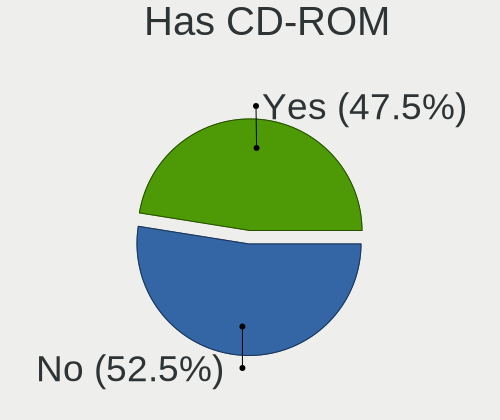
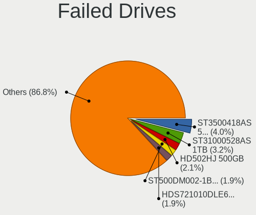
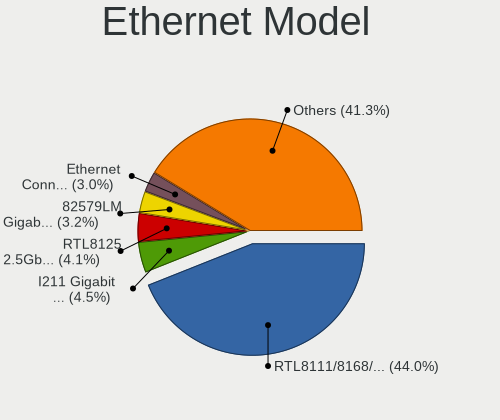
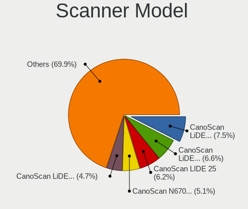

Linux - Tested Hardware & Statistics (Desktops)
-----------------------------------------------

A project to collect tested hardware configurations for Linux.

Anyone can contribute to this report by the [hw-probe](https://github.com/linuxhw/hw-probe) tool:

    sudo -E hw-probe -all -upload

Please contribute! Especially if your hardware is rare.

This report is for real hardware. Report for virtual hardware: [TestCoverage_VE](https://github.com/linuxhw/TestCoverage_VE)

Contents
--------

* [ Test Cases ](#test-cases)

* [ System ](#system)
  - [ OS                       ](#os)
  - [ OS Family                ](#os-family)
  - [ Kernel                   ](#kernel)
  - [ Kernel Family            ](#kernel-family)
  - [ Kernel Major Ver.        ](#kernel-major-ver)
  - [ Arch                     ](#arch)
  - [ DE                       ](#de)
  - [ Display Server           ](#display-server)
  - [ Display Manager          ](#display-manager)
  - [ OS Lang                  ](#os-lang)
  - [ Boot Mode                ](#boot-mode)
  - [ Filesystem               ](#filesystem)
  - [ Part. scheme             ](#part-scheme)
  - [ Dual Boot with Linux/BSD ](#dual-boot-with-linuxbsd)
  - [ Dual Boot (Win)          ](#dual-boot-win)

* [ Board ](#board)
  - [ Vendor                   ](#vendor)
  - [ Model                    ](#model)
  - [ Model Family             ](#model-family)
  - [ MFG Year                 ](#mfg-year)
  - [ Form Factor              ](#form-factor)
  - [ Secure Boot              ](#secure-boot)
  - [ Coreboot                 ](#coreboot)
  - [ RAM Size                 ](#ram-size)
  - [ RAM Used                 ](#ram-used)
  - [ Total Drives             ](#total-drives)
  - [ Has CD-ROM               ](#has-cd-rom)
  - [ Has Ethernet             ](#has-ethernet)
  - [ Has WiFi                 ](#has-wifi)
  - [ Has Bluetooth            ](#has-bluetooth)

* [ Location ](#location)
  - [ Country                  ](#country)
  - [ City                     ](#city)

* [ Drives ](#drives)
  - [ Drive Vendor             ](#drive-vendor)
  - [ Drive Model              ](#drive-model)
  - [ HDD Vendor               ](#hdd-vendor)
  - [ SSD Vendor               ](#ssd-vendor)
  - [ Drive Kind               ](#drive-kind)
  - [ Drive Connector          ](#drive-connector)
  - [ Drive Size               ](#drive-size)
  - [ Space Total              ](#space-total)
  - [ Space Used               ](#space-used)
  - [ Malfunc. Drives          ](#malfunc-drives)
  - [ Malfunc. Drive Vendor    ](#malfunc-drive-vendor)
  - [ Malfunc. HDD Vendor      ](#malfunc-hdd-vendor)
  - [ Malfunc. Drive Kind      ](#malfunc-drive-kind)
  - [ Failed Drives            ](#failed-drives)
  - [ Failed Drive Vendor      ](#failed-drive-vendor)
  - [ Drive Status             ](#drive-status)

* [ Storage controller ](#storage-controller)
  - [ Storage Vendor           ](#storage-vendor)
  - [ Storage Model            ](#storage-model)
  - [ Storage Kind             ](#storage-kind)

* [ Processor ](#processor)
  - [ CPU Vendor               ](#cpu-vendor)
  - [ CPU Model                ](#cpu-model)
  - [ CPU Model Family         ](#cpu-model-family)
  - [ CPU Cores                ](#cpu-cores)
  - [ CPU Sockets              ](#cpu-sockets)
  - [ CPU Threads              ](#cpu-threads)
  - [ CPU Op-Modes             ](#cpu-op-modes)
  - [ CPU Microcode            ](#cpu-microcode)
  - [ CPU Microarch            ](#cpu-microarch)

* [ Graphics ](#graphics)
  - [ GPU Vendor               ](#gpu-vendor)
  - [ GPU Model                ](#gpu-model)
  - [ GPU Combo                ](#gpu-combo)
  - [ GPU Driver               ](#gpu-driver)
  - [ GPU Memory               ](#gpu-memory)

* [ Monitor ](#monitor)
  - [ Monitor Vendor           ](#monitor-vendor)
  - [ Monitor Model            ](#monitor-model)
  - [ Monitor Resolution       ](#monitor-resolution)
  - [ Monitor Diagonal         ](#monitor-diagonal)
  - [ Monitor Width            ](#monitor-width)
  - [ Aspect Ratio             ](#aspect-ratio)
  - [ Monitor Area             ](#monitor-area)
  - [ Pixel Density            ](#pixel-density)
  - [ Multiple Monitors        ](#multiple-monitors)

* [ Network ](#network)
  - [ Net Controller Vendor    ](#net-controller-vendor)
  - [ Net Controller Model     ](#net-controller-model)
  - [ Wireless Vendor          ](#wireless-vendor)
  - [ Wireless Model           ](#wireless-model)
  - [ Ethernet Vendor          ](#ethernet-vendor)
  - [ Ethernet Model           ](#ethernet-model)
  - [ Net Controller Kind      ](#net-controller-kind)
  - [ Used Controller          ](#used-controller)
  - [ NICs                     ](#nics)
  - [ IPv6                     ](#ipv6)

* [ Bluetooth ](#bluetooth)
  - [ Bluetooth Vendor         ](#bluetooth-vendor)
  - [ Bluetooth Model          ](#bluetooth-model)

* [ Sound ](#sound)
  - [ Sound Vendor             ](#sound-vendor)
  - [ Sound Model              ](#sound-model)

* [ Memory ](#memory)
  - [ Memory Vendor            ](#memory-vendor)
  - [ Memory Model             ](#memory-model)
  - [ Memory Kind              ](#memory-kind)
  - [ Memory Form Factor       ](#memory-form-factor)
  - [ Memory Size              ](#memory-size)
  - [ Memory Speed             ](#memory-speed)

* [ Printers & scanners ](#printers--scanners)
  - [ Printer Vendor           ](#printer-vendor)
  - [ Printer Model            ](#printer-model)
  - [ Scanner Vendor           ](#scanner-vendor)
  - [ Scanner Model            ](#scanner-model)

* [ Camera ](#camera)
  - [ Camera Vendor            ](#camera-vendor)
  - [ Camera Model             ](#camera-model)

* [ Security ](#security)
  - [ Fingerprint Vendor       ](#fingerprint-vendor)
  - [ Fingerprint Model        ](#fingerprint-model)
  - [ Chipcard Vendor          ](#chipcard-vendor)
  - [ Chipcard Model           ](#chipcard-model)

* [ Unsupported ](#unsupported)
  - [ Unsupported Devices      ](#unsupported-devices)
  - [ Unsupported Device Types ](#unsupported-device-types)

Test Cases
----------

Total: 103032

| Vendor        | Model                       | Probe                                                      | Date         |
|---------------|-----------------------------|------------------------------------------------------------|--------------|
| MSI           | B360I GMAING PRO AC         | [bbdf7b4f77](https://linux-hardware.org/?probe=bbdf7b4f77) | Oct 01, 2022 |
| Apple         | Mac-27AD2F918AE68F61 Mac... | [3e25da0356](https://linux-hardware.org/?probe=3e25da0356) | Oct 01, 2022 |
| ASUSTek       | TUF Gaming X570-PRO         | [b902f5d873](https://linux-hardware.org/?probe=b902f5d873) | Oct 01, 2022 |
| ASRock        | Z97 Anniversary             | [558ca4b56e](https://linux-hardware.org/?probe=558ca4b56e) | Oct 01, 2022 |
| Unknown       | X79-P3                      | [9269fd5ff4](https://linux-hardware.org/?probe=9269fd5ff4) | Oct 01, 2022 |
| ASRock        | J5005-ITX                   | [783c72d32e](https://linux-hardware.org/?probe=783c72d32e) | Oct 01, 2022 |
| Lenovo        | SHARKBAY SDK0E50512 STD     | [ee22a244e2](https://linux-hardware.org/?probe=ee22a244e2) | Oct 01, 2022 |
| MSI           | MS-7235                     | [838e2c27f1](https://linux-hardware.org/?probe=838e2c27f1) | Oct 01, 2022 |
| ASUSTek       | StrikerExtreme              | [4aacd62d98](https://linux-hardware.org/?probe=4aacd62d98) | Oct 01, 2022 |
| ASUSTek       | ROG STRIX X570-F GAMING     | [ff1c77c45a](https://linux-hardware.org/?probe=ff1c77c45a) | Oct 01, 2022 |
| Positivo      | POS-PIH81DL                 | [c17fe23ea7](https://linux-hardware.org/?probe=c17fe23ea7) | Oct 01, 2022 |
| ASRock        | 970 Pro3 R2.0               | [592adc6c9b](https://linux-hardware.org/?probe=592adc6c9b) | Oct 01, 2022 |
| HP            | 843B                        | [b683039e3b](https://linux-hardware.org/?probe=b683039e3b) | Oct 01, 2022 |
| Lenovo        | 0x30F617AA NOK              | [bb13b87bd5](https://linux-hardware.org/?probe=bb13b87bd5) | Oct 01, 2022 |
| HP            | 0B4Ch D                     | [1b409fc1f6](https://linux-hardware.org/?probe=1b409fc1f6) | Oct 01, 2022 |
| HP            | 0B4Ch D                     | [ccc7fe3103](https://linux-hardware.org/?probe=ccc7fe3103) | Oct 01, 2022 |
| ASUSTek       | A78M-A                      | [5ad2e5f2a6](https://linux-hardware.org/?probe=5ad2e5f2a6) | Oct 01, 2022 |
| ASUSTek       | ROG STRIX B550-E GAMING     | [8a75a2c50b](https://linux-hardware.org/?probe=8a75a2c50b) | Oct 01, 2022 |
| Casper        | C15B                        | [be4c7469a6](https://linux-hardware.org/?probe=be4c7469a6) | Oct 01, 2022 |
| MSI           | MAG B550 TOMAHAWK           | [a7268f8fba](https://linux-hardware.org/?probe=a7268f8fba) | Oct 01, 2022 |
| MSI           | 2A9C                        | [a933ad6bca](https://linux-hardware.org/?probe=a933ad6bca) | Oct 01, 2022 |
| Lenovo        | ThinkCentre M58 9728AHG     | [a2bc7fc88f](https://linux-hardware.org/?probe=a2bc7fc88f) | Oct 01, 2022 |
| Medion        | MS-7366                     | [c8138f4ffe](https://linux-hardware.org/?probe=c8138f4ffe) | Oct 01, 2022 |
| Medion        | MS-7366                     | [c25c10b259](https://linux-hardware.org/?probe=c25c10b259) | Oct 01, 2022 |
| Lenovo        | SHARKBAY SDK0E50510 PRO     | [cb5d0d1945](https://linux-hardware.org/?probe=cb5d0d1945) | Oct 01, 2022 |
| Dell          | 0RW203                      | [c8a408311d](https://linux-hardware.org/?probe=c8a408311d) | Oct 01, 2022 |
| Lenovo        | SHARKBAY SDK0E50510 PRO     | [3af0c5cc5f](https://linux-hardware.org/?probe=3af0c5cc5f) | Oct 01, 2022 |
| ASUSTek       | TUF Gaming B550M-PLUS       | [15a068e26b](https://linux-hardware.org/?probe=15a068e26b) | Oct 01, 2022 |
| ASUSTek       | TUF Gaming B550M-PLUS       | [3a9d882d91](https://linux-hardware.org/?probe=3a9d882d91) | Oct 01, 2022 |
| Gigabyte      | B450 AORUS ELITE            | [dda857d7e6](https://linux-hardware.org/?probe=dda857d7e6) | Oct 01, 2022 |
| MSI           | B350M PRO-VDH               | [1a0d8b695d](https://linux-hardware.org/?probe=1a0d8b695d) | Oct 01, 2022 |
| ASRock        | H87M Pro4                   | [bf8e635afa](https://linux-hardware.org/?probe=bf8e635afa) | Oct 01, 2022 |
| MSI           | MPG X570S EDGE MAX WIFI     | [d3d117cf14](https://linux-hardware.org/?probe=d3d117cf14) | Oct 01, 2022 |
| MSI           | B450M-A PRO MAX             | [649f4ec8c6](https://linux-hardware.org/?probe=649f4ec8c6) | Oct 01, 2022 |
| Gigabyte      | 990FXA-UD3                  | [cb25964ddb](https://linux-hardware.org/?probe=cb25964ddb) | Oct 01, 2022 |
| MSI           | MAG Z490 TOMAHAWK           | [7221bbf8e7](https://linux-hardware.org/?probe=7221bbf8e7) | Oct 01, 2022 |
| Lenovo        | 3098 NOK                    | [a46521af41](https://linux-hardware.org/?probe=a46521af41) | Oct 01, 2022 |
| Unknown       | Unknown                     | [0c82fc9806](https://linux-hardware.org/?probe=0c82fc9806) | Oct 01, 2022 |
| MSI           | X470 GAMING PRO             | [53e99a8ce6](https://linux-hardware.org/?probe=53e99a8ce6) | Oct 01, 2022 |
| ASUSTek       | PRIME B450-PLUS             | [db15c7b708](https://linux-hardware.org/?probe=db15c7b708) | Oct 01, 2022 |
| MSI           | Z270-A PRO                  | [6f96dc34e2](https://linux-hardware.org/?probe=6f96dc34e2) | Oct 01, 2022 |
| MSI           | MPG B550 GAMING PLUS        | [fca2e4409a](https://linux-hardware.org/?probe=fca2e4409a) | Oct 01, 2022 |
| ASUSTek       | B75M-A                      | [cbeab03cbd](https://linux-hardware.org/?probe=cbeab03cbd) | Oct 01, 2022 |
| Fujitsu       | D2990-A2 S26361-D2990-A2    | [982b143d73](https://linux-hardware.org/?probe=982b143d73) | Oct 01, 2022 |
| MSI           | MAG B550 TOMAHAWK           | [151510a184](https://linux-hardware.org/?probe=151510a184) | Oct 01, 2022 |
| ASUSTek       | M5A78L-M LX                 | [d967f57569](https://linux-hardware.org/?probe=d967f57569) | Oct 01, 2022 |
| MSI           | X370 GAMING PLUS            | [2aa92cb043](https://linux-hardware.org/?probe=2aa92cb043) | Oct 01, 2022 |
| HP            | 1632                        | [0f9387690b](https://linux-hardware.org/?probe=0f9387690b) | Oct 01, 2022 |
| ASUSTek       | PRIME B550M-A               | [4d1cbd14c2](https://linux-hardware.org/?probe=4d1cbd14c2) | Oct 01, 2022 |
| Dell          | 0KJCC5 A00                  | [7915b298b2](https://linux-hardware.org/?probe=7915b298b2) | Oct 01, 2022 |
| Foxconn       | 2AB1                        | [18971aaf86](https://linux-hardware.org/?probe=18971aaf86) | Oct 01, 2022 |
| ASUSTek       | M5A99X EVO                  | [4c5134b8fc](https://linux-hardware.org/?probe=4c5134b8fc) | Oct 01, 2022 |
| ASRock        | AD2700-ITX                  | [4275ef3653](https://linux-hardware.org/?probe=4275ef3653) | Oct 01, 2022 |
| ASUSTek       | M5A87                       | [89ca067566](https://linux-hardware.org/?probe=89ca067566) | Oct 01, 2022 |
| ASUSTek       | PRIME B550M-A               | [00ded2a3ed](https://linux-hardware.org/?probe=00ded2a3ed) | Oct 01, 2022 |
| MSI           | PRO X670-P WIFI             | [64299c7b4a](https://linux-hardware.org/?probe=64299c7b4a) | Oct 01, 2022 |
| Lenovo        | ThinkCentre M90p 5498A2U    | [ed9cd240cc](https://linux-hardware.org/?probe=ed9cd240cc) | Oct 01, 2022 |
| Biostar       | B350ET2                     | [d7c5b1ad40](https://linux-hardware.org/?probe=d7c5b1ad40) | Oct 01, 2022 |
| Gigabyte      | GA-970A-D3                  | [8c24fa2271](https://linux-hardware.org/?probe=8c24fa2271) | Oct 01, 2022 |
| ASRock        | FM2A88X Extreme6+           | [186495d063](https://linux-hardware.org/?probe=186495d063) | Oct 01, 2022 |
| Lenovo        | ThinkCentre M90p 5498A2U    | [f05b832b90](https://linux-hardware.org/?probe=f05b832b90) | Oct 01, 2022 |
| Biostar       | A320MH                      | [b07b6c4fc5](https://linux-hardware.org/?probe=b07b6c4fc5) | Oct 01, 2022 |
| MSI           | X99A RAIDER                 | [847283c85d](https://linux-hardware.org/?probe=847283c85d) | Oct 01, 2022 |
| Gigabyte      | Z170X-Gaming GT             | [991ea6c93f](https://linux-hardware.org/?probe=991ea6c93f) | Oct 01, 2022 |
| ASUSTek       | M4N72-E                     | [c1c308be2a](https://linux-hardware.org/?probe=c1c308be2a) | Oct 01, 2022 |
| Gigabyte      | 990FXA-UD3                  | [36398ba3b9](https://linux-hardware.org/?probe=36398ba3b9) | Oct 01, 2022 |
| Gigabyte      | H110M-H DDR3-CF             | [8169fe8dbd](https://linux-hardware.org/?probe=8169fe8dbd) | Oct 01, 2022 |
| Gigabyte      | B360 AORUS GAMING 3-CF      | [87a1c21540](https://linux-hardware.org/?probe=87a1c21540) | Oct 01, 2022 |
| Gigabyte      | GA-MA770T-UD3P              | [692b59019a](https://linux-hardware.org/?probe=692b59019a) | Oct 01, 2022 |
| Gigabyte      | B550 AORUS ELITE            | [bc6bcfe3f2](https://linux-hardware.org/?probe=bc6bcfe3f2) | Oct 01, 2022 |
| ASUSTek       | TUF Gaming B550M-E WIFI     | [2d1e938e68](https://linux-hardware.org/?probe=2d1e938e68) | Oct 01, 2022 |
| ASUSTek       | P8Z68-V                     | [c6e67f7643](https://linux-hardware.org/?probe=c6e67f7643) | Oct 01, 2022 |
| Dell          | 01XK1W A00                  | [29c4292c62](https://linux-hardware.org/?probe=29c4292c62) | Oct 01, 2022 |
| ASRock        | Z77 Extreme3                | [c92633e1ee](https://linux-hardware.org/?probe=c92633e1ee) | Oct 01, 2022 |
| ASUSTek       | ROG Maximus XI HERO         | [32a742b50d](https://linux-hardware.org/?probe=32a742b50d) | Oct 01, 2022 |
| ASRock        | Z77 Extreme3                | [ada9e56162](https://linux-hardware.org/?probe=ada9e56162) | Oct 01, 2022 |
| Gigabyte      | B550 AORUS ELITE V2         | [541e327f0f](https://linux-hardware.org/?probe=541e327f0f) | Oct 01, 2022 |
| Shuttle       | FS35V4                      | [e38fd71e40](https://linux-hardware.org/?probe=e38fd71e40) | Oct 01, 2022 |
| ASRock        | X300M-STX                   | [f6e2c51367](https://linux-hardware.org/?probe=f6e2c51367) | Sep 30, 2022 |
| Biostar       | B350ET2                     | [2b7bea0eda](https://linux-hardware.org/?probe=2b7bea0eda) | Sep 30, 2022 |
| MSI           | A55M-E33                    | [13bd049f55](https://linux-hardware.org/?probe=13bd049f55) | Sep 30, 2022 |
| Intel         | H61                         | [37af3b0cdb](https://linux-hardware.org/?probe=37af3b0cdb) | Sep 30, 2022 |
| MSI           | MEG X570 UNIFY              | [4d2e449699](https://linux-hardware.org/?probe=4d2e449699) | Sep 30, 2022 |
| ASUSTek       | H81-PLUS                    | [e251d6b8f7](https://linux-hardware.org/?probe=e251d6b8f7) | Sep 30, 2022 |
| Apple         | Mac-F221BEC8                | [ab0a3e1a94](https://linux-hardware.org/?probe=ab0a3e1a94) | Sep 30, 2022 |
| Gigabyte      | B75M-D3H                    | [162334ac1e](https://linux-hardware.org/?probe=162334ac1e) | Sep 30, 2022 |
| Dell          | 07PR60 A01                  | [812cb18129](https://linux-hardware.org/?probe=812cb18129) | Sep 30, 2022 |
| OEM           | Unknown                     | [e5a425c399](https://linux-hardware.org/?probe=e5a425c399) | Sep 30, 2022 |
| Biostar       | G41D3C                      | [97ee103719](https://linux-hardware.org/?probe=97ee103719) | Sep 30, 2022 |
| ASRock        | B450M Pro4-F                | [75b0aa3c75](https://linux-hardware.org/?probe=75b0aa3c75) | Sep 30, 2022 |
| ASUSTek       | M5A78L LE                   | [1b2683c634](https://linux-hardware.org/?probe=1b2683c634) | Sep 30, 2022 |
| ASUSTek       | PHOENIX                     | [55d76f8846](https://linux-hardware.org/?probe=55d76f8846) | Sep 30, 2022 |
| ASUSTek       | PHOENIX                     | [6c28fed25f](https://linux-hardware.org/?probe=6c28fed25f) | Sep 30, 2022 |
| HP            | 3398                        | [8ef4543254](https://linux-hardware.org/?probe=8ef4543254) | Sep 30, 2022 |
| ASUSTek       | M5A78L LE                   | [8762386a2b](https://linux-hardware.org/?probe=8762386a2b) | Sep 30, 2022 |
| Lenovo        | 0x36A017AA SDK0J40700 WI... | [a6b14fdcf3](https://linux-hardware.org/?probe=a6b14fdcf3) | Sep 30, 2022 |
| ASUSTek       | M5A78L-M LX3                | [938523ed34](https://linux-hardware.org/?probe=938523ed34) | Sep 30, 2022 |
| ASRock        | H87M Pro4                   | [f8bb8b6de8](https://linux-hardware.org/?probe=f8bb8b6de8) | Sep 30, 2022 |
| Dell          | 0NK70N A03                  | [9cfa433855](https://linux-hardware.org/?probe=9cfa433855) | Sep 30, 2022 |
| Pegatron      | 2A94                        | [6425f7a434](https://linux-hardware.org/?probe=6425f7a434) | Sep 30, 2022 |
| Acer          | Batman A01                  | [f8ebe348e4](https://linux-hardware.org/?probe=f8ebe348e4) | Sep 30, 2022 |
| Gigabyte      | G41M-Combo                  | [aa49a31777](https://linux-hardware.org/?probe=aa49a31777) | Sep 30, 2022 |
| MSI           | B450 GAMING PLUS MAX        | [c06e7e3586](https://linux-hardware.org/?probe=c06e7e3586) | Sep 30, 2022 |
| ASUSTek       | PRIME B360M-A               | [f0eae50061](https://linux-hardware.org/?probe=f0eae50061) | Sep 30, 2022 |
| ASUSTek       | PRIME B450M-A               | [cfe1aba7e6](https://linux-hardware.org/?probe=cfe1aba7e6) | Sep 30, 2022 |
| MSI           | Z97 MPOWER                  | [f16a15a5b7](https://linux-hardware.org/?probe=f16a15a5b7) | Sep 30, 2022 |
| HP            | 83EF                        | [f508131396](https://linux-hardware.org/?probe=f508131396) | Sep 30, 2022 |
| ASRock        | B450M Pro4                  | [ed76eeb703](https://linux-hardware.org/?probe=ed76eeb703) | Sep 30, 2022 |
| ASUSTek       | ROG STRIX B365-G GAMING     | [d19e0fb48b](https://linux-hardware.org/?probe=d19e0fb48b) | Sep 30, 2022 |
| ASUSTek       | P8H67-M                     | [583fe6d90d](https://linux-hardware.org/?probe=583fe6d90d) | Sep 30, 2022 |
| HP            | 0AECh D                     | [7e557eb67c](https://linux-hardware.org/?probe=7e557eb67c) | Sep 30, 2022 |
| ASRock        | X470 Master SLI             | [47c190b6e9](https://linux-hardware.org/?probe=47c190b6e9) | Sep 30, 2022 |
| Gigabyte      | B660M DS3H AX DDR4          | [97e7d2d80f](https://linux-hardware.org/?probe=97e7d2d80f) | Sep 30, 2022 |
| ASUSTek       | P5KPL-AM EPU                | [66877298d4](https://linux-hardware.org/?probe=66877298d4) | Sep 30, 2022 |
| ASUSTek       | GRYPHON Z87                 | [3f01bbaa12](https://linux-hardware.org/?probe=3f01bbaa12) | Sep 30, 2022 |
| ASUSTek       | PRIME B660M-K D4            | [7efad28576](https://linux-hardware.org/?probe=7efad28576) | Sep 30, 2022 |
| HP            | 1497                        | [86ab60b437](https://linux-hardware.org/?probe=86ab60b437) | Sep 30, 2022 |
| ASUSTek       | Z170-P                      | [996d72bd1e](https://linux-hardware.org/?probe=996d72bd1e) | Sep 30, 2022 |
| ASUSTek       | Z170-P                      | [8394fca38a](https://linux-hardware.org/?probe=8394fca38a) | Sep 30, 2022 |
| ASUSTek       | ROG CROSSHAIR VIII HERO     | [8c116d30f9](https://linux-hardware.org/?probe=8c116d30f9) | Sep 30, 2022 |
| ASUSTek       | EX-A320M-GAMING             | [33d5d34654](https://linux-hardware.org/?probe=33d5d34654) | Sep 30, 2022 |
| Gigabyte      | Z390 AORUS ULTRA-CF         | [8d8e54ed69](https://linux-hardware.org/?probe=8d8e54ed69) | Sep 30, 2022 |
| Pegatron      | IPMSB-GS                    | [5e38213b3b](https://linux-hardware.org/?probe=5e38213b3b) | Sep 30, 2022 |
| Gigabyte      | H81M-D2V                    | [21a601e10a](https://linux-hardware.org/?probe=21a601e10a) | Sep 30, 2022 |
| Lenovo        | ThinkCentre M58 9728AHG     | [773ae7f01e](https://linux-hardware.org/?probe=773ae7f01e) | Sep 30, 2022 |
| ASRock        | B360M-HDV                   | [fad5a877f5](https://linux-hardware.org/?probe=fad5a877f5) | Sep 30, 2022 |
| Gigabyte      | P55-USB3                    | [adf7389f06](https://linux-hardware.org/?probe=adf7389f06) | Sep 30, 2022 |
| ECS           | A320AM4-M3D/3.x/5.x         | [570ff509ac](https://linux-hardware.org/?probe=570ff509ac) | Sep 30, 2022 |
| ASUSTek       | TUF Gaming Z490-PLUS        | [2c08befa41](https://linux-hardware.org/?probe=2c08befa41) | Sep 30, 2022 |
| Positivo      | POS-PIQ67CG POSITIVO        | [5cdce489b9](https://linux-hardware.org/?probe=5cdce489b9) | Sep 30, 2022 |
| ASUSTek       | ROG STRIX B365-G GAMING     | [4707a778dc](https://linux-hardware.org/?probe=4707a778dc) | Sep 30, 2022 |
| HP            | 859C                        | [08161b9516](https://linux-hardware.org/?probe=08161b9516) | Sep 30, 2022 |
| Gigabyte      | Z97M-DS3H                   | [fcf7e031e3](https://linux-hardware.org/?probe=fcf7e031e3) | Sep 30, 2022 |
| Positivo      | POS-PIQ67CG POSITIVO        | [3bfbb3744e](https://linux-hardware.org/?probe=3bfbb3744e) | Sep 30, 2022 |
| MSI           | B450M MORTAR MAX            | [21028f343b](https://linux-hardware.org/?probe=21028f343b) | Sep 30, 2022 |
| MSI           | X99A RAIDER                 | [7b0b80d00c](https://linux-hardware.org/?probe=7b0b80d00c) | Sep 30, 2022 |
| ASRock        | X370 Taichi                 | [d86c708401](https://linux-hardware.org/?probe=d86c708401) | Sep 30, 2022 |
| ASRock        | FM2A88X Extreme6+           | [6553398b7d](https://linux-hardware.org/?probe=6553398b7d) | Sep 30, 2022 |
| ASRock        | X570 Steel Legend           | [40e65e38cf](https://linux-hardware.org/?probe=40e65e38cf) | Sep 30, 2022 |
| HP            | 3398                        | [2f7b1d28b4](https://linux-hardware.org/?probe=2f7b1d28b4) | Sep 30, 2022 |
| MSI           | A68HM-E33 V2                | [1001ccbbaf](https://linux-hardware.org/?probe=1001ccbbaf) | Sep 30, 2022 |
| ASUSTek       | PRIME B550M-A               | [1472407523](https://linux-hardware.org/?probe=1472407523) | Sep 30, 2022 |
| HP            | 1496                        | [e89f06542b](https://linux-hardware.org/?probe=e89f06542b) | Sep 30, 2022 |
| Dell          | 0HN7XN A00                  | [c9126cd382](https://linux-hardware.org/?probe=c9126cd382) | Sep 30, 2022 |
| Lenovo        | ThinkCentre M90p 5498A2U    | [d638b38369](https://linux-hardware.org/?probe=d638b38369) | Sep 30, 2022 |
| Unknown       | 775VM8                      | [114c84d76c](https://linux-hardware.org/?probe=114c84d76c) | Sep 30, 2022 |
| Unknown       | 775VM8                      | [903649eae9](https://linux-hardware.org/?probe=903649eae9) | Sep 30, 2022 |
| MSI           | H110 PC MATE                | [ac97c636a5](https://linux-hardware.org/?probe=ac97c636a5) | Sep 30, 2022 |
| Gigabyte      | H410M S2H V3                | [8ded1bb1f8](https://linux-hardware.org/?probe=8ded1bb1f8) | Sep 30, 2022 |
| Gigabyte      | H61M-S2PV                   | [cd06f54882](https://linux-hardware.org/?probe=cd06f54882) | Sep 30, 2022 |
| ASRock        | N68C-S UCC                  | [90d8579454](https://linux-hardware.org/?probe=90d8579454) | Sep 30, 2022 |
| Dell          | 0KJCC5 A00                  | [f9582eb0a8](https://linux-hardware.org/?probe=f9582eb0a8) | Sep 29, 2022 |
| Gigabyte      | H510M H                     | [51a7f36a69](https://linux-hardware.org/?probe=51a7f36a69) | Sep 29, 2022 |
| ASUSTek       | Z170-P                      | [2f3c79dd55](https://linux-hardware.org/?probe=2f3c79dd55) | Sep 29, 2022 |
| Gigabyte      | Z390 UD                     | [afe1282d38](https://linux-hardware.org/?probe=afe1282d38) | Sep 29, 2022 |
| ASUSTek       | Maximus V GENE              | [7998f02578](https://linux-hardware.org/?probe=7998f02578) | Sep 29, 2022 |
| ASUSTek       | B85M-G                      | [a9983b2858](https://linux-hardware.org/?probe=a9983b2858) | Sep 29, 2022 |
| OEM           | Unknown                     | [21b3a0929b](https://linux-hardware.org/?probe=21b3a0929b) | Sep 29, 2022 |
| MSI           | A68HM-E33 V2                | [3e8f63475d](https://linux-hardware.org/?probe=3e8f63475d) | Sep 29, 2022 |
| ASRock        | X399M Taichi                | [b7943d1645](https://linux-hardware.org/?probe=b7943d1645) | Sep 29, 2022 |
| ASRock        | Q1900M                      | [e6804dc6b7](https://linux-hardware.org/?probe=e6804dc6b7) | Sep 29, 2022 |
| Gigabyte      | Z690 GAMING X DDR4          | [b372f8126f](https://linux-hardware.org/?probe=b372f8126f) | Sep 29, 2022 |
| Lenovo        | SHARKBAY SDK0E50510 WIN     | [7bffcb84c2](https://linux-hardware.org/?probe=7bffcb84c2) | Sep 29, 2022 |
| Lenovo        | SHARKBAY SDK0E50510 WIN     | [e3e6ad5c35](https://linux-hardware.org/?probe=e3e6ad5c35) | Sep 29, 2022 |
| HP            | 3398                        | [c2190a0657](https://linux-hardware.org/?probe=c2190a0657) | Sep 29, 2022 |
| Lenovo        | SHARKBAY NOK                | [aa0eeeda6b](https://linux-hardware.org/?probe=aa0eeeda6b) | Sep 29, 2022 |
| HP            | 8055                        | [aa3bd09485](https://linux-hardware.org/?probe=aa3bd09485) | Sep 29, 2022 |
| Dell          | 0YXT71 A02                  | [f36bc1d24e](https://linux-hardware.org/?probe=f36bc1d24e) | Sep 29, 2022 |
| ASUSTek       | PHOENIX                     | [ea3a9cf5b4](https://linux-hardware.org/?probe=ea3a9cf5b4) | Sep 29, 2022 |
| ASRock        | X570 Phantom Gaming-ITX/... | [5746aa7609](https://linux-hardware.org/?probe=5746aa7609) | Sep 29, 2022 |
| Gigabyte      | X570 AORUS PRO WIFI         | [7a2f334861](https://linux-hardware.org/?probe=7a2f334861) | Sep 29, 2022 |
| Dell          | 0Y5DDC A00                  | [f9efac58da](https://linux-hardware.org/?probe=f9efac58da) | Sep 29, 2022 |
| ASUSTek       | M5A97 LE R2.0               | [e35b86c3b7](https://linux-hardware.org/?probe=e35b86c3b7) | Sep 29, 2022 |
| ASRock        | B250M-HDV                   | [dc21fe6a18](https://linux-hardware.org/?probe=dc21fe6a18) | Sep 29, 2022 |
| Gigabyte      | B75M-D3H                    | [a7d5bbb754](https://linux-hardware.org/?probe=a7d5bbb754) | Sep 29, 2022 |
| Gigabyte      | B75M-D3H                    | [5f261094bf](https://linux-hardware.org/?probe=5f261094bf) | Sep 29, 2022 |
| ASUSTek       | B85M-G                      | [ba607b91e0](https://linux-hardware.org/?probe=ba607b91e0) | Sep 29, 2022 |
| HP            | 805D                        | [84d451ab19](https://linux-hardware.org/?probe=84d451ab19) | Sep 29, 2022 |
| HP            | 158A                        | [151ee8b7d6](https://linux-hardware.org/?probe=151ee8b7d6) | Sep 29, 2022 |
| OEM           | Unknown                     | [68b7e03b06](https://linux-hardware.org/?probe=68b7e03b06) | Sep 29, 2022 |
| ASUSTek       | AM1I-A                      | [201c745d4e](https://linux-hardware.org/?probe=201c745d4e) | Sep 29, 2022 |
| ASRock        | B250M-HDV                   | [b248539946](https://linux-hardware.org/?probe=b248539946) | Sep 29, 2022 |
| HP            | 81C9                        | [c92ebd45a9](https://linux-hardware.org/?probe=c92ebd45a9) | Sep 29, 2022 |
| ASRock        | J3160DC-ITX                 | [7e1818288f](https://linux-hardware.org/?probe=7e1818288f) | Sep 29, 2022 |
| ASUSTek       | P8Z68-V                     | [f0d1b90e89](https://linux-hardware.org/?probe=f0d1b90e89) | Sep 29, 2022 |
| ASUSTek       | H81M-D                      | [a1580941c3](https://linux-hardware.org/?probe=a1580941c3) | Sep 29, 2022 |
| HP            | 2B2C                        | [df8a8ec9bc](https://linux-hardware.org/?probe=df8a8ec9bc) | Sep 29, 2022 |
| ECS           | G31T-M9                     | [45b25aaf8c](https://linux-hardware.org/?probe=45b25aaf8c) | Sep 29, 2022 |
| ASRock        | N68-GS4 FX                  | [3c4d5b4c65](https://linux-hardware.org/?probe=3c4d5b4c65) | Sep 29, 2022 |
| ASUSTek       | TUF Gaming B560M-PLUS WI... | [a686f595ee](https://linux-hardware.org/?probe=a686f595ee) | Sep 29, 2022 |
| Gigabyte      | H270-Gaming 3               | [9426d21070](https://linux-hardware.org/?probe=9426d21070) | Sep 29, 2022 |
| Dell          | 0G3HR7 A00                  | [547cffd8dd](https://linux-hardware.org/?probe=547cffd8dd) | Sep 29, 2022 |
| MSI           | B450 TOMAHAWK MAX           | [c83049a0f6](https://linux-hardware.org/?probe=c83049a0f6) | Sep 29, 2022 |
| Gigabyte      | H270-Gaming 3               | [830af9c53e](https://linux-hardware.org/?probe=830af9c53e) | Sep 29, 2022 |
| HP            | 8464                        | [52d29e8721](https://linux-hardware.org/?probe=52d29e8721) | Sep 29, 2022 |
| ASRock        | H270M-ITX/ac                | [c6ae2f8a45](https://linux-hardware.org/?probe=c6ae2f8a45) | Sep 29, 2022 |
| ASUSTek       | PRO H410M-C                 | [2448bfc706](https://linux-hardware.org/?probe=2448bfc706) | Sep 29, 2022 |
| Acer          | Predator G6-710             | [12fd4575f7](https://linux-hardware.org/?probe=12fd4575f7) | Sep 29, 2022 |
| HP            | 1493                        | [60ebd1d8dd](https://linux-hardware.org/?probe=60ebd1d8dd) | Sep 29, 2022 |
| Gateway       | SX2185                      | [8372be8fe3](https://linux-hardware.org/?probe=8372be8fe3) | Sep 29, 2022 |
| ASUSTek       | PRIME Z270-A                | [4118e245a3](https://linux-hardware.org/?probe=4118e245a3) | Sep 29, 2022 |
| HP            | 843C                        | [e27595d303](https://linux-hardware.org/?probe=e27595d303) | Sep 29, 2022 |
| Acer          | Veriton X6610G              | [66733e59e2](https://linux-hardware.org/?probe=66733e59e2) | Sep 29, 2022 |
| Biostar       | IH61MF-Q5                   | [7a63314188](https://linux-hardware.org/?probe=7a63314188) | Sep 29, 2022 |
| ASRock        | FM2A88X Extreme6+           | [362c6b7436](https://linux-hardware.org/?probe=362c6b7436) | Sep 29, 2022 |
| Dell          | 06D7TR A02                  | [7ad0e3e5f4](https://linux-hardware.org/?probe=7ad0e3e5f4) | Sep 29, 2022 |
| MSI           | X99A RAIDER                 | [d4e346f990](https://linux-hardware.org/?probe=d4e346f990) | Sep 29, 2022 |
| Huanan        | X79 (INTEL Xeon E5/Corei... | [a40d59533c](https://linux-hardware.org/?probe=a40d59533c) | Sep 29, 2022 |
| ASRock        | A320M-HD                    | [a674def12d](https://linux-hardware.org/?probe=a674def12d) | Sep 29, 2022 |
| Lenovo        | 1031 SBB0J05441 WIN 3305... | [75c8af47c2](https://linux-hardware.org/?probe=75c8af47c2) | Sep 29, 2022 |
| Gigabyte      | Z370 HD3-CF                 | [715a83eaa1](https://linux-hardware.org/?probe=715a83eaa1) | Sep 29, 2022 |
| Biostar       | H410MH S2                   | [b03e32f37d](https://linux-hardware.org/?probe=b03e32f37d) | Sep 29, 2022 |
| ASUSTek       | PRIME Z390-A                | [37a7291916](https://linux-hardware.org/?probe=37a7291916) | Sep 29, 2022 |
| ASUSTek       | P8Z68-V                     | [36ff9b8bcb](https://linux-hardware.org/?probe=36ff9b8bcb) | Sep 29, 2022 |
| Gigabyte      | A320M-H-CF                  | [25e3064dd2](https://linux-hardware.org/?probe=25e3064dd2) | Sep 29, 2022 |
| Acer          | Veriton M275                | [f871926a8e](https://linux-hardware.org/?probe=f871926a8e) | Sep 29, 2022 |
| Gigabyte      | AB350-Gaming 3-CF           | [365d74f8e4](https://linux-hardware.org/?probe=365d74f8e4) | Sep 28, 2022 |
| Biostar       | H410MH S2                   | [fbba79fc43](https://linux-hardware.org/?probe=fbba79fc43) | Sep 28, 2022 |
| ASRock        | Z97 Pro3                    | [7b34a50df8](https://linux-hardware.org/?probe=7b34a50df8) | Sep 28, 2022 |
| Intel         | B75                         | [af5aef869c](https://linux-hardware.org/?probe=af5aef869c) | Sep 28, 2022 |
| Biostar       | H55 HD                      | [bde8e0a133](https://linux-hardware.org/?probe=bde8e0a133) | Sep 28, 2022 |
| Gigabyte      | F2A55M-DS2                  | [c17c689217](https://linux-hardware.org/?probe=c17c689217) | Sep 28, 2022 |
| BESSTAR Te... | TH50                        | [2045e665b1](https://linux-hardware.org/?probe=2045e665b1) | Sep 28, 2022 |
| Intel         | DQ67SW AAG12527-310         | [235930defb](https://linux-hardware.org/?probe=235930defb) | Sep 28, 2022 |
| ASUSTek       | P8P67                       | [1ad22cf7a8](https://linux-hardware.org/?probe=1ad22cf7a8) | Sep 28, 2022 |
| Gigabyte      | Z87X-UD5H-CF                | [5a7ad7dba9](https://linux-hardware.org/?probe=5a7ad7dba9) | Sep 28, 2022 |
| Gigabyte      | H81M-D2W                    | [467845e1c1](https://linux-hardware.org/?probe=467845e1c1) | Sep 28, 2022 |
| ASRock        | B450 Pro4                   | [6a9066019c](https://linux-hardware.org/?probe=6a9066019c) | Sep 28, 2022 |
| ASRock        | B450 Pro4                   | [ecdbe4f54f](https://linux-hardware.org/?probe=ecdbe4f54f) | Sep 28, 2022 |
| ASRock        | Z68 Pro3-M                  | [7ba6677453](https://linux-hardware.org/?probe=7ba6677453) | Sep 28, 2022 |
| Dell          | 0NK70N A03                  | [7e2d1b00fd](https://linux-hardware.org/?probe=7e2d1b00fd) | Sep 28, 2022 |
| ASUSTek       | Maximus VII HERO            | [d23d86be40](https://linux-hardware.org/?probe=d23d86be40) | Sep 28, 2022 |
| ASUSTek       | M5A97 EVO R2.0              | [6d92b99f8e](https://linux-hardware.org/?probe=6d92b99f8e) | Sep 28, 2022 |
| Medion        | MS-7707                     | [240ac993dc](https://linux-hardware.org/?probe=240ac993dc) | Sep 28, 2022 |
| ASUSTek       | M4A785T-M                   | [03277d55bc](https://linux-hardware.org/?probe=03277d55bc) | Sep 28, 2022 |
| MSI           | Z87-GD65 GAMING             | [fe6539c021](https://linux-hardware.org/?probe=fe6539c021) | Sep 28, 2022 |
| ASUSTek       | CROSSHAIR VI HERO           | [46e48bc4c1](https://linux-hardware.org/?probe=46e48bc4c1) | Sep 28, 2022 |
| ASUSTek       | PRIME Z390-P                | [81ddb430e3](https://linux-hardware.org/?probe=81ddb430e3) | Sep 28, 2022 |
| MSI           | G41M-P26                    | [45f0101515](https://linux-hardware.org/?probe=45f0101515) | Sep 28, 2022 |
| Gigabyte      | B450M AORUS ELITE           | [513d236a1f](https://linux-hardware.org/?probe=513d236a1f) | Sep 28, 2022 |
| HP            | 3047h                       | [9426ee3f59](https://linux-hardware.org/?probe=9426ee3f59) | Sep 28, 2022 |
| HP            | 339A                        | [5c961ef93f](https://linux-hardware.org/?probe=5c961ef93f) | Sep 28, 2022 |
| ASUSTek       | M5A97 LE R2.0               | [372cdc3726](https://linux-hardware.org/?probe=372cdc3726) | Sep 28, 2022 |
| Gigabyte      | B450 I AORUS PRO WIFI-CF    | [d5185ee60b](https://linux-hardware.org/?probe=d5185ee60b) | Sep 28, 2022 |
| ASUSTek       | P5K Premium                 | [ec3962c685](https://linux-hardware.org/?probe=ec3962c685) | Sep 28, 2022 |
| ASUSTek       | F2A85-M PRO                 | [571cb4bb05](https://linux-hardware.org/?probe=571cb4bb05) | Sep 28, 2022 |
| ASUSTek       | M5A97 LE R2.0               | [f9e71e7e05](https://linux-hardware.org/?probe=f9e71e7e05) | Sep 28, 2022 |
| Gigabyte      | B560M H                     | [80e3cd655a](https://linux-hardware.org/?probe=80e3cd655a) | Sep 28, 2022 |
| Gigabyte      | B560M H                     | [0192951511](https://linux-hardware.org/?probe=0192951511) | Sep 28, 2022 |
| HP            | 339A                        | [ac9538b489](https://linux-hardware.org/?probe=ac9538b489) | Sep 28, 2022 |
| ASUSTek       | P5K                         | [2d278ddcdf](https://linux-hardware.org/?probe=2d278ddcdf) | Sep 28, 2022 |
| Dell          | 0NDYHG A01                  | [7a5df20f28](https://linux-hardware.org/?probe=7a5df20f28) | Sep 28, 2022 |
| ASUSTek       | M5A97 R2.0                  | [2c82f3311d](https://linux-hardware.org/?probe=2c82f3311d) | Sep 28, 2022 |
| Dell          | 06D7TR A02                  | [a0d832ff6a](https://linux-hardware.org/?probe=a0d832ff6a) | Sep 28, 2022 |
| MSI           | X299 SLI PLUS               | [1695ba8137](https://linux-hardware.org/?probe=1695ba8137) | Sep 28, 2022 |
| HP            | 18E5                        | [bcc9927d20](https://linux-hardware.org/?probe=bcc9927d20) | Sep 28, 2022 |
| ASUSTek       | PRIME B450M-K               | [262a244d81](https://linux-hardware.org/?probe=262a244d81) | Sep 28, 2022 |
| Gigabyte      | X570S AORUS ELITE AX        | [10b723415e](https://linux-hardware.org/?probe=10b723415e) | Sep 28, 2022 |
| ASUSTek       | M5A97 R2.0                  | [9b3c73c104](https://linux-hardware.org/?probe=9b3c73c104) | Sep 28, 2022 |
| Intel         | DH55TC AAE70932-206         | [ac93c3912d](https://linux-hardware.org/?probe=ac93c3912d) | Sep 28, 2022 |
| ASUSTek       | P8H61-M LX3 R2.0            | [82b108b3b8](https://linux-hardware.org/?probe=82b108b3b8) | Sep 28, 2022 |
| ASUSTek       | M5A97 R2.0                  | [4cdcef3ebd](https://linux-hardware.org/?probe=4cdcef3ebd) | Sep 28, 2022 |
| ASUSTek       | P8H61-MX R2.0               | [3def6cd1c2](https://linux-hardware.org/?probe=3def6cd1c2) | Sep 28, 2022 |
| MSI           | 2A9Ch                       | [16d3df803b](https://linux-hardware.org/?probe=16d3df803b) | Sep 28, 2022 |
| Gigabyte      | Z390 AORUS PRO-CF           | [960c35d712](https://linux-hardware.org/?probe=960c35d712) | Sep 28, 2022 |
| MSI           | X570-A PRO                  | [345959e0ed](https://linux-hardware.org/?probe=345959e0ed) | Sep 28, 2022 |
| ASUSTek       | ROG CROSSHAIR VIII HERO     | [76aac25208](https://linux-hardware.org/?probe=76aac25208) | Sep 28, 2022 |
| Dell          | 09M8Y8 A01                  | [f129c4da4a](https://linux-hardware.org/?probe=f129c4da4a) | Sep 28, 2022 |
| Dell          | 0PU052                      | [2890a8407e](https://linux-hardware.org/?probe=2890a8407e) | Sep 28, 2022 |
| ASUSTek       | PRIME Z370-A                | [5d789a1783](https://linux-hardware.org/?probe=5d789a1783) | Sep 28, 2022 |
| ASUSTek       | P5GC-MX/CKD/SI              | [72bb90ea71](https://linux-hardware.org/?probe=72bb90ea71) | Sep 28, 2022 |
| HP            | 212B                        | [38aa6e5478](https://linux-hardware.org/?probe=38aa6e5478) | Sep 28, 2022 |
| HP            | 18E7                        | [132a87f746](https://linux-hardware.org/?probe=132a87f746) | Sep 28, 2022 |
| ASUSTek       | H87-PLUS                    | [ccb24cd91e](https://linux-hardware.org/?probe=ccb24cd91e) | Sep 28, 2022 |
| Acer          | Aspire XC-1660G V:1.1       | [f7f5368662](https://linux-hardware.org/?probe=f7f5368662) | Sep 28, 2022 |
| Gigabyte      | B450 AORUS PRO WIFI-CF      | [27ce89f701](https://linux-hardware.org/?probe=27ce89f701) | Sep 28, 2022 |
| Acer          | Aspire XC-1660G V:1.1       | [fb983c65ac](https://linux-hardware.org/?probe=fb983c65ac) | Sep 28, 2022 |
| Dell          | 0GY6Y8 A02                  | [dad71b5547](https://linux-hardware.org/?probe=dad71b5547) | Sep 28, 2022 |
| Gigabyte      | 970A-DS3P                   | [ada186ce05](https://linux-hardware.org/?probe=ada186ce05) | Sep 27, 2022 |
| ASRock        | H61M-HVS                    | [660419ed49](https://linux-hardware.org/?probe=660419ed49) | Sep 27, 2022 |
| HP            | 2AF7                        | [d6889fef8d](https://linux-hardware.org/?probe=d6889fef8d) | Sep 27, 2022 |
| ASUSTek       | PRIME X470-PRO              | [1bdf72d415](https://linux-hardware.org/?probe=1bdf72d415) | Sep 27, 2022 |
| Gigabyte      | B550M AORUS PRO-P           | [3273908698](https://linux-hardware.org/?probe=3273908698) | Sep 27, 2022 |
| MSI           | MPG X570 GAMING EDGE WIF... | [30507c8461](https://linux-hardware.org/?probe=30507c8461) | Sep 27, 2022 |
| Gigabyte      | AB350-Gaming 3-CF           | [cfd24b9e0a](https://linux-hardware.org/?probe=cfd24b9e0a) | Sep 27, 2022 |
| ASRock        | B450 Pro4                   | [9053250a2c](https://linux-hardware.org/?probe=9053250a2c) | Sep 27, 2022 |
| Gigabyte      | M68MT-S2                    | [55db3c3775](https://linux-hardware.org/?probe=55db3c3775) | Sep 27, 2022 |
| ASUSTek       | PHOENIX                     | [3c5f24bbb1](https://linux-hardware.org/?probe=3c5f24bbb1) | Sep 27, 2022 |
| ASUSTek       | B85M-E/BR                   | [5116d1cae9](https://linux-hardware.org/?probe=5116d1cae9) | Sep 27, 2022 |
| ASUSTek       | PRIME B550-PLUS             | [1e0110dd5c](https://linux-hardware.org/?probe=1e0110dd5c) | Sep 27, 2022 |
| MSI           | B450M GAMING PLUS           | [265d059992](https://linux-hardware.org/?probe=265d059992) | Sep 27, 2022 |
| ASUSTek       | TUF Gaming X570-PLUS        | [0031772f40](https://linux-hardware.org/?probe=0031772f40) | Sep 27, 2022 |
| Dell          | XPS 8700                    | [19fff8b508](https://linux-hardware.org/?probe=19fff8b508) | Sep 27, 2022 |
| ASRock        | Z97 Anniversary             | [6132513116](https://linux-hardware.org/?probe=6132513116) | Sep 27, 2022 |
| ASRock        | X470 Gaming-ITX/ac          | [fdafecf7b0](https://linux-hardware.org/?probe=fdafecf7b0) | Sep 27, 2022 |
| Packard Be... | IMEDIA L4875 v1.0           | [bb57b80866](https://linux-hardware.org/?probe=bb57b80866) | Sep 27, 2022 |
| ASUSTek       | PRIME B560-PLUS             | [03fff6add6](https://linux-hardware.org/?probe=03fff6add6) | Sep 27, 2022 |
| ASUSTek       | ROG Maximus XI HERO         | [3553d42d14](https://linux-hardware.org/?probe=3553d42d14) | Sep 27, 2022 |
| ASUSTek       | P5B-Deluxe                  | [cf179c716e](https://linux-hardware.org/?probe=cf179c716e) | Sep 27, 2022 |
| MSI           | B550-A PRO                  | [2a5a7aeb95](https://linux-hardware.org/?probe=2a5a7aeb95) | Sep 27, 2022 |
| HP            | 83E9                        | [c24faa3c5b](https://linux-hardware.org/?probe=c24faa3c5b) | Sep 27, 2022 |
| Biostar       | A10N-8800E                  | [d27bf09dc8](https://linux-hardware.org/?probe=d27bf09dc8) | Sep 27, 2022 |
| ASUSTek       | PRIME B550M-K               | [ff511df5c2](https://linux-hardware.org/?probe=ff511df5c2) | Sep 27, 2022 |
| Gigabyte      | MZBAYAP-00                  | [2fccc9ec66](https://linux-hardware.org/?probe=2fccc9ec66) | Sep 27, 2022 |
| MSI           | B365M PRO-VDH               | [45e07c7119](https://linux-hardware.org/?probe=45e07c7119) | Sep 27, 2022 |
| Medion        | MS-7707                     | [a88f6ba4da](https://linux-hardware.org/?probe=a88f6ba4da) | Sep 27, 2022 |
| MSI           | X570-A PRO                  | [a26dee0cd5](https://linux-hardware.org/?probe=a26dee0cd5) | Sep 27, 2022 |
| MSI           | MAG X570 TOMAHAWK WIFI      | [6bfc8d43ef](https://linux-hardware.org/?probe=6bfc8d43ef) | Sep 27, 2022 |
| Dell          | 0YGYJY A01                  | [73e69debd9](https://linux-hardware.org/?probe=73e69debd9) | Sep 27, 2022 |
| Intel         | DH61WW AAG23116-204         | [f35f96af50](https://linux-hardware.org/?probe=f35f96af50) | Sep 27, 2022 |
| Lenovo        | ThinkStation S30 056839G    | [427d10a5ca](https://linux-hardware.org/?probe=427d10a5ca) | Sep 27, 2022 |
| MSI           | A68HM-E33 V2                | [c5e17e9617](https://linux-hardware.org/?probe=c5e17e9617) | Sep 27, 2022 |
| Gigabyte      | GA-78LMT-USB3 R2 sex        | [63cd838fcc](https://linux-hardware.org/?probe=63cd838fcc) | Sep 27, 2022 |
| Medion        | MS-7713                     | [36ca6b7f38](https://linux-hardware.org/?probe=36ca6b7f38) | Sep 27, 2022 |
| ASUSTek       | P8H61-M LE                  | [0d9fdddd8a](https://linux-hardware.org/?probe=0d9fdddd8a) | Sep 27, 2022 |
| Gigabyte      | B450 I AORUS PRO WIFI-CF    | [9f85096ed9](https://linux-hardware.org/?probe=9f85096ed9) | Sep 27, 2022 |
| Gigabyte      | B450 I AORUS PRO WIFI-CF    | [19fe9ebfb6](https://linux-hardware.org/?probe=19fe9ebfb6) | Sep 27, 2022 |
| Dell          | 0M5DCD A00                  | [5168af6134](https://linux-hardware.org/?probe=5168af6134) | Sep 27, 2022 |
| Dell          | 0WN7Y6 A01                  | [356dc77824](https://linux-hardware.org/?probe=356dc77824) | Sep 27, 2022 |
| MSI           | MPG X570 GAMING EDGE WIF... | [2c69225287](https://linux-hardware.org/?probe=2c69225287) | Sep 27, 2022 |
| Medion        | MS-7728                     | [0b9b2ca570](https://linux-hardware.org/?probe=0b9b2ca570) | Sep 27, 2022 |
| ASUSTek       | Z170-K                      | [5048b5bef9](https://linux-hardware.org/?probe=5048b5bef9) | Sep 27, 2022 |
| Dell          | 0DC48C A02                  | [9292e820c5](https://linux-hardware.org/?probe=9292e820c5) | Sep 27, 2022 |
| HP            | 3031h                       | [8aa316f69f](https://linux-hardware.org/?probe=8aa316f69f) | Sep 27, 2022 |
| HP            | 3031h                       | [8e4696435d](https://linux-hardware.org/?probe=8e4696435d) | Sep 27, 2022 |
| MSI           | X570-A PRO                  | [8e872a0556](https://linux-hardware.org/?probe=8e872a0556) | Sep 27, 2022 |
| HP            | 844C                        | [51cb0bca57](https://linux-hardware.org/?probe=51cb0bca57) | Sep 27, 2022 |
| ASUSTek       | H97I-PLUS                   | [31036cd828](https://linux-hardware.org/?probe=31036cd828) | Sep 27, 2022 |
| HP            | 0A60h                       | [ccb90a4b31](https://linux-hardware.org/?probe=ccb90a4b31) | Sep 27, 2022 |
| HP            | 339A                        | [25ef7556cc](https://linux-hardware.org/?probe=25ef7556cc) | Sep 27, 2022 |
| ASUSTek       | H97I-PLUS                   | [fa2a23dff8](https://linux-hardware.org/?probe=fa2a23dff8) | Sep 27, 2022 |
| ASUSTek       | M5A97 PRO                   | [255a0a928a](https://linux-hardware.org/?probe=255a0a928a) | Sep 27, 2022 |
| Gigabyte      | B360M HD3                   | [1107ba42b7](https://linux-hardware.org/?probe=1107ba42b7) | Sep 27, 2022 |
| Medion        | MS-7728                     | [82da4b643b](https://linux-hardware.org/?probe=82da4b643b) | Sep 27, 2022 |
| Lenovo        | MAHOBAY NO DPK              | [1979013fa2](https://linux-hardware.org/?probe=1979013fa2) | Sep 27, 2022 |
| Dell          | 0Y5DDC A00                  | [a135b97045](https://linux-hardware.org/?probe=a135b97045) | Sep 27, 2022 |
| ASUSTek       | TUF Gaming B660M-PLUS D4    | [757d465447](https://linux-hardware.org/?probe=757d465447) | Sep 27, 2022 |
| HP            | 8433 11                     | [a1d424bced](https://linux-hardware.org/?probe=a1d424bced) | Sep 27, 2022 |
| Gigabyte      | Z690I AORUS ULTRA DDR4      | [7af967061b](https://linux-hardware.org/?probe=7af967061b) | Sep 27, 2022 |
| ASUSTek       | TUF Gaming Z690-PLUS WIF... | [e3826dca71](https://linux-hardware.org/?probe=e3826dca71) | Sep 27, 2022 |
| Acer          | Aspire XC-830               | [c8ff01ad2e](https://linux-hardware.org/?probe=c8ff01ad2e) | Sep 27, 2022 |
| Intel         | DP35DP AAD81073-208         | [031ff09179](https://linux-hardware.org/?probe=031ff09179) | Sep 27, 2022 |
| Acer          | Aspire XC-830               | [4175b74d7a](https://linux-hardware.org/?probe=4175b74d7a) | Sep 27, 2022 |
| NU591         | 1.0                         | [6be5a78c90](https://linux-hardware.org/?probe=6be5a78c90) | Sep 27, 2022 |
| ASRock        | 990FX Extreme9              | [c7522b70ba](https://linux-hardware.org/?probe=c7522b70ba) | Sep 27, 2022 |
| ASUSTek       | PRIME Z690-P D4             | [3bafc34ffc](https://linux-hardware.org/?probe=3bafc34ffc) | Sep 27, 2022 |
| ASUSTek       | ROG ZENITH EXTREME          | [3e14df6c26](https://linux-hardware.org/?probe=3e14df6c26) | Sep 27, 2022 |
| HP            | 802F                        | [12645dcde4](https://linux-hardware.org/?probe=12645dcde4) | Sep 27, 2022 |
| ASUSTek       | ROG STRIX Z590-A GAMING ... | [88f0d42935](https://linux-hardware.org/?probe=88f0d42935) | Sep 27, 2022 |
| Unknown       | Unknown                     | [128a8b6e2f](https://linux-hardware.org/?probe=128a8b6e2f) | Sep 27, 2022 |
| ASUSTek       | ROG STRIX B550-F GAMING     | [2c52de3e56](https://linux-hardware.org/?probe=2c52de3e56) | Sep 27, 2022 |
| Gigabyte      | B450M S2H                   | [b5cc268970](https://linux-hardware.org/?probe=b5cc268970) | Sep 27, 2022 |
| Gigabyte      | G41MT-S2                    | [c0b1c8ad8f](https://linux-hardware.org/?probe=c0b1c8ad8f) | Sep 27, 2022 |
| ASUSTek       | P8H61-M LE/CSM              | [45031620df](https://linux-hardware.org/?probe=45031620df) | Sep 27, 2022 |
| ASUSTek       | M3A78-EM                    | [34287ac52a](https://linux-hardware.org/?probe=34287ac52a) | Sep 27, 2022 |
| MSI           | A68HM-E33 V2                | [d51c90a7a8](https://linux-hardware.org/?probe=d51c90a7a8) | Sep 27, 2022 |
| ASRock        | AB350 Gaming K4             | [184070d232](https://linux-hardware.org/?probe=184070d232) | Sep 26, 2022 |
| ASUSTek       | Maximus V GENE              | [fc7a783877](https://linux-hardware.org/?probe=fc7a783877) | Sep 26, 2022 |
| ASUSTek       | P8H61-M LX2 R2.0            | [e9bc8b1f10](https://linux-hardware.org/?probe=e9bc8b1f10) | Sep 26, 2022 |
| Intel         | H55                         | [a155052bce](https://linux-hardware.org/?probe=a155052bce) | Sep 26, 2022 |
| ASUSTek       | ROG STRIX Z590-E GAMING ... | [b3b8d3e04f](https://linux-hardware.org/?probe=b3b8d3e04f) | Sep 26, 2022 |
| Gigabyte      | 990FXA-UD5                  | [89303afdb5](https://linux-hardware.org/?probe=89303afdb5) | Sep 26, 2022 |
| Huanan        | X99-F8                      | [24c118fb0c](https://linux-hardware.org/?probe=24c118fb0c) | Sep 26, 2022 |
| Dell          | 018D1Y A00                  | [744202f733](https://linux-hardware.org/?probe=744202f733) | Sep 26, 2022 |
| Gigabyte      | Z170MX-Gaming 5             | [fbc760a09c](https://linux-hardware.org/?probe=fbc760a09c) | Sep 26, 2022 |
| Gigabyte      | Z170-D3H-CF                 | [254a78c371](https://linux-hardware.org/?probe=254a78c371) | Sep 26, 2022 |
| Biostar       | TH67XE                      | [24df0079b5](https://linux-hardware.org/?probe=24df0079b5) | Sep 26, 2022 |
| ASRock        | 775Dual-VSTA                | [9509fb65dd](https://linux-hardware.org/?probe=9509fb65dd) | Sep 26, 2022 |
| Dell          | 03NVJ6 A03                  | [2241dbc067](https://linux-hardware.org/?probe=2241dbc067) | Sep 26, 2022 |
| Dell          | 03NVJ6 A03                  | [2deb1ce174](https://linux-hardware.org/?probe=2deb1ce174) | Sep 26, 2022 |
| Huanan        | X99 F8D V2.2                | [7663168534](https://linux-hardware.org/?probe=7663168534) | Sep 26, 2022 |
| HP            | 1494                        | [aa2bd7da6c](https://linux-hardware.org/?probe=aa2bd7da6c) | Sep 26, 2022 |
| ASUSTek       | P5N7A-VM                    | [e8ac8a9926](https://linux-hardware.org/?probe=e8ac8a9926) | Sep 26, 2022 |
| ASUSTek       | H81M-K                      | [badc988393](https://linux-hardware.org/?probe=badc988393) | Sep 26, 2022 |
| ASRock        | 960GM-VGS3 FX               | [45bf4d54bf](https://linux-hardware.org/?probe=45bf4d54bf) | Sep 26, 2022 |
| HP            | 0A9Ch                       | [2bf0c02966](https://linux-hardware.org/?probe=2bf0c02966) | Sep 26, 2022 |
| Foxconn       | Napa HP P/N                 | [15d8037255](https://linux-hardware.org/?probe=15d8037255) | Sep 26, 2022 |
| Foxconn       | Napa HP P/N                 | [ca0edb7c6a](https://linux-hardware.org/?probe=ca0edb7c6a) | Sep 26, 2022 |
| ASUSTek       | ROG STRIX Z590-E GAMING ... | [9795d4f9aa](https://linux-hardware.org/?probe=9795d4f9aa) | Sep 26, 2022 |
| ASUSTek       | Z87-A                       | [3cdcc8b18d](https://linux-hardware.org/?probe=3cdcc8b18d) | Sep 26, 2022 |
| ASUSTek       | ROG CROSSHAIR VIII DARK ... | [9fff405744](https://linux-hardware.org/?probe=9fff405744) | Sep 26, 2022 |
| ASRock        | X300M-STX                   | [7bb3e847e2](https://linux-hardware.org/?probe=7bb3e847e2) | Sep 26, 2022 |
| ASUSTek       | P5N7A-VM                    | [86580fe9f2](https://linux-hardware.org/?probe=86580fe9f2) | Sep 26, 2022 |
| ASUSTek       | ROG CROSSHAIR VIII DARK ... | [6373bf42ef](https://linux-hardware.org/?probe=6373bf42ef) | Sep 26, 2022 |
| HP            | 805D                        | [b023737f63](https://linux-hardware.org/?probe=b023737f63) | Sep 26, 2022 |
| ASUSTek       | ROG CROSSHAIR VIII DARK ... | [9ff2009089](https://linux-hardware.org/?probe=9ff2009089) | Sep 26, 2022 |
| Gigabyte      | 970A-DS3P                   | [202e51c5d3](https://linux-hardware.org/?probe=202e51c5d3) | Sep 26, 2022 |
| ASUSTek       | M5A78L-M/USB3               | [d166d32749](https://linux-hardware.org/?probe=d166d32749) | Sep 26, 2022 |
| ASUSTek       | H81M-K                      | [c449af2ab6](https://linux-hardware.org/?probe=c449af2ab6) | Sep 26, 2022 |
| Unknown       | Unknown                     | [4cff54bad3](https://linux-hardware.org/?probe=4cff54bad3) | Sep 26, 2022 |
| Gigabyte      | H81M-S2PV                   | [76a7224818](https://linux-hardware.org/?probe=76a7224818) | Sep 26, 2022 |
| ASRock        | Z68 Pro3-M                  | [48400b0487](https://linux-hardware.org/?probe=48400b0487) | Sep 26, 2022 |
| HP            | 339A                        | [07986ca95e](https://linux-hardware.org/?probe=07986ca95e) | Sep 26, 2022 |
| Gigabyte      | H81M-DS2                    | [c8f6c9dd27](https://linux-hardware.org/?probe=c8f6c9dd27) | Sep 26, 2022 |
| Dell          | 082WXT A01                  | [7b1ea76e92](https://linux-hardware.org/?probe=7b1ea76e92) | Sep 26, 2022 |
| Gigabyte      | F2A88XM-D3H                 | [f750ea8b83](https://linux-hardware.org/?probe=f750ea8b83) | Sep 26, 2022 |
| Unknown       | Unknown                     | [681b9501bf](https://linux-hardware.org/?probe=681b9501bf) | Sep 26, 2022 |
| Gigabyte      | F2A88XM-D3H                 | [2cc7eefe57](https://linux-hardware.org/?probe=2cc7eefe57) | Sep 26, 2022 |
| Dell          | 082WXT A01                  | [7c4445ad04](https://linux-hardware.org/?probe=7c4445ad04) | Sep 26, 2022 |
| Gigabyte      | B75M-D3V                    | [291b07ce5f](https://linux-hardware.org/?probe=291b07ce5f) | Sep 26, 2022 |
| MSI           | B450M-A PRO MAX             | [dce9d30a10](https://linux-hardware.org/?probe=dce9d30a10) | Sep 26, 2022 |
| MSI           | MAG B460 TOMAHAWK           | [a213c6d22a](https://linux-hardware.org/?probe=a213c6d22a) | Sep 26, 2022 |
| Dell          | 0R849J A00                  | [cf2069932e](https://linux-hardware.org/?probe=cf2069932e) | Sep 26, 2022 |
| ASRock        | A75M-HVS                    | [75d51e6237](https://linux-hardware.org/?probe=75d51e6237) | Sep 26, 2022 |
| RDW           | MB-B450M V.1                | [8c3a565d43](https://linux-hardware.org/?probe=8c3a565d43) | Sep 26, 2022 |
| ASUSTek       | M5A78L-M/USB3               | [bce9addcca](https://linux-hardware.org/?probe=bce9addcca) | Sep 26, 2022 |
| HP            | 0B40h                       | [d72bb749ff](https://linux-hardware.org/?probe=d72bb749ff) | Sep 26, 2022 |
| ASUSTek       | M3A78-CM                    | [6d3f575c3d](https://linux-hardware.org/?probe=6d3f575c3d) | Sep 26, 2022 |
| ASUSTek       | 970 PRO GAMING/AURA         | [f61a736922](https://linux-hardware.org/?probe=f61a736922) | Sep 26, 2022 |
| Lenovo        | Myrtle CRB SDK0J40700 WI... | [508c873693](https://linux-hardware.org/?probe=508c873693) | Sep 26, 2022 |
| ASUSTek       | 970 PRO GAMING/AURA         | [1ecfe379e7](https://linux-hardware.org/?probe=1ecfe379e7) | Sep 26, 2022 |
| MSI           | B560M PRO                   | [5949440926](https://linux-hardware.org/?probe=5949440926) | Sep 26, 2022 |
| ASUSTek       | PRIME H410M-A               | [dafae8d45b](https://linux-hardware.org/?probe=dafae8d45b) | Sep 26, 2022 |
| Acer          | Aspire XC-603               | [efa89b9ac1](https://linux-hardware.org/?probe=efa89b9ac1) | Sep 26, 2022 |
| ASUSTek       | PRIME B450M-A               | [75087953dd](https://linux-hardware.org/?probe=75087953dd) | Sep 26, 2022 |
| ASUSTek       | K30AD_M31AD_M51AD_M32AD     | [608c715bab](https://linux-hardware.org/?probe=608c715bab) | Sep 26, 2022 |
| MSI           | MPG Z690 FORCE WIFI         | [95da21d9a8](https://linux-hardware.org/?probe=95da21d9a8) | Sep 26, 2022 |
| ASUSTek       | ROG STRIX B450-F GAMING ... | [41cc3cdcfd](https://linux-hardware.org/?probe=41cc3cdcfd) | Sep 26, 2022 |
| ASUSTek       | ROG STRIX B450-F GAMING ... | [d6924eb78d](https://linux-hardware.org/?probe=d6924eb78d) | Sep 26, 2022 |
| MSI           | B450 TOMAHAWK               | [8af0b5fe75](https://linux-hardware.org/?probe=8af0b5fe75) | Sep 26, 2022 |
| AZW           | Green G2                    | [af79cd4332](https://linux-hardware.org/?probe=af79cd4332) | Sep 26, 2022 |
| Gigabyte      | X570 AORUS ELITE            | [b21f5fee1a](https://linux-hardware.org/?probe=b21f5fee1a) | Sep 26, 2022 |
| MSI           | 870-C45                     | [b110878f50](https://linux-hardware.org/?probe=b110878f50) | Sep 26, 2022 |
| Gigabyte      | X570 AORUS ELITE            | [24c93934d4](https://linux-hardware.org/?probe=24c93934d4) | Sep 26, 2022 |
| Gigabyte      | Z370 HD3-CF                 | [2a86fee784](https://linux-hardware.org/?probe=2a86fee784) | Sep 26, 2022 |
| Gigabyte      | H61M-S2P-R3                 | [21d9eb0a71](https://linux-hardware.org/?probe=21d9eb0a71) | Sep 26, 2022 |
| Gigabyte      | X399 AORUS XTREME-CF        | [762ad6e460](https://linux-hardware.org/?probe=762ad6e460) | Sep 26, 2022 |
| Dell          | 00V62H A01                  | [43a06cb552](https://linux-hardware.org/?probe=43a06cb552) | Sep 26, 2022 |
| Dell          | 01XK1W A00                  | [4e228116be](https://linux-hardware.org/?probe=4e228116be) | Sep 25, 2022 |
| MSI           | C847IS-P33                  | [9b2205d329](https://linux-hardware.org/?probe=9b2205d329) | Sep 25, 2022 |
| Gigabyte      | AB350-Gaming-CF             | [c447921f07](https://linux-hardware.org/?probe=c447921f07) | Sep 25, 2022 |
| ASUSTek       | PRIME B350-PLUS             | [a9c5aeb1f0](https://linux-hardware.org/?probe=a9c5aeb1f0) | Sep 25, 2022 |
| Gigabyte      | B660M DS3H DDR4             | [382798365a](https://linux-hardware.org/?probe=382798365a) | Sep 25, 2022 |
| ASUSTek       | TUF Gaming B560-PLUS WIF... | [56c982050d](https://linux-hardware.org/?probe=56c982050d) | Sep 25, 2022 |
| Gigabyte      | B550M AORUS ELITE           | [e5b4fe8914](https://linux-hardware.org/?probe=e5b4fe8914) | Sep 25, 2022 |
| Protectli     | FW2B                        | [55ead162b2](https://linux-hardware.org/?probe=55ead162b2) | Sep 25, 2022 |
| ASUSTek       | TUF Gaming X570-PLUS        | [6c9c3f13d0](https://linux-hardware.org/?probe=6c9c3f13d0) | Sep 25, 2022 |
| MSI           | Z590-A PRO                  | [72bd6750e5](https://linux-hardware.org/?probe=72bd6750e5) | Sep 25, 2022 |
| ASUSTek       | P7H55-M LX                  | [8d3b235d4c](https://linux-hardware.org/?probe=8d3b235d4c) | Sep 25, 2022 |
| Gigabyte      | B550I AORUS PRO AX          | [778f7340fa](https://linux-hardware.org/?probe=778f7340fa) | Sep 25, 2022 |
| ASRock        | B450M-HDV R4.0              | [479dfeae74](https://linux-hardware.org/?probe=479dfeae74) | Sep 25, 2022 |
| Gigabyte      | B550M DS3H                  | [4c7d9584fc](https://linux-hardware.org/?probe=4c7d9584fc) | Sep 25, 2022 |
| Gigabyte      | H410M H V3                  | [68f3d2bdba](https://linux-hardware.org/?probe=68f3d2bdba) | Sep 25, 2022 |
| Gigabyte      | Z590 GAMING X               | [1adef3d977](https://linux-hardware.org/?probe=1adef3d977) | Sep 25, 2022 |
| ASUSTek       | TUF Gaming X570-PLUS        | [0f4b7501b3](https://linux-hardware.org/?probe=0f4b7501b3) | Sep 25, 2022 |
| Gigabyte      | B550 GAMING X V2            | [34035b63b6](https://linux-hardware.org/?probe=34035b63b6) | Sep 25, 2022 |
| ASUSTek       | PRIME B350-PLUS             | [53c469011c](https://linux-hardware.org/?probe=53c469011c) | Sep 25, 2022 |
| MSI           | A68HM-E33 V2                | [939c0c0a19](https://linux-hardware.org/?probe=939c0c0a19) | Sep 25, 2022 |
| ASRock        | A75M-HVS                    | [fa3be9d376](https://linux-hardware.org/?probe=fa3be9d376) | Sep 25, 2022 |
| ASRock        | B450M Pro4-F                | [ac1ee4aab2](https://linux-hardware.org/?probe=ac1ee4aab2) | Sep 25, 2022 |
| MSI           | Z97S SLI Krait Edition      | [fabe173a5d](https://linux-hardware.org/?probe=fabe173a5d) | Sep 25, 2022 |
| MSI           | Z97S SLI Krait Edition      | [f35b53ca7c](https://linux-hardware.org/?probe=f35b53ca7c) | Sep 25, 2022 |
| Gigabyte      | X570 AORUS ELITE            | [29f2bd4304](https://linux-hardware.org/?probe=29f2bd4304) | Sep 25, 2022 |
| ASRock        | B550 Pro4                   | [d17f3c7447](https://linux-hardware.org/?probe=d17f3c7447) | Sep 25, 2022 |
| ASUSTek       | PRIME Z590M-PLUS            | [ba4b216db1](https://linux-hardware.org/?probe=ba4b216db1) | Sep 25, 2022 |
| Gigabyte      | A520I AC                    | [61bf9d5e84](https://linux-hardware.org/?probe=61bf9d5e84) | Sep 25, 2022 |
| ASUSTek       | ROG STRIX B550-E GAMING     | [c6c3ce5c04](https://linux-hardware.org/?probe=c6c3ce5c04) | Sep 25, 2022 |
| MSI           | H170M PRO-VDH               | [f7254adff2](https://linux-hardware.org/?probe=f7254adff2) | Sep 25, 2022 |
| ASUSTek       | B150-PLUS                   | [c64181dd6a](https://linux-hardware.org/?probe=c64181dd6a) | Sep 25, 2022 |
| MSI           | MS-7253                     | [d697f7b879](https://linux-hardware.org/?probe=d697f7b879) | Sep 25, 2022 |
| Gigabyte      | B450 AORUS ELITE            | [8749a17d26](https://linux-hardware.org/?probe=8749a17d26) | Sep 25, 2022 |
| Gigabyte      | B450 GAMING X               | [982d41c1eb](https://linux-hardware.org/?probe=982d41c1eb) | Sep 25, 2022 |
| ASUSTek       | PRIME B660M-K D4            | [e939330716](https://linux-hardware.org/?probe=e939330716) | Sep 25, 2022 |
| Packard Be... | IMEDIA L4875 v1.0           | [4ed673ff1a](https://linux-hardware.org/?probe=4ed673ff1a) | Sep 25, 2022 |
| Huanan        | X99-8M-F V1.3               | [6e96f4620a](https://linux-hardware.org/?probe=6e96f4620a) | Sep 25, 2022 |
| Huanan        | X99-8M-F V1.3               | [acb677ddeb](https://linux-hardware.org/?probe=acb677ddeb) | Sep 25, 2022 |
| ASRock        | B450 Pro4                   | [fe99b8a461](https://linux-hardware.org/?probe=fe99b8a461) | Sep 25, 2022 |
| ASRockRack    | X570D4U-2L2T                | [779faa3cfd](https://linux-hardware.org/?probe=779faa3cfd) | Sep 25, 2022 |
| Lenovo        | 3098 NOK                    | [0f6ea5edfa](https://linux-hardware.org/?probe=0f6ea5edfa) | Sep 25, 2022 |
| ASUSTek       | TUF Gaming B660M-PLUS D4    | [82b73270ca](https://linux-hardware.org/?probe=82b73270ca) | Sep 25, 2022 |
| ASRock        | A320M-HD                    | [b26f7bf9f5](https://linux-hardware.org/?probe=b26f7bf9f5) | Sep 25, 2022 |
| Gigabyte      | B450 GAMING X               | [a5d5950e29](https://linux-hardware.org/?probe=a5d5950e29) | Sep 25, 2022 |
| ASUSTek       | Rampage V EDITION 10        | [c65cbf84dc](https://linux-hardware.org/?probe=c65cbf84dc) | Sep 25, 2022 |
| HP            | 2B35                        | [724e0d61e3](https://linux-hardware.org/?probe=724e0d61e3) | Sep 25, 2022 |
| MSI           | MAG Z590 TORPEDO            | [cedbd8909f](https://linux-hardware.org/?probe=cedbd8909f) | Sep 25, 2022 |
| ASUSTek       | G10AJ                       | [bf77a2476d](https://linux-hardware.org/?probe=bf77a2476d) | Sep 25, 2022 |
| ASUSTek       | TUF Gaming B660M-PLUS D4    | [a1f261d09d](https://linux-hardware.org/?probe=a1f261d09d) | Sep 25, 2022 |
| Acer          | Aspire X1900                | [c7b768051b](https://linux-hardware.org/?probe=c7b768051b) | Sep 25, 2022 |
| ASUSTek       | PRIME A320M-K               | [bc6b161dc9](https://linux-hardware.org/?probe=bc6b161dc9) | Sep 25, 2022 |
| Dell          | 0Y2MRG A00                  | [af1ab104ed](https://linux-hardware.org/?probe=af1ab104ed) | Sep 25, 2022 |
| ASRock        | B450M-HDV                   | [a1639d1654](https://linux-hardware.org/?probe=a1639d1654) | Sep 25, 2022 |
| Gigabyte      | GA-MA785G-UD3H              | [66b5b65077](https://linux-hardware.org/?probe=66b5b65077) | Sep 25, 2022 |
| Unknown       | Apple iPad Pro (9.7-inch... | [822d20fcdb](https://linux-hardware.org/?probe=822d20fcdb) | Sep 25, 2022 |
| Unknown       | Apple iPad Pro (9.7-inch... | [92f244ac1c](https://linux-hardware.org/?probe=92f244ac1c) | Sep 25, 2022 |
| ASRock        | J3160M                      | [c9cc54f48e](https://linux-hardware.org/?probe=c9cc54f48e) | Sep 25, 2022 |
| Gigabyte      | GA-MA780G-UD3H              | [a35dda8c10](https://linux-hardware.org/?probe=a35dda8c10) | Sep 25, 2022 |
| ASUSTek       | ROG STRIX B550-I GAMING     | [0546e47f90](https://linux-hardware.org/?probe=0546e47f90) | Sep 25, 2022 |
| Gateway       | FMCP7AM                     | [0cb51f3e6f](https://linux-hardware.org/?probe=0cb51f3e6f) | Sep 25, 2022 |
| ASUSTek       | Pro WS WRX80E-SAGE SE WI... | [72e3bbaa93](https://linux-hardware.org/?probe=72e3bbaa93) | Sep 25, 2022 |
| ASUSTek       | PRO A320M-R WI-FI           | [e760f06cef](https://linux-hardware.org/?probe=e760f06cef) | Sep 25, 2022 |
| ASRock        | FM2A88X Extreme4+           | [2d44b203f9](https://linux-hardware.org/?probe=2d44b203f9) | Sep 25, 2022 |
| Gigabyte      | A520M H                     | [acf2f9d381](https://linux-hardware.org/?probe=acf2f9d381) | Sep 25, 2022 |
| Gigabyte      | GA-870A-UD3                 | [33a0b663ea](https://linux-hardware.org/?probe=33a0b663ea) | Sep 25, 2022 |
| ASRock        | FM2A88X Extreme6+           | [a4b47e7325](https://linux-hardware.org/?probe=a4b47e7325) | Sep 25, 2022 |
| MSI           | X99A RAIDER                 | [adb952e34b](https://linux-hardware.org/?probe=adb952e34b) | Sep 25, 2022 |
| ASRock        | Z170 Extreme4               | [e0ae893d39](https://linux-hardware.org/?probe=e0ae893d39) | Sep 25, 2022 |
| ASUSTek       | P5G41T-M LX                 | [8e429edcd6](https://linux-hardware.org/?probe=8e429edcd6) | Sep 25, 2022 |
| Gigabyte      | Z97X-UD3H-BK-CF             | [dfdb7b73ae](https://linux-hardware.org/?probe=dfdb7b73ae) | Sep 25, 2022 |
| ASUSTek       | ROG STRIX B550-F GAMING     | [65d54e7273](https://linux-hardware.org/?probe=65d54e7273) | Sep 25, 2022 |
| ASUSTek       | ROG STRIX B550-F GAMING     | [208c7988f7](https://linux-hardware.org/?probe=208c7988f7) | Sep 25, 2022 |
| ASRock        | QC5000M-ITX/PH              | [571b95c201](https://linux-hardware.org/?probe=571b95c201) | Sep 25, 2022 |
| ASUSTek       | CM1740                      | [6ebc913933](https://linux-hardware.org/?probe=6ebc913933) | Sep 25, 2022 |
| ASUSTek       | P8H61-M LX                  | [164f5bfea2](https://linux-hardware.org/?probe=164f5bfea2) | Sep 25, 2022 |
| HP            | 8433 11                     | [dffc61c155](https://linux-hardware.org/?probe=dffc61c155) | Sep 24, 2022 |
| HP            | 843B                        | [b811caca3b](https://linux-hardware.org/?probe=b811caca3b) | Sep 24, 2022 |
| HP            | 843B                        | [85d2c6fe18](https://linux-hardware.org/?probe=85d2c6fe18) | Sep 24, 2022 |
| ASUSTek       | ROG CROSSHAIR VIII DARK ... | [9931b35717](https://linux-hardware.org/?probe=9931b35717) | Sep 24, 2022 |
| Dell          | 0PC5F7 A01                  | [d3735721af](https://linux-hardware.org/?probe=d3735721af) | Sep 24, 2022 |
| Google        | Teemo                       | [5ddc8b97b8](https://linux-hardware.org/?probe=5ddc8b97b8) | Sep 24, 2022 |
| HP            | 802F                        | [2390f9c154](https://linux-hardware.org/?probe=2390f9c154) | Sep 24, 2022 |
| ASUSTek       | M5A78L-M/USB3               | [a2b3fd8ea8](https://linux-hardware.org/?probe=a2b3fd8ea8) | Sep 24, 2022 |
| ECS           | H61H2-WM                    | [6b0f45b0c0](https://linux-hardware.org/?probe=6b0f45b0c0) | Sep 24, 2022 |
| ASUSTek       | ROG STRIX B450-I GAMING     | [a037b1ec8f](https://linux-hardware.org/?probe=a037b1ec8f) | Sep 24, 2022 |
| BESSTAR Te... | UM350                       | [8442ff18ca](https://linux-hardware.org/?probe=8442ff18ca) | Sep 24, 2022 |
| ASUSTek       | P8Z77-V DELUXE              | [cd57bfa69c](https://linux-hardware.org/?probe=cd57bfa69c) | Sep 24, 2022 |
| ASUSTek       | ROG STRIX Z390-E GAMING     | [bafa7c0a92](https://linux-hardware.org/?probe=bafa7c0a92) | Sep 24, 2022 |
| ASUSTek       | Leonite2                    | [f7e1dc7c9d](https://linux-hardware.org/?probe=f7e1dc7c9d) | Sep 24, 2022 |
| MSI           | H81M-P33                    | [7e4f539e70](https://linux-hardware.org/?probe=7e4f539e70) | Sep 24, 2022 |
| ASUSTek       | Leonite2                    | [63d494787f](https://linux-hardware.org/?probe=63d494787f) | Sep 24, 2022 |
| ASUSTek       | ROG ZENITH EXTREME          | [60635ca9bc](https://linux-hardware.org/?probe=60635ca9bc) | Sep 24, 2022 |
| ASUSTek       | P8Z77-V DELUXE              | [bad1de13cc](https://linux-hardware.org/?probe=bad1de13cc) | Sep 24, 2022 |
| HP            | 3031h                       | [b6849a29a2](https://linux-hardware.org/?probe=b6849a29a2) | Sep 24, 2022 |
| MSI           | H81M-P33                    | [64cd74457e](https://linux-hardware.org/?probe=64cd74457e) | Sep 24, 2022 |
| ASRock        | 4CoreDual-SATA2             | [eb0e992df7](https://linux-hardware.org/?probe=eb0e992df7) | Sep 24, 2022 |
| Packard Be... | IMEDIA S1300                | [13b1f0e28e](https://linux-hardware.org/?probe=13b1f0e28e) | Sep 24, 2022 |
| Dell          | 0NV0M7 A02                  | [02925c7220](https://linux-hardware.org/?probe=02925c7220) | Sep 24, 2022 |
| ASUSTek       | P8Z77-V LE PLUS             | [d58256a0f6](https://linux-hardware.org/?probe=d58256a0f6) | Sep 24, 2022 |
| ASRock        | H97M Anniversary            | [289532b8bb](https://linux-hardware.org/?probe=289532b8bb) | Sep 24, 2022 |
| MSI           | 970 GAMING                  | [015cd37f26](https://linux-hardware.org/?probe=015cd37f26) | Sep 24, 2022 |
| Medion        | MS-7616                     | [72af7b904f](https://linux-hardware.org/?probe=72af7b904f) | Sep 24, 2022 |
| Dell          | 0C7195                      | [9711ab00d7](https://linux-hardware.org/?probe=9711ab00d7) | Sep 24, 2022 |
| MSI           | MPG X570 GAMING PLUS        | [0047e2de0e](https://linux-hardware.org/?probe=0047e2de0e) | Sep 24, 2022 |
| ASUSTek       | TUF Gaming B550-PLUS WIF... | [0daf5c5df5](https://linux-hardware.org/?probe=0daf5c5df5) | Sep 24, 2022 |
| MiTAC         | UltraPoint                  | [d7a35bf89c](https://linux-hardware.org/?probe=d7a35bf89c) | Sep 24, 2022 |
| Huanan        | X99 F8D V2.2                | [6316c089eb](https://linux-hardware.org/?probe=6316c089eb) | Sep 24, 2022 |
| ASUSTek       | PRIME B450M-GAMING/BR       | [2a7c09d404](https://linux-hardware.org/?probe=2a7c09d404) | Sep 24, 2022 |
| ASRock        | H570M Pro4                  | [8c344be191](https://linux-hardware.org/?probe=8c344be191) | Sep 24, 2022 |
| ASUSTek       | ROG STRIX B450-I GAMING     | [0290975708](https://linux-hardware.org/?probe=0290975708) | Sep 24, 2022 |
| ASRock        | Z170M Extreme4              | [bd1e98639b](https://linux-hardware.org/?probe=bd1e98639b) | Sep 24, 2022 |
| MSI           | Z390-A PRO                  | [e78a82387b](https://linux-hardware.org/?probe=e78a82387b) | Sep 24, 2022 |
| Gigabyte      | G31M-S2C                    | [d0aa96a903](https://linux-hardware.org/?probe=d0aa96a903) | Sep 24, 2022 |
| HP            | 198E                        | [ffa9a79cc0](https://linux-hardware.org/?probe=ffa9a79cc0) | Sep 24, 2022 |
| Dell          | 0NW73C A00                  | [77cf7277d5](https://linux-hardware.org/?probe=77cf7277d5) | Sep 24, 2022 |
| Biostar       | TB250-BTC                   | [0a4522a059](https://linux-hardware.org/?probe=0a4522a059) | Sep 24, 2022 |
| HP            | 843B                        | [c1530c1c99](https://linux-hardware.org/?probe=c1530c1c99) | Sep 24, 2022 |
| Fujitsu Si... | MS-7504VP-PV                | [fa75c2dfde](https://linux-hardware.org/?probe=fa75c2dfde) | Sep 24, 2022 |
| MSI           | H510M PRO                   | [bb7475d072](https://linux-hardware.org/?probe=bb7475d072) | Sep 24, 2022 |
| Dell          | 0NW73C A00                  | [80835077a4](https://linux-hardware.org/?probe=80835077a4) | Sep 24, 2022 |
| ASRock        | X300M-STX                   | [c354f2b293](https://linux-hardware.org/?probe=c354f2b293) | Sep 24, 2022 |
| Lenovo        | NO DPK                      | [7bdaedd0f7](https://linux-hardware.org/?probe=7bdaedd0f7) | Sep 24, 2022 |
| Foxconn       | 2ADA                        | [8a734f0799](https://linux-hardware.org/?probe=8a734f0799) | Sep 24, 2022 |
| MSI           | MPG X570 GAMING PLUS        | [54bafde5a9](https://linux-hardware.org/?probe=54bafde5a9) | Sep 24, 2022 |
| Gateway       | IPISB-VR                    | [21ee50eb69](https://linux-hardware.org/?probe=21ee50eb69) | Sep 24, 2022 |
| Gigabyte      | B85M-D3H                    | [8de01689b6](https://linux-hardware.org/?probe=8de01689b6) | Sep 24, 2022 |
| ASUSTek       | CROSSHAIR VI HERO           | [7a00d659bd](https://linux-hardware.org/?probe=7a00d659bd) | Sep 24, 2022 |
| ASUSTek       | TUF Gaming X570-PLUS        | [ee8183722c](https://linux-hardware.org/?probe=ee8183722c) | Sep 24, 2022 |
| ASUSTek       | P8B75-M LE                  | [8975676700](https://linux-hardware.org/?probe=8975676700) | Sep 24, 2022 |
| Gigabyte      | Z270X-Ultra Gaming-CF       | [e0eae2efbd](https://linux-hardware.org/?probe=e0eae2efbd) | Sep 24, 2022 |
| ASUSTek       | P7H55D-M PRO                | [9ff56b2438](https://linux-hardware.org/?probe=9ff56b2438) | Sep 24, 2022 |
| ASUSTek       | TUF B450-PLUS GAMING        | [d603e07087](https://linux-hardware.org/?probe=d603e07087) | Sep 24, 2022 |
| ASUSTek       | P7H55D-M PRO                | [3ba342d57a](https://linux-hardware.org/?probe=3ba342d57a) | Sep 24, 2022 |
| Lenovo        | SHARKBAY SDK0E50510 WIN     | [fd63352b24](https://linux-hardware.org/?probe=fd63352b24) | Sep 24, 2022 |
| ASUSTek       | Maximus V FORMULA           | [cf8128637b](https://linux-hardware.org/?probe=cf8128637b) | Sep 24, 2022 |
| ASRock        | H470M-HDV                   | [dc08f98ca5](https://linux-hardware.org/?probe=dc08f98ca5) | Sep 24, 2022 |
| ASUSTek       | Maximus V FORMULA           | [e63b24acc3](https://linux-hardware.org/?probe=e63b24acc3) | Sep 24, 2022 |
| HP            | ProLiant ML110 G7           | [716b4feed2](https://linux-hardware.org/?probe=716b4feed2) | Sep 24, 2022 |
| ASUSTek       | P8B75-M                     | [0299e4f7b1](https://linux-hardware.org/?probe=0299e4f7b1) | Sep 24, 2022 |
| Intel         | X99 V1.0                    | [7565f85860](https://linux-hardware.org/?probe=7565f85860) | Sep 24, 2022 |
| Gigabyte      | Z270P-D3-CF                 | [bdf21fb597](https://linux-hardware.org/?probe=bdf21fb597) | Sep 24, 2022 |
| ASUSTek       | P8B75-M                     | [cad0f6f375](https://linux-hardware.org/?probe=cad0f6f375) | Sep 24, 2022 |
| ASUSTek       | PRIME B660M-A D4            | [542249f675](https://linux-hardware.org/?probe=542249f675) | Sep 24, 2022 |
| MSI           | X470 GAMING PLUS            | [efe1609ac0](https://linux-hardware.org/?probe=efe1609ac0) | Sep 24, 2022 |
| MSI           | MPG B550 GAMING EDGE WIF... | [e47b2b85dc](https://linux-hardware.org/?probe=e47b2b85dc) | Sep 24, 2022 |
| Dell          | 0JP3NX A01                  | [03e5ac4a78](https://linux-hardware.org/?probe=03e5ac4a78) | Sep 24, 2022 |
| HP            | 18E7                        | [71a12280de](https://linux-hardware.org/?probe=71a12280de) | Sep 24, 2022 |
| ASUSTek       | TUF B450-PLUS GAMING        | [a2ebf20cd0](https://linux-hardware.org/?probe=a2ebf20cd0) | Sep 24, 2022 |
| MSI           | MPG B550 GAMING EDGE WIF... | [719b20fd4e](https://linux-hardware.org/?probe=719b20fd4e) | Sep 24, 2022 |
| ASUSTek       | PRIME B550M-A               | [6ccd3b916a](https://linux-hardware.org/?probe=6ccd3b916a) | Sep 24, 2022 |
| MSI           | Z97-G55 SLI                 | [dc60d66502](https://linux-hardware.org/?probe=dc60d66502) | Sep 24, 2022 |
| Gigabyte      | H81M-H                      | [68c4f74a37](https://linux-hardware.org/?probe=68c4f74a37) | Sep 24, 2022 |
| ASUSTek       | PRIME A320M-K               | [5588f73920](https://linux-hardware.org/?probe=5588f73920) | Sep 24, 2022 |
| Gigabyte      | Z270X-Ultra Gaming-CF       | [165b95bd2c](https://linux-hardware.org/?probe=165b95bd2c) | Sep 24, 2022 |
| ASRock        | X399 Taichi                 | [e6de41eac0](https://linux-hardware.org/?probe=e6de41eac0) | Sep 24, 2022 |
| ASRock        | FM2A88X Extreme6+           | [ab2e3b1767](https://linux-hardware.org/?probe=ab2e3b1767) | Sep 24, 2022 |
| HP            | 8643 SMVB                   | [c2e100d58d](https://linux-hardware.org/?probe=c2e100d58d) | Sep 24, 2022 |
| MSI           | X99A RAIDER                 | [a89311b338](https://linux-hardware.org/?probe=a89311b338) | Sep 24, 2022 |
| Unknown       | WZBTDT1 R110                | [8b6b5af31a](https://linux-hardware.org/?probe=8b6b5af31a) | Sep 24, 2022 |
| Intel         | DG41WV AAE90316-103         | [425dd57672](https://linux-hardware.org/?probe=425dd57672) | Sep 24, 2022 |
| Intel         | DH67CL AAG10212-210         | [3468d8c911](https://linux-hardware.org/?probe=3468d8c911) | Sep 24, 2022 |
| System76      | Thelio Mira                 | [2e9601d2a2](https://linux-hardware.org/?probe=2e9601d2a2) | Sep 24, 2022 |
| Dell          | 0G785M A00                  | [c461ec42d6](https://linux-hardware.org/?probe=c461ec42d6) | Sep 24, 2022 |
| Gigabyte      | Z97-D3H-CF                  | [59d0400171](https://linux-hardware.org/?probe=59d0400171) | Sep 24, 2022 |
| Gigabyte      | 970A-DS3P                   | [1e9a7dd793](https://linux-hardware.org/?probe=1e9a7dd793) | Sep 24, 2022 |
| MSI           | C236A WORKSTATION           | [67432a461e](https://linux-hardware.org/?probe=67432a461e) | Sep 24, 2022 |
| ASUSTek       | PRIME B550M-A               | [055cd5f884](https://linux-hardware.org/?probe=055cd5f884) | Sep 23, 2022 |
| Huanan        | X79 INTEL (INTEL Xeon E5... | [08a8ad598f](https://linux-hardware.org/?probe=08a8ad598f) | Sep 23, 2022 |
| Huanan        | X79 INTEL (INTEL Xeon E5... | [8e620e891f](https://linux-hardware.org/?probe=8e620e891f) | Sep 23, 2022 |
| MSI           | MPG X570 GAMING PLUS        | [fd43d92335](https://linux-hardware.org/?probe=fd43d92335) | Sep 23, 2022 |
| ASUSTek       | P8B75-M                     | [91d179670c](https://linux-hardware.org/?probe=91d179670c) | Sep 23, 2022 |
| HP            | 802F                        | [1b25932752](https://linux-hardware.org/?probe=1b25932752) | Sep 23, 2022 |
| ASUSTek       | M2N68                       | [4b23dadbca](https://linux-hardware.org/?probe=4b23dadbca) | Sep 23, 2022 |
| ASUSTek       | PRIME A320M-K               | [815fe42722](https://linux-hardware.org/?probe=815fe42722) | Sep 23, 2022 |
| Gigabyte      | X570 GAMING X               | [07f9a5063e](https://linux-hardware.org/?probe=07f9a5063e) | Sep 23, 2022 |
| ASUSTek       | PRIME X570-P                | [5f1b4b1679](https://linux-hardware.org/?probe=5f1b4b1679) | Sep 23, 2022 |
| HP            | 8055                        | [a45563167c](https://linux-hardware.org/?probe=a45563167c) | Sep 23, 2022 |
| MSI           | MS-7358                     | [29d88b0c3b](https://linux-hardware.org/?probe=29d88b0c3b) | Sep 23, 2022 |
| Medion        | B460H6-EM                   | [9ab2a06631](https://linux-hardware.org/?probe=9ab2a06631) | Sep 23, 2022 |
| Dell          | 0KWVT8 A02                  | [2e6e30cd8b](https://linux-hardware.org/?probe=2e6e30cd8b) | Sep 23, 2022 |
| ASRock        | X570M Pro4                  | [9e8207dfb7](https://linux-hardware.org/?probe=9e8207dfb7) | Sep 23, 2022 |
| ECS           | H61H2-CM                    | [13ad69a13e](https://linux-hardware.org/?probe=13ad69a13e) | Sep 23, 2022 |
| ASUSTek       | SABERTOOTH P67              | [164ad85233](https://linux-hardware.org/?probe=164ad85233) | Sep 23, 2022 |
| Dell          | 0NW73C A00                  | [7d50214415](https://linux-hardware.org/?probe=7d50214415) | Sep 23, 2022 |
| Gigabyte      | A320M-S2H V2-CF             | [71766e04c0](https://linux-hardware.org/?probe=71766e04c0) | Sep 23, 2022 |
| Foxconn       | Q77M                        | [63d0fe0c57](https://linux-hardware.org/?probe=63d0fe0c57) | Sep 23, 2022 |
| Biostar       | TA75MH2                     | [e76fb13311](https://linux-hardware.org/?probe=e76fb13311) | Sep 23, 2022 |
| ASRock        | A320M-DVS R4.0              | [42deee504b](https://linux-hardware.org/?probe=42deee504b) | Sep 23, 2022 |
| ASRock        | G31M-S                      | [76d9b33c76](https://linux-hardware.org/?probe=76d9b33c76) | Sep 23, 2022 |
| ASUSTek       | P5QPL-VM EPU                | [8a4819f23d](https://linux-hardware.org/?probe=8a4819f23d) | Sep 23, 2022 |
| ASUSTek       | PRIME B365M-A               | [c4c88d72ae](https://linux-hardware.org/?probe=c4c88d72ae) | Sep 23, 2022 |
| ASUSTek       | WS X299 SAGE/10G            | [b0ed796de0](https://linux-hardware.org/?probe=b0ed796de0) | Sep 23, 2022 |
| Dell          | 0M5DCD A00                  | [991137f04f](https://linux-hardware.org/?probe=991137f04f) | Sep 23, 2022 |
| Dell          | 0PU052                      | [6ca93366df](https://linux-hardware.org/?probe=6ca93366df) | Sep 23, 2022 |
| HP            | 0AA8h                       | [9c02e3fc31](https://linux-hardware.org/?probe=9c02e3fc31) | Sep 23, 2022 |
| ASUSTek       | TUF Gaming B550-PLUS        | [31f1acf273](https://linux-hardware.org/?probe=31f1acf273) | Sep 23, 2022 |
| ASUSTek       | PRIME A320M-K               | [d72e6b3865](https://linux-hardware.org/?probe=d72e6b3865) | Sep 23, 2022 |
| Gigabyte      | H61M-S1                     | [b28077e806](https://linux-hardware.org/?probe=b28077e806) | Sep 23, 2022 |
| Dell          | 0PTTT9 A00                  | [21bde061e9](https://linux-hardware.org/?probe=21bde061e9) | Sep 23, 2022 |
| Lenovo        | ThinkCentre M58p 6137CR4    | [72e0bfca3b](https://linux-hardware.org/?probe=72e0bfca3b) | Sep 23, 2022 |
| ASUSTek       | PRIME B250M-C               | [2e45736b42](https://linux-hardware.org/?probe=2e45736b42) | Sep 23, 2022 |
| ASUSTek       | TUF Gaming X570-PLUS        | [ac59b4138c](https://linux-hardware.org/?probe=ac59b4138c) | Sep 23, 2022 |
| Gigabyte      | X570S AORUS ELITE AX        | [1553f6266c](https://linux-hardware.org/?probe=1553f6266c) | Sep 23, 2022 |
| Fujitsu Si... | MS-7504VP-PV                | [f0916efbf9](https://linux-hardware.org/?probe=f0916efbf9) | Sep 23, 2022 |
| ASUSTek       | M2N68-AM SE2                | [412f70b76b](https://linux-hardware.org/?probe=412f70b76b) | Sep 23, 2022 |
| Gigabyte      | H81M-S2V                    | [6c884d4968](https://linux-hardware.org/?probe=6c884d4968) | Sep 23, 2022 |
| Medion        | H110H4-EM                   | [2fa25ddedf](https://linux-hardware.org/?probe=2fa25ddedf) | Sep 23, 2022 |
| Dell          | 0WR7PY A02                  | [0c47cbc25d](https://linux-hardware.org/?probe=0c47cbc25d) | Sep 23, 2022 |
| Medion        | H110H4-EM                   | [8e7d4a7aeb](https://linux-hardware.org/?probe=8e7d4a7aeb) | Sep 23, 2022 |
| ASUSTek       | ROG STRIX B450-F GAMING ... | [a4ce7c179e](https://linux-hardware.org/?probe=a4ce7c179e) | Sep 23, 2022 |
| Dell          | 0WR7PY A02                  | [53fc678043](https://linux-hardware.org/?probe=53fc678043) | Sep 23, 2022 |
| ASUSTek       | PRIME A320M-K               | [a83e57d8c1](https://linux-hardware.org/?probe=a83e57d8c1) | Sep 23, 2022 |
| Gigabyte      | B660I AORUS PRO DDR4        | [810c7883d4](https://linux-hardware.org/?probe=810c7883d4) | Sep 23, 2022 |
| ASUSTek       | TUF Gaming B560-PLUS WIF... | [7d69f0c6c6](https://linux-hardware.org/?probe=7d69f0c6c6) | Sep 23, 2022 |
| ASRock        | G41M-VS3                    | [21cfcdcbdd](https://linux-hardware.org/?probe=21cfcdcbdd) | Sep 23, 2022 |
| ASRock        | Z490 PG Velocita            | [eac045585b](https://linux-hardware.org/?probe=eac045585b) | Sep 23, 2022 |
| Acer          | Veriton N4680G              | [a68d3f20eb](https://linux-hardware.org/?probe=a68d3f20eb) | Sep 23, 2022 |
| Shuttle       | DH470                       | [d00d31309a](https://linux-hardware.org/?probe=d00d31309a) | Sep 23, 2022 |
| Gigabyte      | H81M-S2V                    | [39a94459dc](https://linux-hardware.org/?probe=39a94459dc) | Sep 23, 2022 |
| MSI           | MPG B550 GAMING PLUS        | [59c4a7e761](https://linux-hardware.org/?probe=59c4a7e761) | Sep 23, 2022 |
| Lenovo        | ThinkCentre Edge71 1578D... | [95dded89b8](https://linux-hardware.org/?probe=95dded89b8) | Sep 23, 2022 |
| ASUSTek       | H110M-R                     | [c9f00bec8e](https://linux-hardware.org/?probe=c9f00bec8e) | Sep 23, 2022 |
| Shuttle       | DH470                       | [cb519b4bfe](https://linux-hardware.org/?probe=cb519b4bfe) | Sep 23, 2022 |
| HP            | 876C SMVB                   | [c6fbf7c631](https://linux-hardware.org/?probe=c6fbf7c631) | Sep 23, 2022 |
| AZW           | SEi                         | [579b2be420](https://linux-hardware.org/?probe=579b2be420) | Sep 23, 2022 |
| HP            | 0AA0h                       | [5757039d29](https://linux-hardware.org/?probe=5757039d29) | Sep 23, 2022 |
| HP            | 3032h                       | [efb6671159](https://linux-hardware.org/?probe=efb6671159) | Sep 23, 2022 |
| ASUSTek       | Pro WS WRX80E-SAGE SE WI... | [45a8669840](https://linux-hardware.org/?probe=45a8669840) | Sep 23, 2022 |
| ASUSTek       | PRIME B560M-A AC            | [a99682c38d](https://linux-hardware.org/?probe=a99682c38d) | Sep 23, 2022 |
| MSI           | Z97-G55 SLI                 | [27b47d5592](https://linux-hardware.org/?probe=27b47d5592) | Sep 23, 2022 |
| MSI           | B350 PC MATE                | [0c4332eead](https://linux-hardware.org/?probe=0c4332eead) | Sep 23, 2022 |
| Dell          | 0KV62T A01                  | [d8d21241de](https://linux-hardware.org/?probe=d8d21241de) | Sep 23, 2022 |
| ASUSTek       | ROG Maximus X HERO          | [3666836ba0](https://linux-hardware.org/?probe=3666836ba0) | Sep 23, 2022 |
| Gigabyte      | EP45-DS3                    | [7b827acac4](https://linux-hardware.org/?probe=7b827acac4) | Sep 23, 2022 |
| Alienware     | 0GWM1Y A00                  | [8ea516fe4b](https://linux-hardware.org/?probe=8ea516fe4b) | Sep 23, 2022 |
| ASUSTek       | PRIME B550M-A               | [31f002c762](https://linux-hardware.org/?probe=31f002c762) | Sep 23, 2022 |
| Gigabyte      | EX58-UD3R                   | [9b5329758f](https://linux-hardware.org/?probe=9b5329758f) | Sep 23, 2022 |
| ASRock        | FM2A88X Extreme6+           | [0f750af134](https://linux-hardware.org/?probe=0f750af134) | Sep 23, 2022 |
| HP            | 339A                        | [884e94fb23](https://linux-hardware.org/?probe=884e94fb23) | Sep 23, 2022 |
| HP            | 339A                        | [cd68752844](https://linux-hardware.org/?probe=cd68752844) | Sep 23, 2022 |
| Gigabyte      | Z270P-D3-CF                 | [79509e063b](https://linux-hardware.org/?probe=79509e063b) | Sep 23, 2022 |
| MSI           | X99A RAIDER                 | [3e88be3301](https://linux-hardware.org/?probe=3e88be3301) | Sep 23, 2022 |
| ASUSTek       | P6T                         | [612682c52d](https://linux-hardware.org/?probe=612682c52d) | Sep 23, 2022 |
| ASUSTek       | ROG ZENITH EXTREME          | [384ab44e0a](https://linux-hardware.org/?probe=384ab44e0a) | Sep 23, 2022 |
| ASUSTek       | ROG ZENITH EXTREME          | [24c7d626c8](https://linux-hardware.org/?probe=24c7d626c8) | Sep 23, 2022 |
| MSI           | FM2-A55M-E33                | [4867faffbf](https://linux-hardware.org/?probe=4867faffbf) | Sep 23, 2022 |
| Gigabyte      | B75M-D3H                    | [e7b218bc37](https://linux-hardware.org/?probe=e7b218bc37) | Sep 23, 2022 |
| MSI           | H110 PC MATE                | [006830e521](https://linux-hardware.org/?probe=006830e521) | Sep 23, 2022 |
| ASRock        | B85M Pro4                   | [cd75d968d7](https://linux-hardware.org/?probe=cd75d968d7) | Sep 23, 2022 |
| Lenovo        | 3098 SDK0E50510 WIN 2625... | [6458e6c55f](https://linux-hardware.org/?probe=6458e6c55f) | Sep 22, 2022 |
| MSI           | 870-G45                     | [082307d0ce](https://linux-hardware.org/?probe=082307d0ce) | Sep 22, 2022 |
| HP            | 8309                        | [118f235878](https://linux-hardware.org/?probe=118f235878) | Sep 22, 2022 |
| Pegatron      | 2ACD                        | [31c266d23c](https://linux-hardware.org/?probe=31c266d23c) | Sep 22, 2022 |
| ASRock        | A320M-DVS R4.0              | [0dca3e500c](https://linux-hardware.org/?probe=0dca3e500c) | Sep 22, 2022 |
| MSI           | X570-A PRO                  | [0306edc8ba](https://linux-hardware.org/?probe=0306edc8ba) | Sep 22, 2022 |
| Fujitsu Si... | P5LD2-FM-DH-VP              | [0c6cbcc99d](https://linux-hardware.org/?probe=0c6cbcc99d) | Sep 22, 2022 |
| MSI           | X570-A PRO                  | [56d6df17b5](https://linux-hardware.org/?probe=56d6df17b5) | Sep 22, 2022 |
| HP            | 1494                        | [cd3778e7eb](https://linux-hardware.org/?probe=cd3778e7eb) | Sep 22, 2022 |
| Gigabyte      | H110M-S2H DDR3-CF           | [fef79bcff4](https://linux-hardware.org/?probe=fef79bcff4) | Sep 22, 2022 |
| ASUSTek       | H61M-K                      | [682eb02d48](https://linux-hardware.org/?probe=682eb02d48) | Sep 22, 2022 |
| Gigabyte      | Z690 AORUS ELITE AX DDR4    | [74dcd96704](https://linux-hardware.org/?probe=74dcd96704) | Sep 22, 2022 |
| MSI           | 760GM-P34                   | [af750add66](https://linux-hardware.org/?probe=af750add66) | Sep 22, 2022 |
| Dell          | 0HHV7N A00                  | [cda6d76f04](https://linux-hardware.org/?probe=cda6d76f04) | Sep 22, 2022 |
| HP            | 1494                        | [4a3ad3e89d](https://linux-hardware.org/?probe=4a3ad3e89d) | Sep 22, 2022 |
| Gigabyte      | B550 AORUS ELITE V2         | [1748378749](https://linux-hardware.org/?probe=1748378749) | Sep 22, 2022 |
| ASUSTek       | VM40B                       | [67cc53f766](https://linux-hardware.org/?probe=67cc53f766) | Sep 22, 2022 |
| ASUSTek       | VM40B                       | [229a66ae16](https://linux-hardware.org/?probe=229a66ae16) | Sep 22, 2022 |
| Dell          | 0478VN A00                  | [6a3572966a](https://linux-hardware.org/?probe=6a3572966a) | Sep 22, 2022 |
| ASUSTek       | P5K                         | [0ddf0a48dd](https://linux-hardware.org/?probe=0ddf0a48dd) | Sep 22, 2022 |
| Dell          | 0478VN A00                  | [fe270718e7](https://linux-hardware.org/?probe=fe270718e7) | Sep 22, 2022 |
| Lenovo        | ThinkCentre M58 8910A8U     | [e9028d165d](https://linux-hardware.org/?probe=e9028d165d) | Sep 22, 2022 |
| Lenovo        | ThinkCentre M58 8910A8U     | [03a3a22c54](https://linux-hardware.org/?probe=03a3a22c54) | Sep 22, 2022 |
| Foxconn       | H61M-S/H61M                 | [039b5cff54](https://linux-hardware.org/?probe=039b5cff54) | Sep 22, 2022 |
| MSI           | X470 GAMING PRO             | [a48daa11cd](https://linux-hardware.org/?probe=a48daa11cd) | Sep 22, 2022 |
| ASRock        | 4X4-V1000                   | [e73062fe01](https://linux-hardware.org/?probe=e73062fe01) | Sep 22, 2022 |
| Pegatron      | 2ACD                        | [d6270f88cc](https://linux-hardware.org/?probe=d6270f88cc) | Sep 22, 2022 |
| HP            | 8053                        | [d46ac6d7db](https://linux-hardware.org/?probe=d46ac6d7db) | Sep 22, 2022 |
| ASUSTek       | H110M-R                     | [0d2eec569a](https://linux-hardware.org/?probe=0d2eec569a) | Sep 22, 2022 |
| Dell          | 0YU822 A00                  | [034dbdc359](https://linux-hardware.org/?probe=034dbdc359) | Sep 22, 2022 |
| ASUSTek       | M5A78L-M LX3                | [75a6fc3a08](https://linux-hardware.org/?probe=75a6fc3a08) | Sep 22, 2022 |
| MSI           | B560M PRO-VDH               | [34db101d55](https://linux-hardware.org/?probe=34db101d55) | Sep 22, 2022 |
| Gigabyte      | 945GM-S2                    | [9fcea940e6](https://linux-hardware.org/?probe=9fcea940e6) | Sep 22, 2022 |
| ASUSTek       | M5A99X EVO                  | [48f4738047](https://linux-hardware.org/?probe=48f4738047) | Sep 22, 2022 |
| ASUSTek       | Maximus IX HERO             | [6cb872fe4a](https://linux-hardware.org/?probe=6cb872fe4a) | Sep 22, 2022 |
| HP            | 1998                        | [f8399e0d3a](https://linux-hardware.org/?probe=f8399e0d3a) | Sep 22, 2022 |
| Gigabyte      | B75M-D3V                    | [3888b56318](https://linux-hardware.org/?probe=3888b56318) | Sep 22, 2022 |
| ASUSTek       | PRIME Z690-P WIFI D4        | [ad367d006a](https://linux-hardware.org/?probe=ad367d006a) | Sep 22, 2022 |
| ASUSTek       | M5A99X EVO                  | [a484071017](https://linux-hardware.org/?probe=a484071017) | Sep 22, 2022 |
| Gigabyte      | 990FXA-UD3                  | [5c2eac6d83](https://linux-hardware.org/?probe=5c2eac6d83) | Sep 22, 2022 |
| HP            | 8055                        | [c72e0ed04b](https://linux-hardware.org/?probe=c72e0ed04b) | Sep 22, 2022 |
| Intel         | X99                         | [d751fcb309](https://linux-hardware.org/?probe=d751fcb309) | Sep 22, 2022 |
| MSI           | MPG X570 GAMING PLUS        | [a766b7b9d0](https://linux-hardware.org/?probe=a766b7b9d0) | Sep 22, 2022 |
| MSI           | MPG X570 GAMING PLUS        | [34fea4fedc](https://linux-hardware.org/?probe=34fea4fedc) | Sep 22, 2022 |
| Lenovo        | SHARKBAY SDK0J40700 WIN     | [a4ab03ccc4](https://linux-hardware.org/?probe=a4ab03ccc4) | Sep 22, 2022 |
| ASUSTek       | B85M-E                      | [07477a078f](https://linux-hardware.org/?probe=07477a078f) | Sep 22, 2022 |
| Gigabyte      | Z370P D3-CF                 | [5513e351d9](https://linux-hardware.org/?probe=5513e351d9) | Sep 22, 2022 |
| Gigabyte      | X99-Ultra Gaming-CF         | [568bffc355](https://linux-hardware.org/?probe=568bffc355) | Sep 22, 2022 |
| MSI           | H310M PRO-VH                | [c11e067cb5](https://linux-hardware.org/?probe=c11e067cb5) | Sep 22, 2022 |
| Gigabyte      | 990FXA-UD5                  | [7c8d5609e0](https://linux-hardware.org/?probe=7c8d5609e0) | Sep 22, 2022 |
| Acer          | Veriton N4680G              | [5ed0ffde54](https://linux-hardware.org/?probe=5ed0ffde54) | Sep 22, 2022 |
| Gigabyte      | EP45-UD3L                   | [71c630ea03](https://linux-hardware.org/?probe=71c630ea03) | Sep 22, 2022 |
| Gigabyte      | EP45-UD3R                   | [920bf9a750](https://linux-hardware.org/?probe=920bf9a750) | Sep 22, 2022 |
| HP            | 3647h                       | [7c54133b32](https://linux-hardware.org/?probe=7c54133b32) | Sep 22, 2022 |
| Lenovo        | 1052 NOK                    | [28cd1416fe](https://linux-hardware.org/?probe=28cd1416fe) | Sep 22, 2022 |
| ASUSTek       | TUF Gaming X570-PLUS        | [581e08e365](https://linux-hardware.org/?probe=581e08e365) | Sep 22, 2022 |
| ASRock        | FM2A88X Extreme6+           | [bfb470649a](https://linux-hardware.org/?probe=bfb470649a) | Sep 22, 2022 |
| Gateway       | DX4870                      | [fd5b76e786](https://linux-hardware.org/?probe=fd5b76e786) | Sep 22, 2022 |
| MSI           | X99A RAIDER                 | [dd6c618f48](https://linux-hardware.org/?probe=dd6c618f48) | Sep 22, 2022 |
| ASUSTek       | P5B                         | [f265d37bf5](https://linux-hardware.org/?probe=f265d37bf5) | Sep 22, 2022 |
| ASUSTek       | PRIME H310M-E R2.0          | [7299d75966](https://linux-hardware.org/?probe=7299d75966) | Sep 22, 2022 |
| Huanan        | X99-TF                      | [1361d73bcd](https://linux-hardware.org/?probe=1361d73bcd) | Sep 22, 2022 |
| ASUSTek       | TUF B450M-PRO GAMING        | [e1af6b9e74](https://linux-hardware.org/?probe=e1af6b9e74) | Sep 22, 2022 |
| Gigabyte      | X570 GAMING X               | [832a8d1947](https://linux-hardware.org/?probe=832a8d1947) | Sep 22, 2022 |
| ASUSTek       | Z97-PRO GAMER               | [f6e7ad269e](https://linux-hardware.org/?probe=f6e7ad269e) | Sep 22, 2022 |
| OEM           | B75 Ver:1.41                | [e22d2bac17](https://linux-hardware.org/?probe=e22d2bac17) | Sep 22, 2022 |
| HP            | 802F                        | [1f4d3353d2](https://linux-hardware.org/?probe=1f4d3353d2) | Sep 22, 2022 |
| Gigabyte      | Z68X-UD3H-B3                | [11ea16f0d6](https://linux-hardware.org/?probe=11ea16f0d6) | Sep 22, 2022 |
| Dell          | 09M8Y8 A01                  | [aa3088ed0e](https://linux-hardware.org/?probe=aa3088ed0e) | Sep 22, 2022 |
| MSI           | H81M-P33                    | [05d5a24774](https://linux-hardware.org/?probe=05d5a24774) | Sep 22, 2022 |
| Gigabyte      | AX370-Gaming K5-CF          | [d79e046c6d](https://linux-hardware.org/?probe=d79e046c6d) | Sep 22, 2022 |
| ASUSTek       | ET2230I                     | [074ecf956a](https://linux-hardware.org/?probe=074ecf956a) | Sep 22, 2022 |
| ASUSTek       | PRIME B365M-A               | [289b9dcac8](https://linux-hardware.org/?probe=289b9dcac8) | Sep 21, 2022 |
| Gigabyte      | F2A68HM-DS2                 | [98e8df2d3d](https://linux-hardware.org/?probe=98e8df2d3d) | Sep 21, 2022 |
| ASUSTek       | Pro WS WRX80E-SAGE SE WI... | [54d3096bb6](https://linux-hardware.org/?probe=54d3096bb6) | Sep 21, 2022 |
| Intel         | DN2800MT AAG23738-801       | [0019b51cff](https://linux-hardware.org/?probe=0019b51cff) | Sep 21, 2022 |
| BESSTAR Te... | F6BFC                       | [1bec04d42d](https://linux-hardware.org/?probe=1bec04d42d) | Sep 21, 2022 |
| MSI           | 2A9C                        | [0c026ab669](https://linux-hardware.org/?probe=0c026ab669) | Sep 21, 2022 |
| MSI           | MAG B550 TOMAHAWK           | [3fd067abd9](https://linux-hardware.org/?probe=3fd067abd9) | Sep 21, 2022 |
| Acer          | Aspire M3450                | [ff7d0a2394](https://linux-hardware.org/?probe=ff7d0a2394) | Sep 21, 2022 |
| MSI           | 970A-G46                    | [e7f3600d16](https://linux-hardware.org/?probe=e7f3600d16) | Sep 21, 2022 |
| ASRock        | B550 Pro4                   | [a1009d700e](https://linux-hardware.org/?probe=a1009d700e) | Sep 21, 2022 |
| ASUSTek       | ROG STRIX B550-F GAMING ... | [c0cc0dc101](https://linux-hardware.org/?probe=c0cc0dc101) | Sep 21, 2022 |
| HP            | 8594                        | [281774ad4a](https://linux-hardware.org/?probe=281774ad4a) | Sep 21, 2022 |
| Lenovo        | ThinkCentre A70z 0401R6U    | [2a93ca040a](https://linux-hardware.org/?probe=2a93ca040a) | Sep 21, 2022 |
| ASUSTek       | PRIME Z390-A                | [5e4d865987](https://linux-hardware.org/?probe=5e4d865987) | Sep 21, 2022 |
| Dell          | 0D28YY A03                  | [24230f3e30](https://linux-hardware.org/?probe=24230f3e30) | Sep 21, 2022 |
| MSI           | 970A-G46                    | [425eb466e5](https://linux-hardware.org/?probe=425eb466e5) | Sep 21, 2022 |
| Gigabyte      | H310M H                     | [1ec0fcefa2](https://linux-hardware.org/?probe=1ec0fcefa2) | Sep 21, 2022 |
| Thecus        | N2810 0001                  | [f54df3994c](https://linux-hardware.org/?probe=f54df3994c) | Sep 21, 2022 |
| BESSTAR Te... | UM350                       | [62a9723eb7](https://linux-hardware.org/?probe=62a9723eb7) | Sep 21, 2022 |
| ASUSTek       | Benicia                     | [22bf75699c](https://linux-hardware.org/?probe=22bf75699c) | Sep 21, 2022 |
| ASUSTek       | M3N78-VM                    | [edaab96cde](https://linux-hardware.org/?probe=edaab96cde) | Sep 21, 2022 |
| ECS           | G31T-M9                     | [6e67780df1](https://linux-hardware.org/?probe=6e67780df1) | Sep 21, 2022 |
| Acer          | Aspire XC-830               | [6fc7e7025c](https://linux-hardware.org/?probe=6fc7e7025c) | Sep 21, 2022 |
| Gigabyte      | A520M H                     | [21407ce4a8](https://linux-hardware.org/?probe=21407ce4a8) | Sep 21, 2022 |
| ASUSTek       | A8N-SLI                     | [95d20defd7](https://linux-hardware.org/?probe=95d20defd7) | Sep 21, 2022 |
| ASUSTek       | M5A97 R2.0                  | [b35ec1a833](https://linux-hardware.org/?probe=b35ec1a833) | Sep 21, 2022 |
| Gigabyte      | H61M-DS2                    | [a9e18191f7](https://linux-hardware.org/?probe=a9e18191f7) | Sep 21, 2022 |
| ASUSTek       | PRIME B360-PLUS             | [49b3253936](https://linux-hardware.org/?probe=49b3253936) | Sep 21, 2022 |
| ASRock        | H470M-HVS                   | [e267d78b42](https://linux-hardware.org/?probe=e267d78b42) | Sep 21, 2022 |
| MSI           | MAG X570 TOMAHAWK WIFI      | [73fd6c23e1](https://linux-hardware.org/?probe=73fd6c23e1) | Sep 21, 2022 |
| MSI           | X470 GAMING PRO             | [5c64c61090](https://linux-hardware.org/?probe=5c64c61090) | Sep 21, 2022 |
| ASUSTek       | WS C422 PRO_SE              | [e278a4ab5e](https://linux-hardware.org/?probe=e278a4ab5e) | Sep 21, 2022 |
| Huanan        | X99-TF                      | [657d78e891](https://linux-hardware.org/?probe=657d78e891) | Sep 21, 2022 |
| ASRock        | H81M-GL                     | [fe7e5bbc9c](https://linux-hardware.org/?probe=fe7e5bbc9c) | Sep 21, 2022 |
| ASRock        | A75M-HVS                    | [a2fb3b0ed7](https://linux-hardware.org/?probe=a2fb3b0ed7) | Sep 21, 2022 |
| ASRock        | A75M-HVS                    | [0f81852612](https://linux-hardware.org/?probe=0f81852612) | Sep 21, 2022 |
| MSI           | Z370 GAMING PRO CARBON      | [978c6dd9dd](https://linux-hardware.org/?probe=978c6dd9dd) | Sep 21, 2022 |
| Gigabyte      | H61M-S2PV                   | [65dc86f8d2](https://linux-hardware.org/?probe=65dc86f8d2) | Sep 21, 2022 |
| MSI           | MPG X570 GAMING PLUS        | [dc49b2baf4](https://linux-hardware.org/?probe=dc49b2baf4) | Sep 21, 2022 |
| ASUSTek       | PRIME A320M-K               | [d62d1ed9fd](https://linux-hardware.org/?probe=d62d1ed9fd) | Sep 21, 2022 |
| Gigabyte      | H61M-S2PV                   | [b905e8df57](https://linux-hardware.org/?probe=b905e8df57) | Sep 21, 2022 |
| ECS           | G31T-M9                     | [46fd18ee44](https://linux-hardware.org/?probe=46fd18ee44) | Sep 21, 2022 |
| HP            | 1494                        | [5018a8dade](https://linux-hardware.org/?probe=5018a8dade) | Sep 21, 2022 |
| ASUSTek       | M3N78-VM                    | [03e6d4f5bc](https://linux-hardware.org/?probe=03e6d4f5bc) | Sep 21, 2022 |
| ASUSTek       | M3N78-VM                    | [658141844b](https://linux-hardware.org/?probe=658141844b) | Sep 21, 2022 |
| Gigabyte      | GB-BRR7H-4800               | [d0f94bde46](https://linux-hardware.org/?probe=d0f94bde46) | Sep 21, 2022 |
| Gigabyte      | EP45-UD3L                   | [2b90168b71](https://linux-hardware.org/?probe=2b90168b71) | Sep 21, 2022 |
| NU591         | 1.0                         | [6e29ae977f](https://linux-hardware.org/?probe=6e29ae977f) | Sep 21, 2022 |
| ASUSTek       | PRIME X570-P                | [6647dc20ac](https://linux-hardware.org/?probe=6647dc20ac) | Sep 21, 2022 |
| Lenovo        | ThinkCentre M81 5049W16     | [67067bfc09](https://linux-hardware.org/?probe=67067bfc09) | Sep 21, 2022 |
| Dell          | 09M8Y8 A01                  | [07dd388834](https://linux-hardware.org/?probe=07dd388834) | Sep 21, 2022 |
| Dell          | 040DDP A01                  | [20d37d51bd](https://linux-hardware.org/?probe=20d37d51bd) | Sep 21, 2022 |
| HP            | 3647h                       | [64cc139cac](https://linux-hardware.org/?probe=64cc139cac) | Sep 21, 2022 |
| Dell          | 040DDP A01                  | [cabebaa0e6](https://linux-hardware.org/?probe=cabebaa0e6) | Sep 21, 2022 |
| Dell          | 0GM819                      | [951ce34bb2](https://linux-hardware.org/?probe=951ce34bb2) | Sep 21, 2022 |
| HP            | 1998                        | [5148539ae1](https://linux-hardware.org/?probe=5148539ae1) | Sep 21, 2022 |
| MSI           | H81M-P33                    | [108817dc0f](https://linux-hardware.org/?probe=108817dc0f) | Sep 21, 2022 |
| Lenovo        | ThinkCentre M57 6072WMD     | [eb8221088f](https://linux-hardware.org/?probe=eb8221088f) | Sep 21, 2022 |
| ASRock        | Z690 Pro RS                 | [787589762f](https://linux-hardware.org/?probe=787589762f) | Sep 21, 2022 |
| Gigabyte      | Z77-DS3H                    | [ea8ea96269](https://linux-hardware.org/?probe=ea8ea96269) | Sep 21, 2022 |
| Fujitsu       | D3400-A1 S26361-D3400-A1    | [5cf5ac2512](https://linux-hardware.org/?probe=5cf5ac2512) | Sep 21, 2022 |
| HP            | 158A                        | [428326af76](https://linux-hardware.org/?probe=428326af76) | Sep 21, 2022 |
| Gigabyte      | X570 I AORUS PRO WIFI       | [293e528545](https://linux-hardware.org/?probe=293e528545) | Sep 21, 2022 |
| ASUSTek       | ROG STRIX Z390-E GAMING     | [1faf714086](https://linux-hardware.org/?probe=1faf714086) | Sep 21, 2022 |
| Dell          | 0D883F A06                  | [01c50a7a4c](https://linux-hardware.org/?probe=01c50a7a4c) | Sep 21, 2022 |
| ASRock        | Z77 Extreme3                | [deb21d492d](https://linux-hardware.org/?probe=deb21d492d) | Sep 21, 2022 |
| MSI           | X470 GAMING PLUS            | [e3d603fda2](https://linux-hardware.org/?probe=e3d603fda2) | Sep 21, 2022 |
| MSI           | X470 GAMING PLUS            | [5a81599de4](https://linux-hardware.org/?probe=5a81599de4) | Sep 21, 2022 |
| ASRock        | FM2A88X Extreme6+           | [754dfba736](https://linux-hardware.org/?probe=754dfba736) | Sep 21, 2022 |
| MSI           | X99A RAIDER                 | [a0f2dedc00](https://linux-hardware.org/?probe=a0f2dedc00) | Sep 21, 2022 |
| Gigabyte      | Z590 UD AC                  | [3add13cf6d](https://linux-hardware.org/?probe=3add13cf6d) | Sep 21, 2022 |
| AZW           | Green G2                    | [eecf2ffec4](https://linux-hardware.org/?probe=eecf2ffec4) | Sep 21, 2022 |
| Supermicro    | X9DR3-F                     | [da32f7dbfb](https://linux-hardware.org/?probe=da32f7dbfb) | Sep 21, 2022 |
| ASUSTek       | PRIME B350-PLUS             | [c03d31a1c5](https://linux-hardware.org/?probe=c03d31a1c5) | Sep 21, 2022 |
| Gigabyte      | X570 UD                     | [85bee019c9](https://linux-hardware.org/?probe=85bee019c9) | Sep 21, 2022 |
| ASUSTek       | ROG STRIX X570-I GAMING     | [d22f082243](https://linux-hardware.org/?probe=d22f082243) | Sep 21, 2022 |
| ASUSTek       | ROG STRIX X570-I GAMING     | [e4f1a8245a](https://linux-hardware.org/?probe=e4f1a8245a) | Sep 21, 2022 |
| HP            | 339A                        | [bc2a08f514](https://linux-hardware.org/?probe=bc2a08f514) | Sep 21, 2022 |
| Digiboard     | NM70-TI                     | [84e21c8253](https://linux-hardware.org/?probe=84e21c8253) | Sep 21, 2022 |
| Dell          | 0773VG A02                  | [84f143d4ea](https://linux-hardware.org/?probe=84f143d4ea) | Sep 21, 2022 |
| MACHINIST     | B75 PRO V1.0                | [752cb8efae](https://linux-hardware.org/?probe=752cb8efae) | Sep 21, 2022 |
| Gigabyte      | B550 AORUS ELITE V2         | [66a228f8c5](https://linux-hardware.org/?probe=66a228f8c5) | Sep 21, 2022 |
| Dell          | 09M8Y8 A01                  | [2c7466119d](https://linux-hardware.org/?probe=2c7466119d) | Sep 21, 2022 |
| Dell          | 0D6H9T A00                  | [63b718ac3a](https://linux-hardware.org/?probe=63b718ac3a) | Sep 21, 2022 |
| ASUSTek       | PRIME B450M-A               | [2ac923fd8c](https://linux-hardware.org/?probe=2ac923fd8c) | Sep 21, 2022 |
| MSI           | X470 GAMING PLUS MAX        | [ed6f75ec9f](https://linux-hardware.org/?probe=ed6f75ec9f) | Sep 20, 2022 |
| HP            | ProLiant ML110 G7           | [d5b4924a7b](https://linux-hardware.org/?probe=d5b4924a7b) | Sep 20, 2022 |
| Gigabyte      | P85-D3                      | [d0b65afb41](https://linux-hardware.org/?probe=d0b65afb41) | Sep 20, 2022 |
| Intel         | H55                         | [6de435d14c](https://linux-hardware.org/?probe=6de435d14c) | Sep 20, 2022 |
| BESSTAR Te... | F6BFC                       | [af2eb79f4c](https://linux-hardware.org/?probe=af2eb79f4c) | Sep 20, 2022 |
| Dell          | 0D6H9T A00                  | [90437079a3](https://linux-hardware.org/?probe=90437079a3) | Sep 20, 2022 |
| ASUSTek       | PRIME B450M-A               | [bdb353fd2c](https://linux-hardware.org/?probe=bdb353fd2c) | Sep 20, 2022 |
| HP            | 1589                        | [da376a40a1](https://linux-hardware.org/?probe=da376a40a1) | Sep 20, 2022 |
| ASRock        | H55M-LE                     | [d361539e5a](https://linux-hardware.org/?probe=d361539e5a) | Sep 20, 2022 |
| Gigabyte      | A320M-S2H-CF                | [015c8dd353](https://linux-hardware.org/?probe=015c8dd353) | Sep 20, 2022 |
| ASUSTek       | P8H61-M LX3 R2.0            | [5b22a32f45](https://linux-hardware.org/?probe=5b22a32f45) | Sep 20, 2022 |
| Gigabyte      | P85-D3                      | [97849eb715](https://linux-hardware.org/?probe=97849eb715) | Sep 20, 2022 |
| Gigabyte      | Z390 AORUS MASTER-CF        | [f49e8d08ef](https://linux-hardware.org/?probe=f49e8d08ef) | Sep 20, 2022 |
| HP            | 3031h                       | [40160588bb](https://linux-hardware.org/?probe=40160588bb) | Sep 20, 2022 |
| ASUSTek       | PRIME A520M-K               | [6b528465e2](https://linux-hardware.org/?probe=6b528465e2) | Sep 20, 2022 |
| ASUSTek       | G20CB                       | [34f4d43b97](https://linux-hardware.org/?probe=34f4d43b97) | Sep 20, 2022 |
| ASUSTek       | A68HM-K                     | [966ae734c2](https://linux-hardware.org/?probe=966ae734c2) | Sep 20, 2022 |
| Digiboard     | NM70-TI                     | [ace83d527c](https://linux-hardware.org/?probe=ace83d527c) | Sep 20, 2022 |
| Dell          | 0D441T A01                  | [c315329853](https://linux-hardware.org/?probe=c315329853) | Sep 20, 2022 |
| MSI           | MS-7260                     | [52d2fa8c71](https://linux-hardware.org/?probe=52d2fa8c71) | Sep 20, 2022 |
| Shuttle       | FS81                        | [4c1fb942aa](https://linux-hardware.org/?probe=4c1fb942aa) | Sep 20, 2022 |
| Gigabyte      | GA-78LMT-S2                 | [5175ba7e7c](https://linux-hardware.org/?probe=5175ba7e7c) | Sep 20, 2022 |
| ASUSTek       | ROG STRIX B550-F GAMING     | [256ff04106](https://linux-hardware.org/?probe=256ff04106) | Sep 20, 2022 |
| Gigabyte      | A320M-S2H-CF                | [172fd1874d](https://linux-hardware.org/?probe=172fd1874d) | Sep 20, 2022 |
| ASUSTek       | TUF Gaming Z590-PLUS WIF... | [8886c62f6c](https://linux-hardware.org/?probe=8886c62f6c) | Sep 20, 2022 |
| Gigabyte      | X570 I AORUS PRO WIFI       | [1869422fde](https://linux-hardware.org/?probe=1869422fde) | Sep 20, 2022 |
| ASUSTek       | Z97-A                       | [cc9467d0fe](https://linux-hardware.org/?probe=cc9467d0fe) | Sep 20, 2022 |
| MSI           | Z390-A PRO                  | [9b0dd73d61](https://linux-hardware.org/?probe=9b0dd73d61) | Sep 20, 2022 |
| Dell          | 0KY237 A01                  | [e1258b712e](https://linux-hardware.org/?probe=e1258b712e) | Sep 20, 2022 |
| Dell          | 0KY237 A01                  | [6f2ce8e794](https://linux-hardware.org/?probe=6f2ce8e794) | Sep 20, 2022 |
| ASUSTek       | B85M-G                      | [f9fa37f0d2](https://linux-hardware.org/?probe=f9fa37f0d2) | Sep 20, 2022 |
| ASUSTek       | M5A99X EVO                  | [c59de2d375](https://linux-hardware.org/?probe=c59de2d375) | Sep 20, 2022 |
| MSI           | B450M PRO-VDH MAX           | [06d6be8b85](https://linux-hardware.org/?probe=06d6be8b85) | Sep 20, 2022 |
| Dell          | 042P49 A02                  | [180561f253](https://linux-hardware.org/?probe=180561f253) | Sep 20, 2022 |
| ASUSTek       | M5A99X EVO                  | [c93edfa02c](https://linux-hardware.org/?probe=c93edfa02c) | Sep 20, 2022 |
| ASRock        | HM55-HT                     | [64fff8f065](https://linux-hardware.org/?probe=64fff8f065) | Sep 20, 2022 |
| ECS           | A55F-M3                     | [4961be8414](https://linux-hardware.org/?probe=4961be8414) | Sep 20, 2022 |
| Gigabyte      | GA-M56S-S3                  | [ecd62e14f4](https://linux-hardware.org/?probe=ecd62e14f4) | Sep 20, 2022 |
| Gigabyte      | GA-780T-D3L                 | [3e0939e549](https://linux-hardware.org/?probe=3e0939e549) | Sep 20, 2022 |
| ASUSTek       | TUF Gaming X570-PLUS        | [9d0697ec96](https://linux-hardware.org/?probe=9d0697ec96) | Sep 20, 2022 |
| Lenovo        | SHARKBAY SDK0E50510 WIN     | [88b0561dbc](https://linux-hardware.org/?probe=88b0561dbc) | Sep 20, 2022 |
| Minix         | NEO G41V-4 Max              | [a1640603ca](https://linux-hardware.org/?probe=a1640603ca) | Sep 20, 2022 |
| Gigabyte      | EX58-UD4P                   | [394aad4be9](https://linux-hardware.org/?probe=394aad4be9) | Sep 20, 2022 |
| ASRock        | X470 Master SLI             | [3c8fefe578](https://linux-hardware.org/?probe=3c8fefe578) | Sep 20, 2022 |
| Unknown       | 1.0                         | [1ef071c553](https://linux-hardware.org/?probe=1ef071c553) | Sep 20, 2022 |
| MSI           | Z370 PC PRO                 | [7967e43f1d](https://linux-hardware.org/?probe=7967e43f1d) | Sep 20, 2022 |
| Lenovo        | SKYBAY SDK0J40700 WIN 32... | [37fcfc48c5](https://linux-hardware.org/?probe=37fcfc48c5) | Sep 20, 2022 |
| ASRock        | X470 Master SLI             | [1975320cad](https://linux-hardware.org/?probe=1975320cad) | Sep 20, 2022 |
| Gigabyte      | H61M-S2PV                   | [a82f4ceccc](https://linux-hardware.org/?probe=a82f4ceccc) | Sep 20, 2022 |
| ASUSTek       | Z170-A                      | [aad09d3281](https://linux-hardware.org/?probe=aad09d3281) | Sep 20, 2022 |
| ASUSTek       | Z97-AR                      | [5cf4494f07](https://linux-hardware.org/?probe=5cf4494f07) | Sep 20, 2022 |
| ASRock        | E3V5 Performance Gaming/... | [3653dbd804](https://linux-hardware.org/?probe=3653dbd804) | Sep 20, 2022 |
| HP            | 0B4Ch D                     | [92aac2d713](https://linux-hardware.org/?probe=92aac2d713) | Sep 20, 2022 |
| ASUSTek       | PRIME A320M-K               | [70a7e5cad3](https://linux-hardware.org/?probe=70a7e5cad3) | Sep 20, 2022 |
| Colorful T... | C.A68M-K PLUS V16           | [805edc36d5](https://linux-hardware.org/?probe=805edc36d5) | Sep 20, 2022 |
| Gigabyte      | EP45T-UD3R                  | [979765d106](https://linux-hardware.org/?probe=979765d106) | Sep 20, 2022 |
| Gigabyte      | GA-78LMT-USB3               | [a0a61b5d8c](https://linux-hardware.org/?probe=a0a61b5d8c) | Sep 20, 2022 |
| Gigabyte      | GA-78LMT-USB3               | [bb8e3ae62a](https://linux-hardware.org/?probe=bb8e3ae62a) | Sep 20, 2022 |
| Lenovo        | MAHOBAY Win8 STD MM DPK ... | [4d5fc6b39f](https://linux-hardware.org/?probe=4d5fc6b39f) | Sep 20, 2022 |
| MSI           | X470 GAMING PLUS MAX        | [9c483616f6](https://linux-hardware.org/?probe=9c483616f6) | Sep 20, 2022 |
| Gigabyte      | GA-78LMT-USB3 R2 sex        | [6c7d6ef178](https://linux-hardware.org/?probe=6c7d6ef178) | Sep 20, 2022 |
| Gigabyte      | A320M-S2H V2-CF             | [37dbdb48dd](https://linux-hardware.org/?probe=37dbdb48dd) | Sep 20, 2022 |
| ASUSTek       | TUF B450-PRO GAMING         | [37673aa4e2](https://linux-hardware.org/?probe=37673aa4e2) | Sep 20, 2022 |
| ASUSTek       | CROSSHAIR VI HERO           | [696b4e525e](https://linux-hardware.org/?probe=696b4e525e) | Sep 20, 2022 |
| MSI           | H67MS-E23                   | [5093a2b5b8](https://linux-hardware.org/?probe=5093a2b5b8) | Sep 20, 2022 |
| Dell          | 040DDP A01                  | [635c6895e1](https://linux-hardware.org/?probe=635c6895e1) | Sep 20, 2022 |
| ASUSTek       | PRIME A320M-K/BR            | [38234e238c](https://linux-hardware.org/?probe=38234e238c) | Sep 20, 2022 |
| ASUSTek       | PRIME X570-P                | [a1f237c86a](https://linux-hardware.org/?probe=a1f237c86a) | Sep 20, 2022 |
| MSI           | H410M-A PRO                 | [76c03610be](https://linux-hardware.org/?probe=76c03610be) | Sep 20, 2022 |
| Lenovo        | SBB0J05441 WIN 330500871... | [2e5434cf1f](https://linux-hardware.org/?probe=2e5434cf1f) | Sep 20, 2022 |
| ASRock        | FM2A88X Extreme6+           | [fa5f7f7245](https://linux-hardware.org/?probe=fa5f7f7245) | Sep 20, 2022 |
| Gigabyte      | B450M DS3H-CF               | [54d0318e27](https://linux-hardware.org/?probe=54d0318e27) | Sep 20, 2022 |
| MSI           | X99A RAIDER                 | [926189f2ee](https://linux-hardware.org/?probe=926189f2ee) | Sep 20, 2022 |
| MSI           | B450-A PRO MAX              | [89fad64303](https://linux-hardware.org/?probe=89fad64303) | Sep 20, 2022 |
| Lenovo        | 30D9 SDK0J40705 WIN 3425... | [75854836f7](https://linux-hardware.org/?probe=75854836f7) | Sep 20, 2022 |
| ASRock        | AB350 Pro4                  | [61a4ab7c20](https://linux-hardware.org/?probe=61a4ab7c20) | Sep 20, 2022 |
| ASUSTek       | PRIME B350-PLUS             | [0c7b33b15f](https://linux-hardware.org/?probe=0c7b33b15f) | Sep 20, 2022 |
| Dell          | 09M8Y8 A01                  | [d1bff604a0](https://linux-hardware.org/?probe=d1bff604a0) | Sep 20, 2022 |
| Supermicro    | SKAGIT09                    | [b7dcf8a06c](https://linux-hardware.org/?probe=b7dcf8a06c) | Sep 20, 2022 |
| Foxconn       | 2ABF                        | [b6192d691a](https://linux-hardware.org/?probe=b6192d691a) | Sep 20, 2022 |
| MSI           | MPG X570 GAMING PLUS        | [f4f33e2362](https://linux-hardware.org/?probe=f4f33e2362) | Sep 20, 2022 |
| Dell          | 0D883F A06                  | [55f97310c8](https://linux-hardware.org/?probe=55f97310c8) | Sep 20, 2022 |
| ASUSTek       | CROSSHAIR VI HERO           | [8d8440548e](https://linux-hardware.org/?probe=8d8440548e) | Sep 20, 2022 |
| Dell          | 0K3CM7 A00                  | [3f82789198](https://linux-hardware.org/?probe=3f82789198) | Sep 20, 2022 |
| Lenovo        | 3728 SDK0R32862 WIN 3258... | [d78d85bde3](https://linux-hardware.org/?probe=d78d85bde3) | Sep 20, 2022 |
| Dell          | 0K3CM7 A00                  | [b6ce2720e2](https://linux-hardware.org/?probe=b6ce2720e2) | Sep 20, 2022 |
| Gigabyte      | B450 I AORUS PRO WIFI-CF    | [df0348739e](https://linux-hardware.org/?probe=df0348739e) | Sep 20, 2022 |
| ASRock        | H610M-HDV/M.2               | [02a5a10d7a](https://linux-hardware.org/?probe=02a5a10d7a) | Sep 20, 2022 |
| ASUSTek       | A88X-PRO                    | [b88a699d58](https://linux-hardware.org/?probe=b88a699d58) | Sep 19, 2022 |
| Dell          | 0G785M A00                  | [8b8c41b401](https://linux-hardware.org/?probe=8b8c41b401) | Sep 19, 2022 |
| Gigabyte      | B450 AORUS ELITE            | [bb0b1764e0](https://linux-hardware.org/?probe=bb0b1764e0) | Sep 19, 2022 |
| Foxconn       | 2ABF                        | [153aed4d7c](https://linux-hardware.org/?probe=153aed4d7c) | Sep 19, 2022 |
| ASUSTek       | M5A97 R2.0                  | [96e0712ca0](https://linux-hardware.org/?probe=96e0712ca0) | Sep 19, 2022 |
| Gigabyte      | B550 VISION D-P             | [b1f764b4ca](https://linux-hardware.org/?probe=b1f764b4ca) | Sep 19, 2022 |
| Intel         | X99 V1.0                    | [02bfe94d24](https://linux-hardware.org/?probe=02bfe94d24) | Sep 19, 2022 |
| ASUSTek       | ROG CROSSHAIR VIII HERO     | [14fe25593d](https://linux-hardware.org/?probe=14fe25593d) | Sep 19, 2022 |
| Acer          | Aspire M3970                | [d135989361](https://linux-hardware.org/?probe=d135989361) | Sep 19, 2022 |
| Lenovo        | SHARKBAY SDK0E50510 WIN     | [a0d6f208fb](https://linux-hardware.org/?probe=a0d6f208fb) | Sep 19, 2022 |
| ASUSTek       | ROG CROSSHAIR VIII HERO     | [952190141c](https://linux-hardware.org/?probe=952190141c) | Sep 19, 2022 |
| ASUSTek       | TUF Gaming X570-PLUS        | [92d0d41e58](https://linux-hardware.org/?probe=92d0d41e58) | Sep 19, 2022 |
| ASUSTek       | PRIME Z270-P                | [d44ac0cc2a](https://linux-hardware.org/?probe=d44ac0cc2a) | Sep 19, 2022 |
| ASUSTek       | PRIME X470-PRO              | [a6857e4b03](https://linux-hardware.org/?probe=a6857e4b03) | Sep 19, 2022 |
| Gigabyte      | X570 AORUS MASTER           | [424e3ded44](https://linux-hardware.org/?probe=424e3ded44) | Sep 19, 2022 |
| Gigabyte      | A520M DS3H AC               | [9d26eb4243](https://linux-hardware.org/?probe=9d26eb4243) | Sep 19, 2022 |
| Huanan        | X99-F8 Gaming 2021          | [8a290737bd](https://linux-hardware.org/?probe=8a290737bd) | Sep 19, 2022 |
| Gigabyte      | B550M AORUS PRO-P           | [25d7dc8f0d](https://linux-hardware.org/?probe=25d7dc8f0d) | Sep 19, 2022 |
| Gigabyte      | A320M-H-CF                  | [a3e30957c7](https://linux-hardware.org/?probe=a3e30957c7) | Sep 19, 2022 |
| Dell          | 0J3C2F A02                  | [8027be6f7e](https://linux-hardware.org/?probe=8027be6f7e) | Sep 19, 2022 |
| HP            | 2B05                        | [c2dcdaa38a](https://linux-hardware.org/?probe=c2dcdaa38a) | Sep 19, 2022 |
| ASRock        | H470M-HVS                   | [ee235bf98c](https://linux-hardware.org/?probe=ee235bf98c) | Sep 19, 2022 |
| HP            | 1632                        | [f510159333](https://linux-hardware.org/?probe=f510159333) | Sep 19, 2022 |
| HP            | 2B05                        | [18db320ef7](https://linux-hardware.org/?probe=18db320ef7) | Sep 19, 2022 |
| Packard Be... | IMEDIA S1300                | [fae2bea6f3](https://linux-hardware.org/?probe=fae2bea6f3) | Sep 19, 2022 |
| Dell          | 0F5C5X A00                  | [0408dbc0cc](https://linux-hardware.org/?probe=0408dbc0cc) | Sep 19, 2022 |
| Dell          | 0F5C5X A00                  | [55497ec8a3](https://linux-hardware.org/?probe=55497ec8a3) | Sep 19, 2022 |
| ASUSTek       | TUF Gaming B550M-PLUS       | [f8bf8fd596](https://linux-hardware.org/?probe=f8bf8fd596) | Sep 19, 2022 |
| Dell          | 0GX297                      | [57e334a0c2](https://linux-hardware.org/?probe=57e334a0c2) | Sep 19, 2022 |
| ASUSTek       | ROG STRIX X570-F GAMING     | [7a1dbe2204](https://linux-hardware.org/?probe=7a1dbe2204) | Sep 19, 2022 |
| Intel         | X99 V1.0                    | [94dad1a250](https://linux-hardware.org/?probe=94dad1a250) | Sep 19, 2022 |
| ASUSTek       | ROG STRIX B450-F GAMING     | [841474a64b](https://linux-hardware.org/?probe=841474a64b) | Sep 19, 2022 |
| Unknown       | T3 MRD                      | [1f60a4d202](https://linux-hardware.org/?probe=1f60a4d202) | Sep 19, 2022 |
| ASRock        | X399 Phantom Gaming 6       | [94d45ff789](https://linux-hardware.org/?probe=94d45ff789) | Sep 19, 2022 |
| MSI           | B450 GAMING PLUS MAX        | [8072b6c0e0](https://linux-hardware.org/?probe=8072b6c0e0) | Sep 19, 2022 |
| ASUSTek       | P8Q77-M2                    | [1e067b7c4f](https://linux-hardware.org/?probe=1e067b7c4f) | Sep 19, 2022 |
| Dell          | 0KWVT8 A03                  | [7c52790345](https://linux-hardware.org/?probe=7c52790345) | Sep 19, 2022 |
| HP            | 82B4                        | [f4b85399b3](https://linux-hardware.org/?probe=f4b85399b3) | Sep 19, 2022 |
| Supermicro    | C7P67                       | [16bff71d62](https://linux-hardware.org/?probe=16bff71d62) | Sep 19, 2022 |
| HP            | 81C9                        | [3795beb1c4](https://linux-hardware.org/?probe=3795beb1c4) | Sep 19, 2022 |
| Intel         | DH61BF AAG81311-101         | [43c2f57807](https://linux-hardware.org/?probe=43c2f57807) | Sep 19, 2022 |
| Dell          | 0XC837                      | [94ad27e346](https://linux-hardware.org/?probe=94ad27e346) | Sep 19, 2022 |
| ASRock        | X570 Steel Legend           | [6fd34fa73b](https://linux-hardware.org/?probe=6fd34fa73b) | Sep 19, 2022 |
| ASUSTek       | Z97-A                       | [d984474cba](https://linux-hardware.org/?probe=d984474cba) | Sep 19, 2022 |
| MSI           | Z77A-G43                    | [4b91f7a270](https://linux-hardware.org/?probe=4b91f7a270) | Sep 19, 2022 |
| ASUSTek       | Maximus VI HERO             | [7c7043ad0f](https://linux-hardware.org/?probe=7c7043ad0f) | Sep 19, 2022 |
| ASUSTek       | P5K-VM                      | [d90ca77597](https://linux-hardware.org/?probe=d90ca77597) | Sep 19, 2022 |
| ASUSTek       | PRIME Z690-P D4             | [493f68c9d6](https://linux-hardware.org/?probe=493f68c9d6) | Sep 19, 2022 |
| Gigabyte      | A520M DS3H                  | [bf7318e65e](https://linux-hardware.org/?probe=bf7318e65e) | Sep 19, 2022 |
| ASUSTek       | TUF B450-PRO GAMING         | [8c4a94cb33](https://linux-hardware.org/?probe=8c4a94cb33) | Sep 19, 2022 |
| Gigabyte      | B85M-D3V-A                  | [8f6b96ba44](https://linux-hardware.org/?probe=8f6b96ba44) | Sep 19, 2022 |
| ASUSTek       | Z97-P                       | [37f0f7b888](https://linux-hardware.org/?probe=37f0f7b888) | Sep 19, 2022 |
| Lenovo        | SHARKBAY SDK0J40700 WIN     | [1abf3ddee3](https://linux-hardware.org/?probe=1abf3ddee3) | Sep 19, 2022 |
| ASUSTek       | Maximus VI HERO             | [48d71b12fc](https://linux-hardware.org/?probe=48d71b12fc) | Sep 19, 2022 |
| ASRock        | X570 Phantom Gaming 4       | [75be2db65c](https://linux-hardware.org/?probe=75be2db65c) | Sep 19, 2022 |
| BESSTAR Te... | UM250 V1.0                  | [aba8915769](https://linux-hardware.org/?probe=aba8915769) | Sep 19, 2022 |
| Foxconn       | 2ADA                        | [736a1c0eec](https://linux-hardware.org/?probe=736a1c0eec) | Sep 19, 2022 |
| Gigabyte      | B450 AORUS M                | [136eca7e32](https://linux-hardware.org/?probe=136eca7e32) | Sep 19, 2022 |
| HP            | 2B34                        | [a9e82bbb40](https://linux-hardware.org/?probe=a9e82bbb40) | Sep 19, 2022 |
| Gigabyte      | B550 VISION D-P             | [9457acbe13](https://linux-hardware.org/?probe=9457acbe13) | Sep 19, 2022 |
| ASRock        | AB350M-HDV                  | [22b753798c](https://linux-hardware.org/?probe=22b753798c) | Sep 19, 2022 |
| Dell          | 02M8NY A01                  | [498286eb91](https://linux-hardware.org/?probe=498286eb91) | Sep 19, 2022 |
| ASUSTek       | H110T                       | [a9304d84fa](https://linux-hardware.org/?probe=a9304d84fa) | Sep 19, 2022 |
| Biostar       | G41D3C                      | [ad549ccee8](https://linux-hardware.org/?probe=ad549ccee8) | Sep 19, 2022 |
| ASRock        | Z97 Anniversary             | [8c308a3e22](https://linux-hardware.org/?probe=8c308a3e22) | Sep 19, 2022 |
| MSI           | Z590-A PRO                  | [42bc6e4e69](https://linux-hardware.org/?probe=42bc6e4e69) | Sep 19, 2022 |
| ASUSTek       | P5G41T-M LX                 | [74e31be1be](https://linux-hardware.org/?probe=74e31be1be) | Sep 19, 2022 |
| ASUSTek       | M5A78L-M PLUS/USB3          | [908ad5ef27](https://linux-hardware.org/?probe=908ad5ef27) | Sep 19, 2022 |
| AZW           | GK55                        | [9a9019eee6](https://linux-hardware.org/?probe=9a9019eee6) | Sep 19, 2022 |
| MSI           | MPG X570 GAMING EDGE WIF... | [a479d9ef5f](https://linux-hardware.org/?probe=a479d9ef5f) | Sep 19, 2022 |
| MSI           | X570-A PRO                  | [cabf88c8be](https://linux-hardware.org/?probe=cabf88c8be) | Sep 19, 2022 |
| ASUSTek       | AM1M-A                      | [a6e61a9993](https://linux-hardware.org/?probe=a6e61a9993) | Sep 19, 2022 |
| MSI           | Z370-A PRO                  | [43fbf9fec9](https://linux-hardware.org/?probe=43fbf9fec9) | Sep 19, 2022 |
| Gigabyte      | G41MT-S2P                   | [d8be5e602a](https://linux-hardware.org/?probe=d8be5e602a) | Sep 19, 2022 |
| ASRock        | Z590M-ITX/ax                | [d202b0a504](https://linux-hardware.org/?probe=d202b0a504) | Sep 19, 2022 |
| ASUSTek       | ROG CROSSHAIR VIII IMPAC... | [3da12828c0](https://linux-hardware.org/?probe=3da12828c0) | Sep 19, 2022 |
| MSI           | Z370-A PRO                  | [850e17ede5](https://linux-hardware.org/?probe=850e17ede5) | Sep 19, 2022 |
| HP            | 212B                        | [c823e0060e](https://linux-hardware.org/?probe=c823e0060e) | Sep 19, 2022 |
| HP            | 212B                        | [3285adbb26](https://linux-hardware.org/?probe=3285adbb26) | Sep 19, 2022 |

...

System
------

OS
--

Installed operating systems

| Name              | Desktops | Percent |
|-------------------|----------|---------|
| Ubuntu 20.04      | 9190     | 12.69%  |
| Ubuntu 18.04      | 5267     | 7.28%   |
| OpenMandriva 4.2  | 2211     | 3.05%   |
| ROSA R10          | 2140     | 2.96%   |
| ROSA R11          | 2081     | 2.87%   |
| ROSA R8           | 1892     | 2.61%   |
| ROSA R6           | 1778     | 2.46%   |
| ROSA R7           | 1692     | 2.34%   |
| OpenMandriva 4.3  | 1596     | 2.2%    |
| Debian 11         | 1584     | 2.19%   |
| ROSA R8.1         | 1459     | 2.02%   |
| ROSA R9           | 1277     | 1.76%   |
| BlackPanther 18.1 | 1179     | 1.63%   |
| Ubuntu 22.04      | 1160     | 1.6%    |
| ROSA R11.1        | 1129     | 1.56%   |
| KDE neon 20.04    | 1115     | 1.54%   |
| Arch              | 1045     | 1.44%   |
| Linux Mint 20.3   | 943      | 1.3%    |
| Manjaro           | 921      | 1.27%   |
| Arch Rolling      | 921      | 1.27%   |
| ROSA 12.2         | 899      | 1.24%   |
| Linux Mint 20.1   | 895      | 1.24%   |
| Linux Mint 20.2   | 868      | 1.2%    |
| Pop!_OS 20.04     | 855      | 1.18%   |
| Linux Mint 19.3   | 844      | 1.17%   |
| Xubuntu 20.04     | 778      | 1.07%   |
| Linux Mint 20     | 774      | 1.07%   |
| Ubuntu 19.04      | 745      | 1.03%   |
| Ubuntu 19.10      | 742      | 1.02%   |
| Zorin 16          | 734      | 1.01%   |
| Ubuntu 20.10      | 734      | 1.01%   |
| Pop!_OS 21.04     | 718      | 0.99%   |
| Debian 10         | 712      | 0.98%   |
| Ubuntu 21.10      | 705      | 0.97%   |
| Pop!_OS 20.10     | 670      | 0.93%   |
| Ubuntu 21.04      | 608      | 0.84%   |
| Fedora 33         | 562      | 0.78%   |
| Kubuntu 20.04     | 552      | 0.76%   |
| Zorin 15          | 531      | 0.73%   |
| Fedora 35         | 520      | 0.72%   |

OS Family
---------

OS without a version

| Name          | Desktops | Percent |
|---------------|----------|---------|
| Ubuntu        | 19026    | 28.35%  |
| ROSA          | 12508    | 18.64%  |
| Linux Mint    | 5128     | 7.64%   |
| OpenMandriva  | 4229     | 6.3%    |
| Pop!_OS       | 2893     | 4.31%   |
| Fedora        | 2814     | 4.19%   |
| Debian        | 2742     | 4.09%   |
| Manjaro       | 2147     | 3.2%    |
| Arch          | 1946     | 2.9%    |
| Xubuntu       | 1405     | 2.09%   |
| Zorin         | 1337     | 1.99%   |
| KDE neon      | 1260     | 1.88%   |
| BlackPanther  | 1237     | 1.84%   |
| Kubuntu       | 1055     | 1.57%   |
| Endless       | 631      | 0.94%   |
| openSUSE      | 609      | 0.91%   |
| ArcoLinux     | 562      | 0.84%   |
| Gentoo        | 521      | 0.78%   |
| Ubuntu MATE   | 452      | 0.67%   |
| Ubuntu Unity  | 408      | 0.61%   |
| Lubuntu       | 329      | 0.49%   |
| Elementary    | 329      | 0.49%   |
| CentOS        | 303      | 0.45%   |
| Clear Linux   | 275      | 0.41%   |
| EndeavourOS   | 212      | 0.32%   |
| LMDE          | 204      | 0.3%    |
| Kali          | 192      | 0.29%   |
| ALT Linux     | 177      | 0.26%   |
| Ubuntu Budgie | 153      | 0.23%   |
| RED           | 124      | 0.18%   |
| MX            | 116      | 0.17%   |
| Garuda Linux  | 115      | 0.17%   |
| Peppermint    | 91       | 0.14%   |
| LinuxFX       | 81       | 0.12%   |
| Parrot        | 76       | 0.11%   |
| RHEL          | 69       | 0.1%    |
| Reborn OS     | 61       | 0.09%   |
| Solus         | 59       | 0.09%   |
| Mageia        | 58       | 0.09%   |
| Ubuntu Studio | 57       | 0.08%   |

Kernel
------

Version of the Linux kernel

| Version                            | Desktops | Percent |
|------------------------------------|----------|---------|
| 5.10.14-desktop-1omv4002           | 2143     | 2.67%   |
| 5.16.7-desktop-1omv4003            | 1549     | 1.93%   |
| 5.4.0-42-generic                   | 1383     | 1.72%   |
| 4.9.60-nrj-desktop-1rosa-x86_64    | 1048     | 1.31%   |
| 3.14.44-nrj-desktop-2rosa-x86_64   | 951      | 1.18%   |
| 4.9.20-nrj-desktop-1rosa-x86_64    | 947      | 1.18%   |
| 4.18.16-desktop-1bP                | 927      | 1.15%   |
| 4.15.0-desktop-45.1rosa-x86_64     | 912      | 1.14%   |
| 4.1.25-nrj-desktop-1rosa-x86_64    | 863      | 1.08%   |
| 5.10.74-generic-2rosa2021.1-x86_64 | 822      | 1.02%   |
| 4.1.15-nrj-desktop-1rosa-x86_64    | 745      | 0.93%   |
| 5.4.0-58-generic                   | 694      | 0.86%   |
| 5.4.0-52-generic                   | 632      | 0.79%   |
| 5.4.0-48-generic                   | 629      | 0.78%   |
| 5.4.0-26-generic                   | 505      | 0.63%   |
| 4.1.34-nrj-desktop-2rosa-x86_64    | 500      | 0.62%   |
| 5.10.0-7-amd64                     | 486      | 0.61%   |
| 5.4.0-40-generic                   | 450      | 0.56%   |
| 3.14.44-nrj-desktop-2rosa-i586     | 437      | 0.54%   |
| 5.3.0-40-generic                   | 427      | 0.53%   |
| 4.9.124-nrj-desktop-1rosa-x86_64   | 413      | 0.51%   |
| 5.4.0-29-generic                   | 411      | 0.51%   |
| 5.15.0-46-generic                  | 411      | 0.51%   |
| 5.4.0-54-generic                   | 408      | 0.51%   |
| 5.4.0-37-generic                   | 399      | 0.5%    |
| 5.4.0-65-generic                   | 374      | 0.47%   |
| 5.3.0-28-generic                   | 369      | 0.46%   |
| 5.11.0-27-generic                  | 367      | 0.46%   |
| 5.3.0-46-generic                   | 361      | 0.45%   |
| 4.1.38-nrj-desktop-2rosa-x86_64    | 351      | 0.44%   |
| 5.8.0-43-generic                   | 343      | 0.43%   |
| 5.13.0-39-generic                  | 342      | 0.43%   |
| 5.11.0-7620-generic                | 341      | 0.42%   |
| 5.4.0-47-generic                   | 340      | 0.42%   |
| 5.11.0-37-generic                  | 339      | 0.42%   |
| 5.4.0-91-generic                   | 330      | 0.41%   |
| 4.9.9-nrj-desktop-1rosa-x86_64     | 330      | 0.41%   |
| 5.11.0-38-generic                  | 320      | 0.4%    |
| 5.8.0-7630-generic                 | 317      | 0.39%   |
| 5.11.0-40-generic                  | 315      | 0.39%   |

Kernel Family
-------------

Linux kernel without a distro release

| Version | Desktops | Percent |
|---------|----------|---------|
| 5.4.0   | 12534    | 16.61%  |
| 4.15.0  | 6471     | 8.58%   |
| 5.8.0   | 3855     | 5.11%   |
| 5.11.0  | 3595     | 4.76%   |
| 5.13.0  | 2973     | 3.94%   |
| 5.3.0   | 2768     | 3.67%   |
| 5.10.14 | 2163     | 2.87%   |
| 5.15.0  | 2112     | 2.8%    |
| 5.0.0   | 1967     | 2.61%   |
| 5.10.0  | 1700     | 2.25%   |
| 5.16.7  | 1568     | 2.08%   |
| 4.18.0  | 1515     | 2.01%   |
| 3.14.44 | 1382     | 1.83%   |
| 4.9.60  | 1298     | 1.72%   |
| 4.9.20  | 1247     | 1.65%   |
| 4.1.25  | 1162     | 1.54%   |
| 4.1.15  | 961      | 1.27%   |
| 4.18.16 | 951      | 1.26%   |
| 5.10.74 | 836      | 1.11%   |
| 4.19.0  | 759      | 1.01%   |
| 4.1.34  | 690      | 0.91%   |
| 4.1.38  | 588      | 0.78%   |
| 4.9.9   | 503      | 0.67%   |
| 4.9.124 | 490      | 0.65%   |
| 4.9.155 | 359      | 0.48%   |
| 5.6.14  | 348      | 0.46%   |
| 4.1.16  | 329      | 0.44%   |
| 4.9.76  | 327      | 0.43%   |
| 4.9.41  | 308      | 0.41%   |
| 5.17.5  | 289      | 0.38%   |
| 5.4.32  | 285      | 0.38%   |
| 4.4.0   | 250      | 0.33%   |
| 5.12.4  | 233      | 0.31%   |
| 5.4.83  | 232      | 0.31%   |
| 4.1.22  | 197      | 0.26%   |
| 3.14.53 | 195      | 0.26%   |
| 3.10.0  | 193      | 0.26%   |
| 5.9.16  | 192      | 0.25%   |
| 4.1.19  | 192      | 0.25%   |
| 5.16.11 | 180      | 0.24%   |

Kernel Major Ver.
-----------------

Linux kernel major version

| Version | Desktops | Percent |
|---------|----------|---------|
| 5.4     | 13990    | 19.13%  |
| 4.15    | 6502     | 8.89%   |
| 5.10    | 6136     | 8.39%   |
| 5.8     | 4830     | 6.61%   |
| 4.9     | 4503     | 6.16%   |
| 5.11    | 4351     | 5.95%   |
| 4.1     | 3923     | 5.37%   |
| 5.15    | 3669     | 5.02%   |
| 5.13    | 3569     | 4.88%   |
| 5.3     | 3156     | 4.32%   |
| 5.16    | 2537     | 3.47%   |
| 4.18    | 2511     | 3.43%   |
| 5.0     | 2098     | 2.87%   |
| 3.14    | 1774     | 2.43%   |
| 5.6     | 1044     | 1.43%   |
| 5.18    | 987      | 1.35%   |
| 4.19    | 954      | 1.3%    |
| 5.17    | 948      | 1.3%    |
| 5.9     | 890      | 1.22%   |
| 5.12    | 775      | 1.06%   |
| 5.14    | 726      | 0.99%   |
| 5.7     | 661      | 0.9%    |
| 5.19    | 555      | 0.76%   |
| 5.5     | 363      | 0.5%    |
| 4.4     | 331      | 0.45%   |
| 3.10    | 227      | 0.31%   |
| 5.2     | 161      | 0.22%   |
| 5.1     | 132      | 0.18%   |
| 4.13    | 121      | 0.17%   |
| 4.14    | 91       | 0.12%   |
| 4.12    | 83       | 0.11%   |
| 4.8     | 65       | 0.09%   |
| 4.10    | 63       | 0.09%   |
| 4.20    | 62       | 0.08%   |
| 4.16    | 44       | 0.06%   |
| 4.17    | 39       | 0.05%   |
| 4.7     | 35       | 0.05%   |
| 4.6     | 23       | 0.03%   |
| 2.6     | 23       | 0.03%   |
| 3.18    | 20       | 0.03%   |

Arch
----

OS architecture (x86_64, i586, etc.)

| Name     | Desktops | Percent |
|----------|----------|---------|
| x86_64   | 60951    | 93.5%   |
| i686     | 4186     | 6.42%   |
| armv7l   | 9        | 0.01%   |
| aarch64  | 7        | 0.01%   |
| riscv64  | 6        | 0.01%   |
| ppc64    | 6        | 0.01%   |
| ppc      | 4        | 0.01%   |
| ppc64le  | 3        | 0.005%  |
| e2k      | 3        | 0.005%  |
| mips64   | 2        | 0.003%  |
| armv5tel | 2        | 0.003%  |
| unknow   | 1        | 0.002%  |
| sh4a     | 1        | 0.002%  |
| s390x    | 1        | 0.002%  |
| i586     | 1        | 0.002%  |
| armv6l   | 1        | 0.002%  |
| Unknown  | 1        | 0.002%  |

DE
--

Desktop Environment

| Name              | Desktops | Percent |
|-------------------|----------|---------|
| GNOME             | 22713    | 33.18%  |
| KDE5              | 12489    | 18.24%  |
| KDE4              | 9294     | 13.58%  |
| Unknown           | 8773     | 12.81%  |
| XFCE              | 3926     | 5.73%   |
| X-Cinnamon        | 3652     | 5.33%   |
| KDE               | 1888     | 2.76%   |
| MATE              | 1735     | 2.53%   |
| Cinnamon          | 826      | 1.21%   |
| LXQt              | 684      | 1%      |
| Unity             | 413      | 0.6%    |
| LXDE              | 322      | 0.47%   |
| Pantheon          | 312      | 0.46%   |
| Budgie            | 276      | 0.4%    |
| i3                | 238      | 0.35%   |
| Deepin            | 166      | 0.24%   |
| GNOME Flashback   | 150      | 0.22%   |
| GNUstep           | 95       | 0.14%   |
| GNOME Classic     | 90       | 0.13%   |
| awesome           | 68       | 0.1%    |
| openbox           | 53       | 0.08%   |
| bspwm             | 35       | 0.05%   |
| sway              | 34       | 0.05%   |
| qtile             | 31       | 0.05%   |
| lightdm-xsession  | 26       | 0.04%   |
| xmonad            | 25       | 0.04%   |
| DWM               | 22       | 0.03%   |
| Trinity           | 19       | 0.03%   |
| Enlightenment     | 15       | 0.02%   |
| ICEWM             | 14       | 0.02%   |
| LeftWM            | 12       | 0.02%   |
| herbstluftwm      | 6        | 0.01%   |
| i3-with-shmlog    | 5        | 0.01%   |
| fluxbox           | 5        | 0.01%   |
| fvwm              | 4        | 0.01%   |
| fly               | 4        | 0.01%   |
| Yaru:ubuntu:GNOME | 3        | 0.004%  |
| UKUI              | 3        | 0.004%  |
| jwm               | 3        | 0.004%  |
| Cutefish          | 3        | 0.004%  |

Display Server
--------------

X11 or Wayland

| Name        | Desktops | Percent |
|-------------|----------|---------|
| X11         | 55365    | 83.36%  |
| Wayland     | 5277     | 7.95%   |
| Unknown     | 4430     | 6.67%   |
| Tty         | 1326     | 2%      |
| Web         | 13       | 0.02%   |
| Unspecified | 3        | 0.005%  |

Display Manager
---------------

SDDM, LightDM, etc.

| Name    | Desktops | Percent |
|---------|----------|---------|
| Unknown | 31098    | 45.86%  |
| SDDM    | 11849    | 17.47%  |
| KDM     | 9378     | 13.83%  |
| GDM     | 5636     | 8.31%   |
| LightDM | 3792     | 5.59%   |
| GDM3    | 3453     | 5.09%   |
| TDM     | 2286     | 3.37%   |
| XDM     | 114      | 0.17%   |
| SLiM    | 76       | 0.11%   |
| MDM     | 44       | 0.06%   |
| LXDM    | 40       | 0.06%   |
| Ly      | 29       | 0.04%   |
| NODM    | 8        | 0.01%   |
| GREETD  | 5        | 0.01%   |
| FLY-DM  | 4        | 0.01%   |
| SLIMSKI | 2        | 0.003%  |
| XINIT   | 1        | 0.001%  |
| WDM     | 1        | 0.001%  |
| LDM     | 1        | 0.001%  |

OS Lang
-------

Language

| Lang    | Desktops | Percent |
|---------|----------|---------|
| en_US   | 18848    | 28.23%  |
| Unknown | 18662    | 27.95%  |
| ru_RU   | 4613     | 6.91%   |
| de_DE   | 4296     | 6.44%   |
| pt_BR   | 2602     | 3.9%    |
| en_GB   | 2487     | 3.73%   |
| fr_FR   | 2178     | 3.26%   |
| it_IT   | 1281     | 1.92%   |
| es_ES   | 1119     | 1.68%   |
| en_CA   | 1119     | 1.68%   |
| pl_PL   | 878      | 1.32%   |
| en_AU   | 870      | 1.3%    |
| C       | 839      | 1.26%   |
| en_IN   | 503      | 0.75%   |
| nl_NL   | 426      | 0.64%   |
| es_AR   | 399      | 0.6%    |
| hu_HU   | 310      | 0.46%   |
| es_MX   | 294      | 0.44%   |
| cs_CZ   | 283      | 0.42%   |
| de_AT   | 232      | 0.35%   |
| ja_JP   | 222      | 0.33%   |
| sv_SE   | 207      | 0.31%   |
| en_ZA   | 207      | 0.31%   |
| ru_UA   | 200      | 0.3%    |
| pt_PT   | 199      | 0.3%    |
| zh_CN   | 160      | 0.24%   |
| fi_FI   | 153      | 0.23%   |
| fr_CA   | 149      | 0.22%   |
| de_CH   | 148      | 0.22%   |
| en_NZ   | 142      | 0.21%   |
| el_GR   | 139      | 0.21%   |
| tr_TR   | 137      | 0.21%   |
| en_IE   | 111      | 0.17%   |
| nl_BE   | 106      | 0.16%   |
| es_CO   | 105      | 0.16%   |
| uk_UA   | 102      | 0.15%   |
| fr_BE   | 102      | 0.15%   |
| es_CL   | 99       | 0.15%   |
| ro_RO   | 91       | 0.14%   |
| sk_SK   | 86       | 0.13%   |

Boot Mode
---------

EFI or BIOS

| Mode | Desktops | Percent |
|------|----------|---------|
| BIOS | 44007    | 66.35%  |
| EFI  | 22322    | 33.65%  |

Filesystem
----------

Type of filesystem

| Type                | Desktops | Percent |
|---------------------|----------|---------|
| Ext4                | 45189    | 67.41%  |
| Unknown             | 10177    | 15.18%  |
| Overlay             | 6058     | 9.04%   |
| Btrfs               | 3611     | 5.39%   |
| Xfs                 | 957      | 1.43%   |
| Zfs                 | 425      | 0.63%   |
| Ext2                | 197      | 0.29%   |
| Ext3                | 190      | 0.28%   |
| F2fs                | 85       | 0.13%   |
| Tmpfs               | 58       | 0.09%   |
| Reiserfs            | 23       | 0.03%   |
| Aufs                | 21       | 0.03%   |
| Jfs                 | 15       | 0.02%   |
| Rootfs              | 8        | 0.01%   |
| SAMSUNG             | 6        | 0.01%   |
| XXXXXXX             | 5        | 0.01%   |
| XXXXX               | 2        | 0.003%  |
| XXXX                | 2        | 0.003%  |
| XXX                 | 2        | 0.003%  |
| ExX4                | 2        | 0.003%  |
| XXXfs               | 1        | 0.001%  |
| XXX4                | 1        | 0.001%  |
| SquXshfs            | 1        | 0.001%  |
| Fuse.sshfs          | 1        | 0.001%  |
| Fuse.fuse-overlayfs | 1        | 0.001%  |
| Exfat               | 1        | 0.001%  |
| 2G                  | 1        | 0.001%  |

Part. scheme
------------

Scheme of partitioning

| Type    | Desktops | Percent |
|---------|----------|---------|
| Unknown | 34756    | 51.93%  |
| GPT     | 16546    | 24.72%  |
| MBR     | 15625    | 23.35%  |

Dual Boot with Linux/BSD
------------------------

Hosting more than one Linux/BSD

| Dual boot | Desktops | Percent |
|-----------|----------|---------|
| No        | 54270    | 81.37%  |
| Yes       | 12422    | 18.63%  |

Dual Boot (Win)
---------------

Hosting Linux and Windows

| Dual boot | Desktops | Percent |
|-----------|----------|---------|
| No        | 44807    | 67.09%  |
| Yes       | 21984    | 32.91%  |

Board
-----

Vendor
------

Motherboard manufacturer

| Name                | Desktops | Percent |
|---------------------|----------|---------|
| ASUSTek Computer    | 18149    | 28.01%  |
| Gigabyte Technology | 11992    | 18.5%   |
| MSI                 | 7353     | 11.35%  |
| ASRock              | 6385     | 9.85%   |
| Dell                | 4563     | 7.04%   |
| Hewlett-Packard     | 3853     | 5.95%   |
| Intel               | 1811     | 2.79%   |
| Lenovo              | 1783     | 2.75%   |
| Acer                | 1072     | 1.65%   |
| Unknown             | 804      | 1.24%   |
| ECS                 | 715      | 1.1%    |
| Foxconn             | 709      | 1.09%   |
| Biostar             | 675      | 1.04%   |
| Pegatron            | 657      | 1.01%   |
| Fujitsu             | 516      | 0.8%    |
| Medion              | 305      | 0.47%   |
| Supermicro          | 199      | 0.31%   |
| Fujitsu Siemens     | 191      | 0.29%   |
| Positivo            | 175      | 0.27%   |
| Apple               | 161      | 0.25%   |
| Huanan              | 147      | 0.23%   |
| Packard Bell        | 142      | 0.22%   |
| Shuttle             | 128      | 0.2%    |
| Alienware           | 125      | 0.19%   |
| PCWare              | 99       | 0.15%   |
| Gateway             | 99       | 0.15%   |
| eMachines           | 94       | 0.15%   |
| EVGA                | 61       | 0.09%   |
| ABIT                | 61       | 0.09%   |
| OEM                 | 60       | 0.09%   |
| BESSTAR Tech        | 59       | 0.09%   |
| AMI                 | 58       | 0.09%   |
| ASRockRack          | 51       | 0.08%   |
| AZW                 | 46       | 0.07%   |
| IBM                 | 44       | 0.07%   |
| Semp Toshiba        | 41       | 0.06%   |
| WinFast             | 40       | 0.06%   |
| System76            | 39       | 0.06%   |
| AMD                 | 37       | 0.06%   |
| EPoX Computer       | 35       | 0.05%   |

Model
-----

Motherboard model

| Name                         | Desktops | Percent |
|------------------------------|----------|---------|
| ASUS All Series              | 1715     | 2.65%   |
| Unknown                      | 892      | 1.38%   |
| Dell OptiPlex 7010           | 306      | 0.47%   |
| MSI MS-7C37                  | 277      | 0.43%   |
| Gigabyte B450M DS3H          | 268      | 0.41%   |
| ASUS TUF Gaming X570-PLUS    | 258      | 0.4%    |
| MSI MS-7C02                  | 253      | 0.39%   |
| MSI MS-7817                  | 242      | 0.37%   |
| Gigabyte 970A-DS3P           | 234      | 0.36%   |
| ASUS PRIME A320M-K           | 232      | 0.36%   |
| Dell OptiPlex 9020           | 208      | 0.32%   |
| ASUS M5A78L-M/USB3           | 205      | 0.32%   |
| Dell OptiPlex 780            | 198      | 0.31%   |
| MSI MS-7721                  | 191      | 0.29%   |
| MSI MS-7693                  | 191      | 0.29%   |
| MSI MS-7B86                  | 189      | 0.29%   |
| Dell OptiPlex 790            | 185      | 0.29%   |
| ASUS M5A97 R2.0              | 185      | 0.29%   |
| MSI MS-7A38                  | 167      | 0.26%   |
| ASUS PRIME B450M-A           | 161      | 0.25%   |
| ASRock B450M Pro4            | 157      | 0.24%   |
| ASUS ROG STRIX B450-F GAMING | 153      | 0.24%   |
| Dell OptiPlex 755            | 152      | 0.23%   |
| MSI MS-7B79                  | 151      | 0.23%   |
| Dell OptiPlex 3020           | 150      | 0.23%   |
| Gigabyte G31M-ES2L           | 148      | 0.23%   |
| HP Compaq Elite 8300 SFF     | 136      | 0.21%   |
| Gigabyte A320M-S2H           | 136      | 0.21%   |
| ASRock N68C-S UCC            | 135      | 0.21%   |
| ASUS M5A97 LE R2.0           | 129      | 0.2%    |
| ASUS M5A78L-M LX3            | 127      | 0.2%    |
| ASUS ROG STRIX B550-F GAMING | 125      | 0.19%   |
| Dell OptiPlex 3010           | 124      | 0.19%   |
| ASUS PRIME B350-PLUS         | 124      | 0.19%   |
| MSI MS-7C91                  | 122      | 0.19%   |
| Gigabyte H61M-S1             | 122      | 0.19%   |
| MSI MS-7A34                  | 119      | 0.18%   |
| HP EliteDesk 800 G1 SFF      | 119      | 0.18%   |
| ASUS SABERTOOTH 990FX R2.0   | 119      | 0.18%   |
| MSI MS-7B89                  | 116      | 0.18%   |

Model Family
------------

Motherboard model prefix

| Name                   | Desktops | Percent |
|------------------------|----------|---------|
| Dell OptiPlex          | 2675     | 4.13%   |
| ASUS PRIME             | 2483     | 3.83%   |
| ASUS All               | 1715     | 2.65%   |
| HP Compaq              | 1535     | 2.37%   |
| ASUS ROG               | 1491     | 2.3%    |
| Lenovo ThinkCentre     | 1091     | 1.68%   |
| ASUS TUF               | 966      | 1.49%   |
| Unknown                | 892      | 1.38%   |
| Acer Aspire            | 686      | 1.06%   |
| Dell Precision         | 649      | 1%      |
| ASUS M5A78L-M          | 633      | 0.98%   |
| Gigabyte X570          | 501      | 0.77%   |
| Dell Inspiron          | 481      | 0.74%   |
| ASUS P8H61-M           | 455      | 0.7%    |
| Gigabyte B450M         | 442      | 0.68%   |
| ASUS M5A97             | 440      | 0.68%   |
| HP EliteDesk           | 408      | 0.63%   |
| Gigabyte B450          | 394      | 0.61%   |
| ASUS P8Z77-V           | 352      | 0.54%   |
| Fujitsu ESPRIMO        | 344      | 0.53%   |
| HP ProDesk             | 321      | 0.5%    |
| ASUS SABERTOOTH        | 290      | 0.45%   |
| ASRock B450M           | 290      | 0.45%   |
| ASUS P5KPL-AM          | 281      | 0.43%   |
| MSI MS-7C37            | 277      | 0.43%   |
| ASUS P5G41T-M          | 262      | 0.4%    |
| MSI MS-7C02            | 253      | 0.39%   |
| Gigabyte GA-78LMT-USB3 | 252      | 0.39%   |
| Gigabyte 970A-DS3P     | 246      | 0.38%   |
| MSI MS-7817            | 242      | 0.37%   |
| ASUS P5K               | 237      | 0.37%   |
| Acer Veriton           | 237      | 0.37%   |
| Dell XPS               | 230      | 0.35%   |
| Dell Vostro            | 229      | 0.35%   |
| Gigabyte Z390          | 219      | 0.34%   |
| ASRock B450            | 202      | 0.31%   |
| ASRock X570            | 196      | 0.3%    |
| Lenovo IdeaCentre      | 195      | 0.3%    |
| ASUS P5Q               | 195      | 0.3%    |
| MSI MS-7721            | 191      | 0.29%   |

MFG Year
--------

Motherboard manufacture year

| Year    | Desktops | Percent |
|---------|----------|---------|
| 2012    | 7012     | 10.82%  |
| 2018    | 6156     | 9.5%    |
| 2013    | 5465     | 8.43%   |
| 2011    | 5329     | 8.22%   |
| 2010    | 4453     | 6.87%   |
| 2009    | 4438     | 6.85%   |
| 2019    | 4242     | 6.55%   |
| 2014    | 3983     | 6.15%   |
| 2017    | 3725     | 5.75%   |
| 2008    | 3490     | 5.39%   |
| 2020    | 3485     | 5.38%   |
| 2007    | 3068     | 4.73%   |
| 2015    | 2668     | 4.12%   |
| 2016    | 2593     | 4%      |
| 2021    | 1658     | 2.56%   |
| 2006    | 1609     | 2.48%   |
| 2005    | 686      | 1.06%   |
| 2022    | 235      | 0.36%   |
| 2004    | 231      | 0.36%   |
| 2003    | 122      | 0.19%   |
| Unknown | 107      | 0.17%   |
| 2002    | 27       | 0.04%   |
| 2001    | 16       | 0.02%   |
| 2000    | 8        | 0.01%   |

Form Factor
-----------

Physical design of the computer

| Name    | Desktops | Percent |
|---------|----------|---------|
| Desktop | 64806    | 100%    |

Secure Boot
-----------

Enabled or disabled

| State    | Desktops | Percent |
|----------|----------|---------|
| Disabled | 63674    | 97.99%  |
| Enabled  | 1305     | 2.01%   |

Coreboot
--------

Have coreboot on board

| Used | Desktops | Percent |
|------|----------|---------|
| No   | 64746    | 99.91%  |
| Yes  | 60       | 0.09%   |

RAM Size
--------

Total RAM memory

| Size in GB      | Desktops | Percent |
|-----------------|----------|---------|
| 16.01-24.0      | 13871    | 20.77%  |
| 8.01-16.0       | 13557    | 20.3%   |
| 3.01-4.0        | 12960    | 19.4%   |
| 4.01-8.0        | 9538     | 14.28%  |
| 32.01-64.0      | 7182     | 10.75%  |
| 1.01-2.0        | 3466     | 5.19%   |
| 64.01-256.0     | 2249     | 3.37%   |
| 2.01-3.0        | 1877     | 2.81%   |
| 24.01-32.0      | 1242     | 1.86%   |
| 0.51-1.0        | 542      | 0.81%   |
| Unknown         | 181      | 0.27%   |
| More than 256.0 | 76       | 0.11%   |
| 0.01-0.5        | 49       | 0.07%   |

RAM Used
--------

Used RAM memory

| Used GB         | Desktops | Percent |
|-----------------|----------|---------|
| 1.01-2.0        | 27251    | 37.23%  |
| 2.01-3.0        | 14202    | 19.4%   |
| 0.51-1.0        | 11498    | 15.71%  |
| 4.01-8.0        | 7962     | 10.88%  |
| 3.01-4.0        | 6837     | 9.34%   |
| 8.01-16.0       | 2524     | 3.45%   |
| 0.01-0.5        | 1780     | 2.43%   |
| 16.01-24.0      | 518      | 0.71%   |
| Unknown         | 250      | 0.34%   |
| 24.01-32.0      | 187      | 0.26%   |
| 32.01-64.0      | 143      | 0.2%    |
| 64.01-256.0     | 35       | 0.05%   |
| 0               | 2        | 0.003%  |
| More than 256.0 | 1        | 0.001%  |

Total Drives
------------

Number of drives on board

| Drives  | Desktops | Percent |
|---------|----------|---------|
| 1       | 28644    | 41.91%  |
| 2       | 19343    | 28.3%   |
| 3       | 10028    | 14.67%  |
| 4       | 5101     | 7.46%   |
| 5       | 2386     | 3.49%   |
| 6       | 1063     | 1.56%   |
| 0       | 643      | 0.94%   |
| 7       | 514      | 0.75%   |
| 8       | 237      | 0.35%   |
| 9       | 139      | 0.2%    |
| 10      | 67       | 0.1%    |
| 11      | 54       | 0.08%   |
| 12      | 25       | 0.04%   |
| Unknown | 24       | 0.04%   |
| 13      | 22       | 0.03%   |
| 14      | 9        | 0.01%   |
| 16      | 6        | 0.01%   |
| 15      | 6        | 0.01%   |
| 20      | 5        | 0.01%   |
| 17      | 5        | 0.01%   |
| 24      | 3        | 0.004%  |
| 27      | 2        | 0.003%  |
| 25      | 2        | 0.003%  |
| 23      | 2        | 0.003%  |
| 22      | 2        | 0.003%  |
| 21      | 2        | 0.003%  |
| 19      | 2        | 0.003%  |
| 18      | 2        | 0.003%  |
| 71      | 1        | 0.001%  |
| 68      | 1        | 0.001%  |
| 46      | 1        | 0.001%  |
| 45      | 1        | 0.001%  |
| 32      | 1        | 0.001%  |
| 28      | 1        | 0.001%  |

Has CD-ROM
----------

Has CD-ROM on board

| Presented | Desktops | Percent |
|-----------|----------|---------|
| Yes       | 34528    | 52.3%   |
| No        | 31497    | 47.7%   |

Has Ethernet
------------

Has Ethernet on board

| Presented | Desktops | Percent |
|-----------|----------|---------|
| Yes       | 64133    | 98.95%  |
| No        | 680      | 1.05%   |

Has WiFi
--------

Has WiFi module

| Presented | Desktops | Percent |
|-----------|----------|---------|
| No        | 41435    | 62.86%  |
| Yes       | 24481    | 37.14%  |

Has Bluetooth
-------------

Has Bluetooth module

| Presented | Desktops | Percent |
|-----------|----------|---------|
| No        | 50458    | 76.73%  |
| Yes       | 15303    | 23.27%  |

Location
--------

Country
-------

Geographic location (country)

| Country      | Desktops | Percent |
|--------------|----------|---------|
| Russia       | 10555    | 16.05%  |
| USA          | 10109    | 15.38%  |
| Germany      | 6099     | 9.28%   |
| Unknown      | 4068     | 6.19%   |
| Brazil       | 3922     | 5.97%   |
| France       | 2688     | 4.09%   |
| UK           | 2358     | 3.59%   |
| Italy        | 1949     | 2.96%   |
| Canada       | 1902     | 2.89%   |
| Spain        | 1568     | 2.39%   |
| Poland       | 1402     | 2.13%   |
| Hungary      | 1350     | 2.05%   |
| Ukraine      | 1255     | 1.91%   |
| Australia    | 1127     | 1.71%   |
| Netherlands  | 1091     | 1.66%   |
| India        | 788      | 1.2%    |
| Sweden       | 650      | 0.99%   |
| Switzerland  | 633      | 0.96%   |
| Argentina    | 625      | 0.95%   |
| Austria      | 557      | 0.85%   |
| Mexico       | 547      | 0.83%   |
| Belgium      | 512      | 0.78%   |
| Czechia      | 500      | 0.76%   |
| Finland      | 463      | 0.7%    |
| Romania      | 429      | 0.65%   |
| Greece       | 427      | 0.65%   |
| Japan        | 396      | 0.6%    |
| Portugal     | 345      | 0.52%   |
| South Africa | 321      | 0.49%   |
| Turkey       | 313      | 0.48%   |
| China        | 295      | 0.45%   |
| Belarus      | 294      | 0.45%   |
| Norway       | 279      | 0.42%   |
| Bulgaria     | 275      | 0.42%   |
| Serbia       | 251      | 0.38%   |
| Denmark      | 241      | 0.37%   |
| New Zealand  | 236      | 0.36%   |
| Indonesia    | 235      | 0.36%   |
| Israel       | 222      | 0.34%   |
| Slovakia     | 212      | 0.32%   |

City
----

Geographic location (city)

| City              | Desktops | Percent |
|-------------------|----------|---------|
| Unknown           | 4089     | 5.86%   |
| Moscow            | 1776     | 2.54%   |
| St Petersburg     | 717      | 1.03%   |
| Voronezh          | 672      | 0.96%   |
| Sao Paulo         | 552      | 0.79%   |
| Berlin            | 508      | 0.73%   |
| Budapest          | 468      | 0.67%   |
| Pecherskoye       | 421      | 0.6%    |
| Paris             | 363      | 0.52%   |
| Novosibirsk       | 341      | 0.49%   |
| Vienna            | 315      | 0.45%   |
| Sydney            | 314      | 0.45%   |
| Warsaw            | 289      | 0.41%   |
| Yekaterinburg     | 286      | 0.41%   |
| Hamburg           | 269      | 0.39%   |
| Rio de Janeiro    | 257      | 0.37%   |
| Kyiv              | 249      | 0.36%   |
| Munich            | 246      | 0.35%   |
| Madrid            | 244      | 0.35%   |
| Krasnodar         | 239      | 0.34%   |
| Athens            | 234      | 0.34%   |
| Rome              | 232      | 0.33%   |
| Milan             | 229      | 0.33%   |
| Samara            | 225      | 0.32%   |
| Nizhniy Novgorod  | 220      | 0.32%   |
| Melbourne         | 217      | 0.31%   |
| Zurich            | 211      | 0.3%    |
| Frankfurt am Main | 209      | 0.3%    |
| Rostov-on-Don     | 207      | 0.3%    |
| Amsterdam         | 201      | 0.29%   |
| Toronto           | 192      | 0.28%   |
| Helsinki          | 189      | 0.27%   |
| Montreal          | 188      | 0.27%   |
| Chelyabinsk       | 184      | 0.26%   |
| Perm              | 183      | 0.26%   |
| Barcelona         | 172      | 0.25%   |
| Brisbane          | 165      | 0.24%   |
| Buenos Aires      | 163      | 0.23%   |
| London            | 148      | 0.21%   |
| Prague            | 145      | 0.21%   |

Drives
------

Drive Vendor
------------

Hard drive vendors

| Vendor                    | Desktops | Drives | Percent |
|---------------------------|----------|--------|---------|
| Seagate                   | 24329    | 40663  | 21.48%  |
| WDC                       | 24221    | 41551  | 21.38%  |
| Samsung Electronics       | 15982    | 27179  | 14.11%  |
| Kingston                  | 6457     | 9147   | 5.7%    |
| Toshiba                   | 6171     | 9057   | 5.45%   |
| Hitachi                   | 4901     | 6902   | 4.33%   |
| Crucial                   | 3999     | 5819   | 3.53%   |
| SanDisk                   | 3979     | 5545   | 3.51%   |
| A-DATA Technology         | 1769     | 2402   | 1.56%   |
| Intel                     | 1745     | 2531   | 1.54%   |
| Maxtor                    | 1371     | 1805   | 1.21%   |
| Phison                    | 1123     | 1642   | 0.99%   |
| Unknown                   | 1060     | 1633   | 0.94%   |
| HGST                      | 1034     | 1698   | 0.91%   |
| China                     | 959      | 1283   | 0.85%   |
| OCZ                       | 904      | 1205   | 0.8%    |
| SPCC                      | 804      | 1065   | 0.71%   |
| PNY                       | 655      | 876    | 0.58%   |
| Corsair                   | 617      | 825    | 0.54%   |
| Patriot                   | 528      | 714    | 0.47%   |
| Silicon Motion            | 502      | 684    | 0.44%   |
| Intenso                   | 473      | 675    | 0.42%   |
| Transcend                 | 438      | 576    | 0.39%   |
| SK hynix                  | 437      | 580    | 0.39%   |
| Micron Technology         | 389      | 518    | 0.34%   |
| Plextor                   | 377      | 563    | 0.33%   |
| GOODRAM                   | 368      | 527    | 0.32%   |
| Micron/Crucial Technology | 321      | 446    | 0.28%   |
| Apacer                    | 300      | 407    | 0.26%   |
| XPG                       | 298      | 401    | 0.26%   |
| Hewlett-Packard           | 293      | 425    | 0.26%   |
| Gigabyte Technology       | 262      | 369    | 0.23%   |
| Team                      | 250      | 335    | 0.22%   |
| JMicron Technology        | 238      | 302    | 0.21%   |
| Fujitsu                   | 232      | 283    | 0.2%    |
| KingSpec                  | 188      | 255    | 0.17%   |
| Realtek Semiconductor     | 187      | 232    | 0.17%   |
| ASMT                      | 179      | 247    | 0.16%   |
| HUAWEI                    | 169      | 199    | 0.15%   |
| KingDian                  | 151      | 195    | 0.13%   |

Drive Model
-----------

Hard drive models

| Model                            | Desktops | Percent |
|----------------------------------|----------|---------|
| Seagate ST500DM002-1BD142 500GB  | 2009     | 1.52%   |
| Seagate ST1000DM010-2EP102 1TB   | 1364     | 1.03%   |
| Kingston SA400S37240G 240GB SSD  | 1322     | 1%      |
| Toshiba DT01ACA100 1TB           | 1183     | 0.89%   |
| Samsung SSD 850 EVO 250GB        | 1114     | 0.84%   |
| Samsung SSD 860 EVO 500GB        | 1053     | 0.8%    |
| WDC WD10EZEX-08WN4A0 1TB         | 1004     | 0.76%   |
| Seagate ST3500418AS 500GB        | 983      | 0.74%   |
| Kingston SA400S37120G 120GB SSD  | 982      | 0.74%   |
| Seagate ST2000DM008-2FR102 2TB   | 944      | 0.71%   |
| Seagate ST1000DM003-1CH162 1TB   | 929      | 0.7%    |
| Kingston SV300S37A120G 120GB SSD | 857      | 0.65%   |
| Toshiba DT01ACA050 500GB         | 813      | 0.61%   |
| Samsung SSD 850 EVO 500GB        | 812      | 0.61%   |
| Samsung NVMe SSD Drive 500GB     | 810      | 0.61%   |
| Seagate ST1000DM003-1ER162 1TB   | 780      | 0.59%   |
| Samsung SSD 860 EVO 1TB          | 705      | 0.53%   |
| Toshiba HDWD110 1TB              | 674      | 0.51%   |
| Samsung SSD 860 EVO 250GB        | 650      | 0.49%   |
| Samsung NVMe SSD Drive 1TB       | 625      | 0.47%   |
| Seagate ST31000528AS 1TB         | 594      | 0.45%   |
| Kingston SA400S37480G 480GB SSD  | 579      | 0.44%   |
| Seagate ST2000DM001-1ER164 2TB   | 553      | 0.42%   |
| WDC WD10EZEX-00BN5A0 1TB         | 545      | 0.41%   |
| Seagate ST2000DM001-1CH164 2TB   | 544      | 0.41%   |
| Seagate ST31000524AS 1TB         | 540      | 0.41%   |
| Crucial CT500MX500SSD1 500GB     | 538      | 0.41%   |
| Seagate ST2000DM006-2DM164 2TB   | 515      | 0.39%   |
| Toshiba DT01ACA200 2TB           | 505      | 0.38%   |
| Seagate ST4000DM004-2CV104 4TB   | 480      | 0.36%   |
| Crucial CT240BX500SSD1 240GB     | 480      | 0.36%   |
| Crucial CT1000MX500SSD1 1TB      | 464      | 0.35%   |
| Seagate ST3500413AS 500GB        | 442      | 0.33%   |
| WDC WD5000AAKX-001CA0 500GB      | 432      | 0.33%   |
| WDC WDS240G2G0A-00JH30 240GB SSD | 423      | 0.32%   |
| Seagate ST3160815AS 160GB        | 416      | 0.31%   |
| WDC WD20EZRZ-00Z5HB0 2TB         | 415      | 0.31%   |
| Samsung SSD 840 EVO 250GB        | 404      | 0.31%   |
| Samsung HD103SJ 1TB              | 404      | 0.31%   |
| Seagate Expansion 1TB            | 391      | 0.3%    |

HDD Vendor
----------

Hard disk drive vendors

| Vendor              | Desktops | Drives | Percent |
|---------------------|----------|--------|---------|
| Seagate             | 24021    | 39952  | 36.77%  |
| WDC                 | 22116    | 37406  | 33.85%  |
| Toshiba             | 5637     | 8193   | 8.63%   |
| Hitachi             | 4901     | 6902   | 7.5%    |
| Samsung Electronics | 4785     | 6961   | 7.32%   |
| Maxtor              | 1340     | 1760   | 2.05%   |
| HGST                | 1031     | 1648   | 1.58%   |
| Unknown             | 402      | 553    | 0.62%   |
| Fujitsu             | 224      | 269    | 0.34%   |
| Hewlett-Packard     | 114      | 175    | 0.17%   |
| ASMT                | 77       | 124    | 0.12%   |
| Apple               | 74       | 84     | 0.11%   |
| Intenso             | 59       | 91     | 0.09%   |
| ExcelStor           | 53       | 65     | 0.08%   |
| WD MediaMax         | 40       | 56     | 0.06%   |
| JMicron Technology  | 36       | 52     | 0.06%   |
| USB3.0              | 32       | 36     | 0.05%   |
| IBM/Hitachi         | 32       | 37     | 0.05%   |
| ASMT109x            | 21       | 31     | 0.03%   |
| ASMedia             | 21       | 31     | 0.03%   |
| Quantum             | 19       | 20     | 0.03%   |
| USB                 | 17       | 21     | 0.03%   |
| MARVELL             | 17       | 24     | 0.03%   |
| HPE                 | 17       | 26     | 0.03%   |
| LaCie               | 16       | 31     | 0.02%   |
| Magnetic Data       | 12       | 13     | 0.02%   |
| KESU                | 12       | 20     | 0.02%   |
| Inateck             | 12       | 17     | 0.02%   |
| IBM                 | 11       | 16     | 0.02%   |
| HGST HTS            | 10       | 10     | 0.02%   |
| SATAFIRM            | 9        | 10     | 0.01%   |
| Unknown             | 9        | 12     | 0.01%   |
| SABRENT             | 8        | 12     | 0.01%   |
| USB 3.0             | 7        | 14     | 0.01%   |
| RSH-319             | 7        | 7      | 0.01%   |
| Synology            | 6        | 14     | 0.01%   |
| PHD 3.0             | 6        | 7      | 0.01%   |
| Maxone              | 6        | 7      | 0.01%   |
| MaxDigital          | 6        | 10     | 0.01%   |
| Dell                | 6        | 10     | 0.01%   |

SSD Vendor
----------

Solid state drive vendors

| Vendor              | Desktops | Drives | Percent |
|---------------------|----------|--------|---------|
| Samsung Electronics | 8341     | 13102  | 22.88%  |
| Kingston            | 5790     | 8101   | 15.88%  |
| Crucial             | 3682     | 5357   | 10.1%   |
| SanDisk             | 3069     | 4246   | 8.42%   |
| WDC                 | 2402     | 3249   | 6.59%   |
| A-DATA Technology   | 1488     | 1998   | 4.08%   |
| Intel               | 1044     | 1494   | 2.86%   |
| China               | 946      | 1269   | 2.6%    |
| OCZ                 | 891      | 1166   | 2.44%   |
| SPCC                | 734      | 967    | 2.01%   |
| PNY                 | 610      | 818    | 1.67%   |
| Patriot             | 497      | 677    | 1.36%   |
| Corsair             | 435      | 568    | 1.19%   |
| Toshiba             | 430      | 610    | 1.18%   |
| Transcend           | 402      | 527    | 1.1%    |
| Goodram             | 352      | 504    | 0.97%   |
| Intenso             | 348      | 482    | 0.95%   |
| Plextor             | 342      | 507    | 0.94%   |
| Micron Technology   | 301      | 398    | 0.83%   |
| Apacer              | 280      | 384    | 0.77%   |
| Team                | 232      | 300    | 0.64%   |
| SK hynix            | 200      | 263    | 0.55%   |
| KingSpec            | 184      | 251    | 0.5%    |
| Gigabyte Technology | 172      | 242    | 0.47%   |
| KingDian            | 147      | 191    | 0.4%    |
| Seagate             | 138      | 186    | 0.38%   |
| Lexar               | 136      | 150    | 0.37%   |
| Hewlett-Packard     | 126      | 171    | 0.35%   |
| LITEON              | 125      | 156    | 0.34%   |
| Smartbuy            | 120      | 161    | 0.33%   |
| LITEONIT            | 113      | 134    | 0.31%   |
| Mushkin             | 109      | 161    | 0.3%    |
| Netac               | 101      | 192    | 0.28%   |
| AMD                 | 99       | 138    | 0.27%   |
| ASMT                | 98       | 117    | 0.27%   |
| Unknown             | 79       | 98     | 0.22%   |
| Unknown             | 76       | 88     | 0.21%   |
| TO Exter            | 68       | 83     | 0.19%   |
| Kingmax             | 65       | 109    | 0.18%   |
| Verbatim            | 60       | 75     | 0.16%   |

Drive Kind
----------

HDD or SSD

| Kind    | Desktops | Drives | Percent |
|---------|----------|--------|---------|
| HDD     | 50010    | 104886 | 53.51%  |
| SSD     | 30248    | 51754  | 32.37%  |
| NVMe    | 11293    | 18338  | 12.08%  |
| Unknown | 1629     | 2394   | 1.74%   |
| MMC     | 277      | 352    | 0.3%    |

Drive Connector
---------------

SATA, SAS, NVMe, etc.

| Type | Desktops | Drives | Percent |
|------|----------|--------|---------|
| SATA | 60982    | 152802 | 79.85%  |
| NVMe | 11111    | 17996  | 14.55%  |
| SAS  | 4001     | 6574   | 5.24%   |
| MMC  | 277      | 352    | 0.36%   |

Drive Size
----------

Size of hard drive

| Size in TB      | Desktops | Drives | Percent |
|-----------------|----------|--------|---------|
| 0.01-0.5        | 48110    | 89531  | 55.05%  |
| 0.51-1.0        | 23507    | 39000  | 26.9%   |
| 1.01-2.0        | 8894     | 14784  | 10.18%  |
| 3.01-4.0        | 2712     | 5008   | 3.1%    |
| 2.01-3.0        | 2270     | 3975   | 2.6%    |
| 4.01-10.0       | 1617     | 3594   | 1.85%   |
| 10.01-20.0      | 267      | 735    | 0.31%   |
| 20.01-50.0      | 5        | 9      | 0.01%   |
| 0               | 4        | 3      | 0.005%  |
| More than 100.0 | 1        | 1      | 0.001%  |

Space Total
-----------

Amount of disk space available on the file system

| Size in GB     | Desktops | Percent |
|----------------|----------|---------|
| 101-250        | 15861    | 22.34%  |
| 251-500        | 12441    | 17.53%  |
| 501-1000       | 10201    | 14.37%  |
| 1001-2000      | 7045     | 9.92%   |
| 1-20           | 5730     | 8.07%   |
| More than 3000 | 5231     | 7.37%   |
| 51-100         | 4954     | 6.98%   |
| Unknown        | 3432     | 4.83%   |
| 2001-3000      | 3156     | 4.45%   |
| 21-50          | 2932     | 4.13%   |

Space Used
----------

Amount of used disk space

| Used GB        | Desktops | Percent |
|----------------|----------|---------|
| 1-20           | 29021    | 39.94%  |
| 21-50          | 9389     | 12.92%  |
| 101-250        | 7410     | 10.2%   |
| 51-100         | 6263     | 8.62%   |
| 251-500        | 5405     | 7.44%   |
| 501-1000       | 4972     | 6.84%   |
| Unknown        | 3432     | 4.72%   |
| 1001-2000      | 3424     | 4.71%   |
| More than 3000 | 2021     | 2.78%   |
| 2001-3000      | 1305     | 1.8%    |
| 0              | 11       | 0.02%   |

Malfunc. Drives
---------------

Drive models with a malfunction

| Model                             | Desktops | Drives | Percent |
|-----------------------------------|----------|--------|---------|
| Seagate ST500DM002-1BD142 500GB   | 421      | 532    | 2.86%   |
| Seagate ST3500418AS 500GB         | 270      | 359    | 1.83%   |
| WDC WD5000AAKX-001CA0 500GB       | 147      | 186    | 1%      |
| Seagate ST31000528AS 1TB          | 140      | 176    | 0.95%   |
| Seagate ST3250410AS 250GB         | 138      | 176    | 0.94%   |
| Seagate ST3250310AS 250GB         | 128      | 181    | 0.87%   |
| Seagate ST31000524AS 1TB          | 108      | 140    | 0.73%   |
| Seagate ST1000DM003-1CH162 1TB    | 108      | 147    | 0.73%   |
| Kingston SV300S37A120G 120GB SSD  | 107      | 122    | 0.73%   |
| Seagate ST1000DM003-9YN162 1TB    | 103      | 118    | 0.7%    |
| Seagate ST3320613AS 320GB         | 98       | 128    | 0.67%   |
| WDC WD10EARS-00Y5B1 1TB           | 96       | 137    | 0.65%   |
| Seagate ST3160815AS 160GB         | 94       | 110    | 0.64%   |
| WDC WD5000AADS-00S9B0 500GB       | 92       | 108    | 0.63%   |
| Hitachi HDS721050CLA362 500GB     | 89       | 113    | 0.6%    |
| Seagate ST3250318AS 250GB         | 87       | 112    | 0.59%   |
| Hitachi HDS721010CLA332 1TB       | 87       | 109    | 0.59%   |
| Seagate ST31500341AS 1TB          | 86       | 119    | 0.58%   |
| Samsung Electronics HD080HJ/ 80GB | 79       | 96     | 0.54%   |
| Seagate ST3500413AS 500GB         | 77       | 86     | 0.52%   |
| Hitachi HDP725050GLA360 500GB     | 76       | 100    | 0.52%   |
| Toshiba DT01ACA050 500GB          | 73       | 93     | 0.5%    |
| Seagate ST380011A 80GB            | 73       | 83     | 0.5%    |
| Toshiba DT01ACA100 1TB            | 72       | 94     | 0.49%   |
| Seagate ST3160811AS 160GB         | 71       | 98     | 0.48%   |
| Seagate ST3320620AS 320GB         | 70       | 90     | 0.48%   |
| Samsung Electronics HD160JJ 160GB | 69       | 99     | 0.47%   |
| WDC WD3200AAJS-00L7A0 320GB       | 68       | 77     | 0.46%   |
| Samsung Electronics HD161HJ 160GB | 68       | 81     | 0.46%   |
| Seagate ST3500320AS 500GB         | 66       | 84     | 0.45%   |
| Hitachi HDS721616PLA380 160GB     | 66       | 84     | 0.45%   |
| WDC WD5000AAKX-00ERMA0 500GB      | 64       | 82     | 0.43%   |
| Seagate ST380815AS 80GB           | 63       | 81     | 0.43%   |
| Seagate ST250DM000-1BD141 250GB   | 62       | 81     | 0.42%   |
| Samsung Electronics HD321KJ 320GB | 62       | 73     | 0.42%   |
| Seagate ST2000DM001-1CH164 2TB    | 61       | 76     | 0.41%   |
| Seagate ST9500325AS 500GB         | 60       | 70     | 0.41%   |
| Samsung Electronics HD103UJ 1TB   | 60       | 84     | 0.41%   |
| Maxtor STM3250310AS 250GB         | 59       | 78     | 0.4%    |
| Seagate ST3320418AS 320GB         | 57       | 73     | 0.39%   |

Malfunc. Drive Vendor
---------------------

Vendors of faulty drives

| Vendor              | Desktops | Drives | Percent |
|---------------------|----------|--------|---------|
| Seagate             | 4573     | 6304   | 33.05%  |
| WDC                 | 3959     | 5436   | 28.61%  |
| Samsung Electronics | 1460     | 1938   | 10.55%  |
| Hitachi             | 1174     | 1550   | 8.48%   |
| Toshiba             | 473      | 601    | 3.42%   |
| Maxtor              | 437      | 538    | 3.16%   |
| Kingston            | 329      | 391    | 2.38%   |
| Intel               | 157      | 199    | 1.13%   |
| Crucial             | 145      | 182    | 1.05%   |
| SanDisk             | 136      | 162    | 0.98%   |
| A-DATA Technology   | 124      | 157    | 0.9%    |
| HGST                | 112      | 136    | 0.81%   |
| OCZ                 | 104      | 137    | 0.75%   |
| SPCC                | 67       | 87     | 0.48%   |
| Corsair             | 63       | 87     | 0.46%   |
| Fujitsu             | 45       | 53     | 0.33%   |
| Kingmax             | 30       | 54     | 0.22%   |
| Hewlett-Packard     | 28       | 32     | 0.2%    |
| China               | 28       | 36     | 0.2%    |
| SK hynix            | 25       | 41     | 0.18%   |
| Micron Technology   | 22       | 28     | 0.16%   |
| Plextor             | 21       | 34     | 0.15%   |
| IBM/Hitachi         | 21       | 26     | 0.15%   |
| ASMT                | 16       | 24     | 0.12%   |
| LITEONIT            | 13       | 13     | 0.09%   |
| KingSpec            | 13       | 13     | 0.09%   |
| Patriot             | 12       | 13     | 0.09%   |
| Intenso             | 12       | 19     | 0.09%   |
| ExcelStor           | 12       | 14     | 0.09%   |
| Transcend           | 11       | 16     | 0.08%   |
| WD MediaMax         | 10       | 15     | 0.07%   |
| Unknown             | 10       | 15     | 0.07%   |
| IBM                 | 9        | 11     | 0.07%   |
| GOODRAM             | 9        | 9      | 0.07%   |
| Mushkin             | 8        | 8      | 0.06%   |
| LITEON              | 8        | 8      | 0.06%   |
| AMD                 | 8        | 10     | 0.06%   |
| Unknown             | 8        | 10     | 0.06%   |
| Drevo               | 7        | 11     | 0.05%   |
| Apacer              | 7        | 12     | 0.05%   |

Malfunc. HDD Vendor
-------------------

Vendors of faulty HDD drives

| Vendor              | Desktops | Drives | Percent |
|---------------------|----------|--------|---------|
| Seagate             | 4572     | 6301   | 37.86%  |
| WDC                 | 3903     | 5352   | 32.32%  |
| Samsung Electronics | 1255     | 1681   | 10.39%  |
| Hitachi             | 1174     | 1550   | 9.72%   |
| Toshiba             | 467      | 595    | 3.87%   |
| Maxtor              | 437      | 538    | 3.62%   |
| HGST                | 112      | 136    | 0.93%   |
| Fujitsu             | 45       | 53     | 0.37%   |
| IBM/Hitachi         | 21       | 26     | 0.17%   |
| Hewlett-Packard     | 16       | 20     | 0.13%   |
| ExcelStor           | 12       | 14     | 0.1%    |
| WD MediaMax         | 10       | 15     | 0.08%   |
| IBM                 | 9        | 11     | 0.07%   |
| ASMT                | 9        | 13     | 0.07%   |
| Unknown             | 8        | 13     | 0.07%   |
| Quantum             | 3        | 3      | 0.02%   |
| HPE                 | 3        | 3      | 0.02%   |
| Apple               | 3        | 3      | 0.02%   |
| Unknown             | 3        | 4      | 0.02%   |
| MDT                 | 2        | 2      | 0.02%   |
| TPH00100500GB       | 1        | 1      | 0.01%   |
| SATAFIRM            | 1        | 1      | 0.01%   |
| RSH-339             | 1        | 1      | 0.01%   |
| MaxDigital          | 1        | 1      | 0.01%   |
| Inateck             | 1        | 1      | 0.01%   |
| ICY BOX             | 1        | 1      | 0.01%   |
| IB                  | 1        | 1      | 0.01%   |
| HGST HTS            | 1        | 1      | 0.01%   |
| FEASSO              | 1        | 2      | 0.01%   |
| DAS                 | 1        | 3      | 0.01%   |
| China               | 1        | 1      | 0.01%   |
| ASMedia             | 1        | 1      | 0.01%   |

Malfunc. Drive Kind
-------------------

Kinds of faulty drives

| Kind | Desktops | Drives | Percent |
|------|----------|--------|---------|
| HDD  | 10629    | 16348  | 85.91%  |
| SSD  | 1583     | 2036   | 12.8%   |
| NVMe | 160      | 206    | 1.29%   |

Failed Drives
-------------

Failed drive models

| Model                             | Desktops | Drives | Percent |
|-----------------------------------|----------|--------|---------|
| Seagate ST3500418AS 500GB         | 18       | 21     | 4.5%    |
| Seagate ST31000528AS 1TB          | 14       | 16     | 3.5%    |
| Samsung Electronics HD502HJ 500GB | 9        | 11     | 2.25%   |
| Hitachi HDS721010DLE630 1TB       | 9        | 16     | 2.25%   |
| Seagate ST31000524AS 1TB          | 8        | 10     | 2%      |
| Seagate ST3500412AS 500GB         | 6        | 8      | 1.5%    |
| Samsung Electronics HD103SJ 1TB   | 6        | 7      | 1.5%    |
| Seagate ST500DM002-1BD142 500GB   | 5        | 5      | 1.25%   |
| Seagate ST3250318AS 250GB         | 5        | 9      | 1.25%   |
| Samsung Electronics HD502IJ 500GB | 5        | 5      | 1.25%   |
| Samsung Electronics HD322GJ 320GB | 5        | 6      | 1.25%   |
| Samsung Electronics HD252HJ 250GB | 5        | 9      | 1.25%   |
| Seagate ST3500410AS 500GB         | 4        | 5      | 1%      |
| Seagate ST31000333AS 1TB          | 4        | 4      | 1%      |
| Samsung Electronics SP0411N 40GB  | 4        | 5      | 1%      |
| Hitachi HDS721010CLA332 1TB       | 4        | 4      | 1%      |
| Apple HDD HTS541010A9E662 1TB     | 4        | 4      | 1%      |
| WDC WD5000AAKS-00V1A0 500GB       | 3        | 4      | 0.75%   |
| WDC WD3200AAJS-00L7A0 320GB       | 3        | 4      | 0.75%   |
| WDC WD15EARS-00MVWB0 1TB          | 3        | 6      | 0.75%   |
| Toshiba MK5065GSX 500GB           | 3        | 3      | 0.75%   |
| Toshiba DT01ACA200 2TB            | 3        | 3      | 0.75%   |
| Seagate ST500DM002-1BC142 500GB   | 3        | 3      | 0.75%   |
| Seagate ST3750528AS 752GB         | 3        | 3      | 0.75%   |
| Seagate ST3320613AS 320GB         | 3        | 4      | 0.75%   |
| Seagate ST32000542AS 2TB          | 3        | 5      | 0.75%   |
| Seagate ST31500341AS 1TB          | 3        | 4      | 0.75%   |
| Samsung Electronics HD204UI 2TB   | 3        | 3      | 0.75%   |
| Maxtor 6Y080L0 81GB               | 3        | 3      | 0.75%   |
| Hitachi HDS721050DLE630 500GB     | 3        | 3      | 0.75%   |
| Hitachi HDS721025CLA382 165GB     | 3        | 3      | 0.75%   |
| HGST HTS545050A7E380 500GB        | 3        | 3      | 0.75%   |
| WDC WD800JD-00LSA0 80GB           | 2        | 2      | 0.5%    |
| WDC WD3200BPVT-24ZEST0 320GB      | 2        | 2      | 0.5%    |
| WDC WD30EZRS-00J99B0 3TB          | 2        | 3      | 0.5%    |
| WDC WD2500JS-22NCB1 250GB         | 2        | 3      | 0.5%    |
| WDC WD20EZRX-00D8PB0 2TB          | 2        | 2      | 0.5%    |
| WDC WD20EARS-00MVWB0 2TB          | 2        | 2      | 0.5%    |
| Toshiba MK1059GSM 1TB             | 2        | 2      | 0.5%    |
| Toshiba DT01ACA100 1TB            | 2        | 3      | 0.5%    |

Failed Drive Vendor
-------------------

Failed drive vendors

| Vendor              | Desktops | Drives | Percent |
|---------------------|----------|--------|---------|
| Seagate             | 128      | 155    | 32.08%  |
| WDC                 | 92       | 108    | 23.06%  |
| Samsung Electronics | 80       | 96     | 20.05%  |
| Hitachi             | 34       | 42     | 8.52%   |
| Toshiba             | 22       | 23     | 5.51%   |
| Maxtor              | 11       | 11     | 2.76%   |
| HGST                | 8        | 8      | 2.01%   |
| Apple               | 4        | 4      | 1%      |
| Kingston            | 3        | 3      | 0.75%   |
| Hewlett-Packard     | 2        | 2      | 0.5%    |
| Crucial             | 2        | 2      | 0.5%    |
| Zheino              | 1        | 1      | 0.25%   |
| Unknown             | 1        | 1      | 0.25%   |
| Transcend           | 1        | 1      | 0.25%   |
| TPH00800640GB       | 1        | 1      | 0.25%   |
| Patriot             | 1        | 2      | 0.25%   |
| OCZ-AGIL            | 1        | 1      | 0.25%   |
| OCZ                 | 1        | 1      | 0.25%   |
| Mushkin             | 1        | 1      | 0.25%   |
| Intenso             | 1        | 1      | 0.25%   |
| Intel               | 1        | 1      | 0.25%   |
| GOODRAM             | 1        | 1      | 0.25%   |
| Corsair             | 1        | 1      | 0.25%   |
| A-DATA Technology   | 1        | 1      | 0.25%   |

Drive Status
------------

Number of failed and malfunc. drives

| Status   | Desktops | Drives | Percent |
|----------|----------|--------|---------|
| Detected | 34289    | 92032  | 45.97%  |
| Works    | 27953    | 66632  | 37.48%  |
| Malfunc  | 11945    | 18590  | 16.02%  |
| Failed   | 393      | 468    | 0.53%   |
| Limited  | 2        | 2      | 0.003%  |

Storage controller
------------------

Storage Vendor
--------------

Storage controller vendors

| Vendor                           | Desktops | Percent |
|----------------------------------|----------|---------|
| Intel                            | 41097    | 47.43%  |
| AMD                              | 19984    | 23.06%  |
| Samsung Electronics              | 4837     | 5.58%   |
| Nvidia                           | 3155     | 3.64%   |
| JMicron Technology               | 2912     | 3.36%   |
| ASMedia Technology               | 2891     | 3.34%   |
| Marvell Technology Group         | 2473     | 2.85%   |
| Phison Electronics               | 1575     | 1.82%   |
| SanDisk                          | 1555     | 1.79%   |
| VIA Technologies                 | 786      | 0.91%   |
| Kingston Technology Company      | 786      | 0.91%   |
| Silicon Motion                   | 723      | 0.83%   |
| Micron/Crucial Technology        | 647      | 0.75%   |
| ADATA Technology                 | 496      | 0.57%   |
| Realtek Semiconductor            | 324      | 0.37%   |
| LSI Logic / Symbios Logic        | 288      | 0.33%   |
| Silicon Image                    | 275      | 0.32%   |
| Broadcom / LSI                   | 240      | 0.28%   |
| SK hynix                         | 239      | 0.28%   |
| Toshiba America Info Systems     | 182      | 0.21%   |
| Adaptec                          | 143      | 0.17%   |
| Silicon Integrated Systems [SiS] | 142      | 0.16%   |
| Seagate Technology               | 124      | 0.14%   |
| Micron Technology                | 111      | 0.13%   |
| Integrated Technology Express    | 109      | 0.13%   |
| Lite-On Technology               | 93       | 0.11%   |
| KIOXIA                           | 72       | 0.08%   |
| Hewlett-Packard                  | 40       | 0.05%   |
| Shenzhen Longsys Electronics     | 37       | 0.04%   |
| ULi Electronics                  | 32       | 0.04%   |
| Promise Technology               | 30       | 0.03%   |
| OCZ Technology Group             | 30       | 0.03%   |
| HighPoint Technologies           | 26       | 0.03%   |
| 3ware                            | 21       | 0.02%   |
| Unknown                          | 20       | 0.02%   |
| MAXIO Technology (Hangzhou)      | 20       | 0.02%   |
| Lite-On IT Corp. / Plextor       | 18       | 0.02%   |
| Union Memory (Shenzhen)          | 12       | 0.01%   |
| Solid State Storage Technology   | 11       | 0.01%   |
| Broadcom                         | 9        | 0.01%   |

Storage Model
-------------

Storage controller models

| Model                                                                                   | Desktops | Percent |
|-----------------------------------------------------------------------------------------|----------|---------|
| AMD FCH SATA Controller [AHCI mode]                                                     | 10742    | 9.24%   |
| Intel NM10/ICH7 Family SATA Controller [IDE mode]                                       | 4797     | 4.13%   |
| Intel 8 Series/C220 Series Chipset Family 6-port SATA Controller 1 [AHCI mode]          | 4525     | 3.89%   |
| AMD SB7x0/SB8x0/SB9x0 IDE Controller                                                    | 4328     | 3.72%   |
| AMD 400 Series Chipset SATA Controller                                                  | 3893     | 3.35%   |
| Intel 82801G (ICH7 Family) IDE Controller                                               | 3689     | 3.17%   |
| Intel 6 Series/C200 Series Chipset Family 6 port Desktop SATA AHCI Controller           | 3515     | 3.02%   |
| AMD SB7x0/SB8x0/SB9x0 SATA Controller [AHCI mode]                                       | 3149     | 2.71%   |
| Samsung NVMe SSD Controller SM981/PM981/PM983                                           | 3131     | 2.69%   |
| AMD SB7x0/SB8x0/SB9x0 SATA Controller [IDE mode]                                        | 3037     | 2.61%   |
| Intel Q170/Q150/B150/H170/H110/Z170/CM236 Chipset SATA Controller [AHCI Mode]           | 2948     | 2.54%   |
| Intel 7 Series/C210 Series Chipset Family 6-port SATA Controller [AHCI mode]            | 2827     | 2.43%   |
| ASMedia ASM1062 Serial ATA Controller                                                   | 2726     | 2.34%   |
| Intel 200 Series PCH SATA controller [AHCI mode]                                        | 2411     | 2.07%   |
| Intel SATA Controller [RAID mode]                                                       | 2147     | 1.85%   |
| Intel 6 Series/C200 Series Chipset Family Desktop SATA Controller (IDE mode, ports 4-5) | 2077     | 1.79%   |
| Intel 6 Series/C200 Series Chipset Family Desktop SATA Controller (IDE mode, ports 0-3) | 2070     | 1.78%   |
| Nvidia MCP61 SATA Controller                                                            | 1666     | 1.43%   |
| Intel Cannon Lake PCH SATA AHCI Controller                                              | 1651     | 1.42%   |
| JMicron JMB363 SATA/IDE Controller                                                      | 1557     | 1.34%   |
| AMD 500 Series Chipset SATA Controller                                                  | 1514     | 1.3%    |
| Nvidia MCP61 IDE                                                                        | 1430     | 1.23%   |
| Intel 82801I (ICH9 Family) 2 port SATA Controller [IDE mode]                            | 1132     | 0.97%   |
| Intel 9 Series Chipset Family SATA Controller [AHCI Mode]                               | 1123     | 0.97%   |
| Intel 82801JI (ICH10 Family) 4 port SATA IDE Controller #1                              | 1071     | 0.92%   |
| Intel 82801JI (ICH10 Family) 2 port SATA IDE Controller #2                              | 1046     | 0.9%    |
| AMD FCH SATA Controller D                                                               | 1028     | 0.88%   |
| AMD 300 Series Chipset SATA Controller                                                  | 1022     | 0.88%   |
| Intel 82801JI (ICH10 Family) SATA AHCI Controller                                       | 870      | 0.75%   |
| JMicron JMB368 IDE controller                                                           | 862      | 0.74%   |
| Samsung NVMe SSD Controller SM961/PM961/SM963                                           | 835      | 0.72%   |
| Phison E12 NVMe Controller                                                              | 819      | 0.7%    |
| Intel 5 Series/3400 Series Chipset 4 port SATA IDE Controller                           | 811      | 0.7%    |
| Intel 5 Series/3400 Series Chipset 2 port SATA IDE Controller                           | 779      | 0.67%   |
| AMD FCH IDE Controller                                                                  | 734      | 0.63%   |
| Intel 4 Series Chipset PT IDER Controller                                               | 715      | 0.61%   |
| Intel 5 Series/3400 Series Chipset 6 port SATA AHCI Controller                          | 696      | 0.6%    |
| Intel 82801IR/IO/IH (ICH9R/DO/DH) 4 port SATA Controller [IDE mode]                     | 687      | 0.59%   |
| Intel 7 Series/C210 Series Chipset Family 4-port SATA Controller [IDE mode]             | 629      | 0.54%   |
| Intel 7 Series/C210 Series Chipset Family 2-port SATA Controller [IDE mode]             | 629      | 0.54%   |

Storage Kind
------------

Kind of storage controller (IDE, SATA, NVMe, SAS, ...)

| Kind | Desktops | Percent |
|------|----------|---------|
| SATA | 46794    | 54.19%  |
| IDE  | 23772    | 27.53%  |
| NVMe | 11303    | 13.09%  |
| RAID | 3746     | 4.34%   |
| SAS  | 446      | 0.52%   |
| SCSI | 298      | 0.35%   |

Processor
---------

CPU Vendor
----------

Processor vendors

| Vendor                   | Desktops | Percent |
|--------------------------|----------|---------|
| Intel                    | 41853    | 64.58%  |
| AMD                      | 22892    | 35.32%  |
| CentaurHauls             | 16       | 0.02%   |
| Unknown                  | 14       | 0.02%   |
| ARM                      | 9        | 0.01%   |
| sifive,bullet0           | 3        | 0.005%  |
| Marvell Semiconductor    | 3        | 0.005%  |
| sifive,u74-mc            | 2        | 0.003%  |
| PowerNV C1P9S01 REV 1.01 | 2        | 0.003%  |
| CHRP IBM,9131-52A        | 2        | 0.003%  |
| PowerNV FP5466G2         | 1        | 0.002%  |
| PowerMac8,1              | 1        | 0.002%  |
| PowerMac7,2              | 1        | 0.002%  |
| PowerMac3,6              | 1        | 0.002%  |
| PowerMac11,2             | 1        | 0.002%  |
| PowerMac10,2             | 1        | 0.002%  |
| PowerBook6,7             | 1        | 0.002%  |
| PowerBook5,5             | 1        | 0.002%  |
| MBE8C-PC                 | 1        | 0.002%  |
| IBM/S390                 | 1        | 0.002%  |
| E8C/EATX                 | 1        | 0.002%  |
| E8C-SWTX                 | 1        | 0.002%  |
| CHRP IBM,8233-E8B        | 1        | 0.002%  |

CPU Model
---------

Processor models

| Model                                       | Desktops | Percent |
|---------------------------------------------|----------|---------|
| AMD Ryzen 5 3600 6-Core Processor           | 1118     | 1.71%   |
| Intel Core 2 Duo CPU E8400 @ 3.00GHz        | 871      | 1.33%   |
| AMD Ryzen 7 3700X 8-Core Processor          | 849      | 1.3%    |
| Intel Core i5-3470 CPU @ 3.20GHz            | 790      | 1.21%   |
| Intel Core i5-2400 CPU @ 3.10GHz            | 721      | 1.1%    |
| Intel Core i7-3770 CPU @ 3.40GHz            | 671      | 1.03%   |
| AMD FX-8350 Eight-Core Processor            | 642      | 0.98%   |
| AMD Ryzen 5 2600 Six-Core Processor         | 626      | 0.96%   |
| AMD FX-6300 Six-Core Processor              | 622      | 0.95%   |
| Intel Core i3-2120 CPU @ 3.30GHz            | 586      | 0.9%    |
| AMD Ryzen 9 3900X 12-Core Processor         | 554      | 0.85%   |
| AMD Ryzen 7 2700X Eight-Core Processor      | 550      | 0.84%   |
| Intel Core i7-4790 CPU @ 3.60GHz            | 546      | 0.84%   |
| Intel Core 2 Quad CPU Q6600 @ 2.40GHz       | 528      | 0.81%   |
| Intel Core i7-2600 CPU @ 3.40GHz            | 515      | 0.79%   |
| AMD Ryzen 5 1600 Six-Core Processor         | 513      | 0.79%   |
| Intel Core 2 Duo CPU E7500 @ 2.93GHz        | 507      | 0.78%   |
| Intel Core i3-3220 CPU @ 3.30GHz            | 459      | 0.7%    |
| Intel Core i3-2100 CPU @ 3.10GHz            | 452      | 0.69%   |
| Intel Core i5-4460 CPU @ 3.20GHz            | 450      | 0.69%   |
| Intel Core i7-6700K CPU @ 4.00GHz           | 404      | 0.62%   |
| Intel Core i7-4790K CPU @ 4.00GHz           | 404      | 0.62%   |
| Intel Core i5-4570 CPU @ 3.20GHz            | 392      | 0.6%    |
| AMD Ryzen 5 5600X 6-Core Processor          | 391      | 0.6%    |
| Intel Pentium 4 CPU 3.00GHz                 | 387      | 0.59%   |
| Intel Core i5-4590 CPU @ 3.30GHz            | 383      | 0.59%   |
| AMD Ryzen 3 2200G with Radeon Vega Graphics | 382      | 0.59%   |
| Intel Core i7-4770 CPU @ 3.40GHz            | 380      | 0.58%   |
| Intel Core i5-6500 CPU @ 3.20GHz            | 376      | 0.58%   |
| AMD Ryzen 5 3400G with Radeon Vega Graphics | 365      | 0.56%   |
| Intel Core i7-6700 CPU @ 3.40GHz            | 357      | 0.55%   |
| AMD Athlon II X2 250 Processor              | 345      | 0.53%   |
| Intel Core i7-8700 CPU @ 3.20GHz            | 333      | 0.51%   |
| Intel Core i5-7400 CPU @ 3.00GHz            | 313      | 0.48%   |
| Intel Core i5 CPU 650 @ 3.20GHz             | 312      | 0.48%   |
| Intel Core i5-8400 CPU @ 2.80GHz            | 309      | 0.47%   |
| Intel Core i5-3570K CPU @ 3.40GHz           | 307      | 0.47%   |
| Intel Core i5-2500 CPU @ 3.30GHz            | 301      | 0.46%   |
| AMD Ryzen 3 3200G with Radeon Vega Graphics | 301      | 0.46%   |
| Intel Core i5-3570 CPU @ 3.40GHz            | 296      | 0.45%   |

CPU Model Family
----------------

Processor model prefix

| Model                   | Desktops | Percent |
|-------------------------|----------|---------|
| Intel Core i5           | 10627    | 16.32%  |
| Intel Core i7           | 7567     | 11.62%  |
| Intel Core i3           | 4915     | 7.55%   |
| AMD Ryzen 5             | 4475     | 6.87%   |
| Intel Core 2 Duo        | 3245     | 4.98%   |
| AMD FX                  | 3000     | 4.61%   |
| AMD Ryzen 7             | 2976     | 4.57%   |
| Intel Xeon              | 2900     | 4.45%   |
| Intel Celeron           | 2324     | 3.57%   |
| Intel Pentium           | 2122     | 3.26%   |
| Intel Core 2 Quad       | 1817     | 2.79%   |
| Intel Pentium Dual-Core | 1621     | 2.49%   |
| AMD Athlon 64 X2        | 1300     | 2%      |
| AMD Ryzen 9             | 1277     | 1.96%   |
| AMD Athlon II X2        | 1183     | 1.82%   |
| AMD Phenom II X4        | 1083     | 1.66%   |
| AMD Ryzen 3             | 999      | 1.53%   |
| Intel Pentium 4         | 918      | 1.41%   |
| Other                   | 803      | 1.23%   |
| AMD A8                  | 723      | 1.11%   |
| Intel Core 2            | 712      | 1.09%   |
| Intel Pentium Dual      | 645      | 0.99%   |
| AMD A10                 | 641      | 0.98%   |
| AMD Athlon II X4        | 552      | 0.85%   |
| Intel Atom              | 539      | 0.83%   |
| Intel Core i9           | 533      | 0.82%   |
| AMD A4                  | 488      | 0.75%   |
| Intel Pentium D         | 432      | 0.66%   |
| AMD A6                  | 398      | 0.61%   |
| AMD Athlon              | 397      | 0.61%   |
| AMD Phenom II X6        | 396      | 0.61%   |
| AMD Ryzen Threadripper  | 358      | 0.55%   |
| AMD Phenom              | 336      | 0.52%   |
| AMD Sempron             | 294      | 0.45%   |
| AMD Athlon 64           | 293      | 0.45%   |
| AMD Athlon II X3        | 286      | 0.44%   |
| AMD Athlon X4           | 222      | 0.34%   |
| Intel Pentium Gold      | 187      | 0.29%   |
| AMD Phenom II X2        | 184      | 0.28%   |
| AMD Ryzen 5 PRO         | 123      | 0.19%   |

CPU Cores
---------

Number of processor cores

| Number  | Desktops | Percent |
|---------|----------|---------|
| 4       | 24306    | 37.09%  |
| 2       | 20740    | 31.65%  |
| 6       | 7622     | 11.63%  |
| 8       | 4795     | 7.32%   |
| 1       | 2747     | 4.19%   |
| 3       | 1333     | 2.03%   |
| 12      | 1324     | 2.02%   |
| Unknown | 1304     | 1.99%   |
| 16      | 705      | 1.08%   |
| 10      | 318      | 0.49%   |
| 24      | 106      | 0.16%   |
| 32      | 85       | 0.13%   |
| 14      | 32       | 0.05%   |
| 20      | 31       | 0.05%   |
| 18      | 25       | 0.04%   |
| 64      | 21       | 0.03%   |
| 28      | 16       | 0.02%   |
| 5       | 9        | 0.01%   |
| 44      | 5        | 0.01%   |
| 22      | 4        | 0.01%   |
| 48      | 3        | 0.005%  |
| 40      | 3        | 0.005%  |
| 36      | 2        | 0.003%  |
| 15      | 1        | 0.002%  |

CPU Sockets
-----------

Number of sockets

| Number  | Desktops | Percent |
|---------|----------|---------|
| 1       | 64005    | 98.69%  |
| 2       | 761      | 1.17%   |
| Unknown | 85       | 0.13%   |
| 4       | 3        | 0.005%  |
| 6       | 1        | 0.002%  |
| 0       | 1        | 0.002%  |

CPU Threads
-----------

Threads per core (Hyper-Threading)

| Number  | Desktops | Percent |
|---------|----------|---------|
| 1       | 32698    | 49.98%  |
| 2       | 31415    | 48.02%  |
| Unknown | 1304     | 1.99%   |
| 4       | 6        | 0.01%   |
| 8       | 3        | 0.005%  |
| 6       | 1        | 0.002%  |

CPU Op-Modes
------------

CPU Operation Modes (32-bit, 64-bit)

| Op mode        | Desktops | Percent |
|----------------|----------|---------|
| 32-bit, 64-bit | 63048    | 96.83%  |
| Unknown        | 1386     | 2.13%   |
| 32-bit         | 583      | 0.9%    |
| 64-bit         | 96       | 0.15%   |

CPU Microcode
-------------

Microcode number

| Number     | Desktops | Percent |
|------------|----------|---------|
| Unknown    | 12179    | 18.11%  |
| 0x306c3    | 5218     | 7.76%   |
| 0x206a7    | 4260     | 6.34%   |
| 0x1067a    | 4200     | 6.25%   |
| 0x306a9    | 4064     | 6.04%   |
| 0x506e3    | 2148     | 3.19%   |
| 0x010000c8 | 1826     | 2.72%   |
| 0x08701021 | 1823     | 2.71%   |
| 0x906ea    | 1540     | 2.29%   |
| 0x906e9    | 1533     | 2.28%   |
| 0x06000852 | 1457     | 2.17%   |
| 0x0800820d | 1362     | 2.03%   |
| 0x6fd      | 1059     | 1.57%   |
| 0x06001119 | 1059     | 1.57%   |
| 0x6fb      | 1041     | 1.55%   |
| 0x08701013 | 959      | 1.43%   |
| 0x10676    | 877      | 1.3%    |
| 0x106e5    | 644      | 0.96%   |
| 0x08108109 | 622      | 0.93%   |
| 0x08001138 | 545      | 0.81%   |
| 0x906ed    | 513      | 0.76%   |
| 0x20655    | 508      | 0.76%   |
| 0x010000db | 504      | 0.75%   |
| 0xa0653    | 495      | 0.74%   |
| 0x06003106 | 476      | 0.71%   |
| 0xa0655    | 462      | 0.69%   |
| 0x106a5    | 458      | 0.68%   |
| 0x306f2    | 444      | 0.66%   |
| 0x6f6      | 421      | 0.63%   |
| 0x08001137 | 418      | 0.62%   |
| 0x206d7    | 417      | 0.62%   |
| 0x0a201009 | 382      | 0.57%   |
| 0x0a201016 | 378      | 0.56%   |
| 0x0600063e | 377      | 0.56%   |
| 0x906eb    | 375      | 0.56%   |
| 0x20652    | 363      | 0.54%   |
| 0x08101016 | 355      | 0.53%   |
| 0x206c2    | 329      | 0.49%   |
| 0x010000dc | 318      | 0.47%   |
| 0x6f2      | 317      | 0.47%   |

CPU Microarch
-------------

Microarchitecture

| Name             | Desktops | Percent |
|------------------|----------|---------|
| Haswell          | 6740     | 10.35%  |
| Penryn           | 5745     | 8.82%   |
| SandyBridge      | 5293     | 8.13%   |
| KabyLake         | 5107     | 7.84%   |
| IvyBridge        | 4977     | 7.64%   |
| K10              | 4327     | 6.65%   |
| Zen 2            | 3827     | 5.88%   |
| Piledriver       | 3570     | 5.48%   |
| Core             | 3368     | 5.17%   |
| Zen+             | 2825     | 4.34%   |
| Skylake          | 2784     | 4.28%   |
| Zen              | 2374     | 3.65%   |
| K8 Hammer        | 1888     | 2.9%    |
| NetBurst         | 1639     | 2.52%   |
| Zen 3            | 1562     | 2.4%    |
| Westmere         | 1349     | 2.07%   |
| Nehalem          | 1328     | 2.04%   |
| CometLake        | 1191     | 1.83%   |
| Silvermont       | 667      | 1.02%   |
| Bulldozer        | 637      | 0.98%   |
| Steamroller      | 622      | 0.96%   |
| Unknown          | 585      | 0.9%    |
| Bonnell          | 377      | 0.58%   |
| Excavator        | 355      | 0.55%   |
| K10 Llano        | 337      | 0.52%   |
| Goldmont plus    | 255      | 0.39%   |
| Broadwell        | 243      | 0.37%   |
| Jaguar           | 219      | 0.34%   |
| Bobcat           | 198      | 0.3%    |
| Icelake          | 183      | 0.28%   |
| Alderlake Hybrid | 160      | 0.25%   |
| Goldmont         | 158      | 0.24%   |
| Puma             | 95       | 0.15%   |
| K6               | 59       | 0.09%   |
| TigerLake        | 20       | 0.03%   |
| P6               | 19       | 0.03%   |
| Tremont          | 18       | 0.03%   |
| K8 & K10 hybrid  | 3        | 0.005%  |
| Geode            | 1        | 0.002%  |

Graphics
--------

GPU Vendor
----------

Vendors of graphics cards

| Vendor                                       | Desktops | Percent |
|----------------------------------------------|----------|---------|
| Nvidia                                       | 28946    | 41.94%  |
| AMD                                          | 20392    | 29.55%  |
| Intel                                        | 19044    | 27.59%  |
| Matrox Electronics Systems                   | 185      | 0.27%   |
| ASPEED Technology                            | 169      | 0.24%   |
| VIA Technologies                             | 126      | 0.18%   |
| Silicon Integrated Systems [SiS]             | 51       | 0.07%   |
| ATI Technologies                             | 38       | 0.06%   |
| XGI Technology (eXtreme Graphics Innovation) | 27       | 0.04%   |
| S3 Graphics                                  | 17       | 0.02%   |
| Silicon Motion                               | 11       | 0.02%   |
| Zhaoxin                                      | 2        | 0.003%  |
| Loongson Technology                          | 2        | 0.003%  |
| Trident Microsystems                         | 1        | 0.001%  |
| NVidia / SGS Thomson (Joint Venture)         | 1        | 0.001%  |
| Dome Imaging Systems                         | 1        | 0.001%  |
| Conexant Systems                             | 1        | 0.001%  |
| Alliance Semiconductor                       | 1        | 0.001%  |

GPU Model
---------

Graphics card models

| Model                                                                       | Desktops | Percent |
|-----------------------------------------------------------------------------|----------|---------|
| Intel Xeon E3-1200 v3/4th Gen Core Processor Integrated Graphics Controller | 2903     | 4.06%   |
| AMD Ellesmere [Radeon RX 470/480/570/570X/580/580X/590]                     | 2723     | 3.81%   |
| Intel 2nd Generation Core Processor Family Integrated Graphics Controller   | 2381     | 3.33%   |
| Intel Xeon E3-1200 v2/3rd Gen Core processor Graphics Controller            | 1711     | 2.39%   |
| Intel 4 Series Chipset Integrated Graphics Controller                       | 1623     | 2.27%   |
| Nvidia GK208B [GeForce GT 710]                                              | 1496     | 2.09%   |
| Nvidia GP107 [GeForce GTX 1050 Ti]                                          | 1422     | 1.99%   |
| Intel CoffeeLake-S GT2 [UHD Graphics 630]                                   | 1287     | 1.8%    |
| Nvidia GT218 [GeForce 210]                                                  | 1263     | 1.77%   |
| Intel HD Graphics 530                                                       | 1072     | 1.5%    |
| Nvidia GP106 [GeForce GTX 1060 6GB]                                         | 941      | 1.32%   |
| Intel 82G33/G31 Express Integrated Graphics Controller                      | 887      | 1.24%   |
| AMD Cedar [Radeon HD 5000/6000/7350/8350 Series]                            | 858      | 1.2%    |
| AMD Navi 10 [Radeon RX 5600 OEM/5600 XT / 5700/5700 XT]                     | 809      | 1.13%   |
| Intel HD Graphics 630                                                       | 773      | 1.08%   |
| Nvidia GP108 [GeForce GT 1030]                                              | 741      | 1.04%   |
| Nvidia GM107 [GeForce GTX 750 Ti]                                           | 708      | 0.99%   |
| AMD Picasso/Raven 2 [Radeon Vega Series / Radeon Vega Mobile Series]        | 700      | 0.98%   |
| Intel 4th Generation Core Processor Family Integrated Graphics Controller   | 689      | 0.96%   |
| AMD Raven Ridge [Radeon Vega Series / Radeon Vega Mobile Series]            | 677      | 0.95%   |
| Nvidia GP104 [GeForce GTX 1070]                                             | 642      | 0.9%    |
| Nvidia GF119 [GeForce GT 610]                                               | 627      | 0.88%   |
| Nvidia GK208B [GeForce GT 730]                                              | 618      | 0.86%   |
| Nvidia GM204 [GeForce GTX 970]                                              | 612      | 0.86%   |
| AMD Caicos [Radeon HD 6450/7450/8450 / R5 230 OEM]                          | 587      | 0.82%   |
| Intel CometLake-S GT2 [UHD Graphics 630]                                    | 583      | 0.82%   |
| Intel IvyBridge GT2 [HD Graphics 4000]                                      | 582      | 0.81%   |
| Intel 82945G/GZ Integrated Graphics Controller                              | 572      | 0.8%    |
| Nvidia GM206 [GeForce GTX 960]                                              | 571      | 0.8%    |
| AMD RS780L [Radeon 3000]                                                    | 566      | 0.79%   |
| Nvidia GP104 [GeForce GTX 1080]                                             | 515      | 0.72%   |
| Nvidia GK107 [GeForce GTX 650]                                              | 469      | 0.66%   |
| Nvidia GP106 [GeForce GTX 1060 3GB]                                         | 467      | 0.65%   |
| Nvidia GF108 [GeForce GT 630]                                               | 464      | 0.65%   |
| Nvidia GP107 [GeForce GTX 1050]                                             | 457      | 0.64%   |
| Nvidia G96C [GeForce 9500 GT]                                               | 433      | 0.61%   |
| Intel Core Processor Integrated Graphics Controller                         | 425      | 0.59%   |
| Nvidia GP102 [GeForce GTX 1080 Ti]                                          | 423      | 0.59%   |
| Nvidia GF116 [GeForce GTX 550 Ti]                                           | 421      | 0.59%   |
| AMD Lexa PRO [Radeon 540/540X/550/550X / RX 540X/550/550X]                  | 392      | 0.55%   |

GPU Combo
---------

Combinations of graphics cards

| Name                              | Desktops | Percent |
|-----------------------------------|----------|---------|
| 1 x Nvidia                        | 27196    | 41.23%  |
| 1 x AMD                           | 18451    | 27.97%  |
| 1 x Intel                         | 16363    | 24.81%  |
| 2 x AMD                           | 1151     | 1.74%   |
| Intel + Nvidia                    | 871      | 1.32%   |
| AMD + Nvidia                      | 419      | 0.64%   |
| Intel + AMD                       | 366      | 0.55%   |
| 2 x Nvidia                        | 350      | 0.53%   |
| 1 x Matrox                        | 156      | 0.24%   |
| 1 x VIA                           | 124      | 0.19%   |
| 1 x ASPEED                        | 121      | 0.18%   |
| Other                             | 87       | 0.13%   |
| 1 x SiS                           | 50       | 0.08%   |
| Nvidia + ASPEED                   | 29       | 0.04%   |
| 1 x XGI                           | 23       | 0.03%   |
| Intel + 2 x Nvidia                | 21       | 0.03%   |
| Nvidia + Matrox                   | 20       | 0.03%   |
| Intel + AMD + 1 x Nvidia          | 15       | 0.02%   |
| 1 x S3 Graphics                   | 14       | 0.02%   |
| 3 x AMD                           | 13       | 0.02%   |
| AMD + ASPEED                      | 13       | 0.02%   |
| Intel + 2 x AMD                   | 12       | 0.02%   |
| 3 x Nvidia                        | 11       | 0.02%   |
| 2 x Intel                         | 11       | 0.02%   |
| 2 x AMD + 1 x Nvidia              | 10       | 0.02%   |
| 1 x Silicon Motion                | 8        | 0.01%   |
| AMD + Matrox                      | 8        | 0.01%   |
| AMD + 2 x Nvidia                  | 7        | 0.01%   |
| Nvidia + XGI                      | 3        | 0.005%  |
| 1 x Intel + 3 x Nvidia            | 3        | 0.005%  |
| 4 x Nvidia                        | 2        | 0.003%  |
| 2 x Nvidia + 1 x ASPEED           | 2        | 0.003%  |
| 2 x AMD + 1 x Nvidia + 1 x ASPEED | 2        | 0.003%  |
| 1 x Intel + 4 x Nvidia            | 2        | 0.003%  |
| 1 x Intel + 3 x AMD               | 2        | 0.003%  |
| Intel + Silicon Motion            | 2        | 0.003%  |
| 6 x Nvidia                        | 1        | 0.002%  |
| 5 x Nvidia                        | 1        | 0.002%  |
| 5 x AMD                           | 1        | 0.002%  |
| 3 x AMD + 1 x Nvidia              | 1        | 0.002%  |

GPU Driver
----------

Free vs proprietary

| Driver      | Desktops | Percent |
|-------------|----------|---------|
| Free        | 47539    | 71.04%  |
| Proprietary | 15486    | 23.14%  |
| Unknown     | 3891     | 5.81%   |

GPU Memory
----------

Total video memory

| Size in GB | Desktops | Percent |
|------------|----------|---------|
| Unknown    | 24223    | 35.61%  |
| 1.01-2.0   | 11041    | 16.23%  |
| 0.51-1.0   | 9597     | 14.11%  |
| 0.01-0.5   | 9163     | 13.47%  |
| 3.01-4.0   | 5250     | 7.72%   |
| 7.01-8.0   | 4680     | 6.88%   |
| 5.01-6.0   | 1965     | 2.89%   |
| 8.01-16.0  | 1122     | 1.65%   |
| 2.01-3.0   | 824      | 1.21%   |
| 16.01-24.0 | 106      | 0.16%   |
| 4.01-5.0   | 42       | 0.06%   |
| 32.01-64.0 | 6        | 0.01%   |
| 24.01-32.0 | 4        | 0.01%   |

Monitor
-------

Monitor Vendor
--------------

Monitor vendors

| Vendor               | Desktops | Percent |
|----------------------|----------|---------|
| Samsung Electronics  | 12467    | 18.48%  |
| Goldstar             | 7952     | 11.79%  |
| Dell                 | 6500     | 9.63%   |
| Acer                 | 5385     | 7.98%   |
| Hewlett-Packard      | 4088     | 6.06%   |
| BenQ                 | 3604     | 5.34%   |
| AOC                  | 3303     | 4.9%    |
| Philips              | 3198     | 4.74%   |
| Ancor Communications | 3185     | 4.72%   |
| ViewSonic            | 1789     | 2.65%   |
| Iiyama               | 1118     | 1.66%   |
| LG Electronics       | 999      | 1.48%   |
| Unknown              | 963      | 1.43%   |
| Sony                 | 811      | 1.2%    |
| Lenovo               | 767      | 1.14%   |
| ASUSTek Computer     | 745      | 1.1%    |
| NEC Computers        | 716      | 1.06%   |
| Fujitsu Siemens      | 471      | 0.7%    |
| Eizo                 | 447      | 0.66%   |
| HannStar             | 354      | 0.52%   |
| Vizio                | 338      | 0.5%    |
| Medion               | 282      | 0.42%   |
| Sceptre Tech         | 275      | 0.41%   |
| Toshiba              | 272      | 0.4%    |
| Panasonic            | 253      | 0.37%   |
| MSI                  | 237      | 0.35%   |
| Vestel Elektronik    | 166      | 0.25%   |
| Plain Tree Systems   | 158      | 0.23%   |
| Hitachi              | 158      | 0.23%   |
| ___                  | 151      | 0.22%   |
| Belinea              | 148      | 0.22%   |
| Packard Bell         | 147      | 0.22%   |
| Idek Iiyama          | 144      | 0.21%   |
| Sharp                | 140      | 0.21%   |
| Gigabyte Technology  | 122      | 0.18%   |
| Insignia             | 116      | 0.17%   |
| Unknown              | 113      | 0.17%   |
| AUS                  | 112      | 0.17%   |
| MStar                | 111      | 0.16%   |
| Gateway              | 109      | 0.16%   |

Monitor Model
-------------

Monitor models

| Model                                                                 | Desktops | Percent |
|-----------------------------------------------------------------------|----------|---------|
| Goldstar ULTRAWIDE GSM59F1 2560x1080 673x284mm 28.8-inch              | 316      | 0.44%   |
| Goldstar FULL HD GSM5B55 1920x1080 480x270mm 21.7-inch                | 302      | 0.42%   |
| Goldstar IPS FULLHD GSM5AB8 1920x1080 480x270mm 21.7-inch             | 214      | 0.3%    |
| Samsung Electronics C24F390 SAM0D2C 1920x1080 521x293mm 23.5-inch     | 211      | 0.29%   |
| Dell U2412M DELA07A 1920x1200 518x324mm 24.1-inch                     | 197      | 0.27%   |
| Samsung Electronics C27F390 SAM0D32 1920x1080 600x340mm 27.2-inch     | 189      | 0.26%   |
| Vestel Elektronik 24W_LCD_TV VES3700 1920x1080 706x398mm 31.9-inch    | 166      | 0.23%   |
| Goldstar W1943 GSM4BAD 1360x768 406x229mm 18.4-inch                   | 161      | 0.22%   |
| Samsung Electronics S24F350 SAM0D20 1920x1080 521x293mm 23.5-inch     | 156      | 0.22%   |
| Goldstar Ultra HD GSM5B09 3840x2160 600x340mm 27.2-inch               | 150      | 0.21%   |
| Samsung Electronics SyncMaster SAM011E 1280x1024 338x270mm 17.0-inch  | 147      | 0.2%    |
| Philips PHL 223V5 PHLC0CF 1920x1080 477x268mm 21.5-inch               | 146      | 0.2%    |
| Samsung Electronics SyncMaster SAM01E1 1280x1024 376x301mm 19.0-inch  | 145      | 0.2%    |
| Ancor Communications ASUS VS247 ACI249A 1920x1080 521x293mm 23.5-inch | 142      | 0.2%    |
| Goldstar HDR 4K GSM7707 3840x2160 600x340mm 27.2-inch                 | 135      | 0.19%   |
| Samsung Electronics SyncMaster SAM01B7 1280x1024 338x270mm 17.0-inch  | 133      | 0.18%   |
| Samsung Electronics U28E590 SAM0C4D 3840x2160 607x345mm 27.5-inch     | 126      | 0.17%   |
| Philips PHL 243V5 PHLC0D1 1920x1080 521x293mm 23.5-inch               | 119      | 0.17%   |
| Philips PHL 243V7 PHLC155 1920x1080 527x296mm 23.8-inch               | 117      | 0.16%   |
| BenQ GL2460 BNQ78CE 1920x1080 531x299mm 24.0-inch                     | 116      | 0.16%   |
| Unknown                                                               | 113      | 0.16%   |
| AOC 24B2W1G5 AOC2402 1920x1080 527x296mm 23.8-inch                    | 109      | 0.15%   |
| Dell U2412M DELA07B 1920x1200 518x324mm 24.1-inch                     | 107      | 0.15%   |
| Acer AL1716 ACRAD46 1280x1024 338x270mm 17.0-inch                     | 106      | 0.15%   |
| BenQ GL2450H BNQ78A7 1920x1080 530x300mm 24.0-inch                    | 105      | 0.15%   |
| Ancor Communications ASUS VS228 ACI22FD 1920x1080 476x268mm 21.5-inch | 105      | 0.15%   |
| Ancor Communications VS248 ACI2498 1920x1080 531x299mm 24.0-inch      | 101      | 0.14%   |
| Goldstar HD GSM5ACB 1366x768 410x230mm 18.5-inch                      | 99       | 0.14%   |
| Unknown LCD Monitor SAMSUNG 1920x1080                                 | 98       | 0.14%   |
| Goldstar IPS FULLHD GSM5AB6 1920x1080 480x270mm 21.7-inch             | 98       | 0.14%   |
| BenQ GW2270 BNQ78DB 1920x1080 476x268mm 21.5-inch                     | 98       | 0.14%   |
| Goldstar W2243 GSM56FE 1920x1080 477x268mm 21.5-inch                  | 96       | 0.13%   |
| AOC 27G2G3 AOC2702 1920x1080 598x336mm 27.0-inch                      | 96       | 0.13%   |
| AOC 24P1X AOC2401 1920x1200 518x324mm 24.1-inch                       | 96       | 0.13%   |
| Samsung Electronics SyncMaster SAM036E 1280x1024 380x300mm 19.1-inch  | 95       | 0.13%   |
| Goldstar W1942 GSM4B6F 1440x900 408x255mm 18.9-inch                   | 92       | 0.13%   |
| Goldstar 27GL850 GSM5B7F 2560x1440 600x340mm 27.2-inch                | 92       | 0.13%   |
| AOC 2470W AOC2470 1920x1080 521x293mm 23.5-inch                       | 92       | 0.13%   |
| AOC 2270W AOC2270 1920x1080 477x268mm 21.5-inch                       | 89       | 0.12%   |
| AOC 1970W AOC1970 1366x768 410x230mm 18.5-inch                        | 89       | 0.12%   |

Monitor Resolution
------------------

Monitor screen resolution

| Resolution         | Desktops | Percent |
|--------------------|----------|---------|
| 1920x1080 (FHD)    | 28331    | 42.7%   |
| 1280x1024 (SXGA)   | 7437     | 11.21%  |
| 3840x2160 (4K)     | 4339     | 6.54%   |
| 1680x1050 (WSXGA+) | 4106     | 6.19%   |
| 2560x1440 (QHD)    | 3452     | 5.2%    |
| 1366x768 (WXGA)    | 2879     | 4.34%   |
| 1440x900 (WXGA+)   | 2850     | 4.3%    |
| 1600x900 (HD+)     | 2127     | 3.21%   |
| 1920x1200 (WUXGA)  | 1866     | 2.81%   |
| Unknown            | 1689     | 2.55%   |
| 1360x768           | 1258     | 1.9%    |
| 2560x1080          | 886      | 1.34%   |
| 3440x1440          | 786      | 1.18%   |
| 1024x768 (XGA)     | 703      | 1.06%   |
| 3840x1080          | 687      | 1.04%   |
| 1600x1200          | 438      | 0.66%   |
| 1920x540           | 392      | 0.59%   |
| 1280x720 (HD)      | 226      | 0.34%   |
| 2560x1600          | 112      | 0.17%   |
| 4480x1440          | 88       | 0.13%   |
| 3840x1200          | 82       | 0.12%   |
| 2288x1287          | 79       | 0.12%   |
| 2048x1152          | 79       | 0.12%   |
| 1400x1050          | 74       | 0.11%   |
| 3200x1080          | 73       | 0.11%   |
| 5760x1080          | 71       | 0.11%   |
| 3840x1600          | 71       | 0.11%   |
| 1280x960           | 70       | 0.11%   |
| 1152x864           | 63       | 0.09%   |
| 5760x2160          | 58       | 0.09%   |
| 3600x1080          | 58       | 0.09%   |
| 5120x1440          | 57       | 0.09%   |
| 7680x2160          | 47       | 0.07%   |
| 1280x768           | 40       | 0.06%   |
| 3360x1080          | 28       | 0.04%   |
| 2048x1536          | 28       | 0.04%   |
| 3520x1080          | 27       | 0.04%   |
| 4480x1080          | 25       | 0.04%   |
| 3286x1080          | 24       | 0.04%   |
| 3360x1050          | 20       | 0.03%   |

Monitor Diagonal
----------------

Diagonal size in inches

| Inches  | Desktops | Percent |
|---------|----------|---------|
| 23      | 7963     | 11.85%  |
| 21      | 7785     | 11.59%  |
| 24      | 7687     | 11.44%  |
| 27      | 7266     | 10.82%  |
| Unknown | 6881     | 10.24%  |
| 19      | 6022     | 8.96%   |
| 17      | 3705     | 5.51%   |
| 18      | 3241     | 4.82%   |
| 22      | 2753     | 4.1%    |
| 20      | 2658     | 3.96%   |
| 31      | 1962     | 2.92%   |
| 15      | 1378     | 2.05%   |
| 34      | 1339     | 1.99%   |
| 84      | 727      | 1.08%   |
| 72      | 685      | 1.02%   |
| 32      | 618      | 0.92%   |
| 54      | 488      | 0.73%   |
| 40      | 438      | 0.65%   |
| 25      | 437      | 0.65%   |
| 26      | 267      | 0.4%    |
| 46      | 199      | 0.3%    |
| 52      | 195      | 0.29%   |
| 48      | 192      | 0.29%   |
| 28      | 186      | 0.28%   |
| 16      | 166      | 0.25%   |
| 37      | 138      | 0.21%   |
| 42      | 137      | 0.2%    |
| 65      | 136      | 0.2%    |
| 49      | 133      | 0.2%    |
| 29      | 119      | 0.18%   |
| 33      | 105      | 0.16%   |
| 39      | 104      | 0.15%   |
| 12      | 93       | 0.14%   |
| 43      | 88       | 0.13%   |
| 14      | 87       | 0.13%   |
| 13      | 82       | 0.12%   |
| 47      | 75       | 0.11%   |
| 35      | 68       | 0.1%    |
| 60      | 57       | 0.08%   |
| 142     | 52       | 0.08%   |

Monitor Width
-------------

Physical width

| Width in mm    | Desktops | Percent |
|----------------|----------|---------|
| 501-600        | 21228    | 32.51%  |
| 401-500        | 18519    | 28.36%  |
| Unknown        | 6881     | 10.54%  |
| 301-350        | 4952     | 7.58%   |
| 351-400        | 4005     | 6.13%   |
| 601-700        | 3107     | 4.76%   |
| 701-800        | 2089     | 3.2%    |
| 1001-1500      | 1634     | 2.5%    |
| 1501-2000      | 1502     | 2.3%    |
| 801-900        | 744      | 1.14%   |
| 901-1000       | 314      | 0.48%   |
| 201-300        | 257      | 0.39%   |
| More than 2000 | 60       | 0.09%   |
| 101-200        | 9        | 0.01%   |
| 1-100          | 3        | 0.005%  |

Aspect Ratio
------------

Proportional relationship between the width and the height

| Ratio   | Desktops | Percent |
|---------|----------|---------|
| 16/9    | 37106    | 58.89%  |
| 16/10   | 8558     | 13.58%  |
| 5/4     | 6896     | 10.94%  |
| Unknown | 6043     | 9.59%   |
| 4/3     | 1788     | 2.84%   |
| 21/9    | 1589     | 2.52%   |
| 3/2     | 433      | 0.69%   |
| 32/9    | 237      | 0.38%   |
| 6/5     | 234      | 0.37%   |
| 1.00    | 60       | 0.1%    |
| 1.96    | 39       | 0.06%   |
| 3.20    | 8        | 0.01%   |
| 2.00    | 4        | 0.01%   |
| 11/10   | 3        | 0.005%  |
| 1.98    | 3        | 0.005%  |
| 0.80    | 3        | 0.005%  |
| 3.76    | 1        | 0.002%  |
| 2.01    | 1        | 0.002%  |
| 1.03    | 1        | 0.002%  |
| 0.75    | 1        | 0.002%  |
| 0.57    | 1        | 0.002%  |
| 0.56    | 1        | 0.002%  |

Monitor Area
------------

Area in inch

| Area in inch | Desktops | Percent |
|----------------|----------|---------|
| 201-250        | 21123    | 32.01%  |
| 151-200        | 11144    | 16.89%  |
| 301-350        | 7414     | 11.23%  |
| Unknown        | 6881     | 10.43%  |
| 141-150        | 5963     | 9.04%   |
| 351-500        | 4204     | 6.37%   |
| 251-300        | 3012     | 4.56%   |
| More than 1000 | 2718     | 4.12%   |
| 501-1000       | 1512     | 2.29%   |
| 101-110        | 1027     | 1.56%   |
| 111-120        | 380      | 0.58%   |
| 131-140        | 228      | 0.35%   |
| 71-80          | 104      | 0.16%   |
| 121-130        | 100      | 0.15%   |
| 91-100         | 74       | 0.11%   |
| 81-90          | 69       | 0.1%    |
| 51-60          | 14       | 0.02%   |
| 1-40           | 12       | 0.02%   |
| 41-50          | 7        | 0.01%   |
| 61-70          | 5        | 0.01%   |

Pixel Density
-------------

Pixels per inch

| Density       | Desktops | Percent |
|---------------|----------|---------|
| 51-100        | 39900    | 63.05%  |
| 101-120       | 11145    | 17.61%  |
| Unknown       | 6882     | 10.88%  |
| 1-50          | 2723     | 4.3%    |
| 121-160       | 1751     | 2.77%   |
| 161-240       | 867      | 1.37%   |
| More than 240 | 12       | 0.02%   |

Multiple Monitors
-----------------

Total monitors connected

| Total | Desktops | Percent |
|-------|----------|---------|
| 1     | 52653    | 79.35%  |
| 2     | 8732     | 13.16%  |
| 0     | 3888     | 5.86%   |
| 3     | 960      | 1.45%   |
| 4     | 108      | 0.16%   |
| 5     | 8        | 0.01%   |
| 6     | 3        | 0.005%  |
| 7     | 1        | 0.002%  |

Network
-------

Net Controller Vendor
---------------------

Controller vendors

| Vendor                            | Desktops | Percent |
|-----------------------------------|----------|---------|
| Realtek Semiconductor             | 39928    | 44.41%  |
| Intel                             | 21573    | 23.99%  |
| Qualcomm Atheros                  | 6875     | 7.65%   |
| Broadcom                          | 2692     | 2.99%   |
| Nvidia                            | 2655     | 2.95%   |
| Ralink Technology                 | 2549     | 2.84%   |
| TP-Link                           | 1408     | 1.57%   |
| Ralink                            | 1244     | 1.38%   |
| Marvell Technology Group          | 977      | 1.09%   |
| Qualcomm Atheros Communications   | 779      | 0.87%   |
| Broadcom Limited                  | 626      | 0.7%    |
| D-Link System                     | 581      | 0.65%   |
| VIA Technologies                  | 573      | 0.64%   |
| Huawei Technologies               | 556      | 0.62%   |
| D-Link                            | 523      | 0.58%   |
| NetGear                           | 477      | 0.53%   |
| Samsung Electronics               | 451      | 0.5%    |
| Microsoft                         | 444      | 0.49%   |
| ASUSTek Computer                  | 428      | 0.48%   |
| Aquantia                          | 337      | 0.37%   |
| MediaTek                          | 292      | 0.32%   |
| Xiaomi                            | 278      | 0.31%   |
| Edimax Technology                 | 201      | 0.22%   |
| ASIX Electronics                  | 184      | 0.2%    |
| Linksys                           | 179      | 0.2%    |
| Belkin Components                 | 179      | 0.2%    |
| IMC Networks                      | 144      | 0.16%   |
| ZTE WCDMA Technologies MSM        | 120      | 0.13%   |
| 3Com                              | 114      | 0.13%   |
| Motorola PCS                      | 109      | 0.12%   |
| Sundance Technology Inc / IC Plus | 106      | 0.12%   |
| Silicon Integrated Systems [SiS]  | 102      | 0.11%   |
| AVM                               | 90       | 0.1%    |
| Gemtek                            | 76       | 0.08%   |
| Qualcomm                          | 74       | 0.08%   |
| Mellanox Technologies             | 68       | 0.08%   |
| DisplayLink                       | 67       | 0.07%   |
| Microchip Technology              | 61       | 0.07%   |
| Arduino SA                        | 58       | 0.06%   |
| Google                            | 54       | 0.06%   |

Net Controller Model
--------------------

Controller models

| Model                                                             | Desktops | Percent |
|-------------------------------------------------------------------|----------|---------|
| Realtek RTL8111/8168/8411 PCI Express Gigabit Ethernet Controller | 32309    | 32.42%  |
| Intel I211 Gigabit Network Connection                             | 3280     | 3.29%   |
| Intel 82579LM Gigabit Network Connection (Lewisville)             | 2248     | 2.26%   |
| Intel Wi-Fi 6 AX200                                               | 2200     | 2.21%   |
| Intel Ethernet Connection (2) I219-V                              | 2163     | 2.17%   |
| Realtek RTL810xE PCI Express Fast Ethernet controller             | 1968     | 1.98%   |
| Realtek RTL8125 2.5GbE Controller                                 | 1644     | 1.65%   |
| Nvidia MCP61 Ethernet                                             | 1459     | 1.46%   |
| Realtek RTL-8100/8101L/8139 PCI Fast Ethernet Adapter             | 1278     | 1.28%   |
| Intel 82579V Gigabit Network Connection                           | 1190     | 1.19%   |
| Intel Ethernet Connection I217-LM                                 | 1143     | 1.15%   |
| Ralink MT7601U Wireless Adapter                                   | 1091     | 1.09%   |
| Intel Ethernet Connection (7) I219-V                              | 968      | 0.97%   |
| Realtek 802.11ac NIC                                              | 962      | 0.97%   |
| Realtek RTL8188EUS 802.11n Wireless Network Adapter               | 905      | 0.91%   |
| Intel Dual Band Wireless-AC 3168NGW [Stone Peak]                  | 884      | 0.89%   |
| Intel 82567LM-3 Gigabit Network Connection                        | 817      | 0.82%   |
| Intel Ethernet Controller I225-V                                  | 744      | 0.75%   |
| Intel Ethernet Connection (2) I218-V                              | 718      | 0.72%   |
| Intel Ethernet Connection I217-V                                  | 688      | 0.69%   |
| Qualcomm Atheros AR8151 v2.0 Gigabit Ethernet                     | 668      | 0.67%   |
| Qualcomm Atheros AR9271 802.11n                                   | 649      | 0.65%   |
| Intel Wireless-AC 9260                                            | 622      | 0.62%   |
| Intel 82574L Gigabit Network Connection                           | 622      | 0.62%   |
| Qualcomm Atheros AR9485 Wireless Network Adapter                  | 617      | 0.62%   |
| Qualcomm Atheros Killer E220x Gigabit Ethernet Controller         | 523      | 0.52%   |
| Marvell Group 88E8056 PCI-E Gigabit Ethernet Controller           | 504      | 0.51%   |
| Qualcomm Atheros AR8121/AR8113/AR8114 Gigabit or Fast Ethernet    | 502      | 0.5%    |
| Ralink RT5370 Wireless Adapter                                    | 479      | 0.48%   |
| Intel Ethernet Connection (2) I219-LM                             | 475      | 0.48%   |
| Broadcom BCM4360 802.11ac Wireless Network Adapter                | 445      | 0.45%   |
| Qualcomm Atheros AR8161 Gigabit Ethernet                          | 426      | 0.43%   |
| Realtek RTL8169 PCI Gigabit Ethernet Controller                   | 415      | 0.42%   |
| Qualcomm Atheros Attansic L1 Gigabit Ethernet                     | 415      | 0.42%   |
| Intel 82566DM-2 Gigabit Network Connection                        | 413      | 0.41%   |
| Ralink RT2870/RT3070 Wireless Adapter                             | 401      | 0.4%    |
| Realtek RTL8192CU 802.11n WLAN Adapter                            | 391      | 0.39%   |
| Intel Cannon Lake PCH CNVi WiFi                                   | 387      | 0.39%   |
| Intel I210 Gigabit Network Connection                             | 378      | 0.38%   |
| Intel Wireless 7260                                               | 338      | 0.34%   |

Wireless Vendor
---------------

Wireless vendors

| Vendor                                | Desktops | Percent |
|---------------------------------------|----------|---------|
| Intel                                 | 6518     | 24.73%  |
| Realtek Semiconductor                 | 5875     | 22.29%  |
| Qualcomm Atheros                      | 3075     | 11.67%  |
| Ralink Technology                     | 2549     | 9.67%   |
| TP-Link                               | 1370     | 5.2%    |
| Ralink                                | 1242     | 4.71%   |
| Broadcom                              | 1089     | 4.13%   |
| Qualcomm Atheros Communications       | 779      | 2.96%   |
| D-Link                                | 507      | 1.92%   |
| NetGear                               | 471      | 1.79%   |
| Microsoft                             | 438      | 1.66%   |
| ASUSTek Computer                      | 410      | 1.56%   |
| D-Link System                         | 330      | 1.25%   |
| Edimax Technology                     | 201      | 0.76%   |
| Belkin Components                     | 174      | 0.66%   |
| Linksys                               | 172      | 0.65%   |
| MediaTek                              | 170      | 0.64%   |
| IMC Networks                          | 144      | 0.55%   |
| Broadcom Limited                      | 141      | 0.53%   |
| AVM                                   | 90       | 0.34%   |
| Gemtek                                | 57       | 0.22%   |
| Sitecom Europe                        | 52       | 0.2%    |
| ZyXEL Communications                  | 44       | 0.17%   |
| ZyDAS                                 | 42       | 0.16%   |
| Mercucys                              | 38       | 0.14%   |
| 802.11g Adapter [Linksys WUSB54GC v3] | 35       | 0.13%   |
| Marvell Technology Group              | 34       | 0.13%   |
| Wilocity                              | 28       | 0.11%   |
| Micro Star International              | 28       | 0.11%   |
| BUFFALO                               | 28       | 0.11%   |
| Tenda                                 | 19       | 0.07%   |
| TRENDnet                              | 18       | 0.07%   |
| Texas Instruments                     | 17       | 0.06%   |
| Wacom                                 | 15       | 0.06%   |
| Accton Technology                     | 15       | 0.06%   |
| Xiaomi                                | 14       | 0.05%   |
| AboCom Systems                        | 12       | 0.05%   |
| Guillemot                             | 11       | 0.04%   |
| PLANEX                                | 10       | 0.04%   |
| Sagem                                 | 8        | 0.03%   |

Wireless Model
--------------

Wireless models

| Model                                                          | Desktops | Percent |
|----------------------------------------------------------------|----------|---------|
| Intel Wi-Fi 6 AX200                                            | 2200     | 8.23%   |
| Ralink MT7601U Wireless Adapter                                | 1091     | 4.08%   |
| Realtek 802.11ac NIC                                           | 962      | 3.6%    |
| Realtek RTL8188EUS 802.11n Wireless Network Adapter            | 905      | 3.39%   |
| Intel Dual Band Wireless-AC 3168NGW [Stone Peak]               | 884      | 3.31%   |
| Qualcomm Atheros AR9271 802.11n                                | 649      | 2.43%   |
| Intel Wireless-AC 9260                                         | 622      | 2.33%   |
| Qualcomm Atheros AR9485 Wireless Network Adapter               | 617      | 2.31%   |
| Ralink RT5370 Wireless Adapter                                 | 479      | 1.79%   |
| Broadcom BCM4360 802.11ac Wireless Network Adapter             | 445      | 1.66%   |
| Ralink RT2870/RT3070 Wireless Adapter                          | 401      | 1.5%    |
| Realtek RTL8192CU 802.11n WLAN Adapter                         | 391      | 1.46%   |
| Intel Cannon Lake PCH CNVi WiFi                                | 387      | 1.45%   |
| Intel Wireless 7260                                            | 338      | 1.26%   |
| Qualcomm Atheros AR9227 Wireless Network Adapter               | 312      | 1.17%   |
| Qualcomm Atheros AR93xx Wireless Network Adapter               | 301      | 1.13%   |
| TP-Link TL-WN823N v2/v3 [Realtek RTL8192EU]                    | 299      | 1.12%   |
| Realtek RTL8188CUS 802.11n WLAN Adapter                        | 296      | 1.11%   |
| Qualcomm Atheros AR9287 Wireless Network Adapter (PCI-Express) | 293      | 1.1%    |
| Intel Wireless 3165                                            | 279      | 1.04%   |
| Realtek RTL8821CE 802.11ac PCIe Wireless Network Adapter       | 278      | 1.04%   |
| Realtek RTL8192EE PCIe Wireless Network Adapter                | 274      | 1.03%   |
| Intel Wireless 7265                                            | 264      | 0.99%   |
| Intel Wi-Fi 6 AX210/AX211/AX411 160MHz                         | 257      | 0.96%   |
| Intel Wireless 8260                                            | 253      | 0.95%   |
| Realtek RTL8188FTV 802.11b/g/n 1T1R 2.4G WLAN Adapter          | 246      | 0.92%   |
| TP-Link TL-WN722N v2/v3 [Realtek RTL8188EUS]                   | 243      | 0.91%   |
| Realtek RTL8192EU 802.11b/g/n WLAN Adapter                     | 222      | 0.83%   |
| Qualcomm Atheros QCA6174 802.11ac Wireless Network Adapter     | 220      | 0.82%   |
| Realtek RTL8188EE Wireless Network Adapter                     | 219      | 0.82%   |
| Microsoft Xbox 360 Wireless Adapter                            | 218      | 0.82%   |
| Realtek RTL8822BE 802.11a/b/g/n/ac WiFi adapter                | 207      | 0.77%   |
| Qualcomm Atheros AR9285 Wireless Network Adapter (PCI-Express) | 207      | 0.77%   |
| Realtek RTL8812AE 802.11ac PCIe Wireless Network Adapter       | 206      | 0.77%   |
| Qualcomm Atheros AR9462 Wireless Network Adapter               | 198      | 0.74%   |
| Intel Wireless 8265 / 8275                                     | 196      | 0.73%   |
| Ralink RT3090 Wireless 802.11n 1T/1R PCIe                      | 193      | 0.72%   |
| Realtek RTL8192CE PCIe Wireless Network Adapter                | 192      | 0.72%   |
| Realtek RTL8821AE 802.11ac PCIe Wireless Network Adapter       | 191      | 0.71%   |
| Qualcomm Atheros QCA9565 / AR9565 Wireless Network Adapter     | 187      | 0.7%    |

Ethernet Vendor
---------------

Ethernet vendors

| Vendor                                 | Desktops | Percent |
|----------------------------------------|----------|---------|
| Realtek Semiconductor                  | 37619    | 53.93%  |
| Intel                                  | 18386    | 26.36%  |
| Qualcomm Atheros                       | 4089     | 5.86%   |
| Nvidia                                 | 2652     | 3.8%    |
| Broadcom                               | 1650     | 2.37%   |
| Marvell Technology Group               | 945      | 1.35%   |
| VIA Technologies                       | 555      | 0.8%    |
| Broadcom Limited                       | 486      | 0.7%    |
| Samsung Electronics                    | 441      | 0.63%   |
| Aquantia                               | 337      | 0.48%   |
| Xiaomi                                 | 264      | 0.38%   |
| Huawei Technologies                    | 256      | 0.37%   |
| D-Link System                          | 252      | 0.36%   |
| ASIX Electronics                       | 184      | 0.26%   |
| MediaTek                               | 116      | 0.17%   |
| 3Com                                   | 113      | 0.16%   |
| ZTE WCDMA Technologies MSM             | 108      | 0.15%   |
| Sundance Technology Inc / IC Plus      | 106      | 0.15%   |
| Silicon Integrated Systems [SiS]       | 100      | 0.14%   |
| Motorola PCS                           | 71       | 0.1%    |
| Qualcomm                               | 68       | 0.1%    |
| DisplayLink                            | 67       | 0.1%    |
| Mellanox Technologies                  | 53       | 0.08%   |
| Google                                 | 52       | 0.07%   |
| JMicron Technology                     | 44       | 0.06%   |
| HTC (High Tech Computer)               | 41       | 0.06%   |
| Apple                                  | 41       | 0.06%   |
| TP-Link                                | 40       | 0.06%   |
| OPPO Electronics                       | 40       | 0.06%   |
| Sony Ericsson Mobile Communications AB | 30       | 0.04%   |
| ADMtek                                 | 30       | 0.04%   |
| HMD Global                             | 27       | 0.04%   |
| ICS Advent                             | 26       | 0.04%   |
| T & A Mobile Phones                    | 25       | 0.04%   |
| OnePlus Technology (Shenzhen)          | 24       | 0.03%   |
| Spreadtrum Communications              | 22       | 0.03%   |
| LG Electronics                         | 21       | 0.03%   |
| Accton Technology                      | 20       | 0.03%   |
| Lenovo                                 | 19       | 0.03%   |
| Gemtek                                 | 19       | 0.03%   |

Ethernet Model
--------------

Ethernet models

| Model                                                             | Desktops | Percent |
|-------------------------------------------------------------------|----------|---------|
| Realtek RTL8111/8168/8411 PCI Express Gigabit Ethernet Controller | 32309    | 44.99%  |
| Intel I211 Gigabit Network Connection                             | 3280     | 4.57%   |
| Intel 82579LM Gigabit Network Connection (Lewisville)             | 2248     | 3.13%   |
| Intel Ethernet Connection (2) I219-V                              | 2163     | 3.01%   |
| Realtek RTL810xE PCI Express Fast Ethernet controller             | 1968     | 2.74%   |
| Realtek RTL8125 2.5GbE Controller                                 | 1643     | 2.29%   |
| Nvidia MCP61 Ethernet                                             | 1459     | 2.03%   |
| Realtek RTL-8100/8101L/8139 PCI Fast Ethernet Adapter             | 1278     | 1.78%   |
| Intel 82579V Gigabit Network Connection                           | 1190     | 1.66%   |
| Intel Ethernet Connection I217-LM                                 | 1143     | 1.59%   |
| Intel Ethernet Connection (7) I219-V                              | 968      | 1.35%   |
| Intel 82567LM-3 Gigabit Network Connection                        | 817      | 1.14%   |
| Intel Ethernet Controller I225-V                                  | 744      | 1.04%   |
| Intel Ethernet Connection (2) I218-V                              | 718      | 1%      |
| Intel Ethernet Connection I217-V                                  | 688      | 0.96%   |
| Qualcomm Atheros AR8151 v2.0 Gigabit Ethernet                     | 668      | 0.93%   |
| Intel 82574L Gigabit Network Connection                           | 622      | 0.87%   |
| Qualcomm Atheros Killer E220x Gigabit Ethernet Controller         | 523      | 0.73%   |
| Marvell Group 88E8056 PCI-E Gigabit Ethernet Controller           | 504      | 0.7%    |
| Qualcomm Atheros AR8121/AR8113/AR8114 Gigabit or Fast Ethernet    | 502      | 0.7%    |
| Intel Ethernet Connection (2) I219-LM                             | 475      | 0.66%   |
| Qualcomm Atheros AR8161 Gigabit Ethernet                          | 426      | 0.59%   |
| Realtek RTL8169 PCI Gigabit Ethernet Controller                   | 415      | 0.58%   |
| Qualcomm Atheros Attansic L1 Gigabit Ethernet                     | 415      | 0.58%   |
| Intel 82566DM-2 Gigabit Network Connection                        | 413      | 0.58%   |
| Intel I210 Gigabit Network Connection                             | 378      | 0.53%   |
| Realtek RTL8153 Gigabit Ethernet Adapter                          | 325      | 0.45%   |
| Qualcomm Atheros AR8131 Gigabit Ethernet                          | 325      | 0.45%   |
| Samsung Galaxy series, misc. (tethering mode)                     | 313      | 0.44%   |
| Realtek RTL-8110SC/8169SC Gigabit Ethernet                        | 282      | 0.39%   |
| Qualcomm Atheros QCA8171 Gigabit Ethernet                         | 277      | 0.39%   |
| VIA VT6105/VT6106S [Rhine-III]                                    | 275      | 0.38%   |
| Broadcom NetXtreme BCM5761 Gigabit Ethernet PCIe                  | 265      | 0.37%   |
| VIA VT6102/VT6103 [Rhine-II]                                      | 260      | 0.36%   |
| Nvidia MCP77 Ethernet                                             | 238      | 0.33%   |
| Intel 82578DM Gigabit Network Connection                          | 235      | 0.33%   |
| Aquantia AQC107 NBase-T/IEEE 802.3bz Ethernet Controller [AQtion] | 235      | 0.33%   |
| Qualcomm Atheros AR8152 v2.0 Fast Ethernet                        | 233      | 0.32%   |
| Marvell Group 88E8001 Gigabit Ethernet Controller                 | 217      | 0.3%    |
| Nvidia MCP55 Ethernet                                             | 211      | 0.29%   |

Net Controller Kind
-------------------

Ethernet, WiFi or modem

| Kind     | Desktops | Percent |
|----------|----------|---------|
| Ethernet | 64112    | 71.53%  |
| WiFi     | 24447    | 27.28%  |
| Modem    | 869      | 0.97%   |
| Unknown  | 201      | 0.22%   |

Used Controller
---------------

Currently used network controller

| Kind     | Desktops | Percent |
|----------|----------|---------|
| Ethernet | 52088    | 78.37%  |
| WiFi     | 14340    | 21.58%  |
| Unknown  | 25       | 0.04%   |
| Modem    | 10       | 0.02%   |

NICs
----

Total network controllers on board

| Total | Desktops | Percent |
|-------|----------|---------|
| 1     | 45760    | 70%     |
| 2     | 16399    | 25.09%  |
| 3     | 2100     | 3.21%   |
| 0     | 576      | 0.88%   |
| 4     | 320      | 0.49%   |
| 5     | 113      | 0.17%   |
| 6     | 55       | 0.08%   |
| 7     | 13       | 0.02%   |
| 8     | 12       | 0.02%   |
| 9     | 5        | 0.01%   |
| 18    | 3        | 0.005%  |
| 13    | 3        | 0.005%  |
| 10    | 3        | 0.005%  |
| 12    | 2        | 0.003%  |
| 33    | 1        | 0.002%  |
| 32    | 1        | 0.002%  |
| 21    | 1        | 0.002%  |
| 17    | 1        | 0.002%  |
| 14    | 1        | 0.002%  |

IPv6
----

IPv6 vs IPv4

| Used    | Desktops | Percent |
|---------|----------|---------|
| No      | 54349    | 81.72%  |
| Yes     | 8090     | 12.16%  |
| Unknown | 4068     | 6.12%   |

Bluetooth
---------

Bluetooth Vendor
----------------

Controller vendors

| Vendor                          | Desktops | Percent |
|---------------------------------|----------|---------|
| Intel                           | 5923     | 37.66%  |
| Cambridge Silicon Radio         | 4591     | 29.19%  |
| ASUSTek Computer                | 1163     | 7.39%   |
| Broadcom                        | 1039     | 6.61%   |
| Realtek Semiconductor           | 905      | 5.75%   |
| Qualcomm Atheros Communications | 655      | 4.16%   |
| IMC Networks                    | 249      | 1.58%   |
| Apple                           | 235      | 1.49%   |
| Integrated System Solution      | 147      | 0.93%   |
| Lite-On Technology              | 105      | 0.67%   |
| Belkin Components               | 80       | 0.51%   |
| MediaTek                        | 71       | 0.45%   |
| Dynex                           | 70       | 0.45%   |
| HTC (High Tech Computer)        | 49       | 0.31%   |
| Edimax Technology               | 46       | 0.29%   |
| TP-Link                         | 44       | 0.28%   |
| Micro Star International        | 40       | 0.25%   |
| Ralink                          | 36       | 0.23%   |
| Dell                            | 35       | 0.22%   |
| Logitech                        | 33       | 0.21%   |
| Conwise Technology              | 32       | 0.2%    |
| Hewlett-Packard                 | 29       | 0.18%   |
| Foxconn / Hon Hai               | 23       | 0.15%   |
| Roper                           | 13       | 0.08%   |
| Realtek                         | 13       | 0.08%   |
| Primax Electronics              | 11       | 0.07%   |
| Toshiba                         | 10       | 0.06%   |
| D-Link System                   | 9        | 0.06%   |
| SINO WEALTH                     | 7        | 0.04%   |
| Kensington                      | 6        | 0.04%   |
| D-Link                          | 6        | 0.04%   |
| Unknown                         | 6        | 0.04%   |
| Unknown                         | 5        | 0.03%   |
| Creative Technology             | 5        | 0.03%   |
| Sitecom Europe                  | 4        | 0.03%   |
| Motorola PCS                    | 4        | 0.03%   |
| Mobile Action Technology        | 4        | 0.03%   |
| Fujitsu                         | 4        | 0.03%   |
| TRENDnet                        | 3        | 0.02%   |
| Qcom                            | 3        | 0.02%   |

Bluetooth Model
---------------

Controller models

| Model                                                                | Desktops | Percent |
|----------------------------------------------------------------------|----------|---------|
| Cambridge Silicon Radio Bluetooth Dongle (HCI mode)                  | 4590     | 29.13%  |
| Intel AX200 Bluetooth                                                | 2031     | 12.89%  |
| Intel Bluetooth wireless interface                                   | 1333     | 8.46%   |
| Intel Wireless-AC 3168 Bluetooth                                     | 852      | 5.41%   |
| Realtek Bluetooth Radio                                              | 678      | 4.3%    |
| Intel Wireless-AC 9260 Bluetooth Adapter                             | 598      | 3.8%    |
| Broadcom BCM20702A0 Bluetooth 4.0                                    | 576      | 3.66%   |
| Intel Bluetooth 9460/9560 Jefferson Peak (JfP)                       | 445      | 2.82%   |
| ASUS Broadcom BCM20702A0 Bluetooth                                   | 436      | 2.77%   |
| Intel AX201 Bluetooth                                                | 321      | 2.04%   |
| Intel AX210 Bluetooth                                                | 238      | 1.51%   |
| Qualcomm Atheros AR3011 Bluetooth                                    | 203      | 1.29%   |
| Realtek  Bluetooth 4.2 Adapter                                       | 201      | 1.28%   |
| Qualcomm Atheros  Bluetooth Device                                   | 201      | 1.28%   |
| ASUS Bluetooth Radio                                                 | 180      | 1.14%   |
| IMC Networks Bluetooth Radio                                         | 135      | 0.86%   |
| ASUS BCM20702A0                                                      | 118      | 0.75%   |
| ASUS Bluetooth Adapter                                               | 110      | 0.7%    |
| Apple Bluetooth USB Host Controller                                  | 107      | 0.68%   |
| ASUS Qualcomm Bluetooth 4.1                                          | 97       | 0.62%   |
| ASUS ASUS USB-BT500                                                  | 92       | 0.58%   |
| Intel Centrino Bluetooth Wireless Transceiver                        | 88       | 0.56%   |
| Qualcomm Atheros Bluetooth USB Host Controller                       | 82       | 0.52%   |
| Integrated System Solution Bluetooth Device                          | 79       | 0.5%    |
| Qualcomm Atheros AR9462 Bluetooth                                    | 77       | 0.49%   |
| Broadcom BCM2045 Bluetooth                                           | 76       | 0.48%   |
| Lite-On Bluetooth Device                                             | 73       | 0.46%   |
| MediaTek Wireless_Device                                             | 70       | 0.44%   |
| Dynex BCM20702A0                                                     | 70       | 0.44%   |
| Integrated System Solution KY-BT100 Bluetooth Adapter                | 68       | 0.43%   |
| ASUS Bluetooth Device                                                | 64       | 0.41%   |
| Apple Built-in Bluetooth 2.0+EDR HCI                                 | 62       | 0.39%   |
| ASUS Broadcom BCM20702 Single-Chip Bluetooth 4.0 + LE                | 61       | 0.39%   |
| HTC (High Tech Computer) Vive Hub Bluetooth 4.1 (Broadcom BCM920703) | 49       | 0.31%   |
| Qualcomm Atheros QCA61x4 Bluetooth 4.0                               | 48       | 0.3%    |
| IMC Networks Bluetooth Device                                        | 47       | 0.3%    |
| TP-Link UB500 Adapter                                                | 44       | 0.28%   |
| Broadcom BCM92046DG-CL1ROM Bluetooth 2.1 Adapter                     | 44       | 0.28%   |
| Apple Bluetooth HCI                                                  | 42       | 0.27%   |
| Ralink RT3290 Bluetooth                                              | 36       | 0.23%   |

Sound
-----

Sound Vendor
------------

Sound card vendors

| Vendor                           | Desktops | Percent |
|----------------------------------|----------|---------|
| Intel                            | 39369    | 37.09%  |
| AMD                              | 26940    | 25.38%  |
| Nvidia                           | 26127    | 24.61%  |
| C-Media Electronics              | 2783     | 2.62%   |
| Creative Labs                    | 1614     | 1.52%   |
| Logitech                         | 978      | 0.92%   |
| VIA Technologies                 | 538      | 0.51%   |
| Texas Instruments                | 512      | 0.48%   |
| JMTek                            | 428      | 0.4%    |
| Creative Technology              | 374      | 0.35%   |
| Kingston Technology              | 352      | 0.33%   |
| Generalplus Technology           | 298      | 0.28%   |
| Corsair                          | 295      | 0.28%   |
| Focusrite-Novation               | 286      | 0.27%   |
| Razer USA                        | 268      | 0.25%   |
| SteelSeries ApS                  | 266      | 0.25%   |
| ASUSTek Computer                 | 242      | 0.23%   |
| GN Netcom                        | 216      | 0.2%    |
| Plantronics                      | 212      | 0.2%    |
| Blue Microphones                 | 193      | 0.18%   |
| Tenx Technology                  | 133      | 0.13%   |
| Silicon Integrated Systems [SiS] | 133      | 0.13%   |
| BEHRINGER International          | 111      | 0.1%    |
| Samson Technologies              | 105      | 0.1%    |
| Yamaha                           | 103      | 0.1%    |
| M-Audio                          | 102      | 0.1%    |
| Realtek Semiconductor            | 98       | 0.09%   |
| Sony                             | 94       | 0.09%   |
| GYROCOM C&C                      | 94       | 0.09%   |
| Dell                             | 88       | 0.08%   |
| Sennheiser Communications        | 85       | 0.08%   |
| XMOS                             | 76       | 0.07%   |
| SAVITECH                         | 74       | 0.07%   |
| Ensoniq                          | 73       | 0.07%   |
| RODE Microphones                 | 69       | 0.07%   |
| Microsoft                        | 68       | 0.06%   |
| Giga-Byte Technology             | 66       | 0.06%   |
| Micro Star International         | 65       | 0.06%   |
| Unknown                          | 57       | 0.05%   |
| DSEA A/S                         | 57       | 0.05%   |

Sound Model
-----------

Sound card models

| Model                                                                             | Desktops | Percent |
|-----------------------------------------------------------------------------------|----------|---------|
| AMD SBx00 Azalia (Intel HDA)                                                      | 6211     | 5.08%   |
| Intel 6 Series/C200 Series Chipset Family High Definition Audio Controller        | 5586     | 4.57%   |
| Intel NM10/ICH7 Family High Definition Audio Controller                           | 4805     | 3.93%   |
| Intel 8 Series/C220 Series Chipset High Definition Audio Controller               | 4801     | 3.92%   |
| AMD Starship/Matisse HD Audio Controller                                          | 4610     | 3.77%   |
| Intel 7 Series/C216 Chipset Family High Definition Audio Controller               | 3623     | 2.96%   |
| AMD Family 17h (Models 00h-0fh) HD Audio Controller                               | 3397     | 2.78%   |
| Intel Xeon E3-1200 v3/4th Gen Core Processor HD Audio Controller                  | 3183     | 2.6%    |
| Intel 100 Series/C230 Series Chipset Family HD Audio Controller                   | 2995     | 2.45%   |
| AMD Ellesmere HDMI Audio [Radeon RX 470/480 / 570/580/590]                        | 2745     | 2.24%   |
| Intel 200 Series PCH HD Audio                                                     | 2621     | 2.14%   |
| AMD FCH Azalia Controller                                                         | 2508     | 2.05%   |
| Nvidia GK208 HDMI/DP Audio Controller                                             | 2312     | 1.89%   |
| AMD Family 17h/19h HD Audio Controller                                            | 2222     | 1.82%   |
| AMD Oland/Hainan/Cape Verde/Pitcairn HDMI Audio [Radeon HD 7000 Series]           | 2092     | 1.71%   |
| Intel 82801JI (ICH10 Family) HD Audio Controller                                  | 2016     | 1.65%   |
| Nvidia GP107GL High Definition Audio Controller                                   | 2015     | 1.65%   |
| Nvidia High Definition Audio Controller                                           | 1939     | 1.58%   |
| Intel Cannon Lake PCH cAVS                                                        | 1817     | 1.48%   |
| Nvidia GF108 High Definition Audio Controller                                     | 1649     | 1.35%   |
| Nvidia MCP61 High Definition Audio                                                | 1614     | 1.32%   |
| Intel 82801I (ICH9 Family) HD Audio Controller                                    | 1602     | 1.31%   |
| Intel 5 Series/3400 Series Chipset High Definition Audio                          | 1580     | 1.29%   |
| Nvidia GP106 High Definition Audio Controller                                     | 1455     | 1.19%   |
| Nvidia GP104 High Definition Audio Controller                                     | 1399     | 1.14%   |
| AMD Raven/Raven2/Fenghuang HDMI/DP Audio Controller                               | 1365     | 1.12%   |
| Nvidia GM107 High Definition Audio Controller [GeForce 940MX]                     | 1180     | 0.96%   |
| AMD Baffin HDMI/DP Audio [Radeon RX 550 640SP / RX 560/560X]                      | 1169     | 0.96%   |
| Intel 9 Series Chipset Family HD Audio Controller                                 | 1157     | 0.95%   |
| Nvidia GK107 HDMI Audio Controller                                                | 1106     | 0.9%    |
| AMD Navi 10 HDMI Audio                                                            | 1055     | 0.86%   |
| Nvidia GF119 HDMI Audio Controller                                                | 1043     | 0.85%   |
| Nvidia TU116 High Definition Audio Controller                                     | 987      | 0.81%   |
| AMD Cedar HDMI Audio [Radeon HD 5400/6300/7300 Series]                            | 975      | 0.8%    |
| AMD Caicos HDMI Audio [Radeon HD 6450 / 7450/8450/8490 OEM / R5 230/235/235X OEM] | 917      | 0.75%   |
| Intel 82801JD/DO (ICH10 Family) HD Audio Controller                               | 882      | 0.72%   |
| Nvidia GK104 HDMI Audio Controller                                                | 823      | 0.67%   |
| Nvidia GM206 High Definition Audio Controller                                     | 783      | 0.64%   |
| Nvidia GM204 High Definition Audio Controller                                     | 780      | 0.64%   |
| Nvidia GP108 High Definition Audio Controller                                     | 741      | 0.61%   |

Memory
------

Memory Vendor
-------------

Memory module vendors

| Vendor              | Desktops | Percent |
|---------------------|----------|---------|
| Unknown             | 11475    | 27.14%  |
| Kingston            | 7356     | 17.4%   |
| Corsair             | 4102     | 9.7%    |
| Samsung Electronics | 3349     | 7.92%   |
| Crucial             | 3191     | 7.55%   |
| SK hynix            | 2766     | 6.54%   |
| G.Skill             | 2602     | 6.15%   |
| Micron Technology   | 1429     | 3.38%   |
| Patriot             | 626      | 1.48%   |
| A-DATA Technology   | 617      | 1.46%   |
| Nanya Technology    | 482      | 1.14%   |
| Team                | 440      | 1.04%   |
| Elpida              | 273      | 0.65%   |
| AMD                 | 271      | 0.64%   |
| Transcend           | 248      | 0.59%   |
| GOODRAM             | 244      | 0.58%   |
| Ramaxel Technology  | 225      | 0.53%   |
| Unknown             | 182      | 0.43%   |
| Kingmax             | 174      | 0.41%   |
| Silicon Power       | 153      | 0.36%   |
| Apacer              | 131      | 0.31%   |
| GeIL                | 124      | 0.29%   |
| Smart               | 112      | 0.26%   |
| Unifosa             | 79       | 0.19%   |
| Unknown (ABCD)      | 77       | 0.18%   |
| PNY                 | 77       | 0.18%   |
| Qumo                | 73       | 0.17%   |
| Goldkey             | 71       | 0.17%   |
| Qimonda             | 70       | 0.17%   |
| Kllisre             | 53       | 0.13%   |
| Avant               | 48       | 0.11%   |
| Foxline             | 44       | 0.1%    |
| KETECH              | 40       | 0.09%   |
| CSX                 | 40       | 0.09%   |
| Atermiter           | 32       | 0.08%   |
| OCZ                 | 31       | 0.07%   |
| Hewlett-Packard     | 29       | 0.07%   |
| ASint Technology    | 29       | 0.07%   |
| Ramos Technology    | 28       | 0.07%   |
| Neo Forza           | 26       | 0.06%   |

Memory Model
------------

Memory module models

| Model                                                    | Desktops | Percent |
|----------------------------------------------------------|----------|---------|
| Unknown RAM Module 2048MB DIMM DDR2 800MT/s              | 630      | 1.32%   |
| Unknown RAM Module 2048MB DIMM SDRAM                     | 603      | 1.26%   |
| Unknown RAM Module 4096MB DIMM 1333MT/s                  | 566      | 1.18%   |
| Unknown RAM Module 2048MB DIMM 800MT/s                   | 565      | 1.18%   |
| Unknown RAM Module 2048MB DIMM 1333MT/s                  | 513      | 1.07%   |
| Unknown RAM Module 1024MB DIMM SDRAM                     | 486      | 1.02%   |
| Unknown RAM Module 1024MB DIMM DDR2 800MT/s              | 374      | 0.78%   |
| Corsair RAM CMK16GX4M2B3200C16 8GB DIMM DDR4 3600MT/s    | 349      | 0.73%   |
| Unknown RAM Module 1024MB DIMM 800MT/s                   | 296      | 0.62%   |
| Unknown RAM Module 1024MB DIMM DDR2 667MT/s              | 292      | 0.61%   |
| Unknown RAM Module 4096MB DIMM DDR3 1333MT/s             | 277      | 0.58%   |
| Kingston RAM KHX1600C9D3/4GX 4GB DIMM DDR3 2400MT/s      | 277      | 0.58%   |
| Unknown RAM Module 2048MB DIMM DDR2 667MT/s              | 275      | 0.57%   |
| Kingston RAM KHX1600C10D3/8G 8GB DIMM DDR3 1600MT/s      | 257      | 0.54%   |
| Corsair RAM CMK16GX4M2B3000C15 8GB DIMM DDR4 3200MT/s    | 257      | 0.54%   |
| Unknown RAM Module 4096MB DIMM 1600MT/s                  | 208      | 0.43%   |
| Unknown RAM Module 2048MB DIMM 667MT/s                   | 208      | 0.43%   |
| Unknown RAM Module 1024MB DIMM 667MT/s                   | 199      | 0.42%   |
| Kingston RAM KHX2666C16/8G 8GB DIMM DDR4 3466MT/s        | 199      | 0.42%   |
| Unknown RAM Module 4GB DIMM 1333MT/s                     | 194      | 0.41%   |
| G.Skill RAM F4-3200C16-8GVKB 8GB DIMM DDR4 3200MT/s      | 188      | 0.39%   |
| Kingston RAM KHX1866C10D3/8G 8GB DIMM DDR3 2133MT/s      | 184      | 0.38%   |
| Unknown RAM Module 2048MB DIMM 400MT/s                   | 182      | 0.38%   |
| Unknown                                                  | 182      | 0.38%   |
| Kingston RAM KHX3200C16D4/8GX 8GB DIMM DDR4 3600MT/s     | 180      | 0.38%   |
| G.Skill RAM F4-3200C16-16GVK 16GB DIMM DDR4 3600MT/s     | 180      | 0.38%   |
| Unknown RAM Module 2GB DIMM SDRAM                        | 179      | 0.37%   |
| Unknown RAM Module 512MB DIMM SDRAM                      | 171      | 0.36%   |
| Unknown RAM Module 2GB DIMM DDR2 800MT/s                 | 171      | 0.36%   |
| Unknown RAM Module 1024MB DIMM                           | 165      | 0.34%   |
| SK hynix RAM HMT351U6CFR8C-PB 4GB DIMM DDR3 1800MT/s     | 159      | 0.33%   |
| Kingston RAM KHX2400C15/8G 8GB DIMM DDR4 2933MT/s        | 159      | 0.33%   |
| G.Skill RAM F4-3000C16-8GISB 8GB DIMM DDR4 3200MT/s      | 159      | 0.33%   |
| Unknown RAM Module 2GB DIMM 800MT/s                      | 155      | 0.32%   |
| Unknown RAM Module 2048MB DIMM DDR3 1333MT/s             | 153      | 0.32%   |
| Corsair RAM CMK32GX4M2B3200C16 16GB DIMM DDR4 3400MT/s   | 152      | 0.32%   |
| Kingston RAM 99U5584-005.A00LF 4096MB DIMM DDR3 1600MT/s | 150      | 0.31%   |
| Unknown RAM Module 2048MB DIMM DDR 1333MT/s              | 144      | 0.3%    |
| Unknown RAM Module 4096MB DIMM DDR3 1600MT/s             | 142      | 0.3%    |
| Kingston RAM 99U5471-012.A00LF 4096MB DIMM DDR3 1600MT/s | 137      | 0.29%   |

Memory Kind
-----------

Memory module kinds

| Kind         | Desktops | Percent |
|--------------|----------|---------|
| DDR3         | 13283    | 35.08%  |
| DDR4         | 12394    | 32.73%  |
| Unknown      | 4773     | 12.61%  |
| DDR2         | 3709     | 9.8%    |
| SDRAM        | 2696     | 7.12%   |
| DDR          | 843      | 2.23%   |
| LPDDR4       | 103      | 0.27%   |
| DRAM         | 45       | 0.12%   |
| DDR5         | 9        | 0.02%   |
| LPDDR3       | 8        | 0.02%   |
| DDR2 FB-DIMM | 2        | 0.01%   |

Memory Form Factor
------------------

Physical design of the memory module

| Name            | Desktops | Percent |
|-----------------|----------|---------|
| DIMM            | 35633    | 95.85%  |
| SODIMM          | 1390     | 3.74%   |
| FB-DIMM         | 69       | 0.19%   |
| RIMM            | 62       | 0.17%   |
| Row Of Chips    | 12       | 0.03%   |
| Unknown         | 9        | 0.02%   |
| Proprietary Car | 1        | 0.003%  |
| Chip            | 1        | 0.003%  |

Memory Size
-----------

Memory module size

| Size    | Desktops | Percent |
|---------|----------|---------|
| 8192    | 11631    | 27.6%   |
| 4096    | 11195    | 26.56%  |
| 2048    | 9094     | 21.58%  |
| 1024    | 4116     | 9.77%   |
| 16384   | 4015     | 9.53%   |
| 32768   | 935      | 2.22%   |
| 512     | 925      | 2.19%   |
| 256     | 192      | 0.46%   |
| 128     | 11       | 0.03%   |
| 65536   | 9        | 0.02%   |
| 32      | 7        | 0.02%   |
| 16      | 6        | 0.01%   |
| 1536    | 4        | 0.01%   |
| 64      | 3        | 0.01%   |
| 131072  | 1        | 0.002%  |
| 3072    | 1        | 0.002%  |
| 13      | 1        | 0.002%  |
| Unknown | 1        | 0.002%  |

Memory Speed
------------

Memory module speed

| Speed   | Desktops | Percent |
|---------|----------|---------|
| 1600    | 7526     | 18.2%   |
| 1333    | 6062     | 14.66%  |
| 800     | 3251     | 7.86%   |
| 3200    | 2552     | 6.17%   |
| 2400    | 2314     | 5.59%   |
| Unknown | 2227     | 5.38%   |
| 667     | 2020     | 4.88%   |
| 3600    | 1906     | 4.61%   |
| 2133    | 1769     | 4.28%   |
| 2667    | 1508     | 3.65%   |
| 1867    | 871      | 2.11%   |
| 3466    | 694      | 1.68%   |
| 400     | 678      | 1.64%   |
| 1866    | 661      | 1.6%    |
| 3000    | 629      | 1.52%   |
| 1066    | 613      | 1.48%   |
| 2933    | 530      | 1.28%   |
| 2666    | 522      | 1.26%   |
| 3400    | 431      | 1.04%   |
| 533     | 412      | 1%      |
| 1800    | 370      | 0.89%   |
| 333     | 316      | 0.76%   |
| 1067    | 282      | 0.68%   |
| 2800    | 239      | 0.58%   |
| 3733    | 224      | 0.54%   |
| 1334    | 166      | 0.4%    |
| 2048    | 147      | 0.36%   |
| 266     | 138      | 0.33%   |
| 3800    | 135      | 0.33%   |
| 2000    | 124      | 0.3%    |
| 1639    | 94       | 0.23%   |
| 49926   | 93       | 0.22%   |
| 1400    | 92       | 0.22%   |
| 3333    | 84       | 0.2%    |
| 3066    | 84       | 0.2%    |
| 2733    | 83       | 0.2%    |
| 3334    | 81       | 0.2%    |
| 3266    | 76       | 0.18%   |
| 3100    | 75       | 0.18%   |
| 2866    | 69       | 0.17%   |

Printers & scanners
-------------------

Printer Vendor
--------------

Printer device vendors

| Vendor                          | Desktops | Percent |
|---------------------------------|----------|---------|
| Hewlett-Packard                 | 1506     | 35.29%  |
| Canon                           | 738      | 17.29%  |
| Brother Industries              | 633      | 14.83%  |
| Samsung Electronics             | 535      | 12.54%  |
| Seiko Epson                     | 364      | 8.53%   |
| Xerox                           | 64       | 1.5%    |
| Prolific Technology             | 60       | 1.41%   |
| Kyocera                         | 43       | 1.01%   |
| QinHeng Electronics             | 41       | 0.96%   |
| Dymo-CoStar                     | 39       | 0.91%   |
| Lexmark International           | 35       | 0.82%   |
| Pantum                          | 33       | 0.77%   |
| Panasonic (Matsushita)          | 31       | 0.73%   |
| Ricoh                           | 26       | 0.61%   |
| Zebra                           | 15       | 0.35%   |
| Fuji Xerox                      | 11       | 0.26%   |
| Dell                            | 11       | 0.26%   |
| Oki Data                        | 10       | 0.23%   |
| STMicroelectronics              | 8        | 0.19%   |
| Apple                           | 6        | 0.14%   |
| Konica Minolta                  | 5        | 0.12%   |
| TSC Auto ID Technology          | 4        | 0.09%   |
| WinChipHead                     | 3        | 0.07%   |
| Star Micronics                  | 3        | 0.07%   |
| Sharp                           | 3        | 0.07%   |
| NXP Semiconductors              | 3        | 0.07%   |
| Magic Control Technology        | 3        | 0.07%   |
| Datamax-O'Neil                  | 3        | 0.07%   |
| ATEN International              | 3        | 0.07%   |
| Zhuhai Poskey Technology        | 2        | 0.05%   |
| Toshiba TEC                     | 2        | 0.05%   |
| Seiko Instruments               | 2        | 0.05%   |
| SAT                             | 2        | 0.05%   |
| GODEX INTERNATIONAL             | 2        | 0.05%   |
| Custom Engineering SPA          | 2        | 0.05%   |
| Citizen                         | 2        | 0.05%   |
| cab Produkttechnik GmbH & Co KG | 2        | 0.05%   |
| Yurex                           | 1        | 0.02%   |
| Sato                            | 1        | 0.02%   |
| Samsung Info. Systems America   | 1        | 0.02%   |

Printer Model
-------------

Printer device models

| Model                                 | Desktops | Percent |
|---------------------------------------|----------|---------|
| HP LaserJet 1020                      | 89       | 2.06%   |
| Prolific PL2305 Parallel Port         | 60       | 1.39%   |
| HP LaserJet 1018                      | 59       | 1.37%   |
| HP DeskJet 2620 All-in-One Printer    | 51       | 1.18%   |
| Brother Printer                       | 51       | 1.18%   |
| Samsung SCX-4200 series               | 48       | 1.11%   |
| Seiko Epson Printer                   | 45       | 1.04%   |
| HP LaserJet P1102                     | 45       | 1.04%   |
| Samsung M2020 Series                  | 44       | 1.02%   |
| Samsung SCX-3400 Series               | 42       | 0.97%   |
| QinHeng CH340S                        | 41       | 0.95%   |
| Canon LBP2900                         | 41       | 0.95%   |
| Samsung M2070 Series                  | 40       | 0.93%   |
| HP DeskJet 2130 series                | 38       | 0.88%   |
| HP LaserJet P1005                     | 37       | 0.86%   |
| HP ENVY 4520 series                   | 37       | 0.86%   |
| Canon PIXMA MG2500 Series             | 35       | 0.81%   |
| Brother HL-2030 Laser Printer         | 34       | 0.79%   |
| HP LaserJet 1010                      | 32       | 0.74%   |
| HP DeskJet 3630 series                | 29       | 0.67%   |
| Samsung ML-1640 Series Laser Printer  | 28       | 0.65%   |
| HP Deskjet 2050 J510                  | 28       | 0.65%   |
| Canon PIXMA MX920 Series              | 27       | 0.62%   |
| Canon iP7200 series                   | 27       | 0.62%   |
| HP Deskjet 2540 series                | 26       | 0.6%    |
| Seiko Epson USB2.0 Printer (Hi-speed) | 25       | 0.58%   |
| Samsung SCX-3200 Series               | 25       | 0.58%   |
| Samsung ML-216x Series Laser Printer  | 25       | 0.58%   |
| Canon MF4410                          | 25       | 0.58%   |
| HP Deskjet 1050 J410                  | 23       | 0.53%   |
| Panasonic (Matsushita) KX-MB1500RU    | 22       | 0.51%   |
| HP LaserJet Professional P 1102w      | 22       | 0.51%   |
| Canon PIXMA MG3600 Series             | 22       | 0.51%   |
| Brother HL-1110 series                | 22       | 0.51%   |
| Samsung ML-2010P Mono Laser Printer   | 21       | 0.49%   |
| Canon LiDE 300                        | 21       | 0.49%   |
| HP LaserJet 1200                      | 20       | 0.46%   |
| Canon MF3010                          | 20       | 0.46%   |
| HP LaserJet P1006                     | 19       | 0.44%   |
| HP LaserJet 1022                      | 19       | 0.44%   |

Scanner Vendor
--------------

Scanner device vendors

| Vendor                      | Desktops | Percent |
|-----------------------------|----------|---------|
| Canon                       | 532      | 50.96%  |
| Seiko Epson                 | 218      | 20.88%  |
| Hewlett-Packard             | 150      | 14.37%  |
| Mustek Systems              | 65       | 6.23%   |
| Ultima Electronics          | 23       | 2.2%    |
| Acer Peripherals (now BenQ) | 19       | 1.82%   |
| AGFA-Gevaert NV             | 13       | 1.25%   |
| KYE Systems (Mouse Systems) | 6        | 0.57%   |
| Plustek                     | 4        | 0.38%   |
| Fujitsu                     | 3        | 0.29%   |
| UMAX                        | 2        | 0.19%   |
| Microtek International      | 2        | 0.19%   |
| Avision                     | 2        | 0.19%   |
| Visioneer                   | 1        | 0.1%    |
| Syscan                      | 1        | 0.1%    |
| Nikon                       | 1        | 0.1%    |
| Minolta                     | 1        | 0.1%    |
| Canon Electronics           | 1        | 0.1%    |

Scanner Model
-------------

Scanner device models

| Model                                                                                 | Desktops | Percent |
|---------------------------------------------------------------------------------------|----------|---------|
| Canon CanoScan LiDE 110                                                               | 78       | 7.45%   |
| Canon CanoScan LIDE 25                                                                | 71       | 6.78%   |
| Canon CanoScan LiDE 210                                                               | 61       | 5.83%   |
| Canon CanoScan N670U/N676U/LiDE 20                                                    | 56       | 5.35%   |
| Canon CanoScan LiDE 220                                                               | 45       | 4.3%    |
| Canon CanoScan LiDE 120                                                               | 38       | 3.63%   |
| HP ScanJet 2400c                                                                      | 31       | 2.96%   |
| Canon CanoScan N1240U/LiDE 30                                                         | 30       | 2.87%   |
| Canon CanoScan LiDE 100                                                               | 30       | 2.87%   |
| Ultima Artec Ultima 2000 (GT6801 based)/Lifetec LT9385/ScanMagic 1200 UB Plus Scanner | 21       | 2.01%   |
| Seiko Epson GT-F500/GT-F550 [Perfection 2480/2580 PHOTO]                              | 20       | 1.91%   |
| Seiko Epson GT-F730 [GT-S630/Perfection V33/V330 Photo]                               | 19       | 1.81%   |
| Seiko Epson GT-X770 [Perfection V500]                                                 | 18       | 1.72%   |
| Mustek Systems BearPaw 1200 CU Plus                                                   | 18       | 1.72%   |
| Canon CanoScan LiDE 60                                                                | 18       | 1.72%   |
| Seiko Epson GT-F520/GT-F570 [Perfection 3590 PHOTO]                                   | 17       | 1.62%   |
| Seiko Epson GT-X820 [Perfection V600 Photo]                                           | 16       | 1.53%   |
| Canon CanoScan LiDE 50/LiDE 35/LiDE 40                                                | 16       | 1.53%   |
| Canon CanoScan LiDE 200                                                               | 13       | 1.24%   |
| Seiko Epson GT-F650 [GT-S600/Perfection V10/V100]                                     | 12       | 1.15%   |
| Seiko Epson GT-8400UF [Perfection 1670/1670 PHOTO]                                    | 12       | 1.15%   |
| Seiko Epson GT-7400U [Perfection 1270]                                                | 11       | 1.05%   |
| Mustek Systems SNAPSCAN e22                                                           | 10       | 0.96%   |
| Canon CanoScan LiDE 90                                                                | 10       | 0.96%   |
| Canon CanoScan LiDE 700F                                                              | 10       | 0.96%   |
| Seiko Epson GT-F720 [GT-S620/Perfection V30/V300 Photo]                               | 8        | 0.76%   |
| Seiko Epson GT-9300UF [Perfection 2400 PHOTO]                                         | 8        | 0.76%   |
| Mustek Systems ScanExpress 1200 UB                                                    | 8        | 0.76%   |
| HP ScanJet 3800c                                                                      | 8        | 0.76%   |
| Canon CanoScan N650U/N656U                                                            | 8        | 0.76%   |
| Seiko Epson Scanner                                                                   | 7        | 0.67%   |
| Seiko Epson GT-X750 [Perfection 4490 Photo]                                           | 7        | 0.67%   |
| Seiko Epson GT-F670 [Perfection V200 Photo]                                           | 7        | 0.67%   |
| Mustek Systems BearPaw 2400 CU Plus                                                   | 7        | 0.67%   |
| HP ScanJet 3970c                                                                      | 7        | 0.67%   |
| HP PSC 1200                                                                           | 7        | 0.67%   |
| Canon CanoScan 9000F Mark II                                                          | 7        | 0.67%   |
| Seiko Epson Perfection 660                                                            | 6        | 0.57%   |
| Seiko Epson GT-7200U [Perfection 1250/1250 PHOTO]                                     | 6        | 0.57%   |
| Mustek Systems BearPaw 2448 TA Plus                                                   | 6        | 0.57%   |

Camera
------

Camera Vendor
-------------

Camera device vendors

| Vendor                        | Desktops | Percent |
|-------------------------------|----------|---------|
| Logitech                      | 4633     | 37.83%  |
| Microdia                      | 974      | 7.95%   |
| Z-Star Microelectronics       | 836      | 6.83%   |
| Microsoft                     | 795      | 6.49%   |
| Samsung Electronics           | 408      | 3.33%   |
| Apple                         | 292      | 2.38%   |
| Chicony Electronics           | 283      | 2.31%   |
| KYE Systems (Mouse Systems)   | 269      | 2.2%    |
| Sunplus Innovation Technology | 262      | 2.14%   |
| Cubeternet                    | 226      | 1.85%   |
| Generalplus Technology        | 223      | 1.82%   |
| Realtek Semiconductor         | 220      | 1.8%    |
| Creative Technology           | 215      | 1.76%   |
| GEMBIRD                       | 205      | 1.67%   |
| Aveo Technology               | 189      | 1.54%   |
| Arkmicro Technologies         | 165      | 1.35%   |
| Pixart Imaging                | 141      | 1.15%   |
| ARC International             | 135      | 1.1%    |
| Alcor Micro                   | 101      | 0.82%   |
| MacroSilicon                  | 97       | 0.79%   |
| Hewlett-Packard               | 92       | 0.75%   |
| Jieli Technology              | 90       | 0.73%   |
| Huawei Technologies           | 65       | 0.53%   |
| Genesys Logic                 | 65       | 0.53%   |
| Trust                         | 60       | 0.49%   |
| Razer USA                     | 56       | 0.46%   |
| LG Electronics                | 56       | 0.46%   |
| IMC Networks                  | 55       | 0.45%   |
| Guillemot                     | 50       | 0.41%   |
| 2M UVC CAMERA                 | 47       | 0.38%   |
| Valve Software                | 40       | 0.33%   |
| Philips (or NXP)              | 40       | 0.33%   |
| AVerMedia Technologies        | 40       | 0.33%   |
| Unknown                       | 39       | 0.32%   |
| Sonix Technology              | 36       | 0.29%   |
| A4Tech                        | 32       | 0.26%   |
| Silicon Motion                | 26       | 0.21%   |
| Acer                          | 25       | 0.2%    |
| OmniVision Technologies       | 24       | 0.2%    |
| Google                        | 24       | 0.2%    |

Camera Model
------------

Camera device models

| Model                                             | Desktops | Percent |
|---------------------------------------------------|----------|---------|
| Logitech Webcam C270                              | 1178     | 9.57%   |
| Logitech HD Pro Webcam C920                       | 644      | 5.23%   |
| Samsung Galaxy A5 (MTP)                           | 398      | 3.23%   |
| Z-Star Venus USB2.0 Camera                        | 367      | 2.98%   |
| Microsoft LifeCam HD-3000                         | 296      | 2.4%    |
| Logitech Webcam C310                              | 282      | 2.29%   |
| Microdia Camera                                   | 266      | 2.16%   |
| Logitech HD Webcam C525                           | 260      | 2.11%   |
| Apple iPhone5/5C/5S/6                             | 251      | 2.04%   |
| Logitech Webcam C170                              | 238      | 1.93%   |
| Logitech C922 Pro Stream Webcam                   | 210      | 1.71%   |
| Microdia Webcam Vitade AF                         | 190      | 1.54%   |
| Z-Star A4 TECH USB2.0 PC Camera J                 | 180      | 1.46%   |
| Logitech HD Webcam C615                           | 172      | 1.4%    |
| Z-Star A4 TECH USB2.0 PC Camera E                 | 162      | 1.32%   |
| Generalplus GENERAL WEBCAM                        | 146      | 1.19%   |
| Arkmicro USB2.0 PC CAMERA                         | 141      | 1.15%   |
| ARC International Camera                          | 131      | 1.06%   |
| Microdia Sonix USB 2.0 Camera                     | 128      | 1.04%   |
| Logitech Webcam C210                              | 123      | 1%      |
| GEMBIRD USB2.0 PC CAMERA                          | 109      | 0.89%   |
| Pixart Imaging GE 1.3 MP MiniCam Pro              | 106      | 0.86%   |
| Microsoft LifeCam Cinema                          | 104      | 0.84%   |
| Logitech HD Webcam C910                           | 104      | 0.84%   |
| Logitech BRIO Ultra HD Webcam                     | 102      | 0.83%   |
| Logitech QuickCam Pro 9000                        | 99       | 0.8%    |
| Logitech Webcam Pro 9000                          | 94       | 0.76%   |
| Logitech Webcam C930e                             | 93       | 0.76%   |
| Microdia CameraA                                  | 91       | 0.74%   |
| GEMBIRD Generic UVC 1.00 camera [AppoTech AX2311] | 91       | 0.74%   |
| Jieli USB PHY 2.0                                 | 90       | 0.73%   |
| Cubeternet GL-UPC822 UVC WebCam                   | 90       | 0.73%   |
| Logitech HD Webcam C510                           | 88       | 0.71%   |
| Microdia USB 2.0 Camera                           | 87       | 0.71%   |
| Realtek FULL HD 1080P Webcam                      | 83       | 0.67%   |
| MacroSilicon USB Video                            | 76       | 0.62%   |
| Generalplus 808 Camera #9 (web-cam mode)          | 76       | 0.62%   |
| Aveo USB2.0 Camera                                | 76       | 0.62%   |
| Logitech Webcam C110                              | 73       | 0.59%   |
| Cubeternet USB2.0 Camera                          | 72       | 0.58%   |

Security
--------

Fingerprint Vendor
------------------

Fingerprint sensor vendors

| Vendor                     | Desktops | Percent |
|----------------------------|----------|---------|
| Elan Microelectronics      | 32       | 28.57%  |
| Synaptics                  | 13       | 11.61%  |
| STMicroelectronics         | 11       | 9.82%   |
| Shenzhen Goodix Technology | 10       | 8.93%   |
| DigitalPersona             | 9        | 8.04%   |
| AuthenTec                  | 9        | 8.04%   |
| LighTuning Technology      | 7        | 6.25%   |
| Upek                       | 6        | 5.36%   |
| Validity Sensors           | 4        | 3.57%   |
| Microsoft                  | 4        | 3.57%   |
| Dell                       | 4        | 3.57%   |
| Futronic Technology        | 2        | 1.79%   |
| Suprema                    | 1        | 0.89%   |

Fingerprint Model
-----------------

Fingerprint sensor models

| Model                                                       | Desktops | Percent |
|-------------------------------------------------------------|----------|---------|
| Elan fingerprint sensor [FeinTech FPS00200]                 | 32       | 28.57%  |
| Synaptics  WBDI Fingerprint Reader - USB 052                | 13       | 11.61%  |
| STMicroelectronics Fingerprint Reader                       | 11       | 9.82%   |
| Shenzhen Goodix  Fingerprint Device                         | 9        | 8.04%   |
| DigitalPersona Fingerprint Reader                           | 8        | 7.14%   |
| Upek Biometric Touchchip/Touchstrip Fingerprint Sensor      | 5        | 4.46%   |
| Microsoft Fingerprint Reader                                | 4        | 3.57%   |
| LighTuning ES603 Swipe Fingerprint Sensor                   | 4        | 3.57%   |
| Dell MS819 Wired Mouse With Fingerprint Reader              | 4        | 3.57%   |
| AuthenTec AES1600                                           | 3        | 2.68%   |
| Validity Sensors VFS 5011 fingerprint sensor                | 2        | 1.79%   |
| Validity Sensors Synaptics VFS7552 Touch Fingerprint Sensor | 2        | 1.79%   |
| LighTuning EgisTec Touch Fingerprint Sensor                 | 2        | 1.79%   |
| Futronic FS81 Fingerprint Scanner Module                    | 2        | 1.79%   |
| AuthenTec Fingerprint Sensor                                | 2        | 1.79%   |
| AuthenTec AES2550 Fingerprint Sensor                        | 2        | 1.79%   |
| AuthenTec AES2501 Fingerprint Sensor                        | 2        | 1.79%   |
| Upek TCS1C EIM/STM32 Fingerprint sensor                     | 1        | 0.89%   |
| Suprema SUP-SFR400(A) BioMini Fingerprint Reader            | 1        | 0.89%   |
| Shenzhen Goodix Fingerprint Reader                          | 1        | 0.89%   |
| LighTuning Fingerprint Sensor                               | 1        | 0.89%   |
| DigitalPersona Fingerprint Scanner, U.are.U 2000            | 1        | 0.89%   |

Chipcard Vendor
---------------

Chipcard module vendors

| Vendor                                  | Desktops | Percent |
|-----------------------------------------|----------|---------|
| Alcor Micro                             | 73       | 15.43%  |
| Advanced Card Systems                   | 51       | 10.78%  |
| SCM Microsystems                        | 45       | 9.51%   |
| Gemalto (was Gemplus)                   | 43       | 9.09%   |
| OmniKey                                 | 38       | 8.03%   |
| Realtek Semiconductor                   | 30       | 6.34%   |
| Aladdin Knowledge Systems               | 20       | 4.23%   |
| Reiner SCT Kartensysteme                | 19       | 4.02%   |
| Clay Logic                              | 15       | 3.17%   |
| Yubico.com                              | 14       | 2.96%   |
| VASCO Data Security International       | 14       | 2.96%   |
| Chicony Electronics                     | 14       | 2.96%   |
| Cherry                                  | 13       | 2.75%   |
| Aktiv                                   | 13       | 2.75%   |
| Fujitsu Siemens Computers               | 11       | 2.33%   |
| Hewlett-Packard                         | 10       | 2.11%   |
| Bit4id                                  | 9        | 1.9%    |
| Athena Smartcard Solutions              | 7        | 1.48%   |
| Aladdin R.D.                            | 7        | 1.48%   |
| Giesecke & Devrient                     | 4        | 0.85%   |
| Kobil Systems                           | 3        | 0.63%   |
| Watchdata                               | 2        | 0.42%   |
| In Focus Systems                        | 2        | 0.42%   |
| Castles Technology                      | 2        | 0.42%   |
| Avtor                                   | 2        | 0.42%   |
| ST-Ericsson                             | 1        | 0.21%   |
| Precise Biometrics                      | 1        | 0.21%   |
| Microchip Technology                    | 1        | 0.21%   |
| Mako Technologies                       | 1        | 0.21%   |
| Lenovo                                  | 1        | 0.21%   |
| Jing-Mold Enterprise                    | 1        | 0.21%   |
| HID Global                              | 1        | 0.21%   |
| Future Technology Devices International | 1        | 0.21%   |
| Feitian Technologies                    | 1        | 0.21%   |
| C3PO                                    | 1        | 0.21%   |
| BLUTRONICS                              | 1        | 0.21%   |
| BIFIT                                   | 1        | 0.21%   |

Chipcard Model
--------------

Chipcard module models

| Model                                                                      | Desktops | Percent |
|----------------------------------------------------------------------------|----------|---------|
| Alcor Micro AU9540 Smartcard Reader                                        | 46       | 9.68%   |
| Gemalto (was Gemplus) GemPC Twin SmartCard Reader                          | 38       | 8%      |
| Realtek Semiconductor Smart Card Reader Interface                          | 30       | 6.32%   |
| Advanced Card Systems ACR38 SmartCard Reader                               | 29       | 6.11%   |
| Alcor Micro Watchdata W 1981                                               | 27       | 5.68%   |
| SCM Microsystems SCR331-LC1 / SCR3310 SmartCard Reader                     | 25       | 5.26%   |
| Aladdin Knowledge Systems Token JC                                         | 20       | 4.21%   |
| OmniKey CardMan 3021 / 3121                                                | 19       | 4%      |
| Chicony Electronics HP Skylab USB Smartcard Keyboard                       | 14       | 2.95%   |
| Clay Logic Nitrokey Pro                                                    | 12       | 2.53%   |
| Aktiv Rutoken lite                                                         | 12       | 2.53%   |
| OmniKey CardMan 1021                                                       | 11       | 2.32%   |
| Yubico.com Yubikey 4/5 U2F+CCID                                            | 10       | 2.11%   |
| VASCO Data Security International Digipass 905 SmartCard Reader            | 10       | 2.11%   |
| Hewlett-Packard SC Keyboard - Apollo (Liteon)                              | 10       | 2.11%   |
| Advanced Card Systems ACR122U                                              | 9        | 1.89%   |
| Fujitsu Siemens Computers SmartCard Reader 2A                              | 8        | 1.68%   |
| Cherry SmartCard Reader Keyboard KC 1000 SC                                | 8        | 1.68%   |
| Bit4id miniLector EVO                                                      | 8        | 1.68%   |
| Reiner SCT Kartensysteme cyberJack RFID basis contactless smartcard reader | 7        | 1.47%   |
| Reiner SCT Kartensysteme cyberJack one                                     | 7        | 1.47%   |
| Athena Smartcard Solutions ASEDrive CCID                                   | 7        | 1.47%   |
| Aladdin R.D. JaCarta                                                       | 7        | 1.47%   |
| SCM Microsystems SCR335 SmartCard Reader                                   | 5        | 1.05%   |
| SCM Microsystems SCR331 SmartCard Reader                                   | 5        | 1.05%   |
| Gemalto (was Gemplus) GemPC Key SmartCard Reader                           | 5        | 1.05%   |
| Advanced Card Systems ACR39U                                               | 5        | 1.05%   |
| VASCO Data Security International DIGIPASS 870                             | 4        | 0.84%   |
| OmniKey 3x21 Smart Card Reader                                             | 4        | 0.84%   |
| Advanced Card Systems ACR1281 1S Dual Reader                               | 4        | 0.84%   |
| Reiner SCT Kartensysteme tanJack USB                                       | 3        | 0.63%   |
| Giesecke & Devrient StarSign CUT S                                         | 3        | 0.63%   |
| Yubico.com Yubikey NEO(-N) OTP+CCID                                        | 2        | 0.42%   |
| Yubico.com Yubikey 4/5 CCID                                                | 2        | 0.42%   |
| Watchdata USB Key                                                          | 2        | 0.42%   |
| SCM Microsystems SCR35xx Smart Card Reader                                 | 2        | 0.42%   |
| SCM Microsystems SCR3500 A Contact Reader                                  | 2        | 0.42%   |
| SCM Microsystems SCR3340 - ExpressCard54 Smart Card Reader                 | 2        | 0.42%   |
| SCM Microsystems CLOUD 2700 F Smart Card Reader                            | 2        | 0.42%   |
| Reiner SCT Kartensysteme cyberJack e-com/pinpad                            | 2        | 0.42%   |

Unsupported
-----------

Unsupported Devices
-------------------

Total unsupported devices on board

| Total | Desktops | Percent |
|-------|----------|---------|
| 0     | 55539    | 83.56%  |
| 1     | 9406     | 14.15%  |
| 2     | 1151     | 1.73%   |
| 3     | 213      | 0.32%   |
| 4     | 82       | 0.12%   |
| 5     | 43       | 0.06%   |
| 6     | 17       | 0.03%   |
| 7     | 10       | 0.02%   |
| 8     | 5        | 0.01%   |
| 9     | 3        | 0.005%  |

Unsupported Device Types
------------------------

Types of unsupported devices

| Type                     | Desktops | Percent |
|--------------------------|----------|---------|
| Graphics card            | 4868     | 39.58%  |
| Net/wireless             | 2780     | 22.6%   |
| Communication controller | 1099     | 8.94%   |
| Unassigned class         | 795      | 6.46%   |
| Multimedia controller    | 468      | 3.81%   |
| Sound                    | 445      | 3.62%   |
| Chipcard                 | 301      | 2.45%   |
| Camera                   | 282      | 2.29%   |
| Bluetooth                | 230      | 1.87%   |
| Net/ethernet             | 194      | 1.58%   |
| Network                  | 165      | 1.34%   |
| Card reader              | 108      | 0.88%   |
| Modem                    | 106      | 0.86%   |
| Storage/raid             | 102      | 0.83%   |
| Fingerprint reader       | 95       | 0.77%   |
| Storage/ide              | 69       | 0.56%   |
| Dvb card                 | 62       | 0.5%    |
| Firewire controller      | 44       | 0.36%   |
| Tv card                  | 21       | 0.17%   |
| Storage                  | 21       | 0.17%   |
| Storage/ata              | 17       | 0.14%   |
| Video                    | 9        | 0.07%   |
| Storage/nvme             | 9        | 0.07%   |
| Unclassified device      | 5        | 0.04%   |
| Wireless                 | 4        | 0.03%   |

