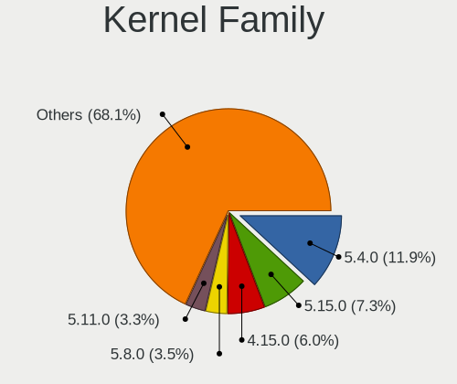
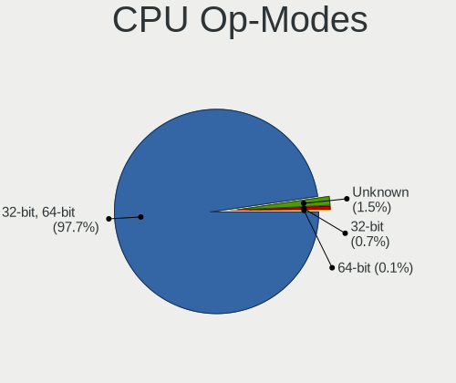

Linux - Tested Hardware & Statistics (Desktops)
-----------------------------------------------

A project to collect tested hardware configurations for Linux.

Anyone can contribute to this report by the [hw-probe](https://github.com/linuxhw/hw-probe) tool:

    sudo -E hw-probe -all -upload

Please contribute! Especially if your hardware is rare.

This report is for real hardware. Report for virtual hardware: [TestDays_VE](https://github.com/linuxhw/TestDays_VE)

Contents
--------

* [ Test Cases ](#test-cases)

* [ System ](#system)
  - [ OS                       ](#os)
  - [ OS Family                ](#os-family)
  - [ Kernel                   ](#kernel)
  - [ Kernel Family            ](#kernel-family)
  - [ Kernel Major Ver.        ](#kernel-major-ver)
  - [ Arch                     ](#arch)
  - [ DE                       ](#de)
  - [ Display Server           ](#display-server)
  - [ Display Manager          ](#display-manager)
  - [ OS Lang                  ](#os-lang)
  - [ Boot Mode                ](#boot-mode)
  - [ Filesystem               ](#filesystem)
  - [ Part. scheme             ](#part-scheme)
  - [ Dual Boot with Linux/BSD ](#dual-boot-with-linuxbsd)
  - [ Dual Boot (Win)          ](#dual-boot-win)

* [ Board ](#board)
  - [ Vendor                   ](#vendor)
  - [ Model                    ](#model)
  - [ Model Family             ](#model-family)
  - [ MFG Year                 ](#mfg-year)
  - [ Form Factor              ](#form-factor)
  - [ Secure Boot              ](#secure-boot)
  - [ Coreboot                 ](#coreboot)
  - [ RAM Size                 ](#ram-size)
  - [ RAM Used                 ](#ram-used)
  - [ Total Drives             ](#total-drives)
  - [ Has CD-ROM               ](#has-cd-rom)
  - [ Has Ethernet             ](#has-ethernet)
  - [ Has WiFi                 ](#has-wifi)
  - [ Has Bluetooth            ](#has-bluetooth)

* [ Location ](#location)
  - [ Country                  ](#country)
  - [ City                     ](#city)

* [ Drives ](#drives)
  - [ Drive Vendor             ](#drive-vendor)
  - [ Drive Model              ](#drive-model)
  - [ HDD Vendor               ](#hdd-vendor)
  - [ SSD Vendor               ](#ssd-vendor)
  - [ Drive Kind               ](#drive-kind)
  - [ Drive Connector          ](#drive-connector)
  - [ Drive Size               ](#drive-size)
  - [ Space Total              ](#space-total)
  - [ Space Used               ](#space-used)
  - [ Malfunc. Drives          ](#malfunc-drives)
  - [ Malfunc. Drive Vendor    ](#malfunc-drive-vendor)
  - [ Malfunc. HDD Vendor      ](#malfunc-hdd-vendor)
  - [ Malfunc. Drive Kind      ](#malfunc-drive-kind)
  - [ Failed Drives            ](#failed-drives)
  - [ Failed Drive Vendor      ](#failed-drive-vendor)
  - [ Drive Status             ](#drive-status)

* [ Storage controller ](#storage-controller)
  - [ Storage Vendor           ](#storage-vendor)
  - [ Storage Model            ](#storage-model)
  - [ Storage Kind             ](#storage-kind)

* [ Processor ](#processor)
  - [ CPU Vendor               ](#cpu-vendor)
  - [ CPU Model                ](#cpu-model)
  - [ CPU Model Family         ](#cpu-model-family)
  - [ CPU Cores                ](#cpu-cores)
  - [ CPU Sockets              ](#cpu-sockets)
  - [ CPU Threads              ](#cpu-threads)
  - [ CPU Op-Modes             ](#cpu-op-modes)
  - [ CPU Microcode            ](#cpu-microcode)
  - [ CPU Microarch            ](#cpu-microarch)

* [ Graphics ](#graphics)
  - [ GPU Vendor               ](#gpu-vendor)
  - [ GPU Model                ](#gpu-model)
  - [ GPU Combo                ](#gpu-combo)
  - [ GPU Driver               ](#gpu-driver)
  - [ GPU Memory               ](#gpu-memory)

* [ Monitor ](#monitor)
  - [ Monitor Vendor           ](#monitor-vendor)
  - [ Monitor Model            ](#monitor-model)
  - [ Monitor Resolution       ](#monitor-resolution)
  - [ Monitor Diagonal         ](#monitor-diagonal)
  - [ Monitor Width            ](#monitor-width)
  - [ Aspect Ratio             ](#aspect-ratio)
  - [ Monitor Area             ](#monitor-area)
  - [ Pixel Density            ](#pixel-density)
  - [ Multiple Monitors        ](#multiple-monitors)

* [ Network ](#network)
  - [ Net Controller Vendor    ](#net-controller-vendor)
  - [ Net Controller Model     ](#net-controller-model)
  - [ Wireless Vendor          ](#wireless-vendor)
  - [ Wireless Model           ](#wireless-model)
  - [ Ethernet Vendor          ](#ethernet-vendor)
  - [ Ethernet Model           ](#ethernet-model)
  - [ Net Controller Kind      ](#net-controller-kind)
  - [ Used Controller          ](#used-controller)
  - [ NICs                     ](#nics)
  - [ IPv6                     ](#ipv6)

* [ Bluetooth ](#bluetooth)
  - [ Bluetooth Vendor         ](#bluetooth-vendor)
  - [ Bluetooth Model          ](#bluetooth-model)

* [ Sound ](#sound)
  - [ Sound Vendor             ](#sound-vendor)
  - [ Sound Model              ](#sound-model)

* [ Memory ](#memory)
  - [ Memory Vendor            ](#memory-vendor)
  - [ Memory Model             ](#memory-model)
  - [ Memory Kind              ](#memory-kind)
  - [ Memory Form Factor       ](#memory-form-factor)
  - [ Memory Size              ](#memory-size)
  - [ Memory Speed             ](#memory-speed)

* [ Printers & scanners ](#printers--scanners)
  - [ Printer Vendor           ](#printer-vendor)
  - [ Printer Model            ](#printer-model)
  - [ Scanner Vendor           ](#scanner-vendor)
  - [ Scanner Model            ](#scanner-model)

* [ Camera ](#camera)
  - [ Camera Vendor            ](#camera-vendor)
  - [ Camera Model             ](#camera-model)

* [ Security ](#security)
  - [ Fingerprint Vendor       ](#fingerprint-vendor)
  - [ Fingerprint Model        ](#fingerprint-model)
  - [ Chipcard Vendor          ](#chipcard-vendor)
  - [ Chipcard Model           ](#chipcard-model)

* [ Unsupported ](#unsupported)
  - [ Unsupported Devices      ](#unsupported-devices)
  - [ Unsupported Device Types ](#unsupported-device-types)

Test Cases
----------

Total: 121842

| Vendor        | Model                       | Probe                                                      | Date         |
|---------------|-----------------------------|------------------------------------------------------------|--------------|
| Dell          | 0Y5DDC A00                  | [9a9a57dd2b](https://linux-hardware.org/?probe=9a9a57dd2b) | May 01, 2023 |
| ASUSTek       | PRIME H610M-E D4            | [56db7fc27f](https://linux-hardware.org/?probe=56db7fc27f) | May 01, 2023 |
| ASRock        | 970 Pro3 R2.0               | [577b5e8f51](https://linux-hardware.org/?probe=577b5e8f51) | May 01, 2023 |
| ASUSTek       | SABERTOOTH 990FX R2.0       | [41e9bb9584](https://linux-hardware.org/?probe=41e9bb9584) | May 01, 2023 |
| ASUSTek       | PRIME B550M-A               | [9146d12231](https://linux-hardware.org/?probe=9146d12231) | May 01, 2023 |
| MSI           | Z77A-G43                    | [02c2bfee54](https://linux-hardware.org/?probe=02c2bfee54) | May 01, 2023 |
| ASUSTek       | PRIME Z690M-PLUS D4         | [27fdafaf01](https://linux-hardware.org/?probe=27fdafaf01) | May 01, 2023 |
| Fujitsu       | D3223-A1 S26361-D3223-A1    | [9b6f7cea89](https://linux-hardware.org/?probe=9b6f7cea89) | May 01, 2023 |
| Gigabyte      | F2A88XM-D3H                 | [b37927b9d4](https://linux-hardware.org/?probe=b37927b9d4) | May 01, 2023 |
| Shuttle       | FS35V4                      | [137fda9bc6](https://linux-hardware.org/?probe=137fda9bc6) | May 01, 2023 |
| ASRock        | B450M Pro4                  | [24363c23cf](https://linux-hardware.org/?probe=24363c23cf) | May 01, 2023 |
| Gigabyte      | Z77MX-D3H                   | [fa4e32fe2c](https://linux-hardware.org/?probe=fa4e32fe2c) | May 01, 2023 |
| Dell          | 09KPNV A01                  | [45dad4b8e9](https://linux-hardware.org/?probe=45dad4b8e9) | May 01, 2023 |
| Gigabyte      | A320M-S2H V2-CF             | [cf6a478eb1](https://linux-hardware.org/?probe=cf6a478eb1) | May 01, 2023 |
| ASRock        | B660M-HDV                   | [a137e6ab62](https://linux-hardware.org/?probe=a137e6ab62) | May 01, 2023 |
| ASUSTek       | A55M-E                      | [ee1054dc5c](https://linux-hardware.org/?probe=ee1054dc5c) | May 01, 2023 |
| ASUSTek       | PRIME J4005I-C              | [611ed4a200](https://linux-hardware.org/?probe=611ed4a200) | May 01, 2023 |
| Gigabyte      | X58A-UD3R                   | [36f4134c6b](https://linux-hardware.org/?probe=36f4134c6b) | May 01, 2023 |
| ASRockRack    | X470D4U2-2T                 | [34e7df2c84](https://linux-hardware.org/?probe=34e7df2c84) | May 01, 2023 |
| HP            | 822A                        | [b373ff6def](https://linux-hardware.org/?probe=b373ff6def) | May 01, 2023 |
| HP            | 2B38                        | [bf99202e8b](https://linux-hardware.org/?probe=bf99202e8b) | May 01, 2023 |
| MSI           | X99A RAIDER                 | [f2c73a1fbb](https://linux-hardware.org/?probe=f2c73a1fbb) | May 01, 2023 |
| ASRock        | FM2A88X Extreme6+           | [be8b69e1b4](https://linux-hardware.org/?probe=be8b69e1b4) | May 01, 2023 |
| ASRock        | B650 LiveMixer              | [aecb4b61b4](https://linux-hardware.org/?probe=aecb4b61b4) | May 01, 2023 |
| MSI           | A520M-A PRO                 | [aa8e8397f6](https://linux-hardware.org/?probe=aa8e8397f6) | May 01, 2023 |
| Dell          | 0NC2VH A01                  | [7fb1708706](https://linux-hardware.org/?probe=7fb1708706) | May 01, 2023 |
| ASUSTek       | TUF Gaming X570-PLUS        | [2a2bf698ed](https://linux-hardware.org/?probe=2a2bf698ed) | May 01, 2023 |
| ASUSTek       | TUF Gaming B550M-PLUS WI... | [62d194e85e](https://linux-hardware.org/?probe=62d194e85e) | May 01, 2023 |
| ASUSTek       | ROG STRIX X399-E GAMING     | [a3c89effff](https://linux-hardware.org/?probe=a3c89effff) | May 01, 2023 |
| ASUSTek       | PRIME Z690-P WIFI           | [4f0b170b70](https://linux-hardware.org/?probe=4f0b170b70) | May 01, 2023 |
| ASUSTek       | PRIME B450-PLUS             | [56db3a6b44](https://linux-hardware.org/?probe=56db3a6b44) | May 01, 2023 |
| Dell          | 06D7TR A00                  | [6fe7179a50](https://linux-hardware.org/?probe=6fe7179a50) | May 01, 2023 |
| Gigabyte      | AB350-Gaming-CF             | [c03693e806](https://linux-hardware.org/?probe=c03693e806) | May 01, 2023 |
| HP            | 2B38                        | [6942eb2544](https://linux-hardware.org/?probe=6942eb2544) | May 01, 2023 |
| MSI           | MPG X570 GAMING EDGE WIF... | [2fcc250a35](https://linux-hardware.org/?probe=2fcc250a35) | May 01, 2023 |
| ASUSTek       | PRIME B550M-A AC            | [f10c443a56](https://linux-hardware.org/?probe=f10c443a56) | May 01, 2023 |
| PCWare        | IPMH410E                    | [9be4314a33](https://linux-hardware.org/?probe=9be4314a33) | May 01, 2023 |
| ASRock        | Z170 Gaming K4              | [a38bf561f7](https://linux-hardware.org/?probe=a38bf561f7) | May 01, 2023 |
| ASRock        | Z170 Gaming K4              | [b5ce5ff271](https://linux-hardware.org/?probe=b5ce5ff271) | May 01, 2023 |
| Dell          | 06D7TR A00                  | [e7905065dd](https://linux-hardware.org/?probe=e7905065dd) | Apr 30, 2023 |
| Dell          | 07PR60 A00                  | [e6f49bbe8a](https://linux-hardware.org/?probe=e6f49bbe8a) | Apr 30, 2023 |
| ASUSTek       | ProArt X670E-CREATOR WIF... | [d85b7a2592](https://linux-hardware.org/?probe=d85b7a2592) | Apr 30, 2023 |
| Lenovo        | 3111 SDK0J40697 WIN 3305... | [705ff684a9](https://linux-hardware.org/?probe=705ff684a9) | Apr 30, 2023 |
| ASUSTek       | H81-PLUS                    | [3b45144d62](https://linux-hardware.org/?probe=3b45144d62) | Apr 30, 2023 |
| Dell          | 02YYK5 A01                  | [1a00a1321e](https://linux-hardware.org/?probe=1a00a1321e) | Apr 30, 2023 |
| ASRock        | A520M-ITX/ac                | [5a9f58bcc0](https://linux-hardware.org/?probe=5a9f58bcc0) | Apr 30, 2023 |
| Gigabyte      | EP45-UD3P                   | [8d99ef5cc7](https://linux-hardware.org/?probe=8d99ef5cc7) | Apr 30, 2023 |
| ASUSTek       | H81I-PLUS                   | [01578538eb](https://linux-hardware.org/?probe=01578538eb) | Apr 30, 2023 |
| MSI           | IONA                        | [966ec83038](https://linux-hardware.org/?probe=966ec83038) | Apr 30, 2023 |
| MSI           | B450M PRO-M2                | [b650f0a26e](https://linux-hardware.org/?probe=b650f0a26e) | Apr 30, 2023 |
| ASRock        | Z77 Extreme3                | [1298b74530](https://linux-hardware.org/?probe=1298b74530) | Apr 30, 2023 |
| DIEBOLD       | NM70-I                      | [c01a40d58c](https://linux-hardware.org/?probe=c01a40d58c) | Apr 30, 2023 |
| ASRock        | FM2A68M-HD+                 | [467bb5ded2](https://linux-hardware.org/?probe=467bb5ded2) | Apr 30, 2023 |
| Pegatron      | NARRA5                      | [4c8bb5eff0](https://linux-hardware.org/?probe=4c8bb5eff0) | Apr 30, 2023 |
| ASUSTek       | ROG STRIX Z370-F GAMING     | [0aa17c06c5](https://linux-hardware.org/?probe=0aa17c06c5) | Apr 30, 2023 |
| Shuttle       | DL20N                       | [3f97bcaa08](https://linux-hardware.org/?probe=3f97bcaa08) | Apr 30, 2023 |
| MSI           | PRO Z690-A WIFI             | [bfa4eb5eda](https://linux-hardware.org/?probe=bfa4eb5eda) | Apr 30, 2023 |
| HP            | ProLiant ML310e Gen8 v2     | [501d26e477](https://linux-hardware.org/?probe=501d26e477) | Apr 30, 2023 |
| Apple         | Mac-F42C88C8 Proto1         | [ab7b403321](https://linux-hardware.org/?probe=ab7b403321) | Apr 30, 2023 |
| ASRock        | B550M Steel Legend          | [68d85dd28f](https://linux-hardware.org/?probe=68d85dd28f) | Apr 30, 2023 |
| ASRock        | B550M Steel Legend          | [5166f820a6](https://linux-hardware.org/?probe=5166f820a6) | Apr 30, 2023 |
| ASRock        | 960GM-GS3 FX                | [392492c032](https://linux-hardware.org/?probe=392492c032) | Apr 30, 2023 |
| ASUSTek       | TUF Gaming B550M-PLUS WI... | [e2acacabb3](https://linux-hardware.org/?probe=e2acacabb3) | Apr 30, 2023 |
| Gigabyte      | F2A88XM-D3H                 | [a188684584](https://linux-hardware.org/?probe=a188684584) | Apr 30, 2023 |
| Lenovo        | 370A SDK0J40700 WIN 3258... | [9a1d443928](https://linux-hardware.org/?probe=9a1d443928) | Apr 30, 2023 |
| ASRock        | 760GM-HD                    | [db79e93331](https://linux-hardware.org/?probe=db79e93331) | Apr 30, 2023 |
| Gigabyte      | Z77M-D3H                    | [a3d2b3dcd3](https://linux-hardware.org/?probe=a3d2b3dcd3) | Apr 30, 2023 |
| Fujitsu       | D2828-A2 S26361-D2828-A2    | [8bf9a1841e](https://linux-hardware.org/?probe=8bf9a1841e) | Apr 30, 2023 |
| Foxconn       | G41S/G41S-K                 | [946a95c594](https://linux-hardware.org/?probe=946a95c594) | Apr 30, 2023 |
| Foxconn       | G41S/G41S-K                 | [58cebf39d1](https://linux-hardware.org/?probe=58cebf39d1) | Apr 30, 2023 |
| MSI           | MEG Z390 GODLIKE            | [9109b0a7ed](https://linux-hardware.org/?probe=9109b0a7ed) | Apr 30, 2023 |
| ASUSTek       | TUF Gaming B550-PLUS        | [0bf0b828d4](https://linux-hardware.org/?probe=0bf0b828d4) | Apr 30, 2023 |
| ASRock        | B650M PG Riptide            | [236258bd78](https://linux-hardware.org/?probe=236258bd78) | Apr 30, 2023 |
| Medion        | H81H3-EM2                   | [c85a3da4ab](https://linux-hardware.org/?probe=c85a3da4ab) | Apr 30, 2023 |
| Fujitsu       | D2828-A2 S26361-D2828-A2    | [7afb6268da](https://linux-hardware.org/?probe=7afb6268da) | Apr 30, 2023 |
| Dell          | 042P49 A01                  | [6190be123c](https://linux-hardware.org/?probe=6190be123c) | Apr 30, 2023 |
| ASRock        | N68-GS4 FX                  | [354f8689e7](https://linux-hardware.org/?probe=354f8689e7) | Apr 30, 2023 |
| ASUSTek       | TUF Gaming B460M-PLUS       | [8cb7a3612c](https://linux-hardware.org/?probe=8cb7a3612c) | Apr 30, 2023 |
| Colorful T... | CVN B550M GAMING FROZEN ... | [233ea7cdd8](https://linux-hardware.org/?probe=233ea7cdd8) | Apr 30, 2023 |
| Gigabyte      | 970A-DS3P                   | [c1fe7a5f87](https://linux-hardware.org/?probe=c1fe7a5f87) | Apr 30, 2023 |
| Intel         | DH67CL AAG10212-210         | [7d6b0027b3](https://linux-hardware.org/?probe=7d6b0027b3) | Apr 30, 2023 |
| Colorful T... | CVN B550M GAMING FROZEN ... | [177fe2fc00](https://linux-hardware.org/?probe=177fe2fc00) | Apr 30, 2023 |
| MSI           | X570-A PRO                  | [4d31b88bbf](https://linux-hardware.org/?probe=4d31b88bbf) | Apr 30, 2023 |
| ASUSTek       | P7Q57-M DO                  | [897fc61b8c](https://linux-hardware.org/?probe=897fc61b8c) | Apr 30, 2023 |
| MSI           | X570-A PRO                  | [47a253784a](https://linux-hardware.org/?probe=47a253784a) | Apr 30, 2023 |
| ASUSTek       | P7Q57-M DO                  | [4f502dcb59](https://linux-hardware.org/?probe=4f502dcb59) | Apr 30, 2023 |
| Fujitsu       | D3161-A1 S26361-D3161-A1    | [ac7894081f](https://linux-hardware.org/?probe=ac7894081f) | Apr 30, 2023 |
| Dell          | 0YF8P5 A00                  | [4f5262d2c9](https://linux-hardware.org/?probe=4f5262d2c9) | Apr 30, 2023 |
| Gigabyte      | TRX40 AORUS XTREME          | [a88277b7f9](https://linux-hardware.org/?probe=a88277b7f9) | Apr 30, 2023 |
| MSI           | 760GM-P23                   | [4ac55a6bbe](https://linux-hardware.org/?probe=4ac55a6bbe) | Apr 30, 2023 |
| ASUSTek       | P5K                         | [ea70f7298c](https://linux-hardware.org/?probe=ea70f7298c) | Apr 30, 2023 |
| Medion        | D3F3-EM                     | [6b9e38ad6c](https://linux-hardware.org/?probe=6b9e38ad6c) | Apr 30, 2023 |
| Gigabyte      | GA-78LMT-USB3 SEx           | [ccb46c2a2b](https://linux-hardware.org/?probe=ccb46c2a2b) | Apr 30, 2023 |
| HEDYCOMPUT... | IH81MF-Q3                   | [3444236ed4](https://linux-hardware.org/?probe=3444236ed4) | Apr 30, 2023 |
| MSI           | A68HM GRENADE               | [938aa1cb46](https://linux-hardware.org/?probe=938aa1cb46) | Apr 30, 2023 |
| Gigabyte      | H77-DS3H                    | [6750e5f83d](https://linux-hardware.org/?probe=6750e5f83d) | Apr 30, 2023 |
| Acer          | E661GXM                     | [d5433b46bd](https://linux-hardware.org/?probe=d5433b46bd) | Apr 30, 2023 |
| ASUSTek       | ROG STRIX X670E-E GAMING... | [0d5e9310d3](https://linux-hardware.org/?probe=0d5e9310d3) | Apr 30, 2023 |
| Gigabyte      | P75-D3                      | [4f6987c722](https://linux-hardware.org/?probe=4f6987c722) | Apr 30, 2023 |
| Acer          | Aspire X3950                | [406366d5c1](https://linux-hardware.org/?probe=406366d5c1) | Apr 30, 2023 |
| MSI           | B450 GAMING PLUS            | [8aa973e0f5](https://linux-hardware.org/?probe=8aa973e0f5) | Apr 30, 2023 |
| ASRock        | H110M-DGS R3.0              | [88e7444fa5](https://linux-hardware.org/?probe=88e7444fa5) | Apr 30, 2023 |
| ASUSTek       | PRIME A320M-K               | [4587583e6a](https://linux-hardware.org/?probe=4587583e6a) | Apr 30, 2023 |
| ASRock        | H110M-DGS R3.0              | [763e7fa1b6](https://linux-hardware.org/?probe=763e7fa1b6) | Apr 30, 2023 |
| ASUSTek       | B85M-G R2.0                 | [243a170e5a](https://linux-hardware.org/?probe=243a170e5a) | Apr 30, 2023 |
| Gigabyte      | Q87M-D2H                    | [16279b3c8b](https://linux-hardware.org/?probe=16279b3c8b) | Apr 30, 2023 |
| T-bao         | MINI PC V1.0                | [8e77950434](https://linux-hardware.org/?probe=8e77950434) | Apr 30, 2023 |
| Positivo      | POS-EIQ87CY POSITIVO        | [2e2b57b3ae](https://linux-hardware.org/?probe=2e2b57b3ae) | Apr 30, 2023 |
| ASUSTek       | TUF Gaming B550M-PLUS       | [a2b832afa2](https://linux-hardware.org/?probe=a2b832afa2) | Apr 30, 2023 |
| MSI           | PRO Z690-A DDR4             | [9419686ec7](https://linux-hardware.org/?probe=9419686ec7) | Apr 30, 2023 |
| MSI           | B360M MORTAR                | [352a47b8a0](https://linux-hardware.org/?probe=352a47b8a0) | Apr 30, 2023 |
| Gigabyte      | AB350-Gaming 3-CF           | [01311e320c](https://linux-hardware.org/?probe=01311e320c) | Apr 30, 2023 |
| ASRock        | B450M Steel Legend          | [fed083feba](https://linux-hardware.org/?probe=fed083feba) | Apr 30, 2023 |
| ASUSTek       | TUF Gaming B550M-PLUS       | [c83cb7e3ec](https://linux-hardware.org/?probe=c83cb7e3ec) | Apr 30, 2023 |
| MSI           | PRO Z690-A DDR4             | [1f61fda034](https://linux-hardware.org/?probe=1f61fda034) | Apr 30, 2023 |
| ASRockRack    | X470D4U2-2T                 | [f46e9f6ba7](https://linux-hardware.org/?probe=f46e9f6ba7) | Apr 30, 2023 |
| ASRock        | FM2A88X Extreme6+           | [c33288abe2](https://linux-hardware.org/?probe=c33288abe2) | Apr 30, 2023 |
| MSI           | X99A RAIDER                 | [606b173cab](https://linux-hardware.org/?probe=606b173cab) | Apr 30, 2023 |
| ASUSTek       | ROG STRIX B450-F GAMING ... | [f0a784354c](https://linux-hardware.org/?probe=f0a784354c) | Apr 30, 2023 |
| HP            | ProLiant ML10 v2            | [3582be2f06](https://linux-hardware.org/?probe=3582be2f06) | Apr 30, 2023 |
| ASUSTek       | ROG STRIX B450-F GAMING ... | [332a777929](https://linux-hardware.org/?probe=332a777929) | Apr 30, 2023 |
| Gigabyte      | X670 AORUS ELITE AX         | [54f8ed91cf](https://linux-hardware.org/?probe=54f8ed91cf) | Apr 30, 2023 |
| HP            | 828A                        | [f1590b355f](https://linux-hardware.org/?probe=f1590b355f) | Apr 30, 2023 |
| Intel         | H61                         | [167616bc61](https://linux-hardware.org/?probe=167616bc61) | Apr 30, 2023 |
| MSI           | P67A-C43                    | [68f0d09abd](https://linux-hardware.org/?probe=68f0d09abd) | Apr 30, 2023 |
| MSI           | MPG X570 GAMING PLUS        | [2dffd7bed6](https://linux-hardware.org/?probe=2dffd7bed6) | Apr 30, 2023 |
| Gigabyte      | H610M H DDR4                | [1c67ba3f8a](https://linux-hardware.org/?probe=1c67ba3f8a) | Apr 30, 2023 |
| Intel         | H81                         | [c70b10516b](https://linux-hardware.org/?probe=c70b10516b) | Apr 30, 2023 |
| HP            | 18E4                        | [da858ea464](https://linux-hardware.org/?probe=da858ea464) | Apr 30, 2023 |
| Dell          | 0GXM1W A02                  | [7dcb847a6c](https://linux-hardware.org/?probe=7dcb847a6c) | Apr 30, 2023 |
| MSI           | MPG B650I EDGE WIFI         | [eda4874295](https://linux-hardware.org/?probe=eda4874295) | Apr 30, 2023 |
| HP            | 1998                        | [4ba5ef1211](https://linux-hardware.org/?probe=4ba5ef1211) | Apr 30, 2023 |
| Dell          | 0T10XW A02                  | [2cd32d1efe](https://linux-hardware.org/?probe=2cd32d1efe) | Apr 30, 2023 |
| MSI           | H310M PRO-VD                | [c2e2e1d130](https://linux-hardware.org/?probe=c2e2e1d130) | Apr 30, 2023 |
| ASRock        | H61M-HVS                    | [77f87da085](https://linux-hardware.org/?probe=77f87da085) | Apr 29, 2023 |
| ASRock        | X670E Steel Legend          | [04a7cea7cb](https://linux-hardware.org/?probe=04a7cea7cb) | Apr 29, 2023 |
| ASUSTek       | ROG STRIX X670E-E GAMING... | [f87233a295](https://linux-hardware.org/?probe=f87233a295) | Apr 29, 2023 |
| Gigabyte      | B85M-D3H                    | [2fe28d7f43](https://linux-hardware.org/?probe=2fe28d7f43) | Apr 29, 2023 |
| ASRock        | 970 Extreme4                | [96fd3e62de](https://linux-hardware.org/?probe=96fd3e62de) | Apr 29, 2023 |
| ASRock        | B550M Phantom Gaming 4      | [db7e2a1d87](https://linux-hardware.org/?probe=db7e2a1d87) | Apr 29, 2023 |
| Medion        | TJ4125                      | [ad46974b2a](https://linux-hardware.org/?probe=ad46974b2a) | Apr 29, 2023 |
| Dell          | 0773VG A02                  | [a684ad4938](https://linux-hardware.org/?probe=a684ad4938) | Apr 29, 2023 |
| ASUSTek       | ROG CROSSHAIR X670E HERO    | [4ac7cbf111](https://linux-hardware.org/?probe=4ac7cbf111) | Apr 29, 2023 |
| Dell          | 00V62H A00                  | [86cb104ceb](https://linux-hardware.org/?probe=86cb104ceb) | Apr 29, 2023 |
| ASUSTek       | ROG STRIX B550-F GAMING     | [493bc0b894](https://linux-hardware.org/?probe=493bc0b894) | Apr 29, 2023 |
| ASUSTek       | PRIME H410M-E               | [44a08af32f](https://linux-hardware.org/?probe=44a08af32f) | Apr 29, 2023 |
| Gigabyte      | GA-A55M-S2HP                | [4a478780d6](https://linux-hardware.org/?probe=4a478780d6) | Apr 29, 2023 |
| ASRock        | B450M Pro4                  | [7c8260664a](https://linux-hardware.org/?probe=7c8260664a) | Apr 29, 2023 |
| Gigabyte      | B450 AORUS M                | [ccc2fbf8a9](https://linux-hardware.org/?probe=ccc2fbf8a9) | Apr 29, 2023 |
| Gigabyte      | B660 GAMING X DDR4          | [c203c197b7](https://linux-hardware.org/?probe=c203c197b7) | Apr 29, 2023 |
| ASUSTek       | H81M-C/BR                   | [32942be783](https://linux-hardware.org/?probe=32942be783) | Apr 29, 2023 |
| ASUSTek       | PRIME X470-PRO              | [244cfe88a4](https://linux-hardware.org/?probe=244cfe88a4) | Apr 29, 2023 |
| Gigabyte      | GA-78LMT-USB3               | [f543ce6c65](https://linux-hardware.org/?probe=f543ce6c65) | Apr 29, 2023 |
| ASUSTek       | ROG STRIX Z590-F GAMING ... | [a158a30802](https://linux-hardware.org/?probe=a158a30802) | Apr 29, 2023 |
| Dell          | 0WR7PY A01                  | [e585f66f17](https://linux-hardware.org/?probe=e585f66f17) | Apr 29, 2023 |
| ASUSTek       | ROG STRIX B560-I GAMING ... | [fa805f77f7](https://linux-hardware.org/?probe=fa805f77f7) | Apr 29, 2023 |
| Gigabyte      | GA-MA790FXT-UD5P            | [910d4a6ad8](https://linux-hardware.org/?probe=910d4a6ad8) | Apr 29, 2023 |
| ASUSTek       | M5A78L-M PLUS/USB3          | [ef3f4d1ac1](https://linux-hardware.org/?probe=ef3f4d1ac1) | Apr 29, 2023 |
| ASUSTek       | SABERTOOTH 990FX            | [4801547d54](https://linux-hardware.org/?probe=4801547d54) | Apr 29, 2023 |
| ASRock        | N68C-S UCC                  | [13628f3559](https://linux-hardware.org/?probe=13628f3559) | Apr 29, 2023 |
| ASRock        | Z370 Gaming K6              | [a5ff738639](https://linux-hardware.org/?probe=a5ff738639) | Apr 29, 2023 |
| Unknown       | Unknown                     | [4b0542737c](https://linux-hardware.org/?probe=4b0542737c) | Apr 29, 2023 |
| ASRock        | 890FX Deluxe4               | [327a1a2b37](https://linux-hardware.org/?probe=327a1a2b37) | Apr 29, 2023 |
| ASUSTek       | X99-A                       | [6505e46b86](https://linux-hardware.org/?probe=6505e46b86) | Apr 29, 2023 |
| Apple         | Mac-F60DEB81FF30ACF6 Mac... | [80ea529a18](https://linux-hardware.org/?probe=80ea529a18) | Apr 29, 2023 |
| HP            | 3647h                       | [a2776d5c24](https://linux-hardware.org/?probe=a2776d5c24) | Apr 29, 2023 |
| Biostar       | H110MHV3                    | [95b25ba480](https://linux-hardware.org/?probe=95b25ba480) | Apr 29, 2023 |
| MSI           | B85M-E45                    | [db824980e5](https://linux-hardware.org/?probe=db824980e5) | Apr 29, 2023 |
| MSI           | B85M-E45                    | [42703e0a76](https://linux-hardware.org/?probe=42703e0a76) | Apr 29, 2023 |
| Biostar       | A780L3C                     | [056ea662e6](https://linux-hardware.org/?probe=056ea662e6) | Apr 29, 2023 |
| Intel         | DB75EN AAG39650-303         | [713c422641](https://linux-hardware.org/?probe=713c422641) | Apr 29, 2023 |
| ASRock        | B450 Pro4 R2.0              | [1d00cc1f78](https://linux-hardware.org/?probe=1d00cc1f78) | Apr 29, 2023 |
| Gigabyte      | B550 AORUS PRO V2           | [62f2094d3c](https://linux-hardware.org/?probe=62f2094d3c) | Apr 29, 2023 |
| Gigabyte      | B365M D3H-CF                | [8c4352985e](https://linux-hardware.org/?probe=8c4352985e) | Apr 29, 2023 |
| Hardkernel    | ODROID-H3                   | [139d61e128](https://linux-hardware.org/?probe=139d61e128) | Apr 29, 2023 |
| MSI           | MPG X570 GAMING PLUS        | [ee996917df](https://linux-hardware.org/?probe=ee996917df) | Apr 29, 2023 |
| ASUSTek       | Z97-P                       | [8ea78b28f1](https://linux-hardware.org/?probe=8ea78b28f1) | Apr 29, 2023 |
| ASUSTek       | H110M-D                     | [81cff8a578](https://linux-hardware.org/?probe=81cff8a578) | Apr 29, 2023 |
| Gigabyte      | Z790 UD                     | [536a24a0e3](https://linux-hardware.org/?probe=536a24a0e3) | Apr 29, 2023 |
| ASRock        | N68C-S UCC                  | [f7f4643b8f](https://linux-hardware.org/?probe=f7f4643b8f) | Apr 29, 2023 |
| Gigabyte      | AB350M-DS3H V2-CF           | [292f489feb](https://linux-hardware.org/?probe=292f489feb) | Apr 29, 2023 |
| Gigabyte      | H310M H x.x                 | [6b44ad5061](https://linux-hardware.org/?probe=6b44ad5061) | Apr 29, 2023 |
| HP            | 3397                        | [8b84766d3d](https://linux-hardware.org/?probe=8b84766d3d) | Apr 29, 2023 |
| Gigabyte      | H310M H x.x                 | [ce73a703b6](https://linux-hardware.org/?probe=ce73a703b6) | Apr 29, 2023 |
| YANYU         | EPIC-N56_I522E Ver          | [4798ab5c06](https://linux-hardware.org/?probe=4798ab5c06) | Apr 29, 2023 |
| ASUSTek       | P5B-Deluxe                  | [d0d3458299](https://linux-hardware.org/?probe=d0d3458299) | Apr 29, 2023 |
| Dell          | 0T7D40 A01                  | [7ce0658b0f](https://linux-hardware.org/?probe=7ce0658b0f) | Apr 29, 2023 |
| ASUSTek       | PRIME B450M-K               | [3592ce514a](https://linux-hardware.org/?probe=3592ce514a) | Apr 29, 2023 |
| ASUSTek       | TUF B450M-PRO GAMING        | [081551c776](https://linux-hardware.org/?probe=081551c776) | Apr 29, 2023 |
| Gigabyte      | G41MT-S2                    | [ba5c65f4e3](https://linux-hardware.org/?probe=ba5c65f4e3) | Apr 29, 2023 |
| HP            | 8054                        | [81a57b4a2f](https://linux-hardware.org/?probe=81a57b4a2f) | Apr 29, 2023 |
| ASRock        | Z370 Extreme4               | [0f126ade53](https://linux-hardware.org/?probe=0f126ade53) | Apr 29, 2023 |
| Lenovo        | XXXX 3000 H210              | [96644846f5](https://linux-hardware.org/?probe=96644846f5) | Apr 29, 2023 |
| Gigabyte      | X399 DESIGNARE EX-CF        | [e47ae2080c](https://linux-hardware.org/?probe=e47ae2080c) | Apr 29, 2023 |
| ASUSTek       | P8H61-M LE/BR               | [425f1a3e08](https://linux-hardware.org/?probe=425f1a3e08) | Apr 29, 2023 |
| Samsung       | DT1234567890 SEC_SW_REVI... | [dca43563dd](https://linux-hardware.org/?probe=dca43563dd) | Apr 29, 2023 |
| MSI           | B450M MORTAR MAX            | [3586d79ce4](https://linux-hardware.org/?probe=3586d79ce4) | Apr 29, 2023 |
| Dell          | 08NPPY A00                  | [25bc3aa225](https://linux-hardware.org/?probe=25bc3aa225) | Apr 29, 2023 |
| Dell          | 0HY9JP A02                  | [2ec196dd79](https://linux-hardware.org/?probe=2ec196dd79) | Apr 29, 2023 |
| Gigabyte      | H410M H                     | [3ea3271f4a](https://linux-hardware.org/?probe=3ea3271f4a) | Apr 29, 2023 |
| MSI           | MAG Z790 TOMAHAWK WIFI D... | [c880b8dcdd](https://linux-hardware.org/?probe=c880b8dcdd) | Apr 29, 2023 |
| HP            | 845A                        | [d0aa2a4a7a](https://linux-hardware.org/?probe=d0aa2a4a7a) | Apr 29, 2023 |
| HP            | 845A                        | [f8bc4601ef](https://linux-hardware.org/?probe=f8bc4601ef) | Apr 29, 2023 |
| Dell          | 0T0MHW A02                  | [4f08178f96](https://linux-hardware.org/?probe=4f08178f96) | Apr 29, 2023 |
| HP            | 1998                        | [6f816ac95a](https://linux-hardware.org/?probe=6f816ac95a) | Apr 29, 2023 |
| Dell          | 0Y2MRG A00                  | [5f765d4d9c](https://linux-hardware.org/?probe=5f765d4d9c) | Apr 29, 2023 |
| Dell          | 0Y2MRG A00                  | [62a4a8b0b5](https://linux-hardware.org/?probe=62a4a8b0b5) | Apr 29, 2023 |
| Foxconn       | 2AB7                        | [01e7b05d2a](https://linux-hardware.org/?probe=01e7b05d2a) | Apr 29, 2023 |
| ECS           | H81H3-M4                    | [67da6cebd3](https://linux-hardware.org/?probe=67da6cebd3) | Apr 29, 2023 |
| ASUSTek       | H170I-PRO                   | [b166ca425b](https://linux-hardware.org/?probe=b166ca425b) | Apr 29, 2023 |
| Gigabyte      | X570 I AORUS PRO WIFI       | [4b47a4606b](https://linux-hardware.org/?probe=4b47a4606b) | Apr 29, 2023 |
| MSI           | B450 TOMAHAWK               | [1404923301](https://linux-hardware.org/?probe=1404923301) | Apr 28, 2023 |
| ASUSTek       | ROG Maximus Z690 HERO       | [855bed0070](https://linux-hardware.org/?probe=855bed0070) | Apr 28, 2023 |
| Gigabyte      | H410M H V2                  | [8a23a0fef0](https://linux-hardware.org/?probe=8a23a0fef0) | Apr 28, 2023 |
| Gigabyte      | GA-78LMT-S2                 | [16b28befee](https://linux-hardware.org/?probe=16b28befee) | Apr 28, 2023 |
| Dell          | 0773VG A02                  | [bd3dba564e](https://linux-hardware.org/?probe=bd3dba564e) | Apr 28, 2023 |
| Medion        | TJ4125                      | [8f319cff50](https://linux-hardware.org/?probe=8f319cff50) | Apr 28, 2023 |
| ECS           | A740GM-M                    | [9e69523c9f](https://linux-hardware.org/?probe=9e69523c9f) | Apr 28, 2023 |
| ASRock        | B450M Pro4                  | [831cd8fa39](https://linux-hardware.org/?probe=831cd8fa39) | Apr 28, 2023 |
| Apple         | Mac-F221BEC8                | [033718212c](https://linux-hardware.org/?probe=033718212c) | Apr 28, 2023 |
| Gigabyte      | X570 AORUS ELITE WIFI       | [e65094a8f6](https://linux-hardware.org/?probe=e65094a8f6) | Apr 28, 2023 |
| Dell          | 0773VG A02                  | [cab1aa59e0](https://linux-hardware.org/?probe=cab1aa59e0) | Apr 28, 2023 |
| MSI           | B550M PRO-VDH WIFI          | [e0367e684f](https://linux-hardware.org/?probe=e0367e684f) | Apr 28, 2023 |
| HP            | 8265                        | [5cdb9f6a93](https://linux-hardware.org/?probe=5cdb9f6a93) | Apr 28, 2023 |
| MSI           | B550M PRO-VDH WIFI          | [fed0a1a719](https://linux-hardware.org/?probe=fed0a1a719) | Apr 28, 2023 |
| ASRock        | Z77 Extreme3                | [b0c7bac447](https://linux-hardware.org/?probe=b0c7bac447) | Apr 28, 2023 |
| ASRock        | Z790 Steel Legend WiFi      | [36175223a5](https://linux-hardware.org/?probe=36175223a5) | Apr 28, 2023 |
| ASRock        | A320M-DVS R4.0              | [7e7da68aa3](https://linux-hardware.org/?probe=7e7da68aa3) | Apr 28, 2023 |
| ASRock        | B550M-ITX/ac                | [0295ab04a7](https://linux-hardware.org/?probe=0295ab04a7) | Apr 28, 2023 |
| HP            | 339A                        | [4f9a0b2661](https://linux-hardware.org/?probe=4f9a0b2661) | Apr 28, 2023 |
| Gigabyte      | B85M-D3H                    | [c0c226bf8c](https://linux-hardware.org/?probe=c0c226bf8c) | Apr 28, 2023 |
| Gigabyte      | Q87M-D2H                    | [6503ed5a4c](https://linux-hardware.org/?probe=6503ed5a4c) | Apr 28, 2023 |
| Fujitsu       | D3500-A1 S26361-D3500-A1    | [77150d1166](https://linux-hardware.org/?probe=77150d1166) | Apr 28, 2023 |
| Gigabyte      | A520M S2H                   | [fa82c3b6ba](https://linux-hardware.org/?probe=fa82c3b6ba) | Apr 28, 2023 |
| ASUSTek       | Z87-PLUS                    | [7477be45f8](https://linux-hardware.org/?probe=7477be45f8) | Apr 28, 2023 |
| ASUSTek       | PRIME X370-PRO              | [ddb48a2def](https://linux-hardware.org/?probe=ddb48a2def) | Apr 28, 2023 |
| Biostar       | A10N-9630E                  | [e9df412284](https://linux-hardware.org/?probe=e9df412284) | Apr 28, 2023 |
| Lenovo        | 1048 SDK0Q40104 WIN 3915... | [43942fab0f](https://linux-hardware.org/?probe=43942fab0f) | Apr 28, 2023 |
| ASUSTek       | ROG CROSSHAIR X670E GENE    | [c416a3f44a](https://linux-hardware.org/?probe=c416a3f44a) | Apr 28, 2023 |
| MSI           | MAG B650 TOMAHAWK WIFI      | [99745be007](https://linux-hardware.org/?probe=99745be007) | Apr 28, 2023 |
| Medion        | MS-7708                     | [af2020cd9c](https://linux-hardware.org/?probe=af2020cd9c) | Apr 28, 2023 |
| ASUSTek       | TUF Gaming B460-PLUS        | [b2616ea409](https://linux-hardware.org/?probe=b2616ea409) | Apr 28, 2023 |
| ASUSTek       | PRIME X670-P WIFI           | [d97d6d6dff](https://linux-hardware.org/?probe=d97d6d6dff) | Apr 28, 2023 |
| Medion        | MS-7708                     | [424c4ca2db](https://linux-hardware.org/?probe=424c4ca2db) | Apr 28, 2023 |
| ASRock        | A320M-HD                    | [43b57e5088](https://linux-hardware.org/?probe=43b57e5088) | Apr 28, 2023 |
| Dell          | 0VHWTR A01                  | [1a73639c02](https://linux-hardware.org/?probe=1a73639c02) | Apr 28, 2023 |
| ASUSTek       | PRIME A520M-E               | [048fda2c60](https://linux-hardware.org/?probe=048fda2c60) | Apr 28, 2023 |
| Gigabyte      | AX370-Gaming 5              | [a418b302b9](https://linux-hardware.org/?probe=a418b302b9) | Apr 28, 2023 |
| Pegatron      | Benicia                     | [930452646c](https://linux-hardware.org/?probe=930452646c) | Apr 28, 2023 |
| ASUSTek       | PRIME X670-P WIFI           | [a6eba14ab4](https://linux-hardware.org/?probe=a6eba14ab4) | Apr 28, 2023 |
| Gigabyte      | B550 AORUS MASTER           | [93cf85eecd](https://linux-hardware.org/?probe=93cf85eecd) | Apr 28, 2023 |
| ASUSTek       | TUF Gaming X570-PLUS        | [278ed4fdd2](https://linux-hardware.org/?probe=278ed4fdd2) | Apr 28, 2023 |
| Dell          | 0WMJ54 A01                  | [01c8d89ab9](https://linux-hardware.org/?probe=01c8d89ab9) | Apr 28, 2023 |
| HP            | 158B                        | [ee0297b0ba](https://linux-hardware.org/?probe=ee0297b0ba) | Apr 28, 2023 |
| Intel         | H61 V124                    | [1fa0b34b3c](https://linux-hardware.org/?probe=1fa0b34b3c) | Apr 28, 2023 |
| MSI           | MPG X570S CARBON MAX WIF... | [d472fb0a32](https://linux-hardware.org/?probe=d472fb0a32) | Apr 28, 2023 |
| Colorful T... | CVN Z590 GAMING PRO V20     | [209ec5e477](https://linux-hardware.org/?probe=209ec5e477) | Apr 28, 2023 |
| AZW           | MINI S 10                   | [12ba32f977](https://linux-hardware.org/?probe=12ba32f977) | Apr 28, 2023 |
| Foxconn       | H67MP-S/-V/H67MP            | [c8fe6ab042](https://linux-hardware.org/?probe=c8fe6ab042) | Apr 28, 2023 |
| Dell          | 0DNMV1 A01                  | [ab17992052](https://linux-hardware.org/?probe=ab17992052) | Apr 28, 2023 |
| Dell          | 0DNMV1 A01                  | [04bfccce7b](https://linux-hardware.org/?probe=04bfccce7b) | Apr 28, 2023 |
| ASRock        | B450 Steel Legend           | [9130280424](https://linux-hardware.org/?probe=9130280424) | Apr 28, 2023 |
| MSI           | B450-A PRO                  | [9f88a0a110](https://linux-hardware.org/?probe=9f88a0a110) | Apr 28, 2023 |
| Dell          | 0GY6Y8 A02                  | [f80f9b0671](https://linux-hardware.org/?probe=f80f9b0671) | Apr 28, 2023 |
| Unknown       | HX90                        | [8454daed68](https://linux-hardware.org/?probe=8454daed68) | Apr 28, 2023 |
| Dell          | 0VHWTR A01                  | [6f56840307](https://linux-hardware.org/?probe=6f56840307) | Apr 28, 2023 |
| Lenovo        | NOK                         | [cf3db26781](https://linux-hardware.org/?probe=cf3db26781) | Apr 28, 2023 |
| HP            | 0B54h D                     | [49c56c77af](https://linux-hardware.org/?probe=49c56c77af) | Apr 28, 2023 |
| Lenovo        | Dory CRB                    | [f8aee85cd4](https://linux-hardware.org/?probe=f8aee85cd4) | Apr 28, 2023 |
| Gigabyte      | H110M-S2-CF                 | [eb327f9dc8](https://linux-hardware.org/?probe=eb327f9dc8) | Apr 28, 2023 |
| HP            | 802F                        | [b314d41043](https://linux-hardware.org/?probe=b314d41043) | Apr 28, 2023 |
| Unknown       | G41                         | [2a6a185bec](https://linux-hardware.org/?probe=2a6a185bec) | Apr 28, 2023 |
| MSI           | H310M PRO-M2 PLUS           | [815dd8e866](https://linux-hardware.org/?probe=815dd8e866) | Apr 28, 2023 |
| ASUSTek       | PRIME H310M-R R2.0          | [41d545e4d7](https://linux-hardware.org/?probe=41d545e4d7) | Apr 28, 2023 |
| Intel         | DZ68DB AAG27985-101         | [b3323dcc11](https://linux-hardware.org/?probe=b3323dcc11) | Apr 28, 2023 |
| ASUSTek       | ROG STRIX Z370-I GAMING     | [e8886a7521](https://linux-hardware.org/?probe=e8886a7521) | Apr 28, 2023 |
| Unknown       | iKoolCore R1 iKoolCore R... | [429d6f994a](https://linux-hardware.org/?probe=429d6f994a) | Apr 28, 2023 |
| Intel         | DH67CL AAG10212-210         | [cb87589d9f](https://linux-hardware.org/?probe=cb87589d9f) | Apr 28, 2023 |
| ASUSTek       | P8H67-M PRO                 | [589810ee4b](https://linux-hardware.org/?probe=589810ee4b) | Apr 28, 2023 |
| HP            | ProLiant ML350e Gen8 v2     | [968f941e2d](https://linux-hardware.org/?probe=968f941e2d) | Apr 28, 2023 |
| ASUSTek       | B150-PRO D3                 | [35fa6f9a33](https://linux-hardware.org/?probe=35fa6f9a33) | Apr 28, 2023 |
| ASRock        | X470 Master SLI             | [cded55a936](https://linux-hardware.org/?probe=cded55a936) | Apr 28, 2023 |
| Gigabyte      | H110M-S2-CF                 | [ca9179cae4](https://linux-hardware.org/?probe=ca9179cae4) | Apr 28, 2023 |
| HP            | 158A                        | [fb7aef7883](https://linux-hardware.org/?probe=fb7aef7883) | Apr 28, 2023 |
| MSI           | PRO X670-P WIFI             | [266688994a](https://linux-hardware.org/?probe=266688994a) | Apr 28, 2023 |
| Dell          | 040DDP A01                  | [9d7528d062](https://linux-hardware.org/?probe=9d7528d062) | Apr 28, 2023 |
| Gigabyte      | Z490 AORUS ULTRA            | [96371860f5](https://linux-hardware.org/?probe=96371860f5) | Apr 28, 2023 |
| Lenovo        | SHARKBAY NO DPK             | [9a22f330c4](https://linux-hardware.org/?probe=9a22f330c4) | Apr 28, 2023 |
| MSI           | PRO X670-P WIFI             | [af0663fd52](https://linux-hardware.org/?probe=af0663fd52) | Apr 28, 2023 |
| ASRock        | B550 Pro4                   | [5d0819f25c](https://linux-hardware.org/?probe=5d0819f25c) | Apr 28, 2023 |
| ASUSTek       | ROG CROSSHAIR VIII HERO     | [f1679a62d0](https://linux-hardware.org/?probe=f1679a62d0) | Apr 28, 2023 |
| Lenovo        | NO DPK                      | [d3442220b0](https://linux-hardware.org/?probe=d3442220b0) | Apr 28, 2023 |
| Apple         | Mac-F42C88C8 Proto1         | [7a3cce252f](https://linux-hardware.org/?probe=7a3cce252f) | Apr 28, 2023 |
| Apple         | Mac-F42C88C8 Proto1         | [60bf74f8f9](https://linux-hardware.org/?probe=60bf74f8f9) | Apr 28, 2023 |
| Intel         | H61                         | [b8f0acdf61](https://linux-hardware.org/?probe=b8f0acdf61) | Apr 28, 2023 |
| MSI           | MAG B550M MORTAR WIFI       | [26c158df39](https://linux-hardware.org/?probe=26c158df39) | Apr 28, 2023 |
| ASUSTek       | ROG STRIX B550-F GAMING     | [92be2563a8](https://linux-hardware.org/?probe=92be2563a8) | Apr 28, 2023 |
| MSI           | MAG B650 TOMAHAWK WIFI      | [2427e67de4](https://linux-hardware.org/?probe=2427e67de4) | Apr 28, 2023 |
| Apple         | Mac-F221BEC8                | [3342a295e8](https://linux-hardware.org/?probe=3342a295e8) | Apr 28, 2023 |
| HP            | 21D0                        | [a26451e82c](https://linux-hardware.org/?probe=a26451e82c) | Apr 28, 2023 |
| ASUSTek       | TUF Gaming Z690-PLUS WIF... | [d138bfdf52](https://linux-hardware.org/?probe=d138bfdf52) | Apr 28, 2023 |
| MSI           | Z270 GAMING PRO CARBON      | [852dac1035](https://linux-hardware.org/?probe=852dac1035) | Apr 28, 2023 |
| BESSTAR Te... | HM80                        | [476c573547](https://linux-hardware.org/?probe=476c573547) | Apr 28, 2023 |
| ASRock        | A75M-HVS                    | [528362dfca](https://linux-hardware.org/?probe=528362dfca) | Apr 28, 2023 |
| ASRock        | H170A-X1                    | [a89448e417](https://linux-hardware.org/?probe=a89448e417) | Apr 28, 2023 |
| HP            | 83E9                        | [ac8ad5d3d5](https://linux-hardware.org/?probe=ac8ad5d3d5) | Apr 28, 2023 |
| Dell          | 051FJ8 A00                  | [f2b702b631](https://linux-hardware.org/?probe=f2b702b631) | Apr 28, 2023 |
| Lenovo        | Dory CRB                    | [f4d7a6ed92](https://linux-hardware.org/?probe=f4d7a6ed92) | Apr 28, 2023 |
| Dell          | 0XCR8D A01                  | [2e228e1b38](https://linux-hardware.org/?probe=2e228e1b38) | Apr 28, 2023 |
| Unknown       | RS780-SB700                 | [94f2408a63](https://linux-hardware.org/?probe=94f2408a63) | Apr 28, 2023 |
| Unknown       | RS780-SB700                 | [76c36882d9](https://linux-hardware.org/?probe=76c36882d9) | Apr 28, 2023 |
| ASUSTek       | TUF Gaming Z690-PLUS WIF... | [2beb48be05](https://linux-hardware.org/?probe=2beb48be05) | Apr 27, 2023 |
| HP            | 8062                        | [61c4685659](https://linux-hardware.org/?probe=61c4685659) | Apr 27, 2023 |
| Gigabyte      | B365M DS3H                  | [7feb43607e](https://linux-hardware.org/?probe=7feb43607e) | Apr 27, 2023 |
| ASUSTek       | P5Q                         | [6daa7002c8](https://linux-hardware.org/?probe=6daa7002c8) | Apr 27, 2023 |
| HP            | 1589                        | [632f486421](https://linux-hardware.org/?probe=632f486421) | Apr 27, 2023 |
| ASRock        | Z170 Extreme4               | [b2c012c1e2](https://linux-hardware.org/?probe=b2c012c1e2) | Apr 27, 2023 |
| Dell          | 0WMJ54 A01                  | [3d73e4cd7e](https://linux-hardware.org/?probe=3d73e4cd7e) | Apr 27, 2023 |
| HP            | 8265                        | [71a48b0229](https://linux-hardware.org/?probe=71a48b0229) | Apr 27, 2023 |
| ASUSTek       | PRIME A320M-K               | [155ce08a00](https://linux-hardware.org/?probe=155ce08a00) | Apr 27, 2023 |
| Unknown       | Unknown                     | [5f5809c40f](https://linux-hardware.org/?probe=5f5809c40f) | Apr 27, 2023 |
| ASRock        | N68-VS3 UCC                 | [e30ee0a621](https://linux-hardware.org/?probe=e30ee0a621) | Apr 27, 2023 |
| Shenzhen M... | F6BFC                       | [e2f7b853b1](https://linux-hardware.org/?probe=e2f7b853b1) | Apr 27, 2023 |
| Dell          | 0XCR8D A01                  | [395e698d44](https://linux-hardware.org/?probe=395e698d44) | Apr 27, 2023 |
| Gigabyte      | X570 AORUS ELITE WIFI       | [169e095fab](https://linux-hardware.org/?probe=169e095fab) | Apr 27, 2023 |
| HP            | 82F2 A01                    | [ea8f7364db](https://linux-hardware.org/?probe=ea8f7364db) | Apr 27, 2023 |
| MSI           | 970 GAMING                  | [44c5943019](https://linux-hardware.org/?probe=44c5943019) | Apr 27, 2023 |
| ASRock        | H510M-HDV/M.2               | [c11c9964fa](https://linux-hardware.org/?probe=c11c9964fa) | Apr 27, 2023 |
| Intel         | DH87RL AAG74240-403         | [54b1c509f2](https://linux-hardware.org/?probe=54b1c509f2) | Apr 27, 2023 |
| Apple         | Mac-F60DEB81FF30ACF6 Mac... | [49033dd76c](https://linux-hardware.org/?probe=49033dd76c) | Apr 27, 2023 |
| MSI           | X99A GAMING 9 ACK           | [3d79f67248](https://linux-hardware.org/?probe=3d79f67248) | Apr 27, 2023 |
| ASRock        | A330GC                      | [d1a2e8dd13](https://linux-hardware.org/?probe=d1a2e8dd13) | Apr 27, 2023 |
| Unknown       | Unknown                     | [e9f8ff6596](https://linux-hardware.org/?probe=e9f8ff6596) | Apr 27, 2023 |
| Gigabyte      | GA-880GMA-UD2H              | [7f2f7e75b7](https://linux-hardware.org/?probe=7f2f7e75b7) | Apr 27, 2023 |
| Dell          | 0200DY A02                  | [2499c633a5](https://linux-hardware.org/?probe=2499c633a5) | Apr 27, 2023 |
| Dell          | 0HHV7N A00                  | [33517b7bfe](https://linux-hardware.org/?probe=33517b7bfe) | Apr 27, 2023 |
| MSI           | X570-A PRO                  | [15b900cf50](https://linux-hardware.org/?probe=15b900cf50) | Apr 27, 2023 |
| ASUSTek       | CROSSBLADE RANGER           | [641d7d0398](https://linux-hardware.org/?probe=641d7d0398) | Apr 27, 2023 |
| ASUSTek       | Z97M-PLUS/BR                | [3255acf414](https://linux-hardware.org/?probe=3255acf414) | Apr 27, 2023 |
| MSI           | X570-A PRO                  | [d5b1ec921a](https://linux-hardware.org/?probe=d5b1ec921a) | Apr 27, 2023 |
| Gigabyte      | Z97-HD3                     | [ec41184680](https://linux-hardware.org/?probe=ec41184680) | Apr 27, 2023 |
| MSI           | H81M-P33                    | [2099cafe74](https://linux-hardware.org/?probe=2099cafe74) | Apr 27, 2023 |
| ASUSTek       | P5GC-VM/SI                  | [abf277ec59](https://linux-hardware.org/?probe=abf277ec59) | Apr 27, 2023 |
| Lenovo        | ThinkCentre M71e 3129B8G    | [2b6c3d498a](https://linux-hardware.org/?probe=2b6c3d498a) | Apr 27, 2023 |
| MSI           | PRO B760M-A WIFI DDR4       | [de581801e8](https://linux-hardware.org/?probe=de581801e8) | Apr 27, 2023 |
| ASRock        | H510M-HDV R2.0              | [91930613cb](https://linux-hardware.org/?probe=91930613cb) | Apr 27, 2023 |
| Gigabyte      | Z97P-D3                     | [40b51d3cae](https://linux-hardware.org/?probe=40b51d3cae) | Apr 27, 2023 |
| ASUSTek       | TUF Gaming B550M-PLUS       | [c80b811f3e](https://linux-hardware.org/?probe=c80b811f3e) | Apr 27, 2023 |
| Unknown       | Unknown                     | [59d18b7284](https://linux-hardware.org/?probe=59d18b7284) | Apr 27, 2023 |
| HP            | 18E7                        | [c6a760cb50](https://linux-hardware.org/?probe=c6a760cb50) | Apr 27, 2023 |
| Unknown       | Unknown                     | [c4941a5c16](https://linux-hardware.org/?probe=c4941a5c16) | Apr 27, 2023 |
| Gigabyte      | F2A88XM-D3H                 | [97a3b73c44](https://linux-hardware.org/?probe=97a3b73c44) | Apr 27, 2023 |
| ASRock        | A320M-HDV R3.0              | [d395c6168d](https://linux-hardware.org/?probe=d395c6168d) | Apr 27, 2023 |
| MSI           | A78M-E35 V2                 | [5eb0f9d104](https://linux-hardware.org/?probe=5eb0f9d104) | Apr 27, 2023 |
| Unknown       | Unknown                     | [8599268159](https://linux-hardware.org/?probe=8599268159) | Apr 27, 2023 |
| ASUSTek       | H110M-A                     | [1fa553ab02](https://linux-hardware.org/?probe=1fa553ab02) | Apr 27, 2023 |
| ASRock        | B365M-ITX/ac                | [e4c8218911](https://linux-hardware.org/?probe=e4c8218911) | Apr 27, 2023 |
| ASUSTek       | PRIME Z490-A                | [9088ae517a](https://linux-hardware.org/?probe=9088ae517a) | Apr 27, 2023 |
| ASUSTek       | TUF Gaming X570-PLUS        | [3e8fe7fed4](https://linux-hardware.org/?probe=3e8fe7fed4) | Apr 27, 2023 |
| ASRockRack    | X470D4U2-2T                 | [9fdfb825c7](https://linux-hardware.org/?probe=9fdfb825c7) | Apr 27, 2023 |
| ASUSTek       | CM6330_CM6630_CM6730_CM6... | [f3b21405ff](https://linux-hardware.org/?probe=f3b21405ff) | Apr 27, 2023 |
| ASUSTek       | M4A785D-M PRO               | [ac2a21023c](https://linux-hardware.org/?probe=ac2a21023c) | Apr 27, 2023 |
| ASRock        | FM2A88X Extreme6+           | [853016bfe3](https://linux-hardware.org/?probe=853016bfe3) | Apr 27, 2023 |
| MSI           | X99A RAIDER                 | [d6bf052a2f](https://linux-hardware.org/?probe=d6bf052a2f) | Apr 27, 2023 |
| ASUSTek       | TUF Gaming B450M-PLUS II    | [9211d42ee3](https://linux-hardware.org/?probe=9211d42ee3) | Apr 27, 2023 |
| Gigabyte      | H61MA-D3V                   | [3a1d89d5a0](https://linux-hardware.org/?probe=3a1d89d5a0) | Apr 27, 2023 |
| Gigabyte      | B550M DS3H AC               | [a8f4a6f058](https://linux-hardware.org/?probe=a8f4a6f058) | Apr 27, 2023 |
| HP            | 3647h                       | [26d40c9fc3](https://linux-hardware.org/?probe=26d40c9fc3) | Apr 27, 2023 |
| ASUSTek       | TUF Gaming B550M-PLUS       | [812906148b](https://linux-hardware.org/?probe=812906148b) | Apr 27, 2023 |
| MSI           | MAG B550 TOMAHAWK           | [19c2a17ec5](https://linux-hardware.org/?probe=19c2a17ec5) | Apr 27, 2023 |
| ASRock        | B550M Phantom Gaming 4      | [072b88204c](https://linux-hardware.org/?probe=072b88204c) | Apr 26, 2023 |
| MSI           | B350M PRO-VDH               | [a15fa484d4](https://linux-hardware.org/?probe=a15fa484d4) | Apr 26, 2023 |
| Gigabyte      | B450 I AORUS PRO WIFI-CF    | [2dcf65cf8e](https://linux-hardware.org/?probe=2dcf65cf8e) | Apr 26, 2023 |
| Gigabyte      | X570S AERO G                | [cde129cf45](https://linux-hardware.org/?probe=cde129cf45) | Apr 26, 2023 |
| ASUSTek       | Z97-P                       | [8d94344086](https://linux-hardware.org/?probe=8d94344086) | Apr 26, 2023 |
| Lenovo        | SHARKBAY NOK                | [e694779b17](https://linux-hardware.org/?probe=e694779b17) | Apr 26, 2023 |
| Lenovo        | SHARKBAY NOK                | [1e07e42dd3](https://linux-hardware.org/?probe=1e07e42dd3) | Apr 26, 2023 |
| MSI           | X470 GAMING PLUS            | [a5d42a7b78](https://linux-hardware.org/?probe=a5d42a7b78) | Apr 26, 2023 |
| Gigabyte      | Z170X-Gaming 7              | [4363ca582a](https://linux-hardware.org/?probe=4363ca582a) | Apr 26, 2023 |
| Lenovo        | SHARKBAY SDK0E50512 STD     | [6601cb2397](https://linux-hardware.org/?probe=6601cb2397) | Apr 26, 2023 |
| Gigabyte      | Z170X-Gaming 7              | [f5de49d5b3](https://linux-hardware.org/?probe=f5de49d5b3) | Apr 26, 2023 |
| MSI           | MPG B550I GAMING EDGE WI... | [474c43577f](https://linux-hardware.org/?probe=474c43577f) | Apr 26, 2023 |
| HP            | 3047h                       | [3e6dada8a9](https://linux-hardware.org/?probe=3e6dada8a9) | Apr 26, 2023 |
| ECS           | G41T-R3                     | [fcbdd2737a](https://linux-hardware.org/?probe=fcbdd2737a) | Apr 26, 2023 |
| Lenovo        | SHARKBAY NOK                | [54dea0607f](https://linux-hardware.org/?probe=54dea0607f) | Apr 26, 2023 |
| ASRock        | H61M-VG4                    | [a8e7de2e0b](https://linux-hardware.org/?probe=a8e7de2e0b) | Apr 26, 2023 |
| Pegatron      | IPM41-D3                    | [faf8704eb3](https://linux-hardware.org/?probe=faf8704eb3) | Apr 26, 2023 |
| MSI           | MS-B0A21                    | [646d14f7b0](https://linux-hardware.org/?probe=646d14f7b0) | Apr 26, 2023 |
| Gigabyte      | GA-770TA-UD3                | [6b17eb81f8](https://linux-hardware.org/?probe=6b17eb81f8) | Apr 26, 2023 |
| ASUSTek       | P8H67-M                     | [7bed835979](https://linux-hardware.org/?probe=7bed835979) | Apr 26, 2023 |
| MSI           | MAG B550M MORTAR            | [f91ac46cfd](https://linux-hardware.org/?probe=f91ac46cfd) | Apr 26, 2023 |
| HP            | 8309                        | [cde28bd710](https://linux-hardware.org/?probe=cde28bd710) | Apr 26, 2023 |
| HP            | 1632                        | [b818834691](https://linux-hardware.org/?probe=b818834691) | Apr 26, 2023 |
| HP            | 1632                        | [caae9b5992](https://linux-hardware.org/?probe=caae9b5992) | Apr 26, 2023 |
| HP            | 1905                        | [7b15ec2d7d](https://linux-hardware.org/?probe=7b15ec2d7d) | Apr 26, 2023 |
| Gigabyte      | P75-D3                      | [f9cf28acb8](https://linux-hardware.org/?probe=f9cf28acb8) | Apr 26, 2023 |
| ASUSTek       | ROG STRIX B550-I GAMING     | [e14205d01a](https://linux-hardware.org/?probe=e14205d01a) | Apr 26, 2023 |
| ASUSTek       | ROG STRIX Z390-I GAMING     | [83453e6960](https://linux-hardware.org/?probe=83453e6960) | Apr 26, 2023 |
| ASUSTek       | AM1M-A                      | [ab3c4ea199](https://linux-hardware.org/?probe=ab3c4ea199) | Apr 26, 2023 |
| ASUSTek       | PRIME B250M-C               | [aca5bf366f](https://linux-hardware.org/?probe=aca5bf366f) | Apr 26, 2023 |
| Gigabyte      | Z97X-UD3H-CF                | [eaac4c0ba0](https://linux-hardware.org/?probe=eaac4c0ba0) | Apr 26, 2023 |
| HP            | 1825                        | [5a26051aec](https://linux-hardware.org/?probe=5a26051aec) | Apr 26, 2023 |
| MSI           | A320M PRO-VD/S              | [f147a5df1c](https://linux-hardware.org/?probe=f147a5df1c) | Apr 26, 2023 |
| Gigabyte      | Z370M D3H-CF                | [ada8ff75dd](https://linux-hardware.org/?probe=ada8ff75dd) | Apr 26, 2023 |
| MSI           | B450-A PRO MAX              | [2d7c2dd8f9](https://linux-hardware.org/?probe=2d7c2dd8f9) | Apr 26, 2023 |
| ASUSTek       | TUF Gaming Z690-PLUS D4     | [8f417742d1](https://linux-hardware.org/?probe=8f417742d1) | Apr 26, 2023 |
| Gigabyte      | GA-MA785GM-US2H             | [238598d9ab](https://linux-hardware.org/?probe=238598d9ab) | Apr 26, 2023 |
| ASUSTek       | P8H61-M LX3 PLUS R2.0       | [a89604dccd](https://linux-hardware.org/?probe=a89604dccd) | Apr 26, 2023 |
| Biostar       | H610MH                      | [935928c60d](https://linux-hardware.org/?probe=935928c60d) | Apr 26, 2023 |
| ASUSTek       | M5A97 LE R2.0               | [64b15b4b1d](https://linux-hardware.org/?probe=64b15b4b1d) | Apr 26, 2023 |
| Gigabyte      | X58A-UD3R                   | [80d546064f](https://linux-hardware.org/?probe=80d546064f) | Apr 26, 2023 |
| Gigabyte      | B550M DS3H                  | [208a0fc365](https://linux-hardware.org/?probe=208a0fc365) | Apr 26, 2023 |
| IBM           | P4M900/VT8251/DME1737       | [8cbd1dce35](https://linux-hardware.org/?probe=8cbd1dce35) | Apr 26, 2023 |
| Lenovo        | 36C5 SDK0K17763 WIN 1801... | [45c453eb4e](https://linux-hardware.org/?probe=45c453eb4e) | Apr 26, 2023 |
| MSI           | H110M PRO-VD PLUS           | [95bac1f720](https://linux-hardware.org/?probe=95bac1f720) | Apr 26, 2023 |
| MSI           | H110M PRO-VD                | [d9decf6f0a](https://linux-hardware.org/?probe=d9decf6f0a) | Apr 26, 2023 |
| Intel         | B75                         | [72a3677ac2](https://linux-hardware.org/?probe=72a3677ac2) | Apr 26, 2023 |
| Lenovo        | 36C5 SDK0K17763 WIN 1801... | [b79a40ebdc](https://linux-hardware.org/?probe=b79a40ebdc) | Apr 26, 2023 |
| Apple         | Mac-F221BEC8                | [ac51617470](https://linux-hardware.org/?probe=ac51617470) | Apr 26, 2023 |
| ASUSTek       | P5K/EPU                     | [33ef71c7e7](https://linux-hardware.org/?probe=33ef71c7e7) | Apr 26, 2023 |
| IBM           | P4M900/VT8251/DME1737       | [ef0df72346](https://linux-hardware.org/?probe=ef0df72346) | Apr 26, 2023 |
| ASUSTek       | ROG STRIX X670E-F GAMING... | [f1f2ad2731](https://linux-hardware.org/?probe=f1f2ad2731) | Apr 26, 2023 |
| ASUSTek       | ROG STRIX X470-F GAMING     | [62996d1f05](https://linux-hardware.org/?probe=62996d1f05) | Apr 26, 2023 |
| Gigabyte      | B450 I AORUS PRO WIFI-CF    | [5ce448176d](https://linux-hardware.org/?probe=5ce448176d) | Apr 26, 2023 |
| ASUSTek       | X99-A                       | [6788eea8d2](https://linux-hardware.org/?probe=6788eea8d2) | Apr 26, 2023 |
| Gigabyte      | EX58-EXTREME                | [3b263c29fc](https://linux-hardware.org/?probe=3b263c29fc) | Apr 26, 2023 |
| HP            | 158A                        | [c3189bccb1](https://linux-hardware.org/?probe=c3189bccb1) | Apr 26, 2023 |
| Intel         | D34010WYK H14771-304        | [4fbbe6e603](https://linux-hardware.org/?probe=4fbbe6e603) | Apr 26, 2023 |
| Gigabyte      | A320M-H-CF                  | [a1ddcc0d4a](https://linux-hardware.org/?probe=a1ddcc0d4a) | Apr 26, 2023 |
| Lenovo        | 30FD SDK0J40697 WIN 3305... | [07e9099105](https://linux-hardware.org/?probe=07e9099105) | Apr 26, 2023 |
| MSI           | PRO Z690-A WIFI             | [23c9be7614](https://linux-hardware.org/?probe=23c9be7614) | Apr 26, 2023 |
| Acer          | Aspire TC-605               | [b9dcc7f752](https://linux-hardware.org/?probe=b9dcc7f752) | Apr 26, 2023 |
| ASUSTek       | PRIME H610M-A D4            | [a7e77375d4](https://linux-hardware.org/?probe=a7e77375d4) | Apr 26, 2023 |
| ASUSTek       | H110-PLUS                   | [f8317bce7b](https://linux-hardware.org/?probe=f8317bce7b) | Apr 26, 2023 |
| Pegatron      | IPXSB-H61                   | [2b0ee4d542](https://linux-hardware.org/?probe=2b0ee4d542) | Apr 26, 2023 |
| ASUSTek       | PRIME B550M-A               | [ba83f4a4f7](https://linux-hardware.org/?probe=ba83f4a4f7) | Apr 26, 2023 |
| ASRockRack    | X470D4U2-2T                 | [b24f39801d](https://linux-hardware.org/?probe=b24f39801d) | Apr 26, 2023 |
| Gigabyte      | B75M-D3H                    | [4f1e4da37e](https://linux-hardware.org/?probe=4f1e4da37e) | Apr 26, 2023 |
| ASRock        | Z690M-ITX/ax                | [76674fb178](https://linux-hardware.org/?probe=76674fb178) | Apr 26, 2023 |
| Intel         | H81                         | [9a14132581](https://linux-hardware.org/?probe=9a14132581) | Apr 26, 2023 |
| HP            | 83E2                        | [f10d975821](https://linux-hardware.org/?probe=f10d975821) | Apr 26, 2023 |
| X79P mothe... | KLLISRE V1.0                | [a7a0059437](https://linux-hardware.org/?probe=a7a0059437) | Apr 26, 2023 |
| ASUSTek       | PRIME H270-PLUS             | [8a0cd0bb6e](https://linux-hardware.org/?probe=8a0cd0bb6e) | Apr 26, 2023 |
| ASUSTek       | ROG CROSSHAIR VIII HERO     | [9824006277](https://linux-hardware.org/?probe=9824006277) | Apr 26, 2023 |
| ASRock        | FM2A88X Extreme6+           | [909ad37ab0](https://linux-hardware.org/?probe=909ad37ab0) | Apr 26, 2023 |
| MSI           | X99A RAIDER                 | [71983d0574](https://linux-hardware.org/?probe=71983d0574) | Apr 26, 2023 |
| Foxconn       | 2ABF                        | [d040f4ff16](https://linux-hardware.org/?probe=d040f4ff16) | Apr 26, 2023 |
| ASUSTek       | P8H61-M LE                  | [a7a9d5069c](https://linux-hardware.org/?probe=a7a9d5069c) | Apr 26, 2023 |
| ASUSTek       | P8H61-M LE                  | [cd60dbbd6a](https://linux-hardware.org/?probe=cd60dbbd6a) | Apr 26, 2023 |
| HP            | 18E7                        | [26ca79a633](https://linux-hardware.org/?probe=26ca79a633) | Apr 26, 2023 |
| Huanan        | X79 INTEL (INTEL Xeon E5... | [8c9b08bcab](https://linux-hardware.org/?probe=8c9b08bcab) | Apr 26, 2023 |
| ASUSTek       | PRIME B450M-A II            | [1ce9a878f3](https://linux-hardware.org/?probe=1ce9a878f3) | Apr 26, 2023 |
| HP            | 8055                        | [a897208085](https://linux-hardware.org/?probe=a897208085) | Apr 26, 2023 |
| ASUSTek       | PRIME B660-PLUS D4          | [a343d9158a](https://linux-hardware.org/?probe=a343d9158a) | Apr 26, 2023 |
| ASUSTek       | PRIME Z490-A                | [a48c247194](https://linux-hardware.org/?probe=a48c247194) | Apr 26, 2023 |
| Acer          | Extensa M2610 V:1.0         | [4a85453666](https://linux-hardware.org/?probe=4a85453666) | Apr 26, 2023 |
| Intel         | X99H                        | [d0f8c22128](https://linux-hardware.org/?probe=d0f8c22128) | Apr 26, 2023 |
| HP            | 3029h                       | [35be4d25c4](https://linux-hardware.org/?probe=35be4d25c4) | Apr 25, 2023 |
| ASUSTek       | PRIME Z490-A                | [11844fed4d](https://linux-hardware.org/?probe=11844fed4d) | Apr 25, 2023 |
| ASUSTek       | TUF Gaming B550M-PLUS WI... | [f02e8339e9](https://linux-hardware.org/?probe=f02e8339e9) | Apr 25, 2023 |
| MSI           | B450M MORTAR MAX            | [856de630ec](https://linux-hardware.org/?probe=856de630ec) | Apr 25, 2023 |
| HP            | 1632                        | [ace6df6aee](https://linux-hardware.org/?probe=ace6df6aee) | Apr 25, 2023 |
| ASRock        | B550M Pro4                  | [b53354af62](https://linux-hardware.org/?probe=b53354af62) | Apr 25, 2023 |
| ASUSTek       | ROG STRIX B760-I GAMING ... | [6dec479f55](https://linux-hardware.org/?probe=6dec479f55) | Apr 25, 2023 |
| ASUSTek       | P8P67 LE                    | [e46f340908](https://linux-hardware.org/?probe=e46f340908) | Apr 25, 2023 |
| ASUSTek       | M5A78L-M LX3 PLUS           | [8093a43498](https://linux-hardware.org/?probe=8093a43498) | Apr 25, 2023 |
| Dell          | 0JP3NX A01                  | [2fa64e56ff](https://linux-hardware.org/?probe=2fa64e56ff) | Apr 25, 2023 |
| ASUSTek       | Z170-A                      | [fa21ed6900](https://linux-hardware.org/?probe=fa21ed6900) | Apr 25, 2023 |
| Unknown       | Unknown                     | [c5824f9cae](https://linux-hardware.org/?probe=c5824f9cae) | Apr 25, 2023 |
| ASUSTek       | TUF Gaming B550M-PLUS WI... | [8de5e39740](https://linux-hardware.org/?probe=8de5e39740) | Apr 25, 2023 |
| ASRock        | AB350M-HDV                  | [44ac797451](https://linux-hardware.org/?probe=44ac797451) | Apr 25, 2023 |
| ASUSTek       | PRIME X470-PRO              | [962bffed9f](https://linux-hardware.org/?probe=962bffed9f) | Apr 25, 2023 |
| ASRock        | B450 Pro4                   | [bd406c08f8](https://linux-hardware.org/?probe=bd406c08f8) | Apr 25, 2023 |
| HP            | 1632                        | [0355cb4e69](https://linux-hardware.org/?probe=0355cb4e69) | Apr 25, 2023 |
| Huanan        | X79 INTEL (INTEL Xeon E5... | [6007547b60](https://linux-hardware.org/?probe=6007547b60) | Apr 25, 2023 |
| Unknown       | Unknown                     | [a2c2f1f536](https://linux-hardware.org/?probe=a2c2f1f536) | Apr 25, 2023 |
| ASUSTek       | Z170I PRO GAMING            | [a2875a31b2](https://linux-hardware.org/?probe=a2875a31b2) | Apr 25, 2023 |
| MSI           | B250M PRO-VH                | [f132c966f5](https://linux-hardware.org/?probe=f132c966f5) | Apr 25, 2023 |
| Inventec      | Z CLASS A02                 | [44b6a5142e](https://linux-hardware.org/?probe=44b6a5142e) | Apr 25, 2023 |
| ASUSTek       | ROG CROSSHAIR VIII DARK ... | [98ed5e9a2e](https://linux-hardware.org/?probe=98ed5e9a2e) | Apr 25, 2023 |
| HP            | 0AECh D                     | [c9e99b3f8c](https://linux-hardware.org/?probe=c9e99b3f8c) | Apr 25, 2023 |
| ASRock        | G31M-S                      | [98c2b2c382](https://linux-hardware.org/?probe=98c2b2c382) | Apr 25, 2023 |
| ASUSTek       | PRIME X570-P                | [7967ed6e8f](https://linux-hardware.org/?probe=7967ed6e8f) | Apr 25, 2023 |
| Lenovo        | MAHOBAY                     | [ef2dfc5068](https://linux-hardware.org/?probe=ef2dfc5068) | Apr 25, 2023 |
| Dell          | 03NVJ6 A02                  | [74a0632f6e](https://linux-hardware.org/?probe=74a0632f6e) | Apr 25, 2023 |
| Biostar       | B450MX-S                    | [5ac7debff3](https://linux-hardware.org/?probe=5ac7debff3) | Apr 25, 2023 |
| ASUSTek       | A68HM-K                     | [ae90303c3a](https://linux-hardware.org/?probe=ae90303c3a) | Apr 25, 2023 |
| ASUSTek       | PRIME B450M-A               | [d8c1be05af](https://linux-hardware.org/?probe=d8c1be05af) | Apr 25, 2023 |
| ASUSTek       | J1800I-C                    | [0a58f3fa51](https://linux-hardware.org/?probe=0a58f3fa51) | Apr 25, 2023 |
| Dell          | 0KYJ8C A00                  | [1e8226d149](https://linux-hardware.org/?probe=1e8226d149) | Apr 25, 2023 |
| ASRock        | B660M-C                     | [849fc5d462](https://linux-hardware.org/?probe=849fc5d462) | Apr 25, 2023 |
| ASUSTek       | P5QL/EPU                    | [a84428c233](https://linux-hardware.org/?probe=a84428c233) | Apr 25, 2023 |
| ASUSTek       | PRIME X570-P                | [290f3ebad7](https://linux-hardware.org/?probe=290f3ebad7) | Apr 25, 2023 |
| Acer          | Aspire X3995                | [877c9deb7a](https://linux-hardware.org/?probe=877c9deb7a) | Apr 25, 2023 |
| ASRock        | X300M-STX                   | [4a8d662bee](https://linux-hardware.org/?probe=4a8d662bee) | Apr 25, 2023 |
| Gigabyte      | P55-UD3                     | [cb8885f205](https://linux-hardware.org/?probe=cb8885f205) | Apr 25, 2023 |
| Dell          | 0PC5F7 A02                  | [c897ecd954](https://linux-hardware.org/?probe=c897ecd954) | Apr 25, 2023 |
| Gigabyte      | P55-UD3                     | [cacc141f4f](https://linux-hardware.org/?probe=cacc141f4f) | Apr 25, 2023 |
| Biostar       | A68N-5600E                  | [ccaeaae27b](https://linux-hardware.org/?probe=ccaeaae27b) | Apr 25, 2023 |
| Gigabyte      | GA-78LMT-S2P                | [4668a2409b](https://linux-hardware.org/?probe=4668a2409b) | Apr 25, 2023 |
| Acer          | Predator G3-605             | [37cd92a7f0](https://linux-hardware.org/?probe=37cd92a7f0) | Apr 25, 2023 |
| Acer          | Predator G3-605             | [0b966e7b88](https://linux-hardware.org/?probe=0b966e7b88) | Apr 25, 2023 |
| Lenovo        | H420                        | [265f943a61](https://linux-hardware.org/?probe=265f943a61) | Apr 25, 2023 |
| Lenovo        | ThinkCentre A70z 0401G6G    | [b1b8bf3df6](https://linux-hardware.org/?probe=b1b8bf3df6) | Apr 25, 2023 |
| Alienware     | Aurora R15 AMD              | [f2e22848d1](https://linux-hardware.org/?probe=f2e22848d1) | Apr 25, 2023 |
| Gigabyte      | GA-78LMT-S2P                | [7b091628e5](https://linux-hardware.org/?probe=7b091628e5) | Apr 25, 2023 |
| ASRock        | Z370 Extreme4               | [0e46ae0751](https://linux-hardware.org/?probe=0e46ae0751) | Apr 25, 2023 |
| Gigabyte      | H87-D3H-CF                  | [b3a3115f0c](https://linux-hardware.org/?probe=b3a3115f0c) | Apr 25, 2023 |
| Gigabyte      | Z270X-UD3-CF                | [06fbe4d0b6](https://linux-hardware.org/?probe=06fbe4d0b6) | Apr 25, 2023 |
| Dell          | 0773VG A01                  | [40cf2f15c2](https://linux-hardware.org/?probe=40cf2f15c2) | Apr 25, 2023 |
| Dell          | 040DDP A00                  | [8595139862](https://linux-hardware.org/?probe=8595139862) | Apr 25, 2023 |
| HP            | 2B43                        | [aa5fb69f7e](https://linux-hardware.org/?probe=aa5fb69f7e) | Apr 25, 2023 |
| ASUSTek       | PRIME B350M-A               | [b8b51b29ef](https://linux-hardware.org/?probe=b8b51b29ef) | Apr 25, 2023 |
| Dell          | 0YXT71 A03                  | [abc091f5c0](https://linux-hardware.org/?probe=abc091f5c0) | Apr 25, 2023 |
| ASRock        | X670E Pro RS                | [e36216c3c7](https://linux-hardware.org/?probe=e36216c3c7) | Apr 25, 2023 |
| Dell          | 073MMW A02                  | [890ea0fd78](https://linux-hardware.org/?probe=890ea0fd78) | Apr 25, 2023 |
| Intel         | DQ67OW AAG12528-307         | [28245ea080](https://linux-hardware.org/?probe=28245ea080) | Apr 25, 2023 |
| HP            | 18E9                        | [b9bb679cca](https://linux-hardware.org/?probe=b9bb679cca) | Apr 25, 2023 |
| ASUSTek       | PRIME A520M-K               | [a437a858a4](https://linux-hardware.org/?probe=a437a858a4) | Apr 25, 2023 |
| ASUSTek       | PRIME Z790-P                | [c7fdbbb95b](https://linux-hardware.org/?probe=c7fdbbb95b) | Apr 25, 2023 |
| Gigabyte      | Z270X-Gaming 7              | [8a600077f6](https://linux-hardware.org/?probe=8a600077f6) | Apr 25, 2023 |
| MSI           | B560M PRO-VDH               | [61cdcbbe0c](https://linux-hardware.org/?probe=61cdcbbe0c) | Apr 25, 2023 |
| ASUSTek       | PRIME Z790-P                | [363bb28966](https://linux-hardware.org/?probe=363bb28966) | Apr 25, 2023 |
| Lenovo        | 103D SDK0J40697 WIN 3305... | [f82b3152d0](https://linux-hardware.org/?probe=f82b3152d0) | Apr 25, 2023 |
| ASUSTek       | ROG CROSSHAIR VIII HERO     | [517a694a82](https://linux-hardware.org/?probe=517a694a82) | Apr 25, 2023 |
| ASRock        | 960GC-GS FX                 | [1cd850e8af](https://linux-hardware.org/?probe=1cd850e8af) | Apr 25, 2023 |
| Lenovo        | SHARKBAY NOK                | [c5adfbd376](https://linux-hardware.org/?probe=c5adfbd376) | Apr 25, 2023 |
| Dell          | 0WR7PY A01                  | [6eeb692185](https://linux-hardware.org/?probe=6eeb692185) | Apr 25, 2023 |
| ASUSTek       | PRIME Z490-A                | [cb64c7f963](https://linux-hardware.org/?probe=cb64c7f963) | Apr 25, 2023 |
| Gigabyte      | 945GCM-S2L                  | [405bcbb43c](https://linux-hardware.org/?probe=405bcbb43c) | Apr 25, 2023 |
| ASRock        | H81M-VG4 R2.0               | [09c7ae9819](https://linux-hardware.org/?probe=09c7ae9819) | Apr 25, 2023 |
| ASRock        | Z690 Extreme                | [3767d30290](https://linux-hardware.org/?probe=3767d30290) | Apr 25, 2023 |
| Gigabyte      | H61M-S2-B3                  | [cd95f8ec71](https://linux-hardware.org/?probe=cd95f8ec71) | Apr 25, 2023 |
| Dell          | 0K071D A01                  | [0c7edbd8ea](https://linux-hardware.org/?probe=0c7edbd8ea) | Apr 25, 2023 |
| ASUSTek       | M5A97 R2.0                  | [4231d023e9](https://linux-hardware.org/?probe=4231d023e9) | Apr 25, 2023 |
| OEM           | HN B85 Ver:1.4              | [1da5934b27](https://linux-hardware.org/?probe=1da5934b27) | Apr 25, 2023 |
| ASUSTek       | ProArt X670E-CREATOR WIF... | [c5f2fa1c5a](https://linux-hardware.org/?probe=c5f2fa1c5a) | Apr 25, 2023 |
| Gigabyte      | B450M DS3H WIFI-CF          | [1a58c88206](https://linux-hardware.org/?probe=1a58c88206) | Apr 25, 2023 |
| Gigabyte      | Z77M-D3H                    | [915147a191](https://linux-hardware.org/?probe=915147a191) | Apr 25, 2023 |
| eMachines     | MCP61PM-GM                  | [ff00693839](https://linux-hardware.org/?probe=ff00693839) | Apr 25, 2023 |
| MSI           | FM2-A75MA-E35               | [011f691ce1](https://linux-hardware.org/?probe=011f691ce1) | Apr 25, 2023 |
| ASUSTek       | ProArt X670E-CREATOR WIF... | [f878b7d23a](https://linux-hardware.org/?probe=f878b7d23a) | Apr 25, 2023 |
| Gigabyte      | Z77MX-D3H                   | [373372bf75](https://linux-hardware.org/?probe=373372bf75) | Apr 25, 2023 |
| Gigabyte      | Z77M-D3H                    | [92a968e58d](https://linux-hardware.org/?probe=92a968e58d) | Apr 25, 2023 |
| Gigabyte      | X570 AORUS PRO WIFI         | [7595e7d8f9](https://linux-hardware.org/?probe=7595e7d8f9) | Apr 25, 2023 |
| ASRock        | H310M-STX                   | [9988bc063a](https://linux-hardware.org/?probe=9988bc063a) | Apr 25, 2023 |
| ASUSTek       | B85M-E                      | [135216cc27](https://linux-hardware.org/?probe=135216cc27) | Apr 25, 2023 |
| Gigabyte      | F2A68HM-DS2                 | [b9b8640409](https://linux-hardware.org/?probe=b9b8640409) | Apr 25, 2023 |
| ASUSTek       | M4A78LT-M                   | [11f1e291a7](https://linux-hardware.org/?probe=11f1e291a7) | Apr 25, 2023 |
| MSI           | MAG B550 TOMAHAWK           | [620668d216](https://linux-hardware.org/?probe=620668d216) | Apr 25, 2023 |
| ASUSTek       | A55BM-PLUS                  | [19c145fab1](https://linux-hardware.org/?probe=19c145fab1) | Apr 25, 2023 |
| ASUSTek       | PRIME B550M-A               | [8fbbad22fa](https://linux-hardware.org/?probe=8fbbad22fa) | Apr 25, 2023 |
| ASUSTek       | M3A                         | [c16000b1e4](https://linux-hardware.org/?probe=c16000b1e4) | Apr 25, 2023 |
| ASUSTek       | Z170 PRO GAMING             | [7d7fd385cc](https://linux-hardware.org/?probe=7d7fd385cc) | Apr 25, 2023 |
| ASUSTek       | PRIME B550M-A               | [e4c737a64d](https://linux-hardware.org/?probe=e4c737a64d) | Apr 25, 2023 |
| ASUSTek       | PRIME H310-PLUS             | [a06d7e1f82](https://linux-hardware.org/?probe=a06d7e1f82) | Apr 25, 2023 |
| Gigabyte      | B450M S2H                   | [db176db0db](https://linux-hardware.org/?probe=db176db0db) | Apr 25, 2023 |
| ASUSTek       | P8B75-V                     | [f60927a4d8](https://linux-hardware.org/?probe=f60927a4d8) | Apr 24, 2023 |
| ASUSTek       | ROG STRIX B550-A GAMING     | [cdfcab45e7](https://linux-hardware.org/?probe=cdfcab45e7) | Apr 24, 2023 |
| Lenovo        | SHARKBAY 0B98401 PRO        | [342918aa38](https://linux-hardware.org/?probe=342918aa38) | Apr 24, 2023 |
| Gigabyte      | H61MA-D3V                   | [a37deef915](https://linux-hardware.org/?probe=a37deef915) | Apr 24, 2023 |
| ASUSTek       | PRIME Z590-P                | [5d03070db6](https://linux-hardware.org/?probe=5d03070db6) | Apr 24, 2023 |
| Dell          | 0JP3NX A01                  | [609eeb8038](https://linux-hardware.org/?probe=609eeb8038) | Apr 24, 2023 |
| ASUSTek       | TUF Gaming Z490-PLUS        | [b144f1aa54](https://linux-hardware.org/?probe=b144f1aa54) | Apr 24, 2023 |
| ASUSTek       | A88X-GAMER                  | [f61201c8a5](https://linux-hardware.org/?probe=f61201c8a5) | Apr 24, 2023 |
| Lenovo        | SHARKBAY 0B98401 PRO        | [d9ad034d8c](https://linux-hardware.org/?probe=d9ad034d8c) | Apr 24, 2023 |
| MSI           | H81M PRO-VD                 | [00ade274cb](https://linux-hardware.org/?probe=00ade274cb) | Apr 24, 2023 |
| AMD           | Inagua CRB                  | [085d0aa051](https://linux-hardware.org/?probe=085d0aa051) | Apr 24, 2023 |
| ASRock        | H61M-VG3                    | [3427383977](https://linux-hardware.org/?probe=3427383977) | Apr 24, 2023 |
| Lenovo        | 313A NOK                    | [34a521ebad](https://linux-hardware.org/?probe=34a521ebad) | Apr 24, 2023 |
| MSI           | H110M ECO                   | [bfa2b17374](https://linux-hardware.org/?probe=bfa2b17374) | Apr 24, 2023 |
| Gigabyte      | GA-78LMT-USB3               | [9bab79728a](https://linux-hardware.org/?probe=9bab79728a) | Apr 24, 2023 |
| ASUSTek       | P7P55D-E                    | [0e79aaac72](https://linux-hardware.org/?probe=0e79aaac72) | Apr 24, 2023 |
| Intel         | DH55HC AAE70933-505         | [a1f92a019f](https://linux-hardware.org/?probe=a1f92a019f) | Apr 24, 2023 |
| eMachines     | EMCP73VT-PM                 | [d1a5ad5a38](https://linux-hardware.org/?probe=d1a5ad5a38) | Apr 24, 2023 |
| ASUSTek       | P5Q                         | [57e3cfa7dc](https://linux-hardware.org/?probe=57e3cfa7dc) | Apr 24, 2023 |
| Dell          | 0R790T A00                  | [7ca2bb8871](https://linux-hardware.org/?probe=7ca2bb8871) | Apr 24, 2023 |
| ASUSTek       | ROG STRIX B550-F GAMING     | [b4b468d0db](https://linux-hardware.org/?probe=b4b468d0db) | Apr 24, 2023 |
| ASUSTek       | M5A99X EVO R2.0             | [d73e1b6350](https://linux-hardware.org/?probe=d73e1b6350) | Apr 24, 2023 |
| ASRock        | H97M Anniversary            | [fdcfb2bde7](https://linux-hardware.org/?probe=fdcfb2bde7) | Apr 24, 2023 |
| ASUSTek       | PRIME B350-PLUS             | [34278ef67e](https://linux-hardware.org/?probe=34278ef67e) | Apr 24, 2023 |
| Gigabyte      | EX58-UD5                    | [3d8d7c49f8](https://linux-hardware.org/?probe=3d8d7c49f8) | Apr 24, 2023 |
| Dell          | 08HPGT A02                  | [04f68362d5](https://linux-hardware.org/?probe=04f68362d5) | Apr 24, 2023 |
| Intel         | D946GZIS AAD66165-301       | [9d5ada0fc4](https://linux-hardware.org/?probe=9d5ada0fc4) | Apr 24, 2023 |
| Dell          | 08HPGT A02                  | [d352ecf4ed](https://linux-hardware.org/?probe=d352ecf4ed) | Apr 24, 2023 |
| MSI           | MAG Z690 TOMAHAWK WIFI D... | [e4064abe78](https://linux-hardware.org/?probe=e4064abe78) | Apr 24, 2023 |
| Intel         | HM570                       | [1220357b3d](https://linux-hardware.org/?probe=1220357b3d) | Apr 24, 2023 |
| ASUSTek       | PRIME Z590-P                | [ebe492b020](https://linux-hardware.org/?probe=ebe492b020) | Apr 24, 2023 |
| Foxconn       | ALOE                        | [f92a9cc141](https://linux-hardware.org/?probe=f92a9cc141) | Apr 24, 2023 |
| Gigabyte      | Z97-D3H-CF                  | [a62e386eae](https://linux-hardware.org/?probe=a62e386eae) | Apr 24, 2023 |
| Dell          | 0VTJVC A00                  | [da7d66917d](https://linux-hardware.org/?probe=da7d66917d) | Apr 24, 2023 |
| Gigabyte      | GA-770TA-UD3                | [2337ae230f](https://linux-hardware.org/?probe=2337ae230f) | Apr 24, 2023 |
| Gigabyte      | Z97X-UD3H-CF                | [88c455761b](https://linux-hardware.org/?probe=88c455761b) | Apr 24, 2023 |
| MSI           | B450 GAMING PRO CARBON M... | [c78c7e9ec1](https://linux-hardware.org/?probe=c78c7e9ec1) | Apr 24, 2023 |
| Gigabyte      | B365M DS3H                  | [90747b3b70](https://linux-hardware.org/?probe=90747b3b70) | Apr 24, 2023 |
| ASUSTek       | STRIX B250I GAMING          | [beabf00341](https://linux-hardware.org/?probe=beabf00341) | Apr 24, 2023 |
| ASUSTek       | ROG STRIX B450-F GAMING ... | [25ac3a297e](https://linux-hardware.org/?probe=25ac3a297e) | Apr 24, 2023 |
| Fujitsu       | D3221-A1 S26361-D3221-A1    | [e18fd8d449](https://linux-hardware.org/?probe=e18fd8d449) | Apr 24, 2023 |
| ASUSTek       | PRIME X570-PRO              | [c546b0771a](https://linux-hardware.org/?probe=c546b0771a) | Apr 24, 2023 |
| ASUSTek       | PRIME B450M-K II            | [2d0269750e](https://linux-hardware.org/?probe=2d0269750e) | Apr 24, 2023 |
| Gigabyte      | B550 AORUS ELITE AX V2      | [0d6740c2a8](https://linux-hardware.org/?probe=0d6740c2a8) | Apr 24, 2023 |
| ASUSTek       | PRO B460M-C                 | [2ea3950e19](https://linux-hardware.org/?probe=2ea3950e19) | Apr 24, 2023 |
| ASRock        | H61M-DGS                    | [154380c27c](https://linux-hardware.org/?probe=154380c27c) | Apr 24, 2023 |
| HP            | 8056                        | [a7686ee1af](https://linux-hardware.org/?probe=a7686ee1af) | Apr 24, 2023 |
| Gigabyte      | Z590 AORUS ELITE AX         | [ed8414c493](https://linux-hardware.org/?probe=ed8414c493) | Apr 24, 2023 |
| MSI           | B460M PRO-VDH               | [f7709c23a1](https://linux-hardware.org/?probe=f7709c23a1) | Apr 24, 2023 |
| ASUSTek       | CROSSHAIR V FORMULA-Z       | [267c5b8075](https://linux-hardware.org/?probe=267c5b8075) | Apr 24, 2023 |
| AZW           | MINI S                      | [d71153ae6e](https://linux-hardware.org/?probe=d71153ae6e) | Apr 24, 2023 |
| ASUSTek       | PRIME X399-A                | [70d478e2eb](https://linux-hardware.org/?probe=70d478e2eb) | Apr 24, 2023 |
| ASUSTek       | PRIME X399-A                | [2931b721a3](https://linux-hardware.org/?probe=2931b721a3) | Apr 24, 2023 |
| Gigabyte      | Z590 AORUS ELITE AX         | [695220be38](https://linux-hardware.org/?probe=695220be38) | Apr 24, 2023 |
| MSI           | MAG B550 TOMAHAWK           | [df85ceaa6b](https://linux-hardware.org/?probe=df85ceaa6b) | Apr 24, 2023 |
| ASUSTek       | B85M-G                      | [4819635121](https://linux-hardware.org/?probe=4819635121) | Apr 24, 2023 |
| G7-2011       | X79                         | [5070a0a7a7](https://linux-hardware.org/?probe=5070a0a7a7) | Apr 24, 2023 |
| Intel         | SE7320EP2 D11950-402        | [ad1a126878](https://linux-hardware.org/?probe=ad1a126878) | Apr 24, 2023 |
| ASUSTek       | TUF Gaming B550M-PLUS       | [98ffa037d9](https://linux-hardware.org/?probe=98ffa037d9) | Apr 24, 2023 |
| Lenovo        | 32E9 SDK0T76463 WIN 3422... | [9f49daf25a](https://linux-hardware.org/?probe=9f49daf25a) | Apr 24, 2023 |
| ASUSTek       | A88XM-A/USB                 | [f4a215fc46](https://linux-hardware.org/?probe=f4a215fc46) | Apr 24, 2023 |
| Lenovo        | 32E9 SDK0T76463 WIN 3422... | [cc7a31d3d6](https://linux-hardware.org/?probe=cc7a31d3d6) | Apr 24, 2023 |
| Gigabyte      | EX58-UD5                    | [e9a3b8f1d1](https://linux-hardware.org/?probe=e9a3b8f1d1) | Apr 24, 2023 |
| MSI           | Z87-G43                     | [4d908cb615](https://linux-hardware.org/?probe=4d908cb615) | Apr 24, 2023 |
| ASRock        | A320M Pro4                  | [bfe26862f0](https://linux-hardware.org/?probe=bfe26862f0) | Apr 24, 2023 |
| ASUSTek       | PRIME Z390M-PLUS            | [cac96b2cc9](https://linux-hardware.org/?probe=cac96b2cc9) | Apr 24, 2023 |
| ASUSTek       | PRIME X370-PRO              | [eb716c53fa](https://linux-hardware.org/?probe=eb716c53fa) | Apr 24, 2023 |
| Gigabyte      | H410M H V3                  | [8fd18554d1](https://linux-hardware.org/?probe=8fd18554d1) | Apr 24, 2023 |
| Dell          | 0VHRW1 A03                  | [6316886f98](https://linux-hardware.org/?probe=6316886f98) | Apr 24, 2023 |
| Dell          | 08WXMX A02                  | [5f68c6a285](https://linux-hardware.org/?probe=5f68c6a285) | Apr 24, 2023 |
| Dell          | 0N0992 A01                  | [a8e8000610](https://linux-hardware.org/?probe=a8e8000610) | Apr 24, 2023 |
| MSI           | B450M PRO-VDH PLUS          | [5e6b796278](https://linux-hardware.org/?probe=5e6b796278) | Apr 24, 2023 |
| MSI           | Z97S SLI Krait Edition      | [6ed93f8338](https://linux-hardware.org/?probe=6ed93f8338) | Apr 24, 2023 |
| Dell          | 0D6H9T A00                  | [fa6f088b8d](https://linux-hardware.org/?probe=fa6f088b8d) | Apr 24, 2023 |
| Gigabyte      | G41MT-S2                    | [de1981f9e6](https://linux-hardware.org/?probe=de1981f9e6) | Apr 24, 2023 |
| Gigabyte      | X570S I AORUS PRO AX        | [9c37fa5192](https://linux-hardware.org/?probe=9c37fa5192) | Apr 24, 2023 |
| Gigabyte      | B650M DS3H                  | [3d07651a47](https://linux-hardware.org/?probe=3d07651a47) | Apr 24, 2023 |
| ASUSTek       | ROG STRIX B550-F GAMING ... | [4939e609de](https://linux-hardware.org/?probe=4939e609de) | Apr 24, 2023 |
| ASRock        | X570 Taichi                 | [0842334fa2](https://linux-hardware.org/?probe=0842334fa2) | Apr 24, 2023 |
| ASUSTek       | M3A78-CM                    | [7bbac9f9bf](https://linux-hardware.org/?probe=7bbac9f9bf) | Apr 24, 2023 |
| Lenovo        | SHARKBAY 0B98401 WIN        | [6531aafbfe](https://linux-hardware.org/?probe=6531aafbfe) | Apr 24, 2023 |
| Gigabyte      | AB350-Gaming-CF             | [35c362eb4f](https://linux-hardware.org/?probe=35c362eb4f) | Apr 24, 2023 |
| Huanan        | X99-8M-F V1.1               | [0621d00b73](https://linux-hardware.org/?probe=0621d00b73) | Apr 24, 2023 |
| ASUSTek       | TUF Gaming B550M-PLUS       | [074135d4f4](https://linux-hardware.org/?probe=074135d4f4) | Apr 24, 2023 |
| Gigabyte      | GA-770TA-UD3                | [90db0063b0](https://linux-hardware.org/?probe=90db0063b0) | Apr 24, 2023 |
| ASUSTek       | X99-A                       | [1adc932507](https://linux-hardware.org/?probe=1adc932507) | Apr 24, 2023 |
| Gigabyte      | B550M AORUS ELITE           | [39fd6ad31f](https://linux-hardware.org/?probe=39fd6ad31f) | Apr 24, 2023 |
| Gigabyte      | X670E AORUS MASTER          | [0f7e30ded3](https://linux-hardware.org/?probe=0f7e30ded3) | Apr 23, 2023 |
| ASUSTek       | Z170 PRO GAMING             | [2a0ee71044](https://linux-hardware.org/?probe=2a0ee71044) | Apr 23, 2023 |
| Gigabyte      | B450M S2H                   | [f3c853b789](https://linux-hardware.org/?probe=f3c853b789) | Apr 23, 2023 |
| MSI           | MPG X570 GAMING PLUS        | [075afa12ed](https://linux-hardware.org/?probe=075afa12ed) | Apr 23, 2023 |
| Biostar       | B350ET2                     | [47289e48eb](https://linux-hardware.org/?probe=47289e48eb) | Apr 23, 2023 |
| ASUSTek       | P5G41T-M LX                 | [68d1859c93](https://linux-hardware.org/?probe=68d1859c93) | Apr 23, 2023 |
| MSI           | H310M PRO-VD PLUS           | [6a6beb844d](https://linux-hardware.org/?probe=6a6beb844d) | Apr 23, 2023 |
| Gigabyte      | Z390 GAMING X-CF            | [c11ea1fc19](https://linux-hardware.org/?probe=c11ea1fc19) | Apr 23, 2023 |
| Gigabyte      | Z370 HD3P-CF                | [7609d632a4](https://linux-hardware.org/?probe=7609d632a4) | Apr 23, 2023 |
| Gigabyte      | X570 AORUS XTREME           | [0dfc7cce7a](https://linux-hardware.org/?probe=0dfc7cce7a) | Apr 23, 2023 |
| Gigabyte      | Z390 GAMING X-CF            | [1a316c62a1](https://linux-hardware.org/?probe=1a316c62a1) | Apr 23, 2023 |
| ASRock        | B560 Pro4                   | [3a9f7b19fa](https://linux-hardware.org/?probe=3a9f7b19fa) | Apr 23, 2023 |
| MSI           | Z87-G43                     | [6babb6024e](https://linux-hardware.org/?probe=6babb6024e) | Apr 23, 2023 |
| ASUSTek       | M5A78L LE                   | [df70910ec6](https://linux-hardware.org/?probe=df70910ec6) | Apr 23, 2023 |
| ASUSTek       | AM1M-A/BR                   | [0b29ee62f9](https://linux-hardware.org/?probe=0b29ee62f9) | Apr 23, 2023 |
| ASUSTek       | PRIME Z390M-PLUS            | [1a7a3be03e](https://linux-hardware.org/?probe=1a7a3be03e) | Apr 23, 2023 |
| MSI           | Z390-A PRO                  | [74cf7ef6e5](https://linux-hardware.org/?probe=74cf7ef6e5) | Apr 23, 2023 |
| ASUSTek       | M5A78L-M LX/BR              | [0e85243397](https://linux-hardware.org/?probe=0e85243397) | Apr 23, 2023 |
| ASUSTek       | ROG STRIX B450-I GAMING     | [1cc955413f](https://linux-hardware.org/?probe=1cc955413f) | Apr 23, 2023 |
| Gigabyte      | Z97-D3H-CF                  | [bd9d832f72](https://linux-hardware.org/?probe=bd9d832f72) | Apr 23, 2023 |
| HP            | 18E7                        | [c5bc4d9c7f](https://linux-hardware.org/?probe=c5bc4d9c7f) | Apr 23, 2023 |
| Gigabyte      | B550 AORUS PRO V2           | [e5c6fc2738](https://linux-hardware.org/?probe=e5c6fc2738) | Apr 23, 2023 |
| Gigabyte      | X570 AORUS XTREME           | [4e664e5e26](https://linux-hardware.org/?probe=4e664e5e26) | Apr 23, 2023 |
| ASUSTek       | M3A78-CM                    | [f98c5f7d2e](https://linux-hardware.org/?probe=f98c5f7d2e) | Apr 23, 2023 |
| Fujitsu       | D3313-G1 S26361-D3313-G1    | [78c1951456](https://linux-hardware.org/?probe=78c1951456) | Apr 23, 2023 |
| ASRock        | B560 Pro4                   | [965aa93228](https://linux-hardware.org/?probe=965aa93228) | Apr 23, 2023 |
| MACHINIST     | E5-MR9A PRO V1.1            | [eebce73217](https://linux-hardware.org/?probe=eebce73217) | Apr 23, 2023 |
| ASUSTek       | ROG STRIX X470-F GAMING     | [88036a75ec](https://linux-hardware.org/?probe=88036a75ec) | Apr 23, 2023 |
| Unknown       | Unknown                     | [0605faa66d](https://linux-hardware.org/?probe=0605faa66d) | Apr 23, 2023 |
| Foxconn       | H67M-S/H67M-V/H67           | [92fa61186f](https://linux-hardware.org/?probe=92fa61186f) | Apr 23, 2023 |
| Gigabyte      | Z97P-D3                     | [5da4c37f75](https://linux-hardware.org/?probe=5da4c37f75) | Apr 23, 2023 |
| MSI           | MEG X570S ACE MAX           | [b7ab5c207b](https://linux-hardware.org/?probe=b7ab5c207b) | Apr 23, 2023 |
| Gigabyte      | F2A88X-UP4                  | [06859fe586](https://linux-hardware.org/?probe=06859fe586) | Apr 23, 2023 |
| Gigabyte      | Q87M-D2H                    | [5827cd2604](https://linux-hardware.org/?probe=5827cd2604) | Apr 23, 2023 |
| Gigabyte      | GA-970A-UD3                 | [6f3f14d26d](https://linux-hardware.org/?probe=6f3f14d26d) | Apr 23, 2023 |
| HP            | 339A                        | [aa81655af9](https://linux-hardware.org/?probe=aa81655af9) | Apr 23, 2023 |
| ASUSTek       | H81M-C/BR                   | [46a27a7551](https://linux-hardware.org/?probe=46a27a7551) | Apr 23, 2023 |
| Gigabyte      | B85M-D3H                    | [88a6d9040e](https://linux-hardware.org/?probe=88a6d9040e) | Apr 23, 2023 |
| Lenovo        | 36C5 SDK0K17763 WIN 1801... | [e653a5dd45](https://linux-hardware.org/?probe=e653a5dd45) | Apr 23, 2023 |
| Dell          | 03NVJ6 A01                  | [8db1376917](https://linux-hardware.org/?probe=8db1376917) | Apr 23, 2023 |
| ASUSTek       | F1A55-M LK R2.0             | [234e0d0738](https://linux-hardware.org/?probe=234e0d0738) | Apr 23, 2023 |
| ASUSTek       | Z170-K                      | [538ebf1f96](https://linux-hardware.org/?probe=538ebf1f96) | Apr 23, 2023 |
| Lenovo        | 36C5 SDK0K17763 WIN 1801... | [95e77b87f5](https://linux-hardware.org/?probe=95e77b87f5) | Apr 23, 2023 |
| ASUSTek       | STRIX B250I GAMING          | [0e96ee4471](https://linux-hardware.org/?probe=0e96ee4471) | Apr 23, 2023 |
| AZW           | U59                         | [8921a6910d](https://linux-hardware.org/?probe=8921a6910d) | Apr 23, 2023 |
| ASRock        | A320M-DVS R4.0              | [ba7ae1ec90](https://linux-hardware.org/?probe=ba7ae1ec90) | Apr 23, 2023 |
| Medion        | TJ4125                      | [faa241e4bc](https://linux-hardware.org/?probe=faa241e4bc) | Apr 23, 2023 |
| Gigabyte      | GA-78LMT-S2P                | [793e094165](https://linux-hardware.org/?probe=793e094165) | Apr 23, 2023 |
| Dell          | 09KPNV A00                  | [0ba7a36003](https://linux-hardware.org/?probe=0ba7a36003) | Apr 23, 2023 |
| Dell          | 09KPNV A00                  | [a99600dad6](https://linux-hardware.org/?probe=a99600dad6) | Apr 23, 2023 |
| MSI           | B550-A PRO                  | [d8b51c995c](https://linux-hardware.org/?probe=d8b51c995c) | Apr 23, 2023 |
| Shuttle       | DS20U                       | [2e8e79b5ff](https://linux-hardware.org/?probe=2e8e79b5ff) | Apr 23, 2023 |
| ASRock        | N68-GS4 FX                  | [58dfb135e4](https://linux-hardware.org/?probe=58dfb135e4) | Apr 23, 2023 |
| Gigabyte      | Z97X-UD3H-CF                | [a65124c792](https://linux-hardware.org/?probe=a65124c792) | Apr 23, 2023 |
| ASRock        | N68-GS4 FX                  | [6edcfed28d](https://linux-hardware.org/?probe=6edcfed28d) | Apr 23, 2023 |
| Pegatron      | IPMH61P1                    | [b71d5b1a48](https://linux-hardware.org/?probe=b71d5b1a48) | Apr 23, 2023 |
| MSI           | A88XM-E35                   | [c26812e2e1](https://linux-hardware.org/?probe=c26812e2e1) | Apr 23, 2023 |
| Gigabyte      | TRX40 AORUS XTREME          | [eac9934073](https://linux-hardware.org/?probe=eac9934073) | Apr 23, 2023 |
| HP            | 0AA8h                       | [b927834a03](https://linux-hardware.org/?probe=b927834a03) | Apr 23, 2023 |
| HP            | 845A                        | [41a0cad635](https://linux-hardware.org/?probe=41a0cad635) | Apr 23, 2023 |
| Gigabyte      | B550 VISION D-P             | [ccb49b32a0](https://linux-hardware.org/?probe=ccb49b32a0) | Apr 23, 2023 |
| Gigabyte      | B550 VISION D-P             | [2651f47f8c](https://linux-hardware.org/?probe=2651f47f8c) | Apr 23, 2023 |
| ASUSTek       | Maximus VII FORMULA         | [0d45b24479](https://linux-hardware.org/?probe=0d45b24479) | Apr 23, 2023 |
| Gigabyte      | Z97M-DS3H                   | [652e029529](https://linux-hardware.org/?probe=652e029529) | Apr 23, 2023 |
| MSI           | H310M PRO-VD PLUS           | [66d61baf71](https://linux-hardware.org/?probe=66d61baf71) | Apr 23, 2023 |
| Gigabyte      | Z390 UD                     | [418754830b](https://linux-hardware.org/?probe=418754830b) | Apr 23, 2023 |
| Packard Be... | IPOWER G3610                | [05de2306b0](https://linux-hardware.org/?probe=05de2306b0) | Apr 23, 2023 |
| ASUSTek       | M5A78L-M PLUS/USB3          | [481c5a9169](https://linux-hardware.org/?probe=481c5a9169) | Apr 23, 2023 |
| MSI           | G41M-P26                    | [342a1163ab](https://linux-hardware.org/?probe=342a1163ab) | Apr 23, 2023 |
| Gigabyte      | B550 GAMING X V2            | [22594512d1](https://linux-hardware.org/?probe=22594512d1) | Apr 23, 2023 |
| Pegatron      | 2AB5                        | [5f771d8ee5](https://linux-hardware.org/?probe=5f771d8ee5) | Apr 23, 2023 |
| MSI           | X370 GAMING PLUS            | [5d61deb4d4](https://linux-hardware.org/?probe=5d61deb4d4) | Apr 23, 2023 |
| Gigabyte      | GA-78LMT-S2P                | [b342cd8fe0](https://linux-hardware.org/?probe=b342cd8fe0) | Apr 23, 2023 |
| Intel         | DH61BE AAG14062-206         | [c1817da6ab](https://linux-hardware.org/?probe=c1817da6ab) | Apr 23, 2023 |
| AMI           | Intel                       | [62d06b215e](https://linux-hardware.org/?probe=62d06b215e) | Apr 23, 2023 |
| ASUSTek       | PRIME X399-A                | [b4861cf35c](https://linux-hardware.org/?probe=b4861cf35c) | Apr 23, 2023 |
| Unknown       | G41                         | [cbe978cc34](https://linux-hardware.org/?probe=cbe978cc34) | Apr 23, 2023 |
| Gigabyte      | H61M-HD2                    | [dd548a2be5](https://linux-hardware.org/?probe=dd548a2be5) | Apr 23, 2023 |
| ASUSTek       | TUF Gaming B550-PLUS WIF... | [658450824e](https://linux-hardware.org/?probe=658450824e) | Apr 23, 2023 |
| Gigabyte      | 970A-DS3P                   | [4a55a10fd0](https://linux-hardware.org/?probe=4a55a10fd0) | Apr 23, 2023 |
| HP            | 805D                        | [091e90cae0](https://linux-hardware.org/?probe=091e90cae0) | Apr 23, 2023 |
| Shenzhen M... | F6CQW                       | [c2be3dd62b](https://linux-hardware.org/?probe=c2be3dd62b) | Apr 23, 2023 |
| Gigabyte      | Z170X-Gaming 7              | [cd11cc0e25](https://linux-hardware.org/?probe=cd11cc0e25) | Apr 23, 2023 |
| Lenovo        | 1036 NO DPK                 | [f5b9a50e56](https://linux-hardware.org/?probe=f5b9a50e56) | Apr 23, 2023 |
| Lenovo        | 1036 NO DPK                 | [edcf4e959d](https://linux-hardware.org/?probe=edcf4e959d) | Apr 23, 2023 |
| ASUSTek       | PRIME Z390-A                | [3fc4048a96](https://linux-hardware.org/?probe=3fc4048a96) | Apr 23, 2023 |
| Gigabyte      | H61M-S2PH                   | [ec36f4ada2](https://linux-hardware.org/?probe=ec36f4ada2) | Apr 23, 2023 |
| HP            | 090Ch                       | [01d609bbab](https://linux-hardware.org/?probe=01d609bbab) | Apr 23, 2023 |
| MSI           | MAG X570 TOMAHAWK WIFI      | [b9496d6431](https://linux-hardware.org/?probe=b9496d6431) | Apr 23, 2023 |
| HP            | 0AA8h                       | [071191ddf3](https://linux-hardware.org/?probe=071191ddf3) | Apr 23, 2023 |
| HP            | 8062                        | [37cde2dc48](https://linux-hardware.org/?probe=37cde2dc48) | Apr 23, 2023 |
| MSI           | B450 GAMING PLUS MAX        | [cc80f06375](https://linux-hardware.org/?probe=cc80f06375) | Apr 23, 2023 |
| Gigabyte      | X570 AORUS ULTRA            | [3fa24b1a91](https://linux-hardware.org/?probe=3fa24b1a91) | Apr 23, 2023 |
| Gigabyte      | Z690 GAMING X DDR4          | [eeed9900b0](https://linux-hardware.org/?probe=eeed9900b0) | Apr 23, 2023 |
| ASUSTek       | TUF Gaming X670E-PLUS WI... | [25ee911879](https://linux-hardware.org/?probe=25ee911879) | Apr 23, 2023 |
| Gigabyte      | VM900M Rev2.0               | [284ada7211](https://linux-hardware.org/?probe=284ada7211) | Apr 23, 2023 |
| ASRock        | A520M-ITX/ac                | [ef59f5ff9b](https://linux-hardware.org/?probe=ef59f5ff9b) | Apr 23, 2023 |
| Dell          | 0HD5W2 A00                  | [336c1b5da9](https://linux-hardware.org/?probe=336c1b5da9) | Apr 23, 2023 |
| ASUSTek       | TUF Gaming X670E-PLUS WI... | [468824c4d9](https://linux-hardware.org/?probe=468824c4d9) | Apr 23, 2023 |
| ASRock        | Z690 Pro RS                 | [acb9cde3d7](https://linux-hardware.org/?probe=acb9cde3d7) | Apr 23, 2023 |
| ASUSTek       | Z87-PRO                     | [08ebdd71ab](https://linux-hardware.org/?probe=08ebdd71ab) | Apr 23, 2023 |
| PCWare        | IPX1800G2                   | [f63cf0fe51](https://linux-hardware.org/?probe=f63cf0fe51) | Apr 23, 2023 |
| ASUSTek       | B85M-E                      | [9a0f95336c](https://linux-hardware.org/?probe=9a0f95336c) | Apr 23, 2023 |
| Gigabyte      | G41MT-S2P                   | [9f5177c657](https://linux-hardware.org/?probe=9f5177c657) | Apr 23, 2023 |
| ASRock        | A75M-HVS                    | [a4964506f7](https://linux-hardware.org/?probe=a4964506f7) | Apr 23, 2023 |
| Gigabyte      | GA-78LMT-USB3 R2 sex        | [93790f1835](https://linux-hardware.org/?probe=93790f1835) | Apr 23, 2023 |
| Gigabyte      | G41MT-S2P                   | [e263516539](https://linux-hardware.org/?probe=e263516539) | Apr 23, 2023 |
| ASUSTek       | ROG STRIX X570-F GAMING     | [fb4c86b0c4](https://linux-hardware.org/?probe=fb4c86b0c4) | Apr 23, 2023 |
| Gigabyte      | B760M GAMING X AX DDR4      | [a68d32d442](https://linux-hardware.org/?probe=a68d32d442) | Apr 23, 2023 |
| ASUSTek       | TUF Gaming B550M-PLUS       | [1b475eaa99](https://linux-hardware.org/?probe=1b475eaa99) | Apr 23, 2023 |
| HUAWEI        | PUM-WDX9-PCB-B1 M1060       | [2c8835f2e2](https://linux-hardware.org/?probe=2c8835f2e2) | Apr 22, 2023 |
| Fujitsu       | D3161-A1 S26361-D3161-A1    | [67f15c6f4a](https://linux-hardware.org/?probe=67f15c6f4a) | Apr 22, 2023 |
| MSI           | MPG X570S CARBON MAX WIF... | [1c85c89b5d](https://linux-hardware.org/?probe=1c85c89b5d) | Apr 22, 2023 |
| Gigabyte      | 990FXA-UD3                  | [bf1dbf49a8](https://linux-hardware.org/?probe=bf1dbf49a8) | Apr 22, 2023 |
| Gigabyte      | EP45-UD3                    | [5d45f63468](https://linux-hardware.org/?probe=5d45f63468) | Apr 22, 2023 |
| ASUSTek       | ROG STRIX X570-E GAMING ... | [dfb9f87dad](https://linux-hardware.org/?probe=dfb9f87dad) | Apr 22, 2023 |
| ASUSTek       | Pro WS WRX80E-SAGE SE WI... | [a82d805ad2](https://linux-hardware.org/?probe=a82d805ad2) | Apr 22, 2023 |
| Pegatron      | Benicia                     | [362a3ff341](https://linux-hardware.org/?probe=362a3ff341) | Apr 22, 2023 |
| ASRock        | Z77 Pro3                    | [2f4b412834](https://linux-hardware.org/?probe=2f4b412834) | Apr 22, 2023 |
| ASUSTek       | Z170-P                      | [b003b5c775](https://linux-hardware.org/?probe=b003b5c775) | Apr 22, 2023 |
| Gigabyte      | AB350-Gaming 3-CF           | [2f62c287fc](https://linux-hardware.org/?probe=2f62c287fc) | Apr 22, 2023 |
| System76      | Thelio thelio-r1            | [d48efc62c4](https://linux-hardware.org/?probe=d48efc62c4) | Apr 22, 2023 |
| HP            | 8433 11                     | [e885f0469c](https://linux-hardware.org/?probe=e885f0469c) | Apr 22, 2023 |
| HP            | 0A60h                       | [e705150840](https://linux-hardware.org/?probe=e705150840) | Apr 22, 2023 |
| Gigabyte      | B550M DS3H                  | [1950979b24](https://linux-hardware.org/?probe=1950979b24) | Apr 22, 2023 |
| Gigabyte      | B460 HD3                    | [c9e3b1d5ea](https://linux-hardware.org/?probe=c9e3b1d5ea) | Apr 22, 2023 |
| MSI           | B450M MORTAR MAX            | [7560923404](https://linux-hardware.org/?probe=7560923404) | Apr 22, 2023 |
| Gigabyte      | G41MT-S2                    | [89464ddc07](https://linux-hardware.org/?probe=89464ddc07) | Apr 22, 2023 |
| MSI           | X470 GAMING PLUS MAX        | [8db6f88fd3](https://linux-hardware.org/?probe=8db6f88fd3) | Apr 22, 2023 |
| ASUSTek       | F1A75-V                     | [ac602a38ec](https://linux-hardware.org/?probe=ac602a38ec) | Apr 22, 2023 |
| ASUSTek       | TUF Gaming B550M-PLUS       | [c4a5aad8a1](https://linux-hardware.org/?probe=c4a5aad8a1) | Apr 22, 2023 |
| Gigabyte      | X570S AORUS ELITE AX        | [9c3e15de68](https://linux-hardware.org/?probe=9c3e15de68) | Apr 22, 2023 |
| Gateway       | DX4860                      | [5583641f1b](https://linux-hardware.org/?probe=5583641f1b) | Apr 22, 2023 |
| ASUSTek       | P8H77-I                     | [e2276c080b](https://linux-hardware.org/?probe=e2276c080b) | Apr 22, 2023 |
| MSI           | MPG X570S CARBON MAX WIF... | [1404fc66cf](https://linux-hardware.org/?probe=1404fc66cf) | Apr 22, 2023 |
| Dell          | 0CRH6C A00                  | [cbb78e1785](https://linux-hardware.org/?probe=cbb78e1785) | Apr 22, 2023 |
| ASUSTek       | ROG STRIX X670E-E GAMING... | [ea9dd842c0](https://linux-hardware.org/?probe=ea9dd842c0) | Apr 22, 2023 |
| MSI           | MPG B650I EDGE WIFI         | [efce15b094](https://linux-hardware.org/?probe=efce15b094) | Apr 22, 2023 |
| Gigabyte      | Z390 UD                     | [c9e17ad011](https://linux-hardware.org/?probe=c9e17ad011) | Apr 22, 2023 |
| ASUSTek       | TUF Gaming X670E-PLUS WI... | [180784b3a2](https://linux-hardware.org/?probe=180784b3a2) | Apr 22, 2023 |
| ASUSTek       | P8Z77-M PRO                 | [2e828158e5](https://linux-hardware.org/?probe=2e828158e5) | Apr 22, 2023 |
| Biostar       | A75MG                       | [50cb5c256e](https://linux-hardware.org/?probe=50cb5c256e) | Apr 22, 2023 |
| Gigabyte      | E3000N                      | [a6d7a7356a](https://linux-hardware.org/?probe=a6d7a7356a) | Apr 22, 2023 |
| Gigabyte      | GA-MA74GM-S2H               | [0cd5599131](https://linux-hardware.org/?probe=0cd5599131) | Apr 22, 2023 |
| Dell          | 0FDY5C A00                  | [c35628b7c7](https://linux-hardware.org/?probe=c35628b7c7) | Apr 22, 2023 |
| ASRock        | Z170 Gaming K4              | [8209f53171](https://linux-hardware.org/?probe=8209f53171) | Apr 22, 2023 |
| Intel         | H81                         | [fbc2766f35](https://linux-hardware.org/?probe=fbc2766f35) | Apr 22, 2023 |
| MSI           | X399 SLI PLUS               | [ebb44ab29d](https://linux-hardware.org/?probe=ebb44ab29d) | Apr 22, 2023 |
| Shenzhen M... | F7BFC                       | [bb189b2507](https://linux-hardware.org/?probe=bb189b2507) | Apr 22, 2023 |
| ASUSTek       | PRIME B660-PLUS D4          | [3c0a66f0fc](https://linux-hardware.org/?probe=3c0a66f0fc) | Apr 22, 2023 |
| AZW           | GTR V02                     | [104badc0d7](https://linux-hardware.org/?probe=104badc0d7) | Apr 22, 2023 |
| Dell          | 07N90W A00                  | [f6d15dbf35](https://linux-hardware.org/?probe=f6d15dbf35) | Apr 22, 2023 |
| Gigabyte      | B560M AORUS ELITE           | [ea8fb664a3](https://linux-hardware.org/?probe=ea8fb664a3) | Apr 22, 2023 |
| Gigabyte      | B450 I AORUS PRO WIFI-CF    | [079c071335](https://linux-hardware.org/?probe=079c071335) | Apr 22, 2023 |
| Lenovo        | 30D2 SDK0J40705 WIN 3425... | [3c3719b07f](https://linux-hardware.org/?probe=3c3719b07f) | Apr 22, 2023 |
| Gigabyte      | Z790 UD                     | [8536a23081](https://linux-hardware.org/?probe=8536a23081) | Apr 22, 2023 |
| ASUSTek       | H81M-K                      | [5aa26aea52](https://linux-hardware.org/?probe=5aa26aea52) | Apr 22, 2023 |
| Gigabyte      | 990FXA-UD3                  | [bab80153bf](https://linux-hardware.org/?probe=bab80153bf) | Apr 22, 2023 |
| Gigabyte      | B660M GAMING DDR4           | [2afc5398b8](https://linux-hardware.org/?probe=2afc5398b8) | Apr 22, 2023 |
| ASUSTek       | ET1602                      | [637fb8c9ce](https://linux-hardware.org/?probe=637fb8c9ce) | Apr 22, 2023 |
| HP            | 0AECh D                     | [827246f901](https://linux-hardware.org/?probe=827246f901) | Apr 22, 2023 |
| MSI           | P55-GD65                    | [90cc53b6dd](https://linux-hardware.org/?probe=90cc53b6dd) | Apr 22, 2023 |
| ASUSTek       | TUF Gaming A520M-PLUS       | [28631c09aa](https://linux-hardware.org/?probe=28631c09aa) | Apr 22, 2023 |
| ASUSTek       | M5A97 R2.0                  | [90e0cff0ad](https://linux-hardware.org/?probe=90e0cff0ad) | Apr 22, 2023 |
| Fujitsu       | D3500-A1 S26361-D3500-A1    | [475a4d151d](https://linux-hardware.org/?probe=475a4d151d) | Apr 22, 2023 |
| Dell          | 0F373D A00                  | [206de0188d](https://linux-hardware.org/?probe=206de0188d) | Apr 22, 2023 |
| Gigabyte      | B550M S2H                   | [485f002152](https://linux-hardware.org/?probe=485f002152) | Apr 22, 2023 |
| Fujitsu       | FJNB037                     | [00e5e30f9b](https://linux-hardware.org/?probe=00e5e30f9b) | Apr 22, 2023 |
| ASRock        | Z97E-ITX/ac                 | [f916f697ed](https://linux-hardware.org/?probe=f916f697ed) | Apr 22, 2023 |
| MSI           | Z77A-G41                    | [9cd2294229](https://linux-hardware.org/?probe=9cd2294229) | Apr 22, 2023 |
| Dell          | 0K240Y A02                  | [2d1b73d846](https://linux-hardware.org/?probe=2d1b73d846) | Apr 22, 2023 |
| Gigabyte      | B365M H                     | [aca220e594](https://linux-hardware.org/?probe=aca220e594) | Apr 22, 2023 |
| Biostar       | H410MH S2                   | [0f2593dc78](https://linux-hardware.org/?probe=0f2593dc78) | Apr 22, 2023 |
| ASUSTek       | PRIME X570-P                | [f23eeda727](https://linux-hardware.org/?probe=f23eeda727) | Apr 22, 2023 |
| Gigabyte      | EX58-UD5                    | [1ffb09ff2a](https://linux-hardware.org/?probe=1ffb09ff2a) | Apr 22, 2023 |
| ECS           | APLD-MINI                   | [8f3546722b](https://linux-hardware.org/?probe=8f3546722b) | Apr 22, 2023 |
| ASUSTek       | ROG STRIX B650E-I GAMING... | [a60c54ec31](https://linux-hardware.org/?probe=a60c54ec31) | Apr 22, 2023 |
| MSI           | Z370M GAMING PRO AC         | [f22eccea8d](https://linux-hardware.org/?probe=f22eccea8d) | Apr 22, 2023 |
| ASUSTek       | P5N-D                       | [c1af2b9a2c](https://linux-hardware.org/?probe=c1af2b9a2c) | Apr 22, 2023 |
| MSI           | Z370M MORTAR                | [9ed0395d2c](https://linux-hardware.org/?probe=9ed0395d2c) | Apr 22, 2023 |
| ASUSTek       | M4A785D-M PRO               | [09791c0d84](https://linux-hardware.org/?probe=09791c0d84) | Apr 22, 2023 |
| ASUSTek       | ROG STRIX B660-I GAMING ... | [03a331aa44](https://linux-hardware.org/?probe=03a331aa44) | Apr 22, 2023 |
| ASUSTek       | PRIME B650M-A AX            | [0a90dc180c](https://linux-hardware.org/?probe=0a90dc180c) | Apr 22, 2023 |
| ASUSTek       | M4A785D-M PRO               | [62dfd33592](https://linux-hardware.org/?probe=62dfd33592) | Apr 22, 2023 |
| Gigabyte      | H77N-WIFI                   | [80312ab34c](https://linux-hardware.org/?probe=80312ab34c) | Apr 22, 2023 |
| ASUSTek       | H170-PRO                    | [f82191c9cb](https://linux-hardware.org/?probe=f82191c9cb) | Apr 22, 2023 |
| Shuttle       | DS10U                       | [ffcce61d82](https://linux-hardware.org/?probe=ffcce61d82) | Apr 22, 2023 |
| MW            | GMLK-2_5G4L                 | [b5ffb4ee22](https://linux-hardware.org/?probe=b5ffb4ee22) | Apr 22, 2023 |
| Gigabyte      | X79-UD3                     | [1dd1bcd00e](https://linux-hardware.org/?probe=1dd1bcd00e) | Apr 22, 2023 |
| Dell          | 03NVJ6 A01                  | [e60b9070a6](https://linux-hardware.org/?probe=e60b9070a6) | Apr 22, 2023 |
| ASUSTek       | PRIME H510M-K               | [820acdb913](https://linux-hardware.org/?probe=820acdb913) | Apr 22, 2023 |
| Techvision    | TVI7309X B0                 | [26e981dab3](https://linux-hardware.org/?probe=26e981dab3) | Apr 22, 2023 |
| MSI           | B360M BAZOOKA               | [46516c6f3a](https://linux-hardware.org/?probe=46516c6f3a) | Apr 22, 2023 |
| MSI           | B550-A PRO                  | [06bc639254](https://linux-hardware.org/?probe=06bc639254) | Apr 22, 2023 |
| ASRock        | H61M/U3S3                   | [8fd7aea5ea](https://linux-hardware.org/?probe=8fd7aea5ea) | Apr 22, 2023 |
| Fujitsu Si... | D2156-A1 S26361-D2156-A1    | [617f821f9a](https://linux-hardware.org/?probe=617f821f9a) | Apr 22, 2023 |
| MSI           | MPG X570 GAMING PLUS        | [93a6cb1a8a](https://linux-hardware.org/?probe=93a6cb1a8a) | Apr 22, 2023 |
| Intel         | DG41RQ AAE54511-203         | [6a17fe6ead](https://linux-hardware.org/?probe=6a17fe6ead) | Apr 21, 2023 |
| ASUSTek       | PRIME A320M-K               | [fb1f9f0d16](https://linux-hardware.org/?probe=fb1f9f0d16) | Apr 21, 2023 |
| ASUSTek       | ROG STRIX B550-A GAMING     | [519c11a569](https://linux-hardware.org/?probe=519c11a569) | Apr 21, 2023 |
| Gigabyte      | TRX40 AORUS XTREME          | [d4d3e7f8d6](https://linux-hardware.org/?probe=d4d3e7f8d6) | Apr 21, 2023 |
| ASUSTek       | TUF Gaming B550M-PLUS       | [bb520ff82e](https://linux-hardware.org/?probe=bb520ff82e) | Apr 21, 2023 |
| ASUSTek       | TUF Gaming X570-PLUS        | [0de425d51e](https://linux-hardware.org/?probe=0de425d51e) | Apr 21, 2023 |
| MSI           | B450-A PRO MAX              | [51ef82c2fd](https://linux-hardware.org/?probe=51ef82c2fd) | Apr 21, 2023 |
| ASRock        | H310CM-HG4                  | [6f49f4b883](https://linux-hardware.org/?probe=6f49f4b883) | Apr 21, 2023 |
| Gigabyte      | P31-S3G                     | [cec5cd32e8](https://linux-hardware.org/?probe=cec5cd32e8) | Apr 21, 2023 |
| MSI           | IONA                        | [3820fb6576](https://linux-hardware.org/?probe=3820fb6576) | Apr 21, 2023 |
| Gigabyte      | AB350-Gaming 3-CF           | [ebd7a2d70a](https://linux-hardware.org/?probe=ebd7a2d70a) | Apr 21, 2023 |
| ASUSTek       | M5A78L LE                   | [b19724085f](https://linux-hardware.org/?probe=b19724085f) | Apr 21, 2023 |
| Intel         | DB65AL AAG12530-310         | [c625f3747a](https://linux-hardware.org/?probe=c625f3747a) | Apr 21, 2023 |
| Shuttle       | FG45 V10                    | [b5a9d7b1e4](https://linux-hardware.org/?probe=b5a9d7b1e4) | Apr 21, 2023 |
| Gigabyte      | H110M-S2-CF                 | [cb9c1bfb3c](https://linux-hardware.org/?probe=cb9c1bfb3c) | Apr 21, 2023 |
| MSI           | MPG X570 GAMING PLUS        | [a898476ffa](https://linux-hardware.org/?probe=a898476ffa) | Apr 21, 2023 |
| Gigabyte      | B75M-HD3                    | [cde822d71c](https://linux-hardware.org/?probe=cde822d71c) | Apr 21, 2023 |
| HP            | 18E5                        | [0437b3deb1](https://linux-hardware.org/?probe=0437b3deb1) | Apr 21, 2023 |
| Gigabyte      | F2A88XM-HD3                 | [bf4fe08c1f](https://linux-hardware.org/?probe=bf4fe08c1f) | Apr 21, 2023 |
| Medion        | MS-7621                     | [efb8293786](https://linux-hardware.org/?probe=efb8293786) | Apr 21, 2023 |
| ASRock        | H510M-HVS R2.0              | [1de5b776a3](https://linux-hardware.org/?probe=1de5b776a3) | Apr 21, 2023 |
| HP            | 82F2 A01                    | [fbcf679bae](https://linux-hardware.org/?probe=fbcf679bae) | Apr 21, 2023 |
| ASRock        | H81M-HDS R2.0               | [eaf8476afd](https://linux-hardware.org/?probe=eaf8476afd) | Apr 21, 2023 |
| Dell          | 0WN7Y6 A01                  | [cc1233b9b9](https://linux-hardware.org/?probe=cc1233b9b9) | Apr 21, 2023 |
| ASUSTek       | F2A85-V                     | [422eb87f07](https://linux-hardware.org/?probe=422eb87f07) | Apr 21, 2023 |
| Lenovo        | 102F SDK0J40705 WIN 3425... | [15cc4335c7](https://linux-hardware.org/?probe=15cc4335c7) | Apr 21, 2023 |
| Unknown       | Unknown                     | [be207ea29f](https://linux-hardware.org/?probe=be207ea29f) | Apr 21, 2023 |
| Gigabyte      | H110-D3-CF                  | [bbf67462c7](https://linux-hardware.org/?probe=bbf67462c7) | Apr 21, 2023 |
| Pegatron      | 2A73h                       | [f4578519ad](https://linux-hardware.org/?probe=f4578519ad) | Apr 21, 2023 |
| ASUSTek       | ROG STRIX B450-F GAMING ... | [03bcaf6334](https://linux-hardware.org/?probe=03bcaf6334) | Apr 21, 2023 |
| ASUSTek       | M5A78L-M PLUS/USB3          | [1127dfa79c](https://linux-hardware.org/?probe=1127dfa79c) | Apr 21, 2023 |
| EVERCOM NE... | Unknown                     | [d36803f05d](https://linux-hardware.org/?probe=d36803f05d) | Apr 21, 2023 |
| Gigabyte      | B550M DS3H                  | [e98b4fdd23](https://linux-hardware.org/?probe=e98b4fdd23) | Apr 21, 2023 |
| Dell          | 0GDG8Y A00                  | [a315eaa776](https://linux-hardware.org/?probe=a315eaa776) | Apr 21, 2023 |
| HP            | 339A                        | [1be48a395d](https://linux-hardware.org/?probe=1be48a395d) | Apr 21, 2023 |
| Supermicro    | C7H61                       | [f5e17f37d4](https://linux-hardware.org/?probe=f5e17f37d4) | Apr 21, 2023 |
| HP            | 1825                        | [e586a2657b](https://linux-hardware.org/?probe=e586a2657b) | Apr 21, 2023 |
| ASUSTek       | M5A78L LE                   | [3d241113f4](https://linux-hardware.org/?probe=3d241113f4) | Apr 21, 2023 |
| Gigabyte      | A320M-H-CF                  | [b0b94f2462](https://linux-hardware.org/?probe=b0b94f2462) | Apr 21, 2023 |
| Dell          | 040DDP A01                  | [6720e15331](https://linux-hardware.org/?probe=6720e15331) | Apr 21, 2023 |
| ASUSTek       | P8H61-M LX R2.0             | [ebc4b3095d](https://linux-hardware.org/?probe=ebc4b3095d) | Apr 21, 2023 |
| Gigabyte      | A320M-H-CF                  | [d429a2c865](https://linux-hardware.org/?probe=d429a2c865) | Apr 21, 2023 |
| Acer          | Aspire XC-230               | [d31e8d7c7d](https://linux-hardware.org/?probe=d31e8d7c7d) | Apr 21, 2023 |
| ASRock        | H310M-HDV                   | [ee492f099b](https://linux-hardware.org/?probe=ee492f099b) | Apr 21, 2023 |
| ASUSTek       | M4N68T-M LE                 | [4f1e6c6ce7](https://linux-hardware.org/?probe=4f1e6c6ce7) | Apr 21, 2023 |
| ASUSTek       | P5B-MX                      | [3770e032b4](https://linux-hardware.org/?probe=3770e032b4) | Apr 21, 2023 |
| Intel         | D54250WYK H13922-305        | [a7ef0d6dad](https://linux-hardware.org/?probe=a7ef0d6dad) | Apr 21, 2023 |
| ASUSTek       | M5A97 R2.0                  | [1c0e6f85fe](https://linux-hardware.org/?probe=1c0e6f85fe) | Apr 21, 2023 |
| HP            | 1494                        | [625373a1de](https://linux-hardware.org/?probe=625373a1de) | Apr 21, 2023 |
| ASUSTek       | PRIME B360M-A               | [61d7104ec4](https://linux-hardware.org/?probe=61d7104ec4) | Apr 21, 2023 |
| ASUSTek       | K30AD_M31AD_M51AD_M32AD     | [fd91075868](https://linux-hardware.org/?probe=fd91075868) | Apr 21, 2023 |
| ASRock        | AD2700-ITX                  | [e688e656cd](https://linux-hardware.org/?probe=e688e656cd) | Apr 21, 2023 |
| Dell          | 0RY206                      | [8290af518f](https://linux-hardware.org/?probe=8290af518f) | Apr 21, 2023 |
| ELSKY         | M219F-6C                    | [5f41223856](https://linux-hardware.org/?probe=5f41223856) | Apr 21, 2023 |
| ASRock        | B550M-ITX/ac                | [4fad4d4a09](https://linux-hardware.org/?probe=4fad4d4a09) | Apr 21, 2023 |
| MouseCompu... | Z87-S01                     | [8caff0d2f2](https://linux-hardware.org/?probe=8caff0d2f2) | Apr 21, 2023 |
| HP            | 1905                        | [9e047f751d](https://linux-hardware.org/?probe=9e047f751d) | Apr 21, 2023 |
| ASRock        | P43DE                       | [8f2c0ecc69](https://linux-hardware.org/?probe=8f2c0ecc69) | Apr 21, 2023 |
| MSI           | MAG Z490 TOMAHAWK           | [97eec10e18](https://linux-hardware.org/?probe=97eec10e18) | Apr 21, 2023 |
| MSI           | Z97 PC Mate                 | [f1345bd185](https://linux-hardware.org/?probe=f1345bd185) | Apr 21, 2023 |
| MSI           | 970 GAMING                  | [cb295448b6](https://linux-hardware.org/?probe=cb295448b6) | Apr 21, 2023 |
| Gigabyte      | B650M DS3H                  | [de196a2cfa](https://linux-hardware.org/?probe=de196a2cfa) | Apr 21, 2023 |
| ASUSTek       | PRIME A320M-K               | [880ee85934](https://linux-hardware.org/?probe=880ee85934) | Apr 21, 2023 |
| ASRock        | Z270 Taichi                 | [faf3402431](https://linux-hardware.org/?probe=faf3402431) | Apr 21, 2023 |
| ASUSTek       | 970 PRO GAMING/AURA         | [7215ce49dd](https://linux-hardware.org/?probe=7215ce49dd) | Apr 21, 2023 |
| Gigabyte      | X570S AORUS ELITE AX        | [80ead18196](https://linux-hardware.org/?probe=80ead18196) | Apr 21, 2023 |
| Gigabyte      | B550M DS3H AC               | [d48ffa8191](https://linux-hardware.org/?probe=d48ffa8191) | Apr 21, 2023 |
| ASUSTek       | PRIME B650M-A AX            | [0f17162503](https://linux-hardware.org/?probe=0f17162503) | Apr 21, 2023 |
| HP            | 843F                        | [0060103f89](https://linux-hardware.org/?probe=0060103f89) | Apr 21, 2023 |
| MSI           | H310M PRO-VDH PLUS          | [f89cce4966](https://linux-hardware.org/?probe=f89cce4966) | Apr 21, 2023 |
| Lenovo        | 1048 SDK0J40697 WIN 3305... | [aa8e171e50](https://linux-hardware.org/?probe=aa8e171e50) | Apr 21, 2023 |
| Gigabyte      | Z97X-Gaming 3               | [085b87dc27](https://linux-hardware.org/?probe=085b87dc27) | Apr 21, 2023 |
| Lenovo        | 3753 SDK0T76461 WIN 3422... | [65c9942c32](https://linux-hardware.org/?probe=65c9942c32) | Apr 21, 2023 |
| Lenovo        | 3753 SDK0T76461 WIN 3422... | [607dbbf4d8](https://linux-hardware.org/?probe=607dbbf4d8) | Apr 21, 2023 |
| ASRock        | H61M-GE                     | [615c74338c](https://linux-hardware.org/?probe=615c74338c) | Apr 21, 2023 |
| ASUSTek       | PRIME TRX40-PRO S           | [b2ac72f8d9](https://linux-hardware.org/?probe=b2ac72f8d9) | Apr 20, 2023 |
| HP            | ProLiant MicroServer        | [ea76b8632f](https://linux-hardware.org/?probe=ea76b8632f) | Apr 20, 2023 |
| MSI           | MS-7817                     | [337a6f2676](https://linux-hardware.org/?probe=337a6f2676) | Apr 20, 2023 |
| ASUSTek       | B85M-G                      | [4392c46287](https://linux-hardware.org/?probe=4392c46287) | Apr 20, 2023 |
| Gigabyte      | X670 AORUS ELITE AX         | [d9fd347989](https://linux-hardware.org/?probe=d9fd347989) | Apr 20, 2023 |
| ASUSTek       | PRIME TRX40-PRO S           | [4748a2ce89](https://linux-hardware.org/?probe=4748a2ce89) | Apr 20, 2023 |
| ASUSTek       | PRIME A320M-K               | [ebdd0f2a6a](https://linux-hardware.org/?probe=ebdd0f2a6a) | Apr 20, 2023 |
| Intel         | DG965RY AAD41691-301        | [0a153df418](https://linux-hardware.org/?probe=0a153df418) | Apr 20, 2023 |
| Gigabyte      | P55A-UD7                    | [59f8c4d262](https://linux-hardware.org/?probe=59f8c4d262) | Apr 20, 2023 |
| MSI           | MAG Z690 TOMAHAWK WIFI D... | [68d07ba405](https://linux-hardware.org/?probe=68d07ba405) | Apr 20, 2023 |
| ASUSTek       | M5A78L-M PLUS/USB3          | [5f1a1c6abd](https://linux-hardware.org/?probe=5f1a1c6abd) | Apr 20, 2023 |
| ASRock        | G31M-S                      | [7c2bfcaeca](https://linux-hardware.org/?probe=7c2bfcaeca) | Apr 20, 2023 |
| Acer          | Aspire M3970                | [d43372f3fd](https://linux-hardware.org/?probe=d43372f3fd) | Apr 20, 2023 |
| ASUSTek       | TUF B450-PLUS GAMING        | [81334f294e](https://linux-hardware.org/?probe=81334f294e) | Apr 20, 2023 |
| ASUSTek       | TUF B450-PLUS GAMING        | [cebfbef6d8](https://linux-hardware.org/?probe=cebfbef6d8) | Apr 20, 2023 |
| HP            | 2215                        | [27b339efe1](https://linux-hardware.org/?probe=27b339efe1) | Apr 20, 2023 |
| Gigabyte      | B450M GAMING                | [201add17b6](https://linux-hardware.org/?probe=201add17b6) | Apr 20, 2023 |
| ASUSTek       | ROG STRIX B550-I GAMING     | [d3cfdb3436](https://linux-hardware.org/?probe=d3cfdb3436) | Apr 20, 2023 |
| ASUSTek       | H110M-R                     | [d428839f7c](https://linux-hardware.org/?probe=d428839f7c) | Apr 20, 2023 |
| Gigabyte      | B450 AORUS PRO WIFI-CF      | [a7b05c2528](https://linux-hardware.org/?probe=a7b05c2528) | Apr 20, 2023 |
| Gigabyte      | B450M GAMING                | [12fa5cb019](https://linux-hardware.org/?probe=12fa5cb019) | Apr 20, 2023 |
| MSI           | MAG X570S TOMAHAWK MAX W... | [8e7095e453](https://linux-hardware.org/?probe=8e7095e453) | Apr 20, 2023 |
| ASUSTek       | TUF Gaming B550-PLUS        | [5a9a6c553f](https://linux-hardware.org/?probe=5a9a6c553f) | Apr 20, 2023 |
| Gigabyte      | Z77-DS3H                    | [cde1ecf1c6](https://linux-hardware.org/?probe=cde1ecf1c6) | Apr 20, 2023 |
| Dell          | 0GM819                      | [744413006e](https://linux-hardware.org/?probe=744413006e) | Apr 20, 2023 |
| Gigabyte      | Z97M-DS3H                   | [904089ce14](https://linux-hardware.org/?probe=904089ce14) | Apr 20, 2023 |
| ASUSTek       | TUF Gaming Z690-PLUS WIF... | [f7ca0a552d](https://linux-hardware.org/?probe=f7ca0a552d) | Apr 20, 2023 |
| Gigabyte      | X670 AORUS ELITE AX         | [170b38e40f](https://linux-hardware.org/?probe=170b38e40f) | Apr 20, 2023 |
| MSI           | MAG Z390 TOMAHAWK           | [9f81660d12](https://linux-hardware.org/?probe=9f81660d12) | Apr 20, 2023 |
| ASUSTek       | TUF Gaming B560M-PLUS       | [42ca23ca64](https://linux-hardware.org/?probe=42ca23ca64) | Apr 20, 2023 |
| ASUSTek       | CG8270                      | [3f390ff38e](https://linux-hardware.org/?probe=3f390ff38e) | Apr 20, 2023 |
| ASUSTek       | TUF Gaming B560M-PLUS       | [e315ba7088](https://linux-hardware.org/?probe=e315ba7088) | Apr 20, 2023 |
| ASUSTek       | CG8270                      | [a4f54ca55b](https://linux-hardware.org/?probe=a4f54ca55b) | Apr 20, 2023 |
| Aquarius      | AQH410T                     | [ecb27c0ff7](https://linux-hardware.org/?probe=ecb27c0ff7) | Apr 20, 2023 |
| ASUSTek       | TUF Gaming B550M-PLUS       | [f5da23bee0](https://linux-hardware.org/?probe=f5da23bee0) | Apr 20, 2023 |
| MSI           | B550-A PRO                  | [f2fc6a5da5](https://linux-hardware.org/?probe=f2fc6a5da5) | Apr 20, 2023 |
| Gigabyte      | A320M-S2H-CF                | [063b4867ba](https://linux-hardware.org/?probe=063b4867ba) | Apr 20, 2023 |
| HP            | 8265                        | [edff983879](https://linux-hardware.org/?probe=edff983879) | Apr 20, 2023 |
| Huanan        | X99 F8D V2.2                | [b8c2462ada](https://linux-hardware.org/?probe=b8c2462ada) | Apr 20, 2023 |
| HP            | 2ADE                        | [1a3d108a58](https://linux-hardware.org/?probe=1a3d108a58) | Apr 20, 2023 |
| Gigabyte      | AB350-Gaming 3-CF           | [374f586992](https://linux-hardware.org/?probe=374f586992) | Apr 20, 2023 |
| Intel         | DG43GT AAE62768-301         | [643ed4ce33](https://linux-hardware.org/?probe=643ed4ce33) | Apr 20, 2023 |
| Shuttle       | FS81                        | [051b7f4753](https://linux-hardware.org/?probe=051b7f4753) | Apr 20, 2023 |
| Gigabyte      | A320M-S2H V2-CF             | [7ac787a4fa](https://linux-hardware.org/?probe=7ac787a4fa) | Apr 20, 2023 |
| Dell          | 0FDY5C A00                  | [ddf678b11a](https://linux-hardware.org/?probe=ddf678b11a) | Apr 20, 2023 |
| Gigabyte      | H61M-DS2                    | [8c43353ee9](https://linux-hardware.org/?probe=8c43353ee9) | Apr 20, 2023 |
| Aquarius      | AQH410T                     | [29e8b5bd74](https://linux-hardware.org/?probe=29e8b5bd74) | Apr 20, 2023 |
| HP            | 8054                        | [0f2c12c877](https://linux-hardware.org/?probe=0f2c12c877) | Apr 20, 2023 |
| Acer          | Aspire XC-710 V:1.1         | [a09ea158cc](https://linux-hardware.org/?probe=a09ea158cc) | Apr 20, 2023 |
| Lenovo        | ThinkCentre M90p 3282B5G    | [9741f7bd1e](https://linux-hardware.org/?probe=9741f7bd1e) | Apr 20, 2023 |
| ASUSTek       | PRIME A320M-K               | [d8025962bf](https://linux-hardware.org/?probe=d8025962bf) | Apr 20, 2023 |
| Gigabyte      | Z97X-UD5H                   | [1cb8a5dfb4](https://linux-hardware.org/?probe=1cb8a5dfb4) | Apr 20, 2023 |
| Gigabyte      | Z270XP-SLI-CF               | [1383ab9981](https://linux-hardware.org/?probe=1383ab9981) | Apr 20, 2023 |
| HP            | 0B4Ch D                     | [69c613b55f](https://linux-hardware.org/?probe=69c613b55f) | Apr 20, 2023 |
| ASUSTek       | PRIME X570-PRO              | [6ea882bacb](https://linux-hardware.org/?probe=6ea882bacb) | Apr 20, 2023 |
| ASUSTek       | ROG STRIX X670E-E GAMING... | [e367a9a4ab](https://linux-hardware.org/?probe=e367a9a4ab) | Apr 20, 2023 |
| Gigabyte      | P67A-D3-B3                  | [b44e010551](https://linux-hardware.org/?probe=b44e010551) | Apr 20, 2023 |
| Fujitsu       | D3498-A1 S26361-D3498-A1    | [f20338e169](https://linux-hardware.org/?probe=f20338e169) | Apr 20, 2023 |
| ASUSTek       | PRIME B550M-A               | [2c6da4e91f](https://linux-hardware.org/?probe=2c6da4e91f) | Apr 20, 2023 |
| ASUSTek       | H87M-PLUS                   | [472922fafd](https://linux-hardware.org/?probe=472922fafd) | Apr 20, 2023 |
| Intel         | DP67BA AAG10219-303         | [a1b9ea4fd9](https://linux-hardware.org/?probe=a1b9ea4fd9) | Apr 20, 2023 |
| Intel         | DX58SO2 AAG10925-207        | [4e31c5af6b](https://linux-hardware.org/?probe=4e31c5af6b) | Apr 20, 2023 |
| Intel         | DP67BA AAG10219-303         | [27a629fd15](https://linux-hardware.org/?probe=27a629fd15) | Apr 20, 2023 |
| ASUSTek       | PRIME B550M-A               | [f3a680d9bc](https://linux-hardware.org/?probe=f3a680d9bc) | Apr 20, 2023 |
| Fujitsu       | D3348-A1 S26361-D3348-A1    | [96d5a26185](https://linux-hardware.org/?probe=96d5a26185) | Apr 20, 2023 |
| Fujitsu       | D3417-A2 S26361-D3417-A2    | [b6306c2e97](https://linux-hardware.org/?probe=b6306c2e97) | Apr 20, 2023 |
| Fujitsu       | D3517-A1 S26361-D3517-A1    | [fbedbcb213](https://linux-hardware.org/?probe=fbedbcb213) | Apr 20, 2023 |
| ASUSTek       | X99-S                       | [6e77ac0ec9](https://linux-hardware.org/?probe=6e77ac0ec9) | Apr 20, 2023 |
| Fujitsu       | D3417-A2 S26361-D3417-A2    | [c1b2a75484](https://linux-hardware.org/?probe=c1b2a75484) | Apr 20, 2023 |
| Fujitsu       | D3617-A1 S26361-D3617-A1    | [756eccb961](https://linux-hardware.org/?probe=756eccb961) | Apr 20, 2023 |
| Gigabyte      | H97-HD3                     | [ef04208d0f](https://linux-hardware.org/?probe=ef04208d0f) | Apr 20, 2023 |
| Fujitsu       | D3417-A2 S26361-D3417-A2    | [c419c9200f](https://linux-hardware.org/?probe=c419c9200f) | Apr 20, 2023 |
| ASUSTek       | X99-S                       | [1be8dc273c](https://linux-hardware.org/?probe=1be8dc273c) | Apr 20, 2023 |
| ASUSTek       | PRIME Z490M-PLUS            | [244222ae5c](https://linux-hardware.org/?probe=244222ae5c) | Apr 20, 2023 |
| ASUSTek       | PRIME H270M-PLUS            | [f77fe53c69](https://linux-hardware.org/?probe=f77fe53c69) | Apr 20, 2023 |
| Dell          | 08NPPY A00                  | [7d49aa5207](https://linux-hardware.org/?probe=7d49aa5207) | Apr 20, 2023 |
| ASUSTek       | STRIX Z270F GAMING          | [d53ce13aa3](https://linux-hardware.org/?probe=d53ce13aa3) | Apr 20, 2023 |
| ASRock        | B550M Pro4                  | [ec13e17577](https://linux-hardware.org/?probe=ec13e17577) | Apr 20, 2023 |
| ASUSTek       | PRIME Z390-P                | [9fde2b21fc](https://linux-hardware.org/?probe=9fde2b21fc) | Apr 20, 2023 |
| ASUSTek       | G35CG                       | [ddc7ba8ccb](https://linux-hardware.org/?probe=ddc7ba8ccb) | Apr 20, 2023 |
| Fujitsu       | D3348-A2 S26361-D3348-A2    | [3dbd4f731c](https://linux-hardware.org/?probe=3dbd4f731c) | Apr 20, 2023 |
| ASUSTek       | PRIME X570-PRO              | [d46e9b11d5](https://linux-hardware.org/?probe=d46e9b11d5) | Apr 20, 2023 |
| ASUSTek       | PRIME X570-PRO              | [afbf28c15a](https://linux-hardware.org/?probe=afbf28c15a) | Apr 20, 2023 |
| ASUSTek       | PRIME Z370-A II             | [f185782be2](https://linux-hardware.org/?probe=f185782be2) | Apr 20, 2023 |
| ASUSTek       | PRIME X570-PRO              | [731671f1b8](https://linux-hardware.org/?probe=731671f1b8) | Apr 20, 2023 |

...

System
------

OS
--

Installed operating systems

| Name               | Desktops | Percent |
|--------------------|----------|---------|
| Ubuntu 20.04       | 9522     | 11.14%  |
| Ubuntu 18.04       | 5372     | 6.29%   |
| Ubuntu 22.04       | 3037     | 3.55%   |
| OpenMandriva 4.2   | 2261     | 2.65%   |
| Debian 11          | 2251     | 2.63%   |
| ROSA R10           | 2140     | 2.5%    |
| ROSA R11           | 2087     | 2.44%   |
| OpenMandriva 4.3   | 2041     | 2.39%   |
| ROSA R8            | 1892     | 2.21%   |
| ROSA R6            | 1778     | 2.08%   |
| ROSA R7            | 1692     | 1.98%   |
| ROSA R8.1          | 1459     | 1.71%   |
| Arch Rolling       | 1345     | 1.57%   |
| ROSA R9            | 1277     | 1.49%   |
| BlackPanther 18.1  | 1225     | 1.43%   |
| ROSA R11.1         | 1169     | 1.37%   |
| Linux Mint 20.3    | 1157     | 1.35%   |
| KDE neon 20.04     | 1146     | 1.34%   |
| Manjaro            | 1111     | 1.3%    |
| Zorin 16           | 1074     | 1.26%   |
| Arch               | 1042     | 1.22%   |
| ROSA 12.2          | 1032     | 1.21%   |
| Linux Mint 20.1    | 912      | 1.07%   |
| Linux Mint 20.2    | 897      | 1.05%   |
| OpenMandriva 23.01 | 882      | 1.03%   |
| Pop!_OS 22.04      | 881      | 1.03%   |
| Linux Mint 19.3    | 861      | 1.01%   |
| Pop!_OS 20.04      | 859      | 1.01%   |
| Xubuntu 20.04      | 828      | 0.97%   |
| Linux Mint 20      | 790      | 0.92%   |
| Ubuntu 19.04       | 745      | 0.87%   |
| Ubuntu 19.10       | 742      | 0.87%   |
| Debian 10          | 739      | 0.86%   |
| Ubuntu 20.10       | 736      | 0.86%   |
| Pop!_OS 21.04      | 718      | 0.84%   |
| Ubuntu 21.10       | 711      | 0.83%   |
| Fedora 36          | 676      | 0.79%   |
| Pop!_OS 20.10      | 672      | 0.79%   |
| ArcoLinux Rolling  | 657      | 0.77%   |
| Ubuntu 21.04       | 611      | 0.72%   |

OS Family
---------

OS without a version

| Name          | Desktops | Percent |
|---------------|----------|---------|
| Ubuntu        | 21631    | 27.44%  |
| ROSA          | 13100    | 16.62%  |
| Linux Mint    | 6225     | 7.9%    |
| OpenMandriva  | 6039     | 7.66%   |
| Debian        | 3561     | 4.52%   |
| Fedora        | 3495     | 4.43%   |
| Pop!_OS       | 3363     | 4.27%   |
| Manjaro       | 2477     | 3.14%   |
| Arch          | 2346     | 2.98%   |
| Zorin         | 1692     | 2.15%   |
| Xubuntu       | 1568     | 1.99%   |
| KDE neon      | 1482     | 1.88%   |
| Kubuntu       | 1353     | 1.72%   |
| BlackPanther  | 1284     | 1.63%   |
| openSUSE      | 764      | 0.97%   |
| ArcoLinux     | 716      | 0.91%   |
| Endless       | 652      | 0.83%   |
| Gentoo        | 639      | 0.81%   |
| Ubuntu MATE   | 529      | 0.67%   |
| Ubuntu Unity  | 442      | 0.56%   |
| Elementary    | 400      | 0.51%   |
| Lubuntu       | 392      | 0.5%    |
| CentOS        | 333      | 0.42%   |
| Clear Linux   | 301      | 0.38%   |
| EndeavourOS   | 297      | 0.38%   |
| LMDE          | 261      | 0.33%   |
| Kali          | 253      | 0.32%   |
| ALT Linux     | 225      | 0.29%   |
| Nobara        | 210      | 0.27%   |
| Ubuntu Budgie | 176      | 0.22%   |
| MX            | 176      | 0.22%   |
| Garuda Linux  | 157      | 0.2%    |
| Red OS        | 135      | 0.17%   |
| RED           | 124      | 0.16%   |
| Peppermint    | 95       | 0.12%   |
| Parrot        | 95       | 0.12%   |
| LinuxFX       | 88       | 0.11%   |
| SteamOS       | 82       | 0.1%    |
| RHEL          | 80       | 0.1%    |
| Ubuntu Studio | 75       | 0.1%    |

Kernel
------

Version of the Linux kernel

| Version                            | Desktops | Percent |
|------------------------------------|----------|---------|
| 5.10.14-desktop-1omv4002           | 2193     | 2.31%   |
| 5.16.7-desktop-1omv4003            | 1926     | 2.03%   |
| 5.4.0-42-generic                   | 1388     | 1.46%   |
| 4.9.60-nrj-desktop-1rosa-x86_64    | 1048     | 1.1%    |
| 4.18.16-desktop-1bP                | 953      | 1%      |
| 3.14.44-nrj-desktop-2rosa-x86_64   | 951      | 1%      |
| 4.9.20-nrj-desktop-1rosa-x86_64    | 947      | 1%      |
| 5.10.74-generic-2rosa2021.1-x86_64 | 920      | 0.97%   |
| 4.15.0-desktop-45.1rosa-x86_64     | 916      | 0.97%   |
| 4.1.25-nrj-desktop-1rosa-x86_64    | 863      | 0.91%   |
| 6.1.1-desktop-1omv2290             | 797      | 0.84%   |
| 4.1.15-nrj-desktop-1rosa-x86_64    | 745      | 0.79%   |
| 5.15.0-56-generic                  | 707      | 0.75%   |
| 5.4.0-58-generic                   | 694      | 0.73%   |
| 5.4.0-52-generic                   | 633      | 0.67%   |
| 5.4.0-48-generic                   | 629      | 0.66%   |
| 5.15.0-52-generic                  | 528      | 0.56%   |
| 5.15.0-58-generic                  | 518      | 0.55%   |
| 5.10.0-7-amd64                     | 517      | 0.54%   |
| 5.4.0-26-generic                   | 508      | 0.54%   |
| 4.1.34-nrj-desktop-2rosa-x86_64    | 500      | 0.53%   |
| 6.2.6-desktop-1omv2390             | 467      | 0.49%   |
| 5.4.0-40-generic                   | 450      | 0.47%   |
| 5.15.0-46-generic                  | 437      | 0.46%   |
| 3.14.44-nrj-desktop-2rosa-i586     | 437      | 0.46%   |
| 5.3.0-40-generic                   | 427      | 0.45%   |
| 4.9.124-nrj-desktop-1rosa-x86_64   | 413      | 0.44%   |
| 5.4.0-29-generic                   | 411      | 0.43%   |
| 5.4.0-54-generic                   | 409      | 0.43%   |
| 5.4.0-37-generic                   | 399      | 0.42%   |
| 5.15.0-48-generic                  | 399      | 0.42%   |
| 5.4.0-65-generic                   | 375      | 0.4%    |
| 5.11.0-27-generic                  | 373      | 0.39%   |
| 5.3.0-28-generic                   | 370      | 0.39%   |
| 5.3.0-46-generic                   | 361      | 0.38%   |
| 4.1.38-nrj-desktop-2rosa-x86_64    | 351      | 0.37%   |
| 5.19.0-35-generic                  | 349      | 0.37%   |
| 5.13.0-39-generic                  | 346      | 0.36%   |
| 5.8.0-43-generic                   | 345      | 0.36%   |
| 5.4.0-91-generic                   | 341      | 0.36%   |

Kernel Family
-------------

Linux kernel without a distro release

| Version | Desktops | Percent |
|---------|----------|---------|
| 5.4.0   | 13027    | 14.6%   |
| 4.15.0  | 6611     | 7.41%   |
| 5.15.0  | 5430     | 6.09%   |
| 5.8.0   | 3867     | 4.33%   |
| 5.11.0  | 3638     | 4.08%   |
| 5.13.0  | 3048     | 3.42%   |
| 5.3.0   | 2769     | 3.1%    |
| 5.10.0  | 2338     | 2.62%   |
| 5.10.14 | 2213     | 2.48%   |
| 5.0.0   | 1973     | 2.21%   |
| 5.16.7  | 1945     | 2.18%   |
| 5.19.0  | 1600     | 1.79%   |
| 4.18.0  | 1535     | 1.72%   |
| 3.14.44 | 1382     | 1.55%   |
| 4.9.60  | 1298     | 1.45%   |
| 4.9.20  | 1247     | 1.4%    |
| 4.1.25  | 1162     | 1.3%    |
| 4.18.16 | 977      | 1.09%   |
| 4.1.15  | 961      | 1.08%   |
| 5.10.74 | 936      | 1.05%   |
| 6.1.1   | 892      | 1%      |
| 4.19.0  | 782      | 0.88%   |
| 4.1.34  | 690      | 0.77%   |
| 6.2.6   | 619      | 0.69%   |
| 4.1.38  | 588      | 0.66%   |
| 4.9.9   | 503      | 0.56%   |
| 4.9.124 | 490      | 0.55%   |
| 5.6.14  | 374      | 0.42%   |
| 4.9.155 | 365      | 0.41%   |
| 4.1.16  | 329      | 0.37%   |
| 4.9.76  | 327      | 0.37%   |
| 4.9.41  | 308      | 0.35%   |
| 5.17.5  | 304      | 0.34%   |
| 5.4.32  | 293      | 0.33%   |
| 6.0.12  | 292      | 0.33%   |
| 4.4.0   | 261      | 0.29%   |
| 5.4.83  | 244      | 0.27%   |
| 5.12.4  | 235      | 0.26%   |
| 3.10.0  | 211      | 0.24%   |
| 6.0.0   | 210      | 0.24%   |

Kernel Major Ver.
-----------------

Linux kernel major version

| Version | Desktops | Percent |
|---------|----------|---------|
| 5.4     | 14513    | 16.78%  |
| 5.15    | 7775     | 8.99%   |
| 5.10    | 7064     | 8.17%   |
| 4.15    | 6645     | 7.68%   |
| 5.8     | 4841     | 5.6%    |
| 4.9     | 4513     | 5.22%   |
| 5.11    | 4411     | 5.1%    |
| 4.1     | 3927     | 4.54%   |
| 5.13    | 3651     | 4.22%   |
| 5.3     | 3162     | 3.66%   |
| 5.16    | 2999     | 3.47%   |
| 4.18    | 2557     | 2.96%   |
| 5.19    | 2405     | 2.78%   |
| 5.0     | 2105     | 2.43%   |
| 6.1     | 2088     | 2.41%   |
| 3.14    | 1774     | 2.05%   |
| 6.0     | 1439     | 1.66%   |
| 6.2     | 1264     | 1.46%   |
| 5.18    | 1074     | 1.24%   |
| 5.6     | 1069     | 1.24%   |
| 5.17    | 1014     | 1.17%   |
| 4.19    | 988      | 1.14%   |
| 5.9     | 894      | 1.03%   |
| 5.14    | 823      | 0.95%   |
| 5.12    | 777      | 0.9%    |
| 5.7     | 664      | 0.77%   |
| 5.5     | 364      | 0.42%   |
| 4.4     | 343      | 0.4%    |
| 3.10    | 246      | 0.28%   |
| 5.2     | 161      | 0.19%   |
| 5.1     | 132      | 0.15%   |
| 4.13    | 122      | 0.14%   |
| 4.14    | 91       | 0.11%   |
| 4.12    | 84       | 0.1%    |
| 4.8     | 66       | 0.08%   |
| 4.10    | 64       | 0.07%   |
| 4.20    | 62       | 0.07%   |
| 4.16    | 44       | 0.05%   |
| 4.17    | 40       | 0.05%   |
| 4.7     | 35       | 0.04%   |

Arch
----

OS architecture (x86_64, i586, etc.)

| Name        | Desktops | Percent |
|-------------|----------|---------|
| x86_64      | 71974    | 94.31%  |
| i686        | 4278     | 5.61%   |
| armv7l      | 11       | 0.01%   |
| ppc64       | 10       | 0.01%   |
| riscv64     | 8        | 0.01%   |
| aarch64     | 8        | 0.01%   |
| ppc         | 5        | 0.01%   |
| ppc64le     | 4        | 0.01%   |
| e2k         | 4        | 0.01%   |
| mips64      | 3        | 0.004%  |
| i586        | 3        | 0.004%  |
| loongarch64 | 2        | 0.003%  |
| armv5tel    | 2        | 0.003%  |
| unknow      | 1        | 0.001%  |
| sparc64     | 1        | 0.001%  |
| sh4a        | 1        | 0.001%  |
| s390x       | 1        | 0.001%  |
| armv6l      | 1        | 0.001%  |
| Unknown     | 1        | 0.001%  |

DE
--

Desktop Environment

| Name              | Desktops | Percent |
|-------------------|----------|---------|
| GNOME             | 27299    | 34.03%  |
| KDE5              | 16022    | 19.97%  |
| Unknown           | 9467     | 11.8%   |
| KDE4              | 9321     | 11.62%  |
| XFCE              | 4673     | 5.82%   |
| X-Cinnamon        | 4617     | 5.75%   |
| MATE              | 2128     | 2.65%   |
| KDE               | 1911     | 2.38%   |
| Cinnamon          | 928      | 1.16%   |
| LXQt              | 867      | 1.08%   |
| Unity             | 446      | 0.56%   |
| Pantheon          | 386      | 0.48%   |
| LXDE              | 368      | 0.46%   |
| Budgie            | 315      | 0.39%   |
| i3                | 297      | 0.37%   |
| Deepin            | 180      | 0.22%   |
| GNOME Flashback   | 165      | 0.21%   |
| GNUstep           | 129      | 0.16%   |
| GNOME Classic     | 110      | 0.14%   |
| awesome           | 81       | 0.1%    |
| openbox           | 69       | 0.09%   |
| sway              | 52       | 0.06%   |
| bspwm             | 46       | 0.06%   |
| qtile             | 41       | 0.05%   |
| lightdm-xsession  | 38       | 0.05%   |
| trinity           | 30       | 0.04%   |
| Hyprland          | 29       | 0.04%   |
| DWM               | 29       | 0.04%   |
| xmonad            | 28       | 0.03%   |
| LeftWM            | 20       | 0.02%   |
| Enlightenment     | 20       | 0.02%   |
| ICEWM             | 18       | 0.02%   |
| chadwm            | 8        | 0.01%   |
| i3-with-shmlog    | 7        | 0.01%   |
| herbstluftwm      | 6        | 0.01%   |
| Yaru:ubuntu:GNOME | 5        | 0.01%   |
| fly               | 5        | 0.01%   |
| fluxbox           | 5        | 0.01%   |
| UKUI              | 4        | 0.005%  |
| fvwm              | 4        | 0.005%  |

Display Server
--------------

X11 or Wayland

| Name        | Desktops | Percent |
|-------------|----------|---------|
| X11         | 63228    | 80.93%  |
| Wayland     | 8275     | 10.59%  |
| Unknown     | 4752     | 6.08%   |
| Tty         | 1852     | 2.37%   |
| Web         | 20       | 0.03%   |
| Unspecified | 4        | 0.01%   |

Display Manager
---------------

SDDM, LightDM, etc.

| Name    | Desktops | Percent |
|---------|----------|---------|
| Unknown | 34727    | 43.61%  |
| SDDM    | 14843    | 18.64%  |
| KDM     | 9405     | 11.81%  |
| GDM     | 6824     | 8.57%   |
| GDM3    | 5796     | 7.28%   |
| LightDM | 5337     | 6.7%    |
| TDM     | 2294     | 2.88%   |
| XDM     | 128      | 0.16%   |
| SLiM    | 92       | 0.12%   |
| LXDM    | 54       | 0.07%   |
| MDM     | 45       | 0.06%   |
| Ly      | 36       | 0.05%   |
| GREETD  | 15       | 0.02%   |
| NODM    | 12       | 0.02%   |
| FLY-DM  | 6        | 0.01%   |
| SLIMSKI | 3        | 0.004%  |
| WDM     | 2        | 0.003%  |
| XINIT   | 1        | 0.001%  |
| SU      | 1        | 0.001%  |
| LYNDE   | 1        | 0.001%  |
| LDM     | 1        | 0.001%  |

OS Lang
-------

Language

| Lang    | Desktops | Percent |
|---------|----------|---------|
| en_US   | 23666    | 30.23%  |
| Unknown | 18960    | 24.22%  |
| ru_RU   | 5739     | 7.33%   |
| de_DE   | 5208     | 6.65%   |
| pt_BR   | 3038     | 3.88%   |
| en_GB   | 3003     | 3.84%   |
| fr_FR   | 2737     | 3.5%    |
| it_IT   | 1714     | 2.19%   |
| es_ES   | 1364     | 1.74%   |
| en_CA   | 1357     | 1.73%   |
| C       | 1058     | 1.35%   |
| pl_PL   | 1046     | 1.34%   |
| en_AU   | 1033     | 1.32%   |
| en_IN   | 585      | 0.75%   |
| nl_NL   | 509      | 0.65%   |
| es_AR   | 451      | 0.58%   |
| es_MX   | 370      | 0.47%   |
| hu_HU   | 358      | 0.46%   |
| cs_CZ   | 352      | 0.45%   |
| de_AT   | 305      | 0.39%   |
| ja_JP   | 262      | 0.33%   |
| en_ZA   | 238      | 0.3%    |
| sv_SE   | 235      | 0.3%    |
| pt_PT   | 233      | 0.3%    |
| ru_UA   | 212      | 0.27%   |
| zh_CN   | 198      | 0.25%   |
| fi_FI   | 193      | 0.25%   |
| de_CH   | 178      | 0.23%   |
| tr_TR   | 172      | 0.22%   |
| fr_CA   | 172      | 0.22%   |
| en_NZ   | 169      | 0.22%   |
| el_GR   | 161      | 0.21%   |
| en_IE   | 136      | 0.17%   |
| es_CO   | 131      | 0.17%   |
| nl_BE   | 126      | 0.16%   |
| fr_BE   | 125      | 0.16%   |
| es_CL   | 118      | 0.15%   |
| uk_UA   | 108      | 0.14%   |
| sk_SK   | 106      | 0.14%   |
| ro_RO   | 103      | 0.13%   |

Boot Mode
---------

EFI or BIOS

| Mode | Desktops | Percent |
|------|----------|---------|
| BIOS | 50107    | 64.37%  |
| EFI  | 27737    | 35.63%  |

Filesystem
----------

Type of filesystem

| Type                | Desktops | Percent |
|---------------------|----------|---------|
| Ext4                | 53285    | 67.7%   |
| Unknown             | 10182    | 12.94%  |
| Overlay             | 7629     | 9.69%   |
| Btrfs               | 5089     | 6.47%   |
| Xfs                 | 1146     | 1.46%   |
| Zfs                 | 551      | 0.7%    |
| Ext2                | 210      | 0.27%   |
| Ext3                | 204      | 0.26%   |
| Tmpfs               | 188      | 0.24%   |
| F2fs                | 109      | 0.14%   |
| Reiserfs            | 27       | 0.03%   |
| Aufs                | 26       | 0.03%   |
| Jfs                 | 19       | 0.02%   |
| Rootfs              | 13       | 0.02%   |
| XXXXXXX             | 8        | 0.01%   |
| SAMSUNG             | 6        | 0.01%   |
| XXXX                | 3        | 0.004%  |
| XXXXX               | 2        | 0.003%  |
| XXX4                | 2        | 0.003%  |
| XXX                 | 2        | 0.003%  |
| ExX4                | 2        | 0.003%  |
| XXXfs               | 1        | 0.001%  |
| SquXshfs            | 1        | 0.001%  |
| Fuse.sshfs          | 1        | 0.001%  |
| Fuse.snapfuse       | 1        | 0.001%  |
| Fuse.fuse-overlayfs | 1        | 0.001%  |
| Exfat               | 1        | 0.001%  |
| 2G                  | 1        | 0.001%  |

Part. scheme
------------

Scheme of partitioning

| Type    | Desktops | Percent |
|---------|----------|---------|
| Unknown | 37733    | 47.85%  |
| GPT     | 23428    | 29.71%  |
| MBR     | 17696    | 22.44%  |

Dual Boot with Linux/BSD
------------------------

Hosting more than one Linux/BSD

| Dual boot | Desktops | Percent |
|-----------|----------|---------|
| No        | 63046    | 80.55%  |
| Yes       | 15219    | 19.45%  |

Dual Boot (Win)
---------------

Hosting Linux and Windows

| Dual boot | Desktops | Percent |
|-----------|----------|---------|
| No        | 52249    | 66.75%  |
| Yes       | 26023    | 33.25%  |

Board
-----

Vendor
------

Motherboard manufacturer

| Name                | Desktops | Percent |
|---------------------|----------|---------|
| ASUSTek Computer    | 21109    | 27.8%   |
| Gigabyte Technology | 13856    | 18.25%  |
| MSI                 | 8740     | 11.51%  |
| ASRock              | 7316     | 9.64%   |
| Dell                | 5451     | 7.18%   |
| Hewlett-Packard     | 4698     | 6.19%   |
| Lenovo              | 2165     | 2.85%   |
| Intel               | 2084     | 2.74%   |
| Acer                | 1252     | 1.65%   |
| Unknown             | 965      | 1.27%   |
| Foxconn             | 794      | 1.05%   |
| ECS                 | 768      | 1.01%   |
| Biostar             | 764      | 1.01%   |
| Pegatron            | 755      | 0.99%   |
| Fujitsu             | 648      | 0.85%   |
| Medion              | 350      | 0.46%   |
| Supermicro          | 224      | 0.3%    |
| Fujitsu Siemens     | 208      | 0.27%   |
| Apple               | 194      | 0.26%   |
| Positivo            | 190      | 0.25%   |
| Huanan              | 187      | 0.25%   |
| Packard Bell        | 159      | 0.21%   |
| Shuttle             | 152      | 0.2%    |
| Alienware           | 147      | 0.19%   |
| PCWare              | 112      | 0.15%   |
| Gateway             | 111      | 0.15%   |
| eMachines           | 109      | 0.14%   |
| AZW                 | 105      | 0.14%   |
| BESSTAR Tech        | 101      | 0.13%   |
| OEM                 | 77       | 0.1%    |
| AMI                 | 73       | 0.1%    |
| ASRockRack          | 68       | 0.09%   |
| EVGA                | 66       | 0.09%   |
| ABIT                | 63       | 0.08%   |
| IBM                 | 49       | 0.06%   |
| AMD                 | 47       | 0.06%   |
| System76            | 46       | 0.06%   |
| Semp Toshiba        | 44       | 0.06%   |
| WinFast             | 41       | 0.05%   |
| Itautec             | 41       | 0.05%   |

Model
-----

Motherboard model

| Name                         | Desktops | Percent |
|------------------------------|----------|---------|
| ASUS All Series              | 1956     | 2.58%   |
| Unknown                      | 1066     | 1.4%    |
| Dell OptiPlex 7010           | 375      | 0.49%   |
| MSI MS-7C37                  | 335      | 0.44%   |
| ASUS TUF Gaming X570-PLUS    | 330      | 0.43%   |
| Gigabyte B450M DS3H          | 310      | 0.41%   |
| MSI MS-7C02                  | 298      | 0.39%   |
| ASUS PRIME A320M-K           | 289      | 0.38%   |
| MSI MS-7817                  | 275      | 0.36%   |
| Gigabyte 970A-DS3P           | 256      | 0.34%   |
| Dell OptiPlex 9020           | 249      | 0.33%   |
| MSI MS-7B86                  | 233      | 0.31%   |
| Dell OptiPlex 780            | 229      | 0.3%    |
| ASUS M5A78L-M/USB3           | 221      | 0.29%   |
| Dell OptiPlex 790            | 217      | 0.29%   |
| MSI MS-7721                  | 213      | 0.28%   |
| MSI MS-7693                  | 213      | 0.28%   |
| ASUS M5A97 R2.0              | 209      | 0.28%   |
| ASRock B450M Pro4            | 192      | 0.25%   |
| Dell OptiPlex 3020           | 191      | 0.25%   |
| ASUS PRIME B450M-A           | 191      | 0.25%   |
| MSI MS-7A38                  | 188      | 0.25%   |
| ASUS ROG STRIX B450-F GAMING | 183      | 0.24%   |
| MSI MS-7B79                  | 182      | 0.24%   |
| HP Compaq Elite 8300 SFF     | 174      | 0.23%   |
| MSI MS-7C91                  | 173      | 0.23%   |
| ASUS ROG STRIX B550-F GAMING | 172      | 0.23%   |
| Dell OptiPlex 755            | 170      | 0.22%   |
| Gigabyte A320M-S2H           | 164      | 0.22%   |
| Gigabyte G31M-ES2L           | 156      | 0.21%   |
| Dell OptiPlex 3010           | 151      | 0.2%    |
| MSI MS-7C56                  | 147      | 0.19%   |
| ASRock N68C-S UCC            | 144      | 0.19%   |
| MSI MS-7B89                  | 142      | 0.19%   |
| HP EliteDesk 800 G1 SFF      | 140      | 0.18%   |
| ASUS M5A97 LE R2.0           | 138      | 0.18%   |
| MSI MS-7A34                  | 137      | 0.18%   |
| ASUS SABERTOOTH 990FX R2.0   | 136      | 0.18%   |
| ASUS PRIME B350-PLUS         | 136      | 0.18%   |
| Dell OptiPlex 390            | 134      | 0.18%   |

Model Family
------------

Motherboard model prefix

| Name                   | Desktops | Percent |
|------------------------|----------|---------|
| Dell OptiPlex          | 3216     | 4.24%   |
| ASUS PRIME             | 3186     | 4.2%    |
| ASUS ROG               | 1969     | 2.59%   |
| ASUS All               | 1956     | 2.58%   |
| HP Compaq              | 1772     | 2.33%   |
| Lenovo ThinkCentre     | 1314     | 1.73%   |
| ASUS TUF               | 1290     | 1.7%    |
| Unknown                | 1066     | 1.4%    |
| Dell Precision         | 795      | 1.05%   |
| Acer Aspire            | 784      | 1.03%   |
| ASUS M5A78L-M          | 699      | 0.92%   |
| Gigabyte X570          | 582      | 0.77%   |
| Dell Inspiron          | 558      | 0.73%   |
| HP EliteDesk           | 538      | 0.71%   |
| Gigabyte B450M         | 536      | 0.71%   |
| ASUS P8H61-M           | 505      | 0.67%   |
| ASUS M5A97             | 490      | 0.65%   |
| Gigabyte B450          | 466      | 0.61%   |
| Fujitsu ESPRIMO        | 433      | 0.57%   |
| HP ProDesk             | 417      | 0.55%   |
| ASUS P8Z77-V           | 388      | 0.51%   |
| ASRock B450M           | 356      | 0.47%   |
| MSI MS-7C37            | 335      | 0.44%   |
| ASUS SABERTOOTH        | 326      | 0.43%   |
| MSI MS-7C02            | 298      | 0.39%   |
| ASUS P5KPL-AM          | 298      | 0.39%   |
| Acer Veriton           | 286      | 0.38%   |
| ASUS P5G41T-M          | 281      | 0.37%   |
| Gigabyte GA-78LMT-USB3 | 279      | 0.37%   |
| MSI MS-7817            | 275      | 0.36%   |
| Gigabyte 970A-DS3P     | 273      | 0.36%   |
| Dell XPS               | 273      | 0.36%   |
| Dell Vostro            | 273      | 0.36%   |
| Gigabyte B550          | 266      | 0.35%   |
| ASUS P5K               | 255      | 0.34%   |
| Gigabyte Z390          | 254      | 0.33%   |
| HP Pavilion            | 241      | 0.32%   |
| Lenovo IdeaCentre      | 240      | 0.32%   |
| ASRock B450            | 239      | 0.31%   |
| ASRock X570            | 236      | 0.31%   |

MFG Year
--------

Motherboard manufacture year

| Year    | Desktops | Percent |
|---------|----------|---------|
| 2012    | 7990     | 10.52%  |
| 2018    | 7232     | 9.53%   |
| 2013    | 6245     | 8.23%   |
| 2011    | 5998     | 7.9%    |
| 2019    | 5108     | 6.73%   |
| 2009    | 4963     | 6.54%   |
| 2010    | 4872     | 6.42%   |
| 2014    | 4583     | 6.04%   |
| 2020    | 4577     | 6.03%   |
| 2017    | 4382     | 5.77%   |
| 2008    | 3817     | 5.03%   |
| 2015    | 3239     | 4.27%   |
| 2007    | 3222     | 4.24%   |
| 2016    | 2997     | 3.95%   |
| 2021    | 2606     | 3.43%   |
| 2006    | 1772     | 2.33%   |
| 2022    | 991      | 1.31%   |
| 2005    | 723      | 0.95%   |
| 2004    | 236      | 0.31%   |
| Unknown | 130      | 0.17%   |
| 2003    | 126      | 0.17%   |
| 2023    | 59       | 0.08%   |
| 2002    | 30       | 0.04%   |
| 2001    | 17       | 0.02%   |
| 2000    | 9        | 0.01%   |

Form Factor
-----------

Physical design of the computer

| Name    | Desktops | Percent |
|---------|----------|---------|
| Desktop | 75924    | 100%    |

Secure Boot
-----------

Enabled or disabled

| State    | Desktops | Percent |
|----------|----------|---------|
| Disabled | 74479    | 97.8%   |
| Enabled  | 1677     | 2.2%    |

Coreboot
--------

Have coreboot on board

| Used | Desktops | Percent |
|------|----------|---------|
| No   | 75853    | 99.91%  |
| Yes  | 72       | 0.09%   |

RAM Size
--------

Total RAM memory

| Size in GB      | Desktops | Percent |
|-----------------|----------|---------|
| 16.01-24.0      | 16788    | 21.44%  |
| 8.01-16.0       | 15455    | 19.74%  |
| 3.01-4.0        | 14213    | 18.15%  |
| 4.01-8.0        | 11203    | 14.31%  |
| 32.01-64.0      | 9313     | 11.89%  |
| 1.01-2.0        | 3694     | 4.72%   |
| 64.01-256.0     | 3076     | 3.93%   |
| 2.01-3.0        | 1980     | 2.53%   |
| 24.01-32.0      | 1649     | 2.11%   |
| 0.51-1.0        | 566      | 0.72%   |
| Unknown         | 190      | 0.24%   |
| More than 256.0 | 110      | 0.14%   |
| 0.01-0.5        | 57       | 0.07%   |
| 0               | 1        | 0.001%  |

RAM Used
--------

Used RAM memory

| Used GB         | Desktops | Percent |
|-----------------|----------|---------|
| 1.01-2.0        | 31122    | 36.13%  |
| 2.01-3.0        | 17411    | 20.21%  |
| 0.51-1.0        | 12236    | 14.2%   |
| 4.01-8.0        | 10171    | 11.81%  |
| 3.01-4.0        | 8561     | 9.94%   |
| 8.01-16.0       | 3241     | 3.76%   |
| 0.01-0.5        | 1940     | 2.25%   |
| 16.01-24.0      | 665      | 0.77%   |
| Unknown         | 263      | 0.31%   |
| 24.01-32.0      | 240      | 0.28%   |
| 32.01-64.0      | 229      | 0.27%   |
| 64.01-256.0     | 60       | 0.07%   |
| 0               | 4        | 0.005%  |
| More than 256.0 | 2        | 0.002%  |

Total Drives
------------

Number of drives on board

| Drives  | Desktops | Percent |
|---------|----------|---------|
| 1       | 32983    | 41.1%   |
| 2       | 22660    | 28.24%  |
| 3       | 11964    | 14.91%  |
| 4       | 6210     | 7.74%   |
| 5       | 2934     | 3.66%   |
| 6       | 1322     | 1.65%   |
| 0       | 730      | 0.91%   |
| 7       | 644      | 0.8%    |
| 8       | 302      | 0.38%   |
| 9       | 172      | 0.21%   |
| 10      | 86       | 0.11%   |
| 11      | 68       | 0.08%   |
| 12      | 34       | 0.04%   |
| 13      | 30       | 0.04%   |
| Unknown | 24       | 0.03%   |
| 14      | 12       | 0.01%   |
| 20      | 7        | 0.01%   |
| 17      | 7        | 0.01%   |
| 16      | 7        | 0.01%   |
| 15      | 7        | 0.01%   |
| 18      | 5        | 0.01%   |
| 25      | 4        | 0.005%  |
| 21      | 4        | 0.005%  |
| 24      | 3        | 0.004%  |
| 23      | 3        | 0.004%  |
| 22      | 3        | 0.004%  |
| 19      | 3        | 0.004%  |
| 28      | 2        | 0.002%  |
| 27      | 2        | 0.002%  |
| 71      | 1        | 0.001%  |
| 68      | 1        | 0.001%  |
| 51      | 1        | 0.001%  |
| 46      | 1        | 0.001%  |
| 45      | 1        | 0.001%  |
| 38      | 1        | 0.001%  |
| 32      | 1        | 0.001%  |
| 29      | 1        | 0.001%  |
| 26      | 1        | 0.001%  |

Has CD-ROM
----------

Has CD-ROM on board

| Presented | Desktops | Percent |
|-----------|----------|---------|
| Yes       | 39115    | 50.56%  |
| No        | 38253    | 49.44%  |

Has Ethernet
------------

Has Ethernet on board

| Presented | Desktops | Percent |
|-----------|----------|---------|
| Yes       | 75142    | 98.96%  |
| No        | 789      | 1.04%   |

Has WiFi
--------

Has WiFi module

| Presented | Desktops | Percent |
|-----------|----------|---------|
| No        | 47587    | 61.58%  |
| Yes       | 29685    | 38.42%  |

Has Bluetooth
-------------

Has Bluetooth module

| Presented | Desktops | Percent |
|-----------|----------|---------|
| No        | 57744    | 74.84%  |
| Yes       | 19415    | 25.16%  |

Location
--------

Country
-------

Geographic location (country)

| Country      | Desktops | Percent |
|--------------|----------|---------|
| USA          | 12280    | 15.96%  |
| Russia       | 11792    | 15.33%  |
| Germany      | 7276     | 9.46%   |
| Brazil       | 4499     | 5.85%   |
| Unknown      | 4135     | 5.37%   |
| France       | 3321     | 4.32%   |
| UK           | 2779     | 3.61%   |
| Italy        | 2530     | 3.29%   |
| Canada       | 2311     | 3%      |
| Spain        | 1871     | 2.43%   |
| Poland       | 1653     | 2.15%   |
| Hungary      | 1481     | 1.92%   |
| Australia    | 1351     | 1.76%   |
| Ukraine      | 1309     | 1.7%    |
| Netherlands  | 1297     | 1.69%   |
| India        | 905      | 1.18%   |
| Switzerland  | 777      | 1.01%   |
| Sweden       | 746      | 0.97%   |
| Argentina    | 711      | 0.92%   |
| Austria      | 671      | 0.87%   |
| Mexico       | 660      | 0.86%   |
| Czechia      | 604      | 0.79%   |
| Belgium      | 604      | 0.79%   |
| Finland      | 580      | 0.75%   |
| Greece       | 511      | 0.66%   |
| Romania      | 497      | 0.65%   |
| Japan        | 484      | 0.63%   |
| Portugal     | 411      | 0.53%   |
| Turkey       | 390      | 0.51%   |
| China        | 381      | 0.5%    |
| South Africa | 368      | 0.48%   |
| Bulgaria     | 333      | 0.43%   |
| Norway       | 330      | 0.43%   |
| Belarus      | 325      | 0.42%   |
| Denmark      | 300      | 0.39%   |
| Serbia       | 293      | 0.38%   |
| Indonesia    | 278      | 0.36%   |
| New Zealand  | 270      | 0.35%   |
| Slovakia     | 260      | 0.34%   |
| Israel       | 255      | 0.33%   |

City
----

Geographic location (city)

| City              | Desktops | Percent |
|-------------------|----------|---------|
| Unknown           | 4156     | 5.06%   |
| Moscow            | 2024     | 2.46%   |
| St Petersburg     | 821      | 1%      |
| Voronezh          | 771      | 0.94%   |
| Sao Paulo         | 619      | 0.75%   |
| Berlin            | 596      | 0.73%   |
| Budapest          | 515      | 0.63%   |
| Paris             | 426      | 0.52%   |
| Pecherskoye       | 421      | 0.51%   |
| Novosibirsk       | 385      | 0.47%   |
| Vienna            | 381      | 0.46%   |
| Sydney            | 378      | 0.46%   |
| Warsaw            | 341      | 0.42%   |
| Hamburg           | 322      | 0.39%   |
| Yekaterinburg     | 320      | 0.39%   |
| Milan             | 306      | 0.37%   |
| Rio de Janeiro    | 303      | 0.37%   |
| Rome              | 298      | 0.36%   |
| Madrid            | 290      | 0.35%   |
| Zurich            | 286      | 0.35%   |
| Munich            | 283      | 0.34%   |
| Krasnodar         | 281      | 0.34%   |
| Athens            | 271      | 0.33%   |
| Melbourne         | 268      | 0.33%   |
| Kyiv              | 261      | 0.32%   |
| Samara            | 255      | 0.31%   |
| Nizhniy Novgorod  | 245      | 0.3%    |
| Frankfurt am Main | 244      | 0.3%    |
| Amsterdam         | 242      | 0.29%   |
| Helsinki          | 240      | 0.29%   |
| Toronto           | 233      | 0.28%   |
| Rostov-on-Don     | 223      | 0.27%   |
| Montreal          | 218      | 0.27%   |
| London            | 211      | 0.26%   |
| Brisbane          | 203      | 0.25%   |
| Perm              | 200      | 0.24%   |
| Chelyabinsk       | 200      | 0.24%   |
| Barcelona         | 192      | 0.23%   |
| Prague            | 181      | 0.22%   |
| New York          | 178      | 0.22%   |

Drives
------

Drive Vendor
------------

Hard drive vendors

| Vendor                    | Desktops | Drives | Percent |
|---------------------------|----------|--------|---------|
| Seagate                   | 27997    | 47347  | 20.74%  |
| WDC                       | 27887    | 48471  | 20.65%  |
| Samsung Electronics       | 19183    | 33147  | 14.21%  |
| Kingston                  | 7876     | 11269  | 5.83%   |
| Toshiba                   | 7230     | 10783  | 5.35%   |
| Hitachi                   | 5497     | 7890   | 4.07%   |
| SanDisk                   | 5083     | 7215   | 3.76%   |
| Crucial                   | 5042     | 7401   | 3.73%   |
| A-DATA Technology         | 2106     | 2857   | 1.56%   |
| Intel                     | 2069     | 3031   | 1.53%   |
| Maxtor                    | 1490     | 1965   | 1.1%    |
| China                     | 1302     | 1755   | 0.96%   |
| Unknown                   | 1285     | 2025   | 0.95%   |
| HGST                      | 1245     | 2061   | 0.92%   |
| Phison                    | 1216     | 1775   | 0.9%    |
| OCZ                       | 995      | 1340   | 0.74%   |
| SPCC                      | 986      | 1335   | 0.73%   |
| PNY                       | 854      | 1163   | 0.63%   |
| Corsair                   | 703      | 966    | 0.52%   |
| Silicon Motion            | 685      | 950    | 0.51%   |
| Patriot                   | 656      | 892    | 0.49%   |
| Intenso                   | 615      | 872    | 0.46%   |
| SK hynix                  | 575      | 780    | 0.43%   |
| Transcend                 | 524      | 683    | 0.39%   |
| Micron Technology         | 502      | 661    | 0.37%   |
| Micron/Crucial Technology | 501      | 704    | 0.37%   |
| GOODRAM                   | 441      | 670    | 0.33%   |
| Plextor                   | 405      | 606    | 0.3%    |
| Apacer                    | 405      | 540    | 0.3%    |
| Phison Electronics        | 386      | 525    | 0.29%   |
| Hewlett-Packard           | 364      | 554    | 0.27%   |
| XPG                       | 347      | 477    | 0.26%   |
| Team                      | 334      | 442    | 0.25%   |
| Gigabyte Technology       | 332      | 475    | 0.25%   |
| JMicron Technology        | 316      | 411    | 0.23%   |
| Fujitsu                   | 261      | 323    | 0.19%   |
| Realtek Semiconductor     | 252      | 318    | 0.19%   |
| KingSpec                  | 244      | 320    | 0.18%   |
| ASMT                      | 220      | 309    | 0.16%   |
| Unknown                   | 205      | 239    | 0.15%   |

Drive Model
-----------

Hard drive models

| Model                                             | Desktops | Percent |
|---------------------------------------------------|----------|---------|
| Seagate ST500DM002-1BD142 500GB                   | 2283     | 1.44%   |
| Kingston SA400S37240G 240GB SSD                   | 1685     | 1.07%   |
| Seagate ST1000DM010-2EP102 1TB                    | 1634     | 1.03%   |
| Toshiba DT01ACA100 1TB                            | 1367     | 0.86%   |
| Samsung SSD 850 EVO 250GB                         | 1299     | 0.82%   |
| Samsung SSD 860 EVO 500GB                         | 1289     | 0.82%   |
| Seagate ST2000DM008-2FR102 2TB                    | 1191     | 0.75%   |
| WDC WD10EZEX-08WN4A0 1TB                          | 1184     | 0.75%   |
| Kingston SA400S37120G 120GB SSD                   | 1119     | 0.71%   |
| Seagate ST3500418AS 500GB                         | 1084     | 0.69%   |
| Seagate ST1000DM003-1CH162 1TB                    | 1047     | 0.66%   |
| Samsung SSD 850 EVO 500GB                         | 974      | 0.62%   |
| Kingston SV300S37A120G 120GB SSD                  | 955      | 0.6%    |
| Toshiba DT01ACA050 500GB                          | 920      | 0.58%   |
| Seagate ST1000DM003-1ER162 1TB                    | 892      | 0.56%   |
| Samsung SSD 860 EVO 1TB                           | 826      | 0.52%   |
| Samsung NVMe SSD Drive 500GB                      | 812      | 0.51%   |
| Kingston SA400S37480G 480GB SSD                   | 800      | 0.51%   |
| Toshiba HDWD110 1TB                               | 790      | 0.5%    |
| Samsung SSD 860 EVO 250GB                         | 751      | 0.47%   |
| Crucial CT500MX500SSD1 500GB                      | 689      | 0.44%   |
| Seagate ST31000528AS 1TB                          | 665      | 0.42%   |
| Samsung NVMe SSD Drive 1TB                        | 640      | 0.4%    |
| Seagate ST2000DM001-1ER164 2TB                    | 639      | 0.4%    |
| Crucial CT1000MX500SSD1 1TB                       | 620      | 0.39%   |
| WDC WD10EZEX-00BN5A0 1TB                          | 618      | 0.39%   |
| Seagate ST2000DM001-1CH164 2TB                    | 612      | 0.39%   |
| Toshiba DT01ACA200 2TB                            | 605      | 0.38%   |
| Crucial CT240BX500SSD1 240GB                      | 594      | 0.38%   |
| Seagate ST31000524AS 1TB                          | 592      | 0.37%   |
| Seagate ST2000DM006-2DM164 2TB                    | 590      | 0.37%   |
| Seagate ST4000DM004-2CV104 4TB                    | 589      | 0.37%   |
| Samsung NVMe SSD Controller SM981/PM981/PM983 1TB | 569      | 0.36%   |
| WDC WDS240G2G0A-00JH30 240GB SSD                  | 502      | 0.32%   |
| Seagate ST3500413AS 500GB                         | 502      | 0.32%   |
| WDC WD20EZRZ-00Z5HB0 2TB                          | 489      | 0.31%   |
| Samsung SSD 840 EVO 250GB                         | 467      | 0.3%    |
| WDC WD5000AAKX-001CA0 500GB                       | 462      | 0.29%   |
| Seagate Expansion 4TB                             | 460      | 0.29%   |
| Seagate ST1000DM003-1SB102 1TB                    | 456      | 0.29%   |

HDD Vendor
----------

Hard disk drive vendors

| Vendor              | Desktops | Drives | Percent |
|---------------------|----------|--------|---------|
| Seagate             | 27617    | 46457  | 36.84%  |
| WDC                 | 25294    | 43353  | 33.74%  |
| Toshiba             | 6595     | 9731   | 8.8%    |
| Hitachi             | 5497     | 7890   | 7.33%   |
| Samsung Electronics | 5245     | 7706   | 7%      |
| Maxtor              | 1458     | 1911   | 1.95%   |
| HGST                | 1239     | 2002   | 1.65%   |
| Unknown             | 502      | 698    | 0.67%   |
| Fujitsu             | 251      | 305    | 0.33%   |
| JMicron Technology  | 219      | 289    | 0.29%   |
| Hewlett-Packard     | 141      | 223    | 0.19%   |
| Apple               | 89       | 100    | 0.12%   |
| ASMT                | 85       | 143    | 0.11%   |
| Intenso             | 83       | 123    | 0.11%   |
| ExcelStor           | 56       | 68     | 0.07%   |
| ASMedia             | 48       | 69     | 0.06%   |
| WD MediaMax         | 45       | 64     | 0.06%   |
| USB3.0              | 45       | 52     | 0.06%   |
| IBM/Hitachi         | 33       | 39     | 0.04%   |
| HPE                 | 29       | 49     | 0.04%   |
| Quantum             | 22       | 24     | 0.03%   |
| HGST HTS            | 21       | 22     | 0.03%   |
| ASMT109x            | 21       | 31     | 0.03%   |
| LaCie               | 19       | 36     | 0.03%   |
| MARVELL             | 18       | 25     | 0.02%   |
| USB                 | 16       | 21     | 0.02%   |
| Inateck             | 16       | 21     | 0.02%   |
| Magnetic Data       | 14       | 15     | 0.02%   |
| SABRENT             | 13       | 19     | 0.02%   |
| Unknown             | 13       | 17     | 0.02%   |
| KESU                | 12       | 22     | 0.02%   |
| IBM                 | 11       | 16     | 0.01%   |
| RSH-319             | 9        | 9      | 0.01%   |
| PHD 3.0             | 9        | 10     | 0.01%   |
| Synology            | 8        | 17     | 0.01%   |
| External            | 8        | 8      | 0.01%   |
| USB 3.0             | 7        | 15     | 0.01%   |
| MaxDigital          | 7        | 11     | 0.01%   |
| SAGE                | 6        | 8      | 0.01%   |
| Pioneer             | 6        | 7      | 0.01%   |

SSD Vendor
----------

Solid state drive vendors

| Vendor              | Desktops | Drives | Percent |
|---------------------|----------|--------|---------|
| Samsung Electronics | 10041    | 15978  | 22.61%  |
| Kingston            | 6940     | 9817   | 15.63%  |
| Crucial             | 4599     | 6754   | 10.36%  |
| SanDisk             | 3661     | 5113   | 8.25%   |
| WDC                 | 2908     | 3973   | 6.55%   |
| A-DATA Technology   | 1771     | 2375   | 3.99%   |
| China               | 1287     | 1737   | 2.9%    |
| Intel               | 1199     | 1734   | 2.7%    |
| OCZ                 | 982      | 1301   | 2.21%   |
| SPCC                | 893      | 1206   | 2.01%   |
| PNY                 | 794      | 1088   | 1.79%   |
| Patriot             | 614      | 843    | 1.38%   |
| Toshiba             | 502      | 724    | 1.13%   |
| Transcend           | 478      | 615    | 1.08%   |
| Corsair             | 475      | 645    | 1.07%   |
| Intenso             | 448      | 617    | 1.01%   |
| GOODRAM             | 423      | 639    | 0.95%   |
| Apacer              | 372      | 498    | 0.84%   |
| Micron Technology   | 371      | 491    | 0.84%   |
| Plextor             | 367      | 545    | 0.83%   |
| Team                | 305      | 394    | 0.69%   |
| SK hynix            | 240      | 328    | 0.54%   |
| KingSpec            | 236      | 312    | 0.53%   |
| Gigabyte Technology | 215      | 309    | 0.48%   |
| Lexar               | 177      | 203    | 0.4%    |
| KingDian            | 166      | 218    | 0.37%   |
| Seagate             | 164      | 227    | 0.37%   |
| LITEON              | 162      | 198    | 0.36%   |
| Hewlett-Packard     | 158      | 215    | 0.36%   |
| Netac               | 141      | 236    | 0.32%   |
| Smartbuy            | 135      | 186    | 0.3%    |
| LITEONIT            | 132      | 157    | 0.3%    |
| Mushkin             | 129      | 186    | 0.29%   |
| ASMT                | 127      | 157    | 0.29%   |
| AMD                 | 125      | 175    | 0.28%   |
| Unknown             | 123      | 143    | 0.28%   |
| Unknown             | 87       | 114    | 0.2%    |
| TO Exter            | 81       | 99     | 0.18%   |
| Verbatim            | 78       | 103    | 0.18%   |
| Leven               | 74       | 89     | 0.17%   |

Drive Kind
----------

HDD or SSD

| Kind    | Desktops | Drives | Percent |
|---------|----------|--------|---------|
| HDD     | 57274    | 121847 | 51.49%  |
| SSD     | 36544    | 63626  | 32.85%  |
| NVMe    | 15092    | 24944  | 13.57%  |
| Unknown | 1983     | 2946   | 1.78%   |
| MMC     | 342      | 430    | 0.31%   |

Drive Connector
---------------

SATA, SAS, NVMe, etc.

| Type | Desktops | Drives | Percent |
|------|----------|--------|---------|
| SATA | 70756    | 180311 | 77.67%  |
| NVMe | 15006    | 24726  | 16.47%  |
| SAS  | 4995     | 8326   | 5.48%   |
| MMC  | 342      | 430    | 0.38%   |

Drive Size
----------

Size of hard drive

| Size in TB      | Desktops | Drives | Percent |
|-----------------|----------|--------|---------|
| 0.01-0.5        | 55234    | 103765 | 53.83%  |
| 0.51-1.0        | 27657    | 46365  | 26.95%  |
| 1.01-2.0        | 10412    | 17375  | 10.15%  |
| 3.01-4.0        | 3720     | 6723   | 3.63%   |
| 2.01-3.0        | 2676     | 4773   | 2.61%   |
| 4.01-10.0       | 2336     | 5061   | 2.28%   |
| 10.01-20.0      | 567      | 1396   | 0.55%   |
| 20.01-50.0      | 6        | 10     | 0.01%   |
| 0               | 5        | 4      | 0.005%  |
| More than 100.0 | 1        | 1      | 0.001%  |

Space Total
-----------

Amount of disk space available on the file system

| Size in GB     | Desktops | Percent |
|----------------|----------|---------|
| 101-250        | 18300    | 21.96%  |
| 251-500        | 14491    | 17.39%  |
| 501-1000       | 12065    | 14.48%  |
| 1001-2000      | 8476     | 10.17%  |
| 1-20           | 6890     | 8.27%   |
| More than 3000 | 6513     | 7.81%   |
| 51-100         | 5496     | 6.59%   |
| Unknown        | 4057     | 4.87%   |
| 2001-3000      | 3807     | 4.57%   |
| 21-50          | 3253     | 3.9%    |

Space Used
----------

Amount of used disk space

| Used GB        | Desktops | Percent |
|----------------|----------|---------|
| 1-20           | 33225    | 38.91%  |
| 21-50          | 11115    | 13.02%  |
| 101-250        | 8831     | 10.34%  |
| 51-100         | 7530     | 8.82%   |
| 251-500        | 6458     | 7.56%   |
| 501-1000       | 5985     | 7.01%   |
| 1001-2000      | 4094     | 4.79%   |
| Unknown        | 4057     | 4.75%   |
| More than 3000 | 2491     | 2.92%   |
| 2001-3000      | 1599     | 1.87%   |
| 0              | 15       | 0.02%   |

Malfunc. Drives
---------------

Drive models with a malfunction

| Model                              | Desktops | Drives | Percent |
|------------------------------------|----------|--------|---------|
| Seagate ST500DM002-1BD142 500GB    | 490      | 623    | 2.88%   |
| Seagate ST3500418AS 500GB          | 297      | 393    | 1.75%   |
| Seagate ST31000528AS 1TB           | 162      | 202    | 0.95%   |
| WDC WD5000AAKX-001CA0 500GB        | 156      | 199    | 0.92%   |
| Seagate ST3250410AS 250GB          | 145      | 186    | 0.85%   |
| Seagate ST3250310AS 250GB          | 139      | 199    | 0.82%   |
| Kingston SV300S37A120G 120GB SSD   | 127      | 146    | 0.75%   |
| Seagate ST31000524AS 1TB           | 123      | 155    | 0.72%   |
| Seagate ST1000DM003-1CH162 1TB     | 123      | 166    | 0.72%   |
| Seagate ST1000DM003-9YN162 1TB     | 120      | 137    | 0.71%   |
| Seagate ST3320613AS 320GB          | 110      | 143    | 0.65%   |
| WDC WD10EARS-00Y5B1 1TB            | 106      | 153    | 0.62%   |
| WDC WD5000AADS-00S9B0 500GB        | 100      | 116    | 0.59%   |
| Hitachi HDS721010CLA332 1TB        | 99       | 121    | 0.58%   |
| Seagate ST3250318AS 250GB          | 96       | 125    | 0.56%   |
| Seagate ST3160815AS 160GB          | 96       | 112    | 0.56%   |
| Seagate ST31500341AS 1TB           | 94       | 127    | 0.55%   |
| Hitachi HDS721050CLA362 500GB      | 94       | 121    | 0.55%   |
| Seagate ST3500413AS 500GB          | 92       | 104    | 0.54%   |
| Toshiba DT01ACA100 1TB             | 91       | 121    | 0.54%   |
| Toshiba DT01ACA050 500GB           | 88       | 112    | 0.52%   |
| Hitachi HDP725050GLA360 500GB      | 82       | 107    | 0.48%   |
| Samsung Electronics HD080HJ 80GB   | 81       | 98     | 0.48%   |
| Seagate ST2000DM001-1CH164 2TB     | 79       | 97     | 0.46%   |
| WDC WD3200AAJS-00L7A0 320GB        | 75       | 85     | 0.44%   |
| Seagate ST3320620AS 320GB          | 75       | 101    | 0.44%   |
| WDC WD5000AAKX-00ERMA0 500GB       | 74       | 92     | 0.44%   |
| Seagate ST380011A 80GB             | 74       | 84     | 0.44%   |
| Samsung Electronics HD161HJ 160GB  | 74       | 87     | 0.44%   |
| Hitachi HDS721616PLA380 160GB      | 74       | 93     | 0.44%   |
| Seagate ST9500325AS 500GB          | 73       | 84     | 0.43%   |
| Seagate ST3160811AS 160GB          | 73       | 101    | 0.43%   |
| Seagate ST250DM000-1BD141 250GB    | 72       | 94     | 0.42%   |
| Seagate ST3500320AS 500GB          | 71       | 89     | 0.42%   |
| Samsung Electronics HD160JJ/ 160GB | 70       | 100    | 0.41%   |
| Maxtor STM3250310AS 250GB          | 68       | 87     | 0.4%    |
| Seagate ST3320418AS 320GB          | 66       | 84     | 0.39%   |
| Samsung Electronics HD103UJ 1TB    | 66       | 93     | 0.39%   |
| Seagate ST380815AS 80GB            | 65       | 83     | 0.38%   |
| Samsung Electronics HD321KJ 320GB  | 64       | 75     | 0.38%   |

Malfunc. Drive Vendor
---------------------

Vendors of faulty drives

| Vendor              | Desktops | Drives | Percent |
|---------------------|----------|--------|---------|
| Seagate             | 5216     | 7213   | 32.62%  |
| WDC                 | 4553     | 6257   | 28.47%  |
| Samsung Electronics | 1641     | 2175   | 10.26%  |
| Hitachi             | 1324     | 1748   | 8.28%   |
| Toshiba             | 577      | 725    | 3.61%   |
| Maxtor              | 491      | 599    | 3.07%   |
| Kingston            | 396      | 480    | 2.48%   |
| Intel               | 194      | 265    | 1.21%   |
| Crucial             | 187      | 235    | 1.17%   |
| SanDisk             | 175      | 207    | 1.09%   |
| A-DATA Technology   | 151      | 188    | 0.94%   |
| HGST                | 133      | 177    | 0.83%   |
| OCZ                 | 114      | 149    | 0.71%   |
| SPCC                | 74       | 94     | 0.46%   |
| Corsair             | 69       | 104    | 0.43%   |
| Fujitsu             | 47       | 55     | 0.29%   |
| China               | 44       | 51     | 0.28%   |
| Hewlett-Packard     | 38       | 42     | 0.24%   |
| Kingmax             | 30       | 57     | 0.19%   |
| SK hynix            | 29       | 49     | 0.18%   |
| Micron Technology   | 29       | 42     | 0.18%   |
| Plextor             | 21       | 35     | 0.13%   |
| KingSpec            | 21       | 24     | 0.13%   |
| Intenso             | 21       | 28     | 0.13%   |
| IBM/Hitachi         | 21       | 27     | 0.13%   |
| ASMT                | 20       | 31     | 0.13%   |
| Patriot             | 16       | 17     | 0.1%    |
| LITEONIT            | 15       | 15     | 0.09%   |
| Unknown             | 15       | 18     | 0.09%   |
| Transcend           | 13       | 21     | 0.08%   |
| Apacer              | 13       | 18     | 0.08%   |
| Netac               | 12       | 12     | 0.08%   |
| ExcelStor           | 12       | 14     | 0.08%   |
| AMD                 | 12       | 15     | 0.08%   |
| XPG                 | 11       | 13     | 0.07%   |
| WD MediaMax         | 11       | 16     | 0.07%   |
| Unknown             | 10       | 15     | 0.06%   |
| GOODRAM             | 10       | 10     | 0.06%   |
| PNY                 | 9        | 10     | 0.06%   |
| Mushkin             | 9        | 9      | 0.06%   |

Malfunc. HDD Vendor
-------------------

Vendors of faulty HDD drives

| Vendor              | Desktops | Drives | Percent |
|---------------------|----------|--------|---------|
| Seagate             | 5215     | 7210   | 37.95%  |
| WDC                 | 4466     | 6130   | 32.5%   |
| Samsung Electronics | 1361     | 1828   | 9.9%    |
| Hitachi             | 1324     | 1748   | 9.63%   |
| Toshiba             | 568      | 716    | 4.13%   |
| Maxtor              | 491      | 599    | 3.57%   |
| HGST                | 133      | 177    | 0.97%   |
| Fujitsu             | 47       | 55     | 0.34%   |
| Hewlett-Packard     | 24       | 28     | 0.17%   |
| IBM/Hitachi         | 21       | 27     | 0.15%   |
| ExcelStor           | 12       | 14     | 0.09%   |
| WD MediaMax         | 11       | 16     | 0.08%   |
| ASMT                | 10       | 16     | 0.07%   |
| IBM                 | 9        | 11     | 0.07%   |
| Unknown             | 8        | 13     | 0.06%   |
| ASMedia             | 5        | 7      | 0.04%   |
| Quantum             | 4        | 4      | 0.03%   |
| HPE                 | 4        | 5      | 0.03%   |
| Apple               | 4        | 4      | 0.03%   |
| Unknown             | 4        | 5      | 0.03%   |
| USB3.0              | 3        | 3      | 0.02%   |
| MDT                 | 2        | 2      | 0.01%   |
| JMicron Technology  | 2        | 2      | 0.01%   |
| Intenso             | 2        | 2      | 0.01%   |
| TPH00100500GB       | 1        | 1      | 0.01%   |
| RSH-339             | 1        | 1      | 0.01%   |
| RSH-319             | 1        | 1      | 0.01%   |
| MaxDigital          | 1        | 1      | 0.01%   |
| Magnetic Data       | 1        | 1      | 0.01%   |
| LaCie               | 1        | 1      | 0.01%   |
| Inateck             | 1        | 1      | 0.01%   |
| ICY BOX             | 1        | 1      | 0.01%   |
| IB                  | 1        | 1      | 0.01%   |
| HGST HTS            | 1        | 1      | 0.01%   |
| FEASSO              | 1        | 2      | 0.01%   |
| DAS                 | 1        | 3      | 0.01%   |
| China               | 1        | 1      | 0.01%   |

Malfunc. Drive Kind
-------------------

Kinds of faulty drives

| Kind    | Desktops | Drives | Percent |
|---------|----------|--------|---------|
| HDD     | 12101    | 18638  | 84.51%  |
| SSD     | 1988     | 2591   | 13.88%  |
| NVMe    | 229      | 295    | 1.6%    |
| Unknown | 1        | 1      | 0.01%   |

Failed Drives
-------------

Failed drive models

| Model                             | Desktops | Drives | Percent |
|-----------------------------------|----------|--------|---------|
| Seagate ST3500418AS 500GB         | 20       | 23     | 4.37%   |
| Seagate ST31000528AS 1TB          | 15       | 18     | 3.28%   |
| Samsung Electronics HD502HJ 500GB | 10       | 12     | 2.18%   |
| Seagate ST500DM002-1BD142 500GB   | 9        | 10     | 1.97%   |
| Hitachi HDS721010DLE630 1TB       | 9        | 16     | 1.97%   |
| Seagate ST31000524AS 1TB          | 8        | 10     | 1.75%   |
| Seagate ST3500412AS 500GB         | 6        | 8      | 1.31%   |
| Seagate ST3250318AS 250GB         | 6        | 10     | 1.31%   |
| Samsung Electronics HD252HJ 250GB | 6        | 10     | 1.31%   |
| Samsung Electronics HD103SJ 1TB   | 6        | 7      | 1.31%   |
| Seagate ST3500410AS 500GB         | 5        | 7      | 1.09%   |
| Samsung Electronics SSD 980 1TB   | 5        | 5      | 1.09%   |
| Samsung Electronics HD502IJ 500GB | 5        | 5      | 1.09%   |
| Samsung Electronics HD322GJ 320GB | 5        | 6      | 1.09%   |
| Toshiba DT01ACA100 1TB            | 4        | 5      | 0.87%   |
| Seagate ST31500341AS 1TB          | 4        | 6      | 0.87%   |
| Seagate ST31000333AS 1TB          | 4        | 4      | 0.87%   |
| Samsung Electronics SSD 980 500GB | 4        | 5      | 0.87%   |
| Samsung Electronics SP0411N 40GB  | 4        | 5      | 0.87%   |
| Hitachi HDS721050DLE630 500GB     | 4        | 4      | 0.87%   |
| Hitachi HDS721010CLA332 1TB       | 4        | 4      | 0.87%   |
| HGST HTS545050A7E380 500GB        | 4        | 4      | 0.87%   |
| Apple HDD HTS541010A9E662 1TB     | 4        | 4      | 0.87%   |
| WDC WD5000AAKS-00V1A0 500GB       | 3        | 4      | 0.66%   |
| WDC WD3200AAJS-00L7A0 320GB       | 3        | 4      | 0.66%   |
| WDC WD20EARS-00MVWB0 2TB          | 3        | 4      | 0.66%   |
| WDC WD15EARS-00MVWB0 1TB          | 3        | 6      | 0.66%   |
| Toshiba MK5065GSX 500GB           | 3        | 3      | 0.66%   |
| Toshiba DT01ACA200 2TB            | 3        | 3      | 0.66%   |
| Toshiba DT01ACA050 500GB          | 3        | 3      | 0.66%   |
| Seagate ST500DM002-1BC142 500GB   | 3        | 3      | 0.66%   |
| Seagate ST3750528AS 752GB         | 3        | 3      | 0.66%   |
| Seagate ST3320613AS 320GB         | 3        | 4      | 0.66%   |
| Seagate ST32000542AS 2TB          | 3        | 5      | 0.66%   |
| Samsung Electronics HD204UI 2TB   | 3        | 3      | 0.66%   |
| Samsung Electronics HD103UJ 1TB   | 3        | 4      | 0.66%   |
| Maxtor 6Y080L0 82GB               | 3        | 3      | 0.66%   |
| Hitachi HDS721025CLA382 250GB     | 3        | 3      | 0.66%   |
| WDC WD800JD-00LSA0 80GB           | 2        | 3      | 0.44%   |
| WDC WD7501AALS-00J7B0 752GB       | 2        | 3      | 0.44%   |

Failed Drive Vendor
-------------------

Failed drive vendors

| Vendor              | Desktops | Drives | Percent |
|---------------------|----------|--------|---------|
| Seagate             | 144      | 176    | 31.65%  |
| WDC                 | 99       | 120    | 21.76%  |
| Samsung Electronics | 98       | 115    | 21.54%  |
| Hitachi             | 36       | 44     | 7.91%   |
| Toshiba             | 27       | 28     | 5.93%   |
| Maxtor              | 11       | 11     | 2.42%   |
| HGST                | 11       | 11     | 2.42%   |
| Hewlett-Packard     | 4        | 8      | 0.88%   |
| Apple               | 4        | 4      | 0.88%   |
| Kingston            | 3        | 3      | 0.66%   |
| Intel               | 2        | 2      | 0.44%   |
| Crucial             | 2        | 2      | 0.44%   |
| Zheino              | 1        | 1      | 0.22%   |
| Unknown             | 1        | 1      | 0.22%   |
| Transcend           | 1        | 1      | 0.22%   |
| TPH00800640GB       | 1        | 1      | 0.22%   |
| SPCC                | 1        | 1      | 0.22%   |
| Patriot             | 1        | 2      | 0.22%   |
| OCZ-AGIL            | 1        | 1      | 0.22%   |
| OCZ                 | 1        | 1      | 0.22%   |
| Mushkin             | 1        | 1      | 0.22%   |
| Intenso             | 1        | 1      | 0.22%   |
| Inland              | 1        | 1      | 0.22%   |
| GOODRAM             | 1        | 1      | 0.22%   |
| Corsair             | 1        | 1      | 0.22%   |
| A-DATA Technology   | 1        | 1      | 0.22%   |

Drive Status
------------

Number of failed and malfunc. drives

| Status   | Desktops | Drives | Percent |
|----------|----------|--------|---------|
| Detected | 39686    | 108549 | 45.16%  |
| Works    | 33933    | 83176  | 38.62%  |
| Malfunc  | 13798    | 21525  | 15.7%   |
| Failed   | 448      | 539    | 0.51%   |
| Limited  | 4        | 4      | 0.005%  |

Storage controller
------------------

Storage Vendor
--------------

Storage controller vendors

| Vendor                           | Desktops | Percent |
|----------------------------------|----------|---------|
| Intel                            | 47947    | 46.34%  |
| AMD                              | 23949    | 23.15%  |
| Samsung Electronics              | 6310     | 6.1%    |
| ASMedia Technology               | 3485     | 3.37%   |
| Nvidia                           | 3375     | 3.26%   |
| JMicron Technology               | 3195     | 3.09%   |
| Marvell Technology Group         | 2763     | 2.67%   |
| SanDisk                          | 2265     | 2.19%   |
| Phison Electronics               | 2037     | 1.97%   |
| Kingston Technology Company      | 1200     | 1.16%   |
| Silicon Motion                   | 969      | 0.94%   |
| Micron/Crucial Technology        | 955      | 0.92%   |
| VIA Technologies                 | 842      | 0.81%   |
| ADATA Technology                 | 649      | 0.63%   |
| Realtek Semiconductor            | 425      | 0.41%   |
| LSI Logic / Symbios Logic        | 349      | 0.34%   |
| SK hynix                         | 331      | 0.32%   |
| Silicon Image                    | 305      | 0.29%   |
| Broadcom / LSI                   | 299      | 0.29%   |
| Toshiba America Info Systems     | 229      | 0.22%   |
| Adaptec                          | 167      | 0.16%   |
| Seagate Technology               | 165      | 0.16%   |
| Micron Technology                | 159      | 0.15%   |
| Silicon Integrated Systems [SiS] | 148      | 0.14%   |
| KIOXIA                           | 130      | 0.13%   |
| Integrated Technology Express    | 118      | 0.11%   |
| Lite-On Technology               | 108      | 0.1%    |
| MAXIO Technology (Hangzhou)      | 87       | 0.08%   |
| Shenzhen Longsys Electronics     | 55       | 0.05%   |
| Hewlett-Packard                  | 54       | 0.05%   |
| Promise Technology               | 35       | 0.03%   |
| OCZ Technology Group             | 34       | 0.03%   |
| INNOGRIT                         | 34       | 0.03%   |
| ULi Electronics                  | 33       | 0.03%   |
| HighPoint Technologies           | 27       | 0.03%   |
| 3ware                            | 24       | 0.02%   |
| Union Memory (Shenzhen)          | 20       | 0.02%   |
| Netac Technology                 | 18       | 0.02%   |
| Lite-On IT Corp. / Plextor       | 18       | 0.02%   |
| Solid State Storage Technology   | 15       | 0.01%   |

Storage Model
-------------

Storage controller models

| Model                                                                                   | Desktops | Percent |
|-----------------------------------------------------------------------------------------|----------|---------|
| AMD FCH SATA Controller [AHCI mode]                                                     | 12941    | 9.46%   |
| Intel 8 Series/C220 Series Chipset Family 6-port SATA Controller 1 [AHCI mode]          | 5299     | 3.87%   |
| Intel NM10/ICH7 Family SATA Controller [IDE mode]                                       | 5148     | 3.76%   |
| AMD SB7x0/SB8x0/SB9x0 IDE Controller                                                    | 4759     | 3.48%   |
| AMD 400 Series Chipset SATA Controller                                                  | 4686     | 3.42%   |
| Intel 6 Series/C200 Series Chipset Family 6 port Desktop SATA AHCI Controller           | 4011     | 2.93%   |
| Intel 82801G (ICH7 Family) IDE Controller                                               | 3954     | 2.89%   |
| Samsung NVMe SSD Controller SM981/PM981/PM983                                           | 3891     | 2.84%   |
| AMD SB7x0/SB8x0/SB9x0 SATA Controller [AHCI mode]                                       | 3532     | 2.58%   |
| Intel Q170/Q150/B150/H170/H110/Z170/CM236 Chipset SATA Controller [AHCI Mode]           | 3451     | 2.52%   |
| AMD SB7x0/SB8x0/SB9x0 SATA Controller [IDE mode]                                        | 3324     | 2.43%   |
| Intel 7 Series/C210 Series Chipset Family 6-port SATA Controller [AHCI mode]            | 3286     | 2.4%    |
| ASMedia ASM1062 Serial ATA Controller                                                   | 3251     | 2.38%   |
| Intel 200 Series PCH SATA controller [AHCI mode]                                        | 2944     | 2.15%   |
| Intel SATA Controller [RAID mode]                                                       | 2513     | 1.84%   |
| Intel 6 Series/C200 Series Chipset Family Desktop SATA Controller (IDE mode, ports 4-5) | 2308     | 1.69%   |
| Intel 6 Series/C200 Series Chipset Family Desktop SATA Controller (IDE mode, ports 0-3) | 2297     | 1.68%   |
| AMD 500 Series Chipset SATA Controller                                                  | 2254     | 1.65%   |
| Intel Cannon Lake PCH SATA AHCI Controller                                              | 1995     | 1.46%   |
| Nvidia MCP61 SATA Controller                                                            | 1783     | 1.3%    |
| JMicron JMB363 SATA/IDE Controller                                                      | 1708     | 1.25%   |
| Nvidia MCP61 IDE                                                                        | 1528     | 1.12%   |
| Intel 9 Series Chipset Family SATA Controller [AHCI Mode]                               | 1303     | 0.95%   |
| AMD FCH SATA Controller D                                                               | 1247     | 0.91%   |
| Intel 82801I (ICH9 Family) 2 port SATA Controller [IDE mode]                            | 1230     | 0.9%    |
| AMD 300 Series Chipset SATA Controller                                                  | 1185     | 0.87%   |
| Intel 82801JI (ICH10 Family) 4 port SATA IDE Controller #1                              | 1161     | 0.85%   |
| Intel 82801JI (ICH10 Family) 2 port SATA IDE Controller #2                              | 1134     | 0.83%   |
| Phison E12 NVMe Controller                                                              | 1009     | 0.74%   |
| Intel 82801JI (ICH10 Family) SATA AHCI Controller                                       | 989      | 0.72%   |
| Samsung NVMe SSD Controller SM961/PM961/SM963                                           | 968      | 0.71%   |
| Samsung NVMe SSD Controller PM9A1/PM9A3/980PRO                                          | 965      | 0.71%   |
| Intel 500 Series Chipset Family SATA AHCI Controller                                    | 938      | 0.69%   |
| JMicron JMB368 IDE controller                                                           | 927      | 0.68%   |
| Intel 5 Series/3400 Series Chipset 4 port SATA IDE Controller                           | 905      | 0.66%   |
| Intel 5 Series/3400 Series Chipset 2 port SATA IDE Controller                           | 870      | 0.64%   |
| AMD FCH IDE Controller                                                                  | 811      | 0.59%   |
| Intel 5 Series/3400 Series Chipset 6 port SATA AHCI Controller                          | 798      | 0.58%   |
| Intel 4 Series Chipset PT IDER Controller                                               | 783      | 0.57%   |
| Intel 82801IR/IO/IH (ICH9R/DO/DH) 4 port SATA Controller [IDE mode]                     | 751      | 0.55%   |

Storage Kind
------------

Kind of storage controller (IDE, SATA, NVMe, SAS, ...)

| Kind | Desktops | Percent |
|------|----------|---------|
| SATA | 56027    | 54.52%  |
| IDE  | 26000    | 25.3%   |
| NVMe | 15202    | 14.79%  |
| RAID | 4618     | 4.49%   |
| SAS  | 574      | 0.56%   |
| SCSI | 344      | 0.33%   |

Processor
---------

CPU Vendor
----------

Processor vendors

| Vendor                   | Desktops | Percent |
|--------------------------|----------|---------|
| Intel                    | 48755    | 64.21%  |
| AMD                      | 27090    | 35.68%  |
| CentaurHauls             | 20       | 0.03%   |
| Unknown                  | 19       | 0.03%   |
| ARM                      | 10       | 0.01%   |
| CHRP IBM,8233-E8B        | 5        | 0.01%   |
| sifive,u74-mc            | 4        | 0.01%   |
| Marvell Semiconductor    | 4        | 0.01%   |
| sifive,bullet0           | 3        | 0.004%  |
| PowerNV C1P9S01 REV 1.01 | 2        | 0.003%  |
| CHRP IBM,9131-52A        | 2        | 0.003%  |
| PowerNV FP5466G2         | 1        | 0.001%  |
| PowerNV C829UAG3         | 1        | 0.001%  |
| PowerMac8,1              | 1        | 0.001%  |
| PowerMac7,2              | 1        | 0.001%  |
| PowerMac3,6              | 1        | 0.001%  |
| PowerMac11,2             | 1        | 0.001%  |
| PowerMac10,2             | 1        | 0.001%  |
| PowerBook6,7             | 1        | 0.001%  |
| PowerBook5,5             | 1        | 0.001%  |
| MBE8C-PC                 | 1        | 0.001%  |
| Loongson                 | 1        | 0.001%  |
| IBM/S390                 | 1        | 0.001%  |
| FSP-1                    | 1        | 0.001%  |
| Elbrus-MCST              | 1        | 0.001%  |
| E8C/EATX                 | 1        | 0.001%  |
| E8C-SWTX                 | 1        | 0.001%  |

CPU Model
---------

Processor models

| Model                                       | Desktops | Percent |
|---------------------------------------------|----------|---------|
| AMD Ryzen 5 3600 6-Core Processor           | 1345     | 1.76%   |
| AMD Ryzen 7 3700X 8-Core Processor          | 1012     | 1.32%   |
| Intel Core 2 Duo CPU E8400 @ 3.00GHz        | 942      | 1.23%   |
| Intel Core i5-3470 CPU @ 3.20GHz            | 920      | 1.2%    |
| Intel Core i5-2400 CPU @ 3.10GHz            | 836      | 1.09%   |
| Intel Core i7-3770 CPU @ 3.40GHz            | 811      | 1.06%   |
| AMD Ryzen 5 2600 Six-Core Processor         | 744      | 0.97%   |
| AMD FX-8350 Eight-Core Processor            | 718      | 0.94%   |
| AMD FX-6300 Six-Core Processor              | 688      | 0.9%    |
| Intel Core i3-2120 CPU @ 3.30GHz            | 652      | 0.85%   |
| Intel Core i7-4790 CPU @ 3.60GHz            | 650      | 0.85%   |
| AMD Ryzen 9 3900X 12-Core Processor         | 640      | 0.84%   |
| AMD Ryzen 7 2700X Eight-Core Processor      | 626      | 0.82%   |
| Intel Core i7-2600 CPU @ 3.40GHz            | 596      | 0.78%   |
| AMD Ryzen 5 1600 Six-Core Processor         | 595      | 0.78%   |
| Intel Core 2 Quad CPU Q6600 @ 2.40GHz       | 580      | 0.76%   |
| AMD Ryzen 5 5600X 6-Core Processor          | 569      | 0.74%   |
| Intel Core 2 Duo CPU E7500 @ 2.93GHz        | 567      | 0.74%   |
| Intel Core i3-3220 CPU @ 3.30GHz            | 524      | 0.69%   |
| Intel Core i5-4460 CPU @ 3.20GHz            | 522      | 0.68%   |
| Intel Core i3-2100 CPU @ 3.10GHz            | 509      | 0.67%   |
| Intel Core i5-4570 CPU @ 3.20GHz            | 475      | 0.62%   |
| Intel Core i5-6500 CPU @ 3.20GHz            | 471      | 0.62%   |
| Intel Core i7-6700K CPU @ 4.00GHz           | 470      | 0.61%   |
| Intel Core i7-4790K CPU @ 4.00GHz           | 464      | 0.61%   |
| Intel Core i5-4590 CPU @ 3.30GHz            | 454      | 0.59%   |
| Intel Core i7-4770 CPU @ 3.40GHz            | 446      | 0.58%   |
| Intel Core i7-6700 CPU @ 3.40GHz            | 435      | 0.57%   |
| AMD Ryzen 5 3400G with Radeon Vega Graphics | 426      | 0.56%   |
| AMD Ryzen 3 2200G with Radeon Vega Graphics | 421      | 0.55%   |
| AMD Ryzen 7 5800X 8-Core Processor          | 415      | 0.54%   |
| AMD Ryzen 9 5900X 12-Core Processor         | 402      | 0.53%   |
| Intel Pentium 4 CPU 3.00GHz                 | 400      | 0.52%   |
| Intel Core i7-8700 CPU @ 3.20GHz            | 394      | 0.52%   |
| Intel Core i5-8400 CPU @ 2.80GHz            | 374      | 0.49%   |
| AMD Athlon II X2 250 Processor              | 373      | 0.49%   |
| AMD Ryzen 5 5600G with Radeon Graphics      | 369      | 0.48%   |
| Intel Core i5-7400 CPU @ 3.00GHz            | 361      | 0.47%   |
| AMD Ryzen 3 3200G with Radeon Vega Graphics | 354      | 0.46%   |
| Intel Core i5 CPU 650 @ 3.20GHz             | 353      | 0.46%   |

CPU Model Family
----------------

Processor model prefix

| Model                   | Desktops | Percent |
|-------------------------|----------|---------|
| Intel Core i5           | 12532    | 16.42%  |
| Intel Core i7           | 8964     | 11.74%  |
| AMD Ryzen 5             | 5736     | 7.52%   |
| Intel Core i3           | 5707     | 7.48%   |
| AMD Ryzen 7             | 3789     | 4.96%   |
| Intel Core 2 Duo        | 3532     | 4.63%   |
| Intel Xeon              | 3490     | 4.57%   |
| AMD FX                  | 3348     | 4.39%   |
| Intel Celeron           | 2694     | 3.53%   |
| Intel Pentium           | 2361     | 3.09%   |
| Intel Core 2 Quad       | 2011     | 2.63%   |
| AMD Ryzen 9             | 1800     | 2.36%   |
| Intel Pentium Dual-Core | 1743     | 2.28%   |
| Other                   | 1485     | 1.95%   |
| AMD Athlon 64 X2        | 1369     | 1.79%   |
| AMD Athlon II X2        | 1279     | 1.68%   |
| AMD Phenom II X4        | 1182     | 1.55%   |
| AMD Ryzen 3             | 1147     | 1.5%    |
| Intel Pentium 4         | 959      | 1.26%   |
| AMD A8                  | 820      | 1.07%   |
| Intel Core 2            | 754      | 0.99%   |
| AMD A10                 | 734      | 0.96%   |
| Intel Pentium Dual      | 690      | 0.9%    |
| Intel Core i9           | 639      | 0.84%   |
| Intel Atom              | 606      | 0.79%   |
| AMD Athlon II X4        | 601      | 0.79%   |
| AMD A4                  | 548      | 0.72%   |
| Intel Pentium D         | 464      | 0.61%   |
| AMD Phenom II X6        | 456      | 0.6%    |
| AMD A6                  | 451      | 0.59%   |
| AMD Athlon              | 450      | 0.59%   |
| AMD Ryzen Threadripper  | 435      | 0.57%   |
| AMD Phenom              | 362      | 0.47%   |
| AMD Sempron             | 317      | 0.42%   |
| AMD Athlon II X3        | 313      | 0.41%   |
| AMD Athlon 64           | 303      | 0.4%    |
| AMD Athlon X4           | 245      | 0.32%   |
| Intel Pentium Gold      | 219      | 0.29%   |
| AMD Phenom II X2        | 196      | 0.26%   |
| AMD Ryzen 5 PRO         | 158      | 0.21%   |

CPU Cores
---------

Number of processor cores

| Number  | Desktops | Percent |
|---------|----------|---------|
| 4       | 28311    | 36.89%  |
| 2       | 23069    | 30.06%  |
| 6       | 9693     | 12.63%  |
| 8       | 6118     | 7.97%   |
| 1       | 2986     | 3.89%   |
| 12      | 1786     | 2.33%   |
| 3       | 1484     | 1.93%   |
| Unknown | 1308     | 1.7%    |
| 16      | 1068     | 1.39%   |
| 10      | 436      | 0.57%   |
| 24      | 170      | 0.22%   |
| 32      | 102      | 0.13%   |
| 14      | 62       | 0.08%   |
| 20      | 42       | 0.05%   |
| 18      | 34       | 0.04%   |
| 64      | 25       | 0.03%   |
| 28      | 23       | 0.03%   |
| 5       | 9        | 0.01%   |
| 44      | 7        | 0.01%   |
| 36      | 6        | 0.01%   |
| 22      | 5        | 0.01%   |
| 40      | 4        | 0.01%   |
| 48      | 3        | 0.004%  |
| 15      | 1        | 0.001%  |

CPU Sockets
-----------

Number of sockets

| Number  | Desktops | Percent |
|---------|----------|---------|
| 1       | 74977    | 98.69%  |
| 2       | 902      | 1.19%   |
| Unknown | 89       | 0.12%   |
| 4       | 4        | 0.01%   |
| 0       | 2        | 0.003%  |
| 16      | 1        | 0.001%  |
| 6       | 1        | 0.001%  |

CPU Threads
-----------

Threads per core (Hyper-Threading)

| Number  | Desktops | Percent |
|---------|----------|---------|
| 2       | 38274    | 49.97%  |
| 1       | 36980    | 48.28%  |
| Unknown | 1308     | 1.71%   |
| 4       | 17       | 0.02%   |
| 8       | 6        | 0.01%   |
| 12      | 2        | 0.003%  |
| 6       | 2        | 0.003%  |

CPU Op-Modes
------------

CPU Operation Modes (32-bit, 64-bit)

| Op mode        | Desktops | Percent |
|----------------|----------|---------|
| 32-bit, 64-bit | 74132    | 97.24%  |
| Unknown        | 1405     | 1.84%   |
| 32-bit         | 604      | 0.79%   |
| 64-bit         | 96       | 0.13%   |

CPU Microcode
-------------

Microcode number

| Number     | Desktops | Percent |
|------------|----------|---------|
| Unknown    | 16051    | 20.28%  |
| 0x306c3    | 5880     | 7.43%   |
| 0x206a7    | 4668     | 5.9%    |
| 0x306a9    | 4583     | 5.79%   |
| 0x1067a    | 4515     | 5.7%    |
| 0x506e3    | 2483     | 3.14%   |
| 0x08701021 | 2212     | 2.79%   |
| 0x010000c8 | 1955     | 2.47%   |
| 0x906ea    | 1792     | 2.26%   |
| 0x906e9    | 1729     | 2.18%   |
| 0x0800820d | 1575     | 1.99%   |
| 0x06000852 | 1571     | 1.99%   |
| 0x06001119 | 1155     | 1.46%   |
| 0x6fb      | 1121     | 1.42%   |
| 0x6fd      | 1118     | 1.41%   |
| 0x08701013 | 1046     | 1.32%   |
| 0x10676    | 934      | 1.18%   |
| 0x08108109 | 731      | 0.92%   |
| 0x106e5    | 707      | 0.89%   |
| 0xa0653    | 666      | 0.84%   |
| 0x08001138 | 637      | 0.8%    |
| 0x906ed    | 607      | 0.77%   |
| 0xa0655    | 578      | 0.73%   |
| 0x20655    | 560      | 0.71%   |
| 0x0a201016 | 550      | 0.69%   |
| 0x306f2    | 541      | 0.68%   |
| 0x06003106 | 539      | 0.68%   |
| 0x010000db | 532      | 0.67%   |
| 0x106a5    | 499      | 0.63%   |
| 0x206d7    | 482      | 0.61%   |
| 0x08001137 | 461      | 0.58%   |
| 0x6f6      | 443      | 0.56%   |
| 0x0a201009 | 434      | 0.55%   |
| 0x08101016 | 431      | 0.54%   |
| 0x906eb    | 424      | 0.54%   |
| 0x0600063e | 414      | 0.52%   |
| 0xa0671    | 407      | 0.51%   |
| 0x20652    | 396      | 0.5%    |
| 0x206c2    | 362      | 0.46%   |
| 0x010000dc | 345      | 0.44%   |

CPU Microarch
-------------

Microarchitecture

| Name             | Desktops | Percent |
|------------------|----------|---------|
| Haswell          | 7896     | 10.35%  |
| Penryn           | 6271     | 8.22%   |
| KabyLake         | 6068     | 7.95%   |
| SandyBridge      | 5976     | 7.83%   |
| IvyBridge        | 5810     | 7.61%   |
| K10              | 4732     | 6.2%    |
| Zen 2            | 4615     | 6.05%   |
| Piledriver       | 3991     | 5.23%   |
| Core             | 3617     | 4.74%   |
| Skylake          | 3403     | 4.46%   |
| Zen+             | 3307     | 4.33%   |
| Zen              | 2726     | 3.57%   |
| Zen 3            | 2626     | 3.44%   |
| K8 Hammer        | 1991     | 2.61%   |
| NetBurst         | 1723     | 2.26%   |
| CometLake        | 1606     | 2.1%    |
| Westmere         | 1539     | 2.02%   |
| Nehalem          | 1489     | 1.95%   |
| Unknown          | 1144     | 1.5%    |
| Silvermont       | 763      | 1%      |
| Steamroller      | 724      | 0.95%   |
| Bulldozer        | 699      | 0.92%   |
| Alderlake Hybrid | 443      | 0.58%   |
| Excavator        | 427      | 0.56%   |
| Bonnell          | 426      | 0.56%   |
| K10 Llano        | 381      | 0.5%    |
| Goldmont plus    | 318      | 0.42%   |
| Broadwell        | 305      | 0.4%    |
| Icelake          | 298      | 0.39%   |
| Jaguar           | 248      | 0.32%   |
| Bobcat           | 243      | 0.32%   |
| Goldmont         | 194      | 0.25%   |
| Puma             | 112      | 0.15%   |
| Tremont          | 95       | 0.12%   |
| K6               | 60       | 0.08%   |
| TigerLake        | 30       | 0.04%   |
| P6               | 21       | 0.03%   |
| K8 & K10 hybrid  | 3        | 0.004%  |
| Geode            | 2        | 0.003%  |
| Gracemont        | 1        | 0.001%  |

Graphics
--------

GPU Vendor
----------

Vendors of graphics cards

| Vendor                                       | Desktops | Percent |
|----------------------------------------------|----------|---------|
| Nvidia                                       | 33694    | 41.54%  |
| AMD                                          | 24127    | 29.74%  |
| Intel                                        | 22549    | 27.8%   |
| Matrox Electronics Systems                   | 229      | 0.28%   |
| ASPEED Technology                            | 213      | 0.26%   |
| VIA Technologies                             | 134      | 0.17%   |
| Silicon Integrated Systems [SiS]             | 53       | 0.07%   |
| ATI Technologies                             | 43       | 0.05%   |
| XGI Technology (eXtreme Graphics Innovation) | 27       | 0.03%   |
| S3 Graphics                                  | 17       | 0.02%   |
| Silicon Motion                               | 11       | 0.01%   |
| Loongson Technology                          | 4        | 0.005%  |
| Zhaoxin                                      | 3        | 0.004%  |
| Conexant Systems                             | 2        | 0.002%  |
| Trident Microsystems                         | 1        | 0.001%  |
| Red Hat                                      | 1        | 0.001%  |
| NVidia / SGS Thomson (Joint Venture)         | 1        | 0.001%  |
| Moore Threads Technology                     | 1        | 0.001%  |
| Dome Imaging Systems                         | 1        | 0.001%  |
| Cirrus Logic                                 | 1        | 0.001%  |
| Alliance Semiconductor                       | 1        | 0.001%  |
| 3DLabs                                       | 1        | 0.001%  |

GPU Model
---------

Graphics card models

| Model                                                                       | Desktops | Percent |
|-----------------------------------------------------------------------------|----------|---------|
| Intel Xeon E3-1200 v3/4th Gen Core Processor Integrated Graphics Controller | 3432     | 4.08%   |
| AMD Ellesmere [Radeon RX 470/480/570/570X/580/580X/590]                     | 3186     | 3.79%   |
| Intel 2nd Generation Core Processor Family Integrated Graphics Controller   | 2721     | 3.24%   |
| Intel Xeon E3-1200 v2/3rd Gen Core processor Graphics Controller            | 2037     | 2.42%   |
| Intel 4 Series Chipset Integrated Graphics Controller                       | 1807     | 2.15%   |
| Nvidia GK208B [GeForce GT 710]                                              | 1777     | 2.11%   |
| Nvidia GP107 [GeForce GTX 1050 Ti]                                          | 1697     | 2.02%   |
| Intel CoffeeLake-S GT2 [UHD Graphics 630]                                   | 1528     | 1.82%   |
| Nvidia GT218 [GeForce 210]                                                  | 1390     | 1.65%   |
| Intel HD Graphics 530                                                       | 1357     | 1.61%   |
| Nvidia GP106 [GeForce GTX 1060 6GB]                                         | 1107     | 1.32%   |
| AMD Navi 10 [Radeon RX 5600 OEM/5600 XT / 5700/5700 XT]                     | 963      | 1.15%   |
| AMD Cedar [Radeon HD 5000/6000/7350/8350 Series]                            | 962      | 1.14%   |
| Intel 82G33/G31 Express Integrated Graphics Controller                      | 961      | 1.14%   |
| Nvidia GP108 [GeForce GT 1030]                                              | 930      | 1.11%   |
| Intel HD Graphics 630                                                       | 909      | 1.08%   |
| AMD Picasso/Raven 2 [Radeon Vega Series / Radeon Vega Mobile Series]        | 842      | 1%      |
| Nvidia GM107 [GeForce GTX 750 Ti]                                           | 819      | 0.97%   |
| Intel 4th Generation Core Processor Family Integrated Graphics Controller   | 797      | 0.95%   |
| AMD Raven Ridge [Radeon Vega Series / Radeon Vega Mobile Series]            | 788      | 0.94%   |
| Nvidia GP104 [GeForce GTX 1070]                                             | 745      | 0.89%   |
| Intel CometLake-S GT2 [UHD Graphics 630]                                    | 743      | 0.88%   |
| Nvidia GK208B [GeForce GT 730]                                              | 736      | 0.88%   |
| Nvidia GF119 [GeForce GT 610]                                               | 693      | 0.82%   |
| Nvidia GM204 [GeForce GTX 970]                                              | 692      | 0.82%   |
| AMD Caicos [Radeon HD 6450/7450/8450 / R5 230 OEM]                          | 691      | 0.82%   |
| Intel IvyBridge GT2 [HD Graphics 4000]                                      | 686      | 0.82%   |
| Nvidia GM206 [GeForce GTX 960]                                              | 658      | 0.78%   |
| AMD RS780L [Radeon 3000]                                                    | 637      | 0.76%   |
| Intel 82945G/GZ Integrated Graphics Controller                              | 605      | 0.72%   |
| Nvidia GP104 [GeForce GTX 1080]                                             | 600      | 0.71%   |
| AMD Cezanne [Radeon Vega Series / Radeon Vega Mobile Series]                | 572      | 0.68%   |
| Nvidia GP107 [GeForce GTX 1050]                                             | 532      | 0.63%   |
| Nvidia GP106 [GeForce GTX 1060 3GB]                                         | 532      | 0.63%   |
| Nvidia GF108 [GeForce GT 630]                                               | 510      | 0.61%   |
| Nvidia GK107 [GeForce GTX 650]                                              | 506      | 0.6%    |
| Nvidia TU117 [GeForce GTX 1650]                                             | 493      | 0.59%   |
| Intel Core Processor Integrated Graphics Controller                         | 491      | 0.58%   |
| AMD Lexa PRO [Radeon 540/540X/550/550X / RX 540X/550/550X]                  | 479      | 0.57%   |
| Nvidia GP102 [GeForce GTX 1080 Ti]                                          | 474      | 0.56%   |

GPU Combo
---------

Combinations of graphics cards

| Name                              | Desktops | Percent |
|-----------------------------------|----------|---------|
| 1 x Nvidia                        | 31470    | 40.68%  |
| 1 x AMD                           | 21726    | 28.08%  |
| 1 x Intel                         | 19269    | 24.91%  |
| 2 x AMD                           | 1347     | 1.74%   |
| Intel + Nvidia                    | 1098     | 1.42%   |
| AMD + Nvidia                      | 606      | 0.78%   |
| Intel + AMD                       | 465      | 0.6%    |
| 2 x Nvidia                        | 409      | 0.53%   |
| 1 x Matrox                        | 195      | 0.25%   |
| 1 x ASPEED                        | 148      | 0.19%   |
| 1 x VIA                           | 132      | 0.17%   |
| Other                             | 100      | 0.13%   |
| 2 x Intel                         | 53       | 0.07%   |
| 1 x SiS                           | 52       | 0.07%   |
| Nvidia + ASPEED                   | 42       | 0.05%   |
| Intel + 2 x Nvidia                | 27       | 0.03%   |
| 1 x XGI                           | 23       | 0.03%   |
| Nvidia + Matrox                   | 23       | 0.03%   |
| 3 x AMD                           | 18       | 0.02%   |
| Intel + AMD + 1 x Nvidia          | 17       | 0.02%   |
| AMD + ASPEED                      | 15       | 0.02%   |
| 1 x S3 Graphics                   | 14       | 0.02%   |
| Intel + 2 x AMD                   | 14       | 0.02%   |
| 3 x Nvidia                        | 12       | 0.02%   |
| AMD + Matrox                      | 12       | 0.02%   |
| 2 x AMD + 1 x Nvidia              | 10       | 0.01%   |
| 1 x Silicon Motion                | 8        | 0.01%   |
| AMD + 2 x Nvidia                  | 7        | 0.01%   |
| 2 x Nvidia + 1 x ASPEED           | 3        | 0.004%  |
| Nvidia + XGI                      | 3        | 0.004%  |
| 1 x Intel + 3 x Nvidia            | 3        | 0.004%  |
| 4 x Nvidia                        | 2        | 0.003%  |
| 2 x AMD + 1 x Nvidia + 1 x ASPEED | 2        | 0.003%  |
| 2 x AMD + 1 x ASPEED              | 2        | 0.003%  |
| 1 x Zhaoxin                       | 2        | 0.003%  |
| 1 x Loongson Technology           | 2        | 0.003%  |
| 1 x Intel + 4 x Nvidia            | 2        | 0.003%  |
| 1 x Intel + 3 x AMD               | 2        | 0.003%  |
| Intel + Silicon Motion            | 2        | 0.003%  |
| 6 x Nvidia                        | 1        | 0.001%  |

GPU Driver
----------

Free vs proprietary

| Driver      | Desktops | Percent |
|-------------|----------|---------|
| Free        | 55776    | 71.14%  |
| Proprietary | 18045    | 23.02%  |
| Unknown     | 4581     | 5.84%   |

GPU Memory
----------

Total video memory

| Size in GB | Desktops | Percent |
|------------|----------|---------|
| Unknown    | 29912    | 37.46%  |
| 1.01-2.0   | 12320    | 15.43%  |
| 0.51-1.0   | 10560    | 13.22%  |
| 0.01-0.5   | 10039    | 12.57%  |
| 3.01-4.0   | 6089     | 7.62%   |
| 7.01-8.0   | 5750     | 7.2%    |
| 5.01-6.0   | 2342     | 2.93%   |
| 8.01-16.0  | 1636     | 2.05%   |
| 2.01-3.0   | 939      | 1.18%   |
| 16.01-24.0 | 204      | 0.26%   |
| 4.01-5.0   | 54       | 0.07%   |
| 32.01-64.0 | 6        | 0.01%   |
| 24.01-32.0 | 6        | 0.01%   |

Monitor
-------

Monitor Vendor
--------------

Monitor vendors

| Vendor               | Desktops | Percent |
|----------------------|----------|---------|
| Samsung Electronics  | 14288    | 18.15%  |
| Goldstar             | 8956     | 11.38%  |
| Dell                 | 7612     | 9.67%   |
| Acer                 | 6275     | 7.97%   |
| Hewlett-Packard      | 4888     | 6.21%   |
| BenQ                 | 4131     | 5.25%   |
| AOC                  | 3891     | 4.94%   |
| Philips              | 3716     | 4.72%   |
| Ancor Communications | 3638     | 4.62%   |
| ViewSonic            | 2039     | 2.59%   |
| Iiyama               | 1354     | 1.72%   |
| LG Electronics       | 1117     | 1.42%   |
| Unknown              | 1060     | 1.35%   |
| ASUSTek Computer     | 1058     | 1.34%   |
| Lenovo               | 962      | 1.22%   |
| Sony                 | 947      | 1.2%    |
| NEC Computers        | 799      | 1.01%   |
| Fujitsu Siemens      | 551      | 0.7%    |
| Eizo                 | 548      | 0.7%    |
| Vizio                | 408      | 0.52%   |
| HannStar             | 406      | 0.52%   |
| MSI                  | 355      | 0.45%   |
| Sceptre Tech         | 337      | 0.43%   |
| Medion               | 332      | 0.42%   |
| Toshiba              | 319      | 0.41%   |
| Panasonic            | 292      | 0.37%   |
| Unknown              | 208      | 0.26%   |
| Gigabyte Technology  | 200      | 0.25%   |
| Vestel Elektronik    | 191      | 0.24%   |
| Hitachi              | 188      | 0.24%   |
| Idek Iiyama          | 172      | 0.22%   |
| Plain Tree Systems   | 169      | 0.21%   |
| Belinea              | 168      | 0.21%   |
| Sharp                | 167      | 0.21%   |
| ___                  | 163      | 0.21%   |
| Packard Bell         | 158      | 0.2%    |
| Insignia             | 140      | 0.18%   |
| AUS                  | 129      | 0.16%   |
| Gateway              | 126      | 0.16%   |
| MStar                | 125      | 0.16%   |

Monitor Model
-------------

Monitor models

| Model                                                                  | Desktops | Percent |
|------------------------------------------------------------------------|----------|---------|
| Goldstar FULL HD GSM5B55 1920x1080 480x270mm 21.7-inch                 | 372      | 0.44%   |
| Goldstar ULTRAWIDE GSM59F1 2560x1080 673x284mm 28.8-inch               | 358      | 0.43%   |
| Samsung Electronics C24F390 SAM0D2C 1920x1080 521x293mm 23.5-inch      | 261      | 0.31%   |
| Goldstar IPS FULLHD GSM5AB8 1920x1080 480x270mm 21.7-inch              | 253      | 0.3%    |
| Samsung Electronics C27F390 SAM0D32 1920x1080 598x336mm 27.0-inch      | 232      | 0.28%   |
| Dell U2412M DELA07A 1920x1200 518x324mm 24.1-inch                      | 226      | 0.27%   |
| Unknown                                                                | 208      | 0.25%   |
| Samsung Electronics S24F350 SAM0D20 1920x1080 521x293mm 23.5-inch      | 200      | 0.24%   |
| Vestel Elektronik 55UHD_LCD_TV VES3700 3840x2160 1872x1053mm 84.6-inch | 190      | 0.23%   |
| Goldstar Ultra HD GSM5B09 3840x2160 600x340mm 27.2-inch                | 188      | 0.22%   |
| Goldstar W1943 GSM4BAD 1360x768 406x229mm 18.4-inch                    | 175      | 0.21%   |
| Philips PHL 223V5 PHLC0CF 1920x1080 477x268mm 21.5-inch                | 164      | 0.19%   |
| Ancor Communications ASUS VS247 ACI249A 1920x1080 521x293mm 23.5-inch  | 164      | 0.19%   |
| Samsung Electronics U28E590 SAM0C4D 3840x2160 607x345mm 27.5-inch      | 158      | 0.19%   |
| AOC 24P2W1DG5 AOC2402 1920x1080 527x296mm 23.8-inch                    | 158      | 0.19%   |
| Philips PHL 243V7 PHLC155 1920x1080 527x296mm 23.8-inch                | 157      | 0.19%   |
| Samsung Electronics SyncMaster SAM01E1 1280x1024 376x301mm 19.0-inch   | 155      | 0.18%   |
| Samsung Electronics SyncMaster SAM011E 1280x1024 338x270mm 17.0-inch   | 154      | 0.18%   |
| AOC 27G2G4 AOC2702 1920x1080 598x336mm 27.0-inch                       | 145      | 0.17%   |
| Samsung Electronics SyncMaster SAM01B7 1280x1024 338x270mm 17.0-inch   | 144      | 0.17%   |
| BenQ GL2460 BNQ78CE 1920x1080 531x299mm 24.0-inch                      | 140      | 0.17%   |
| Philips PHL 243V5 PHLC0D1 1920x1080 521x293mm 23.5-inch                | 131      | 0.16%   |
| Ancor Communications ASUS VS228 ACI22FD 1920x1080 476x268mm 21.5-inch  | 126      | 0.15%   |
| BenQ GW2270 BNQ78DB 1920x1080 476x268mm 21.5-inch                      | 124      | 0.15%   |
| Ancor Communications VS248 ACI2498 1920x1080 531x299mm 24.0-inch       | 118      | 0.14%   |
| AOC 24B1W1 AOC2401 1920x1080 527x296mm 23.8-inch                       | 116      | 0.14%   |
| Acer AL1716A ACRAD46 1280x1024 338x270mm 17.0-inch                     | 115      | 0.14%   |
| BenQ GL2450H BNQ78A7 1920x1080 531x298mm 24.0-inch                     | 112      | 0.13%   |
| Unknown LCD Monitor SAMSUNG 1920x1080                                  | 110      | 0.13%   |
| Goldstar HD GSM5ACB 1366x768 410x230mm 18.5-inch                       | 110      | 0.13%   |
| Goldstar IPS FULLHD GSM5AB6 1920x1080 480x270mm 21.7-inch              | 108      | 0.13%   |
| AOC 2270W AOC2270 1920x1080 477x268mm 21.5-inch                        | 105      | 0.12%   |
| AOC 2470W AOC2470 1920x1080 521x293mm 23.5-inch                        | 104      | 0.12%   |
| Panasonic TV MEIA296 1280x1024 698x392mm 31.5-inch                     | 103      | 0.12%   |
| Goldstar W2243 GSM56FE 1920x1080 477x268mm 21.5-inch                   | 103      | 0.12%   |
| Goldstar HDR WFHD GSM7714 2560x1080 798x334mm 34.1-inch                | 103      | 0.12%   |
| AOC 2460G5 AOC2460 1920x1080 531x299mm 24.0-inch                       | 103      | 0.12%   |
| Samsung Electronics S24D300 SAM0B43 1920x1080 531x299mm 24.0-inch      | 101      | 0.12%   |
| Goldstar W1942 GSM4B6F 1440x900 408x255mm 18.9-inch                    | 100      | 0.12%   |
| Goldstar ULTRAWIDE GSM76F9 2560x1080 798x334mm 34.1-inch               | 100      | 0.12%   |

Monitor Resolution
------------------

Monitor screen resolution

| Resolution         | Desktops | Percent |
|--------------------|----------|---------|
| 1920x1080 (FHD)    | 33358    | 43.14%  |
| 1280x1024 (SXGA)   | 8123     | 10.5%   |
| 3840x2160 (4K)     | 5412     | 7%      |
| 1680x1050 (WSXGA+) | 4632     | 5.99%   |
| 2560x1440 (QHD)    | 4395     | 5.68%   |
| 1366x768 (WXGA)    | 3249     | 4.2%    |
| 1440x900 (WXGA+)   | 3135     | 4.05%   |
| 1600x900 (HD+)     | 2437     | 3.15%   |
| 1920x1200 (WUXGA)  | 2106     | 2.72%   |
| Unknown            | 1937     | 2.5%    |
| 1360x768           | 1418     | 1.83%   |
| 3440x1440          | 1068     | 1.38%   |
| 2560x1080          | 1061     | 1.37%   |
| 3840x1080          | 814      | 1.05%   |
| 1024x768 (XGA)     | 761      | 0.98%   |
| 1600x1200          | 491      | 0.63%   |
| 1920x540           | 458      | 0.59%   |
| 1280x720 (HD)      | 253      | 0.33%   |
| 2560x1600          | 146      | 0.19%   |
| 2288x1287          | 123      | 0.16%   |
| 3840x1200          | 101      | 0.13%   |
| 4480x1440          | 99       | 0.13%   |
| 3840x1600          | 97       | 0.13%   |
| 2048x1152          | 91       | 0.12%   |
| 5760x1080          | 86       | 0.11%   |
| 3200x1080          | 83       | 0.11%   |
| 1400x1050          | 82       | 0.11%   |
| 1280x960           | 78       | 0.1%    |
| 5760x2160          | 65       | 0.08%   |
| 1152x864           | 65       | 0.08%   |
| 5120x1440          | 64       | 0.08%   |
| 3600x1080          | 62       | 0.08%   |
| 7680x2160          | 51       | 0.07%   |
| 1280x768           | 45       | 0.06%   |
| 3360x1080          | 33       | 0.04%   |
| 3520x1080          | 31       | 0.04%   |
| 4480x1080          | 28       | 0.04%   |
| 2048x1536          | 28       | 0.04%   |
| 3286x1080          | 27       | 0.03%   |
| 1280x800 (WXGA)    | 26       | 0.03%   |

Monitor Diagonal
----------------

Diagonal size in inches

| Inches  | Desktops | Percent |
|---------|----------|---------|
| 23      | 9357     | 11.93%  |
| 24      | 9165     | 11.68%  |
| 21      | 9020     | 11.5%   |
| 27      | 8653     | 11.03%  |
| Unknown | 7819     | 9.97%   |
| 19      | 6641     | 8.47%   |
| 17      | 4052     | 5.17%   |
| 18      | 3649     | 4.65%   |
| 22      | 3108     | 3.96%   |
| 20      | 3028     | 3.86%   |
| 31      | 2554     | 3.26%   |
| 34      | 1717     | 2.19%   |
| 15      | 1489     | 1.9%    |
| 84      | 894      | 1.14%   |
| 72      | 808      | 1.03%   |
| 32      | 770      | 0.98%   |
| 40      | 701      | 0.89%   |
| 54      | 536      | 0.68%   |
| 25      | 527      | 0.67%   |
| 26      | 315      | 0.4%    |
| 48      | 248      | 0.32%   |
| 52      | 239      | 0.3%    |
| 28      | 238      | 0.3%    |
| 46      | 208      | 0.27%   |
| 16      | 187      | 0.24%   |
| 42      | 183      | 0.23%   |
| 65      | 178      | 0.23%   |
| 37      | 170      | 0.22%   |
| 29      | 154      | 0.2%    |
| 49      | 140      | 0.18%   |
| 33      | 131      | 0.17%   |
| 39      | 119      | 0.15%   |
| 12      | 119      | 0.15%   |
| 36      | 111      | 0.14%   |
| 14      | 106      | 0.14%   |
| 35      | 105      | 0.13%   |
| 47      | 104      | 0.13%   |
| 43      | 99       | 0.13%   |
| 142     | 88       | 0.11%   |
| 13      | 84       | 0.11%   |

Monitor Width
-------------

Physical width

| Width in mm    | Desktops | Percent |
|----------------|----------|---------|
| 501-600        | 25173    | 33.04%  |
| 401-500        | 21104    | 27.7%   |
| Unknown        | 7819     | 10.26%  |
| 301-350        | 5403     | 7.09%   |
| 351-400        | 4380     | 5.75%   |
| 601-700        | 3933     | 5.16%   |
| 701-800        | 2709     | 3.56%   |
| 1001-1500      | 1941     | 2.55%   |
| 1501-2000      | 1825     | 2.4%    |
| 801-900        | 1113     | 1.46%   |
| 901-1000       | 370      | 0.49%   |
| 201-300        | 306      | 0.4%    |
| More than 2000 | 99       | 0.13%   |
| 101-200        | 10       | 0.01%   |
| 1-100          | 3        | 0.004%  |

Aspect Ratio
------------

Proportional relationship between the width and the height

| Ratio   | Desktops | Percent |
|---------|----------|---------|
| 16/9    | 43974    | 59.98%  |
| 16/10   | 9717     | 13.25%  |
| 5/4     | 7559     | 10.31%  |
| Unknown | 6835     | 9.32%   |
| 21/9    | 2051     | 2.8%    |
| 4/3     | 1959     | 2.67%   |
| 3/2     | 480      | 0.65%   |
| 32/9    | 284      | 0.39%   |
| 6/5     | 258      | 0.35%   |
| 1.00    | 103      | 0.14%   |
| 1.96    | 46       | 0.06%   |
| 3.20    | 10       | 0.01%   |
| 0.56    | 10       | 0.01%   |
| 2.00    | 5        | 0.01%   |
| 11/10   | 4        | 0.01%   |
| 0.80    | 4        | 0.01%   |
| 2.12    | 2        | 0.003%  |
| 0.89    | 2        | 0.003%  |
| 3.76    | 1        | 0.001%  |
| 2.65    | 1        | 0.001%  |
| 2.01    | 1        | 0.001%  |
| 1.03    | 1        | 0.001%  |
| 0.75    | 1        | 0.001%  |
| 0.57    | 1        | 0.001%  |
| 0.31    | 1        | 0.001%  |
| 0.25    | 1        | 0.001%  |

Monitor Area
------------

Area in inch

| Area in inch | Desktops | Percent |
|----------------|----------|---------|
| 201-250        | 24712    | 32.1%   |
| 151-200        | 12478    | 16.21%  |
| 301-350        | 8847     | 11.49%  |
| Unknown        | 7819     | 10.16%  |
| 141-150        | 6627     | 8.61%   |
| 351-500        | 5428     | 7.05%   |
| 251-300        | 3523     | 4.58%   |
| More than 1000 | 3315     | 4.31%   |
| 501-1000       | 2031     | 2.64%   |
| 101-110        | 1123     | 1.46%   |
| 111-120        | 411      | 0.53%   |
| 131-140        | 242      | 0.31%   |
| 71-80          | 131      | 0.17%   |
| 121-130        | 109      | 0.14%   |
| 91-100         | 81       | 0.11%   |
| 81-90          | 72       | 0.09%   |
| 51-60          | 16       | 0.02%   |
| 1-40           | 13       | 0.02%   |
| 41-50          | 8        | 0.01%   |
| 61-70          | 6        | 0.01%   |

Pixel Density
-------------

Pixels per inch

| Density       | Desktops | Percent |
|---------------|----------|---------|
| 51-100        | 46360    | 62.89%  |
| 101-120       | 13179    | 17.88%  |
| Unknown       | 7820     | 10.61%  |
| 1-50          | 3181     | 4.32%   |
| 121-160       | 2217     | 3.01%   |
| 161-240       | 941      | 1.28%   |
| More than 240 | 16       | 0.02%   |

Multiple Monitors
-----------------

Total monitors connected

| Total | Desktops | Percent |
|-------|----------|---------|
| 1     | 61179    | 78.57%  |
| 2     | 10519    | 13.51%  |
| 0     | 4863     | 6.25%   |
| 3     | 1168     | 1.5%    |
| 4     | 124      | 0.16%   |
| 5     | 9        | 0.01%   |
| 6     | 4        | 0.01%   |
| 7     | 1        | 0.001%  |

Network
-------

Net Controller Vendor
---------------------

Controller vendors

| Vendor                            | Desktops | Percent |
|-----------------------------------|----------|---------|
| Realtek Semiconductor             | 46898    | 44.28%  |
| Intel                             | 26435    | 24.96%  |
| Qualcomm Atheros                  | 7689     | 7.26%   |
| Broadcom                          | 3117     | 2.94%   |
| Ralink Technology                 | 2908     | 2.75%   |
| Nvidia                            | 2829     | 2.67%   |
| TP-Link                           | 1771     | 1.67%   |
| Ralink                            | 1408     | 1.33%   |
| Marvell Technology Group          | 1068     | 1.01%   |
| Qualcomm Atheros Communications   | 870      | 0.82%   |
| Broadcom Limited                  | 717      | 0.68%   |
| D-Link System                     | 630      | 0.59%   |
| MediaTek                          | 619      | 0.58%   |
| Huawei Technologies               | 602      | 0.57%   |
| VIA Technologies                  | 600      | 0.57%   |
| D-Link                            | 587      | 0.55%   |
| NetGear                           | 559      | 0.53%   |
| Samsung Electronics               | 548      | 0.52%   |
| Microsoft                         | 518      | 0.49%   |
| ASUSTek Computer                  | 486      | 0.46%   |
| Aquantia                          | 425      | 0.4%    |
| Xiaomi                            | 326      | 0.31%   |
| ASIX Electronics                  | 241      | 0.23%   |
| Edimax Technology                 | 236      | 0.22%   |
| Belkin Components                 | 210      | 0.2%    |
| Linksys                           | 195      | 0.18%   |
| IMC Networks                      | 158      | 0.15%   |
| ZTE WCDMA Technologies MSM        | 129      | 0.12%   |
| Motorola PCS                      | 125      | 0.12%   |
| 3Com                              | 123      | 0.12%   |
| Sundance Technology Inc / IC Plus | 110      | 0.1%    |
| AVM                               | 106      | 0.1%    |
| Silicon Integrated Systems [SiS]  | 105      | 0.1%    |
| Qualcomm                          | 91       | 0.09%   |
| Mellanox Technologies             | 90       | 0.08%   |
| DisplayLink                       | 85       | 0.08%   |
| Gemtek                            | 80       | 0.08%   |
| Google                            | 72       | 0.07%   |
| Arduino SA                        | 72       | 0.07%   |
| Microchip Technology              | 68       | 0.06%   |

Net Controller Model
--------------------

Controller models

| Model                                                             | Desktops | Percent |
|-------------------------------------------------------------------|----------|---------|
| Realtek RTL8111/8168/8411 PCI Express Gigabit Ethernet Controller | 37653    | 31.92%  |
| Intel I211 Gigabit Network Connection                             | 3854     | 3.27%   |
| Intel Wi-Fi 6 AX200                                               | 2753     | 2.33%   |
| Intel 82579LM Gigabit Network Connection (Lewisville)             | 2679     | 2.27%   |
| Intel Ethernet Connection (2) I219-V                              | 2583     | 2.19%   |
| Realtek RTL8125 2.5GbE Controller                                 | 2478     | 2.1%    |
| Realtek RTL810xE PCI Express Fast Ethernet controller             | 2177     | 1.85%   |
| Nvidia MCP61 Ethernet                                             | 1559     | 1.32%   |
| Intel Ethernet Connection I217-LM                                 | 1419     | 1.2%    |
| Intel 82579V Gigabit Network Connection                           | 1346     | 1.14%   |
| Realtek RTL-8100/8101L/8139 PCI Fast Ethernet Adapter             | 1343     | 1.14%   |
| Intel Ethernet Controller I225-V                                  | 1285     | 1.09%   |
| Ralink MT7601U Wireless Adapter                                   | 1257     | 1.07%   |
| Intel Ethernet Connection (7) I219-V                              | 1157     | 0.98%   |
| Intel Dual Band Wireless-AC 3168NGW [Stone Peak]                  | 1088     | 0.92%   |
| Realtek RTL8188EUS 802.11n Wireless Network Adapter               | 1042     | 0.88%   |
| Intel 82567LM-3 Gigabit Network Connection                        | 904      | 0.77%   |
| Intel Ethernet Connection (2) I218-V                              | 821      | 0.7%    |
| Intel Ethernet Connection I217-V                                  | 808      | 0.69%   |
| Intel Wireless-AC 9260                                            | 749      | 0.63%   |
| Qualcomm Atheros AR8151 v2.0 Gigabit Ethernet                     | 731      | 0.62%   |
| Qualcomm Atheros AR9271 802.11n                                   | 725      | 0.61%   |
| Intel 82574L Gigabit Network Connection                           | 723      | 0.61%   |
| Qualcomm Atheros AR9485 Wireless Network Adapter                  | 697      | 0.59%   |
| Realtek RTL88x2bu [AC1200 Techkey]                                | 679      | 0.58%   |
| Realtek 802.11ac NIC                                              | 621      | 0.53%   |
| Intel Ethernet Connection (2) I219-LM                             | 601      | 0.51%   |
| Qualcomm Atheros Killer E220x Gigabit Ethernet Controller         | 593      | 0.5%    |
| Marvell Group 88E8056 PCI-E Gigabit Ethernet Controller           | 549      | 0.47%   |
| Ralink RT5370 Wireless Adapter                                    | 542      | 0.46%   |
| Qualcomm Atheros AR8121/AR8113/AR8114 Gigabit or Fast Ethernet    | 541      | 0.46%   |
| Broadcom BCM4360 802.11ac Wireless Network Adapter                | 518      | 0.44%   |
| Intel Wi-Fi 6 AX210/AX211/AX411 160MHz                            | 501      | 0.42%   |
| Qualcomm Atheros AR8161 Gigabit Ethernet                          | 478      | 0.41%   |
| Intel 82566DM-2 Gigabit Network Connection                        | 461      | 0.39%   |
| Intel Cannon Lake PCH CNVi WiFi                                   | 459      | 0.39%   |
| Intel I210 Gigabit Network Connection                             | 457      | 0.39%   |
| Realtek RTL8169 PCI Gigabit Ethernet Controller                   | 453      | 0.38%   |
| Ralink RT2870/RT3070 Wireless Adapter                             | 452      | 0.38%   |
| Qualcomm Atheros Attansic L1 Gigabit Ethernet                     | 447      | 0.38%   |

Wireless Vendor
---------------

Wireless vendors

| Vendor                                | Desktops | Percent |
|---------------------------------------|----------|---------|
| Intel                                 | 8410     | 26.33%  |
| Realtek Semiconductor                 | 7151     | 22.39%  |
| Qualcomm Atheros                      | 3523     | 11.03%  |
| Ralink Technology                     | 2908     | 9.1%    |
| TP-Link                               | 1723     | 5.39%   |
| Ralink                                | 1406     | 4.4%    |
| Broadcom                              | 1253     | 3.92%   |
| Qualcomm Atheros Communications       | 870      | 2.72%   |
| D-Link                                | 567      | 1.78%   |
| NetGear                               | 552      | 1.73%   |
| Microsoft                             | 512      | 1.6%    |
| MediaTek                              | 475      | 1.49%   |
| ASUSTek Computer                      | 467      | 1.46%   |
| D-Link System                         | 356      | 1.11%   |
| Edimax Technology                     | 236      | 0.74%   |
| Belkin Components                     | 205      | 0.64%   |
| Linksys                               | 185      | 0.58%   |
| Broadcom Limited                      | 165      | 0.52%   |
| IMC Networks                          | 158      | 0.49%   |
| AVM                                   | 106      | 0.33%   |
| Gemtek                                | 61       | 0.19%   |
| Sitecom Europe                        | 60       | 0.19%   |
| 802.11g Adapter [Linksys WUSB54GC v3] | 53       | 0.17%   |
| ZyDAS                                 | 48       | 0.15%   |
| Mercucys                              | 48       | 0.15%   |
| ZyXEL Communications                  | 46       | 0.14%   |
| Marvell Technology Group              | 36       | 0.11%   |
| Wilocity                              | 31       | 0.1%    |
| BUFFALO                               | 30       | 0.09%   |
| Micro Star International              | 29       | 0.09%   |
| Tenda                                 | 23       | 0.07%   |
| TRENDnet                              | 20       | 0.06%   |
| Wacom                                 | 19       | 0.06%   |
| Texas Instruments                     | 19       | 0.06%   |
| Accton Technology                     | 17       | 0.05%   |
| Xiaomi                                | 14       | 0.04%   |
| PLANEX                                | 13       | 0.04%   |
| AboCom Systems                        | 13       | 0.04%   |
| Guillemot                             | 11       | 0.03%   |
| Philips (or NXP)                      | 10       | 0.03%   |

Wireless Model
--------------

Wireless models

| Model                                                          | Desktops | Percent |
|----------------------------------------------------------------|----------|---------|
| Intel Wi-Fi 6 AX200                                            | 2753     | 8.49%   |
| Ralink MT7601U Wireless Adapter                                | 1257     | 3.88%   |
| Intel Dual Band Wireless-AC 3168NGW [Stone Peak]               | 1088     | 3.36%   |
| Realtek RTL8188EUS 802.11n Wireless Network Adapter            | 1042     | 3.21%   |
| Intel Wireless-AC 9260                                         | 749      | 2.31%   |
| Qualcomm Atheros AR9271 802.11n                                | 725      | 2.24%   |
| Qualcomm Atheros AR9485 Wireless Network Adapter               | 697      | 2.15%   |
| Realtek RTL88x2bu [AC1200 Techkey]                             | 679      | 2.09%   |
| Realtek 802.11ac NIC                                           | 621      | 1.92%   |
| Ralink RT5370 Wireless Adapter                                 | 542      | 1.67%   |
| Broadcom BCM4360 802.11ac Wireless Network Adapter             | 518      | 1.6%    |
| Intel Wi-Fi 6 AX210/AX211/AX411 160MHz                         | 501      | 1.55%   |
| Intel Cannon Lake PCH CNVi WiFi                                | 459      | 1.42%   |
| Ralink RT2870/RT3070 Wireless Adapter                          | 452      | 1.39%   |
| Realtek RTL8192CU 802.11n WLAN Adapter                         | 435      | 1.34%   |
| Realtek RTL8821CE 802.11ac PCIe Wireless Network Adapter       | 414      | 1.28%   |
| Intel Wireless 7260                                            | 411      | 1.27%   |
| Intel Wireless 3165                                            | 374      | 1.15%   |
| TP-Link TL-WN823N v2/v3 [Realtek RTL8192EU]                    | 357      | 1.1%    |
| Intel Wireless 7265                                            | 355      | 1.09%   |
| Qualcomm Atheros AR93xx Wireless Network Adapter               | 348      | 1.07%   |
| Qualcomm Atheros AR9227 Wireless Network Adapter               | 346      | 1.07%   |
| Realtek RTL8192EE PCIe Wireless Network Adapter                | 342      | 1.05%   |
| Qualcomm Atheros AR9287 Wireless Network Adapter (PCI-Express) | 335      | 1.03%   |
| Realtek RTL8188CUS 802.11n WLAN Adapter                        | 326      | 1.01%   |
| Intel Wireless 8260                                            | 297      | 0.92%   |
| TP-Link TL-WN722N v2/v3 [Realtek RTL8188EUS]                   | 295      | 0.91%   |
| Realtek RTL8188FTV 802.11b/g/n 1T1R 2.4G WLAN Adapter          | 290      | 0.89%   |
| Realtek RTL8822BE 802.11a/b/g/n/ac WiFi adapter                | 281      | 0.87%   |
| Realtek RTL8192EU 802.11b/g/n WLAN Adapter                     | 265      | 0.82%   |
| Qualcomm Atheros QCA6174 802.11ac Wireless Network Adapter     | 258      | 0.8%    |
| Realtek RTL8188EE Wireless Network Adapter                     | 256      | 0.79%   |
| Realtek RTL8812AE 802.11ac PCIe Wireless Network Adapter       | 253      | 0.78%   |
| Intel Alder Lake-S PCH CNVi WiFi                               | 253      | 0.78%   |
| Microsoft Xbox 360 Wireless Adapter                            | 247      | 0.76%   |
| Qualcomm Atheros AR9462 Wireless Network Adapter               | 238      | 0.73%   |
| Realtek RTL8821AE 802.11ac PCIe Wireless Network Adapter       | 236      | 0.73%   |
| Qualcomm Atheros AR9285 Wireless Network Adapter (PCI-Express) | 236      | 0.73%   |
| Intel Wireless 8265 / 8275                                     | 229      | 0.71%   |
| Intel Comet Lake PCH CNVi WiFi                                 | 228      | 0.7%    |

Ethernet Vendor
---------------

Ethernet vendors

| Vendor                                 | Desktops | Percent |
|----------------------------------------|----------|---------|
| Realtek Semiconductor                  | 44117    | 54.06%  |
| Intel                                  | 22247    | 27.26%  |
| Qualcomm Atheros                       | 4491     | 5.5%    |
| Nvidia                                 | 2826     | 3.46%   |
| Broadcom                               | 1918     | 2.35%   |
| Marvell Technology Group               | 1035     | 1.27%   |
| VIA Technologies                       | 581      | 0.71%   |
| Broadcom Limited                       | 553      | 0.68%   |
| Aquantia                               | 425      | 0.52%   |
| Samsung Electronics                    | 384      | 0.47%   |
| Xiaomi                                 | 312      | 0.38%   |
| Huawei Technologies                    | 295      | 0.36%   |
| D-Link System                          | 275      | 0.34%   |
| ASIX Electronics                       | 241      | 0.3%    |
| MediaTek                               | 137      | 0.17%   |
| 3Com                                   | 122      | 0.15%   |
| ZTE WCDMA Technologies MSM             | 116      | 0.14%   |
| Sundance Technology Inc / IC Plus      | 110      | 0.13%   |
| Silicon Integrated Systems [SiS]       | 103      | 0.13%   |
| DisplayLink                            | 85       | 0.1%    |
| Qualcomm                               | 84       | 0.1%    |
| Motorola PCS                           | 83       | 0.1%    |
| Mellanox Technologies                  | 73       | 0.09%   |
| Google                                 | 70       | 0.09%   |
| OPPO Electronics                       | 63       | 0.08%   |
| JMicron Technology                     | 53       | 0.06%   |
| HTC (High Tech Computer)               | 53       | 0.06%   |
| TP-Link                                | 52       | 0.06%   |
| Apple                                  | 45       | 0.06%   |
| ICS Advent                             | 35       | 0.04%   |
| Sony Ericsson Mobile Communications AB | 34       | 0.04%   |
| ADMtek                                 | 31       | 0.04%   |
| OnePlus Technology (Shenzhen)          | 29       | 0.04%   |
| HMD Global                             | 29       | 0.04%   |
| T & A Mobile Phones                    | 28       | 0.03%   |
| American Megatrends                    | 25       | 0.03%   |
| Lenovo                                 | 24       | 0.03%   |
| Spreadtrum Communications              | 23       | 0.03%   |
| LG Electronics                         | 23       | 0.03%   |
| Accton Technology                      | 22       | 0.03%   |

Ethernet Model
--------------

Ethernet models

| Model                                                             | Desktops | Percent |
|-------------------------------------------------------------------|----------|---------|
| Realtek RTL8111/8168/8411 PCI Express Gigabit Ethernet Controller | 37653    | 44.76%  |
| Intel I211 Gigabit Network Connection                             | 3854     | 4.58%   |
| Intel 82579LM Gigabit Network Connection (Lewisville)             | 2679     | 3.18%   |
| Intel Ethernet Connection (2) I219-V                              | 2583     | 3.07%   |
| Realtek RTL8125 2.5GbE Controller                                 | 2478     | 2.95%   |
| Realtek RTL810xE PCI Express Fast Ethernet controller             | 2177     | 2.59%   |
| Nvidia MCP61 Ethernet                                             | 1559     | 1.85%   |
| Intel Ethernet Connection I217-LM                                 | 1419     | 1.69%   |
| Intel 82579V Gigabit Network Connection                           | 1346     | 1.6%    |
| Realtek RTL-8100/8101L/8139 PCI Fast Ethernet Adapter             | 1343     | 1.6%    |
| Intel Ethernet Controller I225-V                                  | 1285     | 1.53%   |
| Intel Ethernet Connection (7) I219-V                              | 1157     | 1.38%   |
| Intel 82567LM-3 Gigabit Network Connection                        | 904      | 1.07%   |
| Intel Ethernet Connection (2) I218-V                              | 821      | 0.98%   |
| Intel Ethernet Connection I217-V                                  | 808      | 0.96%   |
| Qualcomm Atheros AR8151 v2.0 Gigabit Ethernet                     | 731      | 0.87%   |
| Intel 82574L Gigabit Network Connection                           | 723      | 0.86%   |
| Intel Ethernet Connection (2) I219-LM                             | 601      | 0.71%   |
| Qualcomm Atheros Killer E220x Gigabit Ethernet Controller         | 593      | 0.7%    |
| Marvell Group 88E8056 PCI-E Gigabit Ethernet Controller           | 549      | 0.65%   |
| Qualcomm Atheros AR8121/AR8113/AR8114 Gigabit or Fast Ethernet    | 541      | 0.64%   |
| Qualcomm Atheros AR8161 Gigabit Ethernet                          | 478      | 0.57%   |
| Intel 82566DM-2 Gigabit Network Connection                        | 461      | 0.55%   |
| Intel I210 Gigabit Network Connection                             | 457      | 0.54%   |
| Realtek RTL8169 PCI Gigabit Ethernet Controller                   | 453      | 0.54%   |
| Qualcomm Atheros Attansic L1 Gigabit Ethernet                     | 447      | 0.53%   |
| Realtek RTL8153 Gigabit Ethernet Adapter                          | 434      | 0.52%   |
| Samsung Galaxy series, misc. (tethering mode)                     | 381      | 0.45%   |
| Qualcomm Atheros AR8131 Gigabit Ethernet                          | 349      | 0.41%   |
| Broadcom NetXtreme BCM5761 Gigabit Ethernet PCIe                  | 316      | 0.38%   |
| Realtek RTL-8110SC/8169SC Gigabit Ethernet                        | 303      | 0.36%   |
| Qualcomm Atheros QCA8171 Gigabit Ethernet                         | 303      | 0.36%   |
| VIA VT6105/VT6106S [Rhine-III]                                    | 288      | 0.34%   |
| VIA VT6102/VT6103 [Rhine-II]                                      | 273      | 0.32%   |
| Intel 82578DM Gigabit Network Connection                          | 272      | 0.32%   |
| Aquantia AQC107 NBase-T/IEEE 802.3bz Ethernet Controller [AQtion] | 272      | 0.32%   |
| Nvidia MCP77 Ethernet                                             | 259      | 0.31%   |
| Xiaomi Mi/Redmi series (RNDIS)                                    | 250      | 0.3%    |
| Qualcomm Atheros AR8152 v2.0 Fast Ethernet                        | 249      | 0.3%    |
| Intel Ethernet Connection (14) I219-V                             | 246      | 0.29%   |

Net Controller Kind
-------------------

Ethernet, WiFi or modem

| Kind     | Desktops | Percent |
|----------|----------|---------|
| Ethernet | 75121    | 70.8%   |
| WiFi     | 29616    | 27.91%  |
| Modem    | 1146     | 1.08%   |
| Unknown  | 225      | 0.21%   |

Used Controller
---------------

Currently used network controller

| Kind     | Desktops | Percent |
|----------|----------|---------|
| Ethernet | 60943    | 78.1%   |
| WiFi     | 17040    | 21.84%  |
| Modem    | 27       | 0.03%   |
| Unknown  | 27       | 0.03%   |

NICs
----

Total network controllers on board

| Total | Desktops | Percent |
|-------|----------|---------|
| 1     | 52630    | 68.67%  |
| 2     | 20080    | 26.2%   |
| 3     | 2599     | 3.39%   |
| 0     | 657      | 0.86%   |
| 4     | 399      | 0.52%   |
| 5     | 150      | 0.2%    |
| 6     | 72       | 0.09%   |
| 7     | 19       | 0.02%   |
| 8     | 14       | 0.02%   |
| 9     | 6        | 0.01%   |
| 18    | 3        | 0.004%  |
| 13    | 3        | 0.004%  |
| 10    | 3        | 0.004%  |
| 17    | 2        | 0.003%  |
| 12    | 2        | 0.003%  |
| 33    | 1        | 0.001%  |
| 32    | 1        | 0.001%  |
| 21    | 1        | 0.001%  |
| 14    | 1        | 0.001%  |

IPv6
----

IPv6 vs IPv4

| Used    | Desktops | Percent |
|---------|----------|---------|
| No      | 62416    | 80.05%  |
| Yes     | 11488    | 14.73%  |
| Unknown | 4068     | 5.22%   |

Bluetooth
---------

Bluetooth Vendor
----------------

Controller vendors

| Vendor                          | Desktops | Percent |
|---------------------------------|----------|---------|
| Intel                           | 7679     | 38.42%  |
| Cambridge Silicon Radio         | 5519     | 27.61%  |
| ASUSTek Computer                | 1434     | 7.17%   |
| Realtek Semiconductor           | 1300     | 6.5%    |
| Broadcom                        | 1182     | 5.91%   |
| Qualcomm Atheros Communications | 760      | 3.8%    |
| IMC Networks                    | 345      | 1.73%   |
| Apple                           | 284      | 1.42%   |
| MediaTek                        | 260      | 1.3%    |
| Integrated System Solution      | 164      | 0.82%   |
| TP-Link                         | 159      | 0.8%    |
| Lite-On Technology              | 131      | 0.66%   |
| Belkin Components               | 95       | 0.48%   |
| Dynex                           | 86       | 0.43%   |
| Foxconn / Hon Hai               | 67       | 0.34%   |
| Edimax Technology               | 63       | 0.32%   |
| HTC (High Tech Computer)        | 53       | 0.27%   |
| Micro Star International        | 44       | 0.22%   |
| Ralink                          | 39       | 0.2%    |
| Logitech                        | 36       | 0.18%   |
| Dell                            | 36       | 0.18%   |
| Conwise Technology              | 35       | 0.18%   |
| Hewlett-Packard                 | 33       | 0.17%   |
| Realtek                         | 31       | 0.16%   |
| SINO WEALTH                     | 13       | 0.07%   |
| Roper                           | 13       | 0.07%   |
| Primax Electronics              | 13       | 0.07%   |
| Toshiba                         | 12       | 0.06%   |
| D-Link System                   | 11       | 0.06%   |
| Unknown                         | 10       | 0.05%   |
| Actions                         | 8        | 0.04%   |
| D-Link                          | 7        | 0.04%   |
| Kensington                      | 6        | 0.03%   |
| Creative Technology             | 6        | 0.03%   |
| Sitecom Europe                  | 5        | 0.03%   |
| Mobile Action Technology        | 5        | 0.03%   |
| Fujitsu                         | 5        | 0.03%   |
| Accel Semiconductor             | 5        | 0.03%   |
| Qcom                            | 4        | 0.02%   |
| Motorola PCS                    | 4        | 0.02%   |

Bluetooth Model
---------------

Controller models

| Model                                                                | Desktops | Percent |
|----------------------------------------------------------------------|----------|---------|
| Cambridge Silicon Radio Bluetooth Dongle (HCI mode)                  | 5518     | 27.54%  |
| Intel AX200 Bluetooth                                                | 2541     | 12.68%  |
| Intel Bluetooth wireless interface                                   | 1663     | 8.3%    |
| Intel Wireless-AC 3168 Bluetooth                                     | 1049     | 5.24%   |
| Realtek Bluetooth Radio                                              | 902      | 4.5%    |
| Intel Wireless-AC 9260 Bluetooth Adapter                             | 721      | 3.6%    |
| Broadcom BCM20702A0 Bluetooth 4.0                                    | 654      | 3.26%   |
| Intel Bluetooth 9460/9560 Jefferson Peak (JfP)                       | 537      | 2.68%   |
| Intel AX201 Bluetooth                                                | 514      | 2.57%   |
| ASUS Broadcom BCM20702A0 Bluetooth                                   | 494      | 2.47%   |
| Intel AX210 Bluetooth                                                | 467      | 2.33%   |
| Qualcomm Atheros  Bluetooth Device                                   | 303      | 1.51%   |
| Realtek  Bluetooth 4.2 Adapter                                       | 263      | 1.31%   |
| MediaTek Wireless_Device                                             | 259      | 1.29%   |
| ASUS Bluetooth Radio                                                 | 248      | 1.24%   |
| Qualcomm Atheros AR3011 Bluetooth                                    | 220      | 1.1%    |
| IMC Networks Bluetooth Radio                                         | 188      | 0.94%   |
| ASUS ASUS USB-BT500                                                  | 176      | 0.88%   |
| TP-Link UB500 Adapter                                                | 159      | 0.79%   |
| ASUS BCM20702A0                                                      | 132      | 0.66%   |
| Apple Bluetooth Host Controller                                      | 124      | 0.62%   |
| ASUS Bluetooth Adapter                                               | 119      | 0.59%   |
| ASUS Qualcomm Bluetooth 4.1                                          | 114      | 0.57%   |
| Intel Centrino Bluetooth Wireless Transceiver                        | 105      | 0.52%   |
| Intel Bluetooth Device                                               | 101      | 0.5%    |
| Qualcomm Atheros Bluetooth USB Host Controller                       | 99       | 0.49%   |
| Qualcomm Atheros AR9462 Bluetooth                                    | 90       | 0.45%   |
| Lite-On Bluetooth Device                                             | 90       | 0.45%   |
| Broadcom BCM2045 Bluetooth                                           | 89       | 0.44%   |
| Integrated System Solution Bluetooth Device                          | 88       | 0.44%   |
| Dynex Bluetooth 4.0 Adapter [Broadcom, 1.12, BCM20702A0]             | 86       | 0.43%   |
| Integrated System Solution KY-BT100 Bluetooth Adapter                | 76       | 0.38%   |
| ASUS Broadcom BCM20702 Single-Chip Bluetooth 4.0 + LE                | 75       | 0.37%   |
| Apple Built-in Bluetooth 2.0+EDR HCI                                 | 75       | 0.37%   |
| Realtek RTL8821A Bluetooth                                           | 73       | 0.36%   |
| ASUS Bluetooth Device                                                | 73       | 0.36%   |
| IMC Networks Bluetooth Device                                        | 57       | 0.28%   |
| HTC (High Tech Computer) Vive Hub Bluetooth 4.1 (Broadcom BCM920703) | 53       | 0.26%   |
| Broadcom BCM92046DG-CL1ROM Bluetooth 2.1 Adapter                     | 48       | 0.24%   |
| Apple Bluetooth HCI                                                  | 47       | 0.23%   |

Sound
-----

Sound Vendor
------------

Sound card vendors

| Vendor                               | Desktops | Percent |
|--------------------------------------|----------|---------|
| Intel                                | 45987    | 36.63%  |
| AMD                                  | 32009    | 25.5%   |
| Nvidia                               | 30656    | 24.42%  |
| C-Media Electronics                  | 3286     | 2.62%   |
| Creative Labs                        | 1836     | 1.46%   |
| Logitech                             | 1195     | 0.95%   |
| Texas Instruments                    | 625      | 0.5%    |
| VIA Technologies                     | 579      | 0.46%   |
| JMTek                                | 541      | 0.43%   |
| Kingston Technology                  | 466      | 0.37%   |
| Creative Technology                  | 450      | 0.36%   |
| ASUSTek Computer                     | 407      | 0.32%   |
| Generalplus Technology               | 380      | 0.3%    |
| Focusrite-Novation                   | 374      | 0.3%    |
| Razer USA                            | 364      | 0.29%   |
| Corsair                              | 351      | 0.28%   |
| SteelSeries ApS                      | 341      | 0.27%   |
| GN Netcom                            | 285      | 0.23%   |
| Plantronics                          | 239      | 0.19%   |
| Blue Microphones                     | 222      | 0.18%   |
| Tenx Technology                      | 164      | 0.13%   |
| Micro Star International             | 161      | 0.13%   |
| Samson Technologies                  | 140      | 0.11%   |
| Silicon Integrated Systems [SiS]     | 139      | 0.11%   |
| Realtek Semiconductor                | 138      | 0.11%   |
| BEHRINGER International              | 132      | 0.11%   |
| Sony                                 | 124      | 0.1%    |
| M-Audio                              | 118      | 0.09%   |
| Yamaha                               | 117      | 0.09%   |
| Dell                                 | 112      | 0.09%   |
| GYROCOM C&C                          | 110      | 0.09%   |
| Sennheiser Communications            | 100      | 0.08%   |
| XMOS                                 | 95       | 0.08%   |
| Giga-Byte Technology                 | 95       | 0.08%   |
| RODE Microphones                     | 88       | 0.07%   |
| SAVITECH                             | 87       | 0.07%   |
| Ensoniq                              | 80       | 0.06%   |
| Microsoft                            | 74       | 0.06%   |
| Astro Gaming                         | 69       | 0.05%   |
| Thesycon Systemsoftware & Consulting | 68       | 0.05%   |

Sound Model
-----------

Sound card models

| Model                                                                             | Desktops | Percent |
|-----------------------------------------------------------------------------------|----------|---------|
| AMD SBx00 Azalia (Intel HDA)                                                      | 6882     | 4.74%   |
| Intel 6 Series/C200 Series Chipset Family High Definition Audio Controller        | 6318     | 4.35%   |
| AMD Starship/Matisse HD Audio Controller                                          | 5943     | 4.09%   |
| Intel 8 Series/C220 Series Chipset High Definition Audio Controller               | 5632     | 3.88%   |
| Intel NM10/ICH7 Family High Definition Audio Controller                           | 5164     | 3.56%   |
| Intel 7 Series/C216 Chipset Family High Definition Audio Controller               | 4218     | 2.91%   |
| AMD Family 17h (Models 00h-0fh) HD Audio Controller                               | 3912     | 2.69%   |
| Intel Xeon E3-1200 v3/4th Gen Core Processor HD Audio Controller                  | 3767     | 2.59%   |
| Intel 100 Series/C230 Series Chipset Family HD Audio Controller                   | 3522     | 2.43%   |
| AMD Ellesmere HDMI Audio [Radeon RX 470/480 / 570/580/590]                        | 3243     | 2.23%   |
| Intel 200 Series PCH HD Audio                                                     | 3206     | 2.21%   |
| AMD Family 17h/19h HD Audio Controller                                            | 3143     | 2.16%   |
| AMD FCH Azalia Controller                                                         | 2838     | 1.95%   |
| Nvidia GK208 HDMI/DP Audio Controller                                             | 2742     | 1.89%   |
| Nvidia GP107GL High Definition Audio Controller                                   | 2408     | 1.66%   |
| AMD Oland/Hainan/Cape Verde/Pitcairn HDMI Audio [Radeon HD 7000 Series]           | 2326     | 1.6%    |
| Intel 82801JI (ICH10 Family) HD Audio Controller                                  | 2246     | 1.55%   |
| Intel Cannon Lake PCH cAVS                                                        | 2187     | 1.51%   |
| Nvidia High Definition Audio Controller                                           | 2131     | 1.47%   |
| Nvidia GF108 High Definition Audio Controller                                     | 1814     | 1.25%   |
| Intel 5 Series/3400 Series Chipset High Definition Audio                          | 1787     | 1.23%   |
| Intel 82801I (ICH9 Family) HD Audio Controller                                    | 1749     | 1.2%    |
| Nvidia MCP61 High Definition Audio                                                | 1727     | 1.19%   |
| Nvidia GP106 High Definition Audio Controller                                     | 1705     | 1.17%   |
| Nvidia GP104 High Definition Audio Controller                                     | 1633     | 1.12%   |
| AMD Raven/Raven2/Fenghuang HDMI/DP Audio Controller                               | 1617     | 1.11%   |
| AMD Baffin HDMI/DP Audio [Radeon RX 550 640SP / RX 560/560X]                      | 1378     | 0.95%   |
| Nvidia GM107 High Definition Audio Controller [GeForce 940MX]                     | 1376     | 0.95%   |
| Intel 9 Series Chipset Family HD Audio Controller                                 | 1338     | 0.92%   |
| AMD Navi 10 HDMI Audio                                                            | 1251     | 0.86%   |
| Nvidia TU116 High Definition Audio Controller                                     | 1249     | 0.86%   |
| Nvidia GK107 HDMI Audio Controller                                                | 1230     | 0.85%   |
| AMD Navi 21/23 HDMI/DP Audio Controller                                           | 1189     | 0.82%   |
| Nvidia GF119 HDMI Audio Controller                                                | 1168     | 0.8%    |
| AMD Cedar HDMI Audio [Radeon HD 5400/6300/7300 Series]                            | 1088     | 0.75%   |
| AMD Caicos HDMI Audio [Radeon HD 6450 / 7450/8450/8490 OEM / R5 230/235/235X OEM] | 1071     | 0.74%   |
| AMD Renoir Radeon High Definition Audio Controller                                | 1042     | 0.72%   |
| Intel 82801JD/DO (ICH10 Family) HD Audio Controller                               | 976      | 0.67%   |
| Nvidia TU106 High Definition Audio Controller                                     | 927      | 0.64%   |
| Nvidia GP108 High Definition Audio Controller                                     | 927      | 0.64%   |

Memory
------

Memory Vendor
-------------

Memory module vendors

| Vendor              | Desktops | Percent |
|---------------------|----------|---------|
| Unknown             | 12555    | 24.87%  |
| Kingston            | 8829     | 17.49%  |
| Corsair             | 5103     | 10.11%  |
| Samsung Electronics | 4158     | 8.24%   |
| Crucial             | 3830     | 7.59%   |
| SK hynix            | 3370     | 6.68%   |
| G.Skill             | 3263     | 6.46%   |
| Micron Technology   | 1801     | 3.57%   |
| A-DATA Technology   | 814      | 1.61%   |
| Patriot             | 750      | 1.49%   |
| Team                | 582      | 1.15%   |
| Nanya Technology    | 571      | 1.13%   |
| AMD                 | 350      | 0.69%   |
| Elpida              | 321      | 0.64%   |
| Unknown             | 313      | 0.62%   |
| Ramaxel Technology  | 308      | 0.61%   |
| GOODRAM             | 297      | 0.59%   |
| Transcend           | 284      | 0.56%   |
| Kingmax             | 190      | 0.38%   |
| Apacer              | 174      | 0.34%   |
| Silicon Power       | 171      | 0.34%   |
| GeIL                | 142      | 0.28%   |
| Smart               | 135      | 0.27%   |
| Unknown (ABCD)      | 123      | 0.24%   |
| Unifosa             | 99       | 0.2%    |
| PNY                 | 97       | 0.19%   |
| Qumo                | 82       | 0.16%   |
| Goldkey             | 79       | 0.16%   |
| Qimonda             | 78       | 0.15%   |
| Avant               | 64       | 0.13%   |
| Kllisre             | 59       | 0.12%   |
| Foxline             | 59       | 0.12%   |
| CSX                 | 49       | 0.1%    |
| Atermiter           | 47       | 0.09%   |
| KETECH              | 42       | 0.08%   |
| Hewlett-Packard     | 41       | 0.08%   |
| ASint Technology    | 37       | 0.07%   |
| Ramos Technology    | 34       | 0.07%   |
| OCZ                 | 33       | 0.07%   |
| Neo Forza           | 31       | 0.06%   |

Memory Model
------------

Memory module models

| Model                                                    | Desktops | Percent |
|----------------------------------------------------------|----------|---------|
| Unknown RAM Module 2048MB DIMM DDR2 800MT/s              | 640      | 1.12%   |
| Unknown RAM Module 2048MB DIMM SDRAM                     | 610      | 1.07%   |
| Unknown RAM Module 4096MB DIMM 1333MT/s                  | 574      | 1.01%   |
| Unknown RAM Module 2048MB DIMM 800MT/s                   | 567      | 1%      |
| Unknown RAM Module 2048MB DIMM 1333MT/s                  | 519      | 0.91%   |
| Unknown RAM Module 1024MB DIMM SDRAM                     | 491      | 0.86%   |
| Corsair RAM CMK16GX4M2B3200C16 8GB DIMM DDR4 3600MT/s    | 443      | 0.78%   |
| Unknown RAM Module 1024MB DIMM DDR2 800MT/s              | 380      | 0.67%   |
| Kingston RAM KHX1600C9D3/4GX 4GB DIMM DDR3 1600MT/s      | 319      | 0.56%   |
| Corsair RAM CMK16GX4M2B3000C15 8192MB DIMM DDR4 3200MT/s | 317      | 0.56%   |
| Unknown                                                  | 313      | 0.55%   |
| Unknown RAM Module 1024MB DIMM 800MT/s                   | 298      | 0.52%   |
| Kingston RAM KHX1600C10D3/8G 8GB DIMM DDR3 1600MT/s      | 297      | 0.52%   |
| Unknown RAM Module 1024MB DIMM DDR2 667MT/s              | 294      | 0.52%   |
| Unknown RAM Module 4096MB DIMM DDR3 1333MT/s             | 281      | 0.49%   |
| Unknown RAM Module 2048MB DIMM DDR2 667MT/s              | 279      | 0.49%   |
| Unknown RAM Module 4GB DIMM 1333MT/s                     | 260      | 0.46%   |
| Kingston RAM KHX2666C16/8G 8GB DIMM DDR4 3466MT/s        | 243      | 0.43%   |
| Unknown RAM Module 2GB DIMM DDR2 800MT/s                 | 240      | 0.42%   |
| Unknown RAM Module 2GB DIMM SDRAM                        | 230      | 0.4%    |
| G.Skill RAM F4-3200C16-8GVKB 8GB DIMM DDR4 3866MT/s      | 229      | 0.4%    |
| G.Skill RAM F4-3200C16-16GVK 16GB DIMM DDR4 3600MT/s     | 223      | 0.39%   |
| Kingston RAM KHX3200C16D4/8GX 8GB DIMM DDR4 3600MT/s     | 221      | 0.39%   |
| Unknown RAM Module 2GB DIMM 800MT/s                      | 212      | 0.37%   |
| Unknown RAM Module 4096MB DIMM 1600MT/s                  | 210      | 0.37%   |
| Unknown RAM Module 2048MB DIMM 667MT/s                   | 208      | 0.37%   |
| Kingston RAM KHX1866C10D3/8G 8GB DIMM DDR3 2133MT/s      | 205      | 0.36%   |
| Unknown RAM Module 1024MB DIMM 667MT/s                   | 200      | 0.35%   |
| SK hynix RAM HMT351U6CFR8C-PB 4GB DIMM DDR3 1800MT/s     | 192      | 0.34%   |
| Kingston RAM KHX2400C15/8G 8GB DIMM DDR4 3400MT/s        | 192      | 0.34%   |
| G.Skill RAM F4-3000C16-8GISB 8192MB DIMM DDR4 3200MT/s   | 191      | 0.34%   |
| Unknown RAM Module 2048MB DIMM 400MT/s                   | 183      | 0.32%   |
| Unknown RAM Module 4GB DIMM DDR3 1333MT/s                | 181      | 0.32%   |
| Unknown RAM Module 512MB DIMM SDRAM                      | 177      | 0.31%   |
| Unknown RAM Module 2GB DIMM 1333MT/s                     | 176      | 0.31%   |
| Corsair RAM CMK32GX4M2B3200C16 16GB DIMM DDR4 3400MT/s   | 175      | 0.31%   |
| Kingston RAM 99U5584-005.A00LF 4GB DIMM DDR3 1600MT/s    | 172      | 0.3%    |
| Micron RAM 8JTF51264AZ-1G6E1 4GB DIMM DDR3 1600MT/s      | 171      | 0.3%    |
| Unknown RAM Module 1024MB DIMM                           | 165      | 0.29%   |
| Samsung RAM M378B5273DH0-CH9 4GB DIMM DDR3 2133MT/s      | 162      | 0.28%   |

Memory Kind
-----------

Memory module kinds

| Kind         | Desktops | Percent |
|--------------|----------|---------|
| DDR4         | 15960    | 35.41%  |
| DDR3         | 15475    | 34.33%  |
| Unknown      | 5148     | 11.42%  |
| DDR2         | 4028     | 8.94%   |
| SDRAM        | 3040     | 6.74%   |
| DDR          | 911      | 2.02%   |
| DDR5         | 278      | 0.62%   |
| LPDDR4       | 169      | 0.37%   |
| DRAM         | 47       | 0.1%    |
| LPDDR3       | 13       | 0.03%   |
| DDR2 FB-DIMM | 2        | 0.004%  |
| RAM          | 1        | 0.002%  |

Memory Form Factor
------------------

Physical design of the memory module

| Name            | Desktops | Percent |
|-----------------|----------|---------|
| DIMM            | 42123    | 95.2%   |
| SODIMM          | 1915     | 4.33%   |
| RIMM            | 84       | 0.19%   |
| FB-DIMM         | 82       | 0.19%   |
| Row Of Chips    | 33       | 0.07%   |
| Unknown         | 10       | 0.02%   |
| Proprietary Car | 1        | 0.002%  |
| Chip            | 1        | 0.002%  |

Memory Size
-----------

Memory module size

| Size    | Desktops | Percent |
|---------|----------|---------|
| 8192    | 14504    | 29.01%  |
| 4096    | 12907    | 25.81%  |
| 2048    | 10084    | 20.17%  |
| 16384   | 5412     | 10.82%  |
| 1024    | 4389     | 8.78%   |
| 32768   | 1498     | 3%      |
| 512     | 956      | 1.91%   |
| 256     | 198      | 0.4%    |
| 65536   | 13       | 0.03%   |
| 128     | 11       | 0.02%   |
| 32      | 7        | 0.01%   |
| 16      | 7        | 0.01%   |
| 1536    | 4        | 0.01%   |
| 64      | 4        | 0.01%   |
| 3072    | 2        | 0.004%  |
| Unknown | 2        | 0.004%  |
| 131072  | 1        | 0.002%  |
| 13      | 1        | 0.002%  |

Memory Speed
------------

Memory module speed

| Speed   | Desktops | Percent |
|---------|----------|---------|
| 1600    | 8902     | 17.99%  |
| 1333    | 6849     | 13.84%  |
| 800     | 3539     | 7.15%   |
| 3200    | 3130     | 6.33%   |
| 2400    | 2780     | 5.62%   |
| 3600    | 2499     | 5.05%   |
| Unknown | 2367     | 4.78%   |
| 667     | 2165     | 4.38%   |
| 2133    | 2120     | 4.28%   |
| 2667    | 1967     | 3.98%   |
| 1867    | 1036     | 2.09%   |
| 1866    | 813      | 1.64%   |
| 3000    | 732      | 1.48%   |
| 400     | 731      | 1.48%   |
| 3400    | 723      | 1.46%   |
| 1066    | 701      | 1.42%   |
| 3466    | 639      | 1.29%   |
| 2666    | 586      | 1.18%   |
| 2933    | 524      | 1.06%   |
| 533     | 453      | 0.92%   |
| 1800    | 434      | 0.88%   |
| 3733    | 390      | 0.79%   |
| 3800    | 351      | 0.71%   |
| 333     | 332      | 0.67%   |
| 2800    | 325      | 0.66%   |
| 1067    | 311      | 0.63%   |
| 3866    | 306      | 0.62%   |
| 3266    | 239      | 0.48%   |
| 1334    | 193      | 0.39%   |
| 2048    | 179      | 0.36%   |
| 3666    | 163      | 0.33%   |
| 2000    | 148      | 0.3%    |
| 266     | 143      | 0.29%   |
| 4800    | 135      | 0.27%   |
| 1648    | 124      | 0.25%   |
| 3333    | 118      | 0.24%   |
| 1639    | 109      | 0.22%   |
| 49926   | 105      | 0.21%   |
| 3534    | 100      | 0.2%    |
| 2733    | 99       | 0.2%    |

Printers & scanners
-------------------

Printer Vendor
--------------

Printer device vendors

| Vendor                          | Desktops | Percent |
|---------------------------------|----------|---------|
| Hewlett-Packard                 | 1696     | 34.76%  |
| Canon                           | 843      | 17.28%  |
| Brother Industries              | 755      | 15.47%  |
| Samsung Electronics             | 587      | 12.03%  |
| Seiko Epson                     | 426      | 8.73%   |
| Xerox                           | 69       | 1.41%   |
| Prolific Technology             | 63       | 1.29%   |
| Dymo-CoStar                     | 51       | 1.05%   |
| Lexmark International           | 48       | 0.98%   |
| Kyocera                         | 48       | 0.98%   |
| QinHeng Electronics             | 47       | 0.96%   |
| Pantum                          | 41       | 0.84%   |
| Ricoh                           | 31       | 0.64%   |
| Panasonic (Matsushita)          | 31       | 0.64%   |
| Zebra                           | 20       | 0.41%   |
| STMicroelectronics              | 13       | 0.27%   |
| Dell                            | 13       | 0.27%   |
| Oki Data                        | 11       | 0.23%   |
| Fuji Xerox                      | 11       | 0.23%   |
| Apple                           | 9        | 0.18%   |
| Konica Minolta                  | 6        | 0.12%   |
| TSC Auto ID Technology          | 4        | 0.08%   |
| Star Micronics                  | 4        | 0.08%   |
| Citizen                         | 4        | 0.08%   |
| WinChipHead                     | 3        | 0.06%   |
| Sharp                           | 3        | 0.06%   |
| NXP Semiconductors              | 3        | 0.06%   |
| Magic Control Technology        | 3        | 0.06%   |
| Datamax-O'Neil                  | 3        | 0.06%   |
| BESTEASY                        | 3        | 0.06%   |
| ATEN International              | 3        | 0.06%   |
| Zhuhai Poskey Technology        | 2        | 0.04%   |
| Toshiba TEC                     | 2        | 0.04%   |
| Seiko Instruments               | 2        | 0.04%   |
| GODEX INTERNATIONAL             | 2        | 0.04%   |
| Custom Engineering SPA          | 2        | 0.04%   |
| cab Produkttechnik GmbH & Co KG | 2        | 0.04%   |
| Yurex                           | 1        | 0.02%   |
| Sato                            | 1        | 0.02%   |
| Samsung Info. Systems America   | 1        | 0.02%   |

Printer Model
-------------

Printer device models

| Model                                 | Desktops | Percent |
|---------------------------------------|----------|---------|
| HP LaserJet 1020                      | 90       | 1.82%   |
| HP LaserJet 1018                      | 67       | 1.36%   |
| Prolific PL2305 Parallel Port         | 63       | 1.28%   |
| HP DeskJet 2620 All-in-One Printer    | 59       | 1.19%   |
| Brother Printer                       | 57       | 1.15%   |
| Samsung SCX-4200 series               | 50       | 1.01%   |
| Samsung M2020 Series                  | 50       | 1.01%   |
| Seiko Epson Printer                   | 47       | 0.95%   |
| Samsung M2070 Series                  | 47       | 0.95%   |
| QinHeng CH340S                        | 47       | 0.95%   |
| HP LaserJet P1102                     | 47       | 0.95%   |
| HP DeskJet 2130 series                | 47       | 0.95%   |
| Samsung SCX-3400 Series               | 45       | 0.91%   |
| HP LaserJet P1005                     | 44       | 0.89%   |
| Canon LBP2900                         | 43       | 0.87%   |
| Canon PIXMA MG2500 Series             | 41       | 0.83%   |
| HP ENVY 4520 series                   | 40       | 0.81%   |
| Brother HL-2030 Laser Printer         | 37       | 0.75%   |
| HP LaserJet 1010                      | 34       | 0.69%   |
| HP DeskJet 3630 series                | 33       | 0.67%   |
| Samsung ML-1640 Series Laser Printer  | 32       | 0.65%   |
| Canon PIXMA MX920 Series              | 32       | 0.65%   |
| HP Deskjet 2050 J510                  | 31       | 0.63%   |
| Canon MF4410                          | 28       | 0.57%   |
| Canon iP7200 series                   | 28       | 0.57%   |
| Samsung SCX-3200 Series               | 26       | 0.53%   |
| Samsung ML-216x Series Laser Printer  | 26       | 0.53%   |
| HP Deskjet 2540 series                | 26       | 0.53%   |
| Canon LiDE 300                        | 26       | 0.53%   |
| Seiko Epson USB2.0 Printer (Hi-speed) | 25       | 0.51%   |
| Brother HL-2130 series                | 25       | 0.51%   |
| Brother HL-1110 series                | 25       | 0.51%   |
| HP Deskjet 1050 J410                  | 24       | 0.49%   |
| HP LaserJet Professional P 1102w      | 23       | 0.47%   |
| HP LaserJet 1200                      | 23       | 0.47%   |
| HP ENVY 5000 series                   | 23       | 0.47%   |
| Canon PIXMA MG3600 Series             | 23       | 0.47%   |
| Panasonic (Matsushita) KX-MB1500RU    | 22       | 0.45%   |
| HP DeskJet 2700 series                | 22       | 0.45%   |
| Canon MF3010                          | 22       | 0.45%   |

Scanner Vendor
--------------

Scanner device vendors

| Vendor                      | Desktops | Percent |
|-----------------------------|----------|---------|
| Canon                       | 588      | 51.17%  |
| Seiko Epson                 | 248      | 21.58%  |
| Hewlett-Packard             | 161      | 14.01%  |
| Mustek Systems              | 67       | 5.83%   |
| Ultima Electronics          | 23       | 2%      |
| Acer Peripherals (now BenQ) | 21       | 1.83%   |
| AGFA-Gevaert NV             | 15       | 1.31%   |
| KYE Systems (Mouse Systems) | 7        | 0.61%   |
| Plustek                     | 4        | 0.35%   |
| Fujitsu                     | 3        | 0.26%   |
| UMAX                        | 2        | 0.17%   |
| Microtek International      | 2        | 0.17%   |
| Avision                     | 2        | 0.17%   |
| Visioneer                   | 1        | 0.09%   |
| Syscan                      | 1        | 0.09%   |
| Salix Technology            | 1        | 0.09%   |
| Nikon                       | 1        | 0.09%   |
| Minolta                     | 1        | 0.09%   |
| Canon Electronics           | 1        | 0.09%   |

Scanner Model
-------------

Scanner device models

| Model                                                                                 | Desktops | Percent |
|---------------------------------------------------------------------------------------|----------|---------|
| Canon CanoScan LiDE 110                                                               | 86       | 7.47%   |
| Canon CanoScan LIDE 25                                                                | 73       | 6.34%   |
| Canon CanoScan LiDE 210                                                               | 72       | 6.25%   |
| Canon CanoScan N670U/N676U/LiDE 20                                                    | 59       | 5.12%   |
| Canon CanoScan LiDE 220                                                               | 50       | 4.34%   |
| Canon CanoScan LiDE 120                                                               | 45       | 3.91%   |
| Canon CanoScan LiDE 100                                                               | 35       | 3.04%   |
| HP ScanJet 2400c                                                                      | 31       | 2.69%   |
| Canon CanoScan N1240U/LiDE 30                                                         | 31       | 2.69%   |
| Seiko Epson GT-F500/GT-F550 [Perfection 2480/2580 PHOTO]                              | 23       | 2%      |
| Ultima Artec Ultima 2000 (GT6801 based)/Lifetec LT9385/ScanMagic 1200 UB Plus Scanner | 21       | 1.82%   |
| Seiko Epson GT-X770 [Perfection V500]                                                 | 21       | 1.82%   |
| Canon CanoScan LiDE 60                                                                | 21       | 1.82%   |
| Seiko Epson GT-X820 [Perfection V600 Photo]                                           | 20       | 1.74%   |
| Seiko Epson GT-F730 [GT-S630/Perfection V33/V330 Photo]                               | 19       | 1.65%   |
| Mustek Systems BearPaw 1200 CU Plus                                                   | 18       | 1.56%   |
| Canon CanoScan LiDE 50/LiDE 35/LiDE 40                                                | 18       | 1.56%   |
| Seiko Epson GT-F520/GT-F570 [Perfection 3590 PHOTO]                                   | 17       | 1.48%   |
| Canon CanoScan LiDE 200                                                               | 16       | 1.39%   |
| Seiko Epson GT-F650 [GT-S600/Perfection V10/V100]                                     | 14       | 1.22%   |
| Seiko Epson GT-8400UF [Perfection 1670/1670 PHOTO]                                    | 13       | 1.13%   |
| Seiko Epson GT-7400U [Perfection 1270]                                                | 11       | 0.95%   |
| Canon CanoScan LiDE 90                                                                | 11       | 0.95%   |
| Mustek Systems SNAPSCAN e22                                                           | 10       | 0.87%   |
| Canon CanoScan LiDE 700F                                                              | 10       | 0.87%   |
| Seiko Epson GT-9300UF [Perfection 2400 PHOTO]                                         | 9        | 0.78%   |
| Mustek Systems ScanExpress 1200 UB                                                    | 9        | 0.78%   |
| HP ScanJet 3800c                                                                      | 9        | 0.78%   |
| Canon CanoScan N650U/N656U                                                            | 9        | 0.78%   |
| Canon CanoScan 9000F Mark II                                                          | 9        | 0.78%   |
| Seiko Epson GT-F720 [GT-S620/Perfection V30/V300 Photo]                               | 8        | 0.69%   |
| HP ScanJet 3970c                                                                      | 8        | 0.69%   |
| Seiko Epson Scanner                                                                   | 7        | 0.61%   |
| Seiko Epson GT-X750 [Perfection 4490 Photo]                                           | 7        | 0.61%   |
| Seiko Epson GT-F670 [Perfection V200 Photo]                                           | 7        | 0.61%   |
| Mustek Systems BearPaw 2400 CU Plus                                                   | 7        | 0.61%   |
| HP PSC 1200                                                                           | 7        | 0.61%   |
| Seiko Epson Perfection 660                                                            | 6        | 0.52%   |
| Seiko Epson GT-F700 [Perfection V350]                                                 | 6        | 0.52%   |
| Seiko Epson GT-7200U [Perfection 1250/1250 PHOTO]                                     | 6        | 0.52%   |

Camera
------

Camera Vendor
-------------

Camera device vendors

| Vendor                        | Desktops | Percent |
|-------------------------------|----------|---------|
| Logitech                      | 5428     | 37.54%  |
| Microdia                      | 1180     | 8.16%   |
| Microsoft                     | 931      | 6.44%   |
| Z-Star Microelectronics       | 881      | 6.09%   |
| Samsung Electronics           | 481      | 3.33%   |
| Apple                         | 359      | 2.48%   |
| Sunplus Innovation Technology | 351      | 2.43%   |
| Chicony Electronics           | 335      | 2.32%   |
| KYE Systems (Mouse Systems)   | 301      | 2.08%   |
| Generalplus Technology        | 282      | 1.95%   |
| Realtek Semiconductor         | 275      | 1.9%    |
| Cubeternet                    | 254      | 1.76%   |
| Creative Technology           | 241      | 1.67%   |
| GEMBIRD                       | 235      | 1.63%   |
| Aveo Technology               | 203      | 1.4%    |
| Arkmicro Technologies         | 174      | 1.2%    |
| ARC International             | 169      | 1.17%   |
| Pixart Imaging                | 143      | 0.99%   |
| MacroSilicon                  | 115      | 0.8%    |
| Alcor Micro                   | 114      | 0.79%   |
| Jieli Technology              | 113      | 0.78%   |
| Hewlett-Packard               | 105      | 0.73%   |
| Razer USA                     | 78       | 0.54%   |
| Huawei Technologies           | 76       | 0.53%   |
| Trust                         | 75       | 0.52%   |
| Genesys Logic                 | 70       | 0.48%   |
| LG Electronics                | 69       | 0.48%   |
| 2M UVC CAMERA                 | 61       | 0.42%   |
| IMC Networks                  | 60       | 0.41%   |
| Guillemot                     | 58       | 0.4%    |
| AVerMedia Technologies        | 53       | 0.37%   |
| Philips (or NXP)              | 49       | 0.34%   |
| Sunplus IT                    | 48       | 0.33%   |
| Valve Software                | 47       | 0.33%   |
| Sonix Technology              | 46       | 0.32%   |
| A4Tech                        | 38       | 0.26%   |
| Lenovo                        | 36       | 0.25%   |
| Unknown                       | 34       | 0.24%   |
| WaveRider Communications      | 33       | 0.23%   |
| Silicon Motion                | 32       | 0.22%   |

Camera Model
------------

Camera device models

| Model                                   | Desktops | Percent |
|-----------------------------------------|----------|---------|
| Logitech Webcam C270                    | 1366     | 9.39%   |
| Logitech HD Pro Webcam C920             | 749      | 5.15%   |
| Samsung Galaxy series, misc. (MTP mode) | 471      | 3.24%   |
| Z-Star Venus USB2.0 Camera              | 386      | 2.65%   |
| Microsoft LifeCam HD-3000               | 347      | 2.39%   |
| Apple iPhone 5/5C/5S/6/SE/7/8/X         | 314      | 2.16%   |
| Logitech Webcam C310                    | 312      | 2.15%   |
| Microdia Camera                         | 302      | 2.08%   |
| Logitech HD Webcam C525                 | 300      | 2.06%   |
| Logitech C922 Pro Stream Webcam         | 266      | 1.83%   |
| Logitech Webcam C170                    | 264      | 1.82%   |
| Microdia Webcam Vitade AF               | 247      | 1.7%    |
| GEMBIRD USB2.0 PC CAMERA                | 229      | 1.57%   |
| Logitech HD Webcam C615                 | 213      | 1.46%   |
| Microdia USB 2.0 Camera                 | 209      | 1.44%   |
| Z-Star A4 TECH USB2.0 PC Camera J       | 185      | 1.27%   |
| Z-Star Vimicro USB Camera (Altair)      | 167      | 1.15%   |
| ARC International Camera                | 165      | 1.13%   |
| Generalplus GENERAL WEBCAM              | 153      | 1.05%   |
| Arkmicro USB2.0 PC CAMERA               | 149      | 1.02%   |
| Microdia Sonix USB 2.0 Camera           | 142      | 0.98%   |
| Logitech BRIO Ultra HD Webcam           | 133      | 0.91%   |
| Logitech Webcam C210                    | 131      | 0.9%    |
| Logitech HD Webcam C910                 | 121      | 0.83%   |
| Microsoft LifeCam Cinema                | 119      | 0.82%   |
| Jieli USB PHY 2.0                       | 113      | 0.78%   |
| Logitech QuickCam Pro 9000              | 111      | 0.76%   |
| Logitech Webcam C930e                   | 109      | 0.75%   |
| Pixart Imaging GE 1.3 MP MiniCam Pro    | 107      | 0.74%   |
| Sunplus Canyon CNS-CWC5 Webcam          | 103      | 0.71%   |
| Logitech C920 PRO HD Webcam             | 103      | 0.71%   |
| Cubeternet GL-UPC822 UVC WebCam         | 101      | 0.69%   |
| Realtek Full HD webcam                  | 100      | 0.69%   |
| Logitech HD Webcam C510                 | 100      | 0.69%   |
| Logitech Webcam Pro 9000                | 99       | 0.68%   |
| Generalplus 808 Camera                  | 93       | 0.64%   |
| Microdia Integrated Camera              | 92       | 0.63%   |
| MacroSilicon USB Video                  | 91       | 0.63%   |
| Logitech Webcam C110                    | 83       | 0.57%   |
| Aveo USB2.0 Camera                      | 83       | 0.57%   |

Security
--------

Fingerprint Vendor
------------------

Fingerprint sensor vendors

| Vendor                     | Desktops | Percent |
|----------------------------|----------|---------|
| Elan Microelectronics      | 36       | 24.66%  |
| AuthenTec                  | 16       | 10.96%  |
| Synaptics                  | 15       | 10.27%  |
| LighTuning Technology      | 15       | 10.27%  |
| STMicroelectronics         | 13       | 8.9%    |
| DigitalPersona             | 12       | 8.22%   |
| Shenzhen Goodix Technology | 10       | 6.85%   |
| Microsoft                  | 10       | 6.85%   |
| Upek                       | 6        | 4.11%   |
| Dell                       | 5        | 3.42%   |
| Validity Sensors           | 4        | 2.74%   |
| Futronic Technology        | 2        | 1.37%   |
| Suprema                    | 1        | 0.68%   |
| Focal-systems.Corp         | 1        | 0.68%   |

Fingerprint Model
-----------------

Fingerprint sensor models

| Model                                                       | Desktops | Percent |
|-------------------------------------------------------------|----------|---------|
| Elan fingerprint sensor [FeinTech FPS00200]                 | 36       | 24.66%  |
| Synaptics  WBDI Fingerprint Reader - USB 052                | 15       | 10.27%  |
| STMicroelectronics Fingerprint Reader                       | 13       | 8.9%    |
| DigitalPersona Fingerprint Reader                           | 11       | 7.53%   |
| Microsoft Fingerprint Reader                                | 10       | 6.85%   |
| Shenzhen Goodix  Fingerprint Device                         | 9        | 6.16%   |
| LighTuning Fingerprint Sensor                               | 9        | 6.16%   |
| AuthenTec AES1600                                           | 6        | 4.11%   |
| Upek Biometric Touchchip/Touchstrip Fingerprint Sensor      | 5        | 3.42%   |
| Dell MS819 Wired Mouse With Fingerprint Reader              | 5        | 3.42%   |
| AuthenTec Fingerprint Sensor                                | 5        | 3.42%   |
| LighTuning ES603 Swipe Fingerprint Sensor                   | 4        | 2.74%   |
| AuthenTec AES2550 Fingerprint Sensor                        | 3        | 2.05%   |
| Validity Sensors VFS 5011 fingerprint sensor                | 2        | 1.37%   |
| Validity Sensors Synaptics VFS7552 Touch Fingerprint Sensor | 2        | 1.37%   |
| LighTuning EgisTec Touch Fingerprint Sensor                 | 2        | 1.37%   |
| Futronic FS81 Fingerprint Scanner Module                    | 2        | 1.37%   |
| AuthenTec AES2501 Fingerprint Sensor                        | 2        | 1.37%   |
| Upek TCS1C EIM/STM32 Fingerprint sensor                     | 1        | 0.68%   |
| Suprema SUP-SFR400(A) BioMini Fingerprint Reader            | 1        | 0.68%   |
| Shenzhen Goodix Fingerprint Reader                          | 1        | 0.68%   |
| Focal-systems.Corp FT9201Fingerprint.                       | 1        | 0.68%   |
| DigitalPersona Fingerprint Scanner, U.are.U 2000            | 1        | 0.68%   |

Chipcard Vendor
---------------

Chipcard module vendors

| Vendor                                  | Desktops | Percent |
|-----------------------------------------|----------|---------|
| Alcor Micro                             | 86       | 15.17%  |
| Advanced Card Systems                   | 61       | 10.76%  |
| SCM Microsystems                        | 58       | 10.23%  |
| Gemalto (was Gemplus)                   | 53       | 9.35%   |
| OmniKey                                 | 45       | 7.94%   |
| Realtek Semiconductor                   | 37       | 6.53%   |
| Reiner SCT Kartensysteme                | 24       | 4.23%   |
| Aladdin Knowledge Systems               | 24       | 4.23%   |
| Yubico.com                              | 17       | 3%      |
| VASCO Data Security International       | 17       | 3%      |
| Chicony Electronics                     | 17       | 3%      |
| Clay Logic                              | 16       | 2.82%   |
| Aktiv                                   | 16       | 2.82%   |
| Cherry                                  | 14       | 2.47%   |
| Bit4id                                  | 14       | 2.47%   |
| Fujitsu Siemens Computers               | 11       | 1.94%   |
| Hewlett-Packard                         | 10       | 1.76%   |
| Aladdin R.D.                            | 8        | 1.41%   |
| Athena Smartcard Solutions              | 7        | 1.23%   |
| Giesecke & Devrient                     | 4        | 0.71%   |
| Lenovo                                  | 3        | 0.53%   |
| Kobil Systems                           | 3        | 0.53%   |
| Castles Technology                      | 3        | 0.53%   |
| Watchdata                               | 2        | 0.35%   |
| In Focus Systems                        | 2        | 0.35%   |
| Feitian Technologies                    | 2        | 0.35%   |
| Avtor                                   | 2        | 0.35%   |
| ST-Ericsson                             | 1        | 0.18%   |
| Purism, SPC                             | 1        | 0.18%   |
| Precise Biometrics                      | 1        | 0.18%   |
| Microchip Technology                    | 1        | 0.18%   |
| Mako Technologies                       | 1        | 0.18%   |
| Jing-Mold Enterprise                    | 1        | 0.18%   |
| HID Global                              | 1        | 0.18%   |
| Future Technology Devices International | 1        | 0.18%   |
| C3PO                                    | 1        | 0.18%   |
| BLUTRONICS                              | 1        | 0.18%   |
| BIFIT                                   | 1        | 0.18%   |

Chipcard Model
--------------

Chipcard module models

| Model                                                                      | Desktops | Percent |
|----------------------------------------------------------------------------|----------|---------|
| Alcor Micro AU9540 Smartcard Reader                                        | 54       | 9.49%   |
| Gemalto (was Gemplus) GemPC Twin SmartCard Reader                          | 47       | 8.26%   |
| Realtek Semiconductor Smart Card Reader Interface                          | 37       | 6.5%    |
| SCM Microsystems SCR331-LC1 / SCR3310 SmartCard Reader                     | 35       | 6.15%   |
| Advanced Card Systems ACR38 SmartCard Reader                               | 34       | 5.98%   |
| Alcor Micro Watchdata W 1981                                               | 32       | 5.62%   |
| Aladdin Knowledge Systems Token JC                                         | 24       | 4.22%   |
| OmniKey CardMan 3021 / 3121                                                | 20       | 3.51%   |
| Chicony Electronics HP Skylab USB Smartcard Keyboard                       | 17       | 2.99%   |
| OmniKey CardMan 1021                                                       | 15       | 2.64%   |
| Aktiv Rutoken lite                                                         | 15       | 2.64%   |
| VASCO Data Security International Digipass 905 SmartCard Reader            | 12       | 2.11%   |
| Reiner SCT Kartensysteme cyberJack RFID basis contactless smartcard reader | 12       | 2.11%   |
| Clay Logic Nitrokey Pro                                                    | 12       | 2.11%   |
| Yubico.com Yubikey 4 U2F+CCID                                              | 11       | 1.93%   |
| Bit4id miniLector EVO                                                      | 11       | 1.93%   |
| Advanced Card Systems ACR122U                                              | 11       | 1.93%   |
| Hewlett-Packard SC Keyboard - Apollo (Liteon)                              | 10       | 1.76%   |
| Cherry SmartCard Reader Keyboard KC 1000 SC                                | 9        | 1.58%   |
| Fujitsu Siemens Computers SmartCard Reader 2A                              | 8        | 1.41%   |
| Reiner SCT Kartensysteme cyberJack one                                     | 7        | 1.23%   |
| Athena Smartcard Solutions ASEDrive CCID                                   | 7        | 1.23%   |
| Aladdin R.D. JaCarta                                                       | 7        | 1.23%   |
| SCM Microsystems SCR331 SmartCard Reader                                   | 6        | 1.05%   |
| Gemalto (was Gemplus) GemPC Key SmartCard Reader                           | 6        | 1.05%   |
| Advanced Card Systems ACR39U                                               | 6        | 1.05%   |
| SCM Microsystems SCR335 SmartCard Reader                                   | 5        | 0.88%   |
| Advanced Card Systems ACR1281 1S Dual Reader                               | 5        | 0.88%   |
| Yubico.com Yubikey 4/5 CCID                                                | 4        | 0.7%    |
| VASCO Data Security International DIGIPASS 870                             | 4        | 0.7%    |
| OmniKey 3x21 Smart Card Reader                                             | 4        | 0.7%    |
| Reiner SCT Kartensysteme tanJack USB                                       | 3        | 0.53%   |
| OmniKey CardMan 3121 (HID Technologies)                                    | 3        | 0.53%   |
| Lenovo Smartcard Keyboard                                                  | 3        | 0.53%   |
| Giesecke & Devrient StarSign CUT S                                         | 3        | 0.53%   |
| Castles Technology EZC                                                     | 3        | 0.53%   |
| Yubico.com Yubikey NEO(-N) OTP+CCID                                        | 2        | 0.35%   |
| Watchdata USB Key                                                          | 2        | 0.35%   |
| SCM Microsystems SCR35xx Smart Card Reader                                 | 2        | 0.35%   |
| SCM Microsystems SCR3500 A Contact Reader                                  | 2        | 0.35%   |

Unsupported
-----------

Unsupported Devices
-------------------

Total unsupported devices on board

| Total | Desktops | Percent |
|-------|----------|---------|
| 0     | 64779    | 83.06%  |
| 1     | 11273    | 14.45%  |
| 2     | 1441     | 1.85%   |
| 3     | 278      | 0.36%   |
| 4     | 110      | 0.14%   |
| 5     | 60       | 0.08%   |
| 6     | 26       | 0.03%   |
| 7     | 14       | 0.02%   |
| 8     | 7        | 0.01%   |
| 9     | 3        | 0.004%  |

Unsupported Device Types
------------------------

Types of unsupported devices

| Type                     | Desktops | Percent |
|--------------------------|----------|---------|
| Graphics card            | 5922     | 39.54%  |
| Net/wireless             | 3397     | 22.68%  |
| Communication controller | 1313     | 8.77%   |
| Unassigned class         | 958      | 6.4%    |
| Sound                    | 551      | 3.68%   |
| Multimedia controller    | 547      | 3.65%   |
| Camera                   | 357      | 2.38%   |
| Chipcard                 | 356      | 2.38%   |
| Bluetooth                | 297      | 1.98%   |
| Net/ethernet             | 254      | 1.7%    |
| Network                  | 195      | 1.3%    |
| Storage/raid             | 146      | 0.97%   |
| Fingerprint reader       | 127      | 0.85%   |
| Modem                    | 123      | 0.82%   |
| Card reader              | 121      | 0.81%   |
| Storage/ide              | 82       | 0.55%   |
| Dvb card                 | 73       | 0.49%   |
| Firewire controller      | 51       | 0.34%   |
| Tv card                  | 27       | 0.18%   |
| Storage/ata              | 26       | 0.17%   |
| Storage                  | 22       | 0.15%   |
| Storage/nvme             | 15       | 0.1%    |
| Video                    | 9        | 0.06%   |
| Wireless                 | 5        | 0.03%   |
| Unclassified device      | 5        | 0.03%   |

