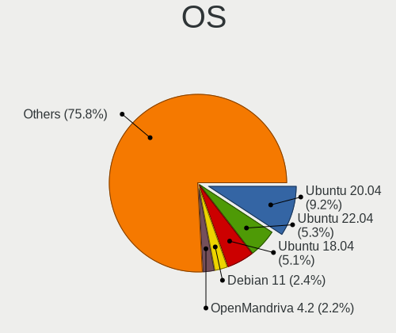
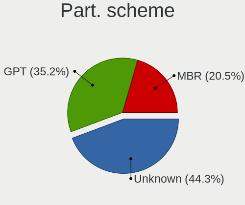
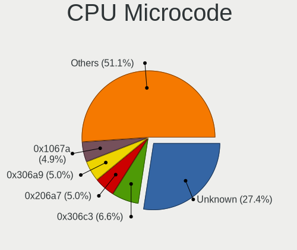

Linux - Tested Hardware & Statistics (Desktops)
-----------------------------------------------

A project to collect tested hardware configurations for Linux.

Anyone can contribute to this report by the [hw-probe](https://github.com/linuxhw/hw-probe) tool:

    sudo -E hw-probe -all -upload

Please contribute! Especially if your hardware is rare.

This report is for real hardware. Report for virtual hardware: [TestDays_VE](https://github.com/linuxhw/TestDays_VE)

Contents
--------

* [ Test Cases ](#test-cases)

* [ System ](#system)
  - [ OS                       ](#os)
  - [ OS Family                ](#os-family)
  - [ Kernel                   ](#kernel)
  - [ Kernel Family            ](#kernel-family)
  - [ Kernel Major Ver.        ](#kernel-major-ver)
  - [ Arch                     ](#arch)
  - [ DE                       ](#de)
  - [ Display Server           ](#display-server)
  - [ Display Manager          ](#display-manager)
  - [ OS Lang                  ](#os-lang)
  - [ Boot Mode                ](#boot-mode)
  - [ Filesystem               ](#filesystem)
  - [ Part. scheme             ](#part-scheme)
  - [ Dual Boot with Linux/BSD ](#dual-boot-with-linuxbsd)
  - [ Dual Boot (Win)          ](#dual-boot-win)

* [ Board ](#board)
  - [ Vendor                   ](#vendor)
  - [ Model                    ](#model)
  - [ Model Family             ](#model-family)
  - [ MFG Year                 ](#mfg-year)
  - [ Form Factor              ](#form-factor)
  - [ Secure Boot              ](#secure-boot)
  - [ Coreboot                 ](#coreboot)
  - [ RAM Size                 ](#ram-size)
  - [ RAM Used                 ](#ram-used)
  - [ Total Drives             ](#total-drives)
  - [ Has CD-ROM               ](#has-cd-rom)
  - [ Has Ethernet             ](#has-ethernet)
  - [ Has WiFi                 ](#has-wifi)
  - [ Has Bluetooth            ](#has-bluetooth)

* [ Location ](#location)
  - [ Country                  ](#country)
  - [ City                     ](#city)

* [ Drives ](#drives)
  - [ Drive Vendor             ](#drive-vendor)
  - [ Drive Model              ](#drive-model)
  - [ HDD Vendor               ](#hdd-vendor)
  - [ SSD Vendor               ](#ssd-vendor)
  - [ Drive Kind               ](#drive-kind)
  - [ Drive Connector          ](#drive-connector)
  - [ Drive Size               ](#drive-size)
  - [ Space Total              ](#space-total)
  - [ Space Used               ](#space-used)
  - [ Malfunc. Drives          ](#malfunc-drives)
  - [ Malfunc. Drive Vendor    ](#malfunc-drive-vendor)
  - [ Malfunc. HDD Vendor      ](#malfunc-hdd-vendor)
  - [ Malfunc. Drive Kind      ](#malfunc-drive-kind)
  - [ Failed Drives            ](#failed-drives)
  - [ Failed Drive Vendor      ](#failed-drive-vendor)
  - [ Drive Status             ](#drive-status)

* [ Storage controller ](#storage-controller)
  - [ Storage Vendor           ](#storage-vendor)
  - [ Storage Model            ](#storage-model)
  - [ Storage Kind             ](#storage-kind)

* [ Processor ](#processor)
  - [ CPU Vendor               ](#cpu-vendor)
  - [ CPU Model                ](#cpu-model)
  - [ CPU Model Family         ](#cpu-model-family)
  - [ CPU Cores                ](#cpu-cores)
  - [ CPU Sockets              ](#cpu-sockets)
  - [ CPU Threads              ](#cpu-threads)
  - [ CPU Op-Modes             ](#cpu-op-modes)
  - [ CPU Microcode            ](#cpu-microcode)
  - [ CPU Microarch            ](#cpu-microarch)

* [ Graphics ](#graphics)
  - [ GPU Vendor               ](#gpu-vendor)
  - [ GPU Model                ](#gpu-model)
  - [ GPU Combo                ](#gpu-combo)
  - [ GPU Driver               ](#gpu-driver)
  - [ GPU Memory               ](#gpu-memory)

* [ Monitor ](#monitor)
  - [ Monitor Vendor           ](#monitor-vendor)
  - [ Monitor Model            ](#monitor-model)
  - [ Monitor Resolution       ](#monitor-resolution)
  - [ Monitor Diagonal         ](#monitor-diagonal)
  - [ Monitor Width            ](#monitor-width)
  - [ Aspect Ratio             ](#aspect-ratio)
  - [ Monitor Area             ](#monitor-area)
  - [ Pixel Density            ](#pixel-density)
  - [ Multiple Monitors        ](#multiple-monitors)

* [ Network ](#network)
  - [ Net Controller Vendor    ](#net-controller-vendor)
  - [ Net Controller Model     ](#net-controller-model)
  - [ Wireless Vendor          ](#wireless-vendor)
  - [ Wireless Model           ](#wireless-model)
  - [ Ethernet Vendor          ](#ethernet-vendor)
  - [ Ethernet Model           ](#ethernet-model)
  - [ Net Controller Kind      ](#net-controller-kind)
  - [ Used Controller          ](#used-controller)
  - [ NICs                     ](#nics)
  - [ IPv6                     ](#ipv6)

* [ Bluetooth ](#bluetooth)
  - [ Bluetooth Vendor         ](#bluetooth-vendor)
  - [ Bluetooth Model          ](#bluetooth-model)

* [ Sound ](#sound)
  - [ Sound Vendor             ](#sound-vendor)
  - [ Sound Model              ](#sound-model)

* [ Memory ](#memory)
  - [ Memory Vendor            ](#memory-vendor)
  - [ Memory Model             ](#memory-model)
  - [ Memory Kind              ](#memory-kind)
  - [ Memory Form Factor       ](#memory-form-factor)
  - [ Memory Size              ](#memory-size)
  - [ Memory Speed             ](#memory-speed)

* [ Printers & scanners ](#printers--scanners)
  - [ Printer Vendor           ](#printer-vendor)
  - [ Printer Model            ](#printer-model)
  - [ Scanner Vendor           ](#scanner-vendor)
  - [ Scanner Model            ](#scanner-model)

* [ Camera ](#camera)
  - [ Camera Vendor            ](#camera-vendor)
  - [ Camera Model             ](#camera-model)

* [ Security ](#security)
  - [ Fingerprint Vendor       ](#fingerprint-vendor)
  - [ Fingerprint Model        ](#fingerprint-model)
  - [ Chipcard Vendor          ](#chipcard-vendor)
  - [ Chipcard Model           ](#chipcard-model)

* [ Unsupported ](#unsupported)
  - [ Unsupported Devices      ](#unsupported-devices)
  - [ Unsupported Device Types ](#unsupported-device-types)

Test Cases
----------

Total: 116013

| Vendor        | Model                       | Probe                                                      | Date         |
|---------------|-----------------------------|------------------------------------------------------------|--------------|
| MSI           | H110M PRO-VH                | [9b0b5b79f0](https://linux-hardware.org/?probe=9b0b5b79f0) | Mar 01, 2023 |
| Gigabyte      | H61M-S2PV                   | [319d6a8bc3](https://linux-hardware.org/?probe=319d6a8bc3) | Mar 01, 2023 |
| ASRock        | B650E PG Riptide WiFi       | [a637650ff7](https://linux-hardware.org/?probe=a637650ff7) | Mar 01, 2023 |
| Gigabyte      | H61M-S2PV                   | [ce63d81075](https://linux-hardware.org/?probe=ce63d81075) | Mar 01, 2023 |
| Gigabyte      | Z77X-UP4 TH                 | [b80cb49656](https://linux-hardware.org/?probe=b80cb49656) | Mar 01, 2023 |
| Sun Micros... | Ultra 24 50                 | [71b8cbeda5](https://linux-hardware.org/?probe=71b8cbeda5) | Feb 28, 2023 |
| Gigabyte      | B450 AORUS ELITE V2         | [0e0b3360ba](https://linux-hardware.org/?probe=0e0b3360ba) | Feb 28, 2023 |
| Gigabyte      | GA-880GA-UD3H               | [483db5a7bd](https://linux-hardware.org/?probe=483db5a7bd) | Feb 28, 2023 |
| Unknown       | Unknown                     | [1c5f8fef49](https://linux-hardware.org/?probe=1c5f8fef49) | Feb 28, 2023 |
| ASRock        | 760GM-HDV                   | [c420a55609](https://linux-hardware.org/?probe=c420a55609) | Feb 28, 2023 |
| ASRock        | B550M Steel Legend          | [8fd450db03](https://linux-hardware.org/?probe=8fd450db03) | Feb 28, 2023 |
| ASUSTek       | BT6130                      | [db5b346bd5](https://linux-hardware.org/?probe=db5b346bd5) | Feb 28, 2023 |
| ASRock        | B660M-STX                   | [5a32d2e162](https://linux-hardware.org/?probe=5a32d2e162) | Feb 28, 2023 |
| MSI           | 760GMA-P34                  | [9707436005](https://linux-hardware.org/?probe=9707436005) | Feb 28, 2023 |
| Medion        | TJ4125                      | [2024916642](https://linux-hardware.org/?probe=2024916642) | Feb 28, 2023 |
| Gigabyte      | B450M DS3H-CF               | [52522a762d](https://linux-hardware.org/?probe=52522a762d) | Feb 28, 2023 |
| MSI           | MPG Z390M GAMING EDGE AC    | [d0813971b9](https://linux-hardware.org/?probe=d0813971b9) | Feb 28, 2023 |
| ASUSTek       | P8H61-M LE                  | [69713a19ea](https://linux-hardware.org/?probe=69713a19ea) | Feb 28, 2023 |
| ASRock        | B365M-HDV                   | [def987e32c](https://linux-hardware.org/?probe=def987e32c) | Feb 28, 2023 |
| CWWK          | CW-J6-6L                    | [46c17d2c14](https://linux-hardware.org/?probe=46c17d2c14) | Feb 28, 2023 |
| ASUSTek       | ROG STRIX X370-F GAMING     | [1f4ca7d119](https://linux-hardware.org/?probe=1f4ca7d119) | Feb 28, 2023 |
| ASUSTek       | Z170-A                      | [a4d77f98eb](https://linux-hardware.org/?probe=a4d77f98eb) | Feb 28, 2023 |
| ASUSTek       | ROG STRIX X370-F GAMING     | [a634d23a20](https://linux-hardware.org/?probe=a634d23a20) | Feb 28, 2023 |
| MSI           | MAG B365M MORTAR            | [26f53549dd](https://linux-hardware.org/?probe=26f53549dd) | Feb 28, 2023 |
| ASUSTek       | PRIME B550M-A               | [48c5c743c9](https://linux-hardware.org/?probe=48c5c743c9) | Feb 28, 2023 |
| Lenovo        | 30D9 SDK0J40705 WIN 3425... | [7f53a53eba](https://linux-hardware.org/?probe=7f53a53eba) | Feb 28, 2023 |
| Acer          | Aspire X3995                | [eccac5b752](https://linux-hardware.org/?probe=eccac5b752) | Feb 28, 2023 |
| Fujitsu       | D2990-A3 S26361-D2990-A3    | [6f1de5f17c](https://linux-hardware.org/?probe=6f1de5f17c) | Feb 28, 2023 |
| ASUSTek       | P8H61-M LX3 PLUS R2.0       | [2b434f0b1d](https://linux-hardware.org/?probe=2b434f0b1d) | Feb 28, 2023 |
| ASUSTek       | ROG STRIX Z590-E GAMING ... | [5fa0193c44](https://linux-hardware.org/?probe=5fa0193c44) | Feb 28, 2023 |
| ASRock        | B660M-ITX/ac                | [c2e600e445](https://linux-hardware.org/?probe=c2e600e445) | Feb 28, 2023 |
| Lenovo        | 36F7 SDK0J40700 WIN 3258... | [48e150f274](https://linux-hardware.org/?probe=48e150f274) | Feb 28, 2023 |
| ASUSTek       | AT4NM10T-I                  | [921aebe62a](https://linux-hardware.org/?probe=921aebe62a) | Feb 28, 2023 |
| ASUSTek       | PRIME B250-PRO              | [cd58d8a863](https://linux-hardware.org/?probe=cd58d8a863) | Feb 28, 2023 |
| HP            | ProLiant ML350 G5           | [073427bc3c](https://linux-hardware.org/?probe=073427bc3c) | Feb 28, 2023 |
| HP            | 18E7                        | [a4fb4affcf](https://linux-hardware.org/?probe=a4fb4affcf) | Feb 28, 2023 |
| HP            | ProLiant ML350 Gen9         | [bbad31d175](https://linux-hardware.org/?probe=bbad31d175) | Feb 28, 2023 |
| ASRock        | H61M-VS                     | [04d5b9593e](https://linux-hardware.org/?probe=04d5b9593e) | Feb 28, 2023 |
| Unknown       | Unknown                     | [89822406cc](https://linux-hardware.org/?probe=89822406cc) | Feb 28, 2023 |
| Gigabyte      | B85M-D3H                    | [b6128fb3e9](https://linux-hardware.org/?probe=b6128fb3e9) | Feb 28, 2023 |
| Dell          | 0KWVT8 A02                  | [4340c1d7c4](https://linux-hardware.org/?probe=4340c1d7c4) | Feb 28, 2023 |
| ASRockRack    | E3C246D4U2-2T               | [1ad2cb5102](https://linux-hardware.org/?probe=1ad2cb5102) | Feb 28, 2023 |
| ASUSTek       | ROG STRIX Z690-A GAMING ... | [216ad20179](https://linux-hardware.org/?probe=216ad20179) | Feb 28, 2023 |
| ASRock        | KBL-NUC                     | [cb504c5fa0](https://linux-hardware.org/?probe=cb504c5fa0) | Feb 28, 2023 |
| ASUSTek       | CROSSHAIR VI HERO           | [3e3368d913](https://linux-hardware.org/?probe=3e3368d913) | Feb 28, 2023 |
| HP            | 87D6 SMVB                   | [423aac2b6f](https://linux-hardware.org/?probe=423aac2b6f) | Feb 28, 2023 |
| Lenovo        | 7052-A9G                    | [677c1ecc11](https://linux-hardware.org/?probe=677c1ecc11) | Feb 28, 2023 |
| Gigabyte      | B550M DS3H AC               | [64b2c8d5b9](https://linux-hardware.org/?probe=64b2c8d5b9) | Feb 28, 2023 |
| Lenovo        | 7052-A9G                    | [4f30a3b58d](https://linux-hardware.org/?probe=4f30a3b58d) | Feb 28, 2023 |
| AZW           | Speed S                     | [e44ff0faf0](https://linux-hardware.org/?probe=e44ff0faf0) | Feb 28, 2023 |
| HP            | 83E2                        | [fdbe4ec1cb](https://linux-hardware.org/?probe=fdbe4ec1cb) | Feb 28, 2023 |
| ASUSTek       | P8H61-M LX                  | [5721cbc403](https://linux-hardware.org/?probe=5721cbc403) | Feb 28, 2023 |
| Gigabyte      | A320M-S2H-CF                | [19fd766ea6](https://linux-hardware.org/?probe=19fd766ea6) | Feb 28, 2023 |
| Dell          | 0F6X5P A00                  | [de72247b2d](https://linux-hardware.org/?probe=de72247b2d) | Feb 28, 2023 |
| MSI           | A320M PRO-VD PLUS           | [6677ab11b2](https://linux-hardware.org/?probe=6677ab11b2) | Feb 28, 2023 |
| ASUSTek       | P8B75-V                     | [17fcfc2758](https://linux-hardware.org/?probe=17fcfc2758) | Feb 28, 2023 |
| ASRock        | B660M-ITX/ac                | [1efc15e2cc](https://linux-hardware.org/?probe=1efc15e2cc) | Feb 28, 2023 |
| BESSTAR Te... | UM250 V1.0                  | [2ef76c6dff](https://linux-hardware.org/?probe=2ef76c6dff) | Feb 28, 2023 |
| ASUSTek       | PRIME X570-P                | [dda5eec4b9](https://linux-hardware.org/?probe=dda5eec4b9) | Feb 28, 2023 |
| Aquarius      | AQB560M                     | [ee0c530562](https://linux-hardware.org/?probe=ee0c530562) | Feb 28, 2023 |
| Gigabyte      | Z390 UD                     | [f3dfd93cc9](https://linux-hardware.org/?probe=f3dfd93cc9) | Feb 28, 2023 |
| Gigabyte      | H61MS                       | [166a6bbb4b](https://linux-hardware.org/?probe=166a6bbb4b) | Feb 28, 2023 |
| Biostar       | H81MLV3                     | [ccba1a8217](https://linux-hardware.org/?probe=ccba1a8217) | Feb 28, 2023 |
| AZW           | MINI S                      | [e65b0d1ef6](https://linux-hardware.org/?probe=e65b0d1ef6) | Feb 28, 2023 |
| Lenovo        | 3102 NOK                    | [17a2e663e1](https://linux-hardware.org/?probe=17a2e663e1) | Feb 28, 2023 |
| Lenovo        | 3102 NOK                    | [6dabaffa28](https://linux-hardware.org/?probe=6dabaffa28) | Feb 28, 2023 |
| Gigabyte      | P31-ES3G                    | [5ab1863f2b](https://linux-hardware.org/?probe=5ab1863f2b) | Feb 28, 2023 |
| Gigabyte      | H61M-DS2                    | [49205269e7](https://linux-hardware.org/?probe=49205269e7) | Feb 28, 2023 |
| Gigabyte      | Q87M-D2H                    | [c2eff23772](https://linux-hardware.org/?probe=c2eff23772) | Feb 28, 2023 |
| ASUSTek       | PRIME B550M-A               | [a6af4042ea](https://linux-hardware.org/?probe=a6af4042ea) | Feb 28, 2023 |
| ASUSTek       | ROG STRIX Z390-F GAMING     | [4018e453c4](https://linux-hardware.org/?probe=4018e453c4) | Feb 28, 2023 |
| ASUSTek       | P8B75-V                     | [cf4c7357eb](https://linux-hardware.org/?probe=cf4c7357eb) | Feb 28, 2023 |
| Intel         | D945GCPE AAD97209-201       | [672684e416](https://linux-hardware.org/?probe=672684e416) | Feb 28, 2023 |
| ASUSTek       | P8H61-M LX2                 | [b4efb334ea](https://linux-hardware.org/?probe=b4efb334ea) | Feb 28, 2023 |
| ASUSTek       | ROG STRIX Z390-F GAMING     | [48725cdc4d](https://linux-hardware.org/?probe=48725cdc4d) | Feb 28, 2023 |
| MSI           | B450M PRO-VDH MAX           | [07bb534dc9](https://linux-hardware.org/?probe=07bb534dc9) | Feb 28, 2023 |
| ASUSTek       | AT4NM10T-I                  | [fa2df8125a](https://linux-hardware.org/?probe=fa2df8125a) | Feb 28, 2023 |
| ASUSTek       | M5A78L-M PLUS/USB3          | [8cadddf432](https://linux-hardware.org/?probe=8cadddf432) | Feb 28, 2023 |
| Foxconn       | 2ABF                        | [d6eb6b4839](https://linux-hardware.org/?probe=d6eb6b4839) | Feb 28, 2023 |
| ASUSTek       | ROG STRIX B450-F GAMING ... | [ca7d449be6](https://linux-hardware.org/?probe=ca7d449be6) | Feb 28, 2023 |
| Intel         | D945GCPE AAD97209-201       | [edf2240a74](https://linux-hardware.org/?probe=edf2240a74) | Feb 28, 2023 |
| ASRock        | N68C-S UCC                  | [a5469adf59](https://linux-hardware.org/?probe=a5469adf59) | Feb 28, 2023 |
| Gigabyte      | H61M-S2V-B3                 | [aefca0b663](https://linux-hardware.org/?probe=aefca0b663) | Feb 28, 2023 |
| Gigabyte      | H61M-S2V-B3                 | [12ccf2fe8b](https://linux-hardware.org/?probe=12ccf2fe8b) | Feb 28, 2023 |
| ASUSTek       | CM6870                      | [e338b721af](https://linux-hardware.org/?probe=e338b721af) | Feb 28, 2023 |
| ASUSTek       | B150M-C                     | [e675a40455](https://linux-hardware.org/?probe=e675a40455) | Feb 28, 2023 |
| HP            | 158A                        | [64f3590183](https://linux-hardware.org/?probe=64f3590183) | Feb 28, 2023 |
| ASRock        | A320M-HDV                   | [5ba575539c](https://linux-hardware.org/?probe=5ba575539c) | Feb 28, 2023 |
| ASRock        | B560M-C                     | [a93d64aa2c](https://linux-hardware.org/?probe=a93d64aa2c) | Feb 28, 2023 |
| ASRock        | B560M-C                     | [cbbd0a63d4](https://linux-hardware.org/?probe=cbbd0a63d4) | Feb 28, 2023 |
| ASRockRack    | X470D4U2-2T                 | [4d3d5e02a1](https://linux-hardware.org/?probe=4d3d5e02a1) | Feb 28, 2023 |
| ASUSTek       | M4A89GTD-PRO/USB3           | [0710c7be6e](https://linux-hardware.org/?probe=0710c7be6e) | Feb 28, 2023 |
| Foxconn       | G31MX Series                | [79ee8e5da3](https://linux-hardware.org/?probe=79ee8e5da3) | Feb 28, 2023 |
| Dell          | 0HD5W2 A01                  | [f30a31a8ee](https://linux-hardware.org/?probe=f30a31a8ee) | Feb 28, 2023 |
| ASUSTek       | ROG STRIX Z390-E GAMING     | [62a7d7ef5c](https://linux-hardware.org/?probe=62a7d7ef5c) | Feb 28, 2023 |
| MSI           | MS-7210 100                 | [5cb2d5ea2c](https://linux-hardware.org/?probe=5cb2d5ea2c) | Feb 28, 2023 |
| MSI           | MS-7210 100                 | [a541b48e4d](https://linux-hardware.org/?probe=a541b48e4d) | Feb 28, 2023 |
| MSI           | B550-A PRO[CEC]             | [2465135444](https://linux-hardware.org/?probe=2465135444) | Feb 28, 2023 |
| MSI           | X470 GAMING PLUS MAX        | [05542207ee](https://linux-hardware.org/?probe=05542207ee) | Feb 28, 2023 |
| ASRockRack    | X470D4U2-2T                 | [6ccb40f64d](https://linux-hardware.org/?probe=6ccb40f64d) | Feb 28, 2023 |
| ASRock        | FM2A88X Extreme6+           | [1b5fd0df61](https://linux-hardware.org/?probe=1b5fd0df61) | Feb 28, 2023 |
| Lenovo        | SKYBAY SDK0J40697 WIN 33... | [75e0fb99ed](https://linux-hardware.org/?probe=75e0fb99ed) | Feb 28, 2023 |
| ASRock        | Z97 Pro3                    | [506d56faff](https://linux-hardware.org/?probe=506d56faff) | Feb 28, 2023 |
| MSI           | X99A RAIDER                 | [f27314deb8](https://linux-hardware.org/?probe=f27314deb8) | Feb 28, 2023 |
| MSI           | A320M PRO-M2 V2             | [0264556bba](https://linux-hardware.org/?probe=0264556bba) | Feb 28, 2023 |
| Gigabyte      | AX370-Gaming K7             | [d4bcf9b7a2](https://linux-hardware.org/?probe=d4bcf9b7a2) | Feb 28, 2023 |
| Gigabyte      | Z370 AORUS Gaming 5-CF      | [cb687f4572](https://linux-hardware.org/?probe=cb687f4572) | Feb 28, 2023 |
| ASUSTek       | PRIME H370-PLUS             | [43afa90be1](https://linux-hardware.org/?probe=43afa90be1) | Feb 28, 2023 |
| ASUSTek       | Z87-PRO                     | [7997191f44](https://linux-hardware.org/?probe=7997191f44) | Feb 28, 2023 |
| ASRock        | B550 Phantom Gaming-ITX/... | [0195132360](https://linux-hardware.org/?probe=0195132360) | Feb 28, 2023 |
| ASRock        | H81M-HG4 R4.0               | [47ed7baef0](https://linux-hardware.org/?probe=47ed7baef0) | Feb 28, 2023 |
| ASUSTek       | P5KC                        | [45f781ee3a](https://linux-hardware.org/?probe=45f781ee3a) | Feb 28, 2023 |
| ASUSTek       | Z87-PRO                     | [9a6bc5f3af](https://linux-hardware.org/?probe=9a6bc5f3af) | Feb 28, 2023 |
| ASRock        | B550 Phantom Gaming-ITX/... | [8cd8d4b833](https://linux-hardware.org/?probe=8cd8d4b833) | Feb 28, 2023 |
| Acer          | TDPS05                      | [c4a636fb79](https://linux-hardware.org/?probe=c4a636fb79) | Feb 28, 2023 |
| Acer          | TDPS05                      | [114e21597f](https://linux-hardware.org/?probe=114e21597f) | Feb 28, 2023 |
| Foxconn       | 2ABF                        | [ad46fcc88d](https://linux-hardware.org/?probe=ad46fcc88d) | Feb 28, 2023 |
| Fujitsu       | D3224-P1 S26361-D3224-P1    | [53649a9546](https://linux-hardware.org/?probe=53649a9546) | Feb 28, 2023 |
| ASUSTek       | BT6130                      | [3549cfad14](https://linux-hardware.org/?probe=3549cfad14) | Feb 27, 2023 |
| Gigabyte      | X58A-UD5                    | [4cff35f888](https://linux-hardware.org/?probe=4cff35f888) | Feb 27, 2023 |
| Dell          | 0NW6H5 A00                  | [aeb7d7a9f4](https://linux-hardware.org/?probe=aeb7d7a9f4) | Feb 27, 2023 |
| Acer          | Predator G3620              | [72f3382b60](https://linux-hardware.org/?probe=72f3382b60) | Feb 27, 2023 |
| HP            | 802E                        | [d24bb98294](https://linux-hardware.org/?probe=d24bb98294) | Feb 27, 2023 |
| ASRock        | X370 Professional Gaming    | [3a670fbd63](https://linux-hardware.org/?probe=3a670fbd63) | Feb 27, 2023 |
| Gigabyte      | H61M-S1                     | [ee8e20d95e](https://linux-hardware.org/?probe=ee8e20d95e) | Feb 27, 2023 |
| Intel         | DG41RQ AAE54511-205         | [0cf17a3787](https://linux-hardware.org/?probe=0cf17a3787) | Feb 27, 2023 |
| ASUSTek       | ROG STRIX B350-F GAMING     | [3cd0e65d1f](https://linux-hardware.org/?probe=3cd0e65d1f) | Feb 27, 2023 |
| ASUSTek       | AM1I-A                      | [b5fe605f8b](https://linux-hardware.org/?probe=b5fe605f8b) | Feb 27, 2023 |
| Dell          | 0NW6H5 A00                  | [83e6da010b](https://linux-hardware.org/?probe=83e6da010b) | Feb 27, 2023 |
| Gigabyte      | Z97M-D3H                    | [d93d9bff7f](https://linux-hardware.org/?probe=d93d9bff7f) | Feb 27, 2023 |
| ASRock        | Z790 PG Lightning           | [86c7144757](https://linux-hardware.org/?probe=86c7144757) | Feb 27, 2023 |
| ASUSTek       | M4N68T-M-V2                 | [051b66987e](https://linux-hardware.org/?probe=051b66987e) | Feb 27, 2023 |
| ASUSTek       | PRIME B360M-A               | [5860f51cd8](https://linux-hardware.org/?probe=5860f51cd8) | Feb 27, 2023 |
| MSI           | B450M MORTAR MAX            | [0335729036](https://linux-hardware.org/?probe=0335729036) | Feb 27, 2023 |
| HP            | 18E4                        | [cab6d807e9](https://linux-hardware.org/?probe=cab6d807e9) | Feb 27, 2023 |
| ASUSTek       | PRIME X370-A                | [6bf890e60c](https://linux-hardware.org/?probe=6bf890e60c) | Feb 27, 2023 |
| PCWare        | IPMH61R2                    | [52a17bf9c1](https://linux-hardware.org/?probe=52a17bf9c1) | Feb 27, 2023 |
| Google        | Buddy                       | [ac3d9aaed0](https://linux-hardware.org/?probe=ac3d9aaed0) | Feb 27, 2023 |
| MSI           | MPG B560I GAMING EDGE WI... | [882168458c](https://linux-hardware.org/?probe=882168458c) | Feb 27, 2023 |
| Gigabyte      | EX58-UD5                    | [eaec9511de](https://linux-hardware.org/?probe=eaec9511de) | Feb 27, 2023 |
| ASRock        | G41M-S                      | [8802d04f08](https://linux-hardware.org/?probe=8802d04f08) | Feb 27, 2023 |
| HP            | 3397                        | [8081d24eb1](https://linux-hardware.org/?probe=8081d24eb1) | Feb 27, 2023 |
| Gigabyte      | GA-970A-UD3                 | [e4bb117847](https://linux-hardware.org/?probe=e4bb117847) | Feb 27, 2023 |
| HP            | 3047h                       | [db6be92c4f](https://linux-hardware.org/?probe=db6be92c4f) | Feb 27, 2023 |
| Gigabyte      | GA-970A-UD3                 | [732f6c8c00](https://linux-hardware.org/?probe=732f6c8c00) | Feb 27, 2023 |
| HP            | 339A                        | [308d8dfac0](https://linux-hardware.org/?probe=308d8dfac0) | Feb 27, 2023 |
| Intel         | H61                         | [b61ef1ed65](https://linux-hardware.org/?probe=b61ef1ed65) | Feb 27, 2023 |
| Gigabyte      | Z77X-UD5H                   | [2071bc50ce](https://linux-hardware.org/?probe=2071bc50ce) | Feb 27, 2023 |
| Gigabyte      | Z77X-UD5H                   | [472c035387](https://linux-hardware.org/?probe=472c035387) | Feb 27, 2023 |
| ASUSTek       | PRIME Q270M-C               | [3a9683fbb7](https://linux-hardware.org/?probe=3a9683fbb7) | Feb 27, 2023 |
| Intel         | DN2820FYK H24582-203        | [28e2b31136](https://linux-hardware.org/?probe=28e2b31136) | Feb 27, 2023 |
| MSI           | NF750-G55                   | [f279251ffa](https://linux-hardware.org/?probe=f279251ffa) | Feb 27, 2023 |
| ASUSTek       | TUF Gaming B550-PLUS        | [8fc8fee94a](https://linux-hardware.org/?probe=8fc8fee94a) | Feb 27, 2023 |
| Dell          | 0MH651                      | [7921e9f8bc](https://linux-hardware.org/?probe=7921e9f8bc) | Feb 27, 2023 |
| Intel         | DN2820FYK H24582-203        | [ad2f612788](https://linux-hardware.org/?probe=ad2f612788) | Feb 27, 2023 |
| Dell          | 01TN68 A02                  | [4acd4aa811](https://linux-hardware.org/?probe=4acd4aa811) | Feb 27, 2023 |
| ASUSTek       | P7H55                       | [394ad3d24f](https://linux-hardware.org/?probe=394ad3d24f) | Feb 27, 2023 |
| Dell          | 0D6H9T A00                  | [70bdf485da](https://linux-hardware.org/?probe=70bdf485da) | Feb 27, 2023 |
| Dell          | 08NPPY A00                  | [66b1256bd3](https://linux-hardware.org/?probe=66b1256bd3) | Feb 27, 2023 |
| Casper        | H510 001 G10a               | [95a9cfbf0b](https://linux-hardware.org/?probe=95a9cfbf0b) | Feb 27, 2023 |
| Unknown       | HX90                        | [bc8bed9135](https://linux-hardware.org/?probe=bc8bed9135) | Feb 27, 2023 |
| Dell          | 0J584C                      | [5f16a97f99](https://linux-hardware.org/?probe=5f16a97f99) | Feb 27, 2023 |
| Aquarius      | AQH310CM                    | [a2f4d0f77e](https://linux-hardware.org/?probe=a2f4d0f77e) | Feb 27, 2023 |
| MSI           | Z390-A PRO                  | [979b4559fe](https://linux-hardware.org/?probe=979b4559fe) | Feb 27, 2023 |
| ASUSTek       | TUF Gaming Z690-PLUS WIF... | [4630f9a67c](https://linux-hardware.org/?probe=4630f9a67c) | Feb 27, 2023 |
| Gigabyte      | B365M D2V                   | [aa39313621](https://linux-hardware.org/?probe=aa39313621) | Feb 27, 2023 |
| ASUSTek       | Z10PE-D16 WS                | [dd74cb518b](https://linux-hardware.org/?probe=dd74cb518b) | Feb 27, 2023 |
| Gigabyte      | Z270XP-SLI-CF               | [677e93841e](https://linux-hardware.org/?probe=677e93841e) | Feb 27, 2023 |
| ASUSTek       | PRIME Z490-A                | [068ad292bd](https://linux-hardware.org/?probe=068ad292bd) | Feb 27, 2023 |
| ASUSTek       | PRIME B450M-A               | [373f4f8123](https://linux-hardware.org/?probe=373f4f8123) | Feb 27, 2023 |
| ASRock        | Z97 Pro3                    | [626e67df35](https://linux-hardware.org/?probe=626e67df35) | Feb 27, 2023 |
| Cincoze       | DX-1000.01.001              | [64496d4ab7](https://linux-hardware.org/?probe=64496d4ab7) | Feb 27, 2023 |
| Gigabyte      | A320M-H-CF                  | [409bb06e5e](https://linux-hardware.org/?probe=409bb06e5e) | Feb 27, 2023 |
| ASUSTek       | P8H67                       | [323a03f1c6](https://linux-hardware.org/?probe=323a03f1c6) | Feb 27, 2023 |
| Gigabyte      | H87-D3H-CF                  | [ea8bb4c0e4](https://linux-hardware.org/?probe=ea8bb4c0e4) | Feb 27, 2023 |
| ASUSTek       | P8B75-V                     | [7a8e478900](https://linux-hardware.org/?probe=7a8e478900) | Feb 27, 2023 |
| Gigabyte      | H97-HD3                     | [bb2cac1486](https://linux-hardware.org/?probe=bb2cac1486) | Feb 27, 2023 |
| Gigabyte      | B365M H                     | [dbb3e73c89](https://linux-hardware.org/?probe=dbb3e73c89) | Feb 27, 2023 |
| Gigabyte      | H110M-S2V-CF                | [509c2a6e57](https://linux-hardware.org/?probe=509c2a6e57) | Feb 27, 2023 |
| Dell          | 0K240Y A01                  | [9548586341](https://linux-hardware.org/?probe=9548586341) | Feb 27, 2023 |
| Dell          | 0K240Y A01                  | [9cdb0f865a](https://linux-hardware.org/?probe=9cdb0f865a) | Feb 27, 2023 |
| Dell          | 0Y5DDC A00                  | [e3090d9725](https://linux-hardware.org/?probe=e3090d9725) | Feb 27, 2023 |
| AMI           | Cherry Trail CR             | [24952b3b19](https://linux-hardware.org/?probe=24952b3b19) | Feb 27, 2023 |
| Dell          | 0XHGV1 A00                  | [75249be116](https://linux-hardware.org/?probe=75249be116) | Feb 27, 2023 |
| Gigabyte      | Z690M AORUS ELITE AX DDR... | [686c8d56c4](https://linux-hardware.org/?probe=686c8d56c4) | Feb 27, 2023 |
| Unknown       | Unknown                     | [1a407f82b9](https://linux-hardware.org/?probe=1a407f82b9) | Feb 27, 2023 |
| MSI           | A320M PRO-VH                | [e1266ebf79](https://linux-hardware.org/?probe=e1266ebf79) | Feb 27, 2023 |
| ASUSTek       | H61M-E                      | [ee5b36d127](https://linux-hardware.org/?probe=ee5b36d127) | Feb 27, 2023 |
| ASRock        | A320M-HDV R4.0              | [37d2aab670](https://linux-hardware.org/?probe=37d2aab670) | Feb 27, 2023 |
| Gigabyte      | Z390 UD                     | [be3ac3e778](https://linux-hardware.org/?probe=be3ac3e778) | Feb 27, 2023 |
| Gigabyte      | H87M-D3H                    | [3c50af5218](https://linux-hardware.org/?probe=3c50af5218) | Feb 27, 2023 |
| MSI           | MAG Z690 TOMAHAWK WIFI D... | [13edc00539](https://linux-hardware.org/?probe=13edc00539) | Feb 27, 2023 |
| Dell          | 0WMJ54 A01                  | [7f907fadb7](https://linux-hardware.org/?probe=7f907fadb7) | Feb 27, 2023 |
| Dell          | 0WMJ54 A01                  | [766991da5e](https://linux-hardware.org/?probe=766991da5e) | Feb 27, 2023 |
| ASUSTek       | B150 PRO GAMING/AURA        | [618e3d30fc](https://linux-hardware.org/?probe=618e3d30fc) | Feb 27, 2023 |
| Gigabyte      | B450M S2H                   | [4f55a08266](https://linux-hardware.org/?probe=4f55a08266) | Feb 27, 2023 |
| Dell          | 0427JK A00                  | [ca878d6577](https://linux-hardware.org/?probe=ca878d6577) | Feb 27, 2023 |
| MSI           | MPG X570 GAMING PRO CARB... | [15318beac5](https://linux-hardware.org/?probe=15318beac5) | Feb 27, 2023 |
| MSI           | Z170A-G45 GAMING            | [a5496030e7](https://linux-hardware.org/?probe=a5496030e7) | Feb 27, 2023 |
| Dell          | 07PR60 A01                  | [c071b7ef1c](https://linux-hardware.org/?probe=c071b7ef1c) | Feb 27, 2023 |
| Gigabyte      | B650 GAMING X AX            | [c2b3e01a45](https://linux-hardware.org/?probe=c2b3e01a45) | Feb 27, 2023 |
| Lenovo        | 3098 SDK0E50510 WIN         | [f15e5303f6](https://linux-hardware.org/?probe=f15e5303f6) | Feb 27, 2023 |
| Gigabyte      | Z490 VISION D               | [cbea73a793](https://linux-hardware.org/?probe=cbea73a793) | Feb 27, 2023 |
| Dell          | 0NW6H5 A00                  | [b4485b65b3](https://linux-hardware.org/?probe=b4485b65b3) | Feb 27, 2023 |
| Dell          | 0NW6H5 A00                  | [a52e16df32](https://linux-hardware.org/?probe=a52e16df32) | Feb 27, 2023 |
| Gigabyte      | Z690 AERO D                 | [68b84cc1eb](https://linux-hardware.org/?probe=68b84cc1eb) | Feb 27, 2023 |
| ASUSTek       | M3A78-CM                    | [aa86292f52](https://linux-hardware.org/?probe=aa86292f52) | Feb 27, 2023 |
| Lenovo        | 36F7 SDK0J40700 WIN 3258... | [580db05e08](https://linux-hardware.org/?probe=580db05e08) | Feb 27, 2023 |
| Dell          | 0Y2MRG A00                  | [6c62bbbf3b](https://linux-hardware.org/?probe=6c62bbbf3b) | Feb 27, 2023 |
| Gigabyte      | B550M AORUS PRO             | [ffdac8fa88](https://linux-hardware.org/?probe=ffdac8fa88) | Feb 27, 2023 |
| Gigabyte      | Z490 VISION D               | [3e9f2feeaa](https://linux-hardware.org/?probe=3e9f2feeaa) | Feb 27, 2023 |
| Gigabyte      | AB350-Gaming-CF             | [f8d42c3767](https://linux-hardware.org/?probe=f8d42c3767) | Feb 27, 2023 |
| Dell          | 0Y2MRG A00                  | [2479c3c245](https://linux-hardware.org/?probe=2479c3c245) | Feb 27, 2023 |
| ASUSTek       | ROG STRIX X570-I GAMING     | [49f3238d4a](https://linux-hardware.org/?probe=49f3238d4a) | Feb 26, 2023 |
| MSI           | B150M PRO-VDH               | [e538527e6c](https://linux-hardware.org/?probe=e538527e6c) | Feb 26, 2023 |
| Gigabyte      | GA-M56S-S3                  | [e8e3f57eef](https://linux-hardware.org/?probe=e8e3f57eef) | Feb 26, 2023 |
| Gigabyte      | Z170MX-Gaming 5             | [1f0e9197f9](https://linux-hardware.org/?probe=1f0e9197f9) | Feb 26, 2023 |
| HP            | 81B4 01                     | [bc06df8d32](https://linux-hardware.org/?probe=bc06df8d32) | Feb 26, 2023 |
| Gigabyte      | Z390 UD                     | [b40f9ce0d1](https://linux-hardware.org/?probe=b40f9ce0d1) | Feb 26, 2023 |
| ASUSTek       | ROG STRIX B550-F GAMING     | [3ac3b5424a](https://linux-hardware.org/?probe=3ac3b5424a) | Feb 26, 2023 |
| MSI           | B450M PRO-M2 MAX            | [0c5f9a10dd](https://linux-hardware.org/?probe=0c5f9a10dd) | Feb 26, 2023 |
| MSI           | PRO Z690-A DDR4             | [3ab842532b](https://linux-hardware.org/?probe=3ab842532b) | Feb 26, 2023 |
| ASUSTek       | PRIME B550M-A               | [a121d0545a](https://linux-hardware.org/?probe=a121d0545a) | Feb 26, 2023 |
| MSI           | MAG B550M MORTAR            | [a9e3b8c2d2](https://linux-hardware.org/?probe=a9e3b8c2d2) | Feb 26, 2023 |
| Gigabyte      | G41MT-S2                    | [7f72d6bba7](https://linux-hardware.org/?probe=7f72d6bba7) | Feb 26, 2023 |
| Cincoze       | DX-1000.01.001              | [7923f1dc21](https://linux-hardware.org/?probe=7923f1dc21) | Feb 26, 2023 |
| Pegatron      | NARRA5                      | [fbff48e326](https://linux-hardware.org/?probe=fbff48e326) | Feb 26, 2023 |
| Lenovo        | Annapurna CRB NOK           | [77122f785f](https://linux-hardware.org/?probe=77122f785f) | Feb 26, 2023 |
| JINGSHA       | Unknown                     | [c8bd846b63](https://linux-hardware.org/?probe=c8bd846b63) | Feb 26, 2023 |
| Gigabyte      | X670E AORUS MASTER          | [589b06afc1](https://linux-hardware.org/?probe=589b06afc1) | Feb 26, 2023 |
| Gigabyte      | X99-UD4P-CF                 | [b78a53985a](https://linux-hardware.org/?probe=b78a53985a) | Feb 26, 2023 |
| ASRock        | 970M Pro3                   | [787ddfd44c](https://linux-hardware.org/?probe=787ddfd44c) | Feb 26, 2023 |
| Lenovo        | Annapurna CRB NOK           | [0e521e12aa](https://linux-hardware.org/?probe=0e521e12aa) | Feb 26, 2023 |
| ASUSTek       | TUF Gaming X570-PLUS        | [c56cf68cef](https://linux-hardware.org/?probe=c56cf68cef) | Feb 26, 2023 |
| Gigabyte      | EX58-UD5                    | [85ed1d43c7](https://linux-hardware.org/?probe=85ed1d43c7) | Feb 26, 2023 |
| Dell          | 03KWTV A02                  | [8b6eae9fd5](https://linux-hardware.org/?probe=8b6eae9fd5) | Feb 26, 2023 |
| MSI           | MPG Z390 GAMING EDGE AC     | [a3b8430bad](https://linux-hardware.org/?probe=a3b8430bad) | Feb 26, 2023 |
| ASUSTek       | PRIME B350M-A               | [4cd492ee3e](https://linux-hardware.org/?probe=4cd492ee3e) | Feb 26, 2023 |
| ASRock        | B85 Pro4                    | [0b4daba4fb](https://linux-hardware.org/?probe=0b4daba4fb) | Feb 26, 2023 |
| Kllisre       | X79 V2.72S                  | [eb7e4b521c](https://linux-hardware.org/?probe=eb7e4b521c) | Feb 26, 2023 |
| Gigabyte      | H510M S2                    | [24ea8468ca](https://linux-hardware.org/?probe=24ea8468ca) | Feb 26, 2023 |
| MSI           | MAG B760 TOMAHAWK WIFI D... | [575a7f4897](https://linux-hardware.org/?probe=575a7f4897) | Feb 26, 2023 |
| MSI           | MAG B760 TOMAHAWK WIFI D... | [466f8533fb](https://linux-hardware.org/?probe=466f8533fb) | Feb 26, 2023 |
| ASUSTek       | TUF Gaming B550M-PLUS WI... | [9b2a57b7d2](https://linux-hardware.org/?probe=9b2a57b7d2) | Feb 26, 2023 |
| Gigabyte      | B360M HD3                   | [d3821bdbab](https://linux-hardware.org/?probe=d3821bdbab) | Feb 26, 2023 |
| Foxconn       | 2ABF                        | [ead0312777](https://linux-hardware.org/?probe=ead0312777) | Feb 26, 2023 |
| Lenovo        | MAHOBAY NO DPK              | [310a65baea](https://linux-hardware.org/?probe=310a65baea) | Feb 26, 2023 |
| MSI           | MAG Z690 TOMAHAWK WIFI D... | [fe1c90a3aa](https://linux-hardware.org/?probe=fe1c90a3aa) | Feb 26, 2023 |
| ASRock        | G41C-GS                     | [6a698dda57](https://linux-hardware.org/?probe=6a698dda57) | Feb 26, 2023 |
| ASUSTek       | A68HM-K                     | [d6f5b00609](https://linux-hardware.org/?probe=d6f5b00609) | Feb 26, 2023 |
| HP            | 1998                        | [90794415e9](https://linux-hardware.org/?probe=90794415e9) | Feb 26, 2023 |
| ASUSTek       | A68HM-K                     | [89cd5d5c44](https://linux-hardware.org/?probe=89cd5d5c44) | Feb 26, 2023 |
| ASUSTek       | ROG STRIX B450-E GAMING     | [2088ba9df6](https://linux-hardware.org/?probe=2088ba9df6) | Feb 26, 2023 |
| HP            | 18E4                        | [5c7c3413c9](https://linux-hardware.org/?probe=5c7c3413c9) | Feb 26, 2023 |
| ASUSTek       | PRIME B450M-K               | [575e6a8c55](https://linux-hardware.org/?probe=575e6a8c55) | Feb 26, 2023 |
| MSI           | B450-A PRO MAX              | [f081452f55](https://linux-hardware.org/?probe=f081452f55) | Feb 26, 2023 |
| Acer          | EG43M                       | [d533c457eb](https://linux-hardware.org/?probe=d533c457eb) | Feb 26, 2023 |
| HP            | 8643 SMVB                   | [4f36e23485](https://linux-hardware.org/?probe=4f36e23485) | Feb 26, 2023 |
| ASUSTek       | M5A78L                      | [693582be4e](https://linux-hardware.org/?probe=693582be4e) | Feb 26, 2023 |
| ASUSTek       | PRIME B250-PLUS             | [49b1cd5754](https://linux-hardware.org/?probe=49b1cd5754) | Feb 26, 2023 |
| ASUSTek       | PRIME B350M-A               | [9471b0f763](https://linux-hardware.org/?probe=9471b0f763) | Feb 26, 2023 |
| ASUSTek       | PRIME Q270M-C               | [edf748dbbb](https://linux-hardware.org/?probe=edf748dbbb) | Feb 26, 2023 |
| ASUSTek       | Z97-K                       | [77a5832b3f](https://linux-hardware.org/?probe=77a5832b3f) | Feb 26, 2023 |
| Gigabyte      | B560M DS3H V2               | [31f6d9e11d](https://linux-hardware.org/?probe=31f6d9e11d) | Feb 26, 2023 |
| Dell          | 0UP453                      | [e45bff8252](https://linux-hardware.org/?probe=e45bff8252) | Feb 26, 2023 |
| HP            | 3397                        | [a1840ee53d](https://linux-hardware.org/?probe=a1840ee53d) | Feb 26, 2023 |
| Dell          | 0WMJ54 A01                  | [f9cae700c7](https://linux-hardware.org/?probe=f9cae700c7) | Feb 26, 2023 |
| Gigabyte      | Q87M-D2H                    | [ee31b8fa71](https://linux-hardware.org/?probe=ee31b8fa71) | Feb 26, 2023 |
| Gigabyte      | GA-MA78LMT-US2H             | [df54545112](https://linux-hardware.org/?probe=df54545112) | Feb 26, 2023 |
| ASUSTek       | M5A97 R2.0                  | [a758475e11](https://linux-hardware.org/?probe=a758475e11) | Feb 26, 2023 |
| HP            | 1632                        | [394b988862](https://linux-hardware.org/?probe=394b988862) | Feb 26, 2023 |
| HP            | 3032h                       | [007bbeffa0](https://linux-hardware.org/?probe=007bbeffa0) | Feb 26, 2023 |
| ASRock        | A320M-HDV R4.0              | [319e003280](https://linux-hardware.org/?probe=319e003280) | Feb 26, 2023 |
| ASUSTek       | ROG CROSSHAIR X670E EXTR... | [659ff1672e](https://linux-hardware.org/?probe=659ff1672e) | Feb 26, 2023 |
| MSI           | MAG Z490 TOMAHAWK           | [f24a3027d0](https://linux-hardware.org/?probe=f24a3027d0) | Feb 26, 2023 |
| ASUSTek       | ProArt B550-CREATOR         | [a2a7defd24](https://linux-hardware.org/?probe=a2a7defd24) | Feb 26, 2023 |
| Gigabyte      | M68M-S2P                    | [15b2fe94ae](https://linux-hardware.org/?probe=15b2fe94ae) | Feb 26, 2023 |
| Dell          | 0J584C A00                  | [c16b58c7ce](https://linux-hardware.org/?probe=c16b58c7ce) | Feb 26, 2023 |
| MSI           | Z77A-G43                    | [2fe5c30b13](https://linux-hardware.org/?probe=2fe5c30b13) | Feb 26, 2023 |
| Dell          | 0J584C A00                  | [9d8016f80e](https://linux-hardware.org/?probe=9d8016f80e) | Feb 26, 2023 |
| MSI           | Z77A-G43                    | [4b96538701](https://linux-hardware.org/?probe=4b96538701) | Feb 26, 2023 |
| MSI           | Z97-G43 GAMING              | [b13f16cb2f](https://linux-hardware.org/?probe=b13f16cb2f) | Feb 26, 2023 |
| MSI           | A320M-A PRO MAX             | [64cf10c762](https://linux-hardware.org/?probe=64cf10c762) | Feb 26, 2023 |
| ASUSTek       | PRIME Z490-A                | [267da4138c](https://linux-hardware.org/?probe=267da4138c) | Feb 26, 2023 |
| Dell          | 0NKW6Y A01                  | [62e7760c7a](https://linux-hardware.org/?probe=62e7760c7a) | Feb 26, 2023 |
| ASUSTek       | M4A87TD/USB3                | [8184285a7d](https://linux-hardware.org/?probe=8184285a7d) | Feb 26, 2023 |
| ASRock        | 880GM-LE                    | [32366172e4](https://linux-hardware.org/?probe=32366172e4) | Feb 26, 2023 |
| ASRock        | AB350 Pro4                  | [887241ec59](https://linux-hardware.org/?probe=887241ec59) | Feb 26, 2023 |
| Dell          | 0HR330                      | [9110acd156](https://linux-hardware.org/?probe=9110acd156) | Feb 26, 2023 |
| MSI           | MPG X570 GAMING PLUS        | [724039adf2](https://linux-hardware.org/?probe=724039adf2) | Feb 26, 2023 |
| Unknown       | Intel X79                   | [0f7920afd6](https://linux-hardware.org/?probe=0f7920afd6) | Feb 26, 2023 |
| MSI           | B450M MORTAR TITANIUM       | [b27fb5e204](https://linux-hardware.org/?probe=b27fb5e204) | Feb 26, 2023 |
| FIC           | PTM33 PCB                   | [b70b076cda](https://linux-hardware.org/?probe=b70b076cda) | Feb 26, 2023 |
| Gigabyte      | MZBSWBP-00                  | [525ac20362](https://linux-hardware.org/?probe=525ac20362) | Feb 26, 2023 |
| ASUSTek       | PRIME Z490-A                | [de7aec7f12](https://linux-hardware.org/?probe=de7aec7f12) | Feb 26, 2023 |
| Pegatron      | 2ACB                        | [13355a7d07](https://linux-hardware.org/?probe=13355a7d07) | Feb 26, 2023 |
| Gigabyte      | H370 AORUS GAMING 3-CF      | [59d082bd5f](https://linux-hardware.org/?probe=59d082bd5f) | Feb 26, 2023 |
| MSI           | B450M MORTAR TITANIUM       | [a2356a66ba](https://linux-hardware.org/?probe=a2356a66ba) | Feb 26, 2023 |
| ASUSTek       | TUF Gaming B550M-PLUS WI... | [a21ea9613b](https://linux-hardware.org/?probe=a21ea9613b) | Feb 26, 2023 |
| Gigabyte      | B450M DS3H WIFI-CF          | [c872892cfd](https://linux-hardware.org/?probe=c872892cfd) | Feb 26, 2023 |
| ASUSTek       | B85M-E                      | [8fb68b4ad6](https://linux-hardware.org/?probe=8fb68b4ad6) | Feb 26, 2023 |
| Gigabyte      | B550 GAMING X V2            | [9c64d6366e](https://linux-hardware.org/?probe=9c64d6366e) | Feb 26, 2023 |
| MSI           | B350 TOMAHAWK ARCTIC        | [83c075f5c5](https://linux-hardware.org/?probe=83c075f5c5) | Feb 26, 2023 |
| Lenovo        | 102F SDK0J40705 WIN 3425... | [484e0755de](https://linux-hardware.org/?probe=484e0755de) | Feb 26, 2023 |
| ASUSTek       | PRIME A320M-K               | [8a2a361aff](https://linux-hardware.org/?probe=8a2a361aff) | Feb 26, 2023 |
| ASUSTek       | M3A78-CM                    | [cf1d88a388](https://linux-hardware.org/?probe=cf1d88a388) | Feb 26, 2023 |
| Gigabyte      | B560M AORUS ELITE           | [066cc238c4](https://linux-hardware.org/?probe=066cc238c4) | Feb 26, 2023 |
| ASUSTek       | PRIME H670-PLUS D4          | [3887cb1418](https://linux-hardware.org/?probe=3887cb1418) | Feb 26, 2023 |
| ASUSTek       | H87-PLUS                    | [f56bb767fd](https://linux-hardware.org/?probe=f56bb767fd) | Feb 26, 2023 |
| ASUSTek       | H87-PLUS                    | [98e70b4028](https://linux-hardware.org/?probe=98e70b4028) | Feb 26, 2023 |
| Gigabyte      | B450 AORUS PRO-CF           | [7f2823a756](https://linux-hardware.org/?probe=7f2823a756) | Feb 26, 2023 |
| ASUSTek       | PRIME X370-PRO              | [aaa112feae](https://linux-hardware.org/?probe=aaa112feae) | Feb 26, 2023 |
| Dell          | 0KWVT8 A03                  | [fcea958b77](https://linux-hardware.org/?probe=fcea958b77) | Feb 26, 2023 |
| Pegatron      | 2AD5                        | [0f487c3a2a](https://linux-hardware.org/?probe=0f487c3a2a) | Feb 26, 2023 |
| HP            | 0AECh D                     | [5baf25e8af](https://linux-hardware.org/?probe=5baf25e8af) | Feb 26, 2023 |
| Gigabyte      | B450 AORUS PRO-CF           | [0b1c4036b1](https://linux-hardware.org/?probe=0b1c4036b1) | Feb 26, 2023 |
| MACHINIST     | X99-RS9 V2.0                | [f991f0e9df](https://linux-hardware.org/?probe=f991f0e9df) | Feb 26, 2023 |
| Lenovo        | 1048 SDK0T08861 WIN 3305... | [e6b48cdec4](https://linux-hardware.org/?probe=e6b48cdec4) | Feb 26, 2023 |
| ASRock        | H110M-HG4                   | [0a5dfbb9e6](https://linux-hardware.org/?probe=0a5dfbb9e6) | Feb 26, 2023 |
| Sapphire      | PE-AM2RS690V2               | [8aa6cda98e](https://linux-hardware.org/?probe=8aa6cda98e) | Feb 26, 2023 |
| Acer          | RS880M05                    | [329bb68f5f](https://linux-hardware.org/?probe=329bb68f5f) | Feb 26, 2023 |
| BESSTAR Te... | B550                        | [6a77bfec73](https://linux-hardware.org/?probe=6a77bfec73) | Feb 26, 2023 |
| Gigabyte      | 970A-DS3P                   | [87647b8c76](https://linux-hardware.org/?probe=87647b8c76) | Feb 26, 2023 |
| Gigabyte      | X399 DESIGNARE EX-CF        | [342c4594de](https://linux-hardware.org/?probe=342c4594de) | Feb 26, 2023 |
| ASUSTek       | P8Z77-M PRO                 | [92f1f7d3b5](https://linux-hardware.org/?probe=92f1f7d3b5) | Feb 26, 2023 |
| ASUSTek       | PRIME A320M-K               | [c204192a4b](https://linux-hardware.org/?probe=c204192a4b) | Feb 26, 2023 |
| MSI           | A320M PRO-VD PLUS           | [bd6c07d84d](https://linux-hardware.org/?probe=bd6c07d84d) | Feb 26, 2023 |
| Gigabyte      | M68MT-S2P                   | [d205de771a](https://linux-hardware.org/?probe=d205de771a) | Feb 26, 2023 |
| Dell          | 0G3HR7 A00                  | [33723c8b80](https://linux-hardware.org/?probe=33723c8b80) | Feb 25, 2023 |
| ASUSTek       | PRIME B450-PLUS             | [db604c4ff6](https://linux-hardware.org/?probe=db604c4ff6) | Feb 25, 2023 |
| ASRock        | 960GM-VGS3 FX               | [66ea6164bf](https://linux-hardware.org/?probe=66ea6164bf) | Feb 25, 2023 |
| Gigabyte      | Z68MA-D2H-B3                | [c863d76de9](https://linux-hardware.org/?probe=c863d76de9) | Feb 25, 2023 |
| ASRock        | H61M-DGS R2.0               | [630c0e41b1](https://linux-hardware.org/?probe=630c0e41b1) | Feb 25, 2023 |
| Dell          | 0MY171 A00                  | [795f707b1a](https://linux-hardware.org/?probe=795f707b1a) | Feb 25, 2023 |
| Dell          | 0F428D A00                  | [7d01f8893e](https://linux-hardware.org/?probe=7d01f8893e) | Feb 25, 2023 |
| Dell          | 0YJHYD A00                  | [5029039f0e](https://linux-hardware.org/?probe=5029039f0e) | Feb 25, 2023 |
| ASUSTek       | SABERTOOTH 990FX R2.0       | [42fe607d11](https://linux-hardware.org/?probe=42fe607d11) | Feb 25, 2023 |
| ASRock        | Z97 Pro4                    | [451c626830](https://linux-hardware.org/?probe=451c626830) | Feb 25, 2023 |
| Gigabyte      | B85N PHOENIX                | [5fe00f35c4](https://linux-hardware.org/?probe=5fe00f35c4) | Feb 25, 2023 |
| ASRock        | B450M Steel Legend          | [f80e5503fc](https://linux-hardware.org/?probe=f80e5503fc) | Feb 25, 2023 |
| Gigabyte      | H310M D3H                   | [058fac57c2](https://linux-hardware.org/?probe=058fac57c2) | Feb 25, 2023 |
| Fujitsu       | D3233-A1 S26361-D3233-A1    | [782598981d](https://linux-hardware.org/?probe=782598981d) | Feb 25, 2023 |
| ASUSTek       | P7P55D EVO                  | [336a7cad31](https://linux-hardware.org/?probe=336a7cad31) | Feb 25, 2023 |
| ASUSTek       | PRIME B450M-A II            | [420520e3ab](https://linux-hardware.org/?probe=420520e3ab) | Feb 25, 2023 |
| eMachines     | EL1850                      | [81741a438a](https://linux-hardware.org/?probe=81741a438a) | Feb 25, 2023 |
| ASUSTek       | AM1M-A                      | [5f15361f57](https://linux-hardware.org/?probe=5f15361f57) | Feb 25, 2023 |
| Gigabyte      | H77M-D3H                    | [01eb743492](https://linux-hardware.org/?probe=01eb743492) | Feb 25, 2023 |
| Gigabyte      | B250M-D3H-CF                | [de180bd339](https://linux-hardware.org/?probe=de180bd339) | Feb 25, 2023 |
| MSI           | X570-A PRO                  | [922ba2355e](https://linux-hardware.org/?probe=922ba2355e) | Feb 25, 2023 |
| Gigabyte      | Z690 GAMING X DDR4          | [6a75456290](https://linux-hardware.org/?probe=6a75456290) | Feb 25, 2023 |
| Gigabyte      | Z690 GAMING X DDR4          | [73caef7b95](https://linux-hardware.org/?probe=73caef7b95) | Feb 25, 2023 |
| Unknown       | Unknown                     | [b4e0540b00](https://linux-hardware.org/?probe=b4e0540b00) | Feb 25, 2023 |
| ASUSTek       | TUF X470-PLUS GAMING        | [ce9dda227f](https://linux-hardware.org/?probe=ce9dda227f) | Feb 25, 2023 |
| MSI           | B75MA-E33                   | [57a009cdd4](https://linux-hardware.org/?probe=57a009cdd4) | Feb 25, 2023 |
| Dell          | 0YF8P5 A00                  | [b387faf4ee](https://linux-hardware.org/?probe=b387faf4ee) | Feb 25, 2023 |
| HP            | 3398                        | [5e7ae4c866](https://linux-hardware.org/?probe=5e7ae4c866) | Feb 25, 2023 |
| MSI           | B75MA-E33                   | [fc1a3d88ae](https://linux-hardware.org/?probe=fc1a3d88ae) | Feb 25, 2023 |
| MSI           | H81M-P33                    | [1bc1cedec6](https://linux-hardware.org/?probe=1bc1cedec6) | Feb 25, 2023 |
| Gigabyte      | GA-78LMT-USB3 R2 sex        | [585e02a6dc](https://linux-hardware.org/?probe=585e02a6dc) | Feb 25, 2023 |
| Gigabyte      | Z170X-Gaming 7              | [0620aa7f6f](https://linux-hardware.org/?probe=0620aa7f6f) | Feb 25, 2023 |
| ASRock        | H67M-GE/HT                  | [3410887193](https://linux-hardware.org/?probe=3410887193) | Feb 25, 2023 |
| HP            | 18E7                        | [7b52dfac52](https://linux-hardware.org/?probe=7b52dfac52) | Feb 25, 2023 |
| Gigabyte      | B550M DS3H                  | [0ac3b49261](https://linux-hardware.org/?probe=0ac3b49261) | Feb 25, 2023 |
| MSI           | MAG B550 TOMAHAWK           | [2943aa6cd7](https://linux-hardware.org/?probe=2943aa6cd7) | Feb 25, 2023 |
| ASUSTek       | PRIME A520M-A II            | [8e913f4c3e](https://linux-hardware.org/?probe=8e913f4c3e) | Feb 25, 2023 |
| MSI           | 970 GAMING                  | [37bcb5eb45](https://linux-hardware.org/?probe=37bcb5eb45) | Feb 25, 2023 |
| ASUSTek       | H81M-E                      | [25a3002df1](https://linux-hardware.org/?probe=25a3002df1) | Feb 25, 2023 |
| BESSTAR Te... | B550                        | [d3e84076c7](https://linux-hardware.org/?probe=d3e84076c7) | Feb 25, 2023 |
| HP            | 3047h                       | [8f7d5acf1f](https://linux-hardware.org/?probe=8f7d5acf1f) | Feb 25, 2023 |
| MSI           | B85M-E45                    | [a7748c0e8b](https://linux-hardware.org/?probe=a7748c0e8b) | Feb 25, 2023 |
| ASUSTek       | PRIME H610M-R D4            | [3f2e38e322](https://linux-hardware.org/?probe=3f2e38e322) | Feb 25, 2023 |
| ASUSTek       | M5A78L-M PLUS/USB3          | [30afdb56c5](https://linux-hardware.org/?probe=30afdb56c5) | Feb 25, 2023 |
| Pegatron      | 2AD5                        | [4c68f5ea84](https://linux-hardware.org/?probe=4c68f5ea84) | Feb 25, 2023 |
| ASRock        | H97 Pro4                    | [f703af2e6b](https://linux-hardware.org/?probe=f703af2e6b) | Feb 25, 2023 |
| Protectli     | VP2420                      | [ea5f851cf3](https://linux-hardware.org/?probe=ea5f851cf3) | Feb 25, 2023 |
| Gigabyte      | H77M-D3H                    | [766790f373](https://linux-hardware.org/?probe=766790f373) | Feb 25, 2023 |
| Quanta        | 2AC7 011                    | [3505fadb68](https://linux-hardware.org/?probe=3505fadb68) | Feb 25, 2023 |
| Medion        | TJ4125                      | [bde9228741](https://linux-hardware.org/?probe=bde9228741) | Feb 25, 2023 |
| Gigabyte      | Z77MX-D3H                   | [bfd1042a82](https://linux-hardware.org/?probe=bfd1042a82) | Feb 25, 2023 |
| Gigabyte      | B85M-D3H                    | [b1a38edcc2](https://linux-hardware.org/?probe=b1a38edcc2) | Feb 25, 2023 |
| ASUSTek       | M5A78L-M PLUS/USB3          | [bfa5623f15](https://linux-hardware.org/?probe=bfa5623f15) | Feb 25, 2023 |
| Lenovo        | SHARKBAY SDK0E50510 WIN     | [32453b16fb](https://linux-hardware.org/?probe=32453b16fb) | Feb 25, 2023 |
| Gigabyte      | G31M-S2L                    | [563101d2b2](https://linux-hardware.org/?probe=563101d2b2) | Feb 25, 2023 |
| Medion        | MAG Z390M MORTAR            | [e2445cf24c](https://linux-hardware.org/?probe=e2445cf24c) | Feb 25, 2023 |
| Gigabyte      | B75M-HD3                    | [29b1432f2c](https://linux-hardware.org/?probe=29b1432f2c) | Feb 25, 2023 |
| ASUSTek       | ROG STRIX X570-E GAMING     | [fad109dc98](https://linux-hardware.org/?probe=fad109dc98) | Feb 25, 2023 |
| Acer          | Aspire X3990                | [c83e31d66b](https://linux-hardware.org/?probe=c83e31d66b) | Feb 25, 2023 |
| Acer          | Aspire X3990                | [4be9f68049](https://linux-hardware.org/?probe=4be9f68049) | Feb 25, 2023 |
| ASRock        | AM1H-ITX                    | [2029821da8](https://linux-hardware.org/?probe=2029821da8) | Feb 25, 2023 |
| Lenovo        | 30D2 SDK0J40697 WIN 3305... | [7864921f8d](https://linux-hardware.org/?probe=7864921f8d) | Feb 25, 2023 |
| ASUSTek       | PRIME B560M-A               | [7357439273](https://linux-hardware.org/?probe=7357439273) | Feb 25, 2023 |
| ASUSTek       | TUF Gaming B450M-PRO II     | [99b1ae3224](https://linux-hardware.org/?probe=99b1ae3224) | Feb 25, 2023 |
| Dell          | 051FJ8 A02                  | [05f5f23fbb](https://linux-hardware.org/?probe=05f5f23fbb) | Feb 25, 2023 |
| HP            | 2AA2                        | [b9411eadb7](https://linux-hardware.org/?probe=b9411eadb7) | Feb 25, 2023 |
| MSI           | 970A GAMING PRO CARBON      | [0649eea8a9](https://linux-hardware.org/?probe=0649eea8a9) | Feb 25, 2023 |
| Gigabyte      | G41MT-S2                    | [d81c35b55b](https://linux-hardware.org/?probe=d81c35b55b) | Feb 25, 2023 |
| ASUSTek       | PRIME X299-A                | [5ef01d46d4](https://linux-hardware.org/?probe=5ef01d46d4) | Feb 25, 2023 |
| MSI           | B550-A PRO[CEC]             | [9c1dad9bdc](https://linux-hardware.org/?probe=9c1dad9bdc) | Feb 25, 2023 |
| MSI           | PRO Z790-P WIFI DDR4        | [59b7e1da6d](https://linux-hardware.org/?probe=59b7e1da6d) | Feb 25, 2023 |
| HP            | 2AF7                        | [a8eba0b0c4](https://linux-hardware.org/?probe=a8eba0b0c4) | Feb 25, 2023 |
| ASRock        | Z390 Phantom Gaming-ITX/... | [d78e737aaf](https://linux-hardware.org/?probe=d78e737aaf) | Feb 25, 2023 |
| Dell          | 0XCR8D A02                  | [6053547fd3](https://linux-hardware.org/?probe=6053547fd3) | Feb 25, 2023 |
| Dell          | 0W2F8G A01                  | [1d0d54843b](https://linux-hardware.org/?probe=1d0d54843b) | Feb 25, 2023 |
| HP            | 2AF7                        | [3bf3afd1d5](https://linux-hardware.org/?probe=3bf3afd1d5) | Feb 25, 2023 |
| ASUSTek       | A88XM-A                     | [dff66700c0](https://linux-hardware.org/?probe=dff66700c0) | Feb 25, 2023 |
| ASRockRack    | X470D4U2-2T                 | [fb42cba088](https://linux-hardware.org/?probe=fb42cba088) | Feb 25, 2023 |
| ASRock        | FM2A88X Extreme6+           | [87c5af58f5](https://linux-hardware.org/?probe=87c5af58f5) | Feb 25, 2023 |
| MSI           | X99A RAIDER                 | [d6c6778bb7](https://linux-hardware.org/?probe=d6c6778bb7) | Feb 25, 2023 |
| Gigabyte      | GA-78LMT-USB3 SEx           | [d6fea43eb5](https://linux-hardware.org/?probe=d6fea43eb5) | Feb 25, 2023 |
| Dell          | 0T1D10 A01                  | [87f49d1c7e](https://linux-hardware.org/?probe=87f49d1c7e) | Feb 25, 2023 |
| Gigabyte      | Z170X-Gaming 7              | [df734c276f](https://linux-hardware.org/?probe=df734c276f) | Feb 25, 2023 |
| ASUSTek       | P7P55D EVO                  | [3f931a7600](https://linux-hardware.org/?probe=3f931a7600) | Feb 25, 2023 |
| ASRock        | X300M-STX                   | [97a1558878](https://linux-hardware.org/?probe=97a1558878) | Feb 25, 2023 |
| Gigabyte      | Z77X-D3H                    | [b57e519074](https://linux-hardware.org/?probe=b57e519074) | Feb 25, 2023 |
| Gigabyte      | B450 AORUS ELITE            | [e7bf168729](https://linux-hardware.org/?probe=e7bf168729) | Feb 25, 2023 |
| Gigabyte      | P55A-UD3                    | [60cd9db1c5](https://linux-hardware.org/?probe=60cd9db1c5) | Feb 25, 2023 |
| Gigabyte      | Z77X-D3H                    | [bf3c4ff51d](https://linux-hardware.org/?probe=bf3c4ff51d) | Feb 25, 2023 |
| ASRock        | FM2A58M-VG3+ R2.0           | [92ac86c31b](https://linux-hardware.org/?probe=92ac86c31b) | Feb 25, 2023 |
| Unknown       | 1.0                         | [69594c956a](https://linux-hardware.org/?probe=69594c956a) | Feb 25, 2023 |
| MSI           | B450M PRO-M2                | [e63cbac447](https://linux-hardware.org/?probe=e63cbac447) | Feb 25, 2023 |
| MSI           | B450M PRO-M2                | [4af0524a44](https://linux-hardware.org/?probe=4af0524a44) | Feb 25, 2023 |
| ASUSTek       | B150I PRO GAMING/WIFI/AU... | [eb1e211b0f](https://linux-hardware.org/?probe=eb1e211b0f) | Feb 25, 2023 |
| ASUSTek       | TUF Gaming X570-PLUS        | [d8b9174fba](https://linux-hardware.org/?probe=d8b9174fba) | Feb 25, 2023 |
| Dell          | 088DT1 A01                  | [129ed2a520](https://linux-hardware.org/?probe=129ed2a520) | Feb 25, 2023 |
| ASUSTek       | ROG STRIX X570-E GAMING ... | [101d8d4577](https://linux-hardware.org/?probe=101d8d4577) | Feb 25, 2023 |
| Gigabyte      | H310M S2 x.x                | [27fa5a62b6](https://linux-hardware.org/?probe=27fa5a62b6) | Feb 24, 2023 |
| Gigabyte      | H310M S2 x.x                | [99b5c2f7f9](https://linux-hardware.org/?probe=99b5c2f7f9) | Feb 24, 2023 |
| ASRock        | N68-GS4 FX R2.0             | [6d03ea4905](https://linux-hardware.org/?probe=6d03ea4905) | Feb 24, 2023 |
| MSI           | MAG X570 TOMAHAWK WIFI      | [2e7905f753](https://linux-hardware.org/?probe=2e7905f753) | Feb 24, 2023 |
| Gigabyte      | H310M S2 x.x                | [0bb7bc3713](https://linux-hardware.org/?probe=0bb7bc3713) | Feb 24, 2023 |
| MSI           | B350M MORTAR                | [6a7ac3b38b](https://linux-hardware.org/?probe=6a7ac3b38b) | Feb 24, 2023 |
| ASUSTek       | Pro WS X570-ACE             | [f7d1c79daa](https://linux-hardware.org/?probe=f7d1c79daa) | Feb 24, 2023 |
| Dell          | 0VHWTR A01                  | [ab8247e106](https://linux-hardware.org/?probe=ab8247e106) | Feb 24, 2023 |
| HP            | 1497                        | [bd24913452](https://linux-hardware.org/?probe=bd24913452) | Feb 24, 2023 |
| Dell          | 08HPGT A02                  | [69288a8011](https://linux-hardware.org/?probe=69288a8011) | Feb 24, 2023 |
| MSI           | MAG B550M MORTAR WIFI       | [4a0d65f6b5](https://linux-hardware.org/?probe=4a0d65f6b5) | Feb 24, 2023 |
| MSI           | B360M PRO-VH                | [fad0bd20e1](https://linux-hardware.org/?probe=fad0bd20e1) | Feb 24, 2023 |
| MSI           | B350M PRO-VDH               | [748d109cb3](https://linux-hardware.org/?probe=748d109cb3) | Feb 24, 2023 |
| Unknown       | Unknown                     | [3d8e9cb31b](https://linux-hardware.org/?probe=3d8e9cb31b) | Feb 24, 2023 |
| ZOTAC         | MEK1                        | [a61a52d794](https://linux-hardware.org/?probe=a61a52d794) | Feb 24, 2023 |
| Intel         | JSL MRD                     | [84a33f3c84](https://linux-hardware.org/?probe=84a33f3c84) | Feb 24, 2023 |
| Gigabyte      | GA-MA78LMT-US2H             | [b2681528bd](https://linux-hardware.org/?probe=b2681528bd) | Feb 24, 2023 |
| ASUSTek       | PRIME B360M-A               | [6d7221488b](https://linux-hardware.org/?probe=6d7221488b) | Feb 24, 2023 |
| Pegatron      | NARRA5                      | [af6be34173](https://linux-hardware.org/?probe=af6be34173) | Feb 24, 2023 |
| Dell          | 0VRWRC A00                  | [7089ab33b3](https://linux-hardware.org/?probe=7089ab33b3) | Feb 24, 2023 |
| Unknown       | 1.0                         | [bab30a1ac1](https://linux-hardware.org/?probe=bab30a1ac1) | Feb 24, 2023 |
| HP            | 1497                        | [ebf580cb5d](https://linux-hardware.org/?probe=ebf580cb5d) | Feb 24, 2023 |
| MSI           | A320M-A PRO MAX             | [24b1205b0c](https://linux-hardware.org/?probe=24b1205b0c) | Feb 24, 2023 |
| Fujitsu       | D3501-A1 S26361-D3501-A1    | [7031bb977d](https://linux-hardware.org/?probe=7031bb977d) | Feb 24, 2023 |
| Lenovo        | SHARKBAY SDK0E50510 WIN     | [cbadc857a2](https://linux-hardware.org/?probe=cbadc857a2) | Feb 24, 2023 |
| ASRock        | X570S PG Riptide            | [23cc3fd2c4](https://linux-hardware.org/?probe=23cc3fd2c4) | Feb 24, 2023 |
| ASRock        | B550M Phantom Gaming 4      | [8bfeed43ef](https://linux-hardware.org/?probe=8bfeed43ef) | Feb 24, 2023 |
| MSI           | K9N6PGM2-V2                 | [e88df81d6f](https://linux-hardware.org/?probe=e88df81d6f) | Feb 24, 2023 |
| MSI           | H310M PRO-VDH PLUS          | [c7bb2ebe8b](https://linux-hardware.org/?probe=c7bb2ebe8b) | Feb 24, 2023 |
| ASRock        | B450 Pro4                   | [926fcff980](https://linux-hardware.org/?probe=926fcff980) | Feb 24, 2023 |
| ASRock        | 970A-G                      | [bfdb227a9d](https://linux-hardware.org/?probe=bfdb227a9d) | Feb 24, 2023 |
| ASUSTek       | P5B                         | [60cb8319db](https://linux-hardware.org/?probe=60cb8319db) | Feb 24, 2023 |
| HP            | 8433 11                     | [881b062090](https://linux-hardware.org/?probe=881b062090) | Feb 24, 2023 |
| ASUSTek       | P5Q-EM                      | [3fef9c126a](https://linux-hardware.org/?probe=3fef9c126a) | Feb 24, 2023 |
| PCWare        | IPMH61R2                    | [eda674b9a5](https://linux-hardware.org/?probe=eda674b9a5) | Feb 24, 2023 |
| ASUSTek       | P5QL PRO                    | [c7477f1aca](https://linux-hardware.org/?probe=c7477f1aca) | Feb 24, 2023 |
| ASUSTek       | SABERTOOTH P67              | [efdc981614](https://linux-hardware.org/?probe=efdc981614) | Feb 24, 2023 |
| ASRock        | X370 Professional Gaming    | [cff46cb07b](https://linux-hardware.org/?probe=cff46cb07b) | Feb 24, 2023 |
| HP            | 8433 11                     | [e8663b2a0c](https://linux-hardware.org/?probe=e8663b2a0c) | Feb 24, 2023 |
| ASUSTek       | B150M-A D3                  | [01caadaee0](https://linux-hardware.org/?probe=01caadaee0) | Feb 24, 2023 |
| MSI           | MPG B550 GAMING PLUS        | [ccff1403b0](https://linux-hardware.org/?probe=ccff1403b0) | Feb 24, 2023 |
| ASUSTek       | PRIME B550M-A WIFI II       | [5d901ddc4e](https://linux-hardware.org/?probe=5d901ddc4e) | Feb 24, 2023 |
| ASRock        | M3A770DE                    | [b025c7a092](https://linux-hardware.org/?probe=b025c7a092) | Feb 24, 2023 |
| ASRock        | 760GM-GS3                   | [5440ad3270](https://linux-hardware.org/?probe=5440ad3270) | Feb 24, 2023 |
| ASRock        | H670M Pro RS                | [91bcaa987c](https://linux-hardware.org/?probe=91bcaa987c) | Feb 24, 2023 |
| MSI           | G41M-P33 Combo              | [91c8d45121](https://linux-hardware.org/?probe=91c8d45121) | Feb 24, 2023 |
| ASUSTek       | SABERTOOTH 990FX R2.0       | [59d0e692ef](https://linux-hardware.org/?probe=59d0e692ef) | Feb 24, 2023 |
| MSI           | C847MS-E33                  | [698d950f05](https://linux-hardware.org/?probe=698d950f05) | Feb 24, 2023 |
| ASUSTek       | TUF Gaming X570-PLUS        | [7fe6e0dcde](https://linux-hardware.org/?probe=7fe6e0dcde) | Feb 24, 2023 |
| Fujitsu Si... | D2824-A1 S26361-D2824-A1    | [f5b4a5da72](https://linux-hardware.org/?probe=f5b4a5da72) | Feb 24, 2023 |
| ASRock        | N68C-GS FX                  | [6b7b16645d](https://linux-hardware.org/?probe=6b7b16645d) | Feb 24, 2023 |
| HP            | 82F2 A01                    | [efc9b2fdbf](https://linux-hardware.org/?probe=efc9b2fdbf) | Feb 24, 2023 |
| HP            | 82F2 A01                    | [24dc4341d3](https://linux-hardware.org/?probe=24dc4341d3) | Feb 24, 2023 |
| Gigabyte      | Z77M-D3H-MVP                | [e27e1cd0e8](https://linux-hardware.org/?probe=e27e1cd0e8) | Feb 24, 2023 |
| Gigabyte      | H310M S2 x.x                | [f4e2bfd7a0](https://linux-hardware.org/?probe=f4e2bfd7a0) | Feb 24, 2023 |
| Unknown       | Unknown                     | [5070b384cc](https://linux-hardware.org/?probe=5070b384cc) | Feb 24, 2023 |
| ASRock        | Q1900-ITX                   | [4ed48d952c](https://linux-hardware.org/?probe=4ed48d952c) | Feb 24, 2023 |
| Seeed Stud... | ODYSSEY-X86J4105 SD-BS-C... | [1989031eb6](https://linux-hardware.org/?probe=1989031eb6) | Feb 24, 2023 |
| HP            | ProLiant MicroServer        | [f91140d700](https://linux-hardware.org/?probe=f91140d700) | Feb 24, 2023 |
| Gigabyte      | H61M-S2V-B3                 | [916f372721](https://linux-hardware.org/?probe=916f372721) | Feb 24, 2023 |
| MSI           | PRO B660M-A DDR4            | [66b104fc61](https://linux-hardware.org/?probe=66b104fc61) | Feb 24, 2023 |
| HP            | ProLiant MicroServer        | [7233b168b4](https://linux-hardware.org/?probe=7233b168b4) | Feb 24, 2023 |
| Gigabyte      | H61M-S2V-B3                 | [6e82a5c5d6](https://linux-hardware.org/?probe=6e82a5c5d6) | Feb 24, 2023 |
| Gigabyte      | Q87M-D2H                    | [dde739ae8a](https://linux-hardware.org/?probe=dde739ae8a) | Feb 24, 2023 |
| ASRock        | Q1900-ITX                   | [874cbd6e13](https://linux-hardware.org/?probe=874cbd6e13) | Feb 24, 2023 |
| ASUSTek       | M4A77T/USB3                 | [6bf574175a](https://linux-hardware.org/?probe=6bf574175a) | Feb 24, 2023 |
| MSI           | PRO B660M-A DDR4            | [9398719812](https://linux-hardware.org/?probe=9398719812) | Feb 24, 2023 |
| ASUSTek       | M4A89GTD-PRO/USB3           | [9171567db4](https://linux-hardware.org/?probe=9171567db4) | Feb 24, 2023 |
| ASUSTek       | P8H61-M LX R2.0             | [b410c9f493](https://linux-hardware.org/?probe=b410c9f493) | Feb 24, 2023 |
| ASUSTek       | A68HM-K                     | [5c7e454884](https://linux-hardware.org/?probe=5c7e454884) | Feb 24, 2023 |
| HP            | 1998                        | [145c009f05](https://linux-hardware.org/?probe=145c009f05) | Feb 24, 2023 |
| Dell          | 0CNWVK A02                  | [1fd825c3df](https://linux-hardware.org/?probe=1fd825c3df) | Feb 24, 2023 |
| ASUSTek       | M2N-MX SE Plus              | [21aa20cd64](https://linux-hardware.org/?probe=21aa20cd64) | Feb 24, 2023 |
| ASUSTek       | ROG STRIX X470-F GAMING     | [bea010d25e](https://linux-hardware.org/?probe=bea010d25e) | Feb 24, 2023 |
| Gigabyte      | B365M DS3H                  | [463265c999](https://linux-hardware.org/?probe=463265c999) | Feb 24, 2023 |
| Gigabyte      | B365M DS3H                  | [4aec81f692](https://linux-hardware.org/?probe=4aec81f692) | Feb 24, 2023 |
| ASRock        | A88M-G                      | [917526ad4d](https://linux-hardware.org/?probe=917526ad4d) | Feb 24, 2023 |
| MSI           | MPG Z690 CARBON WIFI        | [52b14c9235](https://linux-hardware.org/?probe=52b14c9235) | Feb 24, 2023 |
| Gigabyte      | Z590 GAMING X               | [d39a85e759](https://linux-hardware.org/?probe=d39a85e759) | Feb 24, 2023 |
| ASRock        | H81M-HDS                    | [d4a6916e4f](https://linux-hardware.org/?probe=d4a6916e4f) | Feb 24, 2023 |
| MSI           | MPG Z690 CARBON WIFI        | [a09d17dd16](https://linux-hardware.org/?probe=a09d17dd16) | Feb 24, 2023 |
| ASRock        | Z77 Extreme3                | [e257e205bf](https://linux-hardware.org/?probe=e257e205bf) | Feb 24, 2023 |
| ASRock        | B550M-C                     | [96edee86aa](https://linux-hardware.org/?probe=96edee86aa) | Feb 24, 2023 |
| ASUSTek       | ROG STRIX B450-F GAMING     | [fea6031cfe](https://linux-hardware.org/?probe=fea6031cfe) | Feb 24, 2023 |
| ASRock        | B550M-C                     | [454c89b4eb](https://linux-hardware.org/?probe=454c89b4eb) | Feb 24, 2023 |
| Pegatron      | NARRA5                      | [ca884f817b](https://linux-hardware.org/?probe=ca884f817b) | Feb 24, 2023 |
| ASUSTek       | ROG STRIX B450-F GAMING     | [4cf00365ff](https://linux-hardware.org/?probe=4cf00365ff) | Feb 24, 2023 |
| ASUSTek       | M5A97 R2.0                  | [c34909b191](https://linux-hardware.org/?probe=c34909b191) | Feb 24, 2023 |
| Dell          | 0V7K5Y A00                  | [831a493e15](https://linux-hardware.org/?probe=831a493e15) | Feb 24, 2023 |
| ASRockRack    | X470D4U2-2T                 | [59ec61666a](https://linux-hardware.org/?probe=59ec61666a) | Feb 24, 2023 |
| ASUSTek       | Q87M-E                      | [e31da94f7b](https://linux-hardware.org/?probe=e31da94f7b) | Feb 24, 2023 |
| MSI           | A320M-A PRO MAX             | [e162d5848c](https://linux-hardware.org/?probe=e162d5848c) | Feb 24, 2023 |
| AZW           | U59                         | [b574c32b53](https://linux-hardware.org/?probe=b574c32b53) | Feb 24, 2023 |
| MSI           | X99A RAIDER                 | [7b4981d722](https://linux-hardware.org/?probe=7b4981d722) | Feb 24, 2023 |
| ASRock        | FM2A88X Extreme6+           | [6e57f3a472](https://linux-hardware.org/?probe=6e57f3a472) | Feb 24, 2023 |
| Gigabyte      | AB350M-Gaming 3-CF          | [2a8b727725](https://linux-hardware.org/?probe=2a8b727725) | Feb 24, 2023 |
| ASUSTek       | PRIME X470-PRO              | [69e1d23d85](https://linux-hardware.org/?probe=69e1d23d85) | Feb 24, 2023 |
| MSI           | H310M PRO-VDH PLUS          | [a458effa12](https://linux-hardware.org/?probe=a458effa12) | Feb 24, 2023 |
| Dell          | 0GY6Y8 A01                  | [0806dcb9ca](https://linux-hardware.org/?probe=0806dcb9ca) | Feb 24, 2023 |
| MSI           | Z170A PC MATE               | [5ee58b9271](https://linux-hardware.org/?probe=5ee58b9271) | Feb 24, 2023 |
| ASUSTek       | PRIME B460M-A R2.0          | [0ccac8edb4](https://linux-hardware.org/?probe=0ccac8edb4) | Feb 24, 2023 |
| ASRock        | H510M/ac                    | [b7d570e46c](https://linux-hardware.org/?probe=b7d570e46c) | Feb 24, 2023 |
| ASRock        | 990FX Killer                | [acfa772cc6](https://linux-hardware.org/?probe=acfa772cc6) | Feb 24, 2023 |
| ASUSTek       | PRIME Z390-P                | [cdced725a6](https://linux-hardware.org/?probe=cdced725a6) | Feb 24, 2023 |
| Dell          | 0M5DCD A00                  | [88b0bf49fd](https://linux-hardware.org/?probe=88b0bf49fd) | Feb 24, 2023 |
| ASUSTek       | PRIME Z270-P                | [fa08c93ecd](https://linux-hardware.org/?probe=fa08c93ecd) | Feb 24, 2023 |
| HP            | 2129                        | [5118eb06d4](https://linux-hardware.org/?probe=5118eb06d4) | Feb 24, 2023 |
| Gigabyte      | B85M-HD3 R4                 | [db83755f3f](https://linux-hardware.org/?probe=db83755f3f) | Feb 24, 2023 |
| ASUSTek       | TUF Gaming X570-PLUS        | [27a3c3c4c1](https://linux-hardware.org/?probe=27a3c3c4c1) | Feb 24, 2023 |
| Dell          | 0GY6Y8 A01                  | [e3cdd0b411](https://linux-hardware.org/?probe=e3cdd0b411) | Feb 24, 2023 |
| Dell          | 0MM599                      | [00304aefe6](https://linux-hardware.org/?probe=00304aefe6) | Feb 24, 2023 |
| MSI           | Z87M GAMING                 | [0603accd89](https://linux-hardware.org/?probe=0603accd89) | Feb 24, 2023 |
| ASUSTek       | ROG STRIX Z370-F GAMING     | [79aa51c612](https://linux-hardware.org/?probe=79aa51c612) | Feb 23, 2023 |
| Dell          | 0GXM1W A00                  | [e7edf0f7c3](https://linux-hardware.org/?probe=e7edf0f7c3) | Feb 23, 2023 |
| ASRock        | H81M-DGS R2.0               | [2645328f34](https://linux-hardware.org/?probe=2645328f34) | Feb 23, 2023 |
| HP            | 1497                        | [478a5730f6](https://linux-hardware.org/?probe=478a5730f6) | Feb 23, 2023 |
| MSI           | X58 Pro                     | [22509b3e42](https://linux-hardware.org/?probe=22509b3e42) | Feb 23, 2023 |
| Gigabyte      | Z97-HD3                     | [016a51a4af](https://linux-hardware.org/?probe=016a51a4af) | Feb 23, 2023 |
| ASUSTek       | PRIME B550M-A               | [acdea94715](https://linux-hardware.org/?probe=acdea94715) | Feb 23, 2023 |
| MSI           | B450 TOMAHAWK MAX II        | [bf6fc4a9d6](https://linux-hardware.org/?probe=bf6fc4a9d6) | Feb 23, 2023 |
| ASRock        | H370M-ITX/ac                | [300d88af87](https://linux-hardware.org/?probe=300d88af87) | Feb 23, 2023 |
| ASUSTek       | ROG STRIX Z790-E GAMING ... | [471b84b6d4](https://linux-hardware.org/?probe=471b84b6d4) | Feb 23, 2023 |
| Dell          | 0M5DCD A00                  | [3259617752](https://linux-hardware.org/?probe=3259617752) | Feb 23, 2023 |
| ASUSTek       | PRIME B450-PLUS             | [d93c7d5661](https://linux-hardware.org/?probe=d93c7d5661) | Feb 23, 2023 |
| Dell          | 0MWYPT A02                  | [2491b0e5eb](https://linux-hardware.org/?probe=2491b0e5eb) | Feb 23, 2023 |
| ASUSTek       | PRIME B450-PLUS             | [7cdbd101a4](https://linux-hardware.org/?probe=7cdbd101a4) | Feb 23, 2023 |
| HP            | 8433 11                     | [9aa13c1fa5](https://linux-hardware.org/?probe=9aa13c1fa5) | Feb 23, 2023 |
| ASUSTek       | ROG STRIX B450-F GAMING     | [142a12ded0](https://linux-hardware.org/?probe=142a12ded0) | Feb 23, 2023 |
| AZW           | GTR V02                     | [c8d4bfd6e3](https://linux-hardware.org/?probe=c8d4bfd6e3) | Feb 23, 2023 |
| ASRock        | B450M Steel Legend          | [69475d0fa7](https://linux-hardware.org/?probe=69475d0fa7) | Feb 23, 2023 |
| MSI           | X370 GAMING PLUS            | [4d45d5880b](https://linux-hardware.org/?probe=4d45d5880b) | Feb 23, 2023 |
| ASUSTek       | H97M-PLUS                   | [f82cea1be8](https://linux-hardware.org/?probe=f82cea1be8) | Feb 23, 2023 |
| Gigabyte      | H610M S2H DDR4              | [e44618f1c3](https://linux-hardware.org/?probe=e44618f1c3) | Feb 23, 2023 |
| MSI           | MEG Z390 GODLIKE            | [5f091de01b](https://linux-hardware.org/?probe=5f091de01b) | Feb 23, 2023 |
| MSI           | H110M PRO-VH PLUS           | [de05d0d3f6](https://linux-hardware.org/?probe=de05d0d3f6) | Feb 23, 2023 |
| ASUSTek       | M32CD_A_F_K20CD_K31CD       | [576a0fc8f5](https://linux-hardware.org/?probe=576a0fc8f5) | Feb 23, 2023 |
| ASUSTek       | KRPA-U16 Series             | [e417ffd8e7](https://linux-hardware.org/?probe=e417ffd8e7) | Feb 23, 2023 |
| Gigabyte      | B660M DS3H DDR4             | [4cddc9362b](https://linux-hardware.org/?probe=4cddc9362b) | Feb 23, 2023 |
| Gigabyte      | H510M H                     | [2f9c2ec647](https://linux-hardware.org/?probe=2f9c2ec647) | Feb 23, 2023 |
| ASUSTek       | B85M-E/BR                   | [e60b570c27](https://linux-hardware.org/?probe=e60b570c27) | Feb 23, 2023 |
| Positivo      | POS-EIH61CE POSITIVO        | [f3bb3aa940](https://linux-hardware.org/?probe=f3bb3aa940) | Feb 23, 2023 |
| Gigabyte      | Z390 UD                     | [5a6ab06c02](https://linux-hardware.org/?probe=5a6ab06c02) | Feb 23, 2023 |
| MSI           | B450M GAMING PLUS           | [accb966ada](https://linux-hardware.org/?probe=accb966ada) | Feb 23, 2023 |
| Packard Be... | IXTREME M5800               | [43b2cca281](https://linux-hardware.org/?probe=43b2cca281) | Feb 23, 2023 |
| Intel         | SKYBAY                      | [a3d9851893](https://linux-hardware.org/?probe=a3d9851893) | Feb 23, 2023 |
| Dell          | 0NW6H5 A00                  | [8f307a87e5](https://linux-hardware.org/?probe=8f307a87e5) | Feb 23, 2023 |
| ASUSTek       | LEONITE                     | [2739b3325c](https://linux-hardware.org/?probe=2739b3325c) | Feb 23, 2023 |
| Dell          | 0NW6H5 A00                  | [781c058256](https://linux-hardware.org/?probe=781c058256) | Feb 23, 2023 |
| Positivo      | POS-EIH61CE POSITIVO        | [7d1b0e3db5](https://linux-hardware.org/?probe=7d1b0e3db5) | Feb 23, 2023 |
| ASUSTek       | P5K                         | [f564dd9ac5](https://linux-hardware.org/?probe=f564dd9ac5) | Feb 23, 2023 |
| Gateway       | SX2185                      | [32ab171e53](https://linux-hardware.org/?probe=32ab171e53) | Feb 23, 2023 |
| Gigabyte      | GA-970A-D3                  | [8b1222a755](https://linux-hardware.org/?probe=8b1222a755) | Feb 23, 2023 |
| Gigabyte      | G1.Sniper A88X-CF           | [cfe5ecec44](https://linux-hardware.org/?probe=cfe5ecec44) | Feb 23, 2023 |
| Fujitsu       | D3062-A1 S26361-D3062-A1    | [3288bf6604](https://linux-hardware.org/?probe=3288bf6604) | Feb 23, 2023 |
| ASRock        | B450M Pro4                  | [193a97dfb1](https://linux-hardware.org/?probe=193a97dfb1) | Feb 23, 2023 |
| Gigabyte      | H61M-S1                     | [ca76e62a1e](https://linux-hardware.org/?probe=ca76e62a1e) | Feb 23, 2023 |
| ASUSTek       | P5K                         | [2fb7f1713b](https://linux-hardware.org/?probe=2fb7f1713b) | Feb 23, 2023 |
| Intel         | H61                         | [5e26cd7b85](https://linux-hardware.org/?probe=5e26cd7b85) | Feb 23, 2023 |
| ASUSTek       | ROG STRIX X570-E GAMING     | [6bdb8ada9c](https://linux-hardware.org/?probe=6bdb8ada9c) | Feb 23, 2023 |
| ASUSTek       | SABERTOOTH 990FX R2.0       | [455b0e1401](https://linux-hardware.org/?probe=455b0e1401) | Feb 23, 2023 |
| ASUSTek       | H61M-K                      | [9d39d13682](https://linux-hardware.org/?probe=9d39d13682) | Feb 23, 2023 |
| Biostar       | N68S3B                      | [4572b3d965](https://linux-hardware.org/?probe=4572b3d965) | Feb 23, 2023 |
| Acer          | FX58M                       | [dd80460a7d](https://linux-hardware.org/?probe=dd80460a7d) | Feb 23, 2023 |
| ASRock        | N68-VGS3 FX                 | [b9fbaca53d](https://linux-hardware.org/?probe=b9fbaca53d) | Feb 23, 2023 |
| ASUSTek       | PRIME B660M-A WIFI D4       | [af2a414265](https://linux-hardware.org/?probe=af2a414265) | Feb 23, 2023 |
| MSI           | MAG B650 TOMAHAWK WIFI      | [a53235325f](https://linux-hardware.org/?probe=a53235325f) | Feb 23, 2023 |
| ASUSTek       | P5K                         | [1769888b2b](https://linux-hardware.org/?probe=1769888b2b) | Feb 23, 2023 |
| Gigabyte      | H81M-S2H                    | [c3d9b18f7c](https://linux-hardware.org/?probe=c3d9b18f7c) | Feb 23, 2023 |
| MSI           | Z170-A PRO                  | [a5a54422a0](https://linux-hardware.org/?probe=a5a54422a0) | Feb 23, 2023 |
| ASUSTek       | TUF X299 MARK 2             | [d0a45881e1](https://linux-hardware.org/?probe=d0a45881e1) | Feb 23, 2023 |
| ASUSTek       | PRIME B560-PLUS             | [4f19f71811](https://linux-hardware.org/?probe=4f19f71811) | Feb 23, 2023 |
| ASUSTek       | Maximus VI HERO             | [16618052ef](https://linux-hardware.org/?probe=16618052ef) | Feb 23, 2023 |
| ASUSTek       | B85M-E                      | [8a09d5e812](https://linux-hardware.org/?probe=8a09d5e812) | Feb 23, 2023 |
| ASUSTek       | STRIX Z270H GAMING          | [950130a7b4](https://linux-hardware.org/?probe=950130a7b4) | Feb 23, 2023 |
| Dell          | 088DT1 A01                  | [990ffa68f4](https://linux-hardware.org/?probe=990ffa68f4) | Feb 23, 2023 |
| HP            | 18E6                        | [294fa26b04](https://linux-hardware.org/?probe=294fa26b04) | Feb 23, 2023 |
| MSI           | MPG X570 GAMING PLUS        | [d65a9c975d](https://linux-hardware.org/?probe=d65a9c975d) | Feb 23, 2023 |
| Biostar       | A320MH                      | [b6f7ef6e4a](https://linux-hardware.org/?probe=b6f7ef6e4a) | Feb 23, 2023 |
| Gigabyte      | B660M AORUS PRO AX DDR4     | [523ab73c43](https://linux-hardware.org/?probe=523ab73c43) | Feb 23, 2023 |
| Biostar       | A320MH                      | [e80f86a0bf](https://linux-hardware.org/?probe=e80f86a0bf) | Feb 23, 2023 |
| Dell          | 0M6C7G A00                  | [8d8af65e26](https://linux-hardware.org/?probe=8d8af65e26) | Feb 23, 2023 |
| ASUSTek       | ROG STRIX X670E-I GAMING... | [beb6e53cb7](https://linux-hardware.org/?probe=beb6e53cb7) | Feb 23, 2023 |
| Dell          | 0M6C7G A00                  | [f8f5ea8885](https://linux-hardware.org/?probe=f8f5ea8885) | Feb 23, 2023 |
| MSI           | G31TM-P21                   | [7d6e4cd766](https://linux-hardware.org/?probe=7d6e4cd766) | Feb 23, 2023 |
| Gigabyte      | B550M AORUS PRO-P           | [eade3920d9](https://linux-hardware.org/?probe=eade3920d9) | Feb 23, 2023 |
| ASUSTek       | P5L-MX                      | [cc19e49d3c](https://linux-hardware.org/?probe=cc19e49d3c) | Feb 23, 2023 |
| Gigabyte      | GA-880GM-USB3               | [bb5da28703](https://linux-hardware.org/?probe=bb5da28703) | Feb 23, 2023 |
| ASUSTek       | P8H67-M                     | [a3ea522d78](https://linux-hardware.org/?probe=a3ea522d78) | Feb 23, 2023 |
| Foxconn       | 2ADA                        | [75b2eb9c1f](https://linux-hardware.org/?probe=75b2eb9c1f) | Feb 23, 2023 |
| Gigabyte      | Z170X-Gaming 7              | [00e573a880](https://linux-hardware.org/?probe=00e573a880) | Feb 23, 2023 |
| ASUSTek       | P5QL-E                      | [52c9ec67bf](https://linux-hardware.org/?probe=52c9ec67bf) | Feb 23, 2023 |
| MSI           | PRO X670-P WIFI             | [681bd1de08](https://linux-hardware.org/?probe=681bd1de08) | Feb 23, 2023 |
| Positivo      | POS-PQ45AU POSITIVO         | [8ed6dacaa7](https://linux-hardware.org/?probe=8ed6dacaa7) | Feb 23, 2023 |
| Gigabyte      | Z97M-DS3H                   | [821d952d15](https://linux-hardware.org/?probe=821d952d15) | Feb 23, 2023 |
| Dell          | 0WG855                      | [49c149cff7](https://linux-hardware.org/?probe=49c149cff7) | Feb 23, 2023 |
| Huanan        | X99-QD4 V1.0                | [205f7c6f50](https://linux-hardware.org/?probe=205f7c6f50) | Feb 23, 2023 |
| HP            | 2ADE                        | [b4309c2b06](https://linux-hardware.org/?probe=b4309c2b06) | Feb 23, 2023 |
| Biostar       | B450MH                      | [7bd9274f23](https://linux-hardware.org/?probe=7bd9274f23) | Feb 23, 2023 |
| Gigabyte      | F2A88XM-D3H                 | [7b27b03f4a](https://linux-hardware.org/?probe=7b27b03f4a) | Feb 23, 2023 |
| ASUSTek       | PRIME A320M-K/BR            | [fd084cb513](https://linux-hardware.org/?probe=fd084cb513) | Feb 23, 2023 |
| Gigabyte      | B550M AORUS ELITE           | [3c27f298a3](https://linux-hardware.org/?probe=3c27f298a3) | Feb 23, 2023 |
| HP            | 3397                        | [e714a7b19d](https://linux-hardware.org/?probe=e714a7b19d) | Feb 23, 2023 |
| Intel         | H61                         | [de757dd659](https://linux-hardware.org/?probe=de757dd659) | Feb 23, 2023 |
| Dell          | 0PC5F7 A03                  | [27f07447f7](https://linux-hardware.org/?probe=27f07447f7) | Feb 23, 2023 |
| Dell          | 0HN7XN A01                  | [f283ae7cb2](https://linux-hardware.org/?probe=f283ae7cb2) | Feb 23, 2023 |
| ASUSTek       | M3N78-VM                    | [246492391c](https://linux-hardware.org/?probe=246492391c) | Feb 23, 2023 |
| Dell          | 0YC03K A03                  | [0101ef8ce7](https://linux-hardware.org/?probe=0101ef8ce7) | Feb 23, 2023 |
| T-bao         | MINI PC                     | [68ba9fc610](https://linux-hardware.org/?probe=68ba9fc610) | Feb 23, 2023 |
| MSI           | MPG Z790 CARBON WIFI        | [e0687d11bb](https://linux-hardware.org/?probe=e0687d11bb) | Feb 23, 2023 |
| ASUSTek       | TUF Gaming X570-PLUS        | [640957cabe](https://linux-hardware.org/?probe=640957cabe) | Feb 23, 2023 |
| Dell          | 0J584C                      | [f0c7703e3c](https://linux-hardware.org/?probe=f0c7703e3c) | Feb 23, 2023 |
| Gigabyte      | B560M AORUS ELITE           | [789bcfe82f](https://linux-hardware.org/?probe=789bcfe82f) | Feb 22, 2023 |
| Dell          | 088DT1 A01                  | [73dde5b3db](https://linux-hardware.org/?probe=73dde5b3db) | Feb 22, 2023 |
| MSI           | MPG X570 GAMING PLUS        | [b82d73c832](https://linux-hardware.org/?probe=b82d73c832) | Feb 22, 2023 |
| MSI           | MPG Z790 CARBON WIFI        | [49e71eb5b4](https://linux-hardware.org/?probe=49e71eb5b4) | Feb 22, 2023 |
| HP            | 0AA8h                       | [8bb60bdebb](https://linux-hardware.org/?probe=8bb60bdebb) | Feb 22, 2023 |
| Dell          | 0J584C                      | [003da08b72](https://linux-hardware.org/?probe=003da08b72) | Feb 22, 2023 |
| ASRock        | B450M Pro4                  | [ccd3d2932f](https://linux-hardware.org/?probe=ccd3d2932f) | Feb 22, 2023 |
| Gigabyte      | B450M S2H                   | [4b440b2084](https://linux-hardware.org/?probe=4b440b2084) | Feb 22, 2023 |
| MSI           | Z370 GAMING PRO CARBON      | [fc86b476d7](https://linux-hardware.org/?probe=fc86b476d7) | Feb 22, 2023 |
| ASUSTek       | P5L-MX                      | [9eb9ca3cfb](https://linux-hardware.org/?probe=9eb9ca3cfb) | Feb 22, 2023 |
| PCWare        | IPMH61R2                    | [f02c3d5895](https://linux-hardware.org/?probe=f02c3d5895) | Feb 22, 2023 |
| MSI           | B550M PRO-VDH WIFI          | [ce8874cff4](https://linux-hardware.org/?probe=ce8874cff4) | Feb 22, 2023 |
| Lenovo        | SHARKBAY NOK                | [d19ca1eb4a](https://linux-hardware.org/?probe=d19ca1eb4a) | Feb 22, 2023 |
| MSI           | MEG Z390 GODLIKE            | [974ae4135b](https://linux-hardware.org/?probe=974ae4135b) | Feb 22, 2023 |
| MSI           | B350 TOMAHAWK               | [71aa647a28](https://linux-hardware.org/?probe=71aa647a28) | Feb 22, 2023 |
| Dell          | 0C1R19 A02                  | [42ff2c0844](https://linux-hardware.org/?probe=42ff2c0844) | Feb 22, 2023 |
| ASRock        | B450 Pro4                   | [87600137b2](https://linux-hardware.org/?probe=87600137b2) | Feb 22, 2023 |
| AZW           | U59                         | [9289537f45](https://linux-hardware.org/?probe=9289537f45) | Feb 22, 2023 |
| ASUSTek       | PRIME H510M-K               | [3dab1052d4](https://linux-hardware.org/?probe=3dab1052d4) | Feb 22, 2023 |
| Dell          | 040DDP A01                  | [c2117fed20](https://linux-hardware.org/?probe=c2117fed20) | Feb 22, 2023 |
| ASUSTek       | PRO H410M-C                 | [d6edc5401d](https://linux-hardware.org/?probe=d6edc5401d) | Feb 22, 2023 |
| ASUSTek       | ROG STRIX B450-F GAMING     | [06138e952c](https://linux-hardware.org/?probe=06138e952c) | Feb 22, 2023 |
| ASRockRack    | X470D4U2-2T                 | [9d233c96b5](https://linux-hardware.org/?probe=9d233c96b5) | Feb 22, 2023 |
| Gigabyte      | H81M-S2H                    | [d8bafec2da](https://linux-hardware.org/?probe=d8bafec2da) | Feb 22, 2023 |
| Acer          | Aspire X3470                | [659a1f31bd](https://linux-hardware.org/?probe=659a1f31bd) | Feb 22, 2023 |
| ASRock        | FM2A68M-HD+                 | [4468c0fcb9](https://linux-hardware.org/?probe=4468c0fcb9) | Feb 22, 2023 |
| ASUSTek       | A_F_K20CE                   | [2dffc350dd](https://linux-hardware.org/?probe=2dffc350dd) | Feb 22, 2023 |
| Dell          | 0200DY A02                  | [a39eba7e6a](https://linux-hardware.org/?probe=a39eba7e6a) | Feb 22, 2023 |
| Unknown       | NF-CK804                    | [3dd6239815](https://linux-hardware.org/?probe=3dd6239815) | Feb 22, 2023 |
| MSI           | MPG X570 GAMING EDGE WIF... | [feea587fef](https://linux-hardware.org/?probe=feea587fef) | Feb 22, 2023 |
| HP            | 1825                        | [3ba7cec175](https://linux-hardware.org/?probe=3ba7cec175) | Feb 22, 2023 |
| Lenovo        | 36EB NOK                    | [019ad99dd4](https://linux-hardware.org/?probe=019ad99dd4) | Feb 22, 2023 |
| ASRock        | B660M Pro RS                | [13560ab66d](https://linux-hardware.org/?probe=13560ab66d) | Feb 22, 2023 |
| ASUSTek       | P7H55-M/USB3                | [472721d72c](https://linux-hardware.org/?probe=472721d72c) | Feb 22, 2023 |
| Acer          | FX58M                       | [6d689fa44b](https://linux-hardware.org/?probe=6d689fa44b) | Feb 22, 2023 |
| MSI           | B550-A PRO                  | [11d4db7a00](https://linux-hardware.org/?probe=11d4db7a00) | Feb 22, 2023 |
| Lenovo        | 7052-A9G                    | [f2c76dc169](https://linux-hardware.org/?probe=f2c76dc169) | Feb 22, 2023 |
| Dell          | 0WMJ54 A01                  | [49a53e4b1d](https://linux-hardware.org/?probe=49a53e4b1d) | Feb 22, 2023 |
| ASUSTek       | Maximus VI HERO             | [754e37e18d](https://linux-hardware.org/?probe=754e37e18d) | Feb 22, 2023 |
| CWWK          | CW-J6-6L                    | [7599e919d9](https://linux-hardware.org/?probe=7599e919d9) | Feb 22, 2023 |
| Lenovo        | 7052-A9G                    | [fab92ac66f](https://linux-hardware.org/?probe=fab92ac66f) | Feb 22, 2023 |
| Dell          | 0WMJ54 A01                  | [e7175cb8fe](https://linux-hardware.org/?probe=e7175cb8fe) | Feb 22, 2023 |
| Gigabyte      | H81M-S2PV                   | [ad365efca1](https://linux-hardware.org/?probe=ad365efca1) | Feb 22, 2023 |
| ASUSTek       | P8H61-M LX3                 | [af3c7b2459](https://linux-hardware.org/?probe=af3c7b2459) | Feb 22, 2023 |
| ASUSTek       | P8B75-V                     | [fb050eaf3c](https://linux-hardware.org/?probe=fb050eaf3c) | Feb 22, 2023 |
| Gigabyte      | X570 GAMING X               | [4803e8ee01](https://linux-hardware.org/?probe=4803e8ee01) | Feb 22, 2023 |
| CWWK          | CW-J6-6L                    | [d003c3ed81](https://linux-hardware.org/?probe=d003c3ed81) | Feb 22, 2023 |
| Unknown       | 1.0                         | [b7475435a7](https://linux-hardware.org/?probe=b7475435a7) | Feb 22, 2023 |
| ASUSTek       | PRIME H610M-R D4            | [2993295e62](https://linux-hardware.org/?probe=2993295e62) | Feb 22, 2023 |
| ASRock        | B450M Pro4                  | [f245e79c04](https://linux-hardware.org/?probe=f245e79c04) | Feb 22, 2023 |
| Shuttle       | FL10J                       | [943316a9c5](https://linux-hardware.org/?probe=943316a9c5) | Feb 22, 2023 |
| Acer          | Veriton N4630G              | [eb6a551e75](https://linux-hardware.org/?probe=eb6a551e75) | Feb 22, 2023 |
| Foxconn       | Lucknow                     | [3ca9a4f66e](https://linux-hardware.org/?probe=3ca9a4f66e) | Feb 22, 2023 |
| ASUSTek       | M5A78L-M/USB3               | [ec6ab709e5](https://linux-hardware.org/?probe=ec6ab709e5) | Feb 22, 2023 |
| ASRock        | B450M Pro4                  | [2e1d1c3117](https://linux-hardware.org/?probe=2e1d1c3117) | Feb 22, 2023 |
| ASUSTek       | PRIME H610M-K D4            | [601836815c](https://linux-hardware.org/?probe=601836815c) | Feb 22, 2023 |
| ASUSTek       | P8Z68-V PRO GEN3            | [ad957d0b05](https://linux-hardware.org/?probe=ad957d0b05) | Feb 22, 2023 |
| ASUSTek       | ROG CROSSHAIR VIII DARK ... | [2d36b57c9c](https://linux-hardware.org/?probe=2d36b57c9c) | Feb 22, 2023 |
| Gigabyte      | GA-78LMT-USB3 R2 sex        | [9523a0ccc2](https://linux-hardware.org/?probe=9523a0ccc2) | Feb 22, 2023 |
| Lenovo        | 102F SBB0J05441 WIN 3305... | [ea890b85f3](https://linux-hardware.org/?probe=ea890b85f3) | Feb 22, 2023 |
| MSI           | GF615M-P33                  | [c9cad5f4fa](https://linux-hardware.org/?probe=c9cad5f4fa) | Feb 22, 2023 |
| MSI           | B450 GAMING PRO CARBON M... | [5fddec362e](https://linux-hardware.org/?probe=5fddec362e) | Feb 22, 2023 |
| Gigabyte      | H81M-HD3                    | [d19e079879](https://linux-hardware.org/?probe=d19e079879) | Feb 22, 2023 |
| Gigabyte      | B360 AORUS GAMING 3 WIFI... | [1d2132b142](https://linux-hardware.org/?probe=1d2132b142) | Feb 22, 2023 |
| Lenovo        | MAHOBAY NO DPK              | [186b84313d](https://linux-hardware.org/?probe=186b84313d) | Feb 22, 2023 |
| ASRock        | 970A-G                      | [80648218db](https://linux-hardware.org/?probe=80648218db) | Feb 22, 2023 |
| ASUSTek       | PRIME X470-PRO              | [adb9b895c8](https://linux-hardware.org/?probe=adb9b895c8) | Feb 22, 2023 |
| ASUSTek       | P5Q-E                       | [3362226081](https://linux-hardware.org/?probe=3362226081) | Feb 22, 2023 |
| ASUSTek       | P5Q-E                       | [8230de4836](https://linux-hardware.org/?probe=8230de4836) | Feb 22, 2023 |
| HP            | 18E5                        | [46c0f34886](https://linux-hardware.org/?probe=46c0f34886) | Feb 22, 2023 |
| Gigabyte      | GA-MA78LMT-US2H             | [39e6d492c4](https://linux-hardware.org/?probe=39e6d492c4) | Feb 22, 2023 |
| Apple         | Mac-F4208DC8 PVT            | [adc8d2fb16](https://linux-hardware.org/?probe=adc8d2fb16) | Feb 22, 2023 |
| MSI           | MEG X570 UNIFY              | [edc30b8a22](https://linux-hardware.org/?probe=edc30b8a22) | Feb 22, 2023 |
| ASUSTek       | PRIME A320M-K/BR            | [aa39c9a471](https://linux-hardware.org/?probe=aa39c9a471) | Feb 22, 2023 |
| MSI           | B350 TOMAHAWK ARCTIC        | [9bd1823913](https://linux-hardware.org/?probe=9bd1823913) | Feb 22, 2023 |
| ASUSTek       | ROG STRIX B550-A GAMING     | [0d0a828b39](https://linux-hardware.org/?probe=0d0a828b39) | Feb 22, 2023 |
| AZW           | U59                         | [368562790b](https://linux-hardware.org/?probe=368562790b) | Feb 22, 2023 |
| ASUSTek       | P8B75-M LE                  | [fa3e62fdef](https://linux-hardware.org/?probe=fa3e62fdef) | Feb 22, 2023 |
| ASRock        | AB350 Pro4                  | [aaad317fe4](https://linux-hardware.org/?probe=aaad317fe4) | Feb 22, 2023 |
| ASUSTek       | PRIME X399-A                | [bfe434ab92](https://linux-hardware.org/?probe=bfe434ab92) | Feb 22, 2023 |
| MSI           | B450 TOMAHAWK               | [53e8b0db7d](https://linux-hardware.org/?probe=53e8b0db7d) | Feb 22, 2023 |
| ASUSTek       | PRIME X399-A                | [4009d82fc8](https://linux-hardware.org/?probe=4009d82fc8) | Feb 22, 2023 |
| Gigabyte      | GA-MA78LMT-US2H             | [40bc5397ea](https://linux-hardware.org/?probe=40bc5397ea) | Feb 22, 2023 |
| Acer          | Aspire TC-605               | [7234bd12f6](https://linux-hardware.org/?probe=7234bd12f6) | Feb 22, 2023 |
| ASUSTek       | TUF B450-PLUS GAMING        | [29673d3e8f](https://linux-hardware.org/?probe=29673d3e8f) | Feb 22, 2023 |
| HP            | 8906 SMVB                   | [9c4e873099](https://linux-hardware.org/?probe=9c4e873099) | Feb 22, 2023 |
| ASRock        | Z690 Extreme                | [16e67a28e4](https://linux-hardware.org/?probe=16e67a28e4) | Feb 22, 2023 |
| ASUSTek       | PRIME B550M-A WIFI II       | [cb79c0ad47](https://linux-hardware.org/?probe=cb79c0ad47) | Feb 22, 2023 |
| ASUSTek       | M2NPV-MX                    | [06d857e2ff](https://linux-hardware.org/?probe=06d857e2ff) | Feb 22, 2023 |
| ASUSTek       | P10S-I Series               | [f2049b8af1](https://linux-hardware.org/?probe=f2049b8af1) | Feb 21, 2023 |
| ASUSTek       | PRIME B550M-K               | [cfcf2ff473](https://linux-hardware.org/?probe=cfcf2ff473) | Feb 21, 2023 |
| MSI           | PRO B650M-A WIFI            | [cd66af8994](https://linux-hardware.org/?probe=cd66af8994) | Feb 21, 2023 |
| Unknown       | Unknown                     | [5cf4127d47](https://linux-hardware.org/?probe=5cf4127d47) | Feb 21, 2023 |
| HP            | 2129                        | [5a6b1e7169](https://linux-hardware.org/?probe=5a6b1e7169) | Feb 21, 2023 |
| ASUSTek       | PRIME H610M-R D4            | [c23f2f53ed](https://linux-hardware.org/?probe=c23f2f53ed) | Feb 21, 2023 |
| ASUSTek       | SABERTOOTH Z87              | [e861797e74](https://linux-hardware.org/?probe=e861797e74) | Feb 21, 2023 |
| ASUSTek       | P10S-I Series               | [ec5a8efdcd](https://linux-hardware.org/?probe=ec5a8efdcd) | Feb 21, 2023 |
| ASUSTek       | AM1M-A/BR                   | [d1c356a1c7](https://linux-hardware.org/?probe=d1c356a1c7) | Feb 21, 2023 |
| ASUSTek       | M5A78L/USB3                 | [b4288b76ee](https://linux-hardware.org/?probe=b4288b76ee) | Feb 21, 2023 |
| ASRockRack    | X470D4U                     | [162a5279bc](https://linux-hardware.org/?probe=162a5279bc) | Feb 21, 2023 |
| ASRock        | X470 Master SLI/ac          | [9c11797d60](https://linux-hardware.org/?probe=9c11797d60) | Feb 21, 2023 |
| HP            | 2B4B                        | [92c45eb54f](https://linux-hardware.org/?probe=92c45eb54f) | Feb 21, 2023 |
| ASRock        | B550 Extreme4               | [db2686086b](https://linux-hardware.org/?probe=db2686086b) | Feb 21, 2023 |
| ASUSTek       | P5Q-E                       | [1fd091bff9](https://linux-hardware.org/?probe=1fd091bff9) | Feb 21, 2023 |
| ASUSTek       | PRIME H510M-K               | [5fb951a350](https://linux-hardware.org/?probe=5fb951a350) | Feb 21, 2023 |
| ASUSTek       | TUF Gaming B460M-PLUS       | [ae2e7a22a0](https://linux-hardware.org/?probe=ae2e7a22a0) | Feb 21, 2023 |
| ASUSTek       | G11CD                       | [4fc47f45be](https://linux-hardware.org/?probe=4fc47f45be) | Feb 21, 2023 |
| HP            | 339A                        | [d4ee04127e](https://linux-hardware.org/?probe=d4ee04127e) | Feb 21, 2023 |
| ASUSTek       | F2A55-M                     | [c9d150f24c](https://linux-hardware.org/?probe=c9d150f24c) | Feb 21, 2023 |
| MSI           | B85-G43                     | [62273631b2](https://linux-hardware.org/?probe=62273631b2) | Feb 21, 2023 |
| MSI           | MAG Z590 TORPEDO            | [30f09c71a1](https://linux-hardware.org/?probe=30f09c71a1) | Feb 21, 2023 |
| MSI           | Z170A XPOWER GAMING TITA... | [b644019f77](https://linux-hardware.org/?probe=b644019f77) | Feb 21, 2023 |
| ASUSTek       | TUF Gaming H670-PRO WIFI... | [d8b3285c55](https://linux-hardware.org/?probe=d8b3285c55) | Feb 21, 2023 |
| Gigabyte      | X570 I AORUS PRO WIFI       | [498b6db3ac](https://linux-hardware.org/?probe=498b6db3ac) | Feb 21, 2023 |
| HP            | 8906 SMVB                   | [892b3930a6](https://linux-hardware.org/?probe=892b3930a6) | Feb 21, 2023 |
| Gigabyte      | EP43-UD3L                   | [52c293dde6](https://linux-hardware.org/?probe=52c293dde6) | Feb 21, 2023 |
| Gigabyte      | H410M S2 V3                 | [b517bb25cc](https://linux-hardware.org/?probe=b517bb25cc) | Feb 21, 2023 |
| ASUSTek       | SABERTOOTH Z87              | [40e2157901](https://linux-hardware.org/?probe=40e2157901) | Feb 21, 2023 |
| ASRock        | X570 Phantom Gaming 4       | [6b883f967d](https://linux-hardware.org/?probe=6b883f967d) | Feb 21, 2023 |
| Dell          | 01TN68 A02                  | [ce7bdb1ddf](https://linux-hardware.org/?probe=ce7bdb1ddf) | Feb 21, 2023 |
| ASUSTek       | ROG Maximus X HERO          | [31d92eed57](https://linux-hardware.org/?probe=31d92eed57) | Feb 21, 2023 |
| ASUSTek       | PRIME B450M-A               | [8c97a04c10](https://linux-hardware.org/?probe=8c97a04c10) | Feb 21, 2023 |
| Gigabyte      | B365M DS3H                  | [8049beda96](https://linux-hardware.org/?probe=8049beda96) | Feb 21, 2023 |
| ASUSTek       | P8B75-V                     | [de56e36164](https://linux-hardware.org/?probe=de56e36164) | Feb 21, 2023 |
| ASUSTek       | TUF Gaming B550M-PLUS       | [09c45a0b09](https://linux-hardware.org/?probe=09c45a0b09) | Feb 21, 2023 |
| ASUSTek       | TUF Gaming B550M-PLUS       | [f5a22b7bb9](https://linux-hardware.org/?probe=f5a22b7bb9) | Feb 21, 2023 |
| Intel         | DH61CR AAG14064-204         | [f511e61852](https://linux-hardware.org/?probe=f511e61852) | Feb 21, 2023 |
| Lenovo        | ThinkCentre M91p 4524PL4    | [5cda5522e8](https://linux-hardware.org/?probe=5cda5522e8) | Feb 21, 2023 |
| ASRock        | B460 Steel Legend           | [e8963c4e59](https://linux-hardware.org/?probe=e8963c4e59) | Feb 21, 2023 |
| MSI           | MPG X570S EDGE MAX WIFI     | [d9a5611225](https://linux-hardware.org/?probe=d9a5611225) | Feb 21, 2023 |
| Dell          | 00V62H A01                  | [ade0244936](https://linux-hardware.org/?probe=ade0244936) | Feb 21, 2023 |
| LORD ELECT... | LORD G4x 775 ICH7 8712 A... | [fd2b985f41](https://linux-hardware.org/?probe=fd2b985f41) | Feb 21, 2023 |
| Gigabyte      | A320M-S2H-CF                | [67ba988b20](https://linux-hardware.org/?probe=67ba988b20) | Feb 21, 2023 |
| Dell          | 01TN68 A02                  | [0dd1f15a92](https://linux-hardware.org/?probe=0dd1f15a92) | Feb 21, 2023 |
| Intel         | DH61CR AAG14064-204         | [eec6e2f905](https://linux-hardware.org/?probe=eec6e2f905) | Feb 21, 2023 |
| ASUSTek       | ROG STRIX X570-F GAMING     | [ecc97fee86](https://linux-hardware.org/?probe=ecc97fee86) | Feb 21, 2023 |
| ASUSTek       | TUF B450-PLUS GAMING        | [50261acb6b](https://linux-hardware.org/?probe=50261acb6b) | Feb 21, 2023 |
| ASUSTek       | TUF Gaming Z790-PLUS WIF... | [e2470a52d6](https://linux-hardware.org/?probe=e2470a52d6) | Feb 21, 2023 |
| MSI           | Z87-G43                     | [acbef2e01a](https://linux-hardware.org/?probe=acbef2e01a) | Feb 21, 2023 |
| Gigabyte      | H310M H                     | [73f07e0ebf](https://linux-hardware.org/?probe=73f07e0ebf) | Feb 21, 2023 |
| Pegatron      | 2A73h                       | [835743de83](https://linux-hardware.org/?probe=835743de83) | Feb 21, 2023 |
| Dell          | 0HY9JP A01                  | [8c1473e111](https://linux-hardware.org/?probe=8c1473e111) | Feb 21, 2023 |
| Gigabyte      | Z97X-Gaming 3               | [e293e73518](https://linux-hardware.org/?probe=e293e73518) | Feb 21, 2023 |
| ASUSTek       | H97M-E                      | [b2ef9d5ede](https://linux-hardware.org/?probe=b2ef9d5ede) | Feb 21, 2023 |
| Acer          | FIH57                       | [294e04e054](https://linux-hardware.org/?probe=294e04e054) | Feb 21, 2023 |
| Samsung       | DB400T7Y-Z202C SGL9325A0... | [b75c596e7f](https://linux-hardware.org/?probe=b75c596e7f) | Feb 21, 2023 |
| MSI           | B550 GAMING GEN3            | [d92a4239ee](https://linux-hardware.org/?probe=d92a4239ee) | Feb 21, 2023 |
| ASUSTek       | TUF Gaming X570-PLUS        | [79073f7745](https://linux-hardware.org/?probe=79073f7745) | Feb 21, 2023 |
| HP            | 8299                        | [f74a41a31c](https://linux-hardware.org/?probe=f74a41a31c) | Feb 21, 2023 |
| Gigabyte      | J1900M-D2P                  | [edd5640ca7](https://linux-hardware.org/?probe=edd5640ca7) | Feb 21, 2023 |
| MSI           | H410M PRO-VH                | [669d124e33](https://linux-hardware.org/?probe=669d124e33) | Feb 21, 2023 |
| ASUSTek       | PRIME B550M-A               | [7dd9134373](https://linux-hardware.org/?probe=7dd9134373) | Feb 21, 2023 |
| ASUSTek       | PRIME B550M-A               | [fafea002be](https://linux-hardware.org/?probe=fafea002be) | Feb 21, 2023 |
| MSI           | H510M-A PRO                 | [bbef057c8f](https://linux-hardware.org/?probe=bbef057c8f) | Feb 21, 2023 |
| MSI           | A88XI AC V2                 | [42c0cd5d37](https://linux-hardware.org/?probe=42c0cd5d37) | Feb 21, 2023 |
| ASUSTek       | B75M-A                      | [c0c41ca089](https://linux-hardware.org/?probe=c0c41ca089) | Feb 21, 2023 |
| Alienware     | 0NWN7M A00                  | [eef5c2f68f](https://linux-hardware.org/?probe=eef5c2f68f) | Feb 21, 2023 |
| ASUSTek       | B75M-A                      | [2ea45a0d80](https://linux-hardware.org/?probe=2ea45a0d80) | Feb 21, 2023 |
| Gigabyte      | Z590 UD                     | [a8da25537c](https://linux-hardware.org/?probe=a8da25537c) | Feb 21, 2023 |
| Lenovo        | 30D9 SDK0J40705 WIN 3425... | [b8f489a8b4](https://linux-hardware.org/?probe=b8f489a8b4) | Feb 21, 2023 |
| ASRock        | B760M PG SONIC WiFi         | [060f57c123](https://linux-hardware.org/?probe=060f57c123) | Feb 21, 2023 |
| MSI           | Z77A-GD65                   | [b5aebe4c92](https://linux-hardware.org/?probe=b5aebe4c92) | Feb 21, 2023 |
| HP            | 1850                        | [f184ff6250](https://linux-hardware.org/?probe=f184ff6250) | Feb 21, 2023 |
| HP            | ProLiant ML110 G7           | [56cbaf4274](https://linux-hardware.org/?probe=56cbaf4274) | Feb 21, 2023 |
| VXL           | M6V90AI-VL                  | [935d6b4b24](https://linux-hardware.org/?probe=935d6b4b24) | Feb 21, 2023 |
| HP            | 18E7                        | [913411cd18](https://linux-hardware.org/?probe=913411cd18) | Feb 21, 2023 |
| MSI           | MPG X570 GAMING EDGE WIF... | [64b7226700](https://linux-hardware.org/?probe=64b7226700) | Feb 21, 2023 |
| Lenovo        | SHARKBAY 0B98401 WIN        | [7c6973f1fa](https://linux-hardware.org/?probe=7c6973f1fa) | Feb 21, 2023 |
| Acer          | Aspire X1935                | [8c4f88db47](https://linux-hardware.org/?probe=8c4f88db47) | Feb 21, 2023 |
| Dell          | 0M5DCD A00                  | [9bfd5f9a7f](https://linux-hardware.org/?probe=9bfd5f9a7f) | Feb 21, 2023 |
| Dell          | 02YYK5 A00                  | [cff33d0b1e](https://linux-hardware.org/?probe=cff33d0b1e) | Feb 20, 2023 |
| Dell          | 0M5DCD A00                  | [afd4e480d4](https://linux-hardware.org/?probe=afd4e480d4) | Feb 20, 2023 |
| MSI           | MPG X570 GAMING EDGE WIF... | [d5f5531b82](https://linux-hardware.org/?probe=d5f5531b82) | Feb 20, 2023 |
| MSI           | MAG B550 TOMAHAWK           | [503fe663b4](https://linux-hardware.org/?probe=503fe663b4) | Feb 20, 2023 |
| ASUSTek       | PRIME B550M-A               | [edbf6ce468](https://linux-hardware.org/?probe=edbf6ce468) | Feb 20, 2023 |
| Gigabyte      | B450 AORUS ELITE            | [c61a513a81](https://linux-hardware.org/?probe=c61a513a81) | Feb 20, 2023 |
| ASUSTek       | PRIME Z390-P                | [d81ff5358a](https://linux-hardware.org/?probe=d81ff5358a) | Feb 20, 2023 |
| Dell          | 0CK520 A01                  | [6e92aa0096](https://linux-hardware.org/?probe=6e92aa0096) | Feb 20, 2023 |
| ASRock        | Z270M-ITX/ac                | [4f507f4e5a](https://linux-hardware.org/?probe=4f507f4e5a) | Feb 20, 2023 |
| MSI           | 970A-G43                    | [5fab82df57](https://linux-hardware.org/?probe=5fab82df57) | Feb 20, 2023 |
| Fujitsu       | D3161-A1 S26361-D3161-A1    | [a37ae03564](https://linux-hardware.org/?probe=a37ae03564) | Feb 20, 2023 |
| Fujitsu       | D3161-A1 S26361-D3161-A1    | [c17db0329f](https://linux-hardware.org/?probe=c17db0329f) | Feb 20, 2023 |
| ASUSTek       | ROG CROSSHAIR VIII DARK ... | [656629ffba](https://linux-hardware.org/?probe=656629ffba) | Feb 20, 2023 |
| ASUSTek       | BM6630_BM6330_BP6230        | [e062475561](https://linux-hardware.org/?probe=e062475561) | Feb 20, 2023 |
| MSI           | G41M-P23                    | [04211b9202](https://linux-hardware.org/?probe=04211b9202) | Feb 20, 2023 |
| ASRock        | A520M-HVS                   | [cc8628ae2c](https://linux-hardware.org/?probe=cc8628ae2c) | Feb 20, 2023 |
| MSI           | B450 GAMING PRO CARBON M... | [fb4420dbc4](https://linux-hardware.org/?probe=fb4420dbc4) | Feb 20, 2023 |
| ASUSTek       | H170-PRO                    | [011dc701c1](https://linux-hardware.org/?probe=011dc701c1) | Feb 20, 2023 |
| Dell          | 0F642F A00                  | [b4b47b728d](https://linux-hardware.org/?probe=b4b47b728d) | Feb 20, 2023 |
| Gigabyte      | GA-880GMA-UD2H              | [c1936488f5](https://linux-hardware.org/?probe=c1936488f5) | Feb 20, 2023 |
| Alienware     | 07W25T A01                  | [0ce3af1e23](https://linux-hardware.org/?probe=0ce3af1e23) | Feb 20, 2023 |
| Alienware     | 07W25T A01                  | [f965f4658b](https://linux-hardware.org/?probe=f965f4658b) | Feb 20, 2023 |
| Dell          | 0H4VK7 A01                  | [19ded2f15b](https://linux-hardware.org/?probe=19ded2f15b) | Feb 20, 2023 |
| ASUSTek       | H81M-K                      | [cb6168e276](https://linux-hardware.org/?probe=cb6168e276) | Feb 20, 2023 |
| ASRock        | AM1B-MH                     | [d67d348d90](https://linux-hardware.org/?probe=d67d348d90) | Feb 20, 2023 |
| ASUSTek       | H81M-PLUS                   | [796ba78b54](https://linux-hardware.org/?probe=796ba78b54) | Feb 20, 2023 |
| ASRock        | 960GC-GS FX                 | [39718b8983](https://linux-hardware.org/?probe=39718b8983) | Feb 20, 2023 |
| ASUSTek       | M32CD_A_F_K20CD_K31CD       | [accbe9322f](https://linux-hardware.org/?probe=accbe9322f) | Feb 20, 2023 |
| HP            | 3398                        | [3ea3d01398](https://linux-hardware.org/?probe=3ea3d01398) | Feb 20, 2023 |
| Win elemen... | M600                        | [76c26f5ebb](https://linux-hardware.org/?probe=76c26f5ebb) | Feb 20, 2023 |
| ASUSTek       | ROG STRIX B450-I GAMING     | [04130aaf41](https://linux-hardware.org/?probe=04130aaf41) | Feb 20, 2023 |
| ASUSTek       | Z97-K                       | [132a805814](https://linux-hardware.org/?probe=132a805814) | Feb 20, 2023 |
| ASUSTek       | PRIME H310M-K R2.0          | [211cd972f0](https://linux-hardware.org/?probe=211cd972f0) | Feb 20, 2023 |
| ASUSTek       | Z97-K                       | [59931c7434](https://linux-hardware.org/?probe=59931c7434) | Feb 20, 2023 |
| ASRock        | B560M-C                     | [0641c704e9](https://linux-hardware.org/?probe=0641c704e9) | Feb 20, 2023 |
| HP            | 1497                        | [47ffeac7cf](https://linux-hardware.org/?probe=47ffeac7cf) | Feb 20, 2023 |
| ASUSTek       | ROG STRIX B560-A GAMING ... | [119e106d80](https://linux-hardware.org/?probe=119e106d80) | Feb 20, 2023 |
| Packard Be... | IMEDIA S3810                | [472db03bf8](https://linux-hardware.org/?probe=472db03bf8) | Feb 20, 2023 |
| Gigabyte      | Z270N-WIFI-CF               | [32ed66a6f9](https://linux-hardware.org/?probe=32ed66a6f9) | Feb 20, 2023 |
| Lenovo        | 30BC SDK0J40697 WIN 3305... | [2a403bdb2b](https://linux-hardware.org/?probe=2a403bdb2b) | Feb 20, 2023 |
| Gigabyte      | G31M-ES2L                   | [7415192b86](https://linux-hardware.org/?probe=7415192b86) | Feb 20, 2023 |
| ASUSTek       | ROG STRIX B760-I GAMING ... | [40ae7724b9](https://linux-hardware.org/?probe=40ae7724b9) | Feb 20, 2023 |
| MSI           | A320M PRO-E                 | [3e441c86f1](https://linux-hardware.org/?probe=3e441c86f1) | Feb 20, 2023 |
| AMD           | A78FX VER                   | [36eb566c26](https://linux-hardware.org/?probe=36eb566c26) | Feb 20, 2023 |
| Acer          | Aspire X3950                | [f5b4a3baa3](https://linux-hardware.org/?probe=f5b4a3baa3) | Feb 20, 2023 |
| Supermicro    | X10DRiB                     | [8e6438214d](https://linux-hardware.org/?probe=8e6438214d) | Feb 20, 2023 |
| ASUSTek       | B85M-G                      | [501a95ac36](https://linux-hardware.org/?probe=501a95ac36) | Feb 20, 2023 |
| Huanan        | X99 F8D V2.2                | [c9d8617e08](https://linux-hardware.org/?probe=c9d8617e08) | Feb 20, 2023 |
| Gigabyte      | H77N-WIFI                   | [f1b85863bc](https://linux-hardware.org/?probe=f1b85863bc) | Feb 20, 2023 |
| Dell          | 09KPNV A01                  | [b335ec1cc3](https://linux-hardware.org/?probe=b335ec1cc3) | Feb 20, 2023 |
| MSI           | MPG X570 GAMING PLUS        | [bd6a746c89](https://linux-hardware.org/?probe=bd6a746c89) | Feb 20, 2023 |
| Dell          | 0PU052                      | [0e80151ed5](https://linux-hardware.org/?probe=0e80151ed5) | Feb 20, 2023 |
| Gigabyte      | B550 AORUS ELITE V2         | [737c043ed7](https://linux-hardware.org/?probe=737c043ed7) | Feb 20, 2023 |
| Lenovo        | 3138 NO DPK                 | [2beb8f24f3](https://linux-hardware.org/?probe=2beb8f24f3) | Feb 20, 2023 |
| ASRock        | B550M Steel Legend          | [c3f49d4cee](https://linux-hardware.org/?probe=c3f49d4cee) | Feb 20, 2023 |
| Gigabyte      | GA-78LMT-S2                 | [29758ea823](https://linux-hardware.org/?probe=29758ea823) | Feb 20, 2023 |
| Lenovo        | 3138 NO DPK                 | [992af7508c](https://linux-hardware.org/?probe=992af7508c) | Feb 20, 2023 |
| ASUSTek       | ROG STRIX X570-E GAMING     | [576314ab03](https://linux-hardware.org/?probe=576314ab03) | Feb 20, 2023 |
| Intel         | X79M-S                      | [89ac8fc3ce](https://linux-hardware.org/?probe=89ac8fc3ce) | Feb 20, 2023 |
| ASUSTek       | VM62N                       | [5cab7f5b88](https://linux-hardware.org/?probe=5cab7f5b88) | Feb 20, 2023 |
| ASUSTek       | P8H61-M LX3                 | [509f76c7ec](https://linux-hardware.org/?probe=509f76c7ec) | Feb 20, 2023 |
| ASUSTek       | M5A99FX PRO R2.0            | [45e185354c](https://linux-hardware.org/?probe=45e185354c) | Feb 20, 2023 |
| ASRock        | H61M-DGS R2.0               | [3d8b32f453](https://linux-hardware.org/?probe=3d8b32f453) | Feb 20, 2023 |
| Intel         | H55                         | [6102979c67](https://linux-hardware.org/?probe=6102979c67) | Feb 20, 2023 |
| HP            | 158B                        | [4d6199df48](https://linux-hardware.org/?probe=4d6199df48) | Feb 20, 2023 |
| Lenovo        | ThinkCentre M58e 7269E3S    | [6b30da3a31](https://linux-hardware.org/?probe=6b30da3a31) | Feb 20, 2023 |
| Gigabyte      | A320M-H-CF                  | [11739ccfa1](https://linux-hardware.org/?probe=11739ccfa1) | Feb 20, 2023 |
| Gigabyte      | A320M-H-CF                  | [b184665592](https://linux-hardware.org/?probe=b184665592) | Feb 20, 2023 |
| ASUSTek       | X99-M WS                    | [69eb540783](https://linux-hardware.org/?probe=69eb540783) | Feb 20, 2023 |
| Gigabyte      | B550M DS3H                  | [9930856d67](https://linux-hardware.org/?probe=9930856d67) | Feb 20, 2023 |
| Dell          | 0D24M8 A01                  | [924264cbec](https://linux-hardware.org/?probe=924264cbec) | Feb 20, 2023 |
| AZW           | GK mini                     | [6fc9af1346](https://linux-hardware.org/?probe=6fc9af1346) | Feb 20, 2023 |
| MSI           | MPG X570 GAMING PLUS        | [a47920e014](https://linux-hardware.org/?probe=a47920e014) | Feb 20, 2023 |
| MSI           | B450M PRO-VDH V2            | [a3124367c3](https://linux-hardware.org/?probe=a3124367c3) | Feb 20, 2023 |
| Dell          | 0WMJ54 A01                  | [59ce46dfe2](https://linux-hardware.org/?probe=59ce46dfe2) | Feb 20, 2023 |
| Pegatron      | NARRA5                      | [6d0714a928](https://linux-hardware.org/?probe=6d0714a928) | Feb 20, 2023 |
| HP            | 3398                        | [6b616a9a10](https://linux-hardware.org/?probe=6b616a9a10) | Feb 20, 2023 |
| ASUSTek       | PRIME B550M-A               | [8fd85f724b](https://linux-hardware.org/?probe=8fd85f724b) | Feb 20, 2023 |
| Gigabyte      | X570 AORUS PRO WIFI         | [f8a26128a4](https://linux-hardware.org/?probe=f8a26128a4) | Feb 20, 2023 |
| ASUSTek       | TUF B450-PLUS GAMING        | [f75f800bd4](https://linux-hardware.org/?probe=f75f800bd4) | Feb 20, 2023 |
| MSI           | Z170A GAMING M5             | [5aa73f71fd](https://linux-hardware.org/?probe=5aa73f71fd) | Feb 20, 2023 |
| Gigabyte      | AB350-Gaming-CF             | [cc8a99e630](https://linux-hardware.org/?probe=cc8a99e630) | Feb 20, 2023 |
| Gigabyte      | 945P-S3                     | [2cdcb107ab](https://linux-hardware.org/?probe=2cdcb107ab) | Feb 20, 2023 |
| HP            | 18E7                        | [c59f4fb1ab](https://linux-hardware.org/?probe=c59f4fb1ab) | Feb 20, 2023 |
| ASRock        | B760M PG SONIC WiFi         | [db1047e063](https://linux-hardware.org/?probe=db1047e063) | Feb 20, 2023 |
| Gigabyte      | B560M DS3H                  | [72891de86c](https://linux-hardware.org/?probe=72891de86c) | Feb 20, 2023 |
| Gigabyte      | H81M-S2H                    | [a4b049c92b](https://linux-hardware.org/?probe=a4b049c92b) | Feb 20, 2023 |
| ASRock        | X570 Taichi Razer Editio... | [3f44c52c3e](https://linux-hardware.org/?probe=3f44c52c3e) | Feb 20, 2023 |
| Gigabyte      | B450M DS3H WIFI-CF          | [a3f2825d3d](https://linux-hardware.org/?probe=a3f2825d3d) | Feb 20, 2023 |
| ASRock        | H81M-HDS R2.0               | [32b47345a6](https://linux-hardware.org/?probe=32b47345a6) | Feb 20, 2023 |
| Dell          | 0D24M8 A02                  | [a9e9dae786](https://linux-hardware.org/?probe=a9e9dae786) | Feb 19, 2023 |
| ASUSTek       | TUF Gaming X570-PLUS        | [8ab5bffea6](https://linux-hardware.org/?probe=8ab5bffea6) | Feb 19, 2023 |
| MSI           | X370 GAMING PLUS            | [a180732a9f](https://linux-hardware.org/?probe=a180732a9f) | Feb 19, 2023 |
| Medion        | MS-7800                     | [2f542347f9](https://linux-hardware.org/?probe=2f542347f9) | Feb 19, 2023 |
| ASUSTek       | H81M-PLUS                   | [86f16da5e8](https://linux-hardware.org/?probe=86f16da5e8) | Feb 19, 2023 |
| ASRock        | 880GM-LE FX                 | [db290cd703](https://linux-hardware.org/?probe=db290cd703) | Feb 19, 2023 |
| ASUSTek       | M5A97 LE R2.0               | [fccba081d1](https://linux-hardware.org/?probe=fccba081d1) | Feb 19, 2023 |
| HP            | 18E5                        | [ba623dea72](https://linux-hardware.org/?probe=ba623dea72) | Feb 19, 2023 |
| eMachines     | MCP61PM-GM                  | [aeafa2dbee](https://linux-hardware.org/?probe=aeafa2dbee) | Feb 19, 2023 |
| Gigabyte      | F2A88XM-D3HP                | [1c2d1949fd](https://linux-hardware.org/?probe=1c2d1949fd) | Feb 19, 2023 |
| Gigabyte      | F2A88XM-D3HP                | [edfa765236](https://linux-hardware.org/?probe=edfa765236) | Feb 19, 2023 |
| ASUSTek       | ROG STRIX B550-F GAMING     | [375a3684e2](https://linux-hardware.org/?probe=375a3684e2) | Feb 19, 2023 |
| Lenovo        | ThinkCentre M58 8910B4U     | [03c8e6d135](https://linux-hardware.org/?probe=03c8e6d135) | Feb 19, 2023 |
| ASUSTek       | SABERTOOTH X99              | [422b14d8d7](https://linux-hardware.org/?probe=422b14d8d7) | Feb 19, 2023 |
| Partner       | S1-J1900                    | [0dd4327553](https://linux-hardware.org/?probe=0dd4327553) | Feb 19, 2023 |
| Dell          | 0C27VV A00                  | [1b522f9105](https://linux-hardware.org/?probe=1b522f9105) | Feb 19, 2023 |
| ASUSTek       | M5A99X EVO R2.0             | [8c8ae38704](https://linux-hardware.org/?probe=8c8ae38704) | Feb 19, 2023 |
| Dell          | 04YP6J A03                  | [696cc9b57a](https://linux-hardware.org/?probe=696cc9b57a) | Feb 19, 2023 |
| ASUSTek       | PRIME X370-PRO              | [35d0544ea5](https://linux-hardware.org/?probe=35d0544ea5) | Feb 19, 2023 |
| ASUSTek       | BT6130                      | [470ceee356](https://linux-hardware.org/?probe=470ceee356) | Feb 19, 2023 |
| ASUSTek       | PRIME X370-PRO              | [703cc27199](https://linux-hardware.org/?probe=703cc27199) | Feb 19, 2023 |
| ASRock        | X570 Phantom Gaming 4       | [2af589c6e9](https://linux-hardware.org/?probe=2af589c6e9) | Feb 19, 2023 |
| ASRock        | X670E Pro RS                | [906d11e2a3](https://linux-hardware.org/?probe=906d11e2a3) | Feb 19, 2023 |
| MSI           | Z390-A PRO                  | [0bcbc517ca](https://linux-hardware.org/?probe=0bcbc517ca) | Feb 19, 2023 |
| Gigabyte      | MRHM3AP                     | [9f4978d79f](https://linux-hardware.org/?probe=9f4978d79f) | Feb 19, 2023 |
| Gigabyte      | H61M-S1                     | [82ab7aabe2](https://linux-hardware.org/?probe=82ab7aabe2) | Feb 19, 2023 |
| HP            | 0AECh D                     | [e844a614ec](https://linux-hardware.org/?probe=e844a614ec) | Feb 19, 2023 |
| Lenovo        | MAHOBAY NO DPK              | [e7e9625ffc](https://linux-hardware.org/?probe=e7e9625ffc) | Feb 19, 2023 |
| Gigabyte      | X570S AORUS ELITE AX        | [7e45218236](https://linux-hardware.org/?probe=7e45218236) | Feb 19, 2023 |
| AZW           | GK55                        | [e8376dbc54](https://linux-hardware.org/?probe=e8376dbc54) | Feb 19, 2023 |
| Acer          | G43T-AM3                    | [5ec1aa8af7](https://linux-hardware.org/?probe=5ec1aa8af7) | Feb 19, 2023 |
| Acer          | EG43M                       | [080dfdf76f](https://linux-hardware.org/?probe=080dfdf76f) | Feb 19, 2023 |
| ASUSTek       | M3N78-VM                    | [c124cec382](https://linux-hardware.org/?probe=c124cec382) | Feb 19, 2023 |
| ASUSTek       | BM6630_BM6330_BP6230        | [5d6240bcc6](https://linux-hardware.org/?probe=5d6240bcc6) | Feb 19, 2023 |
| ASUSTek       | TUF Gaming X570-PLUS        | [42099690a6](https://linux-hardware.org/?probe=42099690a6) | Feb 19, 2023 |
| Dell          | 0K240Y A01                  | [5fc896968e](https://linux-hardware.org/?probe=5fc896968e) | Feb 19, 2023 |
| ASRock        | X300M-STX                   | [f689e279bc](https://linux-hardware.org/?probe=f689e279bc) | Feb 19, 2023 |
| ASUSTek       | M3A78-CM                    | [7b0fb49186](https://linux-hardware.org/?probe=7b0fb49186) | Feb 19, 2023 |
| ASUSTek       | G10AC                       | [8a367bb885](https://linux-hardware.org/?probe=8a367bb885) | Feb 19, 2023 |
| ASUSTek       | PRIME B365M-A               | [c96027c178](https://linux-hardware.org/?probe=c96027c178) | Feb 19, 2023 |
| HOUTER        | ORO-PC                      | [09aad96389](https://linux-hardware.org/?probe=09aad96389) | Feb 19, 2023 |
| MSI           | B450 TOMAHAWK               | [50b693cc98](https://linux-hardware.org/?probe=50b693cc98) | Feb 19, 2023 |
| ASUSTek       | PRIME B365M-A               | [54d3430de9](https://linux-hardware.org/?probe=54d3430de9) | Feb 19, 2023 |
| ASRock        | 870 Extreme3 R2.0           | [68c2299161](https://linux-hardware.org/?probe=68c2299161) | Feb 19, 2023 |
| Gigabyte      | Z270-HD3-CF                 | [e958da375f](https://linux-hardware.org/?probe=e958da375f) | Feb 19, 2023 |
| Gigabyte      | X99-Ultra Gaming-CF         | [031c13ea35](https://linux-hardware.org/?probe=031c13ea35) | Feb 19, 2023 |
| Gigabyte      | P85-D3                      | [970f04658e](https://linux-hardware.org/?probe=970f04658e) | Feb 19, 2023 |
| ASUSTek       | H97-PLUS                    | [6824ee9944](https://linux-hardware.org/?probe=6824ee9944) | Feb 19, 2023 |
| ASUSTek       | H81M-CT                     | [b7ad461bb5](https://linux-hardware.org/?probe=b7ad461bb5) | Feb 19, 2023 |
| Gigabyte      | Z270-HD3-CF                 | [e47bb0ee84](https://linux-hardware.org/?probe=e47bb0ee84) | Feb 19, 2023 |
| Gigabyte      | P85-D3                      | [331f606733](https://linux-hardware.org/?probe=331f606733) | Feb 19, 2023 |
| AZW           | GTi                         | [17bb698441](https://linux-hardware.org/?probe=17bb698441) | Feb 19, 2023 |
| Dell          | 073MMW A02                  | [aa198228bc](https://linux-hardware.org/?probe=aa198228bc) | Feb 19, 2023 |
| Medion        | H110H4-EM                   | [71da47e860](https://linux-hardware.org/?probe=71da47e860) | Feb 19, 2023 |
| ASRock        | AB350 Pro4                  | [0f1365d8d8](https://linux-hardware.org/?probe=0f1365d8d8) | Feb 19, 2023 |
| Gigabyte      | GA-MA785GMT-UD2H            | [06c110e6f1](https://linux-hardware.org/?probe=06c110e6f1) | Feb 19, 2023 |
| Biostar       | A520MH                      | [ebdd012874](https://linux-hardware.org/?probe=ebdd012874) | Feb 19, 2023 |
| ASUSTek       | PRIME H570M-PLUS            | [4fac3ddf27](https://linux-hardware.org/?probe=4fac3ddf27) | Feb 19, 2023 |
| ASUSTek       | TUF Gaming Z690-PLUS D4     | [e2facdc650](https://linux-hardware.org/?probe=e2facdc650) | Feb 19, 2023 |
| ASRock        | 970M Pro3                   | [fe75bac6ce](https://linux-hardware.org/?probe=fe75bac6ce) | Feb 19, 2023 |
| Gigabyte      | H97M-D3H                    | [be0f73193d](https://linux-hardware.org/?probe=be0f73193d) | Feb 19, 2023 |
| ASUSTek       | PRIME H670-PLUS D4          | [a7270cf962](https://linux-hardware.org/?probe=a7270cf962) | Feb 19, 2023 |
| ASRock        | 970M Pro3                   | [605089c66c](https://linux-hardware.org/?probe=605089c66c) | Feb 19, 2023 |
| ASRock        | H87 Performance             | [a28df01cad](https://linux-hardware.org/?probe=a28df01cad) | Feb 19, 2023 |
| Gigabyte      | B85M-D3V-A-SI               | [5b452754c0](https://linux-hardware.org/?probe=5b452754c0) | Feb 19, 2023 |
| Gigabyte      | H97M-D3H                    | [c784a261d4](https://linux-hardware.org/?probe=c784a261d4) | Feb 19, 2023 |
| Dell          | 0Y5DDC A00                  | [87c921a93a](https://linux-hardware.org/?probe=87c921a93a) | Feb 19, 2023 |
| Gigabyte      | H81M-S2H                    | [d6f4d9d8df](https://linux-hardware.org/?probe=d6f4d9d8df) | Feb 19, 2023 |
| ASUSTek       | SABERTOOTH Z77              | [b8b41b7a6e](https://linux-hardware.org/?probe=b8b41b7a6e) | Feb 19, 2023 |
| MSI           | MPG X570 GAMING EDGE WIF... | [1263eaf1f9](https://linux-hardware.org/?probe=1263eaf1f9) | Feb 19, 2023 |
| Gigabyte      | B75M-D2V                    | [fe04dfeaac](https://linux-hardware.org/?probe=fe04dfeaac) | Feb 19, 2023 |
| Gigabyte      | X670 AORUS ELITE AX         | [ee4e2b3cde](https://linux-hardware.org/?probe=ee4e2b3cde) | Feb 19, 2023 |
| MSI           | B85M-P33 V2                 | [b78aee1c5a](https://linux-hardware.org/?probe=b78aee1c5a) | Feb 19, 2023 |
| Acer          | Aspire XC-780               | [db95126414](https://linux-hardware.org/?probe=db95126414) | Feb 19, 2023 |
| Gigabyte      | Z590I AORUS ULTRA           | [9805ab5764](https://linux-hardware.org/?probe=9805ab5764) | Feb 19, 2023 |
| Gigabyte      | GA-78LMT-S2P                | [8df8fe9ae8](https://linux-hardware.org/?probe=8df8fe9ae8) | Feb 19, 2023 |
| ASUSTek       | TUF Gaming B550M-PLUS WI... | [2752a9660a](https://linux-hardware.org/?probe=2752a9660a) | Feb 19, 2023 |
| MSI           | MS-98G4                     | [7c9bd7f8bc](https://linux-hardware.org/?probe=7c9bd7f8bc) | Feb 19, 2023 |
| MSI           | MS-98G4                     | [84fd2fa298](https://linux-hardware.org/?probe=84fd2fa298) | Feb 19, 2023 |
| AMD           | 970A-D3                     | [bc2f6d8481](https://linux-hardware.org/?probe=bc2f6d8481) | Feb 19, 2023 |
| Gigabyte      | B460 AORUS PRO AC           | [dc6b25dcef](https://linux-hardware.org/?probe=dc6b25dcef) | Feb 19, 2023 |
| Gigabyte      | X570 AORUS ELITE            | [82fd276e35](https://linux-hardware.org/?probe=82fd276e35) | Feb 19, 2023 |
| Gigabyte      | X570 AORUS ELITE            | [f8f6e2baea](https://linux-hardware.org/?probe=f8f6e2baea) | Feb 19, 2023 |
| HP            | 339A                        | [07001c3589](https://linux-hardware.org/?probe=07001c3589) | Feb 19, 2023 |
| ASRock        | B450 Pro4                   | [092f97e245](https://linux-hardware.org/?probe=092f97e245) | Feb 19, 2023 |
| Gigabyte      | B365M D3H-CF                | [aa49c18960](https://linux-hardware.org/?probe=aa49c18960) | Feb 19, 2023 |
| ASRock        | X570 Phantom Gaming 4       | [f9314a0aa9](https://linux-hardware.org/?probe=f9314a0aa9) | Feb 19, 2023 |
| HP            | 339A                        | [0d7bb8b04a](https://linux-hardware.org/?probe=0d7bb8b04a) | Feb 19, 2023 |
| Gigabyte      | B550 AORUS ELITE V2         | [6eda9f2592](https://linux-hardware.org/?probe=6eda9f2592) | Feb 19, 2023 |
| Acer          | H57M01                      | [5e5e9d03a4](https://linux-hardware.org/?probe=5e5e9d03a4) | Feb 19, 2023 |
| Gigabyte      | F2A68HM-H                   | [6be03ad579](https://linux-hardware.org/?probe=6be03ad579) | Feb 19, 2023 |
| Lenovo        | 1036 NO DPK                 | [b99541f6ad](https://linux-hardware.org/?probe=b99541f6ad) | Feb 19, 2023 |
| MSI           | Z97M GAMING                 | [e983a3704e](https://linux-hardware.org/?probe=e983a3704e) | Feb 19, 2023 |
| ASRock        | X99 Extreme4                | [cbfb58fc3c](https://linux-hardware.org/?probe=cbfb58fc3c) | Feb 19, 2023 |
| HP            | 158A                        | [ce217224ba](https://linux-hardware.org/?probe=ce217224ba) | Feb 19, 2023 |
| Gigabyte      | H77-DS3H                    | [3f26c5e55c](https://linux-hardware.org/?probe=3f26c5e55c) | Feb 19, 2023 |
| Dell          | 0T065F A01                  | [c8b1f8651a](https://linux-hardware.org/?probe=c8b1f8651a) | Feb 19, 2023 |
| HP            | 0AACh                       | [3ff53d69b2](https://linux-hardware.org/?probe=3ff53d69b2) | Feb 19, 2023 |
| ASUSTek       | Maximus VIII RANGER         | [e3852ecb78](https://linux-hardware.org/?probe=e3852ecb78) | Feb 19, 2023 |
| Gigabyte      | X299 UD4 Pro-CF             | [d442995b00](https://linux-hardware.org/?probe=d442995b00) | Feb 19, 2023 |
| Dell          | 088DT1 A01                  | [4ecc419f83](https://linux-hardware.org/?probe=4ecc419f83) | Feb 18, 2023 |
| HOUTER        | ORO-PC                      | [af7ffdc7a9](https://linux-hardware.org/?probe=af7ffdc7a9) | Feb 18, 2023 |
| Dell          | 0F5C5X A00                  | [0496d0bbcf](https://linux-hardware.org/?probe=0496d0bbcf) | Feb 18, 2023 |
| ASUSTek       | X99-PRO/USB                 | [45631ae666](https://linux-hardware.org/?probe=45631ae666) | Feb 18, 2023 |
| ASUSTek       | A78M-E                      | [3b2adbff33](https://linux-hardware.org/?probe=3b2adbff33) | Feb 18, 2023 |

...

System
------

OS
--

Installed operating systems

| Name               | Desktops | Percent |
|--------------------|----------|---------|
| Ubuntu 20.04       | 9446     | 11.6%   |
| Ubuntu 18.04       | 5355     | 6.57%   |
| Ubuntu 22.04       | 2452     | 3.01%   |
| OpenMandriva 4.2   | 2247     | 2.76%   |
| ROSA R10           | 2140     | 2.63%   |
| ROSA R11           | 2087     | 2.56%   |
| Debian 11          | 2043     | 2.51%   |
| OpenMandriva 4.3   | 1972     | 2.42%   |
| ROSA R8            | 1892     | 2.32%   |
| ROSA R6            | 1778     | 2.18%   |
| ROSA R7            | 1692     | 2.08%   |
| ROSA R8.1          | 1459     | 1.79%   |
| ROSA R9            | 1277     | 1.57%   |
| Arch Rolling       | 1236     | 1.52%   |
| BlackPanther 18.1  | 1203     | 1.48%   |
| ROSA R11.1         | 1159     | 1.42%   |
| KDE neon 20.04     | 1146     | 1.41%   |
| Linux Mint 20.3    | 1114     | 1.37%   |
| Manjaro            | 1050     | 1.29%   |
| Arch               | 1042     | 1.28%   |
| ROSA 12.2          | 1027     | 1.26%   |
| Zorin 16           | 973      | 1.19%   |
| Linux Mint 20.1    | 905      | 1.11%   |
| Linux Mint 20.2    | 892      | 1.1%    |
| Pop!_OS 20.04      | 859      | 1.05%   |
| Linux Mint 19.3    | 858      | 1.05%   |
| Xubuntu 20.04      | 820      | 1.01%   |
| Linux Mint 20      | 788      | 0.97%   |
| Pop!_OS 22.04      | 747      | 0.92%   |
| Ubuntu 19.04       | 745      | 0.91%   |
| Ubuntu 19.10       | 742      | 0.91%   |
| Ubuntu 20.10       | 735      | 0.9%    |
| Debian 10          | 728      | 0.89%   |
| OpenMandriva 23.01 | 720      | 0.88%   |
| Pop!_OS 21.04      | 717      | 0.88%   |
| Ubuntu 21.10       | 711      | 0.87%   |
| Pop!_OS 20.10      | 671      | 0.82%   |
| Fedora 36          | 664      | 0.82%   |
| Ubuntu 21.04       | 610      | 0.75%   |
| ArcoLinux Rolling  | 605      | 0.74%   |

OS Family
---------

OS without a version

| Name          | Desktops | Percent |
|---------------|----------|---------|
| Ubuntu        | 20886    | 27.72%  |
| ROSA          | 12932    | 17.16%  |
| Linux Mint    | 5892     | 7.82%   |
| OpenMandriva  | 5451     | 7.23%   |
| Fedora        | 3291     | 4.37%   |
| Debian        | 3291     | 4.37%   |
| Pop!_OS       | 3232     | 4.29%   |
| Manjaro       | 2381     | 3.16%   |
| Arch          | 2239     | 2.97%   |
| Zorin         | 1585     | 2.1%    |
| Xubuntu       | 1534     | 2.04%   |
| KDE neon      | 1424     | 1.89%   |
| Kubuntu       | 1277     | 1.69%   |
| BlackPanther  | 1261     | 1.67%   |
| openSUSE      | 721      | 0.96%   |
| ArcoLinux     | 663      | 0.88%   |
| Endless       | 649      | 0.86%   |
| Gentoo        | 600      | 0.8%    |
| Ubuntu MATE   | 506      | 0.67%   |
| Ubuntu Unity  | 433      | 0.57%   |
| Elementary    | 382      | 0.51%   |
| Lubuntu       | 377      | 0.5%    |
| CentOS        | 327      | 0.43%   |
| Clear Linux   | 295      | 0.39%   |
| EndeavourOS   | 278      | 0.37%   |
| LMDE          | 245      | 0.33%   |
| Kali          | 235      | 0.31%   |
| ALT Linux     | 214      | 0.28%   |
| Ubuntu Budgie | 172      | 0.23%   |
| Nobara        | 162      | 0.21%   |
| MX            | 156      | 0.21%   |
| Garuda Linux  | 144      | 0.19%   |
| RED           | 124      | 0.16%   |
| Red OS        | 109      | 0.14%   |
| Peppermint    | 95       | 0.13%   |
| Parrot        | 90       | 0.12%   |
| LinuxFX       | 85       | 0.11%   |
| RHEL          | 75       | 0.1%    |
| Ubuntu Studio | 71       | 0.09%   |
| Solus         | 68       | 0.09%   |

Kernel
------

Version of the Linux kernel

| Version                            | Desktops | Percent |
|------------------------------------|----------|---------|
| 5.10.14-desktop-1omv4002           | 2177     | 2.41%   |
| 5.16.7-desktop-1omv4003            | 1879     | 2.08%   |
| 5.4.0-42-generic                   | 1388     | 1.54%   |
| 4.9.60-nrj-desktop-1rosa-x86_64    | 1048     | 1.16%   |
| 3.14.44-nrj-desktop-2rosa-x86_64   | 951      | 1.05%   |
| 4.9.20-nrj-desktop-1rosa-x86_64    | 947      | 1.05%   |
| 4.18.16-desktop-1bP                | 938      | 1.04%   |
| 4.15.0-desktop-45.1rosa-x86_64     | 916      | 1.01%   |
| 5.10.74-generic-2rosa2021.1-x86_64 | 909      | 1.01%   |
| 4.1.25-nrj-desktop-1rosa-x86_64    | 863      | 0.96%   |
| 4.1.15-nrj-desktop-1rosa-x86_64    | 745      | 0.82%   |
| 5.4.0-58-generic                   | 694      | 0.77%   |
| 5.15.0-56-generic                  | 670      | 0.74%   |
| 6.1.1-desktop-1omv2290             | 644      | 0.71%   |
| 5.4.0-52-generic                   | 633      | 0.7%    |
| 5.4.0-48-generic                   | 629      | 0.7%    |
| 5.15.0-52-generic                  | 528      | 0.58%   |
| 5.10.0-7-amd64                     | 517      | 0.57%   |
| 5.4.0-26-generic                   | 508      | 0.56%   |
| 4.1.34-nrj-desktop-2rosa-x86_64    | 500      | 0.55%   |
| 5.15.0-58-generic                  | 486      | 0.54%   |
| 5.4.0-40-generic                   | 450      | 0.5%    |
| 3.14.44-nrj-desktop-2rosa-i586     | 437      | 0.48%   |
| 5.15.0-46-generic                  | 428      | 0.47%   |
| 5.3.0-40-generic                   | 427      | 0.47%   |
| 4.9.124-nrj-desktop-1rosa-x86_64   | 413      | 0.46%   |
| 5.4.0-29-generic                   | 411      | 0.45%   |
| 5.4.0-54-generic                   | 409      | 0.45%   |
| 5.4.0-37-generic                   | 399      | 0.44%   |
| 5.15.0-48-generic                  | 397      | 0.44%   |
| 5.4.0-65-generic                   | 375      | 0.42%   |
| 5.11.0-27-generic                  | 373      | 0.41%   |
| 5.3.0-28-generic                   | 369      | 0.41%   |
| 5.3.0-46-generic                   | 361      | 0.4%    |
| 4.1.38-nrj-desktop-2rosa-x86_64    | 351      | 0.39%   |
| 5.8.0-43-generic                   | 345      | 0.38%   |
| 5.13.0-39-generic                  | 345      | 0.38%   |
| 5.11.0-37-generic                  | 341      | 0.38%   |
| 5.4.0-91-generic                   | 340      | 0.38%   |
| 5.4.0-47-generic                   | 340      | 0.38%   |

Kernel Family
-------------

Linux kernel without a distro release

| Version | Desktops | Percent |
|---------|----------|---------|
| 5.4.0   | 12931    | 15.22%  |
| 4.15.0  | 6595     | 7.76%   |
| 5.15.0  | 4775     | 5.62%   |
| 5.8.0   | 3865     | 4.55%   |
| 5.11.0  | 3636     | 4.28%   |
| 5.13.0  | 3029     | 3.57%   |
| 5.3.0   | 2768     | 3.26%   |
| 5.10.14 | 2197     | 2.59%   |
| 5.10.0  | 2155     | 2.54%   |
| 5.0.0   | 1971     | 2.32%   |
| 5.16.7  | 1898     | 2.23%   |
| 4.18.0  | 1532     | 1.8%    |
| 3.14.44 | 1382     | 1.63%   |
| 4.9.60  | 1298     | 1.53%   |
| 4.9.20  | 1247     | 1.47%   |
| 4.1.25  | 1162     | 1.37%   |
| 4.18.16 | 962      | 1.13%   |
| 4.1.15  | 961      | 1.13%   |
| 5.10.74 | 924      | 1.09%   |
| 5.19.0  | 817      | 0.96%   |
| 4.19.0  | 774      | 0.91%   |
| 6.1.1   | 737      | 0.87%   |
| 4.1.34  | 690      | 0.81%   |
| 4.1.38  | 588      | 0.69%   |
| 4.9.9   | 503      | 0.59%   |
| 4.9.124 | 490      | 0.58%   |
| 4.9.155 | 365      | 0.43%   |
| 5.6.14  | 364      | 0.43%   |
| 4.1.16  | 329      | 0.39%   |
| 4.9.76  | 327      | 0.38%   |
| 4.9.41  | 308      | 0.36%   |
| 5.17.5  | 301      | 0.35%   |
| 5.4.32  | 290      | 0.34%   |
| 6.0.12  | 267      | 0.31%   |
| 4.4.0   | 259      | 0.3%    |
| 5.4.83  | 242      | 0.28%   |
| 5.12.4  | 234      | 0.28%   |
| 3.10.0  | 209      | 0.25%   |
| 4.1.22  | 197      | 0.23%   |
| 3.14.53 | 195      | 0.23%   |

Kernel Major Ver.
-----------------

Linux kernel major version

| Version | Desktops | Percent |
|---------|----------|---------|
| 5.4     | 14409    | 17.5%   |
| 5.15    | 6937     | 8.42%   |
| 5.10    | 6831     | 8.3%    |
| 4.15    | 6629     | 8.05%   |
| 5.8     | 4839     | 5.88%   |
| 4.9     | 4511     | 5.48%   |
| 5.11    | 4403     | 5.35%   |
| 4.1     | 3927     | 4.77%   |
| 5.13    | 3630     | 4.41%   |
| 5.3     | 3160     | 3.84%   |
| 5.16    | 2929     | 3.56%   |
| 4.18    | 2539     | 3.08%   |
| 5.0     | 2103     | 2.55%   |
| 3.14    | 1774     | 2.15%   |
| 5.19    | 1610     | 1.96%   |
| 6.1     | 1448     | 1.76%   |
| 6.0     | 1362     | 1.65%   |
| 5.18    | 1063     | 1.29%   |
| 5.6     | 1060     | 1.29%   |
| 5.17    | 1004     | 1.22%   |
| 4.19    | 978      | 1.19%   |
| 5.9     | 893      | 1.08%   |
| 5.14    | 788      | 0.96%   |
| 5.12    | 776      | 0.94%   |
| 5.7     | 664      | 0.81%   |
| 5.5     | 364      | 0.44%   |
| 4.4     | 340      | 0.41%   |
| 3.10    | 244      | 0.3%    |
| 5.2     | 161      | 0.2%    |
| 5.1     | 132      | 0.16%   |
| 4.13    | 122      | 0.15%   |
| 4.14    | 91       | 0.11%   |
| 4.12    | 84       | 0.1%    |
| 4.8     | 66       | 0.08%   |
| 4.10    | 63       | 0.08%   |
| 4.20    | 62       | 0.08%   |
| 4.16    | 44       | 0.05%   |
| 4.17    | 40       | 0.05%   |
| 4.7     | 35       | 0.04%   |
| 6.2     | 30       | 0.04%   |

Arch
----

OS architecture (x86_64, i586, etc.)

| Name        | Desktops | Percent |
|-------------|----------|---------|
| x86_64      | 68705    | 94.09%  |
| i686        | 4254     | 5.83%   |
| ppc64       | 10       | 0.01%   |
| armv7l      | 10       | 0.01%   |
| riscv64     | 8        | 0.01%   |
| aarch64     | 7        | 0.01%   |
| ppc         | 5        | 0.01%   |
| ppc64le     | 4        | 0.01%   |
| e2k         | 4        | 0.01%   |
| mips64      | 3        | 0.004%  |
| i586        | 3        | 0.004%  |
| loongarch64 | 2        | 0.003%  |
| armv5tel    | 2        | 0.003%  |
| unknow      | 1        | 0.001%  |
| sparc64     | 1        | 0.001%  |
| sh4a        | 1        | 0.001%  |
| s390x       | 1        | 0.001%  |
| armv6l      | 1        | 0.001%  |
| Unknown     | 1        | 0.001%  |

DE
--

Desktop Environment

| Name              | Desktops | Percent |
|-------------------|----------|---------|
| GNOME             | 25986    | 33.87%  |
| KDE5              | 14925    | 19.45%  |
| KDE4              | 9317     | 12.14%  |
| Unknown           | 9266     | 12.08%  |
| XFCE              | 4462     | 5.82%   |
| X-Cinnamon        | 4333     | 5.65%   |
| MATE              | 2011     | 2.62%   |
| KDE               | 1904     | 2.48%   |
| Cinnamon          | 897      | 1.17%   |
| LXQt              | 793      | 1.03%   |
| Unity             | 437      | 0.57%   |
| Pantheon          | 367      | 0.48%   |
| LXDE              | 356      | 0.46%   |
| Budgie            | 302      | 0.39%   |
| i3                | 284      | 0.37%   |
| Deepin            | 178      | 0.23%   |
| GNOME Flashback   | 159      | 0.21%   |
| GNOME Classic     | 107      | 0.14%   |
| GNUstep           | 95       | 0.12%   |
| awesome           | 79       | 0.1%    |
| Openbox           | 66       | 0.09%   |
| sway              | 48       | 0.06%   |
| bspwm             | 43       | 0.06%   |
| qtile             | 39       | 0.05%   |
| lightdm-xsession  | 36       | 0.05%   |
| trinity           | 28       | 0.04%   |
| DWM               | 28       | 0.04%   |
| xmonad            | 27       | 0.04%   |
| LeftWM            | 19       | 0.02%   |
| Enlightenment     | 18       | 0.02%   |
| icewm             | 15       | 0.02%   |
| hyprland          | 10       | 0.01%   |
| i3-with-shmlog    | 7        | 0.01%   |
| herbstluftwm      | 6        | 0.01%   |
| chadwm            | 6        | 0.01%   |
| fluxbox           | 5        | 0.01%   |
| Yaru:ubuntu:GNOME | 4        | 0.01%   |
| UKUI              | 4        | 0.01%   |
| fvwm              | 4        | 0.01%   |
| fly               | 4        | 0.01%   |

Display Server
--------------

X11 or Wayland

| Name        | Desktops | Percent |
|-------------|----------|---------|
| X11         | 60937    | 81.65%  |
| Wayland     | 7370     | 9.88%   |
| Unknown     | 4673     | 6.26%   |
| Tty         | 1627     | 2.18%   |
| Web         | 18       | 0.02%   |
| Unspecified | 3        | 0.004%  |

Display Manager
---------------

SDDM, LightDM, etc.

| Name    | Desktops | Percent |
|---------|----------|---------|
| Unknown | 33643    | 44.2%   |
| SDDM    | 13881    | 18.24%  |
| KDM     | 9401     | 12.35%  |
| GDM     | 6482     | 8.52%   |
| GDM3    | 5142     | 6.76%   |
| LightDM | 4896     | 6.43%   |
| TDM     | 2292     | 3.01%   |
| XDM     | 123      | 0.16%   |
| SLiM    | 84       | 0.11%   |
| LXDM    | 51       | 0.07%   |
| MDM     | 45       | 0.06%   |
| Ly      | 35       | 0.05%   |
| GREETD  | 11       | 0.01%   |
| NODM    | 9        | 0.01%   |
| FLY-DM  | 5        | 0.01%   |
| WDM     | 2        | 0.003%  |
| SLIMSKI | 2        | 0.003%  |
| XINIT   | 1        | 0.001%  |
| LYNDE   | 1        | 0.001%  |
| LDM     | 1        | 0.001%  |

OS Lang
-------

Language

| Lang    | Desktops | Percent |
|---------|----------|---------|
| en_US   | 22238    | 29.72%  |
| Unknown | 18889    | 25.25%  |
| ru_RU   | 5412     | 7.23%   |
| de_DE   | 4884     | 6.53%   |
| pt_BR   | 2907     | 3.89%   |
| en_GB   | 2838     | 3.79%   |
| fr_FR   | 2564     | 3.43%   |
| it_IT   | 1623     | 2.17%   |
| es_ES   | 1291     | 1.73%   |
| en_CA   | 1284     | 1.72%   |
| pl_PL   | 1001     | 1.34%   |
| C       | 996      | 1.33%   |
| en_AU   | 977      | 1.31%   |
| en_IN   | 556      | 0.74%   |
| nl_NL   | 481      | 0.64%   |
| es_AR   | 434      | 0.58%   |
| es_MX   | 348      | 0.47%   |
| hu_HU   | 344      | 0.46%   |
| cs_CZ   | 335      | 0.45%   |
| de_AT   | 283      | 0.38%   |
| ja_JP   | 245      | 0.33%   |
| en_ZA   | 227      | 0.3%    |
| sv_SE   | 226      | 0.3%    |
| pt_PT   | 223      | 0.3%    |
| ru_UA   | 210      | 0.28%   |
| zh_CN   | 187      | 0.25%   |
| fi_FI   | 181      | 0.24%   |
| fr_CA   | 166      | 0.22%   |
| de_CH   | 163      | 0.22%   |
| en_NZ   | 162      | 0.22%   |
| tr_TR   | 159      | 0.21%   |
| el_GR   | 154      | 0.21%   |
| en_IE   | 125      | 0.17%   |
| nl_BE   | 122      | 0.16%   |
| es_CO   | 122      | 0.16%   |
| fr_BE   | 121      | 0.16%   |
| es_CL   | 107      | 0.14%   |
| uk_UA   | 105      | 0.14%   |
| ro_RO   | 102      | 0.14%   |
| sk_SK   | 97       | 0.13%   |

Boot Mode
---------

EFI or BIOS

| Mode | Desktops | Percent |
|------|----------|---------|
| BIOS | 48404    | 65.04%  |
| EFI  | 26016    | 34.96%  |

Filesystem
----------

Type of filesystem

| Type                | Desktops | Percent |
|---------------------|----------|---------|
| Ext4                | 50847    | 67.62%  |
| Unknown             | 10179    | 13.54%  |
| Overlay             | 7271     | 9.67%   |
| Btrfs               | 4613     | 6.13%   |
| Xfs                 | 1090     | 1.45%   |
| Zfs                 | 510      | 0.68%   |
| Ext2                | 207      | 0.28%   |
| Ext3                | 199      | 0.26%   |
| F2fs                | 102      | 0.14%   |
| Tmpfs               | 71       | 0.09%   |
| Reiserfs            | 27       | 0.04%   |
| Aufs                | 24       | 0.03%   |
| Jfs                 | 18       | 0.02%   |
| Rootfs              | 11       | 0.01%   |
| XXXXXXX             | 7        | 0.01%   |
| SAMSUNG             | 6        | 0.01%   |
| XXXX                | 3        | 0.004%  |
| XXXXX               | 2        | 0.003%  |
| XXX4                | 2        | 0.003%  |
| XXX                 | 2        | 0.003%  |
| ExX4                | 2        | 0.003%  |
| XXXfs               | 1        | 0.001%  |
| SquXshfs            | 1        | 0.001%  |
| Fuse.sshfs          | 1        | 0.001%  |
| Fuse.snapfuse       | 1        | 0.001%  |
| Fuse.fuse-overlayfs | 1        | 0.001%  |
| Exfat               | 1        | 0.001%  |
| 2G                  | 1        | 0.001%  |

Part. scheme
------------

Scheme of partitioning

| Type    | Desktops | Percent |
|---------|----------|---------|
| Unknown | 36834    | 48.88%  |
| GPT     | 21353    | 28.34%  |
| MBR     | 17164    | 22.78%  |

Dual Boot with Linux/BSD
------------------------

Hosting more than one Linux/BSD

| Dual boot | Desktops | Percent |
|-----------|----------|---------|
| No        | 60362    | 80.69%  |
| Yes       | 14446    | 19.31%  |

Dual Boot (Win)
---------------

Hosting Linux and Windows

| Dual boot | Desktops | Percent |
|-----------|----------|---------|
| No        | 50002    | 66.8%   |
| Yes       | 24855    | 33.2%   |

Board
-----

Vendor
------

Motherboard manufacturer

| Name                | Desktops | Percent |
|---------------------|----------|---------|
| ASUSTek Computer    | 20274    | 27.91%  |
| Gigabyte Technology | 13324    | 18.34%  |
| MSI                 | 8347     | 11.49%  |
| ASRock              | 7046     | 9.7%    |
| Dell                | 5210     | 7.17%   |
| Hewlett-Packard     | 4425     | 6.09%   |
| Lenovo              | 2045     | 2.82%   |
| Intel               | 1989     | 2.74%   |
| Acer                | 1200     | 1.65%   |
| Unknown             | 916      | 1.26%   |
| Foxconn             | 762      | 1.05%   |
| ECS                 | 748      | 1.03%   |
| Pegatron            | 732      | 1.01%   |
| Biostar             | 732      | 1.01%   |
| Fujitsu             | 598      | 0.82%   |
| Medion              | 334      | 0.46%   |
| Supermicro          | 214      | 0.29%   |
| Fujitsu Siemens     | 199      | 0.27%   |
| Positivo            | 185      | 0.25%   |
| Apple               | 182      | 0.25%   |
| Huanan              | 174      | 0.24%   |
| Packard Bell        | 150      | 0.21%   |
| Alienware           | 142      | 0.2%    |
| Shuttle             | 140      | 0.19%   |
| PCWare              | 109      | 0.15%   |
| Gateway             | 109      | 0.15%   |
| eMachines           | 103      | 0.14%   |
| BESSTAR Tech        | 89       | 0.12%   |
| AZW                 | 86       | 0.12%   |
| OEM                 | 71       | 0.1%    |
| EVGA                | 65       | 0.09%   |
| AMI                 | 64       | 0.09%   |
| ABIT                | 62       | 0.09%   |
| ASRockRack          | 61       | 0.08%   |
| IBM                 | 48       | 0.07%   |
| AMD                 | 45       | 0.06%   |
| Semp Toshiba        | 44       | 0.06%   |
| System76            | 43       | 0.06%   |
| WinFast             | 40       | 0.06%   |
| Google              | 39       | 0.05%   |

Model
-----

Motherboard model

| Name                         | Desktops | Percent |
|------------------------------|----------|---------|
| ASUS All Series              | 1893     | 2.61%   |
| Unknown                      | 1010     | 1.39%   |
| Dell OptiPlex 7010           | 352      | 0.48%   |
| MSI MS-7C37                  | 320      | 0.44%   |
| ASUS TUF Gaming X570-PLUS    | 311      | 0.43%   |
| Gigabyte B450M DS3H          | 303      | 0.42%   |
| MSI MS-7C02                  | 281      | 0.39%   |
| MSI MS-7817                  | 268      | 0.37%   |
| ASUS PRIME A320M-K           | 268      | 0.37%   |
| Gigabyte 970A-DS3P           | 252      | 0.35%   |
| Dell OptiPlex 9020           | 234      | 0.32%   |
| Dell OptiPlex 780            | 220      | 0.3%    |
| ASUS M5A78L-M/USB3           | 220      | 0.3%    |
| MSI MS-7B86                  | 218      | 0.3%    |
| Dell OptiPlex 790            | 211      | 0.29%   |
| MSI MS-7693                  | 207      | 0.28%   |
| MSI MS-7721                  | 204      | 0.28%   |
| ASUS M5A97 R2.0              | 203      | 0.28%   |
| ASUS PRIME B450M-A           | 185      | 0.25%   |
| ASRock B450M Pro4            | 184      | 0.25%   |
| MSI MS-7A38                  | 183      | 0.25%   |
| Dell OptiPlex 3020           | 179      | 0.25%   |
| ASUS ROG STRIX B450-F GAMING | 178      | 0.25%   |
| MSI MS-7B79                  | 171      | 0.24%   |
| Dell OptiPlex 755            | 166      | 0.23%   |
| HP Compaq Elite 8300 SFF     | 163      | 0.22%   |
| MSI MS-7C91                  | 161      | 0.22%   |
| ASUS ROG STRIX B550-F GAMING | 160      | 0.22%   |
| Gigabyte G31M-ES2L           | 154      | 0.21%   |
| Gigabyte A320M-S2H           | 153      | 0.21%   |
| Dell OptiPlex 3010           | 145      | 0.2%    |
| ASRock N68C-S UCC            | 143      | 0.2%    |
| ASUS M5A97 LE R2.0           | 136      | 0.19%   |
| MSI MS-7B89                  | 134      | 0.18%   |
| MSI MS-7C56                  | 132      | 0.18%   |
| MSI MS-7A34                  | 132      | 0.18%   |
| Dell OptiPlex 390            | 132      | 0.18%   |
| ASUS PRIME B350-PLUS         | 132      | 0.18%   |
| ASUS M5A78L-M LX3            | 131      | 0.18%   |
| HP EliteDesk 800 G1 SFF      | 130      | 0.18%   |

Model Family
------------

Motherboard model prefix

| Name                   | Desktops | Percent |
|------------------------|----------|---------|
| Dell OptiPlex          | 3062     | 4.22%   |
| ASUS PRIME             | 2952     | 4.06%   |
| ASUS All               | 1893     | 2.61%   |
| ASUS ROG               | 1840     | 2.53%   |
| HP Compaq              | 1701     | 2.34%   |
| Lenovo ThinkCentre     | 1243     | 1.71%   |
| ASUS TUF               | 1195     | 1.65%   |
| Unknown                | 1010     | 1.39%   |
| Acer Aspire            | 760      | 1.05%   |
| Dell Precision         | 753      | 1.04%   |
| ASUS M5A78L-M          | 681      | 0.94%   |
| Gigabyte X570          | 557      | 0.77%   |
| Dell Inspiron          | 537      | 0.74%   |
| Gigabyte B450M         | 517      | 0.71%   |
| ASUS P8H61-M           | 491      | 0.68%   |
| HP EliteDesk           | 483      | 0.66%   |
| ASUS M5A97             | 478      | 0.66%   |
| Gigabyte B450          | 453      | 0.62%   |
| Fujitsu ESPRIMO        | 401      | 0.55%   |
| HP ProDesk             | 386      | 0.53%   |
| ASUS P8Z77-V           | 376      | 0.52%   |
| ASRock B450M           | 342      | 0.47%   |
| MSI MS-7C37            | 320      | 0.44%   |
| ASUS SABERTOOTH        | 313      | 0.43%   |
| ASUS P5KPL-AM          | 293      | 0.4%    |
| MSI MS-7C02            | 281      | 0.39%   |
| Gigabyte GA-78LMT-USB3 | 276      | 0.38%   |
| ASUS P5G41T-M          | 273      | 0.38%   |
| Acer Veriton           | 271      | 0.37%   |
| MSI MS-7817            | 268      | 0.37%   |
| Gigabyte 970A-DS3P     | 268      | 0.37%   |
| Dell XPS               | 265      | 0.36%   |
| Dell Vostro            | 262      | 0.36%   |
| ASUS P5K               | 252      | 0.35%   |
| Gigabyte Z390          | 246      | 0.34%   |
| ASRock X570            | 229      | 0.32%   |
| Gigabyte B550          | 228      | 0.31%   |
| ASRock B450            | 228      | 0.31%   |
| Lenovo IdeaCentre      | 227      | 0.31%   |
| HP Pavilion            | 226      | 0.31%   |

MFG Year
--------

Motherboard manufacture year

| Year    | Desktops | Percent |
|---------|----------|---------|
| 2012    | 7728     | 10.64%  |
| 2018    | 6904     | 9.51%   |
| 2013    | 6013     | 8.28%   |
| 2011    | 5814     | 8%      |
| 2019    | 4889     | 6.73%   |
| 2009    | 4833     | 6.65%   |
| 2010    | 4739     | 6.52%   |
| 2014    | 4390     | 6.04%   |
| 2020    | 4230     | 5.82%   |
| 2017    | 4228     | 5.82%   |
| 2008    | 3728     | 5.13%   |
| 2007    | 3180     | 4.38%   |
| 2015    | 3016     | 4.15%   |
| 2016    | 2912     | 4.01%   |
| 2021    | 2342     | 3.22%   |
| 2006    | 1717     | 2.36%   |
| 2005    | 717      | 0.99%   |
| 2022    | 703      | 0.97%   |
| 2004    | 234      | 0.32%   |
| Unknown | 126      | 0.17%   |
| 2003    | 123      | 0.17%   |
| 2002    | 29       | 0.04%   |
| 2001    | 17       | 0.02%   |
| 2023    | 12       | 0.02%   |
| 2000    | 9        | 0.01%   |

Form Factor
-----------

Physical design of the computer

| Name    | Desktops | Percent |
|---------|----------|---------|
| Desktop | 72633    | 100%    |

Secure Boot
-----------

Enabled or disabled

| State    | Desktops | Percent |
|----------|----------|---------|
| Disabled | 71288    | 97.86%  |
| Enabled  | 1561     | 2.14%   |

Coreboot
--------

Have coreboot on board

| Used | Desktops | Percent |
|------|----------|---------|
| No   | 72564    | 99.91%  |
| Yes  | 69       | 0.09%   |

RAM Size
--------

Total RAM memory

| Size in GB      | Desktops | Percent |
|-----------------|----------|---------|
| 16.01-24.0      | 15955    | 21.31%  |
| 8.01-16.0       | 14896    | 19.9%   |
| 3.01-4.0        | 13878    | 18.54%  |
| 4.01-8.0        | 10702    | 14.3%   |
| 32.01-64.0      | 8639     | 11.54%  |
| 1.01-2.0        | 3635     | 4.86%   |
| 64.01-256.0     | 2798     | 3.74%   |
| 2.01-3.0        | 1942     | 2.59%   |
| 24.01-32.0      | 1513     | 2.02%   |
| 0.51-1.0        | 558      | 0.75%   |
| Unknown         | 190      | 0.25%   |
| More than 256.0 | 101      | 0.13%   |
| 0.01-0.5        | 55       | 0.07%   |
| 0               | 1        | 0.001%  |

RAM Used
--------

Used RAM memory

| Used GB         | Desktops | Percent |
|-----------------|----------|---------|
| 1.01-2.0        | 29988    | 36.47%  |
| 2.01-3.0        | 16402    | 19.95%  |
| 0.51-1.0        | 12051    | 14.66%  |
| 4.01-8.0        | 9494     | 11.55%  |
| 3.01-4.0        | 8038     | 9.78%   |
| 8.01-16.0       | 2999     | 3.65%   |
| 0.01-0.5        | 1882     | 2.29%   |
| 16.01-24.0      | 624      | 0.76%   |
| Unknown         | 263      | 0.32%   |
| 24.01-32.0      | 216      | 0.26%   |
| 32.01-64.0      | 207      | 0.25%   |
| 64.01-256.0     | 55       | 0.07%   |
| 0               | 3        | 0.004%  |
| More than 256.0 | 1        | 0.001%  |

Total Drives
------------

Number of drives on board

| Drives  | Desktops | Percent |
|---------|----------|---------|
| 1       | 31664    | 41.3%   |
| 2       | 21656    | 28.25%  |
| 3       | 11392    | 14.86%  |
| 4       | 5880     | 7.67%   |
| 5       | 2777     | 3.62%   |
| 6       | 1246     | 1.63%   |
| 0       | 705      | 0.92%   |
| 7       | 612      | 0.8%    |
| 8       | 279      | 0.36%   |
| 9       | 162      | 0.21%   |
| 10      | 79       | 0.1%    |
| 11      | 64       | 0.08%   |
| 12      | 32       | 0.04%   |
| 13      | 26       | 0.03%   |
| Unknown | 24       | 0.03%   |
| 14      | 10       | 0.01%   |
| 20      | 7        | 0.01%   |
| 17      | 7        | 0.01%   |
| 16      | 7        | 0.01%   |
| 15      | 7        | 0.01%   |
| 18      | 5        | 0.01%   |
| 21      | 4        | 0.01%   |
| 25      | 3        | 0.004%  |
| 24      | 3        | 0.004%  |
| 23      | 3        | 0.004%  |
| 19      | 3        | 0.004%  |
| 27      | 2        | 0.003%  |
| 22      | 2        | 0.003%  |
| 71      | 1        | 0.001%  |
| 68      | 1        | 0.001%  |
| 51      | 1        | 0.001%  |
| 46      | 1        | 0.001%  |
| 45      | 1        | 0.001%  |
| 38      | 1        | 0.001%  |
| 32      | 1        | 0.001%  |
| 28      | 1        | 0.001%  |

Has CD-ROM
----------

Has CD-ROM on board

| Presented | Desktops | Percent |
|-----------|----------|---------|
| Yes       | 37845    | 51.15%  |
| No        | 36150    | 48.85%  |

Has Ethernet
------------

Has Ethernet on board

| Presented | Desktops | Percent |
|-----------|----------|---------|
| Yes       | 71881    | 98.96%  |
| No        | 759      | 1.04%   |

Has WiFi
--------

Has WiFi module

| Presented | Desktops | Percent |
|-----------|----------|---------|
| No        | 45788    | 61.95%  |
| Yes       | 28125    | 38.05%  |

Has Bluetooth
-------------

Has Bluetooth module

| Presented | Desktops | Percent |
|-----------|----------|---------|
| No        | 55604    | 75.36%  |
| Yes       | 18182    | 24.64%  |

Location
--------

Country
-------

Geographic location (country)

| Country      | Desktops | Percent |
|--------------|----------|---------|
| USA          | 11658    | 15.83%  |
| Russia       | 11457    | 15.56%  |
| Germany      | 6870     | 9.33%   |
| Brazil       | 4330     | 5.88%   |
| Unknown      | 4135     | 5.62%   |
| France       | 3132     | 4.25%   |
| UK           | 2636     | 3.58%   |
| Italy        | 2407     | 3.27%   |
| Canada       | 2197     | 2.98%   |
| Spain        | 1783     | 2.42%   |
| Poland       | 1580     | 2.15%   |
| Hungary      | 1435     | 1.95%   |
| Ukraine      | 1288     | 1.75%   |
| Australia    | 1276     | 1.73%   |
| Netherlands  | 1231     | 1.67%   |
| India        | 864      | 1.17%   |
| Sweden       | 718      | 0.98%   |
| Switzerland  | 693      | 0.94%   |
| Argentina    | 684      | 0.93%   |
| Austria      | 639      | 0.87%   |
| Mexico       | 632      | 0.86%   |
| Belgium      | 583      | 0.79%   |
| Czechia      | 579      | 0.79%   |
| Finland      | 539      | 0.73%   |
| Greece       | 493      | 0.67%   |
| Romania      | 487      | 0.66%   |
| Japan        | 447      | 0.61%   |
| Portugal     | 394      | 0.54%   |
| Turkey       | 370      | 0.5%    |
| China        | 354      | 0.48%   |
| South Africa | 351      | 0.48%   |
| Norway       | 316      | 0.43%   |
| Belarus      | 313      | 0.43%   |
| Bulgaria     | 312      | 0.42%   |
| Serbia       | 284      | 0.39%   |
| Denmark      | 279      | 0.38%   |
| Indonesia    | 270      | 0.37%   |
| New Zealand  | 262      | 0.36%   |
| Slovakia     | 245      | 0.33%   |
| Israel       | 244      | 0.33%   |

City
----

Geographic location (city)

| City              | Desktops | Percent |
|-------------------|----------|---------|
| Unknown           | 4156     | 5.3%    |
| Moscow            | 1950     | 2.49%   |
| St Petersburg     | 793      | 1.01%   |
| Voronezh          | 755      | 0.96%   |
| Sao Paulo         | 604      | 0.77%   |
| Berlin            | 569      | 0.73%   |
| Budapest          | 503      | 0.64%   |
| Pecherskoye       | 421      | 0.54%   |
| Paris             | 405      | 0.52%   |
| Novosibirsk       | 375      | 0.48%   |
| Vienna            | 359      | 0.46%   |
| Sydney            | 356      | 0.45%   |
| Warsaw            | 323      | 0.41%   |
| Yekaterinburg     | 310      | 0.4%    |
| Hamburg           | 309      | 0.39%   |
| Rio de Janeiro    | 297      | 0.38%   |
| Milan             | 288      | 0.37%   |
| Rome              | 282      | 0.36%   |
| Madrid            | 275      | 0.35%   |
| Munich            | 269      | 0.34%   |
| Krasnodar         | 266      | 0.34%   |
| Athens            | 263      | 0.34%   |
| Kyiv              | 257      | 0.33%   |
| Melbourne         | 250      | 0.32%   |
| Samara            | 242      | 0.31%   |
| Nizhniy Novgorod  | 238      | 0.3%    |
| Amsterdam         | 233      | 0.3%    |
| Frankfurt am Main | 228      | 0.29%   |
| Zurich            | 227      | 0.29%   |
| Toronto           | 224      | 0.29%   |
| Rostov-on-Don     | 218      | 0.28%   |
| Helsinki          | 218      | 0.28%   |
| Montreal          | 209      | 0.27%   |
| Perm              | 195      | 0.25%   |
| Chelyabinsk       | 194      | 0.25%   |
| London            | 190      | 0.24%   |
| Brisbane          | 190      | 0.24%   |
| Barcelona         | 185      | 0.24%   |
| New York          | 172      | 0.22%   |
| Buenos Aires      | 172      | 0.22%   |

Drives
------

Drive Vendor
------------

Hard drive vendors

| Vendor                    | Desktops | Drives | Percent |
|---------------------------|----------|--------|---------|
| Seagate                   | 26964    | 45402  | 20.96%  |
| WDC                       | 26841    | 46414  | 20.87%  |
| Samsung Electronics       | 18247    | 31281  | 14.19%  |
| Kingston                  | 7490     | 10648  | 5.82%   |
| Toshiba                   | 6921     | 10279  | 5.38%   |
| Hitachi                   | 5322     | 7593   | 4.14%   |
| SanDisk                   | 4737     | 6657   | 3.68%   |
| Crucial                   | 4712     | 6890   | 3.66%   |
| A-DATA Technology         | 2014     | 2712   | 1.57%   |
| Intel                     | 1969     | 2881   | 1.53%   |
| Maxtor                    | 1458     | 1921   | 1.13%   |
| Unknown                   | 1230     | 1927   | 0.96%   |
| China                     | 1194     | 1599   | 0.93%   |
| Phison                    | 1193     | 1743   | 0.93%   |
| HGST                      | 1177     | 1953   | 0.92%   |
| OCZ                       | 977      | 1308   | 0.76%   |
| SPCC                      | 931      | 1252   | 0.72%   |
| PNY                       | 789      | 1067   | 0.61%   |
| Corsair                   | 680      | 930    | 0.53%   |
| Silicon Motion            | 642      | 880    | 0.5%    |
| Patriot                   | 620      | 840    | 0.48%   |
| Intenso                   | 582      | 817    | 0.45%   |
| SK hynix                  | 527      | 717    | 0.41%   |
| Transcend                 | 496      | 648    | 0.39%   |
| Micron Technology         | 466      | 615    | 0.36%   |
| Micron/Crucial Technology | 437      | 607    | 0.34%   |
| GOODRAM                   | 421      | 626    | 0.33%   |
| Plextor                   | 398      | 594    | 0.31%   |
| Apacer                    | 367      | 497    | 0.29%   |
| Hewlett-Packard           | 342      | 499    | 0.27%   |
| XPG                       | 335      | 455    | 0.26%   |
| Team                      | 315      | 415    | 0.24%   |
| Gigabyte Technology       | 312      | 443    | 0.24%   |
| Phison Electronics        | 300      | 403    | 0.23%   |
| JMicron Technology        | 293      | 378    | 0.23%   |
| Fujitsu                   | 251      | 308    | 0.2%    |
| Realtek Semiconductor     | 229      | 285    | 0.18%   |
| KingSpec                  | 221      | 293    | 0.17%   |
| ASMT                      | 209      | 291    | 0.16%   |
| Lexar                     | 187      | 211    | 0.15%   |

Drive Model
-----------

Hard drive models

| Model                            | Desktops | Percent |
|----------------------------------|----------|---------|
| Seagate ST500DM002-1BD142 500GB  | 2200     | 1.46%   |
| Kingston SA400S37240G 240GB SSD  | 1585     | 1.05%   |
| Seagate ST1000DM010-2EP102 1TB   | 1554     | 1.03%   |
| Toshiba DT01ACA100 1TB           | 1315     | 0.87%   |
| Samsung SSD 850 EVO 250GB        | 1241     | 0.82%   |
| Samsung SSD 860 EVO 500GB        | 1236     | 0.82%   |
| WDC WD10EZEX-08WN4A0 1TB         | 1135     | 0.75%   |
| Seagate ST2000DM008-2FR102 2TB   | 1121     | 0.74%   |
| Kingston SA400S37120G 120GB SSD  | 1080     | 0.72%   |
| Seagate ST3500418AS 500GB        | 1050     | 0.7%    |
| Seagate ST1000DM003-1CH162 1TB   | 1013     | 0.67%   |
| Kingston SV300S37A120G 120GB SSD | 929      | 0.62%   |
| Samsung SSD 850 EVO 500GB        | 928      | 0.62%   |
| Toshiba DT01ACA050 500GB         | 890      | 0.59%   |
| Seagate ST1000DM003-1ER162 1TB   | 859      | 0.57%   |
| Samsung NVMe SSD Drive 500GB     | 811      | 0.54%   |
| Samsung SSD 860 EVO 1TB          | 788      | 0.52%   |
| Toshiba HDWD110 1TB              | 763      | 0.51%   |
| Kingston SA400S37480G 480GB SSD  | 745      | 0.49%   |
| Samsung SSD 860 EVO 250GB        | 720      | 0.48%   |
| Seagate ST31000528AS 1TB         | 647      | 0.43%   |
| Crucial CT500MX500SSD1 500GB     | 634      | 0.42%   |
| Samsung NVMe SSD Drive 1TB       | 627      | 0.42%   |
| Seagate ST2000DM001-1ER164 2TB   | 610      | 0.41%   |
| WDC WD10EZEX-00BN5A0 1TB         | 596      | 0.4%    |
| Seagate ST2000DM001-1CH164 2TB   | 594      | 0.39%   |
| Seagate ST31000524AS 1TB         | 580      | 0.39%   |
| Crucial CT1000MX500SSD1 1TB      | 576      | 0.38%   |
| Toshiba DT01ACA200 2TB           | 575      | 0.38%   |
| Seagate ST2000DM006-2DM164 2TB   | 570      | 0.38%   |
| Crucial CT240BX500SSD1 240GB     | 562      | 0.37%   |
| Seagate ST4000DM004-2CV104 4TB   | 558      | 0.37%   |
| Seagate ST3500413AS 500GB        | 486      | 0.32%   |
| WDC WDS240G2G0A-00JH30 240GB SSD | 474      | 0.31%   |
| WDC WD20EZRZ-00Z5HB0 2TB         | 471      | 0.31%   |
| WDC WD5000AAKX-001CA0 500GB      | 453      | 0.3%    |
| Samsung SSD 840 EVO 250GB        | 446      | 0.3%    |
| Seagate Expansion 1TB            | 442      | 0.29%   |
| Samsung HD103SJ 1TB              | 440      | 0.29%   |
| Samsung SSD 970 EVO Plus 500GB   | 437      | 0.29%   |

HDD Vendor
----------

Hard disk drive vendors

| Vendor              | Desktops | Drives | Percent |
|---------------------|----------|--------|---------|
| Seagate             | 26604    | 44566  | 36.74%  |
| WDC                 | 24405    | 41591  | 33.71%  |
| Toshiba             | 6321     | 9284   | 8.73%   |
| Hitachi             | 5322     | 7593   | 7.35%   |
| Samsung Electronics | 5128     | 7501   | 7.08%   |
| Maxtor              | 1426     | 1870   | 1.97%   |
| HGST                | 1172     | 1895   | 1.62%   |
| Unknown             | 481      | 666    | 0.66%   |
| Fujitsu             | 242      | 291    | 0.33%   |
| JMicron Technology  | 200      | 254    | 0.28%   |
| Hewlett-Packard     | 133      | 211    | 0.18%   |
| SABRENT             | 132      | 161    | 0.18%   |
| ASMT                | 103      | 170    | 0.14%   |
| Apple               | 85       | 96     | 0.12%   |
| Intenso             | 77       | 114    | 0.11%   |
| ExcelStor           | 56       | 68     | 0.08%   |
| WD MediaMax         | 44       | 62     | 0.06%   |
| USB3.0              | 43       | 50     | 0.06%   |
| ASMedia             | 36       | 54     | 0.05%   |
| IBM/Hitachi         | 33       | 38     | 0.05%   |
| HPE                 | 24       | 42     | 0.03%   |
| ASMT109x            | 21       | 31     | 0.03%   |
| Quantum             | 20       | 21     | 0.03%   |
| HGST HTS            | 20       | 21     | 0.03%   |
| USB                 | 19       | 24     | 0.03%   |
| MARVELL             | 18       | 25     | 0.02%   |
| LaCie               | 17       | 33     | 0.02%   |
| Magnetic Data       | 14       | 15     | 0.02%   |
| Unknown             | 13       | 17     | 0.02%   |
| KESU                | 12       | 21     | 0.02%   |
| IBM                 | 11       | 16     | 0.02%   |
| Synology            | 8        | 17     | 0.01%   |
| RSH-319             | 8        | 8      | 0.01%   |
| PHD 3.0             | 8        | 9      | 0.01%   |
| USB 3.0             | 7        | 15     | 0.01%   |
| MaxDigital          | 7        | 11     | 0.01%   |
| External            | 7        | 7      | 0.01%   |
| Pioneer             | 6        | 7      | 0.01%   |
| Maxone              | 6        | 8      | 0.01%   |
| Dell                | 6        | 10     | 0.01%   |

SSD Vendor
----------

Solid state drive vendors

| Vendor              | Desktops | Drives | Percent |
|---------------------|----------|--------|---------|
| Samsung Electronics | 9543     | 15089  | 22.73%  |
| Kingston            | 6629     | 9334   | 15.79%  |
| Crucial             | 4309     | 6309   | 10.26%  |
| SanDisk             | 3488     | 4834   | 8.31%   |
| WDC                 | 2751     | 3747   | 6.55%   |
| A-DATA Technology   | 1699     | 2263   | 4.05%   |
| China               | 1178     | 1580   | 2.81%   |
| Intel               | 1148     | 1656   | 2.73%   |
| OCZ                 | 964      | 1269   | 2.3%    |
| SPCC                | 846      | 1135   | 2.02%   |
| PNY                 | 737      | 1002   | 1.76%   |
| Patriot             | 581      | 795    | 1.38%   |
| Toshiba             | 477      | 688    | 1.14%   |
| Corsair             | 464      | 621    | 1.11%   |
| Transcend           | 452      | 584    | 1.08%   |
| Intenso             | 426      | 580    | 1.01%   |
| GOODRAM             | 404      | 600    | 0.96%   |
| Plextor             | 361      | 534    | 0.86%   |
| Micron Technology   | 348      | 460    | 0.83%   |
| Apacer              | 336      | 458    | 0.8%    |
| Team                | 290      | 372    | 0.69%   |
| SK hynix            | 230      | 308    | 0.55%   |
| KingSpec            | 215      | 287    | 0.51%   |
| Gigabyte Technology | 201      | 286    | 0.48%   |
| Lexar               | 166      | 188    | 0.4%    |
| KingDian            | 161      | 211    | 0.38%   |
| Seagate             | 155      | 214    | 0.37%   |
| Hewlett-Packard     | 151      | 204    | 0.36%   |
| LITEON              | 149      | 184    | 0.35%   |
| Smartbuy            | 129      | 177    | 0.31%   |
| Netac               | 128      | 220    | 0.3%    |
| LITEONIT            | 126      | 149    | 0.3%    |
| Mushkin             | 121      | 177    | 0.29%   |
| AMD                 | 120      | 169    | 0.29%   |
| Unknown             | 106      | 124    | 0.25%   |
| ASMT                | 98       | 112    | 0.23%   |
| Unknown             | 87       | 113    | 0.21%   |
| TO Exter            | 79       | 97     | 0.19%   |
| Verbatim            | 72       | 93     | 0.17%   |
| Leven               | 68       | 80     | 0.16%   |

Drive Kind
----------

HDD or SSD

| Kind    | Desktops | Drives | Percent |
|---------|----------|--------|---------|
| HDD     | 55296    | 117072 | 52.17%  |
| SSD     | 34658    | 59895  | 32.7%   |
| NVMe    | 13822    | 22638  | 13.04%  |
| Unknown | 1892     | 2775   | 1.79%   |
| MMC     | 324      | 410    | 0.31%   |

Drive Connector
---------------

SATA, SAS, NVMe, etc.

| Type | Desktops | Drives | Percent |
|------|----------|--------|---------|
| SATA | 67899    | 172031 | 78.29%  |
| NVMe | 13786    | 22548  | 15.9%   |
| SAS  | 4721     | 7801   | 5.44%   |
| MMC  | 324      | 410    | 0.37%   |

Drive Size
----------

Size of hard drive

| Size in TB      | Desktops | Drives | Percent |
|-----------------|----------|--------|---------|
| 0.01-0.5        | 53307    | 99768  | 54.31%  |
| 0.51-1.0        | 26472    | 44291  | 26.97%  |
| 1.01-2.0        | 9869     | 16362  | 10.06%  |
| 3.01-4.0        | 3156     | 5865   | 3.22%   |
| 2.01-3.0        | 2620     | 4611   | 2.67%   |
| 4.01-10.0       | 2320     | 4968   | 2.36%   |
| 10.01-20.0      | 384      | 1066   | 0.39%   |
| More than 100.0 | 7        | 22     | 0.01%   |
| 20.01-50.0      | 6        | 10     | 0.01%   |
| 0               | 5        | 4      | 0.01%   |

Space Total
-----------

Amount of disk space available on the file system

| Size in GB     | Desktops | Percent |
|----------------|----------|---------|
| 101-250        | 17554    | 22.05%  |
| 251-500        | 13828    | 17.37%  |
| 501-1000       | 11487    | 14.43%  |
| 1001-2000      | 8020     | 10.07%  |
| 1-20           | 6614     | 8.31%   |
| More than 3000 | 6144     | 7.72%   |
| 51-100         | 5323     | 6.69%   |
| Unknown        | 3877     | 4.87%   |
| 2001-3000      | 3620     | 4.55%   |
| 21-50          | 3148     | 3.95%   |

Space Used
----------

Amount of used disk space

| Used GB        | Desktops | Percent |
|----------------|----------|---------|
| 1-20           | 31997    | 39.23%  |
| 21-50          | 10555    | 12.94%  |
| 101-250        | 8400     | 10.3%   |
| 51-100         | 7121     | 8.73%   |
| 251-500        | 6136     | 7.52%   |
| 501-1000       | 5673     | 6.96%   |
| 1001-2000      | 3904     | 4.79%   |
| Unknown        | 3877     | 4.75%   |
| More than 3000 | 2354     | 2.89%   |
| 2001-3000      | 1526     | 1.87%   |
| 0              | 15       | 0.02%   |

Malfunc. Drives
---------------

Drive models with a malfunction

| Model                              | Desktops | Drives | Percent |
|------------------------------------|----------|--------|---------|
| Seagate ST500DM002-1BD142 500GB    | 466      | 588    | 2.86%   |
| Seagate ST3500418AS 500GB          | 287      | 378    | 1.76%   |
| WDC WD5000AAKX-001CA0 500GB        | 155      | 197    | 0.95%   |
| Seagate ST31000528AS 1TB           | 154      | 192    | 0.95%   |
| Seagate ST3250410AS 250GB          | 143      | 183    | 0.88%   |
| Seagate ST3250310AS 250GB          | 134      | 192    | 0.82%   |
| Kingston SV300S37A120G 120GB SSD   | 122      | 138    | 0.75%   |
| Seagate ST31000524AS 1TB           | 120      | 152    | 0.74%   |
| Seagate ST1000DM003-9YN162 1TB     | 116      | 132    | 0.71%   |
| Seagate ST1000DM003-1CH162 1TB     | 116      | 156    | 0.71%   |
| Seagate ST3320613AS 320GB          | 109      | 140    | 0.67%   |
| WDC WD10EARS-00Y5B1 1TB            | 103      | 150    | 0.63%   |
| WDC WD5000AADS-00S9B0 500GB        | 97       | 113    | 0.6%    |
| Seagate ST3160815AS 160GB          | 96       | 112    | 0.59%   |
| Seagate ST3250318AS 250GB          | 94       | 119    | 0.58%   |
| Hitachi HDS721010CLA332 1TB        | 93       | 115    | 0.57%   |
| Hitachi HDS721050CLA362 500GB      | 92       | 117    | 0.57%   |
| Seagate ST31500341AS 1TB           | 91       | 124    | 0.56%   |
| Seagate ST3500413AS 500GB          | 88       | 99     | 0.54%   |
| Toshiba DT01ACA100 1TB             | 87       | 111    | 0.53%   |
| Toshiba DT01ACA050 500GB           | 85       | 108    | 0.52%   |
| Hitachi HDP725050GLA360 500GB      | 81       | 106    | 0.5%    |
| Samsung Electronics HD080HJ 80GB   | 80       | 97     | 0.49%   |
| Seagate ST2000DM001-1CH164 2TB     | 77       | 93     | 0.47%   |
| Seagate ST3320620AS 320GB          | 75       | 99     | 0.46%   |
| Seagate ST380011A 80GB             | 74       | 84     | 0.45%   |
| WDC WD3200AAJS-00L7A0 320GB        | 73       | 82     | 0.45%   |
| Samsung Electronics HD161HJ 160GB  | 73       | 86     | 0.45%   |
| Hitachi HDS721616PLA380 160GB      | 73       | 92     | 0.45%   |
| Seagate ST3160811AS 160GB          | 71       | 98     | 0.44%   |
| WDC WD5000AAKX-00ERMA0 500GB       | 69       | 87     | 0.42%   |
| Seagate ST3500320AS 500GB          | 69       | 87     | 0.42%   |
| Seagate ST250DM000-1BD141 250GB    | 69       | 89     | 0.42%   |
| Samsung Electronics HD160JJ/ 160GB | 69       | 99     | 0.42%   |
| Seagate ST9500325AS 500GB          | 67       | 78     | 0.41%   |
| Samsung Electronics HD103UJ 1TB    | 66       | 92     | 0.41%   |
| Seagate ST380815AS 80GB            | 65       | 83     | 0.4%    |
| Maxtor STM3250310AS 250GB          | 65       | 84     | 0.4%    |
| Seagate ST3320418AS 320GB          | 64       | 82     | 0.39%   |
| Samsung Electronics HD321KJ 320GB  | 63       | 74     | 0.39%   |

Malfunc. Drive Vendor
---------------------

Vendors of faulty drives

| Vendor              | Desktops | Drives | Percent |
|---------------------|----------|--------|---------|
| Seagate             | 5004     | 6901   | 32.71%  |
| WDC                 | 4377     | 6005   | 28.61%  |
| Samsung Electronics | 1581     | 2094   | 10.33%  |
| Hitachi             | 1278     | 1690   | 8.35%   |
| Toshiba             | 538      | 676    | 3.52%   |
| Maxtor              | 475      | 582    | 3.1%    |
| Kingston            | 378      | 454    | 2.47%   |
| Intel               | 179      | 243    | 1.17%   |
| Crucial             | 171      | 213    | 1.12%   |
| SanDisk             | 163      | 191    | 1.07%   |
| A-DATA Technology   | 145      | 180    | 0.95%   |
| HGST                | 128      | 166    | 0.84%   |
| OCZ                 | 112      | 146    | 0.73%   |
| SPCC                | 74       | 94     | 0.48%   |
| Corsair             | 67       | 100    | 0.44%   |
| Fujitsu             | 45       | 53     | 0.29%   |
| China               | 37       | 43     | 0.24%   |
| Hewlett-Packard     | 34       | 38     | 0.22%   |
| Kingmax             | 30       | 57     | 0.2%    |
| SK hynix            | 28       | 45     | 0.18%   |
| Micron Technology   | 27       | 39     | 0.18%   |
| Plextor             | 21       | 35     | 0.14%   |
| IBM/Hitachi         | 21       | 26     | 0.14%   |
| ASMT                | 20       | 31     | 0.13%   |
| Intenso             | 18       | 25     | 0.12%   |
| KingSpec            | 17       | 18     | 0.11%   |
| Patriot             | 15       | 16     | 0.1%    |
| LITEONIT            | 15       | 15     | 0.1%    |
| Unknown             | 15       | 18     | 0.1%    |
| ExcelStor           | 12       | 14     | 0.08%   |
| WD MediaMax         | 11       | 16     | 0.07%   |
| Transcend           | 11       | 18     | 0.07%   |
| Apacer              | 11       | 16     | 0.07%   |
| AMD                 | 11       | 14     | 0.07%   |
| XPG                 | 10       | 11     | 0.07%   |
| Unknown             | 10       | 15     | 0.07%   |
| GOODRAM             | 10       | 10     | 0.07%   |
| LITEON              | 9        | 9      | 0.06%   |
| IBM                 | 9        | 11     | 0.06%   |
| PNY                 | 8        | 9      | 0.05%   |

Malfunc. HDD Vendor
-------------------

Vendors of faulty HDD drives

| Vendor              | Desktops | Drives | Percent |
|---------------------|----------|--------|---------|
| Seagate             | 5003     | 6898   | 37.85%  |
| WDC                 | 4297     | 5889   | 32.51%  |
| Samsung Electronics | 1326     | 1783   | 10.03%  |
| Hitachi             | 1278     | 1690   | 9.67%   |
| Toshiba             | 530      | 668    | 4.01%   |
| Maxtor              | 475      | 582    | 3.59%   |
| HGST                | 128      | 166    | 0.97%   |
| Fujitsu             | 45       | 53     | 0.34%   |
| Hewlett-Packard     | 22       | 26     | 0.17%   |
| IBM/Hitachi         | 21       | 26     | 0.16%   |
| ASMT                | 17       | 28     | 0.13%   |
| ExcelStor           | 12       | 14     | 0.09%   |
| WD MediaMax         | 11       | 16     | 0.08%   |
| IBM                 | 9        | 11     | 0.07%   |
| Unknown             | 8        | 13     | 0.06%   |
| Apple               | 4        | 4      | 0.03%   |
| Unknown             | 4        | 5      | 0.03%   |
| USB3.0              | 3        | 3      | 0.02%   |
| Quantum             | 3        | 3      | 0.02%   |
| HPE                 | 3        | 3      | 0.02%   |
| ASMedia             | 3        | 4      | 0.02%   |
| MDT                 | 2        | 2      | 0.02%   |
| TPH00100500GB       | 1        | 1      | 0.01%   |
| SABRENT             | 1        | 1      | 0.01%   |
| RSH-339             | 1        | 1      | 0.01%   |
| MaxDigital          | 1        | 1      | 0.01%   |
| Magnetic Data       | 1        | 1      | 0.01%   |
| JMicron Technology  | 1        | 1      | 0.01%   |
| Intenso             | 1        | 1      | 0.01%   |
| ICY BOX             | 1        | 1      | 0.01%   |
| IB                  | 1        | 1      | 0.01%   |
| HGST HTS            | 1        | 1      | 0.01%   |
| FEASSO              | 1        | 2      | 0.01%   |
| DAS                 | 1        | 3      | 0.01%   |
| China               | 1        | 1      | 0.01%   |

Malfunc. Drive Kind
-------------------

Kinds of faulty drives

| Kind | Desktops | Drives | Percent |
|------|----------|--------|---------|
| HDD  | 11644    | 17903  | 84.98%  |
| SSD  | 1861     | 2400   | 13.58%  |
| NVMe | 197      | 255    | 1.44%   |

Failed Drives
-------------

Failed drive models

| Model                             | Desktops | Drives | Percent |
|-----------------------------------|----------|--------|---------|
| Seagate ST3500418AS 500GB         | 20       | 23     | 4.5%    |
| Seagate ST31000528AS 1TB          | 15       | 17     | 3.38%   |
| Samsung Electronics HD502HJ 500GB | 10       | 12     | 2.25%   |
| Hitachi HDS721010DLE630 1TB       | 9        | 16     | 2.03%   |
| Seagate ST31000524AS 1TB          | 8        | 10     | 1.8%    |
| Seagate ST500DM002-1BD142 500GB   | 7        | 8      | 1.58%   |
| Seagate ST3500412AS 500GB         | 6        | 8      | 1.35%   |
| Seagate ST3250318AS 250GB         | 6        | 10     | 1.35%   |
| Samsung Electronics HD103SJ 1TB   | 6        | 7      | 1.35%   |
| Seagate ST3500410AS 500GB         | 5        | 7      | 1.13%   |
| Samsung Electronics SSD 980 1TB   | 5        | 5      | 1.13%   |
| Samsung Electronics HD502IJ 500GB | 5        | 5      | 1.13%   |
| Samsung Electronics HD322GJ 320GB | 5        | 6      | 1.13%   |
| Samsung Electronics HD252HJ 250GB | 5        | 9      | 1.13%   |
| Seagate ST31500341AS 1TB          | 4        | 6      | 0.9%    |
| Seagate ST31000333AS 1TB          | 4        | 4      | 0.9%    |
| Samsung Electronics SSD 980 500GB | 4        | 5      | 0.9%    |
| Samsung Electronics SP0411N 40GB  | 4        | 5      | 0.9%    |
| Hitachi HDS721050DLE630 500GB     | 4        | 4      | 0.9%    |
| Hitachi HDS721010CLA332 1TB       | 4        | 4      | 0.9%    |
| HGST HTS545050A7E380 500GB        | 4        | 4      | 0.9%    |
| Apple HDD HTS541010A9E662 1TB     | 4        | 4      | 0.9%    |
| WDC WD5000AAKS-00V1A0 500GB       | 3        | 4      | 0.68%   |
| WDC WD3200AAJS-00L7A0 320GB       | 3        | 4      | 0.68%   |
| WDC WD15EARS-00MVWB0 1TB          | 3        | 6      | 0.68%   |
| Toshiba MK5065GSX 500GB           | 3        | 3      | 0.68%   |
| Toshiba DT01ACA200 2TB            | 3        | 3      | 0.68%   |
| Toshiba DT01ACA100 1TB            | 3        | 4      | 0.68%   |
| Toshiba DT01ACA050 500GB          | 3        | 3      | 0.68%   |
| Seagate ST500DM002-1BC142 500GB   | 3        | 3      | 0.68%   |
| Seagate ST3750528AS 752GB         | 3        | 3      | 0.68%   |
| Seagate ST3320613AS 320GB         | 3        | 4      | 0.68%   |
| Seagate ST32000542AS 2TB          | 3        | 5      | 0.68%   |
| Samsung Electronics HD204UI 2TB   | 3        | 3      | 0.68%   |
| Samsung Electronics HD103UJ 1TB   | 3        | 3      | 0.68%   |
| Maxtor 6Y080L0 81GB               | 3        | 3      | 0.68%   |
| Hitachi HDS721025CLA382 250GB     | 3        | 3      | 0.68%   |
| WDC WD800JD-00LSA0 80GB           | 2        | 3      | 0.45%   |
| WDC WD7501AALS-00J7B0 752GB       | 2        | 3      | 0.45%   |
| WDC WD3200BPVT-24ZEST0 320GB      | 2        | 2      | 0.45%   |

Failed Drive Vendor
-------------------

Failed drive vendors

| Vendor              | Desktops | Drives | Percent |
|---------------------|----------|--------|---------|
| Seagate             | 140      | 171    | 31.75%  |
| WDC                 | 96       | 116    | 21.77%  |
| Samsung Electronics | 93       | 109    | 21.09%  |
| Hitachi             | 36       | 44     | 8.16%   |
| Toshiba             | 26       | 27     | 5.9%    |
| Maxtor              | 11       | 11     | 2.49%   |
| HGST                | 11       | 11     | 2.49%   |
| Hewlett-Packard     | 4        | 8      | 0.91%   |
| Apple               | 4        | 4      | 0.91%   |
| Kingston            | 3        | 3      | 0.68%   |
| Intel               | 2        | 2      | 0.45%   |
| Crucial             | 2        | 2      | 0.45%   |
| Zheino              | 1        | 1      | 0.23%   |
| Unknown             | 1        | 1      | 0.23%   |
| Transcend           | 1        | 1      | 0.23%   |
| TPH00800640GB       | 1        | 1      | 0.23%   |
| SPCC                | 1        | 1      | 0.23%   |
| Patriot             | 1        | 2      | 0.23%   |
| OCZ-AGIL            | 1        | 1      | 0.23%   |
| OCZ                 | 1        | 1      | 0.23%   |
| Mushkin             | 1        | 1      | 0.23%   |
| Intenso             | 1        | 1      | 0.23%   |
| GOODRAM             | 1        | 1      | 0.23%   |
| Corsair             | 1        | 1      | 0.23%   |
| A-DATA Technology   | 1        | 1      | 0.23%   |

Drive Status
------------

Number of failed and malfunc. drives

| Status   | Desktops | Drives | Percent |
|----------|----------|--------|---------|
| Detected | 38120    | 103675 | 45.45%  |
| Works    | 32089    | 78031  | 38.26%  |
| Malfunc  | 13217    | 20558  | 15.76%  |
| Failed   | 434      | 522    | 0.52%   |
| Limited  | 4        | 4      | 0.005%  |

Storage controller
------------------

Storage Vendor
--------------

Storage controller vendors

| Vendor                           | Desktops | Percent |
|----------------------------------|----------|---------|
| Intel                            | 45926    | 46.68%  |
| AMD                              | 22760    | 23.13%  |
| Samsung Electronics              | 5843     | 5.94%   |
| Nvidia                           | 3316     | 3.37%   |
| ASMedia Technology               | 3304     | 3.36%   |
| JMicron Technology               | 3110     | 3.16%   |
| Marvell Technology Group         | 2672     | 2.72%   |
| SanDisk                          | 2034     | 2.07%   |
| Phison Electronics               | 1905     | 1.94%   |
| Kingston Technology Company      | 1068     | 1.09%   |
| Silicon Motion                   | 901      | 0.92%   |
| Micron/Crucial Technology        | 847      | 0.86%   |
| VIA Technologies                 | 828      | 0.84%   |
| ADATA Technology                 | 604      | 0.61%   |
| Realtek Semiconductor            | 388      | 0.39%   |
| LSI Logic / Symbios Logic        | 329      | 0.33%   |
| SK hynix                         | 297      | 0.3%    |
| Silicon Image                    | 297      | 0.3%    |
| Broadcom / LSI                   | 279      | 0.28%   |
| Toshiba America Info Systems     | 214      | 0.22%   |
| Adaptec                          | 161      | 0.16%   |
| Seagate Technology               | 155      | 0.16%   |
| Silicon Integrated Systems [SiS] | 146      | 0.15%   |
| Micron Technology                | 146      | 0.15%   |
| Integrated Technology Express    | 117      | 0.12%   |
| KIOXIA                           | 113      | 0.11%   |
| Lite-On Technology               | 105      | 0.11%   |
| MAXIO Technology (Hangzhou)      | 57       | 0.06%   |
| Shenzhen Longsys Electronics     | 49       | 0.05%   |
| Hewlett-Packard                  | 49       | 0.05%   |
| ULi Electronics                  | 33       | 0.03%   |
| OCZ Technology Group             | 33       | 0.03%   |
| Promise Technology               | 32       | 0.03%   |
| INNOGRIT                         | 30       | 0.03%   |
| HighPoint Technologies           | 27       | 0.03%   |
| 3ware                            | 23       | 0.02%   |
| Union Memory (Shenzhen)          | 18       | 0.02%   |
| Lite-On IT Corp. / Plextor       | 18       | 0.02%   |
| Solid State Storage Technology   | 13       | 0.01%   |
| Netac Technology                 | 12       | 0.01%   |

Storage Model
-------------

Storage controller models

| Model                                                                                   | Desktops | Percent |
|-----------------------------------------------------------------------------------------|----------|---------|
| AMD FCH SATA Controller [AHCI mode]                                                     | 12137    | 9.29%   |
| Intel 8 Series/C220 Series Chipset Family 6-port SATA Controller 1 [AHCI mode]          | 5061     | 3.87%   |
| Intel NM10/ICH7 Family SATA Controller [IDE mode]                                       | 5035     | 3.85%   |
| AMD SB7x0/SB8x0/SB9x0 IDE Controller                                                    | 4654     | 3.56%   |
| AMD 400 Series Chipset SATA Controller                                                  | 4479     | 3.43%   |
| Intel 6 Series/C200 Series Chipset Family 6 port Desktop SATA AHCI Controller           | 3866     | 2.96%   |
| Intel 82801G (ICH7 Family) IDE Controller                                               | 3864     | 2.96%   |
| Samsung NVMe SSD Controller SM981/PM981/PM983                                           | 3659     | 2.8%    |
| AMD SB7x0/SB8x0/SB9x0 SATA Controller [AHCI mode]                                       | 3432     | 2.63%   |
| Intel Q170/Q150/B150/H170/H110/Z170/CM236 Chipset SATA Controller [AHCI Mode]           | 3298     | 2.52%   |
| AMD SB7x0/SB8x0/SB9x0 SATA Controller [IDE mode]                                        | 3253     | 2.49%   |
| Intel 7 Series/C210 Series Chipset Family 6-port SATA Controller [AHCI mode]            | 3149     | 2.41%   |
| ASMedia ASM1062 Serial ATA Controller                                                   | 3095     | 2.37%   |
| Intel 200 Series PCH SATA controller [AHCI mode]                                        | 2799     | 2.14%   |
| Intel SATA Controller [RAID mode]                                                       | 2409     | 1.84%   |
| Intel 6 Series/C200 Series Chipset Family Desktop SATA Controller (IDE mode, ports 4-5) | 2246     | 1.72%   |
| Intel 6 Series/C200 Series Chipset Family Desktop SATA Controller (IDE mode, ports 0-3) | 2237     | 1.71%   |
| AMD 500 Series Chipset SATA Controller                                                  | 2006     | 1.54%   |
| Intel Cannon Lake PCH SATA AHCI Controller                                              | 1889     | 1.45%   |
| Nvidia MCP61 SATA Controller                                                            | 1752     | 1.34%   |
| JMicron JMB363 SATA/IDE Controller                                                      | 1664     | 1.27%   |
| Nvidia MCP61 IDE                                                                        | 1502     | 1.15%   |
| Intel 9 Series Chipset Family SATA Controller [AHCI Mode]                               | 1248     | 0.96%   |
| Intel 82801I (ICH9 Family) 2 port SATA Controller [IDE mode]                            | 1202     | 0.92%   |
| AMD FCH SATA Controller D                                                               | 1175     | 0.9%    |
| Intel 82801JI (ICH10 Family) 4 port SATA IDE Controller #1                              | 1146     | 0.88%   |
| AMD 300 Series Chipset SATA Controller                                                  | 1132     | 0.87%   |
| Intel 82801JI (ICH10 Family) 2 port SATA IDE Controller #2                              | 1120     | 0.86%   |
| Intel 82801JI (ICH10 Family) SATA AHCI Controller                                       | 960      | 0.73%   |
| Phison E12 NVMe Controller                                                              | 958      | 0.73%   |
| Samsung NVMe SSD Controller SM961/PM961/SM963                                           | 925      | 0.71%   |
| JMicron JMB368 IDE controller                                                           | 912      | 0.7%    |
| Intel 5 Series/3400 Series Chipset 4 port SATA IDE Controller                           | 874      | 0.67%   |
| Intel 500 Series Chipset Family SATA AHCI Controller                                    | 847      | 0.65%   |
| Intel 5 Series/3400 Series Chipset 2 port SATA IDE Controller                           | 840      | 0.64%   |
| Samsung NVMe SSD Controller PM9A1/PM9A3/980PRO                                          | 819      | 0.63%   |
| AMD FCH IDE Controller                                                                  | 790      | 0.6%    |
| Intel 5 Series/3400 Series Chipset 6 port SATA AHCI Controller                          | 771      | 0.59%   |
| Intel 4 Series Chipset PT IDER Controller                                               | 764      | 0.58%   |
| Intel 82801IR/IO/IH (ICH9R/DO/DH) 4 port SATA Controller [IDE mode]                     | 731      | 0.56%   |

Storage Kind
------------

Kind of storage controller (IDE, SATA, NVMe, SAS, ...)

| Kind | Desktops | Percent |
|------|----------|---------|
| SATA | 53305    | 54.44%  |
| IDE  | 25383    | 25.92%  |
| NVMe | 13980    | 14.28%  |
| RAID | 4383     | 4.48%   |
| SAS  | 530      | 0.54%   |
| SCSI | 333      | 0.34%   |

Processor
---------

CPU Vendor
----------

Processor vendors

| Vendor                   | Desktops | Percent |
|--------------------------|----------|---------|
| Intel                    | 46719    | 64.32%  |
| AMD                      | 25838    | 35.57%  |
| CentaurHauls             | 20       | 0.03%   |
| Unknown                  | 17       | 0.02%   |
| ARM                      | 9        | 0.01%   |
| CHRP IBM,8233-E8B        | 5        | 0.01%   |
| sifive,u74-mc            | 4        | 0.01%   |
| Marvell Semiconductor    | 4        | 0.01%   |
| sifive,bullet0           | 3        | 0.004%  |
| PowerNV C1P9S01 REV 1.01 | 2        | 0.003%  |
| CHRP IBM,9131-52A        | 2        | 0.003%  |
| PowerNV FP5466G2         | 1        | 0.001%  |
| PowerNV C829UAG3         | 1        | 0.001%  |
| PowerMac8,1              | 1        | 0.001%  |
| PowerMac7,2              | 1        | 0.001%  |
| PowerMac3,6              | 1        | 0.001%  |
| PowerMac11,2             | 1        | 0.001%  |
| PowerMac10,2             | 1        | 0.001%  |
| PowerBook6,7             | 1        | 0.001%  |
| PowerBook5,5             | 1        | 0.001%  |
| MBE8C-PC                 | 1        | 0.001%  |
| Loongson                 | 1        | 0.001%  |
| IBM/S390                 | 1        | 0.001%  |
| FSP-1                    | 1        | 0.001%  |
| Elbrus-MCST              | 1        | 0.001%  |
| E8C/EATX                 | 1        | 0.001%  |
| E8C-SWTX                 | 1        | 0.001%  |

CPU Model
---------

Processor models

| Model                                       | Desktops | Percent |
|---------------------------------------------|----------|---------|
| AMD Ryzen 5 3600 6-Core Processor           | 1273     | 1.74%   |
| AMD Ryzen 7 3700X 8-Core Processor          | 968      | 1.32%   |
| Intel Core 2 Duo CPU E8400 @ 3.00GHz        | 927      | 1.27%   |
| Intel Core i5-3470 CPU @ 3.20GHz            | 882      | 1.21%   |
| Intel Core i5-2400 CPU @ 3.10GHz            | 800      | 1.09%   |
| Intel Core i7-3770 CPU @ 3.40GHz            | 765      | 1.05%   |
| AMD Ryzen 5 2600 Six-Core Processor         | 710      | 0.97%   |
| AMD FX-8350 Eight-Core Processor            | 705      | 0.96%   |
| AMD FX-6300 Six-Core Processor              | 674      | 0.92%   |
| Intel Core i3-2120 CPU @ 3.30GHz            | 632      | 0.86%   |
| AMD Ryzen 9 3900X 12-Core Processor         | 622      | 0.85%   |
| Intel Core i7-4790 CPU @ 3.60GHz            | 617      | 0.84%   |
| AMD Ryzen 7 2700X Eight-Core Processor      | 598      | 0.82%   |
| Intel Core 2 Quad CPU Q6600 @ 2.40GHz       | 569      | 0.78%   |
| Intel Core i7-2600 CPU @ 3.40GHz            | 565      | 0.77%   |
| AMD Ryzen 5 1600 Six-Core Processor         | 565      | 0.77%   |
| Intel Core 2 Duo CPU E7500 @ 2.93GHz        | 551      | 0.75%   |
| AMD Ryzen 5 5600X 6-Core Processor          | 515      | 0.7%    |
| Intel Core i3-3220 CPU @ 3.30GHz            | 501      | 0.68%   |
| Intel Core i5-4460 CPU @ 3.20GHz            | 500      | 0.68%   |
| Intel Core i3-2100 CPU @ 3.10GHz            | 499      | 0.68%   |
| Intel Core i7-6700K CPU @ 4.00GHz           | 453      | 0.62%   |
| Intel Core i5-4570 CPU @ 3.20GHz            | 448      | 0.61%   |
| Intel Core i7-4790K CPU @ 4.00GHz           | 444      | 0.61%   |
| Intel Core i5-6500 CPU @ 3.20GHz            | 443      | 0.61%   |
| Intel Core i7-4770 CPU @ 3.40GHz            | 427      | 0.58%   |
| Intel Core i5-4590 CPU @ 3.30GHz            | 422      | 0.58%   |
| Intel Core i7-6700 CPU @ 3.40GHz            | 414      | 0.57%   |
| AMD Ryzen 5 3400G with Radeon Vega Graphics | 410      | 0.56%   |
| AMD Ryzen 3 2200G with Radeon Vega Graphics | 409      | 0.56%   |
| Intel Pentium 4 CPU 3.00GHz                 | 397      | 0.54%   |
| Intel Core i7-8700 CPU @ 3.20GHz            | 369      | 0.5%    |
| AMD Ryzen 7 5800X 8-Core Processor          | 365      | 0.5%    |
| AMD Athlon II X2 250 Processor              | 365      | 0.5%    |
| AMD Ryzen 9 5900X 12-Core Processor         | 364      | 0.5%    |
| Intel Core i5-8400 CPU @ 2.80GHz            | 358      | 0.49%   |
| Intel Core i5-7400 CPU @ 3.00GHz            | 345      | 0.47%   |
| AMD Ryzen 3 3200G with Radeon Vega Graphics | 341      | 0.47%   |
| Intel Core i5 CPU 650 @ 3.20GHz             | 339      | 0.46%   |
| Intel Core i5-3570K CPU @ 3.40GHz           | 338      | 0.46%   |

CPU Model Family
----------------

Processor model prefix

| Model                   | Desktops | Percent |
|-------------------------|----------|---------|
| Intel Core i5           | 11985    | 16.42%  |
| Intel Core i7           | 8539     | 11.7%   |
| Intel Core i3           | 5483     | 7.51%   |
| AMD Ryzen 5             | 5343     | 7.32%   |
| AMD Ryzen 7             | 3534     | 4.84%   |
| Intel Core 2 Duo        | 3457     | 4.74%   |
| Intel Xeon              | 3301     | 4.52%   |
| AMD FX                  | 3264     | 4.47%   |
| Intel Celeron           | 2580     | 3.53%   |
| Intel Pentium           | 2294     | 3.14%   |
| Intel Core 2 Quad       | 1959     | 2.68%   |
| Intel Pentium Dual-Core | 1703     | 2.33%   |
| AMD Ryzen 9             | 1629     | 2.23%   |
| AMD Athlon 64 X2        | 1349     | 1.85%   |
| Other                   | 1271     | 1.74%   |
| AMD Athlon II X2        | 1257     | 1.72%   |
| AMD Phenom II X4        | 1159     | 1.59%   |
| AMD Ryzen 3             | 1107     | 1.52%   |
| Intel Pentium 4         | 945      | 1.29%   |
| AMD A8                  | 786      | 1.08%   |
| Intel Core 2            | 744      | 1.02%   |
| AMD A10                 | 700      | 0.96%   |
| Intel Pentium Dual      | 674      | 0.92%   |
| Intel Core i9           | 612      | 0.84%   |
| AMD Athlon II X4        | 587      | 0.8%    |
| Intel Atom              | 586      | 0.8%    |
| AMD A4                  | 534      | 0.73%   |
| Intel Pentium D         | 455      | 0.62%   |
| AMD A6                  | 440      | 0.6%    |
| AMD Phenom II X6        | 439      | 0.6%    |
| AMD Athlon              | 435      | 0.6%    |
| AMD Ryzen Threadripper  | 412      | 0.56%   |
| AMD Phenom              | 355      | 0.49%   |
| AMD Sempron             | 311      | 0.43%   |
| AMD Athlon II X3        | 307      | 0.42%   |
| AMD Athlon 64           | 299      | 0.41%   |
| AMD Athlon X4           | 235      | 0.32%   |
| Intel Pentium Gold      | 211      | 0.29%   |
| AMD Phenom II X2        | 191      | 0.26%   |
| AMD Ryzen 5 PRO         | 146      | 0.2%    |

CPU Cores
---------

Number of processor cores

| Number  | Desktops | Percent |
|---------|----------|---------|
| 4       | 27133    | 36.96%  |
| 2       | 22390    | 30.5%   |
| 6       | 9082     | 12.37%  |
| 8       | 5710     | 7.78%   |
| 1       | 2915     | 3.97%   |
| 12      | 1637     | 2.23%   |
| 3       | 1448     | 1.97%   |
| Unknown | 1308     | 1.78%   |
| 16      | 952      | 1.3%    |
| 10      | 404      | 0.55%   |
| 24      | 149      | 0.2%    |
| 32      | 98       | 0.13%   |
| 14      | 45       | 0.06%   |
| 20      | 37       | 0.05%   |
| 18      | 32       | 0.04%   |
| 64      | 22       | 0.03%   |
| 28      | 22       | 0.03%   |
| 5       | 9        | 0.01%   |
| 44      | 6        | 0.01%   |
| 36      | 5        | 0.01%   |
| 22      | 5        | 0.01%   |
| 40      | 4        | 0.01%   |
| 48      | 3        | 0.004%  |
| 15      | 1        | 0.001%  |

CPU Sockets
-----------

Number of sockets

| Number  | Desktops | Percent |
|---------|----------|---------|
| 1       | 71729    | 98.69%  |
| 2       | 860      | 1.18%   |
| Unknown | 89       | 0.12%   |
| 4       | 4        | 0.01%   |
| 6       | 1        | 0.001%  |
| 0       | 1        | 0.001%  |

CPU Threads
-----------

Threads per core (Hyper-Threading)

| Number  | Desktops | Percent |
|---------|----------|---------|
| 2       | 36193    | 49.39%  |
| 1       | 35754    | 48.79%  |
| Unknown | 1308     | 1.79%   |
| 4       | 15       | 0.02%   |
| 8       | 4        | 0.01%   |
| 6       | 2        | 0.003%  |
| 12      | 1        | 0.001%  |

CPU Op-Modes
------------

CPU Operation Modes (32-bit, 64-bit)

| Op mode        | Desktops | Percent |
|----------------|----------|---------|
| 32-bit, 64-bit | 70855    | 97.13%  |
| Unknown        | 1400     | 1.92%   |
| 32-bit         | 595      | 0.82%   |
| 64-bit         | 96       | 0.13%   |

CPU Microcode
-------------

Microcode number

| Number     | Desktops | Percent |
|------------|----------|---------|
| Unknown    | 14563    | 19.28%  |
| 0x306c3    | 5720     | 7.57%   |
| 0x206a7    | 4574     | 6.06%   |
| 0x306a9    | 4471     | 5.92%   |
| 0x1067a    | 4442     | 5.88%   |
| 0x506e3    | 2405     | 3.18%   |
| 0x08701021 | 2114     | 2.8%    |
| 0x010000c8 | 1918     | 2.54%   |
| 0x906ea    | 1735     | 2.3%    |
| 0x906e9    | 1682     | 2.23%   |
| 0x06000852 | 1549     | 2.05%   |
| 0x0800820d | 1517     | 2.01%   |
| 0x06001119 | 1125     | 1.49%   |
| 0x6fb      | 1102     | 1.46%   |
| 0x6fd      | 1099     | 1.46%   |
| 0x08701013 | 1020     | 1.35%   |
| 0x10676    | 927      | 1.23%   |
| 0x08108109 | 700      | 0.93%   |
| 0x106e5    | 688      | 0.91%   |
| 0xa0653    | 630      | 0.83%   |
| 0x08001138 | 615      | 0.81%   |
| 0x906ed    | 584      | 0.77%   |
| 0xa0655    | 556      | 0.74%   |
| 0x20655    | 551      | 0.73%   |
| 0x010000db | 526      | 0.7%    |
| 0x306f2    | 513      | 0.68%   |
| 0x06003106 | 513      | 0.68%   |
| 0x0a201016 | 509      | 0.67%   |
| 0x106a5    | 488      | 0.65%   |
| 0x206d7    | 467      | 0.62%   |
| 0x08001137 | 440      | 0.58%   |
| 0x6f6      | 437      | 0.58%   |
| 0x0a201009 | 420      | 0.56%   |
| 0x906eb    | 409      | 0.54%   |
| 0x08101016 | 409      | 0.54%   |
| 0x0600063e | 405      | 0.54%   |
| 0x20652    | 386      | 0.51%   |
| 0xa0671    | 378      | 0.5%    |
| 0x206c2    | 354      | 0.47%   |
| 0x010000dc | 336      | 0.44%   |

CPU Microarch
-------------

Microarchitecture

| Name             | Desktops | Percent |
|------------------|----------|---------|
| Haswell          | 7537     | 10.32%  |
| Penryn           | 6121     | 8.39%   |
| SandyBridge      | 5789     | 7.93%   |
| KabyLake         | 5774     | 7.91%   |
| IvyBridge        | 5565     | 7.62%   |
| K10              | 4631     | 6.34%   |
| Zen 2            | 4391     | 6.02%   |
| Piledriver       | 3881     | 5.32%   |
| Core             | 3547     | 4.86%   |
| Skylake          | 3240     | 4.44%   |
| Zen+             | 3178     | 4.35%   |
| Zen              | 2618     | 3.59%   |
| Zen 3            | 2285     | 3.13%   |
| K8 Hammer        | 1964     | 2.69%   |
| NetBurst         | 1698     | 2.33%   |
| CometLake        | 1493     | 2.05%   |
| Westmere         | 1480     | 2.03%   |
| Nehalem          | 1443     | 1.98%   |
| Unknown          | 943      | 1.29%   |
| Silvermont       | 740      | 1.01%   |
| Steamroller      | 684      | 0.94%   |
| Bulldozer        | 683      | 0.94%   |
| Bonnell          | 409      | 0.56%   |
| Excavator        | 403      | 0.55%   |
| K10 Llano        | 372      | 0.51%   |
| Alderlake Hybrid | 350      | 0.48%   |
| Goldmont plus    | 305      | 0.42%   |
| Broadwell        | 282      | 0.39%   |
| Icelake          | 261      | 0.36%   |
| Jaguar           | 243      | 0.33%   |
| Bobcat           | 230      | 0.32%   |
| Goldmont         | 182      | 0.25%   |
| Puma             | 105      | 0.14%   |
| Tremont          | 61       | 0.08%   |
| K6               | 59       | 0.08%   |
| TigerLake        | 26       | 0.04%   |
| P6               | 20       | 0.03%   |
| K8 & K10 hybrid  | 3        | 0.004%  |
| Geode            | 2        | 0.003%  |

Graphics
--------

GPU Vendor
----------

Vendors of graphics cards

| Vendor                                       | Desktops | Percent |
|----------------------------------------------|----------|---------|
| Nvidia                                       | 32296    | 41.67%  |
| AMD                                          | 22996    | 29.67%  |
| Intel                                        | 21499    | 27.74%  |
| Matrox Electronics Systems                   | 215      | 0.28%   |
| ASPEED Technology                            | 202      | 0.26%   |
| VIA Technologies                             | 132      | 0.17%   |
| Silicon Integrated Systems [SiS]             | 53       | 0.07%   |
| ATI Technologies                             | 41       | 0.05%   |
| XGI Technology (eXtreme Graphics Innovation) | 27       | 0.03%   |
| S3 Graphics                                  | 17       | 0.02%   |
| Silicon Motion                               | 11       | 0.01%   |
| Loongson Technology                          | 4        | 0.01%   |
| Zhaoxin                                      | 3        | 0.004%  |
| Conexant Systems                             | 2        | 0.003%  |
| Trident Microsystems                         | 1        | 0.001%  |
| Red Hat                                      | 1        | 0.001%  |
| NVidia / SGS Thomson (Joint Venture)         | 1        | 0.001%  |
| Moore Threads Technology                     | 1        | 0.001%  |
| Dome Imaging Systems                         | 1        | 0.001%  |
| Cirrus Logic                                 | 1        | 0.001%  |
| Alliance Semiconductor                       | 1        | 0.001%  |

GPU Model
---------

Graphics card models

| Model                                                                       | Desktops | Percent |
|-----------------------------------------------------------------------------|----------|---------|
| Intel Xeon E3-1200 v3/4th Gen Core Processor Integrated Graphics Controller | 3272     | 4.07%   |
| AMD Ellesmere [Radeon RX 470/480/570/570X/580/580X/590]                     | 3042     | 3.79%   |
| Intel 2nd Generation Core Processor Family Integrated Graphics Controller   | 2635     | 3.28%   |
| Intel Xeon E3-1200 v2/3rd Gen Core processor Graphics Controller            | 1945     | 2.42%   |
| Intel 4 Series Chipset Integrated Graphics Controller                       | 1746     | 2.17%   |
| Nvidia GK208B [GeForce GT 710]                                              | 1703     | 2.12%   |
| Nvidia GP107 [GeForce GTX 1050 Ti]                                          | 1629     | 2.03%   |
| Intel CoffeeLake-S GT2 [UHD Graphics 630]                                   | 1448     | 1.8%    |
| Nvidia GT218 [GeForce 210]                                                  | 1354     | 1.69%   |
| Intel HD Graphics 530                                                       | 1267     | 1.58%   |
| Nvidia GP106 [GeForce GTX 1060 6GB]                                         | 1054     | 1.31%   |
| Intel 82G33/G31 Express Integrated Graphics Controller                      | 939      | 1.17%   |
| AMD Cedar [Radeon HD 5000/6000/7350/8350 Series]                            | 926      | 1.15%   |
| AMD Navi 10 [Radeon RX 5600 OEM/5600 XT / 5700/5700 XT]                     | 916      | 1.14%   |
| Nvidia GP108 [GeForce GT 1030]                                              | 879      | 1.09%   |
| Intel HD Graphics 630                                                       | 869      | 1.08%   |
| AMD Picasso/Raven 2 [Radeon Vega Series / Radeon Vega Mobile Series]        | 806      | 1%      |
| Nvidia GM107 [GeForce GTX 750 Ti]                                           | 779      | 0.97%   |
| Intel 4th Generation Core Processor Family Integrated Graphics Controller   | 769      | 0.96%   |
| AMD Raven Ridge [Radeon Vega Series / Radeon Vega Mobile Series]            | 758      | 0.94%   |
| Nvidia GP104 [GeForce GTX 1070]                                             | 726      | 0.9%    |
| Intel CometLake-S GT2 [UHD Graphics 630]                                    | 711      | 0.89%   |
| Nvidia GK208B [GeForce GT 730]                                              | 694      | 0.86%   |
| Nvidia GM204 [GeForce GTX 970]                                              | 671      | 0.84%   |
| Nvidia GF119 [GeForce GT 610]                                               | 670      | 0.83%   |
| AMD Caicos [Radeon HD 6450/7450/8450 / R5 230 OEM]                          | 669      | 0.83%   |
| Intel IvyBridge GT2 [HD Graphics 4000]                                      | 655      | 0.82%   |
| Nvidia GM206 [GeForce GTX 960]                                              | 631      | 0.79%   |
| AMD RS780L [Radeon 3000]                                                    | 616      | 0.77%   |
| Intel 82945G/GZ Integrated Graphics Controller                              | 593      | 0.74%   |
| Nvidia GP104 [GeForce GTX 1080]                                             | 575      | 0.72%   |
| Nvidia GP107 [GeForce GTX 1050]                                             | 517      | 0.64%   |
| Nvidia GP106 [GeForce GTX 1060 3GB]                                         | 514      | 0.64%   |
| Nvidia GF108 [GeForce GT 630]                                               | 500      | 0.62%   |
| Nvidia GK107 [GeForce GTX 650]                                              | 496      | 0.62%   |
| AMD Cezanne [Radeon Vega Series / Radeon Vega Mobile Series]                | 485      | 0.6%    |
| Intel Core Processor Integrated Graphics Controller                         | 471      | 0.59%   |
| Nvidia G96C [GeForce 9500 GT]                                               | 457      | 0.57%   |
| Nvidia GP102 [GeForce GTX 1080 Ti]                                          | 452      | 0.56%   |
| Nvidia TU117 [GeForce GTX 1650]                                             | 448      | 0.56%   |

GPU Combo
---------

Combinations of graphics cards

| Name                              | Desktops | Percent |
|-----------------------------------|----------|---------|
| 1 x Nvidia                        | 30222    | 40.85%  |
| 1 x AMD                           | 20755    | 28.05%  |
| 1 x Intel                         | 18410    | 24.88%  |
| 2 x AMD                           | 1286     | 1.74%   |
| Intel + Nvidia                    | 1021     | 1.38%   |
| AMD + Nvidia                      | 538      | 0.73%   |
| Intel + AMD                       | 431      | 0.58%   |
| 2 x Nvidia                        | 392      | 0.53%   |
| 1 x Matrox                        | 182      | 0.25%   |
| 1 x ASPEED                        | 140      | 0.19%   |
| 1 x VIA                           | 130      | 0.18%   |
| Other                             | 97       | 0.13%   |
| 1 x SiS                           | 52       | 0.07%   |
| 2 x Intel                         | 40       | 0.05%   |
| Nvidia + ASPEED                   | 40       | 0.05%   |
| Intel + 2 x Nvidia                | 26       | 0.04%   |
| 1 x XGI                           | 23       | 0.03%   |
| Nvidia + Matrox                   | 23       | 0.03%   |
| 3 x AMD                           | 16       | 0.02%   |
| Intel + AMD + 1 x Nvidia          | 15       | 0.02%   |
| AMD + ASPEED                      | 15       | 0.02%   |
| 1 x S3 Graphics                   | 14       | 0.02%   |
| Intel + 2 x AMD                   | 13       | 0.02%   |
| 3 x Nvidia                        | 12       | 0.02%   |
| 2 x AMD + 1 x Nvidia              | 10       | 0.01%   |
| AMD + Matrox                      | 9        | 0.01%   |
| 1 x Silicon Motion                | 8        | 0.01%   |
| AMD + 2 x Nvidia                  | 7        | 0.01%   |
| 2 x Nvidia + 1 x ASPEED           | 3        | 0.004%  |
| Nvidia + XGI                      | 3        | 0.004%  |
| 1 x Intel + 3 x Nvidia            | 3        | 0.004%  |
| 4 x Nvidia                        | 2        | 0.003%  |
| 2 x AMD + 1 x Nvidia + 1 x ASPEED | 2        | 0.003%  |
| 1 x Zhaoxin                       | 2        | 0.003%  |
| 1 x Loongson Technology           | 2        | 0.003%  |
| 1 x Intel + 4 x Nvidia            | 2        | 0.003%  |
| 1 x Intel + 3 x AMD               | 2        | 0.003%  |
| Intel + Silicon Motion            | 2        | 0.003%  |
| 6 x Nvidia                        | 1        | 0.001%  |
| 5 x Nvidia                        | 1        | 0.001%  |

GPU Driver
----------

Free vs proprietary

| Driver      | Desktops | Percent |
|-------------|----------|---------|
| Free        | 53357    | 71.15%  |
| Proprietary | 17245    | 22.99%  |
| Unknown     | 4393     | 5.86%   |

GPU Memory
----------

Total video memory

| Size in GB | Desktops | Percent |
|------------|----------|---------|
| Unknown    | 28250    | 37.01%  |
| 1.01-2.0   | 11961    | 15.67%  |
| 0.51-1.0   | 10281    | 13.47%  |
| 0.01-0.5   | 9771     | 12.8%   |
| 3.01-4.0   | 5836     | 7.65%   |
| 7.01-8.0   | 5417     | 7.1%    |
| 5.01-6.0   | 2225     | 2.91%   |
| 8.01-16.0  | 1467     | 1.92%   |
| 2.01-3.0   | 904      | 1.18%   |
| 16.01-24.0 | 161      | 0.21%   |
| 4.01-5.0   | 49       | 0.06%   |
| 32.01-64.0 | 6        | 0.01%   |
| 24.01-32.0 | 6        | 0.01%   |

Monitor
-------

Monitor Vendor
--------------

Monitor vendors

| Vendor               | Desktops | Percent |
|----------------------|----------|---------|
| Samsung Electronics  | 13806    | 18.23%  |
| Goldstar             | 8862     | 11.7%   |
| Dell                 | 7339     | 9.69%   |
| Acer                 | 6025     | 7.96%   |
| Hewlett-Packard      | 4678     | 6.18%   |
| BenQ                 | 3982     | 5.26%   |
| AOC                  | 3705     | 4.89%   |
| Philips              | 3564     | 4.71%   |
| Ancor Communications | 3545     | 4.68%   |
| ViewSonic            | 1965     | 2.59%   |
| Iiyama               | 1281     | 1.69%   |
| LG Electronics       | 1071     | 1.41%   |
| Unknown              | 1026     | 1.35%   |
| ASUSTek Computer     | 980      | 1.29%   |
| Lenovo               | 904      | 1.19%   |
| Sony                 | 899      | 1.19%   |
| NEC Computers        | 774      | 1.02%   |
| Eizo                 | 523      | 0.69%   |
| Fujitsu Siemens      | 521      | 0.69%   |
| HannStar             | 395      | 0.52%   |
| Vizio                | 383      | 0.51%   |
| MSI                  | 321      | 0.42%   |
| Medion               | 318      | 0.42%   |
| Sceptre Tech         | 316      | 0.42%   |
| Toshiba              | 307      | 0.41%   |
| Panasonic            | 284      | 0.38%   |
| Vestel Elektronik    | 186      | 0.25%   |
| Hitachi              | 178      | 0.24%   |
| Gigabyte Technology  | 171      | 0.23%   |
| Plain Tree Systems   | 168      | 0.22%   |
| ___                  | 163      | 0.22%   |
| Belinea              | 163      | 0.22%   |
| Sharp                | 160      | 0.21%   |
| Idek Iiyama          | 158      | 0.21%   |
| Unknown              | 158      | 0.21%   |
| Packard Bell         | 155      | 0.2%    |
| Insignia             | 129      | 0.17%   |
| AUS                  | 125      | 0.17%   |
| Gateway              | 122      | 0.16%   |
| MStar                | 121      | 0.16%   |

Monitor Model
-------------

Monitor models

| Model                                                                 | Desktops | Percent |
|-----------------------------------------------------------------------|----------|---------|
| Goldstar FULL HD GSM5B55 1920x1080 480x270mm 21.7-inch                | 356      | 0.44%   |
| Goldstar ULTRAWIDE GSM59F1 2560x1080 798x334mm 34.1-inch              | 347      | 0.43%   |
| Samsung Electronics C24F390 SAM0D2C 1920x1080 521x293mm 23.5-inch     | 252      | 0.31%   |
| Goldstar IPS FULLHD GSM5AB8 1920x1080 480x270mm 21.7-inch             | 242      | 0.3%    |
| Samsung Electronics C27F390 SAM0D32 1920x1080 598x336mm 27.0-inch     | 222      | 0.27%   |
| Dell U2412M DELA07A 1920x1200 518x324mm 24.1-inch                     | 220      | 0.27%   |
| Samsung Electronics S24F350 SAM0D20 1920x1080 521x293mm 23.5-inch     | 193      | 0.24%   |
| Vestel Elektronik 42 FHD_LCD-TV VES3700 1920x540                      | 185      | 0.23%   |
| Goldstar Ultra HD GSM5B09 3840x2160 600x340mm 27.2-inch               | 175      | 0.22%   |
| Goldstar HDR 4K GSM7707 3840x2160 600x340mm 27.2-inch                 | 173      | 0.21%   |
| Goldstar W1943 GSM4BAD 1360x768 406x229mm 18.4-inch                   | 170      | 0.21%   |
| Philips PHL 223V5 PHLC0CF 1920x1080 477x268mm 21.5-inch               | 158      | 0.2%    |
| Ancor Communications ASUS VS247 ACI249A 1920x1080 521x293mm 23.5-inch | 158      | 0.2%    |
| Unknown                                                               | 158      | 0.2%    |
| Samsung Electronics SyncMaster SAM01E1 1280x1024 376x301mm 19.0-inch  | 153      | 0.19%   |
| Samsung Electronics SyncMaster SAM011E 1280x1024 338x270mm 17.0-inch  | 153      | 0.19%   |
| Samsung Electronics U28E590 SAM0C4D 3840x2160 607x345mm 27.5-inch     | 151      | 0.19%   |
| AOC 24B2W1G5 AOC2402 1920x1080 527x296mm 23.8-inch                    | 149      | 0.18%   |
| Philips PHL 243V7 PHLC155 1920x1080 527x296mm 23.8-inch               | 143      | 0.18%   |
| Samsung Electronics SyncMaster SAM01B7 1280x1024 338x270mm 17.0-inch  | 140      | 0.17%   |
| BenQ GL2460 BNQ78CE 1920x1080 531x299mm 24.0-inch                     | 134      | 0.17%   |
| Philips PHL 243V5 PHLC0D1 1920x1080 521x293mm 23.5-inch               | 130      | 0.16%   |
| AOC 27G2G4 AOC2702 1920x1080 598x336mm 27.0-inch                      | 127      | 0.16%   |
| Ancor Communications ASUS VS228 ACI22FD 1920x1080 476x268mm 21.5-inch | 122      | 0.15%   |
| Dell U2412M DELA07B 1920x1200 518x324mm 24.1-inch                     | 119      | 0.15%   |
| Acer AL1716 ACRAD46 1280x1024 338x270mm 17.0-inch                     | 114      | 0.14%   |
| Ancor Communications VS248 ACI2498 1920x1080 531x299mm 24.0-inch      | 113      | 0.14%   |
| BenQ GL2450H BNQ78A7 1920x1080 531x298mm 24.0-inch                    | 112      | 0.14%   |
| BenQ GW2270 BNQ78DB 1920x1080 476x268mm 21.5-inch                     | 111      | 0.14%   |
| Goldstar ULTRAGEAR GSM5B7F 2560x1440 597x336mm 27.0-inch              | 110      | 0.14%   |
| AOC 24G1WG4 AOC2401 1920x1080 521x293mm 23.5-inch                     | 109      | 0.13%   |
| Goldstar HD GSM5ACB 1366x768 410x230mm 18.5-inch                      | 107      | 0.13%   |
| Unknown LCD Monitor SAMSUNG 1920x1080                                 | 105      | 0.13%   |
| Goldstar IPS FULLHD GSM5AB6 1920x1080 480x270mm 21.7-inch             | 104      | 0.13%   |
| AOC 2470W AOC2470 1920x1080 521x293mm 23.5-inch                       | 104      | 0.13%   |
| Goldstar W2243 GSM56FE 1920x1080 477x268mm 21.5-inch                  | 102      | 0.13%   |
| AOC 2270W AOC2270 1920x1080 477x268mm 21.5-inch                       | 101      | 0.12%   |
| AOC 1970W AOC1970 1366x768 410x230mm 18.5-inch                        | 101      | 0.12%   |
| Panasonic TV MEIA296 3840x2160 1872x1053mm 84.6-inch                  | 99       | 0.12%   |
| Goldstar W1942 GSM4B6F 1440x900 408x255mm 18.9-inch                   | 98       | 0.12%   |

Monitor Resolution
------------------

Monitor screen resolution

| Resolution         | Desktops | Percent |
|--------------------|----------|---------|
| 1920x1080 (FHD)    | 31968    | 43%     |
| 1280x1024 (SXGA)   | 7949     | 10.69%  |
| 3840x2160 (4K)     | 5173     | 6.96%   |
| 1680x1050 (WSXGA+) | 4456     | 5.99%   |
| 2560x1440 (QHD)    | 4169     | 5.61%   |
| 1366x768 (WXGA)    | 3147     | 4.23%   |
| 1440x900 (WXGA+)   | 3077     | 4.14%   |
| 1600x900 (HD+)     | 2347     | 3.16%   |
| 1920x1200 (WUXGA)  | 2092     | 2.81%   |
| Unknown            | 1823     | 2.45%   |
| 1360x768           | 1376     | 1.85%   |
| 2560x1080          | 1008     | 1.36%   |
| 3440x1440          | 971      | 1.31%   |
| 3840x1080          | 781      | 1.05%   |
| 1024x768 (XGA)     | 742      | 1%      |
| 1600x1200          | 477      | 0.64%   |
| 1920x540           | 440      | 0.59%   |
| 1280x720 (HD)      | 247      | 0.33%   |
| 2560x1600          | 138      | 0.19%   |
| 2288x1287          | 111      | 0.15%   |
| 4480x1440          | 95       | 0.13%   |
| 3840x1600          | 92       | 0.12%   |
| 3840x1200          | 90       | 0.12%   |
| 5760x1080          | 85       | 0.11%   |
| 2048x1152          | 84       | 0.11%   |
| 3200x1080          | 80       | 0.11%   |
| 1400x1050          | 80       | 0.11%   |
| 1280x960           | 72       | 0.1%    |
| 1152x864           | 64       | 0.09%   |
| 5760x2160          | 61       | 0.08%   |
| 3600x1080          | 61       | 0.08%   |
| 5120x1440          | 59       | 0.08%   |
| 7680x2160          | 51       | 0.07%   |
| 1280x768           | 44       | 0.06%   |
| 3360x1080          | 32       | 0.04%   |
| 3520x1080          | 31       | 0.04%   |
| 2048x1536          | 28       | 0.04%   |
| 4480x1080          | 26       | 0.03%   |
| 3286x1080          | 25       | 0.03%   |
| 1280x800 (WXGA)    | 23       | 0.03%   |

Monitor Diagonal
----------------

Diagonal size in inches

| Inches  | Desktops | Percent |
|---------|----------|---------|
| 23      | 8975     | 11.89%  |
| 24      | 8839     | 11.71%  |
| 21      | 8679     | 11.5%   |
| 27      | 8407     | 11.14%  |
| Unknown | 7413     | 9.82%   |
| 19      | 6479     | 8.59%   |
| 17      | 3981     | 5.28%   |
| 18      | 3542     | 4.69%   |
| 22      | 3014     | 3.99%   |
| 20      | 2914     | 3.86%   |
| 31      | 2405     | 3.19%   |
| 34      | 1609     | 2.13%   |
| 15      | 1449     | 1.92%   |
| 84      | 840      | 1.11%   |
| 72      | 768      | 1.02%   |
| 32      | 722      | 0.96%   |
| 40      | 667      | 0.88%   |
| 54      | 543      | 0.72%   |
| 25      | 506      | 0.67%   |
| 26      | 297      | 0.39%   |
| 48      | 233      | 0.31%   |
| 52      | 222      | 0.29%   |
| 28      | 220      | 0.29%   |
| 46      | 203      | 0.27%   |
| 16      | 180      | 0.24%   |
| 42      | 168      | 0.22%   |
| 37      | 164      | 0.22%   |
| 49      | 151      | 0.2%    |
| 65      | 150      | 0.2%    |
| 29      | 148      | 0.2%    |
| 33      | 123      | 0.16%   |
| 39      | 117      | 0.16%   |
| 12      | 112      | 0.15%   |
| 43      | 105      | 0.14%   |
| 14      | 104      | 0.14%   |
| 47      | 98       | 0.13%   |
| 13      | 84       | 0.11%   |
| 35      | 83       | 0.11%   |
| 142     | 77       | 0.1%    |
| 36      | 69       | 0.09%   |

Monitor Width
-------------

Physical width

| Width in mm    | Desktops | Percent |
|----------------|----------|---------|
| 501-600        | 24225    | 33.07%  |
| 401-500        | 20390    | 27.84%  |
| Unknown        | 7413     | 10.12%  |
| 301-350        | 5283     | 7.21%   |
| 351-400        | 4291     | 5.86%   |
| 601-700        | 3751     | 5.12%   |
| 701-800        | 2505     | 3.42%   |
| 1001-1500      | 1880     | 2.57%   |
| 1501-2000      | 1719     | 2.35%   |
| 801-900        | 1048     | 1.43%   |
| 901-1000       | 357      | 0.49%   |
| 201-300        | 292      | 0.4%    |
| More than 2000 | 86       | 0.12%   |
| 101-200        | 9        | 0.01%   |
| 1-100          | 3        | 0.004%  |

Aspect Ratio
------------

Proportional relationship between the width and the height

| Ratio   | Desktops | Percent |
|---------|----------|---------|
| 16/9    | 42246    | 59.89%  |
| 16/10   | 9435     | 13.38%  |
| 5/4     | 7391     | 10.48%  |
| Unknown | 6470     | 9.17%   |
| 21/9    | 1911     | 2.71%   |
| 4/3     | 1906     | 2.7%    |
| 3/2     | 460      | 0.65%   |
| 32/9    | 290      | 0.41%   |
| 6/5     | 254      | 0.36%   |
| 1.00    | 92       | 0.13%   |
| 1.96    | 42       | 0.06%   |
| 3.20    | 9        | 0.01%   |
| 0.56    | 9        | 0.01%   |
| 2.00    | 5        | 0.01%   |
| 0.80    | 4        | 0.01%   |
| 11/10   | 3        | 0.004%  |
| 3.76    | 1        | 0.001%  |
| 2.65    | 1        | 0.001%  |
| 2.01    | 1        | 0.001%  |
| 1.03    | 1        | 0.001%  |
| 0.89    | 1        | 0.001%  |
| 0.75    | 1        | 0.001%  |
| 0.57    | 1        | 0.001%  |
| 0.31    | 1        | 0.001%  |
| 0.25    | 1        | 0.001%  |

Monitor Area
------------

Area in inch

| Area in inch | Desktops | Percent |
|----------------|----------|---------|
| 201-250        | 23747    | 32.06%  |
| 151-200        | 12084    | 16.31%  |
| 301-350        | 8592     | 11.6%   |
| Unknown        | 7413     | 10.01%  |
| 141-150        | 6463     | 8.73%   |
| 351-500        | 5077     | 6.85%   |
| 251-300        | 3461     | 4.67%   |
| More than 1000 | 3141     | 4.24%   |
| 501-1000       | 1930     | 2.61%   |
| 101-110        | 1089     | 1.47%   |
| 111-120        | 404      | 0.55%   |
| 131-140        | 247      | 0.33%   |
| 71-80          | 124      | 0.17%   |
| 121-130        | 107      | 0.14%   |
| 91-100         | 79       | 0.11%   |
| 81-90          | 72       | 0.1%    |
| 51-60          | 14       | 0.02%   |
| 1-40           | 12       | 0.02%   |
| 41-50          | 7        | 0.01%   |
| 61-70          | 6        | 0.01%   |

Pixel Density
-------------

Pixels per inch

| Density       | Desktops | Percent |
|---------------|----------|---------|
| 51-100        | 44614    | 62.89%  |
| 101-120       | 12653    | 17.84%  |
| Unknown       | 7414     | 10.45%  |
| 1-50          | 3100     | 4.37%   |
| 121-160       | 2107     | 2.97%   |
| 161-240       | 1032     | 1.45%   |
| More than 240 | 15       | 0.02%   |

Multiple Monitors
-----------------

Total monitors connected

| Total | Desktops | Percent |
|-------|----------|---------|
| 1     | 58604    | 78.73%  |
| 2     | 9999     | 13.43%  |
| 0     | 4593     | 6.17%   |
| 3     | 1105     | 1.48%   |
| 4     | 120      | 0.16%   |
| 5     | 9        | 0.01%   |
| 6     | 4        | 0.01%   |
| 7     | 1        | 0.001%  |

Network
-------

Net Controller Vendor
---------------------

Controller vendors

| Vendor                            | Desktops | Percent |
|-----------------------------------|----------|---------|
| Realtek Semiconductor             | 44843    | 44.35%  |
| Intel                             | 24972    | 24.69%  |
| Qualcomm Atheros                  | 7452     | 7.37%   |
| Broadcom                          | 3000     | 2.97%   |
| Ralink Technology                 | 2804     | 2.77%   |
| Nvidia                            | 2787     | 2.76%   |
| TP-Link                           | 1664     | 1.65%   |
| Ralink                            | 1361     | 1.35%   |
| Marvell Technology Group          | 1044     | 1.03%   |
| Qualcomm Atheros Communications   | 836      | 0.83%   |
| Broadcom Limited                  | 690      | 0.68%   |
| D-Link System                     | 612      | 0.61%   |
| VIA Technologies                  | 594      | 0.59%   |
| Huawei Technologies               | 588      | 0.58%   |
| D-Link                            | 564      | 0.56%   |
| NetGear                           | 528      | 0.52%   |
| Samsung Electronics               | 518      | 0.51%   |
| Microsoft                         | 496      | 0.49%   |
| MediaTek                          | 491      | 0.49%   |
| ASUSTek Computer                  | 468      | 0.46%   |
| Aquantia                          | 392      | 0.39%   |
| Xiaomi                            | 313      | 0.31%   |
| Edimax Technology                 | 228      | 0.23%   |
| ASIX Electronics                  | 220      | 0.22%   |
| Belkin Components                 | 199      | 0.2%    |
| Linksys                           | 185      | 0.18%   |
| IMC Networks                      | 155      | 0.15%   |
| ZTE WCDMA Technologies MSM        | 126      | 0.12%   |
| Motorola PCS                      | 121      | 0.12%   |
| 3Com                              | 121      | 0.12%   |
| Sundance Technology Inc / IC Plus | 109      | 0.11%   |
| Silicon Integrated Systems [SiS]  | 103      | 0.1%    |
| AVM                               | 99       | 0.1%    |
| Qualcomm                          | 84       | 0.08%   |
| Mellanox Technologies             | 82       | 0.08%   |
| DisplayLink                       | 82       | 0.08%   |
| Gemtek                            | 80       | 0.08%   |
| Microchip Technology              | 68       | 0.07%   |
| Google                            | 65       | 0.06%   |
| Arduino SA                        | 64       | 0.06%   |

Net Controller Model
--------------------

Controller models

| Model                                                             | Desktops | Percent |
|-------------------------------------------------------------------|----------|---------|
| Realtek RTL8111/8168/8411 PCI Express Gigabit Ethernet Controller | 36126    | 32.12%  |
| Intel I211 Gigabit Network Connection                             | 3695     | 3.28%   |
| Intel Wi-Fi 6 AX200                                               | 2587     | 2.3%    |
| Intel 82579LM Gigabit Network Connection (Lewisville)             | 2547     | 2.26%   |
| Intel Ethernet Connection (2) I219-V                              | 2473     | 2.2%    |
| Realtek RTL8125 2.5GbE Controller                                 | 2182     | 1.94%   |
| Realtek RTL810xE PCI Express Fast Ethernet controller             | 2106     | 1.87%   |
| Nvidia MCP61 Ethernet                                             | 1535     | 1.36%   |
| Realtek RTL-8100/8101L/8139 PCI Fast Ethernet Adapter             | 1329     | 1.18%   |
| Intel Ethernet Connection I217-LM                                 | 1317     | 1.17%   |
| Intel 82579V Gigabit Network Connection                           | 1298     | 1.15%   |
| Ralink MT7601U Wireless Adapter                                   | 1206     | 1.07%   |
| Intel Ethernet Controller I225-V                                  | 1115     | 0.99%   |
| Intel Ethernet Connection (7) I219-V                              | 1110     | 0.99%   |
| Intel Dual Band Wireless-AC 3168NGW [Stone Peak]                  | 1025     | 0.91%   |
| Realtek RTL8188EUS 802.11n Wireless Network Adapter               | 1008     | 0.9%    |
| Intel 82567LM-3 Gigabit Network Connection                        | 878      | 0.78%   |
| Intel Ethernet Connection (2) I218-V                              | 794      | 0.71%   |
| Intel Ethernet Connection I217-V                                  | 763      | 0.68%   |
| Intel Wireless-AC 9260                                            | 716      | 0.64%   |
| Qualcomm Atheros AR8151 v2.0 Gigabit Ethernet                     | 704      | 0.63%   |
| Qualcomm Atheros AR9271 802.11n                                   | 698      | 0.62%   |
| Intel 82574L Gigabit Network Connection                           | 695      | 0.62%   |
| Qualcomm Atheros AR9485 Wireless Network Adapter                  | 671      | 0.6%    |
| Realtek RTL88x2bu [AC1200 Techkey]                                | 625      | 0.56%   |
| Realtek 802.11ac NIC                                              | 575      | 0.51%   |
| Qualcomm Atheros Killer E220x Gigabit Ethernet Controller         | 570      | 0.51%   |
| Intel Ethernet Connection (2) I219-LM                             | 560      | 0.5%    |
| Marvell Group 88E8056 PCI-E Gigabit Ethernet Controller           | 538      | 0.48%   |
| Qualcomm Atheros AR8121/AR8113/AR8114 Gigabit or Fast Ethernet    | 534      | 0.47%   |
| Ralink RT5370 Wireless Adapter                                    | 527      | 0.47%   |
| Broadcom BCM4360 802.11ac Wireless Network Adapter                | 501      | 0.45%   |
| Qualcomm Atheros AR8161 Gigabit Ethernet                          | 466      | 0.41%   |
| Intel Cannon Lake PCH CNVi WiFi                                   | 446      | 0.4%    |
| Intel 82566DM-2 Gigabit Network Connection                        | 445      | 0.4%    |
| Realtek RTL8169 PCI Gigabit Ethernet Controller                   | 440      | 0.39%   |
| Ralink RT2870/RT3070 Wireless Adapter                             | 438      | 0.39%   |
| Qualcomm Atheros Attansic L1 Gigabit Ethernet                     | 438      | 0.39%   |
| Intel I210 Gigabit Network Connection                             | 433      | 0.38%   |
| Intel Wi-Fi 6 AX210/AX211/AX411 160MHz                            | 427      | 0.38%   |

Wireless Vendor
---------------

Wireless vendors

| Vendor                                | Desktops | Percent |
|---------------------------------------|----------|---------|
| Intel                                 | 7842     | 25.93%  |
| Realtek Semiconductor                 | 6771     | 22.39%  |
| Qualcomm Atheros                      | 3402     | 11.25%  |
| Ralink Technology                     | 2804     | 9.27%   |
| TP-Link                               | 1620     | 5.36%   |
| Ralink                                | 1359     | 4.49%   |
| Broadcom                              | 1209     | 4%      |
| Qualcomm Atheros Communications       | 836      | 2.76%   |
| D-Link                                | 546      | 1.81%   |
| NetGear                               | 521      | 1.72%   |
| Microsoft                             | 490      | 1.62%   |
| ASUSTek Computer                      | 450      | 1.49%   |
| MediaTek                              | 352      | 1.16%   |
| D-Link System                         | 347      | 1.15%   |
| Edimax Technology                     | 228      | 0.75%   |
| Belkin Components                     | 194      | 0.64%   |
| Linksys                               | 177      | 0.59%   |
| Broadcom Limited                      | 158      | 0.52%   |
| IMC Networks                          | 155      | 0.51%   |
| AVM                                   | 99       | 0.33%   |
| Gemtek                                | 61       | 0.2%    |
| Sitecom Europe                        | 59       | 0.2%    |
| 802.11g Adapter [Linksys WUSB54GC v3] | 51       | 0.17%   |
| ZyXEL Communications                  | 46       | 0.15%   |
| ZyDAS                                 | 46       | 0.15%   |
| Mercucys                              | 46       | 0.15%   |
| Marvell Technology Group              | 35       | 0.12%   |
| Wilocity                              | 30       | 0.1%    |
| BUFFALO                               | 29       | 0.1%    |
| Micro Star International              | 28       | 0.09%   |
| TRENDnet                              | 20       | 0.07%   |
| Tenda                                 | 19       | 0.06%   |
| Texas Instruments                     | 18       | 0.06%   |
| Wacom                                 | 17       | 0.06%   |
| Accton Technology                     | 17       | 0.06%   |
| Xiaomi                                | 14       | 0.05%   |
| PLANEX                                | 13       | 0.04%   |
| AboCom Systems                        | 13       | 0.04%   |
| Guillemot                             | 11       | 0.04%   |
| Sagem                                 | 9        | 0.03%   |

Wireless Model
--------------

Wireless models

| Model                                                          | Desktops | Percent |
|----------------------------------------------------------------|----------|---------|
| Intel Wi-Fi 6 AX200                                            | 2587     | 8.43%   |
| Ralink MT7601U Wireless Adapter                                | 1206     | 3.93%   |
| Intel Dual Band Wireless-AC 3168NGW [Stone Peak]               | 1025     | 3.34%   |
| Realtek RTL8188EUS 802.11n Wireless Network Adapter            | 1008     | 3.28%   |
| Intel Wireless-AC 9260                                         | 716      | 2.33%   |
| Qualcomm Atheros AR9271 802.11n                                | 698      | 2.27%   |
| Qualcomm Atheros AR9485 Wireless Network Adapter               | 671      | 2.19%   |
| Realtek RTL88x2bu [AC1200 Techkey]                             | 625      | 2.04%   |
| Realtek 802.11ac NIC                                           | 575      | 1.87%   |
| Ralink RT5370 Wireless Adapter                                 | 527      | 1.72%   |
| Broadcom BCM4360 802.11ac Wireless Network Adapter             | 501      | 1.63%   |
| Intel Cannon Lake PCH CNVi WiFi                                | 446      | 1.45%   |
| Ralink RT2870/RT3070 Wireless Adapter                          | 438      | 1.43%   |
| Intel Wi-Fi 6 AX210/AX211/AX411 160MHz                         | 427      | 1.39%   |
| Realtek RTL8192CU 802.11n WLAN Adapter                         | 420      | 1.37%   |
| Intel Wireless 7260                                            | 385      | 1.25%   |
| Realtek RTL8821CE 802.11ac PCIe Wireless Network Adapter       | 373      | 1.21%   |
| Intel Wireless 3165                                            | 343      | 1.12%   |
| TP-Link TL-WN823N v2/v3 [Realtek RTL8192EU]                    | 338      | 1.1%    |
| Qualcomm Atheros AR9227 Wireless Network Adapter               | 337      | 1.1%    |
| Qualcomm Atheros AR93xx Wireless Network Adapter               | 334      | 1.09%   |
| Intel Wireless 7265                                            | 326      | 1.06%   |
| Realtek RTL8192EE PCIe Wireless Network Adapter                | 321      | 1.05%   |
| Qualcomm Atheros AR9287 Wireless Network Adapter (PCI-Express) | 320      | 1.04%   |
| Realtek RTL8188CUS 802.11n WLAN Adapter                        | 318      | 1.04%   |
| Intel Wireless 8260                                            | 283      | 0.92%   |
| Realtek RTL8188FTV 802.11b/g/n 1T1R 2.4G WLAN Adapter          | 281      | 0.92%   |
| TP-Link TL-WN722N v2/v3 [Realtek RTL8188EUS]                   | 279      | 0.91%   |
| Realtek RTL8822BE 802.11a/b/g/n/ac WiFi adapter                | 271      | 0.88%   |
| Realtek RTL8192EU 802.11b/g/n WLAN Adapter                     | 249      | 0.81%   |
| Qualcomm Atheros QCA6174 802.11ac Wireless Network Adapter     | 249      | 0.81%   |
| Realtek RTL8188EE Wireless Network Adapter                     | 241      | 0.78%   |
| Microsoft Xbox 360 Wireless Adapter                            | 239      | 0.78%   |
| Realtek RTL8812AE 802.11ac PCIe Wireless Network Adapter       | 238      | 0.78%   |
| Qualcomm Atheros AR9285 Wireless Network Adapter (PCI-Express) | 231      | 0.75%   |
| Qualcomm Atheros AR9462 Wireless Network Adapter               | 230      | 0.75%   |
| Realtek RTL8821AE 802.11ac PCIe Wireless Network Adapter       | 224      | 0.73%   |
| Intel Wireless 8265 / 8275                                     | 218      | 0.71%   |
| Realtek RTL8192CE PCIe Wireless Network Adapter                | 215      | 0.7%    |
| Qualcomm Atheros QCA9565 / AR9565 Wireless Network Adapter     | 214      | 0.7%    |

Ethernet Vendor
---------------

Ethernet vendors

| Vendor                                 | Desktops | Percent |
|----------------------------------------|----------|---------|
| Realtek Semiconductor                  | 42199    | 53.96%  |
| Intel                                  | 21086    | 26.96%  |
| Qualcomm Atheros                       | 4367     | 5.58%   |
| Nvidia                                 | 2784     | 3.56%   |
| Broadcom                               | 1843     | 2.36%   |
| Marvell Technology Group               | 1012     | 1.29%   |
| VIA Technologies                       | 575      | 0.74%   |
| Broadcom Limited                       | 533      | 0.68%   |
| Samsung Electronics                    | 508      | 0.65%   |
| Aquantia                               | 392      | 0.5%    |
| Xiaomi                                 | 299      | 0.38%   |
| Huawei Technologies                    | 283      | 0.36%   |
| D-Link System                          | 266      | 0.34%   |
| ASIX Electronics                       | 220      | 0.28%   |
| MediaTek                               | 133      | 0.17%   |
| 3Com                                   | 120      | 0.15%   |
| ZTE WCDMA Technologies MSM             | 113      | 0.14%   |
| Sundance Technology Inc / IC Plus      | 109      | 0.14%   |
| Silicon Integrated Systems [SiS]       | 101      | 0.13%   |
| DisplayLink                            | 82       | 0.1%    |
| Motorola PCS                           | 80       | 0.1%    |
| Qualcomm                               | 78       | 0.1%    |
| Mellanox Technologies                  | 67       | 0.09%   |
| Google                                 | 63       | 0.08%   |
| OPPO                                   | 58       | 0.07%   |
| HTC (High Tech Computer)               | 53       | 0.07%   |
| TP-Link                                | 48       | 0.06%   |
| JMicron Technology                     | 47       | 0.06%   |
| Apple                                  | 45       | 0.06%   |
| ICS Advent                             | 33       | 0.04%   |
| Sony Ericsson Mobile Communications AB | 32       | 0.04%   |
| ADMtek                                 | 31       | 0.04%   |
| OnePlus Technology (Shenzhen)          | 29       | 0.04%   |
| T & A Mobile Phones                    | 28       | 0.04%   |
| HMD Global                             | 28       | 0.04%   |
| Spreadtrum Communications              | 23       | 0.03%   |
| Lenovo                                 | 23       | 0.03%   |
| LG Electronics                         | 22       | 0.03%   |
| American Megatrends                    | 22       | 0.03%   |
| Accton Technology                      | 21       | 0.03%   |

Ethernet Model
--------------

Ethernet models

| Model                                                             | Desktops | Percent |
|-------------------------------------------------------------------|----------|---------|
| Realtek RTL8111/8168/8411 PCI Express Gigabit Ethernet Controller | 36126    | 44.83%  |
| Intel I211 Gigabit Network Connection                             | 3695     | 4.59%   |
| Intel 82579LM Gigabit Network Connection (Lewisville)             | 2547     | 3.16%   |
| Intel Ethernet Connection (2) I219-V                              | 2473     | 3.07%   |
| Realtek RTL8125 2.5GbE Controller                                 | 2181     | 2.71%   |
| Realtek RTL810xE PCI Express Fast Ethernet controller             | 2106     | 2.61%   |
| Nvidia MCP61 Ethernet                                             | 1535     | 1.9%    |
| Realtek RTL-8100/8101L/8139 PCI Fast Ethernet Adapter             | 1329     | 1.65%   |
| Intel Ethernet Connection I217-LM                                 | 1317     | 1.63%   |
| Intel 82579V Gigabit Network Connection                           | 1298     | 1.61%   |
| Intel Ethernet Controller I225-V                                  | 1115     | 1.38%   |
| Intel Ethernet Connection (7) I219-V                              | 1110     | 1.38%   |
| Intel 82567LM-3 Gigabit Network Connection                        | 878      | 1.09%   |
| Intel Ethernet Connection (2) I218-V                              | 794      | 0.99%   |
| Intel Ethernet Connection I217-V                                  | 763      | 0.95%   |
| Qualcomm Atheros AR8151 v2.0 Gigabit Ethernet                     | 704      | 0.87%   |
| Intel 82574L Gigabit Network Connection                           | 695      | 0.86%   |
| Qualcomm Atheros Killer E220x Gigabit Ethernet Controller         | 570      | 0.71%   |
| Intel Ethernet Connection (2) I219-LM                             | 560      | 0.69%   |
| Marvell Group 88E8056 PCI-E Gigabit Ethernet Controller           | 538      | 0.67%   |
| Qualcomm Atheros AR8121/AR8113/AR8114 Gigabit or Fast Ethernet    | 534      | 0.66%   |
| Qualcomm Atheros AR8161 Gigabit Ethernet                          | 466      | 0.58%   |
| Intel 82566DM-2 Gigabit Network Connection                        | 445      | 0.55%   |
| Realtek RTL8169 PCI Gigabit Ethernet Controller                   | 440      | 0.55%   |
| Qualcomm Atheros Attansic L1 Gigabit Ethernet                     | 438      | 0.54%   |
| Intel I210 Gigabit Network Connection                             | 433      | 0.54%   |
| Realtek RTL8153 Gigabit Ethernet Adapter                          | 393      | 0.49%   |
| Samsung Galaxy series, misc. (tethering mode)                     | 361      | 0.45%   |
| Qualcomm Atheros AR8131 Gigabit Ethernet                          | 342      | 0.42%   |
| Broadcom NetXtreme BCM5761 Gigabit Ethernet PCIe                  | 303      | 0.38%   |
| Realtek RTL-8110SC/8169SC Gigabit Ethernet                        | 300      | 0.37%   |
| Qualcomm Atheros QCA8171 Gigabit Ethernet                         | 295      | 0.37%   |
| VIA VT6105/VT6106S [Rhine-III]                                    | 286      | 0.35%   |
| VIA VT6102/VT6103 [Rhine-II]                                      | 269      | 0.33%   |
| Intel 82578DM Gigabit Network Connection                          | 261      | 0.32%   |
| Nvidia MCP77 Ethernet                                             | 256      | 0.32%   |
| Aquantia AQC107 NBase-T/IEEE 802.3bz Ethernet Controller [AQtion] | 253      | 0.31%   |
| Qualcomm Atheros AR8152 v2.0 Fast Ethernet                        | 242      | 0.3%    |
| Xiaomi Mi/Redmi series (RNDIS)                                    | 238      | 0.3%    |
| Marvell Group 88E8001 Gigabit Ethernet Controller                 | 231      | 0.29%   |

Net Controller Kind
-------------------

Ethernet, WiFi or modem

| Kind     | Desktops | Percent |
|----------|----------|---------|
| Ethernet | 71860    | 71.09%  |
| WiFi     | 28061    | 27.76%  |
| Modem    | 948      | 0.94%   |
| Unknown  | 219      | 0.22%   |

Used Controller
---------------

Currently used network controller

| Kind     | Desktops | Percent |
|----------|----------|---------|
| Ethernet | 58354    | 78.23%  |
| WiFi     | 16208    | 21.73%  |
| Unknown  | 26       | 0.03%   |
| Modem    | 5        | 0.01%   |

NICs
----

Total network controllers on board

| Total | Desktops | Percent |
|-------|----------|---------|
| 1     | 50620    | 69.05%  |
| 2     | 18965    | 25.87%  |
| 3     | 2454     | 3.35%   |
| 0     | 638      | 0.87%   |
| 4     | 374      | 0.51%   |
| 5     | 140      | 0.19%   |
| 6     | 64       | 0.09%   |
| 7     | 18       | 0.02%   |
| 8     | 13       | 0.02%   |
| 9     | 6        | 0.01%   |
| 18    | 3        | 0.004%  |
| 13    | 3        | 0.004%  |
| 10    | 3        | 0.004%  |
| 12    | 2        | 0.003%  |
| 33    | 1        | 0.001%  |
| 32    | 1        | 0.001%  |
| 21    | 1        | 0.001%  |
| 17    | 1        | 0.001%  |
| 14    | 1        | 0.001%  |

IPv6
----

IPv6 vs IPv4

| Used    | Desktops | Percent |
|---------|----------|---------|
| No      | 60046    | 80.53%  |
| Yes     | 10446    | 14.01%  |
| Unknown | 4068     | 5.46%   |

Bluetooth
---------

Bluetooth Vendor
----------------

Controller vendors

| Vendor                          | Desktops | Percent |
|---------------------------------|----------|---------|
| Intel                           | 7153     | 38.26%  |
| Cambridge Silicon Radio         | 5240     | 28.02%  |
| ASUSTek Computer                | 1370     | 7.33%   |
| Realtek Semiconductor           | 1173     | 6.27%   |
| Broadcom                        | 1148     | 6.14%   |
| Qualcomm Atheros Communications | 732      | 3.91%   |
| IMC Networks                    | 306      | 1.64%   |
| Apple                           | 266      | 1.42%   |
| MediaTek                        | 182      | 0.97%   |
| Integrated System Solution      | 163      | 0.87%   |
| Lite-On Technology              | 126      | 0.67%   |
| TP-Link                         | 122      | 0.65%   |
| Belkin Components               | 90       | 0.48%   |
| Dynex                           | 81       | 0.43%   |
| Edimax Technology               | 57       | 0.3%    |
| Foxconn / Hon Hai               | 54       | 0.29%   |
| HTC (High Tech Computer)        | 53       | 0.28%   |
| Micro Star International        | 43       | 0.23%   |
| Ralink                          | 37       | 0.2%    |
| Logitech                        | 36       | 0.19%   |
| Dell                            | 35       | 0.19%   |
| Conwise Technology              | 35       | 0.19%   |
| Hewlett-Packard                 | 33       | 0.18%   |
| Realtek                         | 25       | 0.13%   |
| Roper                           | 13       | 0.07%   |
| SINO WEALTH                     | 12       | 0.06%   |
| Toshiba                         | 11       | 0.06%   |
| Primax Electronics              | 11       | 0.06%   |
| D-Link System                   | 10       | 0.05%   |
| Unknown                         | 8        | 0.04%   |
| Unknown                         | 6        | 0.03%   |
| Kensington                      | 6        | 0.03%   |
| D-Link                          | 6        | 0.03%   |
| Creative Technology             | 6        | 0.03%   |
| Sitecom Europe                  | 5        | 0.03%   |
| Mobile Action Technology        | 5        | 0.03%   |
| Fujitsu                         | 5        | 0.03%   |
| Qcom                            | 4        | 0.02%   |
| Motorola PCS                    | 4        | 0.02%   |
| TRENDnet                        | 3        | 0.02%   |

Bluetooth Model
---------------

Controller models

| Model                                                                | Desktops | Percent |
|----------------------------------------------------------------------|----------|---------|
| Cambridge Silicon Radio Bluetooth Dongle (HCI mode)                  | 5239     | 27.96%  |
| Intel AX200 Bluetooth                                                | 2387     | 12.74%  |
| Intel Bluetooth wireless interface                                   | 1563     | 8.34%   |
| Intel Wireless-AC 3168 Bluetooth                                     | 990      | 5.28%   |
| Realtek Bluetooth Radio                                              | 826      | 4.41%   |
| Intel Wireless-AC 9260 Bluetooth Adapter                             | 690      | 3.68%   |
| Broadcom BCM20702A0 Bluetooth 4.0                                    | 635      | 3.39%   |
| Intel Bluetooth 9460/9560 Jefferson Peak (JfP)                       | 518      | 2.76%   |
| ASUS Broadcom BCM20702A0 Bluetooth                                   | 480      | 2.56%   |
| Intel AX201 Bluetooth                                                | 459      | 2.45%   |
| Intel AX210 Bluetooth                                                | 396      | 2.11%   |
| Realtek  Bluetooth 4.2 Adapter                                       | 248      | 1.32%   |
| ASUS Bluetooth Radio                                                 | 239      | 1.28%   |
| Qualcomm Atheros  Bluetooth Device                                   | 231      | 1.23%   |
| Qualcomm Atheros AR3011 Bluetooth                                    | 215      | 1.15%   |
| MediaTek Wireless_Device                                             | 181      | 0.97%   |
| IMC Networks Bluetooth Radio                                         | 166      | 0.89%   |
| ASUS ASUS USB-BT500                                                  | 148      | 0.79%   |
| ASUS BCM20702A0                                                      | 125      | 0.67%   |
| Apple Bluetooth USB Host Controller                                  | 123      | 0.66%   |
| TP-Link TPuLink UB500 Adapter                                        | 122      | 0.65%   |
| ASUS Bluetooth Adapter                                               | 117      | 0.62%   |
| ASUS Qualcomm Bluetooth 4.1                                          | 110      | 0.59%   |
| Intel Centrino Bluetooth Wireless Transceiver                        | 99       | 0.53%   |
| Qualcomm Atheros Bluetooth USB Host Controller                       | 93       | 0.5%    |
| Qualcomm Atheros AR9462 Bluetooth                                    | 90       | 0.48%   |
| Integrated System Solution Bluetooth Device                          | 88       | 0.47%   |
| Broadcom BCM2045 Bluetooth                                           | 87       | 0.46%   |
| Lite-On Bluetooth Device                                             | 86       | 0.46%   |
| Dynex Bluetooth 4.0 Adapter [Broadcom, 1.12, BCM20702A0]             | 81       | 0.43%   |
| Integrated System Solution KY-BT100 Bluetooth Adapter                | 75       | 0.4%    |
| ASUS Broadcom BCM20702 Single-Chip Bluetooth 4.0 + LE                | 75       | 0.4%    |
| ASUS Bluetooth Device                                                | 72       | 0.38%   |
| Apple Built-in Bluetooth 2.0+EDR HCI                                 | 71       | 0.38%   |
| Intel Bluetooth Device                                               | 69       | 0.37%   |
| Realtek RTL8821A Bluetooth                                           | 68       | 0.36%   |
| Qualcomm Atheros QCA61x4 Bluetooth 4.0                               | 57       | 0.3%    |
| IMC Networks Bluetooth Device                                        | 54       | 0.29%   |
| HTC (High Tech Computer) Vive Hub Bluetooth 4.1 (Broadcom BCM920703) | 53       | 0.28%   |
| Broadcom BCM92046DG-CL1ROM Bluetooth 2.1 Adapter                     | 47       | 0.25%   |

Sound
-----

Sound Vendor
------------

Sound card vendors

| Vendor                               | Desktops | Percent |
|--------------------------------------|----------|---------|
| Intel                                | 44030    | 36.76%  |
| AMD                                  | 30488    | 25.46%  |
| Nvidia                               | 29322    | 24.48%  |
| C-Media Electronics                  | 3135     | 2.62%   |
| Creative Labs                        | 1767     | 1.48%   |
| Logitech                             | 1136     | 0.95%   |
| Texas Instruments                    | 586      | 0.49%   |
| VIA Technologies                     | 563      | 0.47%   |
| JMTek                                | 499      | 0.42%   |
| Kingston Technology                  | 445      | 0.37%   |
| Creative Technology                  | 430      | 0.36%   |
| Generalplus Technology               | 355      | 0.3%    |
| ASUSTek Computer                     | 348      | 0.29%   |
| Focusrite-Novation                   | 347      | 0.29%   |
| Razer USA                            | 341      | 0.28%   |
| Corsair                              | 334      | 0.28%   |
| SteelSeries ApS                      | 322      | 0.27%   |
| GN Netcom                            | 263      | 0.22%   |
| Plantronics                          | 234      | 0.2%    |
| Blue Microphones                     | 217      | 0.18%   |
| Tenx Technology                      | 157      | 0.13%   |
| Silicon Integrated Systems [SiS]     | 137      | 0.11%   |
| BEHRINGER International              | 129      | 0.11%   |
| Samson Technologies                  | 128      | 0.11%   |
| Realtek Semiconductor                | 122      | 0.1%    |
| Micro Star International             | 119      | 0.1%    |
| Sony                                 | 117      | 0.1%    |
| M-Audio                              | 114      | 0.1%    |
| Yamaha                               | 112      | 0.09%   |
| GYROCOM C&C                          | 105      | 0.09%   |
| Dell                                 | 102      | 0.09%   |
| DSEA A/S                             | 100      | 0.08%   |
| Giga-Byte Technology                 | 87       | 0.07%   |
| XMOS                                 | 86       | 0.07%   |
| SAVITECH                             | 86       | 0.07%   |
| RODE Microphones                     | 81       | 0.07%   |
| Ensoniq                              | 78       | 0.07%   |
| Microsoft                            | 73       | 0.06%   |
| Thesycon Systemsoftware & Consulting | 63       | 0.05%   |
| Astro Gaming                         | 62       | 0.05%   |

Sound Model
-----------

Sound card models

| Model                                                                             | Desktops | Percent |
|-----------------------------------------------------------------------------------|----------|---------|
| AMD SBx00 Azalia (Intel HDA)                                                      | 6713     | 4.85%   |
| Intel 6 Series/C200 Series Chipset Family High Definition Audio Controller        | 6116     | 4.42%   |
| AMD Starship/Matisse HD Audio Controller                                          | 5553     | 4.01%   |
| Intel 8 Series/C220 Series Chipset High Definition Audio Controller               | 5375     | 3.89%   |
| Intel NM10/ICH7 Family High Definition Audio Controller                           | 5045     | 3.65%   |
| Intel 7 Series/C216 Chipset Family High Definition Audio Controller               | 4045     | 2.92%   |
| AMD Family 17h (Models 00h-0fh) HD Audio Controller                               | 3762     | 2.72%   |
| Intel Xeon E3-1200 v3/4th Gen Core Processor HD Audio Controller                  | 3594     | 2.6%    |
| Intel 100 Series/C230 Series Chipset Family HD Audio Controller                   | 3364     | 2.43%   |
| AMD Ellesmere HDMI Audio [Radeon RX 470/480 / 570/580/590]                        | 3082     | 2.23%   |
| Intel 200 Series PCH HD Audio                                                     | 3047     | 2.2%    |
| AMD Family 17h/19h HD Audio Controller                                            | 2825     | 2.04%   |
| AMD FCH Azalia Controller                                                         | 2736     | 1.98%   |
| Nvidia GK208 HDMI/DP Audio Controller                                             | 2617     | 1.89%   |
| Nvidia GP107GL High Definition Audio Controller                                   | 2305     | 1.67%   |
| AMD Oland/Hainan/Cape Verde/Pitcairn HDMI Audio [Radeon HD 7000 Series]           | 2258     | 1.63%   |
| Intel 82801JI (ICH10 Family) HD Audio Controller                                  | 2190     | 1.58%   |
| Intel Cannon Lake PCH cAVS                                                        | 2084     | 1.51%   |
| Nvidia High Definition Audio Controller                                           | 2080     | 1.5%    |
| Nvidia GF108 High Definition Audio Controller                                     | 1777     | 1.28%   |
| Intel 5 Series/3400 Series Chipset High Definition Audio                          | 1727     | 1.25%   |
| Intel 82801I (ICH9 Family) HD Audio Controller                                    | 1708     | 1.23%   |
| Nvidia MCP61 High Definition Audio                                                | 1697     | 1.23%   |
| Nvidia GP106 High Definition Audio Controller                                     | 1627     | 1.18%   |
| Nvidia GP104 High Definition Audio Controller                                     | 1571     | 1.14%   |
| AMD Raven/Raven2/Fenghuang HDMI/DP Audio Controller                               | 1551     | 1.12%   |
| AMD Baffin HDMI/DP Audio [Radeon RX 550 640SP / RX 560/560X]                      | 1312     | 0.95%   |
| Nvidia GM107 High Definition Audio Controller [GeForce 940MX]                     | 1305     | 0.94%   |
| Intel 9 Series Chipset Family HD Audio Controller                                 | 1280     | 0.93%   |
| Nvidia GK107 HDMI Audio Controller                                                | 1202     | 0.87%   |
| AMD Navi 10 HDMI Audio                                                            | 1191     | 0.86%   |
| Nvidia TU116 High Definition Audio Controller                                     | 1181     | 0.85%   |
| Nvidia GF119 HDMI Audio Controller                                                | 1128     | 0.82%   |
| AMD Cedar HDMI Audio [Radeon HD 5400/6300/7300 Series]                            | 1048     | 0.76%   |
| AMD Caicos HDMI Audio [Radeon HD 6450 / 7450/8450/8490 OEM / R5 230/235/235X OEM] | 1035     | 0.75%   |
| AMD Navi 21/23 HDMI/DP Audio Controller                                           | 1009     | 0.73%   |
| Intel 82801JD/DO (ICH10 Family) HD Audio Controller                               | 949      | 0.69%   |
| Nvidia GK104 HDMI Audio Controller                                                | 901      | 0.65%   |
| AMD Renoir Radeon High Definition Audio Controller                                | 885      | 0.64%   |
| Nvidia TU106 High Definition Audio Controller                                     | 879      | 0.64%   |

Memory
------

Memory Vendor
-------------

Memory module vendors

| Vendor              | Desktops | Percent |
|---------------------|----------|---------|
| Unknown             | 12262    | 25.55%  |
| Kingston            | 8394     | 17.49%  |
| Corsair             | 4802     | 10.01%  |
| Samsung Electronics | 3883     | 8.09%   |
| Crucial             | 3629     | 7.56%   |
| SK hynix            | 3184     | 6.64%   |
| G.Skill             | 3033     | 6.32%   |
| Micron Technology   | 1675     | 3.49%   |
| A-DATA Technology   | 752      | 1.57%   |
| Patriot             | 713      | 1.49%   |
| Nanya Technology    | 542      | 1.13%   |
| Team                | 538      | 1.12%   |
| AMD                 | 328      | 0.68%   |
| Elpida              | 308      | 0.64%   |
| Unknown             | 307      | 0.64%   |
| GOODRAM             | 281      | 0.59%   |
| Ramaxel Technology  | 280      | 0.58%   |
| Transcend           | 274      | 0.57%   |
| Kingmax             | 186      | 0.39%   |
| Silicon Power       | 164      | 0.34%   |
| Apacer              | 160      | 0.33%   |
| GeIL                | 137      | 0.29%   |
| Smart               | 127      | 0.26%   |
| Unknown (ABCD)      | 108      | 0.23%   |
| Unifosa             | 90       | 0.19%   |
| PNY                 | 90       | 0.19%   |
| Qumo                | 80       | 0.17%   |
| Goldkey             | 77       | 0.16%   |
| Qimonda             | 75       | 0.16%   |
| Avant               | 58       | 0.12%   |
| Kllisre             | 57       | 0.12%   |
| Foxline             | 57       | 0.12%   |
| CSX                 | 47       | 0.1%    |
| KETECH              | 41       | 0.09%   |
| Atermiter           | 41       | 0.09%   |
| Hewlett-Packard     | 37       | 0.08%   |
| ASint Technology    | 35       | 0.07%   |
| OCZ                 | 32       | 0.07%   |
| Ramos Technology    | 31       | 0.06%   |
| Neo Forza           | 29       | 0.06%   |

Memory Model
------------

Memory module models

| Model                                                    | Desktops | Percent |
|----------------------------------------------------------|----------|---------|
| Unknown RAM Module 2048MB DIMM DDR2 800MT/s              | 636      | 1.18%   |
| Unknown RAM Module 2048MB DIMM SDRAM                     | 608      | 1.12%   |
| Unknown RAM Module 4096MB DIMM 1333MT/s                  | 573      | 1.06%   |
| Unknown RAM Module 2048MB DIMM 800MT/s                   | 567      | 1.05%   |
| Unknown RAM Module 2048MB DIMM 1333MT/s                  | 517      | 0.96%   |
| Unknown RAM Module 1024MB DIMM SDRAM                     | 491      | 0.91%   |
| Corsair RAM CMK16GX4M2B3200C16 8GB DIMM DDR4 3600MT/s    | 422      | 0.78%   |
| Unknown RAM Module 1024MB DIMM DDR2 800MT/s              | 380      | 0.7%    |
| Kingston RAM KHX1600C9D3/4GX 4GB DIMM DDR3 1600MT/s      | 308      | 0.57%   |
| Unknown                                                  | 307      | 0.57%   |
| Corsair RAM CMK16GX4M2B3000C15 8GB DIMM DDR4 3200MT/s    | 301      | 0.56%   |
| Unknown RAM Module 1024MB DIMM 800MT/s                   | 298      | 0.55%   |
| Unknown RAM Module 1024MB DIMM DDR2 667MT/s              | 292      | 0.54%   |
| Unknown RAM Module 4096MB DIMM DDR3 1333MT/s             | 279      | 0.52%   |
| Kingston RAM KHX1600C10D3/8G 8GB DIMM DDR3 1600MT/s      | 279      | 0.52%   |
| Unknown RAM Module 2048MB DIMM DDR2 667MT/s              | 276      | 0.51%   |
| Unknown RAM Module 4GB DIMM 1333MT/s                     | 238      | 0.44%   |
| Kingston RAM KHX2666C16/8G 8GB DIMM DDR4 3466MT/s        | 233      | 0.43%   |
| Unknown RAM Module 2GB DIMM DDR2 800MT/s                 | 223      | 0.41%   |
| G.Skill RAM F4-3200C16-8GVKB 8GB DIMM DDR4 3866MT/s      | 220      | 0.41%   |
| Unknown RAM Module 2GB DIMM SDRAM                        | 211      | 0.39%   |
| Unknown RAM Module 4096MB DIMM 1600MT/s                  | 210      | 0.39%   |
| Kingston RAM KHX3200C16D4/8GX 8GB DIMM DDR4 3600MT/s     | 210      | 0.39%   |
| Unknown RAM Module 2048MB DIMM 667MT/s                   | 208      | 0.38%   |
| G.Skill RAM F4-3200C16-16GVK 16GB DIMM DDR4 3600MT/s     | 208      | 0.38%   |
| Unknown RAM Module 1024MB DIMM 667MT/s                   | 200      | 0.37%   |
| Kingston RAM KHX1866C10D3/8G 8GB DIMM DDR3 2133MT/s      | 200      | 0.37%   |
| Unknown RAM Module 2GB DIMM 800MT/s                      | 197      | 0.36%   |
| G.Skill RAM F4-3000C16-8GISB 8GB DIMM DDR4 3200MT/s      | 184      | 0.34%   |
| Unknown RAM Module 2048MB DIMM 400MT/s                   | 183      | 0.34%   |
| Kingston RAM KHX2400C15/8G 8GB DIMM DDR4 3400MT/s        | 183      | 0.34%   |
| SK hynix RAM HMT351U6CFR8C-PB 4GB DIMM DDR3 1800MT/s     | 179      | 0.33%   |
| Unknown RAM Module 512MB DIMM SDRAM                      | 174      | 0.32%   |
| Corsair RAM CMK32GX4M2B3200C16 16GB DIMM DDR4 3400MT/s   | 168      | 0.31%   |
| Kingston RAM 99U5584-005.A00LF 4096MB DIMM DDR3 1600MT/s | 166      | 0.31%   |
| Unknown RAM Module 4GB DIMM DDR3 1333MT/s                | 165      | 0.3%    |
| Unknown RAM Module 1024MB DIMM                           | 165      | 0.3%    |
| Unknown RAM Module 2GB DIMM 1333MT/s                     | 161      | 0.3%    |
| Micron RAM 8JTF51264AZ-1G6E1 4GB DIMM DDR3 1600MT/s      | 160      | 0.3%    |
| Samsung RAM M378B5273DH0-CH9 4096MB DIMM DDR3 2133MT/s   | 155      | 0.29%   |

Memory Kind
-----------

Memory module kinds

| Kind         | Desktops | Percent |
|--------------|----------|---------|
| DDR4         | 14871    | 34.69%  |
| DDR3         | 14813    | 34.55%  |
| Unknown      | 5029     | 11.73%  |
| DDR2         | 3939     | 9.19%   |
| SDRAM        | 2941     | 6.86%   |
| DDR          | 894      | 2.09%   |
| DDR5         | 178      | 0.42%   |
| LPDDR4       | 146      | 0.34%   |
| DRAM         | 46       | 0.11%   |
| LPDDR3       | 11       | 0.03%   |
| DDR2 FB-DIMM | 2        | 0.005%  |
| RAM          | 1        | 0.002%  |

Memory Form Factor
------------------

Physical design of the memory module

| Name            | Desktops | Percent |
|-----------------|----------|---------|
| DIMM            | 40180    | 95.46%  |
| SODIMM          | 1723     | 4.09%   |
| FB-DIMM         | 80       | 0.19%   |
| RIMM            | 71       | 0.17%   |
| Row Of Chips    | 24       | 0.06%   |
| Unknown         | 10       | 0.02%   |
| Proprietary Car | 1        | 0.002%  |
| Chip            | 1        | 0.002%  |

Memory Size
-----------

Memory module size

| Size    | Desktops | Percent |
|---------|----------|---------|
| 8192    | 13646    | 28.68%  |
| 4096    | 12412    | 26.08%  |
| 2048    | 9779     | 20.55%  |
| 16384   | 4961     | 10.43%  |
| 1024    | 4319     | 9.08%   |
| 32768   | 1281     | 2.69%   |
| 512     | 941      | 1.98%   |
| 256     | 197      | 0.41%   |
| 65536   | 12       | 0.03%   |
| 128     | 11       | 0.02%   |
| 32      | 7        | 0.01%   |
| 16      | 7        | 0.01%   |
| 1536    | 4        | 0.01%   |
| 64      | 3        | 0.01%   |
| 3072    | 2        | 0.004%  |
| Unknown | 2        | 0.004%  |
| 131072  | 1        | 0.002%  |
| 13      | 1        | 0.002%  |

Memory Speed
------------

Memory module speed

| Speed   | Desktops | Percent |
|---------|----------|---------|
| 1600    | 8469     | 18.02%  |
| 1333    | 6600     | 14.04%  |
| 800     | 3476     | 7.39%   |
| 3200    | 2783     | 5.92%   |
| 2400    | 2635     | 5.61%   |
| Unknown | 2321     | 4.94%   |
| 3600    | 2224     | 4.73%   |
| 667     | 2124     | 4.52%   |
| 2133    | 2042     | 4.34%   |
| 2667    | 1786     | 3.8%    |
| 1867    | 990      | 2.11%   |
| 1866    | 771      | 1.64%   |
| 3400    | 758      | 1.61%   |
| 3000    | 719      | 1.53%   |
| 400     | 718      | 1.53%   |
| 1066    | 677      | 1.44%   |
| 3466    | 598      | 1.27%   |
| 2666    | 574      | 1.22%   |
| 2933    | 501      | 1.07%   |
| 533     | 445      | 0.95%   |
| 1800    | 409      | 0.87%   |
| 3733    | 362      | 0.77%   |
| 333     | 327      | 0.7%    |
| 3800    | 319      | 0.68%   |
| 2800    | 310      | 0.66%   |
| 1067    | 300      | 0.64%   |
| 3866    | 291      | 0.62%   |
| 3266    | 273      | 0.58%   |
| 1334    | 186      | 0.4%    |
| 2048    | 170      | 0.36%   |
| 3666    | 145      | 0.31%   |
| 266     | 142      | 0.3%    |
| 2000    | 138      | 0.29%   |
| 3333    | 120      | 0.26%   |
| 1648    | 120      | 0.26%   |
| 49926   | 104      | 0.22%   |
| 1639    | 101      | 0.21%   |
| 4800    | 99       | 0.21%   |
| 3066    | 94       | 0.2%    |
| 3334    | 92       | 0.2%    |

Printers & scanners
-------------------

Printer Vendor
--------------

Printer device vendors

| Vendor                          | Desktops | Percent |
|---------------------------------|----------|---------|
| Hewlett-Packard                 | 1647     | 35.04%  |
| Canon                           | 814      | 17.32%  |
| Brother Industries              | 721      | 15.34%  |
| Samsung Electronics             | 572      | 12.17%  |
| Seiko Epson                     | 402      | 8.55%   |
| Xerox                           | 66       | 1.4%    |
| Prolific Technology             | 62       | 1.32%   |
| Kyocera                         | 48       | 1.02%   |
| Dymo-CoStar                     | 46       | 0.98%   |
| QinHeng Electronics             | 45       | 0.96%   |
| Pantum                          | 41       | 0.87%   |
| Lexmark International           | 41       | 0.87%   |
| Ricoh                           | 31       | 0.66%   |
| Panasonic (Matsushita)          | 31       | 0.66%   |
| Zebra                           | 19       | 0.4%    |
| Oki Data                        | 11       | 0.23%   |
| Fuji Xerox                      | 11       | 0.23%   |
| Dell                            | 11       | 0.23%   |
| STMicroelectronics              | 10       | 0.21%   |
| Apple                           | 8        | 0.17%   |
| Konica Minolta                  | 5        | 0.11%   |
| TSC Auto ID Technology          | 4        | 0.09%   |
| Star Micronics                  | 4        | 0.09%   |
| WinChipHead                     | 3        | 0.06%   |
| Sharp                           | 3        | 0.06%   |
| NXP Semiconductors              | 3        | 0.06%   |
| Magic Control Technology        | 3        | 0.06%   |
| Datamax-O'Neil                  | 3        | 0.06%   |
| Citizen                         | 3        | 0.06%   |
| BESTEASY                        | 3        | 0.06%   |
| ATEN International              | 3        | 0.06%   |
| Zhuhai Poskey Technology        | 2        | 0.04%   |
| Toshiba TEC                     | 2        | 0.04%   |
| Seiko Instruments               | 2        | 0.04%   |
| GODEX INTERNATIONAL             | 2        | 0.04%   |
| Custom Engineering SPA          | 2        | 0.04%   |
| cab Produkttechnik GmbH & Co KG | 2        | 0.04%   |
| Yurex                           | 1        | 0.02%   |
| Sato                            | 1        | 0.02%   |
| Samsung Info. Systems America   | 1        | 0.02%   |

Printer Model
-------------

Printer device models

| Model                                 | Desktops | Percent |
|---------------------------------------|----------|---------|
| HP LaserJet 1020                      | 90       | 1.89%   |
| HP LaserJet 1018                      | 64       | 1.34%   |
| Prolific PL2305 Parallel Port         | 62       | 1.3%    |
| HP DeskJet 2620 All-in-One Printer    | 56       | 1.18%   |
| Brother Printer                       | 56       | 1.18%   |
| Samsung SCX-4200 series               | 49       | 1.03%   |
| Samsung M2020 Series                  | 48       | 1.01%   |
| Seiko Epson Printer                   | 46       | 0.97%   |
| Samsung M2070 Series                  | 46       | 0.97%   |
| HP LaserJet P1102                     | 46       | 0.97%   |
| QinHeng CH340S                        | 45       | 0.95%   |
| Samsung SCX-3400 Series               | 44       | 0.92%   |
| HP DeskJet 2130 series                | 44       | 0.92%   |
| HP LaserJet P1005                     | 43       | 0.9%    |
| Canon LBP2900                         | 43       | 0.9%    |
| HP ENVY 4520 series                   | 39       | 0.82%   |
| Canon PIXMA MG2500 Series             | 39       | 0.82%   |
| Brother HL-2030 Laser Printer         | 36       | 0.76%   |
| HP LaserJet 1010                      | 34       | 0.71%   |
| Canon PIXMA MX920 Series              | 32       | 0.67%   |
| Samsung ML-1640 Series Laser Printer  | 31       | 0.65%   |
| HP DeskJet 3630 series                | 31       | 0.65%   |
| HP Deskjet 2050 J510                  | 31       | 0.65%   |
| Canon MF4410                          | 28       | 0.59%   |
| Canon iP7200 series                   | 28       | 0.59%   |
| Samsung SCX-3200 Series               | 26       | 0.55%   |
| Samsung ML-216x Series Laser Printer  | 26       | 0.55%   |
| HP Deskjet 2540 series                | 26       | 0.55%   |
| Seiko Epson USB2.0 Printer (Hi-speed) | 25       | 0.53%   |
| Brother HL-2130 series                | 25       | 0.53%   |
| Canon CanoScan LiDE 300               | 24       | 0.5%    |
| Brother HL-1110 series                | 24       | 0.5%    |
| HP Deskjet 1050 J410                  | 23       | 0.48%   |
| Canon PIXMA MG3600 Series             | 23       | 0.48%   |
| Panasonic (Matsushita) KX-MB1500RU    | 22       | 0.46%   |
| HP LaserJet Professional P 1102w      | 22       | 0.46%   |
| HP LaserJet 1200                      | 22       | 0.46%   |
| Canon MF3010                          | 22       | 0.46%   |
| Samsung ML-2010P Mono Laser Printer   | 21       | 0.44%   |
| HP OfficeJet 5200 series              | 21       | 0.44%   |

Scanner Vendor
--------------

Scanner device vendors

| Vendor                      | Desktops | Percent |
|-----------------------------|----------|---------|
| Canon                       | 576      | 51.29%  |
| Seiko Epson                 | 240      | 21.37%  |
| Hewlett-Packard             | 159      | 14.16%  |
| Mustek Systems              | 67       | 5.97%   |
| Ultima Electronics          | 23       | 2.05%   |
| Acer Peripherals (now BenQ) | 20       | 1.78%   |
| AGFA-Gevaert NV             | 14       | 1.25%   |
| KYE Systems (Mouse Systems) | 6        | 0.53%   |
| Plustek                     | 4        | 0.36%   |
| Fujitsu                     | 3        | 0.27%   |
| UMAX                        | 2        | 0.18%   |
| Microtek International      | 2        | 0.18%   |
| Avision                     | 2        | 0.18%   |
| Visioneer                   | 1        | 0.09%   |
| Syscan                      | 1        | 0.09%   |
| Nikon                       | 1        | 0.09%   |
| Minolta                     | 1        | 0.09%   |
| Canon Electronics           | 1        | 0.09%   |

Scanner Model
-------------

Scanner device models

| Model                                                                                 | Desktops | Percent |
|---------------------------------------------------------------------------------------|----------|---------|
| Canon CanoScan LiDE 110                                                               | 85       | 7.55%   |
| Canon CanoScan LIDE 25                                                                | 73       | 6.48%   |
| Canon CanoScan LiDE 210                                                               | 69       | 6.13%   |
| Canon CanoScan N670U/N676U/LiDE 20                                                    | 57       | 5.06%   |
| Canon CanoScan LiDE 220                                                               | 49       | 4.35%   |
| Canon CanoScan LiDE 120                                                               | 45       | 4%      |
| Canon CanoScan LiDE 100                                                               | 33       | 2.93%   |
| HP ScanJet 2400c                                                                      | 31       | 2.75%   |
| Canon CanoScan N1240U/LiDE 30                                                         | 31       | 2.75%   |
| Seiko Epson GT-F500/GT-F550 [Perfection 2480/2580 PHOTO]                              | 22       | 1.95%   |
| Ultima Artec Ultima 2000 (GT6801 based)/Lifetec LT9385/ScanMagic 1200 UB Plus Scanner | 21       | 1.87%   |
| Canon CanoScan LiDE 60                                                                | 21       | 1.87%   |
| Seiko Epson GT-X820 [Perfection V600 Photo]                                           | 20       | 1.78%   |
| Seiko Epson GT-X770 [Perfection V500]                                                 | 20       | 1.78%   |
| Seiko Epson GT-F730 [GT-S630/Perfection V33/V330 Photo]                               | 19       | 1.69%   |
| Mustek Systems BearPaw 1200 CU Plus                                                   | 18       | 1.6%    |
| Canon CanoScan LiDE 50/LiDE 35/LiDE 40                                                | 18       | 1.6%    |
| Seiko Epson GT-F520/GT-F570 [Perfection 3590 PHOTO]                                   | 17       | 1.51%   |
| Canon CanoScan LiDE 200                                                               | 16       | 1.42%   |
| Seiko Epson GT-F650 [GT-S600/Perfection V10/V100]                                     | 13       | 1.15%   |
| Seiko Epson GT-8400UF [Perfection 1670/1670 PHOTO]                                    | 13       | 1.15%   |
| Seiko Epson GT-7400U [Perfection 1270]                                                | 11       | 0.98%   |
| Mustek Systems SNAPSCAN e22                                                           | 10       | 0.89%   |
| Canon CanoScan LiDE 90                                                                | 10       | 0.89%   |
| Canon CanoScan LiDE 700F                                                              | 10       | 0.89%   |
| Seiko Epson GT-9300UF [Perfection 2400 PHOTO]                                         | 9        | 0.8%    |
| Mustek Systems ScanExpress 1200 UB                                                    | 9        | 0.8%    |
| Canon CanoScan N650U/N656U                                                            | 9        | 0.8%    |
| Seiko Epson GT-F720 [GT-S620/Perfection V30/V300 Photo]                               | 8        | 0.71%   |
| HP ScanJet 3800c                                                                      | 8        | 0.71%   |
| Canon CanoScan 9000F Mark II                                                          | 8        | 0.71%   |
| Seiko Epson Scanner                                                                   | 7        | 0.62%   |
| Seiko Epson GT-X750 [Perfection 4490 Photo]                                           | 7        | 0.62%   |
| Seiko Epson GT-F670 [Perfection V200 Photo]                                           | 7        | 0.62%   |
| Mustek Systems BearPaw 2400 CU Plus                                                   | 7        | 0.62%   |
| HP ScanJet 3970c                                                                      | 7        | 0.62%   |
| HP PSC 1200                                                                           | 7        | 0.62%   |
| Seiko Epson Perfection 660                                                            | 6        | 0.53%   |
| Seiko Epson GT-F700 [Perfection V350]                                                 | 6        | 0.53%   |
| Seiko Epson GT-7200U [Perfection 1250/1250 PHOTO]                                     | 6        | 0.53%   |

Camera
------

Camera Vendor
-------------

Camera device vendors

| Vendor                        | Desktops | Percent |
|-------------------------------|----------|---------|
| Logitech                      | 5190     | 37.58%  |
| Microdia                      | 1137     | 8.23%   |
| Microsoft                     | 888      | 6.43%   |
| Z-Star Microelectronics       | 865      | 6.26%   |
| Samsung Electronics           | 461      | 3.34%   |
| Apple                         | 343      | 2.48%   |
| Sunplus Innovation Technology | 325      | 2.35%   |
| Chicony Electronics           | 323      | 2.34%   |
| KYE Systems (Mouse Systems)   | 291      | 2.11%   |
| Generalplus Technology        | 263      | 1.9%    |
| Realtek Semiconductor         | 257      | 1.86%   |
| Cubeternet                    | 244      | 1.77%   |
| Creative Technology           | 233      | 1.69%   |
| GEMBIRD                       | 220      | 1.59%   |
| Aveo Technology               | 201      | 1.46%   |
| Arkmicro Technologies         | 174      | 1.26%   |
| ARC International             | 159      | 1.15%   |
| Pixart Imaging                | 142      | 1.03%   |
| Alcor Micro                   | 111      | 0.8%    |
| MacroSilicon                  | 110      | 0.8%    |
| Jieli Technology              | 104      | 0.75%   |
| Hewlett-Packard               | 102      | 0.74%   |
| Trust                         | 72       | 0.52%   |
| Razer USA                     | 72       | 0.52%   |
| Huawei Technologies           | 72       | 0.52%   |
| Genesys Logic                 | 68       | 0.49%   |
| LG Electronics                | 67       | 0.49%   |
| IMC Networks                  | 59       | 0.43%   |
| Guillemot                     | 56       | 0.41%   |
| 2M UVC CAMERA                 | 56       | 0.41%   |
| Philips (or NXP)              | 48       | 0.35%   |
| AVerMedia Technologies        | 48       | 0.35%   |
| Unknown                       | 46       | 0.33%   |
| Valve Software                | 44       | 0.32%   |
| Sonix Technology              | 43       | 0.31%   |
| A4Tech                        | 36       | 0.26%   |
| Lenovo                        | 33       | 0.24%   |
| Silicon Motion                | 31       | 0.22%   |
| WaveRider Communications      | 29       | 0.21%   |
| Google                        | 28       | 0.2%    |

Camera Model
------------

Camera device models

| Model                                             | Desktops | Percent |
|---------------------------------------------------|----------|---------|
| Logitech Webcam C270                              | 1305     | 9.4%    |
| Logitech HD Pro Webcam C920                       | 723      | 5.21%   |
| Samsung Galaxy A5 (MTP)                           | 451      | 3.25%   |
| Z-Star Venus USB2.0 Camera                        | 379      | 2.73%   |
| Microsoft LifeCam HD-3000                         | 332      | 2.39%   |
| Logitech Webcam C310                              | 302      | 2.17%   |
| Apple iPhone 5/5C/5S/6/SE                         | 299      | 2.15%   |
| Microdia Camera                                   | 296      | 2.13%   |
| Logitech HD Webcam C525                           | 293      | 2.11%   |
| Logitech Webcam C170                              | 261      | 1.88%   |
| Logitech C922 Pro Stream Webcam                   | 249      | 1.79%   |
| Microdia Webcam Vitade AF                         | 237      | 1.71%   |
| Logitech HD Webcam C615                           | 202      | 1.45%   |
| Z-Star A4 TECH USB2.0 PC Camera J                 | 184      | 1.33%   |
| Z-Star Vimicro USB Camera (Altair)                | 164      | 1.18%   |
| ARC International Camera                          | 155      | 1.12%   |
| Arkmicro USB2.0 PC CAMERA                         | 149      | 1.07%   |
| Generalplus GENERAL WEBCAM                        | 144      | 1.04%   |
| Microdia Sonix USB 2.0 Camera                     | 139      | 1%      |
| Microdia USB 2.0 Camera                           | 135      | 0.97%   |
| Logitech Webcam C210                              | 129      | 0.93%   |
| Logitech BRIO Ultra HD Webcam                     | 121      | 0.87%   |
| Logitech HD Webcam C910                           | 118      | 0.85%   |
| Microdia CameraA                                  | 115      | 0.83%   |
| GEMBIRD USB2.0 PC CAMERA                          | 115      | 0.83%   |
| Microsoft LifeCam Cinema                          | 111      | 0.8%    |
| Realtek FULL HD 1080P Webcam                      | 107      | 0.77%   |
| Logitech QuickCam Pro 9000                        | 107      | 0.77%   |
| Pixart Imaging GE 1.3 MP MiniCam Pro              | 106      | 0.76%   |
| Logitech Webcam C930e                             | 104      | 0.75%   |
| Jieli USB PHY 2.0                                 | 104      | 0.75%   |
| GEMBIRD Generic UVC 1.00 camera [AppoTech AX2311] | 100      | 0.72%   |
| Logitech Webcam Pro 9000                          | 98       | 0.71%   |
| Cubeternet GL-UPC822 UVC WebCam                   | 97       | 0.7%    |
| Logitech HD Webcam C510                           | 96       | 0.69%   |
| Logitech C920 PRO HD Webcam                       | 91       | 0.66%   |
| MacroSilicon USB Video                            | 87       | 0.63%   |
| Generalplus 808 Camera                            | 85       | 0.61%   |
| Aveo USB2.0 Camera                                | 82       | 0.59%   |
| Microdia Integrated Camera                        | 81       | 0.58%   |

Security
--------

Fingerprint Vendor
------------------

Fingerprint sensor vendors

| Vendor                     | Desktops | Percent |
|----------------------------|----------|---------|
| Elan Microelectronics      | 35       | 25.93%  |
| LighTuning Technology      | 14       | 10.37%  |
| Synaptics                  | 13       | 9.63%   |
| AuthenTec                  | 13       | 9.63%   |
| STMicroelectronics         | 12       | 8.89%   |
| DigitalPersona             | 11       | 8.15%   |
| Shenzhen Goodix Technology | 10       | 7.41%   |
| Microsoft                  | 9        | 6.67%   |
| Upek                       | 6        | 4.44%   |
| Validity Sensors           | 4        | 2.96%   |
| Dell                       | 4        | 2.96%   |
| Futronic Technology        | 2        | 1.48%   |
| Suprema                    | 1        | 0.74%   |
| Focal-systems.Corp         | 1        | 0.74%   |

Fingerprint Model
-----------------

Fingerprint sensor models

| Model                                                       | Desktops | Percent |
|-------------------------------------------------------------|----------|---------|
| Elan fingerprint sensor [FeinTech FPS00200]                 | 35       | 25.93%  |
| Synaptics  WBDI Fingerprint Reader - USB 052                | 13       | 9.63%   |
| STMicroelectronics Fingerprint Reader                       | 12       | 8.89%   |
| DigitalPersona Fingerprint Reader                           | 10       | 7.41%   |
| Shenzhen Goodix  Fingerprint Device                         | 9        | 6.67%   |
| Microsoft Fingerprint Reader                                | 9        | 6.67%   |
| LighTuning Fingerprint Sensor                               | 8        | 5.93%   |
| Upek Biometric Touchchip/Touchstrip Fingerprint Sensor      | 5        | 3.7%    |
| AuthenTec AES1600                                           | 5        | 3.7%    |
| LighTuning ES603 Swipe Fingerprint Sensor                   | 4        | 2.96%   |
| Dell MS819 Wired Mouse With Fingerprint Reader              | 4        | 2.96%   |
| AuthenTec Fingerprint Sensor                                | 4        | 2.96%   |
| Validity Sensors VFS 5011 fingerprint sensor                | 2        | 1.48%   |
| Validity Sensors Synaptics VFS7552 Touch Fingerprint Sensor | 2        | 1.48%   |
| LighTuning EgisTec Touch Fingerprint Sensor                 | 2        | 1.48%   |
| Futronic FS81 Fingerprint Scanner Module                    | 2        | 1.48%   |
| AuthenTec AES2550 Fingerprint Sensor                        | 2        | 1.48%   |
| AuthenTec AES2501 Fingerprint Sensor                        | 2        | 1.48%   |
| Upek TCS1C EIM/STM32 Fingerprint sensor                     | 1        | 0.74%   |
| Suprema SUP-SFR400(A) BioMini Fingerprint Reader            | 1        | 0.74%   |
| Shenzhen Goodix Fingerprint Reader                          | 1        | 0.74%   |
| Focal-systems.Corp FT9201Fingerprint.                       | 1        | 0.74%   |
| DigitalPersona Fingerprint Scanner, U.are.U 2000            | 1        | 0.74%   |

Chipcard Vendor
---------------

Chipcard module vendors

| Vendor                                  | Desktops | Percent |
|-----------------------------------------|----------|---------|
| Alcor Micro                             | 80       | 14.76%  |
| Advanced Card Systems                   | 60       | 11.07%  |
| SCM Microsystems                        | 57       | 10.52%  |
| Gemalto (was Gemplus)                   | 50       | 9.23%   |
| OmniKey                                 | 42       | 7.75%   |
| Realtek Semiconductor                   | 34       | 6.27%   |
| Reiner SCT Kartensysteme                | 23       | 4.24%   |
| Aladdin Knowledge Systems               | 22       | 4.06%   |
| VASCO Data Security International       | 17       | 3.14%   |
| Chicony Electronics                     | 17       | 3.14%   |
| Yubico.com                              | 16       | 2.95%   |
| Clay Logic                              | 16       | 2.95%   |
| Aktiv                                   | 16       | 2.95%   |
| Cherry                                  | 14       | 2.58%   |
| Fujitsu Siemens Computers               | 11       | 2.03%   |
| BIT4ID                                  | 11       | 2.03%   |
| Hewlett-Packard                         | 10       | 1.85%   |
| Aladdin R.D.                            | 8        | 1.48%   |
| Athena Smartcard Solutions              | 7        | 1.29%   |
| Giesecke & Devrient                     | 4        | 0.74%   |
| Lenovo                                  | 3        | 0.55%   |
| Kobil Systems                           | 3        | 0.55%   |
| Watchdata                               | 2        | 0.37%   |
| In Focus Systems                        | 2        | 0.37%   |
| Feitian Technologies                    | 2        | 0.37%   |
| Castles Technology                      | 2        | 0.37%   |
| Avtor                                   | 2        | 0.37%   |
| ST-Ericsson                             | 1        | 0.18%   |
| Purism, SPC                             | 1        | 0.18%   |
| Precise Biometrics                      | 1        | 0.18%   |
| Microchip Technology                    | 1        | 0.18%   |
| Mako Technologies                       | 1        | 0.18%   |
| Jing-Mold Enterprise                    | 1        | 0.18%   |
| HID Global                              | 1        | 0.18%   |
| Future Technology Devices International | 1        | 0.18%   |
| C3PO                                    | 1        | 0.18%   |
| BLUTRONICS                              | 1        | 0.18%   |
| BIFIT                                   | 1        | 0.18%   |

Chipcard Model
--------------

Chipcard module models

| Model                                                                      | Desktops | Percent |
|----------------------------------------------------------------------------|----------|---------|
| Alcor Micro AU9540 Smartcard Reader                                        | 51       | 9.38%   |
| Gemalto (was Gemplus) GemPC Twin SmartCard Reader                          | 44       | 8.09%   |
| SCM Microsystems SCR331-LC1 / SCR3310 SmartCard Reader                     | 35       | 6.43%   |
| Realtek Semiconductor Smart Card Reader Interface                          | 34       | 6.25%   |
| Advanced Card Systems ACR38 SmartCard Reader                               | 33       | 6.07%   |
| Alcor Micro Watchdata W 1981                                               | 29       | 5.33%   |
| Aladdin Knowledge Systems Token JC                                         | 22       | 4.04%   |
| OmniKey CardMan 3021 / 3121                                                | 20       | 3.68%   |
| Chicony Electronics HP Skylab USB Smartcard Keyboard                       | 17       | 3.13%   |
| Aktiv Rutoken lite                                                         | 15       | 2.76%   |
| OmniKey CardMan 1021                                                       | 13       | 2.39%   |
| VASCO Data Security International Digipass 905 SmartCard Reader            | 12       | 2.21%   |
| Clay Logic Nitrokey Pro                                                    | 12       | 2.21%   |
| Yubico.com Yubikey 4 U2F+CCID                                              | 11       | 2.02%   |
| Reiner SCT Kartensysteme cyberJack RFID basis contactless smartcard reader | 11       | 2.02%   |
| Advanced Card Systems ACR122U                                              | 11       | 2.02%   |
| Hewlett-Packard SC Keyboard - Apollo (Liteon)                              | 10       | 1.84%   |
| Cherry SmartCard Reader Keyboard KC 1000 SC                                | 9        | 1.65%   |
| BIT4ID miniLector EVO                                                      | 9        | 1.65%   |
| Fujitsu Siemens Computers SmartCard Reader 2A                              | 8        | 1.47%   |
| Reiner SCT Kartensysteme cyberJack one                                     | 7        | 1.29%   |
| Athena Smartcard Solutions ASEDrive CCID                                   | 7        | 1.29%   |
| Aladdin R.D. JaCarta                                                       | 7        | 1.29%   |
| SCM Microsystems SCR331 SmartCard Reader                                   | 6        | 1.1%    |
| Gemalto (was Gemplus) GemPC Key SmartCard Reader                           | 6        | 1.1%    |
| Advanced Card Systems ACR39U                                               | 6        | 1.1%    |
| SCM Microsystems SCR335 SmartCard Reader                                   | 5        | 0.92%   |
| Advanced Card Systems ACR1281 1S Dual Reader                               | 5        | 0.92%   |
| VASCO Data Security International DIGIPASS 870                             | 4        | 0.74%   |
| OmniKey 3x21 Smart Card Reader                                             | 4        | 0.74%   |
| Yubico.com Yubikey 4/5 CCID                                                | 3        | 0.55%   |
| Reiner SCT Kartensysteme tanJack USB                                       | 3        | 0.55%   |
| Lenovo Smartcard Keyboard                                                  | 3        | 0.55%   |
| Giesecke & Devrient StarSign CUT S                                         | 3        | 0.55%   |
| Yubico.com Yubikey NEO(-N) OTP+CCID                                        | 2        | 0.37%   |
| Watchdata USB Key                                                          | 2        | 0.37%   |
| SCM Microsystems SCR35xx Smart Card Reader                                 | 2        | 0.37%   |
| SCM Microsystems SCR3500 A Contact Reader                                  | 2        | 0.37%   |
| SCM Microsystems SCR3340 - ExpressCard54 Smart Card Reader                 | 2        | 0.37%   |
| SCM Microsystems CLOUD 2700 F Smart Card Reader                            | 2        | 0.37%   |

Unsupported
-----------

Unsupported Devices
-------------------

Total unsupported devices on board

| Total | Desktops | Percent |
|-------|----------|---------|
| 0     | 61985    | 83.14%  |
| 1     | 10760    | 14.43%  |
| 2     | 1354     | 1.82%   |
| 3     | 253      | 0.34%   |
| 4     | 103      | 0.14%   |
| 5     | 56       | 0.08%   |
| 6     | 24       | 0.03%   |
| 7     | 13       | 0.02%   |
| 8     | 6        | 0.01%   |
| 9     | 3        | 0.004%  |

Unsupported Device Types
------------------------

Types of unsupported devices

| Type                     | Desktops | Percent |
|--------------------------|----------|---------|
| Graphics card            | 5620     | 39.51%  |
| Net/wireless             | 3229     | 22.7%   |
| Communication controller | 1254     | 8.82%   |
| Unassigned class         | 904      | 6.36%   |
| Multimedia controller    | 528      | 3.71%   |
| Sound                    | 525      | 3.69%   |
| Chipcard                 | 340      | 2.39%   |
| Camera                   | 338      | 2.38%   |
| Bluetooth                | 278      | 1.95%   |
| Net/ethernet             | 237      | 1.67%   |
| Network                  | 187      | 1.31%   |
| Storage/raid             | 136      | 0.96%   |
| Modem                    | 119      | 0.84%   |
| Fingerprint reader       | 118      | 0.83%   |
| Card reader              | 118      | 0.83%   |
| Storage/ide              | 77       | 0.54%   |
| Dvb card                 | 69       | 0.49%   |
| Firewire controller      | 48       | 0.34%   |
| Tv card                  | 27       | 0.19%   |
| Storage/ata              | 21       | 0.15%   |
| Storage                  | 21       | 0.15%   |
| Storage/nvme             | 12       | 0.08%   |
| Video                    | 9        | 0.06%   |
| Wireless                 | 5        | 0.04%   |
| Unclassified device      | 5        | 0.04%   |

