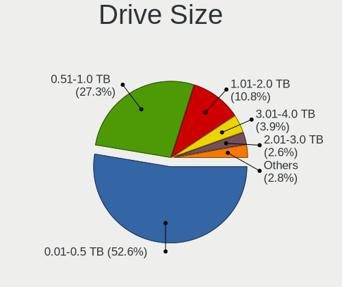
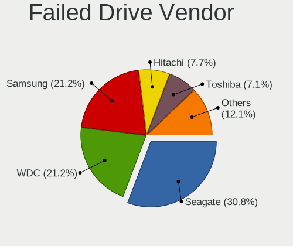
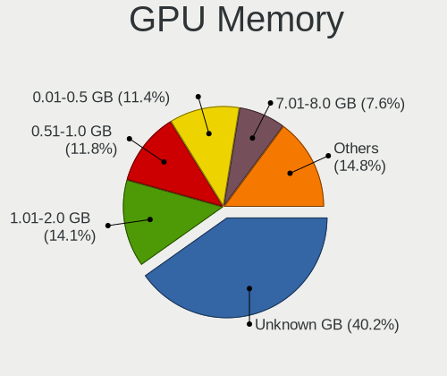

Linux - Tested Hardware & Statistics (Desktops)
-----------------------------------------------

A project to collect tested hardware configurations for Linux.

Anyone can contribute to this report by the [hw-probe](https://github.com/linuxhw/hw-probe) tool:

    sudo -E hw-probe -all -upload

Please contribute! Especially if your hardware is rare.

This report is for real hardware. Report for virtual hardware: [TestCoverage_VE](https://github.com/linuxhw/TestCoverage_VE)

Contents
--------

* [ Test Cases ](#test-cases)

* [ System ](#system)
  - [ OS                       ](#os)
  - [ OS Family                ](#os-family)
  - [ Kernel                   ](#kernel)
  - [ Kernel Family            ](#kernel-family)
  - [ Kernel Major Ver.        ](#kernel-major-ver)
  - [ Arch                     ](#arch)
  - [ DE                       ](#de)
  - [ Display Server           ](#display-server)
  - [ Display Manager          ](#display-manager)
  - [ OS Lang                  ](#os-lang)
  - [ Boot Mode                ](#boot-mode)
  - [ Filesystem               ](#filesystem)
  - [ Part. scheme             ](#part-scheme)
  - [ Dual Boot with Linux/BSD ](#dual-boot-with-linuxbsd)
  - [ Dual Boot (Win)          ](#dual-boot-win)

* [ Board ](#board)
  - [ Vendor                   ](#vendor)
  - [ Model                    ](#model)
  - [ Model Family             ](#model-family)
  - [ MFG Year                 ](#mfg-year)
  - [ Form Factor              ](#form-factor)
  - [ Secure Boot              ](#secure-boot)
  - [ Coreboot                 ](#coreboot)
  - [ RAM Size                 ](#ram-size)
  - [ RAM Used                 ](#ram-used)
  - [ Total Drives             ](#total-drives)
  - [ Has CD-ROM               ](#has-cd-rom)
  - [ Has Ethernet             ](#has-ethernet)
  - [ Has WiFi                 ](#has-wifi)
  - [ Has Bluetooth            ](#has-bluetooth)

* [ Location ](#location)
  - [ Country                  ](#country)
  - [ City                     ](#city)

* [ Drives ](#drives)
  - [ Drive Vendor             ](#drive-vendor)
  - [ Drive Model              ](#drive-model)
  - [ HDD Vendor               ](#hdd-vendor)
  - [ SSD Vendor               ](#ssd-vendor)
  - [ Drive Kind               ](#drive-kind)
  - [ Drive Connector          ](#drive-connector)
  - [ Drive Size               ](#drive-size)
  - [ Space Total              ](#space-total)
  - [ Space Used               ](#space-used)
  - [ Malfunc. Drives          ](#malfunc-drives)
  - [ Malfunc. Drive Vendor    ](#malfunc-drive-vendor)
  - [ Malfunc. HDD Vendor      ](#malfunc-hdd-vendor)
  - [ Malfunc. Drive Kind      ](#malfunc-drive-kind)
  - [ Failed Drives            ](#failed-drives)
  - [ Failed Drive Vendor      ](#failed-drive-vendor)
  - [ Drive Status             ](#drive-status)

* [ Storage controller ](#storage-controller)
  - [ Storage Vendor           ](#storage-vendor)
  - [ Storage Model            ](#storage-model)
  - [ Storage Kind             ](#storage-kind)

* [ Processor ](#processor)
  - [ CPU Vendor               ](#cpu-vendor)
  - [ CPU Model                ](#cpu-model)
  - [ CPU Model Family         ](#cpu-model-family)
  - [ CPU Cores                ](#cpu-cores)
  - [ CPU Sockets              ](#cpu-sockets)
  - [ CPU Threads              ](#cpu-threads)
  - [ CPU Op-Modes             ](#cpu-op-modes)
  - [ CPU Microcode            ](#cpu-microcode)
  - [ CPU Microarch            ](#cpu-microarch)

* [ Graphics ](#graphics)
  - [ GPU Vendor               ](#gpu-vendor)
  - [ GPU Model                ](#gpu-model)
  - [ GPU Combo                ](#gpu-combo)
  - [ GPU Driver               ](#gpu-driver)
  - [ GPU Memory               ](#gpu-memory)

* [ Monitor ](#monitor)
  - [ Monitor Vendor           ](#monitor-vendor)
  - [ Monitor Model            ](#monitor-model)
  - [ Monitor Resolution       ](#monitor-resolution)
  - [ Monitor Diagonal         ](#monitor-diagonal)
  - [ Monitor Width            ](#monitor-width)
  - [ Aspect Ratio             ](#aspect-ratio)
  - [ Monitor Area             ](#monitor-area)
  - [ Pixel Density            ](#pixel-density)
  - [ Multiple Monitors        ](#multiple-monitors)

* [ Network ](#network)
  - [ Net Controller Vendor    ](#net-controller-vendor)
  - [ Net Controller Model     ](#net-controller-model)
  - [ Wireless Vendor          ](#wireless-vendor)
  - [ Wireless Model           ](#wireless-model)
  - [ Ethernet Vendor          ](#ethernet-vendor)
  - [ Ethernet Model           ](#ethernet-model)
  - [ Net Controller Kind      ](#net-controller-kind)
  - [ Used Controller          ](#used-controller)
  - [ NICs                     ](#nics)
  - [ IPv6                     ](#ipv6)

* [ Bluetooth ](#bluetooth)
  - [ Bluetooth Vendor         ](#bluetooth-vendor)
  - [ Bluetooth Model          ](#bluetooth-model)

* [ Sound ](#sound)
  - [ Sound Vendor             ](#sound-vendor)
  - [ Sound Model              ](#sound-model)

* [ Memory ](#memory)
  - [ Memory Vendor            ](#memory-vendor)
  - [ Memory Model             ](#memory-model)
  - [ Memory Kind              ](#memory-kind)
  - [ Memory Form Factor       ](#memory-form-factor)
  - [ Memory Size              ](#memory-size)
  - [ Memory Speed             ](#memory-speed)

* [ Printers & scanners ](#printers--scanners)
  - [ Printer Vendor           ](#printer-vendor)
  - [ Printer Model            ](#printer-model)
  - [ Scanner Vendor           ](#scanner-vendor)
  - [ Scanner Model            ](#scanner-model)

* [ Camera ](#camera)
  - [ Camera Vendor            ](#camera-vendor)
  - [ Camera Model             ](#camera-model)

* [ Security ](#security)
  - [ Fingerprint Vendor       ](#fingerprint-vendor)
  - [ Fingerprint Model        ](#fingerprint-model)
  - [ Chipcard Vendor          ](#chipcard-vendor)
  - [ Chipcard Model           ](#chipcard-model)

* [ Unsupported ](#unsupported)
  - [ Unsupported Devices      ](#unsupported-devices)
  - [ Unsupported Device Types ](#unsupported-device-types)

Test Cases
----------

Total: 100657

| Vendor        | Model                       | Probe                                                      | Date         |
|---------------|-----------------------------|------------------------------------------------------------|--------------|
| Supermicro    | X9SCL/X9SCMA                | [fa0d296a6d](https://linux-hardware.org/?probe=fa0d296a6d) | Sep 01, 2022 |
| MSI           | X570-A PRO                  | [4a7d6a9276](https://linux-hardware.org/?probe=4a7d6a9276) | Sep 01, 2022 |
| Gigabyte      | 945GCM-S2L                  | [99613365f5](https://linux-hardware.org/?probe=99613365f5) | Sep 01, 2022 |
| ASRockRack    | X470D4U2/1N1                | [2b524b9c24](https://linux-hardware.org/?probe=2b524b9c24) | Sep 01, 2022 |
| Dell          | 0J584C A00                  | [de442f1c61](https://linux-hardware.org/?probe=de442f1c61) | Sep 01, 2022 |
| ASUSTek       | TUF Gaming Z490-PLUS        | [3a8803f198](https://linux-hardware.org/?probe=3a8803f198) | Sep 01, 2022 |
| ASRock        | 990FX Extreme3              | [1e75cefa31](https://linux-hardware.org/?probe=1e75cefa31) | Sep 01, 2022 |
| Dell          | 02YRK5 A02                  | [bc316a8d3f](https://linux-hardware.org/?probe=bc316a8d3f) | Sep 01, 2022 |
| Gigabyte      | B450M DS3H WIFI-CF          | [fb12fe29dd](https://linux-hardware.org/?probe=fb12fe29dd) | Sep 01, 2022 |
| ASRock        | N68-S                       | [df5d34428a](https://linux-hardware.org/?probe=df5d34428a) | Sep 01, 2022 |
| ASUSTek       | PRIME A320M-K               | [bdae2c60cd](https://linux-hardware.org/?probe=bdae2c60cd) | Sep 01, 2022 |
| Gigabyte      | 970A-DS3P                   | [5ba20eb04b](https://linux-hardware.org/?probe=5ba20eb04b) | Sep 01, 2022 |
| Acer          | Aspire TC-605               | [5ff2a41fcd](https://linux-hardware.org/?probe=5ff2a41fcd) | Sep 01, 2022 |
| ASRock        | A320M-DVS R4.0              | [143e6e1816](https://linux-hardware.org/?probe=143e6e1816) | Sep 01, 2022 |
| ASUSTek       | M5A78L-M LX3                | [5ba264dfb2](https://linux-hardware.org/?probe=5ba264dfb2) | Sep 01, 2022 |
| Dell          | 0R6PCT A01                  | [02af50752e](https://linux-hardware.org/?probe=02af50752e) | Sep 01, 2022 |
| ASUSTek       | M5A78L-M LX3                | [169c9af937](https://linux-hardware.org/?probe=169c9af937) | Sep 01, 2022 |
| Lenovo        | SHARKBAY 31900058 STD       | [f113f959b7](https://linux-hardware.org/?probe=f113f959b7) | Sep 01, 2022 |
| Dell          | 042P49 A00                  | [31efc1e75f](https://linux-hardware.org/?probe=31efc1e75f) | Sep 01, 2022 |
| Acer          | Aspire TC-605               | [fdc6b95d8b](https://linux-hardware.org/?probe=fdc6b95d8b) | Sep 01, 2022 |
| ASUSTek       | P8Z77-V LE PLUS             | [0f7d76d65c](https://linux-hardware.org/?probe=0f7d76d65c) | Sep 01, 2022 |
| ASUSTek       | ROG STRIX X470-F GAMING     | [a2878122de](https://linux-hardware.org/?probe=a2878122de) | Sep 01, 2022 |
| MSI           | MS-B9201                    | [7bbae05d63](https://linux-hardware.org/?probe=7bbae05d63) | Sep 01, 2022 |
| Dell          | 042P49 A02                  | [3b1c07d561](https://linux-hardware.org/?probe=3b1c07d561) | Sep 01, 2022 |
| Gigabyte      | P55A-UD3                    | [297cab0eb2](https://linux-hardware.org/?probe=297cab0eb2) | Sep 01, 2022 |
| Gigabyte      | Z590 GAMING X               | [b84d0acafb](https://linux-hardware.org/?probe=b84d0acafb) | Sep 01, 2022 |
| ASUSTek       | M2N32-SLI DELUXE            | [d1bb81241c](https://linux-hardware.org/?probe=d1bb81241c) | Sep 01, 2022 |
| Gigabyte      | Z370 HD3-OP-CF              | [55f8dbfb24](https://linux-hardware.org/?probe=55f8dbfb24) | Sep 01, 2022 |
| Dell          | 0MWYPT A02                  | [e2f98387b0](https://linux-hardware.org/?probe=e2f98387b0) | Sep 01, 2022 |
| MSI           | MS-B9201                    | [0d04798699](https://linux-hardware.org/?probe=0d04798699) | Sep 01, 2022 |
| ASUSTek       | ROG STRIX X470-F GAMING     | [836d60c547](https://linux-hardware.org/?probe=836d60c547) | Sep 01, 2022 |
| Gigabyte      | Z370 HD3-OP-CF              | [ead5d021a7](https://linux-hardware.org/?probe=ead5d021a7) | Sep 01, 2022 |
| Lenovo        | 3168 NOK                    | [58c82b01e2](https://linux-hardware.org/?probe=58c82b01e2) | Sep 01, 2022 |
| Gigabyte      | Z97-HD3                     | [32e71c2905](https://linux-hardware.org/?probe=32e71c2905) | Sep 01, 2022 |
| Gigabyte      | P55-US3L                    | [93e1829d36](https://linux-hardware.org/?probe=93e1829d36) | Sep 01, 2022 |
| Intel         | D34010WYB H14771-304        | [47d9609ba8](https://linux-hardware.org/?probe=47d9609ba8) | Sep 01, 2022 |
| Intel         | D34010WYB H14771-304        | [fd34481bf8](https://linux-hardware.org/?probe=fd34481bf8) | Sep 01, 2022 |
| Gigabyte      | H81M-WW                     | [2a56f256a3](https://linux-hardware.org/?probe=2a56f256a3) | Sep 01, 2022 |
| Lenovo        | ThinkCentre M58e 7408BA5    | [4384314f98](https://linux-hardware.org/?probe=4384314f98) | Sep 01, 2022 |
| MSI           | H81M-P33                    | [8d15799ff9](https://linux-hardware.org/?probe=8d15799ff9) | Sep 01, 2022 |
| ASUSTek       | PRIME A320M-K               | [6552f796e2](https://linux-hardware.org/?probe=6552f796e2) | Sep 01, 2022 |
| Gigabyte      | X150M-PRO ECC-CF            | [6db003ed3a](https://linux-hardware.org/?probe=6db003ed3a) | Sep 01, 2022 |
| ASUSTek       | PRIME H310M-R R2.0          | [b226dd8bc2](https://linux-hardware.org/?probe=b226dd8bc2) | Sep 01, 2022 |
| HP            | 1589                        | [fce9004571](https://linux-hardware.org/?probe=fce9004571) | Sep 01, 2022 |
| ASRock        | N68-VS3 FX                  | [b4c043c208](https://linux-hardware.org/?probe=b4c043c208) | Sep 01, 2022 |
| ASUSTek       | V-M3N8200                   | [f593540c1c](https://linux-hardware.org/?probe=f593540c1c) | Sep 01, 2022 |
| Gigabyte      | GA-E6010N                   | [8daf2205a5](https://linux-hardware.org/?probe=8daf2205a5) | Sep 01, 2022 |
| ASUSTek       | PRIME B350M-K               | [ae0450c52a](https://linux-hardware.org/?probe=ae0450c52a) | Sep 01, 2022 |
| Gigabyte      | X150M-PRO ECC-CF            | [2f21cd30ff](https://linux-hardware.org/?probe=2f21cd30ff) | Sep 01, 2022 |
| Foxconn       | 2ABF                        | [c9a801a4d2](https://linux-hardware.org/?probe=c9a801a4d2) | Sep 01, 2022 |
| ASUSTek       | PRIME B550M-A               | [8fc60cb459](https://linux-hardware.org/?probe=8fc60cb459) | Sep 01, 2022 |
| ASUSTek       | V-M3N8200                   | [f3cc0c0bd5](https://linux-hardware.org/?probe=f3cc0c0bd5) | Sep 01, 2022 |
| ASUSTek       | PRIME H310M-R R2.0          | [c1ba9218de](https://linux-hardware.org/?probe=c1ba9218de) | Sep 01, 2022 |
| ASUSTek       | ROG STRIX Z590-A GAMING ... | [e311938d4a](https://linux-hardware.org/?probe=e311938d4a) | Sep 01, 2022 |
| Gigabyte      | GA-MA785G-UD3H              | [2cf98644bc](https://linux-hardware.org/?probe=2cf98644bc) | Sep 01, 2022 |
| MSI           | H110M GAMING                | [2699df47df](https://linux-hardware.org/?probe=2699df47df) | Sep 01, 2022 |
| ASRock        | B450M Pro4-F                | [d48b9efca4](https://linux-hardware.org/?probe=d48b9efca4) | Sep 01, 2022 |
| Medion        | H110H4-EM                   | [9f80ee3a09](https://linux-hardware.org/?probe=9f80ee3a09) | Sep 01, 2022 |
| HP            | 3398                        | [8b5bad68cb](https://linux-hardware.org/?probe=8b5bad68cb) | Sep 01, 2022 |
| Gigabyte      | 990FXA-UD5                  | [e5364d8761](https://linux-hardware.org/?probe=e5364d8761) | Sep 01, 2022 |
| ASUSTek       | TUF Gaming X570-PRO         | [6eae76b5d0](https://linux-hardware.org/?probe=6eae76b5d0) | Sep 01, 2022 |
| ECS           | H61H2-M2                    | [9735a8ef90](https://linux-hardware.org/?probe=9735a8ef90) | Sep 01, 2022 |
| ASRock        | FM2A88X Extreme6+           | [689c3aa34d](https://linux-hardware.org/?probe=689c3aa34d) | Sep 01, 2022 |
| Lenovo        | SHARKBAY NO DPK             | [f872d36cd5](https://linux-hardware.org/?probe=f872d36cd5) | Sep 01, 2022 |
| MSI           | X99A RAIDER                 | [5cf1e75ad4](https://linux-hardware.org/?probe=5cf1e75ad4) | Sep 01, 2022 |
| Gigabyte      | 970A-DS3P                   | [1bc16dc2be](https://linux-hardware.org/?probe=1bc16dc2be) | Sep 01, 2022 |
| ASRock        | A320M-DVS R4.0              | [c3ca58ba40](https://linux-hardware.org/?probe=c3ca58ba40) | Sep 01, 2022 |
| Lenovo        | 36D5 SDK0J40700 WIN 3258... | [87dfd12899](https://linux-hardware.org/?probe=87dfd12899) | Sep 01, 2022 |
| ASRock        | FM2A55M-HD+                 | [2f96c73efb](https://linux-hardware.org/?probe=2f96c73efb) | Sep 01, 2022 |
| Unknown       | HX90                        | [71295a28ed](https://linux-hardware.org/?probe=71295a28ed) | Sep 01, 2022 |
| ASRock        | X99 Taichi                  | [4cd4bf6c89](https://linux-hardware.org/?probe=4cd4bf6c89) | Sep 01, 2022 |
| Gigabyte      | B450 AORUS PRO WIFI-CF      | [8e1734f31a](https://linux-hardware.org/?probe=8e1734f31a) | Sep 01, 2022 |
| ASRock        | N68-GS4 FX R2.0             | [ea730c9b2d](https://linux-hardware.org/?probe=ea730c9b2d) | Sep 01, 2022 |
| Dell          | 09M8Y8 A01                  | [54b61cd4be](https://linux-hardware.org/?probe=54b61cd4be) | Sep 01, 2022 |
| ASRock        | B450M/ac                    | [393a08345e](https://linux-hardware.org/?probe=393a08345e) | Sep 01, 2022 |
| Acer          | Aspire X3400                | [705a3242ae](https://linux-hardware.org/?probe=705a3242ae) | Sep 01, 2022 |
| ASUSTek       | TUF Gaming B450-PLUS II     | [efc46d8d23](https://linux-hardware.org/?probe=efc46d8d23) | Sep 01, 2022 |
| MSI           | B450M-A PRO MAX             | [6462d2370f](https://linux-hardware.org/?probe=6462d2370f) | Aug 31, 2022 |
| ASUSTek       | ROG STRIX B550-F GAMING     | [3ea6fa4079](https://linux-hardware.org/?probe=3ea6fa4079) | Aug 31, 2022 |
| ASUSTek       | PRIME H510T2/CSM            | [12033c4a8b](https://linux-hardware.org/?probe=12033c4a8b) | Aug 31, 2022 |
| HP            | 1906                        | [a23cef9946](https://linux-hardware.org/?probe=a23cef9946) | Aug 31, 2022 |
| MSI           | MAG X570S TORPEDO MAX       | [d98546fd95](https://linux-hardware.org/?probe=d98546fd95) | Aug 31, 2022 |
| ASUSTek       | P5K/EPU                     | [196d56922a](https://linux-hardware.org/?probe=196d56922a) | Aug 31, 2022 |
| MSI           | MAG B550M MORTAR WIFI       | [f4d5b9fc69](https://linux-hardware.org/?probe=f4d5b9fc69) | Aug 31, 2022 |
| MSI           | MPG B550I GAMING EDGE WI... | [aacd965d80](https://linux-hardware.org/?probe=aacd965d80) | Aug 31, 2022 |
| ASUSTek       | P8H61-MX                    | [52e7588080](https://linux-hardware.org/?probe=52e7588080) | Aug 31, 2022 |
| MSI           | H97M-G43                    | [978d5b45be](https://linux-hardware.org/?probe=978d5b45be) | Aug 31, 2022 |
| HP            | 81B4                        | [b81985e04e](https://linux-hardware.org/?probe=b81985e04e) | Aug 31, 2022 |
| Acidanther... | Mac-F60DEB81FF30ACF6 Mac... | [1dd7a06125](https://linux-hardware.org/?probe=1dd7a06125) | Aug 31, 2022 |
| Pegatron      | 2AB6                        | [c4ca3989e0](https://linux-hardware.org/?probe=c4ca3989e0) | Aug 31, 2022 |
| MSI           | MPG B550I GAMING EDGE WI... | [c5547cac7c](https://linux-hardware.org/?probe=c5547cac7c) | Aug 31, 2022 |
| HP            | 18E5                        | [e7c5ab6cc4](https://linux-hardware.org/?probe=e7c5ab6cc4) | Aug 31, 2022 |
| Dell          | 0CRH6C A02                  | [edb6d4d6c2](https://linux-hardware.org/?probe=edb6d4d6c2) | Aug 31, 2022 |
| Intel         | X99                         | [8f4cdd5290](https://linux-hardware.org/?probe=8f4cdd5290) | Aug 31, 2022 |
| Dell          | 0R092H                      | [1a3a337c23](https://linux-hardware.org/?probe=1a3a337c23) | Aug 31, 2022 |
| Acer          | Aspire X3400                | [cb5288e92d](https://linux-hardware.org/?probe=cb5288e92d) | Aug 31, 2022 |
| Acer          | Aspire X3400                | [5e9e5dd1ce](https://linux-hardware.org/?probe=5e9e5dd1ce) | Aug 31, 2022 |
| Gigabyte      | P85-D3                      | [71ce0b707c](https://linux-hardware.org/?probe=71ce0b707c) | Aug 31, 2022 |
| ASUSTek       | Z170-K                      | [544582fd23](https://linux-hardware.org/?probe=544582fd23) | Aug 31, 2022 |
| Gigabyte      | H55M-UD2H                   | [1a72b89675](https://linux-hardware.org/?probe=1a72b89675) | Aug 31, 2022 |
| MSI           | MAG X570S TOMAHAWK MAX W... | [82cda7dfe9](https://linux-hardware.org/?probe=82cda7dfe9) | Aug 31, 2022 |
| ASUSTek       | PRIME H510M-K               | [6fa51d2c4e](https://linux-hardware.org/?probe=6fa51d2c4e) | Aug 31, 2022 |
| Gigabyte      | B450 AORUS PRO-CF           | [37695eb7e5](https://linux-hardware.org/?probe=37695eb7e5) | Aug 31, 2022 |
| Unknown       | 1.0                         | [8f5cffd54f](https://linux-hardware.org/?probe=8f5cffd54f) | Aug 31, 2022 |
| OEM           | Intel H81                   | [4b45e6dc61](https://linux-hardware.org/?probe=4b45e6dc61) | Aug 31, 2022 |
| JGINYUE       | B85I PLUS V2.1              | [d171691ef3](https://linux-hardware.org/?probe=d171691ef3) | Aug 31, 2022 |
| MSI           | Z390-A PRO                  | [368eff381c](https://linux-hardware.org/?probe=368eff381c) | Aug 31, 2022 |
| ASRock        | B450 Gaming-ITX/ac          | [194290f42c](https://linux-hardware.org/?probe=194290f42c) | Aug 31, 2022 |
| MSI           | H410M PRO                   | [e1184c4522](https://linux-hardware.org/?probe=e1184c4522) | Aug 31, 2022 |
| ASUSTek       | Benicia                     | [13454a57f9](https://linux-hardware.org/?probe=13454a57f9) | Aug 31, 2022 |
| Gigabyte      | B75M-D3H                    | [0146e0f5c8](https://linux-hardware.org/?probe=0146e0f5c8) | Aug 31, 2022 |
| Gigabyte      | H110M-S2-CF                 | [6f3bb6200f](https://linux-hardware.org/?probe=6f3bb6200f) | Aug 31, 2022 |
| MSI           | B550-A PRO                  | [75a1c786f0](https://linux-hardware.org/?probe=75a1c786f0) | Aug 31, 2022 |
| ASRock        | Z77 Pro4-M                  | [d7c9a106e7](https://linux-hardware.org/?probe=d7c9a106e7) | Aug 31, 2022 |
| MSI           | MPG B550I GAMING EDGE WI... | [e5c7462ead](https://linux-hardware.org/?probe=e5c7462ead) | Aug 31, 2022 |
| HP            | 83E0                        | [af9b15b8e7](https://linux-hardware.org/?probe=af9b15b8e7) | Aug 31, 2022 |
| Gigabyte      | X570S AORUS ELITE AX        | [36eb80672f](https://linux-hardware.org/?probe=36eb80672f) | Aug 31, 2022 |
| ASRock        | B550M-ITX/ac                | [7850c07cdc](https://linux-hardware.org/?probe=7850c07cdc) | Aug 31, 2022 |
| ASUSTek       | ROG STRIX X299-E GAMING     | [fc3200b967](https://linux-hardware.org/?probe=fc3200b967) | Aug 31, 2022 |
| ASUSTek       | ROG STRIX X570-E GAMING     | [1f8274de5a](https://linux-hardware.org/?probe=1f8274de5a) | Aug 31, 2022 |
| ASUSTek       | ROG STRIX X570-E GAMING     | [567bf4b44a](https://linux-hardware.org/?probe=567bf4b44a) | Aug 31, 2022 |
| Packard Be... | WMCP78M                     | [93ead8d396](https://linux-hardware.org/?probe=93ead8d396) | Aug 31, 2022 |
| Gigabyte      | M68MT-S2                    | [29b9669488](https://linux-hardware.org/?probe=29b9669488) | Aug 31, 2022 |
| ASUSTek       | M2A-VM HDMI                 | [9d9462f5a9](https://linux-hardware.org/?probe=9d9462f5a9) | Aug 31, 2022 |
| ASRock        | B550M-ITX/ac                | [685e484cbd](https://linux-hardware.org/?probe=685e484cbd) | Aug 31, 2022 |
| MSI           | H510M-A PRO                 | [120400698e](https://linux-hardware.org/?probe=120400698e) | Aug 31, 2022 |
| Vorke         | V1 Plus                     | [0f36a3adcb](https://linux-hardware.org/?probe=0f36a3adcb) | Aug 31, 2022 |
| ASUSTek       | GL10DH                      | [c197df704f](https://linux-hardware.org/?probe=c197df704f) | Aug 31, 2022 |
| ASUSTek       | Z97-A                       | [1e70cd86f6](https://linux-hardware.org/?probe=1e70cd86f6) | Aug 31, 2022 |
| Gigabyte      | H110M-H-CF                  | [86fc2bf58f](https://linux-hardware.org/?probe=86fc2bf58f) | Aug 31, 2022 |
| HP            | 18E7                        | [9344f12eea](https://linux-hardware.org/?probe=9344f12eea) | Aug 31, 2022 |
| SZMZ          | X99M-G2                     | [eff1231310](https://linux-hardware.org/?probe=eff1231310) | Aug 31, 2022 |
| ASRock        | FM2A88X Extreme6+           | [df96c4acaf](https://linux-hardware.org/?probe=df96c4acaf) | Aug 31, 2022 |
| 16512-2316... | MPG X570 GAMING EDGE WIF... | [d523a89d9b](https://linux-hardware.org/?probe=d523a89d9b) | Aug 31, 2022 |
| MSI           | X99A RAIDER                 | [56a6f41ffa](https://linux-hardware.org/?probe=56a6f41ffa) | Aug 31, 2022 |
| HP            | 8433 11                     | [00868f25c6](https://linux-hardware.org/?probe=00868f25c6) | Aug 31, 2022 |
| Dell          | 0GXM1W A00                  | [b358b1d32b](https://linux-hardware.org/?probe=b358b1d32b) | Aug 31, 2022 |
| Dell          | 0KV3RP A00                  | [731a14ee10](https://linux-hardware.org/?probe=731a14ee10) | Aug 31, 2022 |
| ASUSTek       | M3A78-CM                    | [d146908413](https://linux-hardware.org/?probe=d146908413) | Aug 31, 2022 |
| ASUSTek       | PRIME X299-DELUXE           | [a76390d5fc](https://linux-hardware.org/?probe=a76390d5fc) | Aug 31, 2022 |
| Dell          | 0T7D40 A01                  | [0968e0629e](https://linux-hardware.org/?probe=0968e0629e) | Aug 31, 2022 |
| ASRock        | B450M-HDV R4.0              | [9c9e1d1ff1](https://linux-hardware.org/?probe=9c9e1d1ff1) | Aug 31, 2022 |
| HP            | 18E9                        | [2dff78f303](https://linux-hardware.org/?probe=2dff78f303) | Aug 31, 2022 |
| MSI           | B450 GAMING PRO CARBON A... | [2c72dfccbb](https://linux-hardware.org/?probe=2c72dfccbb) | Aug 30, 2022 |
| ASUSTek       | Z170 PRO GAMING             | [555e7c0745](https://linux-hardware.org/?probe=555e7c0745) | Aug 30, 2022 |
| Dell          | 040DDP A00                  | [09ffe165d3](https://linux-hardware.org/?probe=09ffe165d3) | Aug 30, 2022 |
| ASRock        | N68-VS3 UCC                 | [688dcf88c9](https://linux-hardware.org/?probe=688dcf88c9) | Aug 30, 2022 |
| ASRock        | N68-VS3 UCC                 | [4ccef99860](https://linux-hardware.org/?probe=4ccef99860) | Aug 30, 2022 |
| HP            | 2B38                        | [9170225d70](https://linux-hardware.org/?probe=9170225d70) | Aug 30, 2022 |
| JGINYUE       | B85M VH PLUS V1.0           | [8712171422](https://linux-hardware.org/?probe=8712171422) | Aug 30, 2022 |
| Dell          | 0WG864                      | [234e8953bc](https://linux-hardware.org/?probe=234e8953bc) | Aug 30, 2022 |
| Gigabyte      | F2A88XM-HD3                 | [44e355eb93](https://linux-hardware.org/?probe=44e355eb93) | Aug 30, 2022 |
| HP            | 805A                        | [477936d851](https://linux-hardware.org/?probe=477936d851) | Aug 30, 2022 |
| Foxconn       | 2AAF                        | [a23b1b0822](https://linux-hardware.org/?probe=a23b1b0822) | Aug 30, 2022 |
| ASUSTek       | TUF Gaming X570-PLUS        | [858b04d480](https://linux-hardware.org/?probe=858b04d480) | Aug 30, 2022 |
| MSI           | Z97 GAMING 7                | [c9ebe69583](https://linux-hardware.org/?probe=c9ebe69583) | Aug 30, 2022 |
| Gigabyte      | B550 AORUS ELITE AX V2      | [98e0a08e65](https://linux-hardware.org/?probe=98e0a08e65) | Aug 30, 2022 |
| Gigabyte      | H61M-D2H-USB3               | [eb74fdbbbc](https://linux-hardware.org/?probe=eb74fdbbbc) | Aug 30, 2022 |
| Dell          | 0R092H                      | [85871600b3](https://linux-hardware.org/?probe=85871600b3) | Aug 30, 2022 |
| ASRock        | N68C-S UCC                  | [f3389e42f8](https://linux-hardware.org/?probe=f3389e42f8) | Aug 30, 2022 |
| Gigabyte      | VM900M                      | [f446d835da](https://linux-hardware.org/?probe=f446d835da) | Aug 30, 2022 |
| Dell          | 0R230R A00                  | [0ea749e83c](https://linux-hardware.org/?probe=0ea749e83c) | Aug 30, 2022 |
| ASRock        | B550M-HDV                   | [61f310f2a2](https://linux-hardware.org/?probe=61f310f2a2) | Aug 30, 2022 |
| MSI           | MPG B550I GAMING EDGE WI... | [e770273b10](https://linux-hardware.org/?probe=e770273b10) | Aug 30, 2022 |
| Gigabyte      | M68MT-S2                    | [16b07a7497](https://linux-hardware.org/?probe=16b07a7497) | Aug 30, 2022 |
| ASRock        | N68-S UCC                   | [1d38f1f08e](https://linux-hardware.org/?probe=1d38f1f08e) | Aug 30, 2022 |
| MSI           | X79A-GD45                   | [bb940d6220](https://linux-hardware.org/?probe=bb940d6220) | Aug 30, 2022 |
| ASUSTek       | ROG STRIX B550-I GAMING     | [2fd4ef02b3](https://linux-hardware.org/?probe=2fd4ef02b3) | Aug 30, 2022 |
| Gigabyte      | B550M S2H                   | [73a8574652](https://linux-hardware.org/?probe=73a8574652) | Aug 30, 2022 |
| ASRock        | Q1900-ITX                   | [c5a0ce2143](https://linux-hardware.org/?probe=c5a0ce2143) | Aug 30, 2022 |
| ASUSTek       | P5G41-M LX                  | [ecf64e8d47](https://linux-hardware.org/?probe=ecf64e8d47) | Aug 30, 2022 |
| Gigabyte      | B550M DS3H                  | [2e6d572c33](https://linux-hardware.org/?probe=2e6d572c33) | Aug 30, 2022 |
| Acer          | Predator G3-710             | [b14bf667d5](https://linux-hardware.org/?probe=b14bf667d5) | Aug 30, 2022 |
| ASUSTek       | P5G41-M LX                  | [b7e2198026](https://linux-hardware.org/?probe=b7e2198026) | Aug 30, 2022 |
| Gigabyte      | BOLD E3032                  | [115b09b849](https://linux-hardware.org/?probe=115b09b849) | Aug 30, 2022 |
| Lenovo        | MAHOBAY                     | [53af4f5de7](https://linux-hardware.org/?probe=53af4f5de7) | Aug 30, 2022 |
| ASUSTek       | PRIME H310M-R R2.0          | [9d3e935355](https://linux-hardware.org/?probe=9d3e935355) | Aug 30, 2022 |
| ASUSTek       | PRIME H310M-R R2.0          | [28f3abde34](https://linux-hardware.org/?probe=28f3abde34) | Aug 30, 2022 |
| Unknown       | TB-4000                     | [8f7f2e486a](https://linux-hardware.org/?probe=8f7f2e486a) | Aug 30, 2022 |
| ASUSTek       | ROG Maximus XII EXTREME     | [a77d5e141e](https://linux-hardware.org/?probe=a77d5e141e) | Aug 30, 2022 |
| Dell          | 0NW6H5 A00                  | [d4de10030b](https://linux-hardware.org/?probe=d4de10030b) | Aug 30, 2022 |
| Unknown       | Unknown                     | [49c235aa0d](https://linux-hardware.org/?probe=49c235aa0d) | Aug 30, 2022 |
| Gigabyte      | M68MT-S2                    | [cfd6369e5a](https://linux-hardware.org/?probe=cfd6369e5a) | Aug 30, 2022 |
| MACHINIST     | X99-RS9 V2.0                | [d972083fa3](https://linux-hardware.org/?probe=d972083fa3) | Aug 30, 2022 |
| Fujitsu       | D3348-B1 S26361-D3348-B1    | [9721d1f81d](https://linux-hardware.org/?probe=9721d1f81d) | Aug 30, 2022 |
| Unknown       | Unknown                     | [3f51be2653](https://linux-hardware.org/?probe=3f51be2653) | Aug 30, 2022 |
| Gigabyte      | G31M-S2C                    | [61a4780992](https://linux-hardware.org/?probe=61a4780992) | Aug 30, 2022 |
| ASUSTek       | P5QPL-AM                    | [38e6481a65](https://linux-hardware.org/?probe=38e6481a65) | Aug 30, 2022 |
| ASUSTek       | P5KPL-CM                    | [dc62f3b267](https://linux-hardware.org/?probe=dc62f3b267) | Aug 30, 2022 |
| Gigabyte      | G31M-S2C                    | [8beed8e261](https://linux-hardware.org/?probe=8beed8e261) | Aug 30, 2022 |
| JGINYUE       | B85M VH PLUS V1.0           | [f065870080](https://linux-hardware.org/?probe=f065870080) | Aug 30, 2022 |
| ASUSTek       | TUF Gaming X570-PLUS        | [d816d2ade0](https://linux-hardware.org/?probe=d816d2ade0) | Aug 30, 2022 |
| Dell          | 0H0P0M A00                  | [cfa1437377](https://linux-hardware.org/?probe=cfa1437377) | Aug 30, 2022 |
| HP            | 0A60h                       | [d801f7cb0c](https://linux-hardware.org/?probe=d801f7cb0c) | Aug 30, 2022 |
| ASUSTek       | M2N-TE                      | [82e7cc26e7](https://linux-hardware.org/?probe=82e7cc26e7) | Aug 30, 2022 |
| Lenovo        | 3111 SDK0J40697 WIN 3305... | [2be9b66ba1](https://linux-hardware.org/?probe=2be9b66ba1) | Aug 30, 2022 |
| MSI           | X99A RAIDER                 | [09b6390c84](https://linux-hardware.org/?probe=09b6390c84) | Aug 30, 2022 |
| ASRock        | FM2A88X Extreme6+           | [eba231b7db](https://linux-hardware.org/?probe=eba231b7db) | Aug 30, 2022 |
| DNI           | SNDTP-1513N 5508015890      | [9570ee789c](https://linux-hardware.org/?probe=9570ee789c) | Aug 30, 2022 |
| ASRockRack    | ROMED8-2T                   | [a034a83f72](https://linux-hardware.org/?probe=a034a83f72) | Aug 30, 2022 |
| Dell          | 0J3C2F A00                  | [276ac60713](https://linux-hardware.org/?probe=276ac60713) | Aug 30, 2022 |
| Gigabyte      | Z97X-Gaming 7               | [1c993db964](https://linux-hardware.org/?probe=1c993db964) | Aug 30, 2022 |
| Gigabyte      | Z97X-Gaming 7               | [91438fc6b5](https://linux-hardware.org/?probe=91438fc6b5) | Aug 30, 2022 |
| HP            | 8464                        | [16bb2588e0](https://linux-hardware.org/?probe=16bb2588e0) | Aug 30, 2022 |
| Gigabyte      | GA-78LMT-S2                 | [70ee26740a](https://linux-hardware.org/?probe=70ee26740a) | Aug 30, 2022 |
| HP            | 2B38                        | [40428ed239](https://linux-hardware.org/?probe=40428ed239) | Aug 30, 2022 |
| ASRock        | N68-S                       | [6aabf89438](https://linux-hardware.org/?probe=6aabf89438) | Aug 30, 2022 |
| ASRock        | B450M Pro4 R2.0             | [d0ca11a18a](https://linux-hardware.org/?probe=d0ca11a18a) | Aug 29, 2022 |
| HP            | 2B36                        | [c6de6225af](https://linux-hardware.org/?probe=c6de6225af) | Aug 29, 2022 |
| ASRock        | B450M Pro4 R2.0             | [fb155ef3bd](https://linux-hardware.org/?probe=fb155ef3bd) | Aug 29, 2022 |
| ASUSTek       | P8P67 PRO                   | [aa43ab7091](https://linux-hardware.org/?probe=aa43ab7091) | Aug 29, 2022 |
| ASUSTek       | PRIME B450-PLUS             | [a01239fd83](https://linux-hardware.org/?probe=a01239fd83) | Aug 29, 2022 |
| ASUSTek       | P8P67 PRO                   | [4882cfb195](https://linux-hardware.org/?probe=4882cfb195) | Aug 29, 2022 |
| MSI           | MS-B9201                    | [b5c80c8c2c](https://linux-hardware.org/?probe=b5c80c8c2c) | Aug 29, 2022 |
| Gigabyte      | Z390 AORUS MASTER-CF        | [1a8ff186c7](https://linux-hardware.org/?probe=1a8ff186c7) | Aug 29, 2022 |
| ASRock        | B85 Pro4                    | [db3bc987b6](https://linux-hardware.org/?probe=db3bc987b6) | Aug 29, 2022 |
| OEM           | G41 775 ICH7 8712           | [4225df6517](https://linux-hardware.org/?probe=4225df6517) | Aug 29, 2022 |
| Intel         | D525MWV AAE93081-401        | [985d906899](https://linux-hardware.org/?probe=985d906899) | Aug 29, 2022 |
| Dell          | 0KWVT8 A03                  | [b91ce43523](https://linux-hardware.org/?probe=b91ce43523) | Aug 29, 2022 |
| Dell          | 0773VG A00                  | [576dfabbf6](https://linux-hardware.org/?probe=576dfabbf6) | Aug 29, 2022 |
| Gigabyte      | Z170-D3H-CF                 | [d9d75bc1f0](https://linux-hardware.org/?probe=d9d75bc1f0) | Aug 29, 2022 |
| ASRock        | X470 Gaming-ITX/ac          | [b65fff0f51](https://linux-hardware.org/?probe=b65fff0f51) | Aug 29, 2022 |
| Supermicro    | X10SLL-F                    | [c3b5857c26](https://linux-hardware.org/?probe=c3b5857c26) | Aug 29, 2022 |
| Gigabyte      | B365M D3H-CF                | [4a96f9e792](https://linux-hardware.org/?probe=4a96f9e792) | Aug 29, 2022 |
| Gigabyte      | H81M-DS2                    | [373a11a297](https://linux-hardware.org/?probe=373a11a297) | Aug 29, 2022 |
| Alienware     | 01NYPT A00                  | [cd95b79270](https://linux-hardware.org/?probe=cd95b79270) | Aug 29, 2022 |
| ASRock        | X370 Gaming X               | [e915bb3a8c](https://linux-hardware.org/?probe=e915bb3a8c) | Aug 29, 2022 |
| Medion        | Cattle24 1M                 | [eb19c533e0](https://linux-hardware.org/?probe=eb19c533e0) | Aug 29, 2022 |
| ASUSTek       | Z97-C                       | [9bdae9239f](https://linux-hardware.org/?probe=9bdae9239f) | Aug 29, 2022 |
| Lenovo        | Bantry CRB SDK0J40709 WI... | [4ba4105869](https://linux-hardware.org/?probe=4ba4105869) | Aug 29, 2022 |
| HP            | 304Ah                       | [3f370524f3](https://linux-hardware.org/?probe=3f370524f3) | Aug 29, 2022 |
| ASUSTek       | P5KPL-AM SE                 | [7a2c713719](https://linux-hardware.org/?probe=7a2c713719) | Aug 29, 2022 |
| MSI           | MAG X570S TOMAHAWK MAX W... | [33aaa7baf4](https://linux-hardware.org/?probe=33aaa7baf4) | Aug 29, 2022 |
| HP            | 18E5                        | [c40ab0e3e3](https://linux-hardware.org/?probe=c40ab0e3e3) | Aug 29, 2022 |
| ASUSTek       | TUF B450-PLUS GAMING        | [4b37519faf](https://linux-hardware.org/?probe=4b37519faf) | Aug 29, 2022 |
| Lenovo        | ThinkCentre M91p 4518AU8    | [0099ab3432](https://linux-hardware.org/?probe=0099ab3432) | Aug 29, 2022 |
| HP            | ProLiant MicroServer Gen... | [b613af8e42](https://linux-hardware.org/?probe=b613af8e42) | Aug 29, 2022 |
| ASUSTek       | TUF Gaming B550-PLUS        | [9fbdc83458](https://linux-hardware.org/?probe=9fbdc83458) | Aug 29, 2022 |
| ASUSTek       | TUF Gaming B550-PLUS        | [7b0113a203](https://linux-hardware.org/?probe=7b0113a203) | Aug 29, 2022 |
| Gigabyte      | H97M-D3H                    | [a8100fcf41](https://linux-hardware.org/?probe=a8100fcf41) | Aug 29, 2022 |
| MSI           | B250M PRO-VD                | [d462e3b9d0](https://linux-hardware.org/?probe=d462e3b9d0) | Aug 29, 2022 |
| Gigabyte      | H97M-D3H                    | [f8f42b0857](https://linux-hardware.org/?probe=f8f42b0857) | Aug 29, 2022 |
| ASRock        | N68-S                       | [9d18792f64](https://linux-hardware.org/?probe=9d18792f64) | Aug 29, 2022 |
| Gigabyte      | B450 AORUS ELITE            | [a37d7cae28](https://linux-hardware.org/?probe=a37d7cae28) | Aug 29, 2022 |
| MSI           | H310M PRO-M2 PLUS           | [a561fb6354](https://linux-hardware.org/?probe=a561fb6354) | Aug 29, 2022 |
| Gigabyte      | B550M S2H                   | [ac1d1ffdba](https://linux-hardware.org/?probe=ac1d1ffdba) | Aug 29, 2022 |
| ASUSTek       | Maximus VIII HERO           | [8a68d394b8](https://linux-hardware.org/?probe=8a68d394b8) | Aug 29, 2022 |
| Lenovo        | MAHOBAY NO DPK              | [2d013c60ed](https://linux-hardware.org/?probe=2d013c60ed) | Aug 29, 2022 |
| MSI           | MPG Z390I GAMING EDGE AC    | [cf0cdab1da](https://linux-hardware.org/?probe=cf0cdab1da) | Aug 29, 2022 |
| Gigabyte      | B85M-HD3                    | [dcb5e7a20c](https://linux-hardware.org/?probe=dcb5e7a20c) | Aug 29, 2022 |
| MSI           | MPG Z390 GAMING PLUS        | [60bc287a81](https://linux-hardware.org/?probe=60bc287a81) | Aug 29, 2022 |
| HP            | 8751                        | [62c8c2f25e](https://linux-hardware.org/?probe=62c8c2f25e) | Aug 29, 2022 |
| MSI           | MAG B550 TORPEDO            | [58f0ba95c3](https://linux-hardware.org/?probe=58f0ba95c3) | Aug 29, 2022 |
| MSI           | MPG Z390 GAMING PLUS        | [7d1dae1de6](https://linux-hardware.org/?probe=7d1dae1de6) | Aug 29, 2022 |
| MSI           | B450M MORTAR MAX            | [25e7e97937](https://linux-hardware.org/?probe=25e7e97937) | Aug 29, 2022 |
| Gigabyte      | H170-D3H-CF                 | [75a6e1e9a1](https://linux-hardware.org/?probe=75a6e1e9a1) | Aug 29, 2022 |
| ASUSTek       | PRIME Z590-P                | [e05dcd4a08](https://linux-hardware.org/?probe=e05dcd4a08) | Aug 29, 2022 |
| Lenovo        | ThinkCentre M58p 6234CL2    | [14449a705a](https://linux-hardware.org/?probe=14449a705a) | Aug 29, 2022 |
| ASRock        | Z170 Pro4                   | [eaa574481f](https://linux-hardware.org/?probe=eaa574481f) | Aug 29, 2022 |
| Unknown       | Unknown                     | [fd4ab67b77](https://linux-hardware.org/?probe=fd4ab67b77) | Aug 29, 2022 |
| Unknown       | Unknown                     | [4d1df25a9f](https://linux-hardware.org/?probe=4d1df25a9f) | Aug 29, 2022 |
| MSI           | MAG B550M MORTAR            | [82ff6d598a](https://linux-hardware.org/?probe=82ff6d598a) | Aug 29, 2022 |
| ASRock        | A320M-DVS R4.0              | [5140e742a9](https://linux-hardware.org/?probe=5140e742a9) | Aug 29, 2022 |
| Gigabyte      | B550 AORUS ELITE AX V2      | [81bc767d5b](https://linux-hardware.org/?probe=81bc767d5b) | Aug 29, 2022 |
| HP            | 1497                        | [625185d1db](https://linux-hardware.org/?probe=625185d1db) | Aug 29, 2022 |
| Gigabyte      | Z97M-DS3H                   | [72c01f3cf1](https://linux-hardware.org/?probe=72c01f3cf1) | Aug 29, 2022 |
| ASUSTek       | PRIME B550M-A               | [1ff074d641](https://linux-hardware.org/?probe=1ff074d641) | Aug 29, 2022 |
| Dell          | 0HY9JP A01                  | [b87b0407d9](https://linux-hardware.org/?probe=b87b0407d9) | Aug 29, 2022 |
| OEM           | Intel H81                   | [8732ebea02](https://linux-hardware.org/?probe=8732ebea02) | Aug 29, 2022 |
| Gigabyte      | H370 AORUS GAMING 3 WIFI... | [413bd5a721](https://linux-hardware.org/?probe=413bd5a721) | Aug 29, 2022 |
| Dell          | 05XGC8 A01                  | [73ac4cc88d](https://linux-hardware.org/?probe=73ac4cc88d) | Aug 29, 2022 |
| ASRock        | FM2A58M-VG3+ R2.0           | [422af9d6b5](https://linux-hardware.org/?probe=422af9d6b5) | Aug 29, 2022 |
| Supermicro    | SKAGIT09                    | [3f4c6a4d48](https://linux-hardware.org/?probe=3f4c6a4d48) | Aug 29, 2022 |
| Dell          | 0HY9JP A01                  | [fbb579a5d6](https://linux-hardware.org/?probe=fbb579a5d6) | Aug 29, 2022 |
| MSI           | Z77A-G43                    | [1d1864dabc](https://linux-hardware.org/?probe=1d1864dabc) | Aug 29, 2022 |
| Lenovo        | MAHOBAY NO DPK              | [9274f5e876](https://linux-hardware.org/?probe=9274f5e876) | Aug 29, 2022 |
| ASUSTek       | ROG STRIX B550-F GAMING     | [281360b58a](https://linux-hardware.org/?probe=281360b58a) | Aug 29, 2022 |
| BESSTAR Te... | UM700                       | [13fdf5ef5e](https://linux-hardware.org/?probe=13fdf5ef5e) | Aug 29, 2022 |
| ASRock        | N68-S                       | [4fff0a6104](https://linux-hardware.org/?probe=4fff0a6104) | Aug 29, 2022 |
| Gigabyte      | F2A88XM-D3H                 | [3b245a809d](https://linux-hardware.org/?probe=3b245a809d) | Aug 28, 2022 |
| Gigabyte      | F2A88XM-D3H                 | [dcb225651d](https://linux-hardware.org/?probe=dcb225651d) | Aug 28, 2022 |
| Gigabyte      | AB350-Gaming-CF             | [499889da7e](https://linux-hardware.org/?probe=499889da7e) | Aug 28, 2022 |
| MSI           | B450M MORTAR MAX            | [2d89536f80](https://linux-hardware.org/?probe=2d89536f80) | Aug 28, 2022 |
| MSI           | B560M-A PRO                 | [a550031b1d](https://linux-hardware.org/?probe=a550031b1d) | Aug 28, 2022 |
| Gigabyte      | X470 AORUS GAMING 7 WIFI... | [c7ace10271](https://linux-hardware.org/?probe=c7ace10271) | Aug 28, 2022 |
| Gigabyte      | GA-870A-UD3                 | [809a84e36c](https://linux-hardware.org/?probe=809a84e36c) | Aug 28, 2022 |
| Gigabyte      | Z170-HD3P-CF                | [3ca98fc058](https://linux-hardware.org/?probe=3ca98fc058) | Aug 28, 2022 |
| MSI           | B75A-G41                    | [1d0e275f3e](https://linux-hardware.org/?probe=1d0e275f3e) | Aug 28, 2022 |
| Dell          | 09KPNV A00                  | [7e03afa646](https://linux-hardware.org/?probe=7e03afa646) | Aug 28, 2022 |
| ASRock        | J3355B-ITX                  | [e27f786190](https://linux-hardware.org/?probe=e27f786190) | Aug 28, 2022 |
| Gigabyte      | GA-870A-UD3                 | [d037b5e961](https://linux-hardware.org/?probe=d037b5e961) | Aug 28, 2022 |
| Gigabyte      | GA-MA790FXT-UD5P            | [e692fe97cb](https://linux-hardware.org/?probe=e692fe97cb) | Aug 28, 2022 |
| ASUSTek       | SABERTOOTH X58              | [efb40be4e1](https://linux-hardware.org/?probe=efb40be4e1) | Aug 28, 2022 |
| ASUSTek       | P5KPL-AM SE                 | [17e8c1560b](https://linux-hardware.org/?probe=17e8c1560b) | Aug 28, 2022 |
| ASRock        | 990FX Extreme3              | [ec517dabad](https://linux-hardware.org/?probe=ec517dabad) | Aug 28, 2022 |
| Acer          | Aspire TC-780               | [eba35d616c](https://linux-hardware.org/?probe=eba35d616c) | Aug 28, 2022 |
| Dell          | 0HY9JP A00                  | [811e87f60b](https://linux-hardware.org/?probe=811e87f60b) | Aug 28, 2022 |
| ASUSTek       | TUF Z390-PLUS GAMING        | [3ce9a33fed](https://linux-hardware.org/?probe=3ce9a33fed) | Aug 28, 2022 |
| ASUSTek       | M2N68-AM SE2                | [0f71a52e11](https://linux-hardware.org/?probe=0f71a52e11) | Aug 28, 2022 |
| Dell          | 0NW6H5 A00                  | [40a706292c](https://linux-hardware.org/?probe=40a706292c) | Aug 28, 2022 |
| ASUSTek       | TUF Z390-PLUS GAMING        | [2adf8e9ff6](https://linux-hardware.org/?probe=2adf8e9ff6) | Aug 28, 2022 |
| Gigabyte      | B450 I AORUS PRO WIFI-CF    | [a328df0016](https://linux-hardware.org/?probe=a328df0016) | Aug 28, 2022 |
| MSI           | B550-A PRO                  | [cb5e9cd1a8](https://linux-hardware.org/?probe=cb5e9cd1a8) | Aug 28, 2022 |
| HP            | 339A                        | [7338bebb05](https://linux-hardware.org/?probe=7338bebb05) | Aug 28, 2022 |
| ASRock        | X370 Gaming X               | [489691c2e3](https://linux-hardware.org/?probe=489691c2e3) | Aug 28, 2022 |
| Dell          | 00F82W A01                  | [d078076894](https://linux-hardware.org/?probe=d078076894) | Aug 28, 2022 |
| MSI           | B360M PRO-VD                | [b5c030133e](https://linux-hardware.org/?probe=b5c030133e) | Aug 28, 2022 |
| MSI           | B450 TOMAHAWK               | [3a448c33f9](https://linux-hardware.org/?probe=3a448c33f9) | Aug 28, 2022 |
| Unknown       | 1.0                         | [38ebf9fce3](https://linux-hardware.org/?probe=38ebf9fce3) | Aug 28, 2022 |
| Unknown       | Unknown                     | [ef43339df1](https://linux-hardware.org/?probe=ef43339df1) | Aug 28, 2022 |
| MSI           | B450 TOMAHAWK               | [4210c6a219](https://linux-hardware.org/?probe=4210c6a219) | Aug 28, 2022 |
| Shuttle       | XH310V2                     | [375b995195](https://linux-hardware.org/?probe=375b995195) | Aug 28, 2022 |
| Gigabyte      | A320M-S2H-CF                | [b7ebc75f83](https://linux-hardware.org/?probe=b7ebc75f83) | Aug 28, 2022 |
| ASUSTek       | P7P55-M                     | [7a73291019](https://linux-hardware.org/?probe=7a73291019) | Aug 28, 2022 |
| Gigabyte      | B450 AORUS ELITE            | [f07bd2b99b](https://linux-hardware.org/?probe=f07bd2b99b) | Aug 28, 2022 |
| Gigabyte      | B450M DS3H-CF               | [afde42fb41](https://linux-hardware.org/?probe=afde42fb41) | Aug 28, 2022 |
| Lenovo        | Bantry CRB 31900058 STD     | [d0c37f7188](https://linux-hardware.org/?probe=d0c37f7188) | Aug 28, 2022 |
| ASUSTek       | ProArt B550-CREATOR         | [ec9f8ea30e](https://linux-hardware.org/?probe=ec9f8ea30e) | Aug 28, 2022 |
| ASRock        | B450M Pro4                  | [8f0f345242](https://linux-hardware.org/?probe=8f0f345242) | Aug 28, 2022 |
| Gigabyte      | B450M DS3H-CF               | [6c1db95864](https://linux-hardware.org/?probe=6c1db95864) | Aug 28, 2022 |
| ASRock        | H61M-DGS                    | [023204fa1f](https://linux-hardware.org/?probe=023204fa1f) | Aug 28, 2022 |
| Gigabyte      | H97-HD3                     | [25e4d6c064](https://linux-hardware.org/?probe=25e4d6c064) | Aug 28, 2022 |
| MSI           | MPG X570 GAMING PLUS        | [942675a80c](https://linux-hardware.org/?probe=942675a80c) | Aug 28, 2022 |
| ASUSTek       | PRIME X570-P                | [1337a4c8e9](https://linux-hardware.org/?probe=1337a4c8e9) | Aug 28, 2022 |
| MSI           | B450M MORTAR MAX            | [9b0e2c480f](https://linux-hardware.org/?probe=9b0e2c480f) | Aug 28, 2022 |
| ASUSTek       | A88XM-A                     | [d8a4e4d954](https://linux-hardware.org/?probe=d8a4e4d954) | Aug 28, 2022 |
| MSI           | B450M PRO-M2 MAX            | [5e6e789346](https://linux-hardware.org/?probe=5e6e789346) | Aug 28, 2022 |
| Pegatron      | VIOLET6                     | [f17bcbfc4b](https://linux-hardware.org/?probe=f17bcbfc4b) | Aug 28, 2022 |
| Pegatron      | IPMSB-GS                    | [9edb57e041](https://linux-hardware.org/?probe=9edb57e041) | Aug 28, 2022 |
| ASUSTek       | G15DK                       | [231c2674a6](https://linux-hardware.org/?probe=231c2674a6) | Aug 28, 2022 |
| ASUSTek       | P7P55D                      | [4476755d78](https://linux-hardware.org/?probe=4476755d78) | Aug 28, 2022 |
| Pegatron      | VIOLET6                     | [4960a57d91](https://linux-hardware.org/?probe=4960a57d91) | Aug 28, 2022 |
| MSI           | E350IA-E45                  | [d1d570a455](https://linux-hardware.org/?probe=d1d570a455) | Aug 28, 2022 |
| WIPRO         | G31T-M                      | [51cea718eb](https://linux-hardware.org/?probe=51cea718eb) | Aug 28, 2022 |
| Gigabyte      | GA-MA770T-UD3               | [f6c6b627f7](https://linux-hardware.org/?probe=f6c6b627f7) | Aug 28, 2022 |
| KupiDesheg... | Intel X79 lga 2011          | [92f097526f](https://linux-hardware.org/?probe=92f097526f) | Aug 28, 2022 |
| Gigabyte      | B550 AORUS ELITE AX V2      | [9e3df56c3b](https://linux-hardware.org/?probe=9e3df56c3b) | Aug 28, 2022 |
| ASUSTek       | TUF Gaming X570-PLUS        | [505d987d1e](https://linux-hardware.org/?probe=505d987d1e) | Aug 28, 2022 |
| ASUSTek       | B85M-E                      | [a0f47aaaa7](https://linux-hardware.org/?probe=a0f47aaaa7) | Aug 28, 2022 |
| Gigabyte      | F2A68HM-S1                  | [420036f4d6](https://linux-hardware.org/?probe=420036f4d6) | Aug 28, 2022 |
| Medion        | B460H6-EM                   | [91371e505d](https://linux-hardware.org/?probe=91371e505d) | Aug 28, 2022 |
| Gigabyte      | B450M DS3H WIFI-CF          | [dbb099ef3e](https://linux-hardware.org/?probe=dbb099ef3e) | Aug 28, 2022 |
| Dell          | 020M3P A00                  | [424ea42e17](https://linux-hardware.org/?probe=424ea42e17) | Aug 28, 2022 |
| Gigabyte      | H67A-USB3-B3                | [b04fc1333e](https://linux-hardware.org/?probe=b04fc1333e) | Aug 28, 2022 |
| Dell          | OptiPlex 3020M              | [84f424cfb7](https://linux-hardware.org/?probe=84f424cfb7) | Aug 28, 2022 |
| MSI           | B560M PRO-VDH               | [d8a638184b](https://linux-hardware.org/?probe=d8a638184b) | Aug 28, 2022 |
| Gigabyte      | B450 AORUS ELITE            | [859b3cb78a](https://linux-hardware.org/?probe=859b3cb78a) | Aug 28, 2022 |
| Gigabyte      | B450M DS3H WIFI-CF          | [a90735a9e9](https://linux-hardware.org/?probe=a90735a9e9) | Aug 27, 2022 |
| MSI           | MAG X570S TOMAHAWK MAX W... | [3de4d575a9](https://linux-hardware.org/?probe=3de4d575a9) | Aug 27, 2022 |
| Lenovo        | SHARKBAY NOK                | [8571fd0486](https://linux-hardware.org/?probe=8571fd0486) | Aug 27, 2022 |
| ASRock        | B550M Pro4                  | [8c6b85a46c](https://linux-hardware.org/?probe=8c6b85a46c) | Aug 27, 2022 |
| Pegatron      | 2AB6                        | [93af020634](https://linux-hardware.org/?probe=93af020634) | Aug 27, 2022 |
| Dell          | 0RY007                      | [8ff65ac056](https://linux-hardware.org/?probe=8ff65ac056) | Aug 27, 2022 |
| ASRock        | 990FX Extreme9              | [1a472eb51c](https://linux-hardware.org/?probe=1a472eb51c) | Aug 27, 2022 |
| Gigabyte      | X570 AORUS PRO WIFI         | [273e1c9459](https://linux-hardware.org/?probe=273e1c9459) | Aug 27, 2022 |
| Intel         | H61                         | [c829101789](https://linux-hardware.org/?probe=c829101789) | Aug 27, 2022 |
| ASUSTek       | Crosshair IV Formula        | [3a7218e2b1](https://linux-hardware.org/?probe=3a7218e2b1) | Aug 27, 2022 |
| ASUSTek       | PRIME A320M-A               | [517c813c17](https://linux-hardware.org/?probe=517c813c17) | Aug 27, 2022 |
| ASRock        | B450M Pro4                  | [f4fe5fd168](https://linux-hardware.org/?probe=f4fe5fd168) | Aug 27, 2022 |
| Gigabyte      | GA-MA78LMT-S2               | [a18db0fafd](https://linux-hardware.org/?probe=a18db0fafd) | Aug 27, 2022 |
| Gigabyte      | H61M-S1                     | [6bf1dafdbc](https://linux-hardware.org/?probe=6bf1dafdbc) | Aug 27, 2022 |
| HP            | 805D                        | [419598ebba](https://linux-hardware.org/?probe=419598ebba) | Aug 27, 2022 |
| Gigabyte      | GA-E6010N                   | [5a180519a2](https://linux-hardware.org/?probe=5a180519a2) | Aug 27, 2022 |
| Gigabyte      | B550 GAMING X V2            | [94e2f7cedc](https://linux-hardware.org/?probe=94e2f7cedc) | Aug 27, 2022 |
| ASUSTek       | P8B WS                      | [5f89ab0d00](https://linux-hardware.org/?probe=5f89ab0d00) | Aug 27, 2022 |
| Fujitsu       | D3061-A1 S26361-D3061-A1    | [f74dc71ad8](https://linux-hardware.org/?probe=f74dc71ad8) | Aug 27, 2022 |
| MSI           | P67A-C45                    | [5ffb676e01](https://linux-hardware.org/?probe=5ffb676e01) | Aug 27, 2022 |
| HP            | 3647h                       | [c83122d4d4](https://linux-hardware.org/?probe=c83122d4d4) | Aug 27, 2022 |
| BESSTAR Te... | HM90                        | [134adccc85](https://linux-hardware.org/?probe=134adccc85) | Aug 27, 2022 |
| ASRock        | B560 Steel Legend           | [c64907de8d](https://linux-hardware.org/?probe=c64907de8d) | Aug 27, 2022 |
| ASRock        | A320M-HDV R4.0              | [67712f11d9](https://linux-hardware.org/?probe=67712f11d9) | Aug 27, 2022 |
| Gigabyte      | H77N-WIFI                   | [458442867e](https://linux-hardware.org/?probe=458442867e) | Aug 27, 2022 |
| MSI           | Z170A GAMING PRO            | [f86bc78c33](https://linux-hardware.org/?probe=f86bc78c33) | Aug 27, 2022 |
| ASUSTek       | TUF Gaming B550-PLUS        | [704ce84e6a](https://linux-hardware.org/?probe=704ce84e6a) | Aug 27, 2022 |
| Dell          | 0G3HR7 A00                  | [500cf5a2b4](https://linux-hardware.org/?probe=500cf5a2b4) | Aug 27, 2022 |
| Dell          | 0G3HR7 A00                  | [f9671d44ad](https://linux-hardware.org/?probe=f9671d44ad) | Aug 27, 2022 |
| HP            | 2820h                       | [66e45394e9](https://linux-hardware.org/?probe=66e45394e9) | Aug 27, 2022 |
| Gigabyte      | H61MS                       | [8ccf243309](https://linux-hardware.org/?probe=8ccf243309) | Aug 27, 2022 |
| ASUSTek       | Z170 PRO GAMING             | [e0fedafd62](https://linux-hardware.org/?probe=e0fedafd62) | Aug 27, 2022 |
| Gigabyte      | H61MS                       | [24164369fd](https://linux-hardware.org/?probe=24164369fd) | Aug 27, 2022 |
| HP            | 18E7                        | [613d55d0e9](https://linux-hardware.org/?probe=613d55d0e9) | Aug 27, 2022 |
| ASUSTek       | F1A75-M-PRO R2.0            | [e7e057dd6d](https://linux-hardware.org/?probe=e7e057dd6d) | Aug 27, 2022 |
| HP            | 83F3                        | [71d62174e2](https://linux-hardware.org/?probe=71d62174e2) | Aug 27, 2022 |
| Dell          | 0KWVT8 A02                  | [3f9c00b0da](https://linux-hardware.org/?probe=3f9c00b0da) | Aug 27, 2022 |
| ASUSTek       | M5A97 EVO R2.0              | [0d6eddc581](https://linux-hardware.org/?probe=0d6eddc581) | Aug 27, 2022 |
| Intel         | DH87RL AAG74240-401         | [814718547c](https://linux-hardware.org/?probe=814718547c) | Aug 27, 2022 |
| ASUSTek       | PRIME Z390-A                | [459c7c1eee](https://linux-hardware.org/?probe=459c7c1eee) | Aug 27, 2022 |
| ASRock        | N68-GS4 FX                  | [cec8fd2c2a](https://linux-hardware.org/?probe=cec8fd2c2a) | Aug 27, 2022 |
| ASUSTek       | M5A78L-M PLUS/USB3          | [d745245f37](https://linux-hardware.org/?probe=d745245f37) | Aug 27, 2022 |
| ASRock        | B550M Pro4                  | [9a05044c38](https://linux-hardware.org/?probe=9a05044c38) | Aug 27, 2022 |
| Gigabyte      | GA-78LMT-USB3 SEx           | [7642980e6e](https://linux-hardware.org/?probe=7642980e6e) | Aug 27, 2022 |
| Gigabyte      | M61PME-S2                   | [8f8107b683](https://linux-hardware.org/?probe=8f8107b683) | Aug 27, 2022 |
| MSI           | MPG Z690 FORCE WIFI         | [e476312c10](https://linux-hardware.org/?probe=e476312c10) | Aug 27, 2022 |
| ASUSTek       | Z170-K                      | [137641269c](https://linux-hardware.org/?probe=137641269c) | Aug 27, 2022 |
| ASRock        | Z68 Pro3 Gen3               | [186a63fa9e](https://linux-hardware.org/?probe=186a63fa9e) | Aug 27, 2022 |
| Dell          | 020M3P A00                  | [fea059fea0](https://linux-hardware.org/?probe=fea059fea0) | Aug 27, 2022 |
| Gigabyte      | M61PME-S2                   | [e3b89ab2db](https://linux-hardware.org/?probe=e3b89ab2db) | Aug 27, 2022 |
| ASUSTek       | P5G41T-M LX V2              | [3c63953ca6](https://linux-hardware.org/?probe=3c63953ca6) | Aug 27, 2022 |
| ASUSTek       | A68HM-PLUS                  | [f585d57226](https://linux-hardware.org/?probe=f585d57226) | Aug 27, 2022 |
| HP            | 8054                        | [af4f950786](https://linux-hardware.org/?probe=af4f950786) | Aug 27, 2022 |
| ASUSTek       | PRIME H310M-E R2.0          | [43fdfb3cf8](https://linux-hardware.org/?probe=43fdfb3cf8) | Aug 27, 2022 |
| ASUSTek       | PRIME H310M-E R2.0          | [a1f434a97c](https://linux-hardware.org/?probe=a1f434a97c) | Aug 27, 2022 |
| Lenovo        | 3716 SDK0R32862 WIN 3258... | [7e810b23be](https://linux-hardware.org/?probe=7e810b23be) | Aug 26, 2022 |
| Intel         | X99                         | [4acddafcc3](https://linux-hardware.org/?probe=4acddafcc3) | Aug 26, 2022 |
| ASUSTek       | PRIME B450M-A II            | [37bdc91d97](https://linux-hardware.org/?probe=37bdc91d97) | Aug 26, 2022 |
| Gigabyte      | G41M-Combo                  | [353da69160](https://linux-hardware.org/?probe=353da69160) | Aug 26, 2022 |
| Gigabyte      | GA-78LMT-USB3               | [04474401fc](https://linux-hardware.org/?probe=04474401fc) | Aug 26, 2022 |
| ASRock        | B450M-HDV R4.0              | [a180ab604a](https://linux-hardware.org/?probe=a180ab604a) | Aug 26, 2022 |
| MSI           | G31TM-P21                   | [cf0bc232f5](https://linux-hardware.org/?probe=cf0bc232f5) | Aug 26, 2022 |
| MSI           | MAG B550 TOMAHAWK MAX WI... | [fbfc58655a](https://linux-hardware.org/?probe=fbfc58655a) | Aug 26, 2022 |
| ASRock        | FM2A68M-HD+                 | [22cc477cd2](https://linux-hardware.org/?probe=22cc477cd2) | Aug 26, 2022 |
| Foxconn       | A6VMX 0A                    | [f31fcbf60d](https://linux-hardware.org/?probe=f31fcbf60d) | Aug 26, 2022 |
| Gigabyte      | Z390 AORUS PRO WIFI-CF      | [d0e8962ad5](https://linux-hardware.org/?probe=d0e8962ad5) | Aug 26, 2022 |
| Dell          | 0WG860                      | [989ed2a988](https://linux-hardware.org/?probe=989ed2a988) | Aug 26, 2022 |
| HP            | 8299                        | [37b30a10c2](https://linux-hardware.org/?probe=37b30a10c2) | Aug 26, 2022 |
| Gigabyte      | P85-D3                      | [06b934d14f](https://linux-hardware.org/?probe=06b934d14f) | Aug 26, 2022 |
| Dell          | 0KV3RP A00                  | [f73bf383ce](https://linux-hardware.org/?probe=f73bf383ce) | Aug 26, 2022 |
| ASUSTek       | P5KPL-AM IN/ROEM/SI         | [8ca59c4893](https://linux-hardware.org/?probe=8ca59c4893) | Aug 26, 2022 |
| Gigabyte      | B450 AORUS M                | [86a305b6e7](https://linux-hardware.org/?probe=86a305b6e7) | Aug 26, 2022 |
| Dell          | 01XK1W A00                  | [7728612d53](https://linux-hardware.org/?probe=7728612d53) | Aug 26, 2022 |
| ASRock        | B560 Steel Legend           | [55ebdff357](https://linux-hardware.org/?probe=55ebdff357) | Aug 26, 2022 |
| Gigabyte      | Z490 UD                     | [a872472b1c](https://linux-hardware.org/?probe=a872472b1c) | Aug 26, 2022 |
| Intel         | D2550MUD2 AAG81497-700      | [a181512016](https://linux-hardware.org/?probe=a181512016) | Aug 26, 2022 |
| ASRock        | B550M Pro4                  | [21157a31fe](https://linux-hardware.org/?probe=21157a31fe) | Aug 26, 2022 |
| MSI           | 760GM-P21                   | [7e45cde899](https://linux-hardware.org/?probe=7e45cde899) | Aug 26, 2022 |
| ASUSTek       | P8Z68-V PRO                 | [37ae937f4d](https://linux-hardware.org/?probe=37ae937f4d) | Aug 26, 2022 |
| Biostar       | B660MX-E                    | [4fa9d132c2](https://linux-hardware.org/?probe=4fa9d132c2) | Aug 26, 2022 |
| Dell          | 01XK1W A00                  | [ee6cec5f61](https://linux-hardware.org/?probe=ee6cec5f61) | Aug 26, 2022 |
| HP            | 1497                        | [82e518a338](https://linux-hardware.org/?probe=82e518a338) | Aug 26, 2022 |
| Lenovo        | Dory CRB                    | [aa633e1f74](https://linux-hardware.org/?probe=aa633e1f74) | Aug 26, 2022 |
| HP            | 1850                        | [85b5eedc40](https://linux-hardware.org/?probe=85b5eedc40) | Aug 26, 2022 |
| ASUSTek       | PRIME A520M-K               | [1b322f14b7](https://linux-hardware.org/?probe=1b322f14b7) | Aug 26, 2022 |
| Lenovo        | Dory CRB                    | [34492f12b7](https://linux-hardware.org/?probe=34492f12b7) | Aug 26, 2022 |
| Gigabyte      | B250M-DS3H-CF               | [5d4e41a441](https://linux-hardware.org/?probe=5d4e41a441) | Aug 26, 2022 |
| ASRock        | B450M/ac R2.0               | [ede2f61f08](https://linux-hardware.org/?probe=ede2f61f08) | Aug 26, 2022 |
| Intel         | X79G V2.x                   | [8418a8e83c](https://linux-hardware.org/?probe=8418a8e83c) | Aug 26, 2022 |
| ASUSTek       | M5A78L LE                   | [e4a6425675](https://linux-hardware.org/?probe=e4a6425675) | Aug 26, 2022 |
| Intel         | X79G V2.x                   | [2a3114af33](https://linux-hardware.org/?probe=2a3114af33) | Aug 26, 2022 |
| ASUSTek       | IPN73-BA                    | [89f8b175e2](https://linux-hardware.org/?probe=89f8b175e2) | Aug 26, 2022 |
| ASUSTek       | P8Z68-V LE                  | [9839e8eeff](https://linux-hardware.org/?probe=9839e8eeff) | Aug 26, 2022 |
| ASUSTek       | P5QL-E                      | [f1c16cf6e7](https://linux-hardware.org/?probe=f1c16cf6e7) | Aug 26, 2022 |
| Foxconn       | 2ABF                        | [46efca142c](https://linux-hardware.org/?probe=46efca142c) | Aug 26, 2022 |
| HP            | 8509                        | [0656e40cba](https://linux-hardware.org/?probe=0656e40cba) | Aug 26, 2022 |
| HP            | 18E5                        | [9196bf639b](https://linux-hardware.org/?probe=9196bf639b) | Aug 26, 2022 |
| Lenovo        | 7033EW4                     | [54417ae55f](https://linux-hardware.org/?probe=54417ae55f) | Aug 26, 2022 |
| ASRock        | X570 Creator                | [612ada6405](https://linux-hardware.org/?probe=612ada6405) | Aug 26, 2022 |
| ASUSTek       | ROG STRIX X570-E GAMING ... | [dd68273352](https://linux-hardware.org/?probe=dd68273352) | Aug 26, 2022 |
| ASUSTek       | P5QL-E                      | [e69218ea58](https://linux-hardware.org/?probe=e69218ea58) | Aug 26, 2022 |
| ASUSTek       | Pro WS X570-ACE             | [96a87ada26](https://linux-hardware.org/?probe=96a87ada26) | Aug 26, 2022 |
| ASUSTek       | P8H77-V LE                  | [4bd2fabdc7](https://linux-hardware.org/?probe=4bd2fabdc7) | Aug 26, 2022 |
| Gigabyte      | B550 GAMING X V2            | [f37ee1975e](https://linux-hardware.org/?probe=f37ee1975e) | Aug 26, 2022 |
| ASRock        | X99 WS                      | [d16d59fab2](https://linux-hardware.org/?probe=d16d59fab2) | Aug 26, 2022 |
| MSI           | X99A RAIDER                 | [8b0ab8f988](https://linux-hardware.org/?probe=8b0ab8f988) | Aug 26, 2022 |
| ECS           | H61H2-M2                    | [72ebc08e0c](https://linux-hardware.org/?probe=72ebc08e0c) | Aug 26, 2022 |
| ECS           | A320AM4-M3D                 | [685960846a](https://linux-hardware.org/?probe=685960846a) | Aug 26, 2022 |
| ASRock        | FM2A88X Extreme6+           | [ff55a7dbf1](https://linux-hardware.org/?probe=ff55a7dbf1) | Aug 26, 2022 |
| Gigabyte      | B450 AORUS ELITE            | [bb51a9a03b](https://linux-hardware.org/?probe=bb51a9a03b) | Aug 26, 2022 |
| Lenovo        | 1046 NO DPK                 | [e21e07827d](https://linux-hardware.org/?probe=e21e07827d) | Aug 26, 2022 |
| Dell          | 0T656F A01                  | [d1bb410d06](https://linux-hardware.org/?probe=d1bb410d06) | Aug 26, 2022 |
| ASUSTek       | ROG CROSSHAIR VIII HERO     | [a954ba4e86](https://linux-hardware.org/?probe=a954ba4e86) | Aug 26, 2022 |
| MSI           | X370 GAMING PRO CARBON      | [d988a14a82](https://linux-hardware.org/?probe=d988a14a82) | Aug 26, 2022 |
| Gigabyte      | X399 AORUS PRO-CF           | [5769de3299](https://linux-hardware.org/?probe=5769de3299) | Aug 25, 2022 |
| ASUSTek       | M5A78L-M LX                 | [5efc5cdd53](https://linux-hardware.org/?probe=5efc5cdd53) | Aug 25, 2022 |
| Acer          | Aspire X3400                | [81acff75f6](https://linux-hardware.org/?probe=81acff75f6) | Aug 25, 2022 |
| Intel         | DQ965GF AAD41676-601        | [a163a7fc6d](https://linux-hardware.org/?probe=a163a7fc6d) | Aug 25, 2022 |
| ASUSTek       | Benicia                     | [08f930384d](https://linux-hardware.org/?probe=08f930384d) | Aug 25, 2022 |
| ASRock        | FM2A68M-DG3+                | [9076ba4635](https://linux-hardware.org/?probe=9076ba4635) | Aug 25, 2022 |
| Gigabyte      | M61SME-S2                   | [2ee74a388d](https://linux-hardware.org/?probe=2ee74a388d) | Aug 25, 2022 |
| ASRock        | FM2A68M-DG3+                | [6190b5c039](https://linux-hardware.org/?probe=6190b5c039) | Aug 25, 2022 |
| Foxconn       | P35A01                      | [fa220f1ce6](https://linux-hardware.org/?probe=fa220f1ce6) | Aug 25, 2022 |
| Dell          | 0YXT71 A03                  | [176c458f3a](https://linux-hardware.org/?probe=176c458f3a) | Aug 25, 2022 |
| Dell          | 0WG864                      | [7cbb2239ba](https://linux-hardware.org/?probe=7cbb2239ba) | Aug 25, 2022 |
| Dell          | 0D4MD1 A02                  | [7a06622253](https://linux-hardware.org/?probe=7a06622253) | Aug 25, 2022 |
| ASRock        | B450M Steel Legend          | [5c8244526c](https://linux-hardware.org/?probe=5c8244526c) | Aug 25, 2022 |
| Dell          | 0WG864                      | [a333ec7f99](https://linux-hardware.org/?probe=a333ec7f99) | Aug 25, 2022 |
| Lenovo        | SHARKBAY 0B98405 STD        | [f8f9cd2bfc](https://linux-hardware.org/?probe=f8f9cd2bfc) | Aug 25, 2022 |
| ASUSTek       | PRIME A320M-K/BR            | [da0b51aa63](https://linux-hardware.org/?probe=da0b51aa63) | Aug 25, 2022 |
| ASUSTek       | PRIME H510M-E               | [c1c6b26e42](https://linux-hardware.org/?probe=c1c6b26e42) | Aug 25, 2022 |
| Packard Be... | IMEDIA S1300                | [4b8f3feaa7](https://linux-hardware.org/?probe=4b8f3feaa7) | Aug 25, 2022 |
| NCR           | Pocono                      | [c209b1443a](https://linux-hardware.org/?probe=c209b1443a) | Aug 25, 2022 |
| Gigabyte      | 965P-DS3                    | [38a4407789](https://linux-hardware.org/?probe=38a4407789) | Aug 25, 2022 |
| ASUSTek       | TUF Gaming X570-PLUS        | [d8286d5ca0](https://linux-hardware.org/?probe=d8286d5ca0) | Aug 25, 2022 |
| ASUSTek       | TUF Gaming X570-PLUS        | [b7263cf041](https://linux-hardware.org/?probe=b7263cf041) | Aug 25, 2022 |
| ASUSTek       | TUF Gaming X570-PLUS        | [efc9481d7d](https://linux-hardware.org/?probe=efc9481d7d) | Aug 25, 2022 |
| ASUSTek       | TUF Gaming X570-PLUS        | [13cd1e5eed](https://linux-hardware.org/?probe=13cd1e5eed) | Aug 25, 2022 |
| Dell          | 0RJ290                      | [ca82162ed5](https://linux-hardware.org/?probe=ca82162ed5) | Aug 25, 2022 |
| Acer          | Aspire XC-710 V:1.1         | [0b76e0f97d](https://linux-hardware.org/?probe=0b76e0f97d) | Aug 25, 2022 |
| Dell          | 0F642F A00                  | [832cf31a6f](https://linux-hardware.org/?probe=832cf31a6f) | Aug 25, 2022 |
| ASUSTek       | A7N8X2.0                    | [f063b3e61a](https://linux-hardware.org/?probe=f063b3e61a) | Aug 25, 2022 |
| Unknown       | TB-4000                     | [a3cfbd4659](https://linux-hardware.org/?probe=a3cfbd4659) | Aug 25, 2022 |
| Gigabyte      | X58A-UD3R                   | [3ab6c59d4f](https://linux-hardware.org/?probe=3ab6c59d4f) | Aug 25, 2022 |
| OEM           | Intel H81                   | [cbedace60c](https://linux-hardware.org/?probe=cbedace60c) | Aug 25, 2022 |
| HP            | 2AF7                        | [7605e926c4](https://linux-hardware.org/?probe=7605e926c4) | Aug 25, 2022 |
| Foxconn       | 2ABF                        | [b19844ee21](https://linux-hardware.org/?probe=b19844ee21) | Aug 25, 2022 |
| ASUSTek       | P8H67-M LE                  | [7bf3626764](https://linux-hardware.org/?probe=7bf3626764) | Aug 25, 2022 |
| MSI           | H310M PRO-VDH PLUS          | [0bcf6f0268](https://linux-hardware.org/?probe=0bcf6f0268) | Aug 25, 2022 |
| MSI           | B560M PRO-VDH               | [437118237f](https://linux-hardware.org/?probe=437118237f) | Aug 25, 2022 |
| Foxconn       | H61M/H61M-S                 | [18e7da32e9](https://linux-hardware.org/?probe=18e7da32e9) | Aug 25, 2022 |
| Gigabyte      | Z170X-Gaming 3              | [d1ca2bc878](https://linux-hardware.org/?probe=d1ca2bc878) | Aug 25, 2022 |
| HP            | 0980h                       | [1b4bdc2dd3](https://linux-hardware.org/?probe=1b4bdc2dd3) | Aug 25, 2022 |
| ASUSTek       | ROG STRIX B550-F GAMING     | [2388b95ce9](https://linux-hardware.org/?probe=2388b95ce9) | Aug 25, 2022 |
| HP            | 0980h                       | [28433ca1db](https://linux-hardware.org/?probe=28433ca1db) | Aug 25, 2022 |
| Gigabyte      | H81M-D3H                    | [89ced19bd4](https://linux-hardware.org/?probe=89ced19bd4) | Aug 25, 2022 |
| Gigabyte      | B365 M AORUS ELITE-CF       | [05a337504b](https://linux-hardware.org/?probe=05a337504b) | Aug 25, 2022 |
| ASRock        | N68C-GS4 FX                 | [0462079328](https://linux-hardware.org/?probe=0462079328) | Aug 25, 2022 |
| Dell          | 0RY007                      | [8dece84856](https://linux-hardware.org/?probe=8dece84856) | Aug 25, 2022 |
| MSI           | MS-7369                     | [3f701de216](https://linux-hardware.org/?probe=3f701de216) | Aug 25, 2022 |
| Gigabyte      | X570S AORUS PRO AX          | [4fb948980f](https://linux-hardware.org/?probe=4fb948980f) | Aug 25, 2022 |
| Dell          | 0GY6Y8 A03                  | [cb1949a84c](https://linux-hardware.org/?probe=cb1949a84c) | Aug 25, 2022 |
| Gigabyte      | G41MT-S2                    | [42cd205688](https://linux-hardware.org/?probe=42cd205688) | Aug 25, 2022 |
| ASUSTek       | UN62                        | [49fcd1324f](https://linux-hardware.org/?probe=49fcd1324f) | Aug 25, 2022 |
| ASUSTek       | IPN73-BA                    | [da7e1db516](https://linux-hardware.org/?probe=da7e1db516) | Aug 25, 2022 |
| ASUSTek       | PRIME B350M-A               | [1c98247f4c](https://linux-hardware.org/?probe=1c98247f4c) | Aug 25, 2022 |
| Gigabyte      | B450 AORUS PRO WIFI-CF      | [866cc080e0](https://linux-hardware.org/?probe=866cc080e0) | Aug 25, 2022 |
| MSI           | MAG B550 TOMAHAWK           | [a380176da4](https://linux-hardware.org/?probe=a380176da4) | Aug 25, 2022 |
| Gigabyte      | Z170X-Gaming 3              | [8cb82a76c6](https://linux-hardware.org/?probe=8cb82a76c6) | Aug 25, 2022 |
| MSI           | H97M-G43                    | [3f781247f0](https://linux-hardware.org/?probe=3f781247f0) | Aug 25, 2022 |
| MSI           | X370 GAMING PRO CARBON      | [cddae2a9cd](https://linux-hardware.org/?probe=cddae2a9cd) | Aug 25, 2022 |
| Gigabyte      | Z170X-Gaming 3              | [faf428d3aa](https://linux-hardware.org/?probe=faf428d3aa) | Aug 25, 2022 |
| ASUSTek       | PRIME B550-PLUS             | [67b791eb17](https://linux-hardware.org/?probe=67b791eb17) | Aug 25, 2022 |
| MSI           | X99A RAIDER                 | [ec4d28f5de](https://linux-hardware.org/?probe=ec4d28f5de) | Aug 25, 2022 |
| ASRock        | FM2A88X Extreme6+           | [f80abd07f3](https://linux-hardware.org/?probe=f80abd07f3) | Aug 25, 2022 |
| OEM           | A320                        | [4dffd629cf](https://linux-hardware.org/?probe=4dffd629cf) | Aug 25, 2022 |
| ASRock        | B450M Pro4                  | [69fd53a234](https://linux-hardware.org/?probe=69fd53a234) | Aug 25, 2022 |
| ASUSTek       | A88X-PRO                    | [922554664a](https://linux-hardware.org/?probe=922554664a) | Aug 25, 2022 |
| ASRock        | B450M Pro4                  | [47dc749c6c](https://linux-hardware.org/?probe=47dc749c6c) | Aug 25, 2022 |
| ASRock        | X470 Taichi                 | [7bc56eb3d4](https://linux-hardware.org/?probe=7bc56eb3d4) | Aug 25, 2022 |
| Dell          | 01TKCC A01                  | [9a362ed844](https://linux-hardware.org/?probe=9a362ed844) | Aug 25, 2022 |
| ASUSTek       | H97-PRO GAMER               | [663bc0a517](https://linux-hardware.org/?probe=663bc0a517) | Aug 25, 2022 |
| MSI           | A320M PRO-VD/S              | [676e223d96](https://linux-hardware.org/?probe=676e223d96) | Aug 25, 2022 |
| Dell          | 01XK1W A00                  | [604a0a7789](https://linux-hardware.org/?probe=604a0a7789) | Aug 25, 2022 |
| ASUSTek       | SABERTOOTH Z87              | [02072aee33](https://linux-hardware.org/?probe=02072aee33) | Aug 25, 2022 |
| Gigabyte      | 970-GAMING                  | [dad1ede2be](https://linux-hardware.org/?probe=dad1ede2be) | Aug 25, 2022 |
| MSI           | H110M GAMING                | [67b7ccfcb9](https://linux-hardware.org/?probe=67b7ccfcb9) | Aug 25, 2022 |
| ASUSTek       | TUF B365-PLUS GAMING        | [83e59cf9a5](https://linux-hardware.org/?probe=83e59cf9a5) | Aug 25, 2022 |
| ASUSTek       | ROG STRIX X570-E GAMING     | [413cc5a3c3](https://linux-hardware.org/?probe=413cc5a3c3) | Aug 24, 2022 |
| HP            | 18E4                        | [13d5c6848a](https://linux-hardware.org/?probe=13d5c6848a) | Aug 24, 2022 |
| Gigabyte      | Z77X-D3H                    | [294fe7d6c8](https://linux-hardware.org/?probe=294fe7d6c8) | Aug 24, 2022 |
| ASUSTek       | TUF Gaming B550M-PLUS       | [94446a9884](https://linux-hardware.org/?probe=94446a9884) | Aug 24, 2022 |
| Apple         | Mac-F221BEC8                | [9ffe8ee96e](https://linux-hardware.org/?probe=9ffe8ee96e) | Aug 24, 2022 |
| BESSTAR Te... | HM90                        | [8f13ff6ebd](https://linux-hardware.org/?probe=8f13ff6ebd) | Aug 24, 2022 |
| Dell          | 0PU052                      | [2bffd37724](https://linux-hardware.org/?probe=2bffd37724) | Aug 24, 2022 |
| ASUSTek       | ROG ZENITH EXTREME          | [156da35e98](https://linux-hardware.org/?probe=156da35e98) | Aug 24, 2022 |
| Apple         | Mac-F221BEC8                | [4709584652](https://linux-hardware.org/?probe=4709584652) | Aug 24, 2022 |
| ASUSTek       | TUF B450-PLUS GAMING        | [c37bc2a345](https://linux-hardware.org/?probe=c37bc2a345) | Aug 24, 2022 |
| ASRock        | Z87 Extreme4                | [c1c23ef82f](https://linux-hardware.org/?probe=c1c23ef82f) | Aug 24, 2022 |
| Gigabyte      | F2A68HM-DS2                 | [a6d3642195](https://linux-hardware.org/?probe=a6d3642195) | Aug 24, 2022 |
| HP            | 3397                        | [f65d0fdb85](https://linux-hardware.org/?probe=f65d0fdb85) | Aug 24, 2022 |
| ASUSTek       | PRIME B550M-A               | [b8af477a84](https://linux-hardware.org/?probe=b8af477a84) | Aug 24, 2022 |
| HP            | 339A                        | [961ac650aa](https://linux-hardware.org/?probe=961ac650aa) | Aug 24, 2022 |
| Dell          | 0F5C5X A00                  | [80cfa18cfd](https://linux-hardware.org/?probe=80cfa18cfd) | Aug 24, 2022 |
| ASUSTek       | PRIME H310M-E R2.0          | [bc06f151fa](https://linux-hardware.org/?probe=bc06f151fa) | Aug 24, 2022 |
| ECS           | Asterope3                   | [624bd10b6f](https://linux-hardware.org/?probe=624bd10b6f) | Aug 24, 2022 |
| ASRock        | X470 Gaming-ITX/ac          | [e600ec0f73](https://linux-hardware.org/?probe=e600ec0f73) | Aug 24, 2022 |
| Gigabyte      | 970-GAMING                  | [faa79b7d62](https://linux-hardware.org/?probe=faa79b7d62) | Aug 24, 2022 |
| ASUSTek       | TUF Gaming X570-PLUS        | [d1cae6aca8](https://linux-hardware.org/?probe=d1cae6aca8) | Aug 24, 2022 |
| HP            | 2AFB                        | [ea3ce3f8dd](https://linux-hardware.org/?probe=ea3ce3f8dd) | Aug 24, 2022 |
| ASUSTek       | Z97-AR                      | [a766ce2d5a](https://linux-hardware.org/?probe=a766ce2d5a) | Aug 24, 2022 |
| ASUSTek       | B85M-E                      | [fda9abd530](https://linux-hardware.org/?probe=fda9abd530) | Aug 24, 2022 |
| ASRock        | AD2550-ITX                  | [79e491790d](https://linux-hardware.org/?probe=79e491790d) | Aug 24, 2022 |
| ASUSTek       | PRIME X570-PRO              | [663509c999](https://linux-hardware.org/?probe=663509c999) | Aug 24, 2022 |
| ASUSTek       | PRIME X570-PRO              | [2b7d1d59a1](https://linux-hardware.org/?probe=2b7d1d59a1) | Aug 24, 2022 |
| ASUSTek       | P8Z77-M PRO                 | [8360395b95](https://linux-hardware.org/?probe=8360395b95) | Aug 24, 2022 |
| Gigabyte      | Z77X-D3H                    | [2952e542e1](https://linux-hardware.org/?probe=2952e542e1) | Aug 24, 2022 |
| Dell          | 073MMW A03                  | [b41e0fcad5](https://linux-hardware.org/?probe=b41e0fcad5) | Aug 24, 2022 |
| ASUSTek       | P8Z77-M PRO                 | [fdce8d9d0d](https://linux-hardware.org/?probe=fdce8d9d0d) | Aug 24, 2022 |
| MSI           | MEG Z490I UNIFY             | [34d2d4f66e](https://linux-hardware.org/?probe=34d2d4f66e) | Aug 24, 2022 |
| MSI           | B450-A PRO                  | [36f10ad555](https://linux-hardware.org/?probe=36f10ad555) | Aug 24, 2022 |
| Dell          | 0KWVT8 A03                  | [967ff51388](https://linux-hardware.org/?probe=967ff51388) | Aug 24, 2022 |
| HP            | 21D0                        | [1bd58d519c](https://linux-hardware.org/?probe=1bd58d519c) | Aug 24, 2022 |
| ASUSTek       | PRIME A320M-K               | [a096217ea3](https://linux-hardware.org/?probe=a096217ea3) | Aug 24, 2022 |
| ASUSTek       | P5B                         | [27c91a4b60](https://linux-hardware.org/?probe=27c91a4b60) | Aug 24, 2022 |
| ASUSTek       | H97M-PLUS                   | [6bcc6b550f](https://linux-hardware.org/?probe=6bcc6b550f) | Aug 24, 2022 |
| ASUSTek       | H61M-K                      | [26c9be116e](https://linux-hardware.org/?probe=26c9be116e) | Aug 24, 2022 |
| Dell          | 0D4MD1 A02                  | [b634bcdfa9](https://linux-hardware.org/?probe=b634bcdfa9) | Aug 24, 2022 |
| ASUSTek       | TUF Gaming B550-PLUS        | [ae4a81a473](https://linux-hardware.org/?probe=ae4a81a473) | Aug 24, 2022 |
| Gigabyte      | A320M-H-CF                  | [476ca6c833](https://linux-hardware.org/?probe=476ca6c833) | Aug 24, 2022 |
| HP            | 1905                        | [6693a2b3c7](https://linux-hardware.org/?probe=6693a2b3c7) | Aug 24, 2022 |
| ASUSTek       | H170 PRO GAMING             | [03d06147ae](https://linux-hardware.org/?probe=03d06147ae) | Aug 24, 2022 |
| Gigabyte      | Z68A-D3H-B3                 | [e75751c55b](https://linux-hardware.org/?probe=e75751c55b) | Aug 24, 2022 |
| ASUSTek       | TUF Gaming X570-PLUS        | [0df091061c](https://linux-hardware.org/?probe=0df091061c) | Aug 24, 2022 |
| ASUSTek       | TUF B450-PRO GAMING         | [e3d3a359b5](https://linux-hardware.org/?probe=e3d3a359b5) | Aug 24, 2022 |
| ASUSTek       | H170 PRO GAMING             | [9533900663](https://linux-hardware.org/?probe=9533900663) | Aug 24, 2022 |
| Huanan        | X99-F8D V2.4                | [11cfa7a502](https://linux-hardware.org/?probe=11cfa7a502) | Aug 24, 2022 |
| MSI           | MEG Z490 GODLIKE            | [eb92b93947](https://linux-hardware.org/?probe=eb92b93947) | Aug 24, 2022 |
| Dell          | 0F5C5X A00                  | [5e62f9adde](https://linux-hardware.org/?probe=5e62f9adde) | Aug 24, 2022 |
| ASUSTek       | TUF Gaming B450-PLUS II     | [7332174749](https://linux-hardware.org/?probe=7332174749) | Aug 24, 2022 |
| Gigabyte      | B360 AORUS GAMING 3 WIFI... | [18102e8a9a](https://linux-hardware.org/?probe=18102e8a9a) | Aug 24, 2022 |
| ASUSTek       | Z170-P                      | [0bd08aee88](https://linux-hardware.org/?probe=0bd08aee88) | Aug 24, 2022 |
| Foxconn       | 2ABF                        | [6d7ce1962d](https://linux-hardware.org/?probe=6d7ce1962d) | Aug 24, 2022 |
| HP            | 1906                        | [b26f30eca5](https://linux-hardware.org/?probe=b26f30eca5) | Aug 24, 2022 |
| ASUSTek       | Z97-A                       | [016c661430](https://linux-hardware.org/?probe=016c661430) | Aug 24, 2022 |
| IBASE Tech... | MI970VFA                    | [27fc0d8773](https://linux-hardware.org/?probe=27fc0d8773) | Aug 24, 2022 |
| Gigabyte      | EP45-DS3L                   | [738a69419b](https://linux-hardware.org/?probe=738a69419b) | Aug 24, 2022 |
| Gigabyte      | F2A68HM-H                   | [c824203d0a](https://linux-hardware.org/?probe=c824203d0a) | Aug 24, 2022 |
| ASRock        | H110M-DVS R2.0              | [adae304d62](https://linux-hardware.org/?probe=adae304d62) | Aug 24, 2022 |
| Dell          | 0200DY A03                  | [9da770b898](https://linux-hardware.org/?probe=9da770b898) | Aug 24, 2022 |
| ASRock        | B660-ITX                    | [316ae22af8](https://linux-hardware.org/?probe=316ae22af8) | Aug 24, 2022 |
| Dell          | 08HPGT A01                  | [744f838dc2](https://linux-hardware.org/?probe=744f838dc2) | Aug 24, 2022 |
| ASRock        | AB350 Pro4                  | [ce872c873e](https://linux-hardware.org/?probe=ce872c873e) | Aug 24, 2022 |
| ASUSTek       | M3A78-CM                    | [d22f756c4c](https://linux-hardware.org/?probe=d22f756c4c) | Aug 24, 2022 |
| ASUSTek       | PRIME A320M-K               | [928ce75df1](https://linux-hardware.org/?probe=928ce75df1) | Aug 24, 2022 |
| Gigabyte      | GA-MA770T-UD3               | [4ed5107048](https://linux-hardware.org/?probe=4ed5107048) | Aug 24, 2022 |
| Biostar       | P4M90-M7A Ver:1.0           | [b5e5debf66](https://linux-hardware.org/?probe=b5e5debf66) | Aug 24, 2022 |
| Acer          | Predator G3620              | [b79ed7b47b](https://linux-hardware.org/?probe=b79ed7b47b) | Aug 23, 2022 |
| ASRock        | X570M Pro4                  | [f2bc1e0fae](https://linux-hardware.org/?probe=f2bc1e0fae) | Aug 23, 2022 |
| Dell          | 0C27VV A01                  | [652b6e2ec4](https://linux-hardware.org/?probe=652b6e2ec4) | Aug 23, 2022 |
| ASUSTek       | H81M-A/BR                   | [b9ac5d4051](https://linux-hardware.org/?probe=b9ac5d4051) | Aug 23, 2022 |
| ASUSTek       | Z170-A                      | [d3c0ea0334](https://linux-hardware.org/?probe=d3c0ea0334) | Aug 23, 2022 |
| ASUSTek       | Z170-A                      | [257425efde](https://linux-hardware.org/?probe=257425efde) | Aug 23, 2022 |
| Gigabyte      | H61M-D2H-USB3               | [eae2c82e26](https://linux-hardware.org/?probe=eae2c82e26) | Aug 23, 2022 |
| Gigabyte      | Z390 GAMING X-CF            | [d396a491c2](https://linux-hardware.org/?probe=d396a491c2) | Aug 23, 2022 |
| ASUSTek       | P8B75-M LX PLUS             | [9f66ff50d5](https://linux-hardware.org/?probe=9f66ff50d5) | Aug 23, 2022 |
| ASUSTek       | B85-PLUS                    | [1eba4b558d](https://linux-hardware.org/?probe=1eba4b558d) | Aug 23, 2022 |
| ASUSTek       | M5A97 R2.0                  | [fdc1bb0c75](https://linux-hardware.org/?probe=fdc1bb0c75) | Aug 23, 2022 |
| ASUSTek       | PRIME B450-PLUS             | [6e5a434d0d](https://linux-hardware.org/?probe=6e5a434d0d) | Aug 23, 2022 |
| HP            | 3647h                       | [dc17a52501](https://linux-hardware.org/?probe=dc17a52501) | Aug 23, 2022 |
| Gigabyte      | H81M-S                      | [0b1e1d125d](https://linux-hardware.org/?probe=0b1e1d125d) | Aug 23, 2022 |
| Dell          | 0WR7PY A03                  | [1dd7e73006](https://linux-hardware.org/?probe=1dd7e73006) | Aug 23, 2022 |
| Dell          | 0WR7PY A03                  | [071889c1b4](https://linux-hardware.org/?probe=071889c1b4) | Aug 23, 2022 |
| ASUSTek       | TUF Gaming B550M-PLUS       | [a8eb4233e8](https://linux-hardware.org/?probe=a8eb4233e8) | Aug 23, 2022 |
| Supermicro    | X7SBi-LN4                   | [ec37ffcc15](https://linux-hardware.org/?probe=ec37ffcc15) | Aug 23, 2022 |
| ASRock        | X470 Gaming-ITX/ac          | [90117da22c](https://linux-hardware.org/?probe=90117da22c) | Aug 23, 2022 |
| MSI           | Z390-A PRO                  | [f48d5a0a1c](https://linux-hardware.org/?probe=f48d5a0a1c) | Aug 23, 2022 |
| HP            | 844C                        | [b56856200e](https://linux-hardware.org/?probe=b56856200e) | Aug 23, 2022 |
| ICP / iEi     | B217 V1.0                   | [9b540ece9f](https://linux-hardware.org/?probe=9b540ece9f) | Aug 23, 2022 |
| ASUSTek       | Pro B550M-C                 | [f0691dc9d8](https://linux-hardware.org/?probe=f0691dc9d8) | Aug 23, 2022 |
| MSI           | B450-A PRO MAX              | [47257deb9b](https://linux-hardware.org/?probe=47257deb9b) | Aug 23, 2022 |
| Lenovo        | 1046 SDK0T08861 WIN 3305... | [bb84a4e155](https://linux-hardware.org/?probe=bb84a4e155) | Aug 23, 2022 |
| Gigabyte      | B550M S2H                   | [8b5fe2494e](https://linux-hardware.org/?probe=8b5fe2494e) | Aug 23, 2022 |
| Dell          | 0T1D10 A01                  | [c67ce079c7](https://linux-hardware.org/?probe=c67ce079c7) | Aug 23, 2022 |
| Aquarius      | AQH310CM                    | [5e7e2820f4](https://linux-hardware.org/?probe=5e7e2820f4) | Aug 23, 2022 |
| ASUSTek       | A7N8X2.0                    | [56416fa002](https://linux-hardware.org/?probe=56416fa002) | Aug 23, 2022 |
| Dell          | 0MWYPT A02                  | [017af6f58d](https://linux-hardware.org/?probe=017af6f58d) | Aug 23, 2022 |
| ASUSTek       | TUF Gaming Z690-PLUS D4     | [1d0c242f30](https://linux-hardware.org/?probe=1d0c242f30) | Aug 23, 2022 |
| ASUSTek       | H97-PRO GAMER               | [e934af2a60](https://linux-hardware.org/?probe=e934af2a60) | Aug 23, 2022 |
| Lenovo        | 370A SDK0J40700 WIN 3258... | [8118d6f78c](https://linux-hardware.org/?probe=8118d6f78c) | Aug 23, 2022 |
| ASUSTek       | TUF X470-PLUS GAMING        | [ef940d86f4](https://linux-hardware.org/?probe=ef940d86f4) | Aug 23, 2022 |
| Gigabyte      | BOLD E3032                  | [4b70fe47a2](https://linux-hardware.org/?probe=4b70fe47a2) | Aug 23, 2022 |
| ASUSTek       | H61M-K                      | [1f4f742288](https://linux-hardware.org/?probe=1f4f742288) | Aug 23, 2022 |
| Gigabyte      | Z170-HD3P-CF                | [5a6911f8d2](https://linux-hardware.org/?probe=5a6911f8d2) | Aug 23, 2022 |
| Soyo          | SY-Classic B660M            | [7a2731c6bb](https://linux-hardware.org/?probe=7a2731c6bb) | Aug 23, 2022 |
| MSI           | H310M PRO-VH PLUS           | [b177563e19](https://linux-hardware.org/?probe=b177563e19) | Aug 23, 2022 |
| Soyo          | SY-Classic B660M            | [dcb41473bd](https://linux-hardware.org/?probe=dcb41473bd) | Aug 23, 2022 |
| MSI           | Z87-GD65 GAMING             | [f6f358dde8](https://linux-hardware.org/?probe=f6f358dde8) | Aug 23, 2022 |
| Gigabyte      | B550M AORUS PRO-P           | [7dae220687](https://linux-hardware.org/?probe=7dae220687) | Aug 23, 2022 |
| retsamarre... | Unknown                     | [5bc4dd4776](https://linux-hardware.org/?probe=5bc4dd4776) | Aug 23, 2022 |
| ASRock        | N68-VGS3 FX                 | [1d2367ccf7](https://linux-hardware.org/?probe=1d2367ccf7) | Aug 23, 2022 |
| retsamarre... | Unknown                     | [8f8e0f49df](https://linux-hardware.org/?probe=8f8e0f49df) | Aug 23, 2022 |
| HP            | 802F                        | [2c52215323](https://linux-hardware.org/?probe=2c52215323) | Aug 23, 2022 |
| Dell          | 0T1D10 A01                  | [39e79a7077](https://linux-hardware.org/?probe=39e79a7077) | Aug 23, 2022 |
| HP            | 802F                        | [e181d03426](https://linux-hardware.org/?probe=e181d03426) | Aug 23, 2022 |
| ASUSTek       | H61M-C                      | [93ac400083](https://linux-hardware.org/?probe=93ac400083) | Aug 23, 2022 |
| ASUSTek       | TUF Gaming X570-PLUS        | [0c80683e2a](https://linux-hardware.org/?probe=0c80683e2a) | Aug 23, 2022 |
| ASUSTek       | P5QPL-AM                    | [1fdb1ad301](https://linux-hardware.org/?probe=1fdb1ad301) | Aug 23, 2022 |
| ASUSTek       | PRIME Z370-A II             | [d7dee32799](https://linux-hardware.org/?probe=d7dee32799) | Aug 23, 2022 |
| ASUSTek       | TUF Gaming B550M-PLUS       | [595bf9c8a7](https://linux-hardware.org/?probe=595bf9c8a7) | Aug 23, 2022 |
| Gigabyte      | AB350M-DS3H-CF              | [f1947c5f8a](https://linux-hardware.org/?probe=f1947c5f8a) | Aug 23, 2022 |
| ASUSTek       | P8H61-M LX2 R2.0            | [5754d37860](https://linux-hardware.org/?probe=5754d37860) | Aug 23, 2022 |
| MSI           | PRO Z690-A DDR4             | [beb3c92510](https://linux-hardware.org/?probe=beb3c92510) | Aug 23, 2022 |
| ASRock        | N68-GS4 FX                  | [026abd6a11](https://linux-hardware.org/?probe=026abd6a11) | Aug 23, 2022 |
| Gigabyte      | A320M-H-CF                  | [70d138aa2e](https://linux-hardware.org/?probe=70d138aa2e) | Aug 23, 2022 |
| AMI           | Cherry Trail Tablet         | [8cdf70d6e3](https://linux-hardware.org/?probe=8cdf70d6e3) | Aug 23, 2022 |
| ASUSTek       | ROG CROSSHAIR VIII HERO     | [46c6096b6e](https://linux-hardware.org/?probe=46c6096b6e) | Aug 23, 2022 |
| ASRock        | Z170M Pro4S                 | [0bfb94df6e](https://linux-hardware.org/?probe=0bfb94df6e) | Aug 23, 2022 |
| Gigabyte      | B450 AORUS PRO WIFI-CF      | [93f28535f8](https://linux-hardware.org/?probe=93f28535f8) | Aug 23, 2022 |
| MSI           | 2AE0                        | [e8f1be4de4](https://linux-hardware.org/?probe=e8f1be4de4) | Aug 23, 2022 |
| ASRock        | G41M-VS3                    | [97772a7cb6](https://linux-hardware.org/?probe=97772a7cb6) | Aug 23, 2022 |
| MSI           | 2AE0                        | [beb918fbc9](https://linux-hardware.org/?probe=beb918fbc9) | Aug 23, 2022 |
| MSI           | H81M-E33                    | [56808775ee](https://linux-hardware.org/?probe=56808775ee) | Aug 23, 2022 |
| MSI           | Z170A GAMING PRO CARBON     | [0796a8df9d](https://linux-hardware.org/?probe=0796a8df9d) | Aug 23, 2022 |
| ASRock        | B450 Gaming-ITX/ac          | [fca17b512f](https://linux-hardware.org/?probe=fca17b512f) | Aug 23, 2022 |
| Pegatron      | E60                         | [c1aba90f51](https://linux-hardware.org/?probe=c1aba90f51) | Aug 23, 2022 |
| ASUSTek       | VC66-C2                     | [f2f42bd538](https://linux-hardware.org/?probe=f2f42bd538) | Aug 23, 2022 |
| ASUSTek       | VC66-C2                     | [232526f2c2](https://linux-hardware.org/?probe=232526f2c2) | Aug 23, 2022 |
| Gigabyte      | 970A-DS3P                   | [79bc344d85](https://linux-hardware.org/?probe=79bc344d85) | Aug 23, 2022 |
| ASUSTek       | PRIME B450M-A               | [bfdd1ab294](https://linux-hardware.org/?probe=bfdd1ab294) | Aug 23, 2022 |
| Dell          | 0WG864                      | [e199a1a176](https://linux-hardware.org/?probe=e199a1a176) | Aug 23, 2022 |
| MSI           | PRO Z690-A DDR4             | [8e57e188c9](https://linux-hardware.org/?probe=8e57e188c9) | Aug 23, 2022 |
| Acer          | Predator G3-710             | [7a58c9348e](https://linux-hardware.org/?probe=7a58c9348e) | Aug 22, 2022 |
| Gigabyte      | F2A88XM-DS2                 | [6c91036286](https://linux-hardware.org/?probe=6c91036286) | Aug 22, 2022 |
| ASUSTek       | M4N68T-M-V2                 | [1528da74f6](https://linux-hardware.org/?probe=1528da74f6) | Aug 22, 2022 |
| ASUSTek       | P9X79                       | [e279591136](https://linux-hardware.org/?probe=e279591136) | Aug 22, 2022 |
| MSI           | B450 TOMAHAWK MAX II        | [fdf4f8a46e](https://linux-hardware.org/?probe=fdf4f8a46e) | Aug 22, 2022 |
| ASUSTek       | P5KPL-CM                    | [53a4b425d3](https://linux-hardware.org/?probe=53a4b425d3) | Aug 22, 2022 |
| ASRock        | FM2A88M-HD+ R3.0            | [10973eca34](https://linux-hardware.org/?probe=10973eca34) | Aug 22, 2022 |
| Gigabyte      | X570 I AORUS PRO WIFI       | [b0af95356c](https://linux-hardware.org/?probe=b0af95356c) | Aug 22, 2022 |
| Dell          | 0YJPT1 A00                  | [1de0aeba8f](https://linux-hardware.org/?probe=1de0aeba8f) | Aug 22, 2022 |
| ASUSTek       | P5Q-PRO                     | [622dac7a01](https://linux-hardware.org/?probe=622dac7a01) | Aug 22, 2022 |
| ASUSTek       | P9X79 LE                    | [1fbde15177](https://linux-hardware.org/?probe=1fbde15177) | Aug 22, 2022 |
| ASUSTek       | PRIME Z390-P                | [ca7534d4dc](https://linux-hardware.org/?probe=ca7534d4dc) | Aug 22, 2022 |
| HP            | 18E7                        | [698520133f](https://linux-hardware.org/?probe=698520133f) | Aug 22, 2022 |
| Gigabyte      | X570 I AORUS PRO WIFI       | [bc32a93168](https://linux-hardware.org/?probe=bc32a93168) | Aug 22, 2022 |
| ASUSTek       | PRIME H310M-E R2.0          | [37af41aa76](https://linux-hardware.org/?probe=37af41aa76) | Aug 22, 2022 |
| ASUSTek       | ROG STRIX B450-F GAMING     | [4c95b1bccf](https://linux-hardware.org/?probe=4c95b1bccf) | Aug 22, 2022 |
| HP            | 3397                        | [335f59c96f](https://linux-hardware.org/?probe=335f59c96f) | Aug 22, 2022 |
| Gigabyte      | H410M S2 V2                 | [cb43b7a4cf](https://linux-hardware.org/?probe=cb43b7a4cf) | Aug 22, 2022 |
| ASUSTek       | PRIME H410M-E               | [5270930555](https://linux-hardware.org/?probe=5270930555) | Aug 22, 2022 |
| ASUSTek       | Z97-P                       | [bcd3bcb389](https://linux-hardware.org/?probe=bcd3bcb389) | Aug 22, 2022 |
| ASRock        | A320M-HDV R4.0              | [3cca56dc74](https://linux-hardware.org/?probe=3cca56dc74) | Aug 22, 2022 |
| Gigabyte      | H97-Gaming 3                | [c084ff3123](https://linux-hardware.org/?probe=c084ff3123) | Aug 22, 2022 |
| Gigabyte      | 970A-DS3                    | [ae71518dcf](https://linux-hardware.org/?probe=ae71518dcf) | Aug 22, 2022 |
| Dell          | 0J3C2F A00                  | [0ff24f8d0a](https://linux-hardware.org/?probe=0ff24f8d0a) | Aug 22, 2022 |
| ASRock        | Z75 Pro3                    | [4fbe3d2710](https://linux-hardware.org/?probe=4fbe3d2710) | Aug 22, 2022 |
| Gigabyte      | B550 AORUS ELITE V2         | [a25c6f8d64](https://linux-hardware.org/?probe=a25c6f8d64) | Aug 22, 2022 |
| Biostar       | H81MHV3 5.0                 | [161cae6726](https://linux-hardware.org/?probe=161cae6726) | Aug 22, 2022 |
| System76      | Thelio thelio-r2            | [6eb968883d](https://linux-hardware.org/?probe=6eb968883d) | Aug 22, 2022 |
| ASRock        | A320M-HDV R4.0              | [82481d6225](https://linux-hardware.org/?probe=82481d6225) | Aug 22, 2022 |
| ASRock        | A520M-HVS                   | [842ad7d4d2](https://linux-hardware.org/?probe=842ad7d4d2) | Aug 22, 2022 |
| Intel         | H61                         | [f2a42b45ca](https://linux-hardware.org/?probe=f2a42b45ca) | Aug 22, 2022 |
| Gigabyte      | EP45-DS3P                   | [2af48f00ac](https://linux-hardware.org/?probe=2af48f00ac) | Aug 22, 2022 |
| Gigabyte      | EP45-DS3P                   | [0910ca3887](https://linux-hardware.org/?probe=0910ca3887) | Aug 22, 2022 |
| MSI           | H110M PRO-VD                | [7652f87b3a](https://linux-hardware.org/?probe=7652f87b3a) | Aug 22, 2022 |
| ASUSTek       | A78M-E                      | [594e3ae5f4](https://linux-hardware.org/?probe=594e3ae5f4) | Aug 22, 2022 |
| MSI           | FM2-A55M-P33                | [3ff97d9be5](https://linux-hardware.org/?probe=3ff97d9be5) | Aug 22, 2022 |
| MSI           | Z370 TOMAHAWK               | [251d227686](https://linux-hardware.org/?probe=251d227686) | Aug 22, 2022 |
| MSI           | P41T-C31                    | [f8487b4fdb](https://linux-hardware.org/?probe=f8487b4fdb) | Aug 22, 2022 |
| MSI           | 2A9C                        | [4f15bcded6](https://linux-hardware.org/?probe=4f15bcded6) | Aug 22, 2022 |
| HP            | 82B4                        | [e3200ae579](https://linux-hardware.org/?probe=e3200ae579) | Aug 22, 2022 |
| ASRock        | H61M-VG3                    | [a3cd7ba2c1](https://linux-hardware.org/?probe=a3cd7ba2c1) | Aug 22, 2022 |
| HP            | 805B                        | [602a9470ab](https://linux-hardware.org/?probe=602a9470ab) | Aug 22, 2022 |
| HP            | 2187 A01                    | [ab44144f07](https://linux-hardware.org/?probe=ab44144f07) | Aug 22, 2022 |
| ASUSTek       | P5B SE                      | [f8291aad0a](https://linux-hardware.org/?probe=f8291aad0a) | Aug 22, 2022 |
| ASUSTek       | Pro WS WRX80E-SAGE SE WI... | [a332f284ab](https://linux-hardware.org/?probe=a332f284ab) | Aug 22, 2022 |
| ASUSTek       | Z10PA-U8 Series             | [3e560a4018](https://linux-hardware.org/?probe=3e560a4018) | Aug 22, 2022 |
| ASUSTek       | H110M-A/M.2                 | [dab0f526b0](https://linux-hardware.org/?probe=dab0f526b0) | Aug 22, 2022 |
| ASRock        | B365M Pro4-F                | [3b519201e2](https://linux-hardware.org/?probe=3b519201e2) | Aug 22, 2022 |
| ASUSTek       | PRIME H370-PLUS             | [eb81df27ce](https://linux-hardware.org/?probe=eb81df27ce) | Aug 22, 2022 |
| ASUSTek       | H61M-C                      | [8d187f0a28](https://linux-hardware.org/?probe=8d187f0a28) | Aug 22, 2022 |
| Fujitsu       | D3220-A1 S26361-D3220-A1    | [5cf178d7ac](https://linux-hardware.org/?probe=5cf178d7ac) | Aug 22, 2022 |
| ASUSTek       | P6X58D PREMIUM              | [a44650a9d8](https://linux-hardware.org/?probe=a44650a9d8) | Aug 22, 2022 |
| ASRock        | X470 Taichi                 | [8f7d642c46](https://linux-hardware.org/?probe=8f7d642c46) | Aug 22, 2022 |
| ASUSTek       | M5A78L-M/USB3               | [fa5f1121d5](https://linux-hardware.org/?probe=fa5f1121d5) | Aug 22, 2022 |
| Gigabyte      | B450M DS3H-CF               | [e8bee7737a](https://linux-hardware.org/?probe=e8bee7737a) | Aug 22, 2022 |
| ASRock        | Z97 Pro3                    | [a9f2cced08](https://linux-hardware.org/?probe=a9f2cced08) | Aug 22, 2022 |
| ASUSTek       | TUF Gaming X570-PLUS        | [0dbe2c5dfd](https://linux-hardware.org/?probe=0dbe2c5dfd) | Aug 22, 2022 |
| ASRock        | Z97 Pro3                    | [9590ddbb06](https://linux-hardware.org/?probe=9590ddbb06) | Aug 22, 2022 |
| Dell          | 0427JK A00                  | [8f6a2c8d0b](https://linux-hardware.org/?probe=8f6a2c8d0b) | Aug 22, 2022 |
| Dell          | 0PC5F7 A01                  | [141b155ee9](https://linux-hardware.org/?probe=141b155ee9) | Aug 22, 2022 |
| MSI           | Z97 GAMING 5                | [e9b2d6cd02](https://linux-hardware.org/?probe=e9b2d6cd02) | Aug 22, 2022 |
| HP            | 2AF7                        | [29826a67d9](https://linux-hardware.org/?probe=29826a67d9) | Aug 22, 2022 |
| HP            | 2AF7                        | [fbc1710ad8](https://linux-hardware.org/?probe=fbc1710ad8) | Aug 22, 2022 |
| MSI           | MAG B660M MORTAR WIFI DD... | [8898d24c48](https://linux-hardware.org/?probe=8898d24c48) | Aug 22, 2022 |
| ASUSTek       | Z170-A                      | [35270005d4](https://linux-hardware.org/?probe=35270005d4) | Aug 22, 2022 |
| Intel         | H61                         | [f0a810114c](https://linux-hardware.org/?probe=f0a810114c) | Aug 22, 2022 |
| MSI           | X99S GAMING 7               | [f729654c4a](https://linux-hardware.org/?probe=f729654c4a) | Aug 22, 2022 |
| Biostar       | A68N-5100                   | [2c6df92279](https://linux-hardware.org/?probe=2c6df92279) | Aug 22, 2022 |
| Gigabyte      | B450M DS3H-CF               | [b182084c88](https://linux-hardware.org/?probe=b182084c88) | Aug 22, 2022 |
| Supermicro    | SKAGIT09                    | [1ae2767db3](https://linux-hardware.org/?probe=1ae2767db3) | Aug 22, 2022 |
| Dell          | 018D1Y A00                  | [638c9094e2](https://linux-hardware.org/?probe=638c9094e2) | Aug 22, 2022 |
| Unknown       | GSUO H61V10C                | [1e7ccd0999](https://linux-hardware.org/?probe=1e7ccd0999) | Aug 22, 2022 |
| Gigabyte      | H61M-S2PT                   | [b7e6228017](https://linux-hardware.org/?probe=b7e6228017) | Aug 22, 2022 |
| ASUSTek       | J1800I-C/BR                 | [f2f76737ad](https://linux-hardware.org/?probe=f2f76737ad) | Aug 22, 2022 |
| ASRock        | 890GM Pro3                  | [51f5d50d85](https://linux-hardware.org/?probe=51f5d50d85) | Aug 22, 2022 |
| ASRock        | G41M-VS3                    | [659ccaca6e](https://linux-hardware.org/?probe=659ccaca6e) | Aug 22, 2022 |
| ASRock        | 890GM Pro3                  | [002a0c3f5a](https://linux-hardware.org/?probe=002a0c3f5a) | Aug 22, 2022 |
| Gigabyte      | H370 HD3-CF                 | [3f06afc812](https://linux-hardware.org/?probe=3f06afc812) | Aug 21, 2022 |
| MSI           | Z97 GAMING 5                | [0b072564ac](https://linux-hardware.org/?probe=0b072564ac) | Aug 21, 2022 |
| MSI           | MAG B550M MORTAR            | [441eb14634](https://linux-hardware.org/?probe=441eb14634) | Aug 21, 2022 |
| Huanan        | X99 F8D V2.2                | [d12525038d](https://linux-hardware.org/?probe=d12525038d) | Aug 21, 2022 |
| MSI           | MPG X570 GAMING PLUS        | [e064c453da](https://linux-hardware.org/?probe=e064c453da) | Aug 21, 2022 |
| Gigabyte      | AB350-Gaming-CF             | [f38202db0d](https://linux-hardware.org/?probe=f38202db0d) | Aug 21, 2022 |
| Dell          | 0T10XW A01                  | [30ebde5edc](https://linux-hardware.org/?probe=30ebde5edc) | Aug 21, 2022 |
| HP            | 304Bh                       | [1e3d59e493](https://linux-hardware.org/?probe=1e3d59e493) | Aug 21, 2022 |
| Gigabyte      | G41MT-S2P                   | [6d96e92f0d](https://linux-hardware.org/?probe=6d96e92f0d) | Aug 21, 2022 |
| Gigabyte      | AB350-Gaming-CF             | [5dabf74b7f](https://linux-hardware.org/?probe=5dabf74b7f) | Aug 21, 2022 |
| Dell          | 0T1D10 A01                  | [8c4bf9344a](https://linux-hardware.org/?probe=8c4bf9344a) | Aug 21, 2022 |
| Dell          | 02M8NY A01                  | [b9fd5fc489](https://linux-hardware.org/?probe=b9fd5fc489) | Aug 21, 2022 |
| ASUSTek       | PRIME X570-P                | [14cade3bfe](https://linux-hardware.org/?probe=14cade3bfe) | Aug 21, 2022 |
| HP            | 2B36                        | [9890b96e0e](https://linux-hardware.org/?probe=9890b96e0e) | Aug 21, 2022 |
| Gigabyte      | G41MT-S2P                   | [e47aa0a7b1](https://linux-hardware.org/?probe=e47aa0a7b1) | Aug 21, 2022 |
| MSI           | B550-A PRO                  | [421874f76a](https://linux-hardware.org/?probe=421874f76a) | Aug 21, 2022 |
| Dell          | 0C27VV A03                  | [4e894e1897](https://linux-hardware.org/?probe=4e894e1897) | Aug 21, 2022 |
| Gigabyte      | Z97X-UD3H-CF                | [38fd87d37c](https://linux-hardware.org/?probe=38fd87d37c) | Aug 21, 2022 |
| Gigabyte      | B450 AORUS M                | [68fa656563](https://linux-hardware.org/?probe=68fa656563) | Aug 21, 2022 |
| HP            | 805B                        | [e7fa1a7244](https://linux-hardware.org/?probe=e7fa1a7244) | Aug 21, 2022 |
| Foxconn       | G31MX Series                | [a68130c719](https://linux-hardware.org/?probe=a68130c719) | Aug 21, 2022 |
| MACHINIST     | H81M-PRO S1 V2.0            | [12be75fa90](https://linux-hardware.org/?probe=12be75fa90) | Aug 21, 2022 |
| MSI           | FM2-A55M-E33                | [fac0116bf7](https://linux-hardware.org/?probe=fac0116bf7) | Aug 21, 2022 |
| Gigabyte      | P35-DS3L                    | [1ee42449ed](https://linux-hardware.org/?probe=1ee42449ed) | Aug 21, 2022 |
| Shuttle       | FS81                        | [4c3be1b1a6](https://linux-hardware.org/?probe=4c3be1b1a6) | Aug 21, 2022 |
| ASUSTek       | Z87-C                       | [8de83c544f](https://linux-hardware.org/?probe=8de83c544f) | Aug 21, 2022 |
| HP            | 1998                        | [69b6b04268](https://linux-hardware.org/?probe=69b6b04268) | Aug 21, 2022 |
| HP            | 3047h                       | [4b36895c4f](https://linux-hardware.org/?probe=4b36895c4f) | Aug 21, 2022 |
| ASRock        | X370 Taichi                 | [8f952ff258](https://linux-hardware.org/?probe=8f952ff258) | Aug 21, 2022 |
| ECS           | H61H2-M2                    | [97ec1c67e8](https://linux-hardware.org/?probe=97ec1c67e8) | Aug 21, 2022 |
| Intel         | DH61WW AAG23116-203         | [43a16c5e88](https://linux-hardware.org/?probe=43a16c5e88) | Aug 21, 2022 |
| ASUSTek       | PRIME H510M-K               | [d52c203fc9](https://linux-hardware.org/?probe=d52c203fc9) | Aug 21, 2022 |
| Unknown       | X79A                        | [5c545069e2](https://linux-hardware.org/?probe=5c545069e2) | Aug 21, 2022 |
| ASUSTek       | B150M-A                     | [0dac247b92](https://linux-hardware.org/?probe=0dac247b92) | Aug 21, 2022 |
| ECS           | B75H2-M3                    | [c42410be8b](https://linux-hardware.org/?probe=c42410be8b) | Aug 21, 2022 |
| HP            | 212B                        | [ba5bf87e58](https://linux-hardware.org/?probe=ba5bf87e58) | Aug 21, 2022 |
| Gigabyte      | Z390 AORUS ELITE-CF         | [ba3fb2513f](https://linux-hardware.org/?probe=ba3fb2513f) | Aug 21, 2022 |
| Gigabyte      | Z390 AORUS ELITE-CF         | [7ee8720a43](https://linux-hardware.org/?probe=7ee8720a43) | Aug 21, 2022 |
| MSI           | Z590-A PRO                  | [c74bbc2f61](https://linux-hardware.org/?probe=c74bbc2f61) | Aug 21, 2022 |
| ASUSTek       | VM45                        | [7d7b99c7f4](https://linux-hardware.org/?probe=7d7b99c7f4) | Aug 21, 2022 |
| ASRock        | AD2700-ITX                  | [4be47e3738](https://linux-hardware.org/?probe=4be47e3738) | Aug 21, 2022 |
| ASUSTek       | Z10PE-D16 WS                | [d9ff119ebe](https://linux-hardware.org/?probe=d9ff119ebe) | Aug 21, 2022 |
| ASUSTek       | ROG STRIX Z390-E GAMING     | [3b799e56c6](https://linux-hardware.org/?probe=3b799e56c6) | Aug 21, 2022 |
| Biostar       | G31-M7 TE                   | [aaacebef4a](https://linux-hardware.org/?probe=aaacebef4a) | Aug 21, 2022 |
| OEM           | G41 775 ICH7 8712           | [71bfa72a22](https://linux-hardware.org/?probe=71bfa72a22) | Aug 21, 2022 |
| ASUSTek       | ROG STRIX Z690-E GAMING ... | [5f90bb65a6](https://linux-hardware.org/?probe=5f90bb65a6) | Aug 21, 2022 |
| Gigabyte      | M68MT-S2P                   | [23c07b5d2b](https://linux-hardware.org/?probe=23c07b5d2b) | Aug 21, 2022 |
| Foxconn       | 2ABF                        | [3eed86b908](https://linux-hardware.org/?probe=3eed86b908) | Aug 21, 2022 |
| HP            | 83EF                        | [6f964c19c3](https://linux-hardware.org/?probe=6f964c19c3) | Aug 21, 2022 |
| Dell          | 09M8Y8 A02                  | [0fbe4d3ee0](https://linux-hardware.org/?probe=0fbe4d3ee0) | Aug 21, 2022 |
| MSI           | P55-GD55                    | [89f2c92fa1](https://linux-hardware.org/?probe=89f2c92fa1) | Aug 21, 2022 |
| MSI           | B450 TOMAHAWK               | [6a7db0cdb1](https://linux-hardware.org/?probe=6a7db0cdb1) | Aug 21, 2022 |
| Acidanther... | Mac-F60DEB81FF30ACF6 Mac... | [c717f7c6d5](https://linux-hardware.org/?probe=c717f7c6d5) | Aug 21, 2022 |
| AZW           | GK55                        | [0ae52e1fdf](https://linux-hardware.org/?probe=0ae52e1fdf) | Aug 21, 2022 |
| MSI           | MAG X570 TOMAHAWK WIFI      | [066815dcef](https://linux-hardware.org/?probe=066815dcef) | Aug 21, 2022 |
| Gigabyte      | Z370 AORUS Gaming K3-CF     | [8047eeecb4](https://linux-hardware.org/?probe=8047eeecb4) | Aug 20, 2022 |
| ASUSTek       | P7P55D-E                    | [7c83845247](https://linux-hardware.org/?probe=7c83845247) | Aug 20, 2022 |
| ASRock        | N68C-S UCC                  | [bb19c0586c](https://linux-hardware.org/?probe=bb19c0586c) | Aug 20, 2022 |
| ASRock        | Z77 Extreme6                | [660091e5bb](https://linux-hardware.org/?probe=660091e5bb) | Aug 20, 2022 |
| ASRock        | H310CM-DVS                  | [17f6682bf3](https://linux-hardware.org/?probe=17f6682bf3) | Aug 20, 2022 |
| Gigabyte      | B365M DS3H WIFI             | [142e25352d](https://linux-hardware.org/?probe=142e25352d) | Aug 20, 2022 |
| MSI           | A55M-E33                    | [80d29c4f23](https://linux-hardware.org/?probe=80d29c4f23) | Aug 20, 2022 |
| Packard Be... | PT890-8237A                 | [36a4120390](https://linux-hardware.org/?probe=36a4120390) | Aug 20, 2022 |
| MSI           | G31M3                       | [3bb7906f56](https://linux-hardware.org/?probe=3bb7906f56) | Aug 20, 2022 |
| ASUSTek       | TUF B350M-PLUS GAMING       | [b2ac87cffc](https://linux-hardware.org/?probe=b2ac87cffc) | Aug 20, 2022 |
| ASUSTek       | PRIME B450M-A II            | [56a34e0816](https://linux-hardware.org/?probe=56a34e0816) | Aug 20, 2022 |
| ASUSTek       | Maximus III GENE            | [a82adf90dc](https://linux-hardware.org/?probe=a82adf90dc) | Aug 20, 2022 |
| Gigabyte      | G1.Sniper B5-CF             | [7dbac78a87](https://linux-hardware.org/?probe=7dbac78a87) | Aug 20, 2022 |
| Lenovo        | 312A SDK0J40697 WIN 3305... | [abbb1d7360](https://linux-hardware.org/?probe=abbb1d7360) | Aug 20, 2022 |
| ASUSTek       | P5KPL-SE                    | [2925e63a87](https://linux-hardware.org/?probe=2925e63a87) | Aug 20, 2022 |
| ASUSTek       | Maximus III GENE            | [9cbc8d9f88](https://linux-hardware.org/?probe=9cbc8d9f88) | Aug 20, 2022 |
| AZW           | MII-V                       | [59698f6b33](https://linux-hardware.org/?probe=59698f6b33) | Aug 20, 2022 |
| ASUSTek       | ROG STRIX B450-E GAMING     | [aaf726faa0](https://linux-hardware.org/?probe=aaf726faa0) | Aug 20, 2022 |
| MSI           | Z170A PC MATE               | [8df71394cd](https://linux-hardware.org/?probe=8df71394cd) | Aug 20, 2022 |
| Google        | Teemo                       | [4cc9295e6d](https://linux-hardware.org/?probe=4cc9295e6d) | Aug 20, 2022 |
| ASUSTek       | A88XM-A                     | [f8900d8840](https://linux-hardware.org/?probe=f8900d8840) | Aug 20, 2022 |
| OEM           | Intel H81                   | [5e354c60d1](https://linux-hardware.org/?probe=5e354c60d1) | Aug 20, 2022 |
| Biostar       | B550M-SILVER                | [d3a371bce6](https://linux-hardware.org/?probe=d3a371bce6) | Aug 20, 2022 |
| Gigabyte      | B550M DS3H                  | [fd0604d0fb](https://linux-hardware.org/?probe=fd0604d0fb) | Aug 20, 2022 |
| Gigabyte      | H61M-S1                     | [a558a229d2](https://linux-hardware.org/?probe=a558a229d2) | Aug 20, 2022 |
| Packard Be... | WMCP78M                     | [f9cb5cf0a8](https://linux-hardware.org/?probe=f9cb5cf0a8) | Aug 20, 2022 |
| MSI           | Z590-A PRO                  | [8445aa0041](https://linux-hardware.org/?probe=8445aa0041) | Aug 20, 2022 |
| HP            | 81C5 MVB                    | [86a0520dc6](https://linux-hardware.org/?probe=86a0520dc6) | Aug 20, 2022 |
| Gigabyte      | GA-MA780G-UD3H              | [c9738d69e9](https://linux-hardware.org/?probe=c9738d69e9) | Aug 20, 2022 |
| Gigabyte      | Z490 AORUS ELITE AC         | [b12d6e7967](https://linux-hardware.org/?probe=b12d6e7967) | Aug 20, 2022 |
| Gigabyte      | X570 AORUS MASTER           | [9bfc03d98e](https://linux-hardware.org/?probe=9bfc03d98e) | Aug 20, 2022 |
| MSI           | MAG B550 TOMAHAWK           | [ed2076bba5](https://linux-hardware.org/?probe=ed2076bba5) | Aug 20, 2022 |
| Supermicro    | X10DRT-PT                   | [748c44c44c](https://linux-hardware.org/?probe=748c44c44c) | Aug 20, 2022 |
| MSI           | B550M PRO-VDH WIFI          | [2a32a11841](https://linux-hardware.org/?probe=2a32a11841) | Aug 20, 2022 |
| Gigabyte      | B75M-D3H                    | [6503feb8b7](https://linux-hardware.org/?probe=6503feb8b7) | Aug 20, 2022 |
| MSI           | B450 TOMAHAWK MAX II        | [57f1970999](https://linux-hardware.org/?probe=57f1970999) | Aug 20, 2022 |
| ASUSTek       | PRIME B365M-C               | [8ae386a7a0](https://linux-hardware.org/?probe=8ae386a7a0) | Aug 20, 2022 |
| ASRock        | FM2A88X-ITX+                | [44940c79b7](https://linux-hardware.org/?probe=44940c79b7) | Aug 20, 2022 |
| HP            | 3048h                       | [34e0bbc168](https://linux-hardware.org/?probe=34e0bbc168) | Aug 20, 2022 |
| ASUSTek       | A88X-PRO                    | [f3eacd2075](https://linux-hardware.org/?probe=f3eacd2075) | Aug 20, 2022 |
| MSI           | Z370 PC PRO                 | [9131aa23c4](https://linux-hardware.org/?probe=9131aa23c4) | Aug 20, 2022 |
| MSI           | MPG X570 GAMING PRO CARB... | [8b871bcdc8](https://linux-hardware.org/?probe=8b871bcdc8) | Aug 20, 2022 |
| Gigabyte      | B550M DS3H                  | [774796ffbd](https://linux-hardware.org/?probe=774796ffbd) | Aug 20, 2022 |
| ASUSTek       | ROG STRIX B450-F GAMING     | [1f85d6a1b9](https://linux-hardware.org/?probe=1f85d6a1b9) | Aug 20, 2022 |
| MSI           | MAG X570S TORPEDO MAX       | [d5e91a17b8](https://linux-hardware.org/?probe=d5e91a17b8) | Aug 20, 2022 |
| MSI           | X370 KRAIT GAMING           | [ea80c11a16](https://linux-hardware.org/?probe=ea80c11a16) | Aug 20, 2022 |
| ASUSTek       | Z97-PRO GAMER               | [2f5ef1300f](https://linux-hardware.org/?probe=2f5ef1300f) | Aug 19, 2022 |
| Gigabyte      | Z170-D3H-CF                 | [8b3ca4e7d1](https://linux-hardware.org/?probe=8b3ca4e7d1) | Aug 19, 2022 |
| ASUSTek       | ROG STRIX X299-E GAMING     | [3a7a62f6f8](https://linux-hardware.org/?probe=3a7a62f6f8) | Aug 19, 2022 |
| MSI           | Boston                      | [4a10f122a2](https://linux-hardware.org/?probe=4a10f122a2) | Aug 19, 2022 |
| HP            | 805D                        | [6748d722e7](https://linux-hardware.org/?probe=6748d722e7) | Aug 19, 2022 |
| ASUSTek       | H110M-CS                    | [df6dff3fa3](https://linux-hardware.org/?probe=df6dff3fa3) | Aug 19, 2022 |
| ASUSTek       | PRIME B450M-K II            | [6b101e9381](https://linux-hardware.org/?probe=6b101e9381) | Aug 19, 2022 |
| ASUSTek       | M4A78-E                     | [76028e78e9](https://linux-hardware.org/?probe=76028e78e9) | Aug 19, 2022 |
| HP            | 097Ch                       | [ac391817bc](https://linux-hardware.org/?probe=ac391817bc) | Aug 19, 2022 |
| Gigabyte      | B550 VISION D-P             | [b0579e2127](https://linux-hardware.org/?probe=b0579e2127) | Aug 19, 2022 |
| Gigabyte      | B550 VISION D-P             | [8620d444d4](https://linux-hardware.org/?probe=8620d444d4) | Aug 19, 2022 |
| ASUSTek       | B85M-E                      | [0b5044dacf](https://linux-hardware.org/?probe=0b5044dacf) | Aug 19, 2022 |
| Gigabyte      | H81M-S2H                    | [5893f7215e](https://linux-hardware.org/?probe=5893f7215e) | Aug 19, 2022 |
| Gigabyte      | B460M DS3H V2               | [e5e74eea07](https://linux-hardware.org/?probe=e5e74eea07) | Aug 19, 2022 |
| ASUSTek       | TUF Gaming B450-PLUS II     | [223ee72525](https://linux-hardware.org/?probe=223ee72525) | Aug 19, 2022 |
| MSI           | Z390-A PRO                  | [4bb68951b6](https://linux-hardware.org/?probe=4bb68951b6) | Aug 19, 2022 |
| ASUSTek       | TUF H310M-PLUS GAMING/BR    | [2e1445b2c8](https://linux-hardware.org/?probe=2e1445b2c8) | Aug 19, 2022 |
| MSI           | B85I                        | [454972a062](https://linux-hardware.org/?probe=454972a062) | Aug 19, 2022 |
| Dell          | 0RY206                      | [faf3aaf7b6](https://linux-hardware.org/?probe=faf3aaf7b6) | Aug 19, 2022 |
| ASUSTek       | PRIME Z390-A                | [c1b5d9ffc1](https://linux-hardware.org/?probe=c1b5d9ffc1) | Aug 19, 2022 |
| Dell          | 0TVR1F A01                  | [1b8906bb20](https://linux-hardware.org/?probe=1b8906bb20) | Aug 19, 2022 |
| ASUSTek       | PRIME B460M-A R2.0          | [e29f13e0b6](https://linux-hardware.org/?probe=e29f13e0b6) | Aug 19, 2022 |
| Intel         | DN2820FYK H24582-201        | [a67c5b1926](https://linux-hardware.org/?probe=a67c5b1926) | Aug 19, 2022 |
| HP            | 8184 X4                     | [2dcf653d17](https://linux-hardware.org/?probe=2dcf653d17) | Aug 19, 2022 |
| HP            | 8184 X4                     | [080aadafd7](https://linux-hardware.org/?probe=080aadafd7) | Aug 19, 2022 |
| ASUSTek       | Maximus IX HERO             | [782466213a](https://linux-hardware.org/?probe=782466213a) | Aug 19, 2022 |
| MSI           | MAG B550 TOMAHAWK           | [93c5d7b0f9](https://linux-hardware.org/?probe=93c5d7b0f9) | Aug 19, 2022 |
| MACHINIST     | X99-RS9 V2.0                | [ffb095f0c3](https://linux-hardware.org/?probe=ffb095f0c3) | Aug 19, 2022 |
| Gigabyte      | GA-78LMT-USB3 SEx           | [ed1f055157](https://linux-hardware.org/?probe=ed1f055157) | Aug 19, 2022 |
| Gigabyte      | GA-78LMT-USB3 SEx           | [764eaea2ba](https://linux-hardware.org/?probe=764eaea2ba) | Aug 19, 2022 |
| ASRock        | B450M-HDV R4.0              | [2f99e182f6](https://linux-hardware.org/?probe=2f99e182f6) | Aug 19, 2022 |
| MSI           | X99A GAMING PRO CARBON      | [f526447f78](https://linux-hardware.org/?probe=f526447f78) | Aug 19, 2022 |
| ASUSTek       | F2A55                       | [fbeb34e877](https://linux-hardware.org/?probe=fbeb34e877) | Aug 19, 2022 |
| Dell          | 0478VN A00                  | [8f1c3bf1aa](https://linux-hardware.org/?probe=8f1c3bf1aa) | Aug 19, 2022 |
| Gigabyte      | Z590 UD AC                  | [2709dfd2c3](https://linux-hardware.org/?probe=2709dfd2c3) | Aug 19, 2022 |
| Dell          | 0WR7PY A03                  | [81f6e6a93d](https://linux-hardware.org/?probe=81f6e6a93d) | Aug 19, 2022 |
| ASUSTek       | ROG STRIX X570-E GAMING     | [4dc3a452d9](https://linux-hardware.org/?probe=4dc3a452d9) | Aug 19, 2022 |
| Dell          | 0XHGV1 A01                  | [b05fac6451](https://linux-hardware.org/?probe=b05fac6451) | Aug 19, 2022 |
| Gigabyte      | Q87M-D2H                    | [8c56960243](https://linux-hardware.org/?probe=8c56960243) | Aug 19, 2022 |
| HP            | 1497                        | [580e1a6efe](https://linux-hardware.org/?probe=580e1a6efe) | Aug 19, 2022 |
| MSI           | Z77A-G45                    | [ff3c734303](https://linux-hardware.org/?probe=ff3c734303) | Aug 19, 2022 |
| ASUSTek       | P8H67-M LE                  | [ce8c93b28f](https://linux-hardware.org/?probe=ce8c93b28f) | Aug 19, 2022 |
| Lenovo        | 3100 SDK0J40700 WIN 3258... | [d39161dc13](https://linux-hardware.org/?probe=d39161dc13) | Aug 19, 2022 |
| ASUSTek       | PRIME B460M-K               | [f5f3761418](https://linux-hardware.org/?probe=f5f3761418) | Aug 19, 2022 |
| ASUSTek       | M4A88T-M/USB3               | [2494475fe0](https://linux-hardware.org/?probe=2494475fe0) | Aug 19, 2022 |
| ASUSTek       | ProArt B660-CREATOR D4      | [0b9e6d6ad9](https://linux-hardware.org/?probe=0b9e6d6ad9) | Aug 19, 2022 |
| ASUSTek       | A88XM-E                     | [04d716a25d](https://linux-hardware.org/?probe=04d716a25d) | Aug 19, 2022 |
| ASUSTek       | P5KPL-VM                    | [803031cd3b](https://linux-hardware.org/?probe=803031cd3b) | Aug 19, 2022 |
| Gigabyte      | X58-USB3                    | [5119bcb630](https://linux-hardware.org/?probe=5119bcb630) | Aug 19, 2022 |
| Gigabyte      | B450 GAMING X               | [699e2fb2ee](https://linux-hardware.org/?probe=699e2fb2ee) | Aug 19, 2022 |
| ASUSTek       | M4A77TD PRO                 | [a93d70f67b](https://linux-hardware.org/?probe=a93d70f67b) | Aug 19, 2022 |
| ASRock        | B450 Pro4                   | [ed013e82aa](https://linux-hardware.org/?probe=ed013e82aa) | Aug 19, 2022 |
| MSI           | B350 PC MATE                | [e058dec94d](https://linux-hardware.org/?probe=e058dec94d) | Aug 19, 2022 |
| ASUSTek       | ROG STRIX Z390-E GAMING     | [1d1f39fd1b](https://linux-hardware.org/?probe=1d1f39fd1b) | Aug 19, 2022 |
| Gigabyte      | B450M DS3H-CF               | [a2b6c2ae17](https://linux-hardware.org/?probe=a2b6c2ae17) | Aug 19, 2022 |
| Dell          | 0200DY A03                  | [e0e14cd1f2](https://linux-hardware.org/?probe=e0e14cd1f2) | Aug 19, 2022 |
| Intel         | DH87RL AAG74240-401         | [ebc0328fe0](https://linux-hardware.org/?probe=ebc0328fe0) | Aug 19, 2022 |
| ASUSTek       | ROG STRIX X570-F GAMING     | [d59342b7a4](https://linux-hardware.org/?probe=d59342b7a4) | Aug 19, 2022 |
| LattePanda    | Delta CDJQ-BI-7-S70GR200... | [78e2d2b06a](https://linux-hardware.org/?probe=78e2d2b06a) | Aug 19, 2022 |
| LattePanda    | Delta CDJQ-BI-7-S70GR200... | [8720690695](https://linux-hardware.org/?probe=8720690695) | Aug 19, 2022 |
| Dell          | 06D7TR A00                  | [70876fab99](https://linux-hardware.org/?probe=70876fab99) | Aug 19, 2022 |
| ASUSTek       | ROG STRIX B450-F GAMING     | [ccea67d380](https://linux-hardware.org/?probe=ccea67d380) | Aug 19, 2022 |
| Dell          | 06D7TR A00                  | [beaf0daf5a](https://linux-hardware.org/?probe=beaf0daf5a) | Aug 19, 2022 |
| Acer          | Aspire XC-830               | [b3e0135d65](https://linux-hardware.org/?probe=b3e0135d65) | Aug 19, 2022 |
| MSI           | MS-7528                     | [723f567e19](https://linux-hardware.org/?probe=723f567e19) | Aug 19, 2022 |
| MSI           | MEG X570 UNIFY              | [e32743d60f](https://linux-hardware.org/?probe=e32743d60f) | Aug 19, 2022 |
| ASUSTek       | X99-A/USB                   | [4bfbe43f55](https://linux-hardware.org/?probe=4bfbe43f55) | Aug 19, 2022 |
| MSI           | MAG B550 TOMAHAWK           | [6865f5ed0b](https://linux-hardware.org/?probe=6865f5ed0b) | Aug 19, 2022 |
| ASUSTek       | X99-A/USB                   | [b723cf0362](https://linux-hardware.org/?probe=b723cf0362) | Aug 19, 2022 |
| MSI           | MS-7528                     | [4d549f68ce](https://linux-hardware.org/?probe=4d549f68ce) | Aug 19, 2022 |
| ASUSTek       | P7H55-M LX                  | [b545a0cf4f](https://linux-hardware.org/?probe=b545a0cf4f) | Aug 19, 2022 |
| Intel         | X79M-S                      | [b6746f7b8d](https://linux-hardware.org/?probe=b6746f7b8d) | Aug 18, 2022 |
| Gigabyte      | AB350-Gaming 3-CF           | [9661c799c9](https://linux-hardware.org/?probe=9661c799c9) | Aug 18, 2022 |
| Dell          | 0KWVT8 A03                  | [7af77fd850](https://linux-hardware.org/?probe=7af77fd850) | Aug 18, 2022 |
| Gigabyte      | X299 AORUS MASTER           | [8d76a030ca](https://linux-hardware.org/?probe=8d76a030ca) | Aug 18, 2022 |
| Acer          | Veriton X2631G V:1.0        | [de98920808](https://linux-hardware.org/?probe=de98920808) | Aug 18, 2022 |
| ASUSTek       | H81M-E                      | [2b0b66767d](https://linux-hardware.org/?probe=2b0b66767d) | Aug 18, 2022 |
| ASUSTek       | ROG STRIX B550-F GAMING     | [6d2502dc07](https://linux-hardware.org/?probe=6d2502dc07) | Aug 18, 2022 |
| Intel         | X79M-S                      | [49a7d62fe8](https://linux-hardware.org/?probe=49a7d62fe8) | Aug 18, 2022 |
| Gigabyte      | A320M-S2H V2-CF             | [38eed67854](https://linux-hardware.org/?probe=38eed67854) | Aug 18, 2022 |
| ASRock        | A785GM-LE                   | [139f85aee5](https://linux-hardware.org/?probe=139f85aee5) | Aug 18, 2022 |
| MSI           | MPG X570 GAMING EDGE WIF... | [0721fd9306](https://linux-hardware.org/?probe=0721fd9306) | Aug 18, 2022 |
| Intel         | D54250WYK H13922-302        | [ba78bd360c](https://linux-hardware.org/?probe=ba78bd360c) | Aug 18, 2022 |
| Gigabyte      | Z370 HD3P-CF                | [410c71e7ef](https://linux-hardware.org/?probe=410c71e7ef) | Aug 18, 2022 |
| Gigabyte      | H310M H x.x                 | [67f253af6e](https://linux-hardware.org/?probe=67f253af6e) | Aug 18, 2022 |
| Dell          | 07T4MC A06                  | [d6c22de1e9](https://linux-hardware.org/?probe=d6c22de1e9) | Aug 18, 2022 |
| Gigabyte      | B450M DS3H-CF               | [8a1a495053](https://linux-hardware.org/?probe=8a1a495053) | Aug 18, 2022 |
| Dell          | 096JG8 A01                  | [6605c5f8ec](https://linux-hardware.org/?probe=6605c5f8ec) | Aug 18, 2022 |
| eMachines     | ET1350                      | [96e9f7aba7](https://linux-hardware.org/?probe=96e9f7aba7) | Aug 18, 2022 |
| ECS           | GF8100VM-M5                 | [0dcfde6fc6](https://linux-hardware.org/?probe=0dcfde6fc6) | Aug 18, 2022 |
| Foxconn       | 2ADA                        | [015ccc4b06](https://linux-hardware.org/?probe=015ccc4b06) | Aug 18, 2022 |
| Gateway       | DS50                        | [3d4faf13bb](https://linux-hardware.org/?probe=3d4faf13bb) | Aug 18, 2022 |
| ASUSTek       | SABERTOOTH 990FX R2.0       | [334844dd8c](https://linux-hardware.org/?probe=334844dd8c) | Aug 18, 2022 |
| ASUSTek       | ROG STRIX B660-I GAMING ... | [58b22885a8](https://linux-hardware.org/?probe=58b22885a8) | Aug 18, 2022 |
| BESSTAR Te... | UM350                       | [c7bb6b56fb](https://linux-hardware.org/?probe=c7bb6b56fb) | Aug 18, 2022 |
| Gigabyte      | B550 AORUS ELITE AX         | [49943f84c8](https://linux-hardware.org/?probe=49943f84c8) | Aug 18, 2022 |
| Gigabyte      | B560M DS3H AC               | [84e861fd2c](https://linux-hardware.org/?probe=84e861fd2c) | Aug 18, 2022 |
| ASUSTek       | B150M-C/BR                  | [b15c721e4c](https://linux-hardware.org/?probe=b15c721e4c) | Aug 18, 2022 |
| Acer          | Predator PO5-600s V:1.0     | [6e8b922033](https://linux-hardware.org/?probe=6e8b922033) | Aug 18, 2022 |
| Arquimedes... | 760GM                       | [5f653afdff](https://linux-hardware.org/?probe=5f653afdff) | Aug 18, 2022 |
| HP            | 8591                        | [4235eb97c1](https://linux-hardware.org/?probe=4235eb97c1) | Aug 18, 2022 |
| ECS           | H61H2-M13                   | [fb83ed3720](https://linux-hardware.org/?probe=fb83ed3720) | Aug 18, 2022 |
| MSI           | 760GM-P23                   | [42245b8fc8](https://linux-hardware.org/?probe=42245b8fc8) | Aug 18, 2022 |
| ASUSTek       | PRIME Z390-A                | [e03daeba5f](https://linux-hardware.org/?probe=e03daeba5f) | Aug 18, 2022 |
| ECS           | G31T-M9                     | [d5b3edd559](https://linux-hardware.org/?probe=d5b3edd559) | Aug 18, 2022 |
| ASUSTek       | TUF Gaming B560M-PLUS WI... | [8a48025d15](https://linux-hardware.org/?probe=8a48025d15) | Aug 18, 2022 |
| ASRock        | H61M-DGS                    | [ffb9dcb065](https://linux-hardware.org/?probe=ffb9dcb065) | Aug 18, 2022 |
| Gigabyte      | B450M S2H                   | [a0a7a845e3](https://linux-hardware.org/?probe=a0a7a845e3) | Aug 18, 2022 |
| MSI           | B450-A PRO MAX              | [9a1a049600](https://linux-hardware.org/?probe=9a1a049600) | Aug 18, 2022 |
| Gigabyte      | P43-ES3G                    | [de6e02672c](https://linux-hardware.org/?probe=de6e02672c) | Aug 18, 2022 |
| ASUSTek       | Z97-E                       | [aa95967c03](https://linux-hardware.org/?probe=aa95967c03) | Aug 18, 2022 |
| ASUSTek       | M5A88-V EVO                 | [e8b519c4de](https://linux-hardware.org/?probe=e8b519c4de) | Aug 18, 2022 |
| MSI           | B350M MORTAR                | [d1c6be49c4](https://linux-hardware.org/?probe=d1c6be49c4) | Aug 18, 2022 |
| Gigabyte      | F2A88XM-D3H                 | [3d5404aaff](https://linux-hardware.org/?probe=3d5404aaff) | Aug 18, 2022 |
| MSI           | B550M PRO-VDH WIFI          | [83d7ac44e3](https://linux-hardware.org/?probe=83d7ac44e3) | Aug 18, 2022 |
| Lenovo        | ThinkStation D30 4223CC9    | [16e54152fd](https://linux-hardware.org/?probe=16e54152fd) | Aug 18, 2022 |
| ASRock        | B550M Pro4                  | [9b5ba9f755](https://linux-hardware.org/?probe=9b5ba9f755) | Aug 18, 2022 |
| ASUSTek       | M5A78L-M/USB3               | [4242f8b9c2](https://linux-hardware.org/?probe=4242f8b9c2) | Aug 18, 2022 |
| Lenovo        | ThinkStation D30 4223CC9    | [e0208cab99](https://linux-hardware.org/?probe=e0208cab99) | Aug 18, 2022 |
| ASUSTek       | M5A78L-M/USB3               | [bac870dd75](https://linux-hardware.org/?probe=bac870dd75) | Aug 18, 2022 |
| MSI           | MPG Z690 FORCE WIFI         | [df94820d80](https://linux-hardware.org/?probe=df94820d80) | Aug 18, 2022 |
| ASUSTek       | ProArt B660-CREATOR D4      | [f9f180ac3a](https://linux-hardware.org/?probe=f9f180ac3a) | Aug 18, 2022 |
| ASUSTek       | M5A78L-M LX/BR              | [52b9313de4](https://linux-hardware.org/?probe=52b9313de4) | Aug 18, 2022 |
| ASUSTek       | PRIME Z590M-PLUS            | [bd7c6f361d](https://linux-hardware.org/?probe=bd7c6f361d) | Aug 18, 2022 |
| ASUSTek       | ROG STRIX B550-F GAMING     | [169469e8b6](https://linux-hardware.org/?probe=169469e8b6) | Aug 18, 2022 |
| ASUSTek       | P8B75-V                     | [a37b0b7e18](https://linux-hardware.org/?probe=a37b0b7e18) | Aug 18, 2022 |
| Intel         | Unknown                     | [23f3bdae8a](https://linux-hardware.org/?probe=23f3bdae8a) | Aug 18, 2022 |
| Dell          | 05XGC8 A00                  | [43741daa2d](https://linux-hardware.org/?probe=43741daa2d) | Aug 18, 2022 |
| Dell          | 0WG864                      | [c4aee967b4](https://linux-hardware.org/?probe=c4aee967b4) | Aug 18, 2022 |
| ASUSTek       | ROG Maximus XI HERO         | [e61c3cee8a](https://linux-hardware.org/?probe=e61c3cee8a) | Aug 18, 2022 |
| ASRock        | Z490 Phantom Gaming 4       | [7b66b20b9f](https://linux-hardware.org/?probe=7b66b20b9f) | Aug 17, 2022 |
| ASUSTek       | TUF Gaming B560M-PLUS WI... | [d0c25e4ba8](https://linux-hardware.org/?probe=d0c25e4ba8) | Aug 17, 2022 |
| ASUSTek       | TUF Gaming B550M-PLUS       | [8fc237babf](https://linux-hardware.org/?probe=8fc237babf) | Aug 17, 2022 |
| Lenovo        | 30BE SDK0J40705 WIN 3425... | [02f9463f2b](https://linux-hardware.org/?probe=02f9463f2b) | Aug 17, 2022 |
| ASUSTek       | ROG STRIX B550-I GAMING     | [d98e5c8b5e](https://linux-hardware.org/?probe=d98e5c8b5e) | Aug 17, 2022 |
| ASUSTek       | PRIME Z390-A                | [859884934f](https://linux-hardware.org/?probe=859884934f) | Aug 17, 2022 |
| MSI           | B85M-E45                    | [cb991c0789](https://linux-hardware.org/?probe=cb991c0789) | Aug 17, 2022 |
| ASUSTek       | ROG STRIX B550-A GAMING     | [16b9aa5d1b](https://linux-hardware.org/?probe=16b9aa5d1b) | Aug 17, 2022 |
| Acer          | MRS600M                     | [ec4c10d06e](https://linux-hardware.org/?probe=ec4c10d06e) | Aug 17, 2022 |
| ASRock        | 960GM-GS3 FX                | [ea73b0ba84](https://linux-hardware.org/?probe=ea73b0ba84) | Aug 17, 2022 |
| Lenovo        | SHARKBAY NOK                | [e73d7ae317](https://linux-hardware.org/?probe=e73d7ae317) | Aug 17, 2022 |
| Dell          | 0FDY5C A00                  | [4cd1658b87](https://linux-hardware.org/?probe=4cd1658b87) | Aug 17, 2022 |
| ASRock        | H81M                        | [d59c4705a2](https://linux-hardware.org/?probe=d59c4705a2) | Aug 17, 2022 |
| ASRock        | B550M Pro4                  | [41b271c4e7](https://linux-hardware.org/?probe=41b271c4e7) | Aug 17, 2022 |
| ASRock        | B550M-ITX/ac                | [6a95ac6709](https://linux-hardware.org/?probe=6a95ac6709) | Aug 17, 2022 |
| ASUSTek       | PRIME B250-PRO              | [870d7102f5](https://linux-hardware.org/?probe=870d7102f5) | Aug 17, 2022 |
| ASRock        | 775Dual-VSTA                | [89ac2bb6fe](https://linux-hardware.org/?probe=89ac2bb6fe) | Aug 17, 2022 |
| ASUSTek       | Berkeley                    | [e9998910ee](https://linux-hardware.org/?probe=e9998910ee) | Aug 17, 2022 |
| MSI           | A320M-A PRO M2              | [abad46b854](https://linux-hardware.org/?probe=abad46b854) | Aug 17, 2022 |
| Gigabyte      | H410M S2 V2                 | [944a99ea66](https://linux-hardware.org/?probe=944a99ea66) | Aug 17, 2022 |
| Gigabyte      | B360 AORUS GAMING 3 WIFI... | [1e4e125d11](https://linux-hardware.org/?probe=1e4e125d11) | Aug 17, 2022 |
| Dell          | 054KM3 A01                  | [3f966fdafa](https://linux-hardware.org/?probe=3f966fdafa) | Aug 17, 2022 |
| Dell          | 09M8Y8 A01                  | [9defe532c0](https://linux-hardware.org/?probe=9defe532c0) | Aug 17, 2022 |
| Acer          | Aspire TC-705               | [22d9229d27](https://linux-hardware.org/?probe=22d9229d27) | Aug 17, 2022 |
| ASUSTek       | P7H55-M                     | [7596762e80](https://linux-hardware.org/?probe=7596762e80) | Aug 17, 2022 |
| HP            | 2215                        | [71a33dc713](https://linux-hardware.org/?probe=71a33dc713) | Aug 17, 2022 |
| HP            | 2215                        | [aa386126ad](https://linux-hardware.org/?probe=aa386126ad) | Aug 17, 2022 |
| MSI           | H110M PRO-VH PLUS           | [e6e4efd93a](https://linux-hardware.org/?probe=e6e4efd93a) | Aug 17, 2022 |
| MSI           | X470 GAMING PRO             | [b648d56b04](https://linux-hardware.org/?probe=b648d56b04) | Aug 17, 2022 |
| Gigabyte      | F2A88XM-D3H                 | [c4336ae88d](https://linux-hardware.org/?probe=c4336ae88d) | Aug 17, 2022 |
| Foxconn       | 2ABF                        | [eaea01215e](https://linux-hardware.org/?probe=eaea01215e) | Aug 17, 2022 |
| ASUSTek       | P8H77-V LE                  | [7f6138d8ce](https://linux-hardware.org/?probe=7f6138d8ce) | Aug 17, 2022 |
| Gigabyte      | B450 AORUS PRO-CF           | [3ab7d6393c](https://linux-hardware.org/?probe=3ab7d6393c) | Aug 17, 2022 |
| Gigabyte      | H61M-DS2                    | [d066e1bcdf](https://linux-hardware.org/?probe=d066e1bcdf) | Aug 17, 2022 |
| HP            | 872B                        | [466f4962fe](https://linux-hardware.org/?probe=466f4962fe) | Aug 17, 2022 |
| LattePanda    | Alpha                       | [b4438af1e7](https://linux-hardware.org/?probe=b4438af1e7) | Aug 17, 2022 |
| Dell          | 00V62H A01                  | [34b4c61308](https://linux-hardware.org/?probe=34b4c61308) | Aug 17, 2022 |
| ASUSTek       | STRIX X99 GAMING            | [49872997f2](https://linux-hardware.org/?probe=49872997f2) | Aug 17, 2022 |
| ASUSTek       | Z10PC-D8 Series             | [1cb7c569c1](https://linux-hardware.org/?probe=1cb7c569c1) | Aug 17, 2022 |
| ECS           | G31T-M9                     | [6192258c32](https://linux-hardware.org/?probe=6192258c32) | Aug 17, 2022 |
| Gigabyte      | B85M-D3PH                   | [a5ed221478](https://linux-hardware.org/?probe=a5ed221478) | Aug 17, 2022 |
| ASUSTek       | M3A78-CM                    | [1ea309e90c](https://linux-hardware.org/?probe=1ea309e90c) | Aug 17, 2022 |
| Lenovo        | SHARKBAY SDK0E50510 WIN     | [8911aeaaaf](https://linux-hardware.org/?probe=8911aeaaaf) | Aug 17, 2022 |
| Gigabyte      | H81M-S2PH                   | [c8f8e78df8](https://linux-hardware.org/?probe=c8f8e78df8) | Aug 17, 2022 |
| ASRock        | FM2A75M-DGS R2.0            | [f6ff5fc2bf](https://linux-hardware.org/?probe=f6ff5fc2bf) | Aug 17, 2022 |
| ASUSTek       | P8B75-M LX                  | [1efeb7be2c](https://linux-hardware.org/?probe=1efeb7be2c) | Aug 17, 2022 |
| Gigabyte      | H61M-S2P                    | [49aedf1cf8](https://linux-hardware.org/?probe=49aedf1cf8) | Aug 17, 2022 |
| Dell          | 0RY206                      | [5dd1ce5c96](https://linux-hardware.org/?probe=5dd1ce5c96) | Aug 17, 2022 |
| Gigabyte      | Z590 UD AC                  | [5ee622e6da](https://linux-hardware.org/?probe=5ee622e6da) | Aug 17, 2022 |
| Gigabyte      | B550M S2H                   | [e04617befa](https://linux-hardware.org/?probe=e04617befa) | Aug 17, 2022 |
| ASUSTek       | Z170-P                      | [e6503a6655](https://linux-hardware.org/?probe=e6503a6655) | Aug 17, 2022 |
| ASRock        | B550M Pro4                  | [ab3425dd99](https://linux-hardware.org/?probe=ab3425dd99) | Aug 17, 2022 |
| MSI           | MPG Z390M GAMING EDGE AC    | [d81b4dec2a](https://linux-hardware.org/?probe=d81b4dec2a) | Aug 17, 2022 |
| ASUSTek       | Z97-C                       | [58f88a4494](https://linux-hardware.org/?probe=58f88a4494) | Aug 17, 2022 |
| Gigabyte      | D525TUD                     | [125fdc6af1](https://linux-hardware.org/?probe=125fdc6af1) | Aug 17, 2022 |
| Intel         | DH87RL AAG74240-401         | [a8c5b732f4](https://linux-hardware.org/?probe=a8c5b732f4) | Aug 17, 2022 |
| Gigabyte      | GA-MA770T-UD3P              | [8441adcca9](https://linux-hardware.org/?probe=8441adcca9) | Aug 17, 2022 |
| HP            | 828A                        | [f42b1efd1e](https://linux-hardware.org/?probe=f42b1efd1e) | Aug 17, 2022 |
| Gigabyte      | B460M DS3H                  | [2b97e09efa](https://linux-hardware.org/?probe=2b97e09efa) | Aug 17, 2022 |
| Gigabyte      | X570 GAMING X               | [d8e60dcf09](https://linux-hardware.org/?probe=d8e60dcf09) | Aug 17, 2022 |
| Acer          | Aspire TC-885 V:1.1         | [1ab8003e04](https://linux-hardware.org/?probe=1ab8003e04) | Aug 17, 2022 |
| Dell          | 0YXT71 A00                  | [def7e10c65](https://linux-hardware.org/?probe=def7e10c65) | Aug 17, 2022 |
| Acer          | Aspire TC-885 V:1.1         | [2a3c6446e5](https://linux-hardware.org/?probe=2a3c6446e5) | Aug 17, 2022 |
| Acer          | Veriton X2631G V:1.0        | [a7af0ea5e7](https://linux-hardware.org/?probe=a7af0ea5e7) | Aug 17, 2022 |
| ASUSTek       | PRIME H370-A                | [da477254e7](https://linux-hardware.org/?probe=da477254e7) | Aug 16, 2022 |
| MSI           | Z87-G41 PC Mate             | [08e79a0a1c](https://linux-hardware.org/?probe=08e79a0a1c) | Aug 16, 2022 |
| ASUSTek       | F2A85-V                     | [a6a798ce96](https://linux-hardware.org/?probe=a6a798ce96) | Aug 16, 2022 |
| MSI           | MAG B660M MORTAR WIFI DD... | [56ba58f5d0](https://linux-hardware.org/?probe=56ba58f5d0) | Aug 16, 2022 |
| ASRock        | B660M-HDV                   | [937e7be38d](https://linux-hardware.org/?probe=937e7be38d) | Aug 16, 2022 |
| Dell          | 0U880P A00                  | [926c7c752c](https://linux-hardware.org/?probe=926c7c752c) | Aug 16, 2022 |
| MSI           | X470 GAMING PRO             | [52b08fd4ba](https://linux-hardware.org/?probe=52b08fd4ba) | Aug 16, 2022 |
| Dell          | 0U880P A00                  | [bce1a6b1fd](https://linux-hardware.org/?probe=bce1a6b1fd) | Aug 16, 2022 |
| Gigabyte      | D525TUD                     | [e68748c0f1](https://linux-hardware.org/?probe=e68748c0f1) | Aug 16, 2022 |
| MSI           | H170M PRO-VDH               | [4d7aa09763](https://linux-hardware.org/?probe=4d7aa09763) | Aug 16, 2022 |
| Gigabyte      | B550M AORUS PRO             | [ea53a9b42b](https://linux-hardware.org/?probe=ea53a9b42b) | Aug 16, 2022 |
| Gigabyte      | B550M AORUS PRO-P           | [8b591b08b0](https://linux-hardware.org/?probe=8b591b08b0) | Aug 16, 2022 |
| Gigabyte      | B450 I AORUS PRO WIFI-CF    | [315c1df30c](https://linux-hardware.org/?probe=315c1df30c) | Aug 16, 2022 |
| MSI           | 870-G45                     | [37a9139281](https://linux-hardware.org/?probe=37a9139281) | Aug 16, 2022 |
| LattePanda    | Alpha                       | [30545049c3](https://linux-hardware.org/?probe=30545049c3) | Aug 16, 2022 |
| Gigabyte      | 990XA-UD3                   | [6c1d243576](https://linux-hardware.org/?probe=6c1d243576) | Aug 16, 2022 |
| ASUSTek       | TUF Gaming B450-PLUS II     | [dd98185972](https://linux-hardware.org/?probe=dd98185972) | Aug 16, 2022 |
| MSI           | Z170A GAMING M3             | [e0834224d7](https://linux-hardware.org/?probe=e0834224d7) | Aug 16, 2022 |
| Fujitsu       | D3233-A1 S26361-D3233-A1    | [7b3d6b544c](https://linux-hardware.org/?probe=7b3d6b544c) | Aug 16, 2022 |
| ASUSTek       | Z97-C                       | [e68b5affa4](https://linux-hardware.org/?probe=e68b5affa4) | Aug 16, 2022 |
| Dell          | 0RW199                      | [b3537a967a](https://linux-hardware.org/?probe=b3537a967a) | Aug 16, 2022 |
| ASRock        | AB350M-HDV                  | [3e3ab3842f](https://linux-hardware.org/?probe=3e3ab3842f) | Aug 16, 2022 |
| Pegatron      | 2A86E01                     | [f726627661](https://linux-hardware.org/?probe=f726627661) | Aug 16, 2022 |
| Dell          | 0GY6Y8 A02                  | [caf9167ca7](https://linux-hardware.org/?probe=caf9167ca7) | Aug 16, 2022 |
| Dell          | 0GY6Y8 A02                  | [6d1b561c11](https://linux-hardware.org/?probe=6d1b561c11) | Aug 16, 2022 |
| HP            | 0B54h D                     | [2d1764e553](https://linux-hardware.org/?probe=2d1764e553) | Aug 16, 2022 |
| ASUSTek       | PRIME B365M-K               | [bd808084a5](https://linux-hardware.org/?probe=bd808084a5) | Aug 16, 2022 |
| Gigabyte      | G31M-ES2L                   | [c51689de69](https://linux-hardware.org/?probe=c51689de69) | Aug 16, 2022 |
| Gigabyte      | B450 GAMING X               | [80760b8e4b](https://linux-hardware.org/?probe=80760b8e4b) | Aug 16, 2022 |
| Dell          | 0T656F A01                  | [ec4014a549](https://linux-hardware.org/?probe=ec4014a549) | Aug 16, 2022 |
| Lenovo        | 370A SDK0J40700 WIN 3258... | [ed6155d213](https://linux-hardware.org/?probe=ed6155d213) | Aug 16, 2022 |
| ASUSTek       | H170M-PLUS/BR               | [feb4e50ec5](https://linux-hardware.org/?probe=feb4e50ec5) | Aug 16, 2022 |
| Gigabyte      | H81M-D2V                    | [aa03343ca1](https://linux-hardware.org/?probe=aa03343ca1) | Aug 16, 2022 |
| Gigabyte      | H81M-DS2                    | [e0abb12052](https://linux-hardware.org/?probe=e0abb12052) | Aug 16, 2022 |
| ASUSTek       | P7H55-M                     | [bbcdb246aa](https://linux-hardware.org/?probe=bbcdb246aa) | Aug 16, 2022 |
| ASUSTek       | F2A85-V                     | [cc26af3a41](https://linux-hardware.org/?probe=cc26af3a41) | Aug 16, 2022 |
| Gigabyte      | GA-880GMA-UD2H              | [4dae42f9b2](https://linux-hardware.org/?probe=4dae42f9b2) | Aug 16, 2022 |
| HP            | 1497                        | [c0b6759020](https://linux-hardware.org/?probe=c0b6759020) | Aug 16, 2022 |
| Lenovo        | 3102 SDK0L77767 WIN 3423... | [5d884c320f](https://linux-hardware.org/?probe=5d884c320f) | Aug 16, 2022 |
| Gigabyte      | M4HM87P-00                  | [5bb7e42eae](https://linux-hardware.org/?probe=5bb7e42eae) | Aug 16, 2022 |
| MSI           | B450-A PRO MAX              | [8341abd9e2](https://linux-hardware.org/?probe=8341abd9e2) | Aug 16, 2022 |
| MSI           | Z170-A PRO                  | [c4a4ad3997](https://linux-hardware.org/?probe=c4a4ad3997) | Aug 16, 2022 |
| Intel         | DG33BU AAD79951-408         | [1880ca91f1](https://linux-hardware.org/?probe=1880ca91f1) | Aug 16, 2022 |
| ASRock        | Z77 Extreme4                | [07e825ed5b](https://linux-hardware.org/?probe=07e825ed5b) | Aug 16, 2022 |
| Dell          | 0GM819                      | [f7745d3d3a](https://linux-hardware.org/?probe=f7745d3d3a) | Aug 16, 2022 |
| MSI           | Z77 MPower                  | [21343a030b](https://linux-hardware.org/?probe=21343a030b) | Aug 16, 2022 |
| ASUSTek       | PRIME B450M-A               | [59456f2a25](https://linux-hardware.org/?probe=59456f2a25) | Aug 16, 2022 |
| ASUSTek       | ROG STRIX B550-A GAMING     | [5c2c3d81ef](https://linux-hardware.org/?probe=5c2c3d81ef) | Aug 16, 2022 |
| ASUSTek       | ROG STRIX B550-A GAMING     | [0a5775d3a8](https://linux-hardware.org/?probe=0a5775d3a8) | Aug 16, 2022 |
| Lenovo        | Bantry CRB SDK0J40700 WI... | [792eb4143f](https://linux-hardware.org/?probe=792eb4143f) | Aug 16, 2022 |
| Huanan        | X79 INTEL (INTEL Xeon E5... | [9e3fd854a1](https://linux-hardware.org/?probe=9e3fd854a1) | Aug 16, 2022 |
| Huanan        | X79 INTEL (INTEL Xeon E5... | [8f472765f9](https://linux-hardware.org/?probe=8f472765f9) | Aug 16, 2022 |
| Dell          | 0F6X5P A00                  | [1ef086a230](https://linux-hardware.org/?probe=1ef086a230) | Aug 16, 2022 |
| Dell          | 0F6X5P A00                  | [47ecca331e](https://linux-hardware.org/?probe=47ecca331e) | Aug 16, 2022 |
| Fujitsu       | D3219-A1 S26361-D3219-A1    | [79b28d4c5f](https://linux-hardware.org/?probe=79b28d4c5f) | Aug 16, 2022 |
| Dell          | 0RY007                      | [a863b6949c](https://linux-hardware.org/?probe=a863b6949c) | Aug 16, 2022 |
| ASUSTek       | PRIME X570-P                | [d193a200da](https://linux-hardware.org/?probe=d193a200da) | Aug 16, 2022 |
| VS Company    | H61H2                       | [a0b88242a4](https://linux-hardware.org/?probe=a0b88242a4) | Aug 16, 2022 |
| ASUSTek       | TUF Gaming X570-PRO         | [3799febe71](https://linux-hardware.org/?probe=3799febe71) | Aug 16, 2022 |
| ASRock        | FM2A88X Extreme6+           | [3f83c9e402](https://linux-hardware.org/?probe=3f83c9e402) | Aug 16, 2022 |
| Gigabyte      | B450M GAMING                | [a3d9fca7aa](https://linux-hardware.org/?probe=a3d9fca7aa) | Aug 16, 2022 |
| MSI           | X99A RAIDER                 | [f1a0029208](https://linux-hardware.org/?probe=f1a0029208) | Aug 16, 2022 |
| AZW           | Green G2                    | [56c93e6508](https://linux-hardware.org/?probe=56c93e6508) | Aug 16, 2022 |
| Dell          | 09KPNV A01                  | [d6e920456d](https://linux-hardware.org/?probe=d6e920456d) | Aug 16, 2022 |
| Gigabyte      | B660M DS3H AX DDR4          | [171a797c22](https://linux-hardware.org/?probe=171a797c22) | Aug 16, 2022 |
| Gigabyte      | B660M DS3H AX DDR4          | [f882fcbe3a](https://linux-hardware.org/?probe=f882fcbe3a) | Aug 16, 2022 |
| Intel         | B75                         | [8eb918ea53](https://linux-hardware.org/?probe=8eb918ea53) | Aug 16, 2022 |
| Pegatron      | 2A86E01                     | [7ccdbf571b](https://linux-hardware.org/?probe=7ccdbf571b) | Aug 16, 2022 |
| ASUSTek       | ROG STRIX X570-I GAMING     | [97ff4c0078](https://linux-hardware.org/?probe=97ff4c0078) | Aug 16, 2022 |
| HP            | 2AF7                        | [ca8820daa4](https://linux-hardware.org/?probe=ca8820daa4) | Aug 16, 2022 |
| Protectli     | FW4B Ver                    | [7720d8187e](https://linux-hardware.org/?probe=7720d8187e) | Aug 16, 2022 |
| ASUSTek       | ROG STRIX X570-I GAMING     | [1999369ff0](https://linux-hardware.org/?probe=1999369ff0) | Aug 16, 2022 |
| ASRock        | 970 Pro3 R2.0               | [ca6f08767b](https://linux-hardware.org/?probe=ca6f08767b) | Aug 16, 2022 |
| ASUSTek       | TUF Gaming X570-PLUS        | [d37152db50](https://linux-hardware.org/?probe=d37152db50) | Aug 16, 2022 |
| Intel         | X79 (INTEL Xeon E5/Corei... | [f223d64d8f](https://linux-hardware.org/?probe=f223d64d8f) | Aug 15, 2022 |
| ASUSTek       | PRIME B550M-A               | [855a5955c8](https://linux-hardware.org/?probe=855a5955c8) | Aug 15, 2022 |
| Gigabyte      | B550M DS3H                  | [6ef5e022c7](https://linux-hardware.org/?probe=6ef5e022c7) | Aug 15, 2022 |
| ASRock        | B450 Pro4                   | [79f5c08bff](https://linux-hardware.org/?probe=79f5c08bff) | Aug 15, 2022 |
| ECS           | H61H2-WM                    | [64b79fd126](https://linux-hardware.org/?probe=64b79fd126) | Aug 15, 2022 |
| ASRock        | A785GM-LE                   | [8cc0923273](https://linux-hardware.org/?probe=8cc0923273) | Aug 15, 2022 |
| ECS           | H61H2-MV                    | [0b95f78b15](https://linux-hardware.org/?probe=0b95f78b15) | Aug 15, 2022 |
| HP            | 2AB6                        | [bf0c915ea8](https://linux-hardware.org/?probe=bf0c915ea8) | Aug 15, 2022 |
| Gigabyte      | GA-MA785G-UD3H              | [8072e15459](https://linux-hardware.org/?probe=8072e15459) | Aug 15, 2022 |
| Dell          | 02YRK5 A02                  | [959d35921a](https://linux-hardware.org/?probe=959d35921a) | Aug 15, 2022 |
| Gigabyte      | B450 AORUS M                | [bdf5ba285f](https://linux-hardware.org/?probe=bdf5ba285f) | Aug 15, 2022 |
| ASUSTek       | PRIME B450-PLUS             | [d01ce7811a](https://linux-hardware.org/?probe=d01ce7811a) | Aug 15, 2022 |
| HP            | 2AB6                        | [2fe34984da](https://linux-hardware.org/?probe=2fe34984da) | Aug 15, 2022 |
| ASRock        | X470 Master SLI             | [ce62975b20](https://linux-hardware.org/?probe=ce62975b20) | Aug 15, 2022 |
| Gigabyte      | B75M-D3V                    | [cdea2e0afd](https://linux-hardware.org/?probe=cdea2e0afd) | Aug 15, 2022 |
| Gigabyte      | B75M-D3V                    | [87f8cc8553](https://linux-hardware.org/?probe=87f8cc8553) | Aug 15, 2022 |
| Gigabyte      | B550 AORUS ELITE            | [08e3444b3c](https://linux-hardware.org/?probe=08e3444b3c) | Aug 15, 2022 |
| ASRock        | H55M                        | [8d0bd0d2d2](https://linux-hardware.org/?probe=8d0bd0d2d2) | Aug 15, 2022 |
| Gigabyte      | B550M S2H                   | [db7b7b3126](https://linux-hardware.org/?probe=db7b7b3126) | Aug 15, 2022 |
| MSI           | MAG B560 TORPEDO            | [4a2ce50049](https://linux-hardware.org/?probe=4a2ce50049) | Aug 15, 2022 |
| ASUSTek       | Z87-PLUS                    | [63d41691ef](https://linux-hardware.org/?probe=63d41691ef) | Aug 15, 2022 |
| ASUSTek       | PRIME B350-PLUS             | [b2bbce2845](https://linux-hardware.org/?probe=b2bbce2845) | Aug 15, 2022 |
| Lenovo        | 1046 SDK0T08861 WIN 3305... | [ef66f662b1](https://linux-hardware.org/?probe=ef66f662b1) | Aug 15, 2022 |
| ASUSTek       | J1800I-C/BR                 | [01beed2be8](https://linux-hardware.org/?probe=01beed2be8) | Aug 15, 2022 |
| ASUSTek       | P5G41T-M LX3                | [0aefa0613d](https://linux-hardware.org/?probe=0aefa0613d) | Aug 15, 2022 |
| HP            | 339A                        | [c3e5458c9a](https://linux-hardware.org/?probe=c3e5458c9a) | Aug 15, 2022 |
| ASUSTek       | Z10PE-D16 WS                | [ea40fd79f3](https://linux-hardware.org/?probe=ea40fd79f3) | Aug 15, 2022 |
| Gigabyte      | 965P-S3                     | [46a181ec76](https://linux-hardware.org/?probe=46a181ec76) | Aug 15, 2022 |
| ASUSTek       | P5G41T-M LX3                | [d000ce4d8c](https://linux-hardware.org/?probe=d000ce4d8c) | Aug 15, 2022 |
| HP            | 2AE2                        | [1fd0bb70dc](https://linux-hardware.org/?probe=1fd0bb70dc) | Aug 15, 2022 |
| HP            | 3047h                       | [bba72086af](https://linux-hardware.org/?probe=bba72086af) | Aug 15, 2022 |
| ASUSTek       | PRIME X570-P                | [fc5923b017](https://linux-hardware.org/?probe=fc5923b017) | Aug 15, 2022 |
| HP            | 1495                        | [34b69b08b1](https://linux-hardware.org/?probe=34b69b08b1) | Aug 15, 2022 |
| ASUSTek       | M3A76-CM                    | [710f116ee9](https://linux-hardware.org/?probe=710f116ee9) | Aug 15, 2022 |
| PCWare        | IPMH61R3                    | [4470bf9f2c](https://linux-hardware.org/?probe=4470bf9f2c) | Aug 15, 2022 |
| MSI           | A320M-A PRO MAX             | [bf211d4e64](https://linux-hardware.org/?probe=bf211d4e64) | Aug 15, 2022 |
| Biostar       | A960D+V3                    | [83f7f840b7](https://linux-hardware.org/?probe=83f7f840b7) | Aug 15, 2022 |
| Gigabyte      | B450M H                     | [a16dfdfe7b](https://linux-hardware.org/?probe=a16dfdfe7b) | Aug 15, 2022 |
| HP            | 1495                        | [1ace6c9868](https://linux-hardware.org/?probe=1ace6c9868) | Aug 15, 2022 |
| HP            | 1495                        | [af820eee7e](https://linux-hardware.org/?probe=af820eee7e) | Aug 15, 2022 |
| HP            | 1495                        | [6db4307c50](https://linux-hardware.org/?probe=6db4307c50) | Aug 15, 2022 |
| MSI           | Z490-A PRO                  | [b69d60f568](https://linux-hardware.org/?probe=b69d60f568) | Aug 15, 2022 |
| HP            | 1495                        | [c122ce06ab](https://linux-hardware.org/?probe=c122ce06ab) | Aug 15, 2022 |
| ASUSTek       | Z97-PRO GAMER               | [bbbda98d21](https://linux-hardware.org/?probe=bbbda98d21) | Aug 15, 2022 |
| Gigabyte      | H77N-WIFI                   | [20d9ba44b5](https://linux-hardware.org/?probe=20d9ba44b5) | Aug 15, 2022 |
| Gigabyte      | Z77MX-D3H                   | [be0b70efdb](https://linux-hardware.org/?probe=be0b70efdb) | Aug 15, 2022 |
| ASUSTek       | P5B                         | [1c5cafd185](https://linux-hardware.org/?probe=1c5cafd185) | Aug 15, 2022 |
| ASUSTek       | P6T WS PRO                  | [155ba78790](https://linux-hardware.org/?probe=155ba78790) | Aug 15, 2022 |
| MSI           | H61M-P20                    | [9adc2fa427](https://linux-hardware.org/?probe=9adc2fa427) | Aug 15, 2022 |
| ASUSTek       | P7P55D                      | [cd43fbf16a](https://linux-hardware.org/?probe=cd43fbf16a) | Aug 15, 2022 |
| MSI           | B450 TOMAHAWK MAX II        | [0b0efd02ad](https://linux-hardware.org/?probe=0b0efd02ad) | Aug 15, 2022 |
| ASUSTek       | WS C422 DC                  | [92d816348a](https://linux-hardware.org/?probe=92d816348a) | Aug 15, 2022 |
| ASUSTek       | TUF Gaming X570-PLUS        | [53429d945b](https://linux-hardware.org/?probe=53429d945b) | Aug 15, 2022 |
| Dell          | 0C27VV A01                  | [04f75d45cb](https://linux-hardware.org/?probe=04f75d45cb) | Aug 15, 2022 |
| ASUSTek       | PRIME B450M-A II            | [4ba26713bc](https://linux-hardware.org/?probe=4ba26713bc) | Aug 15, 2022 |
| ASUSTek       | Z170 PRO GAMING             | [3d2bd6d842](https://linux-hardware.org/?probe=3d2bd6d842) | Aug 15, 2022 |
| HP            | 0B4Ch D                     | [98ea1068a3](https://linux-hardware.org/?probe=98ea1068a3) | Aug 15, 2022 |
| ASUSTek       | P7H55-M                     | [5106d4eda8](https://linux-hardware.org/?probe=5106d4eda8) | Aug 15, 2022 |
| Lenovo        | 3098 0B98401 WIN            | [769802c689](https://linux-hardware.org/?probe=769802c689) | Aug 15, 2022 |
| ASUSTek       | Pro WS WRX80E-SAGE SE WI... | [e322338b55](https://linux-hardware.org/?probe=e322338b55) | Aug 15, 2022 |
| Dell          | 09KPNV A01                  | [abf9c78bdd](https://linux-hardware.org/?probe=abf9c78bdd) | Aug 15, 2022 |
| MACHINIST     | X99-K9 V2.0                 | [9193936bdf](https://linux-hardware.org/?probe=9193936bdf) | Aug 15, 2022 |
| MSI           | B350 PC MATE                | [646d091037](https://linux-hardware.org/?probe=646d091037) | Aug 15, 2022 |
| Gigabyte      | P43-ES3G                    | [2b0691bddd](https://linux-hardware.org/?probe=2b0691bddd) | Aug 15, 2022 |
| Pegatron      | 2A86E01                     | [b8ae9ba2da](https://linux-hardware.org/?probe=b8ae9ba2da) | Aug 15, 2022 |
| ASUSTek       | M3A79-T DELUXE              | [6d42c46a57](https://linux-hardware.org/?probe=6d42c46a57) | Aug 15, 2022 |
| ASUSTek       | PRIME Z390-P                | [8e915fc02e](https://linux-hardware.org/?probe=8e915fc02e) | Aug 15, 2022 |
| Dell          | 0PC5F7 A03                  | [56ee42afe3](https://linux-hardware.org/?probe=56ee42afe3) | Aug 15, 2022 |
| ASUSTek       | SABERTOOTH Z77              | [7ff7caebc5](https://linux-hardware.org/?probe=7ff7caebc5) | Aug 15, 2022 |
| Acer          | Aspire TC-780A              | [e035957365](https://linux-hardware.org/?probe=e035957365) | Aug 15, 2022 |
| ASUSTek       | K30AD_M31AD_M51AD_M32AD     | [239daef655](https://linux-hardware.org/?probe=239daef655) | Aug 15, 2022 |
| MSI           | X99A RAIDER                 | [91a402ab9e](https://linux-hardware.org/?probe=91a402ab9e) | Aug 15, 2022 |
| ASRock        | FM2A88X Extreme6+           | [1298facab1](https://linux-hardware.org/?probe=1298facab1) | Aug 15, 2022 |
| Gigabyte      | GA-970A-UD3                 | [9a1ff39910](https://linux-hardware.org/?probe=9a1ff39910) | Aug 15, 2022 |
| ASUSTek       | P5K-E                       | [08bf3d620e](https://linux-hardware.org/?probe=08bf3d620e) | Aug 15, 2022 |
| ASRock        | B450M Steel Legend          | [1e198f7c54](https://linux-hardware.org/?probe=1e198f7c54) | Aug 15, 2022 |
| Dell          | 0NC2VH A01                  | [170b178361](https://linux-hardware.org/?probe=170b178361) | Aug 15, 2022 |
| ASUSTek       | TUF H370-PRO GAMING         | [5cd8255ceb](https://linux-hardware.org/?probe=5cd8255ceb) | Aug 15, 2022 |
| ASUSTek       | M3A78-EM                    | [d9fa82e283](https://linux-hardware.org/?probe=d9fa82e283) | Aug 15, 2022 |
| Dell          | 088DT1 A01                  | [913a24ece3](https://linux-hardware.org/?probe=913a24ece3) | Aug 15, 2022 |
| HP            | 1825                        | [bceae72004](https://linux-hardware.org/?probe=bceae72004) | Aug 15, 2022 |
| HP            | 2AFB                        | [7d4ca16239](https://linux-hardware.org/?probe=7d4ca16239) | Aug 15, 2022 |
| HP            | 0B4Ch D                     | [deaaa5c32c](https://linux-hardware.org/?probe=deaaa5c32c) | Aug 15, 2022 |
| ASUSTek       | ROG Maximus Z690 HERO       | [2fb0eea98c](https://linux-hardware.org/?probe=2fb0eea98c) | Aug 15, 2022 |
| ASUSTek       | TUF Gaming B550-PLUS        | [e75de6c205](https://linux-hardware.org/?probe=e75de6c205) | Aug 15, 2022 |
| ASUSTek       | K30AD_M31AD_M51AD_M32AD     | [b98fcab3a6](https://linux-hardware.org/?probe=b98fcab3a6) | Aug 15, 2022 |
| ASUSTek       | Z87-C                       | [e4ee5f823e](https://linux-hardware.org/?probe=e4ee5f823e) | Aug 15, 2022 |
| ASUSTek       | TUF Gaming X570-PLUS        | [76e185a2e5](https://linux-hardware.org/?probe=76e185a2e5) | Aug 15, 2022 |
| Dell          | 0RY206                      | [b6288fd6c7](https://linux-hardware.org/?probe=b6288fd6c7) | Aug 14, 2022 |
| Gigabyte      | Z77X-UD5H                   | [5262ee60e8](https://linux-hardware.org/?probe=5262ee60e8) | Aug 14, 2022 |
| MSI           | B450 TOMAHAWK MAX II        | [08fa90340d](https://linux-hardware.org/?probe=08fa90340d) | Aug 14, 2022 |
| MAXSUN        | MS-TZZ A520M                | [aa844d0dce](https://linux-hardware.org/?probe=aa844d0dce) | Aug 14, 2022 |
| Gigabyte      | AB350-Gaming-CF             | [48637ddb10](https://linux-hardware.org/?probe=48637ddb10) | Aug 14, 2022 |
| ASUSTek       | ROG STRIX B450-F GAMING ... | [903fda443e](https://linux-hardware.org/?probe=903fda443e) | Aug 14, 2022 |
| Dell          | 08NPPY A00                  | [1b78691cac](https://linux-hardware.org/?probe=1b78691cac) | Aug 14, 2022 |
| ASUSTek       | B85M-G                      | [b44e802677](https://linux-hardware.org/?probe=b44e802677) | Aug 14, 2022 |
| ASUSTek       | P5K SE                      | [59168fc3cb](https://linux-hardware.org/?probe=59168fc3cb) | Aug 14, 2022 |
| ASRock        | FM2A55M-HD+                 | [dc086ed32c](https://linux-hardware.org/?probe=dc086ed32c) | Aug 14, 2022 |
| Gigabyte      | H110M-S2-CF                 | [265b666497](https://linux-hardware.org/?probe=265b666497) | Aug 14, 2022 |
| Dell          | 08NPPY A00                  | [b41823f392](https://linux-hardware.org/?probe=b41823f392) | Aug 14, 2022 |
| Gigabyte      | H81M-D2V                    | [76ab505e7c](https://linux-hardware.org/?probe=76ab505e7c) | Aug 14, 2022 |
| Unknown       | TB-4000                     | [906699e408](https://linux-hardware.org/?probe=906699e408) | Aug 14, 2022 |
| ASUSTek       | ROG STRIX B550-I GAMING     | [59b6bdadd3](https://linux-hardware.org/?probe=59b6bdadd3) | Aug 14, 2022 |
| HP            | 805D                        | [54f4e0fdb0](https://linux-hardware.org/?probe=54f4e0fdb0) | Aug 14, 2022 |
| Dell          | 0J3C2F A00                  | [3574cfa833](https://linux-hardware.org/?probe=3574cfa833) | Aug 14, 2022 |
| ASRock        | J4125B-ITX                  | [6e4ca6823f](https://linux-hardware.org/?probe=6e4ca6823f) | Aug 14, 2022 |
| HP            | 18E7                        | [06374a6240](https://linux-hardware.org/?probe=06374a6240) | Aug 14, 2022 |
| ASRock        | 960GM-VGS3 FX               | [55c4e8059c](https://linux-hardware.org/?probe=55c4e8059c) | Aug 14, 2022 |
| Acer          | Aspire XC-330               | [2012033d09](https://linux-hardware.org/?probe=2012033d09) | Aug 14, 2022 |
| ASRock        | J4125B-ITX                  | [81a8491905](https://linux-hardware.org/?probe=81a8491905) | Aug 14, 2022 |
| ASUSTek       | ProArt Z690-CREATOR WIFI    | [3bdf8d4582](https://linux-hardware.org/?probe=3bdf8d4582) | Aug 14, 2022 |
| MSI           | Z170A PC MATE               | [97f14bc24c](https://linux-hardware.org/?probe=97f14bc24c) | Aug 14, 2022 |
| ASUSTek       | P8H61-M LX3                 | [7c37c2a6d7](https://linux-hardware.org/?probe=7c37c2a6d7) | Aug 14, 2022 |
| Acer          | Aspire XC-605               | [125a8c791a](https://linux-hardware.org/?probe=125a8c791a) | Aug 14, 2022 |
| ASUSTek       | ROG STRIX X570-E GAMING     | [bd26ce6aa4](https://linux-hardware.org/?probe=bd26ce6aa4) | Aug 14, 2022 |
| HP            | 8054                        | [75e3136f50](https://linux-hardware.org/?probe=75e3136f50) | Aug 14, 2022 |
| ASUSTek       | PRIME X570-P                | [e53bbe7c1b](https://linux-hardware.org/?probe=e53bbe7c1b) | Aug 14, 2022 |
| ASRock        | FM2A55M-HD+                 | [6c7f56d3cd](https://linux-hardware.org/?probe=6c7f56d3cd) | Aug 14, 2022 |
| Gigabyte      | 970A-DS3P                   | [47632d043c](https://linux-hardware.org/?probe=47632d043c) | Aug 14, 2022 |
| MSI           | X570-A PRO                  | [30146876c6](https://linux-hardware.org/?probe=30146876c6) | Aug 14, 2022 |
| MSI           | B360-A PRO                  | [a5505919b5](https://linux-hardware.org/?probe=a5505919b5) | Aug 14, 2022 |
| ASRock        | Z97 Extreme6                | [31d7973a9d](https://linux-hardware.org/?probe=31d7973a9d) | Aug 14, 2022 |
| Gigabyte      | X570 I AORUS PRO WIFI       | [c2c1f93ff4](https://linux-hardware.org/?probe=c2c1f93ff4) | Aug 14, 2022 |
| ASUSTek       | ProArt X570-CREATOR WIFI    | [45ddbf814d](https://linux-hardware.org/?probe=45ddbf814d) | Aug 14, 2022 |
| MSI           | Boston                      | [aa89e501bd](https://linux-hardware.org/?probe=aa89e501bd) | Aug 14, 2022 |
| ASUSTek       | H61M-A/BR                   | [4443a6c129](https://linux-hardware.org/?probe=4443a6c129) | Aug 14, 2022 |
| ASUSTek       | H61M-A/BR                   | [082a5297bd](https://linux-hardware.org/?probe=082a5297bd) | Aug 14, 2022 |
| ASUSTek       | TUF Gaming X570-PLUS        | [e63db5769a](https://linux-hardware.org/?probe=e63db5769a) | Aug 14, 2022 |
| MSI           | H510M PRO                   | [30a01dd713](https://linux-hardware.org/?probe=30a01dd713) | Aug 14, 2022 |
| MSI           | MS-B9351                    | [a5b1950761](https://linux-hardware.org/?probe=a5b1950761) | Aug 14, 2022 |
| MSI           | MS-B9351                    | [fbf08d2d76](https://linux-hardware.org/?probe=fbf08d2d76) | Aug 14, 2022 |
| ASUSTek       | Basswood                    | [26e4efad3f](https://linux-hardware.org/?probe=26e4efad3f) | Aug 14, 2022 |
| Gigabyte      | B460 AORUS PRO AC           | [ab9e6d26d6](https://linux-hardware.org/?probe=ab9e6d26d6) | Aug 14, 2022 |
| ASUSTek       | PRIME B550M-A               | [bd04485397](https://linux-hardware.org/?probe=bd04485397) | Aug 14, 2022 |
| Dell          | 0RY007                      | [592206f3e1](https://linux-hardware.org/?probe=592206f3e1) | Aug 14, 2022 |
| Pegatron      | 2A94                        | [81b0cdd377](https://linux-hardware.org/?probe=81b0cdd377) | Aug 14, 2022 |
| ASUSTek       | STRIX X99 GAMING            | [b326bf9edc](https://linux-hardware.org/?probe=b326bf9edc) | Aug 14, 2022 |
| ASUSTek       | PRIME Z690-P WIFI D4        | [58d97fbc16](https://linux-hardware.org/?probe=58d97fbc16) | Aug 14, 2022 |
| ASRock        | 970 Pro3 R2.0               | [3c5d50938d](https://linux-hardware.org/?probe=3c5d50938d) | Aug 14, 2022 |
| ASUSTek       | TUF B450M-PRO GAMING        | [7cd120b2e1](https://linux-hardware.org/?probe=7cd120b2e1) | Aug 14, 2022 |
| ASRock        | B450M Pro4                  | [ac9e2d3187](https://linux-hardware.org/?probe=ac9e2d3187) | Aug 14, 2022 |
| MSI           | A320M PRO-E                 | [2aa966d8af](https://linux-hardware.org/?probe=2aa966d8af) | Aug 14, 2022 |
| ASUSTek       | P8H77-V                     | [83abda5bc9](https://linux-hardware.org/?probe=83abda5bc9) | Aug 14, 2022 |
| HP            | 1493                        | [e5d0f16bbc](https://linux-hardware.org/?probe=e5d0f16bbc) | Aug 14, 2022 |
| Gigabyte      | H81M-DS2                    | [5ae2bc3c12](https://linux-hardware.org/?probe=5ae2bc3c12) | Aug 14, 2022 |
| Unknown       | 1.0                         | [35d076bae0](https://linux-hardware.org/?probe=35d076bae0) | Aug 14, 2022 |
| HP            | 8062                        | [0f24b44d56](https://linux-hardware.org/?probe=0f24b44d56) | Aug 14, 2022 |
| ASUSTek       | PRIME B250-PLUS             | [6dab67810d](https://linux-hardware.org/?probe=6dab67810d) | Aug 14, 2022 |
| ASRock        | J3455-ITX                   | [4386fccad1](https://linux-hardware.org/?probe=4386fccad1) | Aug 14, 2022 |
| Gigabyte      | Z77M-D3H                    | [15633ed7b1](https://linux-hardware.org/?probe=15633ed7b1) | Aug 14, 2022 |
| ASRock        | 760GM-HDV                   | [beabb7dd99](https://linux-hardware.org/?probe=beabb7dd99) | Aug 14, 2022 |
| ASRock        | B450M Pro4                  | [286fd1791a](https://linux-hardware.org/?probe=286fd1791a) | Aug 14, 2022 |
| Dell          | 088DT1 A01                  | [6394733d05](https://linux-hardware.org/?probe=6394733d05) | Aug 14, 2022 |
| Biostar       | A780L3B                     | [62782d600f](https://linux-hardware.org/?probe=62782d600f) | Aug 14, 2022 |
| Biostar       | G31-M7 TE                   | [c5737e52bd](https://linux-hardware.org/?probe=c5737e52bd) | Aug 14, 2022 |
| ASUSTek       | ROG CROSSHAIR VIII DARK ... | [fd06db829d](https://linux-hardware.org/?probe=fd06db829d) | Aug 14, 2022 |
| ASRock        | 990FX Extreme3              | [646169ae62](https://linux-hardware.org/?probe=646169ae62) | Aug 14, 2022 |
| MSI           | A320M-A PRO M2              | [d0831907e8](https://linux-hardware.org/?probe=d0831907e8) | Aug 14, 2022 |
| Gigabyte      | H87-D3H-CF                  | [a37d2f3c90](https://linux-hardware.org/?probe=a37d2f3c90) | Aug 13, 2022 |
| MSI           | B450 TOMAHAWK MAX II        | [dcd9be004c](https://linux-hardware.org/?probe=dcd9be004c) | Aug 13, 2022 |
| Foxconn       | 2ABF                        | [cc835ea750](https://linux-hardware.org/?probe=cc835ea750) | Aug 13, 2022 |
| ASUSTek       | Z97-A                       | [14fa58515f](https://linux-hardware.org/?probe=14fa58515f) | Aug 13, 2022 |
| ASUSTek       | B85M-G                      | [c92d457cd6](https://linux-hardware.org/?probe=c92d457cd6) | Aug 13, 2022 |
| ASUSTek       | ROG STRIX Z690-A GAMING ... | [5a5538ce52](https://linux-hardware.org/?probe=5a5538ce52) | Aug 13, 2022 |
| Lenovo        | SHARKBAY NOK                | [ee169e47b3](https://linux-hardware.org/?probe=ee169e47b3) | Aug 13, 2022 |
| ASRock        | AB350 Gaming K4             | [8a6141848a](https://linux-hardware.org/?probe=8a6141848a) | Aug 13, 2022 |
| ASUSTek       | PRIME B550M-A               | [4e7f1dc861](https://linux-hardware.org/?probe=4e7f1dc861) | Aug 13, 2022 |
| Dell          | 0KP561                      | [38f01be008](https://linux-hardware.org/?probe=38f01be008) | Aug 13, 2022 |
| Dell          | 0KP561                      | [293f6f95bb](https://linux-hardware.org/?probe=293f6f95bb) | Aug 13, 2022 |
| MSI           | H410M PRO-VH                | [f632032d8c](https://linux-hardware.org/?probe=f632032d8c) | Aug 13, 2022 |
| ASRock        | H110M-DGS R3.0              | [5ae618501c](https://linux-hardware.org/?probe=5ae618501c) | Aug 13, 2022 |
| ASUSTek       | SABERTOOTH X99              | [54ea6926a0](https://linux-hardware.org/?probe=54ea6926a0) | Aug 13, 2022 |
| Dell          | 08WKV3 A00                  | [4e57c20454](https://linux-hardware.org/?probe=4e57c20454) | Aug 13, 2022 |
| ASUSTek       | ROG STRIX X299-E GAMING     | [5ef85261aa](https://linux-hardware.org/?probe=5ef85261aa) | Aug 13, 2022 |
| HP            | 82A2                        | [bc3d667d42](https://linux-hardware.org/?probe=bc3d667d42) | Aug 13, 2022 |
| Gigabyte      | H97N-WIFI                   | [966a3e1593](https://linux-hardware.org/?probe=966a3e1593) | Aug 13, 2022 |
| ASUSTek       | M2VTVM-VM890                | [8a822a57e8](https://linux-hardware.org/?probe=8a822a57e8) | Aug 13, 2022 |
| Lenovo        | ThinkCentre XXXX 739527G    | [ca5fe11e2c](https://linux-hardware.org/?probe=ca5fe11e2c) | Aug 13, 2022 |
| Gigabyte      | Z370 HD3P-CF                | [2162cafc91](https://linux-hardware.org/?probe=2162cafc91) | Aug 13, 2022 |
| Dell          | 0WWJRX A00                  | [c9a3a6e952](https://linux-hardware.org/?probe=c9a3a6e952) | Aug 13, 2022 |
| MSI           | MAG B660M MORTAR WIFI       | [4e1b75908c](https://linux-hardware.org/?probe=4e1b75908c) | Aug 13, 2022 |
| MSI           | B450M GAMING PLUS           | [ac47b6f330](https://linux-hardware.org/?probe=ac47b6f330) | Aug 13, 2022 |
| MSI           | MPG Z690 FORCE WIFI         | [73af2996db](https://linux-hardware.org/?probe=73af2996db) | Aug 13, 2022 |
| MSI           | MPG Z690 FORCE WIFI         | [144b7c2cf1](https://linux-hardware.org/?probe=144b7c2cf1) | Aug 13, 2022 |
| ASUSTek       | P7P55D-E PRO                | [d65110d0e3](https://linux-hardware.org/?probe=d65110d0e3) | Aug 13, 2022 |
| ASUSTek       | ROG STRIX B365-F GAMING     | [1ae946a847](https://linux-hardware.org/?probe=1ae946a847) | Aug 13, 2022 |
| MSI           | A68HM-E33 V2                | [762f08a697](https://linux-hardware.org/?probe=762f08a697) | Aug 13, 2022 |
| Dell          | 04YP6J A01                  | [c402ff86c1](https://linux-hardware.org/?probe=c402ff86c1) | Aug 13, 2022 |
| Fujitsu       | D3219-A1 S26361-D3219-A1    | [e59ee250ad](https://linux-hardware.org/?probe=e59ee250ad) | Aug 13, 2022 |
| Lenovo        | 364F SDK0J40700 WIN 3258... | [0c80c167e4](https://linux-hardware.org/?probe=0c80c167e4) | Aug 13, 2022 |
| Huanan        | X99-BD4 V1.33               | [a250b39eec](https://linux-hardware.org/?probe=a250b39eec) | Aug 13, 2022 |
| ASUSTek       | PRIME A320M-K               | [44f3f1991f](https://linux-hardware.org/?probe=44f3f1991f) | Aug 13, 2022 |
| ASUSTek       | SABERTOOTH 990FX R2.0       | [c00d2d23cb](https://linux-hardware.org/?probe=c00d2d23cb) | Aug 13, 2022 |
| ASRock        | H67M                        | [c09d83ca79](https://linux-hardware.org/?probe=c09d83ca79) | Aug 13, 2022 |
| Gigabyte      | X470 AORUS ULTRA GAMING-... | [f542f6836c](https://linux-hardware.org/?probe=f542f6836c) | Aug 13, 2022 |
| ASUSTek       | STRIX Z270E GAMING          | [6a0c6ab778](https://linux-hardware.org/?probe=6a0c6ab778) | Aug 13, 2022 |
| ASUSTek       | ProArt Z690-CREATOR WIFI    | [507fa4d8dc](https://linux-hardware.org/?probe=507fa4d8dc) | Aug 13, 2022 |
| ASRock        | J5040-ITX                   | [acb79396fd](https://linux-hardware.org/?probe=acb79396fd) | Aug 13, 2022 |
| ASUSTek       | ProArt Z690-CREATOR WIFI    | [bc105e1507](https://linux-hardware.org/?probe=bc105e1507) | Aug 13, 2022 |
| ASUSTek       | PRIME B550M-A               | [bd608fb7bc](https://linux-hardware.org/?probe=bd608fb7bc) | Aug 13, 2022 |
| ASUSTek       | ROG Maximus XI HERO         | [5c8d31c692](https://linux-hardware.org/?probe=5c8d31c692) | Aug 13, 2022 |
| HP            | 8906 SMVB                   | [9aeadd926d](https://linux-hardware.org/?probe=9aeadd926d) | Aug 13, 2022 |
| HP            | 8906 SMVB                   | [4f7bbd7462](https://linux-hardware.org/?probe=4f7bbd7462) | Aug 13, 2022 |
| HP            | 805B                        | [188fdd3a56](https://linux-hardware.org/?probe=188fdd3a56) | Aug 13, 2022 |
| Gigabyte      | B460M DS3H V2               | [2522ff1530](https://linux-hardware.org/?probe=2522ff1530) | Aug 13, 2022 |
| ASUSTek       | PRIME B450M-A II            | [fd41ccab04](https://linux-hardware.org/?probe=fd41ccab04) | Aug 13, 2022 |
| ASUSTek       | ROG STRIX Z370-H GAMING     | [4983efddbb](https://linux-hardware.org/?probe=4983efddbb) | Aug 13, 2022 |
| BESSTAR Te... | UM700                       | [81a59240ea](https://linux-hardware.org/?probe=81a59240ea) | Aug 13, 2022 |
| Gigabyte      | GA-A55M-DS2                 | [29e8c10282](https://linux-hardware.org/?probe=29e8c10282) | Aug 13, 2022 |
| ASUSTek       | PRIME B450M-A II            | [32bf5bd8b8](https://linux-hardware.org/?probe=32bf5bd8b8) | Aug 13, 2022 |
| MSI           | H61M-P20                    | [acc2520058](https://linux-hardware.org/?probe=acc2520058) | Aug 13, 2022 |
| MSI           | B350M PRO-VD PLUS           | [ba65d9b67e](https://linux-hardware.org/?probe=ba65d9b67e) | Aug 13, 2022 |
| ASUSTek       | TUF Gaming B450M-PRO II     | [f17b91fcb8](https://linux-hardware.org/?probe=f17b91fcb8) | Aug 13, 2022 |
| MSI           | B450-A PRO                  | [e635669620](https://linux-hardware.org/?probe=e635669620) | Aug 13, 2022 |
| Dell          | 0WR7PY A03                  | [2f9e03051e](https://linux-hardware.org/?probe=2f9e03051e) | Aug 13, 2022 |
| ASUSTek       | PRIME X570-P                | [94579c3a70](https://linux-hardware.org/?probe=94579c3a70) | Aug 13, 2022 |
| MSI           | 970A SLI Krait Edition      | [a94fe940b1](https://linux-hardware.org/?probe=a94fe940b1) | Aug 13, 2022 |
| HP            | 1850                        | [33933e3e5d](https://linux-hardware.org/?probe=33933e3e5d) | Aug 12, 2022 |
| Gigabyte      | B450M AORUS ELITE           | [c001e6e62b](https://linux-hardware.org/?probe=c001e6e62b) | Aug 12, 2022 |
| Dell          | 0DFRFW A01                  | [9e59d35488](https://linux-hardware.org/?probe=9e59d35488) | Aug 12, 2022 |
| ASUSTek       | ROG STRIX Z490-E GAMING     | [41560e8e13](https://linux-hardware.org/?probe=41560e8e13) | Aug 12, 2022 |
| ASRock        | H61M-DGS                    | [50b7221c5a](https://linux-hardware.org/?probe=50b7221c5a) | Aug 12, 2022 |
| ASUSTek       | ROG STRIX B550-F GAMING     | [8c792d555c](https://linux-hardware.org/?probe=8c792d555c) | Aug 12, 2022 |
| MSI           | MPG X570 GAMING PLUS        | [05cf267a48](https://linux-hardware.org/?probe=05cf267a48) | Aug 12, 2022 |
| ASUSTek       | NAGAMI                      | [c6c8918483](https://linux-hardware.org/?probe=c6c8918483) | Aug 12, 2022 |
| Dell          | 0KWVT8 A02                  | [248a425322](https://linux-hardware.org/?probe=248a425322) | Aug 12, 2022 |
| ASUSTek       | PRIME B450M-A II            | [bc32ff70b7](https://linux-hardware.org/?probe=bc32ff70b7) | Aug 12, 2022 |
| ASUSTek       | P5SD2-VM                    | [6b5082a45c](https://linux-hardware.org/?probe=6b5082a45c) | Aug 12, 2022 |
| System76      | Thelio thelio-r1            | [5b24d3e87b](https://linux-hardware.org/?probe=5b24d3e87b) | Aug 12, 2022 |
| MSI           | Z97M-G43                    | [6e7d79dac7](https://linux-hardware.org/?probe=6e7d79dac7) | Aug 12, 2022 |
| Dell          | 0WG864                      | [de74f89735](https://linux-hardware.org/?probe=de74f89735) | Aug 12, 2022 |
| MSI           | Boston                      | [890c944be0](https://linux-hardware.org/?probe=890c944be0) | Aug 12, 2022 |
| MSI           | B450 TOMAHAWK               | [8d95c82a1d](https://linux-hardware.org/?probe=8d95c82a1d) | Aug 12, 2022 |
| Gigabyte      | EP35C-DS3R                  | [762d78160d](https://linux-hardware.org/?probe=762d78160d) | Aug 12, 2022 |
| ASRock        | FM2A88M-HD+ R2.0            | [e1f4ef0670](https://linux-hardware.org/?probe=e1f4ef0670) | Aug 12, 2022 |
| MSI           | MPG X570 GAMING PLUS        | [f82761570b](https://linux-hardware.org/?probe=f82761570b) | Aug 12, 2022 |
| MSI           | MAG B550M MORTAR            | [baf348cae9](https://linux-hardware.org/?probe=baf348cae9) | Aug 12, 2022 |
| ASRock        | H61M-HVS                    | [12ad08259b](https://linux-hardware.org/?probe=12ad08259b) | Aug 12, 2022 |
| Dell          | 0RY007                      | [05edd2876d](https://linux-hardware.org/?probe=05edd2876d) | Aug 12, 2022 |
| ASUSTek       | A88X-PRO                    | [399f7ec1da](https://linux-hardware.org/?probe=399f7ec1da) | Aug 12, 2022 |
| ASUSTek       | P5SD2-VM                    | [d77caddb55](https://linux-hardware.org/?probe=d77caddb55) | Aug 12, 2022 |
| Unknown       | Unknown                     | [ed94063eb8](https://linux-hardware.org/?probe=ed94063eb8) | Aug 12, 2022 |
| MSI           | Z97 GAMING 5                | [e7c81a6ce7](https://linux-hardware.org/?probe=e7c81a6ce7) | Aug 12, 2022 |
| Dell          | 0DFRFW A01                  | [4a9c41e3fd](https://linux-hardware.org/?probe=4a9c41e3fd) | Aug 12, 2022 |
| Dell          | 0T10XW A02                  | [45491460bc](https://linux-hardware.org/?probe=45491460bc) | Aug 12, 2022 |
| MSI           | MPG X570 GAMING PLUS        | [6a8f06be23](https://linux-hardware.org/?probe=6a8f06be23) | Aug 12, 2022 |
| HP            | 8183                        | [19f5199de8](https://linux-hardware.org/?probe=19f5199de8) | Aug 12, 2022 |
| Gigabyte      | H270-Gaming 3               | [434ba505a3](https://linux-hardware.org/?probe=434ba505a3) | Aug 12, 2022 |
| ASRock        | B450M Pro4                  | [57c63e8fb9](https://linux-hardware.org/?probe=57c63e8fb9) | Aug 12, 2022 |
| Gigabyte      | H370 HD3-CF                 | [3d93d807ca](https://linux-hardware.org/?probe=3d93d807ca) | Aug 12, 2022 |
| HP            | 18E7                        | [f1c1f9c891](https://linux-hardware.org/?probe=f1c1f9c891) | Aug 12, 2022 |
| MSI           | Z87-G45 GAMING              | [2f541727e1](https://linux-hardware.org/?probe=2f541727e1) | Aug 12, 2022 |
| HP            | 304Ah                       | [bc1242ecf9](https://linux-hardware.org/?probe=bc1242ecf9) | Aug 12, 2022 |
| HP            | 304Ah                       | [82db2a1b27](https://linux-hardware.org/?probe=82db2a1b27) | Aug 12, 2022 |
| ASUSTek       | PRIME Z370-P                | [7afaba2067](https://linux-hardware.org/?probe=7afaba2067) | Aug 12, 2022 |
| Gigabyte      | B365M DS3H                  | [fd9bae65fa](https://linux-hardware.org/?probe=fd9bae65fa) | Aug 12, 2022 |
| MSI           | H110M PRO-VD                | [57be8a8829](https://linux-hardware.org/?probe=57be8a8829) | Aug 12, 2022 |
| Intel         | DQ67SW AAG12527-309         | [ca6a3b3fba](https://linux-hardware.org/?probe=ca6a3b3fba) | Aug 12, 2022 |
| ASUSTek       | ROG STRIX X570-E GAMING     | [eef89698a4](https://linux-hardware.org/?probe=eef89698a4) | Aug 12, 2022 |
| ASUSTek       | ROG STRIX X570-E GAMING     | [ba9961565a](https://linux-hardware.org/?probe=ba9961565a) | Aug 12, 2022 |
| MSI           | A320M-A PRO MAX             | [cdee8ca864](https://linux-hardware.org/?probe=cdee8ca864) | Aug 12, 2022 |
| ASRock        | A320M                       | [1e0a574078](https://linux-hardware.org/?probe=1e0a574078) | Aug 12, 2022 |
| Dell          | 07PR60 A02                  | [7ed59c8c10](https://linux-hardware.org/?probe=7ed59c8c10) | Aug 12, 2022 |
| ASUSTek       | M5A78L-M/USB3               | [3db0355713](https://linux-hardware.org/?probe=3db0355713) | Aug 12, 2022 |
| MSI           | A68HM-E33 V2                | [2f3db9cd91](https://linux-hardware.org/?probe=2f3db9cd91) | Aug 12, 2022 |
| ASUSTek       | H110M-CS                    | [80982f87bb](https://linux-hardware.org/?probe=80982f87bb) | Aug 12, 2022 |
| Dell          | 0C2XKD A01                  | [cfad241ca0](https://linux-hardware.org/?probe=cfad241ca0) | Aug 12, 2022 |
| ASUSTek       | ROG STRIX B365-G GAMING     | [1840f48c85](https://linux-hardware.org/?probe=1840f48c85) | Aug 12, 2022 |
| ASUSTek       | P8Z77-V LK                  | [913f2b20a8](https://linux-hardware.org/?probe=913f2b20a8) | Aug 12, 2022 |
| BESSTAR Te... | TH50                        | [03159c112c](https://linux-hardware.org/?probe=03159c112c) | Aug 12, 2022 |
| ASUSTek       | P5GC-MX                     | [346a48750b](https://linux-hardware.org/?probe=346a48750b) | Aug 12, 2022 |
| Fujitsu       | D3219-A1 S26361-D3219-A1    | [4ec9a5896d](https://linux-hardware.org/?probe=4ec9a5896d) | Aug 12, 2022 |
| Positivo      | POS-PARS760GCD POSITIVO     | [dc6e65929f](https://linux-hardware.org/?probe=dc6e65929f) | Aug 12, 2022 |
| ASUSTek       | A88X-PRO                    | [b7d681fafd](https://linux-hardware.org/?probe=b7d681fafd) | Aug 12, 2022 |
| ASUSTek       | PRIME A320M-K               | [1f75df3828](https://linux-hardware.org/?probe=1f75df3828) | Aug 12, 2022 |
| ASUSTek       | H97-PLUS                    | [4ca1b1050d](https://linux-hardware.org/?probe=4ca1b1050d) | Aug 12, 2022 |
| MSI           | B450 GAMING PRO CARBON A... | [7d7ceef044](https://linux-hardware.org/?probe=7d7ceef044) | Aug 12, 2022 |
| ASUSTek       | P8H61-M LX3 R2.0            | [98cc4a3075](https://linux-hardware.org/?probe=98cc4a3075) | Aug 12, 2022 |
| AZW           | U59                         | [344d4587f6](https://linux-hardware.org/?probe=344d4587f6) | Aug 12, 2022 |
| Lenovo        | ThinkCentre A58 76117MG     | [d55fd9912c](https://linux-hardware.org/?probe=d55fd9912c) | Aug 12, 2022 |
| Gigabyte      | Z270-Gaming K3              | [792065e2eb](https://linux-hardware.org/?probe=792065e2eb) | Aug 12, 2022 |
| Gigabyte      | Z270-Gaming K3              | [9f4802971d](https://linux-hardware.org/?probe=9f4802971d) | Aug 12, 2022 |
| Nvidia        | FN68PT V10                  | [41303a45d7](https://linux-hardware.org/?probe=41303a45d7) | Aug 11, 2022 |
| Pegatron      | IPMSB-GS                    | [7d2cd4cc35](https://linux-hardware.org/?probe=7d2cd4cc35) | Aug 11, 2022 |
| ASUSTek       | PRIME B450M-A               | [230d7247c0](https://linux-hardware.org/?probe=230d7247c0) | Aug 11, 2022 |
| ASRock        | Z97M Pro4                   | [245d189a61](https://linux-hardware.org/?probe=245d189a61) | Aug 11, 2022 |
| Pegatron      | IPMSB-GS                    | [7e2bf60517](https://linux-hardware.org/?probe=7e2bf60517) | Aug 11, 2022 |
| Gigabyte      | H61M-S1                     | [18f3dd56e8](https://linux-hardware.org/?probe=18f3dd56e8) | Aug 11, 2022 |
| Dell          | 04YP6J A01                  | [43257ffabd](https://linux-hardware.org/?probe=43257ffabd) | Aug 11, 2022 |
| MSI           | X370 SLI PLUS               | [8b4bc6f127](https://linux-hardware.org/?probe=8b4bc6f127) | Aug 11, 2022 |
| Foxconn       | 2ADA                        | [9aae49b54c](https://linux-hardware.org/?probe=9aae49b54c) | Aug 11, 2022 |
| HP            | 805A                        | [c7671a704a](https://linux-hardware.org/?probe=c7671a704a) | Aug 11, 2022 |
| MSI           | B450M PRO-VDH MAX           | [059e0786bf](https://linux-hardware.org/?probe=059e0786bf) | Aug 11, 2022 |
| HP            | 2B4B                        | [6763057a55](https://linux-hardware.org/?probe=6763057a55) | Aug 11, 2022 |
| MSI           | X570-A PRO                  | [63ca983715](https://linux-hardware.org/?probe=63ca983715) | Aug 11, 2022 |
| ASRock        | 990FX Extreme3              | [e3006f6ca1](https://linux-hardware.org/?probe=e3006f6ca1) | Aug 11, 2022 |
| ASRock        | H110M-DGS R3.0              | [934583e785](https://linux-hardware.org/?probe=934583e785) | Aug 11, 2022 |
| Lenovo        | ThinkStation C20 4263BA7    | [e5e5d0d3a3](https://linux-hardware.org/?probe=e5e5d0d3a3) | Aug 11, 2022 |
| Lenovo        | ThinkStation C20 4263BA7    | [93ecf84dcf](https://linux-hardware.org/?probe=93ecf84dcf) | Aug 11, 2022 |
| ASRock        | A520M-HDV                   | [f23bdacb56](https://linux-hardware.org/?probe=f23bdacb56) | Aug 11, 2022 |
| ASRock        | H410M-HVS                   | [4d1acc8488](https://linux-hardware.org/?probe=4d1acc8488) | Aug 11, 2022 |
| MSI           | Z87-G45 GAMING              | [5f25d77994](https://linux-hardware.org/?probe=5f25d77994) | Aug 11, 2022 |
| MSI           | MS-77311                    | [86b4d71bc0](https://linux-hardware.org/?probe=86b4d71bc0) | Aug 11, 2022 |
| Protectli     | VP2410 10                   | [1638b9914e](https://linux-hardware.org/?probe=1638b9914e) | Aug 11, 2022 |
| Aquarius      | AQH310CM                    | [4084737708](https://linux-hardware.org/?probe=4084737708) | Aug 11, 2022 |
| Gigabyte      | G31M-S2C                    | [3f67c470be](https://linux-hardware.org/?probe=3f67c470be) | Aug 11, 2022 |
| MSI           | H110M PRO-VD                | [830489f44c](https://linux-hardware.org/?probe=830489f44c) | Aug 11, 2022 |
| MSI           | MPG Z390 GAMING PLUS        | [73bf30c596](https://linux-hardware.org/?probe=73bf30c596) | Aug 11, 2022 |
| ASUSTek       | PRIME B250-PRO              | [0b8d707dbe](https://linux-hardware.org/?probe=0b8d707dbe) | Aug 11, 2022 |
| Gigabyte      | P35-DS3L                    | [c765f5b81c](https://linux-hardware.org/?probe=c765f5b81c) | Aug 11, 2022 |
| HP            | 8183                        | [c441ead9f8](https://linux-hardware.org/?probe=c441ead9f8) | Aug 11, 2022 |
| Gigabyte      | H87M-HD3                    | [f0b52d55d6](https://linux-hardware.org/?probe=f0b52d55d6) | Aug 11, 2022 |
| HP            | 8459                        | [677ca01f4f](https://linux-hardware.org/?probe=677ca01f4f) | Aug 11, 2022 |
| ASRock        | B550M-ITX/ac                | [8898e9247d](https://linux-hardware.org/?probe=8898e9247d) | Aug 11, 2022 |
| Gigabyte      | B360M HD3                   | [d8432224a8](https://linux-hardware.org/?probe=d8432224a8) | Aug 11, 2022 |
| Gigabyte      | H370 AORUS GAMING 3 WIFI... | [d2f7a86fd8](https://linux-hardware.org/?probe=d2f7a86fd8) | Aug 11, 2022 |
| Gigabyte      | B360M HD3                   | [1325d40c4e](https://linux-hardware.org/?probe=1325d40c4e) | Aug 11, 2022 |
| MSI           | Z87-G45 GAMING              | [0790b09ae3](https://linux-hardware.org/?probe=0790b09ae3) | Aug 11, 2022 |
| ASRock        | H61M/U3S3                   | [be0d853621](https://linux-hardware.org/?probe=be0d853621) | Aug 11, 2022 |
| Foxconn       | 45GM/45CM/45CM-S            | [a6b418356a](https://linux-hardware.org/?probe=a6b418356a) | Aug 11, 2022 |
| ASUSTek       | ROG STRIX B450-F GAMING ... | [23005caccd](https://linux-hardware.org/?probe=23005caccd) | Aug 11, 2022 |
| Gigabyte      | B150M-D3H-CF                | [43b4579869](https://linux-hardware.org/?probe=43b4579869) | Aug 11, 2022 |
| Gigabyte      | B450M DS3H V2               | [33dc68fe04](https://linux-hardware.org/?probe=33dc68fe04) | Aug 11, 2022 |
| HP            | 18E7                        | [531c621cdb](https://linux-hardware.org/?probe=531c621cdb) | Aug 11, 2022 |
| ASUSTek       | P7P55 LX                    | [8211ccc6cc](https://linux-hardware.org/?probe=8211ccc6cc) | Aug 11, 2022 |
| ASUSTek       | M5A78L-M/USB3               | [aebe04abda](https://linux-hardware.org/?probe=aebe04abda) | Aug 11, 2022 |
| HP            | 87D6 SMVB                   | [8c0df7e19f](https://linux-hardware.org/?probe=8c0df7e19f) | Aug 11, 2022 |
| ASUSTek       | Z87-PRO                     | [f8a688c41e](https://linux-hardware.org/?probe=f8a688c41e) | Aug 11, 2022 |
| Pegatron      | Benicia                     | [8b8224cb4b](https://linux-hardware.org/?probe=8b8224cb4b) | Aug 11, 2022 |
| ASUSTek       | H81T                        | [4049aa824c](https://linux-hardware.org/?probe=4049aa824c) | Aug 11, 2022 |
| ASUSTek       | PRIME X570-PRO              | [49098497d4](https://linux-hardware.org/?probe=49098497d4) | Aug 11, 2022 |
| HP            | 87D6 SMVB                   | [948aa1d638](https://linux-hardware.org/?probe=948aa1d638) | Aug 11, 2022 |
| ASRock        | X570 Steel Legend WiFi a... | [36a169c447](https://linux-hardware.org/?probe=36a169c447) | Aug 11, 2022 |
| MSI           | Z170A GAMING PRO CARBON     | [3cfba5bad8](https://linux-hardware.org/?probe=3cfba5bad8) | Aug 11, 2022 |
| eMachines     | EL1358G                     | [eebc968f87](https://linux-hardware.org/?probe=eebc968f87) | Aug 11, 2022 |
| ASUSTek       | TUF Gaming X570-PLUS        | [f9efd8697b](https://linux-hardware.org/?probe=f9efd8697b) | Aug 11, 2022 |
| ASUSTek       | J1800I-C/BR                 | [41cd4b02f1](https://linux-hardware.org/?probe=41cd4b02f1) | Aug 11, 2022 |
| ASUSTek       | M5A78L-M LX/BR              | [c66de39c4c](https://linux-hardware.org/?probe=c66de39c4c) | Aug 11, 2022 |
| Gigabyte      | B550 AORUS MASTER           | [0009de2dbb](https://linux-hardware.org/?probe=0009de2dbb) | Aug 11, 2022 |
| Gigabyte      | Z87M-D3HP                   | [b6612680e2](https://linux-hardware.org/?probe=b6612680e2) | Aug 11, 2022 |
| Gigabyte      | B550M DS3H                  | [be29e8b357](https://linux-hardware.org/?probe=be29e8b357) | Aug 11, 2022 |
| ASUSTek       | TUF Gaming X570-PLUS        | [687375ec7c](https://linux-hardware.org/?probe=687375ec7c) | Aug 11, 2022 |
| ASRock        | X570 Steel Legend           | [42f35776a6](https://linux-hardware.org/?probe=42f35776a6) | Aug 10, 2022 |
| ASUSTek       | H81-PLUS                    | [fd9673005a](https://linux-hardware.org/?probe=fd9673005a) | Aug 10, 2022 |
| ASUSTek       | H170M-PLUS/BR               | [d081204e0a](https://linux-hardware.org/?probe=d081204e0a) | Aug 10, 2022 |
| ASRock        | X58 Extreme3                | [81f68d4fc7](https://linux-hardware.org/?probe=81f68d4fc7) | Aug 10, 2022 |
| MSI           | B450 TOMAHAWK MAX           | [27cd96982f](https://linux-hardware.org/?probe=27cd96982f) | Aug 10, 2022 |
| ASRock        | G41M-VS3                    | [4185ab0f97](https://linux-hardware.org/?probe=4185ab0f97) | Aug 10, 2022 |
| ASUSTek       | PRIME Z690-P WIFI           | [7792f4471e](https://linux-hardware.org/?probe=7792f4471e) | Aug 10, 2022 |
| Dell          | 0J3C2F A00                  | [dc5cc9ef0c](https://linux-hardware.org/?probe=dc5cc9ef0c) | Aug 10, 2022 |
| Foxconn       | 2ABF                        | [3b20387bcc](https://linux-hardware.org/?probe=3b20387bcc) | Aug 10, 2022 |
| ASRock        | G31M-S                      | [335a6f8616](https://linux-hardware.org/?probe=335a6f8616) | Aug 10, 2022 |
| ASUSTek       | M5A97 R2.0                  | [c2acc2d803](https://linux-hardware.org/?probe=c2acc2d803) | Aug 10, 2022 |
| Gigabyte      | Z390 GAMING X-CF            | [edf947ace6](https://linux-hardware.org/?probe=edf947ace6) | Aug 10, 2022 |
| Lenovo        | ThinkCentre M81 5049W16     | [5035953069](https://linux-hardware.org/?probe=5035953069) | Aug 10, 2022 |
| Vorke         | V1 Plus                     | [a31728f53e](https://linux-hardware.org/?probe=a31728f53e) | Aug 10, 2022 |
| HP            | 8459                        | [9c53dae23e](https://linux-hardware.org/?probe=9c53dae23e) | Aug 10, 2022 |
| Lenovo        | SHARKBAY NOK                | [c788f4d7a8](https://linux-hardware.org/?probe=c788f4d7a8) | Aug 10, 2022 |
| ASRock        | 990FX Killer                | [cba7d360f1](https://linux-hardware.org/?probe=cba7d360f1) | Aug 10, 2022 |
| ASUSTek       | PRIME X570-P                | [ca185c2301](https://linux-hardware.org/?probe=ca185c2301) | Aug 10, 2022 |
| Dell          | 042P49 A00                  | [6556e46383](https://linux-hardware.org/?probe=6556e46383) | Aug 10, 2022 |
| MSI           | H81M-P33                    | [fd910dc3ca](https://linux-hardware.org/?probe=fd910dc3ca) | Aug 10, 2022 |
| MSI           | G41M-P28                    | [c20d54489d](https://linux-hardware.org/?probe=c20d54489d) | Aug 10, 2022 |
| MSI           | B450 TOMAHAWK MAX           | [3219cc3946](https://linux-hardware.org/?probe=3219cc3946) | Aug 10, 2022 |
| ASRock        | H81M-DGS                    | [31bdc504d4](https://linux-hardware.org/?probe=31bdc504d4) | Aug 10, 2022 |
| Intel         | DP35DP AAD81073-207         | [3f55eb1ae4](https://linux-hardware.org/?probe=3f55eb1ae4) | Aug 10, 2022 |
| Intel         | DH87RL AAG74240-402         | [a83fd820d4](https://linux-hardware.org/?probe=a83fd820d4) | Aug 10, 2022 |
| Unknown       | Unknown                     | [dc354e0b4f](https://linux-hardware.org/?probe=dc354e0b4f) | Aug 10, 2022 |
| Gigabyte      | H55M-USB3                   | [505a83fd9d](https://linux-hardware.org/?probe=505a83fd9d) | Aug 10, 2022 |
| ASUSTek       | M5A97 R2.0                  | [4b083cc768](https://linux-hardware.org/?probe=4b083cc768) | Aug 10, 2022 |
| win elemen... | M1K A00                     | [b8fbdf223f](https://linux-hardware.org/?probe=b8fbdf223f) | Aug 10, 2022 |
| MSI           | H81M-P33                    | [243392c01f](https://linux-hardware.org/?probe=243392c01f) | Aug 10, 2022 |
| ASRock        | H61M-HVGS                   | [f646dceb7c](https://linux-hardware.org/?probe=f646dceb7c) | Aug 10, 2022 |
| MSI           | MPG Z390 GAMING PLUS        | [a3aa50c16a](https://linux-hardware.org/?probe=a3aa50c16a) | Aug 10, 2022 |
| ASUSTek       | H81M-K                      | [79d09da66f](https://linux-hardware.org/?probe=79d09da66f) | Aug 10, 2022 |
| Dell          | 07KY25 A00                  | [676025f81a](https://linux-hardware.org/?probe=676025f81a) | Aug 10, 2022 |
| Lenovo        | SHARKBAY NOK                | [9a77cf2f22](https://linux-hardware.org/?probe=9a77cf2f22) | Aug 10, 2022 |
| HP            | 8906 SMVB                   | [8f30392f49](https://linux-hardware.org/?probe=8f30392f49) | Aug 10, 2022 |
| Fujitsu       | D3162-A1 S26361-D3162-A1    | [2696ad6f3e](https://linux-hardware.org/?probe=2696ad6f3e) | Aug 10, 2022 |
| Foxconn       | 2A8C                        | [747ba68b28](https://linux-hardware.org/?probe=747ba68b28) | Aug 10, 2022 |
| MSI           | B365M PRO-VDH               | [213778bd3c](https://linux-hardware.org/?probe=213778bd3c) | Aug 10, 2022 |
| Unknown       | QNAP TS-221                 | [8d3f7ca9cf](https://linux-hardware.org/?probe=8d3f7ca9cf) | Aug 10, 2022 |
| ASUSTek       | Pro WS 565-ACE              | [ea9b6a4757](https://linux-hardware.org/?probe=ea9b6a4757) | Aug 10, 2022 |
| ASUSTek       | Pro WS 565-ACE              | [4e9256cf7f](https://linux-hardware.org/?probe=4e9256cf7f) | Aug 10, 2022 |
| ASUSTek       | P8H61-M LE/USB3             | [f3dcea80d5](https://linux-hardware.org/?probe=f3dcea80d5) | Aug 10, 2022 |
| win elemen... | M1K A00                     | [06eeaf2405](https://linux-hardware.org/?probe=06eeaf2405) | Aug 10, 2022 |
| ASUSTek       | PRIME Z390-A                | [2781a13b80](https://linux-hardware.org/?probe=2781a13b80) | Aug 10, 2022 |
| ASUSTek       | TUF B360-PRO GAMING         | [62d813423e](https://linux-hardware.org/?probe=62d813423e) | Aug 10, 2022 |
| AZW           | Green G2                    | [ef3034c1a3](https://linux-hardware.org/?probe=ef3034c1a3) | Aug 10, 2022 |
| HP            | 8054                        | [469b765fe0](https://linux-hardware.org/?probe=469b765fe0) | Aug 10, 2022 |
| ASUSTek       | PRIME B550M-A               | [5c904a18b2](https://linux-hardware.org/?probe=5c904a18b2) | Aug 10, 2022 |
| MSI           | MPG X570 GAMING PLUS        | [568e96b2a5](https://linux-hardware.org/?probe=568e96b2a5) | Aug 10, 2022 |
| ASUSTek       | TUF B450M-PLUS GAMING       | [aebd9902eb](https://linux-hardware.org/?probe=aebd9902eb) | Aug 10, 2022 |
| ASRock        | B450M Steel Legend          | [a24161deaa](https://linux-hardware.org/?probe=a24161deaa) | Aug 10, 2022 |
| ASUSTek       | VC66-C2                     | [2bf56f453d](https://linux-hardware.org/?probe=2bf56f453d) | Aug 10, 2022 |
| Gigabyte      | B560M DS3H AC               | [c9e9691195](https://linux-hardware.org/?probe=c9e9691195) | Aug 10, 2022 |
| HP            | 8053                        | [db80dc0ee1](https://linux-hardware.org/?probe=db80dc0ee1) | Aug 10, 2022 |
| Dell          | 0J3C2F A00                  | [650bca22c4](https://linux-hardware.org/?probe=650bca22c4) | Aug 10, 2022 |
| ASUSTek       | TUF Gaming X570-PLUS        | [cba8c9f4ac](https://linux-hardware.org/?probe=cba8c9f4ac) | Aug 10, 2022 |
| ASUSTek       | TUF Gaming X570-PLUS        | [55430614f9](https://linux-hardware.org/?probe=55430614f9) | Aug 10, 2022 |
| Gigabyte      | H97-Gaming 3                | [2d464fc182](https://linux-hardware.org/?probe=2d464fc182) | Aug 10, 2022 |
| ASRock        | AB350 Gaming-ITX/ac         | [d586bdd82d](https://linux-hardware.org/?probe=d586bdd82d) | Aug 10, 2022 |
| HP            | 3397                        | [9beccd0ca8](https://linux-hardware.org/?probe=9beccd0ca8) | Aug 10, 2022 |
| ASUSTek       | PRIME B450M-K               | [ed054f1da7](https://linux-hardware.org/?probe=ed054f1da7) | Aug 10, 2022 |
| Lenovo        | 3141 SDK0J40700 WIN 3258... | [48b0dfdee0](https://linux-hardware.org/?probe=48b0dfdee0) | Aug 10, 2022 |
| Acer          | Aspire XC-830               | [e01fedb057](https://linux-hardware.org/?probe=e01fedb057) | Aug 10, 2022 |
| MSI           | X470 GAMING M7 AC           | [58947090d5](https://linux-hardware.org/?probe=58947090d5) | Aug 09, 2022 |
| eMachines     | Veriton V2110               | [3492540d77](https://linux-hardware.org/?probe=3492540d77) | Aug 09, 2022 |
| Dell          | 0MWYPT A00                  | [9b33533a8d](https://linux-hardware.org/?probe=9b33533a8d) | Aug 09, 2022 |
| Intel         | DH87RL AAG74240-402         | [8ea693190b](https://linux-hardware.org/?probe=8ea693190b) | Aug 09, 2022 |
| ASUSTek       | M5A78L LE                   | [e4cf778f69](https://linux-hardware.org/?probe=e4cf778f69) | Aug 09, 2022 |
| Dell          | 0Y5DDC A00                  | [d9058af5e6](https://linux-hardware.org/?probe=d9058af5e6) | Aug 09, 2022 |
| MSI           | MPG X570S EDGE MAX WIFI     | [346b22a42e](https://linux-hardware.org/?probe=346b22a42e) | Aug 09, 2022 |
| HP            | 3048h                       | [9055fb67c5](https://linux-hardware.org/?probe=9055fb67c5) | Aug 09, 2022 |
| ASUSTek       | ROG STRIX B450-F GAMING     | [e59d15ee54](https://linux-hardware.org/?probe=e59d15ee54) | Aug 09, 2022 |
| ASRock        | G41M-VS3                    | [16a2e0ab5d](https://linux-hardware.org/?probe=16a2e0ab5d) | Aug 09, 2022 |
| ASRock        | P67 Extreme4 Gen3           | [b94e1be5ab](https://linux-hardware.org/?probe=b94e1be5ab) | Aug 09, 2022 |
| ASRock        | H61M-DGS                    | [7005dd1f5f](https://linux-hardware.org/?probe=7005dd1f5f) | Aug 09, 2022 |
| ASRock        | AB350 Pro4                  | [2df31a9fbf](https://linux-hardware.org/?probe=2df31a9fbf) | Aug 09, 2022 |
| Gigabyte      | B450M AORUS ELITE           | [7cca0b0d07](https://linux-hardware.org/?probe=7cca0b0d07) | Aug 09, 2022 |
| Gigabyte      | B550M DS3H                  | [f3aa8208de](https://linux-hardware.org/?probe=f3aa8208de) | Aug 09, 2022 |
| Gigabyte      | A320M-S2H-CF                | [613aea18b5](https://linux-hardware.org/?probe=613aea18b5) | Aug 09, 2022 |
| MSI           | MPG B550I GAMING EDGE WI... | [77396822d3](https://linux-hardware.org/?probe=77396822d3) | Aug 09, 2022 |
| ASUSTek       | TUF Gaming X570-PLUS        | [e54e09e3cf](https://linux-hardware.org/?probe=e54e09e3cf) | Aug 09, 2022 |
| Gigabyte      | X570 AORUS PRO              | [8558001fa2](https://linux-hardware.org/?probe=8558001fa2) | Aug 09, 2022 |
| HP            | 1998                        | [d4dcaf27a2](https://linux-hardware.org/?probe=d4dcaf27a2) | Aug 09, 2022 |
| ASUSTek       | P8H61-M LX3                 | [19346d16de](https://linux-hardware.org/?probe=19346d16de) | Aug 09, 2022 |
| OEM_MB        | NARRA3                      | [4574011966](https://linux-hardware.org/?probe=4574011966) | Aug 09, 2022 |
| HP            | 843B                        | [6033dabb9d](https://linux-hardware.org/?probe=6033dabb9d) | Aug 09, 2022 |
| ASUSTek       | PRIME B450M-A               | [d5ddfb6210](https://linux-hardware.org/?probe=d5ddfb6210) | Aug 09, 2022 |
| OEM_MB        | NARRA3                      | [8454f0f091](https://linux-hardware.org/?probe=8454f0f091) | Aug 09, 2022 |
| ASUSTek       | H81M-CS/BR                  | [8c2dc32c37](https://linux-hardware.org/?probe=8c2dc32c37) | Aug 09, 2022 |
| MSI           | MAG B550 TOMAHAWK           | [1713317338](https://linux-hardware.org/?probe=1713317338) | Aug 09, 2022 |
| Gigabyte      | Z87-HD3                     | [ee1bdd9333](https://linux-hardware.org/?probe=ee1bdd9333) | Aug 09, 2022 |
| ASUSTek       | TUF Gaming X570-PLUS        | [5a84fd5a16](https://linux-hardware.org/?probe=5a84fd5a16) | Aug 09, 2022 |
| ASUSTek       | PRIME B660M-K D4            | [be80ebda16](https://linux-hardware.org/?probe=be80ebda16) | Aug 09, 2022 |
| Unknown       | Unknown                     | [e4c7906333](https://linux-hardware.org/?probe=e4c7906333) | Aug 09, 2022 |
| Dell          | 088DT1 A01                  | [eab28163ce](https://linux-hardware.org/?probe=eab28163ce) | Aug 09, 2022 |
| MSI           | B550-A PRO                  | [b9fb53384c](https://linux-hardware.org/?probe=b9fb53384c) | Aug 09, 2022 |
| ASUSTek       | Z87-PRO                     | [89a77b442f](https://linux-hardware.org/?probe=89a77b442f) | Aug 09, 2022 |
| Gigabyte      | Z87-HD3                     | [a0243ce6f0](https://linux-hardware.org/?probe=a0243ce6f0) | Aug 09, 2022 |
| Gigabyte      | Z270-Gaming K3              | [b73567b27b](https://linux-hardware.org/?probe=b73567b27b) | Aug 09, 2022 |
| Lenovo        | Bantry CRB NOK              | [fbeb21c99a](https://linux-hardware.org/?probe=fbeb21c99a) | Aug 09, 2022 |
| ASRock        | B450M Steel Legend          | [1b55fc7b56](https://linux-hardware.org/?probe=1b55fc7b56) | Aug 09, 2022 |
| ASUSTek       | P5VD2-VM                    | [1d8a97ade8](https://linux-hardware.org/?probe=1d8a97ade8) | Aug 09, 2022 |
| MSI           | MAG X570S TORPEDO MAX       | [d0b0186eb9](https://linux-hardware.org/?probe=d0b0186eb9) | Aug 09, 2022 |
| Foxconn       | 2ABF                        | [89d9f69018](https://linux-hardware.org/?probe=89d9f69018) | Aug 09, 2022 |
| SHARKBAY      | Unknown                     | [a35fff735f](https://linux-hardware.org/?probe=a35fff735f) | Aug 09, 2022 |
| ECS           | A55F-M4                     | [9c032723ab](https://linux-hardware.org/?probe=9c032723ab) | Aug 09, 2022 |
| MSI           | Z77A-G41                    | [2ddc674362](https://linux-hardware.org/?probe=2ddc674362) | Aug 09, 2022 |
| MSI           | B250M PRO-VD                | [1cc3a005fc](https://linux-hardware.org/?probe=1cc3a005fc) | Aug 09, 2022 |
| Packard Be... | P5N-E SLI                   | [6f2bf70c0b](https://linux-hardware.org/?probe=6f2bf70c0b) | Aug 09, 2022 |
| ASUSTek       | PRIME X370-PRO              | [73e439f7f9](https://linux-hardware.org/?probe=73e439f7f9) | Aug 09, 2022 |
| Gigabyte      | X58A-UD3R                   | [a2a0eab4fb](https://linux-hardware.org/?probe=a2a0eab4fb) | Aug 09, 2022 |
| Gigabyte      | X58A-UD3R                   | [fa0d5bccf4](https://linux-hardware.org/?probe=fa0d5bccf4) | Aug 09, 2022 |
| Gigabyte      | GA-MA780G-UD3H              | [e74a95c4d9](https://linux-hardware.org/?probe=e74a95c4d9) | Aug 09, 2022 |
| Gigabyte      | GA-MA785G-UD3H              | [42d32cdfda](https://linux-hardware.org/?probe=42d32cdfda) | Aug 09, 2022 |
| Gigabyte      | B550 AORUS ELITE V2         | [18b6026d87](https://linux-hardware.org/?probe=18b6026d87) | Aug 09, 2022 |
| MSI           | MPG X570 GAMING PLUS        | [fc526feeed](https://linux-hardware.org/?probe=fc526feeed) | Aug 09, 2022 |
| ASRock        | FM2A88X Extreme6+           | [91a2943c51](https://linux-hardware.org/?probe=91a2943c51) | Aug 09, 2022 |
| MSI           | X99A RAIDER                 | [0318e6b173](https://linux-hardware.org/?probe=0318e6b173) | Aug 09, 2022 |
| ECS           | H61H2-MV                    | [21fadb20ca](https://linux-hardware.org/?probe=21fadb20ca) | Aug 09, 2022 |
| ASUSTek       | ROG CROSSHAIR VI EXTREME    | [280f4b2669](https://linux-hardware.org/?probe=280f4b2669) | Aug 09, 2022 |
| Gigabyte      | H81M-HD3                    | [ce65c3436f](https://linux-hardware.org/?probe=ce65c3436f) | Aug 09, 2022 |
| ASUSTek       | Z97M-PLUS/BR                | [b66253f362](https://linux-hardware.org/?probe=b66253f362) | Aug 09, 2022 |
| ASRock        | B550M Pro4                  | [7fa92e1cb6](https://linux-hardware.org/?probe=7fa92e1cb6) | Aug 09, 2022 |
| ASRock        | H61M-DGS                    | [726b790d1a](https://linux-hardware.org/?probe=726b790d1a) | Aug 09, 2022 |
| Gigabyte      | F2A68HM-DS2                 | [93bd067b5d](https://linux-hardware.org/?probe=93bd067b5d) | Aug 09, 2022 |
| ASUSTek       | Z87-C                       | [7427172180](https://linux-hardware.org/?probe=7427172180) | Aug 09, 2022 |
| Protectli     | FW4B                        | [4d37296ebb](https://linux-hardware.org/?probe=4d37296ebb) | Aug 08, 2022 |
| Lenovo        | SHARKBAY NOK                | [c9bb066a9b](https://linux-hardware.org/?probe=c9bb066a9b) | Aug 08, 2022 |
| Lenovo        | SHARKBAY NOK                | [7bc9d5090f](https://linux-hardware.org/?probe=7bc9d5090f) | Aug 08, 2022 |
| ASRock        | B450M Pro4                  | [2cef8942ab](https://linux-hardware.org/?probe=2cef8942ab) | Aug 08, 2022 |
| Gigabyte      | EP35-DS3P                   | [5c29aee903](https://linux-hardware.org/?probe=5c29aee903) | Aug 08, 2022 |
| Pegatron      | 2A99                        | [af5300a24d](https://linux-hardware.org/?probe=af5300a24d) | Aug 08, 2022 |
| Gigabyte      | H110M-S2V-CF                | [df0b3c4e19](https://linux-hardware.org/?probe=df0b3c4e19) | Aug 08, 2022 |
| Gigabyte      | B550 GAMING X V2            | [fb01a8303f](https://linux-hardware.org/?probe=fb01a8303f) | Aug 08, 2022 |
| ASUSTek       | H110M-CS                    | [98c601bb55](https://linux-hardware.org/?probe=98c601bb55) | Aug 08, 2022 |
| MSI           | Z87-G45 GAMING              | [093a936372](https://linux-hardware.org/?probe=093a936372) | Aug 08, 2022 |
| Gigabyte      | B450 GAMING X               | [cb35907248](https://linux-hardware.org/?probe=cb35907248) | Aug 08, 2022 |
| MSI           | MPG B550 GAMING PLUS        | [c599bb0199](https://linux-hardware.org/?probe=c599bb0199) | Aug 08, 2022 |
| ASUSTek       | A88XM-E                     | [f496954b96](https://linux-hardware.org/?probe=f496954b96) | Aug 08, 2022 |
| HP            | 1589                        | [0519e046d2](https://linux-hardware.org/?probe=0519e046d2) | Aug 08, 2022 |
| ASRock        | H55M-LE                     | [841c63de14](https://linux-hardware.org/?probe=841c63de14) | Aug 08, 2022 |
| MSI           | 760GM-P23                   | [68e7d5dbe4](https://linux-hardware.org/?probe=68e7d5dbe4) | Aug 08, 2022 |
| ASUSTek       | M5A88-V EVO                 | [b07157a232](https://linux-hardware.org/?probe=b07157a232) | Aug 08, 2022 |
| ASUSTek       | G20AJ                       | [613f8a0c36](https://linux-hardware.org/?probe=613f8a0c36) | Aug 08, 2022 |
| ASUSTek       | Pro WS WRX80E-SAGE SE WI... | [935f3a82af](https://linux-hardware.org/?probe=935f3a82af) | Aug 08, 2022 |
| ASRock        | N68-VGS3 FX                 | [18d8a04343](https://linux-hardware.org/?probe=18d8a04343) | Aug 08, 2022 |
| Unknown       | Unknown                     | [49c2378f28](https://linux-hardware.org/?probe=49c2378f28) | Aug 08, 2022 |
| Lenovo        | SHARKBAY SDK0E50510 WIN     | [cb2ab93927](https://linux-hardware.org/?probe=cb2ab93927) | Aug 08, 2022 |
| HP            | 0B4Ch D                     | [06422a72b8](https://linux-hardware.org/?probe=06422a72b8) | Aug 08, 2022 |
| Lenovo        | MAHOBAY Win8 STD MM DPK ... | [254f5e8412](https://linux-hardware.org/?probe=254f5e8412) | Aug 08, 2022 |
| ASUSTek       | A88XM-E                     | [84dcf54ab8](https://linux-hardware.org/?probe=84dcf54ab8) | Aug 08, 2022 |
| Unknown       | Unknown                     | [9943b58e25](https://linux-hardware.org/?probe=9943b58e25) | Aug 08, 2022 |
| MSI           | A320M-A PRO MAX             | [9ee274e581](https://linux-hardware.org/?probe=9ee274e581) | Aug 08, 2022 |
| Foxconn       | G41MXP/G41MXP-V             | [91fb10e9c6](https://linux-hardware.org/?probe=91fb10e9c6) | Aug 08, 2022 |
| ASUSTek       | AT3IONT-I DELUXE            | [642e31466d](https://linux-hardware.org/?probe=642e31466d) | Aug 08, 2022 |
| Intel         | X99                         | [7004914e87](https://linux-hardware.org/?probe=7004914e87) | Aug 08, 2022 |
| MSI           | B85-G43                     | [d35fcb0c87](https://linux-hardware.org/?probe=d35fcb0c87) | Aug 08, 2022 |
| HP            | 0A98h                       | [e31e5c99a1](https://linux-hardware.org/?probe=e31e5c99a1) | Aug 08, 2022 |
| Dell          | 0782GW A01                  | [b3ebc3aed3](https://linux-hardware.org/?probe=b3ebc3aed3) | Aug 08, 2022 |
| HP            | 18E7                        | [7dd119f85e](https://linux-hardware.org/?probe=7dd119f85e) | Aug 08, 2022 |
| Foxconn       | 2ABF                        | [ee62b165ef](https://linux-hardware.org/?probe=ee62b165ef) | Aug 08, 2022 |
| ASUSTek       | M3A78-CM                    | [1f10876798](https://linux-hardware.org/?probe=1f10876798) | Aug 08, 2022 |
| Lenovo        | MAHOBAY NOK                 | [6018df068b](https://linux-hardware.org/?probe=6018df068b) | Aug 08, 2022 |
| ASUSTek       | ROG STRIX Z390-E GAMING     | [7b8b4b5616](https://linux-hardware.org/?probe=7b8b4b5616) | Aug 08, 2022 |
| ASUSTek       | AM1M-A                      | [e778ebd72b](https://linux-hardware.org/?probe=e778ebd72b) | Aug 08, 2022 |
| Pegatron      | IPX41-D3                    | [2b76b11954](https://linux-hardware.org/?probe=2b76b11954) | Aug 08, 2022 |
| HP            | 304Bh                       | [e1e3f301cb](https://linux-hardware.org/?probe=e1e3f301cb) | Aug 08, 2022 |
| ASUSTek       | ROG STRIX B660-F GAMING ... | [b421a8c6c4](https://linux-hardware.org/?probe=b421a8c6c4) | Aug 08, 2022 |
| ECS           | G31T-M9                     | [6d24097613](https://linux-hardware.org/?probe=6d24097613) | Aug 08, 2022 |
| ASUSTek       | P8H67-M LE                  | [07c89bcbc6](https://linux-hardware.org/?probe=07c89bcbc6) | Aug 08, 2022 |
| Gigabyte      | B550 AORUS ELITE AX V2      | [7ca881aae7](https://linux-hardware.org/?probe=7ca881aae7) | Aug 08, 2022 |
| ASUSTek       | Z170 PRO GAMING             | [20a93d57e6](https://linux-hardware.org/?probe=20a93d57e6) | Aug 08, 2022 |
| MSI           | B550-A PRO                  | [94d50a1c56](https://linux-hardware.org/?probe=94d50a1c56) | Aug 08, 2022 |
| ASUSTek       | TUF Gaming X570-PRO WIFI... | [2d41c9a29f](https://linux-hardware.org/?probe=2d41c9a29f) | Aug 08, 2022 |
| MSI           | H81M-P33                    | [f79c49386d](https://linux-hardware.org/?probe=f79c49386d) | Aug 08, 2022 |
| Gigabyte      | X58-USB3                    | [c4b360063d](https://linux-hardware.org/?probe=c4b360063d) | Aug 08, 2022 |
| Unknown       | Unknown                     | [b73e5f9cbf](https://linux-hardware.org/?probe=b73e5f9cbf) | Aug 08, 2022 |
| ASUSTek       | G10DK                       | [2401d4af44](https://linux-hardware.org/?probe=2401d4af44) | Aug 08, 2022 |
| MSI           | MAG B550M MORTAR            | [7cf010b820](https://linux-hardware.org/?probe=7cf010b820) | Aug 08, 2022 |
| ASUSTek       | ROG STRIX B450-F GAMING     | [f91ebc68e8](https://linux-hardware.org/?probe=f91ebc68e8) | Aug 08, 2022 |
| Gigabyte      | X470 AORUS GAMING 7 WIFI... | [08b891334e](https://linux-hardware.org/?probe=08b891334e) | Aug 08, 2022 |
| Intel         | H61                         | [eabc8be629](https://linux-hardware.org/?probe=eabc8be629) | Aug 08, 2022 |
| MSI           | H310M PRO-M2 PLUS           | [0fadd2421f](https://linux-hardware.org/?probe=0fadd2421f) | Aug 08, 2022 |
| ASRock        | FM2A88X Extreme6+           | [244025d59e](https://linux-hardware.org/?probe=244025d59e) | Aug 08, 2022 |
| MSI           | X99A RAIDER                 | [2d55725824](https://linux-hardware.org/?probe=2d55725824) | Aug 08, 2022 |
| Gigabyte      | B85M-DS3H-A                 | [527a0607d8](https://linux-hardware.org/?probe=527a0607d8) | Aug 08, 2022 |
| ASUSTek       | P7P55D-E PRO                | [b40679a81e](https://linux-hardware.org/?probe=b40679a81e) | Aug 08, 2022 |
| ASRock        | B450 Pro4                   | [b87492e7c7](https://linux-hardware.org/?probe=b87492e7c7) | Aug 08, 2022 |
| MSI           | B450M GAMING PLUS           | [6208b6c1ef](https://linux-hardware.org/?probe=6208b6c1ef) | Aug 08, 2022 |
| ASUSTek       | PRIME H310M-E R2.0/BR       | [aada9001dd](https://linux-hardware.org/?probe=aada9001dd) | Aug 08, 2022 |
| HP            | 212A                        | [9b6715c5a1](https://linux-hardware.org/?probe=9b6715c5a1) | Aug 08, 2022 |
| HP            | 212A                        | [3b1662cede](https://linux-hardware.org/?probe=3b1662cede) | Aug 08, 2022 |
| ASUSTek       | PRIME B450M-A II            | [336573c4c8](https://linux-hardware.org/?probe=336573c4c8) | Aug 08, 2022 |
| ASUSTek       | P8H77-V LE                  | [e221390896](https://linux-hardware.org/?probe=e221390896) | Aug 08, 2022 |
| ASUSTek       | P8H77-V LE                  | [a4df22fe39](https://linux-hardware.org/?probe=a4df22fe39) | Aug 08, 2022 |
| Acer          | Aspire XC-830               | [b4e118e0a5](https://linux-hardware.org/?probe=b4e118e0a5) | Aug 07, 2022 |
| Gigabyte      | H55M-UD2H                   | [4d6a861120](https://linux-hardware.org/?probe=4d6a861120) | Aug 07, 2022 |
| Acer          | FMP55                       | [89d529dd4b](https://linux-hardware.org/?probe=89d529dd4b) | Aug 07, 2022 |
| Intel         | D975XBX2 AAD53350-503       | [67f56805b0](https://linux-hardware.org/?probe=67f56805b0) | Aug 07, 2022 |
| Gigabyte      | AB350-Gaming-CF             | [ac538e23dc](https://linux-hardware.org/?probe=ac538e23dc) | Aug 07, 2022 |
| Lenovo        | SHARKBAY NOK                | [f08a60d37c](https://linux-hardware.org/?probe=f08a60d37c) | Aug 07, 2022 |
| ASUSTek       | PRIME A320M-K               | [40808a05c1](https://linux-hardware.org/?probe=40808a05c1) | Aug 07, 2022 |
| HP            | 1589                        | [0827fa8662](https://linux-hardware.org/?probe=0827fa8662) | Aug 07, 2022 |
| Gigabyte      | GA-78LMT-USB3 SEx           | [95f9c3fb2e](https://linux-hardware.org/?probe=95f9c3fb2e) | Aug 07, 2022 |
| ASUSTek       | B85M-G                      | [82c2bcc60f](https://linux-hardware.org/?probe=82c2bcc60f) | Aug 07, 2022 |
| ASUSTek       | H110M-CS                    | [01e4feaac6](https://linux-hardware.org/?probe=01e4feaac6) | Aug 07, 2022 |
| MSI           | A320M PRO-M2                | [43f6f3c828](https://linux-hardware.org/?probe=43f6f3c828) | Aug 07, 2022 |
| Packard Be... | P5N-E SLI                   | [cdc88569bc](https://linux-hardware.org/?probe=cdc88569bc) | Aug 07, 2022 |
| MSI           | X570-A PRO                  | [b075418a73](https://linux-hardware.org/?probe=b075418a73) | Aug 07, 2022 |
| ASUSTek       | P8Z77-V                     | [18935d4aff](https://linux-hardware.org/?probe=18935d4aff) | Aug 07, 2022 |
| ASRock        | 960GM-VGS3 FX               | [c5c5963283](https://linux-hardware.org/?probe=c5c5963283) | Aug 07, 2022 |
| ASUSTek       | SABERTOOTH Z77              | [95f444c24c](https://linux-hardware.org/?probe=95f444c24c) | Aug 07, 2022 |
| Gigabyte      | H77N-WIFI                   | [7a37d5e6a5](https://linux-hardware.org/?probe=7a37d5e6a5) | Aug 07, 2022 |
| Foxconn       | 2ACA                        | [2ede4f1763](https://linux-hardware.org/?probe=2ede4f1763) | Aug 07, 2022 |
| AZW           | Green G2                    | [1be5caf99f](https://linux-hardware.org/?probe=1be5caf99f) | Aug 07, 2022 |
| Alienware     | 07HV66 A00                  | [27cb6462de](https://linux-hardware.org/?probe=27cb6462de) | Aug 07, 2022 |
| ASUSTek       | PRIME B550M-A               | [64e8ddf1c9](https://linux-hardware.org/?probe=64e8ddf1c9) | Aug 07, 2022 |
| ASRock        | H81M-HDS                    | [1d636956f2](https://linux-hardware.org/?probe=1d636956f2) | Aug 07, 2022 |
| Dell          | 0JP3NX A00                  | [531e4340a6](https://linux-hardware.org/?probe=531e4340a6) | Aug 07, 2022 |
| ASUSTek       | A68HM-K                     | [f04f6e3bed](https://linux-hardware.org/?probe=f04f6e3bed) | Aug 07, 2022 |
| Foxconn       | 2ABF                        | [bfa218709f](https://linux-hardware.org/?probe=bfa218709f) | Aug 07, 2022 |
| HP            | 8768 A                      | [2ee49e3506](https://linux-hardware.org/?probe=2ee49e3506) | Aug 07, 2022 |
| Gigabyte      | MZGLKAP-00                  | [5a349b05d2](https://linux-hardware.org/?probe=5a349b05d2) | Aug 07, 2022 |
| ASUSTek       | P5Q                         | [f45edaf8a6](https://linux-hardware.org/?probe=f45edaf8a6) | Aug 07, 2022 |
| ASUSTek       | P5Q                         | [e07c48b40d](https://linux-hardware.org/?probe=e07c48b40d) | Aug 07, 2022 |
| ASUSTek       | PRIME Z690M-HZ              | [67934f8ed6](https://linux-hardware.org/?probe=67934f8ed6) | Aug 07, 2022 |
| Gigabyte      | H370 AORUS GAMING 3 WIFI... | [6eac3041ec](https://linux-hardware.org/?probe=6eac3041ec) | Aug 07, 2022 |
| MSI           | Z97 GAMING 5                | [7f1e38b57b](https://linux-hardware.org/?probe=7f1e38b57b) | Aug 07, 2022 |
| ASUSTek       | H110M-R                     | [5c19c69b07](https://linux-hardware.org/?probe=5c19c69b07) | Aug 07, 2022 |
| Gigabyte      | EP45-UD3R                   | [6c434341ce](https://linux-hardware.org/?probe=6c434341ce) | Aug 07, 2022 |
| Gigabyte      | Z77X-UD3H                   | [db843c1cae](https://linux-hardware.org/?probe=db843c1cae) | Aug 07, 2022 |
| Lenovo        | MAHOBAY 0B98401 PRO         | [ab0da3a7ec](https://linux-hardware.org/?probe=ab0da3a7ec) | Aug 07, 2022 |
| ASUSTek       | M3A78 PRO                   | [0b63e92a55](https://linux-hardware.org/?probe=0b63e92a55) | Aug 07, 2022 |
| Alienware     | 0PGRP5 A01                  | [305bf6182f](https://linux-hardware.org/?probe=305bf6182f) | Aug 07, 2022 |
| Gigabyte      | A320M-S2H-CF                | [5ddb15f201](https://linux-hardware.org/?probe=5ddb15f201) | Aug 07, 2022 |
| ASUSTek       | PRIME Z690M-HZ              | [d6d5cc239f](https://linux-hardware.org/?probe=d6d5cc239f) | Aug 07, 2022 |
| ASUSTek       | H81M-K                      | [e115d77240](https://linux-hardware.org/?probe=e115d77240) | Aug 07, 2022 |
| ASUSTek       | ROG STRIX X570-F GAMING     | [02fcf42041](https://linux-hardware.org/?probe=02fcf42041) | Aug 07, 2022 |
| ASUSTek       | H81M-K                      | [d486d91209](https://linux-hardware.org/?probe=d486d91209) | Aug 07, 2022 |
| ASUSTek       | ROG STRIX B550-F GAMING     | [ef0510a3a8](https://linux-hardware.org/?probe=ef0510a3a8) | Aug 07, 2022 |
| ECS           | H61H2-MV                    | [7dbc1a26ca](https://linux-hardware.org/?probe=7dbc1a26ca) | Aug 07, 2022 |
| HP            | 1497                        | [2fe6cb5b2c](https://linux-hardware.org/?probe=2fe6cb5b2c) | Aug 07, 2022 |
| HP            | 1497                        | [24959f2c80](https://linux-hardware.org/?probe=24959f2c80) | Aug 07, 2022 |
| ASRock        | B450M-HDV R4.0              | [ec538ff66a](https://linux-hardware.org/?probe=ec538ff66a) | Aug 07, 2022 |
| Dell          | 00F82W A00                  | [8e74c57731](https://linux-hardware.org/?probe=8e74c57731) | Aug 07, 2022 |
| ASUSTek       | Rampage V EXTREME           | [d04d31476f](https://linux-hardware.org/?probe=d04d31476f) | Aug 07, 2022 |
| ASUSTek       | P9X79 LE                    | [f8a36826db](https://linux-hardware.org/?probe=f8a36826db) | Aug 07, 2022 |
| ASUSTek       | PRIME Z370-P                | [6c9131c742](https://linux-hardware.org/?probe=6c9131c742) | Aug 07, 2022 |
| ASUSTek       | PRIME B550M-A               | [3f8908c77d](https://linux-hardware.org/?probe=3f8908c77d) | Aug 07, 2022 |
| ASUSTek       | ET2701I-W8                  | [5f9c4b50db](https://linux-hardware.org/?probe=5f9c4b50db) | Aug 07, 2022 |
| Gigabyte      | B150M-D3H-CF                | [5235533a87](https://linux-hardware.org/?probe=5235533a87) | Aug 07, 2022 |
| ASUSTek       | TUF Gaming B450M-PRO S      | [3b8f0ef40a](https://linux-hardware.org/?probe=3b8f0ef40a) | Aug 07, 2022 |
| MSI           | MAG B460M MORTAR            | [a823925843](https://linux-hardware.org/?probe=a823925843) | Aug 07, 2022 |
| Unknown       | Unknown                     | [7d2ea1146a](https://linux-hardware.org/?probe=7d2ea1146a) | Aug 07, 2022 |
| Unknown       | Unknown                     | [f483092edf](https://linux-hardware.org/?probe=f483092edf) | Aug 07, 2022 |
| HP            | 1587h                       | [d9d1b6832f](https://linux-hardware.org/?probe=d9d1b6832f) | Aug 07, 2022 |
| HP            | 1587h                       | [737b509512](https://linux-hardware.org/?probe=737b509512) | Aug 07, 2022 |
| AZW           | U59                         | [33aea75ff4](https://linux-hardware.org/?probe=33aea75ff4) | Aug 07, 2022 |
| Lenovo        | 3111 SDK0J40705 WIN 3425... | [543fe6b6a7](https://linux-hardware.org/?probe=543fe6b6a7) | Aug 07, 2022 |
| Gigabyte      | X570 AORUS ELITE            | [f65ba77de3](https://linux-hardware.org/?probe=f65ba77de3) | Aug 07, 2022 |
| MSI           | MAG X570S TOMAHAWK MAX W... | [61e317887a](https://linux-hardware.org/?probe=61e317887a) | Aug 07, 2022 |
| Gigabyte      | A320M-S2H-CF                | [31c87abaf3](https://linux-hardware.org/?probe=31c87abaf3) | Aug 07, 2022 |
| ASUSTek       | P6X58D PREMIUM              | [80bb75a792](https://linux-hardware.org/?probe=80bb75a792) | Aug 07, 2022 |
| HP            | 1998                        | [1ae818eb7c](https://linux-hardware.org/?probe=1ae818eb7c) | Aug 07, 2022 |
| ASUSTek       | TUF Gaming X570-PRO         | [a083c7a306](https://linux-hardware.org/?probe=a083c7a306) | Aug 06, 2022 |
| ASUSTek       | Z170-P                      | [8ed3ede567](https://linux-hardware.org/?probe=8ed3ede567) | Aug 06, 2022 |
| ASRock        | N68C-GS UCC                 | [c426402288](https://linux-hardware.org/?probe=c426402288) | Aug 06, 2022 |
| HP            | 2215                        | [75304ada6c](https://linux-hardware.org/?probe=75304ada6c) | Aug 06, 2022 |
| Biostar       | B550MH                      | [228a44e3f0](https://linux-hardware.org/?probe=228a44e3f0) | Aug 06, 2022 |
| ASUSTek       | PRIME B550-PLUS             | [b18ee3a2ff](https://linux-hardware.org/?probe=b18ee3a2ff) | Aug 06, 2022 |
| Gigabyte      | H77N-WIFI                   | [db237c843c](https://linux-hardware.org/?probe=db237c843c) | Aug 06, 2022 |
| Gigabyte      | H77N-WIFI                   | [5251e7868a](https://linux-hardware.org/?probe=5251e7868a) | Aug 06, 2022 |
| Lenovo        | SHARKBAY SDK0E50512 STD     | [154440549c](https://linux-hardware.org/?probe=154440549c) | Aug 06, 2022 |
| MSI           | B550-A PRO                  | [fb01882d07](https://linux-hardware.org/?probe=fb01882d07) | Aug 06, 2022 |
| MSI           | Z97 GAMING 7                | [01cf6a0897](https://linux-hardware.org/?probe=01cf6a0897) | Aug 06, 2022 |
| ECS           | H61H2-MV                    | [6dbb0a4eb9](https://linux-hardware.org/?probe=6dbb0a4eb9) | Aug 06, 2022 |
| Gigabyte      | B450M DS3H-CF               | [258c7a2f71](https://linux-hardware.org/?probe=258c7a2f71) | Aug 06, 2022 |
| HP            | 3031h                       | [2409514846](https://linux-hardware.org/?probe=2409514846) | Aug 06, 2022 |
| ASUSTek       | SABERTOOTH X79              | [4f10e80880](https://linux-hardware.org/?probe=4f10e80880) | Aug 06, 2022 |
| Toshiba       | STI 006998G                 | [3de3fa77fc](https://linux-hardware.org/?probe=3de3fa77fc) | Aug 06, 2022 |
| MSI           | MAG Z490 TOMAHAWK           | [1340311493](https://linux-hardware.org/?probe=1340311493) | Aug 06, 2022 |
| MSI           | 2A9C                        | [e279622ca6](https://linux-hardware.org/?probe=e279622ca6) | Aug 06, 2022 |
| MSI           | FM2-A55M-P33                | [d7a868f0af](https://linux-hardware.org/?probe=d7a868f0af) | Aug 06, 2022 |
| Gigabyte      | B550 GAMING X               | [b158696344](https://linux-hardware.org/?probe=b158696344) | Aug 06, 2022 |
| ASRock        | 880GM-LE FX                 | [957edc332a](https://linux-hardware.org/?probe=957edc332a) | Aug 06, 2022 |
| ASRock        | H110M-STX                   | [62b1924710](https://linux-hardware.org/?probe=62b1924710) | Aug 06, 2022 |
| Unknown       | Unknown                     | [dbafe167dc](https://linux-hardware.org/?probe=dbafe167dc) | Aug 06, 2022 |
| Intel         | 945GCT-M                    | [0481d5180e](https://linux-hardware.org/?probe=0481d5180e) | Aug 06, 2022 |
| Gigabyte      | A320M-H-CF                  | [4015089c1e](https://linux-hardware.org/?probe=4015089c1e) | Aug 06, 2022 |
| PCWare        | IPX3060E                    | [3fc0886f3b](https://linux-hardware.org/?probe=3fc0886f3b) | Aug 06, 2022 |
| ASRock        | 970 Pro3 R2.0               | [3bdcd4ebd0](https://linux-hardware.org/?probe=3bdcd4ebd0) | Aug 06, 2022 |
| Biostar       | B550MX/E PRO                | [53596a82d1](https://linux-hardware.org/?probe=53596a82d1) | Aug 06, 2022 |
| HP            | 198E                        | [4327be921d](https://linux-hardware.org/?probe=4327be921d) | Aug 06, 2022 |
| MSI           | 2A9C                        | [8913065613](https://linux-hardware.org/?probe=8913065613) | Aug 06, 2022 |
| ASUSTek       | TUF B450M-PLUS GAMING       | [3e7a65077d](https://linux-hardware.org/?probe=3e7a65077d) | Aug 06, 2022 |
| Fujitsu       | D3041-A1 S26361-D3041-A1    | [1fe8a14d3b](https://linux-hardware.org/?probe=1fe8a14d3b) | Aug 06, 2022 |
| HP            | 198E                        | [284e29b3ea](https://linux-hardware.org/?probe=284e29b3ea) | Aug 06, 2022 |
| ASUSTek       | Rampage V EXTREME           | [000a2985cc](https://linux-hardware.org/?probe=000a2985cc) | Aug 06, 2022 |
| Gigabyte      | B450M GAMING                | [c1d23f2838](https://linux-hardware.org/?probe=c1d23f2838) | Aug 06, 2022 |
| Dell          | 0VHWTR A02                  | [61b30cfde0](https://linux-hardware.org/?probe=61b30cfde0) | Aug 06, 2022 |
| Gigabyte      | 970A-DS3P                   | [23905636a4](https://linux-hardware.org/?probe=23905636a4) | Aug 06, 2022 |
| Lenovo        | SHARKBAY SDK0E50512 STD     | [4f12a5e11e](https://linux-hardware.org/?probe=4f12a5e11e) | Aug 06, 2022 |
| ASUSTek       | ROG STRIX X570-E GAMING     | [038544ecfc](https://linux-hardware.org/?probe=038544ecfc) | Aug 06, 2022 |
| Gigabyte      | X570 AORUS ULTRA            | [c6d818b28f](https://linux-hardware.org/?probe=c6d818b28f) | Aug 06, 2022 |
| MP            | MS-7848                     | [8d4402905d](https://linux-hardware.org/?probe=8d4402905d) | Aug 06, 2022 |
| Dell          | 0NV0M7 A02                  | [dbf000aacd](https://linux-hardware.org/?probe=dbf000aacd) | Aug 06, 2022 |
| ASUSTek       | H110M-C/PS                  | [b633163f9f](https://linux-hardware.org/?probe=b633163f9f) | Aug 06, 2022 |
| Gigabyte      | B550I AORUS PRO AX          | [21d06392bc](https://linux-hardware.org/?probe=21d06392bc) | Aug 06, 2022 |
| BESSTAR Te... | HM90                        | [36e148426c](https://linux-hardware.org/?probe=36e148426c) | Aug 06, 2022 |
| Gigabyte      | A520M S2H                   | [daa1f68f01](https://linux-hardware.org/?probe=daa1f68f01) | Aug 06, 2022 |
| Gigabyte      | X570 AORUS MASTER           | [dca6f9dfbd](https://linux-hardware.org/?probe=dca6f9dfbd) | Aug 06, 2022 |
| BESSTAR Te... | HM90                        | [28ec23aa22](https://linux-hardware.org/?probe=28ec23aa22) | Aug 06, 2022 |
| Lenovo        | ThinkCentre M57 6087YD2     | [9ad2c07771](https://linux-hardware.org/?probe=9ad2c07771) | Aug 06, 2022 |
| Gigabyte      | F2A55M-S1                   | [cf3ed2131f](https://linux-hardware.org/?probe=cf3ed2131f) | Aug 06, 2022 |
| Gigabyte      | H110M-M2-CF                 | [23e85738fb](https://linux-hardware.org/?probe=23e85738fb) | Aug 06, 2022 |
| ASUSTek       | PRIME X570-P                | [fd78986d01](https://linux-hardware.org/?probe=fd78986d01) | Aug 06, 2022 |
| Gigabyte      | B450 I AORUS PRO WIFI-CF    | [6fa2b142e4](https://linux-hardware.org/?probe=6fa2b142e4) | Aug 06, 2022 |
| ASUSTek       | PRIME X570-P                | [49390f2f0e](https://linux-hardware.org/?probe=49390f2f0e) | Aug 06, 2022 |
| ASUSTek       | TUF Gaming X570-PRO         | [468c10942e](https://linux-hardware.org/?probe=468c10942e) | Aug 06, 2022 |
| ASUSTek       | Z87-K                       | [d1954b42ae](https://linux-hardware.org/?probe=d1954b42ae) | Aug 06, 2022 |
| ASUSTek       | M52BC_M32BC                 | [e99d1cb05b](https://linux-hardware.org/?probe=e99d1cb05b) | Aug 06, 2022 |
| Gigabyte      | 945GCM-S2L                  | [fd6cf872ae](https://linux-hardware.org/?probe=fd6cf872ae) | Aug 06, 2022 |
| MSI           | X570-A PRO                  | [68a62d4152](https://linux-hardware.org/?probe=68a62d4152) | Aug 06, 2022 |
| ASUSTek       | B85M-G                      | [616c57c367](https://linux-hardware.org/?probe=616c57c367) | Aug 06, 2022 |
| MACHINIST     | X79 (INTEL Xeon E5/Corei... | [a722bef081](https://linux-hardware.org/?probe=a722bef081) | Aug 06, 2022 |
| Acer          | Veriton N4680G              | [a0f4d75db6](https://linux-hardware.org/?probe=a0f4d75db6) | Aug 06, 2022 |
| ASUSTek       | G20AJ                       | [36bc9464db](https://linux-hardware.org/?probe=36bc9464db) | Aug 05, 2022 |
| Biostar       | A780L3G                     | [a5ff2b3147](https://linux-hardware.org/?probe=a5ff2b3147) | Aug 05, 2022 |
| Alienware     | 0TYR0X A01                  | [09956ee517](https://linux-hardware.org/?probe=09956ee517) | Aug 05, 2022 |
| ASRock        | B75M                        | [78fbdcd0f7](https://linux-hardware.org/?probe=78fbdcd0f7) | Aug 05, 2022 |
| Gigabyte      | F2A78M-HD2                  | [64b08b679f](https://linux-hardware.org/?probe=64b08b679f) | Aug 05, 2022 |
| MSI           | B550-A PRO                  | [a0177bc58d](https://linux-hardware.org/?probe=a0177bc58d) | Aug 05, 2022 |
| HP            | 1998                        | [5164a156e2](https://linux-hardware.org/?probe=5164a156e2) | Aug 05, 2022 |
| MSI           | Z87-G43 GAMING              | [490239de9e](https://linux-hardware.org/?probe=490239de9e) | Aug 05, 2022 |
| Dell          | 0GY6Y8 A01                  | [1ad9e54625](https://linux-hardware.org/?probe=1ad9e54625) | Aug 05, 2022 |
| ASUSTek       | M2N68-AM SE2                | [b68c110fde](https://linux-hardware.org/?probe=b68c110fde) | Aug 05, 2022 |
| Dell          | 0YXT71 A02                  | [fbba125591](https://linux-hardware.org/?probe=fbba125591) | Aug 05, 2022 |
| ASRock        | B460M Pro4S/ac              | [79f01ebf66](https://linux-hardware.org/?probe=79f01ebf66) | Aug 05, 2022 |
| Intel         | D525MW AAE93082-401         | [a225baa8a4](https://linux-hardware.org/?probe=a225baa8a4) | Aug 05, 2022 |
| MSI           | MPG B550I GAMING EDGE WI... | [255c2dd960](https://linux-hardware.org/?probe=255c2dd960) | Aug 05, 2022 |
| ASUSTek       | M4A88T-V EVO/USB3           | [cb4144185f](https://linux-hardware.org/?probe=cb4144185f) | Aug 05, 2022 |
| ASUSTek       | M4A88T-V EVO/USB3           | [157246e96d](https://linux-hardware.org/?probe=157246e96d) | Aug 05, 2022 |
| Alienware     | 0TYR0X A01                  | [8e35cff272](https://linux-hardware.org/?probe=8e35cff272) | Aug 05, 2022 |
| MSI           | MAG X570 TOMAHAWK WIFI      | [71949e9f0c](https://linux-hardware.org/?probe=71949e9f0c) | Aug 05, 2022 |
| Fujitsu Si... | MS-7504VP-PV                | [03f6cbc20a](https://linux-hardware.org/?probe=03f6cbc20a) | Aug 05, 2022 |
| MSI           | B550-A PRO                  | [a3aa8d0879](https://linux-hardware.org/?probe=a3aa8d0879) | Aug 05, 2022 |
| Gigabyte      | Z590I AORUS ULTRA           | [7711256117](https://linux-hardware.org/?probe=7711256117) | Aug 05, 2022 |
| ASUSTek       | AM1M-A                      | [687f213628](https://linux-hardware.org/?probe=687f213628) | Aug 05, 2022 |
| Gigabyte      | B550 GAMING X V2            | [5e1b4032ae](https://linux-hardware.org/?probe=5e1b4032ae) | Aug 05, 2022 |
| Supermicro    | X9DRi-LN4+/X9DR3-LN4+       | [169fcf7943](https://linux-hardware.org/?probe=169fcf7943) | Aug 05, 2022 |
| MSI           | A320M-A PRO M2              | [dd98f4e118](https://linux-hardware.org/?probe=dd98f4e118) | Aug 05, 2022 |
| Unknown       | 1.0                         | [4394243123](https://linux-hardware.org/?probe=4394243123) | Aug 05, 2022 |
| Pegatron      | 2AED                        | [8edd69e862](https://linux-hardware.org/?probe=8edd69e862) | Aug 05, 2022 |
| ASRock        | A300M-STX                   | [f6b820d15f](https://linux-hardware.org/?probe=f6b820d15f) | Aug 05, 2022 |
| Foxconn       | 2AB7                        | [72cef2e703](https://linux-hardware.org/?probe=72cef2e703) | Aug 05, 2022 |
| ASRock        | H270M-ITX/ac                | [273c214064](https://linux-hardware.org/?probe=273c214064) | Aug 05, 2022 |
| Gigabyte      | GA-MA785G-UD3H              | [1798c25088](https://linux-hardware.org/?probe=1798c25088) | Aug 05, 2022 |
| ECS           | G31T-M9                     | [8cdebd57de](https://linux-hardware.org/?probe=8cdebd57de) | Aug 05, 2022 |
| MSI           | 2A9C                        | [d125bcbfe9](https://linux-hardware.org/?probe=d125bcbfe9) | Aug 05, 2022 |
| ASUSTek       | M3A78                       | [bda5207234](https://linux-hardware.org/?probe=bda5207234) | Aug 05, 2022 |
| Gigabyte      | H81M-S2V                    | [696740d407](https://linux-hardware.org/?probe=696740d407) | Aug 05, 2022 |
| Dell          | 0M9KCM A00                  | [b303a37caf](https://linux-hardware.org/?probe=b303a37caf) | Aug 05, 2022 |
| Gigabyte      | B660I AORUS PRO DDR4        | [0a0341c481](https://linux-hardware.org/?probe=0a0341c481) | Aug 05, 2022 |
| ASUSTek       | P8Z77-V LX                  | [62ec3bce07](https://linux-hardware.org/?probe=62ec3bce07) | Aug 05, 2022 |
| Pegatron      | Benicia                     | [d67d37efce](https://linux-hardware.org/?probe=d67d37efce) | Aug 05, 2022 |
| Foxconn       | 17A0                        | [e5ee3b9531](https://linux-hardware.org/?probe=e5ee3b9531) | Aug 05, 2022 |
| MSI           | MAG B460M BAZOOKA           | [85037ebcb0](https://linux-hardware.org/?probe=85037ebcb0) | Aug 05, 2022 |
| ASUSTek       | P5GC-MX/1333                | [4de0aa7ccf](https://linux-hardware.org/?probe=4de0aa7ccf) | Aug 05, 2022 |
| Gigabyte      | P35-DS3L                    | [8479ed8742](https://linux-hardware.org/?probe=8479ed8742) | Aug 05, 2022 |
| Gigabyte      | Z97M-DS3H                   | [70d84ddbc1](https://linux-hardware.org/?probe=70d84ddbc1) | Aug 05, 2022 |
| Gigabyte      | Z690 AORUS ULTRA            | [06d2014c22](https://linux-hardware.org/?probe=06d2014c22) | Aug 05, 2022 |
| Intel         | D955XBK AAC96732-501        | [d6463d7629](https://linux-hardware.org/?probe=d6463d7629) | Aug 05, 2022 |
| Gigabyte      | B450 I AORUS PRO WIFI-CF    | [e5e72c1264](https://linux-hardware.org/?probe=e5e72c1264) | Aug 05, 2022 |
| Gigabyte      | H77N-WIFI                   | [caa404d4c6](https://linux-hardware.org/?probe=caa404d4c6) | Aug 05, 2022 |
| ASUSTek       | TUF Gaming X570-PRO         | [c810dc35f9](https://linux-hardware.org/?probe=c810dc35f9) | Aug 05, 2022 |
| Foxconn       | ALOE X3                     | [abcfa46aae](https://linux-hardware.org/?probe=abcfa46aae) | Aug 05, 2022 |
| HP            | 339A                        | [53a3b6e834](https://linux-hardware.org/?probe=53a3b6e834) | Aug 05, 2022 |
| HP            | 339A                        | [8883c2cb6c](https://linux-hardware.org/?probe=8883c2cb6c) | Aug 05, 2022 |
| MSI           | X99A RAIDER                 | [284fd5ef07](https://linux-hardware.org/?probe=284fd5ef07) | Aug 05, 2022 |
| Gigabyte      | H61M-D2-B3                  | [e477bf9f83](https://linux-hardware.org/?probe=e477bf9f83) | Aug 05, 2022 |
| ASRock        | FM2A88X Extreme6+           | [9320816ca5](https://linux-hardware.org/?probe=9320816ca5) | Aug 05, 2022 |
| Gigabyte      | AX370-Gaming 5              | [46f109ed37](https://linux-hardware.org/?probe=46f109ed37) | Aug 05, 2022 |
| Gigabyte      | B450M AORUS ELITE           | [ab52d0fc52](https://linux-hardware.org/?probe=ab52d0fc52) | Aug 05, 2022 |
| Dell          | 03NVJ6 A00                  | [9655bf78d0](https://linux-hardware.org/?probe=9655bf78d0) | Aug 05, 2022 |
| ASUSTek       | P9X79                       | [48606f92a6](https://linux-hardware.org/?probe=48606f92a6) | Aug 05, 2022 |
| ASUSTek       | P9X79                       | [c55f1b0a46](https://linux-hardware.org/?probe=c55f1b0a46) | Aug 05, 2022 |
| Lenovo        | BRASWELL SDK0J40697 WIN ... | [f601e2f557](https://linux-hardware.org/?probe=f601e2f557) | Aug 05, 2022 |
| ASUSTek       | D340MC-C                    | [69ddbb7acd](https://linux-hardware.org/?probe=69ddbb7acd) | Aug 05, 2022 |
| ASUSTek       | D340MC-C                    | [a87fc1ec66](https://linux-hardware.org/?probe=a87fc1ec66) | Aug 05, 2022 |
| MSI           | 970A-G43                    | [a77e1878ae](https://linux-hardware.org/?probe=a77e1878ae) | Aug 05, 2022 |
| ASUSTek       | PRIME B360-PLUS             | [e0129903ae](https://linux-hardware.org/?probe=e0129903ae) | Aug 04, 2022 |
| ASUSTek       | ROG Maximus XI HERO         | [d725206bff](https://linux-hardware.org/?probe=d725206bff) | Aug 04, 2022 |
| PCWare        | IPX3060E                    | [d5045f1364](https://linux-hardware.org/?probe=d5045f1364) | Aug 04, 2022 |
| Gigabyte      | GA-990X-Gaming SLI-CF       | [eb168cff15](https://linux-hardware.org/?probe=eb168cff15) | Aug 04, 2022 |
| Dell          | 0KG317                      | [65c105e2be](https://linux-hardware.org/?probe=65c105e2be) | Aug 04, 2022 |
| HP            | 3398                        | [447e644ae1](https://linux-hardware.org/?probe=447e644ae1) | Aug 04, 2022 |
| Dell          | 0XR1GT A00                  | [2e069ba5c2](https://linux-hardware.org/?probe=2e069ba5c2) | Aug 04, 2022 |
| HP            | 3398                        | [07655b848a](https://linux-hardware.org/?probe=07655b848a) | Aug 04, 2022 |
| Foxconn       | nT-330i                     | [64504a98ed](https://linux-hardware.org/?probe=64504a98ed) | Aug 04, 2022 |
| Gigabyte      | H87-HD3                     | [afc72e5375](https://linux-hardware.org/?probe=afc72e5375) | Aug 04, 2022 |
| Gigabyte      | B85-HD3                     | [1498e07a4b](https://linux-hardware.org/?probe=1498e07a4b) | Aug 04, 2022 |
| HP            | 82A2                        | [1db2ba3636](https://linux-hardware.org/?probe=1db2ba3636) | Aug 04, 2022 |
| ASUSTek       | ROG CROSSHAIR VIII HERO     | [7a60eede9a](https://linux-hardware.org/?probe=7a60eede9a) | Aug 04, 2022 |
| ASRock        | H61M-HVGS                   | [1c95e4f03d](https://linux-hardware.org/?probe=1c95e4f03d) | Aug 04, 2022 |
| ASUSTek       | TUF B450M-PLUS GAMING       | [56b0b42020](https://linux-hardware.org/?probe=56b0b42020) | Aug 04, 2022 |
| Dell          | 0T10XW A02                  | [66c1af1f67](https://linux-hardware.org/?probe=66c1af1f67) | Aug 04, 2022 |
| ASUSTek       | P5N-E SLI                   | [237c4a2367](https://linux-hardware.org/?probe=237c4a2367) | Aug 04, 2022 |
| ASUSTek       | PRIME B450M-A               | [3b290b6c0b](https://linux-hardware.org/?probe=3b290b6c0b) | Aug 04, 2022 |
| Gigabyte      | B450 GAMING X               | [b875ef6dbf](https://linux-hardware.org/?probe=b875ef6dbf) | Aug 04, 2022 |
| MSI           | X99A TOMAHAWK               | [731716b865](https://linux-hardware.org/?probe=731716b865) | Aug 04, 2022 |
| ASUSTek       | A68HM-K                     | [d5d981cf7b](https://linux-hardware.org/?probe=d5d981cf7b) | Aug 04, 2022 |
| ASUSTek       | H110M-K                     | [8c6442a868](https://linux-hardware.org/?probe=8c6442a868) | Aug 04, 2022 |
| HP            | 8054                        | [888466c84e](https://linux-hardware.org/?probe=888466c84e) | Aug 04, 2022 |
| ASUSTek       | ROG STRIX B550-E GAMING     | [c6e5356615](https://linux-hardware.org/?probe=c6e5356615) | Aug 04, 2022 |
| Dell          | 0HGFJM A00                  | [b1011ae242](https://linux-hardware.org/?probe=b1011ae242) | Aug 04, 2022 |
| Positivo      | POS-PIQ77CL POSITIVO        | [2030bc92d7](https://linux-hardware.org/?probe=2030bc92d7) | Aug 04, 2022 |
| Unknown       | Intel X79                   | [f013fa996e](https://linux-hardware.org/?probe=f013fa996e) | Aug 04, 2022 |
| ASUSTek       | P8H61-MX R2.0               | [37bbf9a538](https://linux-hardware.org/?probe=37bbf9a538) | Aug 04, 2022 |
| MSI           | Z170A GAMING M5             | [37ccdc4cf7](https://linux-hardware.org/?probe=37ccdc4cf7) | Aug 04, 2022 |
| ASRock        | H77 Pro4-M                  | [71ffad2942](https://linux-hardware.org/?probe=71ffad2942) | Aug 04, 2022 |
| Unknown       | 1.0                         | [545d9cf73c](https://linux-hardware.org/?probe=545d9cf73c) | Aug 04, 2022 |
| ASUSTek       | PRIME B450M-A               | [fc5ee0d2f9](https://linux-hardware.org/?probe=fc5ee0d2f9) | Aug 04, 2022 |
| ASUSTek       | PRIME B365-PLUS             | [324410a493](https://linux-hardware.org/?probe=324410a493) | Aug 04, 2022 |
| Gigabyte      | Z77-D3H                     | [2fd7410925](https://linux-hardware.org/?probe=2fd7410925) | Aug 04, 2022 |
| Lenovo        | SDK0E50510 WIN              | [e43f32d47e](https://linux-hardware.org/?probe=e43f32d47e) | Aug 04, 2022 |
| Lenovo        | 102F NO DPK                 | [1a040c2717](https://linux-hardware.org/?probe=1a040c2717) | Aug 04, 2022 |
| Intel         | X99                         | [33e0d23783](https://linux-hardware.org/?probe=33e0d23783) | Aug 04, 2022 |
| Lenovo        | ThinkCentre M58 7373AJ5     | [adcf756453](https://linux-hardware.org/?probe=adcf756453) | Aug 04, 2022 |
| Gigabyte      | M68MT-S2P                   | [7c41cd3006](https://linux-hardware.org/?probe=7c41cd3006) | Aug 04, 2022 |
| Gigabyte      | X570 AORUS ELITE            | [e963ce265b](https://linux-hardware.org/?probe=e963ce265b) | Aug 04, 2022 |
| ASRock        | X299 Professional Gaming... | [759afd2f9a](https://linux-hardware.org/?probe=759afd2f9a) | Aug 04, 2022 |
| ASRock        | G41M-VS3                    | [16c2b30680](https://linux-hardware.org/?probe=16c2b30680) | Aug 04, 2022 |
| Foxconn       | 45GM/45CM/45CM-S            | [3d64e8f950](https://linux-hardware.org/?probe=3d64e8f950) | Aug 04, 2022 |
| Gigabyte      | GA-990FXA-UD3               | [7893ade7cb](https://linux-hardware.org/?probe=7893ade7cb) | Aug 04, 2022 |
| MSI           | B450-A PRO MAX              | [e142cf5c91](https://linux-hardware.org/?probe=e142cf5c91) | Aug 04, 2022 |
| ASUSTek       | ROG STRIX Z490-E GAMING     | [f2df3e1784](https://linux-hardware.org/?probe=f2df3e1784) | Aug 04, 2022 |
| ASUSTek       | ROG STRIX Z490-E GAMING     | [22b43d3149](https://linux-hardware.org/?probe=22b43d3149) | Aug 04, 2022 |
| Acer          | EG31M R01-A3                | [c5b4092eb4](https://linux-hardware.org/?probe=c5b4092eb4) | Aug 04, 2022 |
| Gigabyte      | B450M DS3H WIFI-CF          | [585bf3495e](https://linux-hardware.org/?probe=585bf3495e) | Aug 04, 2022 |
| MSI           | X99A RAIDER                 | [33c854adcd](https://linux-hardware.org/?probe=33c854adcd) | Aug 04, 2022 |
| Gigabyte      | B450M DS3H WIFI-CF          | [2d017b110e](https://linux-hardware.org/?probe=2d017b110e) | Aug 04, 2022 |
| MSI           | 970 GAMING                  | [5eee2883a9](https://linux-hardware.org/?probe=5eee2883a9) | Aug 04, 2022 |
| ASRock        | FM2A88X Extreme6+           | [b224ef1b8d](https://linux-hardware.org/?probe=b224ef1b8d) | Aug 04, 2022 |
| MSI           | H110M PRO-VH                | [8bdd8d91db](https://linux-hardware.org/?probe=8bdd8d91db) | Aug 04, 2022 |
| Gigabyte      | Z77MX-D3H                   | [360447806b](https://linux-hardware.org/?probe=360447806b) | Aug 04, 2022 |
| Standard      | X50-V2                      | [cb09d559a8](https://linux-hardware.org/?probe=cb09d559a8) | Aug 04, 2022 |
| ASUSTek       | PRIME B350M-E               | [f9e07e62c2](https://linux-hardware.org/?probe=f9e07e62c2) | Aug 04, 2022 |
| ASUSTek       | CROSSHAIR V FORMULA-Z       | [26a2956fd0](https://linux-hardware.org/?probe=26a2956fd0) | Aug 04, 2022 |
| ASRock        | H97M Pro4                   | [c290aae7c6](https://linux-hardware.org/?probe=c290aae7c6) | Aug 04, 2022 |
| Gigabyte      | GA-78LMT-USB3 SEx           | [b932802b52](https://linux-hardware.org/?probe=b932802b52) | Aug 04, 2022 |
| ASUSTek       | PRIME X370-PRO              | [3ff2577782](https://linux-hardware.org/?probe=3ff2577782) | Aug 04, 2022 |
| Foxconn       | 2AB1                        | [a2ebd67b7b](https://linux-hardware.org/?probe=a2ebd67b7b) | Aug 04, 2022 |
| Lenovo        | SHARKBAY SDK0E50510 WIN     | [42469385bc](https://linux-hardware.org/?probe=42469385bc) | Aug 04, 2022 |
| Gigabyte      | AX370-Gaming K7             | [14447cf212](https://linux-hardware.org/?probe=14447cf212) | Aug 04, 2022 |
| MSI           | MEG B550 UNIFY-X            | [7e2cdd3016](https://linux-hardware.org/?probe=7e2cdd3016) | Aug 04, 2022 |
| MSI           | MEG B550 UNIFY-X            | [ced1fc4e4a](https://linux-hardware.org/?probe=ced1fc4e4a) | Aug 04, 2022 |
| Unknown       | Unknown                     | [0725792da0](https://linux-hardware.org/?probe=0725792da0) | Aug 04, 2022 |
| ASUSTek       | P6T                         | [978f8623ff](https://linux-hardware.org/?probe=978f8623ff) | Aug 03, 2022 |
| MSI           | B450 TOMAHAWK MAX           | [7c4355417f](https://linux-hardware.org/?probe=7c4355417f) | Aug 03, 2022 |
| Biostar       | TB85                        | [8d00176a54](https://linux-hardware.org/?probe=8d00176a54) | Aug 03, 2022 |
| Intel         | D955XBK AAC96732-501        | [53e0f1bc02](https://linux-hardware.org/?probe=53e0f1bc02) | Aug 03, 2022 |
| ASUSTek       | PRIME B550M-A               | [2f1b2efe5b](https://linux-hardware.org/?probe=2f1b2efe5b) | Aug 03, 2022 |
| Foxconn       | 2ADA                        | [81b60bd487](https://linux-hardware.org/?probe=81b60bd487) | Aug 03, 2022 |
| ASUSTek       | H110M-K                     | [df01e617f2](https://linux-hardware.org/?probe=df01e617f2) | Aug 03, 2022 |
| MSI           | MPG X570 GAMING EDGE WIF... | [d8ac4382e8](https://linux-hardware.org/?probe=d8ac4382e8) | Aug 03, 2022 |
| Gigabyte      | B360M GAMING HD             | [95e1eb0fcb](https://linux-hardware.org/?probe=95e1eb0fcb) | Aug 03, 2022 |
| Gigabyte      | G1.Sniper Z97               | [6e5ce364b3](https://linux-hardware.org/?probe=6e5ce364b3) | Aug 03, 2022 |
| Lenovo        | 3714 SDK0J40700 WIN 3258... | [e5afdebd04](https://linux-hardware.org/?probe=e5afdebd04) | Aug 03, 2022 |
| ASUSTek       | P8Z77-V LK                  | [9878a3365c](https://linux-hardware.org/?probe=9878a3365c) | Aug 03, 2022 |
| LORD ELECT... | GM965 Series                | [b60dce21e7](https://linux-hardware.org/?probe=b60dce21e7) | Aug 03, 2022 |
| ASUSTek       | ROG STRIX X370-F GAMING     | [996ac97066](https://linux-hardware.org/?probe=996ac97066) | Aug 03, 2022 |
| MSI           | MPG X570 GAMING PLUS        | [6e77095fb6](https://linux-hardware.org/?probe=6e77095fb6) | Aug 03, 2022 |
| Gigabyte      | X570 AORUS MASTER           | [3342aeb08c](https://linux-hardware.org/?probe=3342aeb08c) | Aug 03, 2022 |
| ASUSTek       | ROG STRIX X570-E GAMING     | [3db1e1ee37](https://linux-hardware.org/?probe=3db1e1ee37) | Aug 03, 2022 |
| Gigabyte      | 970A-DS3P                   | [7f6ef3b14a](https://linux-hardware.org/?probe=7f6ef3b14a) | Aug 03, 2022 |
| Lenovo        | SDK0J40700 WIN              | [299ac7a8ff](https://linux-hardware.org/?probe=299ac7a8ff) | Aug 03, 2022 |
| HP            | 1589                        | [738de77596](https://linux-hardware.org/?probe=738de77596) | Aug 03, 2022 |
| Gigabyte      | Z690 UD DDR4                | [3225b48633](https://linux-hardware.org/?probe=3225b48633) | Aug 03, 2022 |
| Dell          | 0RY007                      | [2ae37df942](https://linux-hardware.org/?probe=2ae37df942) | Aug 03, 2022 |
| Biostar       | TA880GU3+                   | [323c68d80f](https://linux-hardware.org/?probe=323c68d80f) | Aug 03, 2022 |
| Koloe         | X58                         | [19c2318b39](https://linux-hardware.org/?probe=19c2318b39) | Aug 03, 2022 |
| Koloe         | X58                         | [a98013f216](https://linux-hardware.org/?probe=a98013f216) | Aug 03, 2022 |
| ASUSTek       | PRIME B250-PLUS             | [dcc08c0fa5](https://linux-hardware.org/?probe=dcc08c0fa5) | Aug 03, 2022 |
| ASRock        | NUC-8265U                   | [32b0ae0f97](https://linux-hardware.org/?probe=32b0ae0f97) | Aug 03, 2022 |
| HP            | 339A                        | [27ddbfd51d](https://linux-hardware.org/?probe=27ddbfd51d) | Aug 03, 2022 |
| Huanan        | X79 PLUS V6.11              | [a4109a7ce6](https://linux-hardware.org/?probe=a4109a7ce6) | Aug 03, 2022 |
| Gigabyte      | G33M-S2                     | [5bd6c356cd](https://linux-hardware.org/?probe=5bd6c356cd) | Aug 03, 2022 |
| ASUSTek       | P8H61-M LX3                 | [3d945110f8](https://linux-hardware.org/?probe=3d945110f8) | Aug 03, 2022 |
| Gigabyte      | Z77P-D3                     | [216f67b619](https://linux-hardware.org/?probe=216f67b619) | Aug 03, 2022 |
| Intel         | D955XBK AAC96732-501        | [ed4b3ec577](https://linux-hardware.org/?probe=ed4b3ec577) | Aug 03, 2022 |
| Supermicro    | X7DCL                       | [4b841e9401](https://linux-hardware.org/?probe=4b841e9401) | Aug 03, 2022 |
| Dell          | 0KW626                      | [629c1c7800](https://linux-hardware.org/?probe=629c1c7800) | Aug 03, 2022 |
| Lenovo        | 3102                        | [73e0fee2bc](https://linux-hardware.org/?probe=73e0fee2bc) | Aug 03, 2022 |
| HP            | 1493                        | [2ac16ddc1f](https://linux-hardware.org/?probe=2ac16ddc1f) | Aug 03, 2022 |
| ASUSTek       | Pro WS 565-ACE              | [d5e820b393](https://linux-hardware.org/?probe=d5e820b393) | Aug 03, 2022 |
| HP            | 8876 11                     | [150fcb8977](https://linux-hardware.org/?probe=150fcb8977) | Aug 03, 2022 |
| HP            | 8876 11                     | [029813dfc5](https://linux-hardware.org/?probe=029813dfc5) | Aug 03, 2022 |
| Gigabyte      | Z390 AORUS ELITE-CF         | [8251f56856](https://linux-hardware.org/?probe=8251f56856) | Aug 03, 2022 |
| MSI           | Boston                      | [32021cecf7](https://linux-hardware.org/?probe=32021cecf7) | Aug 03, 2022 |
| Gigabyte      | Z390 AORUS ELITE-CF         | [06c0366665](https://linux-hardware.org/?probe=06c0366665) | Aug 03, 2022 |
| ASUSTek       | P8Z77-M PRO                 | [b81c8578b9](https://linux-hardware.org/?probe=b81c8578b9) | Aug 03, 2022 |
| MSI           | A320M-HDV R4.0              | [76a5116e6f](https://linux-hardware.org/?probe=76a5116e6f) | Aug 03, 2022 |
| MSI           | A320M-HDV R4.0              | [d5d6bd6478](https://linux-hardware.org/?probe=d5d6bd6478) | Aug 03, 2022 |
| ASUSTek       | M5A97 EVO R2.0              | [ca1d7dd61b](https://linux-hardware.org/?probe=ca1d7dd61b) | Aug 03, 2022 |
| Gigabyte      | Z170X-UD3-CF                | [450fee0496](https://linux-hardware.org/?probe=450fee0496) | Aug 03, 2022 |
| Intel         | DP55WB AAE64798-208         | [0c66cac06d](https://linux-hardware.org/?probe=0c66cac06d) | Aug 03, 2022 |
| Dell          | 05GD68 A00                  | [32bda73b5e](https://linux-hardware.org/?probe=32bda73b5e) | Aug 03, 2022 |
| ASUSTek       | PRIME B550M-A               | [3f1ccf427a](https://linux-hardware.org/?probe=3f1ccf427a) | Aug 03, 2022 |
| Biostar       | G41D3C                      | [8a5b81e472](https://linux-hardware.org/?probe=8a5b81e472) | Aug 03, 2022 |
| ASRock        | AB350M-HDV                  | [4678a0f755](https://linux-hardware.org/?probe=4678a0f755) | Aug 03, 2022 |
| Intel         | DQ35JO AAD82085-801         | [754017fe21](https://linux-hardware.org/?probe=754017fe21) | Aug 03, 2022 |
| Foxconn       | 2AB1                        | [74cd42b826](https://linux-hardware.org/?probe=74cd42b826) | Aug 03, 2022 |
| ASUSTek       | A88XM-A                     | [633c971916](https://linux-hardware.org/?probe=633c971916) | Aug 02, 2022 |
| ASUSTek       | M5A97                       | [e5b05f8e39](https://linux-hardware.org/?probe=e5b05f8e39) | Aug 02, 2022 |
| ASRock        | J3355B-ITX                  | [99f7986364](https://linux-hardware.org/?probe=99f7986364) | Aug 02, 2022 |
| HP            | 2B29                        | [5fcf3a8320](https://linux-hardware.org/?probe=5fcf3a8320) | Aug 02, 2022 |
| HP            | 8433 11                     | [cd790281b5](https://linux-hardware.org/?probe=cd790281b5) | Aug 02, 2022 |
| Acer          | Veriton X2631G V:1.0        | [182bfa1039](https://linux-hardware.org/?probe=182bfa1039) | Aug 02, 2022 |
| ASUSTek       | PRIME B450M-A               | [97dba8f5e3](https://linux-hardware.org/?probe=97dba8f5e3) | Aug 02, 2022 |
| Lenovo        | 102F SDK0E50510 WIN 2625... | [80512402c0](https://linux-hardware.org/?probe=80512402c0) | Aug 02, 2022 |
| HP            | 8767 A                      | [3679ccede7](https://linux-hardware.org/?probe=3679ccede7) | Aug 02, 2022 |
| ASUSTek       | PRIME B350-PLUS             | [ff0e034cfa](https://linux-hardware.org/?probe=ff0e034cfa) | Aug 02, 2022 |
| Lenovo        | SHARKBAY NOK                | [7f574acfee](https://linux-hardware.org/?probe=7f574acfee) | Aug 02, 2022 |
| HP            | 3047h                       | [a8301b8155](https://linux-hardware.org/?probe=a8301b8155) | Aug 02, 2022 |
| ASUSTek       | Z87-EXPERT                  | [f513bdb1f5](https://linux-hardware.org/?probe=f513bdb1f5) | Aug 02, 2022 |
| ASUSTek       | Z87-EXPERT                  | [ec9385b488](https://linux-hardware.org/?probe=ec9385b488) | Aug 02, 2022 |
| ASUSTek       | TUF Gaming B550-PLUS        | [73b2c51a7e](https://linux-hardware.org/?probe=73b2c51a7e) | Aug 02, 2022 |
| Fujitsu       | D3011-A1 S26361-D3011-A1    | [9c48743761](https://linux-hardware.org/?probe=9c48743761) | Aug 02, 2022 |
| Gigabyte      | GA-78LMT-USB3 R2 sex        | [4e6ea804e9](https://linux-hardware.org/?probe=4e6ea804e9) | Aug 02, 2022 |
| ASUSTek       | P8H61-M LX2                 | [e1918e04fc](https://linux-hardware.org/?probe=e1918e04fc) | Aug 02, 2022 |
| Intel         | DH55HC AAE70933-502         | [a484fb9cc8](https://linux-hardware.org/?probe=a484fb9cc8) | Aug 02, 2022 |
| Intel         | DQ57TM AAE92694-401         | [d0b939d1ff](https://linux-hardware.org/?probe=d0b939d1ff) | Aug 02, 2022 |
| ASUSTek       | P7H55-M LX                  | [ad8af5c718](https://linux-hardware.org/?probe=ad8af5c718) | Aug 02, 2022 |
| ASUSTek       | TUF Gaming B560M-PLUS       | [6b790e8a9b](https://linux-hardware.org/?probe=6b790e8a9b) | Aug 02, 2022 |
| Lenovo        | SDK0E50510 WIN              | [566648ca6d](https://linux-hardware.org/?probe=566648ca6d) | Aug 02, 2022 |
| ASUSTek       | P7H55-M LX                  | [b4e172e88b](https://linux-hardware.org/?probe=b4e172e88b) | Aug 02, 2022 |
| MSI           | Z97 GAMING 5                | [d2c534d06f](https://linux-hardware.org/?probe=d2c534d06f) | Aug 02, 2022 |
| Gigabyte      | B550 AORUS ELITE V2         | [82291dc9a5](https://linux-hardware.org/?probe=82291dc9a5) | Aug 02, 2022 |
| MSI           | H510M-A PRO                 | [b570321ffa](https://linux-hardware.org/?probe=b570321ffa) | Aug 02, 2022 |
| Acer          | EM61SM/EM61PM               | [1a35a6d7dc](https://linux-hardware.org/?probe=1a35a6d7dc) | Aug 02, 2022 |
| Gigabyte      | B550M DS3H                  | [15bb5d1160](https://linux-hardware.org/?probe=15bb5d1160) | Aug 02, 2022 |
| Lenovo        | 314F SDK0Q40112 WIN 3305... | [e906976bea](https://linux-hardware.org/?probe=e906976bea) | Aug 02, 2022 |
| ASRock        | X370 Pro4                   | [674f15b7f7](https://linux-hardware.org/?probe=674f15b7f7) | Aug 02, 2022 |
| ASRock        | X370 Pro4                   | [3f9dca3a33](https://linux-hardware.org/?probe=3f9dca3a33) | Aug 02, 2022 |
| ASRock        | X370 Pro4                   | [d907eedbad](https://linux-hardware.org/?probe=d907eedbad) | Aug 02, 2022 |
| ASUSTek       | SABERTOOTH X79              | [c2e864ac8a](https://linux-hardware.org/?probe=c2e864ac8a) | Aug 02, 2022 |
| Foxconn       | 2ABF                        | [4f1fca6662](https://linux-hardware.org/?probe=4f1fca6662) | Aug 02, 2022 |
| Dell          | 0GY6Y8 A03                  | [bd49c779fa](https://linux-hardware.org/?probe=bd49c779fa) | Aug 02, 2022 |
| Acer          | Predator PO3-620            | [ff0507688f](https://linux-hardware.org/?probe=ff0507688f) | Aug 02, 2022 |
| Lenovo        | MAHOBAY NOK                 | [049607c94a](https://linux-hardware.org/?probe=049607c94a) | Aug 02, 2022 |
| ASUSTek       | P5G41T-M LE                 | [80c0577159](https://linux-hardware.org/?probe=80c0577159) | Aug 02, 2022 |
| Dell          | 0GY6Y8 A03                  | [09ba22e06b](https://linux-hardware.org/?probe=09ba22e06b) | Aug 02, 2022 |
| ECS           | H61H2-MV                    | [6b2a77a281](https://linux-hardware.org/?probe=6b2a77a281) | Aug 02, 2022 |
| Gigabyte      | B550M DS3H                  | [69188053f5](https://linux-hardware.org/?probe=69188053f5) | Aug 02, 2022 |
| Gigabyte      | Z87-HD3                     | [01430753da](https://linux-hardware.org/?probe=01430753da) | Aug 02, 2022 |
| ASUSTek       | P8H67                       | [508b0275e3](https://linux-hardware.org/?probe=508b0275e3) | Aug 02, 2022 |
| MSI           | B450 GAMING PRO CARBON M... | [5951f66289](https://linux-hardware.org/?probe=5951f66289) | Aug 02, 2022 |
| Dell          | 0Y56T3 A00                  | [c52a590c5b](https://linux-hardware.org/?probe=c52a590c5b) | Aug 02, 2022 |
| ASUSTek       | P6T6 WS REVOLUTION          | [49195312dd](https://linux-hardware.org/?probe=49195312dd) | Aug 02, 2022 |
| ASRock        | B450 Pro4                   | [aacc138812](https://linux-hardware.org/?probe=aacc138812) | Aug 02, 2022 |
| ASRock        | FM2A75M Pro4+               | [a446c446ae](https://linux-hardware.org/?probe=a446c446ae) | Aug 02, 2022 |
| ASRock        | X370 Gaming-ITX/ac          | [6127d6e7a3](https://linux-hardware.org/?probe=6127d6e7a3) | Aug 02, 2022 |
| HP            | ProLiant ML310e Gen8        | [7a12318176](https://linux-hardware.org/?probe=7a12318176) | Aug 02, 2022 |
| ASRock        | Z390 Extreme4               | [9983a0cc64](https://linux-hardware.org/?probe=9983a0cc64) | Aug 02, 2022 |
| Gigabyte      | Z690I AORUS ULTRA DDR4      | [4bd0f9e461](https://linux-hardware.org/?probe=4bd0f9e461) | Aug 02, 2022 |
| ASRock        | X370 Taichi                 | [7d13857a3a](https://linux-hardware.org/?probe=7d13857a3a) | Aug 02, 2022 |
| MSI           | X99A RAIDER                 | [a56f943225](https://linux-hardware.org/?probe=a56f943225) | Aug 02, 2022 |
| ASRock        | FM2A88X Extreme6+           | [015ec264f5](https://linux-hardware.org/?probe=015ec264f5) | Aug 02, 2022 |
| Acer          | FIH57                       | [eec3e58c8c](https://linux-hardware.org/?probe=eec3e58c8c) | Aug 02, 2022 |
| Gigabyte      | H61M-S2PH                   | [31bd0a48c9](https://linux-hardware.org/?probe=31bd0a48c9) | Aug 02, 2022 |
| ASRock        | A300M-STX                   | [a6aba67197](https://linux-hardware.org/?probe=a6aba67197) | Aug 02, 2022 |
| ASRock        | A300M-STX                   | [fae724727b](https://linux-hardware.org/?probe=fae724727b) | Aug 02, 2022 |
| Acer          | Veriton X2631G V:1.0        | [e63e46c5a4](https://linux-hardware.org/?probe=e63e46c5a4) | Aug 02, 2022 |
| GMKtec        | NucBox                      | [f6d2699648](https://linux-hardware.org/?probe=f6d2699648) | Aug 02, 2022 |
| ASUSTek       | PRIME B550M-A               | [049630bcaa](https://linux-hardware.org/?probe=049630bcaa) | Aug 02, 2022 |
| ASUSTek       | PRIME B250M-A               | [b9f727338f](https://linux-hardware.org/?probe=b9f727338f) | Aug 01, 2022 |
| Gigabyte      | B550I AORUS PRO AX          | [37b8171416](https://linux-hardware.org/?probe=37b8171416) | Aug 01, 2022 |
| ASRock        | B75M-GL R2.0                | [eed9f05678](https://linux-hardware.org/?probe=eed9f05678) | Aug 01, 2022 |
| Gigabyte      | AX370M-Gaming 3-CF          | [1c92a49cd4](https://linux-hardware.org/?probe=1c92a49cd4) | Aug 01, 2022 |
| GMKtec        | NucBox                      | [e6ad90ae3e](https://linux-hardware.org/?probe=e6ad90ae3e) | Aug 01, 2022 |
| ASUSTek       | TUF B450M-PRO GAMING        | [afdfe95192](https://linux-hardware.org/?probe=afdfe95192) | Aug 01, 2022 |
| AZW           | Green G2                    | [1e8c8b318c](https://linux-hardware.org/?probe=1e8c8b318c) | Aug 01, 2022 |
| MSI           | 970A-G46                    | [44a7f8800c](https://linux-hardware.org/?probe=44a7f8800c) | Aug 01, 2022 |
| Gigabyte      | H110M-Gaming3-CF            | [99a140d79b](https://linux-hardware.org/?probe=99a140d79b) | Aug 01, 2022 |
| ASUSTek       | ROG STRIX B450-F GAMING     | [ba5b0b9620](https://linux-hardware.org/?probe=ba5b0b9620) | Aug 01, 2022 |
| MSI           | MAG B550 TOMAHAWK           | [cc8b9aa8f6](https://linux-hardware.org/?probe=cc8b9aa8f6) | Aug 01, 2022 |
| ASUSTek       | M5A99FX PRO R2.0            | [42cb82f584](https://linux-hardware.org/?probe=42cb82f584) | Aug 01, 2022 |
| Gigabyte      | A320M-S2H V2-CF             | [8e83e6141d](https://linux-hardware.org/?probe=8e83e6141d) | Aug 01, 2022 |
| Alienware     | 04VWF2 A02                  | [a877f0aa97](https://linux-hardware.org/?probe=a877f0aa97) | Aug 01, 2022 |
| ASUSTek       | ROG Maximus Z690 EXTREME    | [effa59ed64](https://linux-hardware.org/?probe=effa59ed64) | Aug 01, 2022 |
| ASRock        | E350M1                      | [87efe56c26](https://linux-hardware.org/?probe=87efe56c26) | Aug 01, 2022 |
| Dell          | 0W0CHX A00                  | [7d9b8e0f96](https://linux-hardware.org/?probe=7d9b8e0f96) | Aug 01, 2022 |
| MSI           | H81M-E34                    | [c0be356e96](https://linux-hardware.org/?probe=c0be356e96) | Aug 01, 2022 |
| Gigabyte      | G1.SNIPER B7-CF             | [83e4b444ae](https://linux-hardware.org/?probe=83e4b444ae) | Aug 01, 2022 |
| Gigabyte      | G1.SNIPER B7-CF             | [4e335cb7ce](https://linux-hardware.org/?probe=4e335cb7ce) | Aug 01, 2022 |
| Dell          | 0P096C A01                  | [11bc1115f2](https://linux-hardware.org/?probe=11bc1115f2) | Aug 01, 2022 |
| ASUSTek       | PRIME X570-P                | [405a75cb1d](https://linux-hardware.org/?probe=405a75cb1d) | Aug 01, 2022 |
| Intel         | DH61WW AAG23116-204         | [30715e2f04](https://linux-hardware.org/?probe=30715e2f04) | Aug 01, 2022 |
| ASUSTek       | TUF Gaming B550-PLUS        | [30e0a23365](https://linux-hardware.org/?probe=30e0a23365) | Aug 01, 2022 |
| Gigabyte      | H87-HD3                     | [daaf600950](https://linux-hardware.org/?probe=daaf600950) | Aug 01, 2022 |
| ASUSTek       | M5A78L-M/USB3               | [8e816dc600](https://linux-hardware.org/?probe=8e816dc600) | Aug 01, 2022 |
| HP            | 1493                        | [2925e7a321](https://linux-hardware.org/?probe=2925e7a321) | Aug 01, 2022 |
| Gigabyte      | GA-78LMT-S2P                | [b5fded6824](https://linux-hardware.org/?probe=b5fded6824) | Aug 01, 2022 |
| HP            | 3646h                       | [7988eaa5e3](https://linux-hardware.org/?probe=7988eaa5e3) | Aug 01, 2022 |
| ASUSTek       | ROG Maximus X CODE          | [e4ec9f34aa](https://linux-hardware.org/?probe=e4ec9f34aa) | Aug 01, 2022 |
| MSI           | MPG X570 GAMING EDGE WIF... | [64a21844e4](https://linux-hardware.org/?probe=64a21844e4) | Aug 01, 2022 |
| ASRock        | G41M-VS3                    | [db7419f5a9](https://linux-hardware.org/?probe=db7419f5a9) | Aug 01, 2022 |
| ASRock        | H110M-DVS R2.0              | [c02a953cda](https://linux-hardware.org/?probe=c02a953cda) | Aug 01, 2022 |
| Gigabyte      | B365M DS3H                  | [14f73b6a3a](https://linux-hardware.org/?probe=14f73b6a3a) | Aug 01, 2022 |
| Gigabyte      | H110M-S2V-CF                | [c82958696b](https://linux-hardware.org/?probe=c82958696b) | Aug 01, 2022 |
| MSI           | MEG X570 UNIFY              | [9be9a3e83b](https://linux-hardware.org/?probe=9be9a3e83b) | Aug 01, 2022 |
| Gigabyte      | B550 AORUS PRO AC           | [b59f87dd02](https://linux-hardware.org/?probe=b59f87dd02) | Aug 01, 2022 |
| MSI           | MAG B550 TOMAHAWK           | [0d7342cca0](https://linux-hardware.org/?probe=0d7342cca0) | Aug 01, 2022 |
| ASRock        | H470M-HVS                   | [5282e92d2c](https://linux-hardware.org/?probe=5282e92d2c) | Aug 01, 2022 |
| AZW           | Green G2                    | [d2607d160f](https://linux-hardware.org/?probe=d2607d160f) | Aug 01, 2022 |
| MSI           | X370 KRAIT GAMING           | [fe950a68a3](https://linux-hardware.org/?probe=fe950a68a3) | Aug 01, 2022 |
| Gigabyte      | GA-MA785G-UD3H              | [dcccfd1beb](https://linux-hardware.org/?probe=dcccfd1beb) | Aug 01, 2022 |
| Fujitsu       | D2990-A2 S26361-D2990-A2    | [bbeebdd421](https://linux-hardware.org/?probe=bbeebdd421) | Aug 01, 2022 |
| MSI           | X570-A PRO                  | [f034a02e69](https://linux-hardware.org/?probe=f034a02e69) | Aug 01, 2022 |
| ASUSTek       | Z170-A                      | [5f41623898](https://linux-hardware.org/?probe=5f41623898) | Aug 01, 2022 |
| ASUSTek       | PRIME B550M-A               | [eafb78a31c](https://linux-hardware.org/?probe=eafb78a31c) | Aug 01, 2022 |
| HP            | 339A                        | [251a764917](https://linux-hardware.org/?probe=251a764917) | Aug 01, 2022 |
| MSI           | B450M BAZOOKA MAX WIFI      | [f57732be64](https://linux-hardware.org/?probe=f57732be64) | Aug 01, 2022 |
| Gigabyte      | H81M-D2V                    | [64da165357](https://linux-hardware.org/?probe=64da165357) | Aug 01, 2022 |
| QIYIDA        | X99-H9 V2.0                 | [e1fa8ab12b](https://linux-hardware.org/?probe=e1fa8ab12b) | Aug 01, 2022 |
| ASUSTek       | F2A55-M LK2                 | [97a5e9c390](https://linux-hardware.org/?probe=97a5e9c390) | Aug 01, 2022 |
| Gigabyte      | B450 AORUS PRO-CF           | [81c46b891f](https://linux-hardware.org/?probe=81c46b891f) | Aug 01, 2022 |
| MSI           | X99A RAIDER                 | [5fe6f7eb57](https://linux-hardware.org/?probe=5fe6f7eb57) | Aug 01, 2022 |
| Gigabyte      | B450M DS3H-CF               | [7c68dbe47e](https://linux-hardware.org/?probe=7c68dbe47e) | Aug 01, 2022 |
| ASRock        | FM2A88X Extreme6+           | [8ea1e0f22c](https://linux-hardware.org/?probe=8ea1e0f22c) | Aug 01, 2022 |
| Gigabyte      | B450M DS3H-CF               | [6532751d00](https://linux-hardware.org/?probe=6532751d00) | Aug 01, 2022 |
| Dell          | 0GXM1W A01                  | [91d2f28256](https://linux-hardware.org/?probe=91d2f28256) | Aug 01, 2022 |
| ASUSTek       | P7P55D-E PRO                | [d58be7b6d1](https://linux-hardware.org/?probe=d58be7b6d1) | Aug 01, 2022 |
| MSI           | Z590-A PRO                  | [7051f56dda](https://linux-hardware.org/?probe=7051f56dda) | Aug 01, 2022 |
| ASUSTek       | M2A-VM                      | [4b1dabbf52](https://linux-hardware.org/?probe=4b1dabbf52) | Aug 01, 2022 |
| PCWare        | IPMH61R1                    | [0843909534](https://linux-hardware.org/?probe=0843909534) | Aug 01, 2022 |
| Dell          | 0GXM1W A01                  | [ab895fc1a2](https://linux-hardware.org/?probe=ab895fc1a2) | Aug 01, 2022 |
| MSI           | Z77A-GD65                   | [fcadad42a5](https://linux-hardware.org/?probe=fcadad42a5) | Aug 01, 2022 |
| ASUSTek       | Maximus IX FORMULA          | [2212732244](https://linux-hardware.org/?probe=2212732244) | Aug 01, 2022 |
| Gigabyte      | Z68MA-D2H-B3                | [4956d72048](https://linux-hardware.org/?probe=4956d72048) | Aug 01, 2022 |
| ASUSTek       | TUF Gaming X570-PLUS        | [163affcbb8](https://linux-hardware.org/?probe=163affcbb8) | Aug 01, 2022 |
| HP            | 843F                        | [eeba83fecb](https://linux-hardware.org/?probe=eeba83fecb) | Aug 01, 2022 |
| ASUSTek       | P8H67-M PRO                 | [3a3a7c1a8a](https://linux-hardware.org/?probe=3a3a7c1a8a) | Aug 01, 2022 |
| Gigabyte      | H310M S2V                   | [329d2071a9](https://linux-hardware.org/?probe=329d2071a9) | Aug 01, 2022 |
| ASUSTek       | ProArt X570-CREATOR WIFI    | [7e6cd7bcb3](https://linux-hardware.org/?probe=7e6cd7bcb3) | Jul 31, 2022 |
| Acer          | Veriton M4620G v1.0         | [13304f7d9e](https://linux-hardware.org/?probe=13304f7d9e) | Jul 31, 2022 |
| ASUSTek       | M2N-MX SE Plus              | [7a0035ad18](https://linux-hardware.org/?probe=7a0035ad18) | Jul 31, 2022 |
| ASRock        | B550M Steel Legend          | [0ac4f27d0f](https://linux-hardware.org/?probe=0ac4f27d0f) | Jul 31, 2022 |
| Apple         | Mac-F221BEC8                | [13cbc87486](https://linux-hardware.org/?probe=13cbc87486) | Jul 31, 2022 |
| Gigabyte      | X570 AORUS MASTER           | [c48b2966d6](https://linux-hardware.org/?probe=c48b2966d6) | Jul 31, 2022 |
| Gigabyte      | Z370M D3H-CF                | [73f940e59b](https://linux-hardware.org/?probe=73f940e59b) | Jul 31, 2022 |
| ASRock        | A780LM-S                    | [83b44b9bd6](https://linux-hardware.org/?probe=83b44b9bd6) | Jul 31, 2022 |
| ASRock        | A780LM-S                    | [2a1ce55c1b](https://linux-hardware.org/?probe=2a1ce55c1b) | Jul 31, 2022 |
| ASUSTek       | ROG CROSSHAIR VIII HERO     | [2e2f0ef440](https://linux-hardware.org/?probe=2e2f0ef440) | Jul 31, 2022 |
| Acer          | Aspire X3470                | [88ad041430](https://linux-hardware.org/?probe=88ad041430) | Jul 31, 2022 |
| Intel         | X99                         | [db7e6016bd](https://linux-hardware.org/?probe=db7e6016bd) | Jul 31, 2022 |
| Gigabyte      | A520I AC                    | [0bf3f1a8a2](https://linux-hardware.org/?probe=0bf3f1a8a2) | Jul 31, 2022 |
| ASRock        | B450M Pro4                  | [33185c0a98](https://linux-hardware.org/?probe=33185c0a98) | Jul 31, 2022 |
| Gigabyte      | H81M-DS2V                   | [0645ed0b9e](https://linux-hardware.org/?probe=0645ed0b9e) | Jul 31, 2022 |
| Dell          | 0T656F A01                  | [02ae993867](https://linux-hardware.org/?probe=02ae993867) | Jul 31, 2022 |
| Gigabyte      | Z77-D3H                     | [a954bc2f31](https://linux-hardware.org/?probe=a954bc2f31) | Jul 31, 2022 |
| Intel         | X99                         | [c78ab21f9d](https://linux-hardware.org/?probe=c78ab21f9d) | Jul 31, 2022 |
| ASRock        | AB350 Pro4                  | [c300f62638](https://linux-hardware.org/?probe=c300f62638) | Jul 31, 2022 |
| ASRock        | N68-S3 UCC                  | [bcb1d1da28](https://linux-hardware.org/?probe=bcb1d1da28) | Jul 31, 2022 |
| Gigabyte      | H81M-DS2V                   | [f5e17ecf3d](https://linux-hardware.org/?probe=f5e17ecf3d) | Jul 31, 2022 |
| Gigabyte      | GA-M56S-S3                  | [cb93c45a3a](https://linux-hardware.org/?probe=cb93c45a3a) | Jul 31, 2022 |
| Intel         | DH55TC AAE70932-303         | [f275229d83](https://linux-hardware.org/?probe=f275229d83) | Jul 31, 2022 |
| MSI           | Z97 PC Mate                 | [73ebbe2902](https://linux-hardware.org/?probe=73ebbe2902) | Jul 31, 2022 |
| ASUSTek       | P8B75-M LX                  | [653f46c8e3](https://linux-hardware.org/?probe=653f46c8e3) | Jul 31, 2022 |
| MSI           | Z97 PC Mate                 | [22a32957dc](https://linux-hardware.org/?probe=22a32957dc) | Jul 31, 2022 |
| ASUSTek       | P9X79                       | [4a518ab792](https://linux-hardware.org/?probe=4a518ab792) | Jul 31, 2022 |
| Gigabyte      | Z87-HD3                     | [83936d3cf0](https://linux-hardware.org/?probe=83936d3cf0) | Jul 31, 2022 |
| ASUSTek       | P8B75-M LE                  | [2433e8dc49](https://linux-hardware.org/?probe=2433e8dc49) | Jul 31, 2022 |
| ASRock        | Z170 Pro4                   | [e8dba6ab7e](https://linux-hardware.org/?probe=e8dba6ab7e) | Jul 31, 2022 |
| Gigabyte      | GA-880GM-UD2H               | [f6a106d6df](https://linux-hardware.org/?probe=f6a106d6df) | Jul 31, 2022 |
| MSI           | A68HM-P33 V2                | [35aafbb9db](https://linux-hardware.org/?probe=35aafbb9db) | Jul 31, 2022 |
| Gigabyte      | G33M-S2                     | [219dd022c6](https://linux-hardware.org/?probe=219dd022c6) | Jul 31, 2022 |
| Gigabyte      | H61MS                       | [45fe0a0e86](https://linux-hardware.org/?probe=45fe0a0e86) | Jul 31, 2022 |
| PCWare        | IPMH61R1                    | [7da7204a12](https://linux-hardware.org/?probe=7da7204a12) | Jul 31, 2022 |
| ASRock        | J5040-ITX                   | [4a45cd058d](https://linux-hardware.org/?probe=4a45cd058d) | Jul 31, 2022 |
| ASUSTek       | P8B75-M LE                  | [d24e7e66b7](https://linux-hardware.org/?probe=d24e7e66b7) | Jul 31, 2022 |
| MSI           | Z490-A PRO                  | [054fdc9187](https://linux-hardware.org/?probe=054fdc9187) | Jul 31, 2022 |
| ASUSTek       | P5G41C-M LX                 | [4e30dc6361](https://linux-hardware.org/?probe=4e30dc6361) | Jul 31, 2022 |
| Gigabyte      | Z590 UD AC                  | [12cf4f1c81](https://linux-hardware.org/?probe=12cf4f1c81) | Jul 31, 2022 |
| Gigabyte      | H77-DS3H                    | [a6889e4564](https://linux-hardware.org/?probe=a6889e4564) | Jul 31, 2022 |
| MSI           | X399 SLI PLUS               | [515c5375c1](https://linux-hardware.org/?probe=515c5375c1) | Jul 31, 2022 |
| ASUSTek       | PRIME X370-PRO              | [80007c0939](https://linux-hardware.org/?probe=80007c0939) | Jul 31, 2022 |
| MSI           | B85M-P33                    | [6e9af1d1e4](https://linux-hardware.org/?probe=6e9af1d1e4) | Jul 31, 2022 |
| Gigabyte      | B450M DS3H-CF               | [addad8d630](https://linux-hardware.org/?probe=addad8d630) | Jul 31, 2022 |
| Gigabyte      | X570 GAMING X               | [b9feec66d2](https://linux-hardware.org/?probe=b9feec66d2) | Jul 31, 2022 |
| ASUSTek       | PRIME X570-P                | [e962ba603d](https://linux-hardware.org/?probe=e962ba603d) | Jul 31, 2022 |
| ASUSTek       | TUF Gaming X570-PLUS        | [f22250f00c](https://linux-hardware.org/?probe=f22250f00c) | Jul 31, 2022 |
| ASUSTek       | TUF Gaming X570-PLUS        | [a0507fae02](https://linux-hardware.org/?probe=a0507fae02) | Jul 31, 2022 |
| ASUSTek       | PRIME X370-PRO              | [d8bfe4a00b](https://linux-hardware.org/?probe=d8bfe4a00b) | Jul 31, 2022 |
| Gigabyte      | H110M-S2V-CF                | [492fb06d3e](https://linux-hardware.org/?probe=492fb06d3e) | Jul 31, 2022 |
| HP            | 82F2                        | [0c2d091c2e](https://linux-hardware.org/?probe=0c2d091c2e) | Jul 31, 2022 |
| ASUSTek       | PRIME X370-PRO              | [0f72d43717](https://linux-hardware.org/?probe=0f72d43717) | Jul 31, 2022 |
| Dell          | 0H0P0M A00                  | [5c66e9d8bf](https://linux-hardware.org/?probe=5c66e9d8bf) | Jul 31, 2022 |
| MACHINIST     | X79 (INTEL Xeon E5/Corei... | [e83fe522d7](https://linux-hardware.org/?probe=e83fe522d7) | Jul 31, 2022 |
| Acer          | Aspire X1420G               | [7be7ab2e7e](https://linux-hardware.org/?probe=7be7ab2e7e) | Jul 31, 2022 |
| MSI           | X99A RAIDER                 | [76a30e3042](https://linux-hardware.org/?probe=76a30e3042) | Jul 31, 2022 |
| ASRock        | FM2A88X Extreme6+           | [9dd9d17e79](https://linux-hardware.org/?probe=9dd9d17e79) | Jul 31, 2022 |
| HP            | 2AF7                        | [da51487005](https://linux-hardware.org/?probe=da51487005) | Jul 31, 2022 |
| ASRock        | X570 Steel Legend           | [f43e0c2c81](https://linux-hardware.org/?probe=f43e0c2c81) | Jul 31, 2022 |
| ASUSTek       | PRIME X399-A                | [4fba223020](https://linux-hardware.org/?probe=4fba223020) | Jul 31, 2022 |
| Dell          | 0D24M8 A00                  | [6367e245e6](https://linux-hardware.org/?probe=6367e245e6) | Jul 31, 2022 |
| ASUSTek       | ROG STRIX Z390-E GAMING     | [cb7c9442d6](https://linux-hardware.org/?probe=cb7c9442d6) | Jul 31, 2022 |
| Unknown       | Unknown                     | [a8e41fdaaa](https://linux-hardware.org/?probe=a8e41fdaaa) | Jul 31, 2022 |
| Dell          | 0KWVT8 A03                  | [cdca6713e9](https://linux-hardware.org/?probe=cdca6713e9) | Jul 31, 2022 |
| Lenovo        | 3106 SDK0J40697 WIN 3305... | [cc1944f4a3](https://linux-hardware.org/?probe=cc1944f4a3) | Jul 31, 2022 |
| ASUSTek       | M3A78-CM                    | [1051593809](https://linux-hardware.org/?probe=1051593809) | Jul 31, 2022 |
| Dell          | 0KWVT8 A03                  | [1444843fcd](https://linux-hardware.org/?probe=1444843fcd) | Jul 31, 2022 |
| ASUSTek       | PRIME Z490-A                | [a1923838e1](https://linux-hardware.org/?probe=a1923838e1) | Jul 31, 2022 |
| ASUSTek       | TUF Gaming X570-PLUS        | [22b4bcc010](https://linux-hardware.org/?probe=22b4bcc010) | Jul 31, 2022 |
| HP            | 3646h                       | [443cfc9c15](https://linux-hardware.org/?probe=443cfc9c15) | Jul 31, 2022 |
| ASUSTek       | ROG STRIX B550-F GAMING     | [5a31407c67](https://linux-hardware.org/?probe=5a31407c67) | Jul 31, 2022 |
| Gigabyte      | F2A68HM-H                   | [047d3c88ad](https://linux-hardware.org/?probe=047d3c88ad) | Jul 31, 2022 |
| ASRock        | H61M-DGS                    | [683cd6273f](https://linux-hardware.org/?probe=683cd6273f) | Jul 30, 2022 |
| ASUSTek       | PRIME B550M-A               | [0709f2eed9](https://linux-hardware.org/?probe=0709f2eed9) | Jul 30, 2022 |
| ASUSTek       | Z97-A-USB31                 | [25db3983fe](https://linux-hardware.org/?probe=25db3983fe) | Jul 30, 2022 |
| MSI           | MAG B550M MORTAR            | [8614c5b8df](https://linux-hardware.org/?probe=8614c5b8df) | Jul 30, 2022 |
| ASUSTek       | M5A78L-M/USB3               | [16f64b6f1a](https://linux-hardware.org/?probe=16f64b6f1a) | Jul 30, 2022 |
| ASUSTek       | M4N68T-M-LE-V2              | [7cc8e19d03](https://linux-hardware.org/?probe=7cc8e19d03) | Jul 30, 2022 |
| ASUSTek       | TUF Gaming B550-PLUS        | [10ece2cb6c](https://linux-hardware.org/?probe=10ece2cb6c) | Jul 30, 2022 |
| Dell          | 0F8098                      | [4e6058685a](https://linux-hardware.org/?probe=4e6058685a) | Jul 30, 2022 |
| Intel         | DH61BF AAG81311-101         | [5a3ed0cf62](https://linux-hardware.org/?probe=5a3ed0cf62) | Jul 30, 2022 |
| Biostar       | J3060NH                     | [64ac6dadf2](https://linux-hardware.org/?probe=64ac6dadf2) | Jul 30, 2022 |
| ASUSTek       | ROG STRIX X370-F GAMING     | [b0265ffd70](https://linux-hardware.org/?probe=b0265ffd70) | Jul 30, 2022 |
| Intel         | DH61BF AAG81311-101         | [719bbf817c](https://linux-hardware.org/?probe=719bbf817c) | Jul 30, 2022 |
| ASUSTek       | ROG STRIX X370-F GAMING     | [af062992d8](https://linux-hardware.org/?probe=af062992d8) | Jul 30, 2022 |
| ASUSTek       | P8H61-M LE/USB3             | [baa47b4cd4](https://linux-hardware.org/?probe=baa47b4cd4) | Jul 30, 2022 |
| MSI           | A68HM-E33 V2                | [86af6982c5](https://linux-hardware.org/?probe=86af6982c5) | Jul 30, 2022 |
| Supermicro    | C7Q67 V1.01                 | [15508d1eff](https://linux-hardware.org/?probe=15508d1eff) | Jul 30, 2022 |
| EVGA          | 134-KS-E377                 | [2624cfe274](https://linux-hardware.org/?probe=2624cfe274) | Jul 30, 2022 |
| Apple         | Mac-F42C88C8 Proto1         | [cc3deb0a17](https://linux-hardware.org/?probe=cc3deb0a17) | Jul 30, 2022 |
| Acer          | FIH57                       | [a6b9d91f36](https://linux-hardware.org/?probe=a6b9d91f36) | Jul 30, 2022 |
| ASUSTek       | Z170-A                      | [4847725026](https://linux-hardware.org/?probe=4847725026) | Jul 30, 2022 |
| ASUSTek       | P5P43TD PRO                 | [7325fb8135](https://linux-hardware.org/?probe=7325fb8135) | Jul 30, 2022 |
| Gigabyte      | A320M-H-CF                  | [5facb7723f](https://linux-hardware.org/?probe=5facb7723f) | Jul 30, 2022 |
| ASUSTek       | TUF Gaming B550M-E WIFI     | [01bcafef3c](https://linux-hardware.org/?probe=01bcafef3c) | Jul 30, 2022 |
| Gigabyte      | B450M DS3H-CF               | [ea83758651](https://linux-hardware.org/?probe=ea83758651) | Jul 30, 2022 |
| Lenovo        | 364A SDK0J40700 WIN 3258... | [13eff519f6](https://linux-hardware.org/?probe=13eff519f6) | Jul 30, 2022 |
| Gigabyte      | X570 AORUS MASTER           | [3f20f89397](https://linux-hardware.org/?probe=3f20f89397) | Jul 30, 2022 |
| Dell          | 0WMJ54 A01                  | [7682000c35](https://linux-hardware.org/?probe=7682000c35) | Jul 30, 2022 |
| ASRock        | FM2A75M Pro4+               | [9cb3ed38a5](https://linux-hardware.org/?probe=9cb3ed38a5) | Jul 30, 2022 |
| ASUSTek       | GA15DH                      | [ae5b3f7aa5](https://linux-hardware.org/?probe=ae5b3f7aa5) | Jul 30, 2022 |
| MSI           | MEG Z690 UNIFY              | [571f500e5e](https://linux-hardware.org/?probe=571f500e5e) | Jul 30, 2022 |
| Gigabyte      | AB350-Gaming 3-CF           | [bc1c5d997f](https://linux-hardware.org/?probe=bc1c5d997f) | Jul 30, 2022 |
| Gigabyte      | G33M-S2                     | [0a96778f7c](https://linux-hardware.org/?probe=0a96778f7c) | Jul 30, 2022 |
| ASRock        | Z390 Extreme4               | [670d8c5f1e](https://linux-hardware.org/?probe=670d8c5f1e) | Jul 30, 2022 |
| HP            | 21B4 A01                    | [474779f0b9](https://linux-hardware.org/?probe=474779f0b9) | Jul 30, 2022 |
| Gigabyte      | H81M-HD3                    | [0f83741c2e](https://linux-hardware.org/?probe=0f83741c2e) | Jul 30, 2022 |
| MSI           | B550M-A PRO                 | [14bbcb7e47](https://linux-hardware.org/?probe=14bbcb7e47) | Jul 30, 2022 |
| ASUSTek       | B85M-G                      | [ef873d3e58](https://linux-hardware.org/?probe=ef873d3e58) | Jul 30, 2022 |
| ASUSTek       | TUF Gaming X570-PLUS        | [9ea9e6f737](https://linux-hardware.org/?probe=9ea9e6f737) | Jul 30, 2022 |
| Dell          | 0TP412                      | [c6138574f4](https://linux-hardware.org/?probe=c6138574f4) | Jul 30, 2022 |
| ASUSTek       | TUF Gaming X570-PLUS        | [c2e42e1cbb](https://linux-hardware.org/?probe=c2e42e1cbb) | Jul 30, 2022 |
| Gigabyte      | A520I AC                    | [f0d27ae2f0](https://linux-hardware.org/?probe=f0d27ae2f0) | Jul 30, 2022 |
| ASRock        | J5040-ITX                   | [714707a291](https://linux-hardware.org/?probe=714707a291) | Jul 30, 2022 |
| ECS           | H61H2-M12                   | [6761a8774d](https://linux-hardware.org/?probe=6761a8774d) | Jul 30, 2022 |
| Gigabyte      | G41M-Combo                  | [3ec038d45b](https://linux-hardware.org/?probe=3ec038d45b) | Jul 30, 2022 |
| ECS           | GF8100VM-M5                 | [ddefa755d1](https://linux-hardware.org/?probe=ddefa755d1) | Jul 30, 2022 |
| Dell          | 06NWYK A00                  | [1182388bb6](https://linux-hardware.org/?probe=1182388bb6) | Jul 30, 2022 |
| MSI           | MS-7418 100                 | [c17e48cc2b](https://linux-hardware.org/?probe=c17e48cc2b) | Jul 30, 2022 |
| MSI           | MS-7418 100                 | [4644e4eaa8](https://linux-hardware.org/?probe=4644e4eaa8) | Jul 30, 2022 |
| Acer          | RS880M05                    | [0a5ede14e3](https://linux-hardware.org/?probe=0a5ede14e3) | Jul 30, 2022 |
| ASUSTek       | P8B75-M                     | [ddf26da899](https://linux-hardware.org/?probe=ddf26da899) | Jul 30, 2022 |
| Gigabyte      | H55M-UD2H                   | [82b5528a51](https://linux-hardware.org/?probe=82b5528a51) | Jul 30, 2022 |
| ASRock        | Z390 Extreme4               | [8130877fa3](https://linux-hardware.org/?probe=8130877fa3) | Jul 30, 2022 |
| ASUSTek       | ROG STRIX Z690-F GAMING ... | [9ff7c179fc](https://linux-hardware.org/?probe=9ff7c179fc) | Jul 30, 2022 |
| ASRock        | B365M Pro4                  | [ecc6f6025c](https://linux-hardware.org/?probe=ecc6f6025c) | Jul 30, 2022 |
| ASUSTek       | ROG CROSSHAIR VIII FORMU... | [aa6ae1c12f](https://linux-hardware.org/?probe=aa6ae1c12f) | Jul 30, 2022 |
| ASUSTek       | P8H61-M LX3                 | [0cdabe4b69](https://linux-hardware.org/?probe=0cdabe4b69) | Jul 30, 2022 |
| ASUSTek       | ROG CROSSHAIR VIII FORMU... | [9fca3b5564](https://linux-hardware.org/?probe=9fca3b5564) | Jul 30, 2022 |
| Gigabyte      | B450M DS3H-CF               | [e3a44e4c5b](https://linux-hardware.org/?probe=e3a44e4c5b) | Jul 30, 2022 |
| Gigabyte      | PH67A-D3-B3                 | [0c9e0bd6d5](https://linux-hardware.org/?probe=0c9e0bd6d5) | Jul 30, 2022 |
| ASUSTek       | TUF Gaming B450-PLUS II     | [edd98c5418](https://linux-hardware.org/?probe=edd98c5418) | Jul 30, 2022 |
| MSI           | B450M MORTAR MAX            | [1316e90024](https://linux-hardware.org/?probe=1316e90024) | Jul 30, 2022 |
| ASUSTek       | M4A77TD                     | [f10ef09086](https://linux-hardware.org/?probe=f10ef09086) | Jul 30, 2022 |
| ASUSTek       | STRIX Z270F GAMING          | [3b1f863612](https://linux-hardware.org/?probe=3b1f863612) | Jul 30, 2022 |
| MSI           | MAG B550 TOMAHAWK           | [630db8885b](https://linux-hardware.org/?probe=630db8885b) | Jul 30, 2022 |
| MSI           | X470 GAMING PRO MAX         | [5651db0a63](https://linux-hardware.org/?probe=5651db0a63) | Jul 30, 2022 |
| Acer          | Predator G3100              | [f730533a75](https://linux-hardware.org/?probe=f730533a75) | Jul 30, 2022 |
| Dell          | 042P49 A02                  | [2b09076619](https://linux-hardware.org/?probe=2b09076619) | Jul 30, 2022 |
| ASUSTek       | M5A78L-M/USB3               | [f6ecfb2a51](https://linux-hardware.org/?probe=f6ecfb2a51) | Jul 30, 2022 |
| ASRock        | H81M-VG4                    | [1fd9e0ca3a](https://linux-hardware.org/?probe=1fd9e0ca3a) | Jul 30, 2022 |
| MSI           | A320M-A PRO MAX             | [3249abb411](https://linux-hardware.org/?probe=3249abb411) | Jul 30, 2022 |
| ASUSTek       | ROG CROSSHAIR VIII FORMU... | [6d72261de7](https://linux-hardware.org/?probe=6d72261de7) | Jul 30, 2022 |
| ASUSTek       | M5A78L-M/USB3               | [7ceff6f032](https://linux-hardware.org/?probe=7ceff6f032) | Jul 30, 2022 |
| Gateway       | DX4860                      | [279b6793e4](https://linux-hardware.org/?probe=279b6793e4) | Jul 30, 2022 |
| Gateway       | DX4860                      | [fec12bcbe9](https://linux-hardware.org/?probe=fec12bcbe9) | Jul 30, 2022 |
| MSI           | A320M-A PRO MAX             | [5a750a1294](https://linux-hardware.org/?probe=5a750a1294) | Jul 30, 2022 |
| HP            | 339A                        | [7f2505acd4](https://linux-hardware.org/?probe=7f2505acd4) | Jul 30, 2022 |
| Lenovo        | Bantry CRB SDK0J40709 WI... | [7d5090c75c](https://linux-hardware.org/?probe=7d5090c75c) | Jul 30, 2022 |
| MSI           | X99A RAIDER                 | [ebfa3daff5](https://linux-hardware.org/?probe=ebfa3daff5) | Jul 30, 2022 |
| ASRock        | FM2A88X Extreme6+           | [9a7de8cc64](https://linux-hardware.org/?probe=9a7de8cc64) | Jul 30, 2022 |
| ASRock        | H81M-VG4                    | [309df31c47](https://linux-hardware.org/?probe=309df31c47) | Jul 30, 2022 |
| HP            | 2215                        | [6e351e6da3](https://linux-hardware.org/?probe=6e351e6da3) | Jul 30, 2022 |
| Dell          | 051FJ8 A00                  | [f2bdee0d64](https://linux-hardware.org/?probe=f2bdee0d64) | Jul 30, 2022 |
| ASUSTek       | PRIME A320M-A               | [38d33f0f0e](https://linux-hardware.org/?probe=38d33f0f0e) | Jul 30, 2022 |
| Gateway       | SX2855                      | [a896e3b0f7](https://linux-hardware.org/?probe=a896e3b0f7) | Jul 30, 2022 |
| Gigabyte      | 970A-DS3                    | [78f00bd2aa](https://linux-hardware.org/?probe=78f00bd2aa) | Jul 30, 2022 |
| Alienware     | 0PGRP5 A01                  | [7c0915ec41](https://linux-hardware.org/?probe=7c0915ec41) | Jul 30, 2022 |
| ASRock        | J5040-ITX                   | [2cc4fd5d75](https://linux-hardware.org/?probe=2cc4fd5d75) | Jul 30, 2022 |
| Dell          | 0VHXCD A01                  | [cbc63a208c](https://linux-hardware.org/?probe=cbc63a208c) | Jul 30, 2022 |
| ASUSTek       | M3A78 PRO                   | [c30fca013c](https://linux-hardware.org/?probe=c30fca013c) | Jul 30, 2022 |
| MSI           | MPG X570S CARBON MAX WIF... | [bace89cd10](https://linux-hardware.org/?probe=bace89cd10) | Jul 30, 2022 |
| Gigabyte      | Z170X-Gaming 3              | [d01440215a](https://linux-hardware.org/?probe=d01440215a) | Jul 29, 2022 |
| MSI           | MAG X570S TOMAHAWK MAX W... | [82d0a7ace6](https://linux-hardware.org/?probe=82d0a7ace6) | Jul 29, 2022 |
| ASUSTek       | PRIME Z590-P                | [a90cc43a4b](https://linux-hardware.org/?probe=a90cc43a4b) | Jul 29, 2022 |
| HP            | 3047h                       | [a9b59b34f9](https://linux-hardware.org/?probe=a9b59b34f9) | Jul 29, 2022 |
| ASUSTek       | PRIME B550-PLUS             | [692f1e17ec](https://linux-hardware.org/?probe=692f1e17ec) | Jul 29, 2022 |
| Gigabyte      | H61M-DS2V                   | [e5744803f2](https://linux-hardware.org/?probe=e5744803f2) | Jul 29, 2022 |
| HP            | 2ADC                        | [86608333bc](https://linux-hardware.org/?probe=86608333bc) | Jul 29, 2022 |
| Gigabyte      | X570 AORUS MASTER           | [87e132446d](https://linux-hardware.org/?probe=87e132446d) | Jul 29, 2022 |
| MSI           | MPG B550 GAMING EDGE WIF... | [9258c864d5](https://linux-hardware.org/?probe=9258c864d5) | Jul 29, 2022 |
| ASUSTek       | ROG STRIX B450-F GAMING ... | [3b661517b1](https://linux-hardware.org/?probe=3b661517b1) | Jul 29, 2022 |
| ASRock        | Z97 Pro4                    | [0db03812df](https://linux-hardware.org/?probe=0db03812df) | Jul 29, 2022 |
| MSI           | MPG B550I GAMING EDGE WI... | [efa02942f2](https://linux-hardware.org/?probe=efa02942f2) | Jul 29, 2022 |
| Intel         | TR440BXA A16643-311         | [e6245255f4](https://linux-hardware.org/?probe=e6245255f4) | Jul 29, 2022 |
| MSI           | MPG B550 GAMING EDGE WIF... | [ebe9fe3b1a](https://linux-hardware.org/?probe=ebe9fe3b1a) | Jul 29, 2022 |
| ASUSTek       | ROG STRIX B450-F GAMING     | [38fae80720](https://linux-hardware.org/?probe=38fae80720) | Jul 29, 2022 |
| ASUSTek       | P6T DELUXE V2               | [3c18081f88](https://linux-hardware.org/?probe=3c18081f88) | Jul 29, 2022 |
| HP            | 1497                        | [1f72cc333a](https://linux-hardware.org/?probe=1f72cc333a) | Jul 29, 2022 |
| HP            | 18E7                        | [3d7c1549eb](https://linux-hardware.org/?probe=3d7c1549eb) | Jul 29, 2022 |
| ASRock        | X470 Gaming-ITX/ac          | [1fa7b63218](https://linux-hardware.org/?probe=1fa7b63218) | Jul 29, 2022 |
| ASUSTek       | P8H67                       | [b1b842e547](https://linux-hardware.org/?probe=b1b842e547) | Jul 29, 2022 |
| Gigabyte      | B550 AORUS ELITE AX         | [eee9c60bec](https://linux-hardware.org/?probe=eee9c60bec) | Jul 29, 2022 |
| ASUSTek       | TUF B360M-PLUS GAMING/BR    | [8c57fbc9e8](https://linux-hardware.org/?probe=8c57fbc9e8) | Jul 29, 2022 |
| ASUSTek       | ROG STRIX B550-F GAMING     | [51893f2237](https://linux-hardware.org/?probe=51893f2237) | Jul 29, 2022 |
| Intel         | H61                         | [7bb7deaca9](https://linux-hardware.org/?probe=7bb7deaca9) | Jul 29, 2022 |
| BESSTAR Te... | DMAF5 V1.0                  | [a6237b3a28](https://linux-hardware.org/?probe=a6237b3a28) | Jul 29, 2022 |
| Lenovo        | SDK0J40700 WIN              | [f50872e350](https://linux-hardware.org/?probe=f50872e350) | Jul 29, 2022 |
| HP            | 2B28                        | [059ba6d074](https://linux-hardware.org/?probe=059ba6d074) | Jul 29, 2022 |
| MSI           | H110M PRO-VD                | [675b1fa2ff](https://linux-hardware.org/?probe=675b1fa2ff) | Jul 29, 2022 |
| PCWare        | IPMH61R2                    | [b3245af28d](https://linux-hardware.org/?probe=b3245af28d) | Jul 29, 2022 |
| AZW           | Green G2                    | [755b99362f](https://linux-hardware.org/?probe=755b99362f) | Jul 29, 2022 |
| Gigabyte      | G41MT-S2P                   | [ea545ae9ed](https://linux-hardware.org/?probe=ea545ae9ed) | Jul 29, 2022 |
| Packard Be... | H57M01                      | [55e1536ab6](https://linux-hardware.org/?probe=55e1536ab6) | Jul 29, 2022 |
| Gigabyte      | B450 AORUS ELITE            | [31b2d82a52](https://linux-hardware.org/?probe=31b2d82a52) | Jul 29, 2022 |
| Gigabyte      | GA-890XA-UD3                | [b05155fd03](https://linux-hardware.org/?probe=b05155fd03) | Jul 29, 2022 |
| HP            | 0AA0h                       | [5d21c69a99](https://linux-hardware.org/?probe=5d21c69a99) | Jul 29, 2022 |
| Gigabyte      | H77-D3H                     | [a1b47c2f81](https://linux-hardware.org/?probe=a1b47c2f81) | Jul 29, 2022 |
| HP            | 18E4                        | [d13265fa57](https://linux-hardware.org/?probe=d13265fa57) | Jul 29, 2022 |
| ASRock        | B85 Pro4                    | [98e02ef2cd](https://linux-hardware.org/?probe=98e02ef2cd) | Jul 29, 2022 |
| ASRock        | B550 PG Velocita            | [febba0671f](https://linux-hardware.org/?probe=febba0671f) | Jul 29, 2022 |
| ASUSTek       | PRIME Z590-P                | [fa38197b4d](https://linux-hardware.org/?probe=fa38197b4d) | Jul 29, 2022 |
| ASUSTek       | Z87-PRO                     | [715fac7551](https://linux-hardware.org/?probe=715fac7551) | Jul 29, 2022 |
| Fujitsu       | D3162-A1 S26361-D3162-A1    | [2bc22894c8](https://linux-hardware.org/?probe=2bc22894c8) | Jul 29, 2022 |
| HP            | 158A                        | [788844c3df](https://linux-hardware.org/?probe=788844c3df) | Jul 29, 2022 |
| ASRock        | B85 Pro4                    | [ec68a40236](https://linux-hardware.org/?probe=ec68a40236) | Jul 29, 2022 |
| ASUSTek       | B85M-E/DASH                 | [2ebbaa4052](https://linux-hardware.org/?probe=2ebbaa4052) | Jul 29, 2022 |
| Biostar       | A880G+                      | [5f10c78e54](https://linux-hardware.org/?probe=5f10c78e54) | Jul 29, 2022 |
| Gigabyte      | H510M S2H                   | [7c42ac18e4](https://linux-hardware.org/?probe=7c42ac18e4) | Jul 29, 2022 |
| HP            | 339A                        | [fa0d80162a](https://linux-hardware.org/?probe=fa0d80162a) | Jul 29, 2022 |
| Lenovo        | 1046 SDK0T08861 WIN 3305... | [d3d824f468](https://linux-hardware.org/?probe=d3d824f468) | Jul 29, 2022 |
| ASUSTek       | PRIME B450M-K               | [25d688e258](https://linux-hardware.org/?probe=25d688e258) | Jul 29, 2022 |
| Dell          | 0W0CHX A00                  | [be7cc4f033](https://linux-hardware.org/?probe=be7cc4f033) | Jul 29, 2022 |
| Lenovo        | 3133 SDK0J40675 WIN 3305... | [4434d4d78a](https://linux-hardware.org/?probe=4434d4d78a) | Jul 29, 2022 |
| Fujitsu       | D3313-A1 S26361-D3313-A1    | [902ee3b350](https://linux-hardware.org/?probe=902ee3b350) | Jul 29, 2022 |
| ASUSTek       | PRIME B450M-K               | [93caf82d7a](https://linux-hardware.org/?probe=93caf82d7a) | Jul 29, 2022 |
| Intel         | SHARKBAY                    | [bd5b812271](https://linux-hardware.org/?probe=bd5b812271) | Jul 29, 2022 |
| ASRock        | B250M Pro4                  | [59704c823a](https://linux-hardware.org/?probe=59704c823a) | Jul 29, 2022 |
| HP            | 1825                        | [4a21a02ae4](https://linux-hardware.org/?probe=4a21a02ae4) | Jul 29, 2022 |
| ASRock        | B450M Steel Legend          | [7cb85f4322](https://linux-hardware.org/?probe=7cb85f4322) | Jul 29, 2022 |
| MSI           | Z390-A PRO                  | [32c295bae1](https://linux-hardware.org/?probe=32c295bae1) | Jul 29, 2022 |
| ASUSTek       | ROG STRIX B450-F GAMING     | [e99805635f](https://linux-hardware.org/?probe=e99805635f) | Jul 29, 2022 |
| ASUSTek       | TUF Gaming X570-PLUS        | [8345e7dd74](https://linux-hardware.org/?probe=8345e7dd74) | Jul 29, 2022 |
| Gigabyte      | Z170XP-SLI-CF               | [5a12531bf9](https://linux-hardware.org/?probe=5a12531bf9) | Jul 29, 2022 |
| ASUSTek       | TUF Gaming X570-PLUS_BR     | [e1d666e84a](https://linux-hardware.org/?probe=e1d666e84a) | Jul 29, 2022 |
| Digiboard     | NM70-TI                     | [007a69093c](https://linux-hardware.org/?probe=007a69093c) | Jul 29, 2022 |
| ASUSTek       | P5QL PRO                    | [d105090c63](https://linux-hardware.org/?probe=d105090c63) | Jul 29, 2022 |
| Acer          | Veriton M4610G              | [00ec5bea11](https://linux-hardware.org/?probe=00ec5bea11) | Jul 29, 2022 |
| ASUSTek       | SABERTOOTH X58              | [7b9ea25abf](https://linux-hardware.org/?probe=7b9ea25abf) | Jul 29, 2022 |
| Alienware     | 02XRCM A00                  | [622aa6421e](https://linux-hardware.org/?probe=622aa6421e) | Jul 29, 2022 |
| Alienware     | 02XRCM A00                  | [d8c0404bad](https://linux-hardware.org/?probe=d8c0404bad) | Jul 29, 2022 |
| ASRock        | FM2A88X Extreme6+           | [c0ce536184](https://linux-hardware.org/?probe=c0ce536184) | Jul 29, 2022 |
| HP            | 339A                        | [c19f3d1361](https://linux-hardware.org/?probe=c19f3d1361) | Jul 29, 2022 |
| ASUSTek       | M5A97 R2.0                  | [3aa2ff8224](https://linux-hardware.org/?probe=3aa2ff8224) | Jul 29, 2022 |
| MACHINIST     | X79 V2.82H                  | [29694e2098](https://linux-hardware.org/?probe=29694e2098) | Jul 29, 2022 |
| MSI           | X99A RAIDER                 | [d5034f5f52](https://linux-hardware.org/?probe=d5034f5f52) | Jul 29, 2022 |
| ASUSTek       | P5G41T-M LX2/BR             | [e84f999c94](https://linux-hardware.org/?probe=e84f999c94) | Jul 29, 2022 |
| Dell          | 0UW457 A03                  | [b09d9907b9](https://linux-hardware.org/?probe=b09d9907b9) | Jul 29, 2022 |
| Dell          | 0KP561                      | [1817f68d31](https://linux-hardware.org/?probe=1817f68d31) | Jul 29, 2022 |
| ASUSTek       | PRIME B450M-GAMING II       | [0cc1bc9401](https://linux-hardware.org/?probe=0cc1bc9401) | Jul 29, 2022 |
| ASRock        | X570 Steel Legend WiFi a... | [ceb09e103c](https://linux-hardware.org/?probe=ceb09e103c) | Jul 29, 2022 |
| Dell          | 0M5DCD A00                  | [4da0ebef78](https://linux-hardware.org/?probe=4da0ebef78) | Jul 29, 2022 |
| ASUSTek       | Z87M-PLUS                   | [1b47c32e5d](https://linux-hardware.org/?probe=1b47c32e5d) | Jul 29, 2022 |
| ASUSTek       | M4N78                       | [870702db59](https://linux-hardware.org/?probe=870702db59) | Jul 29, 2022 |
| ASUSTek       | M5A78L-M/USB3               | [6888dc4f99](https://linux-hardware.org/?probe=6888dc4f99) | Jul 29, 2022 |
| HP            | 3647h                       | [321f75b5a1](https://linux-hardware.org/?probe=321f75b5a1) | Jul 29, 2022 |
| HP            | 83E9                        | [4a551e605d](https://linux-hardware.org/?probe=4a551e605d) | Jul 29, 2022 |
| MSI           | B450M MORTAR                | [29a26324b9](https://linux-hardware.org/?probe=29a26324b9) | Jul 29, 2022 |
| Biostar       | B350GTN                     | [75d6302ab0](https://linux-hardware.org/?probe=75d6302ab0) | Jul 29, 2022 |
| ASUSTek       | P8B75-M LX                  | [af972287a0](https://linux-hardware.org/?probe=af972287a0) | Jul 29, 2022 |
| AZW           | Green G2                    | [c3e6905701](https://linux-hardware.org/?probe=c3e6905701) | Jul 29, 2022 |
| AZW           | Green G2                    | [acf3761817](https://linux-hardware.org/?probe=acf3761817) | Jul 29, 2022 |
| Packard Be... | H57M01                      | [4789405230](https://linux-hardware.org/?probe=4789405230) | Jul 29, 2022 |
| ASRock        | X570 Steel Legend           | [826b96e8d1](https://linux-hardware.org/?probe=826b96e8d1) | Jul 29, 2022 |
| ASUSTek       | PRIME B450M-K               | [aa77364c9c](https://linux-hardware.org/?probe=aa77364c9c) | Jul 29, 2022 |
| Gigabyte      | A320M-H-CF                  | [4abf7b2771](https://linux-hardware.org/?probe=4abf7b2771) | Jul 29, 2022 |
| ASRock        | H77M-ITX                    | [ca0d4b7108](https://linux-hardware.org/?probe=ca0d4b7108) | Jul 28, 2022 |
| ASUSTek       | TUF Gaming B550-PLUS        | [2953cb274f](https://linux-hardware.org/?probe=2953cb274f) | Jul 28, 2022 |
| ASUSTek       | H81M-PLUS                   | [db534130d2](https://linux-hardware.org/?probe=db534130d2) | Jul 28, 2022 |
| ASUSTek       | PRIME B250M-A               | [14b9dbb179](https://linux-hardware.org/?probe=14b9dbb179) | Jul 28, 2022 |
| AZW           | MINI S                      | [53ba28d9c3](https://linux-hardware.org/?probe=53ba28d9c3) | Jul 28, 2022 |
| Dell          | OptiPlex 780                | [7a029315b9](https://linux-hardware.org/?probe=7a029315b9) | Jul 28, 2022 |
| ASUSTek       | M2N-E                       | [79286bb1fe](https://linux-hardware.org/?probe=79286bb1fe) | Jul 28, 2022 |
| ASUSTek       | Pro B560M-C                 | [c4a4fed104](https://linux-hardware.org/?probe=c4a4fed104) | Jul 28, 2022 |
| AZW           | MINI S                      | [46216b2db1](https://linux-hardware.org/?probe=46216b2db1) | Jul 28, 2022 |
| HP            | 21F5                        | [27cf2d6a42](https://linux-hardware.org/?probe=27cf2d6a42) | Jul 28, 2022 |
| Gigabyte      | P55M-UD2                    | [1920d703bb](https://linux-hardware.org/?probe=1920d703bb) | Jul 28, 2022 |
| MSI           | Z370 GAMING M5              | [b9ec9e3dd4](https://linux-hardware.org/?probe=b9ec9e3dd4) | Jul 28, 2022 |
| MSI           | MEG X570 ACE                | [c2741e6f43](https://linux-hardware.org/?probe=c2741e6f43) | Jul 28, 2022 |
| ASRock        | Z97 Anniversary             | [768b11cbe4](https://linux-hardware.org/?probe=768b11cbe4) | Jul 28, 2022 |
| ASUSTek       | Pro B560M-C                 | [61c0b1285b](https://linux-hardware.org/?probe=61c0b1285b) | Jul 28, 2022 |
| MSI           | X470 GAMING PLUS            | [8415a45799](https://linux-hardware.org/?probe=8415a45799) | Jul 28, 2022 |
| Pegatron      | NARRA3                      | [5fd0fd95f8](https://linux-hardware.org/?probe=5fd0fd95f8) | Jul 28, 2022 |
| MSI           | H110M PRO-D                 | [9d4c1e01db](https://linux-hardware.org/?probe=9d4c1e01db) | Jul 28, 2022 |
| Gigabyte      | Z77-D3H                     | [2d3706b78b](https://linux-hardware.org/?probe=2d3706b78b) | Jul 28, 2022 |
| Gigabyte      | B550M AORUS PRO             | [7a5337e18d](https://linux-hardware.org/?probe=7a5337e18d) | Jul 28, 2022 |
| ASUSTek       | ROG STRIX B450-F GAMING     | [e3dc0a4c49](https://linux-hardware.org/?probe=e3dc0a4c49) | Jul 28, 2022 |
| MSI           | G31TM-P35                   | [1bc8def241](https://linux-hardware.org/?probe=1bc8def241) | Jul 28, 2022 |
| MSI           | MPG X570S CARBON MAX WIF... | [54d5ee0a3a](https://linux-hardware.org/?probe=54d5ee0a3a) | Jul 28, 2022 |
| MSI           | B250M PRO-VD                | [e58c8fca5a](https://linux-hardware.org/?probe=e58c8fca5a) | Jul 28, 2022 |
| ASUSTek       | ProArt X570-CREATOR WIFI    | [297217baa1](https://linux-hardware.org/?probe=297217baa1) | Jul 28, 2022 |
| MSI           | PRO Z690-A DDR4             | [b5b5f049d0](https://linux-hardware.org/?probe=b5b5f049d0) | Jul 28, 2022 |
| ASUSTek       | PRIME B250M-K               | [311e74ba31](https://linux-hardware.org/?probe=311e74ba31) | Jul 28, 2022 |
| Gigabyte      | H77M-D3H                    | [8e2b057fa6](https://linux-hardware.org/?probe=8e2b057fa6) | Jul 28, 2022 |
| HP            | 8860 A                      | [10dc51c925](https://linux-hardware.org/?probe=10dc51c925) | Jul 28, 2022 |
| HP            | ProLiant MicroServer        | [8104eee56e](https://linux-hardware.org/?probe=8104eee56e) | Jul 28, 2022 |
| Gigabyte      | A520M DS3H                  | [900a5b4f7f](https://linux-hardware.org/?probe=900a5b4f7f) | Jul 28, 2022 |
| Gigabyte      | H410M H                     | [eb92148078](https://linux-hardware.org/?probe=eb92148078) | Jul 28, 2022 |
| HP            | 8459                        | [a1d6ae45cb](https://linux-hardware.org/?probe=a1d6ae45cb) | Jul 28, 2022 |
| MSI           | AM1I                        | [63e6d4040e](https://linux-hardware.org/?probe=63e6d4040e) | Jul 28, 2022 |
| ASUSTek       | P7P55D                      | [0c9828e226](https://linux-hardware.org/?probe=0c9828e226) | Jul 28, 2022 |
| MSI           | B250M PRO-VDH               | [737604edb6](https://linux-hardware.org/?probe=737604edb6) | Jul 28, 2022 |
| Intel         | DH61AG AAG23736-505         | [7fd3a18899](https://linux-hardware.org/?probe=7fd3a18899) | Jul 28, 2022 |
| ASRock        | FM2A55M-DGS                 | [d30fc86506](https://linux-hardware.org/?probe=d30fc86506) | Jul 28, 2022 |
| Dell          | 0HY9JP A00                  | [97a5d12c90](https://linux-hardware.org/?probe=97a5d12c90) | Jul 28, 2022 |
| Pegatron      | IPM41-D3                    | [ce24b0bab7](https://linux-hardware.org/?probe=ce24b0bab7) | Jul 28, 2022 |
| MSI           | B450M PRO-M2 MAX            | [ab8af10726](https://linux-hardware.org/?probe=ab8af10726) | Jul 28, 2022 |
| MSI           | B550-A PRO                  | [f597d7cc46](https://linux-hardware.org/?probe=f597d7cc46) | Jul 28, 2022 |
| Lenovo        | SDK0J40700 WIN              | [6d95a05ee7](https://linux-hardware.org/?probe=6d95a05ee7) | Jul 28, 2022 |
| ASUSTek       | Z97-C                       | [e292699b1c](https://linux-hardware.org/?probe=e292699b1c) | Jul 28, 2022 |
| MSI           | C236A WORKSTATION           | [d38b99326b](https://linux-hardware.org/?probe=d38b99326b) | Jul 28, 2022 |
| ASUSTek       | G10DK                       | [70a71d84a6](https://linux-hardware.org/?probe=70a71d84a6) | Jul 28, 2022 |
| Gigabyte      | X570 AORUS ELITE            | [db241f583d](https://linux-hardware.org/?probe=db241f583d) | Jul 28, 2022 |
| eMachines     | EL1360G                     | [47cb733920](https://linux-hardware.org/?probe=47cb733920) | Jul 28, 2022 |
| ASRock        | FM2A55M-VG3+                | [5d4a26735e](https://linux-hardware.org/?probe=5d4a26735e) | Jul 28, 2022 |
| ASUSTek       | WS Z390 PRO                 | [256172b01e](https://linux-hardware.org/?probe=256172b01e) | Jul 28, 2022 |
| Positivo      | POS-RIB360EE 11158935       | [1c687dcef7](https://linux-hardware.org/?probe=1c687dcef7) | Jul 28, 2022 |
| ASUSTek       | H97-PRO                     | [ca77f59b41](https://linux-hardware.org/?probe=ca77f59b41) | Jul 28, 2022 |
| MSI           | H110M PRO-VD                | [33961c087b](https://linux-hardware.org/?probe=33961c087b) | Jul 28, 2022 |
| Gigabyte      | AB350-Gaming 3-CF           | [f666b16fde](https://linux-hardware.org/?probe=f666b16fde) | Jul 28, 2022 |
| HP            | 3048h                       | [01d1b1e99a](https://linux-hardware.org/?probe=01d1b1e99a) | Jul 28, 2022 |
| MSI           | H110I PRO                   | [1dcc4b694a](https://linux-hardware.org/?probe=1dcc4b694a) | Jul 28, 2022 |
| ASRock        | Z170 Pro4                   | [73c8bc2ae1](https://linux-hardware.org/?probe=73c8bc2ae1) | Jul 28, 2022 |
| Lenovo        | 3717 SDK0R32862 WIN 3258... | [757ba0f252](https://linux-hardware.org/?probe=757ba0f252) | Jul 28, 2022 |
| ASUSTek       | PRIME A320M-K               | [9a97caa028](https://linux-hardware.org/?probe=9a97caa028) | Jul 28, 2022 |
| ASUSTek       | B85M-G                      | [5d5fd15071](https://linux-hardware.org/?probe=5d5fd15071) | Jul 28, 2022 |
| MSI           | B550-A PRO                  | [2ae0b5a47a](https://linux-hardware.org/?probe=2ae0b5a47a) | Jul 28, 2022 |
| Gigabyte      | B85-HD3                     | [ca37936b6f](https://linux-hardware.org/?probe=ca37936b6f) | Jul 28, 2022 |
| Gigabyte      | H67MA-USB3-B3               | [d29d943a24](https://linux-hardware.org/?probe=d29d943a24) | Jul 28, 2022 |
| ASUSTek       | PRIME X470-PRO              | [ce5af45a80](https://linux-hardware.org/?probe=ce5af45a80) | Jul 28, 2022 |
| ASUSTek       | B85M-G                      | [cb1458b51e](https://linux-hardware.org/?probe=cb1458b51e) | Jul 28, 2022 |
| HP            | ProLiant ML330 G6           | [7940deabb7](https://linux-hardware.org/?probe=7940deabb7) | Jul 28, 2022 |
| ASRock        | 970M Pro3                   | [19ecff6fcc](https://linux-hardware.org/?probe=19ecff6fcc) | Jul 28, 2022 |
| ASUSTek       | GRYPHON Z87                 | [73b9d340d2](https://linux-hardware.org/?probe=73b9d340d2) | Jul 28, 2022 |
| HP            | ProLiant ML330 G6           | [711602c0ac](https://linux-hardware.org/?probe=711602c0ac) | Jul 28, 2022 |
| MSI           | Z97 GAMING 5                | [a834f9f0ed](https://linux-hardware.org/?probe=a834f9f0ed) | Jul 28, 2022 |
| ASUSTek       | B85M-G                      | [48e8d6fba9](https://linux-hardware.org/?probe=48e8d6fba9) | Jul 28, 2022 |
| Biostar       | B365MHC                     | [9defcd36e9](https://linux-hardware.org/?probe=9defcd36e9) | Jul 28, 2022 |
| Gigabyte      | G41M-ES2L                   | [036e802b2a](https://linux-hardware.org/?probe=036e802b2a) | Jul 28, 2022 |
| Gigabyte      | GA-970A-UD3                 | [62b86d61af](https://linux-hardware.org/?probe=62b86d61af) | Jul 28, 2022 |
| Gigabyte      | B450M H                     | [1357e3b3d3](https://linux-hardware.org/?probe=1357e3b3d3) | Jul 28, 2022 |
| MSI           | B450 TOMAHAWK MAX           | [df54f79195](https://linux-hardware.org/?probe=df54f79195) | Jul 28, 2022 |
| ASUSTek       | H110M-A/M.2                 | [93ad7b0efb](https://linux-hardware.org/?probe=93ad7b0efb) | Jul 28, 2022 |
| MSI           | H110M PRO-VH                | [2058561297](https://linux-hardware.org/?probe=2058561297) | Jul 28, 2022 |
| ASRock        | B450M Steel Legend          | [db492973ec](https://linux-hardware.org/?probe=db492973ec) | Jul 28, 2022 |
| Gigabyte      | Z390 AORUS PRO-CF           | [3c665fb25f](https://linux-hardware.org/?probe=3c665fb25f) | Jul 28, 2022 |
| ASUSTek       | P8H67-M LE                  | [08af503a5a](https://linux-hardware.org/?probe=08af503a5a) | Jul 28, 2022 |
| ASRock        | A320M-HDV                   | [cc72c3c914](https://linux-hardware.org/?probe=cc72c3c914) | Jul 28, 2022 |
| ASUSTek       | VC65                        | [b43ad009f1](https://linux-hardware.org/?probe=b43ad009f1) | Jul 28, 2022 |
| Lenovo        | Tiger Hill                  | [66597a565e](https://linux-hardware.org/?probe=66597a565e) | Jul 28, 2022 |
| Gigabyte      | Z97X-UD5H                   | [9b3bb82b80](https://linux-hardware.org/?probe=9b3bb82b80) | Jul 28, 2022 |
| ASUSTek       | PRIME Z370-P                | [6d475b6323](https://linux-hardware.org/?probe=6d475b6323) | Jul 28, 2022 |
| ASRock        | B450M Steel Legend          | [814a5e0ed8](https://linux-hardware.org/?probe=814a5e0ed8) | Jul 28, 2022 |
| ASUSTek       | Z170-A                      | [47f6481e91](https://linux-hardware.org/?probe=47f6481e91) | Jul 28, 2022 |
| Acer          | EM61SM/EM61PM               | [2de6d95c80](https://linux-hardware.org/?probe=2de6d95c80) | Jul 28, 2022 |
| Foxconn       | ALOE X3                     | [dd3dd847b8](https://linux-hardware.org/?probe=dd3dd847b8) | Jul 28, 2022 |
| ASUSTek       | F2A55-M LK2 PLUS            | [a0a4abeb19](https://linux-hardware.org/?probe=a0a4abeb19) | Jul 28, 2022 |
| ASUSTek       | ROG STRIX B550-I GAMING     | [c3f34f2c91](https://linux-hardware.org/?probe=c3f34f2c91) | Jul 28, 2022 |
| ASUSTek       | M5A97 LE R2.0               | [24e94dd87e](https://linux-hardware.org/?probe=24e94dd87e) | Jul 28, 2022 |
| ASRock        | FM2A88X Extreme6+           | [a9c3256946](https://linux-hardware.org/?probe=a9c3256946) | Jul 28, 2022 |
| ASUSTek       | ROG STRIX B450-F GAMING     | [36e0686495](https://linux-hardware.org/?probe=36e0686495) | Jul 28, 2022 |
| MSI           | X99A RAIDER                 | [db30ba1d0e](https://linux-hardware.org/?probe=db30ba1d0e) | Jul 28, 2022 |
| ASUSTek       | PRIME B450M-A II            | [d85cd905fd](https://linux-hardware.org/?probe=d85cd905fd) | Jul 28, 2022 |
| ASUSTek       | PRIME A320M-K               | [d00325cd68](https://linux-hardware.org/?probe=d00325cd68) | Jul 28, 2022 |
| Lenovo        | 36EB SDK0J40700 WIN 3258... | [0068653ca3](https://linux-hardware.org/?probe=0068653ca3) | Jul 28, 2022 |
| Intel         | X99 V1.0                    | [da677f5a3b](https://linux-hardware.org/?probe=da677f5a3b) | Jul 28, 2022 |
| Dell          | 0P301D A00                  | [48d1ed3099](https://linux-hardware.org/?probe=48d1ed3099) | Jul 28, 2022 |
| ASUSTek       | Rampage IV GENE             | [bf64b6cf98](https://linux-hardware.org/?probe=bf64b6cf98) | Jul 28, 2022 |
| HP            | 18E6                        | [60d1a8e6da](https://linux-hardware.org/?probe=60d1a8e6da) | Jul 28, 2022 |
| HP            | 1495                        | [e5f22db975](https://linux-hardware.org/?probe=e5f22db975) | Jul 28, 2022 |
| ASUSTek       | PRIME B450M-A               | [9194a07c08](https://linux-hardware.org/?probe=9194a07c08) | Jul 28, 2022 |
| Lenovo        | MAHOBAY 0B98401 PRO         | [d64175b64b](https://linux-hardware.org/?probe=d64175b64b) | Jul 28, 2022 |
| MSI           | X470 GAMING PLUS            | [88ac64a1bd](https://linux-hardware.org/?probe=88ac64a1bd) | Jul 28, 2022 |
| HP            | 806A                        | [6a6df5d868](https://linux-hardware.org/?probe=6a6df5d868) | Jul 28, 2022 |
| Unknown       | HX90                        | [1594710372](https://linux-hardware.org/?probe=1594710372) | Jul 28, 2022 |
| ASUSTek       | EB1012G                     | [45c78b3ee4](https://linux-hardware.org/?probe=45c78b3ee4) | Jul 28, 2022 |
| ASUSTek       | P5QL/EPU                    | [797c3b1dc2](https://linux-hardware.org/?probe=797c3b1dc2) | Jul 28, 2022 |
| ASRock        | A88M-ITX/ac                 | [e339941033](https://linux-hardware.org/?probe=e339941033) | Jul 27, 2022 |
| Dell          | 0WR7PY A03                  | [0cabe39a74](https://linux-hardware.org/?probe=0cabe39a74) | Jul 27, 2022 |
| Intel         | D54250WYK H13922-303        | [71b03b93a2](https://linux-hardware.org/?probe=71b03b93a2) | Jul 27, 2022 |
| MSI           | B350 TOMAHAWK               | [1d04421fd5](https://linux-hardware.org/?probe=1d04421fd5) | Jul 27, 2022 |
| Lenovo        | SHARKBAY SDK0E50510 WIN     | [da54317b9a](https://linux-hardware.org/?probe=da54317b9a) | Jul 27, 2022 |
| ASUSTek       | ROG STRIX B550-F GAMING     | [4a2fff69f5](https://linux-hardware.org/?probe=4a2fff69f5) | Jul 27, 2022 |
| ASUSTek       | Pro B560M-C                 | [d8b47ea062](https://linux-hardware.org/?probe=d8b47ea062) | Jul 27, 2022 |
| MSI           | X370 GAMING PLUS            | [a39ccd24ff](https://linux-hardware.org/?probe=a39ccd24ff) | Jul 27, 2022 |
| ASRock        | X470 Gaming-ITX/ac          | [f8fbf85380](https://linux-hardware.org/?probe=f8fbf85380) | Jul 27, 2022 |
| Dell          | 0M5DCD A00                  | [c2f56b2458](https://linux-hardware.org/?probe=c2f56b2458) | Jul 27, 2022 |
| MSI           | X99S MPOWER                 | [a3c1523b6b](https://linux-hardware.org/?probe=a3c1523b6b) | Jul 27, 2022 |
| Intel         | B75                         | [0620ffff20](https://linux-hardware.org/?probe=0620ffff20) | Jul 27, 2022 |
| Dell          | 06NWYK A00                  | [4f90c96687](https://linux-hardware.org/?probe=4f90c96687) | Jul 27, 2022 |
| MSI           | X470 GAMING PLUS            | [722aa0951d](https://linux-hardware.org/?probe=722aa0951d) | Jul 27, 2022 |
| Alienware     | 0CPDXD A00                  | [ef82996d48](https://linux-hardware.org/?probe=ef82996d48) | Jul 27, 2022 |
| Acer          | Aspire X1930                | [6a650f512e](https://linux-hardware.org/?probe=6a650f512e) | Jul 27, 2022 |
| ASRock        | B450M Pro4-F                | [af4d396115](https://linux-hardware.org/?probe=af4d396115) | Jul 27, 2022 |
| ASRock        | X300M-STX                   | [859f2b1a9c](https://linux-hardware.org/?probe=859f2b1a9c) | Jul 27, 2022 |
| Gigabyte      | H97-Gaming 3                | [90656d8ef4](https://linux-hardware.org/?probe=90656d8ef4) | Jul 27, 2022 |
| PCWare        | IPMH61R1                    | [18610dd9f0](https://linux-hardware.org/?probe=18610dd9f0) | Jul 27, 2022 |
| Gigabyte      | GA-78LMT-USB3 SEx           | [32e82dc9ae](https://linux-hardware.org/?probe=32e82dc9ae) | Jul 27, 2022 |
| Fujitsu       | D3062-A1 S26361-D3062-A1    | [d0ef6d20cf](https://linux-hardware.org/?probe=d0ef6d20cf) | Jul 27, 2022 |
| ASUSTek       | H81M-K                      | [46201e4773](https://linux-hardware.org/?probe=46201e4773) | Jul 27, 2022 |
| MSI           | 970A-G46                    | [4e5701ab4a](https://linux-hardware.org/?probe=4e5701ab4a) | Jul 27, 2022 |
| Foxconn       | A76ML-K 30                  | [7b118c6a6b](https://linux-hardware.org/?probe=7b118c6a6b) | Jul 27, 2022 |
| Gigabyte      | Z97X-UD3H-BK-CF             | [b25ca31168](https://linux-hardware.org/?probe=b25ca31168) | Jul 27, 2022 |
| ASRock        | J4005M                      | [8a55aa249a](https://linux-hardware.org/?probe=8a55aa249a) | Jul 27, 2022 |
| MSI           | B450 TOMAHAWK MAX           | [8b520883ad](https://linux-hardware.org/?probe=8b520883ad) | Jul 27, 2022 |
| HP            | 1494                        | [6805afe809](https://linux-hardware.org/?probe=6805afe809) | Jul 27, 2022 |
| Dell          | 09KPNV A00                  | [610282a0e6](https://linux-hardware.org/?probe=610282a0e6) | Jul 27, 2022 |
| Gigabyte      | B660M GAMING DDR4           | [661a4a67d4](https://linux-hardware.org/?probe=661a4a67d4) | Jul 27, 2022 |
| PCWare        | PW-945GCX                   | [128aafe763](https://linux-hardware.org/?probe=128aafe763) | Jul 27, 2022 |
| Dell          | 0YF8P5 A00                  | [04ebe8cd88](https://linux-hardware.org/?probe=04ebe8cd88) | Jul 27, 2022 |
| ASRock        | B450M Pro4                  | [5b4bccdf27](https://linux-hardware.org/?probe=5b4bccdf27) | Jul 27, 2022 |
| MSI           | X370 GAMING PRO CARBON      | [6f083e1754](https://linux-hardware.org/?probe=6f083e1754) | Jul 27, 2022 |
| Lenovo        | 3717 SDK0J40697 WIN 3305... | [701f519b4c](https://linux-hardware.org/?probe=701f519b4c) | Jul 27, 2022 |
| MSI           | PRO Z690-A DDR4             | [2d81f40aad](https://linux-hardware.org/?probe=2d81f40aad) | Jul 27, 2022 |
| HP            | 1495                        | [61a8f473e2](https://linux-hardware.org/?probe=61a8f473e2) | Jul 27, 2022 |
| MSI           | B250 PC MATE                | [dda7519d05](https://linux-hardware.org/?probe=dda7519d05) | Jul 27, 2022 |
| ASUSTek       | PRIME X570-P                | [d6bffa5e5e](https://linux-hardware.org/?probe=d6bffa5e5e) | Jul 27, 2022 |
| Dell          | 08WKV3 A00                  | [fe23b6e49a](https://linux-hardware.org/?probe=fe23b6e49a) | Jul 27, 2022 |
| Dell          | 05DN3X A00                  | [e4c1d0bdeb](https://linux-hardware.org/?probe=e4c1d0bdeb) | Jul 27, 2022 |
| Gigabyte      | B150N Phoenix-WIFI-CF       | [e214df8838](https://linux-hardware.org/?probe=e214df8838) | Jul 27, 2022 |
| ASRock        | H310CM-ITX/ac               | [df9564b6b3](https://linux-hardware.org/?probe=df9564b6b3) | Jul 27, 2022 |
| ECS           | G31T-M9                     | [5537dcbed3](https://linux-hardware.org/?probe=5537dcbed3) | Jul 27, 2022 |
| Apple         | Mac-F221BEC8                | [98461afcdb](https://linux-hardware.org/?probe=98461afcdb) | Jul 27, 2022 |
| MSI           | MAG B460M BAZOOKA           | [5dae076f42](https://linux-hardware.org/?probe=5dae076f42) | Jul 27, 2022 |
| Apple         | Mac-F221BEC8                | [703ce95e74](https://linux-hardware.org/?probe=703ce95e74) | Jul 27, 2022 |
| Gigabyte      | 970A-UD3P                   | [0d503b2789](https://linux-hardware.org/?probe=0d503b2789) | Jul 27, 2022 |
| HP            | 8054                        | [3b76696319](https://linux-hardware.org/?probe=3b76696319) | Jul 27, 2022 |
| Pegatron      | 2A94h                       | [3a92c9c971](https://linux-hardware.org/?probe=3a92c9c971) | Jul 27, 2022 |
| Lenovo        | SHARKBAY 0B98401 PRO        | [55318bcefe](https://linux-hardware.org/?probe=55318bcefe) | Jul 27, 2022 |
| MSI           | MPG X570S EDGE MAX WIFI     | [29780cf747](https://linux-hardware.org/?probe=29780cf747) | Jul 27, 2022 |
| MSI           | A68HM-P33 V2                | [4231780b0b](https://linux-hardware.org/?probe=4231780b0b) | Jul 27, 2022 |
| ASUSTek       | TUF Gaming B550-PLUS        | [ed58dd6bb4](https://linux-hardware.org/?probe=ed58dd6bb4) | Jul 27, 2022 |
| ASUSTek       | P5KPL-AM                    | [4a59fcf1b0](https://linux-hardware.org/?probe=4a59fcf1b0) | Jul 27, 2022 |
| Acer          | Aspire XC-830               | [3f67091cd9](https://linux-hardware.org/?probe=3f67091cd9) | Jul 27, 2022 |
| MSI           | B250M PRO-VDH               | [eb1ff40d2d](https://linux-hardware.org/?probe=eb1ff40d2d) | Jul 27, 2022 |
| MSI           | B550M PRO-VDH WIFI          | [7c72a6289c](https://linux-hardware.org/?probe=7c72a6289c) | Jul 27, 2022 |
| Gigabyte      | X470 AORUS ULTRA GAMING-... | [b69c800641](https://linux-hardware.org/?probe=b69c800641) | Jul 27, 2022 |
| Gigabyte      | H310MSTX-HD3-CF             | [13e7ed20e1](https://linux-hardware.org/?probe=13e7ed20e1) | Jul 27, 2022 |
| ASUSTek       | Z97-P                       | [eeb9068dca](https://linux-hardware.org/?probe=eeb9068dca) | Jul 27, 2022 |
| Acer          | EG43M                       | [962c69e9fd](https://linux-hardware.org/?probe=962c69e9fd) | Jul 27, 2022 |
| Dell          | 0200DY A02                  | [40abd530f4](https://linux-hardware.org/?probe=40abd530f4) | Jul 27, 2022 |
| Gigabyte      | Z68P-DS3                    | [a296eed968](https://linux-hardware.org/?probe=a296eed968) | Jul 27, 2022 |
| Gigabyte      | Z68P-DS3                    | [24ad5aed74](https://linux-hardware.org/?probe=24ad5aed74) | Jul 27, 2022 |
| ASUSTek       | H61-PLUS                    | [fd45d5c31b](https://linux-hardware.org/?probe=fd45d5c31b) | Jul 27, 2022 |
| HP            | 86E9 A                      | [6634eaee32](https://linux-hardware.org/?probe=6634eaee32) | Jul 27, 2022 |
| ASUSTek       | TUF Z370-PLUS GAMING        | [71f25aa9f5](https://linux-hardware.org/?probe=71f25aa9f5) | Jul 27, 2022 |
| ASUSTek       | PRIME H310M-A R2.0          | [85378ff84a](https://linux-hardware.org/?probe=85378ff84a) | Jul 27, 2022 |
| Gigabyte      | H55M-S2H                    | [a9a6ab85ac](https://linux-hardware.org/?probe=a9a6ab85ac) | Jul 27, 2022 |
| Dell          | 0NW6H5 A00                  | [b76e9e02fa](https://linux-hardware.org/?probe=b76e9e02fa) | Jul 27, 2022 |
| Unknown       | Unknown                     | [89398a36b1](https://linux-hardware.org/?probe=89398a36b1) | Jul 27, 2022 |
| AZW           | Green G2                    | [16a89e4be5](https://linux-hardware.org/?probe=16a89e4be5) | Jul 27, 2022 |
| MSI           | X79A-GD45 Plus              | [5496428dac](https://linux-hardware.org/?probe=5496428dac) | Jul 27, 2022 |
| Gigabyte      | H81M-HD3                    | [0cfb15d654](https://linux-hardware.org/?probe=0cfb15d654) | Jul 27, 2022 |
| ASUSTek       | Z170M-PLUS                  | [8d563bf194](https://linux-hardware.org/?probe=8d563bf194) | Jul 27, 2022 |
| MSI           | Z590 PRO WIFI [CEC]         | [0681d0e31f](https://linux-hardware.org/?probe=0681d0e31f) | Jul 27, 2022 |
| GMKtec        | NucBox                      | [fba899ff7d](https://linux-hardware.org/?probe=fba899ff7d) | Jul 27, 2022 |
| Dell          | 0F896N A02                  | [ede9425ed8](https://linux-hardware.org/?probe=ede9425ed8) | Jul 27, 2022 |
| Intel         | D54250WYK H13922-303        | [5ff32931fa](https://linux-hardware.org/?probe=5ff32931fa) | Jul 27, 2022 |
| ASRock        | FM2A88X-ITX+                | [24e0844619](https://linux-hardware.org/?probe=24e0844619) | Jul 27, 2022 |
| MSI           | H97M-G43                    | [e220da0122](https://linux-hardware.org/?probe=e220da0122) | Jul 27, 2022 |
| Dell          | 0WMJ54 A01                  | [fc499e7600](https://linux-hardware.org/?probe=fc499e7600) | Jul 27, 2022 |
| Acer          | Aspire XC-830               | [21032de7c0](https://linux-hardware.org/?probe=21032de7c0) | Jul 27, 2022 |
| Acer          | IPXHW-RL                    | [d99b7cb71e](https://linux-hardware.org/?probe=d99b7cb71e) | Jul 27, 2022 |
| ASUSTek       | M5A97 R2.0                  | [19572ca302](https://linux-hardware.org/?probe=19572ca302) | Jul 27, 2022 |
| Gigabyte      | Z170X-Gaming 3              | [a3c2fdccfc](https://linux-hardware.org/?probe=a3c2fdccfc) | Jul 27, 2022 |
| Medion        | MS-7728                     | [662e3948f2](https://linux-hardware.org/?probe=662e3948f2) | Jul 27, 2022 |
| Gigabyte      | B450 AORUS M                | [f9b0fe48d6](https://linux-hardware.org/?probe=f9b0fe48d6) | Jul 27, 2022 |
| ASUSTek       | TUF B450-PRO GAMING         | [cb4bc3fa42](https://linux-hardware.org/?probe=cb4bc3fa42) | Jul 27, 2022 |
| ASUSTek       | TUF B450-PRO GAMING         | [9f5bf108ac](https://linux-hardware.org/?probe=9f5bf108ac) | Jul 27, 2022 |
| MSI           | 2A9C                        | [de5a8c7ecd](https://linux-hardware.org/?probe=de5a8c7ecd) | Jul 27, 2022 |
| Gigabyte      | H410M S2 V3                 | [29d5401a6b](https://linux-hardware.org/?probe=29d5401a6b) | Jul 27, 2022 |
| Dell          | 0G261D A00                  | [f7cb8645af](https://linux-hardware.org/?probe=f7cb8645af) | Jul 27, 2022 |
| MSI           | B550-A PRO                  | [b924a924e0](https://linux-hardware.org/?probe=b924a924e0) | Jul 27, 2022 |
| Gigabyte      | H470M DS3H                  | [5f90ec9763](https://linux-hardware.org/?probe=5f90ec9763) | Jul 27, 2022 |
| ASUSTek       | PRIME A520M-K               | [cea12b9c9c](https://linux-hardware.org/?probe=cea12b9c9c) | Jul 27, 2022 |
| Intel         | DH67VR AAG27177-201         | [3aeca135cd](https://linux-hardware.org/?probe=3aeca135cd) | Jul 26, 2022 |
| MSI           | 970A-G43                    | [9095b31f2f](https://linux-hardware.org/?probe=9095b31f2f) | Jul 26, 2022 |
| ASUSTek       | P5KC                        | [7e9c9d2fc4](https://linux-hardware.org/?probe=7e9c9d2fc4) | Jul 26, 2022 |
| ASRock        | B550 Phantom Gaming 4/ac    | [0648778462](https://linux-hardware.org/?probe=0648778462) | Jul 26, 2022 |
| MSI           | AMETHYST-M                  | [d5fb610246](https://linux-hardware.org/?probe=d5fb610246) | Jul 26, 2022 |
| Dell          | 01XK1W A00                  | [68159d9d39](https://linux-hardware.org/?probe=68159d9d39) | Jul 26, 2022 |
| Dell          | 06NWYK A00                  | [effad14bc0](https://linux-hardware.org/?probe=effad14bc0) | Jul 26, 2022 |
| MSI           | H81M-P33                    | [d47bac5d9d](https://linux-hardware.org/?probe=d47bac5d9d) | Jul 26, 2022 |
| ASUSTek       | TUF Gaming B550M-PLUS WI... | [bc6041d3f7](https://linux-hardware.org/?probe=bc6041d3f7) | Jul 26, 2022 |
| ASUSTek       | ROG STRIX X570-I GAMING     | [b41540a078](https://linux-hardware.org/?probe=b41540a078) | Jul 26, 2022 |
| ASUSTek       | PRIME X370-PRO              | [ee8688ecdb](https://linux-hardware.org/?probe=ee8688ecdb) | Jul 26, 2022 |
| HP            | 0AACh                       | [d7df31df8c](https://linux-hardware.org/?probe=d7df31df8c) | Jul 26, 2022 |
| HP            | 0AACh                       | [357aa343ec](https://linux-hardware.org/?probe=357aa343ec) | Jul 26, 2022 |
| Gigabyte      | 970A-DS3P                   | [5263528b46](https://linux-hardware.org/?probe=5263528b46) | Jul 26, 2022 |
| ASUSTek       | SABERTOOTH Z77              | [05947b595a](https://linux-hardware.org/?probe=05947b595a) | Jul 26, 2022 |
| ASRock        | B550 Phantom Gaming 4/ac    | [1e2e0882a8](https://linux-hardware.org/?probe=1e2e0882a8) | Jul 26, 2022 |
| MSI           | H310M PRO-VDH PLUS          | [e487b063ea](https://linux-hardware.org/?probe=e487b063ea) | Jul 26, 2022 |
| MSI           | B450M PRO-VDH MAX           | [d63a6f2607](https://linux-hardware.org/?probe=d63a6f2607) | Jul 26, 2022 |
| Gigabyte      | X570 AORUS ULTRA            | [331a99ef9a](https://linux-hardware.org/?probe=331a99ef9a) | Jul 26, 2022 |
| Unknown       | Unknown                     | [fad6d4558f](https://linux-hardware.org/?probe=fad6d4558f) | Jul 26, 2022 |
| Huanan        | X99-F8                      | [3ba1885fb4](https://linux-hardware.org/?probe=3ba1885fb4) | Jul 26, 2022 |
| Gigabyte      | X570 AORUS ULTRA            | [1f3433b9e1](https://linux-hardware.org/?probe=1f3433b9e1) | Jul 26, 2022 |
| Gigabyte      | EP45-DS3                    | [5b5fe46f75](https://linux-hardware.org/?probe=5b5fe46f75) | Jul 26, 2022 |
| Gigabyte      | Z590 AORUS MASTER           | [300ddea4d6](https://linux-hardware.org/?probe=300ddea4d6) | Jul 26, 2022 |
| Gigabyte      | 970A-DS3P                   | [9f2d322e07](https://linux-hardware.org/?probe=9f2d322e07) | Jul 26, 2022 |
| MSI           | MPG Z390 GAMING PRO CARB... | [dc7eff27cf](https://linux-hardware.org/?probe=dc7eff27cf) | Jul 26, 2022 |
| ASUSTek       | P8H61-M PRO                 | [ffb7529fba](https://linux-hardware.org/?probe=ffb7529fba) | Jul 26, 2022 |
| HP            | 3647h                       | [ed98e07a47](https://linux-hardware.org/?probe=ed98e07a47) | Jul 26, 2022 |
| Gigabyte      | Z370 AORUS Gaming 7         | [6cb2605585](https://linux-hardware.org/?probe=6cb2605585) | Jul 26, 2022 |
| MSI           | B450 TOMAHAWK MAX           | [17954b8ac5](https://linux-hardware.org/?probe=17954b8ac5) | Jul 26, 2022 |
| Gigabyte      | Z370N WIFI-CF               | [eb3c3fceb3](https://linux-hardware.org/?probe=eb3c3fceb3) | Jul 26, 2022 |
| ASUSTek       | M5A78L-M PLUS/USB3          | [611f1d79e3](https://linux-hardware.org/?probe=611f1d79e3) | Jul 26, 2022 |
| Dell          | 0C27VV A03                  | [c1c4edd1e5](https://linux-hardware.org/?probe=c1c4edd1e5) | Jul 26, 2022 |
| ASUSTek       | PRIME H310M-K               | [ba71ad5870](https://linux-hardware.org/?probe=ba71ad5870) | Jul 26, 2022 |
| Lenovo        | ThinkCentre M58 7359DHJ     | [46c2c1db62](https://linux-hardware.org/?probe=46c2c1db62) | Jul 26, 2022 |
| Gigabyte      | A320M-S2H V2-CF             | [62975df2af](https://linux-hardware.org/?probe=62975df2af) | Jul 26, 2022 |
| ASRock        | G41M-VS3                    | [583b5285ac](https://linux-hardware.org/?probe=583b5285ac) | Jul 26, 2022 |
| Dell          | 042P49 A01                  | [f9003ad850](https://linux-hardware.org/?probe=f9003ad850) | Jul 26, 2022 |
| Pegatron      | Benicia                     | [7b38d2115b](https://linux-hardware.org/?probe=7b38d2115b) | Jul 26, 2022 |
| ASUSTek       | M51BC                       | [4d6af73032](https://linux-hardware.org/?probe=4d6af73032) | Jul 26, 2022 |
| ASUSTek       | PRIME A520M-E               | [ef6984a3a9](https://linux-hardware.org/?probe=ef6984a3a9) | Jul 26, 2022 |
| Gigabyte      | X99-UD3-CF                  | [75dbdd1681](https://linux-hardware.org/?probe=75dbdd1681) | Jul 26, 2022 |
| ASRock        | H510M-HDV/M.2               | [e7672c215b](https://linux-hardware.org/?probe=e7672c215b) | Jul 26, 2022 |
| ASRock        | H77M-ITX                    | [78a53c9be0](https://linux-hardware.org/?probe=78a53c9be0) | Jul 26, 2022 |
| Acer          | FIH57                       | [f351802c52](https://linux-hardware.org/?probe=f351802c52) | Jul 26, 2022 |
| ASRock        | H77M-ITX                    | [8c749dd7e6](https://linux-hardware.org/?probe=8c749dd7e6) | Jul 26, 2022 |
| MSI           | PRO B660M-A WIFI DDR4       | [a0e19ce405](https://linux-hardware.org/?probe=a0e19ce405) | Jul 26, 2022 |
| Gigabyte      | H61M-S1                     | [5e8e9fbd71](https://linux-hardware.org/?probe=5e8e9fbd71) | Jul 26, 2022 |
| Gigabyte      | X99-UD3-CF                  | [7eaa9fa16b](https://linux-hardware.org/?probe=7eaa9fa16b) | Jul 26, 2022 |
| ASUSTek       | ROG STRIX B550-F GAMING     | [311984b36d](https://linux-hardware.org/?probe=311984b36d) | Jul 26, 2022 |
| Gigabyte      | X570 AORUS ULTRA            | [af32973765](https://linux-hardware.org/?probe=af32973765) | Jul 26, 2022 |
| ASUSTek       | P8B75-M                     | [46e85f96ca](https://linux-hardware.org/?probe=46e85f96ca) | Jul 26, 2022 |
| Dell          | 0KH290                      | [74934828fa](https://linux-hardware.org/?probe=74934828fa) | Jul 26, 2022 |
| Gigabyte      | X570 AORUS ELITE            | [76199852e8](https://linux-hardware.org/?probe=76199852e8) | Jul 26, 2022 |
| HP            | 870C                        | [b88964a379](https://linux-hardware.org/?probe=b88964a379) | Jul 26, 2022 |
| HP            | 212B                        | [2c34a0df29](https://linux-hardware.org/?probe=2c34a0df29) | Jul 26, 2022 |
| ASUSTek       | PRIME B450-PLUS             | [32045fd953](https://linux-hardware.org/?probe=32045fd953) | Jul 26, 2022 |
| Gigabyte      | B85-HD3                     | [9447f1eb98](https://linux-hardware.org/?probe=9447f1eb98) | Jul 26, 2022 |
| Gigabyte      | 990XA-UD3                   | [803bd277e7](https://linux-hardware.org/?probe=803bd277e7) | Jul 26, 2022 |
| ASRock        | J5005-ITX                   | [36313bb369](https://linux-hardware.org/?probe=36313bb369) | Jul 26, 2022 |
| ASRock        | Z690 PG Riptide             | [87c499b088](https://linux-hardware.org/?probe=87c499b088) | Jul 26, 2022 |
| Gigabyte      | Z590 GAMING X               | [6701685bb5](https://linux-hardware.org/?probe=6701685bb5) | Jul 26, 2022 |
| ASUSTek       | H110M-A D3                  | [fba82ed085](https://linux-hardware.org/?probe=fba82ed085) | Jul 26, 2022 |
| AZW           | GK mini                     | [56356fc0eb](https://linux-hardware.org/?probe=56356fc0eb) | Jul 26, 2022 |
| MSI           | B150M PRO-VD                | [8194e1dc19](https://linux-hardware.org/?probe=8194e1dc19) | Jul 26, 2022 |
| ASRock        | Z170 Pro4                   | [876c60188f](https://linux-hardware.org/?probe=876c60188f) | Jul 26, 2022 |
| ASUSTek       | P5P43TD                     | [638bc6215a](https://linux-hardware.org/?probe=638bc6215a) | Jul 26, 2022 |
| ASRock        | B450M Steel Legend          | [30fd52a2a5](https://linux-hardware.org/?probe=30fd52a2a5) | Jul 26, 2022 |
| ASUSTek       | H61-PLUS                    | [117f3d3969](https://linux-hardware.org/?probe=117f3d3969) | Jul 26, 2022 |
| Acer          | WMCP78M                     | [fa9866b7e5](https://linux-hardware.org/?probe=fa9866b7e5) | Jul 26, 2022 |
| Gigabyte      | Z590 D                      | [fe718899cb](https://linux-hardware.org/?probe=fe718899cb) | Jul 26, 2022 |
| Foxconn       | 2ABF                        | [46876a159f](https://linux-hardware.org/?probe=46876a159f) | Jul 26, 2022 |
| Foxconn       | H61MXL/H61MXL-K             | [708f9572ad](https://linux-hardware.org/?probe=708f9572ad) | Jul 26, 2022 |
| ASUSTek       | TUF Gaming A520M-PLUS WI... | [b61b6b5fa5](https://linux-hardware.org/?probe=b61b6b5fa5) | Jul 26, 2022 |
| HP            | 8767 A                      | [1f2cb554dc](https://linux-hardware.org/?probe=1f2cb554dc) | Jul 26, 2022 |
| Gigabyte      | H110M-S2H DDR3-CF           | [e471e3ed10](https://linux-hardware.org/?probe=e471e3ed10) | Jul 26, 2022 |
| Login Info... | LOG-H310M-G                 | [f02a0ed6dd](https://linux-hardware.org/?probe=f02a0ed6dd) | Jul 26, 2022 |
| HP            | 339A                        | [39d7b3c457](https://linux-hardware.org/?probe=39d7b3c457) | Jul 26, 2022 |
| Acer          | Aspire XC-830               | [02572035c8](https://linux-hardware.org/?probe=02572035c8) | Jul 26, 2022 |
| MB            | A320-SF110                  | [936406dfb2](https://linux-hardware.org/?probe=936406dfb2) | Jul 26, 2022 |
| ASUSTek       | AT5NM10T-I                  | [9738c4bebc](https://linux-hardware.org/?probe=9738c4bebc) | Jul 26, 2022 |
| ASRock        | Z270 Gaming K4              | [63612e20b4](https://linux-hardware.org/?probe=63612e20b4) | Jul 26, 2022 |
| ASUSTek       | M5A97 R2.0                  | [5795e098d2](https://linux-hardware.org/?probe=5795e098d2) | Jul 26, 2022 |
| ASUSTek       | ROG STRIX X470-F GAMING     | [0c310749f1](https://linux-hardware.org/?probe=0c310749f1) | Jul 26, 2022 |
| Gigabyte      | B75M-D3H                    | [050aa57cb4](https://linux-hardware.org/?probe=050aa57cb4) | Jul 26, 2022 |
| Gigabyte      | Z87-D3HP-CF                 | [88b45b1956](https://linux-hardware.org/?probe=88b45b1956) | Jul 26, 2022 |
| MSI           | Z490-A PRO                  | [fe48f1e5cd](https://linux-hardware.org/?probe=fe48f1e5cd) | Jul 26, 2022 |
| MSI           | B450M PRO-VDH MAX           | [941092ee95](https://linux-hardware.org/?probe=941092ee95) | Jul 26, 2022 |
| ASRock        | X399 Taichi                 | [d2eb8a032b](https://linux-hardware.org/?probe=d2eb8a032b) | Jul 26, 2022 |
| ASUSTek       | PRIME B450M-GAMING/BR       | [e33f8c0a93](https://linux-hardware.org/?probe=e33f8c0a93) | Jul 26, 2022 |
| ASUSTek       | PRIME B550M-A               | [8ff77bee59](https://linux-hardware.org/?probe=8ff77bee59) | Jul 26, 2022 |
| Dell          | 040DDP A00                  | [5375c9c059](https://linux-hardware.org/?probe=5375c9c059) | Jul 26, 2022 |
| Dell          | 04YP6J A02                  | [8161693c82](https://linux-hardware.org/?probe=8161693c82) | Jul 26, 2022 |
| Medion        | MS-7800                     | [cb2ef643bb](https://linux-hardware.org/?probe=cb2ef643bb) | Jul 26, 2022 |
| Dell          | 0X8582                      | [b52bb428f4](https://linux-hardware.org/?probe=b52bb428f4) | Jul 26, 2022 |
| ASUSTek       | PRIME B450M-A               | [4812de622f](https://linux-hardware.org/?probe=4812de622f) | Jul 26, 2022 |
| ASUSTek       | PRIME Z690M-HZ              | [9d3da43bea](https://linux-hardware.org/?probe=9d3da43bea) | Jul 25, 2022 |
| Dell          | 0RW199                      | [ffbc03cebd](https://linux-hardware.org/?probe=ffbc03cebd) | Jul 25, 2022 |
| ASUSTek       | P8H61-M LX3 R2.0            | [03991d3f80](https://linux-hardware.org/?probe=03991d3f80) | Jul 25, 2022 |
| Pegatron      | 2AE2                        | [772ded1d83](https://linux-hardware.org/?probe=772ded1d83) | Jul 25, 2022 |
| Dell          | 0V8WGR A01                  | [76ddff41fc](https://linux-hardware.org/?probe=76ddff41fc) | Jul 25, 2022 |
| Acer          | FIH57                       | [df3c42e452](https://linux-hardware.org/?probe=df3c42e452) | Jul 25, 2022 |
| ASUSTek       | K30AD_M31AD_M51AD_M32AD     | [a059cf305d](https://linux-hardware.org/?probe=a059cf305d) | Jul 25, 2022 |
| Lenovo        | Dory CRB                    | [1aa1f63a2d](https://linux-hardware.org/?probe=1aa1f63a2d) | Jul 25, 2022 |
| ASUSTek       | ET1612I                     | [44ae40113c](https://linux-hardware.org/?probe=44ae40113c) | Jul 25, 2022 |
| ASRock        | AQB560M                     | [2cf4291e7c](https://linux-hardware.org/?probe=2cf4291e7c) | Jul 25, 2022 |
| HP            | 18E9                        | [8514b39779](https://linux-hardware.org/?probe=8514b39779) | Jul 25, 2022 |
| ASUSTek       | ROG STRIX B550-I GAMING     | [1361193180](https://linux-hardware.org/?probe=1361193180) | Jul 25, 2022 |
| ASUSTek       | TUF Gaming X570-PLUS        | [b2e54629e5](https://linux-hardware.org/?probe=b2e54629e5) | Jul 25, 2022 |
| ASRock        | X470 Gaming-ITX/ac          | [8ed3a128e2](https://linux-hardware.org/?probe=8ed3a128e2) | Jul 25, 2022 |
| ASUSTek       | PRIME Z270-A                | [70ddacf43f](https://linux-hardware.org/?probe=70ddacf43f) | Jul 25, 2022 |
| Dell          | 03NVJ6 A01                  | [3998c390f0](https://linux-hardware.org/?probe=3998c390f0) | Jul 25, 2022 |
| Acer          | EM61SM/EM61PM               | [e470dff38f](https://linux-hardware.org/?probe=e470dff38f) | Jul 25, 2022 |
| ASRock        | 970M Pro3                   | [940bce56b9](https://linux-hardware.org/?probe=940bce56b9) | Jul 25, 2022 |
| ASRock        | M3A785GMH/128M              | [87836918b2](https://linux-hardware.org/?probe=87836918b2) | Jul 25, 2022 |
| Gigabyte      | B365M H                     | [527b25a7f3](https://linux-hardware.org/?probe=527b25a7f3) | Jul 25, 2022 |
| Lenovo        | Dory CRB                    | [81e755d9a1](https://linux-hardware.org/?probe=81e755d9a1) | Jul 25, 2022 |
| ASUSTek       | ROG Maximus XI HERO         | [c98fed5f84](https://linux-hardware.org/?probe=c98fed5f84) | Jul 25, 2022 |
| Dell          | OptiPlex 7050               | [6295661902](https://linux-hardware.org/?probe=6295661902) | Jul 25, 2022 |
| Gigabyte      | X570 AORUS MASTER           | [3a34e9c018](https://linux-hardware.org/?probe=3a34e9c018) | Jul 25, 2022 |
| Medion        | MS-7797                     | [9ad7252b8a](https://linux-hardware.org/?probe=9ad7252b8a) | Jul 25, 2022 |
| Gigabyte      | AB350M-DS3H V2-CF           | [4a573758de](https://linux-hardware.org/?probe=4a573758de) | Jul 25, 2022 |
| ASRock        | X570 Phantom Gaming 4       | [960fefaee7](https://linux-hardware.org/?probe=960fefaee7) | Jul 25, 2022 |
| ASUSTek       | ROG Maximus Z690 EXTREME    | [dae325b47b](https://linux-hardware.org/?probe=dae325b47b) | Jul 25, 2022 |
| MSI           | MPG Z690 EDGE WIFI DDR4     | [60a2d97137](https://linux-hardware.org/?probe=60a2d97137) | Jul 25, 2022 |
| Dell          | 0HD5W2 A01                  | [d2f8761a45](https://linux-hardware.org/?probe=d2f8761a45) | Jul 25, 2022 |
| MSI           | H510M PRO                   | [07c98d99d5](https://linux-hardware.org/?probe=07c98d99d5) | Jul 25, 2022 |
| ASUSTek       | P8H67-M LE                  | [a27a0707b8](https://linux-hardware.org/?probe=a27a0707b8) | Jul 25, 2022 |
| ASRock        | H470M Pro4                  | [5a709f059c](https://linux-hardware.org/?probe=5a709f059c) | Jul 25, 2022 |
| Gigabyte      | Z97X-UD3H-BK-CF             | [b63e85ff7e](https://linux-hardware.org/?probe=b63e85ff7e) | Jul 25, 2022 |
| Acer          | Veriton ES2740G V:1.0       | [e14aeaaca3](https://linux-hardware.org/?probe=e14aeaaca3) | Jul 25, 2022 |
| Lenovo        | ThinkCentre M58p 6137B28    | [5473e97fa6](https://linux-hardware.org/?probe=5473e97fa6) | Jul 25, 2022 |
| ASUSTek       | ROG STRIX Z370-F GAMING     | [c7c46e080e](https://linux-hardware.org/?probe=c7c46e080e) | Jul 25, 2022 |
| MSI           | H510M PRO                   | [e8693a9212](https://linux-hardware.org/?probe=e8693a9212) | Jul 25, 2022 |
| AZW           | SEi                         | [00755b9883](https://linux-hardware.org/?probe=00755b9883) | Jul 25, 2022 |
| Gigabyte      | GA-78LMT-S2 R2              | [29c648d305](https://linux-hardware.org/?probe=29c648d305) | Jul 25, 2022 |
| Pegatron      | 2AC3                        | [d5e186e3c1](https://linux-hardware.org/?probe=d5e186e3c1) | Jul 25, 2022 |
| ASRockRack    | B565D4-V1L                  | [1301ad9bd0](https://linux-hardware.org/?probe=1301ad9bd0) | Jul 25, 2022 |
| Pegatron      | 2AC3                        | [5484bebf2e](https://linux-hardware.org/?probe=5484bebf2e) | Jul 25, 2022 |
| ASUSTek       | PRIME Z690-P D4             | [8e94373588](https://linux-hardware.org/?probe=8e94373588) | Jul 25, 2022 |
| Lenovo        | SDK0J40700 WIN              | [96d6480781](https://linux-hardware.org/?probe=96d6480781) | Jul 25, 2022 |
| ASUSTek       | A78M-E                      | [50b987b79d](https://linux-hardware.org/?probe=50b987b79d) | Jul 25, 2022 |
| Dell          | 054KM3 A00                  | [f84c50a2ae](https://linux-hardware.org/?probe=f84c50a2ae) | Jul 25, 2022 |
| AMI           | Cherry Trail CR             | [6463c26211](https://linux-hardware.org/?probe=6463c26211) | Jul 25, 2022 |
| Dell          | 054KM3 A00                  | [37fc6a278e](https://linux-hardware.org/?probe=37fc6a278e) | Jul 25, 2022 |
| ASUSTek       | ROG CROSSHAIR VIII HERO     | [987aa33ced](https://linux-hardware.org/?probe=987aa33ced) | Jul 25, 2022 |
| ASUSTek       | PRIME Z390-A                | [b8e8d2b6c4](https://linux-hardware.org/?probe=b8e8d2b6c4) | Jul 25, 2022 |
| MSI           | B450 TOMAHAWK MAX           | [bd776e5a09](https://linux-hardware.org/?probe=bd776e5a09) | Jul 25, 2022 |
| GMKtec        | NucBox                      | [6860db75ba](https://linux-hardware.org/?probe=6860db75ba) | Jul 25, 2022 |
| MSI           | MPG B460I GAMING EDGE WI... | [3baa91e586](https://linux-hardware.org/?probe=3baa91e586) | Jul 25, 2022 |
| Gigabyte      | H61M-D2P-B3                 | [8f0769b485](https://linux-hardware.org/?probe=8f0769b485) | Jul 25, 2022 |
| Biostar       | J3060NH                     | [37eb1606ef](https://linux-hardware.org/?probe=37eb1606ef) | Jul 25, 2022 |
| Gigabyte      | H170M-D3H-GSM-CF            | [ace82a6273](https://linux-hardware.org/?probe=ace82a6273) | Jul 25, 2022 |
| Gigabyte      | W480 VISION D               | [7f2dde6f76](https://linux-hardware.org/?probe=7f2dde6f76) | Jul 25, 2022 |
| Gigabyte      | X570 AORUS MASTER           | [ede2d6edc6](https://linux-hardware.org/?probe=ede2d6edc6) | Jul 25, 2022 |
| ASRock        | FM2A88X Extreme6+           | [2632256ed7](https://linux-hardware.org/?probe=2632256ed7) | Jul 25, 2022 |
| MSI           | X99A RAIDER                 | [57beac41bc](https://linux-hardware.org/?probe=57beac41bc) | Jul 25, 2022 |
| ASUSTek       | H81M-K                      | [a3eeaecb07](https://linux-hardware.org/?probe=a3eeaecb07) | Jul 25, 2022 |
| ASRock        | A520M-ITX/ac                | [876c779461](https://linux-hardware.org/?probe=876c779461) | Jul 25, 2022 |
| ASUSTek       | Maximus VIII HERO           | [669bb060e5](https://linux-hardware.org/?probe=669bb060e5) | Jul 25, 2022 |
| ASUSTek       | Z97-PRO GAMER               | [ae71cae955](https://linux-hardware.org/?probe=ae71cae955) | Jul 25, 2022 |
| Pegatron      | 2ACE                        | [bc245b1a4f](https://linux-hardware.org/?probe=bc245b1a4f) | Jul 25, 2022 |
| MSI           | B550M PRO-VDH WIFI          | [24fec424ff](https://linux-hardware.org/?probe=24fec424ff) | Jul 25, 2022 |
| Gigabyte      | X99-UD4-CF                  | [f00c831f5b](https://linux-hardware.org/?probe=f00c831f5b) | Jul 25, 2022 |
| Gigabyte      | X570 AORUS MASTER           | [826e8de82e](https://linux-hardware.org/?probe=826e8de82e) | Jul 25, 2022 |
| ASUSTek       | M3A78-CM                    | [e1e16aa154](https://linux-hardware.org/?probe=e1e16aa154) | Jul 25, 2022 |
| MSI           | X470 GAMING PLUS MAX        | [fe6b7362b8](https://linux-hardware.org/?probe=fe6b7362b8) | Jul 25, 2022 |
| MSI           | B365M PRO-VH                | [f254ee30b7](https://linux-hardware.org/?probe=f254ee30b7) | Jul 25, 2022 |
| Gigabyte      | X570 I AORUS PRO WIFI       | [b874a0aa8e](https://linux-hardware.org/?probe=b874a0aa8e) | Jul 25, 2022 |
| Gigabyte      | G31M-S2L                    | [2e1715f154](https://linux-hardware.org/?probe=2e1715f154) | Jul 25, 2022 |
| Gigabyte      | X99-UD4-CF                  | [58f727d948](https://linux-hardware.org/?probe=58f727d948) | Jul 25, 2022 |
| Gigabyte      | B365M DS3H                  | [571655453a](https://linux-hardware.org/?probe=571655453a) | Jul 24, 2022 |
| Biostar       | TB85                        | [17b8f1263b](https://linux-hardware.org/?probe=17b8f1263b) | Jul 24, 2022 |
| AZW           | U59                         | [82e7dfdca5](https://linux-hardware.org/?probe=82e7dfdca5) | Jul 24, 2022 |
| ASRock        | B450M-HDV R4.0              | [f2172999c8](https://linux-hardware.org/?probe=f2172999c8) | Jul 24, 2022 |
| Biostar       | TB85                        | [6f1bbe8f3a](https://linux-hardware.org/?probe=6f1bbe8f3a) | Jul 24, 2022 |
| Gigabyte      | AB350-Gaming-CF             | [153acd77c2](https://linux-hardware.org/?probe=153acd77c2) | Jul 24, 2022 |
| ASRock        | AM1H-ITX                    | [a15c82ba0c](https://linux-hardware.org/?probe=a15c82ba0c) | Jul 24, 2022 |
| ASUSTek       | A88X-PRO                    | [c8e578f98f](https://linux-hardware.org/?probe=c8e578f98f) | Jul 24, 2022 |
| ASUSTek       | ROG STRIX B365-G GAMING     | [7cc616f3c8](https://linux-hardware.org/?probe=7cc616f3c8) | Jul 24, 2022 |
| ASUSTek       | A88X-PRO                    | [48e39039fc](https://linux-hardware.org/?probe=48e39039fc) | Jul 24, 2022 |
| ASRock        | 990FX Extreme3              | [158c8d142b](https://linux-hardware.org/?probe=158c8d142b) | Jul 24, 2022 |
| ASUSTek       | P5KPL-AM                    | [3428dd60cf](https://linux-hardware.org/?probe=3428dd60cf) | Jul 24, 2022 |
| Wistron       | ProLiant ML110 G5           | [fdb0300292](https://linux-hardware.org/?probe=fdb0300292) | Jul 24, 2022 |
| ASUSTek       | TUF Gaming H570-PRO         | [36edefbce1](https://linux-hardware.org/?probe=36edefbce1) | Jul 24, 2022 |
| ASUSTek       | TUF Gaming B550-PLUS        | [de6f28d0f7](https://linux-hardware.org/?probe=de6f28d0f7) | Jul 24, 2022 |
| ASRock        | J5005-ITX                   | [8fdd045c35](https://linux-hardware.org/?probe=8fdd045c35) | Jul 24, 2022 |
| ASUSTek       | PRIME Z390-A                | [9a3ffce1a4](https://linux-hardware.org/?probe=9a3ffce1a4) | Jul 24, 2022 |
| ASUSTek       | Maximus VII HERO            | [b44ef13187](https://linux-hardware.org/?probe=b44ef13187) | Jul 24, 2022 |
| HP            | 3646h                       | [65d1da3eba](https://linux-hardware.org/?probe=65d1da3eba) | Jul 24, 2022 |
| Dell          | 0VHWTR A01                  | [9796d6eca3](https://linux-hardware.org/?probe=9796d6eca3) | Jul 24, 2022 |
| Medion        | MS-7800                     | [320071c9a0](https://linux-hardware.org/?probe=320071c9a0) | Jul 24, 2022 |
| ASRock        | H61M-DGS                    | [0dc55c5b73](https://linux-hardware.org/?probe=0dc55c5b73) | Jul 24, 2022 |
| ASUSTek       | H110M-R                     | [ec3bb5d501](https://linux-hardware.org/?probe=ec3bb5d501) | Jul 24, 2022 |
| Dell          | 0DF42J A00                  | [6a75ac249a](https://linux-hardware.org/?probe=6a75ac249a) | Jul 24, 2022 |
| ASUSTek       | Z170-P                      | [85e3fee140](https://linux-hardware.org/?probe=85e3fee140) | Jul 24, 2022 |
| ASUSTek       | PRIME Z490-P                | [373007ed4b](https://linux-hardware.org/?probe=373007ed4b) | Jul 24, 2022 |
| AZW           | Green G2                    | [caf6905841](https://linux-hardware.org/?probe=caf6905841) | Jul 24, 2022 |
| Dell          | 0KV3RP A00                  | [be029b4d99](https://linux-hardware.org/?probe=be029b4d99) | Jul 24, 2022 |
| Gigabyte      | Z390 M-CF                   | [ae2926d93e](https://linux-hardware.org/?probe=ae2926d93e) | Jul 24, 2022 |
| Gigabyte      | Z97M-DS3H                   | [542296a447](https://linux-hardware.org/?probe=542296a447) | Jul 24, 2022 |
| Fujitsu       | D2901-A1 S26361-D2901-A1    | [aa952e11aa](https://linux-hardware.org/?probe=aa952e11aa) | Jul 24, 2022 |
| Intel         | X99                         | [046538e5fc](https://linux-hardware.org/?probe=046538e5fc) | Jul 24, 2022 |
| Fujitsu       | D3162-A1 S26361-D3162-A1    | [567addf380](https://linux-hardware.org/?probe=567addf380) | Jul 24, 2022 |
| Gigabyte      | GA-78LMT-S2P                | [49edf80315](https://linux-hardware.org/?probe=49edf80315) | Jul 24, 2022 |
| MSI           | H61I-E35 V2/W8              | [2fe8a156ac](https://linux-hardware.org/?probe=2fe8a156ac) | Jul 24, 2022 |
| ASUSTek       | PRIME B350-PLUS             | [5658129aa4](https://linux-hardware.org/?probe=5658129aa4) | Jul 24, 2022 |
| Dell          | 0WN7Y6 A02                  | [4059b7a331](https://linux-hardware.org/?probe=4059b7a331) | Jul 24, 2022 |
| ASRock        | H81M-HDS                    | [b3f2310571](https://linux-hardware.org/?probe=b3f2310571) | Jul 24, 2022 |
| Dell          | 03NVJ6 A03                  | [9c0bb64bd9](https://linux-hardware.org/?probe=9c0bb64bd9) | Jul 24, 2022 |
| ASRock        | B450 Gaming-ITX/ac          | [221bb14fbd](https://linux-hardware.org/?probe=221bb14fbd) | Jul 24, 2022 |
| MSI           | MPG Z390 GAMING EDGE AC     | [903908877a](https://linux-hardware.org/?probe=903908877a) | Jul 24, 2022 |
| Gigabyte      | X470 AORUS ULTRA GAMING-... | [278cc97533](https://linux-hardware.org/?probe=278cc97533) | Jul 24, 2022 |
| ASUSTek       | TUF Gaming B550-PLUS        | [a1aa08113d](https://linux-hardware.org/?probe=a1aa08113d) | Jul 24, 2022 |
| Gigabyte      | A320M-S2H-CF                | [ac9e055be0](https://linux-hardware.org/?probe=ac9e055be0) | Jul 24, 2022 |
| ASUSTek       | P8H61-MX                    | [6614f30e6a](https://linux-hardware.org/?probe=6614f30e6a) | Jul 24, 2022 |
| ASUSTek       | PRIME B360M-C               | [6f2adb5629](https://linux-hardware.org/?probe=6f2adb5629) | Jul 24, 2022 |
| Gigabyte      | F2A88XM-D3H                 | [7923ed68b5](https://linux-hardware.org/?probe=7923ed68b5) | Jul 24, 2022 |
| Gigabyte      | Z68P-DS3                    | [b03f1fee53](https://linux-hardware.org/?probe=b03f1fee53) | Jul 24, 2022 |
| Gigabyte      | X570 AORUS MASTER           | [7af6c5cebe](https://linux-hardware.org/?probe=7af6c5cebe) | Jul 24, 2022 |
| GALAX         | H310M-A V2                  | [db46aaa3aa](https://linux-hardware.org/?probe=db46aaa3aa) | Jul 24, 2022 |
| MSI           | 2A9C                        | [b0441c833d](https://linux-hardware.org/?probe=b0441c833d) | Jul 24, 2022 |
| Dell          | 042P49 A02                  | [85391d674c](https://linux-hardware.org/?probe=85391d674c) | Jul 24, 2022 |
| MSI           | MAG B550M BAZOOKA           | [76f5f39b78](https://linux-hardware.org/?probe=76f5f39b78) | Jul 24, 2022 |
| MSI           | X99A RAIDER                 | [79d402e1ff](https://linux-hardware.org/?probe=79d402e1ff) | Jul 24, 2022 |
| ASRock        | FM2A88X Extreme6+           | [8bb191bc8f](https://linux-hardware.org/?probe=8bb191bc8f) | Jul 24, 2022 |
| Gigabyte      | Z370 AORUS Gaming 5-CF      | [793c3d4e22](https://linux-hardware.org/?probe=793c3d4e22) | Jul 24, 2022 |
| ASRock        | X470 Gaming K4              | [4f26f0dbda](https://linux-hardware.org/?probe=4f26f0dbda) | Jul 24, 2022 |
| ASUSTek       | Z87M-PLUS                   | [0efc94e34d](https://linux-hardware.org/?probe=0efc94e34d) | Jul 24, 2022 |
| Fujitsu       | D3500-A1 S26361-D3500-A1    | [ba1841221c](https://linux-hardware.org/?probe=ba1841221c) | Jul 24, 2022 |
| PCWare        | IPX1800E2                   | [4426727633](https://linux-hardware.org/?probe=4426727633) | Jul 24, 2022 |
| ASRock        | AB350 Pro4                  | [7bb0cce634](https://linux-hardware.org/?probe=7bb0cce634) | Jul 24, 2022 |
| ONDA          | H110-MINI V3.00 Ver:3.00    | [62b2a7897b](https://linux-hardware.org/?probe=62b2a7897b) | Jul 24, 2022 |
| Gateway       | DX4840                      | [0df8a716b1](https://linux-hardware.org/?probe=0df8a716b1) | Jul 24, 2022 |
| MSI           | Z590 PRO WIFI [CEC]         | [be0c619a3b](https://linux-hardware.org/?probe=be0c619a3b) | Jul 24, 2022 |
| HP            | 8433 11                     | [a66fb85e77](https://linux-hardware.org/?probe=a66fb85e77) | Jul 23, 2022 |
| Biostar       | G31-M7 TE                   | [df98c1834c](https://linux-hardware.org/?probe=df98c1834c) | Jul 23, 2022 |
| ASUSTek       | CROSSHAIR II FORMULA        | [aa2242c51f](https://linux-hardware.org/?probe=aa2242c51f) | Jul 23, 2022 |
| Gigabyte      | MJPLNAB-00                  | [d414e51a0c](https://linux-hardware.org/?probe=d414e51a0c) | Jul 23, 2022 |
| ASUSTek       | P5E3 PRO                    | [357b10a053](https://linux-hardware.org/?probe=357b10a053) | Jul 23, 2022 |
| MSI           | X470 GAMING PLUS            | [ea3f7e3b48](https://linux-hardware.org/?probe=ea3f7e3b48) | Jul 23, 2022 |
| Gigabyte      | MJPLNAB-00                  | [9dcb499f3e](https://linux-hardware.org/?probe=9dcb499f3e) | Jul 23, 2022 |
| MSI           | 970 GAMING                  | [bf2a870952](https://linux-hardware.org/?probe=bf2a870952) | Jul 23, 2022 |
| XDO.AI        | Pantera Pico PC             | [e29f39ad9e](https://linux-hardware.org/?probe=e29f39ad9e) | Jul 23, 2022 |
| ASUSTek       | ROG STRIX B550-F GAMING     | [e512b2f9f2](https://linux-hardware.org/?probe=e512b2f9f2) | Jul 23, 2022 |
| Intel         | DH61WW AAG23116-203         | [cfd6e87e09](https://linux-hardware.org/?probe=cfd6e87e09) | Jul 23, 2022 |
| Minix         | NEO Z83-4 V1.1              | [e8c6448552](https://linux-hardware.org/?probe=e8c6448552) | Jul 23, 2022 |
| Dell          | 0GM819                      | [8c617c1c3f](https://linux-hardware.org/?probe=8c617c1c3f) | Jul 23, 2022 |
| Gigabyte      | Z97M-DS3H                   | [570348c3f5](https://linux-hardware.org/?probe=570348c3f5) | Jul 23, 2022 |
| MSI           | G31TM-P21                   | [abc0948b06](https://linux-hardware.org/?probe=abc0948b06) | Jul 23, 2022 |
| MSI           | MPG X570 GAMING PLUS        | [021e469888](https://linux-hardware.org/?probe=021e469888) | Jul 23, 2022 |
| Dell          | 0GX297                      | [7da5324110](https://linux-hardware.org/?probe=7da5324110) | Jul 23, 2022 |
| Gigabyte      | GA-78LMT-USB3               | [d0a69fba02](https://linux-hardware.org/?probe=d0a69fba02) | Jul 23, 2022 |
| MSI           | MPG X570 GAMING PLUS        | [ea90d78c53](https://linux-hardware.org/?probe=ea90d78c53) | Jul 23, 2022 |
| ASUSTek       | SABERTOOTH Z77              | [a09d9de883](https://linux-hardware.org/?probe=a09d9de883) | Jul 23, 2022 |
| Gigabyte      | G31M-ES2L                   | [2ce8318d14](https://linux-hardware.org/?probe=2ce8318d14) | Jul 23, 2022 |
| Dell          | 08WKV3 A00                  | [894cbd512c](https://linux-hardware.org/?probe=894cbd512c) | Jul 23, 2022 |
| HP            | 339A                        | [313af629be](https://linux-hardware.org/?probe=313af629be) | Jul 23, 2022 |
| ASUSTek       | P8P67 PRO                   | [99558bf48f](https://linux-hardware.org/?probe=99558bf48f) | Jul 23, 2022 |
| ASUSTek       | P8P67 PRO                   | [cc41561533](https://linux-hardware.org/?probe=cc41561533) | Jul 23, 2022 |
| ASUSTek       | PRIME A320M-K               | [e334207c19](https://linux-hardware.org/?probe=e334207c19) | Jul 23, 2022 |
| ASUSTek       | ROG STRIX B365-G GAMING     | [89fadaa563](https://linux-hardware.org/?probe=89fadaa563) | Jul 23, 2022 |
| Fujitsu       | D3233-A1 S26361-D3233-A1    | [dc8bafd932](https://linux-hardware.org/?probe=dc8bafd932) | Jul 23, 2022 |
| MSI           | B250M PRO-VD                | [386ad212fa](https://linux-hardware.org/?probe=386ad212fa) | Jul 23, 2022 |
| Dell          | 01XK1W A00                  | [5c8a6b6f90](https://linux-hardware.org/?probe=5c8a6b6f90) | Jul 23, 2022 |
| Lenovo        | H330                        | [036609efc3](https://linux-hardware.org/?probe=036609efc3) | Jul 23, 2022 |
| ASUSTek       | M5A78L LE                   | [4ade852983](https://linux-hardware.org/?probe=4ade852983) | Jul 23, 2022 |
| MSI           | PRO B660M-A WIFI            | [e8da564bb8](https://linux-hardware.org/?probe=e8da564bb8) | Jul 23, 2022 |
| ASUSTek       | SABERTOOTH Z77              | [90878188d1](https://linux-hardware.org/?probe=90878188d1) | Jul 23, 2022 |
| Foxconn       | G41MX/G41MX-K 2.0 1.0       | [d13d96da02](https://linux-hardware.org/?probe=d13d96da02) | Jul 23, 2022 |
| Gigabyte      | Z390 UD                     | [1ee2492f24](https://linux-hardware.org/?probe=1ee2492f24) | Jul 23, 2022 |
| ASUSTek       | P5QPL-AM                    | [79113b8782](https://linux-hardware.org/?probe=79113b8782) | Jul 23, 2022 |
| Gigabyte      | X570 AORUS ULTRA            | [2d2a17094e](https://linux-hardware.org/?probe=2d2a17094e) | Jul 23, 2022 |
| Gigabyte      | H61MS                       | [0f5ed14a04](https://linux-hardware.org/?probe=0f5ed14a04) | Jul 23, 2022 |
| AZW           | SEi                         | [e2d04ac048](https://linux-hardware.org/?probe=e2d04ac048) | Jul 23, 2022 |
| ASUSTek       | M5A78L-M/USB3               | [4b3a55fc55](https://linux-hardware.org/?probe=4b3a55fc55) | Jul 23, 2022 |
| ECS           | G41T-M7                     | [a531a754a8](https://linux-hardware.org/?probe=a531a754a8) | Jul 23, 2022 |
| ASUSTek       | Z97-A                       | [3fe5c6dded](https://linux-hardware.org/?probe=3fe5c6dded) | Jul 23, 2022 |
| ASUSTek       | PRIME B550-PLUS             | [4277e38f9c](https://linux-hardware.org/?probe=4277e38f9c) | Jul 23, 2022 |
| ASUSTek       | Z8NA-D6                     | [654303c665](https://linux-hardware.org/?probe=654303c665) | Jul 23, 2022 |
| ASUSTek       | Z87M-PLUS                   | [c30806c628](https://linux-hardware.org/?probe=c30806c628) | Jul 23, 2022 |
| Gigabyte      | X399 AORUS Gaming 7         | [cfef9e071e](https://linux-hardware.org/?probe=cfef9e071e) | Jul 23, 2022 |
| BESSTAR Te... | HM90                        | [cb4da5b649](https://linux-hardware.org/?probe=cb4da5b649) | Jul 23, 2022 |
| ASUSTek       | Z87M-PLUS                   | [b805fa0cd8](https://linux-hardware.org/?probe=b805fa0cd8) | Jul 23, 2022 |
| ASRock        | A320M-HDV R4.0              | [06dd902359](https://linux-hardware.org/?probe=06dd902359) | Jul 23, 2022 |
| MSI           | MAG X570S TOMAHAWK MAX W... | [2ae14bcbc1](https://linux-hardware.org/?probe=2ae14bcbc1) | Jul 23, 2022 |
| ASRock        | A300M-STX                   | [bad4adf823](https://linux-hardware.org/?probe=bad4adf823) | Jul 23, 2022 |
| ASUSTek       | M4A88TD-V EVO/USB3          | [50fb96b70d](https://linux-hardware.org/?probe=50fb96b70d) | Jul 23, 2022 |
| ASUSTek       | M5A99FX PRO R2.0            | [7d3501365a](https://linux-hardware.org/?probe=7d3501365a) | Jul 23, 2022 |
| Gigabyte      | Z97X-SLI-CF                 | [177a181771](https://linux-hardware.org/?probe=177a181771) | Jul 23, 2022 |
| MSI           | 970 GAMING                  | [2814270f24](https://linux-hardware.org/?probe=2814270f24) | Jul 23, 2022 |
| Intel         | X79 (INTEL Xeon E5/Corei... | [94a1c47910](https://linux-hardware.org/?probe=94a1c47910) | Jul 23, 2022 |
| Huanan        | X99-BD4 V1.1, NALEX         | [321c8cd47c](https://linux-hardware.org/?probe=321c8cd47c) | Jul 23, 2022 |
| ASUSTek       | TUF Gaming Z590-PLUS WIF... | [6e6e65c711](https://linux-hardware.org/?probe=6e6e65c711) | Jul 23, 2022 |
| MSI           | MEG X570 ACE                | [f13fde648e](https://linux-hardware.org/?probe=f13fde648e) | Jul 23, 2022 |
| Supermicro    | C7Q67 V1.01                 | [722f3df811](https://linux-hardware.org/?probe=722f3df811) | Jul 23, 2022 |
| Biostar       | J1800NH3                    | [68dcd9c23c](https://linux-hardware.org/?probe=68dcd9c23c) | Jul 23, 2022 |
| ASUSTek       | ROG STRIX Z370-H GAMING     | [9c0899916c](https://linux-hardware.org/?probe=9c0899916c) | Jul 23, 2022 |
| ASUSTek       | SABERTOOTH X79              | [88c35211e1](https://linux-hardware.org/?probe=88c35211e1) | Jul 23, 2022 |
| MSI           | B450M PRO-VDH MAX           | [9002ca2e54](https://linux-hardware.org/?probe=9002ca2e54) | Jul 23, 2022 |
| Dell          | 0WR7PY A03                  | [6f50420e69](https://linux-hardware.org/?probe=6f50420e69) | Jul 23, 2022 |
| Gigabyte      | 970A-UD3P                   | [72a44c6eea](https://linux-hardware.org/?probe=72a44c6eea) | Jul 23, 2022 |
| MSI           | X99A RAIDER                 | [7a33ccf211](https://linux-hardware.org/?probe=7a33ccf211) | Jul 23, 2022 |
| ASRock        | FM2A88X Extreme6+           | [9c1f5f7a4e](https://linux-hardware.org/?probe=9c1f5f7a4e) | Jul 23, 2022 |
| Gigabyte      | X399 AORUS XTREME-CF        | [88530d3d60](https://linux-hardware.org/?probe=88530d3d60) | Jul 23, 2022 |
| ASUSTek       | PRIME B550M-K               | [df5bd62f9a](https://linux-hardware.org/?probe=df5bd62f9a) | Jul 23, 2022 |
| Gigabyte      | X399 AORUS XTREME-CF        | [24bc799d14](https://linux-hardware.org/?probe=24bc799d14) | Jul 23, 2022 |
| Pegatron      | NARRA5                      | [368503425d](https://linux-hardware.org/?probe=368503425d) | Jul 23, 2022 |
| Pegatron      | 2ACD                        | [c8ce65cd26](https://linux-hardware.org/?probe=c8ce65cd26) | Jul 23, 2022 |
| Dell          | 0J8H4R A01                  | [3d7d06475c](https://linux-hardware.org/?probe=3d7d06475c) | Jul 23, 2022 |
| ASRock        | Z270 Professional Gaming... | [c84ebb5a1a](https://linux-hardware.org/?probe=c84ebb5a1a) | Jul 23, 2022 |
| Dell          | 0FDY5C A00                  | [f5d81fb635](https://linux-hardware.org/?probe=f5d81fb635) | Jul 23, 2022 |
| Dell          | 0FDY5C A00                  | [83cf5f7085](https://linux-hardware.org/?probe=83cf5f7085) | Jul 23, 2022 |
| ASUSTek       | PRIME B450M-A               | [b0e3bc86bc](https://linux-hardware.org/?probe=b0e3bc86bc) | Jul 23, 2022 |
| ASUSTek       | ROG STRIX X570-E GAMING ... | [6889befce9](https://linux-hardware.org/?probe=6889befce9) | Jul 23, 2022 |
| ASUSTek       | P7H55-M/USB3                | [7e7606e64d](https://linux-hardware.org/?probe=7e7606e64d) | Jul 23, 2022 |
| ASUSTek       | PRIME B450M-A               | [8288af270f](https://linux-hardware.org/?probe=8288af270f) | Jul 23, 2022 |
| Gigabyte      | P35-DS3L                    | [4ae76fafc9](https://linux-hardware.org/?probe=4ae76fafc9) | Jul 22, 2022 |
| ASUSTek       | P8P67 PRO                   | [54e6e291bd](https://linux-hardware.org/?probe=54e6e291bd) | Jul 22, 2022 |
| ASUSTek       | Maximus Formula             | [2e71fca3d5](https://linux-hardware.org/?probe=2e71fca3d5) | Jul 22, 2022 |
| ASUSTek       | P4B-M                       | [a193b562fa](https://linux-hardware.org/?probe=a193b562fa) | Jul 22, 2022 |
| ASUSTek       | PRIME B550M-A               | [bfbbb40d56](https://linux-hardware.org/?probe=bfbbb40d56) | Jul 22, 2022 |
| Biostar       | J1800NH3                    | [18aed7d90f](https://linux-hardware.org/?probe=18aed7d90f) | Jul 22, 2022 |
| HP            | 2B2B                        | [14cefcf857](https://linux-hardware.org/?probe=14cefcf857) | Jul 22, 2022 |
| Dell          | 0P01GV A03                  | [60b77cc6b5](https://linux-hardware.org/?probe=60b77cc6b5) | Jul 22, 2022 |
| MSI           | PRO Z690-A                  | [9264d3b652](https://linux-hardware.org/?probe=9264d3b652) | Jul 22, 2022 |
| ASUSTek       | P8H61-M LX3 PLUS            | [3c5c67efc0](https://linux-hardware.org/?probe=3c5c67efc0) | Jul 22, 2022 |
| ASRock        | A320M-DVS R4.0              | [55d3f800e3](https://linux-hardware.org/?probe=55d3f800e3) | Jul 22, 2022 |
| Shuttle       | NC01U V1.0                  | [827d6c81ae](https://linux-hardware.org/?probe=827d6c81ae) | Jul 22, 2022 |
| Pegatron      | Eureka3                     | [5494e5b3f2](https://linux-hardware.org/?probe=5494e5b3f2) | Jul 22, 2022 |
| HP            | 08B4h                       | [8ff662507a](https://linux-hardware.org/?probe=8ff662507a) | Jul 22, 2022 |
| ASUSTek       | PRIME H570M-PLUS            | [b3dbd37276](https://linux-hardware.org/?probe=b3dbd37276) | Jul 22, 2022 |
| MSI           | MAG B550 TOMAHAWK           | [0b6a41a9b8](https://linux-hardware.org/?probe=0b6a41a9b8) | Jul 22, 2022 |
| Gigabyte      | Z690I A ULTRA PLUS D4       | [453b2cce27](https://linux-hardware.org/?probe=453b2cce27) | Jul 22, 2022 |
| MSI           | B450 GAMING PLUS MAX        | [edcecb5e13](https://linux-hardware.org/?probe=edcecb5e13) | Jul 22, 2022 |
| MP            | MS-7848                     | [f7696965e0](https://linux-hardware.org/?probe=f7696965e0) | Jul 22, 2022 |
| ASUSTek       | PRIME B550-PLUS             | [6bcdafc2d6](https://linux-hardware.org/?probe=6bcdafc2d6) | Jul 22, 2022 |
| Intel         | Z77                         | [c858c41f36](https://linux-hardware.org/?probe=c858c41f36) | Jul 22, 2022 |
| Intel         | Z77                         | [d1f38293b3](https://linux-hardware.org/?probe=d1f38293b3) | Jul 22, 2022 |
| MSI           | Z77A-GD65                   | [f0cf5d1f55](https://linux-hardware.org/?probe=f0cf5d1f55) | Jul 22, 2022 |
| ASUSTek       | Rampage IV GENE             | [f8ce34248a](https://linux-hardware.org/?probe=f8ce34248a) | Jul 22, 2022 |
| Gigabyte      | GA-78LMT-USB3 R2            | [a57ab4e2dc](https://linux-hardware.org/?probe=a57ab4e2dc) | Jul 22, 2022 |
| Gigabyte      | GA-78LMT-S2P                | [f90d74f5b5](https://linux-hardware.org/?probe=f90d74f5b5) | Jul 22, 2022 |
| Gigabyte      | X570 I AORUS PRO WIFI       | [f383b92a53](https://linux-hardware.org/?probe=f383b92a53) | Jul 22, 2022 |
| Fujitsu       | D3643-H1 S26361-D3643-H1    | [cda18f8739](https://linux-hardware.org/?probe=cda18f8739) | Jul 22, 2022 |
| ASUSTek       | P4B-M                       | [5128fcd55d](https://linux-hardware.org/?probe=5128fcd55d) | Jul 22, 2022 |
| BESSTAR Te... | HM90                        | [380230bbf6](https://linux-hardware.org/?probe=380230bbf6) | Jul 22, 2022 |
| ECS           | G31T-M9                     | [f7489c3b16](https://linux-hardware.org/?probe=f7489c3b16) | Jul 22, 2022 |
| MSI           | H110M PRO-VD                | [ffd65c627e](https://linux-hardware.org/?probe=ffd65c627e) | Jul 22, 2022 |
| ASRock        | H81M-HDS                    | [5a42337e2b](https://linux-hardware.org/?probe=5a42337e2b) | Jul 22, 2022 |
| ASUSTek       | M4A77TD                     | [80a1ec4ca0](https://linux-hardware.org/?probe=80a1ec4ca0) | Jul 22, 2022 |
| HP            | 0A68h                       | [cc4b39e6d0](https://linux-hardware.org/?probe=cc4b39e6d0) | Jul 22, 2022 |
| MSI           | A78M-E45 V2                 | [c5007c5729](https://linux-hardware.org/?probe=c5007c5729) | Jul 22, 2022 |
| ASUSTek       | ROG STRIX X570-E GAMING ... | [2986a26253](https://linux-hardware.org/?probe=2986a26253) | Jul 22, 2022 |
| Intel         | STK1A32SC H95551-301        | [ea91c7805d](https://linux-hardware.org/?probe=ea91c7805d) | Jul 22, 2022 |
| ECS           | H110M4-C2H                  | [17dee7ab46](https://linux-hardware.org/?probe=17dee7ab46) | Jul 22, 2022 |
| X79-1356      | Unknown                     | [2db70d0471](https://linux-hardware.org/?probe=2db70d0471) | Jul 22, 2022 |
| Dell          | 01XK1W A00                  | [91ce7c78ee](https://linux-hardware.org/?probe=91ce7c78ee) | Jul 22, 2022 |
| Gigabyte      | H170-Gaming 3               | [237d2d1e66](https://linux-hardware.org/?probe=237d2d1e66) | Jul 22, 2022 |
| Gigabyte      | X470 AORUS GAMING 7 WIFI... | [540a660447](https://linux-hardware.org/?probe=540a660447) | Jul 22, 2022 |
| MACHINIST     | B75 PRO V1.0                | [fddf3dc875](https://linux-hardware.org/?probe=fddf3dc875) | Jul 22, 2022 |
| ASRock        | H81M-HDS                    | [ba68702925](https://linux-hardware.org/?probe=ba68702925) | Jul 22, 2022 |
| ASUSTek       | P8Z77-V                     | [9643e881e0](https://linux-hardware.org/?probe=9643e881e0) | Jul 22, 2022 |
| ASUSTek       | P7H55-M LX                  | [3e14a0baf3](https://linux-hardware.org/?probe=3e14a0baf3) | Jul 22, 2022 |
| HP            | 1495                        | [1706c61a6c](https://linux-hardware.org/?probe=1706c61a6c) | Jul 22, 2022 |
| Shuttle       | FH67H                       | [fe77bc1ab0](https://linux-hardware.org/?probe=fe77bc1ab0) | Jul 22, 2022 |
| Acer          | Veriton S2665G              | [9bb3d975ef](https://linux-hardware.org/?probe=9bb3d975ef) | Jul 22, 2022 |
| MSI           | Z77A-GD65                   | [edfa6cb848](https://linux-hardware.org/?probe=edfa6cb848) | Jul 22, 2022 |
| Biostar       | A10N-8800E                  | [3f61195f75](https://linux-hardware.org/?probe=3f61195f75) | Jul 22, 2022 |
| Gigabyte      | X570S UD                    | [72ae03a2ab](https://linux-hardware.org/?probe=72ae03a2ab) | Jul 22, 2022 |
| MSI           | 2AE0                        | [5c0034d313](https://linux-hardware.org/?probe=5c0034d313) | Jul 22, 2022 |
| MSI           | 2AE0                        | [df441346da](https://linux-hardware.org/?probe=df441346da) | Jul 22, 2022 |
| Gigabyte      | GA-870A-UD3                 | [4f3b1e063a](https://linux-hardware.org/?probe=4f3b1e063a) | Jul 22, 2022 |
| Lenovo        | MAHOBAY NOK                 | [8fc99169c3](https://linux-hardware.org/?probe=8fc99169c3) | Jul 22, 2022 |
| DEPO Compu... | DPH310T                     | [7cc031e93b](https://linux-hardware.org/?probe=7cc031e93b) | Jul 22, 2022 |
| DEPO Compu... | DPH310T                     | [946610c122](https://linux-hardware.org/?probe=946610c122) | Jul 22, 2022 |
| DEPO Compu... | DPH310T                     | [fbff39be7e](https://linux-hardware.org/?probe=fbff39be7e) | Jul 22, 2022 |
| DEPO Compu... | DPH310T                     | [0076bf5efc](https://linux-hardware.org/?probe=0076bf5efc) | Jul 22, 2022 |
| ASUSTek       | TUF Gaming X570-PRO         | [e311d24fa1](https://linux-hardware.org/?probe=e311d24fa1) | Jul 22, 2022 |
| ASUSTek       | 970 PRO GAMING/AURA         | [b73fab8218](https://linux-hardware.org/?probe=b73fab8218) | Jul 22, 2022 |
| ASUSTek       | ROG CROSSHAIR VIII DARK ... | [6e4f170da9](https://linux-hardware.org/?probe=6e4f170da9) | Jul 22, 2022 |
| Lenovo        | NOK                         | [a47a727578](https://linux-hardware.org/?probe=a47a727578) | Jul 22, 2022 |
| MSI           | PRO Z690-A WIFI             | [00f490c5d0](https://linux-hardware.org/?probe=00f490c5d0) | Jul 22, 2022 |
| ASUSTek       | P7H55-M                     | [d7ba204d31](https://linux-hardware.org/?probe=d7ba204d31) | Jul 22, 2022 |
| MSI           | X99A RAIDER                 | [347ff14d90](https://linux-hardware.org/?probe=347ff14d90) | Jul 22, 2022 |
| ASRock        | FM2A88X Extreme6+           | [d758abd21c](https://linux-hardware.org/?probe=d758abd21c) | Jul 22, 2022 |
| Gigabyte      | M68M-S2P                    | [7d4ba4168a](https://linux-hardware.org/?probe=7d4ba4168a) | Jul 22, 2022 |
| MSI           | MAG B550M MORTAR            | [51c2b5bc3b](https://linux-hardware.org/?probe=51c2b5bc3b) | Jul 22, 2022 |
| ASUSTek       | ROG STRIX B450-F GAMING     | [8f131b55b9](https://linux-hardware.org/?probe=8f131b55b9) | Jul 22, 2022 |
| Lenovo        | ThinkCentre M58p 7220A72    | [d57e35934f](https://linux-hardware.org/?probe=d57e35934f) | Jul 22, 2022 |
| MACHINIST     | X79 V2.82H                  | [da4a098248](https://linux-hardware.org/?probe=da4a098248) | Jul 22, 2022 |
| MACHINIST     | X79 V2.82H                  | [0e06f3fdf5](https://linux-hardware.org/?probe=0e06f3fdf5) | Jul 22, 2022 |
| ASRock        | B550 Phantom Gaming 4/ac    | [b4454d2aa5](https://linux-hardware.org/?probe=b4454d2aa5) | Jul 22, 2022 |
| HP            | 0AECh D                     | [ca7abdaae0](https://linux-hardware.org/?probe=ca7abdaae0) | Jul 22, 2022 |
| ASUSTek       | P8B75-M LE                  | [f5c169fed7](https://linux-hardware.org/?probe=f5c169fed7) | Jul 22, 2022 |
| ASUSTek       | M2N68                       | [e8b27563a2](https://linux-hardware.org/?probe=e8b27563a2) | Jul 22, 2022 |
| Gigabyte      | B75M-D3H                    | [80dcd8a0f7](https://linux-hardware.org/?probe=80dcd8a0f7) | Jul 22, 2022 |
| ASUSTek       | ROG CROSSHAIR VIII HERO     | [b6fc243a07](https://linux-hardware.org/?probe=b6fc243a07) | Jul 22, 2022 |
| MSI           | Z170A KRAIT GAMING 3X       | [1fef57c873](https://linux-hardware.org/?probe=1fef57c873) | Jul 22, 2022 |
| ASUSTek       | PRIME Z390-A                | [83d47fc3dc](https://linux-hardware.org/?probe=83d47fc3dc) | Jul 22, 2022 |
| Fujitsu       | D3128-A1 S26361-D3128-A1    | [85ae8afd7d](https://linux-hardware.org/?probe=85ae8afd7d) | Jul 21, 2022 |
| ASUSTek       | Maximus IX HERO             | [73a12fbe59](https://linux-hardware.org/?probe=73a12fbe59) | Jul 21, 2022 |
| HP            | 82F1                        | [739b8477fd](https://linux-hardware.org/?probe=739b8477fd) | Jul 21, 2022 |
| MSI           | X58 Pro-E                   | [a448d7e654](https://linux-hardware.org/?probe=a448d7e654) | Jul 21, 2022 |
| MSI           | B450 TOMAHAWK MAX II        | [dfe6047aa7](https://linux-hardware.org/?probe=dfe6047aa7) | Jul 21, 2022 |
| Gigabyte      | H370 AORUS GAMING 3 WIFI... | [b08505b90e](https://linux-hardware.org/?probe=b08505b90e) | Jul 21, 2022 |
| ASUSTek       | ROG CROSSHAIR VIII HERO     | [41dbccf7d9](https://linux-hardware.org/?probe=41dbccf7d9) | Jul 21, 2022 |
| Dell          | 0WMJ54 A01                  | [dace7a0b12](https://linux-hardware.org/?probe=dace7a0b12) | Jul 21, 2022 |
| MSI           | X58 Pro-E                   | [af97aaa970](https://linux-hardware.org/?probe=af97aaa970) | Jul 21, 2022 |
| ASUSTek       | PRIME B450-PLUS             | [afb076562c](https://linux-hardware.org/?probe=afb076562c) | Jul 21, 2022 |
| IceWhale T... | ZimaBoard 832 ZMB           | [7cd95094de](https://linux-hardware.org/?probe=7cd95094de) | Jul 21, 2022 |
| IceWhale T... | ZimaBoard 832 ZMB           | [4655fe2442](https://linux-hardware.org/?probe=4655fe2442) | Jul 21, 2022 |
| Shuttle       | NC01U V1.0                  | [1177e7dbe0](https://linux-hardware.org/?probe=1177e7dbe0) | Jul 21, 2022 |
| Gigabyte      | Z87-HD3                     | [e6bf6ea62f](https://linux-hardware.org/?probe=e6bf6ea62f) | Jul 21, 2022 |
| Dell          | 073Y7Y A00                  | [3bed97b23e](https://linux-hardware.org/?probe=3bed97b23e) | Jul 21, 2022 |
| Biostar       | B450MH                      | [f69c4e3a03](https://linux-hardware.org/?probe=f69c4e3a03) | Jul 21, 2022 |
| Dell          | 0GY6Y8 A03                  | [88d49ee4d4](https://linux-hardware.org/?probe=88d49ee4d4) | Jul 21, 2022 |
| ASUSTek       | ROG STRIX B550-I GAMING     | [2e97c3de0b](https://linux-hardware.org/?probe=2e97c3de0b) | Jul 21, 2022 |
| Gigabyte      | Z690 GAMING X DDR4          | [b3f65d7c35](https://linux-hardware.org/?probe=b3f65d7c35) | Jul 21, 2022 |
| ASUSTek       | ROG STRIX B550-I GAMING     | [d567131bf9](https://linux-hardware.org/?probe=d567131bf9) | Jul 21, 2022 |
| Gigabyte      | B75M-HD3                    | [321d2817a3](https://linux-hardware.org/?probe=321d2817a3) | Jul 21, 2022 |
| Lenovo        | 30D2 SDK0J40697 WIN 3305... | [d2379587b9](https://linux-hardware.org/?probe=d2379587b9) | Jul 21, 2022 |
| ASUSTek       | P9X79                       | [5ff04691ce](https://linux-hardware.org/?probe=5ff04691ce) | Jul 21, 2022 |

...

System
------

OS
--

Installed operating systems

| Name                         | Desktops | Percent |
|------------------------------|----------|---------|
| Ubuntu 20.04                 | 9209     | 13.01%  |
| Ubuntu 18.04                 | 5332     | 7.53%   |
| OpenMandriva 4.2             | 2202     | 3.11%   |
| ROSA R10                     | 2140     | 3.02%   |
| ROSA R11                     | 2080     | 2.94%   |
| ROSA R8                      | 1892     | 2.67%   |
| ROSA R6                      | 1778     | 2.51%   |
| ROSA R7                      | 1692     | 2.39%   |
| OpenMandriva 4.3             | 1497     | 2.11%   |
| Debian 11                    | 1484     | 2.1%    |
| ROSA R8.1                    | 1459     | 2.06%   |
| ROSA R9                      | 1277     | 1.8%    |
| BlackPanther 18.1            | 1175     | 1.66%   |
| ROSA R11.1                   | 1121     | 1.58%   |
| KDE neon 20.04               | 1097     | 1.55%   |
| Arch                         | 1003     | 1.42%   |
| Manjaro                      | 907      | 1.28%   |
| Linux Mint 20.3              | 905      | 1.28%   |
| Linux Mint 20.1              | 890      | 1.26%   |
| Arch Rolling                 | 889      | 1.26%   |
| Ubuntu 22.04                 | 873      | 1.23%   |
| Linux Mint 20.2              | 867      | 1.22%   |
| Pop!_OS 20.04                | 855      | 1.21%   |
| Linux Mint 19.3              | 841      | 1.19%   |
| ROSA 12.2                    | 824      | 1.16%   |
| Linux Mint 20                | 772      | 1.09%   |
| Ubuntu 19.10                 | 749      | 1.06%   |
| Ubuntu 19.04                 | 745      | 1.05%   |
| Xubuntu 20.04                | 744      | 1.05%   |
| Ubuntu 20.10                 | 739      | 1.04%   |
| Pop!_OS 21.04                | 718      | 1.01%   |
| Debian 10                    | 709      | 1%      |
| Ubuntu 21.10                 | 707      | 1%      |
| Zorin 16                     | 692      | 0.98%   |
| Pop!_OS 20.10                | 670      | 0.95%   |
| Ubuntu 21.04                 | 610      | 0.86%   |
| Fedora 33                    | 562      | 0.79%   |
| Kubuntu 20.04                | 547      | 0.77%   |
| Zorin 15                     | 529      | 0.75%   |
| Fedora 32                    | 518      | 0.73%   |
| Fedora 34                    | 517      | 0.73%   |
| Fedora 35                    | 516      | 0.73%   |
| Ubuntu 16.04                 | 500      | 0.71%   |
| ArcoLinux Rolling            | 497      | 0.7%    |
| Pop!_OS 21.10                | 417      | 0.59%   |
| Linux Mint 19.1              | 400      | 0.57%   |
| Fedora 36                    | 398      | 0.56%   |
| Xubuntu 18.04                | 384      | 0.54%   |
| openSUSE Tumbleweed-XXXXXXXX | 356      | 0.5%    |
| Ubuntu 18.10                 | 352      | 0.5%    |
| Fedora 31                    | 343      | 0.48%   |
| Pop!_OS 22.04                | 331      | 0.47%   |
| Linux Mint 19.2              | 319      | 0.45%   |
| Gentoo 2.7                   | 271      | 0.38%   |
| OpenMandriva 4.50            | 257      | 0.36%   |
| ROSA R5                      | 244      | 0.34%   |
| Ubuntu MATE 20.04            | 243      | 0.34%   |
| Debian Testing               | 216      | 0.31%   |
| Gentoo 2.6                   | 181      | 0.26%   |
| ROSA 12.1                    | 168      | 0.24%   |

OS Family
---------

OS without a version

| Name          | Desktops | Percent |
|---------------|----------|---------|
| Ubuntu        | 19053    | 29.05%  |
| ROSA          | 12430    | 18.95%  |
| Linux Mint    | 4992     | 7.61%   |
| OpenMandriva  | 4079     | 6.22%   |
| Pop!_OS       | 2834     | 4.32%   |
| Fedora        | 2697     | 4.11%   |
| Debian        | 2630     | 4.01%   |
| Manjaro       | 2110     | 3.22%   |
| Arch          | 1872     | 2.85%   |
| Xubuntu       | 1362     | 2.08%   |
| Zorin         | 1293     | 1.97%   |
| KDE neon      | 1239     | 1.89%   |
| BlackPanther  | 1233     | 1.88%   |
| Kubuntu       | 1021     | 1.56%   |
| Endless       | 626      | 0.95%   |
| openSUSE      | 595      | 0.91%   |
| ArcoLinux     | 546      | 0.83%   |
| Gentoo        | 511      | 0.78%   |
| Ubuntu MATE   | 440      | 0.67%   |
| Elementary    | 323      | 0.49%   |
| Lubuntu       | 320      | 0.49%   |
| CentOS        | 299      | 0.46%   |
| Clear Linux   | 272      | 0.41%   |
| EndeavourOS   | 196      | 0.3%    |
| LMDE          | 191      | 0.29%   |
| Kali          | 183      | 0.28%   |
| ALT Linux     | 174      | 0.27%   |
| Ubuntu Budgie | 148      | 0.23%   |
| RED           | 123      | 0.19%   |
| Garuda Linux  | 112      | 0.17%   |
| MX            | 109      | 0.17%   |
| Peppermint    | 91       | 0.14%   |
| LinuxFX       | 79       | 0.12%   |
| Parrot        | 75       | 0.11%   |
| RHEL          | 68       | 0.1%    |
| Solus         | 59       | 0.09%   |
| Reborn OS     | 59       | 0.09%   |
| Mageia        | 56       | 0.09%   |
| Ubuntu Studio | 55       | 0.08%   |
| Slackware     | 53       | 0.08%   |
| Deepin        | 52       | 0.08%   |
| Artix         | 49       | 0.07%   |
| Void Linux    | 43       | 0.07%   |
| Devuan        | 43       | 0.07%   |
| Red OS        | 41       | 0.06%   |
| RELS          | 38       | 0.06%   |
| UbuntuDDE     | 37       | 0.06%   |
| Linux Lite    | 35       | 0.05%   |
| Feren OS      | 35       | 0.05%   |
| NixOS         | 34       | 0.05%   |
| Xero          | 30       | 0.05%   |
| Nobara        | 28       | 0.04%   |
| Rocky Linux   | 26       | 0.04%   |
| SteamOS       | 25       | 0.04%   |
| Alpine        | 25       | 0.04%   |
| ClearOS       | 24       | 0.04%   |
| Makulu        | 23       | 0.04%   |
| antergos      | 21       | 0.03%   |
| Sparky        | 18       | 0.03%   |
| QTS           | 15       | 0.02%   |

Kernel
------

Version of the Linux kernel

| Version                            | Desktops | Percent |
|------------------------------------|----------|---------|
| 5.10.14-desktop-1omv4002           | 2136     | 2.72%   |
| 5.16.7-desktop-1omv4003            | 1454     | 1.85%   |
| 5.4.0-42-generic                   | 1383     | 1.76%   |
| 4.9.60-nrj-desktop-1rosa-x86_64    | 1048     | 1.33%   |
| 3.14.44-nrj-desktop-2rosa-x86_64   | 951      | 1.21%   |
| 4.9.20-nrj-desktop-1rosa-x86_64    | 947      | 1.21%   |
| 4.18.16-desktop-1bP                | 923      | 1.18%   |
| 4.15.0-desktop-45.1rosa-x86_64     | 911      | 1.16%   |
| 4.1.25-nrj-desktop-1rosa-x86_64    | 863      | 1.1%    |
| 5.10.74-generic-2rosa2021.1-x86_64 | 786      | 1%      |
| 4.1.15-nrj-desktop-1rosa-x86_64    | 745      | 0.95%   |
| 5.4.0-58-generic                   | 694      | 0.88%   |
| 5.4.0-52-generic                   | 631      | 0.8%    |
| 5.4.0-48-generic                   | 629      | 0.8%    |
| 5.4.0-26-generic                   | 504      | 0.64%   |
| 4.1.34-nrj-desktop-2rosa-x86_64    | 500      | 0.64%   |
| 5.10.0-7-amd64                     | 460      | 0.59%   |
| 5.4.0-40-generic                   | 450      | 0.57%   |
| 3.14.44-nrj-desktop-2rosa-i586     | 437      | 0.56%   |
| 5.3.0-40-generic                   | 427      | 0.54%   |
| 4.9.124-nrj-desktop-1rosa-x86_64   | 413      | 0.53%   |
| 5.4.0-29-generic                   | 411      | 0.52%   |
| 5.4.0-54-generic                   | 408      | 0.52%   |
| 5.4.0-37-generic                   | 399      | 0.51%   |
| 5.4.0-65-generic                   | 374      | 0.48%   |
| 5.3.0-28-generic                   | 369      | 0.47%   |
| 5.11.0-27-generic                  | 366      | 0.47%   |
| 5.3.0-46-generic                   | 361      | 0.46%   |
| 4.1.38-nrj-desktop-2rosa-x86_64    | 351      | 0.45%   |
| 5.8.0-43-generic                   | 343      | 0.44%   |
| 5.13.0-39-generic                  | 341      | 0.43%   |
| 5.11.0-7620-generic                | 341      | 0.43%   |
| 5.4.0-47-generic                   | 340      | 0.43%   |
| 5.11.0-37-generic                  | 338      | 0.43%   |
| 4.9.9-nrj-desktop-1rosa-x86_64     | 330      | 0.42%   |
| 5.4.0-91-generic                   | 327      | 0.42%   |
| 5.11.0-38-generic                  | 319      | 0.41%   |
| 5.8.0-7630-generic                 | 317      | 0.4%    |
| 5.11.0-40-generic                  | 315      | 0.4%    |
| 5.0.0-37-generic                   | 312      | 0.4%    |
| 5.6.14-desktop-2bP                 | 311      | 0.4%    |
| 4.1.25-nrj-desktop-1rosa-i586      | 306      | 0.39%   |
| 5.8.0-50-generic                   | 300      | 0.38%   |
| 5.4.0-66-generic                   | 300      | 0.38%   |
| 5.15.0-46-generic                  | 300      | 0.38%   |
| 5.8.0-44-generic                   | 294      | 0.37%   |
| 5.4.0-33-generic                   | 292      | 0.37%   |
| 5.4.0-72-generic                   | 287      | 0.37%   |
| 4.9.155-nrj-desktop-1rosa-x86_64   | 286      | 0.36%   |
| 5.4.0-7634-generic                 | 283      | 0.36%   |
| 5.13.0-30-generic                  | 275      | 0.35%   |
| 5.4.0-74-generic                   | 272      | 0.35%   |
| 5.11.0-41-generic                  | 269      | 0.34%   |
| 4.9.76-nrj-desktop-1rosa-x86_64    | 267      | 0.34%   |
| 5.4.0-31-generic                   | 261      | 0.33%   |
| 5.13.0-28-generic                  | 261      | 0.33%   |
| 5.15.0-41-generic                  | 256      | 0.33%   |
| 4.9.60-nrj-desktop-1rosa-i586      | 256      | 0.33%   |
| 4.1.16-nrj-desktop-1rosa-x86_64    | 256      | 0.33%   |
| 4.18.0-15-generic                  | 254      | 0.32%   |

Kernel Family
-------------

Linux kernel without a distro release

| Version | Desktops | Percent |
|---------|----------|---------|
| 5.4.0   | 12426    | 16.84%  |
| 4.15.0  | 6462     | 8.76%   |
| 5.8.0   | 3855     | 5.22%   |
| 5.11.0  | 3586     | 4.86%   |
| 5.13.0  | 2950     | 4%      |
| 5.3.0   | 2768     | 3.75%   |
| 5.10.14 | 2156     | 2.92%   |
| 5.0.0   | 1967     | 2.67%   |
| 5.10.0  | 1600     | 2.17%   |
| 5.15.0  | 1533     | 2.08%   |
| 4.18.0  | 1511     | 2.05%   |
| 5.16.7  | 1473     | 2%      |
| 3.14.44 | 1382     | 1.87%   |
| 4.9.60  | 1298     | 1.76%   |
| 4.9.20  | 1247     | 1.69%   |
| 4.1.25  | 1162     | 1.57%   |
| 4.1.15  | 961      | 1.3%    |
| 4.18.16 | 947      | 1.28%   |
| 5.10.74 | 799      | 1.08%   |
| 4.19.0  | 755      | 1.02%   |
| 4.1.34  | 690      | 0.94%   |
| 4.1.38  | 588      | 0.8%    |
| 4.9.9   | 503      | 0.68%   |
| 4.9.124 | 490      | 0.66%   |
| 4.9.155 | 358      | 0.49%   |
| 5.6.14  | 348      | 0.47%   |
| 4.1.16  | 329      | 0.45%   |
| 4.9.76  | 327      | 0.44%   |
| 4.9.41  | 308      | 0.42%   |
| 5.4.32  | 282      | 0.38%   |
| 5.17.5  | 280      | 0.38%   |
| 4.4.0   | 250      | 0.34%   |
| 5.12.4  | 233      | 0.32%   |
| 5.4.83  | 230      | 0.31%   |
| 4.1.22  | 197      | 0.27%   |
| 3.14.53 | 195      | 0.26%   |
| 5.9.16  | 192      | 0.26%   |
| 4.1.19  | 192      | 0.26%   |
| 3.10.0  | 191      | 0.26%   |
| 5.16.11 | 180      | 0.24%   |
| 4.1.33  | 178      | 0.24%   |
| 4.9.95  | 165      | 0.22%   |
| 5.18.12 | 156      | 0.21%   |
| 5.3.18  | 151      | 0.2%    |
| 4.1.13  | 149      | 0.2%    |
| 5.14.0  | 143      | 0.19%   |
| 5.6.0   | 138      | 0.19%   |
| 5.16.0  | 138      | 0.19%   |
| 4.9.111 | 137      | 0.19%   |
| 5.7.0   | 133      | 0.18%   |
| 4.9.0   | 132      | 0.18%   |
| 5.13.19 | 129      | 0.17%   |
| 5.15.15 | 125      | 0.17%   |
| 5.11.12 | 125      | 0.17%   |
| 5.9.0   | 124      | 0.17%   |
| 5.15.5  | 124      | 0.17%   |
| 5.17.1  | 119      | 0.16%   |
| 5.18.10 | 112      | 0.15%   |
| 5.9.11  | 111      | 0.15%   |
| 5.10.71 | 111      | 0.15%   |

Kernel Major Ver.
-----------------

Linux kernel major version

| Version | Desktops | Percent |
|---------|----------|---------|
| 5.4     | 13873    | 19.41%  |
| 4.15    | 6493     | 9.08%   |
| 5.10    | 5959     | 8.34%   |
| 5.8     | 4829     | 6.76%   |
| 4.9     | 4502     | 6.3%    |
| 5.11    | 4339     | 6.07%   |
| 4.1     | 3923     | 5.49%   |
| 5.13    | 3544     | 4.96%   |
| 5.3     | 3154     | 4.41%   |
| 5.15    | 3012     | 4.21%   |
| 4.18    | 2503     | 3.5%    |
| 5.16    | 2431     | 3.4%    |
| 5.0     | 2098     | 2.94%   |
| 3.14    | 1774     | 2.48%   |
| 5.6     | 1044     | 1.46%   |
| 4.19    | 948      | 1.33%   |
| 5.18    | 934      | 1.31%   |
| 5.17    | 933      | 1.31%   |
| 5.9     | 889      | 1.24%   |
| 5.12    | 775      | 1.08%   |
| 5.14    | 714      | 1%      |
| 5.7     | 661      | 0.92%   |
| 5.5     | 362      | 0.51%   |
| 4.4     | 331      | 0.46%   |
| 3.10    | 225      | 0.31%   |
| 5.2     | 161      | 0.23%   |
| 5.19    | 133      | 0.19%   |
| 5.1     | 132      | 0.18%   |
| 4.13    | 121      | 0.17%   |
| 4.14    | 91       | 0.13%   |
| 4.12    | 83       | 0.12%   |
| 4.8     | 65       | 0.09%   |
| 4.10    | 63       | 0.09%   |
| 4.20    | 62       | 0.09%   |
| 4.16    | 44       | 0.06%   |
| 4.17    | 39       | 0.05%   |
| 4.7     | 35       | 0.05%   |
| 4.6     | 23       | 0.03%   |
| 2.6     | 23       | 0.03%   |
| 3.18    | 20       | 0.03%   |
| 4.2     | 17       | 0.02%   |
| 4.3     | 15       | 0.02%   |
| 4.11    | 14       | 0.02%   |
| 3.16    | 13       | 0.02%   |
| 3.13    | 13       | 0.02%   |
| 4.5     | 12       | 0.02%   |
| 4.0     | 10       | 0.01%   |
| 3.19    | 7        | 0.01%   |
| 3.0     | 6        | 0.01%   |
| Unknown | 5        | 0.01%   |
| 3.2     | 3        | 0.004%  |
| 3.17    | 3        | 0.004%  |
| 6.0     | 2        | 0.003%  |
| 5       | 1        | 0.001%  |
| 3.9     | 1        | 0.001%  |
| 3.8     | 1        | 0.001%  |
| 3.4     | 1        | 0.001%  |
| 3.15    | 1        | 0.001%  |
| 2.6.35  | 1        | 0.001%  |

Arch
----

OS architecture (x86_64, i586, etc.)

| Name     | Desktops | Percent |
|----------|----------|---------|
| x86_64   | 59586    | 93.38%  |
| i686     | 4178     | 6.55%   |
| armv7l   | 9        | 0.01%   |
| riscv64  | 6        | 0.01%   |
| ppc64    | 6        | 0.01%   |
| aarch64  | 5        | 0.01%   |
| ppc      | 4        | 0.01%   |
| e2k      | 3        | 0.005%  |
| ppc64le  | 2        | 0.003%  |
| mips64   | 2        | 0.003%  |
| armv5tel | 2        | 0.003%  |
| unknow   | 1        | 0.002%  |
| sh4a     | 1        | 0.002%  |
| i586     | 1        | 0.002%  |
| armv6l   | 1        | 0.002%  |
| Unknown  | 1        | 0.002%  |

DE
--

Desktop Environment

| Name                     | Desktops | Percent |
|--------------------------|----------|---------|
| GNOME                    | 22106    | 32.99%  |
| KDE5                     | 12120    | 18.09%  |
| KDE4                     | 9286     | 13.86%  |
| Unknown                  | 8671     | 12.94%  |
| XFCE                     | 3801     | 5.67%   |
| X-Cinnamon               | 3531     | 5.27%   |
| KDE                      | 1887     | 2.82%   |
| MATE                     | 1688     | 2.52%   |
| Cinnamon                 | 809      | 1.21%   |
| LXQt                     | 664      | 0.99%   |
| Unity                    | 420      | 0.63%   |
| LXDE                     | 318      | 0.47%   |
| Pantheon                 | 304      | 0.45%   |
| Budgie                   | 268      | 0.4%    |
| i3                       | 230      | 0.34%   |
| Deepin                   | 165      | 0.25%   |
| GNOME Flashback          | 143      | 0.21%   |
| GNUstep                  | 95       | 0.14%   |
| GNOME Classic            | 87       | 0.13%   |
| awesome                  | 67       | 0.1%    |
| Openbox                  | 52       | 0.08%   |
| bspwm                    | 34       | 0.05%   |
| sway                     | 31       | 0.05%   |
| qtile                    | 30       | 0.04%   |
| xmonad                   | 24       | 0.04%   |
| lightdm-xsession         | 23       | 0.03%   |
| DWM                      | 22       | 0.03%   |
| Trinity                  | 18       | 0.03%   |
| icewm                    | 14       | 0.02%   |
| Enlightenment            | 14       | 0.02%   |
| LeftWM                   | 11       | 0.02%   |
| i3-with-shmlog           | 5        | 0.01%   |
| herbstluftwm             | 5        | 0.01%   |
| fluxbox                  | 5        | 0.01%   |
| fvwm                     | 4        | 0.01%   |
| fly                      | 4        | 0.01%   |
| Yaru:ubuntu:GNOME        | 3        | 0.004%  |
| UKUI                     | 3        | 0.004%  |
| jwm                      | 3        | 0.004%  |
| Cutefish                 | 3        | 0.004%  |
| WindowMaker              | 2        | 0.003%  |
| ubuntustudio             | 2        | 0.003%  |
| pearl:GNOME              | 2        | 0.003%  |
| Lubuntu                  | 2        | 0.003%  |
| dusk                     | 2        | 0.003%  |
| default                  | 2        | 0.003%  |
| Core                     | 2        | 0.003%  |
| /usr/bin/openbox-session | 2        | 0.003%  |
| xubuntu                  | 1        | 0.001%  |
| XSession                 | 1        | 0.001%  |
| Xpra                     | 1        | 0.001%  |
| xinitrc                  | 1        | 0.001%  |
| TOS:GNOME                | 1        | 0.001%  |
| sway:Unity               | 1        | 0.001%  |
| river                    | 1        | 0.001%  |
| Peux Gnome               | 1        | 0.001%  |
| Peppermint               | 1        | 0.001%  |
| NsCDE                    | 1        | 0.001%  |
| none+awesome             | 1        | 0.001%  |
| Lumina                   | 1        | 0.001%  |

Display Server
--------------

X11 or Wayland

| Name        | Desktops | Percent |
|-------------|----------|---------|
| X11         | 54376    | 83.72%  |
| Wayland     | 4900     | 7.54%   |
| Unknown     | 4386     | 6.75%   |
| Tty         | 1271     | 1.96%   |
| Web         | 13       | 0.02%   |
| Unspecified | 3        | 0.005%  |

Display Manager
---------------

SDDM, LightDM, etc.

| Name    | Desktops | Percent |
|---------|----------|---------|
| Unknown | 30631    | 46.18%  |
| SDDM    | 11550    | 17.41%  |
| KDM     | 9372     | 14.13%  |
| GDM     | 5482     | 8.27%   |
| LightDM | 3521     | 5.31%   |
| GDM3    | 3150     | 4.75%   |
| TDM     | 2307     | 3.48%   |
| XDM     | 113      | 0.17%   |
| SLiM    | 74       | 0.11%   |
| MDM     | 44       | 0.07%   |
| LXDM    | 37       | 0.06%   |
| Ly      | 27       | 0.04%   |
| NODM    | 8        | 0.01%   |
| GREETD  | 4        | 0.01%   |
| FLY-DM  | 3        | 0.005%  |
| SLIMSKI | 2        | 0.003%  |
| WDM     | 1        | 0.002%  |
| LDM     | 1        | 0.002%  |

OS Lang
-------

Language

| Lang    | Desktops | Percent |
|---------|----------|---------|
| Unknown | 18636    | 28.52%  |
| en_US   | 18298    | 28%     |
| ru_RU   | 4446     | 6.8%    |
| de_DE   | 4177     | 6.39%   |
| pt_BR   | 2534     | 3.88%   |
| en_GB   | 2438     | 3.73%   |
| fr_FR   | 2108     | 3.23%   |
| it_IT   | 1200     | 1.84%   |
| es_ES   | 1091     | 1.67%   |
| en_CA   | 1085     | 1.66%   |
| pl_PL   | 859      | 1.31%   |
| en_AU   | 850      | 1.3%    |
| C       | 818      | 1.25%   |
| en_IN   | 490      | 0.75%   |
| nl_NL   | 420      | 0.64%   |
| es_AR   | 384      | 0.59%   |
| hu_HU   | 299      | 0.46%   |
| es_MX   | 285      | 0.44%   |
| cs_CZ   | 281      | 0.43%   |
| de_AT   | 228      | 0.35%   |
| ja_JP   | 220      | 0.34%   |
| en_ZA   | 207      | 0.32%   |
| sv_SE   | 204      | 0.31%   |
| ru_UA   | 199      | 0.3%    |
| pt_PT   | 196      | 0.3%    |
| zh_CN   | 152      | 0.23%   |
| fi_FI   | 149      | 0.23%   |
| de_CH   | 147      | 0.22%   |
| fr_CA   | 143      | 0.22%   |
| en_NZ   | 139      | 0.21%   |
| el_GR   | 137      | 0.21%   |
| tr_TR   | 134      | 0.21%   |
| en_IE   | 108      | 0.17%   |
| nl_BE   | 104      | 0.16%   |
| es_CO   | 104      | 0.16%   |
| uk_UA   | 102      | 0.16%   |
| es_CL   | 98       | 0.15%   |
| fr_BE   | 96       | 0.15%   |
| ro_RO   | 91       | 0.14%   |
| sk_SK   | 85       | 0.13%   |
| zh_TW   | 82       | 0.13%   |
| en_IL   | 79       | 0.12%   |
| da_DK   | 75       | 0.11%   |
| es_VE   | 65       | 0.1%    |
| en_PH   | 65       | 0.1%    |
| es_PE   | 63       | 0.1%    |
| bg_BG   | 60       | 0.09%   |
| nb_NO   | 59       | 0.09%   |
| ko_KR   | 57       | 0.09%   |
| POSIX   | 54       | 0.08%   |
| fr_CH   | 52       | 0.08%   |
| en_DK   | 46       | 0.07%   |
| ca_ES   | 46       | 0.07%   |
| en_HK   | 43       | 0.07%   |
| hr_HR   | 40       | 0.06%   |
| en_SG   | 40       | 0.06%   |
| sl_SI   | 36       | 0.06%   |
| C.UTF8  | 36       | 0.06%   |
| es_UY   | 34       | 0.05%   |
| es_EC   | 31       | 0.05%   |

Boot Mode
---------

EFI or BIOS

| Mode | Desktops | Percent |
|------|----------|---------|
| BIOS | 43218    | 66.59%  |
| EFI  | 21682    | 33.41%  |

Filesystem
----------

Type of filesystem

| Type                | Desktops | Percent |
|---------------------|----------|---------|
| Ext4                | 44143    | 67.28%  |
| Unknown             | 10176    | 15.51%  |
| Overlay             | 5892     | 8.98%   |
| Btrfs               | 3430     | 5.23%   |
| Xfs                 | 936      | 1.43%   |
| Zfs                 | 412      | 0.63%   |
| Ext2                | 197      | 0.3%    |
| Ext3                | 189      | 0.29%   |
| F2fs                | 84       | 0.13%   |
| Tmpfs               | 58       | 0.09%   |
| Reiserfs            | 22       | 0.03%   |
| Aufs                | 20       | 0.03%   |
| Jfs                 | 15       | 0.02%   |
| Rootfs              | 8        | 0.01%   |
| SAMSUNG             | 6        | 0.01%   |
| XXXXXXX             | 5        | 0.01%   |
| XXXXX               | 2        | 0.003%  |
| XXXX                | 2        | 0.003%  |
| XXX                 | 2        | 0.003%  |
| ExX4                | 2        | 0.003%  |
| XXXfs               | 1        | 0.002%  |
| XXX4                | 1        | 0.002%  |
| SquXshfs            | 1        | 0.002%  |
| Fuse.sshfs          | 1        | 0.002%  |
| Fuse.fuse-overlayfs | 1        | 0.002%  |
| Exfat               | 1        | 0.002%  |
| 2G                  | 1        | 0.002%  |

Part. scheme
------------

Scheme of partitioning

| Type    | Desktops | Percent |
|---------|----------|---------|
| Unknown | 34124    | 52.1%   |
| GPT     | 15959    | 24.37%  |
| MBR     | 15416    | 23.54%  |

Dual Boot with Linux/BSD
------------------------

Hosting more than one Linux/BSD

| Dual boot | Desktops | Percent |
|-----------|----------|---------|
| No        | 53158    | 81.45%  |
| Yes       | 12109    | 18.55%  |

Dual Boot (Win)
---------------

Hosting Linux and Windows

| Dual boot | Desktops | Percent |
|-----------|----------|---------|
| No        | 43884    | 67.15%  |
| Yes       | 21473    | 32.85%  |

Board
-----

Vendor
------

Motherboard manufacturer

| Name                | Desktops | Percent |
|---------------------|----------|---------|
| ASUSTek Computer    | 17773    | 28.02%  |
| Gigabyte Technology | 11757    | 18.54%  |
| MSI                 | 7202     | 11.35%  |
| ASRock              | 6268     | 9.88%   |
| Dell                | 4459     | 7.03%   |
| Hewlett-Packard     | 3745     | 5.9%    |
| Intel               | 1782     | 2.81%   |
| Lenovo              | 1728     | 2.72%   |
| Acer                | 1052     | 1.66%   |
| Unknown             | 783      | 1.23%   |
| Foxconn             | 695      | 1.1%    |
| ECS                 | 694      | 1.09%   |
| Biostar             | 659      | 1.04%   |
| Pegatron            | 651      | 1.03%   |
| Fujitsu             | 509      | 0.8%    |
| Medion              | 296      | 0.47%   |
| Supermicro          | 195      | 0.31%   |
| Fujitsu Siemens     | 188      | 0.3%    |
| Positivo            | 170      | 0.27%   |
| Apple               | 157      | 0.25%   |
| Huanan              | 140      | 0.22%   |
| Packard Bell        | 138      | 0.22%   |
| Shuttle             | 125      | 0.2%    |
| Alienware           | 123      | 0.19%   |
| PCWare              | 96       | 0.15%   |
| Gateway             | 96       | 0.15%   |
| eMachines           | 93       | 0.15%   |
| EVGA                | 61       | 0.1%    |
| ABIT                | 61       | 0.1%    |
| OEM                 | 58       | 0.09%   |
| AMI                 | 55       | 0.09%   |
| BESSTAR Tech        | 49       | 0.08%   |
| ASRockRack          | 49       | 0.08%   |
| IBM                 | 44       | 0.07%   |
| AZW                 | 42       | 0.07%   |
| Semp Toshiba        | 41       | 0.06%   |
| WinFast             | 40       | 0.06%   |
| System76            | 37       | 0.06%   |
| AMD                 | 37       | 0.06%   |
| EPoX Computer       | 35       | 0.06%   |
| ZOTAC               | 34       | 0.05%   |
| Itautec             | 34       | 0.05%   |
| Nvidia              | 31       | 0.05%   |
| Google              | 31       | 0.05%   |
| NEC Computers       | 27       | 0.04%   |
| AAEON               | 27       | 0.04%   |
| PCChips             | 25       | 0.04%   |
| Megaware            | 25       | 0.04%   |
| AOpen               | 25       | 0.04%   |
| TYAN Computer       | 24       | 0.04%   |
| Wistron             | 23       | 0.04%   |
| Inventec            | 23       | 0.04%   |
| Hardkernel          | 20       | 0.03%   |
| DEPO Computers      | 20       | 0.03%   |
| MACHINIST           | 19       | 0.03%   |
| Colorful Technology | 18       | 0.03%   |
| Minix               | 17       | 0.03%   |
| Sapphire            | 15       | 0.02%   |
| SiS Technology      | 14       | 0.02%   |
| Quanta              | 14       | 0.02%   |

Model
-----

Motherboard model

| Name                         | Desktops | Percent |
|------------------------------|----------|---------|
| ASUS All Series              | 1678     | 2.65%   |
| Unknown                      | 870      | 1.37%   |
| Dell OptiPlex 7010           | 299      | 0.47%   |
| MSI MS-7C37                  | 265      | 0.42%   |
| Gigabyte B450M DS3H          | 259      | 0.41%   |
| ASUS TUF Gaming X570-PLUS    | 252      | 0.4%    |
| MSI MS-7C02                  | 249      | 0.39%   |
| MSI MS-7817                  | 238      | 0.38%   |
| Gigabyte 970A-DS3P           | 230      | 0.36%   |
| ASUS PRIME A320M-K           | 226      | 0.36%   |
| Dell OptiPlex 9020           | 204      | 0.32%   |
| ASUS M5A78L-M/USB3           | 203      | 0.32%   |
| Dell OptiPlex 780            | 193      | 0.3%    |
| MSI MS-7693                  | 187      | 0.29%   |
| MSI MS-7721                  | 185      | 0.29%   |
| MSI MS-7B86                  | 182      | 0.29%   |
| Dell OptiPlex 790            | 181      | 0.29%   |
| ASUS M5A97 R2.0              | 181      | 0.29%   |
| MSI MS-7A38                  | 160      | 0.25%   |
| ASUS PRIME B450M-A           | 158      | 0.25%   |
| ASRock B450M Pro4            | 154      | 0.24%   |
| Dell OptiPlex 3020           | 148      | 0.23%   |
| ASUS ROG STRIX B450-F GAMING | 148      | 0.23%   |
| Dell OptiPlex 755            | 147      | 0.23%   |
| Gigabyte G31M-ES2L           | 146      | 0.23%   |
| MSI MS-7B79                  | 145      | 0.23%   |
| HP Compaq Elite 8300 SFF     | 134      | 0.21%   |
| ASRock N68C-S UCC            | 134      | 0.21%   |
| Gigabyte A320M-S2H           | 131      | 0.21%   |
| ASUS M5A97 LE R2.0           | 126      | 0.2%    |
| ASUS M5A78L-M LX3            | 125      | 0.2%    |
| Dell OptiPlex 3010           | 122      | 0.19%   |
| Gigabyte H61M-S1             | 121      | 0.19%   |
| ASUS PRIME B350-PLUS         | 121      | 0.19%   |
| ASUS SABERTOOTH 990FX R2.0   | 119      | 0.19%   |
| ASUS ROG STRIX B550-F GAMING | 119      | 0.19%   |
| MSI MS-7A34                  | 118      | 0.19%   |
| MSI MS-7592                  | 116      | 0.18%   |
| MSI MS-7B89                  | 115      | 0.18%   |
| HP EliteDesk 800 G1 SFF      | 114      | 0.18%   |
| MSI MS-7996                  | 113      | 0.18%   |
| ASUS P8Z77-V LX              | 112      | 0.18%   |
| MSI MS-7C91                  | 111      | 0.17%   |
| Gigabyte B450 AORUS M        | 111      | 0.17%   |
| Dell OptiPlex 390            | 111      | 0.17%   |
| ASUS PRIME X470-PRO          | 111      | 0.17%   |
| ASUS PRIME X370-PRO          | 111      | 0.17%   |
| Gigabyte X570 AORUS ELITE    | 109      | 0.17%   |
| Dell OptiPlex 990            | 108      | 0.17%   |
| ASRock G31M-S                | 108      | 0.17%   |
| Gigabyte GA-78LMT-USB3 6.0   | 106      | 0.17%   |
| Dell OptiPlex 760            | 106      | 0.17%   |
| ASUS P8H61-M LX3 R2.0        | 106      | 0.17%   |
| ASUS M5A78L-M PLUS/USB3      | 106      | 0.17%   |
| Gigabyte B75M-D3H            | 101      | 0.16%   |
| HP Compaq 8200 Elite SFF PC  | 98       | 0.15%   |
| ASUS ROG STRIX X570-E GAMING | 96       | 0.15%   |
| MSI MS-7641                  | 93       | 0.15%   |
| MSI MS-7758                  | 92       | 0.15%   |
| MSI MS-7529                  | 92       | 0.15%   |

Model Family
------------

Motherboard model prefix

| Name                   | Desktops | Percent |
|------------------------|----------|---------|
| Dell OptiPlex          | 2613     | 4.12%   |
| ASUS PRIME             | 2407     | 3.79%   |
| ASUS All               | 1678     | 2.65%   |
| HP Compaq              | 1499     | 2.36%   |
| ASUS ROG               | 1437     | 2.27%   |
| Lenovo ThinkCentre     | 1061     | 1.67%   |
| ASUS TUF               | 925      | 1.46%   |
| Unknown                | 870      | 1.37%   |
| Acer Aspire            | 674      | 1.06%   |
| ASUS M5A78L-M          | 627      | 0.99%   |
| Dell Precision         | 625      | 0.99%   |
| Gigabyte X570          | 488      | 0.77%   |
| Dell Inspiron          | 474      | 0.75%   |
| ASUS P8H61-M           | 450      | 0.71%   |
| Gigabyte B450M         | 430      | 0.68%   |
| ASUS M5A97             | 430      | 0.68%   |
| HP EliteDesk           | 390      | 0.61%   |
| Gigabyte B450          | 383      | 0.6%    |
| ASUS P8Z77-V           | 349      | 0.55%   |
| Fujitsu ESPRIMO        | 340      | 0.54%   |
| HP ProDesk             | 309      | 0.49%   |
| ASUS SABERTOOTH        | 287      | 0.45%   |
| ASRock B450M           | 284      | 0.45%   |
| ASUS P5KPL-AM          | 280      | 0.44%   |
| MSI MS-7C37            | 265      | 0.42%   |
| ASUS P5G41T-M          | 258      | 0.41%   |
| MSI MS-7C02            | 249      | 0.39%   |
| Gigabyte GA-78LMT-USB3 | 248      | 0.39%   |
| Gigabyte 970A-DS3P     | 242      | 0.38%   |
| MSI MS-7817            | 238      | 0.38%   |
| ASUS P5K               | 234      | 0.37%   |
| Acer Veriton           | 233      | 0.37%   |
| Dell Vostro            | 227      | 0.36%   |
| Dell XPS               | 226      | 0.36%   |
| Gigabyte Z390          | 213      | 0.34%   |
| ASRock B450            | 197      | 0.31%   |
| ASUS P5Q               | 193      | 0.3%    |
| ASRock X570            | 193      | 0.3%    |
| MSI MS-7693            | 187      | 0.29%   |
| Lenovo IdeaCentre      | 187      | 0.29%   |
| MSI MS-7721            | 185      | 0.29%   |
| MSI MS-7B86            | 182      | 0.29%   |
| Gigabyte A320M-S2H     | 180      | 0.28%   |
| ASRock 970             | 172      | 0.27%   |
| ASUS Maximus           | 169      | 0.27%   |
| HP Pavilion            | 168      | 0.26%   |
| Gigabyte B550          | 165      | 0.26%   |
| MSI MS-7A38            | 160      | 0.25%   |
| Lenovo ThinkStation    | 155      | 0.24%   |
| Gigabyte G31M-ES2L     | 146      | 0.23%   |
| MSI MS-7B79            | 145      | 0.23%   |
| ASUS P8Z68-V           | 145      | 0.23%   |
| ASRock N68C-S          | 140      | 0.22%   |
| ASUS P8B75-M           | 135      | 0.21%   |
| ASUS P8P67             | 132      | 0.21%   |
| HP ProLiant            | 128      | 0.2%    |
| ASUS CROSSHAIR         | 127      | 0.2%    |
| ASRock Z77             | 125      | 0.2%    |
| Gigabyte X470          | 121      | 0.19%   |
| Gigabyte H61M-S1       | 121      | 0.19%   |

MFG Year
--------

Motherboard manufacture year

| Year    | Desktops | Percent |
|---------|----------|---------|
| 2012    | 6904     | 10.88%  |
| 2018    | 6006     | 9.47%   |
| 2013    | 5354     | 8.44%   |
| 2011    | 5234     | 8.25%   |
| 2010    | 4387     | 6.92%   |
| 2009    | 4384     | 6.91%   |
| 2019    | 4135     | 6.52%   |
| 2014    | 3903     | 6.15%   |
| 2017    | 3652     | 5.76%   |
| 2008    | 3449     | 5.44%   |
| 2020    | 3356     | 5.29%   |
| 2007    | 3044     | 4.8%    |
| 2015    | 2604     | 4.11%   |
| 2016    | 2523     | 3.98%   |
| 2006    | 1581     | 2.49%   |
| 2021    | 1547     | 2.44%   |
| 2005    | 678      | 1.07%   |
| 2004    | 231      | 0.36%   |
| 2022    | 182      | 0.29%   |
| 2003    | 122      | 0.19%   |
| Unknown | 102      | 0.16%   |
| 2002    | 27       | 0.04%   |
| 2001    | 16       | 0.03%   |
| 2000    | 8        | 0.01%   |

Form Factor
-----------

Physical design of the computer

| Name    | Desktops | Percent |
|---------|----------|---------|
| Desktop | 63429    | 100%    |

Secure Boot
-----------

Enabled or disabled

| State    | Desktops | Percent |
|----------|----------|---------|
| Disabled | 62331    | 98.01%  |
| Enabled  | 1264     | 1.99%   |

Coreboot
--------

Have coreboot on board

| Used | Desktops | Percent |
|------|----------|---------|
| No   | 63373    | 99.91%  |
| Yes  | 56       | 0.09%   |

RAM Size
--------

Total RAM memory

| Size in GB      | Desktops | Percent |
|-----------------|----------|---------|
| 16.01-24.0      | 13525    | 20.69%  |
| 8.01-16.0       | 13305    | 20.35%  |
| 3.01-4.0        | 12779    | 19.55%  |
| 4.01-8.0        | 9321     | 14.26%  |
| 32.01-64.0      | 6937     | 10.61%  |
| 1.01-2.0        | 3425     | 5.24%   |
| 64.01-256.0     | 2174     | 3.33%   |
| 2.01-3.0        | 1864     | 2.85%   |
| 24.01-32.0      | 1205     | 1.84%   |
| 0.51-1.0        | 538      | 0.82%   |
| Unknown         | 181      | 0.28%   |
| More than 256.0 | 71       | 0.11%   |
| 0.01-0.5        | 49       | 0.07%   |

RAM Used
--------

Used RAM memory

| Used GB         | Desktops | Percent |
|-----------------|----------|---------|
| 1.01-2.0        | 26766    | 37.38%  |
| 2.01-3.0        | 13831    | 19.31%  |
| 0.51-1.0        | 11365    | 15.87%  |
| 4.01-8.0        | 7733     | 10.8%   |
| 3.01-4.0        | 6615     | 9.24%   |
| 8.01-16.0       | 2434     | 3.4%    |
| 0.01-0.5        | 1763     | 2.46%   |
| 16.01-24.0      | 503      | 0.7%    |
| Unknown         | 249      | 0.35%   |
| 24.01-32.0      | 180      | 0.25%   |
| 32.01-64.0      | 141      | 0.2%    |
| 64.01-256.0     | 30       | 0.04%   |
| 0               | 2        | 0.003%  |
| More than 256.0 | 1        | 0.001%  |

Total Drives
------------

Number of drives on board

| Drives  | Desktops | Percent |
|---------|----------|---------|
| 1       | 28150    | 42.08%  |
| 2       | 18911    | 28.27%  |
| 3       | 9784     | 14.63%  |
| 4       | 4948     | 7.4%    |
| 5       | 2327     | 3.48%   |
| 6       | 1035     | 1.55%   |
| 0       | 627      | 0.94%   |
| 7       | 502      | 0.75%   |
| 8       | 233      | 0.35%   |
| 9       | 135      | 0.2%    |
| 10      | 63       | 0.09%   |
| 11      | 51       | 0.08%   |
| 12      | 25       | 0.04%   |
| Unknown | 24       | 0.04%   |
| 13      | 21       | 0.03%   |
| 14      | 9        | 0.01%   |
| 16      | 6        | 0.01%   |
| 15      | 6        | 0.01%   |
| 20      | 5        | 0.01%   |
| 17      | 5        | 0.01%   |
| 24      | 3        | 0.004%  |
| 27      | 2        | 0.003%  |
| 25      | 2        | 0.003%  |
| 23      | 2        | 0.003%  |
| 22      | 2        | 0.003%  |
| 21      | 2        | 0.003%  |
| 19      | 2        | 0.003%  |
| 18      | 2        | 0.003%  |
| 71      | 1        | 0.001%  |
| 68      | 1        | 0.001%  |
| 45      | 1        | 0.001%  |
| 32      | 1        | 0.001%  |
| 28      | 1        | 0.001%  |

Has CD-ROM
----------

Has CD-ROM on board

| Presented | Desktops | Percent |
|-----------|----------|---------|
| Yes       | 34236    | 52.96%  |
| No        | 30409    | 47.04%  |

Has Ethernet
------------

Has Ethernet on board

| Presented | Desktops | Percent |
|-----------|----------|---------|
| Yes       | 62769    | 98.95%  |
| No        | 667      | 1.05%   |

Has WiFi
--------

Has WiFi module

| Presented | Desktops | Percent |
|-----------|----------|---------|
| No        | 40667    | 63.04%  |
| Yes       | 23847    | 36.96%  |

Has Bluetooth
-------------

Has Bluetooth module

| Presented | Desktops | Percent |
|-----------|----------|---------|
| No        | 49526    | 76.95%  |
| Yes       | 14836    | 23.05%  |

Location
--------

Country
-------

Geographic location (country)

| Country      | Desktops | Percent |
|--------------|----------|---------|
| Russia       | 10367    | 16.11%  |
| USA          | 9861     | 15.32%  |
| Germany      | 5949     | 9.24%   |
| Unknown      | 4068     | 6.32%   |
| Brazil       | 3835     | 5.96%   |
| France       | 2615     | 4.06%   |
| UK           | 2314     | 3.6%    |
| Canada       | 1855     | 2.88%   |
| Italy        | 1842     | 2.86%   |
| Spain        | 1534     | 2.38%   |
| Poland       | 1378     | 2.14%   |
| Hungary      | 1335     | 2.07%   |
| Ukraine      | 1250     | 1.94%   |
| Australia    | 1101     | 1.71%   |
| Netherlands  | 1074     | 1.67%   |
| India        | 770      | 1.2%    |
| Sweden       | 638      | 0.99%   |
| Switzerland  | 622      | 0.97%   |
| Argentina    | 608      | 0.94%   |
| Austria      | 542      | 0.84%   |
| Mexico       | 536      | 0.83%   |
| Belgium      | 499      | 0.78%   |
| Czechia      | 496      | 0.77%   |
| Finland      | 449      | 0.7%    |
| Romania      | 421      | 0.65%   |
| Greece       | 420      | 0.65%   |
| Japan        | 389      | 0.6%    |
| Portugal     | 339      | 0.53%   |
| South Africa | 319      | 0.5%    |
| Turkey       | 306      | 0.48%   |
| Belarus      | 292      | 0.45%   |
| China        | 283      | 0.44%   |
| Norway       | 273      | 0.42%   |
| Bulgaria     | 271      | 0.42%   |
| Serbia       | 246      | 0.38%   |
| Denmark      | 235      | 0.37%   |
| New Zealand  | 230      | 0.36%   |
| Indonesia    | 230      | 0.36%   |
| Israel       | 217      | 0.34%   |
| Slovakia     | 204      | 0.32%   |
| Colombia     | 192      | 0.3%    |
| Chile        | 183      | 0.28%   |
| Taiwan       | 182      | 0.28%   |
| Kazakhstan   | 164      | 0.25%   |
| Ireland      | 151      | 0.23%   |
| Thailand     | 134      | 0.21%   |
| Philippines  | 133      | 0.21%   |
| South Korea  | 131      | 0.2%    |
| Croatia      | 131      | 0.2%    |
| Iran         | 128      | 0.2%    |
| Malaysia     | 121      | 0.19%   |
| Hong Kong    | 110      | 0.17%   |
| Egypt        | 110      | 0.17%   |
| Venezuela    | 109      | 0.17%   |
| Peru         | 109      | 0.17%   |
| Slovenia     | 102      | 0.16%   |
| Lithuania    | 97       | 0.15%   |
| Estonia      | 91       | 0.14%   |
| Vietnam      | 82       | 0.13%   |
| Singapore    | 78       | 0.12%   |

City
----

Geographic location (city)

| City              | Desktops | Percent |
|-------------------|----------|---------|
| Unknown           | 4078     | 5.97%   |
| Moscow            | 1745     | 2.55%   |
| St Petersburg     | 701      | 1.03%   |
| Voronezh          | 640      | 0.94%   |
| Sao Paulo         | 543      | 0.79%   |
| Berlin            | 499      | 0.73%   |
| Budapest          | 462      | 0.68%   |
| Pecherskoye       | 421      | 0.62%   |
| Paris             | 354      | 0.52%   |
| Novosibirsk       | 335      | 0.49%   |
| Vienna            | 306      | 0.45%   |
| Sydney            | 306      | 0.45%   |
| Warsaw            | 286      | 0.42%   |
| Yekaterinburg     | 278      | 0.41%   |
| Hamburg           | 263      | 0.39%   |
| Kyiv              | 249      | 0.36%   |
| Rio de Janeiro    | 246      | 0.36%   |
| Madrid            | 242      | 0.35%   |
| Munich            | 237      | 0.35%   |
| Krasnodar         | 233      | 0.34%   |
| Athens            | 231      | 0.34%   |
| Samara            | 224      | 0.33%   |
| Rome              | 222      | 0.32%   |
| Milan             | 215      | 0.31%   |
| Nizhniy Novgorod  | 214      | 0.31%   |
| Zurich            | 209      | 0.31%   |
| Melbourne         | 208      | 0.3%    |
| Rostov-on-Don     | 206      | 0.3%    |
| Frankfurt am Main | 204      | 0.3%    |
| Amsterdam         | 195      | 0.29%   |
| Toronto           | 189      | 0.28%   |
| Montreal          | 181      | 0.26%   |
| Helsinki          | 181      | 0.26%   |
| Perm              | 180      | 0.26%   |
| Chelyabinsk       | 179      | 0.26%   |
| Barcelona         | 171      | 0.25%   |
| Brisbane          | 164      | 0.24%   |
| Buenos Aires      | 157      | 0.23%   |
| London            | 145      | 0.21%   |
| Prague            | 143      | 0.21%   |
| Chicago           | 139      | 0.2%    |
| New York          | 138      | 0.2%    |
| Krasnoyarsk       | 136      | 0.2%    |
| Bucharest         | 133      | 0.19%   |
| Dallas            | 129      | 0.19%   |
| Omsk              | 128      | 0.19%   |
| Saratov           | 127      | 0.19%   |
| Cologne           | 126      | 0.18%   |
| Sofia             | 124      | 0.18%   |
| Belgrade          | 124      | 0.18%   |
| Minsk             | 122      | 0.18%   |
| Stuttgart         | 119      | 0.17%   |
| Auckland          | 119      | 0.17%   |
| Istanbul          | 117      | 0.17%   |
| Braslia         | 116      | 0.17%   |
| Mexico City       | 109      | 0.16%   |
| Perth             | 106      | 0.16%   |
| Kazan          | 106      | 0.16%   |
| Belo Horizonte    | 106      | 0.16%   |
| Vancouver         | 104      | 0.15%   |

Drives
------

Drive Vendor
------------

Hard drive vendors

| Vendor                    | Desktops | Drives | Percent |
|---------------------------|----------|--------|---------|
| Seagate                   | 23879    | 39834  | 21.59%  |
| WDC                       | 23721    | 40701  | 21.45%  |
| Samsung Electronics       | 15598    | 26422  | 14.1%   |
| Kingston                  | 6294     | 8909   | 5.69%   |
| Toshiba                   | 6022     | 8827   | 5.44%   |
| Hitachi                   | 4818     | 6780   | 4.36%   |
| Crucial                   | 3870     | 5635   | 3.5%    |
| SanDisk                   | 3867     | 5369   | 3.5%    |
| A-DATA Technology         | 1725     | 2348   | 1.56%   |
| Intel                     | 1711     | 2484   | 1.55%   |
| Maxtor                    | 1356     | 1784   | 1.23%   |
| Phison                    | 1109     | 1613   | 1%      |
| Unknown                   | 1030     | 1581   | 0.93%   |
| HGST                      | 1004     | 1655   | 0.91%   |
| China                     | 926      | 1236   | 0.84%   |
| OCZ                       | 897      | 1191   | 0.81%   |
| SPCC                      | 782      | 1036   | 0.71%   |
| PNY                       | 642      | 857    | 0.58%   |
| Corsair                   | 606      | 810    | 0.55%   |
| Patriot                   | 508      | 689    | 0.46%   |
| Silicon Motion            | 480      | 657    | 0.43%   |
| Intenso                   | 460      | 657    | 0.42%   |
| Transcend                 | 426      | 562    | 0.39%   |
| SK hynix                  | 415      | 551    | 0.38%   |
| Micron Technology         | 380      | 506    | 0.34%   |
| Plextor                   | 373      | 558    | 0.34%   |
| Goodram                   | 363      | 519    | 0.33%   |
| Micron/Crucial Technology | 305      | 423    | 0.28%   |
| XPG                       | 292      | 395    | 0.26%   |
| Apacer                    | 292      | 394    | 0.26%   |
| Hewlett-Packard           | 290      | 420    | 0.26%   |
| Gigabyte Technology       | 254      | 360    | 0.23%   |
| Team                      | 239      | 318    | 0.22%   |
| Fujitsu                   | 231      | 281    | 0.21%   |
| JMicron Technology        | 229      | 292    | 0.21%   |
| KingSpec                  | 182      | 247    | 0.16%   |
| ASMT                      | 174      | 241    | 0.16%   |
| Realtek Semiconductor     | 173      | 217    | 0.16%   |
| HUAWEI                    | 167      | 197    | 0.15%   |
| KingDian                  | 147      | 191    | 0.13%   |
| Lexar                     | 139      | 152    | 0.13%   |
| LITEON                    | 136      | 167    | 0.12%   |
| Smartbuy                  | 125      | 165    | 0.11%   |
| Mushkin                   | 122      | 176    | 0.11%   |
| SABRENT                   | 118      | 142    | 0.11%   |
| Unknown                   | 114      | 133    | 0.1%    |
| Apple                     | 112      | 131    | 0.1%    |
| AMD                       | 112      | 163    | 0.1%    |
| Netac                     | 109      | 184    | 0.1%    |
| LITEONIT                  | 109      | 130    | 0.1%    |
| KingFast                  | 80       | 105    | 0.07%   |
| TO Exter                  | 65       | 80     | 0.06%   |
| Kingmax                   | 65       | 109    | 0.06%   |
| WD MediaMax               | 63       | 88     | 0.06%   |
| Verbatim                  | 58       | 71     | 0.05%   |
| Leven                     | 56       | 66     | 0.05%   |
| KIOXIA                    | 56       | 75     | 0.05%   |
| ExcelStor                 | 55       | 67     | 0.05%   |
| KIOXIA-EXCERIA            | 52       | 67     | 0.05%   |
| Phison Electronics        | 50       | 69     | 0.05%   |

Drive Model
-----------

Hard drive models

| Model                            | Desktops | Percent |
|----------------------------------|----------|---------|
| Seagate ST500DM002-1BD142 500GB  | 1968     | 1.52%   |
| Seagate ST1000DM010-2EP102 1TB   | 1333     | 1.03%   |
| Kingston SA400S37240G 240GB SSD  | 1290     | 1%      |
| Toshiba DT01ACA100 1TB           | 1163     | 0.9%    |
| Samsung SSD 850 EVO 250GB        | 1091     | 0.84%   |
| Samsung SSD 860 EVO 500GB        | 1023     | 0.79%   |
| WDC WD10EZEX-08WN4A0 1TB         | 980      | 0.76%   |
| Seagate ST3500418AS 500GB        | 969      | 0.75%   |
| Kingston SA400S37120G 120GB SSD  | 960      | 0.74%   |
| Seagate ST2000DM008-2FR102 2TB   | 916      | 0.71%   |
| Seagate ST1000DM003-1CH162 1TB   | 911      | 0.7%    |
| Kingston SV300S37A120G 120GB SSD | 843      | 0.65%   |
| Samsung NVMe SSD Drive 500GB     | 800      | 0.62%   |
| Toshiba DT01ACA050 500GB         | 796      | 0.62%   |
| Samsung SSD 850 EVO 500GB        | 795      | 0.62%   |
| Seagate ST1000DM003-1ER162 1TB   | 761      | 0.59%   |
| Samsung SSD 860 EVO 1TB          | 676      | 0.52%   |
| Toshiba HDWD110 1TB              | 651      | 0.5%    |
| Samsung SSD 860 EVO 250GB        | 635      | 0.49%   |
| Samsung NVMe SSD Drive 1TB       | 614      | 0.48%   |
| Seagate ST31000528AS 1TB         | 588      | 0.45%   |
| Kingston SA400S37480G 480GB SSD  | 560      | 0.43%   |
| Seagate ST2000DM001-1ER164 2TB   | 542      | 0.42%   |
| WDC WD10EZEX-00BN5A0 1TB         | 535      | 0.41%   |
| Seagate ST31000524AS 1TB         | 535      | 0.41%   |
| Seagate ST2000DM001-1CH164 2TB   | 533      | 0.41%   |
| Crucial CT500MX500SSD1 500GB     | 521      | 0.4%    |
| Seagate ST2000DM006-2DM164 2TB   | 504      | 0.39%   |
| Toshiba DT01ACA200 2TB           | 496      | 0.38%   |
| Seagate ST4000DM004-2CV104 4TB   | 466      | 0.36%   |
| Crucial CT240BX500SSD1 240GB     | 457      | 0.35%   |
| Crucial CT1000MX500SSD1 1TB      | 450      | 0.35%   |
| Seagate ST3500413AS 500GB        | 438      | 0.34%   |
| WDC WD5000AAKX-001CA0 500GB      | 427      | 0.33%   |
| WDC WDS240G2G0A-00JH30 240GB SSD | 415      | 0.32%   |
| Seagate ST3160815AS 160GB        | 413      | 0.32%   |
| WDC WD20EZRZ-00Z5HB0 2TB         | 404      | 0.31%   |
| Samsung HD103SJ 1TB              | 399      | 0.31%   |
| Samsung SSD 840 EVO 250GB        | 395      | 0.31%   |
| Seagate Expansion 500GB          | 384      | 0.3%    |
| Seagate ST1000DM003-1SB102 1TB   | 366      | 0.28%   |
| Samsung SSD 970 EVO Plus 500GB   | 366      | 0.28%   |
| Seagate ST1000DM003-9YN162 1TB   | 357      | 0.28%   |
| Seagate ST3250310AS 250GB        | 347      | 0.27%   |
| Samsung SSD 970 EVO Plus 1TB     | 341      | 0.26%   |
| Hitachi HDS721010CLA332 1TB      | 340      | 0.26%   |
| Unknown SD/MMC/MS PRO 128GB      | 339      | 0.26%   |
| Samsung HD502HJ 500GB            | 336      | 0.26%   |
| WDC WD20EARX-00PASB0 2TB         | 331      | 0.26%   |
| WDC WD10EARS-00Y5B1 1TB          | 329      | 0.25%   |
| Seagate ST3250318AS 250GB        | 328      | 0.25%   |
| SanDisk NVMe SSD Drive 500GB     | 326      | 0.25%   |
| WDC WDS500G2B0A-00SM50 500GB SSD | 321      | 0.25%   |
| Seagate ST380815AS 80GB          | 319      | 0.25%   |
| Hitachi HDS721050CLA362 500GB    | 314      | 0.24%   |
| SanDisk NVMe SSD Drive 1TB       | 301      | 0.23%   |
| Seagate ST3500312CS 500GB        | 297      | 0.23%   |
| Samsung SSD 840 EVO 120GB        | 297      | 0.23%   |
| Samsung NVMe SSD Drive 250GB     | 295      | 0.23%   |
| SanDisk SSD PLUS 240GB           | 293      | 0.23%   |

HDD Vendor
----------

Hard disk drive vendors

| Vendor              | Desktops | Drives | Percent |
|---------------------|----------|--------|---------|
| Seagate             | 23581    | 39141  | 36.7%   |
| WDC                 | 21675    | 36687  | 33.73%  |
| Toshiba             | 5504     | 7986   | 8.57%   |
| Hitachi             | 4818     | 6780   | 7.5%    |
| Samsung Electronics | 4728     | 6870   | 7.36%   |
| Maxtor              | 1326     | 1741   | 2.06%   |
| HGST                | 1001     | 1605   | 1.56%   |
| Unknown             | 390      | 538    | 0.61%   |
| Fujitsu             | 223      | 267    | 0.35%   |
| ASMT                | 145      | 202    | 0.23%   |
| Hewlett-Packard     | 113      | 173    | 0.18%   |
| SABRENT             | 108      | 130    | 0.17%   |
| Apple               | 71       | 81     | 0.11%   |
| Intenso             | 59       | 90     | 0.09%   |
| ExcelStor           | 51       | 63     | 0.08%   |
| WD MediaMax         | 38       | 54     | 0.06%   |
| JMicron Technology  | 34       | 50     | 0.05%   |
| IBM/Hitachi         | 32       | 37     | 0.05%   |
| USB3.0              | 31       | 35     | 0.05%   |
| ASMedia             | 25       | 37     | 0.04%   |
| ASMT109x            | 20       | 30     | 0.03%   |
| Quantum             | 19       | 20     | 0.03%   |
| USB                 | 16       | 20     | 0.02%   |
| MARVELL             | 16       | 23     | 0.02%   |
| LaCie               | 16       | 31     | 0.02%   |
| HPE                 | 15       | 24     | 0.02%   |
| Magnetic Data       | 12       | 13     | 0.02%   |
| KESU                | 12       | 19     | 0.02%   |
| IBM                 | 11       | 16     | 0.02%   |
| SATAFIRM            | 8        | 9      | 0.01%   |
| HGST HTS            | 8        | 8      | 0.01%   |
| USB 3.0             | 7        | 14     | 0.01%   |
| Unknown             | 7        | 9      | 0.01%   |
| Synology            | 6        | 14     | 0.01%   |
| RSH-319             | 6        | 6      | 0.01%   |
| PHD 3.0             | 6        | 7      | 0.01%   |
| Maxone              | 6        | 7      | 0.01%   |
| MaxDigital          | 6        | 10     | 0.01%   |
| Dell                | 6        | 10     | 0.01%   |
| China               | 5        | 5      | 0.01%   |
| MDT                 | 4        | 4      | 0.01%   |
| Lenovo              | 4        | 6      | 0.01%   |
| External            | 4        | 4      | 0.01%   |
| SAGE                | 3        | 3      | 0.005%  |
| RSH-339             | 3        | 3      | 0.005%  |
| Maxtor 6            | 3        | 4      | 0.005%  |
| LIO-ORG             | 3        | 10     | 0.005%  |
| IET                 | 3        | 5      | 0.005%  |
| ICY BOX             | 3        | 4      | 0.005%  |
| H/W                 | 3        | 3      | 0.005%  |
| Fantom              | 3        | 3      | 0.005%  |
| DAS                 | 3        | 12     | 0.005%  |
| Config              | 3        | 3      | 0.005%  |
| ASMT106x            | 3        | 4      | 0.005%  |
| TrueNAS             | 2        | 4      | 0.003%  |
| SINTECHI            | 2        | 2      | 0.003%  |
| pqi                 | 2        | 2      | 0.003%  |
| IB                  | 2        | 4      | 0.003%  |
| CLOVER              | 2        | 2      | 0.003%  |
| Apricorn            | 2        | 2      | 0.003%  |

SSD Vendor
----------

Solid state drive vendors

| Vendor              | Desktops | Drives | Percent |
|---------------------|----------|--------|---------|
| Samsung Electronics | 8119     | 12740  | 22.83%  |
| Kingston            | 5662     | 7917   | 15.92%  |
| Crucial             | 3568     | 5193   | 10.03%  |
| SanDisk             | 3010     | 4152   | 8.46%   |
| WDC                 | 2334     | 3148   | 6.56%   |
| A-DATA Technology   | 1450     | 1952   | 4.08%   |
| Intel               | 1028     | 1472   | 2.89%   |
| China               | 913      | 1222   | 2.57%   |
| OCZ                 | 884      | 1152   | 2.49%   |
| SPCC                | 716      | 943    | 2.01%   |
| PNY                 | 597      | 799    | 1.68%   |
| Patriot             | 477      | 652    | 1.34%   |
| Corsair             | 424      | 553    | 1.19%   |
| Toshiba             | 420      | 595    | 1.18%   |
| Transcend           | 391      | 514    | 1.1%    |
| GOODRAM             | 347      | 496    | 0.98%   |
| Plextor             | 339      | 503    | 0.95%   |
| Intenso             | 337      | 467    | 0.95%   |
| Micron Technology   | 297      | 392    | 0.84%   |
| Apacer              | 273      | 372    | 0.77%   |
| Team                | 223      | 286    | 0.63%   |
| SK hynix            | 196      | 257    | 0.55%   |
| KingSpec            | 178      | 243    | 0.5%    |
| Gigabyte Technology | 166      | 235    | 0.47%   |
| KingDian            | 144      | 188    | 0.4%    |
| Seagate             | 139      | 188    | 0.39%   |
| Lexar               | 129      | 141    | 0.36%   |
| Hewlett-Packard     | 124      | 168    | 0.35%   |
| LITEON              | 121      | 152    | 0.34%   |
| JMicron Technology  | 121      | 144    | 0.34%   |
| Smartbuy            | 119      | 157    | 0.33%   |
| LITEONIT            | 109      | 130    | 0.31%   |
| Mushkin             | 107      | 159    | 0.3%    |
| AMD                 | 96       | 132    | 0.27%   |
| Netac               | 93       | 166    | 0.26%   |
| Unknown             | 79       | 98     | 0.22%   |
| Unknown             | 72       | 83     | 0.2%    |
| TO Exter            | 65       | 80     | 0.18%   |
| Kingmax             | 65       | 109    | 0.18%   |
| Verbatim            | 58       | 71     | 0.16%   |
| Leven               | 52       | 62     | 0.15%   |
| Dogfish             | 43       | 58     | 0.12%   |
| Drevo               | 40       | 54     | 0.11%   |
| KIOXIA-EXCERIA      | 37       | 50     | 0.1%    |
| KingFast            | 36       | 43     | 0.1%    |
| Apple               | 36       | 43     | 0.1%    |
| Emtec               | 34       | 40     | 0.1%    |
| TCSUNBOW            | 32       | 42     | 0.09%   |
| Maxtor              | 30       | 43     | 0.08%   |
| OCZ-VERTEX3         | 28       | 38     | 0.08%   |
| AXIOMTEK            | 28       | 28     | 0.08%   |
| Vaseky              | 27       | 33     | 0.08%   |
| LDLC                | 27       | 34     | 0.08%   |
| Foxline             | 27       | 31     | 0.08%   |
| ASMT                | 25       | 33     | 0.07%   |
| Pioneer             | 23       | 27     | 0.06%   |
| Hoodisk             | 23       | 29     | 0.06%   |
| FORESEE             | 23       | 28     | 0.06%   |
| OWC                 | 22       | 38     | 0.06%   |
| XrayDisk            | 20       | 27     | 0.06%   |

Drive Kind
----------

HDD or SSD

| Kind    | Desktops | Drives | Percent |
|---------|----------|--------|---------|
| HDD     | 49110    | 103013 | 53.87%  |
| SSD     | 29498    | 50426  | 32.36%  |
| NVMe    | 10700    | 17296  | 11.74%  |
| Unknown | 1590     | 2329   | 1.74%   |
| MMC     | 267      | 336    | 0.29%   |

Drive Connector
---------------

SATA, SAS, NVMe, etc.

| Type | Desktops | Drives | Percent |
|------|----------|--------|---------|
| SATA | 59730    | 149450 | 80.11%  |
| NVMe | 10671    | 17230  | 14.31%  |
| SAS  | 3891     | 6384   | 5.22%   |
| MMC  | 267      | 336    | 0.36%   |

Drive Size
----------

Size of hard drive

| Size in TB      | Desktops | Drives | Percent |
|-----------------|----------|--------|---------|
| 0.01-0.5        | 47347    | 88491  | 55.37%  |
| 0.51-1.0        | 22786    | 37637  | 26.65%  |
| 1.01-2.0        | 8456     | 14009  | 9.89%   |
| 3.01-4.0        | 2831     | 5160   | 3.31%   |
| 2.01-3.0        | 2216     | 3882   | 2.59%   |
| 4.01-10.0       | 1618     | 3542   | 1.89%   |
| 10.01-20.0      | 252      | 705    | 0.29%   |
| 20.01-50.0      | 5        | 9      | 0.01%   |
| 0               | 4        | 3      | 0.005%  |
| More than 100.0 | 1        | 1      | 0.001%  |

Space Total
-----------

Amount of disk space available on the file system

| Size in GB     | Desktops | Percent |
|----------------|----------|---------|
| 101-250        | 15533    | 22.36%  |
| 251-500        | 12184    | 17.54%  |
| 501-1000       | 9970     | 14.35%  |
| 1001-2000      | 6869     | 9.89%   |
| 1-20           | 5615     | 8.08%   |
| More than 3000 | 5080     | 7.31%   |
| 51-100         | 4893     | 7.04%   |
| Unknown        | 3346     | 4.82%   |
| 2001-3000      | 3073     | 4.42%   |
| 21-50          | 2898     | 4.17%   |

Space Used
----------

Amount of used disk space

| Used GB        | Desktops | Percent |
|----------------|----------|---------|
| 1-20           | 28539    | 40.15%  |
| 21-50          | 9160     | 12.89%  |
| 101-250        | 7241     | 10.19%  |
| 51-100         | 6097     | 8.58%   |
| 251-500        | 5286     | 7.44%   |
| 501-1000       | 4835     | 6.8%    |
| Unknown        | 3346     | 4.71%   |
| 1001-2000      | 3340     | 4.7%    |
| More than 3000 | 1951     | 2.74%   |
| 2001-3000      | 1274     | 1.79%   |
| 0              | 11       | 0.02%   |

Malfunc. Drives
---------------

Drive models with a malfunction

| Model                              | Desktops | Drives | Percent |
|------------------------------------|----------|--------|---------|
| Seagate ST500DM002-1BD142 500GB    | 408      | 518    | 2.83%   |
| Seagate ST3500418AS 500GB          | 263      | 350    | 1.82%   |
| WDC WD5000AAKX-001CA0 500GB        | 147      | 186    | 1.02%   |
| Seagate ST31000528AS 1TB           | 140      | 175    | 0.97%   |
| Seagate ST3250410AS 250GB          | 136      | 174    | 0.94%   |
| Seagate ST3250310AS 250GB          | 125      | 177    | 0.87%   |
| Seagate ST31000524AS 1TB           | 107      | 139    | 0.74%   |
| Seagate ST1000DM003-1CH162 1TB     | 106      | 145    | 0.73%   |
| Kingston SV300S37A120G 120GB SSD   | 106      | 121    | 0.73%   |
| Seagate ST1000DM003-9YN162 1TB     | 103      | 118    | 0.71%   |
| Seagate ST3320613AS 320GB          | 97       | 127    | 0.67%   |
| WDC WD10EARS-00Y5B1 1TB            | 94       | 135    | 0.65%   |
| Seagate ST3160815AS 160GB          | 93       | 109    | 0.64%   |
| WDC WD5000AADS-00S9B0 500GB        | 91       | 107    | 0.63%   |
| Seagate ST31500341AS 1TB           | 86       | 118    | 0.6%    |
| Hitachi HDS721010CLA332 1TB        | 86       | 108    | 0.6%    |
| Seagate ST3250318AS 250GB          | 85       | 110    | 0.59%   |
| Hitachi HDS721050CLA362 500GB      | 85       | 108    | 0.59%   |
| Samsung Electronics HD080HJ 80GB   | 79       | 96     | 0.55%   |
| Seagate ST3500413AS 500GB          | 77       | 86     | 0.53%   |
| Hitachi HDP725050GLA360 500GB      | 75       | 99     | 0.52%   |
| Seagate ST380011A 80GB             | 73       | 83     | 0.51%   |
| Toshiba DT01ACA050 500GB           | 72       | 90     | 0.5%    |
| Seagate ST3160811AS 160GB          | 71       | 98     | 0.49%   |
| Toshiba DT01ACA100 1TB             | 70       | 92     | 0.48%   |
| Samsung Electronics HD160JJ 160GB  | 69       | 99     | 0.48%   |
| Seagate ST3320620AS 320GB          | 67       | 87     | 0.46%   |
| Samsung Electronics HD161HJ 160GB  | 67       | 80     | 0.46%   |
| WDC WD3200AAJS-00L7A0 320GB        | 66       | 75     | 0.46%   |
| Seagate ST3500320AS 500GB          | 66       | 84     | 0.46%   |
| Hitachi HDS721616PLA380 160GB      | 65       | 83     | 0.45%   |
| Seagate ST380815AS 80GB            | 62       | 80     | 0.43%   |
| Seagate ST250DM000-1BD141 250GB    | 62       | 80     | 0.43%   |
| WDC WD5000AAKX-00ERMA0 500GB       | 60       | 78     | 0.42%   |
| Samsung Electronics HD321KJ 320GB  | 60       | 71     | 0.42%   |
| Seagate ST9500325AS 500GB          | 58       | 67     | 0.4%    |
| Maxtor STM3250310AS 250GB          | 58       | 77     | 0.4%    |
| Samsung Electronics HD103UJ 1TB    | 57       | 81     | 0.39%   |
| Seagate ST3320418AS 320GB          | 56       | 72     | 0.39%   |
| Seagate ST2000DM001-1CH164 2TB     | 55       | 70     | 0.38%   |
| Samsung Electronics HD103SJ 1TB    | 53       | 71     | 0.37%   |
| WDC WD20EARS-00MVWB0 2TB           | 52       | 64     | 0.36%   |
| Samsung Electronics SP2504C 250GB  | 52       | 77     | 0.36%   |
| WDC WD5000AAKS-00UU3A0 500GB       | 49       | 61     | 0.34%   |
| Samsung Electronics HD501LJ 500GB  | 49       | 78     | 0.34%   |
| WDC WD5000AAKS-00V1A0 500GB        | 48       | 57     | 0.33%   |
| WDC WD20EARX-00PASB0 2TB           | 46       | 52     | 0.32%   |
| Samsung Electronics HD502HJ 500GB  | 46       | 56     | 0.32%   |
| Samsung Electronics HD322HJ 320GB  | 41       | 43     | 0.28%   |
| Samsung Electronics HD103SI 1TB    | 41       | 47     | 0.28%   |
| Kingston SHFS37A120G 120GB SSD     | 41       | 50     | 0.28%   |
| WDC WD10EALX-009BA0 1TB            | 40       | 59     | 0.28%   |
| Seagate ST2000DM001-9YN164 2TB     | 40       | 50     | 0.28%   |
| Seagate ST1000LM024 HN-M101MBB 1TB | 40       | 49     | 0.28%   |
| Seagate ST1000DM010-2EP102 1TB     | 40       | 48     | 0.28%   |
| WDC WD5000AAKX-60U6AA0 500GB       | 39       | 50     | 0.27%   |
| WDC WD1002FAEX-00Z3A0 1TB          | 39       | 46     | 0.27%   |
| Maxtor 6Y080L0 82GB                | 39       | 44     | 0.27%   |
| WDC WD10EZEX-00BN5A0 1TB           | 38       | 47     | 0.26%   |
| WDC WD5000AAKX-003CA0 500GB        | 37       | 39     | 0.26%   |

Malfunc. Drive Vendor
---------------------

Vendors of faulty drives

| Vendor              | Desktops | Drives | Percent |
|---------------------|----------|--------|---------|
| Seagate             | 4492     | 6194   | 33.09%  |
| WDC                 | 3886     | 5348   | 28.62%  |
| Samsung Electronics | 1438     | 1908   | 10.59%  |
| Hitachi             | 1143     | 1515   | 8.42%   |
| Toshiba             | 462      | 586    | 3.4%    |
| Maxtor              | 435      | 534    | 3.2%    |
| Kingston            | 326      | 386    | 2.4%    |
| Intel               | 153      | 194    | 1.13%   |
| Crucial             | 140      | 173    | 1.03%   |
| SanDisk             | 133      | 159    | 0.98%   |
| A-DATA Technology   | 122      | 154    | 0.9%    |
| HGST                | 107      | 130    | 0.79%   |
| OCZ                 | 104      | 137    | 0.77%   |
| SPCC                | 67       | 87     | 0.49%   |
| Corsair             | 61       | 85     | 0.45%   |
| Fujitsu             | 45       | 53     | 0.33%   |
| Kingmax             | 30       | 54     | 0.22%   |
| Hewlett-Packard     | 28       | 32     | 0.21%   |
| China               | 27       | 34     | 0.2%    |
| SK hynix            | 24       | 39     | 0.18%   |
| Micron Technology   | 22       | 28     | 0.16%   |
| Plextor             | 21       | 34     | 0.15%   |
| IBM/Hitachi         | 21       | 26     | 0.15%   |
| ASMT                | 16       | 24     | 0.12%   |
| LITEONIT            | 13       | 13     | 0.1%    |
| KingSpec            | 13       | 13     | 0.1%    |
| Patriot             | 12       | 13     | 0.09%   |
| Intenso             | 12       | 19     | 0.09%   |
| ExcelStor           | 12       | 14     | 0.09%   |
| Unknown             | 10       | 15     | 0.07%   |
| Transcend           | 10       | 14     | 0.07%   |
| WD MediaMax         | 9        | 14     | 0.07%   |
| IBM                 | 9        | 11     | 0.07%   |
| GOODRAM             | 9        | 9      | 0.07%   |
| Mushkin             | 8        | 8      | 0.06%   |
| Unknown             | 8        | 10     | 0.06%   |
| LITEON              | 7        | 7      | 0.05%   |
| Drevo               | 7        | 11     | 0.05%   |
| Apacer              | 7        | 11     | 0.05%   |
| AMD                 | 7        | 9      | 0.05%   |
| XPG                 | 6        | 6      | 0.04%   |
| KingDian            | 6        | 8      | 0.04%   |
| PNY                 | 5        | 6      | 0.04%   |
| OCZ-VERTEX3         | 5        | 10     | 0.04%   |
| Netac               | 4        | 4      | 0.03%   |
| LDLC                | 4        | 4      | 0.03%   |
| Team                | 3        | 6      | 0.02%   |
| Smartbuy            | 3        | 3      | 0.02%   |
| Silicon Motion      | 3        | 4      | 0.02%   |
| Qumo                | 3        | 5      | 0.02%   |
| Quantum             | 3        | 3      | 0.02%   |
| ASMedia             | 3        | 4      | 0.02%   |
| Apple               | 3        | 3      | 0.02%   |
| Verbatim            | 2        | 2      | 0.01%   |
| MDT                 | 2        | 2      | 0.01%   |
| Leven               | 2        | 4      | 0.01%   |
| INNOVATION IT       | 2        | 2      | 0.01%   |
| HPE                 | 2        | 2      | 0.01%   |
| Colorful            | 2        | 2      | 0.01%   |
| XrayDisk            | 1        | 1      | 0.01%   |

Malfunc. HDD Vendor
-------------------

Vendors of faulty HDD drives

| Vendor              | Desktops | Drives | Percent |
|---------------------|----------|--------|---------|
| Seagate             | 4491     | 6191   | 37.86%  |
| WDC                 | 3832     | 5268   | 32.3%   |
| Samsung Electronics | 1244     | 1664   | 10.49%  |
| Hitachi             | 1143     | 1515   | 9.63%   |
| Toshiba             | 456      | 580    | 3.84%   |
| Maxtor              | 435      | 534    | 3.67%   |
| HGST                | 107      | 130    | 0.9%    |
| Fujitsu             | 45       | 53     | 0.38%   |
| IBM/Hitachi         | 21       | 26     | 0.18%   |
| Hewlett-Packard     | 16       | 20     | 0.13%   |
| ExcelStor           | 12       | 14     | 0.1%    |
| ASMT                | 10       | 14     | 0.08%   |
| WD MediaMax         | 9        | 14     | 0.08%   |
| IBM                 | 9        | 11     | 0.08%   |
| Unknown             | 8        | 13     | 0.07%   |
| Quantum             | 3        | 3      | 0.03%   |
| Apple               | 3        | 3      | 0.03%   |
| Unknown             | 3        | 4      | 0.03%   |
| MDT                 | 2        | 2      | 0.02%   |
| HPE                 | 2        | 2      | 0.02%   |
| ASMedia             | 2        | 2      | 0.02%   |
| TPH00100500GB       | 1        | 1      | 0.01%   |
| SATAFIRM            | 1        | 1      | 0.01%   |
| RSH-339             | 1        | 1      | 0.01%   |
| MaxDigital          | 1        | 1      | 0.01%   |
| ICY BOX             | 1        | 1      | 0.01%   |
| IB                  | 1        | 1      | 0.01%   |
| HGST HTS            | 1        | 1      | 0.01%   |
| FEASSO              | 1        | 2      | 0.01%   |
| DAS                 | 1        | 3      | 0.01%   |
| China               | 1        | 1      | 0.01%   |

Malfunc. Drive Kind
-------------------

Kinds of faulty drives

| Kind | Desktops | Drives | Percent |
|------|----------|--------|---------|
| HDD  | 10442    | 16076  | 86.04%  |
| SSD  | 1540     | 1978   | 12.69%  |
| NVMe | 154      | 200    | 1.27%   |

Failed Drives
-------------

Failed drive models

| Model                                            | Desktops | Drives | Percent |
|--------------------------------------------------|----------|--------|---------|
| Seagate ST3500418AS 500GB                        | 18       | 21     | 4.52%   |
| Seagate ST31000528AS 1TB                         | 14       | 16     | 3.52%   |
| Samsung Electronics HD502HJ 500GB                | 9        | 11     | 2.26%   |
| Hitachi HDS721010DLE630 1TB                      | 9        | 16     | 2.26%   |
| Seagate ST31000524AS 1TB                         | 8        | 10     | 2.01%   |
| Seagate ST3500412AS 500GB                        | 6        | 8      | 1.51%   |
| Samsung Electronics HD103SJ 1TB                  | 6        | 7      | 1.51%   |
| Seagate ST500DM002-1BD142 500GB                  | 5        | 5      | 1.26%   |
| Seagate ST3250318AS 250GB                        | 5        | 9      | 1.26%   |
| Samsung Electronics HD502IJ 500GB                | 5        | 5      | 1.26%   |
| Samsung Electronics HD322GJ 320GB                | 5        | 6      | 1.26%   |
| Samsung Electronics HD252HJ 250GB                | 5        | 9      | 1.26%   |
| Seagate ST3500410AS 500GB                        | 4        | 5      | 1.01%   |
| Seagate ST31000333AS 1TB                         | 4        | 4      | 1.01%   |
| Samsung Electronics SP0411N 40GB                 | 4        | 5      | 1.01%   |
| Hitachi HDS721010CLA332 1TB                      | 4        | 4      | 1.01%   |
| Apple HDD HTS541010A9E662 1TB                    | 4        | 4      | 1.01%   |
| WDC WD5000AAKS-00V1A0 500GB                      | 3        | 4      | 0.75%   |
| WDC WD3200AAJS-00L7A0 320GB                      | 3        | 4      | 0.75%   |
| WDC WD15EARS-00MVWB0 1TB                         | 3        | 6      | 0.75%   |
| Toshiba MK5065GSX 500GB                          | 3        | 3      | 0.75%   |
| Toshiba DT01ACA200 2TB                           | 3        | 3      | 0.75%   |
| Seagate ST500DM002-1BC142 500GB                  | 3        | 3      | 0.75%   |
| Seagate ST3750528AS 752GB                        | 3        | 3      | 0.75%   |
| Seagate ST3320613AS 320GB                        | 3        | 4      | 0.75%   |
| Seagate ST32000542AS 2TB                         | 3        | 5      | 0.75%   |
| Seagate ST31500341AS 1TB                         | 3        | 4      | 0.75%   |
| Samsung Electronics HD204UI 2TB                  | 3        | 3      | 0.75%   |
| Maxtor 6Y080L0 82GB                              | 3        | 3      | 0.75%   |
| Hitachi HDS721050DLE630 500GB                    | 3        | 3      | 0.75%   |
| Hitachi HDS721025CLA382 165GB                    | 3        | 3      | 0.75%   |
| HGST HTS545050A7E380 500GB                       | 3        | 3      | 0.75%   |
| WDC WD800JD-00LSA0 80GB                          | 2        | 2      | 0.5%    |
| WDC WD3200BPVT-24ZEST0 320GB                     | 2        | 2      | 0.5%    |
| WDC WD30EZRS-00J99B0 3TB                         | 2        | 3      | 0.5%    |
| WDC WD2500JS-22NCB1 250GB                        | 2        | 3      | 0.5%    |
| WDC WD20EZRX-00D8PB0 2TB                         | 2        | 2      | 0.5%    |
| WDC WD20EARS-00MVWB0 2TB                         | 2        | 2      | 0.5%    |
| Toshiba MK1059GSM 1TB                            | 2        | 2      | 0.5%    |
| Toshiba DT01ACA100 1TB                           | 2        | 3      | 0.5%    |
| Toshiba DT01ACA050 500GB                         | 2        | 2      | 0.5%    |
| Seagate STM3500418AS 499GB                       | 2        | 2      | 0.5%    |
| Seagate ST9320325AS 320GB                        | 2        | 3      | 0.5%    |
| Seagate ST9250315AS 250GB                        | 2        | 2      | 0.5%    |
| Seagate ST500DM005 HD502HJ 500GB                 | 2        | 3      | 0.5%    |
| Seagate ST380815AS 80GB                          | 2        | 4      | 0.5%    |
| Seagate ST3640323AS 640GB                        | 2        | 2      | 0.5%    |
| Seagate ST3500630AS 500GB                        | 2        | 3      | 0.5%    |
| Seagate ST3320418AS 320GB                        | 2        | 2      | 0.5%    |
| Seagate ST3160815AS 160GB                        | 2        | 2      | 0.5%    |
| Seagate ST3160318AS 160GB                        | 2        | 2      | 0.5%    |
| Seagate ST31000520AS 1TB                         | 2        | 3      | 0.5%    |
| Seagate ST31000340NS 1TB                         | 2        | 2      | 0.5%    |
| Seagate ST2000DM001-1CH164 2TB                   | 2        | 2      | 0.5%    |
| Samsung Electronics SSD 980 500GB                | 2        | 3      | 0.5%    |
| Samsung Electronics MZ7TY128HDHP-000L1 128GB SSD | 2        | 2      | 0.5%    |
| Samsung Electronics HM321HI 320GB                | 2        | 3      | 0.5%    |
| Samsung Electronics HM250HI 250GB                | 2        | 2      | 0.5%    |
| Samsung Electronics HD321HJ 320GB                | 2        | 3      | 0.5%    |
| Samsung Electronics HD251HJ 249GB                | 2        | 2      | 0.5%    |

Failed Drive Vendor
-------------------

Failed drive vendors

| Vendor              | Desktops | Drives | Percent |
|---------------------|----------|--------|---------|
| Seagate             | 128      | 155    | 32.24%  |
| WDC                 | 90       | 106    | 22.67%  |
| Samsung Electronics | 80       | 96     | 20.15%  |
| Hitachi             | 34       | 42     | 8.56%   |
| Toshiba             | 22       | 23     | 5.54%   |
| Maxtor              | 11       | 11     | 2.77%   |
| HGST                | 8        | 8      | 2.02%   |
| Apple               | 4        | 4      | 1.01%   |
| Kingston            | 3        | 3      | 0.76%   |
| Hewlett-Packard     | 2        | 2      | 0.5%    |
| Crucial             | 2        | 2      | 0.5%    |
| Zheino              | 1        | 1      | 0.25%   |
| Unknown             | 1        | 1      | 0.25%   |
| Transcend           | 1        | 1      | 0.25%   |
| TPH00800640GB       | 1        | 1      | 0.25%   |
| Patriot             | 1        | 2      | 0.25%   |
| OCZ-AGIL            | 1        | 1      | 0.25%   |
| OCZ                 | 1        | 1      | 0.25%   |
| Mushkin             | 1        | 1      | 0.25%   |
| Intenso             | 1        | 1      | 0.25%   |
| Intel               | 1        | 1      | 0.25%   |
| Goodram             | 1        | 1      | 0.25%   |
| Corsair             | 1        | 1      | 0.25%   |
| A-DATA Technology   | 1        | 1      | 0.25%   |

Drive Status
------------

Number of failed and malfunc. drives

| Status   | Desktops | Drives | Percent |
|----------|----------|--------|---------|
| Detected | 33597    | 89877  | 46.04%  |
| Works    | 27257    | 64801  | 37.36%  |
| Malfunc  | 11720    | 18254  | 16.06%  |
| Failed   | 391      | 466    | 0.54%   |
| Limited  | 2        | 2      | 0.003%  |

Storage controller
------------------

Storage Vendor
--------------

Storage controller vendors

| Vendor                           | Desktops | Percent |
|----------------------------------|----------|---------|
| Intel                            | 40237    | 47.54%  |
| AMD                              | 19524    | 23.07%  |
| Samsung Electronics              | 4671     | 5.52%   |
| Nvidia                           | 3119     | 3.69%   |
| JMicron Technology               | 2878     | 3.4%    |
| ASMedia Technology               | 2820     | 3.33%   |
| Marvell Technology Group         | 2436     | 2.88%   |
| Phison Electronics               | 1534     | 1.81%   |
| SanDisk                          | 1478     | 1.75%   |
| VIA Technologies                 | 779      | 0.92%   |
| Kingston Technology Company      | 739      | 0.87%   |
| Silicon Motion                   | 696      | 0.82%   |
| Micron/Crucial Technology        | 614      | 0.73%   |
| ADATA Technology                 | 486      | 0.57%   |
| Realtek Semiconductor            | 303      | 0.36%   |
| LSI Logic / Symbios Logic        | 278      | 0.33%   |
| Silicon Image                    | 269      | 0.32%   |
| Broadcom / LSI                   | 232      | 0.27%   |
| SK hynix                         | 222      | 0.26%   |
| Toshiba America Info Systems     | 175      | 0.21%   |
| Adaptec                          | 143      | 0.17%   |
| Silicon Integrated Systems [SiS] | 142      | 0.17%   |
| Seagate Technology               | 115      | 0.14%   |
| Integrated Technology Express    | 109      | 0.13%   |
| Micron Technology                | 106      | 0.13%   |
| Lite-On Technology               | 91       | 0.11%   |
| KIOXIA                           | 68       | 0.08%   |
| Hewlett-Packard                  | 40       | 0.05%   |
| Shenzhen Longsys Electronics     | 33       | 0.04%   |
| ULi Electronics                  | 31       | 0.04%   |
| Promise Technology               | 30       | 0.04%   |
| OCZ Technology Group             | 30       | 0.04%   |
| HighPoint Technologies           | 26       | 0.03%   |
| 3ware                            | 21       | 0.02%   |
| Unknown                          | 20       | 0.02%   |
| Lite-On IT Corp. / Plextor       | 18       | 0.02%   |
| MAXIO Technology (Hangzhou)      | 16       | 0.02%   |
| Solid State Storage Technology   | 11       | 0.01%   |
| Union Memory (Shenzhen)          | 10       | 0.01%   |
| Broadcom                         | 9        | 0.01%   |
| Yangtze Memory Technologies      | 6        | 0.01%   |
| Biwin Storage Technology         | 6        | 0.01%   |
| Tekram Technology                | 5        | 0.01%   |
| Apple                            | 5        | 0.01%   |
| Areca Technology                 | 4        | 0.005%  |
| Advanced System Products         | 4        | 0.005%  |
| MCST                             | 3        | 0.004%  |
| Lenovo                           | 3        | 0.004%  |
| Initio                           | 3        | 0.004%  |
| Huawei Technologies              | 3        | 0.004%  |
| Beijing Starblaze Technology     | 3        | 0.004%  |
| ATTO Technology                  | 3        | 0.004%  |
| ATI Technologies                 | 3        | 0.004%  |
| Artop Electronic                 | 3        | 0.004%  |
| Zhaoxin                          | 2        | 0.002%  |
| Toshiba                          | 2        | 0.002%  |
| Mylex                            | 2        | 0.002%  |
| Loongson Technology              | 2        | 0.002%  |
| Chelsio Communications           | 2        | 0.002%  |
| Western Digital                  | 1        | 0.001%  |

Storage Model
-------------

Storage controller models

| Model                                                                                   | Desktops | Percent |
|-----------------------------------------------------------------------------------------|----------|---------|
| AMD FCH SATA Controller [AHCI mode]                                                     | 10491    | 9.22%   |
| Intel NM10/ICH7 Family SATA Controller [IDE mode]                                       | 4740     | 4.17%   |
| Intel 8 Series/C220 Series Chipset Family 6-port SATA Controller 1 [AHCI mode]          | 4430     | 3.89%   |
| AMD SB7x0/SB8x0/SB9x0 IDE Controller                                                    | 4277     | 3.76%   |
| AMD 400 Series Chipset SATA Controller                                                  | 3797     | 3.34%   |
| Intel 82801G (ICH7 Family) IDE Controller                                               | 3645     | 3.2%    |
| Intel 6 Series/C200 Series Chipset Family 6 port Desktop SATA AHCI Controller           | 3444     | 3.03%   |
| AMD SB7x0/SB8x0/SB9x0 SATA Controller [AHCI mode]                                       | 3101     | 2.73%   |
| Samsung NVMe SSD Controller SM981/PM981/PM983                                           | 3042     | 2.67%   |
| AMD SB7x0/SB8x0/SB9x0 SATA Controller [IDE mode]                                        | 3006     | 2.64%   |
| Intel Q170/Q150/B150/H170/H110/Z170/CM236 Chipset SATA Controller [AHCI Mode]           | 2885     | 2.54%   |
| Intel 7 Series/C210 Series Chipset Family 6-port SATA Controller [AHCI mode]            | 2769     | 2.43%   |
| ASMedia ASM1062 Serial ATA Controller                                                   | 2656     | 2.33%   |
| Intel 200 Series PCH SATA controller [AHCI mode]                                        | 2356     | 2.07%   |
| Intel SATA Controller [RAID mode]                                                       | 2097     | 1.84%   |
| Intel 6 Series/C200 Series Chipset Family Desktop SATA Controller (IDE mode, ports 4-5) | 2044     | 1.8%    |
| Intel 6 Series/C200 Series Chipset Family Desktop SATA Controller (IDE mode, ports 0-3) | 2037     | 1.79%   |
| Nvidia MCP61 SATA Controller                                                            | 1654     | 1.45%   |
| Intel Cannon Lake PCH SATA AHCI Controller                                              | 1610     | 1.41%   |
| JMicron JMB363 SATA/IDE Controller                                                      | 1538     | 1.35%   |
| AMD 500 Series Chipset SATA Controller                                                  | 1434     | 1.26%   |
| Nvidia MCP61 IDE                                                                        | 1422     | 1.25%   |
| Intel 82801I (ICH9 Family) 2 port SATA Controller [IDE mode]                            | 1122     | 0.99%   |
| Intel 9 Series Chipset Family SATA Controller [AHCI Mode]                               | 1095     | 0.96%   |
| Intel 82801JI (ICH10 Family) 4 port SATA IDE Controller #1                              | 1059     | 0.93%   |
| Intel 82801JI (ICH10 Family) 2 port SATA IDE Controller #2                              | 1035     | 0.91%   |
| AMD FCH SATA Controller D                                                               | 998      | 0.88%   |
| AMD 300 Series Chipset SATA Controller                                                  | 997      | 0.88%   |
| Intel 82801JI (ICH10 Family) SATA AHCI Controller                                       | 855      | 0.75%   |
| JMicron JMB368 IDE controller                                                           | 854      | 0.75%   |
| Samsung NVMe SSD Controller SM961/PM961/SM963                                           | 814      | 0.72%   |
| Phison E12 NVMe Controller                                                              | 804      | 0.71%   |
| Intel 5 Series/3400 Series Chipset 4 port SATA IDE Controller                           | 803      | 0.71%   |
| Intel 5 Series/3400 Series Chipset 2 port SATA IDE Controller                           | 771      | 0.68%   |
| AMD FCH IDE Controller                                                                  | 724      | 0.64%   |
| Intel 4 Series Chipset PT IDER Controller                                               | 700      | 0.62%   |
| Intel 5 Series/3400 Series Chipset 6 port SATA AHCI Controller                          | 690      | 0.61%   |
| Intel 82801IR/IO/IH (ICH9R/DO/DH) 4 port SATA Controller [IDE mode]                     | 682      | 0.6%    |
| Intel 7 Series/C210 Series Chipset Family 4-port SATA Controller [IDE mode]             | 621      | 0.55%   |
| Intel 7 Series/C210 Series Chipset Family 2-port SATA Controller [IDE mode]             | 621      | 0.55%   |
| Intel C600/X79 series chipset 6-Port SATA AHCI Controller                               | 568      | 0.5%    |
| Intel 500 Series Chipset Family SATA AHCI Controller                                    | 568      | 0.5%    |
| AMD X370 Series Chipset SATA Controller                                                 | 537      | 0.47%   |
| Samsung NVMe SSD Controller PM9A1/PM9A3/980PRO                                          | 521      | 0.46%   |
| AMD FCH SATA Controller [IDE mode]                                                      | 515      | 0.45%   |
| Marvell Group 88SE9172 SATA 6Gb/s Controller                                            | 506      | 0.44%   |
| Silicon Motion SM2263EN/SM2263XT SSD Controller                                         | 500      | 0.44%   |
| Intel 82801JD/DO (ICH10 Family) SATA AHCI Controller                                    | 497      | 0.44%   |
| Intel 82801H (ICH8 Family) 4 port SATA Controller [IDE mode]                            | 492      | 0.43%   |
| Intel C610/X99 series chipset 6-Port SATA Controller [AHCI mode]                        | 487      | 0.43%   |
| ADATA XPG SX8200 Pro PCIe Gen3x4 M.2 2280 Solid State Drive                             | 455      | 0.4%    |
| Phison E16 PCIe4 NVMe Controller                                                        | 446      | 0.39%   |
| Intel 82801IB (ICH9) 2 port SATA Controller [IDE mode]                                  | 440      | 0.39%   |
| SanDisk WD Blue SN550 NVMe SSD                                                          | 438      | 0.38%   |
| Kingston Company A2000 NVMe SSD                                                         | 429      | 0.38%   |
| Marvell Group 88SE6111/6121 SATA II / PATA Controller                                   | 428      | 0.38%   |
| Intel 82801HR/HO/HH (ICH8R/DO/DH) 2 port SATA Controller [IDE mode]                     | 425      | 0.37%   |
| Intel C610/X99 series chipset sSATA Controller [AHCI mode]                              | 420      | 0.37%   |
| Intel Comet Lake SATA AHCI Controller                                                   | 413      | 0.36%   |
| Intel 82801IR/IO/IH (ICH9R/DO/DH) 6 port SATA Controller [AHCI mode]                    | 367      | 0.32%   |

Storage Kind
------------

Kind of storage controller (IDE, SATA, NVMe, SAS, ...)

| Kind | Desktops | Percent |
|------|----------|---------|
| SATA | 45635    | 54.04%  |
| IDE  | 23519    | 27.85%  |
| NVMe | 10863    | 12.86%  |
| RAID | 3709     | 4.39%   |
| SAS  | 429      | 0.51%   |
| SCSI | 294      | 0.35%   |

Processor
---------

CPU Vendor
----------

Processor vendors

| Vendor                   | Desktops | Percent |
|--------------------------|----------|---------|
| Intel                    | 40973    | 64.59%  |
| AMD                      | 22400    | 35.31%  |
| CentaurHauls             | 15       | 0.02%   |
| Unknown                  | 12       | 0.02%   |
| ARM                      | 9        | 0.01%   |
| sifive,bullet0           | 3        | 0.005%  |
| Marvell Semiconductor    | 3        | 0.005%  |
| sifive,u74-mc            | 2        | 0.003%  |
| PowerNV C1P9S01 REV 1.01 | 2        | 0.003%  |
| CHRP IBM,9131-52A        | 2        | 0.003%  |
| PowerMac8,1              | 1        | 0.002%  |
| PowerMac7,2              | 1        | 0.002%  |
| PowerMac3,6              | 1        | 0.002%  |
| PowerMac11,2             | 1        | 0.002%  |
| PowerMac10,2             | 1        | 0.002%  |
| PowerBook6,7             | 1        | 0.002%  |
| PowerBook5,5             | 1        | 0.002%  |
| MBE8C-PC                 | 1        | 0.002%  |
| E8C/EATX                 | 1        | 0.002%  |
| E8C-SWTX                 | 1        | 0.002%  |
| CHRP IBM,8233-E8B        | 1        | 0.002%  |

CPU Model
---------

Processor models

| Model                                       | Desktops | Percent |
|---------------------------------------------|----------|---------|
| AMD Ryzen 5 3600 6-Core Processor           | 1080     | 1.69%   |
| Intel Core 2 Duo CPU E8400 @ 3.00GHz        | 853      | 1.34%   |
| AMD Ryzen 7 3700X 8-Core Processor          | 823      | 1.29%   |
| Intel Core i5-3470 CPU @ 3.20GHz            | 778      | 1.22%   |
| Intel Core i5-2400 CPU @ 3.10GHz            | 708      | 1.11%   |
| Intel Core i7-3770 CPU @ 3.40GHz            | 658      | 1.03%   |
| AMD FX-8350 Eight-Core Processor            | 629      | 0.98%   |
| AMD FX-6300 Six-Core Processor              | 618      | 0.97%   |
| AMD Ryzen 5 2600 Six-Core Processor         | 615      | 0.96%   |
| Intel Core i3-2120 CPU @ 3.30GHz            | 578      | 0.91%   |
| AMD Ryzen 7 2700X Eight-Core Processor      | 538      | 0.84%   |
| Intel Core i7-4790 CPU @ 3.60GHz            | 537      | 0.84%   |
| AMD Ryzen 9 3900X 12-Core Processor         | 537      | 0.84%   |
| Intel Core 2 Quad CPU Q6600 @ 2.40GHz       | 519      | 0.81%   |
| Intel Core i7-2600 CPU @ 3.40GHz            | 507      | 0.79%   |
| AMD Ryzen 5 1600 Six-Core Processor         | 501      | 0.78%   |
| Intel Core 2 Duo CPU E7500 @ 2.93GHz        | 498      | 0.78%   |
| Intel Core i3-3220 CPU @ 3.30GHz            | 452      | 0.71%   |
| Intel Core i3-2100 CPU @ 3.10GHz            | 443      | 0.69%   |
| Intel Core i5-4460 CPU @ 3.20GHz            | 437      | 0.68%   |
| Intel Core i7-6700K CPU @ 4.00GHz           | 397      | 0.62%   |
| Intel Core i7-4790K CPU @ 4.00GHz           | 395      | 0.62%   |
| Intel Pentium 4 CPU 3.00GHz                 | 385      | 0.6%    |
| Intel Core i5-4570 CPU @ 3.20GHz            | 385      | 0.6%    |
| AMD Ryzen 3 2200G with Radeon Vega Graphics | 378      | 0.59%   |
| Intel Core i5-4590 CPU @ 3.30GHz            | 374      | 0.59%   |
| Intel Core i7-4770 CPU @ 3.40GHz            | 372      | 0.58%   |
| AMD Ryzen 5 5600X 6-Core Processor          | 370      | 0.58%   |
| Intel Core i5-6500 CPU @ 3.20GHz            | 368      | 0.58%   |
| AMD Ryzen 5 3400G with Radeon Vega Graphics | 357      | 0.56%   |
| Intel Core i7-6700 CPU @ 3.40GHz            | 346      | 0.54%   |
| AMD Athlon II X2 250 Processor              | 342      | 0.54%   |
| Intel Core i7-8700 CPU @ 3.20GHz            | 323      | 0.51%   |
| Intel Core i5-7400 CPU @ 3.00GHz            | 308      | 0.48%   |
| Intel Core i5 CPU 650 @ 3.20GHz             | 306      | 0.48%   |
| Intel Core i5-8400 CPU @ 2.80GHz            | 304      | 0.48%   |
| Intel Core i5-3570K CPU @ 3.40GHz           | 300      | 0.47%   |
| AMD Ryzen 3 3200G with Radeon Vega Graphics | 297      | 0.47%   |
| Intel Core i5-2500 CPU @ 3.30GHz            | 295      | 0.46%   |
| Intel Core i5-3570 CPU @ 3.40GHz            | 292      | 0.46%   |
| Intel Core i5-2500K CPU @ 3.30GHz           | 289      | 0.45%   |
| Intel Pentium Dual-Core CPU E5300 @ 2.60GHz | 287      | 0.45%   |
| Intel Core i7-8700K CPU @ 3.70GHz           | 287      | 0.45%   |
| Intel Core i7-7700K CPU @ 4.20GHz           | 286      | 0.45%   |
| Intel Core i7-3770K CPU @ 3.50GHz           | 283      | 0.44%   |
| Intel Core i3-4130 CPU @ 3.40GHz            | 282      | 0.44%   |
| AMD FX-8320 Eight-Core Processor            | 281      | 0.44%   |
| AMD Ryzen 5 2400G with Radeon Vega Graphics | 278      | 0.44%   |
| AMD Phenom II X4 955 Processor              | 277      | 0.43%   |
| AMD Ryzen 7 1700 Eight-Core Processor       | 276      | 0.43%   |
| Intel Core i7-2600K CPU @ 3.40GHz           | 271      | 0.42%   |
| AMD Ryzen 7 2700 Eight-Core Processor       | 270      | 0.42%   |
| AMD Ryzen 5 2600X Six-Core Processor        | 269      | 0.42%   |
| Intel Core i7-7700 CPU @ 3.60GHz            | 260      | 0.41%   |
| AMD Ryzen 9 5900X 12-Core Processor         | 260      | 0.41%   |
| Intel Core 2 Duo CPU E8500 @ 3.16GHz        | 259      | 0.41%   |
| AMD FX-4300 Quad-Core Processor             | 259      | 0.41%   |
| AMD Ryzen 7 5800X 8-Core Processor          | 257      | 0.4%    |
| Intel Pentium Dual-Core CPU E5700 @ 3.00GHz | 252      | 0.39%   |
| AMD Ryzen 5 3600X 6-Core Processor          | 250      | 0.39%   |

CPU Model Family
----------------

Processor model prefix

| Model                   | Desktops | Percent |
|-------------------------|----------|---------|
| Intel Core i5           | 10399    | 16.32%  |
| Intel Core i7           | 7428     | 11.65%  |
| Intel Core i3           | 4803     | 7.54%   |
| AMD Ryzen 5             | 4328     | 6.79%   |
| Intel Core 2 Duo        | 3196     | 5.01%   |
| AMD FX                  | 2956     | 4.64%   |
| AMD Ryzen 7             | 2879     | 4.52%   |
| Intel Xeon              | 2817     | 4.42%   |
| Intel Celeron           | 2264     | 3.55%   |
| Intel Pentium           | 2083     | 3.27%   |
| Intel Core 2 Quad       | 1792     | 2.81%   |
| Intel Pentium Dual-Core | 1594     | 2.5%    |
| AMD Athlon 64 X2        | 1290     | 2.02%   |
| AMD Ryzen 9             | 1232     | 1.93%   |
| AMD Athlon II X2        | 1170     | 1.84%   |
| AMD Phenom II X4        | 1076     | 1.69%   |
| AMD Ryzen 3             | 981      | 1.54%   |
| Intel Pentium 4         | 914      | 1.43%   |
| Other                   | 739      | 1.16%   |
| AMD A8                  | 713      | 1.12%   |
| Intel Core 2            | 702      | 1.1%    |
| Intel Pentium Dual      | 638      | 1%      |
| AMD A10                 | 631      | 0.99%   |
| AMD Athlon II X4        | 543      | 0.85%   |
| Intel Atom              | 531      | 0.83%   |
| Intel Core i9           | 517      | 0.81%   |
| AMD A4                  | 485      | 0.76%   |
| Intel Pentium D         | 427      | 0.67%   |
| AMD Phenom II X6        | 389      | 0.61%   |
| AMD Athlon              | 389      | 0.61%   |
| AMD A6                  | 386      | 0.61%   |
| AMD Ryzen Threadripper  | 347      | 0.54%   |
| AMD Phenom              | 333      | 0.52%   |
| AMD Athlon 64           | 292      | 0.46%   |
| AMD Sempron             | 290      | 0.45%   |
| AMD Athlon II X3        | 283      | 0.44%   |
| AMD Athlon X4           | 221      | 0.35%   |
| AMD Phenom II X2        | 181      | 0.28%   |
| Intel Pentium Gold      | 180      | 0.28%   |
| AMD E                   | 117      | 0.18%   |
| AMD Ryzen 5 PRO         | 116      | 0.18%   |
| Intel Genuine           | 110      | 0.17%   |
| AMD Athlon Dual Core    | 92       | 0.14%   |
| AMD Ryzen 7 PRO         | 69       | 0.11%   |
| AMD E1                  | 69       | 0.11%   |
| AMD Phenom II X3        | 66       | 0.1%    |
| AMD GX                  | 60       | 0.09%   |
| Intel Pentium Silver    | 55       | 0.09%   |
| AMD Ryzen 3 PRO         | 49       | 0.08%   |
| AMD E2                  | 44       | 0.07%   |
| AMD Athlon X2           | 40       | 0.06%   |
| Intel Celeron D         | 38       | 0.06%   |
| AMD Athlon XP           | 38       | 0.06%   |
| AMD Turion II Neo       | 35       | 0.05%   |
| AMD G                   | 29       | 0.05%   |
| Intel Core 2 Extreme    | 27       | 0.04%   |
| AMD A12                 | 26       | 0.04%   |
| AMD PRO A10             | 23       | 0.04%   |
| AMD Ryzen Embedded      | 22       | 0.03%   |
| AMD Opteron             | 19       | 0.03%   |

CPU Cores
---------

Number of processor cores

| Number  | Desktops | Percent |
|---------|----------|---------|
| 4       | 23812    | 37.12%  |
| 2       | 20391    | 31.78%  |
| 6       | 7396     | 11.53%  |
| 8       | 4634     | 7.22%   |
| 1       | 2723     | 4.24%   |
| 3       | 1318     | 2.05%   |
| Unknown | 1301     | 2.03%   |
| 12      | 1273     | 1.98%   |
| 16      | 675      | 1.05%   |
| 10      | 302      | 0.47%   |
| 24      | 105      | 0.16%   |
| 32      | 80       | 0.12%   |
| 14      | 32       | 0.05%   |
| 20      | 26       | 0.04%   |
| 18      | 23       | 0.04%   |
| 64      | 21       | 0.03%   |
| 28      | 16       | 0.02%   |
| 5       | 9        | 0.01%   |
| 44      | 4        | 0.01%   |
| 22      | 4        | 0.01%   |
| 48      | 3        | 0.005%  |
| 40      | 3        | 0.005%  |
| 36      | 2        | 0.003%  |
| 15      | 1        | 0.002%  |

CPU Sockets
-----------

Number of sockets

| Number  | Desktops | Percent |
|---------|----------|---------|
| 1       | 62655    | 98.7%   |
| 2       | 736      | 1.16%   |
| Unknown | 82       | 0.13%   |
| 4       | 3        | 0.005%  |
| 6       | 1        | 0.002%  |
| 0       | 1        | 0.002%  |

CPU Threads
-----------

Threads per core (Hyper-Threading)

| Number  | Desktops | Percent |
|---------|----------|---------|
| 1       | 32127    | 50.16%  |
| 2       | 30609    | 47.79%  |
| Unknown | 1301     | 2.03%   |
| 4       | 5        | 0.01%   |
| 8       | 3        | 0.005%  |
| 6       | 1        | 0.002%  |

CPU Op-Modes
------------

CPU Operation Modes (32-bit, 64-bit)

| Op mode        | Desktops | Percent |
|----------------|----------|---------|
| 32-bit, 64-bit | 61674    | 96.76%  |
| Unknown        | 1384     | 2.17%   |
| 32-bit         | 582      | 0.91%   |
| 64-bit         | 96       | 0.15%   |

CPU Microcode
-------------

Microcode number

| Number     | Desktops | Percent |
|------------|----------|---------|
| Unknown    | 11756    | 17.87%  |
| 0x306c3    | 5125     | 7.79%   |
| 0x206a7    | 4194     | 6.38%   |
| 0x1067a    | 4141     | 6.29%   |
| 0x306a9    | 3991     | 6.07%   |
| 0x506e3    | 2100     | 3.19%   |
| 0x010000c8 | 1807     | 2.75%   |
| 0x08701021 | 1752     | 2.66%   |
| 0x906e9    | 1510     | 2.3%    |
| 0x906ea    | 1504     | 2.29%   |
| 0x06000852 | 1444     | 2.19%   |
| 0x0800820d | 1332     | 2.02%   |
| 0x6fd      | 1050     | 1.6%    |
| 0x06001119 | 1050     | 1.6%    |
| 0x6fb      | 1027     | 1.56%   |
| 0x08701013 | 947      | 1.44%   |
| 0x10676    | 873      | 1.33%   |
| 0x106e5    | 639      | 0.97%   |
| 0x08108109 | 602      | 0.92%   |
| 0x08001138 | 537      | 0.82%   |
| 0x906ed    | 503      | 0.76%   |
| 0x010000db | 502      | 0.76%   |
| 0x20655    | 501      | 0.76%   |
| 0xa0653    | 470      | 0.71%   |
| 0x06003106 | 466      | 0.71%   |
| 0x106a5    | 452      | 0.69%   |
| 0xa0655    | 449      | 0.68%   |
| 0x306f2    | 429      | 0.65%   |
| 0x6f6      | 418      | 0.64%   |
| 0x08001137 | 411      | 0.62%   |
| 0x206d7    | 406      | 0.62%   |
| 0x0a201009 | 374      | 0.57%   |
| 0x0600063e | 374      | 0.57%   |
| 0x906eb    | 365      | 0.55%   |
| 0x20652    | 360      | 0.55%   |
| 0x08101016 | 348      | 0.53%   |
| 0x0a201016 | 344      | 0.52%   |
| 0x206c2    | 324      | 0.49%   |
| 0x6f2      | 314      | 0.48%   |
| 0x010000dc | 314      | 0.48%   |
| 0x10677    | 308      | 0.47%   |
| 0x0810100b | 303      | 0.46%   |
| 0x03000027 | 281      | 0.43%   |
| 0xa0671    | 266      | 0.4%    |
| 0x306e4    | 264      | 0.4%    |
| 0x010000c7 | 260      | 0.4%    |
| 0xf41      | 256      | 0.39%   |
| 0x0600084f | 248      | 0.38%   |
| 0x906ec    | 231      | 0.35%   |
| 0xf65      | 226      | 0.34%   |
| 0xf49      | 224      | 0.34%   |
| 0x0a50000c | 215      | 0.33%   |
| 0x30678    | 214      | 0.33%   |
| 0x06000822 | 209      | 0.32%   |
| 0x0800820b | 204      | 0.31%   |
| 0x010000b6 | 201      | 0.31%   |
| 0x0600611a | 192      | 0.29%   |
| 0xf43      | 185      | 0.28%   |
| 0x106ca    | 171      | 0.26%   |
| 0x01000083 | 167      | 0.25%   |

CPU Microarch
-------------

Microarchitecture

| Name             | Desktops | Percent |
|------------------|----------|---------|
| Haswell          | 6591     | 10.34%  |
| Penryn           | 5657     | 8.88%   |
| SandyBridge      | 5194     | 8.15%   |
| KabyLake         | 4994     | 7.84%   |
| IvyBridge        | 4878     | 7.66%   |
| K10              | 4276     | 6.71%   |
| Zen 2            | 3705     | 5.81%   |
| Piledriver       | 3515     | 5.52%   |
| Core             | 3327     | 5.22%   |
| Zen+             | 2759     | 4.33%   |
| Skylake          | 2708     | 4.25%   |
| Zen              | 2331     | 3.66%   |
| K8 Hammer        | 1874     | 2.94%   |
| NetBurst         | 1628     | 2.55%   |
| Zen 3            | 1457     | 2.29%   |
| Westmere         | 1328     | 2.08%   |
| Nehalem          | 1311     | 2.06%   |
| CometLake        | 1145     | 1.8%    |
| Silvermont       | 639      | 1%      |
| Bulldozer        | 631      | 0.99%   |
| Steamroller      | 608      | 0.95%   |
| Unknown          | 551      | 0.86%   |
| Bonnell          | 373      | 0.59%   |
| Excavator        | 349      | 0.55%   |
| K10 Llano        | 332      | 0.52%   |
| Goldmont plus    | 244      | 0.38%   |
| Broadwell        | 235      | 0.37%   |
| Jaguar           | 215      | 0.34%   |
| Bobcat           | 198      | 0.31%   |
| Icelake          | 167      | 0.26%   |
| Goldmont         | 151      | 0.24%   |
| Alderlake Hybrid | 142      | 0.22%   |
| Puma             | 93       | 0.15%   |
| K6               | 59       | 0.09%   |
| P6               | 19       | 0.03%   |
| Tremont          | 17       | 0.03%   |
| TigerLake        | 16       | 0.03%   |
| K8 & K10 hybrid  | 3        | 0.005%  |
| Geode            | 1        | 0.002%  |

Graphics
--------

GPU Vendor
----------

Vendors of graphics cards

| Vendor                                       | Desktops | Percent |
|----------------------------------------------|----------|---------|
| Nvidia                                       | 28345    | 41.97%  |
| AMD                                          | 19978    | 29.58%  |
| Intel                                        | 18594    | 27.53%  |
| Matrox Electronics Systems                   | 180      | 0.27%   |
| ASPEED Technology                            | 159      | 0.24%   |
| VIA Technologies                             | 124      | 0.18%   |
| Silicon Integrated Systems [SiS]             | 51       | 0.08%   |
| ATI Technologies                             | 38       | 0.06%   |
| XGI Technology (eXtreme Graphics Innovation) | 27       | 0.04%   |
| S3 Graphics                                  | 17       | 0.03%   |
| Silicon Motion                               | 11       | 0.02%   |
| Zhaoxin                                      | 2        | 0.003%  |
| Loongson Technology                          | 2        | 0.003%  |
| Trident Microsystems                         | 1        | 0.001%  |
| NVidia / SGS Thomson (Joint Venture)         | 1        | 0.001%  |
| Dome Imaging Systems                         | 1        | 0.001%  |
| Conexant Systems                             | 1        | 0.001%  |
| Alliance Semiconductor                       | 1        | 0.001%  |

GPU Model
---------

Graphics card models

| Model                                                                                    | Desktops | Percent |
|------------------------------------------------------------------------------------------|----------|---------|
| Intel Xeon E3-1200 v3/4th Gen Core Processor Integrated Graphics Controller              | 2842     | 4.06%   |
| AMD Ellesmere [Radeon RX 470/480/570/570X/580/580X/590]                                  | 2662     | 3.8%    |
| Intel 2nd Generation Core Processor Family Integrated Graphics Controller                | 2325     | 3.32%   |
| Intel Xeon E3-1200 v2/3rd Gen Core processor Graphics Controller                         | 1679     | 2.4%    |
| Intel 4 Series Chipset Integrated Graphics Controller                                    | 1588     | 2.27%   |
| Nvidia GK208B [GeForce GT 710]                                                           | 1469     | 2.1%    |
| Nvidia GP107 [GeForce GTX 1050 Ti]                                                       | 1388     | 1.98%   |
| Intel CoffeeLake-S GT2 [UHD Graphics 630]                                                | 1255     | 1.79%   |
| Nvidia GT218 [GeForce 210]                                                               | 1248     | 1.78%   |
| Intel HD Graphics 530                                                                    | 1041     | 1.49%   |
| Nvidia GP106 [GeForce GTX 1060 6GB]                                                      | 921      | 1.32%   |
| Intel 82G33/G31 Express Integrated Graphics Controller                                   | 876      | 1.25%   |
| AMD Cedar [Radeon HD 5000/6000/7350/8350 Series]                                         | 843      | 1.2%    |
| AMD Navi 10 [Radeon RX 5600 OEM/5600 XT / 5700/5700 XT]                                  | 795      | 1.14%   |
| Intel HD Graphics 630                                                                    | 759      | 1.08%   |
| Nvidia GP108 [GeForce GT 1030]                                                           | 723      | 1.03%   |
| Nvidia GM107 [GeForce GTX 750 Ti]                                                        | 695      | 0.99%   |
| AMD Picasso/Raven 2 [Radeon Vega Series / Radeon Vega Mobile Series]                     | 681      | 0.97%   |
| Intel 4th Generation Core Processor Family Integrated Graphics Controller                | 668      | 0.95%   |
| AMD Raven Ridge [Radeon Vega Series / Radeon Vega Mobile Series]                         | 665      | 0.95%   |
| Nvidia GP104 [GeForce GTX 1070]                                                          | 633      | 0.9%    |
| Nvidia GF119 [GeForce GT 610]                                                            | 621      | 0.89%   |
| Nvidia GK208B [GeForce GT 730]                                                           | 601      | 0.86%   |
| Nvidia GM204 [GeForce GTX 970]                                                           | 600      | 0.86%   |
| AMD Caicos [Radeon HD 6450/7450/8450 / R5 230 OEM]                                       | 578      | 0.83%   |
| Intel IvyBridge GT2 [HD Graphics 4000]                                                   | 568      | 0.81%   |
| Intel 82945G/GZ Integrated Graphics Controller                                           | 568      | 0.81%   |
| Intel CometLake-S GT2 [UHD Graphics 630]                                                 | 566      | 0.81%   |
| AMD RS780L [Radeon 3000]                                                                 | 558      | 0.8%    |
| Nvidia GM206 [GeForce GTX 960]                                                           | 556      | 0.79%   |
| Nvidia GP104 [GeForce GTX 1080]                                                          | 503      | 0.72%   |
| Nvidia GK107 [GeForce GTX 650]                                                           | 465      | 0.66%   |
| Nvidia GP106 [GeForce GTX 1060 3GB]                                                      | 457      | 0.65%   |
| Nvidia GF108 [GeForce GT 630]                                                            | 457      | 0.65%   |
| Nvidia GP107 [GeForce GTX 1050]                                                          | 449      | 0.64%   |
| Nvidia G96C [GeForce 9500 GT]                                                            | 429      | 0.61%   |
| Nvidia GF116 [GeForce GTX 550 Ti]                                                        | 417      | 0.6%    |
| Nvidia GP102 [GeForce GTX 1080 Ti]                                                       | 416      | 0.59%   |
| Intel Core Processor Integrated Graphics Controller                                      | 416      | 0.59%   |
| AMD Lexa PRO [Radeon 540/540X/550/550X / RX 540X/550/550X]                               | 386      | 0.55%   |
| Nvidia G94 [GeForce 9600 GT]                                                             | 378      | 0.54%   |
| AMD Baffin [Radeon RX 550 640SP / RX 560/560X]                                           | 368      | 0.53%   |
| Nvidia GK106 [GeForce GTX 660]                                                           | 364      | 0.52%   |
| AMD Kaveri [Radeon R7 Graphics]                                                          | 354      | 0.51%   |
| Nvidia TU117 [GeForce GTX 1650]                                                          | 353      | 0.5%    |
| AMD Baffin [Radeon RX 460/560D / Pro 450/455/460/555/555X/560/560X]                      | 332      | 0.47%   |
| Nvidia GF108 [GeForce GT 730]                                                            | 330      | 0.47%   |
| Intel Atom Processor Z36xxx/Z37xxx Series Graphics & Display                             | 327      | 0.47%   |
| Nvidia GF108 [GeForce GT 430]                                                            | 323      | 0.46%   |
| Nvidia GK104 [GeForce GTX 760]                                                           | 314      | 0.45%   |
| AMD Cape Verde XT [Radeon HD 7770/8760 / R7 250X]                                        | 313      | 0.45%   |
| Nvidia TU116 [GeForce GTX 1660 SUPER]                                                    | 302      | 0.43%   |
| AMD Juniper XT [Radeon HD 5770]                                                          | 296      | 0.42%   |
| AMD Vega 10 XL/XT [Radeon RX Vega 56/64]                                                 | 295      | 0.42%   |
| Intel Atom/Celeron/Pentium Processor x5-E8000/J3xxx/N3xxx Integrated Graphics Controller | 293      | 0.42%   |
| AMD Oland PRO [Radeon R7 240/340 / Radeon 520]                                           | 288      | 0.41%   |
| Nvidia G84 [GeForce 8600 GT]                                                             | 282      | 0.4%    |
| Nvidia C61 [GeForce 6150SE nForce 430]                                                   | 276      | 0.39%   |
| AMD Turks XT [Radeon HD 6670/7670]                                                       | 276      | 0.39%   |
| AMD Cezanne                                                                              | 276      | 0.39%   |

GPU Combo
---------

Combinations of graphics cards

| Name                                     | Desktops | Percent |
|------------------------------------------|----------|---------|
| 1 x Nvidia                               | 26645    | 41.27%  |
| 1 x AMD                                  | 18079    | 28.01%  |
| 1 x Intel                                | 15974    | 24.74%  |
| 2 x AMD                                  | 1132     | 1.75%   |
| Intel + Nvidia                           | 848      | 1.31%   |
| AMD + Nvidia                             | 407      | 0.63%   |
| Intel + AMD                              | 359      | 0.56%   |
| 2 x Nvidia                               | 338      | 0.52%   |
| 1 x Matrox                               | 155      | 0.24%   |
| 1 x VIA                                  | 122      | 0.19%   |
| 1 x ASPEED                               | 117      | 0.18%   |
| Other                                    | 82       | 0.13%   |
| 1 x SiS                                  | 50       | 0.08%   |
| Nvidia + ASPEED                          | 26       | 0.04%   |
| 1 x XGI                                  | 23       | 0.04%   |
| Intel + 2 x Nvidia                       | 21       | 0.03%   |
| Nvidia + Matrox                          | 19       | 0.03%   |
| Intel + AMD + 1 x Nvidia                 | 15       | 0.02%   |
| 1 x S3 Graphics                          | 14       | 0.02%   |
| 3 x AMD                                  | 12       | 0.02%   |
| Intel + 2 x AMD                          | 12       | 0.02%   |
| 3 x Nvidia                               | 11       | 0.02%   |
| AMD + ASPEED                             | 11       | 0.02%   |
| 2 x AMD + 1 x Nvidia                     | 10       | 0.02%   |
| 2 x Intel                                | 8        | 0.01%   |
| 1 x Silicon Motion                       | 8        | 0.01%   |
| AMD + 2 x Nvidia                         | 7        | 0.01%   |
| AMD + Matrox                             | 5        | 0.01%   |
| Nvidia + XGI                             | 3        | 0.005%  |
| 1 x Intel + 3 x Nvidia                   | 3        | 0.005%  |
| 4 x Nvidia                               | 2        | 0.003%  |
| 2 x AMD + 1 x Nvidia + 1 x ASPEED        | 2        | 0.003%  |
| 1 x Intel + 4 x Nvidia                   | 2        | 0.003%  |
| 1 x Intel + 3 x AMD                      | 2        | 0.003%  |
| Intel + Silicon Motion                   | 2        | 0.003%  |
| 6 x Nvidia                               | 1        | 0.002%  |
| 5 x Nvidia                               | 1        | 0.002%  |
| 5 x AMD                                  | 1        | 0.002%  |
| 3 x AMD + 1 x Nvidia                     | 1        | 0.002%  |
| 2 x Nvidia + 1 x ASPEED                  | 1        | 0.002%  |
| 2 x Loongson Technology                  | 1        | 0.002%  |
| 2 x AMD + 3 x Nvidia                     | 1        | 0.002%  |
| 2 x AMD + 1 x Conexant Systems           | 1        | 0.002%  |
| 2 x AMD + 1 x ASPEED                     | 1        | 0.002%  |
| 2 x AMD + 1 x Alliance Semiconductor     | 1        | 0.002%  |
| 1 x Zhaoxin                              | 1        | 0.002%  |
| 1 x Trident Microsystems                 | 1        | 0.002%  |
| 1 x NVidia / SGS Thomson (Joint Venture) | 1        | 0.002%  |
| Nvidia + Zhaoxin                         | 1        | 0.002%  |
| Nvidia + VIA                             | 1        | 0.002%  |
| Nvidia + Silicon Motion                  | 1        | 0.002%  |
| Nvidia + Dome Imaging Systems            | 1        | 0.002%  |
| 1 x Loongson Technology                  | 1        | 0.002%  |
| 1 x Intel + 7 x Nvidia                   | 1        | 0.002%  |
| Intel + 5 x AMD + Nvidia                 | 1        | 0.002%  |
| 1 x Intel + 4 x AMD                      | 1        | 0.002%  |
| Intel + SiS + 1 x S3 Graphics            | 1        | 0.002%  |
| Intel + S3 Graphics                      | 1        | 0.002%  |
| Intel + AMD + 4 x Nvidia                 | 1        | 0.002%  |
| Intel + AMD + 2 x Nvidia                 | 1        | 0.002%  |

GPU Driver
----------

Free vs proprietary

| Driver      | Desktops | Percent |
|-------------|----------|---------|
| Free        | 46557    | 71.1%   |
| Proprietary | 15130    | 23.11%  |
| Unknown     | 3795     | 5.8%    |

GPU Memory
----------

Total video memory

| Size in GB | Desktops | Percent |
|------------|----------|---------|
| Unknown    | 23505    | 35.32%  |
| 1.01-2.0   | 10882    | 16.35%  |
| 0.51-1.0   | 9473     | 14.23%  |
| 0.01-0.5   | 9071     | 13.63%  |
| 3.01-4.0   | 5127     | 7.7%    |
| 7.01-8.0   | 4559     | 6.85%   |
| 5.01-6.0   | 1919     | 2.88%   |
| 8.01-16.0  | 1066     | 1.6%    |
| 2.01-3.0   | 807      | 1.21%   |
| 16.01-24.0 | 98       | 0.15%   |
| 4.01-5.0   | 40       | 0.06%   |
| 32.01-64.0 | 6        | 0.01%   |
| 24.01-32.0 | 4        | 0.01%   |

Monitor
-------

Monitor Vendor
--------------

Monitor vendors

| Vendor                  | Desktops | Percent |
|-------------------------|----------|---------|
| Samsung Electronics     | 12222    | 18.51%  |
| Goldstar                | 7774     | 11.78%  |
| Dell                    | 6365     | 9.64%   |
| Acer                    | 5293     | 8.02%   |
| Hewlett-Packard         | 3989     | 6.04%   |
| BenQ                    | 3540     | 5.36%   |
| AOC                     | 3182     | 4.82%   |
| Philips                 | 3133     | 4.75%   |
| Ancor Communications    | 3125     | 4.73%   |
| ViewSonic               | 1766     | 2.67%   |
| Iiyama                  | 1097     | 1.66%   |
| LG Electronics          | 982      | 1.49%   |
| Unknown                 | 955      | 1.45%   |
| Sony                    | 795      | 1.2%    |
| Lenovo                  | 744      | 1.13%   |
| ASUSTek Computer        | 716      | 1.08%   |
| NEC Computers           | 706      | 1.07%   |
| Fujitsu Siemens         | 461      | 0.7%    |
| Eizo                    | 435      | 0.66%   |
| HannStar                | 349      | 0.53%   |
| Vizio                   | 330      | 0.5%    |
| Medion                  | 276      | 0.42%   |
| Sceptre Tech            | 269      | 0.41%   |
| Toshiba                 | 268      | 0.41%   |
| Panasonic               | 247      | 0.37%   |
| MSI                     | 225      | 0.34%   |
| Vestel Elektronik       | 161      | 0.24%   |
| Plain Tree Systems      | 155      | 0.23%   |
| Hitachi                 | 154      | 0.23%   |
| ___                     | 148      | 0.22%   |
| Belinea                 | 146      | 0.22%   |
| Packard Bell            | 144      | 0.22%   |
| Idek Iiyama             | 143      | 0.22%   |
| Sharp                   | 136      | 0.21%   |
| Gigabyte Technology     | 116      | 0.18%   |
| Insignia                | 113      | 0.17%   |
| MStar                   | 109      | 0.17%   |
| AUS                     | 109      | 0.17%   |
| Gateway                 | 106      | 0.16%   |
| Unknown                 | 105      | 0.16%   |
| Apple                   | 104      | 0.16%   |
| HPN                     | 93       | 0.14%   |
| HKC                     | 91       | 0.14%   |
| MiTAC                   | 89       | 0.13%   |
| RTK                     | 84       | 0.13%   |
| Envision Peripherals    | 82       | 0.12%   |
| KTC                     | 81       | 0.12%   |
| Lenovo Group Limited    | 75       | 0.11%   |
| CVT                     | 73       | 0.11%   |
| OEM                     | 65       | 0.1%    |
| Chi Mei Optoelectronics | 65       | 0.1%    |
| ONN                     | 60       | 0.09%   |
| Microstep               | 59       | 0.09%   |
| eMachines               | 58       | 0.09%   |
| AGO                     | 58       | 0.09%   |
| Unknown (XXX)           | 57       | 0.09%   |
| DENON                   | 57       | 0.09%   |
| Westinghouse            | 55       | 0.08%   |
| IBM                     | 55       | 0.08%   |
| FUS                     | 55       | 0.08%   |

Monitor Model
-------------

Monitor models

| Model                                                                  | Desktops | Percent |
|------------------------------------------------------------------------|----------|---------|
| Goldstar ULTRAWIDE GSM59F1 2560x1080 673x284mm 28.8-inch               | 309      | 0.44%   |
| Goldstar FULL HD GSM5B55 1920x1080 480x270mm 21.7-inch                 | 284      | 0.4%    |
| Goldstar LCD Monitor GSM5AB8 1920x1080 480x270mm 21.7-inch             | 210      | 0.3%    |
| Samsung Electronics C24F390 SAM0D2C 1920x1080 520x290mm 23.4-inch      | 205      | 0.29%   |
| Dell U2412M DELA07A 1920x1200 518x324mm 24.1-inch                      | 190      | 0.27%   |
| Samsung Electronics C27F390 SAM0D32 1920x1080 600x340mm 27.2-inch      | 183      | 0.26%   |
| Vestel Elektronik 50UHD_LCD_TV VES3700 3840x2160 1872x1053mm 84.6-inch | 161      | 0.23%   |
| Goldstar W1943 GSM4BAD 1360x768 406x229mm 18.4-inch                    | 154      | 0.22%   |
| Goldstar Ultra HD GSM5B09 3840x2160 600x340mm 27.2-inch                | 148      | 0.21%   |
| Samsung Electronics S24F350 SAM0D20 1920x1080 521x293mm 23.5-inch      | 146      | 0.21%   |
| Samsung Electronics SyncMaster SAM01E1 1280x1024 376x301mm 19.0-inch   | 144      | 0.2%    |
| Philips PHL 223V5 PHLC0CF 1920x1080 477x268mm 21.5-inch                | 144      | 0.2%    |
| Samsung Electronics SyncMaster SAM011E 1280x1024 338x270mm 17.0-inch   | 143      | 0.2%    |
| Ancor Communications ASUS VS247 ACI249A 1920x1080 521x293mm 23.5-inch  | 140      | 0.2%    |
| Samsung Electronics SyncMaster SAM01B7 1280x1024 338x270mm 17.0-inch   | 133      | 0.19%   |
| Goldstar HDR 4K GSM7707 3840x2160 600x340mm 27.2-inch                  | 130      | 0.18%   |
| Samsung Electronics U28E590 SAM0C4D 3840x2160 607x345mm 27.5-inch      | 119      | 0.17%   |
| Philips PHL 243V5 PHLC0D1 1920x1080 521x293mm 23.5-inch                | 119      | 0.17%   |
| BenQ GL2460 BNQ78CE 1920x1080 531x299mm 24.0-inch                      | 116      | 0.16%   |
| Philips PHL 243V7 PHLC155 1920x1080 527x296mm 23.8-inch                | 112      | 0.16%   |
| Acer AL1716 ACRAD46 1280x1024 338x270mm 17.0-inch                      | 106      | 0.15%   |
| Unknown                                                                | 105      | 0.15%   |
| BenQ GL2450H BNQ78A7 1920x1080 531x298mm 24.0-inch                     | 103      | 0.15%   |
| Ancor Communications ASUS VS228 ACI22FD 1920x1080 476x268mm 21.5-inch  | 102      | 0.14%   |
| Dell U2412M DELA07B 1920x1200 518x324mm 24.1-inch                      | 101      | 0.14%   |
| Ancor Communications VS248 ACI2498 1920x1080 531x299mm 24.0-inch       | 99       | 0.14%   |
| Unknown LCD Monitor SAMSUNG 1920x1080                                  | 98       | 0.14%   |
| Goldstar IPS FULLHD GSM5AB6 1920x1080 480x270mm 21.7-inch              | 97       | 0.14%   |
| Goldstar W2243 GSM56FE 1920x1080 477x269mm 21.6-inch                   | 96       | 0.14%   |
| Goldstar HD GSM5ACB 1366x768 410x230mm 18.5-inch                       | 96       | 0.14%   |
| BenQ GW2270 BNQ78DB 1920x1080 476x268mm 21.5-inch                      | 96       | 0.14%   |
| AOC 24B1W1 AOC2401 1920x1080 527x296mm 23.8-inch                       | 93       | 0.13%   |
| Goldstar W1942 GSM4B6F 1440x900 408x255mm 18.9-inch                    | 92       | 0.13%   |
| Samsung Electronics SyncMaster SAM036E 1280x1024 376x301mm 19.0-inch   | 91       | 0.13%   |
| Goldstar 27GL850 GSM5B7F 2560x1440 597x336mm 27.0-inch                 | 89       | 0.13%   |
| AOC 27G2G4 AOC2702 1920x1080 598x336mm 27.0-inch                       | 89       | 0.13%   |
| AOC 24G2W1G4 AOC2402 1920x1080 527x296mm 23.8-inch                     | 88       | 0.12%   |
| AOC 2470W AOC2470 1920x1080 521x293mm 23.5-inch                        | 87       | 0.12%   |
| AOC 2270W AOC2270 1920x1080 477x268mm 21.5-inch                        | 86       | 0.12%   |
| AOC 1970W-1 AOC1970 1366x768 410x230mm 18.5-inch                       | 85       | 0.12%   |
| Goldstar ULTRAWIDE GSM76F9 2560x1080 531x298mm 24.0-inch               | 84       | 0.12%   |
| Panasonic TV MEIA296 3840x2160 698x392mm 31.5-inch                     | 83       | 0.12%   |
| Samsung Electronics S24D300 SAM0B43 1920x1080 531x299mm 24.0-inch      | 82       | 0.12%   |
| ___ LCDTV16 ___0101 1920x1080                                          | 81       | 0.11%   |
| MStar Demo MST0030 1920x540 708x398mm 32.0-inch                        | 81       | 0.11%   |
| AOC G2460 AOC2460 1920x1080 531x299mm 24.0-inch                        | 81       | 0.11%   |
| BenQ GW2480 BNQ78E7 1920x1080 527x296mm 23.8-inch                      | 80       | 0.11%   |
| Ancor Communications VE247 ACI2493 1920x1080 531x299mm 24.0-inch       | 79       | 0.11%   |
| Ancor Communications VE228 ACI22FA 1920x1080 477x268mm 21.5-inch       | 79       | 0.11%   |
| Samsung Electronics LCD Monitor SAM0902 1920x1080 890x500mm 40.2-inch  | 77       | 0.11%   |
| Dell U2312HM DEL4072 1920x1080 510x287mm 23.0-inch                     | 77       | 0.11%   |
| Goldstar Ultra HD GSM5B08 3840x2160 600x340mm 27.2-inch                | 75       | 0.11%   |
| MSI Optix G241VC MSI1462 1920x1080 521x294mm 23.6-inch                 | 74       | 0.1%    |
| Samsung Electronics S22F350 SAM0D1A 1920x1080 480x270mm 21.7-inch      | 72       | 0.1%    |
| Goldstar HDR 4K GSM7706 3840x2160 600x340mm 27.2-inch                  | 72       | 0.1%    |
| Goldstar FULL HD GSM5AB9 1920x1080 480x270mm 21.7-inch                 | 72       | 0.1%    |
| Hewlett-Packard w1907 HWP26A2 1440x900 408x255mm 18.9-inch             | 71       | 0.1%    |
| Goldstar W1934 GSM4B7A 1440x900 410x256mm 19.0-inch                    | 70       | 0.1%    |
| Goldstar HDR WFHD GSM7714 2560x1080 798x334mm 34.1-inch                | 70       | 0.1%    |
| Samsung Electronics SyncMaster SAM036F 1440x900 428x255mm 19.6-inch    | 68       | 0.1%    |

Monitor Resolution
------------------

Monitor screen resolution

| Resolution         | Desktops | Percent |
|--------------------|----------|---------|
| 1920x1080 (FHD)    | 27707    | 42.67%  |
| 1280x1024 (SXGA)   | 7359     | 11.33%  |
| 3840x2160 (4K)     | 4131     | 6.36%   |
| 1680x1050 (WSXGA+) | 4027     | 6.2%    |
| 2560x1440 (QHD)    | 3385     | 5.21%   |
| 1366x768 (WXGA)    | 2822     | 4.35%   |
| 1440x900 (WXGA+)   | 2798     | 4.31%   |
| 1600x900 (HD+)     | 2093     | 3.22%   |
| 1920x1200 (WUXGA)  | 1829     | 2.82%   |
| Unknown            | 1666     | 2.57%   |
| 1360x768           | 1238     | 1.91%   |
| 2560x1080          | 858      | 1.32%   |
| 3440x1440          | 758      | 1.17%   |
| 1024x768 (XGA)     | 694      | 1.07%   |
| 3840x1080          | 674      | 1.04%   |
| 1600x1200          | 431      | 0.66%   |
| 1920x540           | 382      | 0.59%   |
| 1280x720 (HD)      | 220      | 0.34%   |
| 2560x1600          | 106      | 0.16%   |
| 4480x1440          | 88       | 0.14%   |
| 3840x1200          | 80       | 0.12%   |
| 2048x1152          | 77       | 0.12%   |
| 2288x1287          | 76       | 0.12%   |
| 3200x1080          | 73       | 0.11%   |
| 1400x1050          | 73       | 0.11%   |
| 5760x1080          | 71       | 0.11%   |
| 3840x1600          | 68       | 0.1%    |
| 1280x960           | 68       | 0.1%    |
| 1152x864           | 62       | 0.1%    |
| 5760x2160          | 57       | 0.09%   |
| 5120x1440          | 56       | 0.09%   |
| 3600x1080          | 56       | 0.09%   |
| 7680x2160          | 47       | 0.07%   |
| 1280x768           | 40       | 0.06%   |
| 3360x1080          | 28       | 0.04%   |
| 2048x1536          | 28       | 0.04%   |
| 3520x1080          | 26       | 0.04%   |
| 4480x1080          | 25       | 0.04%   |
| 3286x1080          | 23       | 0.04%   |
| 3360x1050          | 20       | 0.03%   |
| 2960x1050          | 20       | 0.03%   |
| 1280x800 (WXGA)    | 20       | 0.03%   |
| 6400x2160          | 18       | 0.03%   |
| 2560x1024          | 18       | 0.03%   |
| 2160x1200          | 18       | 0.03%   |
| 1920x1440          | 18       | 0.03%   |
| 6400x1440          | 14       | 0.02%   |
| 3280x1080          | 14       | 0.02%   |
| 5120x1080          | 12       | 0.02%   |
| 2944x1080          | 12       | 0.02%   |
| 5360x1440          | 11       | 0.02%   |
| 3200x900           | 11       | 0.02%   |
| 3200x1200          | 11       | 0.02%   |
| 5760x1200          | 10       | 0.02%   |
| 6400x1080          | 9        | 0.01%   |
| 4240x1440          | 9        | 0.01%   |
| 2720x1024          | 8        | 0.01%   |
| 7680x1440          | 7        | 0.01%   |
| 5520x2160          | 7        | 0.01%   |
| 5520x1080          | 7        | 0.01%   |

Monitor Diagonal
----------------

Diagonal size in inches

| Inches  | Desktops | Percent |
|---------|----------|---------|
| 23      | 7777     | 11.83%  |
| 21      | 7659     | 11.65%  |
| 24      | 7473     | 11.37%  |
| 27      | 7041     | 10.71%  |
| Unknown | 6780     | 10.31%  |
| 19      | 5931     | 9.02%   |
| 17      | 3669     | 5.58%   |
| 18      | 3180     | 4.84%   |
| 22      | 2698     | 4.1%    |
| 20      | 2616     | 3.98%   |
| 31      | 1903     | 2.9%    |
| 15      | 1356     | 2.06%   |
| 34      | 1295     | 1.97%   |
| 84      | 707      | 1.08%   |
| 72      | 674      | 1.03%   |
| 32      | 598      | 0.91%   |
| 54      | 474      | 0.72%   |
| 40      | 432      | 0.66%   |
| 25      | 426      | 0.65%   |
| 26      | 239      | 0.36%   |
| 52      | 195      | 0.3%    |
| 46      | 195      | 0.3%    |
| 48      | 186      | 0.28%   |
| 28      | 176      | 0.27%   |
| 16      | 169      | 0.26%   |
| 49      | 136      | 0.21%   |
| 65      | 134      | 0.2%    |
| 42      | 133      | 0.2%    |
| 37      | 132      | 0.2%    |
| 29      | 113      | 0.17%   |
| 39      | 101      | 0.15%   |
| 33      | 100      | 0.15%   |
| 12      | 92       | 0.14%   |
| 43      | 87       | 0.13%   |
| 14      | 86       | 0.13%   |
| 13      | 82       | 0.12%   |
| 47      | 73       | 0.11%   |
| 35      | 67       | 0.1%    |
| 55      | 63       | 0.1%    |
| 142     | 50       | 0.08%   |
| 74      | 48       | 0.07%   |
| 36      | 44       | 0.07%   |
| 60      | 38       | 0.06%   |
| 41      | 35       | 0.05%   |
| 50      | 34       | 0.05%   |
| 38      | 34       | 0.05%   |
| 30      | 33       | 0.05%   |
| 69      | 26       | 0.04%   |
| 64      | 23       | 0.03%   |
| 57      | 21       | 0.03%   |
| 44      | 20       | 0.03%   |
| 11      | 13       | 0.02%   |
| 75      | 9        | 0.01%   |
| 59      | 9        | 0.01%   |
| 10      | 8        | 0.01%   |
| 63      | 5        | 0.01%   |
| 61      | 5        | 0.01%   |
| 99      | 4        | 0.01%   |
| 8       | 4        | 0.01%   |
| 100     | 3        | 0.005%  |

Monitor Width
-------------

Physical width

| Width in mm    | Desktops | Percent |
|----------------|----------|---------|
| 501-600        | 20645    | 32.31%  |
| 401-500        | 18197    | 28.47%  |
| Unknown        | 6780     | 10.61%  |
| 301-350        | 4896     | 7.66%   |
| 351-400        | 3956     | 6.19%   |
| 601-700        | 2997     | 4.69%   |
| 701-800        | 2019     | 3.16%   |
| 1001-1500      | 1591     | 2.49%   |
| 1501-2000      | 1464     | 2.29%   |
| 801-900        | 727      | 1.14%   |
| 901-1000       | 309      | 0.48%   |
| 201-300        | 256      | 0.4%    |
| More than 2000 | 58       | 0.09%   |
| 101-200        | 8        | 0.01%   |
| 1-100          | 3        | 0.005%  |

Aspect Ratio
------------

Proportional relationship between the width and the height

| Ratio   | Desktops | Percent |
|---------|----------|---------|
| 16/9    | 36214    | 58.71%  |
| 16/10   | 8377     | 13.58%  |
| 5/4     | 6820     | 11.06%  |
| Unknown | 5959     | 9.66%   |
| 4/3     | 1768     | 2.87%   |
| 21/9    | 1536     | 2.49%   |
| 3/2     | 425      | 0.69%   |
| 32/9    | 232      | 0.38%   |
| 6/5     | 228      | 0.37%   |
| 1.00    | 57       | 0.09%   |
| 1.96    | 38       | 0.06%   |
| 3.20    | 8        | 0.01%   |
| 11/10   | 4        | 0.01%   |
| 2.00    | 3        | 0.005%  |
| 0.80    | 3        | 0.005%  |
| 1.98    | 2        | 0.003%  |
| 3.76    | 1        | 0.002%  |
| 2.01    | 1        | 0.002%  |
| 1.03    | 1        | 0.002%  |
| 0.75    | 1        | 0.002%  |
| 0.57    | 1        | 0.002%  |
| 0.56    | 1        | 0.002%  |

Monitor Area
------------

Area in inch

| Area in inch | Desktops | Percent |
|----------------|----------|---------|
| 201-250        | 20671    | 32.01%  |
| 151-200        | 10972    | 16.99%  |
| 301-350        | 7185     | 11.13%  |
| Unknown        | 6780     | 10.5%   |
| 141-150        | 5879     | 9.1%    |
| 351-500        | 4066     | 6.3%    |
| 251-300        | 2904     | 4.5%    |
| More than 1000 | 2647     | 4.1%    |
| 501-1000       | 1479     | 2.29%   |
| 101-110        | 1010     | 1.56%   |
| 111-120        | 379      | 0.59%   |
| 131-140        | 226      | 0.35%   |
| 71-80          | 103      | 0.16%   |
| 121-130        | 100      | 0.15%   |
| 91-100         | 73       | 0.11%   |
| 81-90          | 68       | 0.11%   |
| 51-60          | 14       | 0.02%   |
| 1-40           | 11       | 0.02%   |
| 41-50          | 7        | 0.01%   |
| 61-70          | 5        | 0.01%   |

Pixel Density
-------------

Pixels per inch

| Density       | Desktops | Percent |
|---------------|----------|---------|
| 51-100        | 39023    | 63.01%  |
| 101-120       | 10909    | 17.61%  |
| Unknown       | 6781     | 10.95%  |
| 1-50          | 2673     | 4.32%   |
| 121-160       | 1696     | 2.74%   |
| 161-240       | 838      | 1.35%   |
| More than 240 | 12       | 0.02%   |

Multiple Monitors
-----------------

Total monitors connected

| Total | Desktops | Percent |
|-------|----------|---------|
| 1     | 51590    | 79.46%  |
| 2     | 8509     | 13.11%  |
| 0     | 3773     | 5.81%   |
| 3     | 934      | 1.44%   |
| 4     | 105      | 0.16%   |
| 5     | 8        | 0.01%   |
| 6     | 2        | 0.003%  |
| 7     | 1        | 0.002%  |

Network
-------

Net Controller Vendor
---------------------

Controller vendors

| Vendor                                 | Desktops | Percent |
|----------------------------------------|----------|---------|
| Realtek Semiconductor                  | 39063    | 44.43%  |
| Intel                                  | 20972    | 23.85%  |
| Qualcomm Atheros                       | 6765     | 7.69%   |
| Broadcom                               | 2644     | 3.01%   |
| Nvidia                                 | 2624     | 2.98%   |
| Ralink Technology                      | 2493     | 2.84%   |
| TP-Link                                | 1308     | 1.49%   |
| Ralink                                 | 1229     | 1.4%    |
| Marvell Technology Group               | 966      | 1.1%    |
| Qualcomm Atheros Communications        | 767      | 0.87%   |
| Broadcom Limited                       | 617      | 0.7%    |
| D-Link System                          | 574      | 0.65%   |
| VIA Technologies                       | 567      | 0.64%   |
| Huawei Technologies                    | 551      | 0.63%   |
| D-Link                                 | 514      | 0.58%   |
| NetGear                                | 464      | 0.53%   |
| Samsung Electronics                    | 438      | 0.5%    |
| Microsoft                              | 430      | 0.49%   |
| ASUSTek Computer                       | 423      | 0.48%   |
| Aquantia                               | 326      | 0.37%   |
| MediaTek                               | 271      | 0.31%   |
| Xiaomi                                 | 270      | 0.31%   |
| Edimax Technology                      | 198      | 0.23%   |
| ASIX Electronics                       | 180      | 0.2%    |
| Belkin Components                      | 177      | 0.2%    |
| Linksys                                | 162      | 0.18%   |
| IMC Networks                           | 140      | 0.16%   |
| ZTE WCDMA Technologies MSM             | 120      | 0.14%   |
| 3Com                                   | 113      | 0.13%   |
| Motorola PCS                           | 107      | 0.12%   |
| Sundance Technology Inc / IC Plus      | 106      | 0.12%   |
| Silicon Integrated Systems [SiS]       | 102      | 0.12%   |
| AVM                                    | 88       | 0.1%    |
| Gemtek                                 | 75       | 0.09%   |
| Qualcomm                               | 71       | 0.08%   |
| Realtek                                | 67       | 0.08%   |
| DisplayLink                            | 66       | 0.08%   |
| Mellanox Technologies                  | 65       | 0.07%   |
| Arduino SA                             | 58       | 0.07%   |
| Microchip Technology                   | 57       | 0.06%   |
| Google                                 | 52       | 0.06%   |
| Sitecom Europe                         | 50       | 0.06%   |
| HTC (High Tech Computer)               | 50       | 0.06%   |
| 802.11g Adapter [Linksys WUSB54GC v3]  | 48       | 0.05%   |
| ZyXEL Communications                   | 47       | 0.05%   |
| InterBiometrics                        | 47       | 0.05%   |
| Apple                                  | 45       | 0.05%   |
| JMicron Technology                     | 43       | 0.05%   |
| ZyDAS                                  | 42       | 0.05%   |
| OPPO Electronics                       | 40       | 0.05%   |
| Mercucys                               | 37       | 0.04%   |
| Accton Technology                      | 35       | 0.04%   |
| OnePlus Technology (Shenzhen)          | 34       | 0.04%   |
| Motorola                               | 33       | 0.04%   |
| Texas Instruments                      | 31       | 0.04%   |
| Sony Ericsson Mobile Communications AB | 31       | 0.04%   |
| T & A Mobile Phones                    | 30       | 0.03%   |
| ADMtek                                 | 30       | 0.03%   |
| LSI                                    | 29       | 0.03%   |
| Wilocity                               | 28       | 0.03%   |

Net Controller Model
--------------------

Controller models

| Model                                                             | Desktops | Percent |
|-------------------------------------------------------------------|----------|---------|
| Realtek RTL8111/8168/8411 PCI Express Gigabit Ethernet Controller | 31645    | 32.49%  |
| Intel I211 Gigabit Network Connection                             | 3195     | 3.28%   |
| Intel 82579LM Gigabit Network Connection (Lewisville)             | 2192     | 2.25%   |
| Intel Ethernet Connection (2) I219-V                              | 2122     | 2.18%   |
| Intel Wi-Fi 6 AX200                                               | 2114     | 2.17%   |
| Realtek RTL810xE PCI Express Fast Ethernet controller             | 1936     | 1.99%   |
| Realtek RTL8125 2.5GbE Controller                                 | 1554     | 1.6%    |
| Nvidia MCP61 Ethernet                                             | 1448     | 1.49%   |
| Realtek RTL-8100/8101L/8139 PCI Fast Ethernet Adapter             | 1273     | 1.31%   |
| Intel 82579V Gigabit Network Connection                           | 1168     | 1.2%    |
| Intel Ethernet Connection I217-LM                                 | 1105     | 1.13%   |
| Ralink MT7601U Wireless Adapter                                   | 1065     | 1.09%   |
| Intel Ethernet Connection (7) I219-V                              | 945      | 0.97%   |
| Realtek RTL8188EUS 802.11n Wireless Network Adapter               | 888      | 0.91%   |
| Intel Dual Band Wireless-AC 3168NGW [Stone Peak]                  | 863      | 0.89%   |
| Intel 82567LM-3 Gigabit Network Connection                        | 799      | 0.82%   |
| Intel Ethernet Connection (2) I218-V                              | 701      | 0.72%   |
| Intel Ethernet Controller I225-V                                  | 697      | 0.72%   |
| Intel Ethernet Connection I217-V                                  | 677      | 0.7%    |
| Qualcomm Atheros AR8151 v2.0 Gigabit Ethernet                     | 655      | 0.67%   |
| Qualcomm Atheros AR9271 802.11n                                   | 638      | 0.66%   |
| Intel Wireless-AC 9260                                            | 608      | 0.62%   |
| Intel 82574L Gigabit Network Connection                           | 605      | 0.62%   |
| Qualcomm Atheros AR9485 Wireless Network Adapter                  | 604      | 0.62%   |
| Qualcomm Atheros Killer E220x Gigabit Ethernet Controller         | 518      | 0.53%   |
| Realtek RTL88x2bu [AC1200 Techkey]                                | 501      | 0.51%   |
| Qualcomm Atheros AR8121/AR8113/AR8114 Gigabit or Fast Ethernet    | 498      | 0.51%   |
| Marvell Group 88E8056 PCI-E Gigabit Ethernet Controller           | 496      | 0.51%   |
| Ralink RT5370 Wireless Adapter                                    | 467      | 0.48%   |
| Intel Ethernet Connection (2) I219-LM                             | 457      | 0.47%   |
| Realtek 802.11ac NIC                                              | 441      | 0.45%   |
| Broadcom BCM4360 802.11ac Wireless Network Adapter                | 439      | 0.45%   |
| Qualcomm Atheros AR8161 Gigabit Ethernet                          | 421      | 0.43%   |
| Qualcomm Atheros Attansic L1 Gigabit Ethernet                     | 411      | 0.42%   |
| Realtek RTL8169 PCI Gigabit Ethernet Controller                   | 410      | 0.42%   |
| Intel 82566DM-2 Gigabit Network Connection                        | 403      | 0.41%   |
| Ralink RT2870/RT3070 Wireless Adapter                             | 391      | 0.4%    |
| Realtek RTL8192CU 802.11n WLAN Adapter                            | 382      | 0.39%   |
| Intel Cannon Lake PCH CNVi WiFi                                   | 377      | 0.39%   |
| Intel I210 Gigabit Network Connection                             | 357      | 0.37%   |
| Intel Wireless 7260                                               | 333      | 0.34%   |
| Qualcomm Atheros AR8131 Gigabit Ethernet                          | 319      | 0.33%   |
| Realtek RTL8153 Gigabit Ethernet Adapter                          | 313      | 0.32%   |
| Qualcomm Atheros AR9227 Wireless Network Adapter                  | 309      | 0.32%   |
| Samsung Galaxy series, misc. (tethering mode)                     | 302      | 0.31%   |
| Qualcomm Atheros AR93xx Wireless Network Adapter                  | 294      | 0.3%    |
| Realtek RTL8188CUS 802.11n WLAN Adapter                           | 291      | 0.3%    |
| TP-Link TL-WN823N v2/v3 [Realtek RTL8192EU]                       | 288      | 0.3%    |
| Qualcomm Atheros AR9287 Wireless Network Adapter (PCI-Express)    | 286      | 0.29%   |
| Realtek RTL-8110SC/8169SC Gigabit Ethernet                        | 279      | 0.29%   |
| VIA VT6105/VT6106S [Rhine-III]                                    | 274      | 0.28%   |
| Qualcomm Atheros QCA8171 Gigabit Ethernet                         | 274      | 0.28%   |
| Intel Wireless 3165                                               | 271      | 0.28%   |
| Realtek RTL8821CE 802.11ac PCIe Wireless Network Adapter          | 267      | 0.27%   |
| Realtek RTL8192EE PCIe Wireless Network Adapter                   | 267      | 0.27%   |
| Broadcom NetXtreme BCM5761 Gigabit Ethernet PCIe                  | 257      | 0.26%   |
| VIA VT6102/VT6103 [Rhine-II]                                      | 256      | 0.26%   |
| Intel Wireless 8260                                               | 247      | 0.25%   |
| Intel Wireless 7265                                               | 246      | 0.25%   |
| Realtek RTL8188FTV 802.11b/g/n 1T1R 2.4G WLAN Adapter             | 241      | 0.25%   |

Wireless Vendor
---------------

Wireless vendors

| Vendor                                | Desktops | Percent |
|---------------------------------------|----------|---------|
| Intel                                 | 6285     | 24.48%  |
| Realtek Semiconductor                 | 5716     | 22.27%  |
| Qualcomm Atheros                      | 3021     | 11.77%  |
| Ralink Technology                     | 2493     | 9.71%   |
| TP-Link                               | 1272     | 4.96%   |
| Ralink                                | 1227     | 4.78%   |
| Broadcom                              | 1071     | 4.17%   |
| Qualcomm Atheros Communications       | 767      | 2.99%   |
| D-Link                                | 498      | 1.94%   |
| NetGear                               | 458      | 1.78%   |
| Microsoft                             | 424      | 1.65%   |
| ASUSTek Computer                      | 405      | 1.58%   |
| D-Link System                         | 324      | 1.26%   |
| Edimax Technology                     | 198      | 0.77%   |
| Belkin Components                     | 172      | 0.67%   |
| Linksys                               | 155      | 0.6%    |
| MediaTek                              | 150      | 0.58%   |
| IMC Networks                          | 140      | 0.55%   |
| Broadcom Limited                      | 139      | 0.54%   |
| AVM                                   | 88       | 0.34%   |
| Realtek                               | 67       | 0.26%   |
| Gemtek                                | 56       | 0.22%   |
| Sitecom Europe                        | 50       | 0.19%   |
| 802.11g Adapter [Linksys WUSB54GC v3] | 48       | 0.19%   |
| ZyXEL Communications                  | 43       | 0.17%   |
| ZyDAS                                 | 41       | 0.16%   |
| Mercucys                              | 37       | 0.14%   |
| Marvell Technology Group              | 33       | 0.13%   |
| Wilocity                              | 28       | 0.11%   |
| Micro Star International              | 27       | 0.11%   |
| BUFFALO                               | 27       | 0.11%   |
| TRENDnet                              | 18       | 0.07%   |
| Texas Instruments                     | 17       | 0.07%   |
| Wacom                                 | 15       | 0.06%   |
| Accton Technology                     | 15       | 0.06%   |
| Xiaomi                                | 14       | 0.05%   |
| AboCom Systems                        | 12       | 0.05%   |
| PLANEX                                | 10       | 0.04%   |
| Guillemot                             | 10       | 0.04%   |
| Sagem                                 | 8        | 0.03%   |
| Samsung Electronics                   | 7        | 0.03%   |
| Philips (or NXP)                      | 7        | 0.03%   |
| VIA Technologies                      | 5        | 0.02%   |
| Sierra Wireless                       | 5        | 0.02%   |
| Fujitsu Siemens Computers             | 5        | 0.02%   |
| Senao                                 | 4        | 0.02%   |
| Panasonic (Matsushita)                | 4        | 0.02%   |
| Encore Electronics                    | 4        | 0.02%   |
| Chu Yuen Enterprise                   | 4        | 0.02%   |
| Toshiba                               | 3        | 0.01%   |
| Elecom                                | 3        | 0.01%   |
| Dell                                  | 3        | 0.01%   |
| CyberTAN Technology                   | 3        | 0.01%   |
| Belkin                                | 3        | 0.01%   |
| Apple                                 | 3        | 0.01%   |
| Z-Com                                 | 2        | 0.01%   |
| Logitec                               | 2        | 0.01%   |
| Intersil                              | 2        | 0.01%   |
| Hawking Technologies                  | 2        | 0.01%   |
| Fiberline                             | 2        | 0.01%   |

Wireless Model
--------------

Wireless models

| Model                                                          | Desktops | Percent |
|----------------------------------------------------------------|----------|---------|
| Intel Wi-Fi 6 AX200                                            | 2114     | 8.12%   |
| Ralink MT7601U Wireless Adapter                                | 1065     | 4.09%   |
| Realtek RTL8188EUS 802.11n Wireless Network Adapter            | 888      | 3.41%   |
| Intel Dual Band Wireless-AC 3168NGW [Stone Peak]               | 863      | 3.31%   |
| Qualcomm Atheros AR9271 802.11n                                | 638      | 2.45%   |
| Intel Wireless-AC 9260                                         | 608      | 2.33%   |
| Qualcomm Atheros AR9485 Wireless Network Adapter               | 604      | 2.32%   |
| Realtek RTL88x2bu [AC1200 Techkey]                             | 501      | 1.92%   |
| Ralink RT5370 Wireless Adapter                                 | 467      | 1.79%   |
| Realtek 802.11ac NIC                                           | 441      | 1.69%   |
| Broadcom BCM4360 802.11ac Wireless Network Adapter             | 439      | 1.69%   |
| Ralink RT2870/RT3070 Wireless Adapter                          | 391      | 1.5%    |
| Realtek RTL8192CU 802.11n WLAN Adapter                         | 382      | 1.47%   |
| Intel Cannon Lake PCH CNVi WiFi                                | 377      | 1.45%   |
| Intel Wireless 7260                                            | 333      | 1.28%   |
| Qualcomm Atheros AR9227 Wireless Network Adapter               | 309      | 1.19%   |
| Qualcomm Atheros AR93xx Wireless Network Adapter               | 294      | 1.13%   |
| Realtek RTL8188CUS 802.11n WLAN Adapter                        | 291      | 1.12%   |
| TP-Link TL-WN823N v2/v3 [Realtek RTL8192EU]                    | 288      | 1.11%   |
| Qualcomm Atheros AR9287 Wireless Network Adapter (PCI-Express) | 286      | 1.1%    |
| Intel Wireless 3165                                            | 271      | 1.04%   |
| Realtek RTL8821CE 802.11ac PCIe Wireless Network Adapter       | 267      | 1.03%   |
| Realtek RTL8192EE PCIe Wireless Network Adapter                | 267      | 1.03%   |
| Intel Wireless 8260                                            | 247      | 0.95%   |
| Intel Wireless 7265                                            | 246      | 0.94%   |
| Realtek RTL8188FTV 802.11b/g/n 1T1R 2.4G WLAN Adapter          | 241      | 0.93%   |
| TP-Link TL-WN722N v2                                           | 235      | 0.9%    |
| Intel Wi-Fi 6 AX210/AX211/AX411 160MHz                         | 234      | 0.9%    |
| Realtek RTL8192EU 802.11b/g/n WLAN Adapter                     | 217      | 0.83%   |
| Qualcomm Atheros QCA6174 802.11ac Wireless Network Adapter     | 217      | 0.83%   |
| Realtek RTL8188EE Wireless Network Adapter                     | 216      | 0.83%   |
| Microsoft Xbox 360 Wireless Adapter                            | 213      | 0.82%   |
| Qualcomm Atheros AR9285 Wireless Network Adapter (PCI-Express) | 204      | 0.78%   |
| Realtek RTL8822BE 802.11a/b/g/n/ac WiFi adapter                | 198      | 0.76%   |
| Realtek RTL8812AE 802.11ac PCIe Wireless Network Adapter       | 198      | 0.76%   |
| Qualcomm Atheros AR9462 Wireless Network Adapter               | 195      | 0.75%   |
| Intel Wireless 8265 / 8275                                     | 195      | 0.75%   |
| Ralink RT3090 Wireless 802.11n 1T/1R PCIe                      | 190      | 0.73%   |
| Realtek RTL8192CE PCIe Wireless Network Adapter                | 188      | 0.72%   |
| Realtek RTL8821AE 802.11ac PCIe Wireless Network Adapter       | 185      | 0.71%   |
| Qualcomm Atheros AR5212/5213/2414 Wireless Network Adapter     | 185      | 0.71%   |
| Qualcomm Atheros QCA9565 / AR9565 Wireless Network Adapter     | 183      | 0.7%    |
| Intel Comet Lake PCH CNVi WiFi                                 | 175      | 0.67%   |
| Realtek RTL8188CE 802.11b/g/n WiFi Adapter                     | 172      | 0.66%   |
| Broadcom BCM4352 802.11ac Wireless Network Adapter             | 169      | 0.65%   |
| Ralink RT2561/RT61 802.11g PCI                                 | 141      | 0.54%   |
| Realtek RTL8812AU 802.11a/b/g/n/ac 2T2R DB WLAN Adapter        | 137      | 0.53%   |
| Ralink RT5390 Wireless 802.11n 1T/1R PCIe                      | 131      | 0.5%    |
| TP-Link AC600 wireless Realtek RTL8811AU [Archer T2U Nano]     | 129      | 0.5%    |
| Realtek RTL8191SU 802.11n WLAN Adapter                         | 127      | 0.49%   |
| Realtek RTL8187 Wireless Adapter                               | 127      | 0.49%   |
| Ralink RT2790 Wireless 802.11n 1T/2R PCIe                      | 126      | 0.48%   |
| Microsoft XBOX ACC                                             | 125      | 0.48%   |
| TP-Link TL-WN821N v5/v6 [RTL8192EU]                            | 122      | 0.47%   |
| Ralink MT7610U ("Archer T2U" 2.4G+5G WLAN Adapter              | 122      | 0.47%   |
| Ralink RT5572 Wireless Adapter                                 | 120      | 0.46%   |
| Qualcomm Atheros QCA9377 802.11ac Wireless Network Adapter     | 120      | 0.46%   |
| Ralink RT5372 Wireless Adapter                                 | 116      | 0.45%   |
| Ralink RT3060 Wireless 802.11n 1T/1R                           | 116      | 0.45%   |
| Realtek RTL-8185 IEEE 802.11a/b/g Wireless LAN Controller      | 111      | 0.43%   |

Ethernet Vendor
---------------

Ethernet vendors

| Vendor                                 | Desktops | Percent |
|----------------------------------------|----------|---------|
| Realtek Semiconductor                  | 36819    | 54.01%  |
| Intel                                  | 17899    | 26.25%  |
| Qualcomm Atheros                       | 4029     | 5.91%   |
| Nvidia                                 | 2624     | 3.85%   |
| Broadcom                               | 1620     | 2.38%   |
| Marvell Technology Group               | 935      | 1.37%   |
| VIA Technologies                       | 549      | 0.81%   |
| Broadcom Limited                       | 479      | 0.7%    |
| Samsung Electronics                    | 428      | 0.63%   |
| Aquantia                               | 326      | 0.48%   |
| Xiaomi                                 | 256      | 0.38%   |
| Huawei Technologies                    | 253      | 0.37%   |
| D-Link System                          | 251      | 0.37%   |
| ASIX Electronics                       | 180      | 0.26%   |
| MediaTek                               | 116      | 0.17%   |
| 3Com                                   | 112      | 0.16%   |
| Sundance Technology Inc / IC Plus      | 106      | 0.16%   |
| Silicon Integrated Systems [SiS]       | 100      | 0.15%   |
| Motorola PCS                           | 69       | 0.1%    |
| DisplayLink                            | 66       | 0.1%    |
| Qualcomm                               | 65       | 0.1%    |
| Mellanox Technologies                  | 50       | 0.07%   |
| Google                                 | 50       | 0.07%   |
| JMicron Technology                     | 43       | 0.06%   |
| HTC (High Tech Computer)               | 41       | 0.06%   |
| Apple                                  | 41       | 0.06%   |
| OPPO Electronics                       | 39       | 0.06%   |
| TP-Link                                | 38       | 0.06%   |
| Sony Ericsson Mobile Communications AB | 29       | 0.04%   |
| ADMtek                                 | 29       | 0.04%   |
| ZTE WCDMA Technologies MSM             | 27       | 0.04%   |
| HMD Global                             | 27       | 0.04%   |
| ICS Advent                             | 26       | 0.04%   |
| T & A Mobile Phones                    | 25       | 0.04%   |
| Spreadtrum Communications              | 22       | 0.03%   |
| OnePlus Technology (Shenzhen)          | 22       | 0.03%   |
| LG Electronics                         | 21       | 0.03%   |
| Accton Technology                      | 20       | 0.03%   |
| Lenovo                                 | 19       | 0.03%   |
| Gemtek                                 | 19       | 0.03%   |
| ASUSTek Computer                       | 18       | 0.03%   |
| D-Link                                 | 16       | 0.02%   |
| Davicom Semiconductor                  | 15       | 0.02%   |
| ULi Electronics                        | 13       | 0.02%   |
| American Megatrends                    | 13       | 0.02%   |
| GCT Semiconductor                      | 12       | 0.02%   |
| QLogic                                 | 11       | 0.02%   |
| Solarflare Communications              | 9        | 0.01%   |
| NetXen Incorporated                    | 9        | 0.01%   |
| Emulex                                 | 9        | 0.01%   |
| Tehuti Networks                        | 8        | 0.01%   |
| Netchip Technology                     | 8        | 0.01%   |
| National Semiconductor                 | 8        | 0.01%   |
| NetGear                                | 7        | 0.01%   |
| Linksys                                | 7        | 0.01%   |
| IBM                                    | 7        | 0.01%   |
| Foxconn / Hon Hai                      | 7        | 0.01%   |
| vivo                                   | 6        | 0.01%   |
| Vimtron Electronics                    | 6        | 0.01%   |
| Hangzhou Silan Microelectronics        | 6        | 0.01%   |

Ethernet Model
--------------

Ethernet models

| Model                                                             | Desktops | Percent |
|-------------------------------------------------------------------|----------|---------|
| Realtek RTL8111/8168/8411 PCI Express Gigabit Ethernet Controller | 31645    | 45.08%  |
| Intel I211 Gigabit Network Connection                             | 3195     | 4.55%   |
| Intel 82579LM Gigabit Network Connection (Lewisville)             | 2192     | 3.12%   |
| Intel Ethernet Connection (2) I219-V                              | 2122     | 3.02%   |
| Realtek RTL810xE PCI Express Fast Ethernet controller             | 1936     | 2.76%   |
| Realtek RTL8125 2.5GbE Controller                                 | 1553     | 2.21%   |
| Nvidia MCP61 Ethernet                                             | 1448     | 2.06%   |
| Realtek RTL-8100/8101L/8139 PCI Fast Ethernet Adapter             | 1273     | 1.81%   |
| Intel 82579V Gigabit Network Connection                           | 1168     | 1.66%   |
| Intel Ethernet Connection I217-LM                                 | 1105     | 1.57%   |
| Intel Ethernet Connection (7) I219-V                              | 945      | 1.35%   |
| Intel 82567LM-3 Gigabit Network Connection                        | 799      | 1.14%   |
| Intel Ethernet Connection (2) I218-V                              | 701      | 1%      |
| Intel Ethernet Controller I225-V                                  | 697      | 0.99%   |
| Intel Ethernet Connection I217-V                                  | 677      | 0.96%   |
| Qualcomm Atheros AR8151 v2.0 Gigabit Ethernet                     | 655      | 0.93%   |
| Intel 82574L Gigabit Network Connection                           | 605      | 0.86%   |
| Qualcomm Atheros Killer E220x Gigabit Ethernet Controller         | 518      | 0.74%   |
| Qualcomm Atheros AR8121/AR8113/AR8114 Gigabit or Fast Ethernet    | 498      | 0.71%   |
| Marvell Group 88E8056 PCI-E Gigabit Ethernet Controller           | 496      | 0.71%   |
| Intel Ethernet Connection (2) I219-LM                             | 457      | 0.65%   |
| Qualcomm Atheros AR8161 Gigabit Ethernet                          | 421      | 0.6%    |
| Qualcomm Atheros Attansic L1 Gigabit Ethernet                     | 411      | 0.59%   |
| Realtek RTL8169 PCI Gigabit Ethernet Controller                   | 410      | 0.58%   |
| Intel 82566DM-2 Gigabit Network Connection                        | 403      | 0.57%   |
| Intel I210 Gigabit Network Connection                             | 357      | 0.51%   |
| Qualcomm Atheros AR8131 Gigabit Ethernet                          | 319      | 0.45%   |
| Realtek RTL8153 Gigabit Ethernet Adapter                          | 313      | 0.45%   |
| Samsung Galaxy series, misc. (tethering mode)                     | 302      | 0.43%   |
| Realtek RTL-8110SC/8169SC Gigabit Ethernet                        | 279      | 0.4%    |
| VIA VT6105/VT6106S [Rhine-III]                                    | 274      | 0.39%   |
| Qualcomm Atheros QCA8171 Gigabit Ethernet                         | 274      | 0.39%   |
| Broadcom NetXtreme BCM5761 Gigabit Ethernet PCIe                  | 257      | 0.37%   |
| VIA VT6102/VT6103 [Rhine-II]                                      | 256      | 0.36%   |
| Nvidia MCP77 Ethernet                                             | 233      | 0.33%   |
| Intel 82578DM Gigabit Network Connection                          | 231      | 0.33%   |
| Aquantia AQC107 NBase-T/IEEE 802.3bz Ethernet Controller [AQtion] | 229      | 0.33%   |
| Qualcomm Atheros AR8152 v2.0 Fast Ethernet                        | 227      | 0.32%   |
| Marvell Group 88E8001 Gigabit Ethernet Controller                 | 214      | 0.3%    |
| Nvidia MCP55 Ethernet                                             | 207      | 0.29%   |
| Broadcom NetXtreme BCM5754 Gigabit Ethernet PCI Express           | 202      | 0.29%   |
| Xiaomi Mi/Redmi series (RNDIS)                                    | 200      | 0.28%   |
| Qualcomm Atheros Killer E2500 Gigabit Ethernet Controller         | 200      | 0.28%   |
| Qualcomm Atheros Attansic L2 Fast Ethernet                        | 194      | 0.28%   |
| Intel 82578DC Gigabit Network Connection                          | 194      | 0.28%   |
| Nvidia MCP51 Ethernet Controller                                  | 186      | 0.26%   |
| Qualcomm Atheros Killer E2400 Gigabit Ethernet Controller         | 185      | 0.26%   |
| Intel Ethernet Connection (7) I219-LM                             | 180      | 0.26%   |
| Nvidia CK804 Ethernet Controller                                  | 178      | 0.25%   |
| Broadcom NetXtreme BCM5764M Gigabit Ethernet PCIe                 | 165      | 0.24%   |
| Intel Ethernet Connection (14) I219-V                             | 152      | 0.22%   |
| D-Link System DGE-528T Gigabit Ethernet Adapter                   | 150      | 0.21%   |
| Intel 82562V-2 10/100 Network Connection                          | 144      | 0.21%   |
| Broadcom NetLink BCM57781 Gigabit Ethernet PCIe                   | 138      | 0.2%    |
| Nvidia MCP73 Ethernet                                             | 136      | 0.19%   |
| Huawei JNY-LX1                                                    | 134      | 0.19%   |
| Broadcom NetLink BCM57780 Gigabit Ethernet PCIe                   | 131      | 0.19%   |
| Samsung GT-I9070 (network tethering, USB debugging enabled)       | 129      | 0.18%   |
| Intel Ethernet Connection (11) I219-V                             | 125      | 0.18%   |
| Intel 82567V-2 Gigabit Network Connection                         | 121      | 0.17%   |

Net Controller Kind
-------------------

Ethernet, WiFi or modem

| Kind     | Desktops | Percent |
|----------|----------|---------|
| Ethernet | 62748    | 71.56%  |
| WiFi     | 23813    | 27.16%  |
| Modem    | 927      | 1.06%   |
| Unknown  | 197      | 0.22%   |

Used Controller
---------------

Currently used network controller

| Kind     | Desktops | Percent |
|----------|----------|---------|
| Ethernet | 50979    | 78.39%  |
| WiFi     | 13978    | 21.49%  |
| Modem    | 51       | 0.08%   |
| Unknown  | 24       | 0.04%   |

NICs
----

Total network controllers on board

| Total | Desktops | Percent |
|-------|----------|---------|
| 1     | 44893    | 70.17%  |
| 2     | 15963    | 24.95%  |
| 3     | 2032     | 3.18%   |
| 0     | 565      | 0.88%   |
| 4     | 314      | 0.49%   |
| 5     | 112      | 0.18%   |
| 6     | 55       | 0.09%   |
| 7     | 13       | 0.02%   |
| 8     | 11       | 0.02%   |
| 9     | 5        | 0.01%   |
| 18    | 3        | 0.005%  |
| 13    | 3        | 0.005%  |
| 10    | 3        | 0.005%  |
| 33    | 1        | 0.002%  |
| 32    | 1        | 0.002%  |
| 21    | 1        | 0.002%  |
| 17    | 1        | 0.002%  |
| 14    | 1        | 0.002%  |
| 12    | 1        | 0.002%  |

IPv6
----

IPv6 vs IPv4

| Used    | Desktops | Percent |
|---------|----------|---------|
| No      | 53323    | 81.92%  |
| Yes     | 7703     | 11.83%  |
| Unknown | 4068     | 6.25%   |

Bluetooth
---------

Bluetooth Vendor
----------------

Controller vendors

| Vendor                          | Desktops | Percent |
|---------------------------------|----------|---------|
| Intel                           | 5708     | 37.44%  |
| Cambridge Silicon Radio         | 4485     | 29.42%  |
| ASUSTek Computer                | 1136     | 7.45%   |
| Broadcom                        | 1021     | 6.7%    |
| Realtek Semiconductor           | 866      | 5.68%   |
| Qualcomm Atheros Communications | 638      | 4.19%   |
| IMC Networks                    | 239      | 1.57%   |
| Apple                           | 228      | 1.5%    |
| Integrated System Solution      | 145      | 0.95%   |
| Lite-On Technology              | 103      | 0.68%   |
| Belkin Components               | 79       | 0.52%   |
| Dynex                           | 70       | 0.46%   |
| MediaTek                        | 56       | 0.37%   |
| HTC (High Tech Computer)        | 48       | 0.31%   |
| Edimax Technology               | 43       | 0.28%   |
| Micro Star International        | 40       | 0.26%   |
| TP-Link                         | 36       | 0.24%   |
| Ralink                          | 35       | 0.23%   |
| Dell                            | 34       | 0.22%   |
| Logitech                        | 32       | 0.21%   |
| Conwise Technology              | 32       | 0.21%   |
| Hewlett-Packard                 | 28       | 0.18%   |
| Foxconn / Hon Hai               | 22       | 0.14%   |
| Roper                           | 13       | 0.09%   |
| Realtek                         | 12       | 0.08%   |
| Primax Electronics              | 11       | 0.07%   |
| Toshiba                         | 9        | 0.06%   |
| D-Link System                   | 8        | 0.05%   |
| Kensington                      | 6        | 0.04%   |
| Unknown                         | 5        | 0.03%   |
| SINO WEALTH                     | 5        | 0.03%   |
| D-Link                          | 5        | 0.03%   |
| Creative Technology             | 5        | 0.03%   |
| Unknown                         | 5        | 0.03%   |
| Motorola PCS                    | 4        | 0.03%   |
| Mobile Action Technology        | 4        | 0.03%   |
| Fujitsu                         | 4        | 0.03%   |
| TRENDnet                        | 3        | 0.02%   |
| Sitecom Europe                  | 3        | 0.02%   |
| Qcom                            | 3        | 0.02%   |
| Fujitsu Siemens Computers       | 2        | 0.01%   |
| Corsair                         | 2        | 0.01%   |
| Zeevo                           | 1        | 0.01%   |
| Taiyo Yuden                     | 1        | 0.01%   |
| Ralink Technology               | 1        | 0.01%   |
| National Semiconductor          | 1        | 0.01%   |
| Microsoft                       | 1        | 0.01%   |
| Marvell Semiconductor           | 1        | 0.01%   |
| i.Tech Dynamic Limited          | 1        | 0.01%   |
| Cypress Semiconductor           | 1        | 0.01%   |
| Com One                         | 1        | 0.01%   |
| AVM                             | 1        | 0.01%   |
| AboCom Systems                  | 1        | 0.01%   |

Bluetooth Model
---------------

Controller models

| Model                                                                | Desktops | Percent |
|----------------------------------------------------------------------|----------|---------|
| Cambridge Silicon Radio Bluetooth Dongle (HCI mode)                  | 4484     | 29.36%  |
| Intel AX200 Bluetooth                                                | 1949     | 12.76%  |
| Intel Bluetooth wireless interface                                   | 1293     | 8.47%   |
| Intel Wireless-AC 3168 Bluetooth                                     | 833      | 5.46%   |
| Realtek Bluetooth Radio                                              | 595      | 3.9%    |
| Intel Wireless-AC 9260 Bluetooth Adapter                             | 585      | 3.83%   |
| Broadcom BCM20702A0 Bluetooth 4.0                                    | 564      | 3.69%   |
| Intel Bluetooth 9460/9560 Jefferson Peak (JfP)                       | 432      | 2.83%   |
| ASUS Broadcom BCM20702A0 Bluetooth                                   | 424      | 2.78%   |
| Intel AX201 Bluetooth                                                | 299      | 1.96%   |
| Intel AX210 Bluetooth                                                | 216      | 1.41%   |
| Qualcomm Atheros AR3011 Bluetooth                                    | 197      | 1.29%   |
| Qualcomm Atheros  Bluetooth Device                                   | 196      | 1.28%   |
| Realtek  Bluetooth 4.2 Adapter                                       | 190      | 1.24%   |
| ASUS Bluetooth Radio                                                 | 176      | 1.15%   |
| IMC Networks Bluetooth Radio                                         | 131      | 0.86%   |
| ASUS BCM20702A0                                                      | 116      | 0.76%   |
| ASUS Bluetooth Adapter                                               | 109      | 0.71%   |
| Apple Bluetooth USB Host Controller                                  | 104      | 0.68%   |
| ASUS Qualcomm Bluetooth 4.1                                          | 97       | 0.64%   |
| Intel Centrino Bluetooth Wireless Transceiver                        | 86       | 0.56%   |
| ASUS ASUS USB-BT500                                                  | 85       | 0.56%   |
| Qualcomm Atheros Bluetooth USB Host Controller                       | 81       | 0.53%   |
| Integrated System Solution Bluetooth Device                          | 79       | 0.52%   |
| Qualcomm Atheros AR9462 Bluetooth                                    | 75       | 0.49%   |
| Broadcom BCM2045 Bluetooth                                           | 75       | 0.49%   |
| Lite-On Bluetooth Device                                             | 72       | 0.47%   |
| Dynex Bluetooth 4.0 Adapter [Broadcom, 1.12, BCM20702A0]             | 70       | 0.46%   |
| Integrated System Solution KY-BT100 Bluetooth Adapter                | 66       | 0.43%   |
| ASUS Bluetooth Device                                                | 64       | 0.42%   |
| ASUS Broadcom BCM20702 Single-Chip Bluetooth 4.0 + LE                | 60       | 0.39%   |
| Apple Built-in Bluetooth 2.0+EDR HCI                                 | 60       | 0.39%   |
| Realtek RTL8821A Bluetooth                                           | 55       | 0.36%   |
| MediaTek Wireless_Device                                             | 55       | 0.36%   |
| HTC (High Tech Computer) Vive Hub Bluetooth 4.1 (Broadcom BCM920703) | 48       | 0.31%   |
| Qualcomm Atheros QCA61x4 Bluetooth 4.0                               | 46       | 0.3%    |
| IMC Networks Bluetooth Device                                        | 46       | 0.3%    |
| Broadcom BCM92046DG-CL1ROM Bluetooth 2.1 Adapter                     | 44       | 0.29%   |
| Apple Bluetooth HCI                                                  | 41       | 0.27%   |
| TP-Link UB500 Adapter                                                | 36       | 0.24%   |
| Ralink RT3290 Bluetooth                                              | 35       | 0.23%   |
| Belkin Components F8T065BF Mini Bluetooth 4.0 Adapter                | 34       | 0.22%   |
| Broadcom HP Portable Bumble Bee                                      | 33       | 0.22%   |
| Conwise CW6622                                                       | 32       | 0.21%   |
| Micro Star International Bluetooth Device                            | 31       | 0.2%    |
| Logitech BT Mini-Receiver (HCI mode)                                 | 30       | 0.2%    |
| Broadcom BCM2035 Bluetooth dongle                                    | 28       | 0.18%   |
| Qualcomm Atheros AR3012 Bluetooth 4.0                                | 27       | 0.18%   |
| Broadcom Bluetooth 3.0 Device                                        | 25       | 0.16%   |
| Broadcom Bluetooth 2.0+eDR dongle                                    | 25       | 0.16%   |
| IMC Networks BCM20702A0                                              | 24       | 0.16%   |
| Intel Bluetooth Device                                               | 23       | 0.15%   |
| IMC Networks Bluetooth Module                                        | 22       | 0.14%   |
| Edimax Bluetooth Adapter                                             | 22       | 0.14%   |
| Broadcom HP Bluethunder                                              | 22       | 0.14%   |
| Broadcom BCM92045B3 ROM                                              | 22       | 0.14%   |
| Belkin Components Bluetooth Mini Dongle                              | 22       | 0.14%   |
| Broadcom BCM43142A0 Bluetooth 4.0                                    | 20       | 0.13%   |
| HP Bluetooth 2.0 Interface [Broadcom BCM2045]                        | 19       | 0.12%   |
| Edimax Wi-Fi N150 Bluetooth4.0 USB Adapter                           | 19       | 0.12%   |

Sound
-----

Sound Vendor
------------

Sound card vendors

| Vendor                                          | Desktops | Percent |
|-------------------------------------------------|----------|---------|
| Intel                                           | 38535    | 37.14%  |
| AMD                                             | 26357    | 25.4%   |
| Nvidia                                          | 25556    | 24.63%  |
| C-Media Electronics                             | 2714     | 2.62%   |
| Creative Labs                                   | 1586     | 1.53%   |
| Logitech                                        | 942      | 0.91%   |
| VIA Technologies                                | 531      | 0.51%   |
| Texas Instruments                               | 494      | 0.48%   |
| JMTek                                           | 414      | 0.4%    |
| Creative Technology                             | 361      | 0.35%   |
| Kingston Technology                             | 341      | 0.33%   |
| Generalplus Technology                          | 287      | 0.28%   |
| Corsair                                         | 287      | 0.28%   |
| Focusrite-Novation                              | 277      | 0.27%   |
| SteelSeries ApS                                 | 259      | 0.25%   |
| Razer USA                                       | 253      | 0.24%   |
| ASUSTek Computer                                | 226      | 0.22%   |
| GN Netcom                                       | 212      | 0.2%    |
| Plantronics                                     | 207      | 0.2%    |
| Blue Microphones                                | 188      | 0.18%   |
| Sennheiser Communications                       | 134      | 0.13%   |
| Silicon Integrated Systems [SiS]                | 133      | 0.13%   |
| Tenx Technology                                 | 130      | 0.13%   |
| BEHRINGER International                         | 107      | 0.1%    |
| Yamaha                                          | 102      | 0.1%    |
| Samson Technologies                             | 100      | 0.1%    |
| M-Audio                                         | 98       | 0.09%   |
| GYROCOM C&C                                     | 94       | 0.09%   |
| Realtek Semiconductor                           | 92       | 0.09%   |
| Sony                                            | 90       | 0.09%   |
| Dell                                            | 85       | 0.08%   |
| Ensoniq                                         | 72       | 0.07%   |
| XMOS                                            | 71       | 0.07%   |
| SAVITECH                                        | 71       | 0.07%   |
| RODE Microphones                                | 67       | 0.06%   |
| Microsoft                                       | 66       | 0.06%   |
| Micro Star International                        | 63       | 0.06%   |
| Giga-Byte Technology                            | 63       | 0.06%   |
| Unknown                                         | 57       | 0.05%   |
| Thesycon Systemsoftware & Consulting            | 49       | 0.05%   |
| Licensed by Sony Computer Entertainment America | 48       | 0.05%   |
| Astro Gaming                                    | 48       | 0.05%   |
| Cambridge Silicon Radio                         | 47       | 0.05%   |
| Turtle Beach                                    | 45       | 0.04%   |
| Valve Software                                  | 44       | 0.04%   |
| Audio-Technica                                  | 43       | 0.04%   |
| ATI Technologies                                | 40       | 0.04%   |
| Asahi Kasei Microsystems                        | 40       | 0.04%   |
| PreSonus Audio Electronics                      | 35       | 0.03%   |
| FiiO Electronics Technology                     | 35       | 0.03%   |
| AKAI Professional M.I.                          | 34       | 0.03%   |
| ULi Electronics                                 | 32       | 0.03%   |
| Bose                                            | 32       | 0.03%   |
| Hewlett-Packard                                 | 31       | 0.03%   |
| Native Instruments                              | 30       | 0.03%   |
| ROCCAT                                          | 28       | 0.03%   |
| Alesis                                          | 25       | 0.02%   |
| Trust                                           | 24       | 0.02%   |
| Apple                                           | 24       | 0.02%   |
| Syntek                                          | 23       | 0.02%   |

Sound Model
-----------

Sound card models

| Model                                                                             | Desktops | Percent |
|-----------------------------------------------------------------------------------|----------|---------|
| AMD SBx00 Azalia (Intel HDA)                                                      | 6133     | 5.13%   |
| Intel 6 Series/C200 Series Chipset Family High Definition Audio Controller        | 5480     | 4.58%   |
| Intel NM10/ICH7 Family High Definition Audio Controller                           | 4744     | 3.97%   |
| Intel 8 Series/C220 Series Chipset High Definition Audio Controller               | 4701     | 3.93%   |
| AMD Starship/Matisse HD Audio Controller                                          | 4443     | 3.71%   |
| Intel 7 Series/C216 Chipset Family High Definition Audio Controller               | 3551     | 2.97%   |
| AMD Family 17h (Models 00h-0fh) HD Audio Controller                               | 3323     | 2.78%   |
| Intel Xeon E3-1200 v3/4th Gen Core Processor HD Audio Controller                  | 3113     | 2.6%    |
| Intel 100 Series/C230 Series Chipset Family HD Audio Controller                   | 2927     | 2.45%   |
| AMD Ellesmere HDMI Audio [Radeon RX 470/480 / 570/580/590]                        | 2684     | 2.24%   |
| Intel 200 Series PCH HD Audio                                                     | 2558     | 2.14%   |
| AMD FCH Azalia Controller                                                         | 2469     | 2.06%   |
| Nvidia GK208 HDMI/DP Audio Controller                                             | 2265     | 1.89%   |
| AMD Family 17h/19h HD Audio Controller                                            | 2141     | 1.79%   |
| AMD Oland/Hainan/Cape Verde/Pitcairn HDMI Audio [Radeon HD 7000 Series]           | 2065     | 1.73%   |
| Intel 82801JI (ICH10 Family) HD Audio Controller                                  | 1988     | 1.66%   |
| Nvidia GP107GL High Definition Audio Controller                                   | 1965     | 1.64%   |
| Nvidia High Definition Audio Controller                                           | 1918     | 1.6%    |
| Intel Cannon Lake PCH cAVS                                                        | 1769     | 1.48%   |
| Nvidia GF108 High Definition Audio Controller                                     | 1619     | 1.35%   |
| Nvidia MCP61 High Definition Audio                                                | 1602     | 1.34%   |
| Intel 82801I (ICH9 Family) HD Audio Controller                                    | 1578     | 1.32%   |
| Intel 5 Series/3400 Series Chipset High Definition Audio                          | 1563     | 1.31%   |
| Nvidia GP106 High Definition Audio Controller                                     | 1423     | 1.19%   |
| Nvidia GP104 High Definition Audio Controller                                     | 1374     | 1.15%   |
| AMD Raven/Raven2/Fenghuang HDMI/DP Audio Controller                               | 1334     | 1.12%   |
| Nvidia GM107 High Definition Audio Controller [GeForce 940MX]                     | 1160     | 0.97%   |
| AMD Baffin HDMI/DP Audio [Radeon RX 550 640SP / RX 560/560X]                      | 1145     | 0.96%   |
| Intel 9 Series Chipset Family HD Audio Controller                                 | 1129     | 0.94%   |
| Nvidia GK107 HDMI Audio Controller                                                | 1091     | 0.91%   |
| AMD Navi 10 HDMI Audio                                                            | 1035     | 0.87%   |
| Nvidia GF119 HDMI Audio Controller                                                | 1027     | 0.86%   |
| AMD Cedar HDMI Audio [Radeon HD 5400/6300/7300 Series]                            | 960      | 0.8%    |
| Nvidia TU116 High Definition Audio Controller                                     | 954      | 0.8%    |
| AMD Caicos HDMI Audio [Radeon HD 6450 / 7450/8450/8490 OEM / R5 230/235/235X OEM] | 902      | 0.75%   |
| Intel 82801JD/DO (ICH10 Family) HD Audio Controller                               | 864      | 0.72%   |
| Nvidia GK104 HDMI Audio Controller                                                | 811      | 0.68%   |
| Nvidia GM206 High Definition Audio Controller                                     | 762      | 0.64%   |
| Nvidia GM204 High Definition Audio Controller                                     | 761      | 0.64%   |
| Nvidia GP108 High Definition Audio Controller                                     | 723      | 0.6%    |
| Nvidia GK106 HDMI Audio Controller                                                | 710      | 0.59%   |
| Nvidia TU106 High Definition Audio Controller                                     | 704      | 0.59%   |
| Intel C600/X79 series chipset High Definition Audio Controller                    | 671      | 0.56%   |
| AMD RV710/730 HDMI Audio [Radeon HD 4000 series]                                  | 646      | 0.54%   |
| AMD Turks HDMI Audio [Radeon HD 6500/6600 / 6700M Series]                         | 644      | 0.54%   |
| Nvidia TU104 HD Audio Controller                                                  | 632      | 0.53%   |
| AMD Trinity HDMI Audio Controller                                                 | 622      | 0.52%   |
| Intel C610/X99 series chipset HD Audio Controller                                 | 617      | 0.52%   |
| Nvidia GF116 High Definition Audio Controller                                     | 609      | 0.51%   |
| Intel 82801H (ICH8 Family) HD Audio Controller                                    | 604      | 0.5%    |
| AMD Juniper HDMI Audio [Radeon HD 5700 Series]                                    | 537      | 0.45%   |
| AMD Renoir Radeon High Definition Audio Controller                                | 533      | 0.45%   |
| AMD Navi 21/23 HDMI/DP Audio Controller                                           | 510      | 0.43%   |
| C-Media Electronics CMI8788 [Oxygen HD Audio]                                     | 466      | 0.39%   |
| C-Media Electronics CMI8738/CMI8768 PCI Audio                                     | 456      | 0.38%   |
| Nvidia GP102 HDMI Audio Controller                                                | 441      | 0.37%   |
| AMD Kabini HDMI/DP Audio                                                          | 431      | 0.36%   |
| Intel Comet Lake PCH cAVS                                                         | 430      | 0.36%   |
| Intel Comet Lake PCH-V cAVS                                                       | 412      | 0.34%   |
| Creative Labs Sound Core3D [Sound Blaster Recon3D / Z-Series]                     | 386      | 0.32%   |

Memory
------

Memory Vendor
-------------

Memory module vendors

| Vendor              | Desktops | Percent |
|---------------------|----------|---------|
| Unknown             | 11349    | 27.47%  |
| Kingston            | 7197     | 17.42%  |
| Corsair             | 3986     | 9.65%   |
| Samsung Electronics | 3258     | 7.89%   |
| Crucial             | 3094     | 7.49%   |
| SK hynix            | 2679     | 6.49%   |
| G.Skill             | 2528     | 6.12%   |
| Micron Technology   | 1391     | 3.37%   |
| Patriot             | 611      | 1.48%   |
| A-DATA Technology   | 597      | 1.45%   |
| Nanya Technology    | 471      | 1.14%   |
| Team                | 417      | 1.01%   |
| Elpida              | 270      | 0.65%   |
| AMD                 | 258      | 0.62%   |
| Transcend           | 245      | 0.59%   |
| Goodram             | 240      | 0.58%   |
| Ramaxel Technology  | 217      | 0.53%   |
| Kingmax             | 173      | 0.42%   |
| Unknown             | 167      | 0.4%    |
| Silicon Power       | 151      | 0.37%   |
| Apacer              | 130      | 0.31%   |
| GeIL                | 122      | 0.3%    |
| Smart               | 105      | 0.25%   |
| Unifosa             | 79       | 0.19%   |
| Qumo                | 73       | 0.18%   |
| Unknown (ABCD)      | 71       | 0.17%   |
| PNY                 | 71       | 0.17%   |
| Goldkey             | 71       | 0.17%   |
| Qimonda             | 69       | 0.17%   |
| Kllisre             | 51       | 0.12%   |
| Avant               | 47       | 0.11%   |
| Foxline             | 44       | 0.11%   |
| KETECH              | 39       | 0.09%   |
| CSX                 | 39       | 0.09%   |
| OCZ                 | 31       | 0.08%   |
| Atermiter           | 30       | 0.07%   |
| Hewlett-Packard     | 29       | 0.07%   |
| Ramos Technology    | 28       | 0.07%   |
| ASint Technology    | 27       | 0.07%   |
| Teikon              | 25       | 0.06%   |
| TakeMS              | 25       | 0.06%   |
| Neo Forza           | 25       | 0.06%   |
| Hikvision           | 24       | 0.06%   |
| Exceleram           | 23       | 0.06%   |
| Multilaser          | 19       | 0.05%   |
| Toshiba             | 18       | 0.04%   |
| Timetec             | 17       | 0.04%   |
| TwinMOS             | 16       | 0.04%   |
| KLEVV               | 16       | 0.04%   |
| Golden Empire       | 16       | 0.04%   |
| Wilk Elektronik     | 15       | 0.04%   |
| Super Talent        | 14       | 0.03%   |
| Mushkin             | 14       | 0.03%   |
| Sesame              | 13       | 0.03%   |
| Kreton              | 13       | 0.03%   |
| Infineon            | 13       | 0.03%   |
| Axiom               | 13       | 0.03%   |
| 48spaces            | 13       | 0.03%   |
| V-Color             | 12       | 0.03%   |
| Patriot Memory      | 10       | 0.02%   |

Memory Model
------------

Memory module models

| Model                                                  | Desktops | Percent |
|--------------------------------------------------------|----------|---------|
| Unknown RAM Module 2048MB DIMM DDR2 800MT/s            | 630      | 1.35%   |
| Unknown RAM Module 2048MB DIMM SDRAM                   | 603      | 1.29%   |
| Unknown RAM Module 2048MB DIMM 800MT/s                 | 565      | 1.21%   |
| Unknown RAM Module 4096MB DIMM 1333MT/s                | 564      | 1.2%    |
| Unknown RAM Module 2048MB DIMM 1333MT/s                | 513      | 1.1%    |
| Unknown RAM Module 1024MB DIMM SDRAM                   | 486      | 1.04%   |
| Unknown RAM Module 1024MB DIMM DDR2 800MT/s            | 373      | 0.8%    |
| Corsair RAM CMK16GX4M2B3200C16 8GB DIMM DDR4 3600MT/s  | 340      | 0.73%   |
| Unknown RAM Module 1024MB DIMM 800MT/s                 | 295      | 0.63%   |
| Unknown RAM Module 1024MB DIMM DDR2 667MT/s            | 292      | 0.62%   |
| Unknown RAM Module 4096MB DIMM DDR3 1333MT/s           | 276      | 0.59%   |
| Kingston RAM KHX1600C9D3/4GX 4GB DIMM DDR3 2400MT/s    | 276      | 0.59%   |
| Unknown RAM Module 2048MB DIMM DDR2 667MT/s            | 275      | 0.59%   |
| Kingston RAM KHX1600C10D3/8G 8GB DIMM DDR3 1600MT/s    | 254      | 0.54%   |
| Corsair RAM CMK16GX4M2B3000C15 8GB DIMM DDR4 3000MT/s  | 249      | 0.53%   |
| Unknown RAM Module 4096MB DIMM 1600MT/s                | 208      | 0.44%   |
| Unknown RAM Module 2048MB DIMM 667MT/s                 | 207      | 0.44%   |
| Unknown RAM Module 1024MB DIMM 667MT/s                 | 198      | 0.42%   |
| Kingston RAM KHX2666C16/8G 8GB DIMM DDR4 3466MT/s      | 196      | 0.42%   |
| Unknown RAM Module 4GB DIMM 1333MT/s                   | 187      | 0.4%    |
| G.Skill RAM F4-3200C16-8GVKB 8GB DIMM DDR4 3200MT/s    | 186      | 0.4%    |
| Unknown RAM Module 2048MB DIMM 400MT/s                 | 182      | 0.39%   |
| Kingston RAM KHX1866C10D3/8G 8GB DIMM DDR3 1867MT/s    | 180      | 0.38%   |
| Kingston RAM KHX3200C16D4/8GX 8GB DIMM DDR4 3600MT/s   | 175      | 0.37%   |
| Unknown RAM Module 512MB DIMM SDRAM                    | 171      | 0.37%   |
| G.Skill RAM F4-3200C16-16GVK 16GB DIMM DDR4 3600MT/s   | 171      | 0.37%   |
| Unknown RAM Module 2GB DIMM DDR2 800MT/s               | 167      | 0.36%   |
| Unknown                                                | 167      | 0.36%   |
| Unknown RAM Module 1024MB DIMM                         | 165      | 0.35%   |
| Unknown RAM Module 2GB DIMM SDRAM                      | 163      | 0.35%   |
| SK hynix RAM HMT351U6CFR8C-PB 4GB DIMM DDR3 1800MT/s   | 155      | 0.33%   |
| Kingston RAM KHX2400C15/8G 8GB DIMM DDR4 2933MT/s      | 154      | 0.33%   |
| G.Skill RAM F4-3000C16-8GISB 8GB DIMM DDR4 3200MT/s    | 154      | 0.33%   |
| Unknown RAM Module 2048MB DIMM DDR3 1333MT/s           | 153      | 0.33%   |
| Unknown RAM Module 2GB DIMM 800MT/s                    | 149      | 0.32%   |
| Kingston RAM 99U5584-005.A00LF 4GB DIMM DDR3 1600MT/s  | 149      | 0.32%   |
| Corsair RAM CMK32GX4M2B3200C16 16GB DIMM DDR4 3400MT/s | 147      | 0.31%   |
| Unknown RAM Module 2048MB DIMM DDR 1333MT/s            | 144      | 0.31%   |
| Unknown RAM Module 4096MB DIMM DDR3 1600MT/s           | 141      | 0.3%    |
| Kingston RAM 99U5471-012.A00LF 4GB DIMM DDR3 1600MT/s  | 136      | 0.29%   |
| Unknown RAM Module 2GB DIMM 1333MT/s                   | 132      | 0.28%   |
| Samsung RAM M378B5273DH0-CH9 4096MB DIMM DDR3 2133MT/s | 132      | 0.28%   |
| Unknown RAM Module 2048MB DIMM 1066MT/s                | 131      | 0.28%   |
| Samsung RAM M378B5673FH0-CH9 2048MB DIMM DDR3 1600MT/s | 131      | 0.28%   |
| Kingston RAM KHX1600C10D3/4G 4GB DIMM DDR3 1866MT/s    | 130      | 0.28%   |
| Unknown RAM Module 4096MB DIMM 400MT/s                 | 129      | 0.28%   |
| Micron RAM 8JTF51264AZ-1G6E1 4096MB DIMM DDR3 1600MT/s | 128      | 0.27%   |
| Corsair RAM CMZ8GX3M2A1600C9 4096MB DIMM DDR3 1600MT/s | 123      | 0.26%   |
| Unknown RAM Module 1024MB DIMM DDR2                    | 122      | 0.26%   |
| Samsung RAM M378B5773CH0-CH9 2GB DIMM DDR3 1867MT/s    | 120      | 0.26%   |
| Samsung RAM M378B5773DH0-CH9 2GB DIMM DDR3 1333MT/s    | 117      | 0.25%   |
| Unknown RAM Module 4GB DIMM DDR3 1333MT/s              | 116      | 0.25%   |
| Crucial RAM BLS8G3D1609DS1S00. 8GB DIMM DDR3 1600MT/s  | 116      | 0.25%   |
| Samsung RAM M378B5173DB0-CK0 4GB DIMM DDR3 1600MT/s    | 115      | 0.25%   |
| Kingston RAM 99U5471-020.A00LF 4GB DIMM DDR3 1600MT/s  | 114      | 0.24%   |
| Unknown RAM Module 1024MB DIMM DDR2 333MT/s            | 113      | 0.24%   |
| Unknown RAM Module 2048MB DIMM DDR2                    | 110      | 0.23%   |
| Kingston RAM KHX3200C16D4/16GX 16GB DIMM DDR4 3600MT/s | 110      | 0.23%   |
| Unknown RAM Module 4096MB DIMM SDRAM                   | 109      | 0.23%   |
| Samsung RAM M378B5173QH0-CK0 4GB DIMM DDR3 1866MT/s    | 109      | 0.23%   |

Memory Kind
-----------

Memory module kinds

| Kind         | Desktops | Percent |
|--------------|----------|---------|
| DDR3         | 13006    | 35.13%  |
| DDR4         | 11966    | 32.32%  |
| Unknown      | 4726     | 12.77%  |
| DDR2         | 3674     | 9.92%   |
| SDRAM        | 2656     | 7.17%   |
| DDR          | 836      | 2.26%   |
| LPDDR4       | 92       | 0.25%   |
| DRAM         | 44       | 0.12%   |
| LPDDR3       | 8        | 0.02%   |
| DDR5         | 8        | 0.02%   |
| DDR2 FB-DIMM | 2        | 0.01%   |

Memory Form Factor
------------------

Physical design of the memory module

| Name            | Desktops | Percent |
|-----------------|----------|---------|
| DIMM            | 34861    | 95.93%  |
| SODIMM          | 1332     | 3.67%   |
| FB-DIMM         | 69       | 0.19%   |
| RIMM            | 59       | 0.16%   |
| Row Of Chips    | 9        | 0.02%   |
| Unknown         | 8        | 0.02%   |
| Proprietary Car | 1        | 0.003%  |
| Chip            | 1        | 0.003%  |

Memory Size
-----------

Memory module size

| Size    | Desktops | Percent |
|---------|----------|---------|
| 8192    | 11289    | 27.38%  |
| 4096    | 10981    | 26.64%  |
| 2048    | 8969     | 21.76%  |
| 1024    | 4082     | 9.9%    |
| 16384   | 3882     | 9.42%   |
| 512     | 924      | 2.24%   |
| 32768   | 865      | 2.1%    |
| 256     | 192      | 0.47%   |
| 128     | 11       | 0.03%   |
| 65536   | 8        | 0.02%   |
| 32      | 7        | 0.02%   |
| 16      | 6        | 0.01%   |
| 1536    | 3        | 0.01%   |
| 64      | 3        | 0.01%   |
| 131072  | 1        | 0.002%  |
| 3072    | 1        | 0.002%  |
| 13      | 1        | 0.002%  |
| Unknown | 1        | 0.002%  |

Memory Speed
------------

Memory module speed

| Speed   | Desktops | Percent |
|---------|----------|---------|
| 1600    | 7348     | 18.18%  |
| 1333    | 5958     | 14.74%  |
| 800     | 3218     | 7.96%   |
| 3200    | 2498     | 6.18%   |
| 2400    | 2267     | 5.61%   |
| Unknown | 2198     | 5.44%   |
| 667     | 1997     | 4.94%   |
| 3600    | 1855     | 4.59%   |
| 2133    | 1725     | 4.27%   |
| 2667    | 1473     | 3.64%   |
| 1867    | 854      | 2.11%   |
| 3466    | 679      | 1.68%   |
| 400     | 673      | 1.67%   |
| 1866    | 650      | 1.61%   |
| 3000    | 614      | 1.52%   |
| 1066    | 607      | 1.5%    |
| 2933    | 509      | 1.26%   |
| 2666    | 506      | 1.25%   |
| 533     | 410      | 1.01%   |
| 1800    | 360      | 0.89%   |
| 3400    | 316      | 0.78%   |
| 333     | 313      | 0.77%   |
| 1067    | 275      | 0.68%   |
| 2800    | 236      | 0.58%   |
| 3733    | 218      | 0.54%   |
| 1334    | 159      | 0.39%   |
| 2048    | 147      | 0.36%   |
| 266     | 137      | 0.34%   |
| 3800    | 131      | 0.32%   |
| 2000    | 124      | 0.31%   |
| 49926   | 92       | 0.23%   |
| 1639    | 92       | 0.23%   |
| 1400    | 89       | 0.22%   |
| 3066    | 84       | 0.21%   |
| 2733    | 81       | 0.2%    |
| 3334    | 79       | 0.2%    |
| 3333    | 77       | 0.19%   |
| 3266    | 73       | 0.18%   |
| 3100    | 72       | 0.18%   |
| 2866    | 67       | 0.17%   |
| 2134    | 67       | 0.17%   |
| 3151    | 64       | 0.16%   |
| 2200    | 64       | 0.16%   |
| 3866    | 60       | 0.15%   |
| 66      | 60       | 0.15%   |
| 3500    | 58       | 0.14%   |
| 2465    | 48       | 0.12%   |
| 200     | 43       | 0.11%   |
| 4000    | 37       | 0.09%   |
| 3007    | 37       | 0.09%   |
| 3666    | 33       | 0.08%   |
| 2187    | 31       | 0.08%   |
| 4800    | 30       | 0.07%   |
| 3067    | 29       | 0.07%   |
| 4333    | 26       | 0.06%   |
| 2934    | 26       | 0.06%   |
| 133     | 25       | 0.06%   |
| 1648    | 24       | 0.06%   |
| 4133    | 22       | 0.05%   |
| 2747    | 20       | 0.05%   |

Printers & scanners
-------------------

Printer Vendor
--------------

Printer device vendors

| Vendor                             | Desktops | Percent |
|------------------------------------|----------|---------|
| Hewlett-Packard                    | 1489     | 35.42%  |
| Canon                              | 727      | 17.29%  |
| Brother Industries                 | 620      | 14.75%  |
| Samsung Electronics                | 529      | 12.58%  |
| Seiko Epson                        | 353      | 8.4%    |
| Xerox                              | 64       | 1.52%   |
| Prolific Technology                | 60       | 1.43%   |
| Kyocera                            | 43       | 1.02%   |
| QinHeng Electronics                | 39       | 0.93%   |
| Dymo-CoStar                        | 38       | 0.9%    |
| Lexmark International              | 34       | 0.81%   |
| Pantum                             | 33       | 0.78%   |
| Panasonic (Matsushita)             | 30       | 0.71%   |
| Ricoh                              | 26       | 0.62%   |
| Zebra                              | 15       | 0.36%   |
| Fuji Xerox                         | 11       | 0.26%   |
| Dell                               | 11       | 0.26%   |
| Oki Data                           | 10       | 0.24%   |
| STMicroelectronics                 | 8        | 0.19%   |
| Apple                              | 6        | 0.14%   |
| Konica Minolta                     | 5        | 0.12%   |
| TSC Auto ID Technology             | 4        | 0.1%    |
| WinChipHead                        | 3        | 0.07%   |
| Star Micronics                     | 3        | 0.07%   |
| Sharp                              | 3        | 0.07%   |
| NXP Semiconductors                 | 3        | 0.07%   |
| Magic Control Technology           | 3        | 0.07%   |
| ATEN International                 | 3        | 0.07%   |
| Zhuhai Poskey Technology           | 2        | 0.05%   |
| Toshiba TEC                        | 2        | 0.05%   |
| Seiko Instruments                  | 2        | 0.05%   |
| SAT                                | 2        | 0.05%   |
| GODEX INTERNATIONAL                | 2        | 0.05%   |
| Datamax-O'Neil                     | 2        | 0.05%   |
| Custom Engineering SPA             | 2        | 0.05%   |
| Citizen                            | 2        | 0.05%   |
| cab Produkttechnik GmbH & Co KG    | 2        | 0.05%   |
| Yurex                              | 1        | 0.02%   |
| Sato                               | 1        | 0.02%   |
| Samsung Info. Systems America      | 1        | 0.02%   |
| MIIIW                              | 1        | 0.02%   |
| KODAK                              | 1        | 0.02%   |
| ICS Advent                         | 1        | 0.02%   |
| Graphtec America                   | 1        | 0.02%   |
| Boca Systems                       | 1        | 0.02%   |
| BIXOLON                            | 1        | 0.02%   |
| BeiJing LanXum Computer Technology | 1        | 0.02%   |
| ARGOX                              | 1        | 0.02%   |
| Agere Systems (Lucent)             | 1        | 0.02%   |
| Unknown                            | 1        | 0.02%   |

Printer Model
-------------

Printer device models

| Model                                 | Desktops | Percent |
|---------------------------------------|----------|---------|
| HP LaserJet 1020                      | 88       | 2.07%   |
| Prolific PL2305 Parallel Port         | 60       | 1.41%   |
| HP LaserJet 1018                      | 59       | 1.39%   |
| HP DeskJet 2620 All-in-One Printer    | 51       | 1.2%    |
| Brother Printer                       | 51       | 1.2%    |
| Samsung SCX-4200 series               | 47       | 1.1%    |
| Seiko Epson Printer                   | 45       | 1.06%   |
| HP LaserJet P1102                     | 45       | 1.06%   |
| Samsung M2020 Series                  | 44       | 1.03%   |
| Samsung SCX-3400 Series               | 42       | 0.99%   |
| Canon LBP2900                         | 40       | 0.94%   |
| Samsung M2070 Series                  | 39       | 0.92%   |
| QinHeng CH340S                        | 39       | 0.92%   |
| HP DeskJet 2130 series                | 38       | 0.89%   |
| HP LaserJet P1005                     | 37       | 0.87%   |
| HP ENVY 4520 series                   | 37       | 0.87%   |
| Canon PIXMA MG2500 Series             | 35       | 0.82%   |
| Brother HL-2030 Laser Printer         | 34       | 0.8%    |
| HP LaserJet 1010                      | 32       | 0.75%   |
| Samsung ML-1640 Series Laser Printer  | 28       | 0.66%   |
| HP DeskJet 3630 series                | 28       | 0.66%   |
| HP Deskjet 2050 J510                  | 28       | 0.66%   |
| Canon iP7200 series                   | 27       | 0.63%   |
| HP Deskjet 2540 series                | 26       | 0.61%   |
| Canon PIXMA MX920 Series              | 26       | 0.61%   |
| Seiko Epson USB2.0 Printer (Hi-speed) | 25       | 0.59%   |
| Samsung SCX-3200 Series               | 25       | 0.59%   |
| Canon MF4410                          | 25       | 0.59%   |
| Samsung ML-216x Series Laser Printer  | 24       | 0.56%   |
| HP Deskjet 1050 J410                  | 23       | 0.54%   |
| HP LaserJet Professional P 1102w      | 22       | 0.52%   |
| Brother HL-1110 series                | 22       | 0.52%   |
| Samsung ML-2010P Mono Laser Printer   | 21       | 0.49%   |
| Panasonic (Matsushita) KX-MB1500UC    | 21       | 0.49%   |
| Canon PIXMA MG3600 Series             | 21       | 0.49%   |
| Canon CanoScan LiDE 300               | 21       | 0.49%   |
| HP LaserJet 1200                      | 20       | 0.47%   |
| Canon MF3010                          | 20       | 0.47%   |
| HP LaserJet P1006                     | 19       | 0.45%   |
| HP LaserJet 1022                      | 19       | 0.45%   |
| Brother HL-2130 series                | 19       | 0.45%   |
| HP OfficeJet 5200 series              | 18       | 0.42%   |
| HP LaserJet 1320                      | 18       | 0.42%   |
| HP ENVY 5000 series                   | 18       | 0.42%   |
| HP DeskJet F4200 series               | 18       | 0.42%   |
| HP DeskJet 3700 series                | 18       | 0.42%   |
| Canon MF4010 series                   | 18       | 0.42%   |
| Samsung ML-1660 Series                | 17       | 0.4%    |
| HP LaserJet 1300                      | 17       | 0.4%    |
| HP Deskjet 3050 J610 series           | 17       | 0.4%    |
| Seiko Epson L210 Series               | 16       | 0.38%   |
| Seiko Epson L120 Series               | 16       | 0.38%   |
| HP LaserJet Professional P1102w       | 16       | 0.38%   |
| Dymo-CoStar LabelWriter 450           | 16       | 0.38%   |
| HP Printing Support                   | 15       | 0.35%   |
| HP OfficeJet 6950                     | 15       | 0.35%   |
| HP Officejet 4500 G510g-m             | 15       | 0.35%   |
| HP LaserJet 1000                      | 15       | 0.35%   |
| HP ENVY 4500 series                   | 15       | 0.35%   |
| HP DeskJet F4100 Printer series       | 15       | 0.35%   |

Scanner Vendor
--------------

Scanner device vendors

| Vendor                      | Desktops | Percent |
|-----------------------------|----------|---------|
| Canon                       | 520      | 50.63%  |
| Seiko Epson                 | 217      | 21.13%  |
| Hewlett-Packard             | 148      | 14.41%  |
| Mustek Systems              | 64       | 6.23%   |
| Ultima Electronics          | 23       | 2.24%   |
| Acer Peripherals (now BenQ) | 18       | 1.75%   |
| AGFA-Gevaert NV             | 13       | 1.27%   |
| KYE Systems (Mouse Systems) | 6        | 0.58%   |
| Plustek                     | 4        | 0.39%   |
| Fujitsu                     | 3        | 0.29%   |
| UMAX                        | 2        | 0.19%   |
| Microtek International      | 2        | 0.19%   |
| Avision                     | 2        | 0.19%   |
| Visioneer                   | 1        | 0.1%    |
| Syscan                      | 1        | 0.1%    |
| Nikon                       | 1        | 0.1%    |
| Minolta                     | 1        | 0.1%    |
| Canon Electronics           | 1        | 0.1%    |

Scanner Model
-------------

Scanner device models

| Model                                                                                 | Desktops | Percent |
|---------------------------------------------------------------------------------------|----------|---------|
| Canon CanoScan LiDE 110                                                               | 78       | 7.57%   |
| Canon CanoScan LIDE 25                                                                | 71       | 6.89%   |
| Canon CanoScan LiDE 210                                                               | 61       | 5.92%   |
| Canon CanoScan N670U/N676U/LiDE 20                                                    | 53       | 5.15%   |
| Canon CanoScan LiDE 220                                                               | 44       | 4.27%   |
| Canon CanoScan LiDE 120                                                               | 38       | 3.69%   |
| HP ScanJet 2400c                                                                      | 31       | 3.01%   |
| Canon CanoScan N1240U/LiDE 30                                                         | 30       | 2.91%   |
| Canon CanoScan LiDE 100                                                               | 28       | 2.72%   |
| Ultima Artec Ultima 2000 (GT6801 based)/Lifetec LT9385/ScanMagic 1200 UB Plus Scanner | 21       | 2.04%   |
| Seiko Epson GT-F500/GT-F550 [Perfection 2480/2580 PHOTO]                              | 20       | 1.94%   |
| Seiko Epson GT-F730 [GT-S630/Perfection V33/V330 Photo]                               | 19       | 1.84%   |
| Seiko Epson GT-X770 [Perfection V500]                                                 | 18       | 1.75%   |
| Mustek Systems BearPaw 1200 CU Plus                                                   | 18       | 1.75%   |
| Canon CanoScan LiDE 60                                                                | 18       | 1.75%   |
| Seiko Epson GT-X820 [Perfection V600 Photo]                                           | 16       | 1.55%   |
| Seiko Epson GT-F520/GT-F570 [Perfection 3590 PHOTO]                                   | 16       | 1.55%   |
| Canon CanoScan LiDE 50/LiDE 35/LiDE 40                                                | 15       | 1.46%   |
| Seiko Epson GT-F650 [GT-S600/Perfection V10/V100]                                     | 12       | 1.17%   |
| Seiko Epson GT-8400UF [Perfection 1670/1670 PHOTO]                                    | 12       | 1.17%   |
| Seiko Epson GT-7400U [Perfection 1270]                                                | 11       | 1.07%   |
| Canon CanoScan LiDE 200                                                               | 11       | 1.07%   |
| Mustek Systems SNAPSCAN e22                                                           | 10       | 0.97%   |
| Canon CanoScan LiDE 700F                                                              | 10       | 0.97%   |
| Canon CanoScan LiDE 90                                                                | 9        | 0.87%   |
| Seiko Epson GT-F720 [GT-S620/Perfection V30/V300 Photo]                               | 8        | 0.78%   |
| Seiko Epson GT-9300UF [Perfection 2400 PHOTO]                                         | 8        | 0.78%   |
| HP ScanJet 3800c                                                                      | 8        | 0.78%   |
| Seiko Epson Scanner                                                                   | 7        | 0.68%   |
| Seiko Epson GT-X750 [Perfection 4490 Photo]                                           | 7        | 0.68%   |
| Seiko Epson GT-F670 [Perfection V200 Photo]                                           | 7        | 0.68%   |
| Mustek Systems ScanExpress 1200 UB                                                    | 7        | 0.68%   |
| Mustek Systems BearPaw 2400 CU Plus                                                   | 7        | 0.68%   |
| HP ScanJet 3970c                                                                      | 7        | 0.68%   |
| Canon CanoScan N650U/N656U                                                            | 7        | 0.68%   |
| Canon CanoScan 9000F Mark II                                                          | 7        | 0.68%   |
| Seiko Epson Perfection 660                                                            | 6        | 0.58%   |
| Seiko Epson GT-7200U [Perfection 1250/1250 PHOTO]                                     | 6        | 0.58%   |
| Mustek Systems BearPaw 2448 TA Plus                                                   | 6        | 0.58%   |
| HP ScanJet 5590                                                                       | 6        | 0.58%   |
| HP Scanjet 300                                                                        | 6        | 0.58%   |
| HP PSC 1200                                                                           | 6        | 0.58%   |
| Canon CanoScan                                                                        | 6        | 0.58%   |
| Mustek Systems BearPaw 2448 CU Pro                                                    | 5        | 0.49%   |
| HP ScanJet G4050                                                                      | 5        | 0.49%   |
| HP ScanJet 82x0C                                                                      | 5        | 0.49%   |
| HP ScanJet 2200c                                                                      | 5        | 0.49%   |
| Canon CanoScan LiDE 70                                                                | 5        | 0.49%   |
| Canon CanoScan LiDE 600F                                                              | 5        | 0.49%   |
| Canon CanoScan 8800F                                                                  | 5        | 0.49%   |
| Canon CanoScan 4400F                                                                  | 5        | 0.49%   |
| AGFA-Gevaert NV SnapScan 1212U (?)                                                    | 5        | 0.49%   |
| Acer Peripherals (now BenQ) S2W 3300U/4300U                                           | 5        | 0.49%   |
| Seiko Epson GT-X800 [Perfection 4990 PHOTO]                                           | 4        | 0.39%   |
| Seiko Epson GT-F700 [Perfection V350]                                                 | 4        | 0.39%   |
| Seiko Epson GT-9700F [Perfection 2450 PHOTO]                                          | 4        | 0.39%   |
| Seiko Epson GT-8300UF [Perfection 1660 PHOTO]                                         | 4        | 0.39%   |
| Seiko Epson GT-7700U [Perfection 1240U]                                               | 4        | 0.39%   |
| Seiko Epson GT-7300U [Perfection 1260/1260 PHOTO]                                     | 4        | 0.39%   |
| HP ScanJet 3670                                                                       | 4        | 0.39%   |

Camera
------

Camera Vendor
-------------

Camera device vendors

| Vendor                                 | Desktops | Percent |
|----------------------------------------|----------|---------|
| Logitech                               | 4515     | 37.8%   |
| Microdia                               | 942      | 7.89%   |
| Z-Star Microelectronics                | 833      | 6.97%   |
| Microsoft                              | 774      | 6.48%   |
| Samsung Electronics                    | 396      | 3.32%   |
| Apple                                  | 288      | 2.41%   |
| Chicony Electronics                    | 278      | 2.33%   |
| KYE Systems (Mouse Systems)            | 261      | 2.19%   |
| Sunplus Innovation Technology          | 251      | 2.1%    |
| Cubeternet                             | 223      | 1.87%   |
| Realtek Semiconductor                  | 216      | 1.81%   |
| Creative Technology                    | 212      | 1.78%   |
| Generalplus Technology                 | 210      | 1.76%   |
| GEMBIRD                                | 202      | 1.69%   |
| Aveo Technology                        | 186      | 1.56%   |
| Arkmicro Technologies                  | 164      | 1.37%   |
| Pixart Imaging                         | 139      | 1.16%   |
| ARC International                      | 132      | 1.11%   |
| Alcor Micro                            | 99       | 0.83%   |
| MacroSilicon                           | 92       | 0.77%   |
| Hewlett-Packard                        | 92       | 0.77%   |
| Jieli Technology                       | 87       | 0.73%   |
| Genesys Logic                          | 64       | 0.54%   |
| Huawei Technologies                    | 63       | 0.53%   |
| Trust                                  | 57       | 0.48%   |
| LG Electronics                         | 56       | 0.47%   |
| Razer USA                              | 54       | 0.45%   |
| IMC Networks                           | 50       | 0.42%   |
| Guillemot                              | 50       | 0.42%   |
| webcam                                 | 44       | 0.37%   |
| Valve Software                         | 39       | 0.33%   |
| Philips (or NXP)                       | 38       | 0.32%   |
| AVerMedia Technologies                 | 38       | 0.32%   |
| Unknown                                | 37       | 0.31%   |
| Sonix Technology                       | 34       | 0.28%   |
| A4Tech                                 | 30       | 0.25%   |
| Silicon Motion                         | 26       | 0.22%   |
| OmniVision Technologies                | 24       | 0.2%    |
| Google                                 | 24       | 0.2%    |
| Acer                                   | 24       | 0.2%    |
| Novatek Microelectronics               | 21       | 0.18%   |
| Lenovo                                 | 21       | 0.18%   |
| Cheng Uei Precision Industry (Foxlink) | 21       | 0.18%   |
| Nokia Mobile Phones                    | 20       | 0.17%   |
| WaveRider Communications               | 18       | 0.15%   |
| SJ-180517-N                            | 18       | 0.15%   |
| SiGma Micro                            | 17       | 0.14%   |
| lihappe8                               | 16       | 0.13%   |
| YGTek                                  | 14       | 0.12%   |
| Xiongmai                               | 14       | 0.12%   |
| Linux Foundation                       | 14       | 0.12%   |
| Asuscom Network                        | 14       | 0.12%   |
| Sunplus IT                             | 13       | 0.11%   |
| Suyin                                  | 12       | 0.1%    |
| Sony                                   | 12       | 0.1%    |
| Intel                                  | 12       | 0.1%    |
| WCM_USB                                | 11       | 0.09%   |
| Syntek                                 | 11       | 0.09%   |
| Sunplus Technology                     | 11       | 0.09%   |
| Quanta                                 | 11       | 0.09%   |

Camera Model
------------

Camera device models

| Model                                             | Desktops | Percent |
|---------------------------------------------------|----------|---------|
| Logitech Webcam C270                              | 1155     | 9.62%   |
| Logitech HD Pro Webcam C920                       | 623      | 5.19%   |
| Samsung Galaxy series, misc. (MTP mode)           | 386      | 3.21%   |
| Z-Star Venus USB2.0 Camera                        | 367      | 3.06%   |
| Microsoft LifeCam HD-3000                         | 290      | 2.42%   |
| Logitech Webcam C310                              | 275      | 2.29%   |
| Microdia Camera                                   | 264      | 2.2%    |
| Logitech HD Webcam C525                           | 257      | 2.14%   |
| Apple iPhone 5/5C/5S/6/SE                         | 247      | 2.06%   |
| Logitech Webcam C170                              | 236      | 1.97%   |
| Logitech C922 Pro Stream Webcam                   | 201      | 1.67%   |
| Z-Star A4 TECH USB2.0 PC Camera J                 | 180      | 1.5%    |
| Microdia Webcam Vitade AF                         | 180      | 1.5%    |
| Microdia USB 2.0 Camera                           | 169      | 1.41%   |
| Logitech HD Webcam C615                           | 167      | 1.39%   |
| Z-Star A4 TECH USB2.0 PC Camera E                 | 162      | 1.35%   |
| Arkmicro USB2.0 PC CAMERA                         | 141      | 1.17%   |
| Generalplus GENERAL WEBCAM                        | 135      | 1.12%   |
| ARC International Camera                          | 128      | 1.07%   |
| Microdia Sonix USB 2.0 Camera                     | 124      | 1.03%   |
| Logitech Webcam C210                              | 122      | 1.02%   |
| GEMBIRD USB2.0 PC CAMERA                          | 107      | 0.89%   |
| Pixart Imaging GE 1.3 MP MiniCam Pro              | 104      | 0.87%   |
| Logitech HD Webcam C910                           | 101      | 0.84%   |
| Microsoft LifeCam Cinema                          | 98       | 0.82%   |
| Logitech QuickCam Pro 9000                        | 98       | 0.82%   |
| Logitech BRIO Ultra HD Webcam                     | 95       | 0.79%   |
| Logitech Webcam Pro 9000                          | 93       | 0.77%   |
| Logitech Webcam C930e                             | 91       | 0.76%   |
| GEMBIRD Generic UVC 1.00 camera [AppoTech AX2311] | 90       | 0.75%   |
| Cubeternet GL-UPC822 UVC WebCam                   | 90       | 0.75%   |
| Logitech HD Webcam C510                           | 87       | 0.72%   |
| Jieli USB PHY 2.0                                 | 87       | 0.72%   |
| Realtek FULL HD 1080P Webcam                      | 83       | 0.69%   |
| Alcor Micro USB 2.0 PC Camera                     | 79       | 0.66%   |
| Generalplus 808 Camera #9 (web-cam mode)          | 74       | 0.62%   |
| Aveo USB2.0 Camera                                | 74       | 0.62%   |
| Logitech Webcam C110                              | 73       | 0.61%   |
| MacroSilicon USB Video                            | 72       | 0.6%    |
| Cubeternet USB2.0 Camera                          | 69       | 0.57%   |
| Microdia Integrated Camera                        | 66       | 0.55%   |
| Huawei UVC Camera                                 | 63       | 0.52%   |
| Microsoft LifeCam VX-2000                         | 62       | 0.52%   |
| Creative Live! Cam Chat HD [VF0700]               | 60       | 0.5%    |
| Logitech Webcam C200                              | 59       | 0.49%   |
| Microsoft LifeCam VX-800                          | 57       | 0.47%   |
| Logitech Webcam C925e                             | 57       | 0.47%   |
| Microsoft LifeCam HD-5000                         | 56       | 0.47%   |
| Creative Live! Cam Sync HD [VF0770]               | 56       | 0.47%   |
| Chicony HP High Definition 1MP Webcam             | 55       | 0.46%   |
| Sunplus Full HD webcam                            | 54       | 0.45%   |
| Logitech Webcam C250                              | 54       | 0.45%   |
| Logitech C920 PRO HD Webcam                       | 53       | 0.44%   |
| Sunplus Depstech webcam MIC                       | 52       | 0.43%   |
| Aveo Camera                                       | 51       | 0.42%   |
| Logitech Logitech Webcam C160                     | 48       | 0.4%    |
| Logitech StreamCam                                | 47       | 0.39%   |
| Aveo UVC camera (Bresser microscope)              | 45       | 0.37%   |
| webcam webcam                                     | 44       | 0.37%   |
| Razer USA Gaming Webcam [Kiyo]                    | 44       | 0.37%   |

Security
--------

Fingerprint Vendor
------------------

Fingerprint sensor vendors

| Vendor                     | Desktops | Percent |
|----------------------------|----------|---------|
| Elan Microelectronics      | 32       | 29.63%  |
| Synaptics                  | 12       | 11.11%  |
| STMicroelectronics         | 11       | 10.19%  |
| Shenzhen Goodix Technology | 10       | 9.26%   |
| DigitalPersona             | 9        | 8.33%   |
| AuthenTec                  | 9        | 8.33%   |
| LighTuning Technology      | 6        | 5.56%   |
| Upek                       | 5        | 4.63%   |
| Validity Sensors           | 4        | 3.7%    |
| Microsoft                  | 4        | 3.7%    |
| Dell                       | 3        | 2.78%   |
| Futronic Technology        | 2        | 1.85%   |
| Suprema                    | 1        | 0.93%   |

Fingerprint Model
-----------------

Fingerprint sensor models

| Model                                                       | Desktops | Percent |
|-------------------------------------------------------------|----------|---------|
| Elan fingerprint sensor [FeinTech FPS00200]                 | 32       | 29.63%  |
| Synaptics  WBDI Fingerprint Reader - USB 052                | 12       | 11.11%  |
| STMicroelectronics Fingerprint Reader                       | 11       | 10.19%  |
| Shenzhen Goodix  Fingerprint Device                         | 9        | 8.33%   |
| DigitalPersona Fingerprint Reader                           | 8        | 7.41%   |
| Upek Biometric Touchchip/Touchstrip Fingerprint Sensor      | 4        | 3.7%    |
| Microsoft Fingerprint Reader                                | 4        | 3.7%    |
| LighTuning ES603 Swipe Fingerprint Sensor                   | 3        | 2.78%   |
| Dell MS819 Wired Mouse With Fingerprint Reader              | 3        | 2.78%   |
| AuthenTec AES1600                                           | 3        | 2.78%   |
| Validity Sensors VFS 5011 fingerprint sensor                | 2        | 1.85%   |
| Validity Sensors Synaptics VFS7552 Touch Fingerprint Sensor | 2        | 1.85%   |
| LighTuning EgisTec Touch Fingerprint Sensor                 | 2        | 1.85%   |
| Futronic FS81 Fingerprint Scanner Module                    | 2        | 1.85%   |
| AuthenTec Fingerprint Sensor                                | 2        | 1.85%   |
| AuthenTec AES2550 Fingerprint Sensor                        | 2        | 1.85%   |
| AuthenTec AES2501 Fingerprint Sensor                        | 2        | 1.85%   |
| Upek TCS1C EIM/STM32 Fingerprint sensor                     | 1        | 0.93%   |
| Suprema SUP-SFR400(A) BioMini Fingerprint Reader            | 1        | 0.93%   |
| Shenzhen Goodix Fingerprint Reader                          | 1        | 0.93%   |
| LighTuning Fingerprint Sensor                               | 1        | 0.93%   |
| DigitalPersona Fingerprint Scanner, U.are.U 2000            | 1        | 0.93%   |

Chipcard Vendor
---------------

Chipcard module vendors

| Vendor                                  | Desktops | Percent |
|-----------------------------------------|----------|---------|
| Alcor Micro                             | 70       | 15.35%  |
| Advanced Card Systems                   | 48       | 10.53%  |
| SCM Microsystems                        | 43       | 9.43%   |
| Gemalto (was Gemplus)                   | 43       | 9.43%   |
| OmniKey                                 | 38       | 8.33%   |
| Realtek Semiconductor                   | 28       | 6.14%   |
| Aladdin Knowledge Systems               | 20       | 4.39%   |
| Reiner SCT Kartensysteme                | 19       | 4.17%   |
| Yubico.com                              | 14       | 3.07%   |
| VASCO Data Security International       | 14       | 3.07%   |
| Clay Logic                              | 13       | 2.85%   |
| Chicony Electronics                     | 13       | 2.85%   |
| Cherry                                  | 13       | 2.85%   |
| Aktiv                                   | 13       | 2.85%   |
| Hewlett-Packard                         | 10       | 2.19%   |
| Fujitsu Siemens Computers               | 10       | 2.19%   |
| BIT4ID                                  | 9        | 1.97%   |
| Aladdin R.D.                            | 7        | 1.54%   |
| Athena Smartcard Solutions              | 6        | 1.32%   |
| Giesecke & Devrient                     | 4        | 0.88%   |
| Kobil Systems                           | 3        | 0.66%   |
| Watchdata                               | 2        | 0.44%   |
| Castles Technology                      | 2        | 0.44%   |
| Avtor                                   | 2        | 0.44%   |
| ST-Ericsson                             | 1        | 0.22%   |
| Microchip Technology                    | 1        | 0.22%   |
| Mako Technologies                       | 1        | 0.22%   |
| Lenovo                                  | 1        | 0.22%   |
| Jing-Mold Enterprise                    | 1        | 0.22%   |
| In Focus Systems                        | 1        | 0.22%   |
| HID Global                              | 1        | 0.22%   |
| Future Technology Devices International | 1        | 0.22%   |
| Feitian Technologies                    | 1        | 0.22%   |
| C3PO                                    | 1        | 0.22%   |
| BLUTRONICS                              | 1        | 0.22%   |
| BIFIT                                   | 1        | 0.22%   |

Chipcard Model
--------------

Chipcard module models

| Model                                                                      | Desktops | Percent |
|----------------------------------------------------------------------------|----------|---------|
| Alcor Micro AU9540 Smartcard Reader                                        | 45       | 9.85%   |
| Gemalto (was Gemplus) GemPC Twin SmartCard Reader                          | 38       | 8.32%   |
| Advanced Card Systems ACR38 SmartCard Reader                               | 29       | 6.35%   |
| Realtek Semiconductor Smart Card Reader Interface                          | 28       | 6.13%   |
| Alcor Micro Watchdata W 1981                                               | 25       | 5.47%   |
| SCM Microsystems SCR331-LC1 / SCR3310 SmartCard Reader                     | 24       | 5.25%   |
| Aladdin Knowledge Systems Token JC                                         | 20       | 4.38%   |
| OmniKey CardMan 3021 / 3121                                                | 19       | 4.16%   |
| Chicony Electronics HP Skylab USB Smartcard Keyboard                       | 13       | 2.84%   |
| Aktiv Rutoken lite                                                         | 12       | 2.63%   |
| OmniKey CardMan 1021                                                       | 11       | 2.41%   |
| Yubico.com Yubikey 4 U2F+CCID                                              | 10       | 2.19%   |
| VASCO Data Security International Digipass 905 SmartCard Reader            | 10       | 2.19%   |
| Hewlett-Packard SC Keyboard - Apollo (Liteon)                              | 10       | 2.19%   |
| Clay Logic Nitrokey Pro                                                    | 10       | 2.19%   |
| Cherry SmartCard Reader Keyboard KC 1000 SC                                | 8        | 1.75%   |
| Bit4id miniLector EVO                                                      | 8        | 1.75%   |
| Advanced Card Systems ACR122U                                              | 8        | 1.75%   |
| Reiner SCT Kartensysteme cyberJack RFID basis contactless smartcard reader | 7        | 1.53%   |
| Reiner SCT Kartensysteme cyberJack one                                     | 7        | 1.53%   |
| Fujitsu Siemens Computers SmartCard Reader 2A                              | 7        | 1.53%   |
| Aladdin R.D. JaCarta                                                       | 7        | 1.53%   |
| Athena Smartcard Solutions ASEDrive CCID                                   | 6        | 1.31%   |
| SCM Microsystems SCR335 SmartCard Reader                                   | 5        | 1.09%   |
| SCM Microsystems SCR331 SmartCard Reader                                   | 5        | 1.09%   |
| Gemalto (was Gemplus) GemPC Key SmartCard Reader                           | 5        | 1.09%   |
| VASCO Data Security International DIGIPASS 870                             | 4        | 0.88%   |
| OmniKey 3x21 Smart Card Reader                                             | 4        | 0.88%   |
| Advanced Card Systems ACR39U                                               | 4        | 0.88%   |
| Advanced Card Systems ACR1281 1S Dual Reader                               | 4        | 0.88%   |
| Reiner SCT Kartensysteme tanJack USB                                       | 3        | 0.66%   |
| Giesecke & Devrient StarSign CUT S                                         | 3        | 0.66%   |
| Yubico.com Yubikey NEO(-N) OTP+CCID                                        | 2        | 0.44%   |
| Yubico.com Yubikey 4/5 CCID                                                | 2        | 0.44%   |
| Watchdata USB Key                                                          | 2        | 0.44%   |
| SCM Microsystems SCR35xx Smart Card Reader                                 | 2        | 0.44%   |
| SCM Microsystems SCR3500 A Contact Reader                                  | 2        | 0.44%   |
| SCM Microsystems SCR3340 - ExpressCard54 Smart Card Reader                 | 2        | 0.44%   |
| Reiner SCT Kartensysteme cyberJack e-com/pinpad                            | 2        | 0.44%   |
| OmniKey Smart Card Reader USB                                              | 2        | 0.44%   |
| OmniKey CardMan 3121 (HID Technologies)                                    | 2        | 0.44%   |
| Kobil Systems KOBIL Class 3 Reader                                         | 2        | 0.44%   |
| Clay Logic Nitrokey HSM                                                    | 2        | 0.44%   |
| Castles Technology EZCCID Smart Card Reader                                | 2        | 0.44%   |
| Avtor SecureToken                                                          | 2        | 0.44%   |
| Advanced Card Systems Token USB 64K                                        | 2        | 0.44%   |
| Advanced Card Systems ACR3901U                                             | 2        | 0.44%   |
| ST-Ericsson Chipcard Reader                                                | 1        | 0.22%   |
| SCM Microsystems uTrust 3512 SAM slot Token                                | 1        | 0.22%   |
| SCM Microsystems SCR333 SmartCard Reader                                   | 1        | 0.22%   |
| SCM Microsystems CLOUD 2700 F Smart Card Reader                            | 1        | 0.22%   |
| Microchip Technology SMSC USX101x Reader                                   | 1        | 0.22%   |
| Mako Technologies SZZCS-ZCS80                                              | 1        | 0.22%   |
| Lenovo Smartcard Keyboard                                                  | 1        | 0.22%   |
| Kobil Systems Smart Token                                                  | 1        | 0.22%   |
| Jing-Mold Enterprise HP USB Business Slim Smartcard CCID Keyboard          | 1        | 0.22%   |
| In Focus Systems EMV Smartcard Reader                                      | 1        | 0.22%   |
| HID Global USB Reader V3                                                   | 1        | 0.22%   |
| Giesecke & Devrient StarSign CUT                                           | 1        | 0.22%   |
| Future Technology Devices International Parsec Desktop Reader PR-EH08      | 1        | 0.22%   |

Unsupported
-----------

Unsupported Devices
-------------------

Total unsupported devices on board

| Total | Desktops | Percent |
|-------|----------|---------|
| 0     | 54414    | 83.65%  |
| 1     | 9164     | 14.09%  |
| 2     | 1109     | 1.7%    |
| 3     | 208      | 0.32%   |
| 4     | 79       | 0.12%   |
| 5     | 42       | 0.06%   |
| 6     | 17       | 0.03%   |
| 7     | 9        | 0.01%   |
| 8     | 4        | 0.01%   |
| 9     | 3        | 0.005%  |

Unsupported Device Types
------------------------

Types of unsupported devices

| Type                     | Desktops | Percent |
|--------------------------|----------|---------|
| Graphics card            | 4720     | 39.5%   |
| Net/wireless             | 2704     | 22.63%  |
| Communication controller | 1078     | 9.02%   |
| Unassigned class         | 770      | 6.44%   |
| Multimedia controller    | 463      | 3.87%   |
| Sound                    | 427      | 3.57%   |
| Chipcard                 | 289      | 2.42%   |
| Camera                   | 275      | 2.3%    |
| Bluetooth                | 223      | 1.87%   |
| Net/ethernet             | 187      | 1.56%   |
| Network                  | 162      | 1.36%   |
| Modem                    | 105      | 0.88%   |
| Card reader              | 105      | 0.88%   |
| Storage/raid             | 98       | 0.82%   |
| Fingerprint reader       | 92       | 0.77%   |
| Storage/ide              | 67       | 0.56%   |
| Dvb card                 | 58       | 0.49%   |
| Firewire controller      | 41       | 0.34%   |
| Tv card                  | 21       | 0.18%   |
| Storage                  | 21       | 0.18%   |
| Storage/ata              | 17       | 0.14%   |
| Video                    | 9        | 0.08%   |
| Storage/nvme             | 9        | 0.08%   |
| Unclassified device      | 5        | 0.04%   |
| Wireless                 | 4        | 0.03%   |

