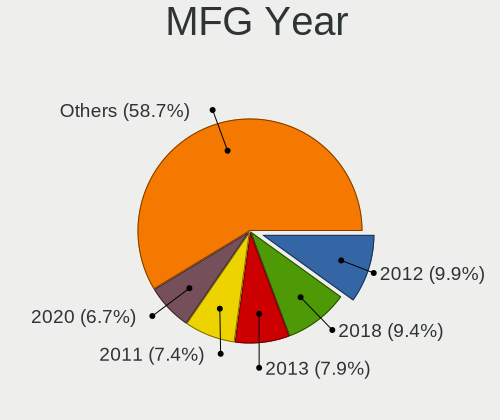
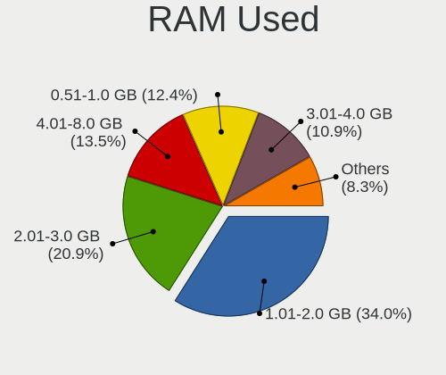

Linux - Tested Hardware & Statistics (Desktops)
-----------------------------------------------

A project to collect tested hardware configurations for Linux.

Anyone can contribute to this report by the [hw-probe](https://github.com/linuxhw/hw-probe) tool:

    sudo -E hw-probe -all -upload

Please contribute! Especially if your hardware is rare.

This report is for real hardware. Report for virtual hardware: [TestCoverage_VE](https://github.com/linuxhw/TestCoverage_VE)

Contents
--------

* [ Test Cases ](#test-cases)

* [ System ](#system)
  - [ OS                       ](#os)
  - [ OS Family                ](#os-family)
  - [ Kernel                   ](#kernel)
  - [ Kernel Family            ](#kernel-family)
  - [ Kernel Major Ver.        ](#kernel-major-ver)
  - [ Arch                     ](#arch)
  - [ DE                       ](#de)
  - [ Display Server           ](#display-server)
  - [ Display Manager          ](#display-manager)
  - [ OS Lang                  ](#os-lang)
  - [ Boot Mode                ](#boot-mode)
  - [ Filesystem               ](#filesystem)
  - [ Part. scheme             ](#part-scheme)
  - [ Dual Boot with Linux/BSD ](#dual-boot-with-linuxbsd)
  - [ Dual Boot (Win)          ](#dual-boot-win)

* [ Board ](#board)
  - [ Vendor                   ](#vendor)
  - [ Model                    ](#model)
  - [ Model Family             ](#model-family)
  - [ MFG Year                 ](#mfg-year)
  - [ Form Factor              ](#form-factor)
  - [ Secure Boot              ](#secure-boot)
  - [ Coreboot                 ](#coreboot)
  - [ RAM Size                 ](#ram-size)
  - [ RAM Used                 ](#ram-used)
  - [ Total Drives             ](#total-drives)
  - [ Has CD-ROM               ](#has-cd-rom)
  - [ Has Ethernet             ](#has-ethernet)
  - [ Has WiFi                 ](#has-wifi)
  - [ Has Bluetooth            ](#has-bluetooth)

* [ Location ](#location)
  - [ Country                  ](#country)
  - [ City                     ](#city)

* [ Drives ](#drives)
  - [ Drive Vendor             ](#drive-vendor)
  - [ Drive Model              ](#drive-model)
  - [ HDD Vendor               ](#hdd-vendor)
  - [ SSD Vendor               ](#ssd-vendor)
  - [ Drive Kind               ](#drive-kind)
  - [ Drive Connector          ](#drive-connector)
  - [ Drive Size               ](#drive-size)
  - [ Space Total              ](#space-total)
  - [ Space Used               ](#space-used)
  - [ Malfunc. Drives          ](#malfunc-drives)
  - [ Malfunc. Drive Vendor    ](#malfunc-drive-vendor)
  - [ Malfunc. HDD Vendor      ](#malfunc-hdd-vendor)
  - [ Malfunc. Drive Kind      ](#malfunc-drive-kind)
  - [ Failed Drives            ](#failed-drives)
  - [ Failed Drive Vendor      ](#failed-drive-vendor)
  - [ Drive Status             ](#drive-status)

* [ Storage controller ](#storage-controller)
  - [ Storage Vendor           ](#storage-vendor)
  - [ Storage Model            ](#storage-model)
  - [ Storage Kind             ](#storage-kind)

* [ Processor ](#processor)
  - [ CPU Vendor               ](#cpu-vendor)
  - [ CPU Model                ](#cpu-model)
  - [ CPU Model Family         ](#cpu-model-family)
  - [ CPU Cores                ](#cpu-cores)
  - [ CPU Sockets              ](#cpu-sockets)
  - [ CPU Threads              ](#cpu-threads)
  - [ CPU Op-Modes             ](#cpu-op-modes)
  - [ CPU Microcode            ](#cpu-microcode)
  - [ CPU Microarch            ](#cpu-microarch)

* [ Graphics ](#graphics)
  - [ GPU Vendor               ](#gpu-vendor)
  - [ GPU Model                ](#gpu-model)
  - [ GPU Combo                ](#gpu-combo)
  - [ GPU Driver               ](#gpu-driver)
  - [ GPU Memory               ](#gpu-memory)

* [ Monitor ](#monitor)
  - [ Monitor Vendor           ](#monitor-vendor)
  - [ Monitor Model            ](#monitor-model)
  - [ Monitor Resolution       ](#monitor-resolution)
  - [ Monitor Diagonal         ](#monitor-diagonal)
  - [ Monitor Width            ](#monitor-width)
  - [ Aspect Ratio             ](#aspect-ratio)
  - [ Monitor Area             ](#monitor-area)
  - [ Pixel Density            ](#pixel-density)
  - [ Multiple Monitors        ](#multiple-monitors)

* [ Network ](#network)
  - [ Net Controller Vendor    ](#net-controller-vendor)
  - [ Net Controller Model     ](#net-controller-model)
  - [ Wireless Vendor          ](#wireless-vendor)
  - [ Wireless Model           ](#wireless-model)
  - [ Ethernet Vendor          ](#ethernet-vendor)
  - [ Ethernet Model           ](#ethernet-model)
  - [ Net Controller Kind      ](#net-controller-kind)
  - [ Used Controller          ](#used-controller)
  - [ NICs                     ](#nics)
  - [ IPv6                     ](#ipv6)

* [ Bluetooth ](#bluetooth)
  - [ Bluetooth Vendor         ](#bluetooth-vendor)
  - [ Bluetooth Model          ](#bluetooth-model)

* [ Sound ](#sound)
  - [ Sound Vendor             ](#sound-vendor)
  - [ Sound Model              ](#sound-model)

* [ Memory ](#memory)
  - [ Memory Vendor            ](#memory-vendor)
  - [ Memory Model             ](#memory-model)
  - [ Memory Kind              ](#memory-kind)
  - [ Memory Form Factor       ](#memory-form-factor)
  - [ Memory Size              ](#memory-size)
  - [ Memory Speed             ](#memory-speed)

* [ Printers & scanners ](#printers--scanners)
  - [ Printer Vendor           ](#printer-vendor)
  - [ Printer Model            ](#printer-model)
  - [ Scanner Vendor           ](#scanner-vendor)
  - [ Scanner Model            ](#scanner-model)

* [ Camera ](#camera)
  - [ Camera Vendor            ](#camera-vendor)
  - [ Camera Model             ](#camera-model)

* [ Security ](#security)
  - [ Fingerprint Vendor       ](#fingerprint-vendor)
  - [ Fingerprint Model        ](#fingerprint-model)
  - [ Chipcard Vendor          ](#chipcard-vendor)
  - [ Chipcard Model           ](#chipcard-model)

* [ Unsupported ](#unsupported)
  - [ Unsupported Devices      ](#unsupported-devices)
  - [ Unsupported Device Types ](#unsupported-device-types)

Test Cases
----------

Total: 107477

| Vendor        | Model                       | Probe                                                      | Date         |
|---------------|-----------------------------|------------------------------------------------------------|--------------|
| 3Q            | TD2500G-P-Q3 A01            | [46626558f6](https://linux-hardware.org/?probe=46626558f6) | Dec 01, 2022 |
| ASUSTek       | AT3IONT-I DELUXE            | [16680c5211](https://linux-hardware.org/?probe=16680c5211) | Dec 01, 2022 |
| Acer          | Aspire XC-705               | [86a503df2a](https://linux-hardware.org/?probe=86a503df2a) | Dec 01, 2022 |
| Gigabyte      | B450M DS3H-CF               | [5e7bc65683](https://linux-hardware.org/?probe=5e7bc65683) | Dec 01, 2022 |
| ASUSTek       | A88XM-A/USB                 | [012f2dccba](https://linux-hardware.org/?probe=012f2dccba) | Dec 01, 2022 |
| Gigabyte      | B450M DS3H-CF               | [660b9b7529](https://linux-hardware.org/?probe=660b9b7529) | Dec 01, 2022 |
| ASUSTek       | A88XM-A                     | [f883ed1fd1](https://linux-hardware.org/?probe=f883ed1fd1) | Dec 01, 2022 |
| ASRock        | AD525PV3                    | [da83c87218](https://linux-hardware.org/?probe=da83c87218) | Dec 01, 2022 |
| Gigabyte      | B450 I AORUS PRO WIFI-CF    | [9866b7f07f](https://linux-hardware.org/?probe=9866b7f07f) | Dec 01, 2022 |
| ASUSTek       | TUF Gaming X570-PLUS_BR     | [7ff54a3b05](https://linux-hardware.org/?probe=7ff54a3b05) | Dec 01, 2022 |
| MSI           | MAG B550 TOMAHAWK MAX WI... | [51cf6d10e7](https://linux-hardware.org/?probe=51cf6d10e7) | Dec 01, 2022 |
| MSI           | G41M-S03                    | [763decb5d5](https://linux-hardware.org/?probe=763decb5d5) | Dec 01, 2022 |
| ASUSTek       | PRIME B550-PLUS             | [a4ed7efef9](https://linux-hardware.org/?probe=a4ed7efef9) | Dec 01, 2022 |
| Gigabyte      | B450 GAMING X               | [ff5aef2f59](https://linux-hardware.org/?probe=ff5aef2f59) | Dec 01, 2022 |
| ASUSTek       | PRIME B550-PLUS             | [5eebfea632](https://linux-hardware.org/?probe=5eebfea632) | Dec 01, 2022 |
| ASUSTek       | P8H67                       | [31a7799a34](https://linux-hardware.org/?probe=31a7799a34) | Dec 01, 2022 |
| HP            | 0A98h                       | [f2b620c220](https://linux-hardware.org/?probe=f2b620c220) | Dec 01, 2022 |
| Medion        | H81H3-EM2 H81EM2W08.309     | [9aa4880856](https://linux-hardware.org/?probe=9aa4880856) | Dec 01, 2022 |
| Lenovo        | SHARKBAY NOK                | [e03c6b53ed](https://linux-hardware.org/?probe=e03c6b53ed) | Dec 01, 2022 |
| MSI           | PRO Z690-A DDR4             | [db5a886817](https://linux-hardware.org/?probe=db5a886817) | Dec 01, 2022 |
| Gigabyte      | B450M DS3H-CF               | [9d7fdf83b6](https://linux-hardware.org/?probe=9d7fdf83b6) | Dec 01, 2022 |
| Acer          | Aspire XC-780               | [b385e11c00](https://linux-hardware.org/?probe=b385e11c00) | Dec 01, 2022 |
| ASUSTek       | M5A97 PLUS                  | [63820e3937](https://linux-hardware.org/?probe=63820e3937) | Dec 01, 2022 |
| Dell          | 0G254H A00                  | [473fb8a09a](https://linux-hardware.org/?probe=473fb8a09a) | Dec 01, 2022 |
| MSI           | H81M-E33                    | [aa874580d3](https://linux-hardware.org/?probe=aa874580d3) | Dec 01, 2022 |
| ASUSTek       | Maximus VIII RANGER         | [c8d4cd1faf](https://linux-hardware.org/?probe=c8d4cd1faf) | Dec 01, 2022 |
| ASUSTek       | Maximus VIII RANGER         | [866e8151d7](https://linux-hardware.org/?probe=866e8151d7) | Dec 01, 2022 |
| Apple         | Mac-F221BEC8                | [7f91a09589](https://linux-hardware.org/?probe=7f91a09589) | Dec 01, 2022 |
| Gigabyte      | GA-MA790FXT-UD5P            | [010349b87b](https://linux-hardware.org/?probe=010349b87b) | Dec 01, 2022 |
| ASUSTek       | P7P55D                      | [0a012accfd](https://linux-hardware.org/?probe=0a012accfd) | Dec 01, 2022 |
| Lenovo        | SHARKBAY SDK0E50510 WIN     | [2f59960e11](https://linux-hardware.org/?probe=2f59960e11) | Dec 01, 2022 |
| HP            | 18E4                        | [b0254c66c7](https://linux-hardware.org/?probe=b0254c66c7) | Dec 01, 2022 |
| Fujitsu       | D3128-A1 S26361-D3128-A1    | [ad24dc05a0](https://linux-hardware.org/?probe=ad24dc05a0) | Dec 01, 2022 |
| Gigabyte      | GA-990FXA-UD7               | [e300be2b5e](https://linux-hardware.org/?probe=e300be2b5e) | Dec 01, 2022 |
| Lenovo        | SHARKBAY SDK0E50510 WIN     | [c155b94a47](https://linux-hardware.org/?probe=c155b94a47) | Dec 01, 2022 |
| Fujitsu       | D3128-A1 S26361-D3128-A1    | [0e38c9a3be](https://linux-hardware.org/?probe=0e38c9a3be) | Dec 01, 2022 |
| HP            | 8433 11                     | [01f9a28da3](https://linux-hardware.org/?probe=01f9a28da3) | Dec 01, 2022 |
| Medion        | H81H3-EM2 H81EM2W08.309     | [c1f5a1f413](https://linux-hardware.org/?probe=c1f5a1f413) | Dec 01, 2022 |
| MSI           | MEG X570 UNIFY              | [df74bf8e13](https://linux-hardware.org/?probe=df74bf8e13) | Dec 01, 2022 |
| ASRock        | Z68 Extreme4 Gen3           | [c14e2149eb](https://linux-hardware.org/?probe=c14e2149eb) | Dec 01, 2022 |
| ASUSTek       | P5B                         | [44f13beada](https://linux-hardware.org/?probe=44f13beada) | Dec 01, 2022 |
| MSI           | MAG B550 TOMAHAWK MAX WI... | [1775ec9d4b](https://linux-hardware.org/?probe=1775ec9d4b) | Dec 01, 2022 |
| MSI           | MAG B550 TOMAHAWK MAX WI... | [097d1c062e](https://linux-hardware.org/?probe=097d1c062e) | Dec 01, 2022 |
| ASUSTek       | ROG STRIX Z690-A GAMING ... | [8cf4925f08](https://linux-hardware.org/?probe=8cf4925f08) | Dec 01, 2022 |
| ASUSTek       | H97-PLUS                    | [e8d75cbeed](https://linux-hardware.org/?probe=e8d75cbeed) | Dec 01, 2022 |
| ASRock        | X300M-STX                   | [97ceee65f3](https://linux-hardware.org/?probe=97ceee65f3) | Dec 01, 2022 |
| HP            | 1495                        | [138b5bb823](https://linux-hardware.org/?probe=138b5bb823) | Dec 01, 2022 |
| ASRock        | X300M-STX                   | [5b7f983a24](https://linux-hardware.org/?probe=5b7f983a24) | Dec 01, 2022 |
| ASRock        | X300M-STX                   | [42ddb2463e](https://linux-hardware.org/?probe=42ddb2463e) | Dec 01, 2022 |
| ASUSTek       | P7H55-M                     | [b461d54421](https://linux-hardware.org/?probe=b461d54421) | Dec 01, 2022 |
| HP            | 8184 X4                     | [2b5ea5e34c](https://linux-hardware.org/?probe=2b5ea5e34c) | Dec 01, 2022 |
| ASUSTek       | PRIME B460M-K               | [c8dd66d6de](https://linux-hardware.org/?probe=c8dd66d6de) | Dec 01, 2022 |
| ASUSTek       | PRIME B550M-A               | [5b86ca0927](https://linux-hardware.org/?probe=5b86ca0927) | Dec 01, 2022 |
| ASUSTek       | PRIME B250M-K               | [97a1793680](https://linux-hardware.org/?probe=97a1793680) | Dec 01, 2022 |
| ASUSTek       | PRIME Z690-P WIFI D4        | [42932dd5fd](https://linux-hardware.org/?probe=42932dd5fd) | Dec 01, 2022 |
| System76      | Thelio thelio-r2            | [a7ae37f43e](https://linux-hardware.org/?probe=a7ae37f43e) | Dec 01, 2022 |
| ASUSTek       | TUF Gaming X570-PLUS        | [f7b40a75f6](https://linux-hardware.org/?probe=f7b40a75f6) | Dec 01, 2022 |
| Dell          | 0R6PCT A01                  | [c8ef04b4b2](https://linux-hardware.org/?probe=c8ef04b4b2) | Dec 01, 2022 |
| ASUSTek       | ROG STRIX X570-F GAMING     | [1ebd8b1b89](https://linux-hardware.org/?probe=1ebd8b1b89) | Dec 01, 2022 |
| ASUSTek       | PRIME X370-PRO              | [aa87dfdc13](https://linux-hardware.org/?probe=aa87dfdc13) | Dec 01, 2022 |
| Gigabyte      | F2A88XM-D3H                 | [b0bf36f700](https://linux-hardware.org/?probe=b0bf36f700) | Dec 01, 2022 |
| Gigabyte      | F2A88XM-D3H                 | [f5a5a30379](https://linux-hardware.org/?probe=f5a5a30379) | Dec 01, 2022 |
| ONDA          | M3 miniPC VER               | [35f4c45eb5](https://linux-hardware.org/?probe=35f4c45eb5) | Dec 01, 2022 |
| ASUSTek       | ROG STRIX B450-F GAMING     | [0461e6b5d2](https://linux-hardware.org/?probe=0461e6b5d2) | Dec 01, 2022 |
| Pegatron      | 2AC2                        | [3d92c6cbc8](https://linux-hardware.org/?probe=3d92c6cbc8) | Dec 01, 2022 |
| MSI           | X99A RAIDER                 | [0e87a76042](https://linux-hardware.org/?probe=0e87a76042) | Dec 01, 2022 |
| Gigabyte      | Z590I VISION D              | [655e907d62](https://linux-hardware.org/?probe=655e907d62) | Dec 01, 2022 |
| Unknown       | 1.0                         | [c8cfeaf2be](https://linux-hardware.org/?probe=c8cfeaf2be) | Dec 01, 2022 |
| ASUSTek       | PRIME A320M-K               | [e1a4335a71](https://linux-hardware.org/?probe=e1a4335a71) | Dec 01, 2022 |
| MSI           | B450-A PRO MAX              | [8de79673ea](https://linux-hardware.org/?probe=8de79673ea) | Dec 01, 2022 |
| ASUSTek       | ROG STRIX B550-F GAMING     | [0f27e558f3](https://linux-hardware.org/?probe=0f27e558f3) | Dec 01, 2022 |
| MSI           | B460M PRO-VDH WIFI          | [3b7321ba87](https://linux-hardware.org/?probe=3b7321ba87) | Dec 01, 2022 |
| ASUSTek       | P8H77-V LE                  | [d82ed03dd9](https://linux-hardware.org/?probe=d82ed03dd9) | Dec 01, 2022 |
| ASUSTek       | SABERTOOTH X58              | [4ae619c728](https://linux-hardware.org/?probe=4ae619c728) | Dec 01, 2022 |
| System76      | Thelio thelio-r1            | [a888eb38b3](https://linux-hardware.org/?probe=a888eb38b3) | Dec 01, 2022 |
| System76      | Thelio thelio-r1            | [76343aa234](https://linux-hardware.org/?probe=76343aa234) | Dec 01, 2022 |
| HP            | 18E9                        | [9086d1a1e5](https://linux-hardware.org/?probe=9086d1a1e5) | Dec 01, 2022 |
| MSI           | MPG Z390 GAMING PRO CARB... | [f8a7663037](https://linux-hardware.org/?probe=f8a7663037) | Dec 01, 2022 |
| ASUSTek       | P5K WS                      | [f3608476bf](https://linux-hardware.org/?probe=f3608476bf) | Dec 01, 2022 |
| MSI           | B350 GAMING PLUS            | [b840a0d02e](https://linux-hardware.org/?probe=b840a0d02e) | Dec 01, 2022 |
| Gigabyte      | Z390 M GAMING-CF            | [f0dba35258](https://linux-hardware.org/?probe=f0dba35258) | Dec 01, 2022 |
| ECS           | H61H2-WM                    | [9a7a280b58](https://linux-hardware.org/?probe=9a7a280b58) | Dec 01, 2022 |
| Fujitsu       | D2917-A1 S26361-D2917-A1    | [dd124e3579](https://linux-hardware.org/?probe=dd124e3579) | Nov 30, 2022 |
| Gigabyte      | H170-HD3-CF                 | [1d293c6d72](https://linux-hardware.org/?probe=1d293c6d72) | Nov 30, 2022 |
| ASUSTek       | PRIME B450M-GAMING/BR       | [8a4813eec4](https://linux-hardware.org/?probe=8a4813eec4) | Nov 30, 2022 |
| ASUSTek       | ROG STRIX X470-F GAMING     | [b52b8b590b](https://linux-hardware.org/?probe=b52b8b590b) | Nov 30, 2022 |
| HP            | 1825                        | [5f8bff315d](https://linux-hardware.org/?probe=5f8bff315d) | Nov 30, 2022 |
| ASUSTek       | ROG STRIX X570-I GAMING     | [ac84964c19](https://linux-hardware.org/?probe=ac84964c19) | Nov 30, 2022 |
| Lenovo        | SHARKBAY SDK0E50510 WIN     | [475ad82d2b](https://linux-hardware.org/?probe=475ad82d2b) | Nov 30, 2022 |
| Colorful T... | DJ H310M-E V20              | [ef8cb053dc](https://linux-hardware.org/?probe=ef8cb053dc) | Nov 30, 2022 |
| Medion        | MS-7748                     | [0e92aa55ca](https://linux-hardware.org/?probe=0e92aa55ca) | Nov 30, 2022 |
| Colorful T... | DJ H310M-E V20              | [9831bd75b9](https://linux-hardware.org/?probe=9831bd75b9) | Nov 30, 2022 |
| Lenovo        | ThinkCentre M70e 0809D1Y    | [0cd85fa9f3](https://linux-hardware.org/?probe=0cd85fa9f3) | Nov 30, 2022 |
| ASUSTek       | ROG STRIX B550-F GAMING     | [80b8b349f8](https://linux-hardware.org/?probe=80b8b349f8) | Nov 30, 2022 |
| Gigabyte      | Z390 M GAMING-CF            | [baa969bf8b](https://linux-hardware.org/?probe=baa969bf8b) | Nov 30, 2022 |
| ASRock        | B75M-DGS                    | [ca277bb16c](https://linux-hardware.org/?probe=ca277bb16c) | Nov 30, 2022 |
| Dell          | 0NDYHG A01                  | [5dd9f4dea9](https://linux-hardware.org/?probe=5dd9f4dea9) | Nov 30, 2022 |
| ASUSTek       | PRIME B450M-A II            | [a5b34b67f2](https://linux-hardware.org/?probe=a5b34b67f2) | Nov 30, 2022 |
| MSI           | Boston                      | [0564f7ed2d](https://linux-hardware.org/?probe=0564f7ed2d) | Nov 30, 2022 |
| Dell          | 0N4YC8 A00                  | [2e53fa79ed](https://linux-hardware.org/?probe=2e53fa79ed) | Nov 30, 2022 |
| MSI           | B450-A PRO MAX              | [e2f97abdea](https://linux-hardware.org/?probe=e2f97abdea) | Nov 30, 2022 |
| ASUSTek       | Z97-A                       | [da1400c491](https://linux-hardware.org/?probe=da1400c491) | Nov 30, 2022 |
| HP            | 304Ah                       | [15db22accc](https://linux-hardware.org/?probe=15db22accc) | Nov 30, 2022 |
| MSI           | MAG Z690 TOMAHAWK WIFI D... | [24dd5413fa](https://linux-hardware.org/?probe=24dd5413fa) | Nov 30, 2022 |
| MSI           | Z170A GAMING M3             | [dfe92c80c1](https://linux-hardware.org/?probe=dfe92c80c1) | Nov 30, 2022 |
| ASUSTek       | P8P67 DELUXE                | [c117ba54ea](https://linux-hardware.org/?probe=c117ba54ea) | Nov 30, 2022 |
| Dell          | 0WR7PY A03                  | [ba1e414d62](https://linux-hardware.org/?probe=ba1e414d62) | Nov 30, 2022 |
| Gigabyte      | X570 GAMING X               | [7ea2de1a3b](https://linux-hardware.org/?probe=7ea2de1a3b) | Nov 30, 2022 |
| Pegatron      | BYT-X1                      | [edadb85201](https://linux-hardware.org/?probe=edadb85201) | Nov 30, 2022 |
| ASUSTek       | H81M-PLUS                   | [8d98938198](https://linux-hardware.org/?probe=8d98938198) | Nov 30, 2022 |
| Dell          | 0WWJRX A00                  | [83ef480c7d](https://linux-hardware.org/?probe=83ef480c7d) | Nov 30, 2022 |
| Pegatron      | BYT-X1                      | [b248df8671](https://linux-hardware.org/?probe=b248df8671) | Nov 30, 2022 |
| ASUSTek       | Z170-E                      | [5e68d23175](https://linux-hardware.org/?probe=5e68d23175) | Nov 30, 2022 |
| ASUSTek       | ROG STRIX B550-I GAMING     | [4e6ae396d9](https://linux-hardware.org/?probe=4e6ae396d9) | Nov 30, 2022 |
| Medion        | MS-7800                     | [a5658a6933](https://linux-hardware.org/?probe=a5658a6933) | Nov 30, 2022 |
| Graviton      | DMB-H510-MCA01              | [4dbcbc3b7a](https://linux-hardware.org/?probe=4dbcbc3b7a) | Nov 30, 2022 |
| ASUSTek       | ROG STRIX Z490-A GAMING     | [dc5ec6eb84](https://linux-hardware.org/?probe=dc5ec6eb84) | Nov 30, 2022 |
| Unknown       | X99H                        | [b9e2236de7](https://linux-hardware.org/?probe=b9e2236de7) | Nov 30, 2022 |
| ASRock        | N68-S3 UCC                  | [1d20e4ba6d](https://linux-hardware.org/?probe=1d20e4ba6d) | Nov 30, 2022 |
| Gigabyte      | Z370 HD3-CF                 | [ece7618688](https://linux-hardware.org/?probe=ece7618688) | Nov 30, 2022 |
| ASUSTek       | P8H61-M LX3                 | [87d3950072](https://linux-hardware.org/?probe=87d3950072) | Nov 30, 2022 |
| Gigabyte      | Z87-HD3                     | [d9a78cb529](https://linux-hardware.org/?probe=d9a78cb529) | Nov 30, 2022 |
| ASUSTek       | TUF Gaming X670E-PLUS WI... | [9282404406](https://linux-hardware.org/?probe=9282404406) | Nov 30, 2022 |
| Dell          | 0M5DCD A00                  | [e9fae02409](https://linux-hardware.org/?probe=e9fae02409) | Nov 30, 2022 |
| Gigabyte      | GB-BRR7H-4700               | [8398d00a16](https://linux-hardware.org/?probe=8398d00a16) | Nov 30, 2022 |
| Gigabyte      | G33M-S2                     | [3d6a965dd4](https://linux-hardware.org/?probe=3d6a965dd4) | Nov 30, 2022 |
| ASUSTek       | ROG STRIX Z690-A GAMING ... | [6b21f343c3](https://linux-hardware.org/?probe=6b21f343c3) | Nov 30, 2022 |
| ASUSTek       | PRIME B550-PLUS             | [a6a71120f2](https://linux-hardware.org/?probe=a6a71120f2) | Nov 30, 2022 |
| OEM           | H110 Ver:2.21               | [ad7fffd9e3](https://linux-hardware.org/?probe=ad7fffd9e3) | Nov 30, 2022 |
| MSI           | MAG B550M MORTAR            | [b4c010a2b2](https://linux-hardware.org/?probe=b4c010a2b2) | Nov 30, 2022 |
| Foxconn       | 2ABF                        | [09a9309a2a](https://linux-hardware.org/?probe=09a9309a2a) | Nov 30, 2022 |
| ASRock        | 970 Extreme3                | [4951da34da](https://linux-hardware.org/?probe=4951da34da) | Nov 30, 2022 |
| ASUSTek       | Benicia                     | [e5468e4258](https://linux-hardware.org/?probe=e5468e4258) | Nov 30, 2022 |
| ASUSTek       | M5A78L-M LE/USB3            | [dd3801095f](https://linux-hardware.org/?probe=dd3801095f) | Nov 30, 2022 |
| ASUSTek       | P7H55-M                     | [729bb4ef87](https://linux-hardware.org/?probe=729bb4ef87) | Nov 30, 2022 |
| MACHINIST     | X99-D8-MAX V1.0             | [c2430965a1](https://linux-hardware.org/?probe=c2430965a1) | Nov 30, 2022 |
| MSI           | Z370 GAMING PLUS            | [bd1c91dba9](https://linux-hardware.org/?probe=bd1c91dba9) | Nov 30, 2022 |
| ASUSTek       | P8P67 DELUXE                | [47131749a5](https://linux-hardware.org/?probe=47131749a5) | Nov 30, 2022 |
| Dell          | 0TP406                      | [3eceea61d2](https://linux-hardware.org/?probe=3eceea61d2) | Nov 30, 2022 |
| Dell          | 0XJ5V0 A03                  | [b954e4c174](https://linux-hardware.org/?probe=b954e4c174) | Nov 30, 2022 |
| GALAX         | B365M G10b                  | [9eabacd766](https://linux-hardware.org/?probe=9eabacd766) | Nov 30, 2022 |
| ASUSTek       | TUF Gaming Z690-PLUS D4     | [da83c13da3](https://linux-hardware.org/?probe=da83c13da3) | Nov 30, 2022 |
| Dell          | 0C3YXR A01                  | [95fbd0e6b4](https://linux-hardware.org/?probe=95fbd0e6b4) | Nov 30, 2022 |
| Gigabyte      | B450M DS3H-CF               | [952c3681c0](https://linux-hardware.org/?probe=952c3681c0) | Nov 30, 2022 |
| GALAX         | B365M G10b                  | [9f7438d5a3](https://linux-hardware.org/?probe=9f7438d5a3) | Nov 30, 2022 |
| Dell          | 0TP406                      | [d22689331c](https://linux-hardware.org/?probe=d22689331c) | Nov 30, 2022 |
| ASUSTek       | TUF Gaming Z690-PLUS D4     | [459c2ba743](https://linux-hardware.org/?probe=459c2ba743) | Nov 30, 2022 |
| Dell          | 0D28YY A00                  | [4af0b7dc59](https://linux-hardware.org/?probe=4af0b7dc59) | Nov 30, 2022 |
| Gigabyte      | H77N-WIFI                   | [f4fa3a4e7f](https://linux-hardware.org/?probe=f4fa3a4e7f) | Nov 30, 2022 |
| ASRock        | A320M-HDV R4.0              | [3a64631617](https://linux-hardware.org/?probe=3a64631617) | Nov 30, 2022 |
| Gigabyte      | B450 AORUS M                | [3e3ccd1471](https://linux-hardware.org/?probe=3e3ccd1471) | Nov 30, 2022 |
| Dell          | 0D28YY A00                  | [bc8c993489](https://linux-hardware.org/?probe=bc8c993489) | Nov 30, 2022 |
| MSI           | PRO H610M-B DDR4            | [dc35eb3d09](https://linux-hardware.org/?probe=dc35eb3d09) | Nov 30, 2022 |
| Dell          | 08NPPY A00                  | [a774c1201c](https://linux-hardware.org/?probe=a774c1201c) | Nov 30, 2022 |
| HP            | 1825                        | [a3f8ec5423](https://linux-hardware.org/?probe=a3f8ec5423) | Nov 30, 2022 |
| MSI           | B550M PRO-VDH WIFI          | [53e6bc021e](https://linux-hardware.org/?probe=53e6bc021e) | Nov 30, 2022 |
| ASUSTek       | M5A78L-M PLUS/USB3          | [efecce0072](https://linux-hardware.org/?probe=efecce0072) | Nov 30, 2022 |
| ASUSTek       | ROG STRIX B450-E GAMING     | [abcc431f9f](https://linux-hardware.org/?probe=abcc431f9f) | Nov 30, 2022 |
| Foxconn       | 2ABF                        | [b585d891a8](https://linux-hardware.org/?probe=b585d891a8) | Nov 30, 2022 |
| ASRock        | B450M Steel Legend          | [9d6aeff37c](https://linux-hardware.org/?probe=9d6aeff37c) | Nov 30, 2022 |
| Gigabyte      | X570 AORUS ELITE WIFI       | [f17f99d4e6](https://linux-hardware.org/?probe=f17f99d4e6) | Nov 30, 2022 |
| ASUSTek       | PRIME X370-PRO              | [7f89d71e2e](https://linux-hardware.org/?probe=7f89d71e2e) | Nov 30, 2022 |
| MSI           | B560M-A PRO                 | [a92a0830e9](https://linux-hardware.org/?probe=a92a0830e9) | Nov 30, 2022 |
| ASUSTek       | SABERTOOTH Z97 MARK S       | [2c5c1d6071](https://linux-hardware.org/?probe=2c5c1d6071) | Nov 30, 2022 |
| ASRock        | N68-S3 UCC                  | [ede29d01f8](https://linux-hardware.org/?probe=ede29d01f8) | Nov 30, 2022 |
| Dell          | 0Y7WYT A00                  | [c0e4685d23](https://linux-hardware.org/?probe=c0e4685d23) | Nov 30, 2022 |
| Gigabyte      | 970A-DS3P                   | [22c7db0e68](https://linux-hardware.org/?probe=22c7db0e68) | Nov 30, 2022 |
| Gigabyte      | 970A-DS3P                   | [65493a981c](https://linux-hardware.org/?probe=65493a981c) | Nov 30, 2022 |
| ASRock        | AB350 Pro4                  | [de19b92dda](https://linux-hardware.org/?probe=de19b92dda) | Nov 30, 2022 |
| Dell          | 0NDYHG A01                  | [a3191b9bfe](https://linux-hardware.org/?probe=a3191b9bfe) | Nov 30, 2022 |
| ASRock        | H77M                        | [ffa3496b0d](https://linux-hardware.org/?probe=ffa3496b0d) | Nov 30, 2022 |
| ASUSTek       | H81M-C                      | [458ea4bd06](https://linux-hardware.org/?probe=458ea4bd06) | Nov 29, 2022 |
| Medion        | D3F3-EM                     | [ae428a6a6a](https://linux-hardware.org/?probe=ae428a6a6a) | Nov 29, 2022 |
| ASRock        | H470M-HDV/M.2               | [c01129a199](https://linux-hardware.org/?probe=c01129a199) | Nov 29, 2022 |
| MSI           | B560M-A PRO                 | [81bf84e7e5](https://linux-hardware.org/?probe=81bf84e7e5) | Nov 29, 2022 |
| ASUSTek       | PRIME B450M-A II            | [f0dfa48048](https://linux-hardware.org/?probe=f0dfa48048) | Nov 29, 2022 |
| Fujitsu       | D3162-A1 S26361-D3162-A1    | [b38075cef4](https://linux-hardware.org/?probe=b38075cef4) | Nov 29, 2022 |
| ASUSTek       | TUF Gaming X570-PLUS        | [2e35df903f](https://linux-hardware.org/?probe=2e35df903f) | Nov 29, 2022 |
| MSI           | PRO Z690-A DDR4             | [bd30397e24](https://linux-hardware.org/?probe=bd30397e24) | Nov 29, 2022 |
| MSI           | MPG X570 GAMING EDGE WIF... | [c01a10b89d](https://linux-hardware.org/?probe=c01a10b89d) | Nov 29, 2022 |
| ASUSTek       | M5A78L/USB3                 | [99c33f6741](https://linux-hardware.org/?probe=99c33f6741) | Nov 29, 2022 |
| MSI           | PRO Z690-A DDR4             | [3b4f834c63](https://linux-hardware.org/?probe=3b4f834c63) | Nov 29, 2022 |
| ASUSTek       | M5A97 EVO R2.0              | [a42a4d6080](https://linux-hardware.org/?probe=a42a4d6080) | Nov 29, 2022 |
| Gigabyte      | B450M DS3H V2               | [f00a357dbe](https://linux-hardware.org/?probe=f00a357dbe) | Nov 29, 2022 |
| Lenovo        | SDK0E50510 WIN              | [76b79932d5](https://linux-hardware.org/?probe=76b79932d5) | Nov 29, 2022 |
| HP            | 8437                        | [c5bbfc32f6](https://linux-hardware.org/?probe=c5bbfc32f6) | Nov 29, 2022 |
| MSI           | H510M-A PRO                 | [cbae74a53a](https://linux-hardware.org/?probe=cbae74a53a) | Nov 29, 2022 |
| ASRock        | A320M-HDV R4.0              | [12492cb99a](https://linux-hardware.org/?probe=12492cb99a) | Nov 29, 2022 |
| Gigabyte      | GA-MA780G-UD3H              | [bc3188dd75](https://linux-hardware.org/?probe=bc3188dd75) | Nov 29, 2022 |
| MSI           | D2414 S26361-D2414-A10      | [ef1367a574](https://linux-hardware.org/?probe=ef1367a574) | Nov 29, 2022 |
| IBM           | MSI-9151 Boards             | [720ff829b9](https://linux-hardware.org/?probe=720ff829b9) | Nov 29, 2022 |
| HP            | 18E4                        | [39b839e527](https://linux-hardware.org/?probe=39b839e527) | Nov 29, 2022 |
| Gigabyte      | B250M-DS3H-CF               | [efacbf6215](https://linux-hardware.org/?probe=efacbf6215) | Nov 29, 2022 |
| Gigabyte      | B250M-DS3H-CF               | [85ac938c0c](https://linux-hardware.org/?probe=85ac938c0c) | Nov 29, 2022 |
| ASRock        | N68-S3 UCC                  | [fd6f368580](https://linux-hardware.org/?probe=fd6f368580) | Nov 29, 2022 |
| Foxconn       | G41MXE/G41MXE-K             | [4f13d9a2cc](https://linux-hardware.org/?probe=4f13d9a2cc) | Nov 29, 2022 |
| ASUSTek       | M4A89GTD-PRO/USB3           | [9dd6019148](https://linux-hardware.org/?probe=9dd6019148) | Nov 29, 2022 |
| HP            | 3048h                       | [6f5a8d1a09](https://linux-hardware.org/?probe=6f5a8d1a09) | Nov 29, 2022 |
| ASRock        | H270M-ITX/ac                | [dfc381d411](https://linux-hardware.org/?probe=dfc381d411) | Nov 29, 2022 |
| MSI           | B560M PRO-VDH               | [cee0622b1f](https://linux-hardware.org/?probe=cee0622b1f) | Nov 29, 2022 |
| Lenovo        | 364F SDK0J40700 WIN 3258... | [481a664e0a](https://linux-hardware.org/?probe=481a664e0a) | Nov 29, 2022 |
| Lenovo        | 3162 SDK0J40697 WIN 3305... | [296ceaab80](https://linux-hardware.org/?probe=296ceaab80) | Nov 29, 2022 |
| Dell          | 0M859N A00                  | [95cf7fe257](https://linux-hardware.org/?probe=95cf7fe257) | Nov 29, 2022 |
| ASUSTek       | P5KPL-AM SE                 | [719921de81](https://linux-hardware.org/?probe=719921de81) | Nov 29, 2022 |
| BESSTAR Te... | UM700                       | [a97334be81](https://linux-hardware.org/?probe=a97334be81) | Nov 29, 2022 |
| HP            | 339A                        | [ea5cacd50e](https://linux-hardware.org/?probe=ea5cacd50e) | Nov 29, 2022 |
| ASUSTek       | P5KPL-AM SE                 | [f998b6a0d9](https://linux-hardware.org/?probe=f998b6a0d9) | Nov 29, 2022 |
| Gigabyte      | TRX40 AORUS PRO WIFI        | [d5702f8b2d](https://linux-hardware.org/?probe=d5702f8b2d) | Nov 29, 2022 |
| Gigabyte      | TRX40 AORUS PRO WIFI        | [640a031786](https://linux-hardware.org/?probe=640a031786) | Nov 29, 2022 |
| ASRock        | 960GM-GS3 FX                | [1474b9ee78](https://linux-hardware.org/?probe=1474b9ee78) | Nov 29, 2022 |
| Gigabyte      | B450M DS3H-CF               | [eae94e440a](https://linux-hardware.org/?probe=eae94e440a) | Nov 29, 2022 |
| HP            | 8876 11                     | [babda62ffa](https://linux-hardware.org/?probe=babda62ffa) | Nov 29, 2022 |
| ASRock        | N68C-S UCC                  | [c7bff3d908](https://linux-hardware.org/?probe=c7bff3d908) | Nov 29, 2022 |
| ASUSTek       | P5KPL-CM                    | [a20e18af73](https://linux-hardware.org/?probe=a20e18af73) | Nov 29, 2022 |
| ASUSTek       | ProArt X670E-CREATOR WIF... | [6d835027fa](https://linux-hardware.org/?probe=6d835027fa) | Nov 29, 2022 |
| ASUSTek       | TUF B450-PLUS GAMING        | [472530d650](https://linux-hardware.org/?probe=472530d650) | Nov 29, 2022 |
| ASRock        | B550M Pro4                  | [f48969af69](https://linux-hardware.org/?probe=f48969af69) | Nov 29, 2022 |
| ASUSTek       | Q170T                       | [99abcc63ab](https://linux-hardware.org/?probe=99abcc63ab) | Nov 29, 2022 |
| OEM           | H110 Ver:2.21               | [2e7e420f42](https://linux-hardware.org/?probe=2e7e420f42) | Nov 29, 2022 |
| Dell          | 0Y5DDC A00                  | [5d4811b390](https://linux-hardware.org/?probe=5d4811b390) | Nov 29, 2022 |
| Dell          | 0J8G6F A03                  | [1424a94eb0](https://linux-hardware.org/?probe=1424a94eb0) | Nov 29, 2022 |
| Gigabyte      | Z490 AORUS XTREME WF        | [6d4f229020](https://linux-hardware.org/?probe=6d4f229020) | Nov 29, 2022 |
| ASUSTek       | P8H77-M                     | [4aafb7e858](https://linux-hardware.org/?probe=4aafb7e858) | Nov 29, 2022 |
| ASRock        | H510M-HDV                   | [03a1675c85](https://linux-hardware.org/?probe=03a1675c85) | Nov 29, 2022 |
| Medion        | H110H4-EM2                  | [38b9e166f2](https://linux-hardware.org/?probe=38b9e166f2) | Nov 29, 2022 |
| Gigabyte      | 946GMX-S2                   | [6c97b310fb](https://linux-hardware.org/?probe=6c97b310fb) | Nov 29, 2022 |
| ASRock        | Z77 Extreme3                | [e473c1c45c](https://linux-hardware.org/?probe=e473c1c45c) | Nov 29, 2022 |
| Dell          | 0FDY5C A00                  | [3cba0b32b1](https://linux-hardware.org/?probe=3cba0b32b1) | Nov 29, 2022 |
| Gigabyte      | B550 AORUS ELITE AX V2      | [ff119f84e6](https://linux-hardware.org/?probe=ff119f84e6) | Nov 29, 2022 |
| Lenovo        | 1031 SBB0J05441 WIN 3305... | [cc75562371](https://linux-hardware.org/?probe=cc75562371) | Nov 29, 2022 |
| MSI           | MAG B560 TORPEDO            | [b58a1b4b2f](https://linux-hardware.org/?probe=b58a1b4b2f) | Nov 29, 2022 |
| MSI           | MAG B560 TORPEDO            | [6cd5ddc986](https://linux-hardware.org/?probe=6cd5ddc986) | Nov 29, 2022 |
| Gigabyte      | A320M-H-CF                  | [66fe0c3ddf](https://linux-hardware.org/?probe=66fe0c3ddf) | Nov 29, 2022 |
| Gigabyte      | B450M DS3H-CF               | [a73d36e579](https://linux-hardware.org/?probe=a73d36e579) | Nov 29, 2022 |
| Supermicro    | X10DRU-i+B                  | [e55edce907](https://linux-hardware.org/?probe=e55edce907) | Nov 29, 2022 |
| ASRock        | FM2A78 Pro4+                | [7eae5fad47](https://linux-hardware.org/?probe=7eae5fad47) | Nov 29, 2022 |
| HP            | 1850                        | [1d0a3a4461](https://linux-hardware.org/?probe=1d0a3a4461) | Nov 29, 2022 |
| ECS           | 945P/PL-A                   | [ff47651dd8](https://linux-hardware.org/?probe=ff47651dd8) | Nov 29, 2022 |
| ASUSTek       | ROG STRIX B550-F GAMING     | [a95de3b373](https://linux-hardware.org/?probe=a95de3b373) | Nov 29, 2022 |
| ECS           | BSWI-D2                     | [b7e4fbdd31](https://linux-hardware.org/?probe=b7e4fbdd31) | Nov 29, 2022 |
| Lenovo        | 1031 SBB0J05441 WIN 3305... | [a6ea0d5259](https://linux-hardware.org/?probe=a6ea0d5259) | Nov 29, 2022 |
| ASUSTek       | PRIME Z690-P WIFI D4        | [262228b1fb](https://linux-hardware.org/?probe=262228b1fb) | Nov 29, 2022 |
| MSI           | Z370 GAMING PRO CARBON      | [96b383097b](https://linux-hardware.org/?probe=96b383097b) | Nov 29, 2022 |
| ASRock        | B550 Phantom Gaming 4/ac    | [66525e5501](https://linux-hardware.org/?probe=66525e5501) | Nov 29, 2022 |
| Biostar       | H81MHV3 5.0                 | [d89a05dd31](https://linux-hardware.org/?probe=d89a05dd31) | Nov 29, 2022 |
| ASUSTek       | PRIME B560M-A AC            | [d4cc718e46](https://linux-hardware.org/?probe=d4cc718e46) | Nov 29, 2022 |
| MSI           | MAG X570S TOMAHAWK MAX W... | [04d2eea487](https://linux-hardware.org/?probe=04d2eea487) | Nov 28, 2022 |
| Gigabyte      | F2A55M-HD2                  | [8b3da34947](https://linux-hardware.org/?probe=8b3da34947) | Nov 28, 2022 |
| Lenovo        | ThinkCentre M57 6072AZ3     | [9d794b4d38](https://linux-hardware.org/?probe=9d794b4d38) | Nov 28, 2022 |
| ASUSTek       | H81I-PLUS                   | [4aba048a46](https://linux-hardware.org/?probe=4aba048a46) | Nov 28, 2022 |
| ASUSTek       | H81I-PLUS                   | [2042d30c8b](https://linux-hardware.org/?probe=2042d30c8b) | Nov 28, 2022 |
| Intel         | DH67BL AAG10189-213         | [11252af398](https://linux-hardware.org/?probe=11252af398) | Nov 28, 2022 |
| Gigabyte      | X570 AORUS MASTER           | [f2c8b52293](https://linux-hardware.org/?probe=f2c8b52293) | Nov 28, 2022 |
| Gigabyte      | B450 AORUS M                | [d20243efed](https://linux-hardware.org/?probe=d20243efed) | Nov 28, 2022 |
| ASUSTek       | CM1630                      | [b82a5c41fc](https://linux-hardware.org/?probe=b82a5c41fc) | Nov 28, 2022 |
| MSI           | X570-A PRO                  | [92ddd925db](https://linux-hardware.org/?probe=92ddd925db) | Nov 28, 2022 |
| ASUSTek       | GA15DH                      | [a789d492a4](https://linux-hardware.org/?probe=a789d492a4) | Nov 28, 2022 |
| Gateway       | SX2851                      | [b408695def](https://linux-hardware.org/?probe=b408695def) | Nov 28, 2022 |
| HP            | 806A                        | [82128d6a8b](https://linux-hardware.org/?probe=82128d6a8b) | Nov 28, 2022 |
| ASUSTek       | Pro WS WRX80E-SAGE SE WI... | [40c84f5af9](https://linux-hardware.org/?probe=40c84f5af9) | Nov 28, 2022 |
| MSI           | MS-7817                     | [3a740dd46a](https://linux-hardware.org/?probe=3a740dd46a) | Nov 28, 2022 |
| ASRock        | B450M Pro4                  | [219a616346](https://linux-hardware.org/?probe=219a616346) | Nov 28, 2022 |
| MSI           | MS-7817                     | [48ae0e1997](https://linux-hardware.org/?probe=48ae0e1997) | Nov 28, 2022 |
| Gigabyte      | H410M H                     | [09129dad50](https://linux-hardware.org/?probe=09129dad50) | Nov 28, 2022 |
| Gigabyte      | A520M S2H                   | [151f18b424](https://linux-hardware.org/?probe=151f18b424) | Nov 28, 2022 |
| ASRock        | B450M Pro4-F                | [8d0514a0df](https://linux-hardware.org/?probe=8d0514a0df) | Nov 28, 2022 |
| MSI           | B450M PRO-VDH MAX           | [dee60b9f35](https://linux-hardware.org/?probe=dee60b9f35) | Nov 28, 2022 |
| MSI           | B450M PRO-VDH MAX           | [1651962e5a](https://linux-hardware.org/?probe=1651962e5a) | Nov 28, 2022 |
| Dell          | 0NK5PH A00                  | [d889c3c50a](https://linux-hardware.org/?probe=d889c3c50a) | Nov 28, 2022 |
| Intel         | H61                         | [42f943bc9c](https://linux-hardware.org/?probe=42f943bc9c) | Nov 28, 2022 |
| MSI           | K9N6PGM2-V2                 | [b2eb1eccbd](https://linux-hardware.org/?probe=b2eb1eccbd) | Nov 28, 2022 |
| ASRock        | Q1900M                      | [0a90a5d3a5](https://linux-hardware.org/?probe=0a90a5d3a5) | Nov 28, 2022 |
| Gigabyte      | Z97X-SLI-CF                 | [ae01075720](https://linux-hardware.org/?probe=ae01075720) | Nov 28, 2022 |
| Gigabyte      | Z690 AORUS ELITE AX         | [3ba81fa674](https://linux-hardware.org/?probe=3ba81fa674) | Nov 28, 2022 |
| HP            | 18E5                        | [e336f0ac13](https://linux-hardware.org/?probe=e336f0ac13) | Nov 28, 2022 |
| ASUSTek       | M4A87TD/USB3                | [e38a783ce1](https://linux-hardware.org/?probe=e38a783ce1) | Nov 28, 2022 |
| MSI           | MPG B550 GAMING PLUS        | [341bca1753](https://linux-hardware.org/?probe=341bca1753) | Nov 28, 2022 |
| HP            | 843B                        | [19bd35484c](https://linux-hardware.org/?probe=19bd35484c) | Nov 28, 2022 |
| Gigabyte      | H410M H                     | [88ca303518](https://linux-hardware.org/?probe=88ca303518) | Nov 28, 2022 |
| Gigabyte      | H81M-S                      | [fab21fa561](https://linux-hardware.org/?probe=fab21fa561) | Nov 28, 2022 |
| ASUSTek       | PRIME B450M-K               | [944ade9560](https://linux-hardware.org/?probe=944ade9560) | Nov 28, 2022 |
| Gigabyte      | GA-MA770-UD3                | [be98ffe55b](https://linux-hardware.org/?probe=be98ffe55b) | Nov 28, 2022 |
| Dell          | 0773VG A00                  | [a21b1834c2](https://linux-hardware.org/?probe=a21b1834c2) | Nov 28, 2022 |
| Pegatron      | VIOLET                      | [f0f25e6854](https://linux-hardware.org/?probe=f0f25e6854) | Nov 28, 2022 |
| MSI           | MEG Z490 UNIFY              | [b6af703e1a](https://linux-hardware.org/?probe=b6af703e1a) | Nov 28, 2022 |
| PCWare        | IPMH61R1                    | [7872d8f10f](https://linux-hardware.org/?probe=7872d8f10f) | Nov 28, 2022 |
| Dell          | 0773VG A00                  | [04125afb72](https://linux-hardware.org/?probe=04125afb72) | Nov 28, 2022 |
| ASUSTek       | H110M-K                     | [becbfa5cc7](https://linux-hardware.org/?probe=becbfa5cc7) | Nov 28, 2022 |
| Dell          | 0WMJ54 A01                  | [778a84af28](https://linux-hardware.org/?probe=778a84af28) | Nov 28, 2022 |
| MSI           | Z77A-G43                    | [207d763813](https://linux-hardware.org/?probe=207d763813) | Nov 28, 2022 |
| MSI           | IONA                        | [255f7f8dc4](https://linux-hardware.org/?probe=255f7f8dc4) | Nov 28, 2022 |
| ASRock        | H87M Pro4                   | [c0511f2d46](https://linux-hardware.org/?probe=c0511f2d46) | Nov 28, 2022 |
| ASRock        | FM2A78 Pro4+                | [908283c378](https://linux-hardware.org/?probe=908283c378) | Nov 28, 2022 |
| MSI           | 970A-G46                    | [3cd88e88d3](https://linux-hardware.org/?probe=3cd88e88d3) | Nov 28, 2022 |
| ECS           | H61H2-M13                   | [88988d4d0d](https://linux-hardware.org/?probe=88988d4d0d) | Nov 28, 2022 |
| Intel         | X79G V2.x                   | [6b229554fc](https://linux-hardware.org/?probe=6b229554fc) | Nov 28, 2022 |
| ASUSTek       | PRIME A320M-K               | [c56c5e5a10](https://linux-hardware.org/?probe=c56c5e5a10) | Nov 28, 2022 |
| Gigabyte      | B365M DS3H                  | [4b9ee0ef6a](https://linux-hardware.org/?probe=4b9ee0ef6a) | Nov 28, 2022 |
| ASUSTek       | PRIME A320M-K               | [e853b09dfa](https://linux-hardware.org/?probe=e853b09dfa) | Nov 28, 2022 |
| ASUSTek       | TUF Gaming X570-PLUS        | [e3f55c7b9d](https://linux-hardware.org/?probe=e3f55c7b9d) | Nov 28, 2022 |
| Shuttle       | FS35V4                      | [46923496a3](https://linux-hardware.org/?probe=46923496a3) | Nov 28, 2022 |
| MSI           | MPG Z390 GAMING EDGE AC     | [245ea45167](https://linux-hardware.org/?probe=245ea45167) | Nov 28, 2022 |
| MSI           | IONA                        | [94841f2b61](https://linux-hardware.org/?probe=94841f2b61) | Nov 28, 2022 |
| Dell          | 0T10XW A02                  | [e97a065fa8](https://linux-hardware.org/?probe=e97a065fa8) | Nov 28, 2022 |
| ASUSTek       | M5A88-M                     | [f4b2035429](https://linux-hardware.org/?probe=f4b2035429) | Nov 28, 2022 |
| Gigabyte      | B450 AORUS M                | [8263c8ba6f](https://linux-hardware.org/?probe=8263c8ba6f) | Nov 28, 2022 |
| MSI           | B460M PRO-VDH WIFI          | [da2828f715](https://linux-hardware.org/?probe=da2828f715) | Nov 28, 2022 |
| Dell          | 09WH54 A00                  | [2700be5b4a](https://linux-hardware.org/?probe=2700be5b4a) | Nov 28, 2022 |
| ASUSTek       | TUF Gaming X570-PLUS        | [54407c7caa](https://linux-hardware.org/?probe=54407c7caa) | Nov 28, 2022 |
| Dell          | 0K3CM7 A00                  | [076eeadd80](https://linux-hardware.org/?probe=076eeadd80) | Nov 28, 2022 |
| Gigabyte      | B360 AORUS GAMING 3 WIFI... | [e479f87a66](https://linux-hardware.org/?probe=e479f87a66) | Nov 28, 2022 |
| MSI           | MAG B550 TOMAHAWK           | [0149d91a8d](https://linux-hardware.org/?probe=0149d91a8d) | Nov 28, 2022 |
| Gigabyte      | H410M S2H V3                | [8882bfe4f8](https://linux-hardware.org/?probe=8882bfe4f8) | Nov 28, 2022 |
| HOUTER        | IPMIP-GS                    | [cbc472e6df](https://linux-hardware.org/?probe=cbc472e6df) | Nov 28, 2022 |
| HP            | 82F1                        | [17ed0cee6a](https://linux-hardware.org/?probe=17ed0cee6a) | Nov 28, 2022 |
| Gigabyte      | AB350-Gaming-CF             | [6bf87b9885](https://linux-hardware.org/?probe=6bf87b9885) | Nov 28, 2022 |
| Lenovo        | 0B98401 PRO                 | [63487a2957](https://linux-hardware.org/?probe=63487a2957) | Nov 28, 2022 |
| Dell          | 040DDP A00                  | [6bf43c8793](https://linux-hardware.org/?probe=6bf43c8793) | Nov 28, 2022 |
| HP            | 212B                        | [53471968c2](https://linux-hardware.org/?probe=53471968c2) | Nov 28, 2022 |
| MSI           | B450 TOMAHAWK MAX           | [fa5d6f5ca6](https://linux-hardware.org/?probe=fa5d6f5ca6) | Nov 28, 2022 |
| Gigabyte      | B85-HD3-A                   | [cc1637d7e2](https://linux-hardware.org/?probe=cc1637d7e2) | Nov 27, 2022 |
| Lenovo        | 0B98401 PRO                 | [0b632b7ae8](https://linux-hardware.org/?probe=0b632b7ae8) | Nov 27, 2022 |
| Dell          | 0DR845                      | [57f2ea3914](https://linux-hardware.org/?probe=57f2ea3914) | Nov 27, 2022 |
| Dell          | 0DR845                      | [f28560630d](https://linux-hardware.org/?probe=f28560630d) | Nov 27, 2022 |
| ASUSTek       | SABERTOOTH 990FX R2.0       | [bc515374ae](https://linux-hardware.org/?probe=bc515374ae) | Nov 27, 2022 |
| Acer          | Nitro N50-610               | [1a50d26810](https://linux-hardware.org/?probe=1a50d26810) | Nov 27, 2022 |
| Acer          | Nitro N50-610               | [b924b1fdd6](https://linux-hardware.org/?probe=b924b1fdd6) | Nov 27, 2022 |
| Dell          | 05XGC8 A00                  | [e0e0efb9be](https://linux-hardware.org/?probe=e0e0efb9be) | Nov 27, 2022 |
| Gigabyte      | M61PME-S2P                  | [4aa3d8ee32](https://linux-hardware.org/?probe=4aa3d8ee32) | Nov 27, 2022 |
| ASUSTek       | PRIME X570-PRO              | [8f8f53c15b](https://linux-hardware.org/?probe=8f8f53c15b) | Nov 27, 2022 |
| MSI           | K9N6PGM2-V2                 | [82b84f846b](https://linux-hardware.org/?probe=82b84f846b) | Nov 27, 2022 |
| ASUSTek       | ROG STRIX B550-E GAMING     | [b0078eda9b](https://linux-hardware.org/?probe=b0078eda9b) | Nov 27, 2022 |
| ASUSTek       | P8Z68 DELUXE/GEN3           | [cbd36eefe1](https://linux-hardware.org/?probe=cbd36eefe1) | Nov 27, 2022 |
| Gateway       | G33M05G1 MP                 | [193a69e5ee](https://linux-hardware.org/?probe=193a69e5ee) | Nov 27, 2022 |
| ASUSTek       | TUF Gaming X570-PLUS        | [7cb4ad7428](https://linux-hardware.org/?probe=7cb4ad7428) | Nov 27, 2022 |
| MSI           | H510I PRO WIFI              | [f46e59c772](https://linux-hardware.org/?probe=f46e59c772) | Nov 27, 2022 |
| Acer          | Veriton X4620G V1.0         | [37be4a2bf8](https://linux-hardware.org/?probe=37be4a2bf8) | Nov 27, 2022 |
| ASUSTek       | M5A78L-M LX                 | [c924457e4b](https://linux-hardware.org/?probe=c924457e4b) | Nov 27, 2022 |
| Packard Be... | MCP73VT-PM                  | [e2e6da1ef3](https://linux-hardware.org/?probe=e2e6da1ef3) | Nov 27, 2022 |
| Gigabyte      | B550 GAMING X               | [f8979201eb](https://linux-hardware.org/?probe=f8979201eb) | Nov 27, 2022 |
| Medion        | TJ4125                      | [a1c7ac96d3](https://linux-hardware.org/?probe=a1c7ac96d3) | Nov 27, 2022 |
| Gigabyte      | B450M DS3H-CF               | [54d005e599](https://linux-hardware.org/?probe=54d005e599) | Nov 27, 2022 |
| ASUSTek       | P7H55-M                     | [e5ac492508](https://linux-hardware.org/?probe=e5ac492508) | Nov 27, 2022 |
| HP            | 3397                        | [e264b68f30](https://linux-hardware.org/?probe=e264b68f30) | Nov 27, 2022 |
| ASUSTek       | PRIME A320M-K               | [37b51f19ef](https://linux-hardware.org/?probe=37b51f19ef) | Nov 27, 2022 |
| Unknown       | Unknown                     | [1a24753132](https://linux-hardware.org/?probe=1a24753132) | Nov 27, 2022 |
| Gateway       | G33M05G1 MP                 | [291e32a741](https://linux-hardware.org/?probe=291e32a741) | Nov 27, 2022 |
| Gigabyte      | B450 AORUS ELITE            | [3fda27c7b6](https://linux-hardware.org/?probe=3fda27c7b6) | Nov 27, 2022 |
| MSI           | MAG X570S TOMAHAWK MAX W... | [8fa53292bf](https://linux-hardware.org/?probe=8fa53292bf) | Nov 27, 2022 |
| Gigabyte      | B450 AORUS ELITE            | [e6a6d0affd](https://linux-hardware.org/?probe=e6a6d0affd) | Nov 27, 2022 |
| MSI           | X570-A PRO                  | [c2c27cf47f](https://linux-hardware.org/?probe=c2c27cf47f) | Nov 27, 2022 |
| Gigabyte      | Z370P D3-CF                 | [02c62a5eb8](https://linux-hardware.org/?probe=02c62a5eb8) | Nov 27, 2022 |
| Dell          | 042P49 A01                  | [8f510e55e2](https://linux-hardware.org/?probe=8f510e55e2) | Nov 27, 2022 |
| AMD           | 58514                       | [7558bc36a0](https://linux-hardware.org/?probe=7558bc36a0) | Nov 27, 2022 |
| ASUSTek       | PRIME B450M-A               | [2a77cd8415](https://linux-hardware.org/?probe=2a77cd8415) | Nov 27, 2022 |
| ASRock        | H87M Pro4                   | [8d15aa84d6](https://linux-hardware.org/?probe=8d15aa84d6) | Nov 27, 2022 |
| ASUSTek       | PRIME B250M-K               | [73b4c53383](https://linux-hardware.org/?probe=73b4c53383) | Nov 27, 2022 |
| Gigabyte      | Z370P D3-CF                 | [6206268283](https://linux-hardware.org/?probe=6206268283) | Nov 27, 2022 |
| BESSTAR Te... | HM90                        | [eda49557ae](https://linux-hardware.org/?probe=eda49557ae) | Nov 27, 2022 |
| Gigabyte      | X399 DESIGNARE EX-CF        | [677279419f](https://linux-hardware.org/?probe=677279419f) | Nov 27, 2022 |
| BESSTAR Te... | HM90                        | [6867d8eeaf](https://linux-hardware.org/?probe=6867d8eeaf) | Nov 27, 2022 |
| ASUSTek       | ROG STRIX B450-F GAMING ... | [a60076a8c2](https://linux-hardware.org/?probe=a60076a8c2) | Nov 27, 2022 |
| ASRock        | B550M-ITX/ac                | [31f70fbb3e](https://linux-hardware.org/?probe=31f70fbb3e) | Nov 27, 2022 |
| HP            | 1589                        | [4e67735055](https://linux-hardware.org/?probe=4e67735055) | Nov 27, 2022 |
| Koloe         | X58                         | [8b80e1a74c](https://linux-hardware.org/?probe=8b80e1a74c) | Nov 27, 2022 |
| ASUSTek       | PRIME B365M-A               | [4f3216dfdc](https://linux-hardware.org/?probe=4f3216dfdc) | Nov 27, 2022 |
| ASUSTek       | PRIME B365M-A               | [498f0a31dc](https://linux-hardware.org/?probe=498f0a31dc) | Nov 27, 2022 |
| ASUSTek       | PRIME X570-PRO              | [c218724cb4](https://linux-hardware.org/?probe=c218724cb4) | Nov 27, 2022 |
| ASUSTek       | P7H55-USB3                  | [ff31791cfb](https://linux-hardware.org/?probe=ff31791cfb) | Nov 27, 2022 |
| MSI           | Z77MA-G45                   | [feb165c344](https://linux-hardware.org/?probe=feb165c344) | Nov 27, 2022 |
| ASRock        | A88M-G                      | [323199813d](https://linux-hardware.org/?probe=323199813d) | Nov 27, 2022 |
| Fujitsu       | D2828-A2 S26361-D2828-A2    | [550b448753](https://linux-hardware.org/?probe=550b448753) | Nov 27, 2022 |
| ASUSTek       | Z170 PRO GAMING             | [ee234d62ec](https://linux-hardware.org/?probe=ee234d62ec) | Nov 27, 2022 |
| ASUSTek       | P7H55-USB3                  | [e09f910876](https://linux-hardware.org/?probe=e09f910876) | Nov 27, 2022 |
| ASRock        | H110M-DGS                   | [6667ba2bc2](https://linux-hardware.org/?probe=6667ba2bc2) | Nov 27, 2022 |
| MSI           | B450M PRO-VDH PLUS          | [f168cc5b93](https://linux-hardware.org/?probe=f168cc5b93) | Nov 27, 2022 |
| HP            | 843B                        | [50065e4a79](https://linux-hardware.org/?probe=50065e4a79) | Nov 27, 2022 |
| MSI           | Z97A GAMING 7               | [74341c948b](https://linux-hardware.org/?probe=74341c948b) | Nov 27, 2022 |
| Dell          | 0GXM1W A02                  | [3a801841e6](https://linux-hardware.org/?probe=3a801841e6) | Nov 27, 2022 |
| ASRock        | 970 Pro3 R2.0               | [79cce0ef33](https://linux-hardware.org/?probe=79cce0ef33) | Nov 27, 2022 |
| Gigabyte      | H81M-DS2                    | [f278eb7e59](https://linux-hardware.org/?probe=f278eb7e59) | Nov 27, 2022 |
| MSI           | X470 GAMING PRO CARBON      | [81a61c4765](https://linux-hardware.org/?probe=81a61c4765) | Nov 27, 2022 |
| Dell          | 0C2XKD A01                  | [b17b635fcb](https://linux-hardware.org/?probe=b17b635fcb) | Nov 27, 2022 |
| ASUSTek       | P8Z68 DELUXE/GEN3           | [508e04de6e](https://linux-hardware.org/?probe=508e04de6e) | Nov 27, 2022 |
| Gigabyte      | B550 AORUS ELITE V2         | [bbf4464c41](https://linux-hardware.org/?probe=bbf4464c41) | Nov 27, 2022 |
| MACHINIST     | X99-RS9 V3.1                | [86cead0335](https://linux-hardware.org/?probe=86cead0335) | Nov 27, 2022 |
| ASUSTek       | PRIME B550M-A               | [7bdb03388b](https://linux-hardware.org/?probe=7bdb03388b) | Nov 27, 2022 |
| Gigabyte      | B450 AORUS ELITE            | [b72ddeccb4](https://linux-hardware.org/?probe=b72ddeccb4) | Nov 27, 2022 |
| Lenovo        | SHARKBAY SDK0E50510 WIN     | [1deadcff69](https://linux-hardware.org/?probe=1deadcff69) | Nov 27, 2022 |
| Foxconn       | A74ML-K                     | [438e3ff761](https://linux-hardware.org/?probe=438e3ff761) | Nov 27, 2022 |
| HP            | 18E4                        | [11c1530767](https://linux-hardware.org/?probe=11c1530767) | Nov 26, 2022 |
| HP            | 18E4                        | [d72a174606](https://linux-hardware.org/?probe=d72a174606) | Nov 26, 2022 |
| MSI           | B350 GAMING PLUS            | [1e016dcb9b](https://linux-hardware.org/?probe=1e016dcb9b) | Nov 26, 2022 |
| ASUSTek       | M5A97 LE R2.0               | [4fa4184bfd](https://linux-hardware.org/?probe=4fa4184bfd) | Nov 26, 2022 |
| MSI           | MPG X570 GAMING EDGE WIF... | [2813bdf250](https://linux-hardware.org/?probe=2813bdf250) | Nov 26, 2022 |
| ASUSTek       | H81M-K                      | [4de72d3d12](https://linux-hardware.org/?probe=4de72d3d12) | Nov 26, 2022 |
| Gigabyte      | F2A78M-HD2                  | [b5260b5609](https://linux-hardware.org/?probe=b5260b5609) | Nov 26, 2022 |
| MSI           | P55-CD53                    | [a602949484](https://linux-hardware.org/?probe=a602949484) | Nov 26, 2022 |
| Gigabyte      | Z390 I AORUS PRO WIFI-CF    | [eb0921d1f6](https://linux-hardware.org/?probe=eb0921d1f6) | Nov 26, 2022 |
| Apple         | Mac-F221BEC8                | [f2fe1d140e](https://linux-hardware.org/?probe=f2fe1d140e) | Nov 26, 2022 |
| Dell          | 0D24M8 A00                  | [c58c83e367](https://linux-hardware.org/?probe=c58c83e367) | Nov 26, 2022 |
| Dell          | 0D24M8 A00                  | [85b508d6d3](https://linux-hardware.org/?probe=85b508d6d3) | Nov 26, 2022 |
| ASUSTek       | P7P55D-E LX                 | [8b913d5510](https://linux-hardware.org/?probe=8b913d5510) | Nov 26, 2022 |
| MSI           | MPG X570 GAMING PLUS        | [63521d3e8d](https://linux-hardware.org/?probe=63521d3e8d) | Nov 26, 2022 |
| ASUSTek       | PRIME H410M-R               | [b680eec959](https://linux-hardware.org/?probe=b680eec959) | Nov 26, 2022 |
| MSI           | 970 GAMING                  | [82a3d83d20](https://linux-hardware.org/?probe=82a3d83d20) | Nov 26, 2022 |
| Megaware      | MW-NM70HD-MI 01/13/2013 ... | [95b48709fd](https://linux-hardware.org/?probe=95b48709fd) | Nov 26, 2022 |
| MSI           | J1800I                      | [156269ae8c](https://linux-hardware.org/?probe=156269ae8c) | Nov 26, 2022 |
| MSI           | X370 GAMING M7 ACK          | [c2dca9687b](https://linux-hardware.org/?probe=c2dca9687b) | Nov 26, 2022 |
| ASUSTek       | SABERTOOTH 990FX R2.0       | [02b1483a02](https://linux-hardware.org/?probe=02b1483a02) | Nov 26, 2022 |
| ASUSTek       | Rampage IV EXTREME          | [e70ff25b31](https://linux-hardware.org/?probe=e70ff25b31) | Nov 26, 2022 |
| Huanan        | X99-8M-F V1.1               | [88db74df98](https://linux-hardware.org/?probe=88db74df98) | Nov 26, 2022 |
| Foxconn       | 2ABF                        | [d95233ff31](https://linux-hardware.org/?probe=d95233ff31) | Nov 26, 2022 |
| Gigabyte      | 970A-DS3P FX                | [4ded1fb943](https://linux-hardware.org/?probe=4ded1fb943) | Nov 26, 2022 |
| Gigabyte      | EP45-DS3P                   | [20015fb913](https://linux-hardware.org/?probe=20015fb913) | Nov 26, 2022 |
| MSI           | B450 TOMAHAWK MAX           | [521f5c20a9](https://linux-hardware.org/?probe=521f5c20a9) | Nov 26, 2022 |
| Dell          | 04MFRM A02                  | [43239e45b1](https://linux-hardware.org/?probe=43239e45b1) | Nov 26, 2022 |
| ASUSTek       | TUF Gaming B560M-PLUS WI... | [07363955de](https://linux-hardware.org/?probe=07363955de) | Nov 26, 2022 |
| Gigabyte      | B650M AORUS ELITE AX        | [a8a722921c](https://linux-hardware.org/?probe=a8a722921c) | Nov 26, 2022 |
| Gigabyte      | GA-MA770-UD3                | [0f4c0786c2](https://linux-hardware.org/?probe=0f4c0786c2) | Nov 26, 2022 |
| Gigabyte      | TRX40 AORUS MASTER          | [0e35d31780](https://linux-hardware.org/?probe=0e35d31780) | Nov 26, 2022 |
| ASUSTek       | H110M-R                     | [f35782a773](https://linux-hardware.org/?probe=f35782a773) | Nov 26, 2022 |
| ASUSTek       | PRIME B450M-A               | [f368bfcbe2](https://linux-hardware.org/?probe=f368bfcbe2) | Nov 26, 2022 |
| LattePanda    | 3 Delta CDJQ-BS-7-S70JR1... | [da7904dda2](https://linux-hardware.org/?probe=da7904dda2) | Nov 26, 2022 |
| ASRock        | B450 Steel Legend           | [7a4807269e](https://linux-hardware.org/?probe=7a4807269e) | Nov 26, 2022 |
| Gigabyte      | B560 HD3                    | [f7915b54fb](https://linux-hardware.org/?probe=f7915b54fb) | Nov 26, 2022 |
| ASUSTek       | PRIME B460M-K               | [7df334aaa0](https://linux-hardware.org/?probe=7df334aaa0) | Nov 26, 2022 |
| HP            | 0AA8h                       | [dba59690d7](https://linux-hardware.org/?probe=dba59690d7) | Nov 26, 2022 |
| ASRock        | H61M-DGS R2.0               | [189b3c0ea0](https://linux-hardware.org/?probe=189b3c0ea0) | Nov 26, 2022 |
| Lenovo        | BRASWELL SDK0J40705 WIN ... | [fd73688b5c](https://linux-hardware.org/?probe=fd73688b5c) | Nov 26, 2022 |
| ASUSTek       | PRIME A320M-K               | [be12141830](https://linux-hardware.org/?probe=be12141830) | Nov 26, 2022 |
| ASUSTek       | PRIME A320M-K               | [f34d75bde0](https://linux-hardware.org/?probe=f34d75bde0) | Nov 26, 2022 |
| ASUSTek       | B150M-C                     | [bbbdc2b291](https://linux-hardware.org/?probe=bbbdc2b291) | Nov 26, 2022 |
| MSI           | B550-A PRO                  | [8d0b06aa1d](https://linux-hardware.org/?probe=8d0b06aa1d) | Nov 26, 2022 |
| HP            | 3397                        | [c943f7435d](https://linux-hardware.org/?probe=c943f7435d) | Nov 26, 2022 |
| MSI           | B550M PRO-VDH               | [ba7b5c7748](https://linux-hardware.org/?probe=ba7b5c7748) | Nov 26, 2022 |
| Lenovo        | ThinkCentre M58 6258AP4     | [54d4e3a0ae](https://linux-hardware.org/?probe=54d4e3a0ae) | Nov 26, 2022 |
| Gigabyte      | GA-890GPA-UD3H              | [5b531b7b41](https://linux-hardware.org/?probe=5b531b7b41) | Nov 26, 2022 |
| ASRock        | B450M Pro4                  | [def104dd7d](https://linux-hardware.org/?probe=def104dd7d) | Nov 26, 2022 |
| ASUSTek       | M4A88TD-V EVO/USB3          | [9419d2017e](https://linux-hardware.org/?probe=9419d2017e) | Nov 26, 2022 |
| ASUSTek       | Z97-A                       | [9163dc4b5d](https://linux-hardware.org/?probe=9163dc4b5d) | Nov 26, 2022 |
| Lenovo        | BRASWELL SDK0J40705 WIN ... | [cdc1c32b09](https://linux-hardware.org/?probe=cdc1c32b09) | Nov 26, 2022 |
| Gigabyte      | GA-78LMT-USB3               | [bb0d4b34af](https://linux-hardware.org/?probe=bb0d4b34af) | Nov 26, 2022 |
| Dell          | 06NWYK A01                  | [3afe7122f3](https://linux-hardware.org/?probe=3afe7122f3) | Nov 26, 2022 |
| Gigabyte      | G31M-ES2L                   | [1eb32c408c](https://linux-hardware.org/?probe=1eb32c408c) | Nov 26, 2022 |
| ASUSTek       | TUF B350M-PLUS GAMING       | [098116b1d6](https://linux-hardware.org/?probe=098116b1d6) | Nov 26, 2022 |
| MSI           | A78M-E35                    | [cf80d76e53](https://linux-hardware.org/?probe=cf80d76e53) | Nov 26, 2022 |
| Unknown       | PCWARE APMCP68              | [0cb03d53bb](https://linux-hardware.org/?probe=0cb03d53bb) | Nov 26, 2022 |
| Dell          | 05XGC8 A00                  | [6ea1a60122](https://linux-hardware.org/?probe=6ea1a60122) | Nov 26, 2022 |
| Gigabyte      | B550 GAMING X               | [b9264b2557](https://linux-hardware.org/?probe=b9264b2557) | Nov 26, 2022 |
| HP            | 0AECh D                     | [857616948b](https://linux-hardware.org/?probe=857616948b) | Nov 26, 2022 |
| Dell          | 0FDY5C A00                  | [05216bc44f](https://linux-hardware.org/?probe=05216bc44f) | Nov 26, 2022 |
| HP            | 18E7                        | [5a5c2667a5](https://linux-hardware.org/?probe=5a5c2667a5) | Nov 26, 2022 |
| ASUSTek       | P8H77-V LE                  | [c17b2fcd65](https://linux-hardware.org/?probe=c17b2fcd65) | Nov 26, 2022 |
| LattePanda    | Alpha                       | [be819160d5](https://linux-hardware.org/?probe=be819160d5) | Nov 26, 2022 |
| LattePanda    | Alpha                       | [b3c831db4d](https://linux-hardware.org/?probe=b3c831db4d) | Nov 26, 2022 |
| Gigabyte      | A320M-H-CF                  | [5f1188d448](https://linux-hardware.org/?probe=5f1188d448) | Nov 26, 2022 |
| ASRock        | B550M Pro4                  | [0828e5929e](https://linux-hardware.org/?probe=0828e5929e) | Nov 26, 2022 |
| Gigabyte      | A320M-H-CF                  | [771019bcc6](https://linux-hardware.org/?probe=771019bcc6) | Nov 26, 2022 |
| Foxconn       | G41MXP/G41MXP-V             | [f8e0414c84](https://linux-hardware.org/?probe=f8e0414c84) | Nov 26, 2022 |
| HP            | 1589                        | [077a89fb54](https://linux-hardware.org/?probe=077a89fb54) | Nov 26, 2022 |
| Gigabyte      | X470 AORUS GAMING 5 WIFI... | [2a7b6d570f](https://linux-hardware.org/?probe=2a7b6d570f) | Nov 26, 2022 |
| Huanan        | X99-8M-F V1.1               | [3ca25803b5](https://linux-hardware.org/?probe=3ca25803b5) | Nov 25, 2022 |
| ASUSTek       | PRIME X370-PRO              | [5b0f04d592](https://linux-hardware.org/?probe=5b0f04d592) | Nov 25, 2022 |
| Dell          | 0VRWRC A00                  | [26bfa13122](https://linux-hardware.org/?probe=26bfa13122) | Nov 25, 2022 |
| MSI           | MPG Z690 EDGE WIFI DDR4     | [33f5823764](https://linux-hardware.org/?probe=33f5823764) | Nov 25, 2022 |
| Fujitsu       | D3221-A1 S26361-D3221-A1    | [a787a49407](https://linux-hardware.org/?probe=a787a49407) | Nov 25, 2022 |
| Intel         | Unknown                     | [bcf46201bc](https://linux-hardware.org/?probe=bcf46201bc) | Nov 25, 2022 |
| Gigabyte      | Z77-HD3                     | [e3b7bbc736](https://linux-hardware.org/?probe=e3b7bbc736) | Nov 25, 2022 |
| ASUSTek       | PRIME B360M-D               | [67a7943b8d](https://linux-hardware.org/?probe=67a7943b8d) | Nov 25, 2022 |
| HP            | 8299                        | [8f6b89bf07](https://linux-hardware.org/?probe=8f6b89bf07) | Nov 25, 2022 |
| MSI           | K9AG Neo2                   | [a57a6f079b](https://linux-hardware.org/?probe=a57a6f079b) | Nov 25, 2022 |
| Foxconn       | 2AB1                        | [9a2bebb3ba](https://linux-hardware.org/?probe=9a2bebb3ba) | Nov 25, 2022 |
| ASRock        | B460M-HDV                   | [00c07e7aa9](https://linux-hardware.org/?probe=00c07e7aa9) | Nov 25, 2022 |
| MSI           | Z170A GAMING M3             | [982d7f7d0b](https://linux-hardware.org/?probe=982d7f7d0b) | Nov 25, 2022 |
| ASRock        | Z77 Extreme4                | [40b3f85de8](https://linux-hardware.org/?probe=40b3f85de8) | Nov 25, 2022 |
| ASUSTek       | P8B75-M LX PLUS             | [7948a35f59](https://linux-hardware.org/?probe=7948a35f59) | Nov 25, 2022 |
| Gigabyte      | 970A-DS3P                   | [2787600567](https://linux-hardware.org/?probe=2787600567) | Nov 25, 2022 |
| ASRock        | H55M-LE                     | [75b9a8fb03](https://linux-hardware.org/?probe=75b9a8fb03) | Nov 25, 2022 |
| Dell          | OptiPlex 3020               | [2adcd09348](https://linux-hardware.org/?probe=2adcd09348) | Nov 25, 2022 |
| Intel         | H61                         | [76825e4753](https://linux-hardware.org/?probe=76825e4753) | Nov 25, 2022 |
| ASUSTek       | P5WD2-Premium               | [aad7343998](https://linux-hardware.org/?probe=aad7343998) | Nov 25, 2022 |
| Gigabyte      | X570S UD                    | [381b3c892d](https://linux-hardware.org/?probe=381b3c892d) | Nov 25, 2022 |
| Biostar       | H310MHC2                    | [49e09047c4](https://linux-hardware.org/?probe=49e09047c4) | Nov 25, 2022 |
| JGINYUE       | B660M-VDH                   | [bd879c87f8](https://linux-hardware.org/?probe=bd879c87f8) | Nov 25, 2022 |
| ASUSTek       | P5K                         | [87e7a3c0d0](https://linux-hardware.org/?probe=87e7a3c0d0) | Nov 25, 2022 |
| Intel         | D525MW AAE93082-401         | [d480b7ef56](https://linux-hardware.org/?probe=d480b7ef56) | Nov 25, 2022 |
| Intel         | D525MW AAE93082-401         | [d3b2f8aaf7](https://linux-hardware.org/?probe=d3b2f8aaf7) | Nov 25, 2022 |
| Pegatron      | 2ACF                        | [dc9d24ac01](https://linux-hardware.org/?probe=dc9d24ac01) | Nov 25, 2022 |
| ASUSTek       | ROG STRIX X670E-E GAMING... | [fc5f72597d](https://linux-hardware.org/?probe=fc5f72597d) | Nov 25, 2022 |
| Pegatron      | 2ACF                        | [037b47ab43](https://linux-hardware.org/?probe=037b47ab43) | Nov 25, 2022 |
| HP            | 18E7                        | [048d4bd3ae](https://linux-hardware.org/?probe=048d4bd3ae) | Nov 25, 2022 |
| ASUSTek       | PRIME A320M-K               | [906ad9a3c1](https://linux-hardware.org/?probe=906ad9a3c1) | Nov 25, 2022 |
| MSI           | B450 TOMAHAWK MAX           | [6f867d822a](https://linux-hardware.org/?probe=6f867d822a) | Nov 25, 2022 |
| Intel         | BTC-T37                     | [f52a08ae38](https://linux-hardware.org/?probe=f52a08ae38) | Nov 25, 2022 |
| ASUSTek       | P8B75-M LX                  | [8522486d64](https://linux-hardware.org/?probe=8522486d64) | Nov 25, 2022 |
| HP            | 3397                        | [0605f9214a](https://linux-hardware.org/?probe=0605f9214a) | Nov 25, 2022 |
| MSI           | 970 GAMING                  | [de56ed9d3f](https://linux-hardware.org/?probe=de56ed9d3f) | Nov 25, 2022 |
| HP            | 198E                        | [9d22530b3c](https://linux-hardware.org/?probe=9d22530b3c) | Nov 25, 2022 |
| ASUSTek       | M3A78-CM                    | [1bd15590c9](https://linux-hardware.org/?probe=1bd15590c9) | Nov 25, 2022 |
| Gigabyte      | Z390 UD                     | [06e25ffa57](https://linux-hardware.org/?probe=06e25ffa57) | Nov 25, 2022 |
| Lenovo        | SHARKBAY SDK0E50512 STD     | [45dc299d52](https://linux-hardware.org/?probe=45dc299d52) | Nov 25, 2022 |
| Gigabyte      | Z97M-DS3H                   | [a17a108297](https://linux-hardware.org/?probe=a17a108297) | Nov 25, 2022 |
| MSI           | B350 GAMING PLUS            | [2b7bb89689](https://linux-hardware.org/?probe=2b7bb89689) | Nov 25, 2022 |
| Acer          | Veriton L6620G v1.0         | [33f168992e](https://linux-hardware.org/?probe=33f168992e) | Nov 25, 2022 |
| Positivo      | P5VD2-MX                    | [c9d4c5ea2b](https://linux-hardware.org/?probe=c9d4c5ea2b) | Nov 25, 2022 |
| ASUSTek       | P8H61-MX                    | [d2e3977693](https://linux-hardware.org/?probe=d2e3977693) | Nov 25, 2022 |
| ASRock        | H110 Pro BTC+               | [db556f793b](https://linux-hardware.org/?probe=db556f793b) | Nov 25, 2022 |
| ASUSTek       | PRIME Z790-A WIFI           | [2133e0742c](https://linux-hardware.org/?probe=2133e0742c) | Nov 25, 2022 |
| ASUSTek       | X99-PRO                     | [6906303697](https://linux-hardware.org/?probe=6906303697) | Nov 25, 2022 |
| HP            | 18E9                        | [dab5e242fd](https://linux-hardware.org/?probe=dab5e242fd) | Nov 25, 2022 |
| Pegatron      | 2A9A                        | [ee74398a78](https://linux-hardware.org/?probe=ee74398a78) | Nov 25, 2022 |
| Gigabyte      | B450 AORUS PRO WIFI-CF      | [bf1722d4d6](https://linux-hardware.org/?probe=bf1722d4d6) | Nov 25, 2022 |
| ASUSTek       | PRIME Z590-P                | [a301b498bb](https://linux-hardware.org/?probe=a301b498bb) | Nov 25, 2022 |
| MSI           | X99A RAIDER                 | [1c648060f6](https://linux-hardware.org/?probe=1c648060f6) | Nov 25, 2022 |
| ASUSTek       | J1800I-C/BR                 | [9cfe40fa0b](https://linux-hardware.org/?probe=9cfe40fa0b) | Nov 25, 2022 |
| HP            | 2215                        | [0134898651](https://linux-hardware.org/?probe=0134898651) | Nov 25, 2022 |
| Gigabyte      | X299 UD4 Pro-CF             | [4ef7a46399](https://linux-hardware.org/?probe=4ef7a46399) | Nov 25, 2022 |
| Gigabyte      | B550 AORUS ELITE V2         | [68e1087fde](https://linux-hardware.org/?probe=68e1087fde) | Nov 25, 2022 |
| Dell          | 0T10XW A02                  | [83daa0cf15](https://linux-hardware.org/?probe=83daa0cf15) | Nov 25, 2022 |
| MSI           | A520M-A PRO                 | [8db2bc8883](https://linux-hardware.org/?probe=8db2bc8883) | Nov 25, 2022 |
| Dell          | 088DT1 A01                  | [eb243079e8](https://linux-hardware.org/?probe=eb243079e8) | Nov 25, 2022 |
| Gigabyte      | G1.SNIPER B7-CF             | [c53295ce70](https://linux-hardware.org/?probe=c53295ce70) | Nov 25, 2022 |
| Gigabyte      | H110M-H-CF                  | [c43b60c09b](https://linux-hardware.org/?probe=c43b60c09b) | Nov 25, 2022 |
| ASUSTek       | ROG STRIX Z790-E GAMING ... | [97ede0876f](https://linux-hardware.org/?probe=97ede0876f) | Nov 25, 2022 |
| ASUSTek       | ROG STRIX Z790-E GAMING ... | [1817579f89](https://linux-hardware.org/?probe=1817579f89) | Nov 25, 2022 |
| ASRock        | Z170 Gaming K6              | [de7addf17b](https://linux-hardware.org/?probe=de7addf17b) | Nov 25, 2022 |
| HP            | 18E4                        | [4a4ac150b6](https://linux-hardware.org/?probe=4a4ac150b6) | Nov 24, 2022 |
| Unknown       | T3 MRD                      | [bec511830c](https://linux-hardware.org/?probe=bec511830c) | Nov 24, 2022 |
| Lenovo        | ThinkCentre A70 7099A5G     | [dad5599996](https://linux-hardware.org/?probe=dad5599996) | Nov 24, 2022 |
| Gigabyte      | Z87X-SLI                    | [19719414c0](https://linux-hardware.org/?probe=19719414c0) | Nov 24, 2022 |
| ASUSTek       | PRIME B560M-A AC            | [51a24ed190](https://linux-hardware.org/?probe=51a24ed190) | Nov 24, 2022 |
| ASRock        | X570 Pro4                   | [dad186aa07](https://linux-hardware.org/?probe=dad186aa07) | Nov 24, 2022 |
| ASUSTek       | P8H61-I LX/RM/SI            | [61cfa154b0](https://linux-hardware.org/?probe=61cfa154b0) | Nov 24, 2022 |
| HP            | 0AE8h                       | [c49d643fae](https://linux-hardware.org/?probe=c49d643fae) | Nov 24, 2022 |
| HP            | 213D A01                    | [b0c45fb200](https://linux-hardware.org/?probe=b0c45fb200) | Nov 24, 2022 |
| PCWare        | APM-A320G                   | [a56cdcbd3b](https://linux-hardware.org/?probe=a56cdcbd3b) | Nov 24, 2022 |
| Gigabyte      | B75M-D3H                    | [d70a6e41ba](https://linux-hardware.org/?probe=d70a6e41ba) | Nov 24, 2022 |
| ASRock        | 960GM-GS3 FX                | [1af92d9936](https://linux-hardware.org/?probe=1af92d9936) | Nov 24, 2022 |
| Dell          | 0R230R A00                  | [157e450aa2](https://linux-hardware.org/?probe=157e450aa2) | Nov 24, 2022 |
| Biostar       | H61MGV3                     | [b252a902f4](https://linux-hardware.org/?probe=b252a902f4) | Nov 24, 2022 |
| MSI           | H81M-E33                    | [80ec8663ac](https://linux-hardware.org/?probe=80ec8663ac) | Nov 24, 2022 |
| ASUSTek       | PRIME B550-PLUS             | [d6fe192013](https://linux-hardware.org/?probe=d6fe192013) | Nov 24, 2022 |
| Gigabyte      | B560 DS3H AC-Y1             | [6bcefa911d](https://linux-hardware.org/?probe=6bcefa911d) | Nov 24, 2022 |
| Gigabyte      | B450 AORUS ELITE            | [ccf106edce](https://linux-hardware.org/?probe=ccf106edce) | Nov 24, 2022 |
| ASUSTek       | Z97-PRO GAMER               | [b154300490](https://linux-hardware.org/?probe=b154300490) | Nov 24, 2022 |
| HP            | 339A                        | [52f957ef60](https://linux-hardware.org/?probe=52f957ef60) | Nov 24, 2022 |
| MSI           | B75A-G43                    | [7f635dae7f](https://linux-hardware.org/?probe=7f635dae7f) | Nov 24, 2022 |
| Unknown       | Unknown                     | [0904a442f0](https://linux-hardware.org/?probe=0904a442f0) | Nov 24, 2022 |
| Gigabyte      | B250-FinTech-CF             | [fcc81ea02b](https://linux-hardware.org/?probe=fcc81ea02b) | Nov 24, 2022 |
| ASRock        | X570M Pro4                  | [2b2778b81a](https://linux-hardware.org/?probe=2b2778b81a) | Nov 24, 2022 |
| Wistron       | ProLiant ML110 G6           | [7d448ab5cc](https://linux-hardware.org/?probe=7d448ab5cc) | Nov 24, 2022 |
| ASRock        | 960GC-GS FX                 | [30081f61ca](https://linux-hardware.org/?probe=30081f61ca) | Nov 24, 2022 |
| Dell          | 0MN1TX A01                  | [7f0ba24aad](https://linux-hardware.org/?probe=7f0ba24aad) | Nov 24, 2022 |
| ASRock        | 960GC-GS FX                 | [9e33d3b8f1](https://linux-hardware.org/?probe=9e33d3b8f1) | Nov 24, 2022 |
| Dell          | 06D7TR A00                  | [4f4bd45786](https://linux-hardware.org/?probe=4f4bd45786) | Nov 24, 2022 |
| ASRock        | B550M Pro4                  | [3ba26453f1](https://linux-hardware.org/?probe=3ba26453f1) | Nov 24, 2022 |
| ASUSTek       | GA15DH                      | [ec6d666a16](https://linux-hardware.org/?probe=ec6d666a16) | Nov 24, 2022 |
| Gigabyte      | Z390 UD                     | [447045be5d](https://linux-hardware.org/?probe=447045be5d) | Nov 24, 2022 |
| ASUSTek       | M4A87TD/USB3                | [81a2eaf6e4](https://linux-hardware.org/?probe=81a2eaf6e4) | Nov 24, 2022 |
| ASUSTek       | PRIME H610M-A WIFI D4       | [7917cbbd8c](https://linux-hardware.org/?probe=7917cbbd8c) | Nov 24, 2022 |
| Gigabyte      | EG41MF-US2H                 | [07ac3ace2c](https://linux-hardware.org/?probe=07ac3ace2c) | Nov 24, 2022 |
| ASUSTek       | PRIME Z270-K                | [e311874280](https://linux-hardware.org/?probe=e311874280) | Nov 24, 2022 |
| ASUSTek       | PRIME Z590-P                | [7d6cf8c81f](https://linux-hardware.org/?probe=7d6cf8c81f) | Nov 24, 2022 |
| Gigabyte      | A320M-S2H-CF                | [4246d4813a](https://linux-hardware.org/?probe=4246d4813a) | Nov 24, 2022 |
| MSI           | MPG X570 GAMING EDGE WIF... | [b70689b098](https://linux-hardware.org/?probe=b70689b098) | Nov 24, 2022 |
| Fujitsu       | D3222-A1 S26361-D3222-A1    | [00f8658ee8](https://linux-hardware.org/?probe=00f8658ee8) | Nov 24, 2022 |
| MSI           | MPG X570 GAMING EDGE WIF... | [62c027aa0e](https://linux-hardware.org/?probe=62c027aa0e) | Nov 24, 2022 |
| MSI           | TRX40 PRO WIFI              | [3617f324a2](https://linux-hardware.org/?probe=3617f324a2) | Nov 24, 2022 |
| ASUSTek       | PRIME A320M-K               | [5ea9d52f04](https://linux-hardware.org/?probe=5ea9d52f04) | Nov 24, 2022 |
| Gigabyte      | A320M-S2H-CF                | [76f6ba932f](https://linux-hardware.org/?probe=76f6ba932f) | Nov 24, 2022 |
| Unknown       | HX90                        | [e1bd045aaa](https://linux-hardware.org/?probe=e1bd045aaa) | Nov 24, 2022 |
| ASUSTek       | ROG ZENITH EXTREME ALPHA    | [1d224863f2](https://linux-hardware.org/?probe=1d224863f2) | Nov 24, 2022 |
| ASUSTek       | P5Q3                        | [655065ee03](https://linux-hardware.org/?probe=655065ee03) | Nov 24, 2022 |
| ASRock        | FP6D4-P1                    | [5e52f1b520](https://linux-hardware.org/?probe=5e52f1b520) | Nov 24, 2022 |
| HP            | 8750                        | [b1ac308187](https://linux-hardware.org/?probe=b1ac308187) | Nov 24, 2022 |
| Lenovo        | 312A NOK                    | [94cdaff2c9](https://linux-hardware.org/?probe=94cdaff2c9) | Nov 24, 2022 |
| ASUSTek       | P5P43TD                     | [324669845a](https://linux-hardware.org/?probe=324669845a) | Nov 24, 2022 |
| ASUSTek       | PRIME X370-PRO              | [8a5a155a45](https://linux-hardware.org/?probe=8a5a155a45) | Nov 24, 2022 |
| Gigabyte      | H97-HD3                     | [7c2db201dc](https://linux-hardware.org/?probe=7c2db201dc) | Nov 24, 2022 |
| MSI           | B350 PC MATE                | [601fd47da1](https://linux-hardware.org/?probe=601fd47da1) | Nov 24, 2022 |
| MSI           | Z490-A PRO                  | [9154fdbc9e](https://linux-hardware.org/?probe=9154fdbc9e) | Nov 24, 2022 |
| ASRock        | B560M-ITX/ac                | [3e1bbe410c](https://linux-hardware.org/?probe=3e1bbe410c) | Nov 24, 2022 |
| Dell          | 0GXM1W A02                  | [8bb6ca52d6](https://linux-hardware.org/?probe=8bb6ca52d6) | Nov 24, 2022 |
| Lenovo        | ThinkCentre M58e 7514A2U    | [ba4f47be1a](https://linux-hardware.org/?probe=ba4f47be1a) | Nov 24, 2022 |
| Gigabyte      | GA-990XA-UD3                | [a5005bf517](https://linux-hardware.org/?probe=a5005bf517) | Nov 24, 2022 |
| ASRock        | X670E Taichi Carrara        | [7e844d7172](https://linux-hardware.org/?probe=7e844d7172) | Nov 24, 2022 |
| Foxconn       | 2A92                        | [e21715c047](https://linux-hardware.org/?probe=e21715c047) | Nov 24, 2022 |
| Dell          | 0WPMFG A00                  | [606cc8badf](https://linux-hardware.org/?probe=606cc8badf) | Nov 24, 2022 |
| ASRock        | B550M-ITX/ac                | [c72c157583](https://linux-hardware.org/?probe=c72c157583) | Nov 24, 2022 |
| ASRock        | B550M-ITX/ac                | [bd50429870](https://linux-hardware.org/?probe=bd50429870) | Nov 24, 2022 |
| HP            | 212B                        | [3ac96bbb45](https://linux-hardware.org/?probe=3ac96bbb45) | Nov 24, 2022 |
| Dell          | 0Y2MRG A00                  | [581cd43952](https://linux-hardware.org/?probe=581cd43952) | Nov 24, 2022 |
| MSI           | X99A RAIDER                 | [c1e62a557c](https://linux-hardware.org/?probe=c1e62a557c) | Nov 24, 2022 |
| MSI           | B560M-A PRO                 | [e2a8d64086](https://linux-hardware.org/?probe=e2a8d64086) | Nov 24, 2022 |
| ASRock        | B550 Extreme4               | [b59180988d](https://linux-hardware.org/?probe=b59180988d) | Nov 24, 2022 |
| Supermicro    | PDSMi+                      | [3a70b82d42](https://linux-hardware.org/?probe=3a70b82d42) | Nov 24, 2022 |
| Lenovo        | ThinkCentre M91p 4524WAP    | [51f3e71650](https://linux-hardware.org/?probe=51f3e71650) | Nov 24, 2022 |
| MSI           | X99S SLI PLUS               | [6d9f5c0e18](https://linux-hardware.org/?probe=6d9f5c0e18) | Nov 24, 2022 |
| HP            | 8062                        | [48dae87b57](https://linux-hardware.org/?probe=48dae87b57) | Nov 24, 2022 |
| MSI           | PRO H610M-B DDR4            | [ca7045ed57](https://linux-hardware.org/?probe=ca7045ed57) | Nov 24, 2022 |
| ASRock        | Z170 Pro4                   | [ac6ad8d54d](https://linux-hardware.org/?probe=ac6ad8d54d) | Nov 24, 2022 |
| ASUSTek       | Z87-PRO                     | [95ebdc23ea](https://linux-hardware.org/?probe=95ebdc23ea) | Nov 24, 2022 |
| ASRock        | B75 Pro3                    | [e359d0bd70](https://linux-hardware.org/?probe=e359d0bd70) | Nov 24, 2022 |
| ASUSTek       | PRIME X370-PRO              | [ee5b760222](https://linux-hardware.org/?probe=ee5b760222) | Nov 24, 2022 |
| Intel         | B75                         | [a8932d4a21](https://linux-hardware.org/?probe=a8932d4a21) | Nov 24, 2022 |
| HP            | 806A                        | [ee8a1db4f4](https://linux-hardware.org/?probe=ee8a1db4f4) | Nov 24, 2022 |
| Gigabyte      | B550 AORUS ELITE            | [d2d484b35b](https://linux-hardware.org/?probe=d2d484b35b) | Nov 24, 2022 |
| Gigabyte      | A320M-H-CF                  | [036dcac9fa](https://linux-hardware.org/?probe=036dcac9fa) | Nov 24, 2022 |
| Gigabyte      | 990FXA-UD3                  | [38aca80776](https://linux-hardware.org/?probe=38aca80776) | Nov 24, 2022 |
| ASUSTek       | P5KPL-VM                    | [4e15e21f75](https://linux-hardware.org/?probe=4e15e21f75) | Nov 24, 2022 |
| AZW           | Green G1                    | [762182d13c](https://linux-hardware.org/?probe=762182d13c) | Nov 24, 2022 |
| ASUSTek       | H81M-C                      | [e892605084](https://linux-hardware.org/?probe=e892605084) | Nov 24, 2022 |
| Dell          | 0MN1TX A01                  | [8de6a24029](https://linux-hardware.org/?probe=8de6a24029) | Nov 24, 2022 |
| Gateway       | SX2803                      | [68a008f332](https://linux-hardware.org/?probe=68a008f332) | Nov 24, 2022 |
| MSI           | MAG X570 TOMAHAWK WIFI      | [c0ce9a3ff3](https://linux-hardware.org/?probe=c0ce9a3ff3) | Nov 23, 2022 |
| ASUSTek       | H110M-A                     | [03d5c6e735](https://linux-hardware.org/?probe=03d5c6e735) | Nov 23, 2022 |
| ASUSTek       | PRIME B550M-A               | [ed9d641fda](https://linux-hardware.org/?probe=ed9d641fda) | Nov 23, 2022 |
| Lenovo        | 310B SDK0J40705 WIN 3425... | [7265ce493e](https://linux-hardware.org/?probe=7265ce493e) | Nov 23, 2022 |
| ASUSTek       | ROG STRIX B450-F GAMING     | [d1d85cefdb](https://linux-hardware.org/?probe=d1d85cefdb) | Nov 23, 2022 |
| Dell          | 0J3C2F A02                  | [0cfd78c6bb](https://linux-hardware.org/?probe=0cfd78c6bb) | Nov 23, 2022 |
| Gigabyte      | M61PME-S2                   | [4768ab429e](https://linux-hardware.org/?probe=4768ab429e) | Nov 23, 2022 |
| ASUSTek       | B85-PRO GAMER               | [6d87497f34](https://linux-hardware.org/?probe=6d87497f34) | Nov 23, 2022 |
| Medion        | TJ4125                      | [84084e5cdc](https://linux-hardware.org/?probe=84084e5cdc) | Nov 23, 2022 |
| Medion        | TJ4125                      | [810477dfd9](https://linux-hardware.org/?probe=810477dfd9) | Nov 23, 2022 |
| Foxconn       | 2ADA                        | [3be30a3d31](https://linux-hardware.org/?probe=3be30a3d31) | Nov 23, 2022 |
| Gigabyte      | B550M S2H                   | [8ea3c120c6](https://linux-hardware.org/?probe=8ea3c120c6) | Nov 23, 2022 |
| ASUSTek       | P8Z77-V LX                  | [62e12083b5](https://linux-hardware.org/?probe=62e12083b5) | Nov 23, 2022 |
| MSI           | MPG Z690 EDGE WIFI DDR4     | [880f8b9c45](https://linux-hardware.org/?probe=880f8b9c45) | Nov 23, 2022 |
| ASUSTek       | PRIME B450-PLUS             | [6c797b4554](https://linux-hardware.org/?probe=6c797b4554) | Nov 23, 2022 |
| ASUSTek       | P5K Premium                 | [5ff50a49ba](https://linux-hardware.org/?probe=5ff50a49ba) | Nov 23, 2022 |
| ASUSTek       | H81M-A                      | [9ed3a001c9](https://linux-hardware.org/?probe=9ed3a001c9) | Nov 23, 2022 |
| MSI           | MAG B550 TORPEDO            | [ca3bcfa403](https://linux-hardware.org/?probe=ca3bcfa403) | Nov 23, 2022 |
| HP            | 0AACh                       | [9e37ad4151](https://linux-hardware.org/?probe=9e37ad4151) | Nov 23, 2022 |
| HP            | 18E4                        | [8dd5fdb580](https://linux-hardware.org/?probe=8dd5fdb580) | Nov 23, 2022 |
| Biostar       | X470GTA                     | [83dcb407ba](https://linux-hardware.org/?probe=83dcb407ba) | Nov 23, 2022 |
| Gigabyte      | 970A-D3                     | [89287418e8](https://linux-hardware.org/?probe=89287418e8) | Nov 23, 2022 |
| ASUSTek       | ROG STRIX X299-E GAMING     | [aea7b4c016](https://linux-hardware.org/?probe=aea7b4c016) | Nov 23, 2022 |
| Gigabyte      | GA-78LMT-S2                 | [a17992aaa3](https://linux-hardware.org/?probe=a17992aaa3) | Nov 23, 2022 |
| Gateway       | DX4840                      | [e2a4cbcd27](https://linux-hardware.org/?probe=e2a4cbcd27) | Nov 23, 2022 |
| Wistron       | ProLiant ML110 G5           | [67cc68fbfe](https://linux-hardware.org/?probe=67cc68fbfe) | Nov 23, 2022 |
| Gigabyte      | H77N-WIFI                   | [4617b6803a](https://linux-hardware.org/?probe=4617b6803a) | Nov 23, 2022 |
| MSI           | MAG X570 TOMAHAWK WIFI      | [e83d79d385](https://linux-hardware.org/?probe=e83d79d385) | Nov 23, 2022 |
| Dell          | 0NDYHG A01                  | [0e693ae457](https://linux-hardware.org/?probe=0e693ae457) | Nov 23, 2022 |
| HP            | 0266                        | [13e2e10478](https://linux-hardware.org/?probe=13e2e10478) | Nov 23, 2022 |
| ASUSTek       | M5A97 R2.0                  | [495d972ae3](https://linux-hardware.org/?probe=495d972ae3) | Nov 23, 2022 |
| ASUSTek       | P8Z68-V LX                  | [7153762b68](https://linux-hardware.org/?probe=7153762b68) | Nov 23, 2022 |
| ASRock        | Z370 Pro4                   | [ced8851dc3](https://linux-hardware.org/?probe=ced8851dc3) | Nov 23, 2022 |
| ASUSTek       | PRIME B550-PLUS             | [b0e5869f2d](https://linux-hardware.org/?probe=b0e5869f2d) | Nov 23, 2022 |
| Gigabyte      | GA-78LMT-USB3 SEx           | [99fc338b3e](https://linux-hardware.org/?probe=99fc338b3e) | Nov 23, 2022 |
| Dell          | 0P01GV A03                  | [470e942150](https://linux-hardware.org/?probe=470e942150) | Nov 23, 2022 |
| Gigabyte      | Z270-HD3P-CF                | [6d3657ecde](https://linux-hardware.org/?probe=6d3657ecde) | Nov 23, 2022 |
| Lenovo        | 30BE SDK0J40697 WIN 3305... | [1deb081598](https://linux-hardware.org/?probe=1deb081598) | Nov 23, 2022 |
| ASUSTek       | P5KPL-AM IN/ROEM/SI         | [64728372e9](https://linux-hardware.org/?probe=64728372e9) | Nov 23, 2022 |
| Gigabyte      | X299 AORUS Gaming 7         | [e2fab75aab](https://linux-hardware.org/?probe=e2fab75aab) | Nov 23, 2022 |
| ASUSTek       | ROG STRIX X299-E GAMING     | [d1964dc9fe](https://linux-hardware.org/?probe=d1964dc9fe) | Nov 23, 2022 |
| ASUSTek       | ROG STRIX X299-E GAMING     | [51c74fea62](https://linux-hardware.org/?probe=51c74fea62) | Nov 23, 2022 |
| Gigabyte      | X299 UD4 Pro-CF             | [debc899d1c](https://linux-hardware.org/?probe=debc899d1c) | Nov 23, 2022 |
| ASUSTek       | TUF X299 MARK 2             | [78464e70fd](https://linux-hardware.org/?probe=78464e70fd) | Nov 23, 2022 |
| ASUSTek       | TUF X299 MARK 2             | [5f09b5dd61](https://linux-hardware.org/?probe=5f09b5dd61) | Nov 23, 2022 |
| ASUSTek       | TUF X299 MARK 2             | [1243da63d2](https://linux-hardware.org/?probe=1243da63d2) | Nov 23, 2022 |
| MSI           | X99S SLI PLUS               | [2d963fa11c](https://linux-hardware.org/?probe=2d963fa11c) | Nov 23, 2022 |
| ASUSTek       | ROG STRIX X299-E GAMING     | [1d63610a6e](https://linux-hardware.org/?probe=1d63610a6e) | Nov 23, 2022 |
| ASUSTek       | TUF X299 MARK 2             | [e8320a209e](https://linux-hardware.org/?probe=e8320a209e) | Nov 23, 2022 |
| ASUSTek       | TUF X299 MARK 2             | [5d076782dd](https://linux-hardware.org/?probe=5d076782dd) | Nov 23, 2022 |
| ASUSTek       | ROG STRIX X299-E GAMING     | [3d3bcc098f](https://linux-hardware.org/?probe=3d3bcc098f) | Nov 23, 2022 |
| ASUSTek       | ROG STRIX X299-E GAMING     | [fdda0626c6](https://linux-hardware.org/?probe=fdda0626c6) | Nov 23, 2022 |
| ASUSTek       | ROG STRIX X299-E GAMING     | [024cc2358b](https://linux-hardware.org/?probe=024cc2358b) | Nov 23, 2022 |
| ASUSTek       | ROG STRIX X299-E GAMING     | [3ba7a6c4fb](https://linux-hardware.org/?probe=3ba7a6c4fb) | Nov 23, 2022 |
| ASUSTek       | ROG STRIX X299-E GAMING     | [53f5e0cbab](https://linux-hardware.org/?probe=53f5e0cbab) | Nov 23, 2022 |
| ASUSTek       | ROG STRIX X299-E GAMING     | [be9451323c](https://linux-hardware.org/?probe=be9451323c) | Nov 23, 2022 |
| ASUSTek       | ROG STRIX X299-E GAMING     | [92749e81a5](https://linux-hardware.org/?probe=92749e81a5) | Nov 23, 2022 |
| ASUSTek       | PRIME TRX40-PRO             | [381a68d120](https://linux-hardware.org/?probe=381a68d120) | Nov 23, 2022 |
| ASUSTek       | PRIME TRX40-PRO             | [3be504a047](https://linux-hardware.org/?probe=3be504a047) | Nov 23, 2022 |
| ASUSTek       | ROG STRIX X299-E GAMING     | [4454e583d5](https://linux-hardware.org/?probe=4454e583d5) | Nov 23, 2022 |
| ASUSTek       | ROG STRIX X299-E GAMING     | [94d163a5e3](https://linux-hardware.org/?probe=94d163a5e3) | Nov 23, 2022 |
| ASUSTek       | ROG STRIX X299-E GAMING     | [c5556663da](https://linux-hardware.org/?probe=c5556663da) | Nov 23, 2022 |
| ASUSTek       | ROG STRIX X299-E GAMING     | [5d243ef557](https://linux-hardware.org/?probe=5d243ef557) | Nov 23, 2022 |
| ASUSTek       | TUF X299 MARK 2             | [74e3fe80fd](https://linux-hardware.org/?probe=74e3fe80fd) | Nov 23, 2022 |
| ASUSTek       | ROG STRIX X299-E GAMING     | [bf3b52bfe6](https://linux-hardware.org/?probe=bf3b52bfe6) | Nov 23, 2022 |
| ASUSTek       | PRIME TRX40-PRO             | [b19ba11402](https://linux-hardware.org/?probe=b19ba11402) | Nov 23, 2022 |
| ASUSTek       | PRIME TRX40-PRO             | [6f5deb0299](https://linux-hardware.org/?probe=6f5deb0299) | Nov 23, 2022 |
| ASUSTek       | PRIME TRX40-PRO             | [9e8c153e90](https://linux-hardware.org/?probe=9e8c153e90) | Nov 23, 2022 |
| ASUSTek       | PRIME TRX40-PRO             | [6c783906c1](https://linux-hardware.org/?probe=6c783906c1) | Nov 23, 2022 |
| ASUSTek       | ROG STRIX X299-E GAMING     | [c402fa3c44](https://linux-hardware.org/?probe=c402fa3c44) | Nov 23, 2022 |
| ASUSTek       | PRIME TRX40-PRO             | [3259ef0e33](https://linux-hardware.org/?probe=3259ef0e33) | Nov 23, 2022 |
| ASUSTek       | PRIME TRX40-PRO             | [c4dc771020](https://linux-hardware.org/?probe=c4dc771020) | Nov 23, 2022 |
| ASUSTek       | ROG STRIX X299-E GAMING     | [df21e0adc4](https://linux-hardware.org/?probe=df21e0adc4) | Nov 23, 2022 |
| ASUSTek       | ROG STRIX X299-E GAMING     | [3b5ce9af70](https://linux-hardware.org/?probe=3b5ce9af70) | Nov 23, 2022 |
| ASUSTek       | ROG STRIX X299-E GAMING     | [f4fec03d9c](https://linux-hardware.org/?probe=f4fec03d9c) | Nov 23, 2022 |
| Gigabyte      | X299 AORUS Gaming 3-CF      | [a1f9ebba9a](https://linux-hardware.org/?probe=a1f9ebba9a) | Nov 23, 2022 |
| Gigabyte      | TRX40 AORUS PRO WIFI        | [02d368333c](https://linux-hardware.org/?probe=02d368333c) | Nov 23, 2022 |
| ASUSTek       | ROG STRIX X299-E GAMING     | [00ac46707a](https://linux-hardware.org/?probe=00ac46707a) | Nov 23, 2022 |
| ASUSTek       | ROG STRIX X299-E GAMING     | [7ad21c7e06](https://linux-hardware.org/?probe=7ad21c7e06) | Nov 23, 2022 |
| Gigabyte      | X299 AORUS Gaming 3-CF      | [a774e894f9](https://linux-hardware.org/?probe=a774e894f9) | Nov 23, 2022 |
| ASUSTek       | PRIME TRX40-PRO             | [730d937b9f](https://linux-hardware.org/?probe=730d937b9f) | Nov 23, 2022 |
| Gigabyte      | X299 AORUS Gaming 7         | [d65cb5d9ce](https://linux-hardware.org/?probe=d65cb5d9ce) | Nov 23, 2022 |
| Gigabyte      | X299 AORUS Gaming 3-CF      | [04808e6de2](https://linux-hardware.org/?probe=04808e6de2) | Nov 23, 2022 |
| ASUSTek       | ROG STRIX X299-E GAMING     | [72d4e9d9bc](https://linux-hardware.org/?probe=72d4e9d9bc) | Nov 23, 2022 |
| ASUSTek       | ROG STRIX X299-E GAMING     | [23d3b880b6](https://linux-hardware.org/?probe=23d3b880b6) | Nov 23, 2022 |
| ASUSTek       | ROG STRIX X299-E GAMING     | [99e0dd17d1](https://linux-hardware.org/?probe=99e0dd17d1) | Nov 23, 2022 |
| ASUSTek       | ROG STRIX X299-E GAMING     | [65eabfee0b](https://linux-hardware.org/?probe=65eabfee0b) | Nov 23, 2022 |
| ASUSTek       | ROG STRIX X299-E GAMING     | [74de10fddd](https://linux-hardware.org/?probe=74de10fddd) | Nov 23, 2022 |
| Gigabyte      | X299 AORUS Gaming 3 Pro-... | [12de405786](https://linux-hardware.org/?probe=12de405786) | Nov 23, 2022 |
| ASUSTek       | ROG STRIX X299-E GAMING     | [9e93a52eda](https://linux-hardware.org/?probe=9e93a52eda) | Nov 23, 2022 |
| ASUSTek       | ROG STRIX X299-E GAMING     | [2abc1244ad](https://linux-hardware.org/?probe=2abc1244ad) | Nov 23, 2022 |
| ASUSTek       | ROG STRIX X299-E GAMING     | [76ffa1f693](https://linux-hardware.org/?probe=76ffa1f693) | Nov 23, 2022 |
| Gigabyte      | X299 AORUS Gaming 7         | [7b34fa4192](https://linux-hardware.org/?probe=7b34fa4192) | Nov 23, 2022 |
| ASUSTek       | ROG STRIX X299-E GAMING     | [66ce12d0d2](https://linux-hardware.org/?probe=66ce12d0d2) | Nov 23, 2022 |
| Gigabyte      | X299 UD4 Pro-CF             | [5891e5cde4](https://linux-hardware.org/?probe=5891e5cde4) | Nov 23, 2022 |
| Gigabyte      | X299 UD4 Pro-CF             | [258249ab1c](https://linux-hardware.org/?probe=258249ab1c) | Nov 23, 2022 |
| ASUSTek       | ROG STRIX X299-E GAMING     | [0ab20e04f2](https://linux-hardware.org/?probe=0ab20e04f2) | Nov 23, 2022 |
| ASUSTek       | ROG STRIX X299-E GAMING     | [9c02c58912](https://linux-hardware.org/?probe=9c02c58912) | Nov 23, 2022 |
| ASUSTek       | ROG STRIX X299-E GAMING     | [ef443c849d](https://linux-hardware.org/?probe=ef443c849d) | Nov 23, 2022 |
| ASUSTek       | ROG STRIX X299-E GAMING     | [f4548fa173](https://linux-hardware.org/?probe=f4548fa173) | Nov 23, 2022 |
| Gigabyte      | X299 UD4 Pro-CF             | [5ca4ee91e6](https://linux-hardware.org/?probe=5ca4ee91e6) | Nov 23, 2022 |
| ASUSTek       | ROG STRIX X299-E GAMING     | [76d286b795](https://linux-hardware.org/?probe=76d286b795) | Nov 23, 2022 |
| ASUSTek       | ROG STRIX X299-E GAMING     | [2dfad1d7c9](https://linux-hardware.org/?probe=2dfad1d7c9) | Nov 23, 2022 |
| ASUSTek       | ROG STRIX X299-E GAMING     | [c2c9781b34](https://linux-hardware.org/?probe=c2c9781b34) | Nov 23, 2022 |
| ASUSTek       | TUF X299 MARK 2             | [54441a8f2e](https://linux-hardware.org/?probe=54441a8f2e) | Nov 23, 2022 |
| ASUSTek       | TUF X299 MARK 2             | [d742abf044](https://linux-hardware.org/?probe=d742abf044) | Nov 23, 2022 |
| MSI           | 2A9C                        | [57c14b82bd](https://linux-hardware.org/?probe=57c14b82bd) | Nov 23, 2022 |
| Gigabyte      | G31M-ES2L                   | [e8ab5ad410](https://linux-hardware.org/?probe=e8ab5ad410) | Nov 23, 2022 |
| Acer          | FIH57                       | [008bcadcd9](https://linux-hardware.org/?probe=008bcadcd9) | Nov 23, 2022 |
| MSI           | H61M-E33                    | [d0277334cf](https://linux-hardware.org/?probe=d0277334cf) | Nov 23, 2022 |
| MSI           | B450M-A PRO MAX             | [e4904d14cc](https://linux-hardware.org/?probe=e4904d14cc) | Nov 23, 2022 |
| Dell          | 0HN7XN A01                  | [5357d43f13](https://linux-hardware.org/?probe=5357d43f13) | Nov 23, 2022 |
| MSI           | B85-G43                     | [a8f28d3f69](https://linux-hardware.org/?probe=a8f28d3f69) | Nov 23, 2022 |
| ASRock        | H410M-HVS R2.0              | [3f381f9fa3](https://linux-hardware.org/?probe=3f381f9fa3) | Nov 23, 2022 |
| Gigabyte      | B365M DS3H                  | [d3bf10a8f0](https://linux-hardware.org/?probe=d3bf10a8f0) | Nov 23, 2022 |
| ASUSTek       | PRIME B450M-A II            | [e89ecf8da4](https://linux-hardware.org/?probe=e89ecf8da4) | Nov 23, 2022 |
| Dell          | 0M863N A01                  | [ca7e5eab8d](https://linux-hardware.org/?probe=ca7e5eab8d) | Nov 23, 2022 |
| AZW           | SEi                         | [deace4a3d6](https://linux-hardware.org/?probe=deace4a3d6) | Nov 23, 2022 |
| ASUSTek       | ROG STRIX X299-E GAMING     | [f6f45cbcb1](https://linux-hardware.org/?probe=f6f45cbcb1) | Nov 23, 2022 |
| ASUSTek       | ROG STRIX X299-E GAMING     | [9f94810ecf](https://linux-hardware.org/?probe=9f94810ecf) | Nov 23, 2022 |
| ASUSTek       | ROG STRIX X299-E GAMING     | [c6f0b4425b](https://linux-hardware.org/?probe=c6f0b4425b) | Nov 23, 2022 |
| Gigabyte      | 970A-DS3P                   | [681bcb945c](https://linux-hardware.org/?probe=681bcb945c) | Nov 23, 2022 |
| HP            | 8309                        | [8329dc7b8d](https://linux-hardware.org/?probe=8329dc7b8d) | Nov 23, 2022 |
| ASUSTek       | P5KPL-AM SE                 | [eca478ef1d](https://linux-hardware.org/?probe=eca478ef1d) | Nov 23, 2022 |
| Gigabyte      | X470 AORUS GAMING 5 WIFI... | [58b3db6784](https://linux-hardware.org/?probe=58b3db6784) | Nov 23, 2022 |
| HP            | 339A                        | [13c1a4b520](https://linux-hardware.org/?probe=13c1a4b520) | Nov 23, 2022 |
| Unknown       | Unknown                     | [029cddbcd6](https://linux-hardware.org/?probe=029cddbcd6) | Nov 23, 2022 |
| Dell          | 09M8Y8 A01                  | [4b44aea106](https://linux-hardware.org/?probe=4b44aea106) | Nov 23, 2022 |
| Dell          | 09M8Y8 A01                  | [1c232e6d70](https://linux-hardware.org/?probe=1c232e6d70) | Nov 23, 2022 |
| ASUSTek       | PRIME B450M-A               | [69d71bba75](https://linux-hardware.org/?probe=69d71bba75) | Nov 23, 2022 |
| HP            | 3397                        | [eb8968148c](https://linux-hardware.org/?probe=eb8968148c) | Nov 23, 2022 |
| MSI           | 2A9C                        | [ee8683a595](https://linux-hardware.org/?probe=ee8683a595) | Nov 23, 2022 |
| Gigabyte      | B550 AORUS ELITE AX V2      | [7dd9d3bec3](https://linux-hardware.org/?probe=7dd9d3bec3) | Nov 23, 2022 |
| MSI           | 2A9C                        | [77dd7e3fbc](https://linux-hardware.org/?probe=77dd7e3fbc) | Nov 23, 2022 |
| ASUSTek       | ROG Maximus XI HERO         | [6cd720c62c](https://linux-hardware.org/?probe=6cd720c62c) | Nov 23, 2022 |
| ASUSTek       | ROG STRIX B450-F GAMING ... | [bd9c6238bc](https://linux-hardware.org/?probe=bd9c6238bc) | Nov 23, 2022 |
| MSI           | X470 GAMING PRO CARBON      | [17b880ceb9](https://linux-hardware.org/?probe=17b880ceb9) | Nov 23, 2022 |
| Gigabyte      | B650M DS3H                  | [fc9449798a](https://linux-hardware.org/?probe=fc9449798a) | Nov 23, 2022 |
| ASRock        | B450M-HDV R4.0              | [9dbd34c7bd](https://linux-hardware.org/?probe=9dbd34c7bd) | Nov 23, 2022 |
| ASRock        | Q1900B-ITX                  | [7239c46e95](https://linux-hardware.org/?probe=7239c46e95) | Nov 23, 2022 |
| ASRock        | B450M-HDV R4.0              | [5786af4776](https://linux-hardware.org/?probe=5786af4776) | Nov 23, 2022 |
| ASUSTek       | TUF Gaming X570-PLUS        | [393b7f7d3a](https://linux-hardware.org/?probe=393b7f7d3a) | Nov 23, 2022 |
| ASUSTek       | PRIME X570-PRO              | [30482f42d7](https://linux-hardware.org/?probe=30482f42d7) | Nov 22, 2022 |
| ASUSTek       | B85M-E                      | [ce01aee504](https://linux-hardware.org/?probe=ce01aee504) | Nov 22, 2022 |
| Gigabyte      | H410M H V3                  | [afea73cc2a](https://linux-hardware.org/?probe=afea73cc2a) | Nov 22, 2022 |
| Lenovo        | Bantry CRB SDK0E50510 WI... | [14c0f082d8](https://linux-hardware.org/?probe=14c0f082d8) | Nov 22, 2022 |
| Gigabyte      | X470 AORUS GAMING 7 WIFI... | [3a36391d83](https://linux-hardware.org/?probe=3a36391d83) | Nov 22, 2022 |
| ASUSTek       | PRIME B450M-A               | [7aa8c1ec46](https://linux-hardware.org/?probe=7aa8c1ec46) | Nov 22, 2022 |
| MSI           | PRO Z690-A DDR4             | [fc53a66047](https://linux-hardware.org/?probe=fc53a66047) | Nov 22, 2022 |
| Lenovo        | SHARKBAY 0B98401 PRO        | [9cbe89c328](https://linux-hardware.org/?probe=9cbe89c328) | Nov 22, 2022 |
| Intel         | B75                         | [24b64d225a](https://linux-hardware.org/?probe=24b64d225a) | Nov 22, 2022 |
| Gigabyte      | A320M-S2H-CF                | [5d3424245f](https://linux-hardware.org/?probe=5d3424245f) | Nov 22, 2022 |
| ASRock        | 960GC-GS FX                 | [d0bd92a5e0](https://linux-hardware.org/?probe=d0bd92a5e0) | Nov 22, 2022 |
| Gigabyte      | B450 GAMING X               | [c427f12dca](https://linux-hardware.org/?probe=c427f12dca) | Nov 22, 2022 |
| ASUSTek       | PRIME B450M-K               | [2438420107](https://linux-hardware.org/?probe=2438420107) | Nov 22, 2022 |
| ASRock        | 960GC-GS FX                 | [b4cc2dc00b](https://linux-hardware.org/?probe=b4cc2dc00b) | Nov 22, 2022 |
| Gigabyte      | Z87-HD3                     | [00faab62d7](https://linux-hardware.org/?probe=00faab62d7) | Nov 22, 2022 |
| ASUSTek       | P8H61-I LX                  | [a537f96848](https://linux-hardware.org/?probe=a537f96848) | Nov 22, 2022 |
| Gigabyte      | B450M GAMING                | [ac5deb8230](https://linux-hardware.org/?probe=ac5deb8230) | Nov 22, 2022 |
| ASUSTek       | TUF Gaming B550M-PLUS WI... | [56c9fb93ce](https://linux-hardware.org/?probe=56c9fb93ce) | Nov 22, 2022 |
| HP            | 1495                        | [f8a70f9386](https://linux-hardware.org/?probe=f8a70f9386) | Nov 22, 2022 |
| Gigabyte      | B450M GAMING                | [ffc3ff8f31](https://linux-hardware.org/?probe=ffc3ff8f31) | Nov 22, 2022 |
| Gigabyte      | B550 AORUS ELITE V2         | [76ac354e17](https://linux-hardware.org/?probe=76ac354e17) | Nov 22, 2022 |
| ASUSTek       | PRIME X570-PRO              | [7399298a0f](https://linux-hardware.org/?probe=7399298a0f) | Nov 22, 2022 |
| Fujitsu       | D3348-B2 S26361-D3348-B2    | [eabfad66da](https://linux-hardware.org/?probe=eabfad66da) | Nov 22, 2022 |
| ASUSTek       | PRIME Z270-P                | [0e778da8b6](https://linux-hardware.org/?probe=0e778da8b6) | Nov 22, 2022 |
| ASUSTek       | Maximus IX HERO             | [587aa317bd](https://linux-hardware.org/?probe=587aa317bd) | Nov 22, 2022 |
| Gigabyte      | GA-78LMT-USB3               | [1ad4dcb28a](https://linux-hardware.org/?probe=1ad4dcb28a) | Nov 22, 2022 |
| Gigabyte      | 970A-UD3P                   | [2cd736b247](https://linux-hardware.org/?probe=2cd736b247) | Nov 22, 2022 |
| ASUSTek       | B85M-E                      | [12aac56052](https://linux-hardware.org/?probe=12aac56052) | Nov 22, 2022 |
| Dell          | 0HJ054                      | [0e3d082d5a](https://linux-hardware.org/?probe=0e3d082d5a) | Nov 22, 2022 |
| Intel         | DG41TY AAE47335-302         | [ae2fb8d0b3](https://linux-hardware.org/?probe=ae2fb8d0b3) | Nov 22, 2022 |
| Gigabyte      | 970A-DS3P FX                | [d4d9cadf9f](https://linux-hardware.org/?probe=d4d9cadf9f) | Nov 22, 2022 |
| ASUSTek       | PRIME B450M-A               | [49cb3f2e52](https://linux-hardware.org/?probe=49cb3f2e52) | Nov 22, 2022 |
| Biostar       | G41D3+                      | [6ce48937fe](https://linux-hardware.org/?probe=6ce48937fe) | Nov 22, 2022 |
| MSI           | Z87-G45 GAMING              | [66383ce902](https://linux-hardware.org/?probe=66383ce902) | Nov 22, 2022 |
| Intel         | LADPNVMO AAE76523-300       | [db4e4c9c5b](https://linux-hardware.org/?probe=db4e4c9c5b) | Nov 22, 2022 |
| ASUSTek       | H81M2                       | [f06b4252d7](https://linux-hardware.org/?probe=f06b4252d7) | Nov 22, 2022 |
| PCWare        | IPMH61R2                    | [93db11744b](https://linux-hardware.org/?probe=93db11744b) | Nov 22, 2022 |
| ASUSTek       | H81M-V3                     | [f6be8306c7](https://linux-hardware.org/?probe=f6be8306c7) | Nov 22, 2022 |
| Gigabyte      | B360 AORUS GAMING 3 WIFI... | [b8379d261b](https://linux-hardware.org/?probe=b8379d261b) | Nov 22, 2022 |
| ECS           | H61H2-M13                   | [6d50058ef8](https://linux-hardware.org/?probe=6d50058ef8) | Nov 22, 2022 |
| ECS           | H61H2-M13                   | [f6a783a27a](https://linux-hardware.org/?probe=f6a783a27a) | Nov 22, 2022 |
| ECS           | H61H2-M13                   | [423fbc1fa0](https://linux-hardware.org/?probe=423fbc1fa0) | Nov 22, 2022 |
| ECS           | H61H2-M13                   | [debc5b7ab9](https://linux-hardware.org/?probe=debc5b7ab9) | Nov 22, 2022 |
| ECS           | H61H2-M13                   | [dc53077baa](https://linux-hardware.org/?probe=dc53077baa) | Nov 22, 2022 |
| ECS           | H61H2-M13                   | [856bb3def2](https://linux-hardware.org/?probe=856bb3def2) | Nov 22, 2022 |
| Foxconn       | H61MXL/H61MXL-K             | [d140a0f503](https://linux-hardware.org/?probe=d140a0f503) | Nov 22, 2022 |
| PCWare        | IPMH110G                    | [7d952c2b0d](https://linux-hardware.org/?probe=7d952c2b0d) | Nov 22, 2022 |
| ECS           | H61H2-M13                   | [ee55108218](https://linux-hardware.org/?probe=ee55108218) | Nov 22, 2022 |
| ECS           | H61H2-M13                   | [ec03d1b050](https://linux-hardware.org/?probe=ec03d1b050) | Nov 22, 2022 |
| ECS           | H61H2-M13                   | [1f2a4089cc](https://linux-hardware.org/?probe=1f2a4089cc) | Nov 22, 2022 |
| Intel         | JSL MRD                     | [31ffd9d911](https://linux-hardware.org/?probe=31ffd9d911) | Nov 22, 2022 |
| ECS           | H61H2-M13                   | [4190bbb2d8](https://linux-hardware.org/?probe=4190bbb2d8) | Nov 22, 2022 |
| MSI           | 990FXA-GD65                 | [8e134485ce](https://linux-hardware.org/?probe=8e134485ce) | Nov 22, 2022 |
| ECS           | H61H2-M13                   | [570a11d74b](https://linux-hardware.org/?probe=570a11d74b) | Nov 22, 2022 |
| HP            | 83E2                        | [b04e1014da](https://linux-hardware.org/?probe=b04e1014da) | Nov 22, 2022 |
| Dell          | 08NPPY A00                  | [f076c3adb1](https://linux-hardware.org/?probe=f076c3adb1) | Nov 22, 2022 |
| ASUSTek       | Pro WS C246-ACE             | [1a38780da8](https://linux-hardware.org/?probe=1a38780da8) | Nov 22, 2022 |
| Gigabyte      | A320M-S2H-CF                | [62048f37d6](https://linux-hardware.org/?probe=62048f37d6) | Nov 22, 2022 |
| Gigabyte      | G41M-ES2L                   | [404927f4cc](https://linux-hardware.org/?probe=404927f4cc) | Nov 22, 2022 |
| ASUSTek       | PRIME B250M-PLUS            | [ba7795ec44](https://linux-hardware.org/?probe=ba7795ec44) | Nov 22, 2022 |
| Dell          | 0Y5DDC A00                  | [37808c6686](https://linux-hardware.org/?probe=37808c6686) | Nov 22, 2022 |
| ASUSTek       | TUF Gaming B550M-PLUS WI... | [1ec2520541](https://linux-hardware.org/?probe=1ec2520541) | Nov 22, 2022 |
| MSI           | PRO H610M-B DDR4            | [a38b2f2f2a](https://linux-hardware.org/?probe=a38b2f2f2a) | Nov 22, 2022 |
| Intel         | D946GZAB AAD66610-302       | [5433ee5bc1](https://linux-hardware.org/?probe=5433ee5bc1) | Nov 22, 2022 |
| Gigabyte      | B550M AORUS ELITE           | [324b5a49e4](https://linux-hardware.org/?probe=324b5a49e4) | Nov 22, 2022 |
| AAEON         | MF-001 V1.0                 | [ccc82b748a](https://linux-hardware.org/?probe=ccc82b748a) | Nov 22, 2022 |
| MSI           | IONA                        | [280083cfa1](https://linux-hardware.org/?probe=280083cfa1) | Nov 22, 2022 |
| MSI           | IONA                        | [39bcd0f2d8](https://linux-hardware.org/?probe=39bcd0f2d8) | Nov 22, 2022 |
| ASUSTek       | PRIME A320M-K               | [9a74fdb05b](https://linux-hardware.org/?probe=9a74fdb05b) | Nov 22, 2022 |
| ASUSTek       | TUF Gaming B450-PLUS II     | [b66300c607](https://linux-hardware.org/?probe=b66300c607) | Nov 22, 2022 |
| ASUSTek       | P5GC-MX/1333                | [dd85fb5c80](https://linux-hardware.org/?probe=dd85fb5c80) | Nov 22, 2022 |
| ASRock        | H55M-LE                     | [206082ac3f](https://linux-hardware.org/?probe=206082ac3f) | Nov 22, 2022 |
| ASUSTek       | M5A99FX PRO R2.0            | [990ff088e8](https://linux-hardware.org/?probe=990ff088e8) | Nov 22, 2022 |
| ASUSTek       | P6T DELUXE V2               | [d126214b62](https://linux-hardware.org/?probe=d126214b62) | Nov 22, 2022 |
| Gigabyte      | H110M-H-CF                  | [fdafa2db2a](https://linux-hardware.org/?probe=fdafa2db2a) | Nov 22, 2022 |
| ASUSTek       | ROG STRIX X570-F GAMING     | [0fd2d81cad](https://linux-hardware.org/?probe=0fd2d81cad) | Nov 22, 2022 |
| Dell          | 0GXM1W A02                  | [50ed928fa5](https://linux-hardware.org/?probe=50ed928fa5) | Nov 22, 2022 |
| Lenovo        | SKYBAY NOK                  | [24d16fa5df](https://linux-hardware.org/?probe=24d16fa5df) | Nov 22, 2022 |
| Gigabyte      | GA-MA770T-UD3               | [29b92290e8](https://linux-hardware.org/?probe=29b92290e8) | Nov 22, 2022 |
| ASUSTek       | Maximus VI GENE             | [62b0cb4c94](https://linux-hardware.org/?probe=62b0cb4c94) | Nov 22, 2022 |
| OEM           | SHARKBAY JHS695             | [03c915bbd9](https://linux-hardware.org/?probe=03c915bbd9) | Nov 22, 2022 |
| ASUSTek       | M4A78T-E                    | [aef32a0e69](https://linux-hardware.org/?probe=aef32a0e69) | Nov 22, 2022 |
| ASUSTek       | Maximus VI GENE             | [26e7d04331](https://linux-hardware.org/?probe=26e7d04331) | Nov 22, 2022 |
| Dell          | 05DN3X A00                  | [f15eef78fa](https://linux-hardware.org/?probe=f15eef78fa) | Nov 22, 2022 |
| MSI           | MPG X570 GAMING PRO CARB... | [4743344f41](https://linux-hardware.org/?probe=4743344f41) | Nov 22, 2022 |
| ASUSTek       | SABERTOOTH 990FX            | [2575d2aab2](https://linux-hardware.org/?probe=2575d2aab2) | Nov 22, 2022 |
| Acer          | Veriton X2631G V:1.0        | [af2a85dd3c](https://linux-hardware.org/?probe=af2a85dd3c) | Nov 22, 2022 |
| MSI           | GF615M-P33                  | [7a6be335c4](https://linux-hardware.org/?probe=7a6be335c4) | Nov 22, 2022 |
| ASUSTek       | X99-DELUXE                  | [224156b7ea](https://linux-hardware.org/?probe=224156b7ea) | Nov 22, 2022 |
| ASUSTek       | X99-DELUXE                  | [1a67a40a2f](https://linux-hardware.org/?probe=1a67a40a2f) | Nov 21, 2022 |
| Dell          | 0PU052                      | [b54afc7e1a](https://linux-hardware.org/?probe=b54afc7e1a) | Nov 21, 2022 |
| Gigabyte      | B450 I AORUS PRO WIFI-CF    | [f2a00a7bb3](https://linux-hardware.org/?probe=f2a00a7bb3) | Nov 21, 2022 |
| ASRock        | Z590M-ITX/ax                | [f01dec11e4](https://linux-hardware.org/?probe=f01dec11e4) | Nov 21, 2022 |
| Dell          | 0GY6Y8 A02                  | [8789b14e39](https://linux-hardware.org/?probe=8789b14e39) | Nov 21, 2022 |
| HP            | 8184 X4                     | [f38ad9d963](https://linux-hardware.org/?probe=f38ad9d963) | Nov 21, 2022 |
| ASRock        | H81M-DGS R2.0               | [0354f9cb0e](https://linux-hardware.org/?probe=0354f9cb0e) | Nov 21, 2022 |
| Biostar       | A320MH                      | [79eeacd665](https://linux-hardware.org/?probe=79eeacd665) | Nov 21, 2022 |
| ASUSTek       | V-P5G43 R1.04G              | [b400ca5e29](https://linux-hardware.org/?probe=b400ca5e29) | Nov 21, 2022 |
| ASUSTek       | M5A97 EVO R2.0              | [855f11c57b](https://linux-hardware.org/?probe=855f11c57b) | Nov 21, 2022 |
| Dell          | 0F3KHR A00                  | [72406b1647](https://linux-hardware.org/?probe=72406b1647) | Nov 21, 2022 |
| HP            | 3647h                       | [8f77a73e9b](https://linux-hardware.org/?probe=8f77a73e9b) | Nov 21, 2022 |
| Gigabyte      | B75M-D3V                    | [06396e3088](https://linux-hardware.org/?probe=06396e3088) | Nov 21, 2022 |
| Gigabyte      | B550M AORUS PRO-P           | [a22e271ac2](https://linux-hardware.org/?probe=a22e271ac2) | Nov 21, 2022 |
| Gigabyte      | B75M-D3H                    | [ac4a817e75](https://linux-hardware.org/?probe=ac4a817e75) | Nov 21, 2022 |
| Acer          | MCP73VE NVIDIA MCP73        | [c6b206401a](https://linux-hardware.org/?probe=c6b206401a) | Nov 21, 2022 |
| Gigabyte      | Z590 UD AC                  | [4fc70b9ddc](https://linux-hardware.org/?probe=4fc70b9ddc) | Nov 21, 2022 |
| Gigabyte      | A320M-S2H-CF                | [452417fa68](https://linux-hardware.org/?probe=452417fa68) | Nov 21, 2022 |
| ASUSTek       | M5A78L-M LX PLUS            | [fabd2d4455](https://linux-hardware.org/?probe=fabd2d4455) | Nov 21, 2022 |
| Gigabyte      | GA-990FX-GAMING             | [498c078586](https://linux-hardware.org/?probe=498c078586) | Nov 21, 2022 |
| MSI           | B350 TOMAHAWK               | [d300e0c9cf](https://linux-hardware.org/?probe=d300e0c9cf) | Nov 21, 2022 |
| Gigabyte      | GA-MA770-UD3                | [b963fb74e2](https://linux-hardware.org/?probe=b963fb74e2) | Nov 21, 2022 |
| Gigabyte      | GA-990FX-GAMING             | [abda5b4aaf](https://linux-hardware.org/?probe=abda5b4aaf) | Nov 21, 2022 |
| MSI           | MAG B560M MORTAR            | [18a3c1f2bf](https://linux-hardware.org/?probe=18a3c1f2bf) | Nov 21, 2022 |
| HP            | 3399                        | [bce6df1ffb](https://linux-hardware.org/?probe=bce6df1ffb) | Nov 21, 2022 |
| Gigabyte      | Z77-D3H                     | [aecddcf17e](https://linux-hardware.org/?probe=aecddcf17e) | Nov 21, 2022 |
| ASUSTek       | PRIME B460M-A               | [4ed396ae3f](https://linux-hardware.org/?probe=4ed396ae3f) | Nov 21, 2022 |
| ASUSTek       | ROG STRIX X670E-F GAMING... | [64cff39a82](https://linux-hardware.org/?probe=64cff39a82) | Nov 21, 2022 |
| ASUSTek       | F1A55-M LE                  | [f2120128c1](https://linux-hardware.org/?probe=f2120128c1) | Nov 21, 2022 |
| Gigabyte      | H61M-DS2 x.x                | [cd65013120](https://linux-hardware.org/?probe=cd65013120) | Nov 21, 2022 |
| Gigabyte      | Z690 GAMING X DDR4          | [89e6ad23e9](https://linux-hardware.org/?probe=89e6ad23e9) | Nov 21, 2022 |
| ASRock        | H310CM-HG4                  | [d4f3608765](https://linux-hardware.org/?probe=d4f3608765) | Nov 21, 2022 |
| Intel         | SKYBAY                      | [7c0566f0ba](https://linux-hardware.org/?probe=7c0566f0ba) | Nov 21, 2022 |
| ASRock        | B450M Steel Legend          | [4792cdbba2](https://linux-hardware.org/?probe=4792cdbba2) | Nov 21, 2022 |
| Dell          | 08NPPY A00                  | [24fb42db2b](https://linux-hardware.org/?probe=24fb42db2b) | Nov 21, 2022 |
| ASUSTek       | PRIME A320M-E               | [5f50e13ad0](https://linux-hardware.org/?probe=5f50e13ad0) | Nov 21, 2022 |
| ASUSTek       | ROG STRIX X570-E GAMING     | [f13d80cf0b](https://linux-hardware.org/?probe=f13d80cf0b) | Nov 21, 2022 |
| ASUSTek       | ROG STRIX X470-F GAMING     | [c150f785ea](https://linux-hardware.org/?probe=c150f785ea) | Nov 21, 2022 |
| ASUSTek       | M5A78L-M/USB3               | [8478dece38](https://linux-hardware.org/?probe=8478dece38) | Nov 21, 2022 |
| Lenovo        | 32E9 SDK0T76465 WIN 3422... | [ec30826806](https://linux-hardware.org/?probe=ec30826806) | Nov 21, 2022 |
| ASUSTek       | M5A78L-M/USB3               | [f4e5d3bd1c](https://linux-hardware.org/?probe=f4e5d3bd1c) | Nov 21, 2022 |
| Gigabyte      | Z370 AORUS Ultra Gaming-... | [34e6521bc8](https://linux-hardware.org/?probe=34e6521bc8) | Nov 21, 2022 |
| HP            | 822A                        | [b464dc4cf0](https://linux-hardware.org/?probe=b464dc4cf0) | Nov 21, 2022 |
| ASUSTek       | ROG STRIX H470-I GAMING     | [8b8ac358e4](https://linux-hardware.org/?probe=8b8ac358e4) | Nov 21, 2022 |
| ASUSTek       | IP4BL-ME-Oli                | [242fd5b355](https://linux-hardware.org/?probe=242fd5b355) | Nov 21, 2022 |
| Lenovo        | MAHOBAY                     | [d74e4882d8](https://linux-hardware.org/?probe=d74e4882d8) | Nov 21, 2022 |
| MSI           | A68HM-E33 V2                | [a93dbf13df](https://linux-hardware.org/?probe=a93dbf13df) | Nov 21, 2022 |
| MSI           | A68HM-E33 V2                | [50ca61403f](https://linux-hardware.org/?probe=50ca61403f) | Nov 21, 2022 |
| HP            | 82B4                        | [c56604f389](https://linux-hardware.org/?probe=c56604f389) | Nov 21, 2022 |
| Pegatron      | NARRA5                      | [d8632e2872](https://linux-hardware.org/?probe=d8632e2872) | Nov 21, 2022 |
| ASUSTek       | P6T DELUXE                  | [54f10b9d0b](https://linux-hardware.org/?probe=54f10b9d0b) | Nov 21, 2022 |
| Acer          | FIH57                       | [70bcc47286](https://linux-hardware.org/?probe=70bcc47286) | Nov 21, 2022 |
| Gigabyte      | B365M DS3H                  | [e48d26b26f](https://linux-hardware.org/?probe=e48d26b26f) | Nov 21, 2022 |
| ASUSTek       | PRIME X570-PRO              | [78defd6c12](https://linux-hardware.org/?probe=78defd6c12) | Nov 21, 2022 |
| ASUSTek       | P6T DELUXE                  | [576ca67a28](https://linux-hardware.org/?probe=576ca67a28) | Nov 21, 2022 |
| Gigabyte      | B450 AORUS M                | [7ccd7842c1](https://linux-hardware.org/?probe=7ccd7842c1) | Nov 21, 2022 |
| Shuttle       | FX79R                       | [76651bc71c](https://linux-hardware.org/?probe=76651bc71c) | Nov 21, 2022 |
| Gigabyte      | X299 AORUS Gaming 7         | [c68cd0e0ed](https://linux-hardware.org/?probe=c68cd0e0ed) | Nov 21, 2022 |
| ASUSTek       | ROG STRIX X299-E GAMING     | [be0e656975](https://linux-hardware.org/?probe=be0e656975) | Nov 21, 2022 |
| ASUSTek       | ROG STRIX X299-E GAMING     | [f8a1bd0bc1](https://linux-hardware.org/?probe=f8a1bd0bc1) | Nov 21, 2022 |
| ASUSTek       | TUF X299 MARK 2             | [dc7f196efa](https://linux-hardware.org/?probe=dc7f196efa) | Nov 21, 2022 |
| Gigabyte      | X299 UD4 Pro-CF             | [6faf0e06b0](https://linux-hardware.org/?probe=6faf0e06b0) | Nov 21, 2022 |
| ASUSTek       | TUF X299 MARK 2             | [042724a34a](https://linux-hardware.org/?probe=042724a34a) | Nov 21, 2022 |
| MSI           | X99S SLI PLUS               | [f687da406c](https://linux-hardware.org/?probe=f687da406c) | Nov 21, 2022 |
| ASUSTek       | ROG STRIX X299-E GAMING     | [0b17362c54](https://linux-hardware.org/?probe=0b17362c54) | Nov 21, 2022 |
| ASUSTek       | TUF X299 MARK 2             | [5d1f9ebb62](https://linux-hardware.org/?probe=5d1f9ebb62) | Nov 21, 2022 |
| MSI           | X99S SLI PLUS               | [9ea2ef9176](https://linux-hardware.org/?probe=9ea2ef9176) | Nov 21, 2022 |
| ASUSTek       | TUF X299 MARK 2             | [fb11b1ddfa](https://linux-hardware.org/?probe=fb11b1ddfa) | Nov 21, 2022 |
| ASUSTek       | ROG STRIX X299-E GAMING     | [6926de1256](https://linux-hardware.org/?probe=6926de1256) | Nov 21, 2022 |
| ASUSTek       | ROG STRIX X299-E GAMING     | [a326d7e371](https://linux-hardware.org/?probe=a326d7e371) | Nov 21, 2022 |
| ASUSTek       | ROG STRIX X299-E GAMING     | [f46d8f75e3](https://linux-hardware.org/?probe=f46d8f75e3) | Nov 21, 2022 |
| ASUSTek       | ROG STRIX X299-E GAMING     | [87745b9d00](https://linux-hardware.org/?probe=87745b9d00) | Nov 21, 2022 |
| ASUSTek       | ROG STRIX X299-E GAMING     | [d11706d48d](https://linux-hardware.org/?probe=d11706d48d) | Nov 21, 2022 |
| MSI           | PRO H410M-B                 | [a81c612515](https://linux-hardware.org/?probe=a81c612515) | Nov 21, 2022 |
| ASUSTek       | PRIME TRX40-PRO             | [3628139500](https://linux-hardware.org/?probe=3628139500) | Nov 21, 2022 |
| ASUSTek       | PRIME TRX40-PRO             | [611cf6b7da](https://linux-hardware.org/?probe=611cf6b7da) | Nov 21, 2022 |
| ASUSTek       | ROG STRIX X299-E GAMING     | [9f4d07f720](https://linux-hardware.org/?probe=9f4d07f720) | Nov 21, 2022 |
| ASUSTek       | ROG STRIX X299-E GAMING     | [21b7e771ac](https://linux-hardware.org/?probe=21b7e771ac) | Nov 21, 2022 |
| ASUSTek       | ROG STRIX X299-E GAMING     | [0590cf9bc1](https://linux-hardware.org/?probe=0590cf9bc1) | Nov 21, 2022 |
| ASUSTek       | ROG STRIX X299-E GAMING     | [6a916bbcd8](https://linux-hardware.org/?probe=6a916bbcd8) | Nov 21, 2022 |
| ASUSTek       | TUF X299 MARK 2             | [efd2a439bd](https://linux-hardware.org/?probe=efd2a439bd) | Nov 21, 2022 |
| ASUSTek       | ROG STRIX X299-E GAMING     | [c28e70aa46](https://linux-hardware.org/?probe=c28e70aa46) | Nov 21, 2022 |
| ASUSTek       | PRIME TRX40-PRO             | [086fdf9712](https://linux-hardware.org/?probe=086fdf9712) | Nov 21, 2022 |
| ASUSTek       | PRIME TRX40-PRO             | [e1ed8485f0](https://linux-hardware.org/?probe=e1ed8485f0) | Nov 21, 2022 |
| ASUSTek       | PRIME TRX40-PRO             | [a499473102](https://linux-hardware.org/?probe=a499473102) | Nov 21, 2022 |
| ASUSTek       | ROG STRIX X299-E GAMING     | [c0746b74d1](https://linux-hardware.org/?probe=c0746b74d1) | Nov 21, 2022 |
| ASUSTek       | PRIME TRX40-PRO             | [9bdc5c8110](https://linux-hardware.org/?probe=9bdc5c8110) | Nov 21, 2022 |
| ASUSTek       | PRIME TRX40-PRO             | [8dd9cd733f](https://linux-hardware.org/?probe=8dd9cd733f) | Nov 21, 2022 |
| ASUSTek       | PRIME TRX40-PRO             | [85403d43db](https://linux-hardware.org/?probe=85403d43db) | Nov 21, 2022 |
| ASUSTek       | ROG STRIX X299-E GAMING     | [bfd63f5386](https://linux-hardware.org/?probe=bfd63f5386) | Nov 21, 2022 |
| ASUSTek       | ROG STRIX X299-E GAMING     | [9dcdb774b6](https://linux-hardware.org/?probe=9dcdb774b6) | Nov 21, 2022 |
| ASUSTek       | ROG STRIX X299-E GAMING     | [19068d4fef](https://linux-hardware.org/?probe=19068d4fef) | Nov 21, 2022 |
| Gigabyte      | X299 AORUS Gaming 3-CF      | [afc64b311e](https://linux-hardware.org/?probe=afc64b311e) | Nov 21, 2022 |
| Gigabyte      | TRX40 AORUS PRO WIFI        | [a285e3777c](https://linux-hardware.org/?probe=a285e3777c) | Nov 21, 2022 |
| Gigabyte      | X299 AORUS Gaming 3-CF      | [a49d85e35f](https://linux-hardware.org/?probe=a49d85e35f) | Nov 21, 2022 |
| ASUSTek       | ROG STRIX X299-E GAMING     | [b9b4713b36](https://linux-hardware.org/?probe=b9b4713b36) | Nov 21, 2022 |
| ASUSTek       | ROG STRIX X299-E GAMING     | [b2926d4f6c](https://linux-hardware.org/?probe=b2926d4f6c) | Nov 21, 2022 |
| Gigabyte      | X299 AORUS Gaming 3-CF      | [3a559cb238](https://linux-hardware.org/?probe=3a559cb238) | Nov 21, 2022 |
| ASUSTek       | PRIME TRX40-PRO             | [0338e2fba1](https://linux-hardware.org/?probe=0338e2fba1) | Nov 21, 2022 |
| ASUSTek       | ROG STRIX X299-E GAMING     | [a0280fe47a](https://linux-hardware.org/?probe=a0280fe47a) | Nov 21, 2022 |
| ASUSTek       | ROG STRIX X299-E GAMING     | [68f8b71ee7](https://linux-hardware.org/?probe=68f8b71ee7) | Nov 21, 2022 |
| Gigabyte      | X299 AORUS Gaming 7         | [a1626313a4](https://linux-hardware.org/?probe=a1626313a4) | Nov 21, 2022 |
| ASUSTek       | ROG STRIX X299-E GAMING     | [e7cfb38f44](https://linux-hardware.org/?probe=e7cfb38f44) | Nov 21, 2022 |
| Gigabyte      | X299 AORUS Gaming 3 Pro-... | [06900ad09f](https://linux-hardware.org/?probe=06900ad09f) | Nov 21, 2022 |
| ASUSTek       | ROG STRIX X299-E GAMING     | [efd81601cc](https://linux-hardware.org/?probe=efd81601cc) | Nov 21, 2022 |
| ASUSTek       | ROG STRIX X299-E GAMING     | [84aedc03ee](https://linux-hardware.org/?probe=84aedc03ee) | Nov 21, 2022 |
| ASUSTek       | ROG STRIX X299-E GAMING     | [d17f85a1e1](https://linux-hardware.org/?probe=d17f85a1e1) | Nov 21, 2022 |
| ASUSTek       | ROG STRIX X299-E GAMING     | [cf5b795bea](https://linux-hardware.org/?probe=cf5b795bea) | Nov 21, 2022 |
| ASUSTek       | ROG STRIX X299-E GAMING     | [22eb9a87e2](https://linux-hardware.org/?probe=22eb9a87e2) | Nov 21, 2022 |
| ASUSTek       | TUF X299 MARK 2             | [cac488b207](https://linux-hardware.org/?probe=cac488b207) | Nov 21, 2022 |
| ASUSTek       | ROG STRIX X299-E GAMING     | [1cfead4c7e](https://linux-hardware.org/?probe=1cfead4c7e) | Nov 21, 2022 |
| Gigabyte      | X299 UD4 Pro-CF             | [64320fba35](https://linux-hardware.org/?probe=64320fba35) | Nov 21, 2022 |
| Gigabyte      | X299 UD4 Pro-CF             | [9af85b8bf7](https://linux-hardware.org/?probe=9af85b8bf7) | Nov 21, 2022 |
| Gigabyte      | X299 AORUS Gaming 7         | [2c15e84741](https://linux-hardware.org/?probe=2c15e84741) | Nov 21, 2022 |
| ASUSTek       | ROG STRIX X299-E GAMING     | [0dbc148c51](https://linux-hardware.org/?probe=0dbc148c51) | Nov 21, 2022 |
| ASUSTek       | ROG STRIX X299-E GAMING     | [01c4e76bc0](https://linux-hardware.org/?probe=01c4e76bc0) | Nov 21, 2022 |
| ASUSTek       | ROG STRIX X299-E GAMING     | [0e593ef104](https://linux-hardware.org/?probe=0e593ef104) | Nov 21, 2022 |
| Gigabyte      | X299 UD4 Pro-CF             | [5cbb00cbb9](https://linux-hardware.org/?probe=5cbb00cbb9) | Nov 21, 2022 |
| ASUSTek       | ROG STRIX X299-E GAMING     | [7d096ec764](https://linux-hardware.org/?probe=7d096ec764) | Nov 21, 2022 |
| ASUSTek       | ROG STRIX X299-E GAMING     | [2fc979ce73](https://linux-hardware.org/?probe=2fc979ce73) | Nov 21, 2022 |
| ASUSTek       | ROG STRIX X299-E GAMING     | [e5dd2c288c](https://linux-hardware.org/?probe=e5dd2c288c) | Nov 21, 2022 |
| ASUSTek       | TUF X299 MARK 2             | [adcdabe7eb](https://linux-hardware.org/?probe=adcdabe7eb) | Nov 21, 2022 |
| MSI           | PRO H410M-B                 | [ebc5b13d4e](https://linux-hardware.org/?probe=ebc5b13d4e) | Nov 21, 2022 |
| ASUSTek       | P8H67-M PRO                 | [d7f34b8543](https://linux-hardware.org/?probe=d7f34b8543) | Nov 21, 2022 |
| ASRock        | X570 Phantom Gaming 4       | [148271ed6d](https://linux-hardware.org/?probe=148271ed6d) | Nov 21, 2022 |
| HP            | 1998                        | [7290e58261](https://linux-hardware.org/?probe=7290e58261) | Nov 21, 2022 |
| Acer          | Veriton N4680G              | [2890235d49](https://linux-hardware.org/?probe=2890235d49) | Nov 21, 2022 |
| MSI           | MAG X570S TOMAHAWK MAX W... | [d93b2b9778](https://linux-hardware.org/?probe=d93b2b9778) | Nov 21, 2022 |
| ASUSTek       | TUF X299 MARK 2             | [bd378d1fae](https://linux-hardware.org/?probe=bd378d1fae) | Nov 21, 2022 |
| ASRock        | P67 Extreme4                | [569fd8178d](https://linux-hardware.org/?probe=569fd8178d) | Nov 21, 2022 |
| Gigabyte      | H110M-S2-CF                 | [a5af222fa3](https://linux-hardware.org/?probe=a5af222fa3) | Nov 21, 2022 |
| Pegatron      | NARRA5                      | [42e5fe9c22](https://linux-hardware.org/?probe=42e5fe9c22) | Nov 21, 2022 |
| Gigabyte      | B450M DS3H-CF               | [b41f6ec236](https://linux-hardware.org/?probe=b41f6ec236) | Nov 21, 2022 |
| HP            | 18E4                        | [ff954b29c9](https://linux-hardware.org/?probe=ff954b29c9) | Nov 21, 2022 |
| ASUSTek       | PRIME A320M-E               | [81c02af38c](https://linux-hardware.org/?probe=81c02af38c) | Nov 21, 2022 |
| ASUSTek       | PRIME Z270-A                | [540d321764](https://linux-hardware.org/?probe=540d321764) | Nov 21, 2022 |
| ASUSTek       | H81M-C                      | [8b44a7deaa](https://linux-hardware.org/?probe=8b44a7deaa) | Nov 21, 2022 |
| ASRock        | 960GM-VGS3 FX               | [c5ecd06a6f](https://linux-hardware.org/?probe=c5ecd06a6f) | Nov 21, 2022 |
| ASUSTek       | PRIME Z690-P D4             | [049f06f11d](https://linux-hardware.org/?probe=049f06f11d) | Nov 21, 2022 |
| Biostar       | G41D3+                      | [d1d42fec13](https://linux-hardware.org/?probe=d1d42fec13) | Nov 21, 2022 |
| AZW           | SEi                         | [a8e813c483](https://linux-hardware.org/?probe=a8e813c483) | Nov 21, 2022 |
| Apple         | Mac-7BA5B2D9E42DDD94 iMa... | [fcf670d981](https://linux-hardware.org/?probe=fcf670d981) | Nov 21, 2022 |
| Dell          | 0XPDFK A01                  | [1332a048d4](https://linux-hardware.org/?probe=1332a048d4) | Nov 21, 2022 |
| ASUSTek       | P5E3 Deluxe                 | [c14020107c](https://linux-hardware.org/?probe=c14020107c) | Nov 21, 2022 |
| HP            | 2AF3                        | [babcb0bf93](https://linux-hardware.org/?probe=babcb0bf93) | Nov 21, 2022 |
| HP            | 18E7                        | [0b963b44fb](https://linux-hardware.org/?probe=0b963b44fb) | Nov 21, 2022 |
| MSI           | MPG B550 GAMING PLUS        | [934f31fcac](https://linux-hardware.org/?probe=934f31fcac) | Nov 21, 2022 |
| ASUSTek       | P8H61-M LX2 R2.0            | [4599b81a6b](https://linux-hardware.org/?probe=4599b81a6b) | Nov 21, 2022 |
| Dell          | 0XPDFK A01                  | [b76898d624](https://linux-hardware.org/?probe=b76898d624) | Nov 21, 2022 |
| Acer          | Veriton X2631G V:1.0        | [df71eef5cb](https://linux-hardware.org/?probe=df71eef5cb) | Nov 21, 2022 |
| BESSTAR Te... | DMAF5 V1.0                  | [eed1e72aba](https://linux-hardware.org/?probe=eed1e72aba) | Nov 21, 2022 |
| ASRock        | B365M Pro4                  | [0f0d4f70b0](https://linux-hardware.org/?probe=0f0d4f70b0) | Nov 20, 2022 |
| Fujitsu       | D3220-A1 S26361-D3220-A1    | [34f72bd414](https://linux-hardware.org/?probe=34f72bd414) | Nov 20, 2022 |
| Dell          | 00NNT0 A00                  | [c25787d8b9](https://linux-hardware.org/?probe=c25787d8b9) | Nov 20, 2022 |
| Fujitsu       | D3162-C1 S26361-D3162-C1    | [79403c8f5d](https://linux-hardware.org/?probe=79403c8f5d) | Nov 20, 2022 |

...

System
------

OS
--

Installed operating systems

| Name              | Desktops | Percent |
|-------------------|----------|---------|
| Ubuntu 20.04      | 9303     | 12.29%  |
| Ubuntu 18.04      | 5314     | 7.02%   |
| OpenMandriva 4.2  | 2227     | 2.94%   |
| ROSA R10          | 2140     | 2.83%   |
| ROSA R11          | 2085     | 2.75%   |
| ROSA R8           | 1892     | 2.5%    |
| OpenMandriva 4.3  | 1792     | 2.37%   |
| ROSA R6           | 1778     | 2.35%   |
| Debian 11         | 1747     | 2.31%   |
| ROSA R7           | 1692     | 2.23%   |
| Ubuntu 22.04      | 1681     | 2.22%   |
| ROSA R8.1         | 1459     | 1.93%   |
| ROSA R9           | 1277     | 1.69%   |
| BlackPanther 18.1 | 1186     | 1.57%   |
| ROSA R11.1        | 1144     | 1.51%   |
| KDE neon 20.04    | 1142     | 1.51%   |
| Arch Rolling      | 1056     | 1.39%   |
| Arch              | 1043     | 1.38%   |
| Linux Mint 20.3   | 1028     | 1.36%   |
| ROSA 12.2         | 1012     | 1.34%   |
| Manjaro           | 968      | 1.28%   |
| Linux Mint 20.1   | 897      | 1.18%   |
| Linux Mint 20.2   | 880      | 1.16%   |
| Pop!_OS 20.04     | 856      | 1.13%   |
| Linux Mint 19.3   | 848      | 1.12%   |
| Zorin 16          | 825      | 1.09%   |
| Xubuntu 20.04     | 790      | 1.04%   |
| Linux Mint 20     | 779      | 1.03%   |
| Ubuntu 19.04      | 745      | 0.98%   |
| Ubuntu 19.10      | 742      | 0.98%   |
| Ubuntu 20.10      | 734      | 0.97%   |
| Debian 10         | 721      | 0.95%   |
| Pop!_OS 21.04     | 718      | 0.95%   |
| Ubuntu 21.10      | 710      | 0.94%   |
| Pop!_OS 20.10     | 670      | 0.88%   |
| Fedora 36         | 636      | 0.84%   |
| Ubuntu 21.04      | 609      | 0.8%    |
| Kubuntu 20.04     | 565      | 0.75%   |
| Fedora 33         | 562      | 0.74%   |
| ArcoLinux Rolling | 558      | 0.74%   |

OS Family
---------

OS without a version

| Name          | Desktops | Percent |
|---------------|----------|---------|
| Ubuntu        | 19785    | 28.21%  |
| ROSA          | 12705    | 18.12%  |
| Linux Mint    | 5383     | 7.68%   |
| OpenMandriva  | 4531     | 6.46%   |
| Pop!_OS       | 3022     | 4.31%   |
| Fedora        | 3014     | 4.3%    |
| Debian        | 2943     | 4.2%    |
| Manjaro       | 2231     | 3.18%   |
| Arch          | 2069     | 2.95%   |
| Xubuntu       | 1453     | 2.07%   |
| Zorin         | 1431     | 2.04%   |
| KDE neon      | 1330     | 1.9%    |
| BlackPanther  | 1244     | 1.77%   |
| Kubuntu       | 1153     | 1.64%   |
| openSUSE      | 639      | 0.91%   |
| Endless       | 636      | 0.91%   |
| ArcoLinux     | 610      | 0.87%   |
| Gentoo        | 554      | 0.79%   |
| Ubuntu MATE   | 472      | 0.67%   |
| Ubuntu Unity  | 416      | 0.59%   |
| Lubuntu       | 348      | 0.5%    |
| Elementary    | 341      | 0.49%   |
| CentOS        | 318      | 0.45%   |
| Clear Linux   | 287      | 0.41%   |
| EndeavourOS   | 237      | 0.34%   |
| LMDE          | 218      | 0.31%   |
| Kali          | 205      | 0.29%   |
| ALT Linux     | 191      | 0.27%   |
| Ubuntu Budgie | 159      | 0.23%   |
| MX            | 126      | 0.18%   |
| RED           | 124      | 0.18%   |
| Garuda Linux  | 118      | 0.17%   |
| Nobara        | 96       | 0.14%   |
| Peppermint    | 94       | 0.13%   |
| LinuxFX       | 83       | 0.12%   |
| Parrot        | 82       | 0.12%   |
| Red OS        | 73       | 0.1%    |
| RHEL          | 71       | 0.1%    |
| Ubuntu Studio | 63       | 0.09%   |
| Reborn OS     | 63       | 0.09%   |

Kernel
------

Version of the Linux kernel

| Version                            | Desktops | Percent |
|------------------------------------|----------|---------|
| 5.10.14-desktop-1omv4002           | 2158     | 2.57%   |
| 5.16.7-desktop-1omv4003            | 1735     | 2.07%   |
| 5.4.0-42-generic                   | 1385     | 1.65%   |
| 4.9.60-nrj-desktop-1rosa-x86_64    | 1048     | 1.25%   |
| 3.14.44-nrj-desktop-2rosa-x86_64   | 951      | 1.13%   |
| 4.9.20-nrj-desktop-1rosa-x86_64    | 947      | 1.13%   |
| 4.18.16-desktop-1bP                | 930      | 1.11%   |
| 4.15.0-desktop-45.1rosa-x86_64     | 914      | 1.09%   |
| 5.10.74-generic-2rosa2021.1-x86_64 | 894      | 1.06%   |
| 4.1.25-nrj-desktop-1rosa-x86_64    | 863      | 1.03%   |
| 4.1.15-nrj-desktop-1rosa-x86_64    | 745      | 0.89%   |
| 5.4.0-58-generic                   | 694      | 0.83%   |
| 5.4.0-52-generic                   | 633      | 0.75%   |
| 5.4.0-48-generic                   | 629      | 0.75%   |
| 5.15.0-52-generic                  | 509      | 0.61%   |
| 5.10.0-7-amd64                     | 509      | 0.61%   |
| 5.4.0-26-generic                   | 507      | 0.6%    |
| 4.1.34-nrj-desktop-2rosa-x86_64    | 500      | 0.6%    |
| 5.4.0-40-generic                   | 450      | 0.54%   |
| 3.14.44-nrj-desktop-2rosa-i586     | 437      | 0.52%   |
| 5.3.0-40-generic                   | 427      | 0.51%   |
| 5.15.0-46-generic                  | 419      | 0.5%    |
| 4.9.124-nrj-desktop-1rosa-x86_64   | 413      | 0.49%   |
| 5.4.0-29-generic                   | 411      | 0.49%   |
| 5.4.0-54-generic                   | 408      | 0.49%   |
| 5.4.0-37-generic                   | 399      | 0.48%   |
| 5.15.0-48-generic                  | 392      | 0.47%   |
| 5.4.0-65-generic                   | 374      | 0.45%   |
| 5.11.0-27-generic                  | 370      | 0.44%   |
| 5.3.0-28-generic                   | 369      | 0.44%   |
| 5.3.0-46-generic                   | 361      | 0.43%   |
| 4.1.38-nrj-desktop-2rosa-x86_64    | 351      | 0.42%   |
| 5.13.0-39-generic                  | 345      | 0.41%   |
| 5.8.0-43-generic                   | 343      | 0.41%   |
| 5.11.0-7620-generic                | 341      | 0.41%   |
| 5.4.0-47-generic                   | 340      | 0.4%    |
| 5.11.0-37-generic                  | 340      | 0.4%    |
| 5.4.0-91-generic                   | 334      | 0.4%    |
| 4.9.9-nrj-desktop-1rosa-x86_64     | 330      | 0.39%   |
| 5.11.0-38-generic                  | 320      | 0.38%   |

Kernel Family
-------------

Linux kernel without a distro release

| Version | Desktops | Percent |
|---------|----------|---------|
| 5.4.0   | 12704    | 16.09%  |
| 4.15.0  | 6553     | 8.3%    |
| 5.8.0   | 3860     | 4.89%   |
| 5.11.0  | 3612     | 4.58%   |
| 5.15.0  | 3183     | 4.03%   |
| 5.13.0  | 2999     | 3.8%    |
| 5.3.0   | 2768     | 3.51%   |
| 5.10.14 | 2178     | 2.76%   |
| 5.0.0   | 1969     | 2.49%   |
| 5.10.0  | 1859     | 2.35%   |
| 5.16.7  | 1754     | 2.22%   |
| 4.18.0  | 1523     | 1.93%   |
| 3.14.44 | 1382     | 1.75%   |
| 4.9.60  | 1298     | 1.64%   |
| 4.9.20  | 1247     | 1.58%   |
| 4.1.25  | 1162     | 1.47%   |
| 4.1.15  | 961      | 1.22%   |
| 4.18.16 | 954      | 1.21%   |
| 5.10.74 | 909      | 1.15%   |
| 4.19.0  | 762      | 0.97%   |
| 4.1.34  | 690      | 0.87%   |
| 4.1.38  | 588      | 0.74%   |
| 4.9.9   | 503      | 0.64%   |
| 4.9.124 | 490      | 0.62%   |
| 5.19.0  | 366      | 0.46%   |
| 4.9.155 | 361      | 0.46%   |
| 5.6.14  | 353      | 0.45%   |
| 4.1.16  | 329      | 0.42%   |
| 4.9.76  | 327      | 0.41%   |
| 4.9.41  | 308      | 0.39%   |
| 5.17.5  | 298      | 0.38%   |
| 5.4.32  | 287      | 0.36%   |
| 4.4.0   | 253      | 0.32%   |
| 5.4.83  | 238      | 0.3%    |
| 5.12.4  | 233      | 0.3%    |
| 3.10.0  | 202      | 0.26%   |
| 4.1.22  | 197      | 0.25%   |
| 3.14.53 | 195      | 0.25%   |
| 5.9.16  | 193      | 0.24%   |
| 4.1.19  | 192      | 0.24%   |

Kernel Major Ver.
-----------------

Linux kernel major version

| Version | Desktops | Percent |
|---------|----------|---------|
| 5.4     | 14170    | 18.52%  |
| 4.15    | 6586     | 8.61%   |
| 5.10    | 6446     | 8.43%   |
| 5.15    | 4961     | 6.48%   |
| 5.8     | 4834     | 6.32%   |
| 4.9     | 4505     | 5.89%   |
| 5.11    | 4371     | 5.71%   |
| 4.1     | 3926     | 5.13%   |
| 5.13    | 3595     | 4.7%    |
| 5.3     | 3158     | 4.13%   |
| 5.16    | 2740     | 3.58%   |
| 4.18    | 2522     | 3.3%    |
| 5.0     | 2100     | 2.74%   |
| 3.14    | 1774     | 2.32%   |
| 5.19    | 1093     | 1.43%   |
| 5.6     | 1049     | 1.37%   |
| 5.18    | 1034     | 1.35%   |
| 5.17    | 977      | 1.28%   |
| 4.19    | 962      | 1.26%   |
| 5.9     | 892      | 1.17%   |
| 5.12    | 774      | 1.01%   |
| 5.14    | 745      | 0.97%   |
| 5.7     | 663      | 0.87%   |
| 6.0     | 594      | 0.78%   |
| 5.5     | 363      | 0.47%   |
| 4.4     | 334      | 0.44%   |
| 3.10    | 236      | 0.31%   |
| 5.2     | 161      | 0.21%   |
| 5.1     | 132      | 0.17%   |
| 4.13    | 122      | 0.16%   |
| 4.14    | 91       | 0.12%   |
| 4.12    | 84       | 0.11%   |
| 4.8     | 65       | 0.08%   |
| 4.10    | 63       | 0.08%   |
| 4.20    | 62       | 0.08%   |
| 4.16    | 44       | 0.06%   |
| 4.17    | 40       | 0.05%   |
| 4.7     | 35       | 0.05%   |
| 2.6     | 24       | 0.03%   |
| 4.6     | 23       | 0.03%   |

Arch
----

OS architecture (x86_64, i586, etc.)

| Name     | Desktops | Percent |
|----------|----------|---------|
| x86_64   | 63813    | 93.73%  |
| i686     | 4213     | 6.19%   |
| armv7l   | 10       | 0.01%   |
| ppc64    | 9        | 0.01%   |
| aarch64  | 7        | 0.01%   |
| riscv64  | 6        | 0.01%   |
| ppc      | 5        | 0.01%   |
| ppc64le  | 3        | 0.004%  |
| e2k      | 3        | 0.004%  |
| mips64   | 2        | 0.003%  |
| i586     | 2        | 0.003%  |
| armv5tel | 2        | 0.003%  |
| unknow   | 1        | 0.001%  |
| sh4a     | 1        | 0.001%  |
| s390x    | 1        | 0.001%  |
| armv6l   | 1        | 0.001%  |
| Unknown  | 1        | 0.001%  |

DE
--

Desktop Environment

| Name              | Desktops | Percent |
|-------------------|----------|---------|
| GNOME             | 23956    | 33.49%  |
| KDE5              | 13327    | 18.63%  |
| KDE4              | 9307     | 13.01%  |
| Unknown           | 8999     | 12.58%  |
| XFCE              | 4115     | 5.75%   |
| X-Cinnamon        | 3885     | 5.43%   |
| KDE               | 1896     | 2.65%   |
| MATE              | 1840     | 2.57%   |
| Cinnamon          | 859      | 1.2%    |
| LXQt              | 726      | 1.02%   |
| Unity             | 422      | 0.59%   |
| LXDE              | 335      | 0.47%   |
| Pantheon          | 325      | 0.45%   |
| Budgie            | 284      | 0.4%    |
| i3                | 255      | 0.36%   |
| Deepin            | 172      | 0.24%   |
| GNOME Flashback   | 155      | 0.22%   |
| GNOME Classic     | 98       | 0.14%   |
| GNUstep           | 95       | 0.13%   |
| awesome           | 72       | 0.1%    |
| openbox           | 58       | 0.08%   |
| sway              | 41       | 0.06%   |
| bspwm             | 39       | 0.05%   |
| qtile             | 37       | 0.05%   |
| lightdm-xsession  | 31       | 0.04%   |
| xmonad            | 25       | 0.03%   |
| Trinity           | 25       | 0.03%   |
| DWM               | 24       | 0.03%   |
| Enlightenment     | 16       | 0.02%   |
| ICEWM             | 14       | 0.02%   |
| LeftWM            | 13       | 0.02%   |
| i3-with-shmlog    | 6        | 0.01%   |
| herbstluftwm      | 6        | 0.01%   |
| fluxbox           | 5        | 0.01%   |
| Yaru:ubuntu:GNOME | 4        | 0.01%   |
| fvwm              | 4        | 0.01%   |
| fly               | 4        | 0.01%   |
| UKUI              | 3        | 0.004%  |
| jwm               | 3        | 0.004%  |
| hyprland          | 3        | 0.004%  |

Display Server
--------------

X11 or Wayland

| Name        | Desktops | Percent |
|-------------|----------|---------|
| X11         | 57393    | 82.63%  |
| Wayland     | 6081     | 8.75%   |
| Unknown     | 4534     | 6.53%   |
| Tty         | 1434     | 2.06%   |
| Web         | 16       | 0.02%   |
| Unspecified | 3        | 0.004%  |

Display Manager
---------------

SDDM, LightDM, etc.

| Name    | Desktops | Percent |
|---------|----------|---------|
| Unknown | 32079    | 45.26%  |
| SDDM    | 12539    | 17.69%  |
| KDM     | 9391     | 13.25%  |
| GDM     | 5959     | 8.41%   |
| LightDM | 4188     | 5.91%   |
| GDM3    | 4095     | 5.78%   |
| TDM     | 2290     | 3.23%   |
| XDM     | 117      | 0.17%   |
| SLiM    | 78       | 0.11%   |
| MDM     | 44       | 0.06%   |
| LXDM    | 42       | 0.06%   |
| Ly      | 32       | 0.05%   |
| GREETD  | 10       | 0.01%   |
| NODM    | 9        | 0.01%   |
| FLY-DM  | 4        | 0.01%   |
| SLIMSKI | 2        | 0.003%  |
| XINIT   | 1        | 0.001%  |
| WDM     | 1        | 0.001%  |
| LDM     | 1        | 0.001%  |

OS Lang
-------

Language

| Lang    | Desktops | Percent |
|---------|----------|---------|
| en_US   | 19985    | 28.67%  |
| Unknown | 18790    | 26.96%  |
| ru_RU   | 4913     | 7.05%   |
| de_DE   | 4490     | 6.44%   |
| pt_BR   | 2708     | 3.89%   |
| en_GB   | 2614     | 3.75%   |
| fr_FR   | 2322     | 3.33%   |
| it_IT   | 1454     | 2.09%   |
| es_ES   | 1180     | 1.69%   |
| en_CA   | 1171     | 1.68%   |
| en_AU   | 920      | 1.32%   |
| pl_PL   | 919      | 1.32%   |
| C       | 903      | 1.3%    |
| en_IN   | 529      | 0.76%   |
| nl_NL   | 443      | 0.64%   |
| es_AR   | 418      | 0.6%    |
| hu_HU   | 320      | 0.46%   |
| es_MX   | 316      | 0.45%   |
| cs_CZ   | 297      | 0.43%   |
| de_AT   | 246      | 0.35%   |
| ja_JP   | 234      | 0.34%   |
| en_ZA   | 215      | 0.31%   |
| sv_SE   | 212      | 0.3%    |
| pt_PT   | 206      | 0.3%    |
| ru_UA   | 203      | 0.29%   |
| zh_CN   | 171      | 0.25%   |
| fi_FI   | 163      | 0.23%   |
| fr_CA   | 157      | 0.23%   |
| de_CH   | 151      | 0.22%   |
| tr_TR   | 149      | 0.21%   |
| en_NZ   | 148      | 0.21%   |
| el_GR   | 146      | 0.21%   |
| nl_BE   | 114      | 0.16%   |
| en_IE   | 114      | 0.16%   |
| es_CO   | 113      | 0.16%   |
| fr_BE   | 108      | 0.15%   |
| uk_UA   | 104      | 0.15%   |
| es_CL   | 102      | 0.15%   |
| ro_RO   | 93       | 0.13%   |
| sk_SK   | 90       | 0.13%   |

Boot Mode
---------

EFI or BIOS

| Mode | Desktops | Percent |
|------|----------|---------|
| BIOS | 45646    | 65.86%  |
| EFI  | 23657    | 34.14%  |

Filesystem
----------

Type of filesystem

| Type                | Desktops | Percent |
|---------------------|----------|---------|
| Ext4                | 47347    | 67.63%  |
| Unknown             | 10177    | 14.54%  |
| Overlay             | 6391     | 9.13%   |
| Btrfs               | 3985     | 5.69%   |
| Xfs                 | 1003     | 1.43%   |
| Zfs                 | 458      | 0.65%   |
| Ext2                | 199      | 0.28%   |
| Ext3                | 192      | 0.27%   |
| F2fs                | 91       | 0.13%   |
| Tmpfs               | 59       | 0.08%   |
| Reiserfs            | 25       | 0.04%   |
| Aufs                | 23       | 0.03%   |
| Jfs                 | 16       | 0.02%   |
| Rootfs              | 9        | 0.01%   |
| XXXXXXX             | 6        | 0.01%   |
| SAMSUNG             | 6        | 0.01%   |
| XXXX                | 3        | 0.004%  |
| XXXXX               | 2        | 0.003%  |
| XXX                 | 2        | 0.003%  |
| ExX4                | 2        | 0.003%  |
| XXXfs               | 1        | 0.001%  |
| XXX4                | 1        | 0.001%  |
| SquXshfs            | 1        | 0.001%  |
| Fuse.sshfs          | 1        | 0.001%  |
| Fuse.snapfuse       | 1        | 0.001%  |
| Fuse.fuse-overlayfs | 1        | 0.001%  |
| Exfat               | 1        | 0.001%  |
| 2G                  | 1        | 0.001%  |

Part. scheme
------------

Scheme of partitioning

| Type    | Desktops | Percent |
|---------|----------|---------|
| Unknown | 35510    | 50.68%  |
| GPT     | 18317    | 26.14%  |
| MBR     | 16237    | 23.17%  |

Dual Boot with Linux/BSD
------------------------

Hosting more than one Linux/BSD

| Dual boot | Desktops | Percent |
|-----------|----------|---------|
| No        | 56505    | 81.11%  |
| Yes       | 13161    | 18.89%  |

Dual Boot (Win)
---------------

Hosting Linux and Windows

| Dual boot | Desktops | Percent |
|-----------|----------|---------|
| No        | 46701    | 66.96%  |
| Yes       | 23044    | 33.04%  |

Board
-----

Vendor
------

Motherboard manufacturer

| Name                | Desktops | Percent |
|---------------------|----------|---------|
| ASUSTek Computer    | 18952    | 28%     |
| Gigabyte Technology | 12498    | 18.46%  |
| MSI                 | 7729     | 11.42%  |
| ASRock              | 6611     | 9.77%   |
| Dell                | 4779     | 7.06%   |
| Hewlett-Packard     | 4078     | 6.02%   |
| Lenovo              | 1876     | 2.77%   |
| Intel               | 1874     | 2.77%   |
| Acer                | 1124     | 1.66%   |
| Unknown             | 850      | 1.26%   |
| Foxconn             | 729      | 1.08%   |
| ECS                 | 724      | 1.07%   |
| Biostar             | 694      | 1.03%   |
| Pegatron            | 685      | 1.01%   |
| Fujitsu             | 549      | 0.81%   |
| Medion              | 316      | 0.47%   |
| Supermicro          | 202      | 0.3%    |
| Fujitsu Siemens     | 195      | 0.29%   |
| Positivo            | 176      | 0.26%   |
| Apple               | 170      | 0.25%   |
| Huanan              | 159      | 0.23%   |
| Packard Bell        | 144      | 0.21%   |
| Shuttle             | 134      | 0.2%    |
| Alienware           | 131      | 0.19%   |
| Gateway             | 104      | 0.15%   |
| PCWare              | 102      | 0.15%   |
| eMachines           | 98       | 0.14%   |
| BESSTAR Tech        | 69       | 0.1%    |
| OEM                 | 66       | 0.1%    |
| EVGA                | 63       | 0.09%   |
| ABIT                | 61       | 0.09%   |
| AMI                 | 60       | 0.09%   |
| AZW                 | 53       | 0.08%   |
| ASRockRack          | 53       | 0.08%   |
| IBM                 | 46       | 0.07%   |
| Semp Toshiba        | 43       | 0.06%   |
| System76            | 41       | 0.06%   |
| WinFast             | 40       | 0.06%   |
| AMD                 | 40       | 0.06%   |
| Itautec             | 36       | 0.05%   |

Model
-----

Motherboard model

| Name                         | Desktops | Percent |
|------------------------------|----------|---------|
| ASUS All Series              | 1778     | 2.63%   |
| Unknown                      | 939      | 1.39%   |
| Dell OptiPlex 7010           | 328      | 0.48%   |
| MSI MS-7C37                  | 291      | 0.43%   |
| Gigabyte B450M DS3H          | 286      | 0.42%   |
| ASUS TUF Gaming X570-PLUS    | 276      | 0.41%   |
| MSI MS-7C02                  | 264      | 0.39%   |
| MSI MS-7817                  | 253      | 0.37%   |
| Gigabyte 970A-DS3P           | 245      | 0.36%   |
| ASUS PRIME A320M-K           | 243      | 0.36%   |
| Dell OptiPlex 9020           | 217      | 0.32%   |
| ASUS M5A78L-M/USB3           | 211      | 0.31%   |
| Dell OptiPlex 780            | 208      | 0.31%   |
| MSI MS-7B86                  | 201      | 0.3%    |
| MSI MS-7693                  | 197      | 0.29%   |
| MSI MS-7721                  | 196      | 0.29%   |
| Dell OptiPlex 790            | 190      | 0.28%   |
| ASUS M5A97 R2.0              | 189      | 0.28%   |
| MSI MS-7A38                  | 174      | 0.26%   |
| ASUS PRIME B450M-A           | 167      | 0.25%   |
| ASRock B450M Pro4            | 167      | 0.25%   |
| ASUS ROG STRIX B450-F GAMING | 163      | 0.24%   |
| MSI MS-7B79                  | 159      | 0.23%   |
| Dell OptiPlex 755            | 159      | 0.23%   |
| Dell OptiPlex 3020           | 157      | 0.23%   |
| Gigabyte G31M-ES2L           | 152      | 0.22%   |
| HP Compaq Elite 8300 SFF     | 150      | 0.22%   |
| Gigabyte A320M-S2H           | 145      | 0.21%   |
| ASUS ROG STRIX B550-F GAMING | 139      | 0.21%   |
| ASRock N68C-S UCC            | 136      | 0.2%    |
| MSI MS-7C91                  | 135      | 0.2%    |
| Dell OptiPlex 3010           | 132      | 0.19%   |
| ASUS M5A97 LE R2.0           | 131      | 0.19%   |
| ASUS PRIME B350-PLUS         | 129      | 0.19%   |
| ASUS M5A78L-M LX3            | 128      | 0.19%   |
| ASUS SABERTOOTH 990FX R2.0   | 127      | 0.19%   |
| MSI MS-7A34                  | 125      | 0.18%   |
| HP EliteDesk 800 G1 SFF      | 124      | 0.18%   |
| Gigabyte H61M-S1             | 123      | 0.18%   |
| MSI MS-7B89                  | 122      | 0.18%   |

Model Family
------------

Motherboard model prefix

| Name                   | Desktops | Percent |
|------------------------|----------|---------|
| Dell OptiPlex          | 2809     | 4.15%   |
| ASUS PRIME             | 2653     | 3.92%   |
| ASUS All               | 1778     | 2.63%   |
| ASUS ROG               | 1635     | 2.42%   |
| HP Compaq              | 1607     | 2.37%   |
| Lenovo ThinkCentre     | 1150     | 1.7%    |
| ASUS TUF               | 1047     | 1.55%   |
| Unknown                | 939      | 1.39%   |
| Acer Aspire            | 713      | 1.05%   |
| Dell Precision         | 683      | 1.01%   |
| ASUS M5A78L-M          | 651      | 0.96%   |
| Gigabyte X570          | 528      | 0.78%   |
| Dell Inspiron          | 496      | 0.73%   |
| Gigabyte B450M         | 470      | 0.69%   |
| ASUS P8H61-M           | 468      | 0.69%   |
| ASUS M5A97             | 452      | 0.67%   |
| HP EliteDesk           | 438      | 0.65%   |
| Gigabyte B450          | 426      | 0.63%   |
| Fujitsu ESPRIMO        | 362      | 0.53%   |
| ASUS P8Z77-V           | 361      | 0.53%   |
| HP ProDesk             | 352      | 0.52%   |
| ASRock B450M           | 313      | 0.46%   |
| ASUS SABERTOOTH        | 303      | 0.45%   |
| MSI MS-7C37            | 291      | 0.43%   |
| ASUS P5KPL-AM          | 288      | 0.43%   |
| MSI MS-7C02            | 264      | 0.39%   |
| ASUS P5G41T-M          | 264      | 0.39%   |
| Gigabyte GA-78LMT-USB3 | 261      | 0.39%   |
| Gigabyte 970A-DS3P     | 261      | 0.39%   |
| MSI MS-7817            | 253      | 0.37%   |
| Acer Veriton           | 253      | 0.37%   |
| ASUS P5K               | 244      | 0.36%   |
| Dell XPS               | 241      | 0.36%   |
| Dell Vostro            | 238      | 0.35%   |
| Gigabyte Z390          | 229      | 0.34%   |
| ASRock B450            | 210      | 0.31%   |
| ASRock X570            | 209      | 0.31%   |
| Lenovo IdeaCentre      | 207      | 0.31%   |
| MSI MS-7B86            | 201      | 0.3%    |
| Gigabyte A320M-S2H     | 198      | 0.29%   |

MFG Year
--------

Motherboard manufacture year

| Year    | Desktops | Percent |
|---------|----------|---------|
| 2012    | 7302     | 10.79%  |
| 2018    | 6415     | 9.48%   |
| 2013    | 5647     | 8.34%   |
| 2011    | 5540     | 8.18%   |
| 2010    | 4567     | 6.75%   |
| 2009    | 4564     | 6.74%   |
| 2019    | 4508     | 6.66%   |
| 2014    | 4147     | 6.13%   |
| 2017    | 3931     | 5.81%   |
| 2020    | 3760     | 5.55%   |
| 2008    | 3588     | 5.3%    |
| 2007    | 3073     | 4.54%   |
| 2015    | 2776     | 4.1%    |
| 2016    | 2723     | 4.02%   |
| 2021    | 1900     | 2.81%   |
| 2006    | 1682     | 2.48%   |
| 2005    | 695      | 1.03%   |
| 2022    | 355      | 0.52%   |
| 2004    | 232      | 0.34%   |
| 2003    | 122      | 0.18%   |
| Unknown | 115      | 0.17%   |
| 2002    | 27       | 0.04%   |
| 2001    | 16       | 0.02%   |
| 2000    | 9        | 0.01%   |

Form Factor
-----------

Physical design of the computer

| Name    | Desktops | Percent |
|---------|----------|---------|
| Desktop | 67694    | 100%    |

Secure Boot
-----------

Enabled or disabled

| State    | Desktops | Percent |
|----------|----------|---------|
| Disabled | 66483    | 97.94%  |
| Enabled  | 1399     | 2.06%   |

Coreboot
--------

Have coreboot on board

| Used | Desktops | Percent |
|------|----------|---------|
| No   | 67631    | 99.91%  |
| Yes  | 63       | 0.09%   |

RAM Size
--------

Total RAM memory

| Size in GB      | Desktops | Percent |
|-----------------|----------|---------|
| 16.01-24.0      | 14628    | 20.97%  |
| 8.01-16.0       | 14061    | 20.16%  |
| 3.01-4.0        | 13324    | 19.1%   |
| 4.01-8.0        | 9937     | 14.24%  |
| 32.01-64.0      | 7708     | 11.05%  |
| 1.01-2.0        | 3522     | 5.05%   |
| 64.01-256.0     | 2474     | 3.55%   |
| 2.01-3.0        | 1903     | 2.73%   |
| 24.01-32.0      | 1321     | 1.89%   |
| 0.51-1.0        | 549      | 0.79%   |
| Unknown         | 187      | 0.27%   |
| More than 256.0 | 93       | 0.13%   |
| 0.01-0.5        | 52       | 0.07%   |
| 0               | 1        | 0.001%  |

RAM Used
--------

Used RAM memory

| Used GB         | Desktops | Percent |
|-----------------|----------|---------|
| 1.01-2.0        | 28209    | 36.88%  |
| 2.01-3.0        | 14975    | 19.58%  |
| 0.51-1.0        | 11704    | 15.3%   |
| 4.01-8.0        | 8530     | 11.15%  |
| 3.01-4.0        | 7304     | 9.55%   |
| 8.01-16.0       | 2715     | 3.55%   |
| 0.01-0.5        | 1821     | 2.38%   |
| 16.01-24.0      | 551      | 0.72%   |
| Unknown         | 258      | 0.34%   |
| 24.01-32.0      | 195      | 0.25%   |
| 32.01-64.0      | 185      | 0.24%   |
| 64.01-256.0     | 45       | 0.06%   |
| 0               | 2        | 0.003%  |
| More than 256.0 | 1        | 0.001%  |

Total Drives
------------

Number of drives on board

| Drives  | Desktops | Percent |
|---------|----------|---------|
| 1       | 29731    | 41.64%  |
| 2       | 20168    | 28.25%  |
| 3       | 10585    | 14.83%  |
| 4       | 5370     | 7.52%   |
| 5       | 2536     | 3.55%   |
| 6       | 1135     | 1.59%   |
| 0       | 663      | 0.93%   |
| 7       | 548      | 0.77%   |
| 8       | 249      | 0.35%   |
| 9       | 145      | 0.2%    |
| 10      | 73       | 0.1%    |
| 11      | 58       | 0.08%   |
| 12      | 29       | 0.04%   |
| Unknown | 24       | 0.03%   |
| 13      | 22       | 0.03%   |
| 14      | 10       | 0.01%   |
| 16      | 7        | 0.01%   |
| 15      | 7        | 0.01%   |
| 17      | 6        | 0.01%   |
| 20      | 5        | 0.01%   |
| 24      | 3        | 0.004%  |
| 19      | 3        | 0.004%  |
| 27      | 2        | 0.003%  |
| 25      | 2        | 0.003%  |
| 23      | 2        | 0.003%  |
| 22      | 2        | 0.003%  |
| 21      | 2        | 0.003%  |
| 18      | 2        | 0.003%  |
| 71      | 1        | 0.001%  |
| 68      | 1        | 0.001%  |
| 51      | 1        | 0.001%  |
| 46      | 1        | 0.001%  |
| 45      | 1        | 0.001%  |
| 32      | 1        | 0.001%  |
| 28      | 1        | 0.001%  |

Has CD-ROM
----------

Has CD-ROM on board

| Presented | Desktops | Percent |
|-----------|----------|---------|
| Yes       | 35869    | 52.01%  |
| No        | 33103    | 47.99%  |

Has Ethernet
------------

Has Ethernet on board

| Presented | Desktops | Percent |
|-----------|----------|---------|
| Yes       | 66986    | 98.94%  |
| No        | 715      | 1.06%   |

Has WiFi
--------

Has WiFi module

| Presented | Desktops | Percent |
|-----------|----------|---------|
| No        | 43096    | 62.59%  |
| Yes       | 25760    | 37.41%  |

Has Bluetooth
-------------

Has Bluetooth module

| Presented | Desktops | Percent |
|-----------|----------|---------|
| No        | 52387    | 76.25%  |
| Yes       | 16319    | 23.75%  |

Location
--------

Country
-------

Geographic location (country)

| Country      | Desktops | Percent |
|--------------|----------|---------|
| Russia       | 10896    | 15.87%  |
| USA          | 10623    | 15.47%  |
| Germany      | 6350     | 9.25%   |
| Unknown      | 4135     | 6.02%   |
| Brazil       | 4070     | 5.93%   |
| France       | 2852     | 4.15%   |
| UK           | 2461     | 3.58%   |
| Italy        | 2184     | 3.18%   |
| Canada       | 1990     | 2.9%    |
| Spain        | 1638     | 2.39%   |
| Poland       | 1468     | 2.14%   |
| Hungary      | 1376     | 2%      |
| Ukraine      | 1268     | 1.85%   |
| Australia    | 1185     | 1.73%   |
| Netherlands  | 1133     | 1.65%   |
| India        | 821      | 1.2%    |
| Sweden       | 678      | 0.99%   |
| Argentina    | 655      | 0.95%   |
| Switzerland  | 653      | 0.95%   |
| Austria      | 584      | 0.85%   |
| Mexico       | 578      | 0.84%   |
| Belgium      | 540      | 0.79%   |
| Czechia      | 527      | 0.77%   |
| Finland      | 485      | 0.71%   |
| Greece       | 461      | 0.67%   |
| Romania      | 446      | 0.65%   |
| Japan        | 419      | 0.61%   |
| Portugal     | 360      | 0.52%   |
| Turkey       | 336      | 0.49%   |
| South Africa | 334      | 0.49%   |
| China        | 323      | 0.47%   |
| Belarus      | 296      | 0.43%   |
| Norway       | 289      | 0.42%   |
| Bulgaria     | 288      | 0.42%   |
| Serbia       | 265      | 0.39%   |
| Denmark      | 248      | 0.36%   |
| Indonesia    | 244      | 0.36%   |
| New Zealand  | 243      | 0.35%   |
| Israel       | 234      | 0.34%   |
| Slovakia     | 222      | 0.32%   |

City
----

Geographic location (city)

| City              | Desktops | Percent |
|-------------------|----------|---------|
| Unknown           | 4156     | 5.7%    |
| Moscow            | 1844     | 2.53%   |
| St Petersburg     | 750      | 1.03%   |
| Voronezh          | 702      | 0.96%   |
| Sao Paulo         | 572      | 0.78%   |
| Berlin            | 528      | 0.72%   |
| Budapest          | 479      | 0.66%   |
| Pecherskoye       | 421      | 0.58%   |
| Paris             | 378      | 0.52%   |
| Novosibirsk       | 352      | 0.48%   |
| Sydney            | 331      | 0.45%   |
| Vienna            | 328      | 0.45%   |
| Warsaw            | 301      | 0.41%   |
| Yekaterinburg     | 295      | 0.4%    |
| Hamburg           | 276      | 0.38%   |
| Rio de Janeiro    | 272      | 0.37%   |
| Milan             | 257      | 0.35%   |
| Rome              | 256      | 0.35%   |
| Munich            | 253      | 0.35%   |
| Kyiv              | 253      | 0.35%   |
| Madrid            | 251      | 0.34%   |
| Athens            | 251      | 0.34%   |
| Krasnodar         | 249      | 0.34%   |
| Samara            | 229      | 0.31%   |
| Melbourne         | 228      | 0.31%   |
| Nizhniy Novgorod  | 224      | 0.31%   |
| Frankfurt am Main | 220      | 0.3%    |
| Zurich            | 216      | 0.3%    |
| Rostov-on-Don     | 214      | 0.29%   |
| Amsterdam         | 209      | 0.29%   |
| Toronto           | 204      | 0.28%   |
| Helsinki          | 198      | 0.27%   |
| Montreal          | 197      | 0.27%   |
| Chelyabinsk       | 187      | 0.26%   |
| Perm              | 185      | 0.25%   |
| Barcelona         | 177      | 0.24%   |
| Brisbane          | 176      | 0.24%   |
| Buenos Aires      | 169      | 0.23%   |
| Prague            | 156      | 0.21%   |
| London            | 156      | 0.21%   |

Drives
------

Drive Vendor
------------

Hard drive vendors

| Vendor                    | Desktops | Drives | Percent |
|---------------------------|----------|--------|---------|
| Seagate                   | 25355    | 42424  | 21.31%  |
| WDC                       | 25208    | 43323  | 21.18%  |
| Samsung Electronics       | 16853    | 28671  | 14.16%  |
| Kingston                  | 6860     | 9708   | 5.76%   |
| Toshiba                   | 6460     | 9530   | 5.43%   |
| Hitachi                   | 5069     | 7164   | 4.26%   |
| Crucial                   | 4268     | 6205   | 3.59%   |
| SanDisk                   | 4245     | 5929   | 3.57%   |
| A-DATA Technology         | 1849     | 2509   | 1.55%   |
| Intel                     | 1816     | 2637   | 1.53%   |
| Maxtor                    | 1404     | 1849   | 1.18%   |
| Phison                    | 1154     | 1685   | 0.97%   |
| Unknown                   | 1124     | 1749   | 0.94%   |
| HGST                      | 1083     | 1778   | 0.91%   |
| China                     | 1029     | 1385   | 0.86%   |
| OCZ                       | 934      | 1246   | 0.78%   |
| SPCC                      | 845      | 1132   | 0.71%   |
| PNY                       | 705      | 940    | 0.59%   |
| Corsair                   | 640      | 868    | 0.54%   |
| Patriot                   | 570      | 767    | 0.48%   |
| Silicon Motion            | 551      | 747    | 0.46%   |
| Intenso                   | 507      | 720    | 0.43%   |
| SK hynix                  | 468      | 624    | 0.39%   |
| Transcend                 | 459      | 605    | 0.39%   |
| Micron Technology         | 423      | 560    | 0.36%   |
| GOODRAM                   | 383      | 558    | 0.32%   |
| Plextor                   | 382      | 574    | 0.32%   |
| Micron/Crucial Technology | 364      | 502    | 0.31%   |
| Apacer                    | 321      | 434    | 0.27%   |
| XPG                       | 316      | 428    | 0.27%   |
| Hewlett-Packard           | 312      | 454    | 0.26%   |
| Gigabyte Technology       | 275      | 391    | 0.23%   |
| Team                      | 271      | 362    | 0.23%   |
| JMicron Technology        | 256      | 331    | 0.22%   |
| Fujitsu                   | 240      | 295    | 0.2%    |
| KingSpec                  | 205      | 275    | 0.17%   |
| Realtek Semiconductor     | 194      | 240    | 0.16%   |
| ASMT                      | 190      | 268    | 0.16%   |
| HUAWEI                    | 170      | 200    | 0.14%   |
| Lexar                     | 165      | 184    | 0.14%   |

Drive Model
-----------

Hard drive models

| Model                            | Desktops | Percent |
|----------------------------------|----------|---------|
| Seagate ST500DM002-1BD142 500GB  | 2079     | 1.49%   |
| Seagate ST1000DM010-2EP102 1TB   | 1440     | 1.03%   |
| Kingston SA400S37240G 240GB SSD  | 1422     | 1.02%   |
| Toshiba DT01ACA100 1TB           | 1242     | 0.89%   |
| Samsung SSD 850 EVO 250GB        | 1166     | 0.84%   |
| Samsung SSD 860 EVO 500GB        | 1143     | 0.82%   |
| WDC WD10EZEX-08WN4A0 1TB         | 1061     | 0.76%   |
| Kingston SA400S37120G 120GB SSD  | 1014     | 0.73%   |
| Seagate ST3500418AS 500GB        | 1009     | 0.72%   |
| Seagate ST2000DM008-2FR102 2TB   | 1009     | 0.72%   |
| Seagate ST1000DM003-1CH162 1TB   | 966      | 0.69%   |
| Kingston SV300S37A120G 120GB SSD | 886      | 0.64%   |
| Samsung SSD 850 EVO 500GB        | 856      | 0.61%   |
| Toshiba DT01ACA050 500GB         | 838      | 0.6%    |
| Seagate ST1000DM003-1ER162 1TB   | 811      | 0.58%   |
| Samsung NVMe SSD Drive 500GB     | 811      | 0.58%   |
| Samsung SSD 860 EVO 1TB          | 742      | 0.53%   |
| Toshiba HDWD110 1TB              | 711      | 0.51%   |
| Samsung SSD 860 EVO 250GB        | 679      | 0.49%   |
| Kingston SA400S37480G 480GB SSD  | 648      | 0.47%   |
| Samsung NVMe SSD Drive 1TB       | 626      | 0.45%   |
| Seagate ST31000528AS 1TB         | 618      | 0.44%   |
| Crucial CT500MX500SSD1 500GB     | 581      | 0.42%   |
| Seagate ST2000DM001-1ER164 2TB   | 573      | 0.41%   |
| Seagate ST2000DM001-1CH164 2TB   | 566      | 0.41%   |
| WDC WD10EZEX-00BN5A0 1TB         | 565      | 0.41%   |
| Seagate ST31000524AS 1TB         | 556      | 0.4%    |
| Seagate ST2000DM006-2DM164 2TB   | 539      | 0.39%   |
| Toshiba DT01ACA200 2TB           | 526      | 0.38%   |
| Crucial CT240BX500SSD1 240GB     | 509      | 0.37%   |
| Crucial CT1000MX500SSD1 1TB      | 509      | 0.37%   |
| Seagate ST4000DM004-2CV104 4TB   | 506      | 0.36%   |
| Seagate ST3500413AS 500GB        | 455      | 0.33%   |
| WDC WDS240G2G0A-00JH30 240GB SSD | 446      | 0.32%   |
| WDC WD5000AAKX-001CA0 500GB      | 438      | 0.31%   |
| WDC WD20EZRZ-00Z5HB0 2TB         | 431      | 0.31%   |
| Seagate ST3160815AS 160GB        | 424      | 0.3%    |
| Samsung SSD 840 EVO 250GB        | 421      | 0.3%    |
| Samsung HD103SJ 1TB              | 420      | 0.3%    |
| Seagate Expansion 1TB            | 409      | 0.29%   |

HDD Vendor
----------

Hard disk drive vendors

| Vendor              | Desktops | Drives | Percent |
|---------------------|----------|--------|---------|
| Seagate             | 25027    | 41669  | 36.81%  |
| WDC                 | 22979    | 38935  | 33.8%   |
| Toshiba             | 5904     | 8615   | 8.68%   |
| Hitachi             | 5069     | 7164   | 7.46%   |
| Samsung Electronics | 4920     | 7173   | 7.24%   |
| Maxtor              | 1373     | 1801   | 2.02%   |
| HGST                | 1080     | 1728   | 1.59%   |
| Unknown             | 430      | 597    | 0.63%   |
| Fujitsu             | 231      | 279    | 0.34%   |
| ASMT                | 158      | 226    | 0.23%   |
| Hewlett-Packard     | 121      | 190    | 0.18%   |
| Apple               | 77       | 89     | 0.11%   |
| Intenso             | 65       | 98     | 0.1%    |
| ExcelStor           | 54       | 66     | 0.08%   |
| WD MediaMax         | 41       | 57     | 0.06%   |
| JMicron Technology  | 37       | 58     | 0.05%   |
| IBM/Hitachi         | 33       | 38     | 0.05%   |
| ASMT109x            | 21       | 31     | 0.03%   |
| ASMedia             | 21       | 32     | 0.03%   |
| QUANTUM             | 20       | 21     | 0.03%   |
| USB                 | 18       | 23     | 0.03%   |
| HPE                 | 18       | 30     | 0.03%   |
| USB3.0              | 17       | 23     | 0.03%   |
| MARVELL             | 17       | 24     | 0.03%   |
| LaCie               | 17       | 32     | 0.03%   |
| Magnetic Data       | 14       | 15     | 0.02%   |
| KESU                | 12       | 20     | 0.02%   |
| Inateck             | 12       | 17     | 0.02%   |
| IBM                 | 11       | 16     | 0.02%   |
| HGST HTS            | 11       | 11     | 0.02%   |
| Unknown             | 11       | 15     | 0.02%   |
| SABRENT             | 10       | 15     | 0.01%   |
| RSH-319             | 8        | 8      | 0.01%   |
| USB 3.0             | 7        | 14     | 0.01%   |
| Synology            | 7        | 15     | 0.01%   |
| MaxDigital          | 7        | 11     | 0.01%   |
| PHD 3.0             | 6        | 7      | 0.01%   |
| Maxone              | 6        | 8      | 0.01%   |
| External            | 6        | 6      | 0.01%   |
| Dell                | 6        | 10     | 0.01%   |

SSD Vendor
----------

Solid state drive vendors

| Vendor              | Desktops | Drives | Percent |
|---------------------|----------|--------|---------|
| Samsung Electronics | 8799     | 13835  | 22.79%  |
| Kingston            | 6132     | 8569   | 15.88%  |
| Crucial             | 3927     | 5707   | 10.17%  |
| SanDisk             | 3224     | 4461   | 8.35%   |
| WDC                 | 2529     | 3426   | 6.55%   |
| A-DATA Technology   | 1557     | 2088   | 4.03%   |
| Intel               | 1078     | 1543   | 2.79%   |
| China               | 1015     | 1370   | 2.63%   |
| OCZ                 | 921      | 1207   | 2.39%   |
| SPCC                | 770      | 1028   | 1.99%   |
| PNY                 | 659      | 881    | 1.71%   |
| Patriot             | 535      | 726    | 1.39%   |
| Toshiba             | 446      | 639    | 1.16%   |
| Corsair             | 445      | 591    | 1.15%   |
| Transcend           | 419      | 547    | 1.09%   |
| Intenso             | 372      | 512    | 0.96%   |
| GOODRAM             | 367      | 535    | 0.95%   |
| Plextor             | 347      | 517    | 0.9%    |
| Micron Technology   | 321      | 423    | 0.83%   |
| Apacer              | 299      | 408    | 0.77%   |
| Team                | 252      | 325    | 0.65%   |
| SK hynix            | 210      | 275    | 0.54%   |
| KingSpec            | 200      | 270    | 0.52%   |
| Gigabyte Technology | 182      | 260    | 0.47%   |
| Lexar               | 151      | 169    | 0.39%   |
| KingDian            | 150      | 198    | 0.39%   |
| Seagate             | 144      | 195    | 0.37%   |
| JMicron Technology  | 138      | 164    | 0.36%   |
| LITEON              | 137      | 169    | 0.35%   |
| Hewlett-Packard     | 137      | 184    | 0.35%   |
| Smartbuy            | 123      | 166    | 0.32%   |
| LITEONIT            | 118      | 140    | 0.31%   |
| Mushkin             | 113      | 167    | 0.29%   |
| Netac               | 111      | 196    | 0.29%   |
| AMD                 | 110      | 152    | 0.28%   |
| Unknown             | 88       | 111    | 0.23%   |
| Unknown             | 87       | 100    | 0.23%   |
| TO Exter            | 68       | 84     | 0.18%   |
| Kingmax             | 66       | 112    | 0.17%   |
| Verbatim            | 65       | 83     | 0.17%   |

Drive Kind
----------

HDD or SSD

| Kind    | Desktops | Drives | Percent |
|---------|----------|--------|---------|
| HDD     | 52002    | 109351 | 53.02%  |
| SSD     | 31924    | 54830  | 32.55%  |
| NVMe    | 12147    | 19780  | 12.38%  |
| Unknown | 1719     | 2529   | 1.75%   |
| MMC     | 297      | 379    | 0.3%    |

Drive Connector
---------------

SATA, SAS, NVMe, etc.

| Type | Desktops | Drives | Percent |
|------|----------|--------|---------|
| SATA | 63576    | 159925 | 79.31%  |
| NVMe | 12040    | 19556  | 15.02%  |
| SAS  | 4251     | 7009   | 5.3%    |
| MMC  | 297      | 379    | 0.37%   |

Drive Size
----------

Size of hard drive

| Size in TB      | Desktops | Drives | Percent |
|-----------------|----------|--------|---------|
| 0.01-0.5        | 50054    | 93209  | 54.65%  |
| 0.51-1.0        | 24737    | 41077  | 27.01%  |
| 1.01-2.0        | 9054     | 15029  | 9.89%   |
| 3.01-4.0        | 2867     | 5313   | 3.13%   |
| 2.01-3.0        | 2428     | 4250   | 2.65%   |
| 4.01-10.0       | 2060     | 4370   | 2.25%   |
| 10.01-20.0      | 371      | 912    | 0.41%   |
| 20.01-50.0      | 7        | 17     | 0.01%   |
| 0               | 4        | 3      | 0.004%  |
| More than 100.0 | 1        | 1      | 0.001%  |

Space Total
-----------

Amount of disk space available on the file system

| Size in GB     | Desktops | Percent |
|----------------|----------|---------|
| 101-250        | 16475    | 22.22%  |
| 251-500        | 12919    | 17.43%  |
| 501-1000       | 10693    | 14.42%  |
| 1001-2000      | 7418     | 10.01%  |
| 1-20           | 5998     | 8.09%   |
| More than 3000 | 5568     | 7.51%   |
| 51-100         | 5085     | 6.86%   |
| Unknown        | 3620     | 4.88%   |
| 2001-3000      | 3359     | 4.53%   |
| 21-50          | 3004     | 4.05%   |

Space Used
----------

Amount of used disk space

| Used GB        | Desktops | Percent |
|----------------|----------|---------|
| 1-20           | 30036    | 39.56%  |
| 21-50          | 9807     | 12.92%  |
| 101-250        | 7772     | 10.24%  |
| 51-100         | 6584     | 8.67%   |
| 251-500        | 5694     | 7.5%    |
| 501-1000       | 5242     | 6.91%   |
| Unknown        | 3620     | 4.77%   |
| 1001-2000      | 3602     | 4.74%   |
| More than 3000 | 2158     | 2.84%   |
| 2001-3000      | 1389     | 1.83%   |
| 0              | 12       | 0.02%   |

Malfunc. Drives
---------------

Drive models with a malfunction

| Model                             | Desktops | Drives | Percent |
|-----------------------------------|----------|--------|---------|
| Seagate ST500DM002-1BD142 500GB   | 433      | 550    | 2.84%   |
| Seagate ST3500418AS 500GB         | 275      | 364    | 1.8%    |
| WDC WD5000AAKX-001CA0 500GB       | 151      | 190    | 0.99%   |
| Seagate ST31000528AS 1TB          | 146      | 183    | 0.96%   |
| Seagate ST3250410AS 250GB         | 142      | 180    | 0.93%   |
| Seagate ST3250310AS 250GB         | 129      | 185    | 0.84%   |
| Kingston SV300S37A120G 120GB SSD  | 112      | 127    | 0.73%   |
| Seagate ST31000524AS 1TB          | 111      | 143    | 0.73%   |
| Seagate ST1000DM003-1CH162 1TB    | 111      | 151    | 0.73%   |
| Seagate ST1000DM003-9YN162 1TB    | 108      | 123    | 0.71%   |
| Seagate ST3320613AS 320GB         | 101      | 131    | 0.66%   |
| WDC WD10EARS-00Y5B1 1TB           | 98       | 140    | 0.64%   |
| Seagate ST3160815AS 160GB         | 95       | 111    | 0.62%   |
| WDC WD5000AADS-00S9B0 500GB       | 94       | 110    | 0.62%   |
| Hitachi HDS721050CLA362 500GB     | 92       | 116    | 0.6%    |
| Seagate ST3250318AS 250GB         | 90       | 115    | 0.59%   |
| Hitachi HDS721010CLA332 1TB       | 88       | 110    | 0.58%   |
| Seagate ST31500341AS 1TB          | 87       | 120    | 0.57%   |
| Seagate ST3500413AS 500GB         | 79       | 89     | 0.52%   |
| Samsung Electronics HD080HJ/ 80GB | 79       | 96     | 0.52%   |
| Toshiba DT01ACA100 1TB            | 77       | 99     | 0.5%    |
| Hitachi HDP725050GLA360 500GB     | 77       | 101    | 0.5%    |
| Toshiba DT01ACA050 500GB          | 76       | 97     | 0.5%    |
| Seagate ST380011A 80GB            | 73       | 83     | 0.48%   |
| Seagate ST3320620AS 320GB         | 72       | 95     | 0.47%   |
| WDC WD3200AAJS-00L7A0 320GB       | 71       | 80     | 0.46%   |
| Seagate ST3160811AS 160GB         | 71       | 98     | 0.46%   |
| Samsung Electronics HD161HJ 160GB | 71       | 84     | 0.46%   |
| Samsung Electronics HD160JJ 160GB | 69       | 99     | 0.45%   |
| Seagate ST2000DM001-1CH164 2TB    | 68       | 83     | 0.45%   |
| Seagate ST3500320AS 500GB         | 67       | 85     | 0.44%   |
| WDC WD5000AAKX-00ERMA0 500GB      | 66       | 84     | 0.43%   |
| Hitachi HDS721616PLA380 164GB     | 66       | 84     | 0.43%   |
| Seagate ST9500325AS 500GB         | 64       | 74     | 0.42%   |
| Seagate ST380815AS 80GB           | 64       | 82     | 0.42%   |
| Seagate ST3320418AS 320GB         | 63       | 79     | 0.41%   |
| Seagate ST250DM000-1BD141 250GB   | 63       | 83     | 0.41%   |
| Samsung Electronics HD103UJ 1TB   | 63       | 87     | 0.41%   |
| Samsung Electronics HD321KJ 320GB | 62       | 73     | 0.41%   |
| Maxtor STM3250310AS 250GB         | 61       | 80     | 0.4%    |

Malfunc. Drive Vendor
---------------------

Vendors of faulty drives

| Vendor              | Desktops | Drives | Percent |
|---------------------|----------|--------|---------|
| Seagate             | 4727     | 6529   | 32.91%  |
| WDC                 | 4110     | 5641   | 28.62%  |
| Samsung Electronics | 1506     | 1990   | 10.49%  |
| Hitachi             | 1215     | 1605   | 8.46%   |
| Toshiba             | 491      | 622    | 3.42%   |
| Maxtor              | 454      | 557    | 3.16%   |
| Kingston            | 345      | 410    | 2.4%    |
| Intel               | 166      | 217    | 1.16%   |
| Crucial             | 153      | 193    | 1.07%   |
| SanDisk             | 147      | 173    | 1.02%   |
| A-DATA Technology   | 128      | 162    | 0.89%   |
| HGST                | 116      | 141    | 0.81%   |
| OCZ                 | 106      | 139    | 0.74%   |
| SPCC                | 72       | 92     | 0.5%    |
| Corsair             | 65       | 93     | 0.45%   |
| Fujitsu             | 45       | 53     | 0.31%   |
| China               | 32       | 38     | 0.22%   |
| Kingmax             | 30       | 56     | 0.21%   |
| Hewlett-Packard     | 29       | 33     | 0.2%    |
| SK hynix            | 25       | 41     | 0.17%   |
| Micron Technology   | 25       | 31     | 0.17%   |
| Plextor             | 21       | 35     | 0.15%   |
| IBM/Hitachi         | 21       | 26     | 0.15%   |
| ASMT                | 18       | 29     | 0.13%   |
| Intenso             | 15       | 21     | 0.1%    |
| LITEONIT            | 14       | 14     | 0.1%    |
| KingSpec            | 14       | 15     | 0.1%    |
| Patriot             | 13       | 14     | 0.09%   |
| ExcelStor           | 12       | 14     | 0.08%   |
| WD MediaMax         | 11       | 16     | 0.08%   |
| Transcend           | 11       | 17     | 0.08%   |
| Unknown             | 10       | 15     | 0.07%   |
| Unknown             | 10       | 12     | 0.07%   |
| LITEON              | 9        | 9      | 0.06%   |
| IBM                 | 9        | 11     | 0.06%   |
| Goodram             | 9        | 9      | 0.06%   |
| AMD                 | 9        | 11     | 0.06%   |
| Mushkin             | 8        | 8      | 0.06%   |
| XPG                 | 7        | 7      | 0.05%   |
| PNY                 | 7        | 8      | 0.05%   |

Malfunc. HDD Vendor
-------------------

Vendors of faulty HDD drives

| Vendor              | Desktops | Drives | Percent |
|---------------------|----------|--------|---------|
| Seagate             | 4726     | 6526   | 37.84%  |
| WDC                 | 4047     | 5547   | 32.4%   |
| Samsung Electronics | 1284     | 1723   | 10.28%  |
| Hitachi             | 1215     | 1605   | 9.73%   |
| Toshiba             | 485      | 616    | 3.88%   |
| Maxtor              | 454      | 557    | 3.64%   |
| HGST                | 116      | 141    | 0.93%   |
| Fujitsu             | 45       | 53     | 0.36%   |
| IBM/Hitachi         | 21       | 26     | 0.17%   |
| Hewlett-Packard     | 17       | 21     | 0.14%   |
| ExcelStor           | 12       | 14     | 0.1%    |
| WD MediaMax         | 11       | 16     | 0.09%   |
| ASMT                | 11       | 18     | 0.09%   |
| IBM                 | 9        | 11     | 0.07%   |
| Unknown             | 8        | 13     | 0.06%   |
| Unknown             | 4        | 5      | 0.03%   |
| Quantum             | 3        | 3      | 0.02%   |
| HPE                 | 3        | 3      | 0.02%   |
| Apple               | 3        | 3      | 0.02%   |
| MDT                 | 2        | 2      | 0.02%   |
| TPH00100500GB       | 1        | 1      | 0.01%   |
| RSH-339             | 1        | 1      | 0.01%   |
| MaxDigital          | 1        | 1      | 0.01%   |
| Magnetic Data       | 1        | 1      | 0.01%   |
| Initio              | 1        | 1      | 0.01%   |
| Inateck             | 1        | 1      | 0.01%   |
| ICY BOX             | 1        | 1      | 0.01%   |
| IB                  | 1        | 1      | 0.01%   |
| HGST HTS            | 1        | 1      | 0.01%   |
| FEASSO              | 1        | 2      | 0.01%   |
| DAS                 | 1        | 3      | 0.01%   |
| China               | 1        | 1      | 0.01%   |
| ASMedia             | 1        | 1      | 0.01%   |

Malfunc. Drive Kind
-------------------

Kinds of faulty drives

| Kind | Desktops | Drives | Percent |
|------|----------|--------|---------|
| HDD  | 11000    | 16919  | 85.58%  |
| SSD  | 1682     | 2165   | 13.09%  |
| NVMe | 171      | 213    | 1.33%   |

Failed Drives
-------------

Failed drive models

| Model                             | Desktops | Drives | Percent |
|-----------------------------------|----------|--------|---------|
| Seagate ST3500418AS 500GB         | 18       | 21     | 4.35%   |
| Seagate ST31000528AS 1TB          | 14       | 16     | 3.38%   |
| Samsung Electronics HD502HJ 500GB | 9        | 11     | 2.17%   |
| Hitachi HDS721010DLE630 1TB       | 9        | 16     | 2.17%   |
| Seagate ST31000524AS 1TB          | 8        | 10     | 1.93%   |
| Seagate ST500DM002-1BD142 500GB   | 6        | 7      | 1.45%   |
| Seagate ST3500412AS 500GB         | 6        | 8      | 1.45%   |
| Seagate ST3250318AS 250GB         | 6        | 10     | 1.45%   |
| Samsung Electronics HD103SJ 1TB   | 6        | 7      | 1.45%   |
| Seagate ST3500410AS 500GB         | 5        | 6      | 1.21%   |
| Samsung Electronics HD502IJ 500GB | 5        | 5      | 1.21%   |
| Samsung Electronics HD322GJ 320GB | 5        | 6      | 1.21%   |
| Samsung Electronics HD252HJ 250GB | 5        | 9      | 1.21%   |
| Seagate ST31500341AS 1TB          | 4        | 5      | 0.97%   |
| Seagate ST31000333AS 1TB          | 4        | 4      | 0.97%   |
| Samsung Electronics SP0411N 40GB  | 4        | 5      | 0.97%   |
| Hitachi HDS721050DLE630 500GB     | 4        | 4      | 0.97%   |
| Hitachi HDS721010CLA332 1TB       | 4        | 4      | 0.97%   |
| Apple HDD HTS541010A9E662 1TB     | 4        | 4      | 0.97%   |
| WDC WD5000AAKS-00V1A0 500GB       | 3        | 4      | 0.72%   |
| WDC WD3200AAJS-00L7A0 320GB       | 3        | 4      | 0.72%   |
| WDC WD15EARS-00MVWB0 1TB          | 3        | 6      | 0.72%   |
| Toshiba MK5065GSX 500GB           | 3        | 3      | 0.72%   |
| Toshiba DT01ACA200 2TB            | 3        | 3      | 0.72%   |
| Seagate ST500DM002-1BC142 500GB   | 3        | 3      | 0.72%   |
| Seagate ST3750528AS 752GB         | 3        | 3      | 0.72%   |
| Seagate ST3320613AS 320GB         | 3        | 4      | 0.72%   |
| Seagate ST32000542AS 2TB          | 3        | 5      | 0.72%   |
| Samsung Electronics SSD 980 500GB | 3        | 4      | 0.72%   |
| Samsung Electronics HD204UI 2TB   | 3        | 3      | 0.72%   |
| Maxtor 6Y080L0 81GB               | 3        | 3      | 0.72%   |
| Hitachi HDS721025CLA382 250GB     | 3        | 3      | 0.72%   |
| HGST HTS545050A7E380 500GB        | 3        | 3      | 0.72%   |
| WDC WD800JD-00LSA0 80GB           | 2        | 2      | 0.48%   |
| WDC WD3200BPVT-24ZEST0 320GB      | 2        | 2      | 0.48%   |
| WDC WD30EZRS-00J99B0 3TB          | 2        | 3      | 0.48%   |
| WDC WD2500JS-22NCB1 250GB         | 2        | 3      | 0.48%   |
| WDC WD20EZRX-00D8PB0 2TB          | 2        | 2      | 0.48%   |
| WDC WD20EARS-00MVWB0 2TB          | 2        | 2      | 0.48%   |
| Toshiba MK1059GSM 1TB             | 2        | 2      | 0.48%   |

Failed Drive Vendor
-------------------

Failed drive vendors

| Vendor              | Desktops | Drives | Percent |
|---------------------|----------|--------|---------|
| Seagate             | 133      | 162    | 32.28%  |
| WDC                 | 92       | 108    | 22.33%  |
| Samsung Electronics | 83       | 99     | 20.15%  |
| Hitachi             | 36       | 44     | 8.74%   |
| Toshiba             | 22       | 23     | 5.34%   |
| Maxtor              | 11       | 11     | 2.67%   |
| HGST                | 9        | 9      | 2.18%   |
| Hewlett-Packard     | 4        | 8      | 0.97%   |
| Apple               | 4        | 4      | 0.97%   |
| Kingston            | 3        | 3      | 0.73%   |
| Crucial             | 2        | 2      | 0.49%   |
| Zheino              | 1        | 1      | 0.24%   |
| Unknown             | 1        | 1      | 0.24%   |
| Transcend           | 1        | 1      | 0.24%   |
| TPH00800640GB       | 1        | 1      | 0.24%   |
| Patriot             | 1        | 2      | 0.24%   |
| OCZ-AGIL            | 1        | 1      | 0.24%   |
| OCZ                 | 1        | 1      | 0.24%   |
| Mushkin             | 1        | 1      | 0.24%   |
| Intenso             | 1        | 1      | 0.24%   |
| Intel               | 1        | 1      | 0.24%   |
| GOODRAM             | 1        | 1      | 0.24%   |
| Corsair             | 1        | 1      | 0.24%   |
| A-DATA Technology   | 1        | 1      | 0.24%   |

Drive Status
------------

Number of failed and malfunc. drives

| Status   | Desktops | Drives | Percent |
|----------|----------|--------|---------|
| Detected | 35681    | 96298  | 45.76%  |
| Works    | 29479    | 70784  | 37.8%   |
| Malfunc  | 12410    | 19297  | 15.91%  |
| Failed   | 406      | 487    | 0.52%   |
| Limited  | 3        | 3      | 0.004%  |

Storage controller
------------------

Storage Vendor
--------------

Storage controller vendors

| Vendor                           | Desktops | Percent |
|----------------------------------|----------|---------|
| Intel                            | 42900    | 47.18%  |
| AMD                              | 20991    | 23.09%  |
| Samsung Electronics              | 5203     | 5.72%   |
| Nvidia                           | 3213     | 3.53%   |
| ASMedia Technology               | 3037     | 3.34%   |
| JMicron Technology               | 2993     | 3.29%   |
| Marvell Technology Group         | 2551     | 2.81%   |
| SanDisk                          | 1720     | 1.89%   |
| Phison Electronics               | 1695     | 1.86%   |
| Kingston Technology Company      | 876      | 0.96%   |
| VIA Technologies                 | 802      | 0.88%   |
| Silicon Motion                   | 776      | 0.85%   |
| Micron/Crucial Technology        | 716      | 0.79%   |
| ADATA Technology                 | 550      | 0.6%    |
| Realtek Semiconductor            | 335      | 0.37%   |
| LSI Logic / Symbios Logic        | 308      | 0.34%   |
| Silicon Image                    | 280      | 0.31%   |
| SK hynix                         | 260      | 0.29%   |
| Broadcom / LSI                   | 251      | 0.28%   |
| Toshiba America Info Systems     | 195      | 0.21%   |
| Adaptec                          | 149      | 0.16%   |
| Silicon Integrated Systems [SiS] | 142      | 0.16%   |
| Seagate Technology               | 137      | 0.15%   |
| Micron Technology                | 127      | 0.14%   |
| Integrated Technology Express    | 110      | 0.12%   |
| Lite-On Technology               | 98       | 0.11%   |
| KIOXIA                           | 87       | 0.1%    |
| Hewlett-Packard                  | 42       | 0.05%   |
| Shenzhen Longsys Electronics     | 39       | 0.04%   |
| ULi Electronics                  | 32       | 0.04%   |
| MAXIO Technology (Hangzhou)      | 32       | 0.04%   |
| OCZ Technology Group             | 31       | 0.03%   |
| Promise Technology               | 30       | 0.03%   |
| HighPoint Technologies           | 26       | 0.03%   |
| INNOGRIT                         | 23       | 0.03%   |
| 3ware                            | 21       | 0.02%   |
| Lite-On IT Corp. / Plextor       | 18       | 0.02%   |
| Union Memory (Shenzhen)          | 15       | 0.02%   |
| Solid State Storage Technology   | 11       | 0.01%   |
| Broadcom                         | 9        | 0.01%   |

Storage Model
-------------

Storage controller models

| Model                                                                                   | Desktops | Percent |
|-----------------------------------------------------------------------------------------|----------|---------|
| AMD FCH SATA Controller [AHCI mode]                                                     | 11250    | 9.26%   |
| Intel NM10/ICH7 Family SATA Controller [IDE mode]                                       | 4892     | 4.03%   |
| Intel 8 Series/C220 Series Chipset Family 6-port SATA Controller 1 [AHCI mode]          | 4721     | 3.88%   |
| AMD SB7x0/SB8x0/SB9x0 IDE Controller                                                    | 4446     | 3.66%   |
| AMD 400 Series Chipset SATA Controller                                                  | 4119     | 3.39%   |
| Intel 82801G (ICH7 Family) IDE Controller                                               | 3758     | 3.09%   |
| Intel 6 Series/C200 Series Chipset Family 6 port Desktop SATA AHCI Controller           | 3647     | 3%      |
| Samsung NVMe SSD Controller SM981/PM981/PM983                                           | 3319     | 2.73%   |
| AMD SB7x0/SB8x0/SB9x0 SATA Controller [AHCI mode]                                       | 3255     | 2.68%   |
| AMD SB7x0/SB8x0/SB9x0 SATA Controller [IDE mode]                                        | 3117     | 2.56%   |
| Intel Q170/Q150/B150/H170/H110/Z170/CM236 Chipset SATA Controller [AHCI Mode]           | 3080     | 2.53%   |
| Intel 7 Series/C210 Series Chipset Family 6-port SATA Controller [AHCI mode]            | 2958     | 2.43%   |
| ASMedia ASM1062 Serial ATA Controller                                                   | 2859     | 2.35%   |
| Intel 200 Series PCH SATA controller [AHCI mode]                                        | 2585     | 2.13%   |
| Intel SATA Controller [RAID mode]                                                       | 2238     | 1.84%   |
| Intel 6 Series/C200 Series Chipset Family Desktop SATA Controller (IDE mode, ports 4-5) | 2138     | 1.76%   |
| Intel 6 Series/C200 Series Chipset Family Desktop SATA Controller (IDE mode, ports 0-3) | 2130     | 1.75%   |
| Intel Cannon Lake PCH SATA AHCI Controller                                              | 1718     | 1.41%   |
| Nvidia MCP61 SATA Controller                                                            | 1702     | 1.4%    |
| AMD 500 Series Chipset SATA Controller                                                  | 1683     | 1.38%   |
| JMicron JMB363 SATA/IDE Controller                                                      | 1600     | 1.32%   |
| Nvidia MCP61 IDE                                                                        | 1461     | 1.2%    |
| Intel 9 Series Chipset Family SATA Controller [AHCI Mode]                               | 1169     | 0.96%   |
| Intel 82801I (ICH9 Family) 2 port SATA Controller [IDE mode]                            | 1160     | 0.95%   |
| Intel 82801JI (ICH10 Family) 4 port SATA IDE Controller #1                              | 1098     | 0.9%    |
| AMD FCH SATA Controller D                                                               | 1082     | 0.89%   |
| Intel 82801JI (ICH10 Family) 2 port SATA IDE Controller #2                              | 1074     | 0.88%   |
| AMD 300 Series Chipset SATA Controller                                                  | 1064     | 0.88%   |
| Intel 82801JI (ICH10 Family) SATA AHCI Controller                                       | 906      | 0.75%   |
| JMicron JMB368 IDE controller                                                           | 885      | 0.73%   |
| Phison E12 NVMe Controller                                                              | 874      | 0.72%   |
| Samsung NVMe SSD Controller SM961/PM961/SM963                                           | 867      | 0.71%   |
| Intel 5 Series/3400 Series Chipset 4 port SATA IDE Controller                           | 832      | 0.68%   |
| Intel 5 Series/3400 Series Chipset 2 port SATA IDE Controller                           | 800      | 0.66%   |
| AMD FCH IDE Controller                                                                  | 761      | 0.63%   |
| Intel 4 Series Chipset PT IDER Controller                                               | 739      | 0.61%   |
| Intel 5 Series/3400 Series Chipset 6 port SATA AHCI Controller                          | 731      | 0.6%    |
| Intel 500 Series Chipset Family SATA AHCI Controller                                    | 703      | 0.58%   |
| Intel 82801IR/IO/IH (ICH9R/DO/DH) 4 port SATA Controller [IDE mode]                     | 702      | 0.58%   |
| Intel 7 Series/C210 Series Chipset Family 4-port SATA Controller [IDE mode]             | 660      | 0.54%   |

Storage Kind
------------

Kind of storage controller (IDE, SATA, NVMe, SAS, ...)

| Kind | Desktops | Percent |
|------|----------|---------|
| SATA | 49150    | 54.21%  |
| IDE  | 24433    | 26.95%  |
| NVMe | 12233    | 13.49%  |
| RAID | 4064     | 4.48%   |
| SAS  | 473      | 0.52%   |
| SCSI | 311      | 0.34%   |

Processor
---------

CPU Vendor
----------

Processor vendors

| Vendor                   | Desktops | Percent |
|--------------------------|----------|---------|
| Intel                    | 43671    | 64.51%  |
| AMD                      | 23957    | 35.39%  |
| CentaurHauls             | 16       | 0.02%   |
| Unknown                  | 14       | 0.02%   |
| ARM                      | 9        | 0.01%   |
| Marvell Semiconductor    | 4        | 0.01%   |
| CHRP IBM,8233-E8B        | 4        | 0.01%   |
| sifive,bullet0           | 3        | 0.004%  |
| sifive,u74-mc            | 2        | 0.003%  |
| PowerNV C1P9S01 REV 1.01 | 2        | 0.003%  |
| CHRP IBM,9131-52A        | 2        | 0.003%  |
| PowerNV FP5466G2         | 1        | 0.001%  |
| PowerMac8,1              | 1        | 0.001%  |
| PowerMac7,2              | 1        | 0.001%  |
| PowerMac3,6              | 1        | 0.001%  |
| PowerMac11,2             | 1        | 0.001%  |
| PowerMac10,2             | 1        | 0.001%  |
| PowerBook6,7             | 1        | 0.001%  |
| PowerBook5,5             | 1        | 0.001%  |
| MBE8C-PC                 | 1        | 0.001%  |
| IBM/S390                 | 1        | 0.001%  |
| FSP-1                    | 1        | 0.001%  |
| E8C/EATX                 | 1        | 0.001%  |
| E8C-SWTX                 | 1        | 0.001%  |

CPU Model
---------

Processor models

| Model                                       | Desktops | Percent |
|---------------------------------------------|----------|---------|
| AMD Ryzen 5 3600 6-Core Processor           | 1167     | 1.71%   |
| Intel Core 2 Duo CPU E8400 @ 3.00GHz        | 892      | 1.31%   |
| AMD Ryzen 7 3700X 8-Core Processor          | 890      | 1.31%   |
| Intel Core i5-3470 CPU @ 3.20GHz            | 831      | 1.22%   |
| Intel Core i5-2400 CPU @ 3.10GHz            | 750      | 1.1%    |
| Intel Core i7-3770 CPU @ 3.40GHz            | 707      | 1.04%   |
| AMD FX-8350 Eight-Core Processor            | 665      | 0.98%   |
| AMD Ryzen 5 2600 Six-Core Processor         | 655      | 0.96%   |
| AMD FX-6300 Six-Core Processor              | 645      | 0.95%   |
| Intel Core i3-2120 CPU @ 3.30GHz            | 604      | 0.89%   |
| AMD Ryzen 9 3900X 12-Core Processor         | 585      | 0.86%   |
| Intel Core i7-4790 CPU @ 3.60GHz            | 577      | 0.85%   |
| AMD Ryzen 7 2700X Eight-Core Processor      | 571      | 0.84%   |
| Intel Core 2 Quad CPU Q6600 @ 2.40GHz       | 545      | 0.8%    |
| Intel Core i7-2600 CPU @ 3.40GHz            | 536      | 0.79%   |
| AMD Ryzen 5 1600 Six-Core Processor         | 532      | 0.78%   |
| Intel Core 2 Duo CPU E7500 @ 2.93GHz        | 526      | 0.77%   |
| Intel Core i5-4460 CPU @ 3.20GHz            | 470      | 0.69%   |
| Intel Core i3-3220 CPU @ 3.30GHz            | 469      | 0.69%   |
| Intel Core i3-2100 CPU @ 3.10GHz            | 469      | 0.69%   |
| AMD Ryzen 5 5600X 6-Core Processor          | 439      | 0.64%   |
| Intel Core i7-6700K CPU @ 4.00GHz           | 423      | 0.62%   |
| Intel Core i7-4790K CPU @ 4.00GHz           | 419      | 0.61%   |
| Intel Core i5-4570 CPU @ 3.20GHz            | 409      | 0.6%    |
| Intel Core i5-6500 CPU @ 3.20GHz            | 400      | 0.59%   |
| Intel Core i5-4590 CPU @ 3.30GHz            | 395      | 0.58%   |
| Intel Core i7-4770 CPU @ 3.40GHz            | 394      | 0.58%   |
| AMD Ryzen 3 2200G with Radeon Vega Graphics | 393      | 0.58%   |
| Intel Pentium 4 CPU 3.00GHz                 | 387      | 0.57%   |
| AMD Ryzen 5 3400G with Radeon Vega Graphics | 386      | 0.57%   |
| Intel Core i7-6700 CPU @ 3.40GHz            | 376      | 0.55%   |
| AMD Athlon II X2 250 Processor              | 356      | 0.52%   |
| Intel Core i7-8700 CPU @ 3.20GHz            | 346      | 0.51%   |
| Intel Core i5-7400 CPU @ 3.00GHz            | 327      | 0.48%   |
| Intel Core i5-8400 CPU @ 2.80GHz            | 325      | 0.48%   |
| Intel Core i5 CPU 650 @ 3.20GHz             | 325      | 0.48%   |
| Intel Core i5-3570K CPU @ 3.40GHz           | 320      | 0.47%   |
| AMD Ryzen 3 3200G with Radeon Vega Graphics | 319      | 0.47%   |
| Intel Core i5-2500 CPU @ 3.30GHz            | 313      | 0.46%   |
| Intel Core i5-3570 CPU @ 3.40GHz            | 312      | 0.46%   |

CPU Model Family
----------------

Processor model prefix

| Model                   | Desktops | Percent |
|-------------------------|----------|---------|
| Intel Core i5           | 11144    | 16.38%  |
| Intel Core i7           | 7966     | 11.71%  |
| Intel Core i3           | 5116     | 7.52%   |
| AMD Ryzen 5             | 4783     | 7.03%   |
| Intel Core 2 Duo        | 3335     | 4.9%    |
| AMD Ryzen 7             | 3162     | 4.65%   |
| AMD FX                  | 3104     | 4.56%   |
| Intel Xeon              | 3056     | 4.49%   |
| Intel Celeron           | 2411     | 3.54%   |
| Intel Pentium           | 2186     | 3.21%   |
| Intel Core 2 Quad       | 1872     | 2.75%   |
| Intel Pentium Dual-Core | 1646     | 2.42%   |
| AMD Ryzen 9             | 1403     | 2.06%   |
| AMD Athlon 64 X2        | 1318     | 1.94%   |
| AMD Athlon II X2        | 1204     | 1.77%   |
| AMD Phenom II X4        | 1112     | 1.63%   |
| AMD Ryzen 3             | 1042     | 1.53%   |
| Other                   | 946      | 1.39%   |
| Intel Pentium 4         | 923      | 1.36%   |
| AMD A8                  | 750      | 1.1%    |
| Intel Core 2            | 718      | 1.06%   |
| AMD A10                 | 664      | 0.98%   |
| Intel Pentium Dual      | 656      | 0.96%   |
| Intel Core i9           | 563      | 0.83%   |
| AMD Athlon II X4        | 563      | 0.83%   |
| Intel Atom              | 557      | 0.82%   |
| AMD A4                  | 500      | 0.74%   |
| Intel Pentium D         | 442      | 0.65%   |
| AMD A6                  | 415      | 0.61%   |
| AMD Phenom II X6        | 413      | 0.61%   |
| AMD Athlon              | 412      | 0.61%   |
| AMD Ryzen Threadripper  | 388      | 0.57%   |
| AMD Phenom              | 340      | 0.5%    |
| AMD Sempron             | 301      | 0.44%   |
| AMD Athlon 64           | 296      | 0.44%   |
| AMD Athlon II X3        | 294      | 0.43%   |
| AMD Athlon X4           | 224      | 0.33%   |
| Intel Pentium Gold      | 192      | 0.28%   |
| AMD Phenom II X2        | 186      | 0.27%   |
| AMD Ryzen 5 PRO         | 131      | 0.19%   |

CPU Cores
---------

Number of processor cores

| Number  | Desktops | Percent |
|---------|----------|---------|
| 4       | 25387    | 37.09%  |
| 2       | 21337    | 31.17%  |
| 6       | 8171     | 11.94%  |
| 8       | 5105     | 7.46%   |
| 1       | 2805     | 4.1%    |
| 12      | 1440     | 2.1%    |
| 3       | 1377     | 2.01%   |
| Unknown | 1306     | 1.91%   |
| 16      | 795      | 1.16%   |
| 10      | 345      | 0.5%    |
| 24      | 124      | 0.18%   |
| 32      | 91       | 0.13%   |
| 14      | 34       | 0.05%   |
| 20      | 33       | 0.05%   |
| 18      | 28       | 0.04%   |
| 64      | 22       | 0.03%   |
| 28      | 16       | 0.02%   |
| 5       | 9        | 0.01%   |
| 44      | 6        | 0.01%   |
| 22      | 4        | 0.01%   |
| 48      | 3        | 0.004%  |
| 40      | 3        | 0.004%  |
| 36      | 2        | 0.003%  |
| 15      | 1        | 0.001%  |

CPU Sockets
-----------

Number of sockets

| Number  | Desktops | Percent |
|---------|----------|---------|
| 1       | 66863    | 98.7%   |
| 2       | 789      | 1.16%   |
| Unknown | 87       | 0.13%   |
| 4       | 3        | 0.004%  |
| 6       | 1        | 0.001%  |
| 0       | 1        | 0.001%  |

CPU Threads
-----------

Threads per core (Hyper-Threading)

| Number  | Desktops | Percent |
|---------|----------|---------|
| 1       | 33825    | 49.51%  |
| 2       | 33176    | 48.56%  |
| Unknown | 1306     | 1.91%   |
| 4       | 10       | 0.01%   |
| 8       | 3        | 0.004%  |
| 6       | 1        | 0.001%  |

CPU Op-Modes
------------

CPU Operation Modes (32-bit, 64-bit)

| Op mode        | Desktops | Percent |
|----------------|----------|---------|
| 32-bit, 64-bit | 65928    | 96.95%  |
| Unknown        | 1390     | 2.04%   |
| 32-bit         | 587      | 0.86%   |
| 64-bit         | 96       | 0.14%   |

CPU Microcode
-------------

Microcode number

| Number     | Desktops | Percent |
|------------|----------|---------|
| Unknown    | 13071    | 18.6%   |
| 0x306c3    | 5401     | 7.69%   |
| 0x206a7    | 4373     | 6.22%   |
| 0x1067a    | 4291     | 6.11%   |
| 0x306a9    | 4224     | 6.01%   |
| 0x506e3    | 2240     | 3.19%   |
| 0x08701021 | 1934     | 2.75%   |
| 0x010000c8 | 1862     | 2.65%   |
| 0x906ea    | 1605     | 2.28%   |
| 0x906e9    | 1585     | 2.26%   |
| 0x06000852 | 1490     | 2.12%   |
| 0x0800820d | 1416     | 2.02%   |
| 0x06001119 | 1079     | 1.54%   |
| 0x6fd      | 1075     | 1.53%   |
| 0x6fb      | 1070     | 1.52%   |
| 0x08701013 | 981      | 1.4%    |
| 0x10676    | 897      | 1.28%   |
| 0x106e5    | 661      | 0.94%   |
| 0x08108109 | 657      | 0.93%   |
| 0x08001138 | 568      | 0.81%   |
| 0xa0653    | 550      | 0.78%   |
| 0x906ed    | 536      | 0.76%   |
| 0x20655    | 524      | 0.75%   |
| 0x010000db | 511      | 0.73%   |
| 0xa0655    | 496      | 0.71%   |
| 0x06003106 | 488      | 0.69%   |
| 0x306f2    | 477      | 0.68%   |
| 0x106a5    | 468      | 0.67%   |
| 0x206d7    | 435      | 0.62%   |
| 0x08001137 | 427      | 0.61%   |
| 0x0a201016 | 426      | 0.61%   |
| 0x6f6      | 425      | 0.6%    |
| 0x0a201009 | 400      | 0.57%   |
| 0x0600063e | 390      | 0.55%   |
| 0x906eb    | 382      | 0.54%   |
| 0x08101016 | 373      | 0.53%   |
| 0x20652    | 371      | 0.53%   |
| 0x206c2    | 342      | 0.49%   |
| 0x010000dc | 328      | 0.47%   |
| 0x10677    | 323      | 0.46%   |

CPU Microarch
-------------

Microarchitecture

| Name             | Desktops | Percent |
|------------------|----------|---------|
| Haswell          | 7038     | 10.35%  |
| Penryn           | 5897     | 8.67%   |
| SandyBridge      | 5475     | 8.05%   |
| KabyLake         | 5320     | 7.82%   |
| IvyBridge        | 5214     | 7.67%   |
| K10              | 4432     | 6.52%   |
| Zen 2            | 4047     | 5.95%   |
| Piledriver       | 3685     | 5.42%   |
| Core             | 3435     | 5.05%   |
| Skylake          | 2988     | 4.39%   |
| Zen+             | 2958     | 4.35%   |
| Zen              | 2465     | 3.62%   |
| K8 Hammer        | 1918     | 2.82%   |
| Zen 3            | 1816     | 2.67%   |
| NetBurst         | 1657     | 2.44%   |
| Westmere         | 1405     | 2.07%   |
| Nehalem          | 1373     | 2.02%   |
| CometLake        | 1316     | 1.94%   |
| Silvermont       | 689      | 1.01%   |
| Unknown          | 683      | 1%      |
| Bulldozer        | 655      | 0.96%   |
| Steamroller      | 646      | 0.95%   |
| Bonnell          | 387      | 0.57%   |
| Excavator        | 373      | 0.55%   |
| K10 Llano        | 352      | 0.52%   |
| Goldmont plus    | 278      | 0.41%   |
| Broadwell        | 254      | 0.37%   |
| Jaguar           | 227      | 0.33%   |
| Alderlake Hybrid | 215      | 0.32%   |
| Icelake          | 208      | 0.31%   |
| Bobcat           | 208      | 0.31%   |
| Goldmont         | 166      | 0.24%   |
| Puma             | 98       | 0.14%   |
| K6               | 59       | 0.09%   |
| Tremont          | 27       | 0.04%   |
| TigerLake        | 21       | 0.03%   |
| P6               | 20       | 0.03%   |
| K8 & K10 hybrid  | 3        | 0.004%  |
| Geode            | 1        | 0.001%  |

Graphics
--------

GPU Vendor
----------

Vendors of graphics cards

| Vendor                                       | Desktops | Percent |
|----------------------------------------------|----------|---------|
| Nvidia                                       | 30265    | 41.96%  |
| AMD                                          | 21331    | 29.57%  |
| Intel                                        | 19890    | 27.57%  |
| Matrox Electronics Systems                   | 193      | 0.27%   |
| ASPEED Technology                            | 175      | 0.24%   |
| VIA Technologies                             | 127      | 0.18%   |
| Silicon Integrated Systems [SiS]             | 51       | 0.07%   |
| ATI Technologies                             | 38       | 0.05%   |
| XGI Technology (eXtreme Graphics Innovation) | 27       | 0.04%   |
| S3 Graphics                                  | 17       | 0.02%   |
| Silicon Motion                               | 11       | 0.02%   |
| Zhaoxin                                      | 2        | 0.003%  |
| Loongson Technology                          | 2        | 0.003%  |
| Trident Microsystems                         | 1        | 0.001%  |
| NVidia / SGS Thomson (Joint Venture)         | 1        | 0.001%  |
| Moore Threads Technology                     | 1        | 0.001%  |
| Dome Imaging Systems                         | 1        | 0.001%  |
| Conexant Systems                             | 1        | 0.001%  |
| Cirrus Logic                                 | 1        | 0.001%  |
| Alliance Semiconductor                       | 1        | 0.001%  |

GPU Model
---------

Graphics card models

| Model                                                                       | Desktops | Percent |
|-----------------------------------------------------------------------------|----------|---------|
| Intel Xeon E3-1200 v3/4th Gen Core Processor Integrated Graphics Controller | 3033     | 4.06%   |
| AMD Ellesmere [Radeon RX 470/480/570/570X/580/580X/590]                     | 2831     | 3.79%   |
| Intel 2nd Generation Core Processor Family Integrated Graphics Controller   | 2474     | 3.31%   |
| Intel Xeon E3-1200 v2/3rd Gen Core processor Graphics Controller            | 1805     | 2.42%   |
| Intel 4 Series Chipset Integrated Graphics Controller                       | 1672     | 2.24%   |
| Nvidia GK208B [GeForce GT 710]                                              | 1598     | 2.14%   |
| Nvidia GP107 [GeForce GTX 1050 Ti]                                          | 1497     | 2%      |
| Intel CoffeeLake-S GT2 [UHD Graphics 630]                                   | 1323     | 1.77%   |
| Nvidia GT218 [GeForce 210]                                                  | 1301     | 1.74%   |
| Intel HD Graphics 530                                                       | 1133     | 1.52%   |
| Nvidia GP106 [GeForce GTX 1060 6GB]                                         | 985      | 1.32%   |
| Intel 82G33/G31 Express Integrated Graphics Controller                      | 907      | 1.21%   |
| AMD Cedar [Radeon HD 5000/6000/7350/8350 Series]                            | 890      | 1.19%   |
| AMD Navi 10 [Radeon RX 5600 OEM/5600 XT / 5700/5700 XT]                     | 845      | 1.13%   |
| Intel HD Graphics 630                                                       | 805      | 1.08%   |
| Nvidia GP108 [GeForce GT 1030]                                              | 789      | 1.06%   |
| AMD Picasso/Raven 2 [Radeon Vega Series / Radeon Vega Mobile Series]        | 746      | 1%      |
| Nvidia GM107 [GeForce GTX 750 Ti]                                           | 729      | 0.98%   |
| Intel 4th Generation Core Processor Family Integrated Graphics Controller   | 717      | 0.96%   |
| AMD Raven Ridge [Radeon Vega Series / Radeon Vega Mobile Series]            | 712      | 0.95%   |
| Nvidia GP104 [GeForce GTX 1070]                                             | 682      | 0.91%   |
| Nvidia GK208B [GeForce GT 730]                                              | 658      | 0.88%   |
| Nvidia GF119 [GeForce GT 610]                                               | 651      | 0.87%   |
| Nvidia GM204 [GeForce GTX 970]                                              | 637      | 0.85%   |
| Intel CometLake-S GT2 [UHD Graphics 630]                                    | 635      | 0.85%   |
| AMD Caicos [Radeon HD 6450/7450/8450 / R5 230 OEM]                          | 634      | 0.85%   |
| Intel IvyBridge GT2 [HD Graphics 4000]                                      | 612      | 0.82%   |
| Nvidia GM206 [GeForce GTX 960]                                              | 589      | 0.79%   |
| AMD RS780L [Radeon 3000]                                                    | 583      | 0.78%   |
| Intel 82945G/GZ Integrated Graphics Controller                              | 577      | 0.77%   |
| Nvidia GP104 [GeForce GTX 1080]                                             | 536      | 0.72%   |
| Nvidia GP106 [GeForce GTX 1060 3GB]                                         | 483      | 0.65%   |
| Nvidia GP107 [GeForce GTX 1050]                                             | 480      | 0.64%   |
| Nvidia GK107 [GeForce GTX 650]                                              | 480      | 0.64%   |
| Nvidia GF108 [GeForce GT 630]                                               | 478      | 0.64%   |
| Intel Core Processor Integrated Graphics Controller                         | 446      | 0.6%    |
| Nvidia G96C [GeForce 9500 GT]                                               | 443      | 0.59%   |
| Nvidia GP102 [GeForce GTX 1080 Ti]                                          | 432      | 0.58%   |
| Nvidia GF116 [GeForce GTX 550 Ti]                                           | 432      | 0.58%   |
| AMD Lexa PRO [Radeon 540/540X/550/550X / RX 540X/550/550X]                  | 407      | 0.54%   |

GPU Combo
---------

Combinations of graphics cards

| Name                              | Desktops | Percent |
|-----------------------------------|----------|---------|
| 1 x Nvidia                        | 28402    | 41.21%  |
| 1 x AMD                           | 19303    | 28.01%  |
| 1 x Intel                         | 17066    | 24.76%  |
| 2 x AMD                           | 1185     | 1.72%   |
| Intel + Nvidia                    | 921      | 1.34%   |
| AMD + Nvidia                      | 462      | 0.67%   |
| Intel + AMD                       | 385      | 0.56%   |
| 2 x Nvidia                        | 366      | 0.53%   |
| 1 x Matrox                        | 164      | 0.24%   |
| 1 x VIA                           | 125      | 0.18%   |
| 1 x ASPEED                        | 124      | 0.18%   |
| Other                             | 90       | 0.13%   |
| 1 x SiS                           | 50       | 0.07%   |
| Nvidia + ASPEED                   | 31       | 0.04%   |
| 1 x XGI                           | 23       | 0.03%   |
| Intel + 2 x Nvidia                | 23       | 0.03%   |
| Nvidia + Matrox                   | 20       | 0.03%   |
| 2 x Intel                         | 17       | 0.02%   |
| 3 x AMD                           | 15       | 0.02%   |
| Intel + AMD + 1 x Nvidia          | 15       | 0.02%   |
| 1 x S3 Graphics                   | 14       | 0.02%   |
| Intel + 2 x AMD                   | 13       | 0.02%   |
| AMD + ASPEED                      | 13       | 0.02%   |
| 3 x Nvidia                        | 12       | 0.02%   |
| 2 x AMD + 1 x Nvidia              | 10       | 0.01%   |
| 1 x Silicon Motion                | 8        | 0.01%   |
| AMD + Matrox                      | 8        | 0.01%   |
| AMD + 2 x Nvidia                  | 7        | 0.01%   |
| 2 x Nvidia + 1 x ASPEED           | 3        | 0.004%  |
| Nvidia + XGI                      | 3        | 0.004%  |
| 1 x Intel + 3 x Nvidia            | 3        | 0.004%  |
| 4 x Nvidia                        | 2        | 0.003%  |
| 2 x AMD + 1 x Nvidia + 1 x ASPEED | 2        | 0.003%  |
| 1 x Intel + 4 x Nvidia            | 2        | 0.003%  |
| 1 x Intel + 3 x AMD               | 2        | 0.003%  |
| Intel + Silicon Motion            | 2        | 0.003%  |
| 6 x Nvidia                        | 1        | 0.001%  |
| 5 x Nvidia                        | 1        | 0.001%  |
| 5 x AMD                           | 1        | 0.001%  |
| 3 x AMD + 1 x Nvidia              | 1        | 0.001%  |

GPU Driver
----------

Free vs proprietary

| Driver      | Desktops | Percent |
|-------------|----------|---------|
| Free        | 49605    | 70.98%  |
| Proprietary | 16193    | 23.17%  |
| Unknown     | 4089     | 5.85%   |

GPU Memory
----------

Total video memory

| Size in GB | Desktops | Percent |
|------------|----------|---------|
| Unknown    | 25661    | 36.11%  |
| 1.01-2.0   | 11404    | 16.05%  |
| 0.51-1.0   | 9891     | 13.92%  |
| 0.01-0.5   | 9385     | 13.21%  |
| 3.01-4.0   | 5462     | 7.69%   |
| 7.01-8.0   | 4945     | 6.96%   |
| 5.01-6.0   | 2064     | 2.9%    |
| 8.01-16.0  | 1230     | 1.73%   |
| 2.01-3.0   | 850      | 1.2%    |
| 16.01-24.0 | 123      | 0.17%   |
| 4.01-5.0   | 46       | 0.06%   |
| 32.01-64.0 | 6        | 0.01%   |
| 24.01-32.0 | 4        | 0.01%   |

Monitor
-------

Monitor Vendor
--------------

Monitor vendors

| Vendor               | Desktops | Percent |
|----------------------|----------|---------|
| Samsung Electronics  | 12945    | 18.36%  |
| Goldstar             | 8302     | 11.78%  |
| Dell                 | 6806     | 9.65%   |
| Acer                 | 5631     | 7.99%   |
| Hewlett-Packard      | 4292     | 6.09%   |
| BenQ                 | 3753     | 5.32%   |
| AOC                  | 3444     | 4.88%   |
| Philips              | 3345     | 4.74%   |
| Ancor Communications | 3327     | 4.72%   |
| ViewSonic            | 1851     | 2.63%   |
| Iiyama               | 1180     | 1.67%   |
| LG Electronics       | 1027     | 1.46%   |
| Unknown              | 989      | 1.4%    |
| Sony                 | 838      | 1.19%   |
| ASUSTek Computer     | 827      | 1.17%   |
| Lenovo               | 809      | 1.15%   |
| NEC Computers        | 738      | 1.05%   |
| Fujitsu Siemens      | 489      | 0.69%   |
| Eizo                 | 475      | 0.67%   |
| HannStar             | 371      | 0.53%   |
| Vizio                | 354      | 0.5%    |
| Medion               | 296      | 0.42%   |
| Sceptre Tech         | 292      | 0.41%   |
| Toshiba              | 288      | 0.41%   |
| MSI                  | 272      | 0.39%   |
| Panasonic            | 269      | 0.38%   |
| Vestel Elektronik    | 172      | 0.24%   |
| Hitachi              | 167      | 0.24%   |
| Plain Tree Systems   | 164      | 0.23%   |
| ___                  | 159      | 0.23%   |
| Belinea              | 152      | 0.22%   |
| Packard Bell         | 150      | 0.21%   |
| Sharp                | 146      | 0.21%   |
| Idek Iiyama          | 146      | 0.21%   |
| Gigabyte Technology  | 139      | 0.2%    |
| Unknown              | 122      | 0.17%   |
| Insignia             | 118      | 0.17%   |
| AUS                  | 116      | 0.16%   |
| MStar                | 115      | 0.16%   |
| Gateway              | 115      | 0.16%   |

Monitor Model
-------------

Monitor models

| Model                                                                  | Desktops | Percent |
|------------------------------------------------------------------------|----------|---------|
| Goldstar LG ULTRAWIDE GSM59F1 2560x1080 670x280mm 28.6-inch            | 329      | 0.44%   |
| Goldstar FULL HD GSM5B55 1920x1080 480x270mm 21.7-inch                 | 326      | 0.43%   |
| Samsung Electronics C24F390 SAM0D2C 1920x1080 520x290mm 23.4-inch      | 226      | 0.3%    |
| Goldstar IPS FULLHD GSM5AB8 1920x1080 480x270mm 21.7-inch              | 220      | 0.29%   |
| Samsung Electronics C27F390 SAM0D32 1920x1080 598x336mm 27.0-inch      | 204      | 0.27%   |
| Dell U2412M DELA07A 1920x1200 518x324mm 24.1-inch                      | 204      | 0.27%   |
| Vestel Elektronik 55UHD_LCD_TV VES3700 3840x2160 1872x1053mm 84.6-inch | 172      | 0.23%   |
| Samsung Electronics S24F350 SAM0D20 1920x1080 521x293mm 23.5-inch      | 171      | 0.23%   |
| Goldstar W1943 GSM4BAD 1360x768 406x229mm 18.4-inch                    | 166      | 0.22%   |
| Goldstar Ultra HD GSM5B09 3840x2160 600x340mm 27.2-inch                | 157      | 0.21%   |
| Goldstar HDR 4K GSM7707 3840x2160 600x340mm 27.2-inch                  | 153      | 0.2%    |
| Samsung Electronics SyncMaster SAM011E 1280x1024 338x270mm 17.0-inch   | 150      | 0.2%    |
| Philips PHL 223V5 PHLC0CF 1920x1080 477x268mm 21.5-inch                | 150      | 0.2%    |
| Ancor Communications ASUS VS247 ACI249A 1920x1080 520x290mm 23.4-inch  | 150      | 0.2%    |
| Samsung Electronics SyncMaster SAM01E1 1280x1024 380x300mm 19.1-inch   | 146      | 0.19%   |
| Samsung Electronics SyncMaster SAM01B7 1280x1024 338x270mm 17.0-inch   | 139      | 0.18%   |
| Philips PHL 243V7 PHLC155 1920x1080 527x296mm 23.8-inch                | 132      | 0.18%   |
| Samsung Electronics U28E590 SAM0C4D 3840x2160 610x350mm 27.7-inch      | 131      | 0.17%   |
| Philips PHL 243V5 PHLC0D1 1920x1080 521x293mm 23.5-inch                | 125      | 0.17%   |
| AOC 24V2W1G5 AOC2402 1920x1080 527x296mm 23.8-inch                     | 125      | 0.17%   |
| BenQ GL2460 BNQ78CE 1920x1080 531x299mm 24.0-inch                      | 123      | 0.16%   |
| Unknown                                                                | 122      | 0.16%   |
| Ancor Communications ASUS VS228 ACI22FD 1920x1080 476x268mm 21.5-inch  | 112      | 0.15%   |
| Dell U2412M DELA07B 1920x1200 518x324mm 24.1-inch                      | 111      | 0.15%   |
| Acer AL1716A ACRAD46 1280x1024 338x270mm 17.0-inch                     | 110      | 0.15%   |
| BenQ GL2450H BNQ78A7 1920x1080 531x298mm 24.0-inch                     | 107      | 0.14%   |
| Ancor Communications VS248 ACI2498 1920x1080 530x300mm 24.0-inch       | 104      | 0.14%   |
| Unknown LCD Monitor SAMSUNG 1920x1080                                  | 102      | 0.14%   |
| Goldstar HD GSM5ACB 1366x768 410x230mm 18.5-inch                       | 102      | 0.14%   |
| BenQ GW2270 BNQ78DB 1920x1080 480x270mm 21.7-inch                      | 102      | 0.14%   |
| AOC Q27G2G4 AOC2702 2560x1440 597x336mm 27.0-inch                      | 102      | 0.14%   |
| Goldstar LG ULTRAGEAR GSM5B7F 2560x1440 600x340mm 27.2-inch            | 100      | 0.13%   |
| AOC 24P1X AOC2401 1920x1200 518x324mm 24.1-inch                        | 100      | 0.13%   |
| Goldstar W2243 GSM56FE 1920x1080 477x269mm 21.6-inch                   | 99       | 0.13%   |
| Goldstar IPS FULLHD GSM5AB6 1920x1080 480x270mm 21.7-inch              | 99       | 0.13%   |
| AOC 2470W AOC2470 1920x1080 521x293mm 23.5-inch                        | 98       | 0.13%   |
| Samsung Electronics SyncMaster SAM036E 1280x1024 380x300mm 19.1-inch   | 95       | 0.13%   |
| AOC 1970W AOC1970 1366x768 410x230mm 18.5-inch                         | 95       | 0.13%   |
| Goldstar W1942 GSM4B6F 1440x900 408x255mm 18.9-inch                    | 94       | 0.12%   |
| AOC 2270W AOC2270 1920x1080 477x268mm 21.5-inch                        | 93       | 0.12%   |

Monitor Resolution
------------------

Monitor screen resolution

| Resolution         | Desktops | Percent |
|--------------------|----------|---------|
| 1920x1080 (FHD)    | 29699    | 42.87%  |
| 1280x1024 (SXGA)   | 7627     | 11.01%  |
| 3840x2160 (4K)     | 4618     | 6.67%   |
| 1680x1050 (WSXGA+) | 4236     | 6.11%   |
| 2560x1440 (QHD)    | 3689     | 5.33%   |
| 1366x768 (WXGA)    | 2974     | 4.29%   |
| 1440x900 (WXGA+)   | 2930     | 4.23%   |
| 1600x900 (HD+)     | 2205     | 3.18%   |
| 1920x1200 (WUXGA)  | 1952     | 2.82%   |
| Unknown            | 1731     | 2.5%    |
| 1360x768           | 1310     | 1.89%   |
| 2560x1080          | 937      | 1.35%   |
| 3440x1440          | 850      | 1.23%   |
| 3840x1080          | 720      | 1.04%   |
| 1024x768 (XGA)     | 719      | 1.04%   |
| 1600x1200          | 452      | 0.65%   |
| 1920x540           | 411      | 0.59%   |
| 1280x720 (HD)      | 238      | 0.34%   |
| 2560x1600          | 126      | 0.18%   |
| 4480x1440          | 90       | 0.13%   |
| 2288x1287          | 88       | 0.13%   |
| 3840x1200          | 84       | 0.12%   |
| 2048x1152          | 81       | 0.12%   |
| 3840x1600          | 78       | 0.11%   |
| 1400x1050          | 76       | 0.11%   |
| 3200x1080          | 75       | 0.11%   |
| 5760x1080          | 73       | 0.11%   |
| 1280x960           | 71       | 0.1%    |
| 1152x864           | 63       | 0.09%   |
| 5760x2160          | 59       | 0.09%   |
| 5120x1440          | 59       | 0.09%   |
| 3600x1080          | 59       | 0.09%   |
| 7680x2160          | 47       | 0.07%   |
| 1280x768           | 42       | 0.06%   |
| 3520x1080          | 29       | 0.04%   |
| 3360x1080          | 28       | 0.04%   |
| 2048x1536          | 28       | 0.04%   |
| 4480x1080          | 25       | 0.04%   |
| 3286x1080          | 24       | 0.03%   |
| 1280x800 (WXGA)    | 21       | 0.03%   |

Monitor Diagonal
----------------

Diagonal size in inches

| Inches  | Desktops | Percent |
|---------|----------|---------|
| 23      | 8354     | 11.9%   |
| 24      | 8143     | 11.6%   |
| 21      | 8129     | 11.58%  |
| 27      | 7717     | 10.99%  |
| Unknown | 7070     | 10.07%  |
| 19      | 6191     | 8.82%   |
| 17      | 3820     | 5.44%   |
| 18      | 3360     | 4.79%   |
| 22      | 2858     | 4.07%   |
| 20      | 2736     | 3.9%    |
| 31      | 2120     | 3.02%   |
| 34      | 1438     | 2.05%   |
| 15      | 1391     | 1.98%   |
| 84      | 761      | 1.08%   |
| 72      | 721      | 1.03%   |
| 32      | 648      | 0.92%   |
| 54      | 504      | 0.72%   |
| 25      | 462      | 0.66%   |
| 40      | 419      | 0.6%    |
| 26      | 279      | 0.4%    |
| 48      | 206      | 0.29%   |
| 52      | 201      | 0.29%   |
| 46      | 200      | 0.28%   |
| 28      | 195      | 0.28%   |
| 16      | 170      | 0.24%   |
| 42      | 150      | 0.21%   |
| 37      | 148      | 0.21%   |
| 65      | 141      | 0.2%    |
| 49      | 138      | 0.2%    |
| 29      | 131      | 0.19%   |
| 33      | 115      | 0.16%   |
| 39      | 109      | 0.16%   |
| 12      | 100      | 0.14%   |
| 43      | 95       | 0.14%   |
| 14      | 89       | 0.13%   |
| 13      | 84       | 0.12%   |
| 47      | 79       | 0.11%   |
| 35      | 75       | 0.11%   |
| 142     | 59       | 0.08%   |
| 60      | 59       | 0.08%   |

Monitor Width
-------------

Physical width

| Width in mm    | Desktops | Percent |
|----------------|----------|---------|
| 501-600        | 22412    | 32.86%  |
| 401-500        | 19230    | 28.19%  |
| Unknown        | 7070     | 10.37%  |
| 301-350        | 5073     | 7.44%   |
| 351-400        | 4105     | 6.02%   |
| 601-700        | 3323     | 4.87%   |
| 701-800        | 2237     | 3.28%   |
| 1001-1500      | 1727     | 2.53%   |
| 1501-2000      | 1582     | 2.32%   |
| 801-900        | 757      | 1.11%   |
| 901-1000       | 337      | 0.49%   |
| 201-300        | 268      | 0.39%   |
| More than 2000 | 68       | 0.1%    |
| 101-200        | 13       | 0.02%   |
| 1-100          | 3        | 0.004%  |

Aspect Ratio
------------

Proportional relationship between the width and the height

| Ratio   | Desktops | Percent |
|---------|----------|---------|
| 16/9    | 38989    | 59.3%   |
| 16/10   | 8870     | 13.49%  |
| 5/4     | 7090     | 10.78%  |
| Unknown | 6184     | 9.41%   |
| 4/3     | 1828     | 2.78%   |
| 21/9    | 1709     | 2.6%    |
| 3/2     | 445      | 0.68%   |
| 32/9    | 254      | 0.39%   |
| 6/5     | 243      | 0.37%   |
| 1.00    | 68       | 0.1%    |
| 1.96    | 40       | 0.06%   |
| 3.20    | 8        | 0.01%   |
| 2.00    | 4        | 0.01%   |
| 11/10   | 3        | 0.005%  |
| 1.98    | 3        | 0.005%  |
| 0.80    | 3        | 0.005%  |
| 3.76    | 1        | 0.002%  |
| 2.65    | 1        | 0.002%  |
| 2.01    | 1        | 0.002%  |
| 1.03    | 1        | 0.002%  |
| 0.89    | 1        | 0.002%  |
| 0.75    | 1        | 0.002%  |
| 0.57    | 1        | 0.002%  |
| 0.56    | 1        | 0.002%  |
| 0.31    | 1        | 0.002%  |

Monitor Area
------------

Area in inch

| Area in inch | Desktops | Percent |
|----------------|----------|---------|
| 201-250        | 22146    | 32.12%  |
| 151-200        | 11495    | 16.67%  |
| 301-350        | 7877     | 11.42%  |
| Unknown        | 7070     | 10.25%  |
| 141-150        | 6172     | 8.95%   |
| 351-500        | 4517     | 6.55%   |
| 251-300        | 3168     | 4.59%   |
| More than 1000 | 2881     | 4.18%   |
| 501-1000       | 1570     | 2.28%   |
| 101-110        | 1037     | 1.5%    |
| 111-120        | 386      | 0.56%   |
| 131-140        | 233      | 0.34%   |
| 71-80          | 112      | 0.16%   |
| 121-130        | 102      | 0.15%   |
| 91-100         | 75       | 0.11%   |
| 81-90          | 69       | 0.1%    |
| 1-40           | 16       | 0.02%   |
| 51-60          | 14       | 0.02%   |
| 41-50          | 7        | 0.01%   |
| 61-70          | 6        | 0.01%   |

Pixel Density
-------------

Pixels per inch

| Density       | Desktops | Percent |
|---------------|----------|---------|
| 51-100        | 41628    | 63.01%  |
| 101-120       | 11682    | 17.68%  |
| Unknown       | 7071     | 10.7%   |
| 1-50          | 2868     | 4.34%   |
| 121-160       | 1868     | 2.83%   |
| 161-240       | 935      | 1.42%   |
| More than 240 | 13       | 0.02%   |

Multiple Monitors
-----------------

Total monitors connected

| Total | Desktops | Percent |
|-------|----------|---------|
| 1     | 54781    | 79.03%  |
| 2     | 9217     | 13.3%   |
| 0     | 4178     | 6.03%   |
| 3     | 1013     | 1.46%   |
| 4     | 114      | 0.16%   |
| 5     | 8        | 0.01%   |
| 6     | 4        | 0.01%   |
| 7     | 1        | 0.001%  |

Network
-------

Net Controller Vendor
---------------------

Controller vendors

| Vendor                            | Desktops | Percent |
|-----------------------------------|----------|---------|
| Realtek Semiconductor             | 41736    | 44.38%  |
| Intel                             | 22857    | 24.31%  |
| Qualcomm Atheros                  | 7088     | 7.54%   |
| Broadcom                          | 2793     | 2.97%   |
| Nvidia                            | 2700     | 2.87%   |
| Ralink Technology                 | 2648     | 2.82%   |
| TP-Link                           | 1499     | 1.59%   |
| Ralink                            | 1280     | 1.36%   |
| Marvell Technology Group          | 1005     | 1.07%   |
| Qualcomm Atheros Communications   | 798      | 0.85%   |
| Broadcom Limited                  | 650      | 0.69%   |
| D-Link System                     | 593      | 0.63%   |
| VIA Technologies                  | 580      | 0.62%   |
| Huawei Technologies               | 570      | 0.61%   |
| D-Link                            | 538      | 0.57%   |
| NetGear                           | 497      | 0.53%   |
| Samsung Electronics               | 476      | 0.51%   |
| Microsoft                         | 468      | 0.5%    |
| ASUSTek Computer                  | 441      | 0.47%   |
| Aquantia                          | 361      | 0.38%   |
| MediaTek                          | 340      | 0.36%   |
| Xiaomi                            | 289      | 0.31%   |
| Edimax Technology                 | 208      | 0.22%   |
| ASIX Electronics                  | 205      | 0.22%   |
| Linksys                           | 190      | 0.2%    |
| Belkin Components                 | 185      | 0.2%    |
| IMC Networks                      | 146      | 0.16%   |
| ZTE WCDMA Technologies MSM        | 121      | 0.13%   |
| 3Com                              | 115      | 0.12%   |
| Motorola PCS                      | 111      | 0.12%   |
| Sundance Technology Inc / IC Plus | 108      | 0.11%   |
| Silicon Integrated Systems [SiS]  | 102      | 0.11%   |
| AVM                               | 94       | 0.1%    |
| Qualcomm                          | 77       | 0.08%   |
| Gemtek                            | 77       | 0.08%   |
| Mellanox Technologies             | 75       | 0.08%   |
| DisplayLink                       | 71       | 0.08%   |
| Microchip Technology              | 64       | 0.07%   |
| Arduino SA                        | 63       | 0.07%   |
| Google                            | 58       | 0.06%   |

Net Controller Model
--------------------

Controller models

| Model                                                             | Desktops | Percent |
|-------------------------------------------------------------------|----------|---------|
| Realtek RTL8111/8168/8411 PCI Express Gigabit Ethernet Controller | 33709    | 32.3%   |
| Intel I211 Gigabit Network Connection                             | 3460     | 3.32%   |
| Intel 82579LM Gigabit Network Connection (Lewisville)             | 2368     | 2.27%   |
| Intel Wi-Fi 6 AX200                                               | 2362     | 2.26%   |
| Intel Ethernet Connection (2) I219-V                              | 2308     | 2.21%   |
| Realtek RTL810xE PCI Express Fast Ethernet controller             | 2010     | 1.93%   |
| Realtek RTL8125 2.5GbE Controller                                 | 1824     | 1.75%   |
| Nvidia MCP61 Ethernet                                             | 1489     | 1.43%   |
| Realtek RTL-8100/8101L/8139 PCI Fast Ethernet Adapter             | 1298     | 1.24%   |
| Intel 82579V Gigabit Network Connection                           | 1234     | 1.18%   |
| Intel Ethernet Connection I217-LM                                 | 1206     | 1.16%   |
| Ralink MT7601U Wireless Adapter                                   | 1134     | 1.09%   |
| Intel Ethernet Connection (7) I219-V                              | 1010     | 0.97%   |
| Realtek RTL8188EUS 802.11n Wireless Network Adapter               | 938      | 0.9%    |
| Intel Dual Band Wireless-AC 3168NGW [Stone Peak]                  | 929      | 0.89%   |
| Intel Ethernet Controller I225-V                                  | 859      | 0.82%   |
| Intel 82567LM-3 Gigabit Network Connection                        | 846      | 0.81%   |
| Intel Ethernet Connection (2) I218-V                              | 748      | 0.72%   |
| Intel Ethernet Connection I217-V                                  | 715      | 0.69%   |
| Qualcomm Atheros AR8151 v2.0 Gigabit Ethernet                     | 684      | 0.66%   |
| Qualcomm Atheros AR9271 802.11n                                   | 668      | 0.64%   |
| Intel Wireless-AC 9260                                            | 661      | 0.63%   |
| Intel 82574L Gigabit Network Connection                           | 645      | 0.62%   |
| Qualcomm Atheros AR9485 Wireless Network Adapter                  | 635      | 0.61%   |
| Realtek RTL88x2bu [AC1200 Techkey]                                | 562      | 0.54%   |
| Qualcomm Atheros Killer E220x Gigabit Ethernet Controller         | 537      | 0.51%   |
| Marvell Group 88E8056 PCI-E Gigabit Ethernet Controller           | 523      | 0.5%    |
| Qualcomm Atheros AR8121/AR8113/AR8114 Gigabit or Fast Ethernet    | 513      | 0.49%   |
| Intel Ethernet Connection (2) I219-LM                             | 508      | 0.49%   |
| Realtek 802.11ac NIC                                              | 501      | 0.48%   |
| Ralink RT5370 Wireless Adapter                                    | 500      | 0.48%   |
| Broadcom BCM4360 802.11ac Wireless Network Adapter                | 461      | 0.44%   |
| Qualcomm Atheros AR8161 Gigabit Ethernet                          | 440      | 0.42%   |
| Realtek RTL8169 PCI Gigabit Ethernet Controller                   | 428      | 0.41%   |
| Intel 82566DM-2 Gigabit Network Connection                        | 427      | 0.41%   |
| Qualcomm Atheros Attansic L1 Gigabit Ethernet                     | 424      | 0.41%   |
| Ralink RT2870/RT3070 Wireless Adapter                             | 416      | 0.4%    |
| Realtek RTL8192CU 802.11n WLAN Adapter                            | 404      | 0.39%   |
| Intel Cannon Lake PCH CNVi WiFi                                   | 400      | 0.38%   |
| Intel I210 Gigabit Network Connection                             | 394      | 0.38%   |

Wireless Vendor
---------------

Wireless vendors

| Vendor                                | Desktops | Percent |
|---------------------------------------|----------|---------|
| Intel                                 | 6984     | 25.18%  |
| Realtek Semiconductor                 | 6219     | 22.42%  |
| Qualcomm Atheros                      | 3196     | 11.52%  |
| Ralink Technology                     | 2648     | 9.55%   |
| TP-Link                               | 1459     | 5.26%   |
| Ralink                                | 1278     | 4.61%   |
| Broadcom                              | 1130     | 4.07%   |
| Qualcomm Atheros Communications       | 798      | 2.88%   |
| D-Link                                | 511      | 1.84%   |
| NetGear                               | 491      | 1.77%   |
| Microsoft                             | 462      | 1.67%   |
| ASUSTek Computer                      | 423      | 1.52%   |
| D-Link System                         | 337      | 1.21%   |
| MediaTek                              | 210      | 0.76%   |
| Edimax Technology                     | 208      | 0.75%   |
| Linksys                               | 182      | 0.66%   |
| Belkin Components                     | 180      | 0.65%   |
| Broadcom Limited                      | 148      | 0.53%   |
| IMC Networks                          | 146      | 0.53%   |
| AVM                                   | 94       | 0.34%   |
| Gemtek                                | 58       | 0.21%   |
| Sitecom Europe                        | 55       | 0.2%    |
| ZyXEL Communications                  | 45       | 0.16%   |
| ZyDAS                                 | 43       | 0.16%   |
| Mercucys                              | 39       | 0.14%   |
| 802.11g Adapter [Linksys WUSB54GC v3] | 35       | 0.13%   |
| Marvell Technology Group              | 34       | 0.12%   |
| Wilocity                              | 30       | 0.11%   |
| BUFFALO                               | 29       | 0.1%    |
| Micro Star International              | 28       | 0.1%    |
| TRENDnet                              | 19       | 0.07%   |
| Tenda                                 | 19       | 0.07%   |
| Wacom                                 | 17       | 0.06%   |
| Texas Instruments                     | 17       | 0.06%   |
| Accton Technology                     | 15       | 0.05%   |
| Xiaomi                                | 14       | 0.05%   |
| PLANEX                                | 12       | 0.04%   |
| AboCom Systems                        | 12       | 0.04%   |
| Guillemot                             | 11       | 0.04%   |
| Sagem                                 | 9        | 0.03%   |

Wireless Model
--------------

Wireless models

| Model                                                          | Desktops | Percent |
|----------------------------------------------------------------|----------|---------|
| Intel Wi-Fi 6 AX200                                            | 2362     | 8.39%   |
| Ralink MT7601U Wireless Adapter                                | 1134     | 4.03%   |
| Realtek RTL8188EUS 802.11n Wireless Network Adapter            | 938      | 3.33%   |
| Intel Dual Band Wireless-AC 3168NGW [Stone Peak]               | 929      | 3.3%    |
| Qualcomm Atheros AR9271 802.11n                                | 668      | 2.37%   |
| Intel Wireless-AC 9260                                         | 661      | 2.35%   |
| Qualcomm Atheros AR9485 Wireless Network Adapter               | 635      | 2.26%   |
| Realtek RTL88x2bu [AC1200 Techkey]                             | 562      | 2%      |
| Realtek 802.11ac NIC                                           | 501      | 1.78%   |
| Ralink RT5370 Wireless Adapter                                 | 500      | 1.78%   |
| Broadcom BCM4360 802.11ac Wireless Network Adapter             | 461      | 1.64%   |
| Ralink RT2870/RT3070 Wireless Adapter                          | 416      | 1.48%   |
| Realtek RTL8192CU 802.11n WLAN Adapter                         | 404      | 1.44%   |
| Intel Cannon Lake PCH CNVi WiFi                                | 400      | 1.42%   |
| Intel Wireless 7260                                            | 350      | 1.24%   |
| Qualcomm Atheros AR9227 Wireless Network Adapter               | 320      | 1.14%   |
| Intel Wi-Fi 6 AX210/AX211/AX411 160MHz                         | 318      | 1.13%   |
| Qualcomm Atheros AR93xx Wireless Network Adapter               | 317      | 1.13%   |
| TP-Link TL-WN823N v2/v3 [Realtek RTL8192EU]                    | 311      | 1.1%    |
| Realtek RTL8821CE 802.11ac PCIe Wireless Network Adapter       | 311      | 1.1%    |
| Realtek RTL8188CUS 802.11n WLAN Adapter                        | 305      | 1.08%   |
| Qualcomm Atheros AR9287 Wireless Network Adapter (PCI-Express) | 303      | 1.08%   |
| Intel Wireless 3165                                            | 295      | 1.05%   |
| Realtek RTL8192EE PCIe Wireless Network Adapter                | 289      | 1.03%   |
| Intel Wireless 7265                                            | 282      | 1%      |
| Intel Wireless 8260                                            | 263      | 0.93%   |
| Realtek 802.11n                                                | 256      | 0.91%   |
| TP-Link TL-WN722N v2/v3 [Realtek RTL8188EUS]                   | 255      | 0.91%   |
| Realtek RTL8822BE 802.11a/b/g/n/ac WiFi adapter                | 253      | 0.9%    |
| Qualcomm Atheros QCA6174 802.11ac Wireless Network Adapter     | 233      | 0.83%   |
| Realtek RTL8192EU 802.11b/g/n WLAN Adapter                     | 228      | 0.81%   |
| Microsoft Xbox 360 Wireless Adapter                            | 227      | 0.81%   |
| TP-Link 802.11ac WLAN Adapter                                  | 225      | 0.8%    |
| Realtek RTL8188EE Wireless Network Adapter                     | 225      | 0.8%    |
| Realtek RTL8812AE 802.11ac PCIe Wireless Network Adapter       | 219      | 0.78%   |
| Qualcomm Atheros AR9285 Wireless Network Adapter (PCI-Express) | 214      | 0.76%   |
| Realtek RTL8821AE 802.11ac PCIe Wireless Network Adapter       | 206      | 0.73%   |
| Qualcomm Atheros AR9462 Wireless Network Adapter               | 206      | 0.73%   |
| Ralink RT3090 Wireless 802.11n 1T/1R PCIe                      | 202      | 0.72%   |
| Intel Wireless 8265 / 8275                                     | 201      | 0.71%   |

Ethernet Vendor
---------------

Ethernet vendors

| Vendor                                 | Desktops | Percent |
|----------------------------------------|----------|---------|
| Realtek Semiconductor                  | 39276    | 53.9%   |
| Intel                                  | 19422    | 26.65%  |
| Qualcomm Atheros                       | 4192     | 5.75%   |
| Nvidia                                 | 2697     | 3.7%    |
| Broadcom                               | 1711     | 2.35%   |
| Marvell Technology Group               | 973      | 1.34%   |
| VIA Technologies                       | 562      | 0.77%   |
| Broadcom Limited                       | 503      | 0.69%   |
| Samsung Electronics                    | 466      | 0.64%   |
| Aquantia                               | 361      | 0.5%    |
| Xiaomi                                 | 275      | 0.38%   |
| Huawei Technologies                    | 269      | 0.37%   |
| D-Link System                          | 257      | 0.35%   |
| ASIX Electronics                       | 205      | 0.28%   |
| MediaTek                               | 124      | 0.17%   |
| 3Com                                   | 114      | 0.16%   |
| ZTE WCDMA Technologies MSM             | 109      | 0.15%   |
| Sundance Technology Inc / IC Plus      | 108      | 0.15%   |
| Silicon Integrated Systems [SiS]       | 100      | 0.14%   |
| Motorola PCS                           | 73       | 0.1%    |
| Qualcomm                               | 71       | 0.1%    |
| DisplayLink                            | 71       | 0.1%    |
| Mellanox Technologies                  | 60       | 0.08%   |
| Google                                 | 56       | 0.08%   |
| OPPO Electronics                       | 46       | 0.06%   |
| JMicron Technology                     | 44       | 0.06%   |
| TP-Link                                | 43       | 0.06%   |
| HTC (High Tech Computer)               | 41       | 0.06%   |
| Apple                                  | 41       | 0.06%   |
| Sony Ericsson Mobile Communications AB | 30       | 0.04%   |
| ADMtek                                 | 30       | 0.04%   |
| ICS Advent                             | 28       | 0.04%   |
| OnePlus Technology (Shenzhen)          | 27       | 0.04%   |
| HMD Global                             | 27       | 0.04%   |
| D-Link                                 | 27       | 0.04%   |
| T & A Mobile Phones                    | 25       | 0.03%   |
| Spreadtrum Communications              | 22       | 0.03%   |
| LG Electronics                         | 22       | 0.03%   |
| Accton Technology                      | 20       | 0.03%   |
| Lenovo                                 | 19       | 0.03%   |

Ethernet Model
--------------

Ethernet models

| Model                                                             | Desktops | Percent |
|-------------------------------------------------------------------|----------|---------|
| Realtek RTL8111/8168/8411 PCI Express Gigabit Ethernet Controller | 33709    | 44.91%  |
| Intel I211 Gigabit Network Connection                             | 3460     | 4.61%   |
| Intel 82579LM Gigabit Network Connection (Lewisville)             | 2368     | 3.15%   |
| Intel Ethernet Connection (2) I219-V                              | 2308     | 3.07%   |
| Realtek RTL810xE PCI Express Fast Ethernet controller             | 2010     | 2.68%   |
| Realtek RTL8125 2.5GbE Controller                                 | 1823     | 2.43%   |
| Nvidia MCP61 Ethernet                                             | 1489     | 1.98%   |
| Realtek RTL-8100/8101L/8139 PCI Fast Ethernet Adapter             | 1298     | 1.73%   |
| Intel 82579V Gigabit Network Connection                           | 1234     | 1.64%   |
| Intel Ethernet Connection I217-LM                                 | 1206     | 1.61%   |
| Intel Ethernet Connection (7) I219-V                              | 1010     | 1.35%   |
| Intel Ethernet Controller I225-V                                  | 859      | 1.14%   |
| Intel 82567LM-3 Gigabit Network Connection                        | 846      | 1.13%   |
| Intel Ethernet Connection (2) I218-V                              | 748      | 1%      |
| Intel Ethernet Connection I217-V                                  | 715      | 0.95%   |
| Qualcomm Atheros AR8151 v2.0 Gigabit Ethernet                     | 684      | 0.91%   |
| Intel 82574L Gigabit Network Connection                           | 645      | 0.86%   |
| Qualcomm Atheros Killer E220x Gigabit Ethernet Controller         | 537      | 0.72%   |
| Marvell Group 88E8056 PCI-E Gigabit Ethernet Controller           | 523      | 0.7%    |
| Qualcomm Atheros AR8121/AR8113/AR8114 Gigabit or Fast Ethernet    | 513      | 0.68%   |
| Intel Ethernet Connection (2) I219-LM                             | 508      | 0.68%   |
| Qualcomm Atheros AR8161 Gigabit Ethernet                          | 440      | 0.59%   |
| Realtek RTL8169 PCI Gigabit Ethernet Controller                   | 428      | 0.57%   |
| Intel 82566DM-2 Gigabit Network Connection                        | 427      | 0.57%   |
| Qualcomm Atheros Attansic L1 Gigabit Ethernet                     | 424      | 0.56%   |
| Intel I210 Gigabit Network Connection                             | 394      | 0.52%   |
| Realtek RTL8153 Gigabit Ethernet Adapter                          | 349      | 0.46%   |
| Samsung Galaxy series, misc. (tethering mode)                     | 332      | 0.44%   |
| Qualcomm Atheros AR8131 Gigabit Ethernet                          | 329      | 0.44%   |
| Realtek RTL-8110SC/8169SC Gigabit Ethernet                        | 289      | 0.39%   |
| Qualcomm Atheros QCA8171 Gigabit Ethernet                         | 286      | 0.38%   |
| VIA VT6105/VT6106S [Rhine-III]                                    | 280      | 0.37%   |
| Broadcom NetXtreme BCM5761 Gigabit Ethernet PCIe                  | 277      | 0.37%   |
| VIA VT6102/VT6103 [Rhine-II]                                      | 262      | 0.35%   |
| Intel 82578DM Gigabit Network Connection                          | 249      | 0.33%   |
| Aquantia AQC107 NBase-T/IEEE 802.3bz Ethernet Controller [AQtion] | 245      | 0.33%   |
| Nvidia MCP77 Ethernet                                             | 243      | 0.32%   |
| Qualcomm Atheros AR8152 v2.0 Fast Ethernet                        | 238      | 0.32%   |
| Marvell Group 88E8001 Gigabit Ethernet Controller                 | 222      | 0.3%    |
| Xiaomi Mi/Redmi series (RNDIS)                                    | 217      | 0.29%   |

Net Controller Kind
-------------------

Ethernet, WiFi or modem

| Kind     | Desktops | Percent |
|----------|----------|---------|
| Ethernet | 66965    | 71.39%  |
| WiFi     | 25725    | 27.42%  |
| Modem    | 906      | 0.97%   |
| Unknown  | 207      | 0.22%   |

Used Controller
---------------

Currently used network controller

| Kind     | Desktops | Percent |
|----------|----------|---------|
| Ethernet | 54408    | 78.34%  |
| WiFi     | 15006    | 21.61%  |
| Unknown  | 27       | 0.04%   |
| Modem    | 10       | 0.01%   |

NICs
----

Total network controllers on board

| Total | Desktops | Percent |
|-------|----------|---------|
| 1     | 47579    | 69.67%  |
| 2     | 17315    | 25.35%  |
| 3     | 2227     | 3.26%   |
| 0     | 602      | 0.88%   |
| 4     | 336      | 0.49%   |
| 5     | 128      | 0.19%   |
| 6     | 57       | 0.08%   |
| 7     | 16       | 0.02%   |
| 8     | 12       | 0.02%   |
| 9     | 5        | 0.01%   |
| 18    | 3        | 0.004%  |
| 13    | 3        | 0.004%  |
| 10    | 3        | 0.004%  |
| 12    | 2        | 0.003%  |
| 33    | 1        | 0.001%  |
| 32    | 1        | 0.001%  |
| 21    | 1        | 0.001%  |
| 17    | 1        | 0.001%  |
| 14    | 1        | 0.001%  |

IPv6
----

IPv6 vs IPv4

| Used    | Desktops | Percent |
|---------|----------|---------|
| No      | 56496    | 81.32%  |
| Yes     | 8910     | 12.82%  |
| Unknown | 4068     | 5.86%   |

Bluetooth
---------

Bluetooth Vendor
----------------

Controller vendors

| Vendor                          | Desktops | Percent |
|---------------------------------|----------|---------|
| Intel                           | 6355     | 37.87%  |
| Cambridge Silicon Radio         | 4853     | 28.92%  |
| ASUSTek Computer                | 1233     | 7.35%   |
| Broadcom                        | 1072     | 6.39%   |
| Realtek Semiconductor           | 1010     | 6.02%   |
| Qualcomm Atheros Communications | 677      | 4.03%   |
| IMC Networks                    | 270      | 1.61%   |
| Apple                           | 245      | 1.46%   |
| Integrated System Solution      | 151      | 0.9%    |
| Lite-On Technology              | 111      | 0.66%   |
| MediaTek                        | 97       | 0.58%   |
| Belkin Components               | 84       | 0.5%    |
| Dynex                           | 73       | 0.44%   |
| TP-Link                         | 70       | 0.42%   |
| HTC (High Tech Computer)        | 51       | 0.3%    |
| Edimax Technology               | 48       | 0.29%   |
| Micro Star International        | 41       | 0.24%   |
| Ralink                          | 36       | 0.21%   |
| Dell                            | 35       | 0.21%   |
| Logitech                        | 33       | 0.2%    |
| Conwise Technology              | 32       | 0.19%   |
| Hewlett-Packard                 | 30       | 0.18%   |
| Foxconn / Hon Hai               | 30       | 0.18%   |
| Realtek                         | 19       | 0.11%   |
| Roper                           | 13       | 0.08%   |
| Primax Electronics              | 11       | 0.07%   |
| Toshiba                         | 10       | 0.06%   |
| D-Link System                   | 10       | 0.06%   |
| SINO WEALTH                     | 8        | 0.05%   |
| Unknown                         | 7        | 0.04%   |
| Unknown                         | 6        | 0.04%   |
| Kensington                      | 6        | 0.04%   |
| D-Link                          | 6        | 0.04%   |
| Fujitsu                         | 5        | 0.03%   |
| Creative Technology             | 5        | 0.03%   |
| Sitecom Europe                  | 4        | 0.02%   |
| Motorola PCS                    | 4        | 0.02%   |
| Mobile Action Technology        | 4        | 0.02%   |
| TRENDnet                        | 3        | 0.02%   |
| Qcom                            | 3        | 0.02%   |

Bluetooth Model
---------------

Controller models

| Model                                                                | Desktops | Percent |
|----------------------------------------------------------------------|----------|---------|
| Cambridge Silicon Radio Bluetooth Dongle (HCI mode)                  | 4852     | 28.87%  |
| Intel AX200 Bluetooth                                                | 2179     | 12.97%  |
| Intel Bluetooth wireless interface                                   | 1397     | 8.31%   |
| Intel Wireless-AC 3168 Bluetooth                                     | 898      | 5.34%   |
| Realtek Bluetooth Radio                                              | 696      | 4.14%   |
| Intel Wireless-AC 9260 Bluetooth Adapter                             | 637      | 3.79%   |
| Broadcom BCM20702A0 Bluetooth 4.0                                    | 594      | 3.53%   |
| Intel Bluetooth 9460/9560 Jefferson Peak (JfP)                       | 463      | 2.75%   |
| ASUS Broadcom BCM20702A0 Bluetooth                                   | 450      | 2.68%   |
| Intel AX201 Bluetooth                                                | 368      | 2.19%   |
| Intel AX210 Bluetooth                                                | 298      | 1.77%   |
| Realtek  Bluetooth 4.2 Adapter                                       | 222      | 1.32%   |
| Qualcomm Atheros AR3011 Bluetooth                                    | 209      | 1.24%   |
| Qualcomm Atheros  Bluetooth Device                                   | 205      | 1.22%   |
| ASUS Bluetooth Radio                                                 | 191      | 1.14%   |
| IMC Networks Bluetooth Radio                                         | 147      | 0.87%   |
| ASUS BCM20702A0                                                      | 122      | 0.73%   |
| ASUS Bluetooth Adapter                                               | 113      | 0.67%   |
| ASUS ASUS USB-BT500                                                  | 111      | 0.66%   |
| Apple Bluetooth USB Host Controller                                  | 111      | 0.66%   |
| ASUS Qualcomm Bluetooth 4.1                                          | 105      | 0.62%   |
| MediaTek Wireless_Device                                             | 96       | 0.57%   |
| Intel Centrino Bluetooth Wireless Transceiver                        | 92       | 0.55%   |
| Qualcomm Atheros Bluetooth USB Host Controller                       | 85       | 0.51%   |
| Qualcomm Atheros AR9462 Bluetooth                                    | 82       | 0.49%   |
| Integrated System Solution Bluetooth Device                          | 81       | 0.48%   |
| Broadcom BCM2045 Bluetooth                                           | 78       | 0.46%   |
| Lite-On Bluetooth Device                                             | 76       | 0.45%   |
| Dynex Bluetooth 4.0 Adapter [Broadcom, 1.12, BCM20702A0]             | 73       | 0.43%   |
| TP-Link UB500 Adapter                                                | 70       | 0.42%   |
| Integrated System Solution KY-BT100 Bluetooth Adapter                | 70       | 0.42%   |
| ASUS Bluetooth Device                                                | 68       | 0.4%    |
| ASUS Broadcom BCM20702 Single-Chip Bluetooth 4.0 + LE                | 67       | 0.4%    |
| Apple Built-in Bluetooth 2.0+EDR HCI                                 | 65       | 0.39%   |
| Realtek RTL8821A Bluetooth                                           | 62       | 0.37%   |
| IMC Networks Bluetooth Device                                        | 53       | 0.32%   |
| Qualcomm Atheros QCA61x4 Bluetooth 4.0                               | 51       | 0.3%    |
| HTC (High Tech Computer) Vive Hub Bluetooth 4.1 (Broadcom BCM920703) | 51       | 0.3%    |
| Broadcom BCM92046DG-CL1ROM Bluetooth 2.1 Adapter                     | 45       | 0.27%   |
| Apple Bluetooth HCI                                                  | 44       | 0.26%   |

Sound
-----

Sound Vendor
------------

Sound card vendors

| Vendor                           | Desktops | Percent |
|----------------------------------|----------|---------|
| Intel                            | 41112    | 36.96%  |
| AMD                              | 28251    | 25.4%   |
| Nvidia                           | 27378    | 24.61%  |
| C-Media Electronics              | 2893     | 2.6%    |
| Creative Labs                    | 1670     | 1.5%    |
| Logitech                         | 1037     | 0.93%   |
| VIA Technologies                 | 545      | 0.49%   |
| Texas Instruments                | 535      | 0.48%   |
| JMTek                            | 454      | 0.41%   |
| Creative Technology              | 402      | 0.36%   |
| Kingston Technology              | 394      | 0.35%   |
| Generalplus Technology           | 314      | 0.28%   |
| Focusrite-Novation               | 311      | 0.28%   |
| Corsair                          | 308      | 0.28%   |
| Razer USA                        | 300      | 0.27%   |
| SteelSeries ApS                  | 283      | 0.25%   |
| ASUSTek Computer                 | 283      | 0.25%   |
| GN Netcom                        | 227      | 0.2%    |
| Plantronics                      | 216      | 0.19%   |
| Blue Microphones                 | 203      | 0.18%   |
| Tenx Technology                  | 142      | 0.13%   |
| Silicon Integrated Systems [SiS] | 133      | 0.12%   |
| Sennheiser Communications        | 124      | 0.11%   |
| BEHRINGER International          | 117      | 0.11%   |
| Samson Technologies              | 114      | 0.1%    |
| Realtek Semiconductor            | 109      | 0.1%    |
| M-Audio                          | 107      | 0.1%    |
| Yamaha                           | 106      | 0.1%    |
| Sony                             | 103      | 0.09%   |
| GYROCOM C&C                      | 99       | 0.09%   |
| Dell                             | 92       | 0.08%   |
| SAVITECH                         | 80       | 0.07%   |
| Micro Star International         | 80       | 0.07%   |
| XMOS                             | 79       | 0.07%   |
| RODE Microphones                 | 76       | 0.07%   |
| Ensoniq                          | 75       | 0.07%   |
| Giga-Byte Technology             | 74       | 0.07%   |
| Microsoft                        | 68       | 0.06%   |
| Unknown                          | 59       | 0.05%   |
| Cambridge Silicon Radio          | 57       | 0.05%   |

Sound Model
-----------

Sound card models

| Model                                                                             | Desktops | Percent |
|-----------------------------------------------------------------------------------|----------|---------|
| AMD SBx00 Azalia (Intel HDA)                                                      | 6400     | 4.99%   |
| Intel 6 Series/C200 Series Chipset Family High Definition Audio Controller        | 5786     | 4.51%   |
| Intel 8 Series/C220 Series Chipset High Definition Audio Controller               | 5013     | 3.91%   |
| AMD Starship/Matisse HD Audio Controller                                          | 4978     | 3.88%   |
| Intel NM10/ICH7 Family High Definition Audio Controller                           | 4901     | 3.82%   |
| Intel 7 Series/C216 Chipset Family High Definition Audio Controller               | 3799     | 2.96%   |
| AMD Family 17h (Models 00h-0fh) HD Audio Controller                               | 3524     | 2.75%   |
| Intel Xeon E3-1200 v3/4th Gen Core Processor HD Audio Controller                  | 3325     | 2.59%   |
| Intel 100 Series/C230 Series Chipset Family HD Audio Controller                   | 3131     | 2.44%   |
| AMD Ellesmere HDMI Audio [Radeon RX 470/480 / 570/580/590]                        | 2854     | 2.23%   |
| Intel 200 Series PCH HD Audio                                                     | 2805     | 2.19%   |
| AMD FCH Azalia Controller                                                         | 2588     | 2.02%   |
| Nvidia GK208 HDMI/DP Audio Controller                                             | 2461     | 1.92%   |
| AMD Family 17h/19h HD Audio Controller                                            | 2420     | 1.89%   |
| AMD Oland/Hainan/Cape Verde/Pitcairn HDMI Audio [Radeon HD 7000 Series]           | 2166     | 1.69%   |
| Nvidia GP107GL High Definition Audio Controller                                   | 2119     | 1.65%   |
| Intel 82801JI (ICH10 Family) HD Audio Controller                                  | 2082     | 1.62%   |
| Nvidia High Definition Audio Controller                                           | 1993     | 1.55%   |
| Intel Cannon Lake PCH cAVS                                                        | 1893     | 1.48%   |
| Nvidia GF108 High Definition Audio Controller                                     | 1697     | 1.32%   |
| Nvidia MCP61 High Definition Audio                                                | 1649     | 1.29%   |
| Intel 82801I (ICH9 Family) HD Audio Controller                                    | 1647     | 1.28%   |
| Intel 5 Series/3400 Series Chipset High Definition Audio                          | 1643     | 1.28%   |
| Nvidia GP106 High Definition Audio Controller                                     | 1519     | 1.18%   |
| Nvidia GP104 High Definition Audio Controller                                     | 1469     | 1.15%   |
| AMD Raven/Raven2/Fenghuang HDMI/DP Audio Controller                               | 1446     | 1.13%   |
| AMD Baffin HDMI/DP Audio [Radeon RX 550 640SP / RX 560/560X]                      | 1224     | 0.95%   |
| Nvidia GM107 High Definition Audio Controller [GeForce 940MX]                     | 1222     | 0.95%   |
| Intel 9 Series Chipset Family HD Audio Controller                                 | 1200     | 0.94%   |
| Nvidia GK107 HDMI Audio Controller                                                | 1145     | 0.89%   |
| AMD Navi 10 HDMI Audio                                                            | 1100     | 0.86%   |
| Nvidia GF119 HDMI Audio Controller                                                | 1084     | 0.85%   |
| Nvidia TU116 High Definition Audio Controller                                     | 1062     | 0.83%   |
| AMD Cedar HDMI Audio [Radeon HD 5400/6300/7300 Series]                            | 1008     | 0.79%   |
| AMD Caicos HDMI Audio [Radeon HD 6450 / 7450/8450/8490 OEM / R5 230/235/235X OEM] | 977      | 0.76%   |
| Intel 82801JD/DO (ICH10 Family) HD Audio Controller                               | 912      | 0.71%   |
| Nvidia GK104 HDMI Audio Controller                                                | 851      | 0.66%   |
| Nvidia GM206 High Definition Audio Controller                                     | 813      | 0.63%   |
| Nvidia GM204 High Definition Audio Controller                                     | 808      | 0.63%   |
| Nvidia TU106 High Definition Audio Controller                                     | 794      | 0.62%   |

Memory
------

Memory Vendor
-------------

Memory module vendors

| Vendor              | Desktops | Percent |
|---------------------|----------|---------|
| Unknown             | 11759    | 26.52%  |
| Kingston            | 7746     | 17.47%  |
| Corsair             | 4382     | 9.88%   |
| Samsung Electronics | 3533     | 7.97%   |
| Crucial             | 3337     | 7.53%   |
| SK hynix            | 2908     | 6.56%   |
| G.Skill             | 2755     | 6.21%   |
| Micron Technology   | 1515     | 3.42%   |
| Patriot             | 661      | 1.49%   |
| A-DATA Technology   | 656      | 1.48%   |
| Nanya Technology    | 504      | 1.14%   |
| Team                | 474      | 1.07%   |
| AMD                 | 298      | 0.67%   |
| Elpida              | 290      | 0.65%   |
| Transcend           | 259      | 0.58%   |
| Goodram             | 255      | 0.58%   |
| Ramaxel Technology  | 249      | 0.56%   |
| Unknown             | 224      | 0.51%   |
| Kingmax             | 178      | 0.4%    |
| Silicon Power       | 155      | 0.35%   |
| Apacer              | 140      | 0.32%   |
| GeIL                | 131      | 0.3%    |
| Smart               | 117      | 0.26%   |
| Unknown (ABCD)      | 92       | 0.21%   |
| PNY                 | 81       | 0.18%   |
| Unifosa             | 80       | 0.18%   |
| Qumo                | 76       | 0.17%   |
| Goldkey             | 74       | 0.17%   |
| Qimonda             | 73       | 0.16%   |
| Kllisre             | 55       | 0.12%   |
| Avant               | 52       | 0.12%   |
| Foxline             | 46       | 0.1%    |
| CSX                 | 42       | 0.09%   |
| KETECH              | 41       | 0.09%   |
| Atermiter           | 35       | 0.08%   |
| ASint Technology    | 32       | 0.07%   |
| OCZ                 | 31       | 0.07%   |
| Hewlett-Packard     | 31       | 0.07%   |
| Ramos Technology    | 30       | 0.07%   |
| Neo Forza           | 28       | 0.06%   |

Memory Model
------------

Memory module models

| Model                                                   | Desktops | Percent |
|---------------------------------------------------------|----------|---------|
| Unknown RAM Module 2048MB DIMM DDR2 800MT/s             | 634      | 1.27%   |
| Unknown RAM Module 2048MB DIMM SDRAM                    | 606      | 1.21%   |
| Unknown RAM Module 4096MB DIMM 1333MT/s                 | 570      | 1.14%   |
| Unknown RAM Module 2048MB DIMM 800MT/s                  | 565      | 1.13%   |
| Unknown RAM Module 2048MB DIMM 1333MT/s                 | 515      | 1.03%   |
| Unknown RAM Module 1024MB DIMM SDRAM                    | 487      | 0.97%   |
| Unknown RAM Module 1024MB DIMM DDR2 800MT/s             | 377      | 0.75%   |
| Corsair RAM CMK16GX4M2B3200C16 8GB DIMM DDR4 3600MT/s   | 374      | 0.75%   |
| Unknown RAM Module 1024MB DIMM 800MT/s                  | 298      | 0.59%   |
| Unknown RAM Module 1024MB DIMM DDR2 667MT/s             | 292      | 0.58%   |
| Kingston RAM KHX1600C9D3/4GX 4GB DIMM DDR3 2400MT/s     | 287      | 0.57%   |
| Unknown RAM Module 4096MB DIMM DDR3 1333MT/s            | 278      | 0.55%   |
| Unknown RAM Module 2048MB DIMM DDR2 667MT/s             | 275      | 0.55%   |
| Corsair RAM CMK16GX4M2B3000C15 8GB DIMM DDR4 3200MT/s   | 274      | 0.55%   |
| Kingston RAM KHX1600C10D3/8G 8192MB DIMM DDR3 1600MT/s  | 266      | 0.53%   |
| Unknown                                                 | 224      | 0.45%   |
| Unknown RAM Module 4GB DIMM 1333MT/s                    | 211      | 0.42%   |
| Kingston RAM KHX2666C16/8G 8GB DIMM DDR4 3466MT/s       | 211      | 0.42%   |
| Unknown RAM Module 4096MB DIMM 1600MT/s                 | 208      | 0.42%   |
| Unknown RAM Module 2048MB DIMM 667MT/s                  | 208      | 0.42%   |
| Unknown RAM Module 1024MB DIMM 667MT/s                  | 200      | 0.4%    |
| G.Skill RAM F4-3200C16-8GVKB 8GB DIMM DDR4 3866MT/s     | 195      | 0.39%   |
| Unknown RAM Module 2GB DIMM SDRAM                       | 194      | 0.39%   |
| Kingston RAM KHX3200C16D4/8GX 8192MB DIMM DDR4 3600MT/s | 190      | 0.38%   |
| G.Skill RAM F4-3200C16-16GVK 16GB DIMM DDR4 3600MT/s    | 190      | 0.38%   |
| Unknown RAM Module 2GB DIMM DDR2 800MT/s                | 188      | 0.38%   |
| Kingston RAM KHX1866C10D3/8G 8GB DIMM DDR3 2133MT/s     | 188      | 0.38%   |
| Unknown RAM Module 2048MB DIMM 400MT/s                  | 182      | 0.36%   |
| Unknown RAM Module 512MB DIMM SDRAM                     | 171      | 0.34%   |
| Unknown RAM Module 2GB DIMM 800MT/s                     | 171      | 0.34%   |
| Kingston RAM KHX2400C15/8G 8GB DIMM DDR4 3400MT/s       | 169      | 0.34%   |
| G.Skill RAM F4-3000C16-8GISB 8GB DIMM DDR4 3200MT/s     | 169      | 0.34%   |
| SK hynix RAM HMT351U6CFR8C-PB 4096MB DIMM DDR3 1800MT/s | 168      | 0.34%   |
| Unknown RAM Module 1024MB DIMM                          | 165      | 0.33%   |
| Corsair RAM CMK32GX4M2B3200C16 16GB DIMM DDR4 3400MT/s  | 159      | 0.32%   |
| Unknown RAM Module 2048MB DIMM DDR3 1333MT/s            | 153      | 0.31%   |
| Kingston RAM 99U5584-005.A00LF 4GB DIMM DDR3 1600MT/s   | 152      | 0.3%    |
| Unknown RAM Module 2GB DIMM 1333MT/s                    | 147      | 0.29%   |
| Unknown RAM Module 2048MB DIMM DDR 1333MT/s             | 144      | 0.29%   |
| Samsung RAM M378B5273DH0-CH9 4GB DIMM DDR3 2133MT/s     | 144      | 0.29%   |

Memory Kind
-----------

Memory module kinds

| Kind         | Desktops | Percent |
|--------------|----------|---------|
| DDR3         | 13844    | 34.9%   |
| DDR4         | 13300    | 33.52%  |
| Unknown      | 4863     | 12.26%  |
| DDR2         | 3808     | 9.6%    |
| SDRAM        | 2768     | 6.98%   |
| DDR          | 859      | 2.17%   |
| LPDDR4       | 122      | 0.31%   |
| DDR5         | 51       | 0.13%   |
| DRAM         | 45       | 0.11%   |
| LPDDR3       | 10       | 0.03%   |
| DDR2 FB-DIMM | 2        | 0.01%   |

Memory Form Factor
------------------

Physical design of the memory module

| Name            | Desktops | Percent |
|-----------------|----------|---------|
| DIMM            | 37325    | 95.8%   |
| SODIMM          | 1472     | 3.78%   |
| FB-DIMM         | 73       | 0.19%   |
| RIMM            | 65       | 0.17%   |
| Row Of Chips    | 16       | 0.04%   |
| Unknown         | 9        | 0.02%   |
| Proprietary Car | 1        | 0.003%  |
| Chip            | 1        | 0.003%  |

Memory Size
-----------

Memory module size

| Size    | Desktops | Percent |
|---------|----------|---------|
| 8192    | 12359    | 28.02%  |
| 4096    | 11596    | 26.29%  |
| 2048    | 9340     | 21.17%  |
| 16384   | 4384     | 9.94%   |
| 1024    | 4208     | 9.54%   |
| 32768   | 1055     | 2.39%   |
| 512     | 933      | 2.11%   |
| 256     | 193      | 0.44%   |
| 128     | 11       | 0.02%   |
| 65536   | 10       | 0.02%   |
| 32      | 7        | 0.02%   |
| 16      | 7        | 0.02%   |
| 1536    | 4        | 0.01%   |
| 64      | 3        | 0.01%   |
| 3072    | 2        | 0.005%  |
| 131072  | 1        | 0.002%  |
| 13      | 1        | 0.002%  |
| Unknown | 1        | 0.002%  |

Memory Speed
------------

Memory module speed

| Speed   | Desktops | Percent |
|---------|----------|---------|
| 1600    | 7869     | 18.13%  |
| 1333    | 6230     | 14.36%  |
| 800     | 3337     | 7.69%   |
| 3200    | 2753     | 6.34%   |
| 2400    | 2437     | 5.62%   |
| Unknown | 2260     | 5.21%   |
| 667     | 2062     | 4.75%   |
| 3600    | 2046     | 4.71%   |
| 2133    | 1894     | 4.36%   |
| 2667    | 1600     | 3.69%   |
| 1867    | 933      | 2.15%   |
| 400     | 692      | 1.59%   |
| 1866    | 683      | 1.57%   |
| 3000    | 657      | 1.51%   |
| 1066    | 641      | 1.48%   |
| 3400    | 621      | 1.43%   |
| 2666    | 551      | 1.27%   |
| 3466    | 541      | 1.25%   |
| 533     | 424      | 0.98%   |
| 2933    | 418      | 0.96%   |
| 1800    | 389      | 0.9%    |
| 333     | 320      | 0.74%   |
| 3733    | 310      | 0.71%   |
| 1067    | 290      | 0.67%   |
| 2800    | 262      | 0.6%    |
| 3866    | 260      | 0.6%    |
| 3800    | 220      | 0.51%   |
| 1334    | 174      | 0.4%    |
| 2048    | 159      | 0.37%   |
| 266     | 139      | 0.32%   |
| 2000    | 129      | 0.3%    |
| 1648    | 113      | 0.26%   |
| 49926   | 98       | 0.23%   |
| 1639    | 94       | 0.22%   |
| 3333    | 92       | 0.21%   |
| 3066    | 89       | 0.21%   |
| 2733    | 86       | 0.2%    |
| 3334    | 84       | 0.19%   |
| 3100    | 81       | 0.19%   |
| 2866    | 72       | 0.17%   |

Printers & scanners
-------------------

Printer Vendor
--------------

Printer device vendors

| Vendor                          | Desktops | Percent |
|---------------------------------|----------|---------|
| Hewlett-Packard                 | 1561     | 35.18%  |
| Canon                           | 761      | 17.15%  |
| Brother Industries              | 673      | 15.17%  |
| Samsung Electronics             | 548      | 12.35%  |
| Seiko Epson                     | 376      | 8.47%   |
| Xerox                           | 66       | 1.49%   |
| Prolific Technology             | 61       | 1.37%   |
| Kyocera                         | 44       | 0.99%   |
| Dymo-CoStar                     | 43       | 0.97%   |
| QinHeng Electronics             | 41       | 0.92%   |
| Pantum                          | 40       | 0.9%    |
| Lexmark International           | 38       | 0.86%   |
| Panasonic (Matsushita)          | 31       | 0.7%    |
| Ricoh                           | 28       | 0.63%   |
| Zebra                           | 17       | 0.38%   |
| Fuji Xerox                      | 11       | 0.25%   |
| Dell                            | 11       | 0.25%   |
| Oki Data                        | 10       | 0.23%   |
| STMicroelectronics              | 8        | 0.18%   |
| Apple                           | 8        | 0.18%   |
| Konica Minolta                  | 5        | 0.11%   |
| TSC Auto ID Technology          | 4        | 0.09%   |
| Star Micronics                  | 4        | 0.09%   |
| WinChipHead                     | 3        | 0.07%   |
| Sharp                           | 3        | 0.07%   |
| NXP Semiconductors              | 3        | 0.07%   |
| Magic Control Technology        | 3        | 0.07%   |
| Datamax-O'Neil                  | 3        | 0.07%   |
| ATEN International              | 3        | 0.07%   |
| Zhuhai Poskey Technology        | 2        | 0.05%   |
| Toshiba TEC                     | 2        | 0.05%   |
| Seiko Instruments               | 2        | 0.05%   |
| SAT                             | 2        | 0.05%   |
| GODEX INTERNATIONAL             | 2        | 0.05%   |
| Custom Engineering SPA          | 2        | 0.05%   |
| Citizen                         | 2        | 0.05%   |
| cab Produkttechnik GmbH & Co KG | 2        | 0.05%   |
| Yurex                           | 1        | 0.02%   |
| Sato                            | 1        | 0.02%   |
| Samsung Info. Systems America   | 1        | 0.02%   |

Printer Model
-------------

Printer device models

| Model                                 | Desktops | Percent |
|---------------------------------------|----------|---------|
| HP LaserJet 1020                      | 89       | 1.98%   |
| Prolific PL2305 Parallel Port         | 61       | 1.36%   |
| HP LaserJet 1018                      | 60       | 1.33%   |
| HP DeskJet 2620 All-in-One Printer    | 53       | 1.18%   |
| Brother Printer                       | 53       | 1.18%   |
| Samsung SCX-4200 series               | 48       | 1.07%   |
| Seiko Epson Printer                   | 46       | 1.02%   |
| HP LaserJet P1102                     | 46       | 1.02%   |
| Samsung M2020 Series                  | 44       | 0.98%   |
| Samsung M2070 Series                  | 43       | 0.96%   |
| Samsung SCX-3400 Series               | 42       | 0.93%   |
| HP DeskJet 2130 series                | 42       | 0.93%   |
| Canon LBP2900                         | 42       | 0.93%   |
| QinHeng CH340S                        | 41       | 0.91%   |
| HP LaserJet P1005                     | 41       | 0.91%   |
| HP ENVY 4520 series                   | 37       | 0.82%   |
| Canon PIXMA MG2500 Series             | 36       | 0.8%    |
| Brother HL-2030 Laser Printer         | 35       | 0.78%   |
| HP LaserJet 1010                      | 33       | 0.73%   |
| HP DeskJet 3630 series                | 31       | 0.69%   |
| HP Deskjet 2050 J510                  | 30       | 0.67%   |
| Samsung ML-1640 Series Laser Printer  | 29       | 0.65%   |
| Canon PIXMA MX920 Series              | 27       | 0.6%    |
| Canon iP7200 series                   | 27       | 0.6%    |
| Samsung SCX-3200 Series               | 26       | 0.58%   |
| Samsung ML-216x Series Laser Printer  | 26       | 0.58%   |
| HP Deskjet 2540 series                | 26       | 0.58%   |
| Seiko Epson USB2.0 Printer (Hi-speed) | 25       | 0.56%   |
| Canon MF4410                          | 25       | 0.56%   |
| HP Deskjet 1050 J410                  | 23       | 0.51%   |
| Brother HL-2130 series                | 23       | 0.51%   |
| Brother HL-1110 series                | 23       | 0.51%   |
| Panasonic (Matsushita) KX-MB1500RU    | 22       | 0.49%   |
| HP LaserJet Professional P 1102w      | 22       | 0.49%   |
| Canon PIXMA MG3600 Series             | 22       | 0.49%   |
| Canon MF3010                          | 22       | 0.49%   |
| Canon CanoScan LiDE 300               | 22       | 0.49%   |
| Samsung ML-2010P Mono Laser Printer   | 21       | 0.47%   |
| HP LaserJet 1200                      | 21       | 0.47%   |
| HP LaserJet P1006                     | 20       | 0.44%   |

Scanner Vendor
--------------

Scanner device vendors

| Vendor                      | Desktops | Percent |
|-----------------------------|----------|---------|
| Canon                       | 542      | 50.99%  |
| Seiko Epson                 | 223      | 20.98%  |
| Hewlett-Packard             | 153      | 14.39%  |
| Mustek Systems              | 66       | 6.21%   |
| Ultima Electronics          | 23       | 2.16%   |
| Acer Peripherals (now BenQ) | 19       | 1.79%   |
| AGFA-Gevaert NV             | 13       | 1.22%   |
| KYE Systems (Mouse Systems) | 6        | 0.56%   |
| Plustek                     | 4        | 0.38%   |
| Fujitsu                     | 3        | 0.28%   |
| UMAX                        | 2        | 0.19%   |
| Microtek International      | 2        | 0.19%   |
| Avision                     | 2        | 0.19%   |
| Visioneer                   | 1        | 0.09%   |
| Syscan                      | 1        | 0.09%   |
| Nikon                       | 1        | 0.09%   |
| Minolta                     | 1        | 0.09%   |
| Canon Electronics           | 1        | 0.09%   |

Scanner Model
-------------

Scanner device models

| Model                                                                                 | Desktops | Percent |
|---------------------------------------------------------------------------------------|----------|---------|
| Canon CanoScan LiDE 110                                                               | 79       | 7.41%   |
| Canon CanoScan LIDE 25                                                                | 72       | 6.75%   |
| Canon CanoScan LiDE 210                                                               | 63       | 5.91%   |
| Canon CanoScan N670U/N676U/LiDE 20                                                    | 56       | 5.25%   |
| Canon CanoScan LiDE 220                                                               | 47       | 4.41%   |
| Canon CanoScan LiDE 120                                                               | 40       | 3.75%   |
| HP ScanJet 2400c                                                                      | 31       | 2.91%   |
| Canon CanoScan N1240U/LiDE 30                                                         | 31       | 2.91%   |
| Canon CanoScan LiDE 100                                                               | 30       | 2.81%   |
| Ultima Artec Ultima 2000 (GT6801 based)/Lifetec LT9385/ScanMagic 1200 UB Plus Scanner | 21       | 1.97%   |
| Seiko Epson GT-F500/GT-F550 [Perfection 2480/2580 PHOTO]                              | 21       | 1.97%   |
| Seiko Epson GT-F730 [GT-S630/Perfection V33/V330 Photo]                               | 19       | 1.78%   |
| Seiko Epson GT-X770 [Perfection V500]                                                 | 18       | 1.69%   |
| Mustek Systems BearPaw 1200 CU Plus                                                   | 18       | 1.69%   |
| Canon CanoScan LiDE 60                                                                | 18       | 1.69%   |
| Seiko Epson GT-X820 [Perfection V600 Photo]                                           | 17       | 1.59%   |
| Seiko Epson GT-F520/GT-F570 [Perfection 3590 PHOTO]                                   | 17       | 1.59%   |
| Canon CanoScan LiDE 50/LiDE 35/LiDE 40                                                | 16       | 1.5%    |
| Canon CanoScan LiDE 200                                                               | 13       | 1.22%   |
| Seiko Epson GT-F650 [GT-S600/Perfection V10/V100]                                     | 12       | 1.13%   |
| Seiko Epson GT-8400UF [Perfection 1670/1670 PHOTO]                                    | 12       | 1.13%   |
| Seiko Epson GT-7400U [Perfection 1270]                                                | 11       | 1.03%   |
| Mustek Systems SNAPSCAN e22                                                           | 10       | 0.94%   |
| Canon CanoScan LiDE 90                                                                | 10       | 0.94%   |
| Canon CanoScan LiDE 700F                                                              | 10       | 0.94%   |
| Canon CanoScan N650U/N656U                                                            | 9        | 0.84%   |
| Seiko Epson GT-F720 [GT-S620/Perfection V30/V300 Photo]                               | 8        | 0.75%   |
| Seiko Epson GT-9300UF [Perfection 2400 PHOTO]                                         | 8        | 0.75%   |
| Mustek Systems ScanExpress 1200 UB                                                    | 8        | 0.75%   |
| HP ScanJet 3800c                                                                      | 8        | 0.75%   |
| Seiko Epson Scanner                                                                   | 7        | 0.66%   |
| Seiko Epson GT-X750 [Perfection 4490 Photo]                                           | 7        | 0.66%   |
| Seiko Epson GT-F670 [Perfection V200 Photo]                                           | 7        | 0.66%   |
| Mustek Systems BearPaw 2400 CU Plus                                                   | 7        | 0.66%   |
| HP ScanJet 3970c                                                                      | 7        | 0.66%   |
| HP PSC 1200                                                                           | 7        | 0.66%   |
| Canon CanoScan 9000F Mark II                                                          | 7        | 0.66%   |
| Seiko Epson Perfection 660                                                            | 6        | 0.56%   |
| Seiko Epson GT-7200U [Perfection 1250/1250 PHOTO]                                     | 6        | 0.56%   |
| Mustek Systems BearPaw 2448 TA Plus                                                   | 6        | 0.56%   |

Camera
------

Camera Vendor
-------------

Camera device vendors

| Vendor                        | Desktops | Percent |
|-------------------------------|----------|---------|
| Logitech                      | 4838     | 37.75%  |
| Microdia                      | 1038     | 8.1%    |
| Z-Star Microelectronics       | 851      | 6.64%   |
| Microsoft                     | 827      | 6.45%   |
| Samsung Electronics           | 422      | 3.29%   |
| Apple                         | 316      | 2.47%   |
| Chicony Electronics           | 295      | 2.3%    |
| Sunplus Innovation Technology | 284      | 2.22%   |
| KYE Systems (Mouse Systems)   | 279      | 2.18%   |
| Generalplus Technology        | 236      | 1.84%   |
| Cubeternet                    | 235      | 1.83%   |
| Realtek Semiconductor         | 233      | 1.82%   |
| Creative Technology           | 220      | 1.72%   |
| GEMBIRD                       | 210      | 1.64%   |
| Aveo Technology               | 192      | 1.5%    |
| Arkmicro Technologies         | 170      | 1.33%   |
| Pixart Imaging                | 142      | 1.11%   |
| ARC International             | 139      | 1.08%   |
| Alcor Micro                   | 105      | 0.82%   |
| MacroSilicon                  | 103      | 0.8%    |
| Jieli Technology              | 94       | 0.73%   |
| Hewlett-Packard               | 94       | 0.73%   |
| Genesys Logic                 | 67       | 0.52%   |
| Trust                         | 66       | 0.51%   |
| Huawei Technologies           | 66       | 0.51%   |
| Razer USA                     | 63       | 0.49%   |
| LG Electronics                | 62       | 0.48%   |
| IMC Networks                  | 56       | 0.44%   |
| Guillemot                     | 51       | 0.4%    |
| 2M UVC CAMERA                 | 51       | 0.4%    |
| AVerMedia Technologies        | 46       | 0.36%   |
| Philips (or NXP)              | 44       | 0.34%   |
| Valve Software                | 43       | 0.34%   |
| Unknown                       | 41       | 0.32%   |
| Sonix Technology              | 38       | 0.3%    |
| A4Tech                        | 33       | 0.26%   |
| Silicon Motion                | 28       | 0.22%   |
| Lenovo                        | 27       | 0.21%   |
| Acer                          | 26       | 0.2%    |
| OmniVision Technologies       | 25       | 0.2%    |

Camera Model
------------

Camera device models

| Model                                             | Desktops | Percent |
|---------------------------------------------------|----------|---------|
| Logitech Webcam C270                              | 1227     | 9.52%   |
| Logitech HD Pro Webcam C920                       | 674      | 5.23%   |
| Samsung Galaxy series, misc. (MTP mode)           | 412      | 3.2%    |
| Z-Star Venus USB2.0 Camera                        | 372      | 2.89%   |
| Microsoft LifeCam HD-3000                         | 310      | 2.41%   |
| Logitech Webcam C310                              | 286      | 2.22%   |
| Microdia Camera                                   | 278      | 2.16%   |
| Apple iPhone 5/5C/5S/6/SE                         | 273      | 2.12%   |
| Logitech HD Webcam C525                           | 272      | 2.11%   |
| Logitech Webcam C170                              | 247      | 1.92%   |
| Logitech C922 Pro Stream Webcam                   | 228      | 1.77%   |
| Microdia Webcam Vitade AF                         | 208      | 1.61%   |
| Z-Star A4 TECH USB2.0 PC Camera J                 | 183      | 1.42%   |
| Logitech HD Webcam C615                           | 180      | 1.4%    |
| Z-Star Vimicro USB Camera (Altair)                | 163      | 1.26%   |
| Arkmicro USB2.0 PC CAMERA                         | 146      | 1.13%   |
| ARC International Camera                          | 135      | 1.05%   |
| Microdia Sonix USB 2.0 Camera                     | 131      | 1.02%   |
| Microdia USB 2.0 Camera                           | 129      | 1%      |
| Logitech Webcam C210                              | 127      | 0.99%   |
| Generalplus GENERAL WEBCAM                        | 126      | 0.98%   |
| GEMBIRD USB2.0 PC CAMERA                          | 112      | 0.87%   |
| Logitech BRIO                                     | 108      | 0.84%   |
| Logitech HD Webcam C910                           | 107      | 0.83%   |
| Pixart Imaging GE 1.3 MP MiniCam Pro              | 106      | 0.82%   |
| Microsoft LifeCam Cinema                          | 106      | 0.82%   |
| Logitech QuickCam Pro 9000                        | 100      | 0.78%   |
| Microdia Hy-HD-Camera                             | 98       | 0.76%   |
| Logitech Webcam Pro 9000                          | 96       | 0.74%   |
| Logitech Webcam C930e                             | 95       | 0.74%   |
| Jieli USB PHY 2.0                                 | 94       | 0.73%   |
| GEMBIRD Generic UVC 1.00 camera [AppoTech AX2311] | 93       | 0.72%   |
| Cubeternet GL-UPC822 UVC WebCam                   | 93       | 0.72%   |
| Logitech HD Webcam C510                           | 90       | 0.7%    |
| Realtek HD webcam                                 | 85       | 0.66%   |
| MacroSilicon USB Video                            | 82       | 0.64%   |
| Generalplus 808 Camera                            | 80       | 0.62%   |
| Aveo USB2.0 Camera                                | 78       | 0.61%   |
| Microdia Integrated Camera                        | 74       | 0.57%   |
| Logitech Webcam C110                              | 74       | 0.57%   |

Security
--------

Fingerprint Vendor
------------------

Fingerprint sensor vendors

| Vendor                     | Desktops | Percent |
|----------------------------|----------|---------|
| Elan Microelectronics      | 34       | 29.31%  |
| Synaptics                  | 13       | 11.21%  |
| STMicroelectronics         | 12       | 10.34%  |
| Shenzhen Goodix Technology | 10       | 8.62%   |
| DigitalPersona             | 9        | 7.76%   |
| AuthenTec                  | 9        | 7.76%   |
| LighTuning Technology      | 7        | 6.03%   |
| Upek                       | 6        | 5.17%   |
| Microsoft                  | 5        | 4.31%   |
| Validity Sensors           | 4        | 3.45%   |
| Dell                       | 4        | 3.45%   |
| Futronic Technology        | 2        | 1.72%   |
| Suprema                    | 1        | 0.86%   |

Fingerprint Model
-----------------

Fingerprint sensor models

| Model                                                       | Desktops | Percent |
|-------------------------------------------------------------|----------|---------|
| Elan fingerprint sensor [FeinTech FPS00200]                 | 34       | 29.31%  |
| Synaptics  WBDI Fingerprint Reader - USB 052                | 13       | 11.21%  |
| STMicroelectronics Fingerprint Reader                       | 12       | 10.34%  |
| Shenzhen Goodix  Fingerprint Device                         | 9        | 7.76%   |
| DigitalPersona Fingerprint Reader                           | 8        | 6.9%    |
| Upek Biometric Touchchip/Touchstrip Fingerprint Sensor      | 5        | 4.31%   |
| Microsoft Fingerprint Reader                                | 5        | 4.31%   |
| LighTuning ES603 Swipe Fingerprint Sensor                   | 4        | 3.45%   |
| Dell MS819 Wired Mouse With Fingerprint Reader              | 4        | 3.45%   |
| AuthenTec AES1600                                           | 3        | 2.59%   |
| Validity Sensors VFS 5011 fingerprint sensor                | 2        | 1.72%   |
| Validity Sensors Synaptics VFS7552 Touch Fingerprint Sensor | 2        | 1.72%   |
| LighTuning EgisTec Touch Fingerprint Sensor                 | 2        | 1.72%   |
| Futronic FS81 Fingerprint Scanner Module                    | 2        | 1.72%   |
| AuthenTec Fingerprint Sensor                                | 2        | 1.72%   |
| AuthenTec AES2550 Fingerprint Sensor                        | 2        | 1.72%   |
| AuthenTec AES2501 Fingerprint Sensor                        | 2        | 1.72%   |
| Upek TCS1C EIM/STM32 Fingerprint sensor                     | 1        | 0.86%   |
| Suprema SUP-SFR400(A) BioMini Fingerprint Reader            | 1        | 0.86%   |
| Shenzhen Goodix Fingerprint Reader                          | 1        | 0.86%   |
| LighTuning Fingerprint Sensor                               | 1        | 0.86%   |
| DigitalPersona Fingerprint Scanner, U.are.U 2000            | 1        | 0.86%   |

Chipcard Vendor
---------------

Chipcard module vendors

| Vendor                                  | Desktops | Percent |
|-----------------------------------------|----------|---------|
| Alcor Micro                             | 76       | 15.29%  |
| Advanced Card Systems                   | 55       | 11.07%  |
| SCM Microsystems                        | 50       | 10.06%  |
| Gemalto (was Gemplus)                   | 46       | 9.26%   |
| OmniKey                                 | 40       | 8.05%   |
| Realtek Semiconductor                   | 32       | 6.44%   |
| Aladdin Knowledge Systems               | 21       | 4.23%   |
| Reiner SCT Kartensysteme                | 20       | 4.02%   |
| Clay Logic                              | 15       | 3.02%   |
| Yubico.com                              | 14       | 2.82%   |
| VASCO Data Security International       | 14       | 2.82%   |
| Chicony Electronics                     | 14       | 2.82%   |
| Cherry                                  | 13       | 2.62%   |
| Aktiv                                   | 13       | 2.62%   |
| Fujitsu Siemens Computers               | 11       | 2.21%   |
| Hewlett-Packard                         | 10       | 2.01%   |
| BIT4ID                                  | 10       | 2.01%   |
| Athena Smartcard Solutions              | 7        | 1.41%   |
| Aladdin R.D.                            | 7        | 1.41%   |
| Giesecke & Devrient                     | 4        | 0.8%    |
| Lenovo                                  | 3        | 0.6%    |
| Kobil Systems                           | 3        | 0.6%    |
| Watchdata                               | 2        | 0.4%    |
| In Focus Systems                        | 2        | 0.4%    |
| Castles Technology                      | 2        | 0.4%    |
| Avtor                                   | 2        | 0.4%    |
| ST-Ericsson                             | 1        | 0.2%    |
| Precise Biometrics                      | 1        | 0.2%    |
| Microchip Technology                    | 1        | 0.2%    |
| Mako Technologies                       | 1        | 0.2%    |
| Jing-Mold Enterprise                    | 1        | 0.2%    |
| HID Global                              | 1        | 0.2%    |
| Future Technology Devices International | 1        | 0.2%    |
| Feitian Technologies                    | 1        | 0.2%    |
| C3PO                                    | 1        | 0.2%    |
| BLUTRONICS                              | 1        | 0.2%    |
| BIFIT                                   | 1        | 0.2%    |

Chipcard Model
--------------

Chipcard module models

| Model                                                                      | Desktops | Percent |
|----------------------------------------------------------------------------|----------|---------|
| Alcor Micro AU9540 Smartcard Reader                                        | 49       | 9.82%   |
| Gemalto (was Gemplus) GemPC Twin SmartCard Reader                          | 40       | 8.02%   |
| Realtek Semiconductor Smart Card Reader Interface                          | 32       | 6.41%   |
| Advanced Card Systems ACR38 SmartCard Reader                               | 30       | 6.01%   |
| SCM Microsystems SCR331-LC1 / SCR3310 SmartCard Reader                     | 29       | 5.81%   |
| Alcor Micro Watchdata W 1981                                               | 27       | 5.41%   |
| Aladdin Knowledge Systems Token JC                                         | 21       | 4.21%   |
| OmniKey CardMan 3021 / 3121                                                | 19       | 3.81%   |
| Chicony Electronics HP Skylab USB Smartcard Keyboard                       | 14       | 2.81%   |
| OmniKey CardMan 1021                                                       | 13       | 2.61%   |
| Clay Logic Nitrokey Pro                                                    | 12       | 2.4%    |
| Aktiv Rutoken lite                                                         | 12       | 2.4%    |
| Yubico.com Yubikey 4/5 U2F+CCID                                            | 10       | 2%      |
| VASCO Data Security International Digipass 905 SmartCard Reader            | 10       | 2%      |
| Hewlett-Packard SC Keyboard - Apollo (Liteon)                              | 10       | 2%      |
| Advanced Card Systems ACR122U                                              | 10       | 2%      |
| BIT4ID miniLector EVO                                                      | 9        | 1.8%    |
| Reiner SCT Kartensysteme cyberJack RFID basis contactless smartcard reader | 8        | 1.6%    |
| Fujitsu Siemens Computers SmartCard Reader 2A                              | 8        | 1.6%    |
| Cherry SmartCard Reader Keyboard KC 1000 SC                                | 8        | 1.6%    |
| Reiner SCT Kartensysteme cyberJack one                                     | 7        | 1.4%    |
| Athena Smartcard Solutions ASEDrive CCID                                   | 7        | 1.4%    |
| Aladdin R.D. JaCarta                                                       | 7        | 1.4%    |
| SCM Microsystems SCR331 SmartCard Reader                                   | 6        | 1.2%    |
| Gemalto (was Gemplus) GemPC Key SmartCard Reader                           | 6        | 1.2%    |
| SCM Microsystems SCR335 SmartCard Reader                                   | 5        | 1%      |
| Advanced Card Systems ACR39U                                               | 5        | 1%      |
| Advanced Card Systems ACR1281 1S Dual Reader                               | 5        | 1%      |
| VASCO Data Security International DIGIPASS 870                             | 4        | 0.8%    |
| OmniKey 3x21 Smart Card Reader                                             | 4        | 0.8%    |
| Reiner SCT Kartensysteme tanJack USB                                       | 3        | 0.6%    |
| Lenovo Smartcard Keyboard                                                  | 3        | 0.6%    |
| Giesecke & Devrient StarSign CUT S                                         | 3        | 0.6%    |
| Yubico.com Yubikey NEO(-N) OTP+CCID                                        | 2        | 0.4%    |
| Yubico.com Yubikey 4/5 CCID                                                | 2        | 0.4%    |
| Watchdata USB Key                                                          | 2        | 0.4%    |
| SCM Microsystems SCR35xx Smart Card Reader                                 | 2        | 0.4%    |
| SCM Microsystems SCR3500 A Contact Reader                                  | 2        | 0.4%    |
| SCM Microsystems SCR3340 - ExpressCard54 Smart Card Reader                 | 2        | 0.4%    |
| SCM Microsystems CLOUD 2700 F Smart Card Reader                            | 2        | 0.4%    |

Unsupported
-----------

Unsupported Devices
-------------------

Total unsupported devices on board

| Total | Desktops | Percent |
|-------|----------|---------|
| 0     | 57943    | 83.43%  |
| 1     | 9881     | 14.23%  |
| 2     | 1217     | 1.75%   |
| 3     | 227      | 0.33%   |
| 4     | 95       | 0.14%   |
| 5     | 49       | 0.07%   |
| 6     | 19       | 0.03%   |
| 7     | 12       | 0.02%   |
| 8     | 6        | 0.01%   |
| 9     | 3        | 0.004%  |

Unsupported Device Types
------------------------

Types of unsupported devices

| Type                     | Desktops | Percent |
|--------------------------|----------|---------|
| Graphics card            | 5143     | 39.58%  |
| Net/wireless             | 2942     | 22.64%  |
| Communication controller | 1156     | 8.9%    |
| Unassigned class         | 835      | 6.43%   |
| Multimedia controller    | 486      | 3.74%   |
| Sound                    | 476      | 3.66%   |
| Chipcard                 | 314      | 2.42%   |
| Camera                   | 300      | 2.31%   |
| Bluetooth                | 250      | 1.92%   |
| Net/ethernet             | 215      | 1.65%   |
| Network                  | 174      | 1.34%   |
| Storage/raid             | 112      | 0.86%   |
| Modem                    | 111      | 0.85%   |
| Card reader              | 109      | 0.84%   |
| Fingerprint reader       | 99       | 0.76%   |
| Storage/ide              | 73       | 0.56%   |
| Dvb card                 | 65       | 0.5%    |
| Firewire controller      | 46       | 0.35%   |
| Tv card                  | 22       | 0.17%   |
| Storage                  | 21       | 0.16%   |
| Storage/ata              | 18       | 0.14%   |
| Video                    | 9        | 0.07%   |
| Storage/nvme             | 9        | 0.07%   |
| Wireless                 | 4        | 0.03%   |
| Unclassified device      | 4        | 0.03%   |

