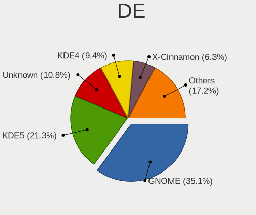
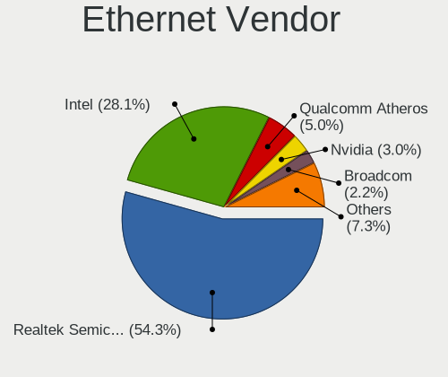

Linux - Tested Hardware & Statistics (Desktops)
-----------------------------------------------

A project to collect tested hardware configurations for Linux.

Anyone can contribute to this report by the [hw-probe](https://github.com/linuxhw/hw-probe) tool:

    sudo -E hw-probe -all -upload

Please contribute! Especially if your hardware is rare.

This report is for real hardware. Report for virtual hardware: [TestDays_VE](https://github.com/linuxhw/TestDays_VE)

Contents
--------

* [ Test Cases ](#test-cases)

* [ System ](#system)
  - [ OS                       ](#os)
  - [ OS Family                ](#os-family)
  - [ Kernel                   ](#kernel)
  - [ Kernel Family            ](#kernel-family)
  - [ Kernel Major Ver.        ](#kernel-major-ver)
  - [ Arch                     ](#arch)
  - [ DE                       ](#de)
  - [ Display Server           ](#display-server)
  - [ Display Manager          ](#display-manager)
  - [ OS Lang                  ](#os-lang)
  - [ Boot Mode                ](#boot-mode)
  - [ Filesystem               ](#filesystem)
  - [ Part. scheme             ](#part-scheme)
  - [ Dual Boot with Linux/BSD ](#dual-boot-with-linuxbsd)
  - [ Dual Boot (Win)          ](#dual-boot-win)

* [ Board ](#board)
  - [ Vendor                   ](#vendor)
  - [ Model                    ](#model)
  - [ Model Family             ](#model-family)
  - [ MFG Year                 ](#mfg-year)
  - [ Form Factor              ](#form-factor)
  - [ Secure Boot              ](#secure-boot)
  - [ Coreboot                 ](#coreboot)
  - [ RAM Size                 ](#ram-size)
  - [ RAM Used                 ](#ram-used)
  - [ Total Drives             ](#total-drives)
  - [ Has CD-ROM               ](#has-cd-rom)
  - [ Has Ethernet             ](#has-ethernet)
  - [ Has WiFi                 ](#has-wifi)
  - [ Has Bluetooth            ](#has-bluetooth)

* [ Location ](#location)
  - [ Country                  ](#country)
  - [ City                     ](#city)

* [ Drives ](#drives)
  - [ Drive Vendor             ](#drive-vendor)
  - [ Drive Model              ](#drive-model)
  - [ HDD Vendor               ](#hdd-vendor)
  - [ SSD Vendor               ](#ssd-vendor)
  - [ Drive Kind               ](#drive-kind)
  - [ Drive Connector          ](#drive-connector)
  - [ Drive Size               ](#drive-size)
  - [ Space Total              ](#space-total)
  - [ Space Used               ](#space-used)
  - [ Malfunc. Drives          ](#malfunc-drives)
  - [ Malfunc. Drive Vendor    ](#malfunc-drive-vendor)
  - [ Malfunc. HDD Vendor      ](#malfunc-hdd-vendor)
  - [ Malfunc. Drive Kind      ](#malfunc-drive-kind)
  - [ Failed Drives            ](#failed-drives)
  - [ Failed Drive Vendor      ](#failed-drive-vendor)
  - [ Drive Status             ](#drive-status)

* [ Storage controller ](#storage-controller)
  - [ Storage Vendor           ](#storage-vendor)
  - [ Storage Model            ](#storage-model)
  - [ Storage Kind             ](#storage-kind)

* [ Processor ](#processor)
  - [ CPU Vendor               ](#cpu-vendor)
  - [ CPU Model                ](#cpu-model)
  - [ CPU Model Family         ](#cpu-model-family)
  - [ CPU Cores                ](#cpu-cores)
  - [ CPU Sockets              ](#cpu-sockets)
  - [ CPU Threads              ](#cpu-threads)
  - [ CPU Op-Modes             ](#cpu-op-modes)
  - [ CPU Microcode            ](#cpu-microcode)
  - [ CPU Microarch            ](#cpu-microarch)

* [ Graphics ](#graphics)
  - [ GPU Vendor               ](#gpu-vendor)
  - [ GPU Model                ](#gpu-model)
  - [ GPU Combo                ](#gpu-combo)
  - [ GPU Driver               ](#gpu-driver)
  - [ GPU Memory               ](#gpu-memory)

* [ Monitor ](#monitor)
  - [ Monitor Vendor           ](#monitor-vendor)
  - [ Monitor Model            ](#monitor-model)
  - [ Monitor Resolution       ](#monitor-resolution)
  - [ Monitor Diagonal         ](#monitor-diagonal)
  - [ Monitor Width            ](#monitor-width)
  - [ Aspect Ratio             ](#aspect-ratio)
  - [ Monitor Area             ](#monitor-area)
  - [ Pixel Density            ](#pixel-density)
  - [ Multiple Monitors        ](#multiple-monitors)

* [ Network ](#network)
  - [ Net Controller Vendor    ](#net-controller-vendor)
  - [ Net Controller Model     ](#net-controller-model)
  - [ Wireless Vendor          ](#wireless-vendor)
  - [ Wireless Model           ](#wireless-model)
  - [ Ethernet Vendor          ](#ethernet-vendor)
  - [ Ethernet Model           ](#ethernet-model)
  - [ Net Controller Kind      ](#net-controller-kind)
  - [ Used Controller          ](#used-controller)
  - [ NICs                     ](#nics)
  - [ IPv6                     ](#ipv6)

* [ Bluetooth ](#bluetooth)
  - [ Bluetooth Vendor         ](#bluetooth-vendor)
  - [ Bluetooth Model          ](#bluetooth-model)

* [ Sound ](#sound)
  - [ Sound Vendor             ](#sound-vendor)
  - [ Sound Model              ](#sound-model)

* [ Memory ](#memory)
  - [ Memory Vendor            ](#memory-vendor)
  - [ Memory Model             ](#memory-model)
  - [ Memory Kind              ](#memory-kind)
  - [ Memory Form Factor       ](#memory-form-factor)
  - [ Memory Size              ](#memory-size)
  - [ Memory Speed             ](#memory-speed)

* [ Printers & scanners ](#printers--scanners)
  - [ Printer Vendor           ](#printer-vendor)
  - [ Printer Model            ](#printer-model)
  - [ Scanner Vendor           ](#scanner-vendor)
  - [ Scanner Model            ](#scanner-model)

* [ Camera ](#camera)
  - [ Camera Vendor            ](#camera-vendor)
  - [ Camera Model             ](#camera-model)

* [ Security ](#security)
  - [ Fingerprint Vendor       ](#fingerprint-vendor)
  - [ Fingerprint Model        ](#fingerprint-model)
  - [ Chipcard Vendor          ](#chipcard-vendor)
  - [ Chipcard Model           ](#chipcard-model)

* [ Unsupported ](#unsupported)
  - [ Unsupported Devices      ](#unsupported-devices)
  - [ Unsupported Device Types ](#unsupported-device-types)

Test Cases
----------

Total: 143036

| Vendor        | Model                       | Probe                                                      | Date         |
|---------------|-----------------------------|------------------------------------------------------------|--------------|
| ASRock        | J5005-ITX                   | [5373e7f16c](https://linux-hardware.org/?probe=5373e7f16c) | Jan 02, 2024 |
| MSI           | MAG B550M MORTAR            | [3fbea8cbf8](https://linux-hardware.org/?probe=3fbea8cbf8) | Jan 02, 2024 |
| Gigabyte      | Z390 AORUS PRO WIFI-CF      | [3a67df5dcf](https://linux-hardware.org/?probe=3a67df5dcf) | Jan 02, 2024 |
| Gigabyte      | Z390 AORUS PRO WIFI-CF      | [b163926938](https://linux-hardware.org/?probe=b163926938) | Jan 02, 2024 |
| ASUSTek       | H81M-C                      | [221ebe85fb](https://linux-hardware.org/?probe=221ebe85fb) | Jan 02, 2024 |
| Gigabyte      | AB350N-Gaming WIFI-CF       | [24166c136e](https://linux-hardware.org/?probe=24166c136e) | Jan 02, 2024 |
| ASUSTek       | P5QL                        | [723455abf9](https://linux-hardware.org/?probe=723455abf9) | Jan 02, 2024 |
| ECS           | GLKD-I2                     | [97247e0a90](https://linux-hardware.org/?probe=97247e0a90) | Jan 02, 2024 |
| Azulle        | Byte 3                      | [28f6b7cbad](https://linux-hardware.org/?probe=28f6b7cbad) | Jan 02, 2024 |
| HP            | 0A54h                       | [6db4931db4](https://linux-hardware.org/?probe=6db4931db4) | Jan 02, 2024 |
| Gigabyte      | B560M DS3H                  | [4ff670c80b](https://linux-hardware.org/?probe=4ff670c80b) | Jan 02, 2024 |
| ASUSTek       | ROG STRIX B350-F GAMING     | [f10936a9f7](https://linux-hardware.org/?probe=f10936a9f7) | Jan 02, 2024 |
| Dell          | 0D28YY A01                  | [f67d5d22eb](https://linux-hardware.org/?probe=f67d5d22eb) | Jan 02, 2024 |
| MSI           | X99A RAIDER                 | [0c40685bac](https://linux-hardware.org/?probe=0c40685bac) | Jan 02, 2024 |
| Gigabyte      | B560M DS3H                  | [1529597f3c](https://linux-hardware.org/?probe=1529597f3c) | Jan 02, 2024 |
| Dell          | 0C2XKD A01                  | [9accd399c5](https://linux-hardware.org/?probe=9accd399c5) | Jan 02, 2024 |
| HP            | 0A54h                       | [cbf6bc2e02](https://linux-hardware.org/?probe=cbf6bc2e02) | Jan 02, 2024 |
| Gigabyte      | Z490 UD                     | [939fe5ab0c](https://linux-hardware.org/?probe=939fe5ab0c) | Jan 02, 2024 |
| ASUSTek       | ROG STRIX Z370-H GAMING     | [ee3998d501](https://linux-hardware.org/?probe=ee3998d501) | Jan 02, 2024 |
| Fujitsu       | D3501-A1 S26361-D3501-A1    | [9711c69823](https://linux-hardware.org/?probe=9711c69823) | Jan 02, 2024 |
| ASUSTek       | ROG STRIX B650E-E GAMING... | [57a12c9041](https://linux-hardware.org/?probe=57a12c9041) | Jan 02, 2024 |
| Dell          | 0XJ8C4 A00                  | [e902f5396d](https://linux-hardware.org/?probe=e902f5396d) | Jan 02, 2024 |
| Gigabyte      | B560 DS3H AC-Y1             | [9868062aa3](https://linux-hardware.org/?probe=9868062aa3) | Jan 02, 2024 |
| MSI           | Z77A-G43                    | [b33c14ee42](https://linux-hardware.org/?probe=b33c14ee42) | Jan 02, 2024 |
| MSI           | PRO B650-P WIFI             | [544a799ce8](https://linux-hardware.org/?probe=544a799ce8) | Jan 02, 2024 |
| Dell          | 07KY25 A01                  | [7936cb8967](https://linux-hardware.org/?probe=7936cb8967) | Jan 02, 2024 |
| Gigabyte      | B550M AORUS ELITE           | [3de5d6e06c](https://linux-hardware.org/?probe=3de5d6e06c) | Jan 02, 2024 |
| ASUSTek       | M4A87TD/USB3                | [8c2ae70cdd](https://linux-hardware.org/?probe=8c2ae70cdd) | Jan 02, 2024 |
| ASRock        | X470 Taichi                 | [93ce6b9074](https://linux-hardware.org/?probe=93ce6b9074) | Jan 02, 2024 |
| ASUSTek       | TUF Gaming Z490-PLUS        | [f96513dd00](https://linux-hardware.org/?probe=f96513dd00) | Jan 02, 2024 |
| Dell          | 0NDYHG A01                  | [68cde01489](https://linux-hardware.org/?probe=68cde01489) | Jan 02, 2024 |
| ASUSTek       | PRIME X470-PRO              | [68d3d8c6be](https://linux-hardware.org/?probe=68d3d8c6be) | Jan 02, 2024 |
| ASRock        | B550M Pro4                  | [9eb47b934a](https://linux-hardware.org/?probe=9eb47b934a) | Jan 02, 2024 |
| ASUSTek       | ROG STRIX X670E-E GAMING... | [21c267752a](https://linux-hardware.org/?probe=21c267752a) | Jan 02, 2024 |
| Azulle        | Byte 3                      | [273bcd474a](https://linux-hardware.org/?probe=273bcd474a) | Jan 02, 2024 |
| Gigabyte      | Z590 UD AC                  | [0db9ec67ac](https://linux-hardware.org/?probe=0db9ec67ac) | Jan 02, 2024 |
| MSI           | MS-B9181                    | [56b0ad4a01](https://linux-hardware.org/?probe=56b0ad4a01) | Jan 02, 2024 |
| Gigabyte      | AX370-Gaming K7             | [435dc251c1](https://linux-hardware.org/?probe=435dc251c1) | Jan 02, 2024 |
| Unknown       | X99H                        | [61c57cb006](https://linux-hardware.org/?probe=61c57cb006) | Jan 01, 2024 |
| HP            | 886C                        | [d076e5b70a](https://linux-hardware.org/?probe=d076e5b70a) | Jan 01, 2024 |
| ASUSTek       | PRIME X570-P                | [f7f3e0ddc9](https://linux-hardware.org/?probe=f7f3e0ddc9) | Jan 01, 2024 |
| Unknown       | Unknown                     | [b101d94fff](https://linux-hardware.org/?probe=b101d94fff) | Jan 01, 2024 |
| ASRock        | J3355M                      | [305d025c0f](https://linux-hardware.org/?probe=305d025c0f) | Jan 01, 2024 |
| Gigabyte      | Z790 AERO G                 | [121de16d3b](https://linux-hardware.org/?probe=121de16d3b) | Jan 01, 2024 |
| Gigabyte      | Z790 AERO G                 | [2ad2af0de5](https://linux-hardware.org/?probe=2ad2af0de5) | Jan 01, 2024 |
| ASRock        | Z77 Professional            | [d1d9fce85d](https://linux-hardware.org/?probe=d1d9fce85d) | Jan 01, 2024 |
| Gigabyte      | X670 GAMING X AX            | [6b4b87c927](https://linux-hardware.org/?probe=6b4b87c927) | Jan 01, 2024 |
| Gigabyte      | X79-UP4                     | [4c7ec5ec88](https://linux-hardware.org/?probe=4c7ec5ec88) | Jan 01, 2024 |
| ASUSTek       | P8H77-M                     | [7ae937132b](https://linux-hardware.org/?probe=7ae937132b) | Jan 01, 2024 |
| HP            | 0B4Ch D                     | [b7d97486fb](https://linux-hardware.org/?probe=b7d97486fb) | Jan 01, 2024 |
| Gigabyte      | F2A88XM-HD3                 | [79b5e7c7b0](https://linux-hardware.org/?probe=79b5e7c7b0) | Jan 01, 2024 |
| ASUSTek       | TUF Gaming Z490-PLUS        | [ccaa0646d7](https://linux-hardware.org/?probe=ccaa0646d7) | Jan 01, 2024 |
| MSI           | X79A-GD65                   | [ecb9a57738](https://linux-hardware.org/?probe=ecb9a57738) | Jan 01, 2024 |
| ASUSTek       | H81M-A/BR                   | [6f2227d209](https://linux-hardware.org/?probe=6f2227d209) | Jan 01, 2024 |
| ASUSTek       | PRIME X570-P                | [f8dd732e7a](https://linux-hardware.org/?probe=f8dd732e7a) | Jan 01, 2024 |
| ASUSTek       | P8Z77-V LX                  | [148f8c250f](https://linux-hardware.org/?probe=148f8c250f) | Jan 01, 2024 |
| Dell          | 0YXT71 A02                  | [e08ca6924a](https://linux-hardware.org/?probe=e08ca6924a) | Jan 01, 2024 |
| Gigabyte      | H61M-S1                     | [1e34cd1559](https://linux-hardware.org/?probe=1e34cd1559) | Jan 01, 2024 |
| ASRock        | B450M Gaming                | [81242d3eca](https://linux-hardware.org/?probe=81242d3eca) | Jan 01, 2024 |
| ASUSTek       | PRIME A320M-K               | [685d971973](https://linux-hardware.org/?probe=685d971973) | Jan 01, 2024 |
| Gigabyte      | X58A-UD3R                   | [757bac1cef](https://linux-hardware.org/?probe=757bac1cef) | Jan 01, 2024 |
| ASUSTek       | TUF Gaming X670E-PLUS WI... | [c6c9c3c74e](https://linux-hardware.org/?probe=c6c9c3c74e) | Jan 01, 2024 |
| ASUSTek       | P8H67-M LE                  | [82877fbf5e](https://linux-hardware.org/?probe=82877fbf5e) | Jan 01, 2024 |
| ASUSTek       | P6T                         | [7b5a14566d](https://linux-hardware.org/?probe=7b5a14566d) | Jan 01, 2024 |
| HP            | 82A2                        | [7cc3d17916](https://linux-hardware.org/?probe=7cc3d17916) | Jan 01, 2024 |
| Gigabyte      | H470M K                     | [90b6ff9ff3](https://linux-hardware.org/?probe=90b6ff9ff3) | Jan 01, 2024 |
| ASRock        | X570 Phantom Gaming-ITX/... | [58557ae7c7](https://linux-hardware.org/?probe=58557ae7c7) | Jan 01, 2024 |
| ASUSTek       | M5A99X EVO R2.0             | [aedbae5d00](https://linux-hardware.org/?probe=aedbae5d00) | Jan 01, 2024 |
| ASUSTek       | P8H67-M EVO                 | [7c95d175bb](https://linux-hardware.org/?probe=7c95d175bb) | Jan 01, 2024 |
| ASUSTek       | Z87-DELUXE                  | [018238aa79](https://linux-hardware.org/?probe=018238aa79) | Jan 01, 2024 |
| Gigabyte      | P67A-D3-B3                  | [28494e9d46](https://linux-hardware.org/?probe=28494e9d46) | Jan 01, 2024 |
| ASRock        | B550M-ITX/ac                | [2ae0bbe734](https://linux-hardware.org/?probe=2ae0bbe734) | Jan 01, 2024 |
| Dell          | 0F6X5P A00                  | [750a1d90dd](https://linux-hardware.org/?probe=750a1d90dd) | Jan 01, 2024 |
| Dell          | 0F6X5P A00                  | [b4f1a69ca3](https://linux-hardware.org/?probe=b4f1a69ca3) | Jan 01, 2024 |
| Gigabyte      | H270N-WIFI-CF               | [d47bc3897f](https://linux-hardware.org/?probe=d47bc3897f) | Jan 01, 2024 |
| Gigabyte      | F2A88XM-HD3                 | [23eb635b4e](https://linux-hardware.org/?probe=23eb635b4e) | Jan 01, 2024 |
| Dell          | 0F6X5P A00                  | [b5efb44fe4](https://linux-hardware.org/?probe=b5efb44fe4) | Jan 01, 2024 |
| ASUSTek       | PRIME X470-PRO              | [7cb99217f7](https://linux-hardware.org/?probe=7cb99217f7) | Jan 01, 2024 |
| Medion        | H110H4-EM                   | [da3367c80e](https://linux-hardware.org/?probe=da3367c80e) | Jan 01, 2024 |
| Pegatron      | EVANS                       | [b2a67b83cd](https://linux-hardware.org/?probe=b2a67b83cd) | Jan 01, 2024 |
| ASUSTek       | PRIME X470-PRO              | [1934632c28](https://linux-hardware.org/?probe=1934632c28) | Jan 01, 2024 |
| ASUSTek       | ROG STRIX B650E-I GAMING... | [769bd9153a](https://linux-hardware.org/?probe=769bd9153a) | Jan 01, 2024 |
| KunPengDia... | Unknown                     | [574df96e17](https://linux-hardware.org/?probe=574df96e17) | Jan 01, 2024 |
| Dell          | 0V8F20 A01                  | [ceebdc4f9e](https://linux-hardware.org/?probe=ceebdc4f9e) | Jan 01, 2024 |
| Dell          | 0D24M8 A01                  | [f363c3e115](https://linux-hardware.org/?probe=f363c3e115) | Jan 01, 2024 |
| Gigabyte      | A320M-S2H-CF                | [ac00eb404d](https://linux-hardware.org/?probe=ac00eb404d) | Jan 01, 2024 |
| ASUSTek       | PRIME X470-PRO              | [7df50c6495](https://linux-hardware.org/?probe=7df50c6495) | Jan 01, 2024 |
| Sapphire      | PI-AM3RS760G2               | [5f34a26ab3](https://linux-hardware.org/?probe=5f34a26ab3) | Jan 01, 2024 |
| HP            | ProLiant ML310e Gen8 v2     | [7271f244c2](https://linux-hardware.org/?probe=7271f244c2) | Jan 01, 2024 |
| ASUSTek       | PRIME B550M-A               | [a4cf1bb1ea](https://linux-hardware.org/?probe=a4cf1bb1ea) | Jan 01, 2024 |
| ASUSTek       | P7P55D                      | [23a30b2497](https://linux-hardware.org/?probe=23a30b2497) | Jan 01, 2024 |
| Lenovo        | SHARKBAY SDK0E50519 WIN     | [fc9ced99d5](https://linux-hardware.org/?probe=fc9ced99d5) | Jan 01, 2024 |
| ASUSTek       | M2N68-AM SE2                | [553bcade60](https://linux-hardware.org/?probe=553bcade60) | Jan 01, 2024 |
| ASUSTek       | PRIME Z270-A                | [dea2dc38e4](https://linux-hardware.org/?probe=dea2dc38e4) | Jan 01, 2024 |
| MSI           | B250M PRO-VD                | [f0cb030b5f](https://linux-hardware.org/?probe=f0cb030b5f) | Jan 01, 2024 |
| Dell          | 09KPNV A01                  | [d6c27424e2](https://linux-hardware.org/?probe=d6c27424e2) | Jan 01, 2024 |
| ASUSTek       | H97-PLUS                    | [e208caf8f1](https://linux-hardware.org/?probe=e208caf8f1) | Jan 01, 2024 |
| Gigabyte      | 970A-DS3P                   | [74a0ff16d4](https://linux-hardware.org/?probe=74a0ff16d4) | Jan 01, 2024 |
| Centerm       | C92                         | [5ede09f987](https://linux-hardware.org/?probe=5ede09f987) | Jan 01, 2024 |
| Centerm       | C92                         | [0201370bf4](https://linux-hardware.org/?probe=0201370bf4) | Jan 01, 2024 |
| HP            | 18E7                        | [cf9a9bbe99](https://linux-hardware.org/?probe=cf9a9bbe99) | Jan 01, 2024 |
| Samsung       | DT1234567890 SEC_SW_REVI... | [d2112b91c1](https://linux-hardware.org/?probe=d2112b91c1) | Jan 01, 2024 |
| MSI           | X99A RAIDER                 | [bb37fe4632](https://linux-hardware.org/?probe=bb37fe4632) | Jan 01, 2024 |
| ASRock        | Z690M Phantom Gaming 4      | [9b11da6c92](https://linux-hardware.org/?probe=9b11da6c92) | Jan 01, 2024 |
| Samsung       | DT1234567890 SEC_SW_REVI... | [252e78398a](https://linux-hardware.org/?probe=252e78398a) | Jan 01, 2024 |
| Gigabyte      | Z170X-Gaming 3              | [cd5e5dff22](https://linux-hardware.org/?probe=cd5e5dff22) | Jan 01, 2024 |
| ASUSTek       | TUF Gaming Z590-PLUS        | [6dbc709464](https://linux-hardware.org/?probe=6dbc709464) | Jan 01, 2024 |
| MSI           | 2AE0                        | [00b5d15112](https://linux-hardware.org/?probe=00b5d15112) | Jan 01, 2024 |
| Unknown       | Unknown                     | [3be8582d82](https://linux-hardware.org/?probe=3be8582d82) | Jan 01, 2024 |
| MSI           | X470 GAMING PRO CARBON      | [8a1771af4b](https://linux-hardware.org/?probe=8a1771af4b) | Jan 01, 2024 |
| ASRock        | B450 Gaming K4              | [082442f033](https://linux-hardware.org/?probe=082442f033) | Jan 01, 2024 |
| ASUSTek       | M5A97 R2.0                  | [1e67ed5915](https://linux-hardware.org/?probe=1e67ed5915) | Jan 01, 2024 |
| HP            | 1850                        | [b635f6412c](https://linux-hardware.org/?probe=b635f6412c) | Jan 01, 2024 |
| MSI           | B550M PRO-VDH WIFI          | [b1f90491ab](https://linux-hardware.org/?probe=b1f90491ab) | Jan 01, 2024 |
| ASUSTek       | PRIME A320M-R               | [da76fd5108](https://linux-hardware.org/?probe=da76fd5108) | Jan 01, 2024 |
| ASUSTek       | TUF Gaming B550-PLUS        | [4b8ffea2ef](https://linux-hardware.org/?probe=4b8ffea2ef) | Jan 01, 2024 |
| ASUSTek       | PRIME A320M-R               | [d646e8d5fb](https://linux-hardware.org/?probe=d646e8d5fb) | Jan 01, 2024 |
| ASRock        | X399 Professional Gaming    | [2d812c76d3](https://linux-hardware.org/?probe=2d812c76d3) | Jan 01, 2024 |
| ASUSTek       | P5G41T-M LX                 | [ab74a1228a](https://linux-hardware.org/?probe=ab74a1228a) | Jan 01, 2024 |
| Win Elemen... | M9                          | [33b3133a1c](https://linux-hardware.org/?probe=33b3133a1c) | Jan 01, 2024 |
| Win Elemen... | M9                          | [93f17e23c2](https://linux-hardware.org/?probe=93f17e23c2) | Jan 01, 2024 |
| ASUSTek       | ROG STRIX B550-E GAMING     | [4fb6fd51a2](https://linux-hardware.org/?probe=4fb6fd51a2) | Jan 01, 2024 |
| ASUSTek       | PRIME J4005I-C/BR           | [12a957b14b](https://linux-hardware.org/?probe=12a957b14b) | Jan 01, 2024 |
| Gigabyte      | H97N-WIFI                   | [eb47ce9900](https://linux-hardware.org/?probe=eb47ce9900) | Jan 01, 2024 |
| ASRock        | B450M Pro4                  | [126f6b0c9c](https://linux-hardware.org/?probe=126f6b0c9c) | Dec 31, 2023 |
| MSI           | 880GM-E41                   | [caf8e2f533](https://linux-hardware.org/?probe=caf8e2f533) | Dec 31, 2023 |
| ASRock        | B450M Pro4                  | [8625e5d1fa](https://linux-hardware.org/?probe=8625e5d1fa) | Dec 31, 2023 |
| ASUSTek       | PRIME J4005I-C/BR           | [7f4bbc6a71](https://linux-hardware.org/?probe=7f4bbc6a71) | Dec 31, 2023 |
| MSI           | B550-A PRO                  | [3b6183bbb5](https://linux-hardware.org/?probe=3b6183bbb5) | Dec 31, 2023 |
| Foxconn       | 2ADA                        | [ae6e6ab09f](https://linux-hardware.org/?probe=ae6e6ab09f) | Dec 31, 2023 |
| ASUSTek       | PRIME J4005I-C/BR           | [5b8817b3de](https://linux-hardware.org/?probe=5b8817b3de) | Dec 31, 2023 |
| Supermicro    | H13DSH                      | [4110ba22a1](https://linux-hardware.org/?probe=4110ba22a1) | Dec 31, 2023 |
| ASUSTek       | TUF Gaming B650M-PLUS WI... | [8635d2ee55](https://linux-hardware.org/?probe=8635d2ee55) | Dec 31, 2023 |
| Dell          | 0HX555                      | [72e32eaf42](https://linux-hardware.org/?probe=72e32eaf42) | Dec 31, 2023 |
| Dell          | 0HX555                      | [535a5964b8](https://linux-hardware.org/?probe=535a5964b8) | Dec 31, 2023 |
| ASRock        | H97M Pro4                   | [3955acda3d](https://linux-hardware.org/?probe=3955acda3d) | Dec 31, 2023 |
| Shenzhen M... | F7BFD                       | [a55f5157bc](https://linux-hardware.org/?probe=a55f5157bc) | Dec 31, 2023 |
| Gigabyte      | B660 DS3H DDR4              | [3cb3c98a92](https://linux-hardware.org/?probe=3cb3c98a92) | Dec 31, 2023 |
| ASRock        | Z170A-X1                    | [faba481c2b](https://linux-hardware.org/?probe=faba481c2b) | Dec 31, 2023 |
| ASUSTek       | M4N72-E                     | [7d21517ee3](https://linux-hardware.org/?probe=7d21517ee3) | Dec 31, 2023 |
| MSI           | PRO Z790-A WIFI             | [40362f198b](https://linux-hardware.org/?probe=40362f198b) | Dec 31, 2023 |
| Positivo      | POS-PIH55BXA                | [6ab5cb395f](https://linux-hardware.org/?probe=6ab5cb395f) | Dec 31, 2023 |
| Gigabyte      | B450M DS3H-CF               | [08f5647277](https://linux-hardware.org/?probe=08f5647277) | Dec 31, 2023 |
| ASUSTek       | H81M-A/BR                   | [61946a6719](https://linux-hardware.org/?probe=61946a6719) | Dec 31, 2023 |
| Lenovo        | ThinkCentre M91p 7005A21    | [043bcfc503](https://linux-hardware.org/?probe=043bcfc503) | Dec 31, 2023 |
| ASRock        | B650E PG Riptide WiFi       | [9c99c1bf71](https://linux-hardware.org/?probe=9c99c1bf71) | Dec 31, 2023 |
| ASUSTek       | SABERTOOTH P67              | [fa478c5226](https://linux-hardware.org/?probe=fa478c5226) | Dec 31, 2023 |
| Alienware     | 0VDT73 A00                  | [2a4b22a489](https://linux-hardware.org/?probe=2a4b22a489) | Dec 31, 2023 |
| Acer          | WMCP78M                     | [e2d232fa11](https://linux-hardware.org/?probe=e2d232fa11) | Dec 31, 2023 |
| ASUSTek       | M2A-MX                      | [9be60381fc](https://linux-hardware.org/?probe=9be60381fc) | Dec 31, 2023 |
| ASUSTek       | H110M-A/M.2                 | [9e622b4006](https://linux-hardware.org/?probe=9e622b4006) | Dec 31, 2023 |
| Gigabyte      | B450 AORUS M                | [76a4e84057](https://linux-hardware.org/?probe=76a4e84057) | Dec 31, 2023 |
| ASUSTek       | P8Z77-V LX                  | [109efb840b](https://linux-hardware.org/?probe=109efb840b) | Dec 31, 2023 |
| MSI           | MAG B550M MORTAR MAX WIF... | [586b998af3](https://linux-hardware.org/?probe=586b998af3) | Dec 31, 2023 |
| MSI           | X58 Pro-E                   | [59b2e1dab3](https://linux-hardware.org/?probe=59b2e1dab3) | Dec 31, 2023 |
| ASRock        | B75M-DGS                    | [3a2df88d60](https://linux-hardware.org/?probe=3a2df88d60) | Dec 31, 2023 |
| Gigabyte      | Q87M-D2H                    | [0f440edfb5](https://linux-hardware.org/?probe=0f440edfb5) | Dec 31, 2023 |
| Lenovo        | 1046 SBB1C50523 WIN 3556... | [080172526c](https://linux-hardware.org/?probe=080172526c) | Dec 31, 2023 |
| ASUSTek       | M5A97 LE R2.0               | [210fa8e369](https://linux-hardware.org/?probe=210fa8e369) | Dec 31, 2023 |
| ASUSTek       | TUF Gaming B550M-PLUS       | [e1c9fdb53b](https://linux-hardware.org/?probe=e1c9fdb53b) | Dec 31, 2023 |
| MSI           | P43i                        | [a31ae3403f](https://linux-hardware.org/?probe=a31ae3403f) | Dec 31, 2023 |
| ASRock        | FM2A55M-HD+                 | [d60c82646d](https://linux-hardware.org/?probe=d60c82646d) | Dec 31, 2023 |
| OEM           | G41 775 ICH7 8712           | [bfb91f354b](https://linux-hardware.org/?probe=bfb91f354b) | Dec 31, 2023 |
| ASUSTek       | P8Z77-V LX                  | [bb0f439fbe](https://linux-hardware.org/?probe=bb0f439fbe) | Dec 31, 2023 |
| ASRock        | H61M-VG4                    | [6eee51a63f](https://linux-hardware.org/?probe=6eee51a63f) | Dec 31, 2023 |
| Acer          | Aspire TC-885 V:1.1         | [19be3bdc5b](https://linux-hardware.org/?probe=19be3bdc5b) | Dec 31, 2023 |
| ASRock        | H61M-VG4                    | [1c5959e766](https://linux-hardware.org/?probe=1c5959e766) | Dec 31, 2023 |
| ASUSTek       | TUF Gaming X570-PRO         | [ca2b52b64f](https://linux-hardware.org/?probe=ca2b52b64f) | Dec 31, 2023 |
| HP            | 18E9                        | [298cd92eb1](https://linux-hardware.org/?probe=298cd92eb1) | Dec 31, 2023 |
| MSI           | 970 GAMING                  | [aa028d5af2](https://linux-hardware.org/?probe=aa028d5af2) | Dec 31, 2023 |
| HP            | 2AF7                        | [8bae22b1aa](https://linux-hardware.org/?probe=8bae22b1aa) | Dec 31, 2023 |
| Gigabyte      | GA-MA790GPT-UD3H            | [0ff4f2cb79](https://linux-hardware.org/?probe=0ff4f2cb79) | Dec 31, 2023 |
| ASUSTek       | CM6870                      | [bdc19328ef](https://linux-hardware.org/?probe=bdc19328ef) | Dec 31, 2023 |
| AMI           | Intel                       | [532ef0e65e](https://linux-hardware.org/?probe=532ef0e65e) | Dec 31, 2023 |
| ZOTAC         | NM10                        | [c0f4135bd0](https://linux-hardware.org/?probe=c0f4135bd0) | Dec 31, 2023 |
| HP            | 3047h                       | [b7a000586f](https://linux-hardware.org/?probe=b7a000586f) | Dec 31, 2023 |
| Gigabyte      | Q87M-D2H                    | [edbe61f4fa](https://linux-hardware.org/?probe=edbe61f4fa) | Dec 31, 2023 |
| MSI           | B450M MORTAR MAX            | [0c20bdae04](https://linux-hardware.org/?probe=0c20bdae04) | Dec 31, 2023 |
| Gigabyte      | H77N-WIFI                   | [a7a54aba38](https://linux-hardware.org/?probe=a7a54aba38) | Dec 31, 2023 |
| MSI           | B450M MORTAR MAX            | [d6622a2c0a](https://linux-hardware.org/?probe=d6622a2c0a) | Dec 31, 2023 |
| HP            | 8704                        | [49843bcacc](https://linux-hardware.org/?probe=49843bcacc) | Dec 31, 2023 |
| ASUSTek       | PRIME A320M-K               | [f45ebb1f0d](https://linux-hardware.org/?probe=f45ebb1f0d) | Dec 31, 2023 |
| MSI           | A320M-A PRO MAX             | [e89341eb95](https://linux-hardware.org/?probe=e89341eb95) | Dec 31, 2023 |
| MSI           | A320M-A PRO MAX             | [b24918bdbc](https://linux-hardware.org/?probe=b24918bdbc) | Dec 31, 2023 |
| ASRock        | B450M Pro4 R2.0             | [f70bdb7fa5](https://linux-hardware.org/?probe=f70bdb7fa5) | Dec 31, 2023 |
| MACHINIST     | X99-D8-MAX V1.0             | [ef584ae5a8](https://linux-hardware.org/?probe=ef584ae5a8) | Dec 31, 2023 |
| Gigabyte      | AB350M-DS3H V2-CF           | [f59bee0805](https://linux-hardware.org/?probe=f59bee0805) | Dec 31, 2023 |
| ASUSTek       | M5A78L-M PLUS/USB3          | [fda4d32a86](https://linux-hardware.org/?probe=fda4d32a86) | Dec 31, 2023 |
| ASUSTek       | ROG STRIX B650E-I GAMING... | [ca4a3eaa00](https://linux-hardware.org/?probe=ca4a3eaa00) | Dec 31, 2023 |
| Gigabyte      | B450M DS3H-CF               | [c341d04885](https://linux-hardware.org/?probe=c341d04885) | Dec 31, 2023 |
| ASUSTek       | H81M-K                      | [8262129320](https://linux-hardware.org/?probe=8262129320) | Dec 31, 2023 |
| Gigabyte      | Z490 AORUS ELITE AC         | [4faca6dad4](https://linux-hardware.org/?probe=4faca6dad4) | Dec 31, 2023 |
| Gigabyte      | Z390 UD V2                  | [c7c5239d23](https://linux-hardware.org/?probe=c7c5239d23) | Dec 31, 2023 |
| Gigabyte      | X570S AORUS MASTER          | [cc1f8b0b86](https://linux-hardware.org/?probe=cc1f8b0b86) | Dec 31, 2023 |
| Gigabyte      | Z370 HD3P-CF                | [83ef33bf03](https://linux-hardware.org/?probe=83ef33bf03) | Dec 31, 2023 |
| MACHINIST     | X99-RS9 V2.0                | [daee98e116](https://linux-hardware.org/?probe=daee98e116) | Dec 31, 2023 |
| ASUSTek       | ROG CROSSHAIR X670E HERO    | [dd7c0e5406](https://linux-hardware.org/?probe=dd7c0e5406) | Dec 31, 2023 |
| ASRock        | 990FX Extreme4              | [edf3eae913](https://linux-hardware.org/?probe=edf3eae913) | Dec 31, 2023 |
| HP            | 82B4                        | [02bcf6a9d1](https://linux-hardware.org/?probe=02bcf6a9d1) | Dec 31, 2023 |
| HP            | 8643 SMVB                   | [2a12979b75](https://linux-hardware.org/?probe=2a12979b75) | Dec 31, 2023 |
| HP            | 8643 SMVB                   | [23b04c5445](https://linux-hardware.org/?probe=23b04c5445) | Dec 31, 2023 |
| Dell          | 0RW199                      | [62dc9ffa33](https://linux-hardware.org/?probe=62dc9ffa33) | Dec 31, 2023 |
| ASUSTek       | ROG STRIX B550-E GAMING     | [eb264efa92](https://linux-hardware.org/?probe=eb264efa92) | Dec 31, 2023 |
| MSI           | X99A RAIDER                 | [a9aee13c48](https://linux-hardware.org/?probe=a9aee13c48) | Dec 31, 2023 |
| HP            | 8054                        | [5389720de6](https://linux-hardware.org/?probe=5389720de6) | Dec 31, 2023 |
| ASUSTek       | Pro WS X570-ACE             | [99950d43fc](https://linux-hardware.org/?probe=99950d43fc) | Dec 31, 2023 |
| HP            | 339A                        | [f109c46a8a](https://linux-hardware.org/?probe=f109c46a8a) | Dec 31, 2023 |
| HC Technol... | HCAR5000-MI2                | [907ca49963](https://linux-hardware.org/?probe=907ca49963) | Dec 31, 2023 |
| Gigabyte      | B650 AORUS ELITE AX         | [5f1c662ba4](https://linux-hardware.org/?probe=5f1c662ba4) | Dec 31, 2023 |
| Apple         | Mac-F221BEC8                | [57b09cabf5](https://linux-hardware.org/?probe=57b09cabf5) | Dec 31, 2023 |
| Dell          | 0C2XKD A01                  | [5e36d4fb43](https://linux-hardware.org/?probe=5e36d4fb43) | Dec 31, 2023 |
| Huanan        | X58 V1.0                    | [d13c9b1573](https://linux-hardware.org/?probe=d13c9b1573) | Dec 31, 2023 |
| ASUSTek       | PRIME B660M-A WIFI D4       | [7caa5da564](https://linux-hardware.org/?probe=7caa5da564) | Dec 31, 2023 |
| Lenovo        | ThinkCentre M91p 7005A21    | [e783d0ce11](https://linux-hardware.org/?probe=e783d0ce11) | Dec 31, 2023 |
| Gigabyte      | B650 AORUS ELITE AX         | [fde784b0b5](https://linux-hardware.org/?probe=fde784b0b5) | Dec 31, 2023 |
| ASRock        | B760M PG SONIC WiFi         | [a066542ba9](https://linux-hardware.org/?probe=a066542ba9) | Dec 31, 2023 |
| Toshiba       | STI 013442                  | [c8488906f2](https://linux-hardware.org/?probe=c8488906f2) | Dec 31, 2023 |
| Gigabyte      | Z790 GAMING X AX            | [e330d0191e](https://linux-hardware.org/?probe=e330d0191e) | Dec 31, 2023 |
| ASRock        | Q1900M                      | [67778ed569](https://linux-hardware.org/?probe=67778ed569) | Dec 31, 2023 |
| ASUSTek       | PRIME A520M-K               | [7baccc479c](https://linux-hardware.org/?probe=7baccc479c) | Dec 31, 2023 |
| HP            | 8918                        | [0e8d4a626d](https://linux-hardware.org/?probe=0e8d4a626d) | Dec 31, 2023 |
| Toshiba       | STI 013442                  | [ed56d2dcb5](https://linux-hardware.org/?probe=ed56d2dcb5) | Dec 31, 2023 |
| Gigabyte      | Z790 AORUS ELITE AX         | [5d368c5304](https://linux-hardware.org/?probe=5d368c5304) | Dec 31, 2023 |
| ASUSTek       | PRIME B360M-K               | [d333516660](https://linux-hardware.org/?probe=d333516660) | Dec 31, 2023 |
| MSI           | H110M PRO-VD                | [d508dc8f38](https://linux-hardware.org/?probe=d508dc8f38) | Dec 31, 2023 |
| MSI           | Z170A TOMAHAWK              | [451e3803a0](https://linux-hardware.org/?probe=451e3803a0) | Dec 31, 2023 |
| ASRock        | Z97X Killer                 | [9508234fa4](https://linux-hardware.org/?probe=9508234fa4) | Dec 31, 2023 |
| ASUSTek       | P8H67-M PRO                 | [63d62dd94e](https://linux-hardware.org/?probe=63d62dd94e) | Dec 31, 2023 |
| MSI           | MPG B550 GAMING PLUS        | [d0b71859f2](https://linux-hardware.org/?probe=d0b71859f2) | Dec 31, 2023 |
| HP            | ProLiant ML110 Gen9         | [0181b68b4a](https://linux-hardware.org/?probe=0181b68b4a) | Dec 31, 2023 |
| MSI           | 970 GAMING                  | [7f7f8f09ae](https://linux-hardware.org/?probe=7f7f8f09ae) | Dec 31, 2023 |
| ASUSTek       | P8H67-M PRO                 | [6a45d6cf9e](https://linux-hardware.org/?probe=6a45d6cf9e) | Dec 30, 2023 |
| Gigabyte      | A620I AX                    | [7f73790fbf](https://linux-hardware.org/?probe=7f73790fbf) | Dec 30, 2023 |
| QIYIDA        | X99-H9 V2.0                 | [af479728a3](https://linux-hardware.org/?probe=af479728a3) | Dec 30, 2023 |
| Dell          | 0GN6JF A01                  | [19456ad0cb](https://linux-hardware.org/?probe=19456ad0cb) | Dec 30, 2023 |
| ASRock        | X570 Extreme4               | [13312e6a34](https://linux-hardware.org/?probe=13312e6a34) | Dec 30, 2023 |
| ASUSTek       | PRIME X470-PRO              | [495efd257e](https://linux-hardware.org/?probe=495efd257e) | Dec 30, 2023 |
| MSI           | B450M MORTAR TITANIUM       | [646c8d24fb](https://linux-hardware.org/?probe=646c8d24fb) | Dec 30, 2023 |
| ASUSTek       | H110M-A                     | [f2fd99d70d](https://linux-hardware.org/?probe=f2fd99d70d) | Dec 30, 2023 |
| ASUSTek       | M2N-VM HDMI                 | [3429c969a5](https://linux-hardware.org/?probe=3429c969a5) | Dec 30, 2023 |
| ASUSTek       | P11C-I Series               | [b38bcf215d](https://linux-hardware.org/?probe=b38bcf215d) | Dec 30, 2023 |
| ASUSTek       | M2N-VM HDMI                 | [e90dfa13e1](https://linux-hardware.org/?probe=e90dfa13e1) | Dec 30, 2023 |
| Unknown       | Unknown                     | [e6e8bd6545](https://linux-hardware.org/?probe=e6e8bd6545) | Dec 30, 2023 |
| ASUSTek       | PRIME X399-A                | [ac506b01e6](https://linux-hardware.org/?probe=ac506b01e6) | Dec 30, 2023 |
| MSI           | B85M-G43                    | [16b0ff5ec7](https://linux-hardware.org/?probe=16b0ff5ec7) | Dec 30, 2023 |
| Dell          | 0GN6JF A01                  | [fcf352f5e9](https://linux-hardware.org/?probe=fcf352f5e9) | Dec 30, 2023 |
| HP            | 82F1                        | [9fc9cb3de0](https://linux-hardware.org/?probe=9fc9cb3de0) | Dec 30, 2023 |
| Seeed Stud... | ODYSSEY-X86J41X5 SD-BS-C... | [90b5ba3d1e](https://linux-hardware.org/?probe=90b5ba3d1e) | Dec 30, 2023 |
| ASRock        | X300M-STX                   | [7cd1d9d16c](https://linux-hardware.org/?probe=7cd1d9d16c) | Dec 30, 2023 |
| ASRock        | X300M-STX                   | [5fa6e9f755](https://linux-hardware.org/?probe=5fa6e9f755) | Dec 30, 2023 |
| ASUSTek       | PRIME Z690-A                | [faf34bf75f](https://linux-hardware.org/?probe=faf34bf75f) | Dec 30, 2023 |
| ASUSTek       | PRIME B660-PLUS D4          | [0e7bbb6dea](https://linux-hardware.org/?probe=0e7bbb6dea) | Dec 30, 2023 |
| ASRock        | H170M Pro4                  | [27e24a6ef3](https://linux-hardware.org/?probe=27e24a6ef3) | Dec 30, 2023 |
| MSI           | B350 KRAIT GAMING           | [a4582db0da](https://linux-hardware.org/?probe=a4582db0da) | Dec 30, 2023 |
| ASUSTek       | M5A97 R2.0                  | [674f54c42c](https://linux-hardware.org/?probe=674f54c42c) | Dec 30, 2023 |
| MSI           | B550 GAMING GEN3            | [02163b04b7](https://linux-hardware.org/?probe=02163b04b7) | Dec 30, 2023 |
| MSI           | B450M-A PRO MAX II          | [3698a044ca](https://linux-hardware.org/?probe=3698a044ca) | Dec 30, 2023 |
| HP            | 81B4                        | [b596129d5d](https://linux-hardware.org/?probe=b596129d5d) | Dec 30, 2023 |
| ASRock        | B450 Gaming K4              | [8651fcb2dc](https://linux-hardware.org/?probe=8651fcb2dc) | Dec 30, 2023 |
| Huanan        | X99-QD4 V1.0                | [00b52d9fa3](https://linux-hardware.org/?probe=00b52d9fa3) | Dec 30, 2023 |
| MSI           | H270 GAMING M3              | [92615e0827](https://linux-hardware.org/?probe=92615e0827) | Dec 30, 2023 |
| Gigabyte      | AX370-Gaming K5-CF          | [ba1b2a738a](https://linux-hardware.org/?probe=ba1b2a738a) | Dec 30, 2023 |
| Dell          | 0VRWRC A00                  | [c58ff5350b](https://linux-hardware.org/?probe=c58ff5350b) | Dec 30, 2023 |
| DFI           | LP DK 790FXB-M2RS           | [8d0c82bedc](https://linux-hardware.org/?probe=8d0c82bedc) | Dec 30, 2023 |
| Gigabyte      | H61M-S2PV                   | [455d19da89](https://linux-hardware.org/?probe=455d19da89) | Dec 30, 2023 |
| ASUSTek       | TUF Gaming H670-PRO WIFI... | [3b26c92d22](https://linux-hardware.org/?probe=3b26c92d22) | Dec 30, 2023 |
| ASUSTek       | A88XM-A                     | [175ef5b9a8](https://linux-hardware.org/?probe=175ef5b9a8) | Dec 30, 2023 |
| ASRock        | J4125M                      | [59f93c9ec4](https://linux-hardware.org/?probe=59f93c9ec4) | Dec 30, 2023 |
| ASRock        | B450M Pro4 R2.0             | [fa7e23a6ee](https://linux-hardware.org/?probe=fa7e23a6ee) | Dec 30, 2023 |
| ASUSTek       | PRIME H510M-E               | [cfec230076](https://linux-hardware.org/?probe=cfec230076) | Dec 30, 2023 |
| ASRock        | B550M-ITX/ac                | [2f69bdfbc7](https://linux-hardware.org/?probe=2f69bdfbc7) | Dec 30, 2023 |
| ASUSTek       | TUF Z390M-PRO GAMING        | [b7be314f8d](https://linux-hardware.org/?probe=b7be314f8d) | Dec 30, 2023 |
| ASUSTek       | M5A78L-M LX3                | [c4b0b7c31a](https://linux-hardware.org/?probe=c4b0b7c31a) | Dec 30, 2023 |
| ASRock        | H410M/ac                    | [7d74a172c8](https://linux-hardware.org/?probe=7d74a172c8) | Dec 30, 2023 |
| HP            | 1494                        | [a7618ec01a](https://linux-hardware.org/?probe=a7618ec01a) | Dec 30, 2023 |
| HP            | ProLiant ML110 Gen9         | [4cb0683071](https://linux-hardware.org/?probe=4cb0683071) | Dec 30, 2023 |
| MSI           | MS-B9311                    | [47bab5481d](https://linux-hardware.org/?probe=47bab5481d) | Dec 30, 2023 |
| Dell          | 0R6PCT A01                  | [8409c4a0d6](https://linux-hardware.org/?probe=8409c4a0d6) | Dec 30, 2023 |
| Gigabyte      | B550M DS3H                  | [bf4f14e416](https://linux-hardware.org/?probe=bf4f14e416) | Dec 30, 2023 |
| Gigabyte      | Z370P D3-CF                 | [4c2ef0d59a](https://linux-hardware.org/?probe=4c2ef0d59a) | Dec 30, 2023 |
| Intel         | B75                         | [df9a51de80](https://linux-hardware.org/?probe=df9a51de80) | Dec 30, 2023 |
| MSI           | Z590-A PRO                  | [f6eb92aa92](https://linux-hardware.org/?probe=f6eb92aa92) | Dec 30, 2023 |
| HP            | 8053                        | [26cb660757](https://linux-hardware.org/?probe=26cb660757) | Dec 30, 2023 |
| Fujitsu       | D3222-A1 S26361-D3222-A1    | [7e628cb2ca](https://linux-hardware.org/?probe=7e628cb2ca) | Dec 30, 2023 |
| ASUSTek       | B85M-E                      | [5ded7ca887](https://linux-hardware.org/?probe=5ded7ca887) | Dec 30, 2023 |
| ASUSTek       | TUF Gaming B760M-PLUS WI... | [843542e7eb](https://linux-hardware.org/?probe=843542e7eb) | Dec 30, 2023 |
| Dell          | 0TY565                      | [97111d45ea](https://linux-hardware.org/?probe=97111d45ea) | Dec 30, 2023 |
| ASUSTek       | M5A78L-M PLUS/USB3          | [6cb0db7e23](https://linux-hardware.org/?probe=6cb0db7e23) | Dec 30, 2023 |
| Lenovo        | 30BD NOK                    | [033b3c8abd](https://linux-hardware.org/?probe=033b3c8abd) | Dec 30, 2023 |
| Gigabyte      | EP31-DS3L                   | [428843cfe5](https://linux-hardware.org/?probe=428843cfe5) | Dec 30, 2023 |
| Dell          | 0GY6Y8 A02                  | [81e91658c9](https://linux-hardware.org/?probe=81e91658c9) | Dec 30, 2023 |
| Gigabyte      | GA-870A-UD3                 | [090ed6d6f3](https://linux-hardware.org/?probe=090ed6d6f3) | Dec 30, 2023 |
| ANGXUN        | X79 (INTEL Xeon E5/Corei... | [92d3ce2ee5](https://linux-hardware.org/?probe=92d3ce2ee5) | Dec 30, 2023 |
| Gigabyte      | B550M K                     | [8340ced087](https://linux-hardware.org/?probe=8340ced087) | Dec 30, 2023 |
| Dell          | 0KV62T A02                  | [0722563902](https://linux-hardware.org/?probe=0722563902) | Dec 30, 2023 |
| Gigabyte      | B650 AORUS ELITE AX         | [aa8dc3e6ae](https://linux-hardware.org/?probe=aa8dc3e6ae) | Dec 30, 2023 |
| HP            | 339A                        | [56210b6b8c](https://linux-hardware.org/?probe=56210b6b8c) | Dec 30, 2023 |
| Dell          | 0C522T A03                  | [67a47d8d83](https://linux-hardware.org/?probe=67a47d8d83) | Dec 30, 2023 |
| ASUSTek       | Pro WS X570-ACE             | [a2ba669444](https://linux-hardware.org/?probe=a2ba669444) | Dec 30, 2023 |
| Gigabyte      | G41MT-D3                    | [442c87e7d9](https://linux-hardware.org/?probe=442c87e7d9) | Dec 30, 2023 |
| Gigabyte      | Z77X-UD3H                   | [85c8033229](https://linux-hardware.org/?probe=85c8033229) | Dec 30, 2023 |
| ASUSTek       | M5A97 R2.0                  | [e14a6e4044](https://linux-hardware.org/?probe=e14a6e4044) | Dec 30, 2023 |
| HP            | 212B                        | [0ca173f4a7](https://linux-hardware.org/?probe=0ca173f4a7) | Dec 30, 2023 |
| HP            | 8949 11                     | [1add0bc0e2](https://linux-hardware.org/?probe=1add0bc0e2) | Dec 30, 2023 |
| ASUSTek       | ROG STRIX X670E-I GAMING... | [b1b1057a4b](https://linux-hardware.org/?probe=b1b1057a4b) | Dec 30, 2023 |
| Lenovo        | SDK0K11822 WIN              | [075f05f3df](https://linux-hardware.org/?probe=075f05f3df) | Dec 30, 2023 |
| Dell          | 0V8WGR A00                  | [88a9972a33](https://linux-hardware.org/?probe=88a9972a33) | Dec 30, 2023 |
| HP            | 18E7                        | [f5115e035f](https://linux-hardware.org/?probe=f5115e035f) | Dec 30, 2023 |
| HP            | 1495                        | [48d0ae2bf5](https://linux-hardware.org/?probe=48d0ae2bf5) | Dec 30, 2023 |
| Dell          | 0M5DCD A00                  | [a85c9d93c8](https://linux-hardware.org/?probe=a85c9d93c8) | Dec 30, 2023 |
| Dell          | 0V8WGR A00                  | [91be04698f](https://linux-hardware.org/?probe=91be04698f) | Dec 30, 2023 |
| Pegatron      | 2A9A                        | [92def1bf4a](https://linux-hardware.org/?probe=92def1bf4a) | Dec 30, 2023 |
| Dell          | 03NVJ6 A03                  | [a87a530d24](https://linux-hardware.org/?probe=a87a530d24) | Dec 30, 2023 |
| ASUSTek       | H81M-C                      | [a9a91f6c49](https://linux-hardware.org/?probe=a9a91f6c49) | Dec 30, 2023 |
| ASUSTek       | ROG STRIX B350-F GAMING     | [b8c7cbf672](https://linux-hardware.org/?probe=b8c7cbf672) | Dec 30, 2023 |
| Apple         | Mac-F4208AC8 PVT            | [11a7c2b836](https://linux-hardware.org/?probe=11a7c2b836) | Dec 30, 2023 |
| HC Technol... | HCAR5000-MI2                | [44a9ba60e7](https://linux-hardware.org/?probe=44a9ba60e7) | Dec 29, 2023 |
| Acer          | WMCP78M                     | [1384395472](https://linux-hardware.org/?probe=1384395472) | Dec 29, 2023 |
| Dell          | 0PU052                      | [7da56e0b33](https://linux-hardware.org/?probe=7da56e0b33) | Dec 29, 2023 |
| ASRock        | B550M-ITX/ac                | [3729a3492e](https://linux-hardware.org/?probe=3729a3492e) | Dec 29, 2023 |
| MSI           | 760GMA-P34                  | [4d6001354b](https://linux-hardware.org/?probe=4d6001354b) | Dec 29, 2023 |
| Gigabyte      | GA-78LMT-S2P                | [658dc99555](https://linux-hardware.org/?probe=658dc99555) | Dec 29, 2023 |
| ASUSTek       | TUF Gaming B550M-PLUS       | [aa1befaf25](https://linux-hardware.org/?probe=aa1befaf25) | Dec 29, 2023 |
| Intel         | Thurley                     | [2ad7d27607](https://linux-hardware.org/?probe=2ad7d27607) | Dec 29, 2023 |
| Gigabyte      | H310M A-CF x.x              | [85efe53330](https://linux-hardware.org/?probe=85efe53330) | Dec 29, 2023 |
| ASUSTek       | PRIME H510M-E               | [85ac43fbee](https://linux-hardware.org/?probe=85ac43fbee) | Dec 29, 2023 |
| ASUSTek       | PRIME B365M-A               | [d094c3b4e3](https://linux-hardware.org/?probe=d094c3b4e3) | Dec 29, 2023 |
| MSI           | MAG B760M MORTAR WIFI       | [342164a6a4](https://linux-hardware.org/?probe=342164a6a4) | Dec 29, 2023 |
| ASUSTek       | TUF Gaming X570-PLUS        | [7dca6779be](https://linux-hardware.org/?probe=7dca6779be) | Dec 29, 2023 |
| Pegatron      | 2ACD                        | [44b4857097](https://linux-hardware.org/?probe=44b4857097) | Dec 29, 2023 |
| Gigabyte      | P55A-UD4                    | [c1694a8923](https://linux-hardware.org/?probe=c1694a8923) | Dec 29, 2023 |
| Dell          | 09KPNV A01                  | [115ec4e7a9](https://linux-hardware.org/?probe=115ec4e7a9) | Dec 29, 2023 |
| HP            | 212B                        | [6afcd77ad6](https://linux-hardware.org/?probe=6afcd77ad6) | Dec 29, 2023 |
| ASRock        | H310CM-HDV                  | [df518ecaf1](https://linux-hardware.org/?probe=df518ecaf1) | Dec 29, 2023 |
| HP            | 304Ah                       | [0a84d8bd4a](https://linux-hardware.org/?probe=0a84d8bd4a) | Dec 29, 2023 |
| Unknown       | X99                         | [cc4f5ea8e5](https://linux-hardware.org/?probe=cc4f5ea8e5) | Dec 29, 2023 |
| Gigabyte      | H81M-S2H                    | [a3a0b274d0](https://linux-hardware.org/?probe=a3a0b274d0) | Dec 29, 2023 |
| ASUSTek       | M5A99FX PRO R2.0            | [c6cd1c43ba](https://linux-hardware.org/?probe=c6cd1c43ba) | Dec 29, 2023 |
| Foxconn       | Irvine HP P/N               | [cd125aca3c](https://linux-hardware.org/?probe=cd125aca3c) | Dec 29, 2023 |
| ASUSTek       | ROG STRIX B450-F GAMING ... | [7108d28aab](https://linux-hardware.org/?probe=7108d28aab) | Dec 29, 2023 |
| HP            | ProLiant MicroServer        | [30f06f373e](https://linux-hardware.org/?probe=30f06f373e) | Dec 29, 2023 |
| ASUSTek       | TUF Gaming B650M-E WIFI     | [f42a6325e3](https://linux-hardware.org/?probe=f42a6325e3) | Dec 29, 2023 |
| MSI           | B450M PRO-VDH V2            | [7efa5db123](https://linux-hardware.org/?probe=7efa5db123) | Dec 29, 2023 |
| MSI           | B450 TOMAHAWK MAX           | [403210cab1](https://linux-hardware.org/?probe=403210cab1) | Dec 29, 2023 |
| MSI           | 760GMA-P34                  | [0e59657bca](https://linux-hardware.org/?probe=0e59657bca) | Dec 29, 2023 |
| ASUSTek       | TUF Gaming X570-PLUS        | [50eef7421d](https://linux-hardware.org/?probe=50eef7421d) | Dec 29, 2023 |
| Dell          | 0HD5W2 A01                  | [91ac22ebca](https://linux-hardware.org/?probe=91ac22ebca) | Dec 29, 2023 |
| Gigabyte      | X670 GAMING X AX V2         | [fb8e3461de](https://linux-hardware.org/?probe=fb8e3461de) | Dec 29, 2023 |
| ASRock        | 970 Pro3 R2.0               | [2f24e45b02](https://linux-hardware.org/?probe=2f24e45b02) | Dec 29, 2023 |
| MSI           | H310M PRO-VD PLUS           | [d7083ded0a](https://linux-hardware.org/?probe=d7083ded0a) | Dec 29, 2023 |
| Gigabyte      | 990FXA-UD3                  | [9104adc237](https://linux-hardware.org/?probe=9104adc237) | Dec 29, 2023 |
| Shenzhen M... | AHBNB OEM                   | [9883edd543](https://linux-hardware.org/?probe=9883edd543) | Dec 29, 2023 |
| Gigabyte      | X79-UP4                     | [618dfee965](https://linux-hardware.org/?probe=618dfee965) | Dec 29, 2023 |
| ASUSTek       | TUF Gaming B650M-E WIFI     | [a9dd36da25](https://linux-hardware.org/?probe=a9dd36da25) | Dec 29, 2023 |
| eMachines     | EMCP73VT-PM                 | [cd0de3ca07](https://linux-hardware.org/?probe=cd0de3ca07) | Dec 29, 2023 |
| ASRock        | B550M-C                     | [ba3fa09385](https://linux-hardware.org/?probe=ba3fa09385) | Dec 29, 2023 |
| Lenovo        | 36EB SDK0J40700 WIN 3258... | [7a34810f0e](https://linux-hardware.org/?probe=7a34810f0e) | Dec 29, 2023 |
| ASRock        | AD2700-ITX                  | [3296b05cf8](https://linux-hardware.org/?probe=3296b05cf8) | Dec 29, 2023 |
| Gigabyte      | B75M-D3H                    | [1229449c91](https://linux-hardware.org/?probe=1229449c91) | Dec 29, 2023 |
| Gigabyte      | B450M DS3H V2               | [c8430d442b](https://linux-hardware.org/?probe=c8430d442b) | Dec 29, 2023 |
| Supermicro    | X10DDW-i                    | [36b4cb3de7](https://linux-hardware.org/?probe=36b4cb3de7) | Dec 29, 2023 |
| Supermicro    | X10DDW-i                    | [7accaaedbb](https://linux-hardware.org/?probe=7accaaedbb) | Dec 29, 2023 |
| ASUSTek       | ROG STRIX B650-A GAMING ... | [dffaa09f84](https://linux-hardware.org/?probe=dffaa09f84) | Dec 29, 2023 |
| Supermicro    | X10DDW-i                    | [5d7ab2ff4b](https://linux-hardware.org/?probe=5d7ab2ff4b) | Dec 29, 2023 |
| Supermicro    | X10DDW-i                    | [be9b9577fd](https://linux-hardware.org/?probe=be9b9577fd) | Dec 29, 2023 |
| HP            | 802E                        | [a519d89c9e](https://linux-hardware.org/?probe=a519d89c9e) | Dec 29, 2023 |
| Supermicro    | X10DDW-i                    | [4f7ea59b94](https://linux-hardware.org/?probe=4f7ea59b94) | Dec 29, 2023 |
| MSI           | PRO Z790-A WIFI             | [74b6d51ade](https://linux-hardware.org/?probe=74b6d51ade) | Dec 29, 2023 |
| MSI           | MEG X570S ACE MAX           | [e0e92720cb](https://linux-hardware.org/?probe=e0e92720cb) | Dec 29, 2023 |
| ASUSTek       | X99-DELUXE                  | [2433b4bc75](https://linux-hardware.org/?probe=2433b4bc75) | Dec 29, 2023 |
| HP            | 3033h                       | [05bb2e9644](https://linux-hardware.org/?probe=05bb2e9644) | Dec 29, 2023 |
| Acer          | Aspire XC-330               | [1b2d301d07](https://linux-hardware.org/?probe=1b2d301d07) | Dec 29, 2023 |
| Gigabyte      | P55A-UD4                    | [580efd7b07](https://linux-hardware.org/?probe=580efd7b07) | Dec 29, 2023 |
| ASRock        | Z68 Professional Gen3       | [730262494e](https://linux-hardware.org/?probe=730262494e) | Dec 29, 2023 |
| ASUSTek       | P5QL-E                      | [fb478f78b1](https://linux-hardware.org/?probe=fb478f78b1) | Dec 29, 2023 |
| Lenovo        | Annapurna CRB NOK           | [1e5fb94730](https://linux-hardware.org/?probe=1e5fb94730) | Dec 29, 2023 |
| MSI           | MAG Z690 TOMAHAWK WIFI D... | [0daa9bd3eb](https://linux-hardware.org/?probe=0daa9bd3eb) | Dec 29, 2023 |
| MSI           | H510M PRO                   | [642f22170e](https://linux-hardware.org/?probe=642f22170e) | Dec 29, 2023 |
| ASRock        | Z370 Extreme4               | [97e413d4b8](https://linux-hardware.org/?probe=97e413d4b8) | Dec 29, 2023 |
| Fujitsu       | D2828-A2 S26361-D2828-A2    | [780047716e](https://linux-hardware.org/?probe=780047716e) | Dec 29, 2023 |
| ASUSTek       | M4A87TD/USB3                | [62939d6430](https://linux-hardware.org/?probe=62939d6430) | Dec 29, 2023 |
| Gigabyte      | B550 AORUS ELITE V2         | [7b33e176ed](https://linux-hardware.org/?probe=7b33e176ed) | Dec 29, 2023 |
| MSI           | B550-A PRO                  | [c607e5ffec](https://linux-hardware.org/?probe=c607e5ffec) | Dec 29, 2023 |
| Dell          | 09M8Y8 A01                  | [128d8114dc](https://linux-hardware.org/?probe=128d8114dc) | Dec 29, 2023 |
| HP            | 0B40h                       | [de46075b7e](https://linux-hardware.org/?probe=de46075b7e) | Dec 29, 2023 |
| Dell          | 00V62H A01                  | [0032f131d1](https://linux-hardware.org/?probe=0032f131d1) | Dec 29, 2023 |
| ASRock        | B85M Pro3                   | [f61d357d7f](https://linux-hardware.org/?probe=f61d357d7f) | Dec 29, 2023 |
| Gigabyte      | Z490 UD                     | [e0aa5cc2d1](https://linux-hardware.org/?probe=e0aa5cc2d1) | Dec 29, 2023 |
| ASRock        | X570S PG Riptide            | [aa3f2ed203](https://linux-hardware.org/?probe=aa3f2ed203) | Dec 29, 2023 |
| MSI           | H110M PRO-VD                | [318343d58b](https://linux-hardware.org/?probe=318343d58b) | Dec 29, 2023 |
| Gigabyte      | B450M GAMING                | [d91ba814ed](https://linux-hardware.org/?probe=d91ba814ed) | Dec 29, 2023 |
| ASUSTek       | PRIME A520M-E               | [3133f699e1](https://linux-hardware.org/?probe=3133f699e1) | Dec 29, 2023 |
| Dell          | 096JG8 A01                  | [915a028a6a](https://linux-hardware.org/?probe=915a028a6a) | Dec 29, 2023 |
| ASUSTek       | ROG STRIX Z390-E GAMING     | [51ab2c0529](https://linux-hardware.org/?probe=51ab2c0529) | Dec 29, 2023 |
| ASUSTek       | M5A97 R2.0                  | [c5bc64bc85](https://linux-hardware.org/?probe=c5bc64bc85) | Dec 29, 2023 |
| ASUSTek       | PRIME A320M-R               | [d5b19de2f0](https://linux-hardware.org/?probe=d5b19de2f0) | Dec 29, 2023 |
| EPoX Compu... | MCP61 Series                | [730493cca3](https://linux-hardware.org/?probe=730493cca3) | Dec 29, 2023 |
| Inventec      | VXC Class A02               | [0575404de8](https://linux-hardware.org/?probe=0575404de8) | Dec 29, 2023 |
| Dell          | 09M8Y8 A01                  | [57106459a5](https://linux-hardware.org/?probe=57106459a5) | Dec 29, 2023 |
| HP            | 8455                        | [3fb91b1137](https://linux-hardware.org/?probe=3fb91b1137) | Dec 29, 2023 |
| ASUSTek       | PRIME B365M-A               | [2109440c5e](https://linux-hardware.org/?probe=2109440c5e) | Dec 29, 2023 |
| Positivo      | P5GC-MX/CKD/POST/SI         | [1503c2f4b8](https://linux-hardware.org/?probe=1503c2f4b8) | Dec 29, 2023 |
| HP            | 8455                        | [1cb18d157d](https://linux-hardware.org/?probe=1cb18d157d) | Dec 29, 2023 |
| Positivo      | P5GC-MX/CKD/POST/SI         | [08dadf5cbb](https://linux-hardware.org/?probe=08dadf5cbb) | Dec 29, 2023 |
| ASUSTek       | PRIME B365M-A               | [69ed200761](https://linux-hardware.org/?probe=69ed200761) | Dec 29, 2023 |
| Gigabyte      | X570 I AORUS PRO WIFI       | [50f2afc829](https://linux-hardware.org/?probe=50f2afc829) | Dec 29, 2023 |
| HP            | 8719                        | [91c89a31b5](https://linux-hardware.org/?probe=91c89a31b5) | Dec 29, 2023 |
| Gigabyte      | X570 GAMING X               | [617d953e8f](https://linux-hardware.org/?probe=617d953e8f) | Dec 29, 2023 |
| T-bao         | MINI PC                     | [ad89280fd6](https://linux-hardware.org/?probe=ad89280fd6) | Dec 29, 2023 |
| Pegatron      | IPMIP-GS                    | [d8ace6bbb7](https://linux-hardware.org/?probe=d8ace6bbb7) | Dec 29, 2023 |
| ASUSTek       | ROG STRIX X570-F GAMING     | [9f85581cdb](https://linux-hardware.org/?probe=9f85581cdb) | Dec 29, 2023 |
| Dell          | 0V8WGR A00                  | [e6479e42e3](https://linux-hardware.org/?probe=e6479e42e3) | Dec 29, 2023 |
| MSI           | H110M PRO-VD                | [1c6ef1eeb0](https://linux-hardware.org/?probe=1c6ef1eeb0) | Dec 29, 2023 |
| Gigabyte      | X570 GAMING X               | [587d9f4fcb](https://linux-hardware.org/?probe=587d9f4fcb) | Dec 29, 2023 |
| Unknown       | Alviso                      | [fe4096f520](https://linux-hardware.org/?probe=fe4096f520) | Dec 29, 2023 |
| ASUSTek       | PRIME B450-PLUS             | [863f0b5c06](https://linux-hardware.org/?probe=863f0b5c06) | Dec 29, 2023 |
| ASUSTek       | ROG STRIX Z790-E GAMING ... | [6954b67b3e](https://linux-hardware.org/?probe=6954b67b3e) | Dec 29, 2023 |
| MSI           | B450 TOMAHAWK MAX           | [656b1b3ae1](https://linux-hardware.org/?probe=656b1b3ae1) | Dec 29, 2023 |
| MSI           | B250 PC MATE                | [5429df4a6b](https://linux-hardware.org/?probe=5429df4a6b) | Dec 29, 2023 |
| Gigabyte      | H97-D3H-CF                  | [0d64ace463](https://linux-hardware.org/?probe=0d64ace463) | Dec 29, 2023 |
| Intel         | H61                         | [ee2aa1c105](https://linux-hardware.org/?probe=ee2aa1c105) | Dec 29, 2023 |
| Acer          | Aspire XC-704               | [37410da8b1](https://linux-hardware.org/?probe=37410da8b1) | Dec 29, 2023 |
| ASUSTek       | PRIME X399-A                | [4d46811257](https://linux-hardware.org/?probe=4d46811257) | Dec 29, 2023 |
| Gigabyte      | G41M-Combo                  | [0a6df1d55f](https://linux-hardware.org/?probe=0a6df1d55f) | Dec 28, 2023 |
| Gigabyte      | B450 AORUS PRO-CF           | [fa779d28cc](https://linux-hardware.org/?probe=fa779d28cc) | Dec 28, 2023 |
| Gigabyte      | B450 AORUS PRO-CF           | [66f68b08bd](https://linux-hardware.org/?probe=66f68b08bd) | Dec 28, 2023 |
| ASUSTek       | ROG STRIX Z790-F GAMING ... | [4f4c0766c2](https://linux-hardware.org/?probe=4f4c0766c2) | Dec 28, 2023 |
| ASUSTek       | CM6870                      | [529b92f758](https://linux-hardware.org/?probe=529b92f758) | Dec 28, 2023 |
| ASUSTek       | M5A97 R2.0                  | [5ec001ca66](https://linux-hardware.org/?probe=5ec001ca66) | Dec 28, 2023 |
| ASRock        | B250M-HDV                   | [c6c27e51ca](https://linux-hardware.org/?probe=c6c27e51ca) | Dec 28, 2023 |
| Intel         | H61                         | [baec7a3074](https://linux-hardware.org/?probe=baec7a3074) | Dec 28, 2023 |
| Foxconn       | H67MP-S/-V/H67MP            | [17473d28e3](https://linux-hardware.org/?probe=17473d28e3) | Dec 28, 2023 |
| ASRock        | H97M Pro4                   | [6069654b2c](https://linux-hardware.org/?probe=6069654b2c) | Dec 28, 2023 |
| HP            | 0B4Ch D                     | [7b5d790450](https://linux-hardware.org/?probe=7b5d790450) | Dec 28, 2023 |
| ASUSTek       | ROG STRIX B660-I GAMING ... | [159d5b2ef2](https://linux-hardware.org/?probe=159d5b2ef2) | Dec 28, 2023 |
| MSI           | X470 GAMING PRO CARBON      | [3700165122](https://linux-hardware.org/?probe=3700165122) | Dec 28, 2023 |
| MSI           | 890FXA-GD70                 | [f97a148a6d](https://linux-hardware.org/?probe=f97a148a6d) | Dec 28, 2023 |
| Gigabyte      | A320M-S2H-CF                | [2d53ff60cb](https://linux-hardware.org/?probe=2d53ff60cb) | Dec 28, 2023 |
| Dell          | 04Y8V0 A02                  | [ba96083a55](https://linux-hardware.org/?probe=ba96083a55) | Dec 28, 2023 |
| Fujitsu       | D3222-A1 S26361-D3222-A1    | [6f277a8c3f](https://linux-hardware.org/?probe=6f277a8c3f) | Dec 28, 2023 |
| HP            | 830C                        | [2f602f34b2](https://linux-hardware.org/?probe=2f602f34b2) | Dec 28, 2023 |
| Lenovo        | 310B SDK0J40697 WIN 3305... | [e49bfae343](https://linux-hardware.org/?probe=e49bfae343) | Dec 28, 2023 |
| Gigabyte      | Z690 AORUS ELITE AX         | [0d4c53d42f](https://linux-hardware.org/?probe=0d4c53d42f) | Dec 28, 2023 |
| Dell          | 054KM3 A01                  | [1d078128fe](https://linux-hardware.org/?probe=1d078128fe) | Dec 28, 2023 |
| ASUSTek       | PRIME H510M-A               | [e65000c3c2](https://linux-hardware.org/?probe=e65000c3c2) | Dec 28, 2023 |
| ASRock        | B650E PG Riptide WiFi       | [3bf93539f3](https://linux-hardware.org/?probe=3bf93539f3) | Dec 28, 2023 |
| Gigabyte      | GA-MA69G-S3H                | [25eaed96f5](https://linux-hardware.org/?probe=25eaed96f5) | Dec 28, 2023 |
| ASRock        | H61M-S                      | [2321baa69b](https://linux-hardware.org/?probe=2321baa69b) | Dec 28, 2023 |
| ASUSTek       | TUF Gaming X670E-PLUS WI... | [006255c8c9](https://linux-hardware.org/?probe=006255c8c9) | Dec 28, 2023 |
| Gigabyte      | H77-D3H                     | [2fe4c01bc1](https://linux-hardware.org/?probe=2fe4c01bc1) | Dec 28, 2023 |
| ASRock        | H61M-S                      | [466863e657](https://linux-hardware.org/?probe=466863e657) | Dec 28, 2023 |
| Gigabyte      | H61M-D2H-USB3               | [018e344b4d](https://linux-hardware.org/?probe=018e344b4d) | Dec 28, 2023 |
| HP            | 830C                        | [2256355ca5](https://linux-hardware.org/?probe=2256355ca5) | Dec 28, 2023 |
| ASRock        | AMCP7A-ION                  | [8358bb2fb8](https://linux-hardware.org/?probe=8358bb2fb8) | Dec 28, 2023 |
| ASUSTek       | ROG STRIX B550-F GAMING ... | [94b90795bb](https://linux-hardware.org/?probe=94b90795bb) | Dec 28, 2023 |
| Unknown       | Unknown                     | [a97c12a4c8](https://linux-hardware.org/?probe=a97c12a4c8) | Dec 28, 2023 |
| Gigabyte      | A520M S2H                   | [8cc62b9497](https://linux-hardware.org/?probe=8cc62b9497) | Dec 28, 2023 |
| MSI           | Z77 MPower                  | [54a4a451c1](https://linux-hardware.org/?probe=54a4a451c1) | Dec 28, 2023 |
| ASUSTek       | PRIME A320M-K               | [e260b20e5d](https://linux-hardware.org/?probe=e260b20e5d) | Dec 28, 2023 |
| Pegatron      | 2AB6                        | [faf90bb1a2](https://linux-hardware.org/?probe=faf90bb1a2) | Dec 28, 2023 |
| Gigabyte      | GA-MA790FXT-UD5P            | [e29421585d](https://linux-hardware.org/?probe=e29421585d) | Dec 28, 2023 |
| Gigabyte      | B450 AORUS M                | [e01ab0c412](https://linux-hardware.org/?probe=e01ab0c412) | Dec 28, 2023 |
| ASRock        | A300M-STX                   | [755facbd26](https://linux-hardware.org/?probe=755facbd26) | Dec 28, 2023 |
| MACHINIST     | X99 RS9                     | [1e431dc2fc](https://linux-hardware.org/?probe=1e431dc2fc) | Dec 28, 2023 |
| MSI           | MS-7390                     | [ca9f0bde00](https://linux-hardware.org/?probe=ca9f0bde00) | Dec 28, 2023 |
| Sapphire      | PI-AM3RS760G2               | [cb13028da5](https://linux-hardware.org/?probe=cb13028da5) | Dec 28, 2023 |
| Lenovo        | SDK0K11822 WIN              | [449d548765](https://linux-hardware.org/?probe=449d548765) | Dec 28, 2023 |
| Pegatron      | 2AB6                        | [6eb51d9bd9](https://linux-hardware.org/?probe=6eb51d9bd9) | Dec 28, 2023 |
| MSI           | MPG B650 CARBON WIFI        | [cb215ce5f6](https://linux-hardware.org/?probe=cb215ce5f6) | Dec 28, 2023 |
| AZW           | SER V1                      | [9491b3dfb6](https://linux-hardware.org/?probe=9491b3dfb6) | Dec 28, 2023 |
| ASUSTek       | ROG STRIX B350-F GAMING     | [c68ea76b65](https://linux-hardware.org/?probe=c68ea76b65) | Dec 28, 2023 |
| Dell          | 0R230R A00                  | [50111db215](https://linux-hardware.org/?probe=50111db215) | Dec 28, 2023 |
| Acer          | G31T-M5                     | [1b0e1c5154](https://linux-hardware.org/?probe=1b0e1c5154) | Dec 28, 2023 |
| ASUSTek       | ROG STRIX B350-F GAMING     | [48d04b219b](https://linux-hardware.org/?probe=48d04b219b) | Dec 28, 2023 |
| ASUSTek       | TUF Gaming B660M-PLUS WI... | [adcd184722](https://linux-hardware.org/?probe=adcd184722) | Dec 28, 2023 |
| ASUSTek       | TUF Gaming X570-PLUS        | [ee1b832527](https://linux-hardware.org/?probe=ee1b832527) | Dec 28, 2023 |
| Dell          | 0K216C                      | [203ef6afde](https://linux-hardware.org/?probe=203ef6afde) | Dec 28, 2023 |
| ASRock        | G41M-VS3                    | [96266413d3](https://linux-hardware.org/?probe=96266413d3) | Dec 28, 2023 |
| ASUSTek       | H81M-E                      | [9cd2a6ed45](https://linux-hardware.org/?probe=9cd2a6ed45) | Dec 28, 2023 |
| Unknown       | HX90                        | [1162cbcaa5](https://linux-hardware.org/?probe=1162cbcaa5) | Dec 28, 2023 |
| ASUSTek       | H110M-K                     | [b3a423171f](https://linux-hardware.org/?probe=b3a423171f) | Dec 28, 2023 |
| Dell          | 0YXT71 A03                  | [7a857447b4](https://linux-hardware.org/?probe=7a857447b4) | Dec 28, 2023 |
| Gigabyte      | AB350M-Gaming 3-CF          | [550c477d53](https://linux-hardware.org/?probe=550c477d53) | Dec 28, 2023 |
| ASUSTek       | Z170-K                      | [87feadebd0](https://linux-hardware.org/?probe=87feadebd0) | Dec 28, 2023 |
| ASUSTek       | Z170-K                      | [2e68fcc0d0](https://linux-hardware.org/?probe=2e68fcc0d0) | Dec 28, 2023 |
| MSI           | PRO A620M-E                 | [b2e410ff06](https://linux-hardware.org/?probe=b2e410ff06) | Dec 28, 2023 |
| ASUSTek       | ProArt B550-CREATOR         | [84614ee22e](https://linux-hardware.org/?probe=84614ee22e) | Dec 28, 2023 |
| MSI           | Z170A GAMING PRO CARBON     | [dfdfad519d](https://linux-hardware.org/?probe=dfdfad519d) | Dec 28, 2023 |
| Dell          | 033FF6 A00                  | [f54cfd23ee](https://linux-hardware.org/?probe=f54cfd23ee) | Dec 28, 2023 |
| Fujitsu       | D2778-B1 S26361-D2778-B1    | [5b652d7eba](https://linux-hardware.org/?probe=5b652d7eba) | Dec 28, 2023 |
| JHZD          | BQM6                        | [fa041569a6](https://linux-hardware.org/?probe=fa041569a6) | Dec 28, 2023 |
| ASRock        | 990FX Extreme4              | [7345f4357e](https://linux-hardware.org/?probe=7345f4357e) | Dec 28, 2023 |
| HP            | 8265                        | [94344dbe98](https://linux-hardware.org/?probe=94344dbe98) | Dec 28, 2023 |
| ASRock        | 990FX Extreme4              | [de1329753d](https://linux-hardware.org/?probe=de1329753d) | Dec 28, 2023 |
| HP            | 1495                        | [91f12e4a03](https://linux-hardware.org/?probe=91f12e4a03) | Dec 28, 2023 |
| ASUSTek       | ROG STRIX B450-F GAMING     | [2d2449e5d7](https://linux-hardware.org/?probe=2d2449e5d7) | Dec 28, 2023 |
| ASUSTek       | H81M-A                      | [1676225992](https://linux-hardware.org/?probe=1676225992) | Dec 28, 2023 |
| Gigabyte      | B550M AORUS ELITE           | [404320e4d7](https://linux-hardware.org/?probe=404320e4d7) | Dec 28, 2023 |
| MACHINIST     | E5-D8-MAX V1.1              | [1cdeeaefff](https://linux-hardware.org/?probe=1cdeeaefff) | Dec 28, 2023 |
| ASUSTek       | PRIME Z790-P WIFI           | [f52a281bd2](https://linux-hardware.org/?probe=f52a281bd2) | Dec 28, 2023 |
| MSI           | MPG B550 GAMING PLUS        | [8df141917e](https://linux-hardware.org/?probe=8df141917e) | Dec 28, 2023 |
| HP            | 3029h                       | [de537af4ba](https://linux-hardware.org/?probe=de537af4ba) | Dec 28, 2023 |
| ASUSTek       | PRIME A320M-R               | [b30cb3fc14](https://linux-hardware.org/?probe=b30cb3fc14) | Dec 28, 2023 |
| ASUSTek       | PRIME X570-P                | [29084d784b](https://linux-hardware.org/?probe=29084d784b) | Dec 28, 2023 |
| Acer          | H410H6-M17 P21-A1           | [6c4e2313d7](https://linux-hardware.org/?probe=6c4e2313d7) | Dec 28, 2023 |
| ASUSTek       | M5A97 R2.0                  | [020ea108b0](https://linux-hardware.org/?probe=020ea108b0) | Dec 28, 2023 |
| ASUSTek       | ROG STRIX B550-F GAMING     | [37fe922c9d](https://linux-hardware.org/?probe=37fe922c9d) | Dec 28, 2023 |
| Gigabyte      | Z77MX-D3H                   | [3357d873d5](https://linux-hardware.org/?probe=3357d873d5) | Dec 28, 2023 |
| Intel         | B85                         | [ae03ff7103](https://linux-hardware.org/?probe=ae03ff7103) | Dec 28, 2023 |
| HP            | 8055                        | [0829ea2c26](https://linux-hardware.org/?probe=0829ea2c26) | Dec 28, 2023 |
| ASRock        | X570 Steel Legend           | [a2a45575d5](https://linux-hardware.org/?probe=a2a45575d5) | Dec 28, 2023 |
| Lenovo        | 317C SDK0J40700 WIN 3258... | [f24d5f341c](https://linux-hardware.org/?probe=f24d5f341c) | Dec 28, 2023 |
| ASUSTek       | PRIME Z690M-PLUS D4         | [7a9ff71d9b](https://linux-hardware.org/?probe=7a9ff71d9b) | Dec 28, 2023 |
| Gigabyte      | H61M-S1                     | [6b98d84cb0](https://linux-hardware.org/?probe=6b98d84cb0) | Dec 28, 2023 |
| MSI           | MS-B9311                    | [424154cf65](https://linux-hardware.org/?probe=424154cf65) | Dec 28, 2023 |
| BY OEM        | B365C5                      | [b1f312c091](https://linux-hardware.org/?probe=b1f312c091) | Dec 28, 2023 |
| ASRock        | X570 Steel Legend           | [836a55f0b6](https://linux-hardware.org/?probe=836a55f0b6) | Dec 28, 2023 |
| ASUSTek       | TUF Gaming X670E-PLUS WI... | [8c5f1e135b](https://linux-hardware.org/?probe=8c5f1e135b) | Dec 28, 2023 |
| ASUSTek       | PRIME B450-PLUS             | [61116b6285](https://linux-hardware.org/?probe=61116b6285) | Dec 27, 2023 |
| Dell          | 0GDG8Y A00                  | [59c76d34e1](https://linux-hardware.org/?probe=59c76d34e1) | Dec 27, 2023 |
| Dell          | 0F642F A00                  | [6adfd04a7e](https://linux-hardware.org/?probe=6adfd04a7e) | Dec 27, 2023 |
| HP            | 876C SMVB                   | [7082e52b57](https://linux-hardware.org/?probe=7082e52b57) | Dec 27, 2023 |
| Gigabyte      | B365 M AORUS ELITE-CF       | [0927068d89](https://linux-hardware.org/?probe=0927068d89) | Dec 27, 2023 |
| ASUSTek       | Crosshair IV Formula        | [f426fd6d36](https://linux-hardware.org/?probe=f426fd6d36) | Dec 27, 2023 |
| MSI           | MPG X570 GAMING PLUS        | [0b3af4418c](https://linux-hardware.org/?probe=0b3af4418c) | Dec 27, 2023 |
| Gigabyte      | B660 DS3H DDR4              | [3b68c7809f](https://linux-hardware.org/?probe=3b68c7809f) | Dec 27, 2023 |
| HP            | 1589                        | [c52940817e](https://linux-hardware.org/?probe=c52940817e) | Dec 27, 2023 |
| Packard Be... | MCP73T-AD                   | [c7d9006760](https://linux-hardware.org/?probe=c7d9006760) | Dec 27, 2023 |
| ASRock        | X570 Taichi Razer Editio... | [08d900cdbb](https://linux-hardware.org/?probe=08d900cdbb) | Dec 27, 2023 |
| ASUSTek       | M5A97 EVO R2.0              | [6023618793](https://linux-hardware.org/?probe=6023618793) | Dec 27, 2023 |
| Intel         | D410PT AAE76528-404         | [14f9de700a](https://linux-hardware.org/?probe=14f9de700a) | Dec 27, 2023 |
| AZW           | EQ                          | [1300ad3a67](https://linux-hardware.org/?probe=1300ad3a67) | Dec 27, 2023 |
| HP            | 1497                        | [9c80dd9de3](https://linux-hardware.org/?probe=9c80dd9de3) | Dec 27, 2023 |
| HP            | 339A                        | [49cb574539](https://linux-hardware.org/?probe=49cb574539) | Dec 27, 2023 |
| MSI           | H110M PRO-VD                | [86eb28c296](https://linux-hardware.org/?probe=86eb28c296) | Dec 27, 2023 |
| ASRock        | B660M Pro RS                | [0ddd3db13a](https://linux-hardware.org/?probe=0ddd3db13a) | Dec 27, 2023 |
| MSI           | MAG B650 TOMAHAWK WIFI      | [a6041ee7fc](https://linux-hardware.org/?probe=a6041ee7fc) | Dec 27, 2023 |
| Gigabyte      | 990XA-UD3                   | [fe315c0cf8](https://linux-hardware.org/?probe=fe315c0cf8) | Dec 27, 2023 |
| MSI           | X470 GAMING PLUS MAX        | [758aa4d9a1](https://linux-hardware.org/?probe=758aa4d9a1) | Dec 27, 2023 |
| HP            | 2AFB                        | [5279d471aa](https://linux-hardware.org/?probe=5279d471aa) | Dec 27, 2023 |
| HP            | 3048h                       | [94e268312a](https://linux-hardware.org/?probe=94e268312a) | Dec 27, 2023 |
| ASUSTek       | P8Z77-V LE                  | [da06397f0e](https://linux-hardware.org/?probe=da06397f0e) | Dec 27, 2023 |
| ASUSTek       | M4A79T Deluxe               | [167d330ef0](https://linux-hardware.org/?probe=167d330ef0) | Dec 27, 2023 |
| MSI           | B450M PRO-M2                | [5b0afba8bf](https://linux-hardware.org/?probe=5b0afba8bf) | Dec 27, 2023 |
| ASUSTek       | UN42                        | [1b146f734f](https://linux-hardware.org/?probe=1b146f734f) | Dec 27, 2023 |
| Gigabyte      | B550 GAMING X V2            | [452b67f058](https://linux-hardware.org/?probe=452b67f058) | Dec 27, 2023 |
| MSI           | MPG B650 CARBON WIFI        | [6a0970bd24](https://linux-hardware.org/?probe=6a0970bd24) | Dec 27, 2023 |
| Gigabyte      | H61M-D2H-USB3               | [64a4b468b6](https://linux-hardware.org/?probe=64a4b468b6) | Dec 27, 2023 |
| Gigabyte      | A520 AORUS ELITE            | [619ddf5210](https://linux-hardware.org/?probe=619ddf5210) | Dec 27, 2023 |
| Gigabyte      | Z97M-DS3H                   | [e0b1c57cc6](https://linux-hardware.org/?probe=e0b1c57cc6) | Dec 27, 2023 |
| Gigabyte      | B760M DS3H DDR4             | [10fa4fd32b](https://linux-hardware.org/?probe=10fa4fd32b) | Dec 27, 2023 |
| MSI           | MEG X570S ACE MAX           | [cb4d6d8724](https://linux-hardware.org/?probe=cb4d6d8724) | Dec 27, 2023 |
| Biostar       | A68N-5000                   | [19f4961efd](https://linux-hardware.org/?probe=19f4961efd) | Dec 27, 2023 |
| Dell          | 0RW199                      | [906719d239](https://linux-hardware.org/?probe=906719d239) | Dec 27, 2023 |
| HP            | 198E                        | [30e0f75eee](https://linux-hardware.org/?probe=30e0f75eee) | Dec 27, 2023 |
| MSI           | X79A-GD65                   | [298e0aeef7](https://linux-hardware.org/?probe=298e0aeef7) | Dec 27, 2023 |
| Dell          | 0DF42J A00                  | [2b8f841667](https://linux-hardware.org/?probe=2b8f841667) | Dec 27, 2023 |
| ASUSTek       | H110M-A                     | [6add1ba46c](https://linux-hardware.org/?probe=6add1ba46c) | Dec 27, 2023 |
| ASUSTek       | ROG STRIX B360-G GAMING     | [136b8b5f83](https://linux-hardware.org/?probe=136b8b5f83) | Dec 27, 2023 |
| MSI           | X79A-GD65                   | [0272fb469a](https://linux-hardware.org/?probe=0272fb469a) | Dec 27, 2023 |
| HP            | 3397                        | [de93e38762](https://linux-hardware.org/?probe=de93e38762) | Dec 27, 2023 |
| ASUSTek       | M3A78-CM                    | [983d2046a3](https://linux-hardware.org/?probe=983d2046a3) | Dec 27, 2023 |
| MSI           | Z97 GAMING 5                | [3b0901d1a4](https://linux-hardware.org/?probe=3b0901d1a4) | Dec 27, 2023 |
| Dell          | 02VCFF A00                  | [902c7a4466](https://linux-hardware.org/?probe=902c7a4466) | Dec 27, 2023 |
| Medion        | MS-7748                     | [029849e475](https://linux-hardware.org/?probe=029849e475) | Dec 27, 2023 |
| MSI           | MPG B550 GAMING PLUS        | [bfa7e572a4](https://linux-hardware.org/?probe=bfa7e572a4) | Dec 27, 2023 |
| ASRock        | X670E Steel Legend          | [fde01139b9](https://linux-hardware.org/?probe=fde01139b9) | Dec 27, 2023 |
| ASUSTek       | PRIME B250-PLUS             | [8f6b669800](https://linux-hardware.org/?probe=8f6b669800) | Dec 27, 2023 |
| Gigabyte      | GA-78LMT-USB3 SEx           | [bf8bcdbc55](https://linux-hardware.org/?probe=bf8bcdbc55) | Dec 27, 2023 |
| ASUSTek       | A8N32-SLI-Deluxe            | [e6d0034f2d](https://linux-hardware.org/?probe=e6d0034f2d) | Dec 27, 2023 |
| ASRock        | X399 Phantom Gaming 6       | [3d57263239](https://linux-hardware.org/?probe=3d57263239) | Dec 27, 2023 |
| ASRock        | H61M-DGS R2.0               | [fd5af25b3b](https://linux-hardware.org/?probe=fd5af25b3b) | Dec 27, 2023 |
| ASUSTek       | M2NPV-VM                    | [98103e5513](https://linux-hardware.org/?probe=98103e5513) | Dec 27, 2023 |
| ASUSTek       | M5A78L-M PLUS/USB3          | [8319279670](https://linux-hardware.org/?probe=8319279670) | Dec 27, 2023 |
| eMachines     | MCP61PM-GM                  | [08b1aaf187](https://linux-hardware.org/?probe=08b1aaf187) | Dec 27, 2023 |
| Lenovo        | Annapurna CRB NO DPK        | [7d003c702a](https://linux-hardware.org/?probe=7d003c702a) | Dec 27, 2023 |
| MSI           | B450 TOMAHAWK MAX           | [d661150c95](https://linux-hardware.org/?probe=d661150c95) | Dec 27, 2023 |
| Gigabyte      | F2A68HM-S1                  | [dc498a88a6](https://linux-hardware.org/?probe=dc498a88a6) | Dec 27, 2023 |
| Foxconn       | 2AB7                        | [2d0962bbfa](https://linux-hardware.org/?probe=2d0962bbfa) | Dec 27, 2023 |
| Foxconn       | 2AB7                        | [b1b00dd0b5](https://linux-hardware.org/?probe=b1b00dd0b5) | Dec 27, 2023 |
| Gigabyte      | H61M-S1                     | [e741a22dc6](https://linux-hardware.org/?probe=e741a22dc6) | Dec 27, 2023 |
| Unknown       | Unknown                     | [1f73670f10](https://linux-hardware.org/?probe=1f73670f10) | Dec 27, 2023 |
| Gigabyte      | H61M-S1                     | [ab14001c30](https://linux-hardware.org/?probe=ab14001c30) | Dec 27, 2023 |
| ASUSTek       | TUF Gaming Z690-PLUS WIF... | [f9484ac33e](https://linux-hardware.org/?probe=f9484ac33e) | Dec 27, 2023 |
| NZXT          | N7 B550                     | [2ce2b46a02](https://linux-hardware.org/?probe=2ce2b46a02) | Dec 27, 2023 |
| ASUSTek       | H81M-A/BR                   | [87cae62baf](https://linux-hardware.org/?probe=87cae62baf) | Dec 27, 2023 |
| ASRock        | B650M PG Riptide            | [9a27ea61df](https://linux-hardware.org/?probe=9a27ea61df) | Dec 27, 2023 |
| ASUSTek       | TUF Gaming B650M-E WIFI     | [d476db4ac3](https://linux-hardware.org/?probe=d476db4ac3) | Dec 27, 2023 |
| MSI           | Z390-A PRO                  | [555b9489dd](https://linux-hardware.org/?probe=555b9489dd) | Dec 27, 2023 |
| Lenovo        | SHARKBAY NOK                | [d412fe88ac](https://linux-hardware.org/?probe=d412fe88ac) | Dec 27, 2023 |
| Lenovo        | SHARKBAY NOK                | [5aae59ec96](https://linux-hardware.org/?probe=5aae59ec96) | Dec 27, 2023 |
| Lenovo        | 1036 NO DPK                 | [16e3fbc6bb](https://linux-hardware.org/?probe=16e3fbc6bb) | Dec 27, 2023 |
| Lenovo        | SHARKBAY NOK                | [217704dcb3](https://linux-hardware.org/?probe=217704dcb3) | Dec 27, 2023 |
| MSI           | Z390-A PRO                  | [27856e6bb2](https://linux-hardware.org/?probe=27856e6bb2) | Dec 27, 2023 |
| ASUSTek       | P8Z68-V LX                  | [1d40495aae](https://linux-hardware.org/?probe=1d40495aae) | Dec 27, 2023 |
| MSI           | Z490-A PRO                  | [9440079733](https://linux-hardware.org/?probe=9440079733) | Dec 27, 2023 |
| HP            | 86E9 A                      | [e373d2be5d](https://linux-hardware.org/?probe=e373d2be5d) | Dec 27, 2023 |
| MSI           | B150M MORTAR                | [c179cdb6dc](https://linux-hardware.org/?probe=c179cdb6dc) | Dec 27, 2023 |
| MSI           | B150 GAMING M3              | [2b312f609c](https://linux-hardware.org/?probe=2b312f609c) | Dec 27, 2023 |
| Gigabyte      | D525TUD                     | [8625448d34](https://linux-hardware.org/?probe=8625448d34) | Dec 27, 2023 |
| ASUSTek       | M5A78L-M PLUS/USB3          | [04601b4053](https://linux-hardware.org/?probe=04601b4053) | Dec 27, 2023 |
| HP            | 81BB                        | [354921dd8b](https://linux-hardware.org/?probe=354921dd8b) | Dec 27, 2023 |
| ASUSTek       | PRIME B550-PLUS AC-HES      | [3acdabd584](https://linux-hardware.org/?probe=3acdabd584) | Dec 27, 2023 |
| Gigabyte      | AB350N-Gaming WIFI-CF       | [fccf2df94e](https://linux-hardware.org/?probe=fccf2df94e) | Dec 27, 2023 |
| ASUSTek       | H97-PLUS                    | [b1e081701a](https://linux-hardware.org/?probe=b1e081701a) | Dec 27, 2023 |
| Unknown       | Unknown                     | [d9355d1b8b](https://linux-hardware.org/?probe=d9355d1b8b) | Dec 27, 2023 |
| MSI           | X470 GAMING PLUS MAX        | [c1d9037478](https://linux-hardware.org/?probe=c1d9037478) | Dec 27, 2023 |
| ASUSTek       | PRIME B450M-K II            | [45f0a0ac2d](https://linux-hardware.org/?probe=45f0a0ac2d) | Dec 27, 2023 |
| HP            | 3397                        | [d7bbeccfe9](https://linux-hardware.org/?probe=d7bbeccfe9) | Dec 27, 2023 |
| ASRock        | FM2A58M-VG3+ R2.0           | [370753e882](https://linux-hardware.org/?probe=370753e882) | Dec 27, 2023 |
| Lenovo        | SHARKBAY 0B98401 PRO        | [bc9feace53](https://linux-hardware.org/?probe=bc9feace53) | Dec 27, 2023 |
| AZW           | EQ                          | [f27e8ec7a4](https://linux-hardware.org/?probe=f27e8ec7a4) | Dec 27, 2023 |
| Acer          | H410H6-M17 P21-A1           | [106af034ae](https://linux-hardware.org/?probe=106af034ae) | Dec 27, 2023 |
| MSI           | MPG B550 GAMING CARBON W... | [3c0ecabaa3](https://linux-hardware.org/?probe=3c0ecabaa3) | Dec 27, 2023 |
| ASUSTek       | PRIME B450M-K II            | [a74968ee9c](https://linux-hardware.org/?probe=a74968ee9c) | Dec 27, 2023 |
| MSI           | MS-B1591                    | [8baf11e980](https://linux-hardware.org/?probe=8baf11e980) | Dec 27, 2023 |
| Gigabyte      | Z370M D3H-CF                | [d73ec66a3a](https://linux-hardware.org/?probe=d73ec66a3a) | Dec 26, 2023 |
| Gigabyte      | A320M-DS2-CF                | [a0ef6497e0](https://linux-hardware.org/?probe=a0ef6497e0) | Dec 26, 2023 |
| ASUSTek       | PRIME X570-PRO              | [104529fd86](https://linux-hardware.org/?probe=104529fd86) | Dec 26, 2023 |
| ASUSTek       | P5K Premium                 | [b1c8bc2127](https://linux-hardware.org/?probe=b1c8bc2127) | Dec 26, 2023 |
| Biostar       | H61MHV3                     | [f03f05706c](https://linux-hardware.org/?probe=f03f05706c) | Dec 26, 2023 |
| ASUSTek       | P6T DELUXE V2               | [412f9dbf1e](https://linux-hardware.org/?probe=412f9dbf1e) | Dec 26, 2023 |
| ASUSTek       | ROG STRIX X670E-A GAMING... | [a14ae548b1](https://linux-hardware.org/?probe=a14ae548b1) | Dec 26, 2023 |
| ASRock        | B450M Pro4 R2.0             | [ab795ed232](https://linux-hardware.org/?probe=ab795ed232) | Dec 26, 2023 |
| ASUSTek       | ROG STRIX B450-F GAMING ... | [d2aa91af66](https://linux-hardware.org/?probe=d2aa91af66) | Dec 26, 2023 |
| ASUSTek       | H170-PRO                    | [969aa3e243](https://linux-hardware.org/?probe=969aa3e243) | Dec 26, 2023 |
| MSI           | H510M-A PRO                 | [0260c1a342](https://linux-hardware.org/?probe=0260c1a342) | Dec 26, 2023 |
| Gigabyte      | GA-880GM-UD2H               | [0516914d99](https://linux-hardware.org/?probe=0516914d99) | Dec 26, 2023 |
| Gigabyte      | B75M-D3H                    | [c7a5f771ce](https://linux-hardware.org/?probe=c7a5f771ce) | Dec 26, 2023 |
| ASUSTek       | Rampage IV GENE             | [f8466df8c5](https://linux-hardware.org/?probe=f8466df8c5) | Dec 26, 2023 |
| ASUSTek       | ProArt X670E-CREATOR WIF... | [ce4c03fbee](https://linux-hardware.org/?probe=ce4c03fbee) | Dec 26, 2023 |
| MSI           | MPG B560I GAMING EDGE WI... | [36ca57b5f2](https://linux-hardware.org/?probe=36ca57b5f2) | Dec 26, 2023 |
| ASRock        | B450M Pro4                  | [77d5e43585](https://linux-hardware.org/?probe=77d5e43585) | Dec 26, 2023 |
| Dell          | 0KWVT8 A03                  | [fae868ef79](https://linux-hardware.org/?probe=fae868ef79) | Dec 26, 2023 |
| Dell          | 0M5DCD A00                  | [3444d7393c](https://linux-hardware.org/?probe=3444d7393c) | Dec 26, 2023 |
| Dell          | 03NVJ6 A03                  | [b6056625fc](https://linux-hardware.org/?probe=b6056625fc) | Dec 26, 2023 |
| MSI           | G31TM-P21                   | [c80f741175](https://linux-hardware.org/?probe=c80f741175) | Dec 26, 2023 |
| Gigabyte      | Z370 HD3-CF                 | [25e443386a](https://linux-hardware.org/?probe=25e443386a) | Dec 26, 2023 |
| Biostar       | A68N-5000                   | [39703ac1bc](https://linux-hardware.org/?probe=39703ac1bc) | Dec 26, 2023 |
| MSI           | B450 TOMAHAWK               | [40a7073595](https://linux-hardware.org/?probe=40a7073595) | Dec 26, 2023 |
| SZMZ          | X99-S3                      | [85c9abf0f3](https://linux-hardware.org/?probe=85c9abf0f3) | Dec 26, 2023 |
| Intel         | X99-P4 V5.0                 | [875d756d73](https://linux-hardware.org/?probe=875d756d73) | Dec 26, 2023 |
| Gigabyte      | Z270-HD3P-CF                | [6bf30b2ec5](https://linux-hardware.org/?probe=6bf30b2ec5) | Dec 26, 2023 |
| ASUSTek       | PRIME X570-PRO              | [4e5179b4d1](https://linux-hardware.org/?probe=4e5179b4d1) | Dec 26, 2023 |
| Shuttle       | DS10U                       | [333bcd6641](https://linux-hardware.org/?probe=333bcd6641) | Dec 26, 2023 |
| Pegatron      | EVANS                       | [657b94df2b](https://linux-hardware.org/?probe=657b94df2b) | Dec 26, 2023 |
| Gigabyte      | B450 AORUS ELITE            | [c3b34cdeb4](https://linux-hardware.org/?probe=c3b34cdeb4) | Dec 26, 2023 |
| Gigabyte      | Z170-HD3-CF                 | [99e618d817](https://linux-hardware.org/?probe=99e618d817) | Dec 26, 2023 |
| PCWare        | IPMH310G PRO                | [c4668fe41d](https://linux-hardware.org/?probe=c4668fe41d) | Dec 26, 2023 |
| ASUSTek       | H81M-E                      | [55173f5056](https://linux-hardware.org/?probe=55173f5056) | Dec 26, 2023 |
| MACHINIST     | X99-K9 V2.0                 | [53f503a6e5](https://linux-hardware.org/?probe=53f503a6e5) | Dec 26, 2023 |
| ASUSTek       | PRIME B450M-A               | [b93ec9563c](https://linux-hardware.org/?probe=b93ec9563c) | Dec 26, 2023 |
| ASUSTek       | PRIME X370-PRO              | [f8483f02ab](https://linux-hardware.org/?probe=f8483f02ab) | Dec 26, 2023 |
| MACHINIST     | X99-K9 V2.0                 | [4736deb84b](https://linux-hardware.org/?probe=4736deb84b) | Dec 26, 2023 |
| ASUSTek       | ROG STRIX X670E-E GAMING... | [ca94325310](https://linux-hardware.org/?probe=ca94325310) | Dec 26, 2023 |
| ASUSTek       | TUF B450-PLUS GAMING        | [e1bbb2ee71](https://linux-hardware.org/?probe=e1bbb2ee71) | Dec 26, 2023 |
| Supermicro    | X8SIL                       | [16a2d27e0a](https://linux-hardware.org/?probe=16a2d27e0a) | Dec 26, 2023 |
| ASRock        | Q1900M                      | [5a28e8874e](https://linux-hardware.org/?probe=5a28e8874e) | Dec 26, 2023 |
| Dell          | 033FF6 A00                  | [977367b99e](https://linux-hardware.org/?probe=977367b99e) | Dec 26, 2023 |
| ASUSTek       | M5A78L-M LE/USB3            | [fd68915b97](https://linux-hardware.org/?probe=fd68915b97) | Dec 26, 2023 |
| Gigabyte      | Z97-HD3                     | [a271d8355d](https://linux-hardware.org/?probe=a271d8355d) | Dec 26, 2023 |
| ASRock        | B365M Pro4                  | [3c41d3773a](https://linux-hardware.org/?probe=3c41d3773a) | Dec 26, 2023 |
| HJS           | OPSADLPA07                  | [2a502cf786](https://linux-hardware.org/?probe=2a502cf786) | Dec 26, 2023 |
| Fujitsu       | D3220-A1 S26361-D3220-A1    | [8c5b941b48](https://linux-hardware.org/?probe=8c5b941b48) | Dec 26, 2023 |
| Lenovo        | 102F SDK0E50510 WIN 2625... | [9227fed37d](https://linux-hardware.org/?probe=9227fed37d) | Dec 26, 2023 |
| Gigabyte      | X670 AORUS ELITE AX         | [267c545497](https://linux-hardware.org/?probe=267c545497) | Dec 26, 2023 |
| Fujitsu       | D3162-A1 S26361-D3162-A1    | [0535c48b0a](https://linux-hardware.org/?probe=0535c48b0a) | Dec 26, 2023 |
| Gigabyte      | B75M-D3V                    | [a58934ade1](https://linux-hardware.org/?probe=a58934ade1) | Dec 26, 2023 |
| Gigabyte      | B75M-D3V                    | [8616b021c1](https://linux-hardware.org/?probe=8616b021c1) | Dec 26, 2023 |
| MSI           | B450 GAMING PLUS MAX        | [2edba36887](https://linux-hardware.org/?probe=2edba36887) | Dec 26, 2023 |
| MSI           | MAG B560M BAZOOKA           | [64d1814f82](https://linux-hardware.org/?probe=64d1814f82) | Dec 26, 2023 |
| Pegatron      | 2A9A                        | [e67022179a](https://linux-hardware.org/?probe=e67022179a) | Dec 26, 2023 |
| ASUSTek       | P5QL                        | [3e67d03984](https://linux-hardware.org/?probe=3e67d03984) | Dec 26, 2023 |
| Gigabyte      | Z390 UD                     | [82333229d6](https://linux-hardware.org/?probe=82333229d6) | Dec 26, 2023 |
| Gigabyte      | J1900M-D2P                  | [96c4736340](https://linux-hardware.org/?probe=96c4736340) | Dec 26, 2023 |
| ASRock        | B660M Steel Legend          | [81860bf790](https://linux-hardware.org/?probe=81860bf790) | Dec 26, 2023 |
| MSI           | B150M MORTAR                | [23577ab5f1](https://linux-hardware.org/?probe=23577ab5f1) | Dec 26, 2023 |
| Dell          | 042P49 A02                  | [67c9288ec5](https://linux-hardware.org/?probe=67c9288ec5) | Dec 26, 2023 |
| Gigabyte      | Z390 UD                     | [a87c271e68](https://linux-hardware.org/?probe=a87c271e68) | Dec 26, 2023 |
| Gigabyte      | A520M K V2                  | [4bd90e2bd6](https://linux-hardware.org/?probe=4bd90e2bd6) | Dec 26, 2023 |
| Gigabyte      | Z390 UD                     | [30780ea209](https://linux-hardware.org/?probe=30780ea209) | Dec 26, 2023 |
| MSI           | PRO B660-A DDR4             | [e86c539df8](https://linux-hardware.org/?probe=e86c539df8) | Dec 26, 2023 |
| ASUSTek       | PRIME Z370-A II             | [2013c4457a](https://linux-hardware.org/?probe=2013c4457a) | Dec 26, 2023 |
| HP            | 86E9 A                      | [c13adc0c5e](https://linux-hardware.org/?probe=c13adc0c5e) | Dec 26, 2023 |
| Gigabyte      | Z490 UD                     | [09813a10ac](https://linux-hardware.org/?probe=09813a10ac) | Dec 26, 2023 |
| Acer          | Predator Orion PO5-620      | [2d7731ff10](https://linux-hardware.org/?probe=2d7731ff10) | Dec 26, 2023 |
| ASUSTek       | TUF Gaming X570-PLUS        | [83eea945be](https://linux-hardware.org/?probe=83eea945be) | Dec 26, 2023 |
| ASUSTek       | TUF Gaming B460M-PLUS       | [da4285cce4](https://linux-hardware.org/?probe=da4285cce4) | Dec 26, 2023 |
| Gigabyte      | B560M DS3H V2               | [af65354320](https://linux-hardware.org/?probe=af65354320) | Dec 26, 2023 |
| ASRock        | 990FX Killer                | [1003211f6d](https://linux-hardware.org/?probe=1003211f6d) | Dec 26, 2023 |
| Dell          | 0D6H9T A00                  | [280147184f](https://linux-hardware.org/?probe=280147184f) | Dec 26, 2023 |
| ASRock        | 990FX Killer                | [034adc4ac8](https://linux-hardware.org/?probe=034adc4ac8) | Dec 26, 2023 |
| HP            | 1495                        | [c8b50e17f9](https://linux-hardware.org/?probe=c8b50e17f9) | Dec 26, 2023 |
| Gigabyte      | H310M DS2 x.x               | [47c95a8cc5](https://linux-hardware.org/?probe=47c95a8cc5) | Dec 26, 2023 |
| NCR           | Monaco BIOS.9.1             | [afa7781093](https://linux-hardware.org/?probe=afa7781093) | Dec 26, 2023 |
| MSI           | PRO B550M-P GEN3            | [9662ee22d6](https://linux-hardware.org/?probe=9662ee22d6) | Dec 26, 2023 |
| ASRock        | X670E Taichi                | [281602cb0e](https://linux-hardware.org/?probe=281602cb0e) | Dec 26, 2023 |
| Dell          | 0K240Y A02                  | [c9ace2ba93](https://linux-hardware.org/?probe=c9ace2ba93) | Dec 26, 2023 |
| ASUSTek       | M4A87TD/USB3                | [ac88b7e1f2](https://linux-hardware.org/?probe=ac88b7e1f2) | Dec 26, 2023 |
| HP            | 81C5 MVB                    | [15a3980b4a](https://linux-hardware.org/?probe=15a3980b4a) | Dec 25, 2023 |
| Pegatron      | Eureka3                     | [0dfc8b6795](https://linux-hardware.org/?probe=0dfc8b6795) | Dec 25, 2023 |
| MSI           | B85-G43                     | [fd632d7a1f](https://linux-hardware.org/?probe=fd632d7a1f) | Dec 25, 2023 |
| ASUSTek       | M5A97 LE R2.0               | [0863d91cdc](https://linux-hardware.org/?probe=0863d91cdc) | Dec 25, 2023 |
| Intel         | X99-P4 V1.0                 | [69e399de83](https://linux-hardware.org/?probe=69e399de83) | Dec 25, 2023 |
| ASRock        | FM2A68M-HD+                 | [f6df6fc800](https://linux-hardware.org/?probe=f6df6fc800) | Dec 25, 2023 |
| ASUSTek       | P8H61-M LX3 R2.0            | [81d482c238](https://linux-hardware.org/?probe=81d482c238) | Dec 25, 2023 |
| ASUSTek       | ROG STRIX X470-F GAMING     | [39eb82bb24](https://linux-hardware.org/?probe=39eb82bb24) | Dec 25, 2023 |
| ASRock        | FM2A68M-HD+                 | [2f1d5396df](https://linux-hardware.org/?probe=2f1d5396df) | Dec 25, 2023 |
| HP            | 2ADE                        | [294857f38f](https://linux-hardware.org/?probe=294857f38f) | Dec 25, 2023 |
| HP            | 82FE 11                     | [e9d77b121e](https://linux-hardware.org/?probe=e9d77b121e) | Dec 25, 2023 |
| ASRock        | B450M Pro4 R2.0             | [96aa7493e0](https://linux-hardware.org/?probe=96aa7493e0) | Dec 25, 2023 |
| HP            | 8767 A                      | [6d2a367189](https://linux-hardware.org/?probe=6d2a367189) | Dec 25, 2023 |
| Gigabyte      | GA-970A-UD3                 | [a68e5c51b4](https://linux-hardware.org/?probe=a68e5c51b4) | Dec 25, 2023 |
| ASUSTek       | M5A78L-M PLUS/USB3          | [022fc838b1](https://linux-hardware.org/?probe=022fc838b1) | Dec 25, 2023 |
| Acer          | Veriton X2631G V:1.0        | [7522238d8b](https://linux-hardware.org/?probe=7522238d8b) | Dec 25, 2023 |
| ASUSTek       | PRIME X570-PRO              | [0867d19407](https://linux-hardware.org/?probe=0867d19407) | Dec 25, 2023 |
| AZW           | MINI S 10                   | [fbeeeb79f5](https://linux-hardware.org/?probe=fbeeeb79f5) | Dec 25, 2023 |
| ASUSTek       | M5A97 R2.0                  | [5775a72a93](https://linux-hardware.org/?probe=5775a72a93) | Dec 25, 2023 |
| ASUSTek       | H61M-A/BR                   | [e50028a157](https://linux-hardware.org/?probe=e50028a157) | Dec 25, 2023 |
| Gigabyte      | H61M-S2PV                   | [a8007743a8](https://linux-hardware.org/?probe=a8007743a8) | Dec 25, 2023 |
| HP            | 8876 11                     | [ffec9b5140](https://linux-hardware.org/?probe=ffec9b5140) | Dec 25, 2023 |
| Gigabyte      | H61M-S2PV                   | [2825577fd0](https://linux-hardware.org/?probe=2825577fd0) | Dec 25, 2023 |
| MSI           | B350M MORTAR ARCTIC         | [68c1102e98](https://linux-hardware.org/?probe=68c1102e98) | Dec 25, 2023 |
| ASUSTek       | ROG STRIX Z790-H GAMING ... | [a5a641b111](https://linux-hardware.org/?probe=a5a641b111) | Dec 25, 2023 |
| MSI           | B350M MORTAR ARCTIC         | [f22547b26f](https://linux-hardware.org/?probe=f22547b26f) | Dec 25, 2023 |
| Gigabyte      | GA-870A-UD3                 | [77da0ba60c](https://linux-hardware.org/?probe=77da0ba60c) | Dec 25, 2023 |
| Gigabyte      | X570 AORUS MASTER           | [e7901d2ec9](https://linux-hardware.org/?probe=e7901d2ec9) | Dec 25, 2023 |
| Gigabyte      | Z370P D3-CF                 | [7fcdc0004a](https://linux-hardware.org/?probe=7fcdc0004a) | Dec 25, 2023 |
| ASUSTek       | PRIME B550-PLUS             | [f72b5c344b](https://linux-hardware.org/?probe=f72b5c344b) | Dec 25, 2023 |
| Sapphire      | PI-AM3RS760G2               | [7a4d238793](https://linux-hardware.org/?probe=7a4d238793) | Dec 25, 2023 |
| Gigabyte      | H77N-WIFI                   | [22bbfabce0](https://linux-hardware.org/?probe=22bbfabce0) | Dec 25, 2023 |
| AZW           | T4 PRO                      | [2b34c0a2cc](https://linux-hardware.org/?probe=2b34c0a2cc) | Dec 25, 2023 |
| MSI           | A68HM-P33 V2                | [4f11205fd5](https://linux-hardware.org/?probe=4f11205fd5) | Dec 25, 2023 |
| MSI           | MEG X570 UNIFY              | [5cc2120efc](https://linux-hardware.org/?probe=5cc2120efc) | Dec 25, 2023 |
| ASUSTek       | TUF Gaming B650M-PLUS WI... | [a5ca58e524](https://linux-hardware.org/?probe=a5ca58e524) | Dec 25, 2023 |
| ASUSTek       | P5LD2                       | [d7be999894](https://linux-hardware.org/?probe=d7be999894) | Dec 25, 2023 |
| ASRock        | H61M-DGS R2.0               | [de35c0b58a](https://linux-hardware.org/?probe=de35c0b58a) | Dec 25, 2023 |
| Gigabyte      | 990FXA-UD7                  | [9bc8844164](https://linux-hardware.org/?probe=9bc8844164) | Dec 25, 2023 |
| Gigabyte      | B550 AORUS ELITE V2         | [9a82f5d4ae](https://linux-hardware.org/?probe=9a82f5d4ae) | Dec 25, 2023 |
| ASUSTek       | PRIME X670E-PRO WIFI        | [e6cbc30aad](https://linux-hardware.org/?probe=e6cbc30aad) | Dec 25, 2023 |
| Lenovo        | MAHOBAY NOK                 | [f85a8a3b68](https://linux-hardware.org/?probe=f85a8a3b68) | Dec 25, 2023 |
| ASUSTek       | CG5275                      | [07c6264eec](https://linux-hardware.org/?probe=07c6264eec) | Dec 25, 2023 |
| ASUSTek       | PRIME Z370-A II             | [57131068a4](https://linux-hardware.org/?probe=57131068a4) | Dec 25, 2023 |
| Medion        | H81H3-EM2 H81EM2W08.309     | [a8025e429f](https://linux-hardware.org/?probe=a8025e429f) | Dec 25, 2023 |
| Gigabyte      | X670 AORUS ELITE AX         | [da58685854](https://linux-hardware.org/?probe=da58685854) | Dec 25, 2023 |
| MSI           | MEG X570 UNIFY              | [6bcc868ad6](https://linux-hardware.org/?probe=6bcc868ad6) | Dec 25, 2023 |
| ASUSTek       | PRIME A520M-A II            | [c37a18c186](https://linux-hardware.org/?probe=c37a18c186) | Dec 25, 2023 |
| HP            | 090Ch                       | [06e9f893bc](https://linux-hardware.org/?probe=06e9f893bc) | Dec 25, 2023 |
| Dell          | 0GDG8Y A00                  | [52a5621ef8](https://linux-hardware.org/?probe=52a5621ef8) | Dec 25, 2023 |
| Lenovo        | Annapurna CRB NOK           | [2cf0a3c6b7](https://linux-hardware.org/?probe=2cf0a3c6b7) | Dec 25, 2023 |
| Dell          | 0WMJ54 A01                  | [0972c678d9](https://linux-hardware.org/?probe=0972c678d9) | Dec 25, 2023 |
| Gigabyte      | Z790 D DDR4                 | [68f5cfe720](https://linux-hardware.org/?probe=68f5cfe720) | Dec 25, 2023 |
| Gigabyte      | P55-UD4P                    | [62b547894e](https://linux-hardware.org/?probe=62b547894e) | Dec 25, 2023 |
| ASUSTek       | TUF Z390M-PRO GAMING        | [9007132e3a](https://linux-hardware.org/?probe=9007132e3a) | Dec 25, 2023 |
| ASUSTek       | ROG STRIX B550-E GAMING     | [58dd947260](https://linux-hardware.org/?probe=58dd947260) | Dec 25, 2023 |
| ASUSTek       | PRIME X570-PRO              | [d6f1c37a34](https://linux-hardware.org/?probe=d6f1c37a34) | Dec 25, 2023 |
| ASUSTek       | ROG Maximus Z790 HERO       | [61d0f60cae](https://linux-hardware.org/?probe=61d0f60cae) | Dec 25, 2023 |
| Gigabyte      | D525TUD                     | [357709050e](https://linux-hardware.org/?probe=357709050e) | Dec 25, 2023 |
| Gigabyte      | H77N-WIFI                   | [814681e28a](https://linux-hardware.org/?probe=814681e28a) | Dec 25, 2023 |
| Gigabyte      | G1.Sniper B5-CF             | [9d3fa026ff](https://linux-hardware.org/?probe=9d3fa026ff) | Dec 25, 2023 |
| ASUSTek       | PRIME X570-P                | [a78cd32bbe](https://linux-hardware.org/?probe=a78cd32bbe) | Dec 25, 2023 |
| Dell          | 084J0R A00                  | [856558c97d](https://linux-hardware.org/?probe=856558c97d) | Dec 25, 2023 |
| Intel         | DH77EB AAG39073-304         | [0cee3977a0](https://linux-hardware.org/?probe=0cee3977a0) | Dec 25, 2023 |
| MSI           | X99A RAIDER                 | [bd10b63ca1](https://linux-hardware.org/?probe=bd10b63ca1) | Dec 25, 2023 |
| MSI           | A320M PRO-VH PLUS           | [53fae0e708](https://linux-hardware.org/?probe=53fae0e708) | Dec 25, 2023 |
| Dell          | 0MN1TX A04                  | [ba94c75ba0](https://linux-hardware.org/?probe=ba94c75ba0) | Dec 25, 2023 |
| ASUSTek       | ROG STRIX B550-E GAMING     | [d8eafc52d5](https://linux-hardware.org/?probe=d8eafc52d5) | Dec 25, 2023 |
| MSI           | MPG X570S CARBON MAX WIF... | [463b7572aa](https://linux-hardware.org/?probe=463b7572aa) | Dec 25, 2023 |
| ASUSTek       | D500MD                      | [21870febdd](https://linux-hardware.org/?probe=21870febdd) | Dec 25, 2023 |
| ASUSTek       | PRIME H410M-A               | [d6257b5255](https://linux-hardware.org/?probe=d6257b5255) | Dec 25, 2023 |
| Gigabyte      | AB350-Gaming-CF             | [47255f4ba3](https://linux-hardware.org/?probe=47255f4ba3) | Dec 25, 2023 |
| ASRock        | B760M Pro RS/D4 WiFi        | [c75f8f9d6f](https://linux-hardware.org/?probe=c75f8f9d6f) | Dec 25, 2023 |
| MSI           | GF615M-P33                  | [9e99d63708](https://linux-hardware.org/?probe=9e99d63708) | Dec 25, 2023 |
| Intel         | DB75EN                      | [c2c820f0d9](https://linux-hardware.org/?probe=c2c820f0d9) | Dec 25, 2023 |
| ASUSTek       | PRIME X570-P                | [c70c575614](https://linux-hardware.org/?probe=c70c575614) | Dec 25, 2023 |
| Dell          | 0JCTF8 A00                  | [988e9fc65c](https://linux-hardware.org/?probe=988e9fc65c) | Dec 25, 2023 |
| ASUSTek       | G10DK                       | [b1132c5478](https://linux-hardware.org/?probe=b1132c5478) | Dec 25, 2023 |
| ASUSTek       | ROG STRIX B550-F GAMING     | [5dea927ca9](https://linux-hardware.org/?probe=5dea927ca9) | Dec 24, 2023 |
| ASRock        | H61M-VG3                    | [1ef527f93a](https://linux-hardware.org/?probe=1ef527f93a) | Dec 24, 2023 |
| Intel         | DB75EN                      | [6ec790f3fc](https://linux-hardware.org/?probe=6ec790f3fc) | Dec 24, 2023 |
| ASUSTek       | PRIME A520M-K               | [c37ceeb88e](https://linux-hardware.org/?probe=c37ceeb88e) | Dec 24, 2023 |
| MSI           | H110M PRO-VD                | [624b1cbd0b](https://linux-hardware.org/?probe=624b1cbd0b) | Dec 24, 2023 |
| Biostar       | A320MH                      | [0898691249](https://linux-hardware.org/?probe=0898691249) | Dec 24, 2023 |
| Intel         | H61                         | [0396f0429a](https://linux-hardware.org/?probe=0396f0429a) | Dec 24, 2023 |
| Gigabyte      | B550 UD AC                  | [b00112da41](https://linux-hardware.org/?probe=b00112da41) | Dec 24, 2023 |
| MSI           | MAG X670E TOMAHAWK WIFI     | [2719a2d81f](https://linux-hardware.org/?probe=2719a2d81f) | Dec 24, 2023 |
| ASUSTek       | P5QL                        | [3f5460760f](https://linux-hardware.org/?probe=3f5460760f) | Dec 24, 2023 |
| ASUSTek       | TUF Gaming B650-PLUS WIF... | [a2d218ac1b](https://linux-hardware.org/?probe=a2d218ac1b) | Dec 24, 2023 |
| Gigabyte      | AX370M-Gaming 3-CF          | [c4fe258ada](https://linux-hardware.org/?probe=c4fe258ada) | Dec 24, 2023 |
| MSI           | H510M-A PRO                 | [9f369b34fa](https://linux-hardware.org/?probe=9f369b34fa) | Dec 24, 2023 |
| Acer          | Aspire TC-885 V:1.1         | [5c7f2ef98c](https://linux-hardware.org/?probe=5c7f2ef98c) | Dec 24, 2023 |
| ASRock        | H61DEL                      | [932b2c50eb](https://linux-hardware.org/?probe=932b2c50eb) | Dec 24, 2023 |
| HP            | 2AF7                        | [2fc4d5dd6b](https://linux-hardware.org/?probe=2fc4d5dd6b) | Dec 24, 2023 |
| Lenovo        | 3098 0B98417 PRO            | [770682ab90](https://linux-hardware.org/?probe=770682ab90) | Dec 24, 2023 |
| MSI           | A320M PRO-VH PLUS           | [0a5b67d3f4](https://linux-hardware.org/?probe=0a5b67d3f4) | Dec 24, 2023 |
| ASUSTek       | Z97-A-USB31                 | [7789aa889f](https://linux-hardware.org/?probe=7789aa889f) | Dec 24, 2023 |
| HP            | 2AF7                        | [baa5012432](https://linux-hardware.org/?probe=baa5012432) | Dec 24, 2023 |
| Unknown       | Unknown                     | [750b06a365](https://linux-hardware.org/?probe=750b06a365) | Dec 24, 2023 |
| Dell          | 0F6X5P A00                  | [8b6cbdd646](https://linux-hardware.org/?probe=8b6cbdd646) | Dec 24, 2023 |
| Intel         | B75                         | [65bfc8c4cf](https://linux-hardware.org/?probe=65bfc8c4cf) | Dec 24, 2023 |
| Medion        | MS-7748                     | [4df862d09e](https://linux-hardware.org/?probe=4df862d09e) | Dec 24, 2023 |
| HP            | 0B4Ch D                     | [2f8f606e9f](https://linux-hardware.org/?probe=2f8f606e9f) | Dec 24, 2023 |
| Gigabyte      | B550 GAMING X V2            | [0102708c19](https://linux-hardware.org/?probe=0102708c19) | Dec 24, 2023 |
| ASUSTek       | ROG STRIX X670E-E GAMING... | [4b08f610ed](https://linux-hardware.org/?probe=4b08f610ed) | Dec 24, 2023 |
| HP            | 8299                        | [b579f81db7](https://linux-hardware.org/?probe=b579f81db7) | Dec 24, 2023 |
| ASRock        | 990FX Professional          | [34c4b1fbd4](https://linux-hardware.org/?probe=34c4b1fbd4) | Dec 24, 2023 |
| HP            | 8299                        | [9d48e9f8cb](https://linux-hardware.org/?probe=9d48e9f8cb) | Dec 24, 2023 |
| Gigabyte      | Z87X-UD3H-CF                | [736c52940a](https://linux-hardware.org/?probe=736c52940a) | Dec 24, 2023 |
| Lenovo        | ThinkCentre M81 5049RK4     | [9ea1bc22a1](https://linux-hardware.org/?probe=9ea1bc22a1) | Dec 24, 2023 |
| ASUSTek       | A88XM-A                     | [34a574fc4f](https://linux-hardware.org/?probe=34a574fc4f) | Dec 24, 2023 |
| Intel         | D34010WYK H14771-304        | [95ab790a9c](https://linux-hardware.org/?probe=95ab790a9c) | Dec 24, 2023 |
| HP            | 2ABA A01                    | [dbee4787fa](https://linux-hardware.org/?probe=dbee4787fa) | Dec 24, 2023 |
| MSI           | H110M PRO-VD                | [121d2e0b06](https://linux-hardware.org/?probe=121d2e0b06) | Dec 24, 2023 |
| Gigabyte      | H510M H                     | [f9cf1edcee](https://linux-hardware.org/?probe=f9cf1edcee) | Dec 24, 2023 |
| MSI           | MS-7388                     | [efab378a60](https://linux-hardware.org/?probe=efab378a60) | Dec 24, 2023 |
| Gigabyte      | GA-990X-Gaming SLI-CF       | [915a47dab1](https://linux-hardware.org/?probe=915a47dab1) | Dec 24, 2023 |
| MSI           | H110M PRO-VH PLUS           | [3c112941d6](https://linux-hardware.org/?probe=3c112941d6) | Dec 24, 2023 |
| HP            | 1497                        | [c17c12a021](https://linux-hardware.org/?probe=c17c12a021) | Dec 24, 2023 |
| MSI           | 770-C45                     | [5aa1ef152a](https://linux-hardware.org/?probe=5aa1ef152a) | Dec 24, 2023 |
| ASUSTek       | Z97-K                       | [d330d1d9f9](https://linux-hardware.org/?probe=d330d1d9f9) | Dec 24, 2023 |
| Gigabyte      | Z790 AORUS ELITE AX         | [6c327c054f](https://linux-hardware.org/?probe=6c327c054f) | Dec 24, 2023 |
| ASUSTek       | Z97-K                       | [d8ae24af2b](https://linux-hardware.org/?probe=d8ae24af2b) | Dec 24, 2023 |
| HP            | 0B4Ch D                     | [6ee70cb266](https://linux-hardware.org/?probe=6ee70cb266) | Dec 24, 2023 |
| ASUSTek       | P5B-VM SE                   | [7a453f721a](https://linux-hardware.org/?probe=7a453f721a) | Dec 24, 2023 |
| Lenovo        | 30C0 SDK0J40697 WIN 3305... | [b29541d467](https://linux-hardware.org/?probe=b29541d467) | Dec 24, 2023 |
| Lenovo        | 317E SDK0J40700 WIN 3258... | [2bf8854e33](https://linux-hardware.org/?probe=2bf8854e33) | Dec 24, 2023 |
| iRU           | LPGR.469559.012             | [0f955d2b87](https://linux-hardware.org/?probe=0f955d2b87) | Dec 24, 2023 |
| ASRock        | Z790 PG Lightning           | [0b5268372a](https://linux-hardware.org/?probe=0b5268372a) | Dec 24, 2023 |
| MSI           | H97 PC Mate                 | [f1c5d0d405](https://linux-hardware.org/?probe=f1c5d0d405) | Dec 24, 2023 |
| HP            | 0B40h                       | [e3ad55af3f](https://linux-hardware.org/?probe=e3ad55af3f) | Dec 24, 2023 |
| Dell          | 0WMJ54 A01                  | [31f29a3843](https://linux-hardware.org/?probe=31f29a3843) | Dec 24, 2023 |
| ASUSTek       | Z97-K                       | [2474ae00d3](https://linux-hardware.org/?probe=2474ae00d3) | Dec 24, 2023 |
| ASUSTek       | M5A97 EVO R2.0              | [cccb18ead9](https://linux-hardware.org/?probe=cccb18ead9) | Dec 24, 2023 |
| MSI           | B450 GAMING PLUS MAX        | [587884179e](https://linux-hardware.org/?probe=587884179e) | Dec 24, 2023 |
| HP            | 82F1                        | [86959f8199](https://linux-hardware.org/?probe=86959f8199) | Dec 24, 2023 |
| Unknown       | Unknown                     | [74c274a303](https://linux-hardware.org/?probe=74c274a303) | Dec 24, 2023 |
| Unknown       | Unknown                     | [123aa39382](https://linux-hardware.org/?probe=123aa39382) | Dec 24, 2023 |
| Acer          | Aspire TC-885 V:1.1         | [bdb39d60de](https://linux-hardware.org/?probe=bdb39d60de) | Dec 24, 2023 |
| ASRock        | 990FX Extreme4              | [d698ea94f5](https://linux-hardware.org/?probe=d698ea94f5) | Dec 24, 2023 |
| ASRock        | H610D4-P1                   | [88f9c52b47](https://linux-hardware.org/?probe=88f9c52b47) | Dec 24, 2023 |
| ASRock        | 990FX Extreme4              | [bfe0870fab](https://linux-hardware.org/?probe=bfe0870fab) | Dec 24, 2023 |
| Intel         | H61                         | [a10f481c10](https://linux-hardware.org/?probe=a10f481c10) | Dec 24, 2023 |
| ASRock        | 990FX Extreme4              | [d6c1f0d202](https://linux-hardware.org/?probe=d6c1f0d202) | Dec 24, 2023 |
| MAXSUN        | MS-Terminator B550M         | [57ce047c4c](https://linux-hardware.org/?probe=57ce047c4c) | Dec 24, 2023 |
| Gigabyte      | AB350N-Gaming WIFI-CF       | [27a814dd64](https://linux-hardware.org/?probe=27a814dd64) | Dec 24, 2023 |
| HP            | 8918                        | [4b922c3362](https://linux-hardware.org/?probe=4b922c3362) | Dec 24, 2023 |
| Dell          | 0WR7PY A02                  | [df3b1f1cc3](https://linux-hardware.org/?probe=df3b1f1cc3) | Dec 24, 2023 |
| Gigabyte      | X670 GAMING X AX            | [4452cd4a25](https://linux-hardware.org/?probe=4452cd4a25) | Dec 24, 2023 |
| MSI           | X99A RAIDER                 | [b150280df5](https://linux-hardware.org/?probe=b150280df5) | Dec 24, 2023 |
| HP            | 2B29                        | [93ef9f39bd](https://linux-hardware.org/?probe=93ef9f39bd) | Dec 24, 2023 |
| Intel         | B85                         | [5b462c9ed1](https://linux-hardware.org/?probe=5b462c9ed1) | Dec 24, 2023 |
| ASUSTek       | PRIME B450M-A II            | [3366f8e90d](https://linux-hardware.org/?probe=3366f8e90d) | Dec 24, 2023 |
| ASUSTek       | PRIME B450M-A II            | [6484f4217b](https://linux-hardware.org/?probe=6484f4217b) | Dec 24, 2023 |
| Fujitsu       | D3061-A1 S26361-D3061-A1    | [646b9af5a9](https://linux-hardware.org/?probe=646b9af5a9) | Dec 24, 2023 |
| HP            | 21D0                        | [733191fd29](https://linux-hardware.org/?probe=733191fd29) | Dec 24, 2023 |
| ASUSTek       | P7P55D-E PRO                | [ef61ad2663](https://linux-hardware.org/?probe=ef61ad2663) | Dec 24, 2023 |
| MSI           | B350M PRO-VDH               | [d845a3492b](https://linux-hardware.org/?probe=d845a3492b) | Dec 24, 2023 |
| MSI           | B350M PRO-VDH               | [a6e1fc3b29](https://linux-hardware.org/?probe=a6e1fc3b29) | Dec 24, 2023 |
| MSI           | 770-C45                     | [b627deabe4](https://linux-hardware.org/?probe=b627deabe4) | Dec 24, 2023 |
| MSI           | MPG B650 EDGE WIFI          | [8503d79f6c](https://linux-hardware.org/?probe=8503d79f6c) | Dec 24, 2023 |
| MSI           | PRO B650-S WIFI             | [c084478d6e](https://linux-hardware.org/?probe=c084478d6e) | Dec 24, 2023 |
| ASRock        | X670E Taichi Carrara        | [3c53e69328](https://linux-hardware.org/?probe=3c53e69328) | Dec 24, 2023 |
| ASUSTek       | P5GC-MX/1333                | [a95c11e27b](https://linux-hardware.org/?probe=a95c11e27b) | Dec 23, 2023 |
| ASUSTek       | ROG STRIX B450-F GAMING     | [a84743b247](https://linux-hardware.org/?probe=a84743b247) | Dec 23, 2023 |
| ASUSTek       | H110M-A                     | [63306d22b2](https://linux-hardware.org/?probe=63306d22b2) | Dec 23, 2023 |
| Gigabyte      | GA-78LMT-USB3               | [dd658b1151](https://linux-hardware.org/?probe=dd658b1151) | Dec 23, 2023 |
| MSI           | H510M-A PRO                 | [fe19f4de86](https://linux-hardware.org/?probe=fe19f4de86) | Dec 23, 2023 |
| Acer          | TDPS05                      | [ce9b5d0c48](https://linux-hardware.org/?probe=ce9b5d0c48) | Dec 23, 2023 |
| ASUSTek       | TUF Gaming B550M-E          | [518e259c3c](https://linux-hardware.org/?probe=518e259c3c) | Dec 23, 2023 |
| ASRock        | B450 Gaming-ITX/ac          | [6c6f281927](https://linux-hardware.org/?probe=6c6f281927) | Dec 23, 2023 |
| Gigabyte      | B460M GAMING HD             | [6669971369](https://linux-hardware.org/?probe=6669971369) | Dec 23, 2023 |
| ASUSTek       | M2V                         | [67c7bc43ed](https://linux-hardware.org/?probe=67c7bc43ed) | Dec 23, 2023 |
| ASRock        | B450 Gaming-ITX/ac          | [5590fcbfaf](https://linux-hardware.org/?probe=5590fcbfaf) | Dec 23, 2023 |
| Dell          | 09KPNV A00                  | [a90623afe1](https://linux-hardware.org/?probe=a90623afe1) | Dec 23, 2023 |
| ASUSTek       | M2V                         | [1d6970f290](https://linux-hardware.org/?probe=1d6970f290) | Dec 23, 2023 |
| MSI           | 970 GAMING                  | [275aa2eb92](https://linux-hardware.org/?probe=275aa2eb92) | Dec 23, 2023 |
| Gigabyte      | Q87M-D2H                    | [4b2ed8b976](https://linux-hardware.org/?probe=4b2ed8b976) | Dec 23, 2023 |
| ASRock        | Q1900DC-ITX                 | [ee59bde7c9](https://linux-hardware.org/?probe=ee59bde7c9) | Dec 23, 2023 |
| ASRock        | Q1900DC-ITX                 | [9733217ad2](https://linux-hardware.org/?probe=9733217ad2) | Dec 23, 2023 |
| ASUSTek       | PRIME B450-PLUS             | [a32ea319ca](https://linux-hardware.org/?probe=a32ea319ca) | Dec 23, 2023 |
| AZW           | EQ                          | [a04c9735a7](https://linux-hardware.org/?probe=a04c9735a7) | Dec 23, 2023 |
| Acer          | Veriton X2631G V:1.0        | [a57f2ee15f](https://linux-hardware.org/?probe=a57f2ee15f) | Dec 23, 2023 |
| AZW           | EQ                          | [9b3d265cd1](https://linux-hardware.org/?probe=9b3d265cd1) | Dec 23, 2023 |
| Acer          | Veriton X2631G V:1.0        | [c9555a34f2](https://linux-hardware.org/?probe=c9555a34f2) | Dec 23, 2023 |
| Dell          | 0J1C3P A01                  | [faea7a3006](https://linux-hardware.org/?probe=faea7a3006) | Dec 23, 2023 |
| MSI           | MPG B550 GAMING PLUS        | [9aa71593d4](https://linux-hardware.org/?probe=9aa71593d4) | Dec 23, 2023 |
| MSI           | PRO Z790-A WIFI             | [8becdfe1a4](https://linux-hardware.org/?probe=8becdfe1a4) | Dec 23, 2023 |
| HP            | 1998                        | [c2e72e513c](https://linux-hardware.org/?probe=c2e72e513c) | Dec 23, 2023 |
| ASUSTek       | TUF B360-PLUS GAMING        | [b1c3408d24](https://linux-hardware.org/?probe=b1c3408d24) | Dec 23, 2023 |
| ASRock        | H310CM-HDV/M.2              | [76d95ab75c](https://linux-hardware.org/?probe=76d95ab75c) | Dec 23, 2023 |
| MSI           | MPG B550 GAMING PLUS        | [3819a04ddd](https://linux-hardware.org/?probe=3819a04ddd) | Dec 23, 2023 |
| Fujitsu       | D3161-A1 S26361-D3161-A1    | [c8bab56547](https://linux-hardware.org/?probe=c8bab56547) | Dec 23, 2023 |
| ASUSTek       | P8Z77-V PRO                 | [4f8558438f](https://linux-hardware.org/?probe=4f8558438f) | Dec 23, 2023 |
| Gigabyte      | GA-78LMT-S2P                | [6f36390142](https://linux-hardware.org/?probe=6f36390142) | Dec 23, 2023 |
| ASUSTek       | PRIME Z490-P                | [61724f27e7](https://linux-hardware.org/?probe=61724f27e7) | Dec 23, 2023 |
| Fujitsu       | D3161-A1 S26361-D3161-A1    | [c1069bda0b](https://linux-hardware.org/?probe=c1069bda0b) | Dec 23, 2023 |
| MSI           | H110M PRO-D                 | [7a442e82cf](https://linux-hardware.org/?probe=7a442e82cf) | Dec 23, 2023 |
| Gigabyte      | M68MT-S2                    | [ba4e48312e](https://linux-hardware.org/?probe=ba4e48312e) | Dec 23, 2023 |
| ASUSTek       | M4A785-M                    | [fe6c638acc](https://linux-hardware.org/?probe=fe6c638acc) | Dec 23, 2023 |
| HP            | 1998                        | [8eb25518c4](https://linux-hardware.org/?probe=8eb25518c4) | Dec 23, 2023 |
| HP            | 2ADC                        | [2c9d8d03d2](https://linux-hardware.org/?probe=2c9d8d03d2) | Dec 23, 2023 |
| Gigabyte      | M68MT-S2                    | [e91530e41d](https://linux-hardware.org/?probe=e91530e41d) | Dec 23, 2023 |
| Acer          | H81-M1                      | [e9fd2a5dc4](https://linux-hardware.org/?probe=e9fd2a5dc4) | Dec 23, 2023 |
| ASRock        | AMCP7A-ION                  | [fb0acc2d50](https://linux-hardware.org/?probe=fb0acc2d50) | Dec 23, 2023 |
| MSI           | B550-A PRO                  | [64a00841b2](https://linux-hardware.org/?probe=64a00841b2) | Dec 23, 2023 |
| Unknown       | Unknown                     | [9549fcd83e](https://linux-hardware.org/?probe=9549fcd83e) | Dec 23, 2023 |
| Acer          | TDPS05                      | [d0260b1327](https://linux-hardware.org/?probe=d0260b1327) | Dec 23, 2023 |
| MACHINIST     | X99-K9 V2.0                 | [7f4061fd49](https://linux-hardware.org/?probe=7f4061fd49) | Dec 23, 2023 |
| ASUSTek       | X99-A II                    | [37e4430c0e](https://linux-hardware.org/?probe=37e4430c0e) | Dec 23, 2023 |
| ASUSTek       | P5B-VM SE                   | [4640d8f333](https://linux-hardware.org/?probe=4640d8f333) | Dec 23, 2023 |
| MSI           | MPG B760I EDGE WIFI DDR4    | [58bbd67a73](https://linux-hardware.org/?probe=58bbd67a73) | Dec 23, 2023 |
| Foxconn       | 2ABF                        | [d12d3a2f21](https://linux-hardware.org/?probe=d12d3a2f21) | Dec 23, 2023 |
| MSI           | H110M PRO-D                 | [10257919e4](https://linux-hardware.org/?probe=10257919e4) | Dec 23, 2023 |
| HP            | 1497                        | [9d5244b557](https://linux-hardware.org/?probe=9d5244b557) | Dec 23, 2023 |
| Lenovo        | ThinkCentre M58 7373AJ5     | [201981bc3f](https://linux-hardware.org/?probe=201981bc3f) | Dec 23, 2023 |
| ASRock        | X370 Taichi                 | [689d51f57e](https://linux-hardware.org/?probe=689d51f57e) | Dec 23, 2023 |
| Dell          | 0WMJ54 A01                  | [ac0b6ab055](https://linux-hardware.org/?probe=ac0b6ab055) | Dec 23, 2023 |
| Gigabyte      | B85-HD3                     | [79fbb89592](https://linux-hardware.org/?probe=79fbb89592) | Dec 23, 2023 |
| ASUSTek       | PRIME B360-PLUS             | [4cd7d986cd](https://linux-hardware.org/?probe=4cd7d986cd) | Dec 23, 2023 |
| Dell          | 04Y8V0 A02                  | [1c3e40ac13](https://linux-hardware.org/?probe=1c3e40ac13) | Dec 23, 2023 |
| ASUSTek       | PRIME H310M-K R2.0          | [8decde512f](https://linux-hardware.org/?probe=8decde512f) | Dec 23, 2023 |
| T-bao Tian... | GOD78                       | [cd28753d06](https://linux-hardware.org/?probe=cd28753d06) | Dec 23, 2023 |
| ASUSTek       | P8H61-M LX                  | [29bb247885](https://linux-hardware.org/?probe=29bb247885) | Dec 23, 2023 |
| Foxconn       | 2ADA                        | [f30aec24c2](https://linux-hardware.org/?probe=f30aec24c2) | Dec 23, 2023 |
| MSI           | MS-7388                     | [5027d4b8ed](https://linux-hardware.org/?probe=5027d4b8ed) | Dec 23, 2023 |
| ASRock        | AMCP7A-ION                  | [7d19dec574](https://linux-hardware.org/?probe=7d19dec574) | Dec 23, 2023 |
| eMachines     | EMCP61M                     | [d464b480dd](https://linux-hardware.org/?probe=d464b480dd) | Dec 23, 2023 |
| ASUSTek       | TUF Gaming B650-PLUS WIF... | [a7194ce97c](https://linux-hardware.org/?probe=a7194ce97c) | Dec 23, 2023 |
| Dell          | 0VHWTR A02                  | [86e89b6ffd](https://linux-hardware.org/?probe=86e89b6ffd) | Dec 23, 2023 |
| ASRock        | B450 Steel Legend           | [039823b939](https://linux-hardware.org/?probe=039823b939) | Dec 23, 2023 |
| Lenovo        | NOK                         | [35841ab3ed](https://linux-hardware.org/?probe=35841ab3ed) | Dec 23, 2023 |
| Gigabyte      | EP45-DS3L                   | [a7ad5fb789](https://linux-hardware.org/?probe=a7ad5fb789) | Dec 23, 2023 |
| Lenovo        | SHARKBAY SDK0E50510 WIN     | [ab3cc8a89c](https://linux-hardware.org/?probe=ab3cc8a89c) | Dec 23, 2023 |
| Dell          | 0XPDFK A01                  | [538aa9126b](https://linux-hardware.org/?probe=538aa9126b) | Dec 23, 2023 |
| MSI           | 890FXA-GD70                 | [1093dc8236](https://linux-hardware.org/?probe=1093dc8236) | Dec 23, 2023 |
| MSI           | PRO H410M-B                 | [28d6a6092b](https://linux-hardware.org/?probe=28d6a6092b) | Dec 23, 2023 |
| Dell          | 0Y5DDC A00                  | [7ab5ac3907](https://linux-hardware.org/?probe=7ab5ac3907) | Dec 23, 2023 |
| MSI           | A88XM-E35                   | [dce385e94b](https://linux-hardware.org/?probe=dce385e94b) | Dec 23, 2023 |
| Foxconn       | 2ABF                        | [3441aa81e6](https://linux-hardware.org/?probe=3441aa81e6) | Dec 23, 2023 |
| ASUSTek       | PRIME A320M-K               | [aaf6ab3d26](https://linux-hardware.org/?probe=aaf6ab3d26) | Dec 23, 2023 |
| ASRock        | Z97 Pro4                    | [f8e2df67b1](https://linux-hardware.org/?probe=f8e2df67b1) | Dec 23, 2023 |
| ASUSTek       | ROG STRIX X570-E GAMING     | [391ef34135](https://linux-hardware.org/?probe=391ef34135) | Dec 23, 2023 |
| Unknown       | Unknown                     | [3ead5f7cee](https://linux-hardware.org/?probe=3ead5f7cee) | Dec 23, 2023 |
| Gigabyte      | D525TUD                     | [dd2248530b](https://linux-hardware.org/?probe=dd2248530b) | Dec 23, 2023 |
| Gigabyte      | Z390 UD                     | [cd36fc0dc1](https://linux-hardware.org/?probe=cd36fc0dc1) | Dec 23, 2023 |
| MSI           | PRO Z790-A WIFI             | [9b8ad6a3f1](https://linux-hardware.org/?probe=9b8ad6a3f1) | Dec 23, 2023 |
| Gigabyte      | X570 AORUS ELITE WIFI       | [6c9e82db47](https://linux-hardware.org/?probe=6c9e82db47) | Dec 23, 2023 |
| Dell          | 0D6H9T A00                  | [f6dd1b447a](https://linux-hardware.org/?probe=f6dd1b447a) | Dec 23, 2023 |
| Lenovo        | 30C0 SDK0J40697 WIN 3305... | [da46ad37d3](https://linux-hardware.org/?probe=da46ad37d3) | Dec 23, 2023 |
| ASUSTek       | M5A99FX PRO R2.0            | [1622d9b25b](https://linux-hardware.org/?probe=1622d9b25b) | Dec 23, 2023 |
| Gigabyte      | EP45-DS3L                   | [7cf925bed4](https://linux-hardware.org/?probe=7cf925bed4) | Dec 23, 2023 |
| MSI           | PRO Z790-A WIFI             | [ff13629db9](https://linux-hardware.org/?probe=ff13629db9) | Dec 23, 2023 |
| HP            | 8299                        | [7cb3e71107](https://linux-hardware.org/?probe=7cb3e71107) | Dec 23, 2023 |
| ASUSTek       | P7P55D-E                    | [dc2914021f](https://linux-hardware.org/?probe=dc2914021f) | Dec 23, 2023 |
| Dell          | 0NW73C A00                  | [5ac83b9740](https://linux-hardware.org/?probe=5ac83b9740) | Dec 23, 2023 |
| Lenovo        | SHARKBAY SDK0J40705 WIN ... | [739d4b0840](https://linux-hardware.org/?probe=739d4b0840) | Dec 23, 2023 |
| ASUSTek       | M4A89GTD-PRO                | [05b49062ef](https://linux-hardware.org/?probe=05b49062ef) | Dec 23, 2023 |
| HPE           | ProLiant MicroServer Gen... | [4d38d67af1](https://linux-hardware.org/?probe=4d38d67af1) | Dec 23, 2023 |
| Gigabyte      | X570 AORUS ELITE            | [9425eb3c77](https://linux-hardware.org/?probe=9425eb3c77) | Dec 23, 2023 |
| MSI           | B560M PRO                   | [3885df62ab](https://linux-hardware.org/?probe=3885df62ab) | Dec 23, 2023 |
| Gigabyte      | G41MT-D3                    | [d7f5fd2175](https://linux-hardware.org/?probe=d7f5fd2175) | Dec 23, 2023 |
| ASRock        | Z370 Professional Gaming... | [d46814af3c](https://linux-hardware.org/?probe=d46814af3c) | Dec 23, 2023 |
| eMachines     | EL1360                      | [af31609559](https://linux-hardware.org/?probe=af31609559) | Dec 23, 2023 |
| Unknown       | Unknown                     | [41b66d1144](https://linux-hardware.org/?probe=41b66d1144) | Dec 23, 2023 |
| ASUSTek       | P6T                         | [d90adb3a12](https://linux-hardware.org/?probe=d90adb3a12) | Dec 23, 2023 |
| Gigabyte      | Z97M-DS3H                   | [da051b693c](https://linux-hardware.org/?probe=da051b693c) | Dec 23, 2023 |
| ASUSTek       | ROG CROSSHAIR VIII IMPAC... | [a953876b2c](https://linux-hardware.org/?probe=a953876b2c) | Dec 23, 2023 |
| Gigabyte      | X570 AORUS PRO WIFI         | [bbd50ba27b](https://linux-hardware.org/?probe=bbd50ba27b) | Dec 23, 2023 |
| ASUSTek       | ROG STRIX X570-E GAMING     | [b9b670d3c0](https://linux-hardware.org/?probe=b9b670d3c0) | Dec 23, 2023 |
| AZW           | SER V1                      | [73cc7b7f87](https://linux-hardware.org/?probe=73cc7b7f87) | Dec 22, 2023 |
| MSI           | PRO B650M-A WIFI            | [4adc5f3f81](https://linux-hardware.org/?probe=4adc5f3f81) | Dec 22, 2023 |
| ASUSTek       | PRIME B450-PLUS             | [852693eb71](https://linux-hardware.org/?probe=852693eb71) | Dec 22, 2023 |
| Lenovo        | MAHOBAY NOK                 | [51cee07e16](https://linux-hardware.org/?probe=51cee07e16) | Dec 22, 2023 |
| ASRock        | H77 Pro4-M                  | [e2bc5dabc2](https://linux-hardware.org/?probe=e2bc5dabc2) | Dec 22, 2023 |
| Dell          | 0FDY5C A00                  | [a3fc39604c](https://linux-hardware.org/?probe=a3fc39604c) | Dec 22, 2023 |
| ASRock        | 4X4-4000 Series             | [b4333bcaaf](https://linux-hardware.org/?probe=b4333bcaaf) | Dec 22, 2023 |
| Dell          | 0K3CM7 A00                  | [019b46745e](https://linux-hardware.org/?probe=019b46745e) | Dec 22, 2023 |
| Alienware     | 0P0JWX A00                  | [99d0e56ef1](https://linux-hardware.org/?probe=99d0e56ef1) | Dec 22, 2023 |
| HP            | 8643 SMVB                   | [bbdb2204d8](https://linux-hardware.org/?probe=bbdb2204d8) | Dec 22, 2023 |
| ASUSTek       | Maximus VIII RANGER         | [3fa9465c1a](https://linux-hardware.org/?probe=3fa9465c1a) | Dec 22, 2023 |
| MSI           | 970 GAMING                  | [498753636e](https://linux-hardware.org/?probe=498753636e) | Dec 22, 2023 |
| ASRock        | Z790 Taichi                 | [3bc8305321](https://linux-hardware.org/?probe=3bc8305321) | Dec 22, 2023 |
| Dell          | 0D6H9T A00                  | [84275b737e](https://linux-hardware.org/?probe=84275b737e) | Dec 22, 2023 |
| ASUSTek       | PRIME B450-PLUS             | [c9bee45423](https://linux-hardware.org/?probe=c9bee45423) | Dec 22, 2023 |
| MSI           | MPG B550 GAMING PLUS        | [db8c00daf3](https://linux-hardware.org/?probe=db8c00daf3) | Dec 22, 2023 |
| Intel         | H61                         | [72c7724ef0](https://linux-hardware.org/?probe=72c7724ef0) | Dec 22, 2023 |
| HP            | 212B                        | [8fa44a703b](https://linux-hardware.org/?probe=8fa44a703b) | Dec 22, 2023 |
| HP            | 1495                        | [475715312b](https://linux-hardware.org/?probe=475715312b) | Dec 22, 2023 |
| AZW           | MINI S 10                   | [59d6fa667d](https://linux-hardware.org/?probe=59d6fa667d) | Dec 22, 2023 |
| Gigabyte      | Z790 GAMING X AX            | [155e0f1c37](https://linux-hardware.org/?probe=155e0f1c37) | Dec 22, 2023 |
| ASUSTek       | P8H61 EVO                   | [a123efbb84](https://linux-hardware.org/?probe=a123efbb84) | Dec 22, 2023 |
| ASUSTek       | H110M-K                     | [1049cbc16b](https://linux-hardware.org/?probe=1049cbc16b) | Dec 22, 2023 |
| Gigabyte      | B550 AORUS ELITE V2         | [f71924e3e4](https://linux-hardware.org/?probe=f71924e3e4) | Dec 22, 2023 |
| ASRock        | X300M-STX                   | [9109738b7f](https://linux-hardware.org/?probe=9109738b7f) | Dec 22, 2023 |
| ASRock        | X300M-STX                   | [4017c676bf](https://linux-hardware.org/?probe=4017c676bf) | Dec 22, 2023 |
| Dell          | 0X7841                      | [3757ec7f5f](https://linux-hardware.org/?probe=3757ec7f5f) | Dec 22, 2023 |
| Gigabyte      | H87M-HD3                    | [00781519db](https://linux-hardware.org/?probe=00781519db) | Dec 22, 2023 |
| ASUSTek       | ROG STRIX B650E-F GAMING... | [ff8ded7ff8](https://linux-hardware.org/?probe=ff8ded7ff8) | Dec 22, 2023 |
| MSI           | B450M PRO-VDH MAX           | [94462e79e4](https://linux-hardware.org/?probe=94462e79e4) | Dec 22, 2023 |
| MSI           | MAG B650M MORTAR WIFI       | [7e506254e0](https://linux-hardware.org/?probe=7e506254e0) | Dec 22, 2023 |
| Colorful T... | A320M-M.2 PRO V15           | [821494cfbf](https://linux-hardware.org/?probe=821494cfbf) | Dec 22, 2023 |

...

System
------

OS
--

Installed operating systems

| Name               | Desktops | Percent |
|--------------------|----------|---------|
| Ubuntu 20.04       | 9789     | 9.82%   |
| Ubuntu 18.04       | 5423     | 5.44%   |
| Ubuntu 22.04       | 4724     | 4.74%   |
| Debian 11          | 2542     | 2.55%   |
| OpenMandriva 4.2   | 2294     | 2.3%    |
| OpenMandriva 4.3   | 2149     | 2.16%   |
| ROSA R10           | 2140     | 2.15%   |
| ROSA R11           | 2089     | 2.1%    |
| Arch Rolling       | 1927     | 1.93%   |
| ROSA R8            | 1892     | 1.9%    |
| ROSA R6            | 1778     | 1.78%   |
| ROSA R7            | 1692     | 1.7%    |
| ROSA R8.1          | 1459     | 1.46%   |
| Zorin 16           | 1401     | 1.41%   |
| Pop!_OS 22.04      | 1331     | 1.34%   |
| BlackPanther 18.1  | 1311     | 1.32%   |
| Manjaro            | 1290     | 1.29%   |
| ROSA R9            | 1277     | 1.28%   |
| Linux Mint 20.3    | 1254     | 1.26%   |
| ROSA R11.1         | 1196     | 1.2%    |
| KDE neon 20.04     | 1147     | 1.15%   |
| Arch               | 1041     | 1.04%   |
| ROSA 12.2          | 1038     | 1.04%   |
| Linux Mint 21.1    | 1037     | 1.04%   |
| ArcoLinux Rolling  | 992      | 1%      |
| OpenMandriva 23.01 | 925      | 0.93%   |
| Linux Mint 20.1    | 924      | 0.93%   |
| Linux Mint 20.2    | 918      | 0.92%   |
| Fedora 38          | 906      | 0.91%   |
| Debian 12          | 901      | 0.9%    |
| Linux Mint 19.3    | 872      | 0.87%   |
| OpenMandriva 23.03 | 871      | 0.87%   |
| Pop!_OS 20.04      | 863      | 0.87%   |
| Xubuntu 20.04      | 855      | 0.86%   |
| Linux Mint 20      | 802      | 0.8%    |
| Linux Mint 21.2    | 776      | 0.78%   |
| Debian 10          | 753      | 0.76%   |
| Ubuntu 19.04       | 745      | 0.75%   |
| Ubuntu 19.10       | 743      | 0.75%   |
| Ubuntu 20.10       | 740      | 0.74%   |

OS Family
---------

OS without a version

| Name          | Desktops | Percent |
|---------------|----------|---------|
| Ubuntu        | 24198    | 26.43%  |
| ROSA          | 13563    | 14.81%  |
| OpenMandriva  | 7492     | 8.18%   |
| Linux Mint    | 7481     | 8.17%   |
| Debian        | 4659     | 5.09%   |
| Fedora        | 4513     | 4.93%   |
| Pop!_OS       | 3808     | 4.16%   |
| Arch          | 2913     | 3.18%   |
| Manjaro       | 2786     | 3.04%   |
| Zorin         | 2059     | 2.25%   |
| Xubuntu       | 1722     | 1.88%   |
| Kubuntu       | 1660     | 1.81%   |
| KDE neon      | 1644     | 1.8%    |
| BlackPanther  | 1386     | 1.51%   |
| ArcoLinux     | 1055     | 1.15%   |
| openSUSE      | 1033     | 1.13%   |
| Gentoo        | 747      | 0.82%   |
| Endless       | 665      | 0.73%   |
| Ubuntu MATE   | 586      | 0.64%   |
| Ubuntu Unity  | 466      | 0.51%   |
| Elementary    | 461      | 0.5%    |
| Lubuntu       | 453      | 0.49%   |
| EndeavourOS   | 429      | 0.47%   |
| CentOS        | 422      | 0.46%   |
| Nobara        | 384      | 0.42%   |
| LMDE          | 346      | 0.38%   |
| Kali          | 338      | 0.37%   |
| Clear Linux   | 311      | 0.34%   |
| ALT Linux     | 289      | 0.32%   |
| Garuda Linux  | 227      | 0.25%   |
| MX            | 226      | 0.25%   |
| Ubuntu Budgie | 192      | 0.21%   |
| Red OS        | 191      | 0.21%   |
| Xero          | 143      | 0.16%   |
| Parrot        | 127      | 0.14%   |
| RED           | 125      | 0.14%   |
| SteamOS       | 112      | 0.12%   |
| Peppermint    | 100      | 0.11%   |
| RHEL          | 96       | 0.1%    |
| NixOS         | 93       | 0.1%    |

Kernel
------

Version of the Linux kernel

| Version                            | Desktops | Percent |
|------------------------------------|----------|---------|
| 5.10.14-desktop-1omv4002           | 2227     | 2%      |
| 5.16.7-desktop-1omv4003            | 1996     | 1.8%    |
| 5.4.0-42-generic                   | 1393     | 1.25%   |
| 4.9.60-nrj-desktop-1rosa-x86_64    | 1048     | 0.94%   |
| 4.18.16-desktop-1bP                | 992      | 0.89%   |
| 3.14.44-nrj-desktop-2rosa-x86_64   | 951      | 0.86%   |
| 4.9.20-nrj-desktop-1rosa-x86_64    | 947      | 0.85%   |
| 5.10.74-generic-2rosa2021.1-x86_64 | 935      | 0.84%   |
| 4.15.0-desktop-45.1rosa-x86_64     | 918      | 0.83%   |
| 4.1.25-nrj-desktop-1rosa-x86_64    | 863      | 0.78%   |
| 6.2.6-desktop-1omv2390             | 845      | 0.76%   |
| 6.1.1-desktop-1omv2290             | 840      | 0.76%   |
| 5.15.0-56-generic                  | 762      | 0.69%   |
| 4.1.15-nrj-desktop-1rosa-x86_64    | 745      | 0.67%   |
| 5.4.0-58-generic                   | 699      | 0.63%   |
| 5.4.0-52-generic                   | 635      | 0.57%   |
| 5.4.0-48-generic                   | 630      | 0.57%   |
| 6.4.11-desktop-1omv2390            | 553      | 0.5%    |
| 5.15.0-58-generic                  | 549      | 0.49%   |
| 5.15.0-52-generic                  | 532      | 0.48%   |
| 5.10.0-7-amd64                     | 517      | 0.47%   |
| 5.4.0-26-generic                   | 511      | 0.46%   |
| 4.1.34-nrj-desktop-2rosa-x86_64    | 500      | 0.45%   |
| 5.4.0-40-generic                   | 450      | 0.4%    |
| 5.15.0-46-generic                  | 441      | 0.4%    |
| 3.14.44-nrj-desktop-2rosa-i586     | 437      | 0.39%   |
| 5.3.0-40-generic                   | 427      | 0.38%   |
| 5.4.0-54-generic                   | 413      | 0.37%   |
| 4.9.124-nrj-desktop-1rosa-x86_64   | 413      | 0.37%   |
| 5.4.0-29-generic                   | 411      | 0.37%   |
| 5.15.0-48-generic                  | 403      | 0.36%   |
| 5.4.0-37-generic                   | 399      | 0.36%   |
| 5.6.14-desktop-2bP                 | 390      | 0.35%   |
| 5.11.0-27-generic                  | 376      | 0.34%   |
| 5.4.0-65-generic                   | 375      | 0.34%   |
| 5.3.0-28-generic                   | 371      | 0.33%   |
| 5.3.0-46-generic                   | 361      | 0.32%   |
| 5.19.0-35-generic                  | 355      | 0.32%   |
| 5.15.0-60-generic                  | 353      | 0.32%   |
| 4.1.38-nrj-desktop-2rosa-x86_64    | 351      | 0.32%   |

Kernel Family
-------------

Linux kernel without a distro release

| Version | Desktops | Percent |
|---------|----------|---------|
| 5.4.0   | 13291    | 12.72%  |
| 5.15.0  | 7486     | 7.16%   |
| 4.15.0  | 6672     | 6.38%   |
| 5.8.0   | 3877     | 3.71%   |
| 5.11.0  | 3650     | 3.49%   |
| 5.13.0  | 3065     | 2.93%   |
| 5.3.0   | 2771     | 2.65%   |
| 5.10.0  | 2612     | 2.5%    |
| 5.19.0  | 2471     | 2.36%   |
| 5.10.14 | 2247     | 2.15%   |
| 6.2.0   | 2057     | 1.97%   |
| 5.16.7  | 2015     | 1.93%   |
| 5.0.0   | 1977     | 1.89%   |
| 4.18.0  | 1554     | 1.49%   |
| 3.14.44 | 1382     | 1.32%   |
| 4.9.60  | 1298     | 1.24%   |
| 4.9.20  | 1248     | 1.19%   |
| 6.2.6   | 1217     | 1.16%   |
| 4.1.25  | 1162     | 1.11%   |
| 6.1.0   | 1107     | 1.06%   |
| 4.18.16 | 1016     | 0.97%   |
| 4.1.15  | 961      | 0.92%   |
| 5.10.74 | 951      | 0.91%   |
| 6.1.1   | 937      | 0.9%    |
| 4.19.0  | 801      | 0.77%   |
| 4.1.34  | 690      | 0.66%   |
| 6.4.11  | 645      | 0.62%   |
| 4.1.38  | 588      | 0.56%   |
| 4.9.9   | 503      | 0.48%   |
| 4.9.124 | 490      | 0.47%   |
| 6.5.0   | 471      | 0.45%   |
| 5.6.14  | 427      | 0.41%   |
| 6.6.2   | 379      | 0.36%   |
| 4.9.155 | 369      | 0.35%   |
| 4.1.16  | 329      | 0.31%   |
| 4.9.76  | 327      | 0.31%   |
| 6.1.20  | 325      | 0.31%   |
| 5.17.5  | 311      | 0.3%    |
| 4.9.41  | 308      | 0.29%   |
| 6.0.12  | 301      | 0.29%   |

Kernel Major Ver.
-----------------

Linux kernel major version

| Version | Desktops | Percent |
|---------|----------|---------|
| 5.4     | 14799    | 14.6%   |
| 5.15    | 10036    | 9.9%    |
| 5.10    | 7469     | 7.37%   |
| 4.15    | 6706     | 6.62%   |
| 5.8     | 4852     | 4.79%   |
| 4.9     | 4518     | 4.46%   |
| 5.11    | 4429     | 4.37%   |
| 6.2     | 4202     | 4.15%   |
| 6.1     | 3962     | 3.91%   |
| 4.1     | 3927     | 3.88%   |
| 5.13    | 3670     | 3.62%   |
| 5.19    | 3287     | 3.24%   |
| 5.3     | 3167     | 3.13%   |
| 5.16    | 3113     | 3.07%   |
| 4.18    | 2615     | 2.58%   |
| 5.0     | 2109     | 2.08%   |
| 3.14    | 1774     | 1.75%   |
| 6.4     | 1761     | 1.74%   |
| 6.5     | 1699     | 1.68%   |
| 6.0     | 1492     | 1.47%   |
| 5.6     | 1123     | 1.11%   |
| 5.18    | 1089     | 1.07%   |
| 5.17    | 1032     | 1.02%   |
| 6.6     | 1026     | 1.01%   |
| 4.19    | 1009     | 1%      |
| 6.3     | 989      | 0.98%   |
| 5.14    | 973      | 0.96%   |
| 5.9     | 894      | 0.88%   |
| 5.12    | 779      | 0.77%   |
| 5.7     | 663      | 0.65%   |
| 5.5     | 364      | 0.36%   |
| 4.4     | 347      | 0.34%   |
| 3.10    | 325      | 0.32%   |
| 5.2     | 161      | 0.16%   |
| 5.1     | 132      | 0.13%   |
| 4.13    | 122      | 0.12%   |
| 4.14    | 91       | 0.09%   |
| 4.12    | 84       | 0.08%   |
| 4.8     | 69       | 0.07%   |
| 4.10    | 65       | 0.06%   |

Arch
----

OS architecture (x86_64, i586, etc.)

| Name        | Desktops | Percent |
|-------------|----------|---------|
| x86_64      | 83901    | 94.98%  |
| i686        | 4352     | 4.93%   |
| armv7l      | 14       | 0.02%   |
| riscv64     | 11       | 0.01%   |
| ppc64       | 10       | 0.01%   |
| aarch64     | 9        | 0.01%   |
| loongarch64 | 6        | 0.01%   |
| e2k         | 6        | 0.01%   |
| ppc64le     | 5        | 0.01%   |
| ppc         | 5        | 0.01%   |
| mips64      | 3        | 0.003%  |
| i586        | 3        | 0.003%  |
| armv5tel    | 2        | 0.002%  |
| unknow      | 1        | 0.001%  |
| sparc64     | 1        | 0.001%  |
| sh4a        | 1        | 0.001%  |
| s390x       | 1        | 0.001%  |
| i486        | 1        | 0.001%  |
| armv6l      | 1        | 0.001%  |
| Unknown     | 1        | 0.001%  |

DE
--

Desktop Environment

| Name              | Desktops | Percent |
|-------------------|----------|---------|
| GNOME             | 32264    | 34.7%   |
| KDE5              | 19669    | 21.15%  |
| Unknown           | 10241    | 11.01%  |
| KDE4              | 9342     | 10.05%  |
| X-Cinnamon        | 5782     | 6.22%   |
| XFCE              | 5541     | 5.96%   |
| MATE              | 2516     | 2.71%   |
| KDE               | 1936     | 2.08%   |
| LXQt              | 1112     | 1.2%    |
| Cinnamon          | 1040     | 1.12%   |
| Unity             | 468      | 0.5%    |
| Pantheon          | 449      | 0.48%   |
| LXDE              | 411      | 0.44%   |
| i3                | 386      | 0.42%   |
| Budgie            | 371      | 0.4%    |
| Deepin            | 210      | 0.23%   |
| GNOME Flashback   | 189      | 0.2%    |
| GNOME Classic     | 137      | 0.15%   |
| GNUstep           | 129      | 0.14%   |
| Hyprland          | 91       | 0.1%    |
| awesome           | 90       | 0.1%    |
| openbox           | 79       | 0.08%   |
| sway              | 75       | 0.08%   |
| bspwm             | 57       | 0.06%   |
| qtile             | 48       | 0.05%   |
| lightdm-xsession  | 42       | 0.05%   |
| DWM               | 35       | 0.04%   |
| Trinity           | 34       | 0.04%   |
| xmonad            | 28       | 0.03%   |
| ICEWM             | 27       | 0.03%   |
| Enlightenment     | 26       | 0.03%   |
| LeftWM            | 20       | 0.02%   |
| chadwm            | 12       | 0.01%   |
| i3-with-shmlog    | 9        | 0.01%   |
| herbstluftwm      | 8        | 0.01%   |
| fly               | 7        | 0.01%   |
| Yaru:ubuntu:GNOME | 6        | 0.01%   |
| UKUI              | 6        | 0.01%   |
| fluxbox           | 5        | 0.01%   |
| DDE               | 5        | 0.01%   |

Display Server
--------------

X11 or Wayland

| Name        | Desktops | Percent |
|-------------|----------|---------|
| X11         | 70520    | 77.48%  |
| Wayland     | 12946    | 14.22%  |
| Unknown     | 5168     | 5.68%   |
| Tty         | 2357     | 2.59%   |
| Web         | 22       | 0.02%   |
| Unspecified | 5        | 0.01%   |

Display Manager
---------------

SDDM, LightDM, etc.

| Name    | Desktops | Percent |
|---------|----------|---------|
| Unknown | 39105    | 42.33%  |
| SDDM    | 17967    | 19.45%  |
| KDM     | 9426     | 10.2%   |
| GDM3    | 8245     | 8.92%   |
| GDM     | 7871     | 8.52%   |
| LightDM | 7000     | 7.58%   |
| TDM     | 2295     | 2.48%   |
| XDM     | 135      | 0.15%   |
| SLiM    | 106      | 0.11%   |
| LXDM    | 70       | 0.08%   |
| MDM     | 45       | 0.05%   |
| Ly      | 38       | 0.04%   |
| GREETD  | 22       | 0.02%   |
| NODM    | 19       | 0.02%   |
| LY-DM   | 13       | 0.01%   |
| SLIMSKI | 8        | 0.01%   |
| FLY-DM  | 7        | 0.01%   |
| WDM     | 4        | 0.004%  |
| LDM     | 2        | 0.002%  |
| EMPTTY  | 2        | 0.002%  |
| XINIT   | 1        | 0.001%  |
| SU      | 1        | 0.001%  |
| LYNDE   | 1        | 0.001%  |
| LEMURS  | 1        | 0.001%  |

OS Lang
-------

Language

| Lang    | Desktops | Percent |
|---------|----------|---------|
| en_US   | 28894    | 31.86%  |
| Unknown | 19274    | 21.25%  |
| ru_RU   | 6789     | 7.49%   |
| de_DE   | 6175     | 6.81%   |
| en_GB   | 3614     | 3.98%   |
| pt_BR   | 3561     | 3.93%   |
| fr_FR   | 3287     | 3.62%   |
| it_IT   | 2085     | 2.3%    |
| es_ES   | 1645     | 1.81%   |
| en_CA   | 1604     | 1.77%   |
| C       | 1387     | 1.53%   |
| pl_PL   | 1242     | 1.37%   |
| en_AU   | 1224     | 1.35%   |
| en_IN   | 691      | 0.76%   |
| nl_NL   | 579      | 0.64%   |
| es_AR   | 538      | 0.59%   |
| es_MX   | 478      | 0.53%   |
| hu_HU   | 425      | 0.47%   |
| cs_CZ   | 407      | 0.45%   |
| de_AT   | 358      | 0.39%   |
| ja_JP   | 304      | 0.34%   |
| en_ZA   | 291      | 0.32%   |
| pt_PT   | 276      | 0.3%    |
| sv_SE   | 270      | 0.3%    |
| zh_CN   | 261      | 0.29%   |
| fi_FI   | 229      | 0.25%   |
| ru_UA   | 219      | 0.24%   |
| tr_TR   | 217      | 0.24%   |
| de_CH   | 213      | 0.23%   |
| fr_CA   | 199      | 0.22%   |
| en_NZ   | 198      | 0.22%   |
| el_GR   | 172      | 0.19%   |
| es_CO   | 164      | 0.18%   |
| en_IE   | 156      | 0.17%   |
| fr_BE   | 154      | 0.17%   |
| nl_BE   | 151      | 0.17%   |
| es_CL   | 146      | 0.16%   |
| es_VE   | 127      | 0.14%   |
| zh_TW   | 125      | 0.14%   |
| sk_SK   | 125      | 0.14%   |

Boot Mode
---------

EFI or BIOS

| Mode | Desktops | Percent |
|------|----------|---------|
| BIOS | 56395    | 62.44%  |
| EFI  | 33917    | 37.56%  |

Filesystem
----------

Type of filesystem

| Type                | Desktops | Percent |
|---------------------|----------|---------|
| Ext4                | 60640    | 66.07%  |
| Unknown             | 10189    | 11.1%   |
| Overlay             | 8747     | 9.53%   |
| Btrfs               | 7248     | 7.9%    |
| Tmpfs               | 2175     | 2.37%   |
| Xfs                 | 1368     | 1.49%   |
| Zfs                 | 640      | 0.7%    |
| Ext3                | 257      | 0.28%   |
| Ext2                | 220      | 0.24%   |
| F2fs                | 144      | 0.16%   |
| Reiserfs            | 35       | 0.04%   |
| Aufs                | 29       | 0.03%   |
| Jfs                 | 27       | 0.03%   |
| Rootfs              | 19       | 0.02%   |
| XXXXXXX             | 10       | 0.01%   |
| SAMSUNG             | 6        | 0.01%   |
| XXXX                | 4        | 0.004%  |
| XXXXX               | 3        | 0.003%  |
| XXX4                | 2        | 0.002%  |
| XXX                 | 2        | 0.002%  |
| ExX4                | 2        | 0.002%  |
| XXXfs               | 1        | 0.001%  |
| SquXshfs            | 1        | 0.001%  |
| Ntfs                | 1        | 0.001%  |
| Nilfs2              | 1        | 0.001%  |
| Fuse.sshfs          | 1        | 0.001%  |
| Fuse.snapfuse       | 1        | 0.001%  |
| Fuse.fuse-overlayfs | 1        | 0.001%  |
| Fake                | 1        | 0.001%  |
| Exfat               | 1        | 0.001%  |
| 2G                  | 1        | 0.001%  |

Part. scheme
------------

Scheme of partitioning

| Type    | Desktops | Percent |
|---------|----------|---------|
| Unknown | 41456    | 45.3%   |
| GPT     | 30691    | 33.53%  |
| MBR     | 19375    | 21.17%  |

Dual Boot with Linux/BSD
------------------------

Hosting more than one Linux/BSD

| Dual boot | Desktops | Percent |
|-----------|----------|---------|
| No        | 72945    | 80.3%   |
| Yes       | 17895    | 19.7%   |

Dual Boot (Win)
---------------

Hosting Linux and Windows

| Dual boot | Desktops | Percent |
|-----------|----------|---------|
| No        | 60684    | 66.89%  |
| Yes       | 30038    | 33.11%  |

Board
-----

Vendor
------

Motherboard manufacturer

| Name                                 | Desktops | Percent |
|--------------------------------------|----------|---------|
| ASUSTek Computer                     | 24044    | 27.34%  |
| Gigabyte Technology                  | 15825    | 18%     |
| MSI                                  | 10325    | 11.74%  |
| ASRock                               | 8286     | 9.42%   |
| Dell                                 | 6396     | 7.27%   |
| Hewlett-Packard                      | 5601     | 6.37%   |
| Lenovo                               | 2603     | 2.96%   |
| Intel                                | 2440     | 2.77%   |
| Acer                                 | 1445     | 1.64%   |
| Unknown                              | 1213     | 1.38%   |
| Foxconn                              | 876      | 1%      |
| Biostar                              | 860      | 0.98%   |
| Pegatron                             | 847      | 0.96%   |
| ECS                                  | 826      | 0.94%   |
| Fujitsu                              | 791      | 0.9%    |
| Medion                               | 386      | 0.44%   |
| Supermicro                           | 286      | 0.33%   |
| Apple                                | 238      | 0.27%   |
| Huanan                               | 235      | 0.27%   |
| Positivo                             | 221      | 0.25%   |
| Fujitsu Siemens                      | 220      | 0.25%   |
| AZW                                  | 210      | 0.24%   |
| Packard Bell                         | 170      | 0.19%   |
| Alienware                            | 170      | 0.19%   |
| Shuttle                              | 169      | 0.19%   |
| BESSTAR Tech                         | 130      | 0.15%   |
| Gateway                              | 127      | 0.14%   |
| PCWare                               | 125      | 0.14%   |
| eMachines                            | 122      | 0.14%   |
| AMI                                  | 92       | 0.1%    |
| OEM                                  | 91       | 0.1%    |
| ASRockRack                           | 84       | 0.1%    |
| EVGA                                 | 73       | 0.08%   |
| Shenzhen Meigao Electronic Equipment | 69       | 0.08%   |
| MACHINIST                            | 66       | 0.08%   |
| ABIT                                 | 65       | 0.07%   |
| Inventec                             | 57       | 0.06%   |
| System76                             | 55       | 0.06%   |
| Semp Toshiba                         | 53       | 0.06%   |
| Google                               | 53       | 0.06%   |

Model
-----

Motherboard model

| Name                         | Desktops | Percent |
|------------------------------|----------|---------|
| ASUS All Series              | 2170     | 2.47%   |
| Unknown                      | 1327     | 1.51%   |
| Dell OptiPlex 7010           | 447      | 0.51%   |
| ASUS TUF Gaming X570-PLUS    | 394      | 0.45%   |
| MSI MS-7C37                  | 392      | 0.45%   |
| MSI MS-7C02                  | 345      | 0.39%   |
| Gigabyte B450M DS3H          | 344      | 0.39%   |
| ASUS PRIME A320M-K           | 329      | 0.37%   |
| Dell OptiPlex 9020           | 315      | 0.36%   |
| MSI MS-7817                  | 308      | 0.35%   |
| MSI MS-7B86                  | 280      | 0.32%   |
| Gigabyte 970A-DS3P           | 278      | 0.32%   |
| Dell OptiPlex 780            | 257      | 0.29%   |
| Dell OptiPlex 790            | 246      | 0.28%   |
| ASUS M5A78L-M/USB3           | 239      | 0.27%   |
| MSI MS-7721                  | 235      | 0.27%   |
| MSI MS-7C91                  | 234      | 0.27%   |
| ASUS M5A97 R2.0              | 234      | 0.27%   |
| MSI MS-7693                  | 230      | 0.26%   |
| MSI MS-7A38                  | 225      | 0.26%   |
| MSI MS-7B79                  | 223      | 0.25%   |
| Dell OptiPlex 3020           | 223      | 0.25%   |
| ASUS ROG STRIX B550-F GAMING | 219      | 0.25%   |
| ASRock B450M Pro4            | 216      | 0.25%   |
| ASUS PRIME B450M-A           | 209      | 0.24%   |
| HP Compaq Elite 8300 SFF     | 206      | 0.23%   |
| ASUS ROG STRIX B450-F GAMING | 206      | 0.23%   |
| MSI MS-7C56                  | 202      | 0.23%   |
| Dell OptiPlex 755            | 192      | 0.22%   |
| Gigabyte A320M-S2H           | 191      | 0.22%   |
| Dell OptiPlex 3010           | 173      | 0.2%    |
| MSI MS-7B89                  | 168      | 0.19%   |
| Gigabyte G31M-ES2L           | 167      | 0.19%   |
| HP EliteDesk 800 G1 SFF      | 164      | 0.19%   |
| Intel H61                    | 162      | 0.18%   |
| Gigabyte X570 AORUS ELITE    | 158      | 0.18%   |
| MSI MS-7A34                  | 153      | 0.17%   |
| Dell OptiPlex 990            | 153      | 0.17%   |
| ASUS PRIME B350-PLUS         | 152      | 0.17%   |
| ASUS M5A97 LE R2.0           | 150      | 0.17%   |

Model Family
------------

Motherboard model prefix

| Name                   | Desktops | Percent |
|------------------------|----------|---------|
| ASUS PRIME             | 3868     | 4.4%    |
| Dell OptiPlex          | 3814     | 4.34%   |
| ASUS ROG               | 2516     | 2.86%   |
| ASUS All               | 2170     | 2.47%   |
| HP Compaq              | 2029     | 2.31%   |
| ASUS TUF               | 1649     | 1.88%   |
| Lenovo ThinkCentre     | 1589     | 1.81%   |
| Unknown                | 1327     | 1.51%   |
| Dell Precision         | 934      | 1.06%   |
| Acer Aspire            | 881      | 1%      |
| ASUS M5A78L-M          | 760      | 0.86%   |
| HP EliteDesk           | 685      | 0.78%   |
| Gigabyte X570          | 679      | 0.77%   |
| Dell Inspiron          | 641      | 0.73%   |
| Gigabyte B450M         | 626      | 0.71%   |
| ASUS P8H61-M           | 549      | 0.62%   |
| Fujitsu ESPRIMO        | 543      | 0.62%   |
| ASUS M5A97             | 533      | 0.61%   |
| HP ProDesk             | 530      | 0.6%    |
| Gigabyte B450          | 520      | 0.59%   |
| ASUS P8Z77-V           | 424      | 0.48%   |
| ASRock B450M           | 402      | 0.46%   |
| MSI MS-7C37            | 392      | 0.45%   |
| Gigabyte B550          | 355      | 0.4%    |
| ASUS SABERTOOTH        | 355      | 0.4%    |
| MSI MS-7C02            | 345      | 0.39%   |
| Acer Veriton           | 344      | 0.39%   |
| Dell XPS               | 326      | 0.37%   |
| Dell Vostro            | 313      | 0.36%   |
| Gigabyte GA-78LMT-USB3 | 312      | 0.35%   |
| ASUS P5G41T-M          | 310      | 0.35%   |
| MSI MS-7817            | 308      | 0.35%   |
| ASUS P5KPL-AM          | 306      | 0.35%   |
| Gigabyte 970A-DS3P     | 303      | 0.34%   |
| Gigabyte Z390          | 297      | 0.34%   |
| ASRock B450            | 289      | 0.33%   |
| Lenovo IdeaCentre      | 288      | 0.33%   |
| HP Pavilion            | 284      | 0.32%   |
| Gigabyte B550M         | 283      | 0.32%   |
| MSI MS-7B86            | 280      | 0.32%   |

MFG Year
--------

Motherboard manufacture year

| Year    | Desktops | Percent |
|---------|----------|---------|
| 2012    | 8934     | 10.16%  |
| 2018    | 8352     | 9.5%    |
| 2013    | 7037     | 8%      |
| 2011    | 6682     | 7.6%    |
| 2019    | 5920     | 6.73%   |
| 2020    | 5692     | 6.47%   |
| 2009    | 5457     | 6.21%   |
| 2014    | 5434     | 6.18%   |
| 2010    | 5306     | 6.03%   |
| 2017    | 5045     | 5.74%   |
| 2008    | 4102     | 4.66%   |
| 2015    | 3648     | 4.15%   |
| 2021    | 3525     | 4.01%   |
| 2016    | 3484     | 3.96%   |
| 2007    | 3440     | 3.91%   |
| 2022    | 2066     | 2.35%   |
| 2006    | 1836     | 2.09%   |
| 2005    | 740      | 0.84%   |
| 2023    | 641      | 0.73%   |
| 2004    | 247      | 0.28%   |
| Unknown | 148      | 0.17%   |
| 2003    | 135      | 0.15%   |
| 2002    | 33       | 0.04%   |
| 2001    | 19       | 0.02%   |
| 2000    | 9        | 0.01%   |
| 2024    | 2        | 0.002%  |

Form Factor
-----------

Physical design of the computer

| Name    | Desktops | Percent |
|---------|----------|---------|
| Desktop | 87934    | 100%    |

Secure Boot
-----------

Enabled or disabled

| State    | Desktops | Percent |
|----------|----------|---------|
| Disabled | 86106    | 97.58%  |
| Enabled  | 2136     | 2.42%   |

Coreboot
--------

Have coreboot on board

| Used | Desktops | Percent |
|------|----------|---------|
| No   | 87851    | 99.9%   |
| Yes  | 84       | 0.1%    |

RAM Size
--------

Total RAM memory

| Size in GB      | Desktops | Percent |
|-----------------|----------|---------|
| 16.01-24.0      | 19888    | 21.89%  |
| 8.01-16.0       | 17349    | 19.1%   |
| 3.01-4.0        | 15383    | 16.93%  |
| 4.01-8.0        | 13123    | 14.45%  |
| 32.01-64.0      | 11790    | 12.98%  |
| 64.01-256.0     | 4143     | 4.56%   |
| 1.01-2.0        | 3867     | 4.26%   |
| 24.01-32.0      | 2220     | 2.44%   |
| 2.01-3.0        | 2089     | 2.3%    |
| 0.51-1.0        | 586      | 0.65%   |
| Unknown         | 192      | 0.21%   |
| More than 256.0 | 146      | 0.16%   |
| 0.01-0.5        | 60       | 0.07%   |
| 0               | 2        | 0.002%  |

RAM Used
--------

Used RAM memory

| Used GB         | Desktops | Percent |
|-----------------|----------|---------|
| 1.01-2.0        | 34831    | 34.72%  |
| 2.01-3.0        | 20831    | 20.76%  |
| 4.01-8.0        | 12994    | 12.95%  |
| 0.51-1.0        | 12942    | 12.9%   |
| 3.01-4.0        | 10605    | 10.57%  |
| 8.01-16.0       | 4187     | 4.17%   |
| 0.01-0.5        | 2125     | 2.12%   |
| 16.01-24.0      | 868      | 0.87%   |
| 24.01-32.0      | 309      | 0.31%   |
| 32.01-64.0      | 283      | 0.28%   |
| Unknown         | 267      | 0.27%   |
| 64.01-256.0     | 76       | 0.08%   |
| 0               | 5        | 0.005%  |
| More than 256.0 | 2        | 0.002%  |

Total Drives
------------

Number of drives on board

| Drives  | Desktops | Percent |
|---------|----------|---------|
| 1       | 37756    | 40.48%  |
| 2       | 26267    | 28.16%  |
| 3       | 14122    | 15.14%  |
| 4       | 7384     | 7.92%   |
| 5       | 3514     | 3.77%   |
| 6       | 1648     | 1.77%   |
| 0       | 834      | 0.89%   |
| 7       | 765      | 0.82%   |
| 8       | 368      | 0.39%   |
| 9       | 216      | 0.23%   |
| 10      | 113      | 0.12%   |
| 11      | 83       | 0.09%   |
| 12      | 42       | 0.05%   |
| 13      | 39       | 0.04%   |
| Unknown | 24       | 0.03%   |
| 14      | 16       | 0.02%   |
| 17      | 8        | 0.01%   |
| 16      | 8        | 0.01%   |
| 15      | 8        | 0.01%   |
| 20      | 7        | 0.01%   |
| 19      | 7        | 0.01%   |
| 21      | 6        | 0.01%   |
| 25      | 5        | 0.01%   |
| 18      | 5        | 0.01%   |
| 27      | 3        | 0.003%  |
| 24      | 3        | 0.003%  |
| 23      | 3        | 0.003%  |
| 22      | 3        | 0.003%  |
| 32      | 2        | 0.002%  |
| 29      | 2        | 0.002%  |
| 28      | 2        | 0.002%  |
| 26      | 2        | 0.002%  |
| 410     | 1        | 0.001%  |
| 101     | 1        | 0.001%  |
| 71      | 1        | 0.001%  |
| 68      | 1        | 0.001%  |
| 51      | 1        | 0.001%  |
| 46      | 1        | 0.001%  |
| 45      | 1        | 0.001%  |
| 38      | 1        | 0.001%  |

Has CD-ROM
----------

Has CD-ROM on board

| Presented | Desktops | Percent |
|-----------|----------|---------|
| No        | 46108    | 51.44%  |
| Yes       | 43534    | 48.56%  |

Has Ethernet
------------

Has Ethernet on board

| Presented | Desktops | Percent |
|-----------|----------|---------|
| Yes       | 87012    | 98.94%  |
| No        | 933      | 1.06%   |

Has WiFi
--------

Has WiFi module

| Presented | Desktops | Percent |
|-----------|----------|---------|
| No        | 54007    | 60.3%   |
| Yes       | 35559    | 39.7%   |

Has Bluetooth
-------------

Has Bluetooth module

| Presented | Desktops | Percent |
|-----------|----------|---------|
| No        | 65202    | 72.89%  |
| Yes       | 24251    | 27.11%  |

Location
--------

Country
-------

Geographic location (country)

| Country      | Desktops | Percent |
|--------------|----------|---------|
| USA          | 14685    | 16.49%  |
| Russia       | 12982    | 14.58%  |
| Germany      | 8525     | 9.57%   |
| Brazil       | 5234     | 5.88%   |
| Unknown      | 4135     | 4.64%   |
| France       | 3938     | 4.42%   |
| UK           | 3253     | 3.65%   |
| Italy        | 3016     | 3.39%   |
| Canada       | 2734     | 3.07%   |
| Spain        | 2192     | 2.46%   |
| Poland       | 1941     | 2.18%   |
| Hungary      | 1674     | 1.88%   |
| Australia    | 1662     | 1.87%   |
| Netherlands  | 1519     | 1.71%   |
| Ukraine      | 1353     | 1.52%   |
| India        | 1065     | 1.2%    |
| Sweden       | 899      | 1.01%   |
| Switzerland  | 891      | 1%      |
| Argentina    | 849      | 0.95%   |
| Mexico       | 830      | 0.93%   |
| Austria      | 786      | 0.88%   |
| Belgium      | 711      | 0.8%    |
| Czechia      | 703      | 0.79%   |
| Finland      | 668      | 0.75%   |
| Romania      | 581      | 0.65%   |
| Japan        | 575      | 0.65%   |
| Greece       | 573      | 0.64%   |
| Portugal     | 488      | 0.55%   |
| China        | 481      | 0.54%   |
| Turkey       | 478      | 0.54%   |
| South Africa | 432      | 0.49%   |
| Norway       | 398      | 0.45%   |
| Bulgaria     | 380      | 0.43%   |
| Denmark      | 354      | 0.4%    |
| Belarus      | 352      | 0.4%    |
| Serbia       | 340      | 0.38%   |
| Indonesia    | 327      | 0.37%   |
| New Zealand  | 312      | 0.35%   |
| Colombia     | 304      | 0.34%   |
| Slovakia     | 303      | 0.34%   |

City
----

Geographic location (city)

| City              | Desktops | Percent |
|-------------------|----------|---------|
| Unknown           | 4159     | 4.35%   |
| Moscow            | 2317     | 2.42%   |
| St Petersburg     | 917      | 0.96%   |
| Voronezh          | 893      | 0.93%   |
| Berlin            | 706      | 0.74%   |
| Sao Paulo         | 700      | 0.73%   |
| Budapest          | 584      | 0.61%   |
| Paris             | 499      | 0.52%   |
| Sydney            | 458      | 0.48%   |
| Vienna            | 434      | 0.45%   |
| Pecherskoye       | 422      | 0.44%   |
| Novosibirsk       | 414      | 0.43%   |
| Warsaw            | 409      | 0.43%   |
| Melbourne         | 394      | 0.41%   |
| Rio de Janeiro    | 373      | 0.39%   |
| Hamburg           | 373      | 0.39%   |
| Milan             | 361      | 0.38%   |
| Rome              | 357      | 0.37%   |
| Yekaterinburg     | 350      | 0.37%   |
| Madrid            | 336      | 0.35%   |
| Munich            | 329      | 0.34%   |
| Athens            | 309      | 0.32%   |
| Krasnodar         | 305      | 0.32%   |
| Zurich            | 300      | 0.31%   |
| Amsterdam         | 290      | 0.3%    |
| Toronto           | 287      | 0.3%    |
| Frankfurt am Main | 282      | 0.3%    |
| Kyiv              | 276      | 0.29%   |
| Helsinki          | 276      | 0.29%   |
| Samara            | 267      | 0.28%   |
| Montreal          | 264      | 0.28%   |
| Nizhniy Novgorod  | 256      | 0.27%   |
| Rostov-on-Don     | 249      | 0.26%   |
| Brisbane          | 239      | 0.25%   |
| London            | 227      | 0.24%   |
| Barcelona         | 227      | 0.24%   |
| Perm              | 222      | 0.23%   |
| New York          | 211      | 0.22%   |
| Chelyabinsk       | 211      | 0.22%   |
| Prague            | 208      | 0.22%   |

Drives
------

Drive Vendor
------------

Hard drive vendors

| Vendor                      | Desktops | Drives | Percent |
|-----------------------------|----------|--------|---------|
| WDC                         | 31545    | 55768  | 19.9%   |
| Seagate                     | 31526    | 53905  | 19.89%  |
| Samsung Electronics         | 22661    | 40173  | 14.3%   |
| Kingston                    | 9326     | 13531  | 5.88%   |
| Toshiba                     | 8324     | 12592  | 5.25%   |
| SanDisk                     | 6320     | 9216   | 3.99%   |
| Crucial                     | 6167     | 9171   | 3.89%   |
| Hitachi                     | 6089     | 8865   | 3.84%   |
| A-DATA Technology           | 2485     | 3402   | 1.57%   |
| Intel                       | 2402     | 3627   | 1.52%   |
| China                       | 1700     | 2298   | 1.07%   |
| Maxtor                      | 1595     | 2117   | 1.01%   |
| Unknown                     | 1577     | 2503   | 1%      |
| HGST                        | 1486     | 2551   | 0.94%   |
| Phison                      | 1278     | 1880   | 0.81%   |
| SPCC                        | 1187     | 1647   | 0.75%   |
| OCZ                         | 1101     | 1476   | 0.69%   |
| PNY                         | 1051     | 1491   | 0.66%   |
| Silicon Motion              | 882      | 1222   | 0.56%   |
| Micron/Crucial Technology   | 843      | 1205   | 0.53%   |
| Patriot                     | 802      | 1123   | 0.51%   |
| Corsair                     | 787      | 1091   | 0.5%    |
| SK hynix                    | 771      | 1064   | 0.49%   |
| Intenso                     | 768      | 1113   | 0.48%   |
| Phison Electronics          | 751      | 1071   | 0.47%   |
| Micron Technology           | 644      | 863    | 0.41%   |
| Transcend                   | 604      | 807    | 0.38%   |
| GOODRAM                     | 529      | 840    | 0.33%   |
| Apacer                      | 502      | 672    | 0.32%   |
| Hewlett-Packard             | 443      | 677    | 0.28%   |
| Plextor                     | 434      | 650    | 0.27%   |
| Team                        | 432      | 577    | 0.27%   |
| Kingston Technology Company | 404      | 510    | 0.25%   |
| Gigabyte Technology         | 404      | 584    | 0.25%   |
| JMicron Technology          | 390      | 507    | 0.25%   |
| XPG                         | 380      | 531    | 0.24%   |
| Realtek Semiconductor       | 351      | 456    | 0.22%   |
| Unknown                     | 324      | 388    | 0.2%    |
| KingSpec                    | 319      | 418    | 0.2%    |
| Fujitsu                     | 300      | 392    | 0.19%   |

Drive Model
-----------

Hard drive models

| Model                                               | Desktops | Percent |
|-----------------------------------------------------|----------|---------|
| Seagate ST500DM002-1BD142 500GB                     | 2534     | 1.36%   |
| Kingston SA400S37240G 240GB SSD                     | 2008     | 1.08%   |
| Seagate ST1000DM010-2EP102 1TB                      | 1902     | 1.02%   |
| Toshiba DT01ACA100 1TB                              | 1571     | 0.85%   |
| Samsung SSD 850 EVO 250GB                           | 1500     | 0.81%   |
| Samsung SSD 860 EVO 500GB                           | 1491     | 0.8%    |
| Seagate ST2000DM008-2FR102 2TB                      | 1439     | 0.77%   |
| WDC WD10EZEX-08WN4A0 1TB                            | 1399     | 0.75%   |
| Kingston SA400S37120G 120GB SSD                     | 1267     | 0.68%   |
| Seagate ST3500418AS 500GB                           | 1172     | 0.63%   |
| Seagate ST1000DM003-1CH162 1TB                      | 1172     | 0.63%   |
| Samsung NVMe SSD Controller SM981/PM981/PM983 512GB | 1159     | 0.62%   |
| Samsung SSD 850 EVO 500GB                           | 1117     | 0.6%    |
| Kingston SV300S37A120G 120GB SSD                    | 1048     | 0.56%   |
| Seagate ST1000DM003-1ER162 1TB                      | 1032     | 0.56%   |
| Kingston SA400S37480G 480GB SSD                     | 1031     | 0.55%   |
| Toshiba DT01ACA050 500GB                            | 1025     | 0.55%   |
| Samsung SSD 860 EVO 1TB                             | 969      | 0.52%   |
| Toshiba HDWD110 1TB                                 | 896      | 0.48%   |
| Crucial CT500MX500SSD1 500GB                        | 847      | 0.46%   |
| Samsung SSD 860 EVO 250GB                           | 839      | 0.45%   |
| Samsung NVMe SSD Drive 500GB                        | 812      | 0.44%   |
| Crucial CT1000MX500SSD1 1TB                         | 781      | 0.42%   |
| Seagate ST4000DM004-2CV104 4TB                      | 734      | 0.4%    |
| Crucial CT240BX500SSD1 240GB                        | 731      | 0.39%   |
| Seagate ST2000DM001-1ER164 2TB                      | 729      | 0.39%   |
| Seagate ST31000528AS 1TB                            | 727      | 0.39%   |
| WDC WD10EZEX-00BN5A0 1TB                            | 688      | 0.37%   |
| Seagate ST2000DM006-2DM164 2TB                      | 679      | 0.37%   |
| Seagate ST2000DM001-1CH164 2TB                      | 678      | 0.36%   |
| Toshiba DT01ACA200 2TB                              | 664      | 0.36%   |
| Seagate ST31000524AS 1TB                            | 650      | 0.35%   |
| Samsung NVMe SSD Drive 1TB                          | 640      | 0.34%   |
| Samsung NVMe SSD Controller PM9A1/PM9A3/980PRO 2TB  | 617      | 0.33%   |
| WDC WDS240G2G0A-00JH30 240GB SSD                    | 570      | 0.31%   |
| Seagate ST1000DM003-1SB102 1TB                      | 554      | 0.3%    |
| WDC WD20EZRZ-00Z5HB0 2TB                            | 547      | 0.29%   |
| Seagate ST3500413AS 500GB                           | 539      | 0.29%   |
| Samsung SSD 840 EVO 250GB                           | 531      | 0.29%   |
| Unknown SD/MMC/MS PRO 512GB                         | 528      | 0.28%   |

HDD Vendor
----------

Hard disk drive vendors

| Vendor              | Desktops | Drives | Percent |
|---------------------|----------|--------|---------|
| Seagate             | 31056    | 52819  | 36.76%  |
| WDC                 | 28517    | 49632  | 33.76%  |
| Toshiba             | 7585     | 11370  | 8.98%   |
| Hitachi             | 6087     | 8863   | 7.21%   |
| Samsung Electronics | 5677     | 8437   | 6.72%   |
| Maxtor              | 1559     | 2054   | 1.85%   |
| HGST                | 1478     | 2468   | 1.75%   |
| Unknown             | 599      | 831    | 0.71%   |
| Fujitsu             | 290      | 373    | 0.34%   |
| SABRENT             | 188      | 239    | 0.22%   |
| Hewlett-Packard     | 159      | 268    | 0.19%   |
| Apple               | 118      | 131    | 0.14%   |
| Intenso             | 99       | 148    | 0.12%   |
| ASMT                | 98       | 186    | 0.12%   |
| TO Exter            | 97       | 119    | 0.11%   |
| External            | 65       | 76     | 0.08%   |
| ExcelStor           | 63       | 76     | 0.07%   |
| USB3.0              | 58       | 66     | 0.07%   |
| WD MediaMax         | 55       | 85     | 0.07%   |
| JMicron Technology  | 42       | 92     | 0.05%   |
| IBM/Hitachi         | 36       | 43     | 0.04%   |
| HPE                 | 32       | 55     | 0.04%   |
| StoreJet            | 27       | 29     | 0.03%   |
| Unknown             | 27       | 34     | 0.03%   |
| USB                 | 26       | 35     | 0.03%   |
| LaCie               | 25       | 45     | 0.03%   |
| Quantum             | 24       | 26     | 0.03%   |
| HGST HTS            | 24       | 25     | 0.03%   |
| SSK                 | 22       | 25     | 0.03%   |
| Inateck             | 20       | 25     | 0.02%   |
| ASMT109x            | 20       | 30     | 0.02%   |
| MARVELL             | 19       | 26     | 0.02%   |
| ASMedia             | 19       | 29     | 0.02%   |
| Magnetic Data       | 15       | 16     | 0.02%   |
| KESU                | 13       | 23     | 0.02%   |
| IBM                 | 12       | 17     | 0.01%   |
| MaxDigital          | 11       | 17     | 0.01%   |
| Maxone              | 10       | 14     | 0.01%   |
| Synology            | 9        | 18     | 0.01%   |
| RSH-319             | 9        | 9      | 0.01%   |

SSD Vendor
----------

Solid state drive vendors

| Vendor              | Desktops | Drives | Percent |
|---------------------|----------|--------|---------|
| Samsung Electronics | 11860    | 19267  | 22.38%  |
| Kingston            | 8069     | 11556  | 15.23%  |
| Crucial             | 5577     | 8270   | 10.53%  |
| SanDisk             | 4206     | 5983   | 7.94%   |
| WDC                 | 3430     | 4800   | 6.47%   |
| A-DATA Technology   | 2076     | 2824   | 3.92%   |
| China               | 1683     | 2277   | 3.18%   |
| Intel               | 1370     | 2063   | 2.59%   |
| OCZ                 | 1088     | 1437   | 2.05%   |
| SPCC                | 1063     | 1470   | 2.01%   |
| PNY                 | 982      | 1401   | 1.85%   |
| Patriot             | 742      | 1054   | 1.4%    |
| Intenso             | 567      | 803    | 1.07%   |
| Toshiba             | 565      | 828    | 1.07%   |
| Transcend           | 548      | 722    | 1.03%   |
| Corsair             | 520      | 717    | 0.98%   |
| GOODRAM             | 508      | 800    | 0.96%   |
| Micron Technology   | 460      | 620    | 0.87%   |
| Apacer              | 455      | 607    | 0.86%   |
| Plextor             | 392      | 582    | 0.74%   |
| Team                | 391      | 514    | 0.74%   |
| KingSpec            | 309      | 408    | 0.58%   |
| SK hynix            | 300      | 413    | 0.57%   |
| Gigabyte Technology | 267      | 391    | 0.5%    |
| Lexar               | 227      | 270    | 0.43%   |
| JMicron Technology  | 224      | 262    | 0.42%   |
| Netac               | 204      | 340    | 0.38%   |
| Hewlett-Packard     | 201      | 270    | 0.38%   |
| LITEON              | 187      | 238    | 0.35%   |
| Seagate             | 185      | 260    | 0.35%   |
| KingDian            | 178      | 243    | 0.34%   |
| Unknown             | 177      | 205    | 0.33%   |
| AMD                 | 165      | 221    | 0.31%   |
| ASMT                | 158      | 194    | 0.3%    |
| LITEONIT            | 153      | 184    | 0.29%   |
| Mushkin             | 150      | 212    | 0.28%   |
| Smartbuy            | 147      | 205    | 0.28%   |
| Verbatim            | 105      | 146    | 0.2%    |
| Unknown             | 90       | 119    | 0.17%   |
| Leven               | 88       | 110    | 0.17%   |

Drive Kind
----------

HDD or SSD

| Kind    | Desktops | Drives | Percent |
|---------|----------|--------|---------|
| HDD     | 64479    | 139223 | 49.45%  |
| SSD     | 43274    | 77553  | 33.19%  |
| NVMe    | 19835    | 33790  | 15.21%  |
| Unknown | 2387     | 3606   | 1.83%   |
| MMC     | 414      | 525    | 0.32%   |

Drive Connector
---------------

SATA, SAS, NVMe, etc.

| Type | Desktops | Drives | Percent |
|------|----------|--------|---------|
| SATA | 80969    | 210076 | 75.47%  |
| NVMe | 19814    | 33682  | 18.47%  |
| SAS  | 6090     | 10414  | 5.68%   |
| MMC  | 414      | 525    | 0.39%   |

Drive Size
----------

Size of hard drive

| Size in TB      | Desktops | Drives | Percent |
|-----------------|----------|--------|---------|
| 0.01-0.5        | 61971    | 117843 | 52.48%  |
| 0.51-1.0        | 32391    | 55462  | 27.43%  |
| 1.01-2.0        | 12989    | 22016  | 11%     |
| 3.01-4.0        | 4235     | 7984   | 3.59%   |
| 2.01-3.0        | 3057     | 5555   | 2.59%   |
| 4.01-10.0       | 2850     | 6322   | 2.41%   |
| 10.01-20.0      | 567      | 1555   | 0.48%   |
| More than 100.0 | 16       | 18     | 0.01%   |
| 20.01-50.0      | 10       | 16     | 0.01%   |
| 0               | 6        | 5      | 0.01%   |

Space Total
-----------

Amount of disk space available on the file system

| Size in GB     | Desktops | Percent |
|----------------|----------|---------|
| 101-250        | 20805    | 21.45%  |
| 251-500        | 16709    | 17.23%  |
| 501-1000       | 14339    | 14.78%  |
| 1001-2000      | 10198    | 10.51%  |
| More than 3000 | 8311     | 8.57%   |
| 1-20           | 7788     | 8.03%   |
| 51-100         | 6097     | 6.29%   |
| Unknown        | 4653     | 4.8%    |
| 2001-3000      | 4553     | 4.69%   |
| 21-50          | 3540     | 3.65%   |
| 0              | 1        | 0.001%  |

Space Used
----------

Amount of used disk space

| Used GB        | Desktops | Percent |
|----------------|----------|---------|
| 1-20           | 37281    | 37.47%  |
| 21-50          | 13196    | 13.26%  |
| 101-250        | 10557    | 10.61%  |
| 51-100         | 8964     | 9.01%   |
| 251-500        | 7687     | 7.73%   |
| 501-1000       | 7095     | 7.13%   |
| 1001-2000      | 4940     | 4.96%   |
| Unknown        | 4653     | 4.68%   |
| More than 3000 | 3149     | 3.16%   |
| 2001-3000      | 1952     | 1.96%   |
| 0              | 27       | 0.03%   |

Malfunc. Drives
---------------

Drive models with a malfunction

| Model                             | Desktops | Drives | Percent |
|-----------------------------------|----------|--------|---------|
| Seagate ST500DM002-1BD142 500GB   | 556      | 710    | 2.88%   |
| Seagate ST3500418AS 500GB         | 328      | 439    | 1.7%    |
| WDC WD5000AAKX-001CA0 500GB       | 177      | 223    | 0.92%   |
| Seagate ST31000528AS 1TB          | 175      | 218    | 0.91%   |
| Seagate ST3250410AS 250GB         | 155      | 199    | 0.8%    |
| Seagate ST3250310AS 250GB         | 149      | 216    | 0.77%   |
| Kingston SV300S37A120G 120GB SSD  | 142      | 164    | 0.74%   |
| Seagate ST1000DM003-1CH162 1TB    | 137      | 188    | 0.71%   |
| Seagate ST31000524AS 1TB          | 134      | 170    | 0.69%   |
| Seagate ST1000DM003-9YN162 1TB    | 126      | 149    | 0.65%   |
| WDC WD10EARS-00Y5B1 1TB           | 117      | 170    | 0.61%   |
| Seagate ST3320613AS 320GB         | 113      | 150    | 0.59%   |
| Toshiba DT01ACA100 1TB            | 109      | 152    | 0.57%   |
| Hitachi HDS721010CLA332 1TB       | 109      | 133    | 0.57%   |
| Toshiba DT01ACA050 500GB          | 108      | 136    | 0.56%   |
| Seagate ST3160815AS 160GB         | 105      | 123    | 0.54%   |
| Seagate ST3500413AS 500GB         | 104      | 121    | 0.54%   |
| WDC WD5000AADS-00S9B0 500GB       | 102      | 119    | 0.53%   |
| Seagate ST3250318AS 250GB         | 101      | 132    | 0.52%   |
| Hitachi HDS721050CLA362 500GB     | 100      | 130    | 0.52%   |
| Seagate ST31500341AS 1TB          | 96       | 131    | 0.5%    |
| Seagate ST2000DM001-1CH164 2TB    | 91       | 112    | 0.47%   |
| Hitachi HDP725050GLA360 500GB     | 89       | 116    | 0.46%   |
| Seagate ST1000DM010-2EP102 1TB    | 85       | 109    | 0.44%   |
| Samsung Electronics HD080HJ 80GB  | 85       | 102    | 0.44%   |
| WDC WD3200AAJS-00L7A0 320GB       | 81       | 91     | 0.42%   |
| WDC WD5000AAKX-00ERMA0 500GB      | 80       | 103    | 0.41%   |
| Seagate ST9500325AS 500GB         | 80       | 96     | 0.41%   |
| Samsung Electronics HD161HJ 160GB | 80       | 93     | 0.41%   |
| Hitachi HDS721616PLA380 160GB     | 78       | 97     | 0.4%    |
| Seagate ST3320620AS 320GB         | 77       | 103    | 0.4%    |
| Seagate ST250DM000-1BD141 250GB   | 77       | 101    | 0.4%    |
| Seagate ST380011A 80GB            | 76       | 86     | 0.39%   |
| Seagate ST3500320AS 500GB         | 75       | 94     | 0.39%   |
| Seagate ST3160811AS 160GB         | 74       | 102    | 0.38%   |
| Seagate ST3320418AS 320GB         | 73       | 94     | 0.38%   |
| Samsung Electronics HD103UJ 1TB   | 73       | 114    | 0.38%   |
| WDC WD20EARS-00MVWB0 2TB          | 72       | 94     | 0.37%   |
| Samsung Electronics HD160JJ 160GB | 72       | 102    | 0.37%   |
| Maxtor STM3250310AS 250GB         | 72       | 94     | 0.37%   |

Malfunc. Drive Vendor
---------------------

Vendors of faulty drives

| Vendor                | Desktops | Drives | Percent |
|-----------------------|----------|--------|---------|
| Seagate               | 5780     | 8024   | 31.82%  |
| WDC                   | 5158     | 7171   | 28.4%   |
| Samsung Electronics   | 1865     | 2533   | 10.27%  |
| Hitachi               | 1474     | 1940   | 8.11%   |
| Toshiba               | 697      | 882    | 3.84%   |
| Maxtor                | 534      | 663    | 2.94%   |
| Kingston              | 451      | 563    | 2.48%   |
| Intel                 | 229      | 354    | 1.26%   |
| Crucial               | 224      | 292    | 1.23%   |
| SanDisk               | 212      | 252    | 1.17%   |
| A-DATA Technology     | 183      | 236    | 1.01%   |
| HGST                  | 163      | 226    | 0.9%    |
| OCZ                   | 128      | 165    | 0.7%    |
| SPCC                  | 85       | 105    | 0.47%   |
| Corsair               | 79       | 118    | 0.43%   |
| China                 | 71       | 80     | 0.39%   |
| Fujitsu               | 55       | 67     | 0.3%    |
| Hewlett-Packard       | 44       | 50     | 0.24%   |
| Micron Technology     | 43       | 61     | 0.24%   |
| SK hynix              | 35       | 56     | 0.19%   |
| Kingmax               | 30       | 58     | 0.17%   |
| Intenso               | 29       | 37     | 0.16%   |
| Plextor               | 24       | 40     | 0.13%   |
| IBM/Hitachi           | 24       | 31     | 0.13%   |
| KingSpec              | 23       | 26     | 0.13%   |
| ASMT                  | 23       | 35     | 0.13%   |
| Patriot               | 21       | 22     | 0.12%   |
| Netac                 | 21       | 23     | 0.12%   |
| Unknown               | 20       | 23     | 0.11%   |
| WD MediaMax           | 16       | 21     | 0.09%   |
| Transcend             | 16       | 27     | 0.09%   |
| LITEONIT              | 16       | 16     | 0.09%   |
| ExcelStor             | 16       | 18     | 0.09%   |
| AMD                   | 16       | 19     | 0.09%   |
| XPG                   | 13       | 17     | 0.07%   |
| Apacer                | 13       | 18     | 0.07%   |
| Unknown               | 12       | 17     | 0.07%   |
| PNY                   | 12       | 16     | 0.07%   |
| LITEON                | 12       | 12     | 0.07%   |
| Realtek Semiconductor | 11       | 18     | 0.06%   |

Malfunc. HDD Vendor
-------------------

Vendors of faulty HDD drives

| Vendor              | Desktops | Drives | Percent |
|---------------------|----------|--------|---------|
| Seagate             | 5779     | 8021   | 37.6%   |
| WDC                 | 5034     | 6994   | 32.75%  |
| Hitachi             | 1474     | 1940   | 9.59%   |
| Samsung Electronics | 1470     | 2002   | 9.56%   |
| Toshiba             | 685      | 870    | 4.46%   |
| Maxtor              | 534      | 663    | 3.47%   |
| HGST                | 163      | 226    | 1.06%   |
| Fujitsu             | 55       | 67     | 0.36%   |
| Hewlett-Packard     | 27       | 33     | 0.18%   |
| IBM/Hitachi         | 24       | 31     | 0.16%   |
| WD MediaMax         | 16       | 21     | 0.1%    |
| ExcelStor           | 16       | 18     | 0.1%    |
| ASMT                | 13       | 21     | 0.08%   |
| Unknown             | 10       | 15     | 0.07%   |
| IBM                 | 10       | 12     | 0.07%   |
| Apple               | 9        | 9      | 0.06%   |
| Unknown             | 6        | 7      | 0.04%   |
| Quantum             | 5        | 5      | 0.03%   |
| USB3.0              | 4        | 4      | 0.03%   |
| HPE                 | 4        | 6      | 0.03%   |
| ASMedia             | 4        | 8      | 0.03%   |
| MDT                 | 3        | 3      | 0.02%   |
| TO Exter            | 2        | 2      | 0.01%   |
| SABRENT             | 2        | 2      | 0.01%   |
| Magnetic Data       | 2        | 2      | 0.01%   |
| Intenso             | 2        | 2      | 0.01%   |
| Initio              | 2        | 2      | 0.01%   |
| TPH00100500GB       | 1        | 1      | 0.01%   |
| StoreJet            | 1        | 1      | 0.01%   |
| SAGE                | 1        | 1      | 0.01%   |
| RSH-339             | 1        | 1      | 0.01%   |
| RSH-319             | 1        | 1      | 0.01%   |
| MaxDigital          | 1        | 1      | 0.01%   |
| MARSHAL             | 1        | 1      | 0.01%   |
| LaCie               | 1        | 1      | 0.01%   |
| Inateck             | 1        | 1      | 0.01%   |
| ICY BOX             | 1        | 2      | 0.01%   |
| IB                  | 1        | 1      | 0.01%   |
| HGST HTS            | 1        | 1      | 0.01%   |
| FEASSO              | 1        | 2      | 0.01%   |

Malfunc. Drive Kind
-------------------

Kinds of faulty drives

| Kind    | Desktops | Drives | Percent |
|---------|----------|--------|---------|
| HDD     | 13541    | 21006  | 83.08%  |
| SSD     | 2440     | 3266   | 14.97%  |
| NVMe    | 316      | 428    | 1.94%   |
| Unknown | 1        | 2      | 0.01%   |

Failed Drives
-------------

Failed drive models

| Model                                 | Desktops | Drives | Percent |
|---------------------------------------|----------|--------|---------|
| Seagate ST3500418AS 500GB             | 21       | 25     | 4.19%   |
| Seagate ST31000528AS 1TB              | 17       | 20     | 3.39%   |
| Samsung Electronics HD502HJ 500GB     | 11       | 16     | 2.2%    |
| Hitachi HDS721010DLE630 1TB           | 10       | 21     | 2%      |
| Seagate ST500DM002-1BD142 500GB       | 9        | 10     | 1.8%    |
| Samsung Electronics HD103SJ 1TB       | 9        | 11     | 1.8%    |
| Seagate ST31000524AS 1TB              | 8        | 10     | 1.6%    |
| Seagate ST3250318AS 250GB             | 7        | 11     | 1.4%    |
| Samsung Electronics SSD 980 1TB       | 7        | 8      | 1.4%    |
| Seagate ST3500412AS 500GB             | 6        | 8      | 1.2%    |
| Samsung Electronics HD252HJ 250GB     | 6        | 10     | 1.2%    |
| Toshiba DT01ACA100 1TB                | 5        | 6      | 1%      |
| Seagate ST3500410AS 500GB             | 5        | 7      | 1%      |
| Seagate ST3320613AS 320GB             | 5        | 6      | 1%      |
| Samsung Electronics SSD 980 500GB     | 5        | 6      | 1%      |
| Samsung Electronics HD502IJ 500GB     | 5        | 5      | 1%      |
| Samsung Electronics HD322GJ 320GB     | 5        | 6      | 1%      |
| Apple HDD HTS541010A9E662 1TB         | 5        | 5      | 1%      |
| Toshiba DT01ACA050 500GB              | 4        | 4      | 0.8%    |
| Seagate ST31500341AS 1TB              | 4        | 6      | 0.8%    |
| Seagate ST31000333AS 1TB              | 4        | 4      | 0.8%    |
| Samsung Electronics SP0411N 40GB      | 4        | 5      | 0.8%    |
| Hitachi HDS721050DLE630 500GB         | 4        | 4      | 0.8%    |
| Hitachi HDS721010CLA332 1TB           | 4        | 4      | 0.8%    |
| HGST HTS545050A7E380 500GB            | 4        | 4      | 0.8%    |
| WDC WD5000AAKS-00V1A0 500GB           | 3        | 4      | 0.6%    |
| WDC WD3200AAJS-00L7A0 320GB           | 3        | 4      | 0.6%    |
| WDC WD20EARS-00MVWB0 2TB              | 3        | 4      | 0.6%    |
| WDC WD15EARS-00MVWB0 1TB              | 3        | 6      | 0.6%    |
| Toshiba MK5065GSX 500GB               | 3        | 3      | 0.6%    |
| Toshiba DT01ACA200 2TB                | 3        | 3      | 0.6%    |
| Seagate ST500DM002-1BC142 500GB       | 3        | 3      | 0.6%    |
| Seagate ST3750528AS 752GB             | 3        | 3      | 0.6%    |
| Seagate ST3500630AS 500GB             | 3        | 4      | 0.6%    |
| Seagate ST32000542AS 2TB              | 3        | 5      | 0.6%    |
| Samsung Electronics SSD 960 EVO 250GB | 3        | 4      | 0.6%    |
| Samsung Electronics HD204UI 2TB       | 3        | 3      | 0.6%    |
| Samsung Electronics HD103UJ 1TB       | 3        | 5      | 0.6%    |
| Maxtor 6Y080L0 82GB                   | 3        | 3      | 0.6%    |
| Hitachi HDS721025CLA382 250GB         | 3        | 3      | 0.6%    |

Failed Drive Vendor
-------------------

Failed drive vendors

| Vendor              | Desktops | Drives | Percent |
|---------------------|----------|--------|---------|
| Seagate             | 153      | 186    | 30.72%  |
| Samsung Electronics | 109      | 133    | 21.89%  |
| WDC                 | 107      | 129    | 21.49%  |
| Hitachi             | 38       | 50     | 7.63%   |
| Toshiba             | 33       | 37     | 6.63%   |
| Maxtor              | 12       | 12     | 2.41%   |
| HGST                | 12       | 13     | 2.41%   |
| Apple               | 5        | 5      | 1%      |
| Intel               | 4        | 7      | 0.8%    |
| Hewlett-Packard     | 4        | 8      | 0.8%    |
| Kingston            | 3        | 3      | 0.6%    |
| Mushkin             | 2        | 2      | 0.4%    |
| Crucial             | 2        | 2      | 0.4%    |
| Zheino              | 1        | 1      | 0.2%    |
| Unknown             | 1        | 1      | 0.2%    |
| Transcend           | 1        | 1      | 0.2%    |
| TPH00800640GB       | 1        | 1      | 0.2%    |
| SPCC                | 1        | 1      | 0.2%    |
| SK hynix            | 1        | 1      | 0.2%    |
| Patriot             | 1        | 2      | 0.2%    |
| OCZ-AGIL            | 1        | 1      | 0.2%    |
| OCZ                 | 1        | 1      | 0.2%    |
| Intenso             | 1        | 1      | 0.2%    |
| Inland              | 1        | 1      | 0.2%    |
| GOODRAM             | 1        | 1      | 0.2%    |
| Corsair             | 1        | 1      | 0.2%    |
| A-DATA Technology   | 1        | 1      | 0.2%    |

Drive Status
------------

Number of failed and malfunc. drives

| Status   | Desktops | Drives | Percent |
|----------|----------|--------|---------|
| Detected | 45808    | 127611 | 44.86%  |
| Works    | 40156    | 101776 | 39.32%  |
| Malfunc  | 15661    | 24702  | 15.34%  |
| Failed   | 491      | 602    | 0.48%   |
| Limited  | 5        | 5      | 0.005%  |
| Fixed    | 1        | 1      | 0.001%  |

Storage controller
------------------

Storage Vendor
--------------

Storage controller vendors

| Vendor                           | Desktops | Percent |
|----------------------------------|----------|---------|
| Intel                            | 55418    | 45.25%  |
| AMD                              | 28165    | 23%     |
| Samsung Electronics              | 8068     | 6.59%   |
| ASMedia Technology               | 4170     | 3.41%   |
| Nvidia                           | 3544     | 2.89%   |
| JMicron Technology               | 3479     | 2.84%   |
| SanDisk                          | 3110     | 2.54%   |
| Marvell Technology Group         | 3044     | 2.49%   |
| Phison Electronics               | 2535     | 2.07%   |
| Kingston Technology Company      | 1800     | 1.47%   |
| Micron/Crucial Technology        | 1453     | 1.19%   |
| Silicon Motion                   | 1220     | 1%      |
| VIA Technologies                 | 908      | 0.74%   |
| ADATA Technology                 | 848      | 0.69%   |
| Realtek Semiconductor            | 575      | 0.47%   |
| SK hynix                         | 466      | 0.38%   |
| LSI Logic / Symbios Logic        | 398      | 0.32%   |
| Broadcom / LSI                   | 369      | 0.3%    |
| Silicon Image                    | 333      | 0.27%   |
| MAXIO Technology (Hangzhou)      | 291      | 0.24%   |
| Toshiba America Info Systems     | 285      | 0.23%   |
| Seagate Technology               | 229      | 0.19%   |
| Micron Technology                | 216      | 0.18%   |
| Adaptec                          | 201      | 0.16%   |
| KIOXIA                           | 193      | 0.16%   |
| Silicon Integrated Systems [SiS] | 155      | 0.13%   |
| Integrated Technology Express    | 126      | 0.1%    |
| Lite-On Technology               | 116      | 0.09%   |
| Shenzhen Longsys Electronics     | 108      | 0.09%   |
| INNOGRIT                         | 73       | 0.06%   |
| Hewlett-Packard                  | 57       | 0.05%   |
| Netac Technology                 | 46       | 0.04%   |
| OCZ Technology Group             | 37       | 0.03%   |
| Promise Technology               | 35       | 0.03%   |
| ULi Electronics                  | 33       | 0.03%   |
| HighPoint Technologies           | 33       | 0.03%   |
| Union Memory (Shenzhen)          | 27       | 0.02%   |
| Solidigm                         | 27       | 0.02%   |
| 3ware                            | 25       | 0.02%   |
| Solid State Storage Technology   | 24       | 0.02%   |

Storage Model
-------------

Storage controller models

| Model                                                                                   | Desktops | Percent |
|-----------------------------------------------------------------------------------------|----------|---------|
| AMD FCH SATA Controller [AHCI mode]                                                     | 15264    | 9.57%   |
| Intel 8 Series/C220 Series Chipset Family 6-port SATA Controller 1 [AHCI mode]          | 6209     | 3.89%   |
| Intel NM10/ICH7 Family SATA Controller [IDE mode]                                       | 5487     | 3.44%   |
| AMD 400 Series Chipset SATA Controller                                                  | 5487     | 3.44%   |
| AMD SB7x0/SB8x0/SB9x0 IDE Controller                                                    | 5173     | 3.24%   |
| Samsung NVMe SSD Controller SM981/PM981/PM983                                           | 4698     | 2.94%   |
| Intel 6 Series/C200 Series Chipset Family 6 port Desktop SATA AHCI Controller           | 4544     | 2.85%   |
| Intel 82801G (ICH7 Family) IDE Controller                                               | 4202     | 2.63%   |
| Intel Q170/Q150/B150/H170/H110/Z170/CM236 Chipset SATA Controller [AHCI Mode]           | 4049     | 2.54%   |
| AMD SB7x0/SB8x0/SB9x0 SATA Controller [AHCI mode]                                       | 3876     | 2.43%   |
| ASMedia ASM1062 Serial ATA Controller                                                   | 3851     | 2.41%   |
| Intel 7 Series/C210 Series Chipset Family 6-port SATA Controller [AHCI mode]            | 3747     | 2.35%   |
| AMD SB7x0/SB8x0/SB9x0 SATA Controller [IDE mode]                                        | 3609     | 2.26%   |
| Intel 200 Series PCH SATA controller [AHCI mode]                                        | 3486     | 2.18%   |
| AMD 500 Series Chipset SATA Controller                                                  | 3135     | 1.96%   |
| Intel SATA Controller [RAID mode]                                                       | 2921     | 1.83%   |
| Intel 6 Series/C200 Series Chipset Family Desktop SATA Controller (IDE mode, ports 4-5) | 2534     | 1.59%   |
| Intel 6 Series/C200 Series Chipset Family Desktop SATA Controller (IDE mode, ports 0-3) | 2522     | 1.58%   |
| Intel Cannon Lake PCH SATA AHCI Controller                                              | 2380     | 1.49%   |
| Nvidia MCP61 SATA Controller                                                            | 1870     | 1.17%   |
| JMicron JMB363 SATA/IDE Controller                                                      | 1850     | 1.16%   |
| Nvidia MCP61 IDE                                                                        | 1599     | 1%      |
| Samsung NVMe SSD Controller PM9A1/PM9A3/980PRO                                          | 1474     | 0.92%   |
| Intel 9 Series Chipset Family SATA Controller [AHCI Mode]                               | 1468     | 0.92%   |
| AMD FCH SATA Controller D                                                               | 1461     | 0.92%   |
| AMD 300 Series Chipset SATA Controller                                                  | 1343     | 0.84%   |
| Intel 82801I (ICH9 Family) 2 port SATA Controller [IDE mode]                            | 1300     | 0.81%   |
| Intel 500 Series Chipset Family SATA AHCI Controller                                    | 1258     | 0.79%   |
| Intel 82801JI (ICH10 Family) 4 port SATA IDE Controller #1                              | 1256     | 0.79%   |
| Intel 82801JI (ICH10 Family) 2 port SATA IDE Controller #2                              | 1225     | 0.77%   |
| Phison E12 NVMe Controller                                                              | 1194     | 0.75%   |
| Samsung NVMe SSD Controller SM961/PM961/SM963                                           | 1119     | 0.7%    |
| Intel 82801JI (ICH10 Family) SATA AHCI Controller                                       | 1109     | 0.69%   |
| JMicron JMB368 IDE controller                                                           | 998      | 0.63%   |
| Intel Alder Lake-S PCH SATA Controller [AHCI Mode]                                      | 987      | 0.62%   |
| Intel 5 Series/3400 Series Chipset 4 port SATA IDE Controller                           | 981      | 0.61%   |
| Intel 5 Series/3400 Series Chipset 2 port SATA IDE Controller                           | 945      | 0.59%   |
| Silicon Motion SM2263EN/SM2263XT (DRAM-less) NVMe SSD Controllers                       | 904      | 0.57%   |
| Intel 5 Series/3400 Series Chipset 6 port SATA AHCI Controller                          | 901      | 0.56%   |
| Samsung NVMe SSD Controller 980 (DRAM-less)                                             | 896      | 0.56%   |

Storage Kind
------------

Kind of storage controller (IDE, SATA, NVMe, SAS, ...)

| Kind | Desktops | Percent |
|------|----------|---------|
| SATA | 66243    | 54.81%  |
| IDE  | 28044    | 23.2%   |
| NVMe | 20017    | 16.56%  |
| RAID | 5475     | 4.53%   |
| SAS  | 697      | 0.58%   |
| SCSI | 381      | 0.32%   |

Processor
---------

CPU Vendor
----------

Processor vendors

| Vendor                   | Desktops | Percent |
|--------------------------|----------|---------|
| Intel                    | 56296    | 64.02%  |
| AMD                      | 31537    | 35.86%  |
| CentaurHauls             | 25       | 0.03%   |
| Unknown                  | 21       | 0.02%   |
| ARM                      | 13       | 0.01%   |
| sifive,u74-mc            | 7        | 0.01%   |
| Marvell Semiconductor    | 5        | 0.01%   |
| Loongson                 | 5        | 0.01%   |
| CHRP IBM,8233-E8B        | 5        | 0.01%   |
| sifive,bullet0           | 3        | 0.003%  |
| PowerNV C1P9S01 REV 1.01 | 3        | 0.003%  |
| CHRP IBM,9131-52A        | 2        | 0.002%  |
| PowerNV FP5466G2         | 1        | 0.001%  |
| PowerNV C829UAG3         | 1        | 0.001%  |
| PowerMac8,1              | 1        | 0.001%  |
| PowerMac7,2              | 1        | 0.001%  |
| PowerMac3,6              | 1        | 0.001%  |
| PowerMac11,2             | 1        | 0.001%  |
| PowerMac10,2             | 1        | 0.001%  |
| PowerBook6,7             | 1        | 0.001%  |
| PowerBook5,5             | 1        | 0.001%  |
| MBE8C-PC                 | 1        | 0.001%  |
| iSH                      | 1        | 0.001%  |
| IBM/S390                 | 1        | 0.001%  |
| FSP-1                    | 1        | 0.001%  |
| Elbrus-MCST              | 1        | 0.001%  |
| EL2S4                    | 1        | 0.001%  |
| E8C/EATX                 | 1        | 0.001%  |
| E8C-SWTX                 | 1        | 0.001%  |
| E8C-mITX                 | 1        | 0.001%  |

CPU Model
---------

Processor models

| Model                                       | Desktops | Percent |
|---------------------------------------------|----------|---------|
| AMD Ryzen 5 3600 6-Core Processor           | 1591     | 1.79%   |
| AMD Ryzen 7 3700X 8-Core Processor          | 1159     | 1.31%   |
| Intel Core i5-3470 CPU @ 3.20GHz            | 1073     | 1.21%   |
| Intel Core 2 Duo CPU E8400 @ 3.00GHz        | 1032     | 1.16%   |
| Intel Core i5-2400 CPU @ 3.10GHz            | 948      | 1.07%   |
| Intel Core i7-3770 CPU @ 3.40GHz            | 935      | 1.05%   |
| AMD Ryzen 5 2600 Six-Core Processor         | 851      | 0.96%   |
| AMD FX-8350 Eight-Core Processor            | 795      | 0.9%    |
| Intel Core i7-4790 CPU @ 3.60GHz            | 786      | 0.89%   |
| AMD FX-6300 Six-Core Processor              | 770      | 0.87%   |
| AMD Ryzen 5 5600X 6-Core Processor          | 767      | 0.87%   |
| AMD Ryzen 9 3900X 12-Core Processor         | 732      | 0.83%   |
| Intel Core i3-2120 CPU @ 3.30GHz            | 731      | 0.82%   |
| AMD Ryzen 7 2700X Eight-Core Processor      | 700      | 0.79%   |
| Intel Core i7-2600 CPU @ 3.40GHz            | 680      | 0.77%   |
| AMD Ryzen 5 1600 Six-Core Processor         | 656      | 0.74%   |
| Intel Core 2 Quad CPU Q6600 @ 2.40GHz       | 631      | 0.71%   |
| Intel Core i5-4460 CPU @ 3.20GHz            | 610      | 0.69%   |
| Intel Core 2 Duo CPU E7500 @ 2.93GHz        | 610      | 0.69%   |
| Intel Core i3-3220 CPU @ 3.30GHz            | 592      | 0.67%   |
| Intel Core i5-6500 CPU @ 3.20GHz            | 568      | 0.64%   |
| AMD Ryzen 7 5800X 8-Core Processor          | 568      | 0.64%   |
| AMD Ryzen 5 5600G with Radeon Graphics      | 568      | 0.64%   |
| Intel Core i3-2100 CPU @ 3.10GHz            | 560      | 0.63%   |
| Intel Core i5-4590 CPU @ 3.30GHz            | 548      | 0.62%   |
| Intel Core i5-4570 CPU @ 3.20GHz            | 543      | 0.61%   |
| Intel Core i7-4790K CPU @ 4.00GHz           | 535      | 0.6%    |
| Intel Core i7-6700K CPU @ 4.00GHz           | 534      | 0.6%    |
| AMD Ryzen 9 5900X 12-Core Processor         | 533      | 0.6%    |
| Intel Core i7-6700 CPU @ 3.40GHz            | 524      | 0.59%   |
| Intel Core i7-4770 CPU @ 3.40GHz            | 519      | 0.59%   |
| AMD Ryzen 5 3400G with Radeon Vega Graphics | 497      | 0.56%   |
| AMD Ryzen 3 2200G with Radeon Vega Graphics | 487      | 0.55%   |
| Intel Core i7-8700 CPU @ 3.20GHz            | 460      | 0.52%   |
| Intel Core i5-7400 CPU @ 3.00GHz            | 441      | 0.5%    |
| Intel Core i5-8400 CPU @ 2.80GHz            | 439      | 0.5%    |
| AMD Ryzen 7 5700G with Radeon Graphics      | 416      | 0.47%   |
| AMD Ryzen 3 3200G with Radeon Vega Graphics | 413      | 0.47%   |
| Intel Pentium 4 CPU 3.00GHz                 | 410      | 0.46%   |
| AMD Ryzen 9 5950X 16-Core Processor         | 408      | 0.46%   |

CPU Model Family
----------------

Processor model prefix

| Model                   | Desktops | Percent |
|-------------------------|----------|---------|
| Intel Core i5           | 14662    | 16.58%  |
| Intel Core i7           | 10450    | 11.82%  |
| AMD Ryzen 5             | 7046     | 7.97%   |
| Intel Core i3           | 6524     | 7.38%   |
| AMD Ryzen 7             | 4809     | 5.44%   |
| Intel Xeon              | 4154     | 4.7%    |
| Intel Core 2 Duo        | 3801     | 4.3%    |
| AMD FX                  | 3663     | 4.14%   |
| Intel Celeron           | 3042     | 3.44%   |
| Intel Pentium           | 2593     | 2.93%   |
| AMD Ryzen 9             | 2455     | 2.78%   |
| Other                   | 2419     | 2.74%   |
| Intel Core 2 Quad       | 2194     | 2.48%   |
| Intel Pentium Dual-Core | 1890     | 2.14%   |
| AMD Athlon 64 X2        | 1427     | 1.61%   |
| AMD Athlon II X2        | 1377     | 1.56%   |
| AMD Ryzen 3             | 1333     | 1.51%   |
| AMD Phenom II X4        | 1301     | 1.47%   |
| Intel Pentium 4         | 988      | 1.12%   |
| AMD A8                  | 890      | 1.01%   |
| AMD A10                 | 816      | 0.92%   |
| Intel Core 2            | 805      | 0.91%   |
| Intel Core i9           | 784      | 0.89%   |
| Intel Pentium Dual      | 726      | 0.82%   |
| Intel Atom              | 671      | 0.76%   |
| AMD Athlon II X4        | 630      | 0.71%   |
| AMD A4                  | 593      | 0.67%   |
| AMD A6                  | 511      | 0.58%   |
| AMD Athlon              | 505      | 0.57%   |
| AMD Phenom II X6        | 501      | 0.57%   |
| AMD Ryzen Threadripper  | 491      | 0.56%   |
| Intel Pentium D         | 474      | 0.54%   |
| AMD Phenom              | 373      | 0.42%   |
| AMD Athlon II X3        | 329      | 0.37%   |
| AMD Sempron             | 327      | 0.37%   |
| AMD Athlon 64           | 313      | 0.35%   |
| AMD Athlon X4           | 262      | 0.3%    |
| Intel Pentium Gold      | 259      | 0.29%   |
| AMD Ryzen 5 PRO         | 210      | 0.24%   |
| AMD Phenom II X2        | 209      | 0.24%   |

CPU Cores
---------

Number of processor cores

| Number  | Desktops | Percent |
|---------|----------|---------|
| 4       | 32626    | 36.72%  |
| 2       | 25328    | 28.5%   |
| 6       | 11878    | 13.37%  |
| 8       | 7672     | 8.63%   |
| 1       | 3163     | 3.56%   |
| 12      | 2340     | 2.63%   |
| 3       | 1625     | 1.83%   |
| 16      | 1502     | 1.69%   |
| Unknown | 1315     | 1.48%   |
| 10      | 609      | 0.69%   |
| 24      | 296      | 0.33%   |
| 14      | 160      | 0.18%   |
| 32      | 115      | 0.13%   |
| 18      | 53       | 0.06%   |
| 20      | 52       | 0.06%   |
| 28      | 42       | 0.05%   |
| 64      | 28       | 0.03%   |
| 5       | 14       | 0.02%   |
| 36      | 13       | 0.01%   |
| 44      | 9        | 0.01%   |
| 22      | 9        | 0.01%   |
| 40      | 4        | 0.005%  |
| 48      | 3        | 0.003%  |
| 128     | 1        | 0.001%  |
| 15      | 1        | 0.001%  |
| 7       | 1        | 0.001%  |

CPU Sockets
-----------

Number of sockets

| Number  | Desktops | Percent |
|---------|----------|---------|
| 1       | 86795    | 98.64%  |
| 2       | 1085     | 1.23%   |
| Unknown | 95       | 0.11%   |
| 4       | 6        | 0.01%   |
| 0       | 3        | 0.003%  |
| 16      | 2        | 0.002%  |
| 6       | 2        | 0.002%  |
| 14      | 1        | 0.001%  |

CPU Threads
-----------

Threads per core (Hyper-Threading)

| Number  | Desktops | Percent |
|---------|----------|---------|
| 2       | 45881    | 51.75%  |
| 1       | 41428    | 46.73%  |
| Unknown | 1315     | 1.48%   |
| 4       | 20       | 0.02%   |
| 8       | 8        | 0.01%   |
| 12      | 4        | 0.005%  |
| 6       | 2        | 0.002%  |

CPU Op-Modes
------------

CPU Operation Modes (32-bit, 64-bit)

| Op mode        | Desktops | Percent |
|----------------|----------|---------|
| 32-bit, 64-bit | 86104    | 97.57%  |
| Unknown        | 1428     | 1.62%   |
| 32-bit         | 624      | 0.71%   |
| 64-bit         | 96       | 0.11%   |

CPU Microcode
-------------

Microcode number

| Number     | Desktops | Percent |
|------------|----------|---------|
| Unknown    | 22656    | 24.56%  |
| 0x306c3    | 6363     | 6.9%    |
| 0x206a7    | 4915     | 5.33%   |
| 0x306a9    | 4877     | 5.29%   |
| 0x1067a    | 4726     | 5.12%   |
| 0x506e3    | 2677     | 2.9%    |
| 0x08701021 | 2478     | 2.69%   |
| 0x010000c8 | 2081     | 2.26%   |
| 0x906ea    | 1936     | 2.1%    |
| 0x906e9    | 1903     | 2.06%   |
| 0x0800820d | 1775     | 1.92%   |
| 0x06000852 | 1692     | 1.83%   |
| 0x06001119 | 1215     | 1.32%   |
| 0x6fb      | 1157     | 1.25%   |
| 0x6fd      | 1153     | 1.25%   |
| 0x08701013 | 1103     | 1.2%    |
| 0x10676    | 972      | 1.05%   |
| 0x08108109 | 887      | 0.96%   |
| 0xa0653    | 772      | 0.84%   |
| 0x106e5    | 745      | 0.81%   |
| 0x08001138 | 714      | 0.77%   |
| 0x906ed    | 660      | 0.72%   |
| 0x0a201016 | 660      | 0.72%   |
| 0xa0655    | 642      | 0.7%    |
| 0x306f2    | 598      | 0.65%   |
| 0x20655    | 594      | 0.64%   |
| 0x06003106 | 593      | 0.64%   |
| 0x010000db | 559      | 0.61%   |
| 0x106a5    | 528      | 0.57%   |
| 0x206d7    | 515      | 0.56%   |
| 0x08101016 | 492      | 0.53%   |
| 0x08001137 | 488      | 0.53%   |
| 0xa0671    | 473      | 0.51%   |
| 0x0a201009 | 469      | 0.51%   |
| 0x0a601203 | 466      | 0.51%   |
| 0x6f6      | 456      | 0.49%   |
| 0x0a20120a | 455      | 0.49%   |
| 0x906eb    | 451      | 0.49%   |
| 0x0600063e | 444      | 0.48%   |
| 0x0a50000d | 440      | 0.48%   |

CPU Microarch
-------------

Microarchitecture

| Name             | Desktops | Percent |
|------------------|----------|---------|
| Haswell          | 9215     | 10.42%  |
| KabyLake         | 7183     | 8.12%   |
| Penryn           | 6822     | 7.71%   |
| SandyBridge      | 6670     | 7.54%   |
| IvyBridge        | 6632     | 7.5%    |
| Zen 2            | 5402     | 6.11%   |
| K10              | 5088     | 5.75%   |
| Piledriver       | 4349     | 4.92%   |
| Skylake          | 4029     | 4.56%   |
| Zen 3            | 3847     | 4.35%   |
| Core             | 3842     | 4.34%   |
| Zen+             | 3804     | 4.3%    |
| Zen              | 3024     | 3.42%   |
| Unknown          | 2085     | 2.36%   |
| K8 Hammer        | 2078     | 2.35%   |
| CometLake        | 2054     | 2.32%   |
| NetBurst         | 1769     | 2%      |
| Westmere         | 1732     | 1.96%   |
| Nehalem          | 1655     | 1.87%   |
| Alderlake Hybrid | 859      | 0.97%   |
| Silvermont       | 850      | 0.96%   |
| Steamroller      | 806      | 0.91%   |
| Bulldozer        | 756      | 0.85%   |
| Excavator        | 500      | 0.57%   |
| Bonnell          | 461      | 0.52%   |
| Icelake          | 453      | 0.51%   |
| K10 Llano        | 416      | 0.47%   |
| Broadwell        | 414      | 0.47%   |
| Goldmont plus    | 376      | 0.43%   |
| Jaguar           | 281      | 0.32%   |
| Bobcat           | 274      | 0.31%   |
| Goldmont         | 235      | 0.27%   |
| Tremont          | 160      | 0.18%   |
| Puma             | 129      | 0.15%   |
| K6               | 62       | 0.07%   |
| TigerLake        | 56       | 0.06%   |
| Gracemont        | 53       | 0.06%   |
| P6               | 25       | 0.03%   |
| K8 & K10 hybrid  | 3        | 0.003%  |
| Geode            | 2        | 0.002%  |

Graphics
--------

GPU Vendor
----------

Vendors of graphics cards

| Vendor                                       | Desktops | Percent |
|----------------------------------------------|----------|---------|
| Nvidia                                       | 38494    | 40.83%  |
| AMD                                          | 28286    | 30%     |
| Intel                                        | 26610    | 28.23%  |
| ASPEED Technology                            | 281      | 0.3%    |
| Matrox Electronics Systems                   | 262      | 0.28%   |
| VIA Technologies                             | 142      | 0.15%   |
| Silicon Integrated Systems [SiS]             | 57       | 0.06%   |
| ATI Technologies                             | 49       | 0.05%   |
| XGI Technology (eXtreme Graphics Innovation) | 29       | 0.03%   |
| S3 Graphics                                  | 20       | 0.02%   |
| Silicon Motion                               | 12       | 0.01%   |
| Loongson Technology                          | 8        | 0.01%   |
| Red Hat                                      | 5        | 0.01%   |
| Zhaoxin                                      | 4        | 0.004%  |
| NVidia / SGS Thomson (Joint Venture)         | 4        | 0.004%  |
| Conexant Systems                             | 2        | 0.002%  |
| Trident Microsystems                         | 1        | 0.001%  |
| Moore Threads Technology                     | 1        | 0.001%  |
| Dome Imaging Systems                         | 1        | 0.001%  |
| Cirrus Logic                                 | 1        | 0.001%  |
| Alliance Semiconductor                       | 1        | 0.001%  |
| 3DLabs                                       | 1        | 0.001%  |

GPU Model
---------

Graphics card models

| Model                                                                       | Desktops | Percent |
|-----------------------------------------------------------------------------|----------|---------|
| Intel Xeon E3-1200 v3/4th Gen Core Processor Integrated Graphics Controller | 4053     | 4.14%   |
| AMD Ellesmere [Radeon RX 470/480/570/570X/580/580X/590]                     | 3645     | 3.72%   |
| Intel 2nd Generation Core Processor Family Integrated Graphics Controller   | 3049     | 3.11%   |
| Intel Xeon E3-1200 v2/3rd Gen Core processor Graphics Controller            | 2359     | 2.41%   |
| Intel 4 Series Chipset Integrated Graphics Controller                       | 2005     | 2.05%   |
| Nvidia GK208B [GeForce GT 710]                                              | 1990     | 2.03%   |
| Nvidia GP107 [GeForce GTX 1050 Ti]                                          | 1924     | 1.97%   |
| Intel CoffeeLake-S GT2 [UHD Graphics 630]                                   | 1844     | 1.88%   |
| Intel HD Graphics 530                                                       | 1695     | 1.73%   |
| Nvidia GT218 [GeForce 210]                                                  | 1498     | 1.53%   |
| Nvidia GP106 [GeForce GTX 1060 6GB]                                         | 1258     | 1.29%   |
| Intel HD Graphics 630                                                       | 1112     | 1.14%   |
| AMD Navi 10 [Radeon RX 5600 OEM/5600 XT / 5700/5700 XT]                     | 1103     | 1.13%   |
| Nvidia GP108 [GeForce GT 1030]                                              | 1100     | 1.12%   |
| AMD Cedar [Radeon HD 5000/6000/7350/8350 Series]                            | 1072     | 1.1%    |
| Intel 82G33/G31 Express Integrated Graphics Controller                      | 1042     | 1.06%   |
| AMD Picasso/Raven 2 [Radeon Vega Series / Radeon Vega Mobile Series]        | 1016     | 1.04%   |
| Intel 4th Generation Core Processor Family Integrated Graphics Controller   | 934      | 0.95%   |
| Intel CometLake-S GT2 [UHD Graphics 630]                                    | 930      | 0.95%   |
| Nvidia GM107 [GeForce GTX 750 Ti]                                           | 912      | 0.93%   |
| AMD Raven Ridge [Radeon Vega Series / Radeon Vega Mobile Series]            | 896      | 0.92%   |
| AMD Cezanne [Radeon Vega Series / Radeon Vega Mobile Series]                | 874      | 0.89%   |
| Nvidia GP104 [GeForce GTX 1070]                                             | 861      | 0.88%   |
| Nvidia GK208B [GeForce GT 730]                                              | 850      | 0.87%   |
| Intel IvyBridge GT2 [HD Graphics 4000]                                      | 793      | 0.81%   |
| Nvidia GF119 [GeForce GT 610]                                               | 774      | 0.79%   |
| Nvidia GM204 [GeForce GTX 970]                                              | 773      | 0.79%   |
| AMD Caicos [Radeon HD 6450/7450/8450 / R5 230 OEM]                          | 773      | 0.79%   |
| Nvidia GM206 [GeForce GTX 960]                                              | 738      | 0.75%   |
| AMD RS780L [Radeon 3000]                                                    | 703      | 0.72%   |
| Nvidia GP104 [GeForce GTX 1080]                                             | 688      | 0.7%    |
| Intel 82945G/GZ Integrated Graphics Controller                              | 628      | 0.64%   |
| Nvidia TU117 [GeForce GTX 1650]                                             | 612      | 0.63%   |
| Nvidia GP106 [GeForce GTX 1060 3GB]                                         | 612      | 0.63%   |
| Nvidia GP107 [GeForce GTX 1050]                                             | 603      | 0.62%   |
| AMD Raphael                                                                 | 585      | 0.6%    |
| AMD Lexa PRO [Radeon 540/540X/550/550X / RX 540X/550/550X]                  | 573      | 0.59%   |
| AMD Navi 23 [Radeon RX 6600/6600 XT/6600M]                                  | 569      | 0.58%   |
| Intel Core Processor Integrated Graphics Controller                         | 560      | 0.57%   |
| Nvidia GF108 [GeForce GT 630]                                               | 545      | 0.56%   |

GPU Combo
---------

Combinations of graphics cards

| Name                                     | Desktops | Percent |
|------------------------------------------|----------|---------|
| 1 x Nvidia                               | 35666    | 39.76%  |
| 1 x AMD                                  | 25224    | 28.12%  |
| 1 x Intel                                | 22638    | 25.23%  |
| 2 x AMD                                  | 1654     | 1.84%   |
| Intel + Nvidia                           | 1384     | 1.54%   |
| AMD + Nvidia                             | 865      | 0.96%   |
| Intel + AMD                              | 583      | 0.65%   |
| 2 x Nvidia                               | 469      | 0.52%   |
| 1 x Matrox                               | 222      | 0.25%   |
| 1 x ASPEED                               | 205      | 0.23%   |
| 1 x VIA                                  | 139      | 0.15%   |
| Other                                    | 128      | 0.14%   |
| 2 x Intel                                | 116      | 0.13%   |
| 1 x SiS                                  | 56       | 0.06%   |
| Nvidia + ASPEED                          | 49       | 0.05%   |
| Intel + 2 x Nvidia                       | 31       | 0.03%   |
| Nvidia + Matrox                          | 27       | 0.03%   |
| 1 x XGI                                  | 25       | 0.03%   |
| 3 x AMD                                  | 20       | 0.02%   |
| Intel + AMD + 1 x Nvidia                 | 20       | 0.02%   |
| AMD + ASPEED                             | 19       | 0.02%   |
| Intel + 2 x AMD                          | 18       | 0.02%   |
| 1 x S3 Graphics                          | 16       | 0.02%   |
| AMD + Matrox                             | 15       | 0.02%   |
| 3 x Nvidia                               | 13       | 0.01%   |
| 2 x AMD + 1 x Nvidia                     | 13       | 0.01%   |
| AMD + 2 x Nvidia                         | 10       | 0.01%   |
| 1 x Silicon Motion                       | 9        | 0.01%   |
| 1 x Red Hat                              | 5        | 0.01%   |
| 1 x Intel + 3 x Nvidia                   | 5        | 0.01%   |
| 1 x Loongson Technology                  | 4        | 0.004%  |
| 2 x Nvidia + 1 x ASPEED                  | 3        | 0.003%  |
| 1 x Zhaoxin                              | 3        | 0.003%  |
| 1 x NVidia / SGS Thomson (Joint Venture) | 3        | 0.003%  |
| Nvidia + XGI                             | 3        | 0.003%  |
| AMD + Loongson Technology                | 3        | 0.003%  |
| 4 x Nvidia                               | 2        | 0.002%  |
| 2 x AMD + 1 x Nvidia + 1 x ASPEED        | 2        | 0.002%  |
| 2 x AMD + 1 x ASPEED                     | 2        | 0.002%  |
| 1 x Intel + 4 x Nvidia                   | 2        | 0.002%  |

GPU Driver
----------

Free vs proprietary

| Driver      | Desktops | Percent |
|-------------|----------|---------|
| Free        | 64593    | 71.14%  |
| Proprietary | 20877    | 22.99%  |
| Unknown     | 5333     | 5.87%   |

GPU Memory
----------

Total video memory

| Size in GB | Desktops | Percent |
|------------|----------|---------|
| Unknown    | 36303    | 39.2%   |
| 1.01-2.0   | 13545    | 14.62%  |
| 0.51-1.0   | 11366    | 12.27%  |
| 0.01-0.5   | 10916    | 11.79%  |
| 3.01-4.0   | 6959     | 7.51%   |
| 7.01-8.0   | 6944     | 7.5%    |
| 5.01-6.0   | 2732     | 2.95%   |
| 8.01-16.0  | 2346     | 2.53%   |
| 2.01-3.0   | 1037     | 1.12%   |
| 16.01-24.0 | 392      | 0.42%   |
| 4.01-5.0   | 64       | 0.07%   |
| 32.01-64.0 | 8        | 0.01%   |
| 24.01-32.0 | 6        | 0.01%   |

Monitor
-------

Monitor Vendor
--------------

Monitor vendors

| Vendor               | Desktops | Percent |
|----------------------|----------|---------|
| Samsung Electronics  | 16376    | 17.83%  |
| Goldstar             | 10491    | 11.42%  |
| Dell                 | 9001     | 9.8%    |
| Acer                 | 7204     | 7.84%   |
| Hewlett-Packard      | 5759     | 6.27%   |
| BenQ                 | 4652     | 5.07%   |
| AOC                  | 4567     | 4.97%   |
| Philips              | 4318     | 4.7%    |
| Ancor Communications | 4159     | 4.53%   |
| ViewSonic            | 2319     | 2.53%   |
| Iiyama               | 1610     | 1.75%   |
| ASUSTek Computer     | 1386     | 1.51%   |
| Lenovo               | 1237     | 1.35%   |
| LG Electronics       | 1205     | 1.31%   |
| Unknown              | 1194     | 1.3%    |
| Sony                 | 1091     | 1.19%   |
| NEC Computers        | 881      | 0.96%   |
| Fujitsu Siemens      | 646      | 0.7%    |
| Eizo                 | 639      | 0.7%    |
| MSI                  | 510      | 0.56%   |
| Vizio                | 472      | 0.51%   |
| HannStar             | 451      | 0.49%   |
| Sceptre Tech         | 418      | 0.46%   |
| Toshiba              | 357      | 0.39%   |
| Medion               | 354      | 0.39%   |
| Panasonic            | 347      | 0.38%   |
| Gigabyte Technology  | 308      | 0.34%   |
| Unknown              | 297      | 0.32%   |
| Vestel Elektronik    | 221      | 0.24%   |
| Hitachi              | 217      | 0.24%   |
| Sharp                | 194      | 0.21%   |
| Packard Bell         | 188      | 0.2%    |
| Plain Tree Systems   | 186      | 0.2%    |
| ___                  | 185      | 0.2%    |
| Belinea              | 183      | 0.2%    |
| Idek Iiyama          | 180      | 0.2%    |
| HKC                  | 172      | 0.19%   |
| Insignia             | 171      | 0.19%   |
| RTK                  | 163      | 0.18%   |
| MStar                | 149      | 0.16%   |

Monitor Model
-------------

Monitor models

| Model                                                                  | Desktops | Percent |
|------------------------------------------------------------------------|----------|---------|
| Goldstar FULL HD GSM5B55 1920x1080 480x270mm 21.7-inch                 | 459      | 0.47%   |
| Goldstar ULTRAWIDE GSM59F1 2560x1080 673x284mm 28.8-inch               | 423      | 0.43%   |
| Samsung Electronics C24F390 SAM0D2C 1920x1080 521x293mm 23.5-inch      | 320      | 0.33%   |
| Unknown                                                                | 297      | 0.3%    |
| Goldstar LG IPS FULLHD GSM5AB8 1920x1080 480x270mm 21.7-inch           | 294      | 0.3%    |
| Samsung Electronics C27F390 SAM0D32 1920x1080 598x336mm 27.0-inch      | 284      | 0.29%   |
| Dell U2412M DELA07A 1920x1200 520x320mm 24.0-inch                      | 262      | 0.27%   |
| Samsung Electronics S24F350 SAM0D20 1920x1080 521x293mm 23.5-inch      | 242      | 0.25%   |
| Goldstar LG Ultra HD GSM5B09 3840x2160 600x340mm 27.2-inch             | 225      | 0.23%   |
| Vestel Elektronik 55UHD_LCD_TV VES3700 3840x2160 1872x1053mm 84.6-inch | 219      | 0.22%   |
| AOC 27G2G4 AOC2702 1920x1080 598x336mm 27.0-inch                       | 212      | 0.22%   |
| Samsung Electronics U28E590 SAM0C4D 3840x2160 610x350mm 27.7-inch      | 195      | 0.2%    |
| AOC 24B2W1G5 AOC2402 1920x1080 527x296mm 23.8-inch                     | 195      | 0.2%    |
| Philips PHL 223V5 PHLC0CF 1920x1080 480x270mm 21.7-inch                | 192      | 0.2%    |
| Goldstar W1943 GSM4BAD 1360x768 406x229mm 18.4-inch                    | 192      | 0.2%    |
| Ancor Communications ASUS VS247 ACI249A 1920x1080 521x293mm 23.5-inch  | 184      | 0.19%   |
| Philips PHL 243V7 PHLC155 1920x1080 527x296mm 23.8-inch                | 179      | 0.18%   |
| Unknown LCD Monitor FFFF 2288x1287 2550x2550mm 142.0-inch              | 165      | 0.17%   |
| Samsung Electronics SyncMaster SAM01E1 1280x1024 380x300mm 19.1-inch   | 164      | 0.17%   |
| Samsung Electronics SyncMaster SAM011E 1280x1024 338x270mm 17.0-inch   | 161      | 0.16%   |
| BenQ GL2460 BNQ78CE 1920x1080 531x299mm 24.0-inch                      | 157      | 0.16%   |
| Philips PHL 243V5 PHLC0D1 1920x1080 521x293mm 23.5-inch                | 156      | 0.16%   |
| Samsung Electronics SyncMaster SAM01B7 1280x1024 340x270mm 17.1-inch   | 155      | 0.16%   |
| AOC 24B1W AOC2401 1920x1080 521x293mm 23.5-inch                        | 151      | 0.15%   |
| Ancor Communications ASUS VS228 ACI22FD 1920x1080 480x270mm 21.7-inch  | 149      | 0.15%   |
| BenQ GW2270 BNQ78DB 1920x1080 476x268mm 21.5-inch                      | 144      | 0.15%   |
| BenQ GL2450H BNQ78A7 1920x1080 530x300mm 24.0-inch                     | 135      | 0.14%   |
| Goldstar HDR WFHD GSM7714 2560x1080 798x334mm 34.1-inch                | 131      | 0.13%   |
| Ancor Communications VS248 ACI2498 1920x1080 531x299mm 24.0-inch       | 129      | 0.13%   |
| AOC 2470W AOC2470 1920x1080 521x293mm 23.5-inch                        | 126      | 0.13%   |
| Panasonic TV MEIA296 1920x1080 698x392mm 31.5-inch                     | 124      | 0.13%   |
| AOC 2270W AOC2270 1920x1080 477x268mm 21.5-inch                        | 122      | 0.12%   |
| Acer AL1716A ACRAD46 1280x1024 338x270mm 17.0-inch                     | 122      | 0.12%   |
| Goldstar IPS FULLHD GSM5AB6 1920x1080 480x270mm 21.7-inch              | 121      | 0.12%   |
| Goldstar HD GSM5ACB 1366x768 410x230mm 18.5-inch                       | 121      | 0.12%   |
| Goldstar ULTRAWIDE GSM76F9 2560x1080 531x298mm 24.0-inch               | 119      | 0.12%   |
| AOC G2460 AOC2460 1920x1080 531x299mm 24.0-inch                        | 119      | 0.12%   |
| Unknown LCD Monitor SAMSUNG 1920x1080                                  | 117      | 0.12%   |
| Goldstar HDR 4K GSM7706 3840x2160 600x340mm 27.2-inch                  | 117      | 0.12%   |
| Ancor Communications VE247 ACI2493 1920x1080 531x299mm 24.0-inch       | 117      | 0.12%   |

Monitor Resolution
------------------

Monitor screen resolution

| Resolution         | Desktops | Percent |
|--------------------|----------|---------|
| 1920x1080 (FHD)    | 39020    | 43.37%  |
| 1280x1024 (SXGA)   | 8764     | 9.74%   |
| 3840x2160 (4K)     | 6955     | 7.73%   |
| 2560x1440 (QHD)    | 5689     | 6.32%   |
| 1680x1050 (WSXGA+) | 5122     | 5.69%   |
| 1366x768 (WXGA)    | 3684     | 4.09%   |
| 1440x900 (WXGA+)   | 3490     | 3.88%   |
| 1600x900 (HD+)     | 2771     | 3.08%   |
| 1920x1200 (WUXGA)  | 2436     | 2.71%   |
| Unknown            | 2102     | 2.34%   |
| 1360x768           | 1588     | 1.77%   |
| 3440x1440          | 1398     | 1.55%   |
| 2560x1080          | 1289     | 1.43%   |
| 3840x1080          | 934      | 1.04%   |
| 1024x768 (XGA)     | 837      | 0.93%   |
| 1600x1200          | 534      | 0.59%   |
| 1920x540           | 527      | 0.59%   |
| 1280x720 (HD)      | 289      | 0.32%   |
| 2288x1287          | 203      | 0.23%   |
| 2560x1600          | 187      | 0.21%   |
| 3840x1600          | 124      | 0.14%   |
| 4480x1440          | 111      | 0.12%   |
| 3840x1200          | 105      | 0.12%   |
| 2048x1152          | 105      | 0.12%   |
| 5760x1080          | 92       | 0.1%    |
| 1400x1050          | 89       | 0.1%    |
| 1280x960           | 87       | 0.1%    |
| 3200x1080          | 86       | 0.1%    |
| 5120x1440          | 74       | 0.08%   |
| 5760x2160          | 73       | 0.08%   |
| 1152x864           | 67       | 0.07%   |
| 3600x1080          | 64       | 0.07%   |
| 7680x2160          | 56       | 0.06%   |
| 1280x768           | 52       | 0.06%   |
| 3360x1080          | 36       | 0.04%   |
| 3520x1080          | 32       | 0.04%   |
| 1280x800 (WXGA)    | 32       | 0.04%   |
| 4480x1080          | 29       | 0.03%   |
| 2048x1536          | 29       | 0.03%   |
| 3286x1080          | 27       | 0.03%   |

Monitor Diagonal
----------------

Diagonal size in inches

| Inches  | Desktops | Percent |
|---------|----------|---------|
| 24      | 11172    | 12.2%   |
| 23      | 10815    | 11.81%  |
| 27      | 10758    | 11.74%  |
| 21      | 10459    | 11.42%  |
| Unknown | 8560     | 9.34%   |
| 19      | 7325     | 8%      |
| 17      | 4372     | 4.77%   |
| 18      | 4065     | 4.44%   |
| 22      | 3465     | 3.78%   |
| 20      | 3414     | 3.73%   |
| 31      | 3300     | 3.6%    |
| 34      | 2191     | 2.39%   |
| 15      | 1651     | 1.8%    |
| 84      | 1106     | 1.21%   |
| 72      | 953      | 1.04%   |
| 40      | 895      | 0.98%   |
| 32      | 890      | 0.97%   |
| 54      | 750      | 0.82%   |
| 25      | 600      | 0.65%   |
| 26      | 388      | 0.42%   |
| 28      | 319      | 0.35%   |
| 48      | 318      | 0.35%   |
| 52      | 282      | 0.31%   |
| 46      | 271      | 0.3%    |
| 42      | 234      | 0.26%   |
| 65      | 218      | 0.24%   |
| 16      | 212      | 0.23%   |
| 29      | 206      | 0.22%   |
| 37      | 204      | 0.22%   |
| 142     | 165      | 0.18%   |
| 49      | 162      | 0.18%   |
| 33      | 162      | 0.18%   |
| 12      | 149      | 0.16%   |
| 39      | 138      | 0.15%   |
| 35      | 127      | 0.14%   |
| 43      | 125      | 0.14%   |
| 14      | 125      | 0.14%   |
| 36      | 124      | 0.14%   |
| 13      | 115      | 0.13%   |
| 60      | 80       | 0.09%   |

Monitor Width
-------------

Physical width

| Width in mm    | Desktops | Percent |
|----------------|----------|---------|
| 501-600        | 30191    | 33.98%  |
| 401-500        | 23995    | 27.01%  |
| Unknown        | 8560     | 9.64%   |
| 301-350        | 5856     | 6.59%   |
| 601-700        | 5051     | 5.69%   |
| 351-400        | 4795     | 5.4%    |
| 701-800        | 3340     | 3.76%   |
| 1001-1500      | 2408     | 2.71%   |
| 1501-2000      | 2217     | 2.5%    |
| 801-900        | 1393     | 1.57%   |
| 901-1000       | 463      | 0.52%   |
| 201-300        | 379      | 0.43%   |
| More than 2000 | 177      | 0.2%    |
| 101-200        | 12       | 0.01%   |
| 1-100          | 3        | 0.003%  |

Aspect Ratio
------------

Proportional relationship between the width and the height

| Ratio   | Desktops | Percent |
|---------|----------|---------|
| 16/9    | 52235    | 61.37%  |
| 16/10   | 11012    | 12.94%  |
| 5/4     | 8171     | 9.6%    |
| Unknown | 7413     | 8.71%   |
| 21/9    | 2619     | 3.08%   |
| 4/3     | 2150     | 2.53%   |
| 3/2     | 537      | 0.63%   |
| 32/9    | 388      | 0.46%   |
| 6/5     | 281      | 0.33%   |
| 1.00    | 183      | 0.22%   |
| 1.96    | 52       | 0.06%   |
| 0.56    | 16       | 0.02%   |
| 2.00    | 15       | 0.02%   |
| 3.20    | 13       | 0.02%   |
| 2.12    | 4        | 0.005%  |
| 11/10   | 4        | 0.005%  |
| 0.80    | 4        | 0.005%  |
| 0.89    | 3        | 0.004%  |
| 0.75    | 3        | 0.004%  |
| 0.25    | 2        | 0.002%  |
| 3.76    | 1        | 0.001%  |
| 2.65    | 1        | 0.001%  |
| 2.01    | 1        | 0.001%  |
| 1.03    | 1        | 0.001%  |
| 0.57    | 1        | 0.001%  |
| 0.31    | 1        | 0.001%  |

Monitor Area
------------

Area in inch

| Area in inch | Desktops | Percent |
|----------------|----------|---------|
| 201-250        | 28936    | 32.22%  |
| 151-200        | 13790    | 15.35%  |
| 301-350        | 10997    | 12.24%  |
| Unknown        | 8560     | 9.53%   |
| 141-150        | 7254     | 8.08%   |
| 351-500        | 6881     | 7.66%   |
| 251-300        | 4248     | 4.73%   |
| More than 1000 | 4121     | 4.59%   |
| 501-1000       | 2512     | 2.8%    |
| 101-110        | 1275     | 1.42%   |
| 111-120        | 434      | 0.48%   |
| 131-140        | 273      | 0.3%    |
| 71-80          | 179      | 0.2%    |
| 121-130        | 123      | 0.14%   |
| 81-90          | 92       | 0.1%    |
| 91-100         | 89       | 0.1%    |
| 51-60          | 20       | 0.02%   |
| 1-40           | 14       | 0.02%   |
| 41-50          | 11       | 0.01%   |
| 61-70          | 7        | 0.01%   |

Pixel Density
-------------

Pixels per inch

| Density       | Desktops | Percent |
|---------------|----------|---------|
| 51-100        | 53716    | 62.57%  |
| 101-120       | 15656    | 18.24%  |
| Unknown       | 8561     | 9.97%   |
| 1-50          | 3812     | 4.44%   |
| 121-160       | 2836     | 3.3%    |
| 161-240       | 1246     | 1.45%   |
| More than 240 | 21       | 0.02%   |

Multiple Monitors
-----------------

Total monitors connected

| Total | Desktops | Percent |
|-------|----------|---------|
| 1     | 70266    | 77.76%  |
| 2     | 12620    | 13.97%  |
| 0     | 5803     | 6.42%   |
| 3     | 1480     | 1.64%   |
| 4     | 174      | 0.19%   |
| 5     | 11       | 0.01%   |
| 6     | 6        | 0.01%   |
| 7     | 1        | 0.001%  |

Network
-------

Net Controller Vendor
---------------------

Controller vendors

| Vendor                            | Desktops | Percent |
|-----------------------------------|----------|---------|
| Realtek Semiconductor             | 54601    | 44.25%  |
| Intel                             | 31795    | 25.77%  |
| Qualcomm Atheros                  | 8514     | 6.9%    |
| Broadcom                          | 3547     | 2.87%   |
| Ralink Technology                 | 3225     | 2.61%   |
| Nvidia                            | 2963     | 2.4%    |
| TP-Link                           | 2141     | 1.74%   |
| Ralink                            | 1539     | 1.25%   |
| MediaTek                          | 1196     | 0.97%   |
| Marvell Technology Group          | 1136     | 0.92%   |
| Qualcomm Atheros Communications   | 958      | 0.78%   |
| Broadcom Limited                  | 787      | 0.64%   |
| D-Link System                     | 691      | 0.56%   |
| D-Link                            | 663      | 0.54%   |
| NetGear                           | 653      | 0.53%   |
| Microsoft                         | 642      | 0.52%   |
| Huawei Technologies               | 638      | 0.52%   |
| Samsung Electronics               | 624      | 0.51%   |
| VIA Technologies                  | 618      | 0.5%    |
| Aquantia                          | 547      | 0.44%   |
| ASUSTek Computer                  | 546      | 0.44%   |
| Xiaomi                            | 382      | 0.31%   |
| ASIX Electronics                  | 310      | 0.25%   |
| Edimax Technology                 | 266      | 0.22%   |
| Belkin Components                 | 229      | 0.19%   |
| Linksys                           | 227      | 0.18%   |
| IMC Networks                      | 164      | 0.13%   |
| Motorola PCS                      | 145      | 0.12%   |
| ZTE WCDMA Technologies MSM        | 138      | 0.11%   |
| 3Com                              | 133      | 0.11%   |
| DisplayLink                       | 127      | 0.1%    |
| AVM                               | 127      | 0.1%    |
| Qualcomm                          | 117      | 0.09%   |
| Mellanox Technologies             | 117      | 0.09%   |
| Sundance Technology Inc / IC Plus | 112      | 0.09%   |
| Silicon Integrated Systems [SiS]  | 109      | 0.09%   |
| Google                            | 97       | 0.08%   |
| OPPO Electronics                  | 91       | 0.07%   |
| Gemtek                            | 86       | 0.07%   |
| Arduino SA                        | 79       | 0.06%   |

Net Controller Model
--------------------

Controller models

| Model                                                             | Desktops | Percent |
|-------------------------------------------------------------------|----------|---------|
| Realtek RTL8111/8168/8411 PCI Express Gigabit Ethernet Controller | 43332    | 31.38%  |
| Intel I211 Gigabit Network Connection                             | 4417     | 3.2%    |
| Realtek RTL8125 2.5GbE Controller                                 | 3587     | 2.6%    |
| Intel Wi-Fi 6 AX200                                               | 3282     | 2.38%   |
| Intel 82579LM Gigabit Network Connection (Lewisville)             | 3133     | 2.27%   |
| Intel Ethernet Connection (2) I219-V                              | 2935     | 2.13%   |
| Realtek RTL810xE PCI Express Fast Ethernet controller             | 2417     | 1.75%   |
| Intel Ethernet Controller I225-V                                  | 1889     | 1.37%   |
| Intel Ethernet Connection I217-LM                                 | 1759     | 1.27%   |
| Nvidia MCP61 Ethernet                                             | 1633     | 1.18%   |
| Intel 82579V Gigabit Network Connection                           | 1499     | 1.09%   |
| Realtek RTL-8100/8101L/8139 PCI Fast Ethernet Adapter             | 1418     | 1.03%   |
| Ralink MT7601U Wireless Adapter                                   | 1416     | 1.03%   |
| Intel Ethernet Connection (7) I219-V                              | 1348     | 0.98%   |
| Intel Dual Band Wireless-AC 3168NGW [Stone Peak]                  | 1299     | 0.94%   |
| Realtek RTL8188EUS 802.11n Wireless Network Adapter               | 1197     | 0.87%   |
| Intel 82567LM-3 Gigabit Network Connection                        | 1006     | 0.73%   |
| Intel Ethernet Connection (2) I218-V                              | 927      | 0.67%   |
| Intel Ethernet Connection I217-V                                  | 916      | 0.66%   |
| Intel Wi-Fi 6 AX210/AX211/AX411 160MHz                            | 898      | 0.65%   |
| Intel Wireless-AC 9260                                            | 872      | 0.63%   |
| Realtek RTL88x2bu [AC1200 Techkey]                                | 832      | 0.6%    |
| Intel 82574L Gigabit Network Connection                           | 825      | 0.6%    |
| Realtek 802.11ac NIC                                              | 814      | 0.59%   |
| Qualcomm Atheros AR8151 v2.0 Gigabit Ethernet                     | 814      | 0.59%   |
| Qualcomm Atheros AR9271 802.11n                                   | 798      | 0.58%   |
| Qualcomm Atheros AR9485 Wireless Network Adapter                  | 783      | 0.57%   |
| Intel Ethernet Connection (2) I219-LM                             | 771      | 0.56%   |
| Qualcomm Atheros Killer E220x Gigabit Ethernet Controller         | 681      | 0.49%   |
| Broadcom BCM4360 802.11ac Dual Band Wireless Network Adapter      | 600      | 0.43%   |
| Ralink RT5370 Wireless Adapter                                    | 595      | 0.43%   |
| Marvell Group 88E8056 PCI-E Gigabit Ethernet Controller           | 586      | 0.42%   |
| Realtek RTL8821CE 802.11ac PCIe Wireless Network Adapter          | 585      | 0.42%   |
| Qualcomm Atheros AR8121/AR8113/AR8114 Gigabit or Fast Ethernet    | 568      | 0.41%   |
| Realtek RTL8153 Gigabit Ethernet Adapter                          | 567      | 0.41%   |
| Intel I210 Gigabit Network Connection                             | 560      | 0.41%   |
| Intel Cannon Lake PCH CNVi WiFi                                   | 548      | 0.4%    |
| Qualcomm Atheros AR8161 Gigabit Ethernet                          | 516      | 0.37%   |
| Intel 82566DM-2 Gigabit Network Connection                        | 508      | 0.37%   |
| Realtek RTL8169 PCI Gigabit Ethernet Controller                   | 495      | 0.36%   |

Wireless Vendor
---------------

Wireless vendors

| Vendor                                | Desktops | Percent |
|---------------------------------------|----------|---------|
| Intel                                 | 10657    | 27.82%  |
| Realtek Semiconductor                 | 8600     | 22.45%  |
| Qualcomm Atheros                      | 3956     | 10.33%  |
| Ralink Technology                     | 3225     | 8.42%   |
| TP-Link                               | 2086     | 5.45%   |
| Ralink                                | 1537     | 4.01%   |
| Broadcom                              | 1449     | 3.78%   |
| MediaTek                              | 1028     | 2.68%   |
| Qualcomm Atheros Communications       | 958      | 2.5%    |
| NetGear                               | 645      | 1.68%   |
| D-Link                                | 643      | 1.68%   |
| Microsoft                             | 634      | 1.66%   |
| ASUSTek Computer                      | 526      | 1.37%   |
| D-Link System                         | 396      | 1.03%   |
| Edimax Technology                     | 231      | 0.6%    |
| Belkin Components                     | 223      | 0.58%   |
| Linksys                               | 216      | 0.56%   |
| Broadcom Limited                      | 191      | 0.5%    |
| IMC Networks                          | 164      | 0.43%   |
| AVM                                   | 127      | 0.33%   |
| Gemtek                                | 67       | 0.17%   |
| Sitecom Europe                        | 64       | 0.17%   |
| 802.11g Adapter [Linksys WUSB54GC v3] | 60       | 0.16%   |
| Mercucys                              | 58       | 0.15%   |
| ZyDAS                                 | 53       | 0.14%   |
| ZyXEL Communications                  | 50       | 0.13%   |
| Marvell Technology Group              | 41       | 0.11%   |
| Wilocity                              | 38       | 0.1%    |
| BUFFALO                               | 38       | 0.1%    |
| Tenda                                 | 32       | 0.08%   |
| Micro Star International              | 31       | 0.08%   |
| Wacom                                 | 24       | 0.06%   |
| TRENDnet                              | 21       | 0.05%   |
| Texas Instruments                     | 20       | 0.05%   |
| Accton Technology                     | 19       | 0.05%   |
| Xiaomi                                | 18       | 0.05%   |
| Guillemot                             | 15       | 0.04%   |
| PLANEX                                | 13       | 0.03%   |
| AboCom Systems                        | 13       | 0.03%   |
| Philips (or NXP)                      | 11       | 0.03%   |

Wireless Model
--------------

Wireless models

| Model                                                          | Desktops | Percent |
|----------------------------------------------------------------|----------|---------|
| Intel Wi-Fi 6 AX200                                            | 3282     | 8.44%   |
| Ralink MT7601U Wireless Adapter                                | 1416     | 3.64%   |
| Intel Dual Band Wireless-AC 3168NGW [Stone Peak]               | 1299     | 3.34%   |
| Realtek RTL8188EUS 802.11n Wireless Network Adapter            | 1197     | 3.08%   |
| Intel Wi-Fi 6 AX210/AX211/AX411 160MHz                         | 898      | 2.31%   |
| Intel Wireless-AC 9260                                         | 872      | 2.24%   |
| Realtek RTL88x2bu [AC1200 Techkey]                             | 832      | 2.14%   |
| Realtek 802.11ac NIC                                           | 814      | 2.09%   |
| Qualcomm Atheros AR9271 802.11n                                | 798      | 2.05%   |
| Qualcomm Atheros AR9485 Wireless Network Adapter               | 783      | 2.01%   |
| Broadcom BCM4360 802.11ac Dual Band Wireless Network Adapter   | 600      | 1.54%   |
| Ralink RT5370 Wireless Adapter                                 | 595      | 1.53%   |
| Realtek RTL8821CE 802.11ac PCIe Wireless Network Adapter       | 585      | 1.5%    |
| Intel Cannon Lake PCH CNVi WiFi                                | 548      | 1.41%   |
| Ralink RT2870/RT3070 Wireless Adapter                          | 494      | 1.27%   |
| Intel Wireless 7260                                            | 489      | 1.26%   |
| Realtek RTL8192CU 802.11n WLAN Adapter                         | 480      | 1.23%   |
| Intel Wireless 7265                                            | 473      | 1.22%   |
| Intel Wireless 3165                                            | 452      | 1.16%   |
| TP-Link TL-WN823N v2/v3 [Realtek RTL8192EU]                    | 429      | 1.1%    |
| MediaTek MT7921K (RZ608) Wi-Fi 6E 80MHz                        | 422      | 1.09%   |
| Realtek RTL8192EE PCIe Wireless Network Adapter                | 396      | 1.02%   |
| Qualcomm Atheros AR93xx Wireless Network Adapter               | 394      | 1.01%   |
| Intel Alder Lake-S PCH CNVi WiFi                               | 388      | 1%      |
| Qualcomm Atheros AR9227 Wireless Network Adapter               | 367      | 0.94%   |
| Qualcomm Atheros AR9287 Wireless Network Adapter (PCI-Express) | 365      | 0.94%   |
| Realtek RTL8188FTV 802.11b/g/n 1T1R 2.4G WLAN Adapter          | 363      | 0.93%   |
| MediaTek MT7922 802.11ax PCI Express Wireless Network Adapter  | 359      | 0.92%   |
| Realtek RTL8188CUS 802.11n WLAN Adapter                        | 355      | 0.91%   |
| Intel Wireless 8260                                            | 344      | 0.88%   |
| TP-Link TL-WN722N v2/v3 [Realtek RTL8188EUS]                   | 335      | 0.86%   |
| Realtek RTL8192EU 802.11b/g/n WLAN Adapter                     | 322      | 0.83%   |
| Realtek RTL8822BE 802.11a/b/g/n/ac WiFi adapter                | 312      | 0.8%    |
| Qualcomm Atheros QCA6174 802.11ac Wireless Network Adapter     | 306      | 0.79%   |
| Intel Comet Lake PCH CNVi WiFi                                 | 295      | 0.76%   |
| Realtek RTL8188EE Wireless Network Adapter                     | 293      | 0.75%   |
| Realtek RTL8812AE 802.11ac PCIe Wireless Network Adapter       | 289      | 0.74%   |
| Microsoft Xbox 360 Wireless Adapter                            | 285      | 0.73%   |
| Intel Wireless 8265 / 8275                                     | 268      | 0.69%   |
| Realtek RTL8821AE 802.11ac PCIe Wireless Network Adapter       | 266      | 0.68%   |

Ethernet Vendor
---------------

Ethernet vendors

| Vendor                                 | Desktops | Percent |
|----------------------------------------|----------|---------|
| Realtek Semiconductor                  | 51309    | 54.22%  |
| Intel                                  | 26437    | 27.94%  |
| Qualcomm Atheros                       | 4925     | 5.2%    |
| Nvidia                                 | 2959     | 3.13%   |
| Broadcom                               | 2167     | 2.29%   |
| Marvell Technology Group               | 1098     | 1.16%   |
| VIA Technologies                       | 598      | 0.63%   |
| Broadcom Limited                       | 597      | 0.63%   |
| Aquantia                               | 547      | 0.58%   |
| Samsung Electronics                    | 440      | 0.46%   |
| Xiaomi                                 | 364      | 0.38%   |
| Huawei Technologies                    | 326      | 0.34%   |
| ASIX Electronics                       | 310      | 0.33%   |
| D-Link System                          | 296      | 0.31%   |
| MediaTek                               | 159      | 0.17%   |
| 3Com                                   | 132      | 0.14%   |
| DisplayLink                            | 127      | 0.13%   |
| ZTE WCDMA Technologies MSM             | 124      | 0.13%   |
| Sundance Technology Inc / IC Plus      | 112      | 0.12%   |
| Qualcomm                               | 110      | 0.12%   |
| Silicon Integrated Systems [SiS]       | 107      | 0.11%   |
| Motorola PCS                           | 100      | 0.11%   |
| Google                                 | 95       | 0.1%    |
| Mellanox Technologies                  | 93       | 0.1%    |
| OPPO Electronics                       | 90       | 0.1%    |
| TP-Link                                | 59       | 0.06%   |
| JMicron Technology                     | 59       | 0.06%   |
| HTC (High Tech Computer)               | 53       | 0.06%   |
| Apple                                  | 51       | 0.05%   |
| ICS Advent                             | 45       | 0.05%   |
| T & A Mobile Phones                    | 36       | 0.04%   |
| Sony Ericsson Mobile Communications AB | 36       | 0.04%   |
| Edimax Technology                      | 35       | 0.04%   |
| American Megatrends                    | 34       | 0.04%   |
| ADMtek                                 | 32       | 0.03%   |
| HMD Global                             | 30       | 0.03%   |
| OnePlus Technology (Shenzhen)          | 29       | 0.03%   |
| Lenovo                                 | 28       | 0.03%   |
| Spreadtrum Communications              | 26       | 0.03%   |
| Accton Technology                      | 26       | 0.03%   |

Ethernet Model
--------------

Ethernet models

| Model                                                             | Desktops | Percent |
|-------------------------------------------------------------------|----------|---------|
| Realtek RTL8111/8168/8411 PCI Express Gigabit Ethernet Controller | 43332    | 44.39%  |
| Intel I211 Gigabit Network Connection                             | 4417     | 4.52%   |
| Realtek RTL8125 2.5GbE Controller                                 | 3587     | 3.67%   |
| Intel 82579LM Gigabit Network Connection (Lewisville)             | 3133     | 3.21%   |
| Intel Ethernet Connection (2) I219-V                              | 2935     | 3.01%   |
| Realtek RTL810xE PCI Express Fast Ethernet controller             | 2417     | 2.48%   |
| Intel Ethernet Controller I225-V                                  | 1889     | 1.93%   |
| Intel Ethernet Connection I217-LM                                 | 1759     | 1.8%    |
| Nvidia MCP61 Ethernet                                             | 1633     | 1.67%   |
| Intel 82579V Gigabit Network Connection                           | 1499     | 1.54%   |
| Realtek RTL-8100/8101L/8139 PCI Fast Ethernet Adapter             | 1418     | 1.45%   |
| Intel Ethernet Connection (7) I219-V                              | 1348     | 1.38%   |
| Intel 82567LM-3 Gigabit Network Connection                        | 1006     | 1.03%   |
| Intel Ethernet Connection (2) I218-V                              | 927      | 0.95%   |
| Intel Ethernet Connection I217-V                                  | 916      | 0.94%   |
| Intel 82574L Gigabit Network Connection                           | 825      | 0.85%   |
| Qualcomm Atheros AR8151 v2.0 Gigabit Ethernet                     | 814      | 0.83%   |
| Intel Ethernet Connection (2) I219-LM                             | 771      | 0.79%   |
| Qualcomm Atheros Killer E220x Gigabit Ethernet Controller         | 681      | 0.7%    |
| Marvell Group 88E8056 PCI-E Gigabit Ethernet Controller           | 586      | 0.6%    |
| Qualcomm Atheros AR8121/AR8113/AR8114 Gigabit or Fast Ethernet    | 568      | 0.58%   |
| Realtek RTL8153 Gigabit Ethernet Adapter                          | 567      | 0.58%   |
| Intel I210 Gigabit Network Connection                             | 560      | 0.57%   |
| Qualcomm Atheros AR8161 Gigabit Ethernet                          | 516      | 0.53%   |
| Intel 82566DM-2 Gigabit Network Connection                        | 508      | 0.52%   |
| Realtek RTL8169 PCI Gigabit Ethernet Controller                   | 495      | 0.51%   |
| Qualcomm Atheros Attansic L1 Gigabit Ethernet                     | 470      | 0.48%   |
| Samsung Galaxy series, misc. (tethering mode)                     | 437      | 0.45%   |
| Qualcomm Atheros AR8131 Gigabit Ethernet                          | 383      | 0.39%   |
| Broadcom NetXtreme BCM5761 Gigabit Ethernet PCIe                  | 370      | 0.38%   |
| Aquantia AQC107 NBase-T/IEEE 802.3bz Ethernet Controller [AQtion] | 337      | 0.35%   |
| Realtek RTL-8110SC/8169SC Gigabit Ethernet                        | 325      | 0.33%   |
| Qualcomm Atheros QCA8171 Gigabit Ethernet                         | 325      | 0.33%   |
| Intel Ethernet Connection (14) I219-V                             | 324      | 0.33%   |
| Intel Ethernet Connection (7) I219-LM                             | 311      | 0.32%   |
| Intel 82578DM Gigabit Network Connection                          | 304      | 0.31%   |
| VIA VT6105/VT6106S [Rhine-III]                                    | 294      | 0.3%    |
| Xiaomi Mi/Redmi series (RNDIS)                                    | 284      | 0.29%   |
| VIA VT6102/VT6103 [Rhine-II]                                      | 284      | 0.29%   |
| Qualcomm Atheros AR8152 v2.0 Fast Ethernet                        | 278      | 0.28%   |

Net Controller Kind
-------------------

Ethernet, WiFi or modem

| Kind     | Desktops | Percent |
|----------|----------|---------|
| Ethernet | 86990    | 70.14%  |
| WiFi     | 35471    | 28.6%   |
| Modem    | 1297     | 1.05%   |
| Unknown  | 257      | 0.21%   |

Used Controller
---------------

Currently used network controller

| Kind     | Desktops | Percent |
|----------|----------|---------|
| Ethernet | 70429    | 77.64%  |
| WiFi     | 20232    | 22.3%   |
| Modem    | 29       | 0.03%   |
| Unknown  | 28       | 0.03%   |

NICs
----

Total network controllers on board

| Total | Desktops | Percent |
|-------|----------|---------|
| 1     | 59710    | 67.21%  |
| 2     | 24329    | 27.39%  |
| 3     | 3179     | 3.58%   |
| 0     | 768      | 0.86%   |
| 4     | 500      | 0.56%   |
| 5     | 184      | 0.21%   |
| 6     | 90       | 0.1%    |
| 7     | 28       | 0.03%   |
| 8     | 16       | 0.02%   |
| 9     | 10       | 0.01%   |
| 10    | 5        | 0.01%   |
| 12    | 4        | 0.005%  |
| 18    | 3        | 0.003%  |
| 13    | 3        | 0.003%  |
| 33    | 2        | 0.002%  |
| 17    | 2        | 0.002%  |
| 11    | 2        | 0.002%  |
| 32    | 1        | 0.001%  |
| 21    | 1        | 0.001%  |
| 14    | 1        | 0.001%  |

IPv6
----

IPv6 vs IPv4

| Used    | Desktops | Percent |
|---------|----------|---------|
| No      | 70905    | 78.42%  |
| Yes     | 15445    | 17.08%  |
| Unknown | 4068     | 4.5%    |

Bluetooth
---------

Bluetooth Vendor
----------------

Controller vendors

| Vendor                          | Desktops | Percent |
|---------------------------------|----------|---------|
| Intel                           | 9788     | 39.09%  |
| Cambridge Silicon Radio         | 6389     | 25.52%  |
| Realtek Semiconductor           | 1821     | 7.27%   |
| ASUSTek Computer                | 1599     | 6.39%   |
| Broadcom                        | 1438     | 5.74%   |
| Qualcomm Atheros Communications | 885      | 3.53%   |
| MediaTek                        | 638      | 2.55%   |
| IMC Networks                    | 482      | 1.93%   |
| Apple                           | 342      | 1.37%   |
| TP-Link                         | 285      | 1.14%   |
| Integrated System Solution      | 181      | 0.72%   |
| Foxconn / Hon Hai               | 163      | 0.65%   |
| Lite-On Technology              | 162      | 0.65%   |
| Belkin Components               | 108      | 0.43%   |
| Dynex                           | 102      | 0.41%   |
| Edimax Technology               | 77       | 0.31%   |
| HTC (High Tech Computer)        | 62       | 0.25%   |
| Realtek                         | 59       | 0.24%   |
| Micro Star International        | 47       | 0.19%   |
| Ralink                          | 46       | 0.18%   |
| Logitech                        | 41       | 0.16%   |
| Dell                            | 38       | 0.15%   |
| Actions                         | 37       | 0.15%   |
| Conwise Technology              | 36       | 0.14%   |
| Hewlett-Packard                 | 34       | 0.14%   |
| Unknown                         | 24       | 0.1%    |
| Primax Electronics              | 15       | 0.06%   |
| Toshiba                         | 14       | 0.06%   |
| SINO WEALTH                     | 14       | 0.06%   |
| Roper                           | 14       | 0.06%   |
| D-Link System                   | 11       | 0.04%   |
| Kensington                      | 9        | 0.04%   |
| D-Link                          | 9        | 0.04%   |
| Creative Technology             | 7        | 0.03%   |
| Mobile Action Technology        | 6        | 0.02%   |
| Fujitsu                         | 6        | 0.02%   |
| Sitecom Europe                  | 5        | 0.02%   |
| Accel Semiconductor             | 5        | 0.02%   |
| Qcom                            | 4        | 0.02%   |
| Motorola PCS                    | 4        | 0.02%   |

Bluetooth Model
---------------

Controller models

| Model                                                                | Desktops | Percent |
|----------------------------------------------------------------------|----------|---------|
| Cambridge Silicon Radio Bluetooth Dongle (HCI mode)                  | 6388     | 25.45%  |
| Intel AX200 Bluetooth                                                | 3039     | 12.11%  |
| Intel Bluetooth wireless interface                                   | 2011     | 8.01%   |
| Realtek Bluetooth Radio                                              | 1322     | 5.27%   |
| Intel Wireless-AC 3168 Bluetooth                                     | 1258     | 5.01%   |
| Intel Bluetooth Device                                               | 1051     | 4.19%   |
| Intel Wireless-AC 9260 Bluetooth Adapter                             | 842      | 3.35%   |
| Intel AX210 Bluetooth                                                | 826      | 3.29%   |
| Broadcom BCM20702A0 Bluetooth 4.0                                    | 733      | 2.92%   |
| Intel Bluetooth 9460/9560 Jefferson Peak (JfP)                       | 661      | 2.63%   |
| MediaTek Wireless_Device                                             | 637      | 2.54%   |
| ASUS Broadcom BCM20702A0 Bluetooth                                   | 565      | 2.25%   |
| ASUS Bluetooth Device                                                | 338      | 1.35%   |
| Realtek  Bluetooth 4.2 Adapter                                       | 323      | 1.29%   |
| Qualcomm Atheros  Bluetooth Device                                   | 298      | 1.19%   |
| ASUS Bluetooth Radio                                                 | 288      | 1.15%   |
| TP-Link UB500 Adapter                                                | 285      | 1.14%   |
| IMC Networks Bluetooth Radio                                         | 273      | 1.09%   |
| Qualcomm Atheros AR3011 Bluetooth                                    | 237      | 0.94%   |
| Apple Bluetooth USB Host Controller                                  | 166      | 0.66%   |
| ASUS Qualcomm Bluetooth 4.1                                          | 133      | 0.53%   |
| ASUS Bluetooth Adapter                                               | 129      | 0.51%   |
| Intel Centrino Bluetooth Wireless Transceiver                        | 127      | 0.51%   |
| Qualcomm Atheros Bluetooth USB Host Controller                       | 116      | 0.46%   |
| Foxconn / Hon Hai Wireless_Device                                    | 116      | 0.46%   |
| Broadcom BCM20702A0                                                  | 113      | 0.45%   |
| Qualcomm Atheros AR9462 Bluetooth                                    | 110      | 0.44%   |
| Broadcom BCM2045 Bluetooth                                           | 104      | 0.41%   |
| Lite-On Bluetooth Device                                             | 102      | 0.41%   |
| Dynex Bluetooth 4.0 Adapter [Broadcom, 1.12, BCM20702A0]             | 102      | 0.41%   |
| Integrated System Solution Bluetooth Device                          | 98       | 0.39%   |
| Apple Built-in Bluetooth 2.0+EDR HCI                                 | 96       | 0.38%   |
| ASUS Broadcom BCM20702 Single-Chip Bluetooth 4.0 + LE                | 88       | 0.35%   |
| IMC Networks Wireless_Device                                         | 84       | 0.33%   |
| Integrated System Solution KY-BT100 Bluetooth Adapter                | 83       | 0.33%   |
| Realtek RTL8821A Bluetooth                                           | 77       | 0.31%   |
| Qualcomm Atheros QCA61x4 Bluetooth 4.0                               | 71       | 0.28%   |
| Realtek Bluetooth 5.1 Radio                                          | 66       | 0.26%   |
| HTC (High Tech Computer) Vive Hub Bluetooth 4.1 (Broadcom BCM920703) | 62       | 0.25%   |
| IMC Networks Bluetooth Device                                        | 61       | 0.24%   |

Sound
-----

Sound Vendor
------------

Sound card vendors

| Vendor                               | Desktops | Percent |
|--------------------------------------|----------|---------|
| Intel                                | 53249    | 36.33%  |
| AMD                                  | 37414    | 25.52%  |
| Nvidia                               | 35245    | 24.04%  |
| C-Media Electronics                  | 3864     | 2.64%   |
| Creative Labs                        | 2033     | 1.39%   |
| Logitech                             | 1473     | 1%      |
| Texas Instruments                    | 750      | 0.51%   |
| JMTek                                | 653      | 0.45%   |
| ASUSTek Computer                     | 638      | 0.44%   |
| VIA Technologies                     | 621      | 0.42%   |
| Kingston Technology                  | 599      | 0.41%   |
| Creative Technology                  | 523      | 0.36%   |
| Generalplus Technology               | 489      | 0.33%   |
| Razer USA                            | 472      | 0.32%   |
| Focusrite-Novation                   | 468      | 0.32%   |
| SteelSeries ApS                      | 447      | 0.3%    |
| Corsair                              | 424      | 0.29%   |
| GN Netcom                            | 359      | 0.24%   |
| Micro Star International             | 311      | 0.21%   |
| Plantronics                          | 281      | 0.19%   |
| Blue Microphones                     | 269      | 0.18%   |
| Tenx Technology                      | 186      | 0.13%   |
| Realtek Semiconductor                | 172      | 0.12%   |
| BEHRINGER International              | 166      | 0.11%   |
| Samson Technologies                  | 161      | 0.11%   |
| Sony                                 | 156      | 0.11%   |
| DSEA A/S                             | 155      | 0.11%   |
| Silicon Integrated Systems [SiS]     | 146      | 0.1%    |
| M-Audio                              | 140      | 0.1%    |
| Dell                                 | 139      | 0.09%   |
| Yamaha                               | 136      | 0.09%   |
| GYROCOM C&C                          | 124      | 0.08%   |
| Giga-Byte Technology                 | 115      | 0.08%   |
| RODE Microphones                     | 113      | 0.08%   |
| XMOS                                 | 111      | 0.08%   |
| SAVITECH                             | 99       | 0.07%   |
| Thesycon Systemsoftware & Consulting | 93       | 0.06%   |
| Ensoniq                              | 90       | 0.06%   |
| Microsoft                            | 89       | 0.06%   |
| KTMicro                              | 88       | 0.06%   |

Sound Model
-----------

Sound card models

| Model                                                                             | Desktops | Percent |
|-----------------------------------------------------------------------------------|----------|---------|
| AMD SBx00 Azalia (Intel HDA)                                                      | 7497     | 4.4%    |
| AMD Starship/Matisse HD Audio Controller                                          | 7317     | 4.3%    |
| Intel 6 Series/C200 Series Chipset Family High Definition Audio Controller        | 7074     | 4.15%   |
| Intel 8 Series/C220 Series Chipset High Definition Audio Controller               | 6635     | 3.89%   |
| Intel NM10/ICH7 Family High Definition Audio Controller                           | 5514     | 3.24%   |
| Intel 7 Series/C216 Chipset Family High Definition Audio Controller               | 4797     | 2.82%   |
| Intel Xeon E3-1200 v3/4th Gen Core Processor HD Audio Controller                  | 4466     | 2.62%   |
| AMD Family 17h/19h HD Audio Controller                                            | 4422     | 2.6%    |
| AMD Family 17h (Models 00h-0fh) HD Audio Controller                               | 4363     | 2.56%   |
| Intel 100 Series/C230 Series Chipset Family HD Audio Controller                   | 4137     | 2.43%   |
| Intel 200 Series PCH HD Audio                                                     | 3799     | 2.23%   |
| AMD Ellesmere HDMI Audio [Radeon RX 470/480 / 570/580/590]                        | 3777     | 2.22%   |
| AMD FCH Azalia Controller                                                         | 3112     | 1.83%   |
| Nvidia GK208 HDMI/DP Audio Controller                                             | 3089     | 1.81%   |
| Nvidia GP107GL High Definition Audio Controller                                   | 2727     | 1.6%    |
| Intel Cannon Lake PCH cAVS                                                        | 2615     | 1.54%   |
| AMD Oland/Hainan/Cape Verde/Pitcairn HDMI Audio [Radeon HD 7000 Series]           | 2601     | 1.53%   |
| Intel 82801JI (ICH10 Family) HD Audio Controller                                  | 2486     | 1.46%   |
| Nvidia High Definition Audio Controller                                           | 2307     | 1.35%   |
| Intel 5 Series/3400 Series Chipset High Definition Audio                          | 1982     | 1.16%   |
| Nvidia GF108 High Definition Audio Controller                                     | 1975     | 1.16%   |
| Nvidia GP106 High Definition Audio Controller                                     | 1952     | 1.15%   |
| AMD Navi 21/23 HDMI/DP Audio Controller                                           | 1928     | 1.13%   |
| AMD Raven/Raven2/Fenghuang HDMI/DP Audio Controller                               | 1890     | 1.11%   |
| Nvidia GP104 High Definition Audio Controller                                     | 1881     | 1.1%    |
| Intel 82801I (ICH9 Family) HD Audio Controller                                    | 1872     | 1.1%    |
| Nvidia MCP61 High Definition Audio                                                | 1810     | 1.06%   |
| AMD Renoir Radeon High Definition Audio Controller                                | 1599     | 0.94%   |
| Nvidia GM107 High Definition Audio Controller [GeForce 940MX]                     | 1573     | 0.92%   |
| AMD Baffin HDMI/DP Audio [Radeon RX 550 640SP / RX 560/560X]                      | 1566     | 0.92%   |
| Nvidia TU116 High Definition Audio Controller                                     | 1551     | 0.91%   |
| Intel 9 Series Chipset Family HD Audio Controller                                 | 1516     | 0.89%   |
| AMD Navi 10 HDMI Audio                                                            | 1445     | 0.85%   |
| Nvidia GK107 HDMI Audio Controller                                                | 1368     | 0.8%    |
| Nvidia GF119 HDMI Audio Controller                                                | 1301     | 0.76%   |
| AMD Cedar HDMI Audio [Radeon HD 5400/6300/7300 Series]                            | 1210     | 0.71%   |
| AMD Caicos HDMI Audio [Radeon HD 6450 / 7450/8450/8490 OEM / R5 230/235/235X OEM] | 1198     | 0.7%    |
| Nvidia GP108 High Definition Audio Controller                                     | 1098     | 0.64%   |
| Nvidia TU106 High Definition Audio Controller                                     | 1095     | 0.64%   |
| Intel 82801JD/DO (ICH10 Family) HD Audio Controller                               | 1083     | 0.64%   |

Memory
------

Memory Vendor
-------------

Memory module vendors

| Vendor                       | Desktops | Percent |
|------------------------------|----------|---------|
| Unknown                      | 13476    | 22.85%  |
| Kingston                     | 10342    | 17.53%  |
| Corsair                      | 6152     | 10.43%  |
| Samsung Electronics          | 4997     | 8.47%   |
| Crucial                      | 4468     | 7.57%   |
| SK hynix                     | 4061     | 6.88%   |
| G.Skill                      | 4008     | 6.79%   |
| Micron Technology            | 2193     | 3.72%   |
| A-DATA Technology            | 1051     | 1.78%   |
| Patriot                      | 867      | 1.47%   |
| Team                         | 725      | 1.23%   |
| Nanya Technology             | 656      | 1.11%   |
| Unknown                      | 507      | 0.86%   |
| AMD                          | 404      | 0.68%   |
| Ramaxel Technology           | 371      | 0.63%   |
| Elpida                       | 358      | 0.61%   |
| GOODRAM                      | 340      | 0.58%   |
| Transcend                    | 324      | 0.55%   |
| Apacer                       | 222      | 0.38%   |
| Kingmax                      | 211      | 0.36%   |
| Silicon Power                | 191      | 0.32%   |
| Smart                        | 163      | 0.28%   |
| GeIL                         | 163      | 0.28%   |
| Unknown (ABCD)               | 162      | 0.27%   |
| PNY                          | 116      | 0.2%    |
| Unifosa                      | 110      | 0.19%   |
| Goldkey                      | 88       | 0.15%   |
| Qimonda                      | 85       | 0.14%   |
| Qumo                         | 82       | 0.14%   |
| Avant                        | 81       | 0.14%   |
| Kllisre                      | 68       | 0.12%   |
| Foxline                      | 68       | 0.12%   |
| Atermiter                    | 62       | 0.11%   |
| CSX                          | 55       | 0.09%   |
| Patriot Memory (PDP Systems) | 53       | 0.09%   |
| Hewlett-Packard              | 53       | 0.09%   |
| ASint Technology             | 49       | 0.08%   |
| KETECH                       | 42       | 0.07%   |
| Hikvision                    | 41       | 0.07%   |
| Timetec                      | 38       | 0.06%   |

Memory Model
------------

Memory module models

| Model                                                  | Desktops | Percent |
|--------------------------------------------------------|----------|---------|
| Unknown RAM Module 2048MB DIMM DDR2 800MT/s            | 640      | 0.97%   |
| Unknown RAM Module 2048MB DIMM SDRAM                   | 613      | 0.92%   |
| Unknown RAM Module 4096MB DIMM 1333MT/s                | 581      | 0.88%   |
| Unknown RAM Module 2048MB DIMM 800MT/s                 | 576      | 0.87%   |
| Corsair RAM CMK16GX4M2B3200C16 8GB DIMM DDR4 3600MT/s  | 557      | 0.84%   |
| Unknown RAM Module 2048MB DIMM 1333MT/s                | 521      | 0.79%   |
| Unknown                                                | 507      | 0.76%   |
| Unknown RAM Module 1024MB DIMM SDRAM                   | 493      | 0.74%   |
| Unknown RAM Module 1024MB DIMM DDR2 800MT/s            | 383      | 0.58%   |
| Corsair RAM CMK16GX4M2B3000C15 8GB DIMM DDR4 3533MT/s  | 359      | 0.54%   |
| Kingston RAM KHX1600C9D3/4GX 4096MB DIMM DDR3 1600MT/s | 348      | 0.53%   |
| Kingston RAM KHX1600C10D3/8G 8GB DIMM DDR3 1648MT/s    | 332      | 0.5%    |
| Unknown RAM Module 4GB DIMM 1333MT/s                   | 318      | 0.48%   |
| Unknown RAM Module 2GB DIMM DDR2 800MT/s               | 299      | 0.45%   |
| Unknown RAM Module 1024MB DIMM 800MT/s                 | 299      | 0.45%   |
| Unknown RAM Module 1024MB DIMM DDR2 667MT/s            | 295      | 0.45%   |
| Unknown RAM Module 4096MB DIMM DDR3 1333MT/s           | 287      | 0.43%   |
| Unknown RAM Module 2GB DIMM SDRAM                      | 284      | 0.43%   |
| Unknown RAM Module 2048MB DIMM DDR2 667MT/s            | 282      | 0.43%   |
| G.Skill RAM F4-3200C16-8GVKB 8GB DIMM DDR4 3866MT/s    | 277      | 0.42%   |
| Kingston RAM KHX2666C16/8G 8GB DIMM DDR4 3466MT/s      | 269      | 0.41%   |
| G.Skill RAM F4-3200C16-16GVK 16GB DIMM DDR4 3600MT/s   | 263      | 0.4%    |
| Kingston RAM KHX3200C16D4/8GX 8GB DIMM DDR4 3733MT/s   | 262      | 0.4%    |
| Unknown RAM Module 2GB DIMM 800MT/s                    | 245      | 0.37%   |
| Kingston RAM KHX1866C10D3/8G 8GB DIMM DDR3 2133MT/s    | 228      | 0.34%   |
| Unknown RAM Module 4GB DIMM DDR3 1333MT/s              | 224      | 0.34%   |
| Micron RAM 8JTF51264AZ-1G6E1 4GB DIMM DDR3 1600MT/s    | 222      | 0.33%   |
| SK hynix RAM HMT351U6CFR8C-PB 4GB DIMM DDR3 1800MT/s   | 220      | 0.33%   |
| G.Skill RAM F4-3000C16-8GISB 8192MB DIMM DDR4 3200MT/s | 217      | 0.33%   |
| Kingston RAM KHX2400C15/8G 8GB DIMM DDR4 3400MT/s      | 216      | 0.33%   |
| Unknown RAM Module 4096MB DIMM 1600MT/s                | 214      | 0.32%   |
| Unknown RAM Module 2GB DIMM 1333MT/s                   | 213      | 0.32%   |
| Unknown RAM Module 2048MB DIMM 667MT/s                 | 211      | 0.32%   |
| Unknown RAM Module 1024MB DIMM 667MT/s                 | 204      | 0.31%   |
| Corsair RAM CMK32GX4M2B3200C16 16GB DIMM DDR4 3400MT/s | 198      | 0.3%    |
| Samsung RAM M378B5173QH0-CK0 4GB DIMM DDR3 1600MT/s    | 191      | 0.29%   |
| Samsung RAM M378B5273DH0-CH9 4096MB DIMM DDR2 2133MT/s | 188      | 0.28%   |
| Kingston RAM 99U5584-005.A00LF 4GB DIMM DDR3 1600MT/s  | 187      | 0.28%   |
| Samsung RAM M378B5173DB0-CK0 4GB DIMM DDR3 1600MT/s    | 186      | 0.28%   |
| Unknown RAM Module 512MB DIMM SDRAM                    | 183      | 0.28%   |

Memory Kind
-----------

Memory module kinds

| Kind         | Desktops | Percent |
|--------------|----------|---------|
| DDR4         | 19620    | 37.36%  |
| DDR3         | 17536    | 33.39%  |
| Unknown      | 5521     | 10.51%  |
| DDR2         | 4336     | 8.26%   |
| SDRAM        | 3353     | 6.38%   |
| DDR          | 972      | 1.85%   |
| DDR5         | 828      | 1.58%   |
| LPDDR4       | 226      | 0.43%   |
| DRAM         | 90       | 0.17%   |
| LPDDR3       | 19       | 0.04%   |
| LPDDR5       | 11       | 0.02%   |
| RAM          | 5        | 0.01%   |
| DDR2 FB-DIMM | 4        | 0.01%   |

Memory Form Factor
------------------

Physical design of the memory module

| Name            | Desktops | Percent |
|-----------------|----------|---------|
| DIMM            | 48712    | 94.49%  |
| SODIMM          | 2572     | 4.99%   |
| RIMM            | 102      | 0.2%    |
| FB-DIMM         | 92       | 0.18%   |
| Row Of Chips    | 59       | 0.11%   |
| Unknown         | 11       | 0.02%   |
| Proprietary Car | 1        | 0.002%  |
| Chip            | 1        | 0.002%  |

Memory Size
-----------

Memory module size

| Size    | Desktops | Percent |
|---------|----------|---------|
| 8192    | 17475    | 30.03%  |
| 4096    | 14561    | 25.02%  |
| 2048    | 10972    | 18.86%  |
| 16384   | 7038     | 12.1%   |
| 1024    | 4605     | 7.91%   |
| 32768   | 2249     | 3.87%   |
| 512     | 1004     | 1.73%   |
| 256     | 204      | 0.35%   |
| 65536   | 18       | 0.03%   |
| 49152   | 13       | 0.02%   |
| 128     | 12       | 0.02%   |
| 16      | 8        | 0.01%   |
| 32      | 7        | 0.01%   |
| 1536    | 4        | 0.01%   |
| 64      | 4        | 0.01%   |
| 3072    | 3        | 0.01%   |
| 131072  | 2        | 0.003%  |
| Unknown | 2        | 0.003%  |
| 24576   | 1        | 0.002%  |
| 15616   | 1        | 0.002%  |
| 12536   | 1        | 0.002%  |
| 12333   | 1        | 0.002%  |
| 6144    | 1        | 0.002%  |
| 13      | 1        | 0.002%  |

Memory Speed
------------

Memory module speed

| Speed   | Desktops | Percent |
|---------|----------|---------|
| 1600    | 9903     | 17.09%  |
| 1333    | 7593     | 13.11%  |
| 3200    | 4125     | 7.12%   |
| 800     | 3773     | 6.51%   |
| 2400    | 3206     | 5.53%   |
| 3600    | 2999     | 5.18%   |
| Unknown | 2534     | 4.37%   |
| 2133    | 2441     | 4.21%   |
| 2667    | 2436     | 4.2%    |
| 667     | 2344     | 4.05%   |
| 1867    | 1195     | 2.06%   |
| 1866    | 965      | 1.67%   |
| 3400    | 905      | 1.56%   |
| 3000    | 836      | 1.44%   |
| 1800    | 829      | 1.43%   |
| 2666    | 789      | 1.36%   |
| 3733    | 786      | 1.36%   |
| 400     | 771      | 1.33%   |
| 1066    | 770      | 1.33%   |
| 2933    | 691      | 1.19%   |
| 3800    | 497      | 0.86%   |
| 533     | 476      | 0.82%   |
| 3533    | 391      | 0.67%   |
| 3866    | 368      | 0.64%   |
| 3466    | 366      | 0.63%   |
| 1067    | 348      | 0.6%    |
| 2800    | 346      | 0.6%    |
| 333     | 346      | 0.6%    |
| 4800    | 306      | 0.53%   |
| 3666    | 234      | 0.4%    |
| 1334    | 221      | 0.38%   |
| 2048    | 198      | 0.34%   |
| 2000    | 178      | 0.31%   |
| 3266    | 171      | 0.3%    |
| 6000    | 160      | 0.28%   |
| 3534    | 159      | 0.27%   |
| 1648    | 154      | 0.27%   |
| 266     | 147      | 0.25%   |
| 2733    | 125      | 0.22%   |
| 1639    | 119      | 0.21%   |

Printers & scanners
-------------------

Printer Vendor
--------------

Printer device vendors

| Vendor                          | Desktops | Percent |
|---------------------------------|----------|---------|
| Hewlett-Packard                 | 1903     | 34.73%  |
| Canon                           | 928      | 16.94%  |
| Brother Industries              | 866      | 15.81%  |
| Samsung Electronics             | 639      | 11.66%  |
| Seiko Epson                     | 486      | 8.87%   |
| Xerox                           | 78       | 1.42%   |
| Prolific Technology             | 67       | 1.22%   |
| Dymo-CoStar                     | 64       | 1.17%   |
| Pantum                          | 56       | 1.02%   |
| Lexmark International           | 56       | 1.02%   |
| Kyocera                         | 53       | 0.97%   |
| QinHeng Electronics             | 50       | 0.91%   |
| Ricoh                           | 35       | 0.64%   |
| Panasonic (Matsushita)          | 31       | 0.57%   |
| Zebra                           | 23       | 0.42%   |
| STMicroelectronics              | 17       | 0.31%   |
| Dell                            | 14       | 0.26%   |
| Oki Data                        | 12       | 0.22%   |
| Fuji Xerox                      | 12       | 0.22%   |
| Apple                           | 10       | 0.18%   |
| Konica Minolta                  | 6        | 0.11%   |
| Star Micronics                  | 5        | 0.09%   |
| TSC Auto ID Technology          | 4        | 0.07%   |
| Custom Engineering SPA          | 4        | 0.07%   |
| Citizen                         | 4        | 0.07%   |
| WinChipHead                     | 3        | 0.05%   |
| Sharp                           | 3        | 0.05%   |
| NXP Semiconductors              | 3        | 0.05%   |
| Magic Control Technology        | 3        | 0.05%   |
| Datamax-O'Neil                  | 3        | 0.05%   |
| BESTEASY                        | 3        | 0.05%   |
| ATEN International              | 3        | 0.05%   |
| Zhuhai Poskey Technology        | 2        | 0.04%   |
| Toshiba TEC                     | 2        | 0.04%   |
| Seiko Instruments               | 2        | 0.04%   |
| Samsung Info. Systems America   | 2        | 0.04%   |
| Philips (or NXP)                | 2        | 0.04%   |
| GODEX INTERNATIONAL             | 2        | 0.04%   |
| cab Produkttechnik GmbH & Co KG | 2        | 0.04%   |
| Yurex                           | 1        | 0.02%   |

Printer Model
-------------

Printer device models

| Model                                | Desktops | Percent |
|--------------------------------------|----------|---------|
| HP LaserJet 1020                     | 95       | 1.71%   |
| HP LaserJet 1018                     | 73       | 1.32%   |
| Prolific PL2305 Parallel Port        | 67       | 1.21%   |
| HP DeskJet 2600 series               | 67       | 1.21%   |
| Brother Printer                      | 59       | 1.06%   |
| Samsung M2020 Series                 | 58       | 1.05%   |
| Samsung M2070 Series                 | 56       | 1.01%   |
| HP LaserJet P1102                    | 55       | 0.99%   |
| HP DeskJet 2130 series               | 52       | 0.94%   |
| Samsung SCX-4200 series              | 51       | 0.92%   |
| QinHeng CH340S                       | 50       | 0.9%    |
| Seiko Epson Printer                  | 48       | 0.87%   |
| HP LaserJet P1005                    | 47       | 0.85%   |
| Samsung SCX-3400 Series              | 45       | 0.81%   |
| Canon PIXMA MG2500 Series            | 44       | 0.79%   |
| Canon LBP2900                        | 44       | 0.79%   |
| HP ENVY 4520 series                  | 43       | 0.77%   |
| Brother HL-2030 Laser Printer        | 40       | 0.72%   |
| Samsung ML-1640 Series Laser Printer | 37       | 0.67%   |
| HP LaserJet 1010                     | 37       | 0.67%   |
| HP DeskJet 3630 series               | 37       | 0.67%   |
| HP Deskjet 2050 J510                 | 35       | 0.63%   |
| Canon PIXMA MX920 Series             | 32       | 0.58%   |
| HP DeskJet 2700 series               | 31       | 0.56%   |
| Samsung SCX-3200 Series              | 30       | 0.54%   |
| Canon LiDE 400                       | 30       | 0.54%   |
| Canon CanoScan LiDE 300              | 30       | 0.54%   |
| Canon MF4410                         | 29       | 0.52%   |
| Samsung ML-216x Series Laser Printer | 28       | 0.5%    |
| Canon iP7200 series                  | 28       | 0.5%    |
| HP Deskjet 2540 series               | 27       | 0.49%   |
| Canon PIXMA MG3600 Series            | 27       | 0.49%   |
| Seiko Epson USB2.0 Printer           | 26       | 0.47%   |
| HP LaserJet 1200                     | 26       | 0.47%   |
| HP ENVY 5000 series                  | 26       | 0.47%   |
| HP DeskJet 3700 series               | 26       | 0.47%   |
| Brother HL-2130 series               | 26       | 0.47%   |
| HP Deskjet 1050 J410                 | 25       | 0.45%   |
| Canon MF4010 series                  | 25       | 0.45%   |
| Canon MF3010                         | 25       | 0.45%   |

Scanner Vendor
--------------

Scanner device vendors

| Vendor                      | Desktops | Percent |
|-----------------------------|----------|---------|
| Canon                       | 662      | 52.13%  |
| Seiko Epson                 | 272      | 21.42%  |
| Hewlett-Packard             | 172      | 13.54%  |
| Mustek Systems              | 71       | 5.59%   |
| Ultima Electronics          | 24       | 1.89%   |
| Acer Peripherals (now BenQ) | 22       | 1.73%   |
| AGFA-Gevaert NV             | 16       | 1.26%   |
| Plustek                     | 8        | 0.63%   |
| KYE Systems (Mouse Systems) | 7        | 0.55%   |
| UMAX                        | 3        | 0.24%   |
| Fujitsu                     | 3        | 0.24%   |
| Microtek International      | 2        | 0.16%   |
| Avision                     | 2        | 0.16%   |
| Visioneer                   | 1        | 0.08%   |
| Syscan                      | 1        | 0.08%   |
| Salix Technology            | 1        | 0.08%   |
| Nikon                       | 1        | 0.08%   |
| Minolta                     | 1        | 0.08%   |
| Canon Electronics           | 1        | 0.08%   |

Scanner Model
-------------

Scanner device models

| Model                                                                                 | Desktops | Percent |
|---------------------------------------------------------------------------------------|----------|---------|
| Canon CanoScan LiDE 110                                                               | 94       | 7.38%   |
| Canon CanoScan LiDE 210                                                               | 83       | 6.51%   |
| Canon CanoScan LIDE 25                                                                | 80       | 6.28%   |
| Canon CanoScan N670U/N676U/LiDE 20                                                    | 67       | 5.26%   |
| Canon CanoScan LiDE 220                                                               | 61       | 4.79%   |
| Canon CanoScan LiDE 120                                                               | 47       | 3.69%   |
| Canon CanoScan LiDE 100                                                               | 38       | 2.98%   |
| HP ScanJet 2400c                                                                      | 33       | 2.59%   |
| Canon CanoScan N1240U/LiDE 30                                                         | 33       | 2.59%   |
| Seiko Epson GT-F500/GT-F550 [Perfection 2480/2580 PHOTO]                              | 24       | 1.88%   |
| Canon CanoScan LiDE 60                                                                | 24       | 1.88%   |
| Seiko Epson GT-X820 [Perfection V600 Photo]                                           | 23       | 1.81%   |
| Seiko Epson GT-X770 [Perfection V500]                                                 | 23       | 1.81%   |
| Ultima Artec Ultima 2000 (GT6801 based)/Lifetec LT9385/ScanMagic 1200 UB Plus Scanner | 21       | 1.65%   |
| Canon CanoScan LiDE 50/LiDE 35/LiDE 40                                                | 21       | 1.65%   |
| Canon CanoScan LiDE 200                                                               | 21       | 1.65%   |
| Seiko Epson GT-F730 [GT-S630/Perfection V33/V330 Photo]                               | 20       | 1.57%   |
| Seiko Epson GT-F520/GT-F570 [Perfection 3590 PHOTO]                                   | 18       | 1.41%   |
| Mustek Systems BearPaw 1200 CU Plus                                                   | 18       | 1.41%   |
| Seiko Epson GT-F650 [GT-S600/Perfection V10/V100]                                     | 15       | 1.18%   |
| Seiko Epson GT-8400UF [Perfection 1670/1670 PHOTO]                                    | 13       | 1.02%   |
| Canon CanoScan LiDE 90                                                                | 13       | 1.02%   |
| Seiko Epson GT-7400U [Perfection 1270]                                                | 11       | 0.86%   |
| Mustek Systems ScanExpress 1200 UB                                                    | 11       | 0.86%   |
| Canon CanoScan LiDE 700F                                                              | 11       | 0.86%   |
| Seiko Epson GT-F720 [GT-S620/Perfection V30/V300 Photo]                               | 10       | 0.78%   |
| Seiko Epson GT-9300UF [Perfection 2400 PHOTO]                                         | 10       | 0.78%   |
| Mustek Systems SNAPSCAN e22                                                           | 10       | 0.78%   |
| Canon CanoScan N650U/N656U                                                            | 10       | 0.78%   |
| HP ScanJet 3800c                                                                      | 9        | 0.71%   |
| Canon CanoScan 9000F Mark II                                                          | 9        | 0.71%   |
| Seiko Epson Scanner                                                                   | 8        | 0.63%   |
| Seiko Epson GT-X750 [Perfection 4490 Photo]                                           | 8        | 0.63%   |
| Seiko Epson GT-F700 [Perfection V350]                                                 | 8        | 0.63%   |
| HP ScanJet 3970c                                                                      | 8        | 0.63%   |
| Seiko Epson GT-F670 [Perfection V200 Photo]                                           | 7        | 0.55%   |
| Seiko Epson GT-8300UF [Perfection 1660 PHOTO]                                         | 7        | 0.55%   |
| Seiko Epson GT-7200U [Perfection 1250/1250 PHOTO]                                     | 7        | 0.55%   |
| Mustek Systems BearPaw 2448 TA Plus                                                   | 7        | 0.55%   |
| Mustek Systems BearPaw 2400 CU Plus                                                   | 7        | 0.55%   |

Camera
------

Camera Vendor
-------------

Camera device vendors

| Vendor                        | Desktops | Percent |
|-------------------------------|----------|---------|
| Logitech                      | 6232     | 37.23%  |
| Microdia                      | 1413     | 8.44%   |
| Microsoft                     | 1050     | 6.27%   |
| Z-Star Microelectronics       | 928      | 5.54%   |
| Samsung Electronics           | 551      | 3.29%   |
| Sunplus Innovation Technology | 474      | 2.83%   |
| Apple                         | 419      | 2.5%    |
| Chicony Electronics           | 387      | 2.31%   |
| Generalplus Technology        | 350      | 2.09%   |
| KYE Systems (Mouse Systems)   | 328      | 1.96%   |
| Realtek Semiconductor         | 316      | 1.89%   |
| Creative Technology           | 272      | 1.62%   |
| Cubeternet                    | 266      | 1.59%   |
| GEMBIRD                       | 256      | 1.53%   |
| Aveo Technology               | 213      | 1.27%   |
| ARC International             | 212      | 1.27%   |
| Arkmicro Technologies         | 183      | 1.09%   |
| MacroSilicon                  | 153      | 0.91%   |
| Pixart Imaging                | 150      | 0.9%    |
| Jieli Technology              | 142      | 0.85%   |
| Hewlett-Packard               | 122      | 0.73%   |
| Alcor Micro                   | 120      | 0.72%   |
| Trust                         | 103      | 0.62%   |
| Razer USA                     | 100      | 0.6%    |
| Creality 3D Technology        | 86       | 0.51%   |
| Huawei Technologies           | 83       | 0.5%    |
| Genesys Logic                 | 80       | 0.48%   |
| LG Electronics                | 72       | 0.43%   |
| AVerMedia Technologies        | 68       | 0.41%   |
| IMC Networks                  | 65       | 0.39%   |
| Valve Software                | 61       | 0.36%   |
| Guillemot                     | 61       | 0.36%   |
| SunplusIT                     | 60       | 0.36%   |
| Sonix Technology              | 59       | 0.35%   |
| A4Tech                        | 51       | 0.3%    |
| Philips (or NXP)              | 50       | 0.3%    |
| WaveRider Communications      | 46       | 0.27%   |
| Unknown                       | 42       | 0.25%   |
| Lenovo                        | 40       | 0.24%   |
| Silicon Motion                | 36       | 0.22%   |

Camera Model
------------

Camera device models

| Model                                             | Desktops | Percent |
|---------------------------------------------------|----------|---------|
| Logitech Webcam C270                              | 1531     | 9.09%   |
| Logitech HD Pro Webcam C920                       | 873      | 5.18%   |
| Samsung Galaxy series, misc. (MTP mode)           | 540      | 3.21%   |
| Z-Star Venus USB2.0 Camera                        | 401      | 2.38%   |
| Microsoft LifeCam HD-3000                         | 391      | 2.32%   |
| Apple iPhone 5/5C/5S/6/SE                         | 369      | 2.19%   |
| Logitech Webcam C310                              | 344      | 2.04%   |
| Logitech C922 Pro Stream Webcam                   | 339      | 2.01%   |
| Microdia Camera                                   | 333      | 1.98%   |
| Logitech HD Webcam C525                           | 328      | 1.95%   |
| Microdia Webcam Vitade AF                         | 303      | 1.8%    |
| Logitech Webcam C170                              | 298      | 1.77%   |
| Logitech HD Webcam C615                           | 245      | 1.45%   |
| ARC International Camera                          | 207      | 1.23%   |
| Microdia USB Camera                               | 198      | 1.18%   |
| Generalplus GENERAL WEBCAM                        | 197      | 1.17%   |
| Z-Star A4 TECH USB2.0 PC Camera J                 | 189      | 1.12%   |
| Logitech BRIO Ultra HD Webcam                     | 173      | 1.03%   |
| Z-Star A4 TECH USB2.0 PC Camera E                 | 171      | 1.02%   |
| Microdia USB 2.0 Camera                           | 166      | 0.99%   |
| Logitech C920 PRO HD Webcam                       | 164      | 0.97%   |
| Microdia Sonix USB 2.0 Camera                     | 157      | 0.93%   |
| Arkmicro USB2.0 PC CAMERA                         | 156      | 0.93%   |
| Jieli USB PHY 2.0                                 | 141      | 0.84%   |
| Logitech Webcam C930e                             | 138      | 0.82%   |
| GEMBIRD USB2.0 PC CAMERA                          | 136      | 0.81%   |
| Logitech Webcam C210                              | 135      | 0.8%    |
| Logitech HD Webcam C910                           | 134      | 0.8%    |
| Microsoft LifeCam Cinema                          | 132      | 0.78%   |
| MacroSilicon USB3. 0 capture                      | 120      | 0.71%   |
| Logitech QuickCam Pro 9000                        | 119      | 0.71%   |
| Pixart Imaging GE 1.3 MP MiniCam Pro              | 112      | 0.66%   |
| Microdia Integrated Camera                        | 112      | 0.66%   |
| Logitech HD Webcam C510                           | 112      | 0.66%   |
| GEMBIRD Generic UVC 1.00 camera [AppoTech AX2311] | 112      | 0.66%   |
| Realtek Full HD webcam                            | 108      | 0.64%   |
| Logitech Webcam Pro 9000                          | 106      | 0.63%   |
| Sunplus Integrated_Webcam_HD                      | 105      | 0.62%   |
| Generalplus 808 Camera #9 (web-cam mode)          | 105      | 0.62%   |
| Cubeternet GL-UPC822 UVC WebCam                   | 105      | 0.62%   |

Security
--------

Fingerprint Vendor
------------------

Fingerprint sensor vendors

| Vendor                     | Desktops | Percent |
|----------------------------|----------|---------|
| Elan Microelectronics      | 37       | 21.26%  |
| LighTuning Technology      | 26       | 14.94%  |
| AuthenTec                  | 19       | 10.92%  |
| Synaptics                  | 17       | 9.77%   |
| DigitalPersona             | 16       | 9.2%    |
| STMicroelectronics         | 15       | 8.62%   |
| Shenzhen Goodix Technology | 11       | 6.32%   |
| Microsoft                  | 10       | 5.75%   |
| Dell                       | 8        | 4.6%    |
| Upek                       | 7        | 4.02%   |
| Validity Sensors           | 4        | 2.3%    |
| Futronic Technology        | 2        | 1.15%   |
| Suprema                    | 1        | 0.57%   |
| Focal-systems.Corp         | 1        | 0.57%   |

Fingerprint Model
-----------------

Fingerprint sensor models

| Model                                                       | Desktops | Percent |
|-------------------------------------------------------------|----------|---------|
| Elan fingerprint sensor [FeinTech FPS00200]                 | 37       | 21.26%  |
| LighTuning Fingerprint Sensor                               | 20       | 11.49%  |
| Synaptics  WBDI Fingerprint Reader - USB 052                | 17       | 9.77%   |
| STMicroelectronics Fingerprint Reader                       | 15       | 8.62%   |
| DigitalPersona Fingerprint Reader                           | 15       | 8.62%   |
| Shenzhen Goodix  Fingerprint Device                         | 10       | 5.75%   |
| Microsoft Fingerprint Reader                                | 10       | 5.75%   |
| Dell MS819 Wired Mouse With Fingerprint Reader              | 8        | 4.6%    |
| AuthenTec Fingerprint Sensor                                | 6        | 3.45%   |
| AuthenTec AES1600                                           | 6        | 3.45%   |
| Upek Biometric Touchchip/Touchstrip Fingerprint Sensor      | 5        | 2.87%   |
| LighTuning ES603 Swipe Fingerprint Sensor                   | 4        | 2.3%    |
| AuthenTec AES2501 Fingerprint Sensor                        | 4        | 2.3%    |
| AuthenTec AES2550 Fingerprint Sensor                        | 3        | 1.72%   |
| Validity Sensors VFS 5011 fingerprint sensor                | 2        | 1.15%   |
| Validity Sensors Synaptics VFS7552 Touch Fingerprint Sensor | 2        | 1.15%   |
| Upek TCS1C EIM/STM32 Fingerprint sensor                     | 2        | 1.15%   |
| LighTuning EgisTec Touch Fingerprint Sensor                 | 2        | 1.15%   |
| Futronic FS81 Fingerprint Scanner Module                    | 2        | 1.15%   |
| Suprema SUP-SFR400(A) BioMini Fingerprint Reader            | 1        | 0.57%   |
| Shenzhen Goodix Fingerprint Reader                          | 1        | 0.57%   |
| Focal-systems.Corp FT9201Fingerprint.                       | 1        | 0.57%   |
| DigitalPersona Fingerprint Scanner, U.are.U 2000            | 1        | 0.57%   |

Chipcard Vendor
---------------

Chipcard module vendors

| Vendor                                  | Desktops | Percent |
|-----------------------------------------|----------|---------|
| Alcor Micro                             | 96       | 15.26%  |
| Advanced Card Systems                   | 67       | 10.65%  |
| SCM Microsystems                        | 62       | 9.86%   |
| Gemalto (was Gemplus)                   | 59       | 9.38%   |
| OmniKey                                 | 51       | 8.11%   |
| Realtek Semiconductor                   | 42       | 6.68%   |
| Reiner SCT Kartensysteme                | 26       | 4.13%   |
| Aladdin Knowledge Systems               | 26       | 4.13%   |
| Chicony Electronics                     | 22       | 3.5%    |
| Yubico.com                              | 19       | 3.02%   |
| VASCO Data Security International       | 19       | 3.02%   |
| Aktiv                                   | 18       | 2.86%   |
| Cherry                                  | 17       | 2.7%    |
| Clay Logic                              | 16       | 2.54%   |
| Bit4id                                  | 15       | 2.38%   |
| Hewlett-Packard                         | 11       | 1.75%   |
| Fujitsu Siemens Computers               | 11       | 1.75%   |
| Aladdin R.D.                            | 9        | 1.43%   |
| Athena Smartcard Solutions              | 7        | 1.11%   |
| Giesecke & Devrient                     | 5        | 0.79%   |
| Castles Technology                      | 4        | 0.64%   |
| Lenovo                                  | 3        | 0.48%   |
| Kobil Systems                           | 3        | 0.48%   |
| Watchdata                               | 2        | 0.32%   |
| Jing-Mold Enterprise                    | 2        | 0.32%   |
| In Focus Systems                        | 2        | 0.32%   |
| Feitian Technologies                    | 2        | 0.32%   |
| C3PO                                    | 2        | 0.32%   |
| Avtor                                   | 2        | 0.32%   |
| ST-Ericsson                             | 1        | 0.16%   |
| Purism, SPC                             | 1        | 0.16%   |
| Precise Biometrics                      | 1        | 0.16%   |
| Microchip Technology                    | 1        | 0.16%   |
| Mako Technologies                       | 1        | 0.16%   |
| HID Global                              | 1        | 0.16%   |
| Future Technology Devices International | 1        | 0.16%   |
| BLUTRONICS                              | 1        | 0.16%   |
| BIFIT                                   | 1        | 0.16%   |

Chipcard Model
--------------

Chipcard module models

| Model                                                                      | Desktops | Percent |
|----------------------------------------------------------------------------|----------|---------|
| Alcor Micro AU9540 Smartcard Reader                                        | 63       | 9.98%   |
| Gemalto (was Gemplus) GemPC Twin SmartCard Reader                          | 52       | 8.24%   |
| Realtek Semiconductor Smart Card Reader Interface                          | 42       | 6.66%   |
| Advanced Card Systems ACR38 SmartCard Reader                               | 37       | 5.86%   |
| SCM Microsystems SCR331-LC1 / SCR3310 SmartCard Reader                     | 35       | 5.55%   |
| Alcor Micro Watchdata W 1981                                               | 33       | 5.23%   |
| Aladdin Knowledge Systems Token JC                                         | 26       | 4.12%   |
| OmniKey CardMan 3021 / 3121                                                | 22       | 3.49%   |
| Chicony Electronics HP Skylab USB Smartcard Keyboard                       | 22       | 3.49%   |
| Aktiv Rutoken lite                                                         | 17       | 2.69%   |
| OmniKey CardMan 1021                                                       | 15       | 2.38%   |
| Reiner SCT Kartensysteme cyberJack RFID basis contactless smartcard reader | 14       | 2.22%   |
| Advanced Card Systems ACR122U                                              | 14       | 2.22%   |
| Yubico.com Yubikey 4/5 U2F+CCID                                            | 13       | 2.06%   |
| VASCO Data Security International Digipass 905 SmartCard Reader            | 13       | 2.06%   |
| Clay Logic Nitrokey Pro                                                    | 12       | 1.9%    |
| Hewlett-Packard SC Keyboard - Apollo (Liteon)                              | 11       | 1.74%   |
| Cherry SmartCard Reader Keyboard KC 1000 SC                                | 11       | 1.74%   |
| Bit4id miniLector EVO                                                      | 11       | 1.74%   |
| Fujitsu Siemens Computers SmartCard Reader 2A                              | 8        | 1.27%   |
| SCM Microsystems SCR331 SmartCard Reader                                   | 7        | 1.11%   |
| Reiner SCT Kartensysteme cyberJack one                                     | 7        | 1.11%   |
| Gemalto (was Gemplus) GemPC Key SmartCard Reader                           | 7        | 1.11%   |
| Athena Smartcard Solutions ASEDrive CCID                                   | 7        | 1.11%   |
| Aladdin R.D. JaCarta                                                       | 7        | 1.11%   |
| OmniKey CardMan 3121 (HID Technologies)                                    | 6        | 0.95%   |
| Advanced Card Systems ACR39U                                               | 6        | 0.95%   |
| VASCO Data Security International DIGIPASS 870                             | 5        | 0.79%   |
| SCM Microsystems SCR335 SmartCard Reader                                   | 5        | 0.79%   |
| Advanced Card Systems ACR1281 1S Dual Reader                               | 5        | 0.79%   |
| Yubico.com Yubikey 4/5 CCID                                                | 4        | 0.63%   |
| OmniKey 3x21 Smart Card Reader                                             | 4        | 0.63%   |
| Giesecke & Devrient StarSign CUT S                                         | 4        | 0.63%   |
| Castles Technology EZCCID Smart Card Reader                                | 4        | 0.63%   |
| Reiner SCT Kartensysteme tanJack USB                                       | 3        | 0.48%   |
| Lenovo Smartcard Keyboard                                                  | 3        | 0.48%   |
| Bit4id miniLector-s                                                        | 3        | 0.48%   |
| Yubico.com Yubikey NEO(-N) OTP+CCID                                        | 2        | 0.32%   |
| Watchdata USB Key                                                          | 2        | 0.32%   |
| SCM Microsystems uTrust 3700 F CL Reader                                   | 2        | 0.32%   |

Unsupported
-----------

Unsupported Devices
-------------------

Total unsupported devices on board

| Total | Desktops | Percent |
|-------|----------|---------|
| 0     | 74616    | 82.51%  |
| 1     | 13445    | 14.87%  |
| 2     | 1749     | 1.93%   |
| 3     | 334      | 0.37%   |
| 4     | 159      | 0.18%   |
| 5     | 72       | 0.08%   |
| 6     | 36       | 0.04%   |
| 7     | 15       | 0.02%   |
| 8     | 8        | 0.01%   |
| 9     | 3        | 0.003%  |
| 10    | 1        | 0.001%  |

Unsupported Device Types
------------------------

Types of unsupported devices

| Type                     | Desktops | Percent |
|--------------------------|----------|---------|
| Graphics card            | 7289     | 40.52%  |
| Net/wireless             | 4014     | 22.31%  |
| Communication controller | 1526     | 8.48%   |
| Unassigned class         | 1181     | 6.57%   |
| Sound                    | 664      | 3.69%   |
| Multimedia controller    | 634      | 3.52%   |
| Camera                   | 406      | 2.26%   |
| Chipcard                 | 394      | 2.19%   |
| Bluetooth                | 373      | 2.07%   |
| Net/ethernet             | 307      | 1.71%   |
| Network                  | 227      | 1.26%   |
| Storage/raid             | 192      | 1.07%   |
| Fingerprint reader       | 151      | 0.84%   |
| Card reader              | 138      | 0.77%   |
| Modem                    | 127      | 0.71%   |
| Storage/ide              | 96       | 0.53%   |
| Dvb card                 | 82       | 0.46%   |
| Firewire controller      | 62       | 0.34%   |
| Tv card                  | 29       | 0.16%   |
| Storage/ata              | 28       | 0.16%   |
| Storage                  | 24       | 0.13%   |
| Storage/nvme             | 21       | 0.12%   |
| Video                    | 11       | 0.06%   |
| Wireless                 | 6        | 0.03%   |
| Unclassified device      | 6        | 0.03%   |

