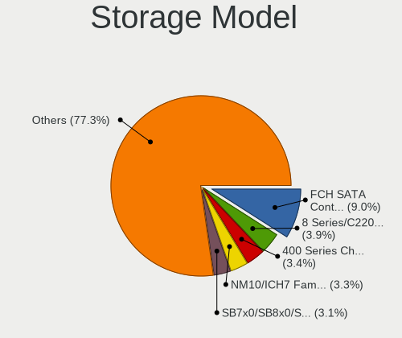
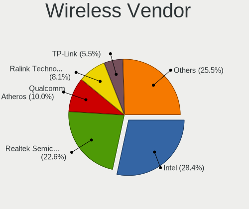
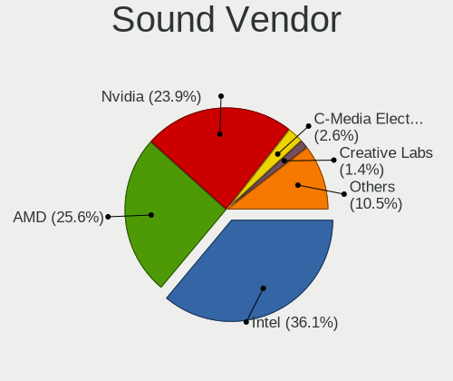

Linux - Tested Hardware & Statistics (Desktops)
-----------------------------------------------

A project to collect tested hardware configurations for Linux.

Anyone can contribute to this report by the [hw-probe](https://github.com/linuxhw/hw-probe) tool:

    sudo -E hw-probe -all -upload

Please contribute! Especially if your hardware is rare.

This report is for real hardware. Report for virtual hardware: [TestDays_VE](https://github.com/linuxhw/TestDays_VE)

Contents
--------

* [ Test Cases ](#test-cases)

* [ System ](#system)
  - [ OS                       ](#os)
  - [ OS Family                ](#os-family)
  - [ Kernel                   ](#kernel)
  - [ Kernel Family            ](#kernel-family)
  - [ Kernel Major Ver.        ](#kernel-major-ver)
  - [ Arch                     ](#arch)
  - [ DE                       ](#de)
  - [ Display Server           ](#display-server)
  - [ Display Manager          ](#display-manager)
  - [ OS Lang                  ](#os-lang)
  - [ Boot Mode                ](#boot-mode)
  - [ Filesystem               ](#filesystem)
  - [ Part. scheme             ](#part-scheme)
  - [ Dual Boot with Linux/BSD ](#dual-boot-with-linuxbsd)
  - [ Dual Boot (Win)          ](#dual-boot-win)

* [ Board ](#board)
  - [ Vendor                   ](#vendor)
  - [ Model                    ](#model)
  - [ Model Family             ](#model-family)
  - [ MFG Year                 ](#mfg-year)
  - [ Form Factor              ](#form-factor)
  - [ Secure Boot              ](#secure-boot)
  - [ Coreboot                 ](#coreboot)
  - [ RAM Size                 ](#ram-size)
  - [ RAM Used                 ](#ram-used)
  - [ Total Drives             ](#total-drives)
  - [ Has CD-ROM               ](#has-cd-rom)
  - [ Has Ethernet             ](#has-ethernet)
  - [ Has WiFi                 ](#has-wifi)
  - [ Has Bluetooth            ](#has-bluetooth)

* [ Location ](#location)
  - [ Country                  ](#country)
  - [ City                     ](#city)

* [ Drives ](#drives)
  - [ Drive Vendor             ](#drive-vendor)
  - [ Drive Model              ](#drive-model)
  - [ HDD Vendor               ](#hdd-vendor)
  - [ SSD Vendor               ](#ssd-vendor)
  - [ Drive Kind               ](#drive-kind)
  - [ Drive Connector          ](#drive-connector)
  - [ Drive Size               ](#drive-size)
  - [ Space Total              ](#space-total)
  - [ Space Used               ](#space-used)
  - [ Malfunc. Drives          ](#malfunc-drives)
  - [ Malfunc. Drive Vendor    ](#malfunc-drive-vendor)
  - [ Malfunc. HDD Vendor      ](#malfunc-hdd-vendor)
  - [ Malfunc. Drive Kind      ](#malfunc-drive-kind)
  - [ Failed Drives            ](#failed-drives)
  - [ Failed Drive Vendor      ](#failed-drive-vendor)
  - [ Drive Status             ](#drive-status)

* [ Storage controller ](#storage-controller)
  - [ Storage Vendor           ](#storage-vendor)
  - [ Storage Model            ](#storage-model)
  - [ Storage Kind             ](#storage-kind)

* [ Processor ](#processor)
  - [ CPU Vendor               ](#cpu-vendor)
  - [ CPU Model                ](#cpu-model)
  - [ CPU Model Family         ](#cpu-model-family)
  - [ CPU Cores                ](#cpu-cores)
  - [ CPU Sockets              ](#cpu-sockets)
  - [ CPU Threads              ](#cpu-threads)
  - [ CPU Op-Modes             ](#cpu-op-modes)
  - [ CPU Microcode            ](#cpu-microcode)
  - [ CPU Microarch            ](#cpu-microarch)

* [ Graphics ](#graphics)
  - [ GPU Vendor               ](#gpu-vendor)
  - [ GPU Model                ](#gpu-model)
  - [ GPU Combo                ](#gpu-combo)
  - [ GPU Driver               ](#gpu-driver)
  - [ GPU Memory               ](#gpu-memory)

* [ Monitor ](#monitor)
  - [ Monitor Vendor           ](#monitor-vendor)
  - [ Monitor Model            ](#monitor-model)
  - [ Monitor Resolution       ](#monitor-resolution)
  - [ Monitor Diagonal         ](#monitor-diagonal)
  - [ Monitor Width            ](#monitor-width)
  - [ Aspect Ratio             ](#aspect-ratio)
  - [ Monitor Area             ](#monitor-area)
  - [ Pixel Density            ](#pixel-density)
  - [ Multiple Monitors        ](#multiple-monitors)

* [ Network ](#network)
  - [ Net Controller Vendor    ](#net-controller-vendor)
  - [ Net Controller Model     ](#net-controller-model)
  - [ Wireless Vendor          ](#wireless-vendor)
  - [ Wireless Model           ](#wireless-model)
  - [ Ethernet Vendor          ](#ethernet-vendor)
  - [ Ethernet Model           ](#ethernet-model)
  - [ Net Controller Kind      ](#net-controller-kind)
  - [ Used Controller          ](#used-controller)
  - [ NICs                     ](#nics)
  - [ IPv6                     ](#ipv6)

* [ Bluetooth ](#bluetooth)
  - [ Bluetooth Vendor         ](#bluetooth-vendor)
  - [ Bluetooth Model          ](#bluetooth-model)

* [ Sound ](#sound)
  - [ Sound Vendor             ](#sound-vendor)
  - [ Sound Model              ](#sound-model)

* [ Memory ](#memory)
  - [ Memory Vendor            ](#memory-vendor)
  - [ Memory Model             ](#memory-model)
  - [ Memory Kind              ](#memory-kind)
  - [ Memory Form Factor       ](#memory-form-factor)
  - [ Memory Size              ](#memory-size)
  - [ Memory Speed             ](#memory-speed)

* [ Printers & scanners ](#printers--scanners)
  - [ Printer Vendor           ](#printer-vendor)
  - [ Printer Model            ](#printer-model)
  - [ Scanner Vendor           ](#scanner-vendor)
  - [ Scanner Model            ](#scanner-model)

* [ Camera ](#camera)
  - [ Camera Vendor            ](#camera-vendor)
  - [ Camera Model             ](#camera-model)

* [ Security ](#security)
  - [ Fingerprint Vendor       ](#fingerprint-vendor)
  - [ Fingerprint Model        ](#fingerprint-model)
  - [ Chipcard Vendor          ](#chipcard-vendor)
  - [ Chipcard Model           ](#chipcard-model)

* [ Unsupported ](#unsupported)
  - [ Unsupported Devices      ](#unsupported-devices)
  - [ Unsupported Device Types ](#unsupported-device-types)

Test Cases
----------

Total: 145931

| Vendor        | Model                       | Probe                                                      | Date         |
|---------------|-----------------------------|------------------------------------------------------------|--------------|
| HP            | 339A                        | [e8e666af64](https://linux-hardware.org/?probe=e8e666af64) | Feb 02, 2024 |
| ASUSTek       | M4N72-E                     | [815b251540](https://linux-hardware.org/?probe=815b251540) | Feb 02, 2024 |
| MSI           | Z77A-GD65                   | [42366a1fa1](https://linux-hardware.org/?probe=42366a1fa1) | Feb 02, 2024 |
| HP            | 3397                        | [f5180bd918](https://linux-hardware.org/?probe=f5180bd918) | Feb 02, 2024 |
| Unknown       | DH61BR G32662-203           | [06cb46d18c](https://linux-hardware.org/?probe=06cb46d18c) | Feb 02, 2024 |
| ASUSTek       | P7P55D-E                    | [7173101a68](https://linux-hardware.org/?probe=7173101a68) | Feb 02, 2024 |
| XDO.AI        | Pantera Pico PC             | [f5069feac3](https://linux-hardware.org/?probe=f5069feac3) | Feb 02, 2024 |
| ASRock        | X670E Pro RS                | [fd02477c14](https://linux-hardware.org/?probe=fd02477c14) | Feb 02, 2024 |
| Dell          | 0YC03K A03                  | [e6d016f309](https://linux-hardware.org/?probe=e6d016f309) | Feb 02, 2024 |
| Unknown       | DH61BR G32662-203           | [7496b90e09](https://linux-hardware.org/?probe=7496b90e09) | Feb 02, 2024 |
| Dell          | 0D28YY A01                  | [21e722f277](https://linux-hardware.org/?probe=21e722f277) | Feb 02, 2024 |
| HP            | 83E9                        | [a140a989be](https://linux-hardware.org/?probe=a140a989be) | Feb 02, 2024 |
| ASUSTek       | SABERTOOTH Z77              | [75c314c9bb](https://linux-hardware.org/?probe=75c314c9bb) | Feb 02, 2024 |
| Medion        | Z170H4-EA                   | [17c714c6b5](https://linux-hardware.org/?probe=17c714c6b5) | Feb 02, 2024 |
| ASUSTek       | TUF B450-PLUS GAMING        | [4bcae97baa](https://linux-hardware.org/?probe=4bcae97baa) | Feb 02, 2024 |
| Gigabyte      | AB350M-Gaming 3-CF          | [ef41c12950](https://linux-hardware.org/?probe=ef41c12950) | Feb 02, 2024 |
| Intel         | X99-P4 V5.1                 | [092e51b68e](https://linux-hardware.org/?probe=092e51b68e) | Feb 02, 2024 |
| HP            | 8055                        | [1eec2a37ce](https://linux-hardware.org/?probe=1eec2a37ce) | Feb 02, 2024 |
| ASRock        | Z77 Pro3                    | [f1d8db0641](https://linux-hardware.org/?probe=f1d8db0641) | Feb 02, 2024 |
| ASRock        | H61M-DGS R2.0               | [fed06b0a3c](https://linux-hardware.org/?probe=fed06b0a3c) | Feb 02, 2024 |
| Gigabyte      | B550M AORUS PRO-P           | [1f0ece5a8b](https://linux-hardware.org/?probe=1f0ece5a8b) | Feb 02, 2024 |
| Apple         | Mac-F221BEC8                | [7e71a3a029](https://linux-hardware.org/?probe=7e71a3a029) | Feb 02, 2024 |
| Gigabyte      | B550M AORUS PRO-P           | [11b2f337e7](https://linux-hardware.org/?probe=11b2f337e7) | Feb 02, 2024 |
| HP            | 1497                        | [ae90a32790](https://linux-hardware.org/?probe=ae90a32790) | Feb 02, 2024 |
| Delovoy of... | LPGR.469559.018 V1.0        | [4ed2bd72be](https://linux-hardware.org/?probe=4ed2bd72be) | Feb 02, 2024 |
| ASUSTek       | PRIME X370-PRO              | [58d150eef2](https://linux-hardware.org/?probe=58d150eef2) | Feb 02, 2024 |
| Gigabyte      | F2A75M-D3H                  | [a30e9bd132](https://linux-hardware.org/?probe=a30e9bd132) | Feb 02, 2024 |
| ASUSTek       | H110M-R                     | [2902d23de2](https://linux-hardware.org/?probe=2902d23de2) | Feb 02, 2024 |
| Dell          | 0NK5PH A00                  | [211c3d7db6](https://linux-hardware.org/?probe=211c3d7db6) | Feb 02, 2024 |
| Pegatron      | IPM41-D3                    | [5884d40085](https://linux-hardware.org/?probe=5884d40085) | Feb 02, 2024 |
| ASUSTek       | ROG STRIX B650E-E GAMING... | [97d6952c52](https://linux-hardware.org/?probe=97d6952c52) | Feb 02, 2024 |
| Gigabyte      | G31M-S2C                    | [b0e201e74a](https://linux-hardware.org/?probe=b0e201e74a) | Feb 02, 2024 |
| Sapphire      | PI-AM3RS760G2               | [9b2e938cb4](https://linux-hardware.org/?probe=9b2e938cb4) | Feb 02, 2024 |
| HP            | 859C                        | [bc1cc805c6](https://linux-hardware.org/?probe=bc1cc805c6) | Feb 02, 2024 |
| Gigabyte      | H61M-S1                     | [e7f247621c](https://linux-hardware.org/?probe=e7f247621c) | Feb 02, 2024 |
| HP            | 18E7                        | [84caef4dde](https://linux-hardware.org/?probe=84caef4dde) | Feb 02, 2024 |
| Gigabyte      | Q87M-D2H                    | [4c5e48c75f](https://linux-hardware.org/?probe=4c5e48c75f) | Feb 02, 2024 |
| Gigabyte      | B450 AORUS ELITE            | [aaebf4ea23](https://linux-hardware.org/?probe=aaebf4ea23) | Feb 02, 2024 |
| Inventec      | DQ Class A02                | [4cb447dae2](https://linux-hardware.org/?probe=4cb447dae2) | Feb 02, 2024 |
| Gigabyte      | GA-990FXA-UD7               | [66768ccdf7](https://linux-hardware.org/?probe=66768ccdf7) | Feb 02, 2024 |
| Gigabyte      | B560M H                     | [84e64db583](https://linux-hardware.org/?probe=84e64db583) | Feb 02, 2024 |
| ASUSTek       | M5A97 EVO R2.0              | [4009a96bd4](https://linux-hardware.org/?probe=4009a96bd4) | Feb 02, 2024 |
| ASRock        | 990FX Extreme4              | [b412a671e4](https://linux-hardware.org/?probe=b412a671e4) | Feb 02, 2024 |
| Lenovo        | 312A NOK                    | [366174cd75](https://linux-hardware.org/?probe=366174cd75) | Feb 02, 2024 |
| ASRock        | H61M-HVS                    | [a41e650c9c](https://linux-hardware.org/?probe=a41e650c9c) | Feb 02, 2024 |
| ASUSTek       | M5A97 EVO R2.0              | [ab60a0a3b4](https://linux-hardware.org/?probe=ab60a0a3b4) | Feb 02, 2024 |
| ASUSTek       | B85M-G                      | [cd9f6ee87d](https://linux-hardware.org/?probe=cd9f6ee87d) | Feb 02, 2024 |
| ASUSTek       | Z170 PRO GAMING             | [b43380d687](https://linux-hardware.org/?probe=b43380d687) | Feb 02, 2024 |
| Lenovo        | MAHOBAY 0B98401 PRO         | [3074b7c2a6](https://linux-hardware.org/?probe=3074b7c2a6) | Feb 02, 2024 |
| ASRock        | H61M-DGS R2.0               | [a757eacac1](https://linux-hardware.org/?probe=a757eacac1) | Feb 02, 2024 |
| ASRock        | 970M Pro3                   | [cf54a4b360](https://linux-hardware.org/?probe=cf54a4b360) | Feb 02, 2024 |
| INP           | i1000BTS                    | [3148738295](https://linux-hardware.org/?probe=3148738295) | Feb 02, 2024 |
| Lenovo        | NO DPK                      | [ce1ff05aed](https://linux-hardware.org/?probe=ce1ff05aed) | Feb 02, 2024 |
| ASRock        | X300-ITX                    | [3390b15018](https://linux-hardware.org/?probe=3390b15018) | Feb 02, 2024 |
| Dell          | 05XGC8 A01                  | [29ae38936a](https://linux-hardware.org/?probe=29ae38936a) | Feb 02, 2024 |
| ASUSTek       | PRIME H510M-R               | [4196d911d2](https://linux-hardware.org/?probe=4196d911d2) | Feb 02, 2024 |
| HP            | 1998                        | [0056c33526](https://linux-hardware.org/?probe=0056c33526) | Feb 02, 2024 |
| ASUSTek       | ROG CROSSHAIR X670E HERO    | [9d6e9d5720](https://linux-hardware.org/?probe=9d6e9d5720) | Feb 02, 2024 |
| Fujitsu       | D3523-Ax S26361-D3523-Ax    | [fefabce2b4](https://linux-hardware.org/?probe=fefabce2b4) | Feb 02, 2024 |
| Gigabyte      | Z170X-Gaming 7              | [656bb7827a](https://linux-hardware.org/?probe=656bb7827a) | Feb 02, 2024 |
| Foxconn       | 2ADA                        | [e92639ba10](https://linux-hardware.org/?probe=e92639ba10) | Feb 02, 2024 |
| ASUSTek       | P5Q                         | [63522c9a09](https://linux-hardware.org/?probe=63522c9a09) | Feb 02, 2024 |
| MSI           | X99A RAIDER                 | [158530e4dc](https://linux-hardware.org/?probe=158530e4dc) | Feb 02, 2024 |
| Gigabyte      | A320M-S2H V2-CF             | [f38bbe7c82](https://linux-hardware.org/?probe=f38bbe7c82) | Feb 02, 2024 |
| Lenovo        | SHARKBAY NOK                | [f4caef7bf1](https://linux-hardware.org/?probe=f4caef7bf1) | Feb 02, 2024 |
| ASRock        | A320M-ITX                   | [7c3ebbb23c](https://linux-hardware.org/?probe=7c3ebbb23c) | Feb 02, 2024 |
| Gigabyte      | A520 AORUS ELITE            | [075ee0ca67](https://linux-hardware.org/?probe=075ee0ca67) | Feb 02, 2024 |
| ASUSTek       | TUF Gaming B450M-PRO S      | [654e691a5d](https://linux-hardware.org/?probe=654e691a5d) | Feb 02, 2024 |
| ASUSTek       | TUF Gaming B450M-PRO S      | [279e68de12](https://linux-hardware.org/?probe=279e68de12) | Feb 02, 2024 |
| HP            | 158A                        | [1ec6b139ac](https://linux-hardware.org/?probe=1ec6b139ac) | Feb 02, 2024 |
| HP            | 09E8h                       | [413788d555](https://linux-hardware.org/?probe=413788d555) | Feb 02, 2024 |
| MSI           | B450 GAMING PLUS MAX        | [e8554aab57](https://linux-hardware.org/?probe=e8554aab57) | Feb 02, 2024 |
| ASRock        | B660-ITX                    | [3749b9145b](https://linux-hardware.org/?probe=3749b9145b) | Feb 02, 2024 |
| Gigabyte      | GA-990FXA-UD7               | [4726161c35](https://linux-hardware.org/?probe=4726161c35) | Feb 02, 2024 |
| ASUSTek       | F2A85-M LE                  | [680ba020e2](https://linux-hardware.org/?probe=680ba020e2) | Feb 02, 2024 |
| ASRock        | B560M-ITX/ac                | [9ed6c67efe](https://linux-hardware.org/?probe=9ed6c67efe) | Feb 02, 2024 |
| Lenovo        | SHARKBAY 0B98401 PRO        | [62dc25b8b6](https://linux-hardware.org/?probe=62dc25b8b6) | Feb 02, 2024 |
| Dell          | 0WMJ54 A00                  | [d6c3c89e3d](https://linux-hardware.org/?probe=d6c3c89e3d) | Feb 02, 2024 |
| HP            | 3647h                       | [5f1a400767](https://linux-hardware.org/?probe=5f1a400767) | Feb 02, 2024 |
| MSI           | B450 GAMING PLUS MAX        | [73e32179ef](https://linux-hardware.org/?probe=73e32179ef) | Feb 02, 2024 |
| Gigabyte      | AX370-Gaming K7             | [c2514048e9](https://linux-hardware.org/?probe=c2514048e9) | Feb 02, 2024 |
| ASRock        | H77 Pro4-M                  | [794e5341d9](https://linux-hardware.org/?probe=794e5341d9) | Feb 01, 2024 |
| MSI           | B550 GAMING GEN3            | [e0f8f7bf56](https://linux-hardware.org/?probe=e0f8f7bf56) | Feb 01, 2024 |
| Biostar       | A10N-9830E                  | [672938d127](https://linux-hardware.org/?probe=672938d127) | Feb 01, 2024 |
| ASUSTek       | H110M-D                     | [287648c7d3](https://linux-hardware.org/?probe=287648c7d3) | Feb 01, 2024 |
| ASUSTek       | PRIME X470-PRO              | [50c9a44280](https://linux-hardware.org/?probe=50c9a44280) | Feb 01, 2024 |
| Biostar       | IH61MF-Q5                   | [1087f70019](https://linux-hardware.org/?probe=1087f70019) | Feb 01, 2024 |
| Lenovo        | SHARKBAY SDK0E50510 WIN     | [fc6230e374](https://linux-hardware.org/?probe=fc6230e374) | Feb 01, 2024 |
| Dell          | 0YF8P5 A00                  | [c3510619ed](https://linux-hardware.org/?probe=c3510619ed) | Feb 01, 2024 |
| ASUSTek       | TUF Gaming B550-PLUS        | [8e3680cd5d](https://linux-hardware.org/?probe=8e3680cd5d) | Feb 01, 2024 |
| MSI           | B450-A PRO                  | [10f58dc52e](https://linux-hardware.org/?probe=10f58dc52e) | Feb 01, 2024 |
| Intel         | DH61HO AAG62445-102         | [f6db94d707](https://linux-hardware.org/?probe=f6db94d707) | Feb 01, 2024 |
| Dell          | 0215PR A05                  | [05183a71ef](https://linux-hardware.org/?probe=05183a71ef) | Feb 01, 2024 |
| Gigabyte      | A320M-S2H-CF                | [ef0de660b6](https://linux-hardware.org/?probe=ef0de660b6) | Feb 01, 2024 |
| Dell          | 06X1TJ A00                  | [f3cb8642e0](https://linux-hardware.org/?probe=f3cb8642e0) | Feb 01, 2024 |
| Intel         | DH61HO AAG62445-102         | [4752f66f57](https://linux-hardware.org/?probe=4752f66f57) | Feb 01, 2024 |
| ASRock        | B550M Pro4                  | [ce95a21f31](https://linux-hardware.org/?probe=ce95a21f31) | Feb 01, 2024 |
| ASUSTek       | P5K                         | [1414d10ffb](https://linux-hardware.org/?probe=1414d10ffb) | Feb 01, 2024 |
| MSI           | Z370 PC PRO                 | [b0a50105f7](https://linux-hardware.org/?probe=b0a50105f7) | Feb 01, 2024 |
| MSI           | MPG X570 GAMING PLUS        | [0d5790b907](https://linux-hardware.org/?probe=0d5790b907) | Feb 01, 2024 |
| HP            | 2B34                        | [8d74dccabc](https://linux-hardware.org/?probe=8d74dccabc) | Feb 01, 2024 |
| ASUSTek       | ROG STRIX B350-F GAMING     | [6c75053ee6](https://linux-hardware.org/?probe=6c75053ee6) | Feb 01, 2024 |
| MSI           | MPG X570 GAMING PLUS        | [5ec61e07a8](https://linux-hardware.org/?probe=5ec61e07a8) | Feb 01, 2024 |
| ASRock        | 880GMH/U3S3                 | [cccd54eb20](https://linux-hardware.org/?probe=cccd54eb20) | Feb 01, 2024 |
| ASUSTek       | PRIME B560M-K               | [007e574396](https://linux-hardware.org/?probe=007e574396) | Feb 01, 2024 |
| ASUSTek       | PRIME B560M-K               | [9d4315d3e3](https://linux-hardware.org/?probe=9d4315d3e3) | Feb 01, 2024 |
| Gigabyte      | Z790 AORUS PRO X            | [de6afda636](https://linux-hardware.org/?probe=de6afda636) | Feb 01, 2024 |
| Dell          | 0GDG8Y A00                  | [2cca1daa38](https://linux-hardware.org/?probe=2cca1daa38) | Feb 01, 2024 |
| Gigabyte      | X670 AORUS ELITE AX         | [f0bd42b414](https://linux-hardware.org/?probe=f0bd42b414) | Feb 01, 2024 |
| ASUSTek       | PRIME B460M-A               | [40c53134dc](https://linux-hardware.org/?probe=40c53134dc) | Feb 01, 2024 |
| ASUSTek       | TUF Z390-PLUS GAMING        | [f708da8a98](https://linux-hardware.org/?probe=f708da8a98) | Feb 01, 2024 |
| Gigabyte      | B650 GAMING X AX            | [5bf97512a7](https://linux-hardware.org/?probe=5bf97512a7) | Feb 01, 2024 |
| Pegatron      | IPM41-D3                    | [7969244295](https://linux-hardware.org/?probe=7969244295) | Feb 01, 2024 |
| Dell          | 0T568R A00                  | [4ce5e16aa2](https://linux-hardware.org/?probe=4ce5e16aa2) | Feb 01, 2024 |
| HP            | 843B                        | [161ffc2ea0](https://linux-hardware.org/?probe=161ffc2ea0) | Feb 01, 2024 |
| Dell          | 0G214D A00                  | [2973076de3](https://linux-hardware.org/?probe=2973076de3) | Feb 01, 2024 |
| Shenzhen M... | F6BFC                       | [3d1b9568a9](https://linux-hardware.org/?probe=3d1b9568a9) | Feb 01, 2024 |
| ASRock        | X370 Gaming X               | [54fa92de97](https://linux-hardware.org/?probe=54fa92de97) | Feb 01, 2024 |
| Unknown       | Unknown                     | [4fa0768f2b](https://linux-hardware.org/?probe=4fa0768f2b) | Feb 01, 2024 |
| Gigabyte      | X570 AORUS ELITE WIFI       | [7d3d8c9a2f](https://linux-hardware.org/?probe=7d3d8c9a2f) | Feb 01, 2024 |
| Unknown       | Unknown                     | [69b18742b6](https://linux-hardware.org/?probe=69b18742b6) | Feb 01, 2024 |
| Gigabyte      | EP43T-UD3L                  | [934c3f974a](https://linux-hardware.org/?probe=934c3f974a) | Feb 01, 2024 |
| ASUSTek       | PRIME B450M-A               | [5befaf642f](https://linux-hardware.org/?probe=5befaf642f) | Feb 01, 2024 |
| Dell          | 0N0992 A00                  | [b1aae1e53b](https://linux-hardware.org/?probe=b1aae1e53b) | Feb 01, 2024 |
| MSI           | B450-A PRO                  | [aecf5f7bf1](https://linux-hardware.org/?probe=aecf5f7bf1) | Feb 01, 2024 |
| Dell          | 0TDG4V A01                  | [d921cc13e3](https://linux-hardware.org/?probe=d921cc13e3) | Feb 01, 2024 |
| MSI           | Z77A-GD65                   | [fd7e7fcc3e](https://linux-hardware.org/?probe=fd7e7fcc3e) | Feb 01, 2024 |
| Apple         | Mac-F4208DC8 PVT            | [bce380880a](https://linux-hardware.org/?probe=bce380880a) | Feb 01, 2024 |
| ASRock        | X370M-HDV                   | [64edf5f2dc](https://linux-hardware.org/?probe=64edf5f2dc) | Feb 01, 2024 |
| Lenovo        | Annapurna CRB 0B98401 PR... | [1cee0ab81d](https://linux-hardware.org/?probe=1cee0ab81d) | Feb 01, 2024 |
| Gigabyte      | Z390 AORUS PRO WIFI-CF      | [a45a2b4f8e](https://linux-hardware.org/?probe=a45a2b4f8e) | Feb 01, 2024 |
| EBN           | MA1N                        | [302ea43954](https://linux-hardware.org/?probe=302ea43954) | Feb 01, 2024 |
| ASRock        | G41M-VS3                    | [df1c8c0da3](https://linux-hardware.org/?probe=df1c8c0da3) | Feb 01, 2024 |
| HP            | 870C                        | [14801c4f80](https://linux-hardware.org/?probe=14801c4f80) | Feb 01, 2024 |
| Dell          | 09KPNV A01                  | [b6ba043767](https://linux-hardware.org/?probe=b6ba043767) | Feb 01, 2024 |
| ASUSTek       | M4A78-VM                    | [cc37c1b937](https://linux-hardware.org/?probe=cc37c1b937) | Feb 01, 2024 |
| Gigabyte      | G41MT-D3                    | [88c563b03e](https://linux-hardware.org/?probe=88c563b03e) | Feb 01, 2024 |
| ASUSTek       | P5B-Deluxe                  | [b30373632d](https://linux-hardware.org/?probe=b30373632d) | Feb 01, 2024 |
| Gigabyte      | X99P-SLI-CF                 | [95705bca92](https://linux-hardware.org/?probe=95705bca92) | Feb 01, 2024 |
| MSI           | X99A RAIDER                 | [3953592045](https://linux-hardware.org/?probe=3953592045) | Feb 01, 2024 |
| Gigabyte      | B760M GAMING X DDR4         | [855d31073a](https://linux-hardware.org/?probe=855d31073a) | Feb 01, 2024 |
| MSI           | B550-A PRO                  | [c211b49a95](https://linux-hardware.org/?probe=c211b49a95) | Feb 01, 2024 |
| ASUSTek       | ProArt B550-CREATOR         | [52f18f604d](https://linux-hardware.org/?probe=52f18f604d) | Feb 01, 2024 |
| HP            | 8598                        | [cc6faa2bfa](https://linux-hardware.org/?probe=cc6faa2bfa) | Feb 01, 2024 |
| HP            | 0B40h                       | [d165885fbf](https://linux-hardware.org/?probe=d165885fbf) | Feb 01, 2024 |
| Dell          | 0V8WGR A00                  | [9762a633ab](https://linux-hardware.org/?probe=9762a633ab) | Feb 01, 2024 |
| MSI           | X470 GAMING PRO CARBON      | [9d2088ace3](https://linux-hardware.org/?probe=9d2088ace3) | Feb 01, 2024 |
| Acer          | Veriton X4620G v1.0         | [0ce3db389e](https://linux-hardware.org/?probe=0ce3db389e) | Feb 01, 2024 |
| Lenovo        | MAHOBAY 0B98401 PRO         | [3cedb3c573](https://linux-hardware.org/?probe=3cedb3c573) | Feb 01, 2024 |
| MSI           | A520M-A PRO                 | [a58037b70a](https://linux-hardware.org/?probe=a58037b70a) | Feb 01, 2024 |
| ASUSTek       | A68HM-PLUS                  | [b00734a23e](https://linux-hardware.org/?probe=b00734a23e) | Feb 01, 2024 |
| Gigabyte      | AB350M-D3H-CF               | [d9345d1a97](https://linux-hardware.org/?probe=d9345d1a97) | Feb 01, 2024 |
| MSI           | B760 GAMING PLUS WIFI       | [a5425cfc63](https://linux-hardware.org/?probe=a5425cfc63) | Feb 01, 2024 |
| MSI           | B760 GAMING PLUS WIFI       | [67539ba367](https://linux-hardware.org/?probe=67539ba367) | Feb 01, 2024 |
| MSI           | Z370-A PRO                  | [d012afeb56](https://linux-hardware.org/?probe=d012afeb56) | Feb 01, 2024 |
| HC Technol... | HCAR5000-MI                 | [f6051e0b06](https://linux-hardware.org/?probe=f6051e0b06) | Feb 01, 2024 |
| ASUSTek       | ROG STRIX B360-F GAMING     | [ad0630a0fc](https://linux-hardware.org/?probe=ad0630a0fc) | Feb 01, 2024 |
| ASUSTek       | TUF Gaming X570-PLUS        | [f7bb58fb95](https://linux-hardware.org/?probe=f7bb58fb95) | Feb 01, 2024 |
| ASUSTek       | PRIME B760-PLUS D4          | [d9355c6146](https://linux-hardware.org/?probe=d9355c6146) | Feb 01, 2024 |
| Gigabyte      | B450M K-CF                  | [c58dd08065](https://linux-hardware.org/?probe=c58dd08065) | Jan 31, 2024 |
| Intel         | Alder Lake-H PCH E1.1G      | [fa7a5b2aa3](https://linux-hardware.org/?probe=fa7a5b2aa3) | Jan 31, 2024 |
| ASUSTek       | PRIME B350-PLUS             | [7cd644d30e](https://linux-hardware.org/?probe=7cd644d30e) | Jan 31, 2024 |
| Foxconn       | 9657MA                      | [6b2e0b2ae9](https://linux-hardware.org/?probe=6b2e0b2ae9) | Jan 31, 2024 |
| Intel         | B75                         | [2984342e49](https://linux-hardware.org/?probe=2984342e49) | Jan 31, 2024 |
| ASUSTek       | PRIME B650-PLUS             | [c83dcb11ca](https://linux-hardware.org/?probe=c83dcb11ca) | Jan 31, 2024 |
| ASUSTek       | H110M-A                     | [ef9ec58561](https://linux-hardware.org/?probe=ef9ec58561) | Jan 31, 2024 |
| Gigabyte      | GA-880GA-UD3H               | [343413d95b](https://linux-hardware.org/?probe=343413d95b) | Jan 31, 2024 |
| HP            | 8053                        | [d4cc3a7d7d](https://linux-hardware.org/?probe=d4cc3a7d7d) | Jan 31, 2024 |
| ASUSTek       | PRIME A320M-R               | [c85924bf6f](https://linux-hardware.org/?probe=c85924bf6f) | Jan 31, 2024 |
| ASRock        | A320M-HDV R4.0              | [9262af6ace](https://linux-hardware.org/?probe=9262af6ace) | Jan 31, 2024 |
| Unknown       | Unknown                     | [66102cc055](https://linux-hardware.org/?probe=66102cc055) | Jan 31, 2024 |
| NZXT          | N7 B650E                    | [acb00e1425](https://linux-hardware.org/?probe=acb00e1425) | Jan 31, 2024 |
| Supermicro    | X10DRU-i+A                  | [f2881b94b0](https://linux-hardware.org/?probe=f2881b94b0) | Jan 31, 2024 |
| Gigabyte      | Z87X-UD4H-CF                | [f2e88dc5a7](https://linux-hardware.org/?probe=f2e88dc5a7) | Jan 31, 2024 |
| ASUSTek       | P8Z77-V LX                  | [011fd25549](https://linux-hardware.org/?probe=011fd25549) | Jan 31, 2024 |
| Gigabyte      | F2A88XN-WIFI                | [aad32e443a](https://linux-hardware.org/?probe=aad32e443a) | Jan 31, 2024 |
| Gigabyte      | Q87M-D2H                    | [78ef1fbd6c](https://linux-hardware.org/?probe=78ef1fbd6c) | Jan 31, 2024 |
| ASUSTek       | PRIME A320M-R               | [4995dfcd57](https://linux-hardware.org/?probe=4995dfcd57) | Jan 31, 2024 |
| Dell          | 0YJPT1 A00                  | [014e8534ab](https://linux-hardware.org/?probe=014e8534ab) | Jan 31, 2024 |
| MSI           | MS-7817                     | [e67644d160](https://linux-hardware.org/?probe=e67644d160) | Jan 31, 2024 |
| Lenovo        | ThinkCentre M55p 8808D8U    | [763dd9417b](https://linux-hardware.org/?probe=763dd9417b) | Jan 31, 2024 |
| Medion        | TJ4125                      | [2705de4986](https://linux-hardware.org/?probe=2705de4986) | Jan 31, 2024 |
| Gigabyte      | B85M-D3H                    | [059252dc92](https://linux-hardware.org/?probe=059252dc92) | Jan 31, 2024 |
| Gigabyte      | B550M K                     | [1ead3418ae](https://linux-hardware.org/?probe=1ead3418ae) | Jan 31, 2024 |
| Intel         | DH55PJ AAE93812-302         | [acc04ef6ef](https://linux-hardware.org/?probe=acc04ef6ef) | Jan 31, 2024 |
| ASUSTek       | M5A97 R2.0                  | [bf9814808f](https://linux-hardware.org/?probe=bf9814808f) | Jan 31, 2024 |
| Biostar       | H610MH                      | [fb0234d450](https://linux-hardware.org/?probe=fb0234d450) | Jan 31, 2024 |
| ASRock        | B550M Pro4                  | [562a7e84b6](https://linux-hardware.org/?probe=562a7e84b6) | Jan 31, 2024 |
| ASUSTek       | P5K                         | [2835d63be5](https://linux-hardware.org/?probe=2835d63be5) | Jan 31, 2024 |
| ASUSTek       | P5K                         | [5db8fad897](https://linux-hardware.org/?probe=5db8fad897) | Jan 31, 2024 |
| ASUSTek       | B85M-K                      | [3058093889](https://linux-hardware.org/?probe=3058093889) | Jan 31, 2024 |
| Gigabyte      | B365M DS3H                  | [bb6bab84d0](https://linux-hardware.org/?probe=bb6bab84d0) | Jan 31, 2024 |
| Gigabyte      | B560M DS3H AC               | [81a39a795c](https://linux-hardware.org/?probe=81a39a795c) | Jan 31, 2024 |
| Gigabyte      | B365M DS3H                  | [8a8a84c18b](https://linux-hardware.org/?probe=8a8a84c18b) | Jan 31, 2024 |
| ASUSTek       | TUF Gaming B650M-PLUS       | [0b234564e9](https://linux-hardware.org/?probe=0b234564e9) | Jan 31, 2024 |
| Dell          | 018D1Y A00                  | [28a3a41219](https://linux-hardware.org/?probe=28a3a41219) | Jan 31, 2024 |
| Shenzhen M... | F6BFC                       | [c7db1d88f4](https://linux-hardware.org/?probe=c7db1d88f4) | Jan 31, 2024 |
| ASRock        | B450M Pro4                  | [5a77cd3bbb](https://linux-hardware.org/?probe=5a77cd3bbb) | Jan 31, 2024 |
| Dell          | 0TY565                      | [7b0be6d329](https://linux-hardware.org/?probe=7b0be6d329) | Jan 31, 2024 |
| ASRock        | X99 Taichi                  | [1799faad1e](https://linux-hardware.org/?probe=1799faad1e) | Jan 31, 2024 |
| ASUSTek       | A68HM-PLUS                  | [6361608cec](https://linux-hardware.org/?probe=6361608cec) | Jan 31, 2024 |
| Dell          | 0TY565                      | [a1dd2e6d5d](https://linux-hardware.org/?probe=a1dd2e6d5d) | Jan 31, 2024 |
| ASUSTek       | B85M-G                      | [c14af0c776](https://linux-hardware.org/?probe=c14af0c776) | Jan 31, 2024 |
| Unknown       | T3 MRD                      | [744984b9d3](https://linux-hardware.org/?probe=744984b9d3) | Jan 31, 2024 |
| Biostar       | NF61S-M2A                   | [4b42e5cd37](https://linux-hardware.org/?probe=4b42e5cd37) | Jan 31, 2024 |
| Dell          | 06D7TR A01                  | [34d3eaffac](https://linux-hardware.org/?probe=34d3eaffac) | Jan 31, 2024 |
| ASUSTek       | PRIME A320M-K               | [348cad0405](https://linux-hardware.org/?probe=348cad0405) | Jan 31, 2024 |
| MSI           | MAG B550M MORTAR            | [7ad6a0ecce](https://linux-hardware.org/?probe=7ad6a0ecce) | Jan 31, 2024 |
| ASUSTek       | PRIME B450M-A               | [20471f1e71](https://linux-hardware.org/?probe=20471f1e71) | Jan 31, 2024 |
| Fujitsu       | D3401-A1 S26361-D3401-A1    | [2360c2cf38](https://linux-hardware.org/?probe=2360c2cf38) | Jan 31, 2024 |
| Intel         | SKYBAY                      | [1e706b6589](https://linux-hardware.org/?probe=1e706b6589) | Jan 31, 2024 |
| Intel         | DG41AN AAE92991-401         | [5e520c92ca](https://linux-hardware.org/?probe=5e520c92ca) | Jan 31, 2024 |
| Lenovo        | ThinkCentre M91p 4518RQ4    | [ae147923cd](https://linux-hardware.org/?probe=ae147923cd) | Jan 31, 2024 |
| ASUSTek       | Z97I-PLUS                   | [32200add92](https://linux-hardware.org/?probe=32200add92) | Jan 31, 2024 |
| Fujitsu       | D2778-B1 S26361-D2778-B1    | [2f08f48285](https://linux-hardware.org/?probe=2f08f48285) | Jan 31, 2024 |
| ASUSTek       | Z97I-PLUS                   | [38cafaade5](https://linux-hardware.org/?probe=38cafaade5) | Jan 31, 2024 |
| Intel         | SKYBAY                      | [4420198abc](https://linux-hardware.org/?probe=4420198abc) | Jan 31, 2024 |
| MSI           | H110M PRO-VD                | [29fd183b3b](https://linux-hardware.org/?probe=29fd183b3b) | Jan 31, 2024 |
| Intel         | SKYBAY                      | [9d6bc7afb3](https://linux-hardware.org/?probe=9d6bc7afb3) | Jan 31, 2024 |
| MSI           | A520M-A PRO                 | [13a76a1fcf](https://linux-hardware.org/?probe=13a76a1fcf) | Jan 31, 2024 |
| Unknown       | T3 MRD                      | [e3b3bc071f](https://linux-hardware.org/?probe=e3b3bc071f) | Jan 31, 2024 |
| MSI           | B550-A PRO                  | [85c2cd9371](https://linux-hardware.org/?probe=85c2cd9371) | Jan 31, 2024 |
| Gigabyte      | Z390 AORUS PRO WIFI-CF      | [bdb06264ab](https://linux-hardware.org/?probe=bdb06264ab) | Jan 31, 2024 |
| Lenovo        | SHARKBAY 0B98401 WIN        | [75d67d22e1](https://linux-hardware.org/?probe=75d67d22e1) | Jan 31, 2024 |
| ASUSTek       | ProArt Z490-CREATOR 10G     | [54beeb17dc](https://linux-hardware.org/?probe=54beeb17dc) | Jan 31, 2024 |
| ASUSTek       | TUF Gaming B550M-PLUS       | [f8d19ad525](https://linux-hardware.org/?probe=f8d19ad525) | Jan 31, 2024 |
| ASUSTek       | ProArt Z490-CREATOR 10G     | [65272ffc77](https://linux-hardware.org/?probe=65272ffc77) | Jan 31, 2024 |
| Lenovo        | SHARKBAY 0B98401 WIN        | [19f18a7bbc](https://linux-hardware.org/?probe=19f18a7bbc) | Jan 31, 2024 |
| HP            | 8B3C A                      | [12ec418267](https://linux-hardware.org/?probe=12ec418267) | Jan 31, 2024 |
| ASUSTek       | PRO H410M-C                 | [ab001c7490](https://linux-hardware.org/?probe=ab001c7490) | Jan 31, 2024 |
| ASRock        | A520M-HDV                   | [fa42ae183a](https://linux-hardware.org/?probe=fa42ae183a) | Jan 31, 2024 |
| Dell          | 00VTMF A01                  | [3298485dd9](https://linux-hardware.org/?probe=3298485dd9) | Jan 31, 2024 |
| Lenovo        | ThinkStation C20 4263B84    | [084244999d](https://linux-hardware.org/?probe=084244999d) | Jan 31, 2024 |
| MSI           | Z590-A PRO                  | [21e597196f](https://linux-hardware.org/?probe=21e597196f) | Jan 31, 2024 |
| ASRock        | A520M-HDV                   | [23be9724fe](https://linux-hardware.org/?probe=23be9724fe) | Jan 31, 2024 |
| ASUSTek       | ROG STRIX X670E-A GAMING... | [0f0dad6ef2](https://linux-hardware.org/?probe=0f0dad6ef2) | Jan 31, 2024 |
| MSI           | X99A RAIDER                 | [ffaf5dab37](https://linux-hardware.org/?probe=ffaf5dab37) | Jan 31, 2024 |
| ASRock        | B550M-ITX/ac                | [5996127f6c](https://linux-hardware.org/?probe=5996127f6c) | Jan 31, 2024 |
| Lenovo        | NO DPK                      | [fd4b4dd902](https://linux-hardware.org/?probe=fd4b4dd902) | Jan 31, 2024 |
| Intel         | B75                         | [000ad7f808](https://linux-hardware.org/?probe=000ad7f808) | Jan 31, 2024 |
| MSI           | PRO X670-P WIFI             | [2640847c88](https://linux-hardware.org/?probe=2640847c88) | Jan 31, 2024 |
| ASUSTek       | TUF Gaming B550M-PLUS       | [a3277bc7da](https://linux-hardware.org/?probe=a3277bc7da) | Jan 31, 2024 |
| Gigabyte      | EP45-UD3R                   | [45a5318a64](https://linux-hardware.org/?probe=45a5318a64) | Jan 31, 2024 |
| Dell          | 0FM586                      | [a66d080473](https://linux-hardware.org/?probe=a66d080473) | Jan 31, 2024 |
| ASUSTek       | P6T WS PRO                  | [21d91717a1](https://linux-hardware.org/?probe=21d91717a1) | Jan 31, 2024 |
| ASRock        | B660-ITX                    | [b55cc73086](https://linux-hardware.org/?probe=b55cc73086) | Jan 31, 2024 |
| ASRock        | B660-ITX                    | [f3d2ad85a3](https://linux-hardware.org/?probe=f3d2ad85a3) | Jan 31, 2024 |
| ASUSTek       | SABERTOOTH 990FX            | [a477ec4fe1](https://linux-hardware.org/?probe=a477ec4fe1) | Jan 31, 2024 |
| Dell          | 02K9CR A01                  | [72df486f35](https://linux-hardware.org/?probe=72df486f35) | Jan 31, 2024 |
| Huanan        | X99-8M-F V1.4               | [7625188b91](https://linux-hardware.org/?probe=7625188b91) | Jan 31, 2024 |
| HP            | 1998                        | [8ab7c171c3](https://linux-hardware.org/?probe=8ab7c171c3) | Jan 31, 2024 |
| ASUSTek       | M4N68T-M LE                 | [31e2d90ef4](https://linux-hardware.org/?probe=31e2d90ef4) | Jan 31, 2024 |
| Fujitsu       | D3233-A1 S26361-D3233-A1    | [2a526e4632](https://linux-hardware.org/?probe=2a526e4632) | Jan 30, 2024 |
| Dell          | 00V62H A01                  | [4a42c319b4](https://linux-hardware.org/?probe=4a42c319b4) | Jan 30, 2024 |
| MSI           | MAG B550 TOMAHAWK           | [5222452ba4](https://linux-hardware.org/?probe=5222452ba4) | Jan 30, 2024 |
| Gigabyte      | X570 GAMING X               | [3418c8d84c](https://linux-hardware.org/?probe=3418c8d84c) | Jan 30, 2024 |
| Dell          | 0T568R A00                  | [56936b64ba](https://linux-hardware.org/?probe=56936b64ba) | Jan 30, 2024 |
| HP            | 802F                        | [7d597a977d](https://linux-hardware.org/?probe=7d597a977d) | Jan 30, 2024 |
| MACHINIST     | X99-D8-MAX V1.0             | [8ecccf1672](https://linux-hardware.org/?probe=8ecccf1672) | Jan 30, 2024 |
| MSI           | AMETHYST-M                  | [865d868008](https://linux-hardware.org/?probe=865d868008) | Jan 30, 2024 |
| ASUSTek       | Maximus V GENE              | [a56cd980bb](https://linux-hardware.org/?probe=a56cd980bb) | Jan 30, 2024 |
| Gigabyte      | B85M-DS3H-A                 | [99e8a768ca](https://linux-hardware.org/?probe=99e8a768ca) | Jan 30, 2024 |
| Foxconn       | 2AB7                        | [518f65ff6a](https://linux-hardware.org/?probe=518f65ff6a) | Jan 30, 2024 |
| ASUSTek       | TUF Gaming Z490-PLUS        | [fac7cfcfce](https://linux-hardware.org/?probe=fac7cfcfce) | Jan 30, 2024 |
| Gigabyte      | B450 I AORUS PRO WIFI-CF    | [78b2648ff3](https://linux-hardware.org/?probe=78b2648ff3) | Jan 30, 2024 |
| MSI           | AMETHYST-M                  | [da16f0848e](https://linux-hardware.org/?probe=da16f0848e) | Jan 30, 2024 |
| ASRock        | A320M-HDV R3.0              | [57e466f18c](https://linux-hardware.org/?probe=57e466f18c) | Jan 30, 2024 |
| Gigabyte      | H110M-H-CF                  | [d1065a1aca](https://linux-hardware.org/?probe=d1065a1aca) | Jan 30, 2024 |
| ASRock        | B450M Pro4                  | [ec3c7a4fc6](https://linux-hardware.org/?probe=ec3c7a4fc6) | Jan 30, 2024 |
| ASRock        | X570 Phantom Gaming-ITX/... | [44c985b693](https://linux-hardware.org/?probe=44c985b693) | Jan 30, 2024 |
| Gigabyte      | B150N Phoenix-WIFI-CF       | [a8411850db](https://linux-hardware.org/?probe=a8411850db) | Jan 30, 2024 |
| ASUSTek       | TUF B450M-PLUS GAMING       | [c737ef78e9](https://linux-hardware.org/?probe=c737ef78e9) | Jan 30, 2024 |
| ASUSTek       | P8H61-M LE/CSM R2.0         | [dd5bc39447](https://linux-hardware.org/?probe=dd5bc39447) | Jan 30, 2024 |
| AZW           | MINI S 10                   | [a209f8ae32](https://linux-hardware.org/?probe=a209f8ae32) | Jan 30, 2024 |
| ASUSTek       | ProArt X570-CREATOR WIFI    | [13e5919ccf](https://linux-hardware.org/?probe=13e5919ccf) | Jan 30, 2024 |
| ASRock        | X370 Professional Gaming    | [ddff1295a4](https://linux-hardware.org/?probe=ddff1295a4) | Jan 30, 2024 |
| Biostar       | MCP6P3                      | [cbb6a42f28](https://linux-hardware.org/?probe=cbb6a42f28) | Jan 30, 2024 |
| MSI           | Z97 GAMING 7                | [4d77613083](https://linux-hardware.org/?probe=4d77613083) | Jan 30, 2024 |
| Unknown       | Unknown                     | [6928c8eb05](https://linux-hardware.org/?probe=6928c8eb05) | Jan 30, 2024 |
| Biostar       | MCP6P3                      | [55f83d7c17](https://linux-hardware.org/?probe=55f83d7c17) | Jan 30, 2024 |
| HP            | 8653 A                      | [64cfa9a25f](https://linux-hardware.org/?probe=64cfa9a25f) | Jan 30, 2024 |
| ASRock        | H61M-DGS R2.0               | [dd059e849e](https://linux-hardware.org/?probe=dd059e849e) | Jan 30, 2024 |
| Unknown       | Unknown                     | [4690cc047a](https://linux-hardware.org/?probe=4690cc047a) | Jan 30, 2024 |
| Lenovo        | 312A NOK                    | [4cb29324fc](https://linux-hardware.org/?probe=4cb29324fc) | Jan 30, 2024 |
| HP            | 1495                        | [a2017adb28](https://linux-hardware.org/?probe=a2017adb28) | Jan 30, 2024 |
| HP            | 8265                        | [77473b5bd8](https://linux-hardware.org/?probe=77473b5bd8) | Jan 30, 2024 |
| MSI           | X99A SLI PLUS               | [216026fc45](https://linux-hardware.org/?probe=216026fc45) | Jan 30, 2024 |
| MSI           | B450 GAMING PLUS MAX        | [0451fa0547](https://linux-hardware.org/?probe=0451fa0547) | Jan 30, 2024 |
| ASUSTek       | PRIME X670-P WIFI           | [d1d5004095](https://linux-hardware.org/?probe=d1d5004095) | Jan 30, 2024 |
| Gigabyte      | B365M H                     | [ac7a22a8f4](https://linux-hardware.org/?probe=ac7a22a8f4) | Jan 30, 2024 |
| ASUSTek       | B85M-E/BR                   | [d3a20c90d1](https://linux-hardware.org/?probe=d3a20c90d1) | Jan 30, 2024 |
| Gigabyte      | H55M-S2HP                   | [a1a4140c7e](https://linux-hardware.org/?probe=a1a4140c7e) | Jan 30, 2024 |
| Gigabyte      | H81M-S1                     | [0770521f11](https://linux-hardware.org/?probe=0770521f11) | Jan 30, 2024 |
| Unknown       | Unknown                     | [a4eb1c6dda](https://linux-hardware.org/?probe=a4eb1c6dda) | Jan 30, 2024 |
| Unknown       | Unknown                     | [f8b5f64c1e](https://linux-hardware.org/?probe=f8b5f64c1e) | Jan 30, 2024 |
| MSI           | MS-6702E                    | [9624bc0fe2](https://linux-hardware.org/?probe=9624bc0fe2) | Jan 30, 2024 |
| MSI           | MS-7345                     | [3453f85c21](https://linux-hardware.org/?probe=3453f85c21) | Jan 30, 2024 |
| MSI           | 760GM-P23                   | [1e5ef07ed7](https://linux-hardware.org/?probe=1e5ef07ed7) | Jan 30, 2024 |
| MSI           | PRO B660M-A WIFI DDR4       | [aabd02c85c](https://linux-hardware.org/?probe=aabd02c85c) | Jan 30, 2024 |
| Gigabyte      | X570 AORUS ULTRA            | [c823432a5a](https://linux-hardware.org/?probe=c823432a5a) | Jan 30, 2024 |
| ASRock        | B550 Phantom Gaming 4       | [9d98a77586](https://linux-hardware.org/?probe=9d98a77586) | Jan 30, 2024 |
| Lenovo        | 312A NOK                    | [dea06ca305](https://linux-hardware.org/?probe=dea06ca305) | Jan 30, 2024 |
| Dell          | 0GY6Y8 A02                  | [c52cbab2e3](https://linux-hardware.org/?probe=c52cbab2e3) | Jan 30, 2024 |
| Lenovo        | 312A NOK                    | [83eec08588](https://linux-hardware.org/?probe=83eec08588) | Jan 30, 2024 |
| MSI           | H110M PRO-VD                | [2dcaa98349](https://linux-hardware.org/?probe=2dcaa98349) | Jan 30, 2024 |
| HP            | 894D                        | [851e68057d](https://linux-hardware.org/?probe=851e68057d) | Jan 30, 2024 |
| MSI           | MAG B650 TOMAHAWK WIFI      | [c2ff3b6e2f](https://linux-hardware.org/?probe=c2ff3b6e2f) | Jan 30, 2024 |
| ASUSTek       | P5QLD PRO                   | [2558422111](https://linux-hardware.org/?probe=2558422111) | Jan 30, 2024 |
| ASUSTek       | X99-DELUXE                  | [482b1946f4](https://linux-hardware.org/?probe=482b1946f4) | Jan 30, 2024 |
| HP            | 1495                        | [1c71a50dfc](https://linux-hardware.org/?probe=1c71a50dfc) | Jan 30, 2024 |
| Unknown       | T360D11                     | [4f06f14ee6](https://linux-hardware.org/?probe=4f06f14ee6) | Jan 30, 2024 |
| Gigabyte      | Z690 UD DDR4                | [454433be44](https://linux-hardware.org/?probe=454433be44) | Jan 30, 2024 |
| Gigabyte      | B360HD3                     | [7a7e6d1518](https://linux-hardware.org/?probe=7a7e6d1518) | Jan 30, 2024 |
| Gigabyte      | B75M-D3V                    | [5628f77cd1](https://linux-hardware.org/?probe=5628f77cd1) | Jan 30, 2024 |
| HP            | 2AA7 H                      | [4dbc7b0fe9](https://linux-hardware.org/?probe=4dbc7b0fe9) | Jan 30, 2024 |
| ASRock        | 990FX Extreme4              | [dbb897d3e1](https://linux-hardware.org/?probe=dbb897d3e1) | Jan 30, 2024 |
| Dell          | 0NW6H5 A00                  | [ac9d05a0b5](https://linux-hardware.org/?probe=ac9d05a0b5) | Jan 30, 2024 |
| Dell          | 0TDG4V A01                  | [240d51778b](https://linux-hardware.org/?probe=240d51778b) | Jan 30, 2024 |
| MSI           | X370 GAMING PRO CARBON      | [b37fa10d8f](https://linux-hardware.org/?probe=b37fa10d8f) | Jan 30, 2024 |
| ASUSTek       | P8H61-MX                    | [1d7356527b](https://linux-hardware.org/?probe=1d7356527b) | Jan 30, 2024 |
| Apple         | Mac-F60DEB81FF30ACF6 Mac... | [033b656553](https://linux-hardware.org/?probe=033b656553) | Jan 30, 2024 |
| ASRock        | B550 Pro4                   | [9617266ebe](https://linux-hardware.org/?probe=9617266ebe) | Jan 30, 2024 |
| ASUSTek       | PRIME B450M-A II            | [abdcd1a804](https://linux-hardware.org/?probe=abdcd1a804) | Jan 30, 2024 |
| Dell          | 0HD5W2 A01                  | [fd88489b46](https://linux-hardware.org/?probe=fd88489b46) | Jan 30, 2024 |
| Gigabyte      | Z790 AORUS PRO X            | [37a5bccc7c](https://linux-hardware.org/?probe=37a5bccc7c) | Jan 30, 2024 |
| ASUSTek       | ROG STRIX B550-F GAMING     | [0a68bb3157](https://linux-hardware.org/?probe=0a68bb3157) | Jan 30, 2024 |
| Gigabyte      | AB350-Gaming 3-CF           | [6eceb567fd](https://linux-hardware.org/?probe=6eceb567fd) | Jan 30, 2024 |
| Gigabyte      | AB350-Gaming 3-CF           | [547d3168d9](https://linux-hardware.org/?probe=547d3168d9) | Jan 30, 2024 |
| Intel         | X99 V1.0                    | [202a9720c4](https://linux-hardware.org/?probe=202a9720c4) | Jan 30, 2024 |
| QIYIDA        | ED4 V1.1                    | [3583de3c82](https://linux-hardware.org/?probe=3583de3c82) | Jan 30, 2024 |
| Dell          | 0U880P A01                  | [d3d4142e1e](https://linux-hardware.org/?probe=d3d4142e1e) | Jan 30, 2024 |
| MSI           | B450M BAZOOKA V2            | [fbf883eddb](https://linux-hardware.org/?probe=fbf883eddb) | Jan 30, 2024 |
| Gigabyte      | B75M-D3H                    | [b1b2694b98](https://linux-hardware.org/?probe=b1b2694b98) | Jan 30, 2024 |
| MSI           | B760 GAMING PLUS WIFI       | [193e9e6c74](https://linux-hardware.org/?probe=193e9e6c74) | Jan 30, 2024 |
| Gigabyte      | B650 GAMING X AX            | [e4619ce25f](https://linux-hardware.org/?probe=e4619ce25f) | Jan 30, 2024 |
| ASUSTek       | P7H55                       | [21853e5c4a](https://linux-hardware.org/?probe=21853e5c4a) | Jan 30, 2024 |
| HP            | 8053                        | [7cba6dd60f](https://linux-hardware.org/?probe=7cba6dd60f) | Jan 30, 2024 |
| HP            | 1998                        | [92ff4b3ecd](https://linux-hardware.org/?probe=92ff4b3ecd) | Jan 30, 2024 |
| Gigabyte      | B550M AORUS ELITE           | [e5435a9682](https://linux-hardware.org/?probe=e5435a9682) | Jan 30, 2024 |
| HP            | 859C                        | [866ac7f0ed](https://linux-hardware.org/?probe=866ac7f0ed) | Jan 30, 2024 |
| Dell          | 0D4MD1 A00                  | [9dd5ab2544](https://linux-hardware.org/?probe=9dd5ab2544) | Jan 30, 2024 |
| HP            | 1495                        | [4fe224eb89](https://linux-hardware.org/?probe=4fe224eb89) | Jan 30, 2024 |
| HP            | 2AF7                        | [fb8889e84c](https://linux-hardware.org/?probe=fb8889e84c) | Jan 29, 2024 |
| HP            | 2ADE                        | [c98c83ddde](https://linux-hardware.org/?probe=c98c83ddde) | Jan 29, 2024 |
| Medion        | B250H4-EM                   | [418b44d0a2](https://linux-hardware.org/?probe=418b44d0a2) | Jan 29, 2024 |
| ASUSTek       | H110M-A                     | [e72fb50bf3](https://linux-hardware.org/?probe=e72fb50bf3) | Jan 29, 2024 |
| ASRock        | B450M Pro4                  | [c0f87d75df](https://linux-hardware.org/?probe=c0f87d75df) | Jan 29, 2024 |
| ASUSTek       | ROG Maximus Z790 DARK HE... | [64433c2a96](https://linux-hardware.org/?probe=64433c2a96) | Jan 29, 2024 |
| Lenovo        | SHARKBAY 0B98401 PRO        | [141329c8f3](https://linux-hardware.org/?probe=141329c8f3) | Jan 29, 2024 |
| Gigabyte      | B450 AORUS PRO-CF           | [2a28e6308a](https://linux-hardware.org/?probe=2a28e6308a) | Jan 29, 2024 |
| Alienware     | 07HV66 A01                  | [732d349380](https://linux-hardware.org/?probe=732d349380) | Jan 29, 2024 |
| Pegatron      | Benicia                     | [b127dc2bc0](https://linux-hardware.org/?probe=b127dc2bc0) | Jan 29, 2024 |
| ASRock        | Z77 Pro4                    | [c2b82aa42c](https://linux-hardware.org/?probe=c2b82aa42c) | Jan 29, 2024 |
| Intel         | H81                         | [fac0a305d4](https://linux-hardware.org/?probe=fac0a305d4) | Jan 29, 2024 |
| AZW           | SER V1                      | [1aa9469d3f](https://linux-hardware.org/?probe=1aa9469d3f) | Jan 29, 2024 |
| Dell          | 0M858N A01                  | [ea55d99987](https://linux-hardware.org/?probe=ea55d99987) | Jan 29, 2024 |
| ASUSTek       | TUF B450-PRO GAMING         | [4cfb847d84](https://linux-hardware.org/?probe=4cfb847d84) | Jan 29, 2024 |
| HP            | 1495                        | [06ca3d46b1](https://linux-hardware.org/?probe=06ca3d46b1) | Jan 29, 2024 |
| MSI           | PRO Z690-A DDR4             | [ca9ba6c5ce](https://linux-hardware.org/?probe=ca9ba6c5ce) | Jan 29, 2024 |
| Packard Be... | IXTREME M5800               | [f31eaf65b4](https://linux-hardware.org/?probe=f31eaf65b4) | Jan 29, 2024 |
| ASUSTek       | ROG Maximus XI HERO         | [5af523a874](https://linux-hardware.org/?probe=5af523a874) | Jan 29, 2024 |
| MSI           | MAG B560 TORPEDO            | [429541ce17](https://linux-hardware.org/?probe=429541ce17) | Jan 29, 2024 |
| ASUSTek       | ROG STRIX B350-F GAMING     | [0a1087fdad](https://linux-hardware.org/?probe=0a1087fdad) | Jan 29, 2024 |
| MSI           | H81M-E34                    | [e7e4aeecac](https://linux-hardware.org/?probe=e7e4aeecac) | Jan 29, 2024 |
| Intel         | X99 V1.0                    | [dee15911ba](https://linux-hardware.org/?probe=dee15911ba) | Jan 29, 2024 |
| Dell          | 0GDG8Y A00                  | [9cbabba588](https://linux-hardware.org/?probe=9cbabba588) | Jan 29, 2024 |
| AZW           | MINI S 10                   | [d707319ed7](https://linux-hardware.org/?probe=d707319ed7) | Jan 29, 2024 |
| MSI           | Z490M-S01                   | [ed7f213619](https://linux-hardware.org/?probe=ed7f213619) | Jan 29, 2024 |
| ASRock        | B650M Pro RS WiFi           | [b2a4068ec1](https://linux-hardware.org/?probe=b2a4068ec1) | Jan 29, 2024 |
| MSI           | P43i                        | [ff8e7e4853](https://linux-hardware.org/?probe=ff8e7e4853) | Jan 29, 2024 |
| ASRock        | A320M-HD                    | [5c0864b392](https://linux-hardware.org/?probe=5c0864b392) | Jan 29, 2024 |
| Gigabyte      | AB350M-DS3H V2-CF           | [bf9584029c](https://linux-hardware.org/?probe=bf9584029c) | Jan 29, 2024 |
| ASRock        | B550 Phantom Gaming 4       | [93c0e7740f](https://linux-hardware.org/?probe=93c0e7740f) | Jan 29, 2024 |
| Lenovo        | MAHOBAY 0B98401 PRO         | [073f673b78](https://linux-hardware.org/?probe=073f673b78) | Jan 29, 2024 |
| Gigabyte      | P67A-D3-B3                  | [5241c055ad](https://linux-hardware.org/?probe=5241c055ad) | Jan 29, 2024 |
| ASUSTek       | ROG STRIX B550-F GAMING     | [7433d96930](https://linux-hardware.org/?probe=7433d96930) | Jan 29, 2024 |
| ASUSTek       | TUF Gaming X570-PLUS        | [c9d5d0fa7b](https://linux-hardware.org/?probe=c9d5d0fa7b) | Jan 29, 2024 |
| MSI           | B550M PRO-VDH WIFI          | [d0403669b9](https://linux-hardware.org/?probe=d0403669b9) | Jan 29, 2024 |
| MSI           | MPG B550 GAMING PLUS        | [091fe8d216](https://linux-hardware.org/?probe=091fe8d216) | Jan 29, 2024 |
| HP            | 0B4Ch D                     | [fc77fc72a5](https://linux-hardware.org/?probe=fc77fc72a5) | Jan 29, 2024 |
| Itautec       | ST 4253 ST-4253 Padrao 0... | [21628b2a5b](https://linux-hardware.org/?probe=21628b2a5b) | Jan 29, 2024 |
| ASUSTek       | P5K                         | [2596e1adb2](https://linux-hardware.org/?probe=2596e1adb2) | Jan 29, 2024 |
| ASUSTek       | TUF Gaming X670E-PLUS WI... | [c7a52fe756](https://linux-hardware.org/?probe=c7a52fe756) | Jan 29, 2024 |
| Huanan        | X99-4MF V1.0                | [63f228ae04](https://linux-hardware.org/?probe=63f228ae04) | Jan 29, 2024 |
| Gigabyte      | GA-MA78GM-S2H               | [d6436b1ea4](https://linux-hardware.org/?probe=d6436b1ea4) | Jan 29, 2024 |
| ASRock        | AB350M-HDV R3.0             | [7b68f8ca63](https://linux-hardware.org/?probe=7b68f8ca63) | Jan 29, 2024 |
| Itautec       | ST 4253 ST-4253 Padrao 0... | [26ae99cfe2](https://linux-hardware.org/?probe=26ae99cfe2) | Jan 29, 2024 |
| Dell          | 0NK70N A03                  | [6b2538c626](https://linux-hardware.org/?probe=6b2538c626) | Jan 29, 2024 |
| HP            | 3397                        | [552552b64a](https://linux-hardware.org/?probe=552552b64a) | Jan 29, 2024 |
| HP            | 805D                        | [81113f9b0d](https://linux-hardware.org/?probe=81113f9b0d) | Jan 29, 2024 |
| ASRock        | B85M                        | [2f1c8ac5f5](https://linux-hardware.org/?probe=2f1c8ac5f5) | Jan 29, 2024 |
| HP            | 1791                        | [e301050210](https://linux-hardware.org/?probe=e301050210) | Jan 29, 2024 |
| SZMZ          | X99-S3                      | [acf24ed760](https://linux-hardware.org/?probe=acf24ed760) | Jan 29, 2024 |
| Lenovo        | 318E SDK0J40697 WIN 3305... | [856669283d](https://linux-hardware.org/?probe=856669283d) | Jan 29, 2024 |
| ASUSTek       | Pro WS WRX80E-SAGE SE WI... | [009120e99a](https://linux-hardware.org/?probe=009120e99a) | Jan 29, 2024 |
| ASUSTek       | M4A78LT-M                   | [fff97c0d16](https://linux-hardware.org/?probe=fff97c0d16) | Jan 29, 2024 |
| Dell          | 0RY007                      | [151f303198](https://linux-hardware.org/?probe=151f303198) | Jan 29, 2024 |
| MSI           | PRO Z790-P WIFI             | [e6f28cbfba](https://linux-hardware.org/?probe=e6f28cbfba) | Jan 29, 2024 |
| MSI           | MAG B550M BAZOOKA           | [c0d98503dd](https://linux-hardware.org/?probe=c0d98503dd) | Jan 29, 2024 |
| Gigabyte      | B660M GAMING X DDR4         | [61d19fb0bc](https://linux-hardware.org/?probe=61d19fb0bc) | Jan 29, 2024 |
| MSI           | MPG Z390 GAMING PLUS        | [df2c10b408](https://linux-hardware.org/?probe=df2c10b408) | Jan 29, 2024 |
| ASUSTek       | PRIME B365M-A               | [f046e20a98](https://linux-hardware.org/?probe=f046e20a98) | Jan 29, 2024 |
| Dell          | 0J3C2F A00                  | [95ae5646c8](https://linux-hardware.org/?probe=95ae5646c8) | Jan 29, 2024 |
| Dell          | 0C27VV A01                  | [629c3cb24c](https://linux-hardware.org/?probe=629c3cb24c) | Jan 29, 2024 |
| ASUSTek       | ROG STRIX Z690-F GAMING ... | [6f0ef9d6df](https://linux-hardware.org/?probe=6f0ef9d6df) | Jan 29, 2024 |
| HP            | 3396                        | [b59e0b4023](https://linux-hardware.org/?probe=b59e0b4023) | Jan 29, 2024 |
| MSI           | A320M/ac                    | [520827d642](https://linux-hardware.org/?probe=520827d642) | Jan 29, 2024 |
| MSI           | PRO Z690-A WIFI DDR4        | [e88b2c35d9](https://linux-hardware.org/?probe=e88b2c35d9) | Jan 29, 2024 |
| Gigabyte      | Z77X-D3H                    | [aa69326408](https://linux-hardware.org/?probe=aa69326408) | Jan 29, 2024 |
| Gigabyte      | B550 AORUS ELITE V2         | [e79ecc48d8](https://linux-hardware.org/?probe=e79ecc48d8) | Jan 29, 2024 |
| ASUSTek       | G10DK                       | [f5632504cc](https://linux-hardware.org/?probe=f5632504cc) | Jan 29, 2024 |
| Acer          | Veriton X6630G              | [66d62ae7ed](https://linux-hardware.org/?probe=66d62ae7ed) | Jan 29, 2024 |
| Acer          | Veriton X6630G              | [9684aca764](https://linux-hardware.org/?probe=9684aca764) | Jan 29, 2024 |
| Gigabyte      | B550 AORUS ELITE V2         | [0a4a1cabfc](https://linux-hardware.org/?probe=0a4a1cabfc) | Jan 29, 2024 |
| Gigabyte      | H61M-S1                     | [9a7978bd86](https://linux-hardware.org/?probe=9a7978bd86) | Jan 29, 2024 |
| Gigabyte      | B550 GAMING X V2            | [99e90d2b89](https://linux-hardware.org/?probe=99e90d2b89) | Jan 29, 2024 |
| HP            | 1497                        | [edbda38746](https://linux-hardware.org/?probe=edbda38746) | Jan 29, 2024 |
| Shenzhen M... | F6BFC                       | [3ecbf7ef23](https://linux-hardware.org/?probe=3ecbf7ef23) | Jan 29, 2024 |
| ASUSTek       | ROG STRIX X670E-E GAMING... | [cecfacb5dc](https://linux-hardware.org/?probe=cecfacb5dc) | Jan 29, 2024 |
| ASUSTek       | G10DK                       | [5ef0067e13](https://linux-hardware.org/?probe=5ef0067e13) | Jan 29, 2024 |
| Unknown       | HX90                        | [2d0982fbb6](https://linux-hardware.org/?probe=2d0982fbb6) | Jan 29, 2024 |
| ASRock        | AB350M-HDV R3.0             | [5cc2818fe5](https://linux-hardware.org/?probe=5cc2818fe5) | Jan 29, 2024 |
| ASUSTek       | PRIME A320M-K               | [b7fff52e41](https://linux-hardware.org/?probe=b7fff52e41) | Jan 29, 2024 |
| Gigabyte      | Z490 UD                     | [41cff556c1](https://linux-hardware.org/?probe=41cff556c1) | Jan 29, 2024 |
| MSI           | PRO H610M-G DDR4            | [3f4325d337](https://linux-hardware.org/?probe=3f4325d337) | Jan 29, 2024 |
| MSI           | A520M-A PRO                 | [97b12146a9](https://linux-hardware.org/?probe=97b12146a9) | Jan 29, 2024 |
| ASUSTek       | PRIME Z590-A                | [907099b1e7](https://linux-hardware.org/?probe=907099b1e7) | Jan 29, 2024 |
| HP            | 3397                        | [fcbc5b3ac6](https://linux-hardware.org/?probe=fcbc5b3ac6) | Jan 29, 2024 |
| ASUSTek       | PRIME Z590-V                | [9cfcec4d2d](https://linux-hardware.org/?probe=9cfcec4d2d) | Jan 29, 2024 |
| Biostar       | A68MDE                      | [ab1aaeac91](https://linux-hardware.org/?probe=ab1aaeac91) | Jan 29, 2024 |
| ASUSTek       | M5A78L-M/USB3               | [cc38ac2dfc](https://linux-hardware.org/?probe=cc38ac2dfc) | Jan 29, 2024 |
| Lenovo        | ThinkCentre M91p 4518RQ4    | [e70e8e0891](https://linux-hardware.org/?probe=e70e8e0891) | Jan 29, 2024 |
| MSI           | B550M PRO-VDH WIFI          | [bc1a622cd7](https://linux-hardware.org/?probe=bc1a622cd7) | Jan 29, 2024 |
| ASUSTek       | P5Q                         | [f6c91b590a](https://linux-hardware.org/?probe=f6c91b590a) | Jan 29, 2024 |
| Dell          | 0C2KJT A00                  | [bc76ac497b](https://linux-hardware.org/?probe=bc76ac497b) | Jan 29, 2024 |
| MSI           | 970A-G46                    | [9a7594f5ae](https://linux-hardware.org/?probe=9a7594f5ae) | Jan 29, 2024 |
| ASUSTek       | PRIME Z690-P WIFI           | [b9363c386a](https://linux-hardware.org/?probe=b9363c386a) | Jan 29, 2024 |
| Dell          | 0C2KJT A00                  | [b56c82b709](https://linux-hardware.org/?probe=b56c82b709) | Jan 29, 2024 |
| Dell          | 03NVJ6 A03                  | [2ad42e2ce5](https://linux-hardware.org/?probe=2ad42e2ce5) | Jan 29, 2024 |
| Gigabyte      | AB350-Gaming-CF             | [8949a81c2e](https://linux-hardware.org/?probe=8949a81c2e) | Jan 29, 2024 |
| Foxconn       | 2A8C                        | [042483c307](https://linux-hardware.org/?probe=042483c307) | Jan 29, 2024 |
| ASUSTek       | M5A78L-M LX                 | [8c79f36086](https://linux-hardware.org/?probe=8c79f36086) | Jan 29, 2024 |
| ASRock        | X300TM-ITX                  | [c3277a6c4c](https://linux-hardware.org/?probe=c3277a6c4c) | Jan 29, 2024 |
| ASUSTek       | M5A78L-M/USB3               | [76a1ecf2ba](https://linux-hardware.org/?probe=76a1ecf2ba) | Jan 29, 2024 |
| MSI           | MS-7060                     | [cfc1584314](https://linux-hardware.org/?probe=cfc1584314) | Jan 29, 2024 |
| Intel         | DB75EN AAG39650-302         | [dcc6332a8e](https://linux-hardware.org/?probe=dcc6332a8e) | Jan 29, 2024 |
| MSI           | Z790 GAMING PRO WIFI        | [3e946efe3c](https://linux-hardware.org/?probe=3e946efe3c) | Jan 29, 2024 |
| Supermicro    | C2SBC-Q                     | [41edfdd3b7](https://linux-hardware.org/?probe=41edfdd3b7) | Jan 29, 2024 |
| Gigabyte      | 970A-UD3P                   | [156193b673](https://linux-hardware.org/?probe=156193b673) | Jan 28, 2024 |
| ASUSTek       | ROG STRIX X470-F GAMING     | [4e6d22c388](https://linux-hardware.org/?probe=4e6d22c388) | Jan 28, 2024 |
| HP            | 1495                        | [2bf6b5d794](https://linux-hardware.org/?probe=2bf6b5d794) | Jan 28, 2024 |
| Gigabyte      | X570S AERO G                | [f485006061](https://linux-hardware.org/?probe=f485006061) | Jan 28, 2024 |
| Fujitsu       | D3221-A1 S26361-D3221-A1    | [292b1b06ca](https://linux-hardware.org/?probe=292b1b06ca) | Jan 28, 2024 |
| Acer          | TDPS05 R3700                | [d2ef9055f2](https://linux-hardware.org/?probe=d2ef9055f2) | Jan 28, 2024 |
| MSI           | MPG B560I GAMING EDGE WI... | [d4492753b4](https://linux-hardware.org/?probe=d4492753b4) | Jan 28, 2024 |
| ASUSTek       | SABERTOOTH Z170 MARK 1      | [29fcd258c7](https://linux-hardware.org/?probe=29fcd258c7) | Jan 28, 2024 |
| MSI           | Z590-A PRO                  | [979f9847ed](https://linux-hardware.org/?probe=979f9847ed) | Jan 28, 2024 |
| Gigabyte      | X570 AORUS ULTRA            | [80a5fb05a8](https://linux-hardware.org/?probe=80a5fb05a8) | Jan 28, 2024 |
| Dell          | 04GJJT A00                  | [5c9882560f](https://linux-hardware.org/?probe=5c9882560f) | Jan 28, 2024 |
| Gigabyte      | X570 AORUS ULTRA            | [f5f922292c](https://linux-hardware.org/?probe=f5f922292c) | Jan 28, 2024 |
| MSI           | MAG B560M MORTAR            | [709499c177](https://linux-hardware.org/?probe=709499c177) | Jan 28, 2024 |
| Huanan        | X99-QD4 V1.0                | [2194293ede](https://linux-hardware.org/?probe=2194293ede) | Jan 28, 2024 |
| MSI           | 760GMA-P34                  | [0c0fde4ed3](https://linux-hardware.org/?probe=0c0fde4ed3) | Jan 28, 2024 |
| MSI           | MAG X670E TOMAHAWK WIFI     | [e4b1d774f6](https://linux-hardware.org/?probe=e4b1d774f6) | Jan 28, 2024 |
| Biostar       | B550MH                      | [18a98ffa2c](https://linux-hardware.org/?probe=18a98ffa2c) | Jan 28, 2024 |
| Biostar       | B550MH                      | [7e52e1855c](https://linux-hardware.org/?probe=7e52e1855c) | Jan 28, 2024 |
| MSI           | G41M-P23                    | [74ac4742e0](https://linux-hardware.org/?probe=74ac4742e0) | Jan 28, 2024 |
| Unknown       | Unknown                     | [e80d32ade5](https://linux-hardware.org/?probe=e80d32ade5) | Jan 28, 2024 |
| Dell          | 0C27VV A01                  | [522198b192](https://linux-hardware.org/?probe=522198b192) | Jan 28, 2024 |
| ASRock        | B450 Gaming-ITX/ac          | [b4510875e8](https://linux-hardware.org/?probe=b4510875e8) | Jan 28, 2024 |
| Intel         | DX58SO AAE29331-503         | [57959fa365](https://linux-hardware.org/?probe=57959fa365) | Jan 28, 2024 |
| ASUSTek       | PRIME X570-P                | [0b1a4a9d6c](https://linux-hardware.org/?probe=0b1a4a9d6c) | Jan 28, 2024 |
| MSI           | B450-A PRO                  | [afb7d75f84](https://linux-hardware.org/?probe=afb7d75f84) | Jan 28, 2024 |
| ASUSTek       | T-P5G31A                    | [ca450a3a63](https://linux-hardware.org/?probe=ca450a3a63) | Jan 28, 2024 |
| Lenovo        | 36C5 SDK0K17763 WIN 1801... | [0aa2140ac2](https://linux-hardware.org/?probe=0aa2140ac2) | Jan 28, 2024 |
| Lenovo        | 36C5 SDK0K17763 WIN 1801... | [752e2156f6](https://linux-hardware.org/?probe=752e2156f6) | Jan 28, 2024 |
| Gigabyte      | EP45T-UD3R                  | [d3aaef580d](https://linux-hardware.org/?probe=d3aaef580d) | Jan 28, 2024 |
| ASRock        | G31M-S                      | [3030db55a6](https://linux-hardware.org/?probe=3030db55a6) | Jan 28, 2024 |
| ASUSTek       | PRIME B250M-C               | [5c34879ea0](https://linux-hardware.org/?probe=5c34879ea0) | Jan 28, 2024 |
| ASRock        | B550M Phantom Gaming 4      | [19712e098a](https://linux-hardware.org/?probe=19712e098a) | Jan 28, 2024 |
| Lenovo        | 3111 SDK0J40697 WIN 3305... | [506143a770](https://linux-hardware.org/?probe=506143a770) | Jan 28, 2024 |
| Dell          | 0W0CHX A00                  | [e57642d0d4](https://linux-hardware.org/?probe=e57642d0d4) | Jan 28, 2024 |
| Dell          | 08K0X7 A00                  | [981f5fcf48](https://linux-hardware.org/?probe=981f5fcf48) | Jan 28, 2024 |
| Gigabyte      | H81M-HD3                    | [f6305c313c](https://linux-hardware.org/?probe=f6305c313c) | Jan 28, 2024 |
| MSI           | MPG B550 GAMING PLUS        | [a7826ae1af](https://linux-hardware.org/?probe=a7826ae1af) | Jan 28, 2024 |
| Gigabyte      | B360M AORUS Gaming 3-CF     | [a89b017c8e](https://linux-hardware.org/?probe=a89b017c8e) | Jan 28, 2024 |
| Gigabyte      | B360M AORUS Gaming 3-CF     | [af418fe886](https://linux-hardware.org/?probe=af418fe886) | Jan 28, 2024 |
| HP            | 82F2 A01                    | [017f111720](https://linux-hardware.org/?probe=017f111720) | Jan 28, 2024 |
| Intel         | Unknown                     | [24ab2fdfbf](https://linux-hardware.org/?probe=24ab2fdfbf) | Jan 28, 2024 |
| ASUSTek       | PRIME H510M-E               | [f8f08ce899](https://linux-hardware.org/?probe=f8f08ce899) | Jan 28, 2024 |
| Dell          | 0200DY A03                  | [26d8100c96](https://linux-hardware.org/?probe=26d8100c96) | Jan 28, 2024 |
| MSI           | 880GMS-E35                  | [0216fb4b4f](https://linux-hardware.org/?probe=0216fb4b4f) | Jan 28, 2024 |
| Gigabyte      | AX370-Gaming 5              | [c3f740ce88](https://linux-hardware.org/?probe=c3f740ce88) | Jan 28, 2024 |
| ASUSTek       | M4N68T-M-V2                 | [5c4d08e0c4](https://linux-hardware.org/?probe=5c4d08e0c4) | Jan 28, 2024 |
| Dell          | 0Y5DDC A00                  | [bad163ed53](https://linux-hardware.org/?probe=bad163ed53) | Jan 28, 2024 |
| ASRock        | FM2A75M Pro4+               | [d3d40bf0b4](https://linux-hardware.org/?probe=d3d40bf0b4) | Jan 28, 2024 |
| Packard Be... | IXTREME M5800               | [8d8f99feb9](https://linux-hardware.org/?probe=8d8f99feb9) | Jan 28, 2024 |
| ASUSTek       | Z97-K                       | [777446f160](https://linux-hardware.org/?probe=777446f160) | Jan 28, 2024 |
| Gateway       | DS10G                       | [869339de12](https://linux-hardware.org/?probe=869339de12) | Jan 28, 2024 |
| ASUSTek       | P5Q SE2                     | [5aa0059c3f](https://linux-hardware.org/?probe=5aa0059c3f) | Jan 28, 2024 |
| MSI           | H81M-E34                    | [9aec3e7a36](https://linux-hardware.org/?probe=9aec3e7a36) | Jan 28, 2024 |
| Unknown       | Unknown                     | [52ae8cfe76](https://linux-hardware.org/?probe=52ae8cfe76) | Jan 28, 2024 |
| Lenovo        | 1036 NO DPK                 | [aa54fcaee1](https://linux-hardware.org/?probe=aa54fcaee1) | Jan 28, 2024 |
| Dell          | 0D24M8 A01                  | [db11402dbf](https://linux-hardware.org/?probe=db11402dbf) | Jan 28, 2024 |
| HP            | ProLiant ML10 v2            | [b16f323611](https://linux-hardware.org/?probe=b16f323611) | Jan 28, 2024 |
| Unknown       | Unknown                     | [1834dd7444](https://linux-hardware.org/?probe=1834dd7444) | Jan 28, 2024 |
| Gigabyte      | EP43-S3L                    | [47a46bffc3](https://linux-hardware.org/?probe=47a46bffc3) | Jan 28, 2024 |
| ASRock        | X570 Phantom Gaming 4       | [23980d6bfb](https://linux-hardware.org/?probe=23980d6bfb) | Jan 28, 2024 |
| ASUSTek       | PRIME B550M-A AC            | [35b6b0dd05](https://linux-hardware.org/?probe=35b6b0dd05) | Jan 28, 2024 |
| Dell          | 084J0R A00                  | [74f86a266b](https://linux-hardware.org/?probe=74f86a266b) | Jan 28, 2024 |
| Gigabyte      | H61M-D2-B3                  | [a177c22fb5](https://linux-hardware.org/?probe=a177c22fb5) | Jan 28, 2024 |
| Gigabyte      | X570 AORUS XTREME           | [32a41e8aff](https://linux-hardware.org/?probe=32a41e8aff) | Jan 28, 2024 |
| HP            | 212B                        | [fb3993d66a](https://linux-hardware.org/?probe=fb3993d66a) | Jan 28, 2024 |
| Foxconn       | 2ABF                        | [25665edf82](https://linux-hardware.org/?probe=25665edf82) | Jan 28, 2024 |
| Lenovo        | SHARKBAY SDK0E50510 WIN     | [f80e16d62d](https://linux-hardware.org/?probe=f80e16d62d) | Jan 28, 2024 |
| ASUSTek       | PRIME A320M-K               | [c5777be509](https://linux-hardware.org/?probe=c5777be509) | Jan 28, 2024 |
| Gigabyte      | P35-DS3P                    | [43b4bbf15f](https://linux-hardware.org/?probe=43b4bbf15f) | Jan 28, 2024 |
| Foxconn       | 946 7MA Series              | [8ef460557c](https://linux-hardware.org/?probe=8ef460557c) | Jan 28, 2024 |
| ASUSTek       | PRIME A320M-K               | [4fa63d205f](https://linux-hardware.org/?probe=4fa63d205f) | Jan 28, 2024 |
| ASUSTek       | M3A78-CM                    | [e17793cd71](https://linux-hardware.org/?probe=e17793cd71) | Jan 28, 2024 |
| Gigabyte      | A520M S2H                   | [960d1543c0](https://linux-hardware.org/?probe=960d1543c0) | Jan 28, 2024 |
| ASRock        | Z690 Phantom Gaming-ITX/... | [fe3286f6e5](https://linux-hardware.org/?probe=fe3286f6e5) | Jan 28, 2024 |
| Colorful T... | C.Z77 X5 V20                | [9209512720](https://linux-hardware.org/?probe=9209512720) | Jan 28, 2024 |
| MSI           | Z490-A PRO                  | [a851d2d2fe](https://linux-hardware.org/?probe=a851d2d2fe) | Jan 28, 2024 |
| Lenovo        | 1046 SDK0T08861 WIN 3305... | [cfc0d0a745](https://linux-hardware.org/?probe=cfc0d0a745) | Jan 28, 2024 |
| Gigabyte      | Z97X-UD5H                   | [fd0ab9a9ac](https://linux-hardware.org/?probe=fd0ab9a9ac) | Jan 28, 2024 |
| Acer          | Aspire TC-780               | [00c699c62c](https://linux-hardware.org/?probe=00c699c62c) | Jan 28, 2024 |
| Gigabyte      | X79-UP4                     | [32cafc74cf](https://linux-hardware.org/?probe=32cafc74cf) | Jan 28, 2024 |
| MSI           | Z97 GAMING 3                | [5a4ad9cb67](https://linux-hardware.org/?probe=5a4ad9cb67) | Jan 28, 2024 |
| Medion        | D3F3-EM                     | [b49f3c529a](https://linux-hardware.org/?probe=b49f3c529a) | Jan 28, 2024 |
| ASUSTek       | M4A87TD/USB3                | [185a90aec7](https://linux-hardware.org/?probe=185a90aec7) | Jan 28, 2024 |
| ASUSTek       | PRIME A320M-K               | [3d0d9dce8a](https://linux-hardware.org/?probe=3d0d9dce8a) | Jan 28, 2024 |
| Machenike     | ARB19                       | [3002916884](https://linux-hardware.org/?probe=3002916884) | Jan 28, 2024 |
| MSI           | MAG B550M MORTAR WIFI       | [59ce08f802](https://linux-hardware.org/?probe=59ce08f802) | Jan 28, 2024 |
| Machenike     | ARB19                       | [4f289b9a02](https://linux-hardware.org/?probe=4f289b9a02) | Jan 28, 2024 |
| MSI           | A320M BAZOOKA               | [db3234d7aa](https://linux-hardware.org/?probe=db3234d7aa) | Jan 28, 2024 |
| Intel         | H110                        | [2252be4fdb](https://linux-hardware.org/?probe=2252be4fdb) | Jan 28, 2024 |
| ASUSTek       | P8B75-M                     | [ad1a5f6757](https://linux-hardware.org/?probe=ad1a5f6757) | Jan 28, 2024 |
| MSI           | X470 GAMING PLUS            | [a896c739ca](https://linux-hardware.org/?probe=a896c739ca) | Jan 28, 2024 |
| Gigabyte      | B650 GAMING X AX            | [f728617f20](https://linux-hardware.org/?probe=f728617f20) | Jan 28, 2024 |
| ASRock        | B760M-HDV/M.2 D4            | [56ef6ba880](https://linux-hardware.org/?probe=56ef6ba880) | Jan 28, 2024 |
| Gigabyte      | B760 AORUS ELITE AX         | [7c3e9a14d3](https://linux-hardware.org/?probe=7c3e9a14d3) | Jan 28, 2024 |
| Positivo      | POS-EINM10CB POSITIVO       | [efe2537d0f](https://linux-hardware.org/?probe=efe2537d0f) | Jan 28, 2024 |
| HP            | 0B4Ch D                     | [d41cb5632c](https://linux-hardware.org/?probe=d41cb5632c) | Jan 28, 2024 |
| NZXT          | N7 B650E                    | [2a31518f97](https://linux-hardware.org/?probe=2a31518f97) | Jan 28, 2024 |
| HP            | 21EF                        | [9fcfe8d663](https://linux-hardware.org/?probe=9fcfe8d663) | Jan 28, 2024 |
| Wortmann      | TERRA_PC                    | [670f98f66b](https://linux-hardware.org/?probe=670f98f66b) | Jan 27, 2024 |
| ASUSTek       | PRIME B450M-A II            | [1d4239bc71](https://linux-hardware.org/?probe=1d4239bc71) | Jan 27, 2024 |
| Gigabyte      | GA-MA770T-UD3P              | [13d6b2dc0a](https://linux-hardware.org/?probe=13d6b2dc0a) | Jan 27, 2024 |
| Wortmann      | TERRA_PC                    | [ef0c89a597](https://linux-hardware.org/?probe=ef0c89a597) | Jan 27, 2024 |
| Fujitsu       | D3233-A1 S26361-D3233-A1    | [d5f5ab4b3f](https://linux-hardware.org/?probe=d5f5ab4b3f) | Jan 27, 2024 |
| ASRock        | X300-ITX                    | [8a850c251d](https://linux-hardware.org/?probe=8a850c251d) | Jan 27, 2024 |
| ASRock        | B75M R2.0                   | [7a7e12dca2](https://linux-hardware.org/?probe=7a7e12dca2) | Jan 27, 2024 |
| ASUSTek       | ROG STRIX B350-F GAMING     | [1adb0efb30](https://linux-hardware.org/?probe=1adb0efb30) | Jan 27, 2024 |
| Lenovo        | SHARKBAY NOK                | [ce4dad557b](https://linux-hardware.org/?probe=ce4dad557b) | Jan 27, 2024 |
| ASUSTek       | TUF Gaming B450-PLUS II     | [08f64cc902](https://linux-hardware.org/?probe=08f64cc902) | Jan 27, 2024 |
| ASUSTek       | ROG STRIX Z690-A GAMING ... | [37e7442cca](https://linux-hardware.org/?probe=37e7442cca) | Jan 27, 2024 |
| Biostar       | TZ590-BTC DUO               | [86684436da](https://linux-hardware.org/?probe=86684436da) | Jan 27, 2024 |
| Biostar       | TZ590-BTC DUO               | [68df04d154](https://linux-hardware.org/?probe=68df04d154) | Jan 27, 2024 |
| ASUSTek       | P5K                         | [9cadd6185d](https://linux-hardware.org/?probe=9cadd6185d) | Jan 27, 2024 |
| ASUSTek       | Maximus VII RANGER          | [23059625c1](https://linux-hardware.org/?probe=23059625c1) | Jan 27, 2024 |
| ASUSTek       | PRIME B550M-A               | [0937d9ebea](https://linux-hardware.org/?probe=0937d9ebea) | Jan 27, 2024 |
| Dell          | 0VHWTR A02                  | [a40f7ff2de](https://linux-hardware.org/?probe=a40f7ff2de) | Jan 27, 2024 |
| Dell          | 042P49 A01                  | [c419b892e0](https://linux-hardware.org/?probe=c419b892e0) | Jan 27, 2024 |
| ASRock        | B75M-DGS R2.0               | [cff86cc0d9](https://linux-hardware.org/?probe=cff86cc0d9) | Jan 27, 2024 |
| ASUSTek       | M5A78L-M/USB3               | [c9870d08e7](https://linux-hardware.org/?probe=c9870d08e7) | Jan 27, 2024 |
| ASUSTek       | PRIME X370-A                | [e3c045bb8c](https://linux-hardware.org/?probe=e3c045bb8c) | Jan 27, 2024 |
| Gigabyte      | H67A-USB3-B3                | [e53ca59dec](https://linux-hardware.org/?probe=e53ca59dec) | Jan 27, 2024 |
| Gigabyte      | B450M DS3H-CF               | [c1312a18b3](https://linux-hardware.org/?probe=c1312a18b3) | Jan 27, 2024 |
| ASUSTek       | Z170-A                      | [0f1f062eda](https://linux-hardware.org/?probe=0f1f062eda) | Jan 27, 2024 |
| Gigabyte      | X570 I AORUS PRO WIFI       | [26c552f089](https://linux-hardware.org/?probe=26c552f089) | Jan 27, 2024 |
| MSI           | B560M PRO                   | [773f3d7e1c](https://linux-hardware.org/?probe=773f3d7e1c) | Jan 27, 2024 |
| Unknown       | Unknown                     | [2bf1eac05d](https://linux-hardware.org/?probe=2bf1eac05d) | Jan 27, 2024 |
| Lenovo        | 3733 SDK0T76461 WIN 3422... | [bbc54bcc7c](https://linux-hardware.org/?probe=bbc54bcc7c) | Jan 27, 2024 |
| Gigabyte      | Z77MX-D3H                   | [618155f762](https://linux-hardware.org/?probe=618155f762) | Jan 27, 2024 |
| Intel         | DX58SO2 AAG10925-205        | [72de3e0837](https://linux-hardware.org/?probe=72de3e0837) | Jan 27, 2024 |
| Intel         | DX58SO2 AAG10925-205        | [91066eaecf](https://linux-hardware.org/?probe=91066eaecf) | Jan 27, 2024 |
| HP            | 8105                        | [41fdf37154](https://linux-hardware.org/?probe=41fdf37154) | Jan 27, 2024 |
| ASUSTek       | ROG STRIX X570-E GAMING     | [a85c3034f2](https://linux-hardware.org/?probe=a85c3034f2) | Jan 27, 2024 |
| Gigabyte      | GA-78LMT-S2P                | [508f75b66b](https://linux-hardware.org/?probe=508f75b66b) | Jan 27, 2024 |
| ECS           | A960M-MV                    | [3b0de09ab6](https://linux-hardware.org/?probe=3b0de09ab6) | Jan 27, 2024 |
| ABIT          | AB9/AB9RPO                  | [01c28bcaa5](https://linux-hardware.org/?probe=01c28bcaa5) | Jan 27, 2024 |
| ASRock        | B450 Gaming K4              | [9cee6b0a5b](https://linux-hardware.org/?probe=9cee6b0a5b) | Jan 27, 2024 |
| Gigabyte      | H97-HD3                     | [92984a124e](https://linux-hardware.org/?probe=92984a124e) | Jan 27, 2024 |
| MSI           | MPG X570 GAMING PLUS        | [9d4827b4a5](https://linux-hardware.org/?probe=9d4827b4a5) | Jan 27, 2024 |
| ASUSTek       | PRIME B660-PLUS D4          | [19c619ae3f](https://linux-hardware.org/?probe=19c619ae3f) | Jan 27, 2024 |
| HP            | 158A                        | [03d463519d](https://linux-hardware.org/?probe=03d463519d) | Jan 27, 2024 |
| ASUSTek       | TUF Gaming B450-PLUS II     | [a6240580d2](https://linux-hardware.org/?probe=a6240580d2) | Jan 27, 2024 |
| Dell          | 0DF42J A00                  | [f0ac1844ad](https://linux-hardware.org/?probe=f0ac1844ad) | Jan 27, 2024 |
| Gigabyte      | X570 AORUS MASTER           | [f940181f19](https://linux-hardware.org/?probe=f940181f19) | Jan 27, 2024 |
| Gigabyte      | A320M-S2H V2-CF             | [53581eed88](https://linux-hardware.org/?probe=53581eed88) | Jan 27, 2024 |
| ASUSTek       | TUF Gaming X670E-PLUS       | [57f2a52748](https://linux-hardware.org/?probe=57f2a52748) | Jan 27, 2024 |
| MSI           | MS-B1711                    | [8eec6cdde5](https://linux-hardware.org/?probe=8eec6cdde5) | Jan 27, 2024 |
| Gigabyte      | H61M-S2PV                   | [b313d408fc](https://linux-hardware.org/?probe=b313d408fc) | Jan 27, 2024 |
| Biostar       | A10N-8800E                  | [6035efec56](https://linux-hardware.org/?probe=6035efec56) | Jan 27, 2024 |
| ASUSTek       | ROG STRIX B550-E GAMING     | [48d7c58756](https://linux-hardware.org/?probe=48d7c58756) | Jan 27, 2024 |
| Biostar       | A10N-8800E                  | [9eab4dee46](https://linux-hardware.org/?probe=9eab4dee46) | Jan 27, 2024 |
| Apple         | Mac-F221BEC8                | [9fb7827c5f](https://linux-hardware.org/?probe=9fb7827c5f) | Jan 27, 2024 |
| ASUSTek       | H81M-PLUS                   | [be944e9cf6](https://linux-hardware.org/?probe=be944e9cf6) | Jan 27, 2024 |
| Dell          | 0GDG8Y A00                  | [47f8ef1ba6](https://linux-hardware.org/?probe=47f8ef1ba6) | Jan 27, 2024 |
| Gigabyte      | B450 AORUS M                | [03351f8523](https://linux-hardware.org/?probe=03351f8523) | Jan 27, 2024 |
| MSI           | A320M GRENADE               | [0a605bfdee](https://linux-hardware.org/?probe=0a605bfdee) | Jan 27, 2024 |
| ASUSTek       | M5A97 PLUS                  | [f06a700136](https://linux-hardware.org/?probe=f06a700136) | Jan 27, 2024 |
| Gigabyte      | B450M DS3H-CF               | [2d860764f7](https://linux-hardware.org/?probe=2d860764f7) | Jan 27, 2024 |
| ASUSTek       | ROG STRIX B550-E GAMING     | [ff65cf66c3](https://linux-hardware.org/?probe=ff65cf66c3) | Jan 27, 2024 |
| MSI           | G41M-P23                    | [12cfad172b](https://linux-hardware.org/?probe=12cfad172b) | Jan 27, 2024 |
| ASUSTek       | TUF Gaming X670E-PLUS WI... | [23c12f49f6](https://linux-hardware.org/?probe=23c12f49f6) | Jan 27, 2024 |
| ASRock        | ION3D-HT                    | [393d01f3c9](https://linux-hardware.org/?probe=393d01f3c9) | Jan 27, 2024 |
| MSI           | B550-A PRO                  | [9690cb0096](https://linux-hardware.org/?probe=9690cb0096) | Jan 27, 2024 |
| Medion        | MS-7616                     | [3645021c62](https://linux-hardware.org/?probe=3645021c62) | Jan 27, 2024 |
| ASUSTek       | PRIME X670-P                | [08b5799cfd](https://linux-hardware.org/?probe=08b5799cfd) | Jan 27, 2024 |
| Gigabyte      | GA-890GPA-UD3H              | [f17f689f78](https://linux-hardware.org/?probe=f17f689f78) | Jan 27, 2024 |
| Gigabyte      | B450M DS3H-CF               | [a6b046b2b7](https://linux-hardware.org/?probe=a6b046b2b7) | Jan 27, 2024 |
| ASRock        | AB350M Pro4                 | [ab39d263d5](https://linux-hardware.org/?probe=ab39d263d5) | Jan 27, 2024 |
| ASUSTek       | PRIME B450M-K II            | [46b23b4469](https://linux-hardware.org/?probe=46b23b4469) | Jan 27, 2024 |
| MSI           | MPG X570 GAMING EDGE WIF... | [c1267550bc](https://linux-hardware.org/?probe=c1267550bc) | Jan 27, 2024 |
| ASUSTek       | PRIME B450M-K II            | [531cd352a8](https://linux-hardware.org/?probe=531cd352a8) | Jan 27, 2024 |
| ASUSTek       | NODUSM3                     | [b7a885758d](https://linux-hardware.org/?probe=b7a885758d) | Jan 27, 2024 |
| ASUSTek       | PRIME A320M-K               | [b1d979bcb3](https://linux-hardware.org/?probe=b1d979bcb3) | Jan 27, 2024 |
| ASUSTek       | TUF Z390M-PRO GAMING        | [85fd42ad4d](https://linux-hardware.org/?probe=85fd42ad4d) | Jan 27, 2024 |
| ASRock        | H470 Phantom Gaming 4       | [dc402c3f43](https://linux-hardware.org/?probe=dc402c3f43) | Jan 27, 2024 |
| MSI           | Z97 PC Mate                 | [f4242c1634](https://linux-hardware.org/?probe=f4242c1634) | Jan 27, 2024 |
| ASUSTek       | G22CH                       | [b83588b4f3](https://linux-hardware.org/?probe=b83588b4f3) | Jan 27, 2024 |
| Gigabyte      | A520M DS3H V2               | [507d3e9bbf](https://linux-hardware.org/?probe=507d3e9bbf) | Jan 27, 2024 |
| ASUSTek       | Crosshair IV Formula        | [637f6bd30a](https://linux-hardware.org/?probe=637f6bd30a) | Jan 27, 2024 |
| ASUSTek       | ROG STRIX B450-F GAMING     | [f7b37dcead](https://linux-hardware.org/?probe=f7b37dcead) | Jan 27, 2024 |
| JGINYUE       | H97M-VH V2.1                | [f4baebb6b0](https://linux-hardware.org/?probe=f4baebb6b0) | Jan 27, 2024 |
| Gigabyte      | EP45-DS3L                   | [7c90f3665f](https://linux-hardware.org/?probe=7c90f3665f) | Jan 27, 2024 |
| JGINYUE       | H97M-VH V2.1                | [7983ca3c2d](https://linux-hardware.org/?probe=7983ca3c2d) | Jan 27, 2024 |
| Gigabyte      | TRX40 AORUS XTREME          | [cdf9d5dadb](https://linux-hardware.org/?probe=cdf9d5dadb) | Jan 27, 2024 |
| Gigabyte      | G41MT-D3                    | [327217e107](https://linux-hardware.org/?probe=327217e107) | Jan 27, 2024 |
| MSI           | MAG B550 TOMAHAWK           | [9eeddc4566](https://linux-hardware.org/?probe=9eeddc4566) | Jan 27, 2024 |
| Lenovo        | SKYBAY SDK0J40697 WIN 33... | [a0c6f84300](https://linux-hardware.org/?probe=a0c6f84300) | Jan 27, 2024 |
| ASUSTek       | PRIME B450-PLUS             | [fe40514847](https://linux-hardware.org/?probe=fe40514847) | Jan 27, 2024 |
| MSI           | MEG Z690I UNIFY             | [42f4602ff3](https://linux-hardware.org/?probe=42f4602ff3) | Jan 27, 2024 |
| Intel         | 35901                       | [2851a5f3bd](https://linux-hardware.org/?probe=2851a5f3bd) | Jan 27, 2024 |
| Lenovo        | 3098 NOK                    | [329ce0df97](https://linux-hardware.org/?probe=329ce0df97) | Jan 27, 2024 |
| MSI           | MAG B650M MORTAR WIFI       | [f536b283c6](https://linux-hardware.org/?probe=f536b283c6) | Jan 27, 2024 |
| Gigabyte      | B650M AORUS ELITE AX        | [f39c1ef04f](https://linux-hardware.org/?probe=f39c1ef04f) | Jan 27, 2024 |
| Gigabyte      | B450M DS3H-CF               | [95541e0847](https://linux-hardware.org/?probe=95541e0847) | Jan 27, 2024 |
| HC Technol... | HCAR5000-MI2                | [19a4048799](https://linux-hardware.org/?probe=19a4048799) | Jan 27, 2024 |
| Gigabyte      | 945GCM-S2L                  | [4490f8e838](https://linux-hardware.org/?probe=4490f8e838) | Jan 27, 2024 |
| ASUSTek       | TUF Gaming B550M-PLUS       | [30139ed46d](https://linux-hardware.org/?probe=30139ed46d) | Jan 27, 2024 |
| MSI           | MS-7817                     | [53d14e5734](https://linux-hardware.org/?probe=53d14e5734) | Jan 26, 2024 |
| ASUSTek       | TUF Gaming X570-PLUS        | [540a0893c5](https://linux-hardware.org/?probe=540a0893c5) | Jan 26, 2024 |
| ASUSTek       | PRIME X670-P                | [1d4943457c](https://linux-hardware.org/?probe=1d4943457c) | Jan 26, 2024 |
| Dell          | 0Y5DDC A00                  | [1912506274](https://linux-hardware.org/?probe=1912506274) | Jan 26, 2024 |
| ASUSTek       | SABERTOOTH 990FX R2.0       | [040dbb275e](https://linux-hardware.org/?probe=040dbb275e) | Jan 26, 2024 |
| Gigabyte      | H410M H V3                  | [018db3f12a](https://linux-hardware.org/?probe=018db3f12a) | Jan 26, 2024 |
| Dell          | 088DT1 A01                  | [b8db5c0293](https://linux-hardware.org/?probe=b8db5c0293) | Jan 26, 2024 |
| ASUSTek       | ROG STRIX B450-F GAMING ... | [8ac63955c7](https://linux-hardware.org/?probe=8ac63955c7) | Jan 26, 2024 |
| Gigabyte      | H470M K                     | [644982a46f](https://linux-hardware.org/?probe=644982a46f) | Jan 26, 2024 |
| Foxconn       | 2ABF                        | [91412d213a](https://linux-hardware.org/?probe=91412d213a) | Jan 26, 2024 |
| Lenovo        | 1052 SDK0J40697 WIN 3305... | [b0019abd70](https://linux-hardware.org/?probe=b0019abd70) | Jan 26, 2024 |
| MSI           | MPG X570 GAMING PLUS        | [e7e62977b3](https://linux-hardware.org/?probe=e7e62977b3) | Jan 26, 2024 |
| MSI           | MPG B550 GAMING PLUS        | [fcdc8fc8e3](https://linux-hardware.org/?probe=fcdc8fc8e3) | Jan 26, 2024 |
| Gigabyte      | GA-A55M-S2HP                | [2c061938f7](https://linux-hardware.org/?probe=2c061938f7) | Jan 26, 2024 |
| MSI           | MS-B0A21                    | [aebe283d41](https://linux-hardware.org/?probe=aebe283d41) | Jan 26, 2024 |
| Gigabyte      | H81M-S2PV                   | [e458188420](https://linux-hardware.org/?probe=e458188420) | Jan 26, 2024 |
| MSI           | PRO B650-S WIFI             | [08d3d9b75e](https://linux-hardware.org/?probe=08d3d9b75e) | Jan 26, 2024 |
| ECS           | APLD-MINI                   | [51b4a0993d](https://linux-hardware.org/?probe=51b4a0993d) | Jan 26, 2024 |
| ASUSTek       | M4A79T Deluxe               | [0948177334](https://linux-hardware.org/?probe=0948177334) | Jan 26, 2024 |
| Gigabyte      | Z97X-SLI-CF                 | [1eb12a361c](https://linux-hardware.org/?probe=1eb12a361c) | Jan 26, 2024 |
| ASUSTek       | PRIME B450M-A II            | [0554d57e37](https://linux-hardware.org/?probe=0554d57e37) | Jan 26, 2024 |
| MSI           | MAG X570 TOMAHAWK WIFI      | [999ea9c685](https://linux-hardware.org/?probe=999ea9c685) | Jan 26, 2024 |
| Dell          | 0NC2VH A01                  | [6e63b66aba](https://linux-hardware.org/?probe=6e63b66aba) | Jan 26, 2024 |
| Gigabyte      | AX370-Gaming 5              | [579b4a4daa](https://linux-hardware.org/?probe=579b4a4daa) | Jan 26, 2024 |
| Gigabyte      | Z170X-Gaming 3              | [70edc53219](https://linux-hardware.org/?probe=70edc53219) | Jan 26, 2024 |
| ASUSTek       | P5LD2-X/1333                | [6175179da0](https://linux-hardware.org/?probe=6175179da0) | Jan 26, 2024 |
| MSI           | 785G-E53                    | [81ee1ec28d](https://linux-hardware.org/?probe=81ee1ec28d) | Jan 26, 2024 |
| Gigabyte      | Z97N-WIFI                   | [867a17b708](https://linux-hardware.org/?probe=867a17b708) | Jan 26, 2024 |
| ASUSTek       | CM6870                      | [1abc8128a3](https://linux-hardware.org/?probe=1abc8128a3) | Jan 26, 2024 |
| MSI           | MPG X570 GAMING PLUS        | [9b55015259](https://linux-hardware.org/?probe=9b55015259) | Jan 26, 2024 |
| ASUSTek       | P5KPL-AM SE                 | [c0926b6944](https://linux-hardware.org/?probe=c0926b6944) | Jan 26, 2024 |
| MSI           | MPG X570 GAMING PLUS        | [3cecdef02f](https://linux-hardware.org/?probe=3cecdef02f) | Jan 26, 2024 |
| ASRock        | X570 Pro4                   | [ca9d92fde3](https://linux-hardware.org/?probe=ca9d92fde3) | Jan 26, 2024 |
| Unknown       | P43R1600Twins-110DB         | [0741a919e4](https://linux-hardware.org/?probe=0741a919e4) | Jan 26, 2024 |
| HP            | 3647h                       | [14bc5e74bc](https://linux-hardware.org/?probe=14bc5e74bc) | Jan 26, 2024 |
| ASUSTek       | TUF Gaming B650-PLUS WIF... | [7af9e0c4ba](https://linux-hardware.org/?probe=7af9e0c4ba) | Jan 26, 2024 |
| ASUSTek       | PRIME Z270-A                | [710334dba6](https://linux-hardware.org/?probe=710334dba6) | Jan 26, 2024 |
| ASUSTek       | Z87-C                       | [a63ba339e5](https://linux-hardware.org/?probe=a63ba339e5) | Jan 26, 2024 |
| ASUSTek       | P5QPL-AM                    | [1f2bb560a8](https://linux-hardware.org/?probe=1f2bb560a8) | Jan 26, 2024 |
| ASUSTek       | P5KPL-AM SE                 | [fd8742e98a](https://linux-hardware.org/?probe=fd8742e98a) | Jan 26, 2024 |
| MSI           | MAG B550 TORPEDO            | [73f56ca35a](https://linux-hardware.org/?probe=73f56ca35a) | Jan 26, 2024 |
| HP            | 843B                        | [9a021639c5](https://linux-hardware.org/?probe=9a021639c5) | Jan 26, 2024 |
| ECS           | H61H2-CM                    | [c439ae84ce](https://linux-hardware.org/?probe=c439ae84ce) | Jan 26, 2024 |
| Dell          | 0HD5W2 A00                  | [9f1b82d7b4](https://linux-hardware.org/?probe=9f1b82d7b4) | Jan 26, 2024 |
| Gigabyte      | B460M DS3H AC V2-Y1         | [13a3740810](https://linux-hardware.org/?probe=13a3740810) | Jan 26, 2024 |
| ASUSTek       | ROG CROSSHAIR VIII DARK ... | [2ca75c65d6](https://linux-hardware.org/?probe=2ca75c65d6) | Jan 26, 2024 |
| ASRock        | H97 Anniversary             | [b33697ceee](https://linux-hardware.org/?probe=b33697ceee) | Jan 26, 2024 |
| ASRock        | B550M-HDV                   | [afbea953be](https://linux-hardware.org/?probe=afbea953be) | Jan 26, 2024 |
| ASUSTek       | PRIME X570-P                | [f0eb2463d7](https://linux-hardware.org/?probe=f0eb2463d7) | Jan 26, 2024 |
| Gigabyte      | H61M-S2PV                   | [ec7c2fd28c](https://linux-hardware.org/?probe=ec7c2fd28c) | Jan 26, 2024 |
| Gigabyte      | B450M S2H                   | [b010be0d2f](https://linux-hardware.org/?probe=b010be0d2f) | Jan 26, 2024 |
| HP            | 82F2 A01                    | [437bec28fa](https://linux-hardware.org/?probe=437bec28fa) | Jan 26, 2024 |
| ECS           | G31T-M9                     | [8af1e631e7](https://linux-hardware.org/?probe=8af1e631e7) | Jan 26, 2024 |
| MSI           | G31M3 V2                    | [b98a012c0e](https://linux-hardware.org/?probe=b98a012c0e) | Jan 26, 2024 |
| HP            | 1497                        | [70ed07412a](https://linux-hardware.org/?probe=70ed07412a) | Jan 26, 2024 |
| Gigabyte      | B550 AORUS ELITE AX V2      | [29cc3e58d3](https://linux-hardware.org/?probe=29cc3e58d3) | Jan 26, 2024 |
| Gigabyte      | H81M-S2V                    | [42abec13ac](https://linux-hardware.org/?probe=42abec13ac) | Jan 26, 2024 |
| ASUSTek       | PRIME B450M-K II            | [04feb5fc7d](https://linux-hardware.org/?probe=04feb5fc7d) | Jan 26, 2024 |
| MSI           | B250M BAZOOKA               | [0bd7085870](https://linux-hardware.org/?probe=0bd7085870) | Jan 26, 2024 |
| HP            | 1998                        | [b1431c9048](https://linux-hardware.org/?probe=b1431c9048) | Jan 26, 2024 |
| Unknown       | Unknown                     | [ca9dd04b16](https://linux-hardware.org/?probe=ca9dd04b16) | Jan 26, 2024 |
| HP            | 8719                        | [42bc597317](https://linux-hardware.org/?probe=42bc597317) | Jan 26, 2024 |
| HP            | 2AAC                        | [d397b1b3b3](https://linux-hardware.org/?probe=d397b1b3b3) | Jan 26, 2024 |
| MSI           | MAG B560 TORPEDO            | [30954e841f](https://linux-hardware.org/?probe=30954e841f) | Jan 26, 2024 |
| Intel         | SKYBAY                      | [3d4350c03d](https://linux-hardware.org/?probe=3d4350c03d) | Jan 26, 2024 |
| ASUSTek       | TUF Gaming B450-PLUS II     | [431bc1335a](https://linux-hardware.org/?probe=431bc1335a) | Jan 26, 2024 |
| ASRock        | B450M Pro4 R2.0             | [cb67574020](https://linux-hardware.org/?probe=cb67574020) | Jan 26, 2024 |
| Shuttle       | NC40U                       | [893dcee1f0](https://linux-hardware.org/?probe=893dcee1f0) | Jan 26, 2024 |
| Supermicro    | X10DDW-i                    | [6a9650896a](https://linux-hardware.org/?probe=6a9650896a) | Jan 26, 2024 |
| ASUSTek       | M2N-E SLI                   | [32d1dff107](https://linux-hardware.org/?probe=32d1dff107) | Jan 26, 2024 |
| ASUSTek       | B85M-K                      | [78e893cbdb](https://linux-hardware.org/?probe=78e893cbdb) | Jan 26, 2024 |
| ASUSTek       | ROG Maximus Z790 DARK HE... | [aa9e38d0e2](https://linux-hardware.org/?probe=aa9e38d0e2) | Jan 26, 2024 |
| Dell          | 02YYK5 A00                  | [60522355ee](https://linux-hardware.org/?probe=60522355ee) | Jan 26, 2024 |
| ASUSTek       | TUF B450-PRO GAMING         | [38a14a6e3b](https://linux-hardware.org/?probe=38a14a6e3b) | Jan 26, 2024 |
| Google        | Kench                       | [42065dff7f](https://linux-hardware.org/?probe=42065dff7f) | Jan 26, 2024 |
| Gigabyte      | C1037UN                     | [7d3a3e3ca9](https://linux-hardware.org/?probe=7d3a3e3ca9) | Jan 26, 2024 |
| MSI           | MPG X570 GAMING PLUS        | [ccc6926864](https://linux-hardware.org/?probe=ccc6926864) | Jan 26, 2024 |
| ASUSTek       | ROG STRIX B350-F GAMING     | [3524a7d564](https://linux-hardware.org/?probe=3524a7d564) | Jan 26, 2024 |
| MSI           | MAG X670E TOMAHAWK WIFI     | [068df25275](https://linux-hardware.org/?probe=068df25275) | Jan 26, 2024 |
| ASUSTek       | PRIME B450M-GAMING/BR       | [99eeba6228](https://linux-hardware.org/?probe=99eeba6228) | Jan 26, 2024 |
| ASUSTek       | PRIME B450M-GAMING/BR       | [411e5a0261](https://linux-hardware.org/?probe=411e5a0261) | Jan 26, 2024 |
| ASUSTek       | PRIME B350-PLUS             | [c9df4c296f](https://linux-hardware.org/?probe=c9df4c296f) | Jan 26, 2024 |
| NCR           | Monaco BIOS.9.1             | [98ed4e9a82](https://linux-hardware.org/?probe=98ed4e9a82) | Jan 26, 2024 |
| ASUSTek       | PRIME X670-P                | [75379edae7](https://linux-hardware.org/?probe=75379edae7) | Jan 26, 2024 |
| Lenovo        | Annapurna CRB NOK           | [5b803efc86](https://linux-hardware.org/?probe=5b803efc86) | Jan 26, 2024 |
| ASRock        | Z370 Extreme4               | [30a58d5556](https://linux-hardware.org/?probe=30a58d5556) | Jan 26, 2024 |
| Gigabyte      | A520 AORUS ELITE            | [9b7cbb57c7](https://linux-hardware.org/?probe=9b7cbb57c7) | Jan 26, 2024 |
| ASUSTek       | A8R32-MVP Deluxe            | [f59710809d](https://linux-hardware.org/?probe=f59710809d) | Jan 26, 2024 |
| ASUSTek       | ProArt X670E-CREATOR WIF... | [ea0df7d02b](https://linux-hardware.org/?probe=ea0df7d02b) | Jan 26, 2024 |
| ASRock        | Z77 Extreme4                | [ea6ee7eaee](https://linux-hardware.org/?probe=ea6ee7eaee) | Jan 26, 2024 |
| ASUSTek       | ProArt X670E-CREATOR WIF... | [319d0c49cb](https://linux-hardware.org/?probe=319d0c49cb) | Jan 26, 2024 |
| Fujitsu       | D2778-B1 S26361-D2778-B1    | [f1397d3500](https://linux-hardware.org/?probe=f1397d3500) | Jan 26, 2024 |
| Intel         | DB75EN                      | [41cea41d1e](https://linux-hardware.org/?probe=41cea41d1e) | Jan 26, 2024 |
| ASUSTek       | ROG CROSSHAIR X670E HERO    | [e91202934d](https://linux-hardware.org/?probe=e91202934d) | Jan 26, 2024 |
| Gigabyte      | X570S I AORUS PRO AX        | [4b63897ace](https://linux-hardware.org/?probe=4b63897ace) | Jan 26, 2024 |
| ASUSTek       | PRIME B550M-A               | [24c9592782](https://linux-hardware.org/?probe=24c9592782) | Jan 26, 2024 |
| Gigabyte      | A520M DS3H                  | [296732b4f9](https://linux-hardware.org/?probe=296732b4f9) | Jan 26, 2024 |
| GEEKOM        | A5                          | [2408e3a6dc](https://linux-hardware.org/?probe=2408e3a6dc) | Jan 26, 2024 |
| Dell          | 048DY8 A01                  | [d5e6914489](https://linux-hardware.org/?probe=d5e6914489) | Jan 26, 2024 |
| Dell          | 04Y8V0 A02                  | [34289f06cd](https://linux-hardware.org/?probe=34289f06cd) | Jan 26, 2024 |
| Fujitsu       | D3041-A1 S26361-D3041-A1    | [903d800136](https://linux-hardware.org/?probe=903d800136) | Jan 26, 2024 |
| GEEKOM        | A5                          | [4818316c00](https://linux-hardware.org/?probe=4818316c00) | Jan 26, 2024 |
| ASUSTek       | TUF Gaming B560M-PLUS WI... | [858d0c956c](https://linux-hardware.org/?probe=858d0c956c) | Jan 26, 2024 |
| ASRock        | B550 Pro4                   | [e6dfa57418](https://linux-hardware.org/?probe=e6dfa57418) | Jan 26, 2024 |
| Gigabyte      | B550 AORUS ELITE AX V2      | [25ca4f9198](https://linux-hardware.org/?probe=25ca4f9198) | Jan 26, 2024 |
| Dell          | 0C2XKD A01                  | [f32c18bab1](https://linux-hardware.org/?probe=f32c18bab1) | Jan 25, 2024 |
| ASUSTek       | Z170-K                      | [277fb7b364](https://linux-hardware.org/?probe=277fb7b364) | Jan 25, 2024 |
| Foxconn       | Cinema Series FAB           | [de1e89f80f](https://linux-hardware.org/?probe=de1e89f80f) | Jan 25, 2024 |
| Gigabyte      | H410M H V3                  | [0610c346d8](https://linux-hardware.org/?probe=0610c346d8) | Jan 25, 2024 |
| MSI           | MPG B550 GAMING PLUS        | [7a5a8be027](https://linux-hardware.org/?probe=7a5a8be027) | Jan 25, 2024 |
| ASRock        | Z77 Extreme4                | [4685f2b1e9](https://linux-hardware.org/?probe=4685f2b1e9) | Jan 25, 2024 |
| Biostar       | Z490GTN                     | [4f1869ea6a](https://linux-hardware.org/?probe=4f1869ea6a) | Jan 25, 2024 |
| Huanan        | X99-8M-F V1.4               | [65388b76e1](https://linux-hardware.org/?probe=65388b76e1) | Jan 25, 2024 |
| Fujitsu       | D3041-A1 S26361-D3041-A1    | [7b16c2c1bc](https://linux-hardware.org/?probe=7b16c2c1bc) | Jan 25, 2024 |
| ASRock        | Z97 Anniversary             | [0973057025](https://linux-hardware.org/?probe=0973057025) | Jan 25, 2024 |
| MSI           | H81M-E34                    | [c53fb2b81b](https://linux-hardware.org/?probe=c53fb2b81b) | Jan 25, 2024 |
| Gigabyte      | A520M DS3H                  | [21d498375d](https://linux-hardware.org/?probe=21d498375d) | Jan 25, 2024 |
| HP            | 0B54h D                     | [9a2ca26ce0](https://linux-hardware.org/?probe=9a2ca26ce0) | Jan 25, 2024 |
| ASRock        | B450M Pro4                  | [23faf0c03e](https://linux-hardware.org/?probe=23faf0c03e) | Jan 25, 2024 |
| MSI           | MS-B1831                    | [45dd2bc3a1](https://linux-hardware.org/?probe=45dd2bc3a1) | Jan 25, 2024 |
| NZXT          | N7 B650E                    | [9354117703](https://linux-hardware.org/?probe=9354117703) | Jan 25, 2024 |
| ASRock        | 775Dual-VSTA                | [76da6861f1](https://linux-hardware.org/?probe=76da6861f1) | Jan 25, 2024 |
| Dell          | 0HHV7N A00                  | [fda3733e63](https://linux-hardware.org/?probe=fda3733e63) | Jan 25, 2024 |
| Fujitsu Si... | D2660-A1 S26361-D2660-A1    | [919e1d0d1a](https://linux-hardware.org/?probe=919e1d0d1a) | Jan 25, 2024 |
| Gigabyte      | H81M-HD3                    | [f945084861](https://linux-hardware.org/?probe=f945084861) | Jan 25, 2024 |
| Gigabyte      | H81M-S1                     | [b727252ca9](https://linux-hardware.org/?probe=b727252ca9) | Jan 25, 2024 |
| Medion        | MS-7797                     | [16eb1fb145](https://linux-hardware.org/?probe=16eb1fb145) | Jan 25, 2024 |
| HP            | 8299                        | [60a7b54af3](https://linux-hardware.org/?probe=60a7b54af3) | Jan 25, 2024 |
| HP            | 1589                        | [d731924276](https://linux-hardware.org/?probe=d731924276) | Jan 25, 2024 |
| Unknown       | Unknown                     | [5cfa0912f9](https://linux-hardware.org/?probe=5cfa0912f9) | Jan 25, 2024 |
| MSI           | B550-A PRO                  | [1f374d86d7](https://linux-hardware.org/?probe=1f374d86d7) | Jan 25, 2024 |
| Gigabyte      | B550 AORUS ELITE V2         | [c0bdeb8655](https://linux-hardware.org/?probe=c0bdeb8655) | Jan 25, 2024 |
| ASRock        | FM2A75M Pro4+               | [b13e328c84](https://linux-hardware.org/?probe=b13e328c84) | Jan 25, 2024 |
| Gigabyte      | Z68X-UD4-B3                 | [e114381673](https://linux-hardware.org/?probe=e114381673) | Jan 25, 2024 |
| Dell          | 0PTTT9 A01                  | [310d107f7d](https://linux-hardware.org/?probe=310d107f7d) | Jan 25, 2024 |
| HP            | 8299                        | [7c8a8d7fc1](https://linux-hardware.org/?probe=7c8a8d7fc1) | Jan 25, 2024 |
| ECS           | H67H2-M2                    | [e4ad7bd4f2](https://linux-hardware.org/?probe=e4ad7bd4f2) | Jan 25, 2024 |
| ASUSTek       | TUF Gaming B550-PLUS WIF... | [813ed73797](https://linux-hardware.org/?probe=813ed73797) | Jan 25, 2024 |
| HP            | 2129                        | [9617c50324](https://linux-hardware.org/?probe=9617c50324) | Jan 25, 2024 |
| Gigabyte      | H81M-S2PV                   | [c609c40476](https://linux-hardware.org/?probe=c609c40476) | Jan 25, 2024 |
| Lenovo        | 3106 SDK0J40709 WIN 3259... | [bbc8707e00](https://linux-hardware.org/?probe=bbc8707e00) | Jan 25, 2024 |
| MSI           | B450 GAMING PRO CARBON A... | [af91485fb2](https://linux-hardware.org/?probe=af91485fb2) | Jan 25, 2024 |
| ASRock        | A520M-HDV                   | [db1260e2b7](https://linux-hardware.org/?probe=db1260e2b7) | Jan 25, 2024 |
| Dell          | 0GCY4M A01                  | [7570087915](https://linux-hardware.org/?probe=7570087915) | Jan 25, 2024 |
| ASUSTek       | Z97-P                       | [0803e06982](https://linux-hardware.org/?probe=0803e06982) | Jan 25, 2024 |
| MSI           | Z170A KRAIT GAMING 3X       | [ddf5524f10](https://linux-hardware.org/?probe=ddf5524f10) | Jan 25, 2024 |
| HP            | 3048h                       | [ed2d54328f](https://linux-hardware.org/?probe=ed2d54328f) | Jan 25, 2024 |
| ASUSTek       | P5G41T-M LX                 | [f37a447c10](https://linux-hardware.org/?probe=f37a447c10) | Jan 25, 2024 |
| ASUSTek       | PRIME Z270-A                | [8e84a9a187](https://linux-hardware.org/?probe=8e84a9a187) | Jan 25, 2024 |
| ASRock        | B450M Pro4                  | [e44bf066a4](https://linux-hardware.org/?probe=e44bf066a4) | Jan 25, 2024 |
| Shuttle       | FG41 V20                    | [9eeb0902c1](https://linux-hardware.org/?probe=9eeb0902c1) | Jan 25, 2024 |
| Gigabyte      | X570 AORUS ULTRA            | [89d4e508fa](https://linux-hardware.org/?probe=89d4e508fa) | Jan 25, 2024 |
| ASUSTek       | PRIME B250M-K               | [fc297eda09](https://linux-hardware.org/?probe=fc297eda09) | Jan 25, 2024 |
| ASUSTek       | ROG STRIX Z790-E GAMING ... | [4cedf6ee3a](https://linux-hardware.org/?probe=4cedf6ee3a) | Jan 25, 2024 |
| Medion        | MS-7800                     | [15badb57d1](https://linux-hardware.org/?probe=15badb57d1) | Jan 25, 2024 |
| ASUSTek       | ROG Maximus Z790 HERO       | [7edfb487d5](https://linux-hardware.org/?probe=7edfb487d5) | Jan 25, 2024 |
| Unknown       | Unknown                     | [57252b99d4](https://linux-hardware.org/?probe=57252b99d4) | Jan 25, 2024 |
| Gigabyte      | B550M DS3H                  | [347b980bdf](https://linux-hardware.org/?probe=347b980bdf) | Jan 25, 2024 |
| ASUSTek       | M4A78LT-M                   | [44539fb8b1](https://linux-hardware.org/?probe=44539fb8b1) | Jan 25, 2024 |
| Intel         | DQ77MK AAG39642-400         | [6d4d5ee6c7](https://linux-hardware.org/?probe=6d4d5ee6c7) | Jan 25, 2024 |
| ASUSTek       | H97M-E                      | [9af2e6044e](https://linux-hardware.org/?probe=9af2e6044e) | Jan 25, 2024 |
| Gigabyte      | EG41MF-US2H                 | [882d3605ed](https://linux-hardware.org/?probe=882d3605ed) | Jan 25, 2024 |
| Gigabyte      | B450M GAMING                | [01a72ce274](https://linux-hardware.org/?probe=01a72ce274) | Jan 25, 2024 |
| Fujitsu       | D3222-A1 S26361-D3222-A1    | [ecec004de9](https://linux-hardware.org/?probe=ecec004de9) | Jan 25, 2024 |
| MSI           | B450M MORTAR MAX            | [969d0f1bef](https://linux-hardware.org/?probe=969d0f1bef) | Jan 25, 2024 |
| ASRock        | 990FX Extreme4              | [80c0bacde5](https://linux-hardware.org/?probe=80c0bacde5) | Jan 25, 2024 |
| Gigabyte      | Z87X-D3H-CF                 | [5b23ab08ae](https://linux-hardware.org/?probe=5b23ab08ae) | Jan 25, 2024 |
| ASUSTek       | X99-E WS                    | [92cb95eaef](https://linux-hardware.org/?probe=92cb95eaef) | Jan 25, 2024 |
| ASRock        | 990FX Extreme4              | [70a0ef842a](https://linux-hardware.org/?probe=70a0ef842a) | Jan 25, 2024 |
| GEEKOM        | Mini IT13                   | [db1f38bd8c](https://linux-hardware.org/?probe=db1f38bd8c) | Jan 25, 2024 |
| Gigabyte      | Z390 UD V2                  | [43e8fec21d](https://linux-hardware.org/?probe=43e8fec21d) | Jan 25, 2024 |
| Samsung       | DT1234567890 SEC_SW_REVI... | [fe98e7026e](https://linux-hardware.org/?probe=fe98e7026e) | Jan 25, 2024 |
| HP            | 18E7                        | [1ab9d1da9f](https://linux-hardware.org/?probe=1ab9d1da9f) | Jan 25, 2024 |
| MSI           | MS-B9181                    | [6575c3c5ad](https://linux-hardware.org/?probe=6575c3c5ad) | Jan 25, 2024 |
| Gigabyte      | B550M AORUS PRO-P           | [2851a608c0](https://linux-hardware.org/?probe=2851a608c0) | Jan 25, 2024 |
| Dell          | 0M9KCM A00                  | [6f25f89d48](https://linux-hardware.org/?probe=6f25f89d48) | Jan 25, 2024 |
| ASRock        | B450M-HDV R4.0              | [48a4557102](https://linux-hardware.org/?probe=48a4557102) | Jan 25, 2024 |
| ASUSTek       | ROG STRIX X570-E GAMING     | [fd825e1d58](https://linux-hardware.org/?probe=fd825e1d58) | Jan 25, 2024 |
| ASUSTek       | B150M-C                     | [f264367309](https://linux-hardware.org/?probe=f264367309) | Jan 25, 2024 |
| Gigabyte      | GA-78LMT-S2P                | [066f355824](https://linux-hardware.org/?probe=066f355824) | Jan 25, 2024 |
| Gateway       | IPISB-VR                    | [31d92a1fe6](https://linux-hardware.org/?probe=31d92a1fe6) | Jan 25, 2024 |
| Gigabyte      | Z390 UD V2                  | [b2693bec37](https://linux-hardware.org/?probe=b2693bec37) | Jan 25, 2024 |
| Unknown       | Unknown                     | [a1cdf62b17](https://linux-hardware.org/?probe=a1cdf62b17) | Jan 25, 2024 |
| Lenovo        | 36D9 SDK0J40700 WIN 3258... | [f05b3ce6a1](https://linux-hardware.org/?probe=f05b3ce6a1) | Jan 25, 2024 |
| MSI           | B450 TOMAHAWK MAX II        | [6c409399d4](https://linux-hardware.org/?probe=6c409399d4) | Jan 25, 2024 |
| MSI           | B560M PRO-E                 | [898383016a](https://linux-hardware.org/?probe=898383016a) | Jan 25, 2024 |
| Lenovo        | 3740 NOK                    | [2bfb559750](https://linux-hardware.org/?probe=2bfb559750) | Jan 25, 2024 |
| ASUSTek       | M4A78LT-M                   | [dc93e0097a](https://linux-hardware.org/?probe=dc93e0097a) | Jan 25, 2024 |
| Gigabyte      | Z68MA-D2H-B3                | [ac31169eb1](https://linux-hardware.org/?probe=ac31169eb1) | Jan 25, 2024 |
| ASRock        | H370M-HDV                   | [86e43e96f0](https://linux-hardware.org/?probe=86e43e96f0) | Jan 25, 2024 |
| Intel         | B75                         | [b9a4ea0b9b](https://linux-hardware.org/?probe=b9a4ea0b9b) | Jan 25, 2024 |
| Dell          | 0N4YC8 A00                  | [03750ea62c](https://linux-hardware.org/?probe=03750ea62c) | Jan 25, 2024 |
| Gigabyte      | B450M GAMING                | [c25c76b288](https://linux-hardware.org/?probe=c25c76b288) | Jan 25, 2024 |
| MSI           | MEG X399 CREATION           | [b598a0fd29](https://linux-hardware.org/?probe=b598a0fd29) | Jan 25, 2024 |
| ASUSTek       | H110M-D                     | [7f2b907eb8](https://linux-hardware.org/?probe=7f2b907eb8) | Jan 25, 2024 |
| MSI           | B450M BAZOOKA V2            | [3f0ed24a76](https://linux-hardware.org/?probe=3f0ed24a76) | Jan 25, 2024 |
| MSI           | Z490-A PRO                  | [682c9a3d4b](https://linux-hardware.org/?probe=682c9a3d4b) | Jan 25, 2024 |
| ASUSTek       | TUF Gaming B550-PLUS WIF... | [869af9b5c0](https://linux-hardware.org/?probe=869af9b5c0) | Jan 25, 2024 |
| ASUSTek       | G20AJ                       | [4dd87f5aeb](https://linux-hardware.org/?probe=4dd87f5aeb) | Jan 24, 2024 |
| MSI           | B560M PRO-VDH               | [e64338286f](https://linux-hardware.org/?probe=e64338286f) | Jan 24, 2024 |
| Dell          | 0K240Y A01                  | [fe08501f76](https://linux-hardware.org/?probe=fe08501f76) | Jan 24, 2024 |
| Dell          | 0HD5W2 A01                  | [5c9b7ff711](https://linux-hardware.org/?probe=5c9b7ff711) | Jan 24, 2024 |
| ASUSTek       | H110M-K                     | [e187cbf4f0](https://linux-hardware.org/?probe=e187cbf4f0) | Jan 24, 2024 |
| ASUSTek       | PRIME H510M-E               | [ea518cb09d](https://linux-hardware.org/?probe=ea518cb09d) | Jan 24, 2024 |
| Intel         | JSL MRD                     | [17cea243b5](https://linux-hardware.org/?probe=17cea243b5) | Jan 24, 2024 |
| HP            | 8054                        | [0f5623dad4](https://linux-hardware.org/?probe=0f5623dad4) | Jan 24, 2024 |
| ASUSTek       | PRIME H310M-E R2.0          | [0786b58816](https://linux-hardware.org/?probe=0786b58816) | Jan 24, 2024 |
| Dell          | 00V62H A01                  | [83f7e8b344](https://linux-hardware.org/?probe=83f7e8b344) | Jan 24, 2024 |
| ASUSTek       | STRIX Z270F GAMING          | [23e7644b5d](https://linux-hardware.org/?probe=23e7644b5d) | Jan 24, 2024 |
| Gigabyte      | B650M AORUS ELITE AX        | [f904e3ce10](https://linux-hardware.org/?probe=f904e3ce10) | Jan 24, 2024 |
| Medion        | MS-7800                     | [11c02b5cbe](https://linux-hardware.org/?probe=11c02b5cbe) | Jan 24, 2024 |
| MSI           | MPG X670E CARBON WIFI       | [0bc85e1b60](https://linux-hardware.org/?probe=0bc85e1b60) | Jan 24, 2024 |
| Dell          | OptiPlex 780                | [3c444c1e27](https://linux-hardware.org/?probe=3c444c1e27) | Jan 24, 2024 |
| ASUSTek       | PRIME B550-PLUS             | [4bcfb579e2](https://linux-hardware.org/?probe=4bcfb579e2) | Jan 24, 2024 |
| MSI           | MPG B550 GAMING PLUS        | [f38d7bb62a](https://linux-hardware.org/?probe=f38d7bb62a) | Jan 24, 2024 |
| ASRock        | FM2A88X Extreme6+           | [806eb6a76c](https://linux-hardware.org/?probe=806eb6a76c) | Jan 24, 2024 |
| Gigabyte      | GA-MA790FXT-UD5P            | [961ba7a8a2](https://linux-hardware.org/?probe=961ba7a8a2) | Jan 24, 2024 |
| Positivo      | POS-EIBTPDC                 | [120ebd1d10](https://linux-hardware.org/?probe=120ebd1d10) | Jan 24, 2024 |
| ASUSTek       | PRIME A320M-K               | [0bdecdf839](https://linux-hardware.org/?probe=0bdecdf839) | Jan 24, 2024 |
| HP            | 304Ah                       | [5e40a8acee](https://linux-hardware.org/?probe=5e40a8acee) | Jan 24, 2024 |
| HP            | 0B54h D                     | [ca946fa9f3](https://linux-hardware.org/?probe=ca946fa9f3) | Jan 24, 2024 |
| Unknown       | Unknown                     | [a743ba7b8b](https://linux-hardware.org/?probe=a743ba7b8b) | Jan 24, 2024 |
| ASUSTek       | CROSSHAIR V FORMULA-Z       | [56bd222ae5](https://linux-hardware.org/?probe=56bd222ae5) | Jan 24, 2024 |
| Gigabyte      | X99-Gaming 5P               | [e306ef8710](https://linux-hardware.org/?probe=e306ef8710) | Jan 24, 2024 |
| ASRock        | A320M-HDV R4.0              | [64c2e7a1f3](https://linux-hardware.org/?probe=64c2e7a1f3) | Jan 24, 2024 |
| ASUSTek       | P5G41T-M LX2/GB             | [642c49982c](https://linux-hardware.org/?probe=642c49982c) | Jan 24, 2024 |
| ASUSTek       | SABERTOOTH Z77              | [94b425089f](https://linux-hardware.org/?probe=94b425089f) | Jan 24, 2024 |
| ASRock        | A320M-HD R4.0               | [0020153fc0](https://linux-hardware.org/?probe=0020153fc0) | Jan 24, 2024 |
| MSI           | MAG X670E TOMAHAWK WIFI     | [89d705627b](https://linux-hardware.org/?probe=89d705627b) | Jan 24, 2024 |
| ECS           | G31T-M9                     | [87e9fbf4fd](https://linux-hardware.org/?probe=87e9fbf4fd) | Jan 24, 2024 |
| Lenovo        | 36EB SDK0J40700 WIN 3258... | [7e7e0c8e53](https://linux-hardware.org/?probe=7e7e0c8e53) | Jan 24, 2024 |
| ASUSTek       | Z170 PRO GAMING             | [298f2d1380](https://linux-hardware.org/?probe=298f2d1380) | Jan 24, 2024 |
| HP            | 821D                        | [c56ee90d6b](https://linux-hardware.org/?probe=c56ee90d6b) | Jan 24, 2024 |
| Gigabyte      | H61M-USB3V                  | [6a5faff8dd](https://linux-hardware.org/?probe=6a5faff8dd) | Jan 24, 2024 |
| ASRock        | G31M-GS                     | [8c46163f5c](https://linux-hardware.org/?probe=8c46163f5c) | Jan 24, 2024 |
| ASRock        | G31M-GS                     | [dbe6d0fdd4](https://linux-hardware.org/?probe=dbe6d0fdd4) | Jan 24, 2024 |
| Foxconn       | G33M03                      | [dd33710847](https://linux-hardware.org/?probe=dd33710847) | Jan 24, 2024 |
| Gigabyte      | Z270-HD3P-CF                | [b0381cdfcc](https://linux-hardware.org/?probe=b0381cdfcc) | Jan 24, 2024 |
| ASUSTek       | P7H55-M LE                  | [a864af0be4](https://linux-hardware.org/?probe=a864af0be4) | Jan 24, 2024 |
| Gigabyte      | H55M-UD2H                   | [10c2d49a41](https://linux-hardware.org/?probe=10c2d49a41) | Jan 24, 2024 |
| Ciara Tech... | Q77M-XG                     | [aba2d99413](https://linux-hardware.org/?probe=aba2d99413) | Jan 24, 2024 |
| AZW           | Gemini T45                  | [5a3dba74d6](https://linux-hardware.org/?probe=5a3dba74d6) | Jan 24, 2024 |
| AZW           | Gemini T45                  | [a0e1db7908](https://linux-hardware.org/?probe=a0e1db7908) | Jan 24, 2024 |
| ASUSTek       | PRIME Z690-P D4             | [61635d9262](https://linux-hardware.org/?probe=61635d9262) | Jan 24, 2024 |
| Foxconn       | G33M03                      | [bd9087ac07](https://linux-hardware.org/?probe=bd9087ac07) | Jan 24, 2024 |
| ASUSTek       | M4A77T                      | [082bd06cdc](https://linux-hardware.org/?probe=082bd06cdc) | Jan 24, 2024 |
| ASUSTek       | H110M-R                     | [7ed41d411e](https://linux-hardware.org/?probe=7ed41d411e) | Jan 24, 2024 |
| HP            | 8053                        | [ecca7b4395](https://linux-hardware.org/?probe=ecca7b4395) | Jan 24, 2024 |
| ASUSTek       | P8H61-M LX3 PLUS R2.0       | [0dc2ae0570](https://linux-hardware.org/?probe=0dc2ae0570) | Jan 24, 2024 |
| Fujitsu       | D3531-A1 S26361-D3531-A1    | [db6de09144](https://linux-hardware.org/?probe=db6de09144) | Jan 24, 2024 |
| Dell          | 0GDG8Y A00                  | [18de9933d4](https://linux-hardware.org/?probe=18de9933d4) | Jan 24, 2024 |
| Lenovo        | 3741 SDK0T76463 WIN 3422... | [343af19ed9](https://linux-hardware.org/?probe=343af19ed9) | Jan 24, 2024 |
| MSI           | MAG Z790 TOMAHAWK WIFI      | [8b61369e83](https://linux-hardware.org/?probe=8b61369e83) | Jan 24, 2024 |
| Gigabyte      | H61M-S1                     | [b0ac9a9edd](https://linux-hardware.org/?probe=b0ac9a9edd) | Jan 24, 2024 |
| ASRock        | Z370 Extreme4               | [1f8f4bbd8a](https://linux-hardware.org/?probe=1f8f4bbd8a) | Jan 24, 2024 |
| ASUSTek       | STRIX Z270H GAMING          | [2493ce70f4](https://linux-hardware.org/?probe=2493ce70f4) | Jan 24, 2024 |
| MSI           | MAG Z690 TOMAHAWK WIFI D... | [9bf161df69](https://linux-hardware.org/?probe=9bf161df69) | Jan 24, 2024 |
| ASRock        | B650M Pro RS                | [2d706981c5](https://linux-hardware.org/?probe=2d706981c5) | Jan 24, 2024 |
| Fujitsu       | D3222-A1 S26361-D3222-A1    | [9aa36d0ef2](https://linux-hardware.org/?probe=9aa36d0ef2) | Jan 24, 2024 |
| Gigabyte      | F2A58M-DS2                  | [b8fc987633](https://linux-hardware.org/?probe=b8fc987633) | Jan 24, 2024 |
| Gigabyte      | A520M S2H                   | [3c14c44a2e](https://linux-hardware.org/?probe=3c14c44a2e) | Jan 24, 2024 |
| ASRock        | N68C-GS FX                  | [ed8901f53b](https://linux-hardware.org/?probe=ed8901f53b) | Jan 24, 2024 |
| MSI           | FM2-A75MA-E35               | [78cddbe37f](https://linux-hardware.org/?probe=78cddbe37f) | Jan 24, 2024 |
| ASUSTek       | ROG STRIX X570-E GAMING     | [8d6b0dcab0](https://linux-hardware.org/?probe=8d6b0dcab0) | Jan 24, 2024 |
| ASRock        | Z690-C/D5                   | [534911d3a7](https://linux-hardware.org/?probe=534911d3a7) | Jan 24, 2024 |
| Fujitsu       | D2828-A2 S26361-D2828-A2    | [5cc29f2f4d](https://linux-hardware.org/?probe=5cc29f2f4d) | Jan 24, 2024 |
| ASRock        | B365M-ITX/ac                | [1a48a2a936](https://linux-hardware.org/?probe=1a48a2a936) | Jan 24, 2024 |
| ASRock        | B365M-ITX/ac                | [e7719cba1d](https://linux-hardware.org/?probe=e7719cba1d) | Jan 24, 2024 |
| ASRock        | B365M-ITX/ac                | [b2abf616b0](https://linux-hardware.org/?probe=b2abf616b0) | Jan 24, 2024 |
| ASRock        | B660-ITX                    | [c82f95d7de](https://linux-hardware.org/?probe=c82f95d7de) | Jan 24, 2024 |
| Dell          | 0XKH0D A02                  | [7ed5013174](https://linux-hardware.org/?probe=7ed5013174) | Jan 24, 2024 |
| Alienware     | 07W25T A01                  | [538d2e2b5f](https://linux-hardware.org/?probe=538d2e2b5f) | Jan 24, 2024 |
| AZW           | MINI S 10                   | [d549e8a8a6](https://linux-hardware.org/?probe=d549e8a8a6) | Jan 24, 2024 |
| AZW           | MINI S 10                   | [b1a0a41e9e](https://linux-hardware.org/?probe=b1a0a41e9e) | Jan 24, 2024 |
| MSI           | MPG B650I EDGE WIFI         | [9e5edb123e](https://linux-hardware.org/?probe=9e5edb123e) | Jan 24, 2024 |
| ECS           | Iris8                       | [91dd8156df](https://linux-hardware.org/?probe=91dd8156df) | Jan 24, 2024 |
| ASUSTek       | PRIME Z690-P WIFI D4        | [069146509d](https://linux-hardware.org/?probe=069146509d) | Jan 24, 2024 |
| HP            | 3648h                       | [3905de5f4f](https://linux-hardware.org/?probe=3905de5f4f) | Jan 24, 2024 |
| Gigabyte      | H61M-S2V-B3                 | [74874054dd](https://linux-hardware.org/?probe=74874054dd) | Jan 24, 2024 |
| ASUSTek       | TUF Gaming Z690-PLUS WIF... | [e691b608fb](https://linux-hardware.org/?probe=e691b608fb) | Jan 24, 2024 |
| ASUSTek       | ROG STRIX X670E-E GAMING... | [93f561e2bf](https://linux-hardware.org/?probe=93f561e2bf) | Jan 24, 2024 |
| Intel         | X79 (INTEL Xeon E5/Corei... | [f19c285018](https://linux-hardware.org/?probe=f19c285018) | Jan 24, 2024 |
| MSI           | H110M PRO-VD                | [208d27435c](https://linux-hardware.org/?probe=208d27435c) | Jan 24, 2024 |
| ASRock        | 970M Pro3                   | [1de02cbd78](https://linux-hardware.org/?probe=1de02cbd78) | Jan 24, 2024 |
| Gigabyte      | 8IPE1000P-G                 | [052ba36722](https://linux-hardware.org/?probe=052ba36722) | Jan 24, 2024 |
| ASUSTek       | ROG Rampage VI EXTREME E... | [299dd0311b](https://linux-hardware.org/?probe=299dd0311b) | Jan 24, 2024 |
| Lenovo        | SHARKBAY SDK0E50510 WIN     | [ff7fd4d2cd](https://linux-hardware.org/?probe=ff7fd4d2cd) | Jan 24, 2024 |
| MSI           | B460M PRO-VDH WIFI          | [8b3e1a6d31](https://linux-hardware.org/?probe=8b3e1a6d31) | Jan 24, 2024 |
| Dell          | 09KPNV A00                  | [86ae6a23fb](https://linux-hardware.org/?probe=86ae6a23fb) | Jan 24, 2024 |
| ASUSTek       | ROG Maximus Z690 HERO EV... | [340fdb1832](https://linux-hardware.org/?probe=340fdb1832) | Jan 24, 2024 |
| ASUSTek       | Z97-A-USB31                 | [1fe92d4fbe](https://linux-hardware.org/?probe=1fe92d4fbe) | Jan 24, 2024 |
| MSI           | H55M-E33                    | [2935476b48](https://linux-hardware.org/?probe=2935476b48) | Jan 23, 2024 |
| Pegatron      | Benicia                     | [9a4be691fc](https://linux-hardware.org/?probe=9a4be691fc) | Jan 23, 2024 |
| HP            | 21D0                        | [b9cb80ae88](https://linux-hardware.org/?probe=b9cb80ae88) | Jan 23, 2024 |
| Lenovo        | SHARKBAY 31900056 WIN       | [454e346118](https://linux-hardware.org/?probe=454e346118) | Jan 23, 2024 |
| ASRock        | X570 Phantom Gaming 4       | [0d4e165d3f](https://linux-hardware.org/?probe=0d4e165d3f) | Jan 23, 2024 |
| MSI           | B650 GAMING PLUS WIFI       | [1a936deeee](https://linux-hardware.org/?probe=1a936deeee) | Jan 23, 2024 |
| ASUSTek       | D500SA                      | [91815478a7](https://linux-hardware.org/?probe=91815478a7) | Jan 23, 2024 |
| Gigabyte      | H110M-S2H-CF                | [81f34fc65a](https://linux-hardware.org/?probe=81f34fc65a) | Jan 23, 2024 |
| Dell          | 02YYK5 A01                  | [092dabd325](https://linux-hardware.org/?probe=092dabd325) | Jan 23, 2024 |
| Dell          | 0Y7WYT A00                  | [4069a89cac](https://linux-hardware.org/?probe=4069a89cac) | Jan 23, 2024 |
| Dell          | 0KN5W4 A03                  | [4665315883](https://linux-hardware.org/?probe=4665315883) | Jan 23, 2024 |
| Dell          | 0VTJVC A00                  | [634478296d](https://linux-hardware.org/?probe=634478296d) | Jan 23, 2024 |
| ASUSTek       | M5A97 R2.0                  | [738c84d746](https://linux-hardware.org/?probe=738c84d746) | Jan 23, 2024 |
| ASUSTek       | SABERTOOTH Z77              | [013bd103c2](https://linux-hardware.org/?probe=013bd103c2) | Jan 23, 2024 |
| Dell          | 0D28YY A00                  | [8d8d8005b1](https://linux-hardware.org/?probe=8d8d8005b1) | Jan 23, 2024 |
| ASUSTek       | PRIME A320M-K               | [5c2e73a06a](https://linux-hardware.org/?probe=5c2e73a06a) | Jan 23, 2024 |
| ASRock        | H110M-DVS R2.0              | [68583ae434](https://linux-hardware.org/?probe=68583ae434) | Jan 23, 2024 |
| Gigabyte      | H97-D3H-CF                  | [5b4d20246c](https://linux-hardware.org/?probe=5b4d20246c) | Jan 23, 2024 |
| Gigabyte      | B450 AORUS M                | [ed52617ade](https://linux-hardware.org/?probe=ed52617ade) | Jan 23, 2024 |
| ASUSTek       | SABERTOOTH Z77              | [ff02cafda6](https://linux-hardware.org/?probe=ff02cafda6) | Jan 23, 2024 |
| ASUSTek       | PRIME A320M-K/BR            | [8bf8602f25](https://linux-hardware.org/?probe=8bf8602f25) | Jan 23, 2024 |
| ASRock        | Z490 Extreme4               | [c3fc4d088b](https://linux-hardware.org/?probe=c3fc4d088b) | Jan 23, 2024 |
| ASUSTek       | PRIME Z490-V                | [fe2523751b](https://linux-hardware.org/?probe=fe2523751b) | Jan 23, 2024 |
| ASUSTek       | P5Q SE2                     | [06fae6b7bf](https://linux-hardware.org/?probe=06fae6b7bf) | Jan 23, 2024 |
| ASUSTek       | ROG STRIX X570-I GAMING     | [ff2fc44691](https://linux-hardware.org/?probe=ff2fc44691) | Jan 23, 2024 |
| HP            | 158B                        | [d433cc30c0](https://linux-hardware.org/?probe=d433cc30c0) | Jan 23, 2024 |
| Dell          | 06X1TJ A00                  | [5eb76b0285](https://linux-hardware.org/?probe=5eb76b0285) | Jan 23, 2024 |
| MSI           | 880GM-E41                   | [a037ec8a1e](https://linux-hardware.org/?probe=a037ec8a1e) | Jan 23, 2024 |
| ASUSTek       | Pro WS 565-ACE              | [46ef259c25](https://linux-hardware.org/?probe=46ef259c25) | Jan 23, 2024 |
| HP            | 3396                        | [066dd08de0](https://linux-hardware.org/?probe=066dd08de0) | Jan 23, 2024 |
| Dell          | 0HHV7N A00                  | [38b1e0aa62](https://linux-hardware.org/?probe=38b1e0aa62) | Jan 23, 2024 |
| ASUSTek       | M4A89GTD-PRO/USB3           | [7c94952653](https://linux-hardware.org/?probe=7c94952653) | Jan 23, 2024 |
| ASUSTek       | ROG STRIX B450-F GAMING     | [d11d529522](https://linux-hardware.org/?probe=d11d529522) | Jan 23, 2024 |
| ASUSTek       | TUF Gaming B660-PLUS WIF... | [6ae01879d8](https://linux-hardware.org/?probe=6ae01879d8) | Jan 23, 2024 |
| ASRock        | B450 Pro4 R2.0              | [a606bceea5](https://linux-hardware.org/?probe=a606bceea5) | Jan 23, 2024 |
| ASUSTek       | ROG STRIX B560-A GAMING ... | [6887beeb2a](https://linux-hardware.org/?probe=6887beeb2a) | Jan 23, 2024 |
| ASUSTek       | PRIME A320M-K               | [920e34bee4](https://linux-hardware.org/?probe=920e34bee4) | Jan 23, 2024 |
| Gigabyte      | C1037UN                     | [344699bbb2](https://linux-hardware.org/?probe=344699bbb2) | Jan 23, 2024 |
| Gigabyte      | H61M-S1                     | [91f61c4366](https://linux-hardware.org/?probe=91f61c4366) | Jan 23, 2024 |
| MSI           | PRO B660M-E DDR4            | [7357312922](https://linux-hardware.org/?probe=7357312922) | Jan 23, 2024 |
| Lenovo        | MAHOBAY NO DPK              | [1eeda8c8f1](https://linux-hardware.org/?probe=1eeda8c8f1) | Jan 23, 2024 |
| ASUSTek       | Berkeley                    | [c7d349a7f0](https://linux-hardware.org/?probe=c7d349a7f0) | Jan 23, 2024 |
| Gigabyte      | B660M GAMING DDR4           | [4c6536c12f](https://linux-hardware.org/?probe=4c6536c12f) | Jan 23, 2024 |
| Intel         | Unknown                     | [8427ffd0dc](https://linux-hardware.org/?probe=8427ffd0dc) | Jan 23, 2024 |
| HP            | 3399                        | [5126e6fb32](https://linux-hardware.org/?probe=5126e6fb32) | Jan 23, 2024 |
| ASUSTek       | M2N-E SLI                   | [113665efbe](https://linux-hardware.org/?probe=113665efbe) | Jan 23, 2024 |
| HP            | 843B                        | [cd727d0994](https://linux-hardware.org/?probe=cd727d0994) | Jan 23, 2024 |
| MSI           | MPG X670E CARBON WIFI       | [18a98466b2](https://linux-hardware.org/?probe=18a98466b2) | Jan 23, 2024 |
| Intel         | H61                         | [d3895696ad](https://linux-hardware.org/?probe=d3895696ad) | Jan 23, 2024 |
| Gigabyte      | H61M-D2-B3                  | [a8315f32a0](https://linux-hardware.org/?probe=a8315f32a0) | Jan 23, 2024 |
| Gigabyte      | X58A-UD3R                   | [eed9a3591f](https://linux-hardware.org/?probe=eed9a3591f) | Jan 23, 2024 |
| ASUSTek       | ROG CROSSHAIR VIII DARK ... | [c8dc8a63fb](https://linux-hardware.org/?probe=c8dc8a63fb) | Jan 23, 2024 |
| ASUSTek       | B85M-K                      | [42c598a7c2](https://linux-hardware.org/?probe=42c598a7c2) | Jan 23, 2024 |
| Gigabyte      | X58A-UD3R                   | [8479b771e4](https://linux-hardware.org/?probe=8479b771e4) | Jan 23, 2024 |
| ASUSTek       | ROG CROSSHAIR VIII DARK ... | [b126f7be3d](https://linux-hardware.org/?probe=b126f7be3d) | Jan 23, 2024 |
| Lenovo        | ThinkCentre M90p 5536AN5    | [8305fcdce9](https://linux-hardware.org/?probe=8305fcdce9) | Jan 23, 2024 |
| ASRock        | A520M-HVS                   | [87e6c23293](https://linux-hardware.org/?probe=87e6c23293) | Jan 23, 2024 |
| ASUSTek       | B150-PRO D3                 | [1f8cd5afac](https://linux-hardware.org/?probe=1f8cd5afac) | Jan 23, 2024 |
| ASRock        | 990FX Extreme4              | [1a19df4d59](https://linux-hardware.org/?probe=1a19df4d59) | Jan 23, 2024 |
| ASUSTek       | ROG STRIX Z590-F GAMING ... | [988f12d3d7](https://linux-hardware.org/?probe=988f12d3d7) | Jan 23, 2024 |
| Dell          | 0DF42J A00                  | [f181c086e3](https://linux-hardware.org/?probe=f181c086e3) | Jan 23, 2024 |
| Gigabyte      | GA-MA790FXT-UD5P            | [9f48506578](https://linux-hardware.org/?probe=9f48506578) | Jan 23, 2024 |
| Huanan        | X99-BD4 V1.34               | [65794c873c](https://linux-hardware.org/?probe=65794c873c) | Jan 23, 2024 |
| Intel         | Unknown                     | [e4094a3abf](https://linux-hardware.org/?probe=e4094a3abf) | Jan 23, 2024 |
| AZW           | EQ MINI 10                  | [20e4eb84a6](https://linux-hardware.org/?probe=20e4eb84a6) | Jan 23, 2024 |
| Gigabyte      | X670E AORUS MASTER          | [a15d748e41](https://linux-hardware.org/?probe=a15d748e41) | Jan 23, 2024 |
| MSI           | MAG B560M MORTAR            | [2637ed4a7c](https://linux-hardware.org/?probe=2637ed4a7c) | Jan 23, 2024 |

...

System
------

OS
--

Installed operating systems

| Name               | Desktops | Percent |
|--------------------|----------|---------|
| Ubuntu 20.04       | 9814     | 9.66%   |
| Ubuntu 18.04       | 5427     | 5.34%   |
| Ubuntu 22.04       | 4985     | 4.91%   |
| Debian 11          | 2555     | 2.51%   |
| OpenMandriva 4.2   | 2296     | 2.26%   |
| OpenMandriva 4.3   | 2158     | 2.12%   |
| ROSA R10           | 2140     | 2.11%   |
| ROSA R11           | 2089     | 2.06%   |
| Arch Rolling       | 2000     | 1.97%   |
| ROSA R8            | 1892     | 1.86%   |
| ROSA R6            | 1778     | 1.75%   |
| ROSA R7            | 1692     | 1.66%   |
| ROSA R8.1          | 1459     | 1.44%   |
| Zorin 16           | 1429     | 1.41%   |
| Pop!_OS 22.04      | 1387     | 1.36%   |
| BlackPanther 18.1  | 1322     | 1.3%    |
| Manjaro            | 1307     | 1.29%   |
| ROSA R9            | 1277     | 1.26%   |
| Linux Mint 20.3    | 1264     | 1.24%   |
| ROSA R11.1         | 1199     | 1.18%   |
| KDE neon 20.04     | 1147     | 1.13%   |
| Debian 12          | 1073     | 1.06%   |
| Linux Mint 21.1    | 1042     | 1.03%   |
| Arch               | 1041     | 1.02%   |
| ROSA 12.2          | 1039     | 1.02%   |
| ArcoLinux Rolling  | 1024     | 1.01%   |
| OpenMandriva 23.01 | 927      | 0.91%   |
| Linux Mint 20.1    | 925      | 0.91%   |
| Linux Mint 20.2    | 920      | 0.91%   |
| Fedora 38          | 917      | 0.9%    |
| OpenMandriva 23.03 | 880      | 0.87%   |
| Linux Mint 19.3    | 877      | 0.86%   |
| Pop!_OS 20.04      | 864      | 0.85%   |
| Xubuntu 20.04      | 860      | 0.85%   |
| Linux Mint 21.2    | 859      | 0.85%   |
| Linux Mint 20      | 806      | 0.79%   |
| Debian 10          | 754      | 0.74%   |
| Ubuntu 19.04       | 745      | 0.73%   |
| Ubuntu 19.10       | 743      | 0.73%   |
| Ubuntu 20.10       | 740      | 0.73%   |

OS Family
---------

OS without a version

| Name          | Desktops | Percent |
|---------------|----------|---------|
| Ubuntu        | 24564    | 26.32%  |
| ROSA          | 13623    | 14.6%   |
| Linux Mint    | 7638     | 8.18%   |
| OpenMandriva  | 7632     | 8.18%   |
| Debian        | 4848     | 5.19%   |
| Fedora        | 4660     | 4.99%   |
| Pop!_OS       | 3865     | 4.14%   |
| Arch          | 2986     | 3.2%    |
| Manjaro       | 2818     | 3.02%   |
| Zorin         | 2162     | 2.32%   |
| Xubuntu       | 1748     | 1.87%   |
| Kubuntu       | 1710     | 1.83%   |
| KDE neon      | 1663     | 1.78%   |
| BlackPanther  | 1398     | 1.5%    |
| ArcoLinux     | 1089     | 1.17%   |
| openSUSE      | 1059     | 1.13%   |
| Gentoo        | 760      | 0.81%   |
| Endless       | 666      | 0.71%   |
| Ubuntu MATE   | 594      | 0.64%   |
| Ubuntu Unity  | 472      | 0.51%   |
| Elementary    | 465      | 0.5%    |
| Lubuntu       | 464      | 0.5%    |
| EndeavourOS   | 450      | 0.48%   |
| Nobara        | 426      | 0.46%   |
| CentOS        | 422      | 0.45%   |
| LMDE          | 364      | 0.39%   |
| Kali          | 352      | 0.38%   |
| Clear Linux   | 314      | 0.34%   |
| ALT Linux     | 296      | 0.32%   |
| Garuda Linux  | 236      | 0.25%   |
| MX            | 235      | 0.25%   |
| Red OS        | 200      | 0.21%   |
| Ubuntu Budgie | 193      | 0.21%   |
| Xero          | 147      | 0.16%   |
| Parrot        | 131      | 0.14%   |
| RED           | 125      | 0.13%   |
| SteamOS       | 119      | 0.13%   |
| NixOS         | 107      | 0.11%   |
| Peppermint    | 100      | 0.11%   |
| RHEL          | 99       | 0.11%   |

Kernel
------

Version of the Linux kernel

| Version                            | Desktops | Percent |
|------------------------------------|----------|---------|
| 5.10.14-desktop-1omv4002           | 2229     | 1.97%   |
| 5.16.7-desktop-1omv4003            | 2005     | 1.77%   |
| 5.4.0-42-generic                   | 1393     | 1.23%   |
| 4.9.60-nrj-desktop-1rosa-x86_64    | 1048     | 0.92%   |
| 4.18.16-desktop-1bP                | 996      | 0.88%   |
| 3.14.44-nrj-desktop-2rosa-x86_64   | 951      | 0.84%   |
| 4.9.20-nrj-desktop-1rosa-x86_64    | 947      | 0.84%   |
| 5.10.74-generic-2rosa2021.1-x86_64 | 935      | 0.82%   |
| 4.15.0-desktop-45.1rosa-x86_64     | 918      | 0.81%   |
| 4.1.25-nrj-desktop-1rosa-x86_64    | 863      | 0.76%   |
| 6.2.6-desktop-1omv2390             | 854      | 0.75%   |
| 6.1.1-desktop-1omv2290             | 842      | 0.74%   |
| 5.15.0-56-generic                  | 762      | 0.67%   |
| 4.1.15-nrj-desktop-1rosa-x86_64    | 745      | 0.66%   |
| 5.4.0-58-generic                   | 699      | 0.62%   |
| 5.4.0-52-generic                   | 635      | 0.56%   |
| 5.4.0-48-generic                   | 630      | 0.56%   |
| 6.4.11-desktop-1omv2390            | 602      | 0.53%   |
| 5.15.0-58-generic                  | 549      | 0.48%   |
| 5.15.0-52-generic                  | 533      | 0.47%   |
| 5.10.0-7-amd64                     | 517      | 0.46%   |
| 5.4.0-26-generic                   | 511      | 0.45%   |
| 4.1.34-nrj-desktop-2rosa-x86_64    | 500      | 0.44%   |
| 5.4.0-40-generic                   | 450      | 0.4%    |
| 5.15.0-46-generic                  | 441      | 0.39%   |
| 3.14.44-nrj-desktop-2rosa-i586     | 437      | 0.39%   |
| 5.3.0-40-generic                   | 427      | 0.38%   |
| 5.4.0-54-generic                   | 413      | 0.36%   |
| 4.9.124-nrj-desktop-1rosa-x86_64   | 413      | 0.36%   |
| 5.4.0-29-generic                   | 411      | 0.36%   |
| 5.15.0-91-generic                  | 408      | 0.36%   |
| 5.15.0-48-generic                  | 403      | 0.36%   |
| 5.4.0-37-generic                   | 399      | 0.35%   |
| 5.6.14-desktop-2bP                 | 393      | 0.35%   |
| 6.5.0-14-generic                   | 383      | 0.34%   |
| 5.11.0-27-generic                  | 376      | 0.33%   |
| 5.4.0-65-generic                   | 375      | 0.33%   |
| 5.3.0-28-generic                   | 371      | 0.33%   |
| 5.3.0-46-generic                   | 361      | 0.32%   |
| 6.6.2-desktop-1omv2390             | 355      | 0.31%   |

Kernel Family
-------------

Linux kernel without a distro release

| Version | Desktops | Percent |
|---------|----------|---------|
| 5.4.0   | 13320    | 12.5%   |
| 5.15.0  | 7735     | 7.26%   |
| 4.15.0  | 6678     | 6.27%   |
| 5.8.0   | 3877     | 3.64%   |
| 5.11.0  | 3652     | 3.43%   |
| 5.13.0  | 3067     | 2.88%   |
| 5.3.0   | 2772     | 2.6%    |
| 5.10.0  | 2625     | 2.46%   |
| 5.19.0  | 2479     | 2.33%   |
| 5.10.14 | 2249     | 2.11%   |
| 6.2.0   | 2196     | 2.06%   |
| 5.16.7  | 2024     | 1.9%    |
| 5.0.0   | 1977     | 1.85%   |
| 4.18.0  | 1555     | 1.46%   |
| 3.14.44 | 1382     | 1.3%    |
| 4.9.60  | 1298     | 1.22%   |
| 6.1.0   | 1294     | 1.21%   |
| 4.9.20  | 1248     | 1.17%   |
| 6.2.6   | 1227     | 1.15%   |
| 4.1.25  | 1162     | 1.09%   |
| 4.18.16 | 1020     | 0.96%   |
| 4.1.15  | 961      | 0.9%    |
| 5.10.74 | 951      | 0.89%   |
| 6.1.1   | 939      | 0.88%   |
| 6.5.0   | 889      | 0.83%   |
| 4.19.0  | 801      | 0.75%   |
| 6.4.11  | 693      | 0.65%   |
| 4.1.34  | 690      | 0.65%   |
| 4.1.38  | 588      | 0.55%   |
| 4.9.9   | 503      | 0.47%   |
| 4.9.124 | 490      | 0.46%   |
| 6.6.2   | 464      | 0.44%   |
| 5.6.14  | 430      | 0.4%    |
| 4.9.155 | 370      | 0.35%   |
| 6.1.20  | 342      | 0.32%   |
| 4.1.16  | 329      | 0.31%   |
| 4.9.76  | 327      | 0.31%   |
| 5.17.5  | 312      | 0.29%   |
| 4.9.41  | 308      | 0.29%   |
| 6.0.12  | 303      | 0.28%   |

Kernel Major Ver.
-----------------

Linux kernel major version

| Version | Desktops | Percent |
|---------|----------|---------|
| 5.4     | 14833    | 14.35%  |
| 5.15    | 10308    | 9.97%   |
| 5.10    | 7491     | 7.25%   |
| 4.15    | 6712     | 6.5%    |
| 5.8     | 4852     | 4.7%    |
| 4.9     | 4519     | 4.37%   |
| 5.11    | 4431     | 4.29%   |
| 6.2     | 4351     | 4.21%   |
| 6.1     | 4237     | 4.1%    |
| 4.1     | 3927     | 3.8%    |
| 5.13    | 3672     | 3.55%   |
| 5.19    | 3297     | 3.19%   |
| 5.3     | 3168     | 3.07%   |
| 5.16    | 3122     | 3.02%   |
| 4.18    | 2620     | 2.54%   |
| 6.5     | 2174     | 2.1%    |
| 5.0     | 2109     | 2.04%   |
| 6.4     | 1834     | 1.77%   |
| 3.14    | 1774     | 1.72%   |
| 6.6     | 1529     | 1.48%   |
| 6.0     | 1495     | 1.45%   |
| 5.6     | 1126     | 1.09%   |
| 5.18    | 1090     | 1.05%   |
| 5.17    | 1034     | 1%      |
| 4.19    | 1010     | 0.98%   |
| 6.3     | 998      | 0.97%   |
| 5.14    | 983      | 0.95%   |
| 5.9     | 894      | 0.87%   |
| 5.12    | 778      | 0.75%   |
| 5.7     | 663      | 0.64%   |
| 5.5     | 364      | 0.35%   |
| 4.4     | 348      | 0.34%   |
| 3.10    | 326      | 0.32%   |
| 5.2     | 161      | 0.16%   |
| 6.7     | 155      | 0.15%   |
| 5.1     | 132      | 0.13%   |
| 4.13    | 122      | 0.12%   |
| 4.14    | 91       | 0.09%   |
| 4.12    | 84       | 0.08%   |
| 4.8     | 69       | 0.07%   |

Arch
----

OS architecture (x86_64, i586, etc.)

| Name        | Desktops | Percent |
|-------------|----------|---------|
| x86_64      | 85549    | 95.06%  |
| i686        | 4358     | 4.84%   |
| armv7l      | 14       | 0.02%   |
| riscv64     | 12       | 0.01%   |
| ppc64       | 10       | 0.01%   |
| aarch64     | 10       | 0.01%   |
| ppc         | 6        | 0.01%   |
| loongarch64 | 6        | 0.01%   |
| e2k         | 6        | 0.01%   |
| ppc64le     | 5        | 0.01%   |
| mips64      | 3        | 0.003%  |
| i586        | 3        | 0.003%  |
| armv5tel    | 2        | 0.002%  |
| unknow      | 1        | 0.001%  |
| sparc64     | 1        | 0.001%  |
| sh4a        | 1        | 0.001%  |
| s390x       | 1        | 0.001%  |
| i486        | 1        | 0.001%  |
| armv6l      | 1        | 0.001%  |
| Unknown     | 1        | 0.001%  |

DE
--

Desktop Environment

| Name              | Desktops | Percent |
|-------------------|----------|---------|
| GNOME             | 32994    | 34.82%  |
| KDE5              | 20141    | 21.26%  |
| Unknown           | 10367    | 10.94%  |
| KDE4              | 9344     | 9.86%   |
| X-Cinnamon        | 5926     | 6.25%   |
| XFCE              | 5666     | 5.98%   |
| MATE              | 2560     | 2.7%    |
| KDE               | 1940     | 2.05%   |
| LXQt              | 1148     | 1.21%   |
| Cinnamon          | 1048     | 1.11%   |
| Unity             | 474      | 0.5%    |
| Pantheon          | 453      | 0.48%   |
| LXDE              | 416      | 0.44%   |
| i3                | 393      | 0.41%   |
| Budgie            | 380      | 0.4%    |
| Deepin            | 213      | 0.22%   |
| GNOME Flashback   | 193      | 0.2%    |
| GNOME Classic     | 139      | 0.15%   |
| GNUstep           | 130      | 0.14%   |
| Hyprland          | 100      | 0.11%   |
| awesome           | 92       | 0.1%    |
| Openbox           | 80       | 0.08%   |
| sway              | 78       | 0.08%   |
| bspwm             | 57       | 0.06%   |
| qtile             | 49       | 0.05%   |
| lightdm-xsession  | 42       | 0.04%   |
| DWM               | 37       | 0.04%   |
| Trinity           | 34       | 0.04%   |
| icewm             | 32       | 0.03%   |
| xmonad            | 28       | 0.03%   |
| Enlightenment     | 27       | 0.03%   |
| LeftWM            | 20       | 0.02%   |
| chadwm            | 12       | 0.01%   |
| i3-with-shmlog    | 9        | 0.01%   |
| herbstluftwm      | 8        | 0.01%   |
| UKUI              | 7        | 0.01%   |
| fly               | 7        | 0.01%   |
| DDE               | 7        | 0.01%   |
| Yaru:ubuntu:GNOME | 6        | 0.01%   |
| KDE6              | 6        | 0.01%   |

Display Server
--------------

X11 or Wayland

| Name        | Desktops | Percent |
|-------------|----------|---------|
| X11         | 71404    | 76.96%  |
| Wayland     | 13655    | 14.72%  |
| Unknown     | 5248     | 5.66%   |
| Tty         | 2447     | 2.64%   |
| Web         | 23       | 0.02%   |
| Unspecified | 5        | 0.01%   |

Display Manager
---------------

SDDM, LightDM, etc.

| Name    | Desktops | Percent |
|---------|----------|---------|
| Unknown | 39760    | 42.24%  |
| SDDM    | 18326    | 19.47%  |
| KDM     | 9428     | 10.02%  |
| GDM3    | 8645     | 9.18%   |
| GDM     | 7972     | 8.47%   |
| LightDM | 7224     | 7.67%   |
| TDM     | 2295     | 2.44%   |
| XDM     | 137      | 0.15%   |
| SLiM    | 109      | 0.12%   |
| LXDM    | 72       | 0.08%   |
| MDM     | 45       | 0.05%   |
| Ly      | 39       | 0.04%   |
| GREETD  | 23       | 0.02%   |
| NODM    | 19       | 0.02%   |
| LY-DM   | 14       | 0.01%   |
| SLIMSKI | 10       | 0.01%   |
| FLY-DM  | 7        | 0.01%   |
| WDM     | 4        | 0.004%  |
| LDM     | 2        | 0.002%  |
| EMPTTY  | 2        | 0.002%  |
| XINIT   | 1        | 0.001%  |
| SU      | 1        | 0.001%  |
| LYNDE   | 1        | 0.001%  |
| LEMURS  | 1        | 0.001%  |

OS Lang
-------

Language

| Lang    | Desktops | Percent |
|---------|----------|---------|
| en_US   | 29591    | 32.03%  |
| Unknown | 19319    | 20.91%  |
| ru_RU   | 6951     | 7.52%   |
| de_DE   | 6316     | 6.84%   |
| en_GB   | 3687     | 3.99%   |
| pt_BR   | 3619     | 3.92%   |
| fr_FR   | 3405     | 3.69%   |
| it_IT   | 2127     | 2.3%    |
| es_ES   | 1678     | 1.82%   |
| en_CA   | 1638     | 1.77%   |
| C       | 1429     | 1.55%   |
| pl_PL   | 1266     | 1.37%   |
| en_AU   | 1250     | 1.35%   |
| en_IN   | 705      | 0.76%   |
| nl_NL   | 585      | 0.63%   |
| es_AR   | 543      | 0.59%   |
| es_MX   | 495      | 0.54%   |
| hu_HU   | 434      | 0.47%   |
| cs_CZ   | 416      | 0.45%   |
| de_AT   | 366      | 0.4%    |
| ja_JP   | 309      | 0.33%   |
| en_ZA   | 292      | 0.32%   |
| pt_PT   | 280      | 0.3%    |
| sv_SE   | 274      | 0.3%    |
| zh_CN   | 273      | 0.3%    |
| fi_FI   | 231      | 0.25%   |
| tr_TR   | 228      | 0.25%   |
| ru_UA   | 221      | 0.24%   |
| de_CH   | 220      | 0.24%   |
| fr_CA   | 205      | 0.22%   |
| en_NZ   | 205      | 0.22%   |
| el_GR   | 175      | 0.19%   |
| es_CO   | 166      | 0.18%   |
| en_IE   | 160      | 0.17%   |
| fr_BE   | 159      | 0.17%   |
| nl_BE   | 153      | 0.17%   |
| es_CL   | 149      | 0.16%   |
| es_VE   | 128      | 0.14%   |
| zh_TW   | 126      | 0.14%   |
| sk_SK   | 126      | 0.14%   |

Boot Mode
---------

EFI or BIOS

| Mode | Desktops | Percent |
|------|----------|---------|
| BIOS | 57271    | 62.23%  |
| EFI  | 34758    | 37.77%  |

Filesystem
----------

Type of filesystem

| Type                | Desktops | Percent |
|---------------------|----------|---------|
| Ext4                | 61665    | 65.91%  |
| Unknown             | 10191    | 10.89%  |
| Overlay             | 8883     | 9.49%   |
| Btrfs               | 7542     | 8.06%   |
| Tmpfs               | 2447     | 2.62%   |
| Xfs                 | 1394     | 1.49%   |
| Zfs                 | 659      | 0.7%    |
| Ext3                | 258      | 0.28%   |
| Ext2                | 223      | 0.24%   |
| F2fs                | 145      | 0.15%   |
| Reiserfs            | 37       | 0.04%   |
| Aufs                | 29       | 0.03%   |
| Jfs                 | 27       | 0.03%   |
| Rootfs              | 19       | 0.02%   |
| XXXXXXX             | 10       | 0.01%   |
| SAMSUNG             | 6        | 0.01%   |
| XXXX                | 4        | 0.004%  |
| XXXXX               | 3        | 0.003%  |
| XXX4                | 2        | 0.002%  |
| XXX                 | 2        | 0.002%  |
| ExX4                | 2        | 0.002%  |
| XXXfs               | 1        | 0.001%  |
| SquXshfs            | 1        | 0.001%  |
| Ntfs                | 1        | 0.001%  |
| Nilfs2              | 1        | 0.001%  |
| Fuse.sshfs          | 1        | 0.001%  |
| Fuse.snapfuse       | 1        | 0.001%  |
| Fuse.fuse-overlayfs | 1        | 0.001%  |
| Fake                | 1        | 0.001%  |
| Exfat               | 1        | 0.001%  |
| 2G                  | 1        | 0.001%  |

Part. scheme
------------

Scheme of partitioning

| Type    | Desktops | Percent |
|---------|----------|---------|
| Unknown | 41990    | 45.02%  |
| GPT     | 31678    | 33.97%  |
| MBR     | 19596    | 21.01%  |

Dual Boot with Linux/BSD
------------------------

Hosting more than one Linux/BSD

| Dual boot | Desktops | Percent |
|-----------|----------|---------|
| No        | 74345    | 80.31%  |
| Yes       | 18231    | 19.69%  |

Dual Boot (Win)
---------------

Hosting Linux and Windows

| Dual boot | Desktops | Percent |
|-----------|----------|---------|
| No        | 61874    | 66.93%  |
| Yes       | 30567    | 33.07%  |

Board
-----

Vendor
------

Motherboard manufacturer

| Name                                 | Desktops | Percent |
|--------------------------------------|----------|---------|
| ASUSTek Computer                     | 24468    | 27.31%  |
| Gigabyte Technology                  | 16071    | 17.94%  |
| MSI                                  | 10538    | 11.76%  |
| ASRock                               | 8427     | 9.41%   |
| Dell                                 | 6524     | 7.28%   |
| Hewlett-Packard                      | 5744     | 6.41%   |
| Lenovo                               | 2657     | 2.97%   |
| Intel                                | 2495     | 2.79%   |
| Acer                                 | 1461     | 1.63%   |
| Unknown                              | 1244     | 1.39%   |
| Foxconn                              | 892      | 1%      |
| Biostar                              | 880      | 0.98%   |
| Pegatron                             | 855      | 0.95%   |
| ECS                                  | 835      | 0.93%   |
| Fujitsu                              | 807      | 0.9%    |
| Medion                               | 395      | 0.44%   |
| Supermicro                           | 294      | 0.33%   |
| Apple                                | 244      | 0.27%   |
| Huanan                               | 242      | 0.27%   |
| Positivo                             | 223      | 0.25%   |
| AZW                                  | 222      | 0.25%   |
| Fujitsu Siemens                      | 221      | 0.25%   |
| Shuttle                              | 174      | 0.19%   |
| Alienware                            | 173      | 0.19%   |
| Packard Bell                         | 171      | 0.19%   |
| BESSTAR Tech                         | 132      | 0.15%   |
| Gateway                              | 129      | 0.14%   |
| PCWare                               | 126      | 0.14%   |
| eMachines                            | 123      | 0.14%   |
| AMI                                  | 96       | 0.11%   |
| OEM                                  | 94       | 0.1%    |
| ASRockRack                           | 84       | 0.09%   |
| Shenzhen Meigao Electronic Equipment | 77       | 0.09%   |
| EVGA                                 | 74       | 0.08%   |
| MACHINIST                            | 70       | 0.08%   |
| ABIT                                 | 66       | 0.07%   |
| Inventec                             | 58       | 0.06%   |
| Google                               | 56       | 0.06%   |
| System76                             | 55       | 0.06%   |
| AMD                                  | 54       | 0.06%   |

Model
-----

Motherboard model

| Name                         | Desktops | Percent |
|------------------------------|----------|---------|
| ASUS All Series              | 2206     | 2.46%   |
| Unknown                      | 1360     | 1.52%   |
| Dell OptiPlex 7010           | 455      | 0.51%   |
| ASUS TUF Gaming X570-PLUS    | 404      | 0.45%   |
| MSI MS-7C37                  | 395      | 0.44%   |
| MSI MS-7C02                  | 347      | 0.39%   |
| Gigabyte B450M DS3H          | 347      | 0.39%   |
| ASUS PRIME A320M-K           | 337      | 0.38%   |
| Dell OptiPlex 9020           | 326      | 0.36%   |
| MSI MS-7817                  | 310      | 0.35%   |
| MSI MS-7B86                  | 286      | 0.32%   |
| Gigabyte 970A-DS3P           | 279      | 0.31%   |
| Dell OptiPlex 780            | 260      | 0.29%   |
| Dell OptiPlex 790            | 248      | 0.28%   |
| ASUS M5A78L-M/USB3           | 242      | 0.27%   |
| MSI MS-7C91                  | 240      | 0.27%   |
| ASUS M5A97 R2.0              | 237      | 0.26%   |
| MSI MS-7721                  | 236      | 0.26%   |
| MSI MS-7693                  | 232      | 0.26%   |
| MSI MS-7A38                  | 229      | 0.26%   |
| MSI MS-7B79                  | 226      | 0.25%   |
| Dell OptiPlex 3020           | 226      | 0.25%   |
| ASUS ROG STRIX B550-F GAMING | 224      | 0.25%   |
| ASRock B450M Pro4            | 220      | 0.25%   |
| MSI MS-7C56                  | 212      | 0.24%   |
| HP Compaq Elite 8300 SFF     | 211      | 0.24%   |
| ASUS PRIME B450M-A           | 210      | 0.23%   |
| ASUS ROG STRIX B450-F GAMING | 209      | 0.23%   |
| Dell OptiPlex 755            | 194      | 0.22%   |
| Gigabyte A320M-S2H           | 193      | 0.22%   |
| Dell OptiPlex 3010           | 175      | 0.2%    |
| MSI MS-7B89                  | 174      | 0.19%   |
| HP EliteDesk 800 G1 SFF      | 168      | 0.19%   |
| Gigabyte G31M-ES2L           | 168      | 0.19%   |
| Intel H61                    | 164      | 0.18%   |
| Gigabyte X570 AORUS ELITE    | 159      | 0.18%   |
| ASUS PRIME B350-PLUS         | 156      | 0.17%   |
| Dell OptiPlex 990            | 155      | 0.17%   |
| MSI MS-7A34                  | 153      | 0.17%   |
| HP Compaq 8200 Elite SFF PC  | 152      | 0.17%   |

Model Family
------------

Motherboard model prefix

| Name                   | Desktops | Percent |
|------------------------|----------|---------|
| ASUS PRIME             | 3955     | 4.41%   |
| Dell OptiPlex          | 3890     | 4.34%   |
| ASUS ROG               | 2608     | 2.91%   |
| ASUS All               | 2206     | 2.46%   |
| HP Compaq              | 2055     | 2.29%   |
| ASUS TUF               | 1700     | 1.9%    |
| Lenovo ThinkCentre     | 1631     | 1.82%   |
| Unknown                | 1360     | 1.52%   |
| Dell Precision         | 961      | 1.07%   |
| Acer Aspire            | 890      | 0.99%   |
| ASUS M5A78L-M          | 766      | 0.86%   |
| HP EliteDesk           | 708      | 0.79%   |
| Gigabyte X570          | 686      | 0.77%   |
| Dell Inspiron          | 656      | 0.73%   |
| Gigabyte B450M         | 638      | 0.71%   |
| HP ProDesk             | 573      | 0.64%   |
| Fujitsu ESPRIMO        | 555      | 0.62%   |
| ASUS P8H61-M           | 552      | 0.62%   |
| ASUS M5A97             | 537      | 0.6%    |
| Gigabyte B450          | 527      | 0.59%   |
| ASUS P8Z77-V           | 427      | 0.48%   |
| ASRock B450M           | 408      | 0.46%   |
| MSI MS-7C37            | 395      | 0.44%   |
| Gigabyte B550          | 371      | 0.41%   |
| ASUS SABERTOOTH        | 363      | 0.41%   |
| Acer Veriton           | 351      | 0.39%   |
| MSI MS-7C02            | 347      | 0.39%   |
| Dell XPS               | 330      | 0.37%   |
| Dell Vostro            | 317      | 0.35%   |
| Gigabyte GA-78LMT-USB3 | 315      | 0.35%   |
| ASUS P5G41T-M          | 313      | 0.35%   |
| MSI MS-7817            | 310      | 0.35%   |
| ASUS P5KPL-AM          | 309      | 0.34%   |
| Gigabyte 970A-DS3P     | 304      | 0.34%   |
| Gigabyte Z390          | 300      | 0.33%   |
| ASRock B450            | 297      | 0.33%   |
| HP Pavilion            | 293      | 0.33%   |
| Gigabyte B550M         | 292      | 0.33%   |
| Lenovo IdeaCentre      | 291      | 0.32%   |
| MSI MS-7B86            | 286      | 0.32%   |

MFG Year
--------

Motherboard manufacture year

| Year    | Desktops | Percent |
|---------|----------|---------|
| 2012    | 9046     | 10.1%   |
| 2018    | 8490     | 9.48%   |
| 2013    | 7167     | 8%      |
| 2011    | 6741     | 7.52%   |
| 2019    | 6008     | 6.71%   |
| 2020    | 5869     | 6.55%   |
| 2014    | 5518     | 6.16%   |
| 2009    | 5509     | 6.15%   |
| 2010    | 5365     | 5.99%   |
| 2017    | 5127     | 5.72%   |
| 2008    | 4155     | 4.64%   |
| 2015    | 3746     | 4.18%   |
| 2021    | 3648     | 4.07%   |
| 2016    | 3543     | 3.95%   |
| 2007    | 3467     | 3.87%   |
| 2022    | 2242     | 2.5%    |
| 2006    | 1847     | 2.06%   |
| 2023    | 759      | 0.85%   |
| 2005    | 742      | 0.83%   |
| 2004    | 248      | 0.28%   |
| Unknown | 149      | 0.17%   |
| 2003    | 136      | 0.15%   |
| 2002    | 33       | 0.04%   |
| 2001    | 19       | 0.02%   |
| 2000    | 9        | 0.01%   |
| 2024    | 4        | 0.004%  |

Form Factor
-----------

Physical design of the computer

| Name    | Desktops | Percent |
|---------|----------|---------|
| Desktop | 89587    | 100%    |

Secure Boot
-----------

Enabled or disabled

| State    | Desktops | Percent |
|----------|----------|---------|
| Disabled | 87696    | 97.55%  |
| Enabled  | 2205     | 2.45%   |

Coreboot
--------

Have coreboot on board

| Used | Desktops | Percent |
|------|----------|---------|
| No   | 89499    | 99.9%   |
| Yes  | 90       | 0.1%    |

RAM Size
--------

Total RAM memory

| Size in GB      | Desktops | Percent |
|-----------------|----------|---------|
| 16.01-24.0      | 20295    | 21.92%  |
| 8.01-16.0       | 17568    | 18.98%  |
| 3.01-4.0        | 15563    | 16.81%  |
| 4.01-8.0        | 13370    | 14.44%  |
| 32.01-64.0      | 12162    | 13.14%  |
| 64.01-256.0     | 4297     | 4.64%   |
| 1.01-2.0        | 3906     | 4.22%   |
| 24.01-32.0      | 2299     | 2.48%   |
| 2.01-3.0        | 2106     | 2.28%   |
| 0.51-1.0        | 589      | 0.64%   |
| Unknown         | 192      | 0.21%   |
| More than 256.0 | 157      | 0.17%   |
| 0.01-0.5        | 61       | 0.07%   |
| 0               | 2        | 0.002%  |

RAM Used
--------

Used RAM memory

| Used GB         | Desktops | Percent |
|-----------------|----------|---------|
| 1.01-2.0        | 35347    | 34.56%  |
| 2.01-3.0        | 21289    | 20.81%  |
| 4.01-8.0        | 13371    | 13.07%  |
| 0.51-1.0        | 13055    | 12.76%  |
| 3.01-4.0        | 10915    | 10.67%  |
| 8.01-16.0       | 4304     | 4.21%   |
| 0.01-0.5        | 2142     | 2.09%   |
| 16.01-24.0      | 903      | 0.88%   |
| 24.01-32.0      | 317      | 0.31%   |
| 32.01-64.0      | 290      | 0.28%   |
| Unknown         | 268      | 0.26%   |
| 64.01-256.0     | 82       | 0.08%   |
| 0               | 5        | 0.005%  |
| More than 256.0 | 2        | 0.002%  |

Total Drives
------------

Number of drives on board

| Drives  | Desktops | Percent |
|---------|----------|---------|
| 1       | 38485    | 40.48%  |
| 2       | 26734    | 28.12%  |
| 3       | 14421    | 15.17%  |
| 4       | 7517     | 7.91%   |
| 5       | 3593     | 3.78%   |
| 6       | 1689     | 1.78%   |
| 0       | 843      | 0.89%   |
| 7       | 780      | 0.82%   |
| 8       | 380      | 0.4%    |
| 9       | 224      | 0.24%   |
| 10      | 114      | 0.12%   |
| 11      | 87       | 0.09%   |
| 12      | 42       | 0.04%   |
| 13      | 39       | 0.04%   |
| Unknown | 24       | 0.03%   |
| 14      | 17       | 0.02%   |
| 19      | 8        | 0.01%   |
| 17      | 8        | 0.01%   |
| 16      | 8        | 0.01%   |
| 15      | 8        | 0.01%   |
| 21      | 7        | 0.01%   |
| 20      | 7        | 0.01%   |
| 25      | 6        | 0.01%   |
| 18      | 5        | 0.01%   |
| 27      | 3        | 0.003%  |
| 24      | 3        | 0.003%  |
| 23      | 3        | 0.003%  |
| 22      | 3        | 0.003%  |
| 32      | 2        | 0.002%  |
| 29      | 2        | 0.002%  |
| 28      | 2        | 0.002%  |
| 26      | 2        | 0.002%  |
| 410     | 1        | 0.001%  |
| 101     | 1        | 0.001%  |
| 71      | 1        | 0.001%  |
| 68      | 1        | 0.001%  |
| 51      | 1        | 0.001%  |
| 46      | 1        | 0.001%  |
| 45      | 1        | 0.001%  |
| 38      | 1        | 0.001%  |

Has CD-ROM
----------

Has CD-ROM on board

| Presented | Desktops | Percent |
|-----------|----------|---------|
| No        | 47197    | 51.68%  |
| Yes       | 44121    | 48.32%  |

Has Ethernet
------------

Has Ethernet on board

| Presented | Desktops | Percent |
|-----------|----------|---------|
| Yes       | 88655    | 98.95%  |
| No        | 944      | 1.05%   |

Has WiFi
--------

Has WiFi module

| Presented | Desktops | Percent |
|-----------|----------|---------|
| No        | 54849    | 60.1%   |
| Yes       | 36415    | 39.9%   |

Has Bluetooth
-------------

Has Bluetooth module

| Presented | Desktops | Percent |
|-----------|----------|---------|
| No        | 66219    | 72.64%  |
| Yes       | 24937    | 27.36%  |

Location
--------

Country
-------

Geographic location (country)

| Country      | Desktops | Percent |
|--------------|----------|---------|
| USA          | 15037    | 16.58%  |
| Russia       | 13157    | 14.51%  |
| Germany      | 8723     | 9.62%   |
| Brazil       | 5313     | 5.86%   |
| Unknown      | 4135     | 4.56%   |
| France       | 4066     | 4.48%   |
| UK           | 3309     | 3.65%   |
| Italy        | 3070     | 3.38%   |
| Canada       | 2790     | 3.08%   |
| Spain        | 2229     | 2.46%   |
| Poland       | 1983     | 2.19%   |
| Hungary      | 1696     | 1.87%   |
| Australia    | 1692     | 1.87%   |
| Netherlands  | 1542     | 1.7%    |
| Ukraine      | 1357     | 1.5%    |
| India        | 1085     | 1.2%    |
| Sweden       | 915      | 1.01%   |
| Switzerland  | 912      | 1.01%   |
| Argentina    | 863      | 0.95%   |
| Mexico       | 848      | 0.93%   |
| Austria      | 804      | 0.89%   |
| Belgium      | 723      | 0.8%    |
| Czechia      | 721      | 0.79%   |
| Finland      | 680      | 0.75%   |
| Romania      | 595      | 0.66%   |
| Japan        | 586      | 0.65%   |
| Greece       | 584      | 0.64%   |
| Portugal     | 496      | 0.55%   |
| China        | 495      | 0.55%   |
| Turkey       | 494      | 0.54%   |
| South Africa | 438      | 0.48%   |
| Norway       | 402      | 0.44%   |
| Bulgaria     | 389      | 0.43%   |
| Denmark      | 364      | 0.4%    |
| Belarus      | 357      | 0.39%   |
| Serbia       | 343      | 0.38%   |
| Indonesia    | 329      | 0.36%   |
| New Zealand  | 323      | 0.36%   |
| Colombia     | 308      | 0.34%   |
| Slovakia     | 304      | 0.34%   |

City
----

Geographic location (city)

| City              | Desktops | Percent |
|-------------------|----------|---------|
| Unknown           | 4159     | 4.27%   |
| Moscow            | 2347     | 2.41%   |
| St Petersburg     | 929      | 0.95%   |
| Voronezh          | 923      | 0.95%   |
| Berlin            | 719      | 0.74%   |
| Sao Paulo         | 707      | 0.73%   |
| Budapest          | 593      | 0.61%   |
| Paris             | 507      | 0.52%   |
| Sydney            | 465      | 0.48%   |
| Vienna            | 443      | 0.45%   |
| Pecherskoye       | 422      | 0.43%   |
| Novosibirsk       | 421      | 0.43%   |
| Warsaw            | 417      | 0.43%   |
| Melbourne         | 401      | 0.41%   |
| Hamburg           | 382      | 0.39%   |
| Rio de Janeiro    | 381      | 0.39%   |
| Milan             | 372      | 0.38%   |
| Rome              | 367      | 0.38%   |
| Yekaterinburg     | 359      | 0.37%   |
| Madrid            | 340      | 0.35%   |
| Munich            | 333      | 0.34%   |
| Athens            | 314      | 0.32%   |
| Krasnodar         | 311      | 0.32%   |
| Zurich            | 304      | 0.31%   |
| Amsterdam         | 296      | 0.3%    |
| Toronto           | 292      | 0.3%    |
| Frankfurt am Main | 287      | 0.29%   |
| Helsinki          | 279      | 0.29%   |
| Kyiv              | 276      | 0.28%   |
| Montreal          | 271      | 0.28%   |
| Samara            | 270      | 0.28%   |
| Nizhniy Novgorod  | 259      | 0.27%   |
| Rostov-on-Don     | 252      | 0.26%   |
| Brisbane          | 243      | 0.25%   |
| London            | 231      | 0.24%   |
| Barcelona         | 231      | 0.24%   |
| Perm              | 225      | 0.23%   |
| Chelyabinsk       | 217      | 0.22%   |
| New York          | 214      | 0.22%   |
| Prague            | 212      | 0.22%   |

Drives
------

Drive Vendor
------------

Hard drive vendors

| Vendor                      | Desktops | Drives | Percent |
|-----------------------------|----------|--------|---------|
| WDC                         | 32071    | 56763  | 19.84%  |
| Seagate                     | 31975    | 54768  | 19.78%  |
| Samsung Electronics         | 23111    | 41116  | 14.3%   |
| Kingston                    | 9532     | 13848  | 5.9%    |
| Toshiba                     | 8460     | 12828  | 5.23%   |
| SanDisk                     | 6491     | 9499   | 4.02%   |
| Crucial                     | 6299     | 9387   | 3.9%    |
| Hitachi                     | 6155     | 8980   | 3.81%   |
| A-DATA Technology           | 2527     | 3465   | 1.56%   |
| Intel                       | 2444     | 3684   | 1.51%   |
| China                       | 1748     | 2371   | 1.08%   |
| Unknown                     | 1631     | 2947   | 1.01%   |
| Maxtor                      | 1609     | 2135   | 1%      |
| HGST                        | 1510     | 2593   | 0.93%   |
| Phison                      | 1289     | 1900   | 0.8%    |
| SPCC                        | 1208     | 1679   | 0.75%   |
| OCZ                         | 1111     | 1489   | 0.69%   |
| PNY                         | 1080     | 1539   | 0.67%   |
| Silicon Motion              | 909      | 1261   | 0.56%   |
| Micron/Crucial Technology   | 883      | 1279   | 0.55%   |
| Patriot                     | 823      | 1151   | 0.51%   |
| Phison Electronics          | 809      | 1156   | 0.5%    |
| SK hynix                    | 801      | 1105   | 0.5%    |
| Intenso                     | 799      | 1159   | 0.49%   |
| Corsair                     | 794      | 1102   | 0.49%   |
| Micron Technology           | 671      | 899    | 0.42%   |
| Transcend                   | 617      | 824    | 0.38%   |
| GOODRAM                     | 540      | 863    | 0.33%   |
| Apacer                      | 516      | 691    | 0.32%   |
| Hewlett-Packard             | 452      | 696    | 0.28%   |
| Kingston Technology Company | 446      | 567    | 0.28%   |
| Team                        | 442      | 596    | 0.27%   |
| Plextor                     | 438      | 656    | 0.27%   |
| Gigabyte Technology         | 413      | 598    | 0.26%   |
| JMicron Technology          | 400      | 521    | 0.25%   |
| XPG                         | 383      | 536    | 0.24%   |
| Realtek Semiconductor       | 362      | 469    | 0.22%   |
| Unknown                     | 343      | 409    | 0.21%   |
| KingSpec                    | 324      | 426    | 0.2%    |
| Fujitsu                     | 307      | 404    | 0.19%   |

Drive Model
-----------

Hard drive models

| Model                                              | Desktops | Percent |
|----------------------------------------------------|----------|---------|
| Seagate ST500DM002-1BD142 500GB                    | 2575     | 1.36%   |
| Kingston SA400S37240G 240GB SSD                    | 2050     | 1.08%   |
| Seagate ST1000DM010-2EP102 1TB                     | 1937     | 1.02%   |
| Toshiba DT01ACA100 1TB                             | 1591     | 0.84%   |
| Samsung SSD 850 EVO 250GB                          | 1521     | 0.8%    |
| Samsung SSD 860 EVO 500GB                          | 1512     | 0.8%    |
| Seagate ST2000DM008-2FR102 2TB                     | 1462     | 0.77%   |
| WDC WD10EZEX-08WN4A0 1TB                           | 1425     | 0.75%   |
| Kingston SA400S37120G 120GB SSD                    | 1280     | 0.67%   |
| Samsung NVMe SSD Controller SM981/PM981/PM983 1TB  | 1248     | 0.66%   |
| Seagate ST3500418AS 500GB                          | 1185     | 0.62%   |
| Seagate ST1000DM003-1CH162 1TB                     | 1184     | 0.62%   |
| Samsung SSD 850 EVO 500GB                          | 1137     | 0.6%    |
| Kingston SA400S37480G 480GB SSD                    | 1066     | 0.56%   |
| Kingston SV300S37A120G 120GB SSD                   | 1056     | 0.56%   |
| Seagate ST1000DM003-1ER162 1TB                     | 1045     | 0.55%   |
| Toshiba DT01ACA050 500GB                           | 1042     | 0.55%   |
| Samsung SSD 860 EVO 1TB                            | 995      | 0.52%   |
| Toshiba HDWD110 1TB                                | 909      | 0.48%   |
| Crucial CT500MX500SSD1 500GB                       | 864      | 0.46%   |
| Samsung SSD 860 EVO 250GB                          | 855      | 0.45%   |
| Samsung NVMe SSD Drive 500GB                       | 812      | 0.43%   |
| Crucial CT1000MX500SSD1 1TB                        | 800      | 0.42%   |
| Seagate ST4000DM004-2CV104 4TB                     | 750      | 0.4%    |
| Crucial CT240BX500SSD1 240GB                       | 743      | 0.39%   |
| Seagate ST2000DM001-1ER164 2TB                     | 733      | 0.39%   |
| Seagate ST31000528AS 1TB                           | 732      | 0.39%   |
| WDC WD10EZEX-00BN5A0 1TB                           | 698      | 0.37%   |
| Seagate ST2000DM001-1CH164 2TB                     | 689      | 0.36%   |
| Seagate ST2000DM006-2DM164 2TB                     | 687      | 0.36%   |
| Toshiba DT01ACA200 2TB                             | 675      | 0.36%   |
| Samsung NVMe SSD Controller PM9A1/PM9A3/980PRO 2TB | 672      | 0.35%   |
| Seagate ST31000524AS 1TB                           | 657      | 0.35%   |
| Samsung NVMe SSD Drive 1TB                         | 640      | 0.34%   |
| WDC WDS240G2G0A-00JH30 240GB SSD                   | 576      | 0.3%    |
| Seagate ST1000DM003-1SB102 1TB                     | 560      | 0.3%    |
| WDC WD20EZRZ-00Z5HB0 2TB                           | 556      | 0.29%   |
| Seagate ST3500413AS 500GB                          | 544      | 0.29%   |
| Unknown SD/MMC/MS PRO 256GB                        | 543      | 0.29%   |
| Samsung SSD 840 EVO 250GB                          | 536      | 0.28%   |

HDD Vendor
----------

Hard disk drive vendors

| Vendor              | Desktops | Drives | Percent |
|---------------------|----------|--------|---------|
| Seagate             | 31497    | 53664  | 36.75%  |
| WDC                 | 28976    | 50489  | 33.81%  |
| Toshiba             | 7707     | 11587  | 8.99%   |
| Hitachi             | 6153     | 8978   | 7.18%   |
| Samsung Electronics | 5719     | 8516   | 6.67%   |
| Maxtor              | 1573     | 2072   | 1.84%   |
| HGST                | 1502     | 2510   | 1.75%   |
| Unknown             | 615      | 853    | 0.72%   |
| Fujitsu             | 296      | 384    | 0.35%   |
| JMicron Technology  | 275      | 367    | 0.32%   |
| Hewlett-Packard     | 161      | 278    | 0.19%   |
| Apple               | 122      | 137    | 0.14%   |
| Intenso             | 100      | 152    | 0.12%   |
| TO Exter            | 97       | 119    | 0.11%   |
| ASMT                | 92       | 178    | 0.11%   |
| External            | 68       | 80     | 0.08%   |
| ExcelStor           | 63       | 77     | 0.07%   |
| WD MediaMax         | 55       | 85     | 0.06%   |
| IBM/Hitachi         | 36       | 43     | 0.04%   |
| HPE                 | 33       | 56     | 0.04%   |
| Unknown             | 28       | 35     | 0.03%   |
| StoreJet            | 27       | 29     | 0.03%   |
| LaCie               | 25       | 45     | 0.03%   |
| QUANTUM             | 24       | 26     | 0.03%   |
| HGST HTS            | 24       | 25     | 0.03%   |
| SSK                 | 22       | 25     | 0.03%   |
| USB3.0              | 21       | 28     | 0.02%   |
| Inateck             | 21       | 27     | 0.02%   |
| USB                 | 20       | 27     | 0.02%   |
| ASMT109x            | 20       | 30     | 0.02%   |
| SABRENT             | 19       | 29     | 0.02%   |
| MARVELL             | 19       | 26     | 0.02%   |
| ASMedia             | 19       | 29     | 0.02%   |
| Magnetic Data       | 15       | 16     | 0.02%   |
| KESU                | 13       | 23     | 0.02%   |
| IBM                 | 12       | 17     | 0.01%   |
| MaxDigital          | 11       | 17     | 0.01%   |
| Maxone              | 10       | 14     | 0.01%   |
| Synology            | 9        | 18     | 0.01%   |
| RSH-319             | 9        | 9      | 0.01%   |

SSD Vendor
----------

Solid state drive vendors

| Vendor              | Desktops | Drives | Percent |
|---------------------|----------|--------|---------|
| Samsung Electronics | 12090    | 19662  | 22.35%  |
| Kingston            | 8223     | 11793  | 15.2%   |
| Crucial             | 5690     | 8458   | 10.52%  |
| SanDisk             | 4278     | 6098   | 7.91%   |
| WDC                 | 3510     | 4921   | 6.49%   |
| A-DATA Technology   | 2108     | 2874   | 3.9%    |
| China               | 1731     | 2350   | 3.2%    |
| Intel               | 1386     | 2090   | 2.56%   |
| OCZ                 | 1098     | 1450   | 2.03%   |
| SPCC                | 1083     | 1500   | 2%      |
| PNY                 | 1009     | 1447   | 1.87%   |
| Patriot             | 760      | 1079   | 1.4%    |
| Intenso             | 594      | 840    | 1.1%    |
| Toshiba             | 573      | 840    | 1.06%   |
| Transcend           | 560      | 736    | 1.04%   |
| Corsair             | 524      | 725    | 0.97%   |
| GOODRAM             | 519      | 823    | 0.96%   |
| Micron Technology   | 470      | 634    | 0.87%   |
| Apacer              | 467      | 624    | 0.86%   |
| Team                | 399      | 529    | 0.74%   |
| Plextor             | 396      | 588    | 0.73%   |
| KingSpec            | 314      | 416    | 0.58%   |
| SK hynix            | 310      | 425    | 0.57%   |
| Gigabyte Technology | 274      | 401    | 0.51%   |
| Lexar               | 234      | 280    | 0.43%   |
| Netac               | 210      | 351    | 0.39%   |
| Hewlett-Packard     | 207      | 277    | 0.38%   |
| Seagate             | 188      | 266    | 0.35%   |
| LITEON              | 188      | 244    | 0.35%   |
| Unknown             | 185      | 214    | 0.34%   |
| SABRENT             | 184      | 228    | 0.34%   |
| KingDian            | 178      | 245    | 0.33%   |
| AMD                 | 168      | 224    | 0.31%   |
| ASMT                | 166      | 205    | 0.31%   |
| LITEONIT            | 157      | 189    | 0.29%   |
| Mushkin             | 151      | 214    | 0.28%   |
| Smartbuy            | 148      | 208    | 0.27%   |
| Verbatim            | 110      | 155    | 0.2%    |
| Unknown             | 90       | 119    | 0.17%   |
| Leven               | 89       | 117    | 0.16%   |

Drive Kind
----------

HDD or SSD

| Kind    | Desktops | Drives | Percent |
|---------|----------|--------|---------|
| HDD     | 65444    | 141490 | 49.19%  |
| SSD     | 44152    | 79314  | 33.19%  |
| NVMe    | 20544    | 35136  | 15.44%  |
| Unknown | 2470     | 4033   | 1.86%   |
| MMC     | 424      | 538    | 0.32%   |

Drive Connector
---------------

SATA, SAS, NVMe, etc.

| Type | Desktops | Drives | Percent |
|------|----------|--------|---------|
| SATA | 82340    | 213938 | 75.18%  |
| NVMe | 20518    | 35003  | 18.73%  |
| SAS  | 6238     | 11032  | 5.7%    |
| MMC  | 424      | 538    | 0.39%   |

Drive Size
----------

Size of hard drive

| Size in TB      | Desktops | Drives | Percent |
|-----------------|----------|--------|---------|
| 0.01-0.5        | 63413    | 121211 | 52.92%  |
| 0.51-1.0        | 32937    | 56396  | 27.49%  |
| 1.01-2.0        | 12572    | 21368  | 10.49%  |
| 3.01-4.0        | 4218     | 8002   | 3.52%   |
| 2.01-3.0        | 3161     | 5756   | 2.64%   |
| 4.01-10.0       | 2921     | 6468   | 2.44%   |
| 10.01-20.0      | 571      | 1562   | 0.48%   |
| More than 100.0 | 16       | 18     | 0.01%   |
| 20.01-50.0      | 11       | 18     | 0.01%   |
| 0               | 6        | 5      | 0.01%   |

Space Total
-----------

Amount of disk space available on the file system

| Size in GB     | Desktops | Percent |
|----------------|----------|---------|
| 101-250        | 21140    | 21.39%  |
| 251-500        | 17041    | 17.24%  |
| 501-1000       | 14656    | 14.83%  |
| 1001-2000      | 10422    | 10.54%  |
| More than 3000 | 8553     | 8.65%   |
| 1-20           | 7894     | 7.99%   |
| 51-100         | 6172     | 6.24%   |
| Unknown        | 4754     | 4.81%   |
| 2001-3000      | 4646     | 4.7%    |
| 21-50          | 3565     | 3.61%   |
| 0              | 1        | 0.001%  |

Space Used
----------

Amount of used disk space

| Used GB        | Desktops | Percent |
|----------------|----------|---------|
| 1-20           | 37828    | 37.3%   |
| 21-50          | 13512    | 13.32%  |
| 101-250        | 10773    | 10.62%  |
| 51-100         | 9150     | 9.02%   |
| 251-500        | 7837     | 7.73%   |
| 501-1000       | 7267     | 7.16%   |
| 1001-2000      | 5045     | 4.97%   |
| Unknown        | 4754     | 4.69%   |
| More than 3000 | 3221     | 3.18%   |
| 2001-3000      | 2011     | 1.98%   |
| 0              | 28       | 0.03%   |

Malfunc. Drives
---------------

Drive models with a malfunction

| Model                             | Desktops | Drives | Percent |
|-----------------------------------|----------|--------|---------|
| Seagate ST500DM002-1BD142 500GB   | 564      | 724    | 2.88%   |
| Seagate ST3500418AS 500GB         | 330      | 442    | 1.69%   |
| WDC WD5000AAKX-001CA0 500GB       | 177      | 224    | 0.9%    |
| Seagate ST31000528AS 1TB          | 176      | 219    | 0.9%    |
| Seagate ST3250410AS 250GB         | 155      | 199    | 0.79%   |
| Seagate ST3250310AS 250GB         | 149      | 216    | 0.76%   |
| Kingston SV300S37A120G 120GB SSD  | 143      | 165    | 0.73%   |
| Seagate ST1000DM003-1CH162 1TB    | 139      | 191    | 0.71%   |
| Seagate ST31000524AS 1TB          | 136      | 172    | 0.7%    |
| Seagate ST1000DM003-9YN162 1TB    | 128      | 152    | 0.65%   |
| WDC WD10EARS-00Y5B1 1TB           | 117      | 171    | 0.6%    |
| Seagate ST3320613AS 320GB         | 114      | 151    | 0.58%   |
| Toshiba DT01ACA100 1TB            | 111      | 155    | 0.57%   |
| Toshiba DT01ACA050 500GB          | 110      | 138    | 0.56%   |
| Hitachi HDS721010CLA332 1TB       | 110      | 134    | 0.56%   |
| Seagate ST3160815AS 160GB         | 106      | 124    | 0.54%   |
| WDC WD5000AADS-00S9B0 500GB       | 104      | 121    | 0.53%   |
| Seagate ST3500413AS 500GB         | 104      | 121    | 0.53%   |
| Seagate ST3250318AS 250GB         | 103      | 134    | 0.53%   |
| Hitachi HDS721050CLA362 500GB     | 102      | 134    | 0.52%   |
| Seagate ST31500341AS 1TB          | 96       | 131    | 0.49%   |
| Seagate ST2000DM001-1CH164 2TB    | 93       | 115    | 0.48%   |
| Hitachi HDP725050GLA360 500GB     | 90       | 118    | 0.46%   |
| WDC WD3200AAJS-00L7A0 320GB       | 89       | 100    | 0.46%   |
| Seagate ST1000DM010-2EP102 1TB    | 88       | 114    | 0.45%   |
| Samsung Electronics HD080HJ 80GB  | 85       | 102    | 0.43%   |
| WDC WD5000AAKX-00ERMA0 500GB      | 82       | 106    | 0.42%   |
| Samsung Electronics HD161HJ 160GB | 82       | 95     | 0.42%   |
| Seagate ST9500325AS 500GB         | 80       | 96     | 0.41%   |
| Hitachi HDS721616PLA380 160GB     | 79       | 98     | 0.4%    |
| Seagate ST3320620AS 320GB         | 78       | 104    | 0.4%    |
| Seagate ST250DM000-1BD141 250GB   | 78       | 103    | 0.4%    |
| Seagate ST380011A 80GB            | 76       | 86     | 0.39%   |
| Seagate ST3500320AS 500GB         | 75       | 94     | 0.38%   |
| Seagate ST3160811AS 160GB         | 75       | 103    | 0.38%   |
| Maxtor STM3250310AS 250GB         | 75       | 97     | 0.38%   |
| WDC WD20EARS-00MVWB0 2TB          | 74       | 97     | 0.38%   |
| Seagate ST3320418AS 320GB         | 73       | 94     | 0.37%   |
| Samsung Electronics HD103UJ 1TB   | 73       | 117    | 0.37%   |
| Samsung Electronics HD160JJ 160GB | 72       | 102    | 0.37%   |

Malfunc. Drive Vendor
---------------------

Vendors of faulty drives

| Vendor                | Desktops | Drives | Percent |
|-----------------------|----------|--------|---------|
| Seagate               | 5845     | 8118   | 31.72%  |
| WDC                   | 5237     | 7292   | 28.42%  |
| Samsung Electronics   | 1887     | 2566   | 10.24%  |
| Hitachi               | 1489     | 1963   | 8.08%   |
| Toshiba               | 711      | 906    | 3.86%   |
| Maxtor                | 540      | 671    | 2.93%   |
| Kingston              | 461      | 575    | 2.5%    |
| Crucial               | 230      | 301    | 1.25%   |
| Intel                 | 229      | 359    | 1.24%   |
| SanDisk               | 218      | 260    | 1.18%   |
| A-DATA Technology     | 186      | 242    | 1.01%   |
| HGST                  | 167      | 230    | 0.91%   |
| OCZ                   | 129      | 167    | 0.7%    |
| SPCC                  | 86       | 106    | 0.47%   |
| Corsair               | 80       | 119    | 0.43%   |
| China                 | 72       | 84     | 0.39%   |
| Fujitsu               | 55       | 69     | 0.3%    |
| Micron Technology     | 44       | 62     | 0.24%   |
| Hewlett-Packard       | 44       | 50     | 0.24%   |
| SK hynix              | 38       | 59     | 0.21%   |
| Kingmax               | 30       | 59     | 0.16%   |
| Intenso               | 30       | 38     | 0.16%   |
| Plextor               | 24       | 40     | 0.13%   |
| IBM/Hitachi           | 24       | 31     | 0.13%   |
| ASMT                  | 24       | 36     | 0.13%   |
| Patriot               | 23       | 24     | 0.12%   |
| KingSpec              | 23       | 26     | 0.12%   |
| Netac                 | 21       | 23     | 0.11%   |
| Unknown               | 21       | 24     | 0.11%   |
| Transcend             | 17       | 28     | 0.09%   |
| AMD                   | 17       | 20     | 0.09%   |
| WD MediaMax           | 16       | 21     | 0.09%   |
| LITEONIT              | 16       | 16     | 0.09%   |
| ExcelStor             | 16       | 18     | 0.09%   |
| XPG                   | 13       | 17     | 0.07%   |
| Apacer                | 13       | 18     | 0.07%   |
| Unknown               | 12       | 17     | 0.07%   |
| PNY                   | 12       | 16     | 0.07%   |
| LITEON                | 12       | 12     | 0.07%   |
| Realtek Semiconductor | 11       | 18     | 0.06%   |

Malfunc. HDD Vendor
-------------------

Vendors of faulty HDD drives

| Vendor              | Desktops | Drives | Percent |
|---------------------|----------|--------|---------|
| Seagate             | 5844     | 8115   | 37.56%  |
| WDC                 | 5107     | 7106   | 32.82%  |
| Hitachi             | 1489     | 1963   | 9.57%   |
| Samsung Electronics | 1478     | 2017   | 9.5%    |
| Toshiba             | 699      | 894    | 4.49%   |
| Maxtor              | 540      | 671    | 3.47%   |
| HGST                | 167      | 230    | 1.07%   |
| Fujitsu             | 55       | 69     | 0.35%   |
| Hewlett-Packard     | 27       | 33     | 0.17%   |
| IBM/Hitachi         | 24       | 31     | 0.15%   |
| WD MediaMax         | 16       | 21     | 0.1%    |
| ExcelStor           | 16       | 18     | 0.1%    |
| ASMT                | 13       | 21     | 0.08%   |
| Apple               | 11       | 12     | 0.07%   |
| Unknown             | 10       | 15     | 0.06%   |
| IBM                 | 10       | 12     | 0.06%   |
| Unknown             | 7        | 8      | 0.04%   |
| QUANTUM             | 5        | 5      | 0.03%   |
| JMicron Technology  | 5        | 5      | 0.03%   |
| HPE                 | 4        | 6      | 0.03%   |
| ASMedia             | 4        | 8      | 0.03%   |
| MDT                 | 3        | 3      | 0.02%   |
| TO Exter            | 2        | 2      | 0.01%   |
| Magnetic Data       | 2        | 2      | 0.01%   |
| Intenso             | 2        | 2      | 0.01%   |
| Initio              | 2        | 2      | 0.01%   |
| Inateck             | 2        | 2      | 0.01%   |
| TPH00100500GB       | 1        | 1      | 0.01%   |
| StoreJet            | 1        | 1      | 0.01%   |
| SAGE                | 1        | 1      | 0.01%   |
| RSH-339             | 1        | 1      | 0.01%   |
| RSH-319             | 1        | 1      | 0.01%   |
| MaxDigital          | 1        | 1      | 0.01%   |
| MARSHAL             | 1        | 1      | 0.01%   |
| LaCie               | 1        | 1      | 0.01%   |
| ICY BOX             | 1        | 2      | 0.01%   |
| IB                  | 1        | 1      | 0.01%   |
| HGST HTS            | 1        | 1      | 0.01%   |
| FEASSO              | 1        | 2      | 0.01%   |
| DAS                 | 1        | 3      | 0.01%   |

Malfunc. Drive Kind
-------------------

Kinds of faulty drives

| Kind    | Desktops | Drives | Percent |
|---------|----------|--------|---------|
| HDD     | 13710    | 21293  | 82.9%   |
| SSD     | 2498     | 3349   | 15.1%   |
| NVMe    | 329      | 443    | 1.99%   |
| Unknown | 1        | 2      | 0.01%   |

Failed Drives
-------------

Failed drive models

| Model                                 | Desktops | Drives | Percent |
|---------------------------------------|----------|--------|---------|
| Seagate ST3500418AS 500GB             | 21       | 25     | 4.13%   |
| Seagate ST31000528AS 1TB              | 17       | 20     | 3.34%   |
| Samsung Electronics HD502HJ 500GB     | 11       | 16     | 2.16%   |
| Hitachi HDS721010DLE630 1TB           | 10       | 21     | 1.96%   |
| Seagate ST500DM002-1BD142 500GB       | 9        | 10     | 1.77%   |
| Samsung Electronics HD103SJ 1TB       | 9        | 11     | 1.77%   |
| Seagate ST31000524AS 1TB              | 8        | 10     | 1.57%   |
| Seagate ST3250318AS 250GB             | 7        | 11     | 1.38%   |
| Samsung Electronics SSD 980 1TB       | 7        | 8      | 1.38%   |
| Seagate ST3500412AS 500GB             | 6        | 8      | 1.18%   |
| Seagate ST3500410AS 500GB             | 6        | 8      | 1.18%   |
| Samsung Electronics HD252HJ 250GB     | 6        | 10     | 1.18%   |
| Toshiba DT01ACA100 1TB                | 5        | 6      | 0.98%   |
| Seagate ST3320613AS 320GB             | 5        | 6      | 0.98%   |
| Seagate ST31500341AS 1TB              | 5        | 7      | 0.98%   |
| Samsung Electronics SSD 980 500GB     | 5        | 6      | 0.98%   |
| Samsung Electronics HD502IJ 500GB     | 5        | 5      | 0.98%   |
| Samsung Electronics HD322GJ 320GB     | 5        | 6      | 0.98%   |
| Apple HDD HTS541010A9E662 1TB         | 5        | 5      | 0.98%   |
| Toshiba DT01ACA050 500GB              | 4        | 4      | 0.79%   |
| Seagate ST31000333AS 1TB              | 4        | 4      | 0.79%   |
| Samsung Electronics SP0411N 40GB      | 4        | 5      | 0.79%   |
| Hitachi HDS721050DLE630 500GB         | 4        | 4      | 0.79%   |
| Hitachi HDS721010CLA332 1TB           | 4        | 4      | 0.79%   |
| HGST HTS545050A7E380 500GB            | 4        | 4      | 0.79%   |
| WDC WD5000AAKS-00V1A0 500GB           | 3        | 4      | 0.59%   |
| WDC WD3200AAJS-00L7A0 320GB           | 3        | 4      | 0.59%   |
| WDC WD20EARS-00MVWB0 2TB              | 3        | 4      | 0.59%   |
| WDC WD15EARS-00MVWB0 1TB              | 3        | 6      | 0.59%   |
| Toshiba MK5065GSX 500GB               | 3        | 3      | 0.59%   |
| Toshiba DT01ACA200 2TB                | 3        | 3      | 0.59%   |
| Seagate ST500DM002-1BC142 500GB       | 3        | 3      | 0.59%   |
| Seagate ST3750528AS 752GB             | 3        | 3      | 0.59%   |
| Seagate ST3500630AS 500GB             | 3        | 4      | 0.59%   |
| Seagate ST32000542AS 2TB              | 3        | 5      | 0.59%   |
| Samsung Electronics SSD 960 EVO 250GB | 3        | 4      | 0.59%   |
| Samsung Electronics HD204UI 2TB       | 3        | 3      | 0.59%   |
| Samsung Electronics HD103UJ 1TB       | 3        | 5      | 0.59%   |
| Maxtor 6Y080L0 82GB                   | 3        | 3      | 0.59%   |
| Hitachi HDS721025CLA382 250GB         | 3        | 3      | 0.59%   |

Failed Drive Vendor
-------------------

Failed drive vendors

| Vendor              | Desktops | Drives | Percent |
|---------------------|----------|--------|---------|
| Seagate             | 157      | 191    | 31.09%  |
| Samsung Electronics | 109      | 133    | 21.58%  |
| WDC                 | 108      | 130    | 21.39%  |
| Hitachi             | 39       | 51     | 7.72%   |
| Toshiba             | 33       | 37     | 6.53%   |
| Maxtor              | 12       | 12     | 2.38%   |
| HGST                | 12       | 13     | 2.38%   |
| Apple               | 5        | 5      | 0.99%   |
| Intel               | 4        | 7      | 0.79%   |
| Hewlett-Packard     | 4        | 8      | 0.79%   |
| Kingston            | 3        | 3      | 0.59%   |
| Transcend           | 2        | 2      | 0.4%    |
| Mushkin             | 2        | 2      | 0.4%    |
| Crucial             | 2        | 2      | 0.4%    |
| Zheino              | 1        | 1      | 0.2%    |
| Unknown             | 1        | 1      | 0.2%    |
| TPH00800640GB       | 1        | 1      | 0.2%    |
| SPCC                | 1        | 1      | 0.2%    |
| SK hynix            | 1        | 1      | 0.2%    |
| Patriot             | 1        | 2      | 0.2%    |
| OCZ-AGIL            | 1        | 1      | 0.2%    |
| OCZ                 | 1        | 1      | 0.2%    |
| Intenso             | 1        | 1      | 0.2%    |
| Inland              | 1        | 1      | 0.2%    |
| GOODRAM             | 1        | 1      | 0.2%    |
| Corsair             | 1        | 1      | 0.2%    |
| A-DATA Technology   | 1        | 1      | 0.2%    |

Drive Status
------------

Number of failed and malfunc. drives

| Status   | Desktops | Drives | Percent |
|----------|----------|--------|---------|
| Detected | 46669    | 130697 | 44.85%  |
| Works    | 41003    | 104111 | 39.4%   |
| Malfunc  | 15887    | 25087  | 15.27%  |
| Failed   | 498      | 610    | 0.48%   |
| Limited  | 5        | 5      | 0.005%  |
| Fixed    | 1        | 1      | 0.001%  |

Storage controller
------------------

Storage Vendor
--------------

Storage controller vendors

| Vendor                           | Desktops | Percent |
|----------------------------------|----------|---------|
| Intel                            | 56454    | 45.12%  |
| AMD                              | 28739    | 22.97%  |
| Samsung Electronics              | 8324     | 6.65%   |
| ASMedia Technology               | 4261     | 3.41%   |
| Nvidia                           | 3568     | 2.85%   |
| JMicron Technology               | 3530     | 2.82%   |
| SanDisk                          | 3222     | 2.58%   |
| Marvell Technology Group         | 3075     | 2.46%   |
| Phison Electronics               | 2610     | 2.09%   |
| Kingston Technology Company      | 1894     | 1.51%   |
| Micron/Crucial Technology        | 1511     | 1.21%   |
| Silicon Motion                   | 1256     | 1%      |
| VIA Technologies                 | 912      | 0.73%   |
| ADATA Technology                 | 878      | 0.7%    |
| Realtek Semiconductor            | 590      | 0.47%   |
| SK hynix                         | 486      | 0.39%   |
| LSI Logic / Symbios Logic        | 406      | 0.32%   |
| Broadcom / LSI                   | 375      | 0.3%    |
| Silicon Image                    | 339      | 0.27%   |
| MAXIO Technology (Hangzhou)      | 333      | 0.27%   |
| Toshiba America Info Systems     | 292      | 0.23%   |
| Seagate Technology               | 235      | 0.19%   |
| Micron Technology                | 234      | 0.19%   |
| Adaptec                          | 202      | 0.16%   |
| KIOXIA                           | 200      | 0.16%   |
| Silicon Integrated Systems [SiS] | 155      | 0.12%   |
| Integrated Technology Express    | 126      | 0.1%    |
| Shenzhen Longsys Electronics     | 119      | 0.1%    |
| Lite-On Technology               | 118      | 0.09%   |
| INNOGRIT                         | 75       | 0.06%   |
| Hewlett-Packard                  | 59       | 0.05%   |
| Netac Technology                 | 50       | 0.04%   |
| OCZ Technology Group             | 37       | 0.03%   |
| Promise Technology               | 35       | 0.03%   |
| ULi Electronics                  | 33       | 0.03%   |
| Solidigm                         | 33       | 0.03%   |
| HighPoint Technologies           | 33       | 0.03%   |
| Union Memory (Shenzhen)          | 28       | 0.02%   |
| Solid State Storage Technology   | 26       | 0.02%   |
| 3ware                            | 25       | 0.02%   |

Storage Model
-------------

Storage controller models

| Model                                                                                   | Desktops | Percent |
|-----------------------------------------------------------------------------------------|----------|---------|
| AMD FCH SATA Controller [AHCI mode]                                                     | 14802    | 9.1%    |
| Intel 8 Series/C220 Series Chipset Family 6-port SATA Controller 1 [AHCI mode]          | 6353     | 3.9%    |
| AMD 400 Series Chipset SATA Controller                                                  | 5584     | 3.43%   |
| Intel NM10/ICH7 Family SATA Controller [IDE mode]                                       | 5533     | 3.4%    |
| AMD SB7x0/SB8x0/SB9x0 IDE Controller                                                    | 5218     | 3.21%   |
| Samsung NVMe SSD Controller SM981/PM981/PM983                                           | 4813     | 2.96%   |
| Intel 6 Series/C200 Series Chipset Family 6 port Desktop SATA AHCI Controller           | 4603     | 2.83%   |
| Intel 82801G (ICH7 Family) IDE Controller                                               | 4236     | 2.6%    |
| Intel Q170/Q150/B150/H170/H110/Z170/CM236 Chipset SATA Controller [AHCI Mode]           | 4155     | 2.55%   |
| ASMedia ASM1061/ASM1062 Serial ATA Controller                                           | 3933     | 2.42%   |
| AMD SB7x0/SB8x0/SB9x0 SATA Controller [AHCI mode]                                       | 3911     | 2.4%    |
| Intel 7 Series/C210 Series Chipset Family 6-port SATA Controller [AHCI mode]            | 3808     | 2.34%   |
| AMD SB7x0/SB8x0/SB9x0 SATA Controller [IDE mode]                                        | 3641     | 2.24%   |
| Intel 200 Series PCH SATA controller [AHCI mode]                                        | 3538     | 2.17%   |
| Intel SATA Controller [RAID mode]                                                       | 3348     | 2.06%   |
| AMD 500 Series Chipset SATA Controller                                                  | 3268     | 2.01%   |
| Intel 6 Series/C200 Series Chipset Family Desktop SATA Controller (IDE mode, ports 4-5) | 2558     | 1.57%   |
| Intel 6 Series/C200 Series Chipset Family Desktop SATA Controller (IDE mode, ports 0-3) | 2545     | 1.56%   |
| Intel Cannon Lake PCH SATA AHCI Controller                                              | 2426     | 1.49%   |
| Nvidia MCP61 SATA Controller                                                            | 1881     | 1.16%   |
| JMicron JMB363 SATA/IDE Controller                                                      | 1872     | 1.15%   |
| Nvidia MCP61 IDE                                                                        | 1609     | 0.99%   |
| Samsung NVMe SSD Controller PM9A1/PM9A3/980PRO                                          | 1561     | 0.96%   |
| AMD FCH SATA Controller D                                                               | 1496     | 0.92%   |
| Intel 9 Series Chipset Family SATA Controller [AHCI Mode]                               | 1487     | 0.91%   |
| AMD 300 Series Chipset SATA Controller                                                  | 1371     | 0.84%   |
| Intel 82801I (ICH9 Family) 2 port SATA Controller [IDE mode]                            | 1310     | 0.81%   |
| Intel 500 Series Chipset Family SATA AHCI Controller                                    | 1298     | 0.8%    |
| Intel 82801JI (ICH10 Family) 4 port SATA IDE Controller #1                              | 1283     | 0.79%   |
| Intel 82801JI (ICH10 Family) 2 port SATA IDE Controller #2                              | 1251     | 0.77%   |
| Phison E12 NVMe Controller                                                              | 1215     | 0.75%   |
| Samsung NVMe SSD Controller SM961/PM961/SM963                                           | 1145     | 0.7%    |
| Intel 82801JI (ICH10 Family) SATA AHCI Controller                                       | 1124     | 0.69%   |
| Intel Alder Lake-S PCH SATA Controller [AHCI Mode]                                      | 1050     | 0.65%   |
| JMicron JMB368 IDE controller                                                           | 1019     | 0.63%   |
| Intel 5 Series/3400 Series Chipset 4 port SATA IDE Controller                           | 996      | 0.61%   |
| Intel 5 Series/3400 Series Chipset 2 port SATA IDE Controller                           | 959      | 0.59%   |
| Silicon Motion SM2263EN/SM2263XT (DRAM-less) NVMe SSD Controllers                       | 935      | 0.57%   |
| Samsung NVMe SSD Controller 980 (DRAM-less)                                             | 925      | 0.57%   |
| Intel 5 Series/3400 Series Chipset 6 port SATA AHCI Controller                          | 913      | 0.56%   |

Storage Kind
------------

Kind of storage controller (IDE, SATA, NVMe, SAS, ...)

| Kind | Desktops | Percent |
|------|----------|---------|
| SATA | 67723    | 54.89%  |
| IDE  | 28225    | 22.88%  |
| NVMe | 20722    | 16.79%  |
| RAID | 5621     | 4.56%   |
| SAS  | 713      | 0.58%   |
| SCSI | 382      | 0.31%   |

Processor
---------

CPU Vendor
----------

Processor vendors

| Vendor                   | Desktops | Percent |
|--------------------------|----------|---------|
| Intel                    | 57332    | 63.99%  |
| AMD                      | 32150    | 35.88%  |
| CentaurHauls             | 26       | 0.03%   |
| Unknown                  | 22       | 0.02%   |
| ARM                      | 13       | 0.01%   |
| sifive,u74-mc            | 7        | 0.01%   |
| Marvell Semiconductor    | 5        | 0.01%   |
| Loongson                 | 5        | 0.01%   |
| CHRP IBM,8233-E8B        | 5        | 0.01%   |
| sifive,bullet0           | 3        | 0.003%  |
| PowerNV C1P9S01 REV 1.01 | 3        | 0.003%  |
| CHRP IBM,9131-52A        | 2        | 0.002%  |
| thead,c906               | 1        | 0.001%  |
| PowerNV FP5466G2         | 1        | 0.001%  |
| PowerNV C829UAG3         | 1        | 0.001%  |
| PowerMac8,1              | 1        | 0.001%  |
| PowerMac7,2              | 1        | 0.001%  |
| PowerMac3,6              | 1        | 0.001%  |
| PowerMac11,2             | 1        | 0.001%  |
| PowerMac10,2             | 1        | 0.001%  |
| PowerBook6,7             | 1        | 0.001%  |
| PowerBook5,5             | 1        | 0.001%  |
| PowerBook3,5             | 1        | 0.001%  |
| MBE8C-PC                 | 1        | 0.001%  |
| iSH                      | 1        | 0.001%  |
| IBM/S390                 | 1        | 0.001%  |
| FSP-1                    | 1        | 0.001%  |
| Elbrus-MCST              | 1        | 0.001%  |
| EL2S4                    | 1        | 0.001%  |
| E8C/EATX                 | 1        | 0.001%  |
| E8C-SWTX                 | 1        | 0.001%  |
| E8C-mITX                 | 1        | 0.001%  |

CPU Model
---------

Processor models

| Model                                       | Desktops | Percent |
|---------------------------------------------|----------|---------|
| AMD Ryzen 5 3600 6-Core Processor           | 1621     | 1.79%   |
| AMD Ryzen 7 3700X 8-Core Processor          | 1183     | 1.31%   |
| Intel Core i5-3470 CPU @ 3.20GHz            | 1091     | 1.21%   |
| Intel Core 2 Duo CPU E8400 @ 3.00GHz        | 1038     | 1.15%   |
| Intel Core i5-2400 CPU @ 3.10GHz            | 959      | 1.06%   |
| Intel Core i7-3770 CPU @ 3.40GHz            | 955      | 1.06%   |
| AMD Ryzen 5 2600 Six-Core Processor         | 861      | 0.95%   |
| AMD FX-8350 Eight-Core Processor            | 800      | 0.89%   |
| Intel Core i7-4790 CPU @ 3.60GHz            | 795      | 0.88%   |
| AMD Ryzen 5 5600X 6-Core Processor          | 789      | 0.87%   |
| AMD FX-6300 Six-Core Processor              | 776      | 0.86%   |
| Intel Core i3-2120 CPU @ 3.30GHz            | 741      | 0.82%   |
| AMD Ryzen 9 3900X 12-Core Processor         | 738      | 0.82%   |
| AMD Ryzen 7 2700X Eight-Core Processor      | 708      | 0.78%   |
| Intel Core i7-2600 CPU @ 3.40GHz            | 683      | 0.76%   |
| AMD Ryzen 5 1600 Six-Core Processor         | 668      | 0.74%   |
| Intel Core 2 Quad CPU Q6600 @ 2.40GHz       | 640      | 0.71%   |
| Intel Core i5-4460 CPU @ 3.20GHz            | 622      | 0.69%   |
| Intel Core 2 Duo CPU E7500 @ 2.93GHz        | 618      | 0.68%   |
| AMD Ryzen 7 5800X 8-Core Processor          | 599      | 0.66%   |
| Intel Core i3-3220 CPU @ 3.30GHz            | 598      | 0.66%   |
| AMD Ryzen 5 5600G with Radeon Graphics      | 598      | 0.66%   |
| Intel Core i5-6500 CPU @ 3.20GHz            | 582      | 0.64%   |
| Intel Core i3-2100 CPU @ 3.10GHz            | 568      | 0.63%   |
| Intel Core i5-4590 CPU @ 3.30GHz            | 560      | 0.62%   |
| Intel Core i7-6700K CPU @ 4.00GHz           | 550      | 0.61%   |
| Intel Core i5-4570 CPU @ 3.20GHz            | 550      | 0.61%   |
| AMD Ryzen 9 5900X 12-Core Processor         | 545      | 0.6%    |
| Intel Core i7-6700 CPU @ 3.40GHz            | 542      | 0.6%    |
| Intel Core i7-4790K CPU @ 4.00GHz           | 541      | 0.6%    |
| Intel Core i7-4770 CPU @ 3.40GHz            | 530      | 0.59%   |
| AMD Ryzen 5 3400G with Radeon Vega Graphics | 501      | 0.55%   |
| AMD Ryzen 3 2200G with Radeon Vega Graphics | 495      | 0.55%   |
| Intel Core i7-8700 CPU @ 3.20GHz            | 470      | 0.52%   |
| Intel Core i5-7400 CPU @ 3.00GHz            | 454      | 0.5%    |
| Intel Core i5-8400 CPU @ 2.80GHz            | 447      | 0.49%   |
| AMD Ryzen 7 5700G with Radeon Graphics      | 433      | 0.48%   |
| AMD Ryzen 9 5950X 16-Core Processor         | 420      | 0.47%   |
| AMD Ryzen 3 3200G with Radeon Vega Graphics | 420      | 0.47%   |
| Intel Core i5-3570 CPU @ 3.40GHz            | 415      | 0.46%   |

CPU Model Family
----------------

Processor model prefix

| Model                   | Desktops | Percent |
|-------------------------|----------|---------|
| Intel Core i5           | 14907    | 16.55%  |
| Intel Core i7           | 10632    | 11.8%   |
| AMD Ryzen 5             | 7228     | 8.02%   |
| Intel Core i3           | 6656     | 7.39%   |
| AMD Ryzen 7             | 4964     | 5.51%   |
| Intel Xeon              | 4240     | 4.71%   |
| Intel Core 2 Duo        | 3848     | 4.27%   |
| AMD FX                  | 3697     | 4.1%    |
| Intel Celeron           | 3090     | 3.43%   |
| Intel Pentium           | 2649     | 2.94%   |
| Other                   | 2566     | 2.85%   |
| AMD Ryzen 9             | 2535     | 2.81%   |
| Intel Core 2 Quad       | 2225     | 2.47%   |
| Intel Pentium Dual-Core | 1903     | 2.11%   |
| AMD Athlon 64 X2        | 1437     | 1.6%    |
| AMD Athlon II X2        | 1387     | 1.54%   |
| AMD Ryzen 3             | 1361     | 1.51%   |
| AMD Phenom II X4        | 1313     | 1.46%   |
| Intel Pentium 4         | 992      | 1.1%    |
| AMD A8                  | 904      | 1%      |
| AMD A10                 | 825      | 0.92%   |
| Intel Core i9           | 811      | 0.9%    |
| Intel Core 2            | 809      | 0.9%    |
| Intel Pentium Dual      | 731      | 0.81%   |
| Intel Atom              | 683      | 0.76%   |
| AMD Athlon II X4        | 634      | 0.7%    |
| AMD A4                  | 600      | 0.67%   |
| AMD A6                  | 517      | 0.57%   |
| AMD Athlon              | 516      | 0.57%   |
| AMD Phenom II X6        | 505      | 0.56%   |
| AMD Ryzen Threadripper  | 497      | 0.55%   |
| Intel Pentium D         | 475      | 0.53%   |
| AMD Phenom              | 374      | 0.42%   |
| AMD Athlon II X3        | 333      | 0.37%   |
| AMD Sempron             | 328      | 0.36%   |
| AMD Athlon 64           | 316      | 0.35%   |
| AMD Athlon X4           | 267      | 0.3%    |
| Intel Pentium Gold      | 263      | 0.29%   |
| AMD Ryzen 5 PRO         | 218      | 0.24%   |
| AMD Phenom II X2        | 212      | 0.24%   |

CPU Cores
---------

Number of processor cores

| Number  | Desktops | Percent |
|---------|----------|---------|
| 4       | 33154    | 36.63%  |
| 2       | 25677    | 28.37%  |
| 6       | 12169    | 13.44%  |
| 8       | 7902     | 8.73%   |
| 1       | 3194     | 3.53%   |
| 12      | 2408     | 2.66%   |
| 3       | 1637     | 1.81%   |
| 16      | 1566     | 1.73%   |
| Unknown | 1317     | 1.45%   |
| 10      | 637      | 0.7%    |
| 24      | 317      | 0.35%   |
| 14      | 173      | 0.19%   |
| 32      | 119      | 0.13%   |
| 18      | 59       | 0.07%   |
| 20      | 56       | 0.06%   |
| 28      | 42       | 0.05%   |
| 64      | 33       | 0.04%   |
| 36      | 16       | 0.02%   |
| 5       | 15       | 0.02%   |
| 22      | 10       | 0.01%   |
| 44      | 9        | 0.01%   |
| 40      | 5        | 0.01%   |
| 48      | 3        | 0.003%  |
| 128     | 1        | 0.001%  |
| 15      | 1        | 0.001%  |
| 7       | 1        | 0.001%  |

CPU Sockets
-----------

Number of sockets

| Number  | Desktops | Percent |
|---------|----------|---------|
| 1       | 88419    | 98.64%  |
| 2       | 1112     | 1.24%   |
| Unknown | 97       | 0.11%   |
| 4       | 6        | 0.01%   |
| 0       | 3        | 0.003%  |
| 16      | 2        | 0.002%  |
| 6       | 2        | 0.002%  |
| 14      | 1        | 0.001%  |

CPU Threads
-----------

Threads per core (Hyper-Threading)

| Number  | Desktops | Percent |
|---------|----------|---------|
| 2       | 46950    | 51.98%  |
| 1       | 42020    | 46.52%  |
| Unknown | 1317     | 1.46%   |
| 4       | 20       | 0.02%   |
| 8       | 8        | 0.01%   |
| 12      | 4        | 0.004%  |
| 6       | 2        | 0.002%  |

CPU Op-Modes
------------

CPU Operation Modes (32-bit, 64-bit)

| Op mode        | Desktops | Percent |
|----------------|----------|---------|
| 32-bit, 64-bit | 87751    | 97.6%   |
| Unknown        | 1430     | 1.59%   |
| 32-bit         | 628      | 0.7%    |
| 64-bit         | 96       | 0.11%   |

CPU Microcode
-------------

Microcode number

| Number     | Desktops | Percent |
|------------|----------|---------|
| Unknown    | 23685    | 25.18%  |
| 0x306c3    | 6433     | 6.84%   |
| 0x206a7    | 4940     | 5.25%   |
| 0x306a9    | 4905     | 5.21%   |
| 0x1067a    | 4756     | 5.06%   |
| 0x506e3    | 2712     | 2.88%   |
| 0x08701021 | 2522     | 2.68%   |
| 0x010000c8 | 2097     | 2.23%   |
| 0x906ea    | 1951     | 2.07%   |
| 0x906e9    | 1914     | 2.03%   |
| 0x0800820d | 1792     | 1.91%   |
| 0x06000852 | 1707     | 1.81%   |
| 0x06001119 | 1226     | 1.3%    |
| 0x6fb      | 1163     | 1.24%   |
| 0x6fd      | 1162     | 1.24%   |
| 0x08701013 | 1109     | 1.18%   |
| 0x10676    | 982      | 1.04%   |
| 0x08108109 | 900      | 0.96%   |
| 0xa0653    | 780      | 0.83%   |
| 0x106e5    | 746      | 0.79%   |
| 0x08001138 | 724      | 0.77%   |
| 0x0a201016 | 673      | 0.72%   |
| 0x906ed    | 665      | 0.71%   |
| 0xa0655    | 649      | 0.69%   |
| 0x306f2    | 607      | 0.65%   |
| 0x20655    | 601      | 0.64%   |
| 0x06003106 | 597      | 0.63%   |
| 0x010000db | 564      | 0.6%    |
| 0x106a5    | 530      | 0.56%   |
| 0x206d7    | 517      | 0.55%   |
| 0x08101016 | 502      | 0.53%   |
| 0x08001137 | 489      | 0.52%   |
| 0x0a601203 | 482      | 0.51%   |
| 0xa0671    | 477      | 0.51%   |
| 0x0a20120a | 473      | 0.5%    |
| 0x0a201009 | 472      | 0.5%    |
| 0x0a50000d | 469      | 0.5%    |
| 0x6f6      | 457      | 0.49%   |
| 0x906eb    | 453      | 0.48%   |
| 0x0600063e | 448      | 0.48%   |

CPU Microarch
-------------

Microarchitecture

| Name             | Desktops | Percent |
|------------------|----------|---------|
| Haswell          | 9410     | 10.44%  |
| KabyLake         | 7309     | 8.11%   |
| Penryn           | 6897     | 7.65%   |
| IvyBridge        | 6742     | 7.48%   |
| SandyBridge      | 6734     | 7.47%   |
| Zen 2            | 5519     | 6.12%   |
| K10              | 5129     | 5.69%   |
| Piledriver       | 4398     | 4.88%   |
| Skylake          | 4139     | 4.59%   |
| Zen 3            | 4013     | 4.45%   |
| Core             | 3879     | 4.3%    |
| Zen+             | 3855     | 4.28%   |
| Zen              | 3066     | 3.4%    |
| Unknown          | 2255     | 2.5%    |
| CometLake        | 2115     | 2.35%   |
| K8 Hammer        | 2092     | 2.32%   |
| NetBurst         | 1775     | 1.97%   |
| Westmere         | 1758     | 1.95%   |
| Nehalem          | 1675     | 1.86%   |
| Alderlake Hybrid | 926      | 1.03%   |
| Silvermont       | 859      | 0.95%   |
| Steamroller      | 811      | 0.9%    |
| Bulldozer        | 763      | 0.85%   |
| Excavator        | 512      | 0.57%   |
| Bonnell          | 467      | 0.52%   |
| Icelake          | 465      | 0.52%   |
| Broadwell        | 430      | 0.48%   |
| K10 Llano        | 420      | 0.47%   |
| Goldmont plus    | 387      | 0.43%   |
| Jaguar           | 284      | 0.32%   |
| Bobcat           | 276      | 0.31%   |
| Goldmont         | 243      | 0.27%   |
| Tremont          | 165      | 0.18%   |
| Puma             | 130      | 0.14%   |
| Gracemont        | 64       | 0.07%   |
| K6               | 62       | 0.07%   |
| TigerLake        | 59       | 0.07%   |
| P6               | 25       | 0.03%   |
| K8 & K10 hybrid  | 3        | 0.003%  |
| Geode            | 2        | 0.002%  |

Graphics
--------

GPU Vendor
----------

Vendors of graphics cards

| Vendor                                       | Desktops | Percent |
|----------------------------------------------|----------|---------|
| Nvidia                                       | 39151    | 40.73%  |
| AMD                                          | 28879    | 30.05%  |
| Intel                                        | 27187    | 28.29%  |
| ASPEED Technology                            | 292      | 0.3%    |
| Matrox Electronics Systems                   | 267      | 0.28%   |
| VIA Technologies                             | 142      | 0.15%   |
| Silicon Integrated Systems [SiS]             | 57       | 0.06%   |
| ATI Technologies                             | 49       | 0.05%   |
| XGI Technology (eXtreme Graphics Innovation) | 29       | 0.03%   |
| S3 Graphics                                  | 20       | 0.02%   |
| Silicon Motion                               | 12       | 0.01%   |
| Loongson Technology                          | 8        | 0.01%   |
| Zhaoxin                                      | 5        | 0.01%   |
| Red Hat                                      | 5        | 0.01%   |
| NVidia / SGS Thomson (Joint Venture)         | 4        | 0.004%  |
| Conexant Systems                             | 2        | 0.002%  |
| Trident Microsystems                         | 1        | 0.001%  |
| Moore Threads Technology                     | 1        | 0.001%  |
| Dome Imaging Systems                         | 1        | 0.001%  |
| Cirrus Logic                                 | 1        | 0.001%  |
| Alliance Semiconductor                       | 1        | 0.001%  |
| 3DLabs                                       | 1        | 0.001%  |

GPU Model
---------

Graphics card models

| Model                                                                       | Desktops | Percent |
|-----------------------------------------------------------------------------|----------|---------|
| Intel Xeon E3-1200 v3/4th Gen Core Processor Integrated Graphics Controller | 4138     | 4.15%   |
| AMD Ellesmere [Radeon RX 470/480/570/570X/580/580X/590]                     | 3709     | 3.72%   |
| Intel 2nd Generation Core Processor Family Integrated Graphics Controller   | 3083     | 3.09%   |
| Intel Xeon E3-1200 v2/3rd Gen Core processor Graphics Controller            | 2400     | 2.4%    |
| Nvidia GK208B [GeForce GT 710]                                              | 2027     | 2.03%   |
| Intel 4 Series Chipset Integrated Graphics Controller                       | 2024     | 2.03%   |
| Nvidia GP107 [GeForce GTX 1050 Ti]                                          | 1946     | 1.95%   |
| Intel CoffeeLake-S GT2 [UHD Graphics 630]                                   | 1888     | 1.89%   |
| Intel HD Graphics 530                                                       | 1755     | 1.76%   |
| Nvidia GT218 [GeForce 210]                                                  | 1514     | 1.52%   |
| Nvidia GP106 [GeForce GTX 1060 6GB]                                         | 1280     | 1.28%   |
| Intel HD Graphics 630                                                       | 1136     | 1.14%   |
| AMD Navi 10 [Radeon RX 5600 OEM/5600 XT / 5700/5700 XT]                     | 1126     | 1.13%   |
| Nvidia GP108 [GeForce GT 1030]                                              | 1120     | 1.12%   |
| AMD Cedar [Radeon HD 5000/6000/7350/8350 Series]                            | 1088     | 1.09%   |
| Intel 82G33/G31 Express Integrated Graphics Controller                      | 1056     | 1.06%   |
| AMD Picasso/Raven 2 [Radeon Vega Series / Radeon Vega Mobile Series]        | 1031     | 1.03%   |
| Intel 4th Generation Core Processor Family Integrated Graphics Controller   | 959      | 0.96%   |
| Intel CometLake-S GT2 [UHD Graphics 630]                                    | 951      | 0.95%   |
| Nvidia GM107 [GeForce GTX 750 Ti]                                           | 925      | 0.93%   |
| AMD Cezanne [Radeon Vega Series / Radeon Vega Mobile Series]                | 921      | 0.92%   |
| AMD Raven Ridge [Radeon Vega Series / Radeon Vega Mobile Series]            | 909      | 0.91%   |
| Nvidia GP104 [GeForce GTX 1070]                                             | 881      | 0.88%   |
| Nvidia GK208B [GeForce GT 730]                                              | 862      | 0.86%   |
| Intel IvyBridge GT2 [HD Graphics 4000]                                      | 812      | 0.81%   |
| Nvidia GF119 [GeForce GT 610]                                               | 790      | 0.79%   |
| AMD Caicos [Radeon HD 6450/7450/8450 / R5 230 OEM]                          | 783      | 0.78%   |
| Nvidia GM204 [GeForce GTX 970]                                              | 781      | 0.78%   |
| Nvidia GM206 [GeForce GTX 960]                                              | 748      | 0.75%   |
| AMD RS780L [Radeon 3000]                                                    | 710      | 0.71%   |
| Nvidia GP104 [GeForce GTX 1080]                                             | 694      | 0.7%    |
| AMD Raphael                                                                 | 654      | 0.66%   |
| Intel 82945G/GZ Integrated Graphics Controller                              | 631      | 0.63%   |
| Nvidia TU117 [GeForce GTX 1650]                                             | 625      | 0.63%   |
| Nvidia GP106 [GeForce GTX 1060 3GB]                                         | 621      | 0.62%   |
| Nvidia GP107 [GeForce GTX 1050]                                             | 609      | 0.61%   |
| AMD Navi 23 [Radeon RX 6600/6600 XT/6600M]                                  | 599      | 0.6%    |
| AMD Lexa PRO [Radeon 540/540X/550/550X / RX 540X/550/550X]                  | 587      | 0.59%   |
| AMD Navi 22 [Radeon RX 6700/6700 XT/6750 XT / 6800M/6850M XT]               | 569      | 0.57%   |
| Intel Core Processor Integrated Graphics Controller                         | 566      | 0.57%   |

GPU Combo
---------

Combinations of graphics cards

| Name                                     | Desktops | Percent |
|------------------------------------------|----------|---------|
| 1 x Nvidia                               | 36233    | 39.64%  |
| 1 x AMD                                  | 25707    | 28.12%  |
| 1 x Intel                                | 23095    | 25.26%  |
| 2 x AMD                                  | 1705     | 1.87%   |
| Intel + Nvidia                           | 1432     | 1.57%   |
| AMD + Nvidia                             | 904      | 0.99%   |
| Intel + AMD                              | 606      | 0.66%   |
| 2 x Nvidia                               | 477      | 0.52%   |
| 1 x Matrox                               | 227      | 0.25%   |
| 1 x ASPEED                               | 213      | 0.23%   |
| 1 x VIA                                  | 139      | 0.15%   |
| Other                                    | 133      | 0.15%   |
| 2 x Intel                                | 122      | 0.13%   |
| 1 x SiS                                  | 56       | 0.06%   |
| Nvidia + ASPEED                          | 52       | 0.06%   |
| Intel + 2 x Nvidia                       | 31       | 0.03%   |
| Nvidia + Matrox                          | 27       | 0.03%   |
| 1 x XGI                                  | 25       | 0.03%   |
| 3 x AMD                                  | 20       | 0.02%   |
| Intel + AMD + 1 x Nvidia                 | 20       | 0.02%   |
| Intel + 2 x AMD                          | 19       | 0.02%   |
| AMD + ASPEED                             | 19       | 0.02%   |
| 1 x S3 Graphics                          | 16       | 0.02%   |
| AMD + Matrox                             | 15       | 0.02%   |
| 3 x Nvidia                               | 13       | 0.01%   |
| 2 x AMD + 1 x Nvidia                     | 13       | 0.01%   |
| AMD + 2 x Nvidia                         | 11       | 0.01%   |
| 1 x Silicon Motion                       | 9        | 0.01%   |
| 1 x Red Hat                              | 5        | 0.01%   |
| 1 x Intel + 3 x Nvidia                   | 5        | 0.01%   |
| 1 x Zhaoxin                              | 4        | 0.004%  |
| 1 x Loongson Technology                  | 4        | 0.004%  |
| 2 x Nvidia + 1 x ASPEED                  | 3        | 0.003%  |
| 1 x NVidia / SGS Thomson (Joint Venture) | 3        | 0.003%  |
| Nvidia + XGI                             | 3        | 0.003%  |
| AMD + Loongson Technology                | 3        | 0.003%  |
| 4 x Nvidia                               | 2        | 0.002%  |
| 2 x AMD + 1 x Nvidia + 1 x ASPEED        | 2        | 0.002%  |
| 2 x AMD + 1 x ASPEED                     | 2        | 0.002%  |
| 1 x Intel + 4 x Nvidia                   | 2        | 0.002%  |

GPU Driver
----------

Free vs proprietary

| Driver      | Desktops | Percent |
|-------------|----------|---------|
| Free        | 65779    | 71.1%   |
| Proprietary | 21265    | 22.99%  |
| Unknown     | 5468     | 5.91%   |

GPU Memory
----------

Total video memory

| Size in GB | Desktops | Percent |
|------------|----------|---------|
| Unknown    | 37263    | 39.48%  |
| 1.01-2.0   | 13679    | 14.49%  |
| 0.51-1.0   | 11469    | 12.15%  |
| 0.01-0.5   | 11028    | 11.68%  |
| 7.01-8.0   | 7101     | 7.52%   |
| 3.01-4.0   | 7062     | 7.48%   |
| 5.01-6.0   | 2789     | 2.95%   |
| 8.01-16.0  | 2447     | 2.59%   |
| 2.01-3.0   | 1050     | 1.11%   |
| 16.01-24.0 | 418      | 0.44%   |
| 4.01-5.0   | 66       | 0.07%   |
| 32.01-64.0 | 8        | 0.01%   |
| 24.01-32.0 | 6        | 0.01%   |

Monitor
-------

Monitor Vendor
--------------

Monitor vendors

| Vendor               | Desktops | Percent |
|----------------------|----------|---------|
| Samsung Electronics  | 16662    | 17.8%   |
| Goldstar             | 10681    | 11.41%  |
| Dell                 | 9190     | 9.82%   |
| Acer                 | 7341     | 7.84%   |
| Hewlett-Packard      | 5877     | 6.28%   |
| BenQ                 | 4721     | 5.04%   |
| AOC                  | 4650     | 4.97%   |
| Philips              | 4421     | 4.72%   |
| Ancor Communications | 4234     | 4.52%   |
| ViewSonic            | 2356     | 2.52%   |
| Iiyama               | 1649     | 1.76%   |
| ASUSTek Computer     | 1441     | 1.54%   |
| Lenovo               | 1270     | 1.36%   |
| LG Electronics       | 1221     | 1.3%    |
| Unknown              | 1208     | 1.29%   |
| Sony                 | 1115     | 1.19%   |
| NEC Computers        | 890      | 0.95%   |
| Fujitsu Siemens      | 653      | 0.7%    |
| Eizo                 | 649      | 0.69%   |
| MSI                  | 532      | 0.57%   |
| Vizio                | 483      | 0.52%   |
| HannStar             | 459      | 0.49%   |
| Sceptre Tech         | 437      | 0.47%   |
| Toshiba              | 362      | 0.39%   |
| Panasonic            | 357      | 0.38%   |
| Medion               | 357      | 0.38%   |
| Gigabyte Technology  | 323      | 0.34%   |
| Unknown              | 308      | 0.33%   |
| Vestel Elektronik    | 225      | 0.24%   |
| Hitachi              | 225      | 0.24%   |
| Sharp                | 199      | 0.21%   |
| Packard Bell         | 192      | 0.21%   |
| Plain Tree Systems   | 190      | 0.2%    |
| Belinea              | 188      | 0.2%    |
| ___                  | 186      | 0.2%    |
| Idek Iiyama          | 182      | 0.19%   |
| HKC                  | 179      | 0.19%   |
| Insignia             | 174      | 0.19%   |
| RTK                  | 167      | 0.18%   |
| MStar                | 152      | 0.16%   |

Monitor Model
-------------

Monitor models

| Model                                                                 | Desktops | Percent |
|-----------------------------------------------------------------------|----------|---------|
| Goldstar FULL HD GSM5B55 1920x1080 480x270mm 21.7-inch                | 469      | 0.47%   |
| Goldstar ULTRAWIDE GSM59F1 2560x1080 673x284mm 28.8-inch              | 430      | 0.43%   |
| Samsung Electronics C24F390 SAM0D2C 1920x1080 521x293mm 23.5-inch     | 325      | 0.32%   |
| Unknown                                                               | 308      | 0.31%   |
| Goldstar IPS FULLHD GSM5AB8 1920x1080 480x270mm 21.7-inch             | 298      | 0.3%    |
| Samsung Electronics C27F390 SAM0D32 1920x1080 598x336mm 27.0-inch     | 291      | 0.29%   |
| Dell U2412M DELA07A 1920x1200 518x324mm 24.1-inch                     | 263      | 0.26%   |
| Samsung Electronics S24F350 SAM0D20 1920x1080 521x293mm 23.5-inch     | 246      | 0.25%   |
| Goldstar Ultra HD GSM5B09 3840x2160 600x340mm 27.2-inch               | 233      | 0.23%   |
| Vestel Elektronik 32FHD_LCD_TV VES3700 1920x1080 700x400mm 31.7-inch  | 223      | 0.22%   |
| AOC 27G2G8 AOC2702 1920x1080 598x336mm 27.0-inch                      | 221      | 0.22%   |
| Samsung Electronics U28E590 SAM0C4D 3840x2160 607x345mm 27.5-inch     | 200      | 0.2%    |
| AOC 24G2W1G4 AOC2402 1920x1080 527x296mm 23.8-inch                    | 199      | 0.2%    |
| Philips PHL 223V5 PHLC0CF 1920x1080 477x268mm 21.5-inch               | 195      | 0.19%   |
| Goldstar W1943 GSM4BAD 1360x768 406x229mm 18.4-inch                   | 193      | 0.19%   |
| Ancor Communications ASUS VS247 ACI249A 1920x1080 521x293mm 23.5-inch | 188      | 0.19%   |
| Philips PHL 243V7 PHLC155 1920x1080 527x296mm 23.8-inch               | 179      | 0.18%   |
| Unknown LCD Monitor FFFF 2288x1287 2550x2550mm 142.0-inch             | 177      | 0.18%   |
| Samsung Electronics SyncMaster SAM01E1 1280x1024 380x300mm 19.1-inch  | 164      | 0.16%   |
| Samsung Electronics SyncMaster SAM011E 1280x1024 338x270mm 17.0-inch  | 164      | 0.16%   |
| Samsung Electronics SyncMaster SAM01B7 1280x1024 338x270mm 17.0-inch  | 160      | 0.16%   |
| BenQ GL2460 BNQ78CE 1920x1080 531x299mm 24.0-inch                     | 158      | 0.16%   |
| Philips PHL 243V5 PHLC0D1 1920x1080 521x293mm 23.5-inch               | 157      | 0.16%   |
| AOC 24B1W1 AOC2401 1920x1080 527x296mm 23.8-inch                      | 156      | 0.16%   |
| Ancor Communications ASUS VS228 ACI22FD 1920x1080 476x268mm 21.5-inch | 151      | 0.15%   |
| BenQ GW2270 BNQ78DB 1920x1080 480x270mm 21.7-inch                     | 146      | 0.15%   |
| BenQ GL2450H BNQ78A7 1920x1080 531x298mm 24.0-inch                    | 137      | 0.14%   |
| Goldstar HDR WFHD GSM7714 2560x1080 798x334mm 34.1-inch               | 136      | 0.14%   |
| Panasonic TV MEIA296 3840x2160 698x392mm 31.5-inch                    | 130      | 0.13%   |
| Ancor Communications VS248 ACI2498 1920x1080 531x299mm 24.0-inch      | 130      | 0.13%   |
| AOC 2470W AOC2470 1920x1080 521x293mm 23.5-inch                       | 128      | 0.13%   |
| AOC 2270W AOC2270 1920x1080 477x268mm 21.5-inch                       | 124      | 0.12%   |
| Goldstar ULTRAWIDE GSM76F9 2560x1080 531x298mm 24.0-inch              | 123      | 0.12%   |
| Goldstar HDR 4K GSM7706 3840x2160 600x340mm 27.2-inch                 | 123      | 0.12%   |
| Goldstar HD GSM5ACB 1366x768 410x230mm 18.5-inch                      | 123      | 0.12%   |
| Ancor Communications VE247 ACI2493 1920x1080 531x299mm 24.0-inch      | 123      | 0.12%   |
| Acer AL1716A ACRAD46 1280x1024 338x270mm 17.0-inch                    | 122      | 0.12%   |
| Goldstar IPS FULLHD GSM5AB6 1920x1080 480x270mm 21.7-inch             | 121      | 0.12%   |
| AOC 2460 AOC2460 1920x1080 531x299mm 24.0-inch                        | 121      | 0.12%   |
| BenQ GW2480 BNQ78E7 1920x1080 527x296mm 23.8-inch                     | 118      | 0.12%   |

Monitor Resolution
------------------

Monitor screen resolution

| Resolution         | Desktops | Percent |
|--------------------|----------|---------|
| 1920x1080 (FHD)    | 39775    | 43.38%  |
| 1280x1024 (SXGA)   | 8861     | 9.66%   |
| 3840x2160 (4K)     | 7167     | 7.82%   |
| 2560x1440 (QHD)    | 5853     | 6.38%   |
| 1680x1050 (WSXGA+) | 5189     | 5.66%   |
| 1366x768 (WXGA)    | 3781     | 4.12%   |
| 1440x900 (WXGA+)   | 3539     | 3.86%   |
| 1600x900 (HD+)     | 2809     | 3.06%   |
| 1920x1200 (WUXGA)  | 2468     | 2.69%   |
| Unknown            | 2121     | 2.31%   |
| 1360x768           | 1610     | 1.76%   |
| 3440x1440          | 1448     | 1.58%   |
| 2560x1080          | 1322     | 1.44%   |
| 3840x1080          | 956      | 1.04%   |
| 1024x768 (XGA)     | 847      | 0.92%   |
| 1600x1200          | 540      | 0.59%   |
| 1920x540           | 535      | 0.58%   |
| 1280x720 (HD)      | 289      | 0.32%   |
| 2288x1287          | 216      | 0.24%   |
| 2560x1600          | 191      | 0.21%   |
| 3840x1600          | 128      | 0.14%   |
| 4480x1440          | 111      | 0.12%   |
| 3840x1200          | 107      | 0.12%   |
| 2048x1152          | 105      | 0.11%   |
| 1400x1050          | 93       | 0.1%    |
| 5760x1080          | 92       | 0.1%    |
| 1280x960           | 89       | 0.1%    |
| 3200x1080          | 87       | 0.09%   |
| 5760x2160          | 74       | 0.08%   |
| 5120x1440          | 74       | 0.08%   |
| 1152x864           | 67       | 0.07%   |
| 3600x1080          | 65       | 0.07%   |
| 7680x2160          | 56       | 0.06%   |
| 1280x768           | 52       | 0.06%   |
| 3360x1080          | 37       | 0.04%   |
| 3520x1080          | 33       | 0.04%   |
| 1280x800 (WXGA)    | 32       | 0.03%   |
| 4480x1080          | 30       | 0.03%   |
| 2048x1536          | 29       | 0.03%   |
| 3286x1080          | 28       | 0.03%   |

Monitor Diagonal
----------------

Diagonal size in inches

| Inches  | Desktops | Percent |
|---------|----------|---------|
| 24      | 11408    | 12.21%  |
| 23      | 11022    | 11.8%   |
| 27      | 11021    | 11.8%   |
| 21      | 10636    | 11.38%  |
| Unknown | 8653     | 9.26%   |
| 19      | 7420     | 7.94%   |
| 17      | 4413     | 4.72%   |
| 18      | 4168     | 4.46%   |
| 22      | 3513     | 3.76%   |
| 31      | 3484     | 3.73%   |
| 20      | 3469     | 3.71%   |
| 34      | 2255     | 2.41%   |
| 15      | 1668     | 1.79%   |
| 84      | 1136     | 1.22%   |
| 72      | 966      | 1.03%   |
| 40      | 911      | 0.98%   |
| 32      | 911      | 0.98%   |
| 54      | 768      | 0.82%   |
| 25      | 610      | 0.65%   |
| 26      | 399      | 0.43%   |
| 28      | 327      | 0.35%   |
| 48      | 324      | 0.35%   |
| 52      | 284      | 0.3%    |
| 46      | 275      | 0.29%   |
| 42      | 241      | 0.26%   |
| 65      | 219      | 0.23%   |
| 16      | 215      | 0.23%   |
| 37      | 209      | 0.22%   |
| 29      | 209      | 0.22%   |
| 142     | 177      | 0.19%   |
| 49      | 171      | 0.18%   |
| 33      | 164      | 0.18%   |
| 12      | 149      | 0.16%   |
| 39      | 140      | 0.15%   |
| 35      | 135      | 0.14%   |
| 43      | 130      | 0.14%   |
| 36      | 129      | 0.14%   |
| 14      | 127      | 0.14%   |
| 13      | 117      | 0.13%   |
| 60      | 87       | 0.09%   |

Monitor Width
-------------

Physical width

| Width in mm    | Desktops | Percent |
|----------------|----------|---------|
| 501-600        | 30840    | 34.05%  |
| 401-500        | 24400    | 26.94%  |
| Unknown        | 8653     | 9.55%   |
| 301-350        | 5917     | 6.53%   |
| 601-700        | 5266     | 5.81%   |
| 351-400        | 4864     | 5.37%   |
| 701-800        | 3426     | 3.78%   |
| 1001-1500      | 2460     | 2.72%   |
| 1501-2000      | 2270     | 2.51%   |
| 801-900        | 1422     | 1.57%   |
| 901-1000       | 480      | 0.53%   |
| 201-300        | 383      | 0.42%   |
| More than 2000 | 189      | 0.21%   |
| 101-200        | 12       | 0.01%   |
| 1-100          | 3        | 0.003%  |

Aspect Ratio
------------

Proportional relationship between the width and the height

| Ratio   | Desktops | Percent |
|---------|----------|---------|
| 16/9    | 53360    | 61.53%  |
| 16/10   | 11170    | 12.88%  |
| 5/4     | 8268     | 9.53%   |
| Unknown | 7481     | 8.63%   |
| 21/9    | 2709     | 3.12%   |
| 4/3     | 2170     | 2.5%    |
| 3/2     | 546      | 0.63%   |
| 32/9    | 400      | 0.46%   |
| 6/5     | 295      | 0.34%   |
| 1.00    | 195      | 0.22%   |
| 1.96    | 52       | 0.06%   |
| 2.00    | 18       | 0.02%   |
| 0.56    | 16       | 0.02%   |
| 3.20    | 15       | 0.02%   |
| 0.89    | 5        | 0.01%   |
| 0.80    | 5        | 0.01%   |
| 2.12    | 4        | 0.005%  |
| 11/10   | 4        | 0.005%  |
| 0.75    | 3        | 0.003%  |
| 2.65    | 2        | 0.002%  |
| 0.25    | 2        | 0.002%  |
| 3.76    | 1        | 0.001%  |
| 2.01    | 1        | 0.001%  |
| 1.03    | 1        | 0.001%  |
| 0.57    | 1        | 0.001%  |
| 0.31    | 1        | 0.001%  |

Monitor Area
------------

Area in inch

| Area in inch | Desktops | Percent |
|----------------|----------|---------|
| 201-250        | 29491    | 32.2%   |
| 151-200        | 13968    | 15.25%  |
| 301-350        | 11265    | 12.3%   |
| Unknown        | 8653     | 9.45%   |
| 141-150        | 7379     | 8.06%   |
| 351-500        | 7158     | 7.82%   |
| 251-300        | 4335     | 4.73%   |
| More than 1000 | 4217     | 4.6%    |
| 501-1000       | 2570     | 2.81%   |
| 101-110        | 1292     | 1.41%   |
| 111-120        | 436      | 0.48%   |
| 131-140        | 274      | 0.3%    |
| 71-80          | 179      | 0.2%    |
| 121-130        | 123      | 0.13%   |
| 81-90          | 94       | 0.1%    |
| 91-100         | 91       | 0.1%    |
| 51-60          | 20       | 0.02%   |
| 1-40           | 14       | 0.02%   |
| 41-50          | 11       | 0.01%   |
| 61-70          | 7        | 0.01%   |

Pixel Density
-------------

Pixels per inch

| Density       | Desktops | Percent |
|---------------|----------|---------|
| 51-100        | 54741    | 62.56%  |
| 101-120       | 15999    | 18.28%  |
| Unknown       | 8654     | 9.89%   |
| 1-50          | 3879     | 4.43%   |
| 121-160       | 2980     | 3.41%   |
| 161-240       | 1227     | 1.4%    |
| More than 240 | 21       | 0.02%   |

Multiple Monitors
-----------------

Total monitors connected

| Total | Desktops | Percent |
|-------|----------|---------|
| 1     | 71502    | 77.66%  |
| 2     | 12898    | 14.01%  |
| 0     | 5951     | 6.46%   |
| 3     | 1522     | 1.65%   |
| 4     | 178      | 0.19%   |
| 5     | 12       | 0.01%   |
| 6     | 7        | 0.01%   |
| 7     | 1        | 0.001%  |

Network
-------

Net Controller Vendor
---------------------

Controller vendors

| Vendor                            | Desktops | Percent |
|-----------------------------------|----------|---------|
| Realtek Semiconductor             | 55700    | 44.26%  |
| Intel                             | 32521    | 25.84%  |
| Qualcomm Atheros                  | 8623     | 6.85%   |
| Broadcom                          | 3594     | 2.86%   |
| Ralink Technology                 | 3275     | 2.6%    |
| Nvidia                            | 2982     | 2.37%   |
| TP-Link                           | 2200     | 1.75%   |
| Ralink                            | 1553     | 1.23%   |
| MediaTek                          | 1281     | 1.02%   |
| Marvell Technology Group          | 1145     | 0.91%   |
| Qualcomm Atheros Communications   | 968      | 0.77%   |
| Broadcom Limited                  | 795      | 0.63%   |
| D-Link System                     | 694      | 0.55%   |
| D-Link                            | 673      | 0.53%   |
| NetGear                           | 669      | 0.53%   |
| Microsoft                         | 657      | 0.52%   |
| Huawei Technologies               | 644      | 0.51%   |
| Samsung Electronics               | 632      | 0.5%    |
| VIA Technologies                  | 619      | 0.49%   |
| Aquantia                          | 563      | 0.45%   |
| ASUSTek Computer                  | 556      | 0.44%   |
| Xiaomi                            | 386      | 0.31%   |
| ASIX Electronics                  | 318      | 0.25%   |
| Edimax Technology                 | 274      | 0.22%   |
| Linksys                           | 236      | 0.19%   |
| Belkin Components                 | 232      | 0.18%   |
| IMC Networks                      | 169      | 0.13%   |
| Motorola PCS                      | 149      | 0.12%   |
| ZTE WCDMA Technologies MSM        | 140      | 0.11%   |
| 3Com                              | 136      | 0.11%   |
| DisplayLink                       | 131      | 0.1%    |
| AVM                               | 131      | 0.1%    |
| Qualcomm                          | 128      | 0.1%    |
| Mellanox Technologies             | 127      | 0.1%    |
| Sundance Technology Inc / IC Plus | 113      | 0.09%   |
| Silicon Integrated Systems [SiS]  | 109      | 0.09%   |
| Google                            | 99       | 0.08%   |
| OPPO Electronics                  | 92       | 0.07%   |
| Gemtek                            | 87       | 0.07%   |
| Arduino SA                        | 81       | 0.06%   |

Net Controller Model
--------------------

Controller models

| Model                                                                  | Desktops | Percent |
|------------------------------------------------------------------------|----------|---------|
| Realtek RTL8111/8168/8211/8411 PCI Express Gigabit Ethernet Controller | 44013    | 31.22%  |
| Intel I211 Gigabit Network Connection                                  | 4481     | 3.18%   |
| Realtek RTL8125 2.5GbE Controller                                      | 3768     | 2.67%   |
| Intel Wi-Fi 6 AX200                                                    | 3365     | 2.39%   |
| Intel 82579LM Gigabit Network Connection (Lewisville)                  | 3183     | 2.26%   |
| Intel Ethernet Connection (2) I219-V                                   | 2985     | 2.12%   |
| Realtek RTL810xE PCI Express Fast Ethernet controller                  | 2447     | 1.74%   |
| Intel Ethernet Controller I225-V                                       | 1983     | 1.41%   |
| Intel Ethernet Connection I217-LM                                      | 1813     | 1.29%   |
| Nvidia MCP61 Ethernet                                                  | 1641     | 1.16%   |
| Intel 82579V Gigabit Network Connection                                | 1510     | 1.07%   |
| Ralink MT7601U Wireless Adapter                                        | 1438     | 1.02%   |
| Realtek RTL-8100/8101L/8139 PCI Fast Ethernet Adapter                  | 1428     | 1.01%   |
| Intel Ethernet Connection (7) I219-V                                   | 1377     | 0.98%   |
| Intel Dual Band Wireless-AC 3168NGW [Stone Peak]                       | 1326     | 0.94%   |
| Realtek RTL8188EUS 802.11n Wireless Network Adapter                    | 1219     | 0.86%   |
| Intel 82567LM-3 Gigabit Network Connection                             | 1018     | 0.72%   |
| Intel Wi-Fi 6E(802.11ax) AX210/AX1675* 2x2 [Typhoon Peak]              | 958      | 0.68%   |
| Intel Ethernet Connection (2) I218-V                                   | 938      | 0.67%   |
| Intel Ethernet Connection I217-V                                       | 931      | 0.66%   |
| Intel Wi-Fi 5(802.11ac) Wireless-AC 9x6x [Thunder Peak]                | 890      | 0.63%   |
| Realtek RTL88x2bu [AC1200 Techkey]                                     | 855      | 0.61%   |
| Realtek 802.11ac NIC                                                   | 848      | 0.6%    |
| Intel 82574L Gigabit Network Connection                                | 839      | 0.6%    |
| Qualcomm Atheros AR8151 v2.0 Gigabit Ethernet                          | 824      | 0.58%   |
| Qualcomm Atheros AR9271 802.11n                                        | 806      | 0.57%   |
| Qualcomm Atheros AR9485 Wireless Network Adapter                       | 797      | 0.57%   |
| Intel Ethernet Connection (2) I219-LM                                  | 793      | 0.56%   |
| Qualcomm Atheros Killer E220x Gigabit Ethernet Controller              | 689      | 0.49%   |
| Realtek RTL8821CE 802.11ac PCIe Wireless Network Adapter               | 611      | 0.43%   |
| Broadcom BCM4360 802.11ac Dual Band Wireless Network Adapter           | 609      | 0.43%   |
| Ralink RT5370 Wireless Adapter                                         | 604      | 0.43%   |
| Marvell Group 88E8056 PCI-E Gigabit Ethernet Controller                | 590      | 0.42%   |
| Realtek RTL8153 Gigabit Ethernet Adapter                               | 584      | 0.41%   |
| Intel I210 Gigabit Network Connection                                  | 577      | 0.41%   |
| Qualcomm Atheros AR8121/AR8113/AR8114 Gigabit or Fast Ethernet         | 573      | 0.41%   |
| Intel Cannon Lake PCH CNVi WiFi                                        | 556      | 0.39%   |
| Qualcomm Atheros AR8161 Gigabit Ethernet                               | 523      | 0.37%   |
| Intel 82566DM-2 Gigabit Network Connection                             | 511      | 0.36%   |
| Ralink RT2870/RT3070 Wireless Adapter                                  | 503      | 0.36%   |

Wireless Vendor
---------------

Wireless vendors

| Vendor                                | Desktops | Percent |
|---------------------------------------|----------|---------|
| Intel                                 | 10972    | 27.96%  |
| Realtek Semiconductor                 | 8808     | 22.44%  |
| Qualcomm Atheros                      | 4014     | 10.23%  |
| Ralink Technology                     | 3275     | 8.34%   |
| TP-Link                               | 2144     | 5.46%   |
| Ralink                                | 1551     | 3.95%   |
| Broadcom                              | 1473     | 3.75%   |
| MediaTek                              | 1111     | 2.83%   |
| Qualcomm Atheros Communications       | 968      | 2.47%   |
| NetGear                               | 661      | 1.68%   |
| D-Link                                | 651      | 1.66%   |
| Microsoft                             | 649      | 1.65%   |
| ASUSTek Computer                      | 535      | 1.36%   |
| D-Link System                         | 397      | 1.01%   |
| Edimax Technology                     | 274      | 0.7%    |
| Belkin Components                     | 226      | 0.58%   |
| Linksys                               | 224      | 0.57%   |
| Broadcom Limited                      | 195      | 0.5%    |
| IMC Networks                          | 169      | 0.43%   |
| AVM                                   | 131      | 0.33%   |
| Gemtek                                | 68       | 0.17%   |
| Sitecom Europe                        | 64       | 0.16%   |
| 802.11g Adapter [Linksys WUSB54GC v3] | 61       | 0.16%   |
| Mercucys                              | 59       | 0.15%   |
| ZyDAS                                 | 53       | 0.14%   |
| ZyXEL Communications                  | 51       | 0.13%   |
| Marvell Technology Group              | 41       | 0.1%    |
| Wilocity                              | 39       | 0.1%    |
| BUFFALO                               | 38       | 0.1%    |
| Tenda                                 | 33       | 0.08%   |
| Micro Star International              | 31       | 0.08%   |
| Wacom                                 | 24       | 0.06%   |
| TRENDnet                              | 21       | 0.05%   |
| Texas Instruments                     | 20       | 0.05%   |
| Accton Technology                     | 19       | 0.05%   |
| Xiaomi                                | 18       | 0.05%   |
| Guillemot                             | 15       | 0.04%   |
| PLANEX                                | 13       | 0.03%   |
| AboCom Systems                        | 13       | 0.03%   |
| Philips (or NXP)                      | 11       | 0.03%   |

Wireless Model
--------------

Wireless models

| Model                                                          | Desktops | Percent |
|----------------------------------------------------------------|----------|---------|
| Intel Wi-Fi 6 AX200                                            | 3365     | 8.45%   |
| Ralink MT7601U Wireless Adapter                                | 1438     | 3.61%   |
| Intel Dual Band Wireless-AC 3168NGW [Stone Peak]               | 1326     | 3.33%   |
| Realtek RTL8188EUS 802.11n Wireless Network Adapter            | 1219     | 3.06%   |
| Intel Wi-Fi 6E(802.11ax) AX210/AX1675* 2x2 [Typhoon Peak]      | 958      | 2.4%    |
| Intel Wi-Fi 5(802.11ac) Wireless-AC 9x6x [Thunder Peak]        | 890      | 2.23%   |
| Realtek RTL88x2bu [AC1200 Techkey]                             | 855      | 2.15%   |
| Realtek 802.11ac NIC                                           | 848      | 2.13%   |
| Qualcomm Atheros AR9271 802.11n                                | 806      | 2.02%   |
| Qualcomm Atheros AR9485 Wireless Network Adapter               | 797      | 2%      |
| Realtek RTL8821CE 802.11ac PCIe Wireless Network Adapter       | 611      | 1.53%   |
| Broadcom BCM4360 802.11ac Dual Band Wireless Network Adapter   | 609      | 1.53%   |
| Ralink RT5370 Wireless Adapter                                 | 604      | 1.52%   |
| Intel Cannon Lake PCH CNVi WiFi                                | 556      | 1.4%    |
| Ralink RT2870/RT3070 Wireless Adapter                          | 503      | 1.26%   |
| Intel Wireless 7260                                            | 497      | 1.25%   |
| Intel Wireless 7265                                            | 487      | 1.22%   |
| Realtek RTL8192CU 802.11n WLAN Adapter                         | 482      | 1.21%   |
| Intel Wireless 3165                                            | 462      | 1.16%   |
| MediaTek MT7921K (RZ608) Wi-Fi 6E 80MHz                        | 452      | 1.13%   |
| TP-Link TL-WN823N v2/v3 [Realtek RTL8192EU]                    | 437      | 1.1%    |
| Intel Alder Lake-S PCH CNVi WiFi                               | 415      | 1.04%   |
| Realtek RTL8192EE PCIe Wireless Network Adapter                | 406      | 1.02%   |
| Qualcomm Atheros AR93xx Wireless Network Adapter               | 402      | 1.01%   |
| MediaTek MT7922 802.11ax PCI Express Wireless Network Adapter  | 398      | 1%      |
| Qualcomm Atheros AR9227 Wireless Network Adapter               | 371      | 0.93%   |
| Qualcomm Atheros AR9287 Wireless Network Adapter (PCI-Express) | 370      | 0.93%   |
| Realtek RTL8188FTV 802.11b/g/n 1T1R 2.4G WLAN Adapter          | 369      | 0.93%   |
| Realtek RTL8188CUS 802.11n WLAN Adapter                        | 360      | 0.9%    |
| Microsoft Xbox Wireless Adapter for Windows                    | 358      | 0.9%    |
| Intel Wireless 8260                                            | 353      | 0.89%   |
| TP-Link TL-WN722N v2/v3 [Realtek RTL8188EUS]                   | 339      | 0.85%   |
| Realtek RTL8192EU 802.11b/g/n WLAN Adapter                     | 329      | 0.83%   |
| Realtek RTL8822BE 802.11a/b/g/n/ac WiFi adapter                | 320      | 0.8%    |
| Qualcomm Atheros QCA6174 802.11ac Wireless Network Adapter     | 310      | 0.78%   |
| Intel Comet Lake PCH CNVi WiFi                                 | 300      | 0.75%   |
| Realtek RTL8812AE 802.11ac PCIe Wireless Network Adapter       | 294      | 0.74%   |
| Realtek RTL8188EE Wireless Network Adapter                     | 294      | 0.74%   |
| Microsoft Xbox 360 Wireless Adapter                            | 290      | 0.73%   |
| Intel Wireless 8265 / 8275                                     | 271      | 0.68%   |

Ethernet Vendor
---------------

Ethernet vendors

| Vendor                                 | Desktops | Percent |
|----------------------------------------|----------|---------|
| Realtek Semiconductor                  | 52341    | 54.2%   |
| Intel                                  | 26995    | 27.95%  |
| Qualcomm Atheros                       | 4983     | 5.16%   |
| Nvidia                                 | 2978     | 3.08%   |
| Broadcom                               | 2192     | 2.27%   |
| Marvell Technology Group               | 1107     | 1.15%   |
| Samsung Electronics                    | 619      | 0.64%   |
| Broadcom Limited                       | 601      | 0.62%   |
| VIA Technologies                       | 599      | 0.62%   |
| Aquantia                               | 563      | 0.58%   |
| Xiaomi                                 | 368      | 0.38%   |
| Huawei Technologies                    | 330      | 0.34%   |
| ASIX Electronics                       | 318      | 0.33%   |
| D-Link System                          | 298      | 0.31%   |
| MediaTek                               | 159      | 0.16%   |
| 3Com                                   | 135      | 0.14%   |
| DisplayLink                            | 131      | 0.14%   |
| ZTE WCDMA Technologies MSM             | 126      | 0.13%   |
| Qualcomm                               | 121      | 0.13%   |
| Sundance Technology Inc / IC Plus      | 113      | 0.12%   |
| Silicon Integrated Systems [SiS]       | 107      | 0.11%   |
| Motorola PCS                           | 103      | 0.11%   |
| Mellanox Technologies                  | 99       | 0.1%    |
| Google                                 | 97       | 0.1%    |
| OPPO Electronics                       | 91       | 0.09%   |
| TP-Link                                | 61       | 0.06%   |
| JMicron Technology                     | 61       | 0.06%   |
| HTC (High Tech Computer)               | 54       | 0.06%   |
| Apple                                  | 52       | 0.05%   |
| ICS Advent                             | 46       | 0.05%   |
| T & A Mobile Phones                    | 37       | 0.04%   |
| Sony Ericsson Mobile Communications AB | 36       | 0.04%   |
| ADMtek                                 | 35       | 0.04%   |
| American Megatrends                    | 34       | 0.04%   |
| HMD Global                             | 30       | 0.03%   |
| OnePlus Technology (Shenzhen)          | 29       | 0.03%   |
| Lenovo                                 | 29       | 0.03%   |
| Accton Technology                      | 27       | 0.03%   |
| Spreadtrum Communications              | 26       | 0.03%   |
| LG Electronics                         | 23       | 0.02%   |

Ethernet Model
--------------

Ethernet models

| Model                                                                          | Desktops | Percent |
|--------------------------------------------------------------------------------|----------|---------|
| Realtek RTL8111/8168/8211/8411 PCI Express Gigabit Ethernet Controller         | 44013    | 44.14%  |
| Intel I211 Gigabit Network Connection                                          | 4481     | 4.49%   |
| Realtek RTL8125 2.5GbE Controller                                              | 3768     | 3.78%   |
| Intel 82579LM Gigabit Network Connection (Lewisville)                          | 3183     | 3.19%   |
| Intel Ethernet Connection (2) I219-V                                           | 2985     | 2.99%   |
| Realtek RTL810xE PCI Express Fast Ethernet controller                          | 2447     | 2.45%   |
| Intel Ethernet Controller I225-V                                               | 1983     | 1.99%   |
| Intel Ethernet Connection I217-LM                                              | 1813     | 1.82%   |
| Nvidia MCP61 Ethernet                                                          | 1641     | 1.65%   |
| Intel 82579V Gigabit Network Connection                                        | 1510     | 1.51%   |
| Realtek RTL-8100/8101L/8139 PCI Fast Ethernet Adapter                          | 1428     | 1.43%   |
| Intel Ethernet Connection (7) I219-V                                           | 1377     | 1.38%   |
| Intel 82567LM-3 Gigabit Network Connection                                     | 1018     | 1.02%   |
| Intel Ethernet Connection (2) I218-V                                           | 938      | 0.94%   |
| Intel Ethernet Connection I217-V                                               | 931      | 0.93%   |
| Intel 82574L Gigabit Network Connection                                        | 839      | 0.84%   |
| Qualcomm Atheros AR8151 v2.0 Gigabit Ethernet                                  | 824      | 0.83%   |
| Intel Ethernet Connection (2) I219-LM                                          | 793      | 0.8%    |
| Qualcomm Atheros Killer E220x Gigabit Ethernet Controller                      | 689      | 0.69%   |
| Marvell Group 88E8056 PCI-E Gigabit Ethernet Controller                        | 590      | 0.59%   |
| Realtek RTL8153 Gigabit Ethernet Adapter                                       | 584      | 0.59%   |
| Intel I210 Gigabit Network Connection                                          | 577      | 0.58%   |
| Qualcomm Atheros AR8121/AR8113/AR8114 Gigabit or Fast Ethernet                 | 573      | 0.57%   |
| Qualcomm Atheros AR8161 Gigabit Ethernet                                       | 523      | 0.52%   |
| Intel 82566DM-2 Gigabit Network Connection                                     | 511      | 0.51%   |
| Realtek RTL8169 PCI Gigabit Ethernet Controller                                | 502      | 0.5%    |
| Qualcomm Atheros Attansic L1 Gigabit Ethernet                                  | 472      | 0.47%   |
| Samsung Galaxy series, misc. (tethering mode)                                  | 442      | 0.44%   |
| Qualcomm Atheros AR8131 Gigabit Ethernet                                       | 385      | 0.39%   |
| Broadcom NetXtreme BCM5761 Gigabit Ethernet PCIe                               | 374      | 0.38%   |
| Aquantia AQtion AQC107 NBase-T/IEEE 802.3an Ethernet Controller [Atlantic 10G] | 336      | 0.34%   |
| Intel Ethernet Connection (14) I219-V                                          | 333      | 0.33%   |
| Qualcomm Atheros QCA8171 Gigabit Ethernet                                      | 332      | 0.33%   |
| Realtek RTL-8110SC/8169SC Gigabit Ethernet                                     | 329      | 0.33%   |
| Intel Ethernet Connection (7) I219-LM                                          | 316      | 0.32%   |
| Intel 82578DM Gigabit Network Connection                                       | 306      | 0.31%   |
| VIA VT6105/VT6106S [Rhine-III]                                                 | 295      | 0.3%    |
| Xiaomi Mi/Redmi series (RNDIS)                                                 | 288      | 0.29%   |
| VIA VT6102/VT6103 [Rhine-II]                                                   | 284      | 0.28%   |
| Qualcomm Atheros AR8152 v2.0 Fast Ethernet                                     | 281      | 0.28%   |

Net Controller Kind
-------------------

Ethernet, WiFi or modem

| Kind     | Desktops | Percent |
|----------|----------|---------|
| Ethernet | 88633    | 70.14%  |
| WiFi     | 36328    | 28.75%  |
| Modem    | 1139     | 0.9%    |
| Unknown  | 267      | 0.21%   |

Used Controller
---------------

Currently used network controller

| Kind     | Desktops | Percent |
|----------|----------|---------|
| Ethernet | 71736    | 77.6%   |
| WiFi     | 20677    | 22.37%  |
| Unknown  | 28       | 0.03%   |
| Modem    | 6        | 0.01%   |

NICs
----

Total network controllers on board

| Total | Desktops | Percent |
|-------|----------|---------|
| 1     | 60671    | 67.03%  |
| 2     | 24933    | 27.55%  |
| 3     | 3260     | 3.6%    |
| 0     | 780      | 0.86%   |
| 4     | 512      | 0.57%   |
| 5     | 187      | 0.21%   |
| 6     | 91       | 0.1%    |
| 7     | 28       | 0.03%   |
| 8     | 20       | 0.02%   |
| 9     | 10       | 0.01%   |
| 10    | 5        | 0.01%   |
| 12    | 4        | 0.004%  |
| 18    | 3        | 0.003%  |
| 17    | 3        | 0.003%  |
| 13    | 3        | 0.003%  |
| 33    | 2        | 0.002%  |
| 11    | 2        | 0.002%  |
| 32    | 1        | 0.001%  |
| 21    | 1        | 0.001%  |
| 14    | 1        | 0.001%  |

IPv6
----

IPv6 vs IPv4

| Used    | Desktops | Percent |
|---------|----------|---------|
| No      | 72049    | 78.21%  |
| Yes     | 16010    | 17.38%  |
| Unknown | 4068     | 4.42%   |

Bluetooth
---------

Bluetooth Vendor
----------------

Controller vendors

| Vendor                          | Desktops | Percent |
|---------------------------------|----------|---------|
| Intel                           | 10087    | 39.17%  |
| Cambridge Silicon Radio         | 6513     | 25.29%  |
| Realtek Semiconductor           | 1902     | 7.39%   |
| ASUSTek Computer                | 1727     | 6.71%   |
| Broadcom                        | 1355     | 5.26%   |
| Qualcomm Atheros Communications | 899      | 3.49%   |
| MediaTek                        | 694      | 2.69%   |
| IMC Networks                    | 503      | 1.95%   |
| Apple                           | 349      | 1.36%   |
| TP-Link                         | 311      | 1.21%   |
| Integrated System Solution      | 185      | 0.72%   |
| Foxconn / Hon Hai               | 178      | 0.69%   |
| Lite-On Technology              | 166      | 0.64%   |
| Belkin Components               | 112      | 0.43%   |
| Dynex                           | 103      | 0.4%    |
| Edimax Technology               | 80       | 0.31%   |
| Realtek                         | 64       | 0.25%   |
| HTC (High Tech Computer)        | 63       | 0.24%   |
| Micro Star International        | 47       | 0.18%   |
| Ralink                          | 46       | 0.18%   |
| Logitech                        | 42       | 0.16%   |
| Actions                         | 40       | 0.16%   |
| Dell                            | 38       | 0.15%   |
| Conwise Technology              | 36       | 0.14%   |
| Hewlett-Packard                 | 34       | 0.13%   |
| Unknown                         | 25       | 0.1%    |
| Primax Electronics              | 15       | 0.06%   |
| Toshiba                         | 14       | 0.05%   |
| SINO WEALTH                     | 14       | 0.05%   |
| Roper                           | 14       | 0.05%   |
| D-Link System                   | 11       | 0.04%   |
| Kensington                      | 9        | 0.03%   |
| D-Link                          | 9        | 0.03%   |
| Creative Technology             | 7        | 0.03%   |
| Mobile Action Technology        | 6        | 0.02%   |
| Fujitsu                         | 6        | 0.02%   |
| Sitecom Europe                  | 5        | 0.02%   |
| Accel Semiconductor             | 5        | 0.02%   |
| Qcom                            | 4        | 0.02%   |
| Motorola PCS                    | 4        | 0.02%   |

Bluetooth Model
---------------

Controller models

| Model                                                    | Desktops | Percent |
|----------------------------------------------------------|----------|---------|
| Cambridge Silicon Radio Bluetooth Dongle (HCI mode)      | 6512     | 25.23%  |
| Intel AX200 Bluetooth                                    | 3113     | 12.06%  |
| Intel Bluetooth wireless interface                       | 2051     | 7.95%   |
| Realtek Bluetooth Radio                                  | 1520     | 5.89%   |
| Intel Wireless-AC 3168 Bluetooth                         | 1285     | 4.98%   |
| Intel AX210 Bluetooth                                    | 887      | 3.44%   |
| Intel Wireless-AC 9260 Bluetooth Adapter                 | 860      | 3.33%   |
| Intel AX201 Bluetooth                                    | 785      | 3.04%   |
| Broadcom BCM20702A0 Bluetooth 4.0                        | 739      | 2.86%   |
| MediaTek Wireless_Device                                 | 693      | 2.68%   |
| Intel Bluetooth 9460/9560 Jefferson Peak (JfP)           | 674      | 2.61%   |
| ASUS Broadcom BCM20702A0 Bluetooth                       | 572      | 2.22%   |
| Intel Bluetooth Device                                   | 342      | 1.33%   |
| Realtek  Bluetooth 4.2 Adapter                           | 328      | 1.27%   |
| TP-Link UB500 Adapter                                    | 311      | 1.2%    |
| Qualcomm Atheros  Bluetooth Device                       | 309      | 1.2%    |
| ASUS Bluetooth Radio                                     | 295      | 1.14%   |
| IMC Networks Bluetooth Radio                             | 285      | 1.1%    |
| ASUS ASUS USB-BT500                                      | 266      | 1.03%   |
| Qualcomm Atheros AR3011 Bluetooth                        | 239      | 0.93%   |
| ASUS BCM20702A0                                          | 158      | 0.61%   |
| Apple Bluetooth Host Controller                          | 155      | 0.6%    |
| Foxconn / Hon Hai Wireless_Device                        | 136      | 0.53%   |
| ASUS Qualcomm Bluetooth 4.1                              | 133      | 0.52%   |
| ASUS Bluetooth Adapter                                   | 130      | 0.5%    |
| Intel Centrino Bluetooth Wireless Transceiver            | 129      | 0.5%    |
| Qualcomm Atheros Bluetooth USB Host Controller           | 117      | 0.45%   |
| Qualcomm Atheros AR9462 Bluetooth                        | 110      | 0.43%   |
| Broadcom BCM2045 Bluetooth                               | 106      | 0.41%   |
| Lite-On Bluetooth Device                                 | 103      | 0.4%    |
| Dynex Bluetooth 4.0 Adapter [Broadcom, 1.12, BCM20702A0] | 103      | 0.4%    |
| Integrated System Solution Bluetooth Device              | 102      | 0.4%    |
| Apple Built-in Bluetooth 2.0+EDR HCI                     | 96       | 0.37%   |
| IMC Networks Wireless_Device                             | 91       | 0.35%   |
| ASUS Broadcom BCM20702 Single-Chip Bluetooth 4.0 + LE    | 89       | 0.34%   |
| Integrated System Solution KY-BT100 Bluetooth Adapter    | 83       | 0.32%   |
| ASUS Bluetooth Device                                    | 82       | 0.32%   |
| Qualcomm Atheros QCA61x4 Bluetooth 4.0                   | 71       | 0.28%   |
| Realtek Bluetooth Radio                                  | 64       | 0.25%   |
| IMC Networks Bluetooth Device                            | 63       | 0.24%   |

Sound
-----

Sound Vendor
------------

Sound card vendors

| Vendor                               | Desktops | Percent |
|--------------------------------------|----------|---------|
| Intel                                | 54254    | 36.3%   |
| AMD                                  | 38162    | 25.53%  |
| Nvidia                               | 35876    | 24%     |
| C-Media Electronics                  | 3932     | 2.63%   |
| Creative Labs                        | 2053     | 1.37%   |
| Logitech                             | 1514     | 1.01%   |
| Texas Instruments                    | 765      | 0.51%   |
| ASUSTek Computer                     | 684      | 0.46%   |
| JMTek                                | 675      | 0.45%   |
| VIA Technologies                     | 623      | 0.42%   |
| Kingston Technology                  | 615      | 0.41%   |
| Creative Technology                  | 533      | 0.36%   |
| Generalplus Technology               | 502      | 0.34%   |
| Razer USA                            | 486      | 0.33%   |
| Focusrite-Novation                   | 481      | 0.32%   |
| SteelSeries ApS                      | 462      | 0.31%   |
| Corsair                              | 428      | 0.29%   |
| GN Netcom                            | 366      | 0.24%   |
| Micro Star International             | 333      | 0.22%   |
| Plantronics                          | 285      | 0.19%   |
| Blue Microphones                     | 275      | 0.18%   |
| Tenx Technology                      | 194      | 0.13%   |
| Realtek Semiconductor                | 178      | 0.12%   |
| BEHRINGER International              | 171      | 0.11%   |
| Samson Technologies                  | 164      | 0.11%   |
| Sony                                 | 158      | 0.11%   |
| Silicon Integrated Systems [SiS]     | 146      | 0.1%    |
| M-Audio                              | 145      | 0.1%    |
| Dell                                 | 141      | 0.09%   |
| Yamaha                               | 139      | 0.09%   |
| KTMicro                              | 137      | 0.09%   |
| GYROCOM C&C                          | 128      | 0.09%   |
| Giga-Byte Technology                 | 118      | 0.08%   |
| RODE Microphones                     | 117      | 0.08%   |
| XMOS                                 | 112      | 0.07%   |
| Sennheiser Communications            | 105      | 0.07%   |
| SAVITECH                             | 101      | 0.07%   |
| DSEA A/S                             | 100      | 0.07%   |
| Thesycon Systemsoftware & Consulting | 97       | 0.06%   |
| Hewlett-Packard                      | 94       | 0.06%   |

Sound Model
-----------

Sound card models

| Model                                                                             | Desktops | Percent |
|-----------------------------------------------------------------------------------|----------|---------|
| AMD SBx00 Azalia (Intel HDA)                                                      | 7560     | 4.35%   |
| AMD Starship/Matisse HD Audio Controller                                          | 7497     | 4.31%   |
| Intel 6 Series/C200 Series Chipset Family High Definition Audio Controller        | 7153     | 4.11%   |
| Intel 8 Series/C220 Series Chipset High Definition Audio Controller               | 6789     | 3.91%   |
| Intel NM10/ICH7 Family High Definition Audio Controller                           | 5563     | 3.2%    |
| Intel 7 Series/C216 Chipset Family High Definition Audio Controller               | 4871     | 2.8%    |
| AMD Family 17h/19h HD Audio Controller                                            | 4619     | 2.66%   |
| Intel Xeon E3-1200 v3/4th Gen Core Processor HD Audio Controller                  | 4565     | 2.63%   |
| AMD Family 17h (Models 00h-0fh) HD Audio Controller                               | 4418     | 2.54%   |
| Intel 100 Series/C230 Series Chipset Family HD Audio Controller                   | 4243     | 2.44%   |
| AMD Ellesmere HDMI Audio [Radeon RX 470/480 / 570/580/590]                        | 3863     | 2.22%   |
| Intel 200 Series PCH HD Audio                                                     | 3859     | 2.22%   |
| AMD FCH Azalia Controller                                                         | 3154     | 1.81%   |
| Nvidia GK208 HDMI/DP Audio Controller                                             | 3141     | 1.81%   |
| Nvidia GP107GL High Definition Audio Controller                                   | 2757     | 1.59%   |
| Intel Cannon Lake PCH cAVS                                                        | 2668     | 1.53%   |
| AMD Oland/Hainan/Cape Verde/Pitcairn HDMI Audio [Radeon HD 7000 Series]           | 2624     | 1.51%   |
| Intel 82801JI (ICH10 Family) HD Audio Controller                                  | 2530     | 1.46%   |
| Nvidia High Definition Audio Controller                                           | 2338     | 1.34%   |
| AMD Navi 21/23 HDMI/DP Audio Controller                                           | 2021     | 1.16%   |
| Intel 5 Series/3400 Series Chipset High Definition Audio                          | 2008     | 1.16%   |
| Nvidia GF108 High Definition Audio Controller                                     | 1994     | 1.15%   |
| Nvidia GP106 High Definition Audio Controller                                     | 1987     | 1.14%   |
| AMD Raven/Raven2/Fenghuang HDMI/DP Audio Controller                               | 1917     | 1.1%    |
| Nvidia GP104 High Definition Audio Controller                                     | 1915     | 1.1%    |
| Intel 82801I (ICH9 Family) HD Audio Controller                                    | 1890     | 1.09%   |
| Nvidia MCP61 High Definition Audio                                                | 1821     | 1.05%   |
| AMD Renoir Radeon High Definition Audio Controller                                | 1684     | 0.97%   |
| Nvidia GM107 High Definition Audio Controller [GeForce 940MX]                     | 1597     | 0.92%   |
| AMD Baffin HDMI/DP Audio [Radeon RX 550 640SP / RX 560/560X]                      | 1594     | 0.92%   |
| Nvidia TU116 High Definition Audio Controller                                     | 1591     | 0.92%   |
| Intel 9 Series Chipset Family HD Audio Controller                                 | 1535     | 0.88%   |
| AMD Navi 10 HDMI Audio                                                            | 1476     | 0.85%   |
| Nvidia GK107 HDMI Audio Controller                                                | 1388     | 0.8%    |
| Nvidia GF119 HDMI Audio Controller                                                | 1329     | 0.76%   |
| AMD Cedar HDMI Audio [Radeon HD 5400/6300/7300 Series]                            | 1226     | 0.71%   |
| AMD Caicos HDMI Audio [Radeon HD 6450 / 7450/8450/8490 OEM / R5 230/235/235X OEM] | 1212     | 0.7%    |
| Nvidia TU106 High Definition Audio Controller                                     | 1126     | 0.65%   |
| Nvidia GP108 High Definition Audio Controller                                     | 1118     | 0.64%   |
| Intel 82801JD/DO (ICH10 Family) HD Audio Controller                               | 1095     | 0.63%   |

Memory
------

Memory Vendor
-------------

Memory module vendors

| Vendor                       | Desktops | Percent |
|------------------------------|----------|---------|
| Unknown                      | 13600    | 22.63%  |
| Kingston                     | 10512    | 17.49%  |
| Corsair                      | 6308     | 10.49%  |
| Samsung Electronics          | 5127     | 8.53%   |
| Crucial                      | 4554     | 7.58%   |
| SK hynix                     | 4158     | 6.92%   |
| G.Skill                      | 4108     | 6.83%   |
| Micron Technology            | 2244     | 3.73%   |
| A-DATA Technology            | 1075     | 1.79%   |
| Patriot                      | 879      | 1.46%   |
| Team                         | 742      | 1.23%   |
| Nanya Technology             | 666      | 1.11%   |
| Unknown                      | 539      | 0.9%    |
| AMD                          | 407      | 0.68%   |
| Ramaxel Technology           | 384      | 0.64%   |
| Elpida                       | 366      | 0.61%   |
| GOODRAM                      | 341      | 0.57%   |
| Transcend                    | 326      | 0.54%   |
| Apacer                       | 228      | 0.38%   |
| Kingmax                      | 217      | 0.36%   |
| Silicon Power                | 192      | 0.32%   |
| Unknown (ABCD)               | 167      | 0.28%   |
| Smart                        | 164      | 0.27%   |
| GeIL                         | 164      | 0.27%   |
| PNY                          | 117      | 0.19%   |
| Unifosa                      | 110      | 0.18%   |
| Goldkey                      | 87       | 0.14%   |
| Qimonda                      | 85       | 0.14%   |
| Avant                        | 85       | 0.14%   |
| Qumo                         | 83       | 0.14%   |
| Foxline                      | 69       | 0.11%   |
| Kllisre                      | 68       | 0.11%   |
| Atermiter                    | 65       | 0.11%   |
| Patriot Memory (PDP Systems) | 59       | 0.1%    |
| CSX                          | 56       | 0.09%   |
| Hewlett-Packard              | 55       | 0.09%   |
| ASint Technology             | 50       | 0.08%   |
| KETECH                       | 42       | 0.07%   |
| Hikvision                    | 41       | 0.07%   |
| OCZ                          | 39       | 0.06%   |

Memory Model
------------

Memory module models

| Model                                                  | Desktops | Percent |
|--------------------------------------------------------|----------|---------|
| Unknown RAM Module 2048MB DIMM DDR2 800MT/s            | 640      | 0.95%   |
| Unknown RAM Module 2048MB DIMM SDRAM                   | 614      | 0.91%   |
| Unknown RAM Module 4096MB DIMM 1333MT/s                | 581      | 0.86%   |
| Unknown RAM Module 2048MB DIMM 800MT/s                 | 578      | 0.86%   |
| Corsair RAM CMK16GX4M2B3200C16 8GB DIMM DDR4 3600MT/s  | 568      | 0.84%   |
| Unknown                                                | 539      | 0.8%    |
| Unknown RAM Module 2048MB DIMM 1333MT/s                | 522      | 0.77%   |
| Unknown RAM Module 1024MB DIMM SDRAM                   | 493      | 0.73%   |
| Unknown RAM Module 1024MB DIMM DDR2 800MT/s            | 383      | 0.57%   |
| Corsair RAM CMK16GX4M2B3000C15 8GB DIMM DDR4 3533MT/s  | 367      | 0.54%   |
| Kingston RAM KHX1600C9D3/4GX 4GB DIMM DDR3 1600MT/s    | 352      | 0.52%   |
| Kingston RAM KHX1600C10D3/8G 8GB DIMM DDR3 1648MT/s    | 337      | 0.5%    |
| Unknown RAM Module 4GB DIMM 1333MT/s                   | 322      | 0.48%   |
| Unknown RAM Module 2GB DIMM DDR2 800MT/s               | 317      | 0.47%   |
| Unknown RAM Module 1024MB DIMM 800MT/s                 | 299      | 0.44%   |
| Unknown RAM Module 1024MB DIMM DDR2 667MT/s            | 296      | 0.44%   |
| Unknown RAM Module 2GB DIMM SDRAM                      | 291      | 0.43%   |
| Unknown RAM Module 4096MB DIMM DDR3 1333MT/s           | 287      | 0.43%   |
| Unknown RAM Module 2048MB DIMM DDR2 667MT/s            | 282      | 0.42%   |
| G.Skill RAM F4-3200C16-8GVKB 8GB DIMM DDR4 3866MT/s    | 280      | 0.41%   |
| Kingston RAM KHX2666C16/8G 8GB DIMM DDR4 3466MT/s      | 276      | 0.41%   |
| G.Skill RAM F4-3200C16-16GVK 16GB DIMM DDR4 3600MT/s   | 268      | 0.4%    |
| Kingston RAM KHX3200C16D4/8GX 8GB DIMM DDR4 3733MT/s   | 264      | 0.39%   |
| Unknown RAM Module 2GB DIMM 800MT/s                    | 247      | 0.37%   |
| Unknown RAM Module 4GB DIMM DDR3 1333MT/s              | 231      | 0.34%   |
| Kingston RAM KHX1866C10D3/8G 8GB DIMM DDR3 2133MT/s    | 230      | 0.34%   |
| Micron RAM 8JTF51264AZ-1G6E1 4GB DIMM DDR3 1600MT/s    | 228      | 0.34%   |
| SK hynix RAM HMT351U6CFR8C-PB 4GB DIMM DDR3 1800MT/s   | 223      | 0.33%   |
| G.Skill RAM F4-3000C16-8GISB 8192MB DIMM DDR4 3200MT/s | 220      | 0.33%   |
| Kingston RAM KHX2400C15/8G 8GB DIMM DDR4 3400MT/s      | 218      | 0.32%   |
| Unknown RAM Module 2GB DIMM 1333MT/s                   | 216      | 0.32%   |
| Unknown RAM Module 4096MB DIMM 1600MT/s                | 214      | 0.32%   |
| Unknown RAM Module 2048MB DIMM 667MT/s                 | 211      | 0.31%   |
| Unknown RAM Module 1024MB DIMM 667MT/s                 | 204      | 0.3%    |
| Corsair RAM CMK32GX4M2B3200C16 16GB DIMM DDR4 3800MT/s | 202      | 0.3%    |
| Samsung RAM M378B5173QH0-CK0 4GB DIMM DDR3 1600MT/s    | 193      | 0.29%   |
| Samsung RAM M378B5273DH0-CH9 4096MB DIMM DDR2 2133MT/s | 192      | 0.28%   |
| Kingston RAM 99U5584-005.A00LF 4GB DIMM DDR3 1600MT/s  | 191      | 0.28%   |
| Samsung RAM M378B5173DB0-CK0 4GB DIMM DDR3 1600MT/s    | 189      | 0.28%   |
| Unknown RAM Module 512MB DIMM SDRAM                    | 184      | 0.27%   |

Memory Kind
-----------

Memory module kinds

| Kind         | Desktops | Percent |
|--------------|----------|---------|
| DDR4         | 20109    | 37.57%  |
| DDR3         | 17800    | 33.26%  |
| Unknown      | 5570     | 10.41%  |
| DDR2         | 4381     | 8.19%   |
| SDRAM        | 3383     | 6.32%   |
| DDR          | 980      | 1.83%   |
| DDR5         | 922      | 1.72%   |
| LPDDR4       | 234      | 0.44%   |
| DRAM         | 98       | 0.18%   |
| LPDDR3       | 19       | 0.04%   |
| LPDDR5       | 15       | 0.03%   |
| RAM          | 5        | 0.01%   |
| DDR2 FB-DIMM | 4        | 0.01%   |
| EPROM        | 2        | 0.004%  |

Memory Form Factor
------------------

Physical design of the memory module

| Name            | Desktops | Percent |
|-----------------|----------|---------|
| DIMM            | 49601    | 94.41%  |
| SODIMM          | 2652     | 5.05%   |
| RIMM            | 107      | 0.2%    |
| FB-DIMM         | 95       | 0.18%   |
| Row Of Chips    | 66       | 0.13%   |
| Unknown         | 13       | 0.02%   |
| Chip            | 2        | 0.004%  |
| Proprietary Car | 1        | 0.002%  |

Memory Size
-----------

Memory module size

| Size    | Desktops | Percent |
|---------|----------|---------|
| 8192    | 17825    | 30.08%  |
| 4096    | 14793    | 24.96%  |
| 2048    | 11070    | 18.68%  |
| 16384   | 7297     | 12.31%  |
| 1024    | 4635     | 7.82%   |
| 32768   | 2351     | 3.97%   |
| 512     | 1011     | 1.71%   |
| 256     | 204      | 0.34%   |
| 65536   | 19       | 0.03%   |
| 49152   | 13       | 0.02%   |
| 128     | 12       | 0.02%   |
| 16      | 8        | 0.01%   |
| 32      | 7        | 0.01%   |
| 3072    | 4        | 0.01%   |
| 1536    | 4        | 0.01%   |
| 64      | 4        | 0.01%   |
| 131072  | 2        | 0.003%  |
| 6144    | 2        | 0.003%  |
| Unknown | 2        | 0.003%  |
| 24576   | 1        | 0.002%  |
| 15616   | 1        | 0.002%  |
| 12536   | 1        | 0.002%  |
| 12333   | 1        | 0.002%  |
| 13      | 1        | 0.002%  |

Memory Speed
------------

Memory module speed

| Speed   | Desktops | Percent |
|---------|----------|---------|
| 1600    | 10079    | 17.07%  |
| 1333    | 7668     | 12.99%  |
| 3200    | 4293     | 7.27%   |
| 800     | 3813     | 6.46%   |
| 2400    | 3273     | 5.54%   |
| 3600    | 3074     | 5.21%   |
| Unknown | 2554     | 4.33%   |
| 2667    | 2513     | 4.26%   |
| 2133    | 2491     | 4.22%   |
| 667     | 2360     | 4%      |
| 1867    | 1209     | 2.05%   |
| 1866    | 980      | 1.66%   |
| 1800    | 839      | 1.42%   |
| 2666    | 821      | 1.39%   |
| 3733    | 810      | 1.37%   |
| 1066    | 783      | 1.33%   |
| 400     | 776      | 1.31%   |
| 3000    | 771      | 1.31%   |
| 3400    | 744      | 1.26%   |
| 3800    | 713      | 1.21%   |
| 2933    | 658      | 1.11%   |
| 533     | 477      | 0.81%   |
| 3533    | 399      | 0.68%   |
| 3866    | 376      | 0.64%   |
| 3466    | 376      | 0.64%   |
| 333     | 352      | 0.6%    |
| 1067    | 351      | 0.59%   |
| 4800    | 338      | 0.57%   |
| 2800    | 271      | 0.46%   |
| 3066    | 250      | 0.42%   |
| 3666    | 235      | 0.4%    |
| 1334    | 226      | 0.38%   |
| 2048    | 202      | 0.34%   |
| 6000    | 192      | 0.33%   |
| 2000    | 180      | 0.3%    |
| 3266    | 176      | 0.3%    |
| 3534    | 167      | 0.28%   |
| 1648    | 162      | 0.27%   |
| 266     | 147      | 0.25%   |
| 2733    | 128      | 0.22%   |

Printers & scanners
-------------------

Printer Vendor
--------------

Printer device vendors

| Vendor                          | Desktops | Percent |
|---------------------------------|----------|---------|
| Hewlett-Packard                 | 1924     | 34.64%  |
| Canon                           | 941      | 16.94%  |
| Brother Industries              | 887      | 15.97%  |
| Samsung Electronics             | 644      | 11.59%  |
| Seiko Epson                     | 491      | 8.84%   |
| Xerox                           | 78       | 1.4%    |
| Prolific Technology             | 68       | 1.22%   |
| Dymo-CoStar                     | 65       | 1.17%   |
| Pantum                          | 57       | 1.03%   |
| Lexmark International           | 57       | 1.03%   |
| QinHeng Electronics             | 53       | 0.95%   |
| Kyocera                         | 53       | 0.95%   |
| Ricoh                           | 35       | 0.63%   |
| Panasonic (Matsushita)          | 31       | 0.56%   |
| Zebra                           | 24       | 0.43%   |
| STMicroelectronics              | 17       | 0.31%   |
| Dell                            | 14       | 0.25%   |
| Oki Data                        | 13       | 0.23%   |
| Fuji Xerox                      | 12       | 0.22%   |
| Apple                           | 10       | 0.18%   |
| Konica Minolta                  | 6        | 0.11%   |
| Star Micronics                  | 5        | 0.09%   |
| TSC Auto ID Technology          | 4        | 0.07%   |
| SAT                             | 4        | 0.07%   |
| Custom Engineering SPA          | 4        | 0.07%   |
| Citizen                         | 4        | 0.07%   |
| WinChipHead                     | 3        | 0.05%   |
| Sharp                           | 3        | 0.05%   |
| NXP Semiconductors              | 3        | 0.05%   |
| Magic Control Technology        | 3        | 0.05%   |
| Datamax-O'Neil                  | 3        | 0.05%   |
| ATEN International              | 3        | 0.05%   |
| Zhuhai Poskey Technology        | 2        | 0.04%   |
| Toshiba TEC                     | 2        | 0.04%   |
| Seiko Instruments               | 2        | 0.04%   |
| Samsung Info. Systems America   | 2        | 0.04%   |
| Philips (or NXP)                | 2        | 0.04%   |
| GODEX INTERNATIONAL             | 2        | 0.04%   |
| cab Produkttechnik GmbH & Co KG | 2        | 0.04%   |
| Yurex                           | 1        | 0.02%   |

Printer Model
-------------

Printer device models

| Model                                | Desktops | Percent |
|--------------------------------------|----------|---------|
| HP LaserJet 1020                     | 96       | 1.71%   |
| HP LaserJet 1018                     | 75       | 1.33%   |
| Prolific PL2305 Parallel Port        | 68       | 1.21%   |
| HP DeskJet 2600 series               | 67       | 1.19%   |
| Brother Printer                      | 61       | 1.08%   |
| Samsung M2020 Series                 | 59       | 1.05%   |
| Samsung M2070 Series                 | 57       | 1.01%   |
| HP LaserJet P1102                    | 55       | 0.98%   |
| QinHeng CH340S                       | 53       | 0.94%   |
| HP DeskJet 2130 series               | 52       | 0.92%   |
| Samsung SCX-4200 series              | 51       | 0.91%   |
| Seiko Epson Printer                  | 48       | 0.85%   |
| HP LaserJet P1005                    | 48       | 0.85%   |
| Samsung SCX-3400 Series              | 45       | 0.8%    |
| Canon PIXMA MG2500 Series            | 45       | 0.8%    |
| Canon LBP2900                        | 45       | 0.8%    |
| HP ENVY 4520 series                  | 43       | 0.76%   |
| Brother HL-2030 Laser Printer        | 41       | 0.73%   |
| Samsung ML-1640 Series Laser Printer | 38       | 0.68%   |
| HP LaserJet 1010                     | 37       | 0.66%   |
| HP DeskJet 3630 series               | 37       | 0.66%   |
| HP Deskjet 2050 J510                 | 35       | 0.62%   |
| Canon CanoScan LiDE 300              | 33       | 0.59%   |
| HP DeskJet 2700 series               | 32       | 0.57%   |
| Canon PIXMA MX920 Series             | 32       | 0.57%   |
| Canon LiDE 400                       | 31       | 0.55%   |
| Samsung SCX-3200 Series              | 30       | 0.53%   |
| Canon MF4410                         | 29       | 0.52%   |
| Samsung ML-216x Series Laser Printer | 28       | 0.5%    |
| Canon iP7200 series                  | 28       | 0.5%    |
| HP ENVY 5000 series                  | 27       | 0.48%   |
| HP Deskjet 2540 series               | 27       | 0.48%   |
| Canon PIXMA MG3600 Series            | 27       | 0.48%   |
| Seiko Epson USB2.0 Printer           | 26       | 0.46%   |
| HP LaserJet 1200                     | 26       | 0.46%   |
| HP DeskJet 3700 series               | 26       | 0.46%   |
| HP Deskjet 1050 J410                 | 26       | 0.46%   |
| Brother HL-2130 series               | 26       | 0.46%   |
| Canon MF4010 series                  | 25       | 0.44%   |
| Canon MF3010                         | 25       | 0.44%   |

Scanner Vendor
--------------

Scanner device vendors

| Vendor                      | Desktops | Percent |
|-----------------------------|----------|---------|
| Canon                       | 670      | 52.22%  |
| Seiko Epson                 | 274      | 21.36%  |
| Hewlett-Packard             | 173      | 13.48%  |
| Mustek Systems              | 73       | 5.69%   |
| Ultima Electronics          | 24       | 1.87%   |
| Acer Peripherals (now BenQ) | 22       | 1.71%   |
| AGFA-Gevaert NV             | 16       | 1.25%   |
| Plustek                     | 8        | 0.62%   |
| KYE Systems (Mouse Systems) | 7        | 0.55%   |
| UMAX                        | 3        | 0.23%   |
| Fujitsu                     | 3        | 0.23%   |
| Microtek International      | 2        | 0.16%   |
| Avision                     | 2        | 0.16%   |
| Visioneer                   | 1        | 0.08%   |
| Syscan                      | 1        | 0.08%   |
| Salix Technology            | 1        | 0.08%   |
| Nikon                       | 1        | 0.08%   |
| Minolta                     | 1        | 0.08%   |
| Canon Electronics           | 1        | 0.08%   |

Scanner Model
-------------

Scanner device models

| Model                                                                                 | Desktops | Percent |
|---------------------------------------------------------------------------------------|----------|---------|
| Canon CanoScan LiDE 110                                                               | 95       | 7.38%   |
| Canon CanoScan LiDE 210                                                               | 84       | 6.53%   |
| Canon CanoScan LIDE 25                                                                | 81       | 6.29%   |
| Canon CanoScan N670U/N676U/LiDE 20                                                    | 68       | 5.28%   |
| Canon CanoScan LiDE 220                                                               | 61       | 4.74%   |
| Canon CanoScan LiDE 120                                                               | 47       | 3.65%   |
| Canon CanoScan LiDE 100                                                               | 38       | 2.95%   |
| HP ScanJet 2400c                                                                      | 33       | 2.56%   |
| Canon CanoScan N1240U/LiDE 30                                                         | 33       | 2.56%   |
| Canon CanoScan LiDE 60                                                                | 25       | 1.94%   |
| Seiko Epson GT-F500/GT-F550 [Perfection 2480/2580 PHOTO]                              | 24       | 1.86%   |
| Seiko Epson GT-X820 [Perfection V600 Photo]                                           | 23       | 1.79%   |
| Seiko Epson GT-X770 [Perfection V500]                                                 | 23       | 1.79%   |
| Canon CanoScan LiDE 200                                                               | 22       | 1.71%   |
| Ultima Artec Ultima 2000 (GT6801 based)/Lifetec LT9385/ScanMagic 1200 UB Plus Scanner | 21       | 1.63%   |
| Canon CanoScan LiDE 50/LiDE 35/LiDE 40                                                | 21       | 1.63%   |
| Seiko Epson GT-F730 [GT-S630/Perfection V33/V330 Photo]                               | 20       | 1.55%   |
| Seiko Epson GT-F520/GT-F570 [Perfection 3590 PHOTO]                                   | 18       | 1.4%    |
| Mustek Systems BearPaw 1200 CU Plus                                                   | 18       | 1.4%    |
| Seiko Epson GT-F650 [GT-S600/Perfection V10/V100]                                     | 16       | 1.24%   |
| Seiko Epson GT-8400UF [Perfection 1670/1670 PHOTO]                                    | 13       | 1.01%   |
| Canon CanoScan LiDE 90                                                                | 13       | 1.01%   |
| Mustek Systems ScanExpress 1200 UB                                                    | 12       | 0.93%   |
| Seiko Epson GT-7400U [Perfection 1270]                                                | 11       | 0.85%   |
| Mustek Systems SNAPSCAN e22                                                           | 11       | 0.85%   |
| Canon CanoScan LiDE 700F                                                              | 11       | 0.85%   |
| Seiko Epson GT-F720 [GT-S620/Perfection V30/V300 Photo]                               | 10       | 0.78%   |
| Seiko Epson GT-9300UF [Perfection 2400 PHOTO]                                         | 10       | 0.78%   |
| Canon CanoScan N650U/N656U                                                            | 10       | 0.78%   |
| HP ScanJet 3800c                                                                      | 9        | 0.7%    |
| Canon CanoScan 9000F Mark II                                                          | 9        | 0.7%    |
| Seiko Epson Scanner                                                                   | 8        | 0.62%   |
| Seiko Epson GT-X750 [Perfection 4490 Photo]                                           | 8        | 0.62%   |
| Seiko Epson GT-F700 [Perfection V350]                                                 | 8        | 0.62%   |
| HP ScanJet 3970c                                                                      | 8        | 0.62%   |
| Seiko Epson Perfection 660                                                            | 7        | 0.54%   |
| Seiko Epson GT-F670 [Perfection V200 Photo]                                           | 7        | 0.54%   |
| Seiko Epson GT-8300UF [Perfection 1660 PHOTO]                                         | 7        | 0.54%   |
| Seiko Epson GT-7200U [Perfection 1250/1250 PHOTO]                                     | 7        | 0.54%   |
| Mustek Systems BearPaw 2448 TA Plus                                                   | 7        | 0.54%   |

Camera
------

Camera Vendor
-------------

Camera device vendors

| Vendor                        | Desktops | Percent |
|-------------------------------|----------|---------|
| Logitech                      | 6345     | 37.2%   |
| Microdia                      | 1441     | 8.45%   |
| Microsoft                     | 1070     | 6.27%   |
| Z-Star Microelectronics       | 934      | 5.48%   |
| Samsung Electronics           | 564      | 3.31%   |
| Sunplus Innovation Technology | 486      | 2.85%   |
| Apple                         | 427      | 2.5%    |
| Chicony Electronics           | 391      | 2.29%   |
| Generalplus Technology        | 361      | 2.12%   |
| KYE Systems (Mouse Systems)   | 329      | 1.93%   |
| Realtek Semiconductor         | 320      | 1.88%   |
| Creative Technology           | 277      | 1.62%   |
| Cubeternet                    | 269      | 1.58%   |
| GEMBIRD                       | 262      | 1.54%   |
| Aveo Technology               | 214      | 1.25%   |
| ARC International             | 213      | 1.25%   |
| Arkmicro Technologies         | 185      | 1.08%   |
| MacroSilicon                  | 159      | 0.93%   |
| Pixart Imaging                | 151      | 0.89%   |
| Jieli Technology              | 147      | 0.86%   |
| Hewlett-Packard               | 122      | 0.72%   |
| Alcor Micro                   | 120      | 0.7%    |
| Trust                         | 104      | 0.61%   |
| Razer USA                     | 104      | 0.61%   |
| webcamvendor                  | 91       | 0.53%   |
| Huawei Technologies           | 83       | 0.49%   |
| Genesys Logic                 | 81       | 0.47%   |
| LG Electronics                | 72       | 0.42%   |
| AVerMedia Technologies        | 68       | 0.4%    |
| IMC Networks                  | 66       | 0.39%   |
| Sonix Technology              | 65       | 0.38%   |
| Valve Software                | 64       | 0.38%   |
| Guillemot                     | 64       | 0.38%   |
| A4Tech                        | 52       | 0.3%    |
| Philips (or NXP)              | 50       | 0.29%   |
| WaveRider Communications      | 46       | 0.27%   |
| Unknown                       | 42       | 0.25%   |
| Lenovo                        | 41       | 0.24%   |
| Silicon Motion                | 36       | 0.21%   |
| Google                        | 34       | 0.2%    |

Camera Model
------------

Camera device models

| Model                                             | Desktops | Percent |
|---------------------------------------------------|----------|---------|
| Logitech Webcam C270                              | 1558     | 9.08%   |
| Logitech HD Pro Webcam C920                       | 889      | 5.18%   |
| Samsung Galaxy series, misc. (MTP mode)           | 552      | 3.22%   |
| Z-Star Venus USB2.0 Camera                        | 405      | 2.36%   |
| Microsoft LifeCam HD-3000                         | 398      | 2.32%   |
| Apple iPhone 5/5C/5S/6/SE/7/8/X/XR                | 375      | 2.18%   |
| Logitech C922 Pro Stream Webcam                   | 353      | 2.06%   |
| Microdia USB 2.0 Camera                           | 347      | 2.02%   |
| Logitech Webcam C310                              | 347      | 2.02%   |
| Microdia Camera                                   | 335      | 1.95%   |
| Logitech HD Webcam C525                           | 333      | 1.94%   |
| Microdia Webcam Vitade AF                         | 308      | 1.79%   |
| Logitech Webcam C170                              | 303      | 1.77%   |
| Logitech HD Webcam C615                           | 247      | 1.44%   |
| Generalplus GENERAL WEBCAM                        | 245      | 1.43%   |
| ARC International Camera                          | 208      | 1.21%   |
| Z-Star A4 TECH USB2.0 PC Camera J                 | 189      | 1.1%    |
| Logitech BRIO Ultra HD Webcam                     | 181      | 1.05%   |
| Logitech C920 PRO HD Webcam                       | 172      | 1%      |
| Z-Star A4 TECH USB2.0 PC Camera E                 | 171      | 1%      |
| Microdia Sonix USB 2.0 Camera                     | 159      | 0.93%   |
| Arkmicro USB2.0 PC CAMERA                         | 158      | 0.92%   |
| Jieli USB PHY 2.0                                 | 146      | 0.85%   |
| Logitech Webcam C930e                             | 141      | 0.82%   |
| Microsoft LifeCam Cinema                          | 138      | 0.8%    |
| Logitech HD Webcam C910                           | 138      | 0.8%    |
| GEMBIRD USB2.0 PC CAMERA                          | 138      | 0.8%    |
| Sunplus Full HD webcam                            | 135      | 0.79%   |
| Logitech Webcam C210                              | 135      | 0.79%   |
| MacroSilicon USB3. 0 capture                      | 127      | 0.74%   |
| Logitech QuickCam Pro 9000                        | 120      | 0.7%    |
| Microdia Integrated Camera                        | 118      | 0.69%   |
| GEMBIRD Generic UVC 1.00 camera [AppoTech AX2311] | 116      | 0.68%   |
| Pixart Imaging GE 1.3 MP MiniCam Pro              | 113      | 0.66%   |
| Logitech HD Webcam C510                           | 113      | 0.66%   |
| Sunplus FHD Camera Microphone                     | 110      | 0.64%   |
| Generalplus 808 Camera                            | 110      | 0.64%   |
| Realtek Full HD webcam                            | 109      | 0.63%   |
| Logitech Webcam Pro 9000                          | 108      | 0.63%   |
| Cubeternet GL-UPC822 UVC WebCam                   | 106      | 0.62%   |

Security
--------

Fingerprint Vendor
------------------

Fingerprint sensor vendors

| Vendor                     | Desktops | Percent |
|----------------------------|----------|---------|
| Elan Microelectronics      | 37       | 20.67%  |
| LighTuning Technology      | 28       | 15.64%  |
| AuthenTec                  | 20       | 11.17%  |
| Synaptics                  | 17       | 9.5%    |
| DigitalPersona             | 16       | 8.94%   |
| STMicroelectronics         | 15       | 8.38%   |
| Shenzhen Goodix Technology | 11       | 6.15%   |
| Microsoft                  | 10       | 5.59%   |
| Dell                       | 9        | 5.03%   |
| Upek                       | 8        | 4.47%   |
| Validity Sensors           | 4        | 2.23%   |
| Futronic Technology        | 2        | 1.12%   |
| Suprema                    | 1        | 0.56%   |
| Focal-systems.Corp         | 1        | 0.56%   |

Fingerprint Model
-----------------

Fingerprint sensor models

| Model                                                       | Desktops | Percent |
|-------------------------------------------------------------|----------|---------|
| Elan fingerprint sensor [FeinTech FPS00200]                 | 37       | 20.67%  |
| LighTuning Fingerprint Sensor                               | 22       | 12.29%  |
| Synaptics  WBDI Fingerprint Reader - USB 052                | 17       | 9.5%    |
| STMicroelectronics Fingerprint Reader                       | 15       | 8.38%   |
| DigitalPersona Fingerprint Reader                           | 15       | 8.38%   |
| Shenzhen Goodix  Fingerprint Device                         | 10       | 5.59%   |
| Microsoft Fingerprint Reader                                | 10       | 5.59%   |
| Dell MS819 Wired Mouse With Fingerprint Reader              | 9        | 5.03%   |
| Upek Biometric Touchchip/Touchstrip Fingerprint Sensor      | 6        | 3.35%   |
| AuthenTec Fingerprint Sensor                                | 6        | 3.35%   |
| AuthenTec AES1600                                           | 6        | 3.35%   |
| LighTuning ES603 Swipe Fingerprint Sensor                   | 4        | 2.23%   |
| AuthenTec AES2501 Fingerprint Sensor                        | 4        | 2.23%   |
| AuthenTec AES2550 Fingerprint Sensor                        | 3        | 1.68%   |
| Validity Sensors VFS 5011 fingerprint sensor                | 2        | 1.12%   |
| Validity Sensors Synaptics VFS7552 Touch Fingerprint Sensor | 2        | 1.12%   |
| Upek TCS1C EIM/STM32 Fingerprint sensor                     | 2        | 1.12%   |
| LighTuning EgisTec Touch Fingerprint Sensor                 | 2        | 1.12%   |
| Futronic FS81 Fingerprint Scanner Module                    | 2        | 1.12%   |
| Suprema SUP-SFR400(A) BioMini Fingerprint Reader            | 1        | 0.56%   |
| Shenzhen Goodix Fingerprint Reader                          | 1        | 0.56%   |
| Focal-systems.Corp FT9201Fingerprint.                   | 1        | 0.56%   |
| DigitalPersona Fingerprint Scanner, U.are.U 2000            | 1        | 0.56%   |
| AuthenTec AES2810                                           | 1        | 0.56%   |

Chipcard Vendor
---------------

Chipcard module vendors

| Vendor                                  | Desktops | Percent |
|-----------------------------------------|----------|---------|
| Alcor Micro                             | 97       | 15.13%  |
| Advanced Card Systems                   | 68       | 10.61%  |
| SCM Microsystems                        | 64       | 9.98%   |
| Gemalto (was Gemplus)                   | 60       | 9.36%   |
| OmniKey                                 | 51       | 7.96%   |
| Realtek Semiconductor                   | 42       | 6.55%   |
| Reiner SCT Kartensysteme                | 27       | 4.21%   |
| Aladdin Knowledge Systems               | 26       | 4.06%   |
| Chicony Electronics                     | 24       | 3.74%   |
| Aktiv                                   | 21       | 3.28%   |
| Yubico.com                              | 19       | 2.96%   |
| VASCO Data Security International       | 19       | 2.96%   |
| Cherry                                  | 18       | 2.81%   |
| Clay Logic                              | 16       | 2.5%    |
| Bit4id                                  | 15       | 2.34%   |
| Hewlett-Packard                         | 11       | 1.72%   |
| Fujitsu Siemens Computers               | 11       | 1.72%   |
| Aladdin R.D.                            | 9        | 1.4%    |
| Athena Smartcard Solutions              | 7        | 1.09%   |
| Giesecke & Devrient                     | 5        | 0.78%   |
| Castles Technology                      | 4        | 0.62%   |
| Lenovo                                  | 3        | 0.47%   |
| Kobil Systems                           | 3        | 0.47%   |
| Watchdata                               | 2        | 0.31%   |
| Jing-Mold Enterprise                    | 2        | 0.31%   |
| In Focus Systems                        | 2        | 0.31%   |
| Feitian Technologies                    | 2        | 0.31%   |
| C3PO                                    | 2        | 0.31%   |
| Avtor                                   | 2        | 0.31%   |
| ST-Ericsson                             | 1        | 0.16%   |
| Purism, SPC                             | 1        | 0.16%   |
| Precise Biometrics                      | 1        | 0.16%   |
| Microchip Technology                    | 1        | 0.16%   |
| Mako Technologies                       | 1        | 0.16%   |
| HID Global                              | 1        | 0.16%   |
| Future Technology Devices International | 1        | 0.16%   |
| BLUTRONICS                              | 1        | 0.16%   |
| BIFIT                                   | 1        | 0.16%   |

Chipcard Model
--------------

Chipcard module models

| Model                                                                      | Desktops | Percent |
|----------------------------------------------------------------------------|----------|---------|
| Alcor Micro AU9540 Smartcard Reader                                        | 64       | 9.95%   |
| Gemalto (was Gemplus) GemPC Twin SmartCard Reader                          | 53       | 8.24%   |
| Realtek Semiconductor Smart Card Reader Interface                          | 42       | 6.53%   |
| SCM Microsystems SCR331-LC1 / SCR3310 SmartCard Reader                     | 37       | 5.75%   |
| Advanced Card Systems ACR38 SmartCard Reader                               | 37       | 5.75%   |
| Alcor Micro Watchdata W 1981                                               | 33       | 5.13%   |
| Aladdin Knowledge Systems Token JC                                         | 26       | 4.04%   |
| Chicony Electronics HP Skylab USB Smartcard Keyboard                       | 24       | 3.73%   |
| OmniKey CardMan 3021 / 3121                                                | 22       | 3.42%   |
| Aktiv Rutoken lite                                                         | 20       | 3.11%   |
| Reiner SCT Kartensysteme cyberJack RFID basis contactless smartcard reader | 15       | 2.33%   |
| OmniKey CardMan 1021                                                       | 15       | 2.33%   |
| Advanced Card Systems ACR122U                                              | 15       | 2.33%   |
| Yubico.com Yubikey 4/5 U2F+CCID                                            | 13       | 2.02%   |
| VASCO Data Security International Digipass 905 SmartCard Reader            | 13       | 2.02%   |
| Clay Logic Nitrokey Pro                                                    | 12       | 1.87%   |
| Hewlett-Packard SC Keyboard - Apollo (Liteon)                              | 11       | 1.71%   |
| Cherry SmartCard Reader Keyboard KC 1000 SC                                | 11       | 1.71%   |
| Bit4id miniLector EVO                                                      | 11       | 1.71%   |
| Fujitsu Siemens Computers SmartCard Reader 2A                              | 8        | 1.24%   |
| SCM Microsystems SCR331 SmartCard Reader                                   | 7        | 1.09%   |
| Reiner SCT Kartensysteme cyberJack one                                     | 7        | 1.09%   |
| Gemalto (was Gemplus) GemPC Key SmartCard Reader                           | 7        | 1.09%   |
| Athena Smartcard Solutions ASEDrive CCID                                   | 7        | 1.09%   |
| Aladdin R.D. JaCarta                                                       | 7        | 1.09%   |
| OmniKey CardMan 3121 (HID Technologies)                                    | 6        | 0.93%   |
| Advanced Card Systems ACR39U                                               | 6        | 0.93%   |
| VASCO Data Security International DIGIPASS 870                             | 5        | 0.78%   |
| SCM Microsystems SCR335 SmartCard Reader                                   | 5        | 0.78%   |
| Advanced Card Systems ACR1281 1S Dual Reader                               | 5        | 0.78%   |
| Yubico.com Yubikey 4/5 CCID                                                | 4        | 0.62%   |
| OmniKey 3x21 Smart Card Reader                                             | 4        | 0.62%   |
| Giesecke & Devrient StarSign CUT S                                         | 4        | 0.62%   |
| Castles Technology EZCCID Smart Card Reader                                | 4        | 0.62%   |
| Reiner SCT Kartensysteme tanJack USB                                       | 3        | 0.47%   |
| Lenovo Smartcard Keyboard                                                  | 3        | 0.47%   |
| Bit4id miniLector-s                                                        | 3        | 0.47%   |
| Yubico.com Yubikey NEO(-N) OTP+CCID                                        | 2        | 0.31%   |
| Watchdata USB Key                                                          | 2        | 0.31%   |
| SCM Microsystems uTrust 3700 F CL Reader                                   | 2        | 0.31%   |

Unsupported
-----------

Unsupported Devices
-------------------

Total unsupported devices on board

| Total | Desktops | Percent |
|-------|----------|---------|
| 0     | 76137    | 82.62%  |
| 1     | 13592    | 14.75%  |
| 2     | 1777     | 1.93%   |
| 3     | 347      | 0.38%   |
| 4     | 162      | 0.18%   |
| 5     | 77       | 0.08%   |
| 6     | 37       | 0.04%   |
| 7     | 14       | 0.02%   |
| 8     | 8        | 0.01%   |
| 9     | 3        | 0.003%  |
| 10    | 1        | 0.001%  |

Unsupported Device Types
------------------------

Types of unsupported devices

| Type                     | Desktops | Percent |
|--------------------------|----------|---------|
| Graphics card            | 7317     | 40.16%  |
| Net/wireless             | 4094     | 22.47%  |
| Communication controller | 1547     | 8.49%   |
| Unassigned class         | 1211     | 6.65%   |
| Sound                    | 674      | 3.7%    |
| Multimedia controller    | 643      | 3.53%   |
| Camera                   | 410      | 2.25%   |
| Chipcard                 | 400      | 2.2%    |
| Bluetooth                | 380      | 2.09%   |
| Net/ethernet             | 322      | 1.77%   |
| Network                  | 232      | 1.27%   |
| Storage/raid             | 195      | 1.07%   |
| Fingerprint reader       | 155      | 0.85%   |
| Card reader              | 139      | 0.76%   |
| Modem                    | 128      | 0.7%    |
| Storage/ide              | 98       | 0.54%   |
| Dvb card                 | 83       | 0.46%   |
| Firewire controller      | 63       | 0.35%   |
| Tv card                  | 30       | 0.16%   |
| Storage/ata              | 29       | 0.16%   |
| Storage                  | 24       | 0.13%   |
| Storage/nvme             | 23       | 0.13%   |
| Video                    | 11       | 0.06%   |
| Wireless                 | 7        | 0.04%   |
| Unclassified device      | 6        | 0.03%   |

