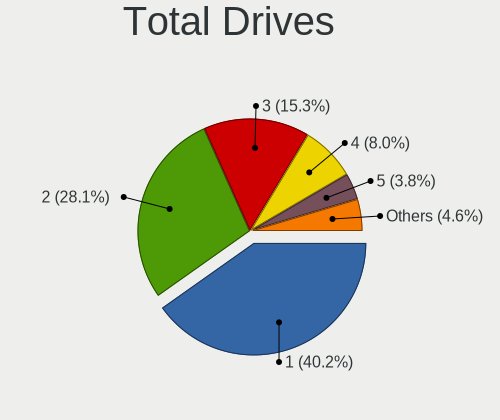
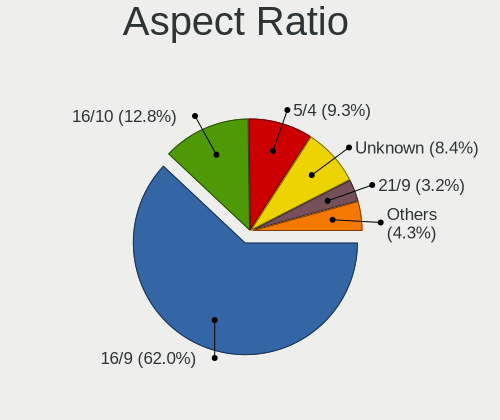

Linux - Tested Hardware & Statistics (Desktops)
-----------------------------------------------

A project to collect tested hardware configurations for Linux.

Anyone can contribute to this report by the [hw-probe](https://github.com/linuxhw/hw-probe) tool:

    sudo -E hw-probe -all -upload

Please contribute! Especially if your hardware is rare.

This report is for real hardware. Report for virtual hardware: [TestCoverage_VE](https://github.com/linuxhw/TestCoverage_VE)

Contents
--------

* [ Test Cases ](#test-cases)

* [ System ](#system)
  - [ OS                       ](#os)
  - [ OS Family                ](#os-family)
  - [ Kernel                   ](#kernel)
  - [ Kernel Family            ](#kernel-family)
  - [ Kernel Major Ver.        ](#kernel-major-ver)
  - [ Arch                     ](#arch)
  - [ DE                       ](#de)
  - [ Display Server           ](#display-server)
  - [ Display Manager          ](#display-manager)
  - [ OS Lang                  ](#os-lang)
  - [ Boot Mode                ](#boot-mode)
  - [ Filesystem               ](#filesystem)
  - [ Part. scheme             ](#part-scheme)
  - [ Dual Boot with Linux/BSD ](#dual-boot-with-linuxbsd)
  - [ Dual Boot (Win)          ](#dual-boot-win)

* [ Board ](#board)
  - [ Vendor                   ](#vendor)
  - [ Model                    ](#model)
  - [ Model Family             ](#model-family)
  - [ MFG Year                 ](#mfg-year)
  - [ Form Factor              ](#form-factor)
  - [ Secure Boot              ](#secure-boot)
  - [ Coreboot                 ](#coreboot)
  - [ RAM Size                 ](#ram-size)
  - [ RAM Used                 ](#ram-used)
  - [ Total Drives             ](#total-drives)
  - [ Has CD-ROM               ](#has-cd-rom)
  - [ Has Ethernet             ](#has-ethernet)
  - [ Has WiFi                 ](#has-wifi)
  - [ Has Bluetooth            ](#has-bluetooth)

* [ Location ](#location)
  - [ Country                  ](#country)
  - [ City                     ](#city)

* [ Drives ](#drives)
  - [ Drive Vendor             ](#drive-vendor)
  - [ Drive Model              ](#drive-model)
  - [ HDD Vendor               ](#hdd-vendor)
  - [ SSD Vendor               ](#ssd-vendor)
  - [ Drive Kind               ](#drive-kind)
  - [ Drive Connector          ](#drive-connector)
  - [ Drive Size               ](#drive-size)
  - [ Space Total              ](#space-total)
  - [ Space Used               ](#space-used)
  - [ Malfunc. Drives          ](#malfunc-drives)
  - [ Malfunc. Drive Vendor    ](#malfunc-drive-vendor)
  - [ Malfunc. HDD Vendor      ](#malfunc-hdd-vendor)
  - [ Malfunc. Drive Kind      ](#malfunc-drive-kind)
  - [ Failed Drives            ](#failed-drives)
  - [ Failed Drive Vendor      ](#failed-drive-vendor)
  - [ Drive Status             ](#drive-status)

* [ Storage controller ](#storage-controller)
  - [ Storage Vendor           ](#storage-vendor)
  - [ Storage Model            ](#storage-model)
  - [ Storage Kind             ](#storage-kind)

* [ Processor ](#processor)
  - [ CPU Vendor               ](#cpu-vendor)
  - [ CPU Model                ](#cpu-model)
  - [ CPU Model Family         ](#cpu-model-family)
  - [ CPU Cores                ](#cpu-cores)
  - [ CPU Sockets              ](#cpu-sockets)
  - [ CPU Threads              ](#cpu-threads)
  - [ CPU Op-Modes             ](#cpu-op-modes)
  - [ CPU Microcode            ](#cpu-microcode)
  - [ CPU Microarch            ](#cpu-microarch)

* [ Graphics ](#graphics)
  - [ GPU Vendor               ](#gpu-vendor)
  - [ GPU Model                ](#gpu-model)
  - [ GPU Combo                ](#gpu-combo)
  - [ GPU Driver               ](#gpu-driver)
  - [ GPU Memory               ](#gpu-memory)

* [ Monitor ](#monitor)
  - [ Monitor Vendor           ](#monitor-vendor)
  - [ Monitor Model            ](#monitor-model)
  - [ Monitor Resolution       ](#monitor-resolution)
  - [ Monitor Diagonal         ](#monitor-diagonal)
  - [ Monitor Width            ](#monitor-width)
  - [ Aspect Ratio             ](#aspect-ratio)
  - [ Monitor Area             ](#monitor-area)
  - [ Pixel Density            ](#pixel-density)
  - [ Multiple Monitors        ](#multiple-monitors)

* [ Network ](#network)
  - [ Net Controller Vendor    ](#net-controller-vendor)
  - [ Net Controller Model     ](#net-controller-model)
  - [ Wireless Vendor          ](#wireless-vendor)
  - [ Wireless Model           ](#wireless-model)
  - [ Ethernet Vendor          ](#ethernet-vendor)
  - [ Ethernet Model           ](#ethernet-model)
  - [ Net Controller Kind      ](#net-controller-kind)
  - [ Used Controller          ](#used-controller)
  - [ NICs                     ](#nics)
  - [ IPv6                     ](#ipv6)

* [ Bluetooth ](#bluetooth)
  - [ Bluetooth Vendor         ](#bluetooth-vendor)
  - [ Bluetooth Model          ](#bluetooth-model)

* [ Sound ](#sound)
  - [ Sound Vendor             ](#sound-vendor)
  - [ Sound Model              ](#sound-model)

* [ Memory ](#memory)
  - [ Memory Vendor            ](#memory-vendor)
  - [ Memory Model             ](#memory-model)
  - [ Memory Kind              ](#memory-kind)
  - [ Memory Form Factor       ](#memory-form-factor)
  - [ Memory Size              ](#memory-size)
  - [ Memory Speed             ](#memory-speed)

* [ Printers & scanners ](#printers--scanners)
  - [ Printer Vendor           ](#printer-vendor)
  - [ Printer Model            ](#printer-model)
  - [ Scanner Vendor           ](#scanner-vendor)
  - [ Scanner Model            ](#scanner-model)

* [ Camera ](#camera)
  - [ Camera Vendor            ](#camera-vendor)
  - [ Camera Model             ](#camera-model)

* [ Security ](#security)
  - [ Fingerprint Vendor       ](#fingerprint-vendor)
  - [ Fingerprint Model        ](#fingerprint-model)
  - [ Chipcard Vendor          ](#chipcard-vendor)
  - [ Chipcard Model           ](#chipcard-model)

* [ Unsupported ](#unsupported)
  - [ Unsupported Devices      ](#unsupported-devices)
  - [ Unsupported Device Types ](#unsupported-device-types)

Test Cases
----------

Total: 96325

| Vendor        | Model                       | Probe                                                      | Date         |
|---------------|-----------------------------|------------------------------------------------------------|--------------|
| Fujitsu       | D3162-A1 S26361-D3162-A1    | [060a34b3a1](https://linux-hardware.org/?probe=060a34b3a1) | Jul 01, 2022 |
| Fujitsu       | D3162-A1 S26361-D3162-A1    | [630bb92cd8](https://linux-hardware.org/?probe=630bb92cd8) | Jul 01, 2022 |
| MSI           | MPG X570 GAMING EDGE WIF... | [7da3547526](https://linux-hardware.org/?probe=7da3547526) | Jul 01, 2022 |
| MSI           | Z390 GAM PRO CARB AC        | [a55ab11db7](https://linux-hardware.org/?probe=a55ab11db7) | Jul 01, 2022 |
| Supermicro    | A2SAN-E-WOHSA               | [f8d0b19c1e](https://linux-hardware.org/?probe=f8d0b19c1e) | Jul 01, 2022 |
| Pegatron      | IPM41-D3                    | [a7cc8d2654](https://linux-hardware.org/?probe=a7cc8d2654) | Jul 01, 2022 |
| Gigabyte      | X470 AORUS GAMING 7 WIFI... | [47f8ea8d1d](https://linux-hardware.org/?probe=47f8ea8d1d) | Jul 01, 2022 |
| MSI           | X370 GAMING PRO CARBON      | [5763cb4576](https://linux-hardware.org/?probe=5763cb4576) | Jul 01, 2022 |
| Intel         | X99 V3.0                    | [278a8cf70a](https://linux-hardware.org/?probe=278a8cf70a) | Jul 01, 2022 |
| Gigabyte      | B450 GAMING X               | [b381e9b1fe](https://linux-hardware.org/?probe=b381e9b1fe) | Jul 01, 2022 |
| Intel         | X99 V3.0                    | [c697bf23dd](https://linux-hardware.org/?probe=c697bf23dd) | Jul 01, 2022 |
| ASRock        | H310CM-HDV                  | [4e6539bf57](https://linux-hardware.org/?probe=4e6539bf57) | Jul 01, 2022 |
| Dell          | 042P49 A02                  | [110e5da723](https://linux-hardware.org/?probe=110e5da723) | Jul 01, 2022 |
| ASUSTek       | P5G41T-M LX2/GB             | [faf850bb00](https://linux-hardware.org/?probe=faf850bb00) | Jul 01, 2022 |
| Gigabyte      | X570 AORUS PRO WIFI         | [2f0ac248ed](https://linux-hardware.org/?probe=2f0ac248ed) | Jul 01, 2022 |
| Gigabyte      | X570 AORUS PRO WIFI         | [5a6d827ebe](https://linux-hardware.org/?probe=5a6d827ebe) | Jul 01, 2022 |
| ASUSTek       | TUF X470-PLUS GAMING        | [80a981f992](https://linux-hardware.org/?probe=80a981f992) | Jul 01, 2022 |
| Intel         | DX58SO AAE29331-703         | [3b22974574](https://linux-hardware.org/?probe=3b22974574) | Jul 01, 2022 |
| Gigabyte      | X570 I AORUS PRO WIFI       | [d979555615](https://linux-hardware.org/?probe=d979555615) | Jul 01, 2022 |
| Medion        | MS-7797                     | [01ff2f8272](https://linux-hardware.org/?probe=01ff2f8272) | Jul 01, 2022 |
| ASUSTek       | M5A78L LE                   | [19dbe00e60](https://linux-hardware.org/?probe=19dbe00e60) | Jul 01, 2022 |
| ASRock        | B450 Gaming K4              | [2bdfc5f472](https://linux-hardware.org/?probe=2bdfc5f472) | Jul 01, 2022 |
| MSI           | B250M PRO-VD                | [b48e88849b](https://linux-hardware.org/?probe=b48e88849b) | Jul 01, 2022 |
| MSI           | X399 GAMING PRO CARBON A... | [153a698b74](https://linux-hardware.org/?probe=153a698b74) | Jul 01, 2022 |
| HP            | 805D                        | [3610332b9c](https://linux-hardware.org/?probe=3610332b9c) | Jul 01, 2022 |
| Gigabyte      | X470 AORUS ULTRA GAMING-... | [3633eb51d4](https://linux-hardware.org/?probe=3633eb51d4) | Jul 01, 2022 |
| Dell          | 042P49 A02                  | [169b7b8c30](https://linux-hardware.org/?probe=169b7b8c30) | Jul 01, 2022 |
| Gigabyte      | H81M-DS2V                   | [5f35ee7109](https://linux-hardware.org/?probe=5f35ee7109) | Jul 01, 2022 |
| ASUSTek       | PRIME H670-PLUS D4          | [8f90bed577](https://linux-hardware.org/?probe=8f90bed577) | Jul 01, 2022 |
| Gigabyte      | P55A-UD3                    | [36dcdacdb1](https://linux-hardware.org/?probe=36dcdacdb1) | Jul 01, 2022 |
| HP            | 8459                        | [f43fdff127](https://linux-hardware.org/?probe=f43fdff127) | Jul 01, 2022 |
| Dell          | 0NRKPK A02                  | [c483bc3c81](https://linux-hardware.org/?probe=c483bc3c81) | Jul 01, 2022 |
| ASUSTek       | STRIX Z270H GAMING          | [48ff25c4d2](https://linux-hardware.org/?probe=48ff25c4d2) | Jul 01, 2022 |
| Dell          | 06NWYK A01                  | [91408af847](https://linux-hardware.org/?probe=91408af847) | Jul 01, 2022 |
| MSI           | B450 TOMAHAWK MAX           | [21dd020507](https://linux-hardware.org/?probe=21dd020507) | Jul 01, 2022 |
| Gigabyte      | H81M-S2PH                   | [cc62a478ac](https://linux-hardware.org/?probe=cc62a478ac) | Jul 01, 2022 |
| ASUSTek       | ROG STRIX B550-F GAMING     | [8e6d23cf01](https://linux-hardware.org/?probe=8e6d23cf01) | Jul 01, 2022 |
| ASUSTek       | ET2400A                     | [8801791f80](https://linux-hardware.org/?probe=8801791f80) | Jul 01, 2022 |
| Gigabyte      | AB350-Gaming-CF             | [6b1b522b7e](https://linux-hardware.org/?probe=6b1b522b7e) | Jul 01, 2022 |
| ASUSTek       | PRIME H310M-R R2.0          | [d7d9387e6d](https://linux-hardware.org/?probe=d7d9387e6d) | Jul 01, 2022 |
| ASRock        | H570M Pro4                  | [7edf16eeea](https://linux-hardware.org/?probe=7edf16eeea) | Jul 01, 2022 |
| ASRock        | P67 Pro3                    | [403db88011](https://linux-hardware.org/?probe=403db88011) | Jul 01, 2022 |
| ASRock        | P67 Pro3                    | [4ba5c0b79e](https://linux-hardware.org/?probe=4ba5c0b79e) | Jul 01, 2022 |
| Dell          | 0MFHTR A00                  | [bb4d1c2872](https://linux-hardware.org/?probe=bb4d1c2872) | Jul 01, 2022 |
| Gigabyte      | Z97X-Gaming 3               | [9b8bb163d3](https://linux-hardware.org/?probe=9b8bb163d3) | Jul 01, 2022 |
| Gigabyte      | B550M DS3H                  | [36ea7e26d0](https://linux-hardware.org/?probe=36ea7e26d0) | Jul 01, 2022 |
| Gigabyte      | B85M-D3H                    | [d0d9e7b5c7](https://linux-hardware.org/?probe=d0d9e7b5c7) | Jul 01, 2022 |
| MSI           | H81M-E33                    | [737e14fea7](https://linux-hardware.org/?probe=737e14fea7) | Jul 01, 2022 |
| ASUSTek       | Maximus IX FORMULA          | [8c29343495](https://linux-hardware.org/?probe=8c29343495) | Jul 01, 2022 |
| ASUSTek       | Maximus IX FORMULA          | [2631bf2ae1](https://linux-hardware.org/?probe=2631bf2ae1) | Jul 01, 2022 |
| ASUSTek       | A88XM-A/USB                 | [01fb492b9d](https://linux-hardware.org/?probe=01fb492b9d) | Jul 01, 2022 |
| ASUSTek       | A88XM-A/USB                 | [b4b8457bd9](https://linux-hardware.org/?probe=b4b8457bd9) | Jul 01, 2022 |
| ASRock        | H270 Pro4                   | [729a9705aa](https://linux-hardware.org/?probe=729a9705aa) | Jul 01, 2022 |
| Gigabyte      | B85M-D3H                    | [a32cb9b3f1](https://linux-hardware.org/?probe=a32cb9b3f1) | Jul 01, 2022 |
| Intel         | MAHOBAY                     | [7df5adcb79](https://linux-hardware.org/?probe=7df5adcb79) | Jul 01, 2022 |
| HP            | 8169                        | [18c6ea7678](https://linux-hardware.org/?probe=18c6ea7678) | Jul 01, 2022 |
| ASUSTek       | TUF Gaming X570-PLUS        | [987d9aa4d3](https://linux-hardware.org/?probe=987d9aa4d3) | Jul 01, 2022 |
| HP            | 8169                        | [c479baadc1](https://linux-hardware.org/?probe=c479baadc1) | Jul 01, 2022 |
| Dell          | 0GXM1W A00                  | [d48eb55102](https://linux-hardware.org/?probe=d48eb55102) | Jul 01, 2022 |
| Dell          | 0T7D40 A01                  | [42b1694c97](https://linux-hardware.org/?probe=42b1694c97) | Jul 01, 2022 |
| ECS           | A780GM-A                    | [2cea4325e9](https://linux-hardware.org/?probe=2cea4325e9) | Jul 01, 2022 |
| Gigabyte      | Q170M-D3H-CF                | [241f8bd9da](https://linux-hardware.org/?probe=241f8bd9da) | Jul 01, 2022 |
| ASUSTek       | H81M-K                      | [08ed20d4da](https://linux-hardware.org/?probe=08ed20d4da) | Jul 01, 2022 |
| ASUSTek       | PRIME B550M-A               | [9f4f6d2323](https://linux-hardware.org/?probe=9f4f6d2323) | Jul 01, 2022 |
| Biostar       | B550GTA                     | [5d9da072f0](https://linux-hardware.org/?probe=5d9da072f0) | Jul 01, 2022 |
| Dell          | 0P01GV A03                  | [0bbac8ce1f](https://linux-hardware.org/?probe=0bbac8ce1f) | Jul 01, 2022 |
| Biostar       | TA790GX 128M                | [c7021e0b8c](https://linux-hardware.org/?probe=c7021e0b8c) | Jul 01, 2022 |
| Gigabyte      | GA-MA770T-UD3P              | [50ef3e22eb](https://linux-hardware.org/?probe=50ef3e22eb) | Jul 01, 2022 |
| Pegatron      | 2ACD                        | [3979af0018](https://linux-hardware.org/?probe=3979af0018) | Jul 01, 2022 |
| ASRock        | B450M Pro4                  | [5dd727cd5e](https://linux-hardware.org/?probe=5dd727cd5e) | Jul 01, 2022 |
| ASRock        | P67 Pro3                    | [632dbea587](https://linux-hardware.org/?probe=632dbea587) | Jul 01, 2022 |
| Gigabyte      | A320M-S2H V2-CF             | [a045d05273](https://linux-hardware.org/?probe=a045d05273) | Jul 01, 2022 |
| Gigabyte      | X570 I AORUS PRO WIFI       | [d82f88e20c](https://linux-hardware.org/?probe=d82f88e20c) | Jul 01, 2022 |
| Gigabyte      | H110M-S2-CF                 | [8146084972](https://linux-hardware.org/?probe=8146084972) | Jul 01, 2022 |
| Gigabyte      | X58-USB3                    | [d8289501d0](https://linux-hardware.org/?probe=d8289501d0) | Jul 01, 2022 |
| MSI           | X99A RAIDER                 | [e1c3d1dfad](https://linux-hardware.org/?probe=e1c3d1dfad) | Jul 01, 2022 |
| ASRock        | FM2A88X Extreme6+           | [a658ebf5e9](https://linux-hardware.org/?probe=a658ebf5e9) | Jul 01, 2022 |
| HP            | 18E7                        | [1808b6dee4](https://linux-hardware.org/?probe=1808b6dee4) | Jul 01, 2022 |
| ASUSTek       | PRIME B550-PLUS AC-HES      | [dde2246ae8](https://linux-hardware.org/?probe=dde2246ae8) | Jul 01, 2022 |
| Gigabyte      | Z590I AORUS ULTRA           | [febb798e92](https://linux-hardware.org/?probe=febb798e92) | Jul 01, 2022 |
| ASUSTek       | M5A78L-M/USB3               | [00e1806ce1](https://linux-hardware.org/?probe=00e1806ce1) | Jul 01, 2022 |
| ASUSTek       | K30BF_M32BF                 | [dac4b154d6](https://linux-hardware.org/?probe=dac4b154d6) | Jul 01, 2022 |
| ASRock        | Z97 Anniversary             | [1e650b504d](https://linux-hardware.org/?probe=1e650b504d) | Jul 01, 2022 |
| Gigabyte      | Z87-HD3                     | [d3fab53889](https://linux-hardware.org/?probe=d3fab53889) | Jul 01, 2022 |
| Gigabyte      | AM1M-S2H                    | [fb2500cc2d](https://linux-hardware.org/?probe=fb2500cc2d) | Jul 01, 2022 |
| Dell          | 0M9KCM A00                  | [e72232ee43](https://linux-hardware.org/?probe=e72232ee43) | Jul 01, 2022 |
| Gigabyte      | Z87-HD3                     | [c38c4e9cb9](https://linux-hardware.org/?probe=c38c4e9cb9) | Jun 30, 2022 |
| Dell          | 0M9KCM A00                  | [5e80242b43](https://linux-hardware.org/?probe=5e80242b43) | Jun 30, 2022 |
| ASRock        | P67 Pro3 SE                 | [4243c2b021](https://linux-hardware.org/?probe=4243c2b021) | Jun 30, 2022 |
| ASUSTek       | TUF B350M-PLUS GAMING       | [a082da0857](https://linux-hardware.org/?probe=a082da0857) | Jun 30, 2022 |
| HP            | 3647h                       | [f59774eab5](https://linux-hardware.org/?probe=f59774eab5) | Jun 30, 2022 |
| ASRock        | B450M Pro4 R2.0             | [d17c3a2817](https://linux-hardware.org/?probe=d17c3a2817) | Jun 30, 2022 |
| ASUSTek       | TUF Gaming X570-PLUS        | [7e14880c80](https://linux-hardware.org/?probe=7e14880c80) | Jun 30, 2022 |
| MSI           | Z87 MPOWER                  | [ba26baf84a](https://linux-hardware.org/?probe=ba26baf84a) | Jun 30, 2022 |
| ASUSTek       | PRIME Z370-A                | [28479b3edf](https://linux-hardware.org/?probe=28479b3edf) | Jun 30, 2022 |
| ASUSTek       | PRIME Z590-A                | [c119afc3de](https://linux-hardware.org/?probe=c119afc3de) | Jun 30, 2022 |
| ASUSTek       | M5A78L-M LX3                | [9b58b7a4a5](https://linux-hardware.org/?probe=9b58b7a4a5) | Jun 30, 2022 |
| Unknown       | Unknown                     | [1de34d9bf9](https://linux-hardware.org/?probe=1de34d9bf9) | Jun 30, 2022 |
| ASUSTek       | SABERTOOTH Z77              | [06ca24d4e1](https://linux-hardware.org/?probe=06ca24d4e1) | Jun 30, 2022 |
| Lenovo        | ThinkCentre M58p 7220A72    | [cea6c9ea52](https://linux-hardware.org/?probe=cea6c9ea52) | Jun 30, 2022 |
| MSI           | MEG X570 ACE                | [6dff126482](https://linux-hardware.org/?probe=6dff126482) | Jun 30, 2022 |
| Dell          | 0HJ054                      | [bb9d7a3a58](https://linux-hardware.org/?probe=bb9d7a3a58) | Jun 30, 2022 |
| MACHINIST     | X99-RS9 V2.0                | [0924d664a1](https://linux-hardware.org/?probe=0924d664a1) | Jun 30, 2022 |
| ASUSTek       | PRIME H310M-E R2.0          | [a40fb66860](https://linux-hardware.org/?probe=a40fb66860) | Jun 30, 2022 |
| ASRock        | 775Dual-VSTA                | [31825f35da](https://linux-hardware.org/?probe=31825f35da) | Jun 30, 2022 |
| MSI           | PRESTIGE X570 CREATION      | [7f17faf180](https://linux-hardware.org/?probe=7f17faf180) | Jun 30, 2022 |
| ASUSTek       | PRIME X570-P                | [7eeeee6c93](https://linux-hardware.org/?probe=7eeeee6c93) | Jun 30, 2022 |
| Gigabyte      | B450 AORUS ELITE            | [7287dd0ad5](https://linux-hardware.org/?probe=7287dd0ad5) | Jun 30, 2022 |
| ASUSTek       | PRIME X570-P                | [53dac35f18](https://linux-hardware.org/?probe=53dac35f18) | Jun 30, 2022 |
| ASUSTek       | H61M-PRO                    | [48464c0df0](https://linux-hardware.org/?probe=48464c0df0) | Jun 30, 2022 |
| Gigabyte      | B450 AORUS ELITE            | [3c478faa0c](https://linux-hardware.org/?probe=3c478faa0c) | Jun 30, 2022 |
| ASRock        | B450M Pro4 R2.0             | [10675bc552](https://linux-hardware.org/?probe=10675bc552) | Jun 30, 2022 |
| Dell          | 0GDG8Y A00                  | [4ccd9d239d](https://linux-hardware.org/?probe=4ccd9d239d) | Jun 30, 2022 |
| ASUSTek       | P5G41T-M LX2/GB             | [3bbee83307](https://linux-hardware.org/?probe=3bbee83307) | Jun 30, 2022 |
| ASUSTek       | P5G41T-M LX2/GB             | [0b299bea1b](https://linux-hardware.org/?probe=0b299bea1b) | Jun 30, 2022 |
| Gigabyte      | AX370-Gaming 5              | [bd54eb7f9c](https://linux-hardware.org/?probe=bd54eb7f9c) | Jun 30, 2022 |
| HP            | 0B54h D                     | [bef89f554e](https://linux-hardware.org/?probe=bef89f554e) | Jun 30, 2022 |
| ASUSTek       | P8H77-V LE                  | [0ecaca17cb](https://linux-hardware.org/?probe=0ecaca17cb) | Jun 30, 2022 |
| ASUSTek       | M3A78                       | [e478c0f488](https://linux-hardware.org/?probe=e478c0f488) | Jun 30, 2022 |
| Gigabyte      | H470 HD3                    | [4857a7b7bf](https://linux-hardware.org/?probe=4857a7b7bf) | Jun 30, 2022 |
| Gigabyte      | Z87P-D3                     | [2ae62ac227](https://linux-hardware.org/?probe=2ae62ac227) | Jun 30, 2022 |
| ASUSTek       | M5A78L-M LX V2              | [c12aa3088a](https://linux-hardware.org/?probe=c12aa3088a) | Jun 30, 2022 |
| Dell          | 0HHV7N A00                  | [41255f7150](https://linux-hardware.org/?probe=41255f7150) | Jun 30, 2022 |
| ASRock        | AB350 Pro4                  | [7049f819f0](https://linux-hardware.org/?probe=7049f819f0) | Jun 30, 2022 |
| MSI           | B75MA-E33                   | [482aec0a52](https://linux-hardware.org/?probe=482aec0a52) | Jun 30, 2022 |
| ASUSTek       | P5KPL-E                     | [c969c7cce8](https://linux-hardware.org/?probe=c969c7cce8) | Jun 30, 2022 |
| ASUSTek       | TUF Gaming B560M-PLUS WI... | [32e2995911](https://linux-hardware.org/?probe=32e2995911) | Jun 30, 2022 |
| ASUSTek       | ROG STRIX X570-F GAMING     | [334719e6a2](https://linux-hardware.org/?probe=334719e6a2) | Jun 30, 2022 |
| Dell          | 0HD5W2 A01                  | [d5419be6e7](https://linux-hardware.org/?probe=d5419be6e7) | Jun 30, 2022 |
| ASRock        | H270 Pro4                   | [06005e844d](https://linux-hardware.org/?probe=06005e844d) | Jun 30, 2022 |
| ASRock        | X399 Taichi                 | [caea75035f](https://linux-hardware.org/?probe=caea75035f) | Jun 30, 2022 |
| ASRock        | P67 Pro3                    | [aaf8589ded](https://linux-hardware.org/?probe=aaf8589ded) | Jun 30, 2022 |
| Gigabyte      | GB-BSi5-1135G7              | [4701b81ce2](https://linux-hardware.org/?probe=4701b81ce2) | Jun 30, 2022 |
| HP            | 339A                        | [7cfe4b70f8](https://linux-hardware.org/?probe=7cfe4b70f8) | Jun 30, 2022 |
| Gigabyte      | GA-78LMT-USB3 SEx           | [530c44caa8](https://linux-hardware.org/?probe=530c44caa8) | Jun 30, 2022 |
| MSI           | Z68A-GD80                   | [2e2ca703b0](https://linux-hardware.org/?probe=2e2ca703b0) | Jun 30, 2022 |
| ASRock        | H270 Pro4                   | [c45e976ae1](https://linux-hardware.org/?probe=c45e976ae1) | Jun 30, 2022 |
| Gigabyte      | MQLP5AP-00                  | [8014a14842](https://linux-hardware.org/?probe=8014a14842) | Jun 30, 2022 |
| Gigabyte      | Z87-HD3                     | [8d9a85c7f3](https://linux-hardware.org/?probe=8d9a85c7f3) | Jun 30, 2022 |
| Supermicro    | X9DBS-F                     | [7aeeacc12c](https://linux-hardware.org/?probe=7aeeacc12c) | Jun 30, 2022 |
| ASRock        | FM2A88X Extreme6+           | [163a5c29e6](https://linux-hardware.org/?probe=163a5c29e6) | Jun 30, 2022 |
| MSI           | X99A RAIDER                 | [2da2ad735c](https://linux-hardware.org/?probe=2da2ad735c) | Jun 30, 2022 |
| Gigabyte      | B460M D3H                   | [d620225518](https://linux-hardware.org/?probe=d620225518) | Jun 30, 2022 |
| MSI           | A320M-A PRO MAX             | [9a35c1249b](https://linux-hardware.org/?probe=9a35c1249b) | Jun 30, 2022 |
| MSI           | MAG B550 TOMAHAWK           | [7a90f7795b](https://linux-hardware.org/?probe=7a90f7795b) | Jun 30, 2022 |
| ASRock        | ALiveXFire-eSATA2           | [f8d5c0bcd3](https://linux-hardware.org/?probe=f8d5c0bcd3) | Jun 30, 2022 |
| EVGA          | X299 FTW K                  | [bde570c9f5](https://linux-hardware.org/?probe=bde570c9f5) | Jun 30, 2022 |
| Gigabyte      | C1037UN-EU                  | [a2729b2e3b](https://linux-hardware.org/?probe=a2729b2e3b) | Jun 30, 2022 |
| Gigabyte      | B450 AORUS M                | [b85b1f9277](https://linux-hardware.org/?probe=b85b1f9277) | Jun 30, 2022 |
| Biostar       | H510MH/E                    | [7b28198a82](https://linux-hardware.org/?probe=7b28198a82) | Jun 30, 2022 |
| ASUSTek       | M5A97 R2.0                  | [05e7378ad8](https://linux-hardware.org/?probe=05e7378ad8) | Jun 29, 2022 |
| MSI           | A320M-A PRO MAX             | [c8f0217b26](https://linux-hardware.org/?probe=c8f0217b26) | Jun 29, 2022 |
| Intel         | D410PT AAE76528-404         | [b7c62fc4a8](https://linux-hardware.org/?probe=b7c62fc4a8) | Jun 29, 2022 |
| MSI           | A320M-A PRO MAX             | [0cafb4009d](https://linux-hardware.org/?probe=0cafb4009d) | Jun 29, 2022 |
| Gigabyte      | GA-78LMT-USB3               | [608388f911](https://linux-hardware.org/?probe=608388f911) | Jun 29, 2022 |
| ASUSTek       | B85M-E/BR                   | [adfbbd03b6](https://linux-hardware.org/?probe=adfbbd03b6) | Jun 29, 2022 |
| Gigabyte      | B560M DS3H V2               | [85b8793585](https://linux-hardware.org/?probe=85b8793585) | Jun 29, 2022 |
| MSI           | H81M-P33                    | [1a0e20ab20](https://linux-hardware.org/?probe=1a0e20ab20) | Jun 29, 2022 |
| MSI           | A320M-A PRO MAX             | [68d1c799f2](https://linux-hardware.org/?probe=68d1c799f2) | Jun 29, 2022 |
| Gigabyte      | H110M-S2V-CF                | [a12936e2d1](https://linux-hardware.org/?probe=a12936e2d1) | Jun 29, 2022 |
| MSI           | A320M-A PRO MAX             | [d3af5b938a](https://linux-hardware.org/?probe=d3af5b938a) | Jun 29, 2022 |
| ASUSTek       | ROG Maximus XIII HERO       | [0983817c84](https://linux-hardware.org/?probe=0983817c84) | Jun 29, 2022 |
| Protectli     | FW6                         | [c129601645](https://linux-hardware.org/?probe=c129601645) | Jun 29, 2022 |
| ASUSTek       | ROG STRIX Z370-E GAMING     | [349dc94a13](https://linux-hardware.org/?probe=349dc94a13) | Jun 29, 2022 |
| Biostar       | A68N-5600E                  | [d5cfa78343](https://linux-hardware.org/?probe=d5cfa78343) | Jun 29, 2022 |
| ASUSTek       | TUF Gaming X570-PLUS_BR     | [3bceb0a396](https://linux-hardware.org/?probe=3bceb0a396) | Jun 29, 2022 |
| Protectli     | FW6                         | [f7d331dfcb](https://linux-hardware.org/?probe=f7d331dfcb) | Jun 29, 2022 |
| MSI           | MEG Z490 UNIFY              | [2c7a50869d](https://linux-hardware.org/?probe=2c7a50869d) | Jun 29, 2022 |
| ASUSTek       | P8H61-M LX3 PLUS R2.0       | [fcd0308b18](https://linux-hardware.org/?probe=fcd0308b18) | Jun 29, 2022 |
| Dell          | 0M5DCD A00                  | [7ff0a3f172](https://linux-hardware.org/?probe=7ff0a3f172) | Jun 29, 2022 |
| Gigabyte      | B450 AORUS M                | [67dc174a62](https://linux-hardware.org/?probe=67dc174a62) | Jun 29, 2022 |
| ASUSTek       | ROG CROSSHAIR VIII HERO     | [01d9100427](https://linux-hardware.org/?probe=01d9100427) | Jun 29, 2022 |
| Gigabyte      | GA-880GMA-USB3              | [4f8c462b4b](https://linux-hardware.org/?probe=4f8c462b4b) | Jun 29, 2022 |
| Dell          | 0M5DCD A00                  | [483d6a9299](https://linux-hardware.org/?probe=483d6a9299) | Jun 29, 2022 |
| Gigabyte      | X570 AORUS MASTER           | [6b034bb489](https://linux-hardware.org/?probe=6b034bb489) | Jun 29, 2022 |
| PCWare        | IPMH61R3                    | [5622f8ecd0](https://linux-hardware.org/?probe=5622f8ecd0) | Jun 29, 2022 |
| PCWare        | IPMH61R3                    | [492951e8cf](https://linux-hardware.org/?probe=492951e8cf) | Jun 29, 2022 |
| Lenovo        | MAHOBAY NOK                 | [20a14662e8](https://linux-hardware.org/?probe=20a14662e8) | Jun 29, 2022 |
| Lenovo        | 36C5 NOK                    | [94d44ae5f2](https://linux-hardware.org/?probe=94d44ae5f2) | Jun 29, 2022 |
| Gigabyte      | B450M DS3H-CF               | [6a2f1d22f1](https://linux-hardware.org/?probe=6a2f1d22f1) | Jun 29, 2022 |
| Gigabyte      | X570S AORUS ELITE AX        | [ec8f2e717c](https://linux-hardware.org/?probe=ec8f2e717c) | Jun 29, 2022 |
| Lenovo        | 36C5 NOK                    | [cd5e39b07a](https://linux-hardware.org/?probe=cd5e39b07a) | Jun 29, 2022 |
| Gigabyte      | B450M DS3H-CF               | [0a976062da](https://linux-hardware.org/?probe=0a976062da) | Jun 29, 2022 |
| ASUSTek       | P5LD2-SE                    | [883ce9ac34](https://linux-hardware.org/?probe=883ce9ac34) | Jun 29, 2022 |
| MSI           | MPG Z390I GAMING EDGE AC    | [389293962a](https://linux-hardware.org/?probe=389293962a) | Jun 29, 2022 |
| ASUSTek       | B85M-E                      | [2423d184c0](https://linux-hardware.org/?probe=2423d184c0) | Jun 29, 2022 |
| Dell          | 0TTDMJ A00                  | [e45e0b0c90](https://linux-hardware.org/?probe=e45e0b0c90) | Jun 29, 2022 |
| Dell          | 0XCR8D A02                  | [4573e16702](https://linux-hardware.org/?probe=4573e16702) | Jun 29, 2022 |
| Dell          | 0D441T A01                  | [b205bc201e](https://linux-hardware.org/?probe=b205bc201e) | Jun 29, 2022 |
| Gigabyte      | GB-BRR7H-4700               | [5ac6d883d6](https://linux-hardware.org/?probe=5ac6d883d6) | Jun 29, 2022 |
| ASRock        | H61M-ITX                    | [e8d5e4ff14](https://linux-hardware.org/?probe=e8d5e4ff14) | Jun 29, 2022 |
| ASUSTek       | ProArt Z690-CREATOR WIFI    | [392d5c7c12](https://linux-hardware.org/?probe=392d5c7c12) | Jun 29, 2022 |
| ASUSTek       | P5LD2                       | [4fdebc2b9c](https://linux-hardware.org/?probe=4fdebc2b9c) | Jun 29, 2022 |
| ASRock        | B550M-ITX/ac                | [01614433d5](https://linux-hardware.org/?probe=01614433d5) | Jun 29, 2022 |
| ASUSTek       | PRIME Z270-A                | [da80c0d1cd](https://linux-hardware.org/?probe=da80c0d1cd) | Jun 29, 2022 |
| MSI           | B450M PRO-VDH MAX           | [f01192b57e](https://linux-hardware.org/?probe=f01192b57e) | Jun 29, 2022 |
| ASRock        | X470 Gaming K4              | [2ec3c19308](https://linux-hardware.org/?probe=2ec3c19308) | Jun 29, 2022 |
| MSI           | Z77A-G43                    | [909e3e3c2e](https://linux-hardware.org/?probe=909e3e3c2e) | Jun 29, 2022 |
| Gigabyte      | H110M-S2V-CF                | [92a81791a4](https://linux-hardware.org/?probe=92a81791a4) | Jun 29, 2022 |
| MSI           | A320M PRO-VD/S V2           | [fc5a5d812c](https://linux-hardware.org/?probe=fc5a5d812c) | Jun 29, 2022 |
| Dell          | 0M858N A01                  | [6cc8dcd51e](https://linux-hardware.org/?probe=6cc8dcd51e) | Jun 29, 2022 |
| Gigabyte      | GA-870A-UD3                 | [7b07f30b17](https://linux-hardware.org/?probe=7b07f30b17) | Jun 29, 2022 |
| ASRock        | P67 Pro3                    | [bdecafbe1d](https://linux-hardware.org/?probe=bdecafbe1d) | Jun 29, 2022 |
| ASUSTek       | P5LD2                       | [c7f67d9347](https://linux-hardware.org/?probe=c7f67d9347) | Jun 29, 2022 |
| ASUSTek       | PRO H410M-C                 | [9f705aea75](https://linux-hardware.org/?probe=9f705aea75) | Jun 29, 2022 |
| Gigabyte      | H81M-S1                     | [6dfee96211](https://linux-hardware.org/?probe=6dfee96211) | Jun 29, 2022 |
| ASUSTek       | ROG Maximus Z690 HERO       | [73d9748926](https://linux-hardware.org/?probe=73d9748926) | Jun 29, 2022 |
| Gigabyte      | Z490 AORUS ELITE AC         | [86a93d8ea0](https://linux-hardware.org/?probe=86a93d8ea0) | Jun 29, 2022 |
| ASUSTek       | ROG ZENITH EXTREME          | [33c8a42a4d](https://linux-hardware.org/?probe=33c8a42a4d) | Jun 29, 2022 |
| Dell          | 0WMJ54 A01                  | [a55837dc17](https://linux-hardware.org/?probe=a55837dc17) | Jun 29, 2022 |
| Dell          | 0D24M8 A00                  | [1588270a58](https://linux-hardware.org/?probe=1588270a58) | Jun 29, 2022 |
| MSI           | X99A RAIDER                 | [b197a0fd35](https://linux-hardware.org/?probe=b197a0fd35) | Jun 29, 2022 |
| ASRock        | FM2A88X Extreme6+           | [66b8ec6b28](https://linux-hardware.org/?probe=66b8ec6b28) | Jun 29, 2022 |
| ASUSTek       | PRIME Z390-P                | [97613877b7](https://linux-hardware.org/?probe=97613877b7) | Jun 29, 2022 |
| ASUSTek       | CROSSHAIR V FORMULA-Z       | [d59692d648](https://linux-hardware.org/?probe=d59692d648) | Jun 29, 2022 |
| Gigabyte      | Z97X-SLI-CF                 | [0a66ce61c6](https://linux-hardware.org/?probe=0a66ce61c6) | Jun 29, 2022 |
| MSI           | MEG X570 UNIFY              | [0fbd5ca967](https://linux-hardware.org/?probe=0fbd5ca967) | Jun 29, 2022 |
| Gigabyte      | EP45-UD3                    | [bb62363ad2](https://linux-hardware.org/?probe=bb62363ad2) | Jun 29, 2022 |
| Gigabyte      | X570 AORUS PRO              | [757741fe0d](https://linux-hardware.org/?probe=757741fe0d) | Jun 29, 2022 |
| ASUSTek       | PRIME B550-PLUS             | [3ba50e78b9](https://linux-hardware.org/?probe=3ba50e78b9) | Jun 29, 2022 |
| HP            | 212B                        | [72b9156d16](https://linux-hardware.org/?probe=72b9156d16) | Jun 29, 2022 |
| Dell          | 0VHWTR A02                  | [ee144de507](https://linux-hardware.org/?probe=ee144de507) | Jun 29, 2022 |
| Gigabyte      | Z97X-SLI-CF                 | [f2b790de57](https://linux-hardware.org/?probe=f2b790de57) | Jun 29, 2022 |
| ASRock        | H61M-ITX                    | [4afafc5b76](https://linux-hardware.org/?probe=4afafc5b76) | Jun 29, 2022 |
| Gigabyte      | Z87-HD3                     | [e1fbeb3d53](https://linux-hardware.org/?probe=e1fbeb3d53) | Jun 29, 2022 |
| ASUSTek       | PRIME B550-PLUS             | [f33854651b](https://linux-hardware.org/?probe=f33854651b) | Jun 29, 2022 |
| MSI           | MAG X570 TOMAHAWK WIFI      | [cf7b4fb7e1](https://linux-hardware.org/?probe=cf7b4fb7e1) | Jun 29, 2022 |
| HP            | 18E9                        | [67a4877415](https://linux-hardware.org/?probe=67a4877415) | Jun 29, 2022 |
| ASUSTek       | ROG STRIX X570-E GAMING     | [5873a7a8dd](https://linux-hardware.org/?probe=5873a7a8dd) | Jun 29, 2022 |
| HP            | 8643 SMVB                   | [a0bf95fa0c](https://linux-hardware.org/?probe=a0bf95fa0c) | Jun 29, 2022 |
| ASRock        | N68-S                       | [cf9108c19a](https://linux-hardware.org/?probe=cf9108c19a) | Jun 28, 2022 |
| Acer          | Aspire M3910                | [ad06b5a93e](https://linux-hardware.org/?probe=ad06b5a93e) | Jun 28, 2022 |
| MSI           | H110M GAMING                | [e33051cbd0](https://linux-hardware.org/?probe=e33051cbd0) | Jun 28, 2022 |
| Biostar       | H61MGV3                     | [bb42e29bbb](https://linux-hardware.org/?probe=bb42e29bbb) | Jun 28, 2022 |
| Gigabyte      | B150-HD3 DDR3-CF            | [3fe71d66c6](https://linux-hardware.org/?probe=3fe71d66c6) | Jun 28, 2022 |
| Gigabyte      | B360M HD3                   | [b35e9f3e5c](https://linux-hardware.org/?probe=b35e9f3e5c) | Jun 28, 2022 |
| Gigabyte      | B550 AORUS MASTER           | [be4dd3360f](https://linux-hardware.org/?probe=be4dd3360f) | Jun 28, 2022 |
| ASUSTek       | P5KPL-AM SE                 | [3ee15448fc](https://linux-hardware.org/?probe=3ee15448fc) | Jun 28, 2022 |
| ASUSTek       | M4A785T-M                   | [aa1cb0ee66](https://linux-hardware.org/?probe=aa1cb0ee66) | Jun 28, 2022 |
| ASUSTek       | M5A78L-M LX3                | [0ea9a6be3a](https://linux-hardware.org/?probe=0ea9a6be3a) | Jun 28, 2022 |
| Gigabyte      | X58A-UD3R                   | [c414829bec](https://linux-hardware.org/?probe=c414829bec) | Jun 28, 2022 |
| Dell          | 0NRKPK A01                  | [dca04c3b5b](https://linux-hardware.org/?probe=dca04c3b5b) | Jun 28, 2022 |
| Dell          | 0KWVT8 A03                  | [36ff1ef4b8](https://linux-hardware.org/?probe=36ff1ef4b8) | Jun 28, 2022 |
| MSI           | H310M PRO-VD                | [1aec9e08e9](https://linux-hardware.org/?probe=1aec9e08e9) | Jun 28, 2022 |
| Dell          | 0TP406                      | [4f0f2b2e05](https://linux-hardware.org/?probe=4f0f2b2e05) | Jun 28, 2022 |
| Dell          | 0NRKPK A01                  | [2af61a0a3c](https://linux-hardware.org/?probe=2af61a0a3c) | Jun 28, 2022 |
| ASUSTek       | TUF Gaming X570-PLUS        | [f188fe2a3d](https://linux-hardware.org/?probe=f188fe2a3d) | Jun 28, 2022 |
| Gigabyte      | D525TUD                     | [b6cfc5d2df](https://linux-hardware.org/?probe=b6cfc5d2df) | Jun 28, 2022 |
| ASUSTek       | PRIME B450-PLUS             | [f2f78497e6](https://linux-hardware.org/?probe=f2f78497e6) | Jun 28, 2022 |
| ASUSTek       | ROG ZENITH EXTREME          | [efb8cff806](https://linux-hardware.org/?probe=efb8cff806) | Jun 28, 2022 |
| ASRock        | P43DE                       | [f52d106d92](https://linux-hardware.org/?probe=f52d106d92) | Jun 28, 2022 |
| Intel         | DP43BF AAE78171-302         | [0115160101](https://linux-hardware.org/?probe=0115160101) | Jun 28, 2022 |
| Unknown       | Intel X79                   | [926d1b6b4e](https://linux-hardware.org/?probe=926d1b6b4e) | Jun 28, 2022 |
| HP            | 3647h                       | [3227f38f98](https://linux-hardware.org/?probe=3227f38f98) | Jun 28, 2022 |
| ASUSTek       | M3A78-CM                    | [4c0fa03f61](https://linux-hardware.org/?probe=4c0fa03f61) | Jun 28, 2022 |
| Gigabyte      | Z170-Gaming K3              | [70dc9ba605](https://linux-hardware.org/?probe=70dc9ba605) | Jun 28, 2022 |
| ASUSTek       | M5A78L-M/USB3               | [a9ddf668c4](https://linux-hardware.org/?probe=a9ddf668c4) | Jun 28, 2022 |
| ECS           | G41T-M16                    | [5a3363d66f](https://linux-hardware.org/?probe=5a3363d66f) | Jun 28, 2022 |
| HP            | ProLiant ML110 G7           | [ace3582eee](https://linux-hardware.org/?probe=ace3582eee) | Jun 28, 2022 |
| Dell          | 0Y3R3K A01                  | [d6465d0684](https://linux-hardware.org/?probe=d6465d0684) | Jun 28, 2022 |
| Intel         | D945PLRN AAD32731-404       | [d9519690b8](https://linux-hardware.org/?probe=d9519690b8) | Jun 28, 2022 |
| Alienware     | 01NYPT A00                  | [97b8d855bd](https://linux-hardware.org/?probe=97b8d855bd) | Jun 28, 2022 |
| MSI           | B250M PRO-VD                | [8efb1d3556](https://linux-hardware.org/?probe=8efb1d3556) | Jun 28, 2022 |
| ASUSTek       | PRIME A520M-K               | [d8a4ade22e](https://linux-hardware.org/?probe=d8a4ade22e) | Jun 28, 2022 |
| ASUSTek       | M3A78-VM                    | [7f5cd79da9](https://linux-hardware.org/?probe=7f5cd79da9) | Jun 28, 2022 |
| Gigabyte      | A520M DS3H                  | [b56fe3beb3](https://linux-hardware.org/?probe=b56fe3beb3) | Jun 28, 2022 |
| Gigabyte      | B85M-D3V-A                  | [3417dd6a9a](https://linux-hardware.org/?probe=3417dd6a9a) | Jun 28, 2022 |
| Gigabyte      | G41MT-D3                    | [20de16a046](https://linux-hardware.org/?probe=20de16a046) | Jun 28, 2022 |
| ASUSTek       | TUF Gaming H670-PRO WIFI... | [ea4459628e](https://linux-hardware.org/?probe=ea4459628e) | Jun 28, 2022 |
| MSI           | MAG B660M MORTAR WIFI DD... | [c5a5b25674](https://linux-hardware.org/?probe=c5a5b25674) | Jun 28, 2022 |
| ASUSTek       | TUF Gaming X570-PLUS        | [87b9ce1db1](https://linux-hardware.org/?probe=87b9ce1db1) | Jun 28, 2022 |
| Huanan        | X99 F8D V2.2                | [e6a457b28f](https://linux-hardware.org/?probe=e6a457b28f) | Jun 28, 2022 |
| EVGA          | X299 FTW K                  | [2fac0d5ea2](https://linux-hardware.org/?probe=2fac0d5ea2) | Jun 28, 2022 |
| Acer          | H81-M1                      | [9ddfb2ec8d](https://linux-hardware.org/?probe=9ddfb2ec8d) | Jun 28, 2022 |
| Gigabyte      | Z87X-D3H-CF                 | [ff60a3cb61](https://linux-hardware.org/?probe=ff60a3cb61) | Jun 28, 2022 |
| Gigabyte      | H55M-USB3                   | [3dbf4d1f1b](https://linux-hardware.org/?probe=3dbf4d1f1b) | Jun 28, 2022 |
| ASUSTek       | H110M-R                     | [06f09abf11](https://linux-hardware.org/?probe=06f09abf11) | Jun 28, 2022 |
| ASUSTek       | ProArt Z690-CREATOR WIFI    | [dc3e219327](https://linux-hardware.org/?probe=dc3e219327) | Jun 28, 2022 |
| MSI           | B450M PRO-VDH MAX           | [291139aa4f](https://linux-hardware.org/?probe=291139aa4f) | Jun 28, 2022 |
| Biostar       | J3060NH                     | [6cefe763b7](https://linux-hardware.org/?probe=6cefe763b7) | Jun 28, 2022 |
| MSI           | B550M PRO-VDH WIFI          | [6ca667e6c4](https://linux-hardware.org/?probe=6ca667e6c4) | Jun 28, 2022 |
| MSI           | B450M PRO-VDH MAX           | [369f504484](https://linux-hardware.org/?probe=369f504484) | Jun 28, 2022 |
| Gigabyte      | F2A88XM-D3H                 | [0ea209fffe](https://linux-hardware.org/?probe=0ea209fffe) | Jun 28, 2022 |
| Gigabyte      | H410M H V3                  | [aa87f3d3d5](https://linux-hardware.org/?probe=aa87f3d3d5) | Jun 28, 2022 |
| ASUSTek       | A88X-GAMER                  | [b7e193f50c](https://linux-hardware.org/?probe=b7e193f50c) | Jun 28, 2022 |
| MSI           | X470 GAMING PLUS MAX        | [d399933441](https://linux-hardware.org/?probe=d399933441) | Jun 28, 2022 |
| MSI           | H310M PRO-VD                | [1812911a41](https://linux-hardware.org/?probe=1812911a41) | Jun 28, 2022 |
| Dell          | 0WN7Y6 A01                  | [a07a657c67](https://linux-hardware.org/?probe=a07a657c67) | Jun 28, 2022 |
| ASUSTek       | PRIME A320M-K               | [af267c59cd](https://linux-hardware.org/?probe=af267c59cd) | Jun 28, 2022 |
| Unknown       | Unknown                     | [8eb0d6165a](https://linux-hardware.org/?probe=8eb0d6165a) | Jun 28, 2022 |
| ASRock        | 970M Pro3                   | [f817d55df3](https://linux-hardware.org/?probe=f817d55df3) | Jun 28, 2022 |
| Dell          | 02YYK5 A01                  | [ab6a2f07c6](https://linux-hardware.org/?probe=ab6a2f07c6) | Jun 28, 2022 |
| Dell          | 0KRC95 A00                  | [04aacdbccd](https://linux-hardware.org/?probe=04aacdbccd) | Jun 28, 2022 |
| MSI           | B250M PRO-VD                | [5b239d8bba](https://linux-hardware.org/?probe=5b239d8bba) | Jun 28, 2022 |
| ASUSTek       | PRIME Z690-P WIFI           | [0441b2cf28](https://linux-hardware.org/?probe=0441b2cf28) | Jun 27, 2022 |
| HP            | 0B4Ch D                     | [6e28eeb447](https://linux-hardware.org/?probe=6e28eeb447) | Jun 27, 2022 |
| HP            | 212B                        | [687ca162d2](https://linux-hardware.org/?probe=687ca162d2) | Jun 27, 2022 |
| ASUSTek       | PRIME Z690-P WIFI           | [ca055793c5](https://linux-hardware.org/?probe=ca055793c5) | Jun 27, 2022 |
| ASUSTek       | ROG STRIX B550-I GAMING     | [0f4c661912](https://linux-hardware.org/?probe=0f4c661912) | Jun 27, 2022 |
| Unknown       | Intel X79                   | [62c601ed0c](https://linux-hardware.org/?probe=62c601ed0c) | Jun 27, 2022 |
| ASRock        | H81 Pro BTC R2.0            | [371c2586d6](https://linux-hardware.org/?probe=371c2586d6) | Jun 27, 2022 |
| ASUSTek       | PRIME B450M-K               | [441cba3212](https://linux-hardware.org/?probe=441cba3212) | Jun 27, 2022 |
| ASUSTek       | M3A78-VM                    | [ac7220ad8a](https://linux-hardware.org/?probe=ac7220ad8a) | Jun 27, 2022 |
| ASUSTek       | TUF B450M-PLUS GAMING       | [b882a17100](https://linux-hardware.org/?probe=b882a17100) | Jun 27, 2022 |
| ASUSTek       | P5KPL-AM                    | [f9a3a492d9](https://linux-hardware.org/?probe=f9a3a492d9) | Jun 27, 2022 |
| Dell          | 0RF703                      | [7b1a5ddcb6](https://linux-hardware.org/?probe=7b1a5ddcb6) | Jun 27, 2022 |
| HP            | 3047h                       | [32eb7049a1](https://linux-hardware.org/?probe=32eb7049a1) | Jun 27, 2022 |
| MSI           | B450-A PRO MAX              | [23b355d820](https://linux-hardware.org/?probe=23b355d820) | Jun 27, 2022 |
| Gigabyte      | H370M DS3H-CF               | [862d58f1a4](https://linux-hardware.org/?probe=862d58f1a4) | Jun 27, 2022 |
| ASUSTek       | B85M-G                      | [642e677d05](https://linux-hardware.org/?probe=642e677d05) | Jun 27, 2022 |
| ASUSTek       | M5A97 EVO R2.0              | [287a6346a7](https://linux-hardware.org/?probe=287a6346a7) | Jun 27, 2022 |
| Gigabyte      | B550 GAMING X V2            | [cdb4149eba](https://linux-hardware.org/?probe=cdb4149eba) | Jun 27, 2022 |
| Gigabyte      | Z77-D3H                     | [b254ec4f3b](https://linux-hardware.org/?probe=b254ec4f3b) | Jun 27, 2022 |
| HP            | ProLiant ML110 G7           | [5d18d90cda](https://linux-hardware.org/?probe=5d18d90cda) | Jun 27, 2022 |
| ASRock        | 970 Pro3 R2.0               | [ba2f829e73](https://linux-hardware.org/?probe=ba2f829e73) | Jun 27, 2022 |
| Dell          | 051FJ8 A02                  | [5b997790f1](https://linux-hardware.org/?probe=5b997790f1) | Jun 27, 2022 |
| ASRock        | 890GM Pro3 R2.0             | [4b7b86cf21](https://linux-hardware.org/?probe=4b7b86cf21) | Jun 27, 2022 |
| Gigabyte      | Z490 AORUS ELITE AC         | [fd93206df4](https://linux-hardware.org/?probe=fd93206df4) | Jun 27, 2022 |
| ASUSTek       | H81M-P PLUS                 | [6c18625cb3](https://linux-hardware.org/?probe=6c18625cb3) | Jun 27, 2022 |
| MSI           | A320M PRO-M2 V2             | [a801c7c2ba](https://linux-hardware.org/?probe=a801c7c2ba) | Jun 27, 2022 |
| MSI           | MPG Z490 GAMING PLUS        | [6273ae596d](https://linux-hardware.org/?probe=6273ae596d) | Jun 27, 2022 |
| ASUSTek       | H110M-K                     | [d1b8d3ff84](https://linux-hardware.org/?probe=d1b8d3ff84) | Jun 27, 2022 |
| ASUSTek       | PRIME B450M-A               | [60810eb934](https://linux-hardware.org/?probe=60810eb934) | Jun 27, 2022 |
| ASUSTek       | P5K                         | [e401eb71bc](https://linux-hardware.org/?probe=e401eb71bc) | Jun 27, 2022 |
| ASUSTek       | PRIME B450M-A               | [6ab12fa31e](https://linux-hardware.org/?probe=6ab12fa31e) | Jun 27, 2022 |
| Unknown       | Unknown                     | [bd912e1acc](https://linux-hardware.org/?probe=bd912e1acc) | Jun 27, 2022 |
| MSI           | MPG Z390 GAMING PLUS        | [3d575e19b6](https://linux-hardware.org/?probe=3d575e19b6) | Jun 27, 2022 |
| EVGA          | 151-HE-E999                 | [2725b53d0c](https://linux-hardware.org/?probe=2725b53d0c) | Jun 27, 2022 |
| ASUSTek       | TUF Gaming B550M-PLUS       | [da1c9472bd](https://linux-hardware.org/?probe=da1c9472bd) | Jun 27, 2022 |
| ASUSTek       | PRIME B460M-A               | [b63dffc595](https://linux-hardware.org/?probe=b63dffc595) | Jun 27, 2022 |
| Intel         | DH61WW AAG23116-302         | [7e1e1cf659](https://linux-hardware.org/?probe=7e1e1cf659) | Jun 27, 2022 |
| Dell          | 0GDG8Y A00                  | [d36f5ea260](https://linux-hardware.org/?probe=d36f5ea260) | Jun 27, 2022 |
| MSI           | Z170A GAMING PRO            | [70e3e75c86](https://linux-hardware.org/?probe=70e3e75c86) | Jun 27, 2022 |
| MSI           | B450M-A PRO MAX             | [666f9678a5](https://linux-hardware.org/?probe=666f9678a5) | Jun 27, 2022 |
| ASRock        | B450 Gaming K4              | [6ecc609381](https://linux-hardware.org/?probe=6ecc609381) | Jun 27, 2022 |
| ASRock        | A320M-HDV                   | [ec991b1524](https://linux-hardware.org/?probe=ec991b1524) | Jun 27, 2022 |
| Lenovo        | 3098 0B98401 PRO            | [9923c241d9](https://linux-hardware.org/?probe=9923c241d9) | Jun 27, 2022 |
| Gigabyte      | A320M-S2H-CF                | [29f3baba59](https://linux-hardware.org/?probe=29f3baba59) | Jun 27, 2022 |
| ASRock        | A320M-HDV R4.0              | [0e8993f232](https://linux-hardware.org/?probe=0e8993f232) | Jun 27, 2022 |
| MSI           | MAG X570S TOMAHAWK MAX W... | [a6555d107c](https://linux-hardware.org/?probe=a6555d107c) | Jun 27, 2022 |
| ASUSTek       | P8B75-M LE                  | [48cbc869da](https://linux-hardware.org/?probe=48cbc869da) | Jun 27, 2022 |
| ASUSTek       | P8B75-M LE                  | [ea31080862](https://linux-hardware.org/?probe=ea31080862) | Jun 27, 2022 |
| ASRock        | B550M Pro4                  | [92d424a6b5](https://linux-hardware.org/?probe=92d424a6b5) | Jun 26, 2022 |
| Dell          | 0U880P A00                  | [e14832f09c](https://linux-hardware.org/?probe=e14832f09c) | Jun 26, 2022 |
| Gigabyte      | AB350-Gaming-CF             | [79dca3a17c](https://linux-hardware.org/?probe=79dca3a17c) | Jun 26, 2022 |
| Gigabyte      | G33M-S2                     | [1acedf0aa3](https://linux-hardware.org/?probe=1acedf0aa3) | Jun 26, 2022 |
| Dell          | 0J3C2F A03                  | [6f5f6a7417](https://linux-hardware.org/?probe=6f5f6a7417) | Jun 26, 2022 |
| MSI           | B250 GAMING M3              | [b294a7b0b1](https://linux-hardware.org/?probe=b294a7b0b1) | Jun 26, 2022 |
| Gigabyte      | H97-HD3                     | [139fcd002b](https://linux-hardware.org/?probe=139fcd002b) | Jun 26, 2022 |
| Fujitsu       | D3161-A1 S26361-D3161-A1    | [f9630aadbb](https://linux-hardware.org/?probe=f9630aadbb) | Jun 26, 2022 |
| Gigabyte      | Z690 AORUS MASTER           | [a8073316f6](https://linux-hardware.org/?probe=a8073316f6) | Jun 26, 2022 |
| Intel         | X99 V102                    | [558af313dc](https://linux-hardware.org/?probe=558af313dc) | Jun 26, 2022 |
| Intel         | X79M-S                      | [63e6dc6bdf](https://linux-hardware.org/?probe=63e6dc6bdf) | Jun 26, 2022 |
| Dell          | 0YNVJG A02                  | [e272328867](https://linux-hardware.org/?probe=e272328867) | Jun 26, 2022 |
| Dell          | 0P01GV A03                  | [74401fdf8b](https://linux-hardware.org/?probe=74401fdf8b) | Jun 26, 2022 |
| Fujitsu       | D3161-A1 S26361-D3161-A1    | [c49e821c3c](https://linux-hardware.org/?probe=c49e821c3c) | Jun 26, 2022 |
| MSI           | Z590-A PRO                  | [1adcde94c5](https://linux-hardware.org/?probe=1adcde94c5) | Jun 26, 2022 |
| MSI           | B250M GAMING PRO            | [052965926e](https://linux-hardware.org/?probe=052965926e) | Jun 26, 2022 |
| ASUSTek       | TUF Gaming B550M-E WIFI     | [e3fcc67ecc](https://linux-hardware.org/?probe=e3fcc67ecc) | Jun 26, 2022 |
| Gigabyte      | G41M-Combo                  | [fa52090141](https://linux-hardware.org/?probe=fa52090141) | Jun 26, 2022 |
| Fujitsu       | D3417-B2 S26361-D3417-B2    | [f03dcf744a](https://linux-hardware.org/?probe=f03dcf744a) | Jun 26, 2022 |
| MSI           | Z87-G41 PC Mate             | [c73501602b](https://linux-hardware.org/?probe=c73501602b) | Jun 26, 2022 |
| MSI           | Z590-A PRO                  | [18d6fda695](https://linux-hardware.org/?probe=18d6fda695) | Jun 26, 2022 |
| MSI           | 760GM-P23                   | [ff0f44e63c](https://linux-hardware.org/?probe=ff0f44e63c) | Jun 26, 2022 |
| ASRock        | N68-VS3 UCC                 | [2c7959c607](https://linux-hardware.org/?probe=2c7959c607) | Jun 26, 2022 |
| ASUSTek       | PRIME H410M-E               | [3eb97735b3](https://linux-hardware.org/?probe=3eb97735b3) | Jun 26, 2022 |
| ASUSTek       | PRIME B350-PLUS             | [583a217093](https://linux-hardware.org/?probe=583a217093) | Jun 26, 2022 |
| MSI           | H55M-E33                    | [035cfe1a5b](https://linux-hardware.org/?probe=035cfe1a5b) | Jun 26, 2022 |
| MSI           | MPG X570 GAMING PLUS        | [5fa355f7ec](https://linux-hardware.org/?probe=5fa355f7ec) | Jun 26, 2022 |
| Intel         | X99                         | [4322217bc5](https://linux-hardware.org/?probe=4322217bc5) | Jun 26, 2022 |
| HP            | 82A2                        | [cbc788e1d4](https://linux-hardware.org/?probe=cbc788e1d4) | Jun 26, 2022 |
| MSI           | B450M PRO-M2                | [516abfbea1](https://linux-hardware.org/?probe=516abfbea1) | Jun 26, 2022 |
| MSI           | B450M-A PRO MAX             | [aa9757e958](https://linux-hardware.org/?probe=aa9757e958) | Jun 26, 2022 |
| MSI           | H81M-E33                    | [d79b11186c](https://linux-hardware.org/?probe=d79b11186c) | Jun 26, 2022 |
| ASUSTek       | P8P67 LE                    | [7b29a5b83e](https://linux-hardware.org/?probe=7b29a5b83e) | Jun 26, 2022 |
| Lenovo        | 3102 SDK0J40697 WIN 3305... | [b0c272ff93](https://linux-hardware.org/?probe=b0c272ff93) | Jun 26, 2022 |
| Gigabyte      | Z97M-DS3H                   | [f90172a9f9](https://linux-hardware.org/?probe=f90172a9f9) | Jun 26, 2022 |
| Gigabyte      | J1900M-D2P                  | [d703a63932](https://linux-hardware.org/?probe=d703a63932) | Jun 26, 2022 |
| ASUSTek       | PRIME Z270-A                | [8c2de24375](https://linux-hardware.org/?probe=8c2de24375) | Jun 26, 2022 |
| ASUSTek       | SABERTOOTH Z77              | [1f3399d205](https://linux-hardware.org/?probe=1f3399d205) | Jun 26, 2022 |
| MSI           | H61M-P20                    | [c86cefdaa6](https://linux-hardware.org/?probe=c86cefdaa6) | Jun 26, 2022 |
| Dell          | 0VRWRC A00                  | [fe159bf237](https://linux-hardware.org/?probe=fe159bf237) | Jun 26, 2022 |
| Minix         | NEO Z83-4 V1.1              | [4fd5881226](https://linux-hardware.org/?probe=4fd5881226) | Jun 26, 2022 |
| HP            | 1496                        | [97616aecd6](https://linux-hardware.org/?probe=97616aecd6) | Jun 26, 2022 |
| Minix         | NEO Z83-4 V1.1              | [01e2541b47](https://linux-hardware.org/?probe=01e2541b47) | Jun 26, 2022 |
| Dell          | 088DT1 A01                  | [6b2aa6c257](https://linux-hardware.org/?probe=6b2aa6c257) | Jun 26, 2022 |
| ASUSTek       | P8Z68-V LX                  | [5935ab812a](https://linux-hardware.org/?probe=5935ab812a) | Jun 26, 2022 |
| MSI           | 2A9C                        | [c4d999a9a5](https://linux-hardware.org/?probe=c4d999a9a5) | Jun 26, 2022 |
| ASUSTek       | ROG STRIX B365-G GAMING     | [2d1c05fefc](https://linux-hardware.org/?probe=2d1c05fefc) | Jun 26, 2022 |
| MSI           | PRO Z690-A                  | [34a2f4f726](https://linux-hardware.org/?probe=34a2f4f726) | Jun 26, 2022 |
| Dell          | 088DT1 A01                  | [dae78cdc9e](https://linux-hardware.org/?probe=dae78cdc9e) | Jun 26, 2022 |
| Maxtang       | FP30 V1.0                   | [6d86a132d4](https://linux-hardware.org/?probe=6d86a132d4) | Jun 26, 2022 |
| ASUSTek       | P8Z77-V PRO                 | [838a928e6a](https://linux-hardware.org/?probe=838a928e6a) | Jun 26, 2022 |
| Fujitsu       | D2828-A2 S26361-D2828-A2    | [4889364145](https://linux-hardware.org/?probe=4889364145) | Jun 26, 2022 |
| HP            | 3398                        | [4241fd0ba0](https://linux-hardware.org/?probe=4241fd0ba0) | Jun 26, 2022 |
| MSI           | MAG B550 TOMAHAWK           | [e457a60dd4](https://linux-hardware.org/?probe=e457a60dd4) | Jun 26, 2022 |
| ASUSTek       | P8H61-I                     | [15b8beca14](https://linux-hardware.org/?probe=15b8beca14) | Jun 26, 2022 |
| Dell          | 0YNVJG A02                  | [9a39e5ea0d](https://linux-hardware.org/?probe=9a39e5ea0d) | Jun 26, 2022 |
| Gigabyte      | 990FXA-UD5 R5               | [9a853085ea](https://linux-hardware.org/?probe=9a853085ea) | Jun 26, 2022 |
| ASUSTek       | TUF B450M-PRO GAMING        | [5047471b41](https://linux-hardware.org/?probe=5047471b41) | Jun 26, 2022 |
| Gigabyte      | GA-880GM-USB3               | [4d48252e22](https://linux-hardware.org/?probe=4d48252e22) | Jun 26, 2022 |
| Unknown       | 1.0                         | [340f931c7f](https://linux-hardware.org/?probe=340f931c7f) | Jun 26, 2022 |
| ASRock        | Z77 Extreme4                | [b397f63621](https://linux-hardware.org/?probe=b397f63621) | Jun 26, 2022 |
| Gigabyte      | 970A-DS3P                   | [c45dba9246](https://linux-hardware.org/?probe=c45dba9246) | Jun 26, 2022 |
| ASRock        | 960GM-GS3 FX                | [9b4fb7cef1](https://linux-hardware.org/?probe=9b4fb7cef1) | Jun 26, 2022 |
| ASRock        | A320M-HDV R4.0              | [547346f0a9](https://linux-hardware.org/?probe=547346f0a9) | Jun 26, 2022 |
| ASRock        | 990FX Killer                | [1e18ee882c](https://linux-hardware.org/?probe=1e18ee882c) | Jun 26, 2022 |
| HP            | 8054                        | [82dd44f05f](https://linux-hardware.org/?probe=82dd44f05f) | Jun 26, 2022 |
| Gigabyte      | B450 AORUS M                | [6262e08c1f](https://linux-hardware.org/?probe=6262e08c1f) | Jun 26, 2022 |
| ASUSTek       | TUF Gaming X570-PLUS        | [bb3f7f9534](https://linux-hardware.org/?probe=bb3f7f9534) | Jun 26, 2022 |
| ASUSTek       | P7H55-M PRO                 | [5708a69dc1](https://linux-hardware.org/?probe=5708a69dc1) | Jun 26, 2022 |
| Pegatron      | IPPSB-DB                    | [a63cdffc5b](https://linux-hardware.org/?probe=a63cdffc5b) | Jun 26, 2022 |
| ASRock        | H61M-ITX                    | [6c9ee0dadd](https://linux-hardware.org/?probe=6c9ee0dadd) | Jun 26, 2022 |
| Dell          | 0HD5W2 A01                  | [9f87421952](https://linux-hardware.org/?probe=9f87421952) | Jun 26, 2022 |
| MSI           | B250 GAMING M3              | [f79c31ad28](https://linux-hardware.org/?probe=f79c31ad28) | Jun 26, 2022 |
| Alienware     | 02XRCM A01                  | [c70647bab0](https://linux-hardware.org/?probe=c70647bab0) | Jun 26, 2022 |
| ASRock        | B450 Steel Legend           | [6f8f8a9df6](https://linux-hardware.org/?probe=6f8f8a9df6) | Jun 26, 2022 |
| ASRock        | B450 Steel Legend           | [547aab5039](https://linux-hardware.org/?probe=547aab5039) | Jun 26, 2022 |
| Dell          | 0VD92X A00                  | [5082bf92e9](https://linux-hardware.org/?probe=5082bf92e9) | Jun 26, 2022 |
| MSI           | MAG B550 TOMAHAWK           | [c84ca40dae](https://linux-hardware.org/?probe=c84ca40dae) | Jun 26, 2022 |
| ASRock        | X570 Taichi                 | [70a0ba730c](https://linux-hardware.org/?probe=70a0ba730c) | Jun 26, 2022 |
| Acer          | TDPS05                      | [8b52d664dc](https://linux-hardware.org/?probe=8b52d664dc) | Jun 26, 2022 |
| ASUSTek       | VM40B                       | [35f67bace1](https://linux-hardware.org/?probe=35f67bace1) | Jun 26, 2022 |
| Dell          | 08NPPY A00                  | [3dc935ecb1](https://linux-hardware.org/?probe=3dc935ecb1) | Jun 26, 2022 |
| HP            | 1496                        | [3ab73cb742](https://linux-hardware.org/?probe=3ab73cb742) | Jun 26, 2022 |
| MSI           | A78M-E45 V2                 | [e4cd6586b4](https://linux-hardware.org/?probe=e4cd6586b4) | Jun 26, 2022 |
| ASUSTek       | ROG CROSSHAIR VIII HERO     | [c78b132d02](https://linux-hardware.org/?probe=c78b132d02) | Jun 26, 2022 |
| Dell          | 0D6H9T A00                  | [fd65f44d25](https://linux-hardware.org/?probe=fd65f44d25) | Jun 26, 2022 |
| ASUSTek       | ROG CROSSHAIR VIII HERO     | [55fc30c7a5](https://linux-hardware.org/?probe=55fc30c7a5) | Jun 26, 2022 |
| Gigabyte      | X570 GAMING X               | [b66ac35391](https://linux-hardware.org/?probe=b66ac35391) | Jun 26, 2022 |
| ASUSTek       | TUF Gaming X570-PRO WIFI... | [b232a434fd](https://linux-hardware.org/?probe=b232a434fd) | Jun 26, 2022 |
| Gigabyte      | G31M-ES2L                   | [fc35cfc7f6](https://linux-hardware.org/?probe=fc35cfc7f6) | Jun 25, 2022 |
| ASUSTek       | Pro WS WRX80E-SAGE SE WI... | [f440505698](https://linux-hardware.org/?probe=f440505698) | Jun 25, 2022 |
| ASUSTek       | ROG STRIX Z370-G GAMING     | [519e378380](https://linux-hardware.org/?probe=519e378380) | Jun 25, 2022 |
| ASRock        | X300TM-ITX                  | [f66ec5082b](https://linux-hardware.org/?probe=f66ec5082b) | Jun 25, 2022 |
| ASUSTek       | H87-PLUS                    | [debe353a61](https://linux-hardware.org/?probe=debe353a61) | Jun 25, 2022 |
| ASRock        | B450M Pro4 R2.0             | [f1e0998426](https://linux-hardware.org/?probe=f1e0998426) | Jun 25, 2022 |
| MSI           | H81M-P33                    | [d690a68389](https://linux-hardware.org/?probe=d690a68389) | Jun 25, 2022 |
| MSI           | Z97 GAMING 5                | [473a0abca4](https://linux-hardware.org/?probe=473a0abca4) | Jun 25, 2022 |
| Gigabyte      | GA-890GPA-UD3H              | [f6faa2d944](https://linux-hardware.org/?probe=f6faa2d944) | Jun 25, 2022 |
| ASUSTek       | P8H67                       | [b194dad4cf](https://linux-hardware.org/?probe=b194dad4cf) | Jun 25, 2022 |
| MSI           | MPG B460I GAMING EDGE WI... | [6580b51e30](https://linux-hardware.org/?probe=6580b51e30) | Jun 25, 2022 |
| MSI           | H61MA-E35                   | [697fc8150b](https://linux-hardware.org/?probe=697fc8150b) | Jun 25, 2022 |
| MSI           | MPG B460I GAMING EDGE WI... | [01fcd4495e](https://linux-hardware.org/?probe=01fcd4495e) | Jun 25, 2022 |
| ASRock        | Z77 Extreme4                | [8caff7e62e](https://linux-hardware.org/?probe=8caff7e62e) | Jun 25, 2022 |
| ASUSTek       | Maximus VII HERO            | [69dc6b3a5f](https://linux-hardware.org/?probe=69dc6b3a5f) | Jun 25, 2022 |
| ASUSTek       | TUF Z370-PLUS GAMING        | [6c6d94e4b7](https://linux-hardware.org/?probe=6c6d94e4b7) | Jun 25, 2022 |
| Gigabyte      | Z690 UD                     | [2c21dadeed](https://linux-hardware.org/?probe=2c21dadeed) | Jun 25, 2022 |
| ASUSTek       | H81M-R 2016-11-08           | [f9ac4d3e81](https://linux-hardware.org/?probe=f9ac4d3e81) | Jun 25, 2022 |
| ASRock        | B550 Taichi                 | [a84e0d9197](https://linux-hardware.org/?probe=a84e0d9197) | Jun 25, 2022 |
| MSI           | H81M-P33                    | [e25d17a838](https://linux-hardware.org/?probe=e25d17a838) | Jun 25, 2022 |
| Dell          | 040DDP A00                  | [02721926a7](https://linux-hardware.org/?probe=02721926a7) | Jun 25, 2022 |
| BESSTAR Te... | HM90                        | [e8a4e37cc6](https://linux-hardware.org/?probe=e8a4e37cc6) | Jun 25, 2022 |
| Fujitsu       | D3041-A1 S26361-D3041-A1    | [ac7c0c7169](https://linux-hardware.org/?probe=ac7c0c7169) | Jun 25, 2022 |
| ASRock        | H87 Pro4                    | [47cf388077](https://linux-hardware.org/?probe=47cf388077) | Jun 25, 2022 |
| Foxconn       | 945 7MC Series              | [16836e63f5](https://linux-hardware.org/?probe=16836e63f5) | Jun 25, 2022 |
| ASUSTek       | M5A97 R2.0                  | [1748712ed7](https://linux-hardware.org/?probe=1748712ed7) | Jun 25, 2022 |
| ASRock        | A320M Pro4                  | [e1918d8aab](https://linux-hardware.org/?probe=e1918d8aab) | Jun 25, 2022 |
| MSI           | A78M-E45                    | [ca217e0ccb](https://linux-hardware.org/?probe=ca217e0ccb) | Jun 25, 2022 |
| ASRock        | Z490 Pro4                   | [f84c8a756c](https://linux-hardware.org/?probe=f84c8a756c) | Jun 25, 2022 |
| Foxconn       | G31MXP/G31MXP-K FAB:1.0     | [1faf7dc08f](https://linux-hardware.org/?probe=1faf7dc08f) | Jun 25, 2022 |
| ASUSTek       | P6T DELUXE V2               | [2dbe28adc6](https://linux-hardware.org/?probe=2dbe28adc6) | Jun 25, 2022 |
| MSI           | H110M GAMING                | [457fcb5bc2](https://linux-hardware.org/?probe=457fcb5bc2) | Jun 25, 2022 |
| ASUSTek       | TUF Gaming Z690-PLUS WIF... | [c3c48bb18e](https://linux-hardware.org/?probe=c3c48bb18e) | Jun 25, 2022 |
| ASUSTek       | PRIME X570-PRO              | [c2e6e05eea](https://linux-hardware.org/?probe=c2e6e05eea) | Jun 25, 2022 |
| MSI           | H61MA-E35                   | [46a7f113c9](https://linux-hardware.org/?probe=46a7f113c9) | Jun 25, 2022 |
| ASRock        | 960GM-GS3 FX                | [8aa941a2f2](https://linux-hardware.org/?probe=8aa941a2f2) | Jun 25, 2022 |
| ASUSTek       | P7H55-M                     | [86bf06f080](https://linux-hardware.org/?probe=86bf06f080) | Jun 25, 2022 |
| MSI           | MPG X570 GAMING PRO CARB... | [c6c59e12b6](https://linux-hardware.org/?probe=c6c59e12b6) | Jun 25, 2022 |
| MSI           | B450M BAZOOKA V2            | [3e6272b0d3](https://linux-hardware.org/?probe=3e6272b0d3) | Jun 25, 2022 |
| HP            | 87D6 SMVB                   | [2a0ab0d9c7](https://linux-hardware.org/?probe=2a0ab0d9c7) | Jun 25, 2022 |
| MSI           | H81M-P33                    | [9ba6c64800](https://linux-hardware.org/?probe=9ba6c64800) | Jun 25, 2022 |
| MSI           | B360M MORTAR                | [607f489961](https://linux-hardware.org/?probe=607f489961) | Jun 25, 2022 |
| MSI           | A68HM-P33 V2                | [a30e2e5ef8](https://linux-hardware.org/?probe=a30e2e5ef8) | Jun 25, 2022 |
| MSI           | B85I                        | [886f971d22](https://linux-hardware.org/?probe=886f971d22) | Jun 25, 2022 |
| MSI           | B450M BAZOOKA V2            | [c9cd26e7d8](https://linux-hardware.org/?probe=c9cd26e7d8) | Jun 25, 2022 |
| ASUSTek       | H110M-R                     | [b40661fa72](https://linux-hardware.org/?probe=b40661fa72) | Jun 25, 2022 |
| MSI           | PH67S-C43                   | [5b02982c0d](https://linux-hardware.org/?probe=5b02982c0d) | Jun 25, 2022 |
| Dell          | 0TY915                      | [d6faa2c9f1](https://linux-hardware.org/?probe=d6faa2c9f1) | Jun 25, 2022 |
| Lenovo        | 3102 SDK0J40697 WIN 3305... | [eb7445dbdf](https://linux-hardware.org/?probe=eb7445dbdf) | Jun 25, 2022 |
| Gigabyte      | X470 AORUS ULTRA GAMING-... | [5a6c3b93e5](https://linux-hardware.org/?probe=5a6c3b93e5) | Jun 25, 2022 |
| ASRock        | G41M-S                      | [5dffa4e729](https://linux-hardware.org/?probe=5dffa4e729) | Jun 25, 2022 |
| MSI           | B450 TOMAHAWK MAX II        | [fe8f74c9c1](https://linux-hardware.org/?probe=fe8f74c9c1) | Jun 25, 2022 |
| Gigabyte      | 970A-DS3P                   | [3d36beed4b](https://linux-hardware.org/?probe=3d36beed4b) | Jun 25, 2022 |
| Unknown       | Unknown                     | [b3def4c8ad](https://linux-hardware.org/?probe=b3def4c8ad) | Jun 25, 2022 |
| ASUSTek       | TUF Gaming X570-PLUS_BR     | [8f2b511688](https://linux-hardware.org/?probe=8f2b511688) | Jun 25, 2022 |
| ASUSTek       | TUF Gaming X570-PLUS_BR     | [ace55b44d7](https://linux-hardware.org/?probe=ace55b44d7) | Jun 25, 2022 |
| Dell          | 0XHGV1 A01                  | [9d9ae107c9](https://linux-hardware.org/?probe=9d9ae107c9) | Jun 25, 2022 |
| Intel         | X99 V1.0                    | [17e64443b0](https://linux-hardware.org/?probe=17e64443b0) | Jun 25, 2022 |
| Huanan        | X99-F8 GAMING V5.0          | [2688876fc9](https://linux-hardware.org/?probe=2688876fc9) | Jun 25, 2022 |
| Gigabyte      | B450 AORUS M                | [0297d9c8c1](https://linux-hardware.org/?probe=0297d9c8c1) | Jun 25, 2022 |
| Intel         | DQ57TM AAE70931-403         | [357e062693](https://linux-hardware.org/?probe=357e062693) | Jun 25, 2022 |
| ASUSTek       | M2N-E                       | [47cddfb141](https://linux-hardware.org/?probe=47cddfb141) | Jun 25, 2022 |
| ASUSTek       | M2N-E                       | [ad5514340b](https://linux-hardware.org/?probe=ad5514340b) | Jun 25, 2022 |
| HP            | 339A                        | [822467af7f](https://linux-hardware.org/?probe=822467af7f) | Jun 25, 2022 |
| HP            | 87D6 SMVB                   | [7920a7f8c3](https://linux-hardware.org/?probe=7920a7f8c3) | Jun 25, 2022 |
| ASRock        | H87 Pro4                    | [73eb3e0db6](https://linux-hardware.org/?probe=73eb3e0db6) | Jun 25, 2022 |
| Acer          | Aspire M1470                | [c36091e1c4](https://linux-hardware.org/?probe=c36091e1c4) | Jun 24, 2022 |
| Lenovo        | 3714 SDK0J40700 WIN 3258... | [1be22bc8af](https://linux-hardware.org/?probe=1be22bc8af) | Jun 24, 2022 |
| HP            | 89D8 SMVB                   | [f92ff0c37f](https://linux-hardware.org/?probe=f92ff0c37f) | Jun 24, 2022 |
| ASUSTek       | TUF B450M-PRO GAMING        | [9070302331](https://linux-hardware.org/?probe=9070302331) | Jun 24, 2022 |
| ASUSTek       | TUF Gaming X570-PLUS        | [554ba1726f](https://linux-hardware.org/?probe=554ba1726f) | Jun 24, 2022 |
| ASUSTek       | TUF Gaming X570-PLUS        | [3dffa312da](https://linux-hardware.org/?probe=3dffa312da) | Jun 24, 2022 |
| MSI           | Z370 GAMING PRO CARBON      | [57660d8f0f](https://linux-hardware.org/?probe=57660d8f0f) | Jun 24, 2022 |
| Gigabyte      | G33M-S2                     | [949fb9a5e7](https://linux-hardware.org/?probe=949fb9a5e7) | Jun 24, 2022 |
| ASUSTek       | Maximus VIII GENE           | [af189c58fe](https://linux-hardware.org/?probe=af189c58fe) | Jun 24, 2022 |
| ASRock        | B450M Pro4 R2.0             | [abdb925c2a](https://linux-hardware.org/?probe=abdb925c2a) | Jun 24, 2022 |
| MSI           | MAG Z690 TORPEDO            | [44700880cf](https://linux-hardware.org/?probe=44700880cf) | Jun 24, 2022 |
| Unknown       | K8NF3-VSTA                  | [f2ea6e0d83](https://linux-hardware.org/?probe=f2ea6e0d83) | Jun 24, 2022 |
| ASRock        | P43DE                       | [80f90e4fcd](https://linux-hardware.org/?probe=80f90e4fcd) | Jun 24, 2022 |
| ASUSTek       | LEUCITE                     | [c4d2ed5723](https://linux-hardware.org/?probe=c4d2ed5723) | Jun 24, 2022 |
| Dell          | 0XR1GT A00                  | [0d72ab6a71](https://linux-hardware.org/?probe=0d72ab6a71) | Jun 24, 2022 |
| Gigabyte      | M52LT-D3                    | [6c650dabf3](https://linux-hardware.org/?probe=6c650dabf3) | Jun 24, 2022 |
| Gigabyte      | P41T-D3P                    | [91ce49ee9f](https://linux-hardware.org/?probe=91ce49ee9f) | Jun 24, 2022 |
| MSI           | B450 TOMAHAWK MAX II        | [6a5e82663e](https://linux-hardware.org/?probe=6a5e82663e) | Jun 24, 2022 |
| MSI           | MAG Z690 TORPEDO            | [517a155f9b](https://linux-hardware.org/?probe=517a155f9b) | Jun 24, 2022 |
| ASUSTek       | PRIME X570-P                | [fc1716de1f](https://linux-hardware.org/?probe=fc1716de1f) | Jun 24, 2022 |
| ASUSTek       | PRIME X570-P                | [785ec99ee8](https://linux-hardware.org/?probe=785ec99ee8) | Jun 24, 2022 |
| ASRock        | A320M Pro4                  | [f4f2e68e79](https://linux-hardware.org/?probe=f4f2e68e79) | Jun 24, 2022 |
| Gigabyte      | MQLP5AP-00                  | [fad6b4b320](https://linux-hardware.org/?probe=fad6b4b320) | Jun 24, 2022 |
| MSI           | MPG X570 GAMING PLUS        | [ece1eb60ef](https://linux-hardware.org/?probe=ece1eb60ef) | Jun 24, 2022 |
| Gigabyte      | Z77-DS3H                    | [fbde5d214f](https://linux-hardware.org/?probe=fbde5d214f) | Jun 24, 2022 |
| Gigabyte      | A520M S2H                   | [094c3f1e98](https://linux-hardware.org/?probe=094c3f1e98) | Jun 24, 2022 |
| HP            | 8265                        | [3de1cae37a](https://linux-hardware.org/?probe=3de1cae37a) | Jun 24, 2022 |
| Foxconn       | G31MXP/G31MXP-K FAB:1.0     | [87e5572caa](https://linux-hardware.org/?probe=87e5572caa) | Jun 24, 2022 |
| Gigabyte      | B150-HD3P-CF                | [c62062eac9](https://linux-hardware.org/?probe=c62062eac9) | Jun 24, 2022 |
| Dell          | 0HY9JP A00                  | [92c1597a97](https://linux-hardware.org/?probe=92c1597a97) | Jun 24, 2022 |
| Gigabyte      | Z590 GAMING X               | [be3aa4b61a](https://linux-hardware.org/?probe=be3aa4b61a) | Jun 24, 2022 |
| ASRock        | Z87M Extreme4               | [06504aecc5](https://linux-hardware.org/?probe=06504aecc5) | Jun 24, 2022 |
| Dell          | 0KW626                      | [ceb37aeba1](https://linux-hardware.org/?probe=ceb37aeba1) | Jun 24, 2022 |
| Intel         | MAHOBAY                     | [c292904665](https://linux-hardware.org/?probe=c292904665) | Jun 24, 2022 |
| ASRock        | B560 Steel Legend           | [3813dc8fc9](https://linux-hardware.org/?probe=3813dc8fc9) | Jun 24, 2022 |
| HP            | 8906 SMVB                   | [a10adc5a33](https://linux-hardware.org/?probe=a10adc5a33) | Jun 24, 2022 |
| Dell          | 0HN7XN A00                  | [4562c09862](https://linux-hardware.org/?probe=4562c09862) | Jun 24, 2022 |
| Gigabyte      | 946GMX-S2                   | [e0f9811057](https://linux-hardware.org/?probe=e0f9811057) | Jun 24, 2022 |
| MSI           | MAG B550M MORTAR            | [4140ae9d15](https://linux-hardware.org/?probe=4140ae9d15) | Jun 24, 2022 |
| Intel         | X79G V2.x                   | [67b2e27895](https://linux-hardware.org/?probe=67b2e27895) | Jun 24, 2022 |
| MSI           | Z77A-G45                    | [0209024ac5](https://linux-hardware.org/?probe=0209024ac5) | Jun 24, 2022 |
| ASUSTek       | TUF Gaming B550M-E WIFI     | [08e5f734f9](https://linux-hardware.org/?probe=08e5f734f9) | Jun 24, 2022 |
| Gigabyte      | B550 AORUS ELITE            | [95d5fd3cd1](https://linux-hardware.org/?probe=95d5fd3cd1) | Jun 24, 2022 |
| Lenovo        | ThinkServer TS440           | [e68364c28e](https://linux-hardware.org/?probe=e68364c28e) | Jun 24, 2022 |
| ASRock        | X370 Taichi                 | [788acf13f2](https://linux-hardware.org/?probe=788acf13f2) | Jun 24, 2022 |
| MSI           | IONA                        | [9f4e8871a7](https://linux-hardware.org/?probe=9f4e8871a7) | Jun 24, 2022 |
| Gigabyte      | EP45-UD3P                   | [05449d9e5c](https://linux-hardware.org/?probe=05449d9e5c) | Jun 24, 2022 |
| Intel         | D33217GKE G76540-203        | [9bc1116d3a](https://linux-hardware.org/?probe=9bc1116d3a) | Jun 24, 2022 |
| ASUSTek       | X99-DELUXE                  | [34e3aad338](https://linux-hardware.org/?probe=34e3aad338) | Jun 24, 2022 |
| Intel         | D2550MUD2 AAG73892-600      | [3902def32a](https://linux-hardware.org/?probe=3902def32a) | Jun 24, 2022 |
| Gigabyte      | B250M-D3H-CF                | [bd52209b2a](https://linux-hardware.org/?probe=bd52209b2a) | Jun 24, 2022 |
| Gigabyte      | H410M H V3                  | [fb85ee8196](https://linux-hardware.org/?probe=fb85ee8196) | Jun 24, 2022 |
| ASRock        | H310CM-HDV                  | [4a4dfe4bcc](https://linux-hardware.org/?probe=4a4dfe4bcc) | Jun 24, 2022 |
| Gigabyte      | B450M S2H V2                | [e0e21604de](https://linux-hardware.org/?probe=e0e21604de) | Jun 24, 2022 |
| Gigabyte      | H410M S2H V3                | [4546010140](https://linux-hardware.org/?probe=4546010140) | Jun 24, 2022 |
| HP            | 2AF7                        | [86ecfeb9e2](https://linux-hardware.org/?probe=86ecfeb9e2) | Jun 24, 2022 |
| Dell          | 0XR1GT A00                  | [319b0094a5](https://linux-hardware.org/?probe=319b0094a5) | Jun 24, 2022 |
| Dell          | 0VRWRC A00                  | [373df03a96](https://linux-hardware.org/?probe=373df03a96) | Jun 24, 2022 |
| Gigabyte      | GA-MA785GM-US2H             | [d9e6c94ff9](https://linux-hardware.org/?probe=d9e6c94ff9) | Jun 24, 2022 |
| AFOX          | AF IH81-MA3 V1.0            | [4ce7ccc125](https://linux-hardware.org/?probe=4ce7ccc125) | Jun 24, 2022 |
| Gigabyte      | 946GMX-S2                   | [0477f0b546](https://linux-hardware.org/?probe=0477f0b546) | Jun 24, 2022 |
| Intel         | H61                         | [e5a2c316f3](https://linux-hardware.org/?probe=e5a2c316f3) | Jun 24, 2022 |
| Gigabyte      | H470M DS3H                  | [624ad307fc](https://linux-hardware.org/?probe=624ad307fc) | Jun 24, 2022 |
| ASRock        | J3355B-ITX                  | [a00111330b](https://linux-hardware.org/?probe=a00111330b) | Jun 24, 2022 |
| Gigabyte      | B550M AORUS ELITE           | [4a8c282d59](https://linux-hardware.org/?probe=4a8c282d59) | Jun 24, 2022 |
| Intel         | H61                         | [d3b87d18d8](https://linux-hardware.org/?probe=d3b87d18d8) | Jun 24, 2022 |
| Dell          | 018D1Y A00                  | [8344a8b783](https://linux-hardware.org/?probe=8344a8b783) | Jun 24, 2022 |
| ASRock        | H77 Pro4/MVP                | [f022b1b430](https://linux-hardware.org/?probe=f022b1b430) | Jun 24, 2022 |
| Apple         | Mac-F60DEB81FF30ACF6 Mac... | [04e6f0ee4a](https://linux-hardware.org/?probe=04e6f0ee4a) | Jun 24, 2022 |
| Dell          | 0WMJ54 A01                  | [ee865231c1](https://linux-hardware.org/?probe=ee865231c1) | Jun 24, 2022 |
| MSI           | Z170A PC MATE               | [9ecdc2afa1](https://linux-hardware.org/?probe=9ecdc2afa1) | Jun 23, 2022 |
| Foxconn       | 2AB1                        | [389a1d6185](https://linux-hardware.org/?probe=389a1d6185) | Jun 23, 2022 |
| Dell          | 0MGK50 A02                  | [eca7a31c46](https://linux-hardware.org/?probe=eca7a31c46) | Jun 23, 2022 |
| ASUSTek       | ROG STRIX B550-I GAMING     | [cf76d2d9a4](https://linux-hardware.org/?probe=cf76d2d9a4) | Jun 23, 2022 |
| HP            | 830C                        | [7e34e5c70d](https://linux-hardware.org/?probe=7e34e5c70d) | Jun 23, 2022 |
| ASUSTek       | B85-PLUS                    | [1086e71f79](https://linux-hardware.org/?probe=1086e71f79) | Jun 23, 2022 |
| HP            | 339A                        | [a20191b759](https://linux-hardware.org/?probe=a20191b759) | Jun 23, 2022 |
| Intel         | H55                         | [853a94f10d](https://linux-hardware.org/?probe=853a94f10d) | Jun 23, 2022 |
| Lenovo        | ThinkCentre A70 7844H9G     | [8cf9d783a3](https://linux-hardware.org/?probe=8cf9d783a3) | Jun 23, 2022 |
| ASUSTek       | CROSSHAIR V FORMULA-Z       | [5129e4893a](https://linux-hardware.org/?probe=5129e4893a) | Jun 23, 2022 |
| ASRock        | H97M Anniversary            | [c207afc887](https://linux-hardware.org/?probe=c207afc887) | Jun 23, 2022 |
| MSI           | B450M PRO-VDH               | [99f9ec9bce](https://linux-hardware.org/?probe=99f9ec9bce) | Jun 23, 2022 |
| Dell          | 0MGK50 A02                  | [134bf128f7](https://linux-hardware.org/?probe=134bf128f7) | Jun 23, 2022 |
| ASUSTek       | PRIME A320M-K/BR            | [c44391986b](https://linux-hardware.org/?probe=c44391986b) | Jun 23, 2022 |
| Dell          | 07N90W A00                  | [16fe9be88b](https://linux-hardware.org/?probe=16fe9be88b) | Jun 23, 2022 |
| Gigabyte      | H410M S2 V2                 | [c37f67ba4b](https://linux-hardware.org/?probe=c37f67ba4b) | Jun 23, 2022 |
| ASUSTek       | CROSSHAIR V FORMULA-Z       | [dbfad9b8fe](https://linux-hardware.org/?probe=dbfad9b8fe) | Jun 23, 2022 |
| Gigabyte      | X570 AORUS MASTER           | [150ea72986](https://linux-hardware.org/?probe=150ea72986) | Jun 23, 2022 |
| Gigabyte      | G1.Sniper M3-CF             | [055977bdee](https://linux-hardware.org/?probe=055977bdee) | Jun 23, 2022 |
| ASUSTek       | CROSSHAIR VI HERO           | [f3d1eeadb3](https://linux-hardware.org/?probe=f3d1eeadb3) | Jun 23, 2022 |
| Dell          | 0W0CHX A00                  | [874e7081c6](https://linux-hardware.org/?probe=874e7081c6) | Jun 23, 2022 |
| MSI           | Z270-A PRO                  | [12ec14ff5d](https://linux-hardware.org/?probe=12ec14ff5d) | Jun 23, 2022 |
| MSI           | MAG X570S TOMAHAWK MAX W... | [1e7e58ae1d](https://linux-hardware.org/?probe=1e7e58ae1d) | Jun 23, 2022 |
| MSI           | MPG X570S EDGE MAX WIFI     | [2c1f55aa8f](https://linux-hardware.org/?probe=2c1f55aa8f) | Jun 23, 2022 |
| Gigabyte      | X570 AORUS ELITE            | [0bd1e7d592](https://linux-hardware.org/?probe=0bd1e7d592) | Jun 23, 2022 |
| ASUSTek       | CROSSHAIR V FORMULA-Z       | [6f13e0f8a0](https://linux-hardware.org/?probe=6f13e0f8a0) | Jun 23, 2022 |
| Gigabyte      | Z87-HD3                     | [21d2b9f0fb](https://linux-hardware.org/?probe=21d2b9f0fb) | Jun 23, 2022 |
| ASUSTek       | P5W DH Deluxe               | [71f0d32783](https://linux-hardware.org/?probe=71f0d32783) | Jun 23, 2022 |
| MSI           | MAG B550M MORTAR            | [209001317a](https://linux-hardware.org/?probe=209001317a) | Jun 23, 2022 |
| ASUSTek       | P8H61-M LX3 R2.0            | [f586dd4875](https://linux-hardware.org/?probe=f586dd4875) | Jun 23, 2022 |
| ECS           | G31T-M9                     | [79e0e345f0](https://linux-hardware.org/?probe=79e0e345f0) | Jun 23, 2022 |
| ASRock        | H510M-ITX/ac                | [f1e5f3d686](https://linux-hardware.org/?probe=f1e5f3d686) | Jun 23, 2022 |
| ASUSTek       | P5GC-MX/1333                | [30692c3fdb](https://linux-hardware.org/?probe=30692c3fdb) | Jun 23, 2022 |
| ASUSTek       | Z97-A                       | [17840d3ad6](https://linux-hardware.org/?probe=17840d3ad6) | Jun 23, 2022 |
| MSI           | X570-A PRO                  | [f23e2ad2eb](https://linux-hardware.org/?probe=f23e2ad2eb) | Jun 23, 2022 |
| ASRock        | Z590M-ITX/ax                | [263e8a50af](https://linux-hardware.org/?probe=263e8a50af) | Jun 23, 2022 |
| Yadro         | YadroB560                   | [efadaa270a](https://linux-hardware.org/?probe=efadaa270a) | Jun 23, 2022 |
| Gigabyte      | Z77X-UD3H                   | [7d7828a253](https://linux-hardware.org/?probe=7d7828a253) | Jun 23, 2022 |
| Gigabyte      | X570S AORUS MASTER          | [95d5b870bb](https://linux-hardware.org/?probe=95d5b870bb) | Jun 23, 2022 |
| Gigabyte      | Z690I AORUS ULTRA           | [eeac425783](https://linux-hardware.org/?probe=eeac425783) | Jun 23, 2022 |
| ASUSTek       | PRIME A320M-K               | [04ef9c01b3](https://linux-hardware.org/?probe=04ef9c01b3) | Jun 23, 2022 |
| Gigabyte      | H410M S2H V3                | [90636e552f](https://linux-hardware.org/?probe=90636e552f) | Jun 23, 2022 |
| Dell          | 0J2J3Y A00                  | [50f015312c](https://linux-hardware.org/?probe=50f015312c) | Jun 23, 2022 |
| Dell          | 0J8885                      | [06e5e2fe54](https://linux-hardware.org/?probe=06e5e2fe54) | Jun 23, 2022 |
| ASUSTek       | H61M-K                      | [1a568c2e5f](https://linux-hardware.org/?probe=1a568c2e5f) | Jun 23, 2022 |
| ABIT          | IP35 Pro                    | [a5f262c233](https://linux-hardware.org/?probe=a5f262c233) | Jun 23, 2022 |
| HP            | 3397                        | [3c7afd0ee2](https://linux-hardware.org/?probe=3c7afd0ee2) | Jun 23, 2022 |
| Unknown       | HX90                        | [837e70229a](https://linux-hardware.org/?probe=837e70229a) | Jun 23, 2022 |
| ASUSTek       | ROG STRIX Z590-E GAMING ... | [3cfb6f7ee5](https://linux-hardware.org/?probe=3cfb6f7ee5) | Jun 23, 2022 |
| Gigabyte      | B450 AORUS PRO-CF           | [989b450d8b](https://linux-hardware.org/?probe=989b450d8b) | Jun 23, 2022 |
| Gigabyte      | B360M AORUS Gaming 3-CF     | [167acd417b](https://linux-hardware.org/?probe=167acd417b) | Jun 23, 2022 |
| Gigabyte      | GA-A75M-D2H                 | [7411d7a561](https://linux-hardware.org/?probe=7411d7a561) | Jun 23, 2022 |
| Megaware      | MW-HDC-M 02/24/2012 - ME... | [da57ce522d](https://linux-hardware.org/?probe=da57ce522d) | Jun 23, 2022 |
| ASUSTek       | M5A97 R2.0                  | [ff4273d578](https://linux-hardware.org/?probe=ff4273d578) | Jun 23, 2022 |
| Gigabyte      | B450M S2H                   | [6dd752fab5](https://linux-hardware.org/?probe=6dd752fab5) | Jun 23, 2022 |
| Megaware      | MW-HDC-M 02/24/2012 - ME... | [3747f62fa6](https://linux-hardware.org/?probe=3747f62fa6) | Jun 23, 2022 |
| Dell          | 0Y5DDC A00                  | [52102c6b9f](https://linux-hardware.org/?probe=52102c6b9f) | Jun 23, 2022 |
| ASUSTek       | ProArt X570-CREATOR WIFI    | [39cc29c976](https://linux-hardware.org/?probe=39cc29c976) | Jun 23, 2022 |
| ASUSTek       | PRIME B550M-A               | [d4492d1e5d](https://linux-hardware.org/?probe=d4492d1e5d) | Jun 23, 2022 |
| Gigabyte      | AB350-Gaming 3-CF           | [d11995947a](https://linux-hardware.org/?probe=d11995947a) | Jun 23, 2022 |
| ASUSTek       | TUF Gaming B550M-PLUS WI... | [914da7c9a4](https://linux-hardware.org/?probe=914da7c9a4) | Jun 23, 2022 |
| Dell          | 0XHGV1 A01                  | [656f558626](https://linux-hardware.org/?probe=656f558626) | Jun 23, 2022 |
| ASUSTek       | TUF Gaming X570-PRO         | [c5a5527f1d](https://linux-hardware.org/?probe=c5a5527f1d) | Jun 23, 2022 |
| ASUSTek       | Z97-K                       | [486601dc33](https://linux-hardware.org/?probe=486601dc33) | Jun 23, 2022 |
| Apple         | Mac-F221BEC8                | [ba64ef130a](https://linux-hardware.org/?probe=ba64ef130a) | Jun 23, 2022 |
| Apple         | Mac-F42C88C8 Proto1         | [4ce77b6a35](https://linux-hardware.org/?probe=4ce77b6a35) | Jun 23, 2022 |
| HP            | 8053                        | [ff703fcbf1](https://linux-hardware.org/?probe=ff703fcbf1) | Jun 23, 2022 |
| MSI           | PRO B660M-A DDR4            | [1d719d4b2d](https://linux-hardware.org/?probe=1d719d4b2d) | Jun 23, 2022 |
| MSI           | A75A-G35                    | [9e3dd8051c](https://linux-hardware.org/?probe=9e3dd8051c) | Jun 23, 2022 |
| ASUSTek       | PRIME X570-PRO              | [a24305d670](https://linux-hardware.org/?probe=a24305d670) | Jun 23, 2022 |
| ASUSTek       | PRIME X370-PRO              | [165a04e05f](https://linux-hardware.org/?probe=165a04e05f) | Jun 23, 2022 |
| Acer          | Aspire XC-885 V:1.1         | [340110a4d2](https://linux-hardware.org/?probe=340110a4d2) | Jun 23, 2022 |
| Gigabyte      | Z590 UD                     | [74060af6fc](https://linux-hardware.org/?probe=74060af6fc) | Jun 23, 2022 |
| MSI           | B350 TOMAHAWK               | [5a66940742](https://linux-hardware.org/?probe=5a66940742) | Jun 23, 2022 |
| Dell          | 0GY6Y8 A01                  | [d97ba1924c](https://linux-hardware.org/?probe=d97ba1924c) | Jun 23, 2022 |
| MSI           | P67A-C45                    | [79a2dd2b27](https://linux-hardware.org/?probe=79a2dd2b27) | Jun 22, 2022 |
| ASRock        | X370 Pro4                   | [df6751dcaa](https://linux-hardware.org/?probe=df6751dcaa) | Jun 22, 2022 |
| Fujitsu       | D3221-A1 S26361-D3221-A1    | [b21a0caebf](https://linux-hardware.org/?probe=b21a0caebf) | Jun 22, 2022 |
| ASRock        | A320M-HDV R4.0              | [cf4479fbe9](https://linux-hardware.org/?probe=cf4479fbe9) | Jun 22, 2022 |
| Gigabyte      | Z270X-Ultra Gaming-CF       | [92944b1e97](https://linux-hardware.org/?probe=92944b1e97) | Jun 22, 2022 |
| Lenovo        | MAHOBAY                     | [8f7a233327](https://linux-hardware.org/?probe=8f7a233327) | Jun 22, 2022 |
| HP            | 3646h                       | [d27deccf27](https://linux-hardware.org/?probe=d27deccf27) | Jun 22, 2022 |
| Dell          | 0W2F8G A01                  | [447653d4f2](https://linux-hardware.org/?probe=447653d4f2) | Jun 22, 2022 |
| HP            | 2B05                        | [677bb9d569](https://linux-hardware.org/?probe=677bb9d569) | Jun 22, 2022 |
| Dell          | 0W2F8G A01                  | [4610c38358](https://linux-hardware.org/?probe=4610c38358) | Jun 22, 2022 |
| ASUSTek       | PRIME X570-PRO              | [ecea2bb4ad](https://linux-hardware.org/?probe=ecea2bb4ad) | Jun 22, 2022 |
| ASUSTek       | PRIME Z690-P                | [6302e38583](https://linux-hardware.org/?probe=6302e38583) | Jun 22, 2022 |
| ASUSTek       | STRIX Z270F GAMING          | [d5d735e981](https://linux-hardware.org/?probe=d5d735e981) | Jun 22, 2022 |
| ECS           | H61H2-MV                    | [6035d3cf75](https://linux-hardware.org/?probe=6035d3cf75) | Jun 22, 2022 |
| ASUSTek       | H81M-P PLUS                 | [b91a1b0ded](https://linux-hardware.org/?probe=b91a1b0ded) | Jun 22, 2022 |
| ASRock        | B550M Pro4                  | [45871f6d61](https://linux-hardware.org/?probe=45871f6d61) | Jun 22, 2022 |
| Gigabyte      | F2A68HM-S1                  | [3c8fa6df0d](https://linux-hardware.org/?probe=3c8fa6df0d) | Jun 22, 2022 |
| HP            | 3396                        | [00782afa06](https://linux-hardware.org/?probe=00782afa06) | Jun 22, 2022 |
| ASUSTek       | TUF Gaming B550M-PLUS       | [d610c245f8](https://linux-hardware.org/?probe=d610c245f8) | Jun 22, 2022 |
| ASRock        | B450 Gaming K4              | [05c977bf65](https://linux-hardware.org/?probe=05c977bf65) | Jun 22, 2022 |
| MSI           | H81M-E33                    | [0685f37e2c](https://linux-hardware.org/?probe=0685f37e2c) | Jun 22, 2022 |
| Gigabyte      | B660M GAMING X DDR4         | [d2d5590419](https://linux-hardware.org/?probe=d2d5590419) | Jun 22, 2022 |
| Dell          | 02YYK5 A00                  | [7a571de1b9](https://linux-hardware.org/?probe=7a571de1b9) | Jun 22, 2022 |
| System76      | Thelio Mira thelio-mira-... | [58c9da7f20](https://linux-hardware.org/?probe=58c9da7f20) | Jun 22, 2022 |
| ASUSTek       | PRIME Z270-A                | [c8b0e5e0ca](https://linux-hardware.org/?probe=c8b0e5e0ca) | Jun 22, 2022 |
| Gigabyte      | GA-870A-UD3                 | [32c7077904](https://linux-hardware.org/?probe=32c7077904) | Jun 22, 2022 |
| ASUSTek       | PRIME X570-PRO              | [ae30cadddf](https://linux-hardware.org/?probe=ae30cadddf) | Jun 22, 2022 |
| MSI           | H110M PRO-VD                | [a46ae32016](https://linux-hardware.org/?probe=a46ae32016) | Jun 22, 2022 |
| MSI           | Z77A-G41                    | [d0f55f3c0b](https://linux-hardware.org/?probe=d0f55f3c0b) | Jun 22, 2022 |
| ASUSTek       | P6T WS PRO                  | [9899337065](https://linux-hardware.org/?probe=9899337065) | Jun 22, 2022 |
| Gigabyte      | GA-78LMT-S2P                | [831bf3c892](https://linux-hardware.org/?probe=831bf3c892) | Jun 22, 2022 |
| Intel         | DX58SO AAE29331-703         | [edb0ff1a68](https://linux-hardware.org/?probe=edb0ff1a68) | Jun 22, 2022 |
| Gigabyte      | Z690 AORUS ELITE AX DDR4    | [b65a5020db](https://linux-hardware.org/?probe=b65a5020db) | Jun 22, 2022 |
| Gigabyte      | B75M-D3V                    | [4b202c1285](https://linux-hardware.org/?probe=4b202c1285) | Jun 22, 2022 |
| Dell          | 0VHWTR A02                  | [d8f9374e6c](https://linux-hardware.org/?probe=d8f9374e6c) | Jun 22, 2022 |
| Kraftway      | KWH310-TI                   | [f44bb09a90](https://linux-hardware.org/?probe=f44bb09a90) | Jun 22, 2022 |
| HP            | 3397                        | [337e956c95](https://linux-hardware.org/?probe=337e956c95) | Jun 22, 2022 |
| MSI           | B450M-A PRO MAX             | [db4763808b](https://linux-hardware.org/?probe=db4763808b) | Jun 22, 2022 |
| Gigabyte      | GA-MA78GM-S2H               | [ca1f97100c](https://linux-hardware.org/?probe=ca1f97100c) | Jun 22, 2022 |
| Gigabyte      | H97M-D3H                    | [1529cf29a5](https://linux-hardware.org/?probe=1529cf29a5) | Jun 22, 2022 |
| Acer          | H110H4-M14 P21-A2E          | [f3c553d3f0](https://linux-hardware.org/?probe=f3c553d3f0) | Jun 22, 2022 |
| Gigabyte      | H97M-D3H                    | [4a2493f02c](https://linux-hardware.org/?probe=4a2493f02c) | Jun 22, 2022 |
| MSI           | B85M-E45                    | [f5e1312d31](https://linux-hardware.org/?probe=f5e1312d31) | Jun 22, 2022 |
| ASRock        | N68-S3 UCC                  | [5e9cdd75c7](https://linux-hardware.org/?probe=5e9cdd75c7) | Jun 22, 2022 |
| Gigabyte      | H61M-S2P                    | [ac99674975](https://linux-hardware.org/?probe=ac99674975) | Jun 22, 2022 |
| Gigabyte      | EP45-UD3P                   | [56959468cc](https://linux-hardware.org/?probe=56959468cc) | Jun 22, 2022 |
| Gigabyte      | 970A-DS3P                   | [43c1598008](https://linux-hardware.org/?probe=43c1598008) | Jun 22, 2022 |
| Dell          | 0VHWTR A02                  | [00495646c1](https://linux-hardware.org/?probe=00495646c1) | Jun 22, 2022 |
| Gigabyte      | A320M-S2H V2-CF             | [2727a44bcd](https://linux-hardware.org/?probe=2727a44bcd) | Jun 22, 2022 |
| MSI           | MPG X570 GAMING EDGE WIF... | [21d1dc43e6](https://linux-hardware.org/?probe=21d1dc43e6) | Jun 22, 2022 |
| Acer          | H110H4-M14 P21-A2E          | [17e46ecec3](https://linux-hardware.org/?probe=17e46ecec3) | Jun 22, 2022 |
| HP            | 2B4B                        | [fe2eceeeda](https://linux-hardware.org/?probe=fe2eceeeda) | Jun 22, 2022 |
| ASUSTek       | H61-PLUS                    | [3e7e83322b](https://linux-hardware.org/?probe=3e7e83322b) | Jun 22, 2022 |
| ASUSTek       | H61-PLUS                    | [43cf14bdd7](https://linux-hardware.org/?probe=43cf14bdd7) | Jun 22, 2022 |
| ASUSTek       | ProArt Z690-CREATOR WIFI    | [f25ac785b7](https://linux-hardware.org/?probe=f25ac785b7) | Jun 22, 2022 |
| Gigabyte      | H110M-S2V-CF                | [535c0e756b](https://linux-hardware.org/?probe=535c0e756b) | Jun 22, 2022 |
| HP            | 2AF7                        | [f4eccffc76](https://linux-hardware.org/?probe=f4eccffc76) | Jun 22, 2022 |
| Dell          | 04YP6J A02                  | [11151bb62c](https://linux-hardware.org/?probe=11151bb62c) | Jun 22, 2022 |
| Dell          | 0Y7WYT A00                  | [51f72b720d](https://linux-hardware.org/?probe=51f72b720d) | Jun 22, 2022 |
| ASUSTek       | H97I-PLUS                   | [982df0dba9](https://linux-hardware.org/?probe=982df0dba9) | Jun 22, 2022 |
| ASUSTek       | M5A97 LE R2.0               | [f22d3d0fd3](https://linux-hardware.org/?probe=f22d3d0fd3) | Jun 22, 2022 |
| Dell          | 0200DY A01                  | [bc8030c1d5](https://linux-hardware.org/?probe=bc8030c1d5) | Jun 22, 2022 |
| Gigabyte      | GA-MA790FXT-UD5P            | [e4116b95a2](https://linux-hardware.org/?probe=e4116b95a2) | Jun 22, 2022 |
| HP            | 18E7                        | [2fd690b3b4](https://linux-hardware.org/?probe=2fd690b3b4) | Jun 22, 2022 |
| ASUSTek       | ROG STRIX X570-F GAMING     | [27bc9defca](https://linux-hardware.org/?probe=27bc9defca) | Jun 22, 2022 |
| ASUSTek       | ROG STRIX X570-F GAMING     | [941b96e6ab](https://linux-hardware.org/?probe=941b96e6ab) | Jun 22, 2022 |
| Intel         | X79M-S                      | [fbfc5ee5eb](https://linux-hardware.org/?probe=fbfc5ee5eb) | Jun 22, 2022 |
| ASUSTek       | PRIME Z270-A                | [463b7612de](https://linux-hardware.org/?probe=463b7612de) | Jun 22, 2022 |
| ASUSTek       | M4N78-AM                    | [f98db3efe8](https://linux-hardware.org/?probe=f98db3efe8) | Jun 22, 2022 |
| Dell          | 0WN7Y6 A02                  | [3e2f6e6e1c](https://linux-hardware.org/?probe=3e2f6e6e1c) | Jun 22, 2022 |
| ASUSTek       | TUF Gaming B450-PLUS II     | [5fc2a02e85](https://linux-hardware.org/?probe=5fc2a02e85) | Jun 22, 2022 |
| ASUSTek       | TUF Z390-PLUS GAMING        | [04927da7b6](https://linux-hardware.org/?probe=04927da7b6) | Jun 22, 2022 |
| Dell          | 042P49 A01                  | [836efa773c](https://linux-hardware.org/?probe=836efa773c) | Jun 22, 2022 |
| Lenovo        | 30C0 SDK0J40705 WIN 3425... | [62aec95456](https://linux-hardware.org/?probe=62aec95456) | Jun 22, 2022 |
| ASRock        | A320M-DVS R3.0              | [9244f4847e](https://linux-hardware.org/?probe=9244f4847e) | Jun 22, 2022 |
| BESSTAR Te... | UM700                       | [5dc08ee2d7](https://linux-hardware.org/?probe=5dc08ee2d7) | Jun 22, 2022 |
| Gigabyte      | H310M H                     | [90038bfa8e](https://linux-hardware.org/?probe=90038bfa8e) | Jun 22, 2022 |
| ASUSTek       | SABERTOOTH 990FX R2.0       | [6fd11970ae](https://linux-hardware.org/?probe=6fd11970ae) | Jun 22, 2022 |
| Dell          | 042P49 A01                  | [380b66353e](https://linux-hardware.org/?probe=380b66353e) | Jun 21, 2022 |
| Gigabyte      | P35-S3G                     | [2b40eb9a40](https://linux-hardware.org/?probe=2b40eb9a40) | Jun 21, 2022 |
| Unknown       | RS780-SB700                 | [a4649c2c4a](https://linux-hardware.org/?probe=a4649c2c4a) | Jun 21, 2022 |
| ASUSTek       | ROG CROSSHAIR VIII HERO     | [d5fd58e3b0](https://linux-hardware.org/?probe=d5fd58e3b0) | Jun 21, 2022 |
| Unknown       | Unknown                     | [6024015ecc](https://linux-hardware.org/?probe=6024015ecc) | Jun 21, 2022 |
| ASUSTek       | M5A78L-M/USB3               | [273f19137a](https://linux-hardware.org/?probe=273f19137a) | Jun 21, 2022 |
| MSI           | A320M-A PRO                 | [1f3b17165b](https://linux-hardware.org/?probe=1f3b17165b) | Jun 21, 2022 |
| ASUSTek       | H110M-K                     | [656a452bc6](https://linux-hardware.org/?probe=656a452bc6) | Jun 21, 2022 |
| Gigabyte      | B550M AORUS ELITE           | [20cd8be0b7](https://linux-hardware.org/?probe=20cd8be0b7) | Jun 21, 2022 |
| ASUSTek       | H110M-R                     | [49fca67e16](https://linux-hardware.org/?probe=49fca67e16) | Jun 21, 2022 |
| ASUSTek       | P5KPL-AM SE                 | [fd01dae061](https://linux-hardware.org/?probe=fd01dae061) | Jun 21, 2022 |
| MSI           | Z170A KRAIT GAMING          | [7f2adf56e4](https://linux-hardware.org/?probe=7f2adf56e4) | Jun 21, 2022 |
| Gigabyte      | F2A88XM-HD3                 | [6e34269277](https://linux-hardware.org/?probe=6e34269277) | Jun 21, 2022 |
| PCWare        | IPMH61R1                    | [130bb25912](https://linux-hardware.org/?probe=130bb25912) | Jun 21, 2022 |
| Dell          | 0G919G A00                  | [753f0bf2a8](https://linux-hardware.org/?probe=753f0bf2a8) | Jun 21, 2022 |
| ASUSTek       | PRIME Z370-A                | [8dca736a46](https://linux-hardware.org/?probe=8dca736a46) | Jun 21, 2022 |
| ASUSTek       | P7H55-M LX                  | [f747d1bfd3](https://linux-hardware.org/?probe=f747d1bfd3) | Jun 21, 2022 |
| ASRock        | H81M-VG4                    | [f9f9db00a7](https://linux-hardware.org/?probe=f9f9db00a7) | Jun 21, 2022 |
| MSI           | B150M PRO-VDH               | [ac535a081f](https://linux-hardware.org/?probe=ac535a081f) | Jun 21, 2022 |
| Acer          | Aspire X1700                | [6a67f8cba0](https://linux-hardware.org/?probe=6a67f8cba0) | Jun 21, 2022 |
| Lenovo        | 3141 SDK0J40679 WIN 3273... | [7ebf46f8dc](https://linux-hardware.org/?probe=7ebf46f8dc) | Jun 21, 2022 |
| HP            | 0AA0h                       | [ccc94e1725](https://linux-hardware.org/?probe=ccc94e1725) | Jun 21, 2022 |
| Gigabyte      | M68MT-S2                    | [c52b07844d](https://linux-hardware.org/?probe=c52b07844d) | Jun 21, 2022 |
| ASRock        | Z690M-ITX/ax                | [cc8224a123](https://linux-hardware.org/?probe=cc8224a123) | Jun 21, 2022 |
| Gigabyte      | M68MT-S2                    | [31f786c1ff](https://linux-hardware.org/?probe=31f786c1ff) | Jun 21, 2022 |
| ASRock        | Z690M-ITX/ax                | [1d3eb4348d](https://linux-hardware.org/?probe=1d3eb4348d) | Jun 21, 2022 |
| ASRock        | Z690M-ITX/ax                | [35bec2520a](https://linux-hardware.org/?probe=35bec2520a) | Jun 21, 2022 |
| HP            | ProLiant ML110 G7           | [1cd927a911](https://linux-hardware.org/?probe=1cd927a911) | Jun 21, 2022 |
| Dell          | 0C7195                      | [de1b3a50c4](https://linux-hardware.org/?probe=de1b3a50c4) | Jun 21, 2022 |
| ASRock        | M3N78D                      | [8ae000afb6](https://linux-hardware.org/?probe=8ae000afb6) | Jun 21, 2022 |
| Gigabyte      | X570 AORUS PRO WIFI         | [73aff9ca4a](https://linux-hardware.org/?probe=73aff9ca4a) | Jun 21, 2022 |
| Gigabyte      | H410M S2 V3                 | [79ac3d3f38](https://linux-hardware.org/?probe=79ac3d3f38) | Jun 21, 2022 |
| Dell          | 0C7195                      | [849bd15857](https://linux-hardware.org/?probe=849bd15857) | Jun 21, 2022 |
| System76      | Thelio thelio-r2            | [b9b9d5ffda](https://linux-hardware.org/?probe=b9b9d5ffda) | Jun 21, 2022 |
| HP            | 2B4B                        | [0e699c16a4](https://linux-hardware.org/?probe=0e699c16a4) | Jun 21, 2022 |
| HP            | 2B4B                        | [d179d2050d](https://linux-hardware.org/?probe=d179d2050d) | Jun 21, 2022 |
| MSI           | B550M-A PRO                 | [1765b91360](https://linux-hardware.org/?probe=1765b91360) | Jun 21, 2022 |
| MSI           | B250I GAMING PRO AC         | [280d4af2d2](https://linux-hardware.org/?probe=280d4af2d2) | Jun 21, 2022 |
| MSI           | B250I GAMING PRO AC         | [c90adf6d43](https://linux-hardware.org/?probe=c90adf6d43) | Jun 21, 2022 |
| Gigabyte      | B360M H                     | [3b3898bab6](https://linux-hardware.org/?probe=3b3898bab6) | Jun 21, 2022 |
| Lenovo        | ThinkStation S20 4105J6G    | [3182b17f83](https://linux-hardware.org/?probe=3182b17f83) | Jun 21, 2022 |
| Gigabyte      | B360M H                     | [9302b49143](https://linux-hardware.org/?probe=9302b49143) | Jun 21, 2022 |
| Gigabyte      | Z77-D3H                     | [544005b983](https://linux-hardware.org/?probe=544005b983) | Jun 21, 2022 |
| ASUSTek       | P8Z68-V LX                  | [a91bf1aff7](https://linux-hardware.org/?probe=a91bf1aff7) | Jun 21, 2022 |
| Gigabyte      | B550 AORUS ELITE V2         | [eb61c79793](https://linux-hardware.org/?probe=eb61c79793) | Jun 21, 2022 |
| ASUSTek       | P5G41T-M LE                 | [2ff86ed754](https://linux-hardware.org/?probe=2ff86ed754) | Jun 21, 2022 |
| Dell          | 01HYR7 A01                  | [465ffdd126](https://linux-hardware.org/?probe=465ffdd126) | Jun 21, 2022 |
| Intel         | CD952                       | [da181703fa](https://linux-hardware.org/?probe=da181703fa) | Jun 21, 2022 |
| Gigabyte      | B660M GAMING DDR4           | [80ecbe8684](https://linux-hardware.org/?probe=80ecbe8684) | Jun 21, 2022 |
| Intel         | B75                         | [5e9768ed1a](https://linux-hardware.org/?probe=5e9768ed1a) | Jun 21, 2022 |
| Dell          | 0XCR8D A02                  | [9423c99e6c](https://linux-hardware.org/?probe=9423c99e6c) | Jun 21, 2022 |
| Dell          | 0XR1GT A00                  | [9a2a323056](https://linux-hardware.org/?probe=9a2a323056) | Jun 21, 2022 |
| Gigabyte      | B450 AORUS PRO WIFI-CF      | [834bed6eda](https://linux-hardware.org/?probe=834bed6eda) | Jun 21, 2022 |
| ASUSTek       | Z170 PRO GAMING/AURA        | [6ddca91c97](https://linux-hardware.org/?probe=6ddca91c97) | Jun 21, 2022 |
| HP            | 212B                        | [a163af0cb5](https://linux-hardware.org/?probe=a163af0cb5) | Jun 21, 2022 |
| Gigabyte      | B450M DS3H WIFI V2-CF       | [37f7936cd9](https://linux-hardware.org/?probe=37f7936cd9) | Jun 21, 2022 |
| Dell          | 0VD92X A00                  | [d0edbadf25](https://linux-hardware.org/?probe=d0edbadf25) | Jun 21, 2022 |
| Gigabyte      | EX58-UD3R                   | [4014366c8a](https://linux-hardware.org/?probe=4014366c8a) | Jun 21, 2022 |
| ASUSTek       | Q87M-E                      | [9f37139898](https://linux-hardware.org/?probe=9f37139898) | Jun 21, 2022 |
| ASRock        | G41M-S3                     | [638eb97b68](https://linux-hardware.org/?probe=638eb97b68) | Jun 21, 2022 |
| Gigabyte      | X570 AORUS PRO WIFI         | [518331cc83](https://linux-hardware.org/?probe=518331cc83) | Jun 21, 2022 |
| ASUSTek       | M2NPV-VM                    | [818e78cbe0](https://linux-hardware.org/?probe=818e78cbe0) | Jun 21, 2022 |
| Biostar       | N68S3+                      | [efe83d16ac](https://linux-hardware.org/?probe=efe83d16ac) | Jun 21, 2022 |
| Intel         | D102GGC2 AAD42789-204       | [3ed07edb6a](https://linux-hardware.org/?probe=3ed07edb6a) | Jun 21, 2022 |
| Intel         | MAHOBAY                     | [f615165669](https://linux-hardware.org/?probe=f615165669) | Jun 21, 2022 |
| ASUSTek       | TUF Z390-PLUS GAMING        | [0e6a585307](https://linux-hardware.org/?probe=0e6a585307) | Jun 21, 2022 |
| ASUSTek       | ROG CROSSHAIR VIII DARK ... | [ecc6e0f4ef](https://linux-hardware.org/?probe=ecc6e0f4ef) | Jun 21, 2022 |
| ASRock        | X299 Taichi CLX             | [ee5ad45d8b](https://linux-hardware.org/?probe=ee5ad45d8b) | Jun 21, 2022 |
| MSI           | MPG X570 GAMING EDGE WIF... | [7063b6a7ef](https://linux-hardware.org/?probe=7063b6a7ef) | Jun 21, 2022 |
| MSI           | MPG B550 GAMING EDGE WIF... | [f3176204c8](https://linux-hardware.org/?probe=f3176204c8) | Jun 21, 2022 |
| Dell          | 0F896N A02                  | [223cbe95f4](https://linux-hardware.org/?probe=223cbe95f4) | Jun 20, 2022 |
| ASUSTek       | P8Z68-V LE                  | [5aa18e7ef9](https://linux-hardware.org/?probe=5aa18e7ef9) | Jun 20, 2022 |
| ASUSTek       | P8Z77-V                     | [16d7a07f8f](https://linux-hardware.org/?probe=16d7a07f8f) | Jun 20, 2022 |
| Dell          | 0TP406                      | [3798b45f67](https://linux-hardware.org/?probe=3798b45f67) | Jun 20, 2022 |
| Gigabyte      | MZBAYAP-00                  | [f8a734d114](https://linux-hardware.org/?probe=f8a734d114) | Jun 20, 2022 |
| ASUSTek       | H110M-A/M.2                 | [98b2b138f4](https://linux-hardware.org/?probe=98b2b138f4) | Jun 20, 2022 |
| ASRock        | B550M Pro4                  | [ab46a92e42](https://linux-hardware.org/?probe=ab46a92e42) | Jun 20, 2022 |
| MSI           | Z77A-G43                    | [2724c1558a](https://linux-hardware.org/?probe=2724c1558a) | Jun 20, 2022 |
| MSI           | A78M-E45 V2                 | [97b9d51036](https://linux-hardware.org/?probe=97b9d51036) | Jun 20, 2022 |
| Dell          | 0DR845                      | [56b4af8d26](https://linux-hardware.org/?probe=56b4af8d26) | Jun 20, 2022 |
| MSI           | B450-A PRO MAX              | [490076a383](https://linux-hardware.org/?probe=490076a383) | Jun 20, 2022 |
| ASUSTek       | M5A97 PLUS                  | [bef449f943](https://linux-hardware.org/?probe=bef449f943) | Jun 20, 2022 |
| ASRock        | G31M-S                      | [315b922402](https://linux-hardware.org/?probe=315b922402) | Jun 20, 2022 |
| Lenovo        | SHARKBAY SDK0E50512 STD     | [b7a6099e25](https://linux-hardware.org/?probe=b7a6099e25) | Jun 20, 2022 |
| Foxconn       | 2ADA                        | [d720505734](https://linux-hardware.org/?probe=d720505734) | Jun 20, 2022 |
| Foxconn       | 2ADA                        | [c2b0898c1a](https://linux-hardware.org/?probe=c2b0898c1a) | Jun 20, 2022 |
| MSI           | MEG X570 UNIFY              | [6d5fdb800a](https://linux-hardware.org/?probe=6d5fdb800a) | Jun 20, 2022 |
| ASUSTek       | P5G41T-M LX2/GB             | [d10101ec7b](https://linux-hardware.org/?probe=d10101ec7b) | Jun 20, 2022 |
| ASUSTek       | P8H61-M LE                  | [f3ceed4c58](https://linux-hardware.org/?probe=f3ceed4c58) | Jun 20, 2022 |
| MSI           | Creator X299                | [279caedd2f](https://linux-hardware.org/?probe=279caedd2f) | Jun 20, 2022 |
| ASRock        | Z370 Extreme4               | [c971857c53](https://linux-hardware.org/?probe=c971857c53) | Jun 20, 2022 |
| MSI           | A320M PRO-M2                | [8ffdebb12e](https://linux-hardware.org/?probe=8ffdebb12e) | Jun 20, 2022 |
| ASRock        | K10N750SLI-110dB            | [dbadca367d](https://linux-hardware.org/?probe=dbadca367d) | Jun 20, 2022 |
| Dell          | 0GY6Y8 A03                  | [d830a11b04](https://linux-hardware.org/?probe=d830a11b04) | Jun 20, 2022 |
| ASUSTek       | P8Z77-V                     | [e32a4e0214](https://linux-hardware.org/?probe=e32a4e0214) | Jun 20, 2022 |
| ASUSTek       | SABERTOOTH X99              | [1052591535](https://linux-hardware.org/?probe=1052591535) | Jun 20, 2022 |
| Gigabyte      | P31-S3G                     | [00823b7eda](https://linux-hardware.org/?probe=00823b7eda) | Jun 20, 2022 |
| ASRock        | X470 Gaming-ITX/ac          | [ff99319454](https://linux-hardware.org/?probe=ff99319454) | Jun 20, 2022 |
| Unknown       | Unknown                     | [604913c4e4](https://linux-hardware.org/?probe=604913c4e4) | Jun 20, 2022 |
| Gigabyte      | AB350-Gaming-CF             | [17fb59a98d](https://linux-hardware.org/?probe=17fb59a98d) | Jun 20, 2022 |
| MSI           | MS-B0A1                     | [3193cbe3fd](https://linux-hardware.org/?probe=3193cbe3fd) | Jun 20, 2022 |
| ASRock        | X570 Steel Legend           | [8e8fcfc4bf](https://linux-hardware.org/?probe=8e8fcfc4bf) | Jun 20, 2022 |
| ASUSTek       | P5G41T-M LX2/GB             | [a62f39293b](https://linux-hardware.org/?probe=a62f39293b) | Jun 20, 2022 |
| ASUSTek       | M2N68-AM Plus               | [d85cded80a](https://linux-hardware.org/?probe=d85cded80a) | Jun 20, 2022 |
| ASUSTek       | P5GC-MX/1333                | [e7527331d5](https://linux-hardware.org/?probe=e7527331d5) | Jun 20, 2022 |
| Foxconn       | G33M03                      | [e66dc33431](https://linux-hardware.org/?probe=e66dc33431) | Jun 20, 2022 |
| ASUSTek       | TUF Gaming Z690-PLUS WIF... | [a384703b5e](https://linux-hardware.org/?probe=a384703b5e) | Jun 20, 2022 |
| MSI           | 2A9C                        | [73dd2172d3](https://linux-hardware.org/?probe=73dd2172d3) | Jun 20, 2022 |
| HP            | 1495                        | [23d2147ac4](https://linux-hardware.org/?probe=23d2147ac4) | Jun 20, 2022 |
| MSI           | X370 XPOWER GAMING TITAN... | [4e9034764b](https://linux-hardware.org/?probe=4e9034764b) | Jun 20, 2022 |
| HP            | ProLiant ML350 G5           | [57a6a7a493](https://linux-hardware.org/?probe=57a6a7a493) | Jun 20, 2022 |
| ASUSTek       | PRIME H310M-R R2.0          | [e6bd544051](https://linux-hardware.org/?probe=e6bd544051) | Jun 20, 2022 |
| ASUSTek       | TUF Gaming Z590-PLUS        | [520f9b42b8](https://linux-hardware.org/?probe=520f9b42b8) | Jun 20, 2022 |
| ASRock        | B450 Gaming K4              | [230bdf84a1](https://linux-hardware.org/?probe=230bdf84a1) | Jun 20, 2022 |
| ASUSTek       | M5A78L-M PLUS/USB3          | [1bd776020e](https://linux-hardware.org/?probe=1bd776020e) | Jun 20, 2022 |
| MSI           | MPG Z490 GAMING PLUS        | [ec3bc83e7a](https://linux-hardware.org/?probe=ec3bc83e7a) | Jun 20, 2022 |
| Gigabyte      | 970A-D3P                    | [d0b9dab8ea](https://linux-hardware.org/?probe=d0b9dab8ea) | Jun 20, 2022 |
| MSI           | B560M PRO-VDH WIFI [CEC]    | [8654086b85](https://linux-hardware.org/?probe=8654086b85) | Jun 20, 2022 |
| Huanan        | H97-ZD3 V2.0                | [11b099b1f5](https://linux-hardware.org/?probe=11b099b1f5) | Jun 20, 2022 |
| ASUSTek       | PRIME B450M-GAMING/BR       | [a0d16e2b3c](https://linux-hardware.org/?probe=a0d16e2b3c) | Jun 20, 2022 |
| ASRock        | B550 Taichi                 | [ddd610d863](https://linux-hardware.org/?probe=ddd610d863) | Jun 20, 2022 |
| ASUSTek       | X99-A                       | [b4635a7e21](https://linux-hardware.org/?probe=b4635a7e21) | Jun 20, 2022 |
| Gigabyte      | X570 AORUS MASTER           | [d5af99ece6](https://linux-hardware.org/?probe=d5af99ece6) | Jun 20, 2022 |
| ASUSTek       | TUF Gaming X570-PLUS        | [4879f19d4a](https://linux-hardware.org/?probe=4879f19d4a) | Jun 20, 2022 |
| Gigabyte      | H61M-USB3H                  | [6b9dcbd952](https://linux-hardware.org/?probe=6b9dcbd952) | Jun 20, 2022 |
| ASUSTek       | TUF Gaming B550M-PLUS       | [3fad3e1c0b](https://linux-hardware.org/?probe=3fad3e1c0b) | Jun 19, 2022 |
| ASUSTek       | P8P67 LE                    | [8e1bc37281](https://linux-hardware.org/?probe=8e1bc37281) | Jun 19, 2022 |
| ASRock        | N68C-S UCC                  | [cc4d2fff62](https://linux-hardware.org/?probe=cc4d2fff62) | Jun 19, 2022 |
| Gigabyte      | AB350-Gaming-CF             | [2028b239fc](https://linux-hardware.org/?probe=2028b239fc) | Jun 19, 2022 |
| ASUSTek       | M3A78-CM                    | [20c198dd50](https://linux-hardware.org/?probe=20c198dd50) | Jun 19, 2022 |
| ASUSTek       | ROG STRIX B560-G GAMING ... | [88a7cd954c](https://linux-hardware.org/?probe=88a7cd954c) | Jun 19, 2022 |
| MSI           | 760GM-P23                   | [52f937a3b7](https://linux-hardware.org/?probe=52f937a3b7) | Jun 19, 2022 |
| MSI           | A320M-A PRO                 | [8cecec73c6](https://linux-hardware.org/?probe=8cecec73c6) | Jun 19, 2022 |
| ASUSTek       | ROG STRIX Z390-F GAMING     | [a4621aa4ec](https://linux-hardware.org/?probe=a4621aa4ec) | Jun 19, 2022 |
| ASUSTek       | P8Z77-V LX                  | [ad271e0eec](https://linux-hardware.org/?probe=ad271e0eec) | Jun 19, 2022 |
| MSI           | B550-A PRO                  | [a7a76f04f9](https://linux-hardware.org/?probe=a7a76f04f9) | Jun 19, 2022 |
| ASUSTek       | TUF Gaming B550M-PLUS       | [b841edf2b7](https://linux-hardware.org/?probe=b841edf2b7) | Jun 19, 2022 |
| Dell          | 040DDP A01                  | [a4091a0526](https://linux-hardware.org/?probe=a4091a0526) | Jun 19, 2022 |
| HP            | 339A                        | [4f244ada14](https://linux-hardware.org/?probe=4f244ada14) | Jun 19, 2022 |
| MSI           | X570-A PRO                  | [3ac49a6b54](https://linux-hardware.org/?probe=3ac49a6b54) | Jun 19, 2022 |
| Dell          | 0HD5W2 A01                  | [714a296099](https://linux-hardware.org/?probe=714a296099) | Jun 19, 2022 |
| ASRock        | X470 Master SLI             | [42b74b0907](https://linux-hardware.org/?probe=42b74b0907) | Jun 19, 2022 |
| PLEXHD        | X79 Turbo                   | [b93749f5e0](https://linux-hardware.org/?probe=b93749f5e0) | Jun 19, 2022 |
| ASUSTek       | ROG CROSSHAIR VIII DARK ... | [560fa88cad](https://linux-hardware.org/?probe=560fa88cad) | Jun 19, 2022 |
| Gigabyte      | B450M S2H                   | [deae1c7af7](https://linux-hardware.org/?probe=deae1c7af7) | Jun 19, 2022 |
| HP            | 2B05                        | [a49ebb4aed](https://linux-hardware.org/?probe=a49ebb4aed) | Jun 19, 2022 |
| MSI           | B450 TOMAHAWK MAX II        | [4fc1134f6d](https://linux-hardware.org/?probe=4fc1134f6d) | Jun 19, 2022 |
| ASUSTek       | G10DK                       | [3882552921](https://linux-hardware.org/?probe=3882552921) | Jun 19, 2022 |
| Gigabyte      | Z590 AORUS ELITE AX         | [3d4d492e9d](https://linux-hardware.org/?probe=3d4d492e9d) | Jun 19, 2022 |
| MSI           | MAG B550M MORTAR WIFI       | [a59676f7be](https://linux-hardware.org/?probe=a59676f7be) | Jun 19, 2022 |
| ASUSTek       | CROSSHAIR VI HERO           | [2a4d1c8a0b](https://linux-hardware.org/?probe=2a4d1c8a0b) | Jun 19, 2022 |
| Gigabyte      | Z590 AORUS ELITE AX         | [8cff182bbf](https://linux-hardware.org/?probe=8cff182bbf) | Jun 19, 2022 |
| ASRock        | H55M                        | [980af488d9](https://linux-hardware.org/?probe=980af488d9) | Jun 19, 2022 |
| MSI           | B450 TOMAHAWK MAX           | [19199f4c55](https://linux-hardware.org/?probe=19199f4c55) | Jun 19, 2022 |
| ASUSTek       | M5A97 R2.0                  | [707f314c74](https://linux-hardware.org/?probe=707f314c74) | Jun 19, 2022 |
| ASUSTek       | PRIME Z490-A                | [17e0b3e4c0](https://linux-hardware.org/?probe=17e0b3e4c0) | Jun 19, 2022 |
| Intel         | DH77KC AAG39641-401         | [3d2faf0e14](https://linux-hardware.org/?probe=3d2faf0e14) | Jun 19, 2022 |
| ASUSTek       | M5A97                       | [bcca05b660](https://linux-hardware.org/?probe=bcca05b660) | Jun 19, 2022 |
| Dell          | 09M8Y8 A01                  | [fbb695f8cf](https://linux-hardware.org/?probe=fbb695f8cf) | Jun 19, 2022 |
| ASUSTek       | PRIME A320M-K               | [7c094dc326](https://linux-hardware.org/?probe=7c094dc326) | Jun 19, 2022 |
| ASUSTek       | ROG STRIX X570-E GAMING     | [75d908e7db](https://linux-hardware.org/?probe=75d908e7db) | Jun 19, 2022 |
| ASUSTek       | ROG STRIX B550-E GAMING     | [7912825604](https://linux-hardware.org/?probe=7912825604) | Jun 19, 2022 |
| Gigabyte      | 965P-S3                     | [0beb9ce480](https://linux-hardware.org/?probe=0beb9ce480) | Jun 19, 2022 |
| Dell          | 0YXT71 A03                  | [890e65c781](https://linux-hardware.org/?probe=890e65c781) | Jun 19, 2022 |
| Lenovo        | ThinkServer TS440           | [42bf4b080d](https://linux-hardware.org/?probe=42bf4b080d) | Jun 19, 2022 |
| Fujitsu       | D2828-A2 S26361-D2828-A2    | [3b5fb60639](https://linux-hardware.org/?probe=3b5fb60639) | Jun 19, 2022 |
| Gigabyte      | Z87X-UD3H-CF                | [4c91d4b394](https://linux-hardware.org/?probe=4c91d4b394) | Jun 19, 2022 |
| Gigabyte      | Z87X-UD3H-CF                | [571829be67](https://linux-hardware.org/?probe=571829be67) | Jun 19, 2022 |
| HP            | 843B                        | [21619041e8](https://linux-hardware.org/?probe=21619041e8) | Jun 19, 2022 |
| Lenovo        | 3132 SDK0R32862 WIN 3258... | [473e2262b2](https://linux-hardware.org/?probe=473e2262b2) | Jun 19, 2022 |
| Lenovo        | 3132 SDK0R32862 WIN 3258... | [83858f351b](https://linux-hardware.org/?probe=83858f351b) | Jun 19, 2022 |
| ASUSTek       | X99-A/USB                   | [d9808cc5aa](https://linux-hardware.org/?probe=d9808cc5aa) | Jun 19, 2022 |
| ASUSTek       | PRIME B450M-K               | [90012988e8](https://linux-hardware.org/?probe=90012988e8) | Jun 19, 2022 |
| ASRock        | B365M Pro4                  | [1cc64b4898](https://linux-hardware.org/?probe=1cc64b4898) | Jun 19, 2022 |
| Gigabyte      | X570S AORUS PRO AX          | [ff71b93299](https://linux-hardware.org/?probe=ff71b93299) | Jun 19, 2022 |
| Dell          | 00V62H A00                  | [b902ece510](https://linux-hardware.org/?probe=b902ece510) | Jun 19, 2022 |
| ASUSTek       | PRIME Z270-A                | [0f85d8c023](https://linux-hardware.org/?probe=0f85d8c023) | Jun 19, 2022 |
| ASUSTek       | KGPE-D16                    | [8a0bcff648](https://linux-hardware.org/?probe=8a0bcff648) | Jun 19, 2022 |
| ASUSTek       | KGPE-D16                    | [2ce805f758](https://linux-hardware.org/?probe=2ce805f758) | Jun 19, 2022 |
| Lenovo        | 110520U ThinkServer TS13... | [850ed5aa51](https://linux-hardware.org/?probe=850ed5aa51) | Jun 19, 2022 |
| HP            | 1494                        | [2dc41c0b99](https://linux-hardware.org/?probe=2dc41c0b99) | Jun 19, 2022 |
| ASUSTek       | ROG STRIX B550-F GAMING     | [bbe948274e](https://linux-hardware.org/?probe=bbe948274e) | Jun 18, 2022 |
| HP            | 158B                        | [b66a2770e7](https://linux-hardware.org/?probe=b66a2770e7) | Jun 18, 2022 |
| ASUSTek       | ROG STRIX B550-F GAMING     | [c61fdedfff](https://linux-hardware.org/?probe=c61fdedfff) | Jun 18, 2022 |
| ASUSTek       | Z77-A                       | [b416c587af](https://linux-hardware.org/?probe=b416c587af) | Jun 18, 2022 |
| MSI           | H510I PRO WIFI              | [b9d3cb4755](https://linux-hardware.org/?probe=b9d3cb4755) | Jun 18, 2022 |
| Gigabyte      | GA-MA770-UD3                | [ff4a97aa9c](https://linux-hardware.org/?probe=ff4a97aa9c) | Jun 18, 2022 |
| ASRock        | H81M-HG4 R4.0               | [6446ac4750](https://linux-hardware.org/?probe=6446ac4750) | Jun 18, 2022 |
| ASRock        | H270 Pro4                   | [189e8805a4](https://linux-hardware.org/?probe=189e8805a4) | Jun 18, 2022 |
| Dell          | 09M8Y8 A02                  | [a029173d31](https://linux-hardware.org/?probe=a029173d31) | Jun 18, 2022 |
| ASRock        | B450 Pro4                   | [9d03e8cba7](https://linux-hardware.org/?probe=9d03e8cba7) | Jun 18, 2022 |
| Gigabyte      | B450 AORUS ELITE            | [b9c65b6182](https://linux-hardware.org/?probe=b9c65b6182) | Jun 18, 2022 |
| Acer          | Aspire X3950                | [7a70838628](https://linux-hardware.org/?probe=7a70838628) | Jun 18, 2022 |
| ASUSTek       | M5A97 R2.0                  | [8fe0980445](https://linux-hardware.org/?probe=8fe0980445) | Jun 18, 2022 |
| Dell          | 0XHGV1 A00                  | [aeb1a92366](https://linux-hardware.org/?probe=aeb1a92366) | Jun 18, 2022 |
| ASUSTek       | M5A97 R2.0                  | [df832fa379](https://linux-hardware.org/?probe=df832fa379) | Jun 18, 2022 |
| MSI           | A320M-A PRO MAX             | [50149d3df0](https://linux-hardware.org/?probe=50149d3df0) | Jun 18, 2022 |
| ECS           | G31T-M7                     | [eabde27eeb](https://linux-hardware.org/?probe=eabde27eeb) | Jun 18, 2022 |
| Intel         | X79 V2.72B                  | [fbd8e560b4](https://linux-hardware.org/?probe=fbd8e560b4) | Jun 18, 2022 |
| Gigabyte      | Z87X-UD3H-CF                | [8113862978](https://linux-hardware.org/?probe=8113862978) | Jun 18, 2022 |
| Gigabyte      | B450 GAMING X               | [780990a9b4](https://linux-hardware.org/?probe=780990a9b4) | Jun 18, 2022 |
| Acer          | Aspire TC-605               | [7356d9b33a](https://linux-hardware.org/?probe=7356d9b33a) | Jun 18, 2022 |
| ASUSTek       | H61M-K                      | [0112d58d4e](https://linux-hardware.org/?probe=0112d58d4e) | Jun 18, 2022 |
| ASUSTek       | M5A78L-M/USB3               | [515b063f08](https://linux-hardware.org/?probe=515b063f08) | Jun 18, 2022 |
| MSI           | X570-A PRO                  | [fc761acd97](https://linux-hardware.org/?probe=fc761acd97) | Jun 18, 2022 |
| ASUSTek       | Q170M2                      | [76f5dd0027](https://linux-hardware.org/?probe=76f5dd0027) | Jun 18, 2022 |
| Dell          | 0PC5F7 A03                  | [66c542496c](https://linux-hardware.org/?probe=66c542496c) | Jun 18, 2022 |
| ASUSTek       | Q170M2                      | [32713d6759](https://linux-hardware.org/?probe=32713d6759) | Jun 18, 2022 |
| ASUSTek       | CROSSHAIR VI HERO           | [3e7ce078c6](https://linux-hardware.org/?probe=3e7ce078c6) | Jun 18, 2022 |
| ASRock        | X570M Pro4                  | [bbb784f2df](https://linux-hardware.org/?probe=bbb784f2df) | Jun 18, 2022 |
| ASRock        | FM2A88X Extreme6+           | [4801136187](https://linux-hardware.org/?probe=4801136187) | Jun 18, 2022 |
| MSI           | X99A RAIDER                 | [550772184f](https://linux-hardware.org/?probe=550772184f) | Jun 18, 2022 |
| Dell          | 0D883F A06                  | [6296a553c6](https://linux-hardware.org/?probe=6296a553c6) | Jun 18, 2022 |
| Intel         | X79 V2.72B                  | [f0873d6264](https://linux-hardware.org/?probe=f0873d6264) | Jun 18, 2022 |
| Gigabyte      | GA-MA69G-S3H                | [2dba47edb2](https://linux-hardware.org/?probe=2dba47edb2) | Jun 18, 2022 |
| Gigabyte      | G41MT-S2PT                  | [4f6d7afd3f](https://linux-hardware.org/?probe=4f6d7afd3f) | Jun 18, 2022 |
| HP            | 1790                        | [5162585f07](https://linux-hardware.org/?probe=5162585f07) | Jun 18, 2022 |
| HP            | 843B                        | [b0e1ab726c](https://linux-hardware.org/?probe=b0e1ab726c) | Jun 18, 2022 |
| Biostar       | H81MLV3                     | [d24427bbc8](https://linux-hardware.org/?probe=d24427bbc8) | Jun 18, 2022 |
| ASUSTek       | PRIME A520M-K               | [e41f474842](https://linux-hardware.org/?probe=e41f474842) | Jun 18, 2022 |
| ASUSTek       | 970 PRO GAMING/AURA         | [f51215fa91](https://linux-hardware.org/?probe=f51215fa91) | Jun 18, 2022 |
| Dell          | 0YNVJG A01                  | [b75bebfda2](https://linux-hardware.org/?probe=b75bebfda2) | Jun 18, 2022 |
| Gigabyte      | H61M-DS2                    | [866ee7a33b](https://linux-hardware.org/?probe=866ee7a33b) | Jun 18, 2022 |
| ASRock        | P67 Pro3                    | [9804004de5](https://linux-hardware.org/?probe=9804004de5) | Jun 18, 2022 |
| MSI           | MPG X570 GAMING EDGE WIF... | [6ba04b0f37](https://linux-hardware.org/?probe=6ba04b0f37) | Jun 18, 2022 |
| MSI           | 870-G45                     | [f116a1cf99](https://linux-hardware.org/?probe=f116a1cf99) | Jun 18, 2022 |
| ASUSTek       | ROG CROSSHAIR VII HERO      | [a698baa5f6](https://linux-hardware.org/?probe=a698baa5f6) | Jun 18, 2022 |
| Gigabyte      | Z97M-DS3H                   | [67757f27f2](https://linux-hardware.org/?probe=67757f27f2) | Jun 18, 2022 |
| T-bao         | MINI PC                     | [6b18c66487](https://linux-hardware.org/?probe=6b18c66487) | Jun 18, 2022 |
| ASRock        | X470 Gaming K4              | [cbd28eb0ed](https://linux-hardware.org/?probe=cbd28eb0ed) | Jun 18, 2022 |
| Dell          | 0Y5DDC A00                  | [c59a0a5413](https://linux-hardware.org/?probe=c59a0a5413) | Jun 18, 2022 |
| Gigabyte      | F2A68HM-H                   | [3adcbf0255](https://linux-hardware.org/?probe=3adcbf0255) | Jun 18, 2022 |
| HP            | 1825                        | [493985b52d](https://linux-hardware.org/?probe=493985b52d) | Jun 18, 2022 |
| Intel         | H61                         | [358da63cbc](https://linux-hardware.org/?probe=358da63cbc) | Jun 18, 2022 |
| ASRock        | G41M-GS                     | [9167934132](https://linux-hardware.org/?probe=9167934132) | Jun 18, 2022 |
| MSI           | B450 GAMING PRO CARBON A... | [b0cc04798d](https://linux-hardware.org/?probe=b0cc04798d) | Jun 18, 2022 |
| Huanan        | X99-TF                      | [04dc5246af](https://linux-hardware.org/?probe=04dc5246af) | Jun 18, 2022 |
| ASUSTek       | H110M-CS/BR                 | [35cfc3daf7](https://linux-hardware.org/?probe=35cfc3daf7) | Jun 18, 2022 |
| MSI           | MPG B550 GAMING PLUS        | [a104454c2d](https://linux-hardware.org/?probe=a104454c2d) | Jun 18, 2022 |
| MSI           | 760GM-P23                   | [7780379c50](https://linux-hardware.org/?probe=7780379c50) | Jun 18, 2022 |
| MSI           | 760GM-P23                   | [77f495e6f2](https://linux-hardware.org/?probe=77f495e6f2) | Jun 18, 2022 |
| Lenovo        | SHARKBAY SDK0E50510 PRO     | [474c946289](https://linux-hardware.org/?probe=474c946289) | Jun 17, 2022 |
| ASUSTek       | B85-PLUS                    | [369f6c7b33](https://linux-hardware.org/?probe=369f6c7b33) | Jun 17, 2022 |
| ASUSTek       | P9X79 DELUXE                | [a6cb0e21fc](https://linux-hardware.org/?probe=a6cb0e21fc) | Jun 17, 2022 |
| Dell          | 0P9XHK A00                  | [e167c05dd2](https://linux-hardware.org/?probe=e167c05dd2) | Jun 17, 2022 |
| OEM           | G41 775 ICH7 8712           | [31cdb7f2fc](https://linux-hardware.org/?probe=31cdb7f2fc) | Jun 17, 2022 |
| ASRock        | FM2A68M-DG3+                | [494419a571](https://linux-hardware.org/?probe=494419a571) | Jun 17, 2022 |
| MSI           | Z270 GAMING PRO CARBON      | [63e3deaaf4](https://linux-hardware.org/?probe=63e3deaaf4) | Jun 17, 2022 |
| Gigabyte      | B450 AORUS M                | [8b1fb7056f](https://linux-hardware.org/?probe=8b1fb7056f) | Jun 17, 2022 |
| Gigabyte      | B450 AORUS M                | [277df992e4](https://linux-hardware.org/?probe=277df992e4) | Jun 17, 2022 |
| Gigabyte      | M68MT-S2                    | [570c3b2345](https://linux-hardware.org/?probe=570c3b2345) | Jun 17, 2022 |
| HP            | 0A60h                       | [cb42238223](https://linux-hardware.org/?probe=cb42238223) | Jun 17, 2022 |
| ASUSTek       | ROG STRIX B550-F GAMING     | [995a6e5aff](https://linux-hardware.org/?probe=995a6e5aff) | Jun 17, 2022 |
| ASUSTek       | H110M-CS/BR                 | [47e88dae48](https://linux-hardware.org/?probe=47e88dae48) | Jun 17, 2022 |
| Lenovo        | SDK0J40700 WIN              | [82be38e941](https://linux-hardware.org/?probe=82be38e941) | Jun 17, 2022 |
| MSI           | Z390-A PRO                  | [71ce08eac1](https://linux-hardware.org/?probe=71ce08eac1) | Jun 17, 2022 |
| Gigabyte      | B450 AORUS PRO-CF           | [7449ef9056](https://linux-hardware.org/?probe=7449ef9056) | Jun 17, 2022 |
| Gigabyte      | MZBAYAP-00                  | [8fb623d313](https://linux-hardware.org/?probe=8fb623d313) | Jun 17, 2022 |
| ASRock        | P67 Pro3                    | [2c0a807c9c](https://linux-hardware.org/?probe=2c0a807c9c) | Jun 17, 2022 |
| ASRock        | X370 Gaming-ITX/ac          | [292cc4bcab](https://linux-hardware.org/?probe=292cc4bcab) | Jun 17, 2022 |
| Lenovo        | ThinkCentre M71e 5033AR1    | [dd0f797f78](https://linux-hardware.org/?probe=dd0f797f78) | Jun 17, 2022 |
| ASUSTek       | ROG STRIX X570-E GAMING     | [cc2e6a1605](https://linux-hardware.org/?probe=cc2e6a1605) | Jun 17, 2022 |
| ASUSTek       | H110M-CS/BR                 | [772bf458a3](https://linux-hardware.org/?probe=772bf458a3) | Jun 17, 2022 |
| ASUSTek       | ROG ZENITH EXTREME          | [d84600d5b0](https://linux-hardware.org/?probe=d84600d5b0) | Jun 17, 2022 |
| ASUSTek       | ROG CROSSHAIR VIII HERO     | [530c081484](https://linux-hardware.org/?probe=530c081484) | Jun 17, 2022 |
| ASUSTek       | H110M-R                     | [575d907137](https://linux-hardware.org/?probe=575d907137) | Jun 17, 2022 |
| Lenovo        | 31900058 STD                | [2f6356a177](https://linux-hardware.org/?probe=2f6356a177) | Jun 17, 2022 |
| Gigabyte      | B550 AORUS PRO AC           | [4a18a31e47](https://linux-hardware.org/?probe=4a18a31e47) | Jun 17, 2022 |
| Gigabyte      | B550 AORUS PRO AC           | [c8ff6a7094](https://linux-hardware.org/?probe=c8ff6a7094) | Jun 17, 2022 |
| MSI           | MPG X570S EDGE MAX WIFI     | [f5d7a0bba4](https://linux-hardware.org/?probe=f5d7a0bba4) | Jun 17, 2022 |
| ASUSTek       | P5G41T-M LE                 | [9f392efe48](https://linux-hardware.org/?probe=9f392efe48) | Jun 17, 2022 |
| ASUSTek       | ROG STRIX B550-I GAMING     | [f54dda344d](https://linux-hardware.org/?probe=f54dda344d) | Jun 17, 2022 |
| ASUSTek       | P8H67-M LE                  | [f340c1d172](https://linux-hardware.org/?probe=f340c1d172) | Jun 17, 2022 |
| ASRock        | AB350M-HDV                  | [65478d1857](https://linux-hardware.org/?probe=65478d1857) | Jun 17, 2022 |
| ASUSTek       | TUF Gaming X570-PLUS        | [fe7fa5fe7a](https://linux-hardware.org/?probe=fe7fa5fe7a) | Jun 17, 2022 |
| Gigabyte      | B550 AORUS ELITE AX V2      | [83733f81bd](https://linux-hardware.org/?probe=83733f81bd) | Jun 17, 2022 |
| ASUSTek       | P8H67-M LE                  | [baea5f4827](https://linux-hardware.org/?probe=baea5f4827) | Jun 17, 2022 |
| Gigabyte      | MQLP3AP-00                  | [6becedb122](https://linux-hardware.org/?probe=6becedb122) | Jun 17, 2022 |
| ASUSTek       | P8H67-M LE                  | [02fe348971](https://linux-hardware.org/?probe=02fe348971) | Jun 17, 2022 |
| ASRock        | QC6000M                     | [176afb6dcc](https://linux-hardware.org/?probe=176afb6dcc) | Jun 17, 2022 |
| ASUSTek       | TUF Gaming B550M-PLUS       | [e048d9df09](https://linux-hardware.org/?probe=e048d9df09) | Jun 17, 2022 |
| HP            | 1998                        | [86d621451f](https://linux-hardware.org/?probe=86d621451f) | Jun 17, 2022 |
| ASUSTek       | P8H67-M LE                  | [d52a1b8eea](https://linux-hardware.org/?probe=d52a1b8eea) | Jun 17, 2022 |
| HP            | 8184 X4                     | [e2f24b580b](https://linux-hardware.org/?probe=e2f24b580b) | Jun 17, 2022 |
| MSI           | C847MS-E33                  | [aa48fba380](https://linux-hardware.org/?probe=aa48fba380) | Jun 17, 2022 |
| ASUSTek       | A7N8X2.0                    | [0078dfa592](https://linux-hardware.org/?probe=0078dfa592) | Jun 17, 2022 |
| Dell          | 0KRC95 A00                  | [c47403b875](https://linux-hardware.org/?probe=c47403b875) | Jun 17, 2022 |
| Gigabyte      | H310M S2H x.x               | [1cc4490d99](https://linux-hardware.org/?probe=1cc4490d99) | Jun 17, 2022 |
| Gigabyte      | MQLP3AP-00                  | [126eee65ed](https://linux-hardware.org/?probe=126eee65ed) | Jun 17, 2022 |
| ASUSTek       | ROG CROSSHAIR VIII IMPAC... | [6647ddd346](https://linux-hardware.org/?probe=6647ddd346) | Jun 17, 2022 |
| MSI           | C847MS-E33                  | [ff32814ae1](https://linux-hardware.org/?probe=ff32814ae1) | Jun 17, 2022 |
| HP            | 2B29                        | [a845bb9ffa](https://linux-hardware.org/?probe=a845bb9ffa) | Jun 17, 2022 |
| Dell          | 0VHWTR A02                  | [208e447fe1](https://linux-hardware.org/?probe=208e447fe1) | Jun 17, 2022 |
| ASUSTek       | A68HM-K                     | [b4214420f8](https://linux-hardware.org/?probe=b4214420f8) | Jun 17, 2022 |
| HP            | 1589                        | [1d686eba5c](https://linux-hardware.org/?probe=1d686eba5c) | Jun 17, 2022 |
| Gigabyte      | GA-MA785G-UD3H              | [dfed0867e1](https://linux-hardware.org/?probe=dfed0867e1) | Jun 17, 2022 |
| ASUSTek       | P8H67-M LE                  | [7205fff536](https://linux-hardware.org/?probe=7205fff536) | Jun 17, 2022 |
| Fujitsu       | D3221-A1 S26361-D3221-A1    | [eb011c0886](https://linux-hardware.org/?probe=eb011c0886) | Jun 17, 2022 |
| Gigabyte      | X399 AORUS Gaming 7         | [b9de371265](https://linux-hardware.org/?probe=b9de371265) | Jun 17, 2022 |
| Gigabyte      | X399 AORUS Gaming 7         | [d987e4522e](https://linux-hardware.org/?probe=d987e4522e) | Jun 17, 2022 |
| ASUSTek       | ROG STRIX B550-F GAMING     | [4a8163d07f](https://linux-hardware.org/?probe=4a8163d07f) | Jun 17, 2022 |
| ASRock        | B85M DASH/OL R2.0           | [c5763f8865](https://linux-hardware.org/?probe=c5763f8865) | Jun 17, 2022 |
| Huanan        | X99 F8D V2.2                | [810a24a7bb](https://linux-hardware.org/?probe=810a24a7bb) | Jun 17, 2022 |
| Unknown       | X79                         | [e8f620c43b](https://linux-hardware.org/?probe=e8f620c43b) | Jun 17, 2022 |
| Unknown       | G41 Series                  | [d257436f52](https://linux-hardware.org/?probe=d257436f52) | Jun 17, 2022 |
| HP            | 8184 X4                     | [668438d39e](https://linux-hardware.org/?probe=668438d39e) | Jun 17, 2022 |
| ASUSTek       | X99-A                       | [2f722cf462](https://linux-hardware.org/?probe=2f722cf462) | Jun 17, 2022 |
| ASUSTek       | PRIME B450M-K               | [e3bb4dee4b](https://linux-hardware.org/?probe=e3bb4dee4b) | Jun 17, 2022 |
| BESSTAR Te... | UM700                       | [d0c247db91](https://linux-hardware.org/?probe=d0c247db91) | Jun 17, 2022 |
| ASUSTek       | M5A97 R2.0                  | [384aa1f6c2](https://linux-hardware.org/?probe=384aa1f6c2) | Jun 17, 2022 |
| ASUSTek       | M5A99X EVO R2.0             | [0d4c3d0c10](https://linux-hardware.org/?probe=0d4c3d0c10) | Jun 17, 2022 |
| ASUSTek       | P5KPL-AM IN/ROEM/SI         | [5370a90d33](https://linux-hardware.org/?probe=5370a90d33) | Jun 17, 2022 |
| Acer          | Aspire TC-230               | [ac205eb1ec](https://linux-hardware.org/?probe=ac205eb1ec) | Jun 17, 2022 |
| MSI           | MAG B460M MORTAR            | [9074247e52](https://linux-hardware.org/?probe=9074247e52) | Jun 17, 2022 |
| ASUSTek       | H97M-PLUS                   | [874c85b694](https://linux-hardware.org/?probe=874c85b694) | Jun 17, 2022 |
| ASRock        | FM2A88X Extreme6+           | [680bf4c033](https://linux-hardware.org/?probe=680bf4c033) | Jun 17, 2022 |
| MSI           | X99A RAIDER                 | [184ad2670a](https://linux-hardware.org/?probe=184ad2670a) | Jun 17, 2022 |
| Intel         | MAHOBAY                     | [755ead951d](https://linux-hardware.org/?probe=755ead951d) | Jun 17, 2022 |
| MSI           | A68HM-E33 V2                | [244067b8a7](https://linux-hardware.org/?probe=244067b8a7) | Jun 17, 2022 |
| MSI           | B85M-E45                    | [58c2ff96e3](https://linux-hardware.org/?probe=58c2ff96e3) | Jun 17, 2022 |
| MSI           | H310M PRO-VD                | [6516a467b5](https://linux-hardware.org/?probe=6516a467b5) | Jun 17, 2022 |
| Dell          | 0T10XW A02                  | [0f85e88219](https://linux-hardware.org/?probe=0f85e88219) | Jun 17, 2022 |
| Gigabyte      | B450M DS3H WIFI-CF          | [5241a60357](https://linux-hardware.org/?probe=5241a60357) | Jun 17, 2022 |
| ASUSTek       | ROG CROSSHAIR VIII DARK ... | [f4178c276d](https://linux-hardware.org/?probe=f4178c276d) | Jun 16, 2022 |
| Gigabyte      | H67M-UD2H-B3                | [1c8dd20713](https://linux-hardware.org/?probe=1c8dd20713) | Jun 16, 2022 |
| MSI           | B450-A PRO MAX              | [24ecffb555](https://linux-hardware.org/?probe=24ecffb555) | Jun 16, 2022 |
| Intel         | MAHOBAY                     | [91039940ea](https://linux-hardware.org/?probe=91039940ea) | Jun 16, 2022 |
| Gigabyte      | B450 AORUS PRO-CF           | [defce7d898](https://linux-hardware.org/?probe=defce7d898) | Jun 16, 2022 |
| Lenovo        | 3148 SDK0J40709 WIN 3259... | [475e980cb3](https://linux-hardware.org/?probe=475e980cb3) | Jun 16, 2022 |
| Lenovo        | SHARKBAY SDK0E50510 WIN     | [13d8bcbf2d](https://linux-hardware.org/?probe=13d8bcbf2d) | Jun 16, 2022 |
| MSI           | 970A-G43                    | [9514e1e2ef](https://linux-hardware.org/?probe=9514e1e2ef) | Jun 16, 2022 |
| ASUSTek       | ROG CROSSHAIR VIII DARK ... | [85a022001e](https://linux-hardware.org/?probe=85a022001e) | Jun 16, 2022 |
| Gigabyte      | F2A78M-HD2                  | [d6be55432d](https://linux-hardware.org/?probe=d6be55432d) | Jun 16, 2022 |
| Dell          | 08NPPY A00                  | [93eb00c3c5](https://linux-hardware.org/?probe=93eb00c3c5) | Jun 16, 2022 |
| Lenovo        | 30D9 SDK0J40705 WIN 3425... | [63ba339f77](https://linux-hardware.org/?probe=63ba339f77) | Jun 16, 2022 |
| Lenovo        | 3715 SDK0L77769 WIN 3423... | [16d122d03e](https://linux-hardware.org/?probe=16d122d03e) | Jun 16, 2022 |
| Dell          | 0TP412                      | [aa585dda89](https://linux-hardware.org/?probe=aa585dda89) | Jun 16, 2022 |
| Lenovo        | 3102 SDK0J40697 WIN 3305... | [cee122d15f](https://linux-hardware.org/?probe=cee122d15f) | Jun 16, 2022 |
| ASUSTek       | M4N78-AM                    | [8522c93ea3](https://linux-hardware.org/?probe=8522c93ea3) | Jun 16, 2022 |
| Dell          | 0XC7MM A01                  | [8c8a1ef522](https://linux-hardware.org/?probe=8c8a1ef522) | Jun 16, 2022 |
| ASUSTek       | M4N78-AM                    | [d7dddc4270](https://linux-hardware.org/?probe=d7dddc4270) | Jun 16, 2022 |
| Dell          | 0U880P A00                  | [463ec26d1e](https://linux-hardware.org/?probe=463ec26d1e) | Jun 16, 2022 |
| ASUSTek       | P8H61-M LX3 R2.0            | [90f6e1ea11](https://linux-hardware.org/?probe=90f6e1ea11) | Jun 16, 2022 |
| MSI           | B450M PRO-M2 MAX            | [f005c585bd](https://linux-hardware.org/?probe=f005c585bd) | Jun 16, 2022 |
| ASRock        | EP2C602-4L/D16              | [2016b3da9a](https://linux-hardware.org/?probe=2016b3da9a) | Jun 16, 2022 |
| Dell          | 01XK1W A00                  | [f73ae16c57](https://linux-hardware.org/?probe=f73ae16c57) | Jun 16, 2022 |
| Dell          | 0U880P A00                  | [468b364f5a](https://linux-hardware.org/?probe=468b364f5a) | Jun 16, 2022 |
| ASUSTek       | X99-A/USB                   | [3ad17f6d78](https://linux-hardware.org/?probe=3ad17f6d78) | Jun 16, 2022 |
| AZW           | U59                         | [5a661910dc](https://linux-hardware.org/?probe=5a661910dc) | Jun 16, 2022 |
| MSI           | Z270-A PRO                  | [0d78267c59](https://linux-hardware.org/?probe=0d78267c59) | Jun 16, 2022 |
| Dell          | 0NDYHG A01                  | [c4ed1ece70](https://linux-hardware.org/?probe=c4ed1ece70) | Jun 16, 2022 |
| Dell          | 0HHV7N A00                  | [3a13a87397](https://linux-hardware.org/?probe=3a13a87397) | Jun 16, 2022 |
| MSI           | H81M-E33                    | [0d2ace0dde](https://linux-hardware.org/?probe=0d2ace0dde) | Jun 16, 2022 |
| ASUSTek       | PRIME X570-P                | [d1c0e8e35c](https://linux-hardware.org/?probe=d1c0e8e35c) | Jun 16, 2022 |
| Gigabyte      | B560M DS3H AC               | [f0b95571fd](https://linux-hardware.org/?probe=f0b95571fd) | Jun 16, 2022 |
| ASUSTek       | P7H55                       | [eda50025d7](https://linux-hardware.org/?probe=eda50025d7) | Jun 16, 2022 |
| Acer          | Aspire TC-230               | [bec506a849](https://linux-hardware.org/?probe=bec506a849) | Jun 16, 2022 |
| Dell          | 0C7195                      | [fd059539b2](https://linux-hardware.org/?probe=fd059539b2) | Jun 16, 2022 |
| Dell          | 0C7195                      | [192423f74c](https://linux-hardware.org/?probe=192423f74c) | Jun 16, 2022 |
| MSI           | B550M PRO-VDH WIFI          | [58e8e1ab87](https://linux-hardware.org/?probe=58e8e1ab87) | Jun 16, 2022 |
| Gigabyte      | A320M-S2H-CF                | [59fa9b4918](https://linux-hardware.org/?probe=59fa9b4918) | Jun 16, 2022 |
| ASUSTek       | PRIME A320M-K               | [17e9f5a71f](https://linux-hardware.org/?probe=17e9f5a71f) | Jun 16, 2022 |
| Unknown       | Unknown                     | [87eb57392c](https://linux-hardware.org/?probe=87eb57392c) | Jun 16, 2022 |
| Lenovo        | SHARKBAY 0B98401 WIN        | [24140a62de](https://linux-hardware.org/?probe=24140a62de) | Jun 16, 2022 |
| ASUSTek       | PRIME Z390-A                | [e156236584](https://linux-hardware.org/?probe=e156236584) | Jun 16, 2022 |
| Gigabyte      | H87N-WIFI                   | [613bb8fe40](https://linux-hardware.org/?probe=613bb8fe40) | Jun 16, 2022 |
| AZW           | Gemini T34                  | [553b174ce2](https://linux-hardware.org/?probe=553b174ce2) | Jun 16, 2022 |
| ITI LIMITE... | SMAASH XU3i                 | [549a55efdf](https://linux-hardware.org/?probe=549a55efdf) | Jun 16, 2022 |
| Gigabyte      | B75-D3V                     | [3de9ecfb70](https://linux-hardware.org/?probe=3de9ecfb70) | Jun 16, 2022 |
| ASUSTek       | ROG STRIX Z490-E GAMING     | [f7d40ad4fc](https://linux-hardware.org/?probe=f7d40ad4fc) | Jun 16, 2022 |
| ITI LIMITE... | SMAASH XU3i                 | [693d81e1a3](https://linux-hardware.org/?probe=693d81e1a3) | Jun 16, 2022 |
| ASUSTek       | PRIME B550M-A               | [527aea0d6e](https://linux-hardware.org/?probe=527aea0d6e) | Jun 16, 2022 |
| HP            | 3031h                       | [00080c0264](https://linux-hardware.org/?probe=00080c0264) | Jun 16, 2022 |
| ASUSTek       | P5QC                        | [b9a53514e1](https://linux-hardware.org/?probe=b9a53514e1) | Jun 16, 2022 |
| ASUSTek       | PRIME X570-P                | [4dc736e2b5](https://linux-hardware.org/?probe=4dc736e2b5) | Jun 16, 2022 |
| Foxconn       | G41MX/G41MX-K 2.0 1.0       | [f5af934210](https://linux-hardware.org/?probe=f5af934210) | Jun 16, 2022 |
| Pegatron      | 2ACD                        | [8c8275099b](https://linux-hardware.org/?probe=8c8275099b) | Jun 16, 2022 |
| ASUSTek       | ROG STRIX B550-I GAMING     | [7cebf6f4c1](https://linux-hardware.org/?probe=7cebf6f4c1) | Jun 16, 2022 |
| ASRock        | B550M-ITX/ac                | [42fd0dcad9](https://linux-hardware.org/?probe=42fd0dcad9) | Jun 16, 2022 |
| MSI           | MEG Z690 UNIFY              | [b005cba622](https://linux-hardware.org/?probe=b005cba622) | Jun 16, 2022 |
| Wearnes       | T1550-A1                    | [b131cd7e0d](https://linux-hardware.org/?probe=b131cd7e0d) | Jun 16, 2022 |
| Gigabyte      | 990FXA-UD5 R5               | [08527d664b](https://linux-hardware.org/?probe=08527d664b) | Jun 16, 2022 |
| Lenovo        | 102F SDK0E50510 WIN 2625... | [35c05116d1](https://linux-hardware.org/?probe=35c05116d1) | Jun 16, 2022 |
| ASUSTek       | PRIME B550M-A               | [738709ae5d](https://linux-hardware.org/?probe=738709ae5d) | Jun 16, 2022 |
| ASUSTek       | ROG STRIX X470-I GAMING     | [dab54fda61](https://linux-hardware.org/?probe=dab54fda61) | Jun 16, 2022 |
| MSI           | H81M-E33                    | [52dbd6f482](https://linux-hardware.org/?probe=52dbd6f482) | Jun 16, 2022 |
| HP            | 212B                        | [ca201e628f](https://linux-hardware.org/?probe=ca201e628f) | Jun 16, 2022 |
| ASUSTek       | ROG STRIX B450-F GAMING ... | [8d106f8677](https://linux-hardware.org/?probe=8d106f8677) | Jun 16, 2022 |
| ASUSTek       | P8B75-M                     | [9ab6f4690f](https://linux-hardware.org/?probe=9ab6f4690f) | Jun 16, 2022 |
| ASUSTek       | ROG CROSSHAIR VIII DARK ... | [e8f85ab771](https://linux-hardware.org/?probe=e8f85ab771) | Jun 16, 2022 |
| MSI           | A78M-E45 V2                 | [86394fa5df](https://linux-hardware.org/?probe=86394fa5df) | Jun 16, 2022 |
| ASRock        | EP2C602-4L/D16              | [efd37423d6](https://linux-hardware.org/?probe=efd37423d6) | Jun 16, 2022 |
| ASUSTek       | M5A78L-M/USB3               | [c5ecda7a62](https://linux-hardware.org/?probe=c5ecda7a62) | Jun 16, 2022 |
| MSI           | Z270 GAMING M5              | [d5f742022e](https://linux-hardware.org/?probe=d5f742022e) | Jun 16, 2022 |
| MSI           | Z270 GAMING M5              | [6c352cf792](https://linux-hardware.org/?probe=6c352cf792) | Jun 16, 2022 |
| MSI           | MPG B550I GAMING EDGE MA... | [69b95cc638](https://linux-hardware.org/?probe=69b95cc638) | Jun 16, 2022 |
| MSI           | X570-A PRO                  | [721350acb3](https://linux-hardware.org/?probe=721350acb3) | Jun 16, 2022 |
| Gigabyte      | Z68X-UD3H-B3                | [bce90f59c8](https://linux-hardware.org/?probe=bce90f59c8) | Jun 16, 2022 |
| ASRock        | H370M-HDV                   | [4d6a88cd74](https://linux-hardware.org/?probe=4d6a88cd74) | Jun 16, 2022 |
| MSI           | B450 TOMAHAWK MAX           | [994f64f470](https://linux-hardware.org/?probe=994f64f470) | Jun 15, 2022 |
| Gigabyte      | Z68X-UD3H-B3                | [6c1c388f3a](https://linux-hardware.org/?probe=6c1c388f3a) | Jun 15, 2022 |
| MSI           | B450 TOMAHAWK               | [e11d001f52](https://linux-hardware.org/?probe=e11d001f52) | Jun 15, 2022 |
| ASUSTek       | M5A78L-M/USB3               | [fb36d0a844](https://linux-hardware.org/?probe=fb36d0a844) | Jun 15, 2022 |
| ASRock        | B450M Pro4                  | [aaca81f8aa](https://linux-hardware.org/?probe=aaca81f8aa) | Jun 15, 2022 |
| HP            | 1790                        | [341a6c4c70](https://linux-hardware.org/?probe=341a6c4c70) | Jun 15, 2022 |
| Gigabyte      | B450M DS3H V2               | [5d2c867af6](https://linux-hardware.org/?probe=5d2c867af6) | Jun 15, 2022 |
| ASUSTek       | PRIME A320M-K               | [67c7179045](https://linux-hardware.org/?probe=67c7179045) | Jun 15, 2022 |
| MSI           | B450 TOMAHAWK MAX           | [d5cefb3aa6](https://linux-hardware.org/?probe=d5cefb3aa6) | Jun 15, 2022 |
| Nvidia        | MCP73                       | [4af86ef214](https://linux-hardware.org/?probe=4af86ef214) | Jun 15, 2022 |
| Gigabyte      | B450M DS3H V2               | [684cf228c4](https://linux-hardware.org/?probe=684cf228c4) | Jun 15, 2022 |
| Nvidia        | MCP73                       | [bc4b2de5bc](https://linux-hardware.org/?probe=bc4b2de5bc) | Jun 15, 2022 |
| MSI           | MPG Z390 GAMING EDGE AC     | [29cfeda814](https://linux-hardware.org/?probe=29cfeda814) | Jun 15, 2022 |
| ASUSTek       | P5QL PRO                    | [20245460b0](https://linux-hardware.org/?probe=20245460b0) | Jun 15, 2022 |
| ASUSTek       | Pro WS X570-ACE             | [177a1e7dcb](https://linux-hardware.org/?probe=177a1e7dcb) | Jun 15, 2022 |
| Gigabyte      | M68MT-S2                    | [ded75509fb](https://linux-hardware.org/?probe=ded75509fb) | Jun 15, 2022 |
| Gigabyte      | GA-990FXA-UD5               | [7803ca2a79](https://linux-hardware.org/?probe=7803ca2a79) | Jun 15, 2022 |
| ASUSTek       | P5QPL-AM                    | [f67a5f860e](https://linux-hardware.org/?probe=f67a5f860e) | Jun 15, 2022 |
| Dell          | 0X501H A02                  | [b9cb2a1e48](https://linux-hardware.org/?probe=b9cb2a1e48) | Jun 15, 2022 |
| Gigabyte      | B550 AORUS ELITE V2         | [ff0b730eed](https://linux-hardware.org/?probe=ff0b730eed) | Jun 15, 2022 |
| Acer          | Predator G3610              | [ff347cdb53](https://linux-hardware.org/?probe=ff347cdb53) | Jun 15, 2022 |
| ASRock        | B450 Gaming-ITX/ac          | [5afd9dcda0](https://linux-hardware.org/?probe=5afd9dcda0) | Jun 15, 2022 |
| Gigabyte      | X570 AORUS XTREME           | [e00b8334dd](https://linux-hardware.org/?probe=e00b8334dd) | Jun 15, 2022 |
| MSI           | Z77A-G43                    | [ead05322dd](https://linux-hardware.org/?probe=ead05322dd) | Jun 15, 2022 |
| MSI           | B360M PRO-VD                | [fa86b2da10](https://linux-hardware.org/?probe=fa86b2da10) | Jun 15, 2022 |
| Gigabyte      | B560M AORUS PRO AX          | [a46a8033f8](https://linux-hardware.org/?probe=a46a8033f8) | Jun 15, 2022 |
| Acer          | Aspire XC-830               | [bad3539617](https://linux-hardware.org/?probe=bad3539617) | Jun 15, 2022 |
| ASUSTek       | PRIME Z370-P                | [b6cdb73504](https://linux-hardware.org/?probe=b6cdb73504) | Jun 15, 2022 |
| Gigabyte      | H87-HD3                     | [b018aaf572](https://linux-hardware.org/?probe=b018aaf572) | Jun 15, 2022 |
| Gigabyte      | H81M-S2V                    | [de482da93c](https://linux-hardware.org/?probe=de482da93c) | Jun 15, 2022 |
| Gigabyte      | H81M-S2V                    | [2af43ca43d](https://linux-hardware.org/?probe=2af43ca43d) | Jun 15, 2022 |
| MSI           | Z390-A PRO                  | [3074e50dff](https://linux-hardware.org/?probe=3074e50dff) | Jun 15, 2022 |
| Gigabyte      | GA-MA790FXT-UD5P            | [8852623d3d](https://linux-hardware.org/?probe=8852623d3d) | Jun 15, 2022 |
| Lenovo        | ThinkCentre M58 7373AJ5     | [84c9b71eb9](https://linux-hardware.org/?probe=84c9b71eb9) | Jun 15, 2022 |
| Lenovo        | 3148 SDK0J40709 WIN 3259... | [8d5ba3c58c](https://linux-hardware.org/?probe=8d5ba3c58c) | Jun 15, 2022 |
| AMI           | PCHK-Z83 Poslab_ECO         | [cfdb13aaed](https://linux-hardware.org/?probe=cfdb13aaed) | Jun 15, 2022 |
| ASUSTek       | CROSSHAIR VI HERO           | [b4a87914f3](https://linux-hardware.org/?probe=b4a87914f3) | Jun 15, 2022 |
| Gigabyte      | B365M DS3H                  | [dffc8d229a](https://linux-hardware.org/?probe=dffc8d229a) | Jun 15, 2022 |
| Lenovo        | SHARKBAY NOK                | [4b2037715f](https://linux-hardware.org/?probe=4b2037715f) | Jun 15, 2022 |
| Medion        | Cattle24 1M                 | [5ef81d4b82](https://linux-hardware.org/?probe=5ef81d4b82) | Jun 15, 2022 |
| Gigabyte      | 970A-DS3P                   | [b12643d9ac](https://linux-hardware.org/?probe=b12643d9ac) | Jun 15, 2022 |
| Gigabyte      | X470 AORUS ULTRA GAMING-... | [d4e4001c4c](https://linux-hardware.org/?probe=d4e4001c4c) | Jun 15, 2022 |
| HP            | 18E7                        | [664241d366](https://linux-hardware.org/?probe=664241d366) | Jun 15, 2022 |
| Dell          | 0XCR8D A02                  | [134e7208cc](https://linux-hardware.org/?probe=134e7208cc) | Jun 15, 2022 |
| ASRock        | B460 Phantom Gaming 4       | [3c8af14670](https://linux-hardware.org/?probe=3c8af14670) | Jun 15, 2022 |
| MSI           | B350M MORTAR ARCTIC         | [57ad2e9147](https://linux-hardware.org/?probe=57ad2e9147) | Jun 15, 2022 |
| MSI           | PRO Z690-A WIFI DDR4        | [da44ae8ded](https://linux-hardware.org/?probe=da44ae8ded) | Jun 15, 2022 |
| Gigabyte      | J1900M-D2P                  | [8ded20d82b](https://linux-hardware.org/?probe=8ded20d82b) | Jun 15, 2022 |
| Gigabyte      | B85M-D3H                    | [028b64776a](https://linux-hardware.org/?probe=028b64776a) | Jun 15, 2022 |
| Medion        | MS-7728                     | [ae02539c17](https://linux-hardware.org/?probe=ae02539c17) | Jun 15, 2022 |
| ASUSTek       | B250 MINING EXPERT          | [0d4266a0f3](https://linux-hardware.org/?probe=0d4266a0f3) | Jun 15, 2022 |
| ASUSTek       | TUF Gaming Z590-PLUS WIF... | [5be4039515](https://linux-hardware.org/?probe=5be4039515) | Jun 15, 2022 |
| Wearnes       | T1550-A1                    | [002ebf8c70](https://linux-hardware.org/?probe=002ebf8c70) | Jun 15, 2022 |
| Gigabyte      | Z170-D3H-CF                 | [701de0d7ad](https://linux-hardware.org/?probe=701de0d7ad) | Jun 15, 2022 |
| ASRock        | B450M Pro4                  | [041f94473b](https://linux-hardware.org/?probe=041f94473b) | Jun 15, 2022 |
| ASRock        | B550M Pro4                  | [4dc0746a65](https://linux-hardware.org/?probe=4dc0746a65) | Jun 15, 2022 |
| Dell          | 01HYR7 A01                  | [4e33fa1a1d](https://linux-hardware.org/?probe=4e33fa1a1d) | Jun 15, 2022 |
| Gigabyte      | 970A-DS3P FX                | [81b8e44cca](https://linux-hardware.org/?probe=81b8e44cca) | Jun 15, 2022 |
| ECS           | 945GZ/CT-M                  | [ca6bdad27e](https://linux-hardware.org/?probe=ca6bdad27e) | Jun 15, 2022 |
| ASUSTek       | CROSSHAIR VI HERO           | [8bf8ec8bd0](https://linux-hardware.org/?probe=8bf8ec8bd0) | Jun 15, 2022 |
| ASRock        | H310M-ITX/ac                | [17063e8cc6](https://linux-hardware.org/?probe=17063e8cc6) | Jun 15, 2022 |
| Dell          | 01HYR7 A01                  | [71f9801165](https://linux-hardware.org/?probe=71f9801165) | Jun 15, 2022 |
| ASUSTek       | PRIME B450M-A               | [16a9126560](https://linux-hardware.org/?probe=16a9126560) | Jun 15, 2022 |
| ASUSTek       | ROG CROSSHAIR VII HERO      | [9418d283c9](https://linux-hardware.org/?probe=9418d283c9) | Jun 15, 2022 |
| Acer          | Aspire X1400                | [a90701fd86](https://linux-hardware.org/?probe=a90701fd86) | Jun 15, 2022 |
| Dell          | 0YXT71 A01                  | [bff4742605](https://linux-hardware.org/?probe=bff4742605) | Jun 15, 2022 |
| Dell          | 0YXT71 A01                  | [2b5fdf4b81](https://linux-hardware.org/?probe=2b5fdf4b81) | Jun 15, 2022 |
| MSI           | 3664h                       | [5fbb22c653](https://linux-hardware.org/?probe=5fbb22c653) | Jun 15, 2022 |
| Gigabyte      | B85M-D3H                    | [eef8a87283](https://linux-hardware.org/?probe=eef8a87283) | Jun 15, 2022 |
| MSI           | B550M PRO-VDH               | [9916ed24a9](https://linux-hardware.org/?probe=9916ed24a9) | Jun 15, 2022 |
| ASUSTek       | TUF X299 MARK 2             | [507c214577](https://linux-hardware.org/?probe=507c214577) | Jun 15, 2022 |
| MSI           | B450 GAMING PRO CARBON M... | [971f310609](https://linux-hardware.org/?probe=971f310609) | Jun 15, 2022 |
| ASRock        | X299 Taichi CLX             | [d349f8b0f5](https://linux-hardware.org/?probe=d349f8b0f5) | Jun 15, 2022 |
| ASUSTek       | TUF B360M-PLUS GAMING       | [88104c621b](https://linux-hardware.org/?probe=88104c621b) | Jun 15, 2022 |
| ASUSTek       | PRIME A520M-E               | [d381bbec9f](https://linux-hardware.org/?probe=d381bbec9f) | Jun 15, 2022 |
| ASUSTek       | PRIME A320M-K               | [c8dfb12509](https://linux-hardware.org/?probe=c8dfb12509) | Jun 14, 2022 |
| MSI           | H510M PRO                   | [b75b035492](https://linux-hardware.org/?probe=b75b035492) | Jun 14, 2022 |
| ASUSTek       | ROG STRIX B450-I GAMING     | [fe963bacc6](https://linux-hardware.org/?probe=fe963bacc6) | Jun 14, 2022 |
| Medion        | B460H6-EM                   | [b2d8ad91a9](https://linux-hardware.org/?probe=b2d8ad91a9) | Jun 14, 2022 |
| MSI           | B550-A PRO                  | [f7201ee1de](https://linux-hardware.org/?probe=f7201ee1de) | Jun 14, 2022 |
| ASUSTek       | ROG CROSSHAIR VIII DARK ... | [131a938c5e](https://linux-hardware.org/?probe=131a938c5e) | Jun 14, 2022 |
| Gigabyte      | B450M DS3H-CF               | [2b307211cd](https://linux-hardware.org/?probe=2b307211cd) | Jun 14, 2022 |
| Gigabyte      | B550 AORUS ELITE V2         | [edb1f4bda1](https://linux-hardware.org/?probe=edb1f4bda1) | Jun 14, 2022 |
| Unknown       | 1.0                         | [de849825ee](https://linux-hardware.org/?probe=de849825ee) | Jun 14, 2022 |
| HP            | 1905                        | [b3d0170095](https://linux-hardware.org/?probe=b3d0170095) | Jun 14, 2022 |
| Dell          | 0VD92X A00                  | [4f3e4e102f](https://linux-hardware.org/?probe=4f3e4e102f) | Jun 14, 2022 |
| Foxconn       | nT-i1000 Series PCB         | [e61344b416](https://linux-hardware.org/?probe=e61344b416) | Jun 14, 2022 |
| ASUSTek       | Pro WS X570-ACE             | [1d7c15819d](https://linux-hardware.org/?probe=1d7c15819d) | Jun 14, 2022 |
| Acer          | Aspire M3970                | [b966120966](https://linux-hardware.org/?probe=b966120966) | Jun 14, 2022 |
| Gigabyte      | B450 AORUS ELITE            | [7587cca95a](https://linux-hardware.org/?probe=7587cca95a) | Jun 14, 2022 |
| Gigabyte      | H61M-S2PV                   | [cc88cec642](https://linux-hardware.org/?probe=cc88cec642) | Jun 14, 2022 |
| Dell          | 0VD92X A00                  | [550ed4b1c0](https://linux-hardware.org/?probe=550ed4b1c0) | Jun 14, 2022 |
| Dell          | 0VD92X A00                  | [e6e0165682](https://linux-hardware.org/?probe=e6e0165682) | Jun 14, 2022 |
| MSI           | H110M PRO-VD                | [9ac46f589f](https://linux-hardware.org/?probe=9ac46f589f) | Jun 14, 2022 |
| ASUSTek       | PRIME H310M-R R2.0          | [0c8ec2807f](https://linux-hardware.org/?probe=0c8ec2807f) | Jun 14, 2022 |
| HP            | 1589                        | [84975145b5](https://linux-hardware.org/?probe=84975145b5) | Jun 14, 2022 |
| HP            | 1589                        | [d1900e1d60](https://linux-hardware.org/?probe=d1900e1d60) | Jun 14, 2022 |
| Lenovo        | SHARKBAY NOK                | [ef09475b7c](https://linux-hardware.org/?probe=ef09475b7c) | Jun 14, 2022 |
| ASUSTek       | PRIME B360M-C               | [c250d3b2e0](https://linux-hardware.org/?probe=c250d3b2e0) | Jun 14, 2022 |
| ASUSTek       | F2A55-M                     | [845c94e939](https://linux-hardware.org/?probe=845c94e939) | Jun 14, 2022 |
| MSI           | A78M-E45 V2                 | [a2d26ab800](https://linux-hardware.org/?probe=a2d26ab800) | Jun 14, 2022 |
| ASUSTek       | P9X79 PRO                   | [6643e636b5](https://linux-hardware.org/?probe=6643e636b5) | Jun 14, 2022 |
| ASUSTek       | H81T                        | [6687cc21f3](https://linux-hardware.org/?probe=6687cc21f3) | Jun 14, 2022 |
| Medion        | Cattle24 1M                 | [6d125575d3](https://linux-hardware.org/?probe=6d125575d3) | Jun 14, 2022 |
| Gigabyte      | A320M-S2H-CF                | [0ca08532ce](https://linux-hardware.org/?probe=0ca08532ce) | Jun 14, 2022 |
| Gigabyte      | X570S UD                    | [98f8907a6b](https://linux-hardware.org/?probe=98f8907a6b) | Jun 14, 2022 |
| ASUSTek       | PRIME H310M-R R2.0          | [54800ad012](https://linux-hardware.org/?probe=54800ad012) | Jun 14, 2022 |
| ASUSTek       | AT5IONT-I                   | [70438d549d](https://linux-hardware.org/?probe=70438d549d) | Jun 14, 2022 |
| ASUSTek       | AT5IONT-I                   | [56abd525d8](https://linux-hardware.org/?probe=56abd525d8) | Jun 14, 2022 |
| Lenovo        | 31900058 STD                | [582fd88dbe](https://linux-hardware.org/?probe=582fd88dbe) | Jun 14, 2022 |
| ASUSTek       | PRIME B550M-A               | [82bc90d0ff](https://linux-hardware.org/?probe=82bc90d0ff) | Jun 14, 2022 |
| MSI           | H81M-E33                    | [d6180859a8](https://linux-hardware.org/?probe=d6180859a8) | Jun 14, 2022 |
| ASUSTek       | H110M-R                     | [74d3cc8728](https://linux-hardware.org/?probe=74d3cc8728) | Jun 14, 2022 |
| HP            | 83E1                        | [2c365ffc9b](https://linux-hardware.org/?probe=2c365ffc9b) | Jun 14, 2022 |
| ASUSTek       | P8Z68-V GEN3                | [863fc6a3bd](https://linux-hardware.org/?probe=863fc6a3bd) | Jun 14, 2022 |
| Dell          | 0KJCC5 A00                  | [334e57a8b2](https://linux-hardware.org/?probe=334e57a8b2) | Jun 14, 2022 |
| Dell          | 0VD5HY A07                  | [6a66d72bc1](https://linux-hardware.org/?probe=6a66d72bc1) | Jun 14, 2022 |
| Dell          | 0VD5HY A07                  | [5d7c3bee0c](https://linux-hardware.org/?probe=5d7c3bee0c) | Jun 14, 2022 |
| ASUSTek       | PRIME Z270-A                | [dd22c99aac](https://linux-hardware.org/?probe=dd22c99aac) | Jun 14, 2022 |
| MSI           | A320M PRO-VH                | [47f765c61f](https://linux-hardware.org/?probe=47f765c61f) | Jun 14, 2022 |
| Gigabyte      | Z87X-UD3H-CF                | [aeb975478b](https://linux-hardware.org/?probe=aeb975478b) | Jun 14, 2022 |
| ASUSTek       | F2A55-M                     | [3cf5e25cca](https://linux-hardware.org/?probe=3cf5e25cca) | Jun 14, 2022 |
| Dell          | 02YYK5 A01                  | [bd3336efcb](https://linux-hardware.org/?probe=bd3336efcb) | Jun 14, 2022 |
| Lenovo        | SHARKBAY NOK                | [f0ea730ac9](https://linux-hardware.org/?probe=f0ea730ac9) | Jun 14, 2022 |
| HP            | 18E7                        | [9f82638329](https://linux-hardware.org/?probe=9f82638329) | Jun 14, 2022 |
| Packard Be... | MCP73                       | [0542e4233e](https://linux-hardware.org/?probe=0542e4233e) | Jun 14, 2022 |
| ASUSTek       | TUF Gaming B660M-PLUS WI... | [0b792ecaef](https://linux-hardware.org/?probe=0b792ecaef) | Jun 14, 2022 |
| ASUSTek       | PRIME Z370-A                | [1bb2aa2c68](https://linux-hardware.org/?probe=1bb2aa2c68) | Jun 14, 2022 |
| ASRock        | P67 Pro3                    | [d56de69a04](https://linux-hardware.org/?probe=d56de69a04) | Jun 14, 2022 |
| Gigabyte      | B550 AORUS ELITE AX V2      | [d0050d4fcd](https://linux-hardware.org/?probe=d0050d4fcd) | Jun 14, 2022 |
| Gigabyte      | H110-D3A-CF                 | [aca5883c17](https://linux-hardware.org/?probe=aca5883c17) | Jun 14, 2022 |
| Dell          | 0HD5W2 A00                  | [45014b0ff8](https://linux-hardware.org/?probe=45014b0ff8) | Jun 14, 2022 |
| MSI           | X99A RAIDER                 | [6b279160dc](https://linux-hardware.org/?probe=6b279160dc) | Jun 14, 2022 |
| ASUSTek       | PRIME X470-PRO              | [1ca18bd07c](https://linux-hardware.org/?probe=1ca18bd07c) | Jun 14, 2022 |
| ASRock        | FM2A88X Extreme6+           | [7990c32699](https://linux-hardware.org/?probe=7990c32699) | Jun 14, 2022 |
| ASUSTek       | TUF Gaming B660M-PLUS WI... | [9dae5c70a5](https://linux-hardware.org/?probe=9dae5c70a5) | Jun 14, 2022 |
| Intel         | DH67BL AAG10189-211         | [8bb84d5aaf](https://linux-hardware.org/?probe=8bb84d5aaf) | Jun 14, 2022 |
| Lenovo        | 0B98401 PRO                 | [23de86aa97](https://linux-hardware.org/?probe=23de86aa97) | Jun 14, 2022 |
| ASUSTek       | PRIME B550-PLUS             | [5b8ae292bf](https://linux-hardware.org/?probe=5b8ae292bf) | Jun 14, 2022 |
| Gigabyte      | H510M H                     | [75fd209e13](https://linux-hardware.org/?probe=75fd209e13) | Jun 14, 2022 |
| Dell          | 0D28YY A00                  | [18487dbcb1](https://linux-hardware.org/?probe=18487dbcb1) | Jun 14, 2022 |
| ASRock        | B85M-HDS                    | [c85e275160](https://linux-hardware.org/?probe=c85e275160) | Jun 14, 2022 |
| Lenovo        | SHARKBAY NOK                | [e66e451439](https://linux-hardware.org/?probe=e66e451439) | Jun 14, 2022 |
| HP            | 0A9Ch                       | [788e320860](https://linux-hardware.org/?probe=788e320860) | Jun 14, 2022 |
| MSI           | Z170A GAMING PRO            | [73b3e29101](https://linux-hardware.org/?probe=73b3e29101) | Jun 14, 2022 |
| Intel         | DH67BL AAG10189-211         | [15cb74d079](https://linux-hardware.org/?probe=15cb74d079) | Jun 13, 2022 |
| Intel         | DN2820FYB H24582-205        | [c8b26ae553](https://linux-hardware.org/?probe=c8b26ae553) | Jun 13, 2022 |
| Intel         | DN2820FYB H24582-205        | [65bbf05cb0](https://linux-hardware.org/?probe=65bbf05cb0) | Jun 13, 2022 |
| Pegatron      | Benicia                     | [393861cd07](https://linux-hardware.org/?probe=393861cd07) | Jun 13, 2022 |
| ASUSTek       | PRIME H310M-E               | [f0e0fc8360](https://linux-hardware.org/?probe=f0e0fc8360) | Jun 13, 2022 |
| Alienware     | 0R3FWM A00                  | [6690a39447](https://linux-hardware.org/?probe=6690a39447) | Jun 13, 2022 |
| ASUSTek       | SABERTOOTH 990FX R2.0       | [cdbe0685be](https://linux-hardware.org/?probe=cdbe0685be) | Jun 13, 2022 |
| Gigabyte      | H77-DS3H                    | [ab224c8bd2](https://linux-hardware.org/?probe=ab224c8bd2) | Jun 13, 2022 |
| ASUSTek       | TUF Gaming X570-PLUS        | [36bf4dc378](https://linux-hardware.org/?probe=36bf4dc378) | Jun 13, 2022 |
| ASRock        | B550M Pro4                  | [5c9ca9542b](https://linux-hardware.org/?probe=5c9ca9542b) | Jun 13, 2022 |
| ASUSTek       | P5KC                        | [489dd3049e](https://linux-hardware.org/?probe=489dd3049e) | Jun 13, 2022 |
| ASRock        | B75M-DGS R2.0               | [457047ad06](https://linux-hardware.org/?probe=457047ad06) | Jun 13, 2022 |
| Lenovo        | 3717 SDK0J40709 WIN 3259... | [aa63e13a60](https://linux-hardware.org/?probe=aa63e13a60) | Jun 13, 2022 |
| Acer          | Veriton X2631G V:1.0        | [8f7cca461c](https://linux-hardware.org/?probe=8f7cca461c) | Jun 13, 2022 |
| HP            | 3397                        | [0679103825](https://linux-hardware.org/?probe=0679103825) | Jun 13, 2022 |
| Lenovo        | 3717 SDK0J40709 WIN 3259... | [ba6786bbe8](https://linux-hardware.org/?probe=ba6786bbe8) | Jun 13, 2022 |
| Dell          | 00V62H A00                  | [dc89caf09f](https://linux-hardware.org/?probe=dc89caf09f) | Jun 13, 2022 |
| HP            | 87D6 SMVB                   | [2cce781654](https://linux-hardware.org/?probe=2cce781654) | Jun 13, 2022 |
| HP            | 87D6 SMVB                   | [b9d9581f23](https://linux-hardware.org/?probe=b9d9581f23) | Jun 13, 2022 |
| Gigabyte      | B560M DS3H V2               | [61d456c166](https://linux-hardware.org/?probe=61d456c166) | Jun 13, 2022 |
| ASRock        | AB350M Pro4                 | [7a99ff7052](https://linux-hardware.org/?probe=7a99ff7052) | Jun 13, 2022 |
| Gigabyte      | Z97M-DS3H                   | [695e3a37d4](https://linux-hardware.org/?probe=695e3a37d4) | Jun 13, 2022 |
| ASUSTek       | M4A785TD-V EVO              | [5f5c3fcba9](https://linux-hardware.org/?probe=5f5c3fcba9) | Jun 13, 2022 |
| Dell          | 09D2HH A00                  | [fde3cee794](https://linux-hardware.org/?probe=fde3cee794) | Jun 13, 2022 |
| Gigabyte      | Z390 AORUS PRO-CF           | [d827dcbe06](https://linux-hardware.org/?probe=d827dcbe06) | Jun 13, 2022 |
| HP            | 212B                        | [2680c53ca7](https://linux-hardware.org/?probe=2680c53ca7) | Jun 13, 2022 |
| Acer          | Aspire X3950                | [81797815d2](https://linux-hardware.org/?probe=81797815d2) | Jun 13, 2022 |
| MSI           | MS-7360                     | [fe6f5deaa0](https://linux-hardware.org/?probe=fe6f5deaa0) | Jun 13, 2022 |
| ASUSTek       | P5GC-MX                     | [42602061fe](https://linux-hardware.org/?probe=42602061fe) | Jun 13, 2022 |
| ASRock        | H110M-HDV R3.0              | [6b7dd54165](https://linux-hardware.org/?probe=6b7dd54165) | Jun 13, 2022 |
| MSI           | Z77A-G45                    | [a9e8adf221](https://linux-hardware.org/?probe=a9e8adf221) | Jun 13, 2022 |
| HP            | 8906 SMVB                   | [772043704c](https://linux-hardware.org/?probe=772043704c) | Jun 13, 2022 |
| ASUSTek       | P5GC-MX/1333                | [428eebd42f](https://linux-hardware.org/?probe=428eebd42f) | Jun 13, 2022 |
| Gigabyte      | AB350-Gaming 3-CF           | [f9e74fdcd3](https://linux-hardware.org/?probe=f9e74fdcd3) | Jun 13, 2022 |
| ASRock        | B550M Pro4                  | [275c522503](https://linux-hardware.org/?probe=275c522503) | Jun 13, 2022 |
| ASUSTek       | F2A55-M                     | [e6a15fe5a4](https://linux-hardware.org/?probe=e6a15fe5a4) | Jun 13, 2022 |
| ASUSTek       | ROG STRIX B350-F GAMING     | [f3cb75acef](https://linux-hardware.org/?probe=f3cb75acef) | Jun 13, 2022 |
| Unknown       | Unknown                     | [c62add2d70](https://linux-hardware.org/?probe=c62add2d70) | Jun 13, 2022 |
| HP            | 18E7                        | [f2d50ba3c2](https://linux-hardware.org/?probe=f2d50ba3c2) | Jun 13, 2022 |
| Unknown       | 1.0                         | [8c8f612260](https://linux-hardware.org/?probe=8c8f612260) | Jun 13, 2022 |
| Biostar       | A320MH                      | [5559fb859c](https://linux-hardware.org/?probe=5559fb859c) | Jun 13, 2022 |
| ASUSTek       | 970 PRO GAMING/AURA         | [bde09cf3b5](https://linux-hardware.org/?probe=bde09cf3b5) | Jun 13, 2022 |
| ASUSTek       | PRO H410M-C                 | [055ed7de1b](https://linux-hardware.org/?probe=055ed7de1b) | Jun 13, 2022 |
| ASUSTek       | P5Q-E                       | [5ad081e335](https://linux-hardware.org/?probe=5ad081e335) | Jun 13, 2022 |
| ASRock        | A520M Pro4                  | [bc4694c0ff](https://linux-hardware.org/?probe=bc4694c0ff) | Jun 13, 2022 |
| ASUSTek       | P5Q-E                       | [73f3d67b14](https://linux-hardware.org/?probe=73f3d67b14) | Jun 13, 2022 |
| ASRock        | P67 Pro3                    | [48cc60a732](https://linux-hardware.org/?probe=48cc60a732) | Jun 13, 2022 |
| ASRock        | G41C-GS                     | [c498f6f3bd](https://linux-hardware.org/?probe=c498f6f3bd) | Jun 13, 2022 |
| ASUSTek       | H87-PLUS                    | [1c5488bdf7](https://linux-hardware.org/?probe=1c5488bdf7) | Jun 13, 2022 |
| ASUSTek       | H87-PLUS                    | [fd8af28ed5](https://linux-hardware.org/?probe=fd8af28ed5) | Jun 13, 2022 |
| ASRock        | B450M/ac R2.0               | [bc509480d2](https://linux-hardware.org/?probe=bc509480d2) | Jun 13, 2022 |
| ECS           | IC55H-A                     | [6056b39f07](https://linux-hardware.org/?probe=6056b39f07) | Jun 13, 2022 |
| Dell          | 09KPNV A00                  | [ed59551343](https://linux-hardware.org/?probe=ed59551343) | Jun 13, 2022 |
| MSI           | X99A RAIDER                 | [2f784679b0](https://linux-hardware.org/?probe=2f784679b0) | Jun 13, 2022 |
| ASRock        | FM2A88X Extreme6+           | [dcd3256961](https://linux-hardware.org/?probe=dcd3256961) | Jun 13, 2022 |
| Dell          | 073MMW A03                  | [3e206d2462](https://linux-hardware.org/?probe=3e206d2462) | Jun 13, 2022 |
| ASUSTek       | P5KPL/1600                  | [0c6a9f5dff](https://linux-hardware.org/?probe=0c6a9f5dff) | Jun 13, 2022 |
| Gigabyte      | H61M-HD2                    | [d6e6a17072](https://linux-hardware.org/?probe=d6e6a17072) | Jun 13, 2022 |
| ASUSTek       | P5KPL/1600                  | [aeec9e715d](https://linux-hardware.org/?probe=aeec9e715d) | Jun 13, 2022 |
| ASUSTek       | Z87-K                       | [cafc34944d](https://linux-hardware.org/?probe=cafc34944d) | Jun 13, 2022 |
| ASUSTek       | M3A78-CM                    | [59350b295e](https://linux-hardware.org/?probe=59350b295e) | Jun 13, 2022 |
| ASUSTek       | P8H77-M PRO                 | [674cb88747](https://linux-hardware.org/?probe=674cb88747) | Jun 13, 2022 |
| ASRock        | Z590M Pro4                  | [fc2d03e4a2](https://linux-hardware.org/?probe=fc2d03e4a2) | Jun 13, 2022 |
| Huanan        | X99-TF V2.0                 | [cf8091c979](https://linux-hardware.org/?probe=cf8091c979) | Jun 13, 2022 |
| ASUSTek       | ROG STRIX Z490-F GAMING     | [b3a75fb0c1](https://linux-hardware.org/?probe=b3a75fb0c1) | Jun 13, 2022 |
| langchao      | IPM41-D3                    | [bb1a55c140](https://linux-hardware.org/?probe=bb1a55c140) | Jun 13, 2022 |
| ASRock        | 970 Pro3 R2.0               | [3f14fb0ee8](https://linux-hardware.org/?probe=3f14fb0ee8) | Jun 12, 2022 |
| ASRock        | Z77 Extreme3                | [ed78c98285](https://linux-hardware.org/?probe=ed78c98285) | Jun 12, 2022 |
| Gigabyte      | GA-MA78LMT-S2               | [be77f2ffd4](https://linux-hardware.org/?probe=be77f2ffd4) | Jun 12, 2022 |
| HP            | 8906 SMVB                   | [7cc9d90361](https://linux-hardware.org/?probe=7cc9d90361) | Jun 12, 2022 |
| Intel         | X99 V1.0                    | [09570959b3](https://linux-hardware.org/?probe=09570959b3) | Jun 12, 2022 |
| ASUSTek       | M5A97 R2.0                  | [1c1f01b85f](https://linux-hardware.org/?probe=1c1f01b85f) | Jun 12, 2022 |
| Foxconn       | G31MX Series                | [9d80d2cb7e](https://linux-hardware.org/?probe=9d80d2cb7e) | Jun 12, 2022 |
| Foxconn       | G31MX Series                | [0b0c87bfe5](https://linux-hardware.org/?probe=0b0c87bfe5) | Jun 12, 2022 |
| Gigabyte      | AB350-Gaming-CF             | [223b882103](https://linux-hardware.org/?probe=223b882103) | Jun 12, 2022 |
| ASRock        | B460M Pro4                  | [603eff18a0](https://linux-hardware.org/?probe=603eff18a0) | Jun 12, 2022 |
| Intel         | DH61CR AAG14064-207         | [a840bbb5a3](https://linux-hardware.org/?probe=a840bbb5a3) | Jun 12, 2022 |
| Dell          | 0XHGV1 A00                  | [6eec9d17a5](https://linux-hardware.org/?probe=6eec9d17a5) | Jun 12, 2022 |
| Gigabyte      | 970A-DS3P                   | [d22ca1b39a](https://linux-hardware.org/?probe=d22ca1b39a) | Jun 12, 2022 |
| Dell          | 0RW203                      | [d53558bc85](https://linux-hardware.org/?probe=d53558bc85) | Jun 12, 2022 |
| Supermicro    | X8STi                       | [d99d775afe](https://linux-hardware.org/?probe=d99d775afe) | Jun 12, 2022 |
| Gigabyte      | P55A-UD3                    | [66062b5350](https://linux-hardware.org/?probe=66062b5350) | Jun 12, 2022 |
| MSI           | MAG X570 TOMAHAWK WIFI      | [feca5f6bb5](https://linux-hardware.org/?probe=feca5f6bb5) | Jun 12, 2022 |
| ASUSTek       | ROG STRIX X570-E GAMING ... | [38bf9d2a7b](https://linux-hardware.org/?probe=38bf9d2a7b) | Jun 12, 2022 |
| MSI           | MS-7360                     | [df15dd80d4](https://linux-hardware.org/?probe=df15dd80d4) | Jun 12, 2022 |
| MSI           | B450-A PRO MAX              | [71aeea3747](https://linux-hardware.org/?probe=71aeea3747) | Jun 12, 2022 |
| HP            | 1496                        | [d6fba97175](https://linux-hardware.org/?probe=d6fba97175) | Jun 12, 2022 |
| Biostar       | A320MH                      | [f9c8923f35](https://linux-hardware.org/?probe=f9c8923f35) | Jun 12, 2022 |
| HP            | 0AECh D                     | [4710a6a676](https://linux-hardware.org/?probe=4710a6a676) | Jun 12, 2022 |
| ASUSTek       | F2A55-M                     | [8f99758eb8](https://linux-hardware.org/?probe=8f99758eb8) | Jun 12, 2022 |
| MSI           | MAG X570 TOMAHAWK WIFI      | [3ddbde438b](https://linux-hardware.org/?probe=3ddbde438b) | Jun 12, 2022 |
| Intel         | DB75EN AAG39650-400         | [5fa7614020](https://linux-hardware.org/?probe=5fa7614020) | Jun 12, 2022 |
| HP            | 3396                        | [4c0f1563a7](https://linux-hardware.org/?probe=4c0f1563a7) | Jun 12, 2022 |
| ASUSTek       | ROG STRIX B450-F GAMING     | [8109a04ffa](https://linux-hardware.org/?probe=8109a04ffa) | Jun 12, 2022 |
| Unknown       | Unknown                     | [1c0896a9ef](https://linux-hardware.org/?probe=1c0896a9ef) | Jun 12, 2022 |
| MSI           | H55M-E33                    | [1fa7005827](https://linux-hardware.org/?probe=1fa7005827) | Jun 12, 2022 |
| HP            | 18E5                        | [275b8ca77c](https://linux-hardware.org/?probe=275b8ca77c) | Jun 12, 2022 |
| ASUSTek       | M5A99X EVO R2.0             | [0ad8a12713](https://linux-hardware.org/?probe=0ad8a12713) | Jun 12, 2022 |
| Huanan        | X99 F8D V2.2                | [971d811ae2](https://linux-hardware.org/?probe=971d811ae2) | Jun 12, 2022 |
| MSI           | H61M-P31/W8                 | [7b8cc6556b](https://linux-hardware.org/?probe=7b8cc6556b) | Jun 12, 2022 |
| MSI           | A68HM-E33 V2                | [b473ea12dc](https://linux-hardware.org/?probe=b473ea12dc) | Jun 12, 2022 |
| ASRock        | B450M Pro4                  | [3de31234b3](https://linux-hardware.org/?probe=3de31234b3) | Jun 12, 2022 |
| Gigabyte      | 970A-DS3P                   | [a3ca1ea153](https://linux-hardware.org/?probe=a3ca1ea153) | Jun 12, 2022 |
| ASUSTek       | P6T DELUXE V2               | [db209b6bf1](https://linux-hardware.org/?probe=db209b6bf1) | Jun 12, 2022 |
| ASUSTek       | TUF Gaming B660M-PLUS WI... | [1d0ca4cb7a](https://linux-hardware.org/?probe=1d0ca4cb7a) | Jun 12, 2022 |
| ASUSTek       | TUF Gaming B660M-PLUS WI... | [ded6b87e98](https://linux-hardware.org/?probe=ded6b87e98) | Jun 12, 2022 |
| MSI           | MEG Z690 UNIFY              | [4e227cff8b](https://linux-hardware.org/?probe=4e227cff8b) | Jun 12, 2022 |
| ASUSTek       | P5K Premium                 | [c7243df0c6](https://linux-hardware.org/?probe=c7243df0c6) | Jun 12, 2022 |
| Gigabyte      | B450M DS3H V2               | [5690c0a01b](https://linux-hardware.org/?probe=5690c0a01b) | Jun 12, 2022 |
| ASUSTek       | A8R32-MVP Deluxe            | [0c0715a9b2](https://linux-hardware.org/?probe=0c0715a9b2) | Jun 12, 2022 |
| Acer          | Aspire TC-391               | [0925911d72](https://linux-hardware.org/?probe=0925911d72) | Jun 12, 2022 |
| Gigabyte      | B75-D3V                     | [f0fe22dfe7](https://linux-hardware.org/?probe=f0fe22dfe7) | Jun 12, 2022 |
| Dell          | 0YF8P5 A00                  | [01080c1f01](https://linux-hardware.org/?probe=01080c1f01) | Jun 12, 2022 |
| Dell          | 0T10XW A01                  | [1e3a9647e9](https://linux-hardware.org/?probe=1e3a9647e9) | Jun 12, 2022 |
| Gigabyte      | MZBSWAP-00                  | [6999f0da8f](https://linux-hardware.org/?probe=6999f0da8f) | Jun 12, 2022 |
| ASUSTek       | TUF Gaming X570-PLUS_BR     | [2a772cecf4](https://linux-hardware.org/?probe=2a772cecf4) | Jun 12, 2022 |
| Gigabyte      | 990FXA-UD3                  | [df35df715a](https://linux-hardware.org/?probe=df35df715a) | Jun 12, 2022 |
| Unknown       | X99-GT                      | [6a36412f6d](https://linux-hardware.org/?probe=6a36412f6d) | Jun 12, 2022 |
| MSI           | B350 PC MATE                | [baf792ad50](https://linux-hardware.org/?probe=baf792ad50) | Jun 12, 2022 |
| MSI           | MEG X570 UNIFY              | [d26f08ea88](https://linux-hardware.org/?probe=d26f08ea88) | Jun 12, 2022 |
| ASUSTek       | PRIME B550M-A               | [d8ae63f677](https://linux-hardware.org/?probe=d8ae63f677) | Jun 12, 2022 |
| Gigabyte      | F2A88XN-WIFI                | [4a67ad74b7](https://linux-hardware.org/?probe=4a67ad74b7) | Jun 12, 2022 |
| Gigabyte      | Z390 GAMING X-CF            | [bbba4fae4b](https://linux-hardware.org/?probe=bbba4fae4b) | Jun 12, 2022 |
| ASUSTek       | H110I-PLUS                  | [36389b33b6](https://linux-hardware.org/?probe=36389b33b6) | Jun 12, 2022 |
| EVGA          | X299 MICRO                  | [aa50ff9fd5](https://linux-hardware.org/?probe=aa50ff9fd5) | Jun 12, 2022 |
| Unknown       | X99-GT                      | [0e1115fdc9](https://linux-hardware.org/?probe=0e1115fdc9) | Jun 12, 2022 |
| HP            | 3032h                       | [f59cbf10c6](https://linux-hardware.org/?probe=f59cbf10c6) | Jun 12, 2022 |
| HP            | 2129                        | [1e716f8086](https://linux-hardware.org/?probe=1e716f8086) | Jun 12, 2022 |
| Lenovo        | 3102 SDK0J40697 WIN 3305... | [d3fdbc7413](https://linux-hardware.org/?probe=d3fdbc7413) | Jun 12, 2022 |
| HP            | 0A9Ch                       | [bd8345d324](https://linux-hardware.org/?probe=bd8345d324) | Jun 12, 2022 |
| HP            | 1850                        | [0048661597](https://linux-hardware.org/?probe=0048661597) | Jun 12, 2022 |
| ASUSTek       | P5G41T-M                    | [0fd96bfcf3](https://linux-hardware.org/?probe=0fd96bfcf3) | Jun 12, 2022 |
| Dell          | 0P01GV A03                  | [c1e6618ac5](https://linux-hardware.org/?probe=c1e6618ac5) | Jun 12, 2022 |
| Gigabyte      | H110M-S2V-CF                | [3e33aeeff6](https://linux-hardware.org/?probe=3e33aeeff6) | Jun 11, 2022 |
| ASUSTek       | SABERTOOTH X99              | [564e15d66b](https://linux-hardware.org/?probe=564e15d66b) | Jun 11, 2022 |
| Gigabyte      | H510M H                     | [7b1a78a681](https://linux-hardware.org/?probe=7b1a78a681) | Jun 11, 2022 |
| ASUSTek       | H170M-PLUS                  | [416fd6d121](https://linux-hardware.org/?probe=416fd6d121) | Jun 11, 2022 |
| Gigabyte      | H370 AORUS GAMING 3 WIFI... | [14ed78a258](https://linux-hardware.org/?probe=14ed78a258) | Jun 11, 2022 |
| Biostar       | B450MX-S                    | [be9e9c5a99](https://linux-hardware.org/?probe=be9e9c5a99) | Jun 11, 2022 |
| Foxconn       | 2A8C                        | [1e4619dbe7](https://linux-hardware.org/?probe=1e4619dbe7) | Jun 11, 2022 |
| Gigabyte      | Z68P-DS3                    | [03554389d5](https://linux-hardware.org/?probe=03554389d5) | Jun 11, 2022 |
| Unknown       | Intel X79                   | [e59708e6d6](https://linux-hardware.org/?probe=e59708e6d6) | Jun 11, 2022 |
| ASRock        | X99 Extreme4                | [40b1802c1d](https://linux-hardware.org/?probe=40b1802c1d) | Jun 11, 2022 |
| Foxconn       | Irvine HP P/N               | [551f18d133](https://linux-hardware.org/?probe=551f18d133) | Jun 11, 2022 |
| ASUSTek       | SABERTOOTH Z77              | [4e830e41ec](https://linux-hardware.org/?probe=4e830e41ec) | Jun 11, 2022 |
| MSI           | MAG B550 TOMAHAWK           | [8b6be95d65](https://linux-hardware.org/?probe=8b6be95d65) | Jun 11, 2022 |
| Gigabyte      | M57SLI-S4                   | [dda722eb80](https://linux-hardware.org/?probe=dda722eb80) | Jun 11, 2022 |
| Gigabyte      | B450M DS3H-CF               | [d07617dd7a](https://linux-hardware.org/?probe=d07617dd7a) | Jun 11, 2022 |
| MSI           | Z77A-G43                    | [1e309ebe77](https://linux-hardware.org/?probe=1e309ebe77) | Jun 11, 2022 |
| Unknown       | X79                         | [684b5a9d22](https://linux-hardware.org/?probe=684b5a9d22) | Jun 11, 2022 |
| ASRock        | P43ME                       | [d14ef5c703](https://linux-hardware.org/?probe=d14ef5c703) | Jun 11, 2022 |
| HP            | 2129                        | [ad6f94da2e](https://linux-hardware.org/?probe=ad6f94da2e) | Jun 11, 2022 |
| Gigabyte      | H77N-WIFI                   | [23fa842567](https://linux-hardware.org/?probe=23fa842567) | Jun 11, 2022 |
| ASUSTek       | PRIME H570M-PLUS            | [a332c946a2](https://linux-hardware.org/?probe=a332c946a2) | Jun 11, 2022 |
| Unknown       | Unknown                     | [f8072bfd45](https://linux-hardware.org/?probe=f8072bfd45) | Jun 11, 2022 |
| MSI           | B450M MORTAR MAX            | [e1f785770e](https://linux-hardware.org/?probe=e1f785770e) | Jun 11, 2022 |
| MSI           | 2A9C                        | [c2007961e1](https://linux-hardware.org/?probe=c2007961e1) | Jun 11, 2022 |
| ASUSTek       | PRIME H310M-R R2.0          | [b15a9cd9ec](https://linux-hardware.org/?probe=b15a9cd9ec) | Jun 11, 2022 |
| ASUSTek       | PRIME H310M-R R2.0          | [530d14088b](https://linux-hardware.org/?probe=530d14088b) | Jun 11, 2022 |
| MSI           | B450M MORTAR                | [18240b9552](https://linux-hardware.org/?probe=18240b9552) | Jun 11, 2022 |
| ASUSTek       | PRIME B350-PLUS             | [55be0755f9](https://linux-hardware.org/?probe=55be0755f9) | Jun 11, 2022 |
| ASUSTek       | SABERTOOTH Z77              | [b0e6137115](https://linux-hardware.org/?probe=b0e6137115) | Jun 11, 2022 |
| ASUSTek       | PRIME H310M-R R2.0          | [288ab3a8ad](https://linux-hardware.org/?probe=288ab3a8ad) | Jun 11, 2022 |
| ASUSTek       | PRIME H310M-R R2.0          | [e7931e1d59](https://linux-hardware.org/?probe=e7931e1d59) | Jun 11, 2022 |
| ASUSTek       | PRIME H310M-R R2.0          | [4624e51d0d](https://linux-hardware.org/?probe=4624e51d0d) | Jun 11, 2022 |
| Pegatron      | 2AC3                        | [a93743e1a0](https://linux-hardware.org/?probe=a93743e1a0) | Jun 11, 2022 |
| ASUSTek       | PRIME H310M-R R2.0          | [4d5e823219](https://linux-hardware.org/?probe=4d5e823219) | Jun 11, 2022 |
| ASUSTek       | ROG STRIX B450-F GAMING     | [8a7401e54a](https://linux-hardware.org/?probe=8a7401e54a) | Jun 11, 2022 |
| ASUSTek       | PRIME H310M-R R2.0          | [d185e26655](https://linux-hardware.org/?probe=d185e26655) | Jun 11, 2022 |
| ASUSTek       | PRIME H310M-R R2.0          | [c184039865](https://linux-hardware.org/?probe=c184039865) | Jun 11, 2022 |
| ASUSTek       | PRIME H310M-R R2.0          | [96026aee3c](https://linux-hardware.org/?probe=96026aee3c) | Jun 11, 2022 |
| ASUSTek       | PRIME H310M-R R2.0          | [a7feb8b173](https://linux-hardware.org/?probe=a7feb8b173) | Jun 11, 2022 |
| ASUSTek       | PRIME H310M-R R2.0          | [8cf2ab21a1](https://linux-hardware.org/?probe=8cf2ab21a1) | Jun 11, 2022 |
| Dell          | 0KC9NP A01                  | [c573376df6](https://linux-hardware.org/?probe=c573376df6) | Jun 11, 2022 |
| ASUSTek       | PRIME H310M-R R2.0          | [361ad1fd01](https://linux-hardware.org/?probe=361ad1fd01) | Jun 11, 2022 |
| ASUSTek       | PRIME H310M-R R2.0          | [2f0948a486](https://linux-hardware.org/?probe=2f0948a486) | Jun 11, 2022 |
| ASUSTek       | PRIME H310M-R R2.0          | [cbe79f811b](https://linux-hardware.org/?probe=cbe79f811b) | Jun 11, 2022 |
| ASUSTek       | PRIME H310M-R R2.0          | [128a4f95b3](https://linux-hardware.org/?probe=128a4f95b3) | Jun 11, 2022 |
| ASUSTek       | PRIME H310M-R R2.0          | [62c847aae6](https://linux-hardware.org/?probe=62c847aae6) | Jun 11, 2022 |
| ASUSTek       | PRIME H310M-R R2.0          | [0cdb0bc0ec](https://linux-hardware.org/?probe=0cdb0bc0ec) | Jun 11, 2022 |
| ASUSTek       | PRIME H310M-R R2.0          | [c6ea351f57](https://linux-hardware.org/?probe=c6ea351f57) | Jun 11, 2022 |
| ASUSTek       | PRIME H310M-R R2.0          | [a9a0fd0187](https://linux-hardware.org/?probe=a9a0fd0187) | Jun 11, 2022 |
| ASUSTek       | PRIME H310M-R R2.0          | [e0610fc3ee](https://linux-hardware.org/?probe=e0610fc3ee) | Jun 11, 2022 |
| ASUSTek       | PRIME H310M-R R2.0          | [17e9ad5909](https://linux-hardware.org/?probe=17e9ad5909) | Jun 11, 2022 |
| ASUSTek       | PRIME H310M-R R2.0          | [3ddd67d79c](https://linux-hardware.org/?probe=3ddd67d79c) | Jun 11, 2022 |
| ASUSTek       | PRIME H310M-R R2.0          | [52b1a2ddcc](https://linux-hardware.org/?probe=52b1a2ddcc) | Jun 11, 2022 |
| ASUSTek       | PRIME H310M-R R2.0          | [855eccf466](https://linux-hardware.org/?probe=855eccf466) | Jun 11, 2022 |
| ASUSTek       | PRIME H310M-R R2.0          | [8e97ffd0ce](https://linux-hardware.org/?probe=8e97ffd0ce) | Jun 11, 2022 |
| ASUSTek       | PRIME H310M-R R2.0          | [4c0f195f39](https://linux-hardware.org/?probe=4c0f195f39) | Jun 11, 2022 |
| ASUSTek       | PRIME H310M-R R2.0          | [e525f8832b](https://linux-hardware.org/?probe=e525f8832b) | Jun 11, 2022 |
| ASUSTek       | PRIME H310M-R R2.0          | [8511f3e652](https://linux-hardware.org/?probe=8511f3e652) | Jun 11, 2022 |
| ASUSTek       | PRIME H310M-R R2.0          | [44e4fe183c](https://linux-hardware.org/?probe=44e4fe183c) | Jun 11, 2022 |
| ASUSTek       | PRIME H310M-R R2.0          | [f8f771b95b](https://linux-hardware.org/?probe=f8f771b95b) | Jun 11, 2022 |
| ASUSTek       | PRIME H310M-R R2.0          | [3c70a63df1](https://linux-hardware.org/?probe=3c70a63df1) | Jun 11, 2022 |
| ASUSTek       | PRIME H310M-R R2.0          | [ea7ec909e0](https://linux-hardware.org/?probe=ea7ec909e0) | Jun 11, 2022 |
| ASUSTek       | H87-PLUS                    | [078c8bf9c7](https://linux-hardware.org/?probe=078c8bf9c7) | Jun 11, 2022 |
| MSI           | Boston                      | [f44a102ffb](https://linux-hardware.org/?probe=f44a102ffb) | Jun 11, 2022 |
| ASUSTek       | 970 PRO GAMING/AURA         | [bca7de0216](https://linux-hardware.org/?probe=bca7de0216) | Jun 11, 2022 |
| Gigabyte      | Z97M-DS3H                   | [1698782254](https://linux-hardware.org/?probe=1698782254) | Jun 11, 2022 |
| ASUSTek       | P8Z68-V LX                  | [673e51fdac](https://linux-hardware.org/?probe=673e51fdac) | Jun 11, 2022 |
| ASUSTek       | ROG STRIX Z390-E GAMING     | [576fc8e8ed](https://linux-hardware.org/?probe=576fc8e8ed) | Jun 11, 2022 |
| Gigabyte      | Z97-HD3P                    | [9ecc25b156](https://linux-hardware.org/?probe=9ecc25b156) | Jun 11, 2022 |
| ASUSTek       | PRIME B560-PLUS             | [246525a65f](https://linux-hardware.org/?probe=246525a65f) | Jun 11, 2022 |
| Gigabyte      | GA-MA69GM-S2H               | [a382b54934](https://linux-hardware.org/?probe=a382b54934) | Jun 11, 2022 |
| ASUSTek       | SABERTOOTH X58              | [4cc4a7c1b3](https://linux-hardware.org/?probe=4cc4a7c1b3) | Jun 11, 2022 |
| ASUSTek       | SABERTOOTH X58              | [25a8936801](https://linux-hardware.org/?probe=25a8936801) | Jun 11, 2022 |
| MSI           | MEG X570 UNIFY              | [0123caa2f3](https://linux-hardware.org/?probe=0123caa2f3) | Jun 11, 2022 |
| Gigabyte      | EX58-UD5                    | [ffcbf35eec](https://linux-hardware.org/?probe=ffcbf35eec) | Jun 11, 2022 |
| Gigabyte      | X570 AORUS ELITE WIFI       | [568b23271e](https://linux-hardware.org/?probe=568b23271e) | Jun 11, 2022 |
| ASUSTek       | PRIME B550M-A               | [14b9e721b7](https://linux-hardware.org/?probe=14b9e721b7) | Jun 11, 2022 |
| MSI           | B450 GAMING PLUS MAX        | [ca6ea930ff](https://linux-hardware.org/?probe=ca6ea930ff) | Jun 11, 2022 |
| Intel         | H61                         | [bf862f44d2](https://linux-hardware.org/?probe=bf862f44d2) | Jun 11, 2022 |
| Gigabyte      | H77N-WIFI                   | [fd1478145b](https://linux-hardware.org/?probe=fd1478145b) | Jun 11, 2022 |
| Gigabyte      | G1.Sniper M3-CF             | [d02f89642d](https://linux-hardware.org/?probe=d02f89642d) | Jun 11, 2022 |
| MSI           | G31TM-P21                   | [824dc8a1c9](https://linux-hardware.org/?probe=824dc8a1c9) | Jun 11, 2022 |
| ASUSTek       | ROG STRIX B560-F GAMING ... | [a4277bcba9](https://linux-hardware.org/?probe=a4277bcba9) | Jun 11, 2022 |
| ASUSTek       | CROSSHAIR VI HERO           | [a3dcf1b0d6](https://linux-hardware.org/?probe=a3dcf1b0d6) | Jun 11, 2022 |
| MSI           | MEG X570 ACE                | [d88374c06d](https://linux-hardware.org/?probe=d88374c06d) | Jun 11, 2022 |
| Gigabyte      | F2A88XM-D3H                 | [6818c8dc03](https://linux-hardware.org/?probe=6818c8dc03) | Jun 11, 2022 |
| ASUSTek       | PRIME X470-PRO              | [712464602f](https://linux-hardware.org/?probe=712464602f) | Jun 11, 2022 |
| Acer          | Veriton X2631G V:1.0        | [943f097be0](https://linux-hardware.org/?probe=943f097be0) | Jun 11, 2022 |
| MSI           | H310M PRO-VDH PLUS          | [839663a1af](https://linux-hardware.org/?probe=839663a1af) | Jun 10, 2022 |
| Dell          | 0TDG4V A01                  | [3da09dbe5d](https://linux-hardware.org/?probe=3da09dbe5d) | Jun 10, 2022 |
| Intel         | DG33BU AAD79951-407         | [5df0f93da9](https://linux-hardware.org/?probe=5df0f93da9) | Jun 10, 2022 |
| Intel         | DQ965GF AAD41676-601        | [13eadd3c2f](https://linux-hardware.org/?probe=13eadd3c2f) | Jun 10, 2022 |
| Unknown       | Unknown                     | [19d1362c66](https://linux-hardware.org/?probe=19d1362c66) | Jun 10, 2022 |
| ASRock        | G31M-VS2                    | [8da76dfd88](https://linux-hardware.org/?probe=8da76dfd88) | Jun 10, 2022 |
| Gigabyte      | B550M DS3H                  | [32415f8bd1](https://linux-hardware.org/?probe=32415f8bd1) | Jun 10, 2022 |
| HP            | 821D                        | [351824a4fa](https://linux-hardware.org/?probe=351824a4fa) | Jun 10, 2022 |
| Unknown       | G41                         | [04e03cb3d5](https://linux-hardware.org/?probe=04e03cb3d5) | Jun 10, 2022 |
| Dell          | 0N4YC8 A00                  | [5d8aa17afc](https://linux-hardware.org/?probe=5d8aa17afc) | Jun 10, 2022 |
| ASRock        | ALiveXFire-eSATA2           | [ea869ce702](https://linux-hardware.org/?probe=ea869ce702) | Jun 10, 2022 |
| ASUSTek       | Pro WS X570-ACE             | [3a6ec30dbd](https://linux-hardware.org/?probe=3a6ec30dbd) | Jun 10, 2022 |
| ASUSTek       | PRIME H270M-PLUS            | [2dd49013ff](https://linux-hardware.org/?probe=2dd49013ff) | Jun 10, 2022 |
| Lenovo        | ThinkServer TS140           | [23515284b5](https://linux-hardware.org/?probe=23515284b5) | Jun 10, 2022 |
| ASUSTek       | PRIME A320M-K               | [9fd04054b2](https://linux-hardware.org/?probe=9fd04054b2) | Jun 10, 2022 |
| ASUSTek       | ROG STRIX X570-E GAMING     | [0dd5653fc1](https://linux-hardware.org/?probe=0dd5653fc1) | Jun 10, 2022 |
| ASUSTek       | Pro WS X570-ACE             | [73c4749082](https://linux-hardware.org/?probe=73c4749082) | Jun 10, 2022 |
| Gigabyte      | H81M-DS2                    | [8f6316f63d](https://linux-hardware.org/?probe=8f6316f63d) | Jun 10, 2022 |
| ASUSTek       | P5B-Deluxe                  | [eb7ee3a693](https://linux-hardware.org/?probe=eb7ee3a693) | Jun 10, 2022 |
| ASUSTek       | PRIME B450M-A               | [a70d89a8b9](https://linux-hardware.org/?probe=a70d89a8b9) | Jun 10, 2022 |
| ASUSTek       | M5A99X EVO                  | [e54c226fed](https://linux-hardware.org/?probe=e54c226fed) | Jun 10, 2022 |
| Supermicro    | X10SRH-CLN4FA               | [4e889caa2a](https://linux-hardware.org/?probe=4e889caa2a) | Jun 10, 2022 |
| Dell          | 0654JC A01                  | [4e2df23454](https://linux-hardware.org/?probe=4e2df23454) | Jun 10, 2022 |
| Dell          | 0N4YC8 A00                  | [a502ed154f](https://linux-hardware.org/?probe=a502ed154f) | Jun 10, 2022 |
| Gigabyte      | Z270-HD3P-CF                | [317ae1383a](https://linux-hardware.org/?probe=317ae1383a) | Jun 10, 2022 |
| Lenovo        | CRESCENTBAY 31900058 STD    | [f42a689093](https://linux-hardware.org/?probe=f42a689093) | Jun 10, 2022 |
| ASUSTek       | PRIME B450M-A II            | [148d14437b](https://linux-hardware.org/?probe=148d14437b) | Jun 10, 2022 |
| ASUSTek       | PRIME X470-PRO              | [693e499a6d](https://linux-hardware.org/?probe=693e499a6d) | Jun 10, 2022 |
| Gigabyte      | H87M-HD3                    | [eadd724efa](https://linux-hardware.org/?probe=eadd724efa) | Jun 10, 2022 |
| ASUSTek       | CROSSHAIR VI HERO           | [f00af11f1c](https://linux-hardware.org/?probe=f00af11f1c) | Jun 10, 2022 |
| ASUSTek       | PRIME X570-P                | [1e73a95e9e](https://linux-hardware.org/?probe=1e73a95e9e) | Jun 10, 2022 |
| Lenovo        | 102F SDK0J40705 WIN 3425... | [c6a4d5dc2b](https://linux-hardware.org/?probe=c6a4d5dc2b) | Jun 10, 2022 |
| ASUSTek       | PRIME H310M-R R2.0          | [25b0162512](https://linux-hardware.org/?probe=25b0162512) | Jun 10, 2022 |
| ASUSTek       | PRIME H310M-R R2.0          | [dec67b7ea7](https://linux-hardware.org/?probe=dec67b7ea7) | Jun 10, 2022 |
| ASUSTek       | PRIME H310M-R R2.0          | [a1af74a271](https://linux-hardware.org/?probe=a1af74a271) | Jun 10, 2022 |
| ASUSTek       | PRIME H310M-R R2.0          | [5863863487](https://linux-hardware.org/?probe=5863863487) | Jun 10, 2022 |
| ASUSTek       | PRIME H310M-R R2.0          | [4dd447cf4a](https://linux-hardware.org/?probe=4dd447cf4a) | Jun 10, 2022 |
| ASUSTek       | PRIME H310M-R R2.0          | [b248c80824](https://linux-hardware.org/?probe=b248c80824) | Jun 10, 2022 |
| ASUSTek       | PRIME H310M-R R2.0          | [ec484ac5f1](https://linux-hardware.org/?probe=ec484ac5f1) | Jun 10, 2022 |
| ASUSTek       | PRIME H310M-R R2.0          | [fbfb5f5567](https://linux-hardware.org/?probe=fbfb5f5567) | Jun 10, 2022 |
| ASUSTek       | PRIME H310M-R R2.0          | [69177b9dd1](https://linux-hardware.org/?probe=69177b9dd1) | Jun 10, 2022 |
| ASUSTek       | PRIME H310M-R R2.0          | [7b37f934d9](https://linux-hardware.org/?probe=7b37f934d9) | Jun 10, 2022 |
| ASUSTek       | PRIME H310M-R R2.0          | [f81bbaa809](https://linux-hardware.org/?probe=f81bbaa809) | Jun 10, 2022 |
| ASUSTek       | PRIME H310M-R R2.0          | [53cde78383](https://linux-hardware.org/?probe=53cde78383) | Jun 10, 2022 |
| MSI           | X470 GAMING PLUS MAX        | [661f4f701b](https://linux-hardware.org/?probe=661f4f701b) | Jun 10, 2022 |
| MAINBRD       | OPS62A-SHA                  | [8fe4a74fa3](https://linux-hardware.org/?probe=8fe4a74fa3) | Jun 10, 2022 |
| MAINBRD       | OPS62A-SHA                  | [7c16967701](https://linux-hardware.org/?probe=7c16967701) | Jun 10, 2022 |
| Gigabyte      | GA-78LMT-S2P                | [ec2e52372f](https://linux-hardware.org/?probe=ec2e52372f) | Jun 10, 2022 |
| ASRock        | B460 Phantom Gaming 4       | [a4054a2ac8](https://linux-hardware.org/?probe=a4054a2ac8) | Jun 10, 2022 |
| Gigabyte      | A320M-S2H-CF                | [f65aaff4bd](https://linux-hardware.org/?probe=f65aaff4bd) | Jun 10, 2022 |
| Lenovo        | SKYBAY SDK0J40697 WIN 33... | [9c7b2faf2c](https://linux-hardware.org/?probe=9c7b2faf2c) | Jun 10, 2022 |
| ASRock        | X570M Pro4                  | [4f6d06171b](https://linux-hardware.org/?probe=4f6d06171b) | Jun 10, 2022 |
| Acer          | Aspire M3970                | [66016e2c0d](https://linux-hardware.org/?probe=66016e2c0d) | Jun 10, 2022 |
| ASUSTek       | M5A97 R2.0                  | [e92127f694](https://linux-hardware.org/?probe=e92127f694) | Jun 10, 2022 |
| ASUSTek       | M5A97 PLUS                  | [668b715efd](https://linux-hardware.org/?probe=668b715efd) | Jun 10, 2022 |
| ASUSTek       | P5Q                         | [df07364c28](https://linux-hardware.org/?probe=df07364c28) | Jun 10, 2022 |
| Gigabyte      | H410M S2H                   | [958add1814](https://linux-hardware.org/?probe=958add1814) | Jun 10, 2022 |
| Gigabyte      | H410M S2H                   | [0045fbc083](https://linux-hardware.org/?probe=0045fbc083) | Jun 10, 2022 |
| Gigabyte      | H410M S2H                   | [4e319d922b](https://linux-hardware.org/?probe=4e319d922b) | Jun 10, 2022 |
| Gigabyte      | H410M S2H                   | [6d0ab85ca8](https://linux-hardware.org/?probe=6d0ab85ca8) | Jun 10, 2022 |
| Gigabyte      | H410M S2H                   | [057d965770](https://linux-hardware.org/?probe=057d965770) | Jun 10, 2022 |
| Gigabyte      | H410M S2H                   | [47adb91a17](https://linux-hardware.org/?probe=47adb91a17) | Jun 10, 2022 |
| Gigabyte      | H410M S2H                   | [e6c10e7c75](https://linux-hardware.org/?probe=e6c10e7c75) | Jun 10, 2022 |
| Gigabyte      | B550M AORUS PRO-P           | [ab0ad88b31](https://linux-hardware.org/?probe=ab0ad88b31) | Jun 10, 2022 |
| Gigabyte      | H410M S2H                   | [aa239405c6](https://linux-hardware.org/?probe=aa239405c6) | Jun 10, 2022 |
| Gigabyte      | H410M S2H                   | [c581adfc75](https://linux-hardware.org/?probe=c581adfc75) | Jun 10, 2022 |
| Gigabyte      | H410M S2H                   | [36a127b30b](https://linux-hardware.org/?probe=36a127b30b) | Jun 10, 2022 |
| Gigabyte      | H410M S2H                   | [c265928721](https://linux-hardware.org/?probe=c265928721) | Jun 10, 2022 |
| Gigabyte      | H410M S2H                   | [bc6f4accca](https://linux-hardware.org/?probe=bc6f4accca) | Jun 10, 2022 |
| Gigabyte      | H410M S2H                   | [495a331678](https://linux-hardware.org/?probe=495a331678) | Jun 10, 2022 |
| Gigabyte      | H410M S2H                   | [50d4873224](https://linux-hardware.org/?probe=50d4873224) | Jun 10, 2022 |
| Gigabyte      | H410M S2H                   | [e90c802b8a](https://linux-hardware.org/?probe=e90c802b8a) | Jun 10, 2022 |
| Dell          | 0XHGV1 A00                  | [0de2a3f1a0](https://linux-hardware.org/?probe=0de2a3f1a0) | Jun 10, 2022 |
| ASRock        | ALiveXFire-eSATA2           | [5c7d129205](https://linux-hardware.org/?probe=5c7d129205) | Jun 10, 2022 |
| Dell          | 0HV8FN A01                  | [33d201cb1d](https://linux-hardware.org/?probe=33d201cb1d) | Jun 10, 2022 |
| ASUSTek       | SABERTOOTH 990FX R2.0       | [238e30f096](https://linux-hardware.org/?probe=238e30f096) | Jun 10, 2022 |
| Dell          | 0X75JG A01                  | [04a5e20d9e](https://linux-hardware.org/?probe=04a5e20d9e) | Jun 10, 2022 |
| HP            | 2B43                        | [6f36772b0c](https://linux-hardware.org/?probe=6f36772b0c) | Jun 10, 2022 |
| Foxconn       | 2AB7                        | [339721d187](https://linux-hardware.org/?probe=339721d187) | Jun 10, 2022 |
| ASUSTek       | TUF B360M-E GAMING          | [b1e492c444](https://linux-hardware.org/?probe=b1e492c444) | Jun 10, 2022 |
| MSI           | X99S GAMING 7               | [d36fec156a](https://linux-hardware.org/?probe=d36fec156a) | Jun 10, 2022 |
| MSI           | H97 GAMING 3                | [839bbee3fa](https://linux-hardware.org/?probe=839bbee3fa) | Jun 10, 2022 |
| Unknown       | SKYBAY                      | [ca3c55b50a](https://linux-hardware.org/?probe=ca3c55b50a) | Jun 10, 2022 |
| Gigabyte      | Z97X-SLI-CF                 | [294890a076](https://linux-hardware.org/?probe=294890a076) | Jun 10, 2022 |
| MSI           | X99A GAMING PRO CARBON      | [31275cdf72](https://linux-hardware.org/?probe=31275cdf72) | Jun 10, 2022 |
| ASRock        | 970 Performance             | [d017602bb8](https://linux-hardware.org/?probe=d017602bb8) | Jun 10, 2022 |
| Gigabyte      | GA-MA785G-UD3H              | [b771c75e31](https://linux-hardware.org/?probe=b771c75e31) | Jun 10, 2022 |
| Gigabyte      | X570 AORUS ELITE            | [1fef4f1cf3](https://linux-hardware.org/?probe=1fef4f1cf3) | Jun 10, 2022 |
| MSI           | Z87-G45 GAMING              | [53877eebd1](https://linux-hardware.org/?probe=53877eebd1) | Jun 10, 2022 |
| EVGA          | X299 MICRO                  | [816ef26671](https://linux-hardware.org/?probe=816ef26671) | Jun 10, 2022 |
| ASUSTek       | PRIME B360M-A               | [272c6283d4](https://linux-hardware.org/?probe=272c6283d4) | Jun 10, 2022 |
| ASRock        | 970 Performance             | [a2afdf2651](https://linux-hardware.org/?probe=a2afdf2651) | Jun 10, 2022 |
| HP            | 0A98h                       | [d3c54ab2d6](https://linux-hardware.org/?probe=d3c54ab2d6) | Jun 10, 2022 |
| Acer          | WG43M                       | [bdd6d72374](https://linux-hardware.org/?probe=bdd6d72374) | Jun 10, 2022 |
| ASUSTek       | CROSSHAIR V FORMULA-Z       | [9deff6136b](https://linux-hardware.org/?probe=9deff6136b) | Jun 10, 2022 |
| Gigabyte      | H55M-S2                     | [86b61f1ef6](https://linux-hardware.org/?probe=86b61f1ef6) | Jun 10, 2022 |
| ASUSTek       | P6T DELUXE V2               | [9198e2d64c](https://linux-hardware.org/?probe=9198e2d64c) | Jun 10, 2022 |
| Gigabyte      | GA-880GM-UD2H               | [267db233fa](https://linux-hardware.org/?probe=267db233fa) | Jun 10, 2022 |
| MSI           | X99A GAMING PRO CARBON      | [9e574bef7c](https://linux-hardware.org/?probe=9e574bef7c) | Jun 10, 2022 |
| HP            | 2AF9                        | [005b85e6bb](https://linux-hardware.org/?probe=005b85e6bb) | Jun 10, 2022 |
| PCWare        | IPX4105G Pro                | [72ac2cedad](https://linux-hardware.org/?probe=72ac2cedad) | Jun 10, 2022 |
| Gigabyte      | H61M-DS2                    | [e202a8662f](https://linux-hardware.org/?probe=e202a8662f) | Jun 10, 2022 |
| ASUSTek       | P8P67-M                     | [619b49a078](https://linux-hardware.org/?probe=619b49a078) | Jun 10, 2022 |
| Biostar       | A960D+V2                    | [67e4ebffc0](https://linux-hardware.org/?probe=67e4ebffc0) | Jun 10, 2022 |
| ASRock        | B450M Steel Legend          | [9744f09d7e](https://linux-hardware.org/?probe=9744f09d7e) | Jun 09, 2022 |
| ASUSTek       | ROG Maximus XII HERO        | [843d2132ad](https://linux-hardware.org/?probe=843d2132ad) | Jun 09, 2022 |
| ASRock        | B450M Steel Legend          | [75510afde6](https://linux-hardware.org/?probe=75510afde6) | Jun 09, 2022 |
| HP            | 3397                        | [579dd31cda](https://linux-hardware.org/?probe=579dd31cda) | Jun 09, 2022 |
| ASRockRack    | X470D4U                     | [bdf16fa487](https://linux-hardware.org/?probe=bdf16fa487) | Jun 09, 2022 |
| Lenovo        | 3731 NOK                    | [efd1e69f79](https://linux-hardware.org/?probe=efd1e69f79) | Jun 09, 2022 |
| Apple         | Mac-F221BEC8                | [5262c21105](https://linux-hardware.org/?probe=5262c21105) | Jun 09, 2022 |
| Gigabyte      | Z97M-DS3H                   | [377aa877fc](https://linux-hardware.org/?probe=377aa877fc) | Jun 09, 2022 |
| Lenovo        | 3731 NOK                    | [1da6b9f6c0](https://linux-hardware.org/?probe=1da6b9f6c0) | Jun 09, 2022 |
| ASRock        | N68-S3 UCC                  | [535126df2b](https://linux-hardware.org/?probe=535126df2b) | Jun 09, 2022 |
| HP            | 3032h                       | [fee76c58db](https://linux-hardware.org/?probe=fee76c58db) | Jun 09, 2022 |
| MSI           | B85M-E45                    | [e2055b48e0](https://linux-hardware.org/?probe=e2055b48e0) | Jun 09, 2022 |
| Dell          | 0XFWHV A00                  | [4102e98034](https://linux-hardware.org/?probe=4102e98034) | Jun 09, 2022 |
| Acer          | TPDS05 R3700                | [0203dde7bd](https://linux-hardware.org/?probe=0203dde7bd) | Jun 09, 2022 |
| Unknown       | Unknown                     | [4a2f4f8cb1](https://linux-hardware.org/?probe=4a2f4f8cb1) | Jun 09, 2022 |
| ASUSTek       | PRIME B660-PLUS D4          | [4458c8a8ca](https://linux-hardware.org/?probe=4458c8a8ca) | Jun 09, 2022 |
| Gigabyte      | GA-990FXA-UD5               | [b33d07af6c](https://linux-hardware.org/?probe=b33d07af6c) | Jun 09, 2022 |
| MSI           | H310M PRO-VDH PLUS          | [a40e002fc4](https://linux-hardware.org/?probe=a40e002fc4) | Jun 09, 2022 |
| HP            | 87C3                        | [1383f85e70](https://linux-hardware.org/?probe=1383f85e70) | Jun 09, 2022 |
| Biostar       | A320MH                      | [470c22417a](https://linux-hardware.org/?probe=470c22417a) | Jun 09, 2022 |
| Lenovo        | ThinkCentre M58p 9965A5G    | [35ee376f8a](https://linux-hardware.org/?probe=35ee376f8a) | Jun 09, 2022 |
| MSI           | B550-A PRO                  | [f549e0407f](https://linux-hardware.org/?probe=f549e0407f) | Jun 09, 2022 |
| Dell          | 0XCR8D A03                  | [7b5fb1809b](https://linux-hardware.org/?probe=7b5fb1809b) | Jun 09, 2022 |
| ASRock        | 970 Extreme3 R2.0           | [9dc62331f5](https://linux-hardware.org/?probe=9dc62331f5) | Jun 09, 2022 |
| Dell          | 06JWJY A01                  | [d4675eb5c0](https://linux-hardware.org/?probe=d4675eb5c0) | Jun 09, 2022 |
| Dell          | 0XCR8D A03                  | [08cc695028](https://linux-hardware.org/?probe=08cc695028) | Jun 09, 2022 |
| ASRock        | X470 Gaming-ITX/ac          | [edc1ff0544](https://linux-hardware.org/?probe=edc1ff0544) | Jun 09, 2022 |
| HP            | 3397                        | [e86ba79fcf](https://linux-hardware.org/?probe=e86ba79fcf) | Jun 09, 2022 |
| ASUSTek       | M5A97 LE R2.0               | [009ea9b40a](https://linux-hardware.org/?probe=009ea9b40a) | Jun 09, 2022 |
| Gigabyte      | AB350-Gaming-CF             | [bda08758b5](https://linux-hardware.org/?probe=bda08758b5) | Jun 09, 2022 |
| MSI           | A55M-E33                    | [388ba5e3dd](https://linux-hardware.org/?probe=388ba5e3dd) | Jun 09, 2022 |
| ASUSTek       | PRIME B350-PLUS             | [7cdc9be674](https://linux-hardware.org/?probe=7cdc9be674) | Jun 09, 2022 |
| ASUSTek       | A68HM-K                     | [93096f9e98](https://linux-hardware.org/?probe=93096f9e98) | Jun 09, 2022 |
| Gigabyte      | B450 GAMING X               | [a6018483b5](https://linux-hardware.org/?probe=a6018483b5) | Jun 09, 2022 |
| Gigabyte      | B360M H                     | [94843ffed7](https://linux-hardware.org/?probe=94843ffed7) | Jun 09, 2022 |
| Gigabyte      | 965P-S3                     | [d65ac78f7e](https://linux-hardware.org/?probe=d65ac78f7e) | Jun 09, 2022 |
| Intel         | X79 V2.4E                   | [12a530acde](https://linux-hardware.org/?probe=12a530acde) | Jun 09, 2022 |
| MSI           | H110M PRO-VD                | [d731f8ac03](https://linux-hardware.org/?probe=d731f8ac03) | Jun 09, 2022 |
| ASUSTek       | Z170-A                      | [87fa4e032d](https://linux-hardware.org/?probe=87fa4e032d) | Jun 09, 2022 |
| ASUSTek       | Z170-A                      | [3531488e43](https://linux-hardware.org/?probe=3531488e43) | Jun 09, 2022 |
| Hardkernel    | ODROID-H2                   | [a2a5c1a659](https://linux-hardware.org/?probe=a2a5c1a659) | Jun 09, 2022 |
| ASUSTek       | H61M-K                      | [f6cd37577f](https://linux-hardware.org/?probe=f6cd37577f) | Jun 09, 2022 |
| ASUSTek       | ROG STRIX B450-F GAMING     | [80a6dc4a46](https://linux-hardware.org/?probe=80a6dc4a46) | Jun 09, 2022 |
| ASRock        | H310CM-HDV                  | [f67072c62a](https://linux-hardware.org/?probe=f67072c62a) | Jun 09, 2022 |
| MSI           | NF980-G65                   | [81348124ff](https://linux-hardware.org/?probe=81348124ff) | Jun 09, 2022 |
| ASUSTek       | P5G41T-M LE                 | [6ae73c0b67](https://linux-hardware.org/?probe=6ae73c0b67) | Jun 09, 2022 |
| ASUSTek       | P5Q-EM                      | [2fb7b5b2dc](https://linux-hardware.org/?probe=2fb7b5b2dc) | Jun 09, 2022 |
| ASUSTek       | ROG CROSSHAIR VIII DARK ... | [6d195af721](https://linux-hardware.org/?probe=6d195af721) | Jun 09, 2022 |
| Gigabyte      | Z97X-SLI-CF                 | [9534e8a56f](https://linux-hardware.org/?probe=9534e8a56f) | Jun 09, 2022 |
| Gigabyte      | GA-78LMT-USB3 SEx           | [9c7b34c996](https://linux-hardware.org/?probe=9c7b34c996) | Jun 09, 2022 |
| ASUSTek       | ROG STRIX B360-I GAMING     | [1b4307a298](https://linux-hardware.org/?probe=1b4307a298) | Jun 09, 2022 |
| T-bao         | MINI PC V1.0                | [8108463ab7](https://linux-hardware.org/?probe=8108463ab7) | Jun 09, 2022 |
| Gigabyte      | 970A-UD3P                   | [7e45eef7ba](https://linux-hardware.org/?probe=7e45eef7ba) | Jun 09, 2022 |
| MSI           | MPG B550 GAMING PLUS        | [bfe8486e59](https://linux-hardware.org/?probe=bfe8486e59) | Jun 09, 2022 |
| ASUSTek       | TUF Gaming X570-PLUS_BR     | [d0fa25e5f0](https://linux-hardware.org/?probe=d0fa25e5f0) | Jun 08, 2022 |
| Gigabyte      | H97-HD3                     | [7f48bb6a8a](https://linux-hardware.org/?probe=7f48bb6a8a) | Jun 08, 2022 |
| Gigabyte      | GA-MA78G-DS3H               | [80614713b9](https://linux-hardware.org/?probe=80614713b9) | Jun 08, 2022 |
| HP            | 085Ch                       | [357911a814](https://linux-hardware.org/?probe=357911a814) | Jun 08, 2022 |
| MSI           | B550M PRO-VDH WIFI          | [f498a9e83f](https://linux-hardware.org/?probe=f498a9e83f) | Jun 08, 2022 |
| Lenovo        | SHARKBAY SDK0E50510 WIN     | [a307c95089](https://linux-hardware.org/?probe=a307c95089) | Jun 08, 2022 |
| ASUSTek       | Benicia                     | [4b56f8a972](https://linux-hardware.org/?probe=4b56f8a972) | Jun 08, 2022 |
| ASRock        | N68C-S UCC                  | [ca2987cf23](https://linux-hardware.org/?probe=ca2987cf23) | Jun 08, 2022 |
| ASRock        | B450 Gaming-ITX/ac          | [6daae3f4db](https://linux-hardware.org/?probe=6daae3f4db) | Jun 08, 2022 |
| Dell          | 0XR1GT A00                  | [8c3fd28612](https://linux-hardware.org/?probe=8c3fd28612) | Jun 08, 2022 |
| Shuttle       | FH61V                       | [465dc41fdb](https://linux-hardware.org/?probe=465dc41fdb) | Jun 08, 2022 |
| MSI           | H110M PRO-VD                | [aac1519759](https://linux-hardware.org/?probe=aac1519759) | Jun 08, 2022 |
| Gigabyte      | B550 AORUS ELITE V2         | [70254d6e4d](https://linux-hardware.org/?probe=70254d6e4d) | Jun 08, 2022 |
| Gigabyte      | AB350M-Gaming 3-CF          | [c18fee9219](https://linux-hardware.org/?probe=c18fee9219) | Jun 08, 2022 |
| AZW           | Gemini J45                  | [f4d7238f95](https://linux-hardware.org/?probe=f4d7238f95) | Jun 08, 2022 |
| ASUSTek       | ROG STRIX X570-E GAMING     | [15f48b1e64](https://linux-hardware.org/?probe=15f48b1e64) | Jun 08, 2022 |
| ASUSTek       | ROG STRIX Z390-E GAMING     | [44aa7de1c8](https://linux-hardware.org/?probe=44aa7de1c8) | Jun 08, 2022 |
| Biostar       | H61MLV3                     | [dd47d4aac6](https://linux-hardware.org/?probe=dd47d4aac6) | Jun 08, 2022 |
| MSI           | H81M-E33                    | [49191a1c98](https://linux-hardware.org/?probe=49191a1c98) | Jun 08, 2022 |
| Gigabyte      | 970A-DS3P                   | [a68fb9489c](https://linux-hardware.org/?probe=a68fb9489c) | Jun 08, 2022 |
| Biostar       | H61MLV3                     | [906bb764d6](https://linux-hardware.org/?probe=906bb764d6) | Jun 08, 2022 |
| Unknown       | Unknown                     | [b27a6ef652](https://linux-hardware.org/?probe=b27a6ef652) | Jun 08, 2022 |
| HP            | ProLiant ML350 G6           | [e0769abb37](https://linux-hardware.org/?probe=e0769abb37) | Jun 08, 2022 |
| ASUSTek       | TUF Gaming B550M-E          | [06e496124a](https://linux-hardware.org/?probe=06e496124a) | Jun 08, 2022 |
| Lenovo        | ThinkCentre M91p 7033AR8    | [9e184c3ed8](https://linux-hardware.org/?probe=9e184c3ed8) | Jun 08, 2022 |
| Gigabyte      | B450 GAMING X               | [3ea3302fcc](https://linux-hardware.org/?probe=3ea3302fcc) | Jun 08, 2022 |
| ASUSTek       | PRIME B450M-A               | [a144e0b75e](https://linux-hardware.org/?probe=a144e0b75e) | Jun 08, 2022 |
| ASUSTek       | TUF Gaming B550M-E          | [fd421da52b](https://linux-hardware.org/?probe=fd421da52b) | Jun 08, 2022 |
| MSI           | B350 GAMING PRO CARBON      | [2f1acce421](https://linux-hardware.org/?probe=2f1acce421) | Jun 08, 2022 |
| Gigabyte      | H55M-S2H                    | [ee621d7569](https://linux-hardware.org/?probe=ee621d7569) | Jun 08, 2022 |
| MSI           | Z77A-G45                    | [280a410a24](https://linux-hardware.org/?probe=280a410a24) | Jun 08, 2022 |
| ASUSTek       | M32CD_A_F_K20CD_K31CD       | [0dab7cdf54](https://linux-hardware.org/?probe=0dab7cdf54) | Jun 08, 2022 |
| MSI           | MAG B550M MORTAR            | [40c1095611](https://linux-hardware.org/?probe=40c1095611) | Jun 08, 2022 |
| Gigabyte      | EP45-DS3P                   | [cbc045c8d5](https://linux-hardware.org/?probe=cbc045c8d5) | Jun 08, 2022 |
| Dell          | 0WR7PY A03                  | [630d0bc381](https://linux-hardware.org/?probe=630d0bc381) | Jun 08, 2022 |
| ASRock        | H470M-HVS                   | [0de4237fba](https://linux-hardware.org/?probe=0de4237fba) | Jun 08, 2022 |
| ASUSTek       | ProArt X570-CREATOR WIFI    | [35b29ccf1d](https://linux-hardware.org/?probe=35b29ccf1d) | Jun 08, 2022 |
| ASUSTek       | PRIME B350M-A               | [d5f5af27dc](https://linux-hardware.org/?probe=d5f5af27dc) | Jun 08, 2022 |
| HP            | 1998                        | [fd5184fe12](https://linux-hardware.org/?probe=fd5184fe12) | Jun 08, 2022 |
| MSI           | H110M PRO-VD                | [0f1129c5f3](https://linux-hardware.org/?probe=0f1129c5f3) | Jun 08, 2022 |
| Fujitsu       | D2990-A1 S26361-D2990-A1    | [36d73de92c](https://linux-hardware.org/?probe=36d73de92c) | Jun 08, 2022 |
| Foxconn       | H55MXV-LE                   | [b1c70f54f5](https://linux-hardware.org/?probe=b1c70f54f5) | Jun 08, 2022 |
| Apple         | Mac-F221BEC8                | [b56845a5b8](https://linux-hardware.org/?probe=b56845a5b8) | Jun 08, 2022 |
| ASUSTek       | TUF B450M-PRO GAMING        | [e61e60d1e5](https://linux-hardware.org/?probe=e61e60d1e5) | Jun 08, 2022 |
| MSI           | X470 GAMING PLUS            | [7965e7ba3d](https://linux-hardware.org/?probe=7965e7ba3d) | Jun 08, 2022 |
| Gigabyte      | A520M DS3H                  | [e12c11bc94](https://linux-hardware.org/?probe=e12c11bc94) | Jun 08, 2022 |
| Gigabyte      | F2A55M-HD2                  | [19e1ff0736](https://linux-hardware.org/?probe=19e1ff0736) | Jun 08, 2022 |
| Gigabyte      | P55-UD3R                    | [83d6bee9d2](https://linux-hardware.org/?probe=83d6bee9d2) | Jun 08, 2022 |
| Gigabyte      | F2A88XM-HD3                 | [f57b643831](https://linux-hardware.org/?probe=f57b643831) | Jun 08, 2022 |
| Gigabyte      | G41MT-D3                    | [2ac69cc327](https://linux-hardware.org/?probe=2ac69cc327) | Jun 08, 2022 |
| ASUSTek       | H110M-R                     | [75c023ebe1](https://linux-hardware.org/?probe=75c023ebe1) | Jun 08, 2022 |
| Gigabyte      | B450 GAMING X               | [34e884bb50](https://linux-hardware.org/?probe=34e884bb50) | Jun 08, 2022 |
| HP            | 872D                        | [c27f333c46](https://linux-hardware.org/?probe=c27f333c46) | Jun 08, 2022 |
| Huanan        | X99-TF                      | [4e5364e832](https://linux-hardware.org/?probe=4e5364e832) | Jun 08, 2022 |
| HP            | 8053                        | [a249c81415](https://linux-hardware.org/?probe=a249c81415) | Jun 08, 2022 |
| ASRock        | AD2700-ITX                  | [9342f5c46b](https://linux-hardware.org/?probe=9342f5c46b) | Jun 08, 2022 |
| Gigabyte      | D525TUD                     | [fdba6d0041](https://linux-hardware.org/?probe=fdba6d0041) | Jun 08, 2022 |
| Intel         | DG33FB AAD81072-306         | [78abe45a29](https://linux-hardware.org/?probe=78abe45a29) | Jun 08, 2022 |
| Lenovo        | SHARKBAY SDK0E50510 WIN     | [576c9acdaa](https://linux-hardware.org/?probe=576c9acdaa) | Jun 08, 2022 |
| HP            | 1998                        | [362416dfc1](https://linux-hardware.org/?probe=362416dfc1) | Jun 08, 2022 |
| ASUSTek       | PRIME B550M-A               | [f2b810d97f](https://linux-hardware.org/?probe=f2b810d97f) | Jun 08, 2022 |
| ASRock        | 960GM-VGS3 FX               | [82aa782cce](https://linux-hardware.org/?probe=82aa782cce) | Jun 08, 2022 |
| Gigabyte      | X570 I AORUS PRO WIFI       | [d984f403e9](https://linux-hardware.org/?probe=d984f403e9) | Jun 08, 2022 |
| Gigabyte      | B360M D3H-CF                | [73e68df88c](https://linux-hardware.org/?probe=73e68df88c) | Jun 08, 2022 |
| Foxconn       | 2ADA                        | [469b57fa93](https://linux-hardware.org/?probe=469b57fa93) | Jun 08, 2022 |
| ASUSTek       | M4A78 PRO                   | [805f88e697](https://linux-hardware.org/?probe=805f88e697) | Jun 08, 2022 |
| Dell          | 0HX555                      | [41ae8a1dd5](https://linux-hardware.org/?probe=41ae8a1dd5) | Jun 08, 2022 |
| Gigabyte      | AB350N-Gaming WIFI-CF       | [ee0fb46764](https://linux-hardware.org/?probe=ee0fb46764) | Jun 08, 2022 |
| ASUSTek       | ROG STRIX B450-F GAMING ... | [33dbe3e5db](https://linux-hardware.org/?probe=33dbe3e5db) | Jun 08, 2022 |
| Acer          | Veriton X2631G V:1.0        | [0c5963ea95](https://linux-hardware.org/?probe=0c5963ea95) | Jun 07, 2022 |
| Fujitsu       | D3061-A1 S26361-D3061-A1    | [f9d2af2ce6](https://linux-hardware.org/?probe=f9d2af2ce6) | Jun 07, 2022 |
| Lenovo        | ThinkStation S20 410599U    | [072870fb4e](https://linux-hardware.org/?probe=072870fb4e) | Jun 07, 2022 |
| Gigabyte      | Z77-D3H                     | [942421d880](https://linux-hardware.org/?probe=942421d880) | Jun 07, 2022 |
| Medion        | H110H4-CM2                  | [6c7f5da497](https://linux-hardware.org/?probe=6c7f5da497) | Jun 07, 2022 |
| Acer          | Aspire XC-830               | [8f2c9a5210](https://linux-hardware.org/?probe=8f2c9a5210) | Jun 07, 2022 |
| JGINYUE       | B85I PLUS V2.1              | [209b270579](https://linux-hardware.org/?probe=209b270579) | Jun 07, 2022 |
| Medion        | MS-7501                     | [e5bf3cfdc2](https://linux-hardware.org/?probe=e5bf3cfdc2) | Jun 07, 2022 |
| ASRock        | B550M Pro4                  | [10fbde5027](https://linux-hardware.org/?probe=10fbde5027) | Jun 07, 2022 |
| PCWare        | IPX4105G Pro                | [ffccee6734](https://linux-hardware.org/?probe=ffccee6734) | Jun 07, 2022 |
| MSI           | P67A-C45                    | [86fc259ec4](https://linux-hardware.org/?probe=86fc259ec4) | Jun 07, 2022 |
| HP            | 8433 11                     | [fa4c4f5c0e](https://linux-hardware.org/?probe=fa4c4f5c0e) | Jun 07, 2022 |
| ASUSTek       | Maximus VII HERO            | [064492c64d](https://linux-hardware.org/?probe=064492c64d) | Jun 07, 2022 |
| MSI           | B550-A PRO                  | [13c7b714dc](https://linux-hardware.org/?probe=13c7b714dc) | Jun 07, 2022 |
| Lenovo        | SHARKBAY 0B98401 PRO        | [59f197c68d](https://linux-hardware.org/?probe=59f197c68d) | Jun 07, 2022 |
| HP            | 3397                        | [55bcbdbc1f](https://linux-hardware.org/?probe=55bcbdbc1f) | Jun 07, 2022 |
| ASRock        | B365M Pro4                  | [ef5b8100ce](https://linux-hardware.org/?probe=ef5b8100ce) | Jun 07, 2022 |
| Gigabyte      | H410M S2H V3                | [feaff6859d](https://linux-hardware.org/?probe=feaff6859d) | Jun 07, 2022 |
| Acer          | WG43M                       | [dc4b41b107](https://linux-hardware.org/?probe=dc4b41b107) | Jun 07, 2022 |
| Gigabyte      | B450 AORUS ELITE            | [9756188040](https://linux-hardware.org/?probe=9756188040) | Jun 07, 2022 |
| Gigabyte      | F2A68HM-S1                  | [017e41e32c](https://linux-hardware.org/?probe=017e41e32c) | Jun 07, 2022 |
| MSI           | H110M PRO-VH                | [ceae668577](https://linux-hardware.org/?probe=ceae668577) | Jun 07, 2022 |
| Acer          | WG43M                       | [70d3c85c47](https://linux-hardware.org/?probe=70d3c85c47) | Jun 07, 2022 |
| ASUSTek       | SABERTOOTH Z77              | [ffceb89203](https://linux-hardware.org/?probe=ffceb89203) | Jun 07, 2022 |
| Gigabyte      | H81M-S2H                    | [4ca91078a2](https://linux-hardware.org/?probe=4ca91078a2) | Jun 07, 2022 |
| MSI           | MAG X570 TOMAHAWK WIFI      | [25213ed098](https://linux-hardware.org/?probe=25213ed098) | Jun 07, 2022 |
| Acer          | Aspire X3995                | [cfe006603b](https://linux-hardware.org/?probe=cfe006603b) | Jun 07, 2022 |
| ASRock        | X470 Gaming-ITX/ac          | [e153b47b05](https://linux-hardware.org/?probe=e153b47b05) | Jun 07, 2022 |
| Gigabyte      | Z390 M GAMING-CF            | [c443fc775b](https://linux-hardware.org/?probe=c443fc775b) | Jun 07, 2022 |
| HP            | 843F                        | [59bbcdff88](https://linux-hardware.org/?probe=59bbcdff88) | Jun 07, 2022 |
| MSI           | B450M PRO-VDH MAX           | [11c7f60ef1](https://linux-hardware.org/?probe=11c7f60ef1) | Jun 07, 2022 |
| ASUSTek       | ROG STRIX B460-G GAMING     | [03aa0a045a](https://linux-hardware.org/?probe=03aa0a045a) | Jun 07, 2022 |
| Dell          | 088DT1 A00                  | [b585cb1f70](https://linux-hardware.org/?probe=b585cb1f70) | Jun 07, 2022 |
| ASUSTek       | PRIME H510T2/CSM            | [28e8a1e19c](https://linux-hardware.org/?probe=28e8a1e19c) | Jun 07, 2022 |
| Lenovo        | SDK0E50510 WIN              | [0c00fb9fe4](https://linux-hardware.org/?probe=0c00fb9fe4) | Jun 07, 2022 |
| ASRock        | B365M Pro4-F                | [90b2505b78](https://linux-hardware.org/?probe=90b2505b78) | Jun 07, 2022 |
| ASUSTek       | H81M-K                      | [df5b1991e1](https://linux-hardware.org/?probe=df5b1991e1) | Jun 07, 2022 |
| Gigabyte      | Z690 AORUS MASTER           | [9ab2042d74](https://linux-hardware.org/?probe=9ab2042d74) | Jun 07, 2022 |
| Gigabyte      | GA-MA785G-UD3H              | [bfa4e4ff74](https://linux-hardware.org/?probe=bfa4e4ff74) | Jun 07, 2022 |
| ASRock        | H55M                        | [058eceb951](https://linux-hardware.org/?probe=058eceb951) | Jun 07, 2022 |
| MSI           | H110M PRO-VD                | [dbea5c81f2](https://linux-hardware.org/?probe=dbea5c81f2) | Jun 07, 2022 |
| Lenovo        | SDK0E50510 WIN              | [4b8eab59e2](https://linux-hardware.org/?probe=4b8eab59e2) | Jun 07, 2022 |
| Unknown       | Intel X79                   | [21cbd8251a](https://linux-hardware.org/?probe=21cbd8251a) | Jun 07, 2022 |
| ASUSTek       | M5A97                       | [adc58c941b](https://linux-hardware.org/?probe=adc58c941b) | Jun 07, 2022 |
| Lenovo        | 0B98401 PRO                 | [67cfa56623](https://linux-hardware.org/?probe=67cfa56623) | Jun 07, 2022 |
| Gigabyte      | Z77MX-D3H                   | [c378fa5649](https://linux-hardware.org/?probe=c378fa5649) | Jun 07, 2022 |
| SLIMBOOK      | ONE-AMD-M4                  | [c268e7111b](https://linux-hardware.org/?probe=c268e7111b) | Jun 07, 2022 |
| HP            | 805D                        | [78c1a75dfd](https://linux-hardware.org/?probe=78c1a75dfd) | Jun 07, 2022 |
| Gigabyte      | Z370XP SLI-CF               | [23191e0c1d](https://linux-hardware.org/?probe=23191e0c1d) | Jun 07, 2022 |
| MSI           | MPG B550 GAMING PLUS        | [021ceda1f4](https://linux-hardware.org/?probe=021ceda1f4) | Jun 07, 2022 |
| ASUSTek       | ROG Maximus XI HERO         | [44a6f3e33d](https://linux-hardware.org/?probe=44a6f3e33d) | Jun 07, 2022 |
| Gigabyte      | B360M AORUS Gaming 3-CF     | [5407d4a1f6](https://linux-hardware.org/?probe=5407d4a1f6) | Jun 07, 2022 |
| Gigabyte      | Z170X-Gaming 3              | [f89849cd70](https://linux-hardware.org/?probe=f89849cd70) | Jun 07, 2022 |
| ASUSTek       | B85M-G                      | [67662acc02](https://linux-hardware.org/?probe=67662acc02) | Jun 07, 2022 |
| MSI           | H81M-E33                    | [b2ce1d66a3](https://linux-hardware.org/?probe=b2ce1d66a3) | Jun 07, 2022 |
| ASRock        | B85M Pro3                   | [929408f1cd](https://linux-hardware.org/?probe=929408f1cd) | Jun 07, 2022 |
| ASUSTek       | B150M-C                     | [e71ebc3456](https://linux-hardware.org/?probe=e71ebc3456) | Jun 07, 2022 |
| ASUSTek       | SABERTOOTH Z77              | [74c4c38cae](https://linux-hardware.org/?probe=74c4c38cae) | Jun 07, 2022 |
| ASUSTek       | TUF Gaming B550-PLUS        | [c446ea33eb](https://linux-hardware.org/?probe=c446ea33eb) | Jun 07, 2022 |
| ASUSTek       | PRO H410M-C                 | [fa1a1d1431](https://linux-hardware.org/?probe=fa1a1d1431) | Jun 07, 2022 |
| HP            | 0B4Ch D                     | [8ea7efbf2e](https://linux-hardware.org/?probe=8ea7efbf2e) | Jun 07, 2022 |
| Unknown       | X31_ICH7                    | [f8ab18b666](https://linux-hardware.org/?probe=f8ab18b666) | Jun 07, 2022 |
| ASUSTek       | M4A78 PRO                   | [a473dc4060](https://linux-hardware.org/?probe=a473dc4060) | Jun 07, 2022 |
| Lenovo        | ThinkStation S20 410599U    | [20df21f5d9](https://linux-hardware.org/?probe=20df21f5d9) | Jun 07, 2022 |
| Gigabyte      | Z390 UD                     | [cd4b8b609f](https://linux-hardware.org/?probe=cd4b8b609f) | Jun 07, 2022 |
| MSI           | X99A RAIDER                 | [34e068e6ad](https://linux-hardware.org/?probe=34e068e6ad) | Jun 07, 2022 |
| ASRock        | FM2A88X Extreme6+           | [5a835b2aa6](https://linux-hardware.org/?probe=5a835b2aa6) | Jun 07, 2022 |
| ASRockRack    | ROMED8-2T                   | [3ee16e0227](https://linux-hardware.org/?probe=3ee16e0227) | Jun 07, 2022 |
| Gigabyte      | B85M-D2V                    | [fabaa25753](https://linux-hardware.org/?probe=fabaa25753) | Jun 07, 2022 |
| ASRock        | Z97M Anniversary            | [1855124dd3](https://linux-hardware.org/?probe=1855124dd3) | Jun 07, 2022 |
| ASRock        | H110M-HG4                   | [a25254d5c3](https://linux-hardware.org/?probe=a25254d5c3) | Jun 07, 2022 |
| ASUSTek       | PRIME A320M-K/BR            | [f23f59523b](https://linux-hardware.org/?probe=f23f59523b) | Jun 07, 2022 |
| ASUSTek       | PRIME A320M-K/BR            | [2e5071518f](https://linux-hardware.org/?probe=2e5071518f) | Jun 07, 2022 |
| Lenovo        | 3140 NOK                    | [03619a223f](https://linux-hardware.org/?probe=03619a223f) | Jun 07, 2022 |
| ASUSTek       | P7F-X Series                | [282b61400a](https://linux-hardware.org/?probe=282b61400a) | Jun 07, 2022 |
| Dell          | 040DDP A01                  | [94cce73a9d](https://linux-hardware.org/?probe=94cce73a9d) | Jun 07, 2022 |
| ASUSTek       | P5B                         | [e9ac251f37](https://linux-hardware.org/?probe=e9ac251f37) | Jun 07, 2022 |
| Lenovo        | 103D SDK0J40697 WIN 3305... | [03c6ee002e](https://linux-hardware.org/?probe=03c6ee002e) | Jun 07, 2022 |
| Gigabyte      | H410M H V3                  | [5f4169a05e](https://linux-hardware.org/?probe=5f4169a05e) | Jun 07, 2022 |
| Shuttle       | FL10J                       | [8c27549c9e](https://linux-hardware.org/?probe=8c27549c9e) | Jun 07, 2022 |
| Pegatron      | 2ACE                        | [838cad5bc2](https://linux-hardware.org/?probe=838cad5bc2) | Jun 06, 2022 |
| ASUSTek       | M5A99FX PRO R2.0            | [4924d1fa99](https://linux-hardware.org/?probe=4924d1fa99) | Jun 06, 2022 |
| ASUSTek       | P5KPL-AM SE                 | [179f1f6c84](https://linux-hardware.org/?probe=179f1f6c84) | Jun 06, 2022 |
| Gigabyte      | G41MT-S2                    | [f1c3ae3db4](https://linux-hardware.org/?probe=f1c3ae3db4) | Jun 06, 2022 |
| ASUSTek       | TUF Gaming B550M-PLUS       | [9fe17edc24](https://linux-hardware.org/?probe=9fe17edc24) | Jun 06, 2022 |
| Gigabyte      | Z690 AORUS PRO DDR4         | [1196dd3b41](https://linux-hardware.org/?probe=1196dd3b41) | Jun 06, 2022 |
| MSI           | MPG X570 GAMING PRO CARB... | [7d11ebf752](https://linux-hardware.org/?probe=7d11ebf752) | Jun 06, 2022 |
| Gigabyte      | M68M-S2P                    | [9578cbf860](https://linux-hardware.org/?probe=9578cbf860) | Jun 06, 2022 |
| ASUSTek       | P8H67-M LE                  | [d1409ca910](https://linux-hardware.org/?probe=d1409ca910) | Jun 06, 2022 |
| ASRock        | 775Dual-VSTA                | [5dca8ae4cb](https://linux-hardware.org/?probe=5dca8ae4cb) | Jun 06, 2022 |
| ASRock        | B365M Pro4-F                | [722cfa9375](https://linux-hardware.org/?probe=722cfa9375) | Jun 06, 2022 |
| ASUSTek       | PRIME X370-A                | [bd1889b281](https://linux-hardware.org/?probe=bd1889b281) | Jun 06, 2022 |
| PC Engines    | APU2                        | [269fa69513](https://linux-hardware.org/?probe=269fa69513) | Jun 06, 2022 |
| ASUSTek       | P8H61-MX                    | [a1b3220a4e](https://linux-hardware.org/?probe=a1b3220a4e) | Jun 06, 2022 |
| Gigabyte      | B550 AORUS ELITE V2         | [8f5dae3cd7](https://linux-hardware.org/?probe=8f5dae3cd7) | Jun 06, 2022 |
| MSI           | B350M PRO-VDH               | [ae45bf67a3](https://linux-hardware.org/?probe=ae45bf67a3) | Jun 06, 2022 |
| Huanan        | X79-ZD3                     | [e1a7cd65ab](https://linux-hardware.org/?probe=e1a7cd65ab) | Jun 06, 2022 |
| Dell          | 0XC7MM A01                  | [ed376c819b](https://linux-hardware.org/?probe=ed376c819b) | Jun 06, 2022 |
| Foxconn       | 2ADA                        | [1242ad2894](https://linux-hardware.org/?probe=1242ad2894) | Jun 06, 2022 |
| Gigabyte      | Z690 AORUS PRO DDR4         | [15efe8a0a2](https://linux-hardware.org/?probe=15efe8a0a2) | Jun 06, 2022 |
| ASRock        | H310CM-DVS                  | [2c46c3adb2](https://linux-hardware.org/?probe=2c46c3adb2) | Jun 06, 2022 |
| ASRock        | P67 Pro3                    | [30155bb328](https://linux-hardware.org/?probe=30155bb328) | Jun 06, 2022 |
| Gigabyte      | M61PME-S2P                  | [670e13360c](https://linux-hardware.org/?probe=670e13360c) | Jun 06, 2022 |
| Unknown       | Unknown                     | [44afb95fbb](https://linux-hardware.org/?probe=44afb95fbb) | Jun 06, 2022 |
| Dell          | 0WR7PY A03                  | [902546cb45](https://linux-hardware.org/?probe=902546cb45) | Jun 06, 2022 |
| Gigabyte      | X570 AORUS MASTER           | [9998592ce0](https://linux-hardware.org/?probe=9998592ce0) | Jun 06, 2022 |
| Kllisre       | B75 V1.1                    | [d9a9aa6243](https://linux-hardware.org/?probe=d9a9aa6243) | Jun 06, 2022 |
| Gigabyte      | GA-990FXA-UD5               | [d9e8d3957e](https://linux-hardware.org/?probe=d9e8d3957e) | Jun 06, 2022 |
| Dell          | 0JW6C6 A01                  | [34d9fc3968](https://linux-hardware.org/?probe=34d9fc3968) | Jun 06, 2022 |
| MSI           | H510I PRO WIFI              | [7cb5b3fd8a](https://linux-hardware.org/?probe=7cb5b3fd8a) | Jun 06, 2022 |
| ASUSTek       | ROG CROSSHAIR VIII DARK ... | [0b042e37b3](https://linux-hardware.org/?probe=0b042e37b3) | Jun 06, 2022 |
| ASUSTek       | ROG STRIX H370-I GAMING     | [814967f881](https://linux-hardware.org/?probe=814967f881) | Jun 06, 2022 |
| 3Logic Gro... | DMB-H510-MCA01              | [31ab5150ea](https://linux-hardware.org/?probe=31ab5150ea) | Jun 06, 2022 |
| ASUSTek       | WS X299 PRO                 | [219d19f97e](https://linux-hardware.org/?probe=219d19f97e) | Jun 06, 2022 |
| Gigabyte      | M61PME-S2P                  | [eb30d4c40b](https://linux-hardware.org/?probe=eb30d4c40b) | Jun 06, 2022 |
| Shuttle       | FS61                        | [4f4bd19a2d](https://linux-hardware.org/?probe=4f4bd19a2d) | Jun 06, 2022 |
| ASUSTek       | PRIME B365M-K               | [0cf459f0db](https://linux-hardware.org/?probe=0cf459f0db) | Jun 06, 2022 |
| ASUSTek       | PRIME A320M-K               | [ba86261552](https://linux-hardware.org/?probe=ba86261552) | Jun 06, 2022 |
| Lenovo        | SHARKBAY 0B98401 WIN        | [56c4428636](https://linux-hardware.org/?probe=56c4428636) | Jun 06, 2022 |
| Dell          | 08K0X7 A00                  | [28a29e32c6](https://linux-hardware.org/?probe=28a29e32c6) | Jun 06, 2022 |
| Dell          | 06JWJY A00                  | [577bbe62e1](https://linux-hardware.org/?probe=577bbe62e1) | Jun 06, 2022 |
| Gigabyte      | M61PME-S2P                  | [df74ef3654](https://linux-hardware.org/?probe=df74ef3654) | Jun 06, 2022 |
| Gigabyte      | B450 GAMING X               | [0df170aab3](https://linux-hardware.org/?probe=0df170aab3) | Jun 06, 2022 |
| ASRock        | 775Dual-VSTA                | [b627c94dff](https://linux-hardware.org/?probe=b627c94dff) | Jun 06, 2022 |
| MSI           | X470 GAMING PLUS MAX        | [9bc79127f3](https://linux-hardware.org/?probe=9bc79127f3) | Jun 06, 2022 |
| MSI           | B450M PRO-VDH MAX           | [2aeb22bc4b](https://linux-hardware.org/?probe=2aeb22bc4b) | Jun 06, 2022 |
| Lenovo        | 1036 SDK0K17763 WIN 1801... | [325cde32e5](https://linux-hardware.org/?probe=325cde32e5) | Jun 06, 2022 |
| MSI           | A55M-P33                    | [7b11750186](https://linux-hardware.org/?probe=7b11750186) | Jun 06, 2022 |
| Intel         | H61                         | [8178c4da07](https://linux-hardware.org/?probe=8178c4da07) | Jun 06, 2022 |
| Lenovo        | 1036 SDK0K17763 WIN 1801... | [6abee365c1](https://linux-hardware.org/?probe=6abee365c1) | Jun 06, 2022 |
| ASUSTek       | H87-PRO                     | [fd496870e4](https://linux-hardware.org/?probe=fd496870e4) | Jun 06, 2022 |
| Gigabyte      | GB-BRR7H-4700               | [4ca3d47b50](https://linux-hardware.org/?probe=4ca3d47b50) | Jun 06, 2022 |
| BESSTAR Te... | DMAF5 V1.0                  | [9a2ab90fd4](https://linux-hardware.org/?probe=9a2ab90fd4) | Jun 06, 2022 |
| MSI           | B550M PRO-VDH               | [8279a4df3a](https://linux-hardware.org/?probe=8279a4df3a) | Jun 06, 2022 |
| ASUSTek       | PRIME Z390-A                | [4fa81ba66a](https://linux-hardware.org/?probe=4fa81ba66a) | Jun 06, 2022 |
| Gigabyte      | H77N-WIFI                   | [a989dee1a0](https://linux-hardware.org/?probe=a989dee1a0) | Jun 06, 2022 |
| MSI           | A68HM-E33                   | [0c4686ca42](https://linux-hardware.org/?probe=0c4686ca42) | Jun 06, 2022 |
| ASRock        | P67 Pro3                    | [a0cc6d57b8](https://linux-hardware.org/?probe=a0cc6d57b8) | Jun 06, 2022 |
| ASUSTek       | TUF Z270 MARK 2             | [e993e32a56](https://linux-hardware.org/?probe=e993e32a56) | Jun 06, 2022 |
| Apple         | Mac-F42C88C8 Proto1         | [553f79a7f0](https://linux-hardware.org/?probe=553f79a7f0) | Jun 06, 2022 |
| Dell          | 0C2XKD A01                  | [e82c37f339](https://linux-hardware.org/?probe=e82c37f339) | Jun 06, 2022 |
| ASRock        | A520M-HDV                   | [a8ade4e46f](https://linux-hardware.org/?probe=a8ade4e46f) | Jun 06, 2022 |
| Gigabyte      | H81M-S1                     | [6a2b3dfc3e](https://linux-hardware.org/?probe=6a2b3dfc3e) | Jun 06, 2022 |
| ASUSTek       | Q87M-E                      | [3c8c0d1998](https://linux-hardware.org/?probe=3c8c0d1998) | Jun 06, 2022 |
| MSI           | X99A RAIDER                 | [9dc558e0e2](https://linux-hardware.org/?probe=9dc558e0e2) | Jun 06, 2022 |
| ASRock        | FM2A88X Extreme6+           | [838e0b8e42](https://linux-hardware.org/?probe=838e0b8e42) | Jun 06, 2022 |
| Gigabyte      | B85-HD3-A                   | [5a7eff8826](https://linux-hardware.org/?probe=5a7eff8826) | Jun 06, 2022 |
| Lenovo        | 1046 SDK0T08861 WIN 3305... | [027d4bc0af](https://linux-hardware.org/?probe=027d4bc0af) | Jun 06, 2022 |
| ASUSTek       | PRIME B550M-A               | [d944531fed](https://linux-hardware.org/?probe=d944531fed) | Jun 06, 2022 |
| Gigabyte      | Z77-D3H                     | [4377bcad2a](https://linux-hardware.org/?probe=4377bcad2a) | Jun 06, 2022 |
| ASUSTek       | M5A78L-M LX PLUS            | [b3a7546aa9](https://linux-hardware.org/?probe=b3a7546aa9) | Jun 06, 2022 |
| Dell          | 0KWVT8 A03                  | [5745c8b787](https://linux-hardware.org/?probe=5745c8b787) | Jun 06, 2022 |
| ASRock        | H55M-GE                     | [7284c6acc2](https://linux-hardware.org/?probe=7284c6acc2) | Jun 06, 2022 |
| Dell          | 0Y2MRG A00                  | [11bba01e79](https://linux-hardware.org/?probe=11bba01e79) | Jun 06, 2022 |
| ASUSTek       | Q87M-E                      | [4b3fedcb8a](https://linux-hardware.org/?probe=4b3fedcb8a) | Jun 06, 2022 |
| ASUSTek       | M3A78-CM                    | [fd5c0c6f83](https://linux-hardware.org/?probe=fd5c0c6f83) | Jun 06, 2022 |
| ASUSTek       | ROG STRIX B560-G GAMING ... | [8b87017c24](https://linux-hardware.org/?probe=8b87017c24) | Jun 05, 2022 |
| MSI           | MPG X570S CARBON MAX WIF... | [0d57c069a8](https://linux-hardware.org/?probe=0d57c069a8) | Jun 05, 2022 |
| Gigabyte      | A320M-S2H-CF                | [e3c84aefa8](https://linux-hardware.org/?probe=e3c84aefa8) | Jun 05, 2022 |
| Gigabyte      | B75M-D3H                    | [f6580efa52](https://linux-hardware.org/?probe=f6580efa52) | Jun 05, 2022 |
| Gigabyte      | B460M DS3H V2               | [afb7427d61](https://linux-hardware.org/?probe=afb7427d61) | Jun 05, 2022 |
| Foxconn       | H81MXV FAB A                | [1f880ea008](https://linux-hardware.org/?probe=1f880ea008) | Jun 05, 2022 |
| OEM           | H110                        | [d9bb28c841](https://linux-hardware.org/?probe=d9bb28c841) | Jun 05, 2022 |
| Gigabyte      | AB350-Gaming-CF             | [cb81a60917](https://linux-hardware.org/?probe=cb81a60917) | Jun 05, 2022 |
| HP            | 2215                        | [a61d73aa0c](https://linux-hardware.org/?probe=a61d73aa0c) | Jun 05, 2022 |
| Gigabyte      | B550I AORUS PRO AX          | [a0c155ffb9](https://linux-hardware.org/?probe=a0c155ffb9) | Jun 05, 2022 |
| MSI           | Boston                      | [2497abc0c1](https://linux-hardware.org/?probe=2497abc0c1) | Jun 05, 2022 |
| ASUSTek       | SABERTOOTH X99              | [5c7a9690cf](https://linux-hardware.org/?probe=5c7a9690cf) | Jun 05, 2022 |
| MSI           | H81M-P33                    | [b48f5d554f](https://linux-hardware.org/?probe=b48f5d554f) | Jun 05, 2022 |
| ASRock        | X470 Master SLI             | [eb62d09265](https://linux-hardware.org/?probe=eb62d09265) | Jun 05, 2022 |
| HP            | 3398                        | [fe4629c354](https://linux-hardware.org/?probe=fe4629c354) | Jun 05, 2022 |
| Dell          | 0YXT71 A02                  | [4dd5ceef26](https://linux-hardware.org/?probe=4dd5ceef26) | Jun 05, 2022 |
| HP            | 2B4B                        | [7babce438a](https://linux-hardware.org/?probe=7babce438a) | Jun 05, 2022 |
| HP            | 2B29                        | [2915ed219f](https://linux-hardware.org/?probe=2915ed219f) | Jun 05, 2022 |
| MSI           | A320M-A PRO                 | [488a6e3259](https://linux-hardware.org/?probe=488a6e3259) | Jun 05, 2022 |
| ASUSTek       | TUF Gaming B550-PLUS        | [c076ddaf30](https://linux-hardware.org/?probe=c076ddaf30) | Jun 05, 2022 |
| Gigabyte      | GA-E7AUM-DS2H               | [0dd5791ff8](https://linux-hardware.org/?probe=0dd5791ff8) | Jun 05, 2022 |
| Dell          | 0200DY A01                  | [00f49d760b](https://linux-hardware.org/?probe=00f49d760b) | Jun 05, 2022 |
| HP            | 8648                        | [155bf69660](https://linux-hardware.org/?probe=155bf69660) | Jun 05, 2022 |
| Gigabyte      | GA-E7AUM-DS2H               | [1b7a237b9b](https://linux-hardware.org/?probe=1b7a237b9b) | Jun 05, 2022 |
| Gigabyte      | H110M-M2-CF                 | [c65eb1f673](https://linux-hardware.org/?probe=c65eb1f673) | Jun 05, 2022 |
| ASUSTek       | K30AD_M31AD_M51AD_M32AD     | [07808a7cbf](https://linux-hardware.org/?probe=07808a7cbf) | Jun 05, 2022 |
| ASUSTek       | TUF Gaming B550-PLUS        | [1504d60bf5](https://linux-hardware.org/?probe=1504d60bf5) | Jun 05, 2022 |
| ASRock        | B450 Gaming-ITX/ac          | [0948fcded8](https://linux-hardware.org/?probe=0948fcded8) | Jun 05, 2022 |
| Dell          | 0HHV7N A00                  | [45bdcd9b5c](https://linux-hardware.org/?probe=45bdcd9b5c) | Jun 05, 2022 |
| ASUSTek       | SABERTOOTH Z77              | [aca6d1da03](https://linux-hardware.org/?probe=aca6d1da03) | Jun 05, 2022 |
| Gigabyte      | B75M-HD3                    | [63a565a5e1](https://linux-hardware.org/?probe=63a565a5e1) | Jun 05, 2022 |
| ASUSTek       | SABERTOOTH Z77              | [c0eb59d595](https://linux-hardware.org/?probe=c0eb59d595) | Jun 05, 2022 |
| Lenovo        | ThinkCentre M57p 9088B2U    | [0c3fae8149](https://linux-hardware.org/?probe=0c3fae8149) | Jun 05, 2022 |
| Lenovo        | ThinkCentre M57p 9088B2U    | [b8e8ac24b4](https://linux-hardware.org/?probe=b8e8ac24b4) | Jun 05, 2022 |
| ASUSTek       | SABERTOOTH Z77              | [80832b1c72](https://linux-hardware.org/?probe=80832b1c72) | Jun 05, 2022 |
| Gigabyte      | B85M-D3H                    | [51074b5c43](https://linux-hardware.org/?probe=51074b5c43) | Jun 05, 2022 |
| Unknown       | Unknown                     | [c6f9883076](https://linux-hardware.org/?probe=c6f9883076) | Jun 05, 2022 |
| HP            | 8350                        | [63a9e40af6](https://linux-hardware.org/?probe=63a9e40af6) | Jun 05, 2022 |
| Dell          | 0GY6Y8 A03                  | [4668e3772e](https://linux-hardware.org/?probe=4668e3772e) | Jun 05, 2022 |
| Dell          | 0C3YXR A00                  | [5c72365ea3](https://linux-hardware.org/?probe=5c72365ea3) | Jun 05, 2022 |
| Acer          | Aspire XC-830               | [0976fa3abf](https://linux-hardware.org/?probe=0976fa3abf) | Jun 05, 2022 |
| HP            | 81B4                        | [011cceca53](https://linux-hardware.org/?probe=011cceca53) | Jun 05, 2022 |
| Gigabyte      | Z690 AORUS ELITE AX         | [4760e98a1c](https://linux-hardware.org/?probe=4760e98a1c) | Jun 05, 2022 |
| Gigabyte      | H61M-S2PV                   | [63b4cd5c56](https://linux-hardware.org/?probe=63b4cd5c56) | Jun 05, 2022 |
| ASRock        | Z77 Extreme4                | [589c6c05f0](https://linux-hardware.org/?probe=589c6c05f0) | Jun 05, 2022 |
| ASUSTek       | ROG STRIX B550-E GAMING     | [f312ce5167](https://linux-hardware.org/?probe=f312ce5167) | Jun 05, 2022 |
| Gigabyte      | Z77-D3H                     | [59b4c8dbd9](https://linux-hardware.org/?probe=59b4c8dbd9) | Jun 05, 2022 |
| ASRock        | 880GM-LE FX                 | [cd7a02b187](https://linux-hardware.org/?probe=cd7a02b187) | Jun 05, 2022 |
| MSI           | E350IA-E45                  | [048b860a2e](https://linux-hardware.org/?probe=048b860a2e) | Jun 05, 2022 |
| ASUSTek       | P6X58D PREMIUM              | [816b4e757d](https://linux-hardware.org/?probe=816b4e757d) | Jun 05, 2022 |
| Dell          | 0K3CM7 A00                  | [d90f0bb618](https://linux-hardware.org/?probe=d90f0bb618) | Jun 05, 2022 |
| ASRock        | B450 Gaming K4              | [cfc53ced7b](https://linux-hardware.org/?probe=cfc53ced7b) | Jun 05, 2022 |
| Biostar       | A68N-2100K                  | [480a4c12b1](https://linux-hardware.org/?probe=480a4c12b1) | Jun 05, 2022 |
| ASUSTek       | PRIME A520M-K               | [72dd09a86a](https://linux-hardware.org/?probe=72dd09a86a) | Jun 05, 2022 |
| ASRock        | B450 Gaming K4              | [3dbea7fee1](https://linux-hardware.org/?probe=3dbea7fee1) | Jun 05, 2022 |
| Acer          | Veriton N4670G              | [0b85f95c4c](https://linux-hardware.org/?probe=0b85f95c4c) | Jun 05, 2022 |
| Unknown       | Unknown                     | [2a25ea86fc](https://linux-hardware.org/?probe=2a25ea86fc) | Jun 05, 2022 |
| ASRock        | Z87M Extreme4               | [5ca7bb09b0](https://linux-hardware.org/?probe=5ca7bb09b0) | Jun 05, 2022 |
| Unknown       | Unknown                     | [e10faf271c](https://linux-hardware.org/?probe=e10faf271c) | Jun 05, 2022 |
| Gigabyte      | H110M-A-CF                  | [0115daceb4](https://linux-hardware.org/?probe=0115daceb4) | Jun 05, 2022 |
| ASUSTek       | Rampage V EDITION 10        | [e92e195362](https://linux-hardware.org/?probe=e92e195362) | Jun 05, 2022 |
| MSI           | B460M-A PRO                 | [c858bede94](https://linux-hardware.org/?probe=c858bede94) | Jun 05, 2022 |
| ASRock        | A520M Pro4                  | [6c408a6fd7](https://linux-hardware.org/?probe=6c408a6fd7) | Jun 05, 2022 |
| ASUSTek       | PRIME X570-P                | [3b4483236d](https://linux-hardware.org/?probe=3b4483236d) | Jun 05, 2022 |
| Dell          | 05XGC8 A01                  | [2a1316250b](https://linux-hardware.org/?probe=2a1316250b) | Jun 05, 2022 |
| Gigabyte      | GA-78LMT-USB3 SEx           | [d1335327ef](https://linux-hardware.org/?probe=d1335327ef) | Jun 05, 2022 |
| Lenovo        | 3098 SDK0E50510 WIN 2625... | [16f3fff6ad](https://linux-hardware.org/?probe=16f3fff6ad) | Jun 05, 2022 |
| ASUSTek       | P5B                         | [9a41359a26](https://linux-hardware.org/?probe=9a41359a26) | Jun 05, 2022 |
| Gigabyte      | GA-990FXA-UD3               | [e636b14f58](https://linux-hardware.org/?probe=e636b14f58) | Jun 05, 2022 |
| ASUSTek       | M5A97 R2.0                  | [07468743a9](https://linux-hardware.org/?probe=07468743a9) | Jun 04, 2022 |
| ASUSTek       | P8Z68-V LX                  | [e7e3608105](https://linux-hardware.org/?probe=e7e3608105) | Jun 04, 2022 |
| Unknown       | Unknown                     | [4abb49be35](https://linux-hardware.org/?probe=4abb49be35) | Jun 04, 2022 |
| Dell          | 0T7D40 A01                  | [812b41fe55](https://linux-hardware.org/?probe=812b41fe55) | Jun 04, 2022 |
| Gigabyte      | H97M-D3H                    | [5159501e3a](https://linux-hardware.org/?probe=5159501e3a) | Jun 04, 2022 |
| MSI           | B85M-E45                    | [4446978a6f](https://linux-hardware.org/?probe=4446978a6f) | Jun 04, 2022 |
| ASUSTek       | B85M-G                      | [e7ec53f29a](https://linux-hardware.org/?probe=e7ec53f29a) | Jun 04, 2022 |
| ASRock        | Z97 Anniversary             | [b6a332c085](https://linux-hardware.org/?probe=b6a332c085) | Jun 04, 2022 |
| Medion        | Z370H4-EM                   | [9f8f6c5f2d](https://linux-hardware.org/?probe=9f8f6c5f2d) | Jun 04, 2022 |
| ASRock        | G31M-VS2                    | [5ecae1ce0d](https://linux-hardware.org/?probe=5ecae1ce0d) | Jun 04, 2022 |
| Dell          | 0WR7PY A01                  | [39c37e56ec](https://linux-hardware.org/?probe=39c37e56ec) | Jun 04, 2022 |
| HP            | 3397                        | [f2e8417afc](https://linux-hardware.org/?probe=f2e8417afc) | Jun 04, 2022 |
| ASUSTek       | CROSSHAIR V FORMULA-Z       | [feec15b490](https://linux-hardware.org/?probe=feec15b490) | Jun 04, 2022 |
| Positivo      | POS-PIH55BO                 | [cffe8043b8](https://linux-hardware.org/?probe=cffe8043b8) | Jun 04, 2022 |
| MSI           | H510I PRO WIFI              | [39d9bd396f](https://linux-hardware.org/?probe=39d9bd396f) | Jun 04, 2022 |
| MSI           | B250M BAZOOKA               | [870c420b4b](https://linux-hardware.org/?probe=870c420b4b) | Jun 04, 2022 |
| MSI           | H81M-E33                    | [6a2d6cbe74](https://linux-hardware.org/?probe=6a2d6cbe74) | Jun 04, 2022 |
| ASUSTek       | M5A99X EVO R2.0             | [11c13be5ab](https://linux-hardware.org/?probe=11c13be5ab) | Jun 04, 2022 |
| ASUSTek       | P5QC                        | [23554c353a](https://linux-hardware.org/?probe=23554c353a) | Jun 04, 2022 |
| HP            | 8056                        | [a52dec67e2](https://linux-hardware.org/?probe=a52dec67e2) | Jun 04, 2022 |
| ASRock        | G31M-VS2                    | [76e1b187df](https://linux-hardware.org/?probe=76e1b187df) | Jun 04, 2022 |
| Shuttle       | DS10U                       | [f2d2634abd](https://linux-hardware.org/?probe=f2d2634abd) | Jun 04, 2022 |
| ASRock        | 870 Extreme3                | [e93db26e8c](https://linux-hardware.org/?probe=e93db26e8c) | Jun 04, 2022 |
| Gigabyte      | 970A-DS3P                   | [4d3213676b](https://linux-hardware.org/?probe=4d3213676b) | Jun 04, 2022 |
| ASUSTek       | TUF X470-PLUS GAMING        | [bfd4aab236](https://linux-hardware.org/?probe=bfd4aab236) | Jun 04, 2022 |
| Gigabyte      | H110M-S2H-CF                | [7ccdf657a0](https://linux-hardware.org/?probe=7ccdf657a0) | Jun 04, 2022 |
| ASUSTek       | 970 PRO GAMING/AURA         | [a65dd5834e](https://linux-hardware.org/?probe=a65dd5834e) | Jun 04, 2022 |
| Gigabyte      | Z590 VISION G               | [c91b17ed23](https://linux-hardware.org/?probe=c91b17ed23) | Jun 04, 2022 |
| ASRock        | N68C-S UCC                  | [44419ee16a](https://linux-hardware.org/?probe=44419ee16a) | Jun 04, 2022 |
| ASUSTek       | PRIME B360M-C               | [b57fa63f1a](https://linux-hardware.org/?probe=b57fa63f1a) | Jun 04, 2022 |
| ASUSTek       | K30AD_M31AD_M51AD_M32AD     | [9c78c623e1](https://linux-hardware.org/?probe=9c78c623e1) | Jun 04, 2022 |
| ASUSTek       | PRIME H510M-E               | [9207d2f2d8](https://linux-hardware.org/?probe=9207d2f2d8) | Jun 04, 2022 |
| BESSTAR Te... | HM90                        | [5272429aa9](https://linux-hardware.org/?probe=5272429aa9) | Jun 04, 2022 |
| MSI           | X570-A PRO                  | [95af0fa349](https://linux-hardware.org/?probe=95af0fa349) | Jun 04, 2022 |
| Lenovo        | 3098 SDK0E50510 WIN 2625... | [b3d970d061](https://linux-hardware.org/?probe=b3d970d061) | Jun 04, 2022 |
| ASUSTek       | P5KR                        | [793310120c](https://linux-hardware.org/?probe=793310120c) | Jun 04, 2022 |
| ASUSTek       | ROG Maximus Z690 HERO       | [70f49afd95](https://linux-hardware.org/?probe=70f49afd95) | Jun 04, 2022 |
| Gigabyte      | B550M AORUS ELITE           | [96f8c08754](https://linux-hardware.org/?probe=96f8c08754) | Jun 04, 2022 |
| ASRock        | 970 Extreme3                | [d5648a1a95](https://linux-hardware.org/?probe=d5648a1a95) | Jun 04, 2022 |
| Gigabyte      | H61M-USB3H                  | [1f88a2c07c](https://linux-hardware.org/?probe=1f88a2c07c) | Jun 04, 2022 |
| Apple         | Mac-F42C88C8 Proto1         | [747101297e](https://linux-hardware.org/?probe=747101297e) | Jun 04, 2022 |
| Gigabyte      | H61M-USB3H                  | [3cc513c431](https://linux-hardware.org/?probe=3cc513c431) | Jun 04, 2022 |
| HP            | 81B4                        | [cbcdcf9d37](https://linux-hardware.org/?probe=cbcdcf9d37) | Jun 04, 2022 |
| ASUSTek       | ROG STRIX B550-A GAMING     | [0a3e4e91a0](https://linux-hardware.org/?probe=0a3e4e91a0) | Jun 04, 2022 |
| Dell          | 0WR7PY A01                  | [dc7a83708a](https://linux-hardware.org/?probe=dc7a83708a) | Jun 04, 2022 |
| Gigabyte      | F2A88X-D3H                  | [5b7b255faf](https://linux-hardware.org/?probe=5b7b255faf) | Jun 04, 2022 |
| Biostar       | G41U3G                      | [40d72e8d4a](https://linux-hardware.org/?probe=40d72e8d4a) | Jun 04, 2022 |
| ASUSTek       | PRIME B450M-A               | [1813b3a9a5](https://linux-hardware.org/?probe=1813b3a9a5) | Jun 04, 2022 |
| ASUSTek       | PRIME A320M-K               | [5d311a66dc](https://linux-hardware.org/?probe=5d311a66dc) | Jun 04, 2022 |
| Gigabyte      | Z77-D3H                     | [1568169ef4](https://linux-hardware.org/?probe=1568169ef4) | Jun 04, 2022 |
| ASUSTek       | SABERTOOTH Z77              | [8ac5eb21ad](https://linux-hardware.org/?probe=8ac5eb21ad) | Jun 04, 2022 |
| ASUSTek       | P5GC-MX                     | [1ef6a0b961](https://linux-hardware.org/?probe=1ef6a0b961) | Jun 04, 2022 |
| Gigabyte      | B85M-D3H                    | [4bbee9909a](https://linux-hardware.org/?probe=4bbee9909a) | Jun 04, 2022 |
| MSI           | B85M-G43                    | [097b308b60](https://linux-hardware.org/?probe=097b308b60) | Jun 04, 2022 |
| ECS           | H61H2-MV                    | [917bca9152](https://linux-hardware.org/?probe=917bca9152) | Jun 04, 2022 |
| MSI           | E350IA-E45                  | [cf188991af](https://linux-hardware.org/?probe=cf188991af) | Jun 04, 2022 |
| ASUSTek       | K30AD_M31AD_M51AD_M32AD     | [94c2c3411a](https://linux-hardware.org/?probe=94c2c3411a) | Jun 04, 2022 |
| Unknown       | Intel X79                   | [32aad1ae25](https://linux-hardware.org/?probe=32aad1ae25) | Jun 04, 2022 |
| ASUSTek       | ROG STRIX Z590-F GAMING ... | [49c5364599](https://linux-hardware.org/?probe=49c5364599) | Jun 04, 2022 |
| ASUSTek       | CROSSHAIR                   | [11834759e2](https://linux-hardware.org/?probe=11834759e2) | Jun 04, 2022 |
| ASUSTek       | P6X58D PREMIUM              | [81bfe17cb5](https://linux-hardware.org/?probe=81bfe17cb5) | Jun 04, 2022 |
| Biostar       | X470GTA                     | [e3a1995eb2](https://linux-hardware.org/?probe=e3a1995eb2) | Jun 04, 2022 |
| MSI           | G41M-SP20                   | [214a83fb6b](https://linux-hardware.org/?probe=214a83fb6b) | Jun 04, 2022 |
| Unknown       | Unknown                     | [4c36218f66](https://linux-hardware.org/?probe=4c36218f66) | Jun 04, 2022 |
| Gigabyte      | B75M-D3H                    | [da04a03393](https://linux-hardware.org/?probe=da04a03393) | Jun 04, 2022 |
| ASUSTek       | M5A78L-M LE/USB3            | [95173b9d90](https://linux-hardware.org/?probe=95173b9d90) | Jun 04, 2022 |
| Dell          | 0GDG8Y A00                  | [00a4463324](https://linux-hardware.org/?probe=00a4463324) | Jun 04, 2022 |
| ASUSTek       | H110M-E/M.2                 | [cb5ea65a1d](https://linux-hardware.org/?probe=cb5ea65a1d) | Jun 04, 2022 |
| Huanan        | X99-F8 Gaming 2021, NALE... | [3f5769ccf9](https://linux-hardware.org/?probe=3f5769ccf9) | Jun 04, 2022 |
| ASRock        | X470 Gaming-ITX/ac          | [9ba43fcb7b](https://linux-hardware.org/?probe=9ba43fcb7b) | Jun 04, 2022 |
| MSI           | B450M PRO-VDH MAX           | [2e9cc784ac](https://linux-hardware.org/?probe=2e9cc784ac) | Jun 03, 2022 |
| Biostar       | G41U3G                      | [d3eb0d0a63](https://linux-hardware.org/?probe=d3eb0d0a63) | Jun 03, 2022 |
| HP            | 3029h                       | [6bbd8d0ebe](https://linux-hardware.org/?probe=6bbd8d0ebe) | Jun 03, 2022 |
| Alienware     | 07W25T A01                  | [78e4c5710a](https://linux-hardware.org/?probe=78e4c5710a) | Jun 03, 2022 |
| ASUSTek       | PRIME B450M-GAMING/BR       | [95db56a864](https://linux-hardware.org/?probe=95db56a864) | Jun 03, 2022 |
| Acer          | F90M R01-D1                 | [ecc8d1f955](https://linux-hardware.org/?probe=ecc8d1f955) | Jun 03, 2022 |
| Alienware     | 0C92D0 A00                  | [a01dd3ccab](https://linux-hardware.org/?probe=a01dd3ccab) | Jun 03, 2022 |
| ASUSTek       | PRIME Z690-P                | [ce610351c3](https://linux-hardware.org/?probe=ce610351c3) | Jun 03, 2022 |
| ASUSTek       | PRIME A320M-A               | [b610820278](https://linux-hardware.org/?probe=b610820278) | Jun 03, 2022 |
| Gigabyte      | B360M H                     | [8f5cd5eef5](https://linux-hardware.org/?probe=8f5cd5eef5) | Jun 03, 2022 |
| Supermicro    | X10SBA-LA                   | [4b46c69e08](https://linux-hardware.org/?probe=4b46c69e08) | Jun 03, 2022 |
| Gigabyte      | GB-BRR7H-4700               | [9737a9fa38](https://linux-hardware.org/?probe=9737a9fa38) | Jun 03, 2022 |
| Gigabyte      | Z77X-UD5H                   | [43a0009cad](https://linux-hardware.org/?probe=43a0009cad) | Jun 03, 2022 |
| Gigabyte      | GA-H310TN-R2                | [2fecd41e0b](https://linux-hardware.org/?probe=2fecd41e0b) | Jun 03, 2022 |
| Dell          | 0HY9JP A00                  | [7fd4f7327f](https://linux-hardware.org/?probe=7fd4f7327f) | Jun 03, 2022 |
| Alienware     | 0N43JM A01                  | [f70beb9bab](https://linux-hardware.org/?probe=f70beb9bab) | Jun 03, 2022 |
| Gigabyte      | X570 AORUS ELITE            | [9404638832](https://linux-hardware.org/?probe=9404638832) | Jun 03, 2022 |
| Foxconn       | H77M/H77M-S                 | [eb5f9f873a](https://linux-hardware.org/?probe=eb5f9f873a) | Jun 03, 2022 |
| MSI           | MPG Z390I GAMING EDGE AC    | [a31e1dac27](https://linux-hardware.org/?probe=a31e1dac27) | Jun 03, 2022 |
| 3Logic Gro... | DMB-H510-MCA01              | [fb935ea1d0](https://linux-hardware.org/?probe=fb935ea1d0) | Jun 03, 2022 |
| ASRock        | P43DE3                      | [385af31593](https://linux-hardware.org/?probe=385af31593) | Jun 03, 2022 |
| ASUSTek       | P5B-VM                      | [0ee6de9e23](https://linux-hardware.org/?probe=0ee6de9e23) | Jun 03, 2022 |
| ASUSTek       | ROG STRIX B660-I GAMING ... | [68a1616b4a](https://linux-hardware.org/?probe=68a1616b4a) | Jun 03, 2022 |
| ASUSTek       | Z170-A                      | [ed86450031](https://linux-hardware.org/?probe=ed86450031) | Jun 03, 2022 |
| ASUSTek       | M2N-MX                      | [8d81b428d3](https://linux-hardware.org/?probe=8d81b428d3) | Jun 03, 2022 |
| Gigabyte      | B450 AORUS M                | [bb96d40d38](https://linux-hardware.org/?probe=bb96d40d38) | Jun 03, 2022 |
| Gigabyte      | GA-78LMT-USB3               | [fed2077ec5](https://linux-hardware.org/?probe=fed2077ec5) | Jun 03, 2022 |
| HP            | 3397                        | [775c6990fd](https://linux-hardware.org/?probe=775c6990fd) | Jun 03, 2022 |
| Fujitsu       | D3221-A1 S26361-D3221-A1    | [f011e99578](https://linux-hardware.org/?probe=f011e99578) | Jun 03, 2022 |
| Gigabyte      | B360M H                     | [3cd0f35827](https://linux-hardware.org/?probe=3cd0f35827) | Jun 03, 2022 |
| ASUSTek       | P8B75-M LE                  | [72008ba457](https://linux-hardware.org/?probe=72008ba457) | Jun 03, 2022 |
| HP            | 3397                        | [2f3fb08195](https://linux-hardware.org/?probe=2f3fb08195) | Jun 03, 2022 |
| ASUSTek       | ROG CROSSHAIR VII HERO      | [fab0ffc01e](https://linux-hardware.org/?probe=fab0ffc01e) | Jun 03, 2022 |
| MSI           | A68HM-P33                   | [9dbbf2c6ec](https://linux-hardware.org/?probe=9dbbf2c6ec) | Jun 03, 2022 |
| Gigabyte      | M61PME-S2P                  | [a56a39a60e](https://linux-hardware.org/?probe=a56a39a60e) | Jun 03, 2022 |
| Dell          | 00V62H A01                  | [20544feb00](https://linux-hardware.org/?probe=20544feb00) | Jun 03, 2022 |
| MSI           | H81M-P33                    | [c7974d4e6d](https://linux-hardware.org/?probe=c7974d4e6d) | Jun 03, 2022 |
| MSI           | B75MA-E33                   | [cba34d6021](https://linux-hardware.org/?probe=cba34d6021) | Jun 03, 2022 |
| ASUSTek       | H81M-P PLUS                 | [8c60f1e8e0](https://linux-hardware.org/?probe=8c60f1e8e0) | Jun 03, 2022 |
| ASUSTek       | P5K                         | [2e621739e6](https://linux-hardware.org/?probe=2e621739e6) | Jun 03, 2022 |
| ASUSTek       | M4A78-EM                    | [7bfddcecee](https://linux-hardware.org/?probe=7bfddcecee) | Jun 03, 2022 |
| ASUSTek       | PRIME H310M-R R2.0          | [b20f8a904c](https://linux-hardware.org/?probe=b20f8a904c) | Jun 03, 2022 |
| ASUSTek       | PRIME H310M-R R2.0          | [deaecc76bb](https://linux-hardware.org/?probe=deaecc76bb) | Jun 03, 2022 |
| ASUSTek       | PRIME H310M-R R2.0          | [65725a95b9](https://linux-hardware.org/?probe=65725a95b9) | Jun 03, 2022 |
| ASUSTek       | PRIME H310M-R R2.0          | [a4622d1f55](https://linux-hardware.org/?probe=a4622d1f55) | Jun 03, 2022 |
| ASUSTek       | PRIME H310M-R R2.0          | [e8019b4f83](https://linux-hardware.org/?probe=e8019b4f83) | Jun 03, 2022 |
| ASUSTek       | PRIME H310M-R R2.0          | [afba735e60](https://linux-hardware.org/?probe=afba735e60) | Jun 03, 2022 |
| ASUSTek       | PRIME H310M-R R2.0          | [7f34664fe0](https://linux-hardware.org/?probe=7f34664fe0) | Jun 03, 2022 |
| ASUSTek       | PRIME H310M-R R2.0          | [feaafa4cfa](https://linux-hardware.org/?probe=feaafa4cfa) | Jun 03, 2022 |
| MSI           | A68HM-P33                   | [0590463974](https://linux-hardware.org/?probe=0590463974) | Jun 03, 2022 |
| ASUSTek       | PRIME H310M-R R2.0          | [61260328d6](https://linux-hardware.org/?probe=61260328d6) | Jun 03, 2022 |
| ASUSTek       | PRIME H310M-R R2.0          | [5dcef6967d](https://linux-hardware.org/?probe=5dcef6967d) | Jun 03, 2022 |
| ASUSTek       | PRIME H310M-R R2.0          | [3a2e3ed469](https://linux-hardware.org/?probe=3a2e3ed469) | Jun 03, 2022 |
| HP            | 1998                        | [e1bd6ae3e1](https://linux-hardware.org/?probe=e1bd6ae3e1) | Jun 03, 2022 |
| Gigabyte      | GA-78LMT-USB3               | [714b071c59](https://linux-hardware.org/?probe=714b071c59) | Jun 03, 2022 |
| MSI           | A68HM-P33 V2                | [ff55b171ff](https://linux-hardware.org/?probe=ff55b171ff) | Jun 03, 2022 |
| ASRock        | B450M Pro4-F                | [1ae763c246](https://linux-hardware.org/?probe=1ae763c246) | Jun 03, 2022 |
| Pegatron      | NARRA5                      | [1111bdbd75](https://linux-hardware.org/?probe=1111bdbd75) | Jun 03, 2022 |
| Gigabyte      | X99-UD5 WIFI-CF             | [11caa7f012](https://linux-hardware.org/?probe=11caa7f012) | Jun 03, 2022 |
| ASUSTek       | TUF X470-PLUS GAMING        | [a9c714d138](https://linux-hardware.org/?probe=a9c714d138) | Jun 03, 2022 |
| ASUSTek       | B85M-G                      | [68e585cb49](https://linux-hardware.org/?probe=68e585cb49) | Jun 03, 2022 |
| TPV-INVENT... | 2AD6 A01                    | [f2a54a7cc4](https://linux-hardware.org/?probe=f2a54a7cc4) | Jun 03, 2022 |
| ASRock        | Q1900B-ITX                  | [cec9d6d159](https://linux-hardware.org/?probe=cec9d6d159) | Jun 03, 2022 |
| ASUSTek       | ROG CROSSHAIR VIII IMPAC... | [909d9cb8d5](https://linux-hardware.org/?probe=909d9cb8d5) | Jun 03, 2022 |
| BESSTAR Te... | TL50                        | [0455aba8a3](https://linux-hardware.org/?probe=0455aba8a3) | Jun 03, 2022 |
| TPV-INVENT... | 2AD6 A01                    | [deed95f1d2](https://linux-hardware.org/?probe=deed95f1d2) | Jun 03, 2022 |
| ASUSTek       | TUF Gaming Z590-PLUS WIF... | [eccf357f9f](https://linux-hardware.org/?probe=eccf357f9f) | Jun 03, 2022 |
| Gigabyte      | Z590 VISION G               | [a2a510d9dd](https://linux-hardware.org/?probe=a2a510d9dd) | Jun 03, 2022 |
| HP            | 3029h                       | [d536fb8e36](https://linux-hardware.org/?probe=d536fb8e36) | Jun 03, 2022 |
| MSI           | B85I                        | [5f29683d93](https://linux-hardware.org/?probe=5f29683d93) | Jun 03, 2022 |
| ASUSTek       | B250 MINING EXPERT          | [8a57d29a3c](https://linux-hardware.org/?probe=8a57d29a3c) | Jun 03, 2022 |
| Gigabyte      | H77M-D3H                    | [f770ece55b](https://linux-hardware.org/?probe=f770ece55b) | Jun 03, 2022 |
| ASUSTek       | ROG STRIX X570-E GAMING     | [051dd28c75](https://linux-hardware.org/?probe=051dd28c75) | Jun 03, 2022 |
| ASUSTek       | TUF Gaming X570-PRO         | [d8348d5353](https://linux-hardware.org/?probe=d8348d5353) | Jun 03, 2022 |
| Gigabyte      | Z77MX-D3H                   | [24c8a035ac](https://linux-hardware.org/?probe=24c8a035ac) | Jun 03, 2022 |
| ASUSTek       | ROG STRIX TRX40-E GAMING    | [78d5b26183](https://linux-hardware.org/?probe=78d5b26183) | Jun 03, 2022 |
| ASRock        | B450M Steel Legend          | [dc55488146](https://linux-hardware.org/?probe=dc55488146) | Jun 03, 2022 |
| ASUSTek       | PRIME B550M-A               | [84d1d3efdc](https://linux-hardware.org/?probe=84d1d3efdc) | Jun 03, 2022 |
| Gigabyte      | H81M-S1                     | [3210714de1](https://linux-hardware.org/?probe=3210714de1) | Jun 03, 2022 |
| Gigabyte      | H81M-S1                     | [9b01043ab8](https://linux-hardware.org/?probe=9b01043ab8) | Jun 03, 2022 |
| ASRock        | B460 Phantom Gaming 4       | [3806254bc2](https://linux-hardware.org/?probe=3806254bc2) | Jun 03, 2022 |
| ASUSTek       | TUF Z390-PLUS GAMING        | [61b90c102c](https://linux-hardware.org/?probe=61b90c102c) | Jun 03, 2022 |
| Acer          | Aspire XC-830               | [5d508f6e59](https://linux-hardware.org/?probe=5d508f6e59) | Jun 03, 2022 |
| Huanan        | X79-8D VAA31                | [eefff24cc2](https://linux-hardware.org/?probe=eefff24cc2) | Jun 03, 2022 |
| Gigabyte      | H57M-USB3                   | [ad3c50375c](https://linux-hardware.org/?probe=ad3c50375c) | Jun 03, 2022 |
| ASRock        | B450M Steel Legend          | [3574e0211a](https://linux-hardware.org/?probe=3574e0211a) | Jun 03, 2022 |
| ASUSTek       | P5E-VM DO                   | [935c03cd63](https://linux-hardware.org/?probe=935c03cd63) | Jun 03, 2022 |
| ASUSTek       | ROG CROSSHAIR VIII DARK ... | [9829bd8f60](https://linux-hardware.org/?probe=9829bd8f60) | Jun 03, 2022 |
| MSI           | MAG B560 TORPEDO            | [9d4abcec1c](https://linux-hardware.org/?probe=9d4abcec1c) | Jun 03, 2022 |
| Gigabyte      | X470 AORUS ULTRA GAMING-... | [c14c89cd69](https://linux-hardware.org/?probe=c14c89cd69) | Jun 03, 2022 |
| MSI           | MAG B560 TORPEDO            | [77296ab464](https://linux-hardware.org/?probe=77296ab464) | Jun 03, 2022 |
| ASUSTek       | Z87-K                       | [915e2819c0](https://linux-hardware.org/?probe=915e2819c0) | Jun 02, 2022 |
| MSI           | 970 GAMING                  | [b414c22d34](https://linux-hardware.org/?probe=b414c22d34) | Jun 02, 2022 |
| Gigabyte      | X570 I AORUS PRO WIFI       | [51e3142bae](https://linux-hardware.org/?probe=51e3142bae) | Jun 02, 2022 |
| ASUSTek       | F2A55-M LK                  | [b4570d9df1](https://linux-hardware.org/?probe=b4570d9df1) | Jun 02, 2022 |
| ASUSTek       | PRIME Z270-A                | [5b481a2d9f](https://linux-hardware.org/?probe=5b481a2d9f) | Jun 02, 2022 |
| Dell          | 040DDP A01                  | [208a2ee137](https://linux-hardware.org/?probe=208a2ee137) | Jun 02, 2022 |
| Gigabyte      | B550 AORUS ELITE V2         | [ee38b0dd57](https://linux-hardware.org/?probe=ee38b0dd57) | Jun 02, 2022 |
| BESSTAR Te... | UM700                       | [ea24f8341e](https://linux-hardware.org/?probe=ea24f8341e) | Jun 02, 2022 |
| Dell          | 0XR1GT A00                  | [45162be5bc](https://linux-hardware.org/?probe=45162be5bc) | Jun 02, 2022 |
| ASRock        | B450 Gaming-ITX/ac          | [0d24b53837](https://linux-hardware.org/?probe=0d24b53837) | Jun 02, 2022 |
| Dell          | 0WR7PY A03                  | [47b4570cb7](https://linux-hardware.org/?probe=47b4570cb7) | Jun 02, 2022 |
| ASRock        | 760GM-HDV                   | [b72f6362e5](https://linux-hardware.org/?probe=b72f6362e5) | Jun 02, 2022 |
| Biostar       | A78MD                       | [206b04b6d8](https://linux-hardware.org/?probe=206b04b6d8) | Jun 02, 2022 |
| ASUSTek       | STRIX B250F GAMING          | [7cb777a285](https://linux-hardware.org/?probe=7cb777a285) | Jun 02, 2022 |
| MSI           | MPG X570 GAMING PLUS        | [4a055cff40](https://linux-hardware.org/?probe=4a055cff40) | Jun 02, 2022 |
| MSI           | X570-A PRO                  | [102ed915c5](https://linux-hardware.org/?probe=102ed915c5) | Jun 02, 2022 |
| HP            | 8714                        | [f2959a67ae](https://linux-hardware.org/?probe=f2959a67ae) | Jun 02, 2022 |
| MSI           | B450M-A PRO MAX             | [86be2de304](https://linux-hardware.org/?probe=86be2de304) | Jun 02, 2022 |
| ASUSTek       | B85M-G                      | [c0273d93b6](https://linux-hardware.org/?probe=c0273d93b6) | Jun 02, 2022 |
| MSI           | B450M-A PRO MAX             | [979e6b0d13](https://linux-hardware.org/?probe=979e6b0d13) | Jun 02, 2022 |
| ASUSTek       | PRIME Z690-P                | [1e0c1bed2a](https://linux-hardware.org/?probe=1e0c1bed2a) | Jun 02, 2022 |
| Lenovo        | 110520U ThinkServer TS13... | [e01686ab31](https://linux-hardware.org/?probe=e01686ab31) | Jun 02, 2022 |
| ASUSTek       | H110M-K                     | [e85b6e752d](https://linux-hardware.org/?probe=e85b6e752d) | Jun 02, 2022 |
| ASUSTek       | ROG CROSSHAIR VIII HERO     | [35ff0536a6](https://linux-hardware.org/?probe=35ff0536a6) | Jun 02, 2022 |
| ASRock        | B460 Phantom Gaming 4       | [0353933c85](https://linux-hardware.org/?probe=0353933c85) | Jun 02, 2022 |
| ASUSTek       | H81M-K                      | [3fc80d0ef1](https://linux-hardware.org/?probe=3fc80d0ef1) | Jun 02, 2022 |
| ASUSTek       | PRIME H310M-R R2.0          | [7725e74369](https://linux-hardware.org/?probe=7725e74369) | Jun 02, 2022 |
| HP            | 8055                        | [400c0e19cc](https://linux-hardware.org/?probe=400c0e19cc) | Jun 02, 2022 |
| BESSTAR Te... | UM700                       | [d3799b37d7](https://linux-hardware.org/?probe=d3799b37d7) | Jun 02, 2022 |
| MSI           | A68HM-P33                   | [a47c89c432](https://linux-hardware.org/?probe=a47c89c432) | Jun 02, 2022 |
| MAINBRD       | OPS62A-SHA                  | [33201d3794](https://linux-hardware.org/?probe=33201d3794) | Jun 02, 2022 |
| Gigabyte      | X99-Gaming 5                | [40238d42f6](https://linux-hardware.org/?probe=40238d42f6) | Jun 02, 2022 |
| MSI           | A68HM-P33                   | [6cb525598b](https://linux-hardware.org/?probe=6cb525598b) | Jun 02, 2022 |
| MSI           | IONA                        | [0393c6e1b6](https://linux-hardware.org/?probe=0393c6e1b6) | Jun 02, 2022 |
| MSI           | G31TM-P35                   | [eab7818a4f](https://linux-hardware.org/?probe=eab7818a4f) | Jun 02, 2022 |
| MSI           | Z390-A PRO                  | [1818f6fb72](https://linux-hardware.org/?probe=1818f6fb72) | Jun 02, 2022 |
| Gigabyte      | B450 AORUS PRO WIFI-CF      | [c50bbae3e1](https://linux-hardware.org/?probe=c50bbae3e1) | Jun 02, 2022 |
| MSI           | H110M PRO-VD                | [cd124df84c](https://linux-hardware.org/?probe=cd124df84c) | Jun 02, 2022 |
| Gigabyte      | M68MT-S2                    | [c71933a046](https://linux-hardware.org/?probe=c71933a046) | Jun 02, 2022 |
| Gigabyte      | Z87X-UD3H-CF                | [238f6ecead](https://linux-hardware.org/?probe=238f6ecead) | Jun 02, 2022 |
| Gigabyte      | B85M-D3H                    | [0ddfd77617](https://linux-hardware.org/?probe=0ddfd77617) | Jun 02, 2022 |
| Cincoze       | P1101.01.001                | [d571bf7edf](https://linux-hardware.org/?probe=d571bf7edf) | Jun 02, 2022 |
| ASUSTek       | PRIME Z270-A                | [d1cd1862cf](https://linux-hardware.org/?probe=d1cd1862cf) | Jun 02, 2022 |
| ASUSTek       | TUF Z270 MARK 2             | [c8c6c6ca29](https://linux-hardware.org/?probe=c8c6c6ca29) | Jun 02, 2022 |
| MSI           | B560M PRO-VDH               | [2e9996424a](https://linux-hardware.org/?probe=2e9996424a) | Jun 02, 2022 |
| Cincoze       | P1101.01.001                | [c11e85fd97](https://linux-hardware.org/?probe=c11e85fd97) | Jun 02, 2022 |
| ASRock        | G41MH/USB3                  | [8cb0243666](https://linux-hardware.org/?probe=8cb0243666) | Jun 02, 2022 |
| ASRock        | X570 Phantom Gaming 4       | [d8134fd2fe](https://linux-hardware.org/?probe=d8134fd2fe) | Jun 02, 2022 |
| ASUSTek       | PRIME A320M-K               | [2a7bfa492d](https://linux-hardware.org/?probe=2a7bfa492d) | Jun 02, 2022 |
| Gigabyte      | B550M AORUS PRO-P           | [eca3bd70a8](https://linux-hardware.org/?probe=eca3bd70a8) | Jun 02, 2022 |
| Gigabyte      | Z690 UD DDR4                | [17a0805ec2](https://linux-hardware.org/?probe=17a0805ec2) | Jun 02, 2022 |
| Dell          | 0HHV7N A00                  | [1f7a666022](https://linux-hardware.org/?probe=1f7a666022) | Jun 02, 2022 |
| Gigabyte      | Z68AP-D3                    | [90b0bc8a37](https://linux-hardware.org/?probe=90b0bc8a37) | Jun 02, 2022 |
| ASRock        | P67 Pro3                    | [be79ac4787](https://linux-hardware.org/?probe=be79ac4787) | Jun 02, 2022 |
| Dell          | 0WG855                      | [729ea1be7d](https://linux-hardware.org/?probe=729ea1be7d) | Jun 02, 2022 |
| ASUSTek       | ROG STRIX B450-F GAMING     | [d4925f48cb](https://linux-hardware.org/?probe=d4925f48cb) | Jun 02, 2022 |
| Dell          | 0GDG8Y A00                  | [ae659a73f9](https://linux-hardware.org/?probe=ae659a73f9) | Jun 02, 2022 |
| ASRock        | FM2A88X Extreme6+           | [cb07ae6e24](https://linux-hardware.org/?probe=cb07ae6e24) | Jun 02, 2022 |
| ASRock        | Z390 Phantom Gaming SLI/... | [5f40da7ae9](https://linux-hardware.org/?probe=5f40da7ae9) | Jun 02, 2022 |
| MSI           | X99A RAIDER                 | [97428f0f4d](https://linux-hardware.org/?probe=97428f0f4d) | Jun 02, 2022 |
| ASUSTek       | TUF Gaming B550M-PLUS       | [829ee446bd](https://linux-hardware.org/?probe=829ee446bd) | Jun 02, 2022 |
| Lenovo        | 3132 SDK0R32862 WIN 3258... | [459a6a7c75](https://linux-hardware.org/?probe=459a6a7c75) | Jun 02, 2022 |
| ASUSTek       | ROG STRIX B550-I GAMING     | [17752552c6](https://linux-hardware.org/?probe=17752552c6) | Jun 02, 2022 |
| ASUSTek       | M5A78L-M/USB3               | [07a415d261](https://linux-hardware.org/?probe=07a415d261) | Jun 02, 2022 |
| MSI           | B350 TOMAHAWK               | [b9cdc775ea](https://linux-hardware.org/?probe=b9cdc775ea) | Jun 02, 2022 |
| ASUSTek       | PRIME Z690-P WIFI           | [bfd781966f](https://linux-hardware.org/?probe=bfd781966f) | Jun 02, 2022 |
| ASUSTek       | PRIME A320M-K/BR            | [9f4aa60f60](https://linux-hardware.org/?probe=9f4aa60f60) | Jun 02, 2022 |
| ASUSTek       | P5QL-ASUS-SE                | [5c9f7b1ab9](https://linux-hardware.org/?probe=5c9f7b1ab9) | Jun 02, 2022 |
| Gigabyte      | H410M S2H V3                | [b57b3a635c](https://linux-hardware.org/?probe=b57b3a635c) | Jun 02, 2022 |
| Lenovo        | 30D9 SDK0J40705 WIN 3425... | [b9eb4d507e](https://linux-hardware.org/?probe=b9eb4d507e) | Jun 02, 2022 |
| MSI           | MS-7255                     | [772cf64635](https://linux-hardware.org/?probe=772cf64635) | Jun 02, 2022 |
| MSI           | MAG B550 TOMAHAWK           | [bede15789b](https://linux-hardware.org/?probe=bede15789b) | Jun 02, 2022 |
| ASUSTek       | P8Z68-V LX                  | [329bbbce82](https://linux-hardware.org/?probe=329bbbce82) | Jun 02, 2022 |
| Lenovo        | ThinkCentre M58p 7479AD4    | [d607aa45ad](https://linux-hardware.org/?probe=d607aa45ad) | Jun 02, 2022 |
| ASRock        | H81M-HG4 R4.0               | [2a09c108e5](https://linux-hardware.org/?probe=2a09c108e5) | Jun 02, 2022 |
| ASRock        | 760GM-HDV                   | [e116b2ed29](https://linux-hardware.org/?probe=e116b2ed29) | Jun 01, 2022 |
| ASRock        | B250M-HDV                   | [a4aa661ab1](https://linux-hardware.org/?probe=a4aa661ab1) | Jun 01, 2022 |
| ASUSTek       | P5QL-ASUS-SE                | [0e1e2765fc](https://linux-hardware.org/?probe=0e1e2765fc) | Jun 01, 2022 |
| ECS           | A58F2P-M4                   | [295c085967](https://linux-hardware.org/?probe=295c085967) | Jun 01, 2022 |
| MACHINIST     | X79 (INTEL Xeon E5/Corei... | [536c6e19de](https://linux-hardware.org/?probe=536c6e19de) | Jun 01, 2022 |
| ASRock        | B550M Pro4                  | [9ac2f5ba04](https://linux-hardware.org/?probe=9ac2f5ba04) | Jun 01, 2022 |
| Acidanther... | Mac-F60DEB81FF30ACF6 Mac... | [a1d8839df6](https://linux-hardware.org/?probe=a1d8839df6) | Jun 01, 2022 |
| Dell          | 0J8885                      | [1b1eafbd15](https://linux-hardware.org/?probe=1b1eafbd15) | Jun 01, 2022 |
| Gigabyte      | 970A-DS3P                   | [272322b54a](https://linux-hardware.org/?probe=272322b54a) | Jun 01, 2022 |
| HP            | 0AE4h                       | [da9e188e92](https://linux-hardware.org/?probe=da9e188e92) | Jun 01, 2022 |
| ASUSTek       | ROG STRIX Z590-F GAMING ... | [1b2b655cd6](https://linux-hardware.org/?probe=1b2b655cd6) | Jun 01, 2022 |
| ASUSTek       | TUF Gaming B550M-PLUS       | [5348dd6576](https://linux-hardware.org/?probe=5348dd6576) | Jun 01, 2022 |
| Gigabyte      | B450 AORUS PRO WIFI-CF      | [1474d25b90](https://linux-hardware.org/?probe=1474d25b90) | Jun 01, 2022 |
| Dell          | 00V62H A00                  | [7622f595c6](https://linux-hardware.org/?probe=7622f595c6) | Jun 01, 2022 |
| ASRock        | X470 Gaming-ITX/ac          | [fe262c145d](https://linux-hardware.org/?probe=fe262c145d) | Jun 01, 2022 |
| ASUSTek       | P8Z68-V PRO GEN3            | [f0bd3f4809](https://linux-hardware.org/?probe=f0bd3f4809) | Jun 01, 2022 |
| HP            | 8054                        | [7d7b7577db](https://linux-hardware.org/?probe=7d7b7577db) | Jun 01, 2022 |
| Biostar       | A78MD                       | [49ea0bd0e4](https://linux-hardware.org/?probe=49ea0bd0e4) | Jun 01, 2022 |
| Gigabyte      | 965P-S3                     | [4cb61e4d85](https://linux-hardware.org/?probe=4cb61e4d85) | Jun 01, 2022 |
| HP            | 339A                        | [c3c520f59b](https://linux-hardware.org/?probe=c3c520f59b) | Jun 01, 2022 |
| MSI           | MPG Z390I GAMING EDGE AC    | [db32f9ad3e](https://linux-hardware.org/?probe=db32f9ad3e) | Jun 01, 2022 |
| MSI           | B75MA-E33                   | [7deedcc941](https://linux-hardware.org/?probe=7deedcc941) | Jun 01, 2022 |
| ASUSTek       | P7H55-M/USB3                | [d54cb7b6a7](https://linux-hardware.org/?probe=d54cb7b6a7) | Jun 01, 2022 |
| Dell          | 084J0R A00                  | [2cd23f63f0](https://linux-hardware.org/?probe=2cd23f63f0) | Jun 01, 2022 |
| Gigabyte      | B85M-D3V-A                  | [88d5e21b42](https://linux-hardware.org/?probe=88d5e21b42) | Jun 01, 2022 |
| MSI           | B550M-A PRO                 | [94a496851b](https://linux-hardware.org/?probe=94a496851b) | Jun 01, 2022 |
| ASUSTek       | G11CD-K                     | [6550f85808](https://linux-hardware.org/?probe=6550f85808) | Jun 01, 2022 |
| ASRock        | A320M-HDV R3.0              | [1b402ad8a4](https://linux-hardware.org/?probe=1b402ad8a4) | Jun 01, 2022 |
| MSI           | Z77A-G41                    | [8a43bd2e75](https://linux-hardware.org/?probe=8a43bd2e75) | Jun 01, 2022 |
| Gigabyte      | F2A55M-HD2                  | [cb731e1ef2](https://linux-hardware.org/?probe=cb731e1ef2) | Jun 01, 2022 |
| HP            | 18E7                        | [9ac6453b0c](https://linux-hardware.org/?probe=9ac6453b0c) | Jun 01, 2022 |
| ASUSTek       | P9X79                       | [fdadcc5b74](https://linux-hardware.org/?probe=fdadcc5b74) | Jun 01, 2022 |
| ASRock        | A320M-HDV R4.0              | [341e488a1f](https://linux-hardware.org/?probe=341e488a1f) | Jun 01, 2022 |
| MSI           | A68HM-E33                   | [c784c88156](https://linux-hardware.org/?probe=c784c88156) | Jun 01, 2022 |
| Gigabyte      | M68MT-S2                    | [24ef5903aa](https://linux-hardware.org/?probe=24ef5903aa) | Jun 01, 2022 |
| MSI           | A68HM-P33                   | [cf1188fed4](https://linux-hardware.org/?probe=cf1188fed4) | Jun 01, 2022 |
| Gigabyte      | B150M-D2V DDR3-CF           | [915fbaa0ea](https://linux-hardware.org/?probe=915fbaa0ea) | Jun 01, 2022 |
| ASUSTek       | ROG STRIX B550-F GAMING     | [b3a08001ed](https://linux-hardware.org/?probe=b3a08001ed) | Jun 01, 2022 |
| ASUSTek       | Z170-P                      | [4684599a3a](https://linux-hardware.org/?probe=4684599a3a) | Jun 01, 2022 |
| ASUSTek       | PRIME B550-PLUS             | [156b265da0](https://linux-hardware.org/?probe=156b265da0) | Jun 01, 2022 |
| Gigabyte      | 970A-UD3                    | [c56522071c](https://linux-hardware.org/?probe=c56522071c) | Jun 01, 2022 |
| ASUSTek       | M5A78L-M PLUS/USB3          | [a02283c272](https://linux-hardware.org/?probe=a02283c272) | Jun 01, 2022 |
| ASUSTek       | M5A78L-M PLUS/USB3          | [2bb0b663d7](https://linux-hardware.org/?probe=2bb0b663d7) | Jun 01, 2022 |
| ASRock        | H81M-DG4                    | [45dbfa155f](https://linux-hardware.org/?probe=45dbfa155f) | Jun 01, 2022 |
| Gigabyte      | B450M DS3H-CF               | [3a7e7b471a](https://linux-hardware.org/?probe=3a7e7b471a) | Jun 01, 2022 |
| MSI           | H81I                        | [6b4e34a35e](https://linux-hardware.org/?probe=6b4e34a35e) | Jun 01, 2022 |
| Gigabyte      | B250M-D3H-CF                | [3c61171710](https://linux-hardware.org/?probe=3c61171710) | Jun 01, 2022 |
| ASUSTek       | Maximus VII IMPACT          | [8b0844f325](https://linux-hardware.org/?probe=8b0844f325) | Jun 01, 2022 |
| ASUSTek       | STRIX B250H GAMING          | [9f28088790](https://linux-hardware.org/?probe=9f28088790) | Jun 01, 2022 |
| ASRock        | B450 Pro4                   | [fe32e36256](https://linux-hardware.org/?probe=fe32e36256) | Jun 01, 2022 |
| Gigabyte      | X58A-UD3R                   | [4436cf8db6](https://linux-hardware.org/?probe=4436cf8db6) | Jun 01, 2022 |
| ASUSTek       | PRIME Z370-P II             | [3729d094dc](https://linux-hardware.org/?probe=3729d094dc) | Jun 01, 2022 |
| Intel         | DH55TC AAE70932-206         | [923699ceec](https://linux-hardware.org/?probe=923699ceec) | Jun 01, 2022 |
| ASUSTek       | PRIME B550M-A               | [58051fe7e2](https://linux-hardware.org/?probe=58051fe7e2) | Jun 01, 2022 |
| Intel         | D2700DC AAG32420-602        | [a55bb5f425](https://linux-hardware.org/?probe=a55bb5f425) | Jun 01, 2022 |
| ASRock        | B365M Pro4-F                | [3a12e41029](https://linux-hardware.org/?probe=3a12e41029) | Jun 01, 2022 |
| Dell          | 0YNVJG A02                  | [9b84f171eb](https://linux-hardware.org/?probe=9b84f171eb) | Jun 01, 2022 |
| ASRock        | P67 Pro3                    | [cd48749015](https://linux-hardware.org/?probe=cd48749015) | Jun 01, 2022 |
| Alienware     | 0XJKKD A00                  | [ae3a750f2e](https://linux-hardware.org/?probe=ae3a750f2e) | Jun 01, 2022 |
| Intel         | DP67BG AAG10491-305         | [714722d24b](https://linux-hardware.org/?probe=714722d24b) | Jun 01, 2022 |
| ASUSTek       | ROG STRIX Z490-H GAMING     | [0d91ffc3e9](https://linux-hardware.org/?probe=0d91ffc3e9) | Jun 01, 2022 |
| ASUSTek       | ROG STRIX Z490-H GAMING     | [6190087942](https://linux-hardware.org/?probe=6190087942) | Jun 01, 2022 |
| ASUSTek       | PRIME Z590-A                | [fa29e357fa](https://linux-hardware.org/?probe=fa29e357fa) | Jun 01, 2022 |
| HP            | 1632                        | [4f7993cf34](https://linux-hardware.org/?probe=4f7993cf34) | Jun 01, 2022 |
| HP            | 1632                        | [9e69c11025](https://linux-hardware.org/?probe=9e69c11025) | Jun 01, 2022 |
| ASUSTek       | P8B75-M LE                  | [8ee7ddfd56](https://linux-hardware.org/?probe=8ee7ddfd56) | Jun 01, 2022 |
| ASRock        | FM2A88X Extreme6+           | [dd51d706e3](https://linux-hardware.org/?probe=dd51d706e3) | Jun 01, 2022 |
| MSI           | X99A RAIDER                 | [0b16a52ca1](https://linux-hardware.org/?probe=0b16a52ca1) | Jun 01, 2022 |
| ASUSTek       | F2A85-M                     | [82b4935292](https://linux-hardware.org/?probe=82b4935292) | Jun 01, 2022 |
| MSI           | MAG B560 TORPEDO            | [72181d6834](https://linux-hardware.org/?probe=72181d6834) | Jun 01, 2022 |
| ASUSTek       | PRIME B560M-A               | [b68bcf6b84](https://linux-hardware.org/?probe=b68bcf6b84) | Jun 01, 2022 |
| Intel         | DN2820FYB H24582-205        | [45175a7f3b](https://linux-hardware.org/?probe=45175a7f3b) | Jun 01, 2022 |
| MSI           | B250M BAZOOKA               | [45d3300158](https://linux-hardware.org/?probe=45d3300158) | Jun 01, 2022 |
| Dell          | 0NK5PH A00                  | [960e8817bf](https://linux-hardware.org/?probe=960e8817bf) | Jun 01, 2022 |
| Unknown       | SKYBAY                      | [88ef811c4d](https://linux-hardware.org/?probe=88ef811c4d) | May 31, 2022 |
| Huanan        | X99-F8 NALEX                | [5c3c77a5a0](https://linux-hardware.org/?probe=5c3c77a5a0) | May 31, 2022 |
| Unknown       | Unknown                     | [2b7ddd025b](https://linux-hardware.org/?probe=2b7ddd025b) | May 31, 2022 |
| Intel         | DH61BF AAG81311-101         | [b1fe95fd93](https://linux-hardware.org/?probe=b1fe95fd93) | May 31, 2022 |
| HP            | ProLiant ML110 Gen9         | [2940e1d0b2](https://linux-hardware.org/?probe=2940e1d0b2) | May 31, 2022 |
| ASUSTek       | P5B                         | [12554af571](https://linux-hardware.org/?probe=12554af571) | May 31, 2022 |
| Huanan        | X99-F8 NALEX                | [11d242c4f4](https://linux-hardware.org/?probe=11d242c4f4) | May 31, 2022 |
| Gigabyte      | N3160TN                     | [e2f44a8274](https://linux-hardware.org/?probe=e2f44a8274) | May 31, 2022 |
| ASRock        | P67 Pro3                    | [0494b65f2c](https://linux-hardware.org/?probe=0494b65f2c) | May 31, 2022 |
| Gigabyte      | B365M GAMING HD             | [5b8924befc](https://linux-hardware.org/?probe=5b8924befc) | May 31, 2022 |
| ASUSTek       | H110M-A/M.2                 | [990cfd2d12](https://linux-hardware.org/?probe=990cfd2d12) | May 31, 2022 |
| MSI           | B450M GAMING PLUS           | [db537b41f4](https://linux-hardware.org/?probe=db537b41f4) | May 31, 2022 |
| Gigabyte      | P31-S3L                     | [329c96c5af](https://linux-hardware.org/?probe=329c96c5af) | May 31, 2022 |
| Dell          | 0J3C2F A02                  | [9ff329a1fd](https://linux-hardware.org/?probe=9ff329a1fd) | May 31, 2022 |
| Biostar       | J3060NH                     | [e2d33f6c66](https://linux-hardware.org/?probe=e2d33f6c66) | May 31, 2022 |
| Pegatron      | 2AED                        | [67df0b1c08](https://linux-hardware.org/?probe=67df0b1c08) | May 31, 2022 |
| MSI           | Z170A MPOWER GAMING TITA... | [538feade4f](https://linux-hardware.org/?probe=538feade4f) | May 31, 2022 |
| ASUSTek       | P8Z68-V GEN3                | [139f0688be](https://linux-hardware.org/?probe=139f0688be) | May 31, 2022 |
| ASUSTek       | P5B                         | [845c2f114b](https://linux-hardware.org/?probe=845c2f114b) | May 31, 2022 |
| ASUSTek       | A8R32-MVP Deluxe            | [0faa61f3a9](https://linux-hardware.org/?probe=0faa61f3a9) | May 31, 2022 |
| ASUSTek       | PRIME H310M-R R2.0          | [4dad4a323a](https://linux-hardware.org/?probe=4dad4a323a) | May 31, 2022 |
| 3Logic Gro... | DMB-H510-MCA01              | [acc0a6ae9c](https://linux-hardware.org/?probe=acc0a6ae9c) | May 31, 2022 |
| Foxconn       | 2ABF                        | [8188c1e0a8](https://linux-hardware.org/?probe=8188c1e0a8) | May 31, 2022 |
| ASUSTek       | A8R32-MVP Deluxe            | [9f5906337b](https://linux-hardware.org/?probe=9f5906337b) | May 31, 2022 |
| Gigabyte      | B460 AORUS PRO AC           | [2966cd34b8](https://linux-hardware.org/?probe=2966cd34b8) | May 31, 2022 |
| HP            | 09E8h                       | [9c75a338fc](https://linux-hardware.org/?probe=9c75a338fc) | May 31, 2022 |
| ASUSTek       | TUF Gaming X570-PLUS        | [951bd2ea8d](https://linux-hardware.org/?probe=951bd2ea8d) | May 31, 2022 |
| Dell          | 0HY9JP A01                  | [ddaf2f5f45](https://linux-hardware.org/?probe=ddaf2f5f45) | May 31, 2022 |
| Intel         | MAHOBAY                     | [2d6ef8ef23](https://linux-hardware.org/?probe=2d6ef8ef23) | May 31, 2022 |
| Dell          | 07WP95 A02                  | [65ae31976a](https://linux-hardware.org/?probe=65ae31976a) | May 31, 2022 |
| MSI           | A320M-HDV R4.0              | [c6f912a3cd](https://linux-hardware.org/?probe=c6f912a3cd) | May 31, 2022 |
| ASUSTek       | PRIME H310M-R R2.0          | [c60a969370](https://linux-hardware.org/?probe=c60a969370) | May 31, 2022 |
| 3Logic Gro... | DMB-H510-MCA01              | [4ad9ca01bd](https://linux-hardware.org/?probe=4ad9ca01bd) | May 31, 2022 |
| ASUSTek       | P8H61-M LX3 R2.0            | [7bd2b1490a](https://linux-hardware.org/?probe=7bd2b1490a) | May 31, 2022 |
| Lenovo        | ThinkCentre M57 00P4496     | [07ba75838a](https://linux-hardware.org/?probe=07ba75838a) | May 31, 2022 |
| Dell          | 0200DY A01                  | [0d7be8de90](https://linux-hardware.org/?probe=0d7be8de90) | May 31, 2022 |
| HP            | 3047h                       | [59affe5430](https://linux-hardware.org/?probe=59affe5430) | May 31, 2022 |
| MSI           | B450-A PRO MAX              | [72484e859d](https://linux-hardware.org/?probe=72484e859d) | May 31, 2022 |
| ASUSTek       | P7H55-USB3                  | [69107f5575](https://linux-hardware.org/?probe=69107f5575) | May 31, 2022 |
| Dell          | 0200DY A01                  | [c3c585ba02](https://linux-hardware.org/?probe=c3c585ba02) | May 31, 2022 |
| ASUSTek       | P7H55-M SI                  | [bd7e895652](https://linux-hardware.org/?probe=bd7e895652) | May 31, 2022 |
| Unknown       | Unknown                     | [c2d6d647d8](https://linux-hardware.org/?probe=c2d6d647d8) | May 31, 2022 |
| Lenovo        | 3148 SDK0K13476 WIN 3306... | [5723328e24](https://linux-hardware.org/?probe=5723328e24) | May 31, 2022 |
| ASUSTek       | Pro WS WRX80E-SAGE SE WI... | [dedf695fc6](https://linux-hardware.org/?probe=dedf695fc6) | May 31, 2022 |
| MSI           | Z370M MORTAR                | [adf569334b](https://linux-hardware.org/?probe=adf569334b) | May 31, 2022 |
| MSI           | G31TM-P21                   | [3ddbd38a08](https://linux-hardware.org/?probe=3ddbd38a08) | May 31, 2022 |
| ASUSTek       | H81M-K                      | [512fb81a9b](https://linux-hardware.org/?probe=512fb81a9b) | May 31, 2022 |
| ASUSTek       | B85M-G                      | [451572720e](https://linux-hardware.org/?probe=451572720e) | May 31, 2022 |
| Acer          | Aspire XC-886 V:2.0         | [2fe8cdaf93](https://linux-hardware.org/?probe=2fe8cdaf93) | May 31, 2022 |
| ASUSTek       | PRIME A320M-K               | [bee74ec003](https://linux-hardware.org/?probe=bee74ec003) | May 31, 2022 |
| Gigabyte      | M61PME-S2P                  | [6960eaa85b](https://linux-hardware.org/?probe=6960eaa85b) | May 31, 2022 |
| MSI           | B450-A PRO MAX              | [9f7d224ed7](https://linux-hardware.org/?probe=9f7d224ed7) | May 31, 2022 |
| MSI           | B250M PRO-VDH               | [eede963720](https://linux-hardware.org/?probe=eede963720) | May 31, 2022 |
| MSI           | B250M PRO-VDH               | [e2dd690b16](https://linux-hardware.org/?probe=e2dd690b16) | May 31, 2022 |
| ASRock        | B450 Steel Legend           | [136730f4ac](https://linux-hardware.org/?probe=136730f4ac) | May 31, 2022 |
| ASUSTek       | ROG STRIX X570-E GAMING     | [6560268d80](https://linux-hardware.org/?probe=6560268d80) | May 31, 2022 |
| ASRock        | B450 Steel Legend           | [62b7e9aacd](https://linux-hardware.org/?probe=62b7e9aacd) | May 31, 2022 |
| HP            | 158A                        | [7f7c6ae514](https://linux-hardware.org/?probe=7f7c6ae514) | May 31, 2022 |
| ASRock        | B450 Pro4                   | [394d112de5](https://linux-hardware.org/?probe=394d112de5) | May 31, 2022 |
| Positivo      | POS-PIG41BAG                | [7bfeaeb75b](https://linux-hardware.org/?probe=7bfeaeb75b) | May 31, 2022 |
| ASUSTek       | TUF Gaming B450-PLUS II     | [eb660008d7](https://linux-hardware.org/?probe=eb660008d7) | May 31, 2022 |
| Positivo      | POS-PIG41BAG                | [3ca7484fcf](https://linux-hardware.org/?probe=3ca7484fcf) | May 31, 2022 |
| ASUSTek       | P5L-VM 1394                 | [5f44d47258](https://linux-hardware.org/?probe=5f44d47258) | May 31, 2022 |
| Gigabyte      | B450 AORUS M                | [eec83e91f0](https://linux-hardware.org/?probe=eec83e91f0) | May 31, 2022 |
| MSI           | X99A RAIDER                 | [8794ca2ca9](https://linux-hardware.org/?probe=8794ca2ca9) | May 31, 2022 |
| ASRock        | FM2A88X Extreme6+           | [85a456dd94](https://linux-hardware.org/?probe=85a456dd94) | May 31, 2022 |
| ASUSTek       | Rampage V EDITION 10        | [ab6fb60b96](https://linux-hardware.org/?probe=ab6fb60b96) | May 31, 2022 |
| ASUSTek       | H81M-A                      | [d24672a3cd](https://linux-hardware.org/?probe=d24672a3cd) | May 31, 2022 |
| ASUSTek       | TUF Gaming B450-PLUS II     | [53dbc2fe14](https://linux-hardware.org/?probe=53dbc2fe14) | May 31, 2022 |
| Intel         | DP67BG AAG10491-305         | [966ab11802](https://linux-hardware.org/?probe=966ab11802) | May 31, 2022 |
| MSI           | B450M PRO-VDH MAX           | [ece9950c65](https://linux-hardware.org/?probe=ece9950c65) | May 31, 2022 |
| ASUSTek       | P8Z77-V LX                  | [0368b3543a](https://linux-hardware.org/?probe=0368b3543a) | May 31, 2022 |
| ASUSTek       | P5QPL-AM                    | [accc8d064e](https://linux-hardware.org/?probe=accc8d064e) | May 31, 2022 |
| ASRock        | B460 Phantom Gaming 4       | [b450673fc0](https://linux-hardware.org/?probe=b450673fc0) | May 31, 2022 |
| ASUSTek       | PRIME B550M-A               | [f2500a22ea](https://linux-hardware.org/?probe=f2500a22ea) | May 31, 2022 |
| ASUSTek       | TUF Gaming B550M-PLUS       | [c1db97e482](https://linux-hardware.org/?probe=c1db97e482) | May 31, 2022 |
| System76      | Thelio Major thelio-majo... | [291730a3bb](https://linux-hardware.org/?probe=291730a3bb) | May 31, 2022 |
| Purism        | Librem Mini v2              | [a0a090240d](https://linux-hardware.org/?probe=a0a090240d) | May 30, 2022 |
| ASRock        | A75M-HVS                    | [8acb02e08e](https://linux-hardware.org/?probe=8acb02e08e) | May 30, 2022 |
| ASRock        | B550 PG Velocita            | [0d7f71a24d](https://linux-hardware.org/?probe=0d7f71a24d) | May 30, 2022 |
| ASUSTek       | TUF Gaming B550M-PLUS       | [c274a43a82](https://linux-hardware.org/?probe=c274a43a82) | May 30, 2022 |
| ASUSTek       | PRIME A320M-K               | [d078b8d5dd](https://linux-hardware.org/?probe=d078b8d5dd) | May 30, 2022 |
| Gigabyte      | Q35M-S2                     | [7ef3498226](https://linux-hardware.org/?probe=7ef3498226) | May 30, 2022 |
| HP            | 2B02                        | [d7c68e4767](https://linux-hardware.org/?probe=d7c68e4767) | May 30, 2022 |
| MSI           | MPG Z390 GAMING PRO CARB... | [6f8785bd56](https://linux-hardware.org/?probe=6f8785bd56) | May 30, 2022 |
| MSI           | MPG Z390 GAMING PRO CARB... | [580abb0cf9](https://linux-hardware.org/?probe=580abb0cf9) | May 30, 2022 |
| Gigabyte      | X570 AORUS PRO              | [c39f904361](https://linux-hardware.org/?probe=c39f904361) | May 30, 2022 |
| MW            | GMLK-2_5G4L                 | [69e61d13d7](https://linux-hardware.org/?probe=69e61d13d7) | May 30, 2022 |
| Gigabyte      | H77-DS3H                    | [d593c93e62](https://linux-hardware.org/?probe=d593c93e62) | May 30, 2022 |
| MSI           | B450M PRO-VDH MAX           | [07a1bcfa9e](https://linux-hardware.org/?probe=07a1bcfa9e) | May 30, 2022 |
| MSI           | B450 TOMAHAWK               | [0020802901](https://linux-hardware.org/?probe=0020802901) | May 30, 2022 |
| Gigabyte      | H410M H V3                  | [1dbf357f4f](https://linux-hardware.org/?probe=1dbf357f4f) | May 30, 2022 |
| ASRock        | N68C-GS4 FX                 | [d7db5b0968](https://linux-hardware.org/?probe=d7db5b0968) | May 30, 2022 |
| ASUSTek       | M5A78L LE                   | [8eda28a8d4](https://linux-hardware.org/?probe=8eda28a8d4) | May 30, 2022 |
| ASRock        | 870 Extreme3                | [7e2000d3a1](https://linux-hardware.org/?probe=7e2000d3a1) | May 30, 2022 |
| ASRock        | B365M Pro4-F                | [afc161c6fb](https://linux-hardware.org/?probe=afc161c6fb) | May 30, 2022 |
| ASUSTek       | Maximus II Formula          | [84df720c51](https://linux-hardware.org/?probe=84df720c51) | May 30, 2022 |
| Dell          | 0R6PCT A01                  | [08c460e0a3](https://linux-hardware.org/?probe=08c460e0a3) | May 30, 2022 |
| ASUSTek       | TUF Gaming Z690-PLUS WIF... | [2c33cbbbe2](https://linux-hardware.org/?probe=2c33cbbbe2) | May 30, 2022 |
| ASRock        | A88M-G                      | [9b82b09acc](https://linux-hardware.org/?probe=9b82b09acc) | May 30, 2022 |
| Gigabyte      | H61M-S2-B3                  | [3de5695c62](https://linux-hardware.org/?probe=3de5695c62) | May 30, 2022 |
| HP            | 339A                        | [a637c54b40](https://linux-hardware.org/?probe=a637c54b40) | May 30, 2022 |
| ASUSTek       | ROG STRIX Z690-A GAMING ... | [11882c80d6](https://linux-hardware.org/?probe=11882c80d6) | May 30, 2022 |
| Gigabyte      | B550 AORUS PRO V2           | [7fe5175e37](https://linux-hardware.org/?probe=7fe5175e37) | May 30, 2022 |
| Dell          | 0R6PCT A01                  | [89aadb96f3](https://linux-hardware.org/?probe=89aadb96f3) | May 30, 2022 |
| MSI           | B365M PRO-VH                | [a1e7cf7158](https://linux-hardware.org/?probe=a1e7cf7158) | May 30, 2022 |
| Gigabyte      | H61M-S2PV                   | [b002ab0fe8](https://linux-hardware.org/?probe=b002ab0fe8) | May 30, 2022 |
| Gigabyte      | EP45C-DS3R                  | [dc6dbe40d9](https://linux-hardware.org/?probe=dc6dbe40d9) | May 30, 2022 |
| MSI           | B450 TOMAHAWK MAX           | [a6506e0582](https://linux-hardware.org/?probe=a6506e0582) | May 30, 2022 |
| Lenovo        | SHARKBAY SDK0E50510 WIN     | [9a8c443285](https://linux-hardware.org/?probe=9a8c443285) | May 30, 2022 |
| HP            | 212B                        | [f651b20f02](https://linux-hardware.org/?probe=f651b20f02) | May 30, 2022 |
| MSI           | B365M PRO-VH                | [4d4ea4beec](https://linux-hardware.org/?probe=4d4ea4beec) | May 30, 2022 |
| Huanan        | X99-F8 NALEX                | [d6de670b16](https://linux-hardware.org/?probe=d6de670b16) | May 30, 2022 |
| ASUSTek       | ProArt Z690-CREATOR WIFI    | [f3a24fbc49](https://linux-hardware.org/?probe=f3a24fbc49) | May 30, 2022 |
| Gigabyte      | GA-890GPA-UD3H              | [3195007eb2](https://linux-hardware.org/?probe=3195007eb2) | May 30, 2022 |
| HP            | 0AECh D                     | [09438db418](https://linux-hardware.org/?probe=09438db418) | May 30, 2022 |
| Dell          | 0Y5DDC A00                  | [1a67c11533](https://linux-hardware.org/?probe=1a67c11533) | May 30, 2022 |
| ASRock        | B550M Pro4                  | [a5eee874a5](https://linux-hardware.org/?probe=a5eee874a5) | May 30, 2022 |
| Huanan        | X99-TF                      | [cb08cd42a9](https://linux-hardware.org/?probe=cb08cd42a9) | May 30, 2022 |
| ASUSTek       | F1A75-M-PRO R2.0            | [070e59ce1e](https://linux-hardware.org/?probe=070e59ce1e) | May 30, 2022 |
| Intel         | MAHOBAY                     | [90c386e917](https://linux-hardware.org/?probe=90c386e917) | May 30, 2022 |
| Gigabyte      | H110N-CF                    | [3a0b00c45d](https://linux-hardware.org/?probe=3a0b00c45d) | May 30, 2022 |
| Gigabyte      | M52L-S3                     | [1add8e904e](https://linux-hardware.org/?probe=1add8e904e) | May 30, 2022 |
| ASUSTek       | VM40B                       | [7ca55e50b4](https://linux-hardware.org/?probe=7ca55e50b4) | May 30, 2022 |
| Intel         | DH55TC AAE70932-204         | [774da6cf18](https://linux-hardware.org/?probe=774da6cf18) | May 30, 2022 |
| Packard Be... | FIH57                       | [87a8b26ecd](https://linux-hardware.org/?probe=87a8b26ecd) | May 30, 2022 |
| ECS           | GF8100VM-M5                 | [f36fc15fdc](https://linux-hardware.org/?probe=f36fc15fdc) | May 30, 2022 |
| Gigabyte      | H61M-S2PV                   | [990a8757b8](https://linux-hardware.org/?probe=990a8757b8) | May 30, 2022 |
| Gigabyte      | Z97M-DS3H                   | [3192e3b512](https://linux-hardware.org/?probe=3192e3b512) | May 30, 2022 |
| ASUSTek       | ROG STRIX X570-E GAMING     | [e474768a25](https://linux-hardware.org/?probe=e474768a25) | May 30, 2022 |
| Gigabyte      | Z87X-UD3H-CF                | [b0e96de917](https://linux-hardware.org/?probe=b0e96de917) | May 30, 2022 |
| Gigabyte      | M52L-S3                     | [e49b2962df](https://linux-hardware.org/?probe=e49b2962df) | May 30, 2022 |
| MSI           | FM2-A75MA-E35               | [b19d5dd73f](https://linux-hardware.org/?probe=b19d5dd73f) | May 30, 2022 |
| ASUSTek       | P8H67                       | [dff99aa7e6](https://linux-hardware.org/?probe=dff99aa7e6) | May 30, 2022 |
| Gigabyte      | GA-78LMT-USB3               | [33ac99c04e](https://linux-hardware.org/?probe=33ac99c04e) | May 30, 2022 |
| ASUSTek       | ROG STRIX Z590-F GAMING ... | [f1ed3c6a46](https://linux-hardware.org/?probe=f1ed3c6a46) | May 30, 2022 |
| ASUSTek       | PRO H410M-C                 | [c40635b66e](https://linux-hardware.org/?probe=c40635b66e) | May 30, 2022 |
| Dell          | 0Y2MRG A00                  | [013e0da975](https://linux-hardware.org/?probe=013e0da975) | May 30, 2022 |
| ASRock        | H470M-HVS                   | [b7404d28e0](https://linux-hardware.org/?probe=b7404d28e0) | May 30, 2022 |
| Dell          | 0GWHMW A01                  | [f427859019](https://linux-hardware.org/?probe=f427859019) | May 30, 2022 |
| ASUSTek       | ROG STRIX B550-F GAMING     | [7b27373492](https://linux-hardware.org/?probe=7b27373492) | May 30, 2022 |
| ASUSTek       | H110M-K                     | [58566ab4b6](https://linux-hardware.org/?probe=58566ab4b6) | May 30, 2022 |
| Dell          | 0GDG8Y A00                  | [623aaff733](https://linux-hardware.org/?probe=623aaff733) | May 30, 2022 |
| MSI           | FM2-A75MA-E35               | [586597ee3b](https://linux-hardware.org/?probe=586597ee3b) | May 30, 2022 |
| Unknown       | Unknown                     | [59d0634230](https://linux-hardware.org/?probe=59d0634230) | May 30, 2022 |
| ASUSTek       | P5Q SE                      | [386a88c2b6](https://linux-hardware.org/?probe=386a88c2b6) | May 30, 2022 |
| ASUSTek       | PRIME B450M-A               | [2ce35a0cba](https://linux-hardware.org/?probe=2ce35a0cba) | May 30, 2022 |
| ASUSTek       | P5Q SE                      | [5a51cc8767](https://linux-hardware.org/?probe=5a51cc8767) | May 30, 2022 |
| HP            | 1998                        | [48be2e4a99](https://linux-hardware.org/?probe=48be2e4a99) | May 30, 2022 |
| MSI           | MPG Z690 EDGE WIFI DDR4     | [415752672c](https://linux-hardware.org/?probe=415752672c) | May 30, 2022 |
| ASUSTek       | SABERTOOTH Z77              | [3bb74db496](https://linux-hardware.org/?probe=3bb74db496) | May 30, 2022 |
| Unknown       | Unknown                     | [b64c215325](https://linux-hardware.org/?probe=b64c215325) | May 30, 2022 |
| ASRock        | FM2A88X Extreme6+           | [ff73ff1ea6](https://linux-hardware.org/?probe=ff73ff1ea6) | May 30, 2022 |
| MSI           | X99A RAIDER                 | [e6fc3ad487](https://linux-hardware.org/?probe=e6fc3ad487) | May 30, 2022 |
| ASUSTek       | VM60                        | [57bea34864](https://linux-hardware.org/?probe=57bea34864) | May 30, 2022 |
| Gigabyte      | Z87X-UD3H-CF                | [b4f73129a2](https://linux-hardware.org/?probe=b4f73129a2) | May 30, 2022 |
| ASUSTek       | VM60                        | [bf1dcb2901](https://linux-hardware.org/?probe=bf1dcb2901) | May 30, 2022 |
| Lenovo        | SHARKBAY NOK                | [2292ca3341](https://linux-hardware.org/?probe=2292ca3341) | May 30, 2022 |
| Dell          | 0D02VH A01                  | [fc97b0a5bf](https://linux-hardware.org/?probe=fc97b0a5bf) | May 30, 2022 |
| Lenovo        | ThinkCentre A57 98517HG     | [254fda14c1](https://linux-hardware.org/?probe=254fda14c1) | May 30, 2022 |
| Intel         | H61                         | [7f87ff703e](https://linux-hardware.org/?probe=7f87ff703e) | May 30, 2022 |
| HP            | 3398                        | [3ef17274f8](https://linux-hardware.org/?probe=3ef17274f8) | May 30, 2022 |
| ASUSTek       | PRIME Z590-A                | [1058cdf867](https://linux-hardware.org/?probe=1058cdf867) | May 30, 2022 |
| Lenovo        | ThinkCentre M90p 5536WAZ    | [c6c32dc36b](https://linux-hardware.org/?probe=c6c32dc36b) | May 30, 2022 |
| ASUSTek       | M5A78L LE                   | [44e2ec7714](https://linux-hardware.org/?probe=44e2ec7714) | May 30, 2022 |
| MSI           | A68HM-E33 V2                | [c7d90aab1f](https://linux-hardware.org/?probe=c7d90aab1f) | May 30, 2022 |
| ASRock        | P67 Pro3                    | [e01dc9eb3d](https://linux-hardware.org/?probe=e01dc9eb3d) | May 30, 2022 |
| MSI           | A68HM-E33 V2                | [4df785d4ff](https://linux-hardware.org/?probe=4df785d4ff) | May 30, 2022 |
| ASUSTek       | X99-E-10G WS                | [83e525ca4e](https://linux-hardware.org/?probe=83e525ca4e) | May 30, 2022 |
| ECS           | MCP61M-M3                   | [b785b68657](https://linux-hardware.org/?probe=b785b68657) | May 29, 2022 |
| ASUSTek       | Maximus VII RANGER          | [68103ecbe5](https://linux-hardware.org/?probe=68103ecbe5) | May 29, 2022 |
| Dell          | 0R6PCT A01                  | [23c83c37e6](https://linux-hardware.org/?probe=23c83c37e6) | May 29, 2022 |
| ASUSTek       | TUF Gaming B550M-PLUS       | [ca67455f28](https://linux-hardware.org/?probe=ca67455f28) | May 29, 2022 |
| ASUSTek       | AT4NM10T-I                  | [c70d152830](https://linux-hardware.org/?probe=c70d152830) | May 29, 2022 |
| HP            | 8266                        | [d0e35451ab](https://linux-hardware.org/?probe=d0e35451ab) | May 29, 2022 |
| Gigabyte      | AB350-Gaming-CF             | [bd36f27f9b](https://linux-hardware.org/?probe=bd36f27f9b) | May 29, 2022 |
| Intel         | DG43GT AAE62768-300         | [643ebac3b3](https://linux-hardware.org/?probe=643ebac3b3) | May 29, 2022 |
| Gigabyte      | H270-Gaming 3               | [c28c21c4d8](https://linux-hardware.org/?probe=c28c21c4d8) | May 29, 2022 |
| Dell          | 0R790T A00                  | [f9388b2163](https://linux-hardware.org/?probe=f9388b2163) | May 29, 2022 |
| Fujitsu Si... | D2464-A1 S26361-D2464-A1    | [2f5bdf6497](https://linux-hardware.org/?probe=2f5bdf6497) | May 29, 2022 |
| Lenovo        | 3129 SDK0J40679 WIN 3273... | [0314182c7f](https://linux-hardware.org/?probe=0314182c7f) | May 29, 2022 |
| ASUSTek       | ROG CROSSHAIR VIII DARK ... | [5d899f8fc5](https://linux-hardware.org/?probe=5d899f8fc5) | May 29, 2022 |
| Dell          | 0C522T A03                  | [b1323f0c11](https://linux-hardware.org/?probe=b1323f0c11) | May 29, 2022 |
| ASUSTek       | ROG CROSSHAIR VIII HERO     | [0b83e8fa79](https://linux-hardware.org/?probe=0b83e8fa79) | May 29, 2022 |
| Gigabyte      | H97N-WIFI                   | [031d4a8f7f](https://linux-hardware.org/?probe=031d4a8f7f) | May 29, 2022 |
| ASUSTek       | M5A97 R2.0                  | [5e75c2d00d](https://linux-hardware.org/?probe=5e75c2d00d) | May 29, 2022 |
| ASUSTek       | PRIME H310M-K R2.0          | [1a8dbccc21](https://linux-hardware.org/?probe=1a8dbccc21) | May 29, 2022 |
| ASUSTek       | ROG STRIX X570-E GAMING     | [d1923db949](https://linux-hardware.org/?probe=d1923db949) | May 29, 2022 |
| Biostar       | A960D+V2                    | [e14b3c6b95](https://linux-hardware.org/?probe=e14b3c6b95) | May 29, 2022 |
| Lenovo        | 3178 SDK0J40697 WIN 3305... | [63747954e9](https://linux-hardware.org/?probe=63747954e9) | May 29, 2022 |
| Minix         | NEO Z83-4A V1.1             | [e828d9bd38](https://linux-hardware.org/?probe=e828d9bd38) | May 29, 2022 |
| Biostar       | A960D+V2                    | [fcf9116768](https://linux-hardware.org/?probe=fcf9116768) | May 29, 2022 |
| ASUSTek       | M5A97 R2.0                  | [ae1874ffd5](https://linux-hardware.org/?probe=ae1874ffd5) | May 29, 2022 |
| Gigabyte      | B450M GAMING                | [2f4ff624ba](https://linux-hardware.org/?probe=2f4ff624ba) | May 29, 2022 |
| Gigabyte      | B450M GAMING                | [726cb8d22e](https://linux-hardware.org/?probe=726cb8d22e) | May 29, 2022 |
| ASUSTek       | ROG Maximus X HERO          | [33a2de91a2](https://linux-hardware.org/?probe=33a2de91a2) | May 29, 2022 |
| Intel         | DQ35JO AAD82085-803         | [40429e6d9a](https://linux-hardware.org/?probe=40429e6d9a) | May 29, 2022 |
| Gigabyte      | G31M-S2C                    | [458bf7fd6d](https://linux-hardware.org/?probe=458bf7fd6d) | May 29, 2022 |
| MSI           | MEG X570 UNIFY              | [b86f47e828](https://linux-hardware.org/?probe=b86f47e828) | May 29, 2022 |
| HP            | 1998                        | [d68e99102e](https://linux-hardware.org/?probe=d68e99102e) | May 29, 2022 |
| Lenovo        | 30C7 SDK0J40688 WIN 3424... | [93ffb95e1a](https://linux-hardware.org/?probe=93ffb95e1a) | May 29, 2022 |
| Gigabyte      | X570 UD                     | [627604d5dc](https://linux-hardware.org/?probe=627604d5dc) | May 29, 2022 |
| Biostar       | G41U3G                      | [1c6caef665](https://linux-hardware.org/?probe=1c6caef665) | May 29, 2022 |
| Unknown       | Unknown                     | [24a7b3121f](https://linux-hardware.org/?probe=24a7b3121f) | May 29, 2022 |
| ASUSTek       | PRIME A320M-R               | [70e20c1143](https://linux-hardware.org/?probe=70e20c1143) | May 29, 2022 |
| MSI           | H510I PRO WIFI              | [b4b8c3db64](https://linux-hardware.org/?probe=b4b8c3db64) | May 29, 2022 |
| ASUSTek       | M4A88TD-V EVO/USB3          | [8de22bccc5](https://linux-hardware.org/?probe=8de22bccc5) | May 29, 2022 |
| Lenovo        | ThinkCentre M58p 7220A72    | [96cd8abf05](https://linux-hardware.org/?probe=96cd8abf05) | May 29, 2022 |
| Lenovo        | ThinkCentre A57 98517HG     | [b550a4b70e](https://linux-hardware.org/?probe=b550a4b70e) | May 29, 2022 |
| ASUSTek       | F1A55-M LX                  | [eeeb2c5bfa](https://linux-hardware.org/?probe=eeeb2c5bfa) | May 29, 2022 |
| Gigabyte      | B250-HD3-CF                 | [75d42068ac](https://linux-hardware.org/?probe=75d42068ac) | May 29, 2022 |
| ASUSTek       | SABERTOOTH 990FX R2.0       | [9c69f7b836](https://linux-hardware.org/?probe=9c69f7b836) | May 29, 2022 |
| ASRock        | B450M-HDV R4.0              | [b6d663fde6](https://linux-hardware.org/?probe=b6d663fde6) | May 29, 2022 |
| MSI           | Z97 XPOWER AC               | [dd5c7a981a](https://linux-hardware.org/?probe=dd5c7a981a) | May 29, 2022 |
| ASRock        | B85M-HDS                    | [54a1e6b445](https://linux-hardware.org/?probe=54a1e6b445) | May 29, 2022 |
| Gigabyte      | G1.Sniper Z97               | [2c3ba3123f](https://linux-hardware.org/?probe=2c3ba3123f) | May 29, 2022 |
| Gigabyte      | H61M-S1                     | [444e61772c](https://linux-hardware.org/?probe=444e61772c) | May 29, 2022 |
| Gigabyte      | H61M-S1                     | [09b39cf91e](https://linux-hardware.org/?probe=09b39cf91e) | May 29, 2022 |
| Gigabyte      | A320M-H-CF                  | [522da9476b](https://linux-hardware.org/?probe=522da9476b) | May 29, 2022 |
| HP            | 0AECh D                     | [f415a5920f](https://linux-hardware.org/?probe=f415a5920f) | May 29, 2022 |
| Gigabyte      | H81M-S                      | [143b8e7ea9](https://linux-hardware.org/?probe=143b8e7ea9) | May 29, 2022 |
| Gigabyte      | B250-HD3-CF                 | [f4a35d313c](https://linux-hardware.org/?probe=f4a35d313c) | May 29, 2022 |
| ASUSTek       | P7P55D DELUXE               | [ba2d55d308](https://linux-hardware.org/?probe=ba2d55d308) | May 29, 2022 |
| Gigabyte      | GA-MA770-UD3                | [d1c4685112](https://linux-hardware.org/?probe=d1c4685112) | May 29, 2022 |
| ASUSTek       | PRO H410M-C                 | [bcca466c5e](https://linux-hardware.org/?probe=bcca466c5e) | May 29, 2022 |
| Acer          | Aspire TC-895 V:1.0         | [19a5c1de8e](https://linux-hardware.org/?probe=19a5c1de8e) | May 29, 2022 |
| ASUSTek       | ROG STRIX B450-F GAMING ... | [c11ae8de66](https://linux-hardware.org/?probe=c11ae8de66) | May 29, 2022 |
| MSI           | MPG B550 GAMING EDGE WIF... | [c07bfd58f1](https://linux-hardware.org/?probe=c07bfd58f1) | May 29, 2022 |
| Gigabyte      | Z87X-UD3H-CF                | [c1dd2cf1be](https://linux-hardware.org/?probe=c1dd2cf1be) | May 29, 2022 |
| Gigabyte      | Z87X-UD3H-CF                | [0df520da7e](https://linux-hardware.org/?probe=0df520da7e) | May 29, 2022 |
| ASRock        | P67 Pro3                    | [40ac10c85e](https://linux-hardware.org/?probe=40ac10c85e) | May 29, 2022 |
| Kllisre       | X99-B5 V1.1                 | [a4e80143d1](https://linux-hardware.org/?probe=a4e80143d1) | May 29, 2022 |
| MSI           | X79A-GD45                   | [16379fe38e](https://linux-hardware.org/?probe=16379fe38e) | May 29, 2022 |
| ASUSTek       | PRO H410M-C                 | [b83d80f5d2](https://linux-hardware.org/?probe=b83d80f5d2) | May 29, 2022 |
| MSI           | Z590-A PRO                  | [55a37b3d9c](https://linux-hardware.org/?probe=55a37b3d9c) | May 29, 2022 |
| Gigabyte      | X570 GAMING X               | [3ddc17645b](https://linux-hardware.org/?probe=3ddc17645b) | May 29, 2022 |
| ASUSTek       | ROG STRIX Z590-F GAMING ... | [bcc7398945](https://linux-hardware.org/?probe=bcc7398945) | May 29, 2022 |
| Unknown       | Unknown                     | [1da299e36e](https://linux-hardware.org/?probe=1da299e36e) | May 29, 2022 |
| ASUSTek       | PRIME Z690-P WIFI           | [91306ce19f](https://linux-hardware.org/?probe=91306ce19f) | May 29, 2022 |
| ASUSTek       | TUF Gaming X570-PLUS        | [0050247c85](https://linux-hardware.org/?probe=0050247c85) | May 29, 2022 |
| ASRock        | A320M-HD                    | [b9b89a0256](https://linux-hardware.org/?probe=b9b89a0256) | May 29, 2022 |
| ASUSTek       | AM1M-A/BR                   | [c8532fbb66](https://linux-hardware.org/?probe=c8532fbb66) | May 29, 2022 |
| ASUSTek       | M4A78 PRO                   | [276f8565dc](https://linux-hardware.org/?probe=276f8565dc) | May 29, 2022 |
| ASRock        | FM2A88X Extreme6+           | [3487c76d47](https://linux-hardware.org/?probe=3487c76d47) | May 29, 2022 |
| Dell          | 0J3C2F A00                  | [c192680ab5](https://linux-hardware.org/?probe=c192680ab5) | May 29, 2022 |
| MSI           | X99A RAIDER                 | [1783c56618](https://linux-hardware.org/?probe=1783c56618) | May 29, 2022 |
| ASRock        | B450 Pro4                   | [fa0b4c98df](https://linux-hardware.org/?probe=fa0b4c98df) | May 29, 2022 |
| ASUSTek       | ROG STRIX B450-F GAMING ... | [0e5f6d9e4c](https://linux-hardware.org/?probe=0e5f6d9e4c) | May 29, 2022 |
| Gigabyte      | H310M H                     | [60e8f2017c](https://linux-hardware.org/?probe=60e8f2017c) | May 29, 2022 |
| Gigabyte      | B75M-D3V                    | [30be732591](https://linux-hardware.org/?probe=30be732591) | May 29, 2022 |
| Gigabyte      | X570 AORUS MASTER           | [91508b9375](https://linux-hardware.org/?probe=91508b9375) | May 29, 2022 |
| Dell          | 0HN7XN A01                  | [9ebd09a280](https://linux-hardware.org/?probe=9ebd09a280) | May 29, 2022 |
| ASUSTek       | ROG STRIX Z690-A GAMING ... | [1416d5a87d](https://linux-hardware.org/?probe=1416d5a87d) | May 29, 2022 |
| Google        | Guado                       | [d026c0565d](https://linux-hardware.org/?probe=d026c0565d) | May 29, 2022 |
| ASUSTek       | 970 PRO GAMING/AURA         | [7fd1e065eb](https://linux-hardware.org/?probe=7fd1e065eb) | May 29, 2022 |
| MSI           | MAG B550M BAZOOKA           | [9399a639c8](https://linux-hardware.org/?probe=9399a639c8) | May 29, 2022 |
| ASRock        | B550M Pro4                  | [4e2d37a90d](https://linux-hardware.org/?probe=4e2d37a90d) | May 29, 2022 |
| ASUSTek       | P5KPL-AM IN/ROEM/SI         | [4647f374ee](https://linux-hardware.org/?probe=4647f374ee) | May 28, 2022 |
| HP            | 2B29                        | [d2ab16d631](https://linux-hardware.org/?probe=d2ab16d631) | May 28, 2022 |
| Biostar       | X470GTQ                     | [44e1072418](https://linux-hardware.org/?probe=44e1072418) | May 28, 2022 |
| ASUSTek       | M32CD_A_F_K20CD_K31CD       | [e404cf594b](https://linux-hardware.org/?probe=e404cf594b) | May 28, 2022 |
| ASUSTek       | PRIME B550M-A               | [c84d9cc3c4](https://linux-hardware.org/?probe=c84d9cc3c4) | May 28, 2022 |
| ASUSTek       | PRIME A320M-K               | [b7b419d941](https://linux-hardware.org/?probe=b7b419d941) | May 28, 2022 |
| ASRock        | P67 Pro3                    | [bd8541bdaa](https://linux-hardware.org/?probe=bd8541bdaa) | May 28, 2022 |
| ASRock        | X470 Gaming-ITX/ac          | [c01dbfddee](https://linux-hardware.org/?probe=c01dbfddee) | May 28, 2022 |
| ASUSTek       | TUF B450M-PRO GAMING        | [7e68528d56](https://linux-hardware.org/?probe=7e68528d56) | May 28, 2022 |
| Pegatron      | 2A73h                       | [c9af41f21f](https://linux-hardware.org/?probe=c9af41f21f) | May 28, 2022 |
| Pegatron      | 2A73h                       | [d09310f985](https://linux-hardware.org/?probe=d09310f985) | May 28, 2022 |
| Gigabyte      | 965P-S3                     | [2058a25c1e](https://linux-hardware.org/?probe=2058a25c1e) | May 28, 2022 |
| ASUSTek       | PRIME X570-P                | [6b3439b423](https://linux-hardware.org/?probe=6b3439b423) | May 28, 2022 |
| Shuttle       | FS81                        | [756f86d9fc](https://linux-hardware.org/?probe=756f86d9fc) | May 28, 2022 |
| Gigabyte      | X470 AORUS GAMING 7 WIFI... | [8306cefd31](https://linux-hardware.org/?probe=8306cefd31) | May 28, 2022 |
| HP            | 213D A01                    | [1be94a04b6](https://linux-hardware.org/?probe=1be94a04b6) | May 28, 2022 |
| ASRock        | B550M Pro4                  | [b861a73ade](https://linux-hardware.org/?probe=b861a73ade) | May 28, 2022 |
| Unknown       | Unknown                     | [0ac7c4deee](https://linux-hardware.org/?probe=0ac7c4deee) | May 28, 2022 |
| Intel         | X79 V2.72B                  | [15d19c724b](https://linux-hardware.org/?probe=15d19c724b) | May 28, 2022 |
| Acer          | Veriton X2631G V:1.0        | [3c144d36f0](https://linux-hardware.org/?probe=3c144d36f0) | May 28, 2022 |
| MSI           | Boston                      | [53510ee8ef](https://linux-hardware.org/?probe=53510ee8ef) | May 28, 2022 |
| Gigabyte      | AB350M-DS3H V2-CF           | [c7eceb86c2](https://linux-hardware.org/?probe=c7eceb86c2) | May 28, 2022 |
| HP            | 0AECh D                     | [c178fb2398](https://linux-hardware.org/?probe=c178fb2398) | May 28, 2022 |
| Pegatron      | 2ACF                        | [bd97a6b3dd](https://linux-hardware.org/?probe=bd97a6b3dd) | May 28, 2022 |
| BESSTAR Te... | HM80                        | [f507d65c2e](https://linux-hardware.org/?probe=f507d65c2e) | May 28, 2022 |
| MSI           | MAG B550 TOMAHAWK           | [b78390767c](https://linux-hardware.org/?probe=b78390767c) | May 28, 2022 |
| MSI           | X570-A PRO                  | [6e231b1970](https://linux-hardware.org/?probe=6e231b1970) | May 28, 2022 |
| Gigabyte      | B450M DS3H-CF               | [c3d1916e14](https://linux-hardware.org/?probe=c3d1916e14) | May 28, 2022 |
| Gigabyte      | F2A58M-DS2                  | [3b95da87e9](https://linux-hardware.org/?probe=3b95da87e9) | May 28, 2022 |
| ASRock        | B450M Pro4                  | [2359c2d4d6](https://linux-hardware.org/?probe=2359c2d4d6) | May 28, 2022 |
| ASUSTek       | H110M-K                     | [9ff7306bbd](https://linux-hardware.org/?probe=9ff7306bbd) | May 28, 2022 |
| ASRock        | H87 Pro4                    | [c2bbd20120](https://linux-hardware.org/?probe=c2bbd20120) | May 28, 2022 |
| MACHINIST     | X99-K9 V2.0                 | [6c8e83728c](https://linux-hardware.org/?probe=6c8e83728c) | May 28, 2022 |
| Gigabyte      | B150M-D3H-CF                | [e5fdf1083f](https://linux-hardware.org/?probe=e5fdf1083f) | May 28, 2022 |
| ASUSTek       | P7H55-M LE                  | [4f55b87c44](https://linux-hardware.org/?probe=4f55b87c44) | May 28, 2022 |
| MACHINIST     | X99-K9 V2.0                 | [11bdd69dc0](https://linux-hardware.org/?probe=11bdd69dc0) | May 28, 2022 |
| MSI           | MS-7717                     | [101b488b80](https://linux-hardware.org/?probe=101b488b80) | May 28, 2022 |
| Gigabyte      | B550M AORUS PRO             | [0075e2d9df](https://linux-hardware.org/?probe=0075e2d9df) | May 28, 2022 |
| ASUSTek       | TUF Gaming X570-PLUS        | [c0399b42b7](https://linux-hardware.org/?probe=c0399b42b7) | May 28, 2022 |
| HP            | 81C3                        | [7a57cdec90](https://linux-hardware.org/?probe=7a57cdec90) | May 28, 2022 |
| Dell          | 0K240Y A01                  | [4ef7645f2d](https://linux-hardware.org/?probe=4ef7645f2d) | May 28, 2022 |
| ASUSTek       | P8H61                       | [45ec66aa68](https://linux-hardware.org/?probe=45ec66aa68) | May 28, 2022 |
| Gigabyte      | G41MT-S2                    | [255d32d2b3](https://linux-hardware.org/?probe=255d32d2b3) | May 28, 2022 |
| ASUSTek       | B250 MINING EXPERT          | [ac2e497963](https://linux-hardware.org/?probe=ac2e497963) | May 28, 2022 |
| ASUSTek       | H61M-K                      | [1001d81aa0](https://linux-hardware.org/?probe=1001d81aa0) | May 28, 2022 |
| ASUSTek       | P5Q DELUXE                  | [65bb3086df](https://linux-hardware.org/?probe=65bb3086df) | May 28, 2022 |
| Dell          | 04YP6J A02                  | [5c0b3c0e56](https://linux-hardware.org/?probe=5c0b3c0e56) | May 28, 2022 |
| ASUSTek       | Maximus IV Extreme-Z        | [57a20bde9f](https://linux-hardware.org/?probe=57a20bde9f) | May 28, 2022 |
| Gigabyte      | B450M DS3H-CF               | [ed9c55ffc6](https://linux-hardware.org/?probe=ed9c55ffc6) | May 28, 2022 |
| Intel         | X79 V2.72B                  | [a1a4ad8594](https://linux-hardware.org/?probe=a1a4ad8594) | May 28, 2022 |
| ASUSTek       | H81M-A                      | [0aa77d107c](https://linux-hardware.org/?probe=0aa77d107c) | May 28, 2022 |
| Gigabyte      | Z270-HD3P-CF                | [326c7a11e6](https://linux-hardware.org/?probe=326c7a11e6) | May 28, 2022 |
| MSI           | B450-A PRO                  | [a634794de3](https://linux-hardware.org/?probe=a634794de3) | May 28, 2022 |
| ASUSTek       | TUF Z390-PRO GAMING         | [b0e56c97d2](https://linux-hardware.org/?probe=b0e56c97d2) | May 28, 2022 |
| Dell          | 0NW6H5 A00                  | [b722cdafe4](https://linux-hardware.org/?probe=b722cdafe4) | May 28, 2022 |
| Pegatron      | Benicia                     | [64aa376623](https://linux-hardware.org/?probe=64aa376623) | May 28, 2022 |
| MSI           | MS-7717                     | [9b0c2d0d8c](https://linux-hardware.org/?probe=9b0c2d0d8c) | May 28, 2022 |
| ECS           | G31T-M7                     | [706532d328](https://linux-hardware.org/?probe=706532d328) | May 28, 2022 |
| MSI           | B450M GAMING PLUS           | [4b57fddd32](https://linux-hardware.org/?probe=4b57fddd32) | May 28, 2022 |
| MSI           | MAG B550M BAZOOKA           | [42b16ce834](https://linux-hardware.org/?probe=42b16ce834) | May 28, 2022 |
| ASUSTek       | P5Q DELUXE                  | [fcff479318](https://linux-hardware.org/?probe=fcff479318) | May 28, 2022 |
| MSI           | MAG B550M BAZOOKA           | [4620e51e7b](https://linux-hardware.org/?probe=4620e51e7b) | May 28, 2022 |
| Supermicro    | X9DRi-LN4+/X9DR3-LN4+       | [e2e854cde1](https://linux-hardware.org/?probe=e2e854cde1) | May 28, 2022 |
| ASRock        | P67 Pro3                    | [79a9263b65](https://linux-hardware.org/?probe=79a9263b65) | May 28, 2022 |
| ASRock        | H110M-HDV R3.0              | [2540080e55](https://linux-hardware.org/?probe=2540080e55) | May 28, 2022 |
| Gigabyte      | GA-MA785G-UD3H              | [b810bd52cc](https://linux-hardware.org/?probe=b810bd52cc) | May 28, 2022 |
| ASRock        | B450M Pro4-F                | [f67fdd8166](https://linux-hardware.org/?probe=f67fdd8166) | May 28, 2022 |
| ASRock        | B450 Steel Legend           | [5d47d967ba](https://linux-hardware.org/?probe=5d47d967ba) | May 28, 2022 |
| Intel         | X99                         | [bda2610780](https://linux-hardware.org/?probe=bda2610780) | May 28, 2022 |
| ASUSTek       | PRIME B550M-A               | [1238dba054](https://linux-hardware.org/?probe=1238dba054) | May 28, 2022 |
| Gigabyte      | GA-870A-USB3                | [f61c44c7b4](https://linux-hardware.org/?probe=f61c44c7b4) | May 28, 2022 |
| Lenovo        | ThinkCentre M81 5049W15     | [df4917e32f](https://linux-hardware.org/?probe=df4917e32f) | May 28, 2022 |
| Gigabyte      | GA-870A-UD3                 | [719fe6db76](https://linux-hardware.org/?probe=719fe6db76) | May 28, 2022 |
| HP            | 8643 SMVB                   | [cf38cf9584](https://linux-hardware.org/?probe=cf38cf9584) | May 28, 2022 |
| Biostar       | J3060NH                     | [2c67e6fc81](https://linux-hardware.org/?probe=2c67e6fc81) | May 28, 2022 |
| ASRock        | FM2A88X Extreme6+           | [db4eade79e](https://linux-hardware.org/?probe=db4eade79e) | May 28, 2022 |
| MSI           | X99A RAIDER                 | [d83c99fb0e](https://linux-hardware.org/?probe=d83c99fb0e) | May 28, 2022 |
| Pegatron      | 2AC2                        | [ab5d6c08d5](https://linux-hardware.org/?probe=ab5d6c08d5) | May 28, 2022 |
| Lenovo        | SHARKBAY SDK0E50510 PRO     | [1094233e96](https://linux-hardware.org/?probe=1094233e96) | May 28, 2022 |
| Dell          | 040DDP A01                  | [925d3dce8d](https://linux-hardware.org/?probe=925d3dce8d) | May 28, 2022 |
| Dell          | 0C2XKD A01                  | [2aaa53dd85](https://linux-hardware.org/?probe=2aaa53dd85) | May 28, 2022 |
| HP            | 158B                        | [a74e9da8aa](https://linux-hardware.org/?probe=a74e9da8aa) | May 28, 2022 |
| Gigabyte      | AB350-Gaming-CF             | [5458522367](https://linux-hardware.org/?probe=5458522367) | May 28, 2022 |
| MSI           | MPG X570 GAMING EDGE WIF... | [ce112fb9d2](https://linux-hardware.org/?probe=ce112fb9d2) | May 28, 2022 |
| Gigabyte      | X570 AORUS MASTER           | [bd7aea9bfd](https://linux-hardware.org/?probe=bd7aea9bfd) | May 28, 2022 |
| HP            | 2B36                        | [7a6bff3398](https://linux-hardware.org/?probe=7a6bff3398) | May 28, 2022 |
| Gigabyte      | X570 GAMING X               | [2dba625d78](https://linux-hardware.org/?probe=2dba625d78) | May 28, 2022 |
| ASUSTek       | ROG STRIX X570-E GAMING     | [caeeaac144](https://linux-hardware.org/?probe=caeeaac144) | May 28, 2022 |
| Acer          | Veriton X2631G V:1.0        | [26e26a3995](https://linux-hardware.org/?probe=26e26a3995) | May 28, 2022 |
| HP            | 0AECh D                     | [c4db4a5384](https://linux-hardware.org/?probe=c4db4a5384) | May 28, 2022 |
| Protectli     | FW4A Ver                    | [5484bd3167](https://linux-hardware.org/?probe=5484bd3167) | May 28, 2022 |
| MSI           | B450I GAMING PLUS AC        | [e64dfe3f6f](https://linux-hardware.org/?probe=e64dfe3f6f) | May 28, 2022 |
| MSI           | PRO Z690-A DDR4             | [b9f38d3572](https://linux-hardware.org/?probe=b9f38d3572) | May 28, 2022 |
| ASUSTek       | PRIME B550M-A               | [74c7a449f9](https://linux-hardware.org/?probe=74c7a449f9) | May 27, 2022 |
| Dell          | 096JG8 A01                  | [c932e2dd60](https://linux-hardware.org/?probe=c932e2dd60) | May 27, 2022 |
| ASRock        | Z87 Extreme4                | [d3315c5c94](https://linux-hardware.org/?probe=d3315c5c94) | May 27, 2022 |
| MSI           | B450 TOMAHAWK               | [2651c1881a](https://linux-hardware.org/?probe=2651c1881a) | May 27, 2022 |
| Dell          | 0GXM1W A02                  | [8e0891e3c7](https://linux-hardware.org/?probe=8e0891e3c7) | May 27, 2022 |
| Dell          | 0T7D40 A00                  | [c9c3fd7a7e](https://linux-hardware.org/?probe=c9c3fd7a7e) | May 27, 2022 |
| Gigabyte      | MCMLUCB-00                  | [90c886e471](https://linux-hardware.org/?probe=90c886e471) | May 27, 2022 |
| MSI           | Z270 SLI PLUS               | [c0a846ffe7](https://linux-hardware.org/?probe=c0a846ffe7) | May 27, 2022 |
| ASUSTek       | SABERTOOTH Z170 MARK 1      | [bdf54228e5](https://linux-hardware.org/?probe=bdf54228e5) | May 27, 2022 |
| ASUSTek       | P5K                         | [2b5230c5f8](https://linux-hardware.org/?probe=2b5230c5f8) | May 27, 2022 |
| Acer          | Veriton X2665G              | [b07be0c2aa](https://linux-hardware.org/?probe=b07be0c2aa) | May 27, 2022 |
| ASUSTek       | P5K                         | [b816732403](https://linux-hardware.org/?probe=b816732403) | May 27, 2022 |
| ASUSTek       | PRIME A320M-R               | [93de227774](https://linux-hardware.org/?probe=93de227774) | May 27, 2022 |
| ASRock        | AM2NF6G-VSTA                | [475179d795](https://linux-hardware.org/?probe=475179d795) | May 27, 2022 |
| Gigabyte      | B560M H                     | [7e17227514](https://linux-hardware.org/?probe=7e17227514) | May 27, 2022 |
| MSI           | MPG X570S CARBON MAX WIF... | [a4f2a9b24b](https://linux-hardware.org/?probe=a4f2a9b24b) | May 27, 2022 |
| Dell          | 09KPNV A01                  | [b98a471ead](https://linux-hardware.org/?probe=b98a471ead) | May 27, 2022 |
| ASRock        | FM2A85X Extreme6            | [365ff27343](https://linux-hardware.org/?probe=365ff27343) | May 27, 2022 |
| MSI           | B360I GMAING PRO AC         | [b2057f21bd](https://linux-hardware.org/?probe=b2057f21bd) | May 27, 2022 |
| Dell          | 09KPNV A01                  | [44162ea497](https://linux-hardware.org/?probe=44162ea497) | May 27, 2022 |
| ASRock        | N68C-GS4 FX                 | [e78421dc9f](https://linux-hardware.org/?probe=e78421dc9f) | May 27, 2022 |
| ASUSTek       | P5G41T-M LX                 | [5dbf3199e0](https://linux-hardware.org/?probe=5dbf3199e0) | May 27, 2022 |
| Gigabyte      | B560M AORUS PRO             | [31f246f96e](https://linux-hardware.org/?probe=31f246f96e) | May 27, 2022 |
| MSI           | TRX40 PRO WIFI              | [36ee0ea60c](https://linux-hardware.org/?probe=36ee0ea60c) | May 27, 2022 |
| Gigabyte      | B560M AORUS PRO             | [1d381d6ec9](https://linux-hardware.org/?probe=1d381d6ec9) | May 27, 2022 |
| YANYU         | ITX-N29 VER:1.3             | [b577dd621f](https://linux-hardware.org/?probe=b577dd621f) | May 27, 2022 |
| ASUSTek       | PRIME B450M-A II            | [c9d649d5c7](https://linux-hardware.org/?probe=c9d649d5c7) | May 27, 2022 |
| MSI           | 785G-E53                    | [18ee1d0980](https://linux-hardware.org/?probe=18ee1d0980) | May 27, 2022 |
| AMI           | PCHK-Z83 Poslab_ECO         | [a3d73b70b2](https://linux-hardware.org/?probe=a3d73b70b2) | May 27, 2022 |
| ASUSTek       | ROG STRIX B450-F GAMING ... | [8f40318937](https://linux-hardware.org/?probe=8f40318937) | May 27, 2022 |
| MSI           | H110M PRO-VD                | [6c505927be](https://linux-hardware.org/?probe=6c505927be) | May 27, 2022 |
| HP            | 304Bh                       | [eaf30cead9](https://linux-hardware.org/?probe=eaf30cead9) | May 27, 2022 |
| Dell          | 0Y5DDC A00                  | [e5dd5ddffe](https://linux-hardware.org/?probe=e5dd5ddffe) | May 27, 2022 |
| Gigabyte      | H61M-S1                     | [3db842adc9](https://linux-hardware.org/?probe=3db842adc9) | May 27, 2022 |
| ASUSTek       | CROSSHAIR VI HERO           | [f5beaba229](https://linux-hardware.org/?probe=f5beaba229) | May 27, 2022 |
| HP            | 0A80h                       | [7e5c6cf61e](https://linux-hardware.org/?probe=7e5c6cf61e) | May 27, 2022 |
| Dell          | 073MMW A02                  | [6c7cfb5226](https://linux-hardware.org/?probe=6c7cfb5226) | May 27, 2022 |
| Gigabyte      | B85M-D3H                    | [dc5f3161bd](https://linux-hardware.org/?probe=dc5f3161bd) | May 27, 2022 |
| Gigabyte      | Z97X-UD3H-BK-CF             | [3dbf1858d0](https://linux-hardware.org/?probe=3dbf1858d0) | May 27, 2022 |
| ASRock        | 970M Pro3                   | [7c13c36e57](https://linux-hardware.org/?probe=7c13c36e57) | May 27, 2022 |
| Dell          | 0KP561                      | [2435960bba](https://linux-hardware.org/?probe=2435960bba) | May 27, 2022 |
| ASUSTek       | CROSSHAIR VI HERO           | [2624ebd3a1](https://linux-hardware.org/?probe=2624ebd3a1) | May 27, 2022 |
| Positivo      | POS-PIQ57BQA                | [f33ecab5de](https://linux-hardware.org/?probe=f33ecab5de) | May 27, 2022 |
| ASUSTek       | TUF X299 MARK 2             | [8409764263](https://linux-hardware.org/?probe=8409764263) | May 27, 2022 |
| ASUSTek       | PRIME B460M-K               | [a6dafabf0c](https://linux-hardware.org/?probe=a6dafabf0c) | May 27, 2022 |
| ASRock        | H270M-ITX/ac                | [e77300d74a](https://linux-hardware.org/?probe=e77300d74a) | May 27, 2022 |
| ECS           | H61H2-M13                   | [6c5eea6e0a](https://linux-hardware.org/?probe=6c5eea6e0a) | May 27, 2022 |
| Lenovo        | SHARKBAY 0B98401 WIN        | [f5195788f8](https://linux-hardware.org/?probe=f5195788f8) | May 27, 2022 |
| MSI           | MAG B460 TOMAHAWK           | [bd499069a8](https://linux-hardware.org/?probe=bd499069a8) | May 27, 2022 |
| ASRock        | FM2A75M-DGS                 | [73260214ee](https://linux-hardware.org/?probe=73260214ee) | May 27, 2022 |
| ASUSTek       | B150-PLUS                   | [bdcda1dabc](https://linux-hardware.org/?probe=bdcda1dabc) | May 27, 2022 |
| ASUSTek       | PRIME H310M-R R2.0          | [e28ecda6a9](https://linux-hardware.org/?probe=e28ecda6a9) | May 27, 2022 |
| ASRock        | IMB-185                     | [f7b3b565a0](https://linux-hardware.org/?probe=f7b3b565a0) | May 27, 2022 |
| ASUSTek       | PRIME H310M-R R2.0          | [5b4a1a0b2d](https://linux-hardware.org/?probe=5b4a1a0b2d) | May 27, 2022 |
| Dell          | 02K9CR A03                  | [5656d7a0d5](https://linux-hardware.org/?probe=5656d7a0d5) | May 27, 2022 |
| ASUSTek       | PRIME H310M-R R2.0          | [8a9debf1da](https://linux-hardware.org/?probe=8a9debf1da) | May 27, 2022 |
| Gigabyte      | H87-HD3                     | [38875f631e](https://linux-hardware.org/?probe=38875f631e) | May 27, 2022 |
| ASUSTek       | ROG STRIX B450-F GAMING     | [3766ac4bad](https://linux-hardware.org/?probe=3766ac4bad) | May 27, 2022 |
| Gigabyte      | Z590 VISION G               | [586d86827b](https://linux-hardware.org/?probe=586d86827b) | May 27, 2022 |
| Dell          | 0YJPT1 A00                  | [b122151e55](https://linux-hardware.org/?probe=b122151e55) | May 27, 2022 |
| ASUSTek       | PRIME H310M-R R2.0          | [c34cf96051](https://linux-hardware.org/?probe=c34cf96051) | May 27, 2022 |
| Intel         | DX58SO AAE29331-501         | [c574de14a5](https://linux-hardware.org/?probe=c574de14a5) | May 27, 2022 |
| ASUSTek       | P8H61                       | [0145453c1a](https://linux-hardware.org/?probe=0145453c1a) | May 27, 2022 |
| Dell          | 0NKW6Y A00                  | [778ccadd42](https://linux-hardware.org/?probe=778ccadd42) | May 27, 2022 |
| Intel         | DX58SO AAE29331-501         | [7bbcdf39b4](https://linux-hardware.org/?probe=7bbcdf39b4) | May 27, 2022 |
| Gigabyte      | X570 AORUS MASTER           | [c025e27a90](https://linux-hardware.org/?probe=c025e27a90) | May 27, 2022 |
| MSI           | MPG X570 GAMING PRO CARB... | [2cca2a7979](https://linux-hardware.org/?probe=2cca2a7979) | May 27, 2022 |
| ASUSTek       | K30AD_M31AD_M51AD_M32AD     | [4e77d22694](https://linux-hardware.org/?probe=4e77d22694) | May 27, 2022 |
| HP            | 0AECh D                     | [ee3f56c60e](https://linux-hardware.org/?probe=ee3f56c60e) | May 27, 2022 |
| MSI           | X99A RAIDER                 | [8226c07ba6](https://linux-hardware.org/?probe=8226c07ba6) | May 27, 2022 |
| MSI           | MPG X570S CARBON MAX WIF... | [3143793e8f](https://linux-hardware.org/?probe=3143793e8f) | May 27, 2022 |
| Gigabyte      | AB350-Gaming 3-CF           | [63690e08a1](https://linux-hardware.org/?probe=63690e08a1) | May 27, 2022 |
| MSI           | PRO B660M-A WIFI DDR4       | [8546d9cf10](https://linux-hardware.org/?probe=8546d9cf10) | May 27, 2022 |
| Dell          | 0GDG8Y A00                  | [6fddb5c0b2](https://linux-hardware.org/?probe=6fddb5c0b2) | May 27, 2022 |
| MSI           | MAG B550 TOMAHAWK           | [d1891c2d3b](https://linux-hardware.org/?probe=d1891c2d3b) | May 27, 2022 |
| ASUSTek       | PRIME Z270-A                | [5d1ee4048a](https://linux-hardware.org/?probe=5d1ee4048a) | May 27, 2022 |
| MSI           | Boston                      | [7e3c443fb1](https://linux-hardware.org/?probe=7e3c443fb1) | May 27, 2022 |
| Gigabyte      | Z77X-UD3H                   | [0cf6ee749e](https://linux-hardware.org/?probe=0cf6ee749e) | May 27, 2022 |
| ASUSTek       | STRIKER II FORMULA          | [f10aecd449](https://linux-hardware.org/?probe=f10aecd449) | May 27, 2022 |
| ASUSTek       | Z170-A                      | [86021dcc38](https://linux-hardware.org/?probe=86021dcc38) | May 27, 2022 |
| ASUSTek       | STRIKER II FORMULA          | [df37e5c694](https://linux-hardware.org/?probe=df37e5c694) | May 27, 2022 |
| ASUSTek       | B85-PLUS                    | [ea1d17f234](https://linux-hardware.org/?probe=ea1d17f234) | May 27, 2022 |
| ASUSTek       | B85-PLUS                    | [e1efc36540](https://linux-hardware.org/?probe=e1efc36540) | May 27, 2022 |
| ASUSTek       | TUF B365M-PLUS GAMING       | [1137f80fcd](https://linux-hardware.org/?probe=1137f80fcd) | May 27, 2022 |
| ASUSTek       | TUF B365M-PLUS GAMING       | [57dbc86807](https://linux-hardware.org/?probe=57dbc86807) | May 27, 2022 |
| BESSTAR Te... | UM350                       | [e4082f489e](https://linux-hardware.org/?probe=e4082f489e) | May 27, 2022 |
| ASUSTek       | PRIME A520M-K               | [ab13de0478](https://linux-hardware.org/?probe=ab13de0478) | May 27, 2022 |
| ASUSTek       | G20AJ                       | [72ead90cb6](https://linux-hardware.org/?probe=72ead90cb6) | May 26, 2022 |
| HP            | 212B                        | [14db1a01c5](https://linux-hardware.org/?probe=14db1a01c5) | May 26, 2022 |
| ASUSTek       | F1A55-M LX                  | [ec77008f63](https://linux-hardware.org/?probe=ec77008f63) | May 26, 2022 |
| ASUSTek       | M4A88TD-V EVO/USB3          | [bb0591d5c8](https://linux-hardware.org/?probe=bb0591d5c8) | May 26, 2022 |
| Fujitsu Si... | D2840-A1 S26361-D2840-A1    | [a9d7621b8d](https://linux-hardware.org/?probe=a9d7621b8d) | May 26, 2022 |
| HP            | 0B54h D                     | [d36988a09b](https://linux-hardware.org/?probe=d36988a09b) | May 26, 2022 |
| Dell          | 0N4YC8 A00                  | [74525891a0](https://linux-hardware.org/?probe=74525891a0) | May 26, 2022 |
| Intel         | DP67BA AAG10219-300         | [005b9cdb8e](https://linux-hardware.org/?probe=005b9cdb8e) | May 26, 2022 |
| ASUSTek       | ROG STRIX B550-I GAMING     | [d6bd3ae553](https://linux-hardware.org/?probe=d6bd3ae553) | May 26, 2022 |
| ASUSTek       | TUF Gaming B550M-PLUS       | [bf3f9d0ed3](https://linux-hardware.org/?probe=bf3f9d0ed3) | May 26, 2022 |
| HP            | 8767 A                      | [553a8de02a](https://linux-hardware.org/?probe=553a8de02a) | May 26, 2022 |
| ASUSTek       | 970 PRO GAMING/AURA         | [24b4b7cb04](https://linux-hardware.org/?probe=24b4b7cb04) | May 26, 2022 |
| Gigabyte      | F2A68HM-DS2                 | [1fa6bb2d62](https://linux-hardware.org/?probe=1fa6bb2d62) | May 26, 2022 |
| Gigabyte      | H110M-S2H-CF                | [305a4aa2be](https://linux-hardware.org/?probe=305a4aa2be) | May 26, 2022 |
| ASUSTek       | PRIME X299-DELUXE           | [d7d06bf7ef](https://linux-hardware.org/?probe=d7d06bf7ef) | May 26, 2022 |
| Dell          | 09M8Y8 A01                  | [7514f64b6e](https://linux-hardware.org/?probe=7514f64b6e) | May 26, 2022 |
| Intel         | MAHOBAY                     | [1eddee7bcd](https://linux-hardware.org/?probe=1eddee7bcd) | May 26, 2022 |
| Lenovo        | ThinkCentre M90p 5864AL2    | [679cfd5a27](https://linux-hardware.org/?probe=679cfd5a27) | May 26, 2022 |
| Medion        | MS-7621                     | [185387c178](https://linux-hardware.org/?probe=185387c178) | May 26, 2022 |
| ASUSTek       | ROG STRIX Z690-I GAMING ... | [084dab5bd4](https://linux-hardware.org/?probe=084dab5bd4) | May 26, 2022 |
| Lenovo        | 11051CS ThinkServer TS13... | [48e6a5501d](https://linux-hardware.org/?probe=48e6a5501d) | May 26, 2022 |
| Gigabyte      | 990XA-UD3                   | [6cc0861cc3](https://linux-hardware.org/?probe=6cc0861cc3) | May 26, 2022 |
| ASUSTek       | PRIME H310M-R R2.0          | [a434348da9](https://linux-hardware.org/?probe=a434348da9) | May 26, 2022 |
| ASUSTek       | P9X79 PRO                   | [cd6886f1d3](https://linux-hardware.org/?probe=cd6886f1d3) | May 26, 2022 |
| MSI           | X370 GAMING PLUS            | [2f96ea6c22](https://linux-hardware.org/?probe=2f96ea6c22) | May 26, 2022 |
| ASRock        | B85M Pro3                   | [661f30003c](https://linux-hardware.org/?probe=661f30003c) | May 26, 2022 |
| ASUSTek       | P8Z77-V LX                  | [5f505dd767](https://linux-hardware.org/?probe=5f505dd767) | May 26, 2022 |
| ASUSTek       | P5KPL-SE                    | [c4b27d79ef](https://linux-hardware.org/?probe=c4b27d79ef) | May 26, 2022 |
| Dell          | 08NPPY A00                  | [e1e9853d49](https://linux-hardware.org/?probe=e1e9853d49) | May 26, 2022 |
| Positivo      | POS-PIQ57BQA                | [2175bbae83](https://linux-hardware.org/?probe=2175bbae83) | May 26, 2022 |
| ASUSTek       | P9X79 PRO                   | [60cf709d09](https://linux-hardware.org/?probe=60cf709d09) | May 26, 2022 |
| Dell          | 0MY171 A01                  | [9500786a21](https://linux-hardware.org/?probe=9500786a21) | May 26, 2022 |
| ASUSTek       | M2N68-AM                    | [9038c662b6](https://linux-hardware.org/?probe=9038c662b6) | May 26, 2022 |
| Gigabyte      | Z170XP-SLI-CF               | [d4bef1e450](https://linux-hardware.org/?probe=d4bef1e450) | May 26, 2022 |
| HP            | 3047h                       | [5ff85894f2](https://linux-hardware.org/?probe=5ff85894f2) | May 26, 2022 |
| Dell          | 0RY007                      | [2d0a227175](https://linux-hardware.org/?probe=2d0a227175) | May 26, 2022 |
| ASRock        | B460 Phantom Gaming 4       | [e692b2a091](https://linux-hardware.org/?probe=e692b2a091) | May 26, 2022 |
| ASUSTek       | PRIME X570-P                | [3774c9e6e6](https://linux-hardware.org/?probe=3774c9e6e6) | May 26, 2022 |
| ASUSTek       | PRIME X570-P                | [db51e7c435](https://linux-hardware.org/?probe=db51e7c435) | May 26, 2022 |
| Gigabyte      | H410M S2H                   | [c7e011235c](https://linux-hardware.org/?probe=c7e011235c) | May 26, 2022 |
| ASUSTek       | M32CD                       | [1c70901862](https://linux-hardware.org/?probe=1c70901862) | May 26, 2022 |
| Intel         | DH55TC AAE70932-204         | [63c6e6a359](https://linux-hardware.org/?probe=63c6e6a359) | May 26, 2022 |
| ASUSTek       | 970 PRO GAMING/AURA         | [4673dbdffc](https://linux-hardware.org/?probe=4673dbdffc) | May 26, 2022 |
| MSI           | MPG B550I GAMING EDGE WI... | [740aeb1dff](https://linux-hardware.org/?probe=740aeb1dff) | May 26, 2022 |
| MSI           | A520M PRO                   | [3eb8006c14](https://linux-hardware.org/?probe=3eb8006c14) | May 26, 2022 |
| ASUSTek       | PRIME X470-PRO              | [496399846f](https://linux-hardware.org/?probe=496399846f) | May 26, 2022 |
| MSI           | A320M-A PRO MAX             | [f1ccdbbba4](https://linux-hardware.org/?probe=f1ccdbbba4) | May 26, 2022 |
| MSI           | H110M PRO-VD                | [f50e4f5314](https://linux-hardware.org/?probe=f50e4f5314) | May 26, 2022 |
| ASRock        | ALiveNF6G-GLAN              | [ae17b83ca5](https://linux-hardware.org/?probe=ae17b83ca5) | May 26, 2022 |
| American M... | K7S41GX                     | [b311270c22](https://linux-hardware.org/?probe=b311270c22) | May 26, 2022 |
| ASRock        | H470M-HVS                   | [134bd88895](https://linux-hardware.org/?probe=134bd88895) | May 26, 2022 |
| ASUSTek       | P5QPL-AM                    | [938ab3ec5c](https://linux-hardware.org/?probe=938ab3ec5c) | May 26, 2022 |
| Gigabyte      | Z77-DS3H                    | [fe6eb0ff04](https://linux-hardware.org/?probe=fe6eb0ff04) | May 26, 2022 |
| Gigabyte      | H77N-WIFI                   | [ac41fb756c](https://linux-hardware.org/?probe=ac41fb756c) | May 26, 2022 |
| ASUSTek       | H81M-K                      | [3fc005308d](https://linux-hardware.org/?probe=3fc005308d) | May 26, 2022 |
| ASUSTek       | H110M-K                     | [9c2c8025ed](https://linux-hardware.org/?probe=9c2c8025ed) | May 26, 2022 |
| Gigabyte      | F2A78M-HD2                  | [fc9dd3db05](https://linux-hardware.org/?probe=fc9dd3db05) | May 26, 2022 |
| ASUSTek       | H87-PLUS                    | [b3abdcf25f](https://linux-hardware.org/?probe=b3abdcf25f) | May 26, 2022 |
| ASRock        | H570M Pro4                  | [fe647f8d6c](https://linux-hardware.org/?probe=fe647f8d6c) | May 26, 2022 |
| ASUSTek       | B250 MINING EXPERT          | [987ef7b2e7](https://linux-hardware.org/?probe=987ef7b2e7) | May 26, 2022 |
| ASUSTek       | PRIME X570-P                | [f52de609a0](https://linux-hardware.org/?probe=f52de609a0) | May 26, 2022 |
| ASUSTek       | ROG CROSSHAIR VIII DARK ... | [c035632382](https://linux-hardware.org/?probe=c035632382) | May 26, 2022 |
| Gigabyte      | P61A-D3                     | [2ec61142d0](https://linux-hardware.org/?probe=2ec61142d0) | May 26, 2022 |
| ASUSTek       | Z170-A                      | [b8603fccc0](https://linux-hardware.org/?probe=b8603fccc0) | May 26, 2022 |
| ASUSTek       | TUF B450M-PLUS GAMING       | [ae0ada290a](https://linux-hardware.org/?probe=ae0ada290a) | May 26, 2022 |
| ASUSTek       | P8B75-M LE                  | [af3a0a674a](https://linux-hardware.org/?probe=af3a0a674a) | May 26, 2022 |
| Unknown       | G41 Series                  | [e9a273726a](https://linux-hardware.org/?probe=e9a273726a) | May 26, 2022 |
| ASUSTek       | PRO H410M-C                 | [e38c676047](https://linux-hardware.org/?probe=e38c676047) | May 26, 2022 |
| ASUSTek       | H81M-A/BR                   | [5df43d2ecd](https://linux-hardware.org/?probe=5df43d2ecd) | May 26, 2022 |
| Gigabyte      | AB350-Gaming 3-CF           | [c9c34c5c6f](https://linux-hardware.org/?probe=c9c34c5c6f) | May 26, 2022 |
| Gigabyte      | X570 AORUS ELITE            | [c8f47b62d2](https://linux-hardware.org/?probe=c8f47b62d2) | May 26, 2022 |
| ASUSTek       | B85M-E                      | [d153ce4509](https://linux-hardware.org/?probe=d153ce4509) | May 26, 2022 |
| ASUSTek       | P5KPL/1600                  | [4198598e6f](https://linux-hardware.org/?probe=4198598e6f) | May 26, 2022 |
| Gigabyte      | GA-E7AUM-DS2H               | [9f18dbe621](https://linux-hardware.org/?probe=9f18dbe621) | May 26, 2022 |
| ASUSTek       | TUF Gaming B550M-PLUS       | [cca34ae407](https://linux-hardware.org/?probe=cca34ae407) | May 26, 2022 |
| ASUSTek       | TUF Gaming B550M-PLUS       | [d998776096](https://linux-hardware.org/?probe=d998776096) | May 26, 2022 |
| Intel         | DZ77SL-50K AAG55115-300     | [a05a4109f7](https://linux-hardware.org/?probe=a05a4109f7) | May 26, 2022 |
| Lenovo        | MAHOBAY                     | [ba204646ba](https://linux-hardware.org/?probe=ba204646ba) | May 25, 2022 |
| Gigabyte      | B450M H                     | [9c3f88c494](https://linux-hardware.org/?probe=9c3f88c494) | May 25, 2022 |
| BESSTAR Te... | UM700                       | [f754f78f66](https://linux-hardware.org/?probe=f754f78f66) | May 25, 2022 |
| ASRock        | B550M Pro4                  | [d5df82a4ce](https://linux-hardware.org/?probe=d5df82a4ce) | May 25, 2022 |
| ASRock        | Z270 Gaming K6              | [fbf8e08024](https://linux-hardware.org/?probe=fbf8e08024) | May 25, 2022 |
| Gigabyte      | B85M-D3H-A                  | [36e5918bc8](https://linux-hardware.org/?probe=36e5918bc8) | May 25, 2022 |
| ASUSTek       | P8H77-M                     | [a34b43d64c](https://linux-hardware.org/?probe=a34b43d64c) | May 25, 2022 |
| Intel         | H55                         | [fa014a938e](https://linux-hardware.org/?probe=fa014a938e) | May 25, 2022 |
| Dell          | 088DT1 A01                  | [19d760099e](https://linux-hardware.org/?probe=19d760099e) | May 25, 2022 |
| MSI           | MPG B550I GAMING EDGE WI... | [44386f8bae](https://linux-hardware.org/?probe=44386f8bae) | May 25, 2022 |
| Dell          | 088DT1 A01                  | [3334efe1e7](https://linux-hardware.org/?probe=3334efe1e7) | May 25, 2022 |
| ASRock        | H670M-ITX/ax                | [b3f7ff3d98](https://linux-hardware.org/?probe=b3f7ff3d98) | May 25, 2022 |
| ASRock        | H670M-ITX/ax                | [c11c9ac073](https://linux-hardware.org/?probe=c11c9ac073) | May 25, 2022 |
| Gigabyte      | Z590 AORUS ULTRA            | [544888143f](https://linux-hardware.org/?probe=544888143f) | May 25, 2022 |
| Lenovo        | 30D9 SDK0J40705 WIN 3425... | [9d9a7dc189](https://linux-hardware.org/?probe=9d9a7dc189) | May 25, 2022 |
| ECS           | G31T-M9                     | [cbc52e0724](https://linux-hardware.org/?probe=cbc52e0724) | May 25, 2022 |
| ASUSTek       | P8Z77-M                     | [6e2da39201](https://linux-hardware.org/?probe=6e2da39201) | May 25, 2022 |
| Gigabyte      | B550 AORUS PRO AC           | [0390e0a7c2](https://linux-hardware.org/?probe=0390e0a7c2) | May 25, 2022 |
| ASRock        | AB350M Pro4                 | [dd39f18241](https://linux-hardware.org/?probe=dd39f18241) | May 25, 2022 |
| Intel         | D946GZIS AAD66165-301       | [24c058da74](https://linux-hardware.org/?probe=24c058da74) | May 25, 2022 |
| ASUSTek       | TUF Z390-PLUS GAMING        | [8e49a588d4](https://linux-hardware.org/?probe=8e49a588d4) | May 25, 2022 |
| Dell          | 0RF703                      | [228efad4f1](https://linux-hardware.org/?probe=228efad4f1) | May 25, 2022 |
| ASUSTek       | P5KPL-VM/S                  | [66223d6ef0](https://linux-hardware.org/?probe=66223d6ef0) | May 25, 2022 |
| Gigabyte      | H67M-UD2H-B3                | [e355a95cfd](https://linux-hardware.org/?probe=e355a95cfd) | May 25, 2022 |
| ASUSTek       | P5KPL-VM/S                  | [d44e9d6290](https://linux-hardware.org/?probe=d44e9d6290) | May 25, 2022 |
| Foxconn       | H61MXL/H61MXL-K             | [c44b877046](https://linux-hardware.org/?probe=c44b877046) | May 25, 2022 |
| ASUSTek       | M4A785TD-V EVO              | [29dd7760ba](https://linux-hardware.org/?probe=29dd7760ba) | May 25, 2022 |
| ASUSTek       | ProArt Z690-CREATOR WIFI    | [c01e0f9ac4](https://linux-hardware.org/?probe=c01e0f9ac4) | May 25, 2022 |
| Gigabyte      | H61M-DS2                    | [09ba129a3b](https://linux-hardware.org/?probe=09ba129a3b) | May 25, 2022 |
| Acer          | Seawolf                     | [dccbcb7ef3](https://linux-hardware.org/?probe=dccbcb7ef3) | May 25, 2022 |
| Pegatron      | 2A94                        | [0b4773f876](https://linux-hardware.org/?probe=0b4773f876) | May 25, 2022 |
| Dell          | 0YJPT1 A00                  | [f4afc8ed1d](https://linux-hardware.org/?probe=f4afc8ed1d) | May 25, 2022 |
| Fujitsu       | D2628-C1 S26361-D2628-C1    | [200070a992](https://linux-hardware.org/?probe=200070a992) | May 25, 2022 |
| Gigabyte      | B450M DS3H-CF               | [06e3526c59](https://linux-hardware.org/?probe=06e3526c59) | May 25, 2022 |
| Gigabyte      | G31M-S2C                    | [5251ce0950](https://linux-hardware.org/?probe=5251ce0950) | May 25, 2022 |
| Lenovo        | MAHOBAY NOK                 | [aa8d9cb3b9](https://linux-hardware.org/?probe=aa8d9cb3b9) | May 25, 2022 |
| HP            | 8643 SMVB                   | [fc5aa62215](https://linux-hardware.org/?probe=fc5aa62215) | May 25, 2022 |
| Gigabyte      | Z77X-UD3H                   | [0d439f9812](https://linux-hardware.org/?probe=0d439f9812) | May 25, 2022 |
| ASUSTek       | PRIME Z490-A                | [6e5dd6f76f](https://linux-hardware.org/?probe=6e5dd6f76f) | May 25, 2022 |
| ASUSTek       | PRO H410T                   | [7d7a4c7536](https://linux-hardware.org/?probe=7d7a4c7536) | May 25, 2022 |
| ASUSTek       | M5A78L/USB3                 | [852a292ba3](https://linux-hardware.org/?probe=852a292ba3) | May 25, 2022 |
| MSI           | PRO Z690-A DDR4             | [38ac6de56d](https://linux-hardware.org/?probe=38ac6de56d) | May 25, 2022 |
| Gigabyte      | AB350-Gaming 3-CF           | [4738560555](https://linux-hardware.org/?probe=4738560555) | May 25, 2022 |
| Gigabyte      | B550 AORUS ELITE AX V2      | [ea24b77e94](https://linux-hardware.org/?probe=ea24b77e94) | May 25, 2022 |
| Gigabyte      | A320M-S2H-CF                | [293f5586bd](https://linux-hardware.org/?probe=293f5586bd) | May 25, 2022 |
| Gigabyte      | P75-D3                      | [becf8cce19](https://linux-hardware.org/?probe=becf8cce19) | May 25, 2022 |
| ASRock        | X99 Taichi                  | [18ec1a6a1a](https://linux-hardware.org/?probe=18ec1a6a1a) | May 25, 2022 |
| ASUSTek       | ROG CROSSHAIR VIII DARK ... | [a22a5ebbff](https://linux-hardware.org/?probe=a22a5ebbff) | May 25, 2022 |
| MSI           | A520M PRO                   | [9766bbe4c0](https://linux-hardware.org/?probe=9766bbe4c0) | May 25, 2022 |
| Packard Be... | IMEDIA S3840                | [d102437a6f](https://linux-hardware.org/?probe=d102437a6f) | May 25, 2022 |
| Dell          | 0DT029 A00                  | [17b19530f5](https://linux-hardware.org/?probe=17b19530f5) | May 25, 2022 |
| Gigabyte      | GA-MA78GM-S2H               | [93d4bd3b14](https://linux-hardware.org/?probe=93d4bd3b14) | May 25, 2022 |
| ASUSTek       | STRIX Z270F GAMING          | [aea91adcbf](https://linux-hardware.org/?probe=aea91adcbf) | May 25, 2022 |
| ASUSTek       | STRIX Z270F GAMING          | [c2eb6bb974](https://linux-hardware.org/?probe=c2eb6bb974) | May 25, 2022 |
| Unknown       | Unknown                     | [dd0ffbf45b](https://linux-hardware.org/?probe=dd0ffbf45b) | May 25, 2022 |
| ASUSTek       | M4A78-EM                    | [37a8e41d00](https://linux-hardware.org/?probe=37a8e41d00) | May 25, 2022 |
| Unknown       | Unknown                     | [213e81318d](https://linux-hardware.org/?probe=213e81318d) | May 25, 2022 |
| ASUSTek       | TUF Gaming X570-PLUS        | [a649429f59](https://linux-hardware.org/?probe=a649429f59) | May 25, 2022 |
| ASUSTek       | ROG STRIX Z390-E GAMING     | [13006f8cc4](https://linux-hardware.org/?probe=13006f8cc4) | May 25, 2022 |
| Gigabyte      | G41MT-D3                    | [89927eb8f5](https://linux-hardware.org/?probe=89927eb8f5) | May 25, 2022 |
| Gigabyte      | H510M S2H                   | [a5fb178d31](https://linux-hardware.org/?probe=a5fb178d31) | May 25, 2022 |
| T-bao         | MINI PC V1.0                | [1715d72a33](https://linux-hardware.org/?probe=1715d72a33) | May 25, 2022 |
| ASRock        | G41M-GS3                    | [85e26d9b09](https://linux-hardware.org/?probe=85e26d9b09) | May 25, 2022 |
| T-bao         | MINI PC V1.0                | [f964c9691e](https://linux-hardware.org/?probe=f964c9691e) | May 25, 2022 |
| Gigabyte      | 970A-DS3P                   | [8e0addf4d3](https://linux-hardware.org/?probe=8e0addf4d3) | May 24, 2022 |
| Acer          | WG43M                       | [ae5adc512f](https://linux-hardware.org/?probe=ae5adc512f) | May 24, 2022 |
| ASRock        | B450 Gaming K4              | [af256d7649](https://linux-hardware.org/?probe=af256d7649) | May 24, 2022 |
| Intel         | D54250WYK H13922-303        | [59eda31291](https://linux-hardware.org/?probe=59eda31291) | May 24, 2022 |
| ASUSTek       | KCMA-D8                     | [2d8bea4f55](https://linux-hardware.org/?probe=2d8bea4f55) | May 24, 2022 |
| Dell          | 096JG8 A01                  | [51aaf4adcd](https://linux-hardware.org/?probe=51aaf4adcd) | May 24, 2022 |
| MSI           | B450 TOMAHAWK               | [66b453536a](https://linux-hardware.org/?probe=66b453536a) | May 24, 2022 |
| MSI           | X470 GAMING PRO             | [8409fe7eab](https://linux-hardware.org/?probe=8409fe7eab) | May 24, 2022 |
| ASUSTek       | H97-PLUS                    | [cab2025064](https://linux-hardware.org/?probe=cab2025064) | May 24, 2022 |
| ASUSTek       | M5A97 EVO R2.0              | [257b7363bd](https://linux-hardware.org/?probe=257b7363bd) | May 24, 2022 |
| ASUSTek       | M5A78L-M/USB3               | [8dcce6eadb](https://linux-hardware.org/?probe=8dcce6eadb) | May 24, 2022 |
| Dell          | 0WG864                      | [5bda6fbb3a](https://linux-hardware.org/?probe=5bda6fbb3a) | May 24, 2022 |
| ASRock        | B550M Pro4                  | [35ba2b5a7a](https://linux-hardware.org/?probe=35ba2b5a7a) | May 24, 2022 |
| ASUSTek       | M3A78-CM                    | [b253c6e007](https://linux-hardware.org/?probe=b253c6e007) | May 24, 2022 |
| Lenovo        | Remore CRB Win8 STD MM D... | [eb96be3541](https://linux-hardware.org/?probe=eb96be3541) | May 24, 2022 |
| Foxconn       | G31MXP FAB:1.1              | [64552194de](https://linux-hardware.org/?probe=64552194de) | May 24, 2022 |
| Gigabyte      | P55-UD3L                    | [256b5355c3](https://linux-hardware.org/?probe=256b5355c3) | May 24, 2022 |
| Lenovo        | Remore CRB Win8 STD MM D... | [f1a79871f7](https://linux-hardware.org/?probe=f1a79871f7) | May 24, 2022 |
| Gigabyte      | H510M H                     | [4bf981574e](https://linux-hardware.org/?probe=4bf981574e) | May 24, 2022 |
| ASUSTek       | M5A97 EVO R2.0              | [666b9afd8f](https://linux-hardware.org/?probe=666b9afd8f) | May 24, 2022 |
| Dell          | 0HY9JP A01                  | [4107e267d7](https://linux-hardware.org/?probe=4107e267d7) | May 24, 2022 |
| MSI           | 970A-G43                    | [92dd93dd78](https://linux-hardware.org/?probe=92dd93dd78) | May 24, 2022 |
| Dell          | 0PU052                      | [4e3e3cc0fd](https://linux-hardware.org/?probe=4e3e3cc0fd) | May 24, 2022 |
| Lenovo        | 313A NOK                    | [9df6ec850c](https://linux-hardware.org/?probe=9df6ec850c) | May 24, 2022 |
| Gigabyte      | B550I AORUS PRO AX          | [7375e6d7ec](https://linux-hardware.org/?probe=7375e6d7ec) | May 24, 2022 |
| MACHINIST     | X99-RS9 V2.0                | [ca5eb0e4ff](https://linux-hardware.org/?probe=ca5eb0e4ff) | May 24, 2022 |
| ASUSTek       | M4N68T-M-V2                 | [e317246d50](https://linux-hardware.org/?probe=e317246d50) | May 24, 2022 |
| Seeed Stud... | ODYSSEY-X86J41X5 SD-BS-C... | [de2c57e521](https://linux-hardware.org/?probe=de2c57e521) | May 24, 2022 |
| Acer          | Aspire TC-705               | [57bd3c5501](https://linux-hardware.org/?probe=57bd3c5501) | May 24, 2022 |
| Gigabyte      | B450 AORUS PRO WIFI-CF      | [6e45ae9f7c](https://linux-hardware.org/?probe=6e45ae9f7c) | May 24, 2022 |
| ASUSTek       | ROG STRIX B550-I GAMING     | [f680d813d7](https://linux-hardware.org/?probe=f680d813d7) | May 24, 2022 |
| Gigabyte      | EP45-UD3LR                  | [ea7f269697](https://linux-hardware.org/?probe=ea7f269697) | May 24, 2022 |
| ASUSTek       | P8H67-V                     | [aadb91c1a3](https://linux-hardware.org/?probe=aadb91c1a3) | May 24, 2022 |
| ASUSTek       | Z97M-PLUS/BR                | [66b8c4e68c](https://linux-hardware.org/?probe=66b8c4e68c) | May 24, 2022 |
| MSI           | H110M PRO-VD                | [5f3d17f133](https://linux-hardware.org/?probe=5f3d17f133) | May 24, 2022 |
| Gigabyte      | B550 AORUS PRO AC           | [7260e3bf3b](https://linux-hardware.org/?probe=7260e3bf3b) | May 24, 2022 |
| Unknown       | G41 Series                  | [f0890bb556](https://linux-hardware.org/?probe=f0890bb556) | May 24, 2022 |
| ASUSTek       | M5A78L-M/USB3               | [401023c3b3](https://linux-hardware.org/?probe=401023c3b3) | May 24, 2022 |
| Intel         | D2500HN AAG81480-500        | [bc39db0484](https://linux-hardware.org/?probe=bc39db0484) | May 24, 2022 |
| INP           | i1000BTS                    | [95da2ada33](https://linux-hardware.org/?probe=95da2ada33) | May 24, 2022 |
| ASUSTek       | PRIME B450M-A               | [0b71165d45](https://linux-hardware.org/?probe=0b71165d45) | May 24, 2022 |
| ASRock        | FM2A85X Extreme6            | [00d4dc8661](https://linux-hardware.org/?probe=00d4dc8661) | May 24, 2022 |
| Gigabyte      | EX58-UD5                    | [0b675c4390](https://linux-hardware.org/?probe=0b675c4390) | May 24, 2022 |
| Shuttle       | FH170                       | [2645369ebc](https://linux-hardware.org/?probe=2645369ebc) | May 24, 2022 |
| ASUSTek       | TUF Gaming B550-PLUS        | [282c849b82](https://linux-hardware.org/?probe=282c849b82) | May 24, 2022 |
| ASUSTek       | PRIME B560M-A               | [7b393b3933](https://linux-hardware.org/?probe=7b393b3933) | May 24, 2022 |
| HP            | 83EE                        | [dba7684d63](https://linux-hardware.org/?probe=dba7684d63) | May 24, 2022 |
| MSI           | H61M-P31/W8                 | [2be14c5fa8](https://linux-hardware.org/?probe=2be14c5fa8) | May 24, 2022 |
| MSI           | MAG B550 TOMAHAWK           | [5c9c033d2f](https://linux-hardware.org/?probe=5c9c033d2f) | May 24, 2022 |
| HP            | 8703                        | [14af29c571](https://linux-hardware.org/?probe=14af29c571) | May 24, 2022 |
| ASRock        | H470M-ITX/ac                | [181f7decc6](https://linux-hardware.org/?probe=181f7decc6) | May 24, 2022 |
| Intel         | DX79SR AAG57199-200         | [0675f1755a](https://linux-hardware.org/?probe=0675f1755a) | May 24, 2022 |
| Dell          | 0Y2MRG A00                  | [08527b166e](https://linux-hardware.org/?probe=08527b166e) | May 24, 2022 |
| Gigabyte      | B550M AORUS PRO-P           | [1122022ae1](https://linux-hardware.org/?probe=1122022ae1) | May 24, 2022 |
| Unknown       | Unknown                     | [62b61f57ef](https://linux-hardware.org/?probe=62b61f57ef) | May 24, 2022 |
| Gigabyte      | Z590 VISION G               | [1158b31567](https://linux-hardware.org/?probe=1158b31567) | May 24, 2022 |
| HP            | 83EF                        | [4f52313cee](https://linux-hardware.org/?probe=4f52313cee) | May 24, 2022 |
| ASUSTek       | M5A78L-M LX                 | [6c5438b4b4](https://linux-hardware.org/?probe=6c5438b4b4) | May 24, 2022 |
| Lenovo        | MAHOBAY Win8 STD MM DPK ... | [b3958742aa](https://linux-hardware.org/?probe=b3958742aa) | May 24, 2022 |
| ASRock        | N68-S3 UCC                  | [068b759d6e](https://linux-hardware.org/?probe=068b759d6e) | May 24, 2022 |
| Dell          | 0N4YC8 A00                  | [76789ea4f5](https://linux-hardware.org/?probe=76789ea4f5) | May 24, 2022 |
| ASRockRack    | E3C232D2I                   | [0442460b97](https://linux-hardware.org/?probe=0442460b97) | May 24, 2022 |
| ASUSTek       | TUF Gaming X570-PRO         | [5076d170e0](https://linux-hardware.org/?probe=5076d170e0) | May 24, 2022 |
| ASUSTek       | P8H61                       | [5514e95c95](https://linux-hardware.org/?probe=5514e95c95) | May 24, 2022 |
| SIEMENS       | A5E02122237 ES010           | [3d7173e7a3](https://linux-hardware.org/?probe=3d7173e7a3) | May 24, 2022 |
| HP            | 0B54h D                     | [9dc982847a](https://linux-hardware.org/?probe=9dc982847a) | May 24, 2022 |
| ASUSTek       | PRIME B350-PLUS             | [f87621c475](https://linux-hardware.org/?probe=f87621c475) | May 24, 2022 |
| ASUSTek       | B150M-A/M.2                 | [3aea6596c6](https://linux-hardware.org/?probe=3aea6596c6) | May 23, 2022 |
| ASUSTek       | P8H61                       | [873dd31f8e](https://linux-hardware.org/?probe=873dd31f8e) | May 23, 2022 |
| Gigabyte      | H510M S2H                   | [f37210fa6b](https://linux-hardware.org/?probe=f37210fa6b) | May 23, 2022 |
| Lenovo        | SHARKBAY SDK0E50512 STD     | [da5f6c9ba0](https://linux-hardware.org/?probe=da5f6c9ba0) | May 23, 2022 |
| Dell          | 08NPPY A00                  | [62c1081de8](https://linux-hardware.org/?probe=62c1081de8) | May 23, 2022 |
| Gigabyte      | Z77M-D3H                    | [b7369242f9](https://linux-hardware.org/?probe=b7369242f9) | May 23, 2022 |
| MSI           | H97M-G43                    | [4c1e9752b6](https://linux-hardware.org/?probe=4c1e9752b6) | May 23, 2022 |
| ASUSTek       | TUF B360M-PLUS GAMING/BR    | [7fae2860ed](https://linux-hardware.org/?probe=7fae2860ed) | May 23, 2022 |
| Gigabyte      | 970A-DS3P                   | [23d890ffc6](https://linux-hardware.org/?probe=23d890ffc6) | May 23, 2022 |
| Intel         | DH55HC AAE70933-505         | [6c27613f85](https://linux-hardware.org/?probe=6c27613f85) | May 23, 2022 |
| HP            | 1497                        | [4b9a65b621](https://linux-hardware.org/?probe=4b9a65b621) | May 23, 2022 |
| Unknown       | Unknown                     | [4e370a75aa](https://linux-hardware.org/?probe=4e370a75aa) | May 23, 2022 |
| Gigabyte      | H61M-DS2                    | [1613ab8b42](https://linux-hardware.org/?probe=1613ab8b42) | May 23, 2022 |
| Gigabyte      | Z97X-UD3H-CF                | [a1315854db](https://linux-hardware.org/?probe=a1315854db) | May 23, 2022 |
| MSI           | Z77A-G43                    | [7d35f08c28](https://linux-hardware.org/?probe=7d35f08c28) | May 23, 2022 |
| ASRock        | H470M-HVS                   | [0e8f0ed773](https://linux-hardware.org/?probe=0e8f0ed773) | May 23, 2022 |
| ASUSTek       | PRIME B550M-A               | [65710bb1bc](https://linux-hardware.org/?probe=65710bb1bc) | May 23, 2022 |
| Gigabyte      | A320M-H-CF                  | [13c83f5c47](https://linux-hardware.org/?probe=13c83f5c47) | May 23, 2022 |
| Gigabyte      | A320M-S2H-CF                | [0754e1c6e6](https://linux-hardware.org/?probe=0754e1c6e6) | May 23, 2022 |
| Lenovo        | SDK0E50510 WIN              | [1f8b067cca](https://linux-hardware.org/?probe=1f8b067cca) | May 23, 2022 |
| ASUSTek       | PRIME B660M-A AC D4         | [286688e46b](https://linux-hardware.org/?probe=286688e46b) | May 23, 2022 |
| Gigabyte      | GB-BRR7H-4700               | [4e378acf87](https://linux-hardware.org/?probe=4e378acf87) | May 23, 2022 |
| Acer          | Aspire XC-830               | [0339b395ed](https://linux-hardware.org/?probe=0339b395ed) | May 23, 2022 |
| Gigabyte      | B450M DS3H-CF               | [6d2738eb29](https://linux-hardware.org/?probe=6d2738eb29) | May 23, 2022 |
| Gigabyte      | Z97M-DS3H                   | [f9e86bb522](https://linux-hardware.org/?probe=f9e86bb522) | May 23, 2022 |
| ASRock        | 970 Pro3 R2.0               | [afeae78ecd](https://linux-hardware.org/?probe=afeae78ecd) | May 23, 2022 |
| Unknown       | Unknown                     | [98a5322922](https://linux-hardware.org/?probe=98a5322922) | May 23, 2022 |
| Shuttle       | FS110                       | [d1147263be](https://linux-hardware.org/?probe=d1147263be) | May 23, 2022 |
| Gigabyte      | GB-BRR7H-4700               | [9ba025f6fd](https://linux-hardware.org/?probe=9ba025f6fd) | May 23, 2022 |
| Lenovo        | MAHOBAY                     | [dbfb736222](https://linux-hardware.org/?probe=dbfb736222) | May 23, 2022 |
| Fujitsu       | D3822-A1 S26361-D3822-A1... | [3aa973e069](https://linux-hardware.org/?probe=3aa973e069) | May 23, 2022 |
| ASUSTek       | PRIME Z270-P                | [afb47f4860](https://linux-hardware.org/?probe=afb47f4860) | May 23, 2022 |
| ASUSTek       | B85M-E                      | [4ea6883bee](https://linux-hardware.org/?probe=4ea6883bee) | May 23, 2022 |
| ASUSTek       | C60M1-I                     | [169d96b73b](https://linux-hardware.org/?probe=169d96b73b) | May 23, 2022 |
| Apple         | Mac-F221BEC8                | [e254f29ffd](https://linux-hardware.org/?probe=e254f29ffd) | May 23, 2022 |
| Gigabyte      | B85M-DS3H-A                 | [f833ddc13b](https://linux-hardware.org/?probe=f833ddc13b) | May 23, 2022 |
| ASRock        | H470M-HVS                   | [193d7daf36](https://linux-hardware.org/?probe=193d7daf36) | May 23, 2022 |
| HP            | 1495                        | [68ead7bd6a](https://linux-hardware.org/?probe=68ead7bd6a) | May 23, 2022 |
| ASUSTek       | H61M-C                      | [4b17ea4a7f](https://linux-hardware.org/?probe=4b17ea4a7f) | May 23, 2022 |
| ASRock        | H470M-HVS                   | [0d1907cc6f](https://linux-hardware.org/?probe=0d1907cc6f) | May 23, 2022 |
| ASRock        | H470M-HVS                   | [ea8294c786](https://linux-hardware.org/?probe=ea8294c786) | May 23, 2022 |
| ASRock        | H470M-HVS                   | [a888bc633f](https://linux-hardware.org/?probe=a888bc633f) | May 23, 2022 |
| Gigabyte      | F2A78M-HD2                  | [fdc743e9e1](https://linux-hardware.org/?probe=fdc743e9e1) | May 23, 2022 |
| MSI           | B450I GAMING PLUS AC        | [dbc555961b](https://linux-hardware.org/?probe=dbc555961b) | May 23, 2022 |
| ASRock        | H470M-HVS                   | [4277ebe7e7](https://linux-hardware.org/?probe=4277ebe7e7) | May 23, 2022 |
| ASRock        | H470M-HVS                   | [6bfc4ef24f](https://linux-hardware.org/?probe=6bfc4ef24f) | May 23, 2022 |
| ASRock        | H470M-HVS                   | [3629d7c796](https://linux-hardware.org/?probe=3629d7c796) | May 23, 2022 |
| ASRock        | H470M-HVS                   | [9938056162](https://linux-hardware.org/?probe=9938056162) | May 23, 2022 |
| ASRock        | H470M-HVS                   | [02393f8ed7](https://linux-hardware.org/?probe=02393f8ed7) | May 23, 2022 |
| ASRock        | H470M-HVS                   | [f8257427c6](https://linux-hardware.org/?probe=f8257427c6) | May 23, 2022 |
| ASRock        | H470M-HVS                   | [3c545f2940](https://linux-hardware.org/?probe=3c545f2940) | May 23, 2022 |
| MAINBRD       | OPS62A-SHA                  | [9450237ae3](https://linux-hardware.org/?probe=9450237ae3) | May 23, 2022 |
| Dell          | 0F6X5P A00                  | [506150769b](https://linux-hardware.org/?probe=506150769b) | May 23, 2022 |
| ASUSTek       | TUF Gaming B550-PLUS        | [93700a286d](https://linux-hardware.org/?probe=93700a286d) | May 23, 2022 |
| ECS           | H61H2-MV                    | [13918cd2b7](https://linux-hardware.org/?probe=13918cd2b7) | May 23, 2022 |
| ASRock        | B365M Pro4-F                | [b3b2ee08af](https://linux-hardware.org/?probe=b3b2ee08af) | May 23, 2022 |
| HP            | 1495                        | [adf94f2549](https://linux-hardware.org/?probe=adf94f2549) | May 23, 2022 |
| HP            | 1495                        | [be2c2cbd65](https://linux-hardware.org/?probe=be2c2cbd65) | May 23, 2022 |
| ASUSTek       | X99-A II                    | [288a6b3b20](https://linux-hardware.org/?probe=288a6b3b20) | May 23, 2022 |
| HP            | 1495                        | [9d476ad9d1](https://linux-hardware.org/?probe=9d476ad9d1) | May 23, 2022 |
| HP            | 1495                        | [61f2119a07](https://linux-hardware.org/?probe=61f2119a07) | May 23, 2022 |
| ASUSTek       | H110M-K                     | [d0d6870830](https://linux-hardware.org/?probe=d0d6870830) | May 23, 2022 |
| MSI           | H97M-P35                    | [2b5866b09d](https://linux-hardware.org/?probe=2b5866b09d) | May 23, 2022 |
| Intel         | H55                         | [8dd80b1c9d](https://linux-hardware.org/?probe=8dd80b1c9d) | May 23, 2022 |
| ASUSTek       | TUF Z390-PLUS GAMING        | [192f2ac212](https://linux-hardware.org/?probe=192f2ac212) | May 23, 2022 |
| ASUSTek       | PRIME A320M-K               | [be78ab6334](https://linux-hardware.org/?probe=be78ab6334) | May 23, 2022 |
| ASUSTek       | PRIME B460M-K               | [765d22e752](https://linux-hardware.org/?probe=765d22e752) | May 23, 2022 |
| ASUSTek       | PRIME A320M-K               | [c21c66647d](https://linux-hardware.org/?probe=c21c66647d) | May 23, 2022 |
| ASUSTek       | Z87-A                       | [861da6e999](https://linux-hardware.org/?probe=861da6e999) | May 23, 2022 |
| ASUSTek       | PRO H410M-C                 | [a700df310a](https://linux-hardware.org/?probe=a700df310a) | May 23, 2022 |
| Intel         | H55                         | [c383403505](https://linux-hardware.org/?probe=c383403505) | May 23, 2022 |
| ASUSTek       | TUF Gaming B550-PLUS        | [da563697c4](https://linux-hardware.org/?probe=da563697c4) | May 23, 2022 |
| Google        | Guado                       | [3245615e95](https://linux-hardware.org/?probe=3245615e95) | May 23, 2022 |
| ASUSTek       | PRIME B450M-A II            | [ee4d26d407](https://linux-hardware.org/?probe=ee4d26d407) | May 23, 2022 |
| Gigabyte      | B550 AORUS ELITE AX         | [b81dd29850](https://linux-hardware.org/?probe=b81dd29850) | May 23, 2022 |
| Dell          | 0T2HR0 A00                  | [bc174d82db](https://linux-hardware.org/?probe=bc174d82db) | May 23, 2022 |
| Dell          | 0T2HR0 A00                  | [3cd038705c](https://linux-hardware.org/?probe=3cd038705c) | May 23, 2022 |
| Gigabyte      | X99-UD4-CF                  | [f5ff0b74e4](https://linux-hardware.org/?probe=f5ff0b74e4) | May 23, 2022 |
| ASUSTek       | Rampage V EXTREME           | [ce350dd874](https://linux-hardware.org/?probe=ce350dd874) | May 23, 2022 |
| ASUSTek       | M4A88T-M/USB3               | [51ce08137b](https://linux-hardware.org/?probe=51ce08137b) | May 23, 2022 |
| LORD ELECT... | LORD G4x 775 ICH7 8712 A... | [2e27b6fac9](https://linux-hardware.org/?probe=2e27b6fac9) | May 23, 2022 |
| Dell          | 01HYR7 A01                  | [2cd1f7fd5e](https://linux-hardware.org/?probe=2cd1f7fd5e) | May 23, 2022 |
| Lenovo        | 364F SDK0J40700 WIN 3258... | [2034bf506d](https://linux-hardware.org/?probe=2034bf506d) | May 23, 2022 |
| Unknown       | Unknown                     | [aa6db2ed41](https://linux-hardware.org/?probe=aa6db2ed41) | May 23, 2022 |
| ASUSTek       | ROG CROSSHAIR VIII DARK ... | [78bb2ba75c](https://linux-hardware.org/?probe=78bb2ba75c) | May 23, 2022 |
| MSI           | H310M PRO-VDH PLUS          | [de3cd5c495](https://linux-hardware.org/?probe=de3cd5c495) | May 23, 2022 |
| Gigabyte      | X99-UD4-CF                  | [9678842f4f](https://linux-hardware.org/?probe=9678842f4f) | May 23, 2022 |
| Gigabyte      | Z390 UD                     | [d49bf6427c](https://linux-hardware.org/?probe=d49bf6427c) | May 23, 2022 |
| Unknown       | P4M800Pro-8237              | [31c80b1ea7](https://linux-hardware.org/?probe=31c80b1ea7) | May 23, 2022 |
| Dell          | 0KRC95 A00                  | [8b45e8387c](https://linux-hardware.org/?probe=8b45e8387c) | May 23, 2022 |
| ASUSTek       | ROG Maximus XII FORMULA     | [685e1fb0e9](https://linux-hardware.org/?probe=685e1fb0e9) | May 22, 2022 |
| MSI           | 2AE0                        | [ea14a764bb](https://linux-hardware.org/?probe=ea14a764bb) | May 22, 2022 |
| MSI           | MPG B550 GAMING EDGE WIF... | [3e34ce179d](https://linux-hardware.org/?probe=3e34ce179d) | May 22, 2022 |
| Gigabyte      | TRX40 AORUS PRO WIFI        | [0c144ce08f](https://linux-hardware.org/?probe=0c144ce08f) | May 22, 2022 |
| ASRock        | B365M Pro4-F                | [4cbbeda22c](https://linux-hardware.org/?probe=4cbbeda22c) | May 22, 2022 |
| ASUSTek       | ROG Maximus XII FORMULA     | [d702284a55](https://linux-hardware.org/?probe=d702284a55) | May 22, 2022 |
| Gigabyte      | AB350-Gaming-CF             | [f129f3b1d5](https://linux-hardware.org/?probe=f129f3b1d5) | May 22, 2022 |
| ASUSTek       | H170M-E D3                  | [279a2c9102](https://linux-hardware.org/?probe=279a2c9102) | May 22, 2022 |
| Gigabyte      | AB350M-DS3H-CF              | [ee04d8165a](https://linux-hardware.org/?probe=ee04d8165a) | May 22, 2022 |
| ASUSTek       | ROG STRIX B550-F GAMING     | [2bd8d64c3b](https://linux-hardware.org/?probe=2bd8d64c3b) | May 22, 2022 |
| MSI           | B350 TOMAHAWK               | [0a640ad729](https://linux-hardware.org/?probe=0a640ad729) | May 22, 2022 |
| MSI           | H81M-P33                    | [5694eb0d0e](https://linux-hardware.org/?probe=5694eb0d0e) | May 22, 2022 |
| Gigabyte      | H55M-USB3                   | [08e7d1f0d2](https://linux-hardware.org/?probe=08e7d1f0d2) | May 22, 2022 |
| Foxconn       | 2ABF                        | [39f9e9e717](https://linux-hardware.org/?probe=39f9e9e717) | May 22, 2022 |
| ASUSTek       | M4A88TD-V EVO/USB3          | [ed2bf9256c](https://linux-hardware.org/?probe=ed2bf9256c) | May 22, 2022 |
| Gigabyte      | Z68MA-D2H-B3                | [e4fa1610cb](https://linux-hardware.org/?probe=e4fa1610cb) | May 22, 2022 |
| Fujitsu       | D2828-A2 S26361-D2828-A2    | [43d5dce3ee](https://linux-hardware.org/?probe=43d5dce3ee) | May 22, 2022 |
| ASUSTek       | PRIME B550M-A               | [97fc69a492](https://linux-hardware.org/?probe=97fc69a492) | May 22, 2022 |
| ASUSTek       | PRIME B550M-A               | [a5cd1ea7e4](https://linux-hardware.org/?probe=a5cd1ea7e4) | May 22, 2022 |

...

System
------

OS
--

Installed operating systems

| Name                         | Desktops | Percent |
|------------------------------|----------|---------|
| Ubuntu 20.04                 | 9039     | 13.33%  |
| Ubuntu 18.04                 | 5316     | 7.84%   |
| OpenMandriva 4.2             | 2184     | 3.22%   |
| ROSA R10                     | 2140     | 3.16%   |
| ROSA R11                     | 2077     | 3.06%   |
| ROSA R8                      | 1892     | 2.79%   |
| ROSA R6                      | 1778     | 2.62%   |
| ROSA R7                      | 1692     | 2.5%    |
| ROSA R8.1                    | 1459     | 2.15%   |
| Debian 11                    | 1296     | 1.91%   |
| ROSA R9                      | 1276     | 1.88%   |
| OpenMandriva 4.3             | 1209     | 1.78%   |
| BlackPanther 18.1            | 1164     | 1.72%   |
| ROSA R11.1                   | 1101     | 1.62%   |
| KDE neon 20.04               | 1021     | 1.51%   |
| Arch                         | 953      | 1.41%   |
| Linux Mint 20.1              | 885      | 1.31%   |
| Manjaro                      | 860      | 1.27%   |
| Pop!_OS 20.04                | 851      | 1.25%   |
| Linux Mint 20.2              | 849      | 1.25%   |
| Arch Rolling                 | 838      | 1.24%   |
| Linux Mint 19.3              | 833      | 1.23%   |
| Linux Mint 20                | 766      | 1.13%   |
| Ubuntu 19.10                 | 749      | 1.1%    |
| Ubuntu 19.04                 | 745      | 1.1%    |
| Ubuntu 20.10                 | 735      | 1.08%   |
| Xubuntu 20.04                | 723      | 1.07%   |
| Pop!_OS 21.04                | 717      | 1.06%   |
| Linux Mint 20.3              | 716      | 1.06%   |
| Debian 10                    | 703      | 1.04%   |
| Ubuntu 21.10                 | 695      | 1.02%   |
| Pop!_OS 20.10                | 669      | 0.99%   |
| ROSA 12.2                    | 628      | 0.93%   |
| Ubuntu 21.04                 | 609      | 0.9%    |
| Zorin 16                     | 601      | 0.89%   |
| Fedora 33                    | 562      | 0.83%   |
| Kubuntu 20.04                | 532      | 0.78%   |
| Zorin 15                     | 526      | 0.78%   |
| Fedora 32                    | 517      | 0.76%   |
| Fedora 34                    | 514      | 0.76%   |
| Fedora 35                    | 508      | 0.75%   |
| Ubuntu 16.04                 | 498      | 0.73%   |
| Ubuntu 22.04                 | 491      | 0.72%   |
| ArcoLinux Rolling            | 474      | 0.7%    |
| Pop!_OS 21.10                | 415      | 0.61%   |
| Linux Mint 19.1              | 397      | 0.59%   |
| Xubuntu 18.04                | 382      | 0.56%   |
| Ubuntu 18.10                 | 352      | 0.52%   |
| Fedora 31                    | 343      | 0.51%   |
| openSUSE Tumbleweed-XXXXXXXX | 337      | 0.5%    |
| Linux Mint 19.2              | 319      | 0.47%   |
| Gentoo 2.7                   | 271      | 0.4%    |
| OpenMandriva 4.50            | 256      | 0.38%   |
| ROSA R5                      | 244      | 0.36%   |
| Ubuntu MATE 20.04            | 238      | 0.35%   |
| Fedora 36                    | 214      | 0.32%   |
| Debian Testing               | 201      | 0.3%    |
| Pop!_OS 22.04                | 200      | 0.29%   |
| Gentoo 2.6                   | 181      | 0.27%   |
| ROSA 12.1                    | 163      | 0.24%   |

OS Family
---------

OS without a version

| Name          | Desktops | Percent |
|---------------|----------|---------|
| Ubuntu        | 18515    | 29.48%  |
| ROSA          | 12234    | 19.48%  |
| Linux Mint    | 4726     | 7.52%   |
| OpenMandriva  | 3651     | 5.81%   |
| Pop!_OS       | 2707     | 4.31%   |
| Fedora        | 2524     | 4.02%   |
| Debian        | 2410     | 3.84%   |
| Manjaro       | 2027     | 3.23%   |
| Arch          | 1772     | 2.82%   |
| Xubuntu       | 1320     | 2.1%    |
| BlackPanther  | 1222     | 1.95%   |
| Zorin         | 1199     | 1.91%   |
| KDE neon      | 1161     | 1.85%   |
| Kubuntu       | 959      | 1.53%   |
| Endless       | 614      | 0.98%   |
| openSUSE      | 568      | 0.9%    |
| ArcoLinux     | 520      | 0.83%   |
| Gentoo        | 487      | 0.78%   |
| Ubuntu MATE   | 425      | 0.68%   |
| Elementary    | 303      | 0.48%   |
| Lubuntu       | 296      | 0.47%   |
| CentOS        | 293      | 0.47%   |
| Clear Linux   | 264      | 0.42%   |
| LMDE          | 179      | 0.28%   |
| EndeavourOS   | 179      | 0.28%   |
| Kali          | 172      | 0.27%   |
| ALT Linux     | 168      | 0.27%   |
| Ubuntu Budgie | 141      | 0.22%   |
| RED           | 123      | 0.2%    |
| Garuda Linux  | 103      | 0.16%   |
| MX            | 102      | 0.16%   |
| Peppermint    | 90       | 0.14%   |
| LinuxFX       | 75       | 0.12%   |
| Parrot        | 72       | 0.11%   |
| RHEL          | 64       | 0.1%    |
| Solus         | 58       | 0.09%   |
| Reborn OS     | 58       | 0.09%   |
| Mageia        | 55       | 0.09%   |
| Ubuntu Studio | 52       | 0.08%   |
| Deepin        | 51       | 0.08%   |
| Slackware     | 50       | 0.08%   |
| Artix         | 45       | 0.07%   |
| Devuan        | 41       | 0.07%   |
| Void Linux    | 38       | 0.06%   |
| RELS          | 38       | 0.06%   |
| UbuntuDDE     | 37       | 0.06%   |
| Linux Lite    | 35       | 0.06%   |
| NixOS         | 33       | 0.05%   |
| Feren OS      | 33       | 0.05%   |
| Red OS        | 31       | 0.05%   |
| Xero          | 27       | 0.04%   |
| ClearOS       | 24       | 0.04%   |
| Makulu        | 23       | 0.04%   |
| Rocky Linux   | 22       | 0.04%   |
| antergos      | 21       | 0.03%   |
| Alpine        | 21       | 0.03%   |
| Sparky        | 17       | 0.03%   |
| QTS           | 15       | 0.02%   |
| Chrome OS     | 14       | 0.02%   |
| Oracle Linux  | 11       | 0.02%   |

Kernel
------

Version of the Linux kernel

| Version                            | Desktops | Percent |
|------------------------------------|----------|---------|
| 5.10.14-desktop-1omv4002           | 2119     | 2.82%   |
| 5.4.0-42-generic                   | 1382     | 1.84%   |
| 5.16.7-desktop-1omv4003            | 1181     | 1.57%   |
| 4.9.60-nrj-desktop-1rosa-x86_64    | 1048     | 1.39%   |
| 3.14.44-nrj-desktop-2rosa-x86_64   | 951      | 1.27%   |
| 4.9.20-nrj-desktop-1rosa-x86_64    | 946      | 1.26%   |
| 4.18.16-desktop-1bP                | 914      | 1.22%   |
| 4.15.0-desktop-45.1rosa-x86_64     | 910      | 1.21%   |
| 4.1.25-nrj-desktop-1rosa-x86_64    | 863      | 1.15%   |
| 4.1.15-nrj-desktop-1rosa-x86_64    | 745      | 0.99%   |
| 5.4.0-58-generic                   | 693      | 0.92%   |
| 5.10.74-generic-2rosa2021.1-x86_64 | 691      | 0.92%   |
| 5.4.0-52-generic                   | 631      | 0.84%   |
| 5.4.0-48-generic                   | 629      | 0.84%   |
| 5.4.0-26-generic                   | 501      | 0.67%   |
| 4.1.34-nrj-desktop-2rosa-x86_64    | 500      | 0.67%   |
| 5.4.0-40-generic                   | 450      | 0.6%    |
| 3.14.44-nrj-desktop-2rosa-i586     | 437      | 0.58%   |
| 5.3.0-40-generic                   | 427      | 0.57%   |
| 4.9.124-nrj-desktop-1rosa-x86_64   | 413      | 0.55%   |
| 5.4.0-29-generic                   | 411      | 0.55%   |
| 5.10.0-7-amd64                     | 411      | 0.55%   |
| 5.4.0-54-generic                   | 408      | 0.54%   |
| 5.4.0-37-generic                   | 399      | 0.53%   |
| 5.4.0-65-generic                   | 374      | 0.5%    |
| 5.3.0-28-generic                   | 369      | 0.49%   |
| 5.11.0-27-generic                  | 361      | 0.48%   |
| 5.3.0-46-generic                   | 360      | 0.48%   |
| 4.1.38-nrj-desktop-2rosa-x86_64    | 351      | 0.47%   |
| 5.8.0-43-generic                   | 342      | 0.46%   |
| 5.11.0-7620-generic                | 341      | 0.45%   |
| 5.4.0-47-generic                   | 339      | 0.45%   |
| 5.13.0-39-generic                  | 338      | 0.45%   |
| 5.11.0-37-generic                  | 338      | 0.45%   |
| 4.9.9-nrj-desktop-1rosa-x86_64     | 330      | 0.44%   |
| 5.11.0-38-generic                  | 319      | 0.42%   |
| 5.8.0-7630-generic                 | 317      | 0.42%   |
| 5.11.0-40-generic                  | 315      | 0.42%   |
| 5.0.0-37-generic                   | 312      | 0.42%   |
| 5.6.14-desktop-2bP                 | 307      | 0.41%   |
| 5.4.0-91-generic                   | 307      | 0.41%   |
| 4.1.25-nrj-desktop-1rosa-i586      | 306      | 0.41%   |
| 5.8.0-50-generic                   | 300      | 0.4%    |
| 5.4.0-66-generic                   | 300      | 0.4%    |
| 5.8.0-44-generic                   | 294      | 0.39%   |
| 5.4.0-33-generic                   | 292      | 0.39%   |
| 5.4.0-72-generic                   | 287      | 0.38%   |
| 4.9.155-nrj-desktop-1rosa-x86_64   | 286      | 0.38%   |
| 5.4.0-7634-generic                 | 283      | 0.38%   |
| 5.4.0-74-generic                   | 272      | 0.36%   |
| 5.13.0-30-generic                  | 271      | 0.36%   |
| 5.11.0-41-generic                  | 269      | 0.36%   |
| 4.9.76-nrj-desktop-1rosa-x86_64    | 267      | 0.36%   |
| 5.4.0-31-generic                   | 261      | 0.35%   |
| 5.13.0-28-generic                  | 259      | 0.34%   |
| 4.9.60-nrj-desktop-1rosa-i586      | 256      | 0.34%   |
| 4.1.16-nrj-desktop-1rosa-x86_64    | 256      | 0.34%   |
| 4.18.0-15-generic                  | 254      | 0.34%   |
| 5.4.0-56-generic                   | 253      | 0.34%   |
| 5.8.0-59-generic                   | 251      | 0.33%   |

Kernel Family
-------------

Linux kernel without a distro release

| Version | Desktops | Percent |
|---------|----------|---------|
| 5.4.0   | 12168    | 17.23%  |
| 4.15.0  | 6440     | 9.12%   |
| 5.8.0   | 3845     | 5.45%   |
| 5.11.0  | 3557     | 5.04%   |
| 5.13.0  | 2824     | 4%      |
| 5.3.0   | 2767     | 3.92%   |
| 5.10.14 | 2139     | 3.03%   |
| 5.0.0   | 1966     | 2.78%   |
| 4.18.0  | 1506     | 2.13%   |
| 5.10.0  | 1424     | 2.02%   |
| 3.14.44 | 1382     | 1.96%   |
| 4.9.60  | 1298     | 1.84%   |
| 4.9.20  | 1246     | 1.76%   |
| 5.16.7  | 1200     | 1.7%    |
| 4.1.25  | 1162     | 1.65%   |
| 4.1.15  | 961      | 1.36%   |
| 4.18.16 | 937      | 1.33%   |
| 4.19.0  | 747      | 1.06%   |
| 5.10.74 | 700      | 0.99%   |
| 5.15.0  | 693      | 0.98%   |
| 4.1.34  | 690      | 0.98%   |
| 4.1.38  | 588      | 0.83%   |
| 4.9.9   | 503      | 0.71%   |
| 4.9.124 | 490      | 0.69%   |
| 4.9.155 | 358      | 0.51%   |
| 5.6.14  | 344      | 0.49%   |
| 4.1.16  | 329      | 0.47%   |
| 4.9.76  | 327      | 0.46%   |
| 4.9.41  | 308      | 0.44%   |
| 5.4.32  | 273      | 0.39%   |
| 5.17.5  | 264      | 0.37%   |
| 4.4.0   | 248      | 0.35%   |
| 5.12.4  | 233      | 0.33%   |
| 5.4.83  | 225      | 0.32%   |
| 4.1.22  | 197      | 0.28%   |
| 3.14.53 | 195      | 0.28%   |
| 5.9.16  | 192      | 0.27%   |
| 4.1.19  | 192      | 0.27%   |
| 3.10.0  | 188      | 0.27%   |
| 5.16.11 | 179      | 0.25%   |
| 4.1.33  | 178      | 0.25%   |
| 4.9.95  | 165      | 0.23%   |
| 4.1.13  | 149      | 0.21%   |
| 5.3.18  | 148      | 0.21%   |
| 5.6.0   | 138      | 0.2%    |
| 4.9.111 | 137      | 0.19%   |
| 5.7.0   | 132      | 0.19%   |
| 5.14.0  | 131      | 0.19%   |
| 4.9.0   | 130      | 0.18%   |
| 5.16.0  | 129      | 0.18%   |
| 5.13.19 | 126      | 0.18%   |
| 5.15.15 | 125      | 0.18%   |
| 5.9.0   | 124      | 0.18%   |
| 5.15.5  | 124      | 0.18%   |
| 5.11.12 | 123      | 0.17%   |
| 5.17.1  | 118      | 0.17%   |
| 5.9.11  | 111      | 0.16%   |
| 5.10.71 | 108      | 0.15%   |
| 5.15.12 | 103      | 0.15%   |
| 4.13.0  | 100      | 0.14%   |

Kernel Major Ver.
-----------------

Linux kernel major version

| Version | Desktops | Percent |
|---------|----------|---------|
| 5.4     | 13601    | 19.89%  |
| 4.15    | 6471     | 9.46%   |
| 5.10    | 5591     | 8.18%   |
| 5.8     | 4819     | 7.05%   |
| 4.9     | 4500     | 6.58%   |
| 5.11    | 4307     | 6.3%    |
| 4.1     | 3923     | 5.74%   |
| 5.13    | 3416     | 5%      |
| 5.3     | 3150     | 4.61%   |
| 4.18    | 2488     | 3.64%   |
| 5.16    | 2128     | 3.11%   |
| 5.0     | 2097     | 3.07%   |
| 5.15    | 2046     | 2.99%   |
| 3.14    | 1774     | 2.59%   |
| 5.6     | 1039     | 1.52%   |
| 4.19    | 938      | 1.37%   |
| 5.9     | 889      | 1.3%    |
| 5.17    | 839      | 1.23%   |
| 5.12    | 775      | 1.13%   |
| 5.14    | 693      | 1.01%   |
| 5.7     | 660      | 0.97%   |
| 5.5     | 361      | 0.53%   |
| 4.4     | 329      | 0.48%   |
| 5.18    | 241      | 0.35%   |
| 3.10    | 222      | 0.32%   |
| 5.2     | 161      | 0.24%   |
| 5.1     | 132      | 0.19%   |
| 4.13    | 121      | 0.18%   |
| 4.14    | 89       | 0.13%   |
| 4.12    | 83       | 0.12%   |
| 4.8     | 65       | 0.1%    |
| 4.10    | 63       | 0.09%   |
| 4.20    | 62       | 0.09%   |
| 4.16    | 44       | 0.06%   |
| 4.17    | 39       | 0.06%   |
| 4.7     | 35       | 0.05%   |
| 4.6     | 23       | 0.03%   |
| 2.6     | 23       | 0.03%   |
| 3.18    | 20       | 0.03%   |
| 4.2     | 17       | 0.02%   |
| 4.3     | 15       | 0.02%   |
| 4.11    | 14       | 0.02%   |
| 3.16    | 13       | 0.02%   |
| 3.13    | 13       | 0.02%   |
| 4.5     | 12       | 0.02%   |
| 4.0     | 10       | 0.01%   |
| 3.19    | 7        | 0.01%   |
| 3.0     | 6        | 0.01%   |
| Unknown | 5        | 0.01%   |
| 3.2     | 3        | 0.004%  |
| 3.17    | 3        | 0.004%  |
| 6.0     | 1        | 0.001%  |
| 5.19    | 1        | 0.001%  |
| 5       | 1        | 0.001%  |
| 3.9     | 1        | 0.001%  |
| 3.8     | 1        | 0.001%  |
| 3.15    | 1        | 0.001%  |
| 2.6.35  | 1        | 0.001%  |

Arch
----

OS architecture (x86_64, i586, etc.)

| Name     | Desktops | Percent |
|----------|----------|---------|
| x86_64   | 56970    | 93.15%  |
| i686     | 4152     | 6.79%   |
| armv7l   | 9        | 0.01%   |
| ppc64    | 5        | 0.01%   |
| riscv64  | 4        | 0.01%   |
| ppc      | 4        | 0.01%   |
| aarch64  | 4        | 0.01%   |
| e2k      | 3        | 0.005%  |
| ppc64le  | 2        | 0.003%  |
| mips64   | 2        | 0.003%  |
| unknow   | 1        | 0.002%  |
| i586     | 1        | 0.002%  |
| armv6l   | 1        | 0.002%  |
| armv5tel | 1        | 0.002%  |
| Unknown  | 1        | 0.002%  |

DE
--

Desktop Environment

| Name                     | Desktops | Percent |
|--------------------------|----------|---------|
| GNOME                    | 21056    | 32.8%   |
| KDE5                     | 11214    | 17.47%  |
| KDE4                     | 9268     | 14.44%  |
| Unknown                  | 8483     | 13.21%  |
| XFCE                     | 3631     | 5.66%   |
| X-Cinnamon               | 3324     | 5.18%   |
| KDE                      | 1886     | 2.94%   |
| MATE                     | 1603     | 2.5%    |
| Cinnamon                 | 777      | 1.21%   |
| LXQt                     | 619      | 0.96%   |
| Unity                    | 414      | 0.64%   |
| LXDE                     | 309      | 0.48%   |
| Pantheon                 | 285      | 0.44%   |
| Budgie                   | 256      | 0.4%    |
| i3                       | 218      | 0.34%   |
| Deepin                   | 161      | 0.25%   |
| GNOME Flashback          | 140      | 0.22%   |
| GNUstep                  | 95       | 0.15%   |
| GNOME Classic            | 81       | 0.13%   |
| awesome                  | 61       | 0.1%    |
| Openbox                  | 51       | 0.08%   |
| sway                     | 30       | 0.05%   |
| bspwm                    | 29       | 0.05%   |
| qtile                    | 26       | 0.04%   |
| xmonad                   | 23       | 0.04%   |
| DWM                      | 22       | 0.03%   |
| lightdm-xsession         | 21       | 0.03%   |
| Trinity                  | 18       | 0.03%   |
| Enlightenment            | 13       | 0.02%   |
| ICEWM                    | 11       | 0.02%   |
| LeftWM                   | 10       | 0.02%   |
| fluxbox                  | 5        | 0.01%   |
| i3-with-shmlog           | 4        | 0.01%   |
| herbstluftwm             | 4        | 0.01%   |
| fvwm                     | 4        | 0.01%   |
| Yaru:ubuntu:GNOME        | 3        | 0.005%  |
| UKUI                     | 3        | 0.005%  |
| jwm                      | 3        | 0.005%  |
| Cutefish                 | 3        | 0.005%  |
| WindowMaker              | 2        | 0.003%  |
| ubuntustudio             | 2        | 0.003%  |
| pearl:GNOME              | 2        | 0.003%  |
| Lubuntu                  | 2        | 0.003%  |
| fly                      | 2        | 0.003%  |
| dusk                     | 2        | 0.003%  |
| default                  | 2        | 0.003%  |
| Core                     | 2        | 0.003%  |
| /usr/bin/openbox-session | 2        | 0.003%  |
| xubuntu                  | 1        | 0.002%  |
| XSession                 | 1        | 0.002%  |
| Xpra                     | 1        | 0.002%  |
| xinitrc                  | 1        | 0.002%  |
| sway:Unity               | 1        | 0.002%  |
| river                    | 1        | 0.002%  |
| Peux Gnome               | 1        | 0.002%  |
| Peppermint               | 1        | 0.002%  |
| NsCDE                    | 1        | 0.002%  |
| none+awesome             | 1        | 0.002%  |
| Lumina                   | 1        | 0.002%  |
| hyprland                 | 1        | 0.002%  |

Display Server
--------------

X11 or Wayland

| Name        | Desktops | Percent |
|-------------|----------|---------|
| X11         | 52424    | 84.3%   |
| Wayland     | 4302     | 6.92%   |
| Unknown     | 4292     | 6.9%    |
| Tty         | 1157     | 1.86%   |
| Web         | 12       | 0.02%   |
| Unspecified | 3        | 0.005%  |

Display Manager
---------------

SDDM, LightDM, etc.

| Name    | Desktops | Percent |
|---------|----------|---------|
| Unknown | 29723    | 46.8%   |
| SDDM    | 10827    | 17.05%  |
| KDM     | 9355     | 14.73%  |
| GDM     | 5190     | 8.17%   |
| LightDM | 3146     | 4.95%   |
| GDM3    | 2664     | 4.19%   |
| TDM     | 2307     | 3.63%   |
| XDM     | 106      | 0.17%   |
| SLiM    | 70       | 0.11%   |
| MDM     | 44       | 0.07%   |
| LXDM    | 35       | 0.06%   |
| Ly      | 26       | 0.04%   |
| NODM    | 8        | 0.01%   |
| GREETD  | 4        | 0.01%   |
| WDM     | 1        | 0.002%  |
| SLIMSKI | 1        | 0.002%  |
| LDM     | 1        | 0.002%  |
| FLY-DM  | 1        | 0.002%  |

OS Lang
-------

Language

| Lang    | Desktops | Percent |
|---------|----------|---------|
| Unknown | 18594    | 29.69%  |
| en_US   | 17133    | 27.36%  |
| ru_RU   | 4092     | 6.53%   |
| de_DE   | 3997     | 6.38%   |
| pt_BR   | 2425     | 3.87%   |
| en_GB   | 2309     | 3.69%   |
| fr_FR   | 1979     | 3.16%   |
| it_IT   | 1160     | 1.85%   |
| es_ES   | 1047     | 1.67%   |
| en_CA   | 1037     | 1.66%   |
| pl_PL   | 828      | 1.32%   |
| en_AU   | 804      | 1.28%   |
| C       | 766      | 1.22%   |
| en_IN   | 465      | 0.74%   |
| nl_NL   | 401      | 0.64%   |
| es_AR   | 364      | 0.58%   |
| hu_HU   | 291      | 0.46%   |
| es_MX   | 273      | 0.44%   |
| cs_CZ   | 262      | 0.42%   |
| de_AT   | 219      | 0.35%   |
| ja_JP   | 204      | 0.33%   |
| en_ZA   | 198      | 0.32%   |
| ru_UA   | 197      | 0.31%   |
| sv_SE   | 194      | 0.31%   |
| pt_PT   | 184      | 0.29%   |
| fi_FI   | 144      | 0.23%   |
| de_CH   | 139      | 0.22%   |
| zh_CN   | 138      | 0.22%   |
| fr_CA   | 136      | 0.22%   |
| el_GR   | 132      | 0.21%   |
| tr_TR   | 128      | 0.2%    |
| en_NZ   | 127      | 0.2%    |
| en_IE   | 106      | 0.17%   |
| uk_UA   | 101      | 0.16%   |
| es_CO   | 99       | 0.16%   |
| nl_BE   | 98       | 0.16%   |
| fr_BE   | 91       | 0.15%   |
| es_CL   | 90       | 0.14%   |
| ro_RO   | 87       | 0.14%   |
| sk_SK   | 82       | 0.13%   |
| zh_TW   | 80       | 0.13%   |
| en_IL   | 77       | 0.12%   |
| da_DK   | 73       | 0.12%   |
| es_VE   | 59       | 0.09%   |
| en_PH   | 59       | 0.09%   |
| es_PE   | 58       | 0.09%   |
| bg_BG   | 58       | 0.09%   |
| nb_NO   | 55       | 0.09%   |
| ko_KR   | 51       | 0.08%   |
| fr_CH   | 50       | 0.08%   |
| POSIX   | 49       | 0.08%   |
| ca_ES   | 45       | 0.07%   |
| en_HK   | 42       | 0.07%   |
| en_DK   | 42       | 0.07%   |
| hr_HR   | 38       | 0.06%   |
| en_SG   | 37       | 0.06%   |
| sl_SI   | 36       | 0.06%   |
| C.UTF8  | 34       | 0.05%   |
| es_EC   | 30       | 0.05%   |
| es_UY   | 28       | 0.04%   |

Boot Mode
---------

EFI or BIOS

| Mode | Desktops | Percent |
|------|----------|---------|
| BIOS | 41705    | 67.08%  |
| EFI  | 20465    | 32.92%  |

Filesystem
----------

Type of filesystem

| Type                | Desktops | Percent |
|---------------------|----------|---------|
| Ext4                | 42290    | 67.25%  |
| Unknown             | 10174    | 16.18%  |
| Overlay             | 5412     | 8.61%   |
| Btrfs               | 3124     | 4.97%   |
| Xfs                 | 899      | 1.43%   |
| Zfs                 | 394      | 0.63%   |
| Ext2                | 193      | 0.31%   |
| Ext3                | 185      | 0.29%   |
| F2fs                | 76       | 0.12%   |
| Tmpfs               | 54       | 0.09%   |
| Reiserfs            | 22       | 0.03%   |
| Aufs                | 20       | 0.03%   |
| Jfs                 | 14       | 0.02%   |
| Rootfs              | 7        | 0.01%   |
| SAMSUNG             | 6        | 0.01%   |
| XXXXXXX             | 4        | 0.01%   |
| XXXXX               | 2        | 0.003%  |
| XXXX                | 2        | 0.003%  |
| XXX                 | 2        | 0.003%  |
| ExX4                | 2        | 0.003%  |
| XXXfs               | 1        | 0.002%  |
| XXX4                | 1        | 0.002%  |
| SquXshfs            | 1        | 0.002%  |
| Fuse.sshfs          | 1        | 0.002%  |
| Fuse.fuse-overlayfs | 1        | 0.002%  |
| Exfat               | 1        | 0.002%  |
| 2G                  | 1        | 0.002%  |

Part. scheme
------------

Scheme of partitioning

| Type    | Desktops | Percent |
|---------|----------|---------|
| Unknown | 32985    | 52.54%  |
| MBR     | 14951    | 23.81%  |
| GPT     | 14849    | 23.65%  |

Dual Boot with Linux/BSD
------------------------

Hosting more than one Linux/BSD

| Dual boot | Desktops | Percent |
|-----------|----------|---------|
| No        | 51079    | 81.7%   |
| Yes       | 11440    | 18.3%   |

Dual Boot (Win)
---------------

Hosting Linux and Windows

| Dual boot | Desktops | Percent |
|-----------|----------|---------|
| No        | 42117    | 67.25%  |
| Yes       | 20510    | 32.75%  |

Board
-----

Vendor
------

Motherboard manufacturer

| Name                | Desktops | Percent |
|---------------------|----------|---------|
| ASUSTek Computer    | 17102    | 28.14%  |
| Gigabyte Technology | 11303    | 18.6%   |
| MSI                 | 6835     | 11.24%  |
| ASRock              | 6026     | 9.91%   |
| Dell                | 4262     | 7.01%   |
| Hewlett-Packard     | 3561     | 5.86%   |
| Intel               | 1720     | 2.83%   |
| Lenovo              | 1648     | 2.71%   |
| Acer                | 1011     | 1.66%   |
| Unknown             | 750      | 1.23%   |
| ECS                 | 675      | 1.11%   |
| Foxconn             | 662      | 1.09%   |
| Pegatron            | 630      | 1.04%   |
| Biostar             | 629      | 1.03%   |
| Fujitsu             | 492      | 0.81%   |
| Medion              | 289      | 0.48%   |
| Supermicro          | 187      | 0.31%   |
| Fujitsu Siemens     | 186      | 0.31%   |
| Positivo            | 163      | 0.27%   |
| Apple               | 148      | 0.24%   |
| Packard Bell        | 133      | 0.22%   |
| Huanan              | 130      | 0.21%   |
| Shuttle             | 121      | 0.2%    |
| Alienware           | 115      | 0.19%   |
| Gateway             | 92       | 0.15%   |
| PCWare              | 90       | 0.15%   |
| eMachines           | 88       | 0.14%   |
| EVGA                | 60       | 0.1%    |
| ABIT                | 60       | 0.1%    |
| AMI                 | 52       | 0.09%   |
| OEM                 | 50       | 0.08%   |
| ASRockRack          | 45       | 0.07%   |
| IBM                 | 44       | 0.07%   |
| Semp Toshiba        | 40       | 0.07%   |
| BESSTAR Tech        | 40       | 0.07%   |
| WinFast             | 39       | 0.06%   |
| AMD                 | 37       | 0.06%   |
| EPoX Computer       | 35       | 0.06%   |
| System76            | 34       | 0.06%   |
| Itautec             | 34       | 0.06%   |
| ZOTAC               | 33       | 0.05%   |
| AZW                 | 32       | 0.05%   |
| Nvidia              | 30       | 0.05%   |
| Google              | 30       | 0.05%   |
| NEC Computers       | 27       | 0.04%   |
| AAEON               | 27       | 0.04%   |
| Megaware            | 25       | 0.04%   |
| AOpen               | 25       | 0.04%   |
| TYAN Computer       | 24       | 0.04%   |
| PCChips             | 24       | 0.04%   |
| Wistron             | 22       | 0.04%   |
| Inventec            | 21       | 0.03%   |
| Hardkernel          | 20       | 0.03%   |
| Colorful Technology | 17       | 0.03%   |
| Minix               | 16       | 0.03%   |
| DEPO Computers      | 16       | 0.03%   |
| Sapphire            | 15       | 0.02%   |
| SiS Technology      | 14       | 0.02%   |
| VIA Technologies    | 13       | 0.02%   |
| Quanta              | 13       | 0.02%   |

Model
-----

Motherboard model

| Name                         | Desktops | Percent |
|------------------------------|----------|---------|
| ASUS All Series              | 1628     | 2.68%   |
| Unknown                      | 832      | 1.37%   |
| Dell OptiPlex 7010           | 283      | 0.47%   |
| Gigabyte B450M DS3H          | 249      | 0.41%   |
| MSI MS-7C37                  | 244      | 0.4%    |
| ASUS TUF Gaming X570-PLUS    | 233      | 0.38%   |
| MSI MS-7C02                  | 230      | 0.38%   |
| MSI MS-7817                  | 230      | 0.38%   |
| Gigabyte 970A-DS3P           | 223      | 0.37%   |
| ASUS PRIME A320M-K           | 218      | 0.36%   |
| Dell OptiPlex 9020           | 199      | 0.33%   |
| ASUS M5A78L-M/USB3           | 195      | 0.32%   |
| Dell OptiPlex 780            | 180      | 0.3%    |
| MSI MS-7693                  | 179      | 0.29%   |
| MSI MS-7721                  | 178      | 0.29%   |
| ASUS M5A97 R2.0              | 176      | 0.29%   |
| Dell OptiPlex 790            | 175      | 0.29%   |
| MSI MS-7B86                  | 172      | 0.28%   |
| MSI MS-7A38                  | 155      | 0.26%   |
| ASUS PRIME B450M-A           | 150      | 0.25%   |
| ASRock B450M Pro4            | 147      | 0.24%   |
| Gigabyte G31M-ES2L           | 143      | 0.24%   |
| ASUS ROG STRIX B450-F GAMING | 141      | 0.23%   |
| Dell OptiPlex 3020           | 140      | 0.23%   |
| MSI MS-7B79                  | 139      | 0.23%   |
| Dell OptiPlex 755            | 136      | 0.22%   |
| ASRock N68C-S UCC            | 131      | 0.22%   |
| Gigabyte A320M-S2H           | 130      | 0.21%   |
| HP Compaq Elite 8300 SFF     | 127      | 0.21%   |
| ASUS M5A97 LE R2.0           | 125      | 0.21%   |
| ASUS M5A78L-M LX3            | 123      | 0.2%    |
| Gigabyte H61M-S1             | 118      | 0.19%   |
| ASUS SABERTOOTH 990FX R2.0   | 117      | 0.19%   |
| ASUS PRIME B350-PLUS         | 117      | 0.19%   |
| MSI MS-7A34                  | 114      | 0.19%   |
| MSI MS-7592                  | 113      | 0.19%   |
| Dell OptiPlex 3010           | 112      | 0.18%   |
| ASUS P8Z77-V LX              | 112      | 0.18%   |
| MSI MS-7B89                  | 110      | 0.18%   |
| HP EliteDesk 800 G1 SFF      | 109      | 0.18%   |
| Dell OptiPlex 990            | 108      | 0.18%   |
| Dell OptiPlex 390            | 107      | 0.18%   |
| ASUS ROG STRIX B550-F GAMING | 107      | 0.18%   |
| ASUS PRIME X470-PRO          | 107      | 0.18%   |
| ASRock G31M-S                | 107      | 0.18%   |
| ASUS PRIME X370-PRO          | 106      | 0.17%   |
| Gigabyte X570 AORUS ELITE    | 104      | 0.17%   |
| Gigabyte B450 AORUS M        | 104      | 0.17%   |
| Dell OptiPlex 760            | 104      | 0.17%   |
| Gigabyte GA-78LMT-USB3 6.0   | 103      | 0.17%   |
| ASUS M5A78L-M PLUS/USB3      | 103      | 0.17%   |
| ASUS P8H61-M LX3 R2.0        | 102      | 0.17%   |
| Gigabyte B75M-D3H            | 97       | 0.16%   |
| MSI MS-7C91                  | 96       | 0.16%   |
| MSI MS-7996                  | 96       | 0.16%   |
| HP Compaq 8200 Elite SFF PC  | 94       | 0.15%   |
| ASUS P5K                     | 91       | 0.15%   |
| MSI MS-7641                  | 90       | 0.15%   |
| Gigabyte GA-78LMT-USB3       | 90       | 0.15%   |
| Dell OptiPlex 745            | 90       | 0.15%   |

Model Family
------------

Motherboard model prefix

| Name                   | Desktops | Percent |
|------------------------|----------|---------|
| Dell OptiPlex          | 2488     | 4.09%   |
| ASUS PRIME             | 2276     | 3.74%   |
| ASUS All               | 1628     | 2.68%   |
| HP Compaq              | 1439     | 2.37%   |
| ASUS ROG               | 1337     | 2.2%    |
| Lenovo ThinkCentre     | 1009     | 1.66%   |
| ASUS TUF               | 844      | 1.39%   |
| Unknown                | 832      | 1.37%   |
| Acer Aspire            | 653      | 1.07%   |
| ASUS M5A78L-M          | 610      | 1%      |
| Dell Precision         | 602      | 0.99%   |
| Gigabyte X570          | 460      | 0.76%   |
| Dell Inspiron          | 460      | 0.76%   |
| ASUS P8H61-M           | 433      | 0.71%   |
| ASUS M5A97             | 420      | 0.69%   |
| Gigabyte B450M         | 405      | 0.67%   |
| Gigabyte B450          | 364      | 0.6%    |
| HP EliteDesk           | 363      | 0.6%    |
| ASUS P8Z77-V           | 345      | 0.57%   |
| Fujitsu ESPRIMO        | 328      | 0.54%   |
| HP ProDesk             | 286      | 0.47%   |
| ASUS SABERTOOTH        | 279      | 0.46%   |
| ASUS P5KPL-AM          | 277      | 0.46%   |
| ASRock B450M           | 265      | 0.44%   |
| ASUS P5G41T-M          | 255      | 0.42%   |
| MSI MS-7C37            | 244      | 0.4%    |
| Gigabyte GA-78LMT-USB3 | 242      | 0.4%    |
| Gigabyte 970A-DS3P     | 235      | 0.39%   |
| MSI MS-7C02            | 230      | 0.38%   |
| MSI MS-7817            | 230      | 0.38%   |
| ASUS P5K               | 230      | 0.38%   |
| Acer Veriton           | 225      | 0.37%   |
| Dell Vostro            | 219      | 0.36%   |
| Dell XPS               | 213      | 0.35%   |
| Gigabyte Z390          | 199      | 0.33%   |
| ASUS P5Q               | 191      | 0.31%   |
| ASRock B450            | 189      | 0.31%   |
| ASRock X570            | 187      | 0.31%   |
| MSI MS-7693            | 179      | 0.29%   |
| Lenovo IdeaCentre      | 179      | 0.29%   |
| MSI MS-7721            | 178      | 0.29%   |
| Gigabyte A320M-S2H     | 177      | 0.29%   |
| MSI MS-7B86            | 172      | 0.28%   |
| ASRock 970             | 170      | 0.28%   |
| ASUS Maximus           | 163      | 0.27%   |
| HP Pavilion            | 160      | 0.26%   |
| MSI MS-7A38            | 155      | 0.26%   |
| Lenovo ThinkStation    | 146      | 0.24%   |
| Gigabyte B550          | 146      | 0.24%   |
| Gigabyte G31M-ES2L     | 143      | 0.24%   |
| ASUS P8Z68-V           | 143      | 0.24%   |
| MSI MS-7B79            | 139      | 0.23%   |
| ASRock N68C-S          | 137      | 0.23%   |
| ASUS P8P67             | 129      | 0.21%   |
| ASUS P8B75-M           | 128      | 0.21%   |
| HP ProLiant            | 124      | 0.2%    |
| ASUS CROSSHAIR         | 124      | 0.2%    |
| ASRock Z77             | 121      | 0.2%    |
| Gigabyte X470          | 118      | 0.19%   |
| Gigabyte H61M-S1       | 118      | 0.19%   |

MFG Year
--------

Motherboard manufacture year

| Year    | Desktops | Percent |
|---------|----------|---------|
| 2012    | 6687     | 11%     |
| 2018    | 5707     | 9.39%   |
| 2013    | 5127     | 8.43%   |
| 2011    | 5095     | 8.38%   |
| 2010    | 4259     | 7.01%   |
| 2009    | 4255     | 7%      |
| 2019    | 3920     | 6.45%   |
| 2014    | 3759     | 6.18%   |
| 2017    | 3521     | 5.79%   |
| 2008    | 3363     | 5.53%   |
| 2020    | 3090     | 5.08%   |
| 2007    | 2993     | 4.92%   |
| 2015    | 2479     | 4.08%   |
| 2016    | 2394     | 3.94%   |
| 2006    | 1539     | 2.53%   |
| 2021    | 1319     | 2.17%   |
| 2005    | 674      | 1.11%   |
| 2004    | 229      | 0.38%   |
| 2003    | 122      | 0.2%    |
| 2022    | 109      | 0.18%   |
| Unknown | 95       | 0.16%   |
| 2002    | 27       | 0.04%   |
| 2001    | 13       | 0.02%   |
| 2000    | 8        | 0.01%   |

Form Factor
-----------

Physical design of the computer

| Name    | Desktops | Percent |
|---------|----------|---------|
| Desktop | 60784    | 100%    |

Secure Boot
-----------

Enabled or disabled

| State    | Desktops | Percent |
|----------|----------|---------|
| Disabled | 59744    | 98.05%  |
| Enabled  | 1191     | 1.95%   |

Coreboot
--------

Have coreboot on board

| Used | Desktops | Percent |
|------|----------|---------|
| No   | 60730    | 99.91%  |
| Yes  | 54       | 0.09%   |

RAM Size
--------

Total RAM memory

| Size in GB      | Desktops | Percent |
|-----------------|----------|---------|
| 8.01-16.0       | 12813    | 20.45%  |
| 16.01-24.0      | 12804    | 20.44%  |
| 3.01-4.0        | 12441    | 19.86%  |
| 4.01-8.0        | 8929     | 14.25%  |
| 32.01-64.0      | 6507     | 10.39%  |
| 1.01-2.0        | 3350     | 5.35%   |
| 64.01-256.0     | 2014     | 3.21%   |
| 2.01-3.0        | 1837     | 2.93%   |
| 24.01-32.0      | 1137     | 1.81%   |
| 0.51-1.0        | 530      | 0.85%   |
| Unknown         | 180      | 0.29%   |
| More than 256.0 | 66       | 0.11%   |
| 0.01-0.5        | 45       | 0.07%   |

RAM Used
--------

Used RAM memory

| Used GB     | Desktops | Percent |
|-------------|----------|---------|
| 1.01-2.0    | 25706    | 37.46%  |
| 2.01-3.0    | 13225    | 19.27%  |
| 0.51-1.0    | 11105    | 16.18%  |
| 4.01-8.0    | 7311     | 10.65%  |
| 3.01-4.0    | 6208     | 9.05%   |
| 8.01-16.0   | 2295     | 3.34%   |
| 0.01-0.5    | 1724     | 2.51%   |
| 16.01-24.0  | 473      | 0.69%   |
| Unknown     | 247      | 0.36%   |
| 24.01-32.0  | 172      | 0.25%   |
| 32.01-64.0  | 128      | 0.19%   |
| 64.01-256.0 | 28       | 0.04%   |
| 0           | 1        | 0.001%  |

Total Drives
------------

Number of drives on board

| Drives  | Desktops | Percent |
|---------|----------|---------|
| 1       | 27097    | 42.27%  |
| 2       | 18120    | 28.27%  |
| 3       | 9341     | 14.57%  |
| 4       | 4700     | 7.33%   |
| 5       | 2209     | 3.45%   |
| 6       | 967      | 1.51%   |
| 0       | 605      | 0.94%   |
| 7       | 478      | 0.75%   |
| 8       | 229      | 0.36%   |
| 9       | 128      | 0.2%    |
| 10      | 62       | 0.1%    |
| 11      | 47       | 0.07%   |
| Unknown | 24       | 0.04%   |
| 12      | 22       | 0.03%   |
| 13      | 21       | 0.03%   |
| 14      | 8        | 0.01%   |
| 15      | 6        | 0.01%   |
| 20      | 5        | 0.01%   |
| 16      | 5        | 0.01%   |
| 17      | 4        | 0.01%   |
| 24      | 3        | 0.005%  |
| 27      | 2        | 0.003%  |
| 25      | 2        | 0.003%  |
| 23      | 2        | 0.003%  |
| 22      | 2        | 0.003%  |
| 21      | 2        | 0.003%  |
| 19      | 2        | 0.003%  |
| 18      | 2        | 0.003%  |
| 71      | 1        | 0.002%  |
| 68      | 1        | 0.002%  |
| 45      | 1        | 0.002%  |
| 32      | 1        | 0.002%  |
| 28      | 1        | 0.002%  |

Has CD-ROM
----------

Has CD-ROM on board

| Presented | Desktops | Percent |
|-----------|----------|---------|
| Yes       | 33094    | 53.4%   |
| No        | 28874    | 46.6%   |

Has Ethernet
------------

Has Ethernet on board

| Presented | Desktops | Percent |
|-----------|----------|---------|
| Yes       | 60154    | 98.95%  |
| No        | 637      | 1.05%   |

Has WiFi
--------

Has WiFi module

| Presented | Desktops | Percent |
|-----------|----------|---------|
| No        | 39155    | 63.33%  |
| Yes       | 22672    | 36.67%  |

Has Bluetooth
-------------

Has Bluetooth module

| Presented | Desktops | Percent |
|-----------|----------|---------|
| No        | 47721    | 77.38%  |
| Yes       | 13950    | 22.62%  |

Location
--------

Country
-------

Geographic location (country)

| Country      | Desktops | Percent |
|--------------|----------|---------|
| Russia       | 9996     | 16.2%   |
| USA          | 9316     | 15.1%   |
| Germany      | 5699     | 9.24%   |
| Unknown      | 4068     | 6.59%   |
| Brazil       | 3690     | 5.98%   |
| France       | 2472     | 4.01%   |
| UK           | 2196     | 3.56%   |
| Italy        | 1783     | 2.89%   |
| Canada       | 1773     | 2.87%   |
| Spain        | 1482     | 2.4%    |
| Poland       | 1318     | 2.14%   |
| Hungary      | 1308     | 2.12%   |
| Ukraine      | 1239     | 2.01%   |
| Australia    | 1044     | 1.69%   |
| Netherlands  | 1030     | 1.67%   |
| India        | 732      | 1.19%   |
| Sweden       | 607      | 0.98%   |
| Switzerland  | 597      | 0.97%   |
| Argentina    | 577      | 0.94%   |
| Austria      | 517      | 0.84%   |
| Mexico       | 510      | 0.83%   |
| Czechia      | 473      | 0.77%   |
| Belgium      | 473      | 0.77%   |
| Finland      | 426      | 0.69%   |
| Greece       | 405      | 0.66%   |
| Romania      | 403      | 0.65%   |
| Japan        | 363      | 0.59%   |
| Portugal     | 319      | 0.52%   |
| South Africa | 302      | 0.49%   |
| Turkey       | 290      | 0.47%   |
| Belarus      | 283      | 0.46%   |
| China        | 264      | 0.43%   |
| Norway       | 262      | 0.42%   |
| Bulgaria     | 259      | 0.42%   |
| Serbia       | 240      | 0.39%   |
| Denmark      | 224      | 0.36%   |
| New Zealand  | 219      | 0.35%   |
| Indonesia    | 218      | 0.35%   |
| Israel       | 214      | 0.35%   |
| Slovakia     | 195      | 0.32%   |
| Colombia     | 180      | 0.29%   |
| Taiwan       | 172      | 0.28%   |
| Chile        | 172      | 0.28%   |
| Kazakhstan   | 160      | 0.26%   |
| Ireland      | 145      | 0.24%   |
| Thailand     | 125      | 0.2%    |
| Croatia      | 125      | 0.2%    |
| Philippines  | 124      | 0.2%    |
| South Korea  | 123      | 0.2%    |
| Iran         | 122      | 0.2%    |
| Malaysia     | 111      | 0.18%   |
| Egypt        | 104      | 0.17%   |
| Hong Kong    | 103      | 0.17%   |
| Peru         | 102      | 0.17%   |
| Venezuela    | 100      | 0.16%   |
| Slovenia     | 97       | 0.16%   |
| Lithuania    | 93       | 0.15%   |
| Estonia      | 86       | 0.14%   |
| Vietnam      | 75       | 0.12%   |
| Saudi Arabia | 75       | 0.12%   |

City
----

Geographic location (city)

| City              | Desktops | Percent |
|-------------------|----------|---------|
| Unknown           | 4076     | 6.22%   |
| Moscow            | 1672     | 2.55%   |
| St Petersburg     | 686      | 1.05%   |
| Voronezh          | 590      | 0.9%    |
| Sao Paulo         | 530      | 0.81%   |
| Berlin            | 470      | 0.72%   |
| Budapest          | 451      | 0.69%   |
| Pecherskoye       | 421      | 0.64%   |
| Paris             | 339      | 0.52%   |
| Novosibirsk       | 321      | 0.49%   |
| Vienna            | 293      | 0.45%   |
| Sydney            | 293      | 0.45%   |
| Warsaw            | 278      | 0.42%   |
| Yekaterinburg     | 267      | 0.41%   |
| Hamburg           | 254      | 0.39%   |
| Kyiv              | 248      | 0.38%   |
| Madrid            | 235      | 0.36%   |
| Rio de Janeiro    | 233      | 0.36%   |
| Munich            | 228      | 0.35%   |
| Krasnodar         | 224      | 0.34%   |
| Athens            | 221      | 0.34%   |
| Samara            | 218      | 0.33%   |
| Rome              | 217      | 0.33%   |
| Milan             | 209      | 0.32%   |
| Nizhniy Novgorod  | 207      | 0.32%   |
| Zurich            | 204      | 0.31%   |
| Rostov-on-Don     | 198      | 0.3%    |
| Melbourne         | 195      | 0.3%    |
| Frankfurt am Main | 195      | 0.3%    |
| Amsterdam         | 184      | 0.28%   |
| Toronto           | 183      | 0.28%   |
| Montreal          | 173      | 0.26%   |
| Chelyabinsk       | 173      | 0.26%   |
| Perm              | 170      | 0.26%   |
| Barcelona         | 167      | 0.26%   |
| Helsinki          | 166      | 0.25%   |
| Brisbane          | 153      | 0.23%   |
| Buenos Aires      | 149      | 0.23%   |
| London            | 140      | 0.21%   |
| Prague            | 135      | 0.21%   |
| Krasnoyarsk       | 133      | 0.2%    |
| New York          | 131      | 0.2%    |
| Chicago           | 129      | 0.2%    |
| Bucharest         | 127      | 0.19%   |
| Saratov           | 124      | 0.19%   |
| Omsk              | 123      | 0.19%   |
| Cologne           | 121      | 0.18%   |
| Dallas            | 120      | 0.18%   |
| Minsk             | 119      | 0.18%   |
| Sofia             | 118      | 0.18%   |
| Belgrade          | 117      | 0.18%   |
| Stuttgart         | 115      | 0.18%   |
| Auckland          | 113      | 0.17%   |
| Istanbul          | 110      | 0.17%   |
| Braslia         | 110      | 0.17%   |
| Kazan          | 103      | 0.16%   |
| Perth             | 102      | 0.16%   |
| Belo Horizonte    | 101      | 0.15%   |
| Vancouver         | 100      | 0.15%   |
| Mexico City       | 100      | 0.15%   |

Drives
------

Drive Vendor
------------

Hard drive vendors

| Vendor                    | Desktops | Drives | Percent |
|---------------------------|----------|--------|---------|
| Seagate                   | 22970    | 38239  | 21.74%  |
| WDC                       | 22813    | 39067  | 21.59%  |
| Samsung Electronics       | 14891    | 25092  | 14.09%  |
| Kingston                  | 6022     | 8502   | 5.7%    |
| Toshiba                   | 5750     | 8397   | 5.44%   |
| Hitachi                   | 4669     | 6555   | 4.42%   |
| SanDisk                   | 3650     | 5039   | 3.45%   |
| Crucial                   | 3644     | 5280   | 3.45%   |
| Intel                     | 1642     | 2374   | 1.55%   |
| A-DATA Technology         | 1621     | 2208   | 1.53%   |
| Maxtor                    | 1326     | 1745   | 1.25%   |
| Phison                    | 1051     | 1524   | 0.99%   |
| Unknown                   | 983      | 1500   | 0.93%   |
| HGST                      | 958      | 1568   | 0.91%   |
| OCZ                       | 864      | 1145   | 0.82%   |
| China                     | 843      | 1118   | 0.8%    |
| SPCC                      | 736      | 968    | 0.7%    |
| PNY                       | 598      | 796    | 0.57%   |
| Corsair                   | 581      | 777    | 0.55%   |
| Patriot                   | 480      | 648    | 0.45%   |
| Silicon Motion            | 453      | 622    | 0.43%   |
| Intenso                   | 433      | 621    | 0.41%   |
| Transcend                 | 412      | 544    | 0.39%   |
| SK hynix                  | 377      | 501    | 0.36%   |
| Micron Technology         | 358      | 478    | 0.34%   |
| Plextor                   | 357      | 540    | 0.34%   |
| Goodram                   | 340      | 482    | 0.32%   |
| Hewlett-Packard           | 278      | 401    | 0.26%   |
| Micron/Crucial Technology | 277      | 384    | 0.26%   |
| XPG                       | 275      | 372    | 0.26%   |
| Apacer                    | 264      | 357    | 0.25%   |
| Gigabyte Technology       | 228      | 327    | 0.22%   |
| Team                      | 225      | 293    | 0.21%   |
| Fujitsu                   | 224      | 273    | 0.21%   |
| JMicron Technology        | 217      | 278    | 0.21%   |
| KingSpec                  | 174      | 237    | 0.16%   |
| ASMT                      | 168      | 230    | 0.16%   |
| HUAWEI                    | 166      | 196    | 0.16%   |
| Realtek Semiconductor     | 160      | 202    | 0.15%   |
| KingDian                  | 143      | 186    | 0.14%   |
| Lexar                     | 134      | 146    | 0.13%   |
| LITEON                    | 130      | 160    | 0.12%   |
| Smartbuy                  | 121      | 156    | 0.11%   |
| Mushkin                   | 114      | 164    | 0.11%   |
| SABRENT                   | 112      | 132    | 0.11%   |
| LITEONIT                  | 105      | 125    | 0.1%    |
| Apple                     | 102      | 118    | 0.1%    |
| AMD                       | 100      | 148    | 0.09%   |
| Netac                     | 97       | 159    | 0.09%   |
| Unknown                   | 84       | 98     | 0.08%   |
| KingFast                  | 71       | 95     | 0.07%   |
| Kingmax                   | 65       | 109    | 0.06%   |
| TO Exter                  | 63       | 76     | 0.06%   |
| WD MediaMax               | 60       | 84     | 0.06%   |
| Verbatim                  | 56       | 68     | 0.05%   |
| ExcelStor                 | 53       | 65     | 0.05%   |
| Leven                     | 51       | 59     | 0.05%   |
| Lite-On                   | 49       | 63     | 0.05%   |
| LaCie                     | 48       | 78     | 0.05%   |
| KIOXIA                    | 47       | 61     | 0.04%   |

Drive Model
-----------

Hard drive models

| Model                                  | Desktops | Percent |
|----------------------------------------|----------|---------|
| Seagate ST500DM002-1BD142 500GB        | 1887     | 1.53%   |
| Seagate ST1000DM010-2EP102 1TB         | 1262     | 1.02%   |
| Kingston SA400S37240G 240GB SSD        | 1239     | 1%      |
| Toshiba DT01ACA100 1TB                 | 1119     | 0.91%   |
| Samsung SSD 850 EVO 250GB              | 1054     | 0.85%   |
| Samsung SSD 860 EVO 500GB              | 982      | 0.8%    |
| Seagate ST3500418AS 500GB              | 946      | 0.77%   |
| WDC WD10EZEX-08WN4A0 1TB               | 935      | 0.76%   |
| Kingston SA400S37120G 120GB SSD        | 923      | 0.75%   |
| Seagate ST1000DM003-1CH162 1TB         | 879      | 0.71%   |
| Seagate ST2000DM008-2FR102 2TB         | 854      | 0.69%   |
| Kingston SV300S37A120G 120GB SSD       | 818      | 0.66%   |
| Samsung SM963 2.5" NVMe PCIe SSD 500GB | 764      | 0.62%   |
| Toshiba DT01ACA050 500GB               | 760      | 0.62%   |
| Samsung SSD 850 EVO 500GB              | 753      | 0.61%   |
| Seagate ST1000DM003-1ER162 1TB         | 729      | 0.59%   |
| Samsung SSD 860 EVO 1TB                | 648      | 0.53%   |
| Toshiba HDWD110 1TB                    | 631      | 0.51%   |
| Samsung SSD 860 EVO 250GB              | 611      | 0.5%    |
| Seagate ST31000528AS 1TB               | 572      | 0.46%   |
| Samsung NVMe SSD Drive 1TB             | 546      | 0.44%   |
| Kingston SA400S37480G 480GB SSD        | 533      | 0.43%   |
| Seagate ST31000524AS 1TB               | 520      | 0.42%   |
| Seagate ST2000DM001-1ER164 2TB         | 519      | 0.42%   |
| WDC WD10EZEX-00BN5A0 1TB               | 518      | 0.42%   |
| Seagate ST2000DM001-1CH164 2TB         | 516      | 0.42%   |
| Crucial CT500MX500SSD1 500GB           | 492      | 0.4%    |
| Seagate ST2000DM006-2DM164 2TB         | 482      | 0.39%   |
| Toshiba DT01ACA200 2TB                 | 478      | 0.39%   |
| Seagate ST4000DM004-2CV104 4TB         | 445      | 0.36%   |
| Crucial CT240BX500SSD1 240GB           | 430      | 0.35%   |
| Seagate ST3500413AS 500GB              | 423      | 0.34%   |
| WDC WD5000AAKX-001CA0 500GB            | 416      | 0.34%   |
| Crucial CT1000MX500SSD1 1TB            | 412      | 0.33%   |
| Seagate ST3160815AS 160GB              | 405      | 0.33%   |
| WDC WDS240G2G0A-00JH30 240GB SSD       | 397      | 0.32%   |
| WDC WD20EZRZ-00Z5HB0 2TB               | 388      | 0.31%   |
| Samsung HD103SJ 1TB                    | 387      | 0.31%   |
| Samsung SSD 840 EVO 250GB              | 381      | 0.31%   |
| Seagate Expansion 1TB                  | 367      | 0.3%    |
| Seagate ST1000DM003-9YN162 1TB         | 350      | 0.28%   |
| Seagate ST1000DM003-1SB102 1TB         | 341      | 0.28%   |
| Seagate ST3250310AS 250GB              | 337      | 0.27%   |
| Samsung SSD 970 EVO Plus 500GB         | 337      | 0.27%   |
| Samsung HD502HJ 500GB                  | 329      | 0.27%   |
| Hitachi HDS721010CLA332 1TB            | 327      | 0.26%   |
| WDC WD10EARS-00Y5B1 1TB                | 326      | 0.26%   |
| Unknown SD/MMC/MS PRO 128GB            | 325      | 0.26%   |
| WDC WD20EARX-00PASB0 2TB               | 320      | 0.26%   |
| Seagate ST3250318AS 250GB              | 320      | 0.26%   |
| Samsung SSD 970 EVO Plus 1TB           | 319      | 0.26%   |
| Seagate ST380815AS 80GB                | 312      | 0.25%   |
| Hitachi HDS721050CLA362 500GB          | 302      | 0.24%   |
| SanDisk NVMe SSD Drive 500GB           | 299      | 0.24%   |
| Samsung SSD 840 EVO 120GB              | 291      | 0.24%   |
| WDC WDS500G2B0A-00SM50 500GB SSD       | 289      | 0.23%   |
| Seagate ST3500312CS 500GB              | 286      | 0.23%   |
| Samsung NVMe SSD Drive 250GB           | 283      | 0.23%   |
| SanDisk SDSSDA240G 240GB               | 282      | 0.23%   |
| SanDisk SSD PLUS 240GB                 | 281      | 0.23%   |

HDD Vendor
----------

Hard disk drive vendors

| Vendor              | Desktops | Drives | Percent |
|---------------------|----------|--------|---------|
| Seagate             | 22693    | 37600  | 36.67%  |
| WDC                 | 20893    | 35313  | 33.76%  |
| Toshiba             | 5263     | 7602   | 8.5%    |
| Hitachi             | 4669     | 6555   | 7.54%   |
| Samsung Electronics | 4600     | 6655   | 7.43%   |
| Maxtor              | 1299     | 1706   | 2.1%    |
| HGST                | 955      | 1518   | 1.54%   |
| Unknown             | 374      | 513    | 0.6%    |
| Fujitsu             | 217      | 260    | 0.35%   |
| ASMT                | 128      | 171    | 0.21%   |
| JMicron Technology  | 125      | 155    | 0.2%    |
| Hewlett-Packard     | 110      | 167    | 0.18%   |
| Apple               | 65       | 74     | 0.11%   |
| Intenso             | 53       | 82     | 0.09%   |
| ExcelStor           | 49       | 61     | 0.08%   |
| WD MediaMax         | 36       | 51     | 0.06%   |
| IBM/Hitachi         | 32       | 37     | 0.05%   |
| ASMedia             | 24       | 36     | 0.04%   |
| ASMT109x            | 20       | 30     | 0.03%   |
| Quantum             | 19       | 20     | 0.03%   |
| MARVELL             | 16       | 23     | 0.03%   |
| LaCie               | 16       | 30     | 0.03%   |
| USB3.0              | 15       | 19     | 0.02%   |
| USB                 | 15       | 19     | 0.02%   |
| HPE                 | 14       | 23     | 0.02%   |
| KESU                | 12       | 18     | 0.02%   |
| Magnetic Data       | 11       | 11     | 0.02%   |
| IBM                 | 11       | 16     | 0.02%   |
| Inateck             | 10       | 15     | 0.02%   |
| USB 3.0             | 7        | 14     | 0.01%   |
| HGST HTS            | 7        | 7      | 0.01%   |
| SABRENT             | 6        | 10     | 0.01%   |
| Maxone              | 6        | 7      | 0.01%   |
| MaxDigital          | 6        | 10     | 0.01%   |
| Dell                | 6        | 10     | 0.01%   |
| Synology            | 5        | 13     | 0.01%   |
| PHD 3.0             | 5        | 6      | 0.01%   |
| China               | 5        | 5      | 0.01%   |
| Unknown             | 5        | 7      | 0.01%   |
| MDT                 | 4        | 4      | 0.01%   |
| Lenovo              | 4        | 6      | 0.01%   |
| RSH-319             | 3        | 3      | 0.005%  |
| Maxtor 6            | 3        | 4      | 0.005%  |
| LIO-ORG             | 3        | 10     | 0.005%  |
| ICY BOX             | 3        | 4      | 0.005%  |
| H/W                 | 3        | 3      | 0.005%  |
| Fantom              | 3        | 3      | 0.005%  |
| DAS                 | 3        | 9      | 0.005%  |
| Config              | 3        | 3      | 0.005%  |
| ASMT106x            | 3        | 3      | 0.005%  |
| TrueNAS             | 2        | 4      | 0.003%  |
| SINTECHI            | 2        | 2      | 0.003%  |
| SAGE                | 2        | 2      | 0.003%  |
| RSH-339             | 2        | 2      | 0.003%  |
| pqi                 | 2        | 2      | 0.003%  |
| IET                 | 2        | 4      | 0.003%  |
| IB                  | 2        | 4      | 0.003%  |
| External            | 2        | 2      | 0.003%  |
| CLOVER              | 2        | 2      | 0.003%  |
| 3ware               | 2        | 6      | 0.003%  |

SSD Vendor
----------

Solid state drive vendors

| Vendor              | Desktops | Drives | Percent |
|---------------------|----------|--------|---------|
| Samsung Electronics | 7751     | 12126  | 22.97%  |
| Kingston            | 5451     | 7607   | 16.15%  |
| Crucial             | 3364     | 4876   | 9.97%   |
| SanDisk             | 2894     | 3960   | 8.58%   |
| WDC                 | 2212     | 2967   | 6.55%   |
| A-DATA Technology   | 1369     | 1846   | 4.06%   |
| Intel               | 994      | 1417   | 2.95%   |
| OCZ                 | 851      | 1110   | 2.52%   |
| China               | 831      | 1105   | 2.46%   |
| SPCC                | 674      | 882    | 2%      |
| PNY                 | 559      | 744    | 1.66%   |
| Patriot             | 452      | 615    | 1.34%   |
| Corsair             | 413      | 540    | 1.22%   |
| Toshiba             | 400      | 569    | 1.19%   |
| Transcend           | 379      | 499    | 1.12%   |
| Goodram             | 327      | 462    | 0.97%   |
| Plextor             | 325      | 487    | 0.96%   |
| Intenso             | 319      | 443    | 0.95%   |
| Micron Technology   | 286      | 378    | 0.85%   |
| Apacer              | 253      | 344    | 0.75%   |
| Team                | 211      | 264    | 0.63%   |
| SK hynix            | 182      | 240    | 0.54%   |
| KingSpec            | 170      | 233    | 0.5%    |
| Gigabyte Technology | 149      | 213    | 0.44%   |
| KingDian            | 140      | 183    | 0.41%   |
| Seagate             | 129      | 175    | 0.38%   |
| Lexar               | 124      | 135    | 0.37%   |
| Hewlett-Packard     | 120      | 160    | 0.36%   |
| Smartbuy            | 115      | 148    | 0.34%   |
| LITEON              | 115      | 145    | 0.34%   |
| LITEONIT            | 105      | 125    | 0.31%   |
| Mushkin             | 100      | 149    | 0.3%    |
| AMD                 | 87       | 122    | 0.26%   |
| Netac               | 83       | 143    | 0.25%   |
| Unknown             | 77       | 96     | 0.23%   |
| Kingmax             | 65       | 109    | 0.19%   |
| TO Exter            | 63       | 76     | 0.19%   |
| Verbatim            | 56       | 68     | 0.17%   |
| Unknown             | 54       | 60     | 0.16%   |
| Leven               | 47       | 55     | 0.14%   |
| Drevo               | 40       | 53     | 0.12%   |
| Dogfish             | 39       | 54     | 0.12%   |
| ASMT                | 34       | 51     | 0.1%    |
| Apple               | 34       | 41     | 0.1%    |
| TCSUNBOW            | 32       | 42     | 0.09%   |
| KIOXIA-EXCERIA      | 32       | 42     | 0.09%   |
| KingFast            | 31       | 38     | 0.09%   |
| EMTEC               | 31       | 36     | 0.09%   |
| AXIOMTEK            | 28       | 28     | 0.08%   |
| Vaseky              | 27       | 33     | 0.08%   |
| Maxtor              | 27       | 39     | 0.08%   |
| Foxline             | 27       | 31     | 0.08%   |
| OCZ-VERTEX3         | 26       | 34     | 0.08%   |
| LDLC                | 26       | 33     | 0.08%   |
| JMicron Technology  | 24       | 32     | 0.07%   |
| Pioneer             | 22       | 26     | 0.07%   |
| OWC                 | 21       | 37     | 0.06%   |
| Hoodisk             | 21       | 27     | 0.06%   |
| FORESEE             | 20       | 25     | 0.06%   |
| OCZ-VERTEX          | 19       | 24     | 0.06%   |

Drive Kind
----------

HDD or SSD

| Kind    | Desktops | Drives | Percent |
|---------|----------|--------|---------|
| HDD     | 47308    | 99009  | 54.34%  |
| SSD     | 28056    | 47738  | 32.22%  |
| NVMe    | 9954     | 16027  | 11.43%  |
| Unknown | 1498     | 2198   | 1.72%   |
| MMC     | 247      | 310    | 0.28%   |

Drive Connector
---------------

SATA, SAS, NVMe, etc.

| Type | Desktops | Drives | Percent |
|------|----------|--------|---------|
| SATA | 57369    | 143056 | 80.63%  |
| NVMe | 9868     | 15858  | 13.87%  |
| SAS  | 3671     | 6058   | 5.16%   |
| MMC  | 247      | 310    | 0.35%   |

Drive Size
----------

Size of hard drive

| Size in TB | Desktops | Drives | Percent |
|------------|----------|--------|---------|
| 0.01-0.5   | 45387    | 84195  | 55.29%  |
| 0.51-1.0   | 22056    | 36604  | 26.87%  |
| 1.01-2.0   | 8072     | 13345  | 9.83%   |
| 3.01-4.0   | 2710     | 4943   | 3.3%    |
| 2.01-3.0   | 2149     | 3753   | 2.62%   |
| 4.01-10.0  | 1484     | 3284   | 1.81%   |
| 10.01-20.0 | 228      | 611    | 0.28%   |
| 20.01-50.0 | 5        | 9      | 0.01%   |
| 0          | 4        | 3      | 0.005%  |

Space Total
-----------

Amount of disk space available on the file system

| Size in GB     | Desktops | Percent |
|----------------|----------|---------|
| 101-250        | 14969    | 22.49%  |
| 251-500        | 11733    | 17.63%  |
| 501-1000       | 9520     | 14.3%   |
| 1001-2000      | 6578     | 9.88%   |
| 1-20           | 5270     | 7.92%   |
| More than 3000 | 4807     | 7.22%   |
| 51-100         | 4755     | 7.14%   |
| Unknown        | 3187     | 4.79%   |
| 2001-3000      | 2920     | 4.39%   |
| 21-50          | 2829     | 4.25%   |

Space Used
----------

Amount of used disk space

| Used GB        | Desktops | Percent |
|----------------|----------|---------|
| 1-20           | 27439    | 40.29%  |
| 21-50          | 8780     | 12.89%  |
| 101-250        | 6950     | 10.2%   |
| 51-100         | 5845     | 8.58%   |
| 251-500        | 5041     | 7.4%    |
| 501-1000       | 4610     | 6.77%   |
| 1001-2000      | 3201     | 4.7%    |
| Unknown        | 3187     | 4.68%   |
| More than 3000 | 1833     | 2.69%   |
| 2001-3000      | 1207     | 1.77%   |
| 0              | 11       | 0.02%   |

Malfunc. Drives
---------------

Drive models with a malfunction

| Model                              | Desktops | Drives | Percent |
|------------------------------------|----------|--------|---------|
| Seagate ST500DM002-1BD142 500GB    | 383      | 484    | 2.76%   |
| Seagate ST3500418AS 500GB          | 256      | 340    | 1.84%   |
| WDC WD5000AAKX-001CA0 500GB        | 143      | 182    | 1.03%   |
| Seagate ST3250410AS 250GB          | 136      | 174    | 0.98%   |
| Seagate ST31000528AS 1TB           | 136      | 171    | 0.98%   |
| Seagate ST3250310AS 250GB          | 123      | 175    | 0.89%   |
| Seagate ST31000524AS 1TB           | 103      | 135    | 0.74%   |
| Seagate ST1000DM003-9YN162 1TB     | 100      | 113    | 0.72%   |
| Kingston SV300S37A120G 120GB SSD   | 100      | 115    | 0.72%   |
| Seagate ST1000DM003-1CH162 1TB     | 98       | 132    | 0.71%   |
| Seagate ST3320613AS 320GB          | 95       | 125    | 0.68%   |
| Seagate ST3160815AS 160GB          | 92       | 108    | 0.66%   |
| WDC WD10EARS-00Y5B1 1TB            | 91       | 132    | 0.66%   |
| WDC WD5000AADS-00S9B0 500GB        | 86       | 100    | 0.62%   |
| Seagate ST3250318AS 250GB          | 84       | 107    | 0.6%    |
| Seagate ST31500341AS 1TB           | 84       | 115    | 0.6%    |
| Hitachi HDS721050CLA362 500GB      | 82       | 105    | 0.59%   |
| Hitachi HDS721010CLA332 1TB        | 82       | 104    | 0.59%   |
| Samsung Electronics HD080HJ/ 80GB  | 78       | 95     | 0.56%   |
| Hitachi HDP725050GLA360 500GB      | 75       | 98     | 0.54%   |
| Seagate ST380011A 80GB             | 73       | 83     | 0.53%   |
| Seagate ST3500413AS 500GB          | 70       | 77     | 0.5%    |
| Seagate ST3160811AS 160GB          | 70       | 97     | 0.5%    |
| Toshiba DT01ACA050 500GB           | 69       | 85     | 0.5%    |
| Samsung Electronics HD160JJ 160GB  | 68       | 98     | 0.49%   |
| Toshiba DT01ACA100 1TB             | 67       | 89     | 0.48%   |
| WDC WD3200AAJS-00L7A0 320GB        | 66       | 75     | 0.48%   |
| Seagate ST3320620AS 320GB          | 66       | 85     | 0.48%   |
| Samsung Electronics HD161HJ 160GB  | 66       | 79     | 0.48%   |
| Seagate ST3500320AS 500GB          | 65       | 83     | 0.47%   |
| Hitachi HDS721616PLA380 160GB      | 63       | 81     | 0.45%   |
| Seagate ST380815AS 80GB            | 62       | 80     | 0.45%   |
| Seagate ST250DM000-1BD141 250GB    | 61       | 77     | 0.44%   |
| WDC WD5000AAKX-00ERMA0 500GB       | 60       | 78     | 0.43%   |
| Samsung Electronics HD321KJ 320GB  | 59       | 70     | 0.42%   |
| Maxtor STM3250310AS 250GB          | 58       | 77     | 0.42%   |
| Samsung Electronics HD103UJ 1TB    | 56       | 78     | 0.4%    |
| Seagate ST9500325AS 500GB          | 55       | 64     | 0.4%    |
| Seagate ST3320418AS 320GB          | 55       | 70     | 0.4%    |
| Seagate ST2000DM001-1CH164 2TB     | 54       | 69     | 0.39%   |
| Samsung Electronics SP2504C 250GB  | 51       | 73     | 0.37%   |
| Samsung Electronics HD103SJ 1TB    | 50       | 68     | 0.36%   |
| WDC WD5000AAKS-00UU3A0 500GB       | 48       | 60     | 0.35%   |
| WDC WD20EARS-00MVWB0 2TB           | 48       | 58     | 0.35%   |
| Samsung Electronics HD501LJ 500GB  | 48       | 71     | 0.35%   |
| WDC WD5000AAKS-00V1A0 500GB        | 46       | 55     | 0.33%   |
| WDC WD20EARX-00PASB0 2TB           | 46       | 51     | 0.33%   |
| Samsung Electronics HD502HJ 500GB  | 46       | 56     | 0.33%   |
| Kingston SHFS37A120G 120GB SSD     | 41       | 50     | 0.3%    |
| Seagate ST2000DM001-9YN164 2TB     | 40       | 50     | 0.29%   |
| Samsung Electronics HD322HJ 320GB  | 40       | 40     | 0.29%   |
| WDC WD10EALX-009BA0 1TB            | 39       | 58     | 0.28%   |
| Seagate ST1000DM010-2EP102 1TB     | 39       | 47     | 0.28%   |
| Maxtor 6Y080L0 82GB                | 39       | 44     | 0.28%   |
| WDC WD5000AAKX-60U6AA0 500GB       | 38       | 49     | 0.27%   |
| WDC WD1002FAEX-00Z3A0 1TB          | 38       | 45     | 0.27%   |
| Samsung Electronics HD103SI 1TB    | 38       | 44     | 0.27%   |
| WDC WD10EZEX-00BN5A0 1TB           | 37       | 46     | 0.27%   |
| Seagate ST1000LM024 HN-M101MBB 1TB | 37       | 45     | 0.27%   |
| WDC WD5000AAKX-003CA0 500GB        | 36       | 38     | 0.26%   |

Malfunc. Drive Vendor
---------------------

Vendors of faulty drives

| Vendor              | Desktops | Drives | Percent |
|---------------------|----------|--------|---------|
| Seagate             | 4335     | 5974   | 33.2%   |
| WDC                 | 3739     | 5151   | 28.64%  |
| Samsung Electronics | 1382     | 1827   | 10.59%  |
| Hitachi             | 1105     | 1469   | 8.46%   |
| Toshiba             | 432      | 546    | 3.31%   |
| Maxtor              | 428      | 527    | 3.28%   |
| Kingston            | 311      | 369    | 2.38%   |
| Intel               | 146      | 181    | 1.12%   |
| Crucial             | 136      | 167    | 1.04%   |
| SanDisk             | 125      | 150    | 0.96%   |
| A-DATA Technology   | 114      | 144    | 0.87%   |
| HGST                | 101      | 123    | 0.77%   |
| OCZ                 | 100      | 132    | 0.77%   |
| SPCC                | 64       | 83     | 0.49%   |
| Corsair             | 60       | 84     | 0.46%   |
| Fujitsu             | 44       | 51     | 0.34%   |
| Kingmax             | 30       | 54     | 0.23%   |
| Hewlett-Packard     | 26       | 30     | 0.2%    |
| China               | 23       | 28     | 0.18%   |
| SK hynix            | 22       | 36     | 0.17%   |
| Micron Technology   | 22       | 28     | 0.17%   |
| IBM/Hitachi         | 21       | 26     | 0.16%   |
| Plextor             | 19       | 32     | 0.15%   |
| ASMT                | 16       | 24     | 0.12%   |
| Patriot             | 12       | 13     | 0.09%   |
| LITEONIT            | 12       | 12     | 0.09%   |
| KingSpec            | 12       | 12     | 0.09%   |
| Intenso             | 12       | 19     | 0.09%   |
| ExcelStor           | 11       | 13     | 0.08%   |
| Unknown             | 10       | 15     | 0.08%   |
| Transcend           | 10       | 14     | 0.08%   |
| WD MediaMax         | 9        | 14     | 0.07%   |
| IBM                 | 9        | 11     | 0.07%   |
| Mushkin             | 8        | 8      | 0.06%   |
| LITEON              | 7        | 7      | 0.05%   |
| Drevo               | 7        | 10     | 0.05%   |
| AMD                 | 7        | 9      | 0.05%   |
| Unknown             | 7        | 8      | 0.05%   |
| KingDian            | 6        | 8      | 0.05%   |
| Goodram             | 6        | 6      | 0.05%   |
| Apacer              | 6        | 10     | 0.05%   |
| XPG                 | 5        | 5      | 0.04%   |
| OCZ-VERTEX3         | 5        | 9      | 0.04%   |
| PNY                 | 4        | 5      | 0.03%   |
| LDLC                | 4        | 4      | 0.03%   |
| Team                | 3        | 6      | 0.02%   |
| Smartbuy            | 3        | 3      | 0.02%   |
| Silicon Motion      | 3        | 4      | 0.02%   |
| Qumo                | 3        | 4      | 0.02%   |
| Quantum             | 3        | 3      | 0.02%   |
| Netac               | 3        | 3      | 0.02%   |
| ASMedia             | 3        | 4      | 0.02%   |
| Apple               | 3        | 3      | 0.02%   |
| Verbatim            | 2        | 2      | 0.02%   |
| MDT                 | 2        | 2      | 0.02%   |
| Leven               | 2        | 4      | 0.02%   |
| INNOVATION IT       | 2        | 2      | 0.02%   |
| HPE                 | 2        | 2      | 0.02%   |
| Colorful            | 2        | 2      | 0.02%   |
| XrayDisk            | 1        | 1      | 0.01%   |

Malfunc. HDD Vendor
-------------------

Vendors of faulty HDD drives

| Vendor              | Desktops | Drives | Percent |
|---------------------|----------|--------|---------|
| Seagate             | 4334     | 5971   | 37.86%  |
| WDC                 | 3691     | 5082   | 32.24%  |
| Samsung Electronics | 1212     | 1616   | 10.59%  |
| Hitachi             | 1105     | 1469   | 9.65%   |
| Maxtor              | 428      | 527    | 3.74%   |
| Toshiba             | 427      | 541    | 3.73%   |
| HGST                | 101      | 123    | 0.88%   |
| Fujitsu             | 44       | 51     | 0.38%   |
| IBM/Hitachi         | 21       | 26     | 0.18%   |
| Hewlett-Packard     | 14       | 18     | 0.12%   |
| ExcelStor           | 11       | 13     | 0.1%    |
| WD MediaMax         | 9        | 14     | 0.08%   |
| IBM                 | 9        | 11     | 0.08%   |
| Unknown             | 8        | 13     | 0.07%   |
| ASMT                | 8        | 10     | 0.07%   |
| Quantum             | 3        | 3      | 0.03%   |
| Apple               | 3        | 3      | 0.03%   |
| Unknown             | 3        | 4      | 0.03%   |
| MDT                 | 2        | 2      | 0.02%   |
| HPE                 | 2        | 2      | 0.02%   |
| ASMedia             | 2        | 2      | 0.02%   |
| TPH00100500GB       | 1        | 1      | 0.01%   |
| RSH-339             | 1        | 1      | 0.01%   |
| MaxDigital          | 1        | 1      | 0.01%   |
| JMicron Technology  | 1        | 1      | 0.01%   |
| ICY BOX             | 1        | 1      | 0.01%   |
| IB                  | 1        | 1      | 0.01%   |
| HGST HTS            | 1        | 1      | 0.01%   |
| FEASSO              | 1        | 2      | 0.01%   |
| DAS                 | 1        | 3      | 0.01%   |
| China               | 1        | 1      | 0.01%   |

Malfunc. Drive Kind
-------------------

Kinds of faulty drives

| Kind | Desktops | Drives | Percent |
|------|----------|--------|---------|
| HDD  | 10069    | 15514  | 86.38%  |
| SSD  | 1447     | 1856   | 12.41%  |
| NVMe | 141      | 182    | 1.21%   |

Failed Drives
-------------

Failed drive models

| Model                             | Desktops | Drives | Percent |
|-----------------------------------|----------|--------|---------|
| Seagate ST3500418AS 500GB         | 18       | 21     | 4.71%   |
| Seagate ST31000528AS 1TB          | 13       | 15     | 3.4%    |
| Samsung Electronics HD502HJ 500GB | 9        | 11     | 2.36%   |
| Hitachi HDS721010DLE630 1TB       | 9        | 16     | 2.36%   |
| Seagate ST31000524AS 1TB          | 8        | 10     | 2.09%   |
| Seagate ST3500412AS 500GB         | 6        | 8      | 1.57%   |
| Seagate ST3250318AS 250GB         | 5        | 9      | 1.31%   |
| Samsung Electronics HD322GJ 320GB | 5        | 6      | 1.31%   |
| Samsung Electronics HD103SJ 1TB   | 5        | 6      | 1.31%   |
| Seagate ST3500410AS 500GB         | 4        | 5      | 1.05%   |
| Seagate ST31000333AS 1TB          | 4        | 4      | 1.05%   |
| Samsung Electronics SP0411N 40GB  | 4        | 5      | 1.05%   |
| Samsung Electronics HD502IJ 500GB | 4        | 4      | 1.05%   |
| Samsung Electronics HD252HJ 250GB | 4        | 8      | 1.05%   |
| Apple HDD HTS541010A9E662 1TB     | 4        | 4      | 1.05%   |
| WDC WD5000AAKS-00V1A0 500GB       | 3        | 4      | 0.79%   |
| WDC WD3200AAJS-00L7A0 320GB       | 3        | 4      | 0.79%   |
| WDC WD15EARS-00MVWB0 1TB          | 3        | 6      | 0.79%   |
| Toshiba MK5065GSX 500GB           | 3        | 3      | 0.79%   |
| Toshiba DT01ACA200 2TB            | 3        | 3      | 0.79%   |
| Seagate ST500DM002-1BD142 500GB   | 3        | 3      | 0.79%   |
| Seagate ST500DM002-1BC142 500GB   | 3        | 3      | 0.79%   |
| Seagate ST3750528AS 752GB         | 3        | 3      | 0.79%   |
| Seagate ST3320613AS 320GB         | 3        | 4      | 0.79%   |
| Seagate ST32000542AS 2TB          | 3        | 5      | 0.79%   |
| Seagate ST31500341AS 1TB          | 3        | 4      | 0.79%   |
| Samsung Electronics HD204UI 2TB   | 3        | 3      | 0.79%   |
| Maxtor 6Y080L0 82GB               | 3        | 3      | 0.79%   |
| Hitachi HDS721050DLE630 500GB     | 3        | 3      | 0.79%   |
| Hitachi HDS721025CLA382 165GB     | 3        | 3      | 0.79%   |
| Hitachi HDS721010CLA332 1TB       | 3        | 3      | 0.79%   |
| HGST HTS545050A7E380 500GB        | 3        | 3      | 0.79%   |
| WDC WD800JD-00LSA0 80GB           | 2        | 2      | 0.52%   |
| WDC WD3200BPVT-24ZEST0 320GB      | 2        | 2      | 0.52%   |
| WDC WD30EZRS-00J99B0 3TB          | 2        | 3      | 0.52%   |
| WDC WD2500JS-22NCB1 250GB         | 2        | 3      | 0.52%   |
| WDC WD20EZRX-00D8PB0 2TB          | 2        | 2      | 0.52%   |
| Toshiba MK1059GSM 1TB             | 2        | 2      | 0.52%   |
| Toshiba DT01ACA100 1TB            | 2        | 3      | 0.52%   |
| Toshiba DT01ACA050 500GB          | 2        | 2      | 0.52%   |
| Seagate STM3500418AS 500GB        | 2        | 2      | 0.52%   |
| Seagate ST9320325AS 320GB         | 2        | 3      | 0.52%   |
| Seagate ST9250315AS 250GB         | 2        | 2      | 0.52%   |
| Seagate ST500DM005 HD502HJ 500GB  | 2        | 3      | 0.52%   |
| Seagate ST380815AS 80GB           | 2        | 4      | 0.52%   |
| Seagate ST3640323AS 640GB         | 2        | 2      | 0.52%   |
| Seagate ST3500630AS 500GB         | 2        | 3      | 0.52%   |
| Seagate ST3320418AS 320GB         | 2        | 2      | 0.52%   |
| Seagate ST3160815AS 160GB         | 2        | 2      | 0.52%   |
| Seagate ST3160318AS 160GB         | 2        | 2      | 0.52%   |
| Seagate ST31000520AS 1TB          | 2        | 3      | 0.52%   |
| Seagate ST31000340NS 1TB          | 2        | 2      | 0.52%   |
| Seagate ST2000DM001-1CH164 2TB    | 2        | 2      | 0.52%   |
| Samsung Electronics SSD 980 500GB | 2        | 3      | 0.52%   |
| Samsung Electronics HM321HI 320GB | 2        | 3      | 0.52%   |
| Samsung Electronics HM250HI 250GB | 2        | 2      | 0.52%   |
| Samsung Electronics HD321HJ 320GB | 2        | 3      | 0.52%   |
| Samsung Electronics HD251HJ 250GB | 2        | 2      | 0.52%   |
| Samsung Electronics HD160JJ 160GB | 2        | 2      | 0.52%   |
| Samsung Electronics HD105SI 1TB   | 2        | 2      | 0.52%   |

Failed Drive Vendor
-------------------

Failed drive vendors

| Vendor              | Desktops | Drives | Percent |
|---------------------|----------|--------|---------|
| Seagate             | 125      | 152    | 32.81%  |
| WDC                 | 87       | 103    | 22.83%  |
| Samsung Electronics | 73       | 89     | 19.16%  |
| Hitachi             | 32       | 40     | 8.4%    |
| Toshiba             | 21       | 22     | 5.51%   |
| Maxtor              | 11       | 11     | 2.89%   |
| HGST                | 8        | 8      | 2.1%    |
| Apple               | 4        | 4      | 1.05%   |
| Kingston            | 3        | 3      | 0.79%   |
| Hewlett-Packard     | 2        | 2      | 0.52%   |
| Crucial             | 2        | 2      | 0.52%   |
| Zheino              | 1        | 1      | 0.26%   |
| Unknown             | 1        | 1      | 0.26%   |
| Transcend           | 1        | 1      | 0.26%   |
| TPH00800640GB       | 1        | 1      | 0.26%   |
| Patriot             | 1        | 2      | 0.26%   |
| OCZ-AGIL            | 1        | 1      | 0.26%   |
| OCZ                 | 1        | 1      | 0.26%   |
| Mushkin             | 1        | 1      | 0.26%   |
| Intenso             | 1        | 1      | 0.26%   |
| Intel               | 1        | 1      | 0.26%   |
| Goodram             | 1        | 1      | 0.26%   |
| Corsair             | 1        | 1      | 0.26%   |
| A-DATA Technology   | 1        | 1      | 0.26%   |

Drive Status
------------

Number of failed and malfunc. drives

| Status   | Desktops | Drives | Percent |
|----------|----------|--------|---------|
| Detected | 32339    | 86016  | 46.28%  |
| Works    | 25883    | 61262  | 37.04%  |
| Malfunc  | 11269    | 17552  | 16.13%  |
| Failed   | 377      | 450    | 0.54%   |
| Limited  | 2        | 2      | 0.003%  |

Storage controller
------------------

Storage Vendor
--------------

Storage controller vendors

| Vendor                           | Desktops | Percent |
|----------------------------------|----------|---------|
| Intel                            | 38605    | 47.77%  |
| AMD                              | 18612    | 23.03%  |
| Samsung Electronics              | 4360     | 5.4%    |
| Nvidia                           | 3044     | 3.77%   |
| JMicron Technology               | 2808     | 3.47%   |
| ASMedia Technology               | 2690     | 3.33%   |
| Marvell Technology Group         | 2379     | 2.94%   |
| Phison Electronics               | 1431     | 1.77%   |
| SanDisk                          | 1326     | 1.64%   |
| VIA Technologies                 | 762      | 0.94%   |
| Kingston Technology Company      | 673      | 0.83%   |
| Silicon Motion                   | 643      | 0.8%    |
| Micron/Crucial Technology        | 562      | 0.7%    |
| ADATA Technology                 | 455      | 0.56%   |
| Realtek Semiconductor            | 279      | 0.35%   |
| LSI Logic / Symbios Logic        | 268      | 0.33%   |
| Silicon Image                    | 260      | 0.32%   |
| Broadcom / LSI                   | 225      | 0.28%   |
| SK hynix                         | 198      | 0.25%   |
| Toshiba America Info Systems     | 161      | 0.2%    |
| Silicon Integrated Systems [SiS] | 141      | 0.17%   |
| Adaptec                          | 139      | 0.17%   |
| Integrated Technology Express    | 106      | 0.13%   |
| Seagate Technology               | 103      | 0.13%   |
| Micron Technology                | 92       | 0.11%   |
| Lite-On Technology               | 89       | 0.11%   |
| KIOXIA                           | 58       | 0.07%   |
| Hewlett-Packard                  | 40       | 0.05%   |
| ULi Electronics                  | 31       | 0.04%   |
| Shenzhen Longsys Electronics     | 30       | 0.04%   |
| OCZ Technology Group             | 30       | 0.04%   |
| Promise Technology               | 29       | 0.04%   |
| HighPoint Technologies           | 24       | 0.03%   |
| 3ware                            | 20       | 0.02%   |
| Lite-On IT Corp. / Plextor       | 18       | 0.02%   |
| Unknown                          | 17       | 0.02%   |
| Solid State Storage Technology   | 11       | 0.01%   |
| MAXIO Technology (Hangzhou)      | 10       | 0.01%   |
| Union Memory (Shenzhen)          | 9        | 0.01%   |
| Broadcom                         | 8        | 0.01%   |
| Yangtze Memory Technologies      | 6        | 0.01%   |
| Biwin Storage Technology         | 6        | 0.01%   |
| Tekram Technology                | 5        | 0.01%   |
| Apple                            | 4        | 0.005%  |
| Advanced System Products         | 4        | 0.005%  |
| MCST                             | 3        | 0.004%  |
| Lenovo                           | 3        | 0.004%  |
| Initio                           | 3        | 0.004%  |
| Huawei Technologies              | 3        | 0.004%  |
| Beijing Starblaze Technology     | 3        | 0.004%  |
| ATTO Technology                  | 3        | 0.004%  |
| ATI Technologies                 | 3        | 0.004%  |
| Artop Electronic                 | 3        | 0.004%  |
| Areca Technology                 | 3        | 0.004%  |
| Toshiba                          | 2        | 0.002%  |
| Mylex                            | 2        | 0.002%  |
| Loongson Technology              | 2        | 0.002%  |
| Chelsio Communications           | 2        | 0.002%  |
| Zhaoxin                          | 1        | 0.001%  |
| Western Digital                  | 1        | 0.001%  |

Storage Model
-------------

Storage controller models

| Model                                                                                   | Desktops | Percent |
|-----------------------------------------------------------------------------------------|----------|---------|
| AMD FCH SATA Controller [AHCI mode]                                                     | 10002    | 9.17%   |
| Intel NM10/ICH7 Family SATA Controller [IDE mode]                                       | 4631     | 4.25%   |
| Intel 8 Series/C220 Series Chipset Family 6-port SATA Controller 1 [AHCI mode]          | 4237     | 3.89%   |
| AMD SB7x0/SB8x0/SB9x0 IDE Controller                                                    | 4166     | 3.82%   |
| AMD 400 Series Chipset SATA Controller                                                  | 3592     | 3.29%   |
| Intel 82801G (ICH7 Family) IDE Controller                                               | 3562     | 3.27%   |
| Intel 6 Series/C200 Series Chipset Family 6 port Desktop SATA AHCI Controller           | 3312     | 3.04%   |
| AMD SB7x0/SB8x0/SB9x0 SATA Controller [AHCI mode]                                       | 3002     | 2.75%   |
| AMD SB7x0/SB8x0/SB9x0 SATA Controller [IDE mode]                                        | 2936     | 2.69%   |
| Samsung NVMe SSD Controller SM981/PM981/PM983                                           | 2859     | 2.62%   |
| Intel Q170/Q150/B150/H170/H110/Z170/CM236 Chipset SATA Controller [AHCI Mode]           | 2752     | 2.52%   |
| Intel 7 Series/C210 Series Chipset Family 6-port SATA Controller [AHCI mode]            | 2665     | 2.44%   |
| ASMedia ASM1062 Serial ATA Controller                                                   | 2535     | 2.32%   |
| Intel 200 Series PCH SATA controller [AHCI mode]                                        | 2226     | 2.04%   |
| Intel SATA Controller [RAID mode]                                                       | 2001     | 1.83%   |
| Intel 6 Series/C200 Series Chipset Family Desktop SATA Controller (IDE mode, ports 4-5) | 1982     | 1.82%   |
| Intel 6 Series/C200 Series Chipset Family Desktop SATA Controller (IDE mode, ports 0-3) | 1975     | 1.81%   |
| Nvidia MCP61 SATA Controller                                                            | 1613     | 1.48%   |
| Intel Cannon Lake PCH SATA AHCI Controller                                              | 1537     | 1.41%   |
| JMicron JMB363 SATA/IDE Controller                                                      | 1494     | 1.37%   |
| Nvidia MCP61 IDE                                                                        | 1389     | 1.27%   |
| AMD 500 Series Chipset SATA Controller                                                  | 1265     | 1.16%   |
| Intel 82801I (ICH9 Family) 2 port SATA Controller [IDE mode]                            | 1100     | 1.01%   |
| Intel 9 Series Chipset Family SATA Controller [AHCI Mode]                               | 1045     | 0.96%   |
| Intel 82801JI (ICH10 Family) 4 port SATA IDE Controller #1                              | 1035     | 0.95%   |
| Intel 82801JI (ICH10 Family) 2 port SATA IDE Controller #2                              | 1013     | 0.93%   |
| AMD 300 Series Chipset SATA Controller                                                  | 956      | 0.88%   |
| AMD FCH SATA Controller D                                                               | 952      | 0.87%   |
| JMicron JMB368 IDE controller                                                           | 841      | 0.77%   |
| Intel 82801JI (ICH10 Family) SATA AHCI Controller                                       | 832      | 0.76%   |
| Samsung NVMe SSD Controller SM961/PM961/SM963                                           | 792      | 0.73%   |
| Intel 5 Series/3400 Series Chipset 4 port SATA IDE Controller                           | 785      | 0.72%   |
| Intel 5 Series/3400 Series Chipset 2 port SATA IDE Controller                           | 753      | 0.69%   |
| Phison E12 NVMe Controller                                                              | 752      | 0.69%   |
| AMD FCH IDE Controller                                                                  | 703      | 0.64%   |
| Intel 4 Series Chipset PT IDER Controller                                               | 676      | 0.62%   |
| Intel 82801IR/IO/IH (ICH9R/DO/DH) 4 port SATA Controller [IDE mode]                     | 668      | 0.61%   |
| Intel 5 Series/3400 Series Chipset 6 port SATA AHCI Controller                          | 667      | 0.61%   |
| Intel 7 Series/C210 Series Chipset Family 4-port SATA Controller [IDE mode]             | 600      | 0.55%   |
| Intel 7 Series/C210 Series Chipset Family 2-port SATA Controller [IDE mode]             | 600      | 0.55%   |
| Intel C600/X79 series chipset 6-Port SATA AHCI Controller                               | 547      | 0.5%    |
| AMD X370 Series Chipset SATA Controller                                                 | 515      | 0.47%   |
| Intel 500 Series Chipset Family SATA AHCI Controller                                    | 507      | 0.46%   |
| AMD FCH SATA Controller [IDE mode]                                                      | 499      | 0.46%   |
| Marvell Group 88SE9172 SATA 6Gb/s Controller                                            | 494      | 0.45%   |
| Intel 82801H (ICH8 Family) 4 port SATA Controller [IDE mode]                            | 483      | 0.44%   |
| Intel 82801JD/DO (ICH10 Family) SATA AHCI Controller                                    | 478      | 0.44%   |
| Silicon Motion SM2263EN/SM2263XT SSD Controller                                         | 464      | 0.43%   |
| Intel C610/X99 series chipset 6-Port SATA Controller [AHCI mode]                        | 459      | 0.42%   |
| Samsung NVMe SSD Controller PM9A1/PM9A3/980PRO                                          | 449      | 0.41%   |
| Intel 82801IB (ICH9) 2 port SATA Controller [IDE mode]                                  | 432      | 0.4%    |
| ADATA XPG SX8200 Pro PCIe Gen3x4 M.2 2280 Solid State Drive                             | 427      | 0.39%   |
| Phison E16 PCIe4 NVMe Controller                                                        | 423      | 0.39%   |
| Marvell Group 88SE6111/6121 SATA II / PATA Controller                                   | 420      | 0.39%   |
| Intel 82801HR/HO/HH (ICH8R/DO/DH) 2 port SATA Controller [IDE mode]                     | 416      | 0.38%   |
| Kingston Company A2000 NVMe SSD                                                         | 405      | 0.37%   |
| Intel C610/X99 series chipset sSATA Controller [AHCI mode]                              | 396      | 0.36%   |
| SanDisk WD Blue SN550 NVMe SSD                                                          | 390      | 0.36%   |
| Intel Comet Lake SATA AHCI Controller                                                   | 382      | 0.35%   |
| Intel 400 Series Chipset Family SATA AHCI Controller                                    | 344      | 0.32%   |

Storage Kind
------------

Kind of storage controller (IDE, SATA, NVMe, SAS, ...)

| Kind | Desktops | Percent |
|------|----------|---------|
| SATA | 43515    | 53.91%  |
| IDE  | 22916    | 28.39%  |
| NVMe | 10062    | 12.47%  |
| RAID | 3524     | 4.37%   |
| SAS  | 415      | 0.51%   |
| SCSI | 289      | 0.36%   |

Processor
---------

CPU Vendor
----------

Processor vendors

| Vendor                   | Desktops | Percent |
|--------------------------|----------|---------|
| Intel                    | 39313    | 64.67%  |
| AMD                      | 21422    | 35.24%  |
| CentaurHauls             | 14       | 0.02%   |
| ARM                      | 9        | 0.01%   |
| Unknown                  | 9        | 0.01%   |
| sifive,u74-mc            | 2        | 0.003%  |
| sifive,bullet0           | 2        | 0.003%  |
| PowerNV C1P9S01 REV 1.01 | 2        | 0.003%  |
| Marvell Semiconductor    | 2        | 0.003%  |
| CHRP IBM,9131-52A        | 2        | 0.003%  |
| PowerMac8,1              | 1        | 0.002%  |
| PowerMac7,2              | 1        | 0.002%  |
| PowerMac3,6              | 1        | 0.002%  |
| PowerMac10,2             | 1        | 0.002%  |
| PowerBook6,7             | 1        | 0.002%  |
| PowerBook5,5             | 1        | 0.002%  |
| MBE8C-PC                 | 1        | 0.002%  |
| E8C/EATX                 | 1        | 0.002%  |
| E8C-SWTX                 | 1        | 0.002%  |
| CHRP IBM,8233-E8B        | 1        | 0.002%  |

CPU Model
---------

Processor models

| Model                                       | Desktops | Percent |
|---------------------------------------------|----------|---------|
| AMD Ryzen 5 3600 6-Core Processor           | 1017     | 1.66%   |
| Intel Core 2 Duo CPU E8400 @ 3.00GHz        | 830      | 1.36%   |
| AMD Ryzen 7 3700X 8-Core Processor          | 783      | 1.28%   |
| Intel Core i5-3470 CPU @ 3.20GHz            | 738      | 1.21%   |
| Intel Core i5-2400 CPU @ 3.10GHz            | 684      | 1.12%   |
| Intel Core i7-3770 CPU @ 3.40GHz            | 631      | 1.03%   |
| AMD FX-8350 Eight-Core Processor            | 606      | 0.99%   |
| AMD FX-6300 Six-Core Processor              | 601      | 0.98%   |
| AMD Ryzen 5 2600 Six-Core Processor         | 585      | 0.96%   |
| Intel Core i3-2120 CPU @ 3.30GHz            | 560      | 0.92%   |
| Intel Core i7-4790 CPU @ 3.60GHz            | 519      | 0.85%   |
| AMD Ryzen 7 2700X Eight-Core Processor      | 516      | 0.84%   |
| AMD Ryzen 9 3900X 12-Core Processor         | 515      | 0.84%   |
| Intel Core 2 Quad CPU Q6600 @ 2.40GHz       | 504      | 0.82%   |
| Intel Core i7-2600 CPU @ 3.40GHz            | 487      | 0.8%    |
| AMD Ryzen 5 1600 Six-Core Processor         | 484      | 0.79%   |
| Intel Core 2 Duo CPU E7500 @ 2.93GHz        | 483      | 0.79%   |
| Intel Core i3-3220 CPU @ 3.30GHz            | 433      | 0.71%   |
| Intel Core i3-2100 CPU @ 3.10GHz            | 432      | 0.71%   |
| Intel Core i5-4460 CPU @ 3.20GHz            | 421      | 0.69%   |
| Intel Pentium 4 CPU 3.00GHz                 | 384      | 0.63%   |
| Intel Core i7-6700K CPU @ 4.00GHz           | 378      | 0.62%   |
| Intel Core i7-4790K CPU @ 4.00GHz           | 370      | 0.6%    |
| Intel Core i5-4570 CPU @ 3.20GHz            | 360      | 0.59%   |
| AMD Ryzen 3 2200G with Radeon Vega Graphics | 360      | 0.59%   |
| Intel Core i5-4590 CPU @ 3.30GHz            | 359      | 0.59%   |
| Intel Core i7-4770 CPU @ 3.40GHz            | 348      | 0.57%   |
| Intel Core i5-6500 CPU @ 3.20GHz            | 348      | 0.57%   |
| AMD Ryzen 5 3400G with Radeon Vega Graphics | 340      | 0.56%   |
| Intel Core i7-6700 CPU @ 3.40GHz            | 338      | 0.55%   |
| AMD Athlon II X2 250 Processor              | 330      | 0.54%   |
| AMD Ryzen 5 5600X 6-Core Processor          | 316      | 0.52%   |
| Intel Core i7-8700 CPU @ 3.20GHz            | 312      | 0.51%   |
| Intel Core i5 CPU 650 @ 3.20GHz             | 298      | 0.49%   |
| Intel Core i5-8400 CPU @ 2.80GHz            | 295      | 0.48%   |
| Intel Core i5-2500 CPU @ 3.30GHz            | 293      | 0.48%   |
| Intel Core i5-7400 CPU @ 3.00GHz            | 291      | 0.48%   |
| Intel Core i5-3570K CPU @ 3.40GHz           | 286      | 0.47%   |
| Intel Core i5-2500K CPU @ 3.30GHz           | 284      | 0.46%   |
| AMD Ryzen 3 3200G with Radeon Vega Graphics | 283      | 0.46%   |
| Intel Pentium Dual-Core CPU E5300 @ 2.60GHz | 282      | 0.46%   |
| Intel Core i5-3570 CPU @ 3.40GHz            | 282      | 0.46%   |
| Intel Core i7-3770K CPU @ 3.50GHz           | 278      | 0.45%   |
| Intel Core i7-8700K CPU @ 3.70GHz           | 277      | 0.45%   |
| Intel Core i7-7700K CPU @ 4.20GHz           | 272      | 0.44%   |
| AMD Ryzen 7 1700 Eight-Core Processor       | 272      | 0.44%   |
| AMD Ryzen 5 2400G with Radeon Vega Graphics | 272      | 0.44%   |
| Intel Core i3-4130 CPU @ 3.40GHz            | 268      | 0.44%   |
| AMD Phenom II X4 955 Processor              | 268      | 0.44%   |
| AMD FX-8320 Eight-Core Processor            | 267      | 0.44%   |
| Intel Core i7-2600K CPU @ 3.40GHz           | 260      | 0.42%   |
| AMD Ryzen 7 2700 Eight-Core Processor       | 259      | 0.42%   |
| AMD Ryzen 5 2600X Six-Core Processor        | 257      | 0.42%   |
| AMD FX-4300 Quad-Core Processor             | 253      | 0.41%   |
| Intel Core 2 Duo CPU E8500 @ 3.16GHz        | 251      | 0.41%   |
| Intel Core i7-7700 CPU @ 3.60GHz            | 245      | 0.4%    |
| Intel Pentium Dual-Core CPU E5700 @ 3.00GHz | 244      | 0.4%    |
| Intel Core 2 Duo CPU E6550 @ 2.33GHz        | 243      | 0.4%    |
| Intel Pentium Dual-Core CPU E5200 @ 2.50GHz | 238      | 0.39%   |
| AMD Ryzen 5 3600X 6-Core Processor          | 235      | 0.38%   |

CPU Model Family
----------------

Processor model prefix

| Model                   | Desktops | Percent |
|-------------------------|----------|---------|
| Intel Core i5           | 9938     | 16.27%  |
| Intel Core i7           | 7111     | 11.64%  |
| Intel Core i3           | 4605     | 7.54%   |
| AMD Ryzen 5             | 4058     | 6.64%   |
| Intel Core 2 Duo        | 3105     | 5.08%   |
| AMD FX                  | 2860     | 4.68%   |
| AMD Ryzen 7             | 2705     | 4.43%   |
| Intel Xeon              | 2683     | 4.39%   |
| Intel Celeron           | 2181     | 3.57%   |
| Intel Pentium           | 2020     | 3.31%   |
| Intel Core 2 Quad       | 1745     | 2.86%   |
| Intel Pentium Dual-Core | 1553     | 2.54%   |
| AMD Athlon 64 X2        | 1272     | 2.08%   |
| AMD Athlon II X2        | 1141     | 1.87%   |
| AMD Ryzen 9             | 1127     | 1.85%   |
| AMD Phenom II X4        | 1054     | 1.73%   |
| AMD Ryzen 3             | 931      | 1.52%   |
| Intel Pentium 4         | 907      | 1.49%   |
| AMD A8                  | 689      | 1.13%   |
| Intel Core 2            | 688      | 1.13%   |
| Other                   | 629      | 1.03%   |
| Intel Pentium Dual      | 618      | 1.01%   |
| AMD A10                 | 611      | 1%      |
| AMD Athlon II X4        | 533      | 0.87%   |
| Intel Atom              | 509      | 0.83%   |
| Intel Core i9           | 479      | 0.78%   |
| AMD A4                  | 466      | 0.76%   |
| Intel Pentium D         | 419      | 0.69%   |
| AMD A6                  | 375      | 0.61%   |
| AMD Phenom II X6        | 373      | 0.61%   |
| AMD Athlon              | 371      | 0.61%   |
| AMD Ryzen Threadripper  | 331      | 0.54%   |
| AMD Phenom              | 319      | 0.52%   |
| AMD Sempron             | 286      | 0.47%   |
| AMD Athlon 64           | 286      | 0.47%   |
| AMD Athlon II X3        | 279      | 0.46%   |
| AMD Athlon X4           | 213      | 0.35%   |
| AMD Phenom II X2        | 176      | 0.29%   |
| Intel Pentium Gold      | 165      | 0.27%   |
| AMD E                   | 112      | 0.18%   |
| Intel Genuine           | 106      | 0.17%   |
| AMD Ryzen 5 PRO         | 100      | 0.16%   |
| AMD Athlon Dual Core    | 91       | 0.15%   |
| AMD E1                  | 68       | 0.11%   |
| AMD Ryzen 7 PRO         | 67       | 0.11%   |
| AMD Phenom II X3        | 65       | 0.11%   |
| AMD GX                  | 57       | 0.09%   |
| Intel Pentium Silver    | 51       | 0.08%   |
| AMD Ryzen 3 PRO         | 45       | 0.07%   |
| AMD E2                  | 44       | 0.07%   |
| AMD Athlon X2           | 40       | 0.07%   |
| Intel Celeron D         | 38       | 0.06%   |
| AMD Athlon XP           | 38       | 0.06%   |
| AMD Turion II Neo       | 34       | 0.06%   |
| Intel Core 2 Extreme    | 27       | 0.04%   |
| AMD G                   | 27       | 0.04%   |
| AMD A12                 | 25       | 0.04%   |
| AMD Ryzen Embedded      | 22       | 0.04%   |
| AMD PRO A10             | 21       | 0.03%   |
| AMD Opteron             | 19       | 0.03%   |

CPU Cores
---------

Number of processor cores

| Number  | Desktops | Percent |
|---------|----------|---------|
| 4       | 22849    | 37.16%  |
| 2       | 19745    | 32.11%  |
| 6       | 6925     | 11.26%  |
| 8       | 4352     | 7.08%   |
| 1       | 2667     | 4.34%   |
| Unknown | 1298     | 2.11%   |
| 3       | 1285     | 2.09%   |
| 12      | 1178     | 1.92%   |
| 16      | 613      | 1%      |
| 10      | 269      | 0.44%   |
| 24      | 103      | 0.17%   |
| 32      | 72       | 0.12%   |
| 14      | 32       | 0.05%   |
| 20      | 23       | 0.04%   |
| 64      | 20       | 0.03%   |
| 18      | 20       | 0.03%   |
| 28      | 15       | 0.02%   |
| 5       | 9        | 0.01%   |
| 44      | 4        | 0.01%   |
| 22      | 4        | 0.01%   |
| 40      | 3        | 0.005%  |
| 48      | 2        | 0.003%  |
| 36      | 2        | 0.003%  |
| 15      | 1        | 0.002%  |

CPU Sockets
-----------

Number of sockets

| Number  | Desktops | Percent |
|---------|----------|---------|
| 1       | 60033    | 98.69%  |
| 2       | 714      | 1.17%   |
| Unknown | 80       | 0.13%   |
| 4       | 3        | 0.005%  |
| 6       | 1        | 0.002%  |
| 0       | 1        | 0.002%  |

CPU Threads
-----------

Threads per core (Hyper-Threading)

| Number  | Desktops | Percent |
|---------|----------|---------|
| 1       | 31035    | 50.55%  |
| 2       | 29054    | 47.32%  |
| Unknown | 1298     | 2.11%   |
| 4       | 4        | 0.01%   |
| 8       | 3        | 0.005%  |

CPU Op-Modes
------------

CPU Operation Modes (32-bit, 64-bit)

| Op mode        | Desktops | Percent |
|----------------|----------|---------|
| 32-bit, 64-bit | 59036    | 96.64%  |
| Unknown        | 1376     | 2.25%   |
| 32-bit         | 579      | 0.95%   |
| 64-bit         | 95       | 0.16%   |

CPU Microcode
-------------

Microcode number

| Number     | Desktops | Percent |
|------------|----------|---------|
| Unknown    | 11043    | 17.53%  |
| 0x306c3    | 4942     | 7.84%   |
| 0x206a7    | 4072     | 6.46%   |
| 0x1067a    | 4025     | 6.39%   |
| 0x306a9    | 3854     | 6.12%   |
| 0x506e3    | 2014     | 3.2%    |
| 0x010000c8 | 1781     | 2.83%   |
| 0x08701021 | 1644     | 2.61%   |
| 0x906e9    | 1440     | 2.29%   |
| 0x906ea    | 1435     | 2.28%   |
| 0x06000852 | 1398     | 2.22%   |
| 0x0800820d | 1268     | 2.01%   |
| 0x06001119 | 1021     | 1.62%   |
| 0x6fd      | 1020     | 1.62%   |
| 0x6fb      | 1008     | 1.6%    |
| 0x08701013 | 924      | 1.47%   |
| 0x10676    | 858      | 1.36%   |
| 0x106e5    | 621      | 0.99%   |
| 0x08108109 | 574      | 0.91%   |
| 0x08001138 | 519      | 0.82%   |
| 0x010000db | 492      | 0.78%   |
| 0x20655    | 491      | 0.78%   |
| 0x906ed    | 471      | 0.75%   |
| 0x06003106 | 449      | 0.71%   |
| 0x106a5    | 441      | 0.7%    |
| 0xa0653    | 423      | 0.67%   |
| 0xa0655    | 419      | 0.66%   |
| 0x306f2    | 409      | 0.65%   |
| 0x6f6      | 407      | 0.65%   |
| 0x08001137 | 404      | 0.64%   |
| 0x206d7    | 388      | 0.62%   |
| 0x0600063e | 369      | 0.59%   |
| 0x20652    | 353      | 0.56%   |
| 0x0a201009 | 352      | 0.56%   |
| 0x906eb    | 349      | 0.55%   |
| 0x08101016 | 323      | 0.51%   |
| 0x6f2      | 311      | 0.49%   |
| 0x206c2    | 311      | 0.49%   |
| 0x10677    | 305      | 0.48%   |
| 0x010000dc | 301      | 0.48%   |
| 0x0810100b | 295      | 0.47%   |
| 0x0a201016 | 292      | 0.46%   |
| 0x03000027 | 276      | 0.44%   |
| 0xf41      | 254      | 0.4%    |
| 0x010000c7 | 253      | 0.4%    |
| 0x306e4    | 251      | 0.4%    |
| 0x0600084f | 248      | 0.39%   |
| 0xa0671    | 243      | 0.39%   |
| 0xf65      | 224      | 0.36%   |
| 0xf49      | 224      | 0.36%   |
| 0x906ec    | 219      | 0.35%   |
| 0x30678    | 211      | 0.33%   |
| 0x06000822 | 202      | 0.32%   |
| 0x0800820b | 198      | 0.31%   |
| 0x010000b6 | 192      | 0.3%    |
| 0x0a50000c | 188      | 0.3%    |
| 0x0600611a | 185      | 0.29%   |
| 0xf43      | 183      | 0.29%   |
| 0x106ca    | 168      | 0.27%   |
| 0x01000083 | 163      | 0.26%   |

CPU Microarch
-------------

Microarchitecture

| Name             | Desktops | Percent |
|------------------|----------|---------|
| Haswell          | 6304     | 10.32%  |
| Penryn           | 5495     | 9%      |
| SandyBridge      | 5022     | 8.23%   |
| KabyLake         | 4742     | 7.77%   |
| IvyBridge        | 4686     | 7.67%   |
| K10              | 4169     | 6.83%   |
| Zen 2            | 3497     | 5.73%   |
| Piledriver       | 3402     | 5.57%   |
| Core             | 3250     | 5.32%   |
| Zen+             | 2623     | 4.3%    |
| Skylake          | 2576     | 4.22%   |
| Zen              | 2249     | 3.68%   |
| K8 Hammer        | 1846     | 3.02%   |
| NetBurst         | 1612     | 2.64%   |
| Westmere         | 1285     | 2.1%    |
| Nehalem          | 1276     | 2.09%   |
| Zen 3            | 1223     | 2%      |
| CometLake        | 1052     | 1.72%   |
| Silvermont       | 620      | 1.02%   |
| Bulldozer        | 613      | 1%      |
| Steamroller      | 579      | 0.95%   |
| Unknown          | 492      | 0.81%   |
| Bonnell          | 357      | 0.58%   |
| Excavator        | 335      | 0.55%   |
| K10 Llano        | 326      | 0.53%   |
| Goldmont plus    | 222      | 0.36%   |
| Broadwell        | 214      | 0.35%   |
| Jaguar           | 209      | 0.34%   |
| Bobcat           | 191      | 0.31%   |
| Icelake          | 149      | 0.24%   |
| Goldmont         | 141      | 0.23%   |
| Alderlake Hybrid | 103      | 0.17%   |
| Puma             | 91       | 0.15%   |
| K6               | 59       | 0.1%    |
| P6               | 17       | 0.03%   |
| TigerLake        | 14       | 0.02%   |
| Tremont          | 11       | 0.02%   |
| K8 & K10 hybrid  | 3        | 0.005%  |
| Geode            | 1        | 0.002%  |

Graphics
--------

GPU Vendor
----------

Vendors of graphics cards

| Vendor                                       | Desktops | Percent |
|----------------------------------------------|----------|---------|
| Nvidia                                       | 27214    | 42.05%  |
| AMD                                          | 19113    | 29.54%  |
| Intel                                        | 17797    | 27.5%   |
| Matrox Electronics Systems                   | 175      | 0.27%   |
| ASPEED Technology                            | 145      | 0.22%   |
| VIA Technologies                             | 120      | 0.19%   |
| Silicon Integrated Systems [SiS]             | 51       | 0.08%   |
| ATI Technologies                             | 37       | 0.06%   |
| XGI Technology (eXtreme Graphics Innovation) | 26       | 0.04%   |
| S3 Graphics                                  | 16       | 0.02%   |
| Silicon Motion                               | 11       | 0.02%   |
| Loongson Technology                          | 2        | 0.003%  |
| Zhaoxin                                      | 1        | 0.002%  |
| Trident Microsystems                         | 1        | 0.002%  |
| NVidia / SGS Thomson (Joint Venture)         | 1        | 0.002%  |
| Dome Imaging Systems                         | 1        | 0.002%  |
| Conexant Systems                             | 1        | 0.002%  |
| Alliance Semiconductor                       | 1        | 0.002%  |

GPU Model
---------

Graphics card models

| Model                                                                                    | Desktops | Percent |
|------------------------------------------------------------------------------------------|----------|---------|
| Intel Xeon E3-1200 v3/4th Gen Core Processor Integrated Graphics Controller              | 2716     | 4.05%   |
| AMD Ellesmere [Radeon RX 470/480/570/570X/580/580X/590]                                  | 2541     | 3.79%   |
| Intel 2nd Generation Core Processor Family Integrated Graphics Controller                | 2243     | 3.34%   |
| Intel Xeon E3-1200 v2/3rd Gen Core processor Graphics Controller                         | 1609     | 2.4%    |
| Intel 4 Series Chipset Integrated Graphics Controller                                    | 1533     | 2.29%   |
| Nvidia GK208B [GeForce GT 710]                                                           | 1423     | 2.12%   |
| Nvidia GP107 [GeForce GTX 1050 Ti]                                                       | 1303     | 1.94%   |
| Nvidia GT218 [GeForce 210]                                                               | 1214     | 1.81%   |
| Intel CoffeeLake-S GT2 [UHD Graphics 630]                                                | 1197     | 1.78%   |
| Intel HD Graphics 530                                                                    | 988      | 1.47%   |
| Nvidia GP106 [GeForce GTX 1060 6GB]                                                      | 887      | 1.32%   |
| Intel 82G33/G31 Express Integrated Graphics Controller                                   | 850      | 1.27%   |
| AMD Cedar [Radeon HD 5000/6000/7350/8350 Series]                                         | 818      | 1.22%   |
| AMD Navi 10 [Radeon RX 5600 OEM/5600 XT / 5700/5700 XT]                                  | 765      | 1.14%   |
| Intel HD Graphics 630                                                                    | 716      | 1.07%   |
| Nvidia GP108 [GeForce GT 1030]                                                           | 682      | 1.02%   |
| Nvidia GM107 [GeForce GTX 750 Ti]                                                        | 669      | 1%      |
| Intel 4th Generation Core Processor Family Integrated Graphics Controller                | 645      | 0.96%   |
| AMD Picasso/Raven 2 [Radeon Vega Series / Radeon Vega Mobile Series]                     | 642      | 0.96%   |
| AMD Raven Ridge [Radeon Vega Series / Radeon Vega Mobile Series]                         | 637      | 0.95%   |
| Nvidia GP104 [GeForce GTX 1070]                                                          | 611      | 0.91%   |
| Nvidia GF119 [GeForce GT 610]                                                            | 600      | 0.89%   |
| Nvidia GM204 [GeForce GTX 970]                                                           | 582      | 0.87%   |
| Nvidia GK208B [GeForce GT 730]                                                           | 560      | 0.83%   |
| Intel 82945G/GZ Integrated Graphics Controller                                           | 560      | 0.83%   |
| AMD Caicos [Radeon HD 6450/7450/8450 / R5 230 OEM]                                       | 558      | 0.83%   |
| Intel IvyBridge GT2 [HD Graphics 4000]                                                   | 545      | 0.81%   |
| AMD RS780L [Radeon 3000]                                                                 | 542      | 0.81%   |
| Nvidia GM206 [GeForce GTX 960]                                                           | 533      | 0.79%   |
| Intel CometLake-S GT2 [UHD Graphics 630]                                                 | 532      | 0.79%   |
| Nvidia GP104 [GeForce GTX 1080]                                                          | 488      | 0.73%   |
| Nvidia GK107 [GeForce GTX 650]                                                           | 450      | 0.67%   |
| Nvidia GF108 [GeForce GT 630]                                                            | 444      | 0.66%   |
| Nvidia GP106 [GeForce GTX 1060 3GB]                                                      | 435      | 0.65%   |
| Nvidia GP107 [GeForce GTX 1050]                                                          | 426      | 0.64%   |
| Nvidia G96C [GeForce 9500 GT]                                                            | 419      | 0.62%   |
| Intel Core Processor Integrated Graphics Controller                                      | 407      | 0.61%   |
| Nvidia GF116 [GeForce GTX 550 Ti]                                                        | 405      | 0.6%    |
| Nvidia GP102 [GeForce GTX 1080 Ti]                                                       | 402      | 0.6%    |
| Nvidia G94 [GeForce 9600 GT]                                                             | 375      | 0.56%   |
| Nvidia GK106 [GeForce GTX 660]                                                           | 356      | 0.53%   |
| AMD Lexa PRO [Radeon 540/540X/550/550X / RX 540X/550/550X]                               | 356      | 0.53%   |
| AMD Baffin [Radeon RX 550 640SP / RX 560/560X]                                           | 350      | 0.52%   |
| AMD Kaveri [Radeon R7 Graphics]                                                          | 338      | 0.5%    |
| Nvidia TU117 [GeForce GTX 1650]                                                          | 334      | 0.5%    |
| Intel Atom Processor Z36xxx/Z37xxx Series Graphics & Display                             | 321      | 0.48%   |
| Nvidia GF108 [GeForce GT 730]                                                            | 319      | 0.48%   |
| AMD Baffin [Radeon RX 460/560D / Pro 450/455/460/555/555X/560/560X]                      | 317      | 0.47%   |
| Nvidia GF108 [GeForce GT 430]                                                            | 316      | 0.47%   |
| AMD Cape Verde XT [Radeon HD 7770/8760 / R7 250X]                                        | 302      | 0.45%   |
| Nvidia GK104 [GeForce GTX 760]                                                           | 299      | 0.45%   |
| AMD Vega 10 XL/XT [Radeon RX Vega 56/64]                                                 | 288      | 0.43%   |
| Nvidia TU116 [GeForce GTX 1660 SUPER]                                                    | 287      | 0.43%   |
| AMD Juniper XT [Radeon HD 5770]                                                          | 282      | 0.42%   |
| Intel Atom/Celeron/Pentium Processor x5-E8000/J3xxx/N3xxx Integrated Graphics Controller | 280      | 0.42%   |
| AMD Oland PRO [Radeon R7 240/340 / Radeon 520]                                           | 280      | 0.42%   |
| Nvidia G84 [GeForce 8600 GT]                                                             | 275      | 0.41%   |
| Nvidia C61 [GeForce 6150SE nForce 430]                                                   | 269      | 0.4%    |
| AMD Turks XT [Radeon HD 6670/7670]                                                       | 264      | 0.39%   |
| AMD Cape Verde PRO [Radeon HD 7750/8740 / R7 250E]                                       | 264      | 0.39%   |

GPU Combo
---------

Combinations of graphics cards

| Name                                     | Desktops | Percent |
|------------------------------------------|----------|---------|
| 1 x Nvidia                               | 25595    | 41.38%  |
| 1 x AMD                                  | 17278    | 27.93%  |
| 1 x Intel                                | 15296    | 24.73%  |
| 2 x AMD                                  | 1097     | 1.77%   |
| Intel + Nvidia                           | 803      | 1.3%    |
| AMD + Nvidia                             | 388      | 0.63%   |
| Intel + AMD                              | 342      | 0.55%   |
| 2 x Nvidia                               | 326      | 0.53%   |
| 1 x Matrox                               | 150      | 0.24%   |
| 1 x VIA                                  | 118      | 0.19%   |
| 1 x ASPEED                               | 106      | 0.17%   |
| Other                                    | 71       | 0.11%   |
| 1 x SiS                                  | 50       | 0.08%   |
| Nvidia + ASPEED                          | 24       | 0.04%   |
| 1 x XGI                                  | 22       | 0.04%   |
| Intel + 2 x Nvidia                       | 20       | 0.03%   |
| Nvidia + Matrox                          | 19       | 0.03%   |
| 1 x S3 Graphics                          | 13       | 0.02%   |
| Intel + AMD + 1 x Nvidia                 | 13       | 0.02%   |
| 3 x AMD                                  | 12       | 0.02%   |
| Intel + 2 x AMD                          | 12       | 0.02%   |
| 3 x Nvidia                               | 11       | 0.02%   |
| AMD + ASPEED                             | 11       | 0.02%   |
| 2 x AMD + 1 x Nvidia                     | 10       | 0.02%   |
| 1 x Silicon Motion                       | 8        | 0.01%   |
| AMD + 2 x Nvidia                         | 7        | 0.01%   |
| AMD + Matrox                             | 5        | 0.01%   |
| Nvidia + XGI                             | 3        | 0.005%  |
| 1 x Intel + 3 x Nvidia                   | 3        | 0.005%  |
| 4 x Nvidia                               | 2        | 0.003%  |
| 2 x Intel                                | 2        | 0.003%  |
| 2 x AMD + 1 x Nvidia + 1 x ASPEED        | 2        | 0.003%  |
| 1 x Intel + 4 x Nvidia                   | 2        | 0.003%  |
| 1 x Intel + 3 x AMD                      | 2        | 0.003%  |
| Intel + Silicon Motion                   | 2        | 0.003%  |
| 6 x Nvidia                               | 1        | 0.002%  |
| 5 x Nvidia                               | 1        | 0.002%  |
| 5 x AMD                                  | 1        | 0.002%  |
| 3 x AMD + 1 x Nvidia                     | 1        | 0.002%  |
| 2 x Loongson Technology                  | 1        | 0.002%  |
| 2 x AMD + 1 x Conexant Systems           | 1        | 0.002%  |
| 2 x AMD + 1 x ASPEED                     | 1        | 0.002%  |
| 2 x AMD + 1 x Alliance Semiconductor     | 1        | 0.002%  |
| 1 x Zhaoxin                              | 1        | 0.002%  |
| 1 x Trident Microsystems                 | 1        | 0.002%  |
| 1 x NVidia / SGS Thomson (Joint Venture) | 1        | 0.002%  |
| Nvidia + VIA                             | 1        | 0.002%  |
| Nvidia + Silicon Motion                  | 1        | 0.002%  |
| Nvidia + Dome Imaging Systems            | 1        | 0.002%  |
| 1 x Loongson Technology                  | 1        | 0.002%  |
| 1 x Intel + 7 x Nvidia                   | 1        | 0.002%  |
| Intel + 5 x AMD + Nvidia                 | 1        | 0.002%  |
| 1 x Intel + 4 x AMD                      | 1        | 0.002%  |
| Intel + SiS + 1 x S3 Graphics            | 1        | 0.002%  |
| Intel + S3 Graphics                      | 1        | 0.002%  |
| Intel + AMD + 4 x Nvidia                 | 1        | 0.002%  |
| Intel + AMD + 2 x Nvidia                 | 1        | 0.002%  |
| AMD + XGI                                | 1        | 0.002%  |
| AMD + SiS                                | 1        | 0.002%  |
| AMD + S3 Graphics                        | 1        | 0.002%  |

GPU Driver
----------

Free vs proprietary

| Driver      | Desktops | Percent |
|-------------|----------|---------|
| Free        | 44611    | 71.08%  |
| Proprietary | 14562    | 23.2%   |
| Unknown     | 3589     | 5.72%   |

GPU Memory
----------

Total video memory

| Size in GB | Desktops | Percent |
|------------|----------|---------|
| Unknown    | 22223    | 34.84%  |
| 1.01-2.0   | 10564    | 16.56%  |
| 0.51-1.0   | 9222     | 14.46%  |
| 0.01-0.5   | 8857     | 13.89%  |
| 3.01-4.0   | 4881     | 7.65%   |
| 7.01-8.0   | 4313     | 6.76%   |
| 5.01-6.0   | 1830     | 2.87%   |
| 8.01-16.0  | 970      | 1.52%   |
| 2.01-3.0   | 784      | 1.23%   |
| 16.01-24.0 | 93       | 0.15%   |
| 4.01-5.0   | 39       | 0.06%   |
| 32.01-64.0 | 4        | 0.01%   |
| 24.01-32.0 | 4        | 0.01%   |

Monitor
-------

Monitor Vendor
--------------

Monitor vendors

| Vendor                  | Desktops | Percent |
|-------------------------|----------|---------|
| Samsung Electronics     | 11769    | 18.61%  |
| Goldstar                | 7454     | 11.78%  |
| Dell                    | 6080     | 9.61%   |
| Acer                    | 5109     | 8.08%   |
| Hewlett-Packard         | 3802     | 6.01%   |
| BenQ                    | 3412     | 5.39%   |
| AOC                     | 3032     | 4.79%   |
| Philips                 | 3017     | 4.77%   |
| Ancor Communications    | 3007     | 4.75%   |
| ViewSonic               | 1695     | 2.68%   |
| Iiyama                  | 1036     | 1.64%   |
| LG Electronics          | 957      | 1.51%   |
| Unknown                 | 930      | 1.47%   |
| Sony                    | 759      | 1.2%    |
| Lenovo                  | 696      | 1.1%    |
| NEC Computers           | 690      | 1.09%   |
| ASUSTek Computer        | 658      | 1.04%   |
| Fujitsu Siemens         | 447      | 0.71%   |
| Eizo                    | 413      | 0.65%   |
| HannStar                | 332      | 0.52%   |
| Vizio                   | 317      | 0.5%    |
| Medion                  | 275      | 0.43%   |
| Toshiba                 | 249      | 0.39%   |
| Sceptre Tech            | 247      | 0.39%   |
| Panasonic               | 233      | 0.37%   |
| MSI                     | 203      | 0.32%   |
| Plain Tree Systems      | 153      | 0.24%   |
| Vestel Elektronik       | 150      | 0.24%   |
| Hitachi                 | 148      | 0.23%   |
| Belinea                 | 144      | 0.23%   |
| ___                     | 141      | 0.22%   |
| Packard Bell            | 140      | 0.22%   |
| Idek Iiyama             | 138      | 0.22%   |
| Sharp                   | 129      | 0.2%    |
| Insignia                | 111      | 0.18%   |
| AUS                     | 106      | 0.17%   |
| MStar                   | 104      | 0.16%   |
| Gigabyte Technology     | 104      | 0.16%   |
| Gateway                 | 100      | 0.16%   |
| Apple                   | 99       | 0.16%   |
| HPN                     | 87       | 0.14%   |
| HKC                     | 87       | 0.14%   |
| Unknown                 | 87       | 0.14%   |
| MiTAC                   | 83       | 0.13%   |
| Envision Peripherals    | 82       | 0.13%   |
| RTK                     | 76       | 0.12%   |
| KTC                     | 75       | 0.12%   |
| CVT                     | 70       | 0.11%   |
| Lenovo Group Limited    | 69       | 0.11%   |
| Chi Mei Optoelectronics | 63       | 0.1%    |
| OEM                     | 61       | 0.1%    |
| ONN                     | 57       | 0.09%   |
| eMachines               | 56       | 0.09%   |
| DENON                   | 56       | 0.09%   |
| Microstep               | 55       | 0.09%   |
| IBM                     | 55       | 0.09%   |
| Unknown (XXX)           | 54       | 0.09%   |
| AGO                     | 54       | 0.09%   |
| Westinghouse            | 53       | 0.08%   |
| Onkyo                   | 53       | 0.08%   |

Monitor Model
-------------

Monitor models

| Model                                                                 | Desktops | Percent |
|-----------------------------------------------------------------------|----------|---------|
| Goldstar ULTRAWIDE GSM59F1 2560x1080 673x284mm 28.8-inch              | 301      | 0.45%   |
| Goldstar FULL HD GSM5B55 1920x1080 480x270mm 21.7-inch                | 261      | 0.39%   |
| Goldstar IPS FULLHD GSM5AB8 1920x1080 480x270mm 21.7-inch             | 199      | 0.29%   |
| Samsung Electronics C24F390 SAM0D2C 1920x1080 521x293mm 23.5-inch     | 192      | 0.28%   |
| Dell U2412M DELA07A 1920x1200 518x324mm 24.1-inch                     | 185      | 0.27%   |
| Samsung Electronics C27F390 SAM0D32 1920x1080 598x336mm 27.0-inch     | 169      | 0.25%   |
| Vestel Elektronik 28W_LCD_TV VES3700 1920x540                         | 150      | 0.22%   |
| Goldstar W1943 GSM4BAD 1360x768 406x229mm 18.4-inch                   | 150      | 0.22%   |
| Goldstar Ultra HD GSM5B09 3840x2160 600x340mm 27.2-inch               | 144      | 0.21%   |
| Samsung Electronics SyncMaster SAM01E1 1280x1024 376x301mm 19.0-inch  | 141      | 0.21%   |
| Samsung Electronics SyncMaster SAM011E 1280x1024 338x270mm 17.0-inch  | 140      | 0.21%   |
| Philips PHL 223V5 PHLC0CF 1920x1080 477x268mm 21.5-inch               | 139      | 0.21%   |
| Ancor Communications ASUS VS247 ACI249A 1920x1080 521x293mm 23.5-inch | 138      | 0.2%    |
| Samsung Electronics S24F350 SAM0D20 1920x1080 521x293mm 23.5-inch     | 137      | 0.2%    |
| Samsung Electronics SyncMaster SAM01B7 1280x1024 338x270mm 17.0-inch  | 130      | 0.19%   |
| Goldstar HDR 4K GSM7707 3840x2160 600x340mm 27.2-inch                 | 124      | 0.18%   |
| Philips PHL 243V5 PHLC0D1 1920x1080 521x293mm 23.5-inch               | 117      | 0.17%   |
| BenQ GL2460 BNQ78CE 1920x1080 531x299mm 24.0-inch                     | 112      | 0.17%   |
| Samsung Electronics U28E590 SAM0C4D 3840x2160 607x345mm 27.5-inch     | 109      | 0.16%   |
| Philips PHL 243V7 PHLC155 1920x1080 527x296mm 23.8-inch               | 108      | 0.16%   |
| Acer AL1716 ACRAD46 1280x1024 338x270mm 17.0-inch                     | 104      | 0.15%   |
| BenQ GL2450H BNQ78A7 1920x1080 531x298mm 24.0-inch                    | 100      | 0.15%   |
| Ancor Communications ASUS VS228 ACI22FD 1920x1080 476x268mm 21.5-inch | 99       | 0.15%   |
| Unknown LCD Monitor SAMSUNG 1920x1080                                 | 97       | 0.14%   |
| Dell U2412M DELA07B 1920x1200 518x324mm 24.1-inch                     | 96       | 0.14%   |
| Ancor Communications VS248 ACI2498 1920x1080 531x299mm 24.0-inch      | 96       | 0.14%   |
| BenQ GW2270 BNQ78DB 1920x1080 476x268mm 21.5-inch                     | 95       | 0.14%   |
| Goldstar W2243 GSM56FE 1920x1080 477x268mm 21.5-inch                  | 93       | 0.14%   |
| Goldstar HD GSM5ACB 1366x768 410x230mm 18.5-inch                      | 93       | 0.14%   |
| Goldstar IPS FULLHD GSM5AB6 1920x1080 480x270mm 21.7-inch             | 92       | 0.14%   |
| Samsung Electronics SyncMaster SAM036E 1280x1024 376x301mm 19.0-inch  | 90       | 0.13%   |
| Goldstar W1942 GSM4B6F 1440x900 408x255mm 18.9-inch                   | 88       | 0.13%   |
| Unknown                                                               | 87       | 0.13%   |
| AOC 24B1W1 AOC2401 1920x1080 527x296mm 23.8-inch                      | 85       | 0.13%   |
| AOC 1970W AOC1970 1366x768 410x230mm 18.5-inch                        | 84       | 0.12%   |
| AOC 2470W AOC2470 1920x1080 521x293mm 23.5-inch                       | 83       | 0.12%   |
| Panasonic TV MEIA296 3840x2160 698x392mm 31.5-inch                    | 81       | 0.12%   |
| AOC 2270W AOC2270 1920x1080 477x268mm 21.5-inch                       | 81       | 0.12%   |
| AOC 27V2G5 AOC2702 1920x1080 598x336mm 27.0-inch                      | 80       | 0.12%   |
| ___ LCD TV ___0101 1360x768                                           | 79       | 0.12%   |
| Goldstar ULTRAWIDE GSM76F9 2560x1080 531x298mm 24.0-inch              | 79       | 0.12%   |
| Goldstar ULTRAGEAR GSM5B7F 2560x1440 597x336mm 27.0-inch              | 79       | 0.12%   |
| Ancor Communications VE228 ACI22FA 1920x1080 480x270mm 21.7-inch      | 79       | 0.12%   |
| Ancor Communications VE247 ACI2493 1920x1080 531x299mm 24.0-inch      | 78       | 0.12%   |
| AOC G2460 AOC2460 1920x1080 531x299mm 24.0-inch                       | 77       | 0.11%   |
| AOC 24B2W1G5 AOC2402 1920x1080 527x296mm 23.8-inch                    | 77       | 0.11%   |
| MStar Demo MST0030 1920x1080 708x398mm 32.0-inch                      | 76       | 0.11%   |
| Samsung Electronics LCD Monitor SAM0902 1920x1080 890x500mm 40.2-inch | 75       | 0.11%   |
| Dell U2312HM DEL4072 1920x1080 510x287mm 23.0-inch                    | 73       | 0.11%   |
| Samsung Electronics S24D300 SAM0B43 1920x1080 530x300mm 24.0-inch     | 71       | 0.11%   |
| Samsung Electronics S22F350 SAM0D1A 1920x1080 477x268mm 21.5-inch     | 70       | 0.1%    |
| Goldstar FULL HD GSM5AB9 1920x1080 480x270mm 21.7-inch                | 70       | 0.1%    |
| BenQ GW2480 BNQ78E7 1920x1080 527x296mm 23.8-inch                     | 70       | 0.1%    |
| Goldstar W1934 GSM4B7A 1440x900 410x256mm 19.0-inch                   | 69       | 0.1%    |
| Goldstar Ultra HD GSM5B08 3840x2160 600x340mm 27.2-inch               | 69       | 0.1%    |
| MSI Optix MAG27C MSI1462 1920x1080 598x336mm 27.0-inch                | 68       | 0.1%    |
| Hewlett-Packard w1907 HWP26A2 1440x900 408x255mm 18.9-inch            | 68       | 0.1%    |
| Samsung Electronics SyncMaster SAM036F 1440x900 428x255mm 19.6-inch   | 67       | 0.1%    |
| Goldstar W2043 GSM4E9D 1600x900 450x250mm 20.3-inch                   | 67       | 0.1%    |
| Philips 226V4 PHLC0B1 1920x1080 477x268mm 21.5-inch                   | 66       | 0.1%    |

Monitor Resolution
------------------

Monitor screen resolution

| Resolution         | Desktops | Percent |
|--------------------|----------|---------|
| 1920x1080 (FHD)    | 26510    | 42.59%  |
| 1280x1024 (SXGA)   | 7180     | 11.54%  |
| 1680x1050 (WSXGA+) | 3912     | 6.29%   |
| 3840x2160 (4K)     | 3869     | 6.22%   |
| 2560x1440 (QHD)    | 3161     | 5.08%   |
| 1440x900 (WXGA+)   | 2716     | 4.36%   |
| 1366x768 (WXGA)    | 2708     | 4.35%   |
| 1600x900 (HD+)     | 2018     | 3.24%   |
| 1920x1200 (WUXGA)  | 1758     | 2.82%   |
| Unknown            | 1618     | 2.6%    |
| 1360x768           | 1186     | 1.91%   |
| 2560x1080          | 817      | 1.31%   |
| 3440x1440          | 694      | 1.12%   |
| 1024x768 (XGA)     | 672      | 1.08%   |
| 3840x1080          | 645      | 1.04%   |
| 1600x1200          | 417      | 0.67%   |
| 1920x540           | 358      | 0.58%   |
| 1280x720 (HD)      | 207      | 0.33%   |
| 2560x1600          | 102      | 0.16%   |
| 4480x1440          | 85       | 0.14%   |
| 3840x1200          | 75       | 0.12%   |
| 2048x1152          | 75       | 0.12%   |
| 5760x1080          | 69       | 0.11%   |
| 3200x1080          | 69       | 0.11%   |
| 2288x1287          | 69       | 0.11%   |
| 1400x1050          | 69       | 0.11%   |
| 1280x960           | 68       | 0.11%   |
| 3840x1600          | 61       | 0.1%    |
| 1152x864           | 60       | 0.1%    |
| 5760x2160          | 57       | 0.09%   |
| 3600x1080          | 55       | 0.09%   |
| 5120x1440          | 54       | 0.09%   |
| 7680x2160          | 46       | 0.07%   |
| 1280x768           | 38       | 0.06%   |
| 3360x1080          | 28       | 0.04%   |
| 2048x1536          | 28       | 0.04%   |
| 4480x1080          | 25       | 0.04%   |
| 3520x1080          | 25       | 0.04%   |
| 3286x1080          | 23       | 0.04%   |
| 3360x1050          | 20       | 0.03%   |
| 2960x1050          | 20       | 0.03%   |
| 6400x2160          | 18       | 0.03%   |
| 2560x1024          | 18       | 0.03%   |
| 1920x1440          | 18       | 0.03%   |
| 2160x1200          | 17       | 0.03%   |
| 1280x800 (WXGA)    | 17       | 0.03%   |
| 6400x1440          | 13       | 0.02%   |
| 3280x1080          | 13       | 0.02%   |
| 5120x1080          | 12       | 0.02%   |
| 5360x1440          | 11       | 0.02%   |
| 3200x900           | 11       | 0.02%   |
| 3200x1200          | 11       | 0.02%   |
| 2944x1080          | 11       | 0.02%   |
| 5760x1200          | 10       | 0.02%   |
| 4240x1440          | 9        | 0.01%   |
| 6400x1080          | 8        | 0.01%   |
| 2720x1024          | 8        | 0.01%   |
| 7680x1440          | 7        | 0.01%   |
| 5520x2160          | 7        | 0.01%   |
| 5520x1080          | 7        | 0.01%   |

Monitor Diagonal
----------------

Diagonal size in inches

| Inches  | Desktops | Percent |
|---------|----------|---------|
| 23      | 7423     | 11.79%  |
| 21      | 7367     | 11.7%   |
| 24      | 7104     | 11.28%  |
| 27      | 6647     | 10.56%  |
| Unknown | 6593     | 10.47%  |
| 19      | 5750     | 9.13%   |
| 17      | 3588     | 5.7%    |
| 18      | 3069     | 4.87%   |
| 22      | 2623     | 4.17%   |
| 20      | 2528     | 4.01%   |
| 31      | 1752     | 2.78%   |
| 15      | 1306     | 2.07%   |
| 34      | 1208     | 1.92%   |
| 84      | 665      | 1.06%   |
| 72      | 638      | 1.01%   |
| 32      | 560      | 0.89%   |
| 54      | 469      | 0.74%   |
| 40      | 412      | 0.65%   |
| 25      | 411      | 0.65%   |
| 26      | 225      | 0.36%   |
| 46      | 187      | 0.3%    |
| 52      | 186      | 0.3%    |
| 48      | 171      | 0.27%   |
| 28      | 165      | 0.26%   |
| 16      | 163      | 0.26%   |
| 49      | 132      | 0.21%   |
| 42      | 128      | 0.2%    |
| 37      | 123      | 0.2%    |
| 65      | 122      | 0.19%   |
| 29      | 104      | 0.17%   |
| 39      | 100      | 0.16%   |
| 33      | 95       | 0.15%   |
| 43      | 82       | 0.13%   |
| 14      | 82       | 0.13%   |
| 12      | 82       | 0.13%   |
| 13      | 76       | 0.12%   |
| 47      | 70       | 0.11%   |
| 35      | 64       | 0.1%    |
| 55      | 61       | 0.1%    |
| 74      | 45       | 0.07%   |
| 142     | 43       | 0.07%   |
| 36      | 37       | 0.06%   |
| 60      | 36       | 0.06%   |
| 41      | 35       | 0.06%   |
| 38      | 32       | 0.05%   |
| 30      | 32       | 0.05%   |
| 50      | 31       | 0.05%   |
| 64      | 20       | 0.03%   |
| 57      | 20       | 0.03%   |
| 44      | 18       | 0.03%   |
| 69      | 14       | 0.02%   |
| 11      | 13       | 0.02%   |
| 75      | 9        | 0.01%   |
| 59      | 9        | 0.01%   |
| 10      | 8        | 0.01%   |
| 61      | 5        | 0.01%   |
| 99      | 4        | 0.01%   |
| 63      | 4        | 0.01%   |
| 8       | 4        | 0.01%   |
| 100     | 3        | 0.005%  |

Monitor Width
-------------

Physical width

| Width in mm    | Desktops | Percent |
|----------------|----------|---------|
| 501-600        | 19633    | 32.06%  |
| 401-500        | 17560    | 28.67%  |
| Unknown        | 6593     | 10.77%  |
| 301-350        | 4753     | 7.76%   |
| 351-400        | 3858     | 6.3%    |
| 601-700        | 2779     | 4.54%   |
| 701-800        | 1882     | 3.07%   |
| 1001-1500      | 1522     | 2.49%   |
| 1501-2000      | 1371     | 2.24%   |
| 801-900        | 692      | 1.13%   |
| 901-1000       | 298      | 0.49%   |
| 201-300        | 242      | 0.4%    |
| More than 2000 | 51       | 0.08%   |
| 101-200        | 7        | 0.01%   |
| 1-100          | 3        | 0.005%  |

Aspect Ratio
------------

Proportional relationship between the width and the height

| Ratio   | Desktops | Percent |
|---------|----------|---------|
| 16/9    | 34489    | 58.31%  |
| 16/10   | 8103     | 13.7%   |
| 5/4     | 6651     | 11.24%  |
| Unknown | 5805     | 9.81%   |
| 4/3     | 1713     | 2.9%    |
| 21/9    | 1432     | 2.42%   |
| 3/2     | 410      | 0.69%   |
| 6/5     | 220      | 0.37%   |
| 32/9    | 220      | 0.37%   |
| 1.00    | 50       | 0.08%   |
| 1.96    | 37       | 0.06%   |
| 3.20    | 7        | 0.01%   |
| 11/10   | 4        | 0.01%   |
| 2.00    | 3        | 0.01%   |
| 0.80    | 2        | 0.003%  |
| 3.76    | 1        | 0.002%  |
| 2.01    | 1        | 0.002%  |
| 1.98    | 1        | 0.002%  |
| 0.75    | 1        | 0.002%  |
| 0.57    | 1        | 0.002%  |
| 0.56    | 1        | 0.002%  |

Monitor Area
------------

Area in inch

| Area in inch | Desktops | Percent |
|----------------|----------|---------|
| 201-250        | 19833    | 32.05%  |
| 151-200        | 10613    | 17.15%  |
| 301-350        | 6781     | 10.96%  |
| Unknown        | 6593     | 10.65%  |
| 141-150        | 5703     | 9.22%   |
| 351-500        | 3773     | 6.1%    |
| 251-300        | 2762     | 4.46%   |
| More than 1000 | 2502     | 4.04%   |
| 501-1000       | 1409     | 2.28%   |
| 101-110        | 972      | 1.57%   |
| 111-120        | 367      | 0.59%   |
| 131-140        | 222      | 0.36%   |
| 121-130        | 99       | 0.16%   |
| 71-80          | 90       | 0.15%   |
| 91-100         | 71       | 0.11%   |
| 81-90          | 62       | 0.1%    |
| 51-60          | 14       | 0.02%   |
| 1-40           | 10       | 0.02%   |
| 41-50          | 7        | 0.01%   |
| 61-70          | 5        | 0.01%   |

Pixel Density
-------------

Pixels per inch

| Density       | Desktops | Percent |
|---------------|----------|---------|
| 51-100        | 37392    | 63.02%  |
| 101-120       | 10418    | 17.56%  |
| Unknown       | 6594     | 11.11%  |
| 1-50          | 2545     | 4.29%   |
| 121-160       | 1588     | 2.68%   |
| 161-240       | 786      | 1.32%   |
| More than 240 | 11       | 0.02%   |

Multiple Monitors
-----------------

Total monitors connected

| Total | Desktops | Percent |
|-------|----------|---------|
| 1     | 49558    | 79.7%   |
| 2     | 8082     | 13%     |
| 0     | 3550     | 5.71%   |
| 3     | 889      | 1.43%   |
| 4     | 94       | 0.15%   |
| 5     | 8        | 0.01%   |
| 6     | 2        | 0.003%  |

Network
-------

Net Controller Vendor
---------------------

Controller vendors

| Vendor                                 | Desktops | Percent |
|----------------------------------------|----------|---------|
| Realtek Semiconductor                  | 37378    | 44.42%  |
| Intel                                  | 19882    | 23.63%  |
| Qualcomm Atheros                       | 6558     | 7.79%   |
| Nvidia                                 | 2562     | 3.04%   |
| Broadcom                               | 2542     | 3.02%   |
| Ralink Technology                      | 2406     | 2.86%   |
| TP-Link                                | 1275     | 1.52%   |
| Ralink                                 | 1190     | 1.41%   |
| Marvell Technology Group               | 948      | 1.13%   |
| Qualcomm Atheros Communications        | 742      | 0.88%   |
| Broadcom Limited                       | 601      | 0.71%   |
| VIA Technologies                       | 560      | 0.67%   |
| D-Link System                          | 556      | 0.66%   |
| Huawei Technologies                    | 538      | 0.64%   |
| D-Link                                 | 504      | 0.6%    |
| NetGear                                | 444      | 0.53%   |
| ASUSTek Computer                       | 412      | 0.49%   |
| Samsung Electronics                    | 405      | 0.48%   |
| Microsoft                              | 402      | 0.48%   |
| Aquantia                               | 300      | 0.36%   |
| Xiaomi                                 | 247      | 0.29%   |
| MediaTek                               | 240      | 0.29%   |
| Edimax Technology                      | 195      | 0.23%   |
| Belkin Components                      | 174      | 0.21%   |
| ASIX Electronics                       | 169      | 0.2%    |
| Linksys                                | 158      | 0.19%   |
| IMC Networks                           | 132      | 0.16%   |
| ZTE WCDMA Technologies MSM             | 116      | 0.14%   |
| 3Com                                   | 112      | 0.13%   |
| Motorola PCS                           | 102      | 0.12%   |
| Sundance Technology Inc / IC Plus      | 101      | 0.12%   |
| Silicon Integrated Systems [SiS]       | 101      | 0.12%   |
| AVM                                    | 82       | 0.1%    |
| Gemtek                                 | 73       | 0.09%   |
| Qualcomm                               | 67       | 0.08%   |
| DisplayLink                            | 64       | 0.08%   |
| Mellanox Technologies                  | 62       | 0.07%   |
| Arduino SA                             | 58       | 0.07%   |
| Microchip Technology                   | 55       | 0.07%   |
| HTC (High Tech Computer)               | 50       | 0.06%   |
| Google                                 | 50       | 0.06%   |
| Sitecom Europe                         | 49       | 0.06%   |
| ZyXEL Communications                   | 44       | 0.05%   |
| Apple                                  | 44       | 0.05%   |
| 802.11g Adapter [Linksys WUSB54GC v3]  | 44       | 0.05%   |
| JMicron Technology                     | 42       | 0.05%   |
| ZyDAS                                  | 41       | 0.05%   |
| InterBiometrics                        | 41       | 0.05%   |
| OPPO Electronics                       | 38       | 0.05%   |
| Motorola                               | 33       | 0.04%   |
| Accton Technology                      | 33       | 0.04%   |
| Texas Instruments                      | 31       | 0.04%   |
| OnePlus Technology (Shenzhen)          | 31       | 0.04%   |
| ADMtek                                 | 30       | 0.04%   |
| LSI                                    | 29       | 0.03%   |
| Sony Ericsson Mobile Communications AB | 28       | 0.03%   |
| Micro Star International               | 27       | 0.03%   |
| BUFFALO                                | 27       | 0.03%   |
| Wilocity                               | 26       | 0.03%   |
| T & A Mobile Phones                    | 26       | 0.03%   |

Net Controller Model
--------------------

Controller models

| Model                                                             | Desktops | Percent |
|-------------------------------------------------------------------|----------|---------|
| Realtek RTL8111/8168/8411 PCI Express Gigabit Ethernet Controller | 30337    | 32.58%  |
| Intel I211 Gigabit Network Connection                             | 3064     | 3.29%   |
| Intel 82579LM Gigabit Network Connection (Lewisville)             | 2098     | 2.25%   |
| Intel Ethernet Connection (2) I219-V                              | 2031     | 2.18%   |
| Intel Wi-Fi 6 AX200                                               | 1964     | 2.11%   |
| Realtek RTL810xE PCI Express Fast Ethernet controller             | 1858     | 2%      |
| Nvidia MCP61 Ethernet                                             | 1412     | 1.52%   |
| Realtek RTL8125 2.5GbE Controller                                 | 1394     | 1.5%    |
| Realtek RTL-8100/8101L/8139 PCI Fast Ethernet Adapter             | 1251     | 1.34%   |
| Intel 82579V Gigabit Network Connection                           | 1134     | 1.22%   |
| Intel Ethernet Connection I217-LM                                 | 1047     | 1.12%   |
| Ralink MT7601U Wireless Adapter                                   | 1023     | 1.1%    |
| Intel Ethernet Connection (7) I219-V                              | 895      | 0.96%   |
| Realtek RTL8188EUS 802.11n Wireless Network Adapter               | 846      | 0.91%   |
| Intel Dual Band Wireless-AC 3168NGW [Stone Peak]                  | 821      | 0.88%   |
| Intel 82567LM-3 Gigabit Network Connection                        | 767      | 0.82%   |
| Intel Ethernet Connection (2) I218-V                              | 673      | 0.72%   |
| Intel Ethernet Connection I217-V                                  | 653      | 0.7%    |
| Qualcomm Atheros AR8151 v2.0 Gigabit Ethernet                     | 640      | 0.69%   |
| Qualcomm Atheros AR9271 802.11n                                   | 618      | 0.66%   |
| Intel Ethernet Controller I225-V                                  | 606      | 0.65%   |
| Qualcomm Atheros AR9485 Wireless Network Adapter                  | 592      | 0.64%   |
| Intel 82574L Gigabit Network Connection                           | 578      | 0.62%   |
| Intel Wireless-AC 9260                                            | 576      | 0.62%   |
| Qualcomm Atheros Killer E220x Gigabit Ethernet Controller         | 492      | 0.53%   |
| Qualcomm Atheros AR8121/AR8113/AR8114 Gigabit or Fast Ethernet    | 486      | 0.52%   |
| Marvell Group 88E8056 PCI-E Gigabit Ethernet Controller           | 482      | 0.52%   |
| Realtek RTL88x2bu [AC1200 Techkey]                                | 463      | 0.5%    |
| Ralink RT5370 Wireless Adapter                                    | 457      | 0.49%   |
| Intel Ethernet Connection (2) I219-LM                             | 432      | 0.46%   |
| Broadcom BCM4360 802.11ac Wireless Network Adapter                | 416      | 0.45%   |
| Qualcomm Atheros AR8161 Gigabit Ethernet                          | 412      | 0.44%   |
| Qualcomm Atheros Attansic L1 Gigabit Ethernet                     | 406      | 0.44%   |
| Realtek 802.11ac NIC                                              | 402      | 0.43%   |
| Realtek RTL8169 PCI Gigabit Ethernet Controller                   | 397      | 0.43%   |
| Intel 82566DM-2 Gigabit Network Connection                        | 386      | 0.41%   |
| Ralink RT2870/RT3070 Wireless Adapter                             | 383      | 0.41%   |
| Realtek RTL8192CU 802.11n WLAN Adapter                            | 375      | 0.4%    |
| Intel Cannon Lake PCH CNVi WiFi                                   | 358      | 0.38%   |
| Intel I210 Gigabit Network Connection                             | 327      | 0.35%   |
| Intel Wireless 7260                                               | 324      | 0.35%   |
| Qualcomm Atheros AR8131 Gigabit Ethernet                          | 311      | 0.33%   |
| Qualcomm Atheros AR9227 Wireless Network Adapter                  | 301      | 0.32%   |
| Realtek RTL8153 Gigabit Ethernet Adapter                          | 292      | 0.31%   |
| Realtek RTL8188CUS 802.11n WLAN Adapter                           | 281      | 0.3%    |
| Samsung Galaxy series, misc. (tethering mode)                     | 280      | 0.3%    |
| Qualcomm Atheros AR9287 Wireless Network Adapter (PCI-Express)    | 279      | 0.3%    |
| Qualcomm Atheros AR93xx Wireless Network Adapter                  | 278      | 0.3%    |
| TP-Link TL-WN823N v2/v3 [Realtek RTL8192EU]                       | 275      | 0.3%    |
| Realtek RTL-8110SC/8169SC Gigabit Ethernet                        | 272      | 0.29%   |
| VIA VT6105/VT6106S [Rhine-III]                                    | 271      | 0.29%   |
| Qualcomm Atheros QCA8171 Gigabit Ethernet                         | 266      | 0.29%   |
| Realtek RTL8192EE PCIe Wireless Network Adapter                   | 256      | 0.27%   |
| VIA VT6102/VT6103 [Rhine-II]                                      | 253      | 0.27%   |
| Intel Wireless 3165                                               | 249      | 0.27%   |
| Broadcom NetXtreme BCM5761 Gigabit Ethernet PCIe                  | 248      | 0.27%   |
| Realtek RTL8821CE 802.11ac PCIe Wireless Network Adapter          | 243      | 0.26%   |
| Intel Wireless 8260                                               | 236      | 0.25%   |
| Intel 82578DM Gigabit Network Connection                          | 227      | 0.24%   |
| Nvidia MCP77 Ethernet                                             | 225      | 0.24%   |

Wireless Vendor
---------------

Wireless vendors

| Vendor                                | Desktops | Percent |
|---------------------------------------|----------|---------|
| Intel                                 | 5842     | 23.94%  |
| Realtek Semiconductor                 | 5420     | 22.21%  |
| Qualcomm Atheros                      | 2923     | 11.98%  |
| Ralink Technology                     | 2406     | 9.86%   |
| TP-Link                               | 1243     | 5.09%   |
| Ralink                                | 1188     | 4.87%   |
| Broadcom                              | 1024     | 4.2%    |
| Qualcomm Atheros Communications       | 742      | 3.04%   |
| D-Link                                | 489      | 2%      |
| NetGear                               | 438      | 1.8%    |
| Microsoft                             | 396      | 1.62%   |
| ASUSTek Computer                      | 394      | 1.61%   |
| D-Link System                         | 314      | 1.29%   |
| Edimax Technology                     | 195      | 0.8%    |
| Belkin Components                     | 169      | 0.69%   |
| Linksys                               | 151      | 0.62%   |
| Broadcom Limited                      | 134      | 0.55%   |
| IMC Networks                          | 132      | 0.54%   |
| MediaTek                              | 122      | 0.5%    |
| AVM                                   | 82       | 0.34%   |
| Gemtek                                | 54       | 0.22%   |
| Sitecom Europe                        | 49       | 0.2%    |
| 802.11g Adapter [Linksys WUSB54GC v3] | 44       | 0.18%   |
| ZyXEL Communications                  | 40       | 0.16%   |
| ZyDAS                                 | 40       | 0.16%   |
| Marvell Technology Group              | 33       | 0.14%   |
| Micro Star International              | 27       | 0.11%   |
| BUFFALO                               | 27       | 0.11%   |
| Wilocity                              | 26       | 0.11%   |
| Realtek                               | 23       | 0.09%   |
| TRENDnet                              | 18       | 0.07%   |
| Texas Instruments                     | 17       | 0.07%   |
| Tenda                                 | 16       | 0.07%   |
| Wacom                                 | 15       | 0.06%   |
| Xiaomi                                | 14       | 0.06%   |
| Accton Technology                     | 14       | 0.06%   |
| Mercucys                              | 12       | 0.05%   |
| AboCom Systems                        | 12       | 0.05%   |
| PLANEX                                | 10       | 0.04%   |
| Guillemot                             | 10       | 0.04%   |
| Sagem                                 | 8        | 0.03%   |
| Samsung Electronics                   | 7        | 0.03%   |
| Philips (or NXP)                      | 7        | 0.03%   |
| VIA Technologies                      | 5        | 0.02%   |
| Fujitsu Siemens Computers             | 5        | 0.02%   |
| Sierra Wireless                       | 4        | 0.02%   |
| Senao                                 | 4        | 0.02%   |
| Panasonic (Matsushita)                | 4        | 0.02%   |
| Encore Electronics                    | 4        | 0.02%   |
| Chu Yuen Enterprise                   | 4        | 0.02%   |
| Toshiba                               | 3        | 0.01%   |
| Elecom                                | 3        | 0.01%   |
| CyberTAN Technology                   | 3        | 0.01%   |
| Belkin                                | 3        | 0.01%   |
| Apple                                 | 3        | 0.01%   |
| Z-Com                                 | 2        | 0.01%   |
| Logitec                               | 2        | 0.01%   |
| Intersil                              | 2        | 0.01%   |
| Hawking Technologies                  | 2        | 0.01%   |
| Fiberline                             | 2        | 0.01%   |

Wireless Model
--------------

Wireless models

| Model                                                          | Desktops | Percent |
|----------------------------------------------------------------|----------|---------|
| Intel Wi-Fi 6 AX200                                            | 1964     | 7.93%   |
| Ralink MT7601U Wireless Adapter                                | 1023     | 4.13%   |
| Realtek RTL8188EUS 802.11n Wireless Network Adapter            | 846      | 3.42%   |
| Intel Dual Band Wireless-AC 3168NGW [Stone Peak]               | 821      | 3.32%   |
| Qualcomm Atheros AR9271 802.11n                                | 618      | 2.5%    |
| Qualcomm Atheros AR9485 Wireless Network Adapter               | 592      | 2.39%   |
| Intel Wireless-AC 9260                                         | 576      | 2.33%   |
| Realtek RTL88x2bu [AC1200 Techkey]                             | 463      | 1.87%   |
| Ralink RT5370 Wireless Adapter                                 | 457      | 1.85%   |
| Broadcom BCM4360 802.11ac Wireless Network Adapter             | 416      | 1.68%   |
| Realtek 802.11ac NIC                                           | 402      | 1.62%   |
| Ralink RT2870/RT3070 Wireless Adapter                          | 383      | 1.55%   |
| Realtek RTL8192CU 802.11n WLAN Adapter                         | 375      | 1.51%   |
| Intel Cannon Lake PCH CNVi WiFi                                | 358      | 1.45%   |
| Intel Wireless 7260                                            | 324      | 1.31%   |
| Qualcomm Atheros AR9227 Wireless Network Adapter               | 301      | 1.22%   |
| Realtek RTL8188CUS 802.11n WLAN Adapter                        | 281      | 1.13%   |
| Qualcomm Atheros AR9287 Wireless Network Adapter (PCI-Express) | 279      | 1.13%   |
| Qualcomm Atheros AR93xx Wireless Network Adapter               | 278      | 1.12%   |
| TP-Link TL-WN823N v2/v3 [Realtek RTL8192EU]                    | 275      | 1.11%   |
| Realtek RTL8192EE PCIe Wireless Network Adapter                | 256      | 1.03%   |
| Intel Wireless 3165                                            | 249      | 1.01%   |
| Realtek RTL8821CE 802.11ac PCIe Wireless Network Adapter       | 243      | 0.98%   |
| Intel Wireless 8260                                            | 236      | 0.95%   |
| Realtek RTL8188FTV 802.11b/g/n 1T1R 2.4G WLAN Adapter          | 221      | 0.89%   |
| TP-Link TL-WN722N v2/v3 [Realtek RTL8188EUS]                   | 220      | 0.89%   |
| Intel Wireless 7265                                            | 217      | 0.88%   |
| Qualcomm Atheros QCA6174 802.11ac Wireless Network Adapter     | 210      | 0.85%   |
| Realtek RTL8188EE Wireless Network Adapter                     | 206      | 0.83%   |
| Realtek RTL8192EU 802.11b/g/n WLAN Adapter                     | 205      | 0.83%   |
| Microsoft Xbox 360 Wireless Adapter                            | 202      | 0.82%   |
| Qualcomm Atheros AR9285 Wireless Network Adapter (PCI-Express) | 197      | 0.8%    |
| Intel Wi-Fi 6 AX210/AX211/AX411 160MHz                         | 195      | 0.79%   |
| Realtek RTL8822BE 802.11a/b/g/n/ac WiFi adapter                | 193      | 0.78%   |
| Qualcomm Atheros AR9462 Wireless Network Adapter               | 187      | 0.76%   |
| Realtek RTL8812AE 802.11ac PCIe Wireless Network Adapter       | 185      | 0.75%   |
| Ralink RT3090 Wireless 802.11n 1T/1R PCIe                      | 185      | 0.75%   |
| Realtek RTL8192CE PCIe Wireless Network Adapter                | 182      | 0.74%   |
| Qualcomm Atheros AR5212/5213/2414 Wireless Network Adapter     | 180      | 0.73%   |
| Intel Wireless 8265 / 8275                                     | 179      | 0.72%   |
| Qualcomm Atheros QCA9565 / AR9565 Wireless Network Adapter     | 177      | 0.71%   |
| Realtek RTL8821AE 802.11ac PCIe Wireless Network Adapter       | 174      | 0.7%    |
| Broadcom BCM4352 802.11ac Wireless Network Adapter             | 168      | 0.68%   |
| Realtek RTL8188CE 802.11b/g/n WiFi Adapter                     | 164      | 0.66%   |
| Intel Comet Lake PCH CNVi WiFi                                 | 160      | 0.65%   |
| Ralink RT2561/RT61 802.11g PCI                                 | 135      | 0.55%   |
| Realtek RTL8812AU 802.11a/b/g/n/ac 2T2R DB WLAN Adapter        | 131      | 0.53%   |
| Ralink RT5390 Wireless 802.11n 1T/1R PCIe                      | 127      | 0.51%   |
| Realtek RTL8187 Wireless Adapter                               | 126      | 0.51%   |
| Realtek RTL8191SU 802.11n WLAN Adapter                         | 125      | 0.5%    |
| Ralink RT2790 Wireless 802.11n 1T/2R PCIe                      | 123      | 0.5%    |
| TP-Link AC600 wireless Realtek RTL8811AU [Archer T2U Nano]     | 119      | 0.48%   |
| TP-Link TL-WN821N v5/v6 [RTL8192EU]                            | 116      | 0.47%   |
| Ralink RT5572 Wireless Adapter                                 | 116      | 0.47%   |
| Ralink MT7610U ("Archer T2U" 2.4G+5G WLAN Adapter              | 115      | 0.46%   |
| Ralink RT3060 Wireless 802.11n 1T/1R                           | 114      | 0.46%   |
| Qualcomm Atheros QCA9377 802.11ac Wireless Network Adapter     | 114      | 0.46%   |
| Microsoft XBOX ACC                                             | 111      | 0.45%   |
| Ralink RT5372 Wireless Adapter                                 | 110      | 0.44%   |
| Realtek RTL-8185 IEEE 802.11a/b/g Wireless LAN Controller      | 109      | 0.44%   |

Ethernet Vendor
---------------

Ethernet vendors

| Vendor                                 | Desktops | Percent |
|----------------------------------------|----------|---------|
| Realtek Semiconductor                  | 35240    | 53.91%  |
| Intel                                  | 17051    | 26.08%  |
| Qualcomm Atheros                       | 3911     | 5.98%   |
| Nvidia                                 | 2562     | 3.92%   |
| Broadcom                               | 1564     | 2.39%   |
| Marvell Technology Group               | 917      | 1.4%    |
| VIA Technologies                       | 542      | 0.83%   |
| Broadcom Limited                       | 468      | 0.72%   |
| Samsung Electronics                    | 395      | 0.6%    |
| Aquantia                               | 300      | 0.46%   |
| D-Link System                          | 243      | 0.37%   |
| Huawei Technologies                    | 242      | 0.37%   |
| Xiaomi                                 | 233      | 0.36%   |
| ASIX Electronics                       | 169      | 0.26%   |
| MediaTek                               | 113      | 0.17%   |
| 3Com                                   | 111      | 0.17%   |
| ZTE WCDMA Technologies MSM             | 106      | 0.16%   |
| Sundance Technology Inc / IC Plus      | 101      | 0.15%   |
| Silicon Integrated Systems [SiS]       | 99       | 0.15%   |
| Motorola PCS                           | 64       | 0.1%    |
| DisplayLink                            | 64       | 0.1%    |
| Qualcomm                               | 61       | 0.09%   |
| Mellanox Technologies                  | 48       | 0.07%   |
| JMicron Technology                     | 42       | 0.06%   |
| HTC (High Tech Computer)               | 41       | 0.06%   |
| Apple                                  | 40       | 0.06%   |
| Google                                 | 38       | 0.06%   |
| OPPO Electronics                       | 37       | 0.06%   |
| TP-Link                                | 34       | 0.05%   |
| ADMtek                                 | 29       | 0.04%   |
| Sony Ericsson Mobile Communications AB | 27       | 0.04%   |
| HMD Global                             | 25       | 0.04%   |
| ICS Advent                             | 24       | 0.04%   |
| T & A Mobile Phones                    | 21       | 0.03%   |
| OnePlus Technology (Shenzhen)          | 21       | 0.03%   |
| LG Electronics                         | 20       | 0.03%   |
| Lenovo                                 | 19       | 0.03%   |
| Gemtek                                 | 19       | 0.03%   |
| Accton Technology                      | 19       | 0.03%   |
| Spreadtrum Communications              | 18       | 0.03%   |
| ASUSTek Computer                       | 18       | 0.03%   |
| D-Link                                 | 15       | 0.02%   |
| Davicom Semiconductor                  | 14       | 0.02%   |
| ULi Electronics                        | 13       | 0.02%   |
| GCT Semiconductor                      | 12       | 0.02%   |
| American Megatrends                    | 12       | 0.02%   |
| QLogic                                 | 10       | 0.02%   |
| Solarflare Communications              | 9        | 0.01%   |
| Emulex                                 | 9        | 0.01%   |
| Tehuti Networks                        | 8        | 0.01%   |
| NetXen Incorporated                    | 8        | 0.01%   |
| Netchip Technology                     | 8        | 0.01%   |
| National Semiconductor                 | 8        | 0.01%   |
| NetGear                                | 7        | 0.01%   |
| Linksys                                | 7        | 0.01%   |
| IBM                                    | 7        | 0.01%   |
| Foxconn / Hon Hai                      | 7        | 0.01%   |
| vivo                                   | 6        | 0.01%   |
| Vimtron Electronics                    | 6        | 0.01%   |
| Hangzhou Silan Microelectronics        | 6        | 0.01%   |

Ethernet Model
--------------

Ethernet models

| Model                                                             | Desktops | Percent |
|-------------------------------------------------------------------|----------|---------|
| Realtek RTL8111/8168/8411 PCI Express Gigabit Ethernet Controller | 30337    | 45.08%  |
| Intel I211 Gigabit Network Connection                             | 3064     | 4.55%   |
| Intel 82579LM Gigabit Network Connection (Lewisville)             | 2098     | 3.12%   |
| Intel Ethernet Connection (2) I219-V                              | 2031     | 3.02%   |
| Realtek RTL810xE PCI Express Fast Ethernet controller             | 1858     | 2.76%   |
| Nvidia MCP61 Ethernet                                             | 1412     | 2.1%    |
| Realtek RTL8125 2.5GbE Controller                                 | 1393     | 2.07%   |
| Realtek RTL-8100/8101L/8139 PCI Fast Ethernet Adapter             | 1251     | 1.86%   |
| Intel 82579V Gigabit Network Connection                           | 1134     | 1.69%   |
| Intel Ethernet Connection I217-LM                                 | 1047     | 1.56%   |
| Intel Ethernet Connection (7) I219-V                              | 895      | 1.33%   |
| Intel 82567LM-3 Gigabit Network Connection                        | 767      | 1.14%   |
| Intel Ethernet Connection (2) I218-V                              | 673      | 1%      |
| Intel Ethernet Connection I217-V                                  | 653      | 0.97%   |
| Qualcomm Atheros AR8151 v2.0 Gigabit Ethernet                     | 640      | 0.95%   |
| Intel Ethernet Controller I225-V                                  | 606      | 0.9%    |
| Intel 82574L Gigabit Network Connection                           | 578      | 0.86%   |
| Qualcomm Atheros Killer E220x Gigabit Ethernet Controller         | 492      | 0.73%   |
| Qualcomm Atheros AR8121/AR8113/AR8114 Gigabit or Fast Ethernet    | 486      | 0.72%   |
| Marvell Group 88E8056 PCI-E Gigabit Ethernet Controller           | 482      | 0.72%   |
| Intel Ethernet Connection (2) I219-LM                             | 432      | 0.64%   |
| Qualcomm Atheros AR8161 Gigabit Ethernet                          | 412      | 0.61%   |
| Qualcomm Atheros Attansic L1 Gigabit Ethernet                     | 406      | 0.6%    |
| Realtek RTL8169 PCI Gigabit Ethernet Controller                   | 397      | 0.59%   |
| Intel 82566DM-2 Gigabit Network Connection                        | 386      | 0.57%   |
| Intel I210 Gigabit Network Connection                             | 327      | 0.49%   |
| Qualcomm Atheros AR8131 Gigabit Ethernet                          | 311      | 0.46%   |
| Realtek RTL8153 Gigabit Ethernet Adapter                          | 292      | 0.43%   |
| Samsung Galaxy series, misc. (tethering mode)                     | 280      | 0.42%   |
| Realtek RTL-8110SC/8169SC Gigabit Ethernet                        | 272      | 0.4%    |
| VIA VT6105/VT6106S [Rhine-III]                                    | 271      | 0.4%    |
| Qualcomm Atheros QCA8171 Gigabit Ethernet                         | 266      | 0.4%    |
| VIA VT6102/VT6103 [Rhine-II]                                      | 253      | 0.38%   |
| Broadcom NetXtreme BCM5761 Gigabit Ethernet PCIe                  | 248      | 0.37%   |
| Intel 82578DM Gigabit Network Connection                          | 227      | 0.34%   |
| Nvidia MCP77 Ethernet                                             | 225      | 0.33%   |
| Qualcomm Atheros AR8152 v2.0 Fast Ethernet                        | 217      | 0.32%   |
| Marvell Group 88E8001 Gigabit Ethernet Controller                 | 214      | 0.32%   |
| Aquantia AQC107 NBase-T/IEEE 802.3bz Ethernet Controller [AQtion] | 214      | 0.32%   |
| Nvidia MCP55 Ethernet                                             | 203      | 0.3%    |
| Broadcom NetXtreme BCM5754 Gigabit Ethernet PCI Express           | 198      | 0.29%   |
| Qualcomm Atheros Attansic L2 Fast Ethernet                        | 192      | 0.29%   |
| Qualcomm Atheros Killer E2500 Gigabit Ethernet Controller         | 188      | 0.28%   |
| Intel 82578DC Gigabit Network Connection                          | 187      | 0.28%   |
| Xiaomi Mi/Redmi series (RNDIS)                                    | 182      | 0.27%   |
| Nvidia MCP51 Ethernet Controller                                  | 182      | 0.27%   |
| Nvidia CK804 Ethernet Controller                                  | 178      | 0.26%   |
| Qualcomm Atheros Killer E2400 Gigabit Ethernet Controller         | 176      | 0.26%   |
| Intel Ethernet Connection (7) I219-LM                             | 168      | 0.25%   |
| Broadcom NetXtreme BCM5764M Gigabit Ethernet PCIe                 | 160      | 0.24%   |
| D-Link System DGE-528T Gigabit Ethernet Adapter                   | 145      | 0.22%   |
| Intel 82562V-2 10/100 Network Connection                          | 142      | 0.21%   |
| Intel Ethernet Connection (14) I219-V                             | 141      | 0.21%   |
| Nvidia MCP73 Ethernet                                             | 134      | 0.2%    |
| Broadcom NetLink BCM57781 Gigabit Ethernet PCIe                   | 133      | 0.2%    |
| Broadcom NetLink BCM57780 Gigabit Ethernet PCIe                   | 125      | 0.19%   |
| Huawei COL-L29                                                    | 124      | 0.18%   |
| Marvell Group 88E8053 PCI-E Gigabit Ethernet Controller           | 119      | 0.18%   |
| Samsung GT-I9070 (network tethering, USB debugging enabled)       | 118      | 0.18%   |
| Intel 82567V-2 Gigabit Network Connection                         | 118      | 0.18%   |

Net Controller Kind
-------------------

Ethernet, WiFi or modem

| Kind     | Desktops | Percent |
|----------|----------|---------|
| Ethernet | 60133    | 71.76%  |
| WiFi     | 22639    | 27.02%  |
| Modem    | 834      | 1%      |
| Unknown  | 187      | 0.22%   |

Used Controller
---------------

Currently used network controller

| Kind     | Desktops | Percent |
|----------|----------|---------|
| Ethernet | 48889    | 78.5%   |
| WiFi     | 13361    | 21.45%  |
| Unknown  | 22       | 0.04%   |
| Modem    | 9        | 0.01%   |

NICs
----

Total network controllers on board

| Total | Desktops | Percent |
|-------|----------|---------|
| 1     | 43168    | 70.41%  |
| 2     | 15190    | 24.78%  |
| 3     | 1919     | 3.13%   |
| 0     | 539      | 0.88%   |
| 4     | 293      | 0.48%   |
| 5     | 106      | 0.17%   |
| 6     | 55       | 0.09%   |
| 7     | 11       | 0.02%   |
| 8     | 10       | 0.02%   |
| 9     | 5        | 0.01%   |
| 18    | 3        | 0.005%  |
| 13    | 3        | 0.005%  |
| 10    | 2        | 0.003%  |
| 33    | 1        | 0.002%  |
| 32    | 1        | 0.002%  |
| 21    | 1        | 0.002%  |
| 17    | 1        | 0.002%  |
| 14    | 1        | 0.002%  |
| 12    | 1        | 0.002%  |

IPv6
----

IPv6 vs IPv4

| Used    | Desktops | Percent |
|---------|----------|---------|
| No      | 51369    | 82.35%  |
| Yes     | 6945     | 11.13%  |
| Unknown | 4068     | 6.52%   |

Bluetooth
---------

Bluetooth Vendor
----------------

Controller vendors

| Vendor                          | Desktops | Percent |
|---------------------------------|----------|---------|
| Intel                           | 5304     | 37.01%  |
| Cambridge Silicon Radio         | 4267     | 29.78%  |
| ASUSTek Computer                | 1080     | 7.54%   |
| Broadcom                        | 967      | 6.75%   |
| Realtek Semiconductor           | 801      | 5.59%   |
| Qualcomm Atheros Communications | 618      | 4.31%   |
| IMC Networks                    | 224      | 1.56%   |
| Apple                           | 216      | 1.51%   |
| Integrated System Solution      | 140      | 0.98%   |
| Lite-On Technology              | 94       | 0.66%   |
| Belkin Components               | 74       | 0.52%   |
| Dynex                           | 68       | 0.47%   |
| HTC (High Tech Computer)        | 47       | 0.33%   |
| MediaTek                        | 40       | 0.28%   |
| Micro Star International        | 39       | 0.27%   |
| Edimax Technology               | 37       | 0.26%   |
| Ralink                          | 33       | 0.23%   |
| Dell                            | 32       | 0.22%   |
| Conwise Technology              | 32       | 0.22%   |
| Logitech                        | 31       | 0.22%   |
| Hewlett-Packard                 | 28       | 0.2%    |
| TP-Link                         | 26       | 0.18%   |
| Foxconn / Hon Hai               | 19       | 0.13%   |
| Roper                           | 13       | 0.09%   |
| Realtek                         | 11       | 0.08%   |
| Primax Electronics              | 10       | 0.07%   |
| Toshiba                         | 9        | 0.06%   |
| D-Link System                   | 8        | 0.06%   |
| Unknown                         | 5        | 0.03%   |
| Kensington                      | 5        | 0.03%   |
| D-Link                          | 5        | 0.03%   |
| Creative Technology             | 5        | 0.03%   |
| Unknown                         | 5        | 0.03%   |
| Mobile Action Technology        | 4        | 0.03%   |
| TRENDnet                        | 3        | 0.02%   |
| Sitecom Europe                  | 3        | 0.02%   |
| SINO WEALTH                     | 3        | 0.02%   |
| Qcom                            | 3        | 0.02%   |
| Motorola PCS                    | 3        | 0.02%   |
| Fujitsu                         | 3        | 0.02%   |
| Fujitsu Siemens Computers       | 2        | 0.01%   |
| Corsair                         | 2        | 0.01%   |
| Zeevo                           | 1        | 0.01%   |
| Taiyo Yuden                     | 1        | 0.01%   |
| Ralink Technology               | 1        | 0.01%   |
| National Semiconductor          | 1        | 0.01%   |
| Microsoft                       | 1        | 0.01%   |
| Marvell Semiconductor           | 1        | 0.01%   |
| i.Tech Dynamic Limited          | 1        | 0.01%   |
| Cypress Semiconductor           | 1        | 0.01%   |
| Com One                         | 1        | 0.01%   |
| AVM                             | 1        | 0.01%   |
| AboCom Systems                  | 1        | 0.01%   |

Bluetooth Model
---------------

Controller models

| Model                                                                | Desktops | Percent |
|----------------------------------------------------------------------|----------|---------|
| Cambridge Silicon Radio Bluetooth Dongle (HCI mode)                  | 4266     | 29.72%  |
| Intel AX200 Bluetooth                                                | 1811     | 12.62%  |
| Intel Bluetooth wireless interface                                   | 1206     | 8.4%    |
| Intel Wireless-AC 3168 Bluetooth                                     | 796      | 5.55%   |
| Intel Wireless-AC 9260 Bluetooth Adapter                             | 555      | 3.87%   |
| Realtek Bluetooth Radio                                              | 543      | 3.78%   |
| Broadcom BCM20702A0 Bluetooth 4.0                                    | 538      | 3.75%   |
| Intel Bluetooth 9460/9560 Jefferson Peak (JfP)                       | 405      | 2.82%   |
| ASUS Broadcom BCM20702A0 Bluetooth                                   | 401      | 2.79%   |
| Intel Bluetooth Device                                               | 277      | 1.93%   |
| Qualcomm Atheros  Bluetooth Device                                   | 190      | 1.32%   |
| Qualcomm Atheros AR3011 Bluetooth                                    | 190      | 1.32%   |
| Intel AX210 Bluetooth                                                | 181      | 1.26%   |
| Realtek  Bluetooth 4.2 Adapter                                       | 179      | 1.25%   |
| ASUS Bluetooth Radio                                                 | 169      | 1.18%   |
| IMC Networks Bluetooth Radio                                         | 120      | 0.84%   |
| ASUS BCM20702A0                                                      | 116      | 0.81%   |
| ASUS Bluetooth Adapter                                               | 108      | 0.75%   |
| Apple Bluetooth USB Host Controller                                  | 98       | 0.68%   |
| ASUS Qualcomm Bluetooth 4.1                                          | 94       | 0.65%   |
| Intel Centrino Bluetooth Wireless Transceiver                        | 80       | 0.56%   |
| Qualcomm Atheros Bluetooth USB Host Controller                       | 79       | 0.55%   |
| Integrated System Solution Bluetooth Device                          | 78       | 0.54%   |
| Qualcomm Atheros AR9462 Bluetooth                                    | 73       | 0.51%   |
| Lite-On Bluetooth Device                                             | 70       | 0.49%   |
| Broadcom BCM2045 Bluetooth                                           | 70       | 0.49%   |
| Dynex BCM20702A0                                                     | 68       | 0.47%   |
| ASUS ASUS USB-BT500                                                  | 67       | 0.47%   |
| Integrated System Solution KY-BT100 Bluetooth Adapter                | 62       | 0.43%   |
| ASUS Bluetooth Device                                                | 61       | 0.42%   |
| ASUS Broadcom BCM20702 Single-Chip Bluetooth 4.0 + LE                | 59       | 0.41%   |
| Apple Built-in Bluetooth 2.0+EDR HCI                                 | 54       | 0.38%   |
| Realtek RTL8821A Bluetooth                                           | 51       | 0.36%   |
| HTC (High Tech Computer) Vive Hub Bluetooth 4.1 (Broadcom BCM920703) | 47       | 0.33%   |
| IMC Networks Bluetooth Device                                        | 45       | 0.31%   |
| Qualcomm Atheros QCA61x4 Bluetooth 4.0                               | 44       | 0.31%   |
| Broadcom BCM92046DG-CL1ROM Bluetooth 2.1 Adapter                     | 41       | 0.29%   |
| Apple Bluetooth HCI                                                  | 41       | 0.29%   |
| MediaTek Wireless_Device                                             | 40       | 0.28%   |
| Ralink RT3290 Bluetooth                                              | 33       | 0.23%   |
| Broadcom HP Portable Bumble Bee                                      | 33       | 0.23%   |
| Conwise CW6622                                                       | 32       | 0.22%   |
| Belkin Components F8T065BF Mini Bluetooth 4.0 Adapter                | 32       | 0.22%   |
| Micro Star International Bluetooth Device                            | 31       | 0.22%   |
| Logitech BT Mini-Receiver (HCI mode)                                 | 29       | 0.2%    |
| Broadcom BCM2035 Bluetooth dongle                                    | 28       | 0.2%    |
| TP-Link UB500 Adapter                                                | 26       | 0.18%   |
| Qualcomm Atheros AR3012 Bluetooth 4.0                                | 26       | 0.18%   |
| IMC Networks BCM20702A0                                              | 24       | 0.17%   |
| Broadcom Bluetooth 3.0 Device                                        | 24       | 0.17%   |
| IMC Networks Bluetooth Module                                        | 22       | 0.15%   |
| Broadcom Bluetooth 2.0+eDR dongle                                    | 22       | 0.15%   |
| Belkin Components Bluetooth Mini Dongle                              | 22       | 0.15%   |
| Broadcom BCM92045B3 ROM                                              | 21       | 0.15%   |
| Broadcom HP Bluethunder                                              | 20       | 0.14%   |
| HP Bluetooth 2.0 Interface [Broadcom BCM2045]                        | 19       | 0.13%   |
| Edimax EW-7611ULB 802.11b/g/n and Bluetooth 4.0 Adapter              | 18       | 0.13%   |
| Edimax Bluetooth Device                                              | 18       | 0.13%   |
| Broadcom BCM43142A0 Bluetooth 4.0                                    | 18       | 0.13%   |
| Dell BT Mini-Receiver                                                | 17       | 0.12%   |

Sound
-----

Sound Vendor
------------

Sound card vendors

| Vendor                                          | Desktops | Percent |
|-------------------------------------------------|----------|---------|
| Intel                                           | 36962    | 37.27%  |
| AMD                                             | 25174    | 25.38%  |
| Nvidia                                          | 24482    | 24.68%  |
| C-Media Electronics                             | 2581     | 2.6%    |
| Creative Labs                                   | 1523     | 1.54%   |
| Logitech                                        | 891      | 0.9%    |
| VIA Technologies                                | 523      | 0.53%   |
| Texas Instruments                               | 464      | 0.47%   |
| JMTek                                           | 389      | 0.39%   |
| Creative Technology                             | 343      | 0.35%   |
| Kingston Technology                             | 312      | 0.31%   |
| Corsair                                         | 274      | 0.28%   |
| Generalplus Technology                          | 272      | 0.27%   |
| Focusrite-Novation                              | 262      | 0.26%   |
| SteelSeries ApS                                 | 233      | 0.23%   |
| Razer USA                                       | 229      | 0.23%   |
| ASUSTek Computer                                | 210      | 0.21%   |
| GN Netcom                                       | 199      | 0.2%    |
| Plantronics                                     | 198      | 0.2%    |
| Blue Microphones                                | 175      | 0.18%   |
| Silicon Integrated Systems [SiS]                | 132      | 0.13%   |
| Sennheiser Communications                       | 131      | 0.13%   |
| Tenx Technology                                 | 126      | 0.13%   |
| BEHRINGER International                         | 102      | 0.1%    |
| Yamaha                                          | 99       | 0.1%    |
| M-Audio                                         | 95       | 0.1%    |
| Samson Technologies                             | 94       | 0.09%   |
| GYROCOM C&C                                     | 89       | 0.09%   |
| Sony                                            | 86       | 0.09%   |
| Realtek Semiconductor                           | 85       | 0.09%   |
| Dell                                            | 82       | 0.08%   |
| Ensoniq                                         | 72       | 0.07%   |
| XMOS                                            | 66       | 0.07%   |
| SAVITECH                                        | 61       | 0.06%   |
| Microsoft                                       | 61       | 0.06%   |
| RODE Microphones                                | 60       | 0.06%   |
| Giga-Byte Technology                            | 59       | 0.06%   |
| Micro Star International                        | 53       | 0.05%   |
| Unknown                                         | 51       | 0.05%   |
| Licensed by Sony Computer Entertainment America | 48       | 0.05%   |
| Turtle Beach                                    | 44       | 0.04%   |
| Thesycon Systemsoftware & Consulting            | 44       | 0.04%   |
| Astro Gaming                                    | 44       | 0.04%   |
| Cambridge Silicon Radio                         | 43       | 0.04%   |
| Valve Software                                  | 41       | 0.04%   |
| Asahi Kasei Microsystems                        | 40       | 0.04%   |
| ATI Technologies                                | 39       | 0.04%   |
| Audio-Technica                                  | 37       | 0.04%   |
| AKAI Professional M.I.                          | 34       | 0.03%   |
| FiiO Electronics Technology                     | 33       | 0.03%   |
| ULi Electronics                                 | 32       | 0.03%   |
| PreSonus Audio Electronics                      | 32       | 0.03%   |
| Hewlett-Packard                                 | 31       | 0.03%   |
| Bose                                            | 31       | 0.03%   |
| Native Instruments                              | 28       | 0.03%   |
| ROCCAT                                          | 25       | 0.03%   |
| Apple                                           | 23       | 0.02%   |
| Trust                                           | 22       | 0.02%   |
| Syntek                                          | 22       | 0.02%   |
| Guillemot                                       | 22       | 0.02%   |

Sound Model
-----------

Sound card models

| Model                                                                             | Desktops | Percent |
|-----------------------------------------------------------------------------------|----------|---------|
| AMD SBx00 Azalia (Intel HDA)                                                      | 5968     | 5.22%   |
| Intel 6 Series/C200 Series Chipset Family High Definition Audio Controller        | 5292     | 4.63%   |
| Intel NM10/ICH7 Family High Definition Audio Controller                           | 4631     | 4.05%   |
| Intel 8 Series/C220 Series Chipset High Definition Audio Controller               | 4499     | 3.94%   |
| AMD Starship/Matisse HD Audio Controller                                          | 4114     | 3.6%    |
| Intel 7 Series/C216 Chipset Family High Definition Audio Controller               | 3418     | 2.99%   |
| AMD Family 17h (Models 00h-0fh) HD Audio Controller                               | 3192     | 2.79%   |
| Intel Xeon E3-1200 v3/4th Gen Core Processor HD Audio Controller                  | 2975     | 2.6%    |
| Intel 100 Series/C230 Series Chipset Family HD Audio Controller                   | 2785     | 2.44%   |
| AMD Ellesmere HDMI Audio [Radeon RX 470/480 / 570/580/590]                        | 2562     | 2.24%   |
| Intel 200 Series PCH HD Audio                                                     | 2417     | 2.12%   |
| AMD FCH Azalia Controller                                                         | 2387     | 2.09%   |
| Nvidia GK208 HDMI/DP Audio Controller                                             | 2175     | 1.9%    |
| AMD Oland/Hainan/Cape Verde/Pitcairn HDMI Audio [Radeon HD 7000 Series]           | 1999     | 1.75%   |
| AMD Family 17h/19h HD Audio Controller                                            | 1976     | 1.73%   |
| Intel 82801JI (ICH10 Family) HD Audio Controller                                  | 1933     | 1.69%   |
| Nvidia High Definition Audio Controller                                           | 1861     | 1.63%   |
| Nvidia GP107GL High Definition Audio Controller                                   | 1855     | 1.62%   |
| Intel Cannon Lake PCH cAVS                                                        | 1686     | 1.48%   |
| Nvidia GF108 High Definition Audio Controller                                     | 1568     | 1.37%   |
| Nvidia MCP61 High Definition Audio                                                | 1563     | 1.37%   |
| Intel 82801I (ICH9 Family) HD Audio Controller                                    | 1538     | 1.35%   |
| Intel 5 Series/3400 Series Chipset High Definition Audio                          | 1519     | 1.33%   |
| Nvidia GP106 High Definition Audio Controller                                     | 1365     | 1.19%   |
| Nvidia GP104 High Definition Audio Controller                                     | 1324     | 1.16%   |
| AMD Raven/Raven2/Fenghuang HDMI/DP Audio Controller                               | 1268     | 1.11%   |
| Nvidia GM107 High Definition Audio Controller [GeForce 940MX]                     | 1119     | 0.98%   |
| Intel 9 Series Chipset Family HD Audio Controller                                 | 1079     | 0.94%   |
| AMD Baffin HDMI/DP Audio [Radeon RX 550 640SP / RX 560/560X]                      | 1076     | 0.94%   |
| Nvidia GK107 HDMI Audio Controller                                                | 1057     | 0.93%   |
| Nvidia GF119 HDMI Audio Controller                                                | 996      | 0.87%   |
| AMD Navi 10 HDMI Audio                                                            | 985      | 0.86%   |
| AMD Cedar HDMI Audio [Radeon HD 5400/6300/7300 Series]                            | 933      | 0.82%   |
| Nvidia TU116 High Definition Audio Controller                                     | 887      | 0.78%   |
| AMD Caicos HDMI Audio [Radeon HD 6450 / 7450/8450/8490 OEM / R5 230/235/235X OEM] | 867      | 0.76%   |
| Intel 82801JD/DO (ICH10 Family) HD Audio Controller                               | 827      | 0.72%   |
| Nvidia GK104 HDMI Audio Controller                                                | 779      | 0.68%   |
| Nvidia GM206 High Definition Audio Controller                                     | 733      | 0.64%   |
| Nvidia GM204 High Definition Audio Controller                                     | 732      | 0.64%   |
| Nvidia GK106 HDMI Audio Controller                                                | 695      | 0.61%   |
| Nvidia GP108 High Definition Audio Controller                                     | 682      | 0.6%    |
| Nvidia TU106 High Definition Audio Controller                                     | 659      | 0.58%   |
| Intel C600/X79 series chipset High Definition Audio Controller                    | 644      | 0.56%   |
| AMD RV710/730 HDMI Audio [Radeon HD 4000 series]                                  | 627      | 0.55%   |
| AMD Turks HDMI Audio [Radeon HD 6500/6600 / 6700M Series]                         | 616      | 0.54%   |
| AMD Trinity HDMI Audio Controller                                                 | 602      | 0.53%   |
| Nvidia TU104 HD Audio Controller                                                  | 598      | 0.52%   |
| Nvidia GF116 High Definition Audio Controller                                     | 591      | 0.52%   |
| Intel 82801H (ICH8 Family) HD Audio Controller                                    | 591      | 0.52%   |
| Intel C610/X99 series chipset HD Audio Controller                                 | 586      | 0.51%   |
| AMD Juniper HDMI Audio [Radeon HD 5700 Series]                                    | 516      | 0.45%   |
| C-Media Electronics CMI8788 [Oxygen HD Audio]                                     | 450      | 0.39%   |
| AMD Renoir Radeon High Definition Audio Controller                                | 446      | 0.39%   |
| C-Media Electronics CMI8738/CMI8768 PCI Audio                                     | 441      | 0.39%   |
| Nvidia GP102 HDMI Audio Controller                                                | 427      | 0.37%   |
| AMD Kabini HDMI/DP Audio                                                          | 419      | 0.37%   |
| AMD Navi 21/23 HDMI/DP Audio Controller                                           | 406      | 0.36%   |
| Intel Comet Lake PCH cAVS                                                         | 393      | 0.34%   |
| Intel Comet Lake PCH-V cAVS                                                       | 383      | 0.34%   |
| Creative Labs Sound Core3D [Sound Blaster Recon3D / Z-Series]                     | 357      | 0.31%   |

Memory
------

Memory Vendor
-------------

Memory module vendors

| Vendor                | Desktops | Percent |
|-----------------------|----------|---------|
| Unknown               | 11076    | 28.1%   |
| Kingston              | 6895     | 17.49%  |
| Corsair               | 3767     | 9.56%   |
| Samsung Electronics   | 3071     | 7.79%   |
| Crucial               | 2928     | 7.43%   |
| SK hynix              | 2514     | 6.38%   |
| G.Skill               | 2380     | 6.04%   |
| Micron Technology     | 1315     | 3.34%   |
| Patriot               | 579      | 1.47%   |
| A-DATA Technology     | 552      | 1.4%    |
| Nanya Technology      | 455      | 1.15%   |
| Team                  | 386      | 0.98%   |
| Elpida                | 260      | 0.66%   |
| AMD                   | 240      | 0.61%   |
| Transcend             | 232      | 0.59%   |
| Goodram               | 227      | 0.58%   |
| Ramaxel Technology    | 206      | 0.52%   |
| Kingmax               | 165      | 0.42%   |
| Silicon Power         | 146      | 0.37%   |
| Unknown               | 138      | 0.35%   |
| Apacer                | 124      | 0.31%   |
| GeIL                  | 118      | 0.3%    |
| Smart                 | 96       | 0.24%   |
| Unifosa               | 75       | 0.19%   |
| Qumo                  | 70       | 0.18%   |
| Goldkey               | 69       | 0.18%   |
| Qimonda               | 65       | 0.16%   |
| PNY                   | 64       | 0.16%   |
| Unknown (ABCD)        | 60       | 0.15%   |
| Kllisre               | 47       | 0.12%   |
| Avant                 | 45       | 0.11%   |
| Foxline               | 39       | 0.1%    |
| KETECH                | 37       | 0.09%   |
| CSX                   | 37       | 0.09%   |
| OCZ                   | 31       | 0.08%   |
| Atermiter             | 27       | 0.07%   |
| ASint Technology      | 26       | 0.07%   |
| Ramos Technology      | 25       | 0.06%   |
| Neo Forza             | 25       | 0.06%   |
| Hewlett-Packard       | 25       | 0.06%   |
| Teikon                | 24       | 0.06%   |
| TakeMS                | 24       | 0.06%   |
| Hikvision             | 23       | 0.06%   |
| Exceleram             | 23       | 0.06%   |
| Multilaser            | 17       | 0.04%   |
| TwinMOS               | 16       | 0.04%   |
| Toshiba               | 16       | 0.04%   |
| Timetec               | 16       | 0.04%   |
| Golden Empire         | 16       | 0.04%   |
| Wilk Elektronik       | 15       | 0.04%   |
| Super Talent          | 14       | 0.04%   |
| Mushkin               | 14       | 0.04%   |
| KLEVV                 | 14       | 0.04%   |
| Kreton                | 13       | 0.03%   |
| 48spaces              | 13       | 0.03%   |
| V-Color               | 12       | 0.03%   |
| Sesame                | 12       | 0.03%   |
| Infineon              | 12       | 0.03%   |
| Axiom                 | 12       | 0.03%   |
| Kingmax Semiconductor | 10       | 0.03%   |

Memory Model
------------

Memory module models

| Model                                                    | Desktops | Percent |
|----------------------------------------------------------|----------|---------|
| Unknown RAM Module 2048MB DIMM DDR2 800MT/s              | 625      | 1.4%    |
| Unknown RAM Module 2048MB DIMM SDRAM                     | 599      | 1.34%   |
| Unknown RAM Module 2048MB DIMM 800MT/s                   | 563      | 1.26%   |
| Unknown RAM Module 4096MB DIMM 1333MT/s                  | 560      | 1.25%   |
| Unknown RAM Module 2048MB DIMM 1333MT/s                  | 513      | 1.15%   |
| Unknown RAM Module 1024MB DIMM SDRAM                     | 485      | 1.08%   |
| Unknown RAM Module 1024MB DIMM DDR2 800MT/s              | 369      | 0.83%   |
| Corsair RAM CMK16GX4M2B3200C16 8GB DIMM DDR4 3600MT/s    | 313      | 0.7%    |
| Unknown RAM Module 1024MB DIMM 800MT/s                   | 293      | 0.66%   |
| Unknown RAM Module 1024MB DIMM DDR2 667MT/s              | 291      | 0.65%   |
| Unknown RAM Module 4096MB DIMM DDR3 1333MT/s             | 275      | 0.62%   |
| Unknown RAM Module 2048MB DIMM DDR2 667MT/s              | 275      | 0.62%   |
| Kingston RAM KHX1600C9D3/4GX 4GB DIMM DDR3 2400MT/s      | 270      | 0.6%    |
| Kingston RAM KHX1600C10D3/8G 8GB DIMM DDR3 1600MT/s      | 246      | 0.55%   |
| Corsair RAM CMK16GX4M2B3000C15 8192MB DIMM DDR4 3000MT/s | 238      | 0.53%   |
| Unknown RAM Module 4096MB DIMM 1600MT/s                  | 206      | 0.46%   |
| Unknown RAM Module 2048MB DIMM 667MT/s                   | 206      | 0.46%   |
| Unknown RAM Module 1024MB DIMM 667MT/s                   | 198      | 0.44%   |
| Unknown RAM Module 2048MB DIMM 400MT/s                   | 182      | 0.41%   |
| Kingston RAM KHX2666C16/8G 8GB DIMM DDR4 3466MT/s        | 182      | 0.41%   |
| Kingston RAM KHX1866C10D3/8G 8GB DIMM DDR3 1867MT/s      | 175      | 0.39%   |
| G.Skill RAM F4-3200C16-8GVKB 8GB DIMM DDR4 3200MT/s      | 172      | 0.38%   |
| Unknown RAM Module 512MB DIMM SDRAM                      | 169      | 0.38%   |
| Unknown RAM Module 4GB DIMM 1333MT/s                     | 165      | 0.37%   |
| Unknown RAM Module 1024MB DIMM                           | 165      | 0.37%   |
| G.Skill RAM F4-3200C16-16GVK 16GB DIMM DDR4 3600MT/s     | 163      | 0.36%   |
| Kingston RAM KHX3200C16D4/8GX 8192MB DIMM DDR4 3533MT/s  | 160      | 0.36%   |
| Unknown RAM Module 2048MB DIMM DDR3 1333MT/s             | 152      | 0.34%   |
| Kingston RAM KHX2400C15/8G 8GB DIMM DDR4 2933MT/s        | 151      | 0.34%   |
| Unknown RAM Module 2GB DIMM DDR2 800MT/s                 | 148      | 0.33%   |
| Unknown RAM Module 2GB DIMM SDRAM                        | 147      | 0.33%   |
| SK hynix RAM HMT351U6CFR8C-PB 4GB DIMM DDR3 1800MT/s     | 146      | 0.33%   |
| G.Skill RAM F4-3000C16-8GISB 8GB DIMM DDR4 3200MT/s      | 144      | 0.32%   |
| Unknown RAM Module 2048MB DIMM DDR 1333MT/s              | 142      | 0.32%   |
| Kingston RAM 99U5584-005.A00LF 4GB DIMM DDR3 1600MT/s    | 141      | 0.32%   |
| Unknown RAM Module 4096MB DIMM DDR3 1600MT/s             | 140      | 0.31%   |
| Corsair RAM CMK32GX4M2B3200C16 16GB DIMM DDR4 3400MT/s   | 138      | 0.31%   |
| Unknown                                                  | 138      | 0.31%   |
| Unknown RAM Module 2GB DIMM 800MT/s                      | 135      | 0.3%    |
| Kingston RAM 99U5471-012.A00LF 4GB DIMM DDR3 1600MT/s    | 135      | 0.3%    |
| Samsung RAM M378B5273DH0-CH9 4GB DIMM DDR3 2133MT/s      | 130      | 0.29%   |
| Samsung RAM M378B5673FH0-CH9 2GB DIMM DDR3 1600MT/s      | 129      | 0.29%   |
| Unknown RAM Module 4096MB DIMM 400MT/s                   | 128      | 0.29%   |
| Unknown RAM Module 2048MB DIMM 1066MT/s                  | 128      | 0.29%   |
| Kingston RAM KHX1600C10D3/4G 4GB DIMM DDR3 1866MT/s      | 127      | 0.28%   |
| Unknown RAM Module 1024MB DIMM DDR2                      | 122      | 0.27%   |
| Unknown RAM Module 2GB DIMM 1333MT/s                     | 121      | 0.27%   |
| Micron RAM 8JTF51264AZ-1G6E1 4GB DIMM DDR3 1600MT/s      | 118      | 0.26%   |
| Corsair RAM CMZ8GX3M2A1600C9 4GB DIMM DDR3 1600MT/s      | 116      | 0.26%   |
| Kingston RAM 99U5471-020.A00LF 4096MB DIMM DDR3 1600MT/s | 112      | 0.25%   |
| Crucial RAM BLS8G3D1609DS1S00. 8192MB DIMM DDR3 1600MT/s | 112      | 0.25%   |
| Unknown RAM Module 1024MB DIMM DDR2 333MT/s              | 111      | 0.25%   |
| Samsung RAM M378B5773CH0-CH9 2GB DIMM DDR3 1867MT/s      | 111      | 0.25%   |
| Samsung RAM M378B5773DH0-CH9 2048MB DIMM DDR3 1333MT/s   | 110      | 0.25%   |
| Unknown RAM Module 2048MB DIMM DDR2                      | 109      | 0.24%   |
| Unknown RAM Module 4096MB DIMM SDRAM                     | 108      | 0.24%   |
| Samsung RAM M378B5173DB0-CK0 4GB DIMM DDR3 1600MT/s      | 107      | 0.24%   |
| Kingston RAM KHX3200C16D4/16GX 16GB DIMM DDR4 3600MT/s   | 106      | 0.24%   |
| Unknown RAM Module 4GB DIMM DDR3 1333MT/s                | 105      | 0.23%   |
| Kingston RAM KHX1866C10D3/4G 4GB DIMM DDR3 1867MT/s      | 105      | 0.23%   |

Memory Kind
-----------

Memory module kinds

| Kind         | Desktops | Percent |
|--------------|----------|---------|
| DDR3         | 12479    | 35.29%  |
| DDR4         | 11161    | 31.56%  |
| Unknown      | 4613     | 13.05%  |
| DDR2         | 3586     | 10.14%  |
| SDRAM        | 2577     | 7.29%   |
| DDR          | 816      | 2.31%   |
| LPDDR4       | 77       | 0.22%   |
| DRAM         | 42       | 0.12%   |
| LPDDR3       | 7        | 0.02%   |
| DDR2 FB-DIMM | 2        | 0.01%   |

Memory Form Factor
------------------

Physical design of the memory module

| Name            | Desktops | Percent |
|-----------------|----------|---------|
| DIMM            | 33334    | 96.02%  |
| SODIMM          | 1240     | 3.57%   |
| FB-DIMM         | 69       | 0.2%    |
| RIMM            | 58       | 0.17%   |
| Unknown         | 8        | 0.02%   |
| Row Of Chips    | 5        | 0.01%   |
| Proprietary Car | 1        | 0.003%  |
| Chip            | 1        | 0.003%  |

Memory Size
-----------

Memory module size

| Size    | Desktops | Percent |
|---------|----------|---------|
| 8192    | 10643    | 27%     |
| 4096    | 10528    | 26.71%  |
| 2048    | 8718     | 22.12%  |
| 1024    | 4005     | 10.16%  |
| 16384   | 3618     | 9.18%   |
| 512     | 910      | 2.31%   |
| 32768   | 769      | 1.95%   |
| 256     | 191      | 0.48%   |
| 128     | 10       | 0.03%   |
| 32      | 7        | 0.02%   |
| 16      | 6        | 0.02%   |
| 65536   | 5        | 0.01%   |
| 1536    | 3        | 0.01%   |
| 64      | 3        | 0.01%   |
| 131072  | 1        | 0.003%  |
| 3072    | 1        | 0.003%  |
| 13      | 1        | 0.003%  |
| Unknown | 1        | 0.003%  |

Memory Speed
------------

Memory module speed

| Speed   | Desktops | Percent |
|---------|----------|---------|
| 1600    | 7041     | 18.25%  |
| 1333    | 5766     | 14.95%  |
| 800     | 3129     | 8.11%   |
| 3200    | 2294     | 5.95%   |
| Unknown | 2154     | 5.58%   |
| 2400    | 2150     | 5.57%   |
| 667     | 1947     | 5.05%   |
| 2133    | 1653     | 4.29%   |
| 3600    | 1550     | 4.02%   |
| 2667    | 1343     | 3.48%   |
| 1867    | 819      | 2.12%   |
| 400     | 660      | 1.71%   |
| 3466    | 649      | 1.68%   |
| 1866    | 597      | 1.55%   |
| 1066    | 582      | 1.51%   |
| 3000    | 574      | 1.49%   |
| 2666    | 497      | 1.29%   |
| 2933    | 487      | 1.26%   |
| 533     | 405      | 1.05%   |
| 1800    | 336      | 0.87%   |
| 333     | 306      | 0.79%   |
| 3400    | 280      | 0.73%   |
| 1067    | 265      | 0.69%   |
| 2800    | 226      | 0.59%   |
| 3733    | 192      | 0.5%    |
| 3533    | 172      | 0.45%   |
| 1334    | 153      | 0.4%    |
| 2048    | 140      | 0.36%   |
| 266     | 135      | 0.35%   |
| 3800    | 125      | 0.32%   |
| 2000    | 115      | 0.3%    |
| 1639    | 91       | 0.24%   |
| 49926   | 88       | 0.23%   |
| 1400    | 83       | 0.22%   |
| 2134    | 81       | 0.21%   |
| 3066    | 76       | 0.2%    |
| 3334    | 74       | 0.19%   |
| 3333    | 74       | 0.19%   |
| 2733    | 73       | 0.19%   |
| 3266    | 68       | 0.18%   |
| 3100    | 68       | 0.18%   |
| 3151    | 62       | 0.16%   |
| 2200    | 60       | 0.16%   |
| 66      | 60       | 0.16%   |
| 3866    | 58       | 0.15%   |
| 3500    | 57       | 0.15%   |
| 2866    | 52       | 0.13%   |
| 2465    | 48       | 0.12%   |
| 200     | 43       | 0.11%   |
| 4000    | 38       | 0.1%    |
| 3007    | 37       | 0.1%    |
| 3666    | 29       | 0.08%   |
| 3067    | 27       | 0.07%   |
| 4333    | 24       | 0.06%   |
| 2934    | 24       | 0.06%   |
| 1648    | 24       | 0.06%   |
| 4800    | 23       | 0.06%   |
| 133     | 23       | 0.06%   |
| 2747    | 19       | 0.05%   |
| 4199    | 16       | 0.04%   |

Printers & scanners
-------------------

Printer Vendor
--------------

Printer device vendors

| Vendor                             | Desktops | Percent |
|------------------------------------|----------|---------|
| Hewlett-Packard                    | 1442     | 35.5%   |
| Canon                              | 702      | 17.28%  |
| Brother Industries                 | 589      | 14.5%   |
| Samsung Electronics                | 518      | 12.75%  |
| Seiko Epson                        | 345      | 8.49%   |
| Xerox                              | 61       | 1.5%    |
| Prolific Technology                | 56       | 1.38%   |
| Kyocera                            | 42       | 1.03%   |
| QinHeng Electronics                | 38       | 0.94%   |
| Lexmark International              | 33       | 0.81%   |
| Dymo-CoStar                        | 33       | 0.81%   |
| Pantum                             | 31       | 0.76%   |
| Panasonic (Matsushita)             | 29       | 0.71%   |
| Ricoh                              | 26       | 0.64%   |
| Zebra                              | 15       | 0.37%   |
| Fuji Xerox                         | 11       | 0.27%   |
| Dell                               | 11       | 0.27%   |
| Oki Data                           | 10       | 0.25%   |
| STMicroelectronics                 | 8        | 0.2%    |
| Apple                              | 6        | 0.15%   |
| Konica Minolta                     | 5        | 0.12%   |
| TSC Auto ID Technology             | 4        | 0.1%    |
| WinChipHead                        | 3        | 0.07%   |
| Star Micronics                     | 3        | 0.07%   |
| Sharp                              | 3        | 0.07%   |
| Magic Control Technology           | 3        | 0.07%   |
| ATEN International                 | 3        | 0.07%   |
| Zhuhai Poskey Technology           | 2        | 0.05%   |
| Toshiba TEC                        | 2        | 0.05%   |
| Seiko Instruments                  | 2        | 0.05%   |
| SAT                                | 2        | 0.05%   |
| NXP Semiconductors                 | 2        | 0.05%   |
| GODEX INTERNATIONAL                | 2        | 0.05%   |
| Custom Engineering SPA             | 2        | 0.05%   |
| Citizen                            | 2        | 0.05%   |
| cab Produkttechnik GmbH & Co KG    | 2        | 0.05%   |
| Yurex                              | 1        | 0.02%   |
| Sato                               | 1        | 0.02%   |
| Samsung Info. Systems America      | 1        | 0.02%   |
| MIIIW                              | 1        | 0.02%   |
| KODAK                              | 1        | 0.02%   |
| ICS Advent                         | 1        | 0.02%   |
| Graphtec America                   | 1        | 0.02%   |
| Datamax-O'Neil                     | 1        | 0.02%   |
| Boca Systems                       | 1        | 0.02%   |
| BIXOLON                            | 1        | 0.02%   |
| BeiJing LanXum Computer Technology | 1        | 0.02%   |
| ARGOX                              | 1        | 0.02%   |
| Agere Systems (Lucent)             | 1        | 0.02%   |
| Unknown                            | 1        | 0.02%   |

Printer Model
-------------

Printer device models

| Model                                                 | Desktops | Percent |
|-------------------------------------------------------|----------|---------|
| HP LaserJet 1020                                      | 87       | 2.12%   |
| HP LaserJet 1018                                      | 58       | 1.41%   |
| Prolific PL2305 Parallel Port                         | 56       | 1.36%   |
| HP DeskJet 2620 All-in-One Printer                    | 50       | 1.22%   |
| Brother Printer                                       | 48       | 1.17%   |
| Samsung SCX-4200 series                               | 47       | 1.14%   |
| Seiko Epson Printer                                   | 45       | 1.09%   |
| HP LaserJet P1102                                     | 44       | 1.07%   |
| Samsung M2020 Series                                  | 43       | 1.05%   |
| Samsung SCX-3400 Series                               | 41       | 1%      |
| Canon LBP2900                                         | 39       | 0.95%   |
| Samsung M2070 Series                                  | 38       | 0.92%   |
| QinHeng CH340S                                        | 38       | 0.92%   |
| HP ENVY 4520 series                                   | 37       | 0.9%    |
| HP DeskJet 2130 series                                | 37       | 0.9%    |
| HP LaserJet P1005                                     | 36       | 0.88%   |
| Canon PIXMA MG2500 Series                             | 34       | 0.83%   |
| Brother HL-2030 Laser Printer                         | 33       | 0.8%    |
| HP LaserJet 1010                                      | 30       | 0.73%   |
| Samsung ML-1640 Series Laser Printer                  | 28       | 0.68%   |
| HP Deskjet 2050 J510                                  | 27       | 0.66%   |
| Canon iP7200 series                                   | 27       | 0.66%   |
| HP DeskJet 3630 series                                | 26       | 0.63%   |
| Seiko Epson USB2.0 Printer (Hi-speed)                 | 25       | 0.61%   |
| Samsung SCX-3200 Series                               | 25       | 0.61%   |
| HP Deskjet 2540 series                                | 25       | 0.61%   |
| Canon PIXMA MX920 Series                              | 25       | 0.61%   |
| Samsung ML-216x Series Laser Printer                  | 24       | 0.58%   |
| Canon MF4410                                          | 23       | 0.56%   |
| HP LaserJet Professional P 1102w                      | 22       | 0.54%   |
| HP Deskjet 1050 J410                                  | 22       | 0.54%   |
| Brother HL-1110 series                                | 21       | 0.51%   |
| Panasonic (Matsushita) KX-MB1500CX                    | 20       | 0.49%   |
| HP LaserJet 1200                                      | 20       | 0.49%   |
| Canon MF3010                                          | 20       | 0.49%   |
| HP LaserJet P1006                                     | 19       | 0.46%   |
| HP LaserJet 1022                                      | 19       | 0.46%   |
| Canon PIXMA MG3600 Series                             | 19       | 0.46%   |
| Brother HL-2130 series                                | 19       | 0.46%   |
| Samsung ML-2010P Mono Laser Printer                   | 18       | 0.44%   |
| HP OfficeJet 5200 series                              | 18       | 0.44%   |
| HP ENVY 5000 series                                   | 18       | 0.44%   |
| HP DeskJet F4200 series                               | 18       | 0.44%   |
| Canon MF4010 series                                   | 18       | 0.44%   |
| Canon LiDE 300                                        | 18       | 0.44%   |
| Samsung ML-1660 Series                                | 17       | 0.41%   |
| HP LaserJet 1320                                      | 17       | 0.41%   |
| HP LaserJet 1300                                      | 17       | 0.41%   |
| HP Deskjet 3050 J610 series                           | 17       | 0.41%   |
| Seiko Epson L210 Series                               | 16       | 0.39%   |
| HP DeskJet 3700 series                                | 16       | 0.39%   |
| HP Printing Support                                   | 15       | 0.36%   |
| HP Officejet 4500 G510g-m                             | 15       | 0.36%   |
| HP LaserJet 1000                                      | 15       | 0.36%   |
| HP DeskJet F4100 Printer series                       | 15       | 0.36%   |
| Canon LBP810                                          | 15       | 0.36%   |
| Brother HL-2270DW Laser Printer                       | 15       | 0.36%   |
| Seiko Epson L120 Series                               | 14       | 0.34%   |
| Samsung C48x Series Color Laser Multifunction Printer | 14       | 0.34%   |
| HP OfficeJet 6950                                     | 14       | 0.34%   |

Scanner Vendor
--------------

Scanner device vendors

| Vendor                      | Desktops | Percent |
|-----------------------------|----------|---------|
| Canon                       | 499      | 50.05%  |
| Seiko Epson                 | 210      | 21.06%  |
| Hewlett-Packard             | 147      | 14.74%  |
| Mustek Systems              | 64       | 6.42%   |
| Ultima Electronics          | 23       | 2.31%   |
| Acer Peripherals (now BenQ) | 18       | 1.81%   |
| AGFA-Gevaert NV             | 12       | 1.2%    |
| KYE Systems (Mouse Systems) | 6        | 0.6%    |
| Plustek                     | 4        | 0.4%    |
| Fujitsu                     | 3        | 0.3%    |
| UMAX                        | 2        | 0.2%    |
| Microtek International      | 2        | 0.2%    |
| Avision                     | 2        | 0.2%    |
| Visioneer                   | 1        | 0.1%    |
| Syscan                      | 1        | 0.1%    |
| Nikon                       | 1        | 0.1%    |
| Minolta                     | 1        | 0.1%    |
| Canon Electronics           | 1        | 0.1%    |

Scanner Model
-------------

Scanner device models

| Model                                                                                 | Desktops | Percent |
|---------------------------------------------------------------------------------------|----------|---------|
| Canon CanoScan LiDE 110                                                               | 76       | 7.6%    |
| Canon CanoScan LIDE 25                                                                | 68       | 6.8%    |
| Canon CanoScan LiDE 210                                                               | 60       | 6%      |
| Canon CanoScan N670U/N676U/LiDE 20                                                    | 51       | 5.1%    |
| Canon CanoScan LiDE 220                                                               | 42       | 4.2%    |
| Canon CanoScan LiDE 120                                                               | 38       | 3.8%    |
| HP ScanJet 2400c                                                                      | 31       | 3.1%    |
| Canon CanoScan N1240U/LiDE 30                                                         | 27       | 2.7%    |
| Canon CanoScan LiDE 100                                                               | 27       | 2.7%    |
| Ultima Artec Ultima 2000 (GT6801 based)/Lifetec LT9385/ScanMagic 1200 UB Plus Scanner | 21       | 2.1%    |
| Seiko Epson GT-F500/GT-F550 [Perfection 2480/2580 PHOTO]                              | 20       | 2%      |
| Seiko Epson GT-F730 [GT-S630/Perfection V33/V330 Photo]                               | 19       | 1.9%    |
| Mustek Systems BearPaw 1200 CU Plus                                                   | 18       | 1.8%    |
| Seiko Epson GT-X770 [Perfection V500]                                                 | 17       | 1.7%    |
| Seiko Epson GT-X820 [Perfection V600 Photo]                                           | 16       | 1.6%    |
| Canon CanoScan LiDE 60                                                                | 16       | 1.6%    |
| Seiko Epson GT-F520/GT-F570 [Perfection 3590 PHOTO]                                   | 15       | 1.5%    |
| Canon CanoScan LiDE 50/LiDE 35/LiDE 40                                                | 15       | 1.5%    |
| Seiko Epson GT-F650 [GT-S600/Perfection V10/V100]                                     | 12       | 1.2%    |
| Seiko Epson GT-8400UF [Perfection 1670/1670 PHOTO]                                    | 11       | 1.1%    |
| Seiko Epson GT-7400U [Perfection 1270]                                                | 11       | 1.1%    |
| Canon CanoScan LiDE 200                                                               | 11       | 1.1%    |
| Mustek Systems SNAPSCAN e22                                                           | 10       | 1%      |
| Canon CanoScan LiDE 700F                                                              | 10       | 1%      |
| Canon CanoScan LiDE 90                                                                | 9        | 0.9%    |
| HP ScanJet 3800c                                                                      | 8        | 0.8%    |
| Seiko Epson Scanner                                                                   | 7        | 0.7%    |
| Seiko Epson GT-X750 [Perfection 4490 Photo]                                           | 7        | 0.7%    |
| Seiko Epson GT-F720 [GT-S620/Perfection V30/V300 Photo]                               | 7        | 0.7%    |
| Seiko Epson GT-F670 [Perfection V200 Photo]                                           | 7        | 0.7%    |
| Seiko Epson GT-9300UF [Perfection 2400 PHOTO]                                         | 7        | 0.7%    |
| Mustek Systems ScanExpress 1200 UB                                                    | 7        | 0.7%    |
| Mustek Systems BearPaw 2400 CU Plus                                                   | 7        | 0.7%    |
| HP ScanJet 3970c                                                                      | 7        | 0.7%    |
| Seiko Epson GT-7200U [Perfection 1250/1250 PHOTO]                                     | 6        | 0.6%    |
| Mustek Systems BearPaw 2448 TA Plus                                                   | 6        | 0.6%    |
| HP ScanJet 5590                                                                       | 6        | 0.6%    |
| HP Scanjet 300                                                                        | 6        | 0.6%    |
| HP PSC 1200                                                                           | 6        | 0.6%    |
| Canon CanoScan N650U/N656U                                                            | 6        | 0.6%    |
| Canon CanoScan 9000F Mark II                                                          | 6        | 0.6%    |
| Canon CanoScan                                                                        | 6        | 0.6%    |
| Seiko Epson Perfection 660                                                            | 5        | 0.5%    |
| Mustek Systems BearPaw 2448 CU Pro                                                    | 5        | 0.5%    |
| HP ScanJet G4050                                                                      | 5        | 0.5%    |
| HP ScanJet 82x0C                                                                      | 5        | 0.5%    |
| HP ScanJet 2200c                                                                      | 5        | 0.5%    |
| Canon CanoScan LiDE 70                                                                | 5        | 0.5%    |
| Canon CanoScan LiDE 600F                                                              | 5        | 0.5%    |
| Canon CanoScan 4400F                                                                  | 5        | 0.5%    |
| Acer Peripherals (now BenQ) S2W 3300U/4300U                                           | 5        | 0.5%    |
| Seiko Epson GT-X800 [Perfection 4990 PHOTO]                                           | 4        | 0.4%    |
| Seiko Epson GT-F700 [Perfection V350]                                                 | 4        | 0.4%    |
| Seiko Epson GT-9700F [Perfection 2450 PHOTO]                                          | 4        | 0.4%    |
| Seiko Epson GT-8300UF [Perfection 1660 PHOTO]                                         | 4        | 0.4%    |
| Seiko Epson GT-7700U [Perfection 1240U]                                               | 4        | 0.4%    |
| Seiko Epson GT-7300U [Perfection 1260/1260 PHOTO]                                     | 4        | 0.4%    |
| HP ScanJet 3670                                                                       | 4        | 0.4%    |
| HP ScanJet 3400cse                                                                    | 4        | 0.4%    |
| HP Scanjet 200                                                                        | 4        | 0.4%    |

Camera
------

Camera Vendor
-------------

Camera device vendors

| Vendor                                 | Desktops | Percent |
|----------------------------------------|----------|---------|
| Logitech                               | 4342     | 37.88%  |
| Microdia                               | 908      | 7.92%   |
| Z-Star Microelectronics                | 819      | 7.14%   |
| Microsoft                              | 732      | 6.39%   |
| Samsung Electronics                    | 383      | 3.34%   |
| Apple                                  | 276      | 2.41%   |
| Chicony Electronics                    | 270      | 2.36%   |
| KYE Systems (Mouse Systems)            | 247      | 2.15%   |
| Sunplus Innovation Technology          | 233      | 2.03%   |
| Cubeternet                             | 219      | 1.91%   |
| Creative Technology                    | 205      | 1.79%   |
| Realtek Semiconductor                  | 204      | 1.78%   |
| Generalplus Technology                 | 200      | 1.74%   |
| GEMBIRD                                | 197      | 1.72%   |
| Aveo Technology                        | 183      | 1.6%    |
| Arkmicro Technologies                  | 164      | 1.43%   |
| Pixart Imaging                         | 139      | 1.21%   |
| ARC International                      | 119      | 1.04%   |
| Alcor Micro                            | 96       | 0.84%   |
| MacroSilicon                           | 87       | 0.76%   |
| Hewlett-Packard                        | 87       | 0.76%   |
| Jieli Technology                       | 79       | 0.69%   |
| Genesys Logic                          | 62       | 0.54%   |
| Huawei Technologies                    | 61       | 0.53%   |
| Trust                                  | 56       | 0.49%   |
| LG Electronics                         | 56       | 0.49%   |
| Razer USA                              | 50       | 0.44%   |
| IMC Networks                           | 47       | 0.41%   |
| Guillemot                              | 47       | 0.41%   |
| 2M UVC CAMERA                          | 39       | 0.34%   |
| Philips (or NXP)                       | 37       | 0.32%   |
| Valve Software                         | 36       | 0.31%   |
| Unknown                                | 35       | 0.31%   |
| AVerMedia Technologies                 | 32       | 0.28%   |
| Sonix Technology                       | 30       | 0.26%   |
| A4Tech                                 | 28       | 0.24%   |
| Silicon Motion                         | 26       | 0.23%   |
| SunplusIT                              | 25       | 0.22%   |
| OmniVision Technologies                | 24       | 0.21%   |
| Acer                                   | 23       | 0.2%    |
| Google                                 | 22       | 0.19%   |
| Novatek Microelectronics               | 21       | 0.18%   |
| Nokia Mobile Phones                    | 20       | 0.17%   |
| Cheng Uei Precision Industry (Foxlink) | 20       | 0.17%   |
| SiGma Micro                            | 17       | 0.15%   |
| WaveRider Communications               | 16       | 0.14%   |
| lihappe8                               | 16       | 0.14%   |
| Lenovo                                 | 16       | 0.14%   |
| Sunplus IT                             | 13       | 0.11%   |
| Xiongmai                               | 12       | 0.1%    |
| Suyin                                  | 12       | 0.1%    |
| Sony                                   | 12       | 0.1%    |
| Asuscom Network                        | 12       | 0.1%    |
| WCM_USB                                | 11       | 0.1%    |
| Syntek                                 | 11       | 0.1%    |
| Linux Foundation                       | 11       | 0.1%    |
| Intel                                  | 11       | 0.1%    |
| Sunplus Technology                     | 10       | 0.09%   |
| Quanta                                 | 10       | 0.09%   |
| Novatel Wireless                       | 10       | 0.09%   |

Camera Model
------------

Camera device models

| Model                                             | Desktops | Percent |
|---------------------------------------------------|----------|---------|
| Logitech Webcam C270                              | 1105     | 9.59%   |
| Logitech HD Pro Webcam C920                       | 600      | 5.21%   |
| Samsung Galaxy series, misc. (MTP mode)           | 373      | 3.24%   |
| Z-Star Venus USB2.0 Camera                        | 360      | 3.12%   |
| Microsoft LifeCam HD-3000                         | 282      | 2.45%   |
| Logitech Webcam C310                              | 269      | 2.33%   |
| Microdia Camera                                   | 259      | 2.25%   |
| Logitech HD Webcam C525                           | 249      | 2.16%   |
| Apple iPhone 5/5C/5S/6/SE                         | 236      | 2.05%   |
| Logitech Webcam C170                              | 230      | 2%      |
| Logitech C922 Pro Stream Webcam                   | 184      | 1.6%    |
| Z-Star A4 TECH USB2.0 PC Camera J                 | 180      | 1.56%   |
| Microdia Webcam Vitade AF                         | 174      | 1.51%   |
| Z-Star A4 tech USB2.0 Camera                      | 158      | 1.37%   |
| Logitech HD Webcam C615                           | 158      | 1.37%   |
| Microdia USB 2.0 Camera                           | 152      | 1.32%   |
| Arkmicro USB2.0 PC CAMERA                         | 141      | 1.22%   |
| Microdia Sonix USB 2.0 Camera                     | 123      | 1.07%   |
| Logitech Webcam C210                              | 120      | 1.04%   |
| ARC International Camera                          | 115      | 1%      |
| Generalplus GENERAL WEBCAM                        | 110      | 0.95%   |
| Pixart Imaging GE 1.3 MP MiniCam Pro              | 104      | 0.9%    |
| GEMBIRD USB2.0 PC CAMERA                          | 103      | 0.89%   |
| Logitech HD Webcam C910                           | 100      | 0.87%   |
| Logitech QuickCam Pro 9000                        | 97       | 0.84%   |
| Sunplus Full HD webcam                            | 95       | 0.82%   |
| Realtek FULL HD 1080P Webcam                      | 90       | 0.78%   |
| Microsoft LifeCam Cinema                          | 90       | 0.78%   |
| Logitech Webcam Pro 9000                          | 90       | 0.78%   |
| GEMBIRD Generic UVC 1.00 camera [AppoTech AX2311] | 89       | 0.77%   |
| Cubeternet GL-UPC822 UVC WebCam                   | 89       | 0.77%   |
| Logitech Webcam C930e                             | 88       | 0.76%   |
| Logitech BRIO Ultra HD Webcam                     | 87       | 0.75%   |
| Logitech HD Webcam C510                           | 86       | 0.75%   |
| Jieli USB PHY 2.0                                 | 79       | 0.69%   |
| Alcor Micro USB 2.0 PC Camera                     | 76       | 0.66%   |
| Aveo USB2.0 Camera                                | 72       | 0.62%   |
| Logitech Webcam C110                              | 71       | 0.62%   |
| Generalplus 808 Camera                            | 71       | 0.62%   |
| Cubeternet USB2.0 Camera                          | 68       | 0.59%   |
| MacroSilicon MiraBox Capture                      | 67       | 0.58%   |
| Huawei UVC Camera                                 | 61       | 0.53%   |
| Microsoft LifeCam VX-2000                         | 60       | 0.52%   |
| Microdia Integrated Camera                        | 60       | 0.52%   |
| Creative Live! Cam Chat HD [VF0700]               | 59       | 0.51%   |
| Logitech Webcam C200                              | 57       | 0.49%   |
| Microsoft LifeCam VX-800                          | 54       | 0.47%   |
| Microsoft LifeCam HD-5000                         | 54       | 0.47%   |
| Logitech Webcam C250                              | 54       | 0.47%   |
| Creative Live! Cam Sync HD [VF0770]               | 54       | 0.47%   |
| Chicony HP High Definition 1MP Webcam             | 54       | 0.47%   |
| Logitech Webcam C925e                             | 52       | 0.45%   |
| Aveo Camera                                       | 51       | 0.44%   |
| Sunplus FHD Camera Microphone                     | 49       | 0.43%   |
| Logitech Logitech Webcam C160                     | 47       | 0.41%   |
| Logitech C920 PRO HD Webcam                       | 47       | 0.41%   |
| Aveo UVC camera (Bresser microscope)              | 45       | 0.39%   |
| Logitech StreamCam                                | 44       | 0.38%   |
| Razer USA Gaming Webcam [Kiyo]                    | 42       | 0.36%   |
| Logitech B525 HD Webcam                           | 41       | 0.36%   |

Security
--------

Fingerprint Vendor
------------------

Fingerprint sensor vendors

| Vendor                     | Desktops | Percent |
|----------------------------|----------|---------|
| Elan Microelectronics      | 31       | 29.81%  |
| Synaptics                  | 11       | 10.58%  |
| STMicroelectronics         | 11       | 10.58%  |
| Shenzhen Goodix Technology | 10       | 9.62%   |
| AuthenTec                  | 9        | 8.65%   |
| DigitalPersona             | 7        | 6.73%   |
| LighTuning Technology      | 6        | 5.77%   |
| Upek                       | 5        | 4.81%   |
| Validity Sensors           | 4        | 3.85%   |
| Microsoft                  | 4        | 3.85%   |
| Dell                       | 3        | 2.88%   |
| Futronic Technology        | 2        | 1.92%   |
| Suprema                    | 1        | 0.96%   |

Fingerprint Model
-----------------

Fingerprint sensor models

| Model                                                       | Desktops | Percent |
|-------------------------------------------------------------|----------|---------|
| Elan ELAN:Fingerprint                                       | 31       | 29.81%  |
| Synaptics  WBDI Fingerprint Reader - USB 052                | 11       | 10.58%  |
| STMicroelectronics Fingerprint Reader                       | 11       | 10.58%  |
| Shenzhen Goodix  Fingerprint Device                         | 9        | 8.65%   |
| DigitalPersona Fingerprint Reader                           | 6        | 5.77%   |
| Upek Biometric Touchchip/Touchstrip Fingerprint Sensor      | 4        | 3.85%   |
| Microsoft Fingerprint Reader                                | 4        | 3.85%   |
| LighTuning ES603 Swipe Fingerprint Sensor                   | 3        | 2.88%   |
| Dell MS819 Wired Mouse With Fingerprint Reader              | 3        | 2.88%   |
| AuthenTec AES1600                                           | 3        | 2.88%   |
| Validity Sensors VFS 5011 fingerprint sensor                | 2        | 1.92%   |
| Validity Sensors Synaptics VFS7552 Touch Fingerprint Sensor | 2        | 1.92%   |
| LighTuning EgisTec Touch Fingerprint Sensor                 | 2        | 1.92%   |
| Futronic FS81 Fingerprint Scanner Module                    | 2        | 1.92%   |
| AuthenTec Fingerprint Sensor                                | 2        | 1.92%   |
| AuthenTec AES2550 Fingerprint Sensor                        | 2        | 1.92%   |
| AuthenTec AES2501 Fingerprint Sensor                        | 2        | 1.92%   |
| Upek TCS1C EIM/STM32 Fingerprint sensor                     | 1        | 0.96%   |
| Suprema SUP-SFR400(A) BioMini Fingerprint Reader            | 1        | 0.96%   |
| Shenzhen Goodix Fingerprint Reader                          | 1        | 0.96%   |
| LighTuning Fingerprint Sensor                               | 1        | 0.96%   |
| DigitalPersona Fingerprint Scanner, U.are.U 2000            | 1        | 0.96%   |

Chipcard Vendor
---------------

Chipcard module vendors

| Vendor                                  | Desktops | Percent |
|-----------------------------------------|----------|---------|
| Alcor Micro                             | 69       | 15.83%  |
| Advanced Card Systems                   | 47       | 10.78%  |
| Gemalto (was Gemplus)                   | 40       | 9.17%   |
| SCM Microsystems                        | 39       | 8.94%   |
| OmniKey                                 | 36       | 8.26%   |
| Realtek Semiconductor                   | 27       | 6.19%   |
| Aladdin Knowledge Systems               | 20       | 4.59%   |
| Reiner SCT Kartensysteme                | 18       | 4.13%   |
| VASCO Data Security International       | 14       | 3.21%   |
| Chicony Electronics                     | 13       | 2.98%   |
| Clay Logic                              | 12       | 2.75%   |
| Aktiv                                   | 12       | 2.75%   |
| Yubico.com                              | 11       | 2.52%   |
| Cherry                                  | 11       | 2.52%   |
| Hewlett-Packard                         | 10       | 2.29%   |
| Fujitsu Siemens Computers               | 10       | 2.29%   |
| BIT4ID                                  | 9        | 2.06%   |
| Aladdin R.D.                            | 7        | 1.61%   |
| Athena Smartcard Solutions              | 6        | 1.38%   |
| Giesecke & Devrient                     | 4        | 0.92%   |
| Kobil Systems                           | 3        | 0.69%   |
| Watchdata                               | 2        | 0.46%   |
| Castles Technology                      | 2        | 0.46%   |
| Avtor                                   | 2        | 0.46%   |
| ST-Ericsson                             | 1        | 0.23%   |
| Microchip Technology                    | 1        | 0.23%   |
| Mako Technologies                       | 1        | 0.23%   |
| Lenovo                                  | 1        | 0.23%   |
| Jing-Mold Enterprise                    | 1        | 0.23%   |
| In Focus Systems                        | 1        | 0.23%   |
| HID Global                              | 1        | 0.23%   |
| Future Technology Devices International | 1        | 0.23%   |
| Feitian Technologies                    | 1        | 0.23%   |
| C3PO                                    | 1        | 0.23%   |
| BLUTRONICS                              | 1        | 0.23%   |
| BIFIT                                   | 1        | 0.23%   |

Chipcard Model
--------------

Chipcard module models

| Model                                                                      | Desktops | Percent |
|----------------------------------------------------------------------------|----------|---------|
| Alcor Micro AU9540 Smartcard Reader                                        | 45       | 10.3%   |
| Gemalto (was Gemplus) GemPC Twin SmartCard Reader                          | 36       | 8.24%   |
| Advanced Card Systems ACR38 SmartCard Reader                               | 29       | 6.64%   |
| Realtek Semiconductor Smart Card Reader Interface                          | 27       | 6.18%   |
| Alcor Micro Watchdata W 1981                                               | 24       | 5.49%   |
| SCM Microsystems SCR331-LC1 / SCR3310 SmartCard Reader                     | 21       | 4.81%   |
| Aladdin Knowledge Systems Token JC                                         | 20       | 4.58%   |
| OmniKey CardMan 3021 / 3121                                                | 19       | 4.35%   |
| Chicony Electronics HP Skylab USB Smartcard Keyboard                       | 13       | 2.97%   |
| Aktiv Rutoken lite                                                         | 11       | 2.52%   |
| VASCO Data Security International Digipass 905 SmartCard Reader            | 10       | 2.29%   |
| OmniKey CardMan 1021                                                       | 10       | 2.29%   |
| Hewlett-Packard SC Keyboard - Apollo (Liteon)                              | 10       | 2.29%   |
| Clay Logic Nitrokey Pro                                                    | 9        | 2.06%   |
| BIT4ID miniLector EVO                                                      | 8        | 1.83%   |
| Advanced Card Systems ACR122U                                              | 8        | 1.83%   |
| Yubico.com Yubikey 4/5 U2F+CCID                                            | 7        | 1.6%    |
| Reiner SCT Kartensysteme cyberJack RFID basis contactless smartcard reader | 7        | 1.6%    |
| Reiner SCT Kartensysteme cyberJack one                                     | 7        | 1.6%    |
| Fujitsu Siemens Computers SmartCard Reader 2A                              | 7        | 1.6%    |
| Aladdin R.D. JaCarta                                                       | 7        | 1.6%    |
| Cherry SmartCard Reader Keyboard KC 1000 SC                                | 6        | 1.37%   |
| Athena Smartcard Solutions ASEDrive CCID                                   | 6        | 1.37%   |
| SCM Microsystems SCR335 SmartCard Reader                                   | 5        | 1.14%   |
| SCM Microsystems SCR331 SmartCard Reader                                   | 5        | 1.14%   |
| VASCO Data Security International DIGIPASS 870                             | 4        | 0.92%   |
| Gemalto (was Gemplus) GemPC Key SmartCard Reader                           | 4        | 0.92%   |
| Advanced Card Systems ACR39U                                               | 4        | 0.92%   |
| OmniKey 3x21 Smart Card Reader                                             | 3        | 0.69%   |
| Giesecke & Devrient StarSign CUT S                                         | 3        | 0.69%   |
| Advanced Card Systems ACR1281 1S Dual Reader                               | 3        | 0.69%   |
| Yubico.com Yubikey NEO(-N) OTP+CCID                                        | 2        | 0.46%   |
| Yubico.com Yubikey 4/5 CCID                                                | 2        | 0.46%   |
| Watchdata USB Key                                                          | 2        | 0.46%   |
| SCM Microsystems SCR3500 A Contact Reader                                  | 2        | 0.46%   |
| SCM Microsystems SCR3340 - ExpressCard54 Smart Card Reader                 | 2        | 0.46%   |
| Reiner SCT Kartensysteme tanJack USB                                       | 2        | 0.46%   |
| Reiner SCT Kartensysteme cyberJack e-com/pinpad                            | 2        | 0.46%   |
| OmniKey Smart Card Reader USB                                              | 2        | 0.46%   |
| OmniKey CardMan 3121 (HID Technologies)                                    | 2        | 0.46%   |
| Kobil Systems KOBIL Class 3 Reader                                         | 2        | 0.46%   |
| Clay Logic Nitrokey HSM                                                    | 2        | 0.46%   |
| Castles Technology EZCCID Smart Card Reader                                | 2        | 0.46%   |
| Avtor SecureToken                                                          | 2        | 0.46%   |
| Advanced Card Systems Token USB 64K                                        | 2        | 0.46%   |
| Advanced Card Systems ACR3901U                                             | 2        | 0.46%   |
| ST-Ericsson Chipcard Reader                                                | 1        | 0.23%   |
| SCM Microsystems uTrust 3512 SAM slot Token                                | 1        | 0.23%   |
| SCM Microsystems SCR35xx Smart Card Reader                                 | 1        | 0.23%   |
| SCM Microsystems SCR333 SmartCard Reader                                   | 1        | 0.23%   |
| SCM Microsystems CLOUD 2700 F Smart Card Reader                            | 1        | 0.23%   |
| Microchip Technology SMSC USX101x Reader                                   | 1        | 0.23%   |
| Mako Technologies SZZCS-ZCS80                                              | 1        | 0.23%   |
| Lenovo Smartcard Keyboard                                                  | 1        | 0.23%   |
| Kobil Systems Smart Token                                                  | 1        | 0.23%   |
| Jing-Mold Enterprise HP USB Business Slim Smartcard CCID Keyboard          | 1        | 0.23%   |
| In Focus Systems EMV Smartcard Reader                                      | 1        | 0.23%   |
| HID Global USB Reader V3                                                   | 1        | 0.23%   |
| Giesecke & Devrient StarSign CUT                                           | 1        | 0.23%   |
| Future Technology Devices International Parsec Desktop Reader PR-EH08      | 1        | 0.23%   |

Unsupported
-----------

Unsupported Devices
-------------------

Total unsupported devices on board

| Total | Desktops | Percent |
|-------|----------|---------|
| 0     | 52294    | 83.91%  |
| 1     | 8648     | 13.88%  |
| 2     | 1045     | 1.68%   |
| 3     | 193      | 0.31%   |
| 4     | 70       | 0.11%   |
| 5     | 42       | 0.07%   |
| 6     | 16       | 0.03%   |
| 7     | 9        | 0.01%   |
| 8     | 4        | 0.01%   |
| 9     | 2        | 0.003%  |

Unsupported Device Types
------------------------

Types of unsupported devices

| Type                     | Desktops | Percent |
|--------------------------|----------|---------|
| Graphics card            | 4412     | 39.19%  |
| Net/wireless             | 2548     | 22.63%  |
| Communication controller | 1029     | 9.14%   |
| Unassigned class         | 730      | 6.48%   |
| Multimedia controller    | 442      | 3.93%   |
| Sound                    | 394      | 3.5%    |
| Chipcard                 | 279      | 2.48%   |
| Camera                   | 267      | 2.37%   |
| Bluetooth                | 203      | 1.8%    |
| Net/ethernet             | 177      | 1.57%   |
| Network                  | 156      | 1.39%   |
| Modem                    | 102      | 0.91%   |
| Card reader              | 102      | 0.91%   |
| Storage/raid             | 92       | 0.82%   |
| Fingerprint reader       | 88       | 0.78%   |
| Storage/ide              | 63       | 0.56%   |
| Dvb card                 | 53       | 0.47%   |
| Firewire controller      | 40       | 0.36%   |
| Tv card                  | 21       | 0.19%   |
| Storage                  | 19       | 0.17%   |
| Storage/ata              | 16       | 0.14%   |
| Storage/nvme             | 9        | 0.08%   |
| Video                    | 8        | 0.07%   |
| Unclassified device      | 5        | 0.04%   |
| Wireless                 | 3        | 0.03%   |

