ALT Linux - Tested Hardware & Statistics
----------------------------------------

A project to collect tested hardware configurations for ALT Linux.

Anyone can contribute to this report by the [hw-probe](https://github.com/linuxhw/hw-probe) tool:

    sudo -E hw-probe -all -upload

Please contribute! Especially if your hardware is rare.

This is a report for all computer types. See also reports for [desktops](/Dist/ALT_Linux/Desktop/README.md) and [notebooks](/Dist/ALT_Linux/Notebook/README.md).

Contents
--------

* [ Test Cases ](#test-cases)

* [ System ](#system)
  - [ OS                       ](#os)
  - [ OS Family                ](#os-family)
  - [ Kernel                   ](#kernel)
  - [ Kernel Family            ](#kernel-family)
  - [ Kernel Major Ver.        ](#kernel-major-ver)
  - [ Arch                     ](#arch)
  - [ DE                       ](#de)
  - [ Display Server           ](#display-server)
  - [ Display Manager          ](#display-manager)
  - [ OS Lang                  ](#os-lang)
  - [ Boot Mode                ](#boot-mode)
  - [ Filesystem               ](#filesystem)
  - [ Part. scheme             ](#part-scheme)
  - [ Dual Boot with Linux/BSD ](#dual-boot-with-linuxbsd)
  - [ Dual Boot (Win)          ](#dual-boot-win)

* [ Board ](#board)
  - [ Vendor                   ](#vendor)
  - [ Model                    ](#model)
  - [ Model Family             ](#model-family)
  - [ MFG Year                 ](#mfg-year)
  - [ Form Factor              ](#form-factor)
  - [ Secure Boot              ](#secure-boot)
  - [ Coreboot                 ](#coreboot)
  - [ RAM Size                 ](#ram-size)
  - [ RAM Used                 ](#ram-used)
  - [ Total Drives             ](#total-drives)
  - [ Has CD-ROM               ](#has-cd-rom)
  - [ Has Ethernet             ](#has-ethernet)
  - [ Has WiFi                 ](#has-wifi)
  - [ Has Bluetooth            ](#has-bluetooth)

* [ Location ](#location)
  - [ Country                  ](#country)
  - [ City                     ](#city)

* [ Drives ](#drives)
  - [ Drive Vendor             ](#drive-vendor)
  - [ Drive Model              ](#drive-model)
  - [ HDD Vendor               ](#hdd-vendor)
  - [ SSD Vendor               ](#ssd-vendor)
  - [ Drive Kind               ](#drive-kind)
  - [ Drive Connector          ](#drive-connector)
  - [ Drive Size               ](#drive-size)
  - [ Space Total              ](#space-total)
  - [ Space Used               ](#space-used)
  - [ Malfunc. Drives          ](#malfunc-drives)
  - [ Malfunc. Drive Vendor    ](#malfunc-drive-vendor)
  - [ Malfunc. HDD Vendor      ](#malfunc-hdd-vendor)
  - [ Malfunc. Drive Kind      ](#malfunc-drive-kind)
  - [ Failed Drives            ](#failed-drives)
  - [ Failed Drive Vendor      ](#failed-drive-vendor)
  - [ Drive Status             ](#drive-status)

* [ Storage controller ](#storage-controller)
  - [ Storage Vendor           ](#storage-vendor)
  - [ Storage Model            ](#storage-model)
  - [ Storage Kind             ](#storage-kind)

* [ Processor ](#processor)
  - [ CPU Vendor               ](#cpu-vendor)
  - [ CPU Model                ](#cpu-model)
  - [ CPU Model Family         ](#cpu-model-family)
  - [ CPU Cores                ](#cpu-cores)
  - [ CPU Sockets              ](#cpu-sockets)
  - [ CPU Threads              ](#cpu-threads)
  - [ CPU Op-Modes             ](#cpu-op-modes)
  - [ CPU Microcode            ](#cpu-microcode)
  - [ CPU Microarch            ](#cpu-microarch)

* [ Graphics ](#graphics)
  - [ GPU Vendor               ](#gpu-vendor)
  - [ GPU Model                ](#gpu-model)
  - [ GPU Combo                ](#gpu-combo)
  - [ GPU Driver               ](#gpu-driver)
  - [ GPU Memory               ](#gpu-memory)

* [ Monitor ](#monitor)
  - [ Monitor Vendor           ](#monitor-vendor)
  - [ Monitor Model            ](#monitor-model)
  - [ Monitor Resolution       ](#monitor-resolution)
  - [ Monitor Diagonal         ](#monitor-diagonal)
  - [ Monitor Width            ](#monitor-width)
  - [ Aspect Ratio             ](#aspect-ratio)
  - [ Monitor Area             ](#monitor-area)
  - [ Pixel Density            ](#pixel-density)
  - [ Multiple Monitors        ](#multiple-monitors)

* [ Network ](#network)
  - [ Net Controller Vendor    ](#net-controller-vendor)
  - [ Net Controller Model     ](#net-controller-model)
  - [ Wireless Vendor          ](#wireless-vendor)
  - [ Wireless Model           ](#wireless-model)
  - [ Ethernet Vendor          ](#ethernet-vendor)
  - [ Ethernet Model           ](#ethernet-model)
  - [ Net Controller Kind      ](#net-controller-kind)
  - [ Used Controller          ](#used-controller)
  - [ NICs                     ](#nics)
  - [ IPv6                     ](#ipv6)

* [ Bluetooth ](#bluetooth)
  - [ Bluetooth Vendor         ](#bluetooth-vendor)
  - [ Bluetooth Model          ](#bluetooth-model)

* [ Sound ](#sound)
  - [ Sound Vendor             ](#sound-vendor)
  - [ Sound Model              ](#sound-model)

* [ Memory ](#memory)
  - [ Memory Vendor            ](#memory-vendor)
  - [ Memory Model             ](#memory-model)
  - [ Memory Kind              ](#memory-kind)
  - [ Memory Form Factor       ](#memory-form-factor)
  - [ Memory Size              ](#memory-size)
  - [ Memory Speed             ](#memory-speed)

* [ Printers & scanners ](#printers--scanners)
  - [ Printer Vendor           ](#printer-vendor)
  - [ Printer Model            ](#printer-model)
  - [ Scanner Vendor           ](#scanner-vendor)
  - [ Scanner Model            ](#scanner-model)

* [ Camera ](#camera)
  - [ Camera Vendor            ](#camera-vendor)
  - [ Camera Model             ](#camera-model)

* [ Security ](#security)
  - [ Fingerprint Vendor       ](#fingerprint-vendor)
  - [ Fingerprint Model        ](#fingerprint-model)
  - [ Chipcard Vendor          ](#chipcard-vendor)
  - [ Chipcard Model           ](#chipcard-model)

* [ Unsupported ](#unsupported)
  - [ Unsupported Devices      ](#unsupported-devices)
  - [ Unsupported Device Types ](#unsupported-device-types)

Test Cases
----------

Total: 1605

| Vendor        | Model                       | Form-Factor | Probe                                                      | Date         |
|---------------|-----------------------------|-------------|------------------------------------------------------------|--------------|
| Lenovo        | G570 20079                  | Notebook    | [6a21938418](https://linux-hardware.org/?probe=6a21938418) | Jan 02, 2026 |
| Lenovo        | SHARKBAY 31900059 STD       | All in one  | [b0aac11f77](https://linux-hardware.org/?probe=b0aac11f77) | Jan 01, 2026 |
| RDW Comput... | B760 D5                     | Desktop     | [3a8ed47b61](https://linux-hardware.org/?probe=3a8ed47b61) | Dec 30, 2025 |
| MSI           | B450M MORTAR MAX            | Desktop     | [5b65e114e2](https://linux-hardware.org/?probe=5b65e114e2) | Dec 28, 2025 |
| MSI           | MPG B550I GAMING EDGE MA... | Desktop     | [1ebd54399c](https://linux-hardware.org/?probe=1ebd54399c) | Dec 27, 2025 |
| MSI           | Cyborg 15 B13WEKG           | Notebook    | [6fc3b6c3ac](https://linux-hardware.org/?probe=6fc3b6c3ac) | Dec 26, 2025 |
| MSI           | MPG B550I GAMING EDGE MA... | Desktop     | [d7316cf01d](https://linux-hardware.org/?probe=d7316cf01d) | Dec 25, 2025 |
| Lenovo        | ThinkPad X13 Gen 2i 20WL... | Notebook    | [26e9e874ed](https://linux-hardware.org/?probe=26e9e874ed) | Dec 25, 2025 |
| ICL           | RAYbook Bi1504              | Notebook    | [f8987c77c0](https://linux-hardware.org/?probe=f8987c77c0) | Dec 25, 2025 |
| Gigabyte      | H410M H V2                  | Desktop     | [289c28f1c0](https://linux-hardware.org/?probe=289c28f1c0) | Dec 24, 2025 |
| Lenovo        | ThinkPad X1 Carbon Gen 1... | Notebook    | [005dcb2031](https://linux-hardware.org/?probe=005dcb2031) | Dec 23, 2025 |
| Gigabyte      | H410M H V2                  | Desktop     | [be24292e6b](https://linux-hardware.org/?probe=be24292e6b) | Dec 22, 2025 |
| ASUSTek       | PRIME B450M-K               | Desktop     | [9fa9278318](https://linux-hardware.org/?probe=9fa9278318) | Dec 22, 2025 |
| Lenovo        | G50-45 80E3                 | Notebook    | [83cb9c04d2](https://linux-hardware.org/?probe=83cb9c04d2) | Dec 22, 2025 |
| Gigabyte      | MZAPLCP-00                  | Desktop     | [08655dc25a](https://linux-hardware.org/?probe=08655dc25a) | Dec 21, 2025 |
| Biostar       | H110MGC                     | Desktop     | [e8c0a49d16](https://linux-hardware.org/?probe=e8c0a49d16) | Dec 20, 2025 |
| Aquarius      | NS685U R11                  | Notebook    | [7b547c107c](https://linux-hardware.org/?probe=7b547c107c) | Dec 19, 2025 |
| Gigabyte      | F2A68HM-S1                  | Desktop     | [c467bbebde](https://linux-hardware.org/?probe=c467bbebde) | Dec 19, 2025 |
| Gigabyte      | H410M H V3                  | Desktop     | [f6643ae299](https://linux-hardware.org/?probe=f6643ae299) | Dec 19, 2025 |
| Intel         | X99                         | Desktop     | [caaa2bef16](https://linux-hardware.org/?probe=caaa2bef16) | Dec 18, 2025 |
| Lenovo        | B50-30 20382                | Notebook    | [d1e9734088](https://linux-hardware.org/?probe=d1e9734088) | Dec 18, 2025 |
| ASUSTek       | PRIME H510M-R               | Desktop     | [f01f9e46e7](https://linux-hardware.org/?probe=f01f9e46e7) | Dec 18, 2025 |
| XIAOMI        | Redmi Book Pro 14 2024      | Notebook    | [dcb15b1ba8](https://linux-hardware.org/?probe=dcb15b1ba8) | Dec 17, 2025 |
| MSI           | Cyborg 15 B13WEKG           | Notebook    | [a1f0013017](https://linux-hardware.org/?probe=a1f0013017) | Dec 17, 2025 |
| Lenovo        | V15 G4 IRU 83A1             | Notebook    | [31c01fc5f8](https://linux-hardware.org/?probe=31c01fc5f8) | Dec 17, 2025 |
| ICL           | RAYbook Si1512              | Notebook    | [1d48d4ce35](https://linux-hardware.org/?probe=1d48d4ce35) | Dec 17, 2025 |
| ASUSTek       | PRIME H310M-R R2.0          | Desktop     | [4531165482](https://linux-hardware.org/?probe=4531165482) | Dec 16, 2025 |
| HP            | Stream Notebook PC 11       | Notebook    | [ca335dd63a](https://linux-hardware.org/?probe=ca335dd63a) | Dec 15, 2025 |
| KVADRA        | NAU LE15T                   | Notebook    | [5c987775f5](https://linux-hardware.org/?probe=5c987775f5) | Dec 15, 2025 |
| ICL Techno    | B150i                       | Notebook    | [b483c152c7](https://linux-hardware.org/?probe=b483c152c7) | Dec 15, 2025 |
| Baikal Ele... | MITX_NT                     | Soc         | [64df8f627c](https://linux-hardware.org/?probe=64df8f627c) | Dec 13, 2025 |
| Dell          | Inspiron 1525               | Notebook    | [16e6de888a](https://linux-hardware.org/?probe=16e6de888a) | Dec 13, 2025 |
| ICL           | S1523 G2R                   | Notebook    | [93fd185a4d](https://linux-hardware.org/?probe=93fd185a4d) | Dec 13, 2025 |
| Lenovo        | 300e 2nd Gen 81M9           | Convertible | [e3f2b4cc20](https://linux-hardware.org/?probe=e3f2b4cc20) | Dec 13, 2025 |
| ASUSTek       | ASUS Vivobook S 16 M5606... | Notebook    | [f6516af3f7](https://linux-hardware.org/?probe=f6516af3f7) | Dec 12, 2025 |
| Aquarius      | NS685U R11                  | Notebook    | [ff64382536](https://linux-hardware.org/?probe=ff64382536) | Dec 12, 2025 |
| Acer          | TravelMate P215-53          | Notebook    | [47c631b9cb](https://linux-hardware.org/?probe=47c631b9cb) | Dec 12, 2025 |
| Baikal Ele... | MITX_NT                     | Soc         | [66b9b42df6](https://linux-hardware.org/?probe=66b9b42df6) | Dec 12, 2025 |
| HP            | ProBook 4740s               | Notebook    | [98fc942dc5](https://linux-hardware.org/?probe=98fc942dc5) | Dec 12, 2025 |
| ASUSTek       | VivoBook_ASUSLaptop X150... | Notebook    | [b41bbbccd8](https://linux-hardware.org/?probe=b41bbbccd8) | Dec 11, 2025 |
| ASUSTek       | P8H61-MX                    | Desktop     | [a640d9c8aa](https://linux-hardware.org/?probe=a640d9c8aa) | Dec 11, 2025 |
| Lenovo        | 300e 2nd Gen 81M9           | Convertible | [27614b6b70](https://linux-hardware.org/?probe=27614b6b70) | Dec 11, 2025 |
| MSI           | Modern 14 C12MO             | Notebook    | [160ac79e85](https://linux-hardware.org/?probe=160ac79e85) | Dec 11, 2025 |
| Aquarius      | NS685U R11                  | Notebook    | [4b4e7ae459](https://linux-hardware.org/?probe=4b4e7ae459) | Dec 11, 2025 |
| BESHTAU       | Q670D5RU002                 | Desktop     | [6e3268d82b](https://linux-hardware.org/?probe=6e3268d82b) | Dec 11, 2025 |
| Aquarius      | NS685U R11                  | Notebook    | [cfd5d20089](https://linux-hardware.org/?probe=cfd5d20089) | Dec 10, 2025 |
| Lenovo        | IdeaPad Slim 3 16IAH8 83... | Notebook    | [9656173e90](https://linux-hardware.org/?probe=9656173e90) | Dec 10, 2025 |
| DEPO Compu... | DPA156                      | Notebook    | [a2b32f6913](https://linux-hardware.org/?probe=a2b32f6913) | Dec 10, 2025 |
| ICL Techno    | F150a                       | Notebook    | [73bcb364a3](https://linux-hardware.org/?probe=73bcb364a3) | Dec 10, 2025 |
| ASUSTek       | PRIME B850M-K               | Desktop     | [727c1168c2](https://linux-hardware.org/?probe=727c1168c2) | Dec 10, 2025 |
| Unknown       | Intel X79                   | Desktop     | [c21eb1bfec](https://linux-hardware.org/?probe=c21eb1bfec) | Dec 09, 2025 |
| Biostar       | H110MGC                     | Desktop     | [c085c63989](https://linux-hardware.org/?probe=c085c63989) | Dec 09, 2025 |
| Aquarius      | NS685U R11                  | Notebook    | [50dff82ef0](https://linux-hardware.org/?probe=50dff82ef0) | Dec 09, 2025 |
| Gigabyte      | F2A68HM-DS2                 | Desktop     | [d4eb91338c](https://linux-hardware.org/?probe=d4eb91338c) | Dec 09, 2025 |
| HIPER Tech... | HIPER WORKBOOK              | Notebook    | [0475893176](https://linux-hardware.org/?probe=0475893176) | Dec 08, 2025 |
| ASUSTek       | VivoBook_ASUS Laptop E41... | Notebook    | [5dae3f6c72](https://linux-hardware.org/?probe=5dae3f6c72) | Dec 08, 2025 |
| Lenovo        | 300e 2nd Gen 81M9           | Convertible | [d0d1ca6d03](https://linux-hardware.org/?probe=d0d1ca6d03) | Dec 08, 2025 |
| Acer          | TravelMate P259-MG          | Notebook    | [203141bf35](https://linux-hardware.org/?probe=203141bf35) | Dec 07, 2025 |
| Acer          | TravelMate P259-MG          | Notebook    | [85e671b32b](https://linux-hardware.org/?probe=85e671b32b) | Dec 07, 2025 |
| Aquarius      | NS685U R11                  | Notebook    | [4c862fdee5](https://linux-hardware.org/?probe=4c862fdee5) | Dec 07, 2025 |
| HP            | 81C7 MVB 0C                 | Server      | [9152490336](https://linux-hardware.org/?probe=9152490336) | Dec 07, 2025 |
| MSI           | Thin 15 B12UCX              | Notebook    | [7ea3664f29](https://linux-hardware.org/?probe=7ea3664f29) | Dec 06, 2025 |
| ASUSTek       | X75VC                       | Notebook    | [0f19e12155](https://linux-hardware.org/?probe=0f19e12155) | Dec 05, 2025 |
| Lenovo        | ThinkPad X1 Carbon Gen 1... | Notebook    | [41db734d35](https://linux-hardware.org/?probe=41db734d35) | Dec 05, 2025 |
| Unknown       | Unknown                     | Desktop     | [a74e5fe873](https://linux-hardware.org/?probe=a74e5fe873) | Dec 04, 2025 |
| HP            | Laptop 15s-fq2xxx           | Notebook    | [7014704a94](https://linux-hardware.org/?probe=7014704a94) | Dec 03, 2025 |
| Samsung       | R428/P428                   | Notebook    | [bb0a9e0e82](https://linux-hardware.org/?probe=bb0a9e0e82) | Dec 03, 2025 |
| Lenovo        | IdeaPad C340-14IML 81TK     | Convertible | [bcdbf30a8b](https://linux-hardware.org/?probe=bcdbf30a8b) | Dec 01, 2025 |
| ASUSTek       | PRIME H510M-K               | Desktop     | [c026dc8735](https://linux-hardware.org/?probe=c026dc8735) | Nov 30, 2025 |
| Gigabyte      | P85-D3                      | Desktop     | [61d368426e](https://linux-hardware.org/?probe=61d368426e) | Nov 29, 2025 |
| Lenovo        | 36DC SDK0J40679 WIN 3273... | All in one  | [5afe8fde52](https://linux-hardware.org/?probe=5afe8fde52) | Nov 27, 2025 |
| HP            | ProBook 445 G7              | Notebook    | [bbd70afdd2](https://linux-hardware.org/?probe=bbd70afdd2) | Nov 26, 2025 |
| Biostar       | B450NH                      | Desktop     | [0afa4a2a14](https://linux-hardware.org/?probe=0afa4a2a14) | Nov 25, 2025 |
| ICL           | RAYbook Si1512              | Notebook    | [c2234581d0](https://linux-hardware.org/?probe=c2234581d0) | Nov 25, 2025 |
| ASUSTek       | N55SL                       | Notebook    | [21e70455f0](https://linux-hardware.org/?probe=21e70455f0) | Nov 23, 2025 |
| Lenovo        | ThinkPad T430 2347HM4       | Notebook    | [09150691a8](https://linux-hardware.org/?probe=09150691a8) | Nov 22, 2025 |
| Lenovo        | IdeaPad Z570 HuronRiver ... | Notebook    | [3a933c5efa](https://linux-hardware.org/?probe=3a933c5efa) | Nov 21, 2025 |
| ASUSTek       | PRIME H310M-R R2.0          | Desktop     | [e4b0c85962](https://linux-hardware.org/?probe=e4b0c85962) | Nov 20, 2025 |
| Lenovo        | B50-30 20382                | Notebook    | [6e381bf622](https://linux-hardware.org/?probe=6e381bf622) | Nov 20, 2025 |
| ASUSTek       | VivoBook_ASUSLaptop M360... | Notebook    | [6ddf85f653](https://linux-hardware.org/?probe=6ddf85f653) | Nov 19, 2025 |
| Lenovo        | IdeaPad 5 2-in-1 14IRU9 ... | Convertible | [86fac1fd92](https://linux-hardware.org/?probe=86fac1fd92) | Nov 18, 2025 |
| Gigabyte      | H410M S2H V3                | Desktop     | [d6403a1ef2](https://linux-hardware.org/?probe=d6403a1ef2) | Nov 17, 2025 |
| ASUSTek       | X75VC                       | Notebook    | [bf06213c40](https://linux-hardware.org/?probe=bf06213c40) | Nov 16, 2025 |
| ASUSTek       | X75VC                       | Notebook    | [c8a519a28d](https://linux-hardware.org/?probe=c8a519a28d) | Nov 16, 2025 |
| ICL           | RAYbook Si1514              | Notebook    | [60ea0e327e](https://linux-hardware.org/?probe=60ea0e327e) | Nov 16, 2025 |
| Huanan        | X99-QD4 V1.0                | Desktop     | [f070f26e5b](https://linux-hardware.org/?probe=f070f26e5b) | Nov 15, 2025 |
| Unknown       | Unknown                     | Notebook    | [942ead11f1](https://linux-hardware.org/?probe=942ead11f1) | Nov 14, 2025 |
| HP            | 8158 A01                    | Mini pc     | [146bcfe6b5](https://linux-hardware.org/?probe=146bcfe6b5) | Nov 14, 2025 |
| HP            | Laptop 15s-eq0xxx           | Notebook    | [c4002e4738](https://linux-hardware.org/?probe=c4002e4738) | Nov 13, 2025 |
| Gigabyte      | B550M DS3H AC               | Desktop     | [edd076134b](https://linux-hardware.org/?probe=edd076134b) | Nov 13, 2025 |
| ICL           | S1523 G1R                   | Notebook    | [1f8df1f4d3](https://linux-hardware.org/?probe=1f8df1f4d3) | Nov 13, 2025 |
| HP            | ProBook 440 G5              | Notebook    | [36d79e378d](https://linux-hardware.org/?probe=36d79e378d) | Nov 12, 2025 |
| Dell          | Inspiron 3542               | Notebook    | [4e9afd31e7](https://linux-hardware.org/?probe=4e9afd31e7) | Nov 12, 2025 |
| GEEKOM        | Mini IT 8                   | Desktop     | [bb7720c0a8](https://linux-hardware.org/?probe=bb7720c0a8) | Nov 11, 2025 |
| GEEKOM        | Mini IT 8                   | Desktop     | [441bbf1dc0](https://linux-hardware.org/?probe=441bbf1dc0) | Nov 11, 2025 |
| Gigabyte      | Z87-D3HP-CF                 | Desktop     | [efac60d9cf](https://linux-hardware.org/?probe=efac60d9cf) | Nov 08, 2025 |
| Intel         | X99-H9S V1.1                | Desktop     | [ad4083dc77](https://linux-hardware.org/?probe=ad4083dc77) | Nov 08, 2025 |
| Gigabyte      | E2500N                      | Desktop     | [87d9b594f0](https://linux-hardware.org/?probe=87d9b594f0) | Nov 08, 2025 |
| ASUSTek       | TUF B450-PRO GAMING         | Desktop     | [c247788e95](https://linux-hardware.org/?probe=c247788e95) | Nov 08, 2025 |
| Lenovo        | IdeaPad 100-14IBY 80MH      | Notebook    | [a24d184f63](https://linux-hardware.org/?probe=a24d184f63) | Nov 06, 2025 |
| Dell          | Vostro 3460                 | Notebook    | [39a1b02911](https://linux-hardware.org/?probe=39a1b02911) | Nov 06, 2025 |
| MSI           | PRO H610M-G WIFI DDR4       | Desktop     | [688a752ce9](https://linux-hardware.org/?probe=688a752ce9) | Nov 06, 2025 |
| n\a           | Unknown                     | Notebook    | [1eacb3ac3b](https://linux-hardware.org/?probe=1eacb3ac3b) | Nov 06, 2025 |
| RAMEC         | RAMG.467145.009 V1.0        | Desktop     | [be3f6cc422](https://linux-hardware.org/?probe=be3f6cc422) | Nov 05, 2025 |
| ASUSTek       | X553MA                      | Notebook    | [6970923a5b](https://linux-hardware.org/?probe=6970923a5b) | Nov 05, 2025 |
| Acer          | Aspire 7738                 | Notebook    | [6bd8a5fc50](https://linux-hardware.org/?probe=6bd8a5fc50) | Nov 05, 2025 |
| ASUSTek       | K43SJ                       | Notebook    | [4cfa9a0eb2](https://linux-hardware.org/?probe=4cfa9a0eb2) | Nov 04, 2025 |
| Toshiba       | Satellite L850D-C6W         | Notebook    | [d07c8dc5da](https://linux-hardware.org/?probe=d07c8dc5da) | Nov 04, 2025 |
| Gigabyte      | B760M DS3H                  | Desktop     | [f482907595](https://linux-hardware.org/?probe=f482907595) | Nov 03, 2025 |
| Lenovo        | B590 20206                  | Notebook    | [984585e2e9](https://linux-hardware.org/?probe=984585e2e9) | Nov 02, 2025 |
| BESHTAU       | H610RU001 V1.0              | Desktop     | [12fd7fc8a0](https://linux-hardware.org/?probe=12fd7fc8a0) | Nov 01, 2025 |
| Lenovo        | IdeaPad S145-15AST 81N3     | Notebook    | [bcd80bae0e](https://linux-hardware.org/?probe=bcd80bae0e) | Nov 01, 2025 |
| Lenovo        | Yoga Slim 7 14APU8 83AA     | Notebook    | [85140176a9](https://linux-hardware.org/?probe=85140176a9) | Nov 01, 2025 |
| Notebook      | N230WU                      | Notebook    | [10eb9d62e7](https://linux-hardware.org/?probe=10eb9d62e7) | Nov 01, 2025 |
| Lenovo        | B50-45 20388                | Notebook    | [9426c1bdb6](https://linux-hardware.org/?probe=9426c1bdb6) | Oct 31, 2025 |
| Dell          | Inspiron 3582               | Notebook    | [80543bd631](https://linux-hardware.org/?probe=80543bd631) | Oct 31, 2025 |
| MSI           | H81M-P33                    | Desktop     | [0779b0d3c1](https://linux-hardware.org/?probe=0779b0d3c1) | Oct 29, 2025 |
| ASUSTek       | K56CM                       | Notebook    | [04ec4c3b36](https://linux-hardware.org/?probe=04ec4c3b36) | Oct 29, 2025 |
| Apple         | MacBookPro5,5               | Notebook    | [3695ded55a](https://linux-hardware.org/?probe=3695ded55a) | Oct 29, 2025 |
| MSI           | CR61 2M/CX61 2OC/CX61 2O... | Notebook    | [4c3dd256bc](https://linux-hardware.org/?probe=4c3dd256bc) | Oct 29, 2025 |
| Aquarius      | CMP NS685U_4                | Notebook    | [34ed86c5c1](https://linux-hardware.org/?probe=34ed86c5c1) | Oct 28, 2025 |
| Acer          | Aspire A515-45              | Notebook    | [40c5a37f16](https://linux-hardware.org/?probe=40c5a37f16) | Oct 24, 2025 |
| Arsenal+      | B760ARS                     | Desktop     | [fda89abd8c](https://linux-hardware.org/?probe=fda89abd8c) | Oct 24, 2025 |
| BESSTAR Te... | Cherry Trail CR             | Desktop     | [5276603cfa](https://linux-hardware.org/?probe=5276603cfa) | Oct 23, 2025 |
| XIAOMI        | Redmi Book Pro 14 2024      | Notebook    | [b579f09738](https://linux-hardware.org/?probe=b579f09738) | Oct 20, 2025 |
| Gigabyte      | AB350M-DS3H V2-CF           | Desktop     | [2346b11567](https://linux-hardware.org/?probe=2346b11567) | Oct 19, 2025 |
| HONOR         | FRI-HXX                     | Notebook    | [effc682978](https://linux-hardware.org/?probe=effc682978) | Oct 18, 2025 |
| HUAWEI        | RLEF-XX                     | Notebook    | [e7020e9a9b](https://linux-hardware.org/?probe=e7020e9a9b) | Oct 18, 2025 |
| Aquarius      | NS685U R11                  | Notebook    | [897261961b](https://linux-hardware.org/?probe=897261961b) | Oct 16, 2025 |
| ASRock        | B450 Pro4                   | Desktop     | [5d880da3c9](https://linux-hardware.org/?probe=5d880da3c9) | Oct 13, 2025 |
| HUAWEI        | BoDE-WXX9                   | Notebook    | [e349e61c48](https://linux-hardware.org/?probe=e349e61c48) | Oct 13, 2025 |
| XIAOMI        | Redmi Book Pro 14 2024      | Notebook    | [97d3d7533d](https://linux-hardware.org/?probe=97d3d7533d) | Oct 13, 2025 |
| Unknown       | GB01                        | Desktop     | [cc281352cd](https://linux-hardware.org/?probe=cc281352cd) | Oct 12, 2025 |
| Lenovo        | IdeaPad S340-14API 81NB     | Notebook    | [f18681b542](https://linux-hardware.org/?probe=f18681b542) | Oct 12, 2025 |
| Lenovo        | ThinkPad X13 Gen 1 20T3A... | Notebook    | [972ae6d16a](https://linux-hardware.org/?probe=972ae6d16a) | Oct 11, 2025 |
| Raspberry ... | Raspberry Pi 5 Model B R... | Soc         | [244ade54a6](https://linux-hardware.org/?probe=244ade54a6) | Oct 11, 2025 |
| ASRock        | H610M-HDV/M.2+ D5           | Desktop     | [8050996885](https://linux-hardware.org/?probe=8050996885) | Oct 10, 2025 |
| Gigabyte      | E2500N                      | Desktop     | [56e5db4f90](https://linux-hardware.org/?probe=56e5db4f90) | Oct 08, 2025 |
| ASRock        | H110M-DVS R2.0              | Desktop     | [50d401f8bb](https://linux-hardware.org/?probe=50d401f8bb) | Oct 07, 2025 |
| Gigabyte      | B450 AORUS M                | Desktop     | [46ee4764bf](https://linux-hardware.org/?probe=46ee4764bf) | Oct 06, 2025 |
| Gigabyte      | B450 AORUS M                | Desktop     | [5d157389ce](https://linux-hardware.org/?probe=5d157389ce) | Oct 06, 2025 |
| Shenzhen M... | F7BSC                       | Mini pc     | [708c5bb3a2](https://linux-hardware.org/?probe=708c5bb3a2) | Oct 06, 2025 |
| Gigabyte      | B550M K                     | Desktop     | [9e22a0c37e](https://linux-hardware.org/?probe=9e22a0c37e) | Oct 04, 2025 |
| ASUSTek       | ASUS TUF Gaming A15 FA50... | Notebook    | [5b293b2f9b](https://linux-hardware.org/?probe=5b293b2f9b) | Oct 03, 2025 |
| ASUSTek       | ProArt B650-CREATOR         | Desktop     | [3e125225ee](https://linux-hardware.org/?probe=3e125225ee) | Oct 02, 2025 |
| Lenovo        | ThinkPad E15 Gen 4 21ED0... | Notebook    | [fc011d0c04](https://linux-hardware.org/?probe=fc011d0c04) | Oct 02, 2025 |
| ICL           | S1523 G1R                   | Notebook    | [1d517f94a2](https://linux-hardware.org/?probe=1d517f94a2) | Oct 01, 2025 |
| ASUSTek       | TX300CA                     | Notebook    | [08b7ccb629](https://linux-hardware.org/?probe=08b7ccb629) | Oct 01, 2025 |
| ASRock        | H610M-HDV/M.2+ D5           | Desktop     | [7a5c82cf20](https://linux-hardware.org/?probe=7a5c82cf20) | Oct 01, 2025 |
| XIAOMI        | Redmi Book Pro 14 2024      | Notebook    | [853403f11a](https://linux-hardware.org/?probe=853403f11a) | Sep 30, 2025 |
| Gigabyte      | GA-78LMT-S2 sex             | Desktop     | [2910994ab4](https://linux-hardware.org/?probe=2910994ab4) | Sep 29, 2025 |
| Gigabyte      | GA-78LMT-S2 sex             | Desktop     | [ce9b33db50](https://linux-hardware.org/?probe=ce9b33db50) | Sep 29, 2025 |
| Apple         | Mac-F65AE981FFA204ED Mac... | Mini pc     | [9248003e04](https://linux-hardware.org/?probe=9248003e04) | Sep 28, 2025 |
| ASRock        | H97 Pro4                    | Desktop     | [9f16d4e516](https://linux-hardware.org/?probe=9f16d4e516) | Sep 28, 2025 |
| Apple         | Mac-F65AE981FFA204ED Mac... | Mini pc     | [f5b0cf7a48](https://linux-hardware.org/?probe=f5b0cf7a48) | Sep 26, 2025 |
| Dell          | G3 3779                     | Notebook    | [cdcece12c4](https://linux-hardware.org/?probe=cdcece12c4) | Sep 26, 2025 |
| Lenovo        | V15 G4 AMN 82YU             | Notebook    | [62febec209](https://linux-hardware.org/?probe=62febec209) | Sep 26, 2025 |
| Apple         | Mac-F2218EA9                | All in one  | [a0f19d0a8b](https://linux-hardware.org/?probe=a0f19d0a8b) | Sep 25, 2025 |
| Gigabyte      | B75M-HD3                    | Desktop     | [e3675b3cf6](https://linux-hardware.org/?probe=e3675b3cf6) | Sep 24, 2025 |
| HP            | Pavilion Gaming Laptop 1... | Notebook    | [e61a602a03](https://linux-hardware.org/?probe=e61a602a03) | Sep 24, 2025 |
| Lenovo        | IdeaPad 310-15IKB 80TV      | Notebook    | [6ae8f9160c](https://linux-hardware.org/?probe=6ae8f9160c) | Sep 23, 2025 |
| ASUSTek       | H110M-R                     | Desktop     | [a2aa5a7def](https://linux-hardware.org/?probe=a2aa5a7def) | Sep 23, 2025 |
| ASUSTek       | H110M-R                     | Desktop     | [c8522d2b76](https://linux-hardware.org/?probe=c8522d2b76) | Sep 23, 2025 |
| Toshiba       | PORTEGE R930                | Notebook    | [54c1e32380](https://linux-hardware.org/?probe=54c1e32380) | Sep 22, 2025 |
| Unknown       | Unknown                     | Notebook    | [1091e8ef9c](https://linux-hardware.org/?probe=1091e8ef9c) | Sep 22, 2025 |
| Raspberry ... | Raspberry Pi 4 Model B R... | Soc         | [ec329f8e38](https://linux-hardware.org/?probe=ec329f8e38) | Sep 21, 2025 |
| HP            | 655                         | Notebook    | [f2e2c05b98](https://linux-hardware.org/?probe=f2e2c05b98) | Sep 20, 2025 |
| Unknown       | Unknown                     | Notebook    | [0518e9a30e](https://linux-hardware.org/?probe=0518e9a30e) | Sep 20, 2025 |
| HP            | Pavilion Laptop 15-eh1xx... | Notebook    | [37147e088e](https://linux-hardware.org/?probe=37147e088e) | Sep 19, 2025 |
| Unknown       | TG-1554                     | Notebook    | [fa7e6d3308](https://linux-hardware.org/?probe=fa7e6d3308) | Sep 19, 2025 |
| HP            | ProBook 450 G8 Notebook ... | Notebook    | [7ee68d890b](https://linux-hardware.org/?probe=7ee68d890b) | Sep 15, 2025 |
| WeiBu         | WNFP7R110 V1.0              | Desktop     | [4c6a6d0892](https://linux-hardware.org/?probe=4c6a6d0892) | Sep 13, 2025 |
| Biostar       | H510MHP                     | Desktop     | [902223928b](https://linux-hardware.org/?probe=902223928b) | Sep 12, 2025 |
| Digma Pro     | Pro Cursus DN15R5-ADXW10    | Notebook    | [37d41a4e19](https://linux-hardware.org/?probe=37d41a4e19) | Sep 12, 2025 |
| Gigabyte      | H110M-S2H-CF                | Desktop     | [092fd3f15a](https://linux-hardware.org/?probe=092fd3f15a) | Sep 09, 2025 |
| Gigabyte      | H110M-S2H-CF                | Desktop     | [e5a8b0cccf](https://linux-hardware.org/?probe=e5a8b0cccf) | Sep 09, 2025 |
| Loongson      | 3A6000-7A2000-NUC QA612N... | Desktop     | [6e8c1d5a4b](https://linux-hardware.org/?probe=6e8c1d5a4b) | Sep 07, 2025 |
| ASUSTek       | PRIME B760M-K D4            | Desktop     | [3fa3e3ba4a](https://linux-hardware.org/?probe=3fa3e3ba4a) | Sep 06, 2025 |
| TECNO Mobi... | MEGABOOK K15S AMD           | Notebook    | [d3f32b4761](https://linux-hardware.org/?probe=d3f32b4761) | Sep 05, 2025 |
| ASUSTek       | PRIME H610M-K D4 ARGB       | Desktop     | [c40d0caf0b](https://linux-hardware.org/?probe=c40d0caf0b) | Sep 03, 2025 |
| ASRock        | B550M Pro4                  | Desktop     | [4e7d35aeda](https://linux-hardware.org/?probe=4e7d35aeda) | Sep 01, 2025 |
| Dell          | Inspiron 15-3573            | Notebook    | [63a4b1180c](https://linux-hardware.org/?probe=63a4b1180c) | Aug 29, 2025 |
| Lenovo        | ThinkPad T15 Gen 1 20S60... | Notebook    | [f4ba4e349a](https://linux-hardware.org/?probe=f4ba4e349a) | Aug 29, 2025 |
| Gigabyte      | A320M-H-CF                  | Desktop     | [59ec6c996b](https://linux-hardware.org/?probe=59ec6c996b) | Aug 29, 2025 |
| HP            | 15                          | Notebook    | [118680a713](https://linux-hardware.org/?probe=118680a713) | Aug 27, 2025 |
| ASUSTek       | P8H61-M LX3                 | Desktop     | [dcbfeb1d06](https://linux-hardware.org/?probe=dcbfeb1d06) | Aug 25, 2025 |
| Gigabyte      | A320M-H-CF                  | Desktop     | [2face34b92](https://linux-hardware.org/?probe=2face34b92) | Aug 25, 2025 |
| Acer          | Swift SF314-57              | Notebook    | [4f2d11e5ad](https://linux-hardware.org/?probe=4f2d11e5ad) | Aug 24, 2025 |
| Acer          | Swift SF314-57              | Notebook    | [a239a7b542](https://linux-hardware.org/?probe=a239a7b542) | Aug 24, 2025 |
| Gigabyte      | A320M-H-CF                  | Desktop     | [3ed3e8b8c8](https://linux-hardware.org/?probe=3ed3e8b8c8) | Aug 23, 2025 |
| ICL Techno    | F150a                       | Notebook    | [cc2044bd96](https://linux-hardware.org/?probe=cc2044bd96) | Aug 19, 2025 |
| ASUSTek       | H110M-R                     | Desktop     | [52767b2382](https://linux-hardware.org/?probe=52767b2382) | Aug 18, 2025 |
| HP            | 655                         | Notebook    | [368a8fe849](https://linux-hardware.org/?probe=368a8fe849) | Aug 16, 2025 |
| ASRock        | B460 Pro4                   | Desktop     | [ff06fd9aa3](https://linux-hardware.org/?probe=ff06fd9aa3) | Aug 14, 2025 |
| Lenovo        | 3140 NOK                    | Desktop     | [a83169bb48](https://linux-hardware.org/?probe=a83169bb48) | Aug 14, 2025 |
| Shenzhen M... | F7BSC                       | Mini pc     | [333493ce10](https://linux-hardware.org/?probe=333493ce10) | Aug 12, 2025 |
| Lenovo        | ThinkPad T14 Gen 1 20UES... | Notebook    | [81d954fea4](https://linux-hardware.org/?probe=81d954fea4) | Aug 10, 2025 |
| ASRock        | A620M Pro RS                | Desktop     | [dc128468e5](https://linux-hardware.org/?probe=dc128468e5) | Aug 09, 2025 |
| Lenovo        | 3140 NOK                    | Desktop     | [9d8e08ed7b](https://linux-hardware.org/?probe=9d8e08ed7b) | Aug 08, 2025 |
| ASUSTek       | PRIME B365M-C               | Desktop     | [ddb58c7ef2](https://linux-hardware.org/?probe=ddb58c7ef2) | Aug 08, 2025 |
| ASUSTek       | PRIME B365M-C               | Desktop     | [bdb7482df0](https://linux-hardware.org/?probe=bdb7482df0) | Aug 08, 2025 |
| HIPER         | SLIM                        | Notebook    | [46893f2bf5](https://linux-hardware.org/?probe=46893f2bf5) | Aug 07, 2025 |
| Acer          | Aspire A315-24P             | Notebook    | [d1c0bc5706](https://linux-hardware.org/?probe=d1c0bc5706) | Aug 06, 2025 |
| Razer         | Blade Stealth               | Notebook    | [61db124e05](https://linux-hardware.org/?probe=61db124e05) | Aug 03, 2025 |
| HP            | 255 15.6 inch G10           | Notebook    | [a92229701d](https://linux-hardware.org/?probe=a92229701d) | Aug 02, 2025 |
| Acer          | Aspire Z1-612               | All in one  | [a4ab6581a4](https://linux-hardware.org/?probe=a4ab6581a4) | Aug 01, 2025 |
| iRU           | PC-B1811                    | Notebook    | [09272d0615](https://linux-hardware.org/?probe=09272d0615) | Jul 22, 2025 |
| Lenovo        | ThinkPad E15 Gen 4 21ED0... | Notebook    | [8b1c73fe54](https://linux-hardware.org/?probe=8b1c73fe54) | Jul 21, 2025 |
| Lenovo        | ThinkPad E15 Gen 4 21ED0... | Notebook    | [fba0700a47](https://linux-hardware.org/?probe=fba0700a47) | Jul 21, 2025 |
| Dell          | 0U649C                      | Desktop     | [28dd7c57e2](https://linux-hardware.org/?probe=28dd7c57e2) | Jul 20, 2025 |
| MSI           | B550M PRO-VDH               | Desktop     | [3059e9a348](https://linux-hardware.org/?probe=3059e9a348) | Jul 20, 2025 |
| Gigabyte      | B650M S2H                   | Desktop     | [097532534d](https://linux-hardware.org/?probe=097532534d) | Jul 20, 2025 |
| HP            | ProLiant DL360 Gen9         | Server      | [0968be9bab](https://linux-hardware.org/?probe=0968be9bab) | Jul 18, 2025 |
| Supermicro    | X11DDW-NT                   | Server      | [5edf137d3c](https://linux-hardware.org/?probe=5edf137d3c) | Jul 18, 2025 |
| HPE           | ProLiant DL380 Gen10        | Server      | [375bf47ea9](https://linux-hardware.org/?probe=375bf47ea9) | Jul 18, 2025 |
| H3C           | RS33M2C3S 0302A3TW          | Server      | [7f01627605](https://linux-hardware.org/?probe=7f01627605) | Jul 18, 2025 |
| Supermicro    | X11DDW-NT                   | Server      | [2b1346d72a](https://linux-hardware.org/?probe=2b1346d72a) | Jul 18, 2025 |
| Supermicro    | X11DDW-NT                   | Server      | [e721468143](https://linux-hardware.org/?probe=e721468143) | Jul 18, 2025 |
| Gigabyte      | B850M D3HP                  | Desktop     | [efcd755494](https://linux-hardware.org/?probe=efcd755494) | Jul 18, 2025 |
| Gigabyte      | AB350M-DS3H V2-CF           | Desktop     | [63b9f39f52](https://linux-hardware.org/?probe=63b9f39f52) | Jul 17, 2025 |
| Supermicro    | X11DDW-NT                   | Server      | [b55604bc86](https://linux-hardware.org/?probe=b55604bc86) | Jul 16, 2025 |
| Apple         | MacBookAir4,1               | Notebook    | [879c7df4a0](https://linux-hardware.org/?probe=879c7df4a0) | Jul 15, 2025 |
| DIGMA Pro     | Fortis M DN15R5-ADXW07      | Notebook    | [bf4579658c](https://linux-hardware.org/?probe=bf4579658c) | Jul 13, 2025 |
| Aquarius      | NS685U R11                  | Notebook    | [4c9a697997](https://linux-hardware.org/?probe=4c9a697997) | Jul 13, 2025 |
| Samsung       | 355V4C/355V4X/355V5C/355... | Notebook    | [2726e85542](https://linux-hardware.org/?probe=2726e85542) | Jul 12, 2025 |
| Kraftway      | ACCORD                      | Notebook    | [ef230d8453](https://linux-hardware.org/?probe=ef230d8453) | Jul 10, 2025 |
| ASUSTek       | ASUS TUF Gaming A17 FA70... | Notebook    | [ce7e82abab](https://linux-hardware.org/?probe=ce7e82abab) | Jul 07, 2025 |
| Toshiba       | Satellite A660              | Notebook    | [bd0ff4663b](https://linux-hardware.org/?probe=bd0ff4663b) | Jul 06, 2025 |
| ASUSTek       | ASUS TUF Gaming A17 FA70... | Notebook    | [556c8221b4](https://linux-hardware.org/?probe=556c8221b4) | Jul 05, 2025 |
| Gigabyte      | H55M-S2                     | Desktop     | [79894b60d3](https://linux-hardware.org/?probe=79894b60d3) | Jul 04, 2025 |
| Biostar       | B75MU3B                     | Desktop     | [c6b4f7e726](https://linux-hardware.org/?probe=c6b4f7e726) | Jul 03, 2025 |
| Biostar       | B75MU3B                     | Desktop     | [896105a4ae](https://linux-hardware.org/?probe=896105a4ae) | Jul 03, 2025 |
| XIAOMI        | Redmi Book Pro 14 2024      | Notebook    | [9e4b658393](https://linux-hardware.org/?probe=9e4b658393) | Jul 01, 2025 |
| HP            | Pavilion Laptop 15-eh1xx... | Notebook    | [e47630738d](https://linux-hardware.org/?probe=e47630738d) | Jun 16, 2025 |
| Sony          | SVE1712S1RB                 | Notebook    | [afbdec3973](https://linux-hardware.org/?probe=afbdec3973) | Jun 15, 2025 |
| Intel         | X79M-S                      | Desktop     | [0e44829273](https://linux-hardware.org/?probe=0e44829273) | Jun 15, 2025 |
| Sony          | VPCSB3M1R                   | Notebook    | [9ae1a40082](https://linux-hardware.org/?probe=9ae1a40082) | Jun 11, 2025 |
| ASRock        | A520M Pro4                  | Desktop     | [d6e132e2b5](https://linux-hardware.org/?probe=d6e132e2b5) | Jun 11, 2025 |
| ASUSTek       | PRIME H510M-K               | Desktop     | [0fb1a1da8b](https://linux-hardware.org/?probe=0fb1a1da8b) | Jun 08, 2025 |
| MSI           | MAG B760M MORTAR WIFI II    | Desktop     | [3a26d0ea1e](https://linux-hardware.org/?probe=3a26d0ea1e) | Jun 08, 2025 |
| XIAOMI        | Redmi Book Pro 14 2024      | Notebook    | [dfa515711c](https://linux-hardware.org/?probe=dfa515711c) | Jun 08, 2025 |
| HP            | Laptop 17-cp0xxx            | Notebook    | [5a79c3a432](https://linux-hardware.org/?probe=5a79c3a432) | Jun 02, 2025 |
| Gigabyte      | X870 AORUS ELITE WIFI7      | Desktop     | [1fd3c6e0cf](https://linux-hardware.org/?probe=1fd3c6e0cf) | May 29, 2025 |
| ASRock        | H610M-HDV/M.2+ D5           | Desktop     | [58219f0ead](https://linux-hardware.org/?probe=58219f0ead) | May 28, 2025 |
| ASUSTek       | A68HM-K                     | Desktop     | [717d955cf7](https://linux-hardware.org/?probe=717d955cf7) | May 27, 2025 |
| Lenovo        | IdeaPad 1 15IAU7 82QD       | Notebook    | [ed791c55b0](https://linux-hardware.org/?probe=ed791c55b0) | May 27, 2025 |
| ASUSTek       | A5402WVA                    | All in one  | [eefa9da426](https://linux-hardware.org/?probe=eefa9da426) | May 27, 2025 |
| XIAOMI        | Redmi Book Pro 14 2024      | Notebook    | [5ea6f3d91f](https://linux-hardware.org/?probe=5ea6f3d91f) | May 26, 2025 |
| Acer          | Aspire 5750G                | Notebook    | [9fc735cc96](https://linux-hardware.org/?probe=9fc735cc96) | May 25, 2025 |
| DEXP          | Atlas M15-I5W303            | Notebook    | [d32b07907f](https://linux-hardware.org/?probe=d32b07907f) | May 22, 2025 |
| HP            | ENVY 15                     | Notebook    | [3ac594e5ee](https://linux-hardware.org/?probe=3ac594e5ee) | May 21, 2025 |
| HP            | ENVY 15                     | Notebook    | [56588cc705](https://linux-hardware.org/?probe=56588cc705) | May 21, 2025 |
| ASUSTek       | A68HM-K                     | Desktop     | [0f15fe0244](https://linux-hardware.org/?probe=0f15fe0244) | May 20, 2025 |
| Gigabyte      | B450 AORUS ELITE            | Desktop     | [b4aed87628](https://linux-hardware.org/?probe=b4aed87628) | May 16, 2025 |
| Supermicro    | X11DDW-NT                   | Server      | [b6f7b7a884](https://linux-hardware.org/?probe=b6f7b7a884) | May 13, 2025 |
| HPE           | ProLiant DL380 Gen10        | Server      | [8dc468282a](https://linux-hardware.org/?probe=8dc468282a) | May 13, 2025 |
| HP            | ProLiant DL360 Gen9         | Server      | [0d8282dd0a](https://linux-hardware.org/?probe=0d8282dd0a) | May 13, 2025 |
| Lenovo        | 31A7 NOK                    | Mini pc     | [a76177ccd9](https://linux-hardware.org/?probe=a76177ccd9) | May 13, 2025 |
| HP            | Pavilion Gaming Laptop 1... | Notebook    | [ad2005d122](https://linux-hardware.org/?probe=ad2005d122) | May 12, 2025 |
| HP            | 8917                        | Desktop     | [118d54a235](https://linux-hardware.org/?probe=118d54a235) | May 12, 2025 |
| HP            | Pavilion Gaming Laptop 1... | Notebook    | [4cb6898e83](https://linux-hardware.org/?probe=4cb6898e83) | May 11, 2025 |
| Samsung       | 355V4C/355V4X/355V5C/355... | Notebook    | [6416be7654](https://linux-hardware.org/?probe=6416be7654) | May 10, 2025 |
| HP            | Pavilion Laptop 15-eh1xx... | Notebook    | [7499feb73a](https://linux-hardware.org/?probe=7499feb73a) | May 06, 2025 |
| Lenovo        | V330-15IKB 81AX             | Notebook    | [fbc9a65d6f](https://linux-hardware.org/?probe=fbc9a65d6f) | May 06, 2025 |
| Fujitsu Si... | LIFEBOOK C1320              | Notebook    | [f413143ce5](https://linux-hardware.org/?probe=f413143ce5) | May 06, 2025 |
| Fujitsu Si... | LIFEBOOK C1320              | Notebook    | [c072b98d15](https://linux-hardware.org/?probe=c072b98d15) | May 06, 2025 |
| Gigabyte      | H97-D3H-CF                  | Desktop     | [35089402b7](https://linux-hardware.org/?probe=35089402b7) | May 06, 2025 |
| ASUSTek       | B150M-K                     | Desktop     | [358617370d](https://linux-hardware.org/?probe=358617370d) | May 05, 2025 |
| XIAOMI        | Redmi Book Pro 14 2024      | Notebook    | [0149e9472b](https://linux-hardware.org/?probe=0149e9472b) | May 05, 2025 |
| Graviton      | N14i-T                      | Notebook    | [81c50fb33f](https://linux-hardware.org/?probe=81c50fb33f) | May 04, 2025 |
| ASUSTek       | ASUS EXPERTBOOK BM1403CD... | Notebook    | [36612f8d5f](https://linux-hardware.org/?probe=36612f8d5f) | May 04, 2025 |
| Samsung       | 355V4C/355V4X/355V5C/355... | Notebook    | [6753b934af](https://linux-hardware.org/?probe=6753b934af) | May 03, 2025 |
| Graviton      | N15i                        | Notebook    | [e16a9a36ee](https://linux-hardware.org/?probe=e16a9a36ee) | May 01, 2025 |
| ASRock        | A520M Pro4                  | Desktop     | [cdfd518526](https://linux-hardware.org/?probe=cdfd518526) | Apr 30, 2025 |
| Samsung       | 355V4C/355V4X/355V5C/355... | Notebook    | [440f7741a1](https://linux-hardware.org/?probe=440f7741a1) | Apr 29, 2025 |
| TECNO Mobi... | MEGABOOK T14AA              | Notebook    | [aaf0cd7adb](https://linux-hardware.org/?probe=aaf0cd7adb) | Apr 28, 2025 |
| Acer          | Aspire ES1-732              | Notebook    | [36f8cd7ad4](https://linux-hardware.org/?probe=36f8cd7ad4) | Apr 27, 2025 |
| HONOR         | BRN-FXXC                    | Notebook    | [35d41fcbe3](https://linux-hardware.org/?probe=35d41fcbe3) | Apr 27, 2025 |
| XIAOMI        | Redmi Book Pro 14 2024      | Notebook    | [7e457b7c16](https://linux-hardware.org/?probe=7e457b7c16) | Apr 25, 2025 |
| ASRock        | B550M Pro4                  | Desktop     | [35011b6599](https://linux-hardware.org/?probe=35011b6599) | Apr 25, 2025 |
| MSI           | Modern 14 C7M               | Notebook    | [4012ed7b2f](https://linux-hardware.org/?probe=4012ed7b2f) | Apr 24, 2025 |
| ASUSTek       | P5B-Deluxe                  | Desktop     | [117c95b263](https://linux-hardware.org/?probe=117c95b263) | Apr 22, 2025 |
| ASRock        | B450M Pro4                  | Desktop     | [f24f404ff7](https://linux-hardware.org/?probe=f24f404ff7) | Apr 19, 2025 |
| Dell          | G15 5511                    | Notebook    | [22355c5b56](https://linux-hardware.org/?probe=22355c5b56) | Apr 17, 2025 |
| Intel         | AB2L .A001                  | Mini pc     | [4d69a56068](https://linux-hardware.org/?probe=4d69a56068) | Apr 16, 2025 |
| ASUSTek       | P5B-Deluxe                  | Desktop     | [be9d55ac8c](https://linux-hardware.org/?probe=be9d55ac8c) | Apr 16, 2025 |
| INFERIT       | IFMBH610IP                  | Desktop     | [3db2c86380](https://linux-hardware.org/?probe=3db2c86380) | Apr 15, 2025 |
| HUAWEI        | RLEF-XX                     | Notebook    | [3baa5ccf57](https://linux-hardware.org/?probe=3baa5ccf57) | Apr 13, 2025 |
| Gigabyte      | H55M-S2                     | Desktop     | [5509bcb0d9](https://linux-hardware.org/?probe=5509bcb0d9) | Apr 13, 2025 |
| Lenovo        | ThinkBook 16 G6+ AHP 21L... | Notebook    | [bf0bb8e4d9](https://linux-hardware.org/?probe=bf0bb8e4d9) | Apr 10, 2025 |
| ASRock        | B550M Pro4                  | Desktop     | [c042768fb4](https://linux-hardware.org/?probe=c042768fb4) | Apr 09, 2025 |
| Unknown       | Unknown                     | Desktop     | [43de099aa7](https://linux-hardware.org/?probe=43de099aa7) | Apr 08, 2025 |
| Purism        | Librem 15 v3                | Notebook    | [dd40993678](https://linux-hardware.org/?probe=dd40993678) | Apr 07, 2025 |
| ASUSTek       | VivoBook_ASUSLaptop M360... | Notebook    | [1942e3e6cd](https://linux-hardware.org/?probe=1942e3e6cd) | Apr 06, 2025 |
| Samsung       | 355V4C/355V4X/355V5C/355... | Notebook    | [46dff9bbb2](https://linux-hardware.org/?probe=46dff9bbb2) | Apr 05, 2025 |
| Lenovo        | XiaoXinPro 16 AHP9 83D5     | Notebook    | [6676dba951](https://linux-hardware.org/?probe=6676dba951) | Apr 04, 2025 |
| Machcreato... | Prime X16                   | Notebook    | [1e5716d77d](https://linux-hardware.org/?probe=1e5716d77d) | Apr 04, 2025 |
| ASUSTek       | P5B-Deluxe                  | Desktop     | [bce2b2ae12](https://linux-hardware.org/?probe=bce2b2ae12) | Apr 03, 2025 |
| Gigabyte      | B560M DS3H V2               | Desktop     | [227af87cc0](https://linux-hardware.org/?probe=227af87cc0) | Apr 03, 2025 |
| MSI           | Modern 14 C7M               | Notebook    | [073f3cb6e6](https://linux-hardware.org/?probe=073f3cb6e6) | Mar 31, 2025 |
| ASUSTek       | VivoBook_ASUSLaptop M650... | Notebook    | [7482a3ddc0](https://linux-hardware.org/?probe=7482a3ddc0) | Mar 31, 2025 |
| Gigabyte      | B550 AORUS ELITE V2         | Desktop     | [e1b3c2009e](https://linux-hardware.org/?probe=e1b3c2009e) | Mar 30, 2025 |
| MSI           | Modern 14 C7M               | Notebook    | [8a17398e93](https://linux-hardware.org/?probe=8a17398e93) | Mar 29, 2025 |
| ASUSTek       | PRIME B250M-C               | Desktop     | [032fdc8bde](https://linux-hardware.org/?probe=032fdc8bde) | Mar 28, 2025 |
| ASUSTek       | PRIME B250M-C               | Desktop     | [f5a5b74b01](https://linux-hardware.org/?probe=f5a5b74b01) | Mar 28, 2025 |
| XIAOMI        | Redmi Book Pro 14 2024      | Notebook    | [88ba9371aa](https://linux-hardware.org/?probe=88ba9371aa) | Mar 27, 2025 |
| Aquarius      | NS483                       | Notebook    | [4c81c8c123](https://linux-hardware.org/?probe=4c81c8c123) | Mar 26, 2025 |
| MSI           | Modern 14 C7M               | Notebook    | [f9ea81f75a](https://linux-hardware.org/?probe=f9ea81f75a) | Mar 25, 2025 |
| HP            | 8955                        | Mini pc     | [b05510cfa4](https://linux-hardware.org/?probe=b05510cfa4) | Mar 24, 2025 |
| HP            | 8955                        | Mini pc     | [d981d74bea](https://linux-hardware.org/?probe=d981d74bea) | Mar 24, 2025 |
| ASUSTek       | ROG STRIX B650E-F GAMING... | Desktop     | [bc98c2c7b6](https://linux-hardware.org/?probe=bc98c2c7b6) | Mar 23, 2025 |
| ASUSTek       | PRIME B365M-C               | Desktop     | [97ecd71f86](https://linux-hardware.org/?probe=97ecd71f86) | Mar 23, 2025 |
| ASRock        | A520M Pro4                  | Desktop     | [a7aa76573b](https://linux-hardware.org/?probe=a7aa76573b) | Mar 23, 2025 |
| Gigabyte      | AB350M-DS3H V2-CF           | Desktop     | [7163fdbaf2](https://linux-hardware.org/?probe=7163fdbaf2) | Mar 22, 2025 |
| Gigabyte      | H97-D3H-CF                  | Desktop     | [fe6d58a4bc](https://linux-hardware.org/?probe=fe6d58a4bc) | Mar 21, 2025 |
| ASUSTek       | P8H61-M LX3                 | Desktop     | [733b20943a](https://linux-hardware.org/?probe=733b20943a) | Mar 20, 2025 |
| Gigabyte      | AB350M-DS3H V2-CF           | Desktop     | [478b8fdf9b](https://linux-hardware.org/?probe=478b8fdf9b) | Mar 19, 2025 |
| Unknown       | Unknown                     | Notebook    | [e70c6faa9d](https://linux-hardware.org/?probe=e70c6faa9d) | Mar 17, 2025 |
| Biostar       | A68MHE                      | Desktop     | [311a6e2037](https://linux-hardware.org/?probe=311a6e2037) | Mar 15, 2025 |
| MSI           | Modern 14 C7M               | Notebook    | [454e285a9a](https://linux-hardware.org/?probe=454e285a9a) | Mar 13, 2025 |
| Machcreato... | Prime X16                   | Notebook    | [8cba4b3eb0](https://linux-hardware.org/?probe=8cba4b3eb0) | Mar 10, 2025 |
| Lenovo        | IdeaPad 1 15IAU7 82QD       | Notebook    | [e5efb5ebdb](https://linux-hardware.org/?probe=e5efb5ebdb) | Mar 09, 2025 |
| HP            | Pavilion Laptop 15-eh1xx... | Notebook    | [c53182a1e2](https://linux-hardware.org/?probe=c53182a1e2) | Mar 09, 2025 |
| Gigabyte      | GA-970A-DS3                 | Desktop     | [63219f91c3](https://linux-hardware.org/?probe=63219f91c3) | Mar 09, 2025 |
| iRU           | v1.0                        | Mini pc     | [40ed2d1fae](https://linux-hardware.org/?probe=40ed2d1fae) | Mar 07, 2025 |
| ICL Techno    | F140a                       | Notebook    | [a190664923](https://linux-hardware.org/?probe=a190664923) | Mar 06, 2025 |
| MSI           | Modern 15 A5M               | Notebook    | [57aa336a9a](https://linux-hardware.org/?probe=57aa336a9a) | Mar 06, 2025 |
| XIAOMI        | Redmi Book Pro 14 2024      | Notebook    | [86f376f101](https://linux-hardware.org/?probe=86f376f101) | Feb 28, 2025 |
| ASUSTek       | VivoBook_ASUSLaptop X415... | Notebook    | [1a42ef1714](https://linux-hardware.org/?probe=1a42ef1714) | Feb 28, 2025 |
| Shenzhen M... | F7BSC                       | Mini pc     | [4da9c19d6d](https://linux-hardware.org/?probe=4da9c19d6d) | Feb 26, 2025 |
| Pegatron      | IPMSB-H61                   | Desktop     | [66f5fc9a96](https://linux-hardware.org/?probe=66f5fc9a96) | Feb 24, 2025 |
| ICL Techno    | F160a                       | Notebook    | [635a0cd96b](https://linux-hardware.org/?probe=635a0cd96b) | Feb 24, 2025 |
| ICL Techno    | F160a                       | Notebook    | [bc5d7ad61b](https://linux-hardware.org/?probe=bc5d7ad61b) | Feb 24, 2025 |
| Chuwi         | Hi10 X1                     | Tablet      | [a8b94f43da](https://linux-hardware.org/?probe=a8b94f43da) | Feb 24, 2025 |
| Intel         | X99-P4 V5.1                 | Desktop     | [76af0e8053](https://linux-hardware.org/?probe=76af0e8053) | Feb 23, 2025 |
| Unknown       | P142                        | Notebook    | [62bcb30d69](https://linux-hardware.org/?probe=62bcb30d69) | Feb 23, 2025 |
| Jumper        | EZpad                       | Tablet      | [2f12bc2d9b](https://linux-hardware.org/?probe=2f12bc2d9b) | Feb 23, 2025 |
| Unknown       | P142                        | Notebook    | [ad8cd65650](https://linux-hardware.org/?probe=ad8cd65650) | Feb 23, 2025 |
| MSI           | Bravo 15 B5DD               | Notebook    | [e695452eb2](https://linux-hardware.org/?probe=e695452eb2) | Feb 23, 2025 |
| Acer          | Aspire A315-24P             | Notebook    | [0f1bbc0f44](https://linux-hardware.org/?probe=0f1bbc0f44) | Feb 20, 2025 |
| Lenovo        | ThinkBook 15 G2 ITL 20VE    | Notebook    | [62c509ab44](https://linux-hardware.org/?probe=62c509ab44) | Feb 20, 2025 |
| Dell          | Vostro 14 5410              | Notebook    | [abcbca9f5e](https://linux-hardware.org/?probe=abcbca9f5e) | Feb 20, 2025 |
| HONOR         | FMI-XX                      | Notebook    | [bc52ef391c](https://linux-hardware.org/?probe=bc52ef391c) | Feb 15, 2025 |
| ASUSTek       | H81M-K                      | Desktop     | [5761db173b](https://linux-hardware.org/?probe=5761db173b) | Feb 13, 2025 |
| ASUSTek       | H81M-K                      | Desktop     | [2ee6199435](https://linux-hardware.org/?probe=2ee6199435) | Feb 13, 2025 |
| ASUSTek       | PRIME H510M-R R2.0          | Desktop     | [8c6e89d4ff](https://linux-hardware.org/?probe=8c6e89d4ff) | Feb 13, 2025 |
| Acer          | Nitro AN515-46              | Notebook    | [41f3d6b750](https://linux-hardware.org/?probe=41f3d6b750) | Feb 08, 2025 |
| LLC PC Aqu... | AQC246DF Series             | Desktop     | [d1a7852073](https://linux-hardware.org/?probe=d1a7852073) | Feb 05, 2025 |
| XIAOMI        | Redmi Book Pro 14 2024      | Notebook    | [ad0f402b7b](https://linux-hardware.org/?probe=ad0f402b7b) | Feb 05, 2025 |
| MSI           | Unknown                     | Notebook    | [1222750843](https://linux-hardware.org/?probe=1222750843) | Feb 03, 2025 |
| Acer          | Extensa 5620                | Notebook    | [9321ab00fd](https://linux-hardware.org/?probe=9321ab00fd) | Feb 03, 2025 |
| HUAWEI        | BOM-WXX9                    | Notebook    | [47c90a0619](https://linux-hardware.org/?probe=47c90a0619) | Feb 02, 2025 |
| mtech         | MTL1578                     | Notebook    | [233976f37a](https://linux-hardware.org/?probe=233976f37a) | Jan 26, 2025 |
| mtech         | MTL1578                     | Notebook    | [52c0a17c9c](https://linux-hardware.org/?probe=52c0a17c9c) | Jan 26, 2025 |
| Dell          | Latitude 3480               | Notebook    | [ad53f73631](https://linux-hardware.org/?probe=ad53f73631) | Jan 25, 2025 |
| Samsung       | 355V4C/355V4X/355V5C/355... | Notebook    | [98b225b8b3](https://linux-hardware.org/?probe=98b225b8b3) | Jan 25, 2025 |
| Lenovo        | ThinkPad T480 20L6S57T00    | Notebook    | [98d3c9aea0](https://linux-hardware.org/?probe=98d3c9aea0) | Jan 25, 2025 |
| ICL           | RAYbook Si1512              | Notebook    | [9240e6bf22](https://linux-hardware.org/?probe=9240e6bf22) | Jan 23, 2025 |
| ICL           | RAYbook Si1512              | Notebook    | [c1de9ebc8f](https://linux-hardware.org/?probe=c1de9ebc8f) | Jan 23, 2025 |
| Dell          | 0YGWFV A02                  | Desktop     | [864e5d51c9](https://linux-hardware.org/?probe=864e5d51c9) | Jan 19, 2025 |
| XIAOMI        | Redmi Book Pro 14 2024      | Notebook    | [6326456fb3](https://linux-hardware.org/?probe=6326456fb3) | Jan 17, 2025 |
| ASUSTek       | P5B                         | Desktop     | [9c8825ee79](https://linux-hardware.org/?probe=9c8825ee79) | Jan 16, 2025 |
| Lenovo        | ThinkBook 16 G6+ AHP 21L... | Notebook    | [525bcfa022](https://linux-hardware.org/?probe=525bcfa022) | Jan 16, 2025 |
| Aquarius      | NE355                       | Notebook    | [ce0456e189](https://linux-hardware.org/?probe=ce0456e189) | Jan 14, 2025 |
| Aquarius      | NE355                       | Notebook    | [d7fb9e48b3](https://linux-hardware.org/?probe=d7fb9e48b3) | Jan 14, 2025 |
| Samsung       | 355V4C/355V4X/355V5C/355... | Notebook    | [14b60f1b40](https://linux-hardware.org/?probe=14b60f1b40) | Jan 13, 2025 |
| Aquarius      | CMP NS616                   | Notebook    | [f58415bb80](https://linux-hardware.org/?probe=f58415bb80) | Jan 10, 2025 |
| Aquarius      | CMP NS616                   | Notebook    | [bcf8a673b3](https://linux-hardware.org/?probe=bcf8a673b3) | Jan 10, 2025 |
| ASRock        | M3A790GMH/128M              | Desktop     | [d014482d15](https://linux-hardware.org/?probe=d014482d15) | Jan 09, 2025 |
| Apple         | MacBookPro16,1              | Notebook    | [ae1161bbb2](https://linux-hardware.org/?probe=ae1161bbb2) | Jan 07, 2025 |
| HP            | Pavilion Laptop 15-eh1xx... | Notebook    | [c6252ac077](https://linux-hardware.org/?probe=c6252ac077) | Jan 07, 2025 |
| Lenovo        | G505 20240                  | Notebook    | [b6181c89ff](https://linux-hardware.org/?probe=b6181c89ff) | Jan 05, 2025 |
| Apple         | MacBookPro16,1              | Notebook    | [ba278c0390](https://linux-hardware.org/?probe=ba278c0390) | Jan 04, 2025 |
| Apple         | MacBookPro16,1              | Notebook    | [d49932671f](https://linux-hardware.org/?probe=d49932671f) | Jan 04, 2025 |
| ASUSTek       | K50IJ                       | Notebook    | [9c75aa0285](https://linux-hardware.org/?probe=9c75aa0285) | Jan 04, 2025 |
| Chuwi         | Hi10 Max                    | Tablet      | [2af3e8f0c5](https://linux-hardware.org/?probe=2af3e8f0c5) | Jan 03, 2025 |
| ICL           | H410SB                      | Desktop     | [a75155cf86](https://linux-hardware.org/?probe=a75155cf86) | Jan 02, 2025 |
| MSI           | PRO H610M-G DDR4            | Desktop     | [da076eeaf3](https://linux-hardware.org/?probe=da076eeaf3) | Jan 02, 2025 |
| ASUSTek       | PRIME H510M-K               | Desktop     | [884ad79ee5](https://linux-hardware.org/?probe=884ad79ee5) | Dec 29, 2024 |
| MSI           | B450M MORTAR MAX            | Desktop     | [f5c01dc687](https://linux-hardware.org/?probe=f5c01dc687) | Dec 28, 2024 |
| MSI           | B450M MORTAR MAX            | Desktop     | [fbaccf3c9e](https://linux-hardware.org/?probe=fbaccf3c9e) | Dec 28, 2024 |
| HP            | Pavilion Laptop 15-eh1xx... | Notebook    | [8c51d26687](https://linux-hardware.org/?probe=8c51d26687) | Dec 27, 2024 |
| Acer          | Extensa 215-23              | Notebook    | [97337ddb76](https://linux-hardware.org/?probe=97337ddb76) | Dec 26, 2024 |
| MSI           | 760G-P43                    | Desktop     | [faf4279015](https://linux-hardware.org/?probe=faf4279015) | Dec 25, 2024 |
| ASRock        | B450 Gaming K4              | Desktop     | [6e86ec71a9](https://linux-hardware.org/?probe=6e86ec71a9) | Dec 23, 2024 |
| Gigabyte      | Z390 AORUS PRO WIFI-CF      | Desktop     | [8ccb1a5d52](https://linux-hardware.org/?probe=8ccb1a5d52) | Dec 23, 2024 |
| Infinix       | INBOOK Y4H Max              | Notebook    | [e5a91667f9](https://linux-hardware.org/?probe=e5a91667f9) | Dec 21, 2024 |
| MSI           | B450-A PRO MAX              | Desktop     | [697b67cc2a](https://linux-hardware.org/?probe=697b67cc2a) | Dec 20, 2024 |
| MSI           | H110M PRO-VD                | Desktop     | [0b9173adf1](https://linux-hardware.org/?probe=0b9173adf1) | Dec 19, 2024 |
| ASUSTek       | PRIME H510M-K               | Desktop     | [7cf5f17079](https://linux-hardware.org/?probe=7cf5f17079) | Dec 18, 2024 |
| Lenovo        | B50-30 20382                | Notebook    | [4ccf2f7c9a](https://linux-hardware.org/?probe=4ccf2f7c9a) | Dec 17, 2024 |
| ASRock        | Z97 Pro4                    | Desktop     | [1aa9e4d9eb](https://linux-hardware.org/?probe=1aa9e4d9eb) | Dec 15, 2024 |
| HP            | 2B29                        | Desktop     | [9216921849](https://linux-hardware.org/?probe=9216921849) | Dec 14, 2024 |
| HP            | Pavilion Laptop 15-eh1xx... | Notebook    | [991cc2d32a](https://linux-hardware.org/?probe=991cc2d32a) | Dec 13, 2024 |
| DEPO Compu... | DPH110S                     | Desktop     | [bf9bb46070](https://linux-hardware.org/?probe=bf9bb46070) | Dec 13, 2024 |
| LTD Delovo... | 14TLH                       | Notebook    | [8c4728d52e](https://linux-hardware.org/?probe=8c4728d52e) | Dec 12, 2024 |
| Graviton      | DMB-H510-MCA01              | Desktop     | [b4a81ce6eb](https://linux-hardware.org/?probe=b4a81ce6eb) | Dec 11, 2024 |
| Acer          | Aspire E5-573G              | Notebook    | [90ff703a16](https://linux-hardware.org/?probe=90ff703a16) | Dec 09, 2024 |
| Samsung       | 355V4C/355V4X/355V5C/355... | Notebook    | [5b43ecc284](https://linux-hardware.org/?probe=5b43ecc284) | Dec 08, 2024 |
| DEPO Compu... | DPA520S                     | Desktop     | [5231e4d20b](https://linux-hardware.org/?probe=5231e4d20b) | Dec 06, 2024 |
| ASRock        | A520M Pro4                  | Desktop     | [9b40494a18](https://linux-hardware.org/?probe=9b40494a18) | Nov 30, 2024 |
| Maibenben     | Perfectum Series            | Notebook    | [02a7c3fca7](https://linux-hardware.org/?probe=02a7c3fca7) | Nov 29, 2024 |
| Maibenben     | Perfectum Series            | Notebook    | [eb0de561cc](https://linux-hardware.org/?probe=eb0de561cc) | Nov 28, 2024 |
| Gigabyte      | A320M-S2H V2-CF             | Desktop     | [5050024ce1](https://linux-hardware.org/?probe=5050024ce1) | Nov 26, 2024 |
| MSI           | MPG B550 GAMING PLUS        | Desktop     | [9f23908f61](https://linux-hardware.org/?probe=9f23908f61) | Nov 26, 2024 |
| MSI           | MPG B550 GAMING PLUS        | Desktop     | [140d3172c1](https://linux-hardware.org/?probe=140d3172c1) | Nov 26, 2024 |
| ASRock        | N68-GS4 FX                  | Desktop     | [34007a1ee6](https://linux-hardware.org/?probe=34007a1ee6) | Nov 25, 2024 |
| Samsung       | 355V4C/355V4X/355V5C/355... | Notebook    | [ab329aa759](https://linux-hardware.org/?probe=ab329aa759) | Nov 24, 2024 |
| ASUSTek       | X75VC                       | Notebook    | [806fb829db](https://linux-hardware.org/?probe=806fb829db) | Nov 23, 2024 |
| Samsung       | RV413/RV513                 | Notebook    | [fc599fadf9](https://linux-hardware.org/?probe=fc599fadf9) | Nov 21, 2024 |
| Samsung       | RV413/RV513                 | Notebook    | [5df100f2d2](https://linux-hardware.org/?probe=5df100f2d2) | Nov 21, 2024 |
| Acer          | Swift SF114-34              | Notebook    | [55147661fe](https://linux-hardware.org/?probe=55147661fe) | Nov 18, 2024 |
| Gigabyte      | Z97-D3H-CF                  | Desktop     | [da3c0f73b4](https://linux-hardware.org/?probe=da3c0f73b4) | Nov 18, 2024 |
| Acer          | Aspire 3820                 | Notebook    | [166c3be5a7](https://linux-hardware.org/?probe=166c3be5a7) | Nov 16, 2024 |
| Apple         | Mac-942B59F58194171B iMa... | All in one  | [b270434bda](https://linux-hardware.org/?probe=b270434bda) | Nov 16, 2024 |
| Gigabyte      | Z97-D3H-CF                  | Desktop     | [508795271f](https://linux-hardware.org/?probe=508795271f) | Nov 15, 2024 |
| ASUSTek       | H87M-PRO                    | Desktop     | [4cfc3ae5e0](https://linux-hardware.org/?probe=4cfc3ae5e0) | Nov 15, 2024 |
| Biostar       | A68MHE                      | Desktop     | [0d3e4beafb](https://linux-hardware.org/?probe=0d3e4beafb) | Nov 13, 2024 |
| MSI           | MAG B760M MORTAR WIFI       | Desktop     | [ab2d6d51bb](https://linux-hardware.org/?probe=ab2d6d51bb) | Nov 12, 2024 |
| MSI           | PRO Z790-P WIFI             | Desktop     | [4a30303850](https://linux-hardware.org/?probe=4a30303850) | Nov 12, 2024 |
| Gigabyte      | B450 GAMING X               | Desktop     | [f898051323](https://linux-hardware.org/?probe=f898051323) | Nov 10, 2024 |
| HP            | 3397                        | Desktop     | [04fa6a24ee](https://linux-hardware.org/?probe=04fa6a24ee) | Nov 08, 2024 |
| HP            | 83EE                        | Desktop     | [491546c0fe](https://linux-hardware.org/?probe=491546c0fe) | Nov 05, 2024 |
| ASRock        | Z68M/USB3                   | Desktop     | [f39d49f78f](https://linux-hardware.org/?probe=f39d49f78f) | Oct 31, 2024 |
| ASUSTek       | M4A89GTD-PRO                | Desktop     | [49f3ef7f7c](https://linux-hardware.org/?probe=49f3ef7f7c) | Oct 28, 2024 |
| Gigabyte      | B550M K                     | Desktop     | [dde963874f](https://linux-hardware.org/?probe=dde963874f) | Oct 27, 2024 |
| Huanan        | X99-QD4 V0.1 693H           | Desktop     | [2a206ed000](https://linux-hardware.org/?probe=2a206ed000) | Oct 26, 2024 |
| MSI           | B550-A PRO                  | Desktop     | [ee26c48295](https://linux-hardware.org/?probe=ee26c48295) | Oct 26, 2024 |
| ASUSTek       | PN53-G                      | Mini pc     | [c97e55f524](https://linux-hardware.org/?probe=c97e55f524) | Oct 22, 2024 |
| HP            | 83EE                        | Desktop     | [8cbf62fc9b](https://linux-hardware.org/?probe=8cbf62fc9b) | Oct 21, 2024 |
| ASUSTek       | PN53-G                      | Mini pc     | [0c2cc5321c](https://linux-hardware.org/?probe=0c2cc5321c) | Oct 20, 2024 |
| MSI           | B450M PRO-VDH MAX           | Desktop     | [6d016ec789](https://linux-hardware.org/?probe=6d016ec789) | Oct 20, 2024 |
| ASUSTek       | UX310UA                     | Notebook    | [104830f2b8](https://linux-hardware.org/?probe=104830f2b8) | Oct 20, 2024 |
| ASUSTek       | PN62                        | Mini pc     | [181ed93c2f](https://linux-hardware.org/?probe=181ed93c2f) | Oct 19, 2024 |
| ASUSTek       | PN62                        | Mini pc     | [89e7b6ede2](https://linux-hardware.org/?probe=89e7b6ede2) | Oct 19, 2024 |
| Biostar       | H61MHV3                     | Desktop     | [03f4106810](https://linux-hardware.org/?probe=03f4106810) | Oct 19, 2024 |
| MSI           | MPG B550 GAMING PLUS        | Desktop     | [00e3458bd8](https://linux-hardware.org/?probe=00e3458bd8) | Oct 19, 2024 |
| HP            | ENVY x360 Convertible       | Convertible | [c8069846ef](https://linux-hardware.org/?probe=c8069846ef) | Oct 18, 2024 |
| HP            | ENVY x360 Convertible       | Convertible | [55d7422c39](https://linux-hardware.org/?probe=55d7422c39) | Oct 18, 2024 |
| ASRock        | H61M-VG3                    | Desktop     | [6e0c8954c4](https://linux-hardware.org/?probe=6e0c8954c4) | Oct 18, 2024 |
| ASRock        | H61M-VG3                    | Desktop     | [689b8ad5f4](https://linux-hardware.org/?probe=689b8ad5f4) | Oct 18, 2024 |
| Samsung       | 355V4C/355V4X/355V5C/355... | Notebook    | [8e6ad7a9bc](https://linux-hardware.org/?probe=8e6ad7a9bc) | Oct 17, 2024 |
| Intel         | B560-AIO T5V E1.0G          | Desktop     | [b1aab7dcb2](https://linux-hardware.org/?probe=b1aab7dcb2) | Oct 17, 2024 |
| Intel         | B560-AIO T5V E1.0G          | Desktop     | [0b038153a1](https://linux-hardware.org/?probe=0b038153a1) | Oct 17, 2024 |
| Lenovo        | ThinkPad X240 20AMS3AE04    | Notebook    | [fcb1f007a5](https://linux-hardware.org/?probe=fcb1f007a5) | Oct 16, 2024 |
| HP            | 1497                        | Desktop     | [81bc95c34c](https://linux-hardware.org/?probe=81bc95c34c) | Oct 15, 2024 |
| Unknown       | Unknown                     | Notebook    | [af5eaabfc2](https://linux-hardware.org/?probe=af5eaabfc2) | Oct 14, 2024 |
| Gigabyte      | A320M-S2H-CF                | Desktop     | [394bacc9ee](https://linux-hardware.org/?probe=394bacc9ee) | Oct 12, 2024 |
| Maibenben     | Perfectum Series            | Notebook    | [055b2907a1](https://linux-hardware.org/?probe=055b2907a1) | Oct 12, 2024 |
| Digma         | ES6022EW                    | Notebook    | [9962907672](https://linux-hardware.org/?probe=9962907672) | Oct 10, 2024 |
| ASUSTek       | PRIME H510M-K               | Desktop     | [6c153457c0](https://linux-hardware.org/?probe=6c153457c0) | Oct 09, 2024 |
| ASUSTek       | VivoBook_ASUSLaptop M650... | Notebook    | [a64d1227cd](https://linux-hardware.org/?probe=a64d1227cd) | Oct 07, 2024 |
| Maibenben     | Perfectum Series            | Notebook    | [3ca7c3595a](https://linux-hardware.org/?probe=3ca7c3595a) | Oct 05, 2024 |
| ASUSTek       | VivoBook_ASUSLaptop M650... | Notebook    | [f8ec20365c](https://linux-hardware.org/?probe=f8ec20365c) | Oct 02, 2024 |
| Gigabyte      | H310M S2H x.x               | Desktop     | [bd2ebeb7e0](https://linux-hardware.org/?probe=bd2ebeb7e0) | Sep 30, 2024 |
| HUAWEI        | BOM-WXX9                    | Notebook    | [5cab2e516c](https://linux-hardware.org/?probe=5cab2e516c) | Sep 28, 2024 |
| HUAWEI        | BOM-WXX9                    | Notebook    | [004f265b76](https://linux-hardware.org/?probe=004f265b76) | Sep 28, 2024 |
| HP            | 2B29                        | Desktop     | [f803e78e04](https://linux-hardware.org/?probe=f803e78e04) | Sep 27, 2024 |
| Dell          | Inspiron 5520               | Notebook    | [7674f2b4d4](https://linux-hardware.org/?probe=7674f2b4d4) | Sep 27, 2024 |
| Pegatron      | NM70-P1/ODM                 | Desktop     | [6a2f74fa01](https://linux-hardware.org/?probe=6a2f74fa01) | Sep 27, 2024 |
| MSI           | Modern 15 A5M               | Notebook    | [7983ebe0a8](https://linux-hardware.org/?probe=7983ebe0a8) | Sep 26, 2024 |
| HP            | Laptop 15-bw0xx             | Notebook    | [b080df96d5](https://linux-hardware.org/?probe=b080df96d5) | Sep 26, 2024 |
| Acer          | Aspire A315-44P             | Notebook    | [7345591513](https://linux-hardware.org/?probe=7345591513) | Sep 26, 2024 |
| Acer          | Aspire A315-44P             | Notebook    | [169fa55862](https://linux-hardware.org/?probe=169fa55862) | Sep 26, 2024 |
| Gigabyte      | Z590 VISION G               | Desktop     | [e711388bf1](https://linux-hardware.org/?probe=e711388bf1) | Sep 20, 2024 |
| AZW           | MINI S                      | Desktop     | [26fedf82a8](https://linux-hardware.org/?probe=26fedf82a8) | Sep 18, 2024 |
| ASRock        | B450M-HDV R4.0              | Desktop     | [11fe29956f](https://linux-hardware.org/?probe=11fe29956f) | Sep 18, 2024 |
| KUANLITU      | S series                    | Notebook    | [dfbb1b67c9](https://linux-hardware.org/?probe=dfbb1b67c9) | Sep 18, 2024 |
| ASUSTek       | ASUS Zenbook 14 UX3405MA... | Notebook    | [3f6b5da510](https://linux-hardware.org/?probe=3f6b5da510) | Sep 15, 2024 |
| Samsung       | 355V4C/355V4X/355V5C/355... | Notebook    | [dd9c45fac7](https://linux-hardware.org/?probe=dd9c45fac7) | Sep 14, 2024 |
| ASUSTek       | Z97-K/USB                   | Desktop     | [5b3bbf6f3b](https://linux-hardware.org/?probe=5b3bbf6f3b) | Sep 14, 2024 |
| DEPO Compu... | DPC156                      | Notebook    | [a869ccaa68](https://linux-hardware.org/?probe=a869ccaa68) | Sep 13, 2024 |
| DEPO Compu... | DPC156                      | Notebook    | [4ce9fbc296](https://linux-hardware.org/?probe=4ce9fbc296) | Sep 13, 2024 |
| Graviton      | ONEGA                       | Server      | [d18f3de7aa](https://linux-hardware.org/?probe=d18f3de7aa) | Sep 11, 2024 |
| ASUSTek       | ASUS TUF Gaming A17 FA70... | Notebook    | [f67b0818c6](https://linux-hardware.org/?probe=f67b0818c6) | Sep 11, 2024 |
| Samsung       | 355V4C/355V4X/355V5C/355... | Notebook    | [e83c9c0dc1](https://linux-hardware.org/?probe=e83c9c0dc1) | Sep 09, 2024 |
| Kraftway      | KWH310                      | Desktop     | [14063d22e1](https://linux-hardware.org/?probe=14063d22e1) | Sep 07, 2024 |
| Acer          | Swift SF114-34              | Notebook    | [5024e5c57a](https://linux-hardware.org/?probe=5024e5c57a) | Sep 03, 2024 |
| HP            | Pavilion Laptop 15-eh1xx... | Notebook    | [0232ff85b0](https://linux-hardware.org/?probe=0232ff85b0) | Sep 02, 2024 |
| HONOR         | GLO-GXXX                    | Notebook    | [a9c3bcdc17](https://linux-hardware.org/?probe=a9c3bcdc17) | Aug 28, 2024 |
| Maibenben     | Perfectum Series            | Notebook    | [174965af02](https://linux-hardware.org/?probe=174965af02) | Aug 27, 2024 |
| Maibenben     | Perfectum Series            | Notebook    | [5664d23a84](https://linux-hardware.org/?probe=5664d23a84) | Aug 26, 2024 |
| Digma         | Pro Fortis M DN15P3-8CXN... | Notebook    | [14b631992b](https://linux-hardware.org/?probe=14b631992b) | Aug 26, 2024 |
| Graviton      | ONEGA                       | Server      | [6139c08802](https://linux-hardware.org/?probe=6139c08802) | Aug 26, 2024 |
| HONOR         | GLO-GXXX                    | Notebook    | [2455c48ab5](https://linux-hardware.org/?probe=2455c48ab5) | Aug 25, 2024 |
| Lenovo        | ThinkPad T480 20L6S57T00    | Notebook    | [10256fb963](https://linux-hardware.org/?probe=10256fb963) | Aug 24, 2024 |
| HUAWEI        | RLEF-XX                     | Notebook    | [34f2013170](https://linux-hardware.org/?probe=34f2013170) | Aug 22, 2024 |
| ASUSTek       | ROG Strix G733QM_G733QM     | Notebook    | [598d872013](https://linux-hardware.org/?probe=598d872013) | Aug 20, 2024 |
| ASUSTek       | ROG Strix G733QM_G733QM     | Notebook    | [b969d73cb0](https://linux-hardware.org/?probe=b969d73cb0) | Aug 20, 2024 |
| ASRock        | A520M Pro4                  | Desktop     | [636eec8156](https://linux-hardware.org/?probe=636eec8156) | Aug 19, 2024 |
| Gigabyte      | 970A-DS3P                   | Desktop     | [d029537860](https://linux-hardware.org/?probe=d029537860) | Aug 19, 2024 |
| MACHINIST     | X99-MR9A PRO MAX V5.1       | Desktop     | [c5b89ad433](https://linux-hardware.org/?probe=c5b89ad433) | Aug 18, 2024 |
| HP            | EliteBook 8470p             | Notebook    | [82c857ca2e](https://linux-hardware.org/?probe=82c857ca2e) | Aug 17, 2024 |
| Sony          | VGN-AR51J                   | Notebook    | [68abb3faf1](https://linux-hardware.org/?probe=68abb3faf1) | Aug 15, 2024 |
| ASUSTek       | 1015BXO                     | Notebook    | [f842010ab4](https://linux-hardware.org/?probe=f842010ab4) | Aug 13, 2024 |
| Samsung       | 355V4C/355V4X/355V5C/355... | Notebook    | [e85becff2f](https://linux-hardware.org/?probe=e85becff2f) | Aug 10, 2024 |
| Gigabyte      | 970A-DS3P                   | Desktop     | [7b569e1148](https://linux-hardware.org/?probe=7b569e1148) | Aug 09, 2024 |
| Gigabyte      | B650M DS3H                  | Desktop     | [2d11a234d5](https://linux-hardware.org/?probe=2d11a234d5) | Aug 06, 2024 |
| Timi          | RedmiBook 14-APCS           | Notebook    | [7b98bc1efa](https://linux-hardware.org/?probe=7b98bc1efa) | Aug 03, 2024 |
| Timi          | RedmiBook 14-APCS           | Notebook    | [52bfb9882c](https://linux-hardware.org/?probe=52bfb9882c) | Aug 03, 2024 |
| LG Electro... | 15Z90ST-G.AAW4U1            | Notebook    | [9cf11c7129](https://linux-hardware.org/?probe=9cf11c7129) | Aug 02, 2024 |
| Unknown       | Unknown                     | Desktop     | [f08e885430](https://linux-hardware.org/?probe=f08e885430) | Aug 01, 2024 |
| HP            | Pavilion Laptop 15-eh1xx... | Notebook    | [4bdee79709](https://linux-hardware.org/?probe=4bdee79709) | Aug 01, 2024 |
| 3Logic Gro... | Graviton N15i               | Notebook    | [28794c402f](https://linux-hardware.org/?probe=28794c402f) | Aug 01, 2024 |
| HONOR         | HYM-WXX                     | Notebook    | [497089dc56](https://linux-hardware.org/?probe=497089dc56) | Jul 30, 2024 |
| Apple         | MacBookPro14,3              | Notebook    | [4727ea5521](https://linux-hardware.org/?probe=4727ea5521) | Jul 29, 2024 |
| Huanan        | X99-QD4 V0.1 693H           | Desktop     | [d7fcb0b28a](https://linux-hardware.org/?probe=d7fcb0b28a) | Jul 28, 2024 |
| Acer          | Aspire V3-571G              | Notebook    | [8db668cfb5](https://linux-hardware.org/?probe=8db668cfb5) | Jul 27, 2024 |
| MSI           | MS-B0A21                    | Desktop     | [52d37fde14](https://linux-hardware.org/?probe=52d37fde14) | Jul 26, 2024 |
| ICL Techno    | F140a                       | Notebook    | [6c9498bc2f](https://linux-hardware.org/?probe=6c9498bc2f) | Jul 24, 2024 |
| HONOR         | NMH-WCX9                    | Notebook    | [9d91f90ded](https://linux-hardware.org/?probe=9d91f90ded) | Jul 22, 2024 |
| Gigabyte      | AB350M-Gaming 3-CF          | Desktop     | [5b236846cf](https://linux-hardware.org/?probe=5b236846cf) | Jul 21, 2024 |
| Intel         | H81U                        | Notebook    | [db7284262b](https://linux-hardware.org/?probe=db7284262b) | Jul 21, 2024 |
| Unknown       | Unknown                     | Desktop     | [a28e524a63](https://linux-hardware.org/?probe=a28e524a63) | Jul 20, 2024 |
| Acer          | Aspire XC-1660 V:1.1        | Desktop     | [31dbe1ce9e](https://linux-hardware.org/?probe=31dbe1ce9e) | Jul 19, 2024 |
| Sony          | VPCCA2S1R                   | Notebook    | [65ea977de0](https://linux-hardware.org/?probe=65ea977de0) | Jul 17, 2024 |
| MSI           | Z97 U3 PLUS                 | Desktop     | [bec2e23ba0](https://linux-hardware.org/?probe=bec2e23ba0) | Jul 13, 2024 |
| MSI           | X470 GAMING PRO             | Desktop     | [704b7ed845](https://linux-hardware.org/?probe=704b7ed845) | Jul 12, 2024 |
| Aquarius      | AQH310CM                    | Desktop     | [65ab62646c](https://linux-hardware.org/?probe=65ab62646c) | Jul 10, 2024 |
| Aquarius      | AQH310CM                    | Desktop     | [8dd8a81958](https://linux-hardware.org/?probe=8dd8a81958) | Jul 10, 2024 |
| MACHENIKE     | L17A                        | Notebook    | [5d481d8baf](https://linux-hardware.org/?probe=5d481d8baf) | Jul 09, 2024 |
| MACHENIKE     | L17A                        | Notebook    | [25167c9d0b](https://linux-hardware.org/?probe=25167c9d0b) | Jul 09, 2024 |
| Acer          | Aspire A515-57              | Notebook    | [1b9c516078](https://linux-hardware.org/?probe=1b9c516078) | Jul 09, 2024 |
| Acer          | TDPS05                      | Desktop     | [69ec0ebb0e](https://linux-hardware.org/?probe=69ec0ebb0e) | Jul 05, 2024 |
| Biostar       | A68MHE                      | Desktop     | [8bfd525ace](https://linux-hardware.org/?probe=8bfd525ace) | Jul 05, 2024 |
| Acer          | Aspire E3-112               | Notebook    | [8dde0e933a](https://linux-hardware.org/?probe=8dde0e933a) | Jul 05, 2024 |
| Acer          | Aspire E3-112               | Notebook    | [9a9c5efccd](https://linux-hardware.org/?probe=9a9c5efccd) | Jul 04, 2024 |
| Aquarius      | AQH310CM                    | Desktop     | [5be2d7706e](https://linux-hardware.org/?probe=5be2d7706e) | Jul 01, 2024 |
| ASRock        | B550M-HDV                   | Desktop     | [bb05c5cd47](https://linux-hardware.org/?probe=bb05c5cd47) | Jul 01, 2024 |
| ASUSTek       | VivoBook_ASUSLaptop M160... | Notebook    | [5ecae8cb36](https://linux-hardware.org/?probe=5ecae8cb36) | Jun 28, 2024 |
| ASUSTek       | TUF Gaming X670E-PLUS WI... | Desktop     | [d8b58eedf8](https://linux-hardware.org/?probe=d8b58eedf8) | Jun 28, 2024 |
| Infinix       | INBOOK Y1 PLUS              | Notebook    | [2b099e1636](https://linux-hardware.org/?probe=2b099e1636) | Jun 26, 2024 |
| ASUSTek       | P5B-Deluxe                  | Desktop     | [5065fe29a2](https://linux-hardware.org/?probe=5065fe29a2) | Jun 26, 2024 |
| ASUSTek       | P5B-Deluxe                  | Desktop     | [b16d910164](https://linux-hardware.org/?probe=b16d910164) | Jun 26, 2024 |
| ASUSTek       | ROG Maximus Z690 HERO       | Desktop     | [c17442ac07](https://linux-hardware.org/?probe=c17442ac07) | Jun 23, 2024 |
| Gigabyte      | B365M D2V                   | Desktop     | [9a4ad817b1](https://linux-hardware.org/?probe=9a4ad817b1) | Jun 23, 2024 |
| Biostar       | A68MHE                      | Desktop     | [14c11d75cb](https://linux-hardware.org/?probe=14c11d75cb) | Jun 22, 2024 |
| MACHENIKE     | S16C                        | Notebook    | [6e918896fd](https://linux-hardware.org/?probe=6e918896fd) | Jun 20, 2024 |
| HONOR         | NMH-WCX9                    | Notebook    | [6b87d089e7](https://linux-hardware.org/?probe=6b87d089e7) | Jun 19, 2024 |
| MSI           | MAG B650M MORTAR WIFI       | Desktop     | [a6b39899a7](https://linux-hardware.org/?probe=a6b39899a7) | Jun 16, 2024 |
| ASUSTek       | K43SJ                       | Notebook    | [01cca13919](https://linux-hardware.org/?probe=01cca13919) | Jun 11, 2024 |
| Dell          | Inspiron M5110              | Notebook    | [fe89ff584f](https://linux-hardware.org/?probe=fe89ff584f) | Jun 10, 2024 |
| MSI           | PRO B660M-P DDR4            | Desktop     | [449ead260f](https://linux-hardware.org/?probe=449ead260f) | Jun 09, 2024 |
| Gigabyte      | B250M-DS3H-CF               | Desktop     | [9170618489](https://linux-hardware.org/?probe=9170618489) | Jun 08, 2024 |
| ASUSTek       | PRIME B250M-A               | Desktop     | [ae046e6c96](https://linux-hardware.org/?probe=ae046e6c96) | Jun 04, 2024 |
| Lenovo        | V15 G2 ALC 82KD             | Notebook    | [fc313f3019](https://linux-hardware.org/?probe=fc313f3019) | Jun 04, 2024 |
| ASUSTek       | PRIME X370-PRO              | Desktop     | [7842abdb45](https://linux-hardware.org/?probe=7842abdb45) | Jun 03, 2024 |
| Unknown       | RG353M                      | Soc         | [5d5f227d5d](https://linux-hardware.org/?probe=5d5f227d5d) | Jun 02, 2024 |
| HP            | Pavilion 15                 | Notebook    | [5c070443f1](https://linux-hardware.org/?probe=5c070443f1) | Jun 01, 2024 |
| HP            | Pavilion Laptop 15-eh1xx... | Notebook    | [9696b9931a](https://linux-hardware.org/?probe=9696b9931a) | May 31, 2024 |
| HP            | EliteBook 850 G1            | Notebook    | [36e9f75edd](https://linux-hardware.org/?probe=36e9f75edd) | May 30, 2024 |
| HP            | Pavilion Laptop 15-eh1xx... | Notebook    | [7d3f6f86dd](https://linux-hardware.org/?probe=7d3f6f86dd) | May 30, 2024 |
| ASUSTek       | K43SJ                       | Notebook    | [527d676304](https://linux-hardware.org/?probe=527d676304) | May 30, 2024 |
| MSI           | B650 GAMING PLUS WIFI       | Desktop     | [fcc722c5cb](https://linux-hardware.org/?probe=fcc722c5cb) | May 26, 2024 |
| Lenovo        | IdeaPad L340-15API 81LW     | Notebook    | [f26b84f0e9](https://linux-hardware.org/?probe=f26b84f0e9) | May 26, 2024 |
| Lenovo        | IdeaPad L340-15API 81LW     | Notebook    | [a3e3a8bc39](https://linux-hardware.org/?probe=a3e3a8bc39) | May 25, 2024 |
| Acer          | Aspire 5742G                | Notebook    | [5fcd94ffeb](https://linux-hardware.org/?probe=5fcd94ffeb) | May 25, 2024 |
| HP            | 8184 X4                     | Desktop     | [2d56e66964](https://linux-hardware.org/?probe=2d56e66964) | May 22, 2024 |
| Unknown       | Unknown                     | Notebook    | [63b860d0cc](https://linux-hardware.org/?probe=63b860d0cc) | May 22, 2024 |
| Unknown       | Unknown                     | Notebook    | [5aa1cb0e36](https://linux-hardware.org/?probe=5aa1cb0e36) | May 22, 2024 |
| Kraftway      | ACCORD                      | Notebook    | [73d302e1ec](https://linux-hardware.org/?probe=73d302e1ec) | May 21, 2024 |
| BESHTAU       | B560M-D V51                 | Desktop     | [51aab9354b](https://linux-hardware.org/?probe=51aab9354b) | May 20, 2024 |
| Gigabyte      | H610M S2H                   | Desktop     | [342949d0ba](https://linux-hardware.org/?probe=342949d0ba) | May 17, 2024 |
| ASUSTek       | P5PE-VM                     | Desktop     | [c453bf034c](https://linux-hardware.org/?probe=c453bf034c) | May 17, 2024 |
| Aquarius      | AQH310CM                    | Desktop     | [e6b335988e](https://linux-hardware.org/?probe=e6b335988e) | May 14, 2024 |
| ASRock        | H610M-ITX/ac                | Desktop     | [382c5161c1](https://linux-hardware.org/?probe=382c5161c1) | May 13, 2024 |
| Lenovo        | IdeaPad S340-14API 81NB     | Notebook    | [12c1f66b60](https://linux-hardware.org/?probe=12c1f66b60) | May 12, 2024 |
| ASUSTek       | ASUS TUF Gaming F15 FX50... | Notebook    | [f83dfd7434](https://linux-hardware.org/?probe=f83dfd7434) | May 11, 2024 |
| ASRock        | B450 Pro4 R2.0              | Desktop     | [2ecceda7ae](https://linux-hardware.org/?probe=2ecceda7ae) | May 09, 2024 |
| Gigabyte      | GA-M56S-S3                  | Desktop     | [93d7cc0722](https://linux-hardware.org/?probe=93d7cc0722) | May 09, 2024 |
| ASRock        | B450 Pro4 R2.0              | Desktop     | [bb1ae830e8](https://linux-hardware.org/?probe=bb1ae830e8) | May 09, 2024 |
| ASUSTek       | X550CC                      | Notebook    | [47b8006c42](https://linux-hardware.org/?probe=47b8006c42) | May 05, 2024 |
| Infinix       | INBOOK X2 GEN11             | Notebook    | [9002e7e3c5](https://linux-hardware.org/?probe=9002e7e3c5) | May 04, 2024 |
| Gigabyte      | B550M DS3H                  | Desktop     | [178f62317e](https://linux-hardware.org/?probe=178f62317e) | May 04, 2024 |
| HP            | ProBook 6450b               | Notebook    | [c4d1788222](https://linux-hardware.org/?probe=c4d1788222) | May 03, 2024 |
| Lenovo        | V130-15IKB 81HN             | Notebook    | [d00e301298](https://linux-hardware.org/?probe=d00e301298) | May 03, 2024 |
| Echips Imp... | NX140A-S                    | Notebook    | [dec569991b](https://linux-hardware.org/?probe=dec569991b) | Apr 30, 2024 |
| Lenovo        | ThinkPad T480 20L6S7MP00    | Notebook    | [ea3db5dd3c](https://linux-hardware.org/?probe=ea3db5dd3c) | Apr 29, 2024 |
| ASUSTek       | N53Jf                       | Notebook    | [02cf0c80c7](https://linux-hardware.org/?probe=02cf0c80c7) | Apr 29, 2024 |
| Intel Clie... | LAPAC71H                    | Notebook    | [a1a6c57c02](https://linux-hardware.org/?probe=a1a6c57c02) | Apr 28, 2024 |
| Gigabyte      | B550M DS3H                  | Desktop     | [f4d652cc40](https://linux-hardware.org/?probe=f4d652cc40) | Apr 25, 2024 |
| Graviton      | DMB-H610-TMI01              | All in one  | [0a19edf36a](https://linux-hardware.org/?probe=0a19edf36a) | Apr 23, 2024 |
| ASUSTek       | P8H61-I R2.0                | Desktop     | [db4468debf](https://linux-hardware.org/?probe=db4468debf) | Apr 23, 2024 |
| Intel Clie... | LAPAC71H                    | Notebook    | [c365e08c03](https://linux-hardware.org/?probe=c365e08c03) | Apr 20, 2024 |
| ASRock        | B450M Pro4-F                | Desktop     | [d721e6ffa6](https://linux-hardware.org/?probe=d721e6ffa6) | Apr 18, 2024 |
| HP            | Laptop 15-bw0xx             | Notebook    | [1291c4934f](https://linux-hardware.org/?probe=1291c4934f) | Apr 18, 2024 |
| Aquarius      | NS685U R11                  | Notebook    | [b5b6ca6e69](https://linux-hardware.org/?probe=b5b6ca6e69) | Apr 18, 2024 |
| ICL Techno    | F140a                       | Notebook    | [bd46cdda52](https://linux-hardware.org/?probe=bd46cdda52) | Apr 16, 2024 |
| Biostar       | A68MHE                      | Desktop     | [d8db2caef4](https://linux-hardware.org/?probe=d8db2caef4) | Apr 14, 2024 |
| Biostar       | A68MHE                      | Desktop     | [acdf6abfbf](https://linux-hardware.org/?probe=acdf6abfbf) | Apr 14, 2024 |
| MSI           | B450M PRO-VDH MAX           | Desktop     | [dce8bf4cbc](https://linux-hardware.org/?probe=dce8bf4cbc) | Apr 13, 2024 |
| IP3 Tech      | ZEN1                        | Notebook    | [d85ba98172](https://linux-hardware.org/?probe=d85ba98172) | Apr 13, 2024 |
| Biostar       | H610MH                      | Desktop     | [06dbe44a85](https://linux-hardware.org/?probe=06dbe44a85) | Apr 13, 2024 |
| AZW           | GTR V02                     | Desktop     | [120d648339](https://linux-hardware.org/?probe=120d648339) | Apr 12, 2024 |
| Dell          | 030VXY A01                  | Desktop     | [03bd29951c](https://linux-hardware.org/?probe=03bd29951c) | Apr 11, 2024 |
| HP            | ProBook 4520s               | Notebook    | [6886f7483d](https://linux-hardware.org/?probe=6886f7483d) | Apr 09, 2024 |
| HUAWEI        | BOM-WXX9                    | Notebook    | [a5ab134bcf](https://linux-hardware.org/?probe=a5ab134bcf) | Apr 07, 2024 |
| HP            | Laptop 15-gw0xxx            | Notebook    | [ba96d62394](https://linux-hardware.org/?probe=ba96d62394) | Apr 04, 2024 |
| DEPO Compu... | DPC156                      | Notebook    | [9320cdbb02](https://linux-hardware.org/?probe=9320cdbb02) | Apr 04, 2024 |
| ASUSTek       | PN53-G                      | Mini pc     | [6156db54ff](https://linux-hardware.org/?probe=6156db54ff) | Mar 31, 2024 |
| MSI           | B550-A PRO                  | Desktop     | [5ac75aad7e](https://linux-hardware.org/?probe=5ac75aad7e) | Mar 28, 2024 |
| Unknown       | EZpad                       | Tablet      | [1a2b90cec3](https://linux-hardware.org/?probe=1a2b90cec3) | Mar 27, 2024 |
| Biostar       | IH61MF-Q5                   | Desktop     | [6f251f08e1](https://linux-hardware.org/?probe=6f251f08e1) | Mar 25, 2024 |
| Aquarius      | AQH310CM                    | Desktop     | [368d914e46](https://linux-hardware.org/?probe=368d914e46) | Mar 24, 2024 |
| Gigabyte      | B550 AORUS PRO V2           | Desktop     | [11f7843550](https://linux-hardware.org/?probe=11f7843550) | Mar 23, 2024 |
| HP            | Unknown                     | Notebook    | [8247de95f8](https://linux-hardware.org/?probe=8247de95f8) | Mar 22, 2024 |
| Gigabyte      | B560M AORUS PRO AX          | Desktop     | [693e93ff73](https://linux-hardware.org/?probe=693e93ff73) | Mar 22, 2024 |
| TECNO Mobi... | MEGABOOK T15DA              | Notebook    | [c9580df31c](https://linux-hardware.org/?probe=c9580df31c) | Mar 20, 2024 |
| ASUSTek       | ASUS Zenbook 14 UX3405MA... | Notebook    | [09805af67f](https://linux-hardware.org/?probe=09805af67f) | Mar 20, 2024 |
| ASUSTek       | ROG STRIX X570-E GAMING ... | Desktop     | [a8f9e94787](https://linux-hardware.org/?probe=a8f9e94787) | Mar 16, 2024 |
| Gigabyte      | A520M DS3H                  | Desktop     | [d999681595](https://linux-hardware.org/?probe=d999681595) | Mar 16, 2024 |
| Gigabyte      | A520M DS3H                  | Desktop     | [d6731a38c7](https://linux-hardware.org/?probe=d6731a38c7) | Mar 16, 2024 |
| Valve         | Jupiter                     | Notebook    | [5685e8711f](https://linux-hardware.org/?probe=5685e8711f) | Mar 15, 2024 |
| Lenovo        | IdeaPad L340-17IRH Gamin... | Notebook    | [898f0686a4](https://linux-hardware.org/?probe=898f0686a4) | Mar 14, 2024 |
| Lenovo        | IdeaPad L340-17IRH Gamin... | Notebook    | [fa3d8709e3](https://linux-hardware.org/?probe=fa3d8709e3) | Mar 14, 2024 |
| HUAWEI        | DRR-WXX                     | Tablet      | [a19d185643](https://linux-hardware.org/?probe=a19d185643) | Mar 13, 2024 |
| MSI           | B550-A PRO                  | Desktop     | [fd6b99b446](https://linux-hardware.org/?probe=fd6b99b446) | Mar 12, 2024 |
| Unknown       | Intel X79                   | Desktop     | [e88d0410c8](https://linux-hardware.org/?probe=e88d0410c8) | Mar 11, 2024 |
| ASUSTek       | D300TA                      | Desktop     | [a09321cd27](https://linux-hardware.org/?probe=a09321cd27) | Mar 11, 2024 |
| Dell          | G15 5511                    | Notebook    | [ff19732587](https://linux-hardware.org/?probe=ff19732587) | Mar 11, 2024 |
| Gigabyte      | Z790 AORUS ELITE AX         | Desktop     | [b6909c9a7a](https://linux-hardware.org/?probe=b6909c9a7a) | Mar 10, 2024 |
| HUAWEI        | DRR-WXX                     | Tablet      | [a4b92fe9a7](https://linux-hardware.org/?probe=a4b92fe9a7) | Mar 07, 2024 |
| HP            | Pavilion dv6                | Notebook    | [89a9407fb7](https://linux-hardware.org/?probe=89a9407fb7) | Mar 06, 2024 |
| ASUSTek       | ASUS EXPERTBOOK B1502CVA... | Notebook    | [0222a2f98a](https://linux-hardware.org/?probe=0222a2f98a) | Mar 05, 2024 |
| ICL Techno    | F140a                       | Notebook    | [2bdc9718e7](https://linux-hardware.org/?probe=2bdc9718e7) | Mar 03, 2024 |
| Biostar       | TB250-BTC                   | Desktop     | [c5edeef7fe](https://linux-hardware.org/?probe=c5edeef7fe) | Mar 03, 2024 |
| HP            | Pavilion dv6                | Notebook    | [4ed39c3833](https://linux-hardware.org/?probe=4ed39c3833) | Mar 03, 2024 |
| ASUSTek       | PN53-G                      | Mini pc     | [606e8cea6a](https://linux-hardware.org/?probe=606e8cea6a) | Mar 02, 2024 |
| Apple         | Mac-35C5E08120C7EEAF Mac... | Mini pc     | [f082e7f93e](https://linux-hardware.org/?probe=f082e7f93e) | Feb 29, 2024 |
| ASUSTek       | K53SJ                       | Notebook    | [4f8e5147ba](https://linux-hardware.org/?probe=4f8e5147ba) | Feb 27, 2024 |
| ASUSTek       | X550CC                      | Notebook    | [d9b2c3a575](https://linux-hardware.org/?probe=d9b2c3a575) | Feb 26, 2024 |
| Aquarius      | AQH310CM                    | Desktop     | [a255e64313](https://linux-hardware.org/?probe=a255e64313) | Feb 22, 2024 |
| ASUSTek       | H81M-K                      | Desktop     | [51188483df](https://linux-hardware.org/?probe=51188483df) | Feb 21, 2024 |
| Unknown       | Unknown                     | Desktop     | [0b2da4684e](https://linux-hardware.org/?probe=0b2da4684e) | Feb 21, 2024 |
| TECNO Mobi... | MEGABOOK T14TA              | Notebook    | [9874f5d3c1](https://linux-hardware.org/?probe=9874f5d3c1) | Feb 20, 2024 |
| iRU           | 15TLI                       | Notebook    | [2af6577cf0](https://linux-hardware.org/?probe=2af6577cf0) | Feb 19, 2024 |
| HP            | ProBook 6450b               | Notebook    | [1a4b4a3788](https://linux-hardware.org/?probe=1a4b4a3788) | Feb 17, 2024 |
| HUAWEI        | DRR-WXX                     | Tablet      | [39393dda93](https://linux-hardware.org/?probe=39393dda93) | Feb 16, 2024 |
| ASUSTek       | VivoBook_ASUSLaptop X571... | Notebook    | [8317f520c9](https://linux-hardware.org/?probe=8317f520c9) | Feb 16, 2024 |
| Acer          | Aspire E5-571G              | Notebook    | [29a77bf074](https://linux-hardware.org/?probe=29a77bf074) | Feb 14, 2024 |
| MSI           | H110M PRO-VD                | Desktop     | [61b2aa976f](https://linux-hardware.org/?probe=61b2aa976f) | Feb 13, 2024 |
| HP            | ENVY 6                      | Notebook    | [ccd623bfad](https://linux-hardware.org/?probe=ccd623bfad) | Feb 13, 2024 |
| ASUSTek       | M4A77TD                     | Desktop     | [75afd83494](https://linux-hardware.org/?probe=75afd83494) | Feb 11, 2024 |
| ASRock        | H61M-HVGS                   | Desktop     | [dc3bd18c15](https://linux-hardware.org/?probe=dc3bd18c15) | Feb 09, 2024 |
| Lenovo        | ThinkPad E490 20N80017RT    | Notebook    | [bad3f7f138](https://linux-hardware.org/?probe=bad3f7f138) | Feb 09, 2024 |
| ASUSTek       | PN64                        | Mini pc     | [7cc769d543](https://linux-hardware.org/?probe=7cc769d543) | Feb 08, 2024 |
| Lenovo        | V370 HuronRiver Platform    | Notebook    | [1ad82367ba](https://linux-hardware.org/?probe=1ad82367ba) | Feb 07, 2024 |
| Sony          | VPCSA2Z9R                   | Notebook    | [88e21aee02](https://linux-hardware.org/?probe=88e21aee02) | Feb 06, 2024 |
| Aquarius      | CMP NS685U_4                | Notebook    | [1115097f9a](https://linux-hardware.org/?probe=1115097f9a) | Feb 05, 2024 |
| MSI           | Modern 14 B11MOU            | Notebook    | [a5b3665f64](https://linux-hardware.org/?probe=a5b3665f64) | Feb 02, 2024 |
| ASUSTek       | P5B-Deluxe                  | Desktop     | [b30373632d](https://linux-hardware.org/?probe=b30373632d) | Feb 01, 2024 |
| ASUSTek       | P6T WS PRO                  | Desktop     | [21d91717a1](https://linux-hardware.org/?probe=21d91717a1) | Jan 31, 2024 |
| ASUSTek       | M5A78L-M LX                 | Desktop     | [8c79f36086](https://linux-hardware.org/?probe=8c79f36086) | Jan 29, 2024 |
| MSI           | MS-B0A21                    | Desktop     | [aebe283d41](https://linux-hardware.org/?probe=aebe283d41) | Jan 26, 2024 |
| MSI           | B550-A PRO                  | Desktop     | [1f374d86d7](https://linux-hardware.org/?probe=1f374d86d7) | Jan 25, 2024 |
| Gigabyte      | H61M-USB3V                  | Desktop     | [6a5faff8dd](https://linux-hardware.org/?probe=6a5faff8dd) | Jan 24, 2024 |
| ASUSTek       | P5B-Deluxe                  | Desktop     | [b628671631](https://linux-hardware.org/?probe=b628671631) | Jan 21, 2024 |
| Aquarius      | AQH310CM                    | Desktop     | [6172ad2c5d](https://linux-hardware.org/?probe=6172ad2c5d) | Jan 20, 2024 |
| ASUSTek       | P6T WS PRO                  | Desktop     | [d8c6804097](https://linux-hardware.org/?probe=d8c6804097) | Jan 18, 2024 |
| ASRock        | J3355M                      | Desktop     | [40caff1c3c](https://linux-hardware.org/?probe=40caff1c3c) | Jan 18, 2024 |
| ASUSTek       | Q87M-E                      | Desktop     | [22cbd96a3b](https://linux-hardware.org/?probe=22cbd96a3b) | Jan 11, 2024 |
| MSI           | B550-A PRO                  | Desktop     | [e658ae012b](https://linux-hardware.org/?probe=e658ae012b) | Jan 11, 2024 |
| MSI           | MPG B550 GAMING PLUS        | Desktop     | [e371e895ec](https://linux-hardware.org/?probe=e371e895ec) | Jan 10, 2024 |
| Aquarius      | AQH310CM                    | Desktop     | [64bd83e185](https://linux-hardware.org/?probe=64bd83e185) | Jan 10, 2024 |
| SZMZ          | H61-ME V1.0                 | Desktop     | [4ca9bf9ced](https://linux-hardware.org/?probe=4ca9bf9ced) | Jan 09, 2024 |
| Unknown       | Unknown                     | Notebook    | [737a25372c](https://linux-hardware.org/?probe=737a25372c) | Jan 03, 2024 |
| ASUSTek       | ASUS TUF Gaming A17 FA70... | Notebook    | [1372c9e7e6](https://linux-hardware.org/?probe=1372c9e7e6) | Dec 30, 2023 |
| HP            | Pavilion Laptop 15-eh1xx... | Notebook    | [a4d9a001ff](https://linux-hardware.org/?probe=a4d9a001ff) | Dec 29, 2023 |
| HP            | ProBook 6460b               | Notebook    | [4a6a6b9b9d](https://linux-hardware.org/?probe=4a6a6b9b9d) | Dec 26, 2023 |
| ASUSTek       | VivoBook_ASUSLaptop X515... | Notebook    | [7fdd8a3f38](https://linux-hardware.org/?probe=7fdd8a3f38) | Dec 26, 2023 |
| ASUSTek       | VivoBook_ASUSLaptop X515... | Notebook    | [a1fd8cc737](https://linux-hardware.org/?probe=a1fd8cc737) | Dec 26, 2023 |
| ASUSTek       | P5G41T-M LX                 | Desktop     | [8bc6ac892f](https://linux-hardware.org/?probe=8bc6ac892f) | Dec 21, 2023 |
| ASUSTek       | VivoBook_ASUSLaptop M650... | Notebook    | [188dea7b4b](https://linux-hardware.org/?probe=188dea7b4b) | Dec 19, 2023 |
| Dell          | Inspiron 1545               | Notebook    | [cd3471d9e5](https://linux-hardware.org/?probe=cd3471d9e5) | Dec 17, 2023 |
| Foxconn       | G41MX/G41MX-K 2.0 1.0       | Desktop     | [cdebd77402](https://linux-hardware.org/?probe=cdebd77402) | Dec 16, 2023 |
| Lenovo        | ThinkBook 15 G2 ITL 20VE    | Notebook    | [a53b2d9ba9](https://linux-hardware.org/?probe=a53b2d9ba9) | Dec 15, 2023 |
| ASUSTek       | M5A78L-M LX                 | Desktop     | [6225f2f85f](https://linux-hardware.org/?probe=6225f2f85f) | Dec 15, 2023 |
| ASUSTek       | ROG STRIX B650E-F GAMING... | Desktop     | [84d4572994](https://linux-hardware.org/?probe=84d4572994) | Dec 12, 2023 |
| Lenovo        | G700                        | Notebook    | [97b63677f6](https://linux-hardware.org/?probe=97b63677f6) | Dec 11, 2023 |
| Gigabyte      | M55S-S3                     | Desktop     | [bf362d71c7](https://linux-hardware.org/?probe=bf362d71c7) | Dec 09, 2023 |
| Lenovo        | 3000 G410                   | Notebook    | [439199aff4](https://linux-hardware.org/?probe=439199aff4) | Dec 04, 2023 |
| ASUSTek       | Q87M-E                      | Desktop     | [df56e68ebc](https://linux-hardware.org/?probe=df56e68ebc) | Dec 04, 2023 |
| MSI           | B550-A PRO                  | Desktop     | [0f258ceffb](https://linux-hardware.org/?probe=0f258ceffb) | Dec 04, 2023 |
| Acer          | Nitro AN517-52              | Notebook    | [80b6f0b84a](https://linux-hardware.org/?probe=80b6f0b84a) | Dec 02, 2023 |
| ASUSTek       | P5QL-VM EPU                 | Desktop     | [c70c2ff27f](https://linux-hardware.org/?probe=c70c2ff27f) | Dec 01, 2023 |
| Gigabyte      | H370 HD3-CF                 | Desktop     | [d7367e7072](https://linux-hardware.org/?probe=d7367e7072) | Nov 30, 2023 |
| MSI           | GT70 2PC                    | Notebook    | [0806985a42](https://linux-hardware.org/?probe=0806985a42) | Nov 29, 2023 |
| Dell          | Inspiron 15-3565            | Notebook    | [7d7541ceb2](https://linux-hardware.org/?probe=7d7541ceb2) | Nov 29, 2023 |
| Gigabyte      | B85-HD3                     | Desktop     | [b64fc99109](https://linux-hardware.org/?probe=b64fc99109) | Nov 29, 2023 |
| Lenovo        | G700                        | Notebook    | [3c8ae88b16](https://linux-hardware.org/?probe=3c8ae88b16) | Nov 29, 2023 |
| Graviton      | DMB-A520-MCA01 1.o          | Desktop     | [f989b31edd](https://linux-hardware.org/?probe=f989b31edd) | Nov 28, 2023 |
| Graviton      | DMB-A520-MCA01 1.o          | Desktop     | [1dce0a4738](https://linux-hardware.org/?probe=1dce0a4738) | Nov 28, 2023 |
| ASUSTek       | P5K                         | Desktop     | [d5cb9ac79b](https://linux-hardware.org/?probe=d5cb9ac79b) | Nov 27, 2023 |
| ASUSTek       | P5B-Deluxe                  | Desktop     | [1af8016aed](https://linux-hardware.org/?probe=1af8016aed) | Nov 27, 2023 |
| ASUSTek       | P5B-Deluxe                  | Desktop     | [668b258270](https://linux-hardware.org/?probe=668b258270) | Nov 27, 2023 |
| HUAWEI        | CREF-XX                     | Notebook    | [630d8838dc](https://linux-hardware.org/?probe=630d8838dc) | Nov 27, 2023 |
| MSI           | GT70 2PC                    | Notebook    | [c4589b53bb](https://linux-hardware.org/?probe=c4589b53bb) | Nov 26, 2023 |
| HP            | ProLiant BL460c Gen9        | Server      | [8c522ad38a](https://linux-hardware.org/?probe=8c522ad38a) | Nov 26, 2023 |
| HP            | ProLiant BL460c Gen9        | Server      | [a93d58ad56](https://linux-hardware.org/?probe=a93d58ad56) | Nov 26, 2023 |
| HP            | ProLiant SL230s Gen8        | Desktop     | [a0b680d2ac](https://linux-hardware.org/?probe=a0b680d2ac) | Nov 26, 2023 |
| HP            | ProLiant SL230s Gen8        | Desktop     | [b1d3f26e5d](https://linux-hardware.org/?probe=b1d3f26e5d) | Nov 26, 2023 |
| HP            | ProLiant SL230s Gen8        | Desktop     | [800b1eab76](https://linux-hardware.org/?probe=800b1eab76) | Nov 26, 2023 |
| HP            | ProLiant SL230s Gen8        | Desktop     | [35b226a480](https://linux-hardware.org/?probe=35b226a480) | Nov 26, 2023 |
| Unknown       | Unknown                     | Desktop     | [72915fd0dd](https://linux-hardware.org/?probe=72915fd0dd) | Nov 26, 2023 |
| Gigabyte      | B560M D3H                   | Desktop     | [ecf8bf3010](https://linux-hardware.org/?probe=ecf8bf3010) | Nov 26, 2023 |
| Lenovo        | Y520-15IKBN 80WK            | Notebook    | [7078ba99e1](https://linux-hardware.org/?probe=7078ba99e1) | Nov 26, 2023 |
| MSI           | Z490-A PRO                  | Desktop     | [8fdcfb665c](https://linux-hardware.org/?probe=8fdcfb665c) | Nov 26, 2023 |
| MSI           | B550-A PRO                  | Desktop     | [3914c7ac4f](https://linux-hardware.org/?probe=3914c7ac4f) | Nov 22, 2023 |
| Lenovo        | No DPK                      | Desktop     | [b569bd1d22](https://linux-hardware.org/?probe=b569bd1d22) | Nov 19, 2023 |
| ASUSTek       | ROG STRIX B650E-F GAMING... | Desktop     | [8b59b311ca](https://linux-hardware.org/?probe=8b59b311ca) | Nov 18, 2023 |
| ASUSTek       | ROG STRIX B650E-F GAMING... | Desktop     | [7d34e7f4b0](https://linux-hardware.org/?probe=7d34e7f4b0) | Nov 18, 2023 |
| ASUSTek       | H81M-R                      | Desktop     | [a0617305eb](https://linux-hardware.org/?probe=a0617305eb) | Nov 17, 2023 |
| ASUSTek       | H97-PRO                     | Desktop     | [c5890b8a51](https://linux-hardware.org/?probe=c5890b8a51) | Nov 15, 2023 |
| Pegatron      | 2AB5                        | Desktop     | [8d788a9b4d](https://linux-hardware.org/?probe=8d788a9b4d) | Nov 14, 2023 |
| Pegatron      | 2AB5                        | Desktop     | [c04b52c00e](https://linux-hardware.org/?probe=c04b52c00e) | Nov 14, 2023 |
| ASUSTek       | Q87M-E                      | Desktop     | [2c0511f79f](https://linux-hardware.org/?probe=2c0511f79f) | Nov 12, 2023 |
| MSI           | B550-A PRO                  | Desktop     | [b0bc13f5f8](https://linux-hardware.org/?probe=b0bc13f5f8) | Nov 12, 2023 |
| HP            | Laptop 17-cn2xxx            | Notebook    | [59c09c7be1](https://linux-hardware.org/?probe=59c09c7be1) | Nov 11, 2023 |
| MSI           | MAG B550M MORTAR            | Desktop     | [b29f519183](https://linux-hardware.org/?probe=b29f519183) | Nov 10, 2023 |
| MSI           | MAG B550M MORTAR            | Desktop     | [cf5ee36e07](https://linux-hardware.org/?probe=cf5ee36e07) | Nov 10, 2023 |
| Gigabyte      | B550M DS3H                  | Desktop     | [fa61fdff34](https://linux-hardware.org/?probe=fa61fdff34) | Nov 09, 2023 |
| Aquarius      | AQX300M                     | Desktop     | [b70a012245](https://linux-hardware.org/?probe=b70a012245) | Nov 01, 2023 |
| Dell          | Inspiron N5050              | Notebook    | [2ec8097b67](https://linux-hardware.org/?probe=2ec8097b67) | Oct 31, 2023 |
| ASUSTek       | M5A78L LE                   | Desktop     | [d7dd5dbdf7](https://linux-hardware.org/?probe=d7dd5dbdf7) | Oct 30, 2023 |
| Acer          | Extensa 2520G               | Notebook    | [bcc4e567f3](https://linux-hardware.org/?probe=bcc4e567f3) | Oct 30, 2023 |
| HP            | Pavilion Laptop 15-eh1xx... | Notebook    | [856d9c4a75](https://linux-hardware.org/?probe=856d9c4a75) | Oct 28, 2023 |
| HP            | Laptop 15-bw0xx             | Notebook    | [63c6987bfa](https://linux-hardware.org/?probe=63c6987bfa) | Oct 28, 2023 |
| Huanan        | X99-T8 GAMING V2.0          | Desktop     | [27d22c45c8](https://linux-hardware.org/?probe=27d22c45c8) | Oct 26, 2023 |
| Acer          | Ferrari 3200                | Notebook    | [52f9e06bf9](https://linux-hardware.org/?probe=52f9e06bf9) | Oct 25, 2023 |
| ASUSTek       | ROG Strix G513QY_G513QY     | Notebook    | [f8f7f85d08](https://linux-hardware.org/?probe=f8f7f85d08) | Oct 25, 2023 |
| Acer          | Extensa 2520G               | Notebook    | [d0e546f6d6](https://linux-hardware.org/?probe=d0e546f6d6) | Oct 25, 2023 |
| Lenovo        | V580c 20160                 | Notebook    | [178fe3a497](https://linux-hardware.org/?probe=178fe3a497) | Oct 25, 2023 |
| HONOR         | NMH-WDX9                    | Notebook    | [3a0782c335](https://linux-hardware.org/?probe=3a0782c335) | Oct 25, 2023 |
| Acer          | Extensa 2520G               | Notebook    | [1b58a52442](https://linux-hardware.org/?probe=1b58a52442) | Oct 25, 2023 |
| Unknown       | Unknown                     | Notebook    | [1e239308b1](https://linux-hardware.org/?probe=1e239308b1) | Oct 21, 2023 |
| Unknown       | Unknown                     | Notebook    | [125d0eedc8](https://linux-hardware.org/?probe=125d0eedc8) | Oct 21, 2023 |
| HP            | 255 G4                      | Notebook    | [0290beac3f](https://linux-hardware.org/?probe=0290beac3f) | Oct 19, 2023 |
| AZW           | MINI S                      | Desktop     | [0083fabd4c](https://linux-hardware.org/?probe=0083fabd4c) | Oct 15, 2023 |
| Maibenben     | MaiBook X series            | Notebook    | [901cc6bd8a](https://linux-hardware.org/?probe=901cc6bd8a) | Oct 14, 2023 |
| Biostar       | H510MHP                     | Desktop     | [1de1d57c17](https://linux-hardware.org/?probe=1de1d57c17) | Oct 13, 2023 |
| DEPO Compu... | DPA520S                     | Desktop     | [d6cf338b8c](https://linux-hardware.org/?probe=d6cf338b8c) | Oct 12, 2023 |
| ASUSTek       | T100TAM                     | Notebook    | [b809251676](https://linux-hardware.org/?probe=b809251676) | Oct 11, 2023 |
| Unknown       | Unknown                     | Notebook    | [52694348d2](https://linux-hardware.org/?probe=52694348d2) | Oct 10, 2023 |
| Lenovo        | IdeaPad L3 15IML05 81Y3     | Notebook    | [7f32c31118](https://linux-hardware.org/?probe=7f32c31118) | Oct 09, 2023 |
| Gigabyte      | Z390 AORUS MASTER-CF        | Desktop     | [7623527bdb](https://linux-hardware.org/?probe=7623527bdb) | Oct 08, 2023 |
| ROMBICA       | myBook Eclipse              | Notebook    | [d56fec4995](https://linux-hardware.org/?probe=d56fec4995) | Oct 07, 2023 |
| MSI           | Modern 15 B12M              | Notebook    | [1bbe75aa56](https://linux-hardware.org/?probe=1bbe75aa56) | Oct 04, 2023 |
| Lenovo        | V15 G3 IAP 82TT             | Notebook    | [61278c0720](https://linux-hardware.org/?probe=61278c0720) | Oct 04, 2023 |
| HUAWEI        | RLEF-XX                     | Notebook    | [06499eec7c](https://linux-hardware.org/?probe=06499eec7c) | Oct 04, 2023 |
| F-PLUS EQU... | Unknown                     | Notebook    | [104a5f30e4](https://linux-hardware.org/?probe=104a5f30e4) | Oct 04, 2023 |
| HP            | 250 15.6 inch G9 Noteboo... | Notebook    | [90cb02d71d](https://linux-hardware.org/?probe=90cb02d71d) | Oct 04, 2023 |
| F-PLUS EQU... | FNB-156-P1                  | Notebook    | [aa9a99ccb5](https://linux-hardware.org/?probe=aa9a99ccb5) | Oct 04, 2023 |
| F-PLUS EQU... | FNB-156-P1                  | Notebook    | [200217831d](https://linux-hardware.org/?probe=200217831d) | Oct 04, 2023 |
| 3Logic Gro... | DMB-H510-MCA01              | Desktop     | [38db8e9cf2](https://linux-hardware.org/?probe=38db8e9cf2) | Oct 04, 2023 |
| Lenovo        | G700                        | Notebook    | [7090569f96](https://linux-hardware.org/?probe=7090569f96) | Oct 03, 2023 |
| HIPER         | WORKBOOK                    | Notebook    | [902f508256](https://linux-hardware.org/?probe=902f508256) | Oct 03, 2023 |
| Biostar       | H510MHP                     | Desktop     | [1d6b309a9a](https://linux-hardware.org/?probe=1d6b309a9a) | Oct 02, 2023 |
| ASUSTek       | P8H61-M LX2                 | Desktop     | [b2a213cc18](https://linux-hardware.org/?probe=b2a213cc18) | Sep 30, 2023 |
| ASUSTek       | P8H61-M LX2                 | Desktop     | [60e32143f5](https://linux-hardware.org/?probe=60e32143f5) | Sep 29, 2023 |
| 3Logic Gro... | DMB-H510-MCA01              | Desktop     | [7cc521d927](https://linux-hardware.org/?probe=7cc521d927) | Sep 29, 2023 |
| ROMBICA       | myBook Eclipse              | Notebook    | [004e1dc4fd](https://linux-hardware.org/?probe=004e1dc4fd) | Sep 28, 2023 |
| Infinix       | INBOOK X2 GEN11             | Notebook    | [2ac0204275](https://linux-hardware.org/?probe=2ac0204275) | Sep 28, 2023 |
| Pegatron      | IPMSB-H61                   | Desktop     | [d0e64d2ebf](https://linux-hardware.org/?probe=d0e64d2ebf) | Sep 28, 2023 |
| Gigabyte      | Z390 AORUS MASTER-CF        | Desktop     | [1458dfe403](https://linux-hardware.org/?probe=1458dfe403) | Sep 27, 2023 |
| MSI           | H81M-P33                    | Desktop     | [8b0d086b89](https://linux-hardware.org/?probe=8b0d086b89) | Sep 27, 2023 |
| DEPO Compu... | DPA520S                     | Desktop     | [45d07666f9](https://linux-hardware.org/?probe=45d07666f9) | Sep 26, 2023 |
| ASUSTek       | P6T DELUXE V2               | Desktop     | [a0fa16f85c](https://linux-hardware.org/?probe=a0fa16f85c) | Sep 25, 2023 |
| Kraftway      | ACCORD                      | Notebook    | [df4d5654d5](https://linux-hardware.org/?probe=df4d5654d5) | Sep 21, 2023 |
| iRU           | 17ALC                       | Notebook    | [2d0b23c813](https://linux-hardware.org/?probe=2d0b23c813) | Sep 18, 2023 |
| Lenovo        | ThinkPad X250 20CMS0A200    | Notebook    | [43df4bd3f3](https://linux-hardware.org/?probe=43df4bd3f3) | Sep 18, 2023 |
| ASUSTek       | PN53-G                      | Mini pc     | [5e6499e724](https://linux-hardware.org/?probe=5e6499e724) | Sep 17, 2023 |
| HP            | 85A2                        | All in one  | [f1a642ea93](https://linux-hardware.org/?probe=f1a642ea93) | Sep 14, 2023 |
| ASRock        | K10N78D                     | Desktop     | [fa2852026b](https://linux-hardware.org/?probe=fa2852026b) | Sep 13, 2023 |
| ASRock        | K10N78D                     | Desktop     | [adf8e09915](https://linux-hardware.org/?probe=adf8e09915) | Sep 13, 2023 |
| on Gravito... | Graviton M42i               | All in one  | [3d738e533d](https://linux-hardware.org/?probe=3d738e533d) | Sep 12, 2023 |
| ASUSTek       | P5G41T-M LX2/GB             | Desktop     | [53cdc3e4f0](https://linux-hardware.org/?probe=53cdc3e4f0) | Sep 12, 2023 |
| Infinix       | INBOOK X2 GEN11             | Notebook    | [5e87de3be1](https://linux-hardware.org/?probe=5e87de3be1) | Sep 11, 2023 |
| Intel         | DP43TF AAE34878-404         | Desktop     | [d83ba68fcb](https://linux-hardware.org/?probe=d83ba68fcb) | Sep 05, 2023 |
| Toshiba       | Satellite A200              | Notebook    | [439b7547a5](https://linux-hardware.org/?probe=439b7547a5) | Sep 04, 2023 |
| Acer          | Aspire 3690                 | Notebook    | [503b015d34](https://linux-hardware.org/?probe=503b015d34) | Sep 04, 2023 |
| ASUSTek       | V221IC                      | All in one  | [1abad6ed2e](https://linux-hardware.org/?probe=1abad6ed2e) | Sep 03, 2023 |
| ASUSTek       | V221IC                      | All in one  | [06240bab5b](https://linux-hardware.org/?probe=06240bab5b) | Sep 03, 2023 |
| MSI           | MAG B550M MORTAR WIFI       | Desktop     | [6b33c9cb36](https://linux-hardware.org/?probe=6b33c9cb36) | Sep 02, 2023 |
| Intel         | B75                         | Desktop     | [55695d0962](https://linux-hardware.org/?probe=55695d0962) | Aug 31, 2023 |
| Infinix       | INBOOK X2 GEN11             | Notebook    | [b196e48c97](https://linux-hardware.org/?probe=b196e48c97) | Aug 30, 2023 |
| ASUSTek       | P8H61-MX                    | Desktop     | [861e741d6a](https://linux-hardware.org/?probe=861e741d6a) | Aug 29, 2023 |
| ASRock        | B460 Steel Legend           | Desktop     | [09ed405682](https://linux-hardware.org/?probe=09ed405682) | Aug 29, 2023 |
| Intel         | SKYBAY                      | Desktop     | [59cfa4ea58](https://linux-hardware.org/?probe=59cfa4ea58) | Aug 29, 2023 |
| ASRock        | B460 Steel Legend           | Desktop     | [ad478d48ad](https://linux-hardware.org/?probe=ad478d48ad) | Aug 27, 2023 |
| Infinix       | INBOOK X2 GEN11             | Notebook    | [d8f8a287e6](https://linux-hardware.org/?probe=d8f8a287e6) | Aug 27, 2023 |
| ASUSTek       | PN53-G                      | Mini pc     | [dfc1f52af5](https://linux-hardware.org/?probe=dfc1f52af5) | Aug 27, 2023 |
| MSI           | MPG X570 GAMING PLUS        | Desktop     | [1510eba46f](https://linux-hardware.org/?probe=1510eba46f) | Aug 22, 2023 |
| ASUSTek       | ROG STRIX B350-F GAMING     | Desktop     | [cc7efa7eba](https://linux-hardware.org/?probe=cc7efa7eba) | Aug 11, 2023 |
| HP            | EliteBook x360 1040 G6      | Convertible | [18ace46778](https://linux-hardware.org/?probe=18ace46778) | Aug 09, 2023 |
| Gigabyte      | X570 AORUS PRO              | Desktop     | [a43111576a](https://linux-hardware.org/?probe=a43111576a) | Aug 09, 2023 |
| HP            | EliteBook x360 1040 G6      | Convertible | [4b7e9a8b93](https://linux-hardware.org/?probe=4b7e9a8b93) | Aug 09, 2023 |
| DEPO Compu... | DPA520S                     | Desktop     | [71b00682fc](https://linux-hardware.org/?probe=71b00682fc) | Aug 07, 2023 |
| Lenovo        | 30BB SDK0J40697 WIN 3305... | All in one  | [baf3a83d91](https://linux-hardware.org/?probe=baf3a83d91) | Aug 06, 2023 |
| ASUSTek       | 1215N                       | Notebook    | [35853f5b92](https://linux-hardware.org/?probe=35853f5b92) | Aug 04, 2023 |
| MSI           | PRO B550M-P GEN3            | Desktop     | [163708151e](https://linux-hardware.org/?probe=163708151e) | Aug 03, 2023 |
| DEPO Compu... | DPA520S                     | Desktop     | [28007801d5](https://linux-hardware.org/?probe=28007801d5) | Aug 03, 2023 |
| DEPO Compu... | DPA520S                     | Desktop     | [5e3a46dee8](https://linux-hardware.org/?probe=5e3a46dee8) | Aug 03, 2023 |
| ASUSTek       | H110M-K                     | Desktop     | [c12e9ed368](https://linux-hardware.org/?probe=c12e9ed368) | Aug 02, 2023 |
| ASUSTek       | P7F-M                       | Desktop     | [5c04bf12d0](https://linux-hardware.org/?probe=5c04bf12d0) | Aug 02, 2023 |
| HP            | Laptop 15-ef2xxx            | Notebook    | [1096cf2959](https://linux-hardware.org/?probe=1096cf2959) | Jul 31, 2023 |
| HP            | 0AA8h                       | Desktop     | [76dbb0d0a3](https://linux-hardware.org/?probe=76dbb0d0a3) | Jul 31, 2023 |
| Acer          | Aspire V3-551G              | Notebook    | [a90eeb2fa3](https://linux-hardware.org/?probe=a90eeb2fa3) | Jul 31, 2023 |
| Lenovo        | V15 G4 AMN 82YU             | Notebook    | [c3523b3823](https://linux-hardware.org/?probe=c3523b3823) | Jul 29, 2023 |
| ASRock        | G41M-VS2                    | Desktop     | [74564d3418](https://linux-hardware.org/?probe=74564d3418) | Jul 28, 2023 |
| ASUSTek       | P7H55-M LX                  | Desktop     | [543257c1b1](https://linux-hardware.org/?probe=543257c1b1) | Jul 25, 2023 |
| INSYS         | IP1-XN23                    | Notebook    | [4212432f00](https://linux-hardware.org/?probe=4212432f00) | Jul 24, 2023 |
| ASUSTek       | X55A                        | Notebook    | [6818ec7338](https://linux-hardware.org/?probe=6818ec7338) | Jul 21, 2023 |
| Graviton      | DMB-H610-TMI01              | All in one  | [6284551b74](https://linux-hardware.org/?probe=6284551b74) | Jul 20, 2023 |
| Graviton      | DMB-H610-TMI01              | All in one  | [4b683fcc22](https://linux-hardware.org/?probe=4b683fcc22) | Jul 18, 2023 |
| ASUSTek       | P5B-Deluxe                  | Desktop     | [0cf82c02d3](https://linux-hardware.org/?probe=0cf82c02d3) | Jul 18, 2023 |
| ASUSTek       | P5B-Deluxe                  | Desktop     | [da27044389](https://linux-hardware.org/?probe=da27044389) | Jul 17, 2023 |
| Lenovo        | IdeaPad S340-15API 81NC     | Notebook    | [a24026d3c6](https://linux-hardware.org/?probe=a24026d3c6) | Jul 14, 2023 |
| HP            | ProBook 640 G1              | Notebook    | [8c2fd03132](https://linux-hardware.org/?probe=8c2fd03132) | Jul 06, 2023 |
| Graviton      | N15I-T                      | Notebook    | [b457883ad3](https://linux-hardware.org/?probe=b457883ad3) | Jul 04, 2023 |
| Graviton      | N15I-T                      | Notebook    | [305390c16e](https://linux-hardware.org/?probe=305390c16e) | Jul 03, 2023 |
| Gigabyte      | MRHM3AP                     | Desktop     | [2d91c7c05a](https://linux-hardware.org/?probe=2d91c7c05a) | Jun 28, 2023 |
| Gigabyte      | MRHM3AP                     | Desktop     | [7007bb2db5](https://linux-hardware.org/?probe=7007bb2db5) | Jun 27, 2023 |
| Lenovo        | 30BB SDK0J40697 WIN 3305... | All in one  | [a2dbae939a](https://linux-hardware.org/?probe=a2dbae939a) | Jun 27, 2023 |
| 3Logic Gro... | Graviton N15i               | Notebook    | [1f7adfe250](https://linux-hardware.org/?probe=1f7adfe250) | Jun 27, 2023 |
| Clevo         | NL41MU2                     | Notebook    | [91bb626fa8](https://linux-hardware.org/?probe=91bb626fa8) | Jun 26, 2023 |
| Lenovo        | 30BB SDK0J40697 WIN 3305... | All in one  | [929fce049c](https://linux-hardware.org/?probe=929fce049c) | Jun 26, 2023 |
| Dell          | Vostro 3525                 | Notebook    | [308ee62292](https://linux-hardware.org/?probe=308ee62292) | Jun 21, 2023 |
| ASUSTek       | V221IC                      | All in one  | [c54f07785e](https://linux-hardware.org/?probe=c54f07785e) | Jun 18, 2023 |
| MSI           | MPG X570 GAMING PLUS        | Desktop     | [0c4198042a](https://linux-hardware.org/?probe=0c4198042a) | Jun 18, 2023 |
| Alienware     | M14xR2                      | Notebook    | [2eb0cc2d0e](https://linux-hardware.org/?probe=2eb0cc2d0e) | Jun 17, 2023 |
| Dell          | Vostro 3525                 | Notebook    | [fb399aebb6](https://linux-hardware.org/?probe=fb399aebb6) | Jun 11, 2023 |
| Biostar       | H610MH                      | Desktop     | [a2c82f65b6](https://linux-hardware.org/?probe=a2c82f65b6) | Jun 08, 2023 |
| ASUSTek       | VivoBook_ASUSLaptop M150... | Notebook    | [6d434209eb](https://linux-hardware.org/?probe=6d434209eb) | Jun 07, 2023 |
| Lenovo        | G70-70 80HW                 | Notebook    | [0d46480e90](https://linux-hardware.org/?probe=0d46480e90) | Jun 06, 2023 |
| ASUSTek       | PRIME Z370-P II             | Desktop     | [5a66eed08e](https://linux-hardware.org/?probe=5a66eed08e) | Jun 05, 2023 |
| HP            | EliteBook 2560p             | Notebook    | [3ed00534ed](https://linux-hardware.org/?probe=3ed00534ed) | Jun 05, 2023 |
| HP            | Mini 210-1000               | Notebook    | [96f41af422](https://linux-hardware.org/?probe=96f41af422) | Jun 05, 2023 |
| Dell          | Vostro 3525                 | Notebook    | [e4b62aaf28](https://linux-hardware.org/?probe=e4b62aaf28) | Jun 05, 2023 |
| ICL           | RAYbook Si1407              | Notebook    | [5956bb96ff](https://linux-hardware.org/?probe=5956bb96ff) | May 30, 2023 |
| Timi          | TM1701                      | Notebook    | [94105aa58f](https://linux-hardware.org/?probe=94105aa58f) | May 26, 2023 |
| MSI           | Z490-A PRO                  | Desktop     | [e34e6ab643](https://linux-hardware.org/?probe=e34e6ab643) | May 26, 2023 |
| Clevo         | NL41MU2                     | Notebook    | [41f9a8d4b1](https://linux-hardware.org/?probe=41f9a8d4b1) | May 25, 2023 |
| HP            | Pavilion Laptop 15-eh1xx... | Notebook    | [5762961675](https://linux-hardware.org/?probe=5762961675) | May 23, 2023 |
| Graviton      | DMB-A520-MCA01              | Desktop     | [91ad90fd67](https://linux-hardware.org/?probe=91ad90fd67) | May 22, 2023 |
| HP            | Pavilion Laptop 15-eh1xx... | Notebook    | [85f2338e54](https://linux-hardware.org/?probe=85f2338e54) | May 22, 2023 |
| MSI           | MPG B550 GAMING PLUS        | Desktop     | [9c184f4251](https://linux-hardware.org/?probe=9c184f4251) | May 22, 2023 |
| ASUSTek       | VivoBook_ASUSLaptop M160... | Notebook    | [39fa0ce7e9](https://linux-hardware.org/?probe=39fa0ce7e9) | May 19, 2023 |
| HP            | Pavilion Laptop 15-eh1xx... | Notebook    | [c795e3e6ac](https://linux-hardware.org/?probe=c795e3e6ac) | May 18, 2023 |
| Gigabyte      | B560 HD3                    | Desktop     | [1bfbf34771](https://linux-hardware.org/?probe=1bfbf34771) | May 16, 2023 |
| Gigabyte      | G41M-ES2L                   | Desktop     | [d9cac69c4c](https://linux-hardware.org/?probe=d9cac69c4c) | May 16, 2023 |
| HP            | 8374 1100                   | All in one  | [2e31c0e1d5](https://linux-hardware.org/?probe=2e31c0e1d5) | May 12, 2023 |
| Gigabyte      | G41M-ES2L                   | Desktop     | [0959f95f56](https://linux-hardware.org/?probe=0959f95f56) | May 12, 2023 |
| MSI           | H310M PRO-VD                | Desktop     | [b502077711](https://linux-hardware.org/?probe=b502077711) | May 12, 2023 |
| MSI           | H310M PRO-VD                | Desktop     | [ab733d41de](https://linux-hardware.org/?probe=ab733d41de) | May 12, 2023 |
| DEPO Compu... | DPA520S                     | Desktop     | [dea48fc3fa](https://linux-hardware.org/?probe=dea48fc3fa) | May 11, 2023 |
| ICL           | H510SB-TM v2.0              | All in one  | [f0fbd1eda9](https://linux-hardware.org/?probe=f0fbd1eda9) | May 11, 2023 |
| ICL           | H510SB-TM v2.0              | All in one  | [096f897a80](https://linux-hardware.org/?probe=096f897a80) | May 11, 2023 |
| ICL           | H510SB-TM v2.0              | All in one  | [7a1acf3851](https://linux-hardware.org/?probe=7a1acf3851) | May 11, 2023 |
| Clevo         | NL41MU2                     | Notebook    | [3c0893a822](https://linux-hardware.org/?probe=3c0893a822) | May 11, 2023 |
| DEPO Compu... | DPA520S                     | Desktop     | [848dc775e0](https://linux-hardware.org/?probe=848dc775e0) | May 11, 2023 |
| ASUSTek       | VivoBook_ASUSLaptop M160... | Notebook    | [ce24dc022b](https://linux-hardware.org/?probe=ce24dc022b) | May 10, 2023 |
| Clevo         | NL41MU2                     | Notebook    | [1d50da2ba5](https://linux-hardware.org/?probe=1d50da2ba5) | May 05, 2023 |
| Gigabyte      | H61M-S2PV                   | Desktop     | [3ed55d530a](https://linux-hardware.org/?probe=3ed55d530a) | May 04, 2023 |
| F-PLUS EQU... | FNB-140-P1                  | Notebook    | [f78d6739f5](https://linux-hardware.org/?probe=f78d6739f5) | May 03, 2023 |
| Clevo         | NL41MU2                     | Notebook    | [67b2580836](https://linux-hardware.org/?probe=67b2580836) | May 03, 2023 |
| Acer          | Aspire 5935                 | Notebook    | [1ba45b2b8f](https://linux-hardware.org/?probe=1ba45b2b8f) | May 03, 2023 |
| HP            | 8374 1100                   | All in one  | [68015b73d0](https://linux-hardware.org/?probe=68015b73d0) | May 03, 2023 |
| HUAWEI        | BOM-WXX9                    | Notebook    | [a69dab4a99](https://linux-hardware.org/?probe=a69dab4a99) | Apr 29, 2023 |
| Valve         | Jupiter                     | Notebook    | [583e105bbf](https://linux-hardware.org/?probe=583e105bbf) | Apr 28, 2023 |
| Acer          | Aspire 5935                 | Notebook    | [9dfeeff104](https://linux-hardware.org/?probe=9dfeeff104) | Apr 28, 2023 |
| Valve         | Jupiter                     | Notebook    | [37534616d7](https://linux-hardware.org/?probe=37534616d7) | Apr 27, 2023 |
| Clevo         | NL41MU2                     | Notebook    | [4f2ffb4273](https://linux-hardware.org/?probe=4f2ffb4273) | Apr 26, 2023 |
| Acer          | Aspire 5935                 | Notebook    | [0430d21b33](https://linux-hardware.org/?probe=0430d21b33) | Apr 26, 2023 |
| Clevo         | NL41MU2                     | Notebook    | [2f1b310ca2](https://linux-hardware.org/?probe=2f1b310ca2) | Apr 21, 2023 |
| ICL           | H510SB-TM v2.0              | All in one  | [a61ffc94f5](https://linux-hardware.org/?probe=a61ffc94f5) | Apr 18, 2023 |
| Unknown       | DMB-A520-MCA01              | Desktop     | [d0c1433d54](https://linux-hardware.org/?probe=d0c1433d54) | Apr 18, 2023 |
| Intel         | SKYBAY                      | Desktop     | [ec2b541d85](https://linux-hardware.org/?probe=ec2b541d85) | Apr 13, 2023 |
| Clevo         | NL41MU2                     | Notebook    | [322f62ae77](https://linux-hardware.org/?probe=322f62ae77) | Apr 11, 2023 |
| ASUSTek       | P8B75-V                     | Desktop     | [3504e8b3bd](https://linux-hardware.org/?probe=3504e8b3bd) | Apr 11, 2023 |
| Aquarius      | Cmp NS483                   | Convertible | [2a8ffe8e0d](https://linux-hardware.org/?probe=2a8ffe8e0d) | Apr 11, 2023 |
| Clevo         | NL41MU2                     | Notebook    | [720eed31f6](https://linux-hardware.org/?probe=720eed31f6) | Apr 10, 2023 |
| HP            | Pavilion dv6                | Notebook    | [5fddb7053d](https://linux-hardware.org/?probe=5fddb7053d) | Apr 07, 2023 |
| Graviton      | DMB-H610-TMI01              | All in one  | [e734b33010](https://linux-hardware.org/?probe=e734b33010) | Apr 07, 2023 |
| Graviton      | DMB-H610-TMI01              | All in one  | [b0f85c7afd](https://linux-hardware.org/?probe=b0f85c7afd) | Apr 06, 2023 |
| HP            | Pavilion dv6                | Notebook    | [67615ec9ff](https://linux-hardware.org/?probe=67615ec9ff) | Apr 05, 2023 |
| Gigabyte      | A320M-S2H-CF                | Desktop     | [bec5bda3bd](https://linux-hardware.org/?probe=bec5bda3bd) | Apr 05, 2023 |
| Timi          | TM1701                      | Notebook    | [5fc6e30961](https://linux-hardware.org/?probe=5fc6e30961) | Apr 04, 2023 |
| Fujitsu       | LIFEBOOK NH532              | Notebook    | [68a8171c0a](https://linux-hardware.org/?probe=68a8171c0a) | Mar 31, 2023 |
| MSI           | H510M PRO-E                 | Desktop     | [9ec66a8f48](https://linux-hardware.org/?probe=9ec66a8f48) | Mar 31, 2023 |
| ASUSTek       | K52JB                       | Notebook    | [45162c9123](https://linux-hardware.org/?probe=45162c9123) | Mar 30, 2023 |
| ASUSTek       | K52JB                       | Notebook    | [c19cd604b3](https://linux-hardware.org/?probe=c19cd604b3) | Mar 30, 2023 |
| DEPO Compu... | DPC156                      | Notebook    | [fc942702db](https://linux-hardware.org/?probe=fc942702db) | Mar 30, 2023 |
| DEPO Compu... | DPC156                      | Notebook    | [ab5d4b339b](https://linux-hardware.org/?probe=ab5d4b339b) | Mar 30, 2023 |
| Clevo         | NL41MU2                     | Notebook    | [69abc76758](https://linux-hardware.org/?probe=69abc76758) | Mar 29, 2023 |
| Graviton      | DMB-A520-MCA01              | Desktop     | [9d7a43d81f](https://linux-hardware.org/?probe=9d7a43d81f) | Mar 29, 2023 |
| Clevo         | NL41MU2                     | Notebook    | [60191a33b8](https://linux-hardware.org/?probe=60191a33b8) | Mar 27, 2023 |
| Clevo         | NL41MU2                     | Notebook    | [b56bf816d5](https://linux-hardware.org/?probe=b56bf816d5) | Mar 23, 2023 |
| Clevo         | NL41MU2                     | Notebook    | [88a5d2eb30](https://linux-hardware.org/?probe=88a5d2eb30) | Mar 23, 2023 |
| Graviton      | DMB-A520-MCA01              | Desktop     | [123e95cee1](https://linux-hardware.org/?probe=123e95cee1) | Mar 22, 2023 |
| Clevo         | NL41MU2                     | Notebook    | [430f11129e](https://linux-hardware.org/?probe=430f11129e) | Mar 22, 2023 |
| Unknown       | Unknown                     | Desktop     | [5d06af8741](https://linux-hardware.org/?probe=5d06af8741) | Mar 22, 2023 |
| HP            | Pavilion g7                 | Notebook    | [9fbef1354b](https://linux-hardware.org/?probe=9fbef1354b) | Mar 21, 2023 |
| Graviton      | DMB-A520-MCA01              | Desktop     | [24b07c4402](https://linux-hardware.org/?probe=24b07c4402) | Mar 21, 2023 |
| Intel         | NUC12WSBi5 M46425-302       | Mini pc     | [8e021e8177](https://linux-hardware.org/?probe=8e021e8177) | Mar 21, 2023 |
| Intel         | NUC7JYB M37329-601          | Mini pc     | [b9649aaa48](https://linux-hardware.org/?probe=b9649aaa48) | Mar 21, 2023 |
| Intel         | X99 V1.0                    | Desktop     | [1b993725aa](https://linux-hardware.org/?probe=1b993725aa) | Mar 17, 2023 |
| ASUSTek       | X55A                        | Notebook    | [743d04e5fc](https://linux-hardware.org/?probe=743d04e5fc) | Mar 16, 2023 |
| Biostar       | TB250-BTC                   | Desktop     | [59d148cedc](https://linux-hardware.org/?probe=59d148cedc) | Mar 11, 2023 |
| Gigabyte      | 965GM-S2                    | Desktop     | [8a58676b8d](https://linux-hardware.org/?probe=8a58676b8d) | Mar 10, 2023 |
| Gigabyte      | 965GM-S2                    | Desktop     | [e514c2892e](https://linux-hardware.org/?probe=e514c2892e) | Mar 10, 2023 |
| Lenovo        | ThinkPad E15 Gen 4 21ED0... | Notebook    | [9e620a10f2](https://linux-hardware.org/?probe=9e620a10f2) | Mar 09, 2023 |
| Intel         | SKYBAY                      | Desktop     | [226b8468d4](https://linux-hardware.org/?probe=226b8468d4) | Mar 09, 2023 |
| ASUSTek       | H110M-R                     | Desktop     | [d62a6bc830](https://linux-hardware.org/?probe=d62a6bc830) | Mar 07, 2023 |
| DEPO Compu... | DPH410S                     | Desktop     | [5fb80da27b](https://linux-hardware.org/?probe=5fb80da27b) | Mar 07, 2023 |
| ICL           | H310SB-TM                   | All in one  | [63dbb9394e](https://linux-hardware.org/?probe=63dbb9394e) | Mar 07, 2023 |
| ASRock        | H110M-DGS R3.0              | Desktop     | [4b3689dc5c](https://linux-hardware.org/?probe=4b3689dc5c) | Mar 05, 2023 |
| ICL           | H510SB-TM v2.0              | All in one  | [2e8dc3ddd2](https://linux-hardware.org/?probe=2e8dc3ddd2) | Mar 03, 2023 |
| HUAWEI        | HVY-WXX9                    | Notebook    | [dcc115a880](https://linux-hardware.org/?probe=dcc115a880) | Mar 02, 2023 |
| Clevo         | NL41MU2                     | Notebook    | [29df87f87f](https://linux-hardware.org/?probe=29df87f87f) | Feb 28, 2023 |
| Gigabyte      | P31-ES3G                    | Desktop     | [5ab1863f2b](https://linux-hardware.org/?probe=5ab1863f2b) | Feb 28, 2023 |
| Clevo         | NL41MU2                     | Notebook    | [b91dfc602e](https://linux-hardware.org/?probe=b91dfc602e) | Feb 27, 2023 |
| ASUSTek       | VivoBook_ASUSLaptop M150... | Notebook    | [f8dd8a7ee9](https://linux-hardware.org/?probe=f8dd8a7ee9) | Feb 18, 2023 |
| Clevo         | NL41MU2                     | Notebook    | [d15806c6c2](https://linux-hardware.org/?probe=d15806c6c2) | Feb 15, 2023 |
| MSI           | MS-7357                     | Desktop     | [84cadfbabc](https://linux-hardware.org/?probe=84cadfbabc) | Feb 15, 2023 |
| HP            | Pavilion Aero Laptop 13-... | Notebook    | [9606f5546e](https://linux-hardware.org/?probe=9606f5546e) | Feb 15, 2023 |
| ASUSTek       | P9X79                       | Desktop     | [d7f1d6a937](https://linux-hardware.org/?probe=d7f1d6a937) | Feb 14, 2023 |
| MAINBRD       | OPS62A-SHA                  | Desktop     | [a9267dffac](https://linux-hardware.org/?probe=a9267dffac) | Feb 14, 2023 |
| Clevo         | NL41MU2                     | Notebook    | [516a173dcb](https://linux-hardware.org/?probe=516a173dcb) | Feb 14, 2023 |
| Clevo         | NL41MU2                     | Notebook    | [2809288f6f](https://linux-hardware.org/?probe=2809288f6f) | Feb 13, 2023 |
| Clevo         | NL41MU2                     | Notebook    | [56ecf82de8](https://linux-hardware.org/?probe=56ecf82de8) | Feb 13, 2023 |
| Clevo         | NL41MU2                     | Notebook    | [95af064bd1](https://linux-hardware.org/?probe=95af064bd1) | Feb 13, 2023 |
| ASUSTek       | P5B-E                       | Desktop     | [92bf62be3c](https://linux-hardware.org/?probe=92bf62be3c) | Feb 11, 2023 |
| Acer          | RS880M05                    | Desktop     | [c585589925](https://linux-hardware.org/?probe=c585589925) | Feb 11, 2023 |
| HP            | Pavilion Laptop 15-eh1xx... | Notebook    | [c3909421c3](https://linux-hardware.org/?probe=c3909421c3) | Feb 07, 2023 |
| Lenovo        | ThinkPad X220 4290RV5       | Notebook    | [8fb9d5ae65](https://linux-hardware.org/?probe=8fb9d5ae65) | Feb 06, 2023 |
| Lenovo        | ThinkPad X220 4290RV5       | Notebook    | [ced0a536d0](https://linux-hardware.org/?probe=ced0a536d0) | Feb 06, 2023 |
| ASRock        | FM2A78 Pro4+                | Desktop     | [788d1d408b](https://linux-hardware.org/?probe=788d1d408b) | Feb 06, 2023 |
| ASRock        | FM2A88X Extreme4+           | Desktop     | [97252e199d](https://linux-hardware.org/?probe=97252e199d) | Feb 06, 2023 |
| HP            | Pavilion Laptop 15-eh1xx... | Notebook    | [9dcc7bb41d](https://linux-hardware.org/?probe=9dcc7bb41d) | Feb 03, 2023 |
| Clevo         | NL41MU2                     | Notebook    | [95dac05397](https://linux-hardware.org/?probe=95dac05397) | Jan 31, 2023 |
| ASUSTek       | N53Ta                       | Notebook    | [30131c7409](https://linux-hardware.org/?probe=30131c7409) | Jan 31, 2023 |
| Gigabyte      | X570 AORUS PRO              | Desktop     | [ab13127567](https://linux-hardware.org/?probe=ab13127567) | Jan 29, 2023 |
| Clevo         | NL41MU2                     | Notebook    | [86e493728f](https://linux-hardware.org/?probe=86e493728f) | Jan 27, 2023 |
| Intel         | X99 V1.0                    | Desktop     | [560cc09a5a](https://linux-hardware.org/?probe=560cc09a5a) | Jan 26, 2023 |
| Clevo         | NL41MU2                     | Notebook    | [82e558cf16](https://linux-hardware.org/?probe=82e558cf16) | Jan 25, 2023 |
| Gigabyte      | H61M-DS2                    | Desktop     | [347446f16f](https://linux-hardware.org/?probe=347446f16f) | Jan 25, 2023 |
| Clevo         | NL41MU2                     | Notebook    | [831e02a268](https://linux-hardware.org/?probe=831e02a268) | Jan 24, 2023 |
| Lenovo        | B560                        | Notebook    | [b474faa82b](https://linux-hardware.org/?probe=b474faa82b) | Jan 23, 2023 |
| Intel         | SKYBAY                      | Desktop     | [0d2187e1bd](https://linux-hardware.org/?probe=0d2187e1bd) | Jan 23, 2023 |
| Intel         | SKYBAY                      | Desktop     | [1781c6451f](https://linux-hardware.org/?probe=1781c6451f) | Jan 23, 2023 |
| Acer          | Aspire E1-530G              | Notebook    | [b4f6567b3f](https://linux-hardware.org/?probe=b4f6567b3f) | Jan 22, 2023 |
| Dell          | Latitude 5580               | Notebook    | [9cfd456bd4](https://linux-hardware.org/?probe=9cfd456bd4) | Jan 22, 2023 |
| HP            | ProBook 440 G4              | Notebook    | [43b8eec1e2](https://linux-hardware.org/?probe=43b8eec1e2) | Jan 18, 2023 |
| Eii           | P612F                       | All in one  | [29acda8f67](https://linux-hardware.org/?probe=29acda8f67) | Jan 18, 2023 |
| MSI           | MAG B550M MORTAR WIFI       | Desktop     | [bb4c5c0f73](https://linux-hardware.org/?probe=bb4c5c0f73) | Jan 18, 2023 |
| Clevo         | NL41MU2                     | Notebook    | [c1c0617217](https://linux-hardware.org/?probe=c1c0617217) | Jan 17, 2023 |
| Intel         | X99 V1.0                    | Desktop     | [c531fbad47](https://linux-hardware.org/?probe=c531fbad47) | Jan 14, 2023 |
| Timi          | Redmi Book Pro 14S          | Notebook    | [911075716c](https://linux-hardware.org/?probe=911075716c) | Jan 13, 2023 |
| ASRock        | B450M Pro4                  | Desktop     | [fdf24274c5](https://linux-hardware.org/?probe=fdf24274c5) | Jan 13, 2023 |
| Intel         | X79G V2.x                   | Desktop     | [8228b94c50](https://linux-hardware.org/?probe=8228b94c50) | Jan 11, 2023 |
| Yadro         | YadroB560                   | Desktop     | [9d45ee1c8c](https://linux-hardware.org/?probe=9d45ee1c8c) | Jan 11, 2023 |
| Unknown       | Unknown                     | Notebook    | [45ea0a8983](https://linux-hardware.org/?probe=45ea0a8983) | Jan 11, 2023 |
| Intel         | Jasper Lake Client Platf... | Notebook    | [3000408196](https://linux-hardware.org/?probe=3000408196) | Jan 11, 2023 |
| Intel         | SKYBAY                      | Desktop     | [b6402cdd5e](https://linux-hardware.org/?probe=b6402cdd5e) | Jan 11, 2023 |
| Intel         | SKYBAY                      | Desktop     | [c896f4d5ee](https://linux-hardware.org/?probe=c896f4d5ee) | Jan 11, 2023 |
| ASUSTek       | P7H55-M                     | Desktop     | [808e7e41c5](https://linux-hardware.org/?probe=808e7e41c5) | Jan 10, 2023 |
| Gigabyte      | Z490 AORUS PRO AX           | Desktop     | [914e3f30cc](https://linux-hardware.org/?probe=914e3f30cc) | Jan 08, 2023 |
| ASUSTek       | P8H77-V LE                  | Desktop     | [bed374999d](https://linux-hardware.org/?probe=bed374999d) | Jan 06, 2023 |
| Gigabyte      | H55M-USB3                   | Desktop     | [2952e11cdb](https://linux-hardware.org/?probe=2952e11cdb) | Jan 01, 2023 |
| Clevo         | NL41MU2                     | Notebook    | [6aaaf2e570](https://linux-hardware.org/?probe=6aaaf2e570) | Dec 28, 2022 |
| 3Logic Gro... | Graviton N15i-K2            | Notebook    | [4d7e3586e2](https://linux-hardware.org/?probe=4d7e3586e2) | Dec 27, 2022 |
| Clevo         | NL41MU2                     | Notebook    | [0c71831ff4](https://linux-hardware.org/?probe=0c71831ff4) | Dec 27, 2022 |
| Clevo         | NL41MU2                     | Notebook    | [50c31f6b47](https://linux-hardware.org/?probe=50c31f6b47) | Dec 27, 2022 |
| Clevo         | NL41MU2                     | Notebook    | [190bb1537d](https://linux-hardware.org/?probe=190bb1537d) | Dec 26, 2022 |
| Clevo         | NL41MU2                     | Notebook    | [0574ad6c44](https://linux-hardware.org/?probe=0574ad6c44) | Dec 26, 2022 |
| ICL           | H510SB-TM v2.0              | All in one  | [9a8967485d](https://linux-hardware.org/?probe=9a8967485d) | Dec 26, 2022 |
| LTD Delovo... | 15Y                         | Notebook    | [286aa3fb96](https://linux-hardware.org/?probe=286aa3fb96) | Dec 25, 2022 |
| Clevo         | NL41MU2                     | Notebook    | [f9b6dc975b](https://linux-hardware.org/?probe=f9b6dc975b) | Dec 23, 2022 |
| HP            | ProBook 440 G4              | Notebook    | [c93f96de9e](https://linux-hardware.org/?probe=c93f96de9e) | Dec 22, 2022 |
| Gigabyte      | EP41-UD3L                   | Desktop     | [0456782550](https://linux-hardware.org/?probe=0456782550) | Dec 21, 2022 |
| Unknown       | Unknown                     | Desktop     | [5ad56cab50](https://linux-hardware.org/?probe=5ad56cab50) | Dec 19, 2022 |
| Unknown       | Unknown                     | Desktop     | [e06ebbd650](https://linux-hardware.org/?probe=e06ebbd650) | Dec 19, 2022 |
| Pegatron      | C15B                        | Notebook    | [865b882e8a](https://linux-hardware.org/?probe=865b882e8a) | Dec 18, 2022 |
| Biostar       | TB250-BTC                   | Desktop     | [00dd0bc59e](https://linux-hardware.org/?probe=00dd0bc59e) | Dec 18, 2022 |
| Aquarius      | Pro, Std, Elt Series        | Notebook    | [59b7fca136](https://linux-hardware.org/?probe=59b7fca136) | Dec 18, 2022 |
| ASUSTek       | M3N78-VM                    | Desktop     | [afd0404144](https://linux-hardware.org/?probe=afd0404144) | Dec 17, 2022 |
| ASUSTek       | M3N78-VM                    | Desktop     | [e7e9b42211](https://linux-hardware.org/?probe=e7e9b42211) | Dec 16, 2022 |
| Apple         | MacBook4,1                  | Notebook    | [26bb5af1a4](https://linux-hardware.org/?probe=26bb5af1a4) | Dec 16, 2022 |
| Irbis         | NB264                       | Notebook    | [14764ec4e5](https://linux-hardware.org/?probe=14764ec4e5) | Dec 15, 2022 |
| Unknown       | Unknown                     | Notebook    | [24bebac773](https://linux-hardware.org/?probe=24bebac773) | Dec 15, 2022 |
| Unknown       | Unknown                     | Notebook    | [643cb41a84](https://linux-hardware.org/?probe=643cb41a84) | Dec 15, 2022 |
| ICL           | H510SB-TM v2.0              | All in one  | [25e63313c0](https://linux-hardware.org/?probe=25e63313c0) | Dec 13, 2022 |
| ICL           | H510SB-TM v2.0              | All in one  | [b58d61f85f](https://linux-hardware.org/?probe=b58d61f85f) | Dec 13, 2022 |
| ASUSTek       | PRIME B550-PLUS             | Desktop     | [2f5b88399a](https://linux-hardware.org/?probe=2f5b88399a) | Dec 13, 2022 |
| Graviton      | DMB-H610-TMI01              | All in one  | [0b2b77d521](https://linux-hardware.org/?probe=0b2b77d521) | Dec 12, 2022 |
| Dell          | Vostro 14 5410              | Notebook    | [af22c1db61](https://linux-hardware.org/?probe=af22c1db61) | Dec 08, 2022 |
| Apple         | MacBook7,1                  | Notebook    | [317fdfd70b](https://linux-hardware.org/?probe=317fdfd70b) | Dec 08, 2022 |
| Lenovo        | ThinkBook 15 G2 ITL 20VE    | Notebook    | [619fd919a1](https://linux-hardware.org/?probe=619fd919a1) | Dec 07, 2022 |
| HP            | 255 G4                      | Notebook    | [33b2fb7f31](https://linux-hardware.org/?probe=33b2fb7f31) | Nov 30, 2022 |
| Pegatron      | C15B                        | Notebook    | [92271ab582](https://linux-hardware.org/?probe=92271ab582) | Nov 30, 2022 |
| Graviton      | DMB-H510-MCA01              | Desktop     | [4dbcbc3b7a](https://linux-hardware.org/?probe=4dbcbc3b7a) | Nov 30, 2022 |

...

See full list of test cases in the file [Test_Cases.md](</Dist/ALT_Linux/All/Test_Cases.md>).

System
------

OS
--

Installed operating systems

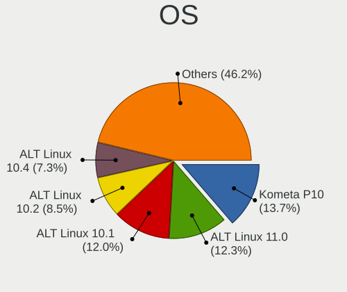

| Name               | Computers | Percent |
|--------------------|-----------|---------|
| Kometa P10         | 165       | 13.67%  |
| ALT Linux 11.0     | 148       | 12.26%  |
| ALT Linux 10.1     | 145       | 12.01%  |
| ALT Linux 10.2     | 103       | 8.53%   |
| ALT Linux 10.4     | 88        | 7.29%   |
| ALT Linux 9.1      | 65        | 5.39%   |
| ALT Linux 10.0     | 62        | 5.14%   |
| MOS 10             | 61        | 5.05%   |
| ALT Linux 20240122 | 60        | 4.97%   |
| ALT Linux 11.1     | 47        | 3.89%   |
| ALT Linux 10.3     | 46        | 3.81%   |
| ALT Linux 9.0      | 31        | 2.57%   |
| ALT Linux 9.2      | 18        | 1.49%   |
| ALT Linux 10       | 17        | 1.41%   |
| ALT Linux 8.4      | 13        | 1.08%   |
| ALT Linux 11       | 13        | 1.08%   |
| ALT Linux P10      | 11        | 0.91%   |
| ALT Linux 0.9.3    | 9         | 0.75%   |
| ALT Linux 20250612 | 8         | 0.66%   |
| ALT Linux 10.1.900 | 8         | 0.66%   |
| ALT Linux 0.9.2    | 8         | 0.66%   |
| ALT Linux P9       | 6         | 0.5%    |
| ALT Linux 8.2      | 6         | 0.5%    |
| ALT Linux 10.0.900 | 6         | 0.5%    |
| ALT Linux P8       | 5         | 0.41%   |
| ALT Linux 20230819 | 5         | 0.41%   |
| ALT Linux 20201124 | 5         | 0.41%   |
| ALT Linux 10.1.990 | 5         | 0.41%   |
| ALT Linux 0.9.1    | 5         | 0.41%   |
| ALT Linux 20220110 | 4         | 0.33%   |
| ALT Linux 10.900   | 4         | 0.33%   |
| ALT Linux 7.0.5    | 2         | 0.17%   |
| ALT Linux 20191026 | 2         | 0.17%   |
| ALT Linux 11.0.900 | 2         | 0.17%   |
| Kometa 1           | 1         | 0.08%   |
| ALT Linux 9.1.990  | 1         | 0.08%   |
| ALT Linux 9        | 1         | 0.08%   |
| ALT Linux 8.990    | 1         | 0.08%   |
| ALT Linux 8.93     | 1         | 0.08%   |
| ALT Linux 8.920    | 1         | 0.08%   |

OS Family
---------

OS without a version

| Name      | Computers | Percent |
|-----------|-----------|---------|
| ALT Linux | 1127      | 100%    |

Kernel
------

Version of the Linux kernel

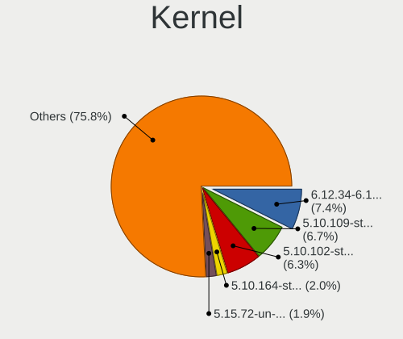

| Version               | Computers | Percent |
|-----------------------|-----------|---------|
| 6.12.34-6.12-alt1     | 94        | 7.38%   |
| 5.10.109-std-def-alt1 | 85        | 6.68%   |
| 5.10.102-std-def-alt1 | 80        | 6.28%   |
| 5.10.164-std-def-alt1 | 25        | 1.96%   |
| 5.15.72-un-def-alt1   | 24        | 1.89%   |
| 6.1.115-un-def-alt1   | 23        | 1.81%   |
| 5.15.34-un-def-alt1   | 23        | 1.81%   |
| 5.10.198-std-def-alt1 | 22        | 1.73%   |
| 5.10.139-std-def-alt1 | 18        | 1.41%   |
| 6.12.41-6.12-alt1     | 17        | 1.34%   |
| 6.1.81-un-def-alt1    | 17        | 1.34%   |
| 5.15.80-un-def-alt1   | 17        | 1.34%   |
| 5.10.82-std-def-alt1  | 17        | 1.34%   |
| 5.10.88-std-def-alt1  | 15        | 1.18%   |
| 5.10.156-std-def-alt1 | 15        | 1.18%   |
| 6.12.21-6.12-alt1     | 14        | 1.1%    |
| 5.10.123-std-def-alt1 | 14        | 1.1%    |
| 6.1.49-un-def-alt1    | 12        | 0.94%   |
| 5.4.51-std-def-alt1   | 12        | 0.94%   |
| 6.12.51-6.12-alt1     | 11        | 0.86%   |
| 6.12.45-6.12-alt1     | 11        | 0.86%   |
| 6.1.57-un-def-alt1    | 11        | 0.86%   |
| 6.1.55-un-def-alt1    | 11        | 0.86%   |
| 4.19.79-std-def-alt1  | 11        | 0.86%   |
| 5.4.68-std-def-alt1.1 | 10        | 0.79%   |
| 6.1.79-un-def-alt1    | 9         | 0.71%   |
| 6.1.111-un-def-alt1   | 9         | 0.71%   |
| 5.10.166-std-def-alt1 | 9         | 0.71%   |
| 6.1.85-un-def-alt1    | 8         | 0.63%   |
| 6.12.59-6.12-alt1     | 7         | 0.55%   |
| 6.12.24-6.12-alt1     | 7         | 0.55%   |
| 6.1.38-un-def-alt1    | 7         | 0.55%   |
| 5.4.28-std-def-alt1   | 7         | 0.55%   |
| 5.10.152-std-def-alt1 | 7         | 0.55%   |
| 6.6.21-un-def-alt1    | 6         | 0.47%   |
| 6.1.77-un-def-alt1    | 6         | 0.47%   |
| 5.15.76-un-def-alt1   | 6         | 0.47%   |
| 6.6.32-un-def-alt1    | 5         | 0.39%   |
| 6.12.61-6.12-alt1     | 5         | 0.39%   |
| 6.12.57-6.12-alt1     | 5         | 0.39%   |

Kernel Family
-------------

Linux kernel without a distro release

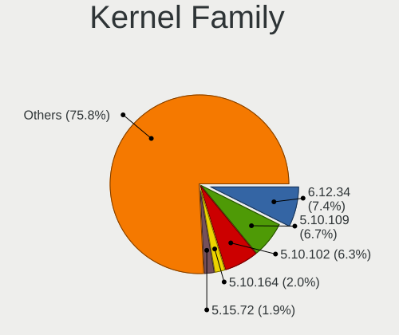

| Version  | Computers | Percent |
|----------|-----------|---------|
| 6.12.34  | 94        | 7.38%   |
| 5.10.109 | 85        | 6.68%   |
| 5.10.102 | 80        | 6.28%   |
| 5.10.164 | 25        | 1.96%   |
| 5.15.72  | 24        | 1.89%   |
| 6.1.115  | 23        | 1.81%   |
| 5.15.34  | 23        | 1.81%   |
| 5.10.198 | 23        | 1.81%   |
| 5.15.80  | 18        | 1.41%   |
| 5.10.139 | 18        | 1.41%   |
| 6.12.41  | 17        | 1.34%   |
| 6.1.81   | 17        | 1.34%   |
| 5.10.82  | 17        | 1.34%   |
| 5.10.156 | 16        | 1.26%   |
| 5.10.88  | 15        | 1.18%   |
| 6.12.21  | 14        | 1.1%    |
| 5.10.123 | 14        | 1.1%    |
| 6.1.55   | 12        | 0.94%   |
| 6.1.49   | 12        | 0.94%   |
| 5.4.51   | 12        | 0.94%   |
| 6.12.51  | 11        | 0.86%   |
| 6.12.45  | 11        | 0.86%   |
| 6.1.57   | 11        | 0.86%   |
| 5.4.68   | 11        | 0.86%   |
| 4.19.79  | 11        | 0.86%   |
| 6.1.85   | 9         | 0.71%   |
| 6.1.79   | 9         | 0.71%   |
| 6.1.111  | 9         | 0.71%   |
| 5.10.166 | 9         | 0.71%   |
| 6.12.59  | 7         | 0.55%   |
| 6.12.24  | 7         | 0.55%   |
| 6.1.38   | 7         | 0.55%   |
| 6.1.100  | 7         | 0.55%   |
| 5.4.28   | 7         | 0.55%   |
| 5.10.152 | 7         | 0.55%   |
| 6.6.32   | 6         | 0.47%   |
| 6.6.21   | 6         | 0.47%   |
| 6.1.77   | 6         | 0.47%   |
| 5.15.76  | 6         | 0.47%   |
| 6.6.52   | 5         | 0.39%   |

Kernel Major Ver.
-----------------

Linux kernel major version

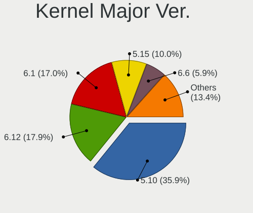

| Version | Computers | Percent |
|---------|-----------|---------|
| 5.10    | 429       | 35.87%  |
| 6.12    | 214       | 17.89%  |
| 6.1     | 203       | 16.97%  |
| 5.15    | 120       | 10.03%  |
| 6.6     | 70        | 5.85%   |
| 5.4     | 68        | 5.69%   |
| 4.19    | 26        | 2.17%   |
| 4.9     | 7         | 0.59%   |
| 6.5     | 6         | 0.5%    |
| 6.11    | 6         | 0.5%    |
| 6.9     | 5         | 0.42%   |
| 5.7     | 5         | 0.42%   |
| 6.14    | 4         | 0.33%   |
| 6.2     | 3         | 0.25%   |
| 5.2     | 3         | 0.25%   |
| 5.18    | 3         | 0.25%   |
| 5.14    | 3         | 0.25%   |
| 5.13    | 3         | 0.25%   |
| 6.4     | 2         | 0.17%   |
| 6.17    | 2         | 0.17%   |
| 6.16    | 2         | 0.17%   |
| 6.15    | 2         | 0.17%   |
| 4.14    | 2         | 0.17%   |
| 6.18    | 1         | 0.08%   |
| 6.13    | 1         | 0.08%   |
| 5.9     | 1         | 0.08%   |
| 5.3     | 1         | 0.08%   |
| 5.16    | 1         | 0.08%   |
| 5.12    | 1         | 0.08%   |
| 4.4     | 1         | 0.08%   |
| 4.20    | 1         | 0.08%   |

Arch
----

OS architecture (x86_64, i586, etc.)

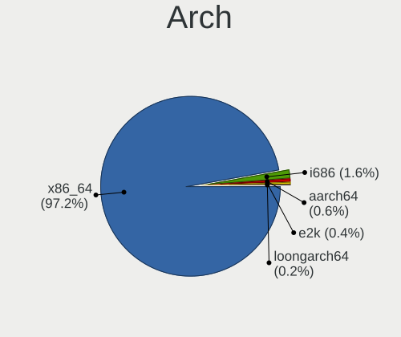

| Name        | Computers | Percent |
|-------------|-----------|---------|
| x86_64      | 1095      | 97.16%  |
| i686        | 18        | 1.6%    |
| aarch64     | 7         | 0.62%   |
| e2k         | 5         | 0.44%   |
| loongarch64 | 2         | 0.18%   |

DE
--

Desktop Environment

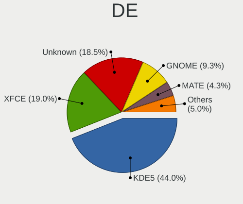

| Name             | Computers | Percent |
|------------------|-----------|---------|
| KDE5             | 512       | 43.99%  |
| XFCE             | 221       | 18.99%  |
| Unknown          | 215       | 18.47%  |
| GNOME            | 108       | 9.28%   |
| MATE             | 50        | 4.3%    |
| KDE:KDE-Wayland  | 14        | 1.2%    |
| LXQt             | 10        | 0.86%   |
| KDE6             | 8         | 0.69%   |
| Cinnamon         | 7         | 0.6%    |
| KDE:KDE-X11      | 6         | 0.52%   |
| X-Cinnamon       | 4         | 0.34%   |
| KDE              | 4         | 0.34%   |
| GNOME Flashback  | 2         | 0.17%   |
| LXDE             | 1         | 0.09%   |
| KDE:KDE-Wayland: | 1         | 0.09%   |
| Hyprland         | 1         | 0.09%   |

Display Server
--------------

X11 or Wayland

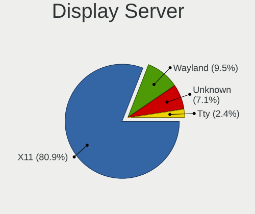

| Name    | Computers | Percent |
|---------|-----------|---------|
| X11     | 926       | 80.94%  |
| Wayland | 109       | 9.53%   |
| Unknown | 81        | 7.08%   |
| Tty     | 28        | 2.45%   |

Display Manager
---------------

SDDM, LightDM, etc.

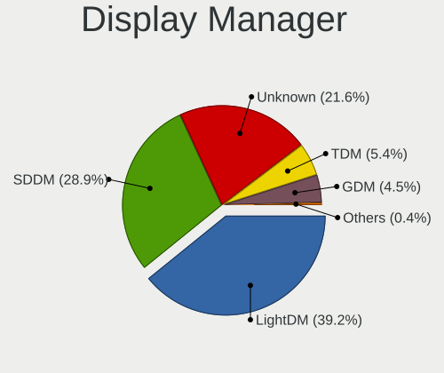

| Name    | Computers | Percent |
|---------|-----------|---------|
| LightDM | 452       | 39.17%  |
| SDDM    | 334       | 28.94%  |
| Unknown | 249       | 21.58%  |
| TDM     | 62        | 5.37%   |
| GDM     | 52        | 4.51%   |
| XDM     | 2         | 0.17%   |
| WDM     | 1         | 0.09%   |
| GREETD  | 1         | 0.09%   |
| CAPSH   | 1         | 0.09%   |

OS Lang
-------

Language

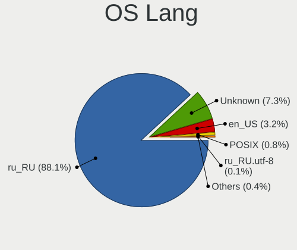

| Lang        | Computers | Percent |
|-------------|-----------|---------|
| ru_RU       | 1010      | 88.13%  |
| Unknown     | 84        | 7.33%   |
| en_US       | 37        | 3.23%   |
| POSIX       | 9         | 0.79%   |
| ru_RU.UTF8  | 1         | 0.09%   |
| ru_RU.utf-8 | 1         | 0.09%   |
| ru          | 1         | 0.09%   |
| it_IT@euro  | 1         | 0.09%   |
| el_GR       | 1         | 0.09%   |
| C           | 1         | 0.09%   |

Boot Mode
---------

EFI or BIOS

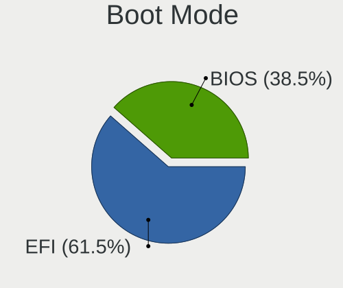

| Mode | Computers | Percent |
|------|-----------|---------|
| EFI  | 699       | 61.48%  |
| BIOS | 438       | 38.52%  |

Filesystem
----------

Type of filesystem

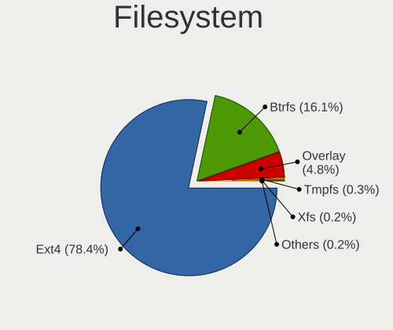

| Type    | Computers | Percent |
|---------|-----------|---------|
| Ext4    | 898       | 78.36%  |
| Btrfs   | 185       | 16.14%  |
| Overlay | 55        | 4.8%    |
| Tmpfs   | 4         | 0.35%   |
| Xfs     | 2         | 0.17%   |
| Unknown | 2         | 0.17%   |

Part. scheme
------------

Scheme of partitioning

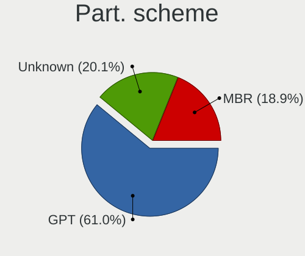

| Type    | Computers | Percent |
|---------|-----------|---------|
| GPT     | 697       | 60.98%  |
| Unknown | 230       | 20.12%  |
| MBR     | 216       | 18.9%   |

Dual Boot with Linux/BSD
------------------------

Hosting more than one Linux/BSD

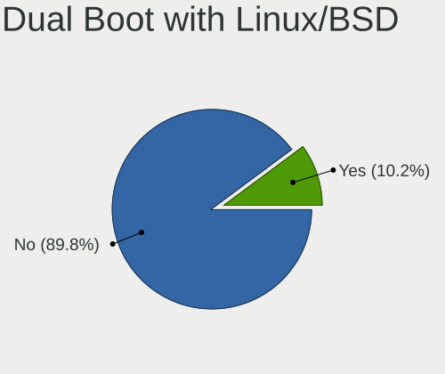

| Dual boot | Computers | Percent |
|-----------|-----------|---------|
| No        | 1026      | 89.84%  |
| Yes       | 116       | 10.16%  |

Dual Boot (Win)
---------------

Hosting Linux and Windows

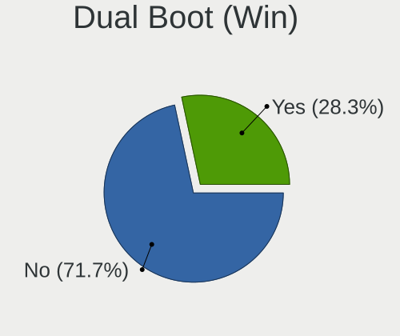

| Dual boot | Computers | Percent |
|-----------|-----------|---------|
| No        | 819       | 71.65%  |
| Yes       | 324       | 28.35%  |

Board
-----

Vendor
------

Motherboard manufacturer

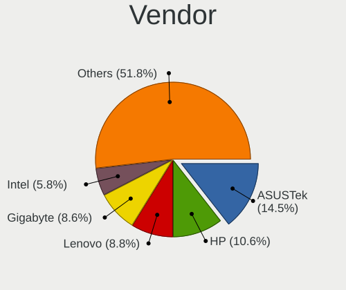

| Name                                 | Computers | Percent |
|--------------------------------------|-----------|---------|
| ASUSTek Computer                     | 163       | 14.46%  |
| Hewlett-Packard                      | 119       | 10.56%  |
| Lenovo                               | 99        | 8.78%   |
| Gigabyte Technology                  | 97        | 8.61%   |
| Intel                                | 65        | 5.77%   |
| Acer                                 | 63        | 5.59%   |
| MSI                                  | 60        | 5.32%   |
| ASRock                               | 48        | 4.26%   |
| Unknown                              | 35        | 3.11%   |
| Clevo                                | 32        | 2.84%   |
| ICL                                  | 30        | 2.66%   |
| Dell                                 | 29        | 2.57%   |
| 3Logic Group                         | 29        | 2.57%   |
| Aquarius                             | 20        | 1.77%   |
| HUAWEI                               | 19        | 1.69%   |
| DEPO Computers                       | 17        | 1.51%   |
| Apple                                | 13        | 1.15%   |
| Graviton                             | 12        | 1.06%   |
| Biostar                              | 11        | 0.98%   |
| Samsung Electronics                  | 10        | 0.89%   |
| Supermicro                           | 7         | 0.62%   |
| iRU                                  | 7         | 0.62%   |
| ICL Techno                           | 7         | 0.62%   |
| HONOR                                | 7         | 0.62%   |
| Toshiba                              | 6         | 0.53%   |
| Sony                                 | 6         | 0.53%   |
| Kraftway                             | 6         | 0.53%   |
| TECNO Mobile Limited                 | 4         | 0.35%   |
| Pegatron                             | 4         | 0.35%   |
| MAINBRD                              | 4         | 0.35%   |
| Maibenben                            | 4         | 0.35%   |
| Huanan                               | 4         | 0.35%   |
| Timi                                 | 3         | 0.27%   |
| Infinix                              | 3         | 0.27%   |
| F-PLUS EQUIPMENT AND DEVELOPMENTS    | 3         | 0.27%   |
| BESHTAU                              | 3         | 0.27%   |
| AZW                                  | 3         | 0.27%   |
| XIAOMI                               | 2         | 0.18%   |
| Shenzhen Meigao Electronic Equipment | 2         | 0.18%   |
| Raspberry Pi Foundation              | 2         | 0.18%   |

Model
-----

Motherboard model

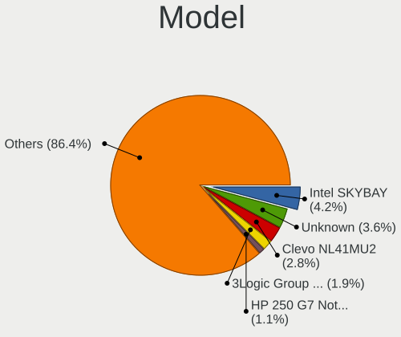

| Name                                    | Computers | Percent |
|-----------------------------------------|-----------|---------|
| Intel SKYBAY                            | 47        | 4.17%   |
| Unknown                                 | 41        | 3.64%   |
| Clevo NL41MU2                           | 32        | 2.84%   |
| 3Logic Group Graviton                   | 21        | 1.86%   |
| HP 250 G7 Notebook PC                   | 12        | 1.06%   |
| ASUS PRIME B450-PLUS                    | 12        | 1.06%   |
| Lenovo V540-24IWL AIO 10YS0031RU        | 10        | 0.89%   |
| Acer Veriton X2640G                     | 10        | 0.89%   |
| ICL RAYbook Si1512                      | 9         | 0.8%    |
| HP ZBook 17 G5                          | 9         | 0.8%    |
| HP ProBook 440 G5                       | 9         | 0.8%    |
| ASUS All Series                         | 8         | 0.71%   |
| Aquarius NS685U R11                     | 8         | 0.71%   |
| DEPO Computers DPC156                   | 7         | 0.62%   |
| Lenovo ThinkSystem SR590 -[7X99CTO1WW]- | 5         | 0.44%   |
| Gigabyte H110M-S2H                      | 5         | 0.44%   |
| ASUS H110M-R                            | 5         | 0.44%   |
| MSI MS-7D46                             | 4         | 0.35%   |
| MSI MS-7C56                             | 4         | 0.35%   |
| MAINBRD OPS62A-SHA                      | 4         | 0.35%   |
| Lenovo ThinkBook 15 G2 ITL 20VE         | 4         | 0.35%   |
| Kraftway ACCORD                         | 4         | 0.35%   |
| ICL RAY Si105.Mi                        | 4         | 0.35%   |
| ICL RAY S122.Mi                         | 4         | 0.35%   |
| HP ProLiant SL230s Gen8                 | 4         | 0.35%   |
| DEPO Computers DPA520S                  | 4         | 0.35%   |
| ASUS P5B-Deluxe                         | 4         | 0.35%   |
| 3Logic Group Graviton N15i              | 4         | 0.35%   |
| Supermicro SYS-6029P-WTRT               | 3         | 0.27%   |
| MSI MS-7A38                             | 3         | 0.27%   |
| Maibenben Perfectum Series              | 3         | 0.27%   |
| Lenovo ThinkPad E15 Gen 4 21ED004YRT    | 3         | 0.27%   |
| Lenovo B50-30 20382                     | 3         | 0.27%   |
| ICL Techno F140a                        | 3         | 0.27%   |
| HUAWEI RLEF-XX                          | 3         | 0.27%   |
| HUAWEI NBD-WXX9                         | 3         | 0.27%   |
| HP Pavilion dv6                         | 3         | 0.27%   |
| HP Laptop 15-bw0xx                      | 3         | 0.27%   |
| HP EliteBook 8470p                      | 3         | 0.27%   |
| HP EliteBook 840 G4                     | 3         | 0.27%   |

Model Family
------------

Motherboard model prefix

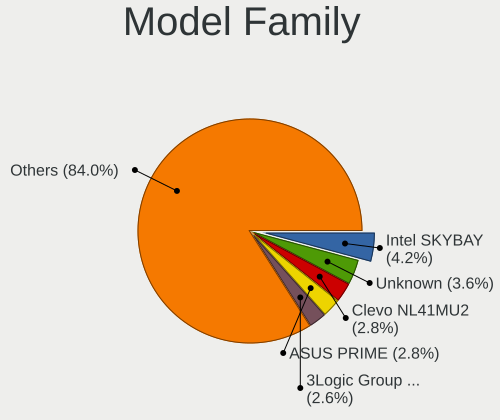

| Name                          | Computers | Percent |
|-------------------------------|-----------|---------|
| Intel SKYBAY                  | 47        | 4.17%   |
| Unknown                       | 41        | 3.64%   |
| Clevo NL41MU2                 | 32        | 2.84%   |
| ASUS PRIME                    | 31        | 2.75%   |
| 3Logic Group Graviton         | 29        | 2.57%   |
| Acer Aspire                   | 28        | 2.48%   |
| Lenovo IdeaPad                | 19        | 1.69%   |
| HP ProBook                    | 19        | 1.69%   |
| Lenovo ThinkPad               | 18        | 1.6%    |
| HP 250                        | 17        | 1.51%   |
| ASUS VivoBook                 | 17        | 1.51%   |
| Acer Veriton                  | 17        | 1.51%   |
| HP Pavilion                   | 16        | 1.42%   |
| HP Laptop                     | 13        | 1.15%   |
| ASUS ASUS                     | 13        | 1.15%   |
| ICL RAYbook                   | 12        | 1.06%   |
| Lenovo V540-24IWL             | 10        | 0.89%   |
| HP EliteBook                  | 10        | 0.89%   |
| Dell Inspiron                 | 10        | 0.89%   |
| HP ZBook                      | 9         | 0.8%    |
| ICL RAY                       | 8         | 0.71%   |
| HP ProLiant                   | 8         | 0.71%   |
| ASUS All                      | 8         | 0.71%   |
| Aquarius NS685U               | 8         | 0.71%   |
| DEPO Computers DPC156         | 7         | 0.62%   |
| Dell OptiPlex                 | 6         | 0.53%   |
| Dell Latitude                 | 6         | 0.53%   |
| ASUS ROG                      | 6         | 0.53%   |
| Acer TravelMate               | 6         | 0.53%   |
| MSI Modern                    | 5         | 0.44%   |
| Lenovo V15                    | 5         | 0.44%   |
| Lenovo ThinkSystem            | 5         | 0.44%   |
| Lenovo ThinkBook              | 5         | 0.44%   |
| Gigabyte H110M-S2H            | 5         | 0.44%   |
| Gigabyte B450                 | 5         | 0.44%   |
| ASUS H110M-R                  | 5         | 0.44%   |
| Toshiba Satellite             | 4         | 0.35%   |
| TECNO Mobile Limited MEGABOOK | 4         | 0.35%   |
| MSI MS-7D46                   | 4         | 0.35%   |
| MSI MS-7C56                   | 4         | 0.35%   |

MFG Year
--------

Motherboard manufacture year

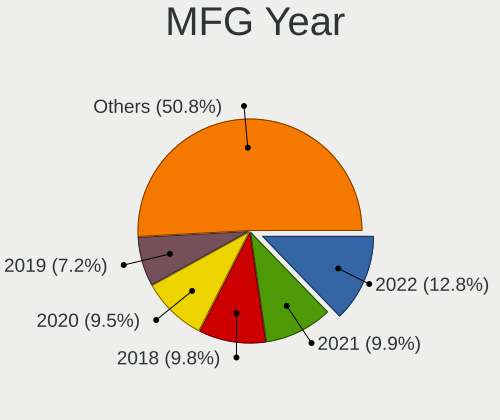

| Year    | Computers | Percent |
|---------|-----------|---------|
| 2022    | 144       | 12.78%  |
| 2021    | 112       | 9.94%   |
| 2018    | 110       | 9.76%   |
| 2020    | 107       | 9.49%   |
| 2019    | 81        | 7.19%   |
| 2017    | 81        | 7.19%   |
| 2023    | 68        | 6.03%   |
| 2012    | 49        | 4.35%   |
| 2016    | 48        | 4.26%   |
| 2024    | 44        | 3.9%    |
| 2014    | 42        | 3.73%   |
| 2011    | 41        | 3.64%   |
| 2013    | 39        | 3.46%   |
| 2010    | 34        | 3.02%   |
| 2009    | 25        | 2.22%   |
| 2015    | 23        | 2.04%   |
| 2008    | 21        | 1.86%   |
| 2007    | 17        | 1.51%   |
| 2006    | 14        | 1.24%   |
| 2025    | 11        | 0.98%   |
| Unknown | 9         | 0.8%    |
| 2005    | 4         | 0.35%   |
| 2004    | 2         | 0.18%   |
| 2003    | 1         | 0.09%   |

Form Factor
-----------

Physical design of the computer

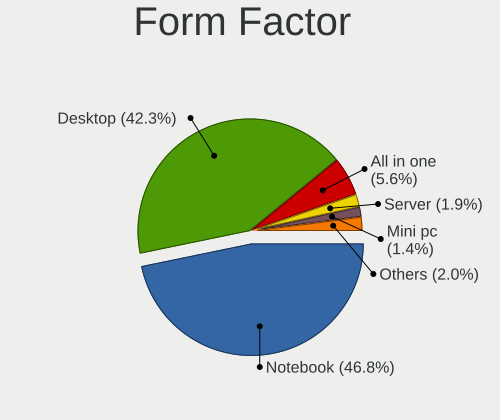

| Name           | Computers | Percent |
|----------------|-----------|---------|
| Notebook       | 527       | 46.76%  |
| Desktop        | 477       | 42.32%  |
| All in one     | 63        | 5.59%   |
| Server         | 21        | 1.86%   |
| Mini pc        | 16        | 1.42%   |
| Convertible    | 9         | 0.8%    |
| System on chip | 7         | 0.62%   |
| Tablet         | 6         | 0.53%   |
| Stick pc       | 1         | 0.09%   |

Secure Boot
-----------

Enabled or disabled

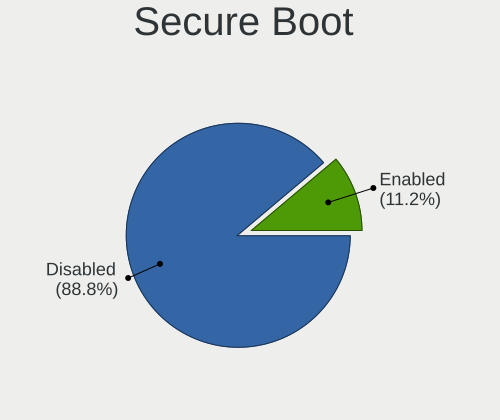

| State    | Computers | Percent |
|----------|-----------|---------|
| Disabled | 1012      | 88.85%  |
| Enabled  | 127       | 11.15%  |

Coreboot
--------

Have coreboot on board

| Used | Computers | Percent |
|------|-----------|---------|
| No   | 1126      | 99.91%  |
| Yes  | 1         | 0.09%   |

RAM Size
--------

Total RAM memory

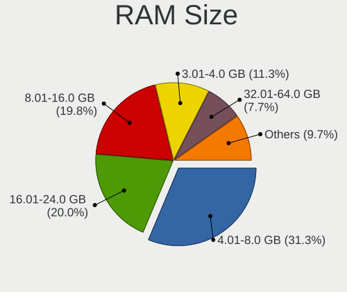

| Size in GB      | Computers | Percent |
|-----------------|-----------|---------|
| 4.01-8.0        | 357       | 31.34%  |
| 16.01-24.0      | 228       | 20.02%  |
| 8.01-16.0       | 226       | 19.84%  |
| 3.01-4.0        | 129       | 11.33%  |
| 32.01-64.0      | 88        | 7.73%   |
| 1.01-2.0        | 36        | 3.16%   |
| 64.01-256.0     | 31        | 2.72%   |
| 24.01-32.0      | 19        | 1.67%   |
| 2.01-3.0        | 12        | 1.05%   |
| More than 256.0 | 8         | 0.7%    |
| 0.51-1.0        | 5         | 0.44%   |

RAM Used
--------

Used RAM memory

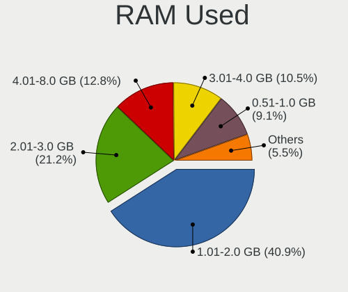

| Used GB     | Computers | Percent |
|-------------|-----------|---------|
| 1.01-2.0    | 497       | 40.94%  |
| 2.01-3.0    | 257       | 21.17%  |
| 4.01-8.0    | 155       | 12.77%  |
| 3.01-4.0    | 127       | 10.46%  |
| 0.51-1.0    | 111       | 9.14%   |
| 8.01-16.0   | 41        | 3.38%   |
| 0.01-0.5    | 13        | 1.07%   |
| 64.01-256.0 | 5         | 0.41%   |
| 16.01-24.0  | 4         | 0.33%   |
| 32.01-64.0  | 3         | 0.25%   |
| 24.01-32.0  | 1         | 0.08%   |

Total Drives
------------

Number of drives on board

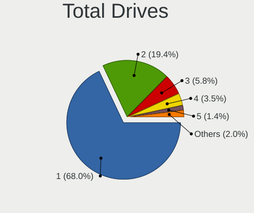

| Drives  | Computers | Percent |
|---------|-----------|---------|
| 1       | 786       | 67.99%  |
| 2       | 224       | 19.38%  |
| 3       | 67        | 5.8%    |
| 4       | 40        | 3.46%   |
| 5       | 16        | 1.38%   |
| 0       | 6         | 0.52%   |
| 6       | 5         | 0.43%   |
| 13      | 4         | 0.35%   |
| 8       | 4         | 0.35%   |
| 7       | 2         | 0.17%   |
| 9       | 1         | 0.09%   |
| Unknown | 1         | 0.09%   |

Has CD-ROM
----------

Has CD-ROM on board

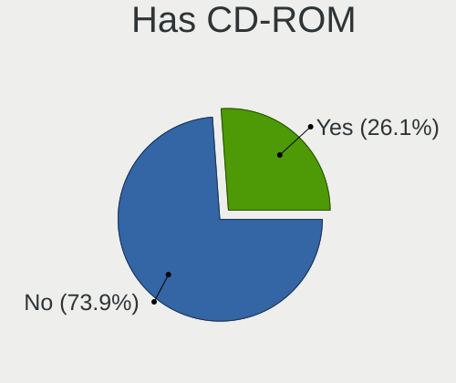

| Presented | Computers | Percent |
|-----------|-----------|---------|
| No        | 839       | 73.86%  |
| Yes       | 297       | 26.14%  |

Has Ethernet
------------

Has Ethernet on board

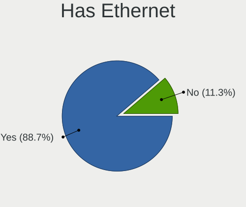

| Presented | Computers | Percent |
|-----------|-----------|---------|
| Yes       | 1000      | 88.73%  |
| No        | 127       | 11.27%  |

Has WiFi
--------

Has WiFi module

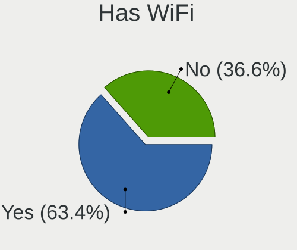

| Presented | Computers | Percent |
|-----------|-----------|---------|
| Yes       | 718       | 63.43%  |
| No        | 414       | 36.57%  |

Has Bluetooth
-------------

Has Bluetooth module

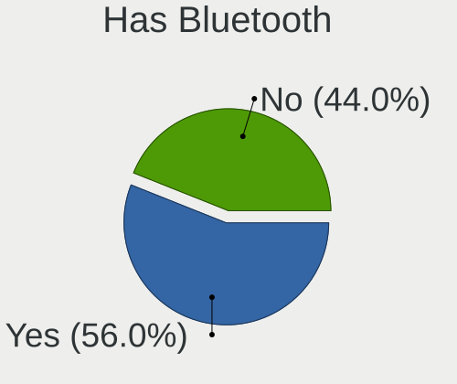

| Presented | Computers | Percent |
|-----------|-----------|---------|
| Yes       | 636       | 56.04%  |
| No        | 499       | 43.96%  |

Location
--------

Country
-------

Geographic location (country)

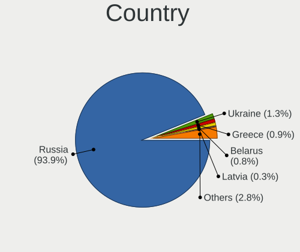

| Country     | Computers | Percent |
|-------------|-----------|---------|
| Russia      | 1061      | 93.89%  |
| Ukraine     | 15        | 1.33%   |
| Greece      | 10        | 0.88%   |
| Belarus     | 9         | 0.8%    |
| Latvia      | 3         | 0.27%   |
| Kazakhstan  | 3         | 0.27%   |
| UK          | 2         | 0.18%   |
| Switzerland | 2         | 0.18%   |
| Spain       | 2         | 0.18%   |
| Germany     | 2         | 0.18%   |
| Estonia     | 2         | 0.18%   |
| Egypt       | 2         | 0.18%   |
| Uzbekistan  | 1         | 0.09%   |
| USA         | 1         | 0.09%   |
| Thailand    | 1         | 0.09%   |
| Netherlands | 1         | 0.09%   |
| Morocco     | 1         | 0.09%   |
| Moldova     | 1         | 0.09%   |
| Italy       | 1         | 0.09%   |
| Israel      | 1         | 0.09%   |
| France      | 1         | 0.09%   |
| Finland     | 1         | 0.09%   |
| Czechia     | 1         | 0.09%   |
| Costa Rica  | 1         | 0.09%   |
| Colombia    | 1         | 0.09%   |
| China       | 1         | 0.09%   |
| Bulgaria    | 1         | 0.09%   |
| Bangladesh  | 1         | 0.09%   |
| Australia   | 1         | 0.09%   |

City
----

Geographic location (city)

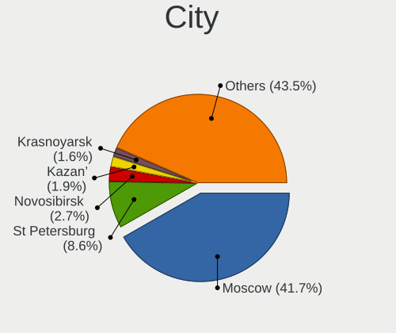

| City              | Computers | Percent |
|-------------------|-----------|---------|
| Moscow            | 483       | 41.75%  |
| St Petersburg     | 99        | 8.56%   |
| Novosibirsk       | 31        | 2.68%   |
| Kazan’          | 22        | 1.9%    |
| Krasnoyarsk       | 19        | 1.64%   |
| Krasnodar         | 18        | 1.56%   |
| Samara            | 16        | 1.38%   |
| Barnaul           | 14        | 1.21%   |
| Yekaterinburg     | 13        | 1.12%   |
| Rostov-on-Don     | 13        | 1.12%   |
| Perm              | 10        | 0.86%   |
| Chelyabinsk       | 10        | 0.86%   |
| Zheleznodorozhnyy | 9         | 0.78%   |
| Voronezh          | 9         | 0.78%   |
| Tyumen            | 9         | 0.78%   |
| Tver              | 9         | 0.78%   |
| Obninsk           | 9         | 0.78%   |
| Saratov           | 8         | 0.69%   |
| Irkutsk           | 8         | 0.69%   |
| Vladimir          | 7         | 0.61%   |
| Surgut            | 7         | 0.61%   |
| Stavropol         | 6         | 0.52%   |
| Simferopol        | 6         | 0.52%   |
| Omsk              | 6         | 0.52%   |
| Lipetsk           | 5         | 0.43%   |
| Kirov             | 5         | 0.43%   |
| Kaliningrad       | 5         | 0.43%   |
| Astrakhan         | 5         | 0.43%   |
| Veliky Novgorod   | 4         | 0.35%   |
| Ufa               | 4         | 0.35%   |
| Tolyatti          | 4         | 0.35%   |
| Sevastopol        | 4         | 0.35%   |
| Sergiyev Posad    | 4         | 0.35%   |
| Orenburg          | 4         | 0.35%   |
| Nizhniy Novgorod  | 4         | 0.35%   |
| Kursk             | 4         | 0.35%   |
| Khabarovsk        | 4         | 0.35%   |
| Kemerovo          | 4         | 0.35%   |
| Izhevsk           | 4         | 0.35%   |
| Engel's           | 4         | 0.35%   |

Drives
------

Drive Vendor
------------

Hard drive vendors

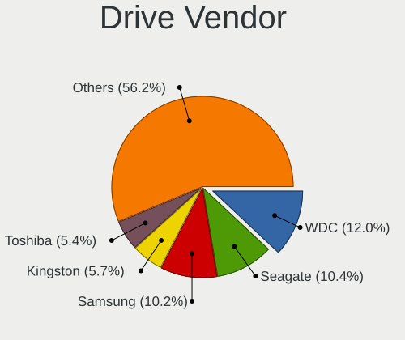

| Vendor                      | Computers | Drives | Percent |
|-----------------------------|-----------|--------|---------|
| WDC                         | 188       | 273    | 11.99%  |
| Seagate                     | 163       | 252    | 10.4%   |
| Samsung Electronics         | 160       | 229    | 10.2%   |
| Kingston                    | 90        | 121    | 5.74%   |
| Toshiba                     | 85        | 121    | 5.42%   |
| A-DATA Technology           | 56        | 60     | 3.57%   |
| Apacer                      | 55        | 64     | 3.51%   |
| Intel                       | 47        | 77     | 3%      |
| SK hynix                    | 40        | 43     | 2.55%   |
| Sandisk                     | 35        | 39     | 2.23%   |
| China                       | 35        | 40     | 2.23%   |
| BIWIN                       | 34        | 35     | 2.17%   |
| AXIOMTEK                    | 29        | 31     | 1.85%   |
| Unknown                     | 28        | 42     | 1.79%   |
| Hitachi                     | 28        | 31     | 1.79%   |
| Micron Technology           | 27        | 37     | 1.72%   |
| MAXIO Technology (Hangzhou) | 25        | 33     | 1.59%   |
| Netac                       | 21        | 22     | 1.34%   |
| Patriot                     | 18        | 22     | 1.15%   |
| Crucial                     | 18        | 20     | 1.15%   |
| Phison                      | 15        | 18     | 0.96%   |
| Gigabyte Technology         | 15        | 15     | 0.96%   |
| Foxline                     | 15        | 15     | 0.96%   |
| AMD                         | 15        | 15     | 0.96%   |
| Silicon Motion              | 14        | 15     | 0.89%   |
| XPG                         | 12        | 16     | 0.77%   |
| Kingston Technology Company | 12        | 19     | 0.77%   |
| KingSpec                    | 12        | 12     | 0.77%   |
| HGST                        | 12        | 12     | 0.77%   |
| SPCC                        | 11        | 11     | 0.7%    |
| Phison Electronics          | 9         | 12     | 0.57%   |
| KIOXIA                      | 9         | 12     | 0.57%   |
| Transcend                   | 8         | 10     | 0.51%   |
| Plextor                     | 8         | 11     | 0.51%   |
| Hewlett-Packard             | 8         | 20     | 0.51%   |
| FORESEE                     | 8         | 10     | 0.51%   |
| Unknown                     | 8         | 10     | 0.51%   |
| XrayDisk                    | 7         | 7      | 0.45%   |
| Team                        | 7         | 9      | 0.45%   |
| Smartbuy                    | 7         | 8      | 0.45%   |

Drive Model
-----------

Hard drive models

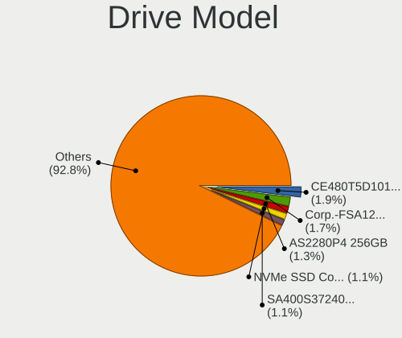

| Model                                                 | Computers | Percent |
|-------------------------------------------------------|-----------|---------|
| BIWIN CE480T5D101-256 256GB                           | 32        | 1.93%   |
| AXIOMTEK Corp.-FSA128GMC2T 128GB SSD                  | 29        | 1.75%   |
| Apacer AS2280P4 256GB                                 | 21        | 1.27%   |
| MAXIO (Hangzhou) NVMe SSD Controller MAP1202 2TB      | 19        | 1.15%   |
| Kingston SA400S37240G 240GB SSD                       | 19        | 1.15%   |
| Toshiba HDWD110 1TB                                   | 18        | 1.09%   |
| Samsung MZVLW128HEGR-00000 128GB                      | 18        | 1.09%   |
| Toshiba HDWD120 2TB                                   | 13        | 0.78%   |
| SK hynix BC501 HFM256GDJTNG-8310A 256GB               | 13        | 0.78%   |
| Foxline FLSSD256M80E13TCX5 256GB                      | 13        | 0.78%   |
| Seagate ST1000LM049-2GH172 1TB                        | 12        | 0.72%   |
| WDC WD5000AZLX-21K2TA0 500GB                          | 10        | 0.6%    |
| Samsung SSD 860 EVO 250GB                             | 10        | 0.6%    |
| Intel SSDPEKNU512GZ 512GB                             | 10        | 0.6%    |
| SK hynix SKHynix_HFS256GD9TNG-L5B0B 256GB             | 9         | 0.54%   |
| Silicon Motion SM2263EN/SM2263XT SSD Controller 512GB | 9         | 0.54%   |
| Kingston SA400S37120G 120GB SSD                       | 9         | 0.54%   |
| Toshiba DT01ACA050 500GB                              | 8         | 0.48%   |
| Seagate ST1000DM010-2EP102 1TB                        | 8         | 0.48%   |
| SanDisk NVMe SSD Drive 512GB                          | 8         | 0.48%   |
| Intel SSDPEMKF256G8H 256GB                            | 8         | 0.48%   |
| Intel SSDPEKKF256G7H 256GB                            | 8         | 0.48%   |
| Unknown                                               | 8         | 0.48%   |
| WDC WD10EZEX-08WN4A0 1TB                              | 7         | 0.42%   |
| Toshiba DT01ACA100 1TB                                | 7         | 0.42%   |
| Seagate ST500DM002-1BD142 500GB                       | 7         | 0.42%   |
| Kingston SA400S37480G 480GB SSD                       | 7         | 0.42%   |
| Apacer AS350 256GB SSD                                | 7         | 0.42%   |
| A-DATA SU650 240GB SSD                                | 7         | 0.42%   |
| Seagate ST9250315AS 250GB                             | 6         | 0.36%   |
| Seagate ST1000LM035-1RK172 1TB                        | 6         | 0.36%   |
| Seagate ST1000LM024 HN-M101MBB 1TB                    | 6         | 0.36%   |
| Samsung SSD 970 EVO Plus 250GB                        | 6         | 0.36%   |
| Samsung SSD 870 QVO 1TB                               | 6         | 0.36%   |
| Samsung SSD 870 EVO 500GB                             | 6         | 0.36%   |
| Samsung SSD 860 EVO 500GB                             | 6         | 0.36%   |
| Samsung NVMe SSD Controller SM981/PM981/PM983 1TB     | 6         | 0.36%   |
| Gigabyte GP-GSM2NE3256GNTD 256GB                      | 6         | 0.36%   |
| Crucial CT240BX500SSD1 240GB                          | 6         | 0.36%   |
| China SSD 240GB                                       | 6         | 0.36%   |

HDD Vendor
----------

Hard disk drive vendors

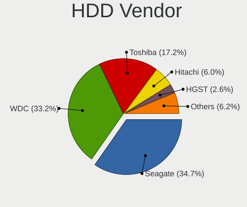

| Vendor              | Computers | Drives  | Percent |
|---------------------|-----------|---------|---------|
| Seagate             | 161       | 246     | 34.7%   |
| WDC                 | 154       | 232     | 33.19%  |
| Toshiba             | 80        | 114     | 17.24%  |
| Hitachi             | 28        | 31      | 6.03%   |
| HGST                | 12        | 12      | 2.59%   |
| Samsung Electronics | 8         | 9       | 1.72%   |
| Fujitsu             | 5         | 5       | 1.08%   |
| External            | 3         | 5       | 0.65%   |
| Maxtor              | 2         | 2       | 0.43%   |
| JMicron Technology  | 2         | 2       | 0.43%   |
| HPE                 | 2         | 16      | 0.43%   |
| Hewlett-Packard     | 2         | 10      | 0.43%   |
| XrayDisk            | 1         | 1       | 0.22%   |
| Unknown             | 1         | 2       | 0.22%   |
| SINTECHI            | 1         | 1       | 0.22%   |
| HUAWEI              | 1         | Unknown | 0.22%   |
| ASMT                | 1         | 2       | 0.22%   |

SSD Vendor
----------

Solid state drive vendors

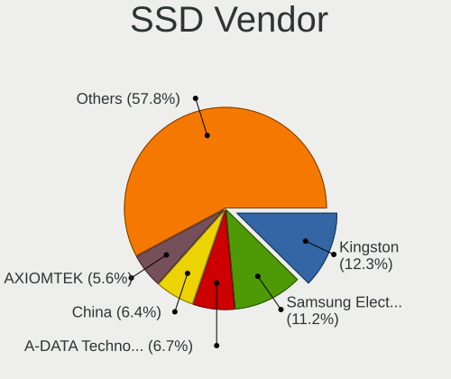

| Vendor              | Computers | Drives | Percent |
|---------------------|-----------|--------|---------|
| Kingston            | 64        | 85     | 12.33%  |
| Samsung Electronics | 58        | 87     | 11.18%  |
| A-DATA Technology   | 35        | 37     | 6.74%   |
| China               | 33        | 37     | 6.36%   |
| AXIOMTEK            | 29        | 31     | 5.59%   |
| Apacer              | 27        | 34     | 5.2%    |
| WDC                 | 25        | 28     | 4.82%   |
| Patriot             | 16        | 20     | 3.08%   |
| Crucial             | 13        | 15     | 2.5%    |
| AMD                 | 13        | 13     | 2.5%    |
| SanDisk             | 12        | 14     | 2.31%   |
| Netac               | 11        | 12     | 2.12%   |
| Intel               | 10        | 22     | 1.93%   |
| Gigabyte Technology | 9         | 9      | 1.73%   |
| Transcend           | 8         | 9      | 1.54%   |
| Plextor             | 8         | 11     | 1.54%   |
| KingSpec            | 8         | 8      | 1.54%   |
| Team                | 7         | 9      | 1.35%   |
| SPCC                | 7         | 7      | 1.35%   |
| Smartbuy            | 7         | 8      | 1.35%   |
| Micron Technology   | 7         | 12     | 1.35%   |
| Unknown             | 7         | 9      | 1.35%   |
| XrayDisk            | 6         | 6      | 1.16%   |
| TMI                 | 6         | 7      | 1.16%   |
| OCZ                 | 5         | 7      | 0.96%   |
| GOODRAM             | 5         | 5      | 0.96%   |
| Colorful            | 5         | 6      | 0.96%   |
| mSTORE              | 4         | 7      | 0.77%   |
| GS                  | 4         | 9      | 0.77%   |
| SK hynix            | 3         | 4      | 0.58%   |
| Qumo                | 3         | 3      | 0.58%   |
| PNY                 | 3         | 3      | 0.58%   |
| Foxline             | 3         | 3      | 0.58%   |
| Digma               | 3         | 4      | 0.58%   |
| Toshiba             | 2         | 2      | 0.39%   |
| Seagate             | 2         | 6      | 0.39%   |
| QOPP                | 2         | 2      | 0.39%   |
| Phison              | 2         | 2      | 0.39%   |
| Kston               | 2         | 2      | 0.39%   |
| KingDian            | 2         | 2      | 0.39%   |

Drive Kind
----------

HDD or SSD

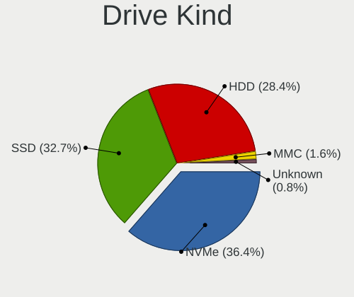

| Kind    | Computers | Drives | Percent |
|---------|-----------|--------|---------|
| NVMe    | 516       | 678    | 36.41%  |
| SSD     | 463       | 647    | 32.67%  |
| HDD     | 403       | 690    | 28.44%  |
| MMC     | 23        | 32     | 1.62%   |
| Unknown | 12        | 15     | 0.85%   |

Drive Connector
---------------

SATA, SAS, NVMe, etc.

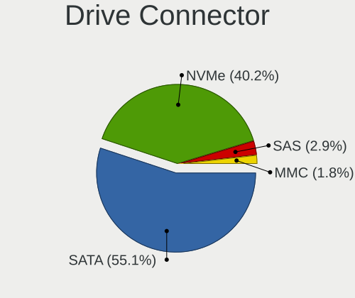

| Type | Computers | Drives | Percent |
|------|-----------|--------|---------|
| SATA | 706       | 1295   | 55.07%  |
| NVMe | 516       | 673    | 40.25%  |
| SAS  | 37        | 62     | 2.89%   |
| MMC  | 23        | 32     | 1.79%   |

Drive Size
----------

Size of hard drive

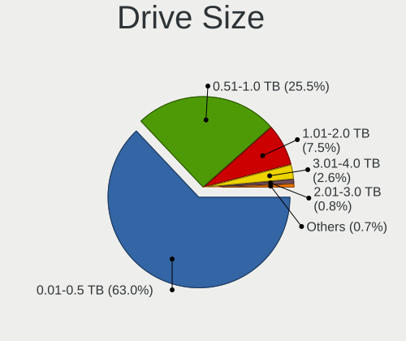

| Size in TB | Computers | Drives | Percent |
|------------|-----------|--------|---------|
| 0.01-0.5   | 556       | 795    | 62.97%  |
| 0.51-1.0   | 225       | 344    | 25.48%  |
| 1.01-2.0   | 66        | 117    | 7.47%   |
| 3.01-4.0   | 23        | 42     | 2.6%    |
| 2.01-3.0   | 7         | 8      | 0.79%   |
| 4.01-10.0  | 5         | 30     | 0.57%   |
| 0          | 1         | 1      | 0.11%   |

Space Total
-----------

Amount of disk space available on the file system

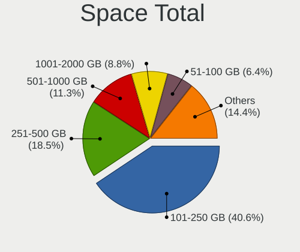

| Size in GB     | Computers | Percent |
|----------------|-----------|---------|
| 101-250        | 478       | 40.65%  |
| 251-500        | 218       | 18.54%  |
| 501-1000       | 133       | 11.31%  |
| 1001-2000      | 103       | 8.76%   |
| 51-100         | 75        | 6.38%   |
| 21-50          | 43        | 3.66%   |
| More than 3000 | 40        | 3.4%    |
| 1-20           | 40        | 3.4%    |
| 2001-3000      | 33        | 2.81%   |
| Unknown        | 13        | 1.11%   |

Space Used
----------

Amount of used disk space

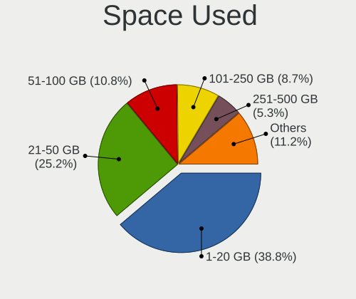

| Used GB        | Computers | Percent |
|----------------|-----------|---------|
| 1-20           | 466       | 38.83%  |
| 21-50          | 302       | 25.17%  |
| 51-100         | 130       | 10.83%  |
| 101-250        | 104       | 8.67%   |
| 251-500        | 64        | 5.33%   |
| 501-1000       | 62        | 5.17%   |
| 1001-2000      | 35        | 2.92%   |
| More than 3000 | 13        | 1.08%   |
| Unknown        | 13        | 1.08%   |
| 2001-3000      | 11        | 0.92%   |

Malfunc. Drives
---------------

Drive models with a malfunction

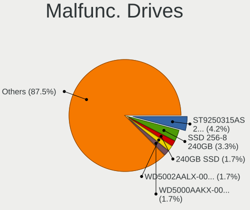

| Model                                 | Computers | Drives | Percent |
|---------------------------------------|-----------|--------|---------|
| Seagate ST9250315AS 250GB             | 5         | 5      | 4.17%   |
| GS SSD 256-8 240GB                    | 4         | 8      | 3.33%   |
| XrayDisk 240GB SSD                    | 2         | 2      | 1.67%   |
| WDC WD5002AALX-00J37A0 500GB          | 2         | 5      | 1.67%   |
| WDC WD5000AAKX-001CA0 500GB           | 2         | 2      | 1.67%   |
| Toshiba MQ01ABD050 500GB              | 2         | 2      | 1.67%   |
| SK hynix HFS128G39TND-N210A 128GB SSD | 2         | 3      | 1.67%   |
| Seagate ST500LT012-1DG142 500GB       | 2         | 2      | 1.67%   |
| Seagate ST380815AS 80GB               | 2         | 2      | 1.67%   |
| Seagate ST31000524AS 1TB              | 2         | 3      | 1.67%   |
| Seagate ST250DM000-1BD141 250GB       | 2         | 3      | 1.67%   |
| Seagate ST1000LM024 HN-M101MBB 1TB    | 2         | 7      | 1.67%   |
| HGST HTS721010A9E630 1TB              | 2         | 2      | 1.67%   |
| XrayDisk 512GB SSD                    | 1         | 1      | 0.83%   |
| WDC WDS240G2G0A-00JH30 240GB SSD      | 1         | 1      | 0.83%   |
| WDC WD7501AALS-00E3A0 752GB           | 1         | 1      | 0.83%   |
| WDC WD7500AAKS-00RBA0 752GB           | 1         | 2      | 0.83%   |
| WDC WD6400BPVT-00HXZT1 640GB          | 1         | 1      | 0.83%   |
| WDC WD6400AARS-00Y5B1 640GB           | 1         | 1      | 0.83%   |
| WDC WD5003ABYZ-011FA0 500GB           | 1         | 1      | 0.83%   |
| WDC WD5000LPVX-60V0TT0 500GB          | 1         | 1      | 0.83%   |
| WDC WD5000LPLX-60ZNTT2 500GB          | 1         | 1      | 0.83%   |
| WDC WD5000BEVT-22A0RT0 500GB          | 1         | 1      | 0.83%   |
| WDC WD5000AAKS-00V1A0 500GB           | 1         | 1      | 0.83%   |
| WDC WD3200AAKS-00V1A0 320GB           | 1         | 1      | 0.83%   |
| WDC WD2500KS-00MJB0 250GB             | 1         | 1      | 0.83%   |
| WDC WD2500BEVT-80A23T0 250GB          | 1         | 2      | 0.83%   |
| WDC WD2500BEVT-60ZCT1 250GB           | 1         | 3      | 0.83%   |
| WDC WD20EJRX-89G3VY0 2TB              | 1         | 1      | 0.83%   |
| WDC WD20EARX-008FB0 2TB               | 1         | 1      | 0.83%   |
| WDC WD2005FBYZ-01YCBB3 2TB            | 1         | 1      | 0.83%   |
| WDC WD1200BEVS-60UST0 120GB           | 1         | 1      | 0.83%   |
| WDC WD1200BEVS-07LAT0 120GB           | 1         | 1      | 0.83%   |
| WDC WD10EZEX-22RKKA0 1TB              | 1         | 1      | 0.83%   |
| WDC WD10EZEX-08WN4A0 1TB              | 1         | 1      | 0.83%   |
| WDC WD10EURX-73C57Y0 1TB              | 1         | 1      | 0.83%   |
| WDC WD1003FZEX-00K3CA0 1TB            | 1         | 1      | 0.83%   |
| WDC WD1003FBYX-01Y7B0 1TB             | 1         | 2      | 0.83%   |
| Toshiba MQ04ABF100 1TB                | 1         | 1      | 0.83%   |
| Toshiba MK2555GSX 250GB               | 1         | 1      | 0.83%   |

Malfunc. Drive Vendor
---------------------

Vendors of faulty drives

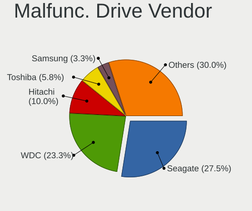

| Vendor                       | Computers | Drives | Percent |
|------------------------------|-----------|--------|---------|
| Seagate                      | 33        | 42     | 27.5%   |
| WDC                          | 28        | 36     | 23.33%  |
| Hitachi                      | 12        | 13     | 10%     |
| Toshiba                      | 7         | 7      | 5.83%   |
| Samsung Electronics          | 4         | 4      | 3.33%   |
| GS                           | 4         | 8      | 3.33%   |
| A-DATA Technology            | 4         | 4      | 3.33%   |
| XrayDisk                     | 3         | 3      | 2.5%    |
| SK hynix                     | 3         | 4      | 2.5%    |
| Intel                        | 3         | 3      | 2.5%    |
| HGST                         | 3         | 3      | 2.5%    |
| Netac                        | 2         | 2      | 1.67%   |
| Kingston                     | 2         | 5      | 1.67%   |
| Fujitsu                      | 2         | 2      | 1.67%   |
| China                        | 2         | 2      | 1.67%   |
| AMD                          | 2         | 2      | 1.67%   |
| Shenzhen Longsys Electronics | 1         | 1      | 0.83%   |
| SanDisk                      | 1         | 1      | 0.83%   |
| OCZ                          | 1         | 1      | 0.83%   |
| KingSpec                     | 1         | 1      | 0.83%   |
| DEPO                         | 1         | 1      | 0.83%   |
| Corsair                      | 1         | 4      | 0.83%   |

Malfunc. HDD Vendor
-------------------

Vendors of faulty HDD drives

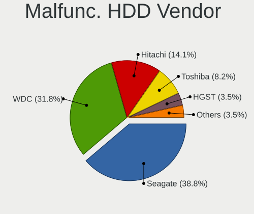

| Vendor              | Computers | Drives | Percent |
|---------------------|-----------|--------|---------|
| Seagate             | 33        | 42     | 38.82%  |
| WDC                 | 27        | 35     | 31.76%  |
| Hitachi             | 12        | 13     | 14.12%  |
| Toshiba             | 7         | 7      | 8.24%   |
| HGST                | 3         | 3      | 3.53%   |
| Fujitsu             | 2         | 2      | 2.35%   |
| Samsung Electronics | 1         | 1      | 1.18%   |

Malfunc. Drive Kind
-------------------

Kinds of faulty drives

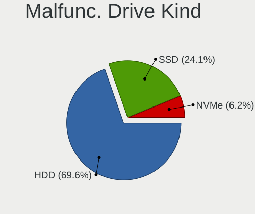

| Kind | Computers | Drives | Percent |
|------|-----------|--------|---------|
| HDD  | 78        | 103    | 69.64%  |
| SSD  | 27        | 39     | 24.11%  |
| NVMe | 7         | 7      | 6.25%   |

Failed Drives
-------------

Failed drive models

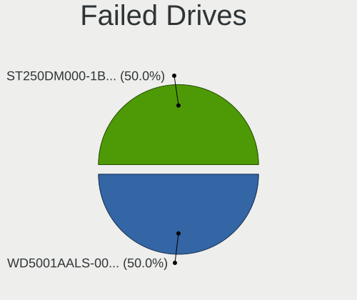

| Model                           | Computers | Drives | Percent |
|---------------------------------|-----------|--------|---------|
| WDC WD5001AALS-00E3A0 500GB     | 1         | 1      | 50%     |
| Seagate ST250DM000-1BD141 250GB | 1         | 1      | 50%     |

Failed Drive Vendor
-------------------

Failed drive vendors

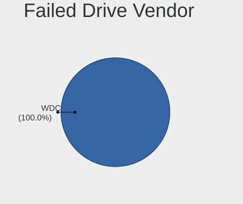

| Vendor  | Computers | Drives | Percent |
|---------|-----------|--------|---------|
| WDC     | 1         | 1      | 50%     |
| Seagate | 1         | 1      | 50%     |

Drive Status
------------

Number of failed and malfunc. drives

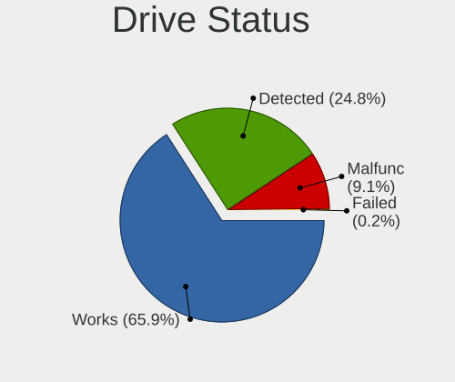

| Status   | Computers | Drives | Percent |
|----------|-----------|--------|---------|
| Works    | 802       | 1373   | 65.9%   |
| Detected | 302       | 538    | 24.82%  |
| Malfunc  | 111       | 149    | 9.12%   |
| Failed   | 2         | 2      | 0.16%   |

Storage controller
------------------

Storage Vendor
--------------

Storage controller vendors

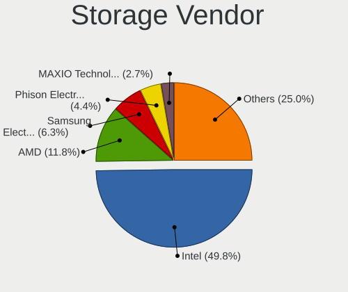

| Vendor                           | Computers | Percent |
|----------------------------------|-----------|---------|
| Intel                            | 773       | 49.77%  |
| AMD                              | 183       | 11.78%  |
| Samsung Electronics              | 98        | 6.31%   |
| Phison Electronics               | 69        | 4.44%   |
| MAXIO Technology (Hangzhou)      | 42        | 2.7%    |
| Kingston Technology Company      | 40        | 2.58%   |
| SK hynix                         | 36        | 2.32%   |
| Sandisk                          | 35        | 2.25%   |
| INNOGRIT                         | 34        | 2.19%   |
| Silicon Motion                   | 26        | 1.67%   |
| ADATA Technology                 | 24        | 1.55%   |
| Nvidia                           | 20        | 1.29%   |
| Micron Technology                | 20        | 1.29%   |
| JMicron Technology               | 14        | 0.9%    |
| Realtek Semiconductor            | 12        | 0.77%   |
| Broadcom / LSI                   | 12        | 0.77%   |
| Shenzhen Longsys Electronics     | 11        | 0.71%   |
| ASMedia Technology               | 11        | 0.71%   |
| Micron/Crucial Technology        | 9         | 0.58%   |
| KIOXIA                           | 9         | 0.58%   |
| Netac Technology                 | 8         | 0.52%   |
| Marvell Technology Group         | 7         | 0.45%   |
| Unknown                          | 7         | 0.45%   |
| Yangtze Memory Technologies      | 5         | 0.32%   |
| Toshiba America Info Systems     | 5         | 0.32%   |
| Solid State Storage Technology   | 4         | 0.26%   |
| MCST                             | 4         | 0.26%   |
| Hewlett-Packard                  | 4         | 0.26%   |
| VIA Technologies                 | 3         | 0.19%   |
| TenaFe                           | 3         | 0.19%   |
| Shenzhen Shichuangyi Electronics | 3         | 0.19%   |
| Hosin Global Electronics         | 3         | 0.19%   |
| Apple                            | 3         | 0.19%   |
| Zhaoxin                          | 2         | 0.13%   |
| YEESTOR Microelectronics         | 2         | 0.13%   |
| Union Memory (Shenzhen)          | 2         | 0.13%   |
| LSI Logic / Symbios Logic        | 2         | 0.13%   |
| Loongson Technology              | 2         | 0.13%   |
| Adaptec                          | 2         | 0.13%   |
| Transcend                        | 1         | 0.06%   |

Storage Model
-------------

Storage controller models

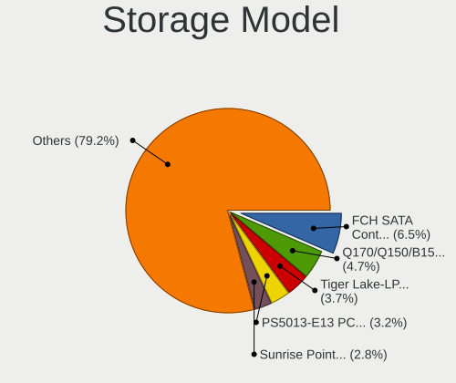

| Model                                                                          | Computers | Percent |
|--------------------------------------------------------------------------------|-----------|---------|
| AMD FCH SATA Controller [AHCI mode]                                            | 113       | 6.5%    |
| Intel Q170/Q150/B150/H170/H110/Z170/CM236 Chipset SATA Controller [AHCI Mode]  | 81        | 4.66%   |
| Intel Tiger Lake-LP SATA Controller                                            | 64        | 3.68%   |
| Phison PS5013-E13 PCIe3 NVMe Controller (DRAM-less)                            | 55        | 3.16%   |
| Intel Sunrise Point-LP SATA Controller [AHCI mode]                             | 49        | 2.82%   |
| Intel 200 Series PCH SATA controller [AHCI mode]                               | 42        | 2.42%   |
| Intel 500 Series Chipset Family SATA AHCI Controller                           | 36        | 2.07%   |
| MAXIO (Hangzhou) NVMe SSD Controller MAP1202 (DRAM-less)                       | 35        | 2.01%   |
| AMD 400 Series Chipset SATA Controller                                         | 35        | 2.01%   |
| Intel Comet Lake SATA AHCI Controller                                          | 34        | 1.96%   |
| Samsung NVMe SSD Controller SM981/PM981/PM983                                  | 33        | 1.9%    |
| INNOGRIT NVMe SSD Controller IG5216 [Shasta+] (DRAM-less)                      | 33        | 1.9%    |
| Intel Cannon Point-LP SATA Controller [AHCI Mode]                              | 32        | 1.84%   |
| Intel 7 Series Chipset Family 6-port SATA Controller [AHCI mode]               | 31        | 1.78%   |
| AMD 500 Series Chipset SATA Controller                                         | 31        | 1.78%   |
| Intel Alder Lake-S PCH SATA Controller [AHCI Mode]                             | 24        | 1.38%   |
| Silicon Motion SM2263EN/SM2263XT (DRAM-less) NVMe SSD Controllers              | 22        | 1.27%   |
| Intel 82801 Mobile SATA Controller [RAID mode]                                 | 22        | 1.27%   |
| Intel 8 Series/C220 Series Chipset Family 6-port SATA Controller 1 [AHCI mode] | 22        | 1.27%   |
| Intel Volume Management Device NVMe RAID Controller                            | 21        | 1.21%   |
| Samsung NVMe SSD Controller 980 (DRAM-less)                                    | 20        | 1.15%   |
| Samsung NVMe SSD Controller SM961/PM961/SM963                                  | 19        | 1.09%   |
| Intel 6 Series/C200 Series Chipset Family 6 port Mobile SATA AHCI Controller   | 18        | 1.04%   |
| Intel Cannon Lake PCH SATA AHCI Controller                                     | 17        | 0.98%   |
| Intel Alder Lake-P SATA AHCI Controller                                        | 17        | 0.98%   |
| SK hynix BC501 NVMe Solid State Drive                                          | 16        | 0.92%   |
| Intel Celeron/Pentium Silver Processor SATA Controller                         | 16        | 0.92%   |
| Intel NM10/ICH7 Family SATA Controller [IDE mode]                              | 13        | 0.75%   |
| Intel Cannon Lake Mobile PCH SATA AHCI Controller                              | 13        | 0.75%   |
| Intel 6 Series/C200 Series Chipset Family 6 port Desktop SATA AHCI Controller  | 13        | 0.75%   |
| Intel SSD 670p Series [Keystone Harbor]                                        | 12        | 0.69%   |
| Intel C620 Series Chipset Family SSATA Controller [AHCI mode]                  | 12        | 0.69%   |
| Intel C620 Series Chipset Family SATA Controller [AHCI mode]                   | 12        | 0.69%   |
| Intel 82801IBM/IEM (ICH9M/ICH9M-E) 4 port SATA Controller [AHCI mode]          | 12        | 0.69%   |
| Intel 8 Series SATA Controller 1 [AHCI mode]                                   | 12        | 0.69%   |
| Samsung NVMe SSD Controller PM9A1/PM9A3/980PRO                                 | 11        | 0.63%   |
| Intel Atom Processor E3800 Series SATA AHCI Controller                         | 11        | 0.63%   |
| ASMedia ASM1061/ASM1062 Serial ATA Controller                                  | 11        | 0.63%   |
| AMD 600 Series Chipset SATA Controller                                         | 11        | 0.63%   |
| JMicron JMB363 SATA/IDE Controller                                             | 10        | 0.58%   |

Storage Kind
------------

Kind of storage controller (IDE, SATA, NVMe, SAS, ...)

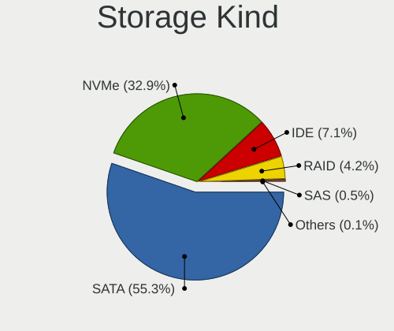

| Kind | Computers | Percent |
|------|-----------|---------|
| SATA | 863       | 55.29%  |
| NVMe | 513       | 32.86%  |
| IDE  | 111       | 7.11%   |
| RAID | 65        | 4.16%   |
| SAS  | 8         | 0.51%   |
| SCSI | 1         | 0.06%   |

Processor
---------

CPU Vendor
----------

Processor vendors

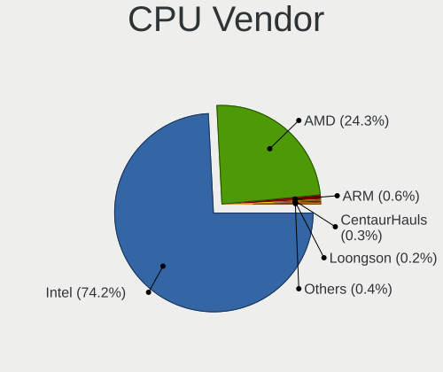

| Vendor       | Computers | Percent |
|--------------|-----------|---------|
| Intel        | 836       | 74.18%  |
| AMD          | 274       | 24.31%  |
| ARM          | 7         | 0.62%   |
| CentaurHauls | 3         | 0.27%   |
| Loongson     | 2         | 0.18%   |
| Elbrus-MCST  | 2         | 0.18%   |
| EL2S4        | 1         | 0.09%   |
| E8C/EATX     | 1         | 0.09%   |
| E8C-SWTX     | 1         | 0.09%   |

CPU Model
---------

Processor models

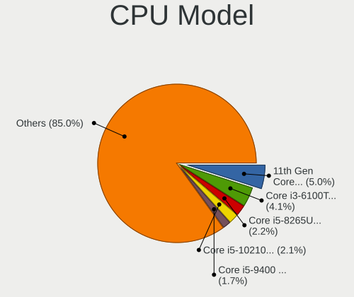

| Model                                         | Computers | Percent |
|-----------------------------------------------|-----------|---------|
| Intel 11th Gen Core i5-1135G7 @ 2.40GHz       | 56        | 4.96%   |
| Intel Core i3-6100TE CPU @ 2.70GHz            | 46        | 4.07%   |
| Intel Core i5-8265U CPU @ 1.60GHz             | 25        | 2.21%   |
| Intel Core i5-10210U CPU @ 1.60GHz            | 24        | 2.12%   |
| Intel Core i5-9400 CPU @ 2.90GHz              | 19        | 1.68%   |
| Intel Core i5-10400 CPU @ 2.90GHz             | 16        | 1.42%   |
| AMD Ryzen 5 1600 Six-Core Processor           | 14        | 1.24%   |
| Intel Core i5-8259U CPU @ 2.30GHz             | 13        | 1.15%   |
| AMD Ryzen 5 5500U with Radeon Graphics        | 13        | 1.15%   |
| Intel Core i3-7100U CPU @ 2.40GHz             | 12        | 1.06%   |
| Intel Pentium CPU G4560 @ 3.50GHz             | 11        | 0.97%   |
| Intel Core i5-7200U CPU @ 2.50GHz             | 11        | 0.97%   |
| Intel Core i7-8750H CPU @ 2.20GHz             | 10        | 0.88%   |
| Intel Core i3-9100 CPU @ 3.60GHz              | 9         | 0.8%    |
| Intel Core i3-10100 CPU @ 3.60GHz             | 9         | 0.8%    |
| Intel 12th Gen Core i5-12400                  | 9         | 0.8%    |
| AMD Ryzen 7 5800H with Radeon Graphics        | 9         | 0.8%    |
| AMD Ryzen 5 5600G with Radeon Graphics        | 9         | 0.8%    |
| Intel 11th Gen Core i3-1115G4 @ 3.00GHz       | 8         | 0.71%   |
| AMD Ryzen 7 5700G with Radeon Graphics        | 8         | 0.71%   |
| Intel Core i5-8279U CPU @ 2.40GHz             | 7         | 0.62%   |
| Intel Core i5-8250U CPU @ 1.60GHz             | 7         | 0.62%   |
| Intel Core i3-7020U CPU @ 2.30GHz             | 7         | 0.62%   |
| Intel 12th Gen Core i5-12450H                 | 7         | 0.62%   |
| Intel 12th Gen Core i5-1235U                  | 7         | 0.62%   |
| Intel 11th Gen Core i3-1125G4 @ 2.00GHz       | 7         | 0.62%   |
| ARM Processor                                 | 7         | 0.62%   |
| AMD Ryzen 5 5600 6-Core Processor             | 7         | 0.62%   |
| Intel Core i3-8100 CPU @ 3.60GHz              | 6         | 0.53%   |
| Intel Celeron CPU N3350 @ 1.10GHz             | 6         | 0.53%   |
| Intel Celeron CPU N2840 @ 2.16GHz             | 6         | 0.53%   |
| Intel 11th Gen Core i7-1165G7 @ 2.80GHz       | 6         | 0.53%   |
| AMD Ryzen 5 3400G with Radeon Vega Graphics   | 6         | 0.53%   |
| Intel Xeon Silver 4210 CPU @ 2.20GHz          | 5         | 0.44%   |
| Intel Core i5-3470 CPU @ 3.20GHz              | 5         | 0.44%   |
| Intel Core i3-10105 CPU @ 3.70GHz             | 5         | 0.44%   |
| Intel Core 2 CPU 6420 @ 2.13GHz               | 5         | 0.44%   |
| Intel Celeron J4125 CPU @ 2.00GHz             | 5         | 0.44%   |
| AMD Ryzen 5 5560U with Radeon Graphics        | 5         | 0.44%   |
| AMD Ryzen 5 3500U with Radeon Vega Mobile Gfx | 5         | 0.44%   |

CPU Model Family
----------------

Processor model prefix

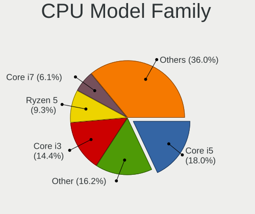

| Model                   | Computers | Percent |
|-------------------------|-----------|---------|
| Intel Core i5           | 203       | 17.98%  |
| Other                   | 183       | 16.21%  |
| Intel Core i3           | 163       | 14.44%  |
| AMD Ryzen 5             | 105       | 9.3%    |
| Intel Core i7           | 69        | 6.11%   |
| Intel Celeron           | 54        | 4.78%   |
| AMD Ryzen 7             | 53        | 4.69%   |
| Intel Xeon              | 33        | 2.92%   |
| Intel Pentium           | 31        | 2.75%   |
| Intel Core 2 Duo        | 28        | 2.48%   |
| AMD Ryzen 3             | 16        | 1.42%   |
| Intel Atom              | 13        | 1.15%   |
| Intel Pentium Gold      | 11        | 0.97%   |
| AMD Ryzen 9             | 11        | 0.97%   |
| Intel Xeon Silver       | 10        | 0.89%   |
| Intel Pentium Dual-Core | 10        | 0.89%   |
| AMD A8                  | 10        | 0.89%   |
| AMD A6                  | 9         | 0.8%    |
| AMD A10                 | 8         | 0.71%   |
| Intel Core 2            | 7         | 0.62%   |
| AMD FX                  | 7         | 0.62%   |
| AMD Athlon              | 7         | 0.62%   |
| Intel Core 2 Quad       | 6         | 0.53%   |
| Intel Core              | 6         | 0.53%   |
| Intel Genuine           | 5         | 0.44%   |
| AMD Phenom II X4        | 5         | 0.44%   |
| AMD E1                  | 5         | 0.44%   |
| AMD Athlon 64 X2        | 5         | 0.44%   |
| Intel Xeon Gold         | 4         | 0.35%   |
| Intel Pentium Silver    | 4         | 0.35%   |
| Intel Core i9           | 4         | 0.35%   |
| AMD Athlon II X4        | 3         | 0.27%   |
| AMD Athlon II X2        | 3         | 0.27%   |
| AMD A12                 | 3         | 0.27%   |
| Intel Pentium Dual      | 2         | 0.18%   |
| Intel Celeron Dual-Core | 2         | 0.18%   |
| AMD Ryzen 7 PRO         | 2         | 0.18%   |
| AMD Ryzen 5 PRO         | 2         | 0.18%   |
| AMD E2                  | 2         | 0.18%   |
| AMD E                   | 2         | 0.18%   |

CPU Cores
---------

Number of processor cores

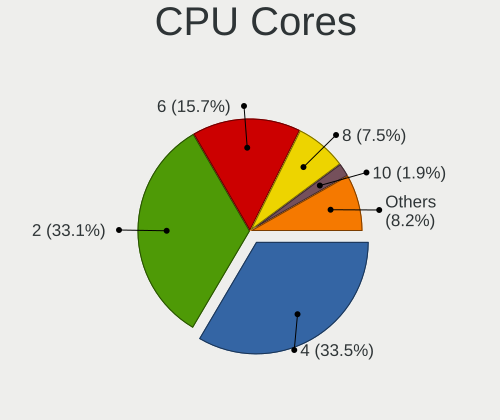

| Number  | Computers | Percent |
|---------|-----------|---------|
| 4       | 379       | 33.48%  |
| 2       | 375       | 33.13%  |
| 6       | 178       | 15.72%  |
| 8       | 85        | 7.51%   |
| 10      | 22        | 1.94%   |
| 1       | 21        | 1.86%   |
| 12      | 20        | 1.77%   |
| 16      | 15        | 1.33%   |
| 14      | 14        | 1.24%   |
| 20      | 8         | 0.71%   |
| 32      | 4         | 0.35%   |
| 3       | 3         | 0.27%   |
| 28      | 2         | 0.18%   |
| 18      | 2         | 0.18%   |
| Unknown | 2         | 0.18%   |
| 24      | 1         | 0.09%   |
| 7       | 1         | 0.09%   |

CPU Sockets
-----------

Number of sockets

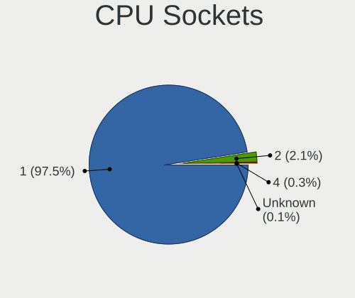

| Number  | Computers | Percent |
|---------|-----------|---------|
| 1       | 1099      | 97.52%  |
| 2       | 24        | 2.13%   |
| 4       | 3         | 0.27%   |
| Unknown | 1         | 0.09%   |

CPU Threads
-----------

Threads per core (Hyper-Threading)

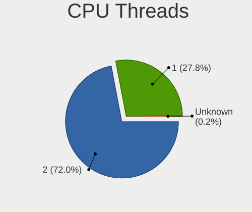

| Number  | Computers | Percent |
|---------|-----------|---------|
| 2       | 813       | 72.01%  |
| 1       | 314       | 27.81%  |
| Unknown | 2         | 0.18%   |

CPU Op-Modes
------------

CPU Operation Modes (32-bit, 64-bit)

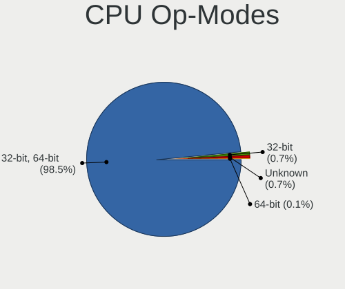

| Op mode        | Computers | Percent |
|----------------|-----------|---------|
| 32-bit, 64-bit | 1110      | 98.49%  |
| 32-bit         | 8         | 0.71%   |
| Unknown        | 8         | 0.71%   |
| 64-bit         | 1         | 0.09%   |

CPU Microcode
-------------

Microcode number

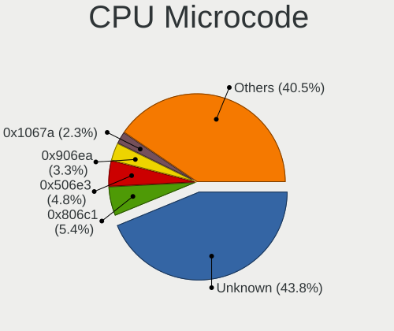

| Number     | Computers | Percent |
|------------|-----------|---------|
| Unknown    | 505       | 43.8%   |
| 0x806c1    | 62        | 5.38%   |
| 0x506e3    | 55        | 4.77%   |
| 0x906ea    | 38        | 3.3%    |
| 0x1067a    | 26        | 2.25%   |
| 0x806ec    | 24        | 2.08%   |
| 0x806ea    | 23        | 1.99%   |
| 0x806e9    | 22        | 1.91%   |
| 0xa0653    | 21        | 1.82%   |
| 0x306a9    | 18        | 1.56%   |
| 0x0a50000c | 18        | 1.56%   |
| 0x906e9    | 15        | 1.3%    |
| 0x08108109 | 15        | 1.3%    |
| 0x306c3    | 14        | 1.21%   |
| 0x08001138 | 14        | 1.21%   |
| 0x906eb    | 13        | 1.13%   |
| 0x206a7    | 13        | 1.13%   |
| 0x50657    | 11        | 0.95%   |
| 0x806eb    | 10        | 0.87%   |
| 0xa0660    | 8         | 0.69%   |
| 0xa0671    | 7         | 0.61%   |
| 0x906a4    | 7         | 0.61%   |
| 0x06001119 | 7         | 0.61%   |
| 0x906a3    | 6         | 0.52%   |
| 0x90675    | 6         | 0.52%   |
| 0x706e5    | 6         | 0.52%   |
| 0x6fd      | 6         | 0.52%   |
| 0x506c9    | 6         | 0.52%   |
| 0x906ed    | 5         | 0.43%   |
| 0x806c2    | 5         | 0.43%   |
| 0x406e3    | 5         | 0.43%   |
| 0x40651    | 5         | 0.43%   |
| 0x30678    | 5         | 0.43%   |
| 0x20655    | 5         | 0.43%   |
| 0x0a50000d | 5         | 0.43%   |
| 0x08600106 | 5         | 0.43%   |
| 0x706a8    | 4         | 0.35%   |
| 0x406f1    | 4         | 0.35%   |
| 0x206d7    | 4         | 0.35%   |
| 0x106ca    | 4         | 0.35%   |

CPU Microarch
-------------

Microarchitecture

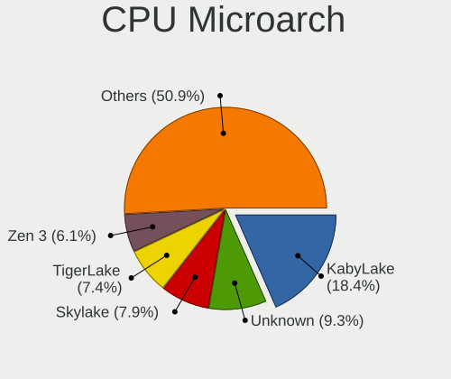

| Name              | Computers | Percent |
|-------------------|-----------|---------|
| KabyLake          | 208       | 18.41%  |
| Unknown           | 105       | 9.29%   |
| Skylake           | 89        | 7.88%   |
| TigerLake         | 84        | 7.43%   |
| Zen 3             | 69        | 6.11%   |
| CometLake         | 54        | 4.78%   |
| IvyBridge         | 50        | 4.42%   |
| Alderlake Hybrid  | 50        | 4.42%   |
| SandyBridge       | 47        | 4.16%   |
| Haswell           | 44        | 3.89%   |
| Penryn            | 38        | 3.36%   |
| Zen+              | 35        | 3.1%    |
| Silvermont        | 23        | 2.04%   |
| Zen 2             | 20        | 1.77%   |
| Core              | 20        | 1.77%   |
| Zen               | 19        | 1.68%   |
| Piledriver        | 18        | 1.59%   |
| Goldmont plus     | 18        | 1.59%   |
| Westmere          | 17        | 1.5%    |
| IceLake           | 14        | 1.24%   |
| K10               | 13        | 1.15%   |
| Excavator         | 10        | 0.88%   |
| Broadwell         | 10        | 0.88%   |
| K8 Hammer         | 9         | 0.8%    |
| Goldmont          | 9         | 0.8%    |
| Bonnell           | 8         | 0.71%   |
| Steamroller       | 6         | 0.53%   |
| Puma              | 5         | 0.44%   |
| Nehalem           | 5         | 0.44%   |
| K10 Llano         | 5         | 0.44%   |
| Bobcat            | 5         | 0.44%   |
| Tremont           | 4         | 0.35%   |
| P6                | 4         | 0.35%   |
| Meteorlake Hybrid | 4         | 0.35%   |
| Jaguar            | 4         | 0.35%   |
| NetBurst          | 3         | 0.27%   |
| Gracemont         | 2         | 0.18%   |
| Bulldozer         | 2         | 0.18%   |

Graphics
--------

GPU Vendor
----------

Vendors of graphics cards

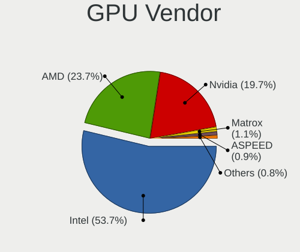

| Vendor                     | Computers | Percent |
|----------------------------|-----------|---------|
| Intel                      | 667       | 53.75%  |
| AMD                        | 294       | 23.69%  |
| Nvidia                     | 245       | 19.74%  |
| Matrox Electronics Systems | 14        | 1.13%   |
| ASPEED Technology          | 11        | 0.89%   |
| Silicon Motion             | 3         | 0.24%   |
| Zhaoxin                    | 2         | 0.16%   |
| Huawei Technologies        | 2         | 0.16%   |
| VIA Technologies           | 1         | 0.08%   |
| MCST                       | 1         | 0.08%   |
| Loongson Technology        | 1         | 0.08%   |

GPU Model
---------

Graphics card models

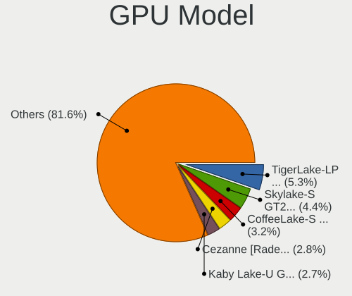

| Model                                                                                    | Computers | Percent |
|------------------------------------------------------------------------------------------|-----------|---------|
| Intel TigerLake-LP GT2 [Iris Xe Graphics]                                                | 68        | 5.31%   |
| Intel Skylake-S GT2 [HD Graphics 530]                                                    | 56        | 4.38%   |
| Intel CoffeeLake-S GT2 [UHD Graphics 630]                                                | 41        | 3.2%    |
| AMD Cezanne [Radeon Vega Series / Radeon Vega Mobile Series]                             | 36        | 2.81%   |
| Intel Kaby Lake-U GT2 [HD Graphics 620]                                                  | 34        | 2.66%   |
| Intel CometLake-S GT2 [UHD Graphics 630]                                                 | 33        | 2.58%   |
| Intel 2nd Generation Core Processor Family Integrated Graphics Controller                | 31        | 2.42%   |
| Intel 3rd Gen Core processor Graphics Controller                                         | 29        | 2.27%   |
| Intel WhiskeyLake-U GT2 [UHD Graphics 620]                                               | 27        | 2.11%   |
| AMD Picasso/Raven 2 [Radeon Vega Series / Radeon Vega Mobile Series]                     | 25        | 1.95%   |
| Nvidia GP107 [GeForce GTX 1050 Ti]                                                       | 23        | 1.8%    |
| Intel CometLake-U GT2 [UHD Graphics]                                                     | 21        | 1.64%   |
| Intel CoffeeLake-U GT3e [Iris Plus Graphics 655]                                         | 20        | 1.56%   |
| Intel Tiger Lake-LP GT2 [UHD Graphics G4]                                                | 16        | 1.25%   |
| AMD Lucienne                                                                             | 16        | 1.25%   |
| Intel GeminiLake [UHD Graphics 600]                                                      | 15        | 1.17%   |
| Intel CoffeeLake-H GT2 [UHD Graphics 630]                                                | 15        | 1.17%   |
| AMD Ellesmere [Radeon RX 470/480/570/570X/580/580X/590]                                  | 15        | 1.17%   |
| Intel Atom Processor Z36xxx/Z37xxx Series Graphics & Display                             | 14        | 1.09%   |
| AMD Barcelo                                                                              | 13        | 1.02%   |
| Intel Kaby Lake-R GT2 [UHD Graphics 620]                                                 | 12        | 0.94%   |
| Intel Haswell-ULT Integrated Graphics Controller                                         | 12        | 0.94%   |
| Intel Alder Lake-S GT1 [UHD Graphics 730]                                                | 12        | 0.94%   |
| ASPEED Technology ASPEED Graphics Family                                                 | 11        | 0.86%   |
| AMD Rembrandt [Radeon 680M]                                                              | 11        | 0.86%   |
| Intel Kaby Lake-S GT1 [HD Graphics 610]                                                  | 10        | 0.78%   |
| Nvidia GT218 [GeForce 210]                                                               | 9         | 0.7%    |
| Nvidia GP107GLM [Quadro P1000 Mobile]                                                    | 9         | 0.7%    |
| Intel Atom/Celeron/Pentium Processor x5-E8000/J3xxx/N3xxx Integrated Graphics Controller | 9         | 0.7%    |
| AMD Renoir [Radeon Vega Series / Radeon Vega Mobile Series]                              | 9         | 0.7%    |
| AMD Navi 22 [Radeon RX 6700/6700 XT/6750 XT / 6800M/6850M XT]                            | 9         | 0.7%    |
| Nvidia GF117M [GeForce 610M/710M/810M/820M / GT 620M/625M/630M/720M]                     | 8         | 0.63%   |
| Matrox Electronics Systems MGA G200EH                                                    | 8         | 0.63%   |
| Intel Core Processor Integrated Graphics Controller                                      | 8         | 0.63%   |
| Intel Comet Lake UHD Graphics                                                            | 8         | 0.63%   |
| Intel Apollo Lake GT1 [HD Graphics 500]                                                  | 8         | 0.63%   |
| Intel Alder Lake-P GT1 [UHD Graphics]                                                    | 8         | 0.63%   |
| Nvidia GK208B [GeForce GT 710]                                                           | 7         | 0.55%   |
| Nvidia GA107M [GeForce RTX 3050 Mobile]                                                  | 7         | 0.55%   |
| Intel Xeon E3-1200 v3/4th Gen Core Processor Integrated Graphics Controller              | 7         | 0.55%   |

GPU Combo
---------

Combinations of graphics cards

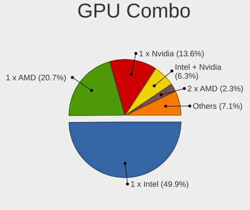

| Name                    | Computers | Percent |
|-------------------------|-----------|---------|
| 1 x Intel               | 566       | 49.91%  |
| 1 x AMD                 | 235       | 20.72%  |
| 1 x Nvidia              | 154       | 13.58%  |
| Intel + Nvidia          | 72        | 6.35%   |
| 2 x AMD                 | 26        | 2.29%   |
| Intel + AMD             | 17        | 1.5%    |
| AMD + Nvidia            | 15        | 1.32%   |
| 1 x Matrox              | 13        | 1.15%   |
| Other                   | 10        | 0.88%   |
| 1 x ASPEED              | 10        | 0.88%   |
| 2 x Intel               | 3         | 0.26%   |
| 1 x Silicon Motion      | 3         | 0.26%   |
| 1 x Huawei Technologies | 2         | 0.18%   |
| 2 x Nvidia              | 1         | 0.09%   |
| 1 x Zhaoxin             | 1         | 0.09%   |
| 1 x VIA                 | 1         | 0.09%   |
| Nvidia + Zhaoxin        | 1         | 0.09%   |
| Nvidia + Matrox         | 1         | 0.09%   |
| Nvidia + ASPEED         | 1         | 0.09%   |
| 1 x MCST                | 1         | 0.09%   |
| 1 x Loongson Technology | 1         | 0.09%   |

GPU Driver
----------

Free vs proprietary

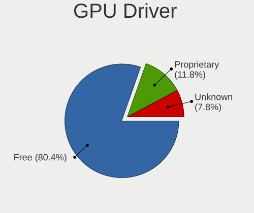

| Driver      | Computers | Percent |
|-------------|-----------|---------|
| Free        | 914       | 80.39%  |
| Proprietary | 134       | 11.79%  |
| Unknown     | 89        | 7.83%   |

GPU Memory
----------

Total video memory

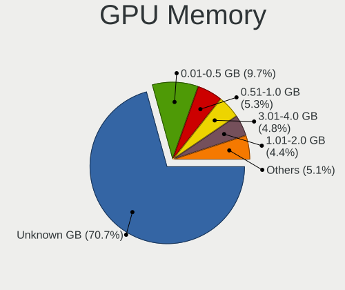

| Size in GB | Computers | Percent |
|------------|-----------|---------|
| Unknown    | 812       | 70.73%  |
| 0.01-0.5   | 111       | 9.67%   |
| 0.51-1.0   | 61        | 5.31%   |
| 3.01-4.0   | 55        | 4.79%   |
| 1.01-2.0   | 51        | 4.44%   |
| 7.01-8.0   | 30        | 2.61%   |
| 8.01-16.0  | 16        | 1.39%   |
| 5.01-6.0   | 9         | 0.78%   |
| 2.01-3.0   | 3         | 0.26%   |

Monitor
-------

Monitor Vendor
--------------

Monitor vendors

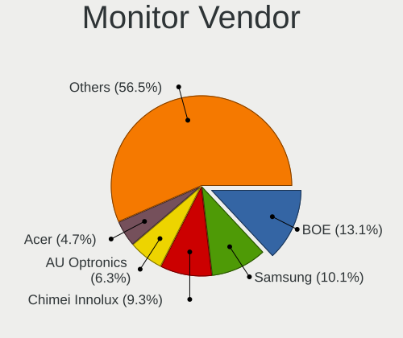

| Vendor                  | Computers | Percent |
|-------------------------|-----------|---------|
| BOE                     | 153       | 13.07%  |
| Samsung Electronics     | 118       | 10.08%  |
| Chimei Innolux          | 109       | 9.31%   |
| AU Optronics            | 74        | 6.32%   |
| Acer                    | 55        | 4.7%    |
| BenQ                    | 52        | 4.44%   |
| LG Display              | 48        | 4.1%    |
| HHT                     | 48        | 4.1%    |
| AOC                     | 41        | 3.5%    |
| Goldstar                | 38        | 3.25%   |
| Philips                 | 37        | 3.16%   |
| Dell                    | 37        | 3.16%   |
| ECS                     | 22        | 1.88%   |
| ViewSonic               | 21        | 1.79%   |
| Lenovo                  | 19        | 1.62%   |
| PANDA                   | 18        | 1.54%   |
| Hewlett-Packard         | 13        | 1.11%   |
| MSI                     | 12        | 1.02%   |
| Chi Mei Optoelectronics | 12        | 1.02%   |
| ASUSTek Computer        | 12        | 1.02%   |
| Mi                      | 11        | 0.94%   |
| Apple                   | 11        | 0.94%   |
| Sharp                   | 10        | 0.85%   |
| Iiyama                  | 9         | 0.77%   |
| Ancor Communications    | 9         | 0.77%   |
| RTK                     | 8         | 0.68%   |
| HKC                     | 8         | 0.68%   |
| CHR                     | 7         | 0.6%    |
| STA                     | 6         | 0.51%   |
| NEC Computers           | 6         | 0.51%   |
| PRM                     | 5         | 0.43%   |
| HUAWEI                  | 5         | 0.43%   |
| AGO                     | 5         | 0.43%   |
| VIE                     | 4         | 0.34%   |
| Unknown                 | 4         | 0.34%   |
| SKG                     | 4         | 0.34%   |
| PRW                     | 4         | 0.34%   |
| OOO                     | 4         | 0.34%   |
| InfoVision              | 4         | 0.34%   |
| HannStar                | 4         | 0.34%   |

Monitor Model
-------------

Monitor models

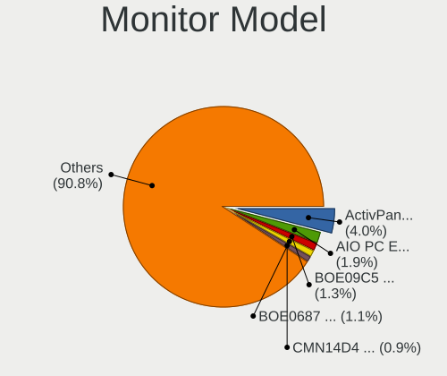

| Model                                                                | Computers | Percent |
|----------------------------------------------------------------------|-----------|---------|
| HHT ActivPanel V6 HHT0030 3840x2160 944x398mm 40.3-inch              | 48        | 4.04%   |
| ECS AIO PC ECS2486 1920x1080 520x300mm 23.6-inch                     | 22        | 1.85%   |
| BOE LCD Monitor BOE09C5 1920x1080 345x194mm 15.6-inch                | 15        | 1.26%   |
| BOE LCD Monitor BOE0687 1920x1080 344x193mm 15.5-inch                | 13        | 1.09%   |
| Chimei Innolux LCD Monitor CMN14D4 1920x1080 309x173mm 13.9-inch     | 11        | 0.93%   |
| AOC LCD Monitor 2778X 2560x1440                                      | 11        | 0.93%   |
| Lenovo LEN-M90a-3-BA LENE288 1920x1080 527x296mm 23.8-inch           | 10        | 0.84%   |
| Acer V246HL ACR0336 1920x1080 531x299mm 24.0-inch                    | 10        | 0.84%   |
| PANDA LCD Monitor NCP004A 1920x1080 309x174mm 14.0-inch              | 9         | 0.76%   |
| Chimei Innolux LCD Monitor CMN175A 1920x1080 381x214mm 17.2-inch     | 9         | 0.76%   |
| Chimei Innolux LCD Monitor CMN14D5 1920x1080 309x173mm 13.9-inch     | 9         | 0.76%   |
| BOE LCD Monitor BOE0747 1920x1080 344x194mm 15.5-inch                | 8         | 0.67%   |
| BenQ LCD BNQ801B 2560x1440 527x296mm 23.8-inch                       | 8         | 0.67%   |
| BOE LCD Monitor BOE07C9 1920x1080 309x173mm 13.9-inch                | 7         | 0.59%   |
| STA LCD Monitor STAAFC9 1920x1080 344x194mm 15.5-inch                | 6         | 0.51%   |
| CHR CH7511B CHR7511 1920x1080 519x324mm 24.1-inch                    | 6         | 0.51%   |
| Chimei Innolux LCD Monitor CMN15E7 1920x1080 344x193mm 15.5-inch     | 6         | 0.51%   |
| BOE LCD Monitor BOE0AF7 1920x1080 344x194mm 15.5-inch                | 6         | 0.51%   |
| BOE LCD Monitor BOE09EF 1920x1080 344x194mm 15.5-inch                | 6         | 0.51%   |
| BOE LCD Monitor BOE0872 1920x1080 344x194mm 15.5-inch                | 6         | 0.51%   |
| Samsung Electronics SyncMaster SAM022B 1280x1024 338x270mm 17.0-inch | 5         | 0.42%   |
| Dell E2417H DELA0E2 1920x1080 527x296mm 23.8-inch                    | 5         | 0.42%   |
| Chimei Innolux LCD Monitor CMN15F5 1920x1080 344x193mm 15.5-inch     | 5         | 0.42%   |
| BOE LCD Monitor BOE0700 1920x1080 344x194mm 15.5-inch                | 5         | 0.42%   |
| BenQ GW2270 BNQ78DB 1920x1080 476x268mm 21.5-inch                    | 5         | 0.42%   |
| AU Optronics LCD Monitor AUO22EC 1366x768 344x193mm 15.5-inch        | 5         | 0.42%   |
| AU Optronics LCD Monitor AUO213D 1920x1080 309x173mm 13.9-inch       | 5         | 0.42%   |
| ViewSonic VA2407 Series VSC8C31 1920x1080 521x293mm 23.5-inch        | 4         | 0.34%   |
| Unknown LCD Monitor FFFF 2288x1287 2550x2550mm 142.0-inch            | 4         | 0.34%   |
| RTK HDMI RTK2380 1920x1080 530x290mm 23.8-inch                       | 4         | 0.34%   |
| PRW AP7_Titanium PRW4200 3840x2160                                   | 4         | 0.34%   |
| Philips PHL 273V7 PHLC156 1920x1080 598x336mm 27.0-inch              | 4         | 0.34%   |
| Mi Monitor XMI23C3 1920x1080 527x293mm 23.7-inch                     | 4         | 0.34%   |
| Dell P2419H DELD0DA 1920x1080 527x296mm 23.8-inch                    | 4         | 0.34%   |
| Chimei Innolux LCD Monitor CMN15DB 1366x768 344x193mm 15.5-inch      | 4         | 0.34%   |
| Chimei Innolux LCD Monitor CMN1521 1920x1080 344x193mm 15.5-inch     | 4         | 0.34%   |
| Chimei Innolux LCD Monitor CMN1404 1920x1080 309x173mm 13.9-inch     | 4         | 0.34%   |
| BOE LCD Monitor BOE0812 1920x1080 344x194mm 15.5-inch                | 4         | 0.34%   |
| BOE LCD Monitor BOE07D0 1920x1080 294x165mm 13.3-inch                | 4         | 0.34%   |
| BenQ G2420HD BNQ7840 1920x1080 531x299mm 24.0-inch                   | 4         | 0.34%   |

Monitor Resolution
------------------

Monitor screen resolution

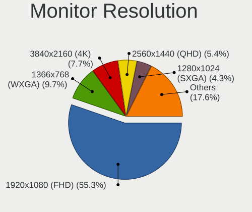

| Resolution         | Computers | Percent |
|--------------------|-----------|---------|
| 1920x1080 (FHD)    | 619       | 55.27%  |
| 1366x768 (WXGA)    | 109       | 9.73%   |
| 3840x2160 (4K)     | 86        | 7.68%   |
| 2560x1440 (QHD)    | 61        | 5.45%   |
| 1280x1024 (SXGA)   | 48        | 4.29%   |
| 1920x1200 (WUXGA)  | 28        | 2.5%    |
| 1600x900 (HD+)     | 27        | 2.41%   |
| 2560x1600          | 25        | 2.23%   |
| 1680x1050 (WSXGA+) | 23        | 2.05%   |
| 1280x800 (WXGA)    | 15        | 1.34%   |
| 1440x900 (WXGA+)   | 13        | 1.16%   |
| 2880x1800          | 6         | 0.54%   |
| 3440x1440          | 5         | 0.45%   |
| Unknown            | 5         | 0.45%   |
| 2288x1287          | 4         | 0.36%   |
| 1360x768           | 4         | 0.36%   |
| 1024x768 (XGA)     | 4         | 0.36%   |
| 1024x600           | 4         | 0.36%   |
| 2560x1080          | 3         | 0.27%   |
| 1600x1200          | 3         | 0.27%   |
| 1280x720 (HD)      | 3         | 0.27%   |
| 3840x1080          | 2         | 0.18%   |
| 3072x1920          | 2         | 0.18%   |
| 2160x1440          | 2         | 0.18%   |
| 2160x1200          | 2         | 0.18%   |
| 800x1280           | 1         | 0.09%   |
| 4480x1440          | 1         | 0.09%   |
| 3840x2560          | 1         | 0.09%   |
| 3840x2400          | 1         | 0.09%   |
| 3840x1600          | 1         | 0.09%   |
| 3840x1440          | 1         | 0.09%   |
| 3200x2000          | 1         | 0.09%   |
| 3200x1800 (QHD+)   | 1         | 0.09%   |
| 3000x2000          | 1         | 0.09%   |
| 2944x1840          | 1         | 0.09%   |
| 2880x1920          | 1         | 0.09%   |
| 2880x1620          | 1         | 0.09%   |
| 2520x1680          | 1         | 0.09%   |
| 2240x1400          | 1         | 0.09%   |
| 1920x540           | 1         | 0.09%   |

Monitor Diagonal
----------------

Diagonal size in inches

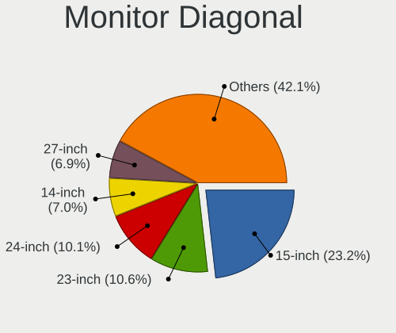

| Inches  | Computers | Percent |
|---------|-----------|---------|
| 15      | 271       | 23.2%   |
| 23      | 124       | 10.62%  |
| 24      | 118       | 10.1%   |
| 14      | 82        | 7.02%   |
| 27      | 81        | 6.93%   |
| 13      | 77        | 6.59%   |
| 21      | 66        | 5.65%   |
| 17      | 64        | 5.48%   |
| 40      | 53        | 4.54%   |
| Unknown | 45        | 3.85%   |
| 19      | 32        | 2.74%   |
| 16      | 23        | 1.97%   |
| 31      | 19        | 1.63%   |
| 22      | 13        | 1.11%   |
| 12      | 13        | 1.11%   |
| 18      | 11        | 0.94%   |
| 11      | 10        | 0.86%   |
| 32      | 8         | 0.68%   |
| 34      | 7         | 0.6%    |
| 20      | 7         | 0.6%    |
| 26      | 6         | 0.51%   |
| 142     | 4         | 0.34%   |
| 28      | 4         | 0.34%   |
| 10      | 4         | 0.34%   |
| 72      | 3         | 0.26%   |
| 54      | 3         | 0.26%   |
| 52      | 3         | 0.26%   |
| 49      | 3         | 0.26%   |
| 85      | 1         | 0.09%   |
| 84      | 1         | 0.09%   |
| 59      | 1         | 0.09%   |
| 57      | 1         | 0.09%   |
| 50      | 1         | 0.09%   |
| 46      | 1         | 0.09%   |
| 42      | 1         | 0.09%   |
| 39      | 1         | 0.09%   |
| 37      | 1         | 0.09%   |
| 33      | 1         | 0.09%   |
| 29      | 1         | 0.09%   |
| 25      | 1         | 0.09%   |

Monitor Width
-------------

Physical width

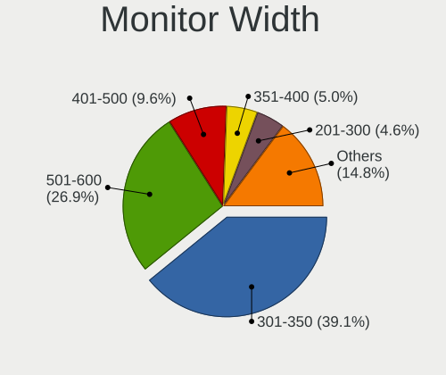

| Width in mm    | Computers | Percent |
|----------------|-----------|---------|
| 301-350        | 450       | 39.13%  |
| 501-600        | 309       | 26.87%  |
| 401-500        | 110       | 9.57%   |
| 351-400        | 58        | 5.04%   |
| 201-300        | 53        | 4.61%   |
| 901-1000       | 50        | 4.35%   |
| Unknown        | 45        | 3.91%   |
| 601-700        | 29        | 2.52%   |
| 701-800        | 16        | 1.39%   |
| 1001-1500      | 12        | 1.04%   |
| 801-900        | 7         | 0.61%   |
| 1501-2000      | 5         | 0.43%   |
| More than 2000 | 4         | 0.35%   |
| 101-200        | 1         | 0.09%   |
| 1-100          | 1         | 0.09%   |

Aspect Ratio
------------

Proportional relationship between the width and the height

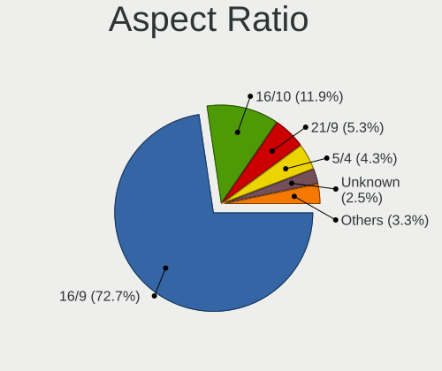

| Ratio   | Computers | Percent |
|---------|-----------|---------|
| 16/9    | 790       | 72.68%  |
| 16/10   | 129       | 11.87%  |
| 21/9    | 58        | 5.34%   |
| 5/4     | 47        | 4.32%   |
| Unknown | 27        | 2.48%   |
| 4/3     | 17        | 1.56%   |
| 3/2     | 9         | 0.83%   |
| 1.00    | 4         | 0.37%   |
| 32/9    | 3         | 0.28%   |
| 6/5     | 1         | 0.09%   |
| 0.67    | 1         | 0.09%   |
| 0.56    | 1         | 0.09%   |

Monitor Area
------------

Area in inch²

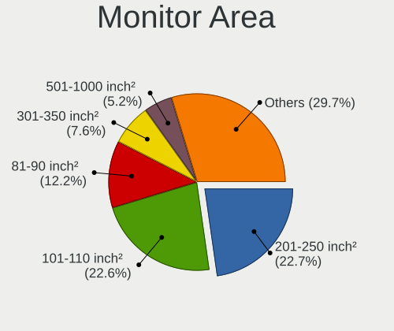

| Area in inch² | Computers | Percent |
|----------------|-----------|---------|
| 201-250        | 262       | 22.74%  |
| 101-110        | 260       | 22.57%  |
| 81-90          | 141       | 12.24%  |
| 301-350        | 87        | 7.55%   |
| 501-1000       | 60        | 5.21%   |
| 151-200        | 52        | 4.51%   |
| Unknown        | 45        | 3.91%   |
| 351-500        | 39        | 3.39%   |
| 251-300        | 36        | 3.13%   |
| 121-130        | 35        | 3.04%   |
| 111-120        | 35        | 3.04%   |
| 141-150        | 33        | 2.86%   |
| More than 1000 | 18        | 1.56%   |
| 71-80          | 18        | 1.56%   |
| 51-60          | 10        | 0.87%   |
| 61-70          | 9         | 0.78%   |
| 41-50          | 4         | 0.35%   |
| 91-100         | 4         | 0.35%   |
| 1-40           | 2         | 0.17%   |
| 131-140        | 2         | 0.17%   |

Pixel Density
-------------

Pixels per inch

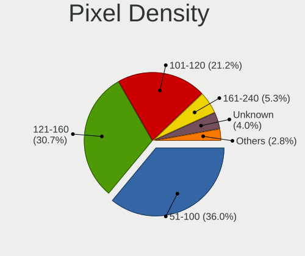

| Density       | Computers | Percent |
|---------------|-----------|---------|
| 51-100        | 408       | 36.01%  |
| 121-160       | 348       | 30.71%  |
| 101-120       | 240       | 21.18%  |
| 161-240       | 60        | 5.3%    |
| Unknown       | 45        | 3.97%   |
| 1-50          | 21        | 1.85%   |
| More than 240 | 11        | 0.97%   |

Multiple Monitors
-----------------

Total monitors connected

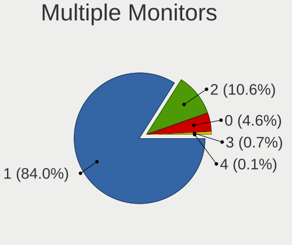

| Total | Computers | Percent |
|-------|-----------|---------|
| 1     | 960       | 83.99%  |
| 2     | 121       | 10.59%  |
| 0     | 53        | 4.64%   |
| 3     | 8         | 0.7%    |
| 4     | 1         | 0.09%   |

Network
-------

Net Controller Vendor
---------------------

Controller vendors

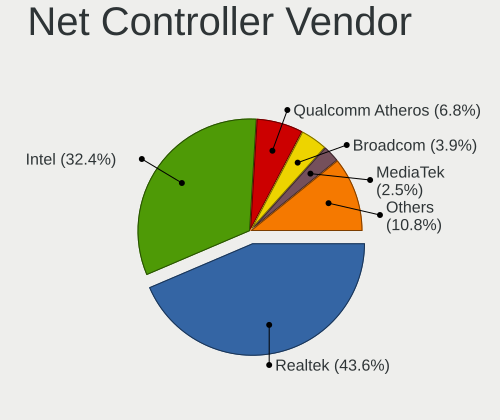

| Vendor                                 | Computers | Percent |
|----------------------------------------|-----------|---------|
| Realtek Semiconductor                  | 696       | 43.58%  |
| Intel                                  | 517       | 32.37%  |
| Qualcomm Atheros                       | 108       | 6.76%   |
| Broadcom                               | 63        | 3.94%   |
| MediaTek                               | 40        | 2.5%    |
| Nvidia                                 | 17        | 1.06%   |
| Marvell Technology Group               | 17        | 1.06%   |
| Ralink Technology                      | 13        | 0.81%   |
| Broadcom Limited                       | 12        | 0.75%   |
| Ralink                                 | 11        | 0.69%   |
| TP-Link                                | 10        | 0.63%   |
| ASIX Electronics                       | 10        | 0.63%   |
| D-Link                                 | 9         | 0.56%   |
| Huawei Technologies                    | 6         | 0.38%   |
| Xiaomi                                 | 5         | 0.31%   |
| Qualcomm                               | 5         | 0.31%   |
| IBM                                    | 5         | 0.31%   |
| MCST                                   | 4         | 0.25%   |
| ASUSTek Computer                       | 4         | 0.25%   |
| VIA Technologies                       | 3         | 0.19%   |
| Microchip Technology                   | 3         | 0.19%   |
| JMicron Technology                     | 3         | 0.19%   |
| D-Link System                          | 3         | 0.19%   |
| ZTopInc                                | 2         | 0.13%   |
| U-Blox                                 | 2         | 0.13%   |
| Sierra Wireless                        | 2         | 0.13%   |
| Mercucys                               | 2         | 0.13%   |
| Loongson Technology                    | 2         | 0.13%   |
| Lenovo                                 | 2         | 0.13%   |
| Emulex                                 | 2         | 0.13%   |
| Attansic Technology                    | 2         | 0.13%   |
| ZTE WCDMA Technologies MSM             | 1         | 0.06%   |
| Vimtron Electronics                    | 1         | 0.06%   |
| T & A Mobile Phones                    | 1         | 0.06%   |
| Suzhou Motorcomm Electronic Technology | 1         | 0.06%   |
| STMicroelectronics                     | 1         | 0.06%   |
| Samsung Electronics                    | 1         | 0.06%   |
| Qualcomm Atheros Communications        | 1         | 0.06%   |
| OPPO Electronics                       | 1         | 0.06%   |
| Motorola PCS                           | 1         | 0.06%   |

Net Controller Model
--------------------

Controller models

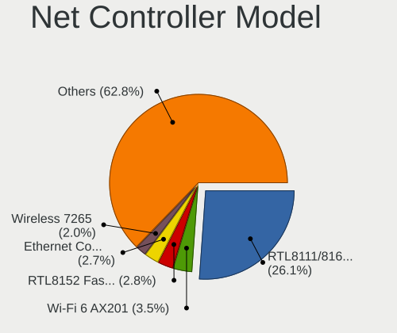

| Model                                                                  | Computers | Percent |
|------------------------------------------------------------------------|-----------|---------|
| Realtek RTL8111/8168/8211/8411 PCI Express Gigabit Ethernet Controller | 497       | 26.13%  |
| Intel Wi-Fi 6 AX201                                                    | 67        | 3.52%   |
| Realtek RTL8152 Fast Ethernet Adapter                                  | 54        | 2.84%   |
| Intel Ethernet Connection (13) I219-V                                  | 52        | 2.73%   |
| Intel Wireless 7265                                                    | 38        | 2%      |
| Intel Ethernet Connection I219-LM                                      | 37        | 1.95%   |
| Realtek RTL8822CE 802.11ac PCIe Wireless Network Adapter               | 35        | 1.84%   |
| Realtek RTL8125 2.5GbE Controller                                      | 35        | 1.84%   |
| Realtek RTL8821CE 802.11ac PCIe Wireless Network Adapter               | 34        | 1.79%   |
| Intel Wi-Fi 6 AX200                                                    | 30        | 1.58%   |
| Realtek RTL810xE PCI Express Fast Ethernet controller                  | 29        | 1.52%   |
| Intel Wireless 3165                                                    | 25        | 1.31%   |
| Intel Ethernet Connection (10) I219-V                                  | 22        | 1.16%   |
| Intel Dual Band Wireless-AC 3168NGW [Stone Peak]                       | 22        | 1.16%   |
| Intel Alder Lake-P PCH CNVi WiFi                                       | 22        | 1.16%   |
| Intel Wireless 8265 / 8275                                             | 21        | 1.1%    |
| Intel Ethernet Connection (2) I219-LM                                  | 18        | 0.95%   |
| Qualcomm Atheros QCA9377 802.11ac Wireless Network Adapter             | 17        | 0.89%   |
| Qualcomm Atheros AR9285 Wireless Network Adapter (PCI-Express)         | 17        | 0.89%   |
| Intel Cannon Lake PCH CNVi WiFi                                        | 17        | 0.89%   |
| Intel Ethernet Connection (6) I219-V                                   | 16        | 0.84%   |
| Intel Ethernet Connection (14) I219-V                                  | 16        | 0.84%   |
| Realtek RTL8153 Gigabit Ethernet Adapter                               | 15        | 0.79%   |
| MediaTek MT7921 802.11ax PCIe Wireless Network Adapter [Filogic 330]   | 15        | 0.79%   |
| Intel Cannon Point-LP CNVi [Wireless-AC]                               | 15        | 0.79%   |
| Qualcomm Atheros QCA9565 / AR9565 Wireless Network Adapter             | 14        | 0.74%   |
| Intel Comet Lake PCH-LP CNVi WiFi                                      | 14        | 0.74%   |
| Realtek RTL8822BE 802.11a/b/g/n/ac WiFi adapter                        | 13        | 0.68%   |
| Intel Ethernet Connection (7) I219-LM                                  | 12        | 0.63%   |
| Broadcom BCM43142 802.11b/g/n                                          | 12        | 0.63%   |
| Realtek RTL8188EUS 802.11n Wireless Network Adapter                    | 11        | 0.58%   |
| Realtek RTL8852BE PCIe 802.11ax Wireless Network Controller            | 10        | 0.53%   |
| Qualcomm Atheros AR9485 Wireless Network Adapter                       | 10        | 0.53%   |
| Intel Wireless 7260                                                    | 10        | 0.53%   |
| Intel Wi-Fi 6E(802.11ax) AX210/AX1675* 2x2 [Typhoon Peak]              | 10        | 0.53%   |
| Intel Ethernet Controller I225-V                                       | 10        | 0.53%   |
| Intel Ethernet Connection (17) I219-V                                  | 10        | 0.53%   |
| Realtek RTL8723BE PCIe Wireless Network Adapter                        | 9         | 0.47%   |
| Qualcomm Atheros AR8151 v2.0 Gigabit Ethernet                          | 9         | 0.47%   |
| MediaTek MT7922 802.11ax PCI Express Wireless Network Adapter          | 9         | 0.47%   |

Wireless Vendor
---------------

Wireless vendors

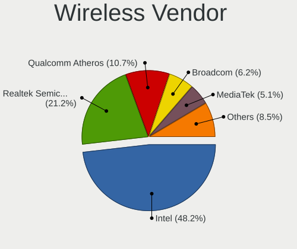

| Vendor                          | Computers | Percent |
|---------------------------------|-----------|---------|
| Intel                           | 356       | 48.17%  |
| Realtek Semiconductor           | 157       | 21.24%  |
| Qualcomm Atheros                | 79        | 10.69%  |
| Broadcom                        | 46        | 6.22%   |
| MediaTek                        | 38        | 5.14%   |
| Ralink Technology               | 13        | 1.76%   |
| Ralink                          | 11        | 1.49%   |
| TP-Link                         | 9         | 1.22%   |
| Broadcom Limited                | 8         | 1.08%   |
| Qualcomm                        | 4         | 0.54%   |
| ASUSTek Computer                | 4         | 0.54%   |
| ZTopInc                         | 2         | 0.27%   |
| Sierra Wireless                 | 2         | 0.27%   |
| Mercucys                        | 2         | 0.27%   |
| D-Link System                   | 2         | 0.27%   |
| D-Link                          | 2         | 0.27%   |
| Qualcomm Atheros Communications | 1         | 0.14%   |
| Microsoft                       | 1         | 0.14%   |
| Micro Star International        | 1         | 0.14%   |
| LG Electronics                  | 1         | 0.14%   |

Wireless Model
--------------

Wireless models

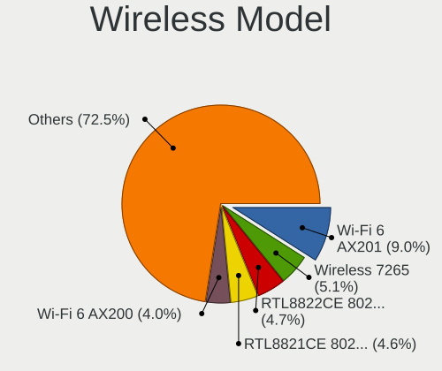

| Model                                                                | Computers | Percent |
|----------------------------------------------------------------------|-----------|---------|
| Intel Wi-Fi 6 AX201                                                  | 67        | 9.03%   |
| Intel Wireless 7265                                                  | 38        | 5.12%   |
| Realtek RTL8822CE 802.11ac PCIe Wireless Network Adapter             | 35        | 4.72%   |
| Realtek RTL8821CE 802.11ac PCIe Wireless Network Adapter             | 34        | 4.58%   |
| Intel Wi-Fi 6 AX200                                                  | 30        | 4.04%   |
| Intel Wireless 3165                                                  | 25        | 3.37%   |
| Intel Dual Band Wireless-AC 3168NGW [Stone Peak]                     | 22        | 2.96%   |
| Intel Wireless 8265 / 8275                                           | 21        | 2.83%   |
| Qualcomm Atheros QCA9377 802.11ac Wireless Network Adapter           | 17        | 2.29%   |
| Qualcomm Atheros AR9285 Wireless Network Adapter (PCI-Express)       | 17        | 2.29%   |
| Intel Cannon Lake PCH CNVi WiFi                                      | 17        | 2.29%   |
| MediaTek MT7921 802.11ax PCIe Wireless Network Adapter [Filogic 330] | 15        | 2.02%   |
| Intel Cannon Point-LP CNVi [Wireless-AC]                             | 15        | 2.02%   |
| Qualcomm Atheros QCA9565 / AR9565 Wireless Network Adapter           | 14        | 1.89%   |
| Intel Comet Lake PCH-LP CNVi WiFi                                    | 14        | 1.89%   |
| Realtek RTL8822BE 802.11a/b/g/n/ac WiFi adapter                      | 13        | 1.75%   |
| Broadcom BCM43142 802.11b/g/n                                        | 12        | 1.62%   |
| Realtek RTL8188EUS 802.11n Wireless Network Adapter                  | 11        | 1.48%   |
| Qualcomm Atheros AR9485 Wireless Network Adapter                     | 10        | 1.35%   |
| Intel Wireless 7260                                                  | 10        | 1.35%   |
| Intel Wi-Fi 6E(802.11ax) AX210/AX1675* 2x2 [Typhoon Peak]            | 10        | 1.35%   |
| Realtek RTL8723BE PCIe Wireless Network Adapter                      | 9         | 1.21%   |
| MediaTek MT7922 802.11ax PCI Express Wireless Network Adapter        | 9         | 1.21%   |
| Intel Dual Band Wireless-AC 3165 Plus Bluetooth                      | 9         | 1.21%   |
| Realtek RTL8852BE PCIe 802.11ax Wireless Network Controller          | 8         | 1.08%   |
| Realtek 802.11ac NIC                                                 | 8         | 1.08%   |
| MediaTek MT7921K (RZ608) Wi-Fi 6E 80MHz                              | 8         | 1.08%   |
| Intel Alder Lake-P PCH CNVi WiFi                                     | 8         | 1.08%   |
| Broadcom BCM4313 802.11bgn Wireless Network Adapter                  | 8         | 1.08%   |
| Ralink MT7601U Wireless Adapter                                      | 7         | 0.94%   |
| Broadcom BCM4312 802.11b/g LP-PHY                                    | 7         | 0.94%   |
| Realtek RTL8188EE Wireless Network Adapter                           | 6         | 0.81%   |
| Realtek RTL8188CE 802.11b/g/n WiFi Adapter                           | 6         | 0.81%   |
| Intel Raptor Lake PCH CNVi WiFi                                      | 6         | 0.81%   |
| Intel Gemini Lake PCH CNVi WiFi                                      | 6         | 0.81%   |
| Realtek RTL8723BU 802.11b/g/n WLAN Adapter                           | 5         | 0.67%   |
| Qualcomm Atheros QCA6174 802.11ac Wireless Network Adapter           | 5         | 0.67%   |
| MediaTek MT7902 802.11ax PCIe Wireless Network Adapter [Filogic 310] | 5         | 0.67%   |
| Intel PRO/Wireless 3945ABG [Golan] Network Connection                | 5         | 0.67%   |
| Intel Ice Lake-LP PCH CNVi WiFi                                      | 5         | 0.67%   |

Ethernet Vendor
---------------

Ethernet vendors

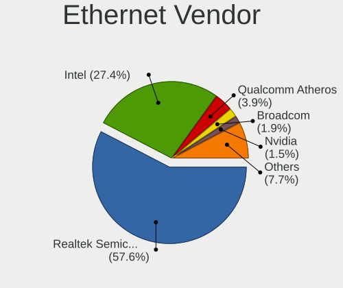

| Vendor                                 | Computers | Percent |
|----------------------------------------|-----------|---------|
| Realtek Semiconductor                  | 636       | 57.61%  |
| Intel                                  | 302       | 27.36%  |
| Qualcomm Atheros                       | 43        | 3.89%   |
| Broadcom                               | 21        | 1.9%    |
| Nvidia                                 | 17        | 1.54%   |
| Marvell Technology Group               | 17        | 1.54%   |
| ASIX Electronics                       | 10        | 0.91%   |
| D-Link                                 | 7         | 0.63%   |
| Xiaomi                                 | 5         | 0.45%   |
| IBM                                    | 5         | 0.45%   |
| Huawei Technologies                    | 5         | 0.45%   |
| MCST                                   | 4         | 0.36%   |
| Broadcom Limited                       | 4         | 0.36%   |
| VIA Technologies                       | 3         | 0.27%   |
| JMicron Technology                     | 3         | 0.27%   |
| TP-Link                                | 2         | 0.18%   |
| MediaTek                               | 2         | 0.18%   |
| Loongson Technology                    | 2         | 0.18%   |
| Lenovo                                 | 2         | 0.18%   |
| Emulex                                 | 2         | 0.18%   |
| Attansic Technology                    | 2         | 0.18%   |
| Vimtron Electronics                    | 1         | 0.09%   |
| Suzhou Motorcomm Electronic Technology | 1         | 0.09%   |
| Samsung Electronics                    | 1         | 0.09%   |
| Qualcomm                               | 1         | 0.09%   |
| OPPO Electronics                       | 1         | 0.09%   |
| Motorola PCS                           | 1         | 0.09%   |
| Mellanox Technologies                  | 1         | 0.09%   |
| DisplayLink                            | 1         | 0.09%   |
| D-Link System                          | 1         | 0.09%   |
| American Megatrends                    | 1         | 0.09%   |

Ethernet Model
--------------

Ethernet models

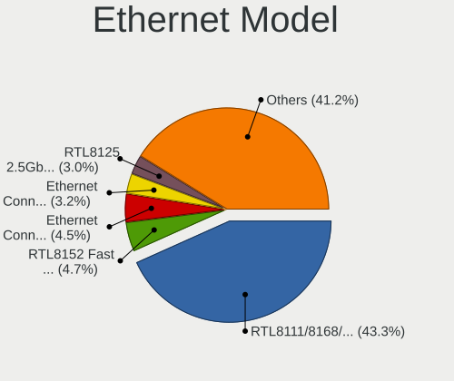

| Model                                                                  | Computers | Percent |
|------------------------------------------------------------------------|-----------|---------|
| Realtek RTL8111/8168/8211/8411 PCI Express Gigabit Ethernet Controller | 497       | 43.29%  |
| Realtek RTL8152 Fast Ethernet Adapter                                  | 54        | 4.7%    |
| Intel Ethernet Connection (13) I219-V                                  | 52        | 4.53%   |
| Intel Ethernet Connection I219-LM                                      | 37        | 3.22%   |
| Realtek RTL8125 2.5GbE Controller                                      | 35        | 3.05%   |
| Realtek RTL810xE PCI Express Fast Ethernet controller                  | 29        | 2.53%   |
| Intel Ethernet Connection (10) I219-V                                  | 22        | 1.92%   |
| Intel Ethernet Connection (2) I219-LM                                  | 18        | 1.57%   |
| Intel Ethernet Connection (6) I219-V                                   | 16        | 1.39%   |
| Intel Ethernet Connection (14) I219-V                                  | 16        | 1.39%   |
| Realtek RTL8153 Gigabit Ethernet Adapter                               | 15        | 1.31%   |
| Intel Alder Lake-P PCH CNVi WiFi                                       | 14        | 1.22%   |
| Intel Ethernet Connection (7) I219-LM                                  | 12        | 1.05%   |
| Intel Ethernet Controller I225-V                                       | 10        | 0.87%   |
| Intel Ethernet Connection (17) I219-V                                  | 10        | 0.87%   |
| Qualcomm Atheros AR8151 v2.0 Gigabit Ethernet                          | 9         | 0.78%   |
| Intel I350 Gigabit Network Connection                                  | 9         | 0.78%   |
| Intel Ethernet Connection X722 for 10GBASE-T                           | 9         | 0.78%   |
| Intel 82579LM Gigabit Network Connection (Lewisville)                  | 9         | 0.78%   |
| Qualcomm Atheros AR8161 Gigabit Ethernet                               | 8         | 0.7%    |
| Marvell Group 88E8055 PCI-E Gigabit Ethernet Controller                | 8         | 0.7%    |
| Intel Ethernet Connection X722 for 1GbE                                | 8         | 0.7%    |
| ASIX AX88179 Gigabit Ethernet                                          | 8         | 0.7%    |
| Intel I211 Gigabit Network Connection                                  | 7         | 0.61%   |
| Intel I210 Gigabit Network Connection                                  | 7         | 0.61%   |
| Intel Ethernet Connection (7) I219-V                                   | 6         | 0.52%   |
| Intel Ethernet Connection (2) I219-V                                   | 6         | 0.52%   |
| Xiaomi Mi/Redmi series (RNDIS)                                         | 5         | 0.44%   |
| Qualcomm Atheros AR8131 Gigabit Ethernet                               | 5         | 0.44%   |
| Intel Ethernet Controller X710 for 10GbE SFP+                          | 5         | 0.44%   |
| Intel 82574L Gigabit Network Connection                                | 5         | 0.44%   |
| IBM RNDIS/Ethernet Gadget                                              | 5         | 0.44%   |
| Realtek RTL-8100/8101L/8139 PCI Fast Ethernet Adapter                  | 4         | 0.35%   |
| Qualcomm Atheros QCA8171 Gigabit Ethernet                              | 4         | 0.35%   |
| Marvell Group 88E8001 Gigabit Ethernet Controller                      | 4         | 0.35%   |
| Intel Ethernet Connection I217-V                                       | 4         | 0.35%   |
| Intel Ethernet Connection (4) I219-V                                   | 4         | 0.35%   |
| Intel 82599ES 10-Gigabit SFI/SFP+ Network Connection                   | 4         | 0.35%   |
| D-Link DUB-1312 Gigabit Ethernet Adapter                               | 4         | 0.35%   |
| Realtek RTL8111/8168/8411 PCI Express Gigabit Ethernet Controller      | 3         | 0.26%   |

Net Controller Kind
-------------------

Ethernet, WiFi or modem

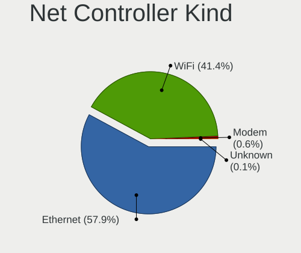

| Kind     | Computers | Percent |
|----------|-----------|---------|
| Ethernet | 1000      | 57.87%  |
| WiFi     | 716       | 41.44%  |
| Modem    | 11        | 0.64%   |
| Unknown  | 1         | 0.06%   |

Used Controller
---------------

Currently used network controller

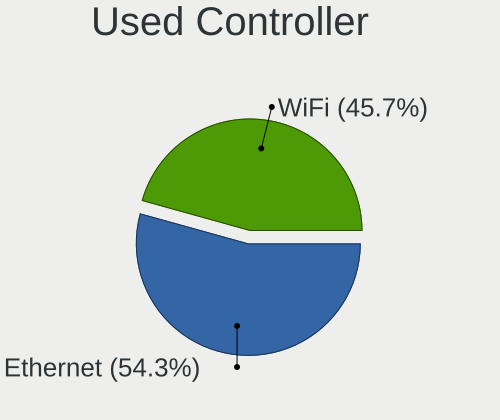

| Kind     | Computers | Percent |
|----------|-----------|---------|
| Ethernet | 623       | 54.32%  |
| WiFi     | 524       | 45.68%  |

NICs
----

Total network controllers on board

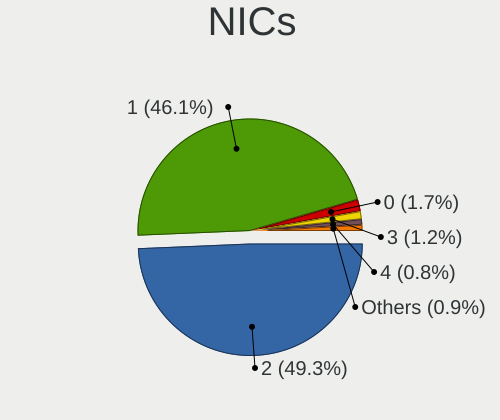

| Total | Computers | Percent |
|-------|-----------|---------|
| 2     | 557       | 49.34%  |
| 1     | 521       | 46.15%  |
| 0     | 19        | 1.68%   |
| 3     | 13        | 1.15%   |
| 4     | 9         | 0.8%    |
| 6     | 6         | 0.53%   |
| 8     | 2         | 0.18%   |
| 13    | 1         | 0.09%   |
| 12    | 1         | 0.09%   |

IPv6
----

IPv6 vs IPv4

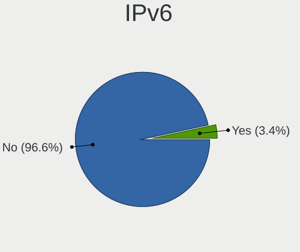

| Used | Computers | Percent |
|------|-----------|---------|
| No   | 1071      | 94.44%  |
| Yes  | 63        | 5.56%   |

Bluetooth
---------

Bluetooth Vendor
----------------

Controller vendors

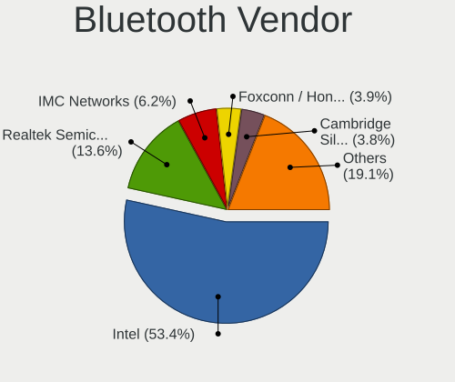

| Vendor                          | Computers | Percent |
|---------------------------------|-----------|---------|
| Intel                           | 342       | 53.44%  |
| Realtek Semiconductor           | 87        | 13.59%  |
| IMC Networks                    | 40        | 6.25%   |
| Foxconn / Hon Hai               | 25        | 3.91%   |
| Cambridge Silicon Radio         | 24        | 3.75%   |
| Broadcom                        | 22        | 3.44%   |
| Qualcomm Atheros Communications | 21        | 3.28%   |
| Lite-On Technology              | 15        | 2.34%   |
| MediaTek                        | 11        | 1.72%   |
| Apple                           | 11        | 1.72%   |
| Hewlett-Packard                 | 7         | 1.09%   |
| ASUSTek Computer                | 7         | 1.09%   |
| Realtek                         | 6         | 0.94%   |
| TP-Link                         | 3         | 0.47%   |
| Toshiba                         | 3         | 0.47%   |
| Ralink                          | 3         | 0.47%   |
| HTC (High Tech Computer)        | 2         | 0.31%   |
| Foxconn International           | 2         | 0.31%   |
| Actions                         | 2         | 0.31%   |
| USI                             | 1         | 0.16%   |
| Opticis                         | 1         | 0.16%   |
| Logitech                        | 1         | 0.16%   |
| Dell                            | 1         | 0.16%   |
| Chicony Electronics             | 1         | 0.16%   |
| Alps Electric                   | 1         | 0.16%   |
| Unknown                         | 1         | 0.16%   |

Bluetooth Model
---------------

Controller models

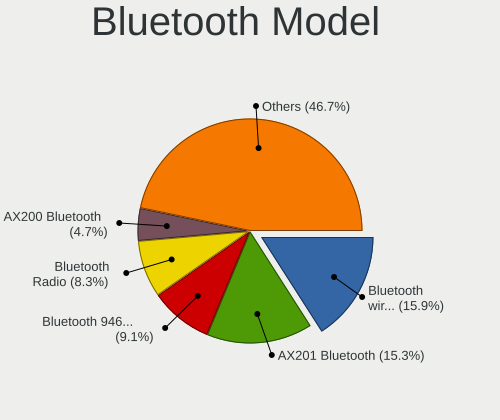

| Model                                               | Computers | Percent |
|-----------------------------------------------------|-----------|---------|
| Intel Bluetooth wireless interface                  | 102       | 15.94%  |
| Intel AX201 Bluetooth                               | 98        | 15.31%  |
| Intel Bluetooth 9460/9560 Jefferson Peak (JfP)      | 58        | 9.06%   |
| Realtek Bluetooth Radio                             | 53        | 8.28%   |
| Intel AX200 Bluetooth                               | 30        | 4.69%   |
| Cambridge Silicon Radio Bluetooth Dongle (HCI mode) | 24        | 3.75%   |
| Intel Wireless-AC 3168 Bluetooth                    | 22        | 3.44%   |
| Realtek 802.11ac WLAN Adapter                       | 17        | 2.66%   |
| Intel Bluetooth Device                              | 17        | 2.66%   |
| IMC Networks Wireless_Device                        | 16        | 2.5%    |
| Qualcomm Atheros  Bluetooth Device                  | 12        | 1.88%   |
| MediaTek Wireless_Device                            | 11        | 1.72%   |
| IMC Networks Bluetooth Radio                        | 11        | 1.72%   |
| Realtek  Bluetooth 4.2 Adapter                      | 9         | 1.41%   |
| Intel AX210 Bluetooth                               | 8         | 1.25%   |
| Foxconn / Hon Hai Bluetooth Device                  | 8         | 1.25%   |
| IMC Networks Bluetooth Device                       | 7         | 1.09%   |
| Apple Bluetooth Host Controller                     | 7         | 1.09%   |
| Realtek Bluetooth Radio                             | 6         | 0.94%   |
| Foxconn / Hon Hai Wireless_Device                   | 5         | 0.78%   |
| Realtek RTL8723B Bluetooth                          | 4         | 0.63%   |
| Qualcomm Atheros AR3011 Bluetooth                   | 4         | 0.63%   |
| Intel Wireless-AC 9260 Bluetooth Adapter            | 4         | 0.63%   |
| IMC Networks Atheros AR3012 Bluetooth 4.0 Adapter   | 4         | 0.63%   |
| HP Broadcom 2070 Bluetooth Combo                    | 4         | 0.63%   |
| Foxconn / Hon Hai MediaTek Bluetooth Adapter        | 4         | 0.63%   |
| Broadcom BCM2070 Bluetooth 2.1 + EDR                | 4         | 0.63%   |
| Broadcom BCM2045 Bluetooth                          | 4         | 0.63%   |
| ASUS 2045 Bluetooth 2.0 Device with trace filter    | 4         | 0.63%   |
| TP-Link TP-T@- UB500 Adapter                        | 3         | 0.47%   |
| Ralink RT3290 Bluetooth                             | 3         | 0.47%   |
| Lite-On Qualcomm Atheros QCA9377 Bluetooth          | 3         | 0.47%   |
| Lite-On Broadcom BCM43142A0 Bluetooth Device        | 3         | 0.47%   |
| Lite-On Atheros AR3012 Bluetooth                    | 3         | 0.47%   |
| Foxconn / Hon Hai Bluetooth USB Host Controller     | 3         | 0.47%   |
| Realtek RTL8821A Bluetooth                          | 2         | 0.31%   |
| Qualcomm Atheros QCA61x4 Bluetooth 4.0              | 2         | 0.31%   |
| Qualcomm Atheros AR3012 Bluetooth 4.0               | 2         | 0.31%   |
| Lite-On Qualcomm Atheros Bluetooth                  | 2         | 0.31%   |
| Lite-On Bluetooth Device                            | 2         | 0.31%   |

Sound
-----

Sound Vendor
------------

Sound card vendors

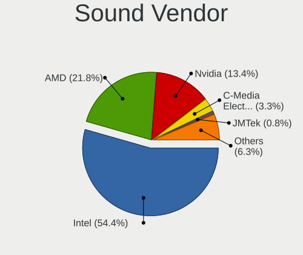

| Vendor                                       | Computers | Percent |
|----------------------------------------------|-----------|---------|
| Intel                                        | 792       | 54.4%   |
| AMD                                          | 318       | 21.84%  |
| Nvidia                                       | 195       | 13.39%  |
| C-Media Electronics                          | 48        | 3.3%    |
| JMTek                                        | 11        | 0.76%   |
| Promethean Limited                           | 7         | 0.48%   |
| Creative Technology                          | 7         | 0.48%   |
| Logitech                                     | 5         | 0.34%   |
| Creative Labs                                | 5         | 0.34%   |
| MCST                                         | 4         | 0.27%   |
| ASUSTek Computer                             | 4         | 0.27%   |
| Apple                                        | 4         | 0.27%   |
| VIA Technologies                             | 3         | 0.21%   |
| Lenovo                                       | 3         | 0.21%   |
| Huawei Technologies                          | 3         | 0.21%   |
| GN Netcom                                    | 3         | 0.21%   |
| FIFINE Microphones                           | 3         | 0.21%   |
| Unknown                                      | 3         | 0.21%   |
| Zoran Co. Personal Media Division (Nogatech) | 2         | 0.14%   |
| Zhaoxin                                      | 2         | 0.14%   |
| Realtek Semiconductor                        | 2         | 0.14%   |
| MV-SILICON                                   | 2         | 0.14%   |
| Loongson Technology                          | 2         | 0.14%   |
| Generalplus Technology                       | 2         | 0.14%   |
| Focusrite-Novation                           | 2         | 0.14%   |
| A4Tech                                       | 2         | 0.14%   |
| Yamaha                                       | 1         | 0.07%   |
| Walmart                                      | 1         | 0.07%   |
| Texas Instruments                            | 1         | 0.07%   |
| Tenx Technology                              | 1         | 0.07%   |
| Sony                                         | 1         | 0.07%   |
| Razer USA                                    | 1         | 0.07%   |
| Plantronics                                  | 1         | 0.07%   |
| Onkyo                                        | 1         | 0.07%   |
| Micro Star International                     | 1         | 0.07%   |
| KTMicro                                      | 1         | 0.07%   |
| Jieli Technology                             | 1         | 0.07%   |
| Hewlett-Packard                              | 1         | 0.07%   |
| Goldvish                                     | 1         | 0.07%   |
| Giga-Byte Technology                         | 1         | 0.07%   |

Sound Model
-----------

Sound card models

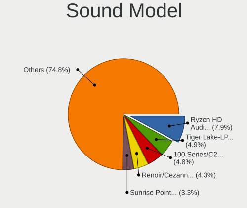

| Model                                                                      | Computers | Percent |
|----------------------------------------------------------------------------|-----------|---------|
| AMD Ryzen HD Audio Controller                                              | 135       | 7.93%   |
| Intel Tiger Lake-LP Smart Sound Technology Audio Controller                | 84        | 4.93%   |
| Intel 100 Series/C230 Series Chipset Family HD Audio Controller            | 81        | 4.76%   |
| AMD Renoir/Cezanne HDMI/DP Audio Controller                                | 74        | 4.35%   |
| Intel Sunrise Point-LP HD Audio                                            | 56        | 3.29%   |
| Intel Cannon Point-LP High Definition Audio Controller                     | 47        | 2.76%   |
| Intel 7 Series/C216 Chipset Family High Definition Audio Controller        | 47        | 2.76%   |
| Intel 200 Series PCH HD Audio                                              | 42        | 2.47%   |
| Intel 6 Series/C200 Series Chipset Family High Definition Audio Controller | 40        | 2.35%   |
| Nvidia GP107GL High Definition Audio Controller                            | 37        | 2.17%   |
| AMD FCH Azalia Controller                                                  | 35        | 2.06%   |
| C-Media Electronics USB Advanced Audio Device                              | 33        | 1.94%   |
| Intel Alder Lake PCH-P High Definition Audio Controller                    | 31        | 1.82%   |
| Intel Cannon Lake PCH cAVS                                                 | 30        | 1.76%   |
| AMD Radeon High Definition Audio Controller                                | 30        | 1.76%   |
| Intel Comet Lake PCH-LP cAVS                                               | 29        | 1.7%    |
| Intel Smart Sound Technology (SST) Audio Controller                        | 28        | 1.64%   |
| AMD Starship/Matisse HD Audio Controller                                   | 27        | 1.59%   |
| AMD Raven/Raven2/Fenghuang HDMI/DP Audio Controller                        | 26        | 1.53%   |
| AMD Family 17h (Models 00h-0fh) HD Audio Controller                        | 25        | 1.47%   |
| Intel Alder Lake-S HD Audio Controller                                     | 24        | 1.41%   |
| AMD Navi 21/23 HDMI/DP Audio Controller                                    | 24        | 1.41%   |
| Intel NM10/ICH7 Family High Definition Audio Controller                    | 23        | 1.35%   |
| Intel 8 Series/C220 Series Chipset High Definition Audio Controller        | 23        | 1.35%   |
| AMD Ellesmere HDMI Audio [Radeon RX 470/480 / 570/580/590]                 | 19        | 1.12%   |
| Intel Celeron/Pentium Silver Processor High Definition Audio               | 18        | 1.06%   |
| Intel 82801I (ICH9 Family) HD Audio Controller                             | 18        | 1.06%   |
| Intel 5 Series/3400 Series Chipset High Definition Audio                   | 18        | 1.06%   |
| AMD SBx00 Azalia (Intel HDA)                                               | 17        | 1%      |
| Nvidia GK208 HDMI/DP Audio Controller                                      | 16        | 0.94%   |
| Intel 82801H (ICH8 Family) HD Audio Controller                             | 16        | 0.94%   |
| Nvidia GF108 High Definition Audio Controller                              | 15        | 0.88%   |
| AMD Kabini HDMI/DP Audio                                                   | 14        | 0.82%   |
| Intel Xeon E3-1200 v3/4th Gen Core Processor HD Audio Controller           | 13        | 0.76%   |
| Intel Atom Processor Z36xxx/Z37xxx Series High Definition Audio Controller | 13        | 0.76%   |
| Nvidia High Definition Audio Controller                                    | 12        | 0.7%    |
| Intel Haswell-ULT HD Audio Controller                                      | 12        | 0.7%    |
| Intel 8 Series HD Audio Controller                                         | 12        | 0.7%    |
| Nvidia GA106 High Definition Audio Controller                              | 11        | 0.65%   |
| AMD Trinity HDMI Audio Controller                                          | 11        | 0.65%   |

Memory
------

Memory Vendor
-------------

Memory module vendors

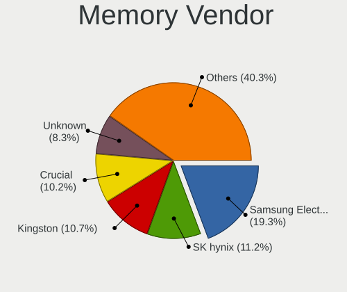

| Vendor              | Computers | Percent |
|---------------------|-----------|---------|
| Samsung Electronics | 177       | 19.28%  |
| SK hynix            | 103       | 11.22%  |
| Kingston            | 98        | 10.68%  |
| Crucial             | 94        | 10.24%  |
| Unknown             | 76        | 8.28%   |
| Micron Technology   | 72        | 7.84%   |
| ACPI Digital        | 32        | 3.49%   |
| A-DATA Technology   | 30        | 3.27%   |
| Foxline             | 28        | 3.05%   |
| Unknown             | 27        | 2.94%   |
| Ramaxel Technology  | 19        | 2.07%   |
| Apacer              | 17        | 1.85%   |
| AMD                 | 17        | 1.85%   |
| Patriot             | 16        | 1.74%   |
| Corsair             | 11        | 1.2%    |
| Unknown (ABCD)      | 9         | 0.98%   |
| Elpida              | 9         | 0.98%   |
| Hewlett-Packard     | 8         | 0.87%   |
| G.Skill             | 8         | 0.87%   |
| Nanya Technology    | 6         | 0.65%   |
| KingSpec            | 6         | 0.65%   |
| Goodram             | 6         | 0.65%   |
| Unknown (0B7A)      | 4         | 0.44%   |
| ChangXin Memory     | 4         | 0.44%   |
| Lexar Co Limited    | 3         | 0.33%   |
| Wodposit            | 2         | 0.22%   |
| Unknown (0x7FFF)    | 2         | 0.22%   |
| Shenzhen Longsys    | 2         | 0.22%   |
| Qumo                | 2         | 0.22%   |
| Netac               | 2         | 0.22%   |
| Goldkey             | 2         | 0.22%   |
| Wilk                | 1         | 0.11%   |
| Unknown (89F7)      | 1         | 0.11%   |
| Unknown (0x0B92)    | 1         | 0.11%   |
| Unknown (0x0B7A)    | 1         | 0.11%   |
| Unknown (09D5)      | 1         | 0.11%   |
| Unknown (081A)      | 1         | 0.11%   |
| Transcend           | 1         | 0.11%   |
| tigo                | 1         | 0.11%   |
| Team                | 1         | 0.11%   |

Memory Model
------------

Memory module models

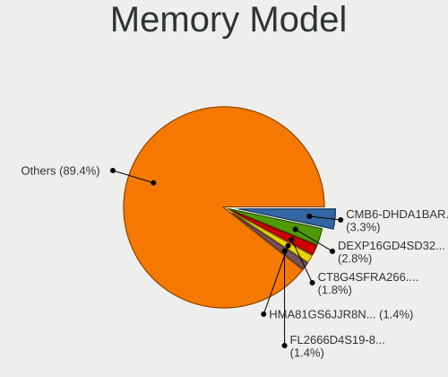

| Model                                                            | Computers | Percent |
|------------------------------------------------------------------|-----------|---------|
| ACPI Digital RAM CMB6-DHDA1BAR08D00 16GB SODIMM DDR4 3200MT/s    | 32        | 3.33%   |
| Unknown                                                          | 27        | 2.81%   |
| Crucial RAM CT8G4SFRA266.M8FRS 8GB SODIMM DDR4 2667MT/s          | 17        | 1.77%   |
| SK hynix RAM HMA81GS6JJR8N-VK 8GB SODIMM DDR4 2667MT/s           | 13        | 1.35%   |
| Foxline RAM FL2666D4S19-8G 8GB SODIMM DDR4 2667MT/s              | 13        | 1.35%   |
| Crucial RAM CT4G4DFS824A.M8FF 4GB DIMM DDR4 2666MT/s             | 13        | 1.35%   |
| Ramaxel RAM RMSA3260ME78HAF-2666 8GB SODIMM DDR4 2667MT/s        | 10        | 1.04%   |
| Micron RAM Module 4GB DIMM DDR4 2400MT/s                         | 10        | 1.04%   |
| Samsung RAM Module 16GB SODIMM DDR4 2667MT/s                     | 9         | 0.94%   |
| Samsung RAM M471A1K43EB1-CWE 8GB SODIMM DDR4 3200MT/s            | 9         | 0.94%   |
| SK hynix RAM Module 8GB SODIMM DDR4 2133MT/s                     | 8         | 0.83%   |
| Samsung RAM M471A5244CB0-CTD 4GB SODIMM DDR4 3266MT/s            | 8         | 0.83%   |
| Samsung RAM M471A1G44BB0-CWE 8GB SODIMM DDR4 3200MT/s            | 8         | 0.83%   |
| Micron RAM 8ATF1G64HZ-3G2R1 8GB SODIMM DDR4 3200MT/s             | 7         | 0.73%   |
| A-DATA RAM Module 16GB SODIMM DDR4 3200MT/s                      | 7         | 0.73%   |
| Unknown (ABCD) RAM 123456789012345678 2GB SODIMM LPDDR4 2400MT/s | 6         | 0.63%   |
| SK hynix RAM HMAA1GS6CJR6N-XN 8GB SODIMM DDR4 3200MT/s           | 6         | 0.63%   |
| Samsung RAM M471A5244CB0-CWE 4GB SODIMM DDR4 3200MT/s            | 6         | 0.63%   |
| Samsung RAM M471A1G44AB0-CWE 8GiB SODIMM DDR4 3200MT/s           | 6         | 0.63%   |
| SK hynix RAM HMA81GS6AFR8N-UH 8GB SODIMM DDR4 2667MT/s           | 5         | 0.52%   |
| Samsung RAM Module 8GB SODIMM DDR4 2133MT/s                      | 5         | 0.52%   |
| Samsung RAM M471A1G44AB0-CWE 8GB Row Of Chips DDR4 3200MT/s      | 5         | 0.52%   |
| Samsung RAM M425R1GB4BB0-CQKOL 8GB SODIMM DDR5 4800MT/s          | 5         | 0.52%   |
| Micron RAM 4ATF1G64HZ-3G2F1 8GB SODIMM DDR4 3200MT/s             | 5         | 0.52%   |
| Foxline RAM FL3200D4S22-8G 8GB SODIMM DDR4 3200MT/s              | 5         | 0.52%   |
| Crucial RAM CT8G4SFRA266.C4FE 8GB SODIMM DDR4 2667MT/s           | 5         | 0.52%   |
| Unknown RAM Module 4GB SODIMM DDR3                               | 4         | 0.42%   |
| Unknown RAM Module 2GB SODIMM DDR2 667MT/s                       | 4         | 0.42%   |
| Unknown RAM Module 2GB DIMM 800MT/s                              | 4         | 0.42%   |
| Unknown (0B7A) RAM UDIMM PC4-3200 16GB 16GB DIMM DDR4 3200MT/s   | 4         | 0.42%   |
| SK hynix RAM HMT451S6BFR8A-PB 4GB SODIMM DDR3 1600MT/s           | 4         | 0.42%   |
| Samsung RAM M471B5173EB0-YK0 4GB SODIMM DDR3 1600MT/s            | 4         | 0.42%   |
| Samsung RAM M393A2K43CB2-CVF 16GB DIMM DDR4 2933MT/s             | 4         | 0.42%   |
| Samsung RAM M378A1K43EB2-CVF 8GB DIMM DDR4 3266MT/s              | 4         | 0.42%   |
| Kingston RAM KHX3200C16D4/8GX 8GB DIMM DDR4 3733MT/s             | 4         | 0.42%   |
| Kingston RAM CBD24D4S7S8K1A-8 8GB SODIMM DDR4 2400MT/s           | 4         | 0.42%   |
| HP RAM Module 4GB DIMM DDR3 1333MT/s                             | 4         | 0.42%   |
| HP RAM 809083-091 32GB DIMM DDR4 2400MT/s                        | 4         | 0.42%   |
| Apacer RAM D12.2755BS.001 16GB DIMM DDR4 3200MT/s                | 4         | 0.42%   |
| A-DATA RAM Module 8GB SODIMM DDR4 3200MT/s                       | 4         | 0.42%   |

Memory Kind
-----------

Memory module kinds

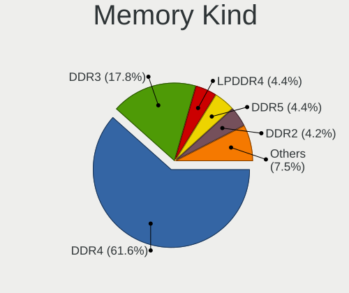

| Kind    | Computers | Percent |
|---------|-----------|---------|
| DDR4    | 515       | 61.6%   |
| DDR3    | 149       | 17.82%  |
| LPDDR4  | 37        | 4.43%   |
| DDR5    | 37        | 4.43%   |
| DDR2    | 35        | 4.19%   |
| LPDDR5  | 21        | 2.51%   |
| Unknown | 20        | 2.39%   |
| SDRAM   | 14        | 1.67%   |
| DDR     | 4         | 0.48%   |
| LPDDR3  | 2         | 0.24%   |
| DRAM    | 2         | 0.24%   |

Memory Form Factor
------------------

Physical design of the memory module

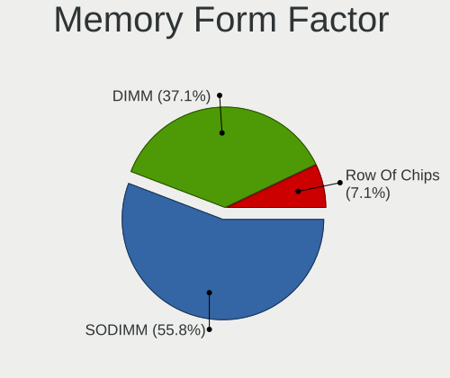

| Name         | Computers | Percent |
|--------------|-----------|---------|
| SODIMM       | 466       | 55.81%  |
| DIMM         | 310       | 37.13%  |
| Row Of Chips | 59        | 7.07%   |

Memory Size
-----------

Memory module size

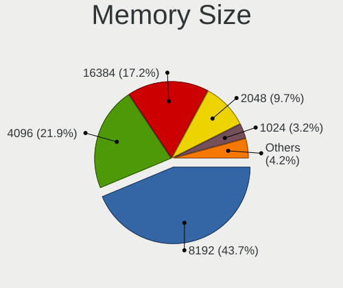

| Size  | Computers | Percent |
|-------|-----------|---------|
| 8192  | 383       | 43.72%  |
| 4096  | 192       | 21.92%  |
| 16384 | 151       | 17.24%  |
| 2048  | 85        | 9.7%    |
| 1024  | 28        | 3.2%    |
| 32768 | 27        | 3.08%   |
| 512   | 5         | 0.57%   |
| 65536 | 3         | 0.34%   |
| 6144  | 1         | 0.11%   |
| 1536  | 1         | 0.11%   |

Memory Speed
------------

Memory module speed

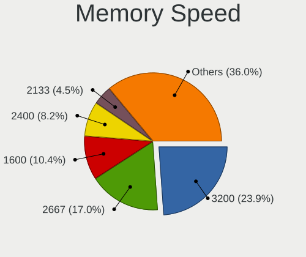

| Speed   | Computers | Percent |
|---------|-----------|---------|
| 3200    | 212       | 23.87%  |
| 2667    | 151       | 17%     |
| 1600    | 92        | 10.36%  |
| 2400    | 73        | 8.22%   |
| 2133    | 40        | 4.5%    |
| 1333    | 34        | 3.83%   |
| 4800    | 20        | 2.25%   |
| 2666    | 20        | 2.25%   |
| 667     | 20        | 2.25%   |
| Unknown | 17        | 1.91%   |
| 800     | 16        | 1.8%    |
| 2933    | 15        | 1.69%   |
| 1334    | 15        | 1.69%   |
| 6400    | 12        | 1.35%   |
| 4267    | 12        | 1.35%   |
| 3266    | 12        | 1.35%   |
| 3733    | 11        | 1.24%   |
| 3600    | 11        | 1.24%   |
| 5600    | 8         | 0.9%    |
| 1866    | 7         | 0.79%   |
| 4199    | 6         | 0.68%   |
| 7500    | 5         | 0.56%   |
| 3000    | 5         | 0.56%   |
| 1067    | 5         | 0.56%   |
| 6000    | 4         | 0.45%   |
| 3800    | 4         | 0.45%   |
| 3466    | 4         | 0.45%   |
| 533     | 4         | 0.45%   |
| 400     | 4         | 0.45%   |
| 8533    | 3         | 0.34%   |
| 4000    | 3         | 0.34%   |
| 3333    | 3         | 0.34%   |
| 3066    | 3         | 0.34%   |
| 2800    | 3         | 0.34%   |
| 1867    | 3         | 0.34%   |
| 333     | 3         | 0.34%   |
| 8400    | 2         | 0.23%   |
| 5200    | 2         | 0.23%   |
| 3400    | 2         | 0.23%   |
| 2866    | 2         | 0.23%   |

Printers & scanners
-------------------

Printer Vendor
--------------

Printer device vendors

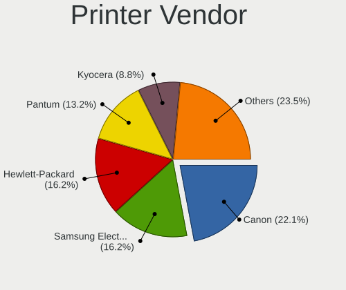

| Vendor                 | Computers | Percent |
|------------------------|-----------|---------|
| Canon                  | 15        | 22.06%  |
| Samsung Electronics    | 11        | 16.18%  |
| Hewlett-Packard        | 11        | 16.18%  |
| Pantum                 | 9         | 13.24%  |
| Kyocera                | 6         | 8.82%   |
| Brother Industries     | 6         | 8.82%   |
| Seiko Epson            | 3         | 4.41%   |
| Xerox                  | 2         | 2.94%   |
| Ricoh                  | 2         | 2.94%   |
| QinHeng Electronics    | 2         | 2.94%   |
| Panasonic (Matsushita) | 1         | 1.47%   |

Printer Model
-------------

Printer device models

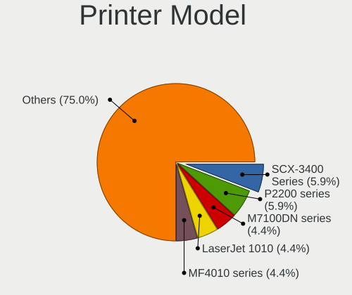

| Model                                | Computers | Percent |
|--------------------------------------|-----------|---------|
| Samsung SCX-3400 Series              | 4         | 5.88%   |
| Pantum P2200 series                  | 4         | 5.88%   |
| Pantum M7100DN series                | 3         | 4.41%   |
| HP LaserJet 1010                     | 3         | 4.41%   |
| Canon MF4010 series                  | 3         | 4.41%   |
| Brother HL-L2300D series             | 3         | 4.41%   |
| Seiko Epson EPSON L132 Series        | 2         | 2.94%   |
| QinHeng CH340S                       | 2         | 2.94%   |
| Kyocera FS-1040                      | 2         | 2.94%   |
| HP LaserJet P1102                    | 2         | 2.94%   |
| Canon MF4410                         | 2         | 2.94%   |
| Xerox WorkCentre 5222                | 1         | 1.47%   |
| Xerox WorkCentre 3220                | 1         | 1.47%   |
| Seiko Epson L3050 Series             | 1         | 1.47%   |
| Samsung SCX-4200 series              | 1         | 1.47%   |
| Samsung SCX-4100 Scanner             | 1         | 1.47%   |
| Samsung SCX-3200 Series              | 1         | 1.47%   |
| Samsung ML-2010P Mono Laser Printer  | 1         | 1.47%   |
| Samsung ML-1640 Series Laser Printer | 1         | 1.47%   |
| Samsung M332x 382x 402x Series       | 1         | 1.47%   |
| Samsung CLX-3180 Series              | 1         | 1.47%   |
| Ricoh RICOH SP 211SU                 | 1         | 1.47%   |
| Ricoh Aficio SP C240DN               | 1         | 1.47%   |
| Pantum M6500W series                 | 1         | 1.47%   |
| Pantum M6500-series                  | 1         | 1.47%   |
| Panasonic (Matsushita) KX-MB283RU    | 1         | 1.47%   |
| Kyocera Kyocera ECOSYS M2640idw      | 1         | 1.47%   |
| Kyocera Kyocera ECOSYS M2040dn       | 1         | 1.47%   |
| Kyocera FS-1135MFP                   | 1         | 1.47%   |
| Kyocera ECOSYS M5521cdn              | 1         | 1.47%   |
| HP LaserJet P3010 Series             | 1         | 1.47%   |
| HP LaserJet P1005                    | 1         | 1.47%   |
| HP LaserJet M402dn                   | 1         | 1.47%   |
| HP LaserJet 400 M401dne              | 1         | 1.47%   |
| HP LaserJet 3055                     | 1         | 1.47%   |
| HP HP LaserJet Pro M428-M429         | 1         | 1.47%   |
| Canon PIXMA MP280                    | 1         | 1.47%   |
| Canon PIXMA MP190                    | 1         | 1.47%   |
| Canon MF440 Series                   | 1         | 1.47%   |
| Canon MF420 Series                   | 1         | 1.47%   |

Scanner Vendor
--------------

Scanner device vendors

| Vendor | Computers | Percent |
|--------|-----------|---------|
| Canon  | 4         | 100%    |

Scanner Model
-------------

Scanner device models

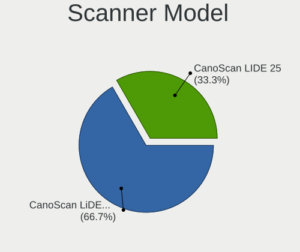

| Model                   | Computers | Percent |
|-------------------------|-----------|---------|
| Canon CanoScan LIDE 25  | 2         | 50%     |
| Canon CanoScan LiDE 110 | 2         | 50%     |

Camera
------

Camera Vendor
-------------

Camera device vendors

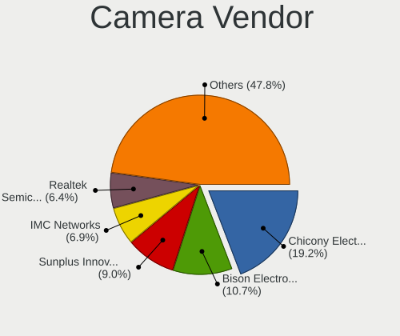

| Vendor                                 | Computers | Percent |
|----------------------------------------|-----------|---------|
| Chicony Electronics                    | 123       | 19.16%  |
| Bison Electronics                      | 69        | 10.75%  |
| Sunplus Innovation Technology          | 58        | 9.03%   |
| IMC Networks                           | 44        | 6.85%   |
| Realtek Semiconductor                  | 41        | 6.39%   |
| Cheng Uei Precision Industry (Foxlink) | 39        | 6.07%   |
| Logitech                               | 32        | 4.98%   |
| Alcor Micro                            | 30        | 4.67%   |
| Quanta                                 | 25        | 3.89%   |
| Microdia                               | 25        | 3.89%   |
| Syntek                                 | 16        | 2.49%   |
| Suyin                                  | 13        | 2.02%   |
| Sonix Technology                       | 13        | 2.02%   |
| Luxvisions Innotech Limited            | 11        | 1.71%   |
| Apple                                  | 11        | 1.71%   |
| Z-Star Microelectronics                | 7         | 1.09%   |
| SunplusIT                              | 7         | 1.09%   |
| Lite-On Technology                     | 7         | 1.09%   |
| Silicon Motion                         | 6         | 0.93%   |
| lihappe8                               | 5         | 0.78%   |
| Unknown                                | 5         | 0.78%   |
| ShineTech                              | 4         | 0.62%   |
| ShineOptics                            | 4         | 0.62%   |
| Microsoft                              | 4         | 0.62%   |
| Ricoh                                  | 3         | 0.47%   |
| icSpring                               | 3         | 0.47%   |
| WaveRider Communications               | 2         | 0.31%   |
| Unknown                                | 2         | 0.31%   |
| Samsung Electronics                    | 2         | 0.31%   |
| Importek                               | 2         | 0.31%   |
| Creative Technology                    | 2         | 0.31%   |
| BRS 2Mp Camera                         | 2         | 0.31%   |
| ALi                                    | 2         | 0.31%   |
| Acer                                   | 2         | 0.31%   |
| Y Media                                | 1         | 0.16%   |
| USB Camera CS                          | 1         | 0.16%   |
| Sunplus IT                             | 1         | 0.16%   |
| Shine-optics                           | 1         | 0.16%   |
| Primax Electronics                     | 1         | 0.16%   |
| OPPO Electronics                       | 1         | 0.16%   |

Camera Model
------------

Camera device models

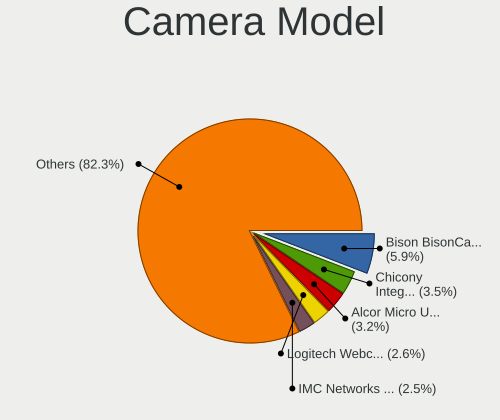

| Model                                                          | Computers | Percent |
|----------------------------------------------------------------|-----------|---------|
| Bison BisonCam,NB Pro                                          | 38        | 5.86%   |
| Chicony Integrated Camera                                      | 23        | 3.55%   |
| Alcor Micro USB 2.0 PC Camera                                  | 21        | 3.24%   |
| Logitech Webcam C270                                           | 17        | 2.62%   |
| IMC Networks USB2.0 HD UVC WebCam                              | 16        | 2.47%   |
| Cheng Uei Precision Industry (Foxlink) HP TrueVision HD Camera | 15        | 2.31%   |
| Cheng Uei Precision Industry (Foxlink) Webcam                  | 14        | 2.16%   |
| Chicony USB2.0 FHD UVC WebCam                                  | 12        | 1.85%   |
| Chicony HP HD Camera                                           | 12        | 1.85%   |
| Chicony HD Webcam                                              | 12        | 1.85%   |
| Syntek Integrated Camera                                       | 11        | 1.7%    |
| Realtek USB2.0 camera                                          | 11        | 1.7%    |
| Realtek USB Camera                                             | 11        | 1.7%    |
| Sunplus Integrated_Webcam_HD                                   | 10        | 1.54%   |
| Sunplus Integrated Camera                                      | 8         | 1.23%   |
| Sunplus BKX Usb FHD Camera                                     | 7         | 1.08%   |
| Microdia Webcam Vitade AF                                      | 7         | 1.08%   |
| Microdia USB 2.0 Camera                                        | 7         | 1.08%   |
| Chicony USB2.0 Camera                                          | 7         | 1.08%   |
| Sunplus USB 2.0 Camera                                         | 6         | 0.93%   |
| IMC Networks Integrated Camera                                 | 6         | 0.93%   |
| IMC Networks HD Camera                                         | 6         | 0.93%   |
| Unknown                                                        | 6         | 0.93%   |
| Sunplus Asus Webcam                                            | 5         | 0.77%   |
| Quanta ov9734_techfront_camera                                 | 5         | 0.77%   |
| Microdia Integrated_Webcam_HD                                  | 5         | 0.77%   |
| lihappe8 USB 2.0 Camera                                        | 5         | 0.77%   |
| Chicony ACER HD User Facing                                    | 5         | 0.77%   |
| Bison HD Webcam                                                | 5         | 0.77%   |
| Apple Built-in iSight                                          | 5         | 0.77%   |
| Sunplus USB2.0 camera                                          | 4         | 0.62%   |
| ShineOptics HD Camera                                          | 4         | 0.62%   |
| Realtek Lenovo EasyCamera                                      | 4         | 0.62%   |
| Quanta HP TrueVision HD Camera                                 | 4         | 0.62%   |
| Bison Lenovo EasyCamera                                        | 4         | 0.62%   |
| Bison Integrated RGB Camera                                    | 4         | 0.62%   |
| Bison Integrated Camera                                        | 4         | 0.62%   |
| Z-Star Venus USB2.0 Camera                                     | 3         | 0.46%   |
| Syntek Lenovo EasyCamera                                       | 3         | 0.46%   |
| Suyin HP Truevision HD                                         | 3         | 0.46%   |

Security
--------

Fingerprint Vendor
------------------

Fingerprint sensor vendors

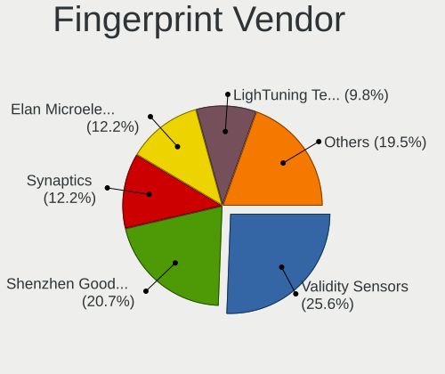

| Vendor                             | Computers | Percent |
|------------------------------------|-----------|---------|
| Validity Sensors                   | 21        | 25.61%  |
| Shenzhen Goodix Technology         | 17        | 20.73%  |
| Synaptics                          | 10        | 12.2%   |
| Elan Microelectronics              | 10        | 12.2%   |
| LighTuning Technology              | 8         | 9.76%   |
| Focal-systems.Corp                 | 6         | 7.32%   |
| Upek                               | 3         | 3.66%   |
| HOLTEK                             | 3         | 3.66%   |
| Realtek USB2.0 Finger Print Bridge | 2         | 2.44%   |
| AuthenTec                          | 2         | 2.44%   |

Fingerprint Model
-----------------

Fingerprint sensor models

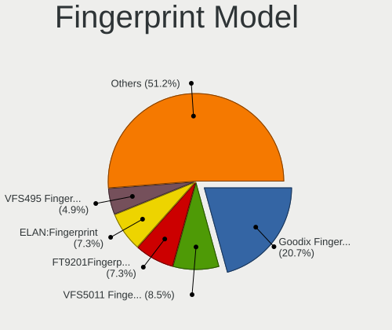

| Model                                                           | Computers | Percent |
|-----------------------------------------------------------------|-----------|---------|
| Shenzhen Goodix  Fingerprint Device                             | 17        | 20.73%  |
| Validity Sensors VFS5011 Fingerprint Reader                     | 7         | 8.54%   |
| Focal-systems.Corp FT9201Fingerprint.                           | 6         | 7.32%   |
| Elan ELAN:Fingerprint                                           | 6         | 7.32%   |
| Validity Sensors VFS495 Fingerprint Reader                      | 4         | 4.88%   |
| Synaptics Prometheus MIS Touch Fingerprint Reader               | 4         | 4.88%   |
| LighTuning Fingerprint Reader                                   | 4         | 4.88%   |
| Elan ELAN:ARM-M4                                                | 4         | 4.88%   |
| Validity Sensors VFS491                                         | 3         | 3.66%   |
| Upek Biometric Touchchip/Touchstrip Fingerprint Sensor          | 3         | 3.66%   |
| HOLTEK FocalTech Fingerprint Device                             | 3         | 3.66%   |
| Validity Sensors VFS451 Fingerprint Reader                      | 2         | 2.44%   |
| Validity Sensors Fingerprint scanner                            | 2         | 2.44%   |
| Realtek USB2.0 Finger Print Bridge FocalTech Fingerprint Device | 2         | 2.44%   |
| LighTuning EgisTec Touch Fingerprint Sensor                     | 2         | 2.44%   |
| Validity Sensors VFS471 Fingerprint Reader                      | 1         | 1.22%   |
| Validity Sensors VFS 5011 fingerprint sensor                    | 1         | 1.22%   |
| Validity Sensors Swipe Fingerprint Sensor                       | 1         | 1.22%   |
| Synaptics UWP WBDI Device                                       | 1         | 1.22%   |
| Synaptics  WBDI                                                 | 1         | 1.22%   |
| Synaptics Metallica MOH Touch Fingerprint Reader                | 1         | 1.22%   |
| Synaptics Metallica MIS Touch Fingerprint Reader                | 1         | 1.22%   |
| Synaptics FS7604 Touch Fingerprint Sensor with PurePrint        | 1         | 1.22%   |
| Synaptics Fingerprint reader [HP G6]                            | 1         | 1.22%   |
| LighTuning Fingerprint Sensor                                   | 1         | 1.22%   |
| LighTuning ES603 Swipe Fingerprint Sensor                       | 1         | 1.22%   |
| AuthenTec Fingerprint Sensor                                    | 1         | 1.22%   |
| AuthenTec AES1660 Fingerprint Sensor                            | 1         | 1.22%   |

Chipcard Vendor
---------------

Chipcard module vendors

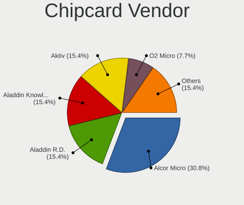

| Vendor                    | Computers | Percent |
|---------------------------|-----------|---------|
| Alcor Micro               | 4         | 30.77%  |
| Aladdin R.D.              | 2         | 15.38%  |
| Aladdin Knowledge Systems | 2         | 15.38%  |
| Aktiv                     | 2         | 15.38%  |
| O2 Micro                  | 1         | 7.69%   |
| Broadcom                  | 1         | 7.69%   |
| Advanced Card Systems     | 1         | 7.69%   |

Chipcard Model
--------------

Chipcard module models

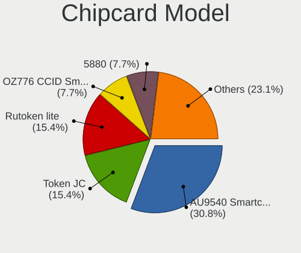

| Model                                        | Computers | Percent |
|----------------------------------------------|-----------|---------|
| Alcor Micro AU9540 Smartcard Reader          | 4         | 30.77%  |
| Aladdin Knowledge Systems Token JC           | 2         | 15.38%  |
| Aktiv Rutoken lite                           | 2         | 15.38%  |
| O2 Micro OZ776 CCID Smartcard Reader         | 1         | 7.69%   |
| Broadcom 5880                                | 1         | 7.69%   |
| Aladdin R.D. JaCarta LT                      | 1         | 7.69%   |
| Aladdin R.D. JaCarta                         | 1         | 7.69%   |
| Advanced Card Systems ACR38 SmartCard Reader | 1         | 7.69%   |

Unsupported
-----------

Unsupported Devices
-------------------

Total unsupported devices on board

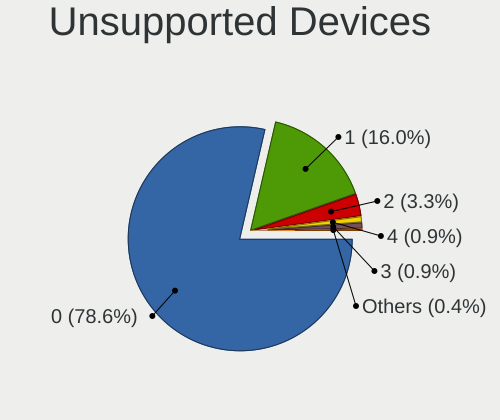

| Total | Computers | Percent |
|-------|-----------|---------|
| 0     | 893       | 78.61%  |
| 1     | 182       | 16.02%  |
| 2     | 37        | 3.26%   |
| 4     | 10        | 0.88%   |
| 3     | 10        | 0.88%   |
| 5     | 4         | 0.35%   |

Unsupported Device Types
------------------------

Types of unsupported devices

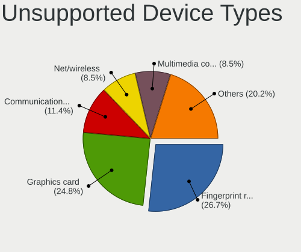

| Type                     | Computers | Percent |
|--------------------------|-----------|---------|
| Fingerprint reader       | 82        | 26.71%  |
| Graphics card            | 76        | 24.76%  |
| Communication controller | 35        | 11.4%   |
| Net/wireless             | 26        | 8.47%   |
| Multimedia controller    | 26        | 8.47%   |
| Unassigned class         | 23        | 7.49%   |
| Net/ethernet             | 8         | 2.61%   |
| Chipcard                 | 8         | 2.61%   |
| Sound                    | 6         | 1.95%   |
| Camera                   | 6         | 1.95%   |
| Bluetooth                | 6         | 1.95%   |
| Flash memory             | 2         | 0.65%   |
| Storage/ide              | 1         | 0.33%   |
| Network                  | 1         | 0.33%   |
| Card reader              | 1         | 0.33%   |

