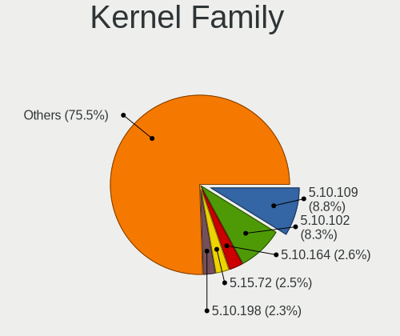
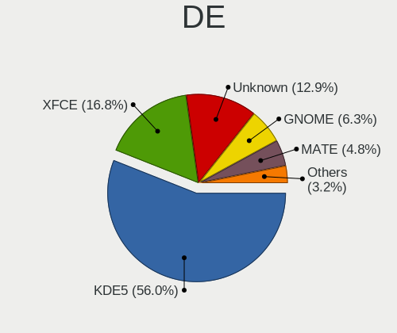
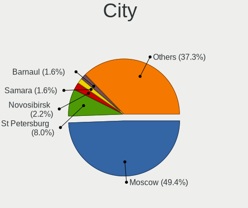
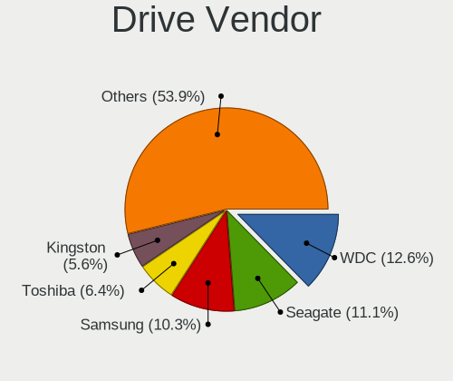
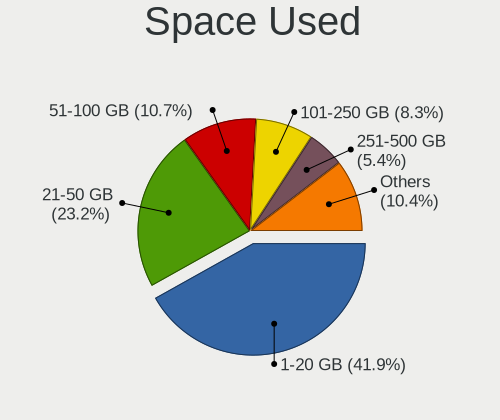
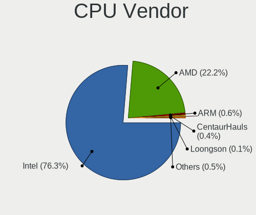
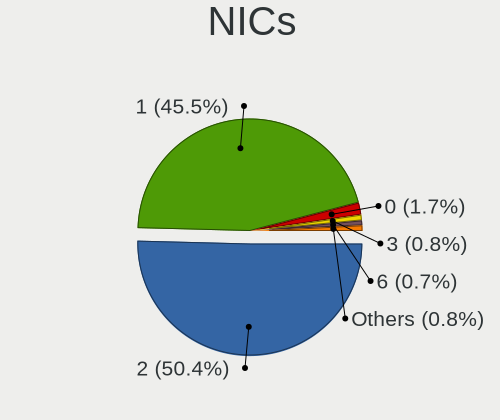
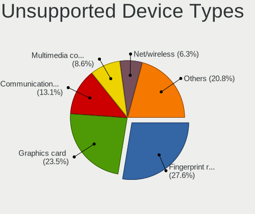

ALT Linux - Tested Hardware & Statistics
----------------------------------------

A project to collect tested hardware configurations for ALT Linux.

Anyone can contribute to this report by the [hw-probe](https://github.com/linuxhw/hw-probe) tool:

    sudo -E hw-probe -all -upload

Please contribute! Especially if your hardware is rare.

This is a report for all computer types. See also reports for [desktops](/Dist/ALT_Linux/Desktop/README.md) and [notebooks](/Dist/ALT_Linux/Notebook/README.md).

Contents
--------

* [ Test Cases ](#test-cases)

* [ System ](#system)
  - [ OS                       ](#os)
  - [ OS Family                ](#os-family)
  - [ Kernel                   ](#kernel)
  - [ Kernel Family            ](#kernel-family)
  - [ Kernel Major Ver.        ](#kernel-major-ver)
  - [ Arch                     ](#arch)
  - [ DE                       ](#de)
  - [ Display Server           ](#display-server)
  - [ Display Manager          ](#display-manager)
  - [ OS Lang                  ](#os-lang)
  - [ Boot Mode                ](#boot-mode)
  - [ Filesystem               ](#filesystem)
  - [ Part. scheme             ](#part-scheme)
  - [ Dual Boot with Linux/BSD ](#dual-boot-with-linuxbsd)
  - [ Dual Boot (Win)          ](#dual-boot-win)

* [ Board ](#board)
  - [ Vendor                   ](#vendor)
  - [ Model                    ](#model)
  - [ Model Family             ](#model-family)
  - [ MFG Year                 ](#mfg-year)
  - [ Form Factor              ](#form-factor)
  - [ Secure Boot              ](#secure-boot)
  - [ Coreboot                 ](#coreboot)
  - [ RAM Size                 ](#ram-size)
  - [ RAM Used                 ](#ram-used)
  - [ Total Drives             ](#total-drives)
  - [ Has CD-ROM               ](#has-cd-rom)
  - [ Has Ethernet             ](#has-ethernet)
  - [ Has WiFi                 ](#has-wifi)
  - [ Has Bluetooth            ](#has-bluetooth)

* [ Location ](#location)
  - [ Country                  ](#country)
  - [ City                     ](#city)

* [ Drives ](#drives)
  - [ Drive Vendor             ](#drive-vendor)
  - [ Drive Model              ](#drive-model)
  - [ HDD Vendor               ](#hdd-vendor)
  - [ SSD Vendor               ](#ssd-vendor)
  - [ Drive Kind               ](#drive-kind)
  - [ Drive Connector          ](#drive-connector)
  - [ Drive Size               ](#drive-size)
  - [ Space Total              ](#space-total)
  - [ Space Used               ](#space-used)
  - [ Malfunc. Drives          ](#malfunc-drives)
  - [ Malfunc. Drive Vendor    ](#malfunc-drive-vendor)
  - [ Malfunc. HDD Vendor      ](#malfunc-hdd-vendor)
  - [ Malfunc. Drive Kind      ](#malfunc-drive-kind)
  - [ Failed Drives            ](#failed-drives)
  - [ Failed Drive Vendor      ](#failed-drive-vendor)
  - [ Drive Status             ](#drive-status)

* [ Storage controller ](#storage-controller)
  - [ Storage Vendor           ](#storage-vendor)
  - [ Storage Model            ](#storage-model)
  - [ Storage Kind             ](#storage-kind)

* [ Processor ](#processor)
  - [ CPU Vendor               ](#cpu-vendor)
  - [ CPU Model                ](#cpu-model)
  - [ CPU Model Family         ](#cpu-model-family)
  - [ CPU Cores                ](#cpu-cores)
  - [ CPU Sockets              ](#cpu-sockets)
  - [ CPU Threads              ](#cpu-threads)
  - [ CPU Op-Modes             ](#cpu-op-modes)
  - [ CPU Microcode            ](#cpu-microcode)
  - [ CPU Microarch            ](#cpu-microarch)

* [ Graphics ](#graphics)
  - [ GPU Vendor               ](#gpu-vendor)
  - [ GPU Model                ](#gpu-model)
  - [ GPU Combo                ](#gpu-combo)
  - [ GPU Driver               ](#gpu-driver)
  - [ GPU Memory               ](#gpu-memory)

* [ Monitor ](#monitor)
  - [ Monitor Vendor           ](#monitor-vendor)
  - [ Monitor Model            ](#monitor-model)
  - [ Monitor Resolution       ](#monitor-resolution)
  - [ Monitor Diagonal         ](#monitor-diagonal)
  - [ Monitor Width            ](#monitor-width)
  - [ Aspect Ratio             ](#aspect-ratio)
  - [ Monitor Area             ](#monitor-area)
  - [ Pixel Density            ](#pixel-density)
  - [ Multiple Monitors        ](#multiple-monitors)

* [ Network ](#network)
  - [ Net Controller Vendor    ](#net-controller-vendor)
  - [ Net Controller Model     ](#net-controller-model)
  - [ Wireless Vendor          ](#wireless-vendor)
  - [ Wireless Model           ](#wireless-model)
  - [ Ethernet Vendor          ](#ethernet-vendor)
  - [ Ethernet Model           ](#ethernet-model)
  - [ Net Controller Kind      ](#net-controller-kind)
  - [ Used Controller          ](#used-controller)
  - [ NICs                     ](#nics)
  - [ IPv6                     ](#ipv6)

* [ Bluetooth ](#bluetooth)
  - [ Bluetooth Vendor         ](#bluetooth-vendor)
  - [ Bluetooth Model          ](#bluetooth-model)

* [ Sound ](#sound)
  - [ Sound Vendor             ](#sound-vendor)
  - [ Sound Model              ](#sound-model)

* [ Memory ](#memory)
  - [ Memory Vendor            ](#memory-vendor)
  - [ Memory Model             ](#memory-model)
  - [ Memory Kind              ](#memory-kind)
  - [ Memory Form Factor       ](#memory-form-factor)
  - [ Memory Size              ](#memory-size)
  - [ Memory Speed             ](#memory-speed)

* [ Printers & scanners ](#printers--scanners)
  - [ Printer Vendor           ](#printer-vendor)
  - [ Printer Model            ](#printer-model)
  - [ Scanner Vendor           ](#scanner-vendor)
  - [ Scanner Model            ](#scanner-model)

* [ Camera ](#camera)
  - [ Camera Vendor            ](#camera-vendor)
  - [ Camera Model             ](#camera-model)

* [ Security ](#security)
  - [ Fingerprint Vendor       ](#fingerprint-vendor)
  - [ Fingerprint Model        ](#fingerprint-model)
  - [ Chipcard Vendor          ](#chipcard-vendor)
  - [ Chipcard Model           ](#chipcard-model)

* [ Unsupported ](#unsupported)
  - [ Unsupported Devices      ](#unsupported-devices)
  - [ Unsupported Device Types ](#unsupported-device-types)

Test Cases
----------

Total: 1034

| Vendor        | Model                       | Form-Factor | Probe                                                      | Date         |
|---------------|-----------------------------|-------------|------------------------------------------------------------|--------------|
| ASUSTek       | X550CC                      | Notebook    | [47b8006c42](https://linux-hardware.org/?probe=47b8006c42) | May 05, 2024 |
| Infinix       | INBOOK X2 GEN11             | Notebook    | [9002e7e3c5](https://linux-hardware.org/?probe=9002e7e3c5) | May 04, 2024 |
| Gigabyte      | B550M DS3H                  | Desktop     | [178f62317e](https://linux-hardware.org/?probe=178f62317e) | May 04, 2024 |
| HP            | ProBook 6450b               | Notebook    | [c4d1788222](https://linux-hardware.org/?probe=c4d1788222) | May 03, 2024 |
| Lenovo        | V130-15IKB 81HN             | Notebook    | [d00e301298](https://linux-hardware.org/?probe=d00e301298) | May 03, 2024 |
| Echips Imp... | NX140A-S                    | Notebook    | [dec569991b](https://linux-hardware.org/?probe=dec569991b) | Apr 30, 2024 |
| Lenovo        | ThinkPad T480 20L6S7MP00    | Notebook    | [ea3db5dd3c](https://linux-hardware.org/?probe=ea3db5dd3c) | Apr 29, 2024 |
| ASUSTek       | N53Jf                       | Notebook    | [02cf0c80c7](https://linux-hardware.org/?probe=02cf0c80c7) | Apr 29, 2024 |
| Intel Clie... | LAPAC71H                    | Notebook    | [a1a6c57c02](https://linux-hardware.org/?probe=a1a6c57c02) | Apr 28, 2024 |
| Gigabyte      | B550M DS3H                  | Desktop     | [f4d652cc40](https://linux-hardware.org/?probe=f4d652cc40) | Apr 25, 2024 |
| Graviton      | DMB-H610-TMI01              | All in one  | [0a19edf36a](https://linux-hardware.org/?probe=0a19edf36a) | Apr 23, 2024 |
| ASUSTek       | P8H61-I R2.0                | Desktop     | [db4468debf](https://linux-hardware.org/?probe=db4468debf) | Apr 23, 2024 |
| Intel Clie... | LAPAC71H                    | Notebook    | [c365e08c03](https://linux-hardware.org/?probe=c365e08c03) | Apr 20, 2024 |
| ASRock        | B450M Pro4-F                | Desktop     | [d721e6ffa6](https://linux-hardware.org/?probe=d721e6ffa6) | Apr 18, 2024 |
| HP            | Laptop 15-bw0xx             | Notebook    | [1291c4934f](https://linux-hardware.org/?probe=1291c4934f) | Apr 18, 2024 |
| Aquarius      | NS685U R11                  | Notebook    | [b5b6ca6e69](https://linux-hardware.org/?probe=b5b6ca6e69) | Apr 18, 2024 |
| ICL Techno    | F140a                       | Notebook    | [bd46cdda52](https://linux-hardware.org/?probe=bd46cdda52) | Apr 16, 2024 |
| Biostar       | A68MHE                      | Desktop     | [d8db2caef4](https://linux-hardware.org/?probe=d8db2caef4) | Apr 14, 2024 |
| Biostar       | A68MHE                      | Desktop     | [acdf6abfbf](https://linux-hardware.org/?probe=acdf6abfbf) | Apr 14, 2024 |
| MSI           | B450M PRO-VDH MAX           | Desktop     | [dce8bf4cbc](https://linux-hardware.org/?probe=dce8bf4cbc) | Apr 13, 2024 |
| IP3 Tech      | ZEN1                        | Notebook    | [d85ba98172](https://linux-hardware.org/?probe=d85ba98172) | Apr 13, 2024 |
| Biostar       | H610MH                      | Desktop     | [06dbe44a85](https://linux-hardware.org/?probe=06dbe44a85) | Apr 13, 2024 |
| AZW           | GTR V02                     | Desktop     | [120d648339](https://linux-hardware.org/?probe=120d648339) | Apr 12, 2024 |
| Dell          | 030VXY A01                  | Desktop     | [03bd29951c](https://linux-hardware.org/?probe=03bd29951c) | Apr 11, 2024 |
| HP            | ProBook 4520s               | Notebook    | [6886f7483d](https://linux-hardware.org/?probe=6886f7483d) | Apr 09, 2024 |
| HUAWEI        | BOM-WXX9                    | Notebook    | [a5ab134bcf](https://linux-hardware.org/?probe=a5ab134bcf) | Apr 07, 2024 |
| HP            | Laptop 15-gw0xxx            | Notebook    | [ba96d62394](https://linux-hardware.org/?probe=ba96d62394) | Apr 04, 2024 |
| DEPO Compu... | DPC156                      | Notebook    | [9320cdbb02](https://linux-hardware.org/?probe=9320cdbb02) | Apr 04, 2024 |
| ASUSTek       | PN53-G                      | Mini pc     | [6156db54ff](https://linux-hardware.org/?probe=6156db54ff) | Mar 31, 2024 |
| MSI           | B550-A PRO                  | Desktop     | [5ac75aad7e](https://linux-hardware.org/?probe=5ac75aad7e) | Mar 28, 2024 |
| Unknown       | EZpad                       | Tablet      | [1a2b90cec3](https://linux-hardware.org/?probe=1a2b90cec3) | Mar 27, 2024 |
| Biostar       | IH61MF-Q5                   | Desktop     | [6f251f08e1](https://linux-hardware.org/?probe=6f251f08e1) | Mar 25, 2024 |
| Aquarius      | AQH310CM                    | Desktop     | [368d914e46](https://linux-hardware.org/?probe=368d914e46) | Mar 24, 2024 |
| Gigabyte      | B550 AORUS PRO V2           | Desktop     | [11f7843550](https://linux-hardware.org/?probe=11f7843550) | Mar 23, 2024 |
| HP            | Unknown                     | Notebook    | [8247de95f8](https://linux-hardware.org/?probe=8247de95f8) | Mar 22, 2024 |
| Gigabyte      | B560M AORUS PRO AX          | Desktop     | [693e93ff73](https://linux-hardware.org/?probe=693e93ff73) | Mar 22, 2024 |
| TECNO Mobi... | MEGABOOK T15DA              | Notebook    | [c9580df31c](https://linux-hardware.org/?probe=c9580df31c) | Mar 20, 2024 |
| ASUSTek       | ASUS Zenbook 14 UX3405MA... | Notebook    | [09805af67f](https://linux-hardware.org/?probe=09805af67f) | Mar 20, 2024 |
| ASUSTek       | ROG STRIX X570-E GAMING ... | Desktop     | [a8f9e94787](https://linux-hardware.org/?probe=a8f9e94787) | Mar 16, 2024 |
| Gigabyte      | A520M DS3H                  | Desktop     | [d999681595](https://linux-hardware.org/?probe=d999681595) | Mar 16, 2024 |
| Gigabyte      | A520M DS3H                  | Desktop     | [d6731a38c7](https://linux-hardware.org/?probe=d6731a38c7) | Mar 16, 2024 |
| Valve         | Jupiter                     | Notebook    | [5685e8711f](https://linux-hardware.org/?probe=5685e8711f) | Mar 15, 2024 |
| Lenovo        | IdeaPad L340-17IRH Gamin... | Notebook    | [898f0686a4](https://linux-hardware.org/?probe=898f0686a4) | Mar 14, 2024 |
| Lenovo        | IdeaPad L340-17IRH Gamin... | Notebook    | [fa3d8709e3](https://linux-hardware.org/?probe=fa3d8709e3) | Mar 14, 2024 |
| HUAWEI        | DRR-WXX                     | Tablet      | [a19d185643](https://linux-hardware.org/?probe=a19d185643) | Mar 13, 2024 |
| MSI           | B550-A PRO                  | Desktop     | [fd6b99b446](https://linux-hardware.org/?probe=fd6b99b446) | Mar 12, 2024 |
| Unknown       | Intel X79                   | Desktop     | [e88d0410c8](https://linux-hardware.org/?probe=e88d0410c8) | Mar 11, 2024 |
| ASUSTek       | D300TA                      | Desktop     | [a09321cd27](https://linux-hardware.org/?probe=a09321cd27) | Mar 11, 2024 |
| Dell          | G15 5511                    | Notebook    | [ff19732587](https://linux-hardware.org/?probe=ff19732587) | Mar 11, 2024 |
| Gigabyte      | Z790 AORUS ELITE AX         | Desktop     | [b6909c9a7a](https://linux-hardware.org/?probe=b6909c9a7a) | Mar 10, 2024 |
| HUAWEI        | DRR-WXX                     | Tablet      | [a4b92fe9a7](https://linux-hardware.org/?probe=a4b92fe9a7) | Mar 07, 2024 |
| HP            | Pavilion dv6                | Notebook    | [89a9407fb7](https://linux-hardware.org/?probe=89a9407fb7) | Mar 06, 2024 |
| ASUSTek       | ASUS EXPERTBOOK B1502CVA... | Notebook    | [0222a2f98a](https://linux-hardware.org/?probe=0222a2f98a) | Mar 05, 2024 |
| ICL Techno    | F140a                       | Notebook    | [2bdc9718e7](https://linux-hardware.org/?probe=2bdc9718e7) | Mar 03, 2024 |
| Biostar       | TB250-BTC                   | Desktop     | [c5edeef7fe](https://linux-hardware.org/?probe=c5edeef7fe) | Mar 03, 2024 |
| HP            | Pavilion dv6                | Notebook    | [4ed39c3833](https://linux-hardware.org/?probe=4ed39c3833) | Mar 03, 2024 |
| ASUSTek       | PN53-G                      | Mini pc     | [606e8cea6a](https://linux-hardware.org/?probe=606e8cea6a) | Mar 02, 2024 |
| Apple         | Mac-35C5E08120C7EEAF Mac... | Mini pc     | [f082e7f93e](https://linux-hardware.org/?probe=f082e7f93e) | Feb 29, 2024 |
| ASUSTek       | K53SJ                       | Notebook    | [4f8e5147ba](https://linux-hardware.org/?probe=4f8e5147ba) | Feb 27, 2024 |
| ASUSTek       | X550CC                      | Notebook    | [d9b2c3a575](https://linux-hardware.org/?probe=d9b2c3a575) | Feb 26, 2024 |
| Aquarius      | AQH310CM                    | Desktop     | [a255e64313](https://linux-hardware.org/?probe=a255e64313) | Feb 22, 2024 |
| ASUSTek       | H81M-K                      | Desktop     | [51188483df](https://linux-hardware.org/?probe=51188483df) | Feb 21, 2024 |
| Unknown       | Unknown                     | Desktop     | [0b2da4684e](https://linux-hardware.org/?probe=0b2da4684e) | Feb 21, 2024 |
| TECNO Mobi... | MEGABOOK T14TA              | Notebook    | [9874f5d3c1](https://linux-hardware.org/?probe=9874f5d3c1) | Feb 20, 2024 |
| iRU           | 15TLI                       | Notebook    | [2af6577cf0](https://linux-hardware.org/?probe=2af6577cf0) | Feb 19, 2024 |
| HP            | ProBook 6450b               | Notebook    | [1a4b4a3788](https://linux-hardware.org/?probe=1a4b4a3788) | Feb 17, 2024 |
| HUAWEI        | DRR-WXX                     | Tablet      | [39393dda93](https://linux-hardware.org/?probe=39393dda93) | Feb 16, 2024 |
| ASUSTek       | VivoBook_ASUSLaptop X571... | Notebook    | [8317f520c9](https://linux-hardware.org/?probe=8317f520c9) | Feb 16, 2024 |
| Acer          | Aspire E5-571G              | Notebook    | [29a77bf074](https://linux-hardware.org/?probe=29a77bf074) | Feb 14, 2024 |
| MSI           | H110M PRO-VD                | Desktop     | [61b2aa976f](https://linux-hardware.org/?probe=61b2aa976f) | Feb 13, 2024 |
| HP            | ENVY 6                      | Notebook    | [ccd623bfad](https://linux-hardware.org/?probe=ccd623bfad) | Feb 13, 2024 |
| ASUSTek       | M4A77TD                     | Desktop     | [75afd83494](https://linux-hardware.org/?probe=75afd83494) | Feb 11, 2024 |
| ASRock        | H61M-HVGS                   | Desktop     | [dc3bd18c15](https://linux-hardware.org/?probe=dc3bd18c15) | Feb 09, 2024 |
| Lenovo        | ThinkPad E490 20N80017RT    | Notebook    | [bad3f7f138](https://linux-hardware.org/?probe=bad3f7f138) | Feb 09, 2024 |
| ASUSTek       | PN64                        | Mini pc     | [7cc769d543](https://linux-hardware.org/?probe=7cc769d543) | Feb 08, 2024 |
| Lenovo        | V370 HuronRiver Platform    | Notebook    | [1ad82367ba](https://linux-hardware.org/?probe=1ad82367ba) | Feb 07, 2024 |
| Sony          | VPCSA2Z9R                   | Notebook    | [88e21aee02](https://linux-hardware.org/?probe=88e21aee02) | Feb 06, 2024 |
| Aquarius      | CMP NS685U_4                | Notebook    | [1115097f9a](https://linux-hardware.org/?probe=1115097f9a) | Feb 05, 2024 |
| MSI           | Modern 14 B11MOU            | Notebook    | [a5b3665f64](https://linux-hardware.org/?probe=a5b3665f64) | Feb 02, 2024 |
| ASUSTek       | P5B-Deluxe                  | Desktop     | [b30373632d](https://linux-hardware.org/?probe=b30373632d) | Feb 01, 2024 |
| ASUSTek       | P6T WS PRO                  | Desktop     | [21d91717a1](https://linux-hardware.org/?probe=21d91717a1) | Jan 31, 2024 |
| ASUSTek       | M5A78L-M LX                 | Desktop     | [8c79f36086](https://linux-hardware.org/?probe=8c79f36086) | Jan 29, 2024 |
| MSI           | MS-B0A21                    | Desktop     | [aebe283d41](https://linux-hardware.org/?probe=aebe283d41) | Jan 26, 2024 |
| MSI           | B550-A PRO                  | Desktop     | [1f374d86d7](https://linux-hardware.org/?probe=1f374d86d7) | Jan 25, 2024 |
| Gigabyte      | H61M-USB3V                  | Desktop     | [6a5faff8dd](https://linux-hardware.org/?probe=6a5faff8dd) | Jan 24, 2024 |
| ASUSTek       | P5B-Deluxe                  | Desktop     | [b628671631](https://linux-hardware.org/?probe=b628671631) | Jan 21, 2024 |
| Aquarius      | AQH310CM                    | Desktop     | [6172ad2c5d](https://linux-hardware.org/?probe=6172ad2c5d) | Jan 20, 2024 |
| ASUSTek       | P6T WS PRO                  | Desktop     | [d8c6804097](https://linux-hardware.org/?probe=d8c6804097) | Jan 18, 2024 |
| ASRock        | J3355M                      | Desktop     | [40caff1c3c](https://linux-hardware.org/?probe=40caff1c3c) | Jan 18, 2024 |
| ASUSTek       | Q87M-E                      | Desktop     | [22cbd96a3b](https://linux-hardware.org/?probe=22cbd96a3b) | Jan 11, 2024 |
| MSI           | B550-A PRO                  | Desktop     | [e658ae012b](https://linux-hardware.org/?probe=e658ae012b) | Jan 11, 2024 |
| MSI           | MPG B550 GAMING PLUS        | Desktop     | [e371e895ec](https://linux-hardware.org/?probe=e371e895ec) | Jan 10, 2024 |
| Aquarius      | AQH310CM                    | Desktop     | [64bd83e185](https://linux-hardware.org/?probe=64bd83e185) | Jan 10, 2024 |
| SZMZ          | H61-ME V1.0                 | Desktop     | [4ca9bf9ced](https://linux-hardware.org/?probe=4ca9bf9ced) | Jan 09, 2024 |
| Unknown       | Unknown                     | Notebook    | [737a25372c](https://linux-hardware.org/?probe=737a25372c) | Jan 03, 2024 |
| ASUSTek       | ASUS TUF Gaming A17 FA70... | Notebook    | [1372c9e7e6](https://linux-hardware.org/?probe=1372c9e7e6) | Dec 30, 2023 |
| HP            | Pavilion Laptop 15-eh1xx... | Notebook    | [a4d9a001ff](https://linux-hardware.org/?probe=a4d9a001ff) | Dec 29, 2023 |
| HP            | ProBook 6460b               | Notebook    | [4a6a6b9b9d](https://linux-hardware.org/?probe=4a6a6b9b9d) | Dec 26, 2023 |
| ASUSTek       | VivoBook_ASUSLaptop X515... | Notebook    | [7fdd8a3f38](https://linux-hardware.org/?probe=7fdd8a3f38) | Dec 26, 2023 |
| ASUSTek       | VivoBook_ASUSLaptop X515... | Notebook    | [a1fd8cc737](https://linux-hardware.org/?probe=a1fd8cc737) | Dec 26, 2023 |
| ASUSTek       | P5G41T-M LX                 | Desktop     | [8bc6ac892f](https://linux-hardware.org/?probe=8bc6ac892f) | Dec 21, 2023 |
| ASUSTek       | VivoBook_ASUSLaptop M650... | Notebook    | [188dea7b4b](https://linux-hardware.org/?probe=188dea7b4b) | Dec 19, 2023 |
| Dell          | Inspiron 1545               | Notebook    | [cd3471d9e5](https://linux-hardware.org/?probe=cd3471d9e5) | Dec 17, 2023 |
| Foxconn       | G41MX/G41MX-K 2.0 1.0       | Desktop     | [cdebd77402](https://linux-hardware.org/?probe=cdebd77402) | Dec 16, 2023 |
| Lenovo        | ThinkBook 15 G2 ITL 20VE    | Notebook    | [a53b2d9ba9](https://linux-hardware.org/?probe=a53b2d9ba9) | Dec 15, 2023 |
| ASUSTek       | M5A78L-M LX                 | Desktop     | [6225f2f85f](https://linux-hardware.org/?probe=6225f2f85f) | Dec 15, 2023 |
| ASUSTek       | ROG STRIX B650E-F GAMING... | Desktop     | [84d4572994](https://linux-hardware.org/?probe=84d4572994) | Dec 12, 2023 |
| Lenovo        | G700                        | Notebook    | [97b63677f6](https://linux-hardware.org/?probe=97b63677f6) | Dec 11, 2023 |
| Gigabyte      | M55S-S3                     | Desktop     | [bf362d71c7](https://linux-hardware.org/?probe=bf362d71c7) | Dec 09, 2023 |
| Lenovo        | 3000 G410                   | Notebook    | [439199aff4](https://linux-hardware.org/?probe=439199aff4) | Dec 04, 2023 |
| ASUSTek       | Q87M-E                      | Desktop     | [df56e68ebc](https://linux-hardware.org/?probe=df56e68ebc) | Dec 04, 2023 |
| MSI           | B550-A PRO                  | Desktop     | [0f258ceffb](https://linux-hardware.org/?probe=0f258ceffb) | Dec 04, 2023 |
| Acer          | Nitro AN517-52              | Notebook    | [80b6f0b84a](https://linux-hardware.org/?probe=80b6f0b84a) | Dec 02, 2023 |
| ASUSTek       | P5QL-VM EPU                 | Desktop     | [c70c2ff27f](https://linux-hardware.org/?probe=c70c2ff27f) | Dec 01, 2023 |
| Gigabyte      | H370 HD3-CF                 | Desktop     | [d7367e7072](https://linux-hardware.org/?probe=d7367e7072) | Nov 30, 2023 |
| MSI           | GT70 2PC                    | Notebook    | [0806985a42](https://linux-hardware.org/?probe=0806985a42) | Nov 29, 2023 |
| Dell          | Inspiron 15-3565            | Notebook    | [7d7541ceb2](https://linux-hardware.org/?probe=7d7541ceb2) | Nov 29, 2023 |
| Gigabyte      | B85-HD3                     | Desktop     | [b64fc99109](https://linux-hardware.org/?probe=b64fc99109) | Nov 29, 2023 |
| Lenovo        | G700                        | Notebook    | [3c8ae88b16](https://linux-hardware.org/?probe=3c8ae88b16) | Nov 29, 2023 |
| Graviton      | DMB-A520-MCA01 1.o          | Desktop     | [f989b31edd](https://linux-hardware.org/?probe=f989b31edd) | Nov 28, 2023 |
| Graviton      | DMB-A520-MCA01 1.o          | Desktop     | [1dce0a4738](https://linux-hardware.org/?probe=1dce0a4738) | Nov 28, 2023 |
| ASUSTek       | P5K                         | Desktop     | [d5cb9ac79b](https://linux-hardware.org/?probe=d5cb9ac79b) | Nov 27, 2023 |
| ASUSTek       | P5B-Deluxe                  | Desktop     | [1af8016aed](https://linux-hardware.org/?probe=1af8016aed) | Nov 27, 2023 |
| ASUSTek       | P5B-Deluxe                  | Desktop     | [668b258270](https://linux-hardware.org/?probe=668b258270) | Nov 27, 2023 |
| HUAWEI        | CREF-XX                     | Notebook    | [630d8838dc](https://linux-hardware.org/?probe=630d8838dc) | Nov 27, 2023 |
| MSI           | GT70 2PC                    | Notebook    | [c4589b53bb](https://linux-hardware.org/?probe=c4589b53bb) | Nov 26, 2023 |
| HP            | ProLiant BL460c Gen9        | Server      | [8c522ad38a](https://linux-hardware.org/?probe=8c522ad38a) | Nov 26, 2023 |
| HP            | ProLiant BL460c Gen9        | Server      | [a93d58ad56](https://linux-hardware.org/?probe=a93d58ad56) | Nov 26, 2023 |
| HP            | ProLiant SL230s Gen8        | Desktop     | [a0b680d2ac](https://linux-hardware.org/?probe=a0b680d2ac) | Nov 26, 2023 |
| HP            | ProLiant SL230s Gen8        | Desktop     | [b1d3f26e5d](https://linux-hardware.org/?probe=b1d3f26e5d) | Nov 26, 2023 |
| HP            | ProLiant SL230s Gen8        | Desktop     | [800b1eab76](https://linux-hardware.org/?probe=800b1eab76) | Nov 26, 2023 |
| HP            | ProLiant SL230s Gen8        | Desktop     | [35b226a480](https://linux-hardware.org/?probe=35b226a480) | Nov 26, 2023 |
| Unknown       | Unknown                     | Desktop     | [72915fd0dd](https://linux-hardware.org/?probe=72915fd0dd) | Nov 26, 2023 |
| Gigabyte      | B560M D3H                   | Desktop     | [ecf8bf3010](https://linux-hardware.org/?probe=ecf8bf3010) | Nov 26, 2023 |
| Lenovo        | Y520-15IKBN 80WK            | Notebook    | [7078ba99e1](https://linux-hardware.org/?probe=7078ba99e1) | Nov 26, 2023 |
| MSI           | Z490-A PRO                  | Desktop     | [8fdcfb665c](https://linux-hardware.org/?probe=8fdcfb665c) | Nov 26, 2023 |
| MSI           | B550-A PRO                  | Desktop     | [3914c7ac4f](https://linux-hardware.org/?probe=3914c7ac4f) | Nov 22, 2023 |
| Lenovo        | No DPK                      | Desktop     | [b569bd1d22](https://linux-hardware.org/?probe=b569bd1d22) | Nov 19, 2023 |
| ASUSTek       | ROG STRIX B650E-F GAMING... | Desktop     | [8b59b311ca](https://linux-hardware.org/?probe=8b59b311ca) | Nov 18, 2023 |
| ASUSTek       | ROG STRIX B650E-F GAMING... | Desktop     | [7d34e7f4b0](https://linux-hardware.org/?probe=7d34e7f4b0) | Nov 18, 2023 |
| ASUSTek       | H81M-R                      | Desktop     | [a0617305eb](https://linux-hardware.org/?probe=a0617305eb) | Nov 17, 2023 |
| ASUSTek       | H97-PRO                     | Desktop     | [c5890b8a51](https://linux-hardware.org/?probe=c5890b8a51) | Nov 15, 2023 |
| Pegatron      | 2AB5                        | Desktop     | [8d788a9b4d](https://linux-hardware.org/?probe=8d788a9b4d) | Nov 14, 2023 |
| Pegatron      | 2AB5                        | Desktop     | [c04b52c00e](https://linux-hardware.org/?probe=c04b52c00e) | Nov 14, 2023 |
| ASUSTek       | Q87M-E                      | Desktop     | [2c0511f79f](https://linux-hardware.org/?probe=2c0511f79f) | Nov 12, 2023 |
| MSI           | B550-A PRO                  | Desktop     | [b0bc13f5f8](https://linux-hardware.org/?probe=b0bc13f5f8) | Nov 12, 2023 |
| HP            | Laptop 17-cn2xxx            | Notebook    | [59c09c7be1](https://linux-hardware.org/?probe=59c09c7be1) | Nov 11, 2023 |
| MSI           | MAG B550M MORTAR            | Desktop     | [b29f519183](https://linux-hardware.org/?probe=b29f519183) | Nov 10, 2023 |
| MSI           | MAG B550M MORTAR            | Desktop     | [cf5ee36e07](https://linux-hardware.org/?probe=cf5ee36e07) | Nov 10, 2023 |
| Gigabyte      | B550M DS3H                  | Desktop     | [fa61fdff34](https://linux-hardware.org/?probe=fa61fdff34) | Nov 09, 2023 |
| Aquarius      | AQX300M                     | Desktop     | [b70a012245](https://linux-hardware.org/?probe=b70a012245) | Nov 01, 2023 |
| Dell          | Inspiron N5050              | Notebook    | [2ec8097b67](https://linux-hardware.org/?probe=2ec8097b67) | Oct 31, 2023 |
| ASUSTek       | M5A78L LE                   | Desktop     | [d7dd5dbdf7](https://linux-hardware.org/?probe=d7dd5dbdf7) | Oct 30, 2023 |
| Acer          | Extensa 2520G               | Notebook    | [bcc4e567f3](https://linux-hardware.org/?probe=bcc4e567f3) | Oct 30, 2023 |
| HP            | Pavilion Laptop 15-eh1xx... | Notebook    | [856d9c4a75](https://linux-hardware.org/?probe=856d9c4a75) | Oct 28, 2023 |
| HP            | Laptop 15-bw0xx             | Notebook    | [63c6987bfa](https://linux-hardware.org/?probe=63c6987bfa) | Oct 28, 2023 |
| Huanan        | X99-T8 GAMING V2.0          | Desktop     | [27d22c45c8](https://linux-hardware.org/?probe=27d22c45c8) | Oct 26, 2023 |
| Acer          | Ferrari 3200                | Notebook    | [52f9e06bf9](https://linux-hardware.org/?probe=52f9e06bf9) | Oct 25, 2023 |
| ASUSTek       | ROG Strix G513QY_G513QY     | Notebook    | [f8f7f85d08](https://linux-hardware.org/?probe=f8f7f85d08) | Oct 25, 2023 |
| Acer          | Extensa 2520G               | Notebook    | [d0e546f6d6](https://linux-hardware.org/?probe=d0e546f6d6) | Oct 25, 2023 |
| Lenovo        | V580c 20160                 | Notebook    | [178fe3a497](https://linux-hardware.org/?probe=178fe3a497) | Oct 25, 2023 |
| HONOR         | NMH-WDX9                    | Notebook    | [3a0782c335](https://linux-hardware.org/?probe=3a0782c335) | Oct 25, 2023 |
| Acer          | Extensa 2520G               | Notebook    | [1b58a52442](https://linux-hardware.org/?probe=1b58a52442) | Oct 25, 2023 |
| Unknown       | Unknown                     | Notebook    | [1e239308b1](https://linux-hardware.org/?probe=1e239308b1) | Oct 21, 2023 |
| Unknown       | Unknown                     | Notebook    | [125d0eedc8](https://linux-hardware.org/?probe=125d0eedc8) | Oct 21, 2023 |
| HP            | 255 G4                      | Notebook    | [0290beac3f](https://linux-hardware.org/?probe=0290beac3f) | Oct 19, 2023 |
| AZW           | MINI S                      | Desktop     | [0083fabd4c](https://linux-hardware.org/?probe=0083fabd4c) | Oct 15, 2023 |
| Maibenben     | MaiBook X series            | Notebook    | [901cc6bd8a](https://linux-hardware.org/?probe=901cc6bd8a) | Oct 14, 2023 |
| Biostar       | H510MHP                     | Desktop     | [1de1d57c17](https://linux-hardware.org/?probe=1de1d57c17) | Oct 13, 2023 |
| DEPO Compu... | DPA520S                     | Desktop     | [d6cf338b8c](https://linux-hardware.org/?probe=d6cf338b8c) | Oct 12, 2023 |
| ASUSTek       | T100TAM                     | Notebook    | [b809251676](https://linux-hardware.org/?probe=b809251676) | Oct 11, 2023 |
| Unknown       | Unknown                     | Notebook    | [52694348d2](https://linux-hardware.org/?probe=52694348d2) | Oct 10, 2023 |
| Lenovo        | IdeaPad L3 15IML05 81Y3     | Notebook    | [7f32c31118](https://linux-hardware.org/?probe=7f32c31118) | Oct 09, 2023 |
| Gigabyte      | Z390 AORUS MASTER-CF        | Desktop     | [7623527bdb](https://linux-hardware.org/?probe=7623527bdb) | Oct 08, 2023 |
| ROMBICA       | myBook Eclipse              | Notebook    | [d56fec4995](https://linux-hardware.org/?probe=d56fec4995) | Oct 07, 2023 |
| MSI           | Modern 15 B12M              | Notebook    | [1bbe75aa56](https://linux-hardware.org/?probe=1bbe75aa56) | Oct 04, 2023 |
| Lenovo        | V15 G3 IAP 82TT             | Notebook    | [61278c0720](https://linux-hardware.org/?probe=61278c0720) | Oct 04, 2023 |
| HUAWEI        | RLEF-XX                     | Notebook    | [06499eec7c](https://linux-hardware.org/?probe=06499eec7c) | Oct 04, 2023 |
| F-PLUS EQU... | Unknown                     | Notebook    | [104a5f30e4](https://linux-hardware.org/?probe=104a5f30e4) | Oct 04, 2023 |
| HP            | 250 15.6 inch G9 Noteboo... | Notebook    | [90cb02d71d](https://linux-hardware.org/?probe=90cb02d71d) | Oct 04, 2023 |
| F-PLUS EQU... | FNB-156-P1                  | Notebook    | [aa9a99ccb5](https://linux-hardware.org/?probe=aa9a99ccb5) | Oct 04, 2023 |
| F-PLUS EQU... | FNB-156-P1                  | Notebook    | [200217831d](https://linux-hardware.org/?probe=200217831d) | Oct 04, 2023 |
| 3Logic Gro... | DMB-H510-MCA01              | Desktop     | [38db8e9cf2](https://linux-hardware.org/?probe=38db8e9cf2) | Oct 04, 2023 |
| Lenovo        | G700                        | Notebook    | [7090569f96](https://linux-hardware.org/?probe=7090569f96) | Oct 03, 2023 |
| HIPER         | WORKBOOK                    | Notebook    | [902f508256](https://linux-hardware.org/?probe=902f508256) | Oct 03, 2023 |
| Biostar       | H510MHP                     | Desktop     | [1d6b309a9a](https://linux-hardware.org/?probe=1d6b309a9a) | Oct 02, 2023 |
| ASUSTek       | P8H61-M LX2                 | Desktop     | [b2a213cc18](https://linux-hardware.org/?probe=b2a213cc18) | Sep 30, 2023 |
| ASUSTek       | P8H61-M LX2                 | Desktop     | [60e32143f5](https://linux-hardware.org/?probe=60e32143f5) | Sep 29, 2023 |
| 3Logic Gro... | DMB-H510-MCA01              | Desktop     | [7cc521d927](https://linux-hardware.org/?probe=7cc521d927) | Sep 29, 2023 |
| ROMBICA       | myBook Eclipse              | Notebook    | [004e1dc4fd](https://linux-hardware.org/?probe=004e1dc4fd) | Sep 28, 2023 |
| Infinix       | INBOOK X2 GEN11             | Notebook    | [2ac0204275](https://linux-hardware.org/?probe=2ac0204275) | Sep 28, 2023 |
| Pegatron      | IPMSB-H61                   | Desktop     | [d0e64d2ebf](https://linux-hardware.org/?probe=d0e64d2ebf) | Sep 28, 2023 |
| Gigabyte      | Z390 AORUS MASTER-CF        | Desktop     | [1458dfe403](https://linux-hardware.org/?probe=1458dfe403) | Sep 27, 2023 |
| MSI           | H81M-P33                    | Desktop     | [8b0d086b89](https://linux-hardware.org/?probe=8b0d086b89) | Sep 27, 2023 |
| DEPO Compu... | DPA520S                     | Desktop     | [45d07666f9](https://linux-hardware.org/?probe=45d07666f9) | Sep 26, 2023 |
| ASUSTek       | P6T DELUXE V2               | Desktop     | [a0fa16f85c](https://linux-hardware.org/?probe=a0fa16f85c) | Sep 25, 2023 |
| Kraftway      | ACCORD                      | Notebook    | [df4d5654d5](https://linux-hardware.org/?probe=df4d5654d5) | Sep 21, 2023 |
| iRU           | 17ALC                       | Notebook    | [2d0b23c813](https://linux-hardware.org/?probe=2d0b23c813) | Sep 18, 2023 |
| Lenovo        | ThinkPad X250 20CMS0A200    | Notebook    | [43df4bd3f3](https://linux-hardware.org/?probe=43df4bd3f3) | Sep 18, 2023 |
| ASUSTek       | PN53-G                      | Mini pc     | [5e6499e724](https://linux-hardware.org/?probe=5e6499e724) | Sep 17, 2023 |
| HP            | 85A2                        | All in one  | [f1a642ea93](https://linux-hardware.org/?probe=f1a642ea93) | Sep 14, 2023 |
| ASRock        | K10N78D                     | Desktop     | [fa2852026b](https://linux-hardware.org/?probe=fa2852026b) | Sep 13, 2023 |
| ASRock        | K10N78D                     | Desktop     | [adf8e09915](https://linux-hardware.org/?probe=adf8e09915) | Sep 13, 2023 |
| on Gravito... | Graviton M42i               | All in one  | [3d738e533d](https://linux-hardware.org/?probe=3d738e533d) | Sep 12, 2023 |
| ASUSTek       | P5G41T-M LX2/GB             | Desktop     | [53cdc3e4f0](https://linux-hardware.org/?probe=53cdc3e4f0) | Sep 12, 2023 |
| Infinix       | INBOOK X2 GEN11             | Notebook    | [5e87de3be1](https://linux-hardware.org/?probe=5e87de3be1) | Sep 11, 2023 |
| Intel         | DP43TF AAE34878-404         | Desktop     | [d83ba68fcb](https://linux-hardware.org/?probe=d83ba68fcb) | Sep 05, 2023 |
| Toshiba       | Satellite A200              | Notebook    | [439b7547a5](https://linux-hardware.org/?probe=439b7547a5) | Sep 04, 2023 |
| Acer          | Aspire 3690                 | Notebook    | [503b015d34](https://linux-hardware.org/?probe=503b015d34) | Sep 04, 2023 |
| ASUSTek       | V221IC                      | All in one  | [1abad6ed2e](https://linux-hardware.org/?probe=1abad6ed2e) | Sep 03, 2023 |
| ASUSTek       | V221IC                      | All in one  | [06240bab5b](https://linux-hardware.org/?probe=06240bab5b) | Sep 03, 2023 |
| MSI           | MAG B550M MORTAR WIFI       | Desktop     | [6b33c9cb36](https://linux-hardware.org/?probe=6b33c9cb36) | Sep 02, 2023 |
| Intel         | B75                         | Desktop     | [55695d0962](https://linux-hardware.org/?probe=55695d0962) | Aug 31, 2023 |
| Infinix       | INBOOK X2 GEN11             | Notebook    | [b196e48c97](https://linux-hardware.org/?probe=b196e48c97) | Aug 30, 2023 |
| ASUSTek       | P8H61-MX                    | Desktop     | [861e741d6a](https://linux-hardware.org/?probe=861e741d6a) | Aug 29, 2023 |
| ASRock        | B460 Steel Legend           | Desktop     | [09ed405682](https://linux-hardware.org/?probe=09ed405682) | Aug 29, 2023 |
| Intel         | SKYBAY                      | Desktop     | [59cfa4ea58](https://linux-hardware.org/?probe=59cfa4ea58) | Aug 29, 2023 |
| ASRock        | B460 Steel Legend           | Desktop     | [ad478d48ad](https://linux-hardware.org/?probe=ad478d48ad) | Aug 27, 2023 |
| Infinix       | INBOOK X2 GEN11             | Notebook    | [d8f8a287e6](https://linux-hardware.org/?probe=d8f8a287e6) | Aug 27, 2023 |
| ASUSTek       | PN53-G                      | Mini pc     | [dfc1f52af5](https://linux-hardware.org/?probe=dfc1f52af5) | Aug 27, 2023 |
| MSI           | MPG X570 GAMING PLUS        | Desktop     | [1510eba46f](https://linux-hardware.org/?probe=1510eba46f) | Aug 22, 2023 |
| ASUSTek       | ROG STRIX B350-F GAMING     | Desktop     | [cc7efa7eba](https://linux-hardware.org/?probe=cc7efa7eba) | Aug 11, 2023 |
| HP            | EliteBook x360 1040 G6      | Convertible | [18ace46778](https://linux-hardware.org/?probe=18ace46778) | Aug 09, 2023 |
| Gigabyte      | X570 AORUS PRO              | Desktop     | [a43111576a](https://linux-hardware.org/?probe=a43111576a) | Aug 09, 2023 |
| HP            | EliteBook x360 1040 G6      | Convertible | [4b7e9a8b93](https://linux-hardware.org/?probe=4b7e9a8b93) | Aug 09, 2023 |
| DEPO Compu... | DPA520S                     | Desktop     | [71b00682fc](https://linux-hardware.org/?probe=71b00682fc) | Aug 07, 2023 |
| Lenovo        | 30BB SDK0J40697 WIN 3305... | All in one  | [baf3a83d91](https://linux-hardware.org/?probe=baf3a83d91) | Aug 06, 2023 |
| ASUSTek       | 1215N                       | Notebook    | [35853f5b92](https://linux-hardware.org/?probe=35853f5b92) | Aug 04, 2023 |
| MSI           | PRO B550M-P GEN3            | Desktop     | [163708151e](https://linux-hardware.org/?probe=163708151e) | Aug 03, 2023 |
| DEPO Compu... | DPA520S                     | Desktop     | [28007801d5](https://linux-hardware.org/?probe=28007801d5) | Aug 03, 2023 |
| DEPO Compu... | DPA520S                     | Desktop     | [5e3a46dee8](https://linux-hardware.org/?probe=5e3a46dee8) | Aug 03, 2023 |
| ASUSTek       | H110M-K                     | Desktop     | [c12e9ed368](https://linux-hardware.org/?probe=c12e9ed368) | Aug 02, 2023 |
| ASUSTek       | P7F-M                       | Desktop     | [5c04bf12d0](https://linux-hardware.org/?probe=5c04bf12d0) | Aug 02, 2023 |
| HP            | Laptop 15-ef2xxx            | Notebook    | [1096cf2959](https://linux-hardware.org/?probe=1096cf2959) | Jul 31, 2023 |
| HP            | 0AA8h                       | Desktop     | [76dbb0d0a3](https://linux-hardware.org/?probe=76dbb0d0a3) | Jul 31, 2023 |
| Acer          | Aspire V3-551G              | Notebook    | [a90eeb2fa3](https://linux-hardware.org/?probe=a90eeb2fa3) | Jul 31, 2023 |
| Lenovo        | V15 G4 AMN 82YU             | Notebook    | [c3523b3823](https://linux-hardware.org/?probe=c3523b3823) | Jul 29, 2023 |
| ASRock        | G41M-VS2                    | Desktop     | [74564d3418](https://linux-hardware.org/?probe=74564d3418) | Jul 28, 2023 |
| ASUSTek       | P7H55-M LX                  | Desktop     | [543257c1b1](https://linux-hardware.org/?probe=543257c1b1) | Jul 25, 2023 |
| INSYS         | IP1-XN23                    | Notebook    | [4212432f00](https://linux-hardware.org/?probe=4212432f00) | Jul 24, 2023 |
| ASUSTek       | X55A                        | Notebook    | [6818ec7338](https://linux-hardware.org/?probe=6818ec7338) | Jul 21, 2023 |
| Graviton      | DMB-H610-TMI01              | All in one  | [6284551b74](https://linux-hardware.org/?probe=6284551b74) | Jul 20, 2023 |
| Graviton      | DMB-H610-TMI01              | All in one  | [4b683fcc22](https://linux-hardware.org/?probe=4b683fcc22) | Jul 18, 2023 |
| ASUSTek       | P5B-Deluxe                  | Desktop     | [0cf82c02d3](https://linux-hardware.org/?probe=0cf82c02d3) | Jul 18, 2023 |
| ASUSTek       | P5B-Deluxe                  | Desktop     | [da27044389](https://linux-hardware.org/?probe=da27044389) | Jul 17, 2023 |
| Lenovo        | IdeaPad S340-15API 81NC     | Notebook    | [a24026d3c6](https://linux-hardware.org/?probe=a24026d3c6) | Jul 14, 2023 |
| HP            | ProBook 640 G1              | Notebook    | [8c2fd03132](https://linux-hardware.org/?probe=8c2fd03132) | Jul 06, 2023 |
| Graviton      | N15I-T                      | Notebook    | [b457883ad3](https://linux-hardware.org/?probe=b457883ad3) | Jul 04, 2023 |
| Graviton      | N15I-T                      | Notebook    | [305390c16e](https://linux-hardware.org/?probe=305390c16e) | Jul 03, 2023 |
| Gigabyte      | MRHM3AP                     | Desktop     | [2d91c7c05a](https://linux-hardware.org/?probe=2d91c7c05a) | Jun 28, 2023 |
| Gigabyte      | MRHM3AP                     | Desktop     | [7007bb2db5](https://linux-hardware.org/?probe=7007bb2db5) | Jun 27, 2023 |
| Lenovo        | 30BB SDK0J40697 WIN 3305... | All in one  | [a2dbae939a](https://linux-hardware.org/?probe=a2dbae939a) | Jun 27, 2023 |
| 3Logic Gro... | Graviton N15i               | Notebook    | [1f7adfe250](https://linux-hardware.org/?probe=1f7adfe250) | Jun 27, 2023 |
| Clevo         | NL41MU2                     | Notebook    | [91bb626fa8](https://linux-hardware.org/?probe=91bb626fa8) | Jun 26, 2023 |
| Lenovo        | 30BB SDK0J40697 WIN 3305... | All in one  | [929fce049c](https://linux-hardware.org/?probe=929fce049c) | Jun 26, 2023 |
| Dell          | Vostro 3525                 | Notebook    | [308ee62292](https://linux-hardware.org/?probe=308ee62292) | Jun 21, 2023 |
| ASUSTek       | V221IC                      | All in one  | [c54f07785e](https://linux-hardware.org/?probe=c54f07785e) | Jun 18, 2023 |
| MSI           | MPG X570 GAMING PLUS        | Desktop     | [0c4198042a](https://linux-hardware.org/?probe=0c4198042a) | Jun 18, 2023 |
| Alienware     | M14xR2                      | Notebook    | [2eb0cc2d0e](https://linux-hardware.org/?probe=2eb0cc2d0e) | Jun 17, 2023 |
| Dell          | Vostro 3525                 | Notebook    | [fb399aebb6](https://linux-hardware.org/?probe=fb399aebb6) | Jun 11, 2023 |
| Biostar       | H610MH                      | Desktop     | [a2c82f65b6](https://linux-hardware.org/?probe=a2c82f65b6) | Jun 08, 2023 |
| ASUSTek       | VivoBook_ASUSLaptop M150... | Notebook    | [6d434209eb](https://linux-hardware.org/?probe=6d434209eb) | Jun 07, 2023 |
| Lenovo        | G70-70 80HW                 | Notebook    | [0d46480e90](https://linux-hardware.org/?probe=0d46480e90) | Jun 06, 2023 |
| ASUSTek       | PRIME Z370-P II             | Desktop     | [5a66eed08e](https://linux-hardware.org/?probe=5a66eed08e) | Jun 05, 2023 |
| HP            | EliteBook 2560p             | Notebook    | [3ed00534ed](https://linux-hardware.org/?probe=3ed00534ed) | Jun 05, 2023 |
| HP            | Mini 210-1000               | Notebook    | [96f41af422](https://linux-hardware.org/?probe=96f41af422) | Jun 05, 2023 |
| Dell          | Vostro 3525                 | Notebook    | [e4b62aaf28](https://linux-hardware.org/?probe=e4b62aaf28) | Jun 05, 2023 |
| ICL           | RAYbook Si1407              | Notebook    | [5956bb96ff](https://linux-hardware.org/?probe=5956bb96ff) | May 30, 2023 |
| Timi          | TM1701                      | Notebook    | [94105aa58f](https://linux-hardware.org/?probe=94105aa58f) | May 26, 2023 |
| MSI           | Z490-A PRO                  | Desktop     | [e34e6ab643](https://linux-hardware.org/?probe=e34e6ab643) | May 26, 2023 |
| Clevo         | NL41MU2                     | Notebook    | [41f9a8d4b1](https://linux-hardware.org/?probe=41f9a8d4b1) | May 25, 2023 |
| HP            | Pavilion Laptop 15-eh1xx... | Notebook    | [5762961675](https://linux-hardware.org/?probe=5762961675) | May 23, 2023 |
| Graviton      | DMB-A520-MCA01              | Desktop     | [91ad90fd67](https://linux-hardware.org/?probe=91ad90fd67) | May 22, 2023 |
| HP            | Pavilion Laptop 15-eh1xx... | Notebook    | [85f2338e54](https://linux-hardware.org/?probe=85f2338e54) | May 22, 2023 |
| MSI           | MPG B550 GAMING PLUS        | Desktop     | [9c184f4251](https://linux-hardware.org/?probe=9c184f4251) | May 22, 2023 |
| ASUSTek       | VivoBook_ASUSLaptop M160... | Notebook    | [39fa0ce7e9](https://linux-hardware.org/?probe=39fa0ce7e9) | May 19, 2023 |
| HP            | Pavilion Laptop 15-eh1xx... | Notebook    | [c795e3e6ac](https://linux-hardware.org/?probe=c795e3e6ac) | May 18, 2023 |
| Gigabyte      | B560 HD3                    | Desktop     | [1bfbf34771](https://linux-hardware.org/?probe=1bfbf34771) | May 16, 2023 |
| Gigabyte      | G41M-ES2L                   | Desktop     | [d9cac69c4c](https://linux-hardware.org/?probe=d9cac69c4c) | May 16, 2023 |
| HP            | 8374 1100                   | All in one  | [2e31c0e1d5](https://linux-hardware.org/?probe=2e31c0e1d5) | May 12, 2023 |
| Gigabyte      | G41M-ES2L                   | Desktop     | [0959f95f56](https://linux-hardware.org/?probe=0959f95f56) | May 12, 2023 |
| MSI           | H310M PRO-VD                | Desktop     | [b502077711](https://linux-hardware.org/?probe=b502077711) | May 12, 2023 |
| MSI           | H310M PRO-VD                | Desktop     | [ab733d41de](https://linux-hardware.org/?probe=ab733d41de) | May 12, 2023 |
| DEPO Compu... | DPA520S                     | Desktop     | [dea48fc3fa](https://linux-hardware.org/?probe=dea48fc3fa) | May 11, 2023 |
| ICL           | H510SB-TM v2.0              | All in one  | [f0fbd1eda9](https://linux-hardware.org/?probe=f0fbd1eda9) | May 11, 2023 |
| ICL           | H510SB-TM v2.0              | All in one  | [096f897a80](https://linux-hardware.org/?probe=096f897a80) | May 11, 2023 |
| ICL           | H510SB-TM v2.0              | All in one  | [7a1acf3851](https://linux-hardware.org/?probe=7a1acf3851) | May 11, 2023 |
| Clevo         | NL41MU2                     | Notebook    | [3c0893a822](https://linux-hardware.org/?probe=3c0893a822) | May 11, 2023 |
| DEPO Compu... | DPA520S                     | Desktop     | [848dc775e0](https://linux-hardware.org/?probe=848dc775e0) | May 11, 2023 |
| ASUSTek       | VivoBook_ASUSLaptop M160... | Notebook    | [ce24dc022b](https://linux-hardware.org/?probe=ce24dc022b) | May 10, 2023 |
| Clevo         | NL41MU2                     | Notebook    | [1d50da2ba5](https://linux-hardware.org/?probe=1d50da2ba5) | May 05, 2023 |
| Gigabyte      | H61M-S2PV                   | Desktop     | [3ed55d530a](https://linux-hardware.org/?probe=3ed55d530a) | May 04, 2023 |
| F-PLUS EQU... | FNB-140-P1                  | Notebook    | [f78d6739f5](https://linux-hardware.org/?probe=f78d6739f5) | May 03, 2023 |
| Clevo         | NL41MU2                     | Notebook    | [67b2580836](https://linux-hardware.org/?probe=67b2580836) | May 03, 2023 |
| Acer          | Aspire 5935                 | Notebook    | [1ba45b2b8f](https://linux-hardware.org/?probe=1ba45b2b8f) | May 03, 2023 |
| HP            | 8374 1100                   | All in one  | [68015b73d0](https://linux-hardware.org/?probe=68015b73d0) | May 03, 2023 |
| HUAWEI        | BOM-WXX9                    | Notebook    | [a69dab4a99](https://linux-hardware.org/?probe=a69dab4a99) | Apr 29, 2023 |
| Valve         | Jupiter                     | Notebook    | [583e105bbf](https://linux-hardware.org/?probe=583e105bbf) | Apr 28, 2023 |
| Acer          | Aspire 5935                 | Notebook    | [9dfeeff104](https://linux-hardware.org/?probe=9dfeeff104) | Apr 28, 2023 |
| Valve         | Jupiter                     | Notebook    | [37534616d7](https://linux-hardware.org/?probe=37534616d7) | Apr 27, 2023 |
| Clevo         | NL41MU2                     | Notebook    | [4f2ffb4273](https://linux-hardware.org/?probe=4f2ffb4273) | Apr 26, 2023 |
| Acer          | Aspire 5935                 | Notebook    | [0430d21b33](https://linux-hardware.org/?probe=0430d21b33) | Apr 26, 2023 |
| Clevo         | NL41MU2                     | Notebook    | [2f1b310ca2](https://linux-hardware.org/?probe=2f1b310ca2) | Apr 21, 2023 |
| ICL           | H510SB-TM v2.0              | All in one  | [a61ffc94f5](https://linux-hardware.org/?probe=a61ffc94f5) | Apr 18, 2023 |
| Unknown       | DMB-A520-MCA01              | Desktop     | [d0c1433d54](https://linux-hardware.org/?probe=d0c1433d54) | Apr 18, 2023 |
| Intel         | SKYBAY                      | Desktop     | [ec2b541d85](https://linux-hardware.org/?probe=ec2b541d85) | Apr 13, 2023 |
| Clevo         | NL41MU2                     | Notebook    | [322f62ae77](https://linux-hardware.org/?probe=322f62ae77) | Apr 11, 2023 |
| ASUSTek       | P8B75-V                     | Desktop     | [3504e8b3bd](https://linux-hardware.org/?probe=3504e8b3bd) | Apr 11, 2023 |
| Aquarius      | Cmp NS483                   | Convertible | [2a8ffe8e0d](https://linux-hardware.org/?probe=2a8ffe8e0d) | Apr 11, 2023 |
| Clevo         | NL41MU2                     | Notebook    | [720eed31f6](https://linux-hardware.org/?probe=720eed31f6) | Apr 10, 2023 |
| HP            | Pavilion dv6                | Notebook    | [5fddb7053d](https://linux-hardware.org/?probe=5fddb7053d) | Apr 07, 2023 |
| Graviton      | DMB-H610-TMI01              | All in one  | [e734b33010](https://linux-hardware.org/?probe=e734b33010) | Apr 07, 2023 |
| Graviton      | DMB-H610-TMI01              | All in one  | [b0f85c7afd](https://linux-hardware.org/?probe=b0f85c7afd) | Apr 06, 2023 |
| HP            | Pavilion dv6                | Notebook    | [67615ec9ff](https://linux-hardware.org/?probe=67615ec9ff) | Apr 05, 2023 |
| Gigabyte      | A320M-S2H-CF                | Desktop     | [bec5bda3bd](https://linux-hardware.org/?probe=bec5bda3bd) | Apr 05, 2023 |
| Timi          | TM1701                      | Notebook    | [5fc6e30961](https://linux-hardware.org/?probe=5fc6e30961) | Apr 04, 2023 |
| Fujitsu       | LIFEBOOK NH532              | Notebook    | [68a8171c0a](https://linux-hardware.org/?probe=68a8171c0a) | Mar 31, 2023 |
| MSI           | H510M PRO-E                 | Desktop     | [9ec66a8f48](https://linux-hardware.org/?probe=9ec66a8f48) | Mar 31, 2023 |
| ASUSTek       | K52JB                       | Notebook    | [45162c9123](https://linux-hardware.org/?probe=45162c9123) | Mar 30, 2023 |
| ASUSTek       | K52JB                       | Notebook    | [c19cd604b3](https://linux-hardware.org/?probe=c19cd604b3) | Mar 30, 2023 |
| DEPO Compu... | DPC156                      | Notebook    | [fc942702db](https://linux-hardware.org/?probe=fc942702db) | Mar 30, 2023 |
| DEPO Compu... | DPC156                      | Notebook    | [ab5d4b339b](https://linux-hardware.org/?probe=ab5d4b339b) | Mar 30, 2023 |
| Clevo         | NL41MU2                     | Notebook    | [69abc76758](https://linux-hardware.org/?probe=69abc76758) | Mar 29, 2023 |
| Graviton      | DMB-A520-MCA01              | Desktop     | [9d7a43d81f](https://linux-hardware.org/?probe=9d7a43d81f) | Mar 29, 2023 |
| Clevo         | NL41MU2                     | Notebook    | [60191a33b8](https://linux-hardware.org/?probe=60191a33b8) | Mar 27, 2023 |
| Clevo         | NL41MU2                     | Notebook    | [b56bf816d5](https://linux-hardware.org/?probe=b56bf816d5) | Mar 23, 2023 |
| Clevo         | NL41MU2                     | Notebook    | [88a5d2eb30](https://linux-hardware.org/?probe=88a5d2eb30) | Mar 23, 2023 |
| Graviton      | DMB-A520-MCA01              | Desktop     | [123e95cee1](https://linux-hardware.org/?probe=123e95cee1) | Mar 22, 2023 |
| Clevo         | NL41MU2                     | Notebook    | [430f11129e](https://linux-hardware.org/?probe=430f11129e) | Mar 22, 2023 |
| Unknown       | Unknown                     | Desktop     | [5d06af8741](https://linux-hardware.org/?probe=5d06af8741) | Mar 22, 2023 |
| HP            | Pavilion g7                 | Notebook    | [9fbef1354b](https://linux-hardware.org/?probe=9fbef1354b) | Mar 21, 2023 |
| Graviton      | DMB-A520-MCA01              | Desktop     | [24b07c4402](https://linux-hardware.org/?probe=24b07c4402) | Mar 21, 2023 |
| Intel         | NUC12WSBi5 M46425-302       | Mini pc     | [8e021e8177](https://linux-hardware.org/?probe=8e021e8177) | Mar 21, 2023 |
| Intel         | NUC7JYB M37329-601          | Mini pc     | [b9649aaa48](https://linux-hardware.org/?probe=b9649aaa48) | Mar 21, 2023 |
| Intel         | X99 V1.0                    | Desktop     | [1b993725aa](https://linux-hardware.org/?probe=1b993725aa) | Mar 17, 2023 |
| ASUSTek       | X55A                        | Notebook    | [743d04e5fc](https://linux-hardware.org/?probe=743d04e5fc) | Mar 16, 2023 |
| Biostar       | TB250-BTC                   | Desktop     | [59d148cedc](https://linux-hardware.org/?probe=59d148cedc) | Mar 11, 2023 |
| Gigabyte      | 965GM-S2                    | Desktop     | [8a58676b8d](https://linux-hardware.org/?probe=8a58676b8d) | Mar 10, 2023 |
| Gigabyte      | 965GM-S2                    | Desktop     | [e514c2892e](https://linux-hardware.org/?probe=e514c2892e) | Mar 10, 2023 |
| Lenovo        | ThinkPad E15 Gen 4 21ED0... | Notebook    | [9e620a10f2](https://linux-hardware.org/?probe=9e620a10f2) | Mar 09, 2023 |
| Intel         | SKYBAY                      | Desktop     | [226b8468d4](https://linux-hardware.org/?probe=226b8468d4) | Mar 09, 2023 |
| ASUSTek       | H110M-R                     | Desktop     | [d62a6bc830](https://linux-hardware.org/?probe=d62a6bc830) | Mar 07, 2023 |
| DEPO Compu... | DPH410S                     | Desktop     | [5fb80da27b](https://linux-hardware.org/?probe=5fb80da27b) | Mar 07, 2023 |
| ICL           | H310SB-TM                   | All in one  | [63dbb9394e](https://linux-hardware.org/?probe=63dbb9394e) | Mar 07, 2023 |
| ASRock        | H110M-DGS R3.0              | Desktop     | [4b3689dc5c](https://linux-hardware.org/?probe=4b3689dc5c) | Mar 05, 2023 |
| ICL           | H510SB-TM v2.0              | All in one  | [2e8dc3ddd2](https://linux-hardware.org/?probe=2e8dc3ddd2) | Mar 03, 2023 |
| HUAWEI        | HVY-WXX9                    | Notebook    | [dcc115a880](https://linux-hardware.org/?probe=dcc115a880) | Mar 02, 2023 |
| Clevo         | NL41MU2                     | Notebook    | [29df87f87f](https://linux-hardware.org/?probe=29df87f87f) | Feb 28, 2023 |
| Gigabyte      | P31-ES3G                    | Desktop     | [5ab1863f2b](https://linux-hardware.org/?probe=5ab1863f2b) | Feb 28, 2023 |
| Clevo         | NL41MU2                     | Notebook    | [b91dfc602e](https://linux-hardware.org/?probe=b91dfc602e) | Feb 27, 2023 |
| ASUSTek       | VivoBook_ASUSLaptop M150... | Notebook    | [f8dd8a7ee9](https://linux-hardware.org/?probe=f8dd8a7ee9) | Feb 18, 2023 |
| Clevo         | NL41MU2                     | Notebook    | [d15806c6c2](https://linux-hardware.org/?probe=d15806c6c2) | Feb 15, 2023 |
| MSI           | MS-7357                     | Desktop     | [84cadfbabc](https://linux-hardware.org/?probe=84cadfbabc) | Feb 15, 2023 |
| HP            | Pavilion Aero Laptop 13-... | Notebook    | [9606f5546e](https://linux-hardware.org/?probe=9606f5546e) | Feb 15, 2023 |
| ASUSTek       | P9X79                       | Desktop     | [d7f1d6a937](https://linux-hardware.org/?probe=d7f1d6a937) | Feb 14, 2023 |
| MAINBRD       | OPS62A-SHA                  | Desktop     | [a9267dffac](https://linux-hardware.org/?probe=a9267dffac) | Feb 14, 2023 |
| Clevo         | NL41MU2                     | Notebook    | [516a173dcb](https://linux-hardware.org/?probe=516a173dcb) | Feb 14, 2023 |
| Clevo         | NL41MU2                     | Notebook    | [2809288f6f](https://linux-hardware.org/?probe=2809288f6f) | Feb 13, 2023 |
| Clevo         | NL41MU2                     | Notebook    | [56ecf82de8](https://linux-hardware.org/?probe=56ecf82de8) | Feb 13, 2023 |
| Clevo         | NL41MU2                     | Notebook    | [95af064bd1](https://linux-hardware.org/?probe=95af064bd1) | Feb 13, 2023 |
| ASUSTek       | P5B-E                       | Desktop     | [92bf62be3c](https://linux-hardware.org/?probe=92bf62be3c) | Feb 11, 2023 |
| Acer          | RS880M05                    | Desktop     | [c585589925](https://linux-hardware.org/?probe=c585589925) | Feb 11, 2023 |
| HP            | Pavilion Laptop 15-eh1xx... | Notebook    | [c3909421c3](https://linux-hardware.org/?probe=c3909421c3) | Feb 07, 2023 |
| Lenovo        | ThinkPad X220 4290RV5       | Notebook    | [8fb9d5ae65](https://linux-hardware.org/?probe=8fb9d5ae65) | Feb 06, 2023 |
| Lenovo        | ThinkPad X220 4290RV5       | Notebook    | [ced0a536d0](https://linux-hardware.org/?probe=ced0a536d0) | Feb 06, 2023 |
| ASRock        | FM2A78 Pro4+                | Desktop     | [788d1d408b](https://linux-hardware.org/?probe=788d1d408b) | Feb 06, 2023 |
| ASRock        | FM2A88X Extreme4+           | Desktop     | [97252e199d](https://linux-hardware.org/?probe=97252e199d) | Feb 06, 2023 |
| HP            | Pavilion Laptop 15-eh1xx... | Notebook    | [9dcc7bb41d](https://linux-hardware.org/?probe=9dcc7bb41d) | Feb 03, 2023 |
| Clevo         | NL41MU2                     | Notebook    | [95dac05397](https://linux-hardware.org/?probe=95dac05397) | Jan 31, 2023 |
| ASUSTek       | N53Ta                       | Notebook    | [30131c7409](https://linux-hardware.org/?probe=30131c7409) | Jan 31, 2023 |
| Gigabyte      | X570 AORUS PRO              | Desktop     | [ab13127567](https://linux-hardware.org/?probe=ab13127567) | Jan 29, 2023 |
| Clevo         | NL41MU2                     | Notebook    | [86e493728f](https://linux-hardware.org/?probe=86e493728f) | Jan 27, 2023 |
| Intel         | X99 V1.0                    | Desktop     | [560cc09a5a](https://linux-hardware.org/?probe=560cc09a5a) | Jan 26, 2023 |
| Clevo         | NL41MU2                     | Notebook    | [82e558cf16](https://linux-hardware.org/?probe=82e558cf16) | Jan 25, 2023 |
| Gigabyte      | H61M-DS2                    | Desktop     | [347446f16f](https://linux-hardware.org/?probe=347446f16f) | Jan 25, 2023 |
| Clevo         | NL41MU2                     | Notebook    | [831e02a268](https://linux-hardware.org/?probe=831e02a268) | Jan 24, 2023 |
| Lenovo        | B560                        | Notebook    | [b474faa82b](https://linux-hardware.org/?probe=b474faa82b) | Jan 23, 2023 |
| Intel         | SKYBAY                      | Desktop     | [0d2187e1bd](https://linux-hardware.org/?probe=0d2187e1bd) | Jan 23, 2023 |
| Intel         | SKYBAY                      | Desktop     | [1781c6451f](https://linux-hardware.org/?probe=1781c6451f) | Jan 23, 2023 |
| Acer          | Aspire E1-530G              | Notebook    | [b4f6567b3f](https://linux-hardware.org/?probe=b4f6567b3f) | Jan 22, 2023 |
| Dell          | Latitude 5580               | Notebook    | [9cfd456bd4](https://linux-hardware.org/?probe=9cfd456bd4) | Jan 22, 2023 |
| HP            | ProBook 440 G4              | Notebook    | [43b8eec1e2](https://linux-hardware.org/?probe=43b8eec1e2) | Jan 18, 2023 |
| Eii           | P612F                       | All in one  | [29acda8f67](https://linux-hardware.org/?probe=29acda8f67) | Jan 18, 2023 |
| MSI           | MAG B550M MORTAR WIFI       | Desktop     | [bb4c5c0f73](https://linux-hardware.org/?probe=bb4c5c0f73) | Jan 18, 2023 |
| Clevo         | NL41MU2                     | Notebook    | [c1c0617217](https://linux-hardware.org/?probe=c1c0617217) | Jan 17, 2023 |
| Intel         | X99 V1.0                    | Desktop     | [c531fbad47](https://linux-hardware.org/?probe=c531fbad47) | Jan 14, 2023 |
| Timi          | Redmi Book Pro 14S          | Notebook    | [911075716c](https://linux-hardware.org/?probe=911075716c) | Jan 13, 2023 |
| ASRock        | B450M Pro4                  | Desktop     | [fdf24274c5](https://linux-hardware.org/?probe=fdf24274c5) | Jan 13, 2023 |
| Intel         | X79G V2.x                   | Desktop     | [8228b94c50](https://linux-hardware.org/?probe=8228b94c50) | Jan 11, 2023 |
| Yadro         | YadroB560                   | Desktop     | [9d45ee1c8c](https://linux-hardware.org/?probe=9d45ee1c8c) | Jan 11, 2023 |
| Unknown       | Unknown                     | Notebook    | [45ea0a8983](https://linux-hardware.org/?probe=45ea0a8983) | Jan 11, 2023 |
| Intel         | Jasper Lake Client Platf... | Notebook    | [3000408196](https://linux-hardware.org/?probe=3000408196) | Jan 11, 2023 |
| Intel         | SKYBAY                      | Desktop     | [b6402cdd5e](https://linux-hardware.org/?probe=b6402cdd5e) | Jan 11, 2023 |
| Intel         | SKYBAY                      | Desktop     | [c896f4d5ee](https://linux-hardware.org/?probe=c896f4d5ee) | Jan 11, 2023 |
| ASUSTek       | P7H55-M                     | Desktop     | [808e7e41c5](https://linux-hardware.org/?probe=808e7e41c5) | Jan 10, 2023 |
| Gigabyte      | Z490 AORUS PRO AX           | Desktop     | [914e3f30cc](https://linux-hardware.org/?probe=914e3f30cc) | Jan 08, 2023 |
| ASUSTek       | P8H77-V LE                  | Desktop     | [bed374999d](https://linux-hardware.org/?probe=bed374999d) | Jan 06, 2023 |
| Gigabyte      | H55M-USB3                   | Desktop     | [2952e11cdb](https://linux-hardware.org/?probe=2952e11cdb) | Jan 01, 2023 |
| Clevo         | NL41MU2                     | Notebook    | [6aaaf2e570](https://linux-hardware.org/?probe=6aaaf2e570) | Dec 28, 2022 |
| 3Logic Gro... | Graviton N15i-K2            | Notebook    | [4d7e3586e2](https://linux-hardware.org/?probe=4d7e3586e2) | Dec 27, 2022 |
| Clevo         | NL41MU2                     | Notebook    | [0c71831ff4](https://linux-hardware.org/?probe=0c71831ff4) | Dec 27, 2022 |
| Clevo         | NL41MU2                     | Notebook    | [50c31f6b47](https://linux-hardware.org/?probe=50c31f6b47) | Dec 27, 2022 |
| Clevo         | NL41MU2                     | Notebook    | [190bb1537d](https://linux-hardware.org/?probe=190bb1537d) | Dec 26, 2022 |
| Clevo         | NL41MU2                     | Notebook    | [0574ad6c44](https://linux-hardware.org/?probe=0574ad6c44) | Dec 26, 2022 |
| ICL           | H510SB-TM v2.0              | All in one  | [9a8967485d](https://linux-hardware.org/?probe=9a8967485d) | Dec 26, 2022 |
| LTD Delovo... | 15Y                         | Notebook    | [286aa3fb96](https://linux-hardware.org/?probe=286aa3fb96) | Dec 25, 2022 |
| Clevo         | NL41MU2                     | Notebook    | [f9b6dc975b](https://linux-hardware.org/?probe=f9b6dc975b) | Dec 23, 2022 |
| HP            | ProBook 440 G4              | Notebook    | [c93f96de9e](https://linux-hardware.org/?probe=c93f96de9e) | Dec 22, 2022 |
| Gigabyte      | EP41-UD3L                   | Desktop     | [0456782550](https://linux-hardware.org/?probe=0456782550) | Dec 21, 2022 |
| Unknown       | Unknown                     | Desktop     | [5ad56cab50](https://linux-hardware.org/?probe=5ad56cab50) | Dec 19, 2022 |
| Unknown       | Unknown                     | Desktop     | [e06ebbd650](https://linux-hardware.org/?probe=e06ebbd650) | Dec 19, 2022 |
| Pegatron      | C15B                        | Notebook    | [865b882e8a](https://linux-hardware.org/?probe=865b882e8a) | Dec 18, 2022 |
| Biostar       | TB250-BTC                   | Desktop     | [00dd0bc59e](https://linux-hardware.org/?probe=00dd0bc59e) | Dec 18, 2022 |
| Aquarius      | Pro, Std, Elt Series        | Notebook    | [59b7fca136](https://linux-hardware.org/?probe=59b7fca136) | Dec 18, 2022 |
| ASUSTek       | M3N78-VM                    | Desktop     | [afd0404144](https://linux-hardware.org/?probe=afd0404144) | Dec 17, 2022 |
| ASUSTek       | M3N78-VM                    | Desktop     | [e7e9b42211](https://linux-hardware.org/?probe=e7e9b42211) | Dec 16, 2022 |
| Apple         | MacBook4,1                  | Notebook    | [26bb5af1a4](https://linux-hardware.org/?probe=26bb5af1a4) | Dec 16, 2022 |
| Irbis         | NB264                       | Notebook    | [14764ec4e5](https://linux-hardware.org/?probe=14764ec4e5) | Dec 15, 2022 |
| Unknown       | Unknown                     | Notebook    | [24bebac773](https://linux-hardware.org/?probe=24bebac773) | Dec 15, 2022 |
| Unknown       | Unknown                     | Notebook    | [643cb41a84](https://linux-hardware.org/?probe=643cb41a84) | Dec 15, 2022 |
| ICL           | H510SB-TM v2.0              | All in one  | [25e63313c0](https://linux-hardware.org/?probe=25e63313c0) | Dec 13, 2022 |
| ICL           | H510SB-TM v2.0              | All in one  | [b58d61f85f](https://linux-hardware.org/?probe=b58d61f85f) | Dec 13, 2022 |
| ASUSTek       | PRIME B550-PLUS             | Desktop     | [2f5b88399a](https://linux-hardware.org/?probe=2f5b88399a) | Dec 13, 2022 |
| Graviton      | DMB-H610-TMI01              | All in one  | [0b2b77d521](https://linux-hardware.org/?probe=0b2b77d521) | Dec 12, 2022 |
| Dell          | Vostro 14 5410              | Notebook    | [af22c1db61](https://linux-hardware.org/?probe=af22c1db61) | Dec 08, 2022 |
| Apple         | MacBook7,1                  | Notebook    | [317fdfd70b](https://linux-hardware.org/?probe=317fdfd70b) | Dec 08, 2022 |
| Lenovo        | ThinkBook 15 G2 ITL 20VE    | Notebook    | [619fd919a1](https://linux-hardware.org/?probe=619fd919a1) | Dec 07, 2022 |
| HP            | 255 G4                      | Notebook    | [33b2fb7f31](https://linux-hardware.org/?probe=33b2fb7f31) | Nov 30, 2022 |
| Pegatron      | C15B                        | Notebook    | [92271ab582](https://linux-hardware.org/?probe=92271ab582) | Nov 30, 2022 |
| Graviton      | DMB-H510-MCA01              | Desktop     | [4dbcbc3b7a](https://linux-hardware.org/?probe=4dbcbc3b7a) | Nov 30, 2022 |
| Samsung       | R560                        | Notebook    | [936ae4b775](https://linux-hardware.org/?probe=936ae4b775) | Nov 29, 2022 |
| Timi          | TM1701                      | Notebook    | [64ee057496](https://linux-hardware.org/?probe=64ee057496) | Nov 28, 2022 |
| Acer          | TravelMate 4200             | Notebook    | [14b60c4afa](https://linux-hardware.org/?probe=14b60c4afa) | Nov 26, 2022 |
| MSI           | J1800I                      | Desktop     | [156269ae8c](https://linux-hardware.org/?probe=156269ae8c) | Nov 26, 2022 |
| ASUSTek       | VivoBook_ASUSLaptop M150... | Notebook    | [52da79e88f](https://linux-hardware.org/?probe=52da79e88f) | Nov 25, 2022 |
| Lenovo        | ThinkBook 15 G2 ITL 20VE    | Notebook    | [4a758bfcc8](https://linux-hardware.org/?probe=4a758bfcc8) | Nov 25, 2022 |
| Clevo         | NL41MU2                     | Notebook    | [0736d8a48f](https://linux-hardware.org/?probe=0736d8a48f) | Nov 24, 2022 |
| Panasonic     | CF-C2CH2CBMG                | Notebook    | [cf87bdba01](https://linux-hardware.org/?probe=cf87bdba01) | Nov 24, 2022 |
| Acer          | Aspire 5940                 | Notebook    | [33325564e7](https://linux-hardware.org/?probe=33325564e7) | Nov 22, 2022 |
| Samsung       | SR70S/SR71S                 | Notebook    | [27c34cd9df](https://linux-hardware.org/?probe=27c34cd9df) | Nov 22, 2022 |
| HUAWEI        | NBD-WXX9                    | Notebook    | [bd18dfe05f](https://linux-hardware.org/?probe=bd18dfe05f) | Nov 20, 2022 |
| Intel         | H510SB-TM v2.0              | All in one  | [ece886e874](https://linux-hardware.org/?probe=ece886e874) | Nov 17, 2022 |
| Timi          | TM1701                      | Notebook    | [e77b655bb8](https://linux-hardware.org/?probe=e77b655bb8) | Nov 16, 2022 |
| HUAWEI        | NBD-WXX9                    | Notebook    | [72ebef559b](https://linux-hardware.org/?probe=72ebef559b) | Nov 16, 2022 |
| HP            | Mini 110-3700               | Notebook    | [8ca62a1880](https://linux-hardware.org/?probe=8ca62a1880) | Nov 15, 2022 |
| Graviton      | DMB-A520-MCA01              | Desktop     | [1a09a9bb5c](https://linux-hardware.org/?probe=1a09a9bb5c) | Nov 14, 2022 |
| ASUSTek       | ASUS TUF Gaming A15 FA50... | Notebook    | [6e9bc709d9](https://linux-hardware.org/?probe=6e9bc709d9) | Nov 13, 2022 |
| ASUSTek       | ASUS TUF Gaming A15 FA50... | Notebook    | [49162725d5](https://linux-hardware.org/?probe=49162725d5) | Nov 13, 2022 |
| Clevo         | NL41MU2                     | Notebook    | [65226dd80a](https://linux-hardware.org/?probe=65226dd80a) | Nov 11, 2022 |
| Clevo         | NL41MU2                     | Notebook    | [a25dd1174c](https://linux-hardware.org/?probe=a25dd1174c) | Nov 11, 2022 |
| Gigabyte      | B550 AORUS PRO AC           | Desktop     | [b5965fce49](https://linux-hardware.org/?probe=b5965fce49) | Nov 11, 2022 |
| ASUSTek       | P7H55-M/USB3                | Desktop     | [d3d30c473e](https://linux-hardware.org/?probe=d3d30c473e) | Nov 10, 2022 |
| Gigabyte      | 8I915GMF                    | Desktop     | [76f5cb17ad](https://linux-hardware.org/?probe=76f5cb17ad) | Nov 10, 2022 |
| Acer          | TravelMate 6292             | Notebook    | [c7dcad2d0f](https://linux-hardware.org/?probe=c7dcad2d0f) | Nov 10, 2022 |
| Apple         | MacBookPro5,5               | Notebook    | [cc051268d8](https://linux-hardware.org/?probe=cc051268d8) | Nov 05, 2022 |
| ASUSTek       | T100TAM                     | Notebook    | [d409557d4b](https://linux-hardware.org/?probe=d409557d4b) | Nov 03, 2022 |
| ASUSTek       | T100TAM                     | Notebook    | [a2a70b919d](https://linux-hardware.org/?probe=a2a70b919d) | Oct 31, 2022 |
| ASUSTek       | P7H55-M/USB3                | Desktop     | [8983159779](https://linux-hardware.org/?probe=8983159779) | Oct 30, 2022 |
| ASRock        | Z77 Pro4-M                  | Desktop     | [b388ac6776](https://linux-hardware.org/?probe=b388ac6776) | Oct 27, 2022 |
| Biostar       | TB250-BTC                   | Desktop     | [89e7931244](https://linux-hardware.org/?probe=89e7931244) | Oct 27, 2022 |
| Intel         | D34010WYK H14771-301        | Desktop     | [cea24a780a](https://linux-hardware.org/?probe=cea24a780a) | Oct 26, 2022 |
| Gigabyte      | H61M-S2PV                   | Desktop     | [a876af89ec](https://linux-hardware.org/?probe=a876af89ec) | Oct 24, 2022 |
| MSI           | PRO H610M-B DDR4            | Desktop     | [25db5739b7](https://linux-hardware.org/?probe=25db5739b7) | Oct 24, 2022 |
| Toshiba       | dynabook Satellite T87/8... | Notebook    | [10f344a2b3](https://linux-hardware.org/?probe=10f344a2b3) | Oct 24, 2022 |
| Intel         | D34010WYK H14771-301        | Desktop     | [18d8d35afa](https://linux-hardware.org/?probe=18d8d35afa) | Oct 24, 2022 |
| ASUSTek       | ASUS TUF Gaming A17 FA70... | Notebook    | [bfb6c03047](https://linux-hardware.org/?probe=bfb6c03047) | Oct 22, 2022 |
| Raspberry ... | Raspberry Pi 4 Model B R... | Soc         | [ae13c0bb6b](https://linux-hardware.org/?probe=ae13c0bb6b) | Oct 20, 2022 |
| HP            | EliteBook 840 G8 Noteboo... | Notebook    | [5a8ac06ce5](https://linux-hardware.org/?probe=5a8ac06ce5) | Oct 19, 2022 |
| DEPO Compu... | DPC156                      | Notebook    | [4820b94a4a](https://linux-hardware.org/?probe=4820b94a4a) | Oct 18, 2022 |
| Samsung       | R509                        | Notebook    | [ce3166845f](https://linux-hardware.org/?probe=ce3166845f) | Oct 17, 2022 |
| Lenovo        | ThinkBook 15 G2 ITL 20VE    | Notebook    | [73145a883c](https://linux-hardware.org/?probe=73145a883c) | Oct 17, 2022 |
| Huanan        | H97-ZD3 V2.0                | Desktop     | [d0d194fbdc](https://linux-hardware.org/?probe=d0d194fbdc) | Oct 15, 2022 |
| Graviton      | DMB-H510-MCA01              | Desktop     | [355974871d](https://linux-hardware.org/?probe=355974871d) | Oct 12, 2022 |
| Supermicro    | X11SCL-F                    | Server      | [a28efd61d1](https://linux-hardware.org/?probe=a28efd61d1) | Oct 11, 2022 |
| HP            | Pavilion Gaming Laptop 1... | Notebook    | [fd73da4fee](https://linux-hardware.org/?probe=fd73da4fee) | Oct 11, 2022 |
| Graviton      | DMB-H510-MCA01              | Desktop     | [02395d2c6f](https://linux-hardware.org/?probe=02395d2c6f) | Oct 07, 2022 |
| Gigabyte      | H110M-S2-CF                 | Desktop     | [79b160283f](https://linux-hardware.org/?probe=79b160283f) | Oct 05, 2022 |
| MSI           | MPG B560I GAMING EDGE WI... | Desktop     | [8e3ee86b79](https://linux-hardware.org/?probe=8e3ee86b79) | Oct 05, 2022 |
| ASUSTek       | D300TA                      | Desktop     | [7c175e4db4](https://linux-hardware.org/?probe=7c175e4db4) | Oct 03, 2022 |
| Acer          | AOA150                      | Notebook    | [b8780da9ef](https://linux-hardware.org/?probe=b8780da9ef) | Oct 02, 2022 |
| HUAWEI        | NBD-WXX9                    | Notebook    | [c1c976ba69](https://linux-hardware.org/?probe=c1c976ba69) | Sep 27, 2022 |
| Lenovo        | IdeaPad Y700-15ACZ 80NY     | Notebook    | [b47b842550](https://linux-hardware.org/?probe=b47b842550) | Sep 25, 2022 |
| Acer          | AO722                       | Notebook    | [f2c6378873](https://linux-hardware.org/?probe=f2c6378873) | Sep 25, 2022 |
| ICL           | NLx0MU                      | Notebook    | [d8e7f39201](https://linux-hardware.org/?probe=d8e7f39201) | Sep 23, 2022 |
| Clevo         | NL41MU2                     | Notebook    | [226bbaa11e](https://linux-hardware.org/?probe=226bbaa11e) | Sep 23, 2022 |
| MSI           | B560M PRO-VDH               | Desktop     | [34db101d55](https://linux-hardware.org/?probe=34db101d55) | Sep 22, 2022 |
| ASUSTek       | T100TAM                     | Notebook    | [65a37e4802](https://linux-hardware.org/?probe=65a37e4802) | Sep 19, 2022 |
| ASUSTek       | C8HM70-I/HDMI               | Desktop     | [b8609443fe](https://linux-hardware.org/?probe=b8609443fe) | Sep 17, 2022 |
| HUAWEI        | BOD-WXX9                    | Notebook    | [8391d18411](https://linux-hardware.org/?probe=8391d18411) | Sep 05, 2022 |
| HUAWEI        | BOD-WXX9                    | Notebook    | [aee6f1bdbb](https://linux-hardware.org/?probe=aee6f1bdbb) | Sep 05, 2022 |
| Gigabyte      | M57SLI-S4                   | Desktop     | [0384b171c7](https://linux-hardware.org/?probe=0384b171c7) | Sep 03, 2022 |
| HUAWEI        | NBD-WXX9                    | Notebook    | [899d0fc360](https://linux-hardware.org/?probe=899d0fc360) | Aug 30, 2022 |
| Compumax C... | ONIX-CEL-0001               | Notebook    | [272ca2c7b7](https://linux-hardware.org/?probe=272ca2c7b7) | Aug 27, 2022 |
| DEPO Compu... | DPC156                      | Notebook    | [7c97a519fe](https://linux-hardware.org/?probe=7c97a519fe) | Aug 26, 2022 |
| Lenovo        | G460 20041                  | Notebook    | [ac9bf296d8](https://linux-hardware.org/?probe=ac9bf296d8) | Aug 25, 2022 |
| IP3 Tech      | TGLUP3                      | Notebook    | [a4f803f8a1](https://linux-hardware.org/?probe=a4f803f8a1) | Aug 24, 2022 |
| Unknown       | Unknown                     | Notebook    | [57d5700736](https://linux-hardware.org/?probe=57d5700736) | Aug 21, 2022 |
| 3Logic Gro... | Graviton N15i               | Notebook    | [cfa6cef53d](https://linux-hardware.org/?probe=cfa6cef53d) | Aug 18, 2022 |
| 3Logic Gro... | Graviton N15i               | Notebook    | [840fa733f4](https://linux-hardware.org/?probe=840fa733f4) | Aug 18, 2022 |
| ASUSTek       | F2A85-V                     | Desktop     | [a6a798ce96](https://linux-hardware.org/?probe=a6a798ce96) | Aug 16, 2022 |
| ASUSTek       | X550ZE                      | Notebook    | [3a9d682c2f](https://linux-hardware.org/?probe=3a9d682c2f) | Aug 16, 2022 |
| Gigabyte      | B450 I AORUS PRO WIFI-CF    | Desktop     | [315c1df30c](https://linux-hardware.org/?probe=315c1df30c) | Aug 16, 2022 |
| HP            | Pavilion g7                 | Notebook    | [93adb73648](https://linux-hardware.org/?probe=93adb73648) | Aug 08, 2022 |
| HP            | 83EB                        | All in one  | [beb4a8d108](https://linux-hardware.org/?probe=beb4a8d108) | Aug 03, 2022 |
| Dell          | 0W0CHX A00                  | Desktop     | [7d9b8e0f96](https://linux-hardware.org/?probe=7d9b8e0f96) | Aug 01, 2022 |
| Lenovo        | G570 20079                  | Notebook    | [982a6e3241](https://linux-hardware.org/?probe=982a6e3241) | Jul 30, 2022 |
| ICL           | NLx0MU                      | Notebook    | [af0922946a](https://linux-hardware.org/?probe=af0922946a) | Jul 25, 2022 |
| Dell          | XPS 13 9360                 | Notebook    | [f870753f2f](https://linux-hardware.org/?probe=f870753f2f) | Jul 21, 2022 |
| HUAWEI        | KLVL-WXXW                   | Notebook    | [42a2639fcf](https://linux-hardware.org/?probe=42a2639fcf) | Jul 20, 2022 |
| HUAWEI        | KLVL-WXXW                   | Notebook    | [337e6e0efa](https://linux-hardware.org/?probe=337e6e0efa) | Jul 18, 2022 |
| OEM           | KX-18 V1.0                  | Desktop     | [a68e653aa9](https://linux-hardware.org/?probe=a68e653aa9) | Jul 14, 2022 |
| 3Logic Gro... | Graviton N15i               | Notebook    | [5df194f626](https://linux-hardware.org/?probe=5df194f626) | Jul 13, 2022 |
| Gigabyte      | Z77MX-D3H                   | Desktop     | [c8051cd18e](https://linux-hardware.org/?probe=c8051cd18e) | Jul 13, 2022 |
| Dell          | Vostro 14 5410              | Notebook    | [2faa8bf726](https://linux-hardware.org/?probe=2faa8bf726) | Jul 12, 2022 |
| HP            | ProBook 4710s               | Notebook    | [4fe41da4e8](https://linux-hardware.org/?probe=4fe41da4e8) | Jul 09, 2022 |
| HP            | ProBook 4710s               | Notebook    | [932822fdc7](https://linux-hardware.org/?probe=932822fdc7) | Jul 09, 2022 |
| HUAWEI        | KLVL-WXXW                   | Notebook    | [5d2d940ec2](https://linux-hardware.org/?probe=5d2d940ec2) | Jul 07, 2022 |
| MSI           | PRO H610M-G DDR4            | Desktop     | [7a95d588c4](https://linux-hardware.org/?probe=7a95d588c4) | Jul 05, 2022 |
| HUAWEI        | NBLB-WAX9N                  | Notebook    | [a8888a6627](https://linux-hardware.org/?probe=a8888a6627) | Jul 05, 2022 |
| HUAWEI        | NBLB-WAX9N                  | Notebook    | [b3da1e4cdb](https://linux-hardware.org/?probe=b3da1e4cdb) | Jul 05, 2022 |
| Intel         | H510SB-TM v2.0              | All in one  | [8598f1f5ee](https://linux-hardware.org/?probe=8598f1f5ee) | Jun 30, 2022 |
| Gigabyte      | GA-A75M-D2H                 | Desktop     | [7411d7a561](https://linux-hardware.org/?probe=7411d7a561) | Jun 23, 2022 |
| 3Logic Gro... | Graviton N15i-K2            | Notebook    | [3a07a4c8db](https://linux-hardware.org/?probe=3a07a4c8db) | Jun 21, 2022 |
| MSI           | Z77A-G43                    | Desktop     | [2724c1558a](https://linux-hardware.org/?probe=2724c1558a) | Jun 20, 2022 |
| MAINBRD       | OPS62A-SHA                  | Desktop     | [8fe4a74fa3](https://linux-hardware.org/?probe=8fe4a74fa3) | Jun 10, 2022 |
| MAINBRD       | OPS62A-SHA                  | Desktop     | [7c16967701](https://linux-hardware.org/?probe=7c16967701) | Jun 10, 2022 |
| 3Logic Gro... | DMB-H510-MCA01              | Desktop     | [31ab5150ea](https://linux-hardware.org/?probe=31ab5150ea) | Jun 06, 2022 |
| ASUSTek       | PRIME Z390-A                | Desktop     | [4fa81ba66a](https://linux-hardware.org/?probe=4fa81ba66a) | Jun 06, 2022 |
| HP            | Pavilion dv7                | Notebook    | [19be007666](https://linux-hardware.org/?probe=19be007666) | Jun 04, 2022 |
| 3Logic Gro... | DMB-H510-MCA01              | Desktop     | [fb935ea1d0](https://linux-hardware.org/?probe=fb935ea1d0) | Jun 03, 2022 |
| ASUSTek       | M4A78-EM                    | Desktop     | [7bfddcecee](https://linux-hardware.org/?probe=7bfddcecee) | Jun 03, 2022 |
| MAINBRD       | OPS62A-SHA                  | Desktop     | [33201d3794](https://linux-hardware.org/?probe=33201d3794) | Jun 02, 2022 |
| 3Logic Gro... | DMB-H510-MCA01              | Desktop     | [acc0a6ae9c](https://linux-hardware.org/?probe=acc0a6ae9c) | May 31, 2022 |
| Kraftway      | ACCORD                      | Notebook    | [bc4e085e40](https://linux-hardware.org/?probe=bc4e085e40) | May 31, 2022 |
| 3Logic Gro... | DMB-H510-MCA01              | Desktop     | [4ad9ca01bd](https://linux-hardware.org/?probe=4ad9ca01bd) | May 31, 2022 |
| Panasonic     | CF-20-1                     | Notebook    | [a0a97f2bd1](https://linux-hardware.org/?probe=a0a97f2bd1) | May 27, 2022 |
| IP3 Techno... | APN23                       | Notebook    | [4395a91f24](https://linux-hardware.org/?probe=4395a91f24) | May 25, 2022 |
| IP3 Techno... | APN23                       | Notebook    | [281f1263dc](https://linux-hardware.org/?probe=281f1263dc) | May 25, 2022 |
| ASUSTek       | PRO H410T                   | Desktop     | [7d7a4c7536](https://linux-hardware.org/?probe=7d7a4c7536) | May 25, 2022 |
| ASUSTek       | M4A78-EM                    | Desktop     | [37a8e41d00](https://linux-hardware.org/?probe=37a8e41d00) | May 25, 2022 |
| HP            | Pavilion Gaming Laptop 1... | Notebook    | [692cdfaf7e](https://linux-hardware.org/?probe=692cdfaf7e) | May 24, 2022 |
| Gigabyte      | EP45-UD3LR                  | Desktop     | [ea7f269697](https://linux-hardware.org/?probe=ea7f269697) | May 24, 2022 |
| ICL           | Unknown                     | Notebook    | [07ff87175d](https://linux-hardware.org/?probe=07ff87175d) | May 24, 2022 |
| MAINBRD       | OPS62A-SHA                  | Desktop     | [9450237ae3](https://linux-hardware.org/?probe=9450237ae3) | May 23, 2022 |
| Lenovo        | V130-15IKB 81HN             | Notebook    | [9fbbff1973](https://linux-hardware.org/?probe=9fbbff1973) | May 21, 2022 |
| MAINBRD       | OPS62A-SHA                  | Desktop     | [ad85836549](https://linux-hardware.org/?probe=ad85836549) | May 20, 2022 |
| Apple         | MacBook7,1                  | Notebook    | [de4e9f2e03](https://linux-hardware.org/?probe=de4e9f2e03) | May 20, 2022 |
| Sony          | SVE1512H1RB                 | Notebook    | [3894ca4fe2](https://linux-hardware.org/?probe=3894ca4fe2) | May 19, 2022 |
| iRU           | LPGR.469559.012             | Desktop     | [9163b267bc](https://linux-hardware.org/?probe=9163b267bc) | May 19, 2022 |
| ICL           | H310SB-TM                   | All in one  | [72c2889a81](https://linux-hardware.org/?probe=72c2889a81) | May 18, 2022 |
| ICL           | NJ50_70CU                   | Notebook    | [c16ccbe95b](https://linux-hardware.org/?probe=c16ccbe95b) | May 17, 2022 |
| HP            | Pavilion Gaming Laptop 1... | Notebook    | [f512156dc8](https://linux-hardware.org/?probe=f512156dc8) | May 16, 2022 |
| ASUSTek       | PRO H410T                   | Desktop     | [8ededa12ef](https://linux-hardware.org/?probe=8ededa12ef) | May 16, 2022 |
| HP            | ZBook 17 G5                 | Notebook    | [6767fef6cf](https://linux-hardware.org/?probe=6767fef6cf) | May 16, 2022 |
| HP            | ZBook 17 G5                 | Notebook    | [28c62dd04c](https://linux-hardware.org/?probe=28c62dd04c) | May 16, 2022 |
| HP            | ZBook 17 G5                 | Notebook    | [f37b79c82d](https://linux-hardware.org/?probe=f37b79c82d) | May 16, 2022 |
| HP            | ZBook 17 G5                 | Notebook    | [086e18d971](https://linux-hardware.org/?probe=086e18d971) | May 16, 2022 |
| HP            | ZBook 17 G5                 | Notebook    | [75dc798956](https://linux-hardware.org/?probe=75dc798956) | May 16, 2022 |
| HP            | ZBook 17 G5                 | Notebook    | [6881a4923e](https://linux-hardware.org/?probe=6881a4923e) | May 16, 2022 |
| Sony          | SVE1512H1RB                 | Notebook    | [60dba4994d](https://linux-hardware.org/?probe=60dba4994d) | May 16, 2022 |
| ASUSTek       | M4A78-EM                    | Desktop     | [bedc08df5b](https://linux-hardware.org/?probe=bedc08df5b) | May 15, 2022 |
| ASUSTek       | ASUS TUF Gaming A17 FA70... | Notebook    | [ce128aaf56](https://linux-hardware.org/?probe=ce128aaf56) | May 15, 2022 |
| Apple         | MacBookPro16,2              | Notebook    | [b1ef2f3b4f](https://linux-hardware.org/?probe=b1ef2f3b4f) | May 12, 2022 |
| 3Logic Gro... | AMUR DMB-H310-MCA01         | Desktop     | [cfb12880a5](https://linux-hardware.org/?probe=cfb12880a5) | May 11, 2022 |
| Notebook      | NLx0MU                      | Notebook    | [eb70f159f4](https://linux-hardware.org/?probe=eb70f159f4) | May 06, 2022 |
| Acer          | Aspire C27-1655             | All in one  | [96e5d68181](https://linux-hardware.org/?probe=96e5d68181) | May 06, 2022 |
| ASRock        | H61M-GE                     | Desktop     | [fefe67c0d4](https://linux-hardware.org/?probe=fefe67c0d4) | May 05, 2022 |
| ICL           | H310SB-TM                   | All in one  | [8aca897292](https://linux-hardware.org/?probe=8aca897292) | May 05, 2022 |
| Intel         | SKYBAY                      | Desktop     | [4891bdbd5c](https://linux-hardware.org/?probe=4891bdbd5c) | May 04, 2022 |
| ICL           | H310SB-TM                   | All in one  | [5e24e4a45d](https://linux-hardware.org/?probe=5e24e4a45d) | May 04, 2022 |
| ASRock        | A300M-STX                   | Desktop     | [48af028244](https://linux-hardware.org/?probe=48af028244) | Apr 29, 2022 |
| Lenovo        | NOK                         | Desktop     | [4ea735896c](https://linux-hardware.org/?probe=4ea735896c) | Apr 28, 2022 |
| Acer          | Veriton X2640G V:1.0        | Desktop     | [c75ef7f42d](https://linux-hardware.org/?probe=c75ef7f42d) | Apr 28, 2022 |
| Acer          | Veriton X2640G V:1.0        | Desktop     | [af1b36d1f6](https://linux-hardware.org/?probe=af1b36d1f6) | Apr 28, 2022 |
| Lenovo        | G570 20079                  | Notebook    | [9bf9254f54](https://linux-hardware.org/?probe=9bf9254f54) | Apr 28, 2022 |
| Gigabyte      | H110M-S2H-CF                | Desktop     | [e612a2bab1](https://linux-hardware.org/?probe=e612a2bab1) | Apr 27, 2022 |
| Lenovo        | NOK                         | Desktop     | [6d17068770](https://linux-hardware.org/?probe=6d17068770) | Apr 27, 2022 |
| HP            | ZBook 17 G5                 | Notebook    | [6c1227313d](https://linux-hardware.org/?probe=6c1227313d) | Apr 27, 2022 |
| HP            | ZBook 17 G5                 | Notebook    | [4f49f3d6c2](https://linux-hardware.org/?probe=4f49f3d6c2) | Apr 27, 2022 |
| ICL           | H310SB-TM                   | All in one  | [11db07be56](https://linux-hardware.org/?probe=11db07be56) | Apr 25, 2022 |
| HP            | EliteBook 840 G4            | Notebook    | [a1b9c91836](https://linux-hardware.org/?probe=a1b9c91836) | Apr 25, 2022 |
| Acer          | Veriton X2640G V:1.0        | Desktop     | [f1e5d5715f](https://linux-hardware.org/?probe=f1e5d5715f) | Apr 25, 2022 |
| Acer          | Veriton X2640G V:1.0        | Desktop     | [a0e3085b4c](https://linux-hardware.org/?probe=a0e3085b4c) | Apr 25, 2022 |
| Acer          | Veriton X2640G V:1.0        | Desktop     | [9819b3fc78](https://linux-hardware.org/?probe=9819b3fc78) | Apr 25, 2022 |
| Acer          | Veriton X2640G V:1.0        | Desktop     | [d27d03b7e4](https://linux-hardware.org/?probe=d27d03b7e4) | Apr 25, 2022 |
| Acer          | Veriton X2640G V:1.0        | Desktop     | [a8784c861a](https://linux-hardware.org/?probe=a8784c861a) | Apr 25, 2022 |
| Acer          | Veriton X2640G V:1.0        | Desktop     | [b970feef75](https://linux-hardware.org/?probe=b970feef75) | Apr 25, 2022 |
| Acer          | Veriton X2640G V:1.0        | Desktop     | [6bfffcf96a](https://linux-hardware.org/?probe=6bfffcf96a) | Apr 25, 2022 |
| Unknown       | Unknown                     | Desktop     | [c7c9ed4c0e](https://linux-hardware.org/?probe=c7c9ed4c0e) | Apr 21, 2022 |
| HP            | 250 G7 Notebook PC          | Notebook    | [a58503065e](https://linux-hardware.org/?probe=a58503065e) | Apr 20, 2022 |
| HP            | 250 G7 Notebook PC          | Notebook    | [c9f37aca9b](https://linux-hardware.org/?probe=c9f37aca9b) | Apr 20, 2022 |
| HP            | 250 G7 Notebook PC          | Notebook    | [4505d43267](https://linux-hardware.org/?probe=4505d43267) | Apr 20, 2022 |
| HP            | 250 G7 Notebook PC          | Notebook    | [bc8b33e0d2](https://linux-hardware.org/?probe=bc8b33e0d2) | Apr 20, 2022 |
| HP            | 250 G7 Notebook PC          | Notebook    | [fa53bb24d9](https://linux-hardware.org/?probe=fa53bb24d9) | Apr 19, 2022 |
| HP            | 250 G7 Notebook PC          | Notebook    | [9590ee5812](https://linux-hardware.org/?probe=9590ee5812) | Apr 19, 2022 |
| ICL           | RAYbook Si1512              | Notebook    | [ccf6fb39e5](https://linux-hardware.org/?probe=ccf6fb39e5) | Apr 19, 2022 |
| ICL           | RAYbook Si1512              | Notebook    | [ca58a7218c](https://linux-hardware.org/?probe=ca58a7218c) | Apr 19, 2022 |
| ICL           | RAYbook Si1512              | Notebook    | [2da4cb3427](https://linux-hardware.org/?probe=2da4cb3427) | Apr 19, 2022 |
| ICL           | RAYbook Si1512              | Notebook    | [77b103e672](https://linux-hardware.org/?probe=77b103e672) | Apr 19, 2022 |
| Intel         | SKYBAY                      | Desktop     | [ec99a4a73b](https://linux-hardware.org/?probe=ec99a4a73b) | Apr 19, 2022 |
| ICL           | RAYbook Si1512              | Notebook    | [25b490f8a8](https://linux-hardware.org/?probe=25b490f8a8) | Apr 19, 2022 |
| HP            | ProBook 450 G3              | Notebook    | [f31bad1291](https://linux-hardware.org/?probe=f31bad1291) | Apr 19, 2022 |
| ICL           | RAYbook Si1512              | Notebook    | [1f7e277528](https://linux-hardware.org/?probe=1f7e277528) | Apr 19, 2022 |
| HP            | 250 G7 Notebook PC          | Notebook    | [e03dec259a](https://linux-hardware.org/?probe=e03dec259a) | Apr 19, 2022 |
| Intel         | SKYBAY                      | Desktop     | [807bf178aa](https://linux-hardware.org/?probe=807bf178aa) | Apr 19, 2022 |
| Acer          | Veriton Z4820G              | All in one  | [651d569b66](https://linux-hardware.org/?probe=651d569b66) | Apr 18, 2022 |
| 3Logic Gro... | DMB-H310-TMI01              | All in one  | [b97ab9e5ca](https://linux-hardware.org/?probe=b97ab9e5ca) | Apr 18, 2022 |
| ICL           | H310SB-TM                   | All in one  | [75dab395ac](https://linux-hardware.org/?probe=75dab395ac) | Apr 18, 2022 |
| HP            | ProBook 440 G5              | Notebook    | [39189517e8](https://linux-hardware.org/?probe=39189517e8) | Apr 18, 2022 |
| HP            | 250 G7 Notebook PC          | Notebook    | [d0a06db2b3](https://linux-hardware.org/?probe=d0a06db2b3) | Apr 18, 2022 |
| HP            | 250 G7 Notebook PC          | Notebook    | [33a738be3b](https://linux-hardware.org/?probe=33a738be3b) | Apr 18, 2022 |
| HP            | 250 G6 Notebook PC          | Notebook    | [a5bb696691](https://linux-hardware.org/?probe=a5bb696691) | Apr 18, 2022 |
| HP            | 250 G7 Notebook PC          | Notebook    | [a6631d6c9a](https://linux-hardware.org/?probe=a6631d6c9a) | Apr 18, 2022 |
| HP            | 250 G7 Notebook PC          | Notebook    | [7b60ea8e45](https://linux-hardware.org/?probe=7b60ea8e45) | Apr 18, 2022 |
| HP            | ProBook 440 G5              | Notebook    | [d78747839a](https://linux-hardware.org/?probe=d78747839a) | Apr 18, 2022 |
| Lenovo        | 3145 No DPK                 | All in one  | [faeb46556e](https://linux-hardware.org/?probe=faeb46556e) | Apr 18, 2022 |
| HP            | Pavilion Gaming Laptop 1... | Notebook    | [65fa83d729](https://linux-hardware.org/?probe=65fa83d729) | Apr 18, 2022 |
| ICL           | RAYbook Si1512              | Notebook    | [aa2de26f4f](https://linux-hardware.org/?probe=aa2de26f4f) | Apr 18, 2022 |
| HP            | Pavilion Gaming Laptop 1... | Notebook    | [41a7060cbe](https://linux-hardware.org/?probe=41a7060cbe) | Apr 18, 2022 |
| Intel         | SKYBAY                      | Desktop     | [5ce5f89e30](https://linux-hardware.org/?probe=5ce5f89e30) | Apr 18, 2022 |
| Intel         | SKYBAY                      | Desktop     | [016707b662](https://linux-hardware.org/?probe=016707b662) | Apr 18, 2022 |
| HP            | 250 G7 Notebook PC          | Notebook    | [6225568c92](https://linux-hardware.org/?probe=6225568c92) | Apr 18, 2022 |
| Lenovo        | 3145 No DPK                 | All in one  | [1ec31e58eb](https://linux-hardware.org/?probe=1ec31e58eb) | Apr 18, 2022 |
| Lenovo        | 3145 No DPK                 | All in one  | [558e7d71c5](https://linux-hardware.org/?probe=558e7d71c5) | Apr 18, 2022 |
| Lenovo        | 3145 No DPK                 | All in one  | [58d8d12597](https://linux-hardware.org/?probe=58d8d12597) | Apr 18, 2022 |
| Lenovo        | 3145 No DPK                 | All in one  | [352ed8f1aa](https://linux-hardware.org/?probe=352ed8f1aa) | Apr 18, 2022 |
| Lenovo        | 3145 No DPK                 | All in one  | [f23db30412](https://linux-hardware.org/?probe=f23db30412) | Apr 18, 2022 |
| Lenovo        | 3145 No DPK                 | All in one  | [3fa8965015](https://linux-hardware.org/?probe=3fa8965015) | Apr 18, 2022 |
| Lenovo        | 3145 No DPK                 | All in one  | [287eb4cfbb](https://linux-hardware.org/?probe=287eb4cfbb) | Apr 18, 2022 |
| Lenovo        | 3145 No DPK                 | All in one  | [8c69097ae0](https://linux-hardware.org/?probe=8c69097ae0) | Apr 18, 2022 |
| HP            | ProBook 440 G5              | Notebook    | [be57c6ecd1](https://linux-hardware.org/?probe=be57c6ecd1) | Apr 18, 2022 |
| Acer          | Veriton X2640G V:1.0        | Desktop     | [472e946f77](https://linux-hardware.org/?probe=472e946f77) | Apr 18, 2022 |
| HP            | ProBook 440 G5              | Notebook    | [9202f2e9ef](https://linux-hardware.org/?probe=9202f2e9ef) | Apr 18, 2022 |
| HP            | ProBook 440 G5              | Notebook    | [f51e697243](https://linux-hardware.org/?probe=f51e697243) | Apr 18, 2022 |
| HP            | ZBook 17 G5                 | Notebook    | [7e24715646](https://linux-hardware.org/?probe=7e24715646) | Apr 18, 2022 |
| Intel         | SKYBAY                      | Desktop     | [f227fe1fc7](https://linux-hardware.org/?probe=f227fe1fc7) | Apr 18, 2022 |
| HP            | ProBook 440 G5              | Notebook    | [a739d61b7b](https://linux-hardware.org/?probe=a739d61b7b) | Apr 18, 2022 |
| HP            | ProBook 440 G5              | Notebook    | [86a59150d4](https://linux-hardware.org/?probe=86a59150d4) | Apr 18, 2022 |
| HP            | ZBook 17 G5                 | Notebook    | [e83eeef31e](https://linux-hardware.org/?probe=e83eeef31e) | Apr 18, 2022 |
| Intel         | SKYBAY                      | Desktop     | [49039d6324](https://linux-hardware.org/?probe=49039d6324) | Apr 18, 2022 |
| Intel         | SKYBAY                      | Desktop     | [39553516dd](https://linux-hardware.org/?probe=39553516dd) | Apr 18, 2022 |
| HP            | ProBook 440 G5              | Notebook    | [a0246c4b50](https://linux-hardware.org/?probe=a0246c4b50) | Apr 18, 2022 |
| Intel         | SKYBAY                      | Desktop     | [9f87ee8978](https://linux-hardware.org/?probe=9f87ee8978) | Apr 18, 2022 |
| ASUSTek       | PRIME B450-PLUS             | Desktop     | [bf274bc0f4](https://linux-hardware.org/?probe=bf274bc0f4) | Apr 15, 2022 |
| Timi          | TM1701                      | Notebook    | [1eb7df8700](https://linux-hardware.org/?probe=1eb7df8700) | Apr 15, 2022 |
| HP            | ProBook 440 G5              | Notebook    | [f9202afa63](https://linux-hardware.org/?probe=f9202afa63) | Apr 15, 2022 |
| HP            | ProBook 440 G5              | Notebook    | [c5048041ee](https://linux-hardware.org/?probe=c5048041ee) | Apr 15, 2022 |
| ASUSTek       | PRIME B450-PLUS             | Desktop     | [53137ae702](https://linux-hardware.org/?probe=53137ae702) | Apr 14, 2022 |
| HP            | EliteBook 840 G4            | Notebook    | [ee523553f4](https://linux-hardware.org/?probe=ee523553f4) | Apr 14, 2022 |
| HP            | ProBook 440 G5              | Notebook    | [efa4160e79](https://linux-hardware.org/?probe=efa4160e79) | Apr 14, 2022 |
| HP            | ProBook 440 G5              | Notebook    | [d2c072abdf](https://linux-hardware.org/?probe=d2c072abdf) | Apr 14, 2022 |
| HP            | 250 G6 Notebook PC          | Notebook    | [3cde2f0fd5](https://linux-hardware.org/?probe=3cde2f0fd5) | Apr 14, 2022 |
| Gigabyte      | B450M S2H                   | Desktop     | [a98b8b4304](https://linux-hardware.org/?probe=a98b8b4304) | Apr 14, 2022 |
| Intel         | SKYBAY                      | Desktop     | [0d3978670a](https://linux-hardware.org/?probe=0d3978670a) | Apr 14, 2022 |
| Gigabyte      | B450M S2H                   | Desktop     | [3829d7dfca](https://linux-hardware.org/?probe=3829d7dfca) | Apr 14, 2022 |
| Intel         | SKYBAY                      | Desktop     | [13122b16be](https://linux-hardware.org/?probe=13122b16be) | Apr 14, 2022 |
| HP            | ProBook 440 G5              | Notebook    | [86164212e5](https://linux-hardware.org/?probe=86164212e5) | Apr 14, 2022 |
| HP            | ProBook 440 G5              | Notebook    | [37ebd7e15e](https://linux-hardware.org/?probe=37ebd7e15e) | Apr 14, 2022 |
| Acer          | Veriton Z4820G              | All in one  | [567d83946c](https://linux-hardware.org/?probe=567d83946c) | Apr 13, 2022 |
| Dell          | Latitude 3420               | Notebook    | [f3278afeb0](https://linux-hardware.org/?probe=f3278afeb0) | Apr 13, 2022 |
| Dell          | Latitude 3420               | Notebook    | [2388ba39b8](https://linux-hardware.org/?probe=2388ba39b8) | Apr 13, 2022 |
| HP            | EliteBook 840 G4            | Notebook    | [87deb321d4](https://linux-hardware.org/?probe=87deb321d4) | Apr 13, 2022 |
| Intel         | SKYBAY                      | Desktop     | [82df5d5154](https://linux-hardware.org/?probe=82df5d5154) | Apr 13, 2022 |
| HP            | 250 G6 Notebook PC          | Notebook    | [2b8e6fdd29](https://linux-hardware.org/?probe=2b8e6fdd29) | Apr 13, 2022 |
| Intel         | SKYBAY                      | Desktop     | [c55e8d0780](https://linux-hardware.org/?probe=c55e8d0780) | Apr 13, 2022 |
| Intel         | SKYBAY                      | Desktop     | [46344da31f](https://linux-hardware.org/?probe=46344da31f) | Apr 13, 2022 |
| Intel         | SKYBAY                      | Desktop     | [906a9f0a46](https://linux-hardware.org/?probe=906a9f0a46) | Apr 13, 2022 |
| Intel         | SKYBAY                      | Desktop     | [482922befd](https://linux-hardware.org/?probe=482922befd) | Apr 13, 2022 |
| Intel         | SKYBAY                      | Desktop     | [2cb7352d17](https://linux-hardware.org/?probe=2cb7352d17) | Apr 13, 2022 |
| Intel         | SKYBAY                      | Desktop     | [54f3bbf0af](https://linux-hardware.org/?probe=54f3bbf0af) | Apr 13, 2022 |
| Intel         | SKYBAY                      | Desktop     | [f7d3604a6b](https://linux-hardware.org/?probe=f7d3604a6b) | Apr 13, 2022 |
| Intel         | SKYBAY                      | Desktop     | [40083e1990](https://linux-hardware.org/?probe=40083e1990) | Apr 13, 2022 |
| Intel         | SKYBAY                      | Desktop     | [ecf34aa4f0](https://linux-hardware.org/?probe=ecf34aa4f0) | Apr 13, 2022 |
| ASUSTek       | ZenBook UX431DA_UM431DA     | Notebook    | [c2e18d9346](https://linux-hardware.org/?probe=c2e18d9346) | Apr 13, 2022 |
| ASUSTek       | ZenBook UX431DA_UM431DA     | Notebook    | [0e2380e59d](https://linux-hardware.org/?probe=0e2380e59d) | Apr 13, 2022 |
| Intel         | SKYBAY                      | Desktop     | [baf8cdeb1a](https://linux-hardware.org/?probe=baf8cdeb1a) | Apr 13, 2022 |
| Gigabyte      | G31M-ES2L                   | Desktop     | [1eacb6915d](https://linux-hardware.org/?probe=1eacb6915d) | Apr 12, 2022 |
| 3Logic Gro... | DMB-H310-TMI01              | All in one  | [84e70046d5](https://linux-hardware.org/?probe=84e70046d5) | Apr 12, 2022 |
| 3Logic Gro... | DMB-H310-TMI01              | All in one  | [92f6d24bde](https://linux-hardware.org/?probe=92f6d24bde) | Apr 12, 2022 |
| 3Logic Gro... | DMB-H310-TMI01              | All in one  | [8e924a50c1](https://linux-hardware.org/?probe=8e924a50c1) | Apr 12, 2022 |
| MSI           | A68HM-E33 V2                | Desktop     | [0fecbe6cdc](https://linux-hardware.org/?probe=0fecbe6cdc) | Apr 12, 2022 |
| 3Logic Gro... | DMB-H310-TMI01              | All in one  | [99d19658b8](https://linux-hardware.org/?probe=99d19658b8) | Apr 12, 2022 |
| 3Logic Gro... | DMB-H310-TMI01              | All in one  | [b6bcbc6a65](https://linux-hardware.org/?probe=b6bcbc6a65) | Apr 12, 2022 |
| Dell          | Latitude 3420               | Notebook    | [ecdf7b8de0](https://linux-hardware.org/?probe=ecdf7b8de0) | Apr 12, 2022 |
| Dell          | Latitude 3420               | Notebook    | [4361233072](https://linux-hardware.org/?probe=4361233072) | Apr 12, 2022 |
| ICL           | RAYbook Si1512              | Notebook    | [19f3a71bf4](https://linux-hardware.org/?probe=19f3a71bf4) | Apr 12, 2022 |
| HP            | 250 G7 Notebook PC          | Notebook    | [0860ee5a64](https://linux-hardware.org/?probe=0860ee5a64) | Apr 12, 2022 |
| Intel         | SKYBAY                      | Desktop     | [97d94278ea](https://linux-hardware.org/?probe=97d94278ea) | Apr 12, 2022 |
| ICL           | RAYbook Si1512              | Notebook    | [4f1aa9470b](https://linux-hardware.org/?probe=4f1aa9470b) | Apr 12, 2022 |
| ICL           | RAYbook Si1512              | Notebook    | [7537241f1d](https://linux-hardware.org/?probe=7537241f1d) | Apr 12, 2022 |
| ICL           | RAYbook Si1512              | Notebook    | [d6792fe869](https://linux-hardware.org/?probe=d6792fe869) | Apr 12, 2022 |
| ICL           | RAYbook Si1512              | Notebook    | [e3236de077](https://linux-hardware.org/?probe=e3236de077) | Apr 12, 2022 |
| Intel         | SKYBAY                      | Desktop     | [5ebaca158a](https://linux-hardware.org/?probe=5ebaca158a) | Apr 12, 2022 |
| Intel         | SKYBAY                      | Desktop     | [7e40f60767](https://linux-hardware.org/?probe=7e40f60767) | Apr 12, 2022 |
| Intel         | SKYBAY                      | Desktop     | [ce83b095fe](https://linux-hardware.org/?probe=ce83b095fe) | Apr 12, 2022 |
| Lenovo        | 3145 No DPK                 | All in one  | [3e7d8951a2](https://linux-hardware.org/?probe=3e7d8951a2) | Apr 12, 2022 |
| Gigabyte      | H110M-S2H-CF                | Desktop     | [105088d6de](https://linux-hardware.org/?probe=105088d6de) | Apr 12, 2022 |
| Gigabyte      | H110M-S2H-CF                | Desktop     | [126b987221](https://linux-hardware.org/?probe=126b987221) | Apr 12, 2022 |
| Intel         | SKYBAY                      | Desktop     | [5d59afae00](https://linux-hardware.org/?probe=5d59afae00) | Apr 12, 2022 |
| Intel         | SKYBAY                      | Desktop     | [442de26b34](https://linux-hardware.org/?probe=442de26b34) | Apr 12, 2022 |
| Intel         | SKYBAY                      | Desktop     | [9d7fc26276](https://linux-hardware.org/?probe=9d7fc26276) | Apr 12, 2022 |
| Intel         | SKYBAY                      | Desktop     | [e07ab03ffb](https://linux-hardware.org/?probe=e07ab03ffb) | Apr 12, 2022 |
| Intel         | SKYBAY                      | Desktop     | [b4b977309d](https://linux-hardware.org/?probe=b4b977309d) | Apr 12, 2022 |
| Intel         | SKYBAY                      | Desktop     | [bff39744bc](https://linux-hardware.org/?probe=bff39744bc) | Apr 12, 2022 |
| Intel         | SKYBAY                      | Desktop     | [01cd534e80](https://linux-hardware.org/?probe=01cd534e80) | Apr 12, 2022 |
| HP            | ZBook 17 G5                 | Notebook    | [2d62dd7b61](https://linux-hardware.org/?probe=2d62dd7b61) | Apr 12, 2022 |
| HP            | ZBook 17 G5                 | Notebook    | [0eae0dfd04](https://linux-hardware.org/?probe=0eae0dfd04) | Apr 12, 2022 |
| Intel         | SKYBAY                      | Desktop     | [669e6289c0](https://linux-hardware.org/?probe=669e6289c0) | Apr 12, 2022 |
| Intel         | SKYBAY                      | Desktop     | [d49df4c170](https://linux-hardware.org/?probe=d49df4c170) | Apr 12, 2022 |
| Intel         | SKYBAY                      | Desktop     | [01aa1a4299](https://linux-hardware.org/?probe=01aa1a4299) | Apr 12, 2022 |
| HP            | ProBook 440 G5              | Notebook    | [65b8e561ab](https://linux-hardware.org/?probe=65b8e561ab) | Apr 12, 2022 |
| Intel         | SKYBAY                      | Desktop     | [a85817bb6d](https://linux-hardware.org/?probe=a85817bb6d) | Apr 12, 2022 |
| Intel         | SKYBAY                      | Desktop     | [25955c9bb1](https://linux-hardware.org/?probe=25955c9bb1) | Apr 12, 2022 |
| HP            | ProBook 440 G5              | Notebook    | [b95e628a8f](https://linux-hardware.org/?probe=b95e628a8f) | Apr 12, 2022 |
| Intel         | SKYBAY                      | Desktop     | [0c81aeca67](https://linux-hardware.org/?probe=0c81aeca67) | Apr 12, 2022 |
| Intel         | SKYBAY                      | Desktop     | [e72fe0a0a9](https://linux-hardware.org/?probe=e72fe0a0a9) | Apr 12, 2022 |
| Intel         | SKYBAY                      | Desktop     | [33b61b457e](https://linux-hardware.org/?probe=33b61b457e) | Apr 12, 2022 |
| Intel         | SKYBAY                      | Desktop     | [d6c6259cc0](https://linux-hardware.org/?probe=d6c6259cc0) | Apr 12, 2022 |
| Intel         | SKYBAY                      | Desktop     | [f2444b315d](https://linux-hardware.org/?probe=f2444b315d) | Apr 12, 2022 |
| Intel         | SKYBAY                      | Desktop     | [aa745aba70](https://linux-hardware.org/?probe=aa745aba70) | Apr 12, 2022 |
| HP            | ZBook 17 G5                 | Notebook    | [d05023771a](https://linux-hardware.org/?probe=d05023771a) | Apr 12, 2022 |
| HP            | ZBook 17 G5                 | Notebook    | [655584ea45](https://linux-hardware.org/?probe=655584ea45) | Apr 12, 2022 |
| HP            | ZBook 17 G5                 | Notebook    | [a6527519c6](https://linux-hardware.org/?probe=a6527519c6) | Apr 12, 2022 |
| Acer          | TravelMate 5760             | Notebook    | [b6f41e002d](https://linux-hardware.org/?probe=b6f41e002d) | Apr 12, 2022 |
| HP            | ZBook 17 G5                 | Notebook    | [f8931a9e1e](https://linux-hardware.org/?probe=f8931a9e1e) | Apr 12, 2022 |
| Intel         | SKYBAY                      | Desktop     | [3b73c79a3c](https://linux-hardware.org/?probe=3b73c79a3c) | Apr 12, 2022 |
| Intel         | SKYBAY                      | Desktop     | [d1a4cd1698](https://linux-hardware.org/?probe=d1a4cd1698) | Apr 12, 2022 |
| Intel         | SKYBAY                      | Desktop     | [54713393ec](https://linux-hardware.org/?probe=54713393ec) | Apr 12, 2022 |
| Intel         | SKYBAY                      | Desktop     | [56d2022832](https://linux-hardware.org/?probe=56d2022832) | Apr 12, 2022 |
| Acer          | Aspire A514-52K             | Notebook    | [085e03c893](https://linux-hardware.org/?probe=085e03c893) | Apr 11, 2022 |
| Acer          | Aspire A514-52K             | Notebook    | [0157eea2f6](https://linux-hardware.org/?probe=0157eea2f6) | Apr 11, 2022 |
| 3Logic Gro... | DMB-H310-TMI01              | All in one  | [71dfb9a346](https://linux-hardware.org/?probe=71dfb9a346) | Apr 11, 2022 |
| 3Logic Gro... | DMB-H310-TMI01              | All in one  | [7cf5bcdb89](https://linux-hardware.org/?probe=7cf5bcdb89) | Apr 11, 2022 |
| Intel         | SKYBAY                      | Desktop     | [efbe0a9eca](https://linux-hardware.org/?probe=efbe0a9eca) | Apr 11, 2022 |
| Intel         | SKYBAY                      | Desktop     | [60fbf7929d](https://linux-hardware.org/?probe=60fbf7929d) | Apr 11, 2022 |
| 3Logic Gro... | DMB-H310-TMI01              | All in one  | [6aaab98810](https://linux-hardware.org/?probe=6aaab98810) | Apr 11, 2022 |
| Intel         | SKYBAY                      | Desktop     | [e9a0bae6e6](https://linux-hardware.org/?probe=e9a0bae6e6) | Apr 11, 2022 |
| Intel         | SKYBAY                      | Desktop     | [4fb63d6dfe](https://linux-hardware.org/?probe=4fb63d6dfe) | Apr 11, 2022 |
| 3Logic Gro... | DMB-H310-TMI01              | All in one  | [dde0916ae5](https://linux-hardware.org/?probe=dde0916ae5) | Apr 11, 2022 |
| Intel         | SKYBAY                      | Desktop     | [8ee5753b25](https://linux-hardware.org/?probe=8ee5753b25) | Apr 11, 2022 |
| Intel         | SKYBAY                      | Desktop     | [6fb5a857e1](https://linux-hardware.org/?probe=6fb5a857e1) | Apr 11, 2022 |
| Intel         | SKYBAY                      | Desktop     | [613ea0ab6b](https://linux-hardware.org/?probe=613ea0ab6b) | Apr 11, 2022 |
| Intel         | SKYBAY                      | Desktop     | [2aeec4566f](https://linux-hardware.org/?probe=2aeec4566f) | Apr 11, 2022 |
| HP            | ZBook 17 G5                 | Notebook    | [7289268e39](https://linux-hardware.org/?probe=7289268e39) | Apr 11, 2022 |
| Intel         | SKYBAY                      | Desktop     | [5751abaf6c](https://linux-hardware.org/?probe=5751abaf6c) | Apr 11, 2022 |
| Intel         | SKYBAY                      | Desktop     | [31b40a1aa0](https://linux-hardware.org/?probe=31b40a1aa0) | Apr 11, 2022 |
| Intel         | SKYBAY                      | Desktop     | [d3bbe595ba](https://linux-hardware.org/?probe=d3bbe595ba) | Apr 11, 2022 |
| Intel         | SKYBAY                      | Desktop     | [24d5b7f6c6](https://linux-hardware.org/?probe=24d5b7f6c6) | Apr 11, 2022 |
| Dell          | Latitude 3420               | Notebook    | [d436f78355](https://linux-hardware.org/?probe=d436f78355) | Apr 11, 2022 |
| Intel         | SKYBAY                      | Desktop     | [f94dbbfc1f](https://linux-hardware.org/?probe=f94dbbfc1f) | Apr 11, 2022 |
| Intel         | SKYBAY                      | Desktop     | [960168908f](https://linux-hardware.org/?probe=960168908f) | Apr 11, 2022 |
| Intel         | SKYBAY                      | Desktop     | [71610e6e10](https://linux-hardware.org/?probe=71610e6e10) | Apr 11, 2022 |
| Intel         | SKYBAY                      | Desktop     | [d2407bd778](https://linux-hardware.org/?probe=d2407bd778) | Apr 11, 2022 |
| Intel         | SKYBAY                      | Desktop     | [88fc4d57ec](https://linux-hardware.org/?probe=88fc4d57ec) | Apr 11, 2022 |
| Intel         | SKYBAY                      | Desktop     | [a1cbc192aa](https://linux-hardware.org/?probe=a1cbc192aa) | Apr 11, 2022 |
| Intel         | SKYBAY                      | Desktop     | [66d94b1220](https://linux-hardware.org/?probe=66d94b1220) | Apr 11, 2022 |
| Intel         | SKYBAY                      | Desktop     | [e8c2f02ba1](https://linux-hardware.org/?probe=e8c2f02ba1) | Apr 11, 2022 |
| Unknown       | Unknown                     | Desktop     | [7ef15ed6c9](https://linux-hardware.org/?probe=7ef15ed6c9) | Apr 11, 2022 |
| Intel         | SKYBAY                      | Desktop     | [8bcad9c229](https://linux-hardware.org/?probe=8bcad9c229) | Apr 11, 2022 |
| Acer          | TravelMate 5760             | Notebook    | [958de67015](https://linux-hardware.org/?probe=958de67015) | Apr 11, 2022 |
| ASRock        | FM2A55M-HD+                 | Desktop     | [a03ff53e01](https://linux-hardware.org/?probe=a03ff53e01) | Apr 11, 2022 |
| Intel         | SKYBAY                      | Desktop     | [5486388fa0](https://linux-hardware.org/?probe=5486388fa0) | Apr 11, 2022 |
| 3Logic Gro... | DMB-H310-TMI01              | All in one  | [68041f0a96](https://linux-hardware.org/?probe=68041f0a96) | Apr 11, 2022 |
| 3Logic Gro... | DMB-H310-TMI01              | All in one  | [87858c448c](https://linux-hardware.org/?probe=87858c448c) | Apr 11, 2022 |
| 3Logic Gro... | DMB-H310-TMI01              | All in one  | [a7e615a620](https://linux-hardware.org/?probe=a7e615a620) | Apr 11, 2022 |
| 3Logic Gro... | DMB-H310-TMI01              | All in one  | [5b340e2b7f](https://linux-hardware.org/?probe=5b340e2b7f) | Apr 11, 2022 |
| ASUSTek       | PRIME A320M-K               | Desktop     | [237634ce8d](https://linux-hardware.org/?probe=237634ce8d) | Apr 11, 2022 |
| Lenovo        | B590 20206                  | Notebook    | [e027a7672d](https://linux-hardware.org/?probe=e027a7672d) | Apr 11, 2022 |
| Intel         | SKYBAY                      | Desktop     | [83b01e222e](https://linux-hardware.org/?probe=83b01e222e) | Apr 11, 2022 |
| HP            | ZBook 17 G5                 | Notebook    | [5f90eb0f80](https://linux-hardware.org/?probe=5f90eb0f80) | Apr 11, 2022 |
| 3Logic Gro... | DMB-H310-TMI01              | All in one  | [a20cfb8d86](https://linux-hardware.org/?probe=a20cfb8d86) | Apr 11, 2022 |
| Intel         | SKYBAY                      | Desktop     | [c6f290816a](https://linux-hardware.org/?probe=c6f290816a) | Apr 11, 2022 |
| Unknown       | S074VI5R8                   | Desktop     | [60c4fc315b](https://linux-hardware.org/?probe=60c4fc315b) | Apr 11, 2022 |
| Unknown       | S074VI5R8                   | Desktop     | [faad64ac67](https://linux-hardware.org/?probe=faad64ac67) | Apr 11, 2022 |
| 3Logic Gro... | DMB-H310-TMI01              | All in one  | [19d0ee846e](https://linux-hardware.org/?probe=19d0ee846e) | Apr 11, 2022 |
| 3Logic Gro... | DMB-H310-TMI01              | All in one  | [9e2f7749b8](https://linux-hardware.org/?probe=9e2f7749b8) | Apr 11, 2022 |
| ASUSTek       | PRIME B450-PLUS             | Desktop     | [f3fe662dcb](https://linux-hardware.org/?probe=f3fe662dcb) | Apr 11, 2022 |
| ASUSTek       | PRIME B450-PLUS             | Desktop     | [5293db1b11](https://linux-hardware.org/?probe=5293db1b11) | Apr 11, 2022 |
| Intel         | SKYBAY                      | Desktop     | [7d3b364ff0](https://linux-hardware.org/?probe=7d3b364ff0) | Apr 11, 2022 |
| ASUSTek       | PRIME B450-PLUS             | Desktop     | [d8307a4138](https://linux-hardware.org/?probe=d8307a4138) | Apr 11, 2022 |
| Unknown       | S074VI5R8                   | Desktop     | [bffde28b59](https://linux-hardware.org/?probe=bffde28b59) | Apr 11, 2022 |
| ASUSTek       | PRIME B450-PLUS             | Desktop     | [7d31dd74d7](https://linux-hardware.org/?probe=7d31dd74d7) | Apr 11, 2022 |
| ASUSTek       | PRIME B450-PLUS             | Desktop     | [7d03a291a2](https://linux-hardware.org/?probe=7d03a291a2) | Apr 11, 2022 |
| ASUSTek       | PRIME B450-PLUS             | Desktop     | [91f33b247d](https://linux-hardware.org/?probe=91f33b247d) | Apr 11, 2022 |
| ASUSTek       | PRIME B450-PLUS             | Desktop     | [2628069096](https://linux-hardware.org/?probe=2628069096) | Apr 11, 2022 |
| Intel         | SKYBAY                      | Desktop     | [7c2a257e92](https://linux-hardware.org/?probe=7c2a257e92) | Apr 11, 2022 |
| ASUSTek       | PRIME B450-PLUS             | Desktop     | [868b030342](https://linux-hardware.org/?probe=868b030342) | Apr 11, 2022 |
| Intel         | SKYBAY                      | Desktop     | [4088112a18](https://linux-hardware.org/?probe=4088112a18) | Apr 11, 2022 |
| Unknown       | S074VI5R8                   | Desktop     | [68820282cb](https://linux-hardware.org/?probe=68820282cb) | Apr 11, 2022 |
| Unknown       | Unknown                     | Desktop     | [5a5a1a7ae6](https://linux-hardware.org/?probe=5a5a1a7ae6) | Apr 11, 2022 |
| Intel         | SKYBAY                      | Desktop     | [936252dfca](https://linux-hardware.org/?probe=936252dfca) | Apr 11, 2022 |
| ASUSTek       | PRIME B450-PLUS             | Desktop     | [67ed2ddd29](https://linux-hardware.org/?probe=67ed2ddd29) | Apr 11, 2022 |
| ASUSTek       | PRIME B450-PLUS             | Desktop     | [fde95ea3ed](https://linux-hardware.org/?probe=fde95ea3ed) | Apr 11, 2022 |
| Dell          | Latitude 3420               | Notebook    | [5dbdb89f95](https://linux-hardware.org/?probe=5dbdb89f95) | Apr 11, 2022 |
| ASUSTek       | PRIME B450-PLUS             | Desktop     | [de01821ecf](https://linux-hardware.org/?probe=de01821ecf) | Apr 11, 2022 |
| Intel         | SKYBAY                      | Desktop     | [67f41bf764](https://linux-hardware.org/?probe=67f41bf764) | Apr 11, 2022 |
| Intel         | SKYBAY                      | Desktop     | [77aadf6511](https://linux-hardware.org/?probe=77aadf6511) | Apr 11, 2022 |
| Intel         | SKYBAY                      | Desktop     | [cb9ae4e880](https://linux-hardware.org/?probe=cb9ae4e880) | Apr 11, 2022 |
| ASUSTek       | A68HM-K                     | Desktop     | [0199b0b388](https://linux-hardware.org/?probe=0199b0b388) | Apr 11, 2022 |
| Intel         | SKYBAY                      | Desktop     | [d2a24f0327](https://linux-hardware.org/?probe=d2a24f0327) | Apr 11, 2022 |
| Intel         | SKYBAY                      | Desktop     | [498dd8c409](https://linux-hardware.org/?probe=498dd8c409) | Apr 11, 2022 |
| Acer          | Veriton Z4820G              | All in one  | [a473baa2ff](https://linux-hardware.org/?probe=a473baa2ff) | Apr 11, 2022 |
| Acer          | Veriton Z4820G              | All in one  | [12009b21d8](https://linux-hardware.org/?probe=12009b21d8) | Apr 11, 2022 |
| Intel         | SKYBAY                      | Desktop     | [fa2978c8db](https://linux-hardware.org/?probe=fa2978c8db) | Apr 11, 2022 |
| Intel         | SKYBAY                      | Desktop     | [150ce1c4dd](https://linux-hardware.org/?probe=150ce1c4dd) | Apr 11, 2022 |
| Intel         | SKYBAY                      | Desktop     | [76e9ddaa30](https://linux-hardware.org/?probe=76e9ddaa30) | Apr 11, 2022 |
| Unknown       | Unknown                     | Desktop     | [43c08af7bf](https://linux-hardware.org/?probe=43c08af7bf) | Apr 11, 2022 |
| Intel         | SKYBAY                      | Desktop     | [093a6488c3](https://linux-hardware.org/?probe=093a6488c3) | Apr 11, 2022 |
| Unknown       | S074VI5R8                   | Desktop     | [730280aef1](https://linux-hardware.org/?probe=730280aef1) | Apr 11, 2022 |
| 3Logic Gro... | DMB-H310-TMI01              | All in one  | [3f2bf77788](https://linux-hardware.org/?probe=3f2bf77788) | Apr 11, 2022 |
| ASUSTek       | PRIME B450-PLUS             | Desktop     | [679df55359](https://linux-hardware.org/?probe=679df55359) | Apr 06, 2022 |
| Unknown       | S074VI5R8                   | Desktop     | [3fd567de05](https://linux-hardware.org/?probe=3fd567de05) | Apr 06, 2022 |
| 3Logic Gro... | DMB-H510-MCA01              | Desktop     | [7e10ceda79](https://linux-hardware.org/?probe=7e10ceda79) | Apr 06, 2022 |
| Acer          | Aspire 5745G                | Notebook    | [4a6e981204](https://linux-hardware.org/?probe=4a6e981204) | Apr 04, 2022 |
| Lenovo        | V510-15IKB 80WQ             | Notebook    | [dfdb44695a](https://linux-hardware.org/?probe=dfdb44695a) | Apr 01, 2022 |
| HP            | Unknown                     | Notebook    | [e989736b06](https://linux-hardware.org/?probe=e989736b06) | Mar 30, 2022 |
| HP            | Unknown                     | Notebook    | [672d3c8b62](https://linux-hardware.org/?probe=672d3c8b62) | Mar 29, 2022 |
| ASRock        | M3N78D FX                   | Desktop     | [66bb134c6c](https://linux-hardware.org/?probe=66bb134c6c) | Mar 29, 2022 |
| HP            | 250 G3                      | Notebook    | [22f691edac](https://linux-hardware.org/?probe=22f691edac) | Mar 29, 2022 |
| ASRock        | N68-GS4 FX R2.0             | Desktop     | [d01df98d83](https://linux-hardware.org/?probe=d01df98d83) | Mar 28, 2022 |
| ASRock        | M3N78D FX                   | Desktop     | [3ebcef4241](https://linux-hardware.org/?probe=3ebcef4241) | Mar 28, 2022 |
| Unknown       | Unknown                     | Desktop     | [95628eab40](https://linux-hardware.org/?probe=95628eab40) | Mar 24, 2022 |
| HP            | Pavilion Gaming Laptop 1... | Notebook    | [e4b8a2cc11](https://linux-hardware.org/?probe=e4b8a2cc11) | Mar 23, 2022 |
| HP            | Pavilion Gaming Laptop 1... | Notebook    | [64baae5b88](https://linux-hardware.org/?probe=64baae5b88) | Mar 22, 2022 |
| ICL           | NJ50_70CU                   | Notebook    | [247859eb78](https://linux-hardware.org/?probe=247859eb78) | Mar 22, 2022 |
| ICL           | NJ50_70CU                   | Notebook    | [b9e82b8490](https://linux-hardware.org/?probe=b9e82b8490) | Mar 22, 2022 |
| ASRock        | A300M-STX                   | Desktop     | [1fb2262bcc](https://linux-hardware.org/?probe=1fb2262bcc) | Mar 17, 2022 |
| ASUSTek       | ASUS EXPERTBOOK B1500CEA... | Notebook    | [58fdf49095](https://linux-hardware.org/?probe=58fdf49095) | Mar 17, 2022 |
| ASUSTek       | ASUS EXPERTBOOK B1500CEA... | Notebook    | [eaa9fb6aad](https://linux-hardware.org/?probe=eaa9fb6aad) | Mar 14, 2022 |
| 3Logic Gro... | Graviton N15i-K2            | Notebook    | [72eefd2811](https://linux-hardware.org/?probe=72eefd2811) | Mar 14, 2022 |
| 3Logic Gro... | AMUR DMB-H310-MCA01         | All in one  | [83881d4eb6](https://linux-hardware.org/?probe=83881d4eb6) | Mar 11, 2022 |
| 3Logic Gro... | DMB-H310-TMI01              | All in one  | [2379c7546f](https://linux-hardware.org/?probe=2379c7546f) | Mar 09, 2022 |
| Gigabyte      | G41MT-D3                    | Desktop     | [92fc99440a](https://linux-hardware.org/?probe=92fc99440a) | Mar 08, 2022 |
| Dell          | G5 5590                     | Notebook    | [9b95f2ae1d](https://linux-hardware.org/?probe=9b95f2ae1d) | Mar 06, 2022 |
| 3Logic Gro... | DMB-H310-TMI01              | All in one  | [4f93db2c52](https://linux-hardware.org/?probe=4f93db2c52) | Mar 05, 2022 |
| Lenovo        | IdeaPad 3 15IIL05 81WE      | Notebook    | [13bc7e73f1](https://linux-hardware.org/?probe=13bc7e73f1) | Mar 02, 2022 |
| 3Logic Gro... | AMUR DMB-H310-MCA01         | All in one  | [04a1a09e43](https://linux-hardware.org/?probe=04a1a09e43) | Feb 28, 2022 |
| ASUSTek       | ASUS TUF Gaming A17 FA70... | Notebook    | [ef592cb1a7](https://linux-hardware.org/?probe=ef592cb1a7) | Feb 26, 2022 |
| HP            | Pavilion Gaming Laptop 1... | Notebook    | [c907453bf5](https://linux-hardware.org/?probe=c907453bf5) | Feb 18, 2022 |
| ASRock        | B450 Gaming K4              | Desktop     | [f7f470651e](https://linux-hardware.org/?probe=f7f470651e) | Feb 17, 2022 |
| ASUSTek       | ASUS TUF Gaming A15 FA50... | Notebook    | [3986a62bca](https://linux-hardware.org/?probe=3986a62bca) | Feb 15, 2022 |
| Gigabyte      | X79-UD3                     | Desktop     | [452ebf6a67](https://linux-hardware.org/?probe=452ebf6a67) | Feb 12, 2022 |
| ASUSTek       | PRIME B550-PLUS             | Desktop     | [921e224ec5](https://linux-hardware.org/?probe=921e224ec5) | Feb 12, 2022 |
| ASUSTek       | X200MA                      | Notebook    | [b2f1d59884](https://linux-hardware.org/?probe=b2f1d59884) | Feb 12, 2022 |
| Timi          | TM1701                      | Notebook    | [4edeb14964](https://linux-hardware.org/?probe=4edeb14964) | Feb 05, 2022 |
| DEPO Compu... | DPC156                      | Notebook    | [4fb49336e5](https://linux-hardware.org/?probe=4fb49336e5) | Feb 03, 2022 |
| T-Platform... | TF307-MB                    | Soc         | [c34cd190e4](https://linux-hardware.org/?probe=c34cd190e4) | Feb 01, 2022 |
| Aquarius      | AQH410T                     | Desktop     | [351b2e5344](https://linux-hardware.org/?probe=351b2e5344) | Jan 31, 2022 |
| ASUSTek       | PRIME B550-PLUS             | Desktop     | [481e745592](https://linux-hardware.org/?probe=481e745592) | Jan 30, 2022 |
| Lenovo        | ThinkBook 15 G2 ITL 20VE    | Notebook    | [a08b9de6fa](https://linux-hardware.org/?probe=a08b9de6fa) | Jan 28, 2022 |
| ASRock        | B450 Gaming K4              | Desktop     | [8c31667834](https://linux-hardware.org/?probe=8c31667834) | Jan 20, 2022 |
| Graviton      | DMB-A520-MCA01              | Desktop     | [edd6464f18](https://linux-hardware.org/?probe=edd6464f18) | Jan 19, 2022 |
| Graviton      | DMB-A520-MCA01              | Desktop     | [93fef2e073](https://linux-hardware.org/?probe=93fef2e073) | Jan 19, 2022 |
| Dell          | Latitude 3590               | Notebook    | [e2a6ef3266](https://linux-hardware.org/?probe=e2a6ef3266) | Jan 18, 2022 |
| MSI           | MS-AC16 100                 | All in one  | [3a3bfc48f7](https://linux-hardware.org/?probe=3a3bfc48f7) | Jan 17, 2022 |
| MSI           | A68HM-P33 V2                | Desktop     | [98e05db690](https://linux-hardware.org/?probe=98e05db690) | Jan 17, 2022 |
| ASRock        | B450 Gaming K4              | Desktop     | [0c802de596](https://linux-hardware.org/?probe=0c802de596) | Jan 14, 2022 |
| HP            | Pavilion Gaming Laptop 1... | Notebook    | [00f8c9d649](https://linux-hardware.org/?probe=00f8c9d649) | Jan 02, 2022 |
| Gigabyte      | H77M-D3H                    | Desktop     | [c8ff16f0ed](https://linux-hardware.org/?probe=c8ff16f0ed) | Dec 24, 2021 |
| Supermicro    | X11SDW-14CNT-TP13F          | Desktop     | [4d8499f8ba](https://linux-hardware.org/?probe=4d8499f8ba) | Dec 23, 2021 |
| Supermicro    | X10SDV-TP8F                 | Server      | [adc426b903](https://linux-hardware.org/?probe=adc426b903) | Dec 23, 2021 |
| ASRock        | A320M-HDV R4.0              | Desktop     | [9180a824d8](https://linux-hardware.org/?probe=9180a824d8) | Dec 23, 2021 |
| Samsung       | 750XDA                      | Notebook    | [8fe8612ccb](https://linux-hardware.org/?probe=8fe8612ccb) | Dec 21, 2021 |
| Acer          | Aspire 5750G                | Notebook    | [58cdbcf87e](https://linux-hardware.org/?probe=58cdbcf87e) | Dec 18, 2021 |
| ASRock        | B450 Gaming K4              | Desktop     | [7ef05a32a9](https://linux-hardware.org/?probe=7ef05a32a9) | Dec 17, 2021 |
| MSI           | MPG B560I GAMING EDGE WI... | Desktop     | [2aff2121af](https://linux-hardware.org/?probe=2aff2121af) | Dec 16, 2021 |
| MSI           | MPG B560I GAMING EDGE WI... | Desktop     | [30eab5f54f](https://linux-hardware.org/?probe=30eab5f54f) | Dec 15, 2021 |
| Unknown       | Baikal Electronics Baika... | Soc         | [b4e6606b42](https://linux-hardware.org/?probe=b4e6606b42) | Dec 10, 2021 |
| Gigabyte      | B550 GAMING X               | Desktop     | [c853f62ddd](https://linux-hardware.org/?probe=c853f62ddd) | Dec 06, 2021 |
| Unknown       | Unknown                     | Desktop     | [0f5c69902a](https://linux-hardware.org/?probe=0f5c69902a) | Dec 01, 2021 |
| ASRock        | B450M Pro4                  | Desktop     | [68a1f83b4f](https://linux-hardware.org/?probe=68a1f83b4f) | Nov 28, 2021 |
| Gigabyte      | B550 GAMING X               | Desktop     | [058d8a0404](https://linux-hardware.org/?probe=058d8a0404) | Nov 19, 2021 |
| ASUSTek       | P5Q                         | Desktop     | [70ee05a53e](https://linux-hardware.org/?probe=70ee05a53e) | Oct 28, 2021 |
| HUAWEI        | BC11SPSCB0 V100R005         | Server      | [ad903545ce](https://linux-hardware.org/?probe=ad903545ce) | Oct 14, 2021 |
| ASUSTek       | N46VZ                       | Notebook    | [aaf9eff6bd](https://linux-hardware.org/?probe=aaf9eff6bd) | Oct 11, 2021 |
| ASUSTek       | VivoBook_ASUSLaptop X421... | Notebook    | [2839eb3d12](https://linux-hardware.org/?probe=2839eb3d12) | Oct 09, 2021 |
| Gigabyte      | B450 AORUS M                | Desktop     | [d9dd1b763b](https://linux-hardware.org/?probe=d9dd1b763b) | Oct 08, 2021 |
| Dell          | 0U649C                      | Desktop     | [80e138d949](https://linux-hardware.org/?probe=80e138d949) | Sep 24, 2021 |
| HP            | Laptop 15s-fq0xxx           | Notebook    | [516882d907](https://linux-hardware.org/?probe=516882d907) | Sep 23, 2021 |
| Edelweiss     | TF307-MB-S-D                | Soc         | [92829c951d](https://linux-hardware.org/?probe=92829c951d) | Sep 21, 2021 |
| ASRock        | X300M-STX                   | Desktop     | [da7d22c384](https://linux-hardware.org/?probe=da7d22c384) | Sep 16, 2021 |
| Timi          | TM1701                      | Notebook    | [b13b26d7ca](https://linux-hardware.org/?probe=b13b26d7ca) | Sep 16, 2021 |
| ASUSTek       | N46VZ                       | Notebook    | [40c97b439e](https://linux-hardware.org/?probe=40c97b439e) | Sep 12, 2021 |
| Acer          | Aspire A317-32              | Notebook    | [09342414f3](https://linux-hardware.org/?probe=09342414f3) | Sep 09, 2021 |
| Lenovo        | IdeaPad 3 15IGL05 81WQ      | Notebook    | [6648ff785e](https://linux-hardware.org/?probe=6648ff785e) | Sep 08, 2021 |
| ASUSTek       | M5A99X EVO R2.0             | Desktop     | [132286ab64](https://linux-hardware.org/?probe=132286ab64) | Aug 17, 2021 |
| Gigabyte      | H77M-D3H                    | Desktop     | [85ce2f74c4](https://linux-hardware.org/?probe=85ce2f74c4) | Aug 17, 2021 |
| ASUSTek       | PRIME B550-PLUS             | Desktop     | [624e92e15e](https://linux-hardware.org/?probe=624e92e15e) | Aug 11, 2021 |
| ASUSTek       | N46VZ                       | Notebook    | [eb37b7db1e](https://linux-hardware.org/?probe=eb37b7db1e) | Aug 11, 2021 |
| Acer          | Swift SF314-57              | Notebook    | [2872bd6b13](https://linux-hardware.org/?probe=2872bd6b13) | Aug 05, 2021 |
| Gigabyte      | H510M S2H                   | Desktop     | [db68dde16d](https://linux-hardware.org/?probe=db68dde16d) | Aug 04, 2021 |
| Durabook      | Z14                         | Notebook    | [7abdb375e2](https://linux-hardware.org/?probe=7abdb375e2) | Jul 27, 2021 |
| ASUSTek       | PRIME B550-PLUS             | Desktop     | [b01641d467](https://linux-hardware.org/?probe=b01641d467) | Jul 25, 2021 |
| Aquarius      | NS483                       | Convertible | [bc5d045def](https://linux-hardware.org/?probe=bc5d045def) | Jul 20, 2021 |
| Gigabyte      | H110M-S2V-CF                | Desktop     | [8687a8809b](https://linux-hardware.org/?probe=8687a8809b) | Jul 14, 2021 |
| Lenovo        | ThinkPad L13 Gen 2 20VH0... | Notebook    | [a85464aae6](https://linux-hardware.org/?probe=a85464aae6) | Jul 06, 2021 |
| ASUSTek       | P5G41T-M LX2/GB/LPT         | Desktop     | [05be9fcdec](https://linux-hardware.org/?probe=05be9fcdec) | Jul 03, 2021 |
| Aquarius      | NS585                       | Notebook    | [bc10f2ffbd](https://linux-hardware.org/?probe=bc10f2ffbd) | Jun 27, 2021 |
| Gigabyte      | H110M-S2V-CF                | Desktop     | [24bd5ac93f](https://linux-hardware.org/?probe=24bd5ac93f) | Jun 27, 2021 |
| Kraftway      | KWH310                      | Desktop     | [f470a86a1c](https://linux-hardware.org/?probe=f470a86a1c) | Jun 26, 2021 |
| ASRock        | H110M-DGS R3.0              | Desktop     | [87ab7018c4](https://linux-hardware.org/?probe=87ab7018c4) | Jun 24, 2021 |
| Edelweiss     | TF307-MB-S-D                | Soc         | [d31e4518a6](https://linux-hardware.org/?probe=d31e4518a6) | Jun 22, 2021 |
| MSI           | H110M PRO-VD                | Desktop     | [21a019dcb3](https://linux-hardware.org/?probe=21a019dcb3) | Jun 14, 2021 |
| ASUSTek       | P5G41T-M LX2/GB/LPT         | Desktop     | [8325754280](https://linux-hardware.org/?probe=8325754280) | Jun 13, 2021 |
| MSI           | H110M PRO-VD                | Desktop     | [96cc5b470f](https://linux-hardware.org/?probe=96cc5b470f) | Jun 12, 2021 |
| MSI           | H110M PRO-VD                | Desktop     | [cfeb0493d3](https://linux-hardware.org/?probe=cfeb0493d3) | Jun 11, 2021 |
| Dell          | G3 3779                     | Notebook    | [eaf53820e5](https://linux-hardware.org/?probe=eaf53820e5) | Jun 02, 2021 |
| HUAWEI        | NBLK-WAX9X                  | Notebook    | [9908ba82e9](https://linux-hardware.org/?probe=9908ba82e9) | May 31, 2021 |
| Lenovo        | ThinkPad L13 Gen 2 20VH0... | Notebook    | [9f3a13c865](https://linux-hardware.org/?probe=9f3a13c865) | May 27, 2021 |
| HP            | Laptop 17-by0xxx            | Notebook    | [a3f263e12b](https://linux-hardware.org/?probe=a3f263e12b) | May 26, 2021 |
| Dell          | Inspiron 3542               | Notebook    | [e1a816cc42](https://linux-hardware.org/?probe=e1a816cc42) | May 25, 2021 |
| MSI           | GE72 7RE                    | Notebook    | [a6a5258971](https://linux-hardware.org/?probe=a6a5258971) | May 20, 2021 |
| ASRock        | J3455B-ITX                  | Desktop     | [13396a7347](https://linux-hardware.org/?probe=13396a7347) | May 19, 2021 |
| DEPO Compu... | T09-D                       | Stick pc    | [678542f4fe](https://linux-hardware.org/?probe=678542f4fe) | May 18, 2021 |
| DEPO Compu... | DPH410S                     | Desktop     | [0d1000e904](https://linux-hardware.org/?probe=0d1000e904) | May 14, 2021 |
| DEPO Compu... | DPA320S G10g                | Desktop     | [5ecc011c34](https://linux-hardware.org/?probe=5ecc011c34) | May 14, 2021 |
| Lenovo        | IdeaPad 5 15IIL05 81YK      | Notebook    | [59740e6ccf](https://linux-hardware.org/?probe=59740e6ccf) | Apr 29, 2021 |
| ASUSTek       | P5G41T-M LX2/GB/LPT         | Desktop     | [97b70c1bac](https://linux-hardware.org/?probe=97b70c1bac) | Apr 17, 2021 |
| HP            | EliteBook 8470p             | Notebook    | [632deaf397](https://linux-hardware.org/?probe=632deaf397) | Apr 16, 2021 |
| Lenovo        | ThinkBook 15 G2 ITL 20VE    | Notebook    | [8185306af7](https://linux-hardware.org/?probe=8185306af7) | Apr 16, 2021 |
| ASUSTek       | VivoBook 15_ASUS Laptop ... | Notebook    | [ea2ab7cbc7](https://linux-hardware.org/?probe=ea2ab7cbc7) | Apr 07, 2021 |
| Lenovo        | 3184 No DPK                 | All in one  | [bd5551c49a](https://linux-hardware.org/?probe=bd5551c49a) | Mar 31, 2021 |
| Acer          | H11H4-AI V:1.0              | Desktop     | [34997240d5](https://linux-hardware.org/?probe=34997240d5) | Mar 30, 2021 |
| ECS           | BAT-I2                      | Desktop     | [037e6e58e6](https://linux-hardware.org/?probe=037e6e58e6) | Mar 30, 2021 |
| ASUSTek       | VivoBook_ASUSLaptop X421... | Notebook    | [3afcb7ca65](https://linux-hardware.org/?probe=3afcb7ca65) | Mar 29, 2021 |
| ASUSTek       | PRIME H310M-R R2.0          | Desktop     | [f0c7659cf9](https://linux-hardware.org/?probe=f0c7659cf9) | Mar 29, 2021 |
| Lenovo        | IdeaPad 310-15ISK 80SM      | Notebook    | [66f3887fa2](https://linux-hardware.org/?probe=66f3887fa2) | Mar 20, 2021 |
| Gigabyte      | P35-S3G                     | Desktop     | [8e53d68603](https://linux-hardware.org/?probe=8e53d68603) | Mar 20, 2021 |
| HP            | Pavilion Laptop 15-cc5xx    | Notebook    | [2c576fb8a9](https://linux-hardware.org/?probe=2c576fb8a9) | Mar 17, 2021 |
| ASUSTek       | N3150M-E                    | Desktop     | [7467b59c82](https://linux-hardware.org/?probe=7467b59c82) | Mar 17, 2021 |
| ASUSTek       | PRIME B250-PRO              | Desktop     | [c62af0239b](https://linux-hardware.org/?probe=c62af0239b) | Mar 17, 2021 |
| iRU           | IRUB365M                    | Desktop     | [b7d5dda036](https://linux-hardware.org/?probe=b7d5dda036) | Mar 11, 2021 |
| Dell          | 04G47W A00                  | All in one  | [3a565370de](https://linux-hardware.org/?probe=3a565370de) | Feb 15, 2021 |
| HP            | Laptop 15s-fq2xxx           | Notebook    | [2d8bd02af5](https://linux-hardware.org/?probe=2d8bd02af5) | Feb 09, 2021 |
| Gigabyte      | GA-MA69VM-S2                | Desktop     | [6651c76da3](https://linux-hardware.org/?probe=6651c76da3) | Feb 07, 2021 |
| Gigabyte      | GA-MA69VM-S2                | Desktop     | [d63a1e9eef](https://linux-hardware.org/?probe=d63a1e9eef) | Feb 02, 2021 |
| ASUSTek       | P5B                         | Desktop     | [e0fc318a34](https://linux-hardware.org/?probe=e0fc318a34) | Jan 28, 2021 |
| Supermicro    | X11DPH-i                    | Server      | [8d109ac7b4](https://linux-hardware.org/?probe=8d109ac7b4) | Jan 26, 2021 |
| EPoX Compu... | GeForce6100 + nForce410 ... | Desktop     | [99f734d52e](https://linux-hardware.org/?probe=99f734d52e) | Jan 18, 2021 |
| Lenovo        | B50-10 80QR                 | Notebook    | [211bf1a4b4](https://linux-hardware.org/?probe=211bf1a4b4) | Jan 15, 2021 |
| Gigabyte      | H110M-S2H-CF                | Desktop     | [38ae5dd532](https://linux-hardware.org/?probe=38ae5dd532) | Jan 14, 2021 |
| AMI           | Aptio CRB                   | Mini pc     | [593a489e8d](https://linux-hardware.org/?probe=593a489e8d) | Jan 13, 2021 |
| Intel         | B75                         | Desktop     | [34d29fb066](https://linux-hardware.org/?probe=34d29fb066) | Jan 12, 2021 |
| Acer          | NC-ES1-131-C1NL             | Notebook    | [1cae46f14f](https://linux-hardware.org/?probe=1cae46f14f) | Jan 09, 2021 |
| Gigabyte      | H110M-S2H-CF                | Desktop     | [2c49129777](https://linux-hardware.org/?probe=2c49129777) | Jan 09, 2021 |
| HP            | Laptop 15s-fq0xxx           | Notebook    | [2437a45956](https://linux-hardware.org/?probe=2437a45956) | Jan 07, 2021 |
| ASUSTek       | M5A99X EVO R2.0             | Desktop     | [31d84f6485](https://linux-hardware.org/?probe=31d84f6485) | Dec 31, 2020 |
| Irbis         | TW100                       | Tablet      | [23c593482c](https://linux-hardware.org/?probe=23c593482c) | Dec 28, 2020 |
| SYS           | H310SB                      | Desktop     | [ba93a151f2](https://linux-hardware.org/?probe=ba93a151f2) | Dec 24, 2020 |
| HP            | 877E A                      | Desktop     | [4456ec4081](https://linux-hardware.org/?probe=4456ec4081) | Dec 23, 2020 |
| MSI           | MS-AC16 100                 | All in one  | [8df63d744b](https://linux-hardware.org/?probe=8df63d744b) | Dec 23, 2020 |
| HP            | 877E A                      | Desktop     | [145b54d631](https://linux-hardware.org/?probe=145b54d631) | Dec 23, 2020 |
| VIA Techno... | P4M266A-8235                | Desktop     | [c560d2aa9b](https://linux-hardware.org/?probe=c560d2aa9b) | Dec 23, 2020 |
| VIA Techno... | P4M266A-8235                | Desktop     | [8286c6ca5c](https://linux-hardware.org/?probe=8286c6ca5c) | Dec 23, 2020 |
| HP            | EliteBook 8470p             | Notebook    | [ed90389918](https://linux-hardware.org/?probe=ed90389918) | Dec 22, 2020 |
| Lenovo        | ThinkPad X220 4291M85       | Notebook    | [f2c165b2d8](https://linux-hardware.org/?probe=f2c165b2d8) | Dec 22, 2020 |
| ASUSTek       | X510UNR                     | Notebook    | [53ef89172e](https://linux-hardware.org/?probe=53ef89172e) | Dec 21, 2020 |
| Irbis         | TW100                       | Tablet      | [5ebe1b6e89](https://linux-hardware.org/?probe=5ebe1b6e89) | Dec 19, 2020 |
| Foxconn       | 2ABF                        | Desktop     | [dbc40fef9d](https://linux-hardware.org/?probe=dbc40fef9d) | Dec 18, 2020 |
| ASUSTek       | M5A99X EVO R2.0             | Desktop     | [bb4bd8f82f](https://linux-hardware.org/?probe=bb4bd8f82f) | Dec 09, 2020 |
| HP            | ENVY x360 Convertible 15... | Convertible | [5cf089cfa1](https://linux-hardware.org/?probe=5cf089cfa1) | Dec 07, 2020 |
| ASRock        | X299 Steel Legend           | Desktop     | [fdfcfb17c6](https://linux-hardware.org/?probe=fdfcfb17c6) | Dec 03, 2020 |
| ASRock        | X299 Steel Legend           | Desktop     | [98800b881c](https://linux-hardware.org/?probe=98800b881c) | Dec 03, 2020 |
| Gigabyte      | H310N x.x                   | Desktop     | [b0ca19ee36](https://linux-hardware.org/?probe=b0ca19ee36) | Dec 02, 2020 |
| ASUSTek       | PRIME H310M-R R2.0          | Desktop     | [4ec24e5c24](https://linux-hardware.org/?probe=4ec24e5c24) | Nov 27, 2020 |
| ASUSTek       | Z8NR-D12                    | Desktop     | [2758f1ff94](https://linux-hardware.org/?probe=2758f1ff94) | Nov 21, 2020 |
| Acer          | Veriton Z4860G              | All in one  | [8adebb44d3](https://linux-hardware.org/?probe=8adebb44d3) | Nov 20, 2020 |
| Lenovo        | ThinkPad 13 2nd Gen 20J1... | Notebook    | [00824d4fae](https://linux-hardware.org/?probe=00824d4fae) | Nov 19, 2020 |
| iRU           | IRUB365M                    | Desktop     | [ab7e110c9a](https://linux-hardware.org/?probe=ab7e110c9a) | Nov 17, 2020 |
| HP            | Laptop 14s-dq1xxx           | Notebook    | [f6e0ab4b2b](https://linux-hardware.org/?probe=f6e0ab4b2b) | Nov 13, 2020 |
| iRU           | IRUB365M                    | Desktop     | [ed5fee32dd](https://linux-hardware.org/?probe=ed5fee32dd) | Nov 13, 2020 |
| Gigabyte      | H77M-D3H                    | Desktop     | [c878b046bc](https://linux-hardware.org/?probe=c878b046bc) | Nov 13, 2020 |
| Acer          | H11H4-AI V:1.0              | Desktop     | [5ad12e4b3b](https://linux-hardware.org/?probe=5ad12e4b3b) | Nov 12, 2020 |
| Toshiba       | Satellite A100              | Notebook    | [f09cd03fff](https://linux-hardware.org/?probe=f09cd03fff) | Nov 09, 2020 |
| Gigabyte      | J1800N-D2H                  | Desktop     | [e25041fb04](https://linux-hardware.org/?probe=e25041fb04) | Nov 09, 2020 |
| ASUSTek       | A8N-E                       | Desktop     | [f716673893](https://linux-hardware.org/?probe=f716673893) | Oct 24, 2020 |
| ASUSTek       | P5B-MX                      | Desktop     | [0779d0f18c](https://linux-hardware.org/?probe=0779d0f18c) | Oct 24, 2020 |
| MSI           | X300/X340/X400 series       | Notebook    | [1fd45a8e47](https://linux-hardware.org/?probe=1fd45a8e47) | Oct 23, 2020 |
| Lenovo        | B50-10 80QR                 | Notebook    | [ae14993850](https://linux-hardware.org/?probe=ae14993850) | Sep 28, 2020 |
| ASUSTek       | N46VZ                       | Notebook    | [d1ba7fa191](https://linux-hardware.org/?probe=d1ba7fa191) | Sep 23, 2020 |
| ASUSTek       | N46VZ                       | Notebook    | [ee23f7cefc](https://linux-hardware.org/?probe=ee23f7cefc) | Sep 14, 2020 |
| Acer          | Aspire XC-885 V:1.1         | Desktop     | [f587011ab7](https://linux-hardware.org/?probe=f587011ab7) | Sep 10, 2020 |
| ASUSTek       | N46VZ                       | Notebook    | [52930a9597](https://linux-hardware.org/?probe=52930a9597) | Sep 03, 2020 |
| ASRock        | G31M-VS                     | Desktop     | [fb4e557598](https://linux-hardware.org/?probe=fb4e557598) | Aug 16, 2020 |
| ASRock        | 4CoreN73PV-HD720p           | Desktop     | [ac70970005](https://linux-hardware.org/?probe=ac70970005) | Aug 16, 2020 |
| ASUSTek       | N46VZ                       | Notebook    | [9998e51d1c](https://linux-hardware.org/?probe=9998e51d1c) | Aug 14, 2020 |
| Gigabyte      | EP35C-DS3R                  | Desktop     | [4c98d77a2f](https://linux-hardware.org/?probe=4c98d77a2f) | Aug 07, 2020 |
| Samsung       | R510/P510                   | Notebook    | [e20ff4ae24](https://linux-hardware.org/?probe=e20ff4ae24) | Jul 12, 2020 |
| Lenovo        | B50-10 80QR                 | Notebook    | [a50e0f999e](https://linux-hardware.org/?probe=a50e0f999e) | Jul 07, 2020 |
| Lenovo        | 7X99CTO1WW                  | Server      | [cee7ed2ce9](https://linux-hardware.org/?probe=cee7ed2ce9) | Jun 23, 2020 |
| Lenovo        | 7X99CTO1WW                  | Server      | [f31ffbf544](https://linux-hardware.org/?probe=f31ffbf544) | Jun 23, 2020 |
| Lenovo        | 7X99CTO1WW                  | Server      | [72c1d1ffca](https://linux-hardware.org/?probe=72c1d1ffca) | Jun 23, 2020 |
| Lenovo        | 7X99CTO1WW                  | Server      | [298376a45e](https://linux-hardware.org/?probe=298376a45e) | Jun 23, 2020 |
| Intel         | NUC5CPYB H61145-413         | Mini pc     | [b03abee3fb](https://linux-hardware.org/?probe=b03abee3fb) | Jun 12, 2020 |
| Lenovo        | 7X99CTO1WW                  | Server      | [70139de021](https://linux-hardware.org/?probe=70139de021) | Jun 10, 2020 |
| Lenovo        | 7X99CTO1WW                  | Server      | [ee83d50faa](https://linux-hardware.org/?probe=ee83d50faa) | Jun 10, 2020 |
| ASRock        | G31M-VS                     | Desktop     | [c4c8bad6ca](https://linux-hardware.org/?probe=c4c8bad6ca) | May 31, 2020 |
| HP            | 255 G2                      | Notebook    | [3d4e8b4672](https://linux-hardware.org/?probe=3d4e8b4672) | May 27, 2020 |
| Gigabyte      | A320M-S2H-CF                | Desktop     | [74899486ac](https://linux-hardware.org/?probe=74899486ac) | May 26, 2020 |
| Lenovo        | 7X99CTO1WW                  | Server      | [861b6c69a0](https://linux-hardware.org/?probe=861b6c69a0) | May 21, 2020 |
| Lenovo        | 7X99CTO1WW                  | Server      | [ae09cd2a40](https://linux-hardware.org/?probe=ae09cd2a40) | May 21, 2020 |

...

See full list of test cases in the file [Test_Cases.md](</Dist/ALT_Linux/All/Test_Cases.md>).

System
------

OS
--

Installed operating systems

| Name               | Computers | Percent |
|--------------------|-----------|---------|
| Kometa P10         | 165       | 21.54%  |
| ALT Linux 10.1     | 144       | 18.8%   |
| ALT Linux 10.2     | 80        | 10.44%  |
| ALT Linux 9.1      | 65        | 8.49%   |
| MOS 10             | 61        | 7.96%   |
| ALT Linux 10.0     | 57        | 7.44%   |
| ALT Linux 9.0      | 31        | 4.05%   |
| ALT Linux 10.3     | 22        | 2.87%   |
| ALT Linux 9.2      | 18        | 2.35%   |
| ALT Linux 20240122 | 15        | 1.96%   |
| ALT Linux P10      | 11        | 1.44%   |
| ALT Linux 8.4      | 11        | 1.44%   |
| ALT Linux 10       | 10        | 1.31%   |
| ALT Linux 10.1.900 | 8         | 1.04%   |
| ALT Linux P9       | 6         | 0.78%   |
| ALT Linux 8.2      | 6         | 0.78%   |
| ALT Linux 10.0.900 | 6         | 0.78%   |
| ALT Linux P8       | 5         | 0.65%   |
| ALT Linux 20230819 | 5         | 0.65%   |
| ALT Linux 10.1.990 | 5         | 0.65%   |
| ALT Linux 20220110 | 4         | 0.52%   |
| ALT Linux 20201124 | 4         | 0.52%   |
| ALT Linux 0.9.1    | 3         | 0.39%   |
| ALT Linux 7.0.5    | 2         | 0.26%   |
| ALT Linux 20191026 | 2         | 0.26%   |
| Kometa 1           | 1         | 0.13%   |
| ALT Linux 9.1.990  | 1         | 0.13%   |
| ALT Linux 9        | 1         | 0.13%   |
| ALT Linux 8.990    | 1         | 0.13%   |
| ALT Linux 8.93     | 1         | 0.13%   |
| ALT Linux 8.920    | 1         | 0.13%   |
| ALT Linux 8.3      | 1         | 0.13%   |
| ALT Linux 8.2.0    | 1         | 0.13%   |
| ALT Linux 8.0.0    | 1         | 0.13%   |
| ALT Linux 8.0      | 1         | 0.13%   |
| ALT Linux 20240112 | 1         | 0.13%   |
| ALT Linux 20190624 | 1         | 0.13%   |
| ALT Linux 20190303 | 1         | 0.13%   |
| ALT Linux 10.0.920 | 1         | 0.13%   |
| ALT Linux 10.0.910 | 1         | 0.13%   |

OS Family
---------

OS without a version

| Name      | Computers | Percent |
|-----------|-----------|---------|
| ALT Linux | 720       | 100%    |

Kernel
------

Version of the Linux kernel

| Version                    | Computers | Percent |
|----------------------------|-----------|---------|
| 5.10.109-std-def-alt1      | 85        | 10.59%  |
| 5.10.102-std-def-alt1      | 80        | 9.96%   |
| 5.10.164-std-def-alt1      | 25        | 3.11%   |
| 5.15.72-un-def-alt1        | 24        | 2.99%   |
| 5.15.34-un-def-alt1        | 20        | 2.49%   |
| 5.10.139-std-def-alt1      | 18        | 2.24%   |
| 5.15.80-un-def-alt1        | 17        | 2.12%   |
| 5.10.82-std-def-alt1       | 16        | 1.99%   |
| 5.10.156-std-def-alt1      | 14        | 1.74%   |
| 5.10.123-std-def-alt1      | 14        | 1.74%   |
| 5.10.198-std-def-alt1      | 13        | 1.62%   |
| 5.4.51-std-def-alt1        | 12        | 1.49%   |
| 6.1.49-un-def-alt1         | 11        | 1.37%   |
| 5.10.88-std-def-alt1       | 11        | 1.37%   |
| 4.19.79-std-def-alt1       | 11        | 1.37%   |
| 5.4.68-std-def-alt1.1      | 10        | 1.25%   |
| 5.10.166-std-def-alt1      | 9         | 1.12%   |
| 6.1.57-un-def-alt1         | 8         | 1%      |
| 6.1.38-un-def-alt1         | 7         | 0.87%   |
| 5.4.28-std-def-alt1        | 7         | 0.87%   |
| 5.10.152-std-def-alt1      | 7         | 0.87%   |
| 6.6.21-un-def-alt1         | 6         | 0.75%   |
| 6.1.77-un-def-alt1         | 6         | 0.75%   |
| 6.1.54-un-def-alt1         | 5         | 0.62%   |
| 5.15.76-un-def-alt1        | 5         | 0.62%   |
| 5.15.32-un-def-alt1        | 5         | 0.62%   |
| 5.10.93-std-def-alt1       | 5         | 0.62%   |
| 5.10.83-std-def-alt0.c9f.2 | 5         | 0.62%   |
| 5.10.32-un-def-alt1        | 5         | 0.62%   |
| 5.10.145-std-def-alt1      | 5         | 0.62%   |
| 6.1.83-un-def-alt1         | 4         | 0.5%    |
| 6.1.55-un-def-alt1         | 4         | 0.5%    |
| 5.7.19-un-def-alt1         | 4         | 0.5%    |
| 5.4.62-std-def-alt1        | 4         | 0.5%    |
| 5.4.41-std-def-alt1        | 4         | 0.5%    |
| 5.15.96-un-def-alt1        | 4         | 0.5%    |
| 5.15.63-un-def-alt1        | 4         | 0.5%    |
| 5.15.105-un-def-alt1       | 4         | 0.5%    |
| 5.10.35-un-def-alt1        | 4         | 0.5%    |
| 5.10.179-std-def-alt1      | 4         | 0.5%    |

Kernel Family
-------------

Linux kernel without a distro release

| Version  | Computers | Percent |
|----------|-----------|---------|
| 5.10.109 | 85        | 10.59%  |
| 5.10.102 | 80        | 9.96%   |
| 5.10.164 | 25        | 3.11%   |
| 5.15.72  | 24        | 2.99%   |
| 5.15.34  | 20        | 2.49%   |
| 5.15.80  | 18        | 2.24%   |
| 5.10.139 | 18        | 2.24%   |
| 5.10.82  | 16        | 1.99%   |
| 5.10.156 | 15        | 1.87%   |
| 5.10.198 | 14        | 1.74%   |
| 5.10.123 | 14        | 1.74%   |
| 5.4.51   | 12        | 1.49%   |
| 6.1.49   | 11        | 1.37%   |
| 5.4.68   | 11        | 1.37%   |
| 5.10.88  | 11        | 1.37%   |
| 4.19.79  | 11        | 1.37%   |
| 5.10.166 | 9         | 1.12%   |
| 6.1.57   | 8         | 1%      |
| 6.1.38   | 7         | 0.87%   |
| 5.4.28   | 7         | 0.87%   |
| 5.10.152 | 7         | 0.87%   |
| 6.6.21   | 6         | 0.75%   |
| 6.1.77   | 6         | 0.75%   |
| 6.1.55   | 5         | 0.62%   |
| 6.1.54   | 5         | 0.62%   |
| 5.15.76  | 5         | 0.62%   |
| 5.15.32  | 5         | 0.62%   |
| 5.10.93  | 5         | 0.62%   |
| 5.10.83  | 5         | 0.62%   |
| 5.10.35  | 5         | 0.62%   |
| 5.10.32  | 5         | 0.62%   |
| 5.10.145 | 5         | 0.62%   |
| 6.1.83   | 4         | 0.5%    |
| 5.7.19   | 4         | 0.5%    |
| 5.4.62   | 4         | 0.5%    |
| 5.4.41   | 4         | 0.5%    |
| 5.15.96  | 4         | 0.5%    |
| 5.15.63  | 4         | 0.5%    |
| 5.15.105 | 4         | 0.5%    |
| 5.10.179 | 4         | 0.5%    |

Kernel Major Ver.
-----------------

Linux kernel major version

| Version | Computers | Percent |
|---------|-----------|---------|
| 5.10    | 399       | 52.85%  |
| 5.15    | 115       | 15.23%  |
| 6.1     | 86        | 11.39%  |
| 5.4     | 67        | 8.87%   |
| 4.19    | 26        | 3.44%   |
| 6.6     | 20        | 2.65%   |
| 4.9     | 7         | 0.93%   |
| 6.5     | 5         | 0.66%   |
| 5.7     | 5         | 0.66%   |
| 6.2     | 3         | 0.4%    |
| 5.2     | 3         | 0.4%    |
| 5.18    | 3         | 0.4%    |
| 5.14    | 3         | 0.4%    |
| 5.13    | 3         | 0.4%    |
| 6.4     | 2         | 0.26%   |
| 4.14    | 2         | 0.26%   |
| 5.9     | 1         | 0.13%   |
| 5.3     | 1         | 0.13%   |
| 5.16    | 1         | 0.13%   |
| 5.12    | 1         | 0.13%   |
| 4.4     | 1         | 0.13%   |
| 4.20    | 1         | 0.13%   |

Arch
----

OS architecture (x86_64, i586, etc.)

| Name    | Computers | Percent |
|---------|-----------|---------|
| x86_64  | 696       | 96.67%  |
| i686    | 16        | 2.22%   |
| e2k     | 4         | 0.56%   |
| aarch64 | 4         | 0.56%   |

DE
--

Desktop Environment

| Name            | Computers | Percent |
|-----------------|-----------|---------|
| KDE5            | 449       | 61.01%  |
| XFCE            | 113       | 15.35%  |
| Unknown         | 96        | 13.04%  |
| MATE            | 34        | 4.62%   |
| GNOME           | 23        | 3.13%   |
| LXQt            | 9         | 1.22%   |
| Cinnamon        | 6         | 0.82%   |
| X-Cinnamon      | 2         | 0.27%   |
| KDE             | 2         | 0.27%   |
| GNOME Flashback | 2         | 0.27%   |

Display Server
--------------

X11 or Wayland

| Name    | Computers | Percent |
|---------|-----------|---------|
| X11     | 671       | 92.42%  |
| Wayland | 24        | 3.31%   |
| Tty     | 16        | 2.2%    |
| Unknown | 15        | 2.07%   |

Display Manager
---------------

SDDM, LightDM, etc.

| Name    | Computers | Percent |
|---------|-----------|---------|
| SDDM    | 326       | 44.11%  |
| LightDM | 198       | 26.79%  |
| Unknown | 142       | 19.22%  |
| TDM     | 62        | 8.39%   |
| GDM     | 9         | 1.22%   |
| XDM     | 1         | 0.14%   |
| WDM     | 1         | 0.14%   |

OS Lang
-------

Language

| Lang       | Computers | Percent |
|------------|-----------|---------|
| ru_RU      | 622       | 84.63%  |
| Unknown    | 82        | 11.16%  |
| en_US      | 21        | 2.86%   |
| POSIX      | 6         | 0.82%   |
| ru         | 1         | 0.14%   |
| it_IT@euro | 1         | 0.14%   |
| el_GR      | 1         | 0.14%   |
| C          | 1         | 0.14%   |

Boot Mode
---------

EFI or BIOS

| Mode | Computers | Percent |
|------|-----------|---------|
| EFI  | 436       | 60.06%  |
| BIOS | 290       | 39.94%  |

Filesystem
----------

Type of filesystem

| Type    | Computers | Percent |
|---------|-----------|---------|
| Ext4    | 621       | 85.19%  |
| Btrfs   | 65        | 8.92%   |
| Overlay | 40        | 5.49%   |
| Unknown | 2         | 0.27%   |
| Xfs     | 1         | 0.14%   |

Part. scheme
------------

Scheme of partitioning

| Type    | Computers | Percent |
|---------|-----------|---------|
| GPT     | 424       | 58%     |
| MBR     | 171       | 23.39%  |
| Unknown | 136       | 18.6%   |

Dual Boot with Linux/BSD
------------------------

Hosting more than one Linux/BSD

| Dual boot | Computers | Percent |
|-----------|-----------|---------|
| No        | 651       | 89.18%  |
| Yes       | 79        | 10.82%  |

Dual Boot (Win)
---------------

Hosting Linux and Windows

| Dual boot | Computers | Percent |
|-----------|-----------|---------|
| No        | 522       | 71.41%  |
| Yes       | 209       | 28.59%  |

Board
-----

Vendor
------

Motherboard manufacturer

| Name                              | Computers | Percent |
|-----------------------------------|-----------|---------|
| ASUSTek Computer                  | 105       | 14.58%  |
| Hewlett-Packard                   | 89        | 12.36%  |
| Intel                             | 58        | 8.06%   |
| Lenovo                            | 56        | 7.78%   |
| Gigabyte Technology               | 54        | 7.5%    |
| Acer                              | 41        | 5.69%   |
| MSI                               | 33        | 4.58%   |
| Clevo                             | 32        | 4.44%   |
| 3Logic Group                      | 28        | 3.89%   |
| ASRock                            | 27        | 3.75%   |
| Unknown                           | 22        | 3.06%   |
| ICL                               | 21        | 2.92%   |
| Dell                              | 19        | 2.64%   |
| HUAWEI                            | 14        | 1.94%   |
| DEPO Computers                    | 12        | 1.67%   |
| Aquarius                          | 9         | 1.25%   |
| Graviton                          | 8         | 1.11%   |
| Samsung Electronics               | 6         | 0.83%   |
| Biostar                           | 6         | 0.83%   |
| Apple                             | 6         | 0.83%   |
| iRU                               | 5         | 0.69%   |
| Supermicro                        | 4         | 0.56%   |
| MAINBRD                           | 4         | 0.56%   |
| Toshiba                           | 3         | 0.42%   |
| Pegatron                          | 3         | 0.42%   |
| Kraftway                          | 3         | 0.42%   |
| F-PLUS EQUIPMENT AND DEVELOPMENTS | 3         | 0.42%   |
| Timi                              | 2         | 0.28%   |
| TECNO Mobile Limited              | 2         | 0.28%   |
| Sony                              | 2         | 0.28%   |
| Panasonic                         | 2         | 0.28%   |
| Irbis                             | 2         | 0.28%   |
| IP3 Tech                          | 2         | 0.28%   |
| ICL Techno                        | 2         | 0.28%   |
| Huanan                            | 2         | 0.28%   |
| Foxconn                           | 2         | 0.28%   |
| AZW                               | 2         | 0.28%   |
| Yadro                             | 1         | 0.14%   |
| VIA Technologies                  | 1         | 0.14%   |
| Valve                             | 1         | 0.14%   |

Model
-----

Motherboard model

| Name                                     | Computers | Percent |
|------------------------------------------|-----------|---------|
| Intel SKYBAY                             | 47        | 6.53%   |
| Clevo NL41MU2                            | 32        | 4.44%   |
| Unknown                                  | 26        | 3.61%   |
| 3Logic Group Graviton                    | 21        | 2.92%   |
| HP 250 G7 Notebook PC                    | 12        | 1.67%   |
| ASUS PRIME B450-PLUS                     | 12        | 1.67%   |
| Lenovo V540-24IWL AIO 10YS0031RU         | 10        | 1.39%   |
| Acer Veriton X2640G                      | 10        | 1.39%   |
| HP ZBook 17 G5                           | 9         | 1.25%   |
| HP ProBook 440 G5                        | 8         | 1.11%   |
| ICL RAYbook Si1512                       | 6         | 0.83%   |
| Lenovo ThinkSystem SR590 -[7X99CTO1WW]-  | 5         | 0.69%   |
| DEPO Computers DPC156                    | 5         | 0.69%   |
| ASUS All Series                          | 5         | 0.69%   |
| MAINBRD OPS62A-SHA                       | 4         | 0.56%   |
| Lenovo ThinkBook 15 G2 ITL 20VE          | 4         | 0.56%   |
| ICL RAY Si105.Mi                         | 4         | 0.56%   |
| ICL RAY S122.Mi                          | 4         | 0.56%   |
| HP ProLiant SL230s Gen8                  | 4         | 0.56%   |
| Gigabyte H110M-S2H                       | 4         | 0.56%   |
| MSI MS-7C56                              | 3         | 0.42%   |
| HUAWEI NBD-WXX9                          | 3         | 0.42%   |
| HP Pavilion dv6                          | 3         | 0.42%   |
| HP EliteBook 840 G4                      | 3         | 0.42%   |
| HP 250 G6 Notebook PC                    | 3         | 0.42%   |
| DEPO Computers DPA520S                   | 3         | 0.42%   |
| Dell Latitude 3420                       | 3         | 0.42%   |
| ASUS VivoBook_ASUSLaptop M1503QA_M1503QA | 3         | 0.42%   |
| ASUS H110M-R                             | 3         | 0.42%   |
| 3Logic Group Graviton N15i-K2            | 3         | 0.42%   |
| 3Logic Group Graviton N15i               | 3         | 0.42%   |
| Supermicro Super Server                  | 2         | 0.28%   |
| MSI MS-7D46                              | 2         | 0.28%   |
| MSI MS-7C94                              | 2         | 0.28%   |
| MSI MS-7C75                              | 2         | 0.28%   |
| MSI MS-7A38                              | 2         | 0.28%   |
| MSI MPG B560 Trident A (MS-B926)         | 2         | 0.28%   |
| Lenovo ThinkPad L13 Gen 2 20VH001WRT     | 2         | 0.28%   |
| Kraftway ACCORD                          | 2         | 0.28%   |
| iRU 515                                  | 2         | 0.28%   |

Model Family
------------

Motherboard model prefix

| Name                   | Computers | Percent |
|------------------------|-----------|---------|
| Intel SKYBAY           | 47        | 6.53%   |
| Clevo NL41MU2          | 32        | 4.44%   |
| 3Logic Group Graviton  | 28        | 3.89%   |
| Unknown                | 26        | 3.61%   |
| ASUS PRIME             | 18        | 2.5%    |
| HP 250                 | 17        | 2.36%   |
| Acer Veriton           | 16        | 2.22%   |
| HP ProBook             | 15        | 2.08%   |
| Acer Aspire            | 14        | 1.94%   |
| HP Pavilion            | 13        | 1.81%   |
| Lenovo V540-24IWL      | 10        | 1.39%   |
| ASUS VivoBook          | 10        | 1.39%   |
| HP ZBook               | 9         | 1.25%   |
| HP Laptop              | 9         | 1.25%   |
| Lenovo ThinkPad        | 8         | 1.11%   |
| Lenovo IdeaPad         | 8         | 1.11%   |
| ICL RAY                | 8         | 1.11%   |
| HP EliteBook           | 8         | 1.11%   |
| ASUS ASUS              | 8         | 1.11%   |
| ICL RAYbook            | 7         | 0.97%   |
| HP ProLiant            | 6         | 0.83%   |
| Lenovo ThinkSystem     | 5         | 0.69%   |
| DEPO Computers DPC156  | 5         | 0.69%   |
| Dell OptiPlex          | 5         | 0.69%   |
| Dell Latitude          | 5         | 0.69%   |
| ASUS All               | 5         | 0.69%   |
| MAINBRD OPS62A-SHA     | 4         | 0.56%   |
| Lenovo ThinkBook       | 4         | 0.56%   |
| Gigabyte H110M-S2H     | 4         | 0.56%   |
| Dell Inspiron          | 4         | 0.56%   |
| ASUS ROG               | 4         | 0.56%   |
| Acer TravelMate        | 4         | 0.56%   |
| MSI MS-7C56            | 3         | 0.42%   |
| HUAWEI NBD-WXX9        | 3         | 0.42%   |
| Gigabyte B550          | 3         | 0.42%   |
| DEPO Computers DPA520S | 3         | 0.42%   |
| ASUS P7H55-M           | 3         | 0.42%   |
| ASUS P5G41T-M          | 3         | 0.42%   |
| ASUS H110M-R           | 3         | 0.42%   |
| ASRock B450M           | 3         | 0.42%   |

MFG Year
--------

Motherboard manufacture year

| Year    | Computers | Percent |
|---------|-----------|---------|
| 2022    | 105       | 14.58%  |
| 2018    | 82        | 11.39%  |
| 2020    | 79        | 10.97%  |
| 2017    | 69        | 9.58%   |
| 2021    | 67        | 9.31%   |
| 2019    | 54        | 7.5%    |
| 2016    | 34        | 4.72%   |
| 2011    | 27        | 3.75%   |
| 2012    | 25        | 3.47%   |
| 2010    | 25        | 3.47%   |
| 2013    | 24        | 3.33%   |
| 2009    | 21        | 2.92%   |
| 2023    | 20        | 2.78%   |
| 2008    | 20        | 2.78%   |
| 2014    | 19        | 2.64%   |
| 2015    | 14        | 1.94%   |
| 2007    | 13        | 1.81%   |
| 2006    | 10        | 1.39%   |
| Unknown | 6         | 0.83%   |
| 2005    | 3         | 0.42%   |
| 2004    | 2         | 0.28%   |
| 2003    | 1         | 0.14%   |

Form Factor
-----------

Physical design of the computer

| Name           | Computers | Percent |
|----------------|-----------|---------|
| Notebook       | 318       | 44.17%  |
| Desktop        | 314       | 43.61%  |
| All in one     | 57        | 7.92%   |
| Server         | 12        | 1.67%   |
| Mini pc        | 7         | 0.97%   |
| System on chip | 4         | 0.56%   |
| Convertible    | 4         | 0.56%   |
| Tablet         | 3         | 0.42%   |
| Stick pc       | 1         | 0.14%   |

Secure Boot
-----------

Enabled or disabled

| State    | Computers | Percent |
|----------|-----------|---------|
| Disabled | 640       | 87.79%  |
| Enabled  | 89        | 12.21%  |

Coreboot
--------

Have coreboot on board

| Used | Computers | Percent |
|------|-----------|---------|
| No   | 720       | 100%    |

RAM Size
--------

Total RAM memory

| Size in GB      | Computers | Percent |
|-----------------|-----------|---------|
| 4.01-8.0        | 243       | 33.56%  |
| 8.01-16.0       | 146       | 20.17%  |
| 16.01-24.0      | 140       | 19.34%  |
| 3.01-4.0        | 88        | 12.15%  |
| 32.01-64.0      | 35        | 4.83%   |
| 1.01-2.0        | 24        | 3.31%   |
| 64.01-256.0     | 22        | 3.04%   |
| 2.01-3.0        | 11        | 1.52%   |
| 24.01-32.0      | 8         | 1.1%    |
| 0.51-1.0        | 4         | 0.55%   |
| More than 256.0 | 3         | 0.41%   |

RAM Used
--------

Used RAM memory

| Used GB    | Computers | Percent |
|------------|-----------|---------|
| 1.01-2.0   | 353       | 45.84%  |
| 2.01-3.0   | 155       | 20.13%  |
| 0.51-1.0   | 91        | 11.82%  |
| 4.01-8.0   | 83        | 10.78%  |
| 3.01-4.0   | 55        | 7.14%   |
| 8.01-16.0  | 18        | 2.34%   |
| 0.01-0.5   | 11        | 1.43%   |
| 32.01-64.0 | 2         | 0.26%   |
| 16.01-24.0 | 2         | 0.26%   |

Total Drives
------------

Number of drives on board

| Drives  | Computers | Percent |
|---------|-----------|---------|
| 1       | 517       | 70.34%  |
| 2       | 135       | 18.37%  |
| 3       | 39        | 5.31%   |
| 4       | 21        | 2.86%   |
| 5       | 9         | 1.22%   |
| 0       | 6         | 0.82%   |
| 8       | 3         | 0.41%   |
| 13      | 2         | 0.27%   |
| 9       | 1         | 0.14%   |
| 6       | 1         | 0.14%   |
| Unknown | 1         | 0.14%   |

Has CD-ROM
----------

Has CD-ROM on board

| Presented | Computers | Percent |
|-----------|-----------|---------|
| No        | 506       | 69.79%  |
| Yes       | 219       | 30.21%  |

Has Ethernet
------------

Has Ethernet on board

| Presented | Computers | Percent |
|-----------|-----------|---------|
| Yes       | 661       | 91.81%  |
| No        | 59        | 8.19%   |

Has WiFi
--------

Has WiFi module

| Presented | Computers | Percent |
|-----------|-----------|---------|
| Yes       | 448       | 61.88%  |
| No        | 276       | 38.12%  |

Has Bluetooth
-------------

Has Bluetooth module

| Presented | Computers | Percent |
|-----------|-----------|---------|
| Yes       | 388       | 53.52%  |
| No        | 337       | 46.48%  |

Location
--------

Country
-------

Geographic location (country)

| Country     | Computers | Percent |
|-------------|-----------|---------|
| Russia      | 683       | 94.6%   |
| Ukraine     | 6         | 0.83%   |
| Greece      | 6         | 0.83%   |
| Belarus     | 5         | 0.69%   |
| UK          | 2         | 0.28%   |
| Latvia      | 2         | 0.28%   |
| Kazakhstan  | 2         | 0.28%   |
| Egypt       | 2         | 0.28%   |
| Uzbekistan  | 1         | 0.14%   |
| USA         | 1         | 0.14%   |
| Switzerland | 1         | 0.14%   |
| Moldova     | 1         | 0.14%   |
| Italy       | 1         | 0.14%   |
| France      | 1         | 0.14%   |
| Finland     | 1         | 0.14%   |
| Estonia     | 1         | 0.14%   |
| Czechia     | 1         | 0.14%   |
| Costa Rica  | 1         | 0.14%   |
| Colombia    | 1         | 0.14%   |
| China       | 1         | 0.14%   |
| Bulgaria    | 1         | 0.14%   |
| Australia   | 1         | 0.14%   |

City
----

Geographic location (city)

| City              | Computers | Percent |
|-------------------|-----------|---------|
| Moscow            | 397       | 53.72%  |
| St Petersburg     | 57        | 7.71%   |
| Novosibirsk       | 14        | 1.89%   |
| Samara            | 12        | 1.62%   |
| Barnaul           | 11        | 1.49%   |
| Krasnoyarsk       | 10        | 1.35%   |
| Obninsk           | 8         | 1.08%   |
| Perm              | 7         | 0.95%   |
| Yekaterinburg     | 6         | 0.81%   |
| Rostov-on-Don     | 6         | 0.81%   |
| Irkutsk           | 6         | 0.81%   |
| Chelyabinsk       | 6         | 0.81%   |
| Surgut            | 5         | 0.68%   |
| Astrakhan         | 5         | 0.68%   |
| Vladimir          | 4         | 0.54%   |
| Saratov           | 4         | 0.54%   |
| Krasnodar         | 4         | 0.54%   |
| Kirov             | 4         | 0.54%   |
| Kemerovo          | 4         | 0.54%   |
| Kaliningrad       | 4         | 0.54%   |
| Belgorod          | 4         | 0.54%   |
| Zheleznodorozhnyy | 3         | 0.41%   |
| Voronezh          | 3         | 0.41%   |
| Veliky Novgorod   | 3         | 0.41%   |
| Ufa               | 3         | 0.41%   |
| Stavropol         | 3         | 0.41%   |
| Sevastopol        | 3         | 0.41%   |
| Omsk              | 3         | 0.41%   |
| Korolyov          | 3         | 0.41%   |
| Zelenodolsk       | 2         | 0.27%   |
| Vladivostok       | 2         | 0.27%   |
| Verkhnyaya Pyshma | 2         | 0.27%   |
| Vergina           | 2         | 0.27%   |
| Tyumen            | 2         | 0.27%   |
| Tver              | 2         | 0.27%   |
| Thessaloniki      | 2         | 0.27%   |
| Tambov            | 2         | 0.27%   |
| Sergiyev Posad    | 2         | 0.27%   |
| Riga              | 2         | 0.27%   |
| Penza             | 2         | 0.27%   |

Drives
------

Drive Vendor
------------

Hard drive vendors

| Vendor              | Computers | Drives | Percent |
|---------------------|-----------|--------|---------|
| WDC                 | 124       | 188    | 13%     |
| Seagate             | 113       | 157    | 11.84%  |
| Samsung Electronics | 102       | 137    | 10.69%  |
| Toshiba             | 62        | 92     | 6.5%    |
| Kingston            | 56        | 66     | 5.87%   |
| Apacer              | 40        | 48     | 4.19%   |
| Intel               | 35        | 45     | 3.67%   |
| BIWIN               | 33        | 34     | 3.46%   |
| SK hynix            | 31        | 33     | 3.25%   |
| AXIOMTEK            | 29        | 31     | 3.04%   |
| A-DATA Technology   | 29        | 33     | 3.04%   |
| China               | 18        | 20     | 1.89%   |
| Hitachi             | 17        | 18     | 1.78%   |
| SanDisk             | 16        | 16     | 1.68%   |
| Unknown             | 14        | 24     | 1.47%   |
| Micron Technology   | 13        | 21     | 1.36%   |
| Phison              | 11        | 13     | 1.15%   |
| Crucial             | 11        | 13     | 1.15%   |
| XPG                 | 10        | 12     | 1.05%   |
| HGST                | 10        | 10     | 1.05%   |
| Foxline             | 10        | 10     | 1.05%   |
| Silicon Motion      | 9         | 10     | 0.94%   |
| Gigabyte Technology | 9         | 9      | 0.94%   |
| AMD                 | 9         | 9      | 0.94%   |
| Team                | 7         | 9      | 0.73%   |
| Patriot             | 7         | 11     | 0.73%   |
| Hewlett-Packard     | 7         | 19     | 0.73%   |
| Smartbuy            | 6         | 6      | 0.63%   |
| SPCC                | 5         | 5      | 0.52%   |
| Plextor             | 5         | 6      | 0.52%   |
| Netac               | 5         | 5      | 0.52%   |
| FORESEE             | 5         | 7      | 0.52%   |
| XrayDisk            | 4         | 4      | 0.42%   |
| Transcend           | 4         | 5      | 0.42%   |
| Phison Electronics  | 4         | 4      | 0.42%   |
| KingSpec            | 4         | 4      | 0.42%   |
| Fujitsu             | 4         | 4      | 0.42%   |
| Unknown             | 4         | 4      | 0.42%   |
| Qumo                | 3         | 3      | 0.31%   |
| OCZ                 | 3         | 3      | 0.31%   |

Drive Model
-----------

Hard drive models

| Model                                                 | Computers | Percent |
|-------------------------------------------------------|-----------|---------|
| BIWIN CE480T5D101-256 256GB                           | 32        | 3.17%   |
| AXIOMTEK Corp.-FSA128GMC2T 128GB SSD                  | 29        | 2.87%   |
| Samsung MZVLW128HEGR-00000 128GB                      | 18        | 1.78%   |
| Apacer AS2280P4 256GB                                 | 18        | 1.78%   |
| Toshiba HDWD120 2TB                                   | 13        | 1.29%   |
| SK hynix BC501 HFM256GDJTNG-8310A 256GB               | 13        | 1.29%   |
| Seagate ST1000LM049-2GH172 1TB                        | 11        | 1.09%   |
| WDC WD5000AZLX-21K2TA0 500GB                          | 10        | 0.99%   |
| Toshiba HDWD110 1TB                                   | 9         | 0.89%   |
| SK hynix SKHynix_HFS256GD9TNG-L5B0B 256GB             | 9         | 0.89%   |
| Foxline FLSSD256M80E13TCX5 256GB                      | 9         | 0.89%   |
| Samsung SSD 860 EVO 250GB                             | 8         | 0.79%   |
| Kingston SA400S37240G 240GB SSD                       | 8         | 0.79%   |
| Intel SSDPEMKF256G8H 256GB                            | 8         | 0.79%   |
| Intel SSDPEKKF256G7H 256GB                            | 8         | 0.79%   |
| Silicon Motion SM2263EN/SM2263XT SSD Controller 256GB | 7         | 0.69%   |
| Toshiba DT01ACA100 1TB                                | 6         | 0.59%   |
| Toshiba DT01ACA050 500GB                              | 6         | 0.59%   |
| Seagate ST1000LM024 HN-M101MBB 1TB                    | 6         | 0.59%   |
| Seagate ST1000DM010-2EP102 1TB                        | 6         | 0.59%   |
| Samsung NVMe SSD Controller SM981/PM981/PM983 1TB     | 6         | 0.59%   |
| Intel SSDPEKNU512GZ 512GB                             | 6         | 0.59%   |
| Samsung SSD 970 EVO Plus 250GB                        | 5         | 0.5%    |
| Phison 311CD0512GB                                    | 5         | 0.5%    |
| Kingston RBUSC180S37256GJ 256GB SSD                   | 5         | 0.5%    |
| Crucial CT240BX500SSD1 240GB                          | 5         | 0.5%    |
| Apacer AS350 256GB SSD                                | 5         | 0.5%    |
| A-DATA SU650 240GB SSD                                | 5         | 0.5%    |
| WDC WDS240G2G0A-00JH30 240GB SSD                      | 4         | 0.4%    |
| WDC WD10EZEX-08WN4A0 1TB                              | 4         | 0.4%    |
| WDC WD10EZEX-00BBHA0 1TB                              | 4         | 0.4%    |
| Unknown NVMe SSD Drive 512GB                          | 4         | 0.4%    |
| Toshiba MQ04ABF100 1TB                                | 4         | 0.4%    |
| Seagate ST9250315AS 250GB                             | 4         | 0.4%    |
| Seagate ST500DM002-1BD142 500GB                       | 4         | 0.4%    |
| Seagate ST380815AS 80GB                               | 4         | 0.4%    |
| Seagate ST2000DM008-2FR102 2TB                        | 4         | 0.4%    |
| Seagate ST1000LM048-2E7172 1TB                        | 4         | 0.4%    |
| Samsung MZALQ256HAJD-000L2 256GB                      | 4         | 0.4%    |
| Kingston SV300S37A120G 120GB SSD                      | 4         | 0.4%    |

HDD Vendor
----------

Hard disk drive vendors

| Vendor              | Computers | Drives | Percent |
|---------------------|-----------|--------|---------|
| Seagate             | 111       | 151    | 35.24%  |
| WDC                 | 98        | 155    | 31.11%  |
| Toshiba             | 59        | 87     | 18.73%  |
| Hitachi             | 17        | 18     | 5.4%    |
| HGST                | 10        | 10     | 3.17%   |
| Samsung Electronics | 7         | 8      | 2.22%   |
| Fujitsu             | 4         | 4      | 1.27%   |
| JMicron Technology  | 2         | 2      | 0.63%   |
| HPE                 | 2         | 16     | 0.63%   |
| Hewlett-Packard     | 2         | 10     | 0.63%   |
| SINTECHI            | 1         | 1      | 0.32%   |
| SABRENT             | 1         | 1      | 0.32%   |
| Maxtor              | 1         | 1      | 0.32%   |

SSD Vendor
----------

Solid state drive vendors

| Vendor              | Computers | Drives | Percent |
|---------------------|-----------|--------|---------|
| Kingston            | 39        | 44     | 12.54%  |
| Samsung Electronics | 37        | 50     | 11.9%   |
| AXIOMTEK            | 29        | 31     | 9.32%   |
| A-DATA Technology   | 21        | 23     | 6.75%   |
| WDC                 | 19        | 22     | 6.11%   |
| China               | 18        | 20     | 5.79%   |
| Apacer              | 18        | 24     | 5.79%   |
| Crucial             | 10        | 12     | 3.22%   |
| AMD                 | 8         | 8      | 2.57%   |
| Team                | 7         | 9      | 2.25%   |
| Patriot             | 7         | 11     | 2.25%   |
| Smartbuy            | 6         | 6      | 1.93%   |
| SanDisk             | 6         | 6      | 1.93%   |
| Plextor             | 5         | 6      | 1.61%   |
| Intel               | 5         | 9      | 1.61%   |
| Gigabyte Technology | 5         | 5      | 1.61%   |
| XrayDisk            | 4         | 4      | 1.29%   |
| Transcend           | 4         | 5      | 1.29%   |
| Micron Technology   | 4         | 9      | 1.29%   |
| KingSpec            | 4         | 4      | 1.29%   |
| Qumo                | 3         | 3      | 0.96%   |
| OCZ                 | 3         | 3      | 0.96%   |
| GOODRAM             | 3         | 3      | 0.96%   |
| External            | 3         | 5      | 0.96%   |
| Unknown             | 3         | 3      | 0.96%   |
| TMI                 | 2         | 3      | 0.64%   |
| SPCC                | 2         | 2      | 0.64%   |
| SK hynix            | 2         | 2      | 0.64%   |
| Seagate             | 2         | 6      | 0.64%   |
| PNY                 | 2         | 2      | 0.64%   |
| Phison              | 2         | 2      | 0.64%   |
| Netac               | 2         | 2      | 0.64%   |
| Foxline             | 2         | 2      | 0.64%   |
| DEPO                | 2         | 2      | 0.64%   |
| Toshiba             | 1         | 1      | 0.32%   |
| SP-8                | 1         | 1      | 0.32%   |
| NT-1TB              | 1         | 1      | 0.32%   |
| mSTORE              | 1         | 1      | 0.32%   |
| MaiChai             | 1         | 1      | 0.32%   |
| LuminouTek          | 1         | 1      | 0.32%   |

Drive Kind
----------

HDD or SSD

| Kind    | Computers | Drives | Percent |
|---------|-----------|--------|---------|
| NVMe    | 300       | 376    | 34.29%  |
| SSD     | 282       | 377    | 32.23%  |
| HDD     | 276       | 464    | 31.54%  |
| MMC     | 12        | 20     | 1.37%   |
| Unknown | 5         | 8      | 0.57%   |

Drive Connector
---------------

SATA, SAS, NVMe, etc.

| Type | Computers | Drives | Percent |
|------|-----------|--------|---------|
| SATA | 462       | 805    | 58.11%  |
| NVMe | 300       | 376    | 37.74%  |
| SAS  | 21        | 44     | 2.64%   |
| MMC  | 12        | 20     | 1.51%   |

Drive Size
----------

Size of hard drive

| Size in TB | Computers | Drives | Percent |
|------------|-----------|--------|---------|
| 0.01-0.5   | 365       | 500    | 64.04%  |
| 0.51-1.0   | 142       | 223    | 24.91%  |
| 1.01-2.0   | 43        | 83     | 7.54%   |
| 3.01-4.0   | 9         | 23     | 1.58%   |
| 2.01-3.0   | 6         | 7      | 1.05%   |
| 10.01-20.0 | 2         | 2      | 0.35%   |
| 4.01-10.0  | 2         | 2      | 0.35%   |
| 0          | 1         | 1      | 0.18%   |

Space Total
-----------

Amount of disk space available on the file system

| Size in GB     | Computers | Percent |
|----------------|-----------|---------|
| 101-250        | 341       | 45.35%  |
| 251-500        | 134       | 17.82%  |
| 501-1000       | 65        | 8.64%   |
| 1001-2000      | 58        | 7.71%   |
| 51-100         | 51        | 6.78%   |
| 21-50          | 31        | 4.12%   |
| 1-20           | 27        | 3.59%   |
| More than 3000 | 22        | 2.93%   |
| 2001-3000      | 15        | 1.99%   |
| Unknown        | 8         | 1.06%   |

Space Used
----------

Amount of used disk space

| Used GB        | Computers | Percent |
|----------------|-----------|---------|
| 1-20           | 355       | 46.53%  |
| 21-50          | 173       | 22.67%  |
| 51-100         | 74        | 9.7%    |
| 101-250        | 57        | 7.47%   |
| 251-500        | 39        | 5.11%   |
| 501-1000       | 29        | 3.8%    |
| 1001-2000      | 16        | 2.1%    |
| Unknown        | 8         | 1.05%   |
| More than 3000 | 7         | 0.92%   |
| 2001-3000      | 5         | 0.66%   |

Malfunc. Drives
---------------

Drive models with a malfunction

| Model                                                  | Computers | Drives | Percent |
|--------------------------------------------------------|-----------|--------|---------|
| Seagate ST9250315AS 250GB                              | 4         | 4      | 5.71%   |
| XrayDisk 240GB SSD                                     | 2         | 2      | 2.86%   |
| Seagate ST380815AS 80GB                                | 2         | 2      | 2.86%   |
| Seagate ST250DM000-1BD141 250GB                        | 2         | 3      | 2.86%   |
| Seagate ST1000LM024 HN-M101MBB 1TB                     | 2         | 7      | 2.86%   |
| XrayDisk 512GB SSD                                     | 1         | 1      | 1.43%   |
| WDC WDS240G2G0A-00JH30 240GB SSD                       | 1         | 1      | 1.43%   |
| WDC WD7501AALS-00E3A0 752GB                            | 1         | 1      | 1.43%   |
| WDC WD7500AAKS-00RBA0 752GB                            | 1         | 2      | 1.43%   |
| WDC WD5003ABYZ-011FA0 500GB                            | 1         | 1      | 1.43%   |
| WDC WD5002AALX-00J37A0 500GB                           | 1         | 3      | 1.43%   |
| WDC WD5000LPVX-60V0TT0 500GB                           | 1         | 1      | 1.43%   |
| WDC WD5000LPLX-60ZNTT2 500GB                           | 1         | 1      | 1.43%   |
| WDC WD5000BEVT-22A0RT0 500GB                           | 1         | 1      | 1.43%   |
| WDC WD5000AAKX-001CA0 500GB                            | 1         | 1      | 1.43%   |
| WDC WD3200AAKS-00V1A0 320GB                            | 1         | 1      | 1.43%   |
| WDC WD2500KS-00MJB0 250GB                              | 1         | 1      | 1.43%   |
| WDC WD2500BEVT-60ZCT1 250GB                            | 1         | 3      | 1.43%   |
| WDC WD20EARX-008FB0 2TB                                | 1         | 1      | 1.43%   |
| WDC WD2005FBYZ-01YCBB3 2TB                             | 1         | 1      | 1.43%   |
| WDC WD1200BEVS-60UST0 120GB                            | 1         | 1      | 1.43%   |
| WDC WD1003FBYX-01Y7B0 1TB                              | 1         | 2      | 1.43%   |
| Toshiba MQ04ABF100 1TB                                 | 1         | 1      | 1.43%   |
| Toshiba MQ01ABD050 500GB                               | 1         | 1      | 1.43%   |
| Toshiba MK1637GSX 160GB                                | 1         | 1      | 1.43%   |
| Toshiba DT01ACA050 500GB                               | 1         | 1      | 1.43%   |
| SK hynix HFS128G39TND-N210A 128GB SSD                  | 1         | 1      | 1.43%   |
| SK hynix BC501 HFM256GDJTNG-8310A 256GB                | 1         | 1      | 1.43%   |
| Shenzhen Longsys Electronics FORESEE XP1000F512G 512GB | 1         | 1      | 1.43%   |
| Seagate STM3500418AS 500GB                             | 1         | 1      | 1.43%   |
| Seagate ST9640320AS 640GB                              | 1         | 1      | 1.43%   |
| Seagate ST9500530NS 42D0743 42D0746IBM 500GB           | 1         | 1      | 1.43%   |
| Seagate ST9500325AS 500GB                              | 1         | 1      | 1.43%   |
| Seagate ST9320423AS 320GB                              | 1         | 1      | 1.43%   |
| Seagate ST500DM002-1BD142 500GB                        | 1         | 1      | 1.43%   |
| Seagate ST380811AS 80GB                                | 1         | 1      | 1.43%   |
| Seagate ST3320418AS 320GB                              | 1         | 1      | 1.43%   |
| Seagate ST32000641AS 2TB                               | 1         | 2      | 1.43%   |
| Seagate ST3000DM001-1CH166 3TB                         | 1         | 1      | 1.43%   |
| Seagate ST1000DL004 HD105SI 1TB                        | 1         | 1      | 1.43%   |

Malfunc. Drive Vendor
---------------------

Vendors of faulty drives

| Vendor                       | Computers | Drives | Percent |
|------------------------------|-----------|--------|---------|
| Seagate                      | 21        | 28     | 30%     |
| WDC                          | 16        | 22     | 22.86%  |
| Hitachi                      | 8         | 9      | 11.43%  |
| Toshiba                      | 4         | 4      | 5.71%   |
| XrayDisk                     | 3         | 3      | 4.29%   |
| SK hynix                     | 2         | 2      | 2.86%   |
| Samsung Electronics          | 2         | 2      | 2.86%   |
| Intel                        | 2         | 2      | 2.86%   |
| HGST                         | 2         | 2      | 2.86%   |
| AMD                          | 2         | 2      | 2.86%   |
| Shenzhen Longsys Electronics | 1         | 1      | 1.43%   |
| OCZ                          | 1         | 1      | 1.43%   |
| Netac                        | 1         | 1      | 1.43%   |
| GS                           | 1         | 3      | 1.43%   |
| Fujitsu                      | 1         | 1      | 1.43%   |
| DEPO                         | 1         | 1      | 1.43%   |
| Corsair                      | 1         | 4      | 1.43%   |
| A-DATA Technology            | 1         | 1      | 1.43%   |

Malfunc. HDD Vendor
-------------------

Vendors of faulty HDD drives

| Vendor              | Computers | Drives | Percent |
|---------------------|-----------|--------|---------|
| Seagate             | 21        | 28     | 40.38%  |
| WDC                 | 15        | 21     | 28.85%  |
| Hitachi             | 8         | 9      | 15.38%  |
| Toshiba             | 4         | 4      | 7.69%   |
| HGST                | 2         | 2      | 3.85%   |
| Samsung Electronics | 1         | 1      | 1.92%   |
| Fujitsu             | 1         | 1      | 1.92%   |

Malfunc. Drive Kind
-------------------

Kinds of faulty drives

| Kind | Computers | Drives | Percent |
|------|-----------|--------|---------|
| HDD  | 46        | 66     | 73.02%  |
| SSD  | 15        | 21     | 23.81%  |
| NVMe | 2         | 2      | 3.17%   |

Failed Drives
-------------

Failed drive models

| Model                           | Computers | Drives | Percent |
|---------------------------------|-----------|--------|---------|
| WDC WD5001AALS-00E3A0 500GB     | 1         | 1      | 50%     |
| Seagate ST250DM000-1BD141 250GB | 1         | 1      | 50%     |

Failed Drive Vendor
-------------------

Failed drive vendors

| Vendor  | Computers | Drives | Percent |
|---------|-----------|--------|---------|
| WDC     | 1         | 1      | 50%     |
| Seagate | 1         | 1      | 50%     |

Drive Status
------------

Number of failed and malfunc. drives

| Status   | Computers | Drives | Percent |
|----------|-----------|--------|---------|
| Works    | 517       | 820    | 68.03%  |
| Detected | 179       | 334    | 23.55%  |
| Malfunc  | 62        | 89     | 8.16%   |
| Failed   | 2         | 2      | 0.26%   |

Storage controller
------------------

Storage Vendor
--------------

Storage controller vendors

| Vendor                           | Computers | Percent |
|----------------------------------|-----------|---------|
| Intel                            | 541       | 54.32%  |
| AMD                              | 102       | 10.24%  |
| Samsung Electronics              | 60        | 6.02%   |
| Phison Electronics               | 47        | 4.72%   |
| INNOGRIT                         | 33        | 3.31%   |
| SK hynix                         | 28        | 2.81%   |
| Kingston Technology Company      | 22        | 2.21%   |
| SanDisk                          | 20        | 2.01%   |
| Nvidia                           | 16        | 1.61%   |
| Silicon Motion                   | 12        | 1.2%    |
| Broadcom / LSI                   | 12        | 1.2%    |
| ADATA Technology                 | 11        | 1.1%    |
| MAXIO Technology (Hangzhou)      | 10        | 1%      |
| JMicron Technology               | 10        | 1%      |
| Realtek Semiconductor            | 9         | 0.9%    |
| Micron Technology                | 9         | 0.9%    |
| Shenzhen Longsys Electronics     | 8         | 0.8%    |
| ASMedia Technology               | 7         | 0.7%    |
| Marvell Technology Group         | 5         | 0.5%    |
| KIOXIA                           | 4         | 0.4%    |
| VIA Technologies                 | 3         | 0.3%    |
| Toshiba America Info Systems     | 3         | 0.3%    |
| Micron/Crucial Technology        | 3         | 0.3%    |
| MCST                             | 3         | 0.3%    |
| Zhaoxin                          | 2         | 0.2%    |
| Solid State Storage Technology   | 2         | 0.2%    |
| Netac Technology                 | 2         | 0.2%    |
| LSI Logic / Symbios Logic        | 2         | 0.2%    |
| Hewlett-Packard                  | 2         | 0.2%    |
| Unknown                          | 2         | 0.2%    |
| Yangtze Memory Technologies      | 1         | 0.1%    |
| Shenzhen Shichuangyi Electronics | 1         | 0.1%    |
| Jiangsu Huacun Elec.             | 1         | 0.1%    |
| Hosin Global Electronics         | 1         | 0.1%    |
| Apple                            | 1         | 0.1%    |
| Adaptec                          | 1         | 0.1%    |

Storage Model
-------------

Storage controller models

| Model                                                                                                              | Computers | Percent |
|--------------------------------------------------------------------------------------------------------------------|-----------|---------|
| Intel Q170/Q150/B150/H170/H110/Z170/CM236 Chipset SATA Controller [AHCI Mode]                                      | 74        | 6.56%   |
| AMD FCH SATA Controller [AHCI mode]                                                                                | 71        | 6.29%   |
| Intel Tiger Lake-LP SATA Controller                                                                                | 58        | 5.14%   |
| Phison PS5013-E13 PCIe3 NVMe Controller (DRAM-less)                                                                | 42        | 3.72%   |
| Intel Sunrise Point-LP SATA Controller [AHCI mode]                                                                 | 36        | 3.19%   |
| Intel 200 Series PCH SATA controller [AHCI mode]                                                                   | 34        | 3.01%   |
| INNOGRIT NVMe SSD Controller IG5216 (DRAM-less)                                                                    | 33        | 2.93%   |
| Intel Cannon Point-LP SATA Controller [AHCI Mode]                                                                  | 23        | 2.04%   |
| Intel 82801 Mobile SATA Controller [RAID mode]                                                                     | 22        | 1.95%   |
| Intel 500 Series Chipset Family SATA AHCI Controller                                                               | 22        | 1.95%   |
| Samsung NVMe SSD Controller SM981/PM981/PM983                                                                      | 21        | 1.86%   |
| AMD 500 Series Chipset SATA Controller                                                                             | 20        | 1.77%   |
| AMD 400 Series Chipset SATA Controller                                                                             | 20        | 1.77%   |
| Intel Comet Lake SATA AHCI Controller                                                                              | 19        | 1.68%   |
| Samsung NVMe SSD Controller SM961/PM961/SM963                                                                      | 18        | 1.6%    |
| Intel 7 Series Chipset Family 6-port SATA Controller [AHCI mode]                                                   | 16        | 1.42%   |
| SK hynix BC501 NVMe Solid State Drive                                                                              | 15        | 1.33%   |
| Samsung NVMe SSD Controller 980 (DRAM-less)                                                                        | 15        | 1.33%   |
| Intel Cannon Lake PCH SATA AHCI Controller                                                                         | 14        | 1.24%   |
| Intel NM10/ICH7 Family SATA Controller [IDE mode]                                                                  | 13        | 1.15%   |
| Intel 8 Series/C220 Series Chipset Family 6-port SATA Controller 1 [AHCI mode]                                     | 12        | 1.06%   |
| Intel Volume Management Device NVMe RAID Controller                                                                | 11        | 0.98%   |
| Intel Cannon Lake Mobile PCH SATA AHCI Controller                                                                  | 11        | 0.98%   |
| Silicon Motion SM2263EN/SM2263XT (DRAM-less) NVMe SSD Controllers                                                  | 10        | 0.89%   |
| MAXIO (Hangzhou) NVMe SSD Controller MAP1202 (DRAM-less)                                                           | 10        | 0.89%   |
| Intel SSD DC P4101/Pro 7600p/760p/E 6100p Series                                                                   | 10        | 0.89%   |
| Intel 82801IBM/IEM (ICH9M/ICH9M-E) 4 port SATA Controller [AHCI mode]                                              | 10        | 0.89%   |
| Intel 82801G (ICH7 Family) IDE Controller                                                                          | 10        | 0.89%   |
| Intel 6 Series/C200 Series Chipset Family 6 port Mobile SATA AHCI Controller                                       | 10        | 0.89%   |
| SK hynix PC601 NVMe Solid State Drive                                                                              | 9         | 0.8%    |
| Intel SSD 600P Series                                                                                              | 9         | 0.8%    |
| Intel Celeron/Pentium Silver Processor SATA Controller                                                             | 8         | 0.71%   |
| Intel C620 Series Chipset Family SSATA Controller [AHCI mode]                                                      | 8         | 0.71%   |
| Intel 7 Series/C210 Series Chipset Family 6-port SATA Controller [AHCI mode]                                       | 8         | 0.71%   |
| Shenzhen Longsys FORESEE XP1000 / Lexar Professional CFexpress Type B Gold series, NM620 PCIe NVME SSD (DRAM-less) | 7         | 0.62%   |
| JMicron JMB363 SATA/IDE Controller                                                                                 | 7         | 0.62%   |
| Intel SSD 670p Series [Keystone Harbor]                                                                            | 7         | 0.62%   |
| Intel C620 Series Chipset Family SATA Controller [AHCI mode]                                                       | 7         | 0.62%   |
| Intel Alder Lake-S PCH SATA Controller [AHCI Mode]                                                                 | 7         | 0.62%   |
| Intel 8 Series SATA Controller 1 [AHCI mode]                                                                       | 7         | 0.62%   |

Storage Kind
------------

Kind of storage controller (IDE, SATA, NVMe, SAS, ...)

| Kind | Computers | Percent |
|------|-----------|---------|
| SATA | 566       | 56.04%  |
| NVMe | 300       | 29.7%   |
| IDE  | 90        | 8.91%   |
| RAID | 49        | 4.85%   |
| SAS  | 5         | 0.5%    |

Processor
---------

CPU Vendor
----------

Processor vendors

| Vendor       | Computers | Percent |
|--------------|-----------|---------|
| Intel        | 570       | 79.17%  |
| AMD          | 139       | 19.31%  |
| ARM          | 4         | 0.56%   |
| CentaurHauls | 3         | 0.42%   |
| Elbrus-MCST  | 1         | 0.14%   |
| EL2S4        | 1         | 0.14%   |
| E8C/EATX     | 1         | 0.14%   |
| E8C-SWTX     | 1         | 0.14%   |

CPU Model
---------

Processor models

| Model                                       | Computers | Percent |
|---------------------------------------------|-----------|---------|
| Intel 11th Gen Core i5-1135G7 @ 2.40GHz     | 55        | 7.62%   |
| Intel Core i3-6100TE CPU @ 2.70GHz          | 46        | 6.37%   |
| Intel Core i5-8265U CPU @ 1.60GHz           | 25        | 3.46%   |
| Intel Core i5-9400 CPU @ 2.90GHz            | 19        | 2.63%   |
| AMD Ryzen 5 1600 Six-Core Processor         | 14        | 1.94%   |
| Intel Core i5-10210U CPU @ 1.60GHz          | 13        | 1.8%    |
| Intel Core i3-7100U CPU @ 2.40GHz           | 12        | 1.66%   |
| Intel Core i5-10400 CPU @ 2.90GHz           | 11        | 1.52%   |
| Intel Pentium CPU G4560 @ 3.50GHz           | 10        | 1.39%   |
| Intel Core i7-8750H CPU @ 2.20GHz           | 10        | 1.39%   |
| Intel Core i5-8259U CPU @ 2.30GHz           | 9         | 1.25%   |
| Intel Core i5-7200U CPU @ 2.50GHz           | 8         | 1.11%   |
| Intel Core i3-9100 CPU @ 3.60GHz            | 6         | 0.83%   |
| Intel Core i3-7020U CPU @ 2.30GHz           | 6         | 0.83%   |
| Intel Core i3-10100 CPU @ 3.60GHz           | 6         | 0.83%   |
| Intel 11th Gen Core i3-1115G4 @ 3.00GHz     | 6         | 0.83%   |
| AMD Ryzen 7 5700G with Radeon Graphics      | 6         | 0.83%   |
| AMD Ryzen 5 5600G with Radeon Graphics      | 6         | 0.83%   |
| Intel Xeon Silver 4210 CPU @ 2.20GHz        | 5         | 0.69%   |
| Intel 12th Gen Core i5-1235U                | 5         | 0.69%   |
| AMD Ryzen 7 5800H with Radeon Graphics      | 5         | 0.69%   |
| Intel Xeon CPU E5-2650 0 @ 2.00GHz          | 4         | 0.55%   |
| Intel Pentium Gold G5420 CPU @ 3.80GHz      | 4         | 0.55%   |
| Intel Core i5-8250U CPU @ 1.60GHz           | 4         | 0.55%   |
| Intel Core i3-8100 CPU @ 3.60GHz            | 4         | 0.55%   |
| ARM Processor                               | 4         | 0.55%   |
| AMD Ryzen 5 5600 6-Core Processor           | 4         | 0.55%   |
| AMD Ryzen 5 5500U with Radeon Graphics      | 4         | 0.55%   |
| AMD Ryzen 5 3400G with Radeon Vega Graphics | 4         | 0.55%   |
| Intel Pentium CPU G4400 @ 3.30GHz           | 3         | 0.42%   |
| Intel Core i7-8550U CPU @ 1.80GHz           | 3         | 0.42%   |
| Intel Core i5-3470 CPU @ 3.20GHz            | 3         | 0.42%   |
| Intel Core i5-2540M CPU @ 2.60GHz           | 3         | 0.42%   |
| Intel Core i3-6006U CPU @ 2.00GHz           | 3         | 0.42%   |
| Intel Core 2 Duo CPU E8400 @ 3.00GHz        | 3         | 0.42%   |
| Intel Celeron CPU N3350 @ 1.10GHz           | 3         | 0.42%   |
| Intel Celeron CPU G3900 @ 2.80GHz           | 3         | 0.42%   |
| Intel 12th Gen Core i5-12400                | 3         | 0.42%   |
| Intel 11th Gen Core i7-1165G7 @ 2.80GHz     | 3         | 0.42%   |
| Intel 11th Gen Core i3-1125G4 @ 2.00GHz     | 3         | 0.42%   |

CPU Model Family
----------------

Processor model prefix

| Model                   | Computers | Percent |
|-------------------------|-----------|---------|
| Intel Core i5           | 142       | 19.69%  |
| Intel Core i3           | 123       | 17.06%  |
| Other                   | 116       | 16.09%  |
| AMD Ryzen 5             | 45        | 6.24%   |
| Intel Core i7           | 44        | 6.1%    |
| Intel Celeron           | 32        | 4.44%   |
| AMD Ryzen 7             | 26        | 3.61%   |
| Intel Pentium           | 23        | 3.19%   |
| Intel Core 2 Duo        | 21        | 2.91%   |
| Intel Xeon              | 20        | 2.77%   |
| Intel Pentium Dual-Core | 10        | 1.39%   |
| AMD A8                  | 9         | 1.25%   |
| Intel Atom              | 8         | 1.11%   |
| AMD Ryzen 9             | 7         | 0.97%   |
| Intel Xeon Silver       | 6         | 0.83%   |
| Intel Pentium Gold      | 6         | 0.83%   |
| Intel Core 2 Quad       | 6         | 0.83%   |
| AMD A10                 | 6         | 0.83%   |
| AMD Ryzen 3             | 5         | 0.69%   |
| AMD Athlon 64 X2        | 5         | 0.69%   |
| AMD A6                  | 5         | 0.69%   |
| Intel Genuine           | 4         | 0.55%   |
| Intel Core i9           | 4         | 0.55%   |
| AMD Athlon              | 4         | 0.55%   |
| Intel Pentium Silver    | 3         | 0.42%   |
| AMD Phenom II X4        | 3         | 0.42%   |
| AMD FX                  | 3         | 0.42%   |
| AMD Athlon II X2        | 3         | 0.42%   |
| Intel Pentium Dual      | 2         | 0.28%   |
| Intel Core 2            | 2         | 0.28%   |
| AMD E1                  | 2         | 0.28%   |
| AMD Athlon II X4        | 2         | 0.28%   |
| AMD A12                 | 2         | 0.28%   |
| Intel Xeon Gold         | 1         | 0.14%   |
| Intel Pentium D         | 1         | 0.14%   |
| Intel Pentium 4         | 1         | 0.14%   |
| Intel Core m5           | 1         | 0.14%   |
| Intel Core Duo          | 1         | 0.14%   |
| Intel Core 2 Solo       | 1         | 0.14%   |
| Intel Core              | 1         | 0.14%   |

CPU Cores
---------

Number of processor cores

| Number | Computers | Percent |
|--------|-----------|---------|
| 2      | 266       | 36.89%  |
| 4      | 241       | 33.43%  |
| 6      | 103       | 14.29%  |
| 8      | 43        | 5.96%   |
| 1      | 19        | 2.64%   |
| 10     | 12        | 1.66%   |
| 12     | 11        | 1.53%   |
| 16     | 10        | 1.39%   |
| 20     | 5         | 0.69%   |
| 14     | 3         | 0.42%   |
| 32     | 2         | 0.28%   |
| 28     | 2         | 0.28%   |
| 18     | 2         | 0.28%   |
| 3      | 2         | 0.28%   |

CPU Sockets
-----------

Number of sockets

| Number | Computers | Percent |
|--------|-----------|---------|
| 1      | 702       | 97.5%   |
| 2      | 15        | 2.08%   |
| 4      | 3         | 0.42%   |

CPU Threads
-----------

Threads per core (Hyper-Threading)

| Number | Computers | Percent |
|--------|-----------|---------|
| 2      | 515       | 71.53%  |
| 1      | 205       | 28.47%  |

CPU Op-Modes
------------

CPU Operation Modes (32-bit, 64-bit)

| Op mode        | Computers | Percent |
|----------------|-----------|---------|
| 32-bit, 64-bit | 706       | 98.06%  |
| 32-bit         | 7         | 0.97%   |
| Unknown        | 7         | 0.97%   |

CPU Microcode
-------------

Microcode number

| Number     | Computers | Percent |
|------------|-----------|---------|
| Unknown    | 191       | 26.16%  |
| 0x806c1    | 61        | 8.36%   |
| 0x506e3    | 54        | 7.4%    |
| 0x906ea    | 36        | 4.93%   |
| 0x1067a    | 25        | 3.42%   |
| 0x806e9    | 21        | 2.88%   |
| 0x806ec    | 20        | 2.74%   |
| 0xa0653    | 18        | 2.47%   |
| 0x806ea    | 18        | 2.47%   |
| 0x0a50000c | 15        | 2.05%   |
| 0x906e9    | 14        | 1.92%   |
| 0x08001138 | 14        | 1.92%   |
| 0x306a9    | 13        | 1.78%   |
| 0x306c3    | 11        | 1.51%   |
| 0x206a7    | 11        | 1.51%   |
| 0x806eb    | 10        | 1.37%   |
| 0x08108109 | 10        | 1.37%   |
| 0x906eb    | 9         | 1.23%   |
| 0xa0660    | 8         | 1.1%    |
| 0x50657    | 8         | 1.1%    |
| 0xa0671    | 7         | 0.96%   |
| 0x906a4    | 7         | 0.96%   |
| 0x06001119 | 6         | 0.82%   |
| 0x906ed    | 5         | 0.68%   |
| 0x906a3    | 5         | 0.68%   |
| 0x706e5    | 5         | 0.68%   |
| 0x506c9    | 5         | 0.68%   |
| 0x406e3    | 5         | 0.68%   |
| 0x08600106 | 5         | 0.68%   |
| 0x90675    | 4         | 0.55%   |
| 0x806c2    | 4         | 0.55%   |
| 0x6fd      | 4         | 0.55%   |
| 0x206d7    | 4         | 0.55%   |
| 0x20655    | 4         | 0.55%   |
| 0x0a20120a | 4         | 0.55%   |
| 0x706a8    | 3         | 0.41%   |
| 0x40651    | 3         | 0.41%   |
| 0x106ca    | 3         | 0.41%   |
| 0x10676    | 3         | 0.41%   |
| 0x0a50000d | 3         | 0.41%   |

CPU Microarch
-------------

Microarchitecture

| Name              | Computers | Percent |
|-------------------|-----------|---------|
| KabyLake          | 156       | 21.61%  |
| Skylake           | 75        | 10.39%  |
| TigerLake         | 72        | 9.97%   |
| Zen 3             | 37        | 5.12%   |
| Unknown           | 37        | 5.12%   |
| CometLake         | 36        | 4.99%   |
| SandyBridge       | 33        | 4.57%   |
| Penryn            | 33        | 4.57%   |
| IvyBridge         | 28        | 3.88%   |
| Haswell           | 24        | 3.32%   |
| Alderlake Hybrid  | 17        | 2.35%   |
| Zen               | 16        | 2.22%   |
| Zen+              | 15        | 2.08%   |
| Westmere          | 14        | 1.94%   |
| Core              | 12        | 1.66%   |
| Silvermont        | 11        | 1.52%   |
| Zen 2             | 10        | 1.39%   |
| Piledriver        | 10        | 1.39%   |
| K10               | 10        | 1.39%   |
| Icelake           | 10        | 1.39%   |
| K8 Hammer         | 9         | 1.25%   |
| Goldmont plus     | 8         | 1.11%   |
| Goldmont          | 6         | 0.83%   |
| Excavator         | 6         | 0.83%   |
| Bonnell           | 6         | 0.83%   |
| Steamroller       | 5         | 0.69%   |
| Nehalem           | 4         | 0.55%   |
| K10 Llano         | 4         | 0.55%   |
| P6                | 3         | 0.42%   |
| NetBurst          | 3         | 0.42%   |
| Broadwell         | 3         | 0.42%   |
| Tremont           | 2         | 0.28%   |
| Puma              | 2         | 0.28%   |
| Jaguar            | 2         | 0.28%   |
| Bobcat            | 2         | 0.28%   |
| Meteorlake Hybrid | 1         | 0.14%   |

Graphics
--------

GPU Vendor
----------

Vendors of graphics cards

| Vendor                     | Computers | Percent |
|----------------------------|-----------|---------|
| Intel                      | 466       | 59.36%  |
| Nvidia                     | 153       | 19.49%  |
| AMD                        | 142       | 18.09%  |
| Matrox Electronics Systems | 11        | 1.4%    |
| ASPEED Technology          | 5         | 0.64%   |
| Silicon Motion             | 3         | 0.38%   |
| Zhaoxin                    | 2         | 0.25%   |
| Huawei Technologies        | 2         | 0.25%   |
| VIA Technologies           | 1         | 0.13%   |

GPU Model
---------

Graphics card models

| Model                                                                                    | Computers | Percent |
|------------------------------------------------------------------------------------------|-----------|---------|
| Intel TigerLake-LP GT2 [Iris Xe Graphics]                                                | 62        | 7.64%   |
| Intel HD Graphics 530                                                                    | 54        | 6.65%   |
| Intel CoffeeLake-S GT2 [UHD Graphics 630]                                                | 36        | 4.43%   |
| Intel HD Graphics 620                                                                    | 29        | 3.57%   |
| Intel WhiskeyLake-U GT2 [UHD Graphics 620]                                               | 27        | 3.33%   |
| Intel 2nd Generation Core Processor Family Integrated Graphics Controller                | 21        | 2.59%   |
| AMD Cezanne [Radeon Vega Series / Radeon Vega Mobile Series]                             | 21        | 2.59%   |
| Intel CometLake-S GT2 [UHD Graphics 630]                                                 | 20        | 2.46%   |
| Nvidia GP107 [GeForce GTX 1050 Ti]                                                       | 19        | 2.34%   |
| Intel 3rd Gen Core processor Graphics Controller                                         | 15        | 1.85%   |
| AMD Picasso/Raven 2 [Radeon Vega Series / Radeon Vega Mobile Series]                     | 13        | 1.6%    |
| Intel CoffeeLake-H GT2 [UHD Graphics 630]                                                | 12        | 1.48%   |
| Intel CoffeeLake-U GT3e [Iris Plus Graphics 655]                                         | 11        | 1.35%   |
| Intel Tiger Lake-LP GT2 [UHD Graphics G4]                                                | 10        | 1.23%   |
| Intel HD Graphics 610                                                                    | 10        | 1.23%   |
| Nvidia GP107GLM [Quadro P1000 Mobile]                                                    | 9         | 1.11%   |
| Intel UHD Graphics 620                                                                   | 8         | 0.99%   |
| Intel Comet Lake UHD Graphics                                                            | 8         | 0.99%   |
| Intel Haswell-ULT Integrated Graphics Controller                                         | 7         | 0.86%   |
| Intel Core Processor Integrated Graphics Controller                                      | 7         | 0.86%   |
| Intel CometLake-U GT2 [UHD Graphics]                                                     | 7         | 0.86%   |
| AMD Renoir [Radeon RX Vega 6 (Ryzen 4000/5000 Mobile Series)]                            | 7         | 0.86%   |
| AMD Navi 22 [Radeon RX 6700/6700 XT/6750 XT / 6800M/6850M XT]                            | 7         | 0.86%   |
| Matrox Electronics Systems MGA G200EH                                                    | 6         | 0.74%   |
| Intel HD Graphics 630                                                                    | 6         | 0.74%   |
| Intel HD Graphics 510                                                                    | 6         | 0.74%   |
| Intel Atom Processor Z36xxx/Z37xxx Series Graphics & Display                             | 6         | 0.74%   |
| Nvidia GT218 [GeForce 210]                                                               | 5         | 0.62%   |
| Nvidia GF117M [GeForce 610M/710M/810M/820M / GT 620M/625M/630M/720M]                     | 5         | 0.62%   |
| Matrox Electronics Systems MGA G200e [Pilot] ServerEngines (SEP1)                        | 5         | 0.62%   |
| Intel Xeon E3-1200 v2/3rd Gen Core processor Graphics Controller                         | 5         | 0.62%   |
| Intel HD Graphics 500                                                                    | 5         | 0.62%   |
| Intel GeminiLake [UHD Graphics 600]                                                      | 5         | 0.62%   |
| Intel Atom/Celeron/Pentium Processor x5-E8000/J3xxx/N3xxx Integrated Graphics Controller | 5         | 0.62%   |
| ASPEED Technology ASPEED Graphics Family                                                 | 5         | 0.62%   |
| AMD Lucienne                                                                             | 5         | 0.62%   |
| Nvidia TU117M [GeForce GTX 1650 Mobile / Max-Q]                                          | 4         | 0.49%   |
| Nvidia GK208B [GeForce GT 710]                                                           | 4         | 0.49%   |
| Nvidia GA107M [GeForce RTX 3050 Mobile]                                                  | 4         | 0.49%   |
| Intel Mobile 4 Series Chipset Integrated Graphics Controller                             | 4         | 0.49%   |

GPU Combo
---------

Combinations of graphics cards

| Name                    | Computers | Percent |
|-------------------------|-----------|---------|
| 1 x Intel               | 406       | 56.08%  |
| 1 x AMD                 | 110       | 15.19%  |
| 1 x Nvidia              | 98        | 13.54%  |
| Intel + Nvidia          | 47        | 6.49%   |
| 2 x AMD                 | 17        | 2.35%   |
| 1 x Matrox              | 11        | 1.52%   |
| Other                   | 7         | 0.97%   |
| Intel + AMD             | 7         | 0.97%   |
| AMD + Nvidia            | 7         | 0.97%   |
| 1 x ASPEED              | 5         | 0.69%   |
| 1 x Silicon Motion      | 3         | 0.41%   |
| 1 x Huawei Technologies | 2         | 0.28%   |
| 2 x Intel               | 1         | 0.14%   |
| 1 x Zhaoxin             | 1         | 0.14%   |
| 1 x VIA                 | 1         | 0.14%   |
| Nvidia + Zhaoxin        | 1         | 0.14%   |

GPU Driver
----------

Free vs proprietary

| Driver      | Computers | Percent |
|-------------|-----------|---------|
| Free        | 598       | 82.48%  |
| Proprietary | 88        | 12.14%  |
| Unknown     | 39        | 5.38%   |

GPU Memory
----------

Total video memory

| Size in GB | Computers | Percent |
|------------|-----------|---------|
| Unknown    | 538       | 73.5%   |
| 0.01-0.5   | 57        | 7.79%   |
| 0.51-1.0   | 39        | 5.33%   |
| 3.01-4.0   | 37        | 5.05%   |
| 1.01-2.0   | 35        | 4.78%   |
| 7.01-8.0   | 12        | 1.64%   |
| 8.01-16.0  | 8         | 1.09%   |
| 5.01-6.0   | 4         | 0.55%   |
| 2.01-3.0   | 2         | 0.27%   |

Monitor
-------

Monitor Vendor
--------------

Monitor vendors

| Vendor                  | Computers | Percent |
|-------------------------|-----------|---------|
| BOE                     | 84        | 11.24%  |
| Samsung Electronics     | 75        | 10.04%  |
| Chimei Innolux          | 67        | 8.97%   |
| HHT                     | 48        | 6.43%   |
| AU Optronics            | 46        | 6.16%   |
| Acer                    | 41        | 5.49%   |
| AOC                     | 37        | 4.95%   |
| LG Display              | 34        | 4.55%   |
| BenQ                    | 34        | 4.55%   |
| Goldstar                | 27        | 3.61%   |
| Philips                 | 23        | 3.08%   |
| ECS                     | 22        | 2.95%   |
| Dell                    | 19        | 2.54%   |
| PANDA                   | 15        | 2.01%   |
| ViewSonic               | 13        | 1.74%   |
| Lenovo                  | 13        | 1.74%   |
| Chi Mei Optoelectronics | 10        | 1.34%   |
| Hewlett-Packard         | 9         | 1.2%    |
| Sharp                   | 8         | 1.07%   |
| Ancor Communications    | 8         | 1.07%   |
| CHR                     | 7         | 0.94%   |
| Iiyama                  | 6         | 0.8%    |
| Apple                   | 6         | 0.8%    |
| PRM                     | 5         | 0.67%   |
| MSI                     | 5         | 0.67%   |
| STA                     | 4         | 0.54%   |
| RTK                     | 4         | 0.54%   |
| PRW                     | 4         | 0.54%   |
| NEC Computers           | 4         | 0.54%   |
| ASUSTek Computer        | 4         | 0.54%   |
| WBT                     | 3         | 0.4%    |
| VIE                     | 3         | 0.4%    |
| LG Electronics          | 3         | 0.4%    |
| HannStar                | 3         | 0.4%    |
| AGO                     | 3         | 0.4%    |
| Toshiba                 | 2         | 0.27%   |
| STD                     | 2         | 0.27%   |
| OOO                     | 2         | 0.27%   |
| JRY                     | 2         | 0.27%   |
| HKC                     | 2         | 0.27%   |

Monitor Model
-------------

Monitor models

| Model                                                                | Computers | Percent |
|----------------------------------------------------------------------|-----------|---------|
| HHT ActivPanel V6 HHT0030 3840x2160 944x398mm 40.3-inch              | 48        | 6.32%   |
| ECS AIO PC ECS2486 1920x1080 520x300mm 23.6-inch                     | 22        | 2.89%   |
| BOE LCD Monitor BOE0687 1920x1080 344x193mm 15.5-inch                | 13        | 1.71%   |
| AOC LCD Monitor 2778X 2560x1440                                      | 11        | 1.45%   |
| Lenovo LEN-M90a-3-BA LENE288 1920x1080 527x296mm 23.8-inch           | 10        | 1.32%   |
| Acer V246HL ACR0336 1920x1080 531x299mm 24.0-inch                    | 10        | 1.32%   |
| PANDA LCD Monitor NCP004A 1920x1080 309x174mm 14.0-inch              | 9         | 1.18%   |
| Chimei Innolux LCD Monitor CMN175A 1920x1080 381x214mm 17.2-inch     | 9         | 1.18%   |
| Chimei Innolux LCD Monitor CMN14D4 1920x1080 309x173mm 13.9-inch     | 9         | 1.18%   |
| Chimei Innolux LCD Monitor CMN14D5 1920x1080 309x173mm 13.9-inch     | 8         | 1.05%   |
| BenQ LCD BNQ801B 2560x1440 527x296mm 23.8-inch                       | 8         | 1.05%   |
| CHR ET2031I CHR7511 1600x900 518x333mm 24.2-inch                     | 6         | 0.79%   |
| BOE LCD Monitor BOE09EF 1920x1080 344x194mm 15.5-inch                | 6         | 0.79%   |
| BOE LCD Monitor BOE09C5 1920x1080 345x194mm 15.6-inch                | 6         | 0.79%   |
| BOE LCD Monitor BOE07C9 1920x1080 309x173mm 13.9-inch                | 6         | 0.79%   |
| Samsung Electronics SyncMaster SAM022B 1280x1024 338x270mm 17.0-inch | 5         | 0.66%   |
| BenQ GW2270 BNQ78DB 1920x1080 476x268mm 21.5-inch                    | 5         | 0.66%   |
| AU Optronics LCD Monitor AUO213D 1920x1080 309x173mm 13.9-inch       | 5         | 0.66%   |
| ViewSonic VA2407 Series VSC8C31 1920x1080 521x293mm 23.5-inch        | 4         | 0.53%   |
| STA LCD Monitor STAAFC9 1920x1080 344x194mm 15.5-inch                | 4         | 0.53%   |
| PRW AP7_Titanium PRW4200 3840x2160                                   | 4         | 0.53%   |
| Dell P2419H DELD0DA 1920x1080 527x296mm 23.8-inch                    | 4         | 0.53%   |
| Chimei Innolux LCD Monitor CMN1404 1920x1080 309x173mm 13.9-inch     | 4         | 0.53%   |
| BOE LCD Monitor BOE0747 1920x1080 344x194mm 15.5-inch                | 4         | 0.53%   |
| AU Optronics LCD Monitor AUO22EC 1366x768 344x193mm 15.5-inch        | 4         | 0.53%   |
| AU Optronics LCD Monitor AUO21ED 1920x1080 344x193mm 15.5-inch       | 4         | 0.53%   |
| AOC 22B1WG5 AOC2201 1920x1080 479x260mm 21.5-inch                    | 4         | 0.53%   |
| WBT AIO215 WBTF017 1920x1200 580x360mm 26.9-inch                     | 3         | 0.39%   |
| Sharp LCD Monitor SHP1542 1920x1080 309x174mm 14.0-inch              | 3         | 0.39%   |
| Sharp LCD Monitor SHP1540 1920x1080 309x174mm 14.0-inch              | 3         | 0.39%   |
| Samsung Electronics SyncMaster SAM02AD 1440x900 410x257mm 19.1-inch  | 3         | 0.39%   |
| RTK HDMI RTK2380 1920x1080 530x290mm 23.8-inch                       | 3         | 0.39%   |
| LG Display LCD Monitor LGD04B2 1920x1080 309x174mm 14.0-inch         | 3         | 0.39%   |
| Goldstar 24GM79G GSM5B39 1920x1080 531x298mm 24.0-inch               | 3         | 0.39%   |
| Chimei Innolux LCD Monitor CMN15E7 1920x1080 344x193mm 15.5-inch     | 3         | 0.39%   |
| Chimei Innolux LCD Monitor CMN15DB 1366x768 344x193mm 15.5-inch      | 3         | 0.39%   |
| BOE LCD Monitor BOE0877 1920x1080 309x173mm 13.9-inch                | 3         | 0.39%   |
| BOE LCD Monitor BOE0872 1920x1080 344x194mm 15.5-inch                | 3         | 0.39%   |
| BOE LCD Monitor BOE0700 1920x1080 344x194mm 15.5-inch                | 3         | 0.39%   |
| AU Optronics LCD Monitor AUO403D 1920x1080 309x174mm 14.0-inch       | 3         | 0.39%   |

Monitor Resolution
------------------

Monitor screen resolution

| Resolution         | Computers | Percent |
|--------------------|-----------|---------|
| 1920x1080 (FHD)    | 400       | 56.1%   |
| 3840x2160 (4K)     | 68        | 9.54%   |
| 1366x768 (WXGA)    | 65        | 9.12%   |
| 2560x1440 (QHD)    | 40        | 5.61%   |
| 1280x1024 (SXGA)   | 37        | 5.19%   |
| 1600x900 (HD+)     | 18        | 2.52%   |
| 1680x1050 (WSXGA+) | 16        | 2.24%   |
| 1280x800 (WXGA)    | 14        | 1.96%   |
| 1920x1200 (WUXGA)  | 11        | 1.54%   |
| 1440x900 (WXGA+)   | 8         | 1.12%   |
| Unknown            | 5         | 0.7%    |
| 2560x1600          | 4         | 0.56%   |
| 2560x1080          | 3         | 0.42%   |
| 1360x768           | 3         | 0.42%   |
| 1024x600           | 3         | 0.42%   |
| 3840x1080          | 2         | 0.28%   |
| 2160x1440          | 2         | 0.28%   |
| 1600x1200          | 2         | 0.28%   |
| 800x1280           | 1         | 0.14%   |
| 4480x1440          | 1         | 0.14%   |
| 3840x2560          | 1         | 0.14%   |
| 3840x1600          | 1         | 0.14%   |
| 3840x1440          | 1         | 0.14%   |
| 3200x1800 (QHD+)   | 1         | 0.14%   |
| 2880x1800          | 1         | 0.14%   |
| 2880x1620          | 1         | 0.14%   |
| 2160x1200          | 1         | 0.14%   |
| 1400x1050          | 1         | 0.14%   |
| 1280x720 (HD)      | 1         | 0.14%   |
| 1024x768 (XGA)     | 1         | 0.14%   |

Monitor Diagonal
----------------

Diagonal size in inches

| Inches  | Computers | Percent |
|---------|-----------|---------|
| 15      | 151       | 20.32%  |
| 23      | 84        | 11.31%  |
| 24      | 72        | 9.69%   |
| 13      | 56        | 7.54%   |
| 21      | 54        | 7.27%   |
| 40      | 52        | 7%      |
| 14      | 52        | 7%      |
| 17      | 47        | 6.33%   |
| Unknown | 42        | 5.65%   |
| 27      | 38        | 5.11%   |
| 19      | 24        | 3.23%   |
| 12      | 11        | 1.48%   |
| 31      | 9         | 1.21%   |
| 26      | 6         | 0.81%   |
| 22      | 6         | 0.81%   |
| 18      | 6         | 0.81%   |
| 20      | 5         | 0.67%   |
| 11      | 5         | 0.67%   |
| 16      | 3         | 0.4%    |
| 10      | 3         | 0.4%    |
| 52      | 2         | 0.27%   |
| 28      | 2         | 0.27%   |
| 85      | 1         | 0.13%   |
| 72      | 1         | 0.13%   |
| 59      | 1         | 0.13%   |
| 50      | 1         | 0.13%   |
| 46      | 1         | 0.13%   |
| 39      | 1         | 0.13%   |
| 37      | 1         | 0.13%   |
| 34      | 1         | 0.13%   |
| 33      | 1         | 0.13%   |
| 32      | 1         | 0.13%   |
| 29      | 1         | 0.13%   |
| 8       | 1         | 0.13%   |
| 7       | 1         | 0.13%   |

Monitor Width
-------------

Physical width

| Width in mm | Computers | Percent |
|-------------|-----------|---------|
| 301-350     | 264       | 35.97%  |
| 501-600     | 189       | 25.75%  |
| 401-500     | 81        | 11.04%  |
| 901-1000    | 49        | 6.68%   |
| 351-400     | 43        | 5.86%   |
| Unknown     | 42        | 5.72%   |
| 201-300     | 33        | 4.5%    |
| 601-700     | 16        | 2.18%   |
| 801-900     | 5         | 0.68%   |
| 1001-1500   | 5         | 0.68%   |
| 701-800     | 3         | 0.41%   |
| 1501-2000   | 2         | 0.27%   |
| 101-200     | 1         | 0.14%   |
| 1-100       | 1         | 0.14%   |

Aspect Ratio
------------

Proportional relationship between the width and the height

| Ratio   | Computers | Percent |
|---------|-----------|---------|
| 16/9    | 500       | 71.94%  |
| 16/10   | 63        | 9.06%   |
| 21/9    | 52        | 7.48%   |
| 5/4     | 35        | 5.04%   |
| Unknown | 27        | 3.88%   |
| 4/3     | 10        | 1.44%   |
| 3/2     | 6         | 0.86%   |
| 6/5     | 1         | 0.14%   |
| 0.67    | 1         | 0.14%   |

Monitor Area
------------

Area in inch

| Area in inch | Computers | Percent |
|----------------|-----------|---------|
| 201-250        | 176       | 23.98%  |
| 101-110        | 152       | 20.71%  |
| 81-90          | 100       | 13.62%  |
| 501-1000       | 55        | 7.49%   |
| 301-350        | 44        | 5.99%   |
| Unknown        | 42        | 5.72%   |
| 151-200        | 39        | 5.31%   |
| 121-130        | 27        | 3.68%   |
| 251-300        | 24        | 3.27%   |
| 141-150        | 23        | 3.13%   |
| 351-500        | 14        | 1.91%   |
| 71-80          | 12        | 1.63%   |
| 61-70          | 7         | 0.95%   |
| More than 1000 | 6         | 0.82%   |
| 51-60          | 5         | 0.68%   |
| 41-50          | 3         | 0.41%   |
| 1-40           | 2         | 0.27%   |
| 111-120        | 2         | 0.27%   |
| 131-140        | 1         | 0.14%   |

Pixel Density
-------------

Pixels per inch

| Density       | Computers | Percent |
|---------------|-----------|---------|
| 51-100        | 252       | 34.62%  |
| 121-160       | 230       | 31.59%  |
| 101-120       | 169       | 23.21%  |
| Unknown       | 42        | 5.77%   |
| 161-240       | 23        | 3.16%   |
| 1-50          | 9         | 1.24%   |
| More than 240 | 3         | 0.41%   |

Multiple Monitors
-----------------

Total monitors connected

| Total | Computers | Percent |
|-------|-----------|---------|
| 1     | 615       | 84.13%  |
| 2     | 78        | 10.67%  |
| 0     | 36        | 4.92%   |
| 3     | 2         | 0.27%   |

Network
-------

Net Controller Vendor
---------------------

Controller vendors

| Vendor                          | Computers | Percent |
|---------------------------------|-----------|---------|
| Realtek Semiconductor           | 439       | 42.62%  |
| Intel                           | 363       | 35.24%  |
| Qualcomm Atheros                | 66        | 6.41%   |
| Broadcom                        | 36        | 3.5%    |
| Nvidia                          | 15        | 1.46%   |
| MediaTek                        | 13        | 1.26%   |
| Marvell Technology Group        | 11        | 1.07%   |
| D-Link                          | 9         | 0.87%   |
| Broadcom Limited                | 8         | 0.78%   |
| Ralink Technology               | 7         | 0.68%   |
| IBM                             | 5         | 0.49%   |
| ASIX Electronics                | 5         | 0.49%   |
| TP-Link                         | 4         | 0.39%   |
| Ralink                          | 4         | 0.39%   |
| Huawei Technologies             | 4         | 0.39%   |
| ASUSTek Computer                | 4         | 0.39%   |
| Xiaomi                          | 3         | 0.29%   |
| Microchip Technology            | 3         | 0.29%   |
| MCST                            | 3         | 0.29%   |
| JMicron Technology              | 3         | 0.29%   |
| VIA Technologies                | 2         | 0.19%   |
| U-Blox                          | 2         | 0.19%   |
| Sierra Wireless                 | 2         | 0.19%   |
| Qualcomm                        | 2         | 0.19%   |
| Emulex                          | 2         | 0.19%   |
| D-Link System                   | 2         | 0.19%   |
| ZTE WCDMA Technologies MSM      | 1         | 0.1%    |
| Vimtron Electronics             | 1         | 0.1%    |
| Samsung Electronics             | 1         | 0.1%    |
| Qualcomm Atheros Communications | 1         | 0.1%    |
| Motorola PCS                    | 1         | 0.1%    |
| Microsoft                       | 1         | 0.1%    |
| Micro Star International        | 1         | 0.1%    |
| Mercucys                        | 1         | 0.1%    |
| Lenovo                          | 1         | 0.1%    |
| Hewlett-Packard                 | 1         | 0.1%    |
| Exar                            | 1         | 0.1%    |
| DisplayLink                     | 1         | 0.1%    |
| Attansic Technology             | 1         | 0.1%    |

Net Controller Model
--------------------

Controller models

| Model                                                                  | Computers | Percent |
|------------------------------------------------------------------------|-----------|---------|
| Realtek RTL8111/8168/8211/8411 PCI Express Gigabit Ethernet Controller | 311       | 24.94%  |
| Intel Wi-Fi 6 AX201                                                    | 58        | 4.65%   |
| Realtek RTL8152 Fast Ethernet Adapter                                  | 48        | 3.85%   |
| Intel Ethernet Connection (13) I219-V                                  | 48        | 3.85%   |
| Intel Ethernet Connection I219-LM                                      | 37        | 2.97%   |
| Intel Wireless 3165                                                    | 23        | 1.84%   |
| Intel Wi-Fi 6 AX200                                                    | 22        | 1.76%   |
| Intel Wireless 7265                                                    | 21        | 1.68%   |
| Intel Wireless 8265 / 8275                                             | 18        | 1.44%   |
| Intel Ethernet Connection (2) I219-LM                                  | 18        | 1.44%   |
| Realtek RTL8822CE 802.11ac PCIe Wireless Network Adapter               | 17        | 1.36%   |
| Realtek RTL8821CE 802.11ac PCIe Wireless Network Adapter               | 17        | 1.36%   |
| Realtek RTL810xE PCI Express Fast Ethernet controller                  | 17        | 1.36%   |
| Realtek RTL8125 2.5GbE Controller                                      | 15        | 1.2%    |
| Intel Ethernet Connection (10) I219-V                                  | 15        | 1.2%    |
| Intel Cannon Lake PCH CNVi WiFi                                        | 15        | 1.2%    |
| Intel Dual Band Wireless-AC 3168NGW [Stone Peak]                       | 14        | 1.12%   |
| Realtek RTL8822BE 802.11a/b/g/n/ac WiFi adapter                        | 12        | 0.96%   |
| Intel Cannon Point-LP CNVi [Wireless-AC]                               | 12        | 0.96%   |
| Realtek RTL8153 Gigabit Ethernet Adapter                               | 11        | 0.88%   |
| Intel Ethernet Connection (7) I219-LM                                  | 11        | 0.88%   |
| Intel Comet Lake PCH-LP CNVi WiFi                                      | 10        | 0.8%    |
| Qualcomm Atheros QCA9565 / AR9565 Wireless Network Adapter             | 9         | 0.72%   |
| Qualcomm Atheros AR9285 Wireless Network Adapter (PCI-Express)         | 9         | 0.72%   |
| Intel Ethernet Connection (6) I219-V                                   | 9         | 0.72%   |
| Qualcomm Atheros QCA9377 802.11ac Wireless Network Adapter             | 8         | 0.64%   |
| Intel I350 Gigabit Network Connection                                  | 8         | 0.64%   |
| Intel Ethernet Connection (14) I219-V                                  | 8         | 0.64%   |
| Qualcomm Atheros AR8151 v2.0 Gigabit Ethernet                          | 7         | 0.56%   |
| MediaTek MT7921 802.11ax PCI Express Wireless Network Adapter          | 7         | 0.56%   |
| Intel Ethernet Controller I225-V                                       | 7         | 0.56%   |
| Intel Ethernet Connection X722 for 1GbE                                | 7         | 0.56%   |
| Intel Ethernet Connection (17) I219-V                                  | 7         | 0.56%   |
| Intel Dual Band Wireless-AC 3165 Plus Bluetooth                        | 7         | 0.56%   |
| Intel Alder Lake-P PCH CNVi WiFi                                       | 7         | 0.56%   |
| Intel I211 Gigabit Network Connection                                  | 6         | 0.48%   |
| Intel Ethernet Connection X722 for 10GBASE-T                           | 6         | 0.48%   |
| Broadcom BCM4312 802.11b/g LP-PHY                                      | 6         | 0.48%   |
| Realtek RTL8723BU 802.11b/g/n WLAN Adapter                             | 5         | 0.4%    |
| Realtek RTL8188EUS 802.11n Wireless Network Adapter                    | 5         | 0.4%    |

Wireless Vendor
---------------

Wireless vendors

| Vendor                          | Computers | Percent |
|---------------------------------|-----------|---------|
| Intel                           | 253       | 55%     |
| Realtek Semiconductor           | 89        | 19.35%  |
| Qualcomm Atheros                | 43        | 9.35%   |
| Broadcom                        | 28        | 6.09%   |
| MediaTek                        | 13        | 2.83%   |
| Ralink Technology               | 7         | 1.52%   |
| Broadcom Limited                | 5         | 1.09%   |
| TP-Link                         | 4         | 0.87%   |
| Ralink                          | 4         | 0.87%   |
| ASUSTek Computer                | 4         | 0.87%   |
| Sierra Wireless                 | 2         | 0.43%   |
| D-Link                          | 2         | 0.43%   |
| Qualcomm Atheros Communications | 1         | 0.22%   |
| Qualcomm                        | 1         | 0.22%   |
| Microsoft                       | 1         | 0.22%   |
| Micro Star International        | 1         | 0.22%   |
| Mercucys                        | 1         | 0.22%   |
| D-Link System                   | 1         | 0.22%   |

Wireless Model
--------------

Wireless models

| Model                                                                   | Computers | Percent |
|-------------------------------------------------------------------------|-----------|---------|
| Intel Wi-Fi 6 AX201                                                     | 58        | 12.55%  |
| Intel Wireless 3165                                                     | 23        | 4.98%   |
| Intel Wi-Fi 6 AX200                                                     | 22        | 4.76%   |
| Intel Wireless 7265                                                     | 21        | 4.55%   |
| Intel Wireless 8265 / 8275                                              | 18        | 3.9%    |
| Realtek RTL8822CE 802.11ac PCIe Wireless Network Adapter                | 17        | 3.68%   |
| Realtek RTL8821CE 802.11ac PCIe Wireless Network Adapter                | 17        | 3.68%   |
| Intel Cannon Lake PCH CNVi WiFi                                         | 15        | 3.25%   |
| Intel Dual Band Wireless-AC 3168NGW [Stone Peak]                        | 14        | 3.03%   |
| Realtek RTL8822BE 802.11a/b/g/n/ac WiFi adapter                         | 12        | 2.6%    |
| Intel Cannon Point-LP CNVi [Wireless-AC]                                | 12        | 2.6%    |
| Intel Comet Lake PCH-LP CNVi WiFi                                       | 10        | 2.16%   |
| Qualcomm Atheros QCA9565 / AR9565 Wireless Network Adapter              | 9         | 1.95%   |
| Qualcomm Atheros AR9285 Wireless Network Adapter (PCI-Express)          | 9         | 1.95%   |
| Qualcomm Atheros QCA9377 802.11ac Wireless Network Adapter              | 8         | 1.73%   |
| MediaTek MT7921 802.11ax PCI Express Wireless Network Adapter           | 7         | 1.52%   |
| Intel Dual Band Wireless-AC 3165 Plus Bluetooth                         | 7         | 1.52%   |
| Intel Alder Lake-P PCH CNVi WiFi                                        | 7         | 1.52%   |
| Broadcom BCM4312 802.11b/g LP-PHY                                       | 6         | 1.3%    |
| Realtek RTL8723BU 802.11b/g/n WLAN Adapter                              | 5         | 1.08%   |
| Realtek RTL8188EUS 802.11n Wireless Network Adapter                     | 5         | 1.08%   |
| Realtek RTL8188CE 802.11b/g/n WiFi Adapter                              | 5         | 1.08%   |
| Realtek 802.11ac NIC                                                    | 5         | 1.08%   |
| Qualcomm Atheros AR9485 Wireless Network Adapter                        | 5         | 1.08%   |
| Intel Wi-Fi 6E(802.11ax) AX210/AX1675* 2x2 [Typhoon Peak]               | 5         | 1.08%   |
| Broadcom BCM43142 802.11b/g/n                                           | 5         | 1.08%   |
| Broadcom BCM4313 802.11bgn Wireless Network Adapter                     | 5         | 1.08%   |
| Realtek RTL8723BE PCIe Wireless Network Adapter                         | 4         | 0.87%   |
| Ralink MT7601U Wireless Adapter                                         | 4         | 0.87%   |
| Qualcomm Atheros AR242x / AR542x Wireless Network Adapter (PCI-Express) | 4         | 0.87%   |
| MediaTek MT7921K (RZ608) Wi-Fi 6E 80MHz                                 | 4         | 0.87%   |
| Intel Wi-Fi 5(802.11ac) Wireless-AC 9x6x [Thunder Peak]                 | 4         | 0.87%   |
| Intel PRO/Wireless 3945ABG [Golan] Network Connection                   | 4         | 0.87%   |
| Intel Comet Lake PCH CNVi WiFi                                          | 4         | 0.87%   |
| Broadcom BCM43228 802.11a/b/g/n                                         | 4         | 0.87%   |
| Realtek RTL8852BE PCIe 802.11ax Wireless Network Controller             | 3         | 0.65%   |
| Realtek RTL8723DE Wireless Network Adapter                              | 3         | 0.65%   |
| Realtek RTL8188EE Wireless Network Adapter                              | 3         | 0.65%   |
| Qualcomm Atheros AR9287 Wireless Network Adapter (PCI-Express)          | 3         | 0.65%   |
| Intel Wireless 7260                                                     | 3         | 0.65%   |

Ethernet Vendor
---------------

Ethernet vendors

| Vendor                     | Computers | Percent |
|----------------------------|-----------|---------|
| Realtek Semiconductor      | 408       | 54.55%  |
| Intel                      | 224       | 29.95%  |
| Qualcomm Atheros           | 32        | 4.28%   |
| Nvidia                     | 15        | 2.01%   |
| Marvell Technology Group   | 11        | 1.47%   |
| Broadcom                   | 11        | 1.47%   |
| D-Link                     | 7         | 0.94%   |
| IBM                        | 5         | 0.67%   |
| ASIX Electronics           | 5         | 0.67%   |
| Huawei Technologies        | 4         | 0.53%   |
| Xiaomi                     | 3         | 0.4%    |
| MCST                       | 3         | 0.4%    |
| JMicron Technology         | 3         | 0.4%    |
| Broadcom Limited           | 3         | 0.4%    |
| VIA Technologies           | 2         | 0.27%   |
| Emulex                     | 2         | 0.27%   |
| ZTE WCDMA Technologies MSM | 1         | 0.13%   |
| Vimtron Electronics        | 1         | 0.13%   |
| TP-Link                    | 1         | 0.13%   |
| Samsung Electronics        | 1         | 0.13%   |
| Qualcomm                   | 1         | 0.13%   |
| Motorola PCS               | 1         | 0.13%   |
| Lenovo                     | 1         | 0.13%   |
| DisplayLink                | 1         | 0.13%   |
| D-Link System              | 1         | 0.13%   |
| Attansic Technology        | 1         | 0.13%   |

Ethernet Model
--------------

Ethernet models

| Model                                                                  | Computers | Percent |
|------------------------------------------------------------------------|-----------|---------|
| Realtek RTL8111/8168/8211/8411 PCI Express Gigabit Ethernet Controller | 311       | 40.03%  |
| Realtek RTL8152 Fast Ethernet Adapter                                  | 48        | 6.18%   |
| Intel Ethernet Connection (13) I219-V                                  | 48        | 6.18%   |
| Intel Ethernet Connection I219-LM                                      | 37        | 4.76%   |
| Intel Ethernet Connection (2) I219-LM                                  | 18        | 2.32%   |
| Realtek RTL810xE PCI Express Fast Ethernet controller                  | 17        | 2.19%   |
| Realtek RTL8125 2.5GbE Controller                                      | 15        | 1.93%   |
| Intel Ethernet Connection (10) I219-V                                  | 15        | 1.93%   |
| Realtek RTL8153 Gigabit Ethernet Adapter                               | 11        | 1.42%   |
| Intel Ethernet Connection (7) I219-LM                                  | 11        | 1.42%   |
| Intel Ethernet Connection (6) I219-V                                   | 9         | 1.16%   |
| Intel I350 Gigabit Network Connection                                  | 8         | 1.03%   |
| Intel Ethernet Connection (14) I219-V                                  | 8         | 1.03%   |
| Qualcomm Atheros AR8151 v2.0 Gigabit Ethernet                          | 7         | 0.9%    |
| Intel Ethernet Controller I225-V                                       | 7         | 0.9%    |
| Intel Ethernet Connection X722 for 1GbE                                | 7         | 0.9%    |
| Intel Ethernet Connection (17) I219-V                                  | 7         | 0.9%    |
| Intel I211 Gigabit Network Connection                                  | 6         | 0.77%   |
| Intel Ethernet Connection X722 for 10GBASE-T                           | 6         | 0.77%   |
| Qualcomm Atheros AR8131 Gigabit Ethernet                               | 5         | 0.64%   |
| Marvell Group 88E8055 PCI-E Gigabit Ethernet Controller                | 5         | 0.64%   |
| Intel I210 Gigabit Network Connection                                  | 5         | 0.64%   |
| Intel Ethernet Controller X710 for 10GbE SFP+                          | 5         | 0.64%   |
| Intel Ethernet Connection (7) I219-V                                   | 5         | 0.64%   |
| Intel 82579LM Gigabit Network Connection (Lewisville)                  | 5         | 0.64%   |
| Intel 82574L Gigabit Network Connection                                | 5         | 0.64%   |
| IBM XClarity Controller                                                | 5         | 0.64%   |
| Realtek RTL-8100/8101L/8139 PCI Fast Ethernet Adapter                  | 4         | 0.51%   |
| Qualcomm Atheros AR8161 Gigabit Ethernet                               | 4         | 0.51%   |
| Intel Ethernet Connection (4) I219-V                                   | 4         | 0.51%   |
| Intel Ethernet Connection (2) I219-V                                   | 4         | 0.51%   |
| D-Link DUB-1312 Gigabit Ethernet Adapter                               | 4         | 0.51%   |
| ASIX AX88179 Gigabit Ethernet                                          | 4         | 0.51%   |
| Xiaomi Mi/Redmi series (RNDIS)                                         | 3         | 0.39%   |
| Qualcomm Atheros QCA8171 Gigabit Ethernet                              | 3         | 0.39%   |
| Qualcomm Atheros Attansic L1 Gigabit Ethernet                          | 3         | 0.39%   |
| Nvidia MCP77 Ethernet                                                  | 3         | 0.39%   |
| Nvidia MCP51 Ethernet Controller                                       | 3         | 0.39%   |
| Marvell Group 88E8056 PCI-E Gigabit Ethernet Controller                | 3         | 0.39%   |
| Intel WiMAX Connection 2400m                                           | 3         | 0.39%   |

Net Controller Kind
-------------------

Ethernet, WiFi or modem

| Kind     | Computers | Percent |
|----------|-----------|---------|
| Ethernet | 660       | 59.14%  |
| WiFi     | 448       | 40.14%  |
| Modem    | 7         | 0.63%   |
| Unknown  | 1         | 0.09%   |

Used Controller
---------------

Currently used network controller

| Kind     | Computers | Percent |
|----------|-----------|---------|
| Ethernet | 411       | 55.69%  |
| WiFi     | 327       | 44.31%  |

NICs
----

Total network controllers on board

| Total | Computers | Percent |
|-------|-----------|---------|
| 2     | 373       | 51.66%  |
| 1     | 319       | 44.18%  |
| 0     | 12        | 1.66%   |
| 3     | 6         | 0.83%   |
| 6     | 5         | 0.69%   |
| 4     | 4         | 0.55%   |
| 13    | 1         | 0.14%   |
| 12    | 1         | 0.14%   |
| 8     | 1         | 0.14%   |

IPv6
----

IPv6 vs IPv4

| Used | Computers | Percent |
|------|-----------|---------|
| No   | 689       | 95.17%  |
| Yes  | 35        | 4.83%   |

Bluetooth
---------

Bluetooth Vendor
----------------

Controller vendors

| Vendor                          | Computers | Percent |
|---------------------------------|-----------|---------|
| Intel                           | 233       | 59.44%  |
| Realtek Semiconductor           | 39        | 9.95%   |
| IMC Networks                    | 22        | 5.61%   |
| Cambridge Silicon Radio         | 19        | 4.85%   |
| Broadcom                        | 15        | 3.83%   |
| Foxconn / Hon Hai               | 11        | 2.81%   |
| Lite-On Technology              | 10        | 2.55%   |
| Qualcomm Atheros Communications | 8         | 2.04%   |
| Hewlett-Packard                 | 7         | 1.79%   |
| Apple                           | 5         | 1.28%   |
| Realtek                         | 4         | 1.02%   |
| MediaTek                        | 4         | 1.02%   |
| ASUSTek Computer                | 4         | 1.02%   |
| Foxconn International           | 2         | 0.51%   |
| USI                             | 1         | 0.26%   |
| Toshiba                         | 1         | 0.26%   |
| Ralink                          | 1         | 0.26%   |
| Opticis                         | 1         | 0.26%   |
| Logitech                        | 1         | 0.26%   |
| HTC (High Tech Computer)        | 1         | 0.26%   |
| Dell                            | 1         | 0.26%   |
| Chicony Electronics             | 1         | 0.26%   |
| Actions                         | 1         | 0.26%   |

Bluetooth Model
---------------

Controller models

| Model                                               | Computers | Percent |
|-----------------------------------------------------|-----------|---------|
| Intel AX201 Bluetooth                               | 68        | 17.35%  |
| Intel Bluetooth wireless interface                  | 54        | 13.78%  |
| Intel Bluetooth 9460/9560 Jefferson Peak (JfP)      | 43        | 10.97%  |
| Realtek Bluetooth Radio                             | 28        | 7.14%   |
| Intel AX200 Bluetooth                               | 22        | 5.61%   |
| Intel Bluetooth Device                              | 19        | 4.85%   |
| Cambridge Silicon Radio Bluetooth Dongle (HCI mode) | 19        | 4.85%   |
| Intel Wireless-AC 3168 Bluetooth                    | 14        | 3.57%   |
| IMC Networks Wireless_Device                        | 8         | 2.04%   |
| Realtek  Bluetooth 4.2 Adapter                      | 7         | 1.79%   |
| IMC Networks Bluetooth Radio                        | 6         | 1.53%   |
| Intel AX211 Bluetooth                               | 5         | 1.28%   |
| IMC Networks Bluetooth Device                       | 5         | 1.28%   |
| Realtek Bluetooth Radio                             | 4         | 1.02%   |
| Qualcomm Atheros  Bluetooth Device                  | 4         | 1.02%   |
| MediaTek Wireless_Device                            | 4         | 1.02%   |
| Intel Wireless-AC 9260 Bluetooth Adapter            | 4         | 1.02%   |
| HP Broadcom 2070 Bluetooth Combo                    | 4         | 1.02%   |
| Broadcom BCM2045 Bluetooth                          | 4         | 1.02%   |
| Apple Bluetooth Host Controller                     | 4         | 1.02%   |
| Lite-On Broadcom BCM43142A0 Bluetooth Device        | 3         | 0.77%   |
| Intel AX210 Bluetooth                               | 3         | 0.77%   |
| Foxconn / Hon Hai Bluetooth USB Host Controller     | 3         | 0.77%   |
| Broadcom BCM2070 Bluetooth 2.1 + EDR                | 3         | 0.77%   |
| Realtek RTL8821A Bluetooth                          | 2         | 0.51%   |
| Lite-On Qualcomm Atheros QCA9377 Bluetooth          | 2         | 0.51%   |
| Lite-On Qualcomm Atheros Bluetooth                  | 2         | 0.51%   |
| Lite-On Atheros AR3012 Bluetooth                    | 2         | 0.51%   |
| IMC Networks Atheros AR3012 Bluetooth 4.0 Adapter   | 2         | 0.51%   |
| HP Bluetooth 2.0 Interface [Broadcom BCM2045]       | 2         | 0.51%   |
| Foxconn International BCM43142A0 Bluetooth module   | 2         | 0.51%   |
| Foxconn / Hon Hai Bluetooth Device                  | 2         | 0.51%   |
| Broadcom HP Portable Bumble Bee                     | 2         | 0.51%   |
| USI Bluetooth Module BCM92070                       | 1         | 0.26%   |
| Toshiba Integrated Bluetooth HCI                    | 1         | 0.26%   |
| Realtek RTL8723A Bluetooth                          | 1         | 0.26%   |
| Realtek 802.11ac WLAN Adapter                       | 1         | 0.26%   |
| Ralink RT3290 Bluetooth                             | 1         | 0.26%   |
| Qualcomm Atheros QCA61x4 Bluetooth 4.0              | 1         | 0.26%   |
| Qualcomm Atheros AR9462 Bluetooth                   | 1         | 0.26%   |

Sound
-----

Sound Vendor
------------

Sound card vendors

| Vendor                                       | Computers | Percent |
|----------------------------------------------|-----------|---------|
| Intel                                        | 542       | 58.85%  |
| AMD                                          | 156       | 16.94%  |
| Nvidia                                       | 121       | 13.14%  |
| C-Media Electronics                          | 44        | 4.78%   |
| Promethean Limited                           | 7         | 0.76%   |
| JMTek                                        | 6         | 0.65%   |
| Creative Technology                          | 4         | 0.43%   |
| VIA Technologies                             | 3         | 0.33%   |
| MCST                                         | 3         | 0.33%   |
| Logitech                                     | 3         | 0.33%   |
| Creative Labs                                | 3         | 0.33%   |
| Zhaoxin                                      | 2         | 0.22%   |
| Realtek Semiconductor                        | 2         | 0.22%   |
| Generalplus Technology                       | 2         | 0.22%   |
| Focusrite-Novation                           | 2         | 0.22%   |
| FIFINE Microphones                           | 2         | 0.22%   |
| ASUSTek Computer                             | 2         | 0.22%   |
| Apple                                        | 2         | 0.22%   |
| A4Tech                                       | 2         | 0.22%   |
| Zoran Co. Personal Media Division (Nogatech) | 1         | 0.11%   |
| Texas Instruments                            | 1         | 0.11%   |
| Tenx Technology                              | 1         | 0.11%   |
| Onkyo                                        | 1         | 0.11%   |
| Lenovo                                       | 1         | 0.11%   |
| KTMicro                                      | 1         | 0.11%   |
| Huawei Technologies                          | 1         | 0.11%   |
| Hewlett-Packard                              | 1         | 0.11%   |
| Goldvish                                     | 1         | 0.11%   |
| ESI Audiotechnik                             | 1         | 0.11%   |
| EasyPass Industrial                          | 1         | 0.11%   |
| DSEA A/S                                     | 1         | 0.11%   |
| Cirrus Logic                                 | 1         | 0.11%   |

Sound Model
-----------

Sound card models

| Model                                                                      | Computers | Percent |
|----------------------------------------------------------------------------|-----------|---------|
| Intel 100 Series/C230 Series Chipset Family HD Audio Controller            | 74        | 7.18%   |
| Intel Tiger Lake-LP Smart Sound Technology Audio Controller                | 72        | 6.98%   |
| AMD Family 17h/19h HD Audio Controller                                     | 51        | 4.95%   |
| Intel Sunrise Point-LP HD Audio                                            | 42        | 4.07%   |
| Intel Cannon Point-LP High Definition Audio Controller                     | 38        | 3.69%   |
| AMD Renoir Radeon High Definition Audio Controller                         | 35        | 3.39%   |
| Intel 200 Series PCH HD Audio                                              | 34        | 3.3%    |
| C-Media Electronics USB Advanced Audio Device                              | 33        | 3.2%    |
| Nvidia GP107GL High Definition Audio Controller                            | 30        | 2.91%   |
| Intel 7 Series/C216 Chipset Family High Definition Audio Controller        | 29        | 2.81%   |
| Intel Cannon Lake PCH cAVS                                                 | 25        | 2.42%   |
| Intel 6 Series/C200 Series Chipset Family High Definition Audio Controller | 24        | 2.33%   |
| Intel NM10/ICH7 Family High Definition Audio Controller                    | 21        | 2.04%   |
| AMD FCH Azalia Controller                                                  | 21        | 2.04%   |
| AMD Family 17h (Models 00h-0fh) HD Audio Controller                        | 17        | 1.65%   |
| Intel Smart Sound Technology (SST) Audio Controller                        | 15        | 1.45%   |
| Intel Comet Lake PCH-LP cAVS                                               | 15        | 1.45%   |
| Intel 82801I (ICH9 Family) HD Audio Controller                             | 15        | 1.45%   |
| Intel Alder Lake PCH-P High Definition Audio Controller                    | 14        | 1.36%   |
| Intel 5 Series/3400 Series Chipset High Definition Audio                   | 14        | 1.36%   |
| AMD Raven/Raven2/Fenghuang HDMI/DP Audio Controller                        | 14        | 1.36%   |
| Intel 8 Series/C220 Series Chipset High Definition Audio Controller        | 13        | 1.26%   |
| AMD Starship/Matisse HD Audio Controller                                   | 13        | 1.26%   |
| AMD Navi 21/23 HDMI/DP Audio Controller                                    | 13        | 1.26%   |
| AMD SBx00 Azalia (Intel HDA)                                               | 10        | 0.97%   |
| Nvidia GK208 HDMI/DP Audio Controller                                      | 9         | 0.87%   |
| Intel 82801H (ICH8 Family) HD Audio Controller                             | 9         | 0.87%   |
| Nvidia GF108 High Definition Audio Controller                              | 8         | 0.78%   |
| Intel Tiger Lake-H HD Audio Controller                                     | 8         | 0.78%   |
| Intel Celeron/Pentium Silver Processor High Definition Audio               | 8         | 0.78%   |
| AMD RV710/730 HDMI Audio [Radeon HD 4000 series]                           | 8         | 0.78%   |
| AMD Kabini HDMI/DP Audio                                                   | 8         | 0.78%   |
| Promethean Limited Audio                                                   | 7         | 0.68%   |
| Nvidia High Definition Audio Controller                                    | 7         | 0.68%   |
| Intel Haswell-ULT HD Audio Controller                                      | 7         | 0.68%   |
| Intel Comet Lake PCH-V cAVS                                                | 7         | 0.68%   |
| Intel Alder Lake-S HD Audio Controller                                     | 7         | 0.68%   |
| Intel 8 Series HD Audio Controller                                         | 7         | 0.68%   |
| Nvidia GK107 HDMI Audio Controller                                         | 6         | 0.58%   |
| Intel Xeon E3-1200 v3/4th Gen Core Processor HD Audio Controller           | 6         | 0.58%   |

Memory
------

Memory Vendor
-------------

Memory module vendors

| Vendor                       | Computers | Percent |
|------------------------------|-----------|---------|
| Samsung Electronics          | 103       | 17.85%  |
| Crucial                      | 80        | 13.86%  |
| SK hynix                     | 61        | 10.57%  |
| Kingston                     | 61        | 10.57%  |
| Unknown                      | 57        | 9.88%   |
| Micron Technology            | 37        | 6.41%   |
| ACPI Digital                 | 32        | 5.55%   |
| A-DATA Technology            | 20        | 3.47%   |
| Ramaxel Technology           | 16        | 2.77%   |
| Foxline                      | 14        | 2.43%   |
| Apacer                       | 11        | 1.91%   |
| Unknown                      | 10        | 1.73%   |
| Unknown (ABCD)               | 7         | 1.21%   |
| Patriot                      | 7         | 1.21%   |
| Elpida                       | 7         | 1.21%   |
| Corsair                      | 7         | 1.21%   |
| Hewlett-Packard              | 6         | 1.04%   |
| AMD                          | 6         | 1.04%   |
| GOODRAM                      | 4         | 0.69%   |
| Lexar Co Limited             | 3         | 0.52%   |
| ChangXin Memory              | 3         | 0.52%   |
| Unknown (0x7FFF)             | 2         | 0.35%   |
| Shenzhen Longsys             | 2         | 0.35%   |
| Nanya Technology             | 2         | 0.35%   |
| Goldkey                      | 2         | 0.35%   |
| G.Skill                      | 2         | 0.35%   |
| Wilk                         | 1         | 0.17%   |
| Unknown (0x0B92)             | 1         | 0.17%   |
| Unknown (0x0B7A)             | 1         | 0.17%   |
| Unknown (081A)               | 1         | 0.17%   |
| tigo                         | 1         | 0.17%   |
| Shenzhen WODPOSIT            | 1         | 0.17%   |
| Shenzhen Giant Hui Kang Tech | 1         | 0.17%   |
| SHARETRONIC                  | 1         | 0.17%   |
| Qumo                         | 1         | 0.17%   |
| Patriot Memory (PDP Systems) | 1         | 0.17%   |
| Patriot Memory               | 1         | 0.17%   |
| Kimtigo                      | 1         | 0.17%   |
| Juhor                        | 1         | 0.17%   |
| Golden Empire                | 1         | 0.17%   |

Memory Model
------------

Memory module models

| Model                                                            | Computers | Percent |
|------------------------------------------------------------------|-----------|---------|
| ACPI Digital RAM CMB6-DHDA1BAR08D00 16GB SODIMM DDR4 3200MT/s    | 32        | 5.34%   |
| Crucial RAM CT8G4SFRA266.M8FRS 8GB SODIMM DDR4 2667MT/s          | 17        | 2.84%   |
| SK hynix RAM HMA81GS6JJR8N-VK 8GB SODIMM DDR4 2667MT/s           | 13        | 2.17%   |
| Crucial RAM CT4G4DFS824A.M8FF 4GB DIMM DDR4 2666MT/s             | 13        | 2.17%   |
| Ramaxel RAM RMSA3260ME78HAF-2666 8GB SODIMM DDR4 2667MT/s        | 10        | 1.67%   |
| Micron RAM Module 4GB DIMM DDR4 2400MT/s                         | 10        | 1.67%   |
| Unknown                                                          | 10        | 1.67%   |
| Samsung RAM Module 16GB SODIMM DDR4 2667MT/s                     | 9         | 1.5%    |
| SK hynix RAM Module 8GB SODIMM DDR4 2133MT/s                     | 7         | 1.17%   |
| Foxline RAM FL2666D4S19-8G 8GB SODIMM DDR4 2667MT/s              | 7         | 1.17%   |
| Unknown (ABCD) RAM 123456789012345678 2GB SODIMM LPDDR4 2400MT/s | 6         | 1%      |
| Samsung RAM M471A5244CB0-CTD 4GB SODIMM DDR4 3266MT/s            | 6         | 1%      |
| SK hynix RAM HMAA1GS6CJR6N-XN 8GB SODIMM DDR4 3200MT/s           | 5         | 0.83%   |
| Samsung RAM Module 8GB SODIMM DDR4 2133MT/s                      | 5         | 0.83%   |
| Samsung RAM M471A1K43EB1-CWE 8GB SODIMM DDR4 3200MT/s            | 5         | 0.83%   |
| Samsung RAM M471A1G44BB0-CWE 8GB SODIMM DDR4 3200MT/s            | 5         | 0.83%   |
| Samsung RAM M471A1G44AB0-CWE 8192MB SODIMM DDR4 3200MT/s         | 5         | 0.83%   |
| A-DATA RAM Module 16GB SODIMM DDR4 3200MT/s                      | 5         | 0.83%   |
| Unknown RAM Module 2GB DIMM 800MT/s                              | 4         | 0.67%   |
| Samsung RAM M471A5244CB0-CWE 4GB SODIMM DDR4 3200MT/s            | 4         | 0.67%   |
| Samsung RAM M471A1G44AB0-CWE 8GB Row Of Chips DDR4 3200MT/s      | 4         | 0.67%   |
| Samsung RAM M393A2K43CB2-CVF 16384MB DIMM DDR4 2933MT/s          | 4         | 0.67%   |
| Kingston RAM CBD24D4S7S8K1A-8 8GB SODIMM DDR4 2400MT/s           | 4         | 0.67%   |
| HP RAM Module 4GB DIMM DDR3 1333MT/s                             | 4         | 0.67%   |
| Crucial RAM CT8G4SFRA266.C4FE 8GB SODIMM DDR4 2667MT/s           | 4         | 0.67%   |
| Unknown RAM Module 2GB SODIMM DDR2 667MT/s                       | 3         | 0.5%    |
| Unknown RAM Module 2048MB SODIMM DDR2 667MT/s                    | 3         | 0.5%    |
| Unknown RAM Module 2048MB SODIMM DDR2                            | 3         | 0.5%    |
| SK hynix RAM HMT451S6BFR8A-PB 4GB SODIMM DDR3 1600MT/s           | 3         | 0.5%    |
| SK hynix RAM HMT351S6CFR8C-PB 4GB SODIMM DDR3 1600MT/s           | 3         | 0.5%    |
| SK hynix RAM HMA81GU6CJR8N-XN 8GB DIMM DDR4 3200MT/s             | 3         | 0.5%    |
| SK hynix RAM HMA81GS6AFR8N-UH 8GB SODIMM DDR4 2667MT/s           | 3         | 0.5%    |
| Lexar Co Limited RAM LD4AS008G-3200ST 8GB SODIMM DDR4 3200MT/s   | 3         | 0.5%    |
| Kingston RAM CBD26D4S9S8K1C-8 8GB SODIMM DDR4 2667MT/s           | 3         | 0.5%    |
| Elpida RAM EBJ41UF8BCS0-DJ-F 4GB SODIMM DDR3 1334MT/s            | 3         | 0.5%    |
| Crucial RAM CT8G4SFRA266.C16FG 8GB SODIMM DDR4 2667MT/s          | 3         | 0.5%    |
| Crucial RAM CT8G4DFS8213.C8FDR1 8GB DIMM DDR4 2133MT/s           | 3         | 0.5%    |
| Crucial RAM CB8GS2666.C8ET 8GB SODIMM DDR4 2667MT/s              | 3         | 0.5%    |
| ChangXin Memory RAM DB4ABAM-MK 1GB Row Of Chips LPDDR4 3733MT/s  | 3         | 0.5%    |
| Apacer RAM D12.2755BS.001 16GB DIMM DDR4 3200MT/s                | 3         | 0.5%    |

Memory Kind
-----------

Memory module kinds

| Kind    | Computers | Percent |
|---------|-----------|---------|
| DDR4    | 355       | 66.36%  |
| DDR3    | 88        | 16.45%  |
| DDR2    | 29        | 5.42%   |
| LPDDR4  | 20        | 3.74%   |
| Unknown | 19        | 3.55%   |
| SDRAM   | 8         | 1.5%    |
| DDR5    | 6         | 1.12%   |
| LPDDR5  | 5         | 0.93%   |
| DDR     | 3         | 0.56%   |
| LPDDR3  | 1         | 0.19%   |
| DRAM    | 1         | 0.19%   |

Memory Form Factor
------------------

Physical design of the memory module

| Name         | Computers | Percent |
|--------------|-----------|---------|
| SODIMM       | 314       | 58.69%  |
| DIMM         | 191       | 35.7%   |
| Row Of Chips | 30        | 5.61%   |

Memory Size
-----------

Memory module size

| Size  | Computers | Percent |
|-------|-----------|---------|
| 8192  | 236       | 42.6%   |
| 4096  | 134       | 24.19%  |
| 16384 | 93        | 16.79%  |
| 2048  | 52        | 9.39%   |
| 1024  | 21        | 3.79%   |
| 32768 | 11        | 1.99%   |
| 512   | 5         | 0.9%    |
| 65536 | 1         | 0.18%   |
| 1536  | 1         | 0.18%   |

Memory Speed
------------

Memory module speed

| Speed   | Computers | Percent |
|---------|-----------|---------|
| 3200    | 128       | 22.65%  |
| 2667    | 124       | 21.95%  |
| 2400    | 52        | 9.2%    |
| 1600    | 52        | 9.2%    |
| 2133    | 28        | 4.96%   |
| 1333    | 19        | 3.36%   |
| 2666    | 16        | 2.83%   |
| 667     | 16        | 2.83%   |
| Unknown | 14        | 2.48%   |
| 2933    | 13        | 2.3%    |
| 1334    | 12        | 2.12%   |
| 800     | 12        | 2.12%   |
| 3266    | 8         | 1.42%   |
| 3733    | 6         | 1.06%   |
| 4800    | 5         | 0.88%   |
| 4267    | 5         | 0.88%   |
| 6400    | 4         | 0.71%   |
| 1866    | 4         | 0.71%   |
| 1067    | 4         | 0.71%   |
| 533     | 4         | 0.71%   |
| 400     | 4         | 0.71%   |
| 3600    | 3         | 0.53%   |
| 3466    | 3         | 0.53%   |
| 333     | 3         | 0.53%   |
| 4199    | 2         | 0.35%   |
| 3800    | 2         | 0.35%   |
| 3066    | 2         | 0.35%   |
| 1867    | 2         | 0.35%   |
| 1066    | 2         | 0.35%   |
| 7467    | 1         | 0.18%   |
| 5200    | 1         | 0.18%   |
| 4333    | 1         | 0.18%   |
| 4000    | 1         | 0.18%   |
| 3866    | 1         | 0.18%   |
| 3534    | 1         | 0.18%   |
| 3400    | 1         | 0.18%   |
| 3333    | 1         | 0.18%   |
| 3151    | 1         | 0.18%   |
| 3000    | 1         | 0.18%   |
| 2866    | 1         | 0.18%   |

Printers & scanners
-------------------

Printer Vendor
--------------

Printer device vendors

| Vendor                 | Computers | Percent |
|------------------------|-----------|---------|
| Canon                  | 12        | 25%     |
| Samsung Electronics    | 11        | 22.92%  |
| Hewlett-Packard        | 7         | 14.58%  |
| Pantum                 | 4         | 8.33%   |
| Brother Industries     | 4         | 8.33%   |
| Xerox                  | 2         | 4.17%   |
| Ricoh                  | 2         | 4.17%   |
| QinHeng Electronics    | 2         | 4.17%   |
| Kyocera                | 2         | 4.17%   |
| Seiko Epson            | 1         | 2.08%   |
| Panasonic (Matsushita) | 1         | 2.08%   |

Printer Model
-------------

Printer device models

| Model                                | Computers | Percent |
|--------------------------------------|-----------|---------|
| Samsung SCX-3400 Series              | 4         | 8.33%   |
| QinHeng CH340S                       | 2         | 4.17%   |
| Pantum P2200 series                  | 2         | 4.17%   |
| HP LaserJet P1102                    | 2         | 4.17%   |
| HP LaserJet 1010                     | 2         | 4.17%   |
| Canon MF4410                         | 2         | 4.17%   |
| Canon MF4010 series                  | 2         | 4.17%   |
| Brother HL-L2300D series             | 2         | 4.17%   |
| Xerox WorkCentre 5222                | 1         | 2.08%   |
| Xerox WorkCentre 3220                | 1         | 2.08%   |
| Seiko Epson L132 Series              | 1         | 2.08%   |
| Samsung SCX-4200 series              | 1         | 2.08%   |
| Samsung SCX-4100 Scanner             | 1         | 2.08%   |
| Samsung SCX-3200 Series              | 1         | 2.08%   |
| Samsung ML-2010P Mono Laser Printer  | 1         | 2.08%   |
| Samsung ML-1640 Series Laser Printer | 1         | 2.08%   |
| Samsung M332x 382x 402x Series       | 1         | 2.08%   |
| Samsung CLX-3180 Series              | 1         | 2.08%   |
| Ricoh SP 213SUw                      | 1         | 2.08%   |
| Ricoh Aficio SP C240DN               | 1         | 2.08%   |
| Pantum M6500W series                 | 1         | 2.08%   |
| Pantum M6500-series                  | 1         | 2.08%   |
| Panasonic (Matsushita) KX-MB283RU    | 1         | 2.08%   |
| Kyocera FS-1135MFP                   | 1         | 2.08%   |
| Kyocera FS-1040                      | 1         | 2.08%   |
| HP LaserJet Pro M428-M429            | 1         | 2.08%   |
| HP LaserJet M402dn                   | 1         | 2.08%   |
| HP LaserJet 3055                     | 1         | 2.08%   |
| Canon PIXMA MP280                    | 1         | 2.08%   |
| Canon PIXMA MP190                    | 1         | 2.08%   |
| Canon MF420 Series                   | 1         | 2.08%   |
| Canon MF3110                         | 1         | 2.08%   |
| Canon imageRUNNER1133 series         | 1         | 2.08%   |
| Canon I-SENSYS MF4550d               | 1         | 2.08%   |
| Canon G3010 series                   | 1         | 2.08%   |
| Canon G1010 series                   | 1         | 2.08%   |
| Brother DCP-7030                     | 1         | 2.08%   |
| Brother DCP-1510                     | 1         | 2.08%   |

Scanner Vendor
--------------

Scanner device vendors

| Vendor | Computers | Percent |
|--------|-----------|---------|
| Canon  | 3         | 100%    |

Scanner Model
-------------

Scanner device models

| Model                   | Computers | Percent |
|-------------------------|-----------|---------|
| Canon CanoScan LiDE 110 | 2         | 66.67%  |
| Canon CanoScan LIDE 25  | 1         | 33.33%  |

Camera
------

Camera Vendor
-------------

Camera device vendors

| Vendor                                 | Computers | Percent |
|----------------------------------------|-----------|---------|
| Chicony Electronics                    | 78        | 19.02%  |
| Bison Electronics                      | 46        | 11.22%  |
| IMC Networks                           | 34        | 8.29%   |
| Cheng Uei Precision Industry (Foxlink) | 34        | 8.29%   |
| Realtek Semiconductor                  | 27        | 6.59%   |
| Logitech                               | 26        | 6.34%   |
| Sunplus Innovation Technology          | 25        | 6.1%    |
| Alcor Micro                            | 25        | 6.1%    |
| Quanta                                 | 16        | 3.9%    |
| Microdia                               | 16        | 3.9%    |
| Suyin                                  | 11        | 2.68%   |
| Syntek                                 | 10        | 2.44%   |
| Apple                                  | 7         | 1.71%   |
| Acer                                   | 7         | 1.71%   |
| Z-Star Microelectronics                | 5         | 1.22%   |
| Sonix Technology                       | 5         | 1.22%   |
| lihappe8                               | 5         | 1.22%   |
| Luxvisions Innotech Limited            | 4         | 0.98%   |
| Microsoft                              | 3         | 0.73%   |
| Unknown                                | 2         | 0.49%   |
| SunplusIT                              | 2         | 0.49%   |
| Silicon Motion                         | 2         | 0.49%   |
| Ricoh                                  | 2         | 0.49%   |
| Lite-On Technology                     | 2         | 0.49%   |
| icSpring                               | 2         | 0.49%   |
| BRS-ZW-230825                          | 2         | 0.49%   |
| Y Media                                | 1         | 0.24%   |
| Shinetech                              | 1         | 0.24%   |
| Samsung Electronics                    | 1         | 0.24%   |
| Primax Electronics                     | 1         | 0.24%   |
| Importek                               | 1         | 0.24%   |
| Hewlett-Packard                        | 1         | 0.24%   |
| GEMBIRD                                | 1         | 0.24%   |
| DX-221107-A                            | 1         | 0.24%   |
| Aveo Technology                        | 1         | 0.24%   |
| ALi                                    | 1         | 0.24%   |
| A4Tech                                 | 1         | 0.24%   |
| Unknown                                | 1         | 0.24%   |

Camera Model
------------

Camera device models

| Model                                                                  | Computers | Percent |
|------------------------------------------------------------------------|-----------|---------|
| Bison BisonCam,NB Pro                                                  | 36        | 8.72%   |
| Alcor Micro USB 2.0 PC Camera                                          | 21        | 5.08%   |
| Realtek USB Camera                                                     | 19        | 4.6%    |
| Logitech Webcam C270                                                   | 15        | 3.63%   |
| Chicony Integrated Camera                                              | 15        | 3.63%   |
| Cheng Uei Precision Industry (Foxlink) HP TrueVision HD Camera         | 15        | 3.63%   |
| IMC Networks USB2.0 HD UVC WebCam                                      | 13        | 3.15%   |
| Cheng Uei Precision Industry (Foxlink) HP HD Camera                    | 12        | 2.91%   |
| Chicony HP HD Camera                                                   | 11        | 2.66%   |
| Sunplus Integrated_Webcam_HD                                           | 8         | 1.94%   |
| Syntek Integrated Camera                                               | 7         | 1.69%   |
| Chicony USB2.0 Camera                                                  | 7         | 1.69%   |
| Microdia Webcam Vitade AF                                              | 6         | 1.45%   |
| Chicony USB camera                                                     | 6         | 1.45%   |
| Chicony HD WebCam                                                      | 6         | 1.45%   |
| Sunplus BKX Usb FHD Camera                                             | 5         | 1.21%   |
| lihappe8 USB 2.0 Camera                                                | 5         | 1.21%   |
| IMC Networks Integrated Camera                                         | 5         | 1.21%   |
| IMC Networks HD Camera                                                 | 5         | 1.21%   |
| Quanta ov9734_techfront_camera                                         | 4         | 0.97%   |
| Quanta HP TrueVision HD Camera                                         | 4         | 0.97%   |
| Sunplus USB Microphone                                                 | 3         | 0.73%   |
| Microdia Integrated_Webcam_HD                                          | 3         | 0.73%   |
| Microdia Camera                                                        | 3         | 0.73%   |
| IMC Networks UVC VGA Webcam                                            | 3         | 0.73%   |
| Chicony USB2.0 HD UVC WebCam                                           | 3         | 0.73%   |
| Chicony USB2.0 FHD Camera                                              | 3         | 0.73%   |
| Cheng Uei Precision Industry (Foxlink) HP 2.0MP High Definition Webcam | 3         | 0.73%   |
| Apple Built-in iSight                                                  | 3         | 0.73%   |
| Z-Star Venus USB2.0 Camera                                             | 2         | 0.48%   |
| Z-Star Vega USB 2.0 Camera                                             | 2         | 0.48%   |
| Syntek Lenovo EasyCamera                                               | 2         | 0.48%   |
| Suyin HP TrueVision HD                                                 | 2         | 0.48%   |
| Suyin 1.3M HD WebCam                                                   | 2         | 0.48%   |
| Sunplus USB2.0 camera                                                  | 2         | 0.48%   |
| Sunplus Hy FHD B200 Came                                               | 2         | 0.48%   |
| Sunplus Asus Webcam                                                    | 2         | 0.48%   |
| Sonix USB2.0 HD UVC WebCam                                             | 2         | 0.48%   |
| Ricoh USB2.0 Camera                                                    | 2         | 0.48%   |
| Realtek Lenovo EasyCamera                                              | 2         | 0.48%   |

Security
--------

Fingerprint Vendor
------------------

Fingerprint sensor vendors

| Vendor                             | Computers | Percent |
|------------------------------------|-----------|---------|
| Validity Sensors                   | 11        | 22.45%  |
| Shenzhen Goodix Technology         | 10        | 20.41%  |
| Elan Microelectronics              | 8         | 16.33%  |
| Synaptics                          | 6         | 12.24%  |
| LighTuning Technology              | 6         | 12.24%  |
| Upek                               | 3         | 6.12%   |
| Focal-systems.Corp                 | 2         | 4.08%   |
| Realtek USB2.0 Finger Print Bridge | 1         | 2.04%   |
| FocalTech                          | 1         | 2.04%   |
| AuthenTec                          | 1         | 2.04%   |

Fingerprint Model
-----------------

Fingerprint sensor models

| Model                                                           | Computers | Percent |
|-----------------------------------------------------------------|-----------|---------|
| Shenzhen Goodix  Fingerprint Device                             | 10        | 20.41%  |
| Elan ELAN:Fingerprint                                           | 5         | 10.2%   |
| Upek Biometric Touchchip/Touchstrip Fingerprint Sensor          | 3         | 6.12%   |
| LighTuning Fingerprint Reader                                   | 3         | 6.12%   |
| Elan ELAN:ARM-M4                                                | 3         | 6.12%   |
| Validity Sensors VFS5011 Fingerprint Reader                     | 2         | 4.08%   |
| Validity Sensors VFS495 Fingerprint Reader                      | 2         | 4.08%   |
| Validity Sensors VFS491                                         | 2         | 4.08%   |
| Validity Sensors VFS451 Fingerprint Reader                      | 2         | 4.08%   |
| Validity Sensors Fingerprint scanner                            | 2         | 4.08%   |
| Synaptics Prometheus MIS Touch Fingerprint Reader               | 2         | 4.08%   |
| Focal-systems.Corp FT9201Fingerprint.                           | 2         | 4.08%   |
| Validity Sensors VFS471 Fingerprint Reader                      | 1         | 2.04%   |
| Synaptics Metallica MOH Touch Fingerprint Reader                | 1         | 2.04%   |
| Synaptics Metallica MIS Touch Fingerprint Reader                | 1         | 2.04%   |
| Synaptics FS7604 Touch Fingerprint Sensor with PurePrint        | 1         | 2.04%   |
| Synaptics Fingerprint reader [HP G6]                            | 1         | 2.04%   |
| Realtek USB2.0 Finger Print Bridge FocalTech Fingerprint Device | 1         | 2.04%   |
| LighTuning Fingerprint Sensor                                   | 1         | 2.04%   |
| LighTuning ES603 Swipe Fingerprint Sensor                       | 1         | 2.04%   |
| LighTuning EgisTec Touch Fingerprint Sensor                     | 1         | 2.04%   |
| FocalTech Fingerprint Device                                    | 1         | 2.04%   |
| AuthenTec AES1660 Fingerprint Sensor                            | 1         | 2.04%   |

Chipcard Vendor
---------------

Chipcard module vendors

| Vendor                    | Computers | Percent |
|---------------------------|-----------|---------|
| Alcor Micro               | 3         | 37.5%   |
| Aktiv                     | 2         | 25%     |
| Broadcom                  | 1         | 12.5%   |
| Aladdin R.D.              | 1         | 12.5%   |
| Aladdin Knowledge Systems | 1         | 12.5%   |

Chipcard Model
--------------

Chipcard module models

| Model                               | Computers | Percent |
|-------------------------------------|-----------|---------|
| Alcor Micro AU9540 Smartcard Reader | 3         | 37.5%   |
| Aktiv Rutoken lite                  | 2         | 25%     |
| Broadcom 5880                       | 1         | 12.5%   |
| Aladdin R.D. JaCarta                | 1         | 12.5%   |
| Aladdin Knowledge Systems Token JC  | 1         | 12.5%   |

Unsupported
-----------

Unsupported Devices
-------------------

Total unsupported devices on board

| Total | Computers | Percent |
|-------|-----------|---------|
| 0     | 592       | 81.54%  |
| 1     | 95        | 13.09%  |
| 2     | 22        | 3.03%   |
| 4     | 7         | 0.96%   |
| 3     | 6         | 0.83%   |
| 5     | 4         | 0.55%   |

Unsupported Device Types
------------------------

Types of unsupported devices

| Type                     | Computers | Percent |
|--------------------------|-----------|---------|
| Fingerprint reader       | 49        | 27.68%  |
| Graphics card            | 40        | 22.6%   |
| Communication controller | 28        | 15.82%  |
| Multimedia controller    | 13        | 7.34%   |
| Unassigned class         | 12        | 6.78%   |
| Net/wireless             | 9         | 5.08%   |
| Net/ethernet             | 6         | 3.39%   |
| Chipcard                 | 6         | 3.39%   |
| Sound                    | 4         | 2.26%   |
| Camera                   | 3         | 1.69%   |
| Bluetooth                | 3         | 1.69%   |
| Flash memory             | 2         | 1.13%   |
| Storage/ide              | 1         | 0.56%   |
| Card reader              | 1         | 0.56%   |

