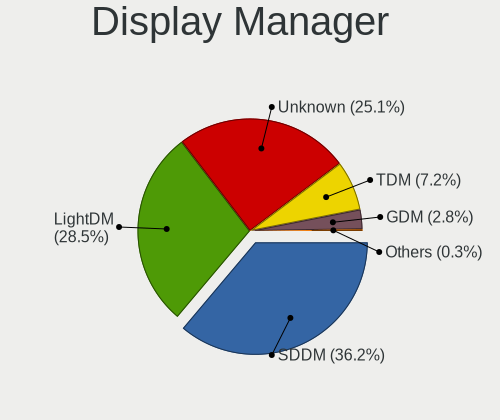
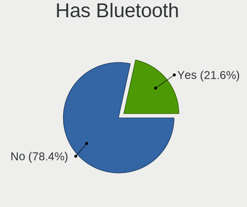
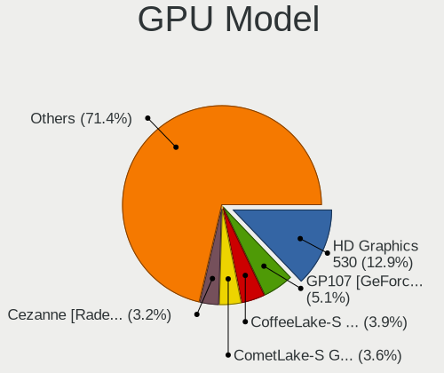
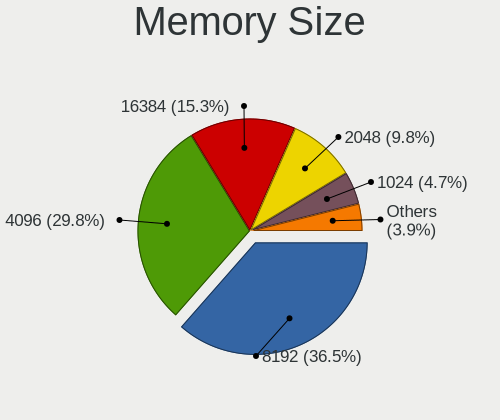
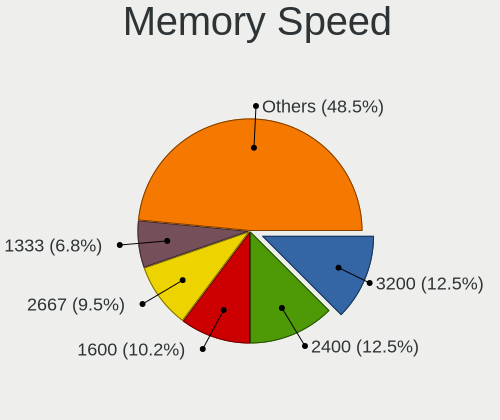
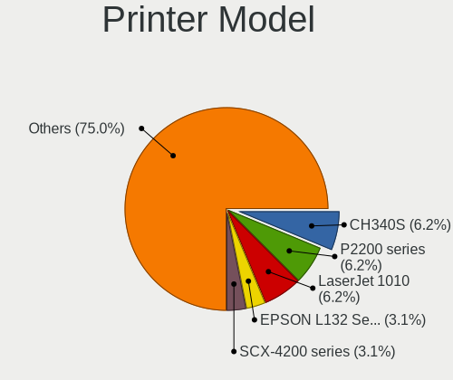
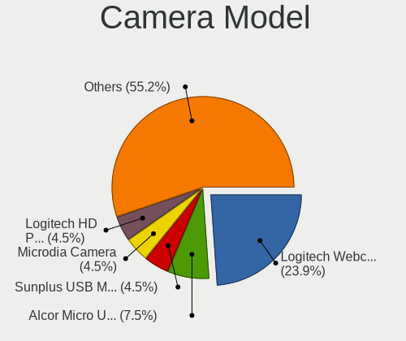

ALT Linux - Tested Hardware & Statistics (Desktops)
---------------------------------------------------

A project to collect tested hardware configurations for ALT Linux.

Anyone can contribute to this report by the [hw-probe](https://github.com/linuxhw/hw-probe) tool:

    sudo -E hw-probe -all -upload

Please contribute! Especially if your hardware is rare.

Contents
--------

* [ Test Cases ](#test-cases)

* [ System ](#system)
  - [ OS                       ](#os)
  - [ OS Family                ](#os-family)
  - [ Kernel                   ](#kernel)
  - [ Kernel Family            ](#kernel-family)
  - [ Kernel Major Ver.        ](#kernel-major-ver)
  - [ Arch                     ](#arch)
  - [ DE                       ](#de)
  - [ Display Server           ](#display-server)
  - [ Display Manager          ](#display-manager)
  - [ OS Lang                  ](#os-lang)
  - [ Boot Mode                ](#boot-mode)
  - [ Filesystem               ](#filesystem)
  - [ Part. scheme             ](#part-scheme)
  - [ Dual Boot with Linux/BSD ](#dual-boot-with-linuxbsd)
  - [ Dual Boot (Win)          ](#dual-boot-win)

* [ Board ](#board)
  - [ Vendor                   ](#vendor)
  - [ Model                    ](#model)
  - [ Model Family             ](#model-family)
  - [ MFG Year                 ](#mfg-year)
  - [ Form Factor              ](#form-factor)
  - [ Secure Boot              ](#secure-boot)
  - [ Coreboot                 ](#coreboot)
  - [ RAM Size                 ](#ram-size)
  - [ RAM Used                 ](#ram-used)
  - [ Total Drives             ](#total-drives)
  - [ Has CD-ROM               ](#has-cd-rom)
  - [ Has Ethernet             ](#has-ethernet)
  - [ Has WiFi                 ](#has-wifi)
  - [ Has Bluetooth            ](#has-bluetooth)

* [ Location ](#location)
  - [ Country                  ](#country)
  - [ City                     ](#city)

* [ Drives ](#drives)
  - [ Drive Vendor             ](#drive-vendor)
  - [ Drive Model              ](#drive-model)
  - [ HDD Vendor               ](#hdd-vendor)
  - [ SSD Vendor               ](#ssd-vendor)
  - [ Drive Kind               ](#drive-kind)
  - [ Drive Connector          ](#drive-connector)
  - [ Drive Size               ](#drive-size)
  - [ Space Total              ](#space-total)
  - [ Space Used               ](#space-used)
  - [ Malfunc. Drives          ](#malfunc-drives)
  - [ Malfunc. Drive Vendor    ](#malfunc-drive-vendor)
  - [ Malfunc. HDD Vendor      ](#malfunc-hdd-vendor)
  - [ Malfunc. Drive Kind      ](#malfunc-drive-kind)
  - [ Failed Drives            ](#failed-drives)
  - [ Failed Drive Vendor      ](#failed-drive-vendor)
  - [ Drive Status             ](#drive-status)

* [ Storage controller ](#storage-controller)
  - [ Storage Vendor           ](#storage-vendor)
  - [ Storage Model            ](#storage-model)
  - [ Storage Kind             ](#storage-kind)

* [ Processor ](#processor)
  - [ CPU Vendor               ](#cpu-vendor)
  - [ CPU Model                ](#cpu-model)
  - [ CPU Model Family         ](#cpu-model-family)
  - [ CPU Cores                ](#cpu-cores)
  - [ CPU Sockets              ](#cpu-sockets)
  - [ CPU Threads              ](#cpu-threads)
  - [ CPU Op-Modes             ](#cpu-op-modes)
  - [ CPU Microcode            ](#cpu-microcode)
  - [ CPU Microarch            ](#cpu-microarch)

* [ Graphics ](#graphics)
  - [ GPU Vendor               ](#gpu-vendor)
  - [ GPU Model                ](#gpu-model)
  - [ GPU Combo                ](#gpu-combo)
  - [ GPU Driver               ](#gpu-driver)
  - [ GPU Memory               ](#gpu-memory)

* [ Monitor ](#monitor)
  - [ Monitor Vendor           ](#monitor-vendor)
  - [ Monitor Model            ](#monitor-model)
  - [ Monitor Resolution       ](#monitor-resolution)
  - [ Monitor Diagonal         ](#monitor-diagonal)
  - [ Monitor Width            ](#monitor-width)
  - [ Aspect Ratio             ](#aspect-ratio)
  - [ Monitor Area             ](#monitor-area)
  - [ Pixel Density            ](#pixel-density)
  - [ Multiple Monitors        ](#multiple-monitors)

* [ Network ](#network)
  - [ Net Controller Vendor    ](#net-controller-vendor)
  - [ Net Controller Model     ](#net-controller-model)
  - [ Wireless Vendor          ](#wireless-vendor)
  - [ Wireless Model           ](#wireless-model)
  - [ Ethernet Vendor          ](#ethernet-vendor)
  - [ Ethernet Model           ](#ethernet-model)
  - [ Net Controller Kind      ](#net-controller-kind)
  - [ Used Controller          ](#used-controller)
  - [ NICs                     ](#nics)
  - [ IPv6                     ](#ipv6)

* [ Bluetooth ](#bluetooth)
  - [ Bluetooth Vendor         ](#bluetooth-vendor)
  - [ Bluetooth Model          ](#bluetooth-model)

* [ Sound ](#sound)
  - [ Sound Vendor             ](#sound-vendor)
  - [ Sound Model              ](#sound-model)

* [ Memory ](#memory)
  - [ Memory Vendor            ](#memory-vendor)
  - [ Memory Model             ](#memory-model)
  - [ Memory Kind              ](#memory-kind)
  - [ Memory Form Factor       ](#memory-form-factor)
  - [ Memory Size              ](#memory-size)
  - [ Memory Speed             ](#memory-speed)

* [ Printers & scanners ](#printers--scanners)
  - [ Printer Vendor           ](#printer-vendor)
  - [ Printer Model            ](#printer-model)
  - [ Scanner Vendor           ](#scanner-vendor)
  - [ Scanner Model            ](#scanner-model)

* [ Camera ](#camera)
  - [ Camera Vendor            ](#camera-vendor)
  - [ Camera Model             ](#camera-model)

* [ Security ](#security)
  - [ Fingerprint Vendor       ](#fingerprint-vendor)
  - [ Fingerprint Model        ](#fingerprint-model)
  - [ Chipcard Vendor          ](#chipcard-vendor)
  - [ Chipcard Model           ](#chipcard-model)

* [ Unsupported ](#unsupported)
  - [ Unsupported Devices      ](#unsupported-devices)
  - [ Unsupported Device Types ](#unsupported-device-types)

Test Cases
----------

Total: 561

| Vendor        | Model                       | Probe                                                      | Date         |
|---------------|-----------------------------|------------------------------------------------------------|--------------|
| ICL           | H410SB                      | [a75155cf86](https://linux-hardware.org/?probe=a75155cf86) | Jan 02, 2025 |
| MSI           | PRO H610M-G DDR4            | [da076eeaf3](https://linux-hardware.org/?probe=da076eeaf3) | Jan 02, 2025 |
| ASUSTek       | PRIME H510M-K               | [884ad79ee5](https://linux-hardware.org/?probe=884ad79ee5) | Dec 29, 2024 |
| MSI           | B450M MORTAR MAX            | [f5c01dc687](https://linux-hardware.org/?probe=f5c01dc687) | Dec 28, 2024 |
| MSI           | B450M MORTAR MAX            | [fbaccf3c9e](https://linux-hardware.org/?probe=fbaccf3c9e) | Dec 28, 2024 |
| MSI           | 760G-P43                    | [faf4279015](https://linux-hardware.org/?probe=faf4279015) | Dec 25, 2024 |
| ASRock        | B450 Gaming K4              | [6e86ec71a9](https://linux-hardware.org/?probe=6e86ec71a9) | Dec 23, 2024 |
| Gigabyte      | Z390 AORUS PRO WIFI-CF      | [8ccb1a5d52](https://linux-hardware.org/?probe=8ccb1a5d52) | Dec 23, 2024 |
| MSI           | B450-A PRO MAX              | [697b67cc2a](https://linux-hardware.org/?probe=697b67cc2a) | Dec 20, 2024 |
| MSI           | H110M PRO-VD                | [0b9173adf1](https://linux-hardware.org/?probe=0b9173adf1) | Dec 19, 2024 |
| ASUSTek       | PRIME H510M-K               | [7cf5f17079](https://linux-hardware.org/?probe=7cf5f17079) | Dec 18, 2024 |
| ASRock        | Z97 Pro4                    | [1aa9e4d9eb](https://linux-hardware.org/?probe=1aa9e4d9eb) | Dec 15, 2024 |
| HP            | 2B29                        | [9216921849](https://linux-hardware.org/?probe=9216921849) | Dec 14, 2024 |
| DEPO Compu... | DPH110S                     | [bf9bb46070](https://linux-hardware.org/?probe=bf9bb46070) | Dec 13, 2024 |
| Graviton      | DMB-H510-MCA01              | [b4a81ce6eb](https://linux-hardware.org/?probe=b4a81ce6eb) | Dec 11, 2024 |
| DEPO Compu... | DPA520S                     | [5231e4d20b](https://linux-hardware.org/?probe=5231e4d20b) | Dec 06, 2024 |
| ASRock        | A520M Pro4                  | [9b40494a18](https://linux-hardware.org/?probe=9b40494a18) | Nov 30, 2024 |
| Gigabyte      | A320M-S2H V2-CF             | [5050024ce1](https://linux-hardware.org/?probe=5050024ce1) | Nov 26, 2024 |
| MSI           | MPG B550 GAMING PLUS        | [9f23908f61](https://linux-hardware.org/?probe=9f23908f61) | Nov 26, 2024 |
| MSI           | MPG B550 GAMING PLUS        | [140d3172c1](https://linux-hardware.org/?probe=140d3172c1) | Nov 26, 2024 |
| ASRock        | N68-GS4 FX                  | [34007a1ee6](https://linux-hardware.org/?probe=34007a1ee6) | Nov 25, 2024 |
| Gigabyte      | Z97-D3H-CF                  | [da3c0f73b4](https://linux-hardware.org/?probe=da3c0f73b4) | Nov 18, 2024 |
| Gigabyte      | Z97-D3H-CF                  | [508795271f](https://linux-hardware.org/?probe=508795271f) | Nov 15, 2024 |
| ASUSTek       | H87M-PRO                    | [4cfc3ae5e0](https://linux-hardware.org/?probe=4cfc3ae5e0) | Nov 15, 2024 |
| Biostar       | A68MHE                      | [0d3e4beafb](https://linux-hardware.org/?probe=0d3e4beafb) | Nov 13, 2024 |
| MSI           | MAG B760M MORTAR WIFI       | [ab2d6d51bb](https://linux-hardware.org/?probe=ab2d6d51bb) | Nov 12, 2024 |
| MSI           | PRO Z790-P WIFI             | [4a30303850](https://linux-hardware.org/?probe=4a30303850) | Nov 12, 2024 |
| Gigabyte      | B450 GAMING X               | [f898051323](https://linux-hardware.org/?probe=f898051323) | Nov 10, 2024 |
| HP            | 3397                        | [04fa6a24ee](https://linux-hardware.org/?probe=04fa6a24ee) | Nov 08, 2024 |
| HP            | 83EE                        | [491546c0fe](https://linux-hardware.org/?probe=491546c0fe) | Nov 05, 2024 |
| ASRock        | Z68M/USB3                   | [f39d49f78f](https://linux-hardware.org/?probe=f39d49f78f) | Oct 31, 2024 |
| ASUSTek       | M4A89GTD-PRO                | [49f3ef7f7c](https://linux-hardware.org/?probe=49f3ef7f7c) | Oct 28, 2024 |
| Gigabyte      | B550M K                     | [dde963874f](https://linux-hardware.org/?probe=dde963874f) | Oct 27, 2024 |
| Huanan        | X99-QD4 V0.1 693H           | [2a206ed000](https://linux-hardware.org/?probe=2a206ed000) | Oct 26, 2024 |
| MSI           | B550-A PRO                  | [ee26c48295](https://linux-hardware.org/?probe=ee26c48295) | Oct 26, 2024 |
| HP            | 83EE                        | [8cbf62fc9b](https://linux-hardware.org/?probe=8cbf62fc9b) | Oct 21, 2024 |
| MSI           | B450M PRO-VDH MAX           | [6d016ec789](https://linux-hardware.org/?probe=6d016ec789) | Oct 20, 2024 |
| Biostar       | H61MHV3                     | [03f4106810](https://linux-hardware.org/?probe=03f4106810) | Oct 19, 2024 |
| MSI           | MPG B550 GAMING PLUS        | [00e3458bd8](https://linux-hardware.org/?probe=00e3458bd8) | Oct 19, 2024 |
| ASRock        | H61M-VG3                    | [6e0c8954c4](https://linux-hardware.org/?probe=6e0c8954c4) | Oct 18, 2024 |
| ASRock        | H61M-VG3                    | [689b8ad5f4](https://linux-hardware.org/?probe=689b8ad5f4) | Oct 18, 2024 |
| Intel         | B560-AIO T5V E1.0G          | [b1aab7dcb2](https://linux-hardware.org/?probe=b1aab7dcb2) | Oct 17, 2024 |
| Intel         | B560-AIO T5V E1.0G          | [0b038153a1](https://linux-hardware.org/?probe=0b038153a1) | Oct 17, 2024 |
| HP            | 1497                        | [81bc95c34c](https://linux-hardware.org/?probe=81bc95c34c) | Oct 15, 2024 |
| Gigabyte      | A320M-S2H-CF                | [394bacc9ee](https://linux-hardware.org/?probe=394bacc9ee) | Oct 12, 2024 |
| ASUSTek       | PRIME H510M-K               | [6c153457c0](https://linux-hardware.org/?probe=6c153457c0) | Oct 09, 2024 |
| Gigabyte      | H310M S2H x.x               | [bd2ebeb7e0](https://linux-hardware.org/?probe=bd2ebeb7e0) | Sep 30, 2024 |
| HP            | 2B29                        | [f803e78e04](https://linux-hardware.org/?probe=f803e78e04) | Sep 27, 2024 |
| Pegatron      | NM70-P1/ODM                 | [6a2f74fa01](https://linux-hardware.org/?probe=6a2f74fa01) | Sep 27, 2024 |
| Gigabyte      | Z590 VISION G               | [e711388bf1](https://linux-hardware.org/?probe=e711388bf1) | Sep 20, 2024 |
| AZW           | MINI S                      | [26fedf82a8](https://linux-hardware.org/?probe=26fedf82a8) | Sep 18, 2024 |
| ASRock        | B450M-HDV R4.0              | [11fe29956f](https://linux-hardware.org/?probe=11fe29956f) | Sep 18, 2024 |
| ASUSTek       | Z97-K/USB                   | [5b3bbf6f3b](https://linux-hardware.org/?probe=5b3bbf6f3b) | Sep 14, 2024 |
| Kraftway      | KWH310                      | [14063d22e1](https://linux-hardware.org/?probe=14063d22e1) | Sep 07, 2024 |
| ASRock        | A520M Pro4                  | [636eec8156](https://linux-hardware.org/?probe=636eec8156) | Aug 19, 2024 |
| Gigabyte      | 970A-DS3P                   | [d029537860](https://linux-hardware.org/?probe=d029537860) | Aug 19, 2024 |
| MACHINIST     | X99-MR9A PRO MAX V5.1       | [c5b89ad433](https://linux-hardware.org/?probe=c5b89ad433) | Aug 18, 2024 |
| Gigabyte      | 970A-DS3P                   | [7b569e1148](https://linux-hardware.org/?probe=7b569e1148) | Aug 09, 2024 |
| Gigabyte      | B650M DS3H                  | [2d11a234d5](https://linux-hardware.org/?probe=2d11a234d5) | Aug 06, 2024 |
| Unknown       | Unknown                     | [f08e885430](https://linux-hardware.org/?probe=f08e885430) | Aug 01, 2024 |
| Huanan        | X99-QD4 V0.1 693H           | [d7fcb0b28a](https://linux-hardware.org/?probe=d7fcb0b28a) | Jul 28, 2024 |
| MSI           | MS-B0A21                    | [52d37fde14](https://linux-hardware.org/?probe=52d37fde14) | Jul 26, 2024 |
| Gigabyte      | AB350M-Gaming 3-CF          | [5b236846cf](https://linux-hardware.org/?probe=5b236846cf) | Jul 21, 2024 |
| Unknown       | Unknown                     | [a28e524a63](https://linux-hardware.org/?probe=a28e524a63) | Jul 20, 2024 |
| Acer          | Aspire XC-1660 V:1.1        | [31dbe1ce9e](https://linux-hardware.org/?probe=31dbe1ce9e) | Jul 19, 2024 |
| MSI           | Z97 U3 PLUS                 | [bec2e23ba0](https://linux-hardware.org/?probe=bec2e23ba0) | Jul 13, 2024 |
| MSI           | X470 GAMING PRO             | [704b7ed845](https://linux-hardware.org/?probe=704b7ed845) | Jul 12, 2024 |
| Aquarius      | AQH310CM                    | [65ab62646c](https://linux-hardware.org/?probe=65ab62646c) | Jul 10, 2024 |
| Aquarius      | AQH310CM                    | [8dd8a81958](https://linux-hardware.org/?probe=8dd8a81958) | Jul 10, 2024 |
| Acer          | TDPS05                      | [69ec0ebb0e](https://linux-hardware.org/?probe=69ec0ebb0e) | Jul 05, 2024 |
| Biostar       | A68MHE                      | [8bfd525ace](https://linux-hardware.org/?probe=8bfd525ace) | Jul 05, 2024 |
| Aquarius      | AQH310CM                    | [5be2d7706e](https://linux-hardware.org/?probe=5be2d7706e) | Jul 01, 2024 |
| ASRock        | B550M-HDV                   | [bb05c5cd47](https://linux-hardware.org/?probe=bb05c5cd47) | Jul 01, 2024 |
| ASUSTek       | TUF Gaming X670E-PLUS WI... | [d8b58eedf8](https://linux-hardware.org/?probe=d8b58eedf8) | Jun 28, 2024 |
| ASUSTek       | P5B-Deluxe                  | [5065fe29a2](https://linux-hardware.org/?probe=5065fe29a2) | Jun 26, 2024 |
| ASUSTek       | P5B-Deluxe                  | [b16d910164](https://linux-hardware.org/?probe=b16d910164) | Jun 26, 2024 |
| ASUSTek       | ROG Maximus Z690 HERO       | [c17442ac07](https://linux-hardware.org/?probe=c17442ac07) | Jun 23, 2024 |
| Gigabyte      | B365M D2V                   | [9a4ad817b1](https://linux-hardware.org/?probe=9a4ad817b1) | Jun 23, 2024 |
| Biostar       | A68MHE                      | [14c11d75cb](https://linux-hardware.org/?probe=14c11d75cb) | Jun 22, 2024 |
| MSI           | MAG B650M MORTAR WIFI       | [a6b39899a7](https://linux-hardware.org/?probe=a6b39899a7) | Jun 16, 2024 |
| MSI           | PRO B660M-P DDR4            | [449ead260f](https://linux-hardware.org/?probe=449ead260f) | Jun 09, 2024 |
| Gigabyte      | B250M-DS3H-CF               | [9170618489](https://linux-hardware.org/?probe=9170618489) | Jun 08, 2024 |
| ASUSTek       | PRIME B250M-A               | [ae046e6c96](https://linux-hardware.org/?probe=ae046e6c96) | Jun 04, 2024 |
| ASUSTek       | PRIME X370-PRO              | [7842abdb45](https://linux-hardware.org/?probe=7842abdb45) | Jun 03, 2024 |
| MSI           | B650 GAMING PLUS WIFI       | [fcc722c5cb](https://linux-hardware.org/?probe=fcc722c5cb) | May 26, 2024 |
| HP            | 8184 X4                     | [2d56e66964](https://linux-hardware.org/?probe=2d56e66964) | May 22, 2024 |
| BESHTAU       | B560M-D V51                 | [51aab9354b](https://linux-hardware.org/?probe=51aab9354b) | May 20, 2024 |
| Gigabyte      | H610M S2H                   | [342949d0ba](https://linux-hardware.org/?probe=342949d0ba) | May 17, 2024 |
| ASUSTek       | P5PE-VM                     | [c453bf034c](https://linux-hardware.org/?probe=c453bf034c) | May 17, 2024 |
| Aquarius      | AQH310CM                    | [e6b335988e](https://linux-hardware.org/?probe=e6b335988e) | May 14, 2024 |
| ASRock        | H610M-ITX/ac                | [382c5161c1](https://linux-hardware.org/?probe=382c5161c1) | May 13, 2024 |
| ASRock        | B450 Pro4 R2.0              | [2ecceda7ae](https://linux-hardware.org/?probe=2ecceda7ae) | May 09, 2024 |
| Gigabyte      | GA-M56S-S3                  | [93d7cc0722](https://linux-hardware.org/?probe=93d7cc0722) | May 09, 2024 |
| ASRock        | B450 Pro4 R2.0              | [bb1ae830e8](https://linux-hardware.org/?probe=bb1ae830e8) | May 09, 2024 |
| Gigabyte      | B550M DS3H                  | [178f62317e](https://linux-hardware.org/?probe=178f62317e) | May 04, 2024 |
| Gigabyte      | B550M DS3H                  | [f4d652cc40](https://linux-hardware.org/?probe=f4d652cc40) | Apr 25, 2024 |
| ASUSTek       | P8H61-I R2.0                | [db4468debf](https://linux-hardware.org/?probe=db4468debf) | Apr 23, 2024 |
| ASRock        | B450M Pro4-F                | [d721e6ffa6](https://linux-hardware.org/?probe=d721e6ffa6) | Apr 18, 2024 |
| Biostar       | A68MHE                      | [d8db2caef4](https://linux-hardware.org/?probe=d8db2caef4) | Apr 14, 2024 |
| Biostar       | A68MHE                      | [acdf6abfbf](https://linux-hardware.org/?probe=acdf6abfbf) | Apr 14, 2024 |
| MSI           | B450M PRO-VDH MAX           | [dce8bf4cbc](https://linux-hardware.org/?probe=dce8bf4cbc) | Apr 13, 2024 |
| Biostar       | H610MH                      | [06dbe44a85](https://linux-hardware.org/?probe=06dbe44a85) | Apr 13, 2024 |
| AZW           | GTR V02                     | [120d648339](https://linux-hardware.org/?probe=120d648339) | Apr 12, 2024 |
| Dell          | 030VXY A01                  | [03bd29951c](https://linux-hardware.org/?probe=03bd29951c) | Apr 11, 2024 |
| MSI           | B550-A PRO                  | [5ac75aad7e](https://linux-hardware.org/?probe=5ac75aad7e) | Mar 28, 2024 |
| Biostar       | IH61MF-Q5                   | [6f251f08e1](https://linux-hardware.org/?probe=6f251f08e1) | Mar 25, 2024 |
| Aquarius      | AQH310CM                    | [368d914e46](https://linux-hardware.org/?probe=368d914e46) | Mar 24, 2024 |
| Gigabyte      | B550 AORUS PRO V2           | [11f7843550](https://linux-hardware.org/?probe=11f7843550) | Mar 23, 2024 |
| Gigabyte      | B560M AORUS PRO AX          | [693e93ff73](https://linux-hardware.org/?probe=693e93ff73) | Mar 22, 2024 |
| ASUSTek       | ROG STRIX X570-E GAMING ... | [a8f9e94787](https://linux-hardware.org/?probe=a8f9e94787) | Mar 16, 2024 |
| Gigabyte      | A520M DS3H                  | [d999681595](https://linux-hardware.org/?probe=d999681595) | Mar 16, 2024 |
| Gigabyte      | A520M DS3H                  | [d6731a38c7](https://linux-hardware.org/?probe=d6731a38c7) | Mar 16, 2024 |
| MSI           | B550-A PRO                  | [fd6b99b446](https://linux-hardware.org/?probe=fd6b99b446) | Mar 12, 2024 |
| Unknown       | Intel X79                   | [e88d0410c8](https://linux-hardware.org/?probe=e88d0410c8) | Mar 11, 2024 |
| ASUSTek       | D300TA                      | [a09321cd27](https://linux-hardware.org/?probe=a09321cd27) | Mar 11, 2024 |
| Gigabyte      | Z790 AORUS ELITE AX         | [b6909c9a7a](https://linux-hardware.org/?probe=b6909c9a7a) | Mar 10, 2024 |
| Biostar       | TB250-BTC                   | [c5edeef7fe](https://linux-hardware.org/?probe=c5edeef7fe) | Mar 03, 2024 |
| Aquarius      | AQH310CM                    | [a255e64313](https://linux-hardware.org/?probe=a255e64313) | Feb 22, 2024 |
| ASUSTek       | H81M-K                      | [51188483df](https://linux-hardware.org/?probe=51188483df) | Feb 21, 2024 |
| Unknown       | Unknown                     | [0b2da4684e](https://linux-hardware.org/?probe=0b2da4684e) | Feb 21, 2024 |
| MSI           | H110M PRO-VD                | [61b2aa976f](https://linux-hardware.org/?probe=61b2aa976f) | Feb 13, 2024 |
| ASUSTek       | M4A77TD                     | [75afd83494](https://linux-hardware.org/?probe=75afd83494) | Feb 11, 2024 |
| ASRock        | H61M-HVGS                   | [dc3bd18c15](https://linux-hardware.org/?probe=dc3bd18c15) | Feb 09, 2024 |
| ASUSTek       | P5B-Deluxe                  | [b30373632d](https://linux-hardware.org/?probe=b30373632d) | Feb 01, 2024 |
| ASUSTek       | P6T WS PRO                  | [21d91717a1](https://linux-hardware.org/?probe=21d91717a1) | Jan 31, 2024 |
| ASUSTek       | M5A78L-M LX                 | [8c79f36086](https://linux-hardware.org/?probe=8c79f36086) | Jan 29, 2024 |
| MSI           | MS-B0A21                    | [aebe283d41](https://linux-hardware.org/?probe=aebe283d41) | Jan 26, 2024 |
| MSI           | B550-A PRO                  | [1f374d86d7](https://linux-hardware.org/?probe=1f374d86d7) | Jan 25, 2024 |
| Gigabyte      | H61M-USB3V                  | [6a5faff8dd](https://linux-hardware.org/?probe=6a5faff8dd) | Jan 24, 2024 |
| ASUSTek       | P5B-Deluxe                  | [b628671631](https://linux-hardware.org/?probe=b628671631) | Jan 21, 2024 |
| Aquarius      | AQH310CM                    | [6172ad2c5d](https://linux-hardware.org/?probe=6172ad2c5d) | Jan 20, 2024 |
| ASUSTek       | P6T WS PRO                  | [d8c6804097](https://linux-hardware.org/?probe=d8c6804097) | Jan 18, 2024 |
| ASRock        | J3355M                      | [40caff1c3c](https://linux-hardware.org/?probe=40caff1c3c) | Jan 18, 2024 |
| ASUSTek       | Q87M-E                      | [22cbd96a3b](https://linux-hardware.org/?probe=22cbd96a3b) | Jan 11, 2024 |
| MSI           | B550-A PRO                  | [e658ae012b](https://linux-hardware.org/?probe=e658ae012b) | Jan 11, 2024 |
| MSI           | MPG B550 GAMING PLUS        | [e371e895ec](https://linux-hardware.org/?probe=e371e895ec) | Jan 10, 2024 |
| Aquarius      | AQH310CM                    | [64bd83e185](https://linux-hardware.org/?probe=64bd83e185) | Jan 10, 2024 |
| SZMZ          | H61-ME V1.0                 | [4ca9bf9ced](https://linux-hardware.org/?probe=4ca9bf9ced) | Jan 09, 2024 |
| ASUSTek       | P5G41T-M LX                 | [8bc6ac892f](https://linux-hardware.org/?probe=8bc6ac892f) | Dec 21, 2023 |
| Foxconn       | G41MX/G41MX-K 2.0 1.0       | [cdebd77402](https://linux-hardware.org/?probe=cdebd77402) | Dec 16, 2023 |
| ASUSTek       | M5A78L-M LX                 | [6225f2f85f](https://linux-hardware.org/?probe=6225f2f85f) | Dec 15, 2023 |
| ASUSTek       | ROG STRIX B650E-F GAMING... | [84d4572994](https://linux-hardware.org/?probe=84d4572994) | Dec 12, 2023 |
| Gigabyte      | M55S-S3                     | [bf362d71c7](https://linux-hardware.org/?probe=bf362d71c7) | Dec 09, 2023 |
| ASUSTek       | Q87M-E                      | [df56e68ebc](https://linux-hardware.org/?probe=df56e68ebc) | Dec 04, 2023 |
| MSI           | B550-A PRO                  | [0f258ceffb](https://linux-hardware.org/?probe=0f258ceffb) | Dec 04, 2023 |
| ASUSTek       | P5QL-VM EPU                 | [c70c2ff27f](https://linux-hardware.org/?probe=c70c2ff27f) | Dec 01, 2023 |
| Gigabyte      | H370 HD3-CF                 | [d7367e7072](https://linux-hardware.org/?probe=d7367e7072) | Nov 30, 2023 |
| Gigabyte      | B85-HD3                     | [b64fc99109](https://linux-hardware.org/?probe=b64fc99109) | Nov 29, 2023 |
| Graviton      | DMB-A520-MCA01 1.o          | [f989b31edd](https://linux-hardware.org/?probe=f989b31edd) | Nov 28, 2023 |
| Graviton      | DMB-A520-MCA01 1.o          | [1dce0a4738](https://linux-hardware.org/?probe=1dce0a4738) | Nov 28, 2023 |
| ASUSTek       | P5K                         | [d5cb9ac79b](https://linux-hardware.org/?probe=d5cb9ac79b) | Nov 27, 2023 |
| ASUSTek       | P5B-Deluxe                  | [1af8016aed](https://linux-hardware.org/?probe=1af8016aed) | Nov 27, 2023 |
| ASUSTek       | P5B-Deluxe                  | [668b258270](https://linux-hardware.org/?probe=668b258270) | Nov 27, 2023 |
| HP            | ProLiant SL230s Gen8        | [a0b680d2ac](https://linux-hardware.org/?probe=a0b680d2ac) | Nov 26, 2023 |
| HP            | ProLiant SL230s Gen8        | [b1d3f26e5d](https://linux-hardware.org/?probe=b1d3f26e5d) | Nov 26, 2023 |
| HP            | ProLiant SL230s Gen8        | [800b1eab76](https://linux-hardware.org/?probe=800b1eab76) | Nov 26, 2023 |
| HP            | ProLiant SL230s Gen8        | [35b226a480](https://linux-hardware.org/?probe=35b226a480) | Nov 26, 2023 |
| Unknown       | Unknown                     | [72915fd0dd](https://linux-hardware.org/?probe=72915fd0dd) | Nov 26, 2023 |
| Gigabyte      | B560M D3H                   | [ecf8bf3010](https://linux-hardware.org/?probe=ecf8bf3010) | Nov 26, 2023 |
| MSI           | Z490-A PRO                  | [8fdcfb665c](https://linux-hardware.org/?probe=8fdcfb665c) | Nov 26, 2023 |
| MSI           | B550-A PRO                  | [3914c7ac4f](https://linux-hardware.org/?probe=3914c7ac4f) | Nov 22, 2023 |
| Lenovo        | No DPK                      | [b569bd1d22](https://linux-hardware.org/?probe=b569bd1d22) | Nov 19, 2023 |
| ASUSTek       | ROG STRIX B650E-F GAMING... | [8b59b311ca](https://linux-hardware.org/?probe=8b59b311ca) | Nov 18, 2023 |
| ASUSTek       | ROG STRIX B650E-F GAMING... | [7d34e7f4b0](https://linux-hardware.org/?probe=7d34e7f4b0) | Nov 18, 2023 |
| ASUSTek       | H81M-R                      | [a0617305eb](https://linux-hardware.org/?probe=a0617305eb) | Nov 17, 2023 |
| ASUSTek       | H97-PRO                     | [c5890b8a51](https://linux-hardware.org/?probe=c5890b8a51) | Nov 15, 2023 |
| Pegatron      | 2AB5                        | [8d788a9b4d](https://linux-hardware.org/?probe=8d788a9b4d) | Nov 14, 2023 |
| Pegatron      | 2AB5                        | [c04b52c00e](https://linux-hardware.org/?probe=c04b52c00e) | Nov 14, 2023 |
| ASUSTek       | Q87M-E                      | [2c0511f79f](https://linux-hardware.org/?probe=2c0511f79f) | Nov 12, 2023 |
| MSI           | B550-A PRO                  | [b0bc13f5f8](https://linux-hardware.org/?probe=b0bc13f5f8) | Nov 12, 2023 |
| MSI           | MAG B550M MORTAR            | [b29f519183](https://linux-hardware.org/?probe=b29f519183) | Nov 10, 2023 |
| MSI           | MAG B550M MORTAR            | [cf5ee36e07](https://linux-hardware.org/?probe=cf5ee36e07) | Nov 10, 2023 |
| Gigabyte      | B550M DS3H                  | [fa61fdff34](https://linux-hardware.org/?probe=fa61fdff34) | Nov 09, 2023 |
| Aquarius      | AQX300M                     | [b70a012245](https://linux-hardware.org/?probe=b70a012245) | Nov 01, 2023 |
| ASUSTek       | M5A78L LE                   | [d7dd5dbdf7](https://linux-hardware.org/?probe=d7dd5dbdf7) | Oct 30, 2023 |
| Huanan        | X99-T8 GAMING V2.0          | [27d22c45c8](https://linux-hardware.org/?probe=27d22c45c8) | Oct 26, 2023 |
| AZW           | MINI S                      | [0083fabd4c](https://linux-hardware.org/?probe=0083fabd4c) | Oct 15, 2023 |
| Biostar       | H510MHP                     | [1de1d57c17](https://linux-hardware.org/?probe=1de1d57c17) | Oct 13, 2023 |
| DEPO Compu... | DPA520S                     | [d6cf338b8c](https://linux-hardware.org/?probe=d6cf338b8c) | Oct 12, 2023 |
| Gigabyte      | Z390 AORUS MASTER-CF        | [7623527bdb](https://linux-hardware.org/?probe=7623527bdb) | Oct 08, 2023 |
| 3Logic Gro... | DMB-H510-MCA01              | [38db8e9cf2](https://linux-hardware.org/?probe=38db8e9cf2) | Oct 04, 2023 |
| Biostar       | H510MHP                     | [1d6b309a9a](https://linux-hardware.org/?probe=1d6b309a9a) | Oct 02, 2023 |
| ASUSTek       | P8H61-M LX2                 | [b2a213cc18](https://linux-hardware.org/?probe=b2a213cc18) | Sep 30, 2023 |
| ASUSTek       | P8H61-M LX2                 | [60e32143f5](https://linux-hardware.org/?probe=60e32143f5) | Sep 29, 2023 |
| 3Logic Gro... | DMB-H510-MCA01              | [7cc521d927](https://linux-hardware.org/?probe=7cc521d927) | Sep 29, 2023 |
| Pegatron      | IPMSB-H61                   | [d0e64d2ebf](https://linux-hardware.org/?probe=d0e64d2ebf) | Sep 28, 2023 |
| Gigabyte      | Z390 AORUS MASTER-CF        | [1458dfe403](https://linux-hardware.org/?probe=1458dfe403) | Sep 27, 2023 |
| MSI           | H81M-P33                    | [8b0d086b89](https://linux-hardware.org/?probe=8b0d086b89) | Sep 27, 2023 |
| DEPO Compu... | DPA520S                     | [45d07666f9](https://linux-hardware.org/?probe=45d07666f9) | Sep 26, 2023 |
| ASUSTek       | P6T DELUXE V2               | [a0fa16f85c](https://linux-hardware.org/?probe=a0fa16f85c) | Sep 25, 2023 |
| ASRock        | K10N78D                     | [fa2852026b](https://linux-hardware.org/?probe=fa2852026b) | Sep 13, 2023 |
| ASRock        | K10N78D                     | [adf8e09915](https://linux-hardware.org/?probe=adf8e09915) | Sep 13, 2023 |
| ASUSTek       | P5G41T-M LX2/GB             | [53cdc3e4f0](https://linux-hardware.org/?probe=53cdc3e4f0) | Sep 12, 2023 |
| Intel         | DP43TF AAE34878-404         | [d83ba68fcb](https://linux-hardware.org/?probe=d83ba68fcb) | Sep 05, 2023 |
| MSI           | MAG B550M MORTAR WIFI       | [6b33c9cb36](https://linux-hardware.org/?probe=6b33c9cb36) | Sep 02, 2023 |
| Intel         | B75                         | [55695d0962](https://linux-hardware.org/?probe=55695d0962) | Aug 31, 2023 |
| ASUSTek       | P8H61-MX                    | [861e741d6a](https://linux-hardware.org/?probe=861e741d6a) | Aug 29, 2023 |
| ASRock        | B460 Steel Legend           | [09ed405682](https://linux-hardware.org/?probe=09ed405682) | Aug 29, 2023 |
| Intel         | SKYBAY                      | [59cfa4ea58](https://linux-hardware.org/?probe=59cfa4ea58) | Aug 29, 2023 |
| ASRock        | B460 Steel Legend           | [ad478d48ad](https://linux-hardware.org/?probe=ad478d48ad) | Aug 27, 2023 |
| MSI           | MPG X570 GAMING PLUS        | [1510eba46f](https://linux-hardware.org/?probe=1510eba46f) | Aug 22, 2023 |
| ASUSTek       | ROG STRIX B350-F GAMING     | [cc7efa7eba](https://linux-hardware.org/?probe=cc7efa7eba) | Aug 11, 2023 |
| Gigabyte      | X570 AORUS PRO              | [a43111576a](https://linux-hardware.org/?probe=a43111576a) | Aug 09, 2023 |
| DEPO Compu... | DPA520S                     | [71b00682fc](https://linux-hardware.org/?probe=71b00682fc) | Aug 07, 2023 |
| MSI           | PRO B550M-P GEN3            | [163708151e](https://linux-hardware.org/?probe=163708151e) | Aug 03, 2023 |
| DEPO Compu... | DPA520S                     | [28007801d5](https://linux-hardware.org/?probe=28007801d5) | Aug 03, 2023 |
| DEPO Compu... | DPA520S                     | [5e3a46dee8](https://linux-hardware.org/?probe=5e3a46dee8) | Aug 03, 2023 |
| ASUSTek       | H110M-K                     | [c12e9ed368](https://linux-hardware.org/?probe=c12e9ed368) | Aug 02, 2023 |
| ASUSTek       | P7F-M                       | [5c04bf12d0](https://linux-hardware.org/?probe=5c04bf12d0) | Aug 02, 2023 |
| HP            | 0AA8h                       | [76dbb0d0a3](https://linux-hardware.org/?probe=76dbb0d0a3) | Jul 31, 2023 |
| ASRock        | G41M-VS2                    | [74564d3418](https://linux-hardware.org/?probe=74564d3418) | Jul 28, 2023 |
| ASUSTek       | P7H55-M LX                  | [543257c1b1](https://linux-hardware.org/?probe=543257c1b1) | Jul 25, 2023 |
| ASUSTek       | P5B-Deluxe                  | [0cf82c02d3](https://linux-hardware.org/?probe=0cf82c02d3) | Jul 18, 2023 |
| ASUSTek       | P5B-Deluxe                  | [da27044389](https://linux-hardware.org/?probe=da27044389) | Jul 17, 2023 |
| Gigabyte      | MRHM3AP                     | [2d91c7c05a](https://linux-hardware.org/?probe=2d91c7c05a) | Jun 28, 2023 |
| Gigabyte      | MRHM3AP                     | [7007bb2db5](https://linux-hardware.org/?probe=7007bb2db5) | Jun 27, 2023 |
| MSI           | MPG X570 GAMING PLUS        | [0c4198042a](https://linux-hardware.org/?probe=0c4198042a) | Jun 18, 2023 |
| Biostar       | H610MH                      | [a2c82f65b6](https://linux-hardware.org/?probe=a2c82f65b6) | Jun 08, 2023 |
| ASUSTek       | PRIME Z370-P II             | [5a66eed08e](https://linux-hardware.org/?probe=5a66eed08e) | Jun 05, 2023 |
| MSI           | Z490-A PRO                  | [e34e6ab643](https://linux-hardware.org/?probe=e34e6ab643) | May 26, 2023 |
| Graviton      | DMB-A520-MCA01              | [91ad90fd67](https://linux-hardware.org/?probe=91ad90fd67) | May 22, 2023 |
| MSI           | MPG B550 GAMING PLUS        | [9c184f4251](https://linux-hardware.org/?probe=9c184f4251) | May 22, 2023 |
| Gigabyte      | B560 HD3                    | [1bfbf34771](https://linux-hardware.org/?probe=1bfbf34771) | May 16, 2023 |
| Gigabyte      | G41M-ES2L                   | [d9cac69c4c](https://linux-hardware.org/?probe=d9cac69c4c) | May 16, 2023 |
| Gigabyte      | G41M-ES2L                   | [0959f95f56](https://linux-hardware.org/?probe=0959f95f56) | May 12, 2023 |
| MSI           | H310M PRO-VD                | [b502077711](https://linux-hardware.org/?probe=b502077711) | May 12, 2023 |
| MSI           | H310M PRO-VD                | [ab733d41de](https://linux-hardware.org/?probe=ab733d41de) | May 12, 2023 |
| DEPO Compu... | DPA520S                     | [dea48fc3fa](https://linux-hardware.org/?probe=dea48fc3fa) | May 11, 2023 |
| DEPO Compu... | DPA520S                     | [848dc775e0](https://linux-hardware.org/?probe=848dc775e0) | May 11, 2023 |
| Gigabyte      | H61M-S2PV                   | [3ed55d530a](https://linux-hardware.org/?probe=3ed55d530a) | May 04, 2023 |
| Unknown       | DMB-A520-MCA01              | [d0c1433d54](https://linux-hardware.org/?probe=d0c1433d54) | Apr 18, 2023 |
| Intel         | SKYBAY                      | [ec2b541d85](https://linux-hardware.org/?probe=ec2b541d85) | Apr 13, 2023 |
| ASUSTek       | P8B75-V                     | [3504e8b3bd](https://linux-hardware.org/?probe=3504e8b3bd) | Apr 11, 2023 |
| Gigabyte      | A320M-S2H-CF                | [bec5bda3bd](https://linux-hardware.org/?probe=bec5bda3bd) | Apr 05, 2023 |
| MSI           | H510M PRO-E                 | [9ec66a8f48](https://linux-hardware.org/?probe=9ec66a8f48) | Mar 31, 2023 |
| Graviton      | DMB-A520-MCA01              | [9d7a43d81f](https://linux-hardware.org/?probe=9d7a43d81f) | Mar 29, 2023 |
| Graviton      | DMB-A520-MCA01              | [123e95cee1](https://linux-hardware.org/?probe=123e95cee1) | Mar 22, 2023 |
| Unknown       | Unknown                     | [5d06af8741](https://linux-hardware.org/?probe=5d06af8741) | Mar 22, 2023 |
| Graviton      | DMB-A520-MCA01              | [24b07c4402](https://linux-hardware.org/?probe=24b07c4402) | Mar 21, 2023 |
| Intel         | X99 V1.0                    | [1b993725aa](https://linux-hardware.org/?probe=1b993725aa) | Mar 17, 2023 |
| Biostar       | TB250-BTC                   | [59d148cedc](https://linux-hardware.org/?probe=59d148cedc) | Mar 11, 2023 |
| Gigabyte      | 965GM-S2                    | [8a58676b8d](https://linux-hardware.org/?probe=8a58676b8d) | Mar 10, 2023 |
| Gigabyte      | 965GM-S2                    | [e514c2892e](https://linux-hardware.org/?probe=e514c2892e) | Mar 10, 2023 |
| Intel         | SKYBAY                      | [226b8468d4](https://linux-hardware.org/?probe=226b8468d4) | Mar 09, 2023 |
| ASUSTek       | H110M-R                     | [d62a6bc830](https://linux-hardware.org/?probe=d62a6bc830) | Mar 07, 2023 |
| DEPO Compu... | DPH410S                     | [5fb80da27b](https://linux-hardware.org/?probe=5fb80da27b) | Mar 07, 2023 |
| ASRock        | H110M-DGS R3.0              | [4b3689dc5c](https://linux-hardware.org/?probe=4b3689dc5c) | Mar 05, 2023 |
| Gigabyte      | P31-ES3G                    | [5ab1863f2b](https://linux-hardware.org/?probe=5ab1863f2b) | Feb 28, 2023 |
| MSI           | MS-7357                     | [84cadfbabc](https://linux-hardware.org/?probe=84cadfbabc) | Feb 15, 2023 |
| ASUSTek       | P9X79                       | [d7f1d6a937](https://linux-hardware.org/?probe=d7f1d6a937) | Feb 14, 2023 |
| MAINBRD       | OPS62A-SHA                  | [a9267dffac](https://linux-hardware.org/?probe=a9267dffac) | Feb 14, 2023 |
| ASUSTek       | P5B-E                       | [92bf62be3c](https://linux-hardware.org/?probe=92bf62be3c) | Feb 11, 2023 |
| Acer          | RS880M05                    | [c585589925](https://linux-hardware.org/?probe=c585589925) | Feb 11, 2023 |
| ASRock        | FM2A78 Pro4+                | [788d1d408b](https://linux-hardware.org/?probe=788d1d408b) | Feb 06, 2023 |
| ASRock        | FM2A88X Extreme4+           | [97252e199d](https://linux-hardware.org/?probe=97252e199d) | Feb 06, 2023 |
| Gigabyte      | X570 AORUS PRO              | [ab13127567](https://linux-hardware.org/?probe=ab13127567) | Jan 29, 2023 |
| Intel         | X99 V1.0                    | [560cc09a5a](https://linux-hardware.org/?probe=560cc09a5a) | Jan 26, 2023 |
| Gigabyte      | H61M-DS2                    | [347446f16f](https://linux-hardware.org/?probe=347446f16f) | Jan 25, 2023 |
| Intel         | SKYBAY                      | [0d2187e1bd](https://linux-hardware.org/?probe=0d2187e1bd) | Jan 23, 2023 |
| Intel         | SKYBAY                      | [1781c6451f](https://linux-hardware.org/?probe=1781c6451f) | Jan 23, 2023 |
| MSI           | MAG B550M MORTAR WIFI       | [bb4c5c0f73](https://linux-hardware.org/?probe=bb4c5c0f73) | Jan 18, 2023 |
| Intel         | X99 V1.0                    | [c531fbad47](https://linux-hardware.org/?probe=c531fbad47) | Jan 14, 2023 |
| ASRock        | B450M Pro4                  | [fdf24274c5](https://linux-hardware.org/?probe=fdf24274c5) | Jan 13, 2023 |
| Intel         | X79G V2.x                   | [8228b94c50](https://linux-hardware.org/?probe=8228b94c50) | Jan 11, 2023 |
| Yadro         | YadroB560                   | [9d45ee1c8c](https://linux-hardware.org/?probe=9d45ee1c8c) | Jan 11, 2023 |
| Intel         | SKYBAY                      | [b6402cdd5e](https://linux-hardware.org/?probe=b6402cdd5e) | Jan 11, 2023 |
| Intel         | SKYBAY                      | [c896f4d5ee](https://linux-hardware.org/?probe=c896f4d5ee) | Jan 11, 2023 |
| ASUSTek       | P7H55-M                     | [808e7e41c5](https://linux-hardware.org/?probe=808e7e41c5) | Jan 10, 2023 |
| Gigabyte      | Z490 AORUS PRO AX           | [914e3f30cc](https://linux-hardware.org/?probe=914e3f30cc) | Jan 08, 2023 |
| ASUSTek       | P8H77-V LE                  | [bed374999d](https://linux-hardware.org/?probe=bed374999d) | Jan 06, 2023 |
| Gigabyte      | H55M-USB3                   | [2952e11cdb](https://linux-hardware.org/?probe=2952e11cdb) | Jan 01, 2023 |
| Gigabyte      | EP41-UD3L                   | [0456782550](https://linux-hardware.org/?probe=0456782550) | Dec 21, 2022 |
| Unknown       | Unknown                     | [5ad56cab50](https://linux-hardware.org/?probe=5ad56cab50) | Dec 19, 2022 |
| Unknown       | Unknown                     | [e06ebbd650](https://linux-hardware.org/?probe=e06ebbd650) | Dec 19, 2022 |
| Biostar       | TB250-BTC                   | [00dd0bc59e](https://linux-hardware.org/?probe=00dd0bc59e) | Dec 18, 2022 |
| ASUSTek       | M3N78-VM                    | [afd0404144](https://linux-hardware.org/?probe=afd0404144) | Dec 17, 2022 |
| ASUSTek       | M3N78-VM                    | [e7e9b42211](https://linux-hardware.org/?probe=e7e9b42211) | Dec 16, 2022 |
| ASUSTek       | PRIME B550-PLUS             | [2f5b88399a](https://linux-hardware.org/?probe=2f5b88399a) | Dec 13, 2022 |
| Graviton      | DMB-H510-MCA01              | [4dbcbc3b7a](https://linux-hardware.org/?probe=4dbcbc3b7a) | Nov 30, 2022 |
| MSI           | J1800I                      | [156269ae8c](https://linux-hardware.org/?probe=156269ae8c) | Nov 26, 2022 |
| Graviton      | DMB-A520-MCA01              | [1a09a9bb5c](https://linux-hardware.org/?probe=1a09a9bb5c) | Nov 14, 2022 |
| Gigabyte      | B550 AORUS PRO AC           | [b5965fce49](https://linux-hardware.org/?probe=b5965fce49) | Nov 11, 2022 |
| ASUSTek       | P7H55-M/USB3                | [d3d30c473e](https://linux-hardware.org/?probe=d3d30c473e) | Nov 10, 2022 |
| Gigabyte      | 8I915GMF                    | [76f5cb17ad](https://linux-hardware.org/?probe=76f5cb17ad) | Nov 10, 2022 |
| ASUSTek       | P7H55-M/USB3                | [8983159779](https://linux-hardware.org/?probe=8983159779) | Oct 30, 2022 |
| ASRock        | Z77 Pro4-M                  | [b388ac6776](https://linux-hardware.org/?probe=b388ac6776) | Oct 27, 2022 |
| Biostar       | TB250-BTC                   | [89e7931244](https://linux-hardware.org/?probe=89e7931244) | Oct 27, 2022 |
| Intel         | D34010WYK H14771-301        | [cea24a780a](https://linux-hardware.org/?probe=cea24a780a) | Oct 26, 2022 |
| Gigabyte      | H61M-S2PV                   | [a876af89ec](https://linux-hardware.org/?probe=a876af89ec) | Oct 24, 2022 |
| MSI           | PRO H610M-B DDR4            | [25db5739b7](https://linux-hardware.org/?probe=25db5739b7) | Oct 24, 2022 |
| Intel         | D34010WYK H14771-301        | [18d8d35afa](https://linux-hardware.org/?probe=18d8d35afa) | Oct 24, 2022 |
| Huanan        | H97-ZD3 V2.0                | [d0d194fbdc](https://linux-hardware.org/?probe=d0d194fbdc) | Oct 15, 2022 |
| Graviton      | DMB-H510-MCA01              | [355974871d](https://linux-hardware.org/?probe=355974871d) | Oct 12, 2022 |
| Graviton      | DMB-H510-MCA01              | [02395d2c6f](https://linux-hardware.org/?probe=02395d2c6f) | Oct 07, 2022 |
| Gigabyte      | H110M-S2-CF                 | [79b160283f](https://linux-hardware.org/?probe=79b160283f) | Oct 05, 2022 |
| MSI           | MPG B560I GAMING EDGE WI... | [8e3ee86b79](https://linux-hardware.org/?probe=8e3ee86b79) | Oct 05, 2022 |
| ASUSTek       | D300TA                      | [7c175e4db4](https://linux-hardware.org/?probe=7c175e4db4) | Oct 03, 2022 |
| MSI           | B560M PRO-VDH               | [34db101d55](https://linux-hardware.org/?probe=34db101d55) | Sep 22, 2022 |
| ASUSTek       | C8HM70-I/HDMI               | [b8609443fe](https://linux-hardware.org/?probe=b8609443fe) | Sep 17, 2022 |
| Gigabyte      | M57SLI-S4                   | [0384b171c7](https://linux-hardware.org/?probe=0384b171c7) | Sep 03, 2022 |
| ASUSTek       | F2A85-V                     | [a6a798ce96](https://linux-hardware.org/?probe=a6a798ce96) | Aug 16, 2022 |
| Gigabyte      | B450 I AORUS PRO WIFI-CF    | [315c1df30c](https://linux-hardware.org/?probe=315c1df30c) | Aug 16, 2022 |
| Dell          | 0W0CHX A00                  | [7d9b8e0f96](https://linux-hardware.org/?probe=7d9b8e0f96) | Aug 01, 2022 |
| OEM           | KX-18 V1.0                  | [a68e653aa9](https://linux-hardware.org/?probe=a68e653aa9) | Jul 14, 2022 |
| Gigabyte      | Z77MX-D3H                   | [c8051cd18e](https://linux-hardware.org/?probe=c8051cd18e) | Jul 13, 2022 |
| MSI           | PRO H610M-G DDR4            | [7a95d588c4](https://linux-hardware.org/?probe=7a95d588c4) | Jul 05, 2022 |
| Gigabyte      | GA-A75M-D2H                 | [7411d7a561](https://linux-hardware.org/?probe=7411d7a561) | Jun 23, 2022 |
| MSI           | Z77A-G43                    | [2724c1558a](https://linux-hardware.org/?probe=2724c1558a) | Jun 20, 2022 |
| MAINBRD       | OPS62A-SHA                  | [8fe4a74fa3](https://linux-hardware.org/?probe=8fe4a74fa3) | Jun 10, 2022 |
| MAINBRD       | OPS62A-SHA                  | [7c16967701](https://linux-hardware.org/?probe=7c16967701) | Jun 10, 2022 |
| 3Logic Gro... | DMB-H510-MCA01              | [31ab5150ea](https://linux-hardware.org/?probe=31ab5150ea) | Jun 06, 2022 |
| ASUSTek       | PRIME Z390-A                | [4fa81ba66a](https://linux-hardware.org/?probe=4fa81ba66a) | Jun 06, 2022 |
| 3Logic Gro... | DMB-H510-MCA01              | [fb935ea1d0](https://linux-hardware.org/?probe=fb935ea1d0) | Jun 03, 2022 |
| ASUSTek       | M4A78-EM                    | [7bfddcecee](https://linux-hardware.org/?probe=7bfddcecee) | Jun 03, 2022 |
| MAINBRD       | OPS62A-SHA                  | [33201d3794](https://linux-hardware.org/?probe=33201d3794) | Jun 02, 2022 |
| 3Logic Gro... | DMB-H510-MCA01              | [acc0a6ae9c](https://linux-hardware.org/?probe=acc0a6ae9c) | May 31, 2022 |
| 3Logic Gro... | DMB-H510-MCA01              | [4ad9ca01bd](https://linux-hardware.org/?probe=4ad9ca01bd) | May 31, 2022 |
| ASUSTek       | PRO H410T                   | [7d7a4c7536](https://linux-hardware.org/?probe=7d7a4c7536) | May 25, 2022 |
| ASUSTek       | M4A78-EM                    | [37a8e41d00](https://linux-hardware.org/?probe=37a8e41d00) | May 25, 2022 |
| Gigabyte      | EP45-UD3LR                  | [ea7f269697](https://linux-hardware.org/?probe=ea7f269697) | May 24, 2022 |
| MAINBRD       | OPS62A-SHA                  | [9450237ae3](https://linux-hardware.org/?probe=9450237ae3) | May 23, 2022 |
| MAINBRD       | OPS62A-SHA                  | [ad85836549](https://linux-hardware.org/?probe=ad85836549) | May 20, 2022 |
| iRU           | LPGR.469559.012             | [9163b267bc](https://linux-hardware.org/?probe=9163b267bc) | May 19, 2022 |
| ASUSTek       | PRO H410T                   | [8ededa12ef](https://linux-hardware.org/?probe=8ededa12ef) | May 16, 2022 |
| ASUSTek       | M4A78-EM                    | [bedc08df5b](https://linux-hardware.org/?probe=bedc08df5b) | May 15, 2022 |
| 3Logic Gro... | AMUR DMB-H310-MCA01         | [cfb12880a5](https://linux-hardware.org/?probe=cfb12880a5) | May 11, 2022 |
| ASRock        | H61M-GE                     | [fefe67c0d4](https://linux-hardware.org/?probe=fefe67c0d4) | May 05, 2022 |
| Intel         | SKYBAY                      | [4891bdbd5c](https://linux-hardware.org/?probe=4891bdbd5c) | May 04, 2022 |
| ASRock        | A300M-STX                   | [48af028244](https://linux-hardware.org/?probe=48af028244) | Apr 29, 2022 |
| Lenovo        | NOK                         | [4ea735896c](https://linux-hardware.org/?probe=4ea735896c) | Apr 28, 2022 |
| Acer          | Veriton X2640G V:1.0        | [c75ef7f42d](https://linux-hardware.org/?probe=c75ef7f42d) | Apr 28, 2022 |
| Acer          | Veriton X2640G V:1.0        | [af1b36d1f6](https://linux-hardware.org/?probe=af1b36d1f6) | Apr 28, 2022 |
| Gigabyte      | H110M-S2H-CF                | [e612a2bab1](https://linux-hardware.org/?probe=e612a2bab1) | Apr 27, 2022 |
| Lenovo        | NOK                         | [6d17068770](https://linux-hardware.org/?probe=6d17068770) | Apr 27, 2022 |
| Acer          | Veriton X2640G V:1.0        | [f1e5d5715f](https://linux-hardware.org/?probe=f1e5d5715f) | Apr 25, 2022 |
| Acer          | Veriton X2640G V:1.0        | [a0e3085b4c](https://linux-hardware.org/?probe=a0e3085b4c) | Apr 25, 2022 |
| Acer          | Veriton X2640G V:1.0        | [9819b3fc78](https://linux-hardware.org/?probe=9819b3fc78) | Apr 25, 2022 |
| Acer          | Veriton X2640G V:1.0        | [d27d03b7e4](https://linux-hardware.org/?probe=d27d03b7e4) | Apr 25, 2022 |
| Acer          | Veriton X2640G V:1.0        | [a8784c861a](https://linux-hardware.org/?probe=a8784c861a) | Apr 25, 2022 |
| Acer          | Veriton X2640G V:1.0        | [b970feef75](https://linux-hardware.org/?probe=b970feef75) | Apr 25, 2022 |
| Acer          | Veriton X2640G V:1.0        | [6bfffcf96a](https://linux-hardware.org/?probe=6bfffcf96a) | Apr 25, 2022 |
| Unknown       | Unknown                     | [c7c9ed4c0e](https://linux-hardware.org/?probe=c7c9ed4c0e) | Apr 21, 2022 |
| Intel         | SKYBAY                      | [ec99a4a73b](https://linux-hardware.org/?probe=ec99a4a73b) | Apr 19, 2022 |
| Intel         | SKYBAY                      | [807bf178aa](https://linux-hardware.org/?probe=807bf178aa) | Apr 19, 2022 |
| Intel         | SKYBAY                      | [5ce5f89e30](https://linux-hardware.org/?probe=5ce5f89e30) | Apr 18, 2022 |
| Intel         | SKYBAY                      | [016707b662](https://linux-hardware.org/?probe=016707b662) | Apr 18, 2022 |
| Acer          | Veriton X2640G V:1.0        | [472e946f77](https://linux-hardware.org/?probe=472e946f77) | Apr 18, 2022 |
| Intel         | SKYBAY                      | [f227fe1fc7](https://linux-hardware.org/?probe=f227fe1fc7) | Apr 18, 2022 |
| Intel         | SKYBAY                      | [49039d6324](https://linux-hardware.org/?probe=49039d6324) | Apr 18, 2022 |
| Intel         | SKYBAY                      | [39553516dd](https://linux-hardware.org/?probe=39553516dd) | Apr 18, 2022 |
| Intel         | SKYBAY                      | [9f87ee8978](https://linux-hardware.org/?probe=9f87ee8978) | Apr 18, 2022 |
| ASUSTek       | PRIME B450-PLUS             | [bf274bc0f4](https://linux-hardware.org/?probe=bf274bc0f4) | Apr 15, 2022 |
| ASUSTek       | PRIME B450-PLUS             | [53137ae702](https://linux-hardware.org/?probe=53137ae702) | Apr 14, 2022 |
| Gigabyte      | B450M S2H                   | [a98b8b4304](https://linux-hardware.org/?probe=a98b8b4304) | Apr 14, 2022 |
| Intel         | SKYBAY                      | [0d3978670a](https://linux-hardware.org/?probe=0d3978670a) | Apr 14, 2022 |
| Gigabyte      | B450M S2H                   | [3829d7dfca](https://linux-hardware.org/?probe=3829d7dfca) | Apr 14, 2022 |
| Intel         | SKYBAY                      | [13122b16be](https://linux-hardware.org/?probe=13122b16be) | Apr 14, 2022 |
| Intel         | SKYBAY                      | [82df5d5154](https://linux-hardware.org/?probe=82df5d5154) | Apr 13, 2022 |
| Intel         | SKYBAY                      | [c55e8d0780](https://linux-hardware.org/?probe=c55e8d0780) | Apr 13, 2022 |
| Intel         | SKYBAY                      | [46344da31f](https://linux-hardware.org/?probe=46344da31f) | Apr 13, 2022 |
| Intel         | SKYBAY                      | [906a9f0a46](https://linux-hardware.org/?probe=906a9f0a46) | Apr 13, 2022 |
| Intel         | SKYBAY                      | [482922befd](https://linux-hardware.org/?probe=482922befd) | Apr 13, 2022 |
| Intel         | SKYBAY                      | [2cb7352d17](https://linux-hardware.org/?probe=2cb7352d17) | Apr 13, 2022 |
| Intel         | SKYBAY                      | [54f3bbf0af](https://linux-hardware.org/?probe=54f3bbf0af) | Apr 13, 2022 |
| Intel         | SKYBAY                      | [f7d3604a6b](https://linux-hardware.org/?probe=f7d3604a6b) | Apr 13, 2022 |
| Intel         | SKYBAY                      | [40083e1990](https://linux-hardware.org/?probe=40083e1990) | Apr 13, 2022 |
| Intel         | SKYBAY                      | [ecf34aa4f0](https://linux-hardware.org/?probe=ecf34aa4f0) | Apr 13, 2022 |
| Intel         | SKYBAY                      | [baf8cdeb1a](https://linux-hardware.org/?probe=baf8cdeb1a) | Apr 13, 2022 |
| Gigabyte      | G31M-ES2L                   | [1eacb6915d](https://linux-hardware.org/?probe=1eacb6915d) | Apr 12, 2022 |
| MSI           | A68HM-E33 V2                | [0fecbe6cdc](https://linux-hardware.org/?probe=0fecbe6cdc) | Apr 12, 2022 |
| Intel         | SKYBAY                      | [97d94278ea](https://linux-hardware.org/?probe=97d94278ea) | Apr 12, 2022 |
| Intel         | SKYBAY                      | [5ebaca158a](https://linux-hardware.org/?probe=5ebaca158a) | Apr 12, 2022 |
| Intel         | SKYBAY                      | [7e40f60767](https://linux-hardware.org/?probe=7e40f60767) | Apr 12, 2022 |
| Intel         | SKYBAY                      | [ce83b095fe](https://linux-hardware.org/?probe=ce83b095fe) | Apr 12, 2022 |
| Gigabyte      | H110M-S2H-CF                | [105088d6de](https://linux-hardware.org/?probe=105088d6de) | Apr 12, 2022 |
| Gigabyte      | H110M-S2H-CF                | [126b987221](https://linux-hardware.org/?probe=126b987221) | Apr 12, 2022 |
| Intel         | SKYBAY                      | [5d59afae00](https://linux-hardware.org/?probe=5d59afae00) | Apr 12, 2022 |
| Intel         | SKYBAY                      | [442de26b34](https://linux-hardware.org/?probe=442de26b34) | Apr 12, 2022 |
| Intel         | SKYBAY                      | [9d7fc26276](https://linux-hardware.org/?probe=9d7fc26276) | Apr 12, 2022 |
| Intel         | SKYBAY                      | [e07ab03ffb](https://linux-hardware.org/?probe=e07ab03ffb) | Apr 12, 2022 |
| Intel         | SKYBAY                      | [b4b977309d](https://linux-hardware.org/?probe=b4b977309d) | Apr 12, 2022 |
| Intel         | SKYBAY                      | [bff39744bc](https://linux-hardware.org/?probe=bff39744bc) | Apr 12, 2022 |
| Intel         | SKYBAY                      | [01cd534e80](https://linux-hardware.org/?probe=01cd534e80) | Apr 12, 2022 |
| Intel         | SKYBAY                      | [669e6289c0](https://linux-hardware.org/?probe=669e6289c0) | Apr 12, 2022 |
| Intel         | SKYBAY                      | [d49df4c170](https://linux-hardware.org/?probe=d49df4c170) | Apr 12, 2022 |
| Intel         | SKYBAY                      | [01aa1a4299](https://linux-hardware.org/?probe=01aa1a4299) | Apr 12, 2022 |
| Intel         | SKYBAY                      | [a85817bb6d](https://linux-hardware.org/?probe=a85817bb6d) | Apr 12, 2022 |
| Intel         | SKYBAY                      | [25955c9bb1](https://linux-hardware.org/?probe=25955c9bb1) | Apr 12, 2022 |
| Intel         | SKYBAY                      | [0c81aeca67](https://linux-hardware.org/?probe=0c81aeca67) | Apr 12, 2022 |
| Intel         | SKYBAY                      | [e72fe0a0a9](https://linux-hardware.org/?probe=e72fe0a0a9) | Apr 12, 2022 |
| Intel         | SKYBAY                      | [33b61b457e](https://linux-hardware.org/?probe=33b61b457e) | Apr 12, 2022 |
| Intel         | SKYBAY                      | [d6c6259cc0](https://linux-hardware.org/?probe=d6c6259cc0) | Apr 12, 2022 |
| Intel         | SKYBAY                      | [f2444b315d](https://linux-hardware.org/?probe=f2444b315d) | Apr 12, 2022 |
| Intel         | SKYBAY                      | [aa745aba70](https://linux-hardware.org/?probe=aa745aba70) | Apr 12, 2022 |
| Intel         | SKYBAY                      | [3b73c79a3c](https://linux-hardware.org/?probe=3b73c79a3c) | Apr 12, 2022 |
| Intel         | SKYBAY                      | [d1a4cd1698](https://linux-hardware.org/?probe=d1a4cd1698) | Apr 12, 2022 |
| Intel         | SKYBAY                      | [54713393ec](https://linux-hardware.org/?probe=54713393ec) | Apr 12, 2022 |
| Intel         | SKYBAY                      | [56d2022832](https://linux-hardware.org/?probe=56d2022832) | Apr 12, 2022 |
| Intel         | SKYBAY                      | [efbe0a9eca](https://linux-hardware.org/?probe=efbe0a9eca) | Apr 11, 2022 |
| Intel         | SKYBAY                      | [60fbf7929d](https://linux-hardware.org/?probe=60fbf7929d) | Apr 11, 2022 |
| Intel         | SKYBAY                      | [e9a0bae6e6](https://linux-hardware.org/?probe=e9a0bae6e6) | Apr 11, 2022 |
| Intel         | SKYBAY                      | [4fb63d6dfe](https://linux-hardware.org/?probe=4fb63d6dfe) | Apr 11, 2022 |
| Intel         | SKYBAY                      | [8ee5753b25](https://linux-hardware.org/?probe=8ee5753b25) | Apr 11, 2022 |
| Intel         | SKYBAY                      | [6fb5a857e1](https://linux-hardware.org/?probe=6fb5a857e1) | Apr 11, 2022 |
| Intel         | SKYBAY                      | [613ea0ab6b](https://linux-hardware.org/?probe=613ea0ab6b) | Apr 11, 2022 |
| Intel         | SKYBAY                      | [2aeec4566f](https://linux-hardware.org/?probe=2aeec4566f) | Apr 11, 2022 |
| Intel         | SKYBAY                      | [5751abaf6c](https://linux-hardware.org/?probe=5751abaf6c) | Apr 11, 2022 |
| Intel         | SKYBAY                      | [31b40a1aa0](https://linux-hardware.org/?probe=31b40a1aa0) | Apr 11, 2022 |
| Intel         | SKYBAY                      | [d3bbe595ba](https://linux-hardware.org/?probe=d3bbe595ba) | Apr 11, 2022 |
| Intel         | SKYBAY                      | [24d5b7f6c6](https://linux-hardware.org/?probe=24d5b7f6c6) | Apr 11, 2022 |
| Intel         | SKYBAY                      | [f94dbbfc1f](https://linux-hardware.org/?probe=f94dbbfc1f) | Apr 11, 2022 |
| Intel         | SKYBAY                      | [960168908f](https://linux-hardware.org/?probe=960168908f) | Apr 11, 2022 |
| Intel         | SKYBAY                      | [71610e6e10](https://linux-hardware.org/?probe=71610e6e10) | Apr 11, 2022 |
| Intel         | SKYBAY                      | [d2407bd778](https://linux-hardware.org/?probe=d2407bd778) | Apr 11, 2022 |
| Intel         | SKYBAY                      | [88fc4d57ec](https://linux-hardware.org/?probe=88fc4d57ec) | Apr 11, 2022 |
| Intel         | SKYBAY                      | [a1cbc192aa](https://linux-hardware.org/?probe=a1cbc192aa) | Apr 11, 2022 |
| Intel         | SKYBAY                      | [66d94b1220](https://linux-hardware.org/?probe=66d94b1220) | Apr 11, 2022 |
| Intel         | SKYBAY                      | [e8c2f02ba1](https://linux-hardware.org/?probe=e8c2f02ba1) | Apr 11, 2022 |
| Unknown       | Unknown                     | [7ef15ed6c9](https://linux-hardware.org/?probe=7ef15ed6c9) | Apr 11, 2022 |
| Intel         | SKYBAY                      | [8bcad9c229](https://linux-hardware.org/?probe=8bcad9c229) | Apr 11, 2022 |
| ASRock        | FM2A55M-HD+                 | [a03ff53e01](https://linux-hardware.org/?probe=a03ff53e01) | Apr 11, 2022 |
| Intel         | SKYBAY                      | [5486388fa0](https://linux-hardware.org/?probe=5486388fa0) | Apr 11, 2022 |
| ASUSTek       | PRIME A320M-K               | [237634ce8d](https://linux-hardware.org/?probe=237634ce8d) | Apr 11, 2022 |
| Intel         | SKYBAY                      | [83b01e222e](https://linux-hardware.org/?probe=83b01e222e) | Apr 11, 2022 |
| Intel         | SKYBAY                      | [c6f290816a](https://linux-hardware.org/?probe=c6f290816a) | Apr 11, 2022 |
| Unknown       | S074VI5R8                   | [60c4fc315b](https://linux-hardware.org/?probe=60c4fc315b) | Apr 11, 2022 |
| Unknown       | S074VI5R8                   | [faad64ac67](https://linux-hardware.org/?probe=faad64ac67) | Apr 11, 2022 |
| ASUSTek       | PRIME B450-PLUS             | [f3fe662dcb](https://linux-hardware.org/?probe=f3fe662dcb) | Apr 11, 2022 |
| ASUSTek       | PRIME B450-PLUS             | [5293db1b11](https://linux-hardware.org/?probe=5293db1b11) | Apr 11, 2022 |
| Intel         | SKYBAY                      | [7d3b364ff0](https://linux-hardware.org/?probe=7d3b364ff0) | Apr 11, 2022 |
| ASUSTek       | PRIME B450-PLUS             | [d8307a4138](https://linux-hardware.org/?probe=d8307a4138) | Apr 11, 2022 |
| Unknown       | S074VI5R8                   | [bffde28b59](https://linux-hardware.org/?probe=bffde28b59) | Apr 11, 2022 |
| ASUSTek       | PRIME B450-PLUS             | [7d31dd74d7](https://linux-hardware.org/?probe=7d31dd74d7) | Apr 11, 2022 |
| ASUSTek       | PRIME B450-PLUS             | [7d03a291a2](https://linux-hardware.org/?probe=7d03a291a2) | Apr 11, 2022 |
| ASUSTek       | PRIME B450-PLUS             | [91f33b247d](https://linux-hardware.org/?probe=91f33b247d) | Apr 11, 2022 |
| ASUSTek       | PRIME B450-PLUS             | [2628069096](https://linux-hardware.org/?probe=2628069096) | Apr 11, 2022 |
| Intel         | SKYBAY                      | [7c2a257e92](https://linux-hardware.org/?probe=7c2a257e92) | Apr 11, 2022 |
| ASUSTek       | PRIME B450-PLUS             | [868b030342](https://linux-hardware.org/?probe=868b030342) | Apr 11, 2022 |
| Intel         | SKYBAY                      | [4088112a18](https://linux-hardware.org/?probe=4088112a18) | Apr 11, 2022 |
| Unknown       | S074VI5R8                   | [68820282cb](https://linux-hardware.org/?probe=68820282cb) | Apr 11, 2022 |
| Unknown       | Unknown                     | [5a5a1a7ae6](https://linux-hardware.org/?probe=5a5a1a7ae6) | Apr 11, 2022 |
| Intel         | SKYBAY                      | [936252dfca](https://linux-hardware.org/?probe=936252dfca) | Apr 11, 2022 |
| ASUSTek       | PRIME B450-PLUS             | [67ed2ddd29](https://linux-hardware.org/?probe=67ed2ddd29) | Apr 11, 2022 |
| ASUSTek       | PRIME B450-PLUS             | [fde95ea3ed](https://linux-hardware.org/?probe=fde95ea3ed) | Apr 11, 2022 |
| ASUSTek       | PRIME B450-PLUS             | [de01821ecf](https://linux-hardware.org/?probe=de01821ecf) | Apr 11, 2022 |
| Intel         | SKYBAY                      | [67f41bf764](https://linux-hardware.org/?probe=67f41bf764) | Apr 11, 2022 |
| Intel         | SKYBAY                      | [77aadf6511](https://linux-hardware.org/?probe=77aadf6511) | Apr 11, 2022 |
| Intel         | SKYBAY                      | [cb9ae4e880](https://linux-hardware.org/?probe=cb9ae4e880) | Apr 11, 2022 |
| ASUSTek       | A68HM-K                     | [0199b0b388](https://linux-hardware.org/?probe=0199b0b388) | Apr 11, 2022 |
| Intel         | SKYBAY                      | [d2a24f0327](https://linux-hardware.org/?probe=d2a24f0327) | Apr 11, 2022 |
| Intel         | SKYBAY                      | [498dd8c409](https://linux-hardware.org/?probe=498dd8c409) | Apr 11, 2022 |
| Intel         | SKYBAY                      | [fa2978c8db](https://linux-hardware.org/?probe=fa2978c8db) | Apr 11, 2022 |
| Intel         | SKYBAY                      | [150ce1c4dd](https://linux-hardware.org/?probe=150ce1c4dd) | Apr 11, 2022 |
| Intel         | SKYBAY                      | [76e9ddaa30](https://linux-hardware.org/?probe=76e9ddaa30) | Apr 11, 2022 |
| Unknown       | Unknown                     | [43c08af7bf](https://linux-hardware.org/?probe=43c08af7bf) | Apr 11, 2022 |
| Intel         | SKYBAY                      | [093a6488c3](https://linux-hardware.org/?probe=093a6488c3) | Apr 11, 2022 |
| Unknown       | S074VI5R8                   | [730280aef1](https://linux-hardware.org/?probe=730280aef1) | Apr 11, 2022 |
| ASUSTek       | PRIME B450-PLUS             | [679df55359](https://linux-hardware.org/?probe=679df55359) | Apr 06, 2022 |
| Unknown       | S074VI5R8                   | [3fd567de05](https://linux-hardware.org/?probe=3fd567de05) | Apr 06, 2022 |
| 3Logic Gro... | DMB-H510-MCA01              | [7e10ceda79](https://linux-hardware.org/?probe=7e10ceda79) | Apr 06, 2022 |
| ASRock        | M3N78D FX                   | [66bb134c6c](https://linux-hardware.org/?probe=66bb134c6c) | Mar 29, 2022 |
| ASRock        | N68-GS4 FX R2.0             | [d01df98d83](https://linux-hardware.org/?probe=d01df98d83) | Mar 28, 2022 |
| ASRock        | M3N78D FX                   | [3ebcef4241](https://linux-hardware.org/?probe=3ebcef4241) | Mar 28, 2022 |
| Unknown       | Unknown                     | [95628eab40](https://linux-hardware.org/?probe=95628eab40) | Mar 24, 2022 |
| ASRock        | A300M-STX                   | [1fb2262bcc](https://linux-hardware.org/?probe=1fb2262bcc) | Mar 17, 2022 |
| Gigabyte      | G41MT-D3                    | [92fc99440a](https://linux-hardware.org/?probe=92fc99440a) | Mar 08, 2022 |
| ASRock        | B450 Gaming K4              | [f7f470651e](https://linux-hardware.org/?probe=f7f470651e) | Feb 17, 2022 |
| Gigabyte      | X79-UD3                     | [452ebf6a67](https://linux-hardware.org/?probe=452ebf6a67) | Feb 12, 2022 |
| ASUSTek       | PRIME B550-PLUS             | [921e224ec5](https://linux-hardware.org/?probe=921e224ec5) | Feb 12, 2022 |
| Aquarius      | AQH410T                     | [351b2e5344](https://linux-hardware.org/?probe=351b2e5344) | Jan 31, 2022 |
| ASUSTek       | PRIME B550-PLUS             | [481e745592](https://linux-hardware.org/?probe=481e745592) | Jan 30, 2022 |
| ASRock        | B450 Gaming K4              | [8c31667834](https://linux-hardware.org/?probe=8c31667834) | Jan 20, 2022 |
| Graviton      | DMB-A520-MCA01              | [edd6464f18](https://linux-hardware.org/?probe=edd6464f18) | Jan 19, 2022 |
| Graviton      | DMB-A520-MCA01              | [93fef2e073](https://linux-hardware.org/?probe=93fef2e073) | Jan 19, 2022 |
| MSI           | A68HM-P33 V2                | [98e05db690](https://linux-hardware.org/?probe=98e05db690) | Jan 17, 2022 |
| ASRock        | B450 Gaming K4              | [0c802de596](https://linux-hardware.org/?probe=0c802de596) | Jan 14, 2022 |
| Gigabyte      | H77M-D3H                    | [c8ff16f0ed](https://linux-hardware.org/?probe=c8ff16f0ed) | Dec 24, 2021 |
| Supermicro    | X11SDW-14CNT-TP13F          | [4d8499f8ba](https://linux-hardware.org/?probe=4d8499f8ba) | Dec 23, 2021 |
| ASRock        | A320M-HDV R4.0              | [9180a824d8](https://linux-hardware.org/?probe=9180a824d8) | Dec 23, 2021 |
| ASRock        | B450 Gaming K4              | [7ef05a32a9](https://linux-hardware.org/?probe=7ef05a32a9) | Dec 17, 2021 |
| MSI           | MPG B560I GAMING EDGE WI... | [2aff2121af](https://linux-hardware.org/?probe=2aff2121af) | Dec 16, 2021 |
| MSI           | MPG B560I GAMING EDGE WI... | [30eab5f54f](https://linux-hardware.org/?probe=30eab5f54f) | Dec 15, 2021 |
| Gigabyte      | B550 GAMING X               | [c853f62ddd](https://linux-hardware.org/?probe=c853f62ddd) | Dec 06, 2021 |
| Unknown       | Unknown                     | [0f5c69902a](https://linux-hardware.org/?probe=0f5c69902a) | Dec 01, 2021 |
| ASRock        | B450M Pro4                  | [68a1f83b4f](https://linux-hardware.org/?probe=68a1f83b4f) | Nov 28, 2021 |
| Gigabyte      | B550 GAMING X               | [058d8a0404](https://linux-hardware.org/?probe=058d8a0404) | Nov 19, 2021 |
| ASUSTek       | P5Q                         | [70ee05a53e](https://linux-hardware.org/?probe=70ee05a53e) | Oct 28, 2021 |
| Gigabyte      | B450 AORUS M                | [d9dd1b763b](https://linux-hardware.org/?probe=d9dd1b763b) | Oct 08, 2021 |
| Dell          | 0U649C                      | [80e138d949](https://linux-hardware.org/?probe=80e138d949) | Sep 24, 2021 |
| ASRock        | X300M-STX                   | [da7d22c384](https://linux-hardware.org/?probe=da7d22c384) | Sep 16, 2021 |
| ASUSTek       | M5A99X EVO R2.0             | [132286ab64](https://linux-hardware.org/?probe=132286ab64) | Aug 17, 2021 |
| Gigabyte      | H77M-D3H                    | [85ce2f74c4](https://linux-hardware.org/?probe=85ce2f74c4) | Aug 17, 2021 |
| ASUSTek       | PRIME B550-PLUS             | [624e92e15e](https://linux-hardware.org/?probe=624e92e15e) | Aug 11, 2021 |
| Gigabyte      | H510M S2H                   | [db68dde16d](https://linux-hardware.org/?probe=db68dde16d) | Aug 04, 2021 |
| ASUSTek       | PRIME B550-PLUS             | [b01641d467](https://linux-hardware.org/?probe=b01641d467) | Jul 25, 2021 |
| Gigabyte      | H110M-S2V-CF                | [8687a8809b](https://linux-hardware.org/?probe=8687a8809b) | Jul 14, 2021 |
| ASUSTek       | P5G41T-M LX2/GB/LPT         | [05be9fcdec](https://linux-hardware.org/?probe=05be9fcdec) | Jul 03, 2021 |
| Gigabyte      | H110M-S2V-CF                | [24bd5ac93f](https://linux-hardware.org/?probe=24bd5ac93f) | Jun 27, 2021 |
| Kraftway      | KWH310                      | [f470a86a1c](https://linux-hardware.org/?probe=f470a86a1c) | Jun 26, 2021 |
| ASRock        | H110M-DGS R3.0              | [87ab7018c4](https://linux-hardware.org/?probe=87ab7018c4) | Jun 24, 2021 |
| MSI           | H110M PRO-VD                | [21a019dcb3](https://linux-hardware.org/?probe=21a019dcb3) | Jun 14, 2021 |
| ASUSTek       | P5G41T-M LX2/GB/LPT         | [8325754280](https://linux-hardware.org/?probe=8325754280) | Jun 13, 2021 |
| MSI           | H110M PRO-VD                | [96cc5b470f](https://linux-hardware.org/?probe=96cc5b470f) | Jun 12, 2021 |
| MSI           | H110M PRO-VD                | [cfeb0493d3](https://linux-hardware.org/?probe=cfeb0493d3) | Jun 11, 2021 |
| ASRock        | J3455B-ITX                  | [13396a7347](https://linux-hardware.org/?probe=13396a7347) | May 19, 2021 |
| DEPO Compu... | DPH410S                     | [0d1000e904](https://linux-hardware.org/?probe=0d1000e904) | May 14, 2021 |
| DEPO Compu... | DPA320S G10g                | [5ecc011c34](https://linux-hardware.org/?probe=5ecc011c34) | May 14, 2021 |
| ASUSTek       | P5G41T-M LX2/GB/LPT         | [97b70c1bac](https://linux-hardware.org/?probe=97b70c1bac) | Apr 17, 2021 |
| Acer          | H11H4-AI V:1.0              | [34997240d5](https://linux-hardware.org/?probe=34997240d5) | Mar 30, 2021 |
| ECS           | BAT-I2                      | [037e6e58e6](https://linux-hardware.org/?probe=037e6e58e6) | Mar 30, 2021 |
| ASUSTek       | PRIME H310M-R R2.0          | [f0c7659cf9](https://linux-hardware.org/?probe=f0c7659cf9) | Mar 29, 2021 |
| Gigabyte      | P35-S3G                     | [8e53d68603](https://linux-hardware.org/?probe=8e53d68603) | Mar 20, 2021 |
| ASUSTek       | N3150M-E                    | [7467b59c82](https://linux-hardware.org/?probe=7467b59c82) | Mar 17, 2021 |
| ASUSTek       | PRIME B250-PRO              | [c62af0239b](https://linux-hardware.org/?probe=c62af0239b) | Mar 17, 2021 |
| iRU           | IRUB365M                    | [b7d5dda036](https://linux-hardware.org/?probe=b7d5dda036) | Mar 11, 2021 |
| Gigabyte      | GA-MA69VM-S2                | [6651c76da3](https://linux-hardware.org/?probe=6651c76da3) | Feb 07, 2021 |
| Gigabyte      | GA-MA69VM-S2                | [d63a1e9eef](https://linux-hardware.org/?probe=d63a1e9eef) | Feb 02, 2021 |
| ASUSTek       | P5B                         | [e0fc318a34](https://linux-hardware.org/?probe=e0fc318a34) | Jan 28, 2021 |
| EPoX Compu... | GeForce6100 + nForce410 ... | [99f734d52e](https://linux-hardware.org/?probe=99f734d52e) | Jan 18, 2021 |
| Gigabyte      | H110M-S2H-CF                | [38ae5dd532](https://linux-hardware.org/?probe=38ae5dd532) | Jan 14, 2021 |
| Intel         | B75                         | [34d29fb066](https://linux-hardware.org/?probe=34d29fb066) | Jan 12, 2021 |
| Gigabyte      | H110M-S2H-CF                | [2c49129777](https://linux-hardware.org/?probe=2c49129777) | Jan 09, 2021 |
| ASUSTek       | M5A99X EVO R2.0             | [31d84f6485](https://linux-hardware.org/?probe=31d84f6485) | Dec 31, 2020 |
| SYS           | H310SB                      | [ba93a151f2](https://linux-hardware.org/?probe=ba93a151f2) | Dec 24, 2020 |
| HP            | 877E A                      | [4456ec4081](https://linux-hardware.org/?probe=4456ec4081) | Dec 23, 2020 |
| HP            | 877E A                      | [145b54d631](https://linux-hardware.org/?probe=145b54d631) | Dec 23, 2020 |
| VIA Techno... | P4M266A-8235                | [c560d2aa9b](https://linux-hardware.org/?probe=c560d2aa9b) | Dec 23, 2020 |
| VIA Techno... | P4M266A-8235                | [8286c6ca5c](https://linux-hardware.org/?probe=8286c6ca5c) | Dec 23, 2020 |
| Foxconn       | 2ABF                        | [dbc40fef9d](https://linux-hardware.org/?probe=dbc40fef9d) | Dec 18, 2020 |
| ASUSTek       | M5A99X EVO R2.0             | [bb4bd8f82f](https://linux-hardware.org/?probe=bb4bd8f82f) | Dec 09, 2020 |
| ASRock        | X299 Steel Legend           | [fdfcfb17c6](https://linux-hardware.org/?probe=fdfcfb17c6) | Dec 03, 2020 |
| ASRock        | X299 Steel Legend           | [98800b881c](https://linux-hardware.org/?probe=98800b881c) | Dec 03, 2020 |
| Gigabyte      | H310N x.x                   | [b0ca19ee36](https://linux-hardware.org/?probe=b0ca19ee36) | Dec 02, 2020 |
| ASUSTek       | PRIME H310M-R R2.0          | [4ec24e5c24](https://linux-hardware.org/?probe=4ec24e5c24) | Nov 27, 2020 |
| ASUSTek       | Z8NR-D12                    | [2758f1ff94](https://linux-hardware.org/?probe=2758f1ff94) | Nov 21, 2020 |
| iRU           | IRUB365M                    | [ab7e110c9a](https://linux-hardware.org/?probe=ab7e110c9a) | Nov 17, 2020 |
| iRU           | IRUB365M                    | [ed5fee32dd](https://linux-hardware.org/?probe=ed5fee32dd) | Nov 13, 2020 |
| Gigabyte      | H77M-D3H                    | [c878b046bc](https://linux-hardware.org/?probe=c878b046bc) | Nov 13, 2020 |
| Acer          | H11H4-AI V:1.0              | [5ad12e4b3b](https://linux-hardware.org/?probe=5ad12e4b3b) | Nov 12, 2020 |
| Gigabyte      | J1800N-D2H                  | [e25041fb04](https://linux-hardware.org/?probe=e25041fb04) | Nov 09, 2020 |
| ASUSTek       | A8N-E                       | [f716673893](https://linux-hardware.org/?probe=f716673893) | Oct 24, 2020 |
| ASUSTek       | P5B-MX                      | [0779d0f18c](https://linux-hardware.org/?probe=0779d0f18c) | Oct 24, 2020 |
| Acer          | Aspire XC-885 V:1.1         | [f587011ab7](https://linux-hardware.org/?probe=f587011ab7) | Sep 10, 2020 |
| ASRock        | G31M-VS                     | [fb4e557598](https://linux-hardware.org/?probe=fb4e557598) | Aug 16, 2020 |
| ASRock        | 4CoreN73PV-HD720p           | [ac70970005](https://linux-hardware.org/?probe=ac70970005) | Aug 16, 2020 |
| Gigabyte      | EP35C-DS3R                  | [4c98d77a2f](https://linux-hardware.org/?probe=4c98d77a2f) | Aug 07, 2020 |
| ASRock        | G31M-VS                     | [c4c8bad6ca](https://linux-hardware.org/?probe=c4c8bad6ca) | May 31, 2020 |
| Gigabyte      | A320M-S2H-CF                | [74899486ac](https://linux-hardware.org/?probe=74899486ac) | May 26, 2020 |
| ASUSTek       | PRIME B250-PRO              | [8dddac7046](https://linux-hardware.org/?probe=8dddac7046) | Mar 25, 2020 |
| Gigabyte      | H77M-D3H                    | [a644a3a3ad](https://linux-hardware.org/?probe=a644a3a3ad) | Nov 24, 2019 |
| HP            | 09F0h                       | [7f6c26af5d](https://linux-hardware.org/?probe=7f6c26af5d) | Oct 25, 2019 |
| MSI           | B350M PRO-VDH               | [525f09653e](https://linux-hardware.org/?probe=525f09653e) | Oct 08, 2019 |
| Gigabyte      | GA-890XA-UD3                | [1536999c3e](https://linux-hardware.org/?probe=1536999c3e) | Sep 13, 2019 |
| ASRock        | Z77 Pro3                    | [a1db2eb143](https://linux-hardware.org/?probe=a1db2eb143) | Sep 13, 2019 |
| ASRock        | B85M                        | [5a36ce2620](https://linux-hardware.org/?probe=5a36ce2620) | Sep 13, 2019 |
| ASUSTek       | Z97-A                       | [68dbf33470](https://linux-hardware.org/?probe=68dbf33470) | Aug 03, 2019 |
| ASUSTek       | A8N-VM CSM                  | [5814b6a2af](https://linux-hardware.org/?probe=5814b6a2af) | Mar 28, 2019 |
| ASUSTek       | H110M-R                     | [34b40d93fc](https://linux-hardware.org/?probe=34b40d93fc) | Oct 30, 2018 |
| ASRock        | FM2A68M-HD+                 | [d55532d7a9](https://linux-hardware.org/?probe=d55532d7a9) | Oct 29, 2018 |
| Biostar       | NF720D A2G+                 | [ef09cb18cc](https://linux-hardware.org/?probe=ef09cb18cc) | Oct 29, 2018 |
| ASUSTek       | H110M-R                     | [572c918e8a](https://linux-hardware.org/?probe=572c918e8a) | Oct 27, 2018 |

...

See full list of test cases in the file [Test_Cases.md](</Dist/ALT_Linux/Desktop/Test_Cases.md>).

System
------

OS
--

Installed operating systems

| Name               | Desktops | Percent |
|--------------------|----------|---------|
| Kometa P10         | 81       | 19.57%  |
| ALT Linux 10.1     | 65       | 15.7%   |
| ALT Linux 10.2     | 45       | 10.87%  |
| ALT Linux 9.1      | 33       | 7.97%   |
| ALT Linux 10.0     | 25       | 6.04%   |
| ALT Linux 10.4     | 21       | 5.07%   |
| ALT Linux 20240122 | 18       | 4.35%   |
| ALT Linux 9.0      | 15       | 3.62%   |
| MOS 10             | 14       | 3.38%   |
| ALT Linux 10.3     | 14       | 3.38%   |
| ALT Linux 10       | 12       | 2.9%    |
| ALT Linux 8.4      | 9        | 2.17%   |
| ALT Linux 9.2      | 7        | 1.69%   |
| ALT Linux P10      | 5        | 1.21%   |
| ALT Linux 11       | 5        | 1.21%   |
| ALT Linux P9       | 4        | 0.97%   |
| ALT Linux 20230819 | 4        | 0.97%   |
| ALT Linux 11.0     | 4        | 0.97%   |
| ALT Linux 10.1.990 | 4        | 0.97%   |
| ALT Linux 10.1.900 | 4        | 0.97%   |
| ALT Linux 8.2      | 3        | 0.72%   |
| ALT Linux P8       | 2        | 0.48%   |
| ALT Linux 7.0.5    | 2        | 0.48%   |
| ALT Linux 20220110 | 2        | 0.48%   |
| ALT Linux 20201124 | 2        | 0.48%   |
| ALT Linux 10.0.900 | 2        | 0.48%   |
| ALT Linux 0.9.2    | 2        | 0.48%   |
| ALT Linux 0.9.1    | 2        | 0.48%   |
| Kometa 1           | 1        | 0.24%   |
| ALT Linux 8.2.0    | 1        | 0.24%   |
| ALT Linux 20190303 | 1        | 0.24%   |
| ALT Linux 10.900   | 1        | 0.24%   |
| ALT Linux 10.0.910 | 1        | 0.24%   |
| ALT Linux 0.9.3    | 1        | 0.24%   |
| ALT Linux 0.8.1    | 1        | 0.24%   |
| ALT Linux 0.7.6    | 1        | 0.24%   |

OS Family
---------

OS without a version

| Name      | Desktops | Percent |
|-----------|----------|---------|
| ALT Linux | 381      | 100%    |

Kernel
------

Version of the Linux kernel

| Version                    | Desktops | Percent |
|----------------------------|----------|---------|
| 5.10.109-std-def-alt1      | 51       | 11.81%  |
| 5.10.102-std-def-alt1      | 27       | 6.25%   |
| 5.15.34-un-def-alt1        | 13       | 3.01%   |
| 5.10.164-std-def-alt1      | 12       | 2.78%   |
| 5.15.72-un-def-alt1        | 10       | 2.31%   |
| 5.10.82-std-def-alt1       | 9        | 2.08%   |
| 5.10.198-std-def-alt1      | 9        | 2.08%   |
| 5.15.80-un-def-alt1        | 8        | 1.85%   |
| 5.4.68-std-def-alt1.1      | 7        | 1.62%   |
| 5.10.123-std-def-alt1      | 7        | 1.62%   |
| 6.1.81-un-def-alt1         | 6        | 1.39%   |
| 6.1.49-un-def-alt1         | 6        | 1.39%   |
| 5.10.88-std-def-alt1       | 6        | 1.39%   |
| 5.10.166-std-def-alt1      | 6        | 1.39%   |
| 5.4.51-std-def-alt1        | 5        | 1.16%   |
| 5.15.32-un-def-alt1        | 5        | 1.16%   |
| 6.1.79-un-def-alt1         | 4        | 0.93%   |
| 6.1.38-un-def-alt1         | 4        | 0.93%   |
| 5.10.145-std-def-alt1      | 4        | 0.93%   |
| 6.6.21-un-def-alt1         | 3        | 0.69%   |
| 6.1.57-un-def-alt1         | 3        | 0.69%   |
| 6.1.55-un-def-alt1         | 3        | 0.69%   |
| 6.1.119-un-def-alt1        | 3        | 0.69%   |
| 6.1.111-un-def-alt1        | 3        | 0.69%   |
| 6.1.107-un-def-alt0.c10f.1 | 3        | 0.69%   |
| 5.4.41-std-def-alt1        | 3        | 0.69%   |
| 5.4.28-std-def-alt1        | 3        | 0.69%   |
| 5.15.96-un-def-alt1        | 3        | 0.69%   |
| 5.10.93-std-def-alt1       | 3        | 0.69%   |
| 5.10.83-std-def-alt0.c9f.2 | 3        | 0.69%   |
| 5.10.35-un-def-alt1        | 3        | 0.69%   |
| 5.10.32-un-def-alt1        | 3        | 0.69%   |
| 5.10.179-std-def-alt1      | 3        | 0.69%   |
| 5.10.156-std-def-alt1      | 3        | 0.69%   |
| 4.19.79-std-def-alt1       | 3        | 0.69%   |
| 6.6.60-6.6-alt1            | 2        | 0.46%   |
| 6.6.56-un-def-alt0.p11.1   | 2        | 0.46%   |
| 6.6.46-un-def-alt1         | 2        | 0.46%   |
| 6.6.32-un-def-alt1         | 2        | 0.46%   |
| 6.6.31-un-def-alt1         | 2        | 0.46%   |

Kernel Family
-------------

Linux kernel without a distro release

| Version  | Desktops | Percent |
|----------|----------|---------|
| 5.10.109 | 51       | 11.81%  |
| 5.10.102 | 27       | 6.25%   |
| 5.15.34  | 13       | 3.01%   |
| 5.10.164 | 12       | 2.78%   |
| 5.15.72  | 10       | 2.31%   |
| 5.10.198 | 10       | 2.31%   |
| 5.10.82  | 9        | 2.08%   |
| 5.4.68   | 8        | 1.85%   |
| 5.15.80  | 8        | 1.85%   |
| 5.10.123 | 7        | 1.62%   |
| 6.1.81   | 6        | 1.39%   |
| 6.1.49   | 6        | 1.39%   |
| 5.10.88  | 6        | 1.39%   |
| 5.10.166 | 6        | 1.39%   |
| 5.4.51   | 5        | 1.16%   |
| 5.15.32  | 5        | 1.16%   |
| 6.1.79   | 4        | 0.93%   |
| 6.1.38   | 4        | 0.93%   |
| 6.1.100  | 4        | 0.93%   |
| 5.10.156 | 4        | 0.93%   |
| 5.10.145 | 4        | 0.93%   |
| 6.6.56   | 3        | 0.69%   |
| 6.6.21   | 3        | 0.69%   |
| 6.1.57   | 3        | 0.69%   |
| 6.1.55   | 3        | 0.69%   |
| 6.1.119  | 3        | 0.69%   |
| 6.1.112  | 3        | 0.69%   |
| 6.1.111  | 3        | 0.69%   |
| 6.1.107  | 3        | 0.69%   |
| 5.4.41   | 3        | 0.69%   |
| 5.4.28   | 3        | 0.69%   |
| 5.15.96  | 3        | 0.69%   |
| 5.14.21  | 3        | 0.69%   |
| 5.10.93  | 3        | 0.69%   |
| 5.10.83  | 3        | 0.69%   |
| 5.10.35  | 3        | 0.69%   |
| 5.10.32  | 3        | 0.69%   |
| 5.10.179 | 3        | 0.69%   |
| 4.19.79  | 3        | 0.69%   |
| 6.6.60   | 2        | 0.46%   |

Kernel Major Ver.
-----------------

Linux kernel major version

| Version | Desktops | Percent |
|---------|----------|---------|
| 5.10    | 185      | 45.68%  |
| 6.1     | 67       | 16.54%  |
| 5.15    | 52       | 12.84%  |
| 5.4     | 39       | 9.63%   |
| 6.6     | 26       | 6.42%   |
| 4.19    | 7        | 1.73%   |
| 6.5     | 4        | 0.99%   |
| 6.9     | 3        | 0.74%   |
| 5.7     | 3        | 0.74%   |
| 5.2     | 3        | 0.74%   |
| 5.14    | 3        | 0.74%   |
| 4.9     | 3        | 0.74%   |
| 6.4     | 2        | 0.49%   |
| 4.14    | 2        | 0.49%   |
| 6.11    | 1        | 0.25%   |
| 5.9     | 1        | 0.25%   |
| 5.18    | 1        | 0.25%   |
| 5.13    | 1        | 0.25%   |
| 5.12    | 1        | 0.25%   |
| 4.20    | 1        | 0.25%   |

Arch
----

OS architecture (x86_64, i586, etc.)

| Name        | Desktops | Percent |
|-------------|----------|---------|
| x86_64      | 372      | 97.64%  |
| i686        | 4        | 1.05%   |
| e2k         | 4        | 1.05%   |
| loongarch64 | 1        | 0.26%   |

DE
--

Desktop Environment

| Name       | Desktops | Percent |
|------------|----------|---------|
| KDE5       | 217      | 55.36%  |
| XFCE       | 66       | 16.84%  |
| Unknown    | 55       | 14.03%  |
| GNOME      | 23       | 5.87%   |
| MATE       | 21       | 5.36%   |
| KDE6       | 3        | 0.77%   |
| KDE        | 3        | 0.77%   |
| Cinnamon   | 2        | 0.51%   |
| X-Cinnamon | 1        | 0.26%   |
| LXQt       | 1        | 0.26%   |

Display Server
--------------

X11 or Wayland

| Name    | Desktops | Percent |
|---------|----------|---------|
| X11     | 348      | 90.86%  |
| Wayland | 19       | 4.96%   |
| Unknown | 9        | 2.35%   |
| Tty     | 7        | 1.83%   |

Display Manager
---------------

SDDM, LightDM, etc.

| Name    | Desktops | Percent |
|---------|----------|---------|
| SDDM    | 141      | 36.15%  |
| LightDM | 111      | 28.46%  |
| Unknown | 98       | 25.13%  |
| TDM     | 28       | 7.18%   |
| GDM     | 11       | 2.82%   |
| WDM     | 1        | 0.26%   |

OS Lang
-------

Language

| Lang    | Desktops | Percent |
|---------|----------|---------|
| ru_RU   | 339      | 87.15%  |
| Unknown | 40       | 10.28%  |
| en_US   | 7        | 1.8%    |
| ru      | 1        | 0.26%   |
| POSIX   | 1        | 0.26%   |
| el_GR   | 1        | 0.26%   |

Boot Mode
---------

EFI or BIOS

| Mode | Desktops | Percent |
|------|----------|---------|
| BIOS | 194      | 50.26%  |
| EFI  | 192      | 49.74%  |

Filesystem
----------

Type of filesystem

| Type    | Desktops | Percent |
|---------|----------|---------|
| Ext4    | 319      | 82.01%  |
| Btrfs   | 55       | 14.14%  |
| Overlay | 14       | 3.6%    |
| Xfs     | 1        | 0.26%   |

Part. scheme
------------

Scheme of partitioning

| Type    | Desktops | Percent |
|---------|----------|---------|
| GPT     | 215      | 55.7%   |
| Unknown | 89       | 23.06%  |
| MBR     | 82       | 21.24%  |

Dual Boot with Linux/BSD
------------------------

Hosting more than one Linux/BSD

| Dual boot | Desktops | Percent |
|-----------|----------|---------|
| No        | 336      | 87.5%   |
| Yes       | 48       | 12.5%   |

Dual Boot (Win)
---------------

Hosting Linux and Windows

| Dual boot | Desktops | Percent |
|-----------|----------|---------|
| No        | 293      | 75.13%  |
| Yes       | 97       | 24.87%  |

Board
-----

Vendor
------

Motherboard manufacturer

| Name                | Desktops | Percent |
|---------------------|----------|---------|
| ASUSTek Computer    | 76       | 19.95%  |
| Gigabyte Technology | 69       | 18.11%  |
| Intel               | 54       | 14.17%  |
| MSI                 | 39       | 10.24%  |
| ASRock              | 36       | 9.45%   |
| Acer                | 16       | 4.2%    |
| Unknown             | 16       | 4.2%    |
| Hewlett-Packard     | 12       | 3.15%   |
| DEPO Computers      | 8        | 2.1%    |
| Biostar             | 7        | 1.84%   |
| Graviton            | 5        | 1.31%   |
| MAINBRD             | 4        | 1.05%   |
| 3Logic Group        | 4        | 1.05%   |
| Pegatron            | 3        | 0.79%   |
| iRU                 | 3        | 0.79%   |
| Huanan              | 3        | 0.79%   |
| Dell                | 3        | 0.79%   |
| AZW                 | 3        | 0.79%   |
| Aquarius            | 3        | 0.79%   |
| Lenovo              | 2        | 0.52%   |
| Kraftway            | 2        | 0.52%   |
| Foxconn             | 2        | 0.52%   |
| Yadro               | 1        | 0.26%   |
| VIA Technologies    | 1        | 0.26%   |
| SZMZ                | 1        | 0.26%   |
| SYS                 | 1        | 0.26%   |
| Supermicro          | 1        | 0.26%   |
| OEM                 | 1        | 0.26%   |
| MACHINIST           | 1        | 0.26%   |
| ICL                 | 1        | 0.26%   |
| EPoX Computer       | 1        | 0.26%   |
| ECS                 | 1        | 0.26%   |
| BESHTAU             | 1        | 0.26%   |

Model
-----

Motherboard model

| Name                              | Desktops | Percent |
|-----------------------------------|----------|---------|
| Intel SKYBAY                      | 47       | 12.34%  |
| Unknown                           | 16       | 4.2%    |
| ASUS PRIME B450-PLUS              | 12       | 3.15%   |
| Acer Veriton X2640G               | 10       | 2.62%   |
| ASUS All Series                   | 7        | 1.84%   |
| MSI MS-7C56                       | 4        | 1.05%   |
| MAINBRD OPS62A-SHA                | 4        | 1.05%   |
| HP ProLiant SL230s Gen8           | 4        | 1.05%   |
| Gigabyte H110M-S2H                | 4        | 1.05%   |
| DEPO Computers DPA520S            | 4        | 1.05%   |
| 3Logic Group Graviton             | 4        | 1.05%   |
| MSI MS-7D46                       | 3        | 0.79%   |
| MSI MS-7A38                       | 3        | 0.79%   |
| Gigabyte A320M-S2H                | 3        | 0.79%   |
| ASUS H110M-R                      | 3        | 0.79%   |
| MSI MS-7C94                       | 2        | 0.52%   |
| MSI MS-7C75                       | 2        | 0.52%   |
| MSI MPG B560 Trident A (MS-B926)  | 2        | 0.52%   |
| iRU 515                           | 2        | 0.52%   |
| Intel B75                         | 2        | 0.52%   |
| Graviton DMB-A520-MCA01           | 2        | 0.52%   |
| Gigabyte Z390 AORUS MASTER        | 2        | 0.52%   |
| Gigabyte H77M-D3H                 | 2        | 0.52%   |
| Gigabyte B550M DS3H               | 2        | 0.52%   |
| DEPO Computers DPH410S            | 2        | 0.52%   |
| AZW MINI S                        | 2        | 0.52%   |
| ASUS P5B-Deluxe                   | 2        | 0.52%   |
| ASRock B450M Pro4                 | 2        | 0.52%   |
| Acer Veriton ES2710G              | 2        | 0.52%   |
| Yadro TB560-D4                    | 1        | 0.26%   |
| VIA P4M266A-8235                  | 1        | 0.26%   |
| SZMZ H61-ME                       | 1        | 0.26%   |
| SYS RAY B101                      | 1        | 0.26%   |
| Supermicro SYS-1019D-14CN-FHN13TP | 1        | 0.26%   |
| Pegatron NM70-P1/ODM              | 1        | 0.26%   |
| Pegatron IPMSB-H61                | 1        | 0.26%   |
| Pegatron Elite 7300 Series MT     | 1        | 0.26%   |
| OEM ZXE CRB                       | 1        | 0.26%   |
| MSI PRO B300 DP20ZA (MS-B0A2)     | 1        | 0.26%   |
| MSI MS-7E26                       | 1        | 0.26%   |

Model Family
------------

Motherboard model prefix

| Name                    | Desktops | Percent |
|-------------------------|----------|---------|
| Intel SKYBAY            | 47       | 12.34%  |
| ASUS PRIME              | 21       | 5.51%   |
| Unknown                 | 16       | 4.2%    |
| Acer Veriton            | 14       | 3.67%   |
| ASUS All                | 7        | 1.84%   |
| MSI MS-7C56             | 4        | 1.05%   |
| MAINBRD OPS62A-SHA      | 4        | 1.05%   |
| HP ProLiant             | 4        | 1.05%   |
| HP Compaq               | 4        | 1.05%   |
| Gigabyte H110M-S2H      | 4        | 1.05%   |
| Gigabyte A320M-S2H      | 4        | 1.05%   |
| DEPO Computers DPA520S  | 4        | 1.05%   |
| ASUS ROG                | 4        | 1.05%   |
| 3Logic Group Graviton   | 4        | 1.05%   |
| MSI MS-7D46             | 3        | 0.79%   |
| MSI MS-7A38             | 3        | 0.79%   |
| Gigabyte Z390           | 3        | 0.79%   |
| Gigabyte B550M          | 3        | 0.79%   |
| Gigabyte B550           | 3        | 0.79%   |
| Gigabyte B450           | 3        | 0.79%   |
| Dell OptiPlex           | 3        | 0.79%   |
| ASUS P7H55-M            | 3        | 0.79%   |
| ASUS P5G41T-M           | 3        | 0.79%   |
| ASUS H110M-R            | 3        | 0.79%   |
| ASRock B450M            | 3        | 0.79%   |
| MSI MS-7C94             | 2        | 0.52%   |
| MSI MS-7C75             | 2        | 0.52%   |
| MSI MPG                 | 2        | 0.52%   |
| iRU 515                 | 2        | 0.52%   |
| Intel B75               | 2        | 0.52%   |
| Graviton DMB-A520-MCA01 | 2        | 0.52%   |
| Gigabyte H77M-D3H       | 2        | 0.52%   |
| Gigabyte B560M          | 2        | 0.52%   |
| DEPO Computers DPH410S  | 2        | 0.52%   |
| AZW MINI                | 2        | 0.52%   |
| ASUS P6T                | 2        | 0.52%   |
| ASUS P5B-Deluxe         | 2        | 0.52%   |
| ASRock Z77              | 2        | 0.52%   |
| ASRock N68-GS4          | 2        | 0.52%   |
| ASRock B450             | 2        | 0.52%   |

MFG Year
--------

Motherboard manufacture year

| Year    | Desktops | Percent |
|---------|----------|---------|
| 2018    | 58       | 15.22%  |
| 2017    | 45       | 11.81%  |
| 2020    | 33       | 8.66%   |
| 2022    | 31       | 8.14%   |
| 2021    | 26       | 6.82%   |
| 2016    | 25       | 6.56%   |
| 2019    | 19       | 4.99%   |
| 2013    | 19       | 4.99%   |
| 2012    | 16       | 4.2%    |
| 2009    | 14       | 3.67%   |
| 2010    | 13       | 3.41%   |
| 2014    | 12       | 3.15%   |
| 2011    | 12       | 3.15%   |
| 2023    | 11       | 2.89%   |
| 2015    | 10       | 2.62%   |
| 2006    | 9        | 2.36%   |
| 2008    | 8        | 2.1%    |
| 2007    | 8        | 2.1%    |
| Unknown | 5        | 1.31%   |
| 2005    | 3        | 0.79%   |
| 2024    | 2        | 0.52%   |
| 2004    | 1        | 0.26%   |
| 2003    | 1        | 0.26%   |

Form Factor
-----------

Physical design of the computer

| Name    | Desktops | Percent |
|---------|----------|---------|
| Desktop | 381      | 100%    |

Secure Boot
-----------

Enabled or disabled

| State    | Desktops | Percent |
|----------|----------|---------|
| Disabled | 366      | 95.31%  |
| Enabled  | 18       | 4.69%   |

Coreboot
--------

Have coreboot on board

| Used | Desktops | Percent |
|------|----------|---------|
| No   | 381      | 100%    |

RAM Size
--------

Total RAM memory

| Size in GB  | Desktops | Percent |
|-------------|----------|---------|
| 8.01-16.0   | 114      | 29.61%  |
| 4.01-8.0    | 81       | 21.04%  |
| 16.01-24.0  | 59       | 15.32%  |
| 3.01-4.0    | 47       | 12.21%  |
| 32.01-64.0  | 41       | 10.65%  |
| 64.01-256.0 | 15       | 3.9%    |
| 24.01-32.0  | 12       | 3.12%   |
| 1.01-2.0    | 8        | 2.08%   |
| 2.01-3.0    | 6        | 1.56%   |
| 0.51-1.0    | 2        | 0.52%   |

RAM Used
--------

Used RAM memory

| Used GB    | Desktops | Percent |
|------------|----------|---------|
| 1.01-2.0   | 160      | 38.83%  |
| 2.01-3.0   | 87       | 21.12%  |
| 4.01-8.0   | 57       | 13.83%  |
| 0.51-1.0   | 43       | 10.44%  |
| 3.01-4.0   | 42       | 10.19%  |
| 8.01-16.0  | 14       | 3.4%    |
| 16.01-24.0 | 3        | 0.73%   |
| 0.01-0.5   | 3        | 0.73%   |
| 32.01-64.0 | 2        | 0.49%   |
| 24.01-32.0 | 1        | 0.24%   |

Total Drives
------------

Number of drives on board

| Drives | Desktops | Percent |
|--------|----------|---------|
| 1      | 217      | 55.22%  |
| 2      | 84       | 21.37%  |
| 3      | 47       | 11.96%  |
| 4      | 25       | 6.36%   |
| 5      | 10       | 2.54%   |
| 6      | 4        | 1.02%   |
| 8      | 2        | 0.51%   |
| 7      | 2        | 0.51%   |
| 9      | 1        | 0.25%   |
| 0      | 1        | 0.25%   |

Has CD-ROM
----------

Has CD-ROM on board

| Presented | Desktops | Percent |
|-----------|----------|---------|
| No        | 270      | 70.5%   |
| Yes       | 113      | 29.5%   |

Has Ethernet
------------

Has Ethernet on board

| Presented | Desktops | Percent |
|-----------|----------|---------|
| Yes       | 379      | 99.48%  |
| No        | 2        | 0.52%   |

Has WiFi
--------

Has WiFi module

| Presented | Desktops | Percent |
|-----------|----------|---------|
| No        | 287      | 74.74%  |
| Yes       | 97       | 25.26%  |

Has Bluetooth
-------------

Has Bluetooth module

| Presented | Desktops | Percent |
|-----------|----------|---------|
| No        | 302      | 78.44%  |
| Yes       | 83       | 21.56%  |

Location
--------

Country
-------

Geographic location (country)

| Country    | Desktops | Percent |
|------------|----------|---------|
| Russia     | 365      | 95.55%  |
| Ukraine    | 5        | 1.31%   |
| Greece     | 4        | 1.05%   |
| Belarus    | 3        | 0.79%   |
| UK         | 1        | 0.26%   |
| Latvia     | 1        | 0.26%   |
| Kazakhstan | 1        | 0.26%   |
| Finland    | 1        | 0.26%   |
| China      | 1        | 0.26%   |

City
----

Geographic location (city)

| City                     | Desktops | Percent |
|--------------------------|----------|---------|
| Moscow                   | 180      | 45.92%  |
| St Petersburg            | 30       | 7.65%   |
| Krasnodar                | 9        | 2.3%    |
| Samara                   | 8        | 2.04%   |
| Zheleznodorozhnyy        | 7        | 1.79%   |
| Novosibirsk              | 7        | 1.79%   |
| Rostov-on-Don            | 6        | 1.53%   |
| Krasnoyarsk              | 6        | 1.53%   |
| Barnaul                  | 6        | 1.53%   |
| Chelyabinsk              | 5        | 1.28%   |
| Yekaterinburg            | 4        | 1.02%   |
| Irkutsk                  | 4        | 1.02%   |
| Surgut                   | 3        | 0.77%   |
| Stavropol                | 3        | 0.77%   |
| Saratov                  | 3        | 0.77%   |
| Perm                     | 3        | 0.77%   |
| Kirov                    | 3        | 0.77%   |
| Balashikha               | 3        | 0.77%   |
| Zelenodolsk              | 2        | 0.51%   |
| Vladivostok              | 2        | 0.51%   |
| Vladimir                 | 2        | 0.51%   |
| Sevastopol               | 2        | 0.51%   |
| Petropavlovsk-Kamchatsky | 2        | 0.51%   |
| Omsk                     | 2        | 0.51%   |
| Obninsk                  | 2        | 0.51%   |
| Nizhny Tagil             | 2        | 0.51%   |
| Nigrita                  | 2        | 0.51%   |
| Murmansk                 | 2        | 0.51%   |
| Lipetsk                  | 2        | 0.51%   |
| Kursk                    | 2        | 0.51%   |
| Kazan                 | 2        | 0.51%   |
| Kaliningrad              | 2        | 0.51%   |
| Donetsk                  | 2        | 0.51%   |
| Belgorod                 | 2        | 0.51%   |
| Astrakhan                | 2        | 0.51%   |
| Zhukovskiy               | 1        | 0.26%   |
| Yessentuki               | 1        | 0.26%   |
| Yaroslavl                | 1        | 0.26%   |
| Vyborg                   | 1        | 0.26%   |
| Voronezh                 | 1        | 0.26%   |

Drives
------

Drive Vendor
------------

Hard drive vendors

| Vendor                      | Desktops | Drives | Percent |
|-----------------------------|----------|--------|---------|
| WDC                         | 109      | 179    | 17.61%  |
| Seagate                     | 88       | 139    | 14.22%  |
| Samsung Electronics         | 65       | 88     | 10.5%   |
| Toshiba                     | 52       | 82     | 8.4%    |
| Kingston                    | 40       | 51     | 6.46%   |
| AXIOMTEK                    | 29       | 31     | 4.68%   |
| Apacer                      | 25       | 33     | 4.04%   |
| China                       | 17       | 19     | 2.75%   |
| A-DATA Technology           | 14       | 15     | 2.26%   |
| Hitachi                     | 10       | 11     | 1.62%   |
| Silicon Motion              | 8        | 9      | 1.29%   |
| Netac                       | 8        | 8      | 1.29%   |
| AMD                         | 8        | 8      | 1.29%   |
| Intel                       | 7        | 13     | 1.13%   |
| XPG                         | 6        | 7      | 0.97%   |
| Team                        | 6        | 8      | 0.97%   |
| SPCC                        | 6        | 6      | 0.97%   |
| Patriot                     | 6        | 9      | 0.97%   |
| MAXIO Technology (Hangzhou) | 6        | 6      | 0.97%   |
| Gigabyte Technology         | 6        | 6      | 0.97%   |
| TMI                         | 5        | 6      | 0.81%   |
| Smartbuy                    | 5        | 6      | 0.81%   |
| SanDisk                     | 5        | 6      | 0.81%   |
| Plextor                     | 5        | 6      | 0.81%   |
| Hewlett-Packard             | 5        | 9      | 0.81%   |
| XrayDisk                    | 4        | 4      | 0.65%   |
| Micron Technology           | 4        | 7      | 0.65%   |
| Crucial                     | 4        | 4      | 0.65%   |
| Unknown                     | 3        | 5      | 0.48%   |
| Phison Electronics          | 3        | 6      | 0.48%   |
| OCZ                         | 3        | 5      | 0.48%   |
| Kingston Technology Company | 3        | 6      | 0.48%   |
| HGST                        | 3        | 3      | 0.48%   |
| Transcend                   | 2        | 2      | 0.32%   |
| Phison                      | 2        | 2      | 0.32%   |
| mSTORE                      | 2        | 4      | 0.32%   |
| MSI                         | 2        | 3      | 0.32%   |
| Micron/Crucial Technology   | 2        | 2      | 0.32%   |
| Maxtor                      | 2        | 2      | 0.32%   |
| KingSpec                    | 2        | 2      | 0.32%   |

Drive Model
-----------

Hard drive models

| Model                                                 | Desktops | Percent |
|-------------------------------------------------------|----------|---------|
| AXIOMTEK Corp.-FSA128GMC2T 128GB SSD                  | 29       | 4.3%    |
| Samsung MZVLW128HEGR-00000 128GB                      | 18       | 2.67%   |
| Toshiba HDWD110 1TB                                   | 14       | 2.07%   |
| Toshiba HDWD120 2TB                                   | 13       | 1.93%   |
| WDC WD5000AZLX-21K2TA0 500GB                          | 10       | 1.48%   |
| Seagate ST1000DM010-2EP102 1TB                        | 8        | 1.19%   |
| Toshiba DT01ACA050 500GB                              | 7        | 1.04%   |
| Silicon Motion SM2263EN/SM2263XT SSD Controller 256GB | 7        | 1.04%   |
| Seagate ST500DM002-1BD142 500GB                       | 6        | 0.89%   |
| Apacer AS350 256GB SSD                                | 6        | 0.89%   |
| WDC WD10EZEX-08WN4A0 1TB                              | 5        | 0.74%   |
| Toshiba DT01ACA100 1TB                                | 5        | 0.74%   |
| Samsung SSD 860 EVO 250GB                             | 5        | 0.74%   |
| Samsung NVMe SSD Controller SM981/PM981/PM983 512GB   | 5        | 0.74%   |
| Kingston SA400S37240G 240GB SSD                       | 5        | 0.74%   |
| WDC WD20EZBX-00AYRA0 2TB                              | 4        | 0.59%   |
| WDC WD10EZEX-00BBHA0 1TB                              | 4        | 0.59%   |
| Seagate ST250DM000-1BD141 250GB                       | 4        | 0.59%   |
| Seagate ST2000DM008-2FR102 2TB                        | 4        | 0.59%   |
| MAXIO (Hangzhou) NVMe SSD Controller MAP1202 512GB    | 4        | 0.59%   |
| Kingston SV300S37A120G 120GB SSD                      | 4        | 0.59%   |
| Kingston SA400S37120G 120GB SSD                       | 4        | 0.59%   |
| Kingston RBUSC180S37256GJ 256GB SSD                   | 4        | 0.59%   |
| HP EG0450FCSPK 450GB                                  | 4        | 0.59%   |
| Apacer AS2280P4 512GB                                 | 4        | 0.59%   |
| WDC WDS250G2B0A-00SM50 250GB SSD                      | 3        | 0.44%   |
| WDC WDS240G1G0A-00SS50 240GB SSD                      | 3        | 0.44%   |
| WDC WD5003ABYZ-011FA0 500GB                           | 3        | 0.44%   |
| WDC WD10JPVX-00JC3T0 1TB                              | 3        | 0.44%   |
| WDC WD10EZEX-00BN5A0 1TB                              | 3        | 0.44%   |
| Toshiba DT01ACA200 2TB                                | 3        | 0.44%   |
| Team T253256GB SSD                                    | 3        | 0.44%   |
| Seagate ST380815AS 80GB                               | 3        | 0.44%   |
| Seagate ST3500418AS 500GB                             | 3        | 0.44%   |
| Seagate ST3320418AS 320GB                             | 3        | 0.44%   |
| Seagate ST32000641AS 2TB                              | 3        | 0.44%   |
| Seagate ST1000LM049-2GH172 1TB                        | 3        | 0.44%   |
| Samsung SSD 970 EVO Plus 500GB                        | 3        | 0.44%   |
| Samsung SSD 970 EVO Plus 250GB                        | 3        | 0.44%   |
| Samsung SSD 870 EVO 500GB                             | 3        | 0.44%   |

HDD Vendor
----------

Hard disk drive vendors

| Vendor              | Desktops | Drives | Percent |
|---------------------|----------|--------|---------|
| WDC                 | 94       | 161    | 36.15%  |
| Seagate             | 86       | 133    | 33.08%  |
| Toshiba             | 51       | 79     | 19.62%  |
| Hitachi             | 10       | 11     | 3.85%   |
| Samsung Electronics | 8        | 9      | 3.08%   |
| HGST                | 3        | 3      | 1.15%   |
| Maxtor              | 2        | 2      | 0.77%   |
| JMicron Technology  | 2        | 2      | 0.77%   |
| XrayDisk            | 1        | 1      | 0.38%   |
| Unknown             | 1        | 2      | 0.38%   |
| SINTECHI            | 1        | 1      | 0.38%   |
| SABRENT             | 1        | 1      | 0.38%   |

SSD Vendor
----------

Solid state drive vendors

| Vendor              | Desktops | Drives | Percent |
|---------------------|----------|--------|---------|
| Kingston            | 31       | 36     | 12.7%   |
| AXIOMTEK            | 29       | 31     | 11.89%  |
| Samsung Electronics | 21       | 31     | 8.61%   |
| Apacer              | 20       | 26     | 8.2%    |
| China               | 17       | 19     | 6.97%   |
| WDC                 | 16       | 16     | 6.56%   |
| A-DATA Technology   | 10       | 11     | 4.1%    |
| AMD                 | 8        | 8      | 3.28%   |
| Team                | 6        | 8      | 2.46%   |
| TMI                 | 5        | 6      | 2.05%   |
| Smartbuy            | 5        | 6      | 2.05%   |
| Plextor             | 5        | 6      | 2.05%   |
| Patriot             | 5        | 8      | 2.05%   |
| Intel               | 5        | 10     | 2.05%   |
| Gigabyte Technology | 5        | 5      | 2.05%   |
| Crucial             | 4        | 4      | 1.64%   |
| XrayDisk            | 3        | 3      | 1.23%   |
| OCZ                 | 3        | 5      | 1.23%   |
| Netac               | 3        | 3      | 1.23%   |
| Transcend           | 2        | 2      | 0.82%   |
| Toshiba             | 2        | 2      | 0.82%   |
| SPCC                | 2        | 2      | 0.82%   |
| Seagate             | 2        | 6      | 0.82%   |
| SanDisk             | 2        | 2      | 0.82%   |
| Phison              | 2        | 2      | 0.82%   |
| mSTORE              | 2        | 4      | 0.82%   |
| KingSpec            | 2        | 2      | 0.82%   |
| GS                  | 2        | 6      | 0.82%   |
| GOODRAM             | 2        | 2      | 0.82%   |
| Digma               | 2        | 3      | 0.82%   |
| DEXP                | 2        | 3      | 0.82%   |
| DEPO                | 2        | 2      | 0.82%   |
| Unknown             | 2        | 3      | 0.82%   |
| SP-8                | 1        | 1      | 0.41%   |
| Qumo                | 1        | 1      | 0.41%   |
| NT-1TB              | 1        | 1      | 0.41%   |
| Micron Technology   | 1        | 1      | 0.41%   |
| LITEON              | 1        | 1      | 0.41%   |
| Kston               | 1        | 1      | 0.41%   |
| HYDRA               | 1        | 1      | 0.41%   |

Drive Kind
----------

HDD or SSD

| Kind    | Desktops | Drives | Percent |
|---------|----------|--------|---------|
| HDD     | 212      | 405    | 39.55%  |
| SSD     | 210      | 301    | 39.18%  |
| NVMe    | 107      | 149    | 19.96%  |
| Unknown | 7        | 10     | 1.31%   |

Drive Connector
---------------

SATA, SAS, NVMe, etc.

| Type | Desktops | Drives | Percent |
|------|----------|--------|---------|
| SATA | 334      | 697    | 73.73%  |
| NVMe | 107      | 149    | 23.62%  |
| SAS  | 12       | 19     | 2.65%   |

Drive Size
----------

Size of hard drive

| Size in TB | Desktops | Drives | Percent |
|------------|----------|--------|---------|
| 0.01-0.5   | 260      | 396    | 58.82%  |
| 0.51-1.0   | 112      | 191    | 25.34%  |
| 1.01-2.0   | 48       | 96     | 10.86%  |
| 3.01-4.0   | 12       | 12     | 2.71%   |
| 2.01-3.0   | 6        | 7      | 1.36%   |
| 4.01-10.0  | 2        | 2      | 0.45%   |
| 10.01-20.0 | 1        | 1      | 0.23%   |
| 0          | 1        | 1      | 0.23%   |

Space Total
-----------

Amount of disk space available on the file system

| Size in GB     | Desktops | Percent |
|----------------|----------|---------|
| 101-250        | 144      | 35.91%  |
| 251-500        | 70       | 17.46%  |
| 1001-2000      | 54       | 13.47%  |
| 501-1000       | 47       | 11.72%  |
| More than 3000 | 25       | 6.23%   |
| 51-100         | 17       | 4.24%   |
| 2001-3000      | 15       | 3.74%   |
| 21-50          | 13       | 3.24%   |
| 1-20           | 8        | 2%      |
| Unknown        | 8        | 2%      |

Space Used
----------

Amount of used disk space

| Used GB        | Desktops | Percent |
|----------------|----------|---------|
| 1-20           | 150      | 36.86%  |
| 21-50          | 82       | 20.15%  |
| 101-250        | 44       | 10.81%  |
| 51-100         | 41       | 10.07%  |
| 501-1000       | 29       | 7.13%   |
| 251-500        | 23       | 5.65%   |
| 1001-2000      | 16       | 3.93%   |
| 2001-3000      | 8        | 1.97%   |
| Unknown        | 8        | 1.97%   |
| More than 3000 | 6        | 1.47%   |

Malfunc. Drives
---------------

Drive models with a malfunction

| Model                                        | Desktops | Drives | Percent |
|----------------------------------------------|----------|--------|---------|
| WDC WD5002AALX-00J37A0 500GB                 | 2        | 5      | 3.77%   |
| WDC WD5000AAKX-001CA0 500GB                  | 2        | 2      | 3.77%   |
| Seagate ST9250315AS 250GB                    | 2        | 2      | 3.77%   |
| Seagate ST250DM000-1BD141 250GB              | 2        | 3      | 3.77%   |
| GS SSD 256-8 240GB                           | 2        | 5      | 3.77%   |
| XrayDisk 512GB SSD                           | 1        | 1      | 1.89%   |
| XrayDisk 240GB SSD                           | 1        | 1      | 1.89%   |
| WDC WDS240G2G0A-00JH30 240GB SSD             | 1        | 1      | 1.89%   |
| WDC WD7501AALS-00E3A0 752GB                  | 1        | 1      | 1.89%   |
| WDC WD7500AAKS-00RBA0 752GB                  | 1        | 2      | 1.89%   |
| WDC WD5003ABYZ-011FA0 500GB                  | 1        | 1      | 1.89%   |
| WDC WD5000BEVT-22A0RT0 500GB                 | 1        | 1      | 1.89%   |
| WDC WD3200AAKS-00V1A0 320GB                  | 1        | 1      | 1.89%   |
| WDC WD2500KS-00MJB0 250GB                    | 1        | 1      | 1.89%   |
| WDC WD2500BEVT-60ZCT1 250GB                  | 1        | 3      | 1.89%   |
| WDC WD20EARX-008FB0 2TB                      | 1        | 1      | 1.89%   |
| WDC WD2005FBYZ-01YCBB3 2TB                   | 1        | 1      | 1.89%   |
| WDC WD10EZEX-22RKKA0 1TB                     | 1        | 1      | 1.89%   |
| WDC WD1003FZEX-00K3CA0 1TB                   | 1        | 1      | 1.89%   |
| WDC WD1003FBYX-01Y7B0 1TB                    | 1        | 2      | 1.89%   |
| Toshiba MQ04ABF100 1TB                       | 1        | 1      | 1.89%   |
| Toshiba HDWD110 1TB                          | 1        | 1      | 1.89%   |
| Toshiba DT01ACA050 500GB                     | 1        | 1      | 1.89%   |
| Seagate STM3500418AS 500GB                   | 1        | 1      | 1.89%   |
| Seagate ST9500530NS 42D0743 42D0746IBM 500GB | 1        | 1      | 1.89%   |
| Seagate ST500DM002-1BD142 500GB              | 1        | 1      | 1.89%   |
| Seagate ST380815AS 80GB                      | 1        | 1      | 1.89%   |
| Seagate ST380811AS 80GB                      | 1        | 1      | 1.89%   |
| Seagate ST3320418AS 320GB                    | 1        | 1      | 1.89%   |
| Seagate ST3200820AS 200GB                    | 1        | 1      | 1.89%   |
| Seagate ST32000641AS 2TB                     | 1        | 2      | 1.89%   |
| Seagate ST3000DM001-1CH166 3TB               | 1        | 1      | 1.89%   |
| Seagate ST1000LM035-1RK172 1TB               | 1        | 1      | 1.89%   |
| Seagate ST1000DL004 HD105SI 1TB              | 1        | 1      | 1.89%   |
| Samsung Electronics SSD 870 EVO 500GB        | 1        | 1      | 1.89%   |
| Samsung Electronics HD250HJ 250GB            | 1        | 1      | 1.89%   |
| OCZ VECTOR150 240GB SSD                      | 1        | 1      | 1.89%   |
| Netac SSD 480GB                              | 1        | 1      | 1.89%   |
| Kingston SUV300S37A120G 120GB SSD            | 1        | 2      | 1.89%   |
| Hitachi HUA722010CLA330 1TB                  | 1        | 1      | 1.89%   |

Malfunc. Drive Vendor
---------------------

Vendors of faulty drives

| Vendor              | Desktops | Drives | Percent |
|---------------------|----------|--------|---------|
| WDC                 | 17       | 24     | 32.08%  |
| Seagate             | 15       | 17     | 28.3%   |
| Hitachi             | 5        | 6      | 9.43%   |
| Toshiba             | 3        | 3      | 5.66%   |
| XrayDisk            | 2        | 2      | 3.77%   |
| Samsung Electronics | 2        | 2      | 3.77%   |
| GS                  | 2        | 5      | 3.77%   |
| OCZ                 | 1        | 1      | 1.89%   |
| Netac               | 1        | 1      | 1.89%   |
| Kingston            | 1        | 2      | 1.89%   |
| DEPO                | 1        | 1      | 1.89%   |
| Corsair             | 1        | 4      | 1.89%   |
| AMD                 | 1        | 1      | 1.89%   |
| A-DATA Technology   | 1        | 1      | 1.89%   |

Malfunc. HDD Vendor
-------------------

Vendors of faulty HDD drives

| Vendor              | Desktops | Drives | Percent |
|---------------------|----------|--------|---------|
| WDC                 | 16       | 23     | 40%     |
| Seagate             | 15       | 17     | 37.5%   |
| Hitachi             | 5        | 6      | 12.5%   |
| Toshiba             | 3        | 3      | 7.5%    |
| Samsung Electronics | 1        | 1      | 2.5%    |

Malfunc. Drive Kind
-------------------

Kinds of faulty drives

| Kind | Desktops | Drives | Percent |
|------|----------|--------|---------|
| HDD  | 33       | 50     | 73.33%  |
| SSD  | 11       | 19     | 24.44%  |
| NVMe | 1        | 1      | 2.22%   |

Failed Drives
-------------

Failed drive models

| Model                           | Desktops | Drives | Percent |
|---------------------------------|----------|--------|---------|
| WDC WD5001AALS-00E3A0 500GB     | 1        | 1      | 50%     |
| Seagate ST250DM000-1BD141 250GB | 1        | 1      | 50%     |

Failed Drive Vendor
-------------------

Failed drive vendors

| Vendor  | Desktops | Drives | Percent |
|---------|----------|--------|---------|
| WDC     | 1        | 1      | 50%     |
| Seagate | 1        | 1      | 50%     |

Drive Status
------------

Number of failed and malfunc. drives

| Status   | Desktops | Drives | Percent |
|----------|----------|--------|---------|
| Works    | 259      | 533    | 61.08%  |
| Detected | 119      | 260    | 28.07%  |
| Malfunc  | 44       | 70     | 10.38%  |
| Failed   | 2        | 2      | 0.47%   |

Storage controller
------------------

Storage Vendor
--------------

Storage controller vendors

| Vendor                       | Desktops | Percent |
|------------------------------|----------|---------|
| Intel                        | 263      | 49.72%  |
| AMD                          | 97       | 18.34%  |
| Samsung Electronics          | 39       | 7.37%   |
| Kingston Technology Company  | 15       | 2.84%   |
| Phison Electronics           | 13       | 2.46%   |
| Nvidia                       | 13       | 2.46%   |
| Silicon Motion               | 12       | 2.27%   |
| MAXIO Technology (Hangzhou)  | 11       | 2.08%   |
| JMicron Technology           | 11       | 2.08%   |
| ASMedia Technology           | 9        | 1.7%    |
| Marvell Technology Group     | 6        | 1.13%   |
| ADATA Technology             | 6        | 1.13%   |
| SanDisk                      | 5        | 0.95%   |
| Realtek Semiconductor        | 5        | 0.95%   |
| Broadcom / LSI               | 5        | 0.95%   |
| Netac Technology             | 3        | 0.57%   |
| Micron Technology            | 3        | 0.57%   |
| MCST                         | 3        | 0.57%   |
| Micron/Crucial Technology    | 2        | 0.38%   |
| Zhaoxin                      | 1        | 0.19%   |
| VIA Technologies             | 1        | 0.19%   |
| Toshiba America Info Systems | 1        | 0.19%   |
| SK hynix                     | 1        | 0.19%   |
| OCZ Technology Group         | 1        | 0.19%   |
| LSI Logic / Symbios Logic    | 1        | 0.19%   |
| Loongson Technology          | 1        | 0.19%   |
| Hosin Global Electronics     | 1        | 0.19%   |

Storage Model
-------------

Storage controller models

| Model                                                                                   | Desktops | Percent |
|-----------------------------------------------------------------------------------------|----------|---------|
| Intel Q170/Q150/B150/H170/H110/Z170/CM236 Chipset SATA Controller [AHCI Mode]           | 72       | 11.43%  |
| AMD FCH SATA Controller [AHCI mode]                                                     | 52       | 8.25%   |
| AMD 400 Series Chipset SATA Controller                                                  | 27       | 4.29%   |
| AMD 500 Series Chipset SATA Controller                                                  | 25       | 3.97%   |
| Intel 500 Series Chipset Family SATA AHCI Controller                                    | 21       | 3.33%   |
| Samsung NVMe SSD Controller SM961/PM961/SM963                                           | 18       | 2.86%   |
| Intel 200 Series PCH SATA controller [AHCI mode]                                        | 17       | 2.7%    |
| Samsung NVMe SSD Controller SM981/PM981/PM983                                           | 13       | 2.06%   |
| Intel NM10/ICH7 Family SATA Controller [IDE mode]                                       | 13       | 2.06%   |
| Silicon Motion SM2263EN/SM2263XT (DRAM-less) NVMe SSD Controllers                       | 11       | 1.75%   |
| Intel Cannon Lake PCH SATA AHCI Controller                                              | 10       | 1.59%   |
| Intel 8 Series/C220 Series Chipset Family 6-port SATA Controller 1 [AHCI mode]          | 10       | 1.59%   |
| Intel 6 Series/C200 Series Chipset Family 6 port Desktop SATA AHCI Controller           | 10       | 1.59%   |
| Phison PS5013-E13 PCIe3 NVMe Controller (DRAM-less)                                     | 9        | 1.43%   |
| Intel 82801G (ICH7 Family) IDE Controller                                               | 9        | 1.43%   |
| Intel 7 Series/C210 Series Chipset Family 6-port SATA Controller [AHCI mode]            | 9        | 1.43%   |
| ASMedia ASM1061/ASM1062 Serial ATA Controller                                           | 9        | 1.43%   |
| MAXIO (Hangzhou) NVMe SSD Controller MAP1202 (DRAM-less)                                | 8        | 1.27%   |
| Intel Alder Lake-S PCH SATA Controller [AHCI Mode]                                      | 8        | 1.27%   |
| JMicron JMB363 SATA/IDE Controller                                                      | 7        | 1.11%   |
| Intel 6 Series/C200 Series Chipset Family Desktop SATA Controller (IDE mode, ports 4-5) | 7        | 1.11%   |
| Intel 6 Series/C200 Series Chipset Family Desktop SATA Controller (IDE mode, ports 0-3) | 7        | 1.11%   |
| Intel Sunrise Point-LP SATA Controller [AHCI mode]                                      | 6        | 0.95%   |
| Intel 82801JI (ICH10 Family) 4 port SATA IDE Controller #1                              | 6        | 0.95%   |
| Intel 82801JI (ICH10 Family) 2 port SATA IDE Controller #2                              | 6        | 0.95%   |
| Intel 400 Series Chipset Family SATA AHCI Controller                                    | 6        | 0.95%   |
| AMD SB7x0/SB8x0/SB9x0 SATA Controller [AHCI mode]                                       | 6        | 0.95%   |
| AMD SB7x0/SB8x0/SB9x0 IDE Controller                                                    | 6        | 0.95%   |
| AMD A320 Chipset SATA Controller [AHCI mode]                                            | 6        | 0.95%   |
| Intel C600/X79 series chipset 6-Port SATA AHCI Controller                               | 5        | 0.79%   |
| Intel 9 Series Chipset Family SATA Controller [AHCI Mode]                               | 5        | 0.79%   |
| Broadcom / LSI SAS2308 PCI-Express Fusion-MPT SAS-2                                     | 5        | 0.79%   |
| AMD 600 Series Chipset SATA Controller                                                  | 5        | 0.79%   |
| Samsung NVMe SSD Controller PM9A1/PM9A3/980PRO                                          | 4        | 0.63%   |
| Samsung NVMe SSD Controller 980 (DRAM-less)                                             | 4        | 0.63%   |
| Nvidia MCP78S [GeForce 8200] IDE                                                        | 4        | 0.63%   |
| Kingston Company A2000 NVMe SSD [SM2263EN]                                              | 4        | 0.63%   |
| Intel Tiger Lake-LP SATA Controller                                                     | 4        | 0.63%   |
| Intel 82801I (ICH9 Family) 2 port SATA Controller [IDE mode]                            | 4        | 0.63%   |
| Intel 7 Series Chipset Family 6-port SATA Controller [AHCI mode]                        | 4        | 0.63%   |

Storage Kind
------------

Kind of storage controller (IDE, SATA, NVMe, SAS, ...)

| Kind | Desktops | Percent |
|------|----------|---------|
| SATA | 320      | 62.14%  |
| NVMe | 107      | 20.78%  |
| IDE  | 75       | 14.56%  |
| RAID | 7        | 1.36%   |
| SAS  | 5        | 0.97%   |
| SCSI | 1        | 0.19%   |

Processor
---------

CPU Vendor
----------

Processor vendors

| Vendor       | Desktops | Percent |
|--------------|----------|---------|
| Intel        | 265      | 69.55%  |
| AMD          | 110      | 28.87%  |
| Loongson     | 1        | 0.26%   |
| Elbrus-MCST  | 1        | 0.26%   |
| EL2S4        | 1        | 0.26%   |
| E8C/EATX     | 1        | 0.26%   |
| E8C-SWTX     | 1        | 0.26%   |
| CentaurHauls | 1        | 0.26%   |

CPU Model
---------

Processor models

| Model                                       | Desktops | Percent |
|---------------------------------------------|----------|---------|
| Intel Core i3-6100TE CPU @ 2.70GHz          | 46       | 12.01%  |
| AMD Ryzen 5 1600 Six-Core Processor         | 14       | 3.66%   |
| Intel Pentium CPU G4560 @ 3.50GHz           | 10       | 2.61%   |
| AMD Ryzen 7 5700G with Radeon Graphics      | 8        | 2.09%   |
| Intel Core i5-10400 CPU @ 2.90GHz           | 7        | 1.83%   |
| AMD Ryzen 5 5600G with Radeon Graphics      | 7        | 1.83%   |
| AMD Ryzen 5 3400G with Radeon Vega Graphics | 6        | 1.57%   |
| Intel Core i3-9100 CPU @ 3.60GHz            | 5        | 1.31%   |
| Intel Core i3-8100 CPU @ 3.60GHz            | 5        | 1.31%   |
| Intel Core i3-10100 CPU @ 3.60GHz           | 5        | 1.31%   |
| AMD Ryzen 5 5600 6-Core Processor           | 5        | 1.31%   |
| Intel Xeon CPU E5-2650 0 @ 2.00GHz          | 4        | 1.04%   |
| Intel Core i5-7200U CPU @ 2.50GHz           | 4        | 1.04%   |
| Intel Core i5-3470 CPU @ 3.20GHz            | 4        | 1.04%   |
| Intel 11th Gen Core i5-1135G7 @ 2.40GHz     | 4        | 1.04%   |
| Intel Core i7-4770 CPU @ 3.40GHz            | 3        | 0.78%   |
| Intel Core i5-7400 CPU @ 3.00GHz            | 3        | 0.78%   |
| Intel Core i5-3570 CPU @ 3.40GHz            | 3        | 0.78%   |
| Intel Core i3-10105 CPU @ 3.70GHz           | 3        | 0.78%   |
| Intel Core 2 Duo CPU E8400 @ 3.00GHz        | 3        | 0.78%   |
| Intel Celeron CPU G3900 @ 2.80GHz           | 3        | 0.78%   |
| Intel 12th Gen Core i3-12100F               | 3        | 0.78%   |
| Intel 11th Gen Core i5-11400 @ 2.60GHz      | 3        | 0.78%   |
| AMD Ryzen 5 2600 Six-Core Processor         | 3        | 0.78%   |
| AMD Athlon 3000G with Radeon Vega Graphics  | 3        | 0.78%   |
| Intel Pentium Gold G5420 CPU @ 3.80GHz      | 2        | 0.52%   |
| Intel Pentium Dual-Core CPU E6600 @ 3.06GHz | 2        | 0.52%   |
| Intel Pentium Dual-Core CPU E6500 @ 2.93GHz | 2        | 0.52%   |
| Intel Pentium Dual-Core CPU E5500 @ 2.80GHz | 2        | 0.52%   |
| Intel Pentium CPU G4400 @ 3.30GHz           | 2        | 0.52%   |
| Intel Genuine CPU 0000 @ 2.40GHz            | 2        | 0.52%   |
| Intel Core i7-8700 CPU @ 3.20GHz            | 2        | 0.52%   |
| Intel Core i7-7700 CPU @ 3.60GHz            | 2        | 0.52%   |
| Intel Core i5-8500 CPU @ 3.00GHz            | 2        | 0.52%   |
| Intel Core i5-3450 CPU @ 3.10GHz            | 2        | 0.52%   |
| Intel Core i5-2400 CPU @ 3.10GHz            | 2        | 0.52%   |
| Intel Core i3-6100 CPU @ 3.70GHz            | 2        | 0.52%   |
| Intel Core i3-2120 CPU @ 3.30GHz            | 2        | 0.52%   |
| Intel Core i3-2100 CPU @ 3.10GHz            | 2        | 0.52%   |
| Intel Core 2 Quad CPU Q8400 @ 2.66GHz       | 2        | 0.52%   |

CPU Model Family
----------------

Processor model prefix

| Model                   | Desktops | Percent |
|-------------------------|----------|---------|
| Intel Core i3           | 86       | 22.51%  |
| AMD Ryzen 5             | 41       | 10.73%  |
| Intel Core i5           | 40       | 10.47%  |
| Other                   | 30       | 7.85%   |
| Intel Core i7           | 21       | 5.5%    |
| Intel Xeon              | 18       | 4.71%   |
| Intel Celeron           | 17       | 4.45%   |
| AMD Ryzen 7             | 17       | 4.45%   |
| Intel Pentium           | 16       | 4.19%   |
| Intel Core 2 Duo        | 9        | 2.36%   |
| Intel Pentium Dual-Core | 8        | 2.09%   |
| AMD Ryzen 9             | 7        | 1.83%   |
| Intel Core 2 Quad       | 6        | 1.57%   |
| Intel Pentium Gold      | 5        | 1.31%   |
| AMD Phenom II X4        | 5        | 1.31%   |
| AMD FX                  | 5        | 1.31%   |
| AMD A10                 | 5        | 1.31%   |
| Intel Core i9           | 4        | 1.05%   |
| Intel Core 2            | 4        | 1.05%   |
| AMD Ryzen 3             | 4        | 1.05%   |
| AMD Athlon 64 X2        | 4        | 1.05%   |
| AMD Athlon              | 4        | 1.05%   |
| Intel Genuine           | 3        | 0.79%   |
| AMD Athlon II X2        | 3        | 0.79%   |
| AMD A8                  | 3        | 0.79%   |
| AMD A6                  | 3        | 0.79%   |
| AMD Ryzen 5 PRO         | 2        | 0.52%   |
| AMD Athlon II X4        | 2        | 0.52%   |
| Intel Pentium D         | 1        | 0.26%   |
| Intel Pentium 4         | 1        | 0.26%   |
| Intel Celeron D         | 1        | 0.26%   |
| Intel Atom              | 1        | 0.26%   |
| AMD Sempron             | 1        | 0.26%   |
| AMD Ryzen 7 PRO         | 1        | 0.26%   |
| AMD Ryzen 3 PRO         | 1        | 0.26%   |
| AMD Phenom II X6        | 1        | 0.26%   |
| AMD Athlon X4           | 1        | 0.26%   |
| AMD Athlon 64           | 1        | 0.26%   |

CPU Cores
---------

Number of processor cores

| Number | Desktops | Percent |
|--------|----------|---------|
| 2      | 147      | 38.48%  |
| 4      | 107      | 28.01%  |
| 6      | 61       | 15.97%  |
| 8      | 32       | 8.38%   |
| 16     | 9        | 2.36%   |
| 12     | 8        | 2.09%   |
| 1      | 7        | 1.83%   |
| 14     | 4        | 1.05%   |
| 3      | 3        | 0.79%   |
| 18     | 2        | 0.52%   |
| 32     | 1        | 0.26%   |
| 10     | 1        | 0.26%   |

CPU Sockets
-----------

Number of sockets

| Number | Desktops | Percent |
|--------|----------|---------|
| 1      | 373      | 97.9%   |
| 2      | 6        | 1.57%   |
| 4      | 2        | 0.52%   |

CPU Threads
-----------

Threads per core (Hyper-Threading)

| Number | Desktops | Percent |
|--------|----------|---------|
| 2      | 256      | 67.19%  |
| 1      | 125      | 32.81%  |

CPU Op-Modes
------------

CPU Operation Modes (32-bit, 64-bit)

| Op mode        | Desktops | Percent |
|----------------|----------|---------|
| 32-bit, 64-bit | 376      | 98.69%  |
| Unknown        | 4        | 1.05%   |
| 32-bit         | 1        | 0.26%   |

CPU Microcode
-------------

Microcode number

| Number     | Desktops | Percent |
|------------|----------|---------|
| Unknown    | 133      | 34.28%  |
| 0x506e3    | 53       | 13.66%  |
| 0x1067a    | 16       | 4.12%   |
| 0x08001138 | 14       | 3.61%   |
| 0x906e9    | 13       | 3.35%   |
| 0xa0653    | 11       | 2.84%   |
| 0x306c3    | 10       | 2.58%   |
| 0x906eb    | 9        | 2.32%   |
| 0x0a50000c | 9        | 2.32%   |
| 0x08108109 | 8        | 2.06%   |
| 0xa0671    | 7        | 1.8%    |
| 0x906ea    | 7        | 1.8%    |
| 0x306a9    | 7        | 1.8%    |
| 0x806c1    | 4        | 1.03%   |
| 0x206d7    | 4        | 1.03%   |
| 0x0a50000d | 4        | 1.03%   |
| 0x0a20120a | 4        | 1.03%   |
| 0x06001119 | 4        | 1.03%   |
| 0x806e9    | 3        | 0.77%   |
| 0x206a7    | 3        | 0.77%   |
| 0x08701021 | 3        | 0.77%   |
| 0x0800820d | 3        | 0.77%   |
| 0xa0655    | 2        | 0.52%   |
| 0x906ed    | 2        | 0.52%   |
| 0x90675    | 2        | 0.52%   |
| 0x90672    | 2        | 0.52%   |
| 0x806ec    | 2        | 0.52%   |
| 0x306e4    | 2        | 0.52%   |
| 0x30679    | 2        | 0.52%   |
| 0x20655    | 2        | 0.52%   |
| 0x0a601206 | 2        | 0.52%   |
| 0x0a20120e | 2        | 0.52%   |
| 0x08108102 | 2        | 0.52%   |
| 0x08001129 | 2        | 0.52%   |
| 0x06000852 | 2        | 0.52%   |
| 0x010000db | 2        | 0.52%   |
| 0x010000c8 | 2        | 0.52%   |
| 0x00000000 | 2        | 0.52%   |
| 0xf47      | 1        | 0.26%   |
| 0xf29      | 1        | 0.26%   |

CPU Microarch
-------------

Microarchitecture

| Name             | Desktops | Percent |
|------------------|----------|---------|
| Skylake          | 62       | 16.19%  |
| KabyLake         | 48       | 12.53%  |
| Unknown          | 28       | 7.31%   |
| Zen 3            | 27       | 7.05%   |
| CometLake        | 22       | 5.74%   |
| Penryn           | 21       | 5.48%   |
| SandyBridge      | 20       | 5.22%   |
| IvyBridge        | 20       | 5.22%   |
| Zen              | 19       | 4.96%   |
| Haswell          | 17       | 4.44%   |
| Zen+             | 16       | 4.18%   |
| K10              | 12       | 3.13%   |
| Piledriver       | 9        | 2.35%   |
| Core             | 8        | 2.09%   |
| Zen 2            | 7        | 1.83%   |
| K8 Hammer        | 6        | 1.57%   |
| Westmere         | 5        | 1.31%   |
| Icelake          | 5        | 1.31%   |
| TigerLake        | 4        | 1.04%   |
| Steamroller      | 4        | 1.04%   |
| Silvermont       | 4        | 1.04%   |
| Alderlake Hybrid | 4        | 1.04%   |
| NetBurst         | 3        | 0.78%   |
| Nehalem          | 3        | 0.78%   |
| Goldmont         | 2        | 0.52%   |
| Broadwell        | 2        | 0.52%   |
| Puma             | 1        | 0.26%   |
| K10 Llano        | 1        | 0.26%   |
| Excavator        | 1        | 0.26%   |
| Bulldozer        | 1        | 0.26%   |
| Bonnell          | 1        | 0.26%   |

Graphics
--------

GPU Vendor
----------

Vendors of graphics cards

| Vendor                     | Desktops | Percent |
|----------------------------|----------|---------|
| Intel                      | 174      | 43.39%  |
| Nvidia                     | 114      | 28.43%  |
| AMD                        | 103      | 25.69%  |
| Matrox Electronics Systems | 4        | 1%      |
| Silicon Motion             | 3        | 0.75%   |
| ASPEED Technology          | 2        | 0.5%    |
| Zhaoxin                    | 1        | 0.25%   |

GPU Model
---------

Graphics card models

| Model                                                                       | Desktops | Percent |
|-----------------------------------------------------------------------------|----------|---------|
| Intel HD Graphics 530                                                       | 53       | 12.86%  |
| Nvidia GP107 [GeForce GTX 1050 Ti]                                          | 21       | 5.1%    |
| Intel CoffeeLake-S GT2 [UHD Graphics 630]                                   | 16       | 3.88%   |
| Intel CometLake-S GT2 [UHD Graphics 630]                                    | 15       | 3.64%   |
| AMD Cezanne [Radeon Vega Series / Radeon Vega Mobile Series]                | 13       | 3.16%   |
| AMD Picasso/Raven 2 [Radeon Vega Series / Radeon Vega Mobile Series]        | 11       | 2.67%   |
| Intel HD Graphics 610                                                       | 10       | 2.43%   |
| Intel 2nd Generation Core Processor Family Integrated Graphics Controller   | 8        | 1.94%   |
| AMD Ellesmere [Radeon RX 470/480/570/570X/580/580X/590]                     | 8        | 1.94%   |
| Intel Xeon E3-1200 v2/3rd Gen Core processor Graphics Controller            | 7        | 1.7%    |
| AMD Navi 22 [Radeon RX 6700/6700 XT/6750 XT / 6800M/6850M XT]               | 7        | 1.7%    |
| Nvidia GT218 [GeForce 210]                                                  | 6        | 1.46%   |
| Intel Xeon E3-1200 v3/4th Gen Core Processor Integrated Graphics Controller | 5        | 1.21%   |
| Intel HD Graphics 510                                                       | 5        | 1.21%   |
| Nvidia TU116 [GeForce GTX 1660]                                             | 4        | 0.97%   |
| Nvidia GK208B [GeForce GT 710]                                              | 4        | 0.97%   |
| Nvidia GF119 [GeForce GT 610]                                               | 4        | 0.97%   |
| Matrox Electronics Systems MGA G200EH                                       | 4        | 0.97%   |
| Intel TigerLake-LP GT2 [Iris Xe Graphics]                                   | 4        | 0.97%   |
| Intel HD Graphics 630                                                       | 4        | 0.97%   |
| Intel HD Graphics 620                                                       | 4        | 0.97%   |
| AMD Navi 23 [Radeon RX 6600/6600 XT/6600M]                                  | 4        | 0.97%   |
| AMD Kaveri [Radeon R7 Graphics]                                             | 4        | 0.97%   |
| Silicon Motion SM718 LynxSE+                                                | 3        | 0.73%   |
| Nvidia TU116 [GeForce GTX 1660 Ti]                                          | 3        | 0.73%   |
| Nvidia TU104 [GeForce RTX 2070 SUPER]                                       | 3        | 0.73%   |
| Nvidia GP106 [GeForce GTX 1060 6GB]                                         | 3        | 0.73%   |
| Nvidia GM107 [GeForce GTX 750 Ti]                                           | 3        | 0.73%   |
| Nvidia GK208B [GeForce GT 730]                                              | 3        | 0.73%   |
| Nvidia GK107 [GeForce GT 640]                                               | 3        | 0.73%   |
| Nvidia GF108 [GeForce GT 630]                                               | 3        | 0.73%   |
| Intel RocketLake-S GT1 [UHD Graphics 750]                                   | 3        | 0.73%   |
| Intel Core Processor Integrated Graphics Controller                         | 3        | 0.73%   |
| Intel CoffeeLake-S GT1 [UHD Graphics 610]                                   | 3        | 0.73%   |
| Intel Atom Processor Z36xxx/Z37xxx Series Graphics & Display                | 3        | 0.73%   |
| Intel 3rd Gen Core processor Graphics Controller                            | 3        | 0.73%   |
| AMD RV710 [Radeon HD 4350/4550]                                             | 3        | 0.73%   |
| AMD Raphael                                                                 | 3        | 0.73%   |
| AMD Polaris 20 XL [Radeon RX 580 2048SP]                                    | 3        | 0.73%   |
| AMD Navi 24 [Radeon RX 6400/6500 XT/6500M]                                  | 3        | 0.73%   |

GPU Combo
---------

Combinations of graphics cards

| Name               | Desktops | Percent |
|--------------------|----------|---------|
| 1 x Intel          | 161      | 41.71%  |
| 1 x Nvidia         | 108      | 27.98%  |
| 1 x AMD            | 91       | 23.58%  |
| 2 x AMD            | 7        | 1.81%   |
| 1 x Matrox         | 4        | 1.04%   |
| 1 x Silicon Motion | 3        | 0.78%   |
| Intel + Nvidia     | 3        | 0.78%   |
| Other              | 2        | 0.52%   |
| Intel + AMD        | 2        | 0.52%   |
| 1 x ASPEED         | 2        | 0.52%   |
| AMD + Nvidia       | 2        | 0.52%   |
| Nvidia + Zhaoxin   | 1        | 0.26%   |

GPU Driver
----------

Free vs proprietary

| Driver      | Desktops | Percent |
|-------------|----------|---------|
| Free        | 290      | 75.32%  |
| Proprietary | 79       | 20.52%  |
| Unknown     | 16       | 4.16%   |

GPU Memory
----------

Total video memory

| Size in GB | Desktops | Percent |
|------------|----------|---------|
| Unknown    | 227      | 58.06%  |
| 3.01-4.0   | 33       | 8.44%   |
| 0.01-0.5   | 33       | 8.44%   |
| 1.01-2.0   | 29       | 7.42%   |
| 0.51-1.0   | 28       | 7.16%   |
| 7.01-8.0   | 17       | 4.35%   |
| 8.01-16.0  | 14       | 3.58%   |
| 5.01-6.0   | 7        | 1.79%   |
| 2.01-3.0   | 3        | 0.77%   |

Monitor
-------

Monitor Vendor
--------------

Monitor vendors

| Vendor               | Desktops | Percent |
|----------------------|----------|---------|
| Samsung Electronics  | 55       | 13.92%  |
| HHT                  | 47       | 11.9%   |
| Acer                 | 44       | 11.14%  |
| BenQ                 | 38       | 9.62%   |
| AOC                  | 30       | 7.59%   |
| Goldstar             | 29       | 7.34%   |
| Philips              | 22       | 5.57%   |
| Dell                 | 20       | 5.06%   |
| ViewSonic            | 15       | 3.8%    |
| Hewlett-Packard      | 9        | 2.28%   |
| MSI                  | 7        | 1.77%   |
| Ancor Communications | 7        | 1.77%   |
| Iiyama               | 6        | 1.52%   |
| RTK                  | 5        | 1.27%   |
| ASUSTek Computer     | 5        | 1.27%   |
| PRW                  | 4        | 1.01%   |
| NEC Computers        | 4        | 1.01%   |
| WBT                  | 3        | 0.76%   |
| LG Electronics       | 3        | 0.76%   |
| Lenovo               | 3        | 0.76%   |
| STD                  | 2        | 0.51%   |
| SKG                  | 2        | 0.51%   |
| Mi                   | 2        | 0.51%   |
| AGO                  | 2        | 0.51%   |
| Unknown              | 2        | 0.51%   |
| XYM                  | 1        | 0.25%   |
| XYK                  | 1        | 0.25%   |
| XHS                  | 1        | 0.25%   |
| VIE                  | 1        | 0.25%   |
| Unknown              | 1        | 0.25%   |
| Toshiba              | 1        | 0.25%   |
| Sony                 | 1        | 0.25%   |
| SKM                  | 1        | 0.25%   |
| SGT                  | 1        | 0.25%   |
| SANYO                | 1        | 0.25%   |
| SAC                  | 1        | 0.25%   |
| Plain Tree Systems   | 1        | 0.25%   |
| OOO                  | 1        | 0.25%   |
| MiTAC                | 1        | 0.25%   |
| KVT                  | 1        | 0.25%   |

Monitor Model
-------------

Monitor models

| Model                                                                 | Desktops | Percent |
|-----------------------------------------------------------------------|----------|---------|
| HHT ActivPanel V6 HHT0030 3840x2160 944x398mm 40.3-inch               | 47       | 11.55%  |
| AOC LCD Monitor 2778X 2560x1440                                       | 11       | 2.7%    |
| Acer V246HL ACR0336 1920x1080 531x299mm 24.0-inch                     | 10       | 2.46%   |
| BenQ LCD BNQ801B 2560x1440 527x296mm 23.8-inch                        | 7        | 1.72%   |
| BenQ GW2270 BNQ78DB 1920x1080 476x268mm 21.5-inch                     | 5        | 1.23%   |
| ViewSonic VA2407 Series VSC8C31 1920x1080 521x293mm 23.5-inch         | 4        | 0.98%   |
| RTK HDMI RTK2380 1920x1080 530x290mm 23.8-inch                        | 4        | 0.98%   |
| PRW AP7_Titanium PRW4200 3840x2160                                    | 4        | 0.98%   |
| BenQ G2420HD BNQ7840 1920x1080 531x299mm 24.0-inch                    | 4        | 0.98%   |
| WBT AIO215 WBTF017 1920x1200 580x360mm 26.9-inch                      | 3        | 0.74%   |
| Dell E2417H DELA0E2 1920x1080 527x296mm 23.8-inch                     | 3        | 0.74%   |
| AOC 2490W1 AOC2490 1920x1080 527x296mm 23.8-inch                      | 3        | 0.74%   |
| AOC 22P1W AOC2201 1920x1080 477x268mm 21.5-inch                       | 3        | 0.74%   |
| ViewSonic VA703-3Series VSC631E 1280x1024 338x270mm 17.0-inch         | 2        | 0.49%   |
| STD LED STD0001 1920x1080 480x260mm 21.5-inch                         | 2        | 0.49%   |
| Samsung Electronics SyncMaster SAM0598 1360x768 410x230mm 18.5-inch   | 2        | 0.49%   |
| Samsung Electronics SyncMaster SAM0580 1280x1024 376x301mm 19.0-inch  | 2        | 0.49%   |
| Samsung Electronics SyncMaster SAM0248 1280x1024 376x301mm 19.0-inch  | 2        | 0.49%   |
| Samsung Electronics SyncMaster SAM01CF 1600x1200 432x324mm 21.3-inch  | 2        | 0.49%   |
| Samsung Electronics SMBX2250 SAM071B 1920x1080 477x268mm 21.5-inch    | 2        | 0.49%   |
| Samsung Electronics S22E391 SAM0C0E 1920x1080 477x268mm 21.5-inch     | 2        | 0.49%   |
| Samsung Electronics S22E390 SAM0C18 1920x1080 477x268mm 21.5-inch     | 2        | 0.49%   |
| Philips 170S PHL081E 1280x1024 338x270mm 17.0-inch                    | 2        | 0.49%   |
| NEC Computers EA244WMi NEC68D4 1920x1200 519x324mm 24.1-inch          | 2        | 0.49%   |
| MSI G281UV MSI4CC8 3840x2160 621x341mm 27.9-inch                      | 2        | 0.49%   |
| Mi Monitor XMI23C3 1920x1080 527x293mm 23.7-inch                      | 2        | 0.49%   |
| Goldstar W2261 GSM56CF 1920x1080 477x268mm 21.5-inch                  | 2        | 0.49%   |
| Goldstar 27GL650F GSM5B71 1920x1080 597x336mm 27.0-inch               | 2        | 0.49%   |
| Goldstar 24GM79G GSM5B39 1920x1080 531x298mm 24.0-inch                | 2        | 0.49%   |
| Dell U2412M DELA07A 1920x1200 518x324mm 24.1-inch                     | 2        | 0.49%   |
| Dell U2312HM DEL4073 1920x1080 510x287mm 23.0-inch                    | 2        | 0.49%   |
| Dell U2312HM DEL4071 1920x1080 510x287mm 23.0-inch                    | 2        | 0.49%   |
| Dell P2419H DELD0DA 1920x1080 527x296mm 23.8-inch                     | 2        | 0.49%   |
| BenQ GL2460 BNQ78CE 1920x1080 531x299mm 24.0-inch                     | 2        | 0.49%   |
| BenQ EW3270U BNQ7950 3840x2160 698x393mm 31.5-inch                    | 2        | 0.49%   |
| AOC Q27G2WG4 AOC2702 2560x1440 597x336mm 27.0-inch                    | 2        | 0.49%   |
| AOC 24G2W1G5 AOC2402 1920x1080 527x296mm 23.8-inch                    | 2        | 0.49%   |
| AOC 2475W1 AOC2475 1920x1080 527x296mm 23.8-inch                      | 2        | 0.49%   |
| AOC 2269WM AOC2269 1920x1080 477x268mm 21.5-inch                      | 2        | 0.49%   |
| Ancor Communications ASUS VS229 ACI22C2 1920x1080 477x268mm 21.5-inch | 2        | 0.49%   |

Monitor Resolution
------------------

Monitor screen resolution

| Resolution         | Desktops | Percent |
|--------------------|----------|---------|
| 1920x1080 (FHD)    | 176      | 45.95%  |
| 3840x2160 (4K)     | 69       | 18.02%  |
| 2560x1440 (QHD)    | 40       | 10.44%  |
| 1280x1024 (SXGA)   | 28       | 7.31%   |
| 1680x1050 (WSXGA+) | 17       | 4.44%   |
| 1600x900 (HD+)     | 8        | 2.09%   |
| 1440x900 (WXGA+)   | 8        | 2.09%   |
| 1366x768 (WXGA)    | 6        | 1.57%   |
| 1920x1200 (WUXGA)  | 5        | 1.31%   |
| Unknown            | 5        | 1.31%   |
| 1360x768           | 4        | 1.04%   |
| 2560x1080          | 3        | 0.78%   |
| 1600x1200          | 3        | 0.78%   |
| 3840x1080          | 2        | 0.52%   |
| 4480x1440          | 1        | 0.26%   |
| 3840x1600          | 1        | 0.26%   |
| 3840x1440          | 1        | 0.26%   |
| 2288x1287          | 1        | 0.26%   |
| 2160x1200          | 1        | 0.26%   |
| 1920x540           | 1        | 0.26%   |
| 1280x960           | 1        | 0.26%   |
| 1280x720 (HD)      | 1        | 0.26%   |
| 1024x768 (XGA)     | 1        | 0.26%   |

Monitor Diagonal
----------------

Diagonal size in inches

| Inches  | Desktops | Percent |
|---------|----------|---------|
| 24      | 66       | 16.84%  |
| 21      | 52       | 13.27%  |
| 40      | 50       | 12.76%  |
| 23      | 50       | 12.76%  |
| 27      | 38       | 9.69%   |
| Unknown | 34       | 8.67%   |
| 19      | 23       | 5.87%   |
| 17      | 16       | 4.08%   |
| 31      | 11       | 2.81%   |
| 22      | 11       | 2.81%   |
| 18      | 7        | 1.79%   |
| 20      | 6        | 1.53%   |
| 32      | 3        | 0.77%   |
| 26      | 3        | 0.77%   |
| 72      | 2        | 0.51%   |
| 54      | 2        | 0.51%   |
| 28      | 2        | 0.51%   |
| 15      | 2        | 0.51%   |
| 14      | 2        | 0.51%   |
| 142     | 1        | 0.26%   |
| 85      | 1        | 0.26%   |
| 57      | 1        | 0.26%   |
| 52      | 1        | 0.26%   |
| 46      | 1        | 0.26%   |
| 39      | 1        | 0.26%   |
| 37      | 1        | 0.26%   |
| 34      | 1        | 0.26%   |
| 33      | 1        | 0.26%   |
| 29      | 1        | 0.26%   |
| 25      | 1        | 0.26%   |
| 12      | 1        | 0.26%   |

Monitor Width
-------------

Physical width

| Width in mm    | Desktops | Percent |
|----------------|----------|---------|
| 501-600        | 148      | 38.54%  |
| 401-500        | 85       | 22.14%  |
| 901-1000       | 48       | 12.5%   |
| Unknown        | 34       | 8.85%   |
| 601-700        | 19       | 4.95%   |
| 301-350        | 18       | 4.69%   |
| 351-400        | 11       | 2.86%   |
| 701-800        | 6        | 1.56%   |
| 801-900        | 4        | 1.04%   |
| 1001-1500      | 4        | 1.04%   |
| 201-300        | 3        | 0.78%   |
| 1501-2000      | 3        | 0.78%   |
| More than 2000 | 1        | 0.26%   |

Aspect Ratio
------------

Proportional relationship between the width and the height

| Ratio   | Desktops | Percent |
|---------|----------|---------|
| 16/9    | 217      | 59.29%  |
| 21/9    | 51       | 13.93%  |
| 16/10   | 33       | 9.02%   |
| 5/4     | 27       | 7.38%   |
| Unknown | 27       | 7.38%   |
| 4/3     | 8        | 2.19%   |
| 3/2     | 1        | 0.27%   |
| 1.00    | 1        | 0.27%   |
| 0.56    | 1        | 0.27%   |

Monitor Area
------------

Area in inch

| Area in inch | Desktops | Percent |
|----------------|----------|---------|
| 201-250        | 146      | 38.42%  |
| 501-1000       | 53       | 13.95%  |
| 301-350        | 41       | 10.79%  |
| 151-200        | 40       | 10.53%  |
| Unknown        | 34       | 8.95%   |
| 141-150        | 20       | 5.26%   |
| 351-500        | 18       | 4.74%   |
| 251-300        | 15       | 3.95%   |
| More than 1000 | 8        | 2.11%   |
| 101-110        | 4        | 1.05%   |
| 71-80          | 1        | 0.26%   |

Pixel Density
-------------

Pixels per inch

| Density | Desktops | Percent |
|---------|----------|---------|
| 51-100  | 198      | 52.66%  |
| 101-120 | 112      | 29.79%  |
| Unknown | 34       | 9.04%   |
| 121-160 | 18       | 4.79%   |
| 1-50    | 11       | 2.93%   |
| 161-240 | 3        | 0.8%    |

Multiple Monitors
-----------------

Total monitors connected

| Total | Desktops | Percent |
|-------|----------|---------|
| 1     | 326      | 84.02%  |
| 2     | 41       | 10.57%  |
| 0     | 20       | 5.15%   |
| 3     | 1        | 0.26%   |

Network
-------

Net Controller Vendor
---------------------

Controller vendors

| Vendor                     | Desktops | Percent |
|----------------------------|----------|---------|
| Realtek Semiconductor      | 286      | 56.63%  |
| Intel                      | 132      | 26.14%  |
| Qualcomm Atheros           | 20       | 3.96%   |
| Nvidia                     | 10       | 1.98%   |
| Ralink Technology          | 7        | 1.39%   |
| Marvell Technology Group   | 6        | 1.19%   |
| TP-Link                    | 5        | 0.99%   |
| Ralink                     | 5        | 0.99%   |
| MediaTek                   | 5        | 0.99%   |
| VIA Technologies           | 3        | 0.59%   |
| Microchip Technology       | 3        | 0.59%   |
| MCST                       | 3        | 0.59%   |
| Broadcom Limited           | 3        | 0.59%   |
| U-Blox                     | 2        | 0.4%    |
| Mercucys                   | 2        | 0.4%    |
| Huawei Technologies        | 2        | 0.4%    |
| ASUSTek Computer           | 2        | 0.4%    |
| ZTopInc                    | 1        | 0.2%    |
| ZTE WCDMA Technologies MSM | 1        | 0.2%    |
| Xiaomi                     | 1        | 0.2%    |
| Vimtron Electronics        | 1        | 0.2%    |
| T & A Mobile Phones        | 1        | 0.2%    |
| Microsoft                  | 1        | 0.2%    |
| Loongson Technology        | 1        | 0.2%    |
| D-Link System              | 1        | 0.2%    |
| D-Link                     | 1        | 0.2%    |

Net Controller Model
--------------------

Controller models

| Model                                                                  | Desktops | Percent |
|------------------------------------------------------------------------|----------|---------|
| Realtek RTL8111/8168/8211/8411 PCI Express Gigabit Ethernet Controller | 200      | 35.09%  |
| Realtek RTL8152 Fast Ethernet Adapter                                  | 47       | 8.25%   |
| Intel Ethernet Connection I219-LM                                      | 35       | 6.14%   |
| Realtek RTL8125 2.5GbE Controller                                      | 18       | 3.16%   |
| Intel Ethernet Connection (2) I219-LM                                  | 18       | 3.16%   |
| Intel Ethernet Connection (14) I219-V                                  | 10       | 1.75%   |
| Realtek RTL8153 Gigabit Ethernet Adapter                               | 7        | 1.23%   |
| Intel Wireless 3165                                                    | 7        | 1.23%   |
| Intel I211 Gigabit Network Connection                                  | 7        | 1.23%   |
| Realtek RTL8188EUS 802.11n Wireless Network Adapter                    | 6        | 1.05%   |
| Intel Ethernet Controller I225-V                                       | 6        | 1.05%   |
| Intel Ethernet Connection (7) I219-V                                   | 6        | 1.05%   |
| Realtek 802.11ac NIC                                                   | 5        | 0.88%   |
| Intel I350 Gigabit Network Connection                                  | 5        | 0.88%   |
| Intel Ethernet Connection (17) I219-V                                  | 5        | 0.88%   |
| Intel 82574L Gigabit Network Connection                                | 5        | 0.88%   |
| Realtek RTL8188CE 802.11b/g/n WiFi Adapter                             | 4        | 0.7%    |
| Realtek RTL810xE PCI Express Fast Ethernet controller                  | 4        | 0.7%    |
| Realtek RTL-8100/8101L/8139 PCI Fast Ethernet Adapter                  | 4        | 0.7%    |
| Ralink MT7601U Wireless Adapter                                        | 4        | 0.7%    |
| Qualcomm Atheros QCA8171 Gigabit Ethernet                              | 4        | 0.7%    |
| MediaTek MT7921K (RZ608) Wi-Fi 6E 80MHz                                | 4        | 0.7%    |
| Intel Ethernet Connection (2) I219-V                                   | 4        | 0.7%    |
| Intel Ethernet Connection (13) I219-V                                  | 4        | 0.7%    |
| Realtek RTL8822CE 802.11ac PCIe Wireless Network Adapter               | 3        | 0.53%   |
| Realtek RTL8723BU 802.11b/g/n WLAN Adapter                             | 3        | 0.53%   |
| Realtek RTL8111/8168/8411 PCI Express Gigabit Ethernet Controller      | 3        | 0.53%   |
| Qualcomm Atheros Attansic L1 Gigabit Ethernet                          | 3        | 0.53%   |
| Qualcomm Atheros AR8161 Gigabit Ethernet                               | 3        | 0.53%   |
| Nvidia MCP77 Ethernet                                                  | 3        | 0.53%   |
| Microchip MCP2221 USB-I2C/UART Combo                                   | 3        | 0.53%   |
| Marvell Group 88E8056 PCI-E Gigabit Ethernet Controller                | 3        | 0.53%   |
| Marvell Group 88E8001 Gigabit Ethernet Controller                      | 3        | 0.53%   |
| Intel Wi-Fi 6E(802.11ax) AX210/AX1675* 2x2 [Typhoon Peak]              | 3        | 0.53%   |
| Intel Wi-Fi 6 AX200                                                    | 3        | 0.53%   |
| Intel Raptor Lake-S PCH CNVi WiFi                                      | 3        | 0.53%   |
| Intel Dual Band Wireless-AC 3165 Plus Bluetooth                        | 3        | 0.53%   |
| Intel Cannon Lake PCH CNVi WiFi                                        | 3        | 0.53%   |
| VIA VT6105/VT6106S [Rhine-III]                                         | 2        | 0.35%   |
| U-Blox [u-blox 7]                                                      | 2        | 0.35%   |

Wireless Vendor
---------------

Wireless vendors

| Vendor                | Desktops | Percent |
|-----------------------|----------|---------|
| Realtek Semiconductor | 33       | 33.33%  |
| Intel                 | 32       | 32.32%  |
| Ralink Technology     | 7        | 7.07%   |
| TP-Link               | 5        | 5.05%   |
| Ralink                | 5        | 5.05%   |
| MediaTek              | 5        | 5.05%   |
| Qualcomm Atheros      | 4        | 4.04%   |
| Mercucys              | 2        | 2.02%   |
| Broadcom Limited      | 2        | 2.02%   |
| ASUSTek Computer      | 2        | 2.02%   |
| ZTopInc               | 1        | 1.01%   |
| Microsoft             | 1        | 1.01%   |

Wireless Model
--------------

Wireless models

| Model                                                                | Desktops | Percent |
|----------------------------------------------------------------------|----------|---------|
| Intel Wireless 3165                                                  | 7        | 7%      |
| Realtek RTL8188EUS 802.11n Wireless Network Adapter                  | 6        | 6%      |
| Realtek 802.11ac NIC                                                 | 5        | 5%      |
| Realtek RTL8188CE 802.11b/g/n WiFi Adapter                           | 4        | 4%      |
| Ralink MT7601U Wireless Adapter                                      | 4        | 4%      |
| MediaTek MT7921K (RZ608) Wi-Fi 6E 80MHz                              | 4        | 4%      |
| Realtek RTL8822CE 802.11ac PCIe Wireless Network Adapter             | 3        | 3%      |
| Realtek RTL8723BU 802.11b/g/n WLAN Adapter                           | 3        | 3%      |
| Intel Wi-Fi 6E(802.11ax) AX210/AX1675* 2x2 [Typhoon Peak]            | 3        | 3%      |
| Intel Wi-Fi 6 AX200                                                  | 3        | 3%      |
| Intel Raptor Lake-S PCH CNVi WiFi                                    | 3        | 3%      |
| Intel Dual Band Wireless-AC 3165 Plus Bluetooth                      | 3        | 3%      |
| Intel Cannon Lake PCH CNVi WiFi                                      | 3        | 3%      |
| TP-Link TL-WN821N v5/v6 [RTL8192EU]                                  | 2        | 2%      |
| TP-Link TL-WN722N v2/v3 [Realtek RTL8188EUS]                         | 2        | 2%      |
| Realtek RTL8821CE 802.11ac PCIe Wireless Network Adapter             | 2        | 2%      |
| Realtek RTL8192CU 802.11n WLAN Adapter                               | 2        | 2%      |
| Realtek RTL8188EE Wireless Network Adapter                           | 2        | 2%      |
| Ralink RT3060 Wireless 802.11n 1T/1R                                 | 2        | 2%      |
| Mercucys 802.11n NIC                                                 | 2        | 2%      |
| Intel Wireless 7265                                                  | 2        | 2%      |
| Intel Wi-Fi 5(802.11ac) Wireless-AC 9x6x [Thunder Peak]              | 2        | 2%      |
| Intel Dual Band Wireless-AC 3168NGW [Stone Peak]                     | 2        | 2%      |
| Broadcom Limited BCM4360 802.11ac Dual Band Wireless Network Adapter | 2        | 2%      |
| ZTopInc 802.11n NIC                                                  | 1        | 1%      |
| TP-Link Archer T3U [Realtek RTL8812BU]                               | 1        | 1%      |
| Realtek RTL88x2bu [AC1200 Techkey]                                   | 1        | 1%      |
| Realtek RTL8812AE 802.11ac PCIe Wireless Network Adapter             | 1        | 1%      |
| Realtek RTL8723BE PCIe Wireless Network Adapter                      | 1        | 1%      |
| Realtek RTL8192EU 802.11b/g/n WLAN Adapter                           | 1        | 1%      |
| Realtek RTL8192EE PCIe Wireless Network Adapter                      | 1        | 1%      |
| Realtek RTL8188CUS 802.11n WLAN Adapter                              | 1        | 1%      |
| Realtek 802.11ax WLAN Adapter                                        | 1        | 1%      |
| Ralink RT5572 Wireless Adapter                                       | 1        | 1%      |
| Ralink RT5370 Wireless Adapter                                       | 1        | 1%      |
| Ralink MT7610U ("Archer T2U" 2.4G+5G WLAN Adapter                    | 1        | 1%      |
| Ralink RT5392 PCIe Wireless Network Adapter                          | 1        | 1%      |
| Ralink RT3090 Wireless 802.11n 1T/1R PCIe                            | 1        | 1%      |
| Ralink RT2561/RT61 rev B 802.11g                                     | 1        | 1%      |
| Qualcomm Atheros QCA9377 802.11ac Wireless Network Adapter           | 1        | 1%      |

Ethernet Vendor
---------------

Ethernet vendors

| Vendor                   | Desktops | Percent |
|--------------------------|----------|---------|
| Realtek Semiconductor    | 282      | 62.81%  |
| Intel                    | 120      | 26.73%  |
| Qualcomm Atheros         | 16       | 3.56%   |
| Nvidia                   | 10       | 2.23%   |
| Marvell Technology Group | 6        | 1.34%   |
| VIA Technologies         | 3        | 0.67%   |
| MCST                     | 3        | 0.67%   |
| Huawei Technologies      | 2        | 0.45%   |
| Xiaomi                   | 1        | 0.22%   |
| Vimtron Electronics      | 1        | 0.22%   |
| TP-Link                  | 1        | 0.22%   |
| Loongson Technology      | 1        | 0.22%   |
| D-Link System            | 1        | 0.22%   |
| D-Link                   | 1        | 0.22%   |
| Broadcom Limited         | 1        | 0.22%   |

Ethernet Model
--------------

Ethernet models

| Model                                                                  | Desktops | Percent |
|------------------------------------------------------------------------|----------|---------|
| Realtek RTL8111/8168/8211/8411 PCI Express Gigabit Ethernet Controller | 200      | 43.29%  |
| Realtek RTL8152 Fast Ethernet Adapter                                  | 47       | 10.17%  |
| Intel Ethernet Connection I219-LM                                      | 35       | 7.58%   |
| Realtek RTL8125 2.5GbE Controller                                      | 18       | 3.9%    |
| Intel Ethernet Connection (2) I219-LM                                  | 18       | 3.9%    |
| Intel Ethernet Connection (14) I219-V                                  | 10       | 2.16%   |
| Realtek RTL8153 Gigabit Ethernet Adapter                               | 7        | 1.52%   |
| Intel I211 Gigabit Network Connection                                  | 7        | 1.52%   |
| Intel Ethernet Controller I225-V                                       | 6        | 1.3%    |
| Intel Ethernet Connection (7) I219-V                                   | 6        | 1.3%    |
| Intel I350 Gigabit Network Connection                                  | 5        | 1.08%   |
| Intel Ethernet Connection (17) I219-V                                  | 5        | 1.08%   |
| Intel 82574L Gigabit Network Connection                                | 5        | 1.08%   |
| Realtek RTL810xE PCI Express Fast Ethernet controller                  | 4        | 0.87%   |
| Realtek RTL-8100/8101L/8139 PCI Fast Ethernet Adapter                  | 4        | 0.87%   |
| Qualcomm Atheros QCA8171 Gigabit Ethernet                              | 4        | 0.87%   |
| Intel Ethernet Connection (2) I219-V                                   | 4        | 0.87%   |
| Intel Ethernet Connection (13) I219-V                                  | 4        | 0.87%   |
| Realtek RTL8111/8168/8411 PCI Express Gigabit Ethernet Controller      | 3        | 0.65%   |
| Qualcomm Atheros Attansic L1 Gigabit Ethernet                          | 3        | 0.65%   |
| Qualcomm Atheros AR8161 Gigabit Ethernet                               | 3        | 0.65%   |
| Nvidia MCP77 Ethernet                                                  | 3        | 0.65%   |
| Marvell Group 88E8056 PCI-E Gigabit Ethernet Controller                | 3        | 0.65%   |
| Marvell Group 88E8001 Gigabit Ethernet Controller                      | 3        | 0.65%   |
| VIA VT6105/VT6106S [Rhine-III]                                         | 2        | 0.43%   |
| Realtek RTL8169 PCI Gigabit Ethernet Controller                        | 2        | 0.43%   |
| Qualcomm Atheros AR8151 v2.0 Gigabit Ethernet                          | 2        | 0.43%   |
| Qualcomm Atheros AR8131 Gigabit Ethernet                               | 2        | 0.43%   |
| Nvidia MCP55 Ethernet                                                  | 2        | 0.43%   |
| Nvidia MCP51 Ethernet Controller                                       | 2        | 0.43%   |
| MCST Gigabit Ethernet Controller                                       | 2        | 0.43%   |
| Marvell Group 88E8055 PCI-E Gigabit Ethernet Controller                | 2        | 0.43%   |
| Intel Ethernet Connection (2) I218-V                                   | 2        | 0.43%   |
| Intel 82599ES 10-Gigabit SFI/SFP+ Network Connection                   | 2        | 0.43%   |
| Intel 82579V Gigabit Network Connection                                | 2        | 0.43%   |
| Intel 82579LM Gigabit Network Connection (Lewisville)                  | 2        | 0.43%   |
| Intel 82566DM-2 Gigabit Network Connection                             | 2        | 0.43%   |
| Xiaomi Mi/Redmi series (RNDIS)                                         | 1        | 0.22%   |
| Vimtron Mobile Composite Device Bus                                    | 1        | 0.22%   |
| VIA VT6102/VT6103 [Rhine-II]                                           | 1        | 0.22%   |

Net Controller Kind
-------------------

Ethernet, WiFi or modem

| Kind     | Desktops | Percent |
|----------|----------|---------|
| Ethernet | 379      | 78.31%  |
| WiFi     | 97       | 20.04%  |
| Modem    | 7        | 1.45%   |
| Unknown  | 1        | 0.21%   |

Used Controller
---------------

Currently used network controller

| Kind     | Desktops | Percent |
|----------|----------|---------|
| Ethernet | 337      | 87.53%  |
| WiFi     | 48       | 12.47%  |

NICs
----

Total network controllers on board

| Total | Desktops | Percent |
|-------|----------|---------|
| 1     | 292      | 76.44%  |
| 2     | 79       | 20.68%  |
| 3     | 6        | 1.57%   |
| 0     | 2        | 0.52%   |
| 13    | 1        | 0.26%   |
| 8     | 1        | 0.26%   |
| 4     | 1        | 0.26%   |

IPv6
----

IPv6 vs IPv4

| Used | Desktops | Percent |
|------|----------|---------|
| No   | 367      | 95.57%  |
| Yes  | 17       | 4.43%   |

Bluetooth
---------

Bluetooth Vendor
----------------

Controller vendors

| Vendor                   | Desktops | Percent |
|--------------------------|----------|---------|
| Intel                    | 31       | 36.9%   |
| Cambridge Silicon Radio  | 20       | 23.81%  |
| Realtek Semiconductor    | 11       | 13.1%   |
| MediaTek                 | 5        | 5.95%   |
| IMC Networks             | 3        | 3.57%   |
| ASUSTek Computer         | 3        | 3.57%   |
| TP-Link                  | 2        | 2.38%   |
| Broadcom                 | 2        | 2.38%   |
| Apple                    | 2        | 2.38%   |
| Actions                  | 2        | 2.38%   |
| Realtek                  | 1        | 1.19%   |
| Logitech                 | 1        | 1.19%   |
| HTC (High Tech Computer) | 1        | 1.19%   |

Bluetooth Model
---------------

Controller models

| Model                                                                | Desktops | Percent |
|----------------------------------------------------------------------|----------|---------|
| Cambridge Silicon Radio Bluetooth Dongle (HCI mode)                  | 20       | 23.81%  |
| Intel Bluetooth wireless interface                                   | 12       | 14.29%  |
| Realtek Bluetooth Radio                                              | 9        | 10.71%  |
| MediaTek Wireless_Device                                             | 5        | 5.95%   |
| Intel AX211 Bluetooth                                                | 4        | 4.76%   |
| Intel Bluetooth 9460/9560 Jefferson Peak (JfP)                       | 3        | 3.57%   |
| Intel AX200 Bluetooth                                                | 3        | 3.57%   |
| TP-Link TP-Link Bluetooth USB Adapter                                | 2        | 2.38%   |
| Intel Wireless-AC 9260 Bluetooth Adapter                             | 2        | 2.38%   |
| Intel Wireless-AC 3168 Bluetooth                                     | 2        | 2.38%   |
| Intel AX210 Bluetooth                                                | 2        | 2.38%   |
| Intel AX201 Bluetooth                                                | 2        | 2.38%   |
| IMC Networks Bluetooth Radio                                         | 2        | 2.38%   |
| ASUS 2045 Bluetooth 2.0 Device with trace filter                     | 2        | 2.38%   |
| Apple Bluetooth Host Controller                                      | 2        | 2.38%   |
| Actions general adapter                                              | 2        | 2.38%   |
| Realtek  Bluetooth 4.2 Adapter                                       | 1        | 1.19%   |
| Realtek Bluetooth 5.4 Radio                                          | 1        | 1.19%   |
| Realtek Bluetooth Radio                                              | 1        | 1.19%   |
| Logitech BT Mini-Receiver (HCI mode)                                 | 1        | 1.19%   |
| Intel Centrino Bluetooth Wireless Transceiver                        | 1        | 1.19%   |
| IMC Networks Bluetooth Device                                        | 1        | 1.19%   |
| HTC (High Tech Computer) Vive Hub Bluetooth 4.1 (Broadcom BCM920703) | 1        | 1.19%   |
| Broadcom Bluetooth dongle                                            | 1        | 1.19%   |
| Broadcom BCM20702A0 Bluetooth 4.0                                    | 1        | 1.19%   |
| ASUS Broadcom BCM20702A0 Bluetooth                                   | 1        | 1.19%   |

Sound
-----

Sound Vendor
------------

Sound card vendors

| Vendor                   | Desktops | Percent |
|--------------------------|----------|---------|
| Intel                    | 254      | 46.01%  |
| AMD                      | 130      | 23.55%  |
| Nvidia                   | 109      | 19.75%  |
| JMTek                    | 8        | 1.45%   |
| C-Media Electronics      | 8        | 1.45%   |
| Creative Technology      | 5        | 0.91%   |
| MCST                     | 3        | 0.54%   |
| Creative Labs            | 3        | 0.54%   |
| Logitech                 | 2        | 0.36%   |
| FIFINE Microphones       | 2        | 0.36%   |
| ASUSTek Computer         | 2        | 0.36%   |
| A4Tech                   | 2        | 0.36%   |
| Zhaoxin                  | 1        | 0.18%   |
| VIA Technologies         | 1        | 0.18%   |
| Texas Instruments        | 1        | 0.18%   |
| Tenx Technology          | 1        | 0.18%   |
| Sony                     | 1        | 0.18%   |
| Plantronics              | 1        | 0.18%   |
| Onkyo                    | 1        | 0.18%   |
| Micro Star International | 1        | 0.18%   |
| Loongson Technology      | 1        | 0.18%   |
| KTMicro                  | 1        | 0.18%   |
| Jieli Technology         | 1        | 0.18%   |
| Hewlett-Packard          | 1        | 0.18%   |
| Goldvish                 | 1        | 0.18%   |
| Giga-Byte Technology     | 1        | 0.18%   |
| Generalplus Technology   | 1        | 0.18%   |
| Focusrite-Novation       | 1        | 0.18%   |
| Evolution Electronics    | 1        | 0.18%   |
| ESI Audiotechnik         | 1        | 0.18%   |
| EasyPass Industrial      | 1        | 0.18%   |
| DSEA A/S                 | 1        | 0.18%   |
| Cirrus Logic             | 1        | 0.18%   |
| BEHRINGER International  | 1        | 0.18%   |
| Apple                    | 1        | 0.18%   |
| Unknown                  | 1        | 0.18%   |

Sound Model
-----------

Sound card models

| Model                                                                      | Desktops | Percent |
|----------------------------------------------------------------------------|----------|---------|
| Intel 100 Series/C230 Series Chipset Family HD Audio Controller            | 72       | 11.37%  |
| AMD Family 17h/19h/1ah HD Audio Controller                                 | 36       | 5.69%   |
| Nvidia GP107GL High Definition Audio Controller                            | 24       | 3.79%   |
| AMD Family 17h (Models 00h-0fh) HD Audio Controller                        | 21       | 3.32%   |
| Intel 200 Series PCH HD Audio                                              | 17       | 2.69%   |
| AMD Renoir Radeon High Definition Audio Controller                         | 17       | 2.69%   |
| Intel 7 Series/C216 Chipset Family High Definition Audio Controller        | 16       | 2.53%   |
| Intel 6 Series/C200 Series Chipset Family High Definition Audio Controller | 16       | 2.53%   |
| AMD Starship/Matisse HD Audio Controller                                   | 16       | 2.53%   |
| AMD Navi 21/23 HDMI/DP Audio Controller                                    | 16       | 2.53%   |
| Intel NM10/ICH7 Family High Definition Audio Controller                    | 14       | 2.21%   |
| Intel Smart Sound Technology (SST) Audio Controller                        | 13       | 2.05%   |
| Intel Cannon Lake PCH cAVS                                                 | 12       | 1.9%    |
| AMD Raven/Raven2/Fenghuang HDMI/DP Audio Controller                        | 12       | 1.9%    |
| Intel 8 Series/C220 Series Chipset High Definition Audio Controller        | 11       | 1.74%   |
| AMD SBx00 Azalia (Intel HDA)                                               | 11       | 1.74%   |
| AMD FCH Azalia Controller                                                  | 11       | 1.74%   |
| AMD Ellesmere HDMI Audio [Radeon RX 470/480 / 570/580/590]                 | 11       | 1.74%   |
| Nvidia TU116 High Definition Audio Controller                              | 9        | 1.42%   |
| Nvidia GK208 HDMI/DP Audio Controller                                      | 9        | 1.42%   |
| Intel Tiger Lake-H HD Audio Controller                                     | 8        | 1.26%   |
| Intel Alder Lake-S HD Audio Controller                                     | 8        | 1.26%   |
| Nvidia High Definition Audio Controller                                    | 7        | 1.11%   |
| Intel Comet Lake PCH-V cAVS                                                | 7        | 1.11%   |
| AMD Oland/Hainan/Cape Verde/Pitcairn HDMI Audio [Radeon HD 7000 Series]    | 7        | 1.11%   |
| Nvidia GF108 High Definition Audio Controller                              | 6        | 0.95%   |
| Intel Xeon E3-1200 v3/4th Gen Core Processor HD Audio Controller           | 6        | 0.95%   |
| Intel Sunrise Point-LP HD Audio                                            | 6        | 0.95%   |
| Intel 82801JI (ICH10 Family) HD Audio Controller                           | 6        | 0.95%   |
| Nvidia GF119 HDMI Audio Controller                                         | 5        | 0.79%   |
| Intel 9 Series Chipset Family HD Audio Controller                          | 5        | 0.79%   |
| Intel 82801I (ICH9 Family) HD Audio Controller                             | 5        | 0.79%   |
| Intel 82801H (ICH8 Family) HD Audio Controller                             | 5        | 0.79%   |
| AMD Juniper HDMI Audio [Radeon HD 5700 Series]                             | 5        | 0.79%   |
| Nvidia MCP72XE/MCP72P/MCP78U/MCP78S High Definition Audio                  | 4        | 0.63%   |
| Nvidia GP106 High Definition Audio Controller                              | 4        | 0.63%   |
| Nvidia GM107 High Definition Audio Controller [GeForce 940MX]              | 4        | 0.63%   |
| Nvidia GK107 HDMI Audio Controller                                         | 4        | 0.63%   |
| Nvidia GA106 High Definition Audio Controller                              | 4        | 0.63%   |
| JMTek USB PnP Audio Device                                                 | 4        | 0.63%   |

Memory
------

Memory Vendor
-------------

Memory module vendors

| Vendor                       | Desktops | Percent |
|------------------------------|----------|---------|
| Kingston                     | 47       | 17.54%  |
| Unknown                      | 38       | 14.18%  |
| Crucial                      | 38       | 14.18%  |
| Samsung Electronics          | 24       | 8.96%   |
| Micron Technology            | 16       | 5.97%   |
| SK hynix                     | 13       | 4.85%   |
| Apacer                       | 10       | 3.73%   |
| Patriot                      | 8        | 2.99%   |
| Corsair                      | 8        | 2.99%   |
| G.Skill                      | 7        | 2.61%   |
| Foxline                      | 7        | 2.61%   |
| A-DATA Technology            | 7        | 2.61%   |
| Unknown                      | 7        | 2.61%   |
| AMD                          | 6        | 2.24%   |
| Hewlett-Packard              | 4        | 1.49%   |
| GOODRAM                      | 3        | 1.12%   |
| Unknown (0B7A)               | 2        | 0.75%   |
| Ramaxel Technology           | 2        | 0.75%   |
| Qumo                         | 2        | 0.75%   |
| Goldkey                      | 2        | 0.75%   |
| Elpida                       | 2        | 0.75%   |
| Wilk                         | 1        | 0.37%   |
| Unknown (0x7FFF)             | 1        | 0.37%   |
| Unknown (0x0B7A)             | 1        | 0.37%   |
| Unknown (081A)               | 1        | 0.37%   |
| Transcend                    | 1        | 0.37%   |
| tigo                         | 1        | 0.37%   |
| Shenzhen Longsys             | 1        | 0.37%   |
| Shenzhen Jinge Information   | 1        | 0.37%   |
| Patriot Memory (PDP Systems) | 1        | 0.37%   |
| Patriot Memory               | 1        | 0.37%   |
| Netac                        | 1        | 0.37%   |
| Nanya Technology             | 1        | 0.37%   |
| Kingmax                      | 1        | 0.37%   |
| Juhor                        | 1        | 0.37%   |
| Golden Empire                | 1        | 0.37%   |

Memory Model
------------

Memory module models

| Model                                                          | Desktops | Percent |
|----------------------------------------------------------------|----------|---------|
| Crucial RAM CT4G4DFS824A.M8FF 4GB DIMM DDR4 2666MT/s           | 13       | 4.53%   |
| Micron RAM Module 4GB DIMM DDR4 2400MT/s                       | 10       | 3.48%   |
| Unknown                                                        | 7        | 2.44%   |
| Unknown RAM Module 2GB DIMM 800MT/s                            | 4        | 1.39%   |
| Kingston RAM KHX3200C16D4/8GX 8GB DIMM DDR4 3733MT/s           | 4        | 1.39%   |
| Kingston RAM CBD24D4S7S8K1A-8 8GB SODIMM DDR4 2400MT/s         | 4        | 1.39%   |
| HP RAM Module 4GB DIMM DDR3 1333MT/s                           | 4        | 1.39%   |
| Apacer RAM D12.2755BS.001 16GB DIMM DDR4 3200MT/s              | 4        | 1.39%   |
| SK hynix RAM HMA81GU6CJR8N-XN 8GB DIMM DDR4 3200MT/s           | 3        | 1.05%   |
| Crucial RAM CT8G4DFS8213.C8FDR1 8GB DIMM DDR4 2133MT/s         | 3        | 1.05%   |
| Unknown RAM Module 4GB DIMM DDR3 1333MT/s                      | 2        | 0.7%    |
| Unknown RAM Module 2GB DIMM DDR2 800MT/s                       | 2        | 0.7%    |
| Unknown RAM Module 2GB DIMM DDR 1333MT/s                       | 2        | 0.7%    |
| Unknown RAM Module 2048MB DIMM SDRAM                           | 2        | 0.7%    |
| Unknown RAM Module 1024MB DIMM                                 | 2        | 0.7%    |
| Unknown (0B7A) RAM UDIMM PC4-3200 16GB 16GB DIMM DDR4 2667MT/s | 2        | 0.7%    |
| Samsung RAM M471A1K43EB1-CWE 8GB SODIMM DDR4 3200MT/s          | 2        | 0.7%    |
| Samsung RAM M378A5244CB0-CRC 4GB DIMM DDR4 3066MT/s            | 2        | 0.7%    |
| Samsung RAM M378A2G43MX3-CTD 16GB DIMM DDR4 3466MT/s           | 2        | 0.7%    |
| Samsung RAM M378A1K43EB2-CVF 8GB DIMM DDR4 3266MT/s            | 2        | 0.7%    |
| Qumo RAM QUM4U-8G2666P19 8GB DIMM DDR4 2667MT/s                | 2        | 0.7%    |
| Patriot RAM PSD38G16002 8GB DIMM DDR3 1600MT/s                 | 2        | 0.7%    |
| Patriot RAM 3200 C16 Series 4GB DIMM DDR4 3600MT/s             | 2        | 0.7%    |
| Kingston RAM KHX2666C16/8G 8GB DIMM DDR4 3466MT/s              | 2        | 0.7%    |
| Kingston RAM KHX1600C10D3/4G 4GB DIMM DDR3 1600MT/s            | 2        | 0.7%    |
| Kingston RAM KF3600C16D4/16GX 16GB DIMM DDR4 3800MT/s          | 2        | 0.7%    |
| Kingston RAM 99U5471-012.A00LF 4GB DIMM DDR3 1333MT/s          | 2        | 0.7%    |
| G.Skill RAM F4-3200C16-8GVKB 8GB DIMM DDR4 4000MT/s            | 2        | 0.7%    |
| Foxline RAM FL2666D4U19-8G 8GB DIMM DDR4 2667MT/s              | 2        | 0.7%    |
| Foxline RAM FL2666D4S19-8G 8GB SODIMM DDR4 2667MT/s            | 2        | 0.7%    |
| Crucial RAM CT8G4DFS824A.C8FDD1 8GB DIMM DDR4 3200MT/s         | 2        | 0.7%    |
| Crucial RAM BL8G26C16U4R.8FD 8GB DIMM DDR4 3200MT/s            | 2        | 0.7%    |
| Apacer RAM D12.2324CC.001 8GB DIMM DDR4 2667MT/s               | 2        | 0.7%    |
| Wilk RAM IRX3000D464L16S/8G 8GB DIMM DDR4 3467MT/s             | 1        | 0.35%   |
| Unknown RAM Module 8GB DIMM DDR4 2400MT/s                      | 1        | 0.35%   |
| Unknown RAM Module 8192MB DIMM DDR3 1333MT/s                   | 1        | 0.35%   |
| Unknown RAM Module 512MB DIMM DDR 333MT/s                      | 1        | 0.35%   |
| Unknown RAM Module 512MB DIMM 400MT/s                          | 1        | 0.35%   |
| Unknown RAM Module 4GB DIMM SDRAM                              | 1        | 0.35%   |
| Unknown RAM Module 4GB DIMM DDR3 1600MT/s                      | 1        | 0.35%   |

Memory Kind
-----------

Memory module kinds

| Kind    | Desktops | Percent |
|---------|----------|---------|
| DDR4    | 147      | 61%     |
| DDR3    | 50       | 20.75%  |
| Unknown | 17       | 7.05%   |
| DDR5    | 10       | 4.15%   |
| DDR2    | 9        | 3.73%   |
| SDRAM   | 5        | 2.07%   |
| DDR     | 3        | 1.24%   |

Memory Form Factor
------------------

Physical design of the memory module

| Name   | Desktops | Percent |
|--------|----------|---------|
| DIMM   | 216      | 89.63%  |
| SODIMM | 25       | 10.37%  |

Memory Size
-----------

Memory module size

| Size  | Desktops | Percent |
|-------|----------|---------|
| 8192  | 93       | 36.47%  |
| 4096  | 76       | 29.8%   |
| 16384 | 39       | 15.29%  |
| 2048  | 25       | 9.8%    |
| 1024  | 12       | 4.71%   |
| 32768 | 7        | 2.75%   |
| 512   | 3        | 1.18%   |

Memory Speed
------------

Memory module speed

| Speed   | Desktops | Percent |
|---------|----------|---------|
| 3200    | 33       | 12.5%   |
| 2400    | 33       | 12.5%   |
| 1600    | 27       | 10.23%  |
| 2667    | 25       | 9.47%   |
| 1333    | 18       | 6.82%   |
| 2666    | 15       | 5.68%   |
| 2133    | 13       | 4.92%   |
| 800     | 11       | 4.17%   |
| 3600    | 6        | 2.27%   |
| Unknown | 6        | 2.27%   |
| 3733    | 5        | 1.89%   |
| 2933    | 5        | 1.89%   |
| 667     | 5        | 1.89%   |
| 3466    | 4        | 1.52%   |
| 1866    | 4        | 1.52%   |
| 400     | 4        | 1.52%   |
| 6000    | 3        | 1.14%   |
| 4800    | 3        | 1.14%   |
| 4000    | 3        | 1.14%   |
| 3800    | 3        | 1.14%   |
| 3266    | 3        | 1.14%   |
| 533     | 3        | 1.14%   |
| 5600    | 2        | 0.76%   |
| 3333    | 2        | 0.76%   |
| 3066    | 2        | 0.76%   |
| 3000    | 2        | 0.76%   |
| 2866    | 2        | 0.76%   |
| 2800    | 2        | 0.76%   |
| 1334    | 2        | 0.76%   |
| 1066    | 2        | 0.76%   |
| 333     | 2        | 0.76%   |
| 6800    | 1        | 0.38%   |
| 5200    | 1        | 0.38%   |
| 4333    | 1        | 0.38%   |
| 3534    | 1        | 0.38%   |
| 3467    | 1        | 0.38%   |
| 3400    | 1        | 0.38%   |
| 3151    | 1        | 0.38%   |
| 2733    | 1        | 0.38%   |
| 2448    | 1        | 0.38%   |

Printers & scanners
-------------------

Printer Vendor
--------------

Printer device vendors

| Vendor              | Desktops | Percent |
|---------------------|----------|---------|
| Samsung Electronics | 8        | 25%     |
| Canon               | 8        | 25%     |
| Hewlett-Packard     | 6        | 18.75%  |
| Pantum              | 4        | 12.5%   |
| QinHeng Electronics | 2        | 6.25%   |
| Brother Industries  | 2        | 6.25%   |
| Seiko Epson         | 1        | 3.13%   |
| Kyocera             | 1        | 3.13%   |

Printer Model
-------------

Printer device models

| Model                                | Desktops | Percent |
|--------------------------------------|----------|---------|
| QinHeng CH340S                       | 2        | 6.25%   |
| Pantum P2200 series                  | 2        | 6.25%   |
| HP LaserJet 1010                     | 2        | 6.25%   |
| Seiko Epson EPSON L132 Series        | 1        | 3.13%   |
| Samsung SCX-4200 series              | 1        | 3.13%   |
| Samsung SCX-4100 Scanner             | 1        | 3.13%   |
| Samsung SCX-3400 Series              | 1        | 3.13%   |
| Samsung SCX-3200 Series              | 1        | 3.13%   |
| Samsung ML-2010P Mono Laser Printer  | 1        | 3.13%   |
| Samsung ML-1640 Series Laser Printer | 1        | 3.13%   |
| Samsung M332x 382x 402x Series       | 1        | 3.13%   |
| Samsung CLX-3180 Series              | 1        | 3.13%   |
| Pantum M6500W series                 | 1        | 3.13%   |
| Pantum M6500-series                  | 1        | 3.13%   |
| Kyocera FS-1135MFP                   | 1        | 3.13%   |
| HP LaserJet P1102                    | 1        | 3.13%   |
| HP LaserJet M402dn                   | 1        | 3.13%   |
| HP LaserJet 3055                     | 1        | 3.13%   |
| HP HP LaserJet Pro M428-M429         | 1        | 3.13%   |
| Canon PIXMA MP280                    | 1        | 3.13%   |
| Canon MF4410                         | 1        | 3.13%   |
| Canon MF420 Series                   | 1        | 3.13%   |
| Canon MF4010 series                  | 1        | 3.13%   |
| Canon MF3110                         | 1        | 3.13%   |
| Canon G3010 series                   | 1        | 3.13%   |
| Canon G1010 series                   | 1        | 3.13%   |
| Canon CanoScan LiDE 300              | 1        | 3.13%   |
| Brother DCP-7030                     | 1        | 3.13%   |
| Brother DCP-1510                     | 1        | 3.13%   |

Scanner Vendor
--------------

Scanner device vendors

| Vendor | Desktops | Percent |
|--------|----------|---------|
| Canon  | 3        | 100%    |

Scanner Model
-------------

Scanner device models

| Model                   | Desktops | Percent |
|-------------------------|----------|---------|
| Canon CanoScan LiDE 110 | 2        | 66.67%  |
| Canon CanoScan LIDE 25  | 1        | 33.33%  |

Camera
------

Camera Vendor
-------------

Camera device vendors

| Vendor                        | Desktops | Percent |
|-------------------------------|----------|---------|
| Logitech                      | 28       | 42.42%  |
| Alcor Micro                   | 7        | 10.61%  |
| Microsoft                     | 4        | 6.06%   |
| Sunplus Innovation Technology | 3        | 4.55%   |
| Microdia                      | 3        | 4.55%   |
| Z-Star Microelectronics       | 2        | 3.03%   |
| Samsung Electronics           | 2        | 3.03%   |
| Realtek Semiconductor         | 2        | 3.03%   |
| Apple                         | 2        | 3.03%   |
| Unknown                       | 1        | 1.52%   |
| SunplusIT                     | 1        | 1.52%   |
| MediaTek                      | 1        | 1.52%   |
| lihappe8                      | 1        | 1.52%   |
| KYT-221229-A                  | 1        | 1.52%   |
| Hewlett-Packard               | 1        | 1.52%   |
| GEMBIRD                       | 1        | 1.52%   |
| Creative Technology           | 1        | 1.52%   |
| Aveo Technology               | 1        | 1.52%   |
| ANYKA                         | 1        | 1.52%   |
| AlcorMicroCorp                | 1        | 1.52%   |
| A4Tech                        | 1        | 1.52%   |
| Unknown                       | 1        | 1.52%   |

Camera Model
------------

Camera device models

| Model                                             | Desktops | Percent |
|---------------------------------------------------|----------|---------|
| Logitech Webcam C270                              | 16       | 23.88%  |
| Alcor Micro USB 2.0 PC Camera                     | 5        | 7.46%   |
| Sunplus USB Microphone                            | 3        | 4.48%   |
| Microdia Camera                                   | 3        | 4.48%   |
| Logitech HD Pro Webcam C920                       | 3        | 4.48%   |
| Z-Star Venus USB2.0 Camera                        | 2        | 2.99%   |
| Realtek USB Camera                                | 2        | 2.99%   |
| Microsoft LifeCam VX-700                          | 2        | 2.99%   |
| Logitech C505 HD Webcam                           | 2        | 2.99%   |
| Alcor Micro USB 2.0 Camera                        | 2        | 2.99%   |
| Unknown HD camera                                 | 1        | 1.49%   |
| SunplusIT USB Camera                              | 1        | 1.49%   |
| Samsung USB2.0 UVC HQ WebCam                      | 1        | 1.49%   |
| Samsung Galaxy series, misc. (MTP mode)           | 1        | 1.49%   |
| Microsoft Microsoft LifeCam Studio              | 1        | 1.49%   |
| Microsoft LifeCam HD-3000                         | 1        | 1.49%   |
| MediaTek R570E                                    | 1        | 1.49%   |
| Logitech Webcam C930e                             | 1        | 1.49%   |
| Logitech Webcam C200                              | 1        | 1.49%   |
| Logitech Webcam C170                              | 1        | 1.49%   |
| Logitech HD Webcam C615                           | 1        | 1.49%   |
| Logitech HD Webcam C525                           | 1        | 1.49%   |
| Logitech HD Webcam B910                           | 1        | 1.49%   |
| Logitech BRIO Ultra HD Webcam                     | 1        | 1.49%   |
| Logitech B525 HD Webcam                           | 1        | 1.49%   |
| lihappe8 USB 2.0 Camera                           | 1        | 1.49%   |
| KYT-221229-A BKX-Usb2.0 2MP Camera                | 1        | 1.49%   |
| HP HP Webcam HD 2300                              | 1        | 1.49%   |
| GEMBIRD Generic UVC 1.00 camera [AppoTech AX2311] | 1        | 1.49%   |
| Creative Live! Cam Sync 1080p V2                  | 1        | 1.49%   |
| Aveo UVC camera (Bresser microscope)              | 1        | 1.49%   |
| Apple iSight in LED Cinema Display                | 1        | 1.49%   |
| Apple iPhone 5/5C/5S/6/SE/7/8/X/XR                | 1        | 1.49%   |
| ANYKA V380 FHD Camera                             | 1        | 1.49%   |
| AlcorMicroCorp SHUNCCM                            | 1        | 1.49%   |
| A4Tech A4tech FHD 1080P PC Camera                 | 1        | 1.49%   |
| Unknown                                           | 1        | 1.49%   |

Security
--------

Fingerprint Vendor
------------------

Fingerprint sensor vendors

| Vendor                | Desktops | Percent |
|-----------------------|----------|---------|
| LighTuning Technology | 1        | 100%    |

Fingerprint Model
-----------------

Fingerprint sensor models

| Model                         | Desktops | Percent |
|-------------------------------|----------|---------|
| LighTuning Fingerprint Sensor | 1        | 100%    |

Chipcard Vendor
---------------

Chipcard module vendors

| Vendor                    | Desktops | Percent |
|---------------------------|----------|---------|
| Aktiv                     | 2        | 50%     |
| Aladdin R.D.              | 1        | 25%     |
| Aladdin Knowledge Systems | 1        | 25%     |

Chipcard Model
--------------

Chipcard module models

| Model                              | Desktops | Percent |
|------------------------------------|----------|---------|
| Aktiv Rutoken lite                 | 2        | 50%     |
| Aladdin R.D. JaCarta LT            | 1        | 25%     |
| Aladdin Knowledge Systems Token JC | 1        | 25%     |

Unsupported
-----------

Unsupported Devices
-------------------

Total unsupported devices on board

| Total | Desktops | Percent |
|-------|----------|---------|
| 0     | 346      | 89.64%  |
| 1     | 35       | 9.07%   |
| 2     | 4        | 1.04%   |
| 5     | 1        | 0.26%   |

Unsupported Device Types
------------------------

Types of unsupported devices

| Type                     | Desktops | Percent |
|--------------------------|----------|---------|
| Graphics card            | 16       | 37.21%  |
| Communication controller | 8        | 18.6%   |
| Net/wireless             | 4        | 9.3%    |
| Multimedia controller    | 3        | 6.98%   |
| Unassigned class         | 2        | 4.65%   |
| Sound                    | 2        | 4.65%   |
| Net/ethernet             | 2        | 4.65%   |
| Chipcard                 | 2        | 4.65%   |
| Storage/ide              | 1        | 2.33%   |
| Fingerprint reader       | 1        | 2.33%   |
| Camera                   | 1        | 2.33%   |
| Bluetooth                | 1        | 2.33%   |

