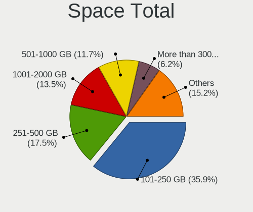
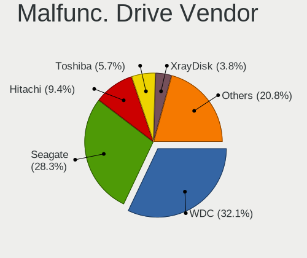
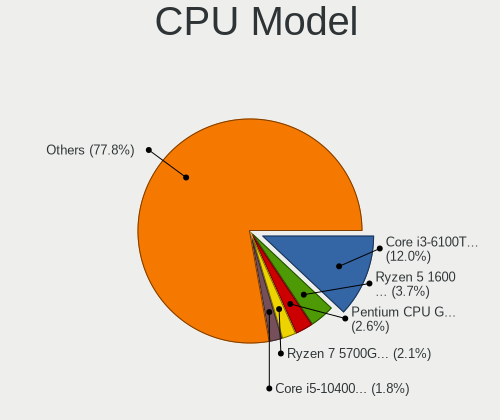
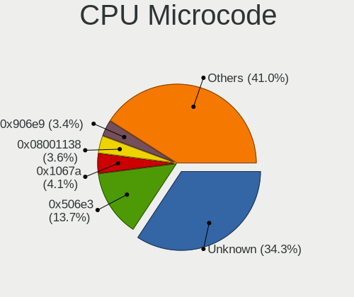
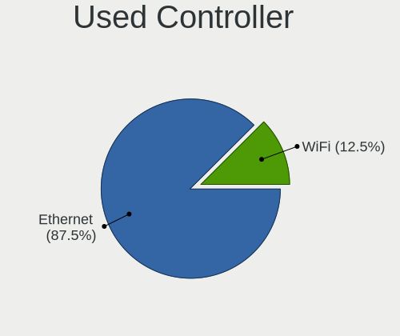
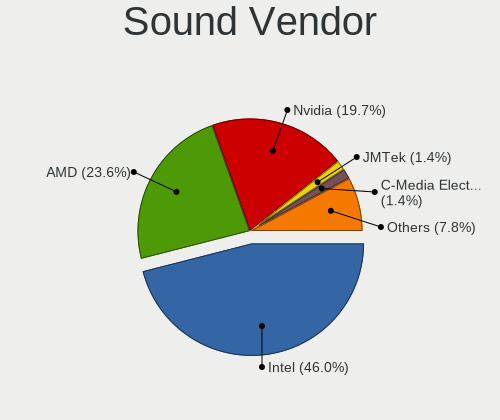
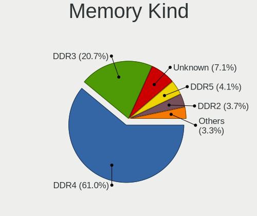

ALT Linux - Tested Hardware & Statistics (Desktops)
---------------------------------------------------

A project to collect tested hardware configurations for ALT Linux.

Anyone can contribute to this report by the [hw-probe](https://github.com/linuxhw/hw-probe) tool:

    sudo -E hw-probe -all -upload

Please submit a probe of your configuration if it's not presented on the page or is rare.

Full-feature report is available here: https://linux-hardware.org/?view=trends

Contents
--------

* [ Test Cases ](#test-cases)

* [ System ](#system)
  - [ OS                       ](#os)
  - [ OS Family                ](#os-family)
  - [ Kernel                   ](#kernel)
  - [ Kernel Family            ](#kernel-family)
  - [ Kernel Major Ver.        ](#kernel-major-ver)
  - [ Arch                     ](#arch)
  - [ DE                       ](#de)
  - [ Display Server           ](#display-server)
  - [ Display Manager          ](#display-manager)
  - [ OS Lang                  ](#os-lang)
  - [ Boot Mode                ](#boot-mode)
  - [ Filesystem               ](#filesystem)
  - [ Part. scheme             ](#part-scheme)
  - [ Dual Boot with Linux/BSD ](#dual-boot-with-linuxbsd)
  - [ Dual Boot (Win)          ](#dual-boot-win)

* [ Board ](#board)
  - [ Vendor                   ](#vendor)
  - [ Model                    ](#model)
  - [ Model Family             ](#model-family)
  - [ MFG Year                 ](#mfg-year)
  - [ Form Factor              ](#form-factor)
  - [ Secure Boot              ](#secure-boot)
  - [ Coreboot                 ](#coreboot)
  - [ RAM Size                 ](#ram-size)
  - [ RAM Used                 ](#ram-used)
  - [ Total Drives             ](#total-drives)
  - [ Has CD-ROM               ](#has-cd-rom)
  - [ Has Ethernet             ](#has-ethernet)
  - [ Has WiFi                 ](#has-wifi)
  - [ Has Bluetooth            ](#has-bluetooth)

* [ Location ](#location)
  - [ Country                  ](#country)
  - [ City                     ](#city)

* [ Drives ](#drives)
  - [ Drive Vendor             ](#drive-vendor)
  - [ Drive Model              ](#drive-model)
  - [ HDD Vendor               ](#hdd-vendor)
  - [ SSD Vendor               ](#ssd-vendor)
  - [ Drive Kind               ](#drive-kind)
  - [ Drive Connector          ](#drive-connector)
  - [ Drive Size               ](#drive-size)
  - [ Space Total              ](#space-total)
  - [ Space Used               ](#space-used)
  - [ Malfunc. Drives          ](#malfunc-drives)
  - [ Malfunc. Drive Vendor    ](#malfunc-drive-vendor)
  - [ Malfunc. HDD Vendor      ](#malfunc-hdd-vendor)
  - [ Malfunc. Drive Kind      ](#malfunc-drive-kind)
  - [ Failed Drives            ](#failed-drives)
  - [ Failed Drive Vendor      ](#failed-drive-vendor)
  - [ Drive Status             ](#drive-status)

* [ Storage controller ](#storage-controller)
  - [ Storage Vendor           ](#storage-vendor)
  - [ Storage Model            ](#storage-model)
  - [ Storage Kind             ](#storage-kind)

* [ Processor ](#processor)
  - [ CPU Vendor               ](#cpu-vendor)
  - [ CPU Model                ](#cpu-model)
  - [ CPU Model Family         ](#cpu-model-family)
  - [ CPU Cores                ](#cpu-cores)
  - [ CPU Sockets              ](#cpu-sockets)
  - [ CPU Threads              ](#cpu-threads)
  - [ CPU Op-Modes             ](#cpu-op-modes)
  - [ CPU Microcode            ](#cpu-microcode)
  - [ CPU Microarch            ](#cpu-microarch)

* [ Graphics ](#graphics)
  - [ GPU Vendor               ](#gpu-vendor)
  - [ GPU Model                ](#gpu-model)
  - [ GPU Combo                ](#gpu-combo)
  - [ GPU Driver               ](#gpu-driver)
  - [ GPU Memory               ](#gpu-memory)

* [ Monitor ](#monitor)
  - [ Monitor Vendor           ](#monitor-vendor)
  - [ Monitor Model            ](#monitor-model)
  - [ Monitor Resolution       ](#monitor-resolution)
  - [ Monitor Diagonal         ](#monitor-diagonal)
  - [ Monitor Width            ](#monitor-width)
  - [ Aspect Ratio             ](#aspect-ratio)
  - [ Monitor Area             ](#monitor-area)
  - [ Pixel Density            ](#pixel-density)
  - [ Multiple Monitors        ](#multiple-monitors)

* [ Network ](#network)
  - [ Net Controller Vendor    ](#net-controller-vendor)
  - [ Net Controller Model     ](#net-controller-model)
  - [ Wireless Vendor          ](#wireless-vendor)
  - [ Wireless Model           ](#wireless-model)
  - [ Ethernet Vendor          ](#ethernet-vendor)
  - [ Ethernet Model           ](#ethernet-model)
  - [ Net Controller Kind      ](#net-controller-kind)
  - [ Used Controller          ](#used-controller)
  - [ NICs                     ](#nics)
  - [ IPv6                     ](#ipv6)

* [ Bluetooth ](#bluetooth)
  - [ Bluetooth Vendor         ](#bluetooth-vendor)
  - [ Bluetooth Model          ](#bluetooth-model)

* [ Sound ](#sound)
  - [ Sound Vendor             ](#sound-vendor)
  - [ Sound Model              ](#sound-model)

* [ Memory ](#memory)
  - [ Memory Vendor            ](#memory-vendor)
  - [ Memory Model             ](#memory-model)
  - [ Memory Kind              ](#memory-kind)
  - [ Memory Form Factor       ](#memory-form-factor)
  - [ Memory Size              ](#memory-size)
  - [ Memory Speed             ](#memory-speed)

* [ Printers & scanners ](#printers--scanners)
  - [ Printer Vendor           ](#printer-vendor)
  - [ Printer Model            ](#printer-model)
  - [ Scanner Vendor           ](#scanner-vendor)
  - [ Scanner Model            ](#scanner-model)

* [ Camera ](#camera)
  - [ Camera Vendor            ](#camera-vendor)
  - [ Camera Model             ](#camera-model)

* [ Security ](#security)
  - [ Fingerprint Vendor       ](#fingerprint-vendor)
  - [ Fingerprint Model        ](#fingerprint-model)
  - [ Chipcard Vendor          ](#chipcard-vendor)
  - [ Chipcard Model           ](#chipcard-model)

* [ Unsupported ](#unsupported)
  - [ Unsupported Devices      ](#unsupported-devices)
  - [ Unsupported Device Types ](#unsupported-device-types)

Test Cases
----------

Total: 110

| Vendor        | Model                       | Probe                                                      | Date         |
|---------------|-----------------------------|------------------------------------------------------------|--------------|
| ASRock        | M3N78D FX                   | [66bb134c6c](https://linux-hardware.org/?probe=66bb134c6c) | Mar 29, 2022 |
| ASRock        | N68-GS4 FX R2.0             | [d01df98d83](https://linux-hardware.org/?probe=d01df98d83) | Mar 28, 2022 |
| ASRock        | M3N78D FX                   | [3ebcef4241](https://linux-hardware.org/?probe=3ebcef4241) | Mar 28, 2022 |
| Unknown       | Unknown                     | [95628eab40](https://linux-hardware.org/?probe=95628eab40) | Mar 24, 2022 |
| ASRock        | A300M-STX                   | [1fb2262bcc](https://linux-hardware.org/?probe=1fb2262bcc) | Mar 17, 2022 |
| Gigabyte      | G41MT-D3                    | [92fc99440a](https://linux-hardware.org/?probe=92fc99440a) | Mar 08, 2022 |
| ASRock        | B450 Gaming K4              | [f7f470651e](https://linux-hardware.org/?probe=f7f470651e) | Feb 17, 2022 |
| Gigabyte      | X79-UD3                     | [452ebf6a67](https://linux-hardware.org/?probe=452ebf6a67) | Feb 12, 2022 |
| ASUSTek       | PRIME B550-PLUS             | [921e224ec5](https://linux-hardware.org/?probe=921e224ec5) | Feb 12, 2022 |
| AQUARIUS      | AQH410T                     | [351b2e5344](https://linux-hardware.org/?probe=351b2e5344) | Jan 31, 2022 |
| ASUSTek       | PRIME B550-PLUS             | [481e745592](https://linux-hardware.org/?probe=481e745592) | Jan 30, 2022 |
| ASRock        | B450 Gaming K4              | [8c31667834](https://linux-hardware.org/?probe=8c31667834) | Jan 20, 2022 |
| ASRock        | A520M-HDVP/DASH             | [edd6464f18](https://linux-hardware.org/?probe=edd6464f18) | Jan 19, 2022 |
| ASRock        | A520M-HDVP/DASH             | [93fef2e073](https://linux-hardware.org/?probe=93fef2e073) | Jan 19, 2022 |
| MSI           | A68HM-P33 V2                | [98e05db690](https://linux-hardware.org/?probe=98e05db690) | Jan 17, 2022 |
| ASRock        | B450 Gaming K4              | [0c802de596](https://linux-hardware.org/?probe=0c802de596) | Jan 14, 2022 |
| Gigabyte      | H77M-D3H                    | [c8ff16f0ed](https://linux-hardware.org/?probe=c8ff16f0ed) | Dec 24, 2021 |
| Supermicro    | X11SDW-14CNT-TP13F          | [4d8499f8ba](https://linux-hardware.org/?probe=4d8499f8ba) | Dec 23, 2021 |
| ASRock        | A320M-HDV R4.0              | [9180a824d8](https://linux-hardware.org/?probe=9180a824d8) | Dec 23, 2021 |
| ASRock        | B450 Gaming K4              | [7ef05a32a9](https://linux-hardware.org/?probe=7ef05a32a9) | Dec 17, 2021 |
| MSI           | MPG B560I GAMING EDGE WI... | [2aff2121af](https://linux-hardware.org/?probe=2aff2121af) | Dec 16, 2021 |
| MSI           | MPG B560I GAMING EDGE WI... | [30eab5f54f](https://linux-hardware.org/?probe=30eab5f54f) | Dec 15, 2021 |
| Gigabyte      | B550 GAMING X               | [c853f62ddd](https://linux-hardware.org/?probe=c853f62ddd) | Dec 06, 2021 |
| Unknown       | Unknown                     | [0f5c69902a](https://linux-hardware.org/?probe=0f5c69902a) | Dec 01, 2021 |
| ASRock        | B450M Pro4                  | [68a1f83b4f](https://linux-hardware.org/?probe=68a1f83b4f) | Nov 28, 2021 |
| Gigabyte      | B550 GAMING X               | [058d8a0404](https://linux-hardware.org/?probe=058d8a0404) | Nov 19, 2021 |
| ASUSTek       | P5Q                         | [70ee05a53e](https://linux-hardware.org/?probe=70ee05a53e) | Oct 28, 2021 |
| Gigabyte      | B450 AORUS M                | [d9dd1b763b](https://linux-hardware.org/?probe=d9dd1b763b) | Oct 08, 2021 |
| Dell          | 0U649C                      | [80e138d949](https://linux-hardware.org/?probe=80e138d949) | Sep 24, 2021 |
| ASRock        | X300M-STX                   | [da7d22c384](https://linux-hardware.org/?probe=da7d22c384) | Sep 16, 2021 |
| ASUSTek       | M5A99X EVO R2.0             | [132286ab64](https://linux-hardware.org/?probe=132286ab64) | Aug 17, 2021 |
| Gigabyte      | H77M-D3H                    | [85ce2f74c4](https://linux-hardware.org/?probe=85ce2f74c4) | Aug 17, 2021 |
| ASUSTek       | M5A99X EVO R2.0             | [615b6f5a78](https://linux-hardware.org/?probe=615b6f5a78) | Aug 13, 2021 |
| ASUSTek       | PRIME B550-PLUS             | [624e92e15e](https://linux-hardware.org/?probe=624e92e15e) | Aug 11, 2021 |
| ASUSTek       | M5A99X EVO R2.0             | [49e1a59dfe](https://linux-hardware.org/?probe=49e1a59dfe) | Aug 11, 2021 |
| Gigabyte      | H510M S2H                   | [db68dde16d](https://linux-hardware.org/?probe=db68dde16d) | Aug 04, 2021 |
| ASUSTek       | PRIME B550-PLUS             | [b01641d467](https://linux-hardware.org/?probe=b01641d467) | Jul 25, 2021 |
| Gigabyte      | H110M-S2V-CF                | [8687a8809b](https://linux-hardware.org/?probe=8687a8809b) | Jul 14, 2021 |
| ASUSTek       | P5G41T-M LX2/GB/LPT         | [05be9fcdec](https://linux-hardware.org/?probe=05be9fcdec) | Jul 03, 2021 |
| Gigabyte      | H110M-S2V-CF                | [24bd5ac93f](https://linux-hardware.org/?probe=24bd5ac93f) | Jun 27, 2021 |
| Kraftway      | KWH310                      | [f470a86a1c](https://linux-hardware.org/?probe=f470a86a1c) | Jun 26, 2021 |
| ASRock        | H110M-DGS R3.0              | [87ab7018c4](https://linux-hardware.org/?probe=87ab7018c4) | Jun 24, 2021 |
| MSI           | H110M PRO-VD                | [21a019dcb3](https://linux-hardware.org/?probe=21a019dcb3) | Jun 14, 2021 |
| ASUSTek       | P5G41T-M LX2/GB/LPT         | [8325754280](https://linux-hardware.org/?probe=8325754280) | Jun 13, 2021 |
| MSI           | H110M PRO-VD                | [96cc5b470f](https://linux-hardware.org/?probe=96cc5b470f) | Jun 12, 2021 |
| MSI           | H110M PRO-VD                | [cfeb0493d3](https://linux-hardware.org/?probe=cfeb0493d3) | Jun 11, 2021 |
| ASUSTek       | P5G41T-M LX2/GB/LPT         | [0fa9201a34](https://linux-hardware.org/?probe=0fa9201a34) | Jun 03, 2021 |
| ASRock        | J3455B-ITX                  | [13396a7347](https://linux-hardware.org/?probe=13396a7347) | May 19, 2021 |
| DEPO Compu... | DPH410S                     | [0d1000e904](https://linux-hardware.org/?probe=0d1000e904) | May 14, 2021 |
| DEPO Compu... | DPA320S G10g                | [5ecc011c34](https://linux-hardware.org/?probe=5ecc011c34) | May 14, 2021 |
| ASUSTek       | P5G41T-M LX2/GB/LPT         | [5fab5adc6b](https://linux-hardware.org/?probe=5fab5adc6b) | Apr 18, 2021 |
| ASUSTek       | P5G41T-M LX2/GB/LPT         | [97b70c1bac](https://linux-hardware.org/?probe=97b70c1bac) | Apr 17, 2021 |
| Acer          | H11H4-AI V:1.0              | [34997240d5](https://linux-hardware.org/?probe=34997240d5) | Mar 30, 2021 |
| ECS           | BAT-I2                      | [037e6e58e6](https://linux-hardware.org/?probe=037e6e58e6) | Mar 30, 2021 |
| ASUSTek       | PRIME H310M-R R2.0          | [f0c7659cf9](https://linux-hardware.org/?probe=f0c7659cf9) | Mar 29, 2021 |
| Gigabyte      | P35-S3G                     | [8e53d68603](https://linux-hardware.org/?probe=8e53d68603) | Mar 20, 2021 |
| ASUSTek       | N3150M-E                    | [7467b59c82](https://linux-hardware.org/?probe=7467b59c82) | Mar 17, 2021 |
| ASUSTek       | PRIME B250-PRO              | [c62af0239b](https://linux-hardware.org/?probe=c62af0239b) | Mar 17, 2021 |
| iRU           | IRUB365M                    | [b7d5dda036](https://linux-hardware.org/?probe=b7d5dda036) | Mar 11, 2021 |
| Gigabyte      | GA-MA69VM-S2                | [6651c76da3](https://linux-hardware.org/?probe=6651c76da3) | Feb 07, 2021 |
| Gigabyte      | GA-MA69VM-S2                | [d63a1e9eef](https://linux-hardware.org/?probe=d63a1e9eef) | Feb 02, 2021 |
| ASUSTek       | P5B                         | [e0fc318a34](https://linux-hardware.org/?probe=e0fc318a34) | Jan 28, 2021 |
| EPoX Compu... | GeForce6100 + nForce410 ... | [99f734d52e](https://linux-hardware.org/?probe=99f734d52e) | Jan 18, 2021 |
| Gigabyte      | H110M-S2H-CF                | [38ae5dd532](https://linux-hardware.org/?probe=38ae5dd532) | Jan 14, 2021 |
| Intel         | B75                         | [34d29fb066](https://linux-hardware.org/?probe=34d29fb066) | Jan 12, 2021 |
| Gigabyte      | H110M-S2H-CF                | [2c49129777](https://linux-hardware.org/?probe=2c49129777) | Jan 09, 2021 |
| ASUSTek       | M5A99X EVO R2.0             | [bf536f43c6](https://linux-hardware.org/?probe=bf536f43c6) | Jan 07, 2021 |
| ASUSTek       | M5A99X EVO R2.0             | [ee8a8fec79](https://linux-hardware.org/?probe=ee8a8fec79) | Jan 05, 2021 |
| ASUSTek       | M5A99X EVO R2.0             | [16e976d9e5](https://linux-hardware.org/?probe=16e976d9e5) | Jan 02, 2021 |
| ASUSTek       | M5A99X EVO R2.0             | [3296ffa017](https://linux-hardware.org/?probe=3296ffa017) | Jan 02, 2021 |
| ASUSTek       | M5A99X EVO R2.0             | [31d84f6485](https://linux-hardware.org/?probe=31d84f6485) | Dec 31, 2020 |
| SYS           | H310SB                      | [ba93a151f2](https://linux-hardware.org/?probe=ba93a151f2) | Dec 24, 2020 |
| HP            | 877E A                      | [4456ec4081](https://linux-hardware.org/?probe=4456ec4081) | Dec 23, 2020 |
| HP            | 877E A                      | [145b54d631](https://linux-hardware.org/?probe=145b54d631) | Dec 23, 2020 |
| VIA Techno... | P4M266A-8235                | [c560d2aa9b](https://linux-hardware.org/?probe=c560d2aa9b) | Dec 23, 2020 |
| VIA Techno... | P4M266A-8235                | [8286c6ca5c](https://linux-hardware.org/?probe=8286c6ca5c) | Dec 23, 2020 |
| Foxconn       | 2ABF                        | [dbc40fef9d](https://linux-hardware.org/?probe=dbc40fef9d) | Dec 18, 2020 |
| ASUSTek       | M5A99X EVO R2.0             | [bb4bd8f82f](https://linux-hardware.org/?probe=bb4bd8f82f) | Dec 09, 2020 |
| ASRock        | X299 Steel Legend           | [fdfcfb17c6](https://linux-hardware.org/?probe=fdfcfb17c6) | Dec 03, 2020 |
| ASRock        | X299 Steel Legend           | [98800b881c](https://linux-hardware.org/?probe=98800b881c) | Dec 03, 2020 |
| Gigabyte      | H310N x.x                   | [b0ca19ee36](https://linux-hardware.org/?probe=b0ca19ee36) | Dec 02, 2020 |
| ASUSTek       | PRIME H310M-R R2.0          | [4ec24e5c24](https://linux-hardware.org/?probe=4ec24e5c24) | Nov 27, 2020 |
| ASUSTek       | Z8NR-D12                    | [2758f1ff94](https://linux-hardware.org/?probe=2758f1ff94) | Nov 21, 2020 |
| iRU           | IRUB365M                    | [ab7e110c9a](https://linux-hardware.org/?probe=ab7e110c9a) | Nov 17, 2020 |
| iRU           | IRUB365M                    | [ed5fee32dd](https://linux-hardware.org/?probe=ed5fee32dd) | Nov 13, 2020 |
| Gigabyte      | H77M-D3H                    | [c878b046bc](https://linux-hardware.org/?probe=c878b046bc) | Nov 13, 2020 |
| Acer          | H11H4-AI V:1.0              | [5ad12e4b3b](https://linux-hardware.org/?probe=5ad12e4b3b) | Nov 12, 2020 |
| Gigabyte      | J1800N-D2H                  | [e25041fb04](https://linux-hardware.org/?probe=e25041fb04) | Nov 09, 2020 |
| ASUSTek       | A8N-E                       | [f716673893](https://linux-hardware.org/?probe=f716673893) | Oct 24, 2020 |
| ASUSTek       | P5B-MX                      | [0779d0f18c](https://linux-hardware.org/?probe=0779d0f18c) | Oct 24, 2020 |
| Acer          | Aspire XC-885 V:1.1         | [f587011ab7](https://linux-hardware.org/?probe=f587011ab7) | Sep 10, 2020 |
| ASRock        | G31M-VS                     | [fb4e557598](https://linux-hardware.org/?probe=fb4e557598) | Aug 16, 2020 |
| ASRock        | 4CoreN73PV-HD720p           | [ac70970005](https://linux-hardware.org/?probe=ac70970005) | Aug 16, 2020 |
| ASRock        | G31M-VS                     | [de62d84a9c](https://linux-hardware.org/?probe=de62d84a9c) | Aug 12, 2020 |
| Gigabyte      | EP35C-DS3R                  | [4c98d77a2f](https://linux-hardware.org/?probe=4c98d77a2f) | Aug 07, 2020 |
| ASRock        | G31M-VS                     | [c4c8bad6ca](https://linux-hardware.org/?probe=c4c8bad6ca) | May 31, 2020 |
| Gigabyte      | A320M-S2H-CF                | [74899486ac](https://linux-hardware.org/?probe=74899486ac) | May 26, 2020 |
| ASUSTek       | PRIME B250-PRO              | [8dddac7046](https://linux-hardware.org/?probe=8dddac7046) | Mar 25, 2020 |
| Gigabyte      | H77M-D3H                    | [a644a3a3ad](https://linux-hardware.org/?probe=a644a3a3ad) | Nov 24, 2019 |
| HP            | 09F0h                       | [7f6c26af5d](https://linux-hardware.org/?probe=7f6c26af5d) | Oct 25, 2019 |
| MSI           | B350M PRO-VDH               | [525f09653e](https://linux-hardware.org/?probe=525f09653e) | Oct 08, 2019 |
| Gigabyte      | GA-890XA-UD3                | [1536999c3e](https://linux-hardware.org/?probe=1536999c3e) | Sep 13, 2019 |
| ASRock        | Z77 Pro3                    | [a1db2eb143](https://linux-hardware.org/?probe=a1db2eb143) | Sep 13, 2019 |
| ASRock        | B85M                        | [5a36ce2620](https://linux-hardware.org/?probe=5a36ce2620) | Sep 13, 2019 |
| ASUSTek       | Z97-A                       | [68dbf33470](https://linux-hardware.org/?probe=68dbf33470) | Aug 03, 2019 |
| ASUSTek       | A8N-VM CSM                  | [5814b6a2af](https://linux-hardware.org/?probe=5814b6a2af) | Mar 28, 2019 |
| ASUSTek       | H110M-R                     | [34b40d93fc](https://linux-hardware.org/?probe=34b40d93fc) | Oct 30, 2018 |
| ASRock        | FM2A68M-HD+                 | [d55532d7a9](https://linux-hardware.org/?probe=d55532d7a9) | Oct 29, 2018 |
| Biostar       | NF720D A2G+                 | [ef09cb18cc](https://linux-hardware.org/?probe=ef09cb18cc) | Oct 29, 2018 |
| ASUSTek       | H110M-R                     | [572c918e8a](https://linux-hardware.org/?probe=572c918e8a) | Oct 27, 2018 |

System
------

OS
--

Installed operating systems

| Name               | Desktops | Percent |
|--------------------|----------|---------|
| ALT Linux 9.1      | 31       | 39.74%  |
| ALT Linux 9.0      | 15       | 19.23%  |
| ALT Linux 10.0     | 12       | 15.38%  |
| ALT Linux 9.2      | 7        | 8.97%   |
| ALT Linux 5.0.0    | 3        | 3.85%   |
| ALT Linux P8       | 2        | 2.56%   |
| ALT Linux 8.2      | 2        | 2.56%   |
| ALT Linux P9       | 1        | 1.28%   |
| ALT Linux P10      | 1        | 1.28%   |
| ALT Linux 8.2.0    | 1        | 1.28%   |
| ALT Linux 7.0.5    | 1        | 1.28%   |
| ALT Linux 20201124 | 1        | 1.28%   |
| ALT Linux 20190303 | 1        | 1.28%   |

OS Family
---------

OS without a version

| Name      | Desktops | Percent |
|-----------|----------|---------|
| ALT Linux | 72       | 100%    |

Kernel
------

Version of the Linux kernel

| Version                     | Desktops | Percent |
|-----------------------------|----------|---------|
| 5.4.68-std-def-alt1.1       | 7        | 8.43%   |
| 5.4.51-std-def-alt1         | 5        | 6.02%   |
| 5.4.41-std-def-alt1         | 3        | 3.61%   |
| 5.10.93-std-def-alt1        | 3        | 3.61%   |
| 5.10.82-std-def-alt1        | 3        | 3.61%   |
| 5.10.35-un-def-alt1         | 3        | 3.61%   |
| 5.10.32-un-def-alt1         | 3        | 3.61%   |
| 4.19.79-std-def-alt1        | 3        | 3.61%   |
| 5.7.19-un-def-alt1          | 2        | 2.41%   |
| 5.4.85-std-def-alt1         | 2        | 2.41%   |
| 5.4.62-std-def-alt1         | 2        | 2.41%   |
| 5.4.28-std-def-alt1         | 2        | 2.41%   |
| 5.4.127-std-def-alt1        | 2        | 2.41%   |
| 5.2.10-un-def-alt1          | 2        | 2.41%   |
| 5.15.15-un-def-alt1         | 2        | 2.41%   |
| 5.15.14-un-def-alt1         | 2        | 2.41%   |
| 5.10.72-std-def-alt1        | 2        | 2.41%   |
| 5.10.17-un-def-alt1         | 2        | 2.41%   |
| 5.9.8-un-def-alt1           | 1        | 1.2%    |
| 5.7.14-un-def-alt1          | 1        | 1.2%    |
| 5.4.94-std-def-alt1         | 1        | 1.2%    |
| 5.4.92-std-def-alt1         | 1        | 1.2%    |
| 5.4.91-elbrus-def-alt2.12.1 | 1        | 1.2%    |
| 5.4.81-std-def-alt1         | 1        | 1.2%    |
| 5.4.58-elbrus-def-alt1.7.0  | 1        | 1.2%    |
| 5.4.35-std-def-alt1         | 1        | 1.2%    |
| 5.4.181-std-def-alt1        | 1        | 1.2%    |
| 5.4.134-std-def-alt1        | 1        | 1.2%    |
| 5.4.123-std-def-alt1        | 1        | 1.2%    |
| 5.4.104-std-def-alt1        | 1        | 1.2%    |
| 5.2.11-un-def-alt1          | 1        | 1.2%    |
| 5.14.21-un-def-alt3         | 1        | 1.2%    |
| 5.14.21-un-def-alt1         | 1        | 1.2%    |
| 5.13.13-un-def-alt1         | 1        | 1.2%    |
| 5.12.19-un-def-alt2         | 1        | 1.2%    |
| 5.10.88-std-def-alt1        | 1        | 1.2%    |
| 5.10.54-un-def-alt1.1       | 1        | 1.2%    |
| 5.10.54-std-def-alt2        | 1        | 1.2%    |
| 5.10.52-un-def-alt1         | 1        | 1.2%    |
| 5.10.45-un-def-alt1         | 1        | 1.2%    |
| 5.10.42-un-def-alt1         | 1        | 1.2%    |
| 5.10.102-std-def-alt1       | 1        | 1.2%    |
| 4.9.188-std-def-alt0.M80P.1 | 1        | 1.2%    |
| 4.9.133-std-def-alt0.M80P.1 | 1        | 1.2%    |
| 4.9.128-std-def-alt0.M80P.1 | 1        | 1.2%    |
| 4.20.14-un-def-alt1         | 1        | 1.2%    |
| 4.19.67-std-def-alt1        | 1        | 1.2%    |
| 4.19.182-old-def-alt1       | 1        | 1.2%    |
| 4.19.128-old-def-alt2       | 1        | 1.2%    |
| 4.14.78-un-def-alt0.M80P.1  | 1        | 1.2%    |
| 4.14.71-un-def-alt0.M80P.1  | 1        | 1.2%    |

Kernel Family
-------------

Linux kernel without a distro release

| Version  | Desktops | Percent |
|----------|----------|---------|
| 5.4.68   | 7        | 8.43%   |
| 5.4.51   | 5        | 6.02%   |
| 5.4.41   | 3        | 3.61%   |
| 5.10.93  | 3        | 3.61%   |
| 5.10.82  | 3        | 3.61%   |
| 5.10.35  | 3        | 3.61%   |
| 5.10.32  | 3        | 3.61%   |
| 4.19.79  | 3        | 3.61%   |
| 5.7.19   | 2        | 2.41%   |
| 5.4.85   | 2        | 2.41%   |
| 5.4.62   | 2        | 2.41%   |
| 5.4.28   | 2        | 2.41%   |
| 5.4.127  | 2        | 2.41%   |
| 5.2.10   | 2        | 2.41%   |
| 5.15.15  | 2        | 2.41%   |
| 5.15.14  | 2        | 2.41%   |
| 5.14.21  | 2        | 2.41%   |
| 5.10.72  | 2        | 2.41%   |
| 5.10.54  | 2        | 2.41%   |
| 5.10.17  | 2        | 2.41%   |
| 5.9.8    | 1        | 1.2%    |
| 5.7.14   | 1        | 1.2%    |
| 5.4.94   | 1        | 1.2%    |
| 5.4.92   | 1        | 1.2%    |
| 5.4.91   | 1        | 1.2%    |
| 5.4.81   | 1        | 1.2%    |
| 5.4.58   | 1        | 1.2%    |
| 5.4.35   | 1        | 1.2%    |
| 5.4.181  | 1        | 1.2%    |
| 5.4.134  | 1        | 1.2%    |
| 5.4.123  | 1        | 1.2%    |
| 5.4.104  | 1        | 1.2%    |
| 5.2.11   | 1        | 1.2%    |
| 5.13.13  | 1        | 1.2%    |
| 5.12.19  | 1        | 1.2%    |
| 5.10.88  | 1        | 1.2%    |
| 5.10.52  | 1        | 1.2%    |
| 5.10.45  | 1        | 1.2%    |
| 5.10.42  | 1        | 1.2%    |
| 5.10.102 | 1        | 1.2%    |
| 4.9.188  | 1        | 1.2%    |
| 4.9.133  | 1        | 1.2%    |
| 4.9.128  | 1        | 1.2%    |
| 4.20.14  | 1        | 1.2%    |
| 4.19.67  | 1        | 1.2%    |
| 4.19.182 | 1        | 1.2%    |
| 4.19.128 | 1        | 1.2%    |
| 4.14.78  | 1        | 1.2%    |
| 4.14.71  | 1        | 1.2%    |

Kernel Major Ver.
-----------------

Linux kernel major version

| Version | Desktops | Percent |
|---------|----------|---------|
| 5.4     | 33       | 41.77%  |
| 5.10    | 21       | 26.58%  |
| 4.19    | 6        | 7.59%   |
| 5.7     | 3        | 3.8%    |
| 5.2     | 3        | 3.8%    |
| 4.9     | 3        | 3.8%    |
| 5.15    | 2        | 2.53%   |
| 5.14    | 2        | 2.53%   |
| 4.14    | 2        | 2.53%   |
| 5.9     | 1        | 1.27%   |
| 5.13    | 1        | 1.27%   |
| 5.12    | 1        | 1.27%   |
| 4.20    | 1        | 1.27%   |

Arch
----

OS architecture (x86_64, i586, etc.)

| Name   | Desktops | Percent |
|--------|----------|---------|
| x86_64 | 66       | 91.67%  |
| i686   | 4        | 5.56%   |
| e2k    | 2        | 2.78%   |

DE
--

Desktop Environment

| Name     | Desktops | Percent |
|----------|----------|---------|
| KDE5     | 30       | 41.67%  |
| Unknown  | 19       | 26.39%  |
| XFCE     | 18       | 25%     |
| MATE     | 2        | 2.78%   |
| KDE      | 2        | 2.78%   |
| Cinnamon | 1        | 1.39%   |

Display Server
--------------

X11 or Wayland

| Name    | Desktops | Percent |
|---------|----------|---------|
| X11     | 68       | 94.44%  |
| Unknown | 4        | 5.56%   |

Display Manager
---------------

SDDM, LightDM, etc.

| Name    | Desktops | Percent |
|---------|----------|---------|
| TDM     | 28       | 37.84%  |
| SDDM    | 25       | 33.78%  |
| LightDM | 13       | 17.57%  |
| Unknown | 8        | 10.81%  |

OS Lang
-------

Language

| Lang    | Desktops | Percent |
|---------|----------|---------|
| ru_RU   | 43       | 56.58%  |
| Unknown | 31       | 40.79%  |
| en_US   | 1        | 1.32%   |
| el_GR   | 1        | 1.32%   |

Boot Mode
---------

EFI or BIOS

| Mode | Desktops | Percent |
|------|----------|---------|
| BIOS | 47       | 64.38%  |
| EFI  | 26       | 35.62%  |

Filesystem
----------

Type of filesystem

| Type    | Desktops | Percent |
|---------|----------|---------|
| Ext4    | 63       | 86.3%   |
| Overlay | 8        | 10.96%  |
| Btrfs   | 2        | 2.74%   |

Part. scheme
------------

Scheme of partitioning

| Type    | Desktops | Percent |
|---------|----------|---------|
| GPT     | 38       | 52.05%  |
| MBR     | 30       | 41.1%   |
| Unknown | 5        | 6.85%   |

Dual Boot with Linux/BSD
------------------------

Hosting more than one Linux/BSD

| Dual boot | Desktops | Percent |
|-----------|----------|---------|
| No        | 55       | 76.39%  |
| Yes       | 17       | 23.61%  |

Dual Boot (Win)
---------------

Hosting Linux and Windows

| Dual boot | Desktops | Percent |
|-----------|----------|---------|
| No        | 53       | 70.67%  |
| Yes       | 22       | 29.33%  |

Board
-----

Vendor
------

Motherboard manufacturer

| Name                | Desktops | Percent |
|---------------------|----------|---------|
| Gigabyte Technology | 16       | 22.22%  |
| ASRock              | 16       | 22.22%  |
| ASUSTek Computer    | 14       | 19.44%  |
| MSI                 | 4        | 5.56%   |
| Acer                | 3        | 4.17%   |
| iRU                 | 2        | 2.78%   |
| Hewlett-Packard     | 2        | 2.78%   |
| DEPO Computers      | 2        | 2.78%   |
| Unknown             | 2        | 2.78%   |
| VIA Technologies    | 1        | 1.39%   |
| SYS                 | 1        | 1.39%   |
| Supermicro          | 1        | 1.39%   |
| Kraftway            | 1        | 1.39%   |
| Intel               | 1        | 1.39%   |
| Foxconn             | 1        | 1.39%   |
| EPoX Computer       | 1        | 1.39%   |
| ECS                 | 1        | 1.39%   |
| Dell                | 1        | 1.39%   |
| Biostar             | 1        | 1.39%   |
| AQUARIUS            | 1        | 1.39%   |

Model
-----

Motherboard model

| Name                                               | Desktops | Percent |
|----------------------------------------------------|----------|---------|
| Gigabyte H77M-D3H                                  | 2        | 2.78%   |
| ASUS H110M-R                                       | 2        | 2.78%   |
| Acer Veriton ES2710G                               | 2        | 2.78%   |
| Unknown                                            | 2        | 2.78%   |
| VIA P4M266A-8235                                   | 1        | 1.39%   |
| SYS RAY B101                                       | 1        | 1.39%   |
| Supermicro SYS-1019D-14CN-FHN13TP                  | 1        | 1.39%   |
| MSI MS-7A38                                        | 1        | 1.39%   |
| MSI MS-7996                                        | 1        | 1.39%   |
| MSI MS-7895                                        | 1        | 1.39%   |
| MSI MPG B560 Trident A (MS-B926)                   | 1        | 1.39%   |
| Kraftway KWH310                                    | 1        | 1.39%   |
| iRU IRUB365M                                       | 1        | 1.39%   |
| iRU 515                                            | 1        | 1.39%   |
| Intel B75                                          | 1        | 1.39%   |
| HP Compaq dc7600 Convertible Minitower             | 1        | 1.39%   |
| HP 290 G4 Microtower PC                            | 1        | 1.39%   |
| Gigabyte X79-UD3                                   | 1        | 1.39%   |
| Gigabyte P35-S3G                                   | 1        | 1.39%   |
| Gigabyte J1800N-D2H                                | 1        | 1.39%   |
| Gigabyte H510M S2H                                 | 1        | 1.39%   |
| Gigabyte H310N 2.0                                 | 1        | 1.39%   |
| Gigabyte H110M-S2V                                 | 1        | 1.39%   |
| Gigabyte H110M-S2H                                 | 1        | 1.39%   |
| Gigabyte GA-MA69VM-S2                              | 1        | 1.39%   |
| Gigabyte GA-890XA-UD3                              | 1        | 1.39%   |
| Gigabyte G41MT-D3                                  | 1        | 1.39%   |
| Gigabyte EP35C-DS3R                                | 1        | 1.39%   |
| Gigabyte B550 GAMING X                             | 1        | 1.39%   |
| Gigabyte B450 AORUS M                              | 1        | 1.39%   |
| Gigabyte A320M-S2H                                 | 1        | 1.39%   |
| Foxconn Pro 3400 Series MT                         | 1        | 1.39%   |
| EPoX GeForce6100 + nForce410 DDR: 8GF6100-M Series | 1        | 1.39%   |
| ECS T420                                           | 1        | 1.39%   |
| DEPO Computers DPH410S                             | 1        | 1.39%   |
| DEPO Computers DPA320S                             | 1        | 1.39%   |
| Dell OptiPlex 755                                  | 1        | 1.39%   |
| Biostar NF720D A2G+                                | 1        | 1.39%   |
| ASUS Z8NR-D12                                      | 1        | 1.39%   |
| ASUS PRIME H310M-R R2.0                            | 1        | 1.39%   |
| ASUS PRIME B550-PLUS                               | 1        | 1.39%   |
| ASUS PRIME B250-PRO                                | 1        | 1.39%   |
| ASUS P5Q                                           | 1        | 1.39%   |
| ASUS P5G41T-M LX2/GB/LPT                           | 1        | 1.39%   |
| ASUS P5B-MX                                        | 1        | 1.39%   |
| ASUS P5B                                           | 1        | 1.39%   |
| ASUS M5A99X EVO R2.0                               | 1        | 1.39%   |
| ASUS All Series                                    | 1        | 1.39%   |
| ASUS A8N-VM CSM                                    | 1        | 1.39%   |
| ASUS A8N-E                                         | 1        | 1.39%   |
| ASRock Z77 Pro3                                    | 1        | 1.39%   |
| ASRock X300M-STX                                   | 1        | 1.39%   |
| ASRock X299 Steel Legend                           | 1        | 1.39%   |
| ASRock N68-GS4 FX R2.0                             | 1        | 1.39%   |
| ASRock M3N78D FX                                   | 1        | 1.39%   |
| ASRock J3455B-ITX                                  | 1        | 1.39%   |
| ASRock H110M-DGS R3.0                              | 1        | 1.39%   |
| ASRock G31M-VS                                     | 1        | 1.39%   |
| ASRock FM2A68M-HD+                                 | 1        | 1.39%   |
| ASRock B85M                                        | 1        | 1.39%   |

Model Family
------------

Motherboard model prefix

| Name                              | Desktops | Percent |
|-----------------------------------|----------|---------|
| ASUS PRIME                        | 3        | 4.17%   |
| Gigabyte H77M-D3H                 | 2        | 2.78%   |
| ASUS H110M-R                      | 2        | 2.78%   |
| Acer Veriton                      | 2        | 2.78%   |
| Unknown                           | 2        | 2.78%   |
| VIA P4M266A-8235                  | 1        | 1.39%   |
| SYS RAY                           | 1        | 1.39%   |
| Supermicro SYS-1019D-14CN-FHN13TP | 1        | 1.39%   |
| MSI MS-7A38                       | 1        | 1.39%   |
| MSI MS-7996                       | 1        | 1.39%   |
| MSI MS-7895                       | 1        | 1.39%   |
| MSI MPG                           | 1        | 1.39%   |
| Kraftway KWH310                   | 1        | 1.39%   |
| iRU IRUB365M                      | 1        | 1.39%   |
| iRU 515                           | 1        | 1.39%   |
| Intel B75                         | 1        | 1.39%   |
| HP Compaq                         | 1        | 1.39%   |
| HP 290                            | 1        | 1.39%   |
| Gigabyte X79-UD3                  | 1        | 1.39%   |
| Gigabyte P35-S3G                  | 1        | 1.39%   |
| Gigabyte J1800N-D2H               | 1        | 1.39%   |
| Gigabyte H510M                    | 1        | 1.39%   |
| Gigabyte H310N                    | 1        | 1.39%   |
| Gigabyte H110M-S2V                | 1        | 1.39%   |
| Gigabyte H110M-S2H                | 1        | 1.39%   |
| Gigabyte GA-MA69VM-S2             | 1        | 1.39%   |
| Gigabyte GA-890XA-UD3             | 1        | 1.39%   |
| Gigabyte G41MT-D3                 | 1        | 1.39%   |
| Gigabyte EP35C-DS3R               | 1        | 1.39%   |
| Gigabyte B550                     | 1        | 1.39%   |
| Gigabyte B450                     | 1        | 1.39%   |
| Gigabyte A320M-S2H                | 1        | 1.39%   |
| Foxconn Pro                       | 1        | 1.39%   |
| EPoX GeForce6100                  | 1        | 1.39%   |
| ECS T420                          | 1        | 1.39%   |
| DEPO Computers DPH410S            | 1        | 1.39%   |
| DEPO Computers DPA320S            | 1        | 1.39%   |
| Dell OptiPlex                     | 1        | 1.39%   |
| Biostar NF720D                    | 1        | 1.39%   |
| ASUS Z8NR-D12                     | 1        | 1.39%   |
| ASUS P5Q                          | 1        | 1.39%   |
| ASUS P5G41T-M                     | 1        | 1.39%   |
| ASUS P5B-MX                       | 1        | 1.39%   |
| ASUS P5B                          | 1        | 1.39%   |
| ASUS M5A99X                       | 1        | 1.39%   |
| ASUS All                          | 1        | 1.39%   |
| ASUS A8N-VM                       | 1        | 1.39%   |
| ASUS A8N-E                        | 1        | 1.39%   |
| ASRock Z77                        | 1        | 1.39%   |
| ASRock X300M-STX                  | 1        | 1.39%   |
| ASRock X299                       | 1        | 1.39%   |
| ASRock N68-GS4                    | 1        | 1.39%   |
| ASRock M3N78D                     | 1        | 1.39%   |
| ASRock J3455B-ITX                 | 1        | 1.39%   |
| ASRock H110M-DGS                  | 1        | 1.39%   |
| ASRock G31M-VS                    | 1        | 1.39%   |
| ASRock FM2A68M-HD+                | 1        | 1.39%   |
| ASRock B85M                       | 1        | 1.39%   |
| ASRock B450M                      | 1        | 1.39%   |
| ASRock B450                       | 1        | 1.39%   |

MFG Year
--------

Motherboard manufacture year

| Year    | Desktops | Percent |
|---------|----------|---------|
| 2020    | 10       | 13.89%  |
| 2018    | 8        | 11.11%  |
| 2016    | 7        | 9.72%   |
| 2021    | 6        | 8.33%   |
| 2012    | 5        | 6.94%   |
| 2017    | 4        | 5.56%   |
| 2015    | 4        | 5.56%   |
| 2008    | 4        | 5.56%   |
| 2014    | 3        | 4.17%   |
| 2010    | 3        | 4.17%   |
| 2007    | 3        | 4.17%   |
| 2005    | 3        | 4.17%   |
| 2019    | 2        | 2.78%   |
| 2011    | 2        | 2.78%   |
| 2009    | 2        | 2.78%   |
| 2006    | 2        | 2.78%   |
| Unknown | 2        | 2.78%   |
| 2013    | 1        | 1.39%   |
| 2003    | 1        | 1.39%   |

Form Factor
-----------

Physical design of the computer

| Name    | Desktops | Percent |
|---------|----------|---------|
| Desktop | 72       | 100%    |

Secure Boot
-----------

Enabled or disabled

| State    | Desktops | Percent |
|----------|----------|---------|
| Disabled | 72       | 100%    |

Coreboot
--------

Have coreboot on board

| Used | Desktops | Percent |
|------|----------|---------|
| No   | 72       | 100%    |

RAM Size
--------

Total RAM memory

| Size in GB  | Desktops | Percent |
|-------------|----------|---------|
| 4.01-8.0    | 22       | 30.56%  |
| 8.01-16.0   | 16       | 22.22%  |
| 3.01-4.0    | 10       | 13.89%  |
| 16.01-24.0  | 10       | 13.89%  |
| 1.01-2.0    | 5        | 6.94%   |
| 64.01-256.0 | 3        | 4.17%   |
| 32.01-64.0  | 2        | 2.78%   |
| 2.01-3.0    | 2        | 2.78%   |
| 0.51-1.0    | 2        | 2.78%   |

RAM Used
--------

Used RAM memory

| Used GB   | Desktops | Percent |
|-----------|----------|---------|
| 1.01-2.0  | 23       | 29.87%  |
| 2.01-3.0  | 16       | 20.78%  |
| 0.51-1.0  | 13       | 16.88%  |
| 4.01-8.0  | 12       | 15.58%  |
| 3.01-4.0  | 7        | 9.09%   |
| 8.01-16.0 | 3        | 3.9%    |
| 0.01-0.5  | 3        | 3.9%    |

Total Drives
------------

Number of drives on board

| Drives | Desktops | Percent |
|--------|----------|---------|
| 1      | 41       | 55.41%  |
| 2      | 20       | 27.03%  |
| 3      | 8        | 10.81%  |
| 4      | 3        | 4.05%   |
| 5      | 1        | 1.35%   |
| 0      | 1        | 1.35%   |

Has CD-ROM
----------

Has CD-ROM on board

| Presented | Desktops | Percent |
|-----------|----------|---------|
| No        | 44       | 61.11%  |
| Yes       | 28       | 38.89%  |

Has Ethernet
------------

Has Ethernet on board

| Presented | Desktops | Percent |
|-----------|----------|---------|
| Yes       | 71       | 98.61%  |
| No        | 1        | 1.39%   |

Has WiFi
--------

Has WiFi module

| Presented | Desktops | Percent |
|-----------|----------|---------|
| No        | 59       | 81.94%  |
| Yes       | 13       | 18.06%  |

Has Bluetooth
-------------

Has Bluetooth module

| Presented | Desktops | Percent |
|-----------|----------|---------|
| No        | 63       | 87.5%   |
| Yes       | 9        | 12.5%   |

Location
--------

Country
-------

Geographic location (country)

| Country    | Desktops | Percent |
|------------|----------|---------|
| Russia     | 67       | 93.06%  |
| Greece     | 2        | 2.78%   |
| Ukraine    | 1        | 1.39%   |
| Kazakhstan | 1        | 1.39%   |
| Belarus    | 1        | 1.39%   |

City
----

Geographic location (city)

| City               | Desktops | Percent |
|--------------------|----------|---------|
| Moscow             | 30       | 38.96%  |
| St Petersburg      | 5        | 6.49%   |
| Barnaul            | 3        | 3.9%    |
| Usol'ye-Sibirskoye | 2        | 2.6%    |
| Samara             | 2        | 2.6%    |
| Murmansk           | 2        | 2.6%    |
| Irkutsk            | 2        | 2.6%    |
| Zelenodolsk        | 1        | 1.3%    |
| Yelizovo           | 1        | 1.3%    |
| Vologda            | 1        | 1.3%    |
| Vergina            | 1        | 1.3%    |
| Valuyki            | 1        | 1.3%    |
| Tolyatti           | 1        | 1.3%    |
| Thessaloniki       | 1        | 1.3%    |
| Tambov             | 1        | 1.3%    |
| Srednyaya Akhtuba  | 1        | 1.3%    |
| Sredneuralsk       | 1        | 1.3%    |
| Shymkent           | 1        | 1.3%    |
| Sevastopol         | 1        | 1.3%    |
| Saratov            | 1        | 1.3%    |
| Rostov-on-Don      | 1        | 1.3%    |
| Perm               | 1        | 1.3%    |
| Obninsk            | 1        | 1.3%    |
| Novyy Oskol        | 1        | 1.3%    |
| Monchegorsk        | 1        | 1.3%    |
| Krasnoyarsk        | 1        | 1.3%    |
| Krasnogorsk        | 1        | 1.3%    |
| Krasnodar          | 1        | 1.3%    |
| Korolyov           | 1        | 1.3%    |
| Kirovsk            | 1        | 1.3%    |
| Kirov              | 1        | 1.3%    |
| Kazan’      | 1        | 1.3%    |
| Kaliningrad        | 1        | 1.3%    |
| Ivanovo            | 1        | 1.3%    |
| Chita              | 1        | 1.3%    |
| Belgorod           | 1        | 1.3%    |
| Babruysk           | 1        | 1.3%    |
| Almaty             | 1        | 1.3%    |

Drives
------

Drive Vendor
------------

Hard drive vendors

| Vendor              | Desktops | Drives | Percent |
|---------------------|----------|--------|---------|
| WDC                 | 26       | 45     | 24.76%  |
| Seagate             | 20       | 32     | 19.05%  |
| Toshiba             | 10       | 13     | 9.52%   |
| Kingston            | 9        | 12     | 8.57%   |
| China               | 6        | 6      | 5.71%   |
| Samsung Electronics | 5        | 10     | 4.76%   |
| Hitachi             | 5        | 6      | 4.76%   |
| A-DATA Technology   | 3        | 3      | 2.86%   |
| Intel               | 2        | 5      | 1.9%    |
| DEPO                | 2        | 2      | 1.9%    |
| SPCC                | 1        | 1      | 0.95%   |
| SP-8                | 1        | 1      | 0.95%   |
| Smartbuy            | 1        | 1      | 0.95%   |
| SINTECHI            | 1        | 1      | 0.95%   |
| SanDisk             | 1        | 1      | 0.95%   |
| Patriot             | 1        | 1      | 0.95%   |
| OCZ                 | 1        | 1      | 0.95%   |
| Micron Technology   | 1        | 1      | 0.95%   |
| LITEON              | 1        | 1      | 0.95%   |
| KingSpec            | 1        | 1      | 0.95%   |
| JMicron             | 1        | 1      | 0.95%   |
| HEORIADY            | 1        | 1      | 0.95%   |
| Gigabyte Technology | 1        | 1      | 0.95%   |
| FOXLINE             | 1        | 1      | 0.95%   |
| Crucial             | 1        | 1      | 0.95%   |
| Apacer              | 1        | 1      | 0.95%   |
| AMD                 | 1        | 1      | 0.95%   |

Drive Model
-----------

Hard drive models

| Model                                    | Desktops | Percent |
|------------------------------------------|----------|---------|
| Toshiba HDWD110 1TB                      | 4        | 3.42%   |
| Kingston SV300S37A120G 120GB SSD         | 3        | 2.56%   |
| Kingston SA400S37120G 120GB SSD          | 3        | 2.56%   |
| WDC WD10PURZ-85U8XY0 1TB                 | 2        | 1.71%   |
| Toshiba DT01ACA100 1TB                   | 2        | 1.71%   |
| Seagate ST500LM030-2E717D 500GB          | 2        | 1.71%   |
| Seagate ST380815AS 80GB                  | 2        | 1.71%   |
| Seagate ST1000DM010-2EP102 1TB           | 2        | 1.71%   |
| Samsung SSD 860 EVO 500GB                | 2        | 1.71%   |
| Samsung SSD 860 EVO 250GB                | 2        | 1.71%   |
| Hitachi HDS721025CLA382 250GB            | 2        | 1.71%   |
| DEPO SM3DT-120 120GB SSD                 | 2        | 1.71%   |
| WDC WDS500G2B0A-00SM50 500GB SSD         | 1        | 0.85%   |
| WDC WDS240G2G0A-00JH30 240GB SSD         | 1        | 0.85%   |
| WDC WDS120G2G0A-00JH30 120GB SSD         | 1        | 0.85%   |
| WDC WD800AAJS-00WAA0 80GB                | 1        | 0.85%   |
| WDC WD7501AALS-00E3A0 752GB              | 1        | 0.85%   |
| WDC WD5003ABYZ-011FA0 500GB              | 1        | 0.85%   |
| WDC WD5001ABYS-01YNA0 500GB              | 1        | 0.85%   |
| WDC WD5001AALS-00E3A0 500GB              | 1        | 0.85%   |
| WDC WD5000HHTZ-04N21V0 500GB             | 1        | 0.85%   |
| WDC WD5000AZRZ-00HTKB0 500GB             | 1        | 0.85%   |
| WDC WD3200BPVT-00HXZT3 320GB             | 1        | 0.85%   |
| WDC WD3200BEVT-80A0RT0 320GB             | 1        | 0.85%   |
| WDC WD3200AAKS-00UU3A0 320GB             | 1        | 0.85%   |
| WDC WD30EZRX-00DC0B0 3TB                 | 1        | 0.85%   |
| WDC WD2500KS-00MJB0 250GB                | 1        | 0.85%   |
| WDC WD2500BEVT-60ZCT1 250GB              | 1        | 0.85%   |
| WDC WD20EZBX-00AYRA0 2TB                 | 1        | 0.85%   |
| WDC WD20EURX-63T0FY0 2TB                 | 1        | 0.85%   |
| WDC WD20EARX-008FB0 2TB                  | 1        | 0.85%   |
| WDC WD2005FBYZ-01YCBB3 2TB               | 1        | 0.85%   |
| WDC WD2000FYYZ-01UL1B1 2TB               | 1        | 0.85%   |
| WDC WD1600AAJS-61M0A0 160GB              | 1        | 0.85%   |
| WDC WD10SPSX-00A6WT0 1TB                 | 1        | 0.85%   |
| WDC WD10EZRZ-00HTKB0 1TB                 | 1        | 0.85%   |
| WDC WD10EZEX-60ZF5A0 1TB                 | 1        | 0.85%   |
| WDC WD10EZEX-08M2NA0 1TB                 | 1        | 0.85%   |
| WDC WD1004FBYZ-01YCBB1 1TB               | 1        | 0.85%   |
| WDC WD1003FZEX-00MK2A0 1TB               | 1        | 0.85%   |
| WDC PC SN530 SDBPNPZ-1T00-1032 1TB       | 1        | 0.85%   |
| Toshiba HDWD120 2TB                      | 1        | 0.85%   |
| Toshiba DT01ACA300 3TB                   | 1        | 0.85%   |
| Toshiba DT01ACA200 2TB                   | 1        | 0.85%   |
| Toshiba DT01ACA050 500GB                 | 1        | 0.85%   |
| SPCC M.2 PCIe SSD 1TB                    | 1        | 0.85%   |
| SP-8 PRO 1TB SSD                         | 1        | 0.85%   |
| Smartbuy SSD 512GB                       | 1        | 0.85%   |
| SINTECHI HighSpeed SD to CF Adapter V1.0 | 1        | 0.85%   |
| Seagate STM3320418AS 320GB               | 1        | 0.85%   |
| Seagate ST96812AS 64GB                   | 1        | 0.85%   |
| Seagate ST9250315AS 250GB                | 1        | 0.85%   |
| Seagate ST500DM002-1BC142 500GB          | 1        | 0.85%   |
| Seagate ST380811AS 80GB                  | 1        | 0.85%   |
| Seagate ST380011A 80GB                   | 1        | 0.85%   |
| Seagate ST3500418AS 500GB                | 1        | 0.85%   |
| Seagate ST3320620AS 320GB                | 1        | 0.85%   |
| Seagate ST3320613AS 320GB                | 1        | 0.85%   |
| Seagate ST3320418AS 320GB                | 1        | 0.85%   |
| Seagate ST3160023A 160GB                 | 1        | 0.85%   |

HDD Vendor
----------

Hard disk drive vendors

| Vendor   | Desktops | Drives | Percent |
|----------|----------|--------|---------|
| WDC      | 23       | 41     | 39.66%  |
| Seagate  | 19       | 28     | 32.76%  |
| Toshiba  | 10       | 13     | 17.24%  |
| Hitachi  | 5        | 6      | 8.62%   |
| SINTECHI | 1        | 1      | 1.72%   |

SSD Vendor
----------

Solid state drive vendors

| Vendor              | Desktops | Drives | Percent |
|---------------------|----------|--------|---------|
| Kingston            | 9        | 11     | 21.43%  |
| China               | 6        | 6      | 14.29%  |
| Samsung Electronics | 4        | 6      | 9.52%   |
| WDC                 | 3        | 3      | 7.14%   |
| DEPO                | 2        | 2      | 4.76%   |
| A-DATA Technology   | 2        | 2      | 4.76%   |
| SP-8                | 1        | 1      | 2.38%   |
| Smartbuy            | 1        | 1      | 2.38%   |
| Seagate             | 1        | 4      | 2.38%   |
| SanDisk             | 1        | 1      | 2.38%   |
| Patriot             | 1        | 1      | 2.38%   |
| OCZ                 | 1        | 1      | 2.38%   |
| LITEON              | 1        | 1      | 2.38%   |
| KingSpec            | 1        | 1      | 2.38%   |
| JMicron             | 1        | 1      | 2.38%   |
| Intel               | 1        | 4      | 2.38%   |
| HEORIADY            | 1        | 1      | 2.38%   |
| Gigabyte Technology | 1        | 1      | 2.38%   |
| FOXLINE             | 1        | 1      | 2.38%   |
| Crucial             | 1        | 1      | 2.38%   |
| Apacer              | 1        | 1      | 2.38%   |
| AMD                 | 1        | 1      | 2.38%   |

Drive Kind
----------

HDD or SSD

| Kind | Desktops | Drives | Percent |
|------|----------|--------|---------|
| HDD  | 48       | 89     | 52.17%  |
| SSD  | 37       | 52     | 40.22%  |
| NVMe | 7        | 10     | 7.61%   |

Drive Connector
---------------

SATA, SAS, NVMe, etc.

| Type | Desktops | Drives | Percent |
|------|----------|--------|---------|
| SATA | 69       | 140    | 89.61%  |
| NVMe | 7        | 10     | 9.09%   |
| SAS  | 1        | 1      | 1.3%    |

Drive Size
----------

Size of hard drive

| Size in TB | Desktops | Drives | Percent |
|------------|----------|--------|---------|
| 0.01-0.5   | 54       | 85     | 60.67%  |
| 0.51-1.0   | 23       | 37     | 25.84%  |
| 1.01-2.0   | 10       | 16     | 11.24%  |
| 2.01-3.0   | 2        | 3      | 2.25%   |

Space Total
-----------

Amount of disk space available on the file system

| Size in GB     | Desktops | Percent |
|----------------|----------|---------|
| 101-250        | 23       | 30.67%  |
| 251-500        | 11       | 14.67%  |
| 1001-2000      | 10       | 13.33%  |
| 501-1000       | 9        | 12%     |
| 21-50          | 6        | 8%      |
| 1-20           | 5        | 6.67%   |
| 51-100         | 5        | 6.67%   |
| More than 3000 | 3        | 4%      |
| 2001-3000      | 2        | 2.67%   |
| Unknown        | 1        | 1.33%   |

Space Used
----------

Amount of used disk space

| Used GB        | Desktops | Percent |
|----------------|----------|---------|
| 1-20           | 27       | 34.18%  |
| 21-50          | 14       | 17.72%  |
| 101-250        | 12       | 15.19%  |
| 501-1000       | 8        | 10.13%  |
| 51-100         | 8        | 10.13%  |
| 251-500        | 5        | 6.33%   |
| 1001-2000      | 2        | 2.53%   |
| More than 3000 | 1        | 1.27%   |
| 2001-3000      | 1        | 1.27%   |
| Unknown        | 1        | 1.27%   |

Malfunc. Drives
---------------

Drive models with a malfunction

| Model                                 | Desktops | Drives | Percent |
|---------------------------------------|----------|--------|---------|
| WDC WD7501AALS-00E3A0 752GB           | 1        | 1      | 6.25%   |
| WDC WD2500KS-00MJB0 250GB             | 1        | 1      | 6.25%   |
| WDC WD2500BEVT-60ZCT1 250GB           | 1        | 3      | 6.25%   |
| WDC WD20EARX-008FB0 2TB               | 1        | 1      | 6.25%   |
| Seagate ST9250315AS 250GB             | 1        | 1      | 6.25%   |
| Seagate ST380815AS 80GB               | 1        | 1      | 6.25%   |
| Seagate ST380811AS 80GB               | 1        | 1      | 6.25%   |
| Seagate ST3320418AS 320GB             | 1        | 1      | 6.25%   |
| Seagate ST3000DM001-1CH166 3TB        | 1        | 1      | 6.25%   |
| Seagate ST250DM000-1BD141 250GB       | 1        | 2      | 6.25%   |
| Samsung Electronics SSD 870 EVO 500GB | 1        | 1      | 6.25%   |
| Hitachi HUA722010CLA330 1TB           | 1        | 1      | 6.25%   |
| Hitachi HTS545050KTA300 500GB         | 1        | 2      | 6.25%   |
| Hitachi HDS723020BLA642 2TB           | 1        | 1      | 6.25%   |
| Hitachi HDS721025CLA382 250GB         | 1        | 1      | 6.25%   |
| DEPO SM3DT-120 120GB SSD              | 1        | 1      | 6.25%   |

Malfunc. Drive Vendor
---------------------

Vendors of faulty drives

| Vendor              | Desktops | Drives | Percent |
|---------------------|----------|--------|---------|
| Seagate             | 6        | 7      | 37.5%   |
| WDC                 | 4        | 6      | 25%     |
| Hitachi             | 4        | 5      | 25%     |
| Samsung Electronics | 1        | 1      | 6.25%   |
| DEPO                | 1        | 1      | 6.25%   |

Malfunc. HDD Vendor
-------------------

Vendors of faulty HDD drives

| Vendor  | Desktops | Drives | Percent |
|---------|----------|--------|---------|
| Seagate | 6        | 7      | 42.86%  |
| WDC     | 4        | 6      | 28.57%  |
| Hitachi | 4        | 5      | 28.57%  |

Malfunc. Drive Kind
-------------------

Kinds of faulty drives

| Kind | Desktops | Drives | Percent |
|------|----------|--------|---------|
| HDD  | 13       | 18     | 86.67%  |
| SSD  | 2        | 2      | 13.33%  |

Failed Drives
-------------

Failed drive models

| Model                       | Desktops | Drives | Percent |
|-----------------------------|----------|--------|---------|
| WDC WD5001AALS-00E3A0 500GB | 1        | 1      | 100%    |

Failed Drive Vendor
-------------------

Failed drive vendors

| Vendor | Desktops | Drives | Percent |
|--------|----------|--------|---------|
| WDC    | 1        | 1      | 100%    |

Drive Status
------------

Number of failed and malfunc. drives

| Status   | Desktops | Drives | Percent |
|----------|----------|--------|---------|
| Works    | 56       | 107    | 65.88%  |
| Malfunc  | 15       | 20     | 17.65%  |
| Detected | 13       | 23     | 15.29%  |
| Failed   | 1        | 1      | 1.18%   |

Storage controller
------------------

Storage Vendor
--------------

Storage controller vendors

| Vendor                      | Desktops | Percent |
|-----------------------------|----------|---------|
| Intel                       | 46       | 52.27%  |
| AMD                         | 17       | 19.32%  |
| Nvidia                      | 7        | 7.95%   |
| JMicron Technology          | 4        | 4.55%   |
| MCST                        | 2        | 2.27%   |
| Marvell Technology Group    | 2        | 2.27%   |
| ASMedia Technology          | 2        | 2.27%   |
| VIA Technologies            | 1        | 1.14%   |
| Silicon Motion              | 1        | 1.14%   |
| Sandisk                     | 1        | 1.14%   |
| Samsung Electronics         | 1        | 1.14%   |
| Realtek Semiconductor       | 1        | 1.14%   |
| Micron Technology           | 1        | 1.14%   |
| LSI Logic / Symbios Logic   | 1        | 1.14%   |
| Kingston Technology Company | 1        | 1.14%   |

Storage Model
-------------

Storage controller models

| Model                                                                            | Desktops | Percent |
|----------------------------------------------------------------------------------|----------|---------|
| AMD FCH SATA Controller [AHCI mode]                                              | 11       | 9.57%   |
| Intel Q170/Q150/B150/H170/H110/Z170/CM236 Chipset SATA Controller [AHCI Mode]    | 8        | 6.96%   |
| Intel 200 Series PCH SATA controller [AHCI mode]                                 | 7        | 6.09%   |
| Intel NM10/ICH7 Family SATA Controller [IDE mode]                                | 5        | 4.35%   |
| Intel 82801G (ICH7 Family) IDE Controller                                        | 4        | 3.48%   |
| JMicron JMB363 SATA/IDE Controller                                               | 3        | 2.61%   |
| AMD FCH SATA Controller D                                                        | 3        | 2.61%   |
| AMD 500 Series Chipset SATA Controller                                           | 3        | 2.61%   |
| AMD 400 Series Chipset SATA Controller                                           | 3        | 2.61%   |
| Nvidia MCP78S [GeForce 8200] IDE                                                 | 2        | 1.74%   |
| Nvidia MCP78S [GeForce 8200] AHCI Controller                                     | 2        | 1.74%   |
| Nvidia MCP51 Serial ATA Controller                                               | 2        | 1.74%   |
| Nvidia MCP51 IDE                                                                 | 2        | 1.74%   |
| MCST SATA                                                                        | 2        | 1.74%   |
| MCST IDE controller                                                              | 2        | 1.74%   |
| Intel Cannon Lake PCH SATA AHCI Controller                                       | 2        | 1.74%   |
| Intel Atom Processor E3800 Series SATA AHCI Controller                           | 2        | 1.74%   |
| Intel 82801JI (ICH10 Family) 4 port SATA IDE Controller #1                       | 2        | 1.74%   |
| Intel 82801JI (ICH10 Family) 2 port SATA IDE Controller #2                       | 2        | 1.74%   |
| Intel 82801I (ICH9 Family) 2 port SATA Controller [IDE mode]                     | 2        | 1.74%   |
| Intel 7 Series/C210 Series Chipset Family 6-port SATA Controller [AHCI mode]     | 2        | 1.74%   |
| Intel 7 Series/C210 Series Chipset Family 4-port SATA Controller [IDE mode]      | 2        | 1.74%   |
| Intel 7 Series/C210 Series Chipset Family 2-port SATA Controller [IDE mode]      | 2        | 1.74%   |
| Intel 500 Series Chipset Family SATA AHCI Controller                             | 2        | 1.74%   |
| Intel 400 Series Chipset Family SATA AHCI Controller                             | 2        | 1.74%   |
| ASMedia ASM1062 Serial ATA Controller                                            | 2        | 1.74%   |
| AMD SB7x0/SB8x0/SB9x0 SATA Controller [AHCI mode]                                | 2        | 1.74%   |
| VIA VT82C586A/B/VT82C686/A/B/VT823x/A/C PIPC Bus Master IDE                      | 1        | 0.87%   |
| Silicon Motion SM2263EN/SM2263XT SSD Controller                                  | 1        | 0.87%   |
| Sandisk WD Blue SN550 NVMe SSD                                                   | 1        | 0.87%   |
| Samsung NVMe SSD Controller SM981/PM981/PM983                                    | 1        | 0.87%   |
| Realtek Realtek Non-Volatile memory controller                                   | 1        | 0.87%   |
| Nvidia MCP73 SATA Controller (IDE mode)                                          | 1        | 0.87%   |
| Nvidia MCP73 IDE Controller                                                      | 1        | 0.87%   |
| Nvidia MCP61 SATA Controller                                                     | 1        | 0.87%   |
| Nvidia CK804 Serial ATA Controller                                               | 1        | 0.87%   |
| Nvidia CK804 IDE                                                                 | 1        | 0.87%   |
| Micron Non-Volatile memory controller                                            | 1        | 0.87%   |
| Marvell Group 88SE9172 SATA 6Gb/s Controller                                     | 1        | 0.87%   |
| Marvell Group 88SE6111/6121 SATA II / PATA Controller                            | 1        | 0.87%   |
| LSI Logic / Symbios Logic MegaRAID SAS-3 3108 [Invader]                          | 1        | 0.87%   |
| Kingston Company A2000 NVMe SSD                                                  | 1        | 0.87%   |
| JMicron JMB368 IDE controller                                                    | 1        | 0.87%   |
| Intel SSD Pro 7600p/760p/E 6100p Series                                          | 1        | 0.87%   |
| Intel SATA Controller [RAID mode]                                                | 1        | 0.87%   |
| Intel Celeron N3350/Pentium N4200/Atom E3900 Series SATA AHCI Controller         | 1        | 0.87%   |
| Intel C620 Series Chipset Family SSATA Controller [AHCI mode]                    | 1        | 0.87%   |
| Intel C600/X79 series chipset 6-Port SATA AHCI Controller                        | 1        | 0.87%   |
| Intel Atom/Celeron/Pentium Processor x5-E8000/J3xxx/N3xxx Series SATA Controller | 1        | 0.87%   |
| Intel 82Q35 Express PT IDER Controller                                           | 1        | 0.87%   |
| Intel 82801IR/IO/IH (ICH9R/DO/DH) 6 port SATA Controller [AHCI mode]             | 1        | 0.87%   |
| Intel 82801IR/IO/IH (ICH9R/DO/DH) 4 port SATA Controller [IDE mode]              | 1        | 0.87%   |
| Intel 82801IB (ICH9) 2 port SATA Controller [IDE mode]                           | 1        | 0.87%   |
| Intel 82801HB (ICH8) 4 port SATA Controller [AHCI mode]                          | 1        | 0.87%   |
| Intel 8 Series/C220 Series Chipset Family 6-port SATA Controller 1 [AHCI mode]   | 1        | 0.87%   |
| Intel 6 Series/C200 Series Chipset Family 6 port Desktop SATA AHCI Controller    | 1        | 0.87%   |
| AMD SB600 Non-Raid-5 SATA                                                        | 1        | 0.87%   |
| AMD SB600 IDE                                                                    | 1        | 0.87%   |
| AMD 300 Series Chipset SATA Controller                                           | 1        | 0.87%   |

Storage Kind
------------

Kind of storage controller (IDE, SATA, NVMe, SAS, ...)

| Kind | Desktops | Percent |
|------|----------|---------|
| SATA | 54       | 61.36%  |
| IDE  | 25       | 28.41%  |
| NVMe | 7        | 7.95%   |
| RAID | 2        | 2.27%   |

Processor
---------

CPU Vendor
----------

Processor vendors

| Vendor   | Desktops | Percent |
|----------|----------|---------|
| Intel    | 47       | 65.28%  |
| AMD      | 23       | 31.94%  |
| E8C/EATX | 1        | 1.39%   |
| E8C-SWTX | 1        | 1.39%   |

CPU Model
---------

Processor models

| Model                                          | Desktops | Percent |
|------------------------------------------------|----------|---------|
| Intel Core i3-9100 CPU @ 3.60GHz               | 3        | 4.11%   |
| Intel Pentium Dual-Core CPU E6600 @ 3.06GHz    | 2        | 2.74%   |
| Intel Pentium Dual-Core CPU E6500 @ 2.93GHz    | 2        | 2.74%   |
| Intel Pentium CPU G4400 @ 3.30GHz              | 2        | 2.74%   |
| Intel Genuine CPU 0000 @ 2.40GHz               | 2        | 2.74%   |
| Intel Core i5-7400 CPU @ 3.00GHz               | 2        | 2.74%   |
| Intel Core i3-8100 CPU @ 3.60GHz               | 2        | 2.74%   |
| Intel Core i3-10100 CPU @ 3.60GHz              | 2        | 2.74%   |
| Intel Core 2 Duo CPU E8400 @ 3.00GHz           | 2        | 2.74%   |
| AMD Ryzen 7 3700X 8-Core Processor             | 2        | 2.74%   |
| AMD Athlon 64 X2 Dual Core Processor 3800+     | 2        | 2.74%   |
| AMD Athlon 3000G with Radeon Vega Graphics     | 2        | 2.74%   |
| Intel Xeon D-2177NT CPU @ 1.90GHz              | 1        | 1.37%   |
| Intel Xeon CPU E5620 @ 2.40GHz                 | 1        | 1.37%   |
| Intel Xeon CPU E3-1230 V2 @ 3.30GHz            | 1        | 1.37%   |
| Intel Pentium Gold G6405 CPU @ 4.10GHz         | 1        | 1.37%   |
| Intel Pentium Gold G5420 CPU @ 3.80GHz         | 1        | 1.37%   |
| Intel Pentium Dual-Core CPU E5500 @ 2.80GHz    | 1        | 1.37%   |
| Intel Pentium D CPU 2.80GHz                    | 1        | 1.37%   |
| Intel Pentium CPU G4500 @ 3.50GHz              | 1        | 1.37%   |
| Intel Pentium 4 CPU 2.80GHz                    | 1        | 1.37%   |
| Intel Core i9-10980XE CPU @ 3.00GHz            | 1        | 1.37%   |
| Intel Core i7-7700 CPU @ 3.60GHz               | 1        | 1.37%   |
| Intel Core i7-4960X CPU @ 3.60GHz              | 1        | 1.37%   |
| Intel Core i5-9400 CPU @ 2.90GHz               | 1        | 1.37%   |
| Intel Core i5-3470 CPU @ 3.20GHz               | 1        | 1.37%   |
| Intel Core i5-3450 CPU @ 3.10GHz               | 1        | 1.37%   |
| Intel Core i5-2400 CPU @ 3.10GHz               | 1        | 1.37%   |
| Intel Core i3-6100 CPU @ 3.70GHz               | 1        | 1.37%   |
| Intel Core i3-4130 CPU @ 3.40GHz               | 1        | 1.37%   |
| Intel Core i3-2120 CPU @ 3.30GHz               | 1        | 1.37%   |
| Intel Core i3-10100T CPU @ 3.00GHz             | 1        | 1.37%   |
| Intel Core 2 Quad CPU Q8400 @ 2.66GHz          | 1        | 1.37%   |
| Intel Core 2 Duo CPU E8600 @ 3.33GHz           | 1        | 1.37%   |
| Intel Core 2 Duo CPU E6750 @ 2.66GHz           | 1        | 1.37%   |
| Intel Celeron CPU N3150 @ 1.60GHz              | 1        | 1.37%   |
| Intel Celeron CPU J3455 @ 1.50GHz              | 1        | 1.37%   |
| Intel Celeron CPU J1900 @ 1.99GHz              | 1        | 1.37%   |
| Intel Celeron CPU J1800 @ 2.41GHz              | 1        | 1.37%   |
| Intel Celeron CPU 430 @ 1.80GHz                | 1        | 1.37%   |
| Intel 11th Gen Core i7-11700 @ 2.50GHz         | 1        | 1.37%   |
| E8C/EATX E8C                                   | 1        | 1.37%   |
| E8C-SWTX E8C                                   | 1        | 1.37%   |
| AMD Sempron Processor 3000+                    | 1        | 1.37%   |
| AMD Ryzen 7 2700 Eight-Core Processor          | 1        | 1.37%   |
| AMD Ryzen 7 1700 Eight-Core Processor          | 1        | 1.37%   |
| AMD Ryzen 5 PRO 4650G with Radeon Graphics     | 1        | 1.37%   |
| AMD Ryzen 5 5600G with Radeon Graphics         | 1        | 1.37%   |
| AMD Ryzen 5 3400G with Radeon Vega Graphics    | 1        | 1.37%   |
| AMD Ryzen 5 1600 Six-Core Processor            | 1        | 1.37%   |
| AMD Ryzen 3 3200G with Radeon Vega Graphics    | 1        | 1.37%   |
| AMD Ryzen 3 2200G with Radeon Vega Graphics    | 1        | 1.37%   |
| AMD Phenom II X4 965 Processor                 | 1        | 1.37%   |
| AMD Phenom II X4 925 Processor                 | 1        | 1.37%   |
| AMD FX-8350 Eight-Core Processor               | 1        | 1.37%   |
| AMD FX-6300 Six-Core Processor                 | 1        | 1.37%   |
| AMD Athlon II X4 630 Processor                 | 1        | 1.37%   |
| AMD Athlon 64 X2 Dual Core Processor 4800+     | 1        | 1.37%   |
| AMD A8-7650K Radeon R7, 10 Compute Cores 4C+6G | 1        | 1.37%   |
| AMD A8-6600K APU with Radeon HD Graphics       | 1        | 1.37%   |

CPU Model Family
----------------

Processor model prefix

| Model                   | Desktops | Percent |
|-------------------------|----------|---------|
| Intel Core i3           | 11       | 15.28%  |
| Intel Core i5           | 6        | 8.33%   |
| Intel Celeron           | 5        | 6.94%   |
| Intel Pentium Dual-Core | 4        | 5.56%   |
| Intel Core 2 Duo        | 4        | 5.56%   |
| AMD Ryzen 7             | 4        | 5.56%   |
| Other                   | 3        | 4.17%   |
| Intel Xeon              | 3        | 4.17%   |
| Intel Pentium           | 3        | 4.17%   |
| AMD Ryzen 5             | 3        | 4.17%   |
| AMD Athlon 64 X2        | 3        | 4.17%   |
| Intel Pentium Gold      | 2        | 2.78%   |
| Intel Genuine           | 2        | 2.78%   |
| Intel Core i7           | 2        | 2.78%   |
| AMD Ryzen 3             | 2        | 2.78%   |
| AMD Phenom II X4        | 2        | 2.78%   |
| AMD FX                  | 2        | 2.78%   |
| AMD Athlon              | 2        | 2.78%   |
| AMD A8                  | 2        | 2.78%   |
| Intel Pentium D         | 1        | 1.39%   |
| Intel Pentium 4         | 1        | 1.39%   |
| Intel Core i9           | 1        | 1.39%   |
| Intel Core 2 Quad       | 1        | 1.39%   |
| AMD Sempron             | 1        | 1.39%   |
| AMD Ryzen 5 PRO         | 1        | 1.39%   |
| AMD Athlon II X4        | 1        | 1.39%   |

CPU Cores
---------

Number of processor cores

| Number | Desktops | Percent |
|--------|----------|---------|
| 4      | 27       | 37.5%   |
| 2      | 25       | 34.72%  |
| 8      | 6        | 8.33%   |
| 6      | 6        | 8.33%   |
| 1      | 3        | 4.17%   |
| 32     | 1        | 1.39%   |
| 18     | 1        | 1.39%   |
| 16     | 1        | 1.39%   |
| 14     | 1        | 1.39%   |
| 3      | 1        | 1.39%   |

CPU Sockets
-----------

Number of sockets

| Number | Desktops | Percent |
|--------|----------|---------|
| 1      | 69       | 95.83%  |
| 2      | 2        | 2.78%   |
| 4      | 1        | 1.39%   |

CPU Threads
-----------

Threads per core (Hyper-Threading)

| Number | Desktops | Percent |
|--------|----------|---------|
| 1      | 41       | 56.94%  |
| 2      | 31       | 43.06%  |

CPU Op-Modes
------------

CPU Operation Modes (32-bit, 64-bit)

| Op mode        | Desktops | Percent |
|----------------|----------|---------|
| 32-bit, 64-bit | 69       | 95.83%  |
| Unknown        | 2        | 2.78%   |
| 32-bit         | 1        | 1.39%   |

CPU Microcode
-------------

Microcode number

| Number     | Desktops | Percent |
|------------|----------|---------|
| Unknown    | 15       | 20.27%  |
| 0x1067a    | 7        | 9.46%   |
| 0x906eb    | 5        | 6.76%   |
| 0xa0653    | 4        | 5.41%   |
| 0x506e3    | 4        | 5.41%   |
| 0x906e9    | 3        | 4.05%   |
| 0x306a9    | 3        | 4.05%   |
| 0x906ea    | 2        | 2.7%    |
| 0x30679    | 2        | 2.7%    |
| 0x08701021 | 2        | 2.7%    |
| 0x08108109 | 2        | 2.7%    |
| 0x010000db | 2        | 2.7%    |
| 0xf47      | 1        | 1.35%   |
| 0xf29      | 1        | 1.35%   |
| 0xa0671    | 1        | 1.35%   |
| 0x906ed    | 1        | 1.35%   |
| 0x6fb      | 1        | 1.35%   |
| 0x506e8    | 1        | 1.35%   |
| 0x506c9    | 1        | 1.35%   |
| 0x50657    | 1        | 1.35%   |
| 0x50654    | 1        | 1.35%   |
| 0x306e4    | 1        | 1.35%   |
| 0x206c2    | 1        | 1.35%   |
| 0x206a7    | 1        | 1.35%   |
| 0x10661    | 1        | 1.35%   |
| 0x0a50000c | 1        | 1.35%   |
| 0x08108102 | 1        | 1.35%   |
| 0x0810100b | 1        | 1.35%   |
| 0x0800820d | 1        | 1.35%   |
| 0x08001138 | 1        | 1.35%   |
| 0x08001129 | 1        | 1.35%   |
| 0x06001119 | 1        | 1.35%   |
| 0x06000852 | 1        | 1.35%   |
| 0x010000c8 | 1        | 1.35%   |
| 0x00000000 | 1        | 1.35%   |

CPU Microarch
-------------

Microarchitecture

| Name        | Desktops | Percent |
|-------------|----------|---------|
| KabyLake    | 11       | 15.28%  |
| Penryn      | 8        | 11.11%  |
| Skylake     | 7        | 9.72%   |
| Zen+        | 5        | 6.94%   |
| K8 Hammer   | 4        | 5.56%   |
| IvyBridge   | 4        | 5.56%   |
| CometLake   | 4        | 5.56%   |
| Zen 2       | 3        | 4.17%   |
| Zen         | 3        | 4.17%   |
| Silvermont  | 3        | 4.17%   |
| Piledriver  | 3        | 4.17%   |
| K10         | 3        | 4.17%   |
| Unknown     | 3        | 4.17%   |
| SandyBridge | 2        | 2.78%   |
| NetBurst    | 2        | 2.78%   |
| Core        | 2        | 2.78%   |
| Zen 3       | 1        | 1.39%   |
| Westmere    | 1        | 1.39%   |
| Steamroller | 1        | 1.39%   |
| Haswell     | 1        | 1.39%   |
| Goldmont    | 1        | 1.39%   |

Graphics
--------

GPU Vendor
----------

Vendors of graphics cards

| Vendor            | Desktops | Percent |
|-------------------|----------|---------|
| Nvidia            | 30       | 39.47%  |
| Intel             | 27       | 35.53%  |
| AMD               | 15       | 19.74%  |
| Silicon Motion    | 2        | 2.63%   |
| ASPEED Technology | 2        | 2.63%   |

GPU Model
---------

Graphics card models

| Model                                                                                    | Desktops | Percent |
|------------------------------------------------------------------------------------------|----------|---------|
| Intel CoffeeLake-S GT2 [UHD Graphics 630]                                                | 6        | 7.59%   |
| AMD Picasso/Raven 2 [Radeon Vega Series / Radeon Vega Mobile Series]                     | 4        | 5.06%   |
| Nvidia GP107 [GeForce GTX 1050 Ti]                                                       | 3        | 3.8%    |
| Nvidia GK208B [GeForce GT 710]                                                           | 3        | 3.8%    |
| Nvidia GF108 [GeForce GT 630]                                                            | 3        | 3.8%    |
| Intel CometLake-S GT2 [UHD Graphics 630]                                                 | 3        | 3.8%    |
| Silicon Motion SM718 LynxSE+                                                             | 2        | 2.53%   |
| Intel HD Graphics 630                                                                    | 2        | 2.53%   |
| Intel HD Graphics 530                                                                    | 2        | 2.53%   |
| Intel HD Graphics 510                                                                    | 2        | 2.53%   |
| Intel Atom Processor Z36xxx/Z37xxx Series Graphics & Display                             | 2        | 2.53%   |
| ASPEED Technology ASPEED Graphics Family                                                 | 2        | 2.53%   |
| Nvidia TU116 [GeForce GTX 1650 SUPER]                                                    | 1        | 1.27%   |
| Nvidia TU104 [GeForce RTX 2070 SUPER]                                                    | 1        | 1.27%   |
| Nvidia NV18 [GeForce4 MX 440 AGP 8x]                                                     | 1        | 1.27%   |
| Nvidia GT218 [GeForce 210]                                                               | 1        | 1.27%   |
| Nvidia GP107 [GeForce GTX 1050]                                                          | 1        | 1.27%   |
| Nvidia GP106 [GeForce GTX 1060 6GB]                                                      | 1        | 1.27%   |
| Nvidia GP106 [GeForce GTX 1060 3GB]                                                      | 1        | 1.27%   |
| Nvidia GP102 [GeForce GTX 1080 Ti]                                                       | 1        | 1.27%   |
| Nvidia GM204 [GeForce GTX 980]                                                           | 1        | 1.27%   |
| Nvidia GK208B [GeForce GT 730]                                                           | 1        | 1.27%   |
| Nvidia GK106 [GeForce GTX 650 Ti Boost]                                                  | 1        | 1.27%   |
| Nvidia GF119 [GeForce GT 520]                                                            | 1        | 1.27%   |
| Nvidia GF116 [GeForce GTS 450 Rev. 2]                                                    | 1        | 1.27%   |
| Nvidia GF106 [GeForce GTS 450]                                                           | 1        | 1.27%   |
| Nvidia GA106 [GeForce RTX 3060 Lite Hash Rate]                                           | 1        | 1.27%   |
| Nvidia G94 [GeForce 9600 GT]                                                             | 1        | 1.27%   |
| Nvidia G92 [GeForce 8800 GT]                                                             | 1        | 1.27%   |
| Nvidia G86 [GeForce 8500 GT]                                                             | 1        | 1.27%   |
| Nvidia C73 [GeForce 7100 / nForce 630i]                                                  | 1        | 1.27%   |
| Nvidia C51PV [GeForce 6150]                                                              | 1        | 1.27%   |
| Nvidia C51G [GeForce 6100]                                                               | 1        | 1.27%   |
| Intel Xeon E3-1200 v2/3rd Gen Core processor Graphics Controller                         | 1        | 1.27%   |
| Intel HD Graphics 500                                                                    | 1        | 1.27%   |
| Intel CometLake-S GT1 [UHD Graphics 610]                                                 | 1        | 1.27%   |
| Intel CoffeeLake-S GT1 [UHD Graphics 610]                                                | 1        | 1.27%   |
| Intel CoffeeLake-H GT2 [UHD Graphics 630]                                                | 1        | 1.27%   |
| Intel Atom/Celeron/Pentium Processor x5-E8000/J3xxx/N3xxx Integrated Graphics Controller | 1        | 1.27%   |
| Intel 82G33/G31 Express Integrated Graphics Controller                                   | 1        | 1.27%   |
| Intel 82945G/GZ Integrated Graphics Controller                                           | 1        | 1.27%   |
| Intel 4th Generation Core Processor Family Integrated Graphics Controller                | 1        | 1.27%   |
| Intel 2nd Generation Core Processor Family Integrated Graphics Controller                | 1        | 1.27%   |
| AMD RV710 [Radeon HD 4350/4550]                                                          | 1        | 1.27%   |
| AMD RV530LE [Radeon X1600/X1650 PRO]                                                     | 1        | 1.27%   |
| AMD RV530 [Radeon X1650] (Secondary)                                                     | 1        | 1.27%   |
| AMD RV530 [Radeon X1600] (Secondary)                                                     | 1        | 1.27%   |
| AMD RV530 [Radeon X1600 PRO]                                                             | 1        | 1.27%   |
| AMD RV515 PRO [Radeon X1300/X1550 Series] (Secondary)                                    | 1        | 1.27%   |
| AMD RV515 PRO [Radeon X1300/X1550 Series]                                                | 1        | 1.27%   |
| AMD Richland [Radeon HD 8570D]                                                           | 1        | 1.27%   |
| AMD Renoir                                                                               | 1        | 1.27%   |
| AMD Redwood LE [Radeon HD 5550/5570/5630/6390/6490/7570]                                 | 1        | 1.27%   |
| AMD Raven Ridge [Radeon Vega Series / Radeon Vega Mobile Series]                         | 1        | 1.27%   |
| AMD Kaveri [Radeon R7 Graphics]                                                          | 1        | 1.27%   |
| AMD Cezanne                                                                              | 1        | 1.27%   |
| AMD Cape Verde XT [Radeon HD 7770/8760 / R7 250X]                                        | 1        | 1.27%   |

GPU Combo
---------

Combinations of graphics cards

| Name               | Desktops | Percent |
|--------------------|----------|---------|
| 1 x Nvidia         | 29       | 40.28%  |
| 1 x Intel          | 24       | 33.33%  |
| 1 x AMD            | 12       | 16.67%  |
| 2 x AMD            | 2        | 2.78%   |
| 1 x Silicon Motion | 2        | 2.78%   |
| 1 x ASPEED         | 2        | 2.78%   |
| Intel + Nvidia     | 1        | 1.39%   |

GPU Driver
----------

Free vs proprietary

| Driver      | Desktops | Percent |
|-------------|----------|---------|
| Free        | 50       | 68.49%  |
| Proprietary | 18       | 24.66%  |
| Unknown     | 5        | 6.85%   |

GPU Memory
----------

Total video memory

| Size in GB | Desktops | Percent |
|------------|----------|---------|
| Unknown    | 32       | 43.84%  |
| 0.01-0.5   | 12       | 16.44%  |
| 1.01-2.0   | 9        | 12.33%  |
| 0.51-1.0   | 9        | 12.33%  |
| 3.01-4.0   | 7        | 9.59%   |
| 7.01-8.0   | 1        | 1.37%   |
| 5.01-6.0   | 1        | 1.37%   |
| 2.01-3.0   | 1        | 1.37%   |
| 8.01-16.0  | 1        | 1.37%   |

Monitor
-------

Monitor Vendor
--------------

Monitor vendors

| Vendor               | Desktops | Percent |
|----------------------|----------|---------|
| BenQ                 | 15       | 19.48%  |
| Samsung Electronics  | 12       | 15.58%  |
| Acer                 | 9        | 11.69%  |
| Goldstar             | 8        | 10.39%  |
| AOC                  | 7        | 9.09%   |
| Dell                 | 6        | 7.79%   |
| ViewSonic            | 5        | 6.49%   |
| Philips              | 3        | 3.9%    |
| LG Electronics       | 2        | 2.6%    |
| Ancor Communications | 2        | 2.6%    |
| VIE                  | 1        | 1.3%    |
| Toshiba              | 1        | 1.3%    |
| Lenovo               | 1        | 1.3%    |
| JRY                  | 1        | 1.3%    |
| HIB                  | 1        | 1.3%    |
| Hewlett-Packard      | 1        | 1.3%    |
| HannStar             | 1        | 1.3%    |
| Unknown              | 1        | 1.3%    |

Monitor Model
-------------

Monitor models

| Model                                                                 | Desktops | Percent |
|-----------------------------------------------------------------------|----------|---------|
| BenQ LCD BNQ801B 2560x1440 527x296mm 23.8-inch                        | 7        | 8.64%   |
| BenQ GW2270 BNQ78DB 1920x1080 476x268mm 21.5-inch                     | 5        | 6.17%   |
| ViewSonic VA703-3Series VSC631E 1280x1024 338x270mm 17.0-inch         | 2        | 2.47%   |
| Goldstar 24GM79G GSM5B39 1920x1080 531x298mm 24.0-inch                | 2        | 2.47%   |
| Dell P2419H DELD0DA 1920x1080 527x296mm 23.8-inch                     | 2        | 2.47%   |
| ViewSonic VX2409 SERIES VSC6C2E 1920x1080 521x293mm 23.5-inch         | 1        | 1.23%   |
| ViewSonic VA2407 SERIES VSC8C31 1920x1080 521x293mm 23.5-inch         | 1        | 1.23%   |
| ViewSonic VA1916wSERIES VSCF91F 1440x900 410x256mm 19.0-inch          | 1        | 1.23%   |
| VIE LED MONITOR VIE2302 1920x1080 473x296mm 22.0-inch                 | 1        | 1.23%   |
| Toshiba LCD Monitor TV 1920x1080                                      | 1        | 1.23%   |
| Samsung Electronics SyncMaster SAM0580 1280x1024 376x301mm 19.0-inch  | 1        | 1.23%   |
| Samsung Electronics SyncMaster SAM02AD 1440x900 410x257mm 19.1-inch   | 1        | 1.23%   |
| Samsung Electronics SyncMaster SAM01B7 1280x1024 338x270mm 17.0-inch  | 1        | 1.23%   |
| Samsung Electronics SMS22A450 SAM0836 1680x1050 459x296mm 21.5-inch   | 1        | 1.23%   |
| Samsung Electronics S24D590 SAM0B47 1920x1080 521x293mm 23.5-inch     | 1        | 1.23%   |
| Samsung Electronics S24B370 SAM08DE 1920x1080 531x299mm 24.0-inch     | 1        | 1.23%   |
| Samsung Electronics S22E391 SAM0C0E 1920x1080 477x268mm 21.5-inch     | 1        | 1.23%   |
| Samsung Electronics LU28R55 SAM1017 3840x2160 632x360mm 28.6-inch     | 1        | 1.23%   |
| Samsung Electronics LCD Monitor SAM0A7C 1366x768 698x393mm 31.5-inch  | 1        | 1.23%   |
| Samsung Electronics LCD Monitor SAM07C0 1920x1080 700x390mm 31.5-inch | 1        | 1.23%   |
| Samsung Electronics C27JG5x SAM0F58 2560x1440 597x336mm 27.0-inch     | 1        | 1.23%   |
| Samsung Electronics C27F390 SAM0D32 1920x1080 598x336mm 27.0-inch     | 1        | 1.23%   |
| Philips PHL 223V7 PHLC154 1920x1080 476x268mm 21.5-inch               | 1        | 1.23%   |
| Philips PHI32PFL3404 PHLD067 1360x768 700x390mm 31.5-inch             | 1        | 1.23%   |
| Philips 19S PHL0878 1280x1024 376x301mm 19.0-inch                     | 1        | 1.23%   |
| LG Electronics LCD Monitor W2243 1920x1080                            | 1        | 1.23%   |
| LG Electronics LCD Monitor L1752S 1280x1024                           | 1        | 1.23%   |
| LG Electronics LCD Monitor 2D FHD LG TV 1920x1080                     | 1        | 1.23%   |
| Lenovo LEN E2323swA LEN60B0 1920x1080 477x268mm 21.5-inch             | 1        | 1.23%   |
| JRY HDMI JRY2380 1920x1080 527x296mm 23.8-inch                        | 1        | 1.23%   |
| HIB AIO HIB0001 1920x1200 476x268mm 21.5-inch                         | 1        | 1.23%   |
| Hewlett-Packard L1730 HWP260E 1280x1024 338x270mm 17.0-inch           | 1        | 1.23%   |
| HannStar JC171D HSD04B2 1280x1024 338x270mm 17.0-inch                 | 1        | 1.23%   |
| Goldstar W2261 GSM56CF 1920x1080 477x268mm 21.5-inch                  | 1        | 1.23%   |
| Goldstar MP59G GSM5B35 1920x1080 600x340mm 27.2-inch                  | 1        | 1.23%   |
| Goldstar L1953S GSM4B3E 1280x1024 376x301mm 19.0-inch                 | 1        | 1.23%   |
| Goldstar L1752S GSM4432 1280x1024 338x270mm 17.0-inch                 | 1        | 1.23%   |
| Goldstar IPS FULLHD GSM5AB7 1920x1080 480x270mm 21.7-inch             | 1        | 1.23%   |
| Goldstar 22M35 GSM5A31 1920x1080 480x270mm 21.7-inch                  | 1        | 1.23%   |
| Dell U2412M DELA07A 1920x1200 518x324mm 24.1-inch                     | 1        | 1.23%   |
| Dell SE2416H DELD082 1920x1080 527x296mm 23.8-inch                    | 1        | 1.23%   |
| Dell SE2416H DELD081 1920x1080 527x296mm 23.8-inch                    | 1        | 1.23%   |
| Dell S2318H/HX DELD0BC 1920x1080 510x290mm 23.1-inch                  | 1        | 1.23%   |
| Dell P2419H DELD0D9 1920x1080 530x300mm 24.0-inch                     | 1        | 1.23%   |
| Dell E2216H DELF069 1920x1080 480x270mm 21.7-inch                     | 1        | 1.23%   |
| BenQ V2220H BNQ7B0E 1920x1080 477x268mm 21.5-inch                     | 1        | 1.23%   |
| BenQ GL2460 BNQ78CE 1920x1080 531x299mm 24.0-inch                     | 1        | 1.23%   |
| BenQ G2420HD BNQ7840 1920x1080 531x299mm 24.0-inch                    | 1        | 1.23%   |
| BenQ G2251 BNQ789E 1680x1050 474x296mm 22.0-inch                      | 1        | 1.23%   |
| AOC Q3279WG5B AOC3279 2560x1440 730x430mm 33.4-inch                   | 1        | 1.23%   |
| AOC LCD Monitor 2778X                                                 | 1        | 1.23%   |
| AOC LCD Monitor 2470W 1920x1080                                       | 1        | 1.23%   |
| AOC 2490W1 AOC2490 1920x1080 527x296mm 23.8-inch                      | 1        | 1.23%   |
| AOC 2470W AOC2470 1920x1080 521x293mm 23.5-inch                       | 1        | 1.23%   |
| AOC 2281W AOC2281 1920x1080 476x268mm 21.5-inch                       | 1        | 1.23%   |
| AOC 2269W AOC2269 1920x1080 477x268mm 21.5-inch                       | 1        | 1.23%   |
| Ancor Communications VW246 ACI24F2 1920x1080 531x299mm 24.0-inch      | 1        | 1.23%   |
| Ancor Communications ASUS VS197 ACI19F2 1366x768 410x230mm 18.5-inch  | 1        | 1.23%   |
| Acer V206HQL ACR0334 1600x900 432x240mm 19.5-inch                     | 1        | 1.23%   |
| Acer V176L ACR0396 1280x1024 376x301mm 19.0-inch                      | 1        | 1.23%   |

Monitor Resolution
------------------

Monitor screen resolution

| Resolution         | Desktops | Percent |
|--------------------|----------|---------|
| 1920x1080 (FHD)    | 42       | 56%     |
| 1280x1024 (SXGA)   | 11       | 14.67%  |
| 2560x1440 (QHD)    | 9        | 12%     |
| 1600x900 (HD+)     | 2        | 2.67%   |
| 1440x900 (WXGA+)   | 2        | 2.67%   |
| 1366x768 (WXGA)    | 2        | 2.67%   |
| Unknown            | 2        | 2.67%   |
| 4480x1440          | 1        | 1.33%   |
| 3840x2160 (4K)     | 1        | 1.33%   |
| 1920x1200 (WUXGA)  | 1        | 1.33%   |
| 1680x1050 (WSXGA+) | 1        | 1.33%   |
| 1360x768           | 1        | 1.33%   |

Monitor Diagonal
----------------

Diagonal size in inches

| Inches  | Desktops | Percent |
|---------|----------|---------|
| 24      | 18       | 24.66%  |
| 21      | 14       | 19.18%  |
| 23      | 10       | 13.7%   |
| 19      | 7        | 9.59%   |
| 17      | 6        | 8.22%   |
| Unknown | 6        | 8.22%   |
| 27      | 3        | 4.11%   |
| 31      | 2        | 2.74%   |
| 22      | 2        | 2.74%   |
| 40      | 1        | 1.37%   |
| 33      | 1        | 1.37%   |
| 28      | 1        | 1.37%   |
| 20      | 1        | 1.37%   |
| 18      | 1        | 1.37%   |

Monitor Width
-------------

Physical width

| Width in mm | Desktops | Percent |
|-------------|----------|---------|
| 501-600     | 30       | 42.86%  |
| 401-500     | 19       | 27.14%  |
| 301-350     | 6        | 8.57%   |
| Unknown     | 6        | 8.57%   |
| 351-400     | 4        | 5.71%   |
| 601-700     | 3        | 4.29%   |
| 801-900     | 1        | 1.43%   |
| 701-800     | 1        | 1.43%   |

Aspect Ratio
------------

Proportional relationship between the width and the height

| Ratio   | Desktops | Percent |
|---------|----------|---------|
| 16/9    | 49       | 71.01%  |
| 5/4     | 10       | 14.49%  |
| Unknown | 6        | 8.7%    |
| 16/10   | 3        | 4.35%   |
| 3/2     | 1        | 1.45%   |

Monitor Area
------------

Area in inch²

| Area in inch² | Desktops | Percent |
|----------------|----------|---------|
| 201-250        | 37       | 52.86%  |
| 151-200        | 11       | 15.71%  |
| 141-150        | 7        | 10%     |
| Unknown        | 6        | 8.57%   |
| 351-500        | 4        | 5.71%   |
| 301-350        | 3        | 4.29%   |
| 251-300        | 1        | 1.43%   |
| 501-1000       | 1        | 1.43%   |

Pixel Density
-------------

Pixels per inch

| Density | Desktops | Percent |
|---------|----------|---------|
| 51-100  | 39       | 55.71%  |
| 101-120 | 15       | 21.43%  |
| 121-160 | 8        | 11.43%  |
| Unknown | 6        | 8.57%   |
| 1-50    | 2        | 2.86%   |

Multiple Monitors
-----------------

Total monitors connected

| Total | Desktops | Percent |
|-------|----------|---------|
| 1     | 54       | 73.97%  |
| 2     | 10       | 13.7%   |
| 0     | 8        | 10.96%  |
| 3     | 1        | 1.37%   |

Network
-------

Net Controller Vendor
---------------------

Controller vendors

| Vendor                | Desktops | Percent |
|-----------------------|----------|---------|
| Realtek Semiconductor | 52       | 61.18%  |
| Intel                 | 10       | 11.76%  |
| Qualcomm Atheros      | 7        | 8.24%   |
| Nvidia                | 6        | 7.06%   |
| Ralink Technology     | 2        | 2.35%   |
| MCST                  | 2        | 2.35%   |
| Vimtron Electronics   | 1        | 1.18%   |
| VIA Technologies      | 1        | 1.18%   |
| TP-Link               | 1        | 1.18%   |
| Ralink                | 1        | 1.18%   |
| D-Link                | 1        | 1.18%   |
| Broadcom Limited      | 1        | 1.18%   |

Net Controller Model
--------------------

Controller models

| Model                                                             | Desktops | Percent |
|-------------------------------------------------------------------|----------|---------|
| Realtek RTL8111/8168/8411 PCI Express Gigabit Ethernet Controller | 45       | 48.39%  |
| Realtek RTL8188EUS 802.11n Wireless Network Adapter               | 3        | 3.23%   |
| Intel Ethernet Connection (2) I219-V                              | 3        | 3.23%   |
| Realtek RTL810xE PCI Express Fast Ethernet controller             | 2        | 2.15%   |
| Nvidia MCP51 Ethernet Controller                                  | 2        | 2.15%   |
| MCST Gigabit Ethernet Controller                                  | 2        | 2.15%   |
| Vimtron Mobile Composite Device Bus                               | 1        | 1.08%   |
| VIA VT6102/VT6103 [Rhine-II]                                      | 1        | 1.08%   |
| TP-Link TL-WN821N v5/v6 [RTL8192EU]                               | 1        | 1.08%   |
| Realtek RTL88x2bu [AC1200 Techkey]                                | 1        | 1.08%   |
| Realtek RTL8821CE 802.11ac PCIe Wireless Network Adapter          | 1        | 1.08%   |
| Realtek RTL8169 PCI Gigabit Ethernet Controller                   | 1        | 1.08%   |
| Realtek RTL8125 2.5GbE Controller                                 | 1        | 1.08%   |
| Realtek RTL-8110SC/8169SC Gigabit Ethernet                        | 1        | 1.08%   |
| Realtek RTL-8100/8101L/8139 PCI Fast Ethernet Adapter             | 1        | 1.08%   |
| Ralink RT5572 Wireless Adapter                                    | 1        | 1.08%   |
| Ralink MT7601U Wireless Adapter                                   | 1        | 1.08%   |
| Ralink RT2561/RT61 rev B 802.11g                                  | 1        | 1.08%   |
| Qualcomm Atheros QCA8171 Gigabit Ethernet                         | 1        | 1.08%   |
| Qualcomm Atheros Attansic L1 Gigabit Ethernet                     | 1        | 1.08%   |
| Qualcomm Atheros AR9485 Wireless Network Adapter                  | 1        | 1.08%   |
| Qualcomm Atheros AR9227 Wireless Network Adapter                  | 1        | 1.08%   |
| Qualcomm Atheros AR8161 Gigabit Ethernet                          | 1        | 1.08%   |
| Qualcomm Atheros AR8151 v2.0 Gigabit Ethernet                     | 1        | 1.08%   |
| Qualcomm Atheros AR8121/AR8113/AR8114 Gigabit or Fast Ethernet    | 1        | 1.08%   |
| Nvidia MCP77 Ethernet                                             | 1        | 1.08%   |
| Nvidia MCP73 Ethernet                                             | 1        | 1.08%   |
| Nvidia MCP61 Ethernet                                             | 1        | 1.08%   |
| Nvidia CK804 Ethernet Controller                                  | 1        | 1.08%   |
| Intel Wi-Fi 6 AX210/AX211/AX411 160MHz                            | 1        | 1.08%   |
| Intel Wi-Fi 6 AX200                                               | 1        | 1.08%   |
| Intel I350 Gigabit Network Connection                             | 1        | 1.08%   |
| Intel I211 Gigabit Network Connection                             | 1        | 1.08%   |
| Intel I210 Gigabit Network Connection                             | 1        | 1.08%   |
| Intel Ethernet Connection X722 for 10GbE SFP+                     | 1        | 1.08%   |
| Intel Ethernet Connection X722 for 10GBASE-T                      | 1        | 1.08%   |
| Intel 82599ES 10-Gigabit SFI/SFP+ Network Connection              | 1        | 1.08%   |
| Intel 82579V Gigabit Network Connection                           | 1        | 1.08%   |
| Intel 82574L Gigabit Network Connection                           | 1        | 1.08%   |
| Intel 82566DM-2 Gigabit Network Connection                        | 1        | 1.08%   |
| D-Link DUB-E100 Fast Ethernet Adapter(rev.C1) [ASIX AX88772]      | 1        | 1.08%   |
| Broadcom Limited NetXtreme BCM5752 Gigabit Ethernet PCI Express   | 1        | 1.08%   |

Wireless Vendor
---------------

Wireless vendors

| Vendor                | Desktops | Percent |
|-----------------------|----------|---------|
| Realtek Semiconductor | 5        | 38.46%  |
| Ralink Technology     | 2        | 15.38%  |
| Qualcomm Atheros      | 2        | 15.38%  |
| Intel                 | 2        | 15.38%  |
| TP-Link               | 1        | 7.69%   |
| Ralink                | 1        | 7.69%   |

Wireless Model
--------------

Wireless models

| Model                                                    | Desktops | Percent |
|----------------------------------------------------------|----------|---------|
| Realtek RTL8188EUS 802.11n Wireless Network Adapter      | 3        | 23.08%  |
| TP-Link TL-WN821N v5/v6 [RTL8192EU]                      | 1        | 7.69%   |
| Realtek RTL88x2bu [AC1200 Techkey]                       | 1        | 7.69%   |
| Realtek RTL8821CE 802.11ac PCIe Wireless Network Adapter | 1        | 7.69%   |
| Ralink RT5572 Wireless Adapter                           | 1        | 7.69%   |
| Ralink MT7601U Wireless Adapter                          | 1        | 7.69%   |
| Ralink RT2561/RT61 rev B 802.11g                         | 1        | 7.69%   |
| Qualcomm Atheros AR9485 Wireless Network Adapter         | 1        | 7.69%   |
| Qualcomm Atheros AR9227 Wireless Network Adapter         | 1        | 7.69%   |
| Intel Wi-Fi 6 AX210/AX211/AX411 160MHz                   | 1        | 7.69%   |
| Intel Wi-Fi 6 AX200                                      | 1        | 7.69%   |

Ethernet Vendor
---------------

Ethernet vendors

| Vendor                | Desktops | Percent |
|-----------------------|----------|---------|
| Realtek Semiconductor | 51       | 67.11%  |
| Intel                 | 8        | 10.53%  |
| Nvidia                | 6        | 7.89%   |
| Qualcomm Atheros      | 5        | 6.58%   |
| MCST                  | 2        | 2.63%   |
| Vimtron Electronics   | 1        | 1.32%   |
| VIA Technologies      | 1        | 1.32%   |
| D-Link                | 1        | 1.32%   |
| Broadcom Limited      | 1        | 1.32%   |

Ethernet Model
--------------

Ethernet models

| Model                                                             | Desktops | Percent |
|-------------------------------------------------------------------|----------|---------|
| Realtek RTL8111/8168/8411 PCI Express Gigabit Ethernet Controller | 45       | 56.25%  |
| Intel Ethernet Connection (2) I219-V                              | 3        | 3.75%   |
| Realtek RTL810xE PCI Express Fast Ethernet controller             | 2        | 2.5%    |
| Nvidia MCP51 Ethernet Controller                                  | 2        | 2.5%    |
| MCST Gigabit Ethernet Controller                                  | 2        | 2.5%    |
| Vimtron Mobile Composite Device Bus                               | 1        | 1.25%   |
| VIA VT6102/VT6103 [Rhine-II]                                      | 1        | 1.25%   |
| Realtek RTL8169 PCI Gigabit Ethernet Controller                   | 1        | 1.25%   |
| Realtek RTL8125 2.5GbE Controller                                 | 1        | 1.25%   |
| Realtek RTL-8110SC/8169SC Gigabit Ethernet                        | 1        | 1.25%   |
| Realtek RTL-8100/8101L/8139 PCI Fast Ethernet Adapter             | 1        | 1.25%   |
| Qualcomm Atheros QCA8171 Gigabit Ethernet                         | 1        | 1.25%   |
| Qualcomm Atheros Attansic L1 Gigabit Ethernet                     | 1        | 1.25%   |
| Qualcomm Atheros AR8161 Gigabit Ethernet                          | 1        | 1.25%   |
| Qualcomm Atheros AR8151 v2.0 Gigabit Ethernet                     | 1        | 1.25%   |
| Qualcomm Atheros AR8121/AR8113/AR8114 Gigabit or Fast Ethernet    | 1        | 1.25%   |
| Nvidia MCP77 Ethernet                                             | 1        | 1.25%   |
| Nvidia MCP73 Ethernet                                             | 1        | 1.25%   |
| Nvidia MCP61 Ethernet                                             | 1        | 1.25%   |
| Nvidia CK804 Ethernet Controller                                  | 1        | 1.25%   |
| Intel I350 Gigabit Network Connection                             | 1        | 1.25%   |
| Intel I211 Gigabit Network Connection                             | 1        | 1.25%   |
| Intel I210 Gigabit Network Connection                             | 1        | 1.25%   |
| Intel Ethernet Connection X722 for 10GbE SFP+                     | 1        | 1.25%   |
| Intel Ethernet Connection X722 for 10GBASE-T                      | 1        | 1.25%   |
| Intel 82599ES 10-Gigabit SFI/SFP+ Network Connection              | 1        | 1.25%   |
| Intel 82579V Gigabit Network Connection                           | 1        | 1.25%   |
| Intel 82574L Gigabit Network Connection                           | 1        | 1.25%   |
| Intel 82566DM-2 Gigabit Network Connection                        | 1        | 1.25%   |
| D-Link DUB-E100 Fast Ethernet Adapter(rev.C1) [ASIX AX88772]      | 1        | 1.25%   |
| Broadcom Limited NetXtreme BCM5752 Gigabit Ethernet PCI Express   | 1        | 1.25%   |

Net Controller Kind
-------------------

Ethernet, WiFi or modem

| Kind     | Desktops | Percent |
|----------|----------|---------|
| Ethernet | 71       | 84.52%  |
| WiFi     | 13       | 15.48%  |

Used Controller
---------------

Currently used network controller

| Kind     | Desktops | Percent |
|----------|----------|---------|
| Ethernet | 63       | 87.5%   |
| WiFi     | 9        | 12.5%   |

NICs
----

Total network controllers on board

| Total | Desktops | Percent |
|-------|----------|---------|
| 1     | 59       | 81.94%  |
| 2     | 10       | 13.89%  |
| 13    | 1        | 1.39%   |
| 8     | 1        | 1.39%   |
| 3     | 1        | 1.39%   |

IPv6
----

IPv6 vs IPv4

| Used | Desktops | Percent |
|------|----------|---------|
| No   | 68       | 94.44%  |
| Yes  | 4        | 5.56%   |

Bluetooth
---------

Bluetooth Vendor
----------------

Controller vendors

| Vendor                  | Desktops | Percent |
|-------------------------|----------|---------|
| Cambridge Silicon Radio | 3        | 30%     |
| Realtek Semiconductor   | 2        | 20%     |
| Intel                   | 2        | 20%     |
| Broadcom                | 2        | 20%     |
| Logitech                | 1        | 10%     |

Bluetooth Model
---------------

Controller models

| Model                                               | Desktops | Percent |
|-----------------------------------------------------|----------|---------|
| Cambridge Silicon Radio Bluetooth Dongle (HCI mode) | 3        | 30%     |
| Realtek  Bluetooth 4.2 Adapter                      | 1        | 10%     |
| Realtek Bluetooth Radio                             | 1        | 10%     |
| Logitech BT Mini-Receiver (HCI mode)                | 1        | 10%     |
| Intel AX210 Bluetooth                               | 1        | 10%     |
| Intel AX200 Bluetooth                               | 1        | 10%     |
| Broadcom Bluetooth dongle                           | 1        | 10%     |
| Broadcom BCM20702A0 Bluetooth 4.0                   | 1        | 10%     |

Sound
-----

Sound Vendor
------------

Sound card vendors

| Vendor              | Desktops | Percent |
|---------------------|----------|---------|
| Intel               | 43       | 43.43%  |
| Nvidia              | 28       | 28.28%  |
| AMD                 | 19       | 19.19%  |
| MCST                | 2        | 2.02%   |
| VIA Technologies    | 1        | 1.01%   |
| JMTek               | 1        | 1.01%   |
| EasyPass Industrial | 1        | 1.01%   |
| Creative Technology | 1        | 1.01%   |
| Creative Labs       | 1        | 1.01%   |
| C-Media Electronics | 1        | 1.01%   |
| A4Tech              | 1        | 1.01%   |

Sound Model
-----------

Sound card models

| Model                                                                                             | Desktops | Percent |
|---------------------------------------------------------------------------------------------------|----------|---------|
| Intel 100 Series/C230 Series Chipset Family HD Audio Controller                                   | 8        | 7.14%   |
| Intel 200 Series PCH HD Audio                                                                     | 7        | 6.25%   |
| AMD Family 17h/19h HD Audio Controller                                                            | 7        | 6.25%   |
| Intel NM10/ICH7 Family High Definition Audio Controller                                           | 5        | 4.46%   |
| AMD Raven/Raven2/Fenghuang HDMI/DP Audio Controller                                               | 5        | 4.46%   |
| Nvidia GP107GL High Definition Audio Controller                                                   | 4        | 3.57%   |
| Nvidia GK208 HDMI/DP Audio Controller                                                             | 4        | 3.57%   |
| Intel 7 Series/C216 Chipset Family High Definition Audio Controller                               | 4        | 3.57%   |
| Nvidia GF108 High Definition Audio Controller                                                     | 3        | 2.68%   |
| Intel 82801I (ICH9 Family) HD Audio Controller                                                    | 3        | 2.68%   |
| AMD SBx00 Azalia (Intel HDA)                                                                      | 3        | 2.68%   |
| AMD Family 17h (Models 00h-0fh) HD Audio Controller                                               | 3        | 2.68%   |
| Nvidia MCP72XE/MCP72P/MCP78U/MCP78S High Definition Audio                                         | 2        | 1.79%   |
| Nvidia GP106 High Definition Audio Controller                                                     | 2        | 1.79%   |
| MCST HD Audio                                                                                     | 2        | 1.79%   |
| Intel Comet Lake PCH-V cAVS                                                                       | 2        | 1.79%   |
| Intel Cannon Lake PCH cAVS                                                                        | 2        | 1.79%   |
| Intel Atom Processor Z36xxx/Z37xxx Series High Definition Audio Controller                        | 2        | 1.79%   |
| AMD Starship/Matisse HD Audio Controller                                                          | 2        | 1.79%   |
| AMD Renoir Radeon High Definition Audio Controller                                                | 2        | 1.79%   |
| AMD FCH Azalia Controller                                                                         | 2        | 1.79%   |
| VIA Technologies VT8233/A/8235/8237 AC97 Audio Controller                                         | 1        | 0.89%   |
| Nvidia TU116 High Definition Audio Controller                                                     | 1        | 0.89%   |
| Nvidia TU104 HD Audio Controller                                                                  | 1        | 0.89%   |
| Nvidia MCP73 High Definition Audio                                                                | 1        | 0.89%   |
| Nvidia MCP61 High Definition Audio                                                                | 1        | 0.89%   |
| Nvidia MCP51 High Definition Audio                                                                | 1        | 0.89%   |
| Nvidia MCP51 AC97 Audio Controller                                                                | 1        | 0.89%   |
| Nvidia High Definition Audio Controller                                                           | 1        | 0.89%   |
| Nvidia GP102 HDMI Audio Controller                                                                | 1        | 0.89%   |
| Nvidia GM204 High Definition Audio Controller                                                     | 1        | 0.89%   |
| Nvidia GK106 HDMI Audio Controller                                                                | 1        | 0.89%   |
| Nvidia GF119 HDMI Audio Controller                                                                | 1        | 0.89%   |
| Nvidia GF116 High Definition Audio Controller                                                     | 1        | 0.89%   |
| Nvidia GF106 High Definition Audio Controller                                                     | 1        | 0.89%   |
| Nvidia CK804 AC'97 Audio Controller                                                               | 1        | 0.89%   |
| Nvidia Audio device                                                                               | 1        | 0.89%   |
| JMTek USB PnP Audio Device                                                                        | 1        | 0.89%   |
| Intel Xeon E3-1200 v3/4th Gen Core Processor HD Audio Controller                                  | 1        | 0.89%   |
| Intel Tiger Lake-H HD Audio Controller                                                            | 1        | 0.89%   |
| Intel Comet Lake PCH cAVS                                                                         | 1        | 0.89%   |
| Intel Celeron N3350/Pentium N4200/Atom E3900 Series Audio Cluster                                 | 1        | 0.89%   |
| Intel C600/X79 series chipset High Definition Audio Controller                                    | 1        | 0.89%   |
| Intel Audio device                                                                                | 1        | 0.89%   |
| Intel Atom/Celeron/Pentium Processor x5-E8000/J3xxx/N3xxx Series High Definition Audio Controller | 1        | 0.89%   |
| Intel 82801JI (ICH10 Family) HD Audio Controller                                                  | 1        | 0.89%   |
| Intel 82801H (ICH8 Family) HD Audio Controller                                                    | 1        | 0.89%   |
| Intel 8 Series/C220 Series Chipset High Definition Audio Controller                               | 1        | 0.89%   |
| Intel 6 Series/C200 Series Chipset Family High Definition Audio Controller                        | 1        | 0.89%   |
| EasyPass Industrial Audioengine D1                                                                | 1        | 0.89%   |
| Creative Technology SB X-Fi Surround 5.1 Pro                                                      | 1        | 0.89%   |
| Creative Labs CA0106/CA0111 [SB Live!/Audigy/X-Fi Series]                                         | 1        | 0.89%   |
| C-Media Electronics CM103+ Audio Controller                                                       | 1        | 0.89%   |
| AMD Trinity HDMI Audio Controller                                                                 | 1        | 0.89%   |
| AMD RV710/730 HDMI Audio [Radeon HD 4000 series]                                                  | 1        | 0.89%   |
| AMD Redwood HDMI Audio [Radeon HD 5000 Series]                                                    | 1        | 0.89%   |
| AMD Oland/Hainan/Cape Verde/Pitcairn HDMI Audio [Radeon HD 7000 Series]                           | 1        | 0.89%   |
| AMD Kaveri HDMI/DP Audio Controller                                                               | 1        | 0.89%   |
| A4Tech Bloody Gaming Audio Device                                                                 | 1        | 0.89%   |

Memory
------

Memory Vendor
-------------

Memory module vendors

| Vendor              | Desktops | Percent |
|---------------------|----------|---------|
| Unknown             | 16       | 22.54%  |
| Kingston            | 13       | 18.31%  |
| Crucial             | 10       | 14.08%  |
| Samsung Electronics | 7        | 9.86%   |
| SK Hynix            | 4        | 5.63%   |
| Foxline             | 3        | 4.23%   |
| Patriot             | 2        | 2.82%   |
| Micron Technology   | 2        | 2.82%   |
| GOODRAM             | 2        | 2.82%   |
| Goldkey             | 2        | 2.82%   |
| Apacer              | 2        | 2.82%   |
| Ramaxel Technology  | 1        | 1.41%   |
| Qumo                | 1        | 1.41%   |
| Juhor               | 1        | 1.41%   |
| G.Skill             | 1        | 1.41%   |
| Elpida              | 1        | 1.41%   |
| Corsair             | 1        | 1.41%   |
| A-DATA Technology   | 1        | 1.41%   |
| Unknown             | 1        | 1.41%   |

Memory Model
------------

Memory module models

| Model                                                      | Desktops | Percent |
|------------------------------------------------------------|----------|---------|
| Unknown RAM Module 2048MB DIMM SDRAM                       | 2        | 2.44%   |
| Unknown RAM Module 1024MB DIMM                             | 2        | 2.44%   |
| Samsung RAM M378A1K43EB2-CVF 8GB DIMM DDR4 2933MT/s        | 2        | 2.44%   |
| Crucial RAM CT8G4DFS824A.C8FDD1 8GB DIMM DDR4 3200MT/s     | 2        | 2.44%   |
| Unknown RAM Module 8192MB DIMM DDR3 1333MT/s               | 1        | 1.22%   |
| Unknown RAM Module 512MB DIMM DDR 333MT/s                  | 1        | 1.22%   |
| Unknown RAM Module 512MB DIMM 400MT/s                      | 1        | 1.22%   |
| Unknown RAM Module 4096MB DIMM 333MT/s                     | 1        | 1.22%   |
| Unknown RAM Module 4096MB DIMM 1333MT/s                    | 1        | 1.22%   |
| Unknown RAM Module 2048MB DIMM SDRAM 533MT/s               | 1        | 1.22%   |
| Unknown RAM Module 2048MB DIMM DDR2 800MT/s                | 1        | 1.22%   |
| Unknown RAM Module 2048MB DIMM DDR2 400MT/s                | 1        | 1.22%   |
| Unknown RAM Module 2048MB DIMM 400MT/s                     | 1        | 1.22%   |
| Unknown RAM Module 1024MB DIMM SDRAM 533MT/s               | 1        | 1.22%   |
| Unknown RAM Module 1024MB DIMM SDRAM                       | 1        | 1.22%   |
| Unknown RAM Module 1024MB DIMM DDR2 667MT/s                | 1        | 1.22%   |
| Unknown RAM Module 1024MB DIMM DDR 333MT/s                 | 1        | 1.22%   |
| Unknown RAM Module 1024MB DIMM 800MT/s                     | 1        | 1.22%   |
| Unknown RAM Module 1024MB DIMM 667MT/s                     | 1        | 1.22%   |
| Unknown RAM Module 1024MB DIMM 400MT/s                     | 1        | 1.22%   |
| Unknown RAM Module 1024MB DIMM 32MT/s                      | 1        | 1.22%   |
| SK Hynix RAM HMT351U6CFR8C-H9 4GB DIMM DDR3 1600MT/s       | 1        | 1.22%   |
| SK Hynix RAM HMT151R7TFR4C-H9 4096MB DIMM DDR3 1333MT/s    | 1        | 1.22%   |
| SK Hynix RAM HMT151R7BFR4C-H9 4096MB DIMM DDR3 1333MT/s    | 1        | 1.22%   |
| SK Hynix RAM HMA82GU6CJR8N-XN 16GB DIMM DDR4 3333MT/s      | 1        | 1.22%   |
| SK Hynix RAM HMA81GU6CJR8N-XN 8GB DIMM DDR4 3200MT/s       | 1        | 1.22%   |
| Samsung RAM Module 4096MB DIMM DDR4 2667MT/s               | 1        | 1.22%   |
| Samsung RAM M471A5244CB0-CTD 4096MB SODIMM DDR4 3266MT/s   | 1        | 1.22%   |
| Samsung RAM M471A1K43BB1-CWE 8GB SODIMM DDR4 3534MT/s      | 1        | 1.22%   |
| Samsung RAM M378A5143DB0-CPB 4GB DIMM DDR4 2400MT/s        | 1        | 1.22%   |
| Samsung RAM M378A1K43DB2-CTD 8GB DIMM DDR4 4333MT/s        | 1        | 1.22%   |
| Ramaxel RAM RML1040EG38D6W-533 512MB DIMM DDR2 533MT/s     | 1        | 1.22%   |
| Qumo RAM QUM4U-8G2666P19 8192MB DIMM DDR4 2667MT/s         | 1        | 1.22%   |
| Patriot RAM PSD44G240081 4096MB DIMM DDR4 2400MT/s         | 1        | 1.22%   |
| Patriot RAM PSD38G16002 8GB DIMM DDR3 1600MT/s             | 1        | 1.22%   |
| Micron RAM Module 8192MB DIMM DDR4 2400MT/s                | 1        | 1.22%   |
| Micron RAM Module 4096MB DIMM DDR4 2400MT/s                | 1        | 1.22%   |
| Kingston RAM Module 32GB DIMM DDR4 3200MT/s                | 1        | 1.22%   |
| Kingston RAM KHX3200C16D4/8GX 8GB DIMM DDR4 3533MT/s       | 1        | 1.22%   |
| Kingston RAM KHX2933C17D4/8G 8GB DIMM DDR4 3200MT/s        | 1        | 1.22%   |
| Kingston RAM KHX2400C15D4/4G 4GB DIMM DDR4 3151MT/s        | 1        | 1.22%   |
| Kingston RAM KHX1866C10D3/4G 4GB DIMM DDR3 1867MT/s        | 1        | 1.22%   |
| Kingston RAM KHX1600C10D3/4G 4GB DIMM DDR3 1866MT/s        | 1        | 1.22%   |
| Kingston RAM 99U5584-017.A 4GB DIMM DDR3 1600MT/s          | 1        | 1.22%   |
| Kingston RAM 99U5584-005.A 4GB DIMM DDR3 1600MT/s          | 1        | 1.22%   |
| Kingston RAM 99U5474-028.A00LF 4GB DIMM DDR3 1600MT/s      | 1        | 1.22%   |
| Kingston RAM 99U5474-016.A00LF 4GB DIMM DDR3 1333MT/s      | 1        | 1.22%   |
| Kingston RAM 99U5471-012.A00LF 4GB DIMM DDR3 1600MT/s      | 1        | 1.22%   |
| Kingston RAM 99U5469-045.A00LF 4096MB SODIMM DDR3 1600MT/s | 1        | 1.22%   |
| Kingston RAM 9965604-027.D00G 8GB DIMM DDR4 2133MT/s       | 1        | 1.22%   |
| Kingston RAM 9905713-025.A00G 4096MB DIMM DDR4 2400MT/s    | 1        | 1.22%   |
| Kingston RAM 9905713-020.A00G 4096MB DIMM DDR4 2933MT/s    | 1        | 1.22%   |
| Kingston RAM 9905584-014.A 4GB DIMM DDR3 1600MT/s          | 1        | 1.22%   |
| Juhor RAM JHD2666U1916JG 16384MB DIMM DDR4 2667MT/s        | 1        | 1.22%   |
| GOODRAM RAM Module 4096MB DIMM DDR4 2400MT/s               | 1        | 1.22%   |
| GOODRAM RAM IRX2800D464L16S/8G 8GB DIMM DDR4 2133MT/s      | 1        | 1.22%   |
| Goldkey RAM GKH800SO51208-1600 8192MB DIMM DDR3 1600MT/s   | 1        | 1.22%   |
| Goldkey RAM GKE800UD102408-2400 8192MB DIMM DDR4 2400MT/s  | 1        | 1.22%   |
| G.Skill RAM F3-2400C11-4GAB000 4GB DIMM 1066MT/s           | 1        | 1.22%   |
| Foxline RAM QUM4U-8G2666P19 8GB DIMM DDR4 2667MT/s         | 1        | 1.22%   |

Memory Kind
-----------

Memory module kinds

| Kind    | Desktops | Percent |
|---------|----------|---------|
| DDR4    | 33       | 50.77%  |
| DDR3    | 15       | 23.08%  |
| Unknown | 9        | 13.85%  |
| DDR2    | 4        | 6.15%   |
| SDRAM   | 3        | 4.62%   |
| DDR     | 1        | 1.54%   |

Memory Form Factor
------------------

Physical design of the memory module

| Name   | Desktops | Percent |
|--------|----------|---------|
| DIMM   | 61       | 93.85%  |
| SODIMM | 4        | 6.15%   |

Memory Size
-----------

Memory module size

| Size  | Desktops | Percent |
|-------|----------|---------|
| 8192  | 26       | 37.68%  |
| 4096  | 22       | 31.88%  |
| 1024  | 9        | 13.04%  |
| 2048  | 6        | 8.7%    |
| 512   | 3        | 4.35%   |
| 16384 | 2        | 2.9%    |
| 32768 | 1        | 1.45%   |

Memory Speed
------------

Memory module speed

| Speed   | Desktops | Percent |
|---------|----------|---------|
| 1600    | 9        | 12.68%  |
| 2667    | 8        | 11.27%  |
| 2400    | 8        | 11.27%  |
| 2133    | 6        | 8.45%   |
| 3200    | 5        | 7.04%   |
| 1333    | 5        | 7.04%   |
| 2933    | 4        | 5.63%   |
| Unknown | 4        | 5.63%   |
| 667     | 3        | 4.23%   |
| 400     | 3        | 4.23%   |
| 800     | 2        | 2.82%   |
| 533     | 2        | 2.82%   |
| 333     | 2        | 2.82%   |
| 4333    | 1        | 1.41%   |
| 3534    | 1        | 1.41%   |
| 3533    | 1        | 1.41%   |
| 3333    | 1        | 1.41%   |
| 3266    | 1        | 1.41%   |
| 3151    | 1        | 1.41%   |
| 1867    | 1        | 1.41%   |
| 1866    | 1        | 1.41%   |
| 1066    | 1        | 1.41%   |
| 32      | 1        | 1.41%   |

Printers & scanners
-------------------

Printer Vendor
--------------

Printer device vendors

| Vendor              | Desktops | Percent |
|---------------------|----------|---------|
| Samsung Electronics | 2        | 66.67%  |
| QinHeng Electronics | 1        | 33.33%  |

Printer Model
-------------

Printer device models

| Model                   | Desktops | Percent |
|-------------------------|----------|---------|
| Samsung SCX-4200 series | 1        | 33.33%  |
| Samsung SCX-3200 Series | 1        | 33.33%  |
| QinHeng CH340S          | 1        | 33.33%  |

Scanner Vendor
--------------

Scanner device vendors

| Vendor | Desktops | Percent |
|--------|----------|---------|
| Canon  | 1        | 100%    |

Scanner Model
-------------

Scanner device models

| Model                   | Desktops | Percent |
|-------------------------|----------|---------|
| Canon CanoScan LiDE 110 | 1        | 100%    |

Camera
------

Camera Vendor
-------------

Camera device vendors

| Vendor          | Desktops | Percent |
|-----------------|----------|---------|
| Logitech        | 8        | 72.73%  |
| Microsoft       | 1        | 9.09%   |
| Hewlett-Packard | 1        | 9.09%   |
| Alcor Micro     | 1        | 9.09%   |

Camera Model
------------

Camera device models

| Model                       | Desktops | Percent |
|-----------------------------|----------|---------|
| Logitech Webcam C270        | 5        | 45.45%  |
| Microsoft LifeCam VX-700    | 1        | 9.09%   |
| Logitech HD Webcam C525     | 1        | 9.09%   |
| Logitech HD Pro Webcam C920 | 1        | 9.09%   |
| Logitech B525 HD Webcam     | 1        | 9.09%   |
| HP Webcam HD 2300           | 1        | 9.09%   |
| Alcor Micro USB2.0 Camera   | 1        | 9.09%   |

Security
--------

Fingerprint Vendor
------------------

Fingerprint sensor vendors

Zero info for selected period =(

Fingerprint Model
-----------------

Fingerprint sensor models

Zero info for selected period =(

Chipcard Vendor
---------------

Chipcard module vendors

| Vendor | Desktops | Percent |
|--------|----------|---------|
| Aktiv  | 1        | 100%    |

Chipcard Model
--------------

Chipcard module models

| Model              | Desktops | Percent |
|--------------------|----------|---------|
| Aktiv Rutoken lite | 1        | 100%    |

Unsupported
-----------

Unsupported Devices
-------------------

Total unsupported devices on board

| Total | Desktops | Percent |
|-------|----------|---------|
| 0     | 63       | 84%     |
| 1     | 10       | 13.33%  |
| 5     | 1        | 1.33%   |
| 2     | 1        | 1.33%   |

Unsupported Device Types
------------------------

Types of unsupported devices

| Type                     | Desktops | Percent |
|--------------------------|----------|---------|
| Communication controller | 7        | 43.75%  |
| Graphics card            | 4        | 25%     |
| Multimedia controller    | 2        | 12.5%   |
| Unassigned class         | 1        | 6.25%   |
| Chipcard                 | 1        | 6.25%   |
| Bluetooth                | 1        | 6.25%   |

