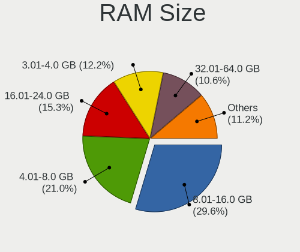
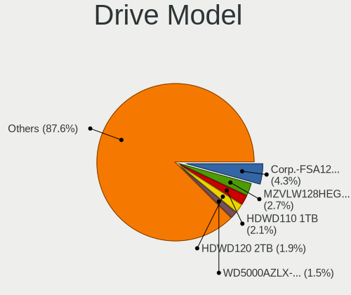
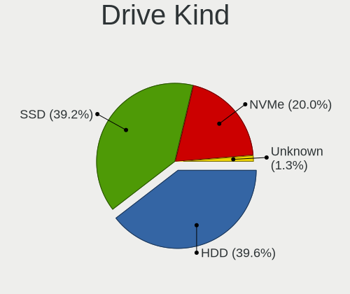
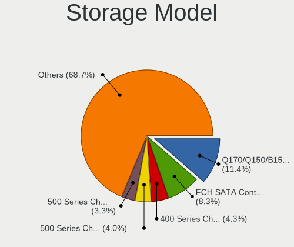
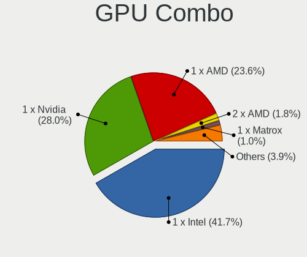
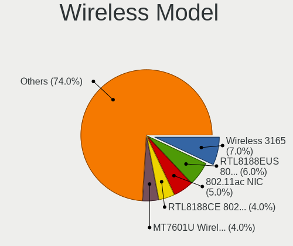
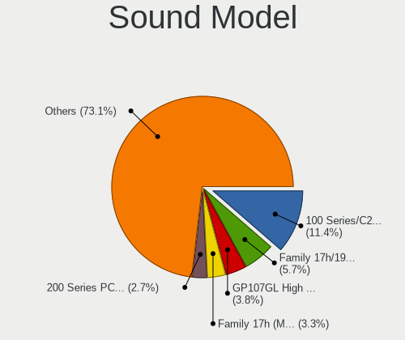

ALT Linux - Tested Hardware & Statistics (Desktops)
---------------------------------------------------

A project to collect tested hardware configurations for ALT Linux.

Anyone can contribute to this report by the [hw-probe](https://github.com/linuxhw/hw-probe) tool:

    sudo -E hw-probe -all -upload

Please contribute! Especially if your hardware is rare.

Contents
--------

* [ Test Cases ](#test-cases)

* [ System ](#system)
  - [ OS                       ](#os)
  - [ OS Family                ](#os-family)
  - [ Kernel                   ](#kernel)
  - [ Kernel Family            ](#kernel-family)
  - [ Kernel Major Ver.        ](#kernel-major-ver)
  - [ Arch                     ](#arch)
  - [ DE                       ](#de)
  - [ Display Server           ](#display-server)
  - [ Display Manager          ](#display-manager)
  - [ OS Lang                  ](#os-lang)
  - [ Boot Mode                ](#boot-mode)
  - [ Filesystem               ](#filesystem)
  - [ Part. scheme             ](#part-scheme)
  - [ Dual Boot with Linux/BSD ](#dual-boot-with-linuxbsd)
  - [ Dual Boot (Win)          ](#dual-boot-win)

* [ Board ](#board)
  - [ Vendor                   ](#vendor)
  - [ Model                    ](#model)
  - [ Model Family             ](#model-family)
  - [ MFG Year                 ](#mfg-year)
  - [ Form Factor              ](#form-factor)
  - [ Secure Boot              ](#secure-boot)
  - [ Coreboot                 ](#coreboot)
  - [ RAM Size                 ](#ram-size)
  - [ RAM Used                 ](#ram-used)
  - [ Total Drives             ](#total-drives)
  - [ Has CD-ROM               ](#has-cd-rom)
  - [ Has Ethernet             ](#has-ethernet)
  - [ Has WiFi                 ](#has-wifi)
  - [ Has Bluetooth            ](#has-bluetooth)

* [ Location ](#location)
  - [ Country                  ](#country)
  - [ City                     ](#city)

* [ Drives ](#drives)
  - [ Drive Vendor             ](#drive-vendor)
  - [ Drive Model              ](#drive-model)
  - [ HDD Vendor               ](#hdd-vendor)
  - [ SSD Vendor               ](#ssd-vendor)
  - [ Drive Kind               ](#drive-kind)
  - [ Drive Connector          ](#drive-connector)
  - [ Drive Size               ](#drive-size)
  - [ Space Total              ](#space-total)
  - [ Space Used               ](#space-used)
  - [ Malfunc. Drives          ](#malfunc-drives)
  - [ Malfunc. Drive Vendor    ](#malfunc-drive-vendor)
  - [ Malfunc. HDD Vendor      ](#malfunc-hdd-vendor)
  - [ Malfunc. Drive Kind      ](#malfunc-drive-kind)
  - [ Failed Drives            ](#failed-drives)
  - [ Failed Drive Vendor      ](#failed-drive-vendor)
  - [ Drive Status             ](#drive-status)

* [ Storage controller ](#storage-controller)
  - [ Storage Vendor           ](#storage-vendor)
  - [ Storage Model            ](#storage-model)
  - [ Storage Kind             ](#storage-kind)

* [ Processor ](#processor)
  - [ CPU Vendor               ](#cpu-vendor)
  - [ CPU Model                ](#cpu-model)
  - [ CPU Model Family         ](#cpu-model-family)
  - [ CPU Cores                ](#cpu-cores)
  - [ CPU Sockets              ](#cpu-sockets)
  - [ CPU Threads              ](#cpu-threads)
  - [ CPU Op-Modes             ](#cpu-op-modes)
  - [ CPU Microcode            ](#cpu-microcode)
  - [ CPU Microarch            ](#cpu-microarch)

* [ Graphics ](#graphics)
  - [ GPU Vendor               ](#gpu-vendor)
  - [ GPU Model                ](#gpu-model)
  - [ GPU Combo                ](#gpu-combo)
  - [ GPU Driver               ](#gpu-driver)
  - [ GPU Memory               ](#gpu-memory)

* [ Monitor ](#monitor)
  - [ Monitor Vendor           ](#monitor-vendor)
  - [ Monitor Model            ](#monitor-model)
  - [ Monitor Resolution       ](#monitor-resolution)
  - [ Monitor Diagonal         ](#monitor-diagonal)
  - [ Monitor Width            ](#monitor-width)
  - [ Aspect Ratio             ](#aspect-ratio)
  - [ Monitor Area             ](#monitor-area)
  - [ Pixel Density            ](#pixel-density)
  - [ Multiple Monitors        ](#multiple-monitors)

* [ Network ](#network)
  - [ Net Controller Vendor    ](#net-controller-vendor)
  - [ Net Controller Model     ](#net-controller-model)
  - [ Wireless Vendor          ](#wireless-vendor)
  - [ Wireless Model           ](#wireless-model)
  - [ Ethernet Vendor          ](#ethernet-vendor)
  - [ Ethernet Model           ](#ethernet-model)
  - [ Net Controller Kind      ](#net-controller-kind)
  - [ Used Controller          ](#used-controller)
  - [ NICs                     ](#nics)
  - [ IPv6                     ](#ipv6)

* [ Bluetooth ](#bluetooth)
  - [ Bluetooth Vendor         ](#bluetooth-vendor)
  - [ Bluetooth Model          ](#bluetooth-model)

* [ Sound ](#sound)
  - [ Sound Vendor             ](#sound-vendor)
  - [ Sound Model              ](#sound-model)

* [ Memory ](#memory)
  - [ Memory Vendor            ](#memory-vendor)
  - [ Memory Model             ](#memory-model)
  - [ Memory Kind              ](#memory-kind)
  - [ Memory Form Factor       ](#memory-form-factor)
  - [ Memory Size              ](#memory-size)
  - [ Memory Speed             ](#memory-speed)

* [ Printers & scanners ](#printers--scanners)
  - [ Printer Vendor           ](#printer-vendor)
  - [ Printer Model            ](#printer-model)
  - [ Scanner Vendor           ](#scanner-vendor)
  - [ Scanner Model            ](#scanner-model)

* [ Camera ](#camera)
  - [ Camera Vendor            ](#camera-vendor)
  - [ Camera Model             ](#camera-model)

* [ Security ](#security)
  - [ Fingerprint Vendor       ](#fingerprint-vendor)
  - [ Fingerprint Model        ](#fingerprint-model)
  - [ Chipcard Vendor          ](#chipcard-vendor)
  - [ Chipcard Model           ](#chipcard-model)

* [ Unsupported ](#unsupported)
  - [ Unsupported Devices      ](#unsupported-devices)
  - [ Unsupported Device Types ](#unsupported-device-types)

Test Cases
----------

Total: 347

| Vendor        | Model                       | Probe                                                      | Date         |
|---------------|-----------------------------|------------------------------------------------------------|--------------|
| Gigabyte      | MRHM3AP                     | [2d91c7c05a](https://linux-hardware.org/?probe=2d91c7c05a) | Jun 28, 2023 |
| Gigabyte      | MRHM3AP                     | [7007bb2db5](https://linux-hardware.org/?probe=7007bb2db5) | Jun 27, 2023 |
| MSI           | MPG X570 GAMING PLUS        | [0c4198042a](https://linux-hardware.org/?probe=0c4198042a) | Jun 18, 2023 |
| Biostar       | H610MH                      | [a2c82f65b6](https://linux-hardware.org/?probe=a2c82f65b6) | Jun 08, 2023 |
| ASUSTek       | PRIME Z370-P II             | [5a66eed08e](https://linux-hardware.org/?probe=5a66eed08e) | Jun 05, 2023 |
| MSI           | Z490-A PRO                  | [e34e6ab643](https://linux-hardware.org/?probe=e34e6ab643) | May 26, 2023 |
| Graviton      | DMB-A520-MCA01              | [91ad90fd67](https://linux-hardware.org/?probe=91ad90fd67) | May 22, 2023 |
| MSI           | MPG B550 GAMING PLUS        | [9c184f4251](https://linux-hardware.org/?probe=9c184f4251) | May 22, 2023 |
| Gigabyte      | B560 HD3                    | [1bfbf34771](https://linux-hardware.org/?probe=1bfbf34771) | May 16, 2023 |
| Gigabyte      | G41M-ES2L                   | [d9cac69c4c](https://linux-hardware.org/?probe=d9cac69c4c) | May 16, 2023 |
| Gigabyte      | G41M-ES2L                   | [0959f95f56](https://linux-hardware.org/?probe=0959f95f56) | May 12, 2023 |
| MSI           | H310M PRO-VD                | [b502077711](https://linux-hardware.org/?probe=b502077711) | May 12, 2023 |
| MSI           | H310M PRO-VD                | [ab733d41de](https://linux-hardware.org/?probe=ab733d41de) | May 12, 2023 |
| DEPO Compu... | DPA520S                     | [dea48fc3fa](https://linux-hardware.org/?probe=dea48fc3fa) | May 11, 2023 |
| DEPO Compu... | DPA520S                     | [848dc775e0](https://linux-hardware.org/?probe=848dc775e0) | May 11, 2023 |
| Gigabyte      | H61M-S2PV                   | [3ed55d530a](https://linux-hardware.org/?probe=3ed55d530a) | May 04, 2023 |
| Graviton      | DMB-A520-MCA01              | [d0c1433d54](https://linux-hardware.org/?probe=d0c1433d54) | Apr 18, 2023 |
| Intel         | SKYBAY                      | [ec2b541d85](https://linux-hardware.org/?probe=ec2b541d85) | Apr 13, 2023 |
| ASUSTek       | P8B75-V                     | [3504e8b3bd](https://linux-hardware.org/?probe=3504e8b3bd) | Apr 11, 2023 |
| Gigabyte      | A320M-S2H-CF                | [bec5bda3bd](https://linux-hardware.org/?probe=bec5bda3bd) | Apr 05, 2023 |
| MSI           | H510M PRO-E                 | [9ec66a8f48](https://linux-hardware.org/?probe=9ec66a8f48) | Mar 31, 2023 |
| Graviton      | DMB-A520-MCA01              | [9d7a43d81f](https://linux-hardware.org/?probe=9d7a43d81f) | Mar 29, 2023 |
| Graviton      | DMB-A520-MCA01              | [123e95cee1](https://linux-hardware.org/?probe=123e95cee1) | Mar 22, 2023 |
| Unknown       | Unknown                     | [5d06af8741](https://linux-hardware.org/?probe=5d06af8741) | Mar 22, 2023 |
| Graviton      | DMB-A520-MCA01              | [24b07c4402](https://linux-hardware.org/?probe=24b07c4402) | Mar 21, 2023 |
| Intel         | X99 V1.0                    | [1b993725aa](https://linux-hardware.org/?probe=1b993725aa) | Mar 17, 2023 |
| Biostar       | TB250-BTC                   | [59d148cedc](https://linux-hardware.org/?probe=59d148cedc) | Mar 11, 2023 |
| Gigabyte      | 965GM-S2                    | [8a58676b8d](https://linux-hardware.org/?probe=8a58676b8d) | Mar 10, 2023 |
| Gigabyte      | 965GM-S2                    | [e514c2892e](https://linux-hardware.org/?probe=e514c2892e) | Mar 10, 2023 |
| Intel         | SKYBAY                      | [226b8468d4](https://linux-hardware.org/?probe=226b8468d4) | Mar 09, 2023 |
| ASUSTek       | H110M-R                     | [d62a6bc830](https://linux-hardware.org/?probe=d62a6bc830) | Mar 07, 2023 |
| DEPO Compu... | DPH410S                     | [5fb80da27b](https://linux-hardware.org/?probe=5fb80da27b) | Mar 07, 2023 |
| ASRock        | H110M-DGS R3.0              | [4b3689dc5c](https://linux-hardware.org/?probe=4b3689dc5c) | Mar 05, 2023 |
| Gigabyte      | P31-ES3G                    | [5ab1863f2b](https://linux-hardware.org/?probe=5ab1863f2b) | Feb 28, 2023 |
| MSI           | MS-7357                     | [84cadfbabc](https://linux-hardware.org/?probe=84cadfbabc) | Feb 15, 2023 |
| ASUSTek       | P9X79                       | [d7f1d6a937](https://linux-hardware.org/?probe=d7f1d6a937) | Feb 14, 2023 |
| MAINBRD       | OPS62A-SHA                  | [a9267dffac](https://linux-hardware.org/?probe=a9267dffac) | Feb 14, 2023 |
| ASUSTek       | P5B-E                       | [92bf62be3c](https://linux-hardware.org/?probe=92bf62be3c) | Feb 11, 2023 |
| Acer          | RS880M05                    | [c585589925](https://linux-hardware.org/?probe=c585589925) | Feb 11, 2023 |
| ASRock        | FM2A78 Pro4+                | [788d1d408b](https://linux-hardware.org/?probe=788d1d408b) | Feb 06, 2023 |
| ASRock        | FM2A88X Extreme4+           | [97252e199d](https://linux-hardware.org/?probe=97252e199d) | Feb 06, 2023 |
| Gigabyte      | X570 AORUS PRO              | [ab13127567](https://linux-hardware.org/?probe=ab13127567) | Jan 29, 2023 |
| Intel         | X99 V1.0                    | [560cc09a5a](https://linux-hardware.org/?probe=560cc09a5a) | Jan 26, 2023 |
| Gigabyte      | H61M-DS2                    | [347446f16f](https://linux-hardware.org/?probe=347446f16f) | Jan 25, 2023 |
| Intel         | SKYBAY                      | [0d2187e1bd](https://linux-hardware.org/?probe=0d2187e1bd) | Jan 23, 2023 |
| Intel         | SKYBAY                      | [1781c6451f](https://linux-hardware.org/?probe=1781c6451f) | Jan 23, 2023 |
| MSI           | MAG B550M MORTAR WIFI       | [bb4c5c0f73](https://linux-hardware.org/?probe=bb4c5c0f73) | Jan 18, 2023 |
| Intel         | X99 V1.0                    | [c531fbad47](https://linux-hardware.org/?probe=c531fbad47) | Jan 14, 2023 |
| ASRock        | B450M Pro4                  | [fdf24274c5](https://linux-hardware.org/?probe=fdf24274c5) | Jan 13, 2023 |
| Intel         | X79G V2.x                   | [8228b94c50](https://linux-hardware.org/?probe=8228b94c50) | Jan 11, 2023 |
| Yadro         | YadroB560                   | [9d45ee1c8c](https://linux-hardware.org/?probe=9d45ee1c8c) | Jan 11, 2023 |
| Intel         | SKYBAY                      | [b6402cdd5e](https://linux-hardware.org/?probe=b6402cdd5e) | Jan 11, 2023 |
| Intel         | SKYBAY                      | [c896f4d5ee](https://linux-hardware.org/?probe=c896f4d5ee) | Jan 11, 2023 |
| ASUSTek       | P7H55-M                     | [808e7e41c5](https://linux-hardware.org/?probe=808e7e41c5) | Jan 10, 2023 |
| Gigabyte      | Z490 AORUS PRO AX           | [914e3f30cc](https://linux-hardware.org/?probe=914e3f30cc) | Jan 08, 2023 |
| ASUSTek       | P8H77-V LE                  | [bed374999d](https://linux-hardware.org/?probe=bed374999d) | Jan 06, 2023 |
| Gigabyte      | H55M-USB3                   | [2952e11cdb](https://linux-hardware.org/?probe=2952e11cdb) | Jan 01, 2023 |
| Gigabyte      | EP41-UD3L                   | [0456782550](https://linux-hardware.org/?probe=0456782550) | Dec 21, 2022 |
| Unknown       | Unknown                     | [5ad56cab50](https://linux-hardware.org/?probe=5ad56cab50) | Dec 19, 2022 |
| Unknown       | Unknown                     | [e06ebbd650](https://linux-hardware.org/?probe=e06ebbd650) | Dec 19, 2022 |
| Biostar       | TB250-BTC                   | [00dd0bc59e](https://linux-hardware.org/?probe=00dd0bc59e) | Dec 18, 2022 |
| ASUSTek       | M3N78-VM                    | [afd0404144](https://linux-hardware.org/?probe=afd0404144) | Dec 17, 2022 |
| ASUSTek       | M3N78-VM                    | [e7e9b42211](https://linux-hardware.org/?probe=e7e9b42211) | Dec 16, 2022 |
| ASUSTek       | PRIME B550-PLUS             | [2f5b88399a](https://linux-hardware.org/?probe=2f5b88399a) | Dec 13, 2022 |
| Graviton      | DMB-H510-MCA01              | [4dbcbc3b7a](https://linux-hardware.org/?probe=4dbcbc3b7a) | Nov 30, 2022 |
| MSI           | J1800I                      | [156269ae8c](https://linux-hardware.org/?probe=156269ae8c) | Nov 26, 2022 |
| Graviton      | DMB-A520-MCA01              | [1a09a9bb5c](https://linux-hardware.org/?probe=1a09a9bb5c) | Nov 14, 2022 |
| Gigabyte      | B550 AORUS PRO AC           | [b5965fce49](https://linux-hardware.org/?probe=b5965fce49) | Nov 11, 2022 |
| ASUSTek       | P7H55-M/USB3                | [d3d30c473e](https://linux-hardware.org/?probe=d3d30c473e) | Nov 10, 2022 |
| Gigabyte      | 8I915GMF                    | [76f5cb17ad](https://linux-hardware.org/?probe=76f5cb17ad) | Nov 10, 2022 |
| ASUSTek       | P7H55-M/USB3                | [8983159779](https://linux-hardware.org/?probe=8983159779) | Oct 30, 2022 |
| ASRock        | Z77 Pro4-M                  | [b388ac6776](https://linux-hardware.org/?probe=b388ac6776) | Oct 27, 2022 |
| Biostar       | TB250-BTC                   | [89e7931244](https://linux-hardware.org/?probe=89e7931244) | Oct 27, 2022 |
| Intel         | D34010WYK H14771-301        | [cea24a780a](https://linux-hardware.org/?probe=cea24a780a) | Oct 26, 2022 |
| Gigabyte      | H61M-S2PV                   | [a876af89ec](https://linux-hardware.org/?probe=a876af89ec) | Oct 24, 2022 |
| MSI           | PRO H610M-B DDR4            | [25db5739b7](https://linux-hardware.org/?probe=25db5739b7) | Oct 24, 2022 |
| Intel         | D34010WYK H14771-301        | [18d8d35afa](https://linux-hardware.org/?probe=18d8d35afa) | Oct 24, 2022 |
| Huanan        | H97-ZD3 V2.0                | [d0d194fbdc](https://linux-hardware.org/?probe=d0d194fbdc) | Oct 15, 2022 |
| Graviton      | DMB-H510-MCA01              | [355974871d](https://linux-hardware.org/?probe=355974871d) | Oct 12, 2022 |
| Graviton      | DMB-H510-MCA01              | [02395d2c6f](https://linux-hardware.org/?probe=02395d2c6f) | Oct 07, 2022 |
| Gigabyte      | H110M-S2-CF                 | [79b160283f](https://linux-hardware.org/?probe=79b160283f) | Oct 05, 2022 |
| MSI           | MPG B560I GAMING EDGE WI... | [8e3ee86b79](https://linux-hardware.org/?probe=8e3ee86b79) | Oct 05, 2022 |
| ASUSTek       | D300TA                      | [7c175e4db4](https://linux-hardware.org/?probe=7c175e4db4) | Oct 03, 2022 |
| MSI           | B560M PRO-VDH               | [34db101d55](https://linux-hardware.org/?probe=34db101d55) | Sep 22, 2022 |
| ASUSTek       | C8HM70-I/HDMI               | [b8609443fe](https://linux-hardware.org/?probe=b8609443fe) | Sep 17, 2022 |
| Gigabyte      | M57SLI-S4                   | [0384b171c7](https://linux-hardware.org/?probe=0384b171c7) | Sep 03, 2022 |
| ASUSTek       | F2A85-V                     | [a6a798ce96](https://linux-hardware.org/?probe=a6a798ce96) | Aug 16, 2022 |
| Gigabyte      | B450 I AORUS PRO WIFI-CF    | [315c1df30c](https://linux-hardware.org/?probe=315c1df30c) | Aug 16, 2022 |
| Dell          | 0W0CHX A00                  | [7d9b8e0f96](https://linux-hardware.org/?probe=7d9b8e0f96) | Aug 01, 2022 |
| OEM           | KX-18 V1.0                  | [a68e653aa9](https://linux-hardware.org/?probe=a68e653aa9) | Jul 14, 2022 |
| Gigabyte      | Z77MX-D3H                   | [c8051cd18e](https://linux-hardware.org/?probe=c8051cd18e) | Jul 13, 2022 |
| MSI           | PRO H610M-G DDR4            | [7a95d588c4](https://linux-hardware.org/?probe=7a95d588c4) | Jul 05, 2022 |
| Gigabyte      | GA-A75M-D2H                 | [7411d7a561](https://linux-hardware.org/?probe=7411d7a561) | Jun 23, 2022 |
| MSI           | Z77A-G43                    | [2724c1558a](https://linux-hardware.org/?probe=2724c1558a) | Jun 20, 2022 |
| MAINBRD       | OPS62A-SHA                  | [8fe4a74fa3](https://linux-hardware.org/?probe=8fe4a74fa3) | Jun 10, 2022 |
| MAINBRD       | OPS62A-SHA                  | [7c16967701](https://linux-hardware.org/?probe=7c16967701) | Jun 10, 2022 |
| 3Logic Gro... | DMB-H510-MCA01              | [31ab5150ea](https://linux-hardware.org/?probe=31ab5150ea) | Jun 06, 2022 |
| ASUSTek       | PRIME Z390-A                | [4fa81ba66a](https://linux-hardware.org/?probe=4fa81ba66a) | Jun 06, 2022 |
| 3Logic Gro... | DMB-H510-MCA01              | [fb935ea1d0](https://linux-hardware.org/?probe=fb935ea1d0) | Jun 03, 2022 |
| ASUSTek       | M4A78-EM                    | [7bfddcecee](https://linux-hardware.org/?probe=7bfddcecee) | Jun 03, 2022 |
| MAINBRD       | OPS62A-SHA                  | [33201d3794](https://linux-hardware.org/?probe=33201d3794) | Jun 02, 2022 |
| 3Logic Gro... | DMB-H510-MCA01              | [acc0a6ae9c](https://linux-hardware.org/?probe=acc0a6ae9c) | May 31, 2022 |
| 3Logic Gro... | DMB-H510-MCA01              | [4ad9ca01bd](https://linux-hardware.org/?probe=4ad9ca01bd) | May 31, 2022 |
| ASUSTek       | PRO H410T                   | [7d7a4c7536](https://linux-hardware.org/?probe=7d7a4c7536) | May 25, 2022 |
| ASUSTek       | M4A78-EM                    | [37a8e41d00](https://linux-hardware.org/?probe=37a8e41d00) | May 25, 2022 |
| Gigabyte      | EP45-UD3LR                  | [ea7f269697](https://linux-hardware.org/?probe=ea7f269697) | May 24, 2022 |
| MAINBRD       | OPS62A-SHA                  | [9450237ae3](https://linux-hardware.org/?probe=9450237ae3) | May 23, 2022 |
| MAINBRD       | OPS62A-SHA                  | [ad85836549](https://linux-hardware.org/?probe=ad85836549) | May 20, 2022 |
| iRU           | LPGR.469559.012             | [9163b267bc](https://linux-hardware.org/?probe=9163b267bc) | May 19, 2022 |
| ASUSTek       | PRO H410T                   | [8ededa12ef](https://linux-hardware.org/?probe=8ededa12ef) | May 16, 2022 |
| ASUSTek       | M4A78-EM                    | [bedc08df5b](https://linux-hardware.org/?probe=bedc08df5b) | May 15, 2022 |
| 3Logic Gro... | AMUR DMB-H310-MCA01         | [cfb12880a5](https://linux-hardware.org/?probe=cfb12880a5) | May 11, 2022 |
| ASRock        | H61M-GE                     | [fefe67c0d4](https://linux-hardware.org/?probe=fefe67c0d4) | May 05, 2022 |
| Intel         | SKYBAY                      | [4891bdbd5c](https://linux-hardware.org/?probe=4891bdbd5c) | May 04, 2022 |
| ASRock        | A300M-STX                   | [48af028244](https://linux-hardware.org/?probe=48af028244) | Apr 29, 2022 |
| Lenovo        | NOK                         | [4ea735896c](https://linux-hardware.org/?probe=4ea735896c) | Apr 28, 2022 |
| Acer          | Veriton X2640G V:1.0        | [c75ef7f42d](https://linux-hardware.org/?probe=c75ef7f42d) | Apr 28, 2022 |
| Acer          | Veriton X2640G V:1.0        | [af1b36d1f6](https://linux-hardware.org/?probe=af1b36d1f6) | Apr 28, 2022 |
| Gigabyte      | H110M-S2H-CF                | [e612a2bab1](https://linux-hardware.org/?probe=e612a2bab1) | Apr 27, 2022 |
| Lenovo        | NOK                         | [6d17068770](https://linux-hardware.org/?probe=6d17068770) | Apr 27, 2022 |
| Acer          | Veriton X2640G V:1.0        | [f1e5d5715f](https://linux-hardware.org/?probe=f1e5d5715f) | Apr 25, 2022 |
| Acer          | Veriton X2640G V:1.0        | [a0e3085b4c](https://linux-hardware.org/?probe=a0e3085b4c) | Apr 25, 2022 |
| Acer          | Veriton X2640G V:1.0        | [9819b3fc78](https://linux-hardware.org/?probe=9819b3fc78) | Apr 25, 2022 |
| Acer          | Veriton X2640G V:1.0        | [d27d03b7e4](https://linux-hardware.org/?probe=d27d03b7e4) | Apr 25, 2022 |
| Acer          | Veriton X2640G V:1.0        | [a8784c861a](https://linux-hardware.org/?probe=a8784c861a) | Apr 25, 2022 |
| Acer          | Veriton X2640G V:1.0        | [b970feef75](https://linux-hardware.org/?probe=b970feef75) | Apr 25, 2022 |
| Acer          | Veriton X2640G V:1.0        | [6bfffcf96a](https://linux-hardware.org/?probe=6bfffcf96a) | Apr 25, 2022 |
| Unknown       | Unknown                     | [c7c9ed4c0e](https://linux-hardware.org/?probe=c7c9ed4c0e) | Apr 21, 2022 |
| Intel         | SKYBAY                      | [ec99a4a73b](https://linux-hardware.org/?probe=ec99a4a73b) | Apr 19, 2022 |
| Intel         | SKYBAY                      | [807bf178aa](https://linux-hardware.org/?probe=807bf178aa) | Apr 19, 2022 |
| Intel         | SKYBAY                      | [5ce5f89e30](https://linux-hardware.org/?probe=5ce5f89e30) | Apr 18, 2022 |
| Intel         | SKYBAY                      | [016707b662](https://linux-hardware.org/?probe=016707b662) | Apr 18, 2022 |
| Acer          | Veriton X2640G V:1.0        | [472e946f77](https://linux-hardware.org/?probe=472e946f77) | Apr 18, 2022 |
| Intel         | SKYBAY                      | [f227fe1fc7](https://linux-hardware.org/?probe=f227fe1fc7) | Apr 18, 2022 |
| Intel         | SKYBAY                      | [49039d6324](https://linux-hardware.org/?probe=49039d6324) | Apr 18, 2022 |
| Intel         | SKYBAY                      | [39553516dd](https://linux-hardware.org/?probe=39553516dd) | Apr 18, 2022 |
| Intel         | SKYBAY                      | [9f87ee8978](https://linux-hardware.org/?probe=9f87ee8978) | Apr 18, 2022 |
| ASUSTek       | PRIME B450-PLUS             | [bf274bc0f4](https://linux-hardware.org/?probe=bf274bc0f4) | Apr 15, 2022 |
| ASUSTek       | PRIME B450-PLUS             | [53137ae702](https://linux-hardware.org/?probe=53137ae702) | Apr 14, 2022 |
| Gigabyte      | B450M S2H                   | [a98b8b4304](https://linux-hardware.org/?probe=a98b8b4304) | Apr 14, 2022 |
| Intel         | SKYBAY                      | [0d3978670a](https://linux-hardware.org/?probe=0d3978670a) | Apr 14, 2022 |
| Gigabyte      | B450M S2H                   | [3829d7dfca](https://linux-hardware.org/?probe=3829d7dfca) | Apr 14, 2022 |
| Intel         | SKYBAY                      | [13122b16be](https://linux-hardware.org/?probe=13122b16be) | Apr 14, 2022 |
| Intel         | SKYBAY                      | [82df5d5154](https://linux-hardware.org/?probe=82df5d5154) | Apr 13, 2022 |
| Intel         | SKYBAY                      | [c55e8d0780](https://linux-hardware.org/?probe=c55e8d0780) | Apr 13, 2022 |
| Intel         | SKYBAY                      | [46344da31f](https://linux-hardware.org/?probe=46344da31f) | Apr 13, 2022 |
| Intel         | SKYBAY                      | [906a9f0a46](https://linux-hardware.org/?probe=906a9f0a46) | Apr 13, 2022 |
| Intel         | SKYBAY                      | [482922befd](https://linux-hardware.org/?probe=482922befd) | Apr 13, 2022 |
| Intel         | SKYBAY                      | [2cb7352d17](https://linux-hardware.org/?probe=2cb7352d17) | Apr 13, 2022 |
| Intel         | SKYBAY                      | [54f3bbf0af](https://linux-hardware.org/?probe=54f3bbf0af) | Apr 13, 2022 |
| Intel         | SKYBAY                      | [f7d3604a6b](https://linux-hardware.org/?probe=f7d3604a6b) | Apr 13, 2022 |
| Intel         | SKYBAY                      | [40083e1990](https://linux-hardware.org/?probe=40083e1990) | Apr 13, 2022 |
| Intel         | SKYBAY                      | [ecf34aa4f0](https://linux-hardware.org/?probe=ecf34aa4f0) | Apr 13, 2022 |
| Intel         | SKYBAY                      | [baf8cdeb1a](https://linux-hardware.org/?probe=baf8cdeb1a) | Apr 13, 2022 |
| Gigabyte      | G31M-ES2L                   | [1eacb6915d](https://linux-hardware.org/?probe=1eacb6915d) | Apr 12, 2022 |
| MSI           | A68HM-E33 V2                | [0fecbe6cdc](https://linux-hardware.org/?probe=0fecbe6cdc) | Apr 12, 2022 |
| Intel         | SKYBAY                      | [97d94278ea](https://linux-hardware.org/?probe=97d94278ea) | Apr 12, 2022 |
| Intel         | SKYBAY                      | [5ebaca158a](https://linux-hardware.org/?probe=5ebaca158a) | Apr 12, 2022 |
| Intel         | SKYBAY                      | [7e40f60767](https://linux-hardware.org/?probe=7e40f60767) | Apr 12, 2022 |
| Intel         | SKYBAY                      | [ce83b095fe](https://linux-hardware.org/?probe=ce83b095fe) | Apr 12, 2022 |
| Gigabyte      | H110M-S2H-CF                | [105088d6de](https://linux-hardware.org/?probe=105088d6de) | Apr 12, 2022 |
| Gigabyte      | H110M-S2H-CF                | [126b987221](https://linux-hardware.org/?probe=126b987221) | Apr 12, 2022 |
| Intel         | SKYBAY                      | [5d59afae00](https://linux-hardware.org/?probe=5d59afae00) | Apr 12, 2022 |
| Intel         | SKYBAY                      | [442de26b34](https://linux-hardware.org/?probe=442de26b34) | Apr 12, 2022 |
| Intel         | SKYBAY                      | [9d7fc26276](https://linux-hardware.org/?probe=9d7fc26276) | Apr 12, 2022 |
| Intel         | SKYBAY                      | [e07ab03ffb](https://linux-hardware.org/?probe=e07ab03ffb) | Apr 12, 2022 |
| Intel         | SKYBAY                      | [b4b977309d](https://linux-hardware.org/?probe=b4b977309d) | Apr 12, 2022 |
| Intel         | SKYBAY                      | [bff39744bc](https://linux-hardware.org/?probe=bff39744bc) | Apr 12, 2022 |
| Intel         | SKYBAY                      | [01cd534e80](https://linux-hardware.org/?probe=01cd534e80) | Apr 12, 2022 |
| Intel         | SKYBAY                      | [669e6289c0](https://linux-hardware.org/?probe=669e6289c0) | Apr 12, 2022 |
| Intel         | SKYBAY                      | [d49df4c170](https://linux-hardware.org/?probe=d49df4c170) | Apr 12, 2022 |
| Intel         | SKYBAY                      | [01aa1a4299](https://linux-hardware.org/?probe=01aa1a4299) | Apr 12, 2022 |
| Intel         | SKYBAY                      | [a85817bb6d](https://linux-hardware.org/?probe=a85817bb6d) | Apr 12, 2022 |
| Intel         | SKYBAY                      | [25955c9bb1](https://linux-hardware.org/?probe=25955c9bb1) | Apr 12, 2022 |
| Intel         | SKYBAY                      | [0c81aeca67](https://linux-hardware.org/?probe=0c81aeca67) | Apr 12, 2022 |
| Intel         | SKYBAY                      | [e72fe0a0a9](https://linux-hardware.org/?probe=e72fe0a0a9) | Apr 12, 2022 |
| Intel         | SKYBAY                      | [33b61b457e](https://linux-hardware.org/?probe=33b61b457e) | Apr 12, 2022 |
| Intel         | SKYBAY                      | [d6c6259cc0](https://linux-hardware.org/?probe=d6c6259cc0) | Apr 12, 2022 |
| Intel         | SKYBAY                      | [f2444b315d](https://linux-hardware.org/?probe=f2444b315d) | Apr 12, 2022 |
| Intel         | SKYBAY                      | [aa745aba70](https://linux-hardware.org/?probe=aa745aba70) | Apr 12, 2022 |
| Intel         | SKYBAY                      | [3b73c79a3c](https://linux-hardware.org/?probe=3b73c79a3c) | Apr 12, 2022 |
| Intel         | SKYBAY                      | [d1a4cd1698](https://linux-hardware.org/?probe=d1a4cd1698) | Apr 12, 2022 |
| Intel         | SKYBAY                      | [54713393ec](https://linux-hardware.org/?probe=54713393ec) | Apr 12, 2022 |
| Intel         | SKYBAY                      | [56d2022832](https://linux-hardware.org/?probe=56d2022832) | Apr 12, 2022 |
| Intel         | SKYBAY                      | [efbe0a9eca](https://linux-hardware.org/?probe=efbe0a9eca) | Apr 11, 2022 |
| Intel         | SKYBAY                      | [60fbf7929d](https://linux-hardware.org/?probe=60fbf7929d) | Apr 11, 2022 |
| Intel         | SKYBAY                      | [e9a0bae6e6](https://linux-hardware.org/?probe=e9a0bae6e6) | Apr 11, 2022 |
| Intel         | SKYBAY                      | [4fb63d6dfe](https://linux-hardware.org/?probe=4fb63d6dfe) | Apr 11, 2022 |
| Intel         | SKYBAY                      | [8ee5753b25](https://linux-hardware.org/?probe=8ee5753b25) | Apr 11, 2022 |
| Intel         | SKYBAY                      | [6fb5a857e1](https://linux-hardware.org/?probe=6fb5a857e1) | Apr 11, 2022 |
| Intel         | SKYBAY                      | [613ea0ab6b](https://linux-hardware.org/?probe=613ea0ab6b) | Apr 11, 2022 |
| Intel         | SKYBAY                      | [2aeec4566f](https://linux-hardware.org/?probe=2aeec4566f) | Apr 11, 2022 |
| Intel         | SKYBAY                      | [5751abaf6c](https://linux-hardware.org/?probe=5751abaf6c) | Apr 11, 2022 |
| Intel         | SKYBAY                      | [31b40a1aa0](https://linux-hardware.org/?probe=31b40a1aa0) | Apr 11, 2022 |
| Intel         | SKYBAY                      | [d3bbe595ba](https://linux-hardware.org/?probe=d3bbe595ba) | Apr 11, 2022 |
| Intel         | SKYBAY                      | [24d5b7f6c6](https://linux-hardware.org/?probe=24d5b7f6c6) | Apr 11, 2022 |
| Intel         | SKYBAY                      | [f94dbbfc1f](https://linux-hardware.org/?probe=f94dbbfc1f) | Apr 11, 2022 |
| Intel         | SKYBAY                      | [960168908f](https://linux-hardware.org/?probe=960168908f) | Apr 11, 2022 |
| Intel         | SKYBAY                      | [71610e6e10](https://linux-hardware.org/?probe=71610e6e10) | Apr 11, 2022 |
| Intel         | SKYBAY                      | [d2407bd778](https://linux-hardware.org/?probe=d2407bd778) | Apr 11, 2022 |
| Intel         | SKYBAY                      | [88fc4d57ec](https://linux-hardware.org/?probe=88fc4d57ec) | Apr 11, 2022 |
| Intel         | SKYBAY                      | [a1cbc192aa](https://linux-hardware.org/?probe=a1cbc192aa) | Apr 11, 2022 |
| Intel         | SKYBAY                      | [66d94b1220](https://linux-hardware.org/?probe=66d94b1220) | Apr 11, 2022 |
| Intel         | SKYBAY                      | [e8c2f02ba1](https://linux-hardware.org/?probe=e8c2f02ba1) | Apr 11, 2022 |
| Unknown       | Unknown                     | [7ef15ed6c9](https://linux-hardware.org/?probe=7ef15ed6c9) | Apr 11, 2022 |
| Intel         | SKYBAY                      | [8bcad9c229](https://linux-hardware.org/?probe=8bcad9c229) | Apr 11, 2022 |
| ASRock        | FM2A55M-HD+                 | [a03ff53e01](https://linux-hardware.org/?probe=a03ff53e01) | Apr 11, 2022 |
| Intel         | SKYBAY                      | [5486388fa0](https://linux-hardware.org/?probe=5486388fa0) | Apr 11, 2022 |
| ASUSTek       | PRIME A320M-K               | [237634ce8d](https://linux-hardware.org/?probe=237634ce8d) | Apr 11, 2022 |
| Intel         | SKYBAY                      | [83b01e222e](https://linux-hardware.org/?probe=83b01e222e) | Apr 11, 2022 |
| Intel         | SKYBAY                      | [c6f290816a](https://linux-hardware.org/?probe=c6f290816a) | Apr 11, 2022 |
| Unknown       | S074VI5R8                   | [60c4fc315b](https://linux-hardware.org/?probe=60c4fc315b) | Apr 11, 2022 |
| Unknown       | S074VI5R8                   | [faad64ac67](https://linux-hardware.org/?probe=faad64ac67) | Apr 11, 2022 |
| ASUSTek       | PRIME B450-PLUS             | [f3fe662dcb](https://linux-hardware.org/?probe=f3fe662dcb) | Apr 11, 2022 |
| ASUSTek       | PRIME B450-PLUS             | [5293db1b11](https://linux-hardware.org/?probe=5293db1b11) | Apr 11, 2022 |
| Intel         | SKYBAY                      | [7d3b364ff0](https://linux-hardware.org/?probe=7d3b364ff0) | Apr 11, 2022 |
| ASUSTek       | PRIME B450-PLUS             | [d8307a4138](https://linux-hardware.org/?probe=d8307a4138) | Apr 11, 2022 |
| Unknown       | S074VI5R8                   | [bffde28b59](https://linux-hardware.org/?probe=bffde28b59) | Apr 11, 2022 |
| ASUSTek       | PRIME B450-PLUS             | [7d31dd74d7](https://linux-hardware.org/?probe=7d31dd74d7) | Apr 11, 2022 |
| ASUSTek       | PRIME B450-PLUS             | [7d03a291a2](https://linux-hardware.org/?probe=7d03a291a2) | Apr 11, 2022 |
| ASUSTek       | PRIME B450-PLUS             | [91f33b247d](https://linux-hardware.org/?probe=91f33b247d) | Apr 11, 2022 |
| ASUSTek       | PRIME B450-PLUS             | [2628069096](https://linux-hardware.org/?probe=2628069096) | Apr 11, 2022 |
| Intel         | SKYBAY                      | [7c2a257e92](https://linux-hardware.org/?probe=7c2a257e92) | Apr 11, 2022 |
| ASUSTek       | PRIME B450-PLUS             | [868b030342](https://linux-hardware.org/?probe=868b030342) | Apr 11, 2022 |
| Intel         | SKYBAY                      | [4088112a18](https://linux-hardware.org/?probe=4088112a18) | Apr 11, 2022 |
| Unknown       | S074VI5R8                   | [68820282cb](https://linux-hardware.org/?probe=68820282cb) | Apr 11, 2022 |
| Unknown       | Unknown                     | [5a5a1a7ae6](https://linux-hardware.org/?probe=5a5a1a7ae6) | Apr 11, 2022 |
| Intel         | SKYBAY                      | [936252dfca](https://linux-hardware.org/?probe=936252dfca) | Apr 11, 2022 |
| ASUSTek       | PRIME B450-PLUS             | [67ed2ddd29](https://linux-hardware.org/?probe=67ed2ddd29) | Apr 11, 2022 |
| ASUSTek       | PRIME B450-PLUS             | [fde95ea3ed](https://linux-hardware.org/?probe=fde95ea3ed) | Apr 11, 2022 |
| ASUSTek       | PRIME B450-PLUS             | [de01821ecf](https://linux-hardware.org/?probe=de01821ecf) | Apr 11, 2022 |
| Intel         | SKYBAY                      | [67f41bf764](https://linux-hardware.org/?probe=67f41bf764) | Apr 11, 2022 |
| Intel         | SKYBAY                      | [77aadf6511](https://linux-hardware.org/?probe=77aadf6511) | Apr 11, 2022 |
| Intel         | SKYBAY                      | [cb9ae4e880](https://linux-hardware.org/?probe=cb9ae4e880) | Apr 11, 2022 |
| ASUSTek       | A68HM-K                     | [0199b0b388](https://linux-hardware.org/?probe=0199b0b388) | Apr 11, 2022 |
| Intel         | SKYBAY                      | [d2a24f0327](https://linux-hardware.org/?probe=d2a24f0327) | Apr 11, 2022 |
| Intel         | SKYBAY                      | [498dd8c409](https://linux-hardware.org/?probe=498dd8c409) | Apr 11, 2022 |
| Intel         | SKYBAY                      | [fa2978c8db](https://linux-hardware.org/?probe=fa2978c8db) | Apr 11, 2022 |
| Intel         | SKYBAY                      | [150ce1c4dd](https://linux-hardware.org/?probe=150ce1c4dd) | Apr 11, 2022 |
| Intel         | SKYBAY                      | [76e9ddaa30](https://linux-hardware.org/?probe=76e9ddaa30) | Apr 11, 2022 |
| Unknown       | Unknown                     | [43c08af7bf](https://linux-hardware.org/?probe=43c08af7bf) | Apr 11, 2022 |
| Intel         | SKYBAY                      | [093a6488c3](https://linux-hardware.org/?probe=093a6488c3) | Apr 11, 2022 |
| Unknown       | S074VI5R8                   | [730280aef1](https://linux-hardware.org/?probe=730280aef1) | Apr 11, 2022 |
| ASUSTek       | PRIME B450-PLUS             | [679df55359](https://linux-hardware.org/?probe=679df55359) | Apr 06, 2022 |
| Unknown       | S074VI5R8                   | [3fd567de05](https://linux-hardware.org/?probe=3fd567de05) | Apr 06, 2022 |
| 3Logic Gro... | DMB-H510-MCA01              | [7e10ceda79](https://linux-hardware.org/?probe=7e10ceda79) | Apr 06, 2022 |
| ASRock        | M3N78D FX                   | [66bb134c6c](https://linux-hardware.org/?probe=66bb134c6c) | Mar 29, 2022 |
| ASRock        | N68-GS4 FX R2.0             | [d01df98d83](https://linux-hardware.org/?probe=d01df98d83) | Mar 28, 2022 |
| ASRock        | M3N78D FX                   | [3ebcef4241](https://linux-hardware.org/?probe=3ebcef4241) | Mar 28, 2022 |
| Unknown       | Unknown                     | [95628eab40](https://linux-hardware.org/?probe=95628eab40) | Mar 24, 2022 |
| ASRock        | A300M-STX                   | [1fb2262bcc](https://linux-hardware.org/?probe=1fb2262bcc) | Mar 17, 2022 |
| Gigabyte      | G41MT-D3                    | [92fc99440a](https://linux-hardware.org/?probe=92fc99440a) | Mar 08, 2022 |
| ASRock        | B450 Gaming K4              | [f7f470651e](https://linux-hardware.org/?probe=f7f470651e) | Feb 17, 2022 |
| Gigabyte      | X79-UD3                     | [452ebf6a67](https://linux-hardware.org/?probe=452ebf6a67) | Feb 12, 2022 |
| ASUSTek       | PRIME B550-PLUS             | [921e224ec5](https://linux-hardware.org/?probe=921e224ec5) | Feb 12, 2022 |
| Aquarius      | AQH410T                     | [351b2e5344](https://linux-hardware.org/?probe=351b2e5344) | Jan 31, 2022 |
| ASUSTek       | PRIME B550-PLUS             | [481e745592](https://linux-hardware.org/?probe=481e745592) | Jan 30, 2022 |
| ASRock        | B450 Gaming K4              | [8c31667834](https://linux-hardware.org/?probe=8c31667834) | Jan 20, 2022 |
| Graviton      | DMB-A520-MCA01              | [edd6464f18](https://linux-hardware.org/?probe=edd6464f18) | Jan 19, 2022 |
| Graviton      | DMB-A520-MCA01              | [93fef2e073](https://linux-hardware.org/?probe=93fef2e073) | Jan 19, 2022 |
| MSI           | A68HM-P33 V2                | [98e05db690](https://linux-hardware.org/?probe=98e05db690) | Jan 17, 2022 |
| ASRock        | B450 Gaming K4              | [0c802de596](https://linux-hardware.org/?probe=0c802de596) | Jan 14, 2022 |
| Gigabyte      | H77M-D3H                    | [c8ff16f0ed](https://linux-hardware.org/?probe=c8ff16f0ed) | Dec 24, 2021 |
| Supermicro    | X11SDW-14CNT-TP13F          | [4d8499f8ba](https://linux-hardware.org/?probe=4d8499f8ba) | Dec 23, 2021 |
| ASRock        | A320M-HDV R4.0              | [9180a824d8](https://linux-hardware.org/?probe=9180a824d8) | Dec 23, 2021 |
| ASRock        | B450 Gaming K4              | [7ef05a32a9](https://linux-hardware.org/?probe=7ef05a32a9) | Dec 17, 2021 |
| MSI           | MPG B560I GAMING EDGE WI... | [2aff2121af](https://linux-hardware.org/?probe=2aff2121af) | Dec 16, 2021 |
| MSI           | MPG B560I GAMING EDGE WI... | [30eab5f54f](https://linux-hardware.org/?probe=30eab5f54f) | Dec 15, 2021 |
| Gigabyte      | B550 GAMING X               | [c853f62ddd](https://linux-hardware.org/?probe=c853f62ddd) | Dec 06, 2021 |
| Unknown       | Unknown                     | [0f5c69902a](https://linux-hardware.org/?probe=0f5c69902a) | Dec 01, 2021 |
| ASRock        | B450M Pro4                  | [68a1f83b4f](https://linux-hardware.org/?probe=68a1f83b4f) | Nov 28, 2021 |
| Gigabyte      | B550 GAMING X               | [058d8a0404](https://linux-hardware.org/?probe=058d8a0404) | Nov 19, 2021 |
| ASUSTek       | P5Q                         | [70ee05a53e](https://linux-hardware.org/?probe=70ee05a53e) | Oct 28, 2021 |
| Gigabyte      | B450 AORUS M                | [d9dd1b763b](https://linux-hardware.org/?probe=d9dd1b763b) | Oct 08, 2021 |
| Dell          | 0U649C                      | [80e138d949](https://linux-hardware.org/?probe=80e138d949) | Sep 24, 2021 |
| ASRock        | X300M-STX                   | [da7d22c384](https://linux-hardware.org/?probe=da7d22c384) | Sep 16, 2021 |
| ASUSTek       | M5A99X EVO R2.0             | [132286ab64](https://linux-hardware.org/?probe=132286ab64) | Aug 17, 2021 |
| Gigabyte      | H77M-D3H                    | [85ce2f74c4](https://linux-hardware.org/?probe=85ce2f74c4) | Aug 17, 2021 |
| ASUSTek       | PRIME B550-PLUS             | [624e92e15e](https://linux-hardware.org/?probe=624e92e15e) | Aug 11, 2021 |
| Gigabyte      | H510M S2H                   | [db68dde16d](https://linux-hardware.org/?probe=db68dde16d) | Aug 04, 2021 |
| ASUSTek       | PRIME B550-PLUS             | [b01641d467](https://linux-hardware.org/?probe=b01641d467) | Jul 25, 2021 |
| Gigabyte      | H110M-S2V-CF                | [8687a8809b](https://linux-hardware.org/?probe=8687a8809b) | Jul 14, 2021 |
| ASUSTek       | P5G41T-M LX2/GB/LPT         | [05be9fcdec](https://linux-hardware.org/?probe=05be9fcdec) | Jul 03, 2021 |
| Gigabyte      | H110M-S2V-CF                | [24bd5ac93f](https://linux-hardware.org/?probe=24bd5ac93f) | Jun 27, 2021 |
| Kraftway      | KWH310                      | [f470a86a1c](https://linux-hardware.org/?probe=f470a86a1c) | Jun 26, 2021 |
| ASRock        | H110M-DGS R3.0              | [87ab7018c4](https://linux-hardware.org/?probe=87ab7018c4) | Jun 24, 2021 |
| MSI           | H110M PRO-VD                | [21a019dcb3](https://linux-hardware.org/?probe=21a019dcb3) | Jun 14, 2021 |
| ASUSTek       | P5G41T-M LX2/GB/LPT         | [8325754280](https://linux-hardware.org/?probe=8325754280) | Jun 13, 2021 |
| MSI           | H110M PRO-VD                | [96cc5b470f](https://linux-hardware.org/?probe=96cc5b470f) | Jun 12, 2021 |
| MSI           | H110M PRO-VD                | [cfeb0493d3](https://linux-hardware.org/?probe=cfeb0493d3) | Jun 11, 2021 |
| ASRock        | J3455B-ITX                  | [13396a7347](https://linux-hardware.org/?probe=13396a7347) | May 19, 2021 |
| DEPO Compu... | DPH410S                     | [0d1000e904](https://linux-hardware.org/?probe=0d1000e904) | May 14, 2021 |
| DEPO Compu... | DPA320S G10g                | [5ecc011c34](https://linux-hardware.org/?probe=5ecc011c34) | May 14, 2021 |
| ASUSTek       | P5G41T-M LX2/GB/LPT         | [97b70c1bac](https://linux-hardware.org/?probe=97b70c1bac) | Apr 17, 2021 |
| Acer          | H11H4-AI V:1.0              | [34997240d5](https://linux-hardware.org/?probe=34997240d5) | Mar 30, 2021 |
| ECS           | BAT-I2                      | [037e6e58e6](https://linux-hardware.org/?probe=037e6e58e6) | Mar 30, 2021 |
| ASUSTek       | PRIME H310M-R R2.0          | [f0c7659cf9](https://linux-hardware.org/?probe=f0c7659cf9) | Mar 29, 2021 |
| Gigabyte      | P35-S3G                     | [8e53d68603](https://linux-hardware.org/?probe=8e53d68603) | Mar 20, 2021 |
| ASUSTek       | N3150M-E                    | [7467b59c82](https://linux-hardware.org/?probe=7467b59c82) | Mar 17, 2021 |
| ASUSTek       | PRIME B250-PRO              | [c62af0239b](https://linux-hardware.org/?probe=c62af0239b) | Mar 17, 2021 |
| iRU           | IRUB365M                    | [b7d5dda036](https://linux-hardware.org/?probe=b7d5dda036) | Mar 11, 2021 |
| Gigabyte      | GA-MA69VM-S2                | [6651c76da3](https://linux-hardware.org/?probe=6651c76da3) | Feb 07, 2021 |
| Gigabyte      | GA-MA69VM-S2                | [d63a1e9eef](https://linux-hardware.org/?probe=d63a1e9eef) | Feb 02, 2021 |
| ASUSTek       | P5B                         | [e0fc318a34](https://linux-hardware.org/?probe=e0fc318a34) | Jan 28, 2021 |
| EPoX Compu... | GeForce6100 + nForce410 ... | [99f734d52e](https://linux-hardware.org/?probe=99f734d52e) | Jan 18, 2021 |
| Gigabyte      | H110M-S2H-CF                | [38ae5dd532](https://linux-hardware.org/?probe=38ae5dd532) | Jan 14, 2021 |
| Intel         | B75                         | [34d29fb066](https://linux-hardware.org/?probe=34d29fb066) | Jan 12, 2021 |
| Gigabyte      | H110M-S2H-CF                | [2c49129777](https://linux-hardware.org/?probe=2c49129777) | Jan 09, 2021 |
| ASUSTek       | M5A99X EVO R2.0             | [31d84f6485](https://linux-hardware.org/?probe=31d84f6485) | Dec 31, 2020 |
| SYS           | H310SB                      | [ba93a151f2](https://linux-hardware.org/?probe=ba93a151f2) | Dec 24, 2020 |
| HP            | 877E A                      | [4456ec4081](https://linux-hardware.org/?probe=4456ec4081) | Dec 23, 2020 |
| HP            | 877E A                      | [145b54d631](https://linux-hardware.org/?probe=145b54d631) | Dec 23, 2020 |
| VIA Techno... | P4M266A-8235                | [c560d2aa9b](https://linux-hardware.org/?probe=c560d2aa9b) | Dec 23, 2020 |
| VIA Techno... | P4M266A-8235                | [8286c6ca5c](https://linux-hardware.org/?probe=8286c6ca5c) | Dec 23, 2020 |
| Foxconn       | 2ABF                        | [dbc40fef9d](https://linux-hardware.org/?probe=dbc40fef9d) | Dec 18, 2020 |
| ASUSTek       | M5A99X EVO R2.0             | [bb4bd8f82f](https://linux-hardware.org/?probe=bb4bd8f82f) | Dec 09, 2020 |
| ASRock        | X299 Steel Legend           | [fdfcfb17c6](https://linux-hardware.org/?probe=fdfcfb17c6) | Dec 03, 2020 |
| ASRock        | X299 Steel Legend           | [98800b881c](https://linux-hardware.org/?probe=98800b881c) | Dec 03, 2020 |
| Gigabyte      | H310N x.x                   | [b0ca19ee36](https://linux-hardware.org/?probe=b0ca19ee36) | Dec 02, 2020 |
| ASUSTek       | PRIME H310M-R R2.0          | [4ec24e5c24](https://linux-hardware.org/?probe=4ec24e5c24) | Nov 27, 2020 |
| ASUSTek       | Z8NR-D12                    | [2758f1ff94](https://linux-hardware.org/?probe=2758f1ff94) | Nov 21, 2020 |
| iRU           | IRUB365M                    | [ab7e110c9a](https://linux-hardware.org/?probe=ab7e110c9a) | Nov 17, 2020 |
| iRU           | IRUB365M                    | [ed5fee32dd](https://linux-hardware.org/?probe=ed5fee32dd) | Nov 13, 2020 |
| Gigabyte      | H77M-D3H                    | [c878b046bc](https://linux-hardware.org/?probe=c878b046bc) | Nov 13, 2020 |
| Acer          | H11H4-AI V:1.0              | [5ad12e4b3b](https://linux-hardware.org/?probe=5ad12e4b3b) | Nov 12, 2020 |
| Gigabyte      | J1800N-D2H                  | [e25041fb04](https://linux-hardware.org/?probe=e25041fb04) | Nov 09, 2020 |
| ASUSTek       | A8N-E                       | [f716673893](https://linux-hardware.org/?probe=f716673893) | Oct 24, 2020 |
| ASUSTek       | P5B-MX                      | [0779d0f18c](https://linux-hardware.org/?probe=0779d0f18c) | Oct 24, 2020 |
| Acer          | Aspire XC-885 V:1.1         | [f587011ab7](https://linux-hardware.org/?probe=f587011ab7) | Sep 10, 2020 |
| ASRock        | G31M-VS                     | [fb4e557598](https://linux-hardware.org/?probe=fb4e557598) | Aug 16, 2020 |
| ASRock        | 4CoreN73PV-HD720p           | [ac70970005](https://linux-hardware.org/?probe=ac70970005) | Aug 16, 2020 |
| Gigabyte      | EP35C-DS3R                  | [4c98d77a2f](https://linux-hardware.org/?probe=4c98d77a2f) | Aug 07, 2020 |
| ASRock        | G31M-VS                     | [c4c8bad6ca](https://linux-hardware.org/?probe=c4c8bad6ca) | May 31, 2020 |
| Gigabyte      | A320M-S2H-CF                | [74899486ac](https://linux-hardware.org/?probe=74899486ac) | May 26, 2020 |
| ASUSTek       | PRIME B250-PRO              | [8dddac7046](https://linux-hardware.org/?probe=8dddac7046) | Mar 25, 2020 |
| Gigabyte      | H77M-D3H                    | [a644a3a3ad](https://linux-hardware.org/?probe=a644a3a3ad) | Nov 24, 2019 |
| HP            | 09F0h                       | [7f6c26af5d](https://linux-hardware.org/?probe=7f6c26af5d) | Oct 25, 2019 |
| MSI           | B350M PRO-VDH               | [525f09653e](https://linux-hardware.org/?probe=525f09653e) | Oct 08, 2019 |
| Gigabyte      | GA-890XA-UD3                | [1536999c3e](https://linux-hardware.org/?probe=1536999c3e) | Sep 13, 2019 |
| ASRock        | Z77 Pro3                    | [a1db2eb143](https://linux-hardware.org/?probe=a1db2eb143) | Sep 13, 2019 |
| ASRock        | B85M                        | [5a36ce2620](https://linux-hardware.org/?probe=5a36ce2620) | Sep 13, 2019 |
| ASUSTek       | Z97-A                       | [68dbf33470](https://linux-hardware.org/?probe=68dbf33470) | Aug 03, 2019 |
| ASUSTek       | A8N-VM CSM                  | [5814b6a2af](https://linux-hardware.org/?probe=5814b6a2af) | Mar 28, 2019 |
| ASUSTek       | H110M-R                     | [34b40d93fc](https://linux-hardware.org/?probe=34b40d93fc) | Oct 30, 2018 |
| ASRock        | FM2A68M-HD+                 | [d55532d7a9](https://linux-hardware.org/?probe=d55532d7a9) | Oct 29, 2018 |
| Biostar       | NF720D A2G+                 | [ef09cb18cc](https://linux-hardware.org/?probe=ef09cb18cc) | Oct 29, 2018 |
| ASUSTek       | H110M-R                     | [572c918e8a](https://linux-hardware.org/?probe=572c918e8a) | Oct 27, 2018 |

System
------

OS
--

Installed operating systems

| Name               | Desktops | Percent |
|--------------------|----------|---------|
| Kometa P10         | 81       | 32.53%  |
| ALT Linux 10.1     | 48       | 19.28%  |
| ALT Linux 9.1      | 33       | 13.25%  |
| ALT Linux 10.0     | 22       | 8.84%   |
| ALT Linux 9.0      | 15       | 6.02%   |
| MOS 10             | 13       | 5.22%   |
| ALT Linux 9.2      | 7        | 2.81%   |
| ALT Linux P10      | 5        | 2.01%   |
| ALT Linux 8.4      | 5        | 2.01%   |
| ALT Linux P9       | 2        | 0.8%    |
| ALT Linux P8       | 2        | 0.8%    |
| ALT Linux 8.2      | 2        | 0.8%    |
| ALT Linux 7.0.5    | 2        | 0.8%    |
| ALT Linux 20220110 | 2        | 0.8%    |
| ALT Linux 10.0.900 | 2        | 0.8%    |
| Kometa 1           | 1        | 0.4%    |
| ALT Linux 8.2.0    | 1        | 0.4%    |
| ALT Linux 20201124 | 1        | 0.4%    |
| ALT Linux 20190303 | 1        | 0.4%    |
| ALT Linux 10.2     | 1        | 0.4%    |
| ALT Linux 10.1.900 | 1        | 0.4%    |
| ALT Linux 10.0.910 | 1        | 0.4%    |
| ALT Linux 10       | 1        | 0.4%    |

OS Family
---------

OS without a version

| Name      | Desktops | Percent |
|-----------|----------|---------|
| ALT Linux | 235      | 100%    |

Kernel
------

Version of the Linux kernel

| Version                    | Desktops | Percent |
|----------------------------|----------|---------|
| 5.10.109-std-def-alt1      | 51       | 19.69%  |
| 5.10.102-std-def-alt1      | 27       | 10.42%  |
| 5.15.34-un-def-alt1        | 10       | 3.86%   |
| 5.10.82-std-def-alt1       | 9        | 3.47%   |
| 5.15.80-un-def-alt1        | 8        | 3.09%   |
| 5.4.68-std-def-alt1.1      | 7        | 2.7%    |
| 5.15.72-un-def-alt1        | 7        | 2.7%    |
| 5.4.51-std-def-alt1        | 5        | 1.93%   |
| 5.15.32-un-def-alt1        | 5        | 1.93%   |
| 5.10.164-std-def-alt1      | 5        | 1.93%   |
| 5.10.145-std-def-alt1      | 4        | 1.54%   |
| 5.10.123-std-def-alt1      | 4        | 1.54%   |
| 5.4.41-std-def-alt1        | 3        | 1.16%   |
| 5.10.93-std-def-alt1       | 3        | 1.16%   |
| 5.10.88-std-def-alt1       | 3        | 1.16%   |
| 5.10.83-std-def-alt0.c9f.2 | 3        | 1.16%   |
| 5.10.35-un-def-alt1        | 3        | 1.16%   |
| 5.10.32-un-def-alt1        | 3        | 1.16%   |
| 5.10.179-std-def-alt1      | 3        | 1.16%   |
| 4.19.79-std-def-alt1       | 3        | 1.16%   |
| 5.7.19-un-def-alt1         | 2        | 0.77%   |
| 5.4.85-std-def-alt1        | 2        | 0.77%   |
| 5.4.62-std-def-alt1        | 2        | 0.77%   |
| 5.4.28-std-def-alt1        | 2        | 0.77%   |
| 5.4.181-std-def-alt1       | 2        | 0.77%   |
| 5.4.127-std-def-alt1       | 2        | 0.77%   |
| 5.2.10-un-def-alt1         | 2        | 0.77%   |
| 5.15.96-un-def-alt1        | 2        | 0.77%   |
| 5.15.70-un-def-alt1        | 2        | 0.77%   |
| 5.15.15-un-def-alt1        | 2        | 0.77%   |
| 5.15.14-un-def-alt1        | 2        | 0.77%   |
| 5.10.72-std-def-alt1       | 2        | 0.77%   |
| 5.10.170-std-def-alt1      | 2        | 0.77%   |
| 5.10.17-un-def-alt1        | 2        | 0.77%   |
| 5.10.165-std-def-alt1      | 2        | 0.77%   |
| 5.10.156-std-def-alt1      | 2        | 0.77%   |
| 5.10.118-std-def-alt1      | 2        | 0.77%   |
| 6.1.28-un-def-alt1         | 1        | 0.39%   |
| 6.1.26-un-def-alt1         | 1        | 0.39%   |
| 5.9.8-un-def-alt1          | 1        | 0.39%   |

Kernel Family
-------------

Linux kernel without a distro release

| Version  | Desktops | Percent |
|----------|----------|---------|
| 5.10.109 | 51       | 19.69%  |
| 5.10.102 | 27       | 10.42%  |
| 5.15.34  | 10       | 3.86%   |
| 5.10.82  | 9        | 3.47%   |
| 5.15.80  | 8        | 3.09%   |
| 5.4.68   | 7        | 2.7%    |
| 5.15.72  | 7        | 2.7%    |
| 5.4.51   | 5        | 1.93%   |
| 5.15.32  | 5        | 1.93%   |
| 5.10.164 | 5        | 1.93%   |
| 5.10.145 | 4        | 1.54%   |
| 5.10.123 | 4        | 1.54%   |
| 5.4.41   | 3        | 1.16%   |
| 5.10.93  | 3        | 1.16%   |
| 5.10.88  | 3        | 1.16%   |
| 5.10.83  | 3        | 1.16%   |
| 5.10.35  | 3        | 1.16%   |
| 5.10.32  | 3        | 1.16%   |
| 5.10.179 | 3        | 1.16%   |
| 5.10.156 | 3        | 1.16%   |
| 4.19.79  | 3        | 1.16%   |
| 5.7.19   | 2        | 0.77%   |
| 5.4.85   | 2        | 0.77%   |
| 5.4.62   | 2        | 0.77%   |
| 5.4.28   | 2        | 0.77%   |
| 5.4.181  | 2        | 0.77%   |
| 5.4.127  | 2        | 0.77%   |
| 5.2.10   | 2        | 0.77%   |
| 5.15.96  | 2        | 0.77%   |
| 5.15.70  | 2        | 0.77%   |
| 5.15.15  | 2        | 0.77%   |
| 5.15.14  | 2        | 0.77%   |
| 5.14.21  | 2        | 0.77%   |
| 5.10.72  | 2        | 0.77%   |
| 5.10.54  | 2        | 0.77%   |
| 5.10.170 | 2        | 0.77%   |
| 5.10.17  | 2        | 0.77%   |
| 5.10.165 | 2        | 0.77%   |
| 5.10.118 | 2        | 0.77%   |
| 6.1.28   | 1        | 0.39%   |

Kernel Major Ver.
-----------------

Linux kernel major version

| Version | Desktops | Percent |
|---------|----------|---------|
| 5.10    | 139      | 56.97%  |
| 5.15    | 43       | 17.62%  |
| 5.4     | 35       | 14.34%  |
| 4.19    | 7        | 2.87%   |
| 5.7     | 3        | 1.23%   |
| 5.2     | 3        | 1.23%   |
| 4.9     | 3        | 1.23%   |
| 6.1     | 2        | 0.82%   |
| 5.14    | 2        | 0.82%   |
| 4.14    | 2        | 0.82%   |
| 5.9     | 1        | 0.41%   |
| 5.18    | 1        | 0.41%   |
| 5.13    | 1        | 0.41%   |
| 5.12    | 1        | 0.41%   |
| 4.20    | 1        | 0.41%   |

Arch
----

OS architecture (x86_64, i586, etc.)

| Name   | Desktops | Percent |
|--------|----------|---------|
| x86_64 | 228      | 97.02%  |
| i686   | 4        | 1.7%    |
| e2k    | 3        | 1.28%   |

DE
--

Desktop Environment

| Name     | Desktops | Percent |
|----------|----------|---------|
| KDE5     | 158      | 66.39%  |
| Unknown  | 37       | 15.55%  |
| XFCE     | 33       | 13.87%  |
| MATE     | 6        | 2.52%   |
| KDE      | 2        | 0.84%   |
| Cinnamon | 2        | 0.84%   |

Display Server
--------------

X11 or Wayland

| Name    | Desktops | Percent |
|---------|----------|---------|
| X11     | 228      | 97.02%  |
| Unknown | 6        | 2.55%   |
| Tty     | 1        | 0.43%   |

Display Manager
---------------

SDDM, LightDM, etc.

| Name    | Desktops | Percent |
|---------|----------|---------|
| SDDM    | 129      | 53.97%  |
| Unknown | 41       | 17.15%  |
| LightDM | 40       | 16.74%  |
| TDM     | 28       | 11.72%  |
| WDM     | 1        | 0.42%   |

OS Lang
-------

Language

| Lang    | Desktops | Percent |
|---------|----------|---------|
| ru_RU   | 201      | 83.4%   |
| Unknown | 36       | 14.94%  |
| en_US   | 2        | 0.83%   |
| POSIX   | 1        | 0.41%   |
| el_GR   | 1        | 0.41%   |

Boot Mode
---------

EFI or BIOS

| Mode | Desktops | Percent |
|------|----------|---------|
| EFI  | 132      | 55.46%  |
| BIOS | 106      | 44.54%  |

Filesystem
----------

Type of filesystem

| Type    | Desktops | Percent |
|---------|----------|---------|
| Ext4    | 219      | 92.8%   |
| Overlay | 9        | 3.81%   |
| Btrfs   | 8        | 3.39%   |

Part. scheme
------------

Scheme of partitioning

| Type    | Desktops | Percent |
|---------|----------|---------|
| GPT     | 147      | 61.76%  |
| MBR     | 51       | 21.43%  |
| Unknown | 40       | 16.81%  |

Dual Boot with Linux/BSD
------------------------

Hosting more than one Linux/BSD

| Dual boot | Desktops | Percent |
|-----------|----------|---------|
| No        | 206      | 87.66%  |
| Yes       | 29       | 12.34%  |

Dual Boot (Win)
---------------

Hosting Linux and Windows

| Dual boot | Desktops | Percent |
|-----------|----------|---------|
| No        | 183      | 76.57%  |
| Yes       | 56       | 23.43%  |

Board
-----

Vendor
------

Motherboard manufacturer

| Name                | Desktops | Percent |
|---------------------|----------|---------|
| Intel               | 50       | 21.28%  |
| ASUSTek Computer    | 43       | 18.3%   |
| Gigabyte Technology | 41       | 17.45%  |
| ASRock              | 21       | 8.94%   |
| MSI                 | 18       | 7.66%   |
| Acer                | 14       | 5.96%   |
| Unknown             | 11       | 4.68%   |
| MAINBRD             | 4        | 1.7%    |
| Graviton            | 4        | 1.7%    |
| DEPO Computers      | 4        | 1.7%    |
| iRU                 | 3        | 1.28%   |
| Biostar             | 3        | 1.28%   |
| 3Logic Group        | 3        | 1.28%   |
| Hewlett-Packard     | 2        | 0.85%   |
| Dell                | 2        | 0.85%   |
| Yadro               | 1        | 0.43%   |
| VIA Technologies    | 1        | 0.43%   |
| SYS                 | 1        | 0.43%   |
| Supermicro          | 1        | 0.43%   |
| OEM                 | 1        | 0.43%   |
| Lenovo              | 1        | 0.43%   |
| Kraftway            | 1        | 0.43%   |
| Huanan              | 1        | 0.43%   |
| Foxconn             | 1        | 0.43%   |
| EPoX Computer       | 1        | 0.43%   |
| ECS                 | 1        | 0.43%   |
| Aquarius            | 1        | 0.43%   |

Model
-----

Motherboard model

| Name                              | Desktops | Percent |
|-----------------------------------|----------|---------|
| Intel SKYBAY                      | 46       | 19.57%  |
| ASUS PRIME B450-PLUS              | 12       | 5.11%   |
| Unknown                           | 11       | 4.68%   |
| Acer Veriton X2640G               | 10       | 4.26%   |
| MAINBRD OPS62A-SHA                | 4        | 1.7%    |
| Gigabyte H110M-S2H                | 4        | 1.7%    |
| Graviton DMB-A520-MCA01           | 3        | 1.28%   |
| ASUS H110M-R                      | 3        | 1.28%   |
| 3Logic Group Graviton             | 3        | 1.28%   |
| MSI MS-7D46                       | 2        | 0.85%   |
| MSI MPG B560 Trident A (MS-B926)  | 2        | 0.85%   |
| iRU 515                           | 2        | 0.85%   |
| Gigabyte H77M-D3H                 | 2        | 0.85%   |
| Gigabyte A320M-S2H                | 2        | 0.85%   |
| DEPO Computers DPH410S            | 2        | 0.85%   |
| ASRock B450M Pro4                 | 2        | 0.85%   |
| Acer Veriton ES2710G              | 2        | 0.85%   |
| Yadro TB560-D4                    | 1        | 0.43%   |
| VIA P4M266A-8235                  | 1        | 0.43%   |
| SYS RAY B101                      | 1        | 0.43%   |
| Supermicro SYS-1019D-14CN-FHN13TP | 1        | 0.43%   |
| OEM ZXE CRB                       | 1        | 0.43%   |
| MSI MS-7D23                       | 1        | 0.43%   |
| MSI MS-7D18                       | 1        | 0.43%   |
| MSI MS-7C94                       | 1        | 0.43%   |
| MSI MS-7C75                       | 1        | 0.43%   |
| MSI MS-7C56                       | 1        | 0.43%   |
| MSI MS-7C37                       | 1        | 0.43%   |
| MSI MS-7B33                       | 1        | 0.43%   |
| MSI MS-7A38                       | 1        | 0.43%   |
| MSI MS-7996                       | 1        | 0.43%   |
| MSI MS-7895                       | 1        | 0.43%   |
| MSI MS-7877                       | 1        | 0.43%   |
| MSI MS-7758                       | 1        | 0.43%   |
| MSI MS-7721                       | 1        | 0.43%   |
| MSI MS-7357                       | 1        | 0.43%   |
| Lenovo ThinkCentre M73 10B1S15000 | 1        | 0.43%   |
| Kraftway KWH310                   | 1        | 0.43%   |
| iRU IRUB365M                      | 1        | 0.43%   |
| Intel X99 V1.0                    | 1        | 0.43%   |

Model Family
------------

Motherboard model prefix

| Name                              | Desktops | Percent |
|-----------------------------------|----------|---------|
| Intel SKYBAY                      | 46       | 19.57%  |
| ASUS PRIME                        | 18       | 7.66%   |
| Acer Veriton                      | 13       | 5.53%   |
| Unknown                           | 11       | 4.68%   |
| MAINBRD OPS62A-SHA                | 4        | 1.7%    |
| Gigabyte H110M-S2H                | 4        | 1.7%    |
| Graviton DMB-A520-MCA01           | 3        | 1.28%   |
| ASUS H110M-R                      | 3        | 1.28%   |
| 3Logic Group Graviton             | 3        | 1.28%   |
| MSI MS-7D46                       | 2        | 0.85%   |
| MSI MPG                           | 2        | 0.85%   |
| iRU 515                           | 2        | 0.85%   |
| Gigabyte H77M-D3H                 | 2        | 0.85%   |
| Gigabyte B550                     | 2        | 0.85%   |
| Gigabyte B450                     | 2        | 0.85%   |
| Gigabyte A320M-S2H                | 2        | 0.85%   |
| DEPO Computers DPH410S            | 2        | 0.85%   |
| Dell OptiPlex                     | 2        | 0.85%   |
| ASUS P7H55-M                      | 2        | 0.85%   |
| ASRock Z77                        | 2        | 0.85%   |
| ASRock B450M                      | 2        | 0.85%   |
| Yadro TB560-D4                    | 1        | 0.43%   |
| VIA P4M266A-8235                  | 1        | 0.43%   |
| SYS RAY                           | 1        | 0.43%   |
| Supermicro SYS-1019D-14CN-FHN13TP | 1        | 0.43%   |
| OEM ZXE                           | 1        | 0.43%   |
| MSI MS-7D23                       | 1        | 0.43%   |
| MSI MS-7D18                       | 1        | 0.43%   |
| MSI MS-7C94                       | 1        | 0.43%   |
| MSI MS-7C75                       | 1        | 0.43%   |
| MSI MS-7C56                       | 1        | 0.43%   |
| MSI MS-7C37                       | 1        | 0.43%   |
| MSI MS-7B33                       | 1        | 0.43%   |
| MSI MS-7A38                       | 1        | 0.43%   |
| MSI MS-7996                       | 1        | 0.43%   |
| MSI MS-7895                       | 1        | 0.43%   |
| MSI MS-7877                       | 1        | 0.43%   |
| MSI MS-7758                       | 1        | 0.43%   |
| MSI MS-7721                       | 1        | 0.43%   |
| MSI MS-7357                       | 1        | 0.43%   |

MFG Year
--------

Motherboard manufacture year

| Year    | Desktops | Percent |
|---------|----------|---------|
| 2018    | 47       | 20%     |
| 2017    | 37       | 15.74%  |
| 2016    | 22       | 9.36%   |
| 2020    | 20       | 8.51%   |
| 2021    | 16       | 6.81%   |
| 2012    | 14       | 5.96%   |
| 2022    | 13       | 5.53%   |
| 2019    | 8        | 3.4%    |
| 2010    | 7        | 2.98%   |
| 2008    | 7        | 2.98%   |
| 2015    | 6        | 2.55%   |
| 2014    | 6        | 2.55%   |
| 2009    | 6        | 2.55%   |
| 2011    | 5        | 2.13%   |
| 2006    | 5        | 2.13%   |
| 2013    | 4        | 1.7%    |
| 2007    | 4        | 1.7%    |
| 2005    | 3        | 1.28%   |
| Unknown | 3        | 1.28%   |
| 2004    | 1        | 0.43%   |
| 2003    | 1        | 0.43%   |

Form Factor
-----------

Physical design of the computer

| Name    | Desktops | Percent |
|---------|----------|---------|
| Desktop | 235      | 100%    |

Secure Boot
-----------

Enabled or disabled

| State    | Desktops | Percent |
|----------|----------|---------|
| Disabled | 226      | 95.76%  |
| Enabled  | 10       | 4.24%   |

Coreboot
--------

Have coreboot on board

| Used | Desktops | Percent |
|------|----------|---------|
| No   | 235      | 100%    |

RAM Size
--------

Total RAM memory

| Size in GB  | Desktops | Percent |
|-------------|----------|---------|
| 8.01-16.0   | 90       | 38.3%   |
| 4.01-8.0    | 56       | 23.83%  |
| 3.01-4.0    | 33       | 14.04%  |
| 16.01-24.0  | 27       | 11.49%  |
| 32.01-64.0  | 10       | 4.26%   |
| 64.01-256.0 | 6        | 2.55%   |
| 1.01-2.0    | 6        | 2.55%   |
| 2.01-3.0    | 4        | 1.7%    |
| 0.51-1.0    | 2        | 0.85%   |
| 24.01-32.0  | 1        | 0.43%   |

RAM Used
--------

Used RAM memory

| Used GB    | Desktops | Percent |
|------------|----------|---------|
| 1.01-2.0   | 124      | 50.2%   |
| 2.01-3.0   | 39       | 15.79%  |
| 0.51-1.0   | 32       | 12.96%  |
| 4.01-8.0   | 22       | 8.91%   |
| 3.01-4.0   | 20       | 8.1%    |
| 8.01-16.0  | 6        | 2.43%   |
| 0.01-0.5   | 3        | 1.21%   |
| 16.01-24.0 | 1        | 0.4%    |

Total Drives
------------

Number of drives on board

| Drives | Desktops | Percent |
|--------|----------|---------|
| 1      | 154      | 64.17%  |
| 2      | 48       | 20%     |
| 3      | 22       | 9.17%   |
| 4      | 8        | 3.33%   |
| 5      | 5        | 2.08%   |
| 8      | 1        | 0.42%   |
| 6      | 1        | 0.42%   |
| 0      | 1        | 0.42%   |

Has CD-ROM
----------

Has CD-ROM on board

| Presented | Desktops | Percent |
|-----------|----------|---------|
| No        | 158      | 66.95%  |
| Yes       | 78       | 33.05%  |

Has Ethernet
------------

Has Ethernet on board

| Presented | Desktops | Percent |
|-----------|----------|---------|
| Yes       | 234      | 99.57%  |
| No        | 1        | 0.43%   |

Has WiFi
--------

Has WiFi module

| Presented | Desktops | Percent |
|-----------|----------|---------|
| No        | 191      | 81.28%  |
| Yes       | 44       | 18.72%  |

Has Bluetooth
-------------

Has Bluetooth module

| Presented | Desktops | Percent |
|-----------|----------|---------|
| No        | 199      | 84.32%  |
| Yes       | 37       | 15.68%  |

Location
--------

Country
-------

Geographic location (country)

| Country    | Desktops | Percent |
|------------|----------|---------|
| Russia     | 227      | 96.6%   |
| Ukraine    | 3        | 1.28%   |
| Greece     | 2        | 0.85%   |
| Kazakhstan | 1        | 0.43%   |
| China      | 1        | 0.43%   |
| Belarus    | 1        | 0.43%   |

City
----

Geographic location (city)

| City                     | Desktops | Percent |
|--------------------------|----------|---------|
| Moscow                   | 141      | 58.75%  |
| St Petersburg            | 11       | 4.58%   |
| Samara                   | 7        | 2.92%   |
| Chelyabinsk              | 5        | 2.08%   |
| Irkutsk                  | 4        | 1.67%   |
| Barnaul                  | 3        | 1.25%   |
| Zelenodolsk              | 2        | 0.83%   |
| Yekaterinburg            | 2        | 0.83%   |
| Sevastopol               | 2        | 0.83%   |
| Saratov                  | 2        | 0.83%   |
| Rostov-on-Don            | 2        | 0.83%   |
| Perm                     | 2        | 0.83%   |
| Obninsk                  | 2        | 0.83%   |
| Novosibirsk              | 2        | 0.83%   |
| Krasnoyarsk              | 2        | 0.83%   |
| Kaliningrad              | 2        | 0.83%   |
| Donetsk                  | 2        | 0.83%   |
| Zheleznodorozhnyy        | 1        | 0.42%   |
| Yessentuki               | 1        | 0.42%   |
| Vologda                  | 1        | 0.42%   |
| Vladivostok              | 1        | 0.42%   |
| Vladimir                 | 1        | 0.42%   |
| Vikhorevka               | 1        | 0.42%   |
| Verkhnyaya Pyshma        | 1        | 0.42%   |
| Vergina                  | 1        | 0.42%   |
| Valuyki                  | 1        | 0.42%   |
| Ulyanovsk                | 1        | 0.42%   |
| Tula                     | 1        | 0.42%   |
| Tolyatti                 | 1        | 0.42%   |
| Thessaloniki             | 1        | 0.42%   |
| Taraz                    | 1        | 0.42%   |
| Tambov                   | 1        | 0.42%   |
| Surgut                   | 1        | 0.42%   |
| Stavropol                | 1        | 0.42%   |
| Shenzhen                 | 1        | 0.42%   |
| Serov                    | 1        | 0.42%   |
| Pushchino                | 1        | 0.42%   |
| Protvino                 | 1        | 0.42%   |
| Polyarnyy                | 1        | 0.42%   |
| Petropavlovsk-Kamchatsky | 1        | 0.42%   |

Drives
------

Drive Vendor
------------

Hard drive vendors

| Vendor                      | Desktops | Drives | Percent |
|-----------------------------|----------|--------|---------|
| WDC                         | 65       | 97     | 19.29%  |
| Seagate                     | 52       | 80     | 15.43%  |
| Samsung Electronics         | 38       | 45     | 11.28%  |
| Toshiba                     | 30       | 46     | 8.9%    |
| AXIOMTEK                    | 28       | 30     | 8.31%   |
| Kingston                    | 27       | 30     | 8.01%   |
| China                       | 10       | 11     | 2.97%   |
| Apacer                      | 10       | 13     | 2.97%   |
| Hitachi                     | 7        | 8      | 2.08%   |
| A-DATA Technology           | 7        | 7      | 2.08%   |
| Plextor                     | 4        | 4      | 1.19%   |
| XPG                         | 3        | 3      | 0.89%   |
| SanDisk                     | 3        | 3      | 0.89%   |
| Patriot                     | 3        | 5      | 0.89%   |
| Intel                       | 3        | 8      | 0.89%   |
| Crucial                     | 3        | 3      | 0.89%   |
| TMI                         | 2        | 3      | 0.59%   |
| Team                        | 2        | 2      | 0.59%   |
| SPCC                        | 2        | 2      | 0.59%   |
| Smartbuy                    | 2        | 2      | 0.59%   |
| Phison                      | 2        | 2      | 0.59%   |
| Micron Technology           | 2        | 2      | 0.59%   |
| JMicron Technology          | 2        | 2      | 0.59%   |
| Gigabyte Technology         | 2        | 2      | 0.59%   |
| DEPO                        | 2        | 2      | 0.59%   |
| XrayDisk                    | 1        | 1      | 0.3%    |
| Transcend                   | 1        | 1      | 0.3%    |
| SP-8                        | 1        | 1      | 0.3%    |
| SINTECHI                    | 1        | 1      | 0.3%    |
| Silicon Motion              | 1        | 2      | 0.3%    |
| Phison Electronics          | 1        | 1      | 0.3%    |
| OCZ                         | 1        | 1      | 0.3%    |
| Netac                       | 1        | 1      | 0.3%    |
| MSI                         | 1        | 1      | 0.3%    |
| Micron/Crucial Technology   | 1        | 1      | 0.3%    |
| Maxtor                      | 1        | 1      | 0.3%    |
| MAXIO Technology (Hangzhou) | 1        | 1      | 0.3%    |
| LITEON                      | 1        | 1      | 0.3%    |
| Kingston Technology Company | 1        | 1      | 0.3%    |
| KingSpec                    | 1        | 1      | 0.3%    |

Drive Model
-----------

Hard drive models

| Model                                  | Desktops | Percent |
|----------------------------------------|----------|---------|
| AXIOMTEK Corp.-FSA128GMC2T 128GB SSD   | 28       | 7.78%   |
| Samsung MZVLW128HEGR-00000 128GB       | 18       | 5%      |
| Toshiba HDWD120 2TB                    | 13       | 3.61%   |
| WDC WD5000AZLX-21K2TA0 500GB           | 10       | 2.78%   |
| Toshiba HDWD110 1TB                    | 6        | 1.67%   |
| Seagate ST1000DM010-2EP102 1TB         | 6        | 1.67%   |
| WDC WD10EZEX-08WN4A0 1TB               | 4        | 1.11%   |
| Toshiba DT01ACA100 1TB                 | 4        | 1.11%   |
| Kingston SV300S37A120G 120GB SSD       | 4        | 1.11%   |
| Kingston RBUSC180S37256GJ 256GB SSD    | 4        | 1.11%   |
| Apacer AS350 256GB SSD                 | 4        | 1.11%   |
| WDC WDS240G1G0A-00SS50 240GB SSD       | 3        | 0.83%   |
| Seagate ST380815AS 80GB                | 3        | 0.83%   |
| Samsung SSD 860 EVO 250GB              | 3        | 0.83%   |
| Kingston SA400S37240G 240GB SSD        | 3        | 0.83%   |
| Kingston SA400S37120G 120GB SSD        | 3        | 0.83%   |
| XPG GAMMIX S5 512GB                    | 2        | 0.56%   |
| WDC WD3200AAKS-00G3A0 320GB            | 2        | 0.56%   |
| WDC WD2000FYYZ-01UL1B1 2TB             | 2        | 0.56%   |
| WDC WD10PURZ-85U8XY0 1TB               | 2        | 0.56%   |
| WDC WD10JPVX-00JC3T0 1TB               | 2        | 0.56%   |
| WDC WD10EZEX-00BN5A0 1TB               | 2        | 0.56%   |
| WDC WD10EZEX-00BBHA0 1TB               | 2        | 0.56%   |
| WDC PC SN530 SDBPNPZ-1T00-1032 1TB     | 2        | 0.56%   |
| Toshiba DT01ACA050 500GB               | 2        | 0.56%   |
| Seagate ST500LM030-2E717D 500GB        | 2        | 0.56%   |
| Seagate ST500DM002-1BD142 500GB        | 2        | 0.56%   |
| Seagate ST500DM002-1BC142 500GB        | 2        | 0.56%   |
| Seagate ST3500418AS 500GB              | 2        | 0.56%   |
| Seagate ST3320620AS 320GB              | 2        | 0.56%   |
| Seagate ST250DM000-1BD141 250GB        | 2        | 0.56%   |
| Seagate ST2000DM008-2FR102 2TB         | 2        | 0.56%   |
| Seagate ST1000LM049-2GH172 1TB         | 2        | 0.56%   |
| Samsung SSD 970 EVO Plus 250GB         | 2        | 0.56%   |
| Samsung SSD 870 EVO 500GB              | 2        | 0.56%   |
| Samsung SSD 860 EVO 500GB              | 2        | 0.56%   |
| Samsung MZVL2256HCHQ-00B00 256GB       | 2        | 0.56%   |
| Phison M.2 128GB SSO128GTLCG-SBC-2 SSD | 2        | 0.56%   |
| Kingston SUV500480G 480GB SSD          | 2        | 0.56%   |
| Kingston SUV300S37A120G 120GB SSD      | 2        | 0.56%   |

HDD Vendor
----------

Hard disk drive vendors

| Vendor              | Desktops | Drives | Percent |
|---------------------|----------|--------|---------|
| WDC                 | 56       | 86     | 37.09%  |
| Seagate             | 50       | 74     | 33.11%  |
| Toshiba             | 30       | 45     | 19.87%  |
| Hitachi             | 7        | 8      | 4.64%   |
| Samsung Electronics | 4        | 5      | 2.65%   |
| SINTECHI            | 1        | 1      | 0.66%   |
| Maxtor              | 1        | 1      | 0.66%   |
| HGST                | 1        | 1      | 0.66%   |
| FreeBSD             | 1        | 1      | 0.66%   |

SSD Vendor
----------

Solid state drive vendors

| Vendor              | Desktops | Drives | Percent |
|---------------------|----------|--------|---------|
| AXIOMTEK            | 28       | 30     | 20.44%  |
| Kingston            | 24       | 26     | 17.52%  |
| China               | 10       | 11     | 7.3%    |
| WDC                 | 9        | 9      | 6.57%   |
| Apacer              | 9        | 12     | 6.57%   |
| Samsung Electronics | 8        | 10     | 5.84%   |
| A-DATA Technology   | 6        | 6      | 4.38%   |
| Plextor             | 4        | 4      | 2.92%   |
| Patriot             | 3        | 5      | 2.19%   |
| Crucial             | 3        | 3      | 2.19%   |
| TMI                 | 2        | 3      | 1.46%   |
| Team                | 2        | 2      | 1.46%   |
| Smartbuy            | 2        | 2      | 1.46%   |
| Seagate             | 2        | 6      | 1.46%   |
| SanDisk             | 2        | 2      | 1.46%   |
| Phison              | 2        | 2      | 1.46%   |
| Intel               | 2        | 6      | 1.46%   |
| DEPO                | 2        | 2      | 1.46%   |
| XrayDisk            | 1        | 1      | 0.73%   |
| Transcend           | 1        | 1      | 0.73%   |
| SP-8                | 1        | 1      | 0.73%   |
| OCZ                 | 1        | 1      | 0.73%   |
| Micron Technology   | 1        | 1      | 0.73%   |
| LITEON              | 1        | 1      | 0.73%   |
| KingSpec            | 1        | 1      | 0.73%   |
| HYDRA               | 1        | 1      | 0.73%   |
| HS-SSD-C100         | 1        | 1      | 0.73%   |
| HEORIADY            | 1        | 1      | 0.73%   |
| GS Nanotech         | 1        | 1      | 0.73%   |
| Gigabyte Technology | 1        | 1      | 0.73%   |
| Foxline             | 1        | 1      | 0.73%   |
| DEXP                | 1        | 1      | 0.73%   |
| Corsair             | 1        | 3      | 0.73%   |
| AMD                 | 1        | 1      | 0.73%   |
| Unknown             | 1        | 1      | 0.73%   |

Drive Kind
----------

HDD or SSD

| Kind | Desktops | Drives | Percent |
|------|----------|--------|---------|
| HDD  | 128      | 222    | 42.24%  |
| SSD  | 125      | 160    | 41.25%  |
| NVMe | 50       | 59     | 16.5%   |

Drive Connector
---------------

SATA, SAS, NVMe, etc.

| Type | Desktops | Drives | Percent |
|------|----------|--------|---------|
| SATA | 207      | 379    | 79.92%  |
| NVMe | 49       | 57     | 18.92%  |
| SAS  | 3        | 5      | 1.16%   |

Drive Size
----------

Size of hard drive

| Size in TB | Desktops | Drives | Percent |
|------------|----------|--------|---------|
| 0.01-0.5   | 164      | 223    | 63.08%  |
| 0.51-1.0   | 61       | 91     | 23.46%  |
| 1.01-2.0   | 28       | 59     | 10.77%  |
| 2.01-3.0   | 3        | 4      | 1.15%   |
| 4.01-10.0  | 2        | 3      | 0.77%   |
| 3.01-4.0   | 1        | 1      | 0.38%   |
| 0          | 1        | 1      | 0.38%   |

Space Total
-----------

Amount of disk space available on the file system

| Size in GB     | Desktops | Percent |
|----------------|----------|---------|
| 101-250        | 110      | 45.64%  |
| 251-500        | 35       | 14.52%  |
| 1001-2000      | 34       | 14.11%  |
| 501-1000       | 22       | 9.13%   |
| 21-50          | 10       | 4.15%   |
| 51-100         | 10       | 4.15%   |
| More than 3000 | 8        | 3.32%   |
| 2001-3000      | 6        | 2.49%   |
| 1-20           | 5        | 2.07%   |
| Unknown        | 1        | 0.41%   |

Space Used
----------

Amount of used disk space

| Used GB        | Desktops | Percent |
|----------------|----------|---------|
| 1-20           | 128      | 52.67%  |
| 21-50          | 44       | 18.11%  |
| 51-100         | 19       | 7.82%   |
| 101-250        | 17       | 7%      |
| 501-1000       | 13       | 5.35%   |
| 251-500        | 10       | 4.12%   |
| 1001-2000      | 6        | 2.47%   |
| More than 3000 | 3        | 1.23%   |
| 2001-3000      | 2        | 0.82%   |
| Unknown        | 1        | 0.41%   |

Malfunc. Drives
---------------

Drive models with a malfunction

| Model                                        | Desktops | Drives | Percent |
|----------------------------------------------|----------|--------|---------|
| XrayDisk 512GB SSD                           | 1        | 1      | 3.85%   |
| WDC WD7501AALS-00E3A0 752GB                  | 1        | 1      | 3.85%   |
| WDC WD7500AAKS-00RBA0 752GB                  | 1        | 2      | 3.85%   |
| WDC WD3200AAKS-00V1A0 320GB                  | 1        | 1      | 3.85%   |
| WDC WD2500KS-00MJB0 250GB                    | 1        | 1      | 3.85%   |
| WDC WD2500BEVT-60ZCT1 250GB                  | 1        | 3      | 3.85%   |
| WDC WD20EARX-008FB0 2TB                      | 1        | 1      | 3.85%   |
| WDC WD2005FBYZ-01YCBB3 2TB                   | 1        | 1      | 3.85%   |
| WDC WD1003FBYX-01Y7B0 1TB                    | 1        | 1      | 3.85%   |
| Toshiba DT01ACA050 500GB                     | 1        | 1      | 3.85%   |
| Seagate ST9500530NS 42D0743 42D0746IBM 500GB | 1        | 1      | 3.85%   |
| Seagate ST9250315AS 250GB                    | 1        | 1      | 3.85%   |
| Seagate ST380815AS 80GB                      | 1        | 1      | 3.85%   |
| Seagate ST380811AS 80GB                      | 1        | 1      | 3.85%   |
| Seagate ST3320418AS 320GB                    | 1        | 1      | 3.85%   |
| Seagate ST32000641AS 2TB                     | 1        | 2      | 3.85%   |
| Seagate ST3000DM001-1CH166 3TB               | 1        | 1      | 3.85%   |
| Seagate ST250DM000-1BD141 250GB              | 1        | 2      | 3.85%   |
| Seagate ST1000DL004 HD105SI 1TB              | 1        | 1      | 3.85%   |
| Samsung Electronics SSD 870 EVO 500GB        | 1        | 1      | 3.85%   |
| Hitachi HUA722010CLA330 1TB                  | 1        | 1      | 3.85%   |
| Hitachi HTS545050KTA300 500GB                | 1        | 2      | 3.85%   |
| Hitachi HDS723020BLA642 2TB                  | 1        | 1      | 3.85%   |
| Hitachi HDS721025CLA382 250GB                | 1        | 1      | 3.85%   |
| DEPO SM3DT-120 120GB SSD                     | 1        | 1      | 3.85%   |
| Corsair Force LS SSD 240GB                   | 1        | 3      | 3.85%   |

Malfunc. Drive Vendor
---------------------

Vendors of faulty drives

| Vendor              | Desktops | Drives | Percent |
|---------------------|----------|--------|---------|
| Seagate             | 9        | 11     | 34.62%  |
| WDC                 | 8        | 11     | 30.77%  |
| Hitachi             | 4        | 5      | 15.38%  |
| XrayDisk            | 1        | 1      | 3.85%   |
| Toshiba             | 1        | 1      | 3.85%   |
| Samsung Electronics | 1        | 1      | 3.85%   |
| DEPO                | 1        | 1      | 3.85%   |
| Corsair             | 1        | 3      | 3.85%   |

Malfunc. HDD Vendor
-------------------

Vendors of faulty HDD drives

| Vendor  | Desktops | Drives | Percent |
|---------|----------|--------|---------|
| Seagate | 9        | 11     | 40.91%  |
| WDC     | 8        | 11     | 36.36%  |
| Hitachi | 4        | 5      | 18.18%  |
| Toshiba | 1        | 1      | 4.55%   |

Malfunc. Drive Kind
-------------------

Kinds of faulty drives

| Kind | Desktops | Drives | Percent |
|------|----------|--------|---------|
| HDD  | 19       | 28     | 82.61%  |
| SSD  | 4        | 6      | 17.39%  |

Failed Drives
-------------

Failed drive models

| Model                           | Desktops | Drives | Percent |
|---------------------------------|----------|--------|---------|
| WDC WD5001AALS-00E3A0 500GB     | 1        | 1      | 50%     |
| Seagate ST250DM000-1BD141 250GB | 1        | 1      | 50%     |

Failed Drive Vendor
-------------------

Failed drive vendors

| Vendor  | Desktops | Drives | Percent |
|---------|----------|--------|---------|
| WDC     | 1        | 1      | 50%     |
| Seagate | 1        | 1      | 50%     |

Drive Status
------------

Number of failed and malfunc. drives

| Status   | Desktops | Drives | Percent |
|----------|----------|--------|---------|
| Works    | 177      | 296    | 69.14%  |
| Detected | 55       | 109    | 21.48%  |
| Malfunc  | 22       | 34     | 8.59%   |
| Failed   | 2        | 2      | 0.78%   |

Storage controller
------------------

Storage Vendor
--------------

Storage controller vendors

| Vendor                       | Desktops | Percent |
|------------------------------|----------|---------|
| Intel                        | 169      | 55.96%  |
| AMD                          | 51       | 16.89%  |
| Samsung Electronics          | 26       | 8.61%   |
| Nvidia                       | 9        | 2.98%   |
| JMicron Technology           | 7        | 2.32%   |
| ASMedia Technology           | 6        | 1.99%   |
| Phison Electronics           | 5        | 1.66%   |
| Kingston Technology Company  | 5        | 1.66%   |
| Realtek Semiconductor        | 4        | 1.32%   |
| Marvell Technology Group     | 4        | 1.32%   |
| Silicon Motion               | 3        | 0.99%   |
| SanDisk                      | 3        | 0.99%   |
| MCST                         | 3        | 0.99%   |
| Zhaoxin                      | 1        | 0.33%   |
| VIA Technologies             | 1        | 0.33%   |
| Toshiba America Info Systems | 1        | 0.33%   |
| Micron/Crucial Technology    | 1        | 0.33%   |
| Micron Technology            | 1        | 0.33%   |
| MAXIO Technology (Hangzhou)  | 1        | 0.33%   |
| LSI Logic / Symbios Logic    | 1        | 0.33%   |

Storage Model
-------------

Storage controller models

| Model                                                                                   | Desktops | Percent |
|-----------------------------------------------------------------------------------------|----------|---------|
| Intel Q170/Q150/B150/H170/H110/Z170/CM236 Chipset SATA Controller [AHCI Mode]           | 69       | 18.9%   |
| AMD FCH SATA Controller [AHCI mode]                                                     | 38       | 10.41%  |
| Samsung NVMe SSD Controller SM961/PM961/SM963                                           | 18       | 4.93%   |
| AMD 400 Series Chipset SATA Controller                                                  | 18       | 4.93%   |
| Intel 500 Series Chipset Family SATA AHCI Controller                                    | 11       | 3.01%   |
| Intel 200 Series PCH SATA controller [AHCI mode]                                        | 11       | 3.01%   |
| Intel NM10/ICH7 Family SATA Controller [IDE mode]                                       | 9        | 2.47%   |
| AMD 500 Series Chipset SATA Controller                                                  | 9        | 2.47%   |
| Intel Cannon Lake PCH SATA AHCI Controller                                              | 6        | 1.64%   |
| Intel 7 Series/C210 Series Chipset Family 6-port SATA Controller [AHCI mode]            | 6        | 1.64%   |
| ASMedia ASM1062 Serial ATA Controller                                                   | 6        | 1.64%   |
| JMicron JMB363 SATA/IDE Controller                                                      | 5        | 1.37%   |
| Intel 82801G (ICH7 Family) IDE Controller                                               | 5        | 1.37%   |
| Intel 400 Series Chipset Family SATA AHCI Controller                                    | 5        | 1.37%   |
| AMD FCH SATA Controller D                                                               | 5        | 1.37%   |
| Samsung NVMe SSD Controller SM981/PM981/PM983                                           | 4        | 1.1%    |
| Intel Tiger Lake-LP SATA Controller                                                     | 4        | 1.1%    |
| Intel Sunrise Point-LP SATA Controller [AHCI mode]                                      | 4        | 1.1%    |
| Samsung NVMe SSD Controller PM9A1/PM9A3/980PRO                                          | 3        | 0.82%   |
| Phison PS5013 E13 NVMe Controller                                                       | 3        | 0.82%   |
| Nvidia MCP78S [GeForce 8200] IDE                                                        | 3        | 0.82%   |
| MCST SATA                                                                               | 3        | 0.82%   |
| Kingston Company A2000 NVMe SSD                                                         | 3        | 0.82%   |
| Intel Alder Lake-S PCH SATA Controller [AHCI Mode]                                      | 3        | 0.82%   |
| Intel 82801JI (ICH10 Family) 4 port SATA IDE Controller #1                              | 3        | 0.82%   |
| Intel 82801JI (ICH10 Family) 2 port SATA IDE Controller #2                              | 3        | 0.82%   |
| Intel 82801I (ICH9 Family) 2 port SATA Controller [IDE mode]                            | 3        | 0.82%   |
| Intel 7 Series/C210 Series Chipset Family 4-port SATA Controller [IDE mode]             | 3        | 0.82%   |
| Intel 7 Series/C210 Series Chipset Family 2-port SATA Controller [IDE mode]             | 3        | 0.82%   |
| Intel 6 Series/C200 Series Chipset Family Desktop SATA Controller (IDE mode, ports 4-5) | 3        | 0.82%   |
| Intel 6 Series/C200 Series Chipset Family Desktop SATA Controller (IDE mode, ports 0-3) | 3        | 0.82%   |
| AMD SB7x0/SB8x0/SB9x0 SATA Controller [AHCI mode]                                       | 3        | 0.82%   |
| AMD FCH IDE Controller                                                                  | 3        | 0.82%   |
| Silicon Motion SM2263EN/SM2263XT SSD Controller                                         | 2        | 0.55%   |
| SanDisk WD Blue SN550 NVMe SSD                                                          | 2        | 0.55%   |
| Realtek RTS5763DL NVMe SSD Controller                                                   | 2        | 0.55%   |
| Realtek NVMe Controller                                                                 | 2        | 0.55%   |
| Nvidia MCP78S [GeForce 8200] AHCI Controller                                            | 2        | 0.55%   |
| Nvidia MCP51 Serial ATA Controller                                                      | 2        | 0.55%   |
| Nvidia MCP51 IDE                                                                        | 2        | 0.55%   |

Storage Kind
------------

Kind of storage controller (IDE, SATA, NVMe, SAS, ...)

| Kind | Desktops | Percent |
|------|----------|---------|
| SATA | 198      | 66.67%  |
| NVMe | 49       | 16.5%   |
| IDE  | 48       | 16.16%  |
| RAID | 2        | 0.67%   |

Processor
---------

CPU Vendor
----------

Processor vendors

| Vendor       | Desktops | Percent |
|--------------|----------|---------|
| Intel        | 172      | 73.19%  |
| AMD          | 59       | 25.11%  |
| Elbrus-MCST  | 1        | 0.43%   |
| E8C/EATX     | 1        | 0.43%   |
| E8C-SWTX     | 1        | 0.43%   |
| CentaurHauls | 1        | 0.43%   |

CPU Model
---------

Processor models

| Model                                           | Desktops | Percent |
|-------------------------------------------------|----------|---------|
| Intel Core i3-6100TE CPU @ 2.70GHz              | 45       | 18.99%  |
| AMD Ryzen 5 1600 Six-Core Processor             | 13       | 5.49%   |
| Intel Pentium CPU G4560 @ 3.50GHz               | 10       | 4.22%   |
| Intel Core i3-10100 CPU @ 3.60GHz               | 5        | 2.11%   |
| Intel Core i5-7200U CPU @ 2.50GHz               | 4        | 1.69%   |
| Intel 11th Gen Core i5-1135G7 @ 2.40GHz         | 4        | 1.69%   |
| AMD Ryzen 5 3400G with Radeon Vega Graphics     | 4        | 1.69%   |
| Intel Core i5-3470 CPU @ 3.20GHz                | 3        | 1.27%   |
| Intel Core i3-9100 CPU @ 3.60GHz                | 3        | 1.27%   |
| Intel Core i3-8100 CPU @ 3.60GHz                | 3        | 1.27%   |
| Intel Celeron CPU G3900 @ 2.80GHz               | 3        | 1.27%   |
| AMD Ryzen 7 5700G with Radeon Graphics          | 3        | 1.27%   |
| Intel Pentium Gold G5420 CPU @ 3.80GHz          | 2        | 0.84%   |
| Intel Pentium Dual-Core CPU E6600 @ 3.06GHz     | 2        | 0.84%   |
| Intel Pentium Dual-Core CPU E6500 @ 2.93GHz     | 2        | 0.84%   |
| Intel Pentium CPU G4400 @ 3.30GHz               | 2        | 0.84%   |
| Intel Genuine CPU 0000 @ 2.40GHz                | 2        | 0.84%   |
| Intel Core i5-7400 CPU @ 3.00GHz                | 2        | 0.84%   |
| Intel Core i5-3570 CPU @ 3.40GHz                | 2        | 0.84%   |
| Intel Core i5-3450 CPU @ 3.10GHz                | 2        | 0.84%   |
| Intel Core i5-2400 CPU @ 3.10GHz                | 2        | 0.84%   |
| Intel Core i5-10400 CPU @ 2.90GHz               | 2        | 0.84%   |
| Intel Core i3-6100 CPU @ 3.70GHz                | 2        | 0.84%   |
| Intel Core i3-10105 CPU @ 3.70GHz               | 2        | 0.84%   |
| Intel Core 2 Duo CPU E8400 @ 3.00GHz            | 2        | 0.84%   |
| Intel Celeron CPU J1800 @ 2.41GHz               | 2        | 0.84%   |
| Intel 11th Gen Core i7-11700 @ 2.50GHz          | 2        | 0.84%   |
| Intel 11th Gen Core i5-11500 @ 2.70GHz          | 2        | 0.84%   |
| Intel 11th Gen Core i5-11400 @ 2.60GHz          | 2        | 0.84%   |
| AMD Ryzen 7 3700X 8-Core Processor              | 2        | 0.84%   |
| AMD Ryzen 5 5600G with Radeon Graphics          | 2        | 0.84%   |
| AMD Athlon 64 X2 Dual Core Processor 4800+      | 2        | 0.84%   |
| AMD Athlon 64 X2 Dual Core Processor 3800+      | 2        | 0.84%   |
| AMD Athlon 3000G with Radeon Vega Graphics      | 2        | 0.84%   |
| AMD A10-7890K Radeon R7, 12 Compute Cores 4C+8G | 2        | 0.84%   |
| Intel Xeon D-2177NT CPU @ 1.90GHz               | 1        | 0.42%   |
| Intel Xeon CPU E5620 @ 2.40GHz                  | 1        | 0.42%   |
| Intel Xeon CPU E5-2670 v3 @ 2.30GHz             | 1        | 0.42%   |
| Intel Xeon CPU E5-2650 v2 @ 2.60GHz             | 1        | 0.42%   |
| Intel Xeon CPU E5-2609 0 @ 2.40GHz              | 1        | 0.42%   |

CPU Model Family
----------------

Processor model prefix

| Model                   | Desktops | Percent |
|-------------------------|----------|---------|
| Intel Core i3           | 70       | 29.66%  |
| Intel Core i5           | 23       | 9.75%   |
| AMD Ryzen 5             | 20       | 8.47%   |
| Other                   | 16       | 6.78%   |
| Intel Pentium           | 14       | 5.93%   |
| Intel Celeron           | 11       | 4.66%   |
| AMD Ryzen 7             | 9        | 3.81%   |
| Intel Core i7           | 7        | 2.97%   |
| Intel Core 2 Duo        | 7        | 2.97%   |
| Intel Xeon              | 6        | 2.54%   |
| Intel Pentium Dual-Core | 6        | 2.54%   |
| AMD A10                 | 5        | 2.12%   |
| Intel Core 2 Quad       | 4        | 1.69%   |
| AMD Athlon 64 X2        | 4        | 1.69%   |
| Intel Pentium Gold      | 3        | 1.27%   |
| Intel Genuine           | 3        | 1.27%   |
| Intel Core i9           | 3        | 1.27%   |
| AMD A8                  | 3        | 1.27%   |
| AMD Ryzen 3             | 2        | 0.85%   |
| AMD Phenom II X4        | 2        | 0.85%   |
| AMD FX                  | 2        | 0.85%   |
| AMD Athlon              | 2        | 0.85%   |
| AMD A6                  | 2        | 0.85%   |
| Intel Pentium D         | 1        | 0.42%   |
| Intel Pentium 4         | 1        | 0.42%   |
| Intel Celeron D         | 1        | 0.42%   |
| AMD Sempron             | 1        | 0.42%   |
| AMD Ryzen 9             | 1        | 0.42%   |
| AMD Ryzen 7 PRO         | 1        | 0.42%   |
| AMD Ryzen 5 PRO         | 1        | 0.42%   |
| AMD Ryzen 3 PRO         | 1        | 0.42%   |
| AMD Phenom II X6        | 1        | 0.42%   |
| AMD Athlon II X4        | 1        | 0.42%   |
| AMD Athlon II X2        | 1        | 0.42%   |
| AMD Athlon 64           | 1        | 0.42%   |

CPU Cores
---------

Number of processor cores

| Number | Desktops | Percent |
|--------|----------|---------|
| 2      | 113      | 47.88%  |
| 4      | 58       | 24.58%  |
| 6      | 32       | 13.56%  |
| 8      | 17       | 7.2%    |
| 1      | 6        | 2.54%   |
| 16     | 2        | 0.85%   |
| 12     | 2        | 0.85%   |
| 3      | 2        | 0.85%   |
| 32     | 1        | 0.42%   |
| 18     | 1        | 0.42%   |
| 14     | 1        | 0.42%   |
| 10     | 1        | 0.42%   |

CPU Sockets
-----------

Number of sockets

| Number | Desktops | Percent |
|--------|----------|---------|
| 1      | 232      | 98.72%  |
| 2      | 2        | 0.85%   |
| 4      | 1        | 0.43%   |

CPU Threads
-----------

Threads per core (Hyper-Threading)

| Number | Desktops | Percent |
|--------|----------|---------|
| 2      | 160      | 68.09%  |
| 1      | 75       | 31.91%  |

CPU Op-Modes
------------

CPU Operation Modes (32-bit, 64-bit)

| Op mode        | Desktops | Percent |
|----------------|----------|---------|
| 32-bit, 64-bit | 231      | 98.3%   |
| Unknown        | 3        | 1.28%   |
| 32-bit         | 1        | 0.43%   |

CPU Microcode
-------------

Microcode number

| Number     | Desktops | Percent |
|------------|----------|---------|
| Unknown    | 58       | 24.47%  |
| 0x506e3    | 52       | 21.94%  |
| 0x906e9    | 13       | 5.49%   |
| 0x08001138 | 13       | 5.49%   |
| 0x1067a    | 11       | 4.64%   |
| 0xa0653    | 8        | 3.38%   |
| 0xa0671    | 6        | 2.53%   |
| 0x906eb    | 6        | 2.53%   |
| 0x906ea    | 5        | 2.11%   |
| 0x08108109 | 5        | 2.11%   |
| 0x806c1    | 4        | 1.69%   |
| 0x306a9    | 4        | 1.69%   |
| 0x0a50000c | 4        | 1.69%   |
| 0x806e9    | 3        | 1.27%   |
| 0x206a7    | 3        | 1.27%   |
| 0x06001119 | 3        | 1.27%   |
| 0x906ed    | 2        | 0.84%   |
| 0x806ec    | 2        | 0.84%   |
| 0x306e4    | 2        | 0.84%   |
| 0x306c3    | 2        | 0.84%   |
| 0x30679    | 2        | 0.84%   |
| 0x08701021 | 2        | 0.84%   |
| 0x010000db | 2        | 0.84%   |
| 0x00000000 | 2        | 0.84%   |
| 0xf47      | 1        | 0.42%   |
| 0xf29      | 1        | 0.42%   |
| 0x90675    | 1        | 0.42%   |
| 0x6fd      | 1        | 0.42%   |
| 0x6fb      | 1        | 0.42%   |
| 0x506e8    | 1        | 0.42%   |
| 0x506c9    | 1        | 0.42%   |
| 0x50657    | 1        | 0.42%   |
| 0x50654    | 1        | 0.42%   |
| 0x206c2    | 1        | 0.42%   |
| 0x20655    | 1        | 0.42%   |
| 0x106e5    | 1        | 0.42%   |
| 0x10661    | 1        | 0.42%   |
| 0x0a50000d | 1        | 0.42%   |
| 0x0a20120a | 1        | 0.42%   |
| 0x08600106 | 1        | 0.42%   |

CPU Microarch
-------------

Microarchitecture

| Name        | Desktops | Percent |
|-------------|----------|---------|
| Skylake     | 59       | 25%     |
| KabyLake    | 34       | 14.41%  |
| Zen         | 15       | 6.36%   |
| Penryn      | 14       | 5.93%   |
| CometLake   | 13       | 5.51%   |
| Unknown     | 12       | 5.08%   |
| IvyBridge   | 11       | 4.66%   |
| Zen 3       | 9        | 3.81%   |
| Zen+        | 8        | 3.39%   |
| SandyBridge | 7        | 2.97%   |
| Piledriver  | 6        | 2.54%   |
| K8 Hammer   | 6        | 2.54%   |
| K10         | 5        | 2.12%   |
| Haswell     | 5        | 2.12%   |
| Zen 2       | 4        | 1.69%   |
| TigerLake   | 4        | 1.69%   |
| Steamroller | 4        | 1.69%   |
| Silvermont  | 4        | 1.69%   |
| Core        | 4        | 1.69%   |
| Westmere    | 3        | 1.27%   |
| NetBurst    | 3        | 1.27%   |
| Icelake     | 2        | 0.85%   |
| Nehalem     | 1        | 0.42%   |
| K10 Llano   | 1        | 0.42%   |
| Goldmont    | 1        | 0.42%   |
| Excavator   | 1        | 0.42%   |

Graphics
--------

GPU Vendor
----------

Vendors of graphics cards

| Vendor            | Desktops | Percent |
|-------------------|----------|---------|
| Intel             | 126      | 51.64%  |
| Nvidia            | 63       | 25.82%  |
| AMD               | 50       | 20.49%  |
| Silicon Motion    | 2        | 0.82%   |
| ASPEED Technology | 2        | 0.82%   |
| Zhaoxin           | 1        | 0.41%   |

GPU Model
---------

Graphics card models

| Model                                                                     | Desktops | Percent |
|---------------------------------------------------------------------------|----------|---------|
| Intel HD Graphics 530                                                     | 51       | 20.32%  |
| Nvidia GP107 [GeForce GTX 1050 Ti]                                        | 19       | 7.57%   |
| Intel HD Graphics 610                                                     | 10       | 3.98%   |
| Intel CoffeeLake-S GT2 [UHD Graphics 630]                                 | 10       | 3.98%   |
| Intel CometLake-S GT2 [UHD Graphics 630]                                  | 9        | 3.59%   |
| AMD Picasso/Raven 2 [Radeon Vega Series / Radeon Vega Mobile Series]      | 7        | 2.79%   |
| Intel HD Graphics 510                                                     | 5        | 1.99%   |
| AMD Navi 22 [Radeon RX 6700/6700 XT/6750 XT / 6800M/6850M XT]             | 5        | 1.99%   |
| Nvidia GK208B [GeForce GT 710]                                            | 4        | 1.59%   |
| Intel TigerLake-LP GT2 [Iris Xe Graphics]                                 | 4        | 1.59%   |
| Intel HD Graphics 620                                                     | 4        | 1.59%   |
| Intel 2nd Generation Core Processor Family Integrated Graphics Controller | 4        | 1.59%   |
| AMD Kaveri [Radeon R7 Graphics]                                           | 4        | 1.59%   |
| AMD Cezanne [Radeon Vega Series / Radeon Vega Mobile Series]              | 4        | 1.59%   |
| Nvidia GK208B [GeForce GT 730]                                            | 3        | 1.2%    |
| Nvidia GF108 [GeForce GT 630]                                             | 3        | 1.2%    |
| Intel Atom Processor Z36xxx/Z37xxx Series Graphics & Display              | 3        | 1.2%    |
| AMD RV710 [Radeon HD 4350/4550]                                           | 3        | 1.2%    |
| AMD Ellesmere [Radeon RX 470/480/570/570X/580/580X/590]                   | 3        | 1.2%    |
| AMD Cape Verde XT [Radeon HD 7770/8760 / R7 250X]                         | 3        | 1.2%    |
| Silicon Motion SM718 LynxSE+                                              | 2        | 0.8%    |
| Nvidia GP106 [GeForce GTX 1060 6GB]                                       | 2        | 0.8%    |
| Nvidia GF119 [GeForce GT 610]                                             | 2        | 0.8%    |
| Intel Xeon E3-1200 v2/3rd Gen Core processor Graphics Controller          | 2        | 0.8%    |
| Intel WhiskeyLake-U GT2 [UHD Graphics 620]                                | 2        | 0.8%    |
| Intel RocketLake-S GT1 [UHD Graphics 750]                                 | 2        | 0.8%    |
| Intel HD Graphics 630                                                     | 2        | 0.8%    |
| Intel Core Processor Integrated Graphics Controller                       | 2        | 0.8%    |
| Intel CoffeeLake-S GT1 [UHD Graphics 610]                                 | 2        | 0.8%    |
| Intel 4th Generation Core Processor Family Integrated Graphics Controller | 2        | 0.8%    |
| ASPEED Technology ASPEED Graphics Family                                  | 2        | 0.8%    |
| AMD RV530 [Radeon X1600] (Secondary)                                      | 2        | 0.8%    |
| AMD RV530 [Radeon X1600 PRO]                                              | 2        | 0.8%    |
| AMD RV515 PRO [Radeon X1300/X1550 Series] (Secondary)                     | 2        | 0.8%    |
| AMD RV515 PRO [Radeon X1300/X1550 Series]                                 | 2        | 0.8%    |
| AMD Renoir                                                                | 2        | 0.8%    |
| Zhaoxin ZX-E C-960 GPU                                                    | 1        | 0.4%    |
| Nvidia TU116 [GeForce GTX 1650]                                           | 1        | 0.4%    |
| Nvidia TU116 [GeForce GTX 1650 SUPER]                                     | 1        | 0.4%    |
| Nvidia TU104 [GeForce RTX 2070 SUPER]                                     | 1        | 0.4%    |

GPU Combo
---------

Combinations of graphics cards

| Name               | Desktops | Percent |
|--------------------|----------|---------|
| 1 x Intel          | 120      | 50.63%  |
| 1 x Nvidia         | 61       | 25.74%  |
| 1 x AMD            | 42       | 17.72%  |
| 2 x AMD            | 6        | 2.53%   |
| 1 x Silicon Motion | 2        | 0.84%   |
| 1 x ASPEED         | 2        | 0.84%   |
| Other              | 1        | 0.42%   |
| Nvidia + Zhaoxin   | 1        | 0.42%   |
| Intel + Nvidia     | 1        | 0.42%   |
| Intel + AMD        | 1        | 0.42%   |

GPU Driver
----------

Free vs proprietary

| Driver      | Desktops | Percent |
|-------------|----------|---------|
| Free        | 187      | 78.9%   |
| Proprietary | 44       | 18.57%  |
| Unknown     | 6        | 2.53%   |

GPU Memory
----------

Total video memory

| Size in GB | Desktops | Percent |
|------------|----------|---------|
| Unknown    | 151      | 63.45%  |
| 3.01-4.0   | 26       | 10.92%  |
| 1.01-2.0   | 20       | 8.4%    |
| 0.01-0.5   | 18       | 7.56%   |
| 0.51-1.0   | 15       | 6.3%    |
| 8.01-16.0  | 4        | 1.68%   |
| 7.01-8.0   | 2        | 0.84%   |
| 5.01-6.0   | 1        | 0.42%   |
| 2.01-3.0   | 1        | 0.42%   |

Monitor
-------

Monitor Vendor
--------------

Monitor vendors

| Vendor               | Desktops | Percent |
|----------------------|----------|---------|
| HHT                  | 46       | 19.09%  |
| Acer                 | 27       | 11.2%   |
| Samsung Electronics  | 26       | 10.79%  |
| AOC                  | 25       | 10.37%  |
| BenQ                 | 22       | 9.13%   |
| Philips              | 16       | 6.64%   |
| Goldstar             | 16       | 6.64%   |
| ViewSonic            | 9        | 3.73%   |
| Dell                 | 8        | 3.32%   |
| Ancor Communications | 5        | 2.07%   |
| PRW                  | 4        | 1.66%   |
| WBT                  | 3        | 1.24%   |
| LG Electronics       | 3        | 1.24%   |
| Iiyama               | 3        | 1.24%   |
| Hewlett-Packard      | 3        | 1.24%   |
| ASUSTek Computer     | 3        | 1.24%   |
| STD                  | 2        | 0.83%   |
| MSI                  | 2        | 0.83%   |
| Unknown              | 2        | 0.83%   |
| XYK                  | 1        | 0.41%   |
| VIE                  | 1        | 0.41%   |
| Toshiba              | 1        | 0.41%   |
| SKM                  | 1        | 0.41%   |
| SKG                  | 1        | 0.41%   |
| RTK                  | 1        | 0.41%   |
| Plain Tree Systems   | 1        | 0.41%   |
| NEC Computers        | 1        | 0.41%   |
| Lenovo               | 1        | 0.41%   |
| JRY                  | 1        | 0.41%   |
| IPS                  | 1        | 0.41%   |
| HIB                  | 1        | 0.41%   |
| HannStar             | 1        | 0.41%   |
| Haier                | 1        | 0.41%   |
| DZW                  | 1        | 0.41%   |
| Apple                | 1        | 0.41%   |

Monitor Model
-------------

Monitor models

| Model                                                                 | Desktops | Percent |
|-----------------------------------------------------------------------|----------|---------|
| HHT ActivPanel V6 HHT0030 3840x2160 944x398mm 40.3-inch               | 46       | 18.47%  |
| AOC LCD Monitor 2778X 2560x1440                                       | 11       | 4.42%   |
| Acer V246HL ACR0336 1920x1080 531x299mm 24.0-inch                     | 10       | 4.02%   |
| BenQ LCD BNQ801B 2560x1440 527x296mm 23.8-inch                        | 7        | 2.81%   |
| BenQ GW2270 BNQ78DB 1920x1080 480x270mm 21.7-inch                     | 5        | 2.01%   |
| ViewSonic VA2407 Series VSC8C31 1920x1080 521x293mm 23.5-inch         | 4        | 1.61%   |
| PRW AP7_Titanium PRW4200 3840x2160                                    | 4        | 1.61%   |
| WBT AIO215 WBTF017 1920x1200 580x360mm 26.9-inch                      | 3        | 1.2%    |
| AOC 22B1WG5 AOC2201 1920x1080 479x260mm 21.5-inch                     | 3        | 1.2%    |
| ViewSonic VA703-3Series VSC631E 1280x1024 338x270mm 17.0-inch         | 2        | 0.8%    |
| STD LED STD0001 1920x1080 480x260mm 21.5-inch                         | 2        | 0.8%    |
| Samsung Electronics SyncMaster SAM0580 1280x1024 376x301mm 19.0-inch  | 2        | 0.8%    |
| Samsung Electronics S22E391 SAM0C0E 1920x1080 477x268mm 21.5-inch     | 2        | 0.8%    |
| Goldstar W2261 GSM56CF 1920x1080 477x268mm 21.5-inch                  | 2        | 0.8%    |
| Goldstar 24GM79G GSM5B39 1920x1080 531x298mm 24.0-inch                | 2        | 0.8%    |
| Dell P2419H DELD0DA 1920x1080 530x300mm 24.0-inch                     | 2        | 0.8%    |
| BenQ G2420HD BNQ7840 1920x1080 531x299mm 24.0-inch                    | 2        | 0.8%    |
| BenQ EW3270U BNQ7950 3840x2160 700x390mm 31.5-inch                    | 2        | 0.8%    |
| AOC 2490W1 AOC2490 1920x1080 527x296mm 23.8-inch                      | 2        | 0.8%    |
| AOC 2475W AOC2475 1920x1080 521x293mm 23.5-inch                       | 2        | 0.8%    |
| AOC 2269WM AOC2269 1920x1080 477x268mm 21.5-inch                      | 2        | 0.8%    |
| Unknown                                                               | 2        | 0.8%    |
| XYK DVI XYK2360 1920x1080 477x268mm 21.5-inch                         | 1        | 0.4%    |
| ViewSonic VX2451 SERIES VSC2528 1920x1080 520x290mm 23.4-inch         | 1        | 0.4%    |
| ViewSonic VA1916wSERIES VSCF91F 1440x900 410x256mm 19.0-inch          | 1        | 0.4%    |
| ViewSonic LCD Monitor VSC6C2E 1920x1080 520x290mm 23.4-inch           | 1        | 0.4%    |
| VIE LED MONITOR VIE2302 1920x1080 473x296mm 22.0-inch                 | 1        | 0.4%    |
| Toshiba LCD Monitor TV 1920x1080                                      | 1        | 0.4%    |
| SKM LCD Monitor SKM9322 1920x1080 527x296mm 23.8-inch                 | 1        | 0.4%    |
| SKG 86 Monitor SKG8600 3840x2160 1650x928mm 74.5-inch                 | 1        | 0.4%    |
| Samsung Electronics U28E590 SAM0C4D 3840x2160 607x345mm 27.5-inch     | 1        | 0.4%    |
| Samsung Electronics SyncMaster SAM0611 1920x1080 600x340mm 27.2-inch  | 1        | 0.4%    |
| Samsung Electronics SyncMaster SAM02AD 1440x900 410x257mm 19.1-inch   | 1        | 0.4%    |
| Samsung Electronics SyncMaster SAM01CF 1600x1200 432x324mm 21.3-inch  | 1        | 0.4%    |
| Samsung Electronics SyncMaster SAM01B7 1280x1024 338x270mm 17.0-inch  | 1        | 0.4%    |
| Samsung Electronics SyncMaster SAM011E 1280x1024 338x270mm 17.0-inch  | 1        | 0.4%    |
| Samsung Electronics SMS22A450 SAM0836 1680x1050 459x296mm 21.5-inch   | 1        | 0.4%    |
| Samsung Electronics SA300/SA350 SAM078F 1920x1080 477x268mm 21.5-inch | 1        | 0.4%    |
| Samsung Electronics S27E370D SAM0CF3 1920x1080 598x336mm 27.0-inch    | 1        | 0.4%    |
| Samsung Electronics S24D590 SAM0B47 1920x1080 521x293mm 23.5-inch     | 1        | 0.4%    |

Monitor Resolution
------------------

Monitor screen resolution

| Resolution         | Desktops | Percent |
|--------------------|----------|---------|
| 1920x1080 (FHD)    | 97       | 41.45%  |
| 3840x2160 (4K)     | 61       | 26.07%  |
| 2560x1440 (QHD)    | 27       | 11.54%  |
| 1280x1024 (SXGA)   | 17       | 7.26%   |
| 1680x1050 (WSXGA+) | 5        | 2.14%   |
| 1600x900 (HD+)     | 5        | 2.14%   |
| Unknown            | 5        | 2.14%   |
| 1440x900 (WXGA+)   | 4        | 1.71%   |
| 3840x1080          | 2        | 0.85%   |
| 1600x1200          | 2        | 0.85%   |
| 1366x768 (WXGA)    | 2        | 0.85%   |
| 1360x768           | 2        | 0.85%   |
| 4480x1440          | 1        | 0.43%   |
| 3840x1600          | 1        | 0.43%   |
| 3840x1440          | 1        | 0.43%   |
| 1920x1200 (WUXGA)  | 1        | 0.43%   |
| 1280x720 (HD)      | 1        | 0.43%   |

Monitor Diagonal
----------------

Diagonal size in inches

| Inches  | Desktops | Percent |
|---------|----------|---------|
| 40      | 48       | 20.51%  |
| 24      | 36       | 15.38%  |
| 21      | 30       | 12.82%  |
| Unknown | 28       | 11.97%  |
| 23      | 25       | 10.68%  |
| 27      | 20       | 8.55%   |
| 19      | 12       | 5.13%   |
| 17      | 10       | 4.27%   |
| 31      | 5        | 2.14%   |
| 26      | 3        | 1.28%   |
| 22      | 3        | 1.28%   |
| 20      | 3        | 1.28%   |
| 18      | 3        | 1.28%   |
| 74      | 1        | 0.43%   |
| 72      | 1        | 0.43%   |
| 52      | 1        | 0.43%   |
| 46      | 1        | 0.43%   |
| 37      | 1        | 0.43%   |
| 33      | 1        | 0.43%   |
| 32      | 1        | 0.43%   |
| 28      | 1        | 0.43%   |

Monitor Width
-------------

Physical width

| Width in mm | Desktops | Percent |
|-------------|----------|---------|
| 501-600     | 77       | 33.62%  |
| 901-1000    | 46       | 20.09%  |
| 401-500     | 43       | 18.78%  |
| Unknown     | 28       | 12.23%  |
| 601-700     | 10       | 4.37%   |
| 301-350     | 10       | 4.37%   |
| 351-400     | 6        | 2.62%   |
| 801-900     | 3        | 1.31%   |
| 701-800     | 2        | 0.87%   |
| 1501-2000   | 2        | 0.87%   |
| 1001-1500   | 2        | 0.87%   |

Aspect Ratio
------------

Proportional relationship between the width and the height

| Ratio   | Desktops | Percent |
|---------|----------|---------|
| 16/9    | 123      | 54.91%  |
| 21/9    | 47       | 20.98%  |
| Unknown | 24       | 10.71%  |
| 5/4     | 16       | 7.14%   |
| 16/10   | 11       | 4.91%   |
| 4/3     | 2        | 0.89%   |
| 3/2     | 1        | 0.45%   |

Monitor Area
------------

Area in inch

| Area in inch | Desktops | Percent |
|----------------|----------|---------|
| 201-250        | 78       | 33.91%  |
| 501-1000       | 50       | 21.74%  |
| Unknown        | 28       | 12.17%  |
| 151-200        | 25       | 10.87%  |
| 301-350        | 23       | 10%     |
| 141-150        | 12       | 5.22%   |
| 351-500        | 8        | 3.48%   |
| More than 1000 | 3        | 1.3%    |
| 251-300        | 3        | 1.3%    |

Pixel Density
-------------

Pixels per inch

| Density | Desktops | Percent |
|---------|----------|---------|
| 51-100  | 98       | 42.61%  |
| 101-120 | 84       | 36.52%  |
| Unknown | 28       | 12.17%  |
| 121-160 | 14       | 6.09%   |
| 1-50    | 5        | 2.17%   |
| 161-240 | 1        | 0.43%   |

Multiple Monitors
-----------------

Total monitors connected

| Total | Desktops | Percent |
|-------|----------|---------|
| 1     | 205      | 86.5%   |
| 2     | 20       | 8.44%   |
| 0     | 11       | 4.64%   |
| 3     | 1        | 0.42%   |

Network
-------

Net Controller Vendor
---------------------

Controller vendors

| Vendor                     | Desktops | Percent |
|----------------------------|----------|---------|
| Realtek Semiconductor      | 186      | 58.68%  |
| Intel                      | 83       | 26.18%  |
| Qualcomm Atheros           | 15       | 4.73%   |
| Nvidia                     | 8        | 2.52%   |
| TP-Link                    | 4        | 1.26%   |
| Ralink Technology          | 3        | 0.95%   |
| Microchip Technology       | 3        | 0.95%   |
| MCST                       | 3        | 0.95%   |
| VIA Technologies           | 2        | 0.63%   |
| Ralink                     | 2        | 0.63%   |
| Marvell Technology Group   | 2        | 0.63%   |
| ZTE WCDMA Technologies MSM | 1        | 0.32%   |
| Xiaomi                     | 1        | 0.32%   |
| Vimtron Electronics        | 1        | 0.32%   |
| U-Blox                     | 1        | 0.32%   |
| D-Link                     | 1        | 0.32%   |
| Broadcom Limited           | 1        | 0.32%   |

Net Controller Model
--------------------

Controller models

| Model                                                             | Desktops | Percent |
|-------------------------------------------------------------------|----------|---------|
| Realtek RTL8111/8168/8411 PCI Express Gigabit Ethernet Controller | 119      | 34.2%   |
| Realtek RTL8152 Fast Ethernet Adapter                             | 46       | 13.22%  |
| Intel Ethernet Connection I219-LM                                 | 34       | 9.77%   |
| Intel Ethernet Connection (2) I219-LM                             | 18       | 5.17%   |
| Realtek RTL8153 Gigabit Ethernet Adapter                          | 6        | 1.72%   |
| Realtek RTL8125 2.5GbE Controller                                 | 6        | 1.72%   |
| Intel Wireless 3165                                               | 6        | 1.72%   |
| Intel Ethernet Connection (14) I219-V                             | 5        | 1.44%   |
| Intel Ethernet Connection (13) I219-V                             | 4        | 1.15%   |
| Realtek RTL8723BU 802.11b/g/n WLAN Adapter                        | 3        | 0.86%   |
| Realtek RTL8188EUS 802.11n Wireless Network Adapter               | 3        | 0.86%   |
| Qualcomm Atheros QCA8171 Gigabit Ethernet                         | 3        | 0.86%   |
| Qualcomm Atheros AR8161 Gigabit Ethernet                          | 3        | 0.86%   |
| Microchip MCP2221(a) UART/I2C Bridge                              | 3        | 0.86%   |
| Intel Wi-Fi 6 AX210/AX211/AX411 160MHz                            | 3        | 0.86%   |
| Intel I211 Gigabit Network Connection                             | 3        | 0.86%   |
| Intel Ethernet Connection (2) I219-V                              | 3        | 0.86%   |
| Intel Ethernet Connection (17) I219-V                             | 3        | 0.86%   |
| Intel Dual Band Wireless-AC 3165 Plus Bluetooth                   | 3        | 0.86%   |
| TP-Link TL-WN821N v5/v6 [RTL8192EU]                               | 2        | 0.57%   |
| Realtek RTL8821CE 802.11ac PCIe Wireless Network Adapter          | 2        | 0.57%   |
| Realtek RTL8169 PCI Gigabit Ethernet Controller                   | 2        | 0.57%   |
| Realtek RTL810xE PCI Express Fast Ethernet controller             | 2        | 0.57%   |
| Realtek RTL-8100/8101L/8139 PCI Fast Ethernet Adapter             | 2        | 0.57%   |
| Ralink MT7601U Wireless Adapter                                   | 2        | 0.57%   |
| Qualcomm Atheros Attansic L1 Gigabit Ethernet                     | 2        | 0.57%   |
| Qualcomm Atheros AR8151 v2.0 Gigabit Ethernet                     | 2        | 0.57%   |
| Nvidia MCP77 Ethernet                                             | 2        | 0.57%   |
| Nvidia MCP51 Ethernet Controller                                  | 2        | 0.57%   |
| MCST Gigabit Ethernet Controller                                  | 2        | 0.57%   |
| Marvell Group 88E8056 PCI-E Gigabit Ethernet Controller           | 2        | 0.57%   |
| Intel Wireless-AC 9260                                            | 2        | 0.57%   |
| Intel 82579V Gigabit Network Connection                           | 2        | 0.57%   |
| ZTE WCDMA MSM ZTE Mobile Broadband                                | 1        | 0.29%   |
| Xiaomi Mi/Redmi series (RNDIS)                                    | 1        | 0.29%   |
| Vimtron Mobile Composite Device Bus                               | 1        | 0.29%   |
| VIA VT6105/VT6106S [Rhine-III]                                    | 1        | 0.29%   |
| VIA VT6102/VT6103 [Rhine-II]                                      | 1        | 0.29%   |
| U-Blox [u-blox 7]                                                 | 1        | 0.29%   |
| TP-Link UE300 10/100/1000 LAN (ethernet mode) [Realtek RTL8153]   | 1        | 0.29%   |

Wireless Vendor
---------------

Wireless vendors

| Vendor                | Desktops | Percent |
|-----------------------|----------|---------|
| Intel                 | 17       | 38.64%  |
| Realtek Semiconductor | 15       | 34.09%  |
| TP-Link               | 4        | 9.09%   |
| Ralink Technology     | 3        | 6.82%   |
| Qualcomm Atheros      | 3        | 6.82%   |
| Ralink                | 2        | 4.55%   |

Wireless Model
--------------

Wireless models

| Model                                                      | Desktops | Percent |
|------------------------------------------------------------|----------|---------|
| Intel Wireless 3165                                        | 6        | 13.64%  |
| Realtek RTL8723BU 802.11b/g/n WLAN Adapter                 | 3        | 6.82%   |
| Realtek RTL8188EUS 802.11n Wireless Network Adapter        | 3        | 6.82%   |
| Intel Wi-Fi 6 AX210/AX211/AX411 160MHz                     | 3        | 6.82%   |
| Intel Dual Band Wireless-AC 3165 Plus Bluetooth            | 3        | 6.82%   |
| TP-Link TL-WN821N v5/v6 [RTL8192EU]                        | 2        | 4.55%   |
| Realtek RTL8821CE 802.11ac PCIe Wireless Network Adapter   | 2        | 4.55%   |
| Ralink MT7601U Wireless Adapter                            | 2        | 4.55%   |
| Intel Wireless-AC 9260                                     | 2        | 4.55%   |
| TP-Link TL-WN722N v2/v3 [Realtek RTL8188EUS]               | 1        | 2.27%   |
| TP-Link Archer T3U [Realtek RTL8812BU]                     | 1        | 2.27%   |
| Realtek RTL88x2bu [AC1200 Techkey]                         | 1        | 2.27%   |
| Realtek RTL8822CE 802.11ac PCIe Wireless Network Adapter   | 1        | 2.27%   |
| Realtek RTL8812AE 802.11ac PCIe Wireless Network Adapter   | 1        | 2.27%   |
| Realtek RTL8192EU 802.11b/g/n WLAN Adapter                 | 1        | 2.27%   |
| Realtek RTL8188EE Wireless Network Adapter                 | 1        | 2.27%   |
| Realtek RTL8188CE 802.11b/g/n WiFi Adapter                 | 1        | 2.27%   |
| Realtek 802.11ac NIC                                       | 1        | 2.27%   |
| Ralink RT5572 Wireless Adapter                             | 1        | 2.27%   |
| Ralink RT5392 PCIe Wireless Network Adapter                | 1        | 2.27%   |
| Ralink RT2561/RT61 rev B 802.11g                           | 1        | 2.27%   |
| Qualcomm Atheros QCA9377 802.11ac Wireless Network Adapter | 1        | 2.27%   |
| Qualcomm Atheros AR9485 Wireless Network Adapter           | 1        | 2.27%   |
| Qualcomm Atheros AR9227 Wireless Network Adapter           | 1        | 2.27%   |
| Intel Wi-Fi 6 AX200                                        | 1        | 2.27%   |
| Intel Comet Lake PCH CNVi WiFi                             | 1        | 2.27%   |
| Intel Centrino Wireless-N 2230                             | 1        | 2.27%   |

Ethernet Vendor
---------------

Ethernet vendors

| Vendor                   | Desktops | Percent |
|--------------------------|----------|---------|
| Realtek Semiconductor    | 183      | 62.46%  |
| Intel                    | 78       | 26.62%  |
| Qualcomm Atheros         | 12       | 4.1%    |
| Nvidia                   | 8        | 2.73%   |
| MCST                     | 3        | 1.02%   |
| VIA Technologies         | 2        | 0.68%   |
| Marvell Technology Group | 2        | 0.68%   |
| Xiaomi                   | 1        | 0.34%   |
| Vimtron Electronics      | 1        | 0.34%   |
| TP-Link                  | 1        | 0.34%   |
| D-Link                   | 1        | 0.34%   |
| Broadcom Limited         | 1        | 0.34%   |

Ethernet Model
--------------

Ethernet models

| Model                                                             | Desktops | Percent |
|-------------------------------------------------------------------|----------|---------|
| Realtek RTL8111/8168/8411 PCI Express Gigabit Ethernet Controller | 119      | 39.93%  |
| Realtek RTL8152 Fast Ethernet Adapter                             | 46       | 15.44%  |
| Intel Ethernet Connection I219-LM                                 | 34       | 11.41%  |
| Intel Ethernet Connection (2) I219-LM                             | 18       | 6.04%   |
| Realtek RTL8153 Gigabit Ethernet Adapter                          | 6        | 2.01%   |
| Realtek RTL8125 2.5GbE Controller                                 | 6        | 2.01%   |
| Intel Ethernet Connection (14) I219-V                             | 5        | 1.68%   |
| Intel Ethernet Connection (13) I219-V                             | 4        | 1.34%   |
| Qualcomm Atheros QCA8171 Gigabit Ethernet                         | 3        | 1.01%   |
| Qualcomm Atheros AR8161 Gigabit Ethernet                          | 3        | 1.01%   |
| Intel I211 Gigabit Network Connection                             | 3        | 1.01%   |
| Intel Ethernet Connection (2) I219-V                              | 3        | 1.01%   |
| Intel Ethernet Connection (17) I219-V                             | 3        | 1.01%   |
| Realtek RTL8169 PCI Gigabit Ethernet Controller                   | 2        | 0.67%   |
| Realtek RTL810xE PCI Express Fast Ethernet controller             | 2        | 0.67%   |
| Realtek RTL-8100/8101L/8139 PCI Fast Ethernet Adapter             | 2        | 0.67%   |
| Qualcomm Atheros Attansic L1 Gigabit Ethernet                     | 2        | 0.67%   |
| Qualcomm Atheros AR8151 v2.0 Gigabit Ethernet                     | 2        | 0.67%   |
| Nvidia MCP77 Ethernet                                             | 2        | 0.67%   |
| Nvidia MCP51 Ethernet Controller                                  | 2        | 0.67%   |
| MCST Gigabit Ethernet Controller                                  | 2        | 0.67%   |
| Marvell Group 88E8056 PCI-E Gigabit Ethernet Controller           | 2        | 0.67%   |
| Intel 82579V Gigabit Network Connection                           | 2        | 0.67%   |
| Xiaomi Mi/Redmi series (RNDIS)                                    | 1        | 0.34%   |
| Vimtron Mobile Composite Device Bus                               | 1        | 0.34%   |
| VIA VT6105/VT6106S [Rhine-III]                                    | 1        | 0.34%   |
| VIA VT6102/VT6103 [Rhine-II]                                      | 1        | 0.34%   |
| TP-Link UE300 10/100/1000 LAN (ethernet mode) [Realtek RTL8153]   | 1        | 0.34%   |
| Realtek RTL-8110SC/8169SC Gigabit Ethernet                        | 1        | 0.34%   |
| Qualcomm Atheros AR8131 Gigabit Ethernet                          | 1        | 0.34%   |
| Qualcomm Atheros AR8121/AR8113/AR8114 Gigabit or Fast Ethernet    | 1        | 0.34%   |
| Nvidia MCP73 Ethernet                                             | 1        | 0.34%   |
| Nvidia MCP61 Ethernet                                             | 1        | 0.34%   |
| Nvidia MCP55 Ethernet                                             | 1        | 0.34%   |
| Nvidia CK804 Ethernet Controller                                  | 1        | 0.34%   |
| MCST Gigabit Ethernet                                             | 1        | 0.34%   |
| Intel I350 Gigabit Network Connection                             | 1        | 0.34%   |
| Intel I210 Gigabit Network Connection                             | 1        | 0.34%   |
| Intel Ethernet Controller I225-V                                  | 1        | 0.34%   |
| Intel Ethernet Connection X722 for 10GbE SFP+                     | 1        | 0.34%   |

Net Controller Kind
-------------------

Ethernet, WiFi or modem

| Kind     | Desktops | Percent |
|----------|----------|---------|
| Ethernet | 234      | 82.39%  |
| WiFi     | 44       | 15.49%  |
| Modem    | 5        | 1.76%   |
| Unknown  | 1        | 0.35%   |

Used Controller
---------------

Currently used network controller

| Kind     | Desktops | Percent |
|----------|----------|---------|
| Ethernet | 214      | 90.68%  |
| WiFi     | 22       | 9.32%   |

NICs
----

Total network controllers on board

| Total | Desktops | Percent |
|-------|----------|---------|
| 1     | 195      | 82.98%  |
| 2     | 35       | 14.89%  |
| 3     | 2        | 0.85%   |
| 13    | 1        | 0.43%   |
| 8     | 1        | 0.43%   |
| 0     | 1        | 0.43%   |

IPv6
----

IPv6 vs IPv4

| Used | Desktops | Percent |
|------|----------|---------|
| No   | 229      | 97.03%  |
| Yes  | 7        | 2.97%   |

Bluetooth
---------

Bluetooth Vendor
----------------

Controller vendors

| Vendor                  | Desktops | Percent |
|-------------------------|----------|---------|
| Intel                   | 16       | 42.11%  |
| Cambridge Silicon Radio | 12       | 31.58%  |
| Realtek Semiconductor   | 3        | 7.89%   |
| IMC Networks            | 3        | 7.89%   |
| Broadcom                | 2        | 5.26%   |
| Logitech                | 1        | 2.63%   |
| ASUSTek Computer        | 1        | 2.63%   |

Bluetooth Model
---------------

Controller models

| Model                                               | Desktops | Percent |
|-----------------------------------------------------|----------|---------|
| Cambridge Silicon Radio Bluetooth Dongle (HCI mode) | 12       | 31.58%  |
| Intel Bluetooth wireless interface                  | 9        | 23.68%  |
| Realtek Bluetooth Radio                             | 2        | 5.26%   |
| Intel Wireless-AC 9260 Bluetooth Adapter            | 2        | 5.26%   |
| Intel AX210 Bluetooth                               | 2        | 5.26%   |
| IMC Networks Bluetooth Radio                        | 2        | 5.26%   |
| Realtek  Bluetooth 4.2 Adapter                      | 1        | 2.63%   |
| Logitech BT Mini-Receiver (HCI mode)                | 1        | 2.63%   |
| Intel Centrino Bluetooth Wireless Transceiver       | 1        | 2.63%   |
| Intel AX201 Bluetooth                               | 1        | 2.63%   |
| Intel AX200 Bluetooth                               | 1        | 2.63%   |
| IMC Networks Bluetooth Device                       | 1        | 2.63%   |
| Broadcom Bluetooth dongle                           | 1        | 2.63%   |
| Broadcom BCM20702A0 Bluetooth 4.0                   | 1        | 2.63%   |
| ASUS Broadcom BCM20702A0 Bluetooth                  | 1        | 2.63%   |

Sound
-----

Sound Vendor
------------

Sound card vendors

| Vendor              | Desktops | Percent |
|---------------------|----------|---------|
| Intel               | 168      | 53%     |
| AMD                 | 66       | 20.82%  |
| Nvidia              | 61       | 19.24%  |
| C-Media Electronics | 7        | 2.21%   |
| MCST                | 3        | 0.95%   |
| JMTek               | 2        | 0.63%   |
| Creative Technology | 2        | 0.63%   |
| Zhaoxin             | 1        | 0.32%   |
| VIA Technologies    | 1        | 0.32%   |
| Texas Instruments   | 1        | 0.32%   |
| Goldvish            | 1        | 0.32%   |
| EasyPass Industrial | 1        | 0.32%   |
| Creative Labs       | 1        | 0.32%   |
| Apple               | 1        | 0.32%   |
| A4Tech              | 1        | 0.32%   |

Sound Model
-----------

Sound card models

| Model                                                                      | Desktops | Percent |
|----------------------------------------------------------------------------|----------|---------|
| Intel 100 Series/C230 Series Chipset Family HD Audio Controller            | 69       | 19.6%   |
| Nvidia GP107GL High Definition Audio Controller                            | 21       | 5.97%   |
| AMD Family 17h/19h HD Audio Controller                                     | 15       | 4.26%   |
| AMD Family 17h (Models 00h-0fh) HD Audio Controller                        | 15       | 4.26%   |
| Intel 7 Series/C216 Chipset Family High Definition Audio Controller        | 11       | 3.13%   |
| Intel 200 Series PCH HD Audio                                              | 11       | 3.13%   |
| Intel NM10/ICH7 Family High Definition Audio Controller                    | 9        | 2.56%   |
| AMD FCH Azalia Controller                                                  | 9        | 2.56%   |
| Nvidia GK208 HDMI/DP Audio Controller                                      | 8        | 2.27%   |
| AMD Raven/Raven2/Fenghuang HDMI/DP Audio Controller                        | 8        | 2.27%   |
| AMD Renoir Radeon High Definition Audio Controller                         | 7        | 1.99%   |
| AMD Navi 21/23 HDMI/DP Audio Controller                                    | 7        | 1.99%   |
| Intel Smart Sound Technology (SST) Audio Controller                        | 6        | 1.7%    |
| Intel Cannon Lake PCH cAVS                                                 | 6        | 1.7%    |
| AMD Starship/Matisse HD Audio Controller                                   | 6        | 1.7%    |
| Intel Tiger Lake-H HD Audio Controller                                     | 5        | 1.42%   |
| Intel Comet Lake PCH-V cAVS                                                | 5        | 1.42%   |
| AMD SBx00 Azalia (Intel HDA)                                               | 5        | 1.42%   |
| Nvidia GF108 High Definition Audio Controller                              | 4        | 1.14%   |
| Intel Tiger Lake-LP Smart Sound Technology Audio Controller                | 4        | 1.14%   |
| Intel Sunrise Point-LP HD Audio                                            | 4        | 1.14%   |
| Intel 82801I (ICH9 Family) HD Audio Controller                             | 4        | 1.14%   |
| Intel 6 Series/C200 Series Chipset Family High Definition Audio Controller | 4        | 1.14%   |
| C-Media Electronics Audio Adapter (Unitek Y-247A)                          | 4        | 1.14%   |
| AMD RV710/730 HDMI Audio [Radeon HD 4000 series]                           | 4        | 1.14%   |
| AMD Ellesmere HDMI Audio [Radeon RX 470/480 / 570/580/590]                 | 4        | 1.14%   |
| Nvidia MCP72XE/MCP72P/MCP78U/MCP78S High Definition Audio                  | 3        | 0.85%   |
| Nvidia GP106 High Definition Audio Controller                              | 3        | 0.85%   |
| Nvidia GF119 HDMI Audio Controller                                         | 3        | 0.85%   |
| MCST HD Audio                                                              | 3        | 0.85%   |
| Intel C600/X79 series chipset High Definition Audio Controller             | 3        | 0.85%   |
| Intel Atom Processor Z36xxx/Z37xxx Series High Definition Audio Controller | 3        | 0.85%   |
| Intel Alder Lake-S HD Audio Controller                                     | 3        | 0.85%   |
| Intel 82801H (ICH8 Family) HD Audio Controller                             | 3        | 0.85%   |
| Intel 8 Series/C220 Series Chipset High Definition Audio Controller        | 3        | 0.85%   |
| Intel 5 Series/3400 Series Chipset High Definition Audio                   | 3        | 0.85%   |
| AMD Trinity HDMI Audio Controller                                          | 3        | 0.85%   |
| AMD Oland/Hainan/Cape Verde/Pitcairn HDMI Audio [Radeon HD 7000 Series]    | 3        | 0.85%   |
| AMD Kaveri HDMI/DP Audio Controller                                        | 3        | 0.85%   |
| Nvidia TU116 High Definition Audio Controller                              | 2        | 0.57%   |

Memory
------

Memory Vendor
-------------

Memory module vendors

| Vendor              | Desktops | Percent |
|---------------------|----------|---------|
| Crucial             | 31       | 19.25%  |
| Unknown             | 26       | 16.15%  |
| Kingston            | 24       | 14.91%  |
| Samsung Electronics | 17       | 10.56%  |
| Micron Technology   | 14       | 8.7%    |
| SK hynix            | 7        | 4.35%   |
| Apacer              | 6        | 3.73%   |
| Foxline             | 5        | 3.11%   |
| A-DATA Technology   | 4        | 2.48%   |
| Patriot             | 3        | 1.86%   |
| GOODRAM             | 3        | 1.86%   |
| Unknown             | 3        | 1.86%   |
| Goldkey             | 2        | 1.24%   |
| G.Skill             | 2        | 1.24%   |
| Corsair             | 2        | 1.24%   |
| AMD                 | 2        | 1.24%   |
| Wilk                | 1        | 0.62%   |
| Unknown (0x0B7A)    | 1        | 0.62%   |
| Unknown (081A)      | 1        | 0.62%   |
| tigo                | 1        | 0.62%   |
| Shenzhen Longsys    | 1        | 0.62%   |
| Ramaxel Technology  | 1        | 0.62%   |
| Qumo                | 1        | 0.62%   |
| Juhor               | 1        | 0.62%   |
| Golden Empire       | 1        | 0.62%   |
| Elpida              | 1        | 0.62%   |

Memory Model
------------

Memory module models

| Model                                                     | Desktops | Percent |
|-----------------------------------------------------------|----------|---------|
| Crucial RAM CT4G4DFS824A.M8FF 4GB DIMM DDR4 2400MT/s      | 13       | 7.43%   |
| Micron RAM Module 4GB DIMM DDR4 2400MT/s                  | 10       | 5.71%   |
| Unknown RAM Module 2GB DIMM 800MT/s                       | 4        | 2.29%   |
| Kingston RAM CBD24D4S7S8K1A-8 8GB SODIMM DDR4 2400MT/s    | 4        | 2.29%   |
| SK hynix RAM HMA81GU6CJR8N-XN 8GB DIMM DDR4 3200MT/s      | 3        | 1.71%   |
| Crucial RAM CT8G4DFS8213.C8FDR1 8GB DIMM DDR4 2133MT/s    | 3        | 1.71%   |
| Unknown                                                   | 3        | 1.71%   |
| Unknown RAM Module 4GB DIMM DDR3 1333MT/s                 | 2        | 1.14%   |
| Unknown RAM Module 2048MB DIMM SDRAM                      | 2        | 1.14%   |
| Unknown RAM Module 1024MB DIMM                            | 2        | 1.14%   |
| Samsung RAM M471A1K43EB1-CWE 8GB SODIMM DDR4 3200MT/s     | 2        | 1.14%   |
| Samsung RAM M378A5244CB0-CRC 4096MB DIMM DDR4 3066MT/s    | 2        | 1.14%   |
| Samsung RAM M378A2G43MX3-CTD 16GB DIMM DDR4 3466MT/s      | 2        | 1.14%   |
| Samsung RAM M378A1K43EB2-CVF 8GB DIMM DDR4 3266MT/s       | 2        | 1.14%   |
| Kingston RAM KHX3200C16D4/8GX 8GB DIMM DDR4 3600MT/s      | 2        | 1.14%   |
| Kingston RAM KHX1600C10D3/4G 4GB DIMM DDR3 1866MT/s       | 2        | 1.14%   |
| Kingston RAM 99U5471-012.A00LF 4GB DIMM DDR3 1600MT/s     | 2        | 1.14%   |
| Foxline RAM FL2666D4S19-8G 8192MB SODIMM DDR4 2667MT/s    | 2        | 1.14%   |
| Crucial RAM CT8G4DFS824A.C8FDD1 8192MB DIMM DDR4 3200MT/s | 2        | 1.14%   |
| Apacer RAM D12.2324CC.001 8GB DIMM DDR4 2667MT/s          | 2        | 1.14%   |
| Wilk RAM IRX3000D464L16S/8G 8GB DIMM DDR4 3200MT/s        | 1        | 0.57%   |
| Unknown RAM Module 8192MB DIMM DDR3 1333MT/s              | 1        | 0.57%   |
| Unknown RAM Module 512MB DIMM DDR 333MT/s                 | 1        | 0.57%   |
| Unknown RAM Module 512MB DIMM 400MT/s                     | 1        | 0.57%   |
| Unknown RAM Module 4GB DIMM DDR3 1600MT/s                 | 1        | 0.57%   |
| Unknown RAM Module 4GB DIMM 1333MT/s                      | 1        | 0.57%   |
| Unknown RAM Module 4096MB DIMM 333MT/s                    | 1        | 0.57%   |
| Unknown RAM Module 4096MB DIMM 1333MT/s                   | 1        | 0.57%   |
| Unknown RAM Module 2GB DIMM SDRAM 533MT/s                 | 1        | 0.57%   |
| Unknown RAM Module 2GB DIMM DDR 1333MT/s                  | 1        | 0.57%   |
| Unknown RAM Module 2048MB DIMM SDRAM 533MT/s              | 1        | 0.57%   |
| Unknown RAM Module 2048MB DIMM DDR2 800MT/s               | 1        | 0.57%   |
| Unknown RAM Module 2048MB DIMM DDR2 400MT/s               | 1        | 0.57%   |
| Unknown RAM Module 2048MB DIMM 400MT/s                    | 1        | 0.57%   |
| Unknown RAM Module 1GB DIMM 667MT/s                       | 1        | 0.57%   |
| Unknown RAM Module 1024MB DIMM SDRAM 533MT/s              | 1        | 0.57%   |
| Unknown RAM Module 1024MB DIMM SDRAM                      | 1        | 0.57%   |
| Unknown RAM Module 1024MB DIMM DDR2 667MT/s               | 1        | 0.57%   |
| Unknown RAM Module 1024MB DIMM DDR 333MT/s                | 1        | 0.57%   |
| Unknown RAM Module 1024MB DIMM 800MT/s                    | 1        | 0.57%   |

Memory Kind
-----------

Memory module kinds

| Kind    | Desktops | Percent |
|---------|----------|---------|
| DDR4    | 99       | 66.44%  |
| DDR3    | 26       | 17.45%  |
| Unknown | 14       | 9.4%    |
| SDRAM   | 4        | 2.68%   |
| DDR2    | 4        | 2.68%   |
| DDR     | 2        | 1.34%   |

Memory Form Factor
------------------

Physical design of the memory module

| Name   | Desktops | Percent |
|--------|----------|---------|
| DIMM   | 131      | 87.92%  |
| SODIMM | 18       | 12.08%  |

Memory Size
-----------

Memory module size

| Size  | Desktops | Percent |
|-------|----------|---------|
| 8192  | 60       | 38.71%  |
| 4096  | 58       | 37.42%  |
| 2048  | 13       | 8.39%   |
| 16384 | 10       | 6.45%   |
| 1024  | 10       | 6.45%   |
| 512   | 3        | 1.94%   |
| 32768 | 1        | 0.65%   |

Memory Speed
------------

Memory module speed

| Speed   | Desktops | Percent |
|---------|----------|---------|
| 2400    | 40       | 25%     |
| 3200    | 18       | 11.25%  |
| 2667    | 16       | 10%     |
| 1600    | 13       | 8.13%   |
| 2133    | 10       | 6.25%   |
| 1333    | 9        | 5.63%   |
| 800     | 6        | 3.75%   |
| 2933    | 4        | 2.5%    |
| 667     | 4        | 2.5%    |
| Unknown | 4        | 2.5%    |
| 3600    | 3        | 1.88%   |
| 3466    | 3        | 1.88%   |
| 3266    | 3        | 1.88%   |
| 1866    | 3        | 1.88%   |
| 533     | 3        | 1.88%   |
| 400     | 3        | 1.88%   |
| 3066    | 2        | 1.25%   |
| 333     | 2        | 1.25%   |
| 4333    | 1        | 0.63%   |
| 3866    | 1        | 0.63%   |
| 3534    | 1        | 0.63%   |
| 3333    | 1        | 0.63%   |
| 3151    | 1        | 0.63%   |
| 2866    | 1        | 0.63%   |
| 2800    | 1        | 0.63%   |
| 2666    | 1        | 0.63%   |
| 2448    | 1        | 0.63%   |
| 1867    | 1        | 0.63%   |
| 1800    | 1        | 0.63%   |
| 1648    | 1        | 0.63%   |
| 1066    | 1        | 0.63%   |
| 32      | 1        | 0.63%   |

Printers & scanners
-------------------

Printer Vendor
--------------

Printer device vendors

| Vendor              | Desktops | Percent |
|---------------------|----------|---------|
| Samsung Electronics | 6        | 33.33%  |
| Hewlett-Packard     | 5        | 27.78%  |
| Canon               | 5        | 27.78%  |
| QinHeng Electronics | 2        | 11.11%  |

Printer Model
-------------

Printer device models

| Model                                | Desktops | Percent |
|--------------------------------------|----------|---------|
| QinHeng CH340S                       | 2        | 11.11%  |
| HP LaserJet 1010                     | 2        | 11.11%  |
| Samsung SCX-4200 series              | 1        | 5.56%   |
| Samsung SCX-3400 Series              | 1        | 5.56%   |
| Samsung SCX-3200 Series              | 1        | 5.56%   |
| Samsung ML-1640 Series Laser Printer | 1        | 5.56%   |
| Samsung M332x 382x 402x Series       | 1        | 5.56%   |
| Samsung CLX-3180 Series              | 1        | 5.56%   |
| HP LaserJet P1102                    | 1        | 5.56%   |
| HP LaserJet M402dn                   | 1        | 5.56%   |
| HP LaserJet 3055                     | 1        | 5.56%   |
| Canon MF4410                         | 1        | 5.56%   |
| Canon MF4010 series                  | 1        | 5.56%   |
| Canon MF3110                         | 1        | 5.56%   |
| Canon G3010 series                   | 1        | 5.56%   |
| Canon G1010 series                   | 1        | 5.56%   |

Scanner Vendor
--------------

Scanner device vendors

| Vendor | Desktops | Percent |
|--------|----------|---------|
| Canon  | 3        | 100%    |

Scanner Model
-------------

Scanner device models

| Model                   | Desktops | Percent |
|-------------------------|----------|---------|
| Canon CanoScan LiDE 110 | 2        | 66.67%  |
| Canon CanoScan LIDE 25  | 1        | 33.33%  |

Camera
------

Camera Vendor
-------------

Camera device vendors

| Vendor                        | Desktops | Percent |
|-------------------------------|----------|---------|
| Logitech                      | 21       | 53.85%  |
| Alcor Micro                   | 7        | 17.95%  |
| Microdia                      | 2        | 5.13%   |
| Z-Star Microelectronics       | 1        | 2.56%   |
| Unknown                       | 1        | 2.56%   |
| Sunplus Innovation Technology | 1        | 2.56%   |
| Microsoft                     | 1        | 2.56%   |
| lihappe8                      | 1        | 2.56%   |
| Hewlett-Packard               | 1        | 2.56%   |
| GEMBIRD                       | 1        | 2.56%   |
| Apple                         | 1        | 2.56%   |
| Unknown                       | 1        | 2.56%   |

Camera Model
------------

Camera device models

| Model                                             | Desktops | Percent |
|---------------------------------------------------|----------|---------|
| Logitech Webcam C270                              | 12       | 30.77%  |
| Alcor Micro USB 2.0 PC Camera                     | 5        | 12.82%  |
| Microdia Camera                                   | 2        | 5.13%   |
| Logitech HD Pro Webcam C920                       | 2        | 5.13%   |
| Logitech C505 HD Webcam                           | 2        | 5.13%   |
| Alcor Micro USB 2.0 Camera                        | 2        | 5.13%   |
| Z-Star Venus USB2.0 Camera                        | 1        | 2.56%   |
| Unknown HD camera                                 | 1        | 2.56%   |
| Sunplus USB Microphone                            | 1        | 2.56%   |
| Microsoft LifeCam VX-700                          | 1        | 2.56%   |
| Logitech Webcam C930e                             | 1        | 2.56%   |
| Logitech Webcam C170                              | 1        | 2.56%   |
| Logitech HD Webcam C615                           | 1        | 2.56%   |
| Logitech HD Webcam C525                           | 1        | 2.56%   |
| Logitech B525 HD Webcam                           | 1        | 2.56%   |
| lihappe8 USB 2.0 Camera                           | 1        | 2.56%   |
| HP Webcam HD 2300                                 | 1        | 2.56%   |
| GEMBIRD Generic UVC 1.00 camera [AppoTech AX2311] | 1        | 2.56%   |
| Apple iSight in LED Cinema Display                | 1        | 2.56%   |
| Unknown                                           | 1        | 2.56%   |

Security
--------

Fingerprint Vendor
------------------

Fingerprint sensor vendors

Zero info for selected period =(

Fingerprint Model
-----------------

Fingerprint sensor models

Zero info for selected period =(

Chipcard Vendor
---------------

Chipcard module vendors

| Vendor | Desktops | Percent |
|--------|----------|---------|
| Aktiv  | 1        | 100%    |

Chipcard Model
--------------

Chipcard module models

| Model              | Desktops | Percent |
|--------------------|----------|---------|
| Aktiv Rutoken lite | 1        | 100%    |

Unsupported
-----------

Unsupported Devices
-------------------

Total unsupported devices on board

| Total | Desktops | Percent |
|-------|----------|---------|
| 0     | 219      | 92.02%  |
| 1     | 16       | 6.72%   |
| 2     | 2        | 0.84%   |
| 5     | 1        | 0.42%   |

Unsupported Device Types
------------------------

Types of unsupported devices

| Type                     | Desktops | Percent |
|--------------------------|----------|---------|
| Communication controller | 8        | 34.78%  |
| Graphics card            | 6        | 26.09%  |
| Net/ethernet             | 2        | 8.7%    |
| Multimedia controller    | 2        | 8.7%    |
| Unassigned class         | 1        | 4.35%   |
| Sound                    | 1        | 4.35%   |
| Net/wireless             | 1        | 4.35%   |
| Chipcard                 | 1        | 4.35%   |
| Bluetooth                | 1        | 4.35%   |

