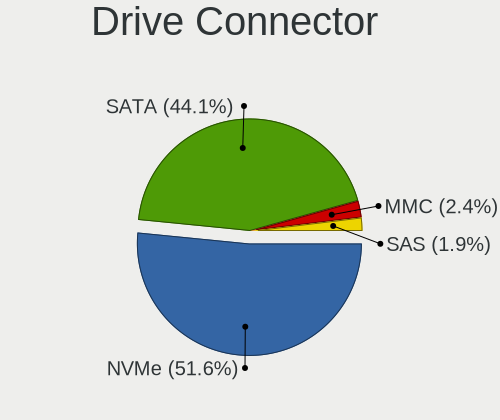
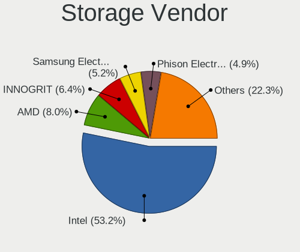
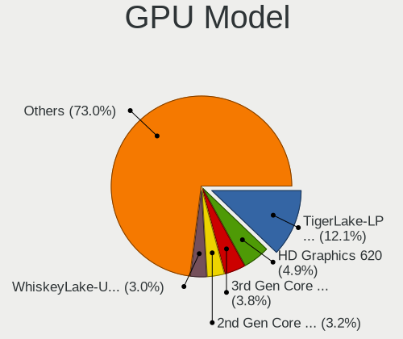
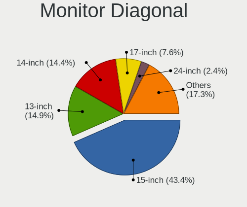
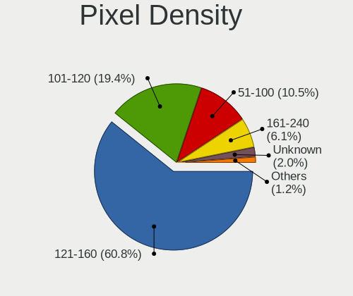
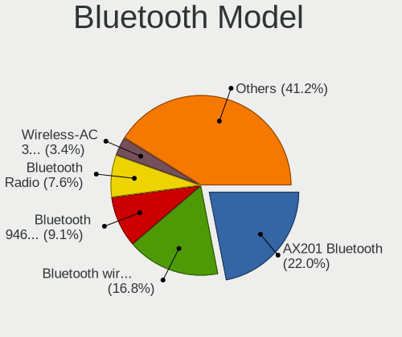
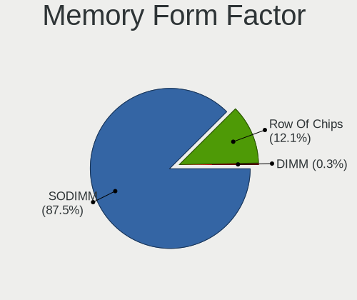
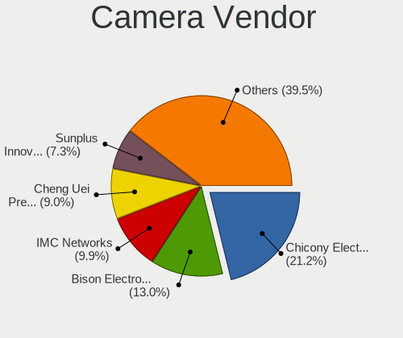

ALT Linux - Tested Hardware & Statistics (Notebooks)
----------------------------------------------------

A project to collect tested hardware configurations for ALT Linux.

Anyone can contribute to this report by the [hw-probe](https://github.com/linuxhw/hw-probe) tool:

    sudo -E hw-probe -all -upload

Please contribute! Especially if your hardware is rare.

Contents
--------

* [ Test Cases ](#test-cases)

* [ System ](#system)
  - [ OS                       ](#os)
  - [ OS Family                ](#os-family)
  - [ Kernel                   ](#kernel)
  - [ Kernel Family            ](#kernel-family)
  - [ Kernel Major Ver.        ](#kernel-major-ver)
  - [ Arch                     ](#arch)
  - [ DE                       ](#de)
  - [ Display Server           ](#display-server)
  - [ Display Manager          ](#display-manager)
  - [ OS Lang                  ](#os-lang)
  - [ Boot Mode                ](#boot-mode)
  - [ Filesystem               ](#filesystem)
  - [ Part. scheme             ](#part-scheme)
  - [ Dual Boot with Linux/BSD ](#dual-boot-with-linuxbsd)
  - [ Dual Boot (Win)          ](#dual-boot-win)

* [ Board ](#board)
  - [ Vendor                   ](#vendor)
  - [ Model                    ](#model)
  - [ Model Family             ](#model-family)
  - [ MFG Year                 ](#mfg-year)
  - [ Form Factor              ](#form-factor)
  - [ Secure Boot              ](#secure-boot)
  - [ Coreboot                 ](#coreboot)
  - [ RAM Size                 ](#ram-size)
  - [ RAM Used                 ](#ram-used)
  - [ Total Drives             ](#total-drives)
  - [ Has CD-ROM               ](#has-cd-rom)
  - [ Has Ethernet             ](#has-ethernet)
  - [ Has WiFi                 ](#has-wifi)
  - [ Has Bluetooth            ](#has-bluetooth)

* [ Location ](#location)
  - [ Country                  ](#country)
  - [ City                     ](#city)

* [ Drives ](#drives)
  - [ Drive Vendor             ](#drive-vendor)
  - [ Drive Model              ](#drive-model)
  - [ HDD Vendor               ](#hdd-vendor)
  - [ SSD Vendor               ](#ssd-vendor)
  - [ Drive Kind               ](#drive-kind)
  - [ Drive Connector          ](#drive-connector)
  - [ Drive Size               ](#drive-size)
  - [ Space Total              ](#space-total)
  - [ Space Used               ](#space-used)
  - [ Malfunc. Drives          ](#malfunc-drives)
  - [ Malfunc. Drive Vendor    ](#malfunc-drive-vendor)
  - [ Malfunc. HDD Vendor      ](#malfunc-hdd-vendor)
  - [ Malfunc. Drive Kind      ](#malfunc-drive-kind)
  - [ Failed Drives            ](#failed-drives)
  - [ Failed Drive Vendor      ](#failed-drive-vendor)
  - [ Drive Status             ](#drive-status)

* [ Storage controller ](#storage-controller)
  - [ Storage Vendor           ](#storage-vendor)
  - [ Storage Model            ](#storage-model)
  - [ Storage Kind             ](#storage-kind)

* [ Processor ](#processor)
  - [ CPU Vendor               ](#cpu-vendor)
  - [ CPU Model                ](#cpu-model)
  - [ CPU Model Family         ](#cpu-model-family)
  - [ CPU Cores                ](#cpu-cores)
  - [ CPU Sockets              ](#cpu-sockets)
  - [ CPU Threads              ](#cpu-threads)
  - [ CPU Op-Modes             ](#cpu-op-modes)
  - [ CPU Microcode            ](#cpu-microcode)
  - [ CPU Microarch            ](#cpu-microarch)

* [ Graphics ](#graphics)
  - [ GPU Vendor               ](#gpu-vendor)
  - [ GPU Model                ](#gpu-model)
  - [ GPU Combo                ](#gpu-combo)
  - [ GPU Driver               ](#gpu-driver)
  - [ GPU Memory               ](#gpu-memory)

* [ Monitor ](#monitor)
  - [ Monitor Vendor           ](#monitor-vendor)
  - [ Monitor Model            ](#monitor-model)
  - [ Monitor Resolution       ](#monitor-resolution)
  - [ Monitor Diagonal         ](#monitor-diagonal)
  - [ Monitor Width            ](#monitor-width)
  - [ Aspect Ratio             ](#aspect-ratio)
  - [ Monitor Area             ](#monitor-area)
  - [ Pixel Density            ](#pixel-density)
  - [ Multiple Monitors        ](#multiple-monitors)

* [ Network ](#network)
  - [ Net Controller Vendor    ](#net-controller-vendor)
  - [ Net Controller Model     ](#net-controller-model)
  - [ Wireless Vendor          ](#wireless-vendor)
  - [ Wireless Model           ](#wireless-model)
  - [ Ethernet Vendor          ](#ethernet-vendor)
  - [ Ethernet Model           ](#ethernet-model)
  - [ Net Controller Kind      ](#net-controller-kind)
  - [ Used Controller          ](#used-controller)
  - [ NICs                     ](#nics)
  - [ IPv6                     ](#ipv6)

* [ Bluetooth ](#bluetooth)
  - [ Bluetooth Vendor         ](#bluetooth-vendor)
  - [ Bluetooth Model          ](#bluetooth-model)

* [ Sound ](#sound)
  - [ Sound Vendor             ](#sound-vendor)
  - [ Sound Model              ](#sound-model)

* [ Memory ](#memory)
  - [ Memory Vendor            ](#memory-vendor)
  - [ Memory Model             ](#memory-model)
  - [ Memory Kind              ](#memory-kind)
  - [ Memory Form Factor       ](#memory-form-factor)
  - [ Memory Size              ](#memory-size)
  - [ Memory Speed             ](#memory-speed)

* [ Printers & scanners ](#printers--scanners)
  - [ Printer Vendor           ](#printer-vendor)
  - [ Printer Model            ](#printer-model)
  - [ Scanner Vendor           ](#scanner-vendor)
  - [ Scanner Model            ](#scanner-model)

* [ Camera ](#camera)
  - [ Camera Vendor            ](#camera-vendor)
  - [ Camera Model             ](#camera-model)

* [ Security ](#security)
  - [ Fingerprint Vendor       ](#fingerprint-vendor)
  - [ Fingerprint Model        ](#fingerprint-model)
  - [ Chipcard Vendor          ](#chipcard-vendor)
  - [ Chipcard Model           ](#chipcard-model)

* [ Unsupported ](#unsupported)
  - [ Unsupported Devices      ](#unsupported-devices)
  - [ Unsupported Device Types ](#unsupported-device-types)

Test Cases
----------

Total: 200

| Vendor        | Model                       | Probe                                                      | Date         |
|---------------|-----------------------------|------------------------------------------------------------|--------------|
| Lenovo        | G570 20079                  | [982a6e3241](https://linux-hardware.org/?probe=982a6e3241) | Jul 30, 2022 |
| ICL           | NLx0MU                      | [af0922946a](https://linux-hardware.org/?probe=af0922946a) | Jul 25, 2022 |
| Dell          | XPS 13 9360                 | [f870753f2f](https://linux-hardware.org/?probe=f870753f2f) | Jul 21, 2022 |
| HUAWEI        | KLVL-WXXW                   | [42a2639fcf](https://linux-hardware.org/?probe=42a2639fcf) | Jul 20, 2022 |
| HUAWEI        | KLVL-WXXW                   | [337e6e0efa](https://linux-hardware.org/?probe=337e6e0efa) | Jul 18, 2022 |
| 3Logic Gro... | Graviton N15i               | [5df194f626](https://linux-hardware.org/?probe=5df194f626) | Jul 13, 2022 |
| Dell          | Vostro 14 5410              | [2faa8bf726](https://linux-hardware.org/?probe=2faa8bf726) | Jul 12, 2022 |
| HP            | ProBook 4710s               | [4fe41da4e8](https://linux-hardware.org/?probe=4fe41da4e8) | Jul 09, 2022 |
| HP            | ProBook 4710s               | [932822fdc7](https://linux-hardware.org/?probe=932822fdc7) | Jul 09, 2022 |
| HUAWEI        | KLVL-WXXW                   | [5d2d940ec2](https://linux-hardware.org/?probe=5d2d940ec2) | Jul 07, 2022 |
| HUAWEI        | NBLB-WAX9N                  | [a8888a6627](https://linux-hardware.org/?probe=a8888a6627) | Jul 05, 2022 |
| HUAWEI        | NBLB-WAX9N                  | [b3da1e4cdb](https://linux-hardware.org/?probe=b3da1e4cdb) | Jul 05, 2022 |
| 3Logic Gro... | Graviton N15i-K2            | [3a07a4c8db](https://linux-hardware.org/?probe=3a07a4c8db) | Jun 21, 2022 |
| HP            | Pavilion dv7                | [19be007666](https://linux-hardware.org/?probe=19be007666) | Jun 04, 2022 |
| Kraftway      | ACCORD                      | [bc4e085e40](https://linux-hardware.org/?probe=bc4e085e40) | May 31, 2022 |
| Panasonic     | CF-20-1                     | [a0a97f2bd1](https://linux-hardware.org/?probe=a0a97f2bd1) | May 27, 2022 |
| IP3 Techno... | APN23                       | [4395a91f24](https://linux-hardware.org/?probe=4395a91f24) | May 25, 2022 |
| IP3 Techno... | APN23                       | [281f1263dc](https://linux-hardware.org/?probe=281f1263dc) | May 25, 2022 |
| HP            | Pavilion Gaming Laptop 1... | [692cdfaf7e](https://linux-hardware.org/?probe=692cdfaf7e) | May 24, 2022 |
| ICL           | Unknown                     | [07ff87175d](https://linux-hardware.org/?probe=07ff87175d) | May 24, 2022 |
| Lenovo        | V130-15IKB 81HN             | [9fbbff1973](https://linux-hardware.org/?probe=9fbbff1973) | May 21, 2022 |
| Apple         | MacBook7,1                  | [de4e9f2e03](https://linux-hardware.org/?probe=de4e9f2e03) | May 20, 2022 |
| Lenovo        | G570 20079                  | [db9d229530](https://linux-hardware.org/?probe=db9d229530) | May 19, 2022 |
| Sony          | SVE1512H1RB                 | [3894ca4fe2](https://linux-hardware.org/?probe=3894ca4fe2) | May 19, 2022 |
| ICL           | NJ50_70CU                   | [c16ccbe95b](https://linux-hardware.org/?probe=c16ccbe95b) | May 17, 2022 |
| HP            | Pavilion Gaming Laptop 1... | [f512156dc8](https://linux-hardware.org/?probe=f512156dc8) | May 16, 2022 |
| HP            | ZBook 17 G5                 | [6767fef6cf](https://linux-hardware.org/?probe=6767fef6cf) | May 16, 2022 |
| HP            | ZBook 17 G5                 | [28c62dd04c](https://linux-hardware.org/?probe=28c62dd04c) | May 16, 2022 |
| HP            | ZBook 17 G5                 | [f37b79c82d](https://linux-hardware.org/?probe=f37b79c82d) | May 16, 2022 |
| HP            | ZBook 17 G5                 | [086e18d971](https://linux-hardware.org/?probe=086e18d971) | May 16, 2022 |
| HP            | ZBook 17 G5                 | [75dc798956](https://linux-hardware.org/?probe=75dc798956) | May 16, 2022 |
| HP            | ZBook 17 G5                 | [6881a4923e](https://linux-hardware.org/?probe=6881a4923e) | May 16, 2022 |
| Sony          | SVE1512H1RB                 | [60dba4994d](https://linux-hardware.org/?probe=60dba4994d) | May 16, 2022 |
| ASUSTek       | ASUS TUF Gaming A17 FA70... | [ce128aaf56](https://linux-hardware.org/?probe=ce128aaf56) | May 15, 2022 |
| Apple         | MacBookPro16,2              | [b1ef2f3b4f](https://linux-hardware.org/?probe=b1ef2f3b4f) | May 12, 2022 |
| Notebook      | NLx0MU                      | [eb70f159f4](https://linux-hardware.org/?probe=eb70f159f4) | May 06, 2022 |
| Lenovo        | G570 20079                  | [9bf9254f54](https://linux-hardware.org/?probe=9bf9254f54) | Apr 28, 2022 |
| HP            | ZBook 17 G5                 | [6c1227313d](https://linux-hardware.org/?probe=6c1227313d) | Apr 27, 2022 |
| HP            | ZBook 17 G5                 | [4f49f3d6c2](https://linux-hardware.org/?probe=4f49f3d6c2) | Apr 27, 2022 |
| HP            | EliteBook 840 G4            | [a1b9c91836](https://linux-hardware.org/?probe=a1b9c91836) | Apr 25, 2022 |
| HP            | 250 G7 Notebook PC          | [a58503065e](https://linux-hardware.org/?probe=a58503065e) | Apr 20, 2022 |
| HP            | 250 G7 Notebook PC          | [c9f37aca9b](https://linux-hardware.org/?probe=c9f37aca9b) | Apr 20, 2022 |
| HP            | 250 G7 Notebook PC          | [4505d43267](https://linux-hardware.org/?probe=4505d43267) | Apr 20, 2022 |
| HP            | 250 G7 Notebook PC          | [bc8b33e0d2](https://linux-hardware.org/?probe=bc8b33e0d2) | Apr 20, 2022 |
| HP            | 250 G7 Notebook PC          | [fa53bb24d9](https://linux-hardware.org/?probe=fa53bb24d9) | Apr 19, 2022 |
| HP            | 250 G7 Notebook PC          | [9590ee5812](https://linux-hardware.org/?probe=9590ee5812) | Apr 19, 2022 |
| ICL           | RAYbook Si1512              | [ccf6fb39e5](https://linux-hardware.org/?probe=ccf6fb39e5) | Apr 19, 2022 |
| ICL           | RAYbook Si1512              | [ca58a7218c](https://linux-hardware.org/?probe=ca58a7218c) | Apr 19, 2022 |
| ICL           | RAYbook Si1512              | [2da4cb3427](https://linux-hardware.org/?probe=2da4cb3427) | Apr 19, 2022 |
| ICL           | RAYbook Si1512              | [77b103e672](https://linux-hardware.org/?probe=77b103e672) | Apr 19, 2022 |
| ICL           | RAYbook Si1512              | [25b490f8a8](https://linux-hardware.org/?probe=25b490f8a8) | Apr 19, 2022 |
| HP            | ProBook 450 G3              | [f31bad1291](https://linux-hardware.org/?probe=f31bad1291) | Apr 19, 2022 |
| ICL           | RAYbook Si1512              | [1f7e277528](https://linux-hardware.org/?probe=1f7e277528) | Apr 19, 2022 |
| HP            | 250 G7 Notebook PC          | [e03dec259a](https://linux-hardware.org/?probe=e03dec259a) | Apr 19, 2022 |
| HP            | ProBook 440 G5              | [39189517e8](https://linux-hardware.org/?probe=39189517e8) | Apr 18, 2022 |
| HP            | 250 G7 Notebook PC          | [d0a06db2b3](https://linux-hardware.org/?probe=d0a06db2b3) | Apr 18, 2022 |
| HP            | 250 G7 Notebook PC          | [33a738be3b](https://linux-hardware.org/?probe=33a738be3b) | Apr 18, 2022 |
| HP            | 250 G6 Notebook PC          | [a5bb696691](https://linux-hardware.org/?probe=a5bb696691) | Apr 18, 2022 |
| HP            | 250 G7 Notebook PC          | [a6631d6c9a](https://linux-hardware.org/?probe=a6631d6c9a) | Apr 18, 2022 |
| HP            | 250 G7 Notebook PC          | [7b60ea8e45](https://linux-hardware.org/?probe=7b60ea8e45) | Apr 18, 2022 |
| HP            | ProBook 440 G5              | [d78747839a](https://linux-hardware.org/?probe=d78747839a) | Apr 18, 2022 |
| HP            | Pavilion Gaming Laptop 1... | [65fa83d729](https://linux-hardware.org/?probe=65fa83d729) | Apr 18, 2022 |
| ICL           | RAYbook Si1512              | [aa2de26f4f](https://linux-hardware.org/?probe=aa2de26f4f) | Apr 18, 2022 |
| HP            | Pavilion Gaming Laptop 1... | [41a7060cbe](https://linux-hardware.org/?probe=41a7060cbe) | Apr 18, 2022 |
| HP            | 250 G7 Notebook PC          | [6225568c92](https://linux-hardware.org/?probe=6225568c92) | Apr 18, 2022 |
| HP            | ProBook 440 G5              | [be57c6ecd1](https://linux-hardware.org/?probe=be57c6ecd1) | Apr 18, 2022 |
| HP            | ProBook 440 G5              | [9202f2e9ef](https://linux-hardware.org/?probe=9202f2e9ef) | Apr 18, 2022 |
| HP            | ProBook 440 G5              | [f51e697243](https://linux-hardware.org/?probe=f51e697243) | Apr 18, 2022 |
| HP            | ZBook 17 G5                 | [7e24715646](https://linux-hardware.org/?probe=7e24715646) | Apr 18, 2022 |
| HP            | ProBook 440 G5              | [a739d61b7b](https://linux-hardware.org/?probe=a739d61b7b) | Apr 18, 2022 |
| HP            | ProBook 440 G5              | [86a59150d4](https://linux-hardware.org/?probe=86a59150d4) | Apr 18, 2022 |
| HP            | ZBook 17 G5                 | [e83eeef31e](https://linux-hardware.org/?probe=e83eeef31e) | Apr 18, 2022 |
| HP            | ProBook 440 G5              | [a0246c4b50](https://linux-hardware.org/?probe=a0246c4b50) | Apr 18, 2022 |
| Timi          | TM1701                      | [1eb7df8700](https://linux-hardware.org/?probe=1eb7df8700) | Apr 15, 2022 |
| HP            | ProBook 440 G5              | [f9202afa63](https://linux-hardware.org/?probe=f9202afa63) | Apr 15, 2022 |
| HP            | ProBook 440 G5              | [c5048041ee](https://linux-hardware.org/?probe=c5048041ee) | Apr 15, 2022 |
| HP            | EliteBook 840 G4            | [ee523553f4](https://linux-hardware.org/?probe=ee523553f4) | Apr 14, 2022 |
| HP            | ProBook 440 G5              | [efa4160e79](https://linux-hardware.org/?probe=efa4160e79) | Apr 14, 2022 |
| HP            | ProBook 440 G5              | [d2c072abdf](https://linux-hardware.org/?probe=d2c072abdf) | Apr 14, 2022 |
| HP            | 250 G6 Notebook PC          | [3cde2f0fd5](https://linux-hardware.org/?probe=3cde2f0fd5) | Apr 14, 2022 |
| HP            | ProBook 440 G5              | [86164212e5](https://linux-hardware.org/?probe=86164212e5) | Apr 14, 2022 |
| HP            | ProBook 440 G5              | [37ebd7e15e](https://linux-hardware.org/?probe=37ebd7e15e) | Apr 14, 2022 |
| Dell          | Latitude 3420               | [f3278afeb0](https://linux-hardware.org/?probe=f3278afeb0) | Apr 13, 2022 |
| Dell          | Latitude 3420               | [2388ba39b8](https://linux-hardware.org/?probe=2388ba39b8) | Apr 13, 2022 |
| HP            | EliteBook 840 G4            | [87deb321d4](https://linux-hardware.org/?probe=87deb321d4) | Apr 13, 2022 |
| HP            | 250 G6 Notebook PC          | [2b8e6fdd29](https://linux-hardware.org/?probe=2b8e6fdd29) | Apr 13, 2022 |
| ASUSTek       | ZenBook UX431DA_UM431DA     | [c2e18d9346](https://linux-hardware.org/?probe=c2e18d9346) | Apr 13, 2022 |
| ASUSTek       | ZenBook UX431DA_UM431DA     | [0e2380e59d](https://linux-hardware.org/?probe=0e2380e59d) | Apr 13, 2022 |
| Dell          | Latitude 3420               | [ecdf7b8de0](https://linux-hardware.org/?probe=ecdf7b8de0) | Apr 12, 2022 |
| Dell          | Latitude 3420               | [4361233072](https://linux-hardware.org/?probe=4361233072) | Apr 12, 2022 |
| ICL           | RAYbook Si1512              | [19f3a71bf4](https://linux-hardware.org/?probe=19f3a71bf4) | Apr 12, 2022 |
| HP            | 250 G7 Notebook PC          | [0860ee5a64](https://linux-hardware.org/?probe=0860ee5a64) | Apr 12, 2022 |
| ICL           | RAYbook Si1512              | [4f1aa9470b](https://linux-hardware.org/?probe=4f1aa9470b) | Apr 12, 2022 |
| ICL           | RAYbook Si1512              | [7537241f1d](https://linux-hardware.org/?probe=7537241f1d) | Apr 12, 2022 |
| ICL           | RAYbook Si1512              | [d6792fe869](https://linux-hardware.org/?probe=d6792fe869) | Apr 12, 2022 |
| ICL           | RAYbook Si1512              | [e3236de077](https://linux-hardware.org/?probe=e3236de077) | Apr 12, 2022 |
| HP            | ZBook 17 G5                 | [2d62dd7b61](https://linux-hardware.org/?probe=2d62dd7b61) | Apr 12, 2022 |
| HP            | ZBook 17 G5                 | [0eae0dfd04](https://linux-hardware.org/?probe=0eae0dfd04) | Apr 12, 2022 |
| HP            | ProBook 440 G5              | [65b8e561ab](https://linux-hardware.org/?probe=65b8e561ab) | Apr 12, 2022 |
| HP            | ProBook 440 G5              | [b95e628a8f](https://linux-hardware.org/?probe=b95e628a8f) | Apr 12, 2022 |
| HP            | ZBook 17 G5                 | [d05023771a](https://linux-hardware.org/?probe=d05023771a) | Apr 12, 2022 |
| HP            | ZBook 17 G5                 | [655584ea45](https://linux-hardware.org/?probe=655584ea45) | Apr 12, 2022 |
| HP            | ZBook 17 G5                 | [a6527519c6](https://linux-hardware.org/?probe=a6527519c6) | Apr 12, 2022 |
| Acer          | TravelMate 5760             | [b6f41e002d](https://linux-hardware.org/?probe=b6f41e002d) | Apr 12, 2022 |
| HP            | ZBook 17 G5                 | [f8931a9e1e](https://linux-hardware.org/?probe=f8931a9e1e) | Apr 12, 2022 |
| Acer          | Aspire A514-52K             | [085e03c893](https://linux-hardware.org/?probe=085e03c893) | Apr 11, 2022 |
| Acer          | Aspire A514-52K             | [0157eea2f6](https://linux-hardware.org/?probe=0157eea2f6) | Apr 11, 2022 |
| HP            | ZBook 17 G5                 | [7289268e39](https://linux-hardware.org/?probe=7289268e39) | Apr 11, 2022 |
| Dell          | Latitude 3420               | [d436f78355](https://linux-hardware.org/?probe=d436f78355) | Apr 11, 2022 |
| Acer          | TravelMate 5760             | [958de67015](https://linux-hardware.org/?probe=958de67015) | Apr 11, 2022 |
| Lenovo        | B590 20206                  | [e027a7672d](https://linux-hardware.org/?probe=e027a7672d) | Apr 11, 2022 |
| HP            | ZBook 17 G5                 | [5f90eb0f80](https://linux-hardware.org/?probe=5f90eb0f80) | Apr 11, 2022 |
| Dell          | Latitude 3420               | [5dbdb89f95](https://linux-hardware.org/?probe=5dbdb89f95) | Apr 11, 2022 |
| Acer          | Aspire 5745G                | [4a6e981204](https://linux-hardware.org/?probe=4a6e981204) | Apr 04, 2022 |
| Lenovo        | V510-15IKB 80WQ             | [dfdb44695a](https://linux-hardware.org/?probe=dfdb44695a) | Apr 01, 2022 |
| HP            | Unknown                     | [e989736b06](https://linux-hardware.org/?probe=e989736b06) | Mar 30, 2022 |
| HP            | Unknown                     | [672d3c8b62](https://linux-hardware.org/?probe=672d3c8b62) | Mar 29, 2022 |
| HP            | 250 G3                      | [22f691edac](https://linux-hardware.org/?probe=22f691edac) | Mar 29, 2022 |
| HP            | Pavilion Gaming Laptop 1... | [e4b8a2cc11](https://linux-hardware.org/?probe=e4b8a2cc11) | Mar 23, 2022 |
| HP            | Pavilion Gaming Laptop 1... | [64baae5b88](https://linux-hardware.org/?probe=64baae5b88) | Mar 22, 2022 |
| ICL           | NJ50_70CU                   | [247859eb78](https://linux-hardware.org/?probe=247859eb78) | Mar 22, 2022 |
| ICL           | NJ50_70CU                   | [b9e82b8490](https://linux-hardware.org/?probe=b9e82b8490) | Mar 22, 2022 |
| ASUSTek       | ASUS EXPERTBOOK B1500CEA... | [58fdf49095](https://linux-hardware.org/?probe=58fdf49095) | Mar 17, 2022 |
| ASUSTek       | ASUS EXPERTBOOK B1500CEA... | [eaa9fb6aad](https://linux-hardware.org/?probe=eaa9fb6aad) | Mar 14, 2022 |
| 3Logic Gro... | Graviton N15i-K2            | [72eefd2811](https://linux-hardware.org/?probe=72eefd2811) | Mar 14, 2022 |
| Dell          | G5 5590                     | [9b95f2ae1d](https://linux-hardware.org/?probe=9b95f2ae1d) | Mar 06, 2022 |
| Lenovo        | IdeaPad 3 15IIL05 81WE      | [13bc7e73f1](https://linux-hardware.org/?probe=13bc7e73f1) | Mar 02, 2022 |
| ASUSTek       | ASUS TUF Gaming A17 FA70... | [ef592cb1a7](https://linux-hardware.org/?probe=ef592cb1a7) | Feb 26, 2022 |
| HP            | Pavilion Gaming Laptop 1... | [c907453bf5](https://linux-hardware.org/?probe=c907453bf5) | Feb 18, 2022 |
| ASUSTek       | ASUS TUF Gaming A15 FA50... | [3986a62bca](https://linux-hardware.org/?probe=3986a62bca) | Feb 15, 2022 |
| ASUSTek       | X200MA                      | [b2f1d59884](https://linux-hardware.org/?probe=b2f1d59884) | Feb 12, 2022 |
| Timi          | TM1701                      | [4edeb14964](https://linux-hardware.org/?probe=4edeb14964) | Feb 05, 2022 |
| DEPO Compu... | DPC156                      | [4fb49336e5](https://linux-hardware.org/?probe=4fb49336e5) | Feb 03, 2022 |
| Lenovo        | ThinkBook 15 G2 ITL 20VE    | [a08b9de6fa](https://linux-hardware.org/?probe=a08b9de6fa) | Jan 28, 2022 |
| Dell          | Latitude 3590               | [e2a6ef3266](https://linux-hardware.org/?probe=e2a6ef3266) | Jan 18, 2022 |
| HP            | Pavilion Gaming Laptop 1... | [00f8c9d649](https://linux-hardware.org/?probe=00f8c9d649) | Jan 02, 2022 |
| Samsung       | 750XDA                      | [8fe8612ccb](https://linux-hardware.org/?probe=8fe8612ccb) | Dec 21, 2021 |
| Acer          | Aspire 5750G                | [58cdbcf87e](https://linux-hardware.org/?probe=58cdbcf87e) | Dec 18, 2021 |
| ASUSTek       | N46VZ                       | [aaf9eff6bd](https://linux-hardware.org/?probe=aaf9eff6bd) | Oct 11, 2021 |
| ASUSTek       | VivoBook_ASUSLaptop X421... | [2839eb3d12](https://linux-hardware.org/?probe=2839eb3d12) | Oct 09, 2021 |
| HP            | Laptop 15s-fq0xxx           | [516882d907](https://linux-hardware.org/?probe=516882d907) | Sep 23, 2021 |
| Timi          | TM1701                      | [b13b26d7ca](https://linux-hardware.org/?probe=b13b26d7ca) | Sep 16, 2021 |
| ASUSTek       | N46VZ                       | [40c97b439e](https://linux-hardware.org/?probe=40c97b439e) | Sep 12, 2021 |
| Acer          | Aspire A317-32              | [09342414f3](https://linux-hardware.org/?probe=09342414f3) | Sep 09, 2021 |
| Lenovo        | IdeaPad 3 15IGL05 81WQ      | [6648ff785e](https://linux-hardware.org/?probe=6648ff785e) | Sep 08, 2021 |
| ASUSTek       | N46VZ                       | [eb37b7db1e](https://linux-hardware.org/?probe=eb37b7db1e) | Aug 11, 2021 |
| Acer          | Swift SF314-57              | [2872bd6b13](https://linux-hardware.org/?probe=2872bd6b13) | Aug 05, 2021 |
| Durabook      | Z14                         | [7abdb375e2](https://linux-hardware.org/?probe=7abdb375e2) | Jul 27, 2021 |
| Lenovo        | ThinkPad L13 Gen 2 20VH0... | [a85464aae6](https://linux-hardware.org/?probe=a85464aae6) | Jul 06, 2021 |
| Aquarius      | NS585                       | [bc10f2ffbd](https://linux-hardware.org/?probe=bc10f2ffbd) | Jun 27, 2021 |
| Dell          | G3 3779                     | [eaf53820e5](https://linux-hardware.org/?probe=eaf53820e5) | Jun 02, 2021 |
| HUAWEI        | NBLK-WAX9X                  | [9908ba82e9](https://linux-hardware.org/?probe=9908ba82e9) | May 31, 2021 |
| Lenovo        | ThinkPad L13 Gen 2 20VH0... | [9f3a13c865](https://linux-hardware.org/?probe=9f3a13c865) | May 27, 2021 |
| HP            | Laptop 17-by0xxx            | [a3f263e12b](https://linux-hardware.org/?probe=a3f263e12b) | May 26, 2021 |
| Dell          | Inspiron 3542               | [e1a816cc42](https://linux-hardware.org/?probe=e1a816cc42) | May 25, 2021 |
| MSI           | GE72 7RE                    | [a6a5258971](https://linux-hardware.org/?probe=a6a5258971) | May 20, 2021 |
| Lenovo        | IdeaPad 5 15IIL05 81YK      | [59740e6ccf](https://linux-hardware.org/?probe=59740e6ccf) | Apr 29, 2021 |
| HP            | EliteBook 8470p             | [632deaf397](https://linux-hardware.org/?probe=632deaf397) | Apr 16, 2021 |
| Lenovo        | ThinkBook 15 G2 ITL 20VE    | [8185306af7](https://linux-hardware.org/?probe=8185306af7) | Apr 16, 2021 |
| ASUSTek       | VivoBook 15_ASUS Laptop ... | [ea2ab7cbc7](https://linux-hardware.org/?probe=ea2ab7cbc7) | Apr 07, 2021 |
| ASUSTek       | VivoBook_ASUSLaptop X421... | [3afcb7ca65](https://linux-hardware.org/?probe=3afcb7ca65) | Mar 29, 2021 |
| Lenovo        | IdeaPad 310-15ISK 80SM      | [66f3887fa2](https://linux-hardware.org/?probe=66f3887fa2) | Mar 20, 2021 |
| HP            | Pavilion Laptop 15-cc5xx    | [2c576fb8a9](https://linux-hardware.org/?probe=2c576fb8a9) | Mar 17, 2021 |
| HP            | Laptop 15s-fq2xxx           | [2d8bd02af5](https://linux-hardware.org/?probe=2d8bd02af5) | Feb 09, 2021 |
| Lenovo        | B50-10 80QR                 | [211bf1a4b4](https://linux-hardware.org/?probe=211bf1a4b4) | Jan 15, 2021 |
| Acer          | NC-ES1-131-C1NL             | [1cae46f14f](https://linux-hardware.org/?probe=1cae46f14f) | Jan 09, 2021 |
| HP            | Laptop 15s-fq0xxx           | [2437a45956](https://linux-hardware.org/?probe=2437a45956) | Jan 07, 2021 |
| HP            | EliteBook 8470p             | [ed90389918](https://linux-hardware.org/?probe=ed90389918) | Dec 22, 2020 |
| Lenovo        | ThinkPad X220 4291M85       | [f2c165b2d8](https://linux-hardware.org/?probe=f2c165b2d8) | Dec 22, 2020 |
| ASUSTek       | X510UNR                     | [53ef89172e](https://linux-hardware.org/?probe=53ef89172e) | Dec 21, 2020 |
| Lenovo        | ThinkPad 13 2nd Gen 20J1... | [00824d4fae](https://linux-hardware.org/?probe=00824d4fae) | Nov 19, 2020 |
| HP            | Laptop 14s-dq1xxx           | [f6e0ab4b2b](https://linux-hardware.org/?probe=f6e0ab4b2b) | Nov 13, 2020 |
| Toshiba       | Satellite A100              | [f09cd03fff](https://linux-hardware.org/?probe=f09cd03fff) | Nov 09, 2020 |
| MSI           | X300/X340/X400 series       | [1fd45a8e47](https://linux-hardware.org/?probe=1fd45a8e47) | Oct 23, 2020 |
| Lenovo        | B50-10 80QR                 | [ae14993850](https://linux-hardware.org/?probe=ae14993850) | Sep 28, 2020 |
| ASUSTek       | N46VZ                       | [d1ba7fa191](https://linux-hardware.org/?probe=d1ba7fa191) | Sep 23, 2020 |
| ASUSTek       | N46VZ                       | [ee23f7cefc](https://linux-hardware.org/?probe=ee23f7cefc) | Sep 14, 2020 |
| ASUSTek       | N46VZ                       | [52930a9597](https://linux-hardware.org/?probe=52930a9597) | Sep 03, 2020 |
| ASUSTek       | N46VZ                       | [9998e51d1c](https://linux-hardware.org/?probe=9998e51d1c) | Aug 14, 2020 |
| Samsung       | R510/P510                   | [e20ff4ae24](https://linux-hardware.org/?probe=e20ff4ae24) | Jul 12, 2020 |
| Lenovo        | B50-10 80QR                 | [a50e0f999e](https://linux-hardware.org/?probe=a50e0f999e) | Jul 07, 2020 |
| HP            | 255 G2                      | [3d4e8b4672](https://linux-hardware.org/?probe=3d4e8b4672) | May 27, 2020 |
| Acer          | Aspire E1-571G              | [3290540c34](https://linux-hardware.org/?probe=3290540c34) | Mar 13, 2020 |
| Lenovo        | 3000 G430 4153/200          | [0315e41f8c](https://linux-hardware.org/?probe=0315e41f8c) | Dec 26, 2019 |
| HP            | Pavilion dv6700             | [1031d661db](https://linux-hardware.org/?probe=1031d661db) | Nov 24, 2019 |
| HP            | Pavilion dv6700             | [c2fc59b6de](https://linux-hardware.org/?probe=c2fc59b6de) | Nov 23, 2019 |
| ASUSTek       | N46VZ                       | [bee323a814](https://linux-hardware.org/?probe=bee323a814) | Oct 29, 2019 |
| eMachines     | eME728                      | [83010f511e](https://linux-hardware.org/?probe=83010f511e) | Oct 25, 2019 |
| ASUSTek       | X200MA                      | [595d1ddd1b](https://linux-hardware.org/?probe=595d1ddd1b) | Oct 25, 2019 |
| MSI           | MEGA BOOK S430              | [6380916978](https://linux-hardware.org/?probe=6380916978) | Sep 15, 2019 |
| Lenovo        | G505s 20255                 | [46308d3b71](https://linux-hardware.org/?probe=46308d3b71) | Aug 30, 2019 |
| Lenovo        | G505s 20255                 | [c840002848](https://linux-hardware.org/?probe=c840002848) | Aug 30, 2019 |
| ASUSTek       | 1101HA                      | [f221bcd7e4](https://linux-hardware.org/?probe=f221bcd7e4) | Aug 16, 2019 |
| ASUSTek       | N46VZ                       | [aec6cff1b5](https://linux-hardware.org/?probe=aec6cff1b5) | Aug 15, 2019 |
| Samsung       | RV413/RV513/E3413           | [3e37ab573a](https://linux-hardware.org/?probe=3e37ab573a) | Apr 24, 2019 |
| Samsung       | RV413/RV513/E3413           | [447cdad389](https://linux-hardware.org/?probe=447cdad389) | Apr 23, 2019 |
| Acer          | Aspire ES1-523              | [0f6abd34f2](https://linux-hardware.org/?probe=0f6abd34f2) | Dec 17, 2018 |
| ASUSTek       | 1001PXD                     | [1a4aa87d78](https://linux-hardware.org/?probe=1a4aa87d78) | Oct 29, 2018 |
| Acer          | Aspire ES1-523              | [5e9a049dce](https://linux-hardware.org/?probe=5e9a049dce) | Oct 08, 2018 |
| ASUSTek       | K52JT                       | [7fdee4e7bb](https://linux-hardware.org/?probe=7fdee4e7bb) | Jun 18, 2016 |

System
------

OS
--

Installed operating systems

| Name               | Notebooks | Percent |
|--------------------|-----------|---------|
| Kometa P10         | 54        | 37.24%  |
| ALT Linux 10.0     | 23        | 15.86%  |
| ALT Linux 9.1      | 22        | 15.17%  |
| ALT Linux 9.2      | 10        | 6.9%    |
| ALT Linux 9.0      | 9         | 6.21%   |
| ALT Linux 10.1     | 5         | 3.45%   |
| MOS 10             | 3         | 2.07%   |
| ALT Linux P9       | 2         | 1.38%   |
| ALT Linux P8       | 2         | 1.38%   |
| ALT Linux 8.2      | 2         | 1.38%   |
| ALT Linux 20201124 | 2         | 1.38%   |
| ALT Linux 20191026 | 2         | 1.38%   |
| ALT Linux P10      | 1         | 0.69%   |
| ALT Linux 9        | 1         | 0.69%   |
| ALT Linux 8.990    | 1         | 0.69%   |
| ALT Linux 8.920    | 1         | 0.69%   |
| ALT Linux 8.3      | 1         | 0.69%   |
| ALT Linux 8.0.0    | 1         | 0.69%   |
| ALT Linux 20190624 | 1         | 0.69%   |
| ALT Linux 10.0.900 | 1         | 0.69%   |
| ALT Linux          | 1         | 0.69%   |

OS Family
---------

OS without a version

| Name      | Notebooks | Percent |
|-----------|-----------|---------|
| ALT Linux | 137       | 100%    |

Kernel
------

Version of the Linux kernel

| Version                  | Notebooks | Percent |
|--------------------------|-----------|---------|
| 5.10.102-std-def-alt1    | 36        | 23.38%  |
| 5.10.109-std-def-alt1    | 19        | 12.34%  |
| 5.10.88-std-def-alt1     | 6         | 3.9%    |
| 5.4.68-std-def-alt1.1    | 3         | 1.95%   |
| 5.4.28-std-def-alt1      | 3         | 1.95%   |
| 5.15.34-un-def-alt1      | 3         | 1.95%   |
| 5.10.82-std-def-alt1     | 3         | 1.95%   |
| 5.4.62-std-def-alt1      | 2         | 1.3%    |
| 5.4.51-std-def-alt1      | 2         | 1.3%    |
| 5.15.52-un-def-alt1      | 2         | 1.3%    |
| 5.15.33-un-def-alt1      | 2         | 1.3%    |
| 5.15.25-un-def-alt1      | 2         | 1.3%    |
| 5.10.62-un-def-alt1      | 2         | 1.3%    |
| 5.10.61-un-def-alt1      | 2         | 1.3%    |
| 5.10.37-un-def-alt1      | 2         | 1.3%    |
| 5.10.32-un-def-alt1      | 2         | 1.3%    |
| 5.10.17-un-def-alt1      | 2         | 1.3%    |
| 5.10.113-std-def-alt1    | 2         | 1.3%    |
| 5.10.111-std-def-alt1    | 2         | 1.3%    |
| 4.19.79-std-def-alt1     | 2         | 1.3%    |
| 4.19.66-std-def-alt1     | 2         | 1.3%    |
| 4.19.102-std-def-alt1    | 2         | 1.3%    |
| 5.7.19-un-def-alt1       | 1         | 0.65%   |
| 5.4.98-std-def-alt1      | 1         | 0.65%   |
| 5.4.87-std-def-alt1      | 1         | 0.65%   |
| 5.4.85-std-def-alt1      | 1         | 0.65%   |
| 5.4.84-std-def-alt1      | 1         | 0.65%   |
| 5.4.44-std-def-alt1      | 1         | 0.65%   |
| 5.4.41-std-def-alt1      | 1         | 0.65%   |
| 5.4.3-un-def-alt1        | 1         | 0.65%   |
| 5.4.171-std-def-alt1     | 1         | 0.65%   |
| 5.4.144-std-def-alt1     | 1         | 0.65%   |
| 5.4.127-std-def-alt1     | 1         | 0.65%   |
| 5.4.117-std-def-alt1     | 1         | 0.65%   |
| 5.4.115-std-def-alt1     | 1         | 0.65%   |
| 5.4.107-std-def-alt1     | 1         | 0.65%   |
| 5.4.107-std-def-alt0.c9f | 1         | 0.65%   |
| 5.3.5-un-def-alt1        | 1         | 0.65%   |
| 5.18.9-un-def-alt1       | 1         | 0.65%   |
| 5.18.12-un-def-alt1.2    | 1         | 0.65%   |
| 5.16.5-un-def-alt1       | 1         | 0.65%   |
| 5.15.54-std-def-alt1     | 1         | 0.65%   |
| 5.15.37-un-def-alt1      | 1         | 0.65%   |
| 5.15.23-un-def-alt1      | 1         | 0.65%   |
| 5.15.15-un-def-alt1      | 1         | 0.65%   |
| 5.13.19-un-def-alt1      | 1         | 0.65%   |
| 5.13.15-un-def-alt1      | 1         | 0.65%   |
| 5.10.93-std-def-alt1     | 1         | 0.65%   |
| 5.10.92-std-def-alt1     | 1         | 0.65%   |
| 5.10.69-std-def-alt1     | 1         | 0.65%   |
| 5.10.54-std-def-alt2     | 1         | 0.65%   |
| 5.10.52-un-def-alt1      | 1         | 0.65%   |
| 5.10.40-un-def-alt1      | 1         | 0.65%   |
| 5.10.35-std-def-alt1     | 1         | 0.65%   |
| 5.10.29-un-def-alt2      | 1         | 0.65%   |
| 5.10.27-un-def-alt1      | 1         | 0.65%   |
| 5.10.126-std-def-alt1    | 1         | 0.65%   |
| 5.10.123-std-def-alt1    | 1         | 0.65%   |
| 5.10.121-std-def-alt1    | 1         | 0.65%   |
| 5.10.118-un-def-alt1     | 1         | 0.65%   |

Kernel Family
-------------

Linux kernel without a distro release

| Version  | Notebooks | Percent |
|----------|-----------|---------|
| 5.10.102 | 36        | 23.38%  |
| 5.10.109 | 19        | 12.34%  |
| 5.10.88  | 6         | 3.9%    |
| 5.4.68   | 3         | 1.95%   |
| 5.4.28   | 3         | 1.95%   |
| 5.15.34  | 3         | 1.95%   |
| 5.10.82  | 3         | 1.95%   |
| 5.4.62   | 2         | 1.3%    |
| 5.4.51   | 2         | 1.3%    |
| 5.4.107  | 2         | 1.3%    |
| 5.15.52  | 2         | 1.3%    |
| 5.15.33  | 2         | 1.3%    |
| 5.15.25  | 2         | 1.3%    |
| 5.10.62  | 2         | 1.3%    |
| 5.10.61  | 2         | 1.3%    |
| 5.10.37  | 2         | 1.3%    |
| 5.10.32  | 2         | 1.3%    |
| 5.10.17  | 2         | 1.3%    |
| 5.10.118 | 2         | 1.3%    |
| 5.10.113 | 2         | 1.3%    |
| 5.10.111 | 2         | 1.3%    |
| 4.19.79  | 2         | 1.3%    |
| 4.19.66  | 2         | 1.3%    |
| 4.19.102 | 2         | 1.3%    |
| 5.7.19   | 1         | 0.65%   |
| 5.4.98   | 1         | 0.65%   |
| 5.4.87   | 1         | 0.65%   |
| 5.4.85   | 1         | 0.65%   |
| 5.4.84   | 1         | 0.65%   |
| 5.4.44   | 1         | 0.65%   |
| 5.4.41   | 1         | 0.65%   |
| 5.4.3    | 1         | 0.65%   |
| 5.4.171  | 1         | 0.65%   |
| 5.4.144  | 1         | 0.65%   |
| 5.4.127  | 1         | 0.65%   |
| 5.4.117  | 1         | 0.65%   |
| 5.4.115  | 1         | 0.65%   |
| 5.3.5    | 1         | 0.65%   |
| 5.18.9   | 1         | 0.65%   |
| 5.18.12  | 1         | 0.65%   |
| 5.16.5   | 1         | 0.65%   |
| 5.15.54  | 1         | 0.65%   |
| 5.15.37  | 1         | 0.65%   |
| 5.15.23  | 1         | 0.65%   |
| 5.15.15  | 1         | 0.65%   |
| 5.13.19  | 1         | 0.65%   |
| 5.13.15  | 1         | 0.65%   |
| 5.10.93  | 1         | 0.65%   |
| 5.10.92  | 1         | 0.65%   |
| 5.10.69  | 1         | 0.65%   |
| 5.10.54  | 1         | 0.65%   |
| 5.10.52  | 1         | 0.65%   |
| 5.10.40  | 1         | 0.65%   |
| 5.10.35  | 1         | 0.65%   |
| 5.10.29  | 1         | 0.65%   |
| 5.10.27  | 1         | 0.65%   |
| 5.10.126 | 1         | 0.65%   |
| 5.10.123 | 1         | 0.65%   |
| 5.10.121 | 1         | 0.65%   |
| 5.10.117 | 1         | 0.65%   |

Kernel Major Ver.
-----------------

Linux kernel major version

| Version | Notebooks | Percent |
|---------|-----------|---------|
| 5.10    | 90        | 62.5%   |
| 5.4     | 20        | 13.89%  |
| 5.15    | 12        | 8.33%   |
| 4.19    | 11        | 7.64%   |
| 4.9     | 3         | 2.08%   |
| 5.18    | 2         | 1.39%   |
| 5.13    | 2         | 1.39%   |
| 5.7     | 1         | 0.69%   |
| 5.3     | 1         | 0.69%   |
| 5.16    | 1         | 0.69%   |
| 4.4     | 1         | 0.69%   |

Arch
----

OS architecture (x86_64, i586, etc.)

| Name   | Notebooks | Percent |
|--------|-----------|---------|
| x86_64 | 130       | 94.89%  |
| i686   | 7         | 5.11%   |

DE
--

Desktop Environment

| Name            | Notebooks | Percent |
|-----------------|-----------|---------|
| KDE5            | 97        | 68.79%  |
| Unknown         | 17        | 12.06%  |
| XFCE            | 16        | 11.35%  |
| LXQt            | 4         | 2.84%   |
| GNOME           | 3         | 2.13%   |
| Cinnamon        | 3         | 2.13%   |
| GNOME Flashback | 1         | 0.71%   |

Display Server
--------------

X11 or Wayland

| Name    | Notebooks | Percent |
|---------|-----------|---------|
| X11     | 133       | 96.38%  |
| Wayland | 3         | 2.17%   |
| Tty     | 2         | 1.45%   |

Display Manager
---------------

SDDM, LightDM, etc.

| Name    | Notebooks | Percent |
|---------|-----------|---------|
| SDDM    | 83        | 58.87%  |
| LightDM | 27        | 19.15%  |
| TDM     | 22        | 15.6%   |
| Unknown | 7         | 4.96%   |
| XDM     | 1         | 0.71%   |
| GDM     | 1         | 0.71%   |

OS Lang
-------

Language

| Lang    | Notebooks | Percent |
|---------|-----------|---------|
| ru_RU   | 109       | 76.76%  |
| Unknown | 26        | 18.31%  |
| en_US   | 5         | 3.52%   |
| POSIX   | 1         | 0.7%    |
| C       | 1         | 0.7%    |

Boot Mode
---------

EFI or BIOS

| Mode | Notebooks | Percent |
|------|-----------|---------|
| EFI  | 107       | 76.98%  |
| BIOS | 32        | 23.02%  |

Filesystem
----------

Type of filesystem

| Type    | Notebooks | Percent |
|---------|-----------|---------|
| Ext4    | 120       | 86.96%  |
| Overlay | 13        | 9.42%   |
| Btrfs   | 3         | 2.17%   |
| Unknown | 2         | 1.45%   |

Part. scheme
------------

Scheme of partitioning

| Type    | Notebooks | Percent |
|---------|-----------|---------|
| GPT     | 105       | 75.54%  |
| MBR     | 25        | 17.99%  |
| Unknown | 9         | 6.47%   |

Dual Boot with Linux/BSD
------------------------

Hosting more than one Linux/BSD

| Dual boot | Notebooks | Percent |
|-----------|-----------|---------|
| No        | 132       | 94.96%  |
| Yes       | 7         | 5.04%   |

Dual Boot (Win)
---------------

Hosting Linux and Windows

| Dual boot | Notebooks | Percent |
|-----------|-----------|---------|
| No        | 72        | 52.17%  |
| Yes       | 66        | 47.83%  |

Board
-----

Vendor
------

Motherboard manufacturer

| Name                | Notebooks | Percent |
|---------------------|-----------|---------|
| Hewlett-Packard     | 52        | 37.96%  |
| Lenovo              | 17        | 12.41%  |
| ASUSTek Computer    | 15        | 10.95%  |
| ICL                 | 10        | 7.3%    |
| Acer                | 10        | 7.3%    |
| Dell                | 8         | 5.84%   |
| HUAWEI              | 4         | 2.92%   |
| Samsung Electronics | 3         | 2.19%   |
| MSI                 | 3         | 2.19%   |
| 3Logic Group        | 3         | 2.19%   |
| Apple               | 2         | 1.46%   |
| Toshiba             | 1         | 0.73%   |
| Timi                | 1         | 0.73%   |
| Sony                | 1         | 0.73%   |
| Panasonic           | 1         | 0.73%   |
| Kraftway            | 1         | 0.73%   |
| IP3 Technology      | 1         | 0.73%   |
| eMachines           | 1         | 0.73%   |
| Durabook            | 1         | 0.73%   |
| DEPO Computers      | 1         | 0.73%   |
| Aquarius            | 1         | 0.73%   |

Model
-----

Motherboard model

| Name                                      | Notebooks | Percent |
|-------------------------------------------|-----------|---------|
| HP 250 G7 Notebook PC                     | 12        | 8.76%   |
| HP ZBook 17 G5                            | 9         | 6.57%   |
| HP ProBook 440 G5                         | 8         | 5.84%   |
| ICL RAYbook Si1512                        | 6         | 4.38%   |
| HP EliteBook 840 G4                       | 3         | 2.19%   |
| HP 250 G6 Notebook PC                     | 3         | 2.19%   |
| Dell Latitude 3420                        | 3         | 2.19%   |
| Lenovo ThinkPad L13 Gen 2 20VH001WRT      | 2         | 1.46%   |
| Lenovo ThinkBook 15 G2 ITL 20VE           | 2         | 1.46%   |
| ICL NJ50_70CU                             | 2         | 1.46%   |
| HUAWEI KLVL-WXXW                          | 2         | 1.46%   |
| HP EliteBook 8470p                        | 2         | 1.46%   |
| ASUS N46VZ                                | 2         | 1.46%   |
| ASUS ASUS EXPERTBOOK B1500CEAEY_B1500CEAE | 2         | 1.46%   |
| Acer TravelMate 5760                      | 2         | 1.46%   |
| 3Logic Group Graviton N15i-K2             | 2         | 1.46%   |
| Unknown                                   | 2         | 1.46%   |
| Toshiba Satellite A100                    | 1         | 0.73%   |
| Timi TM1701                               | 1         | 0.73%   |
| Sony SVE1512H1RB                          | 1         | 0.73%   |
| Samsung RV413/RV513/E3413                 | 1         | 0.73%   |
| Samsung R510/P510                         | 1         | 0.73%   |
| Samsung 750XDA                            | 1         | 0.73%   |
| Panasonic CF-20-1                         | 1         | 0.73%   |
| MSI X300/X340/X400 series                 | 1         | 0.73%   |
| MSI MEGA BOOK S430                        | 1         | 0.73%   |
| MSI GE72 7RE                              | 1         | 0.73%   |
| Lenovo V510-15IKB 80WQ                    | 1         | 0.73%   |
| Lenovo V130-15IKB 81HN                    | 1         | 0.73%   |
| Lenovo ThinkPad X220 4291M85              | 1         | 0.73%   |
| Lenovo ThinkPad 13 2nd Gen 20J1S0EU00     | 1         | 0.73%   |
| Lenovo IdeaPad 5 15IIL05 81YK             | 1         | 0.73%   |
| Lenovo IdeaPad 310-15ISK 80SM             | 1         | 0.73%   |
| Lenovo IdeaPad 3 15IIL05 81WE             | 1         | 0.73%   |
| Lenovo IdeaPad 3 15IGL05 81WQ             | 1         | 0.73%   |
| Lenovo G570 20079                         | 1         | 0.73%   |
| Lenovo G505s 20255                        | 1         | 0.73%   |
| Lenovo B590 20206                         | 1         | 0.73%   |
| Lenovo B50-10 80QR                        | 1         | 0.73%   |
| Lenovo 3000 G430 4153/200                 | 1         | 0.73%   |
| Kraftway ACCORD                           | 1         | 0.73%   |
| IP3 APN23                                 | 1         | 0.73%   |
| ICL NLx0MU                                | 1         | 0.73%   |
| HUAWEI NBLK-WAX9X                         | 1         | 0.73%   |
| HUAWEI NBLB-WAX9N                         | 1         | 0.73%   |
| HP ProBook 4710s                          | 1         | 0.73%   |
| HP ProBook 450 G3                         | 1         | 0.73%   |
| HP Pavilion Laptop 15-cc5xx               | 1         | 0.73%   |
| HP Pavilion Gaming Laptop 17-cd2xxx       | 1         | 0.73%   |
| HP Pavilion Gaming Laptop 17-cd1xxx       | 1         | 0.73%   |
| HP Pavilion Gaming Laptop 15-ec1xxx       | 1         | 0.73%   |
| HP Pavilion dv7                           | 1         | 0.73%   |
| HP Pavilion dv6700                        | 1         | 0.73%   |
| HP Laptop 17-by0xxx                       | 1         | 0.73%   |
| HP Laptop 15s-fq2xxx                      | 1         | 0.73%   |
| HP Laptop 15s-fq0xxx                      | 1         | 0.73%   |
| HP Laptop 14s-dq1xxx                      | 1         | 0.73%   |
| HP 255 G2                                 | 1         | 0.73%   |
| HP 250 G3                                 | 1         | 0.73%   |
| eMachines eME728                          | 1         | 0.73%   |

Model Family
------------

Motherboard model prefix

| Name                  | Notebooks | Percent |
|-----------------------|-----------|---------|
| HP 250                | 16        | 11.68%  |
| HP ProBook            | 10        | 7.3%    |
| HP ZBook              | 9         | 6.57%   |
| ICL RAYbook           | 6         | 4.38%   |
| HP Pavilion           | 6         | 4.38%   |
| Acer Aspire           | 6         | 4.38%   |
| HP EliteBook          | 5         | 3.65%   |
| Lenovo ThinkPad       | 4         | 2.92%   |
| Lenovo IdeaPad        | 4         | 2.92%   |
| HP Laptop             | 4         | 2.92%   |
| Dell Latitude         | 4         | 2.92%   |
| ASUS ASUS             | 4         | 2.92%   |
| ASUS VivoBook         | 3         | 2.19%   |
| 3Logic Group Graviton | 3         | 2.19%   |
| Lenovo ThinkBook      | 2         | 1.46%   |
| ICL NJ50              | 2         | 1.46%   |
| HUAWEI KLVL-WXXW      | 2         | 1.46%   |
| ASUS N46VZ            | 2         | 1.46%   |
| Acer TravelMate       | 2         | 1.46%   |
| Unknown               | 2         | 1.46%   |
| Toshiba Satellite     | 1         | 0.73%   |
| Timi TM1701           | 1         | 0.73%   |
| Sony SVE1512H1RB      | 1         | 0.73%   |
| Samsung RV413         | 1         | 0.73%   |
| Samsung R510          | 1         | 0.73%   |
| Samsung 750XDA        | 1         | 0.73%   |
| Panasonic CF-20-1     | 1         | 0.73%   |
| MSI X300              | 1         | 0.73%   |
| MSI MEGA              | 1         | 0.73%   |
| MSI GE72              | 1         | 0.73%   |
| Lenovo V510-15IKB     | 1         | 0.73%   |
| Lenovo V130-15IKB     | 1         | 0.73%   |
| Lenovo G570           | 1         | 0.73%   |
| Lenovo G505s          | 1         | 0.73%   |
| Lenovo B590           | 1         | 0.73%   |
| Lenovo B50-10         | 1         | 0.73%   |
| Lenovo 3000           | 1         | 0.73%   |
| Kraftway ACCORD       | 1         | 0.73%   |
| IP3 APN23             | 1         | 0.73%   |
| ICL NLx0MU            | 1         | 0.73%   |
| HUAWEI NBLK-WAX9X     | 1         | 0.73%   |
| HUAWEI NBLB-WAX9N     | 1         | 0.73%   |
| HP 255                | 1         | 0.73%   |
| eMachines eME728      | 1         | 0.73%   |
| Durabook Z14          | 1         | 0.73%   |
| DEPO Computers DPC156 | 1         | 0.73%   |
| Dell XPS              | 1         | 0.73%   |
| Dell Vostro           | 1         | 0.73%   |
| Dell Inspiron         | 1         | 0.73%   |
| Dell G3               | 1         | 0.73%   |
| ASUS ZenBook          | 1         | 0.73%   |
| ASUS X510UNR          | 1         | 0.73%   |
| ASUS X200MA           | 1         | 0.73%   |
| ASUS K52JT            | 1         | 0.73%   |
| ASUS 1101HA           | 1         | 0.73%   |
| ASUS 1001PXD          | 1         | 0.73%   |
| Aquarius NS585        | 1         | 0.73%   |
| Apple MacBookPro16    | 1         | 0.73%   |
| Apple MacBook7        | 1         | 0.73%   |
| Acer Swift            | 1         | 0.73%   |

MFG Year
--------

Motherboard manufacture year

| Year | Notebooks | Percent |
|------|-----------|---------|
| 2018 | 26        | 18.98%  |
| 2017 | 19        | 13.87%  |
| 2021 | 17        | 12.41%  |
| 2020 | 17        | 12.41%  |
| 2019 | 15        | 10.95%  |
| 2011 | 7         | 5.11%   |
| 2016 | 6         | 4.38%   |
| 2012 | 6         | 4.38%   |
| 2010 | 5         | 3.65%   |
| 2008 | 4         | 2.92%   |
| 2014 | 3         | 2.19%   |
| 2009 | 3         | 2.19%   |
| 2022 | 2         | 1.46%   |
| 2015 | 2         | 1.46%   |
| 2013 | 2         | 1.46%   |
| 2007 | 2         | 1.46%   |
| 2006 | 1         | 0.73%   |

Form Factor
-----------

Physical design of the computer

| Name     | Notebooks | Percent |
|----------|-----------|---------|
| Notebook | 137       | 100%    |

Secure Boot
-----------

Enabled or disabled

| State    | Notebooks | Percent |
|----------|-----------|---------|
| Disabled | 116       | 82.86%  |
| Enabled  | 24        | 17.14%  |

Coreboot
--------

Have coreboot on board

| Used | Notebooks | Percent |
|------|-----------|---------|
| No   | 137       | 100%    |

RAM Size
--------

Total RAM memory

| Size in GB | Notebooks | Percent |
|------------|-----------|---------|
| 4.01-8.0   | 78        | 56.52%  |
| 3.01-4.0   | 26        | 18.84%  |
| 16.01-24.0 | 18        | 13.04%  |
| 1.01-2.0   | 7         | 5.07%   |
| 8.01-16.0  | 7         | 5.07%   |
| 2.01-3.0   | 2         | 1.45%   |

RAM Used
--------

Used RAM memory

| Used GB   | Notebooks | Percent |
|-----------|-----------|---------|
| 1.01-2.0  | 70        | 46.67%  |
| 2.01-3.0  | 27        | 18%     |
| 0.51-1.0  | 25        | 16.67%  |
| 3.01-4.0  | 13        | 8.67%   |
| 4.01-8.0  | 12        | 8%      |
| 0.01-0.5  | 2         | 1.33%   |
| 8.01-16.0 | 1         | 0.67%   |

Total Drives
------------

Number of drives on board

| Drives | Notebooks | Percent |
|--------|-----------|---------|
| 1      | 109       | 77.3%   |
| 2      | 28        | 19.86%  |
| 0      | 2         | 1.42%   |
| 4      | 1         | 0.71%   |
| 3      | 1         | 0.71%   |

Has CD-ROM
----------

Has CD-ROM on board

| Presented | Notebooks | Percent |
|-----------|-----------|---------|
| No        | 87        | 62.59%  |
| Yes       | 52        | 37.41%  |

Has Ethernet
------------

Has Ethernet on board

| Presented | Notebooks | Percent |
|-----------|-----------|---------|
| Yes       | 121       | 88.32%  |
| No        | 16        | 11.68%  |

Has WiFi
--------

Has WiFi module

| Presented | Notebooks | Percent |
|-----------|-----------|---------|
| Yes       | 137       | 100%    |

Has Bluetooth
-------------

Has Bluetooth module

| Presented | Notebooks | Percent |
|-----------|-----------|---------|
| Yes       | 112       | 81.16%  |
| No        | 26        | 18.84%  |

Location
--------

Country
-------

Geographic location (country)

| Country    | Notebooks | Percent |
|------------|-----------|---------|
| Russia     | 128       | 93.43%  |
| Greece     | 3         | 2.19%   |
| Uzbekistan | 1         | 0.73%   |
| Ukraine    | 1         | 0.73%   |
| Egypt      | 1         | 0.73%   |
| Czechia    | 1         | 0.73%   |
| Costa Rica | 1         | 0.73%   |
| Belarus    | 1         | 0.73%   |

City
----

Geographic location (city)

| City              | Notebooks | Percent |
|-------------------|-----------|---------|
| Moscow            | 89        | 63.12%  |
| St Petersburg     | 5         | 3.55%   |
| Barnaul           | 4         | 2.84%   |
| Samara            | 3         | 2.13%   |
| Perm              | 2         | 1.42%   |
| Korolyov          | 2         | 1.42%   |
| Belgorod          | 2         | 1.42%   |
| Astrakhan         | 2         | 1.42%   |
| Yekaterinburg     | 1         | 0.71%   |
| Verkhnyaya Pyshma | 1         | 0.71%   |
| Vergina           | 1         | 0.71%   |
| Tyumen            | 1         | 0.71%   |
| Troitsk           | 1         | 0.71%   |
| Thessaloniki      | 1         | 0.71%   |
| Tashkent          | 1         | 0.71%   |
| Surgut            | 1         | 0.71%   |
| Suez              | 1         | 0.71%   |
| Sevastopol        | 1         | 0.71%   |
| Saratov           | 1         | 0.71%   |
| San Jos         | 1         | 0.71%   |
| Prague            | 1         | 0.71%   |
| Omsk              | 1         | 0.71%   |
| Obninsk           | 1         | 0.71%   |
| Novosibirsk       | 1         | 0.71%   |
| Novichikha        | 1         | 0.71%   |
| Nizhny Tagil      | 1         | 0.71%   |
| Lesosibirsk       | 1         | 0.71%   |
| Krasnoyarsk       | 1         | 0.71%   |
| Kostroma          | 1         | 0.71%   |
| Kirov             | 1         | 0.71%   |
| Khabarovsk        | 1         | 0.71%   |
| Kemerovo          | 1         | 0.71%   |
| Kazan          | 1         | 0.71%   |
| Kaluga            | 1         | 0.71%   |
| Kaliningrad       | 1         | 0.71%   |
| Hurghada          | 1         | 0.71%   |
| Fedorovka         | 1         | 0.71%   |
| Edessa            | 1         | 0.71%   |
| Bratsk            | 1         | 0.71%   |
| Arkhangelsk       | 1         | 0.71%   |

Drives
------

Drive Vendor
------------

Hard drive vendors

| Vendor                      | Notebooks | Drives | Percent |
|-----------------------------|-----------|--------|---------|
| Seagate                     | 24        | 29     | 14.63%  |
| Samsung Electronics         | 22        | 29     | 13.41%  |
| Intel                       | 21        | 24     | 12.8%   |
| WDC                         | 18        | 22     | 10.98%  |
| SK hynix                    | 18        | 18     | 10.98%  |
| Toshiba                     | 8         | 14     | 4.88%   |
| Foxline                     | 8         | 8      | 4.88%   |
| Hitachi                     | 5         | 5      | 3.05%   |
| Kingston                    | 4         | 4      | 2.44%   |
| HGST                        | 4         | 4      | 2.44%   |
| A-DATA Technology           | 4         | 4      | 2.44%   |
| XPG                         | 2         | 3      | 1.22%   |
| Unknown                     | 2         | 2      | 1.22%   |
| SSSTC                       | 2         | 2      | 1.22%   |
| SanDisk                     | 2         | 2      | 1.22%   |
| Phison                      | 2         | 2      | 1.22%   |
| Gigabyte Technology         | 2         | 2      | 1.22%   |
| Fujitsu                     | 2         | 2      | 1.22%   |
| Crucial                     | 2         | 2      | 1.22%   |
| Yangtze Memory Technologies | 1         | 1      | 0.61%   |
| Transcend                   | 1         | 1      | 0.61%   |
| PNY                         | 1         | 1      | 0.61%   |
| Plextor                     | 1         | 1      | 0.61%   |
| KIOXIA                      | 1         | 1      | 0.61%   |
| KingDian                    | 1         | 1      | 0.61%   |
| BIWIN                       | 1         | 1      | 0.61%   |
| BaseTech                    | 1         | 1      | 0.61%   |
| Apple                       | 1         | 1      | 0.61%   |
| Apacer                      | 1         | 1      | 0.61%   |
| AMD                         | 1         | 1      | 0.61%   |
| Unknown                     | 1         | 1      | 0.61%   |

Drive Model
-----------

Hard drive models

| Model                                     | Notebooks | Percent |
|-------------------------------------------|-----------|---------|
| SK hynix BC501 HFM256GDJTNG-8310A 256GB   | 12        | 7.1%    |
| Seagate ST1000LM049-2GH172 1TB            | 8         | 4.73%   |
| Intel SSDPEMKF256G8H 256GB                | 8         | 4.73%   |
| Intel SSDPEKKF256G7H 256GB                | 8         | 4.73%   |
| Foxline FLSSD256M80E13TCX5 256GB          | 8         | 4.73%   |
| Seagate ST1000LM024 HN-M101MBB 1TB        | 4         | 2.37%   |
| Samsung MZALQ256HAJD-000L2 256GB          | 4         | 2.37%   |
| WDC WD5000LPLX-60ZNTT2 500GB              | 2         | 1.18%   |
| WDC WD3200BPVT-22JJ5T0 320GB              | 2         | 1.18%   |
| Toshiba MQ04ABF100 1TB                    | 2         | 1.18%   |
| Toshiba KXG50ZNV256G 256GB                | 2         | 1.18%   |
| SSSTC CL1-3D256-Q11 NVMe 256GB            | 2         | 1.18%   |
| Seagate ST9250315AS 250GB                 | 2         | 1.18%   |
| Seagate ST1000LM035-1RK172 1TB            | 2         | 1.18%   |
| Samsung SSD 860 EVO M.2 250GB             | 2         | 1.18%   |
| Samsung SSD 860 EVO 250GB                 | 2         | 1.18%   |
| Samsung NVMe SSD Drive 512GB              | 2         | 1.18%   |
| Phison 311CD0512GB                        | 2         | 1.18%   |
| Intel SSDPEKNW512G8H 512GB                | 2         | 1.18%   |
| HGST HTS721010A9E630 1TB                  | 2         | 1.18%   |
| Gigabyte GP-GSM2NE3256GNTD 256GB          | 2         | 1.18%   |
| Crucial CT120BX500SSD1 120GB              | 2         | 1.18%   |
| Yangtze Memory NVMe SSD Drive 256GB       | 1         | 0.59%   |
| XPG SPECTRIX S40G 256GB                   | 1         | 0.59%   |
| XPG NVMe SSD Drive 256GB                  | 1         | 0.59%   |
| WDC WDS500G2B0A-00SM50 500GB SSD          | 1         | 0.59%   |
| WDC WDS240G2G0A-00JH30 240GB SSD          | 1         | 0.59%   |
| WDC WDS120G2G0A-00JH30 120GB SSD          | 1         | 0.59%   |
| WDC WDS100T2B0B-00YS70 1TB SSD            | 1         | 0.59%   |
| WDC WDS100T2B0A-00SM50 1TB SSD            | 1         | 0.59%   |
| WDC WD5000LPVX-80V0TT0 500GB              | 1         | 0.59%   |
| WDC WD5000LPVX-60V0TT0 500GB              | 1         | 0.59%   |
| WDC WD5000LPLX-60ZNTT1 500GB              | 1         | 0.59%   |
| WDC WD5000LPCX-24VHAT0 500GB              | 1         | 0.59%   |
| WDC WD3200BEVT-22A23T0 320GB              | 1         | 0.59%   |
| WDC WD1600BEVS-22RST0 160GB               | 1         | 0.59%   |
| WDC WD1200BEVS-60UST0 120GB               | 1         | 0.59%   |
| WDC PC SN730 SDBQNTY-256G-1001 256GB      | 1         | 0.59%   |
| WDC PC SN730 SDBPNTY-512G-1027 512GB      | 1         | 0.59%   |
| WDC PC SN530 SDBPNPZ-512G-1002 512GB      | 1         | 0.59%   |
| Unknown USDU1  32GB                       | 1         | 0.59%   |
| Unknown SDC  8GB                          | 1         | 0.59%   |
| Transcend TS240GSSD220S 240GB             | 1         | 0.59%   |
| Toshiba MQ01ABD100 1TB                    | 1         | 0.59%   |
| Toshiba MQ01ABD050 500GB                  | 1         | 0.59%   |
| Toshiba MK6465GSX 640GB                   | 1         | 0.59%   |
| Toshiba MK2576GSX 250GB                   | 1         | 0.59%   |
| Toshiba HDWL110 1TB                       | 1         | 0.59%   |
| SK hynix SKHynix_HFM256GDHTNI-87A0B 256GB | 1         | 0.59%   |
| SK hynix SC311 SATA 128GB SSD             | 1         | 0.59%   |
| SK hynix HFS128G39TND-N210A 128GB SSD     | 1         | 0.59%   |
| SK hynix HFM256GDJTNG-8310A 256GB         | 1         | 0.59%   |
| SK hynix HBG4e  32GB                      | 1         | 0.59%   |
| SK hynix BC511 HFM512GDJTNI-82A0A 512GB   | 1         | 0.59%   |
| Seagate ST9640320AS 640GB                 | 1         | 0.59%   |
| Seagate ST9500325AS 500GB                 | 1         | 0.59%   |
| Seagate ST500LM021-1KJ152 500GB           | 1         | 0.59%   |
| Seagate ST500LM012 HN-M500MBB 500GB       | 1         | 0.59%   |
| Seagate ST2000LM007-1R8174 2TB            | 1         | 0.59%   |
| Seagate ST1000LM048-2E7172 1TB            | 1         | 0.59%   |

HDD Vendor
----------

Hard disk drive vendors

| Vendor  | Notebooks | Drives | Percent |
|---------|-----------|--------|---------|
| Seagate | 24        | 29     | 46.15%  |
| WDC     | 11        | 12     | 21.15%  |
| Toshiba | 6         | 12     | 11.54%  |
| Hitachi | 5         | 5      | 9.62%   |
| HGST    | 4         | 4      | 7.69%   |
| Fujitsu | 2         | 2      | 3.85%   |

SSD Vendor
----------

Solid state drive vendors

| Vendor              | Notebooks | Drives | Percent |
|---------------------|-----------|--------|---------|
| Samsung Electronics | 8         | 8      | 26.67%  |
| WDC                 | 4         | 7      | 13.33%  |
| SK hynix            | 2         | 2      | 6.67%   |
| Kingston            | 2         | 2      | 6.67%   |
| Crucial             | 2         | 2      | 6.67%   |
| A-DATA Technology   | 2         | 2      | 6.67%   |
| Transcend           | 1         | 1      | 3.33%   |
| SanDisk             | 1         | 1      | 3.33%   |
| PNY                 | 1         | 1      | 3.33%   |
| Plextor             | 1         | 1      | 3.33%   |
| KingDian            | 1         | 1      | 3.33%   |
| Intel               | 1         | 1      | 3.33%   |
| Foxline             | 1         | 1      | 3.33%   |
| BaseTech            | 1         | 1      | 3.33%   |
| AMD                 | 1         | 1      | 3.33%   |
| Unknown             | 1         | 1      | 3.33%   |

Drive Kind
----------

HDD or SSD

| Kind | Notebooks | Drives | Percent |
|------|-----------|--------|---------|
| NVMe | 77        | 90     | 48.13%  |
| HDD  | 51        | 64     | 31.88%  |
| SSD  | 29        | 33     | 18.13%  |
| MMC  | 3         | 3      | 1.88%   |

Drive Connector
---------------

SATA, SAS, NVMe, etc.

| Type | Notebooks | Drives | Percent |
|------|-----------|--------|---------|
| NVMe | 77        | 90     | 50.33%  |
| SATA | 70        | 94     | 45.75%  |
| SAS  | 3         | 3      | 1.96%   |
| MMC  | 3         | 3      | 1.96%   |

Drive Size
----------

Size of hard drive

| Size in TB | Notebooks | Drives | Percent |
|------------|-----------|--------|---------|
| 0.01-0.5   | 50        | 58     | 64.94%  |
| 0.51-1.0   | 26        | 38     | 33.77%  |
| 1.01-2.0   | 1         | 1      | 1.3%    |

Space Total
-----------

Amount of disk space available on the file system

| Size in GB | Notebooks | Percent |
|------------|-----------|---------|
| 101-250    | 74        | 51.75%  |
| 251-500    | 26        | 18.18%  |
| 51-100     | 17        | 11.89%  |
| 21-50      | 8         | 5.59%   |
| 1-20       | 7         | 4.9%    |
| 501-1000   | 7         | 4.9%    |
| 1001-2000  | 4         | 2.8%    |

Space Used
----------

Amount of used disk space

| Used GB   | Notebooks | Percent |
|-----------|-----------|---------|
| 1-20      | 88        | 60.27%  |
| 21-50     | 27        | 18.49%  |
| 101-250   | 12        | 8.22%   |
| 51-100    | 9         | 6.16%   |
| 251-500   | 6         | 4.11%   |
| 501-1000  | 3         | 2.05%   |
| 1001-2000 | 1         | 0.68%   |

Malfunc. Drives
---------------

Drive models with a malfunction

| Model                                   | Notebooks | Drives | Percent |
|-----------------------------------------|-----------|--------|---------|
| Seagate ST9250315AS 250GB               | 2         | 2      | 12.5%   |
| Seagate ST1000LM024 HN-M101MBB 1TB      | 2         | 7      | 12.5%   |
| WDC WD5000LPVX-60V0TT0 500GB            | 1         | 1      | 6.25%   |
| WDC WD5000LPLX-60ZNTT2 500GB            | 1         | 1      | 6.25%   |
| WDC WD1200BEVS-60UST0 120GB             | 1         | 1      | 6.25%   |
| Toshiba MQ01ABD050 500GB                | 1         | 1      | 6.25%   |
| SK hynix HFS128G39TND-N210A 128GB SSD   | 1         | 1      | 6.25%   |
| SK hynix BC501 HFM256GDJTNG-8310A 256GB | 1         | 1      | 6.25%   |
| Seagate ST9640320AS 640GB               | 1         | 1      | 6.25%   |
| Seagate ST9500325AS 500GB               | 1         | 1      | 6.25%   |
| Hitachi HTS725050A9A364 500GB           | 1         | 1      | 6.25%   |
| Hitachi HTS542525K9A300 250GB           | 1         | 1      | 6.25%   |
| Hitachi HTS541610J9SA00 100GB           | 1         | 1      | 6.25%   |
| HGST HTS545050A7E680 500GB              | 1         | 1      | 6.25%   |

Malfunc. Drive Vendor
---------------------

Vendors of faulty drives

| Vendor   | Notebooks | Drives | Percent |
|----------|-----------|--------|---------|
| Seagate  | 6         | 11     | 37.5%   |
| WDC      | 3         | 3      | 18.75%  |
| Hitachi  | 3         | 3      | 18.75%  |
| SK hynix | 2         | 2      | 12.5%   |
| Toshiba  | 1         | 1      | 6.25%   |
| HGST     | 1         | 1      | 6.25%   |

Malfunc. HDD Vendor
-------------------

Vendors of faulty HDD drives

| Vendor  | Notebooks | Drives | Percent |
|---------|-----------|--------|---------|
| Seagate | 6         | 11     | 42.86%  |
| WDC     | 3         | 3      | 21.43%  |
| Hitachi | 3         | 3      | 21.43%  |
| Toshiba | 1         | 1      | 7.14%   |
| HGST    | 1         | 1      | 7.14%   |

Malfunc. Drive Kind
-------------------

Kinds of faulty drives

| Kind | Notebooks | Drives | Percent |
|------|-----------|--------|---------|
| HDD  | 14        | 19     | 87.5%   |
| NVMe | 1         | 1      | 6.25%   |
| SSD  | 1         | 1      | 6.25%   |

Failed Drives
-------------

Failed drive models

Zero info for selected period =(

Failed Drive Vendor
-------------------

Failed drive vendors

Zero info for selected period =(

Drive Status
------------

Number of failed and malfunc. drives

| Status   | Notebooks | Drives | Percent |
|----------|-----------|--------|---------|
| Works    | 116       | 146    | 80.56%  |
| Malfunc  | 16        | 21     | 11.11%  |
| Detected | 12        | 23     | 8.33%   |

Storage controller
------------------

Storage Vendor
--------------

Storage controller vendors

| Vendor                         | Notebooks | Percent |
|--------------------------------|-----------|---------|
| Intel                          | 109       | 59.56%  |
| SK hynix                       | 15        | 8.2%    |
| Samsung Electronics            | 15        | 8.2%    |
| Phison Electronics             | 11        | 6.01%   |
| AMD                            | 11        | 6.01%   |
| SanDisk                        | 4         | 2.19%   |
| Nvidia                         | 3         | 1.64%   |
| Toshiba America Info Systems   | 2         | 1.09%   |
| Solid State Storage Technology | 2         | 1.09%   |
| Kingston Technology Company    | 2         | 1.09%   |
| ADATA Technology               | 2         | 1.09%   |
| Yangtze Memory Technologies    | 1         | 0.55%   |
| VIA Technologies               | 1         | 0.55%   |
| Unknown                        | 1         | 0.55%   |
| Shenzhen Longsys Electronics   | 1         | 0.55%   |
| Realtek Semiconductor          | 1         | 0.55%   |
| KIOXIA                         | 1         | 0.55%   |
| Apple                          | 1         | 0.55%   |

Storage Model
-------------

Storage controller models

| Model                                                                                  | Notebooks | Percent |
|----------------------------------------------------------------------------------------|-----------|---------|
| Intel Sunrise Point-LP SATA Controller [AHCI mode]                                     | 23        | 10.85%  |
| Intel 82801 Mobile SATA Controller [RAID mode]                                         | 17        | 8.02%   |
| SK hynix BC501 NVMe Solid State Drive                                                  | 13        | 6.13%   |
| Phison PS5013 E13 NVMe Controller                                                      | 11        | 5.19%   |
| Intel Comet Lake SATA AHCI Controller                                                  | 10        | 4.72%   |
| Intel Cannon Lake Mobile PCH SATA AHCI Controller                                      | 10        | 4.72%   |
| AMD FCH SATA Controller [AHCI mode]                                                    | 10        | 4.72%   |
| Samsung NVMe SSD Controller 980                                                        | 9         | 4.25%   |
| Intel Tiger Lake-LP SATA Controller                                                    | 9         | 4.25%   |
| Intel SSD 600P Series                                                                  | 9         | 4.25%   |
| Intel SSD Pro 7600p/760p/E 6100p Series                                                | 8         | 3.77%   |
| Intel 7 Series Chipset Family 6-port SATA Controller [AHCI mode]                       | 7         | 3.3%    |
| Samsung NVMe SSD Controller SM981/PM981/PM983                                          | 6         | 2.83%   |
| Intel Volume Management Device NVMe RAID Controller                                    | 6         | 2.83%   |
| Intel Cannon Point-LP SATA Controller [AHCI Mode]                                      | 5         | 2.36%   |
| Intel 82801IBM/IEM (ICH9M/ICH9M-E) 4 port SATA Controller [AHCI mode]                  | 5         | 2.36%   |
| Intel 6 Series/C200 Series Chipset Family 6 port Mobile SATA AHCI Controller           | 4         | 1.89%   |
| Intel Celeron/Pentium Silver Processor SATA Controller                                 | 3         | 1.42%   |
| Toshiba America Info Systems Toshiba America Info Non-Volatile memory controller       | 2         | 0.94%   |
| Solid State Storage Non-Volatile memory controller                                     | 2         | 0.94%   |
| SK hynix BC511                                                                         | 2         | 0.94%   |
| SanDisk WD Blue SN550 NVMe SSD                                                         | 2         | 0.94%   |
| SanDisk WD Black SN750 / PC SN730 NVMe SSD                                             | 2         | 0.94%   |
| Intel SSD 660P Series                                                                  | 2         | 0.94%   |
| Intel Ice Lake-LP SATA Controller [AHCI mode]                                          | 2         | 0.94%   |
| Intel Atom Processor E3800 Series SATA AHCI Controller                                 | 2         | 0.94%   |
| Intel 8 Series SATA Controller 1 [AHCI mode]                                           | 2         | 0.94%   |
| Intel 5 Series/3400 Series Chipset 4 port SATA AHCI Controller                         | 2         | 0.94%   |
| ADATA XPG SX8200 Pro PCIe Gen3x4 M.2 2280 Solid State Drive                            | 2         | 0.94%   |
| Yangtze Memory Non-Volatile memory controller                                          | 1         | 0.47%   |
| VIA VT8237/8251 Serial ATA Controller                                                  | 1         | 0.47%   |
| Unknown Non-Volatile memory controller                                                 | 1         | 0.47%   |
| Shenzhen Longsys SM2263EN/SM2263XT-based OEM SSD                                       | 1         | 0.47%   |
| Realtek RTS5763DL NVMe SSD Controller                                                  | 1         | 0.47%   |
| Nvidia MCP89 SATA Controller                                                           | 1         | 0.47%   |
| Nvidia MCP67 IDE Controller                                                            | 1         | 0.47%   |
| Nvidia MCP67 AHCI Controller                                                           | 1         | 0.47%   |
| Nvidia MCP51 Serial ATA Controller                                                     | 1         | 0.47%   |
| Nvidia MCP51 IDE                                                                       | 1         | 0.47%   |
| KIOXIA NVMe SSD Controller BG4                                                         | 1         | 0.47%   |
| Kingston Company U-SNS8154P3 NVMe SSD                                                  | 1         | 0.47%   |
| Kingston Company Company Non-Volatile memory controller                                | 1         | 0.47%   |
| Intel US15W/US15X/US15L/UL11L SCH [Poulsbo] IDE Controller                             | 1         | 0.47%   |
| Intel Non-Volatile memory controller                                                   | 1         | 0.47%   |
| Intel NM10/ICH7 Family SATA Controller [AHCI mode]                                     | 1         | 0.47%   |
| Intel HM170/QM170 Chipset SATA Controller [AHCI Mode]                                  | 1         | 0.47%   |
| Intel Cannon Lake PCH SATA AHCI Controller                                             | 1         | 0.47%   |
| Intel Atom Processor E3800 Series SATA IDE Controller                                  | 1         | 0.47%   |
| Intel 82801GBM/GHM (ICH7-M Family) SATA Controller [IDE mode]                          | 1         | 0.47%   |
| Intel 6 Series/C200 Series Chipset Family Mobile SATA Controller (IDE mode, ports 4-5) | 1         | 0.47%   |
| Intel 6 Series/C200 Series Chipset Family Mobile SATA Controller (IDE mode, ports 0-3) | 1         | 0.47%   |
| Apple ANS2 NVMe Controller                                                             | 1         | 0.47%   |
| AMD SB7x0/SB8x0/SB9x0 SATA Controller [AHCI mode]                                      | 1         | 0.47%   |
| AMD FCH IDE Controller                                                                 | 1         | 0.47%   |

Storage Kind
------------

Kind of storage controller (IDE, SATA, NVMe, SAS, ...)

| Kind | Notebooks | Percent |
|------|-----------|---------|
| SATA | 98        | 47.34%  |
| NVMe | 77        | 37.2%   |
| RAID | 23        | 11.11%  |
| IDE  | 9         | 4.35%   |

Processor
---------

CPU Vendor
----------

Processor vendors

| Vendor       | Notebooks | Percent |
|--------------|-----------|---------|
| Intel        | 119       | 86.86%  |
| AMD          | 17        | 12.41%  |
| CentaurHauls | 1         | 0.73%   |

CPU Model
---------

Processor models

| Model                                         | Notebooks | Percent |
|-----------------------------------------------|-----------|---------|
| Intel Core i5-8265U CPU @ 1.60GHz             | 13        | 9.49%   |
| Intel Core i7-8750H CPU @ 2.20GHz             | 10        | 7.3%    |
| Intel Core i5-10210U CPU @ 1.60GHz            | 9         | 6.57%   |
| Intel Core i3-7100U CPU @ 2.40GHz             | 9         | 6.57%   |
| Intel 11th Gen Core i5-1135G7 @ 2.40GHz       | 9         | 6.57%   |
| Intel Core i3-7020U CPU @ 2.30GHz             | 6         | 4.38%   |
| Intel Core i5-8259U CPU @ 2.30GHz             | 4         | 2.92%   |
| Intel Core i5-7200U CPU @ 2.50GHz             | 4         | 2.92%   |
| Intel Core i5-8250U CPU @ 1.60GHz             | 3         | 2.19%   |
| AMD Ryzen 7 4800H with Radeon Graphics        | 3         | 2.19%   |
| AMD Ryzen 5 3500U with Radeon Vega Mobile Gfx | 3         | 2.19%   |
| Intel Core i7-3610QM CPU @ 2.30GHz            | 2         | 1.46%   |
| Intel Core i5-2540M CPU @ 2.60GHz             | 2         | 1.46%   |
| Intel Core i3-6006U CPU @ 2.00GHz             | 2         | 1.46%   |
| Intel Core i3-4005U CPU @ 1.70GHz             | 2         | 1.46%   |
| Intel Core i3-1005G1 CPU @ 1.20GHz            | 2         | 1.46%   |
| Intel 11th Gen Core i3-1115G4 @ 3.00GHz       | 2         | 1.46%   |
| AMD Ryzen 5 5500U with Radeon Graphics        | 2         | 1.46%   |
| Intel Pentium Silver N5030 CPU @ 1.10GHz      | 1         | 0.73%   |
| Intel Pentium Silver N5000 CPU @ 1.10GHz      | 1         | 0.73%   |
| Intel Pentium Gold G5420 CPU @ 3.80GHz        | 1         | 0.73%   |
| Intel Pentium Gold 7505 @ 2.00GHz             | 1         | 0.73%   |
| Intel Pentium Dual-Core CPU T4500 @ 2.30GHz   | 1         | 0.73%   |
| Intel Pentium CPU B960 @ 2.20GHz              | 1         | 0.73%   |
| Intel Core m5-6Y57 CPU @ 1.10GHz              | 1         | 0.73%   |
| Intel Core i7-8550U CPU @ 1.80GHz             | 1         | 0.73%   |
| Intel Core i7-7700HQ CPU @ 2.80GHz            | 1         | 0.73%   |
| Intel Core i7-7500U CPU @ 2.70GHz             | 1         | 0.73%   |
| Intel Core i7-2640M CPU @ 2.80GHz             | 1         | 0.73%   |
| Intel Core i7-1065G7 CPU @ 1.30GHz            | 1         | 0.73%   |
| Intel Core i5-8279U CPU @ 2.40GHz             | 1         | 0.73%   |
| Intel Core i5-3360M CPU @ 2.80GHz             | 1         | 0.73%   |
| Intel Core i5-3230M CPU @ 2.60GHz             | 1         | 0.73%   |
| Intel Core i5-1038NG7 CPU @ 2.00GHz           | 1         | 0.73%   |
| Intel Core i5-1035G1 CPU @ 1.00GHz            | 1         | 0.73%   |
| Intel Core i5-10300H CPU @ 2.50GHz            | 1         | 0.73%   |
| Intel Core i5 CPU M 480 @ 2.67GHz             | 1         | 0.73%   |
| Intel Core i5 CPU M 430 @ 2.27GHz             | 1         | 0.73%   |
| Intel Core i3-6100U CPU @ 2.30GHz             | 1         | 0.73%   |
| Intel Core i3-3120M CPU @ 2.50GHz             | 1         | 0.73%   |
| Intel Core i3-3110M CPU @ 2.40GHz             | 1         | 0.73%   |
| Intel Core i3-2350M CPU @ 2.30GHz             | 1         | 0.73%   |
| Intel Core i3-2328M CPU @ 2.20GHz             | 1         | 0.73%   |
| Intel Core i3-10110U CPU @ 2.10GHz            | 1         | 0.73%   |
| Intel Core Duo CPU T2250 @ 1.73GHz            | 1         | 0.73%   |
| Intel Core 2 Solo CPU U3500 @ 1.40GHz         | 1         | 0.73%   |
| Intel Core 2 Duo CPU T5870 @ 2.00GHz          | 1         | 0.73%   |
| Intel Core 2 Duo CPU P8600 @ 2.40GHz          | 1         | 0.73%   |
| Intel Core 2 Duo CPU P8400 @ 2.26GHz          | 1         | 0.73%   |
| Intel Celeron N4020 CPU @ 1.10GHz             | 1         | 0.73%   |
| Intel Celeron Dual-Core CPU T3000 @ 1.80GHz   | 1         | 0.73%   |
| Intel Celeron CPU N3050 @ 1.60GHz             | 1         | 0.73%   |
| Intel Celeron CPU N2840 @ 2.16GHz             | 1         | 0.73%   |
| Intel Celeron CPU N2830 @ 2.16GHz             | 1         | 0.73%   |
| Intel Atom CPU Z520 @ 1.33GHz                 | 1         | 0.73%   |
| Intel Atom CPU N455 @ 1.66GHz                 | 1         | 0.73%   |
| Intel 11th Gen Core i5-11320H @ 3.20GHz       | 1         | 0.73%   |
| Intel 11th Gen Core i5-11300H @ 3.10GHz       | 1         | 0.73%   |
| CentaurHauls VIA C7-M Processor 1600MHz       | 1         | 0.73%   |
| AMD Turion 64 X2 Mobile Technology TL-58      | 1         | 0.73%   |

CPU Model Family
----------------

Processor model prefix

| Model                   | Notebooks | Percent |
|-------------------------|-----------|---------|
| Intel Core i5           | 43        | 31.39%  |
| Intel Core i3           | 27        | 19.71%  |
| Intel Core i7           | 17        | 12.41%  |
| Other                   | 13        | 9.49%   |
| AMD Ryzen 5             | 6         | 4.38%   |
| Intel Celeron           | 4         | 2.92%   |
| AMD Ryzen 7             | 4         | 2.92%   |
| Intel Core 2 Duo        | 3         | 2.19%   |
| Intel Pentium Silver    | 2         | 1.46%   |
| Intel Pentium Gold      | 2         | 1.46%   |
| Intel Atom              | 2         | 1.46%   |
| AMD A8                  | 2         | 1.46%   |
| Intel Pentium Dual-Core | 1         | 0.73%   |
| Intel Pentium           | 1         | 0.73%   |
| Intel Core m5           | 1         | 0.73%   |
| Intel Core Duo          | 1         | 0.73%   |
| Intel Core 2 Solo       | 1         | 0.73%   |
| Intel Celeron Dual-Core | 1         | 0.73%   |
| CentaurHauls VIA C7     | 1         | 0.73%   |
| AMD Turion 64 X2 Mobile | 1         | 0.73%   |
| AMD E1                  | 1         | 0.73%   |
| AMD E                   | 1         | 0.73%   |
| AMD Athlon 64 X2        | 1         | 0.73%   |
| AMD A6                  | 1         | 0.73%   |

CPU Cores
---------

Number of processor cores

| Number | Notebooks | Percent |
|--------|-----------|---------|
| 2      | 60        | 43.8%   |
| 4      | 57        | 41.61%  |
| 6      | 13        | 9.49%   |
| 1      | 4         | 2.92%   |
| 8      | 3         | 2.19%   |

CPU Sockets
-----------

Number of sockets

| Number | Notebooks | Percent |
|--------|-----------|---------|
| 1      | 137       | 100%    |

CPU Threads
-----------

Threads per core (Hyper-Threading)

| Number | Notebooks | Percent |
|--------|-----------|---------|
| 2      | 115       | 83.94%  |
| 1      | 22        | 16.06%  |

CPU Op-Modes
------------

CPU Operation Modes (32-bit, 64-bit)

| Op mode        | Notebooks | Percent |
|----------------|-----------|---------|
| 32-bit, 64-bit | 133       | 97.08%  |
| 32-bit         | 3         | 2.19%   |
| Unknown        | 1         | 0.73%   |

CPU Microcode
-------------

Microcode number

| Number     | Notebooks | Percent |
|------------|-----------|---------|
| Unknown    | 18        | 12.95%  |
| 0x806e9    | 16        | 11.51%  |
| 0x806ec    | 12        | 8.63%   |
| 0x906ea    | 11        | 7.91%   |
| 0x806c1    | 11        | 7.91%   |
| 0x806ea    | 10        | 7.19%   |
| 0xa0660    | 8         | 5.76%   |
| 0x306a9    | 6         | 4.32%   |
| 0x706e5    | 5         | 3.6%    |
| 0x406e3    | 4         | 2.88%   |
| 0x206a7    | 4         | 2.88%   |
| 0x1067a    | 4         | 2.88%   |
| 0x08600106 | 3         | 2.16%   |
| 0x08108109 | 3         | 2.16%   |
| 0x706a8    | 2         | 1.44%   |
| 0x40651    | 2         | 1.44%   |
| 0x30678    | 2         | 1.44%   |
| 0x08608102 | 2         | 1.44%   |
| 0xa0652    | 1         | 0.72%   |
| 0x806c2    | 1         | 0.72%   |
| 0x706a1    | 1         | 0.72%   |
| 0x6ec      | 1         | 0.72%   |
| 0x406c3    | 1         | 0.72%   |
| 0x20655    | 1         | 0.72%   |
| 0x20652    | 1         | 0.72%   |
| 0x106ca    | 1         | 0.72%   |
| 0x106c2    | 1         | 0.72%   |
| 0x10676    | 1         | 0.72%   |
| 0x08600104 | 1         | 0.72%   |
| 0x08108102 | 1         | 0.72%   |
| 0x07030105 | 1         | 0.72%   |
| 0x0700010f | 1         | 0.72%   |
| 0x06001119 | 1         | 0.72%   |
| 0x0300000f | 1         | 0.72%   |

CPU Microarch
-------------

Microarchitecture

| Name          | Notebooks | Percent |
|---------------|-----------|---------|
| KabyLake      | 56        | 40.88%  |
| TigerLake     | 14        | 10.22%  |
| CometLake     | 9         | 6.57%   |
| SandyBridge   | 6         | 4.38%   |
| IvyBridge     | 6         | 4.38%   |
| Penryn        | 5         | 3.65%   |
| IceLake       | 5         | 3.65%   |
| Zen+          | 4         | 2.92%   |
| Zen 2         | 4         | 2.92%   |
| Skylake       | 4         | 2.92%   |
| Silvermont    | 3         | 2.19%   |
| Goldmont plus | 3         | 2.19%   |
| Unknown       | 3         | 2.19%   |
| Westmere      | 2         | 1.46%   |
| K8 Hammer     | 2         | 1.46%   |
| Haswell       | 2         | 1.46%   |
| Bonnell       | 2         | 1.46%   |
| Puma          | 1         | 0.73%   |
| Piledriver    | 1         | 0.73%   |
| P6            | 1         | 0.73%   |
| K10 Llano     | 1         | 0.73%   |
| Jaguar        | 1         | 0.73%   |
| Core          | 1         | 0.73%   |
| Bobcat        | 1         | 0.73%   |

Graphics
--------

GPU Vendor
----------

Vendors of graphics cards

| Vendor           | Notebooks | Percent |
|------------------|-----------|---------|
| Intel            | 113       | 69.33%  |
| Nvidia           | 31        | 19.02%  |
| AMD              | 18        | 11.04%  |
| VIA Technologies | 1         | 0.61%   |

GPU Model
---------

Graphics card models

| Model                                                                                    | Notebooks | Percent |
|------------------------------------------------------------------------------------------|-----------|---------|
| Intel HD Graphics 620                                                                    | 20        | 12.05%  |
| Intel WhiskeyLake-U GT2 [UHD Graphics 620]                                               | 13        | 7.83%   |
| Intel TigerLake-LP GT2 [Iris Xe Graphics]                                                | 11        | 6.63%   |
| Intel CoffeeLake-H GT2 [UHD Graphics 630]                                                | 10        | 6.02%   |
| Nvidia GP107GLM [Quadro P1000 Mobile]                                                    | 9         | 5.42%   |
| Intel Comet Lake UHD Graphics                                                            | 8         | 4.82%   |
| Intel 3rd Gen Core processor Graphics Controller                                         | 6         | 3.61%   |
| Intel 2nd Generation Core Processor Family Integrated Graphics Controller                | 6         | 3.61%   |
| Intel CoffeeLake-U GT3e [Iris Plus Graphics 655]                                         | 5         | 3.01%   |
| Intel UHD Graphics 620                                                                   | 4         | 2.41%   |
| AMD Renoir                                                                               | 4         | 2.41%   |
| AMD Picasso/Raven 2 [Radeon Vega Series / Radeon Vega Mobile Series]                     | 4         | 2.41%   |
| Intel Tiger Lake UHD Graphics                                                            | 3         | 1.81%   |
| Intel Iris Plus Graphics G1 (Ice Lake)                                                   | 3         | 1.81%   |
| Nvidia GP107M [GeForce GTX 1050 Ti Mobile]                                               | 2         | 1.2%    |
| Nvidia GK107M [GeForce GT 650M]                                                          | 2         | 1.2%    |
| Intel Skylake GT2 [HD Graphics 520]                                                      | 2         | 1.2%    |
| Intel Mobile 4 Series Chipset Integrated Graphics Controller                             | 2         | 1.2%    |
| Intel Iris Plus Graphics G7                                                              | 2         | 1.2%    |
| Intel Haswell-ULT Integrated Graphics Controller                                         | 2         | 1.2%    |
| Intel GeminiLake [UHD Graphics 605]                                                      | 2         | 1.2%    |
| Intel CometLake-U GT2 [UHD Graphics]                                                     | 2         | 1.2%    |
| Intel Atom Processor Z36xxx/Z37xxx Series Graphics & Display                             | 2         | 1.2%    |
| AMD Robson CE [Radeon HD 6370M/7370M]                                                    | 2         | 1.2%    |
| AMD Lucienne                                                                             | 2         | 1.2%    |
| VIA Technologies CN896/VN896/P4M900 [Chrome 9 HC]                                        | 1         | 0.6%    |
| Nvidia TU117M [GeForce MX450]                                                            | 1         | 0.6%    |
| Nvidia TU117M [GeForce GTX 1650 Ti Mobile]                                               | 1         | 0.6%    |
| Nvidia TU117M [GeForce GTX 1650 Mobile / Max-Q]                                          | 1         | 0.6%    |
| Nvidia TU117M                                                                            | 1         | 0.6%    |
| Nvidia TU106M [GeForce RTX 2060 Mobile]                                                  | 1         | 0.6%    |
| Nvidia MCP89 [GeForce 320M]                                                              | 1         | 0.6%    |
| Nvidia GT216M [GeForce GT 330M]                                                          | 1         | 0.6%    |
| Nvidia GP108M [GeForce MX150]                                                            | 1         | 0.6%    |
| Nvidia GP108BM [GeForce MX250]                                                           | 1         | 0.6%    |
| Nvidia GM108M [GeForce 940MX]                                                            | 1         | 0.6%    |
| Nvidia GK208BM [GeForce 920M]                                                            | 1         | 0.6%    |
| Nvidia GF117M [GeForce 610M/710M/810M/820M / GT 620M/625M/630M/720M]                     | 1         | 0.6%    |
| Nvidia GF108M [GeForce GT 620M/630M/635M/640M LE]                                        | 1         | 0.6%    |
| Nvidia GA107M [GeForce RTX 3050 Mobile]                                                  | 1         | 0.6%    |
| Nvidia G98M [GeForce 9300M GS]                                                           | 1         | 0.6%    |
| Nvidia G98M [GeForce 9200M GS]                                                           | 1         | 0.6%    |
| Nvidia C67 [GeForce 7150M / nForce 630M]                                                 | 1         | 0.6%    |
| Nvidia C51 [GeForce Go 6100]                                                             | 1         | 0.6%    |
| Intel US15W/US15X SCH [Poulsbo] Graphics Controller                                      | 1         | 0.6%    |
| Intel Mobile 945GM/GMS/GME, 943/940GML Express Integrated Graphics Controller            | 1         | 0.6%    |
| Intel Mobile 945GM/GMS, 943/940GML Express Integrated Graphics Controller                | 1         | 0.6%    |
| Intel HD Graphics 630                                                                    | 1         | 0.6%    |
| Intel HD Graphics 520                                                                    | 1         | 0.6%    |
| Intel HD Graphics 515                                                                    | 1         | 0.6%    |
| Intel GeminiLake [UHD Graphics 600]                                                      | 1         | 0.6%    |
| Intel CometLake-H GT2 [UHD Graphics]                                                     | 1         | 0.6%    |
| Intel CoffeeLake-S GT1 [UHD Graphics 610]                                                | 1         | 0.6%    |
| Intel Atom/Celeron/Pentium Processor x5-E8000/J3xxx/N3xxx Integrated Graphics Controller | 1         | 0.6%    |
| Intel Atom Processor D4xx/D5xx/N4xx/N5xx Integrated Graphics Controller                  | 1         | 0.6%    |
| AMD Whistler [Radeon HD 6630M/6650M/6750M/7670M/7690M]                                   | 1         | 0.6%    |
| AMD Sumo [Radeon HD 6520G]                                                               | 1         | 0.6%    |
| AMD Seymour [Radeon HD 6400M/7400M Series]                                               | 1         | 0.6%    |
| AMD RV710/M92 [Mobility Radeon HD 4330/4350/4550]                                        | 1         | 0.6%    |
| AMD Richland [Radeon HD 8550G]                                                           | 1         | 0.6%    |

GPU Combo
---------

Combinations of graphics cards

| Name           | Notebooks | Percent |
|----------------|-----------|---------|
| 1 x Intel      | 90        | 65.69%  |
| Intel + Nvidia | 22        | 16.06%  |
| 1 x AMD        | 12        | 8.76%   |
| 1 x Nvidia     | 6         | 4.38%   |
| AMD + Nvidia   | 3         | 2.19%   |
| 2 x AMD        | 2         | 1.46%   |
| 1 x VIA        | 1         | 0.73%   |
| Intel + AMD    | 1         | 0.73%   |

GPU Driver
----------

Free vs proprietary

| Driver      | Notebooks | Percent |
|-------------|-----------|---------|
| Free        | 126       | 90.65%  |
| Proprietary | 10        | 7.19%   |
| Unknown     | 3         | 2.16%   |

GPU Memory
----------

Total video memory

| Size in GB | Notebooks | Percent |
|------------|-----------|---------|
| Unknown    | 106       | 75.71%  |
| 0.01-0.5   | 12        | 8.57%   |
| 3.01-4.0   | 10        | 7.14%   |
| 0.51-1.0   | 7         | 5%      |
| 1.01-2.0   | 5         | 3.57%   |

Monitor
-------

Monitor Vendor
--------------

Monitor vendors

| Vendor                  | Notebooks | Percent |
|-------------------------|-----------|---------|
| BOE                     | 41        | 28.08%  |
| Chimei Innolux          | 27        | 18.49%  |
| AU Optronics            | 25        | 17.12%  |
| LG Display              | 16        | 10.96%  |
| Samsung Electronics     | 10        | 6.85%   |
| Sharp                   | 5         | 3.42%   |
| Chi Mei Optoelectronics | 5         | 3.42%   |
| PANDA                   | 4         | 2.74%   |
| BenQ                    | 3         | 2.05%   |
| Apple                   | 2         | 1.37%   |
| AOC                     | 2         | 1.37%   |
| STA                     | 1         | 0.68%   |
| PRM                     | 1         | 0.68%   |
| Panasonic               | 1         | 0.68%   |
| KDC                     | 1         | 0.68%   |
| Hitachi                 | 1         | 0.68%   |
| Acer                    | 1         | 0.68%   |

Monitor Model
-------------

Monitor models

| Model                                                                | Notebooks | Percent |
|----------------------------------------------------------------------|-----------|---------|
| BOE LCD Monitor BOE0687 1920x1080 344x193mm 15.5-inch                | 12        | 8.16%   |
| Chimei Innolux LCD Monitor CMN175A 1920x1080 381x214mm 17.2-inch     | 9         | 6.12%   |
| BOE LCD Monitor BOE09EF 1920x1080 344x194mm 15.5-inch                | 6         | 4.08%   |
| AU Optronics LCD Monitor AUO213D 1920x1080 309x173mm 13.9-inch       | 5         | 3.4%    |
| Sharp LCD Monitor SHP1542 1920x1080 309x174mm 14.0-inch              | 3         | 2.04%   |
| LG Display LCD Monitor LGD04B2 1920x1080 309x175mm 14.0-inch         | 3         | 2.04%   |
| Chimei Innolux LCD Monitor CMN15DB 1366x768 344x193mm 15.5-inch      | 3         | 2.04%   |
| BOE LCD Monitor BOE0747 1920x1080 344x194mm 15.5-inch                | 3         | 2.04%   |
| AU Optronics LCD Monitor AUO403D 1920x1080 309x174mm 14.0-inch       | 3         | 2.04%   |
| AU Optronics LCD Monitor AUO21ED 1920x1080 344x194mm 15.5-inch       | 3         | 2.04%   |
| Samsung Electronics SyncMaster SAM02AD 1440x900 410x257mm 19.1-inch  | 2         | 1.36%   |
| LG Display LCD Monitor LGD0306 1600x900 310x174mm 14.0-inch          | 2         | 1.36%   |
| Chimei Innolux LCD Monitor CMN15F5 1920x1080 344x193mm 15.5-inch     | 2         | 1.36%   |
| Chimei Innolux LCD Monitor CMN14D7 1920x1080 309x173mm 13.9-inch     | 2         | 1.36%   |
| BOE LCD Monitor BOE09CC 1920x1080 344x194mm 15.5-inch                | 2         | 1.36%   |
| BOE LCD Monitor BOE09C5 1920x1080 341x192mm 15.4-inch                | 2         | 1.36%   |
| BOE LCD Monitor BOE0893 2160x1440 296x197mm 14.0-inch                | 2         | 1.36%   |
| BOE LCD Monitor BOE0877 1920x1080 309x173mm 13.9-inch                | 2         | 1.36%   |
| BOE LCD Monitor BOE0812 1920x1080 344x194mm 15.5-inch                | 2         | 1.36%   |
| AU Optronics LCD Monitor AUO23EC 1366x768 344x193mm 15.5-inch        | 2         | 1.36%   |
| AU Optronics LCD Monitor AUO133C 1366x768 309x173mm 13.9-inch        | 2         | 1.36%   |
| STA LCD Monitor STAAFC9 1920x1080 344x194mm 15.5-inch                | 1         | 0.68%   |
| Sharp LCD Monitor SHP144A 3200x1800 294x165mm 13.3-inch              | 1         | 0.68%   |
| Sharp LCD Monitor SHP13CA 1280x800 331x207mm 15.4-inch               | 1         | 0.68%   |
| Samsung Electronics S24D590 SAM0B46 1920x1080 521x293mm 23.5-inch    | 1         | 0.68%   |
| Samsung Electronics LCD Monitor SEC4D45 1280x800 331x207mm 15.4-inch | 1         | 0.68%   |
| Samsung Electronics LCD Monitor SEC4754 1280x800 261x163mm 12.1-inch | 1         | 0.68%   |
| Samsung Electronics LCD Monitor SEC364A 1366x768 344x194mm 15.5-inch | 1         | 0.68%   |
| Samsung Electronics LCD Monitor SEC3245 1280x800 331x207mm 15.4-inch | 1         | 0.68%   |
| Samsung Electronics LCD Monitor SEC3152 1366x768 344x194mm 15.5-inch | 1         | 0.68%   |
| Samsung Electronics LCD Monitor SDC4C51 1366x768 344x194mm 15.5-inch | 1         | 0.68%   |
| Samsung Electronics F27G3xTF SAM710E 1920x1080 600x330mm 27.0-inch   | 1         | 0.68%   |
| Samsung Electronics F27G3xTF SAM710D 1920x1080 600x330mm 27.0-inch   | 1         | 0.68%   |
| PRM 35 PRM2733 1280x1024                                             | 1         | 0.68%   |
| PANDA LM156LF1L03 NCP001C 1920x1080 344x194mm 15.5-inch              | 1         | 0.68%   |
| PANDA LCD Monitor NCP0064 1920x1080 344x194mm 15.5-inch              | 1         | 0.68%   |
| PANDA LCD Monitor NCP004D 1920x1080 344x194mm 15.5-inch              | 1         | 0.68%   |
| PANDA LCD Monitor NCP0035 1920x1080 309x174mm 14.0-inch              | 1         | 0.68%   |
| Panasonic LCD Monitor YLT4100 1920x1200 216x135mm 10.0-inch          | 1         | 0.68%   |
| LG Display LP156WH3-TLA2 LGD0210 1366x768 345x194mm 15.6-inch        | 1         | 0.68%   |
| LG Display LCD Monitor LGD05E5 1920x1080 344x194mm 15.5-inch         | 1         | 0.68%   |
| LG Display LCD Monitor LGD05B5 1920x1080 382x215mm 17.3-inch         | 1         | 0.68%   |
| LG Display LCD Monitor LGD0573 1920x1080 344x194mm 15.5-inch         | 1         | 0.68%   |
| LG Display LCD Monitor LGD056D 1920x1080 382x215mm 17.3-inch         | 1         | 0.68%   |
| LG Display LCD Monitor LGD053B 1920x1080 294x165mm 13.3-inch         | 1         | 0.68%   |
| LG Display LCD Monitor LGD046B 1366x768 344x194mm 15.5-inch          | 1         | 0.68%   |
| LG Display LCD Monitor LGD039F 1366x768 345x194mm 15.6-inch          | 1         | 0.68%   |
| LG Display LCD Monitor LGD0395 1366x768 344x194mm 15.5-inch          | 1         | 0.68%   |
| LG Display LCD Monitor LGD02DC 1366x768 344x194mm 15.5-inch          | 1         | 0.68%   |
| LG Display LCD Monitor LGD01DE 1600x900 382x215mm 17.3-inch          | 1         | 0.68%   |
| KDC LCD Monitor KDC0002 1920x1080 309x174mm 14.0-inch                | 1         | 0.68%   |
| Hitachi Projector HTC66E4 1680x1050 1200x900mm 59.1-inch             | 1         | 0.68%   |
| Chimei Innolux LCD Monitor CMN1747 1920x1080 381x214mm 17.2-inch     | 1         | 0.68%   |
| Chimei Innolux LCD Monitor CMN1745 1600x900 382x214mm 17.2-inch      | 1         | 0.68%   |
| Chimei Innolux LCD Monitor CMN15C5 1366x768 344x193mm 15.5-inch      | 1         | 0.68%   |
| Chimei Innolux LCD Monitor CMN15C4 1920x1080 344x193mm 15.5-inch     | 1         | 0.68%   |
| Chimei Innolux LCD Monitor CMN151E 1920x1080 344x193mm 15.5-inch     | 1         | 0.68%   |
| Chimei Innolux LCD Monitor CMN1515 1920x1080 344x193mm 15.5-inch     | 1         | 0.68%   |
| Chimei Innolux LCD Monitor CMN14D5 1920x1080 309x173mm 13.9-inch     | 1         | 0.68%   |
| Chimei Innolux LCD Monitor CMN14D4 1920x1080 309x173mm 13.9-inch     | 1         | 0.68%   |

Monitor Resolution
------------------

Monitor screen resolution

| Resolution        | Notebooks | Percent |
|-------------------|-----------|---------|
| 1920x1080 (FHD)   | 91        | 64.54%  |
| 1366x768 (WXGA)   | 29        | 20.57%  |
| 1600x900 (HD+)    | 5         | 3.55%   |
| 1280x800 (WXGA)   | 5         | 3.55%   |
| 2160x1440         | 2         | 1.42%   |
| 1440x900 (WXGA+)  | 2         | 1.42%   |
| 1280x1024 (SXGA)  | 2         | 1.42%   |
| 3200x1800 (QHD+)  | 1         | 0.71%   |
| 2560x1600         | 1         | 0.71%   |
| 2560x1440 (QHD)   | 1         | 0.71%   |
| 1920x1200 (WUXGA) | 1         | 0.71%   |
| 1400x1050         | 1         | 0.71%   |

Monitor Diagonal
----------------

Diagonal size in inches

| Inches  | Notebooks | Percent |
|---------|-----------|---------|
| 15      | 72        | 49.32%  |
| 14      | 23        | 15.75%  |
| 17      | 17        | 11.64%  |
| 13      | 17        | 11.64%  |
| 23      | 3         | 2.05%   |
| 19      | 3         | 2.05%   |
| 11      | 3         | 2.05%   |
| 27      | 2         | 1.37%   |
| 24      | 2         | 1.37%   |
| 59      | 1         | 0.68%   |
| 12      | 1         | 0.68%   |
| 10      | 1         | 0.68%   |
| Unknown | 1         | 0.68%   |

Monitor Width
-------------

Physical width

| Width in mm | Notebooks | Percent |
|-------------|-----------|---------|
| 301-350     | 103       | 70.55%  |
| 351-400     | 18        | 12.33%  |
| 201-300     | 14        | 9.59%   |
| 501-600     | 6         | 4.11%   |
| 401-500     | 2         | 1.37%   |
| 601-700     | 1         | 0.68%   |
| 1001-1500   | 1         | 0.68%   |
| Unknown     | 1         | 0.68%   |

Aspect Ratio
------------

Proportional relationship between the width and the height

| Ratio | Notebooks | Percent |
|-------|-----------|---------|
| 16/9  | 126       | 90%     |
| 16/10 | 7         | 5%      |
| 3/2   | 4         | 2.86%   |
| 6/5   | 1         | 0.71%   |
| 5/4   | 1         | 0.71%   |
| 4/3   | 1         | 0.71%   |

Monitor Area
------------

Area in inch

| Area in inch | Notebooks | Percent |
|----------------|-----------|---------|
| 101-110        | 72        | 49.32%  |
| 81-90          | 34        | 23.29%  |
| 121-130        | 17        | 11.64%  |
| 71-80          | 6         | 4.11%   |
| 201-250        | 5         | 3.42%   |
| 51-60          | 3         | 2.05%   |
| 151-200        | 3         | 2.05%   |
| 301-350        | 2         | 1.37%   |
| More than 1000 | 1         | 0.68%   |
| 61-70          | 1         | 0.68%   |
| 41-50          | 1         | 0.68%   |
| Unknown        | 1         | 0.68%   |

Pixel Density
-------------

Pixels per inch

| Density       | Notebooks | Percent |
|---------------|-----------|---------|
| 121-160       | 93        | 64.14%  |
| 101-120       | 29        | 20%     |
| 51-100        | 13        | 8.97%   |
| 161-240       | 7         | 4.83%   |
| More than 240 | 1         | 0.69%   |
| 1-50          | 1         | 0.69%   |
| Unknown       | 1         | 0.69%   |

Multiple Monitors
-----------------

Total monitors connected

| Total | Notebooks | Percent |
|-------|-----------|---------|
| 1     | 127       | 91.37%  |
| 2     | 10        | 7.19%   |
| 3     | 1         | 0.72%   |
| 0     | 1         | 0.72%   |

Network
-------

Net Controller Vendor
---------------------

Controller vendors

| Vendor                          | Notebooks | Percent |
|---------------------------------|-----------|---------|
| Intel                           | 76        | 37.62%  |
| Realtek Semiconductor           | 68        | 33.66%  |
| Qualcomm Atheros                | 25        | 12.38%  |
| Broadcom                        | 13        | 6.44%   |
| D-Link                          | 6         | 2.97%   |
| Nvidia                          | 3         | 1.49%   |
| Marvell Technology Group        | 2         | 0.99%   |
| Sierra Wireless                 | 1         | 0.5%    |
| Ralink                          | 1         | 0.5%    |
| Qualcomm Atheros Communications | 1         | 0.5%    |
| Micro Star International        | 1         | 0.5%    |
| MediaTek                        | 1         | 0.5%    |
| JMicron Technology              | 1         | 0.5%    |
| Huawei Technologies             | 1         | 0.5%    |
| Broadcom Limited                | 1         | 0.5%    |
| ASUSTek Computer                | 1         | 0.5%    |

Net Controller Model
--------------------

Controller models

| Model                                                                   | Notebooks | Percent |
|-------------------------------------------------------------------------|-----------|---------|
| Realtek RTL8111/8168/8411 PCI Express Gigabit Ethernet Controller       | 52        | 19.19%  |
| Intel Wireless 8265 / 8275                                              | 15        | 5.54%   |
| Realtek RTL8822BE 802.11a/b/g/n/ac WiFi adapter                         | 12        | 4.43%   |
| Intel Wi-Fi 6 AX201                                                     | 12        | 4.43%   |
| Intel Cannon Lake PCH CNVi WiFi                                         | 11        | 4.06%   |
| Intel Ethernet Connection (7) I219-LM                                   | 9         | 3.32%   |
| Intel Ethernet Connection (10) I219-V                                   | 9         | 3.32%   |
| Intel Comet Lake PCH-LP CNVi WiFi                                       | 9         | 3.32%   |
| Intel Ethernet Connection (13) I219-V                                   | 8         | 2.95%   |
| Realtek RTL8822CE 802.11ac PCIe Wireless Network Adapter                | 5         | 1.85%   |
| Realtek RTL810xE PCI Express Fast Ethernet controller                   | 5         | 1.85%   |
| Qualcomm Atheros QCA9565 / AR9565 Wireless Network Adapter              | 5         | 1.85%   |
| Intel Wireless 7265                                                     | 5         | 1.85%   |
| Intel Dual Band Wireless-AC 3168NGW [Stone Peak]                        | 5         | 1.85%   |
| Realtek RTL8821CE 802.11ac PCIe Wireless Network Adapter                | 4         | 1.48%   |
| Qualcomm Atheros QCA9377 802.11ac Wireless Network Adapter              | 4         | 1.48%   |
| Qualcomm Atheros AR9285 Wireless Network Adapter (PCI-Express)          | 4         | 1.48%   |
| Intel Ethernet Connection (6) I219-V                                    | 4         | 1.48%   |
| Intel Ethernet Connection (4) I219-V                                    | 4         | 1.48%   |
| D-Link DUB-1312 Gigabit Ethernet Adapter                                | 4         | 1.48%   |
| Qualcomm Atheros AR9485 Wireless Network Adapter                        | 3         | 1.11%   |
| Qualcomm Atheros AR9287 Wireless Network Adapter (PCI-Express)          | 3         | 1.11%   |
| Intel Ice Lake-LP PCH CNVi WiFi                                         | 3         | 1.11%   |
| Intel 82579LM Gigabit Network Connection (Lewisville)                   | 3         | 1.11%   |
| Broadcom BCM43228 802.11a/b/g/n                                         | 3         | 1.11%   |
| Realtek RTL8723DE Wireless Network Adapter                              | 2         | 0.74%   |
| Realtek RTL8723BE PCIe Wireless Network Adapter                         | 2         | 0.74%   |
| Realtek RTL8153 Gigabit Ethernet Adapter                                | 2         | 0.74%   |
| Qualcomm Atheros QCA6174 802.11ac Wireless Network Adapter              | 2         | 0.74%   |
| Qualcomm Atheros AR8151 v2.0 Gigabit Ethernet                           | 2         | 0.74%   |
| Qualcomm Atheros AR242x / AR542x Wireless Network Adapter (PCI-Express) | 2         | 0.74%   |
| Intel Wireless 3165                                                     | 2         | 0.74%   |
| Intel WiMAX/WiFi Link 5150                                              | 2         | 0.74%   |
| Intel WiMAX Connection 2400m                                            | 2         | 0.74%   |
| Intel Ethernet Connection I219-LM                                       | 2         | 0.74%   |
| Intel Dual Band Wireless-AC 3165 Plus Bluetooth                         | 2         | 0.74%   |
| D-Link DUB-E100 Fast Ethernet Adapter(rev.C1) [ASIX AX88772]            | 2         | 0.74%   |
| Broadcom NetLink BCM57785 Gigabit Ethernet PCIe                         | 2         | 0.74%   |
| Broadcom BCM4313 802.11bgn Wireless Network Adapter                     | 2         | 0.74%   |
| Broadcom BCM4312 802.11b/g LP-PHY                                       | 2         | 0.74%   |
| Sierra Wireless EM7305 Modem                                            | 1         | 0.37%   |
| Realtek RTL8188CUS 802.11n WLAN Adapter                                 | 1         | 0.37%   |
| Realtek RTL8188CE 802.11b/g/n WiFi Adapter                              | 1         | 0.37%   |
| Realtek RTL8125 2.5GbE Controller                                       | 1         | 0.37%   |
| Realtek Realtek Network controller                                      | 1         | 0.37%   |
| Ralink RT3290 Wireless 802.11n 1T/1R PCIe                               | 1         | 0.37%   |
| Qualcomm Atheros QCA8172 Fast Ethernet                                  | 1         | 0.37%   |
| Qualcomm Atheros Killer E2500 Gigabit Ethernet Controller               | 1         | 0.37%   |
| Qualcomm Atheros AR9271 802.11n                                         | 1         | 0.37%   |
| Qualcomm Atheros AR8152 v2.0 Fast Ethernet                              | 1         | 0.37%   |
| Qualcomm Atheros AR8151 v1.0 Gigabit Ethernet                           | 1         | 0.37%   |
| Qualcomm Atheros AR8132 Fast Ethernet                                   | 1         | 0.37%   |
| Qualcomm Atheros AR8131 Gigabit Ethernet                                | 1         | 0.37%   |
| Nvidia MCP89 Ethernet                                                   | 1         | 0.37%   |
| Nvidia MCP67 Ethernet                                                   | 1         | 0.37%   |
| Nvidia MCP51 Ethernet Controller                                        | 1         | 0.37%   |
| Micro Star International RT2573                                         | 1         | 0.37%   |
| MediaTek MT7921 802.11ax PCI Express Wireless Network Adapter           | 1         | 0.37%   |
| Marvell Group 88E8072 PCI-E Gigabit Ethernet Controller                 | 1         | 0.37%   |
| Marvell Group 88E8055 PCI-E Gigabit Ethernet Controller                 | 1         | 0.37%   |

Wireless Vendor
---------------

Wireless vendors

| Vendor                          | Notebooks | Percent |
|---------------------------------|-----------|---------|
| Intel                           | 74        | 52.11%  |
| Realtek Semiconductor           | 27        | 19.01%  |
| Qualcomm Atheros                | 23        | 16.2%   |
| Broadcom                        | 12        | 8.45%   |
| Sierra Wireless                 | 1         | 0.7%    |
| Ralink                          | 1         | 0.7%    |
| Qualcomm Atheros Communications | 1         | 0.7%    |
| Micro Star International        | 1         | 0.7%    |
| MediaTek                        | 1         | 0.7%    |
| ASUSTek Computer                | 1         | 0.7%    |

Wireless Model
--------------

Wireless models

| Model                                                                   | Notebooks | Percent |
|-------------------------------------------------------------------------|-----------|---------|
| Intel Wireless 8265 / 8275                                              | 15        | 10.49%  |
| Realtek RTL8822BE 802.11a/b/g/n/ac WiFi adapter                         | 12        | 8.39%   |
| Intel Wi-Fi 6 AX201                                                     | 12        | 8.39%   |
| Intel Cannon Lake PCH CNVi WiFi                                         | 11        | 7.69%   |
| Intel Comet Lake PCH-LP CNVi WiFi                                       | 9         | 6.29%   |
| Realtek RTL8822CE 802.11ac PCIe Wireless Network Adapter                | 5         | 3.5%    |
| Qualcomm Atheros QCA9565 / AR9565 Wireless Network Adapter              | 5         | 3.5%    |
| Intel Wireless 7265                                                     | 5         | 3.5%    |
| Intel Dual Band Wireless-AC 3168NGW [Stone Peak]                        | 5         | 3.5%    |
| Realtek RTL8821CE 802.11ac PCIe Wireless Network Adapter                | 4         | 2.8%    |
| Qualcomm Atheros QCA9377 802.11ac Wireless Network Adapter              | 4         | 2.8%    |
| Qualcomm Atheros AR9285 Wireless Network Adapter (PCI-Express)          | 4         | 2.8%    |
| Qualcomm Atheros AR9485 Wireless Network Adapter                        | 3         | 2.1%    |
| Qualcomm Atheros AR9287 Wireless Network Adapter (PCI-Express)          | 3         | 2.1%    |
| Intel Ice Lake-LP PCH CNVi WiFi                                         | 3         | 2.1%    |
| Broadcom BCM43228 802.11a/b/g/n                                         | 3         | 2.1%    |
| Realtek RTL8723DE Wireless Network Adapter                              | 2         | 1.4%    |
| Realtek RTL8723BE PCIe Wireless Network Adapter                         | 2         | 1.4%    |
| Qualcomm Atheros QCA6174 802.11ac Wireless Network Adapter              | 2         | 1.4%    |
| Qualcomm Atheros AR242x / AR542x Wireless Network Adapter (PCI-Express) | 2         | 1.4%    |
| Intel Wireless 3165                                                     | 2         | 1.4%    |
| Intel WiMAX/WiFi Link 5150                                              | 2         | 1.4%    |
| Intel Dual Band Wireless-AC 3165 Plus Bluetooth                         | 2         | 1.4%    |
| Broadcom BCM4313 802.11bgn Wireless Network Adapter                     | 2         | 1.4%    |
| Broadcom BCM4312 802.11b/g LP-PHY                                       | 2         | 1.4%    |
| Sierra Wireless EM7305 Modem                                            | 1         | 0.7%    |
| Realtek RTL8188CUS 802.11n WLAN Adapter                                 | 1         | 0.7%    |
| Realtek RTL8188CE 802.11b/g/n WiFi Adapter                              | 1         | 0.7%    |
| Realtek Realtek Network controller                                      | 1         | 0.7%    |
| Ralink RT3290 Wireless 802.11n 1T/1R PCIe                               | 1         | 0.7%    |
| Qualcomm Atheros AR9271 802.11n                                         | 1         | 0.7%    |
| Micro Star International RT2573                                         | 1         | 0.7%    |
| MediaTek MT7921 802.11ax PCI Express Wireless Network Adapter           | 1         | 0.7%    |
| Intel Wireless-AC 9260                                                  | 1         | 0.7%    |
| Intel Wireless 8260                                                     | 1         | 0.7%    |
| Intel PRO/Wireless 3945ABG [Golan] Network Connection                   | 1         | 0.7%    |
| Intel Gemini Lake PCH CNVi WiFi                                         | 1         | 0.7%    |
| Intel Comet Lake PCH CNVi WiFi                                          | 1         | 0.7%    |
| Intel Centrino Wireless-N 105                                           | 1         | 0.7%    |
| Intel Centrino Advanced-N 6205 [Taylor Peak]                            | 1         | 0.7%    |
| Intel Cannon Point-LP CNVi [Wireless-AC]                                | 1         | 0.7%    |
| Broadcom BCM4364 802.11ac Wireless Network Adapter                      | 1         | 0.7%    |
| Broadcom BCM43225 802.11b/g/n                                           | 1         | 0.7%    |
| Broadcom BCM43224 802.11a/b/g/n                                         | 1         | 0.7%    |
| Broadcom BCM43142 802.11b/g/n                                           | 1         | 0.7%    |
| Broadcom BCM4311 802.11a/b/g                                            | 1         | 0.7%    |
| ASUS USB-N13 802.11n Network Adapter (rev. B1) [Realtek RTL8192CU]      | 1         | 0.7%    |

Ethernet Vendor
---------------

Ethernet vendors

| Vendor                   | Notebooks | Percent |
|--------------------------|-----------|---------|
| Realtek Semiconductor    | 59        | 46.83%  |
| Intel                    | 42        | 33.33%  |
| Qualcomm Atheros         | 8         | 6.35%   |
| D-Link                   | 6         | 4.76%   |
| Nvidia                   | 3         | 2.38%   |
| Broadcom                 | 3         | 2.38%   |
| Marvell Technology Group | 2         | 1.59%   |
| JMicron Technology       | 1         | 0.79%   |
| Huawei Technologies      | 1         | 0.79%   |
| Broadcom Limited         | 1         | 0.79%   |

Ethernet Model
--------------

Ethernet models

| Model                                                             | Notebooks | Percent |
|-------------------------------------------------------------------|-----------|---------|
| Realtek RTL8111/8168/8411 PCI Express Gigabit Ethernet Controller | 52        | 40.63%  |
| Intel Ethernet Connection (7) I219-LM                             | 9         | 7.03%   |
| Intel Ethernet Connection (10) I219-V                             | 9         | 7.03%   |
| Intel Ethernet Connection (13) I219-V                             | 8         | 6.25%   |
| Realtek RTL810xE PCI Express Fast Ethernet controller             | 5         | 3.91%   |
| Intel Ethernet Connection (6) I219-V                              | 4         | 3.13%   |
| Intel Ethernet Connection (4) I219-V                              | 4         | 3.13%   |
| D-Link DUB-1312 Gigabit Ethernet Adapter                          | 4         | 3.13%   |
| Intel 82579LM Gigabit Network Connection (Lewisville)             | 3         | 2.34%   |
| Realtek RTL8153 Gigabit Ethernet Adapter                          | 2         | 1.56%   |
| Qualcomm Atheros AR8151 v2.0 Gigabit Ethernet                     | 2         | 1.56%   |
| Intel WiMAX Connection 2400m                                      | 2         | 1.56%   |
| Intel Ethernet Connection I219-LM                                 | 2         | 1.56%   |
| D-Link DUB-E100 Fast Ethernet Adapter(rev.C1) [ASIX AX88772]      | 2         | 1.56%   |
| Broadcom NetLink BCM57785 Gigabit Ethernet PCIe                   | 2         | 1.56%   |
| Realtek RTL8125 2.5GbE Controller                                 | 1         | 0.78%   |
| Qualcomm Atheros QCA8172 Fast Ethernet                            | 1         | 0.78%   |
| Qualcomm Atheros Killer E2500 Gigabit Ethernet Controller         | 1         | 0.78%   |
| Qualcomm Atheros AR8152 v2.0 Fast Ethernet                        | 1         | 0.78%   |
| Qualcomm Atheros AR8151 v1.0 Gigabit Ethernet                     | 1         | 0.78%   |
| Qualcomm Atheros AR8132 Fast Ethernet                             | 1         | 0.78%   |
| Qualcomm Atheros AR8131 Gigabit Ethernet                          | 1         | 0.78%   |
| Nvidia MCP89 Ethernet                                             | 1         | 0.78%   |
| Nvidia MCP67 Ethernet                                             | 1         | 0.78%   |
| Nvidia MCP51 Ethernet Controller                                  | 1         | 0.78%   |
| Marvell Group 88E8072 PCI-E Gigabit Ethernet Controller           | 1         | 0.78%   |
| Marvell Group 88E8055 PCI-E Gigabit Ethernet Controller           | 1         | 0.78%   |
| JMicron JMC250 PCI Express Gigabit Ethernet Controller            | 1         | 0.78%   |
| Intel PRO/100 VE Network Connection                               | 1         | 0.78%   |
| Intel I210 Gigabit Network Connection                             | 1         | 0.78%   |
| Huawei LYA-L09                                                    | 1         | 0.78%   |
| Broadcom NetLink BCM5906M Fast Ethernet PCI Express               | 1         | 0.78%   |
| Broadcom Limited NetXtreme BCM5788 Gigabit Ethernet               | 1         | 0.78%   |

Net Controller Kind
-------------------

Ethernet, WiFi or modem

| Kind     | Notebooks | Percent |
|----------|-----------|---------|
| WiFi     | 137       | 53.1%   |
| Ethernet | 121       | 46.9%   |

Used Controller
---------------

Currently used network controller

| Kind     | Notebooks | Percent |
|----------|-----------|---------|
| WiFi     | 115       | 80.99%  |
| Ethernet | 27        | 19.01%  |

NICs
----

Total network controllers on board

| Total | Notebooks | Percent |
|-------|-----------|---------|
| 2     | 114       | 83.21%  |
| 1     | 22        | 16.06%  |
| 3     | 1         | 0.73%   |

IPv6
----

IPv6 vs IPv4

| Used | Notebooks | Percent |
|------|-----------|---------|
| No   | 131       | 95.62%  |
| Yes  | 6         | 4.38%   |

Bluetooth
---------

Bluetooth Vendor
----------------

Controller vendors

| Vendor                          | Notebooks | Percent |
|---------------------------------|-----------|---------|
| Intel                           | 69        | 61.06%  |
| Realtek Semiconductor           | 8         | 7.08%   |
| IMC Networks                    | 6         | 5.31%   |
| Qualcomm Atheros Communications | 5         | 4.42%   |
| Lite-On Technology              | 5         | 4.42%   |
| Broadcom                        | 4         | 3.54%   |
| Realtek                         | 3         | 2.65%   |
| Hewlett-Packard                 | 3         | 2.65%   |
| Foxconn / Hon Hai               | 3         | 2.65%   |
| ASUSTek Computer                | 2         | 1.77%   |
| Toshiba                         | 1         | 0.88%   |
| Ralink                          | 1         | 0.88%   |
| Chicony Electronics             | 1         | 0.88%   |
| Cambridge Silicon Radio         | 1         | 0.88%   |
| Apple                           | 1         | 0.88%   |

Bluetooth Model
---------------

Controller models

| Model                                               | Notebooks | Percent |
|-----------------------------------------------------|-----------|---------|
| Intel Bluetooth wireless interface                  | 25        | 22.12%  |
| Intel Bluetooth 9460/9560 Jefferson Peak (JfP)      | 23        | 20.35%  |
| Intel AX201 Bluetooth                               | 15        | 13.27%  |
| Intel Wireless-AC 3168 Bluetooth                    | 5         | 4.42%   |
| Realtek  Bluetooth 4.2 Adapter                      | 4         | 3.54%   |
| Realtek Bluetooth Radio                             | 4         | 3.54%   |
| Qualcomm Atheros  Bluetooth Device                  | 4         | 3.54%   |
| Realtek Bluetooth Radio                             | 3         | 2.65%   |
| Foxconn / Hon Hai Bluetooth USB Host Controller     | 3         | 2.65%   |
| Lite-On Qualcomm Atheros QCA9377 Bluetooth          | 2         | 1.77%   |
| IMC Networks Bluetooth Device                       | 2         | 1.77%   |
| IMC Networks Atheros AR3012 Bluetooth 4.0 Adapter   | 2         | 1.77%   |
| HP Broadcom 2070 Bluetooth Combo                    | 2         | 1.77%   |
| Toshiba Integrated Bluetooth HCI                    | 1         | 0.88%   |
| Ralink RT3290 Bluetooth                             | 1         | 0.88%   |
| Qualcomm Atheros AR9462 Bluetooth                   | 1         | 0.88%   |
| Lite-On Qualcomm Atheros Bluetooth                  | 1         | 0.88%   |
| Lite-On Broadcom BCM43142A0 Bluetooth Device        | 1         | 0.88%   |
| Lite-On Bluetooth Radio                             | 1         | 0.88%   |
| Intel Bluetooth Device                              | 1         | 0.88%   |
| IMC Networks Wireless_Device                        | 1         | 0.88%   |
| IMC Networks Bluetooth Radio                        | 1         | 0.88%   |
| HP Bluetooth 2.0 Interface [Broadcom BCM2045]       | 1         | 0.88%   |
| Chicony Bluetooth (RTL8723BE)                       | 1         | 0.88%   |
| Cambridge Silicon Radio Bluetooth Dongle (HCI mode) | 1         | 0.88%   |
| Broadcom HP Portable Bumble Bee                     | 1         | 0.88%   |
| Broadcom BCM2070 Bluetooth Device                   | 1         | 0.88%   |
| Broadcom BCM2070 Bluetooth 2.1 + EDR                | 1         | 0.88%   |
| Broadcom BCM2045 Bluetooth                          | 1         | 0.88%   |
| ASUS BT-270 Bluetooth Adapter                       | 1         | 0.88%   |
| ASUS Broadcom Bluetooth 2.1                         | 1         | 0.88%   |
| Apple Bluetooth Host Controller                     | 1         | 0.88%   |

Sound
-----

Sound Vendor
------------

Sound card vendors

| Vendor                | Notebooks | Percent |
|-----------------------|-----------|---------|
| Intel                 | 118       | 72.84%  |
| Nvidia                | 21        | 12.96%  |
| AMD                   | 17        | 10.49%  |
| C-Media Electronics   | 3         | 1.85%   |
| VIA Technologies      | 1         | 0.62%   |
| Realtek Semiconductor | 1         | 0.62%   |
| Apple                 | 1         | 0.62%   |

Sound Model
-----------

Sound card models

| Model                                                                                             | Notebooks | Percent |
|---------------------------------------------------------------------------------------------------|-----------|---------|
| Intel Sunrise Point-LP HD Audio                                                                   | 28        | 15.91%  |
| Intel Cannon Point-LP High Definition Audio Controller                                            | 18        | 10.23%  |
| Intel Tiger Lake-LP Smart Sound Technology Audio Controller                                       | 14        | 7.95%   |
| Intel Cannon Lake PCH cAVS                                                                        | 11        | 6.25%   |
| Intel Comet Lake PCH-LP cAVS                                                                      | 10        | 5.68%   |
| Nvidia GP107GL High Definition Audio Controller                                                   | 9         | 5.11%   |
| AMD Family 17h/19h HD Audio Controller                                                            | 8         | 4.55%   |
| Intel 7 Series/C216 Chipset Family High Definition Audio Controller                               | 7         | 3.98%   |
| Intel 82801I (ICH9 Family) HD Audio Controller                                                    | 5         | 2.84%   |
| Intel 6 Series/C200 Series Chipset Family High Definition Audio Controller                        | 5         | 2.84%   |
| AMD Renoir Radeon High Definition Audio Controller                                                | 5         | 2.84%   |
| Intel Ice Lake-LP Smart Sound Technology Audio Controller                                         | 4         | 2.27%   |
| AMD Raven/Raven2/Fenghuang HDMI/DP Audio Controller                                               | 4         | 2.27%   |
| AMD FCH Azalia Controller                                                                         | 4         | 2.27%   |
| Intel Celeron/Pentium Silver Processor High Definition Audio                                      | 3         | 1.7%    |
| Nvidia TU107 GeForce GTX 1650 High Definition Audio Controller                                    | 2         | 1.14%   |
| Nvidia GK107 HDMI Audio Controller                                                                | 2         | 1.14%   |
| Intel NM10/ICH7 Family High Definition Audio Controller                                           | 2         | 1.14%   |
| Intel Haswell-ULT HD Audio Controller                                                             | 2         | 1.14%   |
| Intel Atom Processor Z36xxx/Z37xxx Series High Definition Audio Controller                        | 2         | 1.14%   |
| Intel 8 Series HD Audio Controller                                                                | 2         | 1.14%   |
| Intel 5 Series/3400 Series Chipset High Definition Audio                                          | 2         | 1.14%   |
| AMD Kabini HDMI/DP Audio                                                                          | 2         | 1.14%   |
| VIA Technologies VX900/VT8xxx High Definition Audio Controller                                    | 1         | 0.57%   |
| Realtek Semiconductor USB Audio                                                                   | 1         | 0.57%   |
| Nvidia TU106 High Definition Audio Controller                                                     | 1         | 0.57%   |
| Nvidia MCP89 High Definition Audio                                                                | 1         | 0.57%   |
| Nvidia MCP67 High Definition Audio                                                                | 1         | 0.57%   |
| Nvidia MCP51 High Definition Audio                                                                | 1         | 0.57%   |
| Nvidia GT216 HDMI Audio Controller                                                                | 1         | 0.57%   |
| Nvidia GK208 HDMI/DP Audio Controller                                                             | 1         | 0.57%   |
| Nvidia GF108 High Definition Audio Controller                                                     | 1         | 0.57%   |
| Nvidia Audio device                                                                               | 1         | 0.57%   |
| Intel US15W/US15X/US15L/UL11L SCH [Poulsbo] HD Audio Controller                                   | 1         | 0.57%   |
| Intel Comet Lake PCH cAVS                                                                         | 1         | 0.57%   |
| Intel CM238 HD Audio Controller                                                                   | 1         | 0.57%   |
| Intel Audio device                                                                                | 1         | 0.57%   |
| Intel Atom/Celeron/Pentium Processor x5-E8000/J3xxx/N3xxx Series High Definition Audio Controller | 1         | 0.57%   |
| C-Media Electronics USB Advanced Audio Device                                                     | 1         | 0.57%   |
| C-Media Electronics CM108 Audio Controller                                                        | 1         | 0.57%   |
| C-Media Electronics Audio Adapter (Unitek Y-247A)                                                 | 1         | 0.57%   |
| Apple Audio Device                                                                                | 1         | 0.57%   |
| AMD Trinity HDMI Audio Controller                                                                 | 1         | 0.57%   |
| AMD SBx00 Azalia (Intel HDA)                                                                      | 1         | 0.57%   |
| AMD RV710/730 HDMI Audio [Radeon HD 4000 series]                                                  | 1         | 0.57%   |
| AMD Cedar HDMI Audio [Radeon HD 5400/6300/7300 Series]                                            | 1         | 0.57%   |
| AMD Caicos HDMI Audio [Radeon HD 6450 / 7450/8450/8490 OEM / R5 230/235/235X OEM]                 | 1         | 0.57%   |
| AMD BeaverCreek HDMI Audio [Radeon HD 6500D and 6400G-6600G series]                               | 1         | 0.57%   |

Memory
------

Memory Vendor
-------------

Memory module vendors

| Vendor              | Notebooks | Percent |
|---------------------|-----------|---------|
| Samsung Electronics | 41        | 31.3%   |
| SK hynix            | 35        | 26.72%  |
| Crucial             | 11        | 8.4%    |
| Unknown             | 10        | 7.63%   |
| Micron Technology   | 9         | 6.87%   |
| Kingston            | 8         | 6.11%   |
| Foxline             | 5         | 3.82%   |
| Elpida              | 3         | 2.29%   |
| A-DATA Technology   | 3         | 2.29%   |
| Ramaxel Technology  | 2         | 1.53%   |
| SHARETRONIC         | 1         | 0.76%   |
| Patriot             | 1         | 0.76%   |
| ACPI Digital        | 1         | 0.76%   |
| Unknown             | 1         | 0.76%   |

Memory Model
------------

Memory module models

| Model                                                           | Notebooks | Percent |
|-----------------------------------------------------------------|-----------|---------|
| SK hynix RAM HMA81GS6JJR8N-VK 8GB SODIMM DDR4 2667MT/s          | 13        | 9.7%    |
| Samsung RAM Module 16GB SODIMM DDR4 2667MT/s                    | 9         | 6.72%   |
| SK hynix RAM Module 8GB SODIMM DDR4 2133MT/s                    | 5         | 3.73%   |
| Samsung RAM Module 8GB SODIMM DDR4 2133MT/s                     | 5         | 3.73%   |
| Samsung RAM M471A5244CB0-CTD 4096MB SODIMM DDR4 3266MT/s        | 4         | 2.99%   |
| Samsung RAM M471A1G44AB0-CWE 8192MB SODIMM DDR4 3200MT/s        | 4         | 2.99%   |
| Foxline RAM FL2666D4S19-8G 8GB SODIMM DDR4 2667MT/s             | 4         | 2.99%   |
| Crucial RAM CT8G4SFRA266.C4FE 8GB SODIMM DDR4 2667MT/s          | 4         | 2.99%   |
| Unknown RAM Module 2048MB SODIMM DDR2 667MT/s                   | 3         | 2.24%   |
| Unknown RAM Module 2048MB SODIMM DDR2                           | 3         | 2.24%   |
| SK hynix RAM HMT351S6CFR8C-PB 4GB SODIMM DDR3 1600MT/s          | 3         | 2.24%   |
| SK hynix RAM HMAA1GS6CJR6N-XN 8GB SODIMM DDR4 3200MT/s          | 3         | 2.24%   |
| SK hynix RAM HMA81GS6AFR8N-UH 8GB SODIMM DDR4 2667MT/s          | 3         | 2.24%   |
| Samsung RAM M471A1G44AB0-CWE 8GB Row Of Chips DDR4 3200MT/s     | 3         | 2.24%   |
| SK hynix RAM HMT451S6BFR8A-PB 4GB SODIMM DDR3 1600MT/s          | 2         | 1.49%   |
| Samsung RAM M471A5244CB0-CWE 4GB SODIMM DDR4 3200MT/s           | 2         | 1.49%   |
| Samsung RAM M471A5244CB0-CTD 4096MB Row Of Chips DDR4 2667MT/s  | 2         | 1.49%   |
| Micron RAM 4ATF51264HZ-3G2J1 4GB SODIMM DDR4 3200MT/s           | 2         | 1.49%   |
| Elpida RAM EBJ41UF8BCS0-DJ-F 4GB SODIMM DDR3 1334MT/s           | 2         | 1.49%   |
| Crucial RAM CT8G4SFRA266.M8FRS 8192MB SODIMM DDR4 2667MT/s      | 2         | 1.49%   |
| Crucial RAM CT51264BF160BJ.M8F 4GB SODIMM DDR3 1600MT/s         | 2         | 1.49%   |
| Unknown RAM Module 512MB SODIMM DDR2 667MT/s                    | 1         | 0.75%   |
| Unknown RAM Module 4GB SODIMM DDR3                              | 1         | 0.75%   |
| Unknown RAM Module 4096MB SODIMM 800MT/s                        | 1         | 0.75%   |
| Unknown RAM Module 2GB SODIMM DDR2                              | 1         | 0.75%   |
| Unknown RAM Module 1024MB SODIMM DDR2 333MT/s                   | 1         | 0.75%   |
| SK hynix RAM HMT351S6CFR8C-H9 4096MB SODIMM DDR3 1334MT/s       | 1         | 0.75%   |
| SK hynix RAM HMA851S6DJR6N-XN 4GB SODIMM DDR4 3200MT/s          | 1         | 0.75%   |
| SK hynix RAM HMA851S6CJR6N-XN 4GB SODIMM DDR4 3200MT/s          | 1         | 0.75%   |
| SK hynix RAM HMA851S6CJR6N-XN 4096MB Row Of Chips DDR4 3200MT/s | 1         | 0.75%   |
| SK hynix RAM HMA851S6CJR6N-VK 4GB SODIMM DDR4 2667MT/s          | 1         | 0.75%   |
| SK hynix RAM HMA81GS6CJR8N-VK 8GB SODIMM DDR4 2667MT/s          | 1         | 0.75%   |
| SHARETRONIC RAM Module 2GB SODIMM DDR3 1333MT/s                 | 1         | 0.75%   |
| Samsung RAM U6E3S4AA-MGCR 1024MB Row Of Chips LPDDR4 4267MT/s   | 1         | 0.75%   |
| Samsung RAM M471B5773DH0-CH9 2GB SODIMM DDR3 1600MT/s           | 1         | 0.75%   |
| Samsung RAM M471B5673FH0-CH9 2GB SODIMM DDR3 1334MT/s           | 1         | 0.75%   |
| Samsung RAM M471B5273CH0-CH9 4GB SODIMM DDR3 1334MT/s           | 1         | 0.75%   |
| Samsung RAM M471B5173QH0-YK0 4GB SODIMM DDR3 1600MT/s           | 1         | 0.75%   |
| Samsung RAM M471A5644EB0-CRC 2GB SODIMM DDR4 2400MT/s           | 1         | 0.75%   |
| Samsung RAM M471A5244CB0-CRC 4GB SODIMM DDR4 2667MT/s           | 1         | 0.75%   |
| Samsung RAM M471A1K43CB1-CTD 8GB SODIMM DDR4 2667MT/s           | 1         | 0.75%   |
| Samsung RAM M471A1K43CB1-CRC 8GB SODIMM DDR4 2667MT/s           | 1         | 0.75%   |
| Samsung RAM M471A1K43BB1-CRC 8GB SODIMM DDR4 2667MT/s           | 1         | 0.75%   |
| Samsung RAM M471A1G44BB0-CWE 8GB SODIMM DDR4 3200MT/s           | 1         | 0.75%   |
| Samsung RAM K4UBE3D4AA-MGCL 8GB Row Of Chips LPDDR4 4267MT/s    | 1         | 0.75%   |
| Samsung RAM K4UBE3D4AA-MGCH 8192MB Row Of Chips LPDDR4 3200MT/s | 1         | 0.75%   |
| Samsung RAM K4A8G165WC-BCTD 4GB SODIMM DDR4 2667MT/s            | 1         | 0.75%   |
| Ramaxel RAM RMT3170ME68F9F1600 4GB SODIMM DDR3 1600MT/s         | 1         | 0.75%   |
| Ramaxel RAM RMSA3310NA86H9F-2666 4GB SODIMM DDR4 2667MT/s       | 1         | 0.75%   |
| Patriot RAM PSD44G213381S 4GB SODIMM DDR4 2133MT/s              | 1         | 0.75%   |
| Micron RAM MT52L512M32D2PF-10 4GB Row Of Chips LPDDR3 1867MT/s  | 1         | 0.75%   |
| Micron RAM Module 4096MB Row Of Chips DDR4 2400MT/s             | 1         | 0.75%   |
| Micron RAM Module 1GB SODIMM DDR3 1067MT/s                      | 1         | 0.75%   |
| Micron RAM 4ATF51264HZ-2G6E1 4GB SODIMM DDR4 2667MT/s           | 1         | 0.75%   |
| Micron RAM 4ATF51264HZ-2G3B1 4GB SODIMM DDR4 2400MT/s           | 1         | 0.75%   |
| Micron RAM 4ATF51264HZ-2G3AZ 4GB SODIMM DDR4 2133MT/s           | 1         | 0.75%   |
| Micron RAM 4ATF1G64HZ-3G2E1 8GB Row Of Chips DDR4 3200MT/s      | 1         | 0.75%   |
| Kingston RAM MSI24D4S7S8MB-8 8GB SODIMM DDR4 2400MT/s           | 1         | 0.75%   |
| Kingston RAM Module 8GB SODIMM DDR4 2133MT/s                    | 1         | 0.75%   |
| Kingston RAM CBD24D4S7S8ME-8 8192MB SODIMM DDR4 2400MT/s        | 1         | 0.75%   |

Memory Kind
-----------

Memory module kinds

| Kind    | Notebooks | Percent |
|---------|-----------|---------|
| DDR4    | 89        | 71.2%   |
| DDR3    | 23        | 18.4%   |
| DDR2    | 8         | 6.4%    |
| LPDDR4  | 3         | 2.4%    |
| LPDDR3  | 1         | 0.8%    |
| Unknown | 1         | 0.8%    |

Memory Form Factor
------------------

Physical design of the memory module

| Name         | Notebooks | Percent |
|--------------|-----------|---------|
| SODIMM       | 114       | 90.48%  |
| Row Of Chips | 12        | 9.52%   |

Memory Size
-----------

Memory module size

| Size  | Notebooks | Percent |
|-------|-----------|---------|
| 8192  | 60        | 46.51%  |
| 4096  | 44        | 34.11%  |
| 16384 | 11        | 8.53%   |
| 2048  | 11        | 8.53%   |
| 1024  | 2         | 1.55%   |
| 512   | 1         | 0.78%   |

Memory Speed
------------

Memory module speed

| Speed   | Notebooks | Percent |
|---------|-----------|---------|
| 2667    | 49        | 37.12%  |
| 3200    | 21        | 15.91%  |
| 1600    | 16        | 12.12%  |
| 2133    | 13        | 9.85%   |
| 2400    | 6         | 4.55%   |
| 1334    | 6         | 4.55%   |
| Unknown | 5         | 3.79%   |
| 3266    | 4         | 3.03%   |
| 667     | 3         | 2.27%   |
| 4267    | 2         | 1.52%   |
| 1333    | 2         | 1.52%   |
| 2933    | 1         | 0.76%   |
| 1867    | 1         | 0.76%   |
| 1067    | 1         | 0.76%   |
| 800     | 1         | 0.76%   |
| 333     | 1         | 0.76%   |

Printers & scanners
-------------------

Printer Vendor
--------------

Printer device vendors

| Vendor             | Notebooks | Percent |
|--------------------|-----------|---------|
| Canon              | 1         | 50%     |
| Brother Industries | 1         | 50%     |

Printer Model
-------------

Printer device models

| Model                    | Notebooks | Percent |
|--------------------------|-----------|---------|
| Canon MF4010 series      | 1         | 50%     |
| Brother HL-L2300D series | 1         | 50%     |

Scanner Vendor
--------------

Scanner device vendors

Zero info for selected period =(

Scanner Model
-------------

Scanner device models

Zero info for selected period =(

Camera
------

Camera Vendor
-------------

Camera device vendors

| Vendor                                 | Notebooks | Percent |
|----------------------------------------|-----------|---------|
| Chicony Electronics                    | 36        | 27.69%  |
| Cheng Uei Precision Industry (Foxlink) | 29        | 22.31%  |
| IMC Networks                           | 18        | 13.85%  |
| Sunplus Innovation Technology          | 8         | 6.15%   |
| Acer                                   | 8         | 6.15%   |
| Quanta                                 | 6         | 4.62%   |
| Suyin                                  | 5         | 3.85%   |
| Syntek                                 | 3         | 2.31%   |
| Realtek Semiconductor                  | 3         | 2.31%   |
| Microdia                               | 3         | 2.31%   |
| Lite-On Technology                     | 2         | 1.54%   |
| Z-Star Microelectronics                | 1         | 0.77%   |
| Unknown                                | 1         | 0.77%   |
| SunplusIT                              | 1         | 0.77%   |
| Sonix Technology                       | 1         | 0.77%   |
| Silicon Motion                         | 1         | 0.77%   |
| Ricoh                                  | 1         | 0.77%   |
| Primax Electronics                     | 1         | 0.77%   |
| Apple                                  | 1         | 0.77%   |
| Alcor Micro                            | 1         | 0.77%   |

Camera Model
------------

Camera device models

| Model                                                          | Notebooks | Percent |
|----------------------------------------------------------------|-----------|---------|
| Cheng Uei Precision Industry (Foxlink) HP TrueVision HD Camera | 15        | 11.45%  |
| Cheng Uei Precision Industry (Foxlink) Webcam                  | 11        | 8.4%    |
| Chicony HP HD Camera                                           | 9         | 6.87%   |
| IMC Networks USB2.0 HD UVC WebCam                              | 6         | 4.58%   |
| Chicony USB2.0 Camera                                          | 6         | 4.58%   |
| Sunplus Integrated_Webcam_HD                                   | 5         | 3.82%   |
| IMC Networks Integrated Camera                                 | 4         | 3.05%   |
| Quanta HP TrueVision HD Camera                                 | 3         | 2.29%   |
| IMC Networks HD Camera                                         | 3         | 2.29%   |
| Chicony USB camera                                             | 3         | 2.29%   |
| Chicony Integrated Camera                                      | 3         | 2.29%   |
| Acer BisonCam,NB Pro                                           | 3         | 2.29%   |
| Syntek Integrated Camera                                       | 2         | 1.53%   |
| Suyin 1.3M HD WebCam                                           | 2         | 1.53%   |
| Sunplus ASUS USB2.0 Webcam                                     | 2         | 1.53%   |
| Chicony VGA Webcam                                             | 2         | 1.53%   |
| Chicony HD WebCam                                              | 2         | 1.53%   |
| Acer BisonCam, NB Pro                                          | 2         | 1.53%   |
| Z-Star Vega USB 2.0 Camera                                     | 1         | 0.76%   |
| Unknown USB2.0 Webcam                                          | 1         | 0.76%   |
| Syntek Lenovo EasyCamera                                       | 1         | 0.76%   |
| Suyin HP TrueVision HD Integrated Webcam                       | 1         | 0.76%   |
| Suyin HP Truevision HD                                         | 1         | 0.76%   |
| Suyin 1.3M WebCam (notebook emachines E730, Acer sub-brand)    | 1         | 0.76%   |
| SunplusIT MTD camera                                           | 1         | 0.76%   |
| Sunplus Integrated Camera                                      | 1         | 0.76%   |
| Sonix USB2.0 HD UVC WebCam                                     | 1         | 0.76%   |
| Silicon Motion WebCam SC-0311139N                              | 1         | 0.76%   |
| Ricoh USB2.0 Camera                                            | 1         | 0.76%   |
| Realtek Lenovo EasyCamera                                      | 1         | 0.76%   |
| Realtek Integrated_Webcam_HD                                   | 1         | 0.76%   |
| Realtek EasyCamera                                             | 1         | 0.76%   |
| Quanta VGA WebCam                                              | 1         | 0.76%   |
| Quanta HP Wide Vision HD Camera                                | 1         | 0.76%   |
| Quanta HP Webcam                                               | 1         | 0.76%   |
| Primax HP HD Webcam [Fixed]                                    | 1         | 0.76%   |
| Microdia Integrated_Webcam_HD                                  | 1         | 0.76%   |
| Microdia Integrated Webcam HD                                  | 1         | 0.76%   |
| Microdia Amcrest AWC2198 USB Webcam                            | 1         | 0.76%   |
| Lite-On HP Wide Vision HD Camera                               | 1         | 0.76%   |
| Lite-On HP Webcam                                              | 1         | 0.76%   |
| IMC Networks VGA UVC WebCam                                    | 1         | 0.76%   |
| IMC Networks USB2.0 VGA UVC WebCam                             | 1         | 0.76%   |
| IMC Networks USB 2.0 Camera                                    | 1         | 0.76%   |
| IMC Networks ov9734_azurewave_camera                           | 1         | 0.76%   |
| IMC Networks HP TrueVision HD Camera                           | 1         | 0.76%   |
| Chicony XiaoMi USB 2.0 Webcam                                  | 1         | 0.76%   |
| Chicony USB2.0 HD UVC WebCam                                   | 1         | 0.76%   |
| Chicony USB 2.0 Webcam Device                                  | 1         | 0.76%   |
| Chicony Lenovo Integrated Camera (0.3MP)                       | 1         | 0.76%   |
| Chicony Lenovo EasyCamera                                      | 1         | 0.76%   |
| Chicony Integrated HP HD Webcam                                | 1         | 0.76%   |
| Chicony HP Wide Vision HD Camera                               | 1         | 0.76%   |
| Chicony HD User Facing                                         | 1         | 0.76%   |
| Chicony CNF8243 Webcam                                         | 1         | 0.76%   |
| Chicony CNF7070 Webcam                                         | 1         | 0.76%   |
| Chicony 1.3M HD WebCam                                         | 1         | 0.76%   |
| Cheng Uei Precision Industry (Foxlink) HP Webcam               | 1         | 0.76%   |
| Cheng Uei Precision Industry (Foxlink) HP HD Camera            | 1         | 0.76%   |
| Cheng Uei Precision Industry (Foxlink) HD Camera               | 1         | 0.76%   |

Security
--------

Fingerprint Vendor
------------------

Fingerprint sensor vendors

| Vendor                     | Notebooks | Percent |
|----------------------------|-----------|---------|
| Validity Sensors           | 6         | 40%     |
| Shenzhen Goodix Technology | 3         | 20%     |
| Elan Microelectronics      | 3         | 20%     |
| Synaptics                  | 2         | 13.33%  |
| LighTuning Technology      | 1         | 6.67%   |

Fingerprint Model
-----------------

Fingerprint sensor models

| Model                                             | Notebooks | Percent |
|---------------------------------------------------|-----------|---------|
| Shenzhen Goodix  Fingerprint Device               | 3         | 20%     |
| Validity Sensors VFS5011 Fingerprint Reader       | 2         | 13.33%  |
| Validity Sensors VFS491                           | 2         | 13.33%  |
| Synaptics Prometheus MIS Touch Fingerprint Reader | 2         | 13.33%  |
| Elan ELAN:Fingerprint                             | 2         | 13.33%  |
| Validity Sensors VFS495 Fingerprint Reader        | 1         | 6.67%   |
| Validity Sensors Fingerprint scanner              | 1         | 6.67%   |
| LighTuning EgisTec Touch Fingerprint Sensor       | 1         | 6.67%   |
| Elan ELAN:ARM-M4                                  | 1         | 6.67%   |

Chipcard Vendor
---------------

Chipcard module vendors

| Vendor      | Notebooks | Percent |
|-------------|-----------|---------|
| Alcor Micro | 3         | 100%    |

Chipcard Model
--------------

Chipcard module models

| Model                               | Notebooks | Percent |
|-------------------------------------|-----------|---------|
| Alcor Micro AU9540 Smartcard Reader | 3         | 100%    |

Unsupported
-----------

Unsupported Devices
-------------------

Total unsupported devices on board

| Total | Notebooks | Percent |
|-------|-----------|---------|
| 0     | 106       | 75.71%  |
| 1     | 25        | 17.86%  |
| 2     | 8         | 5.71%   |
| 3     | 1         | 0.71%   |

Unsupported Device Types
------------------------

Types of unsupported devices

| Type                     | Notebooks | Percent |
|--------------------------|-----------|---------|
| Fingerprint reader       | 15        | 38.46%  |
| Graphics card            | 7         | 17.95%  |
| Communication controller | 7         | 17.95%  |
| Net/ethernet             | 3         | 7.69%   |
| Chipcard                 | 3         | 7.69%   |
| Sound                    | 1         | 2.56%   |
| Multimedia controller    | 1         | 2.56%   |
| Camera                   | 1         | 2.56%   |
| Bluetooth                | 1         | 2.56%   |

