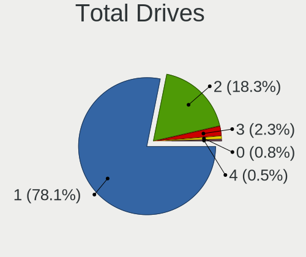
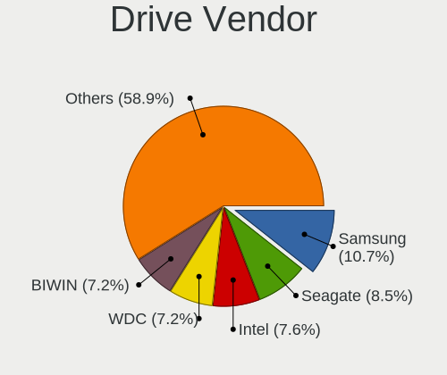
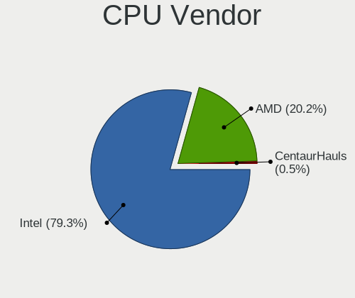
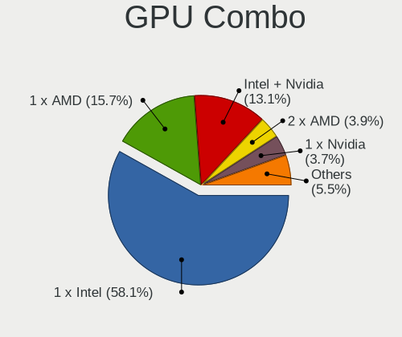
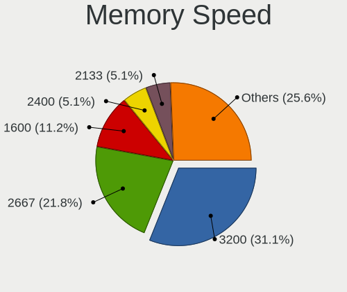
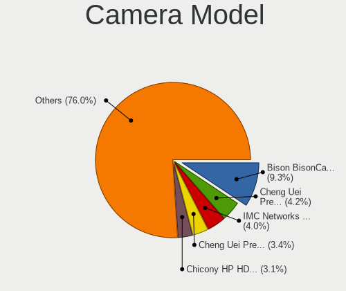

ALT Linux - Tested Hardware & Statistics (Notebooks)
----------------------------------------------------

A project to collect tested hardware configurations for ALT Linux.

Anyone can contribute to this report by the [hw-probe](https://github.com/linuxhw/hw-probe) tool:

    sudo -E hw-probe -all -upload

Please contribute! Especially if your hardware is rare.

Contents
--------

* [ Test Cases ](#test-cases)

* [ System ](#system)
  - [ OS                       ](#os)
  - [ OS Family                ](#os-family)
  - [ Kernel                   ](#kernel)
  - [ Kernel Family            ](#kernel-family)
  - [ Kernel Major Ver.        ](#kernel-major-ver)
  - [ Arch                     ](#arch)
  - [ DE                       ](#de)
  - [ Display Server           ](#display-server)
  - [ Display Manager          ](#display-manager)
  - [ OS Lang                  ](#os-lang)
  - [ Boot Mode                ](#boot-mode)
  - [ Filesystem               ](#filesystem)
  - [ Part. scheme             ](#part-scheme)
  - [ Dual Boot with Linux/BSD ](#dual-boot-with-linuxbsd)
  - [ Dual Boot (Win)          ](#dual-boot-win)

* [ Board ](#board)
  - [ Vendor                   ](#vendor)
  - [ Model                    ](#model)
  - [ Model Family             ](#model-family)
  - [ MFG Year                 ](#mfg-year)
  - [ Form Factor              ](#form-factor)
  - [ Secure Boot              ](#secure-boot)
  - [ Coreboot                 ](#coreboot)
  - [ RAM Size                 ](#ram-size)
  - [ RAM Used                 ](#ram-used)
  - [ Total Drives             ](#total-drives)
  - [ Has CD-ROM               ](#has-cd-rom)
  - [ Has Ethernet             ](#has-ethernet)
  - [ Has WiFi                 ](#has-wifi)
  - [ Has Bluetooth            ](#has-bluetooth)

* [ Location ](#location)
  - [ Country                  ](#country)
  - [ City                     ](#city)

* [ Drives ](#drives)
  - [ Drive Vendor             ](#drive-vendor)
  - [ Drive Model              ](#drive-model)
  - [ HDD Vendor               ](#hdd-vendor)
  - [ SSD Vendor               ](#ssd-vendor)
  - [ Drive Kind               ](#drive-kind)
  - [ Drive Connector          ](#drive-connector)
  - [ Drive Size               ](#drive-size)
  - [ Space Total              ](#space-total)
  - [ Space Used               ](#space-used)
  - [ Malfunc. Drives          ](#malfunc-drives)
  - [ Malfunc. Drive Vendor    ](#malfunc-drive-vendor)
  - [ Malfunc. HDD Vendor      ](#malfunc-hdd-vendor)
  - [ Malfunc. Drive Kind      ](#malfunc-drive-kind)
  - [ Failed Drives            ](#failed-drives)
  - [ Failed Drive Vendor      ](#failed-drive-vendor)
  - [ Drive Status             ](#drive-status)

* [ Storage controller ](#storage-controller)
  - [ Storage Vendor           ](#storage-vendor)
  - [ Storage Model            ](#storage-model)
  - [ Storage Kind             ](#storage-kind)

* [ Processor ](#processor)
  - [ CPU Vendor               ](#cpu-vendor)
  - [ CPU Model                ](#cpu-model)
  - [ CPU Model Family         ](#cpu-model-family)
  - [ CPU Cores                ](#cpu-cores)
  - [ CPU Sockets              ](#cpu-sockets)
  - [ CPU Threads              ](#cpu-threads)
  - [ CPU Op-Modes             ](#cpu-op-modes)
  - [ CPU Microcode            ](#cpu-microcode)
  - [ CPU Microarch            ](#cpu-microarch)

* [ Graphics ](#graphics)
  - [ GPU Vendor               ](#gpu-vendor)
  - [ GPU Model                ](#gpu-model)
  - [ GPU Combo                ](#gpu-combo)
  - [ GPU Driver               ](#gpu-driver)
  - [ GPU Memory               ](#gpu-memory)

* [ Monitor ](#monitor)
  - [ Monitor Vendor           ](#monitor-vendor)
  - [ Monitor Model            ](#monitor-model)
  - [ Monitor Resolution       ](#monitor-resolution)
  - [ Monitor Diagonal         ](#monitor-diagonal)
  - [ Monitor Width            ](#monitor-width)
  - [ Aspect Ratio             ](#aspect-ratio)
  - [ Monitor Area             ](#monitor-area)
  - [ Pixel Density            ](#pixel-density)
  - [ Multiple Monitors        ](#multiple-monitors)

* [ Network ](#network)
  - [ Net Controller Vendor    ](#net-controller-vendor)
  - [ Net Controller Model     ](#net-controller-model)
  - [ Wireless Vendor          ](#wireless-vendor)
  - [ Wireless Model           ](#wireless-model)
  - [ Ethernet Vendor          ](#ethernet-vendor)
  - [ Ethernet Model           ](#ethernet-model)
  - [ Net Controller Kind      ](#net-controller-kind)
  - [ Used Controller          ](#used-controller)
  - [ NICs                     ](#nics)
  - [ IPv6                     ](#ipv6)

* [ Bluetooth ](#bluetooth)
  - [ Bluetooth Vendor         ](#bluetooth-vendor)
  - [ Bluetooth Model          ](#bluetooth-model)

* [ Sound ](#sound)
  - [ Sound Vendor             ](#sound-vendor)
  - [ Sound Model              ](#sound-model)

* [ Memory ](#memory)
  - [ Memory Vendor            ](#memory-vendor)
  - [ Memory Model             ](#memory-model)
  - [ Memory Kind              ](#memory-kind)
  - [ Memory Form Factor       ](#memory-form-factor)
  - [ Memory Size              ](#memory-size)
  - [ Memory Speed             ](#memory-speed)

* [ Printers & scanners ](#printers--scanners)
  - [ Printer Vendor           ](#printer-vendor)
  - [ Printer Model            ](#printer-model)
  - [ Scanner Vendor           ](#scanner-vendor)
  - [ Scanner Model            ](#scanner-model)

* [ Camera ](#camera)
  - [ Camera Vendor            ](#camera-vendor)
  - [ Camera Model             ](#camera-model)

* [ Security ](#security)
  - [ Fingerprint Vendor       ](#fingerprint-vendor)
  - [ Fingerprint Model        ](#fingerprint-model)
  - [ Chipcard Vendor          ](#chipcard-vendor)
  - [ Chipcard Model           ](#chipcard-model)

* [ Unsupported ](#unsupported)
  - [ Unsupported Devices      ](#unsupported-devices)
  - [ Unsupported Device Types ](#unsupported-device-types)

Test Cases
----------

Total: 306

| Vendor        | Model                       | Probe                                                      | Date         |
|---------------|-----------------------------|------------------------------------------------------------|--------------|
| Fujitsu       | LIFEBOOK NH532              | [68a8171c0a](https://linux-hardware.org/?probe=68a8171c0a) | Mar 31, 2023 |
| ASUSTek       | K52JB                       | [45162c9123](https://linux-hardware.org/?probe=45162c9123) | Mar 30, 2023 |
| ASUSTek       | K52JB                       | [c19cd604b3](https://linux-hardware.org/?probe=c19cd604b3) | Mar 30, 2023 |
| DEPO Compu... | DPC156                      | [fc942702db](https://linux-hardware.org/?probe=fc942702db) | Mar 30, 2023 |
| DEPO Compu... | DPC156                      | [ab5d4b339b](https://linux-hardware.org/?probe=ab5d4b339b) | Mar 30, 2023 |
| Clevo         | NL41MU2                     | [69abc76758](https://linux-hardware.org/?probe=69abc76758) | Mar 29, 2023 |
| Clevo         | NL41MU2                     | [60191a33b8](https://linux-hardware.org/?probe=60191a33b8) | Mar 27, 2023 |
| Clevo         | NL41MU2                     | [b56bf816d5](https://linux-hardware.org/?probe=b56bf816d5) | Mar 23, 2023 |
| Clevo         | NL41MU2                     | [88a5d2eb30](https://linux-hardware.org/?probe=88a5d2eb30) | Mar 23, 2023 |
| Clevo         | NL41MU2                     | [430f11129e](https://linux-hardware.org/?probe=430f11129e) | Mar 22, 2023 |
| HP            | Pavilion g7                 | [9fbef1354b](https://linux-hardware.org/?probe=9fbef1354b) | Mar 21, 2023 |
| ASUSTek       | X55A                        | [743d04e5fc](https://linux-hardware.org/?probe=743d04e5fc) | Mar 16, 2023 |
| Lenovo        | ThinkPad E15 Gen 4 21ED0... | [9e620a10f2](https://linux-hardware.org/?probe=9e620a10f2) | Mar 09, 2023 |
| HUAWEI        | HVY-WXX9                    | [dcc115a880](https://linux-hardware.org/?probe=dcc115a880) | Mar 02, 2023 |
| Clevo         | NL41MU2                     | [29df87f87f](https://linux-hardware.org/?probe=29df87f87f) | Feb 28, 2023 |
| Clevo         | NL41MU2                     | [b91dfc602e](https://linux-hardware.org/?probe=b91dfc602e) | Feb 27, 2023 |
| ASUSTek       | VivoBook_ASUSLaptop M150... | [f8dd8a7ee9](https://linux-hardware.org/?probe=f8dd8a7ee9) | Feb 18, 2023 |
| Clevo         | NL41MU2                     | [d15806c6c2](https://linux-hardware.org/?probe=d15806c6c2) | Feb 15, 2023 |
| HP            | Pavilion Aero Laptop 13-... | [9606f5546e](https://linux-hardware.org/?probe=9606f5546e) | Feb 15, 2023 |
| Clevo         | NL41MU2                     | [516a173dcb](https://linux-hardware.org/?probe=516a173dcb) | Feb 14, 2023 |
| Clevo         | NL41MU2                     | [2809288f6f](https://linux-hardware.org/?probe=2809288f6f) | Feb 13, 2023 |
| Clevo         | NL41MU2                     | [56ecf82de8](https://linux-hardware.org/?probe=56ecf82de8) | Feb 13, 2023 |
| Clevo         | NL41MU2                     | [95af064bd1](https://linux-hardware.org/?probe=95af064bd1) | Feb 13, 2023 |
| HP            | Pavilion Laptop 15-eh1xx... | [c3909421c3](https://linux-hardware.org/?probe=c3909421c3) | Feb 07, 2023 |
| Lenovo        | ThinkPad X220 4290RV5       | [8fb9d5ae65](https://linux-hardware.org/?probe=8fb9d5ae65) | Feb 06, 2023 |
| Lenovo        | ThinkPad X220 4290RV5       | [ced0a536d0](https://linux-hardware.org/?probe=ced0a536d0) | Feb 06, 2023 |
| HP            | Pavilion Laptop 15-eh1xx... | [9dcc7bb41d](https://linux-hardware.org/?probe=9dcc7bb41d) | Feb 03, 2023 |
| Clevo         | NL41MU2                     | [95dac05397](https://linux-hardware.org/?probe=95dac05397) | Jan 31, 2023 |
| ASUSTek       | N53Ta                       | [30131c7409](https://linux-hardware.org/?probe=30131c7409) | Jan 31, 2023 |
| Clevo         | NL41MU2                     | [86e493728f](https://linux-hardware.org/?probe=86e493728f) | Jan 27, 2023 |
| Clevo         | NL41MU2                     | [82e558cf16](https://linux-hardware.org/?probe=82e558cf16) | Jan 25, 2023 |
| Clevo         | NL41MU2                     | [831e02a268](https://linux-hardware.org/?probe=831e02a268) | Jan 24, 2023 |
| Lenovo        | B560                        | [b474faa82b](https://linux-hardware.org/?probe=b474faa82b) | Jan 23, 2023 |
| Acer          | Aspire E1-530G              | [b4f6567b3f](https://linux-hardware.org/?probe=b4f6567b3f) | Jan 22, 2023 |
| Dell          | Latitude 5580               | [9cfd456bd4](https://linux-hardware.org/?probe=9cfd456bd4) | Jan 22, 2023 |
| HP            | ProBook 440 G4              | [43b8eec1e2](https://linux-hardware.org/?probe=43b8eec1e2) | Jan 18, 2023 |
| Clevo         | NL41MU2                     | [c1c0617217](https://linux-hardware.org/?probe=c1c0617217) | Jan 17, 2023 |
| Timi          | Redmi Book Pro 14S          | [911075716c](https://linux-hardware.org/?probe=911075716c) | Jan 13, 2023 |
| Unknown       | Unknown                     | [45ea0a8983](https://linux-hardware.org/?probe=45ea0a8983) | Jan 11, 2023 |
| Intel         | Jasper Lake Client Platf... | [3000408196](https://linux-hardware.org/?probe=3000408196) | Jan 11, 2023 |
| Clevo         | NL41MU2                     | [6aaaf2e570](https://linux-hardware.org/?probe=6aaaf2e570) | Dec 28, 2022 |
| 3Logic Gro... | Graviton N15i-K2            | [4d7e3586e2](https://linux-hardware.org/?probe=4d7e3586e2) | Dec 27, 2022 |
| Clevo         | NL41MU2                     | [0c71831ff4](https://linux-hardware.org/?probe=0c71831ff4) | Dec 27, 2022 |
| Clevo         | NL41MU2                     | [50c31f6b47](https://linux-hardware.org/?probe=50c31f6b47) | Dec 27, 2022 |
| Clevo         | NL41MU2                     | [190bb1537d](https://linux-hardware.org/?probe=190bb1537d) | Dec 26, 2022 |
| Clevo         | NL41MU2                     | [0574ad6c44](https://linux-hardware.org/?probe=0574ad6c44) | Dec 26, 2022 |
| LTD Delovo... | 15Y                         | [286aa3fb96](https://linux-hardware.org/?probe=286aa3fb96) | Dec 25, 2022 |
| Clevo         | NL41MU2                     | [f9b6dc975b](https://linux-hardware.org/?probe=f9b6dc975b) | Dec 23, 2022 |
| HP            | ProBook 440 G4              | [c93f96de9e](https://linux-hardware.org/?probe=c93f96de9e) | Dec 22, 2022 |
| Pegatron      | C15B                        | [865b882e8a](https://linux-hardware.org/?probe=865b882e8a) | Dec 18, 2022 |
| Aquarius      | Pro, Std, Elt Series        | [59b7fca136](https://linux-hardware.org/?probe=59b7fca136) | Dec 18, 2022 |
| Apple         | MacBook4,1                  | [26bb5af1a4](https://linux-hardware.org/?probe=26bb5af1a4) | Dec 16, 2022 |
| Irbis         | NB264                       | [14764ec4e5](https://linux-hardware.org/?probe=14764ec4e5) | Dec 15, 2022 |
| Unknown       | Unknown                     | [24bebac773](https://linux-hardware.org/?probe=24bebac773) | Dec 15, 2022 |
| Unknown       | Unknown                     | [643cb41a84](https://linux-hardware.org/?probe=643cb41a84) | Dec 15, 2022 |
| Dell          | Vostro 14 5410              | [af22c1db61](https://linux-hardware.org/?probe=af22c1db61) | Dec 08, 2022 |
| Apple         | MacBook7,1                  | [317fdfd70b](https://linux-hardware.org/?probe=317fdfd70b) | Dec 08, 2022 |
| Lenovo        | ThinkBook 15 G2 ITL 20VE    | [619fd919a1](https://linux-hardware.org/?probe=619fd919a1) | Dec 07, 2022 |
| HP            | 255 G4                      | [33b2fb7f31](https://linux-hardware.org/?probe=33b2fb7f31) | Nov 30, 2022 |
| Pegatron      | C15B                        | [92271ab582](https://linux-hardware.org/?probe=92271ab582) | Nov 30, 2022 |
| Samsung       | R560                        | [936ae4b775](https://linux-hardware.org/?probe=936ae4b775) | Nov 29, 2022 |
| Timi          | TM1701                      | [64ee057496](https://linux-hardware.org/?probe=64ee057496) | Nov 28, 2022 |
| Acer          | TravelMate 4200             | [14b60c4afa](https://linux-hardware.org/?probe=14b60c4afa) | Nov 26, 2022 |
| ASUSTek       | VivoBook_ASUSLaptop M150... | [52da79e88f](https://linux-hardware.org/?probe=52da79e88f) | Nov 25, 2022 |
| Lenovo        | ThinkBook 15 G2 ITL 20VE    | [4a758bfcc8](https://linux-hardware.org/?probe=4a758bfcc8) | Nov 25, 2022 |
| Clevo         | NL41MU2                     | [0736d8a48f](https://linux-hardware.org/?probe=0736d8a48f) | Nov 24, 2022 |
| Panasonic     | CF-C2CH2CBMG                | [cf87bdba01](https://linux-hardware.org/?probe=cf87bdba01) | Nov 24, 2022 |
| Acer          | Aspire 5940                 | [33325564e7](https://linux-hardware.org/?probe=33325564e7) | Nov 22, 2022 |
| Samsung       | SR70S/SR71S                 | [27c34cd9df](https://linux-hardware.org/?probe=27c34cd9df) | Nov 22, 2022 |
| HUAWEI        | NBD-WXX9                    | [bd18dfe05f](https://linux-hardware.org/?probe=bd18dfe05f) | Nov 20, 2022 |
| Timi          | TM1701                      | [e77b655bb8](https://linux-hardware.org/?probe=e77b655bb8) | Nov 16, 2022 |
| HUAWEI        | NBD-WXX9                    | [72ebef559b](https://linux-hardware.org/?probe=72ebef559b) | Nov 16, 2022 |
| HP            | Mini 110-3700               | [8ca62a1880](https://linux-hardware.org/?probe=8ca62a1880) | Nov 15, 2022 |
| ASUSTek       | ASUS TUF Gaming A15 FA50... | [6e9bc709d9](https://linux-hardware.org/?probe=6e9bc709d9) | Nov 13, 2022 |
| ASUSTek       | ASUS TUF Gaming A15 FA50... | [49162725d5](https://linux-hardware.org/?probe=49162725d5) | Nov 13, 2022 |
| Clevo         | NL41MU2                     | [65226dd80a](https://linux-hardware.org/?probe=65226dd80a) | Nov 11, 2022 |
| Clevo         | NL41MU2                     | [a25dd1174c](https://linux-hardware.org/?probe=a25dd1174c) | Nov 11, 2022 |
| Acer          | TravelMate 6292             | [c7dcad2d0f](https://linux-hardware.org/?probe=c7dcad2d0f) | Nov 10, 2022 |
| Apple         | MacBookPro5,5               | [cc051268d8](https://linux-hardware.org/?probe=cc051268d8) | Nov 05, 2022 |
| ASUSTek       | T100TAM                     | [d409557d4b](https://linux-hardware.org/?probe=d409557d4b) | Nov 03, 2022 |
| ASUSTek       | T100TAM                     | [a2a70b919d](https://linux-hardware.org/?probe=a2a70b919d) | Oct 31, 2022 |
| Toshiba       | dynabook Satellite T87/8... | [10f344a2b3](https://linux-hardware.org/?probe=10f344a2b3) | Oct 24, 2022 |
| ASUSTek       | ASUS TUF Gaming A17 FA70... | [bfb6c03047](https://linux-hardware.org/?probe=bfb6c03047) | Oct 22, 2022 |
| HP            | EliteBook 840 G8 Noteboo... | [5a8ac06ce5](https://linux-hardware.org/?probe=5a8ac06ce5) | Oct 19, 2022 |
| DEPO Compu... | DPC156                      | [4820b94a4a](https://linux-hardware.org/?probe=4820b94a4a) | Oct 18, 2022 |
| Samsung       | R509                        | [ce3166845f](https://linux-hardware.org/?probe=ce3166845f) | Oct 17, 2022 |
| Lenovo        | ThinkBook 15 G2 ITL 20VE    | [73145a883c](https://linux-hardware.org/?probe=73145a883c) | Oct 17, 2022 |
| HP            | Pavilion Gaming Laptop 1... | [fd73da4fee](https://linux-hardware.org/?probe=fd73da4fee) | Oct 11, 2022 |
| Acer          | AOA150                      | [b8780da9ef](https://linux-hardware.org/?probe=b8780da9ef) | Oct 02, 2022 |
| HUAWEI        | NBD-WXX9                    | [c1c976ba69](https://linux-hardware.org/?probe=c1c976ba69) | Sep 27, 2022 |
| Lenovo        | IdeaPad Y700-15ACZ 80NY     | [b47b842550](https://linux-hardware.org/?probe=b47b842550) | Sep 25, 2022 |
| Acer          | AO722                       | [f2c6378873](https://linux-hardware.org/?probe=f2c6378873) | Sep 25, 2022 |
| ICL           | NLx0MU                      | [d8e7f39201](https://linux-hardware.org/?probe=d8e7f39201) | Sep 23, 2022 |
| Clevo         | NL41MU2                     | [226bbaa11e](https://linux-hardware.org/?probe=226bbaa11e) | Sep 23, 2022 |
| ASUSTek       | T100TAM                     | [65a37e4802](https://linux-hardware.org/?probe=65a37e4802) | Sep 19, 2022 |
| HUAWEI        | BOD-WXX9                    | [8391d18411](https://linux-hardware.org/?probe=8391d18411) | Sep 05, 2022 |
| HUAWEI        | BOD-WXX9                    | [aee6f1bdbb](https://linux-hardware.org/?probe=aee6f1bdbb) | Sep 05, 2022 |
| HUAWEI        | NBD-WXX9                    | [899d0fc360](https://linux-hardware.org/?probe=899d0fc360) | Aug 30, 2022 |
| Compumax C... | ONIX-CEL-0001               | [272ca2c7b7](https://linux-hardware.org/?probe=272ca2c7b7) | Aug 27, 2022 |
| DEPO Compu... | DPC156                      | [7c97a519fe](https://linux-hardware.org/?probe=7c97a519fe) | Aug 26, 2022 |
| Lenovo        | G460 20041                  | [ac9bf296d8](https://linux-hardware.org/?probe=ac9bf296d8) | Aug 25, 2022 |
| IP3 Tech      | TGLUP3                      | [a4f803f8a1](https://linux-hardware.org/?probe=a4f803f8a1) | Aug 24, 2022 |
| Unknown       | Unknown                     | [57d5700736](https://linux-hardware.org/?probe=57d5700736) | Aug 21, 2022 |
| 3Logic Gro... | Graviton N15i               | [cfa6cef53d](https://linux-hardware.org/?probe=cfa6cef53d) | Aug 18, 2022 |
| 3Logic Gro... | Graviton N15i               | [840fa733f4](https://linux-hardware.org/?probe=840fa733f4) | Aug 18, 2022 |
| ASUSTek       | X550ZE                      | [3a9d682c2f](https://linux-hardware.org/?probe=3a9d682c2f) | Aug 16, 2022 |
| HP            | Pavilion g7                 | [93adb73648](https://linux-hardware.org/?probe=93adb73648) | Aug 08, 2022 |
| Lenovo        | G570 20079                  | [982a6e3241](https://linux-hardware.org/?probe=982a6e3241) | Jul 30, 2022 |
| ICL           | NLx0MU                      | [af0922946a](https://linux-hardware.org/?probe=af0922946a) | Jul 25, 2022 |
| Dell          | XPS 13 9360                 | [f870753f2f](https://linux-hardware.org/?probe=f870753f2f) | Jul 21, 2022 |
| HUAWEI        | KLVL-WXXW                   | [42a2639fcf](https://linux-hardware.org/?probe=42a2639fcf) | Jul 20, 2022 |
| HUAWEI        | KLVL-WXXW                   | [337e6e0efa](https://linux-hardware.org/?probe=337e6e0efa) | Jul 18, 2022 |
| 3Logic Gro... | Graviton N15i               | [5df194f626](https://linux-hardware.org/?probe=5df194f626) | Jul 13, 2022 |
| Dell          | Vostro 14 5410              | [2faa8bf726](https://linux-hardware.org/?probe=2faa8bf726) | Jul 12, 2022 |
| HP            | ProBook 4710s               | [4fe41da4e8](https://linux-hardware.org/?probe=4fe41da4e8) | Jul 09, 2022 |
| HP            | ProBook 4710s               | [932822fdc7](https://linux-hardware.org/?probe=932822fdc7) | Jul 09, 2022 |
| HUAWEI        | KLVL-WXXW                   | [5d2d940ec2](https://linux-hardware.org/?probe=5d2d940ec2) | Jul 07, 2022 |
| HUAWEI        | NBLB-WAX9N                  | [a8888a6627](https://linux-hardware.org/?probe=a8888a6627) | Jul 05, 2022 |
| HUAWEI        | NBLB-WAX9N                  | [b3da1e4cdb](https://linux-hardware.org/?probe=b3da1e4cdb) | Jul 05, 2022 |
| 3Logic Gro... | Graviton N15i-K2            | [3a07a4c8db](https://linux-hardware.org/?probe=3a07a4c8db) | Jun 21, 2022 |
| HP            | Pavilion dv7                | [19be007666](https://linux-hardware.org/?probe=19be007666) | Jun 04, 2022 |
| Kraftway      | ACCORD                      | [bc4e085e40](https://linux-hardware.org/?probe=bc4e085e40) | May 31, 2022 |
| Panasonic     | CF-20-1                     | [a0a97f2bd1](https://linux-hardware.org/?probe=a0a97f2bd1) | May 27, 2022 |
| IP3 Techno... | APN23                       | [4395a91f24](https://linux-hardware.org/?probe=4395a91f24) | May 25, 2022 |
| IP3 Techno... | APN23                       | [281f1263dc](https://linux-hardware.org/?probe=281f1263dc) | May 25, 2022 |
| HP            | Pavilion Gaming Laptop 1... | [692cdfaf7e](https://linux-hardware.org/?probe=692cdfaf7e) | May 24, 2022 |
| ICL           | Unknown                     | [07ff87175d](https://linux-hardware.org/?probe=07ff87175d) | May 24, 2022 |
| Lenovo        | V130-15IKB 81HN             | [9fbbff1973](https://linux-hardware.org/?probe=9fbbff1973) | May 21, 2022 |
| Apple         | MacBook7,1                  | [de4e9f2e03](https://linux-hardware.org/?probe=de4e9f2e03) | May 20, 2022 |
| Sony          | SVE1512H1RB                 | [3894ca4fe2](https://linux-hardware.org/?probe=3894ca4fe2) | May 19, 2022 |
| ICL           | NJ50_70CU                   | [c16ccbe95b](https://linux-hardware.org/?probe=c16ccbe95b) | May 17, 2022 |
| HP            | Pavilion Gaming Laptop 1... | [f512156dc8](https://linux-hardware.org/?probe=f512156dc8) | May 16, 2022 |
| HP            | ZBook 17 G5                 | [6767fef6cf](https://linux-hardware.org/?probe=6767fef6cf) | May 16, 2022 |
| HP            | ZBook 17 G5                 | [28c62dd04c](https://linux-hardware.org/?probe=28c62dd04c) | May 16, 2022 |
| HP            | ZBook 17 G5                 | [f37b79c82d](https://linux-hardware.org/?probe=f37b79c82d) | May 16, 2022 |
| HP            | ZBook 17 G5                 | [086e18d971](https://linux-hardware.org/?probe=086e18d971) | May 16, 2022 |
| HP            | ZBook 17 G5                 | [75dc798956](https://linux-hardware.org/?probe=75dc798956) | May 16, 2022 |
| HP            | ZBook 17 G5                 | [6881a4923e](https://linux-hardware.org/?probe=6881a4923e) | May 16, 2022 |
| Sony          | SVE1512H1RB                 | [60dba4994d](https://linux-hardware.org/?probe=60dba4994d) | May 16, 2022 |
| ASUSTek       | ASUS TUF Gaming A17 FA70... | [ce128aaf56](https://linux-hardware.org/?probe=ce128aaf56) | May 15, 2022 |
| Apple         | MacBookPro16,2              | [b1ef2f3b4f](https://linux-hardware.org/?probe=b1ef2f3b4f) | May 12, 2022 |
| Notebook      | NLx0MU                      | [eb70f159f4](https://linux-hardware.org/?probe=eb70f159f4) | May 06, 2022 |
| Lenovo        | G570 20079                  | [9bf9254f54](https://linux-hardware.org/?probe=9bf9254f54) | Apr 28, 2022 |
| HP            | ZBook 17 G5                 | [6c1227313d](https://linux-hardware.org/?probe=6c1227313d) | Apr 27, 2022 |
| HP            | ZBook 17 G5                 | [4f49f3d6c2](https://linux-hardware.org/?probe=4f49f3d6c2) | Apr 27, 2022 |
| HP            | EliteBook 840 G4            | [a1b9c91836](https://linux-hardware.org/?probe=a1b9c91836) | Apr 25, 2022 |
| HP            | 250 G7 Notebook PC          | [a58503065e](https://linux-hardware.org/?probe=a58503065e) | Apr 20, 2022 |
| HP            | 250 G7 Notebook PC          | [c9f37aca9b](https://linux-hardware.org/?probe=c9f37aca9b) | Apr 20, 2022 |
| HP            | 250 G7 Notebook PC          | [4505d43267](https://linux-hardware.org/?probe=4505d43267) | Apr 20, 2022 |
| HP            | 250 G7 Notebook PC          | [bc8b33e0d2](https://linux-hardware.org/?probe=bc8b33e0d2) | Apr 20, 2022 |
| HP            | 250 G7 Notebook PC          | [fa53bb24d9](https://linux-hardware.org/?probe=fa53bb24d9) | Apr 19, 2022 |
| HP            | 250 G7 Notebook PC          | [9590ee5812](https://linux-hardware.org/?probe=9590ee5812) | Apr 19, 2022 |
| ICL           | RAYbook Si1512              | [ccf6fb39e5](https://linux-hardware.org/?probe=ccf6fb39e5) | Apr 19, 2022 |
| ICL           | RAYbook Si1512              | [ca58a7218c](https://linux-hardware.org/?probe=ca58a7218c) | Apr 19, 2022 |
| ICL           | RAYbook Si1512              | [2da4cb3427](https://linux-hardware.org/?probe=2da4cb3427) | Apr 19, 2022 |
| ICL           | RAYbook Si1512              | [77b103e672](https://linux-hardware.org/?probe=77b103e672) | Apr 19, 2022 |
| ICL           | RAYbook Si1512              | [25b490f8a8](https://linux-hardware.org/?probe=25b490f8a8) | Apr 19, 2022 |
| HP            | ProBook 450 G3              | [f31bad1291](https://linux-hardware.org/?probe=f31bad1291) | Apr 19, 2022 |
| ICL           | RAYbook Si1512              | [1f7e277528](https://linux-hardware.org/?probe=1f7e277528) | Apr 19, 2022 |
| HP            | 250 G7 Notebook PC          | [e03dec259a](https://linux-hardware.org/?probe=e03dec259a) | Apr 19, 2022 |
| HP            | ProBook 440 G5              | [39189517e8](https://linux-hardware.org/?probe=39189517e8) | Apr 18, 2022 |
| HP            | 250 G7 Notebook PC          | [d0a06db2b3](https://linux-hardware.org/?probe=d0a06db2b3) | Apr 18, 2022 |
| HP            | 250 G7 Notebook PC          | [33a738be3b](https://linux-hardware.org/?probe=33a738be3b) | Apr 18, 2022 |
| HP            | 250 G6 Notebook PC          | [a5bb696691](https://linux-hardware.org/?probe=a5bb696691) | Apr 18, 2022 |
| HP            | 250 G7 Notebook PC          | [a6631d6c9a](https://linux-hardware.org/?probe=a6631d6c9a) | Apr 18, 2022 |
| HP            | 250 G7 Notebook PC          | [7b60ea8e45](https://linux-hardware.org/?probe=7b60ea8e45) | Apr 18, 2022 |
| HP            | ProBook 440 G5              | [d78747839a](https://linux-hardware.org/?probe=d78747839a) | Apr 18, 2022 |
| HP            | Pavilion Gaming Laptop 1... | [65fa83d729](https://linux-hardware.org/?probe=65fa83d729) | Apr 18, 2022 |
| ICL           | RAYbook Si1512              | [aa2de26f4f](https://linux-hardware.org/?probe=aa2de26f4f) | Apr 18, 2022 |
| HP            | Pavilion Gaming Laptop 1... | [41a7060cbe](https://linux-hardware.org/?probe=41a7060cbe) | Apr 18, 2022 |
| HP            | 250 G7 Notebook PC          | [6225568c92](https://linux-hardware.org/?probe=6225568c92) | Apr 18, 2022 |
| HP            | ProBook 440 G5              | [be57c6ecd1](https://linux-hardware.org/?probe=be57c6ecd1) | Apr 18, 2022 |
| HP            | ProBook 440 G5              | [9202f2e9ef](https://linux-hardware.org/?probe=9202f2e9ef) | Apr 18, 2022 |
| HP            | ProBook 440 G5              | [f51e697243](https://linux-hardware.org/?probe=f51e697243) | Apr 18, 2022 |
| HP            | ZBook 17 G5                 | [7e24715646](https://linux-hardware.org/?probe=7e24715646) | Apr 18, 2022 |
| HP            | ProBook 440 G5              | [a739d61b7b](https://linux-hardware.org/?probe=a739d61b7b) | Apr 18, 2022 |
| HP            | ProBook 440 G5              | [86a59150d4](https://linux-hardware.org/?probe=86a59150d4) | Apr 18, 2022 |
| HP            | ZBook 17 G5                 | [e83eeef31e](https://linux-hardware.org/?probe=e83eeef31e) | Apr 18, 2022 |
| HP            | ProBook 440 G5              | [a0246c4b50](https://linux-hardware.org/?probe=a0246c4b50) | Apr 18, 2022 |
| Timi          | TM1701                      | [1eb7df8700](https://linux-hardware.org/?probe=1eb7df8700) | Apr 15, 2022 |
| HP            | ProBook 440 G5              | [f9202afa63](https://linux-hardware.org/?probe=f9202afa63) | Apr 15, 2022 |
| HP            | ProBook 440 G5              | [c5048041ee](https://linux-hardware.org/?probe=c5048041ee) | Apr 15, 2022 |
| HP            | EliteBook 840 G4            | [ee523553f4](https://linux-hardware.org/?probe=ee523553f4) | Apr 14, 2022 |
| HP            | ProBook 440 G5              | [efa4160e79](https://linux-hardware.org/?probe=efa4160e79) | Apr 14, 2022 |
| HP            | ProBook 440 G5              | [d2c072abdf](https://linux-hardware.org/?probe=d2c072abdf) | Apr 14, 2022 |
| HP            | 250 G6 Notebook PC          | [3cde2f0fd5](https://linux-hardware.org/?probe=3cde2f0fd5) | Apr 14, 2022 |
| HP            | ProBook 440 G5              | [86164212e5](https://linux-hardware.org/?probe=86164212e5) | Apr 14, 2022 |
| HP            | ProBook 440 G5              | [37ebd7e15e](https://linux-hardware.org/?probe=37ebd7e15e) | Apr 14, 2022 |
| Dell          | Latitude 3420               | [f3278afeb0](https://linux-hardware.org/?probe=f3278afeb0) | Apr 13, 2022 |
| Dell          | Latitude 3420               | [2388ba39b8](https://linux-hardware.org/?probe=2388ba39b8) | Apr 13, 2022 |
| HP            | EliteBook 840 G4            | [87deb321d4](https://linux-hardware.org/?probe=87deb321d4) | Apr 13, 2022 |
| HP            | 250 G6 Notebook PC          | [2b8e6fdd29](https://linux-hardware.org/?probe=2b8e6fdd29) | Apr 13, 2022 |
| ASUSTek       | ZenBook UX431DA_UM431DA     | [c2e18d9346](https://linux-hardware.org/?probe=c2e18d9346) | Apr 13, 2022 |
| ASUSTek       | ZenBook UX431DA_UM431DA     | [0e2380e59d](https://linux-hardware.org/?probe=0e2380e59d) | Apr 13, 2022 |
| Dell          | Latitude 3420               | [ecdf7b8de0](https://linux-hardware.org/?probe=ecdf7b8de0) | Apr 12, 2022 |
| Dell          | Latitude 3420               | [4361233072](https://linux-hardware.org/?probe=4361233072) | Apr 12, 2022 |
| ICL           | RAYbook Si1512              | [19f3a71bf4](https://linux-hardware.org/?probe=19f3a71bf4) | Apr 12, 2022 |
| HP            | 250 G7 Notebook PC          | [0860ee5a64](https://linux-hardware.org/?probe=0860ee5a64) | Apr 12, 2022 |
| ICL           | RAYbook Si1512              | [4f1aa9470b](https://linux-hardware.org/?probe=4f1aa9470b) | Apr 12, 2022 |
| ICL           | RAYbook Si1512              | [7537241f1d](https://linux-hardware.org/?probe=7537241f1d) | Apr 12, 2022 |
| ICL           | RAYbook Si1512              | [d6792fe869](https://linux-hardware.org/?probe=d6792fe869) | Apr 12, 2022 |
| ICL           | RAYbook Si1512              | [e3236de077](https://linux-hardware.org/?probe=e3236de077) | Apr 12, 2022 |
| HP            | ZBook 17 G5                 | [2d62dd7b61](https://linux-hardware.org/?probe=2d62dd7b61) | Apr 12, 2022 |
| HP            | ZBook 17 G5                 | [0eae0dfd04](https://linux-hardware.org/?probe=0eae0dfd04) | Apr 12, 2022 |
| HP            | ProBook 440 G5              | [65b8e561ab](https://linux-hardware.org/?probe=65b8e561ab) | Apr 12, 2022 |
| HP            | ProBook 440 G5              | [b95e628a8f](https://linux-hardware.org/?probe=b95e628a8f) | Apr 12, 2022 |
| HP            | ZBook 17 G5                 | [d05023771a](https://linux-hardware.org/?probe=d05023771a) | Apr 12, 2022 |
| HP            | ZBook 17 G5                 | [655584ea45](https://linux-hardware.org/?probe=655584ea45) | Apr 12, 2022 |
| HP            | ZBook 17 G5                 | [a6527519c6](https://linux-hardware.org/?probe=a6527519c6) | Apr 12, 2022 |
| Acer          | TravelMate 5760             | [b6f41e002d](https://linux-hardware.org/?probe=b6f41e002d) | Apr 12, 2022 |
| HP            | ZBook 17 G5                 | [f8931a9e1e](https://linux-hardware.org/?probe=f8931a9e1e) | Apr 12, 2022 |
| Acer          | Aspire A514-52K             | [085e03c893](https://linux-hardware.org/?probe=085e03c893) | Apr 11, 2022 |
| Acer          | Aspire A514-52K             | [0157eea2f6](https://linux-hardware.org/?probe=0157eea2f6) | Apr 11, 2022 |
| HP            | ZBook 17 G5                 | [7289268e39](https://linux-hardware.org/?probe=7289268e39) | Apr 11, 2022 |
| Dell          | Latitude 3420               | [d436f78355](https://linux-hardware.org/?probe=d436f78355) | Apr 11, 2022 |
| Acer          | TravelMate 5760             | [958de67015](https://linux-hardware.org/?probe=958de67015) | Apr 11, 2022 |
| Lenovo        | B590 20206                  | [e027a7672d](https://linux-hardware.org/?probe=e027a7672d) | Apr 11, 2022 |
| HP            | ZBook 17 G5                 | [5f90eb0f80](https://linux-hardware.org/?probe=5f90eb0f80) | Apr 11, 2022 |
| Dell          | Latitude 3420               | [5dbdb89f95](https://linux-hardware.org/?probe=5dbdb89f95) | Apr 11, 2022 |
| Acer          | Aspire 5745G                | [4a6e981204](https://linux-hardware.org/?probe=4a6e981204) | Apr 04, 2022 |
| Lenovo        | V510-15IKB 80WQ             | [dfdb44695a](https://linux-hardware.org/?probe=dfdb44695a) | Apr 01, 2022 |
| HP            | Unknown                     | [e989736b06](https://linux-hardware.org/?probe=e989736b06) | Mar 30, 2022 |
| HP            | Unknown                     | [672d3c8b62](https://linux-hardware.org/?probe=672d3c8b62) | Mar 29, 2022 |
| HP            | 250 G3                      | [22f691edac](https://linux-hardware.org/?probe=22f691edac) | Mar 29, 2022 |
| HP            | Pavilion Gaming Laptop 1... | [e4b8a2cc11](https://linux-hardware.org/?probe=e4b8a2cc11) | Mar 23, 2022 |
| HP            | Pavilion Gaming Laptop 1... | [64baae5b88](https://linux-hardware.org/?probe=64baae5b88) | Mar 22, 2022 |
| ICL           | NJ50_70CU                   | [247859eb78](https://linux-hardware.org/?probe=247859eb78) | Mar 22, 2022 |
| ICL           | NJ50_70CU                   | [b9e82b8490](https://linux-hardware.org/?probe=b9e82b8490) | Mar 22, 2022 |
| ASUSTek       | ASUS EXPERTBOOK B1500CEA... | [58fdf49095](https://linux-hardware.org/?probe=58fdf49095) | Mar 17, 2022 |
| ASUSTek       | ASUS EXPERTBOOK B1500CEA... | [eaa9fb6aad](https://linux-hardware.org/?probe=eaa9fb6aad) | Mar 14, 2022 |
| 3Logic Gro... | Graviton N15i-K2            | [72eefd2811](https://linux-hardware.org/?probe=72eefd2811) | Mar 14, 2022 |
| Dell          | G5 5590                     | [9b95f2ae1d](https://linux-hardware.org/?probe=9b95f2ae1d) | Mar 06, 2022 |
| Lenovo        | IdeaPad 3 15IIL05 81WE      | [13bc7e73f1](https://linux-hardware.org/?probe=13bc7e73f1) | Mar 02, 2022 |
| ASUSTek       | ASUS TUF Gaming A17 FA70... | [ef592cb1a7](https://linux-hardware.org/?probe=ef592cb1a7) | Feb 26, 2022 |
| HP            | Pavilion Gaming Laptop 1... | [c907453bf5](https://linux-hardware.org/?probe=c907453bf5) | Feb 18, 2022 |
| ASUSTek       | ASUS TUF Gaming A15 FA50... | [3986a62bca](https://linux-hardware.org/?probe=3986a62bca) | Feb 15, 2022 |
| ASUSTek       | X200MA                      | [b2f1d59884](https://linux-hardware.org/?probe=b2f1d59884) | Feb 12, 2022 |
| Timi          | TM1701                      | [4edeb14964](https://linux-hardware.org/?probe=4edeb14964) | Feb 05, 2022 |
| DEPO Compu... | DPC156                      | [4fb49336e5](https://linux-hardware.org/?probe=4fb49336e5) | Feb 03, 2022 |
| Lenovo        | ThinkBook 15 G2 ITL 20VE    | [a08b9de6fa](https://linux-hardware.org/?probe=a08b9de6fa) | Jan 28, 2022 |
| Dell          | Latitude 3590               | [e2a6ef3266](https://linux-hardware.org/?probe=e2a6ef3266) | Jan 18, 2022 |
| HP            | Pavilion Gaming Laptop 1... | [00f8c9d649](https://linux-hardware.org/?probe=00f8c9d649) | Jan 02, 2022 |
| Samsung       | 750XDA                      | [8fe8612ccb](https://linux-hardware.org/?probe=8fe8612ccb) | Dec 21, 2021 |
| Acer          | Aspire 5750G                | [58cdbcf87e](https://linux-hardware.org/?probe=58cdbcf87e) | Dec 18, 2021 |
| ASUSTek       | N46VZ                       | [aaf9eff6bd](https://linux-hardware.org/?probe=aaf9eff6bd) | Oct 11, 2021 |
| ASUSTek       | VivoBook_ASUSLaptop X421... | [2839eb3d12](https://linux-hardware.org/?probe=2839eb3d12) | Oct 09, 2021 |
| HP            | Laptop 15s-fq0xxx           | [516882d907](https://linux-hardware.org/?probe=516882d907) | Sep 23, 2021 |
| Timi          | TM1701                      | [b13b26d7ca](https://linux-hardware.org/?probe=b13b26d7ca) | Sep 16, 2021 |
| ASUSTek       | N46VZ                       | [40c97b439e](https://linux-hardware.org/?probe=40c97b439e) | Sep 12, 2021 |
| Acer          | Aspire A317-32              | [09342414f3](https://linux-hardware.org/?probe=09342414f3) | Sep 09, 2021 |
| Lenovo        | IdeaPad 3 15IGL05 81WQ      | [6648ff785e](https://linux-hardware.org/?probe=6648ff785e) | Sep 08, 2021 |
| ASUSTek       | N46VZ                       | [eb37b7db1e](https://linux-hardware.org/?probe=eb37b7db1e) | Aug 11, 2021 |
| Acer          | Swift SF314-57              | [2872bd6b13](https://linux-hardware.org/?probe=2872bd6b13) | Aug 05, 2021 |
| Durabook      | Z14                         | [7abdb375e2](https://linux-hardware.org/?probe=7abdb375e2) | Jul 27, 2021 |
| Lenovo        | ThinkPad L13 Gen 2 20VH0... | [a85464aae6](https://linux-hardware.org/?probe=a85464aae6) | Jul 06, 2021 |
| Aquarius      | NS585                       | [bc10f2ffbd](https://linux-hardware.org/?probe=bc10f2ffbd) | Jun 27, 2021 |
| Dell          | G3 3779                     | [eaf53820e5](https://linux-hardware.org/?probe=eaf53820e5) | Jun 02, 2021 |
| HUAWEI        | NBLK-WAX9X                  | [9908ba82e9](https://linux-hardware.org/?probe=9908ba82e9) | May 31, 2021 |
| Lenovo        | ThinkPad L13 Gen 2 20VH0... | [9f3a13c865](https://linux-hardware.org/?probe=9f3a13c865) | May 27, 2021 |
| HP            | Laptop 17-by0xxx            | [a3f263e12b](https://linux-hardware.org/?probe=a3f263e12b) | May 26, 2021 |
| Dell          | Inspiron 3542               | [e1a816cc42](https://linux-hardware.org/?probe=e1a816cc42) | May 25, 2021 |
| MSI           | GE72 7RE                    | [a6a5258971](https://linux-hardware.org/?probe=a6a5258971) | May 20, 2021 |
| Lenovo        | IdeaPad 5 15IIL05 81YK      | [59740e6ccf](https://linux-hardware.org/?probe=59740e6ccf) | Apr 29, 2021 |
| HP            | EliteBook 8470p             | [632deaf397](https://linux-hardware.org/?probe=632deaf397) | Apr 16, 2021 |
| Lenovo        | ThinkBook 15 G2 ITL 20VE    | [8185306af7](https://linux-hardware.org/?probe=8185306af7) | Apr 16, 2021 |
| ASUSTek       | VivoBook 15_ASUS Laptop ... | [ea2ab7cbc7](https://linux-hardware.org/?probe=ea2ab7cbc7) | Apr 07, 2021 |
| ASUSTek       | VivoBook_ASUSLaptop X421... | [3afcb7ca65](https://linux-hardware.org/?probe=3afcb7ca65) | Mar 29, 2021 |
| Lenovo        | IdeaPad 310-15ISK 80SM      | [66f3887fa2](https://linux-hardware.org/?probe=66f3887fa2) | Mar 20, 2021 |
| HP            | Pavilion Laptop 15-cc5xx    | [2c576fb8a9](https://linux-hardware.org/?probe=2c576fb8a9) | Mar 17, 2021 |
| HP            | Laptop 15s-fq2xxx           | [2d8bd02af5](https://linux-hardware.org/?probe=2d8bd02af5) | Feb 09, 2021 |
| Lenovo        | B50-10 80QR                 | [211bf1a4b4](https://linux-hardware.org/?probe=211bf1a4b4) | Jan 15, 2021 |
| Acer          | NC-ES1-131-C1NL             | [1cae46f14f](https://linux-hardware.org/?probe=1cae46f14f) | Jan 09, 2021 |
| HP            | Laptop 15s-fq0xxx           | [2437a45956](https://linux-hardware.org/?probe=2437a45956) | Jan 07, 2021 |
| HP            | EliteBook 8470p             | [ed90389918](https://linux-hardware.org/?probe=ed90389918) | Dec 22, 2020 |
| Lenovo        | ThinkPad X220 4291M85       | [f2c165b2d8](https://linux-hardware.org/?probe=f2c165b2d8) | Dec 22, 2020 |
| ASUSTek       | X510UNR                     | [53ef89172e](https://linux-hardware.org/?probe=53ef89172e) | Dec 21, 2020 |
| Lenovo        | ThinkPad 13 2nd Gen 20J1... | [00824d4fae](https://linux-hardware.org/?probe=00824d4fae) | Nov 19, 2020 |
| HP            | Laptop 14s-dq1xxx           | [f6e0ab4b2b](https://linux-hardware.org/?probe=f6e0ab4b2b) | Nov 13, 2020 |
| Toshiba       | Satellite A100              | [f09cd03fff](https://linux-hardware.org/?probe=f09cd03fff) | Nov 09, 2020 |
| MSI           | X300/X340/X400 series       | [1fd45a8e47](https://linux-hardware.org/?probe=1fd45a8e47) | Oct 23, 2020 |
| Lenovo        | B50-10 80QR                 | [ae14993850](https://linux-hardware.org/?probe=ae14993850) | Sep 28, 2020 |
| ASUSTek       | N46VZ                       | [d1ba7fa191](https://linux-hardware.org/?probe=d1ba7fa191) | Sep 23, 2020 |
| ASUSTek       | N46VZ                       | [ee23f7cefc](https://linux-hardware.org/?probe=ee23f7cefc) | Sep 14, 2020 |
| ASUSTek       | N46VZ                       | [52930a9597](https://linux-hardware.org/?probe=52930a9597) | Sep 03, 2020 |
| ASUSTek       | N46VZ                       | [9998e51d1c](https://linux-hardware.org/?probe=9998e51d1c) | Aug 14, 2020 |
| Samsung       | R510/P510                   | [e20ff4ae24](https://linux-hardware.org/?probe=e20ff4ae24) | Jul 12, 2020 |
| Lenovo        | B50-10 80QR                 | [a50e0f999e](https://linux-hardware.org/?probe=a50e0f999e) | Jul 07, 2020 |
| HP            | 255 G2                      | [3d4e8b4672](https://linux-hardware.org/?probe=3d4e8b4672) | May 27, 2020 |
| Acer          | Aspire E1-571G              | [3290540c34](https://linux-hardware.org/?probe=3290540c34) | Mar 13, 2020 |
| Lenovo        | 3000 G430 4153/200          | [0315e41f8c](https://linux-hardware.org/?probe=0315e41f8c) | Dec 26, 2019 |
| HP            | Pavilion dv6700             | [1031d661db](https://linux-hardware.org/?probe=1031d661db) | Nov 24, 2019 |
| HP            | Pavilion dv6700             | [c2fc59b6de](https://linux-hardware.org/?probe=c2fc59b6de) | Nov 23, 2019 |
| ASUSTek       | N46VZ                       | [bee323a814](https://linux-hardware.org/?probe=bee323a814) | Oct 29, 2019 |
| eMachines     | eME728                      | [83010f511e](https://linux-hardware.org/?probe=83010f511e) | Oct 25, 2019 |
| ASUSTek       | X200MA                      | [595d1ddd1b](https://linux-hardware.org/?probe=595d1ddd1b) | Oct 25, 2019 |
| MSI           | MEGA BOOK S430              | [6380916978](https://linux-hardware.org/?probe=6380916978) | Sep 15, 2019 |
| Lenovo        | G505s 20255                 | [46308d3b71](https://linux-hardware.org/?probe=46308d3b71) | Aug 30, 2019 |
| Lenovo        | G505s 20255                 | [c840002848](https://linux-hardware.org/?probe=c840002848) | Aug 30, 2019 |
| ASUSTek       | 1101HA                      | [f221bcd7e4](https://linux-hardware.org/?probe=f221bcd7e4) | Aug 16, 2019 |
| ASUSTek       | N46VZ                       | [aec6cff1b5](https://linux-hardware.org/?probe=aec6cff1b5) | Aug 15, 2019 |
| Samsung       | RV413/RV513/E3413           | [3e37ab573a](https://linux-hardware.org/?probe=3e37ab573a) | Apr 24, 2019 |
| Samsung       | RV413/RV513/E3413           | [447cdad389](https://linux-hardware.org/?probe=447cdad389) | Apr 23, 2019 |
| Acer          | Aspire ES1-523              | [0f6abd34f2](https://linux-hardware.org/?probe=0f6abd34f2) | Dec 17, 2018 |
| ASUSTek       | 1001PXD                     | [1a4aa87d78](https://linux-hardware.org/?probe=1a4aa87d78) | Oct 29, 2018 |
| Acer          | Aspire ES1-523              | [5e9a049dce](https://linux-hardware.org/?probe=5e9a049dce) | Oct 08, 2018 |
| ASUSTek       | K52JT                       | [7fdee4e7bb](https://linux-hardware.org/?probe=7fdee4e7bb) | Jun 18, 2016 |

System
------

OS
--

Installed operating systems

| Name               | Notebooks | Percent |
|--------------------|-----------|---------|
| Kometa P10         | 54        | 23.38%  |
| ALT Linux 10.1     | 47        | 20.35%  |
| MOS 10             | 32        | 13.85%  |
| ALT Linux 10.0     | 30        | 12.99%  |
| ALT Linux 9.1      | 22        | 9.52%   |
| ALT Linux 9.2      | 10        | 4.33%   |
| ALT Linux 9.0      | 9         | 3.9%    |
| ALT Linux P10      | 6         | 2.6%    |
| ALT Linux 10.0.900 | 3         | 1.3%    |
| ALT Linux P9       | 2         | 0.87%   |
| ALT Linux P8       | 2         | 0.87%   |
| ALT Linux 8.2      | 2         | 0.87%   |
| ALT Linux 20201124 | 2         | 0.87%   |
| ALT Linux 20191026 | 2         | 0.87%   |
| ALT Linux 9        | 1         | 0.43%   |
| ALT Linux 8.990    | 1         | 0.43%   |
| ALT Linux 8.920    | 1         | 0.43%   |
| ALT Linux 8.3      | 1         | 0.43%   |
| ALT Linux 8.0.0    | 1         | 0.43%   |
| ALT Linux 20190624 | 1         | 0.43%   |
| ALT Linux 10.0.920 | 1         | 0.43%   |
| ALT Linux          | 1         | 0.43%   |

OS Family
---------

OS without a version

| Name      | Notebooks | Percent |
|-----------|-----------|---------|
| ALT Linux | 216       | 100%    |

Kernel
------

Version of the Linux kernel

| Version               | Notebooks | Percent |
|-----------------------|-----------|---------|
| 5.10.102-std-def-alt1 | 38        | 15.64%  |
| 5.10.109-std-def-alt1 | 19        | 7.82%   |
| 5.10.139-std-def-alt1 | 12        | 4.94%   |
| 5.10.156-std-def-alt1 | 11        | 4.53%   |
| 5.15.34-un-def-alt1   | 8         | 3.29%   |
| 5.15.80-un-def-alt1   | 7         | 2.88%   |
| 5.10.88-std-def-alt1  | 7         | 2.88%   |
| 5.10.152-std-def-alt1 | 6         | 2.47%   |
| 5.10.123-std-def-alt1 | 6         | 2.47%   |
| 5.15.76-un-def-alt1   | 4         | 1.65%   |
| 5.10.82-std-def-alt1  | 4         | 1.65%   |
| 5.4.68-std-def-alt1.1 | 3         | 1.23%   |
| 5.4.28-std-def-alt1   | 3         | 1.23%   |
| 5.15.79-un-def-alt1   | 3         | 1.23%   |
| 5.15.73-un-def-alt1   | 3         | 1.23%   |
| 5.15.72-un-def-alt1   | 3         | 1.23%   |
| 5.4.62-std-def-alt1   | 2         | 0.82%   |
| 5.4.51-std-def-alt1   | 2         | 0.82%   |
| 5.15.63-un-def-alt1   | 2         | 0.82%   |
| 5.15.52-un-def-alt1   | 2         | 0.82%   |
| 5.15.33-un-def-alt1   | 2         | 0.82%   |
| 5.15.25-un-def-alt1   | 2         | 0.82%   |
| 5.10.62-un-def-alt1   | 2         | 0.82%   |
| 5.10.61-un-def-alt1   | 2         | 0.82%   |
| 5.10.37-un-def-alt1   | 2         | 0.82%   |
| 5.10.32-un-def-alt1   | 2         | 0.82%   |
| 5.10.17-un-def-alt1   | 2         | 0.82%   |
| 5.10.168-std-def-alt1 | 2         | 0.82%   |
| 5.10.164-std-def-alt1 | 2         | 0.82%   |
| 5.10.113-std-def-alt1 | 2         | 0.82%   |
| 5.10.111-std-def-alt1 | 2         | 0.82%   |
| 4.19.79-std-def-alt1  | 2         | 0.82%   |
| 4.19.66-std-def-alt1  | 2         | 0.82%   |
| 4.19.102-std-def-alt1 | 2         | 0.82%   |
| 6.1.11-un-def-alt1    | 1         | 0.41%   |
| 5.7.19-un-def-alt1    | 1         | 0.41%   |
| 5.4.98-std-def-alt1   | 1         | 0.41%   |
| 5.4.87-std-def-alt1   | 1         | 0.41%   |
| 5.4.85-std-def-alt1   | 1         | 0.41%   |
| 5.4.84-std-def-alt1   | 1         | 0.41%   |

Kernel Family
-------------

Linux kernel without a distro release

| Version  | Notebooks | Percent |
|----------|-----------|---------|
| 5.10.102 | 38        | 15.64%  |
| 5.10.109 | 19        | 7.82%   |
| 5.10.139 | 12        | 4.94%   |
| 5.10.156 | 11        | 4.53%   |
| 5.15.80  | 8         | 3.29%   |
| 5.15.34  | 8         | 3.29%   |
| 5.10.88  | 7         | 2.88%   |
| 5.10.152 | 6         | 2.47%   |
| 5.10.123 | 6         | 2.47%   |
| 5.15.76  | 4         | 1.65%   |
| 5.10.82  | 4         | 1.65%   |
| 5.4.68   | 3         | 1.23%   |
| 5.4.28   | 3         | 1.23%   |
| 5.15.79  | 3         | 1.23%   |
| 5.15.73  | 3         | 1.23%   |
| 5.15.72  | 3         | 1.23%   |
| 5.4.62   | 2         | 0.82%   |
| 5.4.51   | 2         | 0.82%   |
| 5.4.107  | 2         | 0.82%   |
| 5.15.91  | 2         | 0.82%   |
| 5.15.63  | 2         | 0.82%   |
| 5.15.52  | 2         | 0.82%   |
| 5.15.33  | 2         | 0.82%   |
| 5.15.25  | 2         | 0.82%   |
| 5.10.62  | 2         | 0.82%   |
| 5.10.61  | 2         | 0.82%   |
| 5.10.37  | 2         | 0.82%   |
| 5.10.32  | 2         | 0.82%   |
| 5.10.17  | 2         | 0.82%   |
| 5.10.168 | 2         | 0.82%   |
| 5.10.164 | 2         | 0.82%   |
| 5.10.118 | 2         | 0.82%   |
| 5.10.113 | 2         | 0.82%   |
| 5.10.111 | 2         | 0.82%   |
| 4.19.79  | 2         | 0.82%   |
| 4.19.66  | 2         | 0.82%   |
| 4.19.102 | 2         | 0.82%   |
| 6.1.11   | 1         | 0.41%   |
| 5.7.19   | 1         | 0.41%   |
| 5.4.98   | 1         | 0.41%   |

Kernel Major Ver.
-----------------

Linux kernel major version

| Version | Notebooks | Percent |
|---------|-----------|---------|
| 5.10    | 139       | 62.05%  |
| 5.15    | 42        | 18.75%  |
| 5.4     | 20        | 8.93%   |
| 4.19    | 11        | 4.91%   |
| 4.9     | 3         | 1.34%   |
| 5.18    | 2         | 0.89%   |
| 5.13    | 2         | 0.89%   |
| 6.1     | 1         | 0.45%   |
| 5.7     | 1         | 0.45%   |
| 5.3     | 1         | 0.45%   |
| 5.16    | 1         | 0.45%   |
| 4.4     | 1         | 0.45%   |

Arch
----

OS architecture (x86_64, i586, etc.)

| Name   | Notebooks | Percent |
|--------|-----------|---------|
| x86_64 | 205       | 94.91%  |
| i686   | 11        | 5.09%   |

DE
--

Desktop Environment

| Name            | Notebooks | Percent |
|-----------------|-----------|---------|
| KDE5            | 151       | 68.64%  |
| XFCE            | 29        | 13.18%  |
| Unknown         | 24        | 10.91%  |
| LXQt            | 7         | 3.18%   |
| Cinnamon        | 4         | 1.82%   |
| GNOME           | 3         | 1.36%   |
| MATE            | 1         | 0.45%   |
| GNOME Flashback | 1         | 0.45%   |

Display Server
--------------

X11 or Wayland

| Name    | Notebooks | Percent |
|---------|-----------|---------|
| X11     | 211       | 97.24%  |
| Wayland | 4         | 1.84%   |
| Tty     | 2         | 0.92%   |

Display Manager
---------------

SDDM, LightDM, etc.

| Name    | Notebooks | Percent |
|---------|-----------|---------|
| SDDM    | 124       | 56.11%  |
| LightDM | 54        | 24.43%  |
| TDM     | 22        | 9.95%   |
| Unknown | 19        | 8.6%    |
| XDM     | 1         | 0.45%   |
| GDM     | 1         | 0.45%   |

OS Lang
-------

Language

| Lang       | Notebooks | Percent |
|------------|-----------|---------|
| ru_RU      | 183       | 82.81%  |
| Unknown    | 26        | 11.76%  |
| en_US      | 9         | 4.07%   |
| POSIX      | 1         | 0.45%   |
| it_IT@euro | 1         | 0.45%   |
| C          | 1         | 0.45%   |

Boot Mode
---------

EFI or BIOS

| Mode | Notebooks | Percent |
|------|-----------|---------|
| EFI  | 162       | 74.31%  |
| BIOS | 56        | 25.69%  |

Filesystem
----------

Type of filesystem

| Type    | Notebooks | Percent |
|---------|-----------|---------|
| Ext4    | 192       | 88.07%  |
| Overlay | 17        | 7.8%    |
| Btrfs   | 7         | 3.21%   |
| Unknown | 2         | 0.92%   |

Part. scheme
------------

Scheme of partitioning

| Type    | Notebooks | Percent |
|---------|-----------|---------|
| GPT     | 139       | 63.47%  |
| MBR     | 58        | 26.48%  |
| Unknown | 22        | 10.05%  |

Dual Boot with Linux/BSD
------------------------

Hosting more than one Linux/BSD

| Dual boot | Notebooks | Percent |
|-----------|-----------|---------|
| No        | 203       | 91.86%  |
| Yes       | 18        | 8.14%   |

Dual Boot (Win)
---------------

Hosting Linux and Windows

| Dual boot | Notebooks | Percent |
|-----------|-----------|---------|
| No        | 137       | 63.13%  |
| Yes       | 80        | 36.87%  |

Board
-----

Vendor
------

Motherboard manufacturer

| Name                | Notebooks | Percent |
|---------------------|-----------|---------|
| Hewlett-Packard     | 58        | 26.85%  |
| Lenovo              | 23        | 10.65%  |
| Clevo               | 23        | 10.65%  |
| ASUSTek Computer    | 22        | 10.19%  |
| Acer                | 16        | 7.41%   |
| ICL                 | 10        | 4.63%   |
| HUAWEI              | 9         | 4.17%   |
| Dell                | 9         | 4.17%   |
| Samsung Electronics | 6         | 2.78%   |
| Apple               | 5         | 2.31%   |
| 3Logic Group        | 5         | 2.31%   |
| DEPO Computers      | 4         | 1.85%   |
| Unknown             | 4         | 1.85%   |
| MSI                 | 3         | 1.39%   |
| Toshiba             | 2         | 0.93%   |
| Timi                | 2         | 0.93%   |
| Panasonic           | 2         | 0.93%   |
| Aquarius            | 2         | 0.93%   |
| Sony                | 1         | 0.46%   |
| Pegatron            | 1         | 0.46%   |
| LTD Delovoy Office  | 1         | 0.46%   |
| Kraftway            | 1         | 0.46%   |
| IP3 Technology      | 1         | 0.46%   |
| IP3 Tech            | 1         | 0.46%   |
| Intel               | 1         | 0.46%   |
| Fujitsu             | 1         | 0.46%   |
| eMachines           | 1         | 0.46%   |
| Durabook            | 1         | 0.46%   |
| Compumax Computer   | 1         | 0.46%   |

Model
-----

Motherboard model

| Name                                      | Notebooks | Percent |
|-------------------------------------------|-----------|---------|
| Clevo NL41MU2                             | 23        | 10.65%  |
| HP 250 G7 Notebook PC                     | 12        | 5.56%   |
| HP ZBook 17 G5                            | 9         | 4.17%   |
| HP ProBook 440 G5                         | 8         | 3.7%    |
| ICL RAYbook Si1512                        | 6         | 2.78%   |
| Unknown                                   | 6         | 2.78%   |
| DEPO Computers DPC156                     | 4         | 1.85%   |
| Lenovo ThinkBook 15 G2 ITL 20VE           | 3         | 1.39%   |
| HUAWEI NBD-WXX9                           | 3         | 1.39%   |
| HP EliteBook 840 G4                       | 3         | 1.39%   |
| HP 250 G6 Notebook PC                     | 3         | 1.39%   |
| Dell Latitude 3420                        | 3         | 1.39%   |
| 3Logic Group Graviton N15i-K2             | 3         | 1.39%   |
| Lenovo ThinkPad L13 Gen 2 20VH001WRT      | 2         | 0.93%   |
| ICL NJ50_70CU                             | 2         | 0.93%   |
| HUAWEI KLVL-WXXW                          | 2         | 0.93%   |
| HP ProBook 440 G4                         | 2         | 0.93%   |
| HP EliteBook 8470p                        | 2         | 0.93%   |
| ASUS VivoBook_ASUSLaptop M1503QA_M1503QA  | 2         | 0.93%   |
| ASUS N46VZ                                | 2         | 0.93%   |
| ASUS ASUS EXPERTBOOK B1500CEAEY_B1500CEAE | 2         | 0.93%   |
| Apple MacBook7,1                          | 2         | 0.93%   |
| Acer TravelMate 5760                      | 2         | 0.93%   |
| 3Logic Group Graviton N15i                | 2         | 0.93%   |
| Toshiba Satellite A100                    | 1         | 0.46%   |
| Toshiba dynabook Satellite T87/87M        | 1         | 0.46%   |
| Timi TM1701                               | 1         | 0.46%   |
| Timi Redmi Book Pro 14S                   | 1         | 0.46%   |
| Sony SVE1512H1RB                          | 1         | 0.46%   |
| Samsung SR70S/SR71S                       | 1         | 0.46%   |
| Samsung RV413/RV513/E3413                 | 1         | 0.46%   |
| Samsung R560                              | 1         | 0.46%   |
| Samsung R510/P510                         | 1         | 0.46%   |
| Samsung R509                              | 1         | 0.46%   |
| Samsung 750XDA                            | 1         | 0.46%   |
| Pegatron C15B                             | 1         | 0.46%   |
| Panasonic CF-C2CH2CBMG                    | 1         | 0.46%   |
| Panasonic CF-20-1                         | 1         | 0.46%   |
| MSI X300/X340/X400 series                 | 1         | 0.46%   |
| MSI MEGA BOOK S430                        | 1         | 0.46%   |

Model Family
------------

Motherboard model prefix

| Name                   | Notebooks | Percent |
|------------------------|-----------|---------|
| Clevo NL41MU2          | 23        | 10.65%  |
| HP 250                 | 16        | 7.41%   |
| HP ProBook             | 12        | 5.56%   |
| HP ZBook               | 9         | 4.17%   |
| HP Pavilion            | 8         | 3.7%    |
| Acer Aspire            | 8         | 3.7%    |
| Lenovo ThinkPad        | 6         | 2.78%   |
| ICL RAYbook            | 6         | 2.78%   |
| HP EliteBook           | 6         | 2.78%   |
| Unknown                | 6         | 2.78%   |
| Lenovo IdeaPad         | 5         | 2.31%   |
| Dell Latitude          | 5         | 2.31%   |
| ASUS VivoBook          | 5         | 2.31%   |
| ASUS ASUS              | 5         | 2.31%   |
| 3Logic Group Graviton  | 5         | 2.31%   |
| HP Laptop              | 4         | 1.85%   |
| DEPO Computers DPC156  | 4         | 1.85%   |
| Acer TravelMate        | 4         | 1.85%   |
| Lenovo ThinkBook       | 3         | 1.39%   |
| HUAWEI NBD-WXX9        | 3         | 1.39%   |
| ICL NJ50               | 2         | 0.93%   |
| HUAWEI KLVL-WXXW       | 2         | 0.93%   |
| HP 255                 | 2         | 0.93%   |
| ASUS N46VZ             | 2         | 0.93%   |
| Apple MacBook7         | 2         | 0.93%   |
| Toshiba Satellite      | 1         | 0.46%   |
| Toshiba dynabook       | 1         | 0.46%   |
| Timi TM1701            | 1         | 0.46%   |
| Timi Redmi             | 1         | 0.46%   |
| Sony SVE1512H1RB       | 1         | 0.46%   |
| Samsung SR70S          | 1         | 0.46%   |
| Samsung RV413          | 1         | 0.46%   |
| Samsung R560           | 1         | 0.46%   |
| Samsung R510           | 1         | 0.46%   |
| Samsung R509           | 1         | 0.46%   |
| Samsung 750XDA         | 1         | 0.46%   |
| Pegatron C15B          | 1         | 0.46%   |
| Panasonic CF-C2CH2CBMG | 1         | 0.46%   |
| Panasonic CF-20-1      | 1         | 0.46%   |
| MSI X300               | 1         | 0.46%   |

MFG Year
--------

Motherboard manufacture year

| Year | Notebooks | Percent |
|------|-----------|---------|
| 2022 | 36        | 16.67%  |
| 2021 | 30        | 13.89%  |
| 2018 | 26        | 12.04%  |
| 2017 | 20        | 9.26%   |
| 2020 | 18        | 8.33%   |
| 2019 | 16        | 7.41%   |
| 2011 | 11        | 5.09%   |
| 2010 | 10        | 4.63%   |
| 2016 | 8         | 3.7%    |
| 2008 | 8         | 3.7%    |
| 2014 | 7         | 3.24%   |
| 2012 | 7         | 3.24%   |
| 2009 | 5         | 2.31%   |
| 2015 | 4         | 1.85%   |
| 2013 | 4         | 1.85%   |
| 2007 | 4         | 1.85%   |
| 2006 | 2         | 0.93%   |

Form Factor
-----------

Physical design of the computer

| Name     | Notebooks | Percent |
|----------|-----------|---------|
| Notebook | 216       | 100%    |

Secure Boot
-----------

Enabled or disabled

| State    | Notebooks | Percent |
|----------|-----------|---------|
| Disabled | 168       | 76.71%  |
| Enabled  | 51        | 23.29%  |

Coreboot
--------

Have coreboot on board

| Used | Notebooks | Percent |
|------|-----------|---------|
| No   | 216       | 100%    |

RAM Size
--------

Total RAM memory

| Size in GB  | Notebooks | Percent |
|-------------|-----------|---------|
| 4.01-8.0    | 105       | 48.39%  |
| 16.01-24.0  | 42        | 19.35%  |
| 3.01-4.0    | 33        | 15.21%  |
| 8.01-16.0   | 17        | 7.83%   |
| 1.01-2.0    | 14        | 6.45%   |
| 2.01-3.0    | 3         | 1.38%   |
| 32.01-64.0  | 1         | 0.46%   |
| 64.01-256.0 | 1         | 0.46%   |
| 0.51-1.0    | 1         | 0.46%   |

RAM Used
--------

Used RAM memory

| Used GB   | Notebooks | Percent |
|-----------|-----------|---------|
| 1.01-2.0  | 113       | 48.71%  |
| 2.01-3.0  | 45        | 19.4%   |
| 0.51-1.0  | 32        | 13.79%  |
| 3.01-4.0  | 18        | 7.76%   |
| 4.01-8.0  | 17        | 7.33%   |
| 0.01-0.5  | 5         | 2.16%   |
| 8.01-16.0 | 2         | 0.86%   |

Total Drives
------------

Number of drives on board

| Drives | Notebooks | Percent |
|--------|-----------|---------|
| 1      | 173       | 78.28%  |
| 2      | 40        | 18.1%   |
| 3      | 5         | 2.26%   |
| 0      | 2         | 0.9%    |
| 4      | 1         | 0.45%   |

Has CD-ROM
----------

Has CD-ROM on board

| Presented | Notebooks | Percent |
|-----------|-----------|---------|
| No        | 152       | 69.72%  |
| Yes       | 66        | 30.28%  |

Has Ethernet
------------

Has Ethernet on board

| Presented | Notebooks | Percent |
|-----------|-----------|---------|
| Yes       | 188       | 87.04%  |
| No        | 28        | 12.96%  |

Has WiFi
--------

Has WiFi module

| Presented | Notebooks | Percent |
|-----------|-----------|---------|
| Yes       | 215       | 99.54%  |
| No        | 1         | 0.46%   |

Has Bluetooth
-------------

Has Bluetooth module

| Presented | Notebooks | Percent |
|-----------|-----------|---------|
| Yes       | 179       | 82.49%  |
| No        | 38        | 17.51%  |

Location
--------

Country
-------

Geographic location (country)

| Country    | Notebooks | Percent |
|------------|-----------|---------|
| Russia     | 202       | 93.52%  |
| Greece     | 4         | 1.85%   |
| Egypt      | 2         | 0.93%   |
| Uzbekistan | 1         | 0.46%   |
| Ukraine    | 1         | 0.46%   |
| Italy      | 1         | 0.46%   |
| France     | 1         | 0.46%   |
| Czechia    | 1         | 0.46%   |
| Costa Rica | 1         | 0.46%   |
| Colombia   | 1         | 0.46%   |
| Belarus    | 1         | 0.46%   |

City
----

Geographic location (city)

| City              | Notebooks | Percent |
|-------------------|-----------|---------|
| Moscow            | 136       | 61.54%  |
| St Petersburg     | 11        | 4.98%   |
| Samara            | 4         | 1.81%   |
| Novosibirsk       | 4         | 1.81%   |
| Barnaul           | 4         | 1.81%   |
| Astrakhan         | 3         | 1.36%   |
| Tyumen            | 2         | 0.9%    |
| Saratov           | 2         | 0.9%    |
| Perm              | 2         | 0.9%    |
| Korolyov          | 2         | 0.9%    |
| Belgorod          | 2         | 0.9%    |
| Yekaterinburg     | 1         | 0.45%   |
| Voronezh          | 1         | 0.45%   |
| Vladimir          | 1         | 0.45%   |
| Verkhnyaya Pyshma | 1         | 0.45%   |
| Vergina           | 1         | 0.45%   |
| Troitsk           | 1         | 0.45%   |
| Thessaloniki      | 1         | 0.45%   |
| Tashkent          | 1         | 0.45%   |
| Tambov            | 1         | 0.45%   |
| Surgut            | 1         | 0.45%   |
| Suez              | 1         | 0.45%   |
| Stary Oskol       | 1         | 0.45%   |
| Sevastopol        | 1         | 0.45%   |
| San Jos         | 1         | 0.45%   |
| Rubtsovsk         | 1         | 0.45%   |
| Roubaix           | 1         | 0.45%   |
| Rostov-on-Don     | 1         | 0.45%   |
| Prague            | 1         | 0.45%   |
| Omsk              | 1         | 0.45%   |
| Obninsk           | 1         | 0.45%   |
| Novorossiysk      | 1         | 0.45%   |
| Novichikha        | 1         | 0.45%   |
| Nizhny Tagil      | 1         | 0.45%   |
| Nizhniy Novgorod  | 1         | 0.45%   |
| Milan             | 1         | 0.45%   |
| Lipetsk           | 1         | 0.45%   |
| Lesosibirsk       | 1         | 0.45%   |
| Kurgan            | 1         | 0.45%   |
| Krasnoyarsk       | 1         | 0.45%   |

Drives
------

Drive Vendor
------------

Hard drive vendors

| Vendor                       | Notebooks | Drives | Percent |
|------------------------------|-----------|--------|---------|
| Seagate                      | 30        | 35     | 11.63%  |
| Samsung Electronics          | 26        | 37     | 10.08%  |
| Intel                        | 26        | 29     | 10.08%  |
| WDC                          | 24        | 28     | 9.3%    |
| BIWIN                        | 24        | 25     | 9.3%    |
| SK hynix                     | 19        | 21     | 7.36%   |
| Kingston                     | 13        | 13     | 5.04%   |
| Toshiba                      | 10        | 14     | 3.88%   |
| Foxline                      | 9         | 9      | 3.49%   |
| Phison                       | 7         | 8      | 2.71%   |
| Hitachi                      | 7         | 7      | 2.71%   |
| HGST                         | 5         | 5      | 1.94%   |
| A-DATA Technology            | 5         | 5      | 1.94%   |
| SanDisk                      | 4         | 4      | 1.55%   |
| Fujitsu                      | 4         | 4      | 1.55%   |
| XPG                          | 3         | 4      | 1.16%   |
| Unknown                      | 3         | 7      | 1.16%   |
| KingSpec                     | 3         | 3      | 1.16%   |
| Gigabyte Technology          | 3         | 3      | 1.16%   |
| Apacer                       | 3         | 4      | 1.16%   |
| Transcend                    | 2         | 2      | 0.78%   |
| SSSTC                        | 2         | 2      | 0.78%   |
| Phison Electronics           | 2         | 2      | 0.78%   |
| Crucial                      | 2         | 2      | 0.78%   |
| AMD                          | 2         | 2      | 0.78%   |
| Unknown                      | 2         | 2      | 0.78%   |
| Yangtze Memory Technologies  | 1         | 1      | 0.39%   |
| XrayDisk                     | 1         | 1      | 0.39%   |
| Smartbuy                     | 1         | 1      | 0.39%   |
| Silicon Motion               | 1         | 1      | 0.39%   |
| Shenzhen Longsys Electronics | 1         | 1      | 0.39%   |
| PNY                          | 1         | 1      | 0.39%   |
| Plextor                      | 1         | 1      | 0.39%   |
| Micron Technology            | 1         | 1      | 0.39%   |
| MAXIO Technology (Hangzhou)  | 1         | 1      | 0.39%   |
| LuminouTek                   | 1         | 1      | 0.39%   |
| KIOXIA                       | 1         | 2      | 0.39%   |
| KingDian                     | 1         | 1      | 0.39%   |
| GOODRAM                      | 1         | 1      | 0.39%   |
| External                     | 1         | 2      | 0.39%   |

Drive Model
-----------

Hard drive models

| Model                                   | Notebooks | Percent |
|-----------------------------------------|-----------|---------|
| BIWIN CE480T5D101-256 256GB             | 24        | 9.02%   |
| SK hynix BC501 HFM256GDJTNG-8310A 256GB | 12        | 4.51%   |
| Foxline FLSSD256M80E13TCX5 256GB        | 9         | 3.38%   |
| Seagate ST1000LM049-2GH172 1TB          | 8         | 3.01%   |
| Intel SSDPEMKF256G8H 256GB              | 8         | 3.01%   |
| Intel SSDPEKKF256G7H 256GB              | 8         | 3.01%   |
| Phison 311CD0512GB                      | 5         | 1.88%   |
| Seagate ST1000LM024 HN-M101MBB 1TB      | 4         | 1.5%    |
| Samsung MZALQ256HAJD-000L2 256GB        | 4         | 1.5%    |
| Kingston OM8PDP3256B-A01 256GB          | 3         | 1.13%   |
| Intel SSDPEKNU512GZ 512GB               | 3         | 1.13%   |
| XPG SPECTRIX S40G 4TB                   | 2         | 0.75%   |
| WDC WDS500G2B0A-00SM50 500GB SSD        | 2         | 0.75%   |
| WDC WD5000LPLX-60ZNTT2 500GB            | 2         | 0.75%   |
| WDC WD3200BPVT-22JJ5T0 320GB            | 2         | 0.75%   |
| Transcend TS240GSSD220S 240GB           | 2         | 0.75%   |
| Toshiba MQ04ABF100 1TB                  | 2         | 0.75%   |
| Toshiba KXG50ZNV256G 256GB              | 2         | 0.75%   |
| SSSTC CL1-3D256-Q11 NVMe 256GB          | 2         | 0.75%   |
| Seagate ST9250315AS 250GB               | 2         | 0.75%   |
| Seagate ST2000LM007-1R8174 2TB          | 2         | 0.75%   |
| Seagate ST1000LM035-1RK172 1TB          | 2         | 0.75%   |
| SanDisk NVMe SSD Drive 512GB            | 2         | 0.75%   |
| Samsung SSD 860 EVO M.2 250GB           | 2         | 0.75%   |
| Samsung SSD 860 EVO 250GB               | 2         | 0.75%   |
| Samsung NVMe SSD Drive 512GB            | 2         | 0.75%   |
| Samsung MZVLQ512HALU-000H1 512GB        | 2         | 0.75%   |
| Kingston SUV400S37120G 120GB SSD        | 2         | 0.75%   |
| Intel SSDPEKNW512G8H 512GB              | 2         | 0.75%   |
| HGST HTS721010A9E630 1TB                | 2         | 0.75%   |
| Gigabyte GP-GSM2NE3256GNTD 256GB        | 2         | 0.75%   |
| Crucial CT120BX500SSD1 120GB            | 2         | 0.75%   |
| Unknown                                 | 2         | 0.75%   |
| Yangtze Memory NVMe SSD Drive 256GB     | 1         | 0.38%   |
| XrayDisk 240GB SSD                      | 1         | 0.38%   |
| XPG NVMe SSD Drive 256GB                | 1         | 0.38%   |
| WDC WDS240G2G0A-00JH30 240GB SSD        | 1         | 0.38%   |
| WDC WDS120G2G0A-00JH30 120GB SSD        | 1         | 0.38%   |
| WDC WDS100T2B0B-00YS70 1TB SSD          | 1         | 0.38%   |
| WDC WDS100T2B0A-00SM50 1TB SSD          | 1         | 0.38%   |

HDD Vendor
----------

Hard disk drive vendors

| Vendor  | Notebooks | Drives | Percent |
|---------|-----------|--------|---------|
| Seagate | 30        | 35     | 42.86%  |
| WDC     | 16        | 17     | 22.86%  |
| Toshiba | 8         | 12     | 11.43%  |
| Hitachi | 7         | 7      | 10%     |
| HGST    | 5         | 5      | 7.14%   |
| Fujitsu | 4         | 4      | 5.71%   |

SSD Vendor
----------

Solid state drive vendors

| Vendor              | Notebooks | Drives | Percent |
|---------------------|-----------|--------|---------|
| Samsung Electronics | 9         | 10     | 17.31%  |
| WDC                 | 5         | 8      | 9.62%   |
| Kingston            | 5         | 5      | 9.62%   |
| KingSpec            | 3         | 3      | 5.77%   |
| Intel               | 3         | 3      | 5.77%   |
| A-DATA Technology   | 3         | 3      | 5.77%   |
| Transcend           | 2         | 2      | 3.85%   |
| SK hynix            | 2         | 2      | 3.85%   |
| SanDisk             | 2         | 2      | 3.85%   |
| Crucial             | 2         | 2      | 3.85%   |
| AMD                 | 2         | 2      | 3.85%   |
| XrayDisk            | 1         | 1      | 1.92%   |
| Smartbuy            | 1         | 1      | 1.92%   |
| PNY                 | 1         | 1      | 1.92%   |
| Plextor             | 1         | 1      | 1.92%   |
| Micron Technology   | 1         | 1      | 1.92%   |
| LuminouTek          | 1         | 1      | 1.92%   |
| KingDian            | 1         | 1      | 1.92%   |
| GOODRAM             | 1         | 1      | 1.92%   |
| Gigabyte Technology | 1         | 1      | 1.92%   |
| Foxline             | 1         | 1      | 1.92%   |
| China               | 1         | 1      | 1.92%   |
| BaseTech            | 1         | 1      | 1.92%   |
| Apacer              | 1         | 2      | 1.92%   |
| Unknown             | 1         | 1      | 1.92%   |

Drive Kind
----------

HDD or SSD

| Kind | Notebooks | Drives | Percent |
|------|-----------|--------|---------|
| NVMe | 124       | 150    | 49.6%   |
| HDD  | 69        | 80     | 27.6%   |
| SSD  | 51        | 57     | 20.4%   |
| MMC  | 6         | 10     | 2.4%    |

Drive Connector
---------------

SATA, SAS, NVMe, etc.

| Type | Notebooks | Drives | Percent |
|------|-----------|--------|---------|
| NVMe | 123       | 148    | 52.12%  |
| SATA | 102       | 133    | 43.22%  |
| MMC  | 6         | 10     | 2.54%   |
| SAS  | 5         | 6      | 2.12%   |

Drive Size
----------

Size of hard drive

| Size in TB | Notebooks | Drives | Percent |
|------------|-----------|--------|---------|
| 0.01-0.5   | 80        | 93     | 70.8%   |
| 0.51-1.0   | 28        | 39     | 24.78%  |
| 1.01-2.0   | 5         | 5      | 4.42%   |

Space Total
-----------

Amount of disk space available on the file system

| Size in GB | Notebooks | Percent |
|------------|-----------|---------|
| 101-250    | 122       | 53.98%  |
| 251-500    | 34        | 15.04%  |
| 51-100     | 24        | 10.62%  |
| 21-50      | 13        | 5.75%   |
| 1-20       | 11        | 4.87%   |
| 501-1000   | 11        | 4.87%   |
| 1001-2000  | 7         | 3.1%    |
| 2001-3000  | 3         | 1.33%   |
| Unknown    | 1         | 0.44%   |

Space Used
----------

Amount of used disk space

| Used GB   | Notebooks | Percent |
|-----------|-----------|---------|
| 1-20      | 125       | 54.35%  |
| 21-50     | 52        | 22.61%  |
| 51-100    | 19        | 8.26%   |
| 101-250   | 16        | 6.96%   |
| 251-500   | 8         | 3.48%   |
| 501-1000  | 5         | 2.17%   |
| 1001-2000 | 4         | 1.74%   |
| Unknown   | 1         | 0.43%   |

Malfunc. Drives
---------------

Drive models with a malfunction

| Model                                                  | Notebooks | Drives | Percent |
|--------------------------------------------------------|-----------|--------|---------|
| Seagate ST9250315AS 250GB                              | 2         | 2      | 8.33%   |
| Seagate ST1000LM024 HN-M101MBB 1TB                     | 2         | 7      | 8.33%   |
| XrayDisk 240GB SSD                                     | 1         | 1      | 4.17%   |
| WDC WD5000LPVX-60V0TT0 500GB                           | 1         | 1      | 4.17%   |
| WDC WD5000LPLX-60ZNTT2 500GB                           | 1         | 1      | 4.17%   |
| WDC WD1200BEVS-60UST0 120GB                            | 1         | 1      | 4.17%   |
| Toshiba MQ01ABD050 500GB                               | 1         | 1      | 4.17%   |
| Toshiba MK1637GSX 160GB                                | 1         | 1      | 4.17%   |
| SK hynix HFS128G39TND-N210A 128GB SSD                  | 1         | 1      | 4.17%   |
| SK hynix BC501 HFM256GDJTNG-8310A 256GB                | 1         | 1      | 4.17%   |
| Shenzhen Longsys Electronics FORESEE XP1000F512G 512GB | 1         | 1      | 4.17%   |
| Seagate ST9640320AS 640GB                              | 1         | 1      | 4.17%   |
| Seagate ST9500325AS 500GB                              | 1         | 1      | 4.17%   |
| Intel SSDSCKKF256H6H 256GB                             | 1         | 1      | 4.17%   |
| Intel SSDSC2BW480A4 480GB                              | 1         | 1      | 4.17%   |
| Hitachi HTS725050A9A364 500GB                          | 1         | 1      | 4.17%   |
| Hitachi HTS543225L9A300 250GB                          | 1         | 1      | 4.17%   |
| Hitachi HTS542525K9A300 250GB                          | 1         | 1      | 4.17%   |
| Hitachi HTS541610J9SA00 100GB                          | 1         | 1      | 4.17%   |
| HGST HTS545050A7E680 500GB                             | 1         | 1      | 4.17%   |
| Fujitsu MHW2160BH PL 160GB                             | 1         | 1      | 4.17%   |
| AMD R5SL120G 120GB SSD                                 | 1         | 1      | 4.17%   |

Malfunc. Drive Vendor
---------------------

Vendors of faulty drives

| Vendor                       | Notebooks | Drives | Percent |
|------------------------------|-----------|--------|---------|
| Seagate                      | 6         | 11     | 25%     |
| Hitachi                      | 4         | 4      | 16.67%  |
| WDC                          | 3         | 3      | 12.5%   |
| Toshiba                      | 2         | 2      | 8.33%   |
| SK hynix                     | 2         | 2      | 8.33%   |
| Intel                        | 2         | 2      | 8.33%   |
| XrayDisk                     | 1         | 1      | 4.17%   |
| Shenzhen Longsys Electronics | 1         | 1      | 4.17%   |
| HGST                         | 1         | 1      | 4.17%   |
| Fujitsu                      | 1         | 1      | 4.17%   |
| AMD                          | 1         | 1      | 4.17%   |

Malfunc. HDD Vendor
-------------------

Vendors of faulty HDD drives

| Vendor  | Notebooks | Drives | Percent |
|---------|-----------|--------|---------|
| Seagate | 6         | 11     | 35.29%  |
| Hitachi | 4         | 4      | 23.53%  |
| WDC     | 3         | 3      | 17.65%  |
| Toshiba | 2         | 2      | 11.76%  |
| HGST    | 1         | 1      | 5.88%   |
| Fujitsu | 1         | 1      | 5.88%   |

Malfunc. Drive Kind
-------------------

Kinds of faulty drives

| Kind | Notebooks | Drives | Percent |
|------|-----------|--------|---------|
| HDD  | 17        | 22     | 70.83%  |
| SSD  | 5         | 5      | 20.83%  |
| NVMe | 2         | 2      | 8.33%   |

Failed Drives
-------------

Failed drive models

Zero info for selected period =(

Failed Drive Vendor
-------------------

Failed drive vendors

Zero info for selected period =(

Drive Status
------------

Number of failed and malfunc. drives

| Status   | Notebooks | Drives | Percent |
|----------|-----------|--------|---------|
| Works    | 174       | 216    | 76.65%  |
| Detected | 29        | 52     | 12.78%  |
| Malfunc  | 24        | 29     | 10.57%  |

Storage controller
------------------

Storage Vendor
--------------

Storage controller vendors

| Vendor                         | Notebooks | Percent |
|--------------------------------|-----------|---------|
| Intel                          | 170       | 57.05%  |
| INNOGRIT                       | 24        | 8.05%   |
| Phison Electronics             | 19        | 6.38%   |
| Samsung Electronics            | 17        | 5.7%    |
| AMD                            | 17        | 5.7%    |
| SK hynix                       | 16        | 5.37%   |
| Kingston Technology Company    | 8         | 2.68%   |
| SanDisk                        | 5         | 1.68%   |
| Nvidia                         | 5         | 1.68%   |
| Toshiba America Info Systems   | 2         | 0.67%   |
| Solid State Storage Technology | 2         | 0.67%   |
| Shenzhen Longsys Electronics   | 2         | 0.67%   |
| Realtek Semiconductor          | 2         | 0.67%   |
| MAXIO Technology (Hangzhou)    | 2         | 0.67%   |
| ADATA Technology               | 2         | 0.67%   |
| Yangtze Memory Technologies    | 1         | 0.34%   |
| VIA Technologies               | 1         | 0.34%   |
| Silicon Motion                 | 1         | 0.34%   |
| KIOXIA                         | 1         | 0.34%   |
| Apple                          | 1         | 0.34%   |

Storage Model
-------------

Storage controller models

| Model                                                                          | Notebooks | Percent |
|--------------------------------------------------------------------------------|-----------|---------|
| Intel Tiger Lake-LP SATA Controller                                            | 33        | 9.97%   |
| Intel Sunrise Point-LP SATA Controller [AHCI mode]                             | 26        | 7.85%   |
| INNOGRIT Non-Volatile memory controller                                        | 24        | 7.25%   |
| Intel 82801 Mobile SATA Controller [RAID mode]                                 | 19        | 5.74%   |
| Phison PS5013 E13 NVMe Controller                                              | 17        | 5.14%   |
| AMD FCH SATA Controller [AHCI mode]                                            | 15        | 4.53%   |
| SK hynix BC501 NVMe Solid State Drive                                          | 13        | 3.93%   |
| Intel Comet Lake SATA AHCI Controller                                          | 13        | 3.93%   |
| Samsung NVMe SSD Controller 980                                                | 10        | 3.02%   |
| Intel Cannon Lake Mobile PCH SATA AHCI Controller                              | 10        | 3.02%   |
| Intel SSD 600P Series                                                          | 9         | 2.72%   |
| Intel Cannon Point-LP SATA Controller [AHCI Mode]                              | 9         | 2.72%   |
| Intel Volume Management Device NVMe RAID Controller                            | 8         | 2.42%   |
| Intel SSD Pro 7600p/760p/E 6100p Series                                        | 8         | 2.42%   |
| Intel 7 Series Chipset Family 6-port SATA Controller [AHCI mode]               | 8         | 2.42%   |
| Samsung NVMe SSD Controller SM981/PM981/PM983                                  | 7         | 2.11%   |
| Intel 82801IBM/IEM (ICH9M/ICH9M-E) 4 port SATA Controller [AHCI mode]          | 7         | 2.11%   |
| Intel 6 Series/C200 Series Chipset Family 6 port Mobile SATA AHCI Controller   | 6         | 1.81%   |
| Intel Celeron/Pentium Silver Processor SATA Controller                         | 4         | 1.21%   |
| Intel 5 Series/3400 Series Chipset 4 port SATA AHCI Controller                 | 4         | 1.21%   |
| Kingston Company Company Non-Volatile memory controller                        | 3         | 0.91%   |
| Kingston Company OM3PDP3 NVMe SSD                                              | 3         | 0.91%   |
| Intel Non-Volatile memory controller                                           | 3         | 0.91%   |
| Intel 82801GBM/GHM (ICH7-M Family) SATA Controller [IDE mode]                  | 3         | 0.91%   |
| Intel 8 Series SATA Controller 1 [AHCI mode]                                   | 3         | 0.91%   |
| Toshiba America Info Systems XG5 NVMe SSD Controller                           | 2         | 0.6%    |
| Solid State Storage Non-Volatile memory controller                             | 2         | 0.6%    |
| SK hynix BC511                                                                 | 2         | 0.6%    |
| SanDisk WD Blue SN550 NVMe SSD                                                 | 2         | 0.6%    |
| SanDisk WD Black SN750 / PC SN730 NVMe SSD                                     | 2         | 0.6%    |
| Realtek RTS5763DL NVMe SSD Controller                                          | 2         | 0.6%    |
| Phison E12 NVMe Controller                                                     | 2         | 0.6%    |
| MAXIO (Hangzhou) NVMe SSD Controller MAP1202                                   | 2         | 0.6%    |
| Intel SSD 660P Series                                                          | 2         | 0.6%    |
| Intel NM10/ICH7 Family SATA Controller [AHCI mode]                             | 2         | 0.6%    |
| Intel Ice Lake-LP SATA Controller [AHCI mode]                                  | 2         | 0.6%    |
| Intel Atom Processor E3800 Series SATA AHCI Controller                         | 2         | 0.6%    |
| Intel 82801HM/HEM (ICH8M/ICH8M-E) SATA Controller [AHCI mode]                  | 2         | 0.6%    |
| Intel 82801HM/HEM (ICH8M/ICH8M-E) IDE Controller                               | 2         | 0.6%    |
| Intel 8 Series/C220 Series Chipset Family 6-port SATA Controller 1 [AHCI mode] | 2         | 0.6%    |

Storage Kind
------------

Kind of storage controller (IDE, SATA, NVMe, SAS, ...)

| Kind | Notebooks | Percent |
|------|-----------|---------|
| SATA | 157       | 48.76%  |
| NVMe | 123       | 38.2%   |
| RAID | 27        | 8.39%   |
| IDE  | 15        | 4.66%   |

Processor
---------

CPU Vendor
----------

Processor vendors

| Vendor       | Notebooks | Percent |
|--------------|-----------|---------|
| Intel        | 186       | 86.11%  |
| AMD          | 29        | 13.43%  |
| CentaurHauls | 1         | 0.46%   |

CPU Model
---------

Processor models

| Model                                         | Notebooks | Percent |
|-----------------------------------------------|-----------|---------|
| Intel 11th Gen Core i5-1135G7 @ 2.40GHz       | 37        | 17.13%  |
| Intel Core i5-8265U CPU @ 1.60GHz             | 13        | 6.02%   |
| Intel Core i5-10210U CPU @ 1.60GHz            | 12        | 5.56%   |
| Intel Core i3-7100U CPU @ 2.40GHz             | 11        | 5.09%   |
| Intel Core i7-8750H CPU @ 2.20GHz             | 10        | 4.63%   |
| Intel Core i5-8259U CPU @ 2.30GHz             | 7         | 3.24%   |
| Intel Core i3-7020U CPU @ 2.30GHz             | 6         | 2.78%   |
| Intel Core i5-7200U CPU @ 2.50GHz             | 4         | 1.85%   |
| Intel Core i5-8250U CPU @ 1.60GHz             | 3         | 1.39%   |
| Intel 11th Gen Core i3-1115G4 @ 3.00GHz       | 3         | 1.39%   |
| AMD Ryzen 7 4800H with Radeon Graphics        | 3         | 1.39%   |
| AMD Ryzen 5 3500U with Radeon Vega Mobile Gfx | 3         | 1.39%   |
| Intel Core i7-8550U CPU @ 1.80GHz             | 2         | 0.93%   |
| Intel Core i7-3610QM CPU @ 2.30GHz            | 2         | 0.93%   |
| Intel Core i5-8279U CPU @ 2.40GHz             | 2         | 0.93%   |
| Intel Core i5-2540M CPU @ 2.60GHz             | 2         | 0.93%   |
| Intel Core i3-6006U CPU @ 2.00GHz             | 2         | 0.93%   |
| Intel Core i3-4005U CPU @ 1.70GHz             | 2         | 0.93%   |
| Intel Core i3-1005G1 CPU @ 1.20GHz            | 2         | 0.93%   |
| Intel Core 2 Duo CPU P8600 @ 2.40GHz          | 2         | 0.93%   |
| Intel Celeron N4020 CPU @ 1.10GHz             | 2         | 0.93%   |
| AMD Ryzen 7 5800H with Radeon Graphics        | 2         | 0.93%   |
| AMD Ryzen 5 5500U with Radeon Graphics        | 2         | 0.93%   |
| Intel Pentium Silver N5030 CPU @ 1.10GHz      | 1         | 0.46%   |
| Intel Pentium Silver N5000 CPU @ 1.10GHz      | 1         | 0.46%   |
| Intel Pentium Gold G5420 CPU @ 3.80GHz        | 1         | 0.46%   |
| Intel Pentium Gold 7505 @ 2.00GHz             | 1         | 0.46%   |
| Intel Pentium Dual-Core CPU T4500 @ 2.30GHz   | 1         | 0.46%   |
| Intel Pentium Dual CPU T3200 @ 2.00GHz        | 1         | 0.46%   |
| Intel Pentium CPU P6100 @ 2.00GHz             | 1         | 0.46%   |
| Intel Pentium CPU B960 @ 2.20GHz              | 1         | 0.46%   |
| Intel Pentium CPU 2117U @ 1.80GHz             | 1         | 0.46%   |
| Intel Genuine CPU T2300 @ 1.66GHz             | 1         | 0.46%   |
| Intel Core m5-6Y57 CPU @ 1.10GHz              | 1         | 0.46%   |
| Intel Core i7-7700HQ CPU @ 2.80GHz            | 1         | 0.46%   |
| Intel Core i7-7500U CPU @ 2.70GHz             | 1         | 0.46%   |
| Intel Core i7-4710HQ CPU @ 2.50GHz            | 1         | 0.46%   |
| Intel Core i7-3630QM CPU @ 2.40GHz            | 1         | 0.46%   |
| Intel Core i7-2640M CPU @ 2.80GHz             | 1         | 0.46%   |
| Intel Core i7-1065G7 CPU @ 1.30GHz            | 1         | 0.46%   |

CPU Model Family
----------------

Processor model prefix

| Model                   | Notebooks | Percent |
|-------------------------|-----------|---------|
| Intel Core i5           | 55        | 25.46%  |
| Other                   | 44        | 20.37%  |
| Intel Core i3           | 31        | 14.35%  |
| Intel Core i7           | 21        | 9.72%   |
| Intel Core 2 Duo        | 9         | 4.17%   |
| AMD Ryzen 5             | 9         | 4.17%   |
| AMD Ryzen 7             | 8         | 3.7%    |
| Intel Celeron           | 7         | 3.24%   |
| Intel Atom              | 5         | 2.31%   |
| AMD A8                  | 4         | 1.85%   |
| Intel Pentium           | 3         | 1.39%   |
| Intel Pentium Silver    | 2         | 0.93%   |
| Intel Pentium Gold      | 2         | 0.93%   |
| AMD E1                  | 2         | 0.93%   |
| Intel Pentium Dual-Core | 1         | 0.46%   |
| Intel Pentium Dual      | 1         | 0.46%   |
| Intel Genuine           | 1         | 0.46%   |
| Intel Core m5           | 1         | 0.46%   |
| Intel Core Duo          | 1         | 0.46%   |
| Intel Core 2 Solo       | 1         | 0.46%   |
| Intel Celeron Dual-Core | 1         | 0.46%   |
| CentaurHauls VIA C7     | 1         | 0.46%   |
| AMD Turion 64 X2 Mobile | 1         | 0.46%   |
| AMD FX                  | 1         | 0.46%   |
| AMD E                   | 1         | 0.46%   |
| AMD C-60                | 1         | 0.46%   |
| AMD Athlon 64 X2        | 1         | 0.46%   |
| AMD A6                  | 1         | 0.46%   |

CPU Cores
---------

Number of processor cores

| Number | Notebooks | Percent |
|--------|-----------|---------|
| 4      | 100       | 46.3%   |
| 2      | 86        | 39.81%  |
| 6      | 16        | 7.41%   |
| 8      | 7         | 3.24%   |
| 1      | 6         | 2.78%   |
| 12     | 1         | 0.46%   |

CPU Sockets
-----------

Number of sockets

| Number | Notebooks | Percent |
|--------|-----------|---------|
| 1      | 216       | 100%    |

CPU Threads
-----------

Threads per core (Hyper-Threading)

| Number | Notebooks | Percent |
|--------|-----------|---------|
| 2      | 177       | 81.94%  |
| 1      | 39        | 18.06%  |

CPU Op-Modes
------------

CPU Operation Modes (32-bit, 64-bit)

| Op mode        | Notebooks | Percent |
|----------------|-----------|---------|
| 32-bit, 64-bit | 210       | 97.22%  |
| 32-bit         | 5         | 2.31%   |
| Unknown        | 1         | 0.46%   |

CPU Microcode
-------------

Microcode number

| Number     | Notebooks | Percent |
|------------|-----------|---------|
| 0x806c1    | 40        | 18.26%  |
| Unknown    | 34        | 15.53%  |
| 0x806e9    | 18        | 8.22%   |
| 0x806ec    | 15        | 6.85%   |
| 0x806ea    | 13        | 5.94%   |
| 0x906ea    | 11        | 5.02%   |
| 0xa0660    | 8         | 3.65%   |
| 0x1067a    | 7         | 3.2%    |
| 0x306a9    | 6         | 2.74%   |
| 0x706e5    | 5         | 2.28%   |
| 0x206a7    | 5         | 2.28%   |
| 0x406e3    | 4         | 1.83%   |
| 0x08600106 | 4         | 1.83%   |
| 0x40651    | 3         | 1.37%   |
| 0x0a50000c | 3         | 1.37%   |
| 0x08108109 | 3         | 1.37%   |
| 0x706a8    | 2         | 0.91%   |
| 0x6fd      | 2         | 0.91%   |
| 0x306c3    | 2         | 0.91%   |
| 0x30678    | 2         | 0.91%   |
| 0x20655    | 2         | 0.91%   |
| 0x106ca    | 2         | 0.91%   |
| 0x106c2    | 2         | 0.91%   |
| 0x10676    | 2         | 0.91%   |
| 0x08608102 | 2         | 0.91%   |
| 0x0700010f | 2         | 0.91%   |
| 0xa0652    | 1         | 0.46%   |
| 0x906c0    | 1         | 0.46%   |
| 0x906a3    | 1         | 0.46%   |
| 0x806c2    | 1         | 0.46%   |
| 0x706a1    | 1         | 0.46%   |
| 0x6fa      | 1         | 0.46%   |
| 0x6ec      | 1         | 0.46%   |
| 0x6e8      | 1         | 0.46%   |
| 0x506c9    | 1         | 0.46%   |
| 0x406c3    | 1         | 0.46%   |
| 0x20652    | 1         | 0.46%   |
| 0x106e5    | 1         | 0.46%   |
| 0x0a404101 | 1         | 0.46%   |
| 0x08600104 | 1         | 0.46%   |

CPU Microarch
-------------

Microarchitecture

| Name          | Notebooks | Percent |
|---------------|-----------|---------|
| KabyLake      | 67        | 31.02%  |
| TigerLake     | 44        | 20.37%  |
| Penryn        | 9         | 4.17%   |
| CometLake     | 9         | 4.17%   |
| SandyBridge   | 8         | 3.7%    |
| IvyBridge     | 8         | 3.7%    |
| Zen 3         | 5         | 2.31%   |
| Zen 2         | 5         | 2.31%   |
| Westmere      | 5         | 2.31%   |
| IceLake       | 5         | 2.31%   |
| Haswell       | 5         | 2.31%   |
| Unknown       | 5         | 2.31%   |
| Zen+          | 4         | 1.85%   |
| Skylake       | 4         | 1.85%   |
| Silvermont    | 4         | 1.85%   |
| Goldmont plus | 4         | 1.85%   |
| Core          | 4         | 1.85%   |
| Bonnell       | 4         | 1.85%   |
| P6            | 2         | 0.93%   |
| K8 Hammer     | 2         | 0.93%   |
| K10 Llano     | 2         | 0.93%   |
| Jaguar        | 2         | 0.93%   |
| Bobcat        | 2         | 0.93%   |
| Tremont       | 1         | 0.46%   |
| Steamroller   | 1         | 0.46%   |
| Puma          | 1         | 0.46%   |
| Piledriver    | 1         | 0.46%   |
| Nehalem       | 1         | 0.46%   |
| Goldmont      | 1         | 0.46%   |
| Excavator     | 1         | 0.46%   |

Graphics
--------

GPU Vendor
----------

Vendors of graphics cards

| Vendor           | Notebooks | Percent |
|------------------|-----------|---------|
| Intel            | 172       | 69.35%  |
| Nvidia           | 41        | 16.53%  |
| AMD              | 34        | 13.71%  |
| VIA Technologies | 1         | 0.4%    |

GPU Model
---------

Graphics card models

| Model                                                                         | Notebooks | Percent |
|-------------------------------------------------------------------------------|-----------|---------|
| Intel TigerLake-LP GT2 [Iris Xe Graphics]                                     | 40        | 15.56%  |
| Intel HD Graphics 620                                                         | 23        | 8.95%   |
| Intel WhiskeyLake-U GT2 [UHD Graphics 620]                                    | 13        | 5.06%   |
| Intel CoffeeLake-H GT2 [UHD Graphics 630]                                     | 10        | 3.89%   |
| Nvidia GP107GLM [Quadro P1000 Mobile]                                         | 9         | 3.5%    |
| Intel CoffeeLake-U GT3e [Iris Plus Graphics 655]                              | 9         | 3.5%    |
| Intel Comet Lake UHD Graphics                                                 | 8         | 3.11%   |
| Intel 3rd Gen Core processor Graphics Controller                              | 8         | 3.11%   |
| Intel 2nd Generation Core Processor Family Integrated Graphics Controller     | 8         | 3.11%   |
| Intel UHD Graphics 620                                                        | 5         | 1.95%   |
| Intel CometLake-U GT2 [UHD Graphics]                                          | 5         | 1.95%   |
| AMD Renoir                                                                    | 5         | 1.95%   |
| Intel Tiger Lake-LP GT2 [UHD Graphics G4]                                     | 4         | 1.56%   |
| AMD Picasso/Raven 2 [Radeon Vega Series / Radeon Vega Mobile Series]          | 4         | 1.56%   |
| Intel Mobile 4 Series Chipset Integrated Graphics Controller                  | 3         | 1.17%   |
| Intel Iris Plus Graphics G1 (Ice Lake)                                        | 3         | 1.17%   |
| Intel Haswell-ULT Integrated Graphics Controller                              | 3         | 1.17%   |
| Intel Atom Processor Z36xxx/Z37xxx Series Graphics & Display                  | 3         | 1.17%   |
| AMD Cezanne [Radeon Vega Series / Radeon Vega Mobile Series]                  | 3         | 1.17%   |
| Nvidia MCP89 [GeForce 320M]                                                   | 2         | 0.78%   |
| Nvidia GP107M [GeForce GTX 1050 Ti Mobile]                                    | 2         | 0.78%   |
| Nvidia GK107M [GeForce GT 650M]                                               | 2         | 0.78%   |
| Nvidia GF117M [GeForce 610M/710M/810M/820M / GT 620M/625M/630M/720M]          | 2         | 0.78%   |
| Nvidia GA107M [GeForce RTX 3050 Mobile]                                       | 2         | 0.78%   |
| Intel Skylake GT2 [HD Graphics 520]                                           | 2         | 0.78%   |
| Intel Mobile GM965/GL960 Integrated Graphics Controller (secondary)           | 2         | 0.78%   |
| Intel Mobile GM965/GL960 Integrated Graphics Controller (primary)             | 2         | 0.78%   |
| Intel Mobile 945GM/GMS/GME, 943/940GML Express Integrated Graphics Controller | 2         | 0.78%   |
| Intel Iris Plus Graphics G7                                                   | 2         | 0.78%   |
| Intel GeminiLake [UHD Graphics 605]                                           | 2         | 0.78%   |
| Intel GeminiLake [UHD Graphics 600]                                           | 2         | 0.78%   |
| Intel Atom Processor D4xx/D5xx/N4xx/N5xx Integrated Graphics Controller       | 2         | 0.78%   |
| Intel 4th Gen Core Processor Integrated Graphics Controller                   | 2         | 0.78%   |
| AMD Whistler [Radeon HD 6630M/6650M/6750M/7670M/7690M]                        | 2         | 0.78%   |
| AMD Seymour [Radeon HD 6400M/7400M Series]                                    | 2         | 0.78%   |
| AMD Robson CE [Radeon HD 6370M/7370M]                                         | 2         | 0.78%   |
| AMD Lucienne                                                                  | 2         | 0.78%   |
| AMD Jet PRO [Radeon R5 M230 / R7 M260DX / Radeon 520/610 Mobile]              | 2         | 0.78%   |
| AMD Barcelo                                                                   | 2         | 0.78%   |
| VIA Technologies CN896/VN896/P4M900 [Chrome 9 HC]                             | 1         | 0.39%   |

GPU Combo
---------

Combinations of graphics cards

| Name           | Notebooks | Percent |
|----------------|-----------|---------|
| 1 x Intel      | 143       | 66.2%   |
| Intel + Nvidia | 25        | 11.57%  |
| 1 x AMD        | 22        | 10.19%  |
| 1 x Nvidia     | 12        | 5.56%   |
| 2 x AMD        | 5         | 2.31%   |
| AMD + Nvidia   | 4         | 1.85%   |
| Intel + AMD    | 3         | 1.39%   |
| 2 x Intel      | 1         | 0.46%   |
| 1 x VIA        | 1         | 0.46%   |

GPU Driver
----------

Free vs proprietary

| Driver      | Notebooks | Percent |
|-------------|-----------|---------|
| Free        | 199       | 91.28%  |
| Proprietary | 15        | 6.88%   |
| Unknown     | 4         | 1.83%   |

GPU Memory
----------

Total video memory

| Size in GB | Notebooks | Percent |
|------------|-----------|---------|
| Unknown    | 171       | 78.08%  |
| 0.01-0.5   | 22        | 10.05%  |
| 3.01-4.0   | 10        | 4.57%   |
| 0.51-1.0   | 10        | 4.57%   |
| 1.01-2.0   | 6         | 2.74%   |

Monitor
-------

Monitor Vendor
--------------

Monitor vendors

| Vendor                  | Notebooks | Percent |
|-------------------------|-----------|---------|
| BOE                     | 52        | 22.03%  |
| Chimei Innolux          | 48        | 20.34%  |
| AU Optronics            | 34        | 14.41%  |
| LG Display              | 22        | 9.32%   |
| Samsung Electronics     | 15        | 6.36%   |
| PANDA                   | 12        | 5.08%   |
| Sharp                   | 6         | 2.54%   |
| Chi Mei Optoelectronics | 6         | 2.54%   |
| PRM                     | 5         | 2.12%   |
| Apple                   | 5         | 2.12%   |
| BenQ                    | 4         | 1.69%   |
| STA                     | 3         | 1.27%   |
| AOC                     | 3         | 1.27%   |
| VIE                     | 2         | 0.85%   |
| AGO                     | 2         | 0.85%   |
| TR_                     | 1         | 0.42%   |
| Toshiba                 | 1         | 0.42%   |
| Sony                    | 1         | 0.42%   |
| SBI                     | 1         | 0.42%   |
| RGT                     | 1         | 0.42%   |
| Panasonic               | 1         | 0.42%   |
| OBT                     | 1         | 0.42%   |
| KDC                     | 1         | 0.42%   |
| InfoVision              | 1         | 0.42%   |
| HKC                     | 1         | 0.42%   |
| Hitachi                 | 1         | 0.42%   |
| HannStar                | 1         | 0.42%   |
| Goldstar                | 1         | 0.42%   |
| FME                     | 1         | 0.42%   |
| CS_                     | 1         | 0.42%   |
| CPT                     | 1         | 0.42%   |
| Acer                    | 1         | 0.42%   |

Monitor Model
-------------

Monitor models

| Model                                                                 | Notebooks | Percent |
|-----------------------------------------------------------------------|-----------|---------|
| BOE LCD Monitor BOE0687 1920x1080 344x193mm 15.5-inch                 | 12        | 5.06%   |
| Chimei Innolux LCD Monitor CMN175A 1920x1080 381x214mm 17.2-inch      | 9         | 3.8%    |
| PANDA LCD Monitor NCP004A 1920x1080 309x174mm 14.0-inch               | 8         | 3.38%   |
| Chimei Innolux LCD Monitor CMN14D5 1920x1080 309x173mm 13.9-inch      | 8         | 3.38%   |
| BOE LCD Monitor BOE09EF 1920x1080 344x194mm 15.5-inch                 | 6         | 2.53%   |
| AU Optronics LCD Monitor AUO213D 1920x1080 309x173mm 13.9-inch        | 5         | 2.11%   |
| Chimei Innolux LCD Monitor CMN14D4 1920x1080 309x173mm 13.9-inch      | 4         | 1.69%   |
| Chimei Innolux LCD Monitor CMN1404 1920x1080 309x173mm 13.9-inch      | 4         | 1.69%   |
| BOE LCD Monitor BOE09C5 1920x1080 345x195mm 15.6-inch                 | 4         | 1.69%   |
| STA LCD Monitor STAAFC9 1920x1080 344x194mm 15.5-inch                 | 3         | 1.27%   |
| Sharp LCD Monitor SHP1542 1920x1080 309x174mm 14.0-inch               | 3         | 1.27%   |
| LG Display LCD Monitor LGD04B2 1920x1080 309x175mm 14.0-inch          | 3         | 1.27%   |
| Chimei Innolux LCD Monitor CMN15DB 1366x768 344x193mm 15.5-inch       | 3         | 1.27%   |
| BOE LCD Monitor BOE0747 1920x1080 344x194mm 15.5-inch                 | 3         | 1.27%   |
| AU Optronics LCD Monitor AUO403D 1920x1080 309x173mm 13.9-inch        | 3         | 1.27%   |
| AU Optronics LCD Monitor AUO21ED 1920x1080 344x194mm 15.5-inch        | 3         | 1.27%   |
| VIE IM27VL1 VIE2120 1920x1080 600x330mm 27.0-inch                     | 2         | 0.84%   |
| Samsung Electronics SyncMaster SAM02AD 1440x900 410x257mm 19.1-inch   | 2         | 0.84%   |
| Samsung Electronics LCD Monitor SEC3646 1680x1050 330x210mm 15.4-inch | 2         | 0.84%   |
| PRM UST-P1 PRM7644 1920x1080                                          | 2         | 0.84%   |
| PRM 35 PRM2733 1280x1024                                              | 2         | 0.84%   |
| LG Display LCD Monitor LGD0306 1600x900 310x174mm 14.0-inch           | 2         | 0.84%   |
| Chimei Innolux LCD Monitor CMN15F5 1920x1080 344x193mm 15.5-inch      | 2         | 0.84%   |
| Chimei Innolux LCD Monitor CMN151E 1920x1080 344x193mm 15.5-inch      | 2         | 0.84%   |
| Chimei Innolux LCD Monitor CMN14D7 1920x1080 309x173mm 13.9-inch      | 2         | 0.84%   |
| BOE LCD Monitor BOE09CC 1920x1080 344x194mm 15.5-inch                 | 2         | 0.84%   |
| BOE LCD Monitor BOE0893 2160x1440 296x197mm 14.0-inch                 | 2         | 0.84%   |
| BOE LCD Monitor BOE0877 1920x1080 309x173mm 13.9-inch                 | 2         | 0.84%   |
| BOE LCD Monitor BOE0872 1920x1080 344x194mm 15.5-inch                 | 2         | 0.84%   |
| BOE LCD Monitor BOE0812 1920x1080 344x194mm 15.5-inch                 | 2         | 0.84%   |
| BOE LCD Monitor BOE07C9 1920x1080 309x173mm 13.9-inch                 | 2         | 0.84%   |
| AU Optronics LCD Monitor AUO23EC 1366x768 344x193mm 15.5-inch         | 2         | 0.84%   |
| AU Optronics LCD Monitor AUO22EC 1366x768 344x193mm 15.5-inch         | 2         | 0.84%   |
| AU Optronics LCD Monitor AUO133C 1366x768 309x173mm 13.9-inch         | 2         | 0.84%   |
| AGO LCD Monitor AGO0001 1920x1080 256x192mm 12.6-inch                 | 2         | 0.84%   |
| TR_ LCD Monitor TR_5511 1366x768 518x333mm 24.2-inch                  | 1         | 0.42%   |
| Toshiba LCD Monitor LCD58EB 1280x800 261x163mm 12.1-inch              | 1         | 0.42%   |
| Sony TV SNY4B03 1920x1080 1063x598mm 48.0-inch                        | 1         | 0.42%   |
| Sharp LCD Monitor SHP1540 1920x1080 309x174mm 14.0-inch               | 1         | 0.42%   |
| Sharp LCD Monitor SHP144A 3200x1800 294x165mm 13.3-inch               | 1         | 0.42%   |

Monitor Resolution
------------------

Monitor screen resolution

| Resolution         | Notebooks | Percent |
|--------------------|-----------|---------|
| 1920x1080 (FHD)    | 141       | 64.09%  |
| 1366x768 (WXGA)    | 40        | 18.18%  |
| 1280x800 (WXGA)    | 11        | 5%      |
| 1600x900 (HD+)     | 6         | 2.73%   |
| 1280x1024 (SXGA)   | 6         | 2.73%   |
| 2560x1600          | 3         | 1.36%   |
| 2160x1440          | 2         | 0.91%   |
| 1680x1050 (WSXGA+) | 2         | 0.91%   |
| 1440x900 (WXGA+)   | 2         | 0.91%   |
| 1024x600           | 2         | 0.91%   |
| 3200x1800 (QHD+)   | 1         | 0.45%   |
| 2880x1620          | 1         | 0.45%   |
| 2560x1440 (QHD)    | 1         | 0.45%   |
| 1920x1200 (WUXGA)  | 1         | 0.45%   |
| 1400x1050          | 1         | 0.45%   |

Monitor Diagonal
----------------

Diagonal size in inches

| Inches  | Notebooks | Percent |
|---------|-----------|---------|
| 15      | 96        | 40.68%  |
| 13      | 42        | 17.8%   |
| 14      | 35        | 14.83%  |
| 17      | 21        | 8.9%    |
| 12      | 7         | 2.97%   |
| Unknown | 7         | 2.97%   |
| 24      | 5         | 2.12%   |
| 27      | 4         | 1.69%   |
| 23      | 4         | 1.69%   |
| 11      | 4         | 1.69%   |
| 19      | 3         | 1.27%   |
| 21      | 2         | 0.85%   |
| 10      | 2         | 0.85%   |
| 59      | 1         | 0.42%   |
| 50      | 1         | 0.42%   |
| 16      | 1         | 0.42%   |
| 8       | 1         | 0.42%   |

Monitor Width
-------------

Physical width

| Width in mm | Notebooks | Percent |
|-------------|-----------|---------|
| 301-350     | 159       | 67.37%  |
| 201-300     | 26        | 11.02%  |
| 351-400     | 24        | 10.17%  |
| 501-600     | 12        | 5.08%   |
| Unknown     | 7         | 2.97%   |
| 401-500     | 4         | 1.69%   |
| 1001-1500   | 2         | 0.85%   |
| 601-700     | 1         | 0.42%   |
| 101-200     | 1         | 0.42%   |

Aspect Ratio
------------

Proportional relationship between the width and the height

| Ratio | Notebooks | Percent |
|-------|-----------|---------|
| 16/9  | 188       | 84.68%  |
| 16/10 | 20        | 9.01%   |
| 5/4   | 5         | 2.25%   |
| 4/3   | 4         | 1.8%    |
| 3/2   | 4         | 1.8%    |
| 6/5   | 1         | 0.45%   |

Monitor Area
------------

Area in inch

| Area in inch | Notebooks | Percent |
|----------------|-----------|---------|
| 101-110        | 97        | 41.1%   |
| 81-90          | 70        | 29.66%  |
| 121-130        | 20        | 8.47%   |
| 71-80          | 10        | 4.24%   |
| 201-250        | 8         | 3.39%   |
| Unknown        | 7         | 2.97%   |
| 61-70          | 4         | 1.69%   |
| 51-60          | 4         | 1.69%   |
| 301-350        | 4         | 1.69%   |
| 251-300        | 3         | 1.27%   |
| 151-200        | 3         | 1.27%   |
| More than 1000 | 2         | 0.85%   |
| 41-50          | 2         | 0.85%   |
| 1-40           | 1         | 0.42%   |
| 131-140        | 1         | 0.42%   |

Pixel Density
-------------

Pixels per inch

| Density       | Notebooks | Percent |
|---------------|-----------|---------|
| 121-160       | 147       | 62.55%  |
| 101-120       | 42        | 17.87%  |
| 51-100        | 23        | 9.79%   |
| 161-240       | 13        | 5.53%   |
| Unknown       | 7         | 2.98%   |
| 1-50          | 2         | 0.85%   |
| More than 240 | 1         | 0.43%   |

Multiple Monitors
-----------------

Total monitors connected

| Total | Notebooks | Percent |
|-------|-----------|---------|
| 1     | 191       | 87.21%  |
| 2     | 25        | 11.42%  |
| 0     | 2         | 0.91%   |
| 3     | 1         | 0.46%   |

Network
-------

Net Controller Vendor
---------------------

Controller vendors

| Vendor                          | Notebooks | Percent |
|---------------------------------|-----------|---------|
| Intel                           | 128       | 41.29%  |
| Realtek Semiconductor           | 91        | 29.35%  |
| Qualcomm Atheros                | 34        | 10.97%  |
| Broadcom                        | 22        | 7.1%    |
| Marvell Technology Group        | 6         | 1.94%   |
| D-Link                          | 6         | 1.94%   |
| Nvidia                          | 5         | 1.61%   |
| MediaTek                        | 4         | 1.29%   |
| JMicron Technology              | 3         | 0.97%   |
| Sierra Wireless                 | 2         | 0.65%   |
| ASUSTek Computer                | 2         | 0.65%   |
| Ralink                          | 1         | 0.32%   |
| Qualcomm Atheros Communications | 1         | 0.32%   |
| Micro Star International        | 1         | 0.32%   |
| Huawei Technologies             | 1         | 0.32%   |
| DisplayLink                     | 1         | 0.32%   |
| Broadcom Limited                | 1         | 0.32%   |
| ASIX Electronics                | 1         | 0.32%   |

Net Controller Model
--------------------

Controller models

| Model                                                                   | Notebooks | Percent |
|-------------------------------------------------------------------------|-----------|---------|
| Realtek RTL8111/8168/8411 PCI Express Gigabit Ethernet Controller       | 65        | 15.51%  |
| Intel Wi-Fi 6 AX201                                                     | 41        | 9.79%   |
| Intel Ethernet Connection (13) I219-V                                   | 31        | 7.4%    |
| Intel Wireless 8265 / 8275                                              | 17        | 4.06%   |
| Intel Ethernet Connection (10) I219-V                                   | 13        | 3.1%    |
| Realtek RTL8822BE 802.11a/b/g/n/ac WiFi adapter                         | 12        | 2.86%   |
| Intel Cannon Lake PCH CNVi WiFi                                         | 11        | 2.63%   |
| Realtek RTL810xE PCI Express Fast Ethernet controller                   | 9         | 2.15%   |
| Intel Wireless 7265                                                     | 9         | 2.15%   |
| Intel Ethernet Connection (7) I219-LM                                   | 9         | 2.15%   |
| Intel Comet Lake PCH-LP CNVi WiFi                                       | 9         | 2.15%   |
| Intel Ethernet Connection (6) I219-V                                    | 8         | 1.91%   |
| Intel Dual Band Wireless-AC 3168NGW [Stone Peak]                        | 8         | 1.91%   |
| Realtek RTL8822CE 802.11ac PCIe Wireless Network Adapter                | 7         | 1.67%   |
| Qualcomm Atheros AR9285 Wireless Network Adapter (PCI-Express)          | 7         | 1.67%   |
| Qualcomm Atheros QCA9565 / AR9565 Wireless Network Adapter              | 6         | 1.43%   |
| Realtek RTL8821CE 802.11ac PCIe Wireless Network Adapter                | 5         | 1.19%   |
| Qualcomm Atheros QCA9377 802.11ac Wireless Network Adapter              | 5         | 1.19%   |
| Intel Wireless 3165                                                     | 5         | 1.19%   |
| Qualcomm Atheros AR9485 Wireless Network Adapter                        | 4         | 0.95%   |
| Qualcomm Atheros AR242x / AR542x Wireless Network Adapter (PCI-Express) | 4         | 0.95%   |
| MediaTek MT7921 802.11ax PCI Express Wireless Network Adapter           | 4         | 0.95%   |
| Marvell Group 88E8055 PCI-E Gigabit Ethernet Controller                 | 4         | 0.95%   |
| Intel PRO/Wireless 3945ABG [Golan] Network Connection                   | 4         | 0.95%   |
| Intel Ethernet Connection (4) I219-V                                    | 4         | 0.95%   |
| Intel 82579LM Gigabit Network Connection (Lewisville)                   | 4         | 0.95%   |
| D-Link DUB-1312 Gigabit Ethernet Adapter                                | 4         | 0.95%   |
| Broadcom BCM4313 802.11bgn Wireless Network Adapter                     | 4         | 0.95%   |
| Realtek RTL8723BE PCIe Wireless Network Adapter                         | 3         | 0.72%   |
| Qualcomm Atheros AR9287 Wireless Network Adapter (PCI-Express)          | 3         | 0.72%   |
| Qualcomm Atheros AR8151 v2.0 Gigabit Ethernet                           | 3         | 0.72%   |
| Intel Ice Lake-LP PCH CNVi WiFi                                         | 3         | 0.72%   |
| Broadcom BCM43228 802.11a/b/g/n                                         | 3         | 0.72%   |
| Sierra Wireless EM7305 Modem                                            | 2         | 0.48%   |
| Realtek RTL8852BE PCIe 802.11ax Wireless Network Controller             | 2         | 0.48%   |
| Realtek RTL8723DE Wireless Network Adapter                              | 2         | 0.48%   |
| Realtek RTL8153 Gigabit Ethernet Adapter                                | 2         | 0.48%   |
| Qualcomm Atheros QCA6174 802.11ac Wireless Network Adapter              | 2         | 0.48%   |
| Qualcomm Atheros AR8152 v2.0 Fast Ethernet                              | 2         | 0.48%   |
| Qualcomm Atheros AR8131 Gigabit Ethernet                                | 2         | 0.48%   |

Wireless Vendor
---------------

Wireless vendors

| Vendor                          | Notebooks | Percent |
|---------------------------------|-----------|---------|
| Intel                           | 125       | 56.31%  |
| Realtek Semiconductor           | 38        | 17.12%  |
| Qualcomm Atheros                | 31        | 13.96%  |
| Broadcom                        | 17        | 7.66%   |
| MediaTek                        | 4         | 1.8%    |
| Sierra Wireless                 | 2         | 0.9%    |
| ASUSTek Computer                | 2         | 0.9%    |
| Ralink                          | 1         | 0.45%   |
| Qualcomm Atheros Communications | 1         | 0.45%   |
| Micro Star International        | 1         | 0.45%   |

Wireless Model
--------------

Wireless models

| Model                                                                   | Notebooks | Percent |
|-------------------------------------------------------------------------|-----------|---------|
| Intel Wi-Fi 6 AX201                                                     | 41        | 18.22%  |
| Intel Wireless 8265 / 8275                                              | 17        | 7.56%   |
| Realtek RTL8822BE 802.11a/b/g/n/ac WiFi adapter                         | 12        | 5.33%   |
| Intel Cannon Lake PCH CNVi WiFi                                         | 11        | 4.89%   |
| Intel Wireless 7265                                                     | 9         | 4%      |
| Intel Comet Lake PCH-LP CNVi WiFi                                       | 9         | 4%      |
| Intel Dual Band Wireless-AC 3168NGW [Stone Peak]                        | 8         | 3.56%   |
| Realtek RTL8822CE 802.11ac PCIe Wireless Network Adapter                | 7         | 3.11%   |
| Qualcomm Atheros AR9285 Wireless Network Adapter (PCI-Express)          | 7         | 3.11%   |
| Qualcomm Atheros QCA9565 / AR9565 Wireless Network Adapter              | 6         | 2.67%   |
| Realtek RTL8821CE 802.11ac PCIe Wireless Network Adapter                | 5         | 2.22%   |
| Qualcomm Atheros QCA9377 802.11ac Wireless Network Adapter              | 5         | 2.22%   |
| Intel Wireless 3165                                                     | 5         | 2.22%   |
| Qualcomm Atheros AR9485 Wireless Network Adapter                        | 4         | 1.78%   |
| Qualcomm Atheros AR242x / AR542x Wireless Network Adapter (PCI-Express) | 4         | 1.78%   |
| MediaTek MT7921 802.11ax PCI Express Wireless Network Adapter           | 4         | 1.78%   |
| Intel PRO/Wireless 3945ABG [Golan] Network Connection                   | 4         | 1.78%   |
| Broadcom BCM4313 802.11bgn Wireless Network Adapter                     | 4         | 1.78%   |
| Realtek RTL8723BE PCIe Wireless Network Adapter                         | 3         | 1.33%   |
| Qualcomm Atheros AR9287 Wireless Network Adapter (PCI-Express)          | 3         | 1.33%   |
| Intel Ice Lake-LP PCH CNVi WiFi                                         | 3         | 1.33%   |
| Broadcom BCM43228 802.11a/b/g/n                                         | 3         | 1.33%   |
| Sierra Wireless EM7305 Modem                                            | 2         | 0.89%   |
| Realtek RTL8852BE PCIe 802.11ax Wireless Network Controller             | 2         | 0.89%   |
| Realtek RTL8723DE Wireless Network Adapter                              | 2         | 0.89%   |
| Qualcomm Atheros QCA6174 802.11ac Wireless Network Adapter              | 2         | 0.89%   |
| Intel WiMAX/WiFi Link 5150                                              | 2         | 0.89%   |
| Intel WiMAX Connection 2400m                                            | 2         | 0.89%   |
| Intel WiFi Link 5100                                                    | 2         | 0.89%   |
| Intel Dual Band Wireless-AC 3165 Plus Bluetooth                         | 2         | 0.89%   |
| Intel Centrino Advanced-N 6205 [Taylor Peak]                            | 2         | 0.89%   |
| Broadcom BCM43224 802.11a/b/g/n                                         | 2         | 0.89%   |
| Broadcom BCM4312 802.11b/g LP-PHY                                       | 2         | 0.89%   |
| Realtek RTL8852AE WiFi 6 802.11ax PCIe Adapter                          | 1         | 0.44%   |
| Realtek RTL8821AE 802.11ac PCIe Wireless Network Adapter                | 1         | 0.44%   |
| Realtek RTL8723AE PCIe Wireless Network Adapter                         | 1         | 0.44%   |
| Realtek RTL8191SEvB Wireless LAN Controller                             | 1         | 0.44%   |
| Realtek RTL8188CUS 802.11n WLAN Adapter                                 | 1         | 0.44%   |
| Realtek RTL8188CE 802.11b/g/n WiFi Adapter                              | 1         | 0.44%   |
| Realtek 802.11n WLAN Adapter                                            | 1         | 0.44%   |

Ethernet Vendor
---------------

Ethernet vendors

| Vendor                   | Notebooks | Percent |
|--------------------------|-----------|---------|
| Realtek Semiconductor    | 77        | 40.1%   |
| Intel                    | 73        | 38.02%  |
| Qualcomm Atheros         | 11        | 5.73%   |
| Broadcom                 | 7         | 3.65%   |
| Marvell Technology Group | 6         | 3.13%   |
| D-Link                   | 6         | 3.13%   |
| Nvidia                   | 5         | 2.6%    |
| JMicron Technology       | 3         | 1.56%   |
| Huawei Technologies      | 1         | 0.52%   |
| DisplayLink              | 1         | 0.52%   |
| Broadcom Limited         | 1         | 0.52%   |
| ASIX Electronics         | 1         | 0.52%   |

Ethernet Model
--------------

Ethernet models

| Model                                                             | Notebooks | Percent |
|-------------------------------------------------------------------|-----------|---------|
| Realtek RTL8111/8168/8411 PCI Express Gigabit Ethernet Controller | 65        | 33.51%  |
| Intel Ethernet Connection (13) I219-V                             | 31        | 15.98%  |
| Intel Ethernet Connection (10) I219-V                             | 13        | 6.7%    |
| Realtek RTL810xE PCI Express Fast Ethernet controller             | 9         | 4.64%   |
| Intel Ethernet Connection (7) I219-LM                             | 9         | 4.64%   |
| Intel Ethernet Connection (6) I219-V                              | 8         | 4.12%   |
| Marvell Group 88E8055 PCI-E Gigabit Ethernet Controller           | 4         | 2.06%   |
| Intel Ethernet Connection (4) I219-V                              | 4         | 2.06%   |
| Intel 82579LM Gigabit Network Connection (Lewisville)             | 4         | 2.06%   |
| D-Link DUB-1312 Gigabit Ethernet Adapter                          | 4         | 2.06%   |
| Qualcomm Atheros AR8151 v2.0 Gigabit Ethernet                     | 3         | 1.55%   |
| Realtek RTL8153 Gigabit Ethernet Adapter                          | 2         | 1.03%   |
| Qualcomm Atheros AR8152 v2.0 Fast Ethernet                        | 2         | 1.03%   |
| Qualcomm Atheros AR8131 Gigabit Ethernet                          | 2         | 1.03%   |
| Nvidia MCP89 Ethernet                                             | 2         | 1.03%   |
| JMicron JMC250 PCI Express Gigabit Ethernet Controller            | 2         | 1.03%   |
| Intel Ethernet Connection I219-LM                                 | 2         | 1.03%   |
| D-Link DUB-E100 Fast Ethernet Adapter(rev.C1) [ASIX AX88772]      | 2         | 1.03%   |
| Broadcom NetLink BCM57785 Gigabit Ethernet PCIe                   | 2         | 1.03%   |
| Realtek RTL8152 Fast Ethernet Adapter                             | 1         | 0.52%   |
| Realtek RTL8125 2.5GbE Controller                                 | 1         | 0.52%   |
| Qualcomm Atheros QCA8172 Fast Ethernet                            | 1         | 0.52%   |
| Qualcomm Atheros Killer E2500 Gigabit Ethernet Controller         | 1         | 0.52%   |
| Qualcomm Atheros AR8151 v1.0 Gigabit Ethernet                     | 1         | 0.52%   |
| Qualcomm Atheros AR8132 Fast Ethernet                             | 1         | 0.52%   |
| Nvidia MCP79 Ethernet                                             | 1         | 0.52%   |
| Nvidia MCP67 Ethernet                                             | 1         | 0.52%   |
| Nvidia MCP51 Ethernet Controller                                  | 1         | 0.52%   |
| Marvell Group 88E8072 PCI-E Gigabit Ethernet Controller           | 1         | 0.52%   |
| Marvell Group 88E8058 PCI-E Gigabit Ethernet Controller           | 1         | 0.52%   |
| JMicron JMC260 PCI Express Fast Ethernet Controller               | 1         | 0.52%   |
| Intel PRO/100 VE Network Connection                               | 1         | 0.52%   |
| Intel I210 Gigabit Network Connection                             | 1         | 0.52%   |
| Intel Ethernet Connection I218-LM                                 | 1         | 0.52%   |
| Huawei ANA-NX9                                                    | 1         | 0.52%   |
| DisplayLink USB 3.0 Dual Video Dock                               | 1         | 0.52%   |
| Broadcom NetXtreme BCM57786 Gigabit Ethernet PCIe                 | 1         | 0.52%   |
| Broadcom NetLink BCM5906M Fast Ethernet PCI Express               | 1         | 0.52%   |
| Broadcom NetLink BCM5787M Gigabit Ethernet PCI Express            | 1         | 0.52%   |
| Broadcom NetLink BCM57780 Gigabit Ethernet PCIe                   | 1         | 0.52%   |

Net Controller Kind
-------------------

Ethernet, WiFi or modem

| Kind     | Notebooks | Percent |
|----------|-----------|---------|
| WiFi     | 215       | 53.35%  |
| Ethernet | 188       | 46.65%  |

Used Controller
---------------

Currently used network controller

| Kind     | Notebooks | Percent |
|----------|-----------|---------|
| WiFi     | 179       | 78.17%  |
| Ethernet | 50        | 21.83%  |

NICs
----

Total network controllers on board

| Total | Notebooks | Percent |
|-------|-----------|---------|
| 2     | 179       | 82.87%  |
| 1     | 33        | 15.28%  |
| 0     | 3         | 1.39%   |
| 3     | 1         | 0.46%   |

IPv6
----

IPv6 vs IPv4

| Used | Notebooks | Percent |
|------|-----------|---------|
| No   | 208       | 96.3%   |
| Yes  | 8         | 3.7%    |

Bluetooth
---------

Bluetooth Vendor
----------------

Controller vendors

| Vendor                          | Notebooks | Percent |
|---------------------------------|-----------|---------|
| Intel                           | 113       | 62.43%  |
| Realtek Semiconductor           | 13        | 7.18%   |
| IMC Networks                    | 10        | 5.52%   |
| Broadcom                        | 10        | 5.52%   |
| Qualcomm Atheros Communications | 6         | 3.31%   |
| Lite-On Technology              | 6         | 3.31%   |
| Foxconn / Hon Hai               | 5         | 2.76%   |
| Apple                           | 4         | 2.21%   |
| Realtek                         | 3         | 1.66%   |
| Hewlett-Packard                 | 3         | 1.66%   |
| ASUSTek Computer                | 2         | 1.1%    |
| USI                             | 1         | 0.55%   |
| Toshiba                         | 1         | 0.55%   |
| Ralink                          | 1         | 0.55%   |
| Opticis                         | 1         | 0.55%   |
| Chicony Electronics             | 1         | 0.55%   |
| Cambridge Silicon Radio         | 1         | 0.55%   |

Bluetooth Model
---------------

Controller models

| Model                                               | Notebooks | Percent |
|-----------------------------------------------------|-----------|---------|
| Intel AX201 Bluetooth                               | 44        | 24.31%  |
| Intel Bluetooth wireless interface                  | 36        | 19.89%  |
| Intel Bluetooth 9460/9560 Jefferson Peak (JfP)      | 23        | 12.71%  |
| Realtek Bluetooth Radio                             | 8         | 4.42%   |
| Intel Wireless-AC 3168 Bluetooth                    | 8         | 4.42%   |
| Realtek  Bluetooth 4.2 Adapter                      | 4         | 2.21%   |
| IMC Networks Wireless_Device                        | 4         | 2.21%   |
| Broadcom BCM2045 Bluetooth                          | 4         | 2.21%   |
| Realtek Bluetooth Radio                             | 3         | 1.66%   |
| Qualcomm Atheros  Bluetooth Device                  | 3         | 1.66%   |
| IMC Networks Bluetooth Device                       | 3         | 1.66%   |
| Foxconn / Hon Hai Bluetooth USB Host Controller     | 3         | 1.66%   |
| Apple Bluetooth Host Controller                     | 3         | 1.66%   |
| Lite-On Qualcomm Atheros QCA9377 Bluetooth          | 2         | 1.1%    |
| IMC Networks Atheros AR3012 Bluetooth 4.0 Adapter   | 2         | 1.1%    |
| HP Broadcom 2070 Bluetooth Combo                    | 2         | 1.1%    |
| Broadcom BCM2070 Bluetooth 2.1 + EDR                | 2         | 1.1%    |
| USI Bluetooth Module BCM92070                       | 1         | 0.55%   |
| Toshiba Integrated Bluetooth HCI                    | 1         | 0.55%   |
| Realtek RTL8821A Bluetooth                          | 1         | 0.55%   |
| Ralink RT3290 Bluetooth                             | 1         | 0.55%   |
| Qualcomm Atheros QCA61x4 Bluetooth 4.0              | 1         | 0.55%   |
| Qualcomm Atheros AR9462 Bluetooth                   | 1         | 0.55%   |
| Qualcomm Atheros AR3011 Bluetooth                   | 1         | 0.55%   |
| Opticis Bluetooth Radio                             | 1         | 0.55%   |
| Lite-On Qualcomm Atheros Bluetooth                  | 1         | 0.55%   |
| Lite-On Broadcom BCM43142A0 Bluetooth Device        | 1         | 0.55%   |
| Lite-On Bluetooth Radio                             | 1         | 0.55%   |
| Lite-On Atheros AR3012 Bluetooth                    | 1         | 0.55%   |
| Intel Wireless-AC 9260 Bluetooth Adapter            | 1         | 0.55%   |
| Intel AX200 Bluetooth                               | 1         | 0.55%   |
| IMC Networks Bluetooth Radio                        | 1         | 0.55%   |
| HP Bluetooth 2.0 Interface [Broadcom BCM2045]       | 1         | 0.55%   |
| Foxconn / Hon Hai BCM20702A0                        | 1         | 0.55%   |
| Foxconn / Hon Hai Acer Bluetooth module             | 1         | 0.55%   |
| Chicony Bluetooth (RTL8723BE)                       | 1         | 0.55%   |
| Cambridge Silicon Radio Bluetooth Dongle (HCI mode) | 1         | 0.55%   |
| Broadcom HP Portable Bumble Bee                     | 1         | 0.55%   |
| Broadcom BCM920702 Bluetooth 4.0 Zero Touch Dongle  | 1         | 0.55%   |
| Broadcom BCM2070 Bluetooth Device                   | 1         | 0.55%   |

Sound
-----

Sound Vendor
------------

Sound card vendors

| Vendor                                       | Notebooks | Percent |
|----------------------------------------------|-----------|---------|
| Intel                                        | 182       | 66.18%  |
| AMD                                          | 30        | 10.91%  |
| C-Media Electronics                          | 26        | 9.45%   |
| Nvidia                                       | 25        | 9.09%   |
| Promethean Limited                           | 7         | 2.55%   |
| Zoran Co. Personal Media Division (Nogatech) | 1         | 0.36%   |
| VIA Technologies                             | 1         | 0.36%   |
| Realtek Semiconductor                        | 1         | 0.36%   |
| ASUSTek Computer                             | 1         | 0.36%   |
| Apple                                        | 1         | 0.36%   |

Sound Model
-----------

Sound card models

| Model                                                                      | Notebooks | Percent |
|----------------------------------------------------------------------------|-----------|---------|
| Intel Tiger Lake-LP Smart Sound Technology Audio Controller                | 44        | 14.57%  |
| Intel Sunrise Point-LP HD Audio                                            | 32        | 10.6%   |
| C-Media Electronics USB Advanced Audio Device                              | 24        | 7.95%   |
| Intel Cannon Point-LP High Definition Audio Controller                     | 22        | 7.28%   |
| Intel Comet Lake PCH-LP cAVS                                               | 13        | 4.3%    |
| AMD Family 17h/19h HD Audio Controller                                     | 13        | 4.3%    |
| Intel Cannon Lake PCH cAVS                                                 | 11        | 3.64%   |
| AMD Renoir Radeon High Definition Audio Controller                         | 11        | 3.64%   |
| Nvidia GP107GL High Definition Audio Controller                            | 9         | 2.98%   |
| Intel 7 Series/C216 Chipset Family High Definition Audio Controller        | 9         | 2.98%   |
| Promethean Limited Audio                                                   | 7         | 2.32%   |
| Intel 82801I (ICH9 Family) HD Audio Controller                             | 7         | 2.32%   |
| Intel 6 Series/C200 Series Chipset Family High Definition Audio Controller | 7         | 2.32%   |
| AMD FCH Azalia Controller                                                  | 7         | 2.32%   |
| Intel 5 Series/3400 Series Chipset High Definition Audio                   | 6         | 1.99%   |
| Intel NM10/ICH7 Family High Definition Audio Controller                    | 5         | 1.66%   |
| Intel Ice Lake-LP Smart Sound Technology Audio Controller                  | 4         | 1.32%   |
| Intel Celeron/Pentium Silver Processor High Definition Audio               | 4         | 1.32%   |
| AMD Raven/Raven2/Fenghuang HDMI/DP Audio Controller                        | 4         | 1.32%   |
| AMD Kabini HDMI/DP Audio                                                   | 4         | 1.32%   |
| Intel Haswell-ULT HD Audio Controller                                      | 3         | 0.99%   |
| Intel 82801H (ICH8 Family) HD Audio Controller                             | 3         | 0.99%   |
| Intel 8 Series HD Audio Controller                                         | 3         | 0.99%   |
| AMD RV710/730 HDMI Audio [Radeon HD 4000 series]                           | 3         | 0.99%   |
| Nvidia TU107 GeForce GTX 1650 High Definition Audio Controller             | 2         | 0.66%   |
| Nvidia MCP89 High Definition Audio                                         | 2         | 0.66%   |
| Nvidia GK107 HDMI Audio Controller                                         | 2         | 0.66%   |
| Nvidia Audio device                                                        | 2         | 0.66%   |
| Intel Xeon E3-1200 v3/4th Gen Core Processor HD Audio Controller           | 2         | 0.66%   |
| Intel Atom Processor Z36xxx/Z37xxx Series High Definition Audio Controller | 2         | 0.66%   |
| Intel 8 Series/C220 Series Chipset High Definition Audio Controller        | 2         | 0.66%   |
| AMD SBx00 Azalia (Intel HDA)                                               | 2         | 0.66%   |
| AMD BeaverCreek HDMI Audio [Radeon HD 6500D and 6400G-6600G series]        | 2         | 0.66%   |
| Zoran Co. Personal Media Division (Nogatech) USB Audio and HID             | 1         | 0.33%   |
| VIA Technologies VX900/VT8xxx High Definition Audio Controller             | 1         | 0.33%   |
| Realtek Semiconductor USB Audio                                            | 1         | 0.33%   |
| Nvidia TU106 High Definition Audio Controller                              | 1         | 0.33%   |
| Nvidia MCP79 High Definition Audio                                         | 1         | 0.33%   |
| Nvidia MCP67 High Definition Audio                                         | 1         | 0.33%   |
| Nvidia MCP51 High Definition Audio                                         | 1         | 0.33%   |

Memory
------

Memory Vendor
-------------

Memory module vendors

| Vendor              | Notebooks | Percent |
|---------------------|-----------|---------|
| Samsung Electronics | 53        | 26.11%  |
| SK hynix            | 41        | 20.2%   |
| ACPI Digital        | 24        | 11.82%  |
| Unknown             | 16        | 7.88%   |
| Kingston            | 15        | 7.39%   |
| Crucial             | 14        | 6.9%    |
| Micron Technology   | 13        | 6.4%    |
| Foxline             | 5         | 2.46%   |
| A-DATA Technology   | 4         | 1.97%   |
| Elpida              | 3         | 1.48%   |
| ChangXin Memory     | 3         | 1.48%   |
| Unknown (ABCD)      | 2         | 0.99%   |
| Ramaxel Technology  | 2         | 0.99%   |
| Unknown             | 2         | 0.99%   |
| Shenzhen Longsys    | 1         | 0.49%   |
| SHARETRONIC         | 1         | 0.49%   |
| Patriot             | 1         | 0.49%   |
| Kimtigo             | 1         | 0.49%   |
| Corsair             | 1         | 0.49%   |
| AMD                 | 1         | 0.49%   |

Memory Model
------------

Memory module models

| Model                                                           | Notebooks | Percent |
|-----------------------------------------------------------------|-----------|---------|
| ACPI Digital RAM CMB6-DHDA1BAR08D00 16GB SODIMM DDR4 3200MT/s   | 24        | 11.65%  |
| SK hynix RAM HMA81GS6JJR8N-VK 8GB SODIMM DDR4 2667MT/s          | 13        | 6.31%   |
| Samsung RAM Module 16GB SODIMM DDR4 2667MT/s                    | 9         | 4.37%   |
| SK hynix RAM Module 8GB SODIMM DDR4 2133MT/s                    | 7         | 3.4%    |
| Samsung RAM Module 8GB SODIMM DDR4 2133MT/s                     | 5         | 2.43%   |
| Samsung RAM M471A5244CB0-CTD 4GB SODIMM DDR4 3266MT/s           | 4         | 1.94%   |
| Samsung RAM M471A1G44AB0-CWE 8GB SODIMM DDR4 3200MT/s           | 4         | 1.94%   |
| Foxline RAM FL2666D4S19-8G 8GB SODIMM DDR4 2667MT/s             | 4         | 1.94%   |
| Crucial RAM CT8G4SFRA266.C4FE 8GB SODIMM DDR4 2667MT/s          | 4         | 1.94%   |
| Unknown RAM Module 2048MB SODIMM DDR2 667MT/s                   | 3         | 1.46%   |
| Unknown RAM Module 2048MB SODIMM DDR2                           | 3         | 1.46%   |
| SK hynix RAM HMT351S6CFR8C-PB 4GB SODIMM DDR3 1600MT/s          | 3         | 1.46%   |
| SK hynix RAM HMAA1GS6CJR6N-XN 8GB SODIMM DDR4 3200MT/s          | 3         | 1.46%   |
| SK hynix RAM HMA81GS6AFR8N-UH 8GB SODIMM DDR4 2667MT/s          | 3         | 1.46%   |
| Samsung RAM M471A1G44BB0-CWE 8GB SODIMM DDR4 3200MT/s           | 3         | 1.46%   |
| Samsung RAM M471A1G44AB0-CWE 8GB Row Of Chips DDR4 3200MT/s     | 3         | 1.46%   |
| Kingston RAM CBD26D4S9S8K1C-8 8GB SODIMM DDR4 2667MT/s          | 3         | 1.46%   |
| ChangXin Memory RAM DB4ABAM-MK 1GB Row Of Chips LPDDR4 3733MT/s | 3         | 1.46%   |
| Unknown RAM Module 2GB SODIMM DDR2 667MT/s                      | 2         | 0.97%   |
| Unknown RAM Module 1GB SODIMM DDR2 667MT/s                      | 2         | 0.97%   |
| SK hynix RAM HMT451S6BFR8A-PB 4GB SODIMM DDR3 1600MT/s          | 2         | 0.97%   |
| SK hynix RAM HMA851S6DJR6N-XN 4GB SODIMM DDR4 3200MT/s          | 2         | 0.97%   |
| Samsung RAM Module 2GB SODIMM DDR3 1067MT/s                     | 2         | 0.97%   |
| Samsung RAM M471B5273DH0-CH9 4GB SODIMM DDR3 1334MT/s           | 2         | 0.97%   |
| Samsung RAM M471B5173QH0-YK0 4GB SODIMM DDR3 1600MT/s           | 2         | 0.97%   |
| Samsung RAM M471A5244CB0-CWE 4GB SODIMM DDR4 3200MT/s           | 2         | 0.97%   |
| Samsung RAM M471A5244CB0-CTD 4GB Row Of Chips DDR4 2667MT/s     | 2         | 0.97%   |
| Micron RAM 4ATF51264HZ-3G2J1 4GB SODIMM DDR4 3200MT/s           | 2         | 0.97%   |
| Micron RAM 4ATF1G64HZ-3G2E1 8GB Row Of Chips DDR4 3200MT/s      | 2         | 0.97%   |
| Elpida RAM EBJ41UF8BCS0-DJ-F 4GB SODIMM DDR3 1334MT/s           | 2         | 0.97%   |
| Crucial RAM CT8G4SFRA266.M8FRS 8GB SODIMM DDR4 2667MT/s         | 2         | 0.97%   |
| Crucial RAM CT51264BF160BJ.M8F 4GB SODIMM DDR3 1600MT/s         | 2         | 0.97%   |
| Crucial RAM CT51264BF160B.C16F 4GB SODIMM DDR3 1600MT/s         | 2         | 0.97%   |
| Crucial RAM CB8GS2666.C8ET 8GB SODIMM DDR4 2667MT/s             | 2         | 0.97%   |
| Unknown                                                         | 2         | 0.97%   |
| Unknown RAM Module 512MB SODIMM DDR2 667MT/s                    | 1         | 0.49%   |
| Unknown RAM Module 4GB SODIMM DDR3                              | 1         | 0.49%   |
| Unknown RAM Module 4GB SODIMM DDR2 667MT/s                      | 1         | 0.49%   |
| Unknown RAM Module 4096MB SODIMM 800MT/s                        | 1         | 0.49%   |
| Unknown RAM Module 2GB SODIMM DDR2                              | 1         | 0.49%   |

Memory Kind
-----------

Memory module kinds

| Kind    | Notebooks | Percent |
|---------|-----------|---------|
| DDR4    | 128       | 67.72%  |
| DDR3    | 33        | 17.46%  |
| DDR2    | 16        | 8.47%   |
| LPDDR4  | 8         | 4.23%   |
| SDRAM   | 1         | 0.53%   |
| LPDDR3  | 1         | 0.53%   |
| DDR5    | 1         | 0.53%   |
| Unknown | 1         | 0.53%   |

Memory Form Factor
------------------

Physical design of the memory module

| Name         | Notebooks | Percent |
|--------------|-----------|---------|
| SODIMM       | 170       | 89.95%  |
| Row Of Chips | 18        | 9.52%   |
| DIMM         | 1         | 0.53%   |

Memory Size
-----------

Memory module size

| Size  | Notebooks | Percent |
|-------|-----------|---------|
| 8192  | 77        | 39.9%   |
| 4096  | 49        | 25.39%  |
| 16384 | 37        | 19.17%  |
| 2048  | 18        | 9.33%   |
| 1024  | 8         | 4.15%   |
| 512   | 2         | 1.04%   |
| 32768 | 1         | 0.52%   |
| 1536  | 1         | 0.52%   |

Memory Speed
------------

Memory module speed

| Speed   | Notebooks | Percent |
|---------|-----------|---------|
| 2667    | 55        | 27.78%  |
| 3200    | 54        | 27.27%  |
| 1600    | 21        | 10.61%  |
| 2133    | 15        | 7.58%   |
| 667     | 9         | 4.55%   |
| 2400    | 8         | 4.04%   |
| 1334    | 8         | 4.04%   |
| Unknown | 6         | 3.03%   |
| 3266    | 4         | 2.02%   |
| 3733    | 3         | 1.52%   |
| 1333    | 3         | 1.52%   |
| 1067    | 3         | 1.52%   |
| 4267    | 2         | 1.01%   |
| 4800    | 1         | 0.51%   |
| 4199    | 1         | 0.51%   |
| 2933    | 1         | 0.51%   |
| 1867    | 1         | 0.51%   |
| 800     | 1         | 0.51%   |
| 533     | 1         | 0.51%   |
| 333     | 1         | 0.51%   |

Printers & scanners
-------------------

Printer Vendor
--------------

Printer device vendors

| Vendor                 | Notebooks | Percent |
|------------------------|-----------|---------|
| Canon                  | 4         | 44.44%  |
| Samsung Electronics    | 2         | 22.22%  |
| Xerox                  | 1         | 11.11%  |
| Panasonic (Matsushita) | 1         | 11.11%  |
| Brother Industries     | 1         | 11.11%  |

Printer Model
-------------

Printer device models

| Model                             | Notebooks | Percent |
|-----------------------------------|-----------|---------|
| Samsung SCX-3400 Series           | 2         | 22.22%  |
| Xerox WorkCentre 3220             | 1         | 11.11%  |
| Panasonic (Matsushita) KX-MB283RU | 1         | 11.11%  |
| Canon PIXMA MP190                 | 1         | 11.11%  |
| Canon MF4410                      | 1         | 11.11%  |
| Canon MF4010 series               | 1         | 11.11%  |
| Canon I-SENSYS MF4550d            | 1         | 11.11%  |
| Brother HL-L2300D series          | 1         | 11.11%  |

Scanner Vendor
--------------

Scanner device vendors

Zero info for selected period =(

Scanner Model
-------------

Scanner device models

Zero info for selected period =(

Camera
------

Camera Vendor
-------------

Camera device vendors

| Vendor                                 | Notebooks | Percent |
|----------------------------------------|-----------|---------|
| Chicony Electronics                    | 45        | 22.17%  |
| Acer                                   | 34        | 16.75%  |
| Cheng Uei Precision Industry (Foxlink) | 30        | 14.78%  |
| IMC Networks                           | 24        | 11.82%  |
| Sunplus Innovation Technology          | 13        | 6.4%    |
| Quanta                                 | 10        | 4.93%   |
| Realtek Semiconductor                  | 8         | 3.94%   |
| Suyin                                  | 7         | 3.45%   |
| Syntek                                 | 6         | 2.96%   |
| Microdia                               | 4         | 1.97%   |
| Apple                                  | 4         | 1.97%   |
| Z-Star Microelectronics                | 3         | 1.48%   |
| Sonix Technology                       | 2         | 0.99%   |
| Lite-On Technology                     | 2         | 0.99%   |
| Y Media                                | 1         | 0.49%   |
| USB Camera                             | 1         | 0.49%   |
| Unknown                                | 1         | 0.49%   |
| SunplusIT                              | 1         | 0.49%   |
| Silicon Motion                         | 1         | 0.49%   |
| Ricoh                                  | 1         | 0.49%   |
| Primax Electronics                     | 1         | 0.49%   |
| Luxvisions Innotech Limited            | 1         | 0.49%   |
| Importek                               | 1         | 0.49%   |
| ALi                                    | 1         | 0.49%   |
| Alcor Micro                            | 1         | 0.49%   |

Camera Model
------------

Camera device models

| Model                                                          | Notebooks | Percent |
|----------------------------------------------------------------|-----------|---------|
| Acer BisonCam,NB Pro                                           | 26        | 12.75%  |
| Cheng Uei Precision Industry (Foxlink) HP TrueVision HD Camera | 15        | 7.35%   |
| Chicony HP HD Camera                                           | 11        | 5.39%   |
| Cheng Uei Precision Industry (Foxlink) Webcam                  | 11        | 5.39%   |
| IMC Networks USB2.0 HD UVC WebCam                              | 8         | 3.92%   |
| Sunplus Integrated_Webcam_HD                                   | 6         | 2.94%   |
| Chicony USB2.0 Camera                                          | 6         | 2.94%   |
| IMC Networks HD Camera                                         | 5         | 2.45%   |
| Chicony USB camera                                             | 5         | 2.45%   |
| Sunplus BKX Usb FHD Camera                                     | 4         | 1.96%   |
| Realtek USB2.0 camera                                          | 4         | 1.96%   |
| IMC Networks Integrated Camera                                 | 4         | 1.96%   |
| Syntek Integrated Camera                                       | 3         | 1.47%   |
| Quanta ov9734_techfront_camera                                 | 3         | 1.47%   |
| Quanta HP TrueVision HD Camera                                 | 3         | 1.47%   |
| Chicony Integrated Camera                                      | 3         | 1.47%   |
| Chicony HD WebCam                                              | 3         | 1.47%   |
| Apple Built-in iSight                                          | 3         | 1.47%   |
| Z-Star Vega USB 2.0 Camera                                     | 2         | 0.98%   |
| Syntek Lenovo EasyCamera                                       | 2         | 0.98%   |
| Suyin 1.3M HD WebCam                                           | 2         | 0.98%   |
| Sunplus Asus Webcam                                            | 2         | 0.98%   |
| Sonix USB2.0 HD UVC WebCam                                     | 2         | 0.98%   |
| Chicony VGA Webcam                                             | 2         | 0.98%   |
| Chicony Lenovo Integrated Camera (0.3MP)                       | 2         | 0.98%   |
| Chicony Lenovo EasyCamera                                      | 2         | 0.98%   |
| Cheng Uei Precision Industry (Foxlink) HP Webcam               | 2         | 0.98%   |
| Acer USB HD Webcam                                             | 2         | 0.98%   |
| Acer BisonCam, NB Pro                                          | 2         | 0.98%   |
| Z-Star Namuga 1.3M Webcam                                      | 1         | 0.49%   |
| Y Media USB Camera                                             | 1         | 0.49%   |
| USB Camera USB Camera                                          | 1         | 0.49%   |
| Unknown USB2.0 Webcam                                          | 1         | 0.49%   |
| Syntek USB2.0 UVC PC Camera                                    | 1         | 0.49%   |
| Suyin Intel Webcam                                             | 1         | 0.49%   |
| Suyin HP TrueVision HD Integrated Webcam                       | 1         | 0.49%   |
| Suyin HP Truevision HD                                         | 1         | 0.49%   |
| Suyin Acer CrystalEye Webcam                                   | 1         | 0.49%   |
| Suyin 1.3M WebCam (notebook emachines E730, Acer sub-brand)    | 1         | 0.49%   |
| SunplusIT USB camera                                           | 1         | 0.49%   |

Security
--------

Fingerprint Vendor
------------------

Fingerprint sensor vendors

| Vendor                     | Notebooks | Percent |
|----------------------------|-----------|---------|
| Shenzhen Goodix Technology | 9         | 31.03%  |
| Validity Sensors           | 6         | 20.69%  |
| Elan Microelectronics      | 5         | 17.24%  |
| Synaptics                  | 3         | 10.34%  |
| LighTuning Technology      | 3         | 10.34%  |
| Upek                       | 2         | 6.9%    |
| Focal-systems.Corp         | 1         | 3.45%   |

Fingerprint Model
-----------------

Fingerprint sensor models

| Model                                                    | Notebooks | Percent |
|----------------------------------------------------------|-----------|---------|
| Shenzhen Goodix  Fingerprint Device                      | 9         | 31.03%  |
| Elan ELAN:Fingerprint                                    | 3         | 10.34%  |
| Validity Sensors VFS5011 Fingerprint Reader              | 2         | 6.9%    |
| Validity Sensors VFS491                                  | 2         | 6.9%    |
| Upek Biometric Touchchip/Touchstrip Fingerprint Sensor   | 2         | 6.9%    |
| Synaptics Prometheus MIS Touch Fingerprint Reader        | 2         | 6.9%    |
| LighTuning Fingerprint Reader                            | 2         | 6.9%    |
| Elan ELAN:ARM-M4                                         | 2         | 6.9%    |
| Validity Sensors VFS495 Fingerprint Reader               | 1         | 3.45%   |
| Validity Sensors Fingerprint scanner                     | 1         | 3.45%   |
| Synaptics FS7604 Touch Fingerprint Sensor with PurePrint | 1         | 3.45%   |
| LighTuning EgisTec Touch Fingerprint Sensor              | 1         | 3.45%   |
| Focal-systems.Corp FT9201Fingerprint.                    | 1         | 3.45%   |

Chipcard Vendor
---------------

Chipcard module vendors

| Vendor      | Notebooks | Percent |
|-------------|-----------|---------|
| Alcor Micro | 3         | 75%     |
| Broadcom    | 1         | 25%     |

Chipcard Model
--------------

Chipcard module models

| Model                               | Notebooks | Percent |
|-------------------------------------|-----------|---------|
| Alcor Micro AU9540 Smartcard Reader | 3         | 75%     |
| Broadcom 5880                       | 1         | 25%     |

Unsupported
-----------

Unsupported Devices
-------------------

Total unsupported devices on board

| Total | Notebooks | Percent |
|-------|-----------|---------|
| 0     | 167       | 76.26%  |
| 1     | 38        | 17.35%  |
| 2     | 11        | 5.02%   |
| 3     | 3         | 1.37%   |

Unsupported Device Types
------------------------

Types of unsupported devices

| Type                     | Notebooks | Percent |
|--------------------------|-----------|---------|
| Fingerprint reader       | 29        | 46.77%  |
| Graphics card            | 10        | 16.13%  |
| Communication controller | 8         | 12.9%   |
| Chipcard                 | 4         | 6.45%   |
| Net/ethernet             | 3         | 4.84%   |
| Multimedia controller    | 3         | 4.84%   |
| Sound                    | 1         | 1.61%   |
| Net/wireless             | 1         | 1.61%   |
| Flash memory             | 1         | 1.61%   |
| Camera                   | 1         | 1.61%   |
| Bluetooth                | 1         | 1.61%   |

