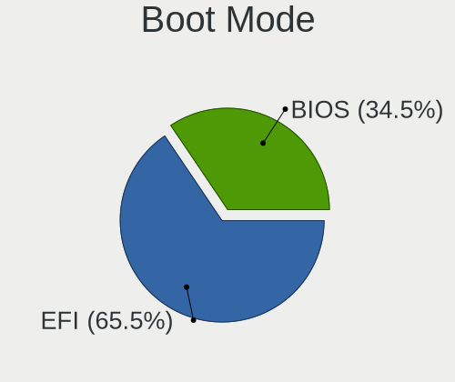
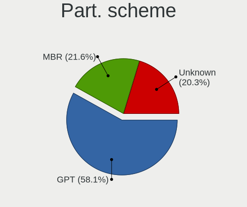
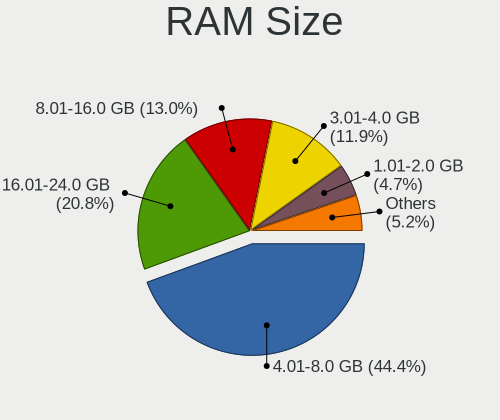
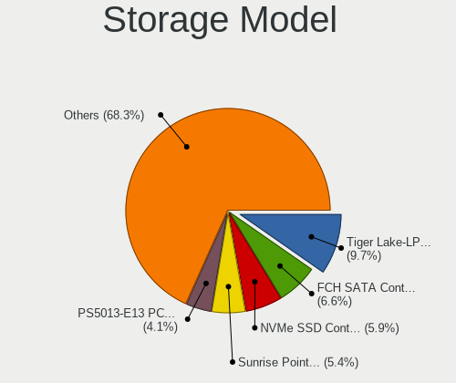
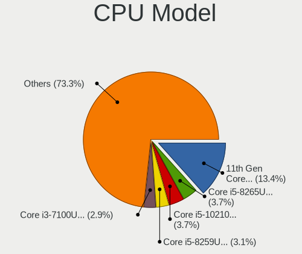
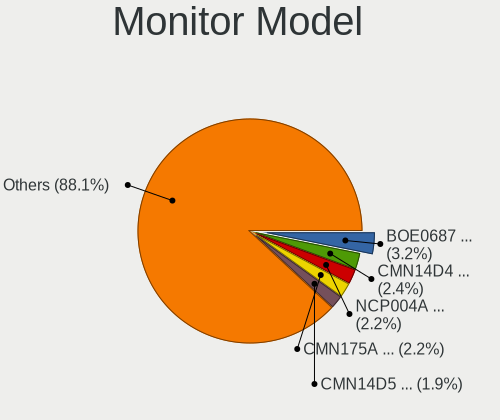
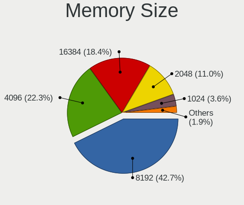
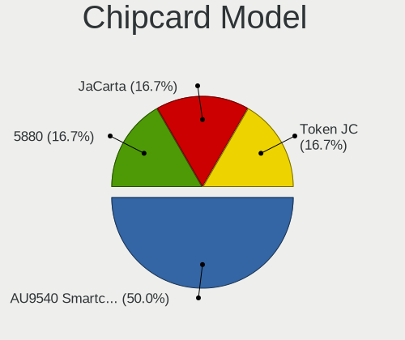
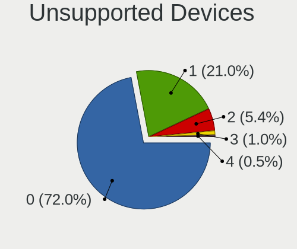
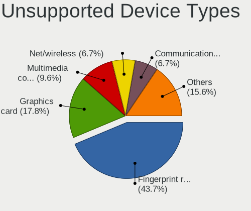

ALT Linux - Tested Hardware & Statistics (Notebooks)
----------------------------------------------------

A project to collect tested hardware configurations for ALT Linux.

Anyone can contribute to this report by the [hw-probe](https://github.com/linuxhw/hw-probe) tool:

    sudo -E hw-probe -all -upload

Please contribute! Especially if your hardware is rare.

Contents
--------

* [ Test Cases ](#test-cases)

* [ System ](#system)
  - [ OS                       ](#os)
  - [ OS Family                ](#os-family)
  - [ Kernel                   ](#kernel)
  - [ Kernel Family            ](#kernel-family)
  - [ Kernel Major Ver.        ](#kernel-major-ver)
  - [ Arch                     ](#arch)
  - [ DE                       ](#de)
  - [ Display Server           ](#display-server)
  - [ Display Manager          ](#display-manager)
  - [ OS Lang                  ](#os-lang)
  - [ Boot Mode                ](#boot-mode)
  - [ Filesystem               ](#filesystem)
  - [ Part. scheme             ](#part-scheme)
  - [ Dual Boot with Linux/BSD ](#dual-boot-with-linuxbsd)
  - [ Dual Boot (Win)          ](#dual-boot-win)

* [ Board ](#board)
  - [ Vendor                   ](#vendor)
  - [ Model                    ](#model)
  - [ Model Family             ](#model-family)
  - [ MFG Year                 ](#mfg-year)
  - [ Form Factor              ](#form-factor)
  - [ Secure Boot              ](#secure-boot)
  - [ Coreboot                 ](#coreboot)
  - [ RAM Size                 ](#ram-size)
  - [ RAM Used                 ](#ram-used)
  - [ Total Drives             ](#total-drives)
  - [ Has CD-ROM               ](#has-cd-rom)
  - [ Has Ethernet             ](#has-ethernet)
  - [ Has WiFi                 ](#has-wifi)
  - [ Has Bluetooth            ](#has-bluetooth)

* [ Location ](#location)
  - [ Country                  ](#country)
  - [ City                     ](#city)

* [ Drives ](#drives)
  - [ Drive Vendor             ](#drive-vendor)
  - [ Drive Model              ](#drive-model)
  - [ HDD Vendor               ](#hdd-vendor)
  - [ SSD Vendor               ](#ssd-vendor)
  - [ Drive Kind               ](#drive-kind)
  - [ Drive Connector          ](#drive-connector)
  - [ Drive Size               ](#drive-size)
  - [ Space Total              ](#space-total)
  - [ Space Used               ](#space-used)
  - [ Malfunc. Drives          ](#malfunc-drives)
  - [ Malfunc. Drive Vendor    ](#malfunc-drive-vendor)
  - [ Malfunc. HDD Vendor      ](#malfunc-hdd-vendor)
  - [ Malfunc. Drive Kind      ](#malfunc-drive-kind)
  - [ Failed Drives            ](#failed-drives)
  - [ Failed Drive Vendor      ](#failed-drive-vendor)
  - [ Drive Status             ](#drive-status)

* [ Storage controller ](#storage-controller)
  - [ Storage Vendor           ](#storage-vendor)
  - [ Storage Model            ](#storage-model)
  - [ Storage Kind             ](#storage-kind)

* [ Processor ](#processor)
  - [ CPU Vendor               ](#cpu-vendor)
  - [ CPU Model                ](#cpu-model)
  - [ CPU Model Family         ](#cpu-model-family)
  - [ CPU Cores                ](#cpu-cores)
  - [ CPU Sockets              ](#cpu-sockets)
  - [ CPU Threads              ](#cpu-threads)
  - [ CPU Op-Modes             ](#cpu-op-modes)
  - [ CPU Microcode            ](#cpu-microcode)
  - [ CPU Microarch            ](#cpu-microarch)

* [ Graphics ](#graphics)
  - [ GPU Vendor               ](#gpu-vendor)
  - [ GPU Model                ](#gpu-model)
  - [ GPU Combo                ](#gpu-combo)
  - [ GPU Driver               ](#gpu-driver)
  - [ GPU Memory               ](#gpu-memory)

* [ Monitor ](#monitor)
  - [ Monitor Vendor           ](#monitor-vendor)
  - [ Monitor Model            ](#monitor-model)
  - [ Monitor Resolution       ](#monitor-resolution)
  - [ Monitor Diagonal         ](#monitor-diagonal)
  - [ Monitor Width            ](#monitor-width)
  - [ Aspect Ratio             ](#aspect-ratio)
  - [ Monitor Area             ](#monitor-area)
  - [ Pixel Density            ](#pixel-density)
  - [ Multiple Monitors        ](#multiple-monitors)

* [ Network ](#network)
  - [ Net Controller Vendor    ](#net-controller-vendor)
  - [ Net Controller Model     ](#net-controller-model)
  - [ Wireless Vendor          ](#wireless-vendor)
  - [ Wireless Model           ](#wireless-model)
  - [ Ethernet Vendor          ](#ethernet-vendor)
  - [ Ethernet Model           ](#ethernet-model)
  - [ Net Controller Kind      ](#net-controller-kind)
  - [ Used Controller          ](#used-controller)
  - [ NICs                     ](#nics)
  - [ IPv6                     ](#ipv6)

* [ Bluetooth ](#bluetooth)
  - [ Bluetooth Vendor         ](#bluetooth-vendor)
  - [ Bluetooth Model          ](#bluetooth-model)

* [ Sound ](#sound)
  - [ Sound Vendor             ](#sound-vendor)
  - [ Sound Model              ](#sound-model)

* [ Memory ](#memory)
  - [ Memory Vendor            ](#memory-vendor)
  - [ Memory Model             ](#memory-model)
  - [ Memory Kind              ](#memory-kind)
  - [ Memory Form Factor       ](#memory-form-factor)
  - [ Memory Size              ](#memory-size)
  - [ Memory Speed             ](#memory-speed)

* [ Printers & scanners ](#printers--scanners)
  - [ Printer Vendor           ](#printer-vendor)
  - [ Printer Model            ](#printer-model)
  - [ Scanner Vendor           ](#scanner-vendor)
  - [ Scanner Model            ](#scanner-model)

* [ Camera ](#camera)
  - [ Camera Vendor            ](#camera-vendor)
  - [ Camera Model             ](#camera-model)

* [ Security ](#security)
  - [ Fingerprint Vendor       ](#fingerprint-vendor)
  - [ Fingerprint Model        ](#fingerprint-model)
  - [ Chipcard Vendor          ](#chipcard-vendor)
  - [ Chipcard Model           ](#chipcard-model)

* [ Unsupported ](#unsupported)
  - [ Unsupported Devices      ](#unsupported-devices)
  - [ Unsupported Device Types ](#unsupported-device-types)

Test Cases
----------

Total: 543

| Vendor        | Model                       | Probe                                                      | Date         |
|---------------|-----------------------------|------------------------------------------------------------|--------------|
| Lenovo        | G505 20240                  | [b6181c89ff](https://linux-hardware.org/?probe=b6181c89ff) | Jan 05, 2025 |
| Apple         | MacBookPro16,1              | [ba278c0390](https://linux-hardware.org/?probe=ba278c0390) | Jan 04, 2025 |
| Apple         | MacBookPro16,1              | [d49932671f](https://linux-hardware.org/?probe=d49932671f) | Jan 04, 2025 |
| ASUSTek       | K50IJ                       | [9c75aa0285](https://linux-hardware.org/?probe=9c75aa0285) | Jan 04, 2025 |
| HP            | Pavilion Laptop 15-eh1xx... | [8c51d26687](https://linux-hardware.org/?probe=8c51d26687) | Dec 27, 2024 |
| Acer          | Extensa 215-23              | [97337ddb76](https://linux-hardware.org/?probe=97337ddb76) | Dec 26, 2024 |
| Infinix       | INBOOK Y4H Max              | [e5a91667f9](https://linux-hardware.org/?probe=e5a91667f9) | Dec 21, 2024 |
| Lenovo        | B50-30 20382                | [4ccf2f7c9a](https://linux-hardware.org/?probe=4ccf2f7c9a) | Dec 17, 2024 |
| HP            | Pavilion Laptop 15-eh1xx... | [991cc2d32a](https://linux-hardware.org/?probe=991cc2d32a) | Dec 13, 2024 |
| LTD Delovo... | 14TLH                       | [8c4728d52e](https://linux-hardware.org/?probe=8c4728d52e) | Dec 12, 2024 |
| Acer          | Aspire E5-573G              | [90ff703a16](https://linux-hardware.org/?probe=90ff703a16) | Dec 09, 2024 |
| Samsung       | 355V4C/355V4X/355V5C/355... | [5b43ecc284](https://linux-hardware.org/?probe=5b43ecc284) | Dec 08, 2024 |
| Maibenben     | Perfectum Series            | [02a7c3fca7](https://linux-hardware.org/?probe=02a7c3fca7) | Nov 29, 2024 |
| Maibenben     | Perfectum Series            | [eb0de561cc](https://linux-hardware.org/?probe=eb0de561cc) | Nov 28, 2024 |
| Samsung       | 355V4C/355V4X/355V5C/355... | [ab329aa759](https://linux-hardware.org/?probe=ab329aa759) | Nov 24, 2024 |
| ASUSTek       | X75VC                       | [806fb829db](https://linux-hardware.org/?probe=806fb829db) | Nov 23, 2024 |
| Samsung       | RV413/RV513                 | [fc599fadf9](https://linux-hardware.org/?probe=fc599fadf9) | Nov 21, 2024 |
| Samsung       | RV413/RV513                 | [5df100f2d2](https://linux-hardware.org/?probe=5df100f2d2) | Nov 21, 2024 |
| Acer          | Swift SF114-34              | [55147661fe](https://linux-hardware.org/?probe=55147661fe) | Nov 18, 2024 |
| Acer          | Aspire 3820                 | [166c3be5a7](https://linux-hardware.org/?probe=166c3be5a7) | Nov 16, 2024 |
| ASUSTek       | UX310UA                     | [104830f2b8](https://linux-hardware.org/?probe=104830f2b8) | Oct 20, 2024 |
| Samsung       | 355V4C/355V4X/355V5C/355... | [8e6ad7a9bc](https://linux-hardware.org/?probe=8e6ad7a9bc) | Oct 17, 2024 |
| Lenovo        | ThinkPad X240 20AMS3AE04    | [fcb1f007a5](https://linux-hardware.org/?probe=fcb1f007a5) | Oct 16, 2024 |
| Unknown       | Unknown                     | [af5eaabfc2](https://linux-hardware.org/?probe=af5eaabfc2) | Oct 14, 2024 |
| Maibenben     | Perfectum Series            | [055b2907a1](https://linux-hardware.org/?probe=055b2907a1) | Oct 12, 2024 |
| Digma         | ES6022EW                    | [9962907672](https://linux-hardware.org/?probe=9962907672) | Oct 10, 2024 |
| ASUSTek       | VivoBook_ASUSLaptop M650... | [a64d1227cd](https://linux-hardware.org/?probe=a64d1227cd) | Oct 07, 2024 |
| Maibenben     | Perfectum Series            | [3ca7c3595a](https://linux-hardware.org/?probe=3ca7c3595a) | Oct 05, 2024 |
| ASUSTek       | VivoBook_ASUSLaptop M650... | [f8ec20365c](https://linux-hardware.org/?probe=f8ec20365c) | Oct 02, 2024 |
| HUAWEI        | BOM-WXX9                    | [5cab2e516c](https://linux-hardware.org/?probe=5cab2e516c) | Sep 28, 2024 |
| HUAWEI        | BOM-WXX9                    | [004f265b76](https://linux-hardware.org/?probe=004f265b76) | Sep 28, 2024 |
| Dell          | Inspiron 5520               | [7674f2b4d4](https://linux-hardware.org/?probe=7674f2b4d4) | Sep 27, 2024 |
| MSI           | Modern 15 A5M               | [7983ebe0a8](https://linux-hardware.org/?probe=7983ebe0a8) | Sep 26, 2024 |
| HP            | Laptop 15-bw0xx             | [b080df96d5](https://linux-hardware.org/?probe=b080df96d5) | Sep 26, 2024 |
| Acer          | Aspire A315-44P             | [7345591513](https://linux-hardware.org/?probe=7345591513) | Sep 26, 2024 |
| Acer          | Aspire A315-44P             | [169fa55862](https://linux-hardware.org/?probe=169fa55862) | Sep 26, 2024 |
| KUANLITU      | S series                    | [dfbb1b67c9](https://linux-hardware.org/?probe=dfbb1b67c9) | Sep 18, 2024 |
| ASUSTek       | ASUS Zenbook 14 UX3405MA... | [3f6b5da510](https://linux-hardware.org/?probe=3f6b5da510) | Sep 15, 2024 |
| Samsung       | 355V4C/355V4X/355V5C/355... | [dd9c45fac7](https://linux-hardware.org/?probe=dd9c45fac7) | Sep 14, 2024 |
| DEPO Compu... | DPC156                      | [a869ccaa68](https://linux-hardware.org/?probe=a869ccaa68) | Sep 13, 2024 |
| DEPO Compu... | DPC156                      | [4ce9fbc296](https://linux-hardware.org/?probe=4ce9fbc296) | Sep 13, 2024 |
| ASUSTek       | ASUS TUF Gaming A17 FA70... | [f67b0818c6](https://linux-hardware.org/?probe=f67b0818c6) | Sep 11, 2024 |
| Samsung       | 355V4C/355V4X/355V5C/355... | [e83c9c0dc1](https://linux-hardware.org/?probe=e83c9c0dc1) | Sep 09, 2024 |
| Acer          | Swift SF114-34              | [5024e5c57a](https://linux-hardware.org/?probe=5024e5c57a) | Sep 03, 2024 |
| HP            | Pavilion Laptop 15-eh1xx... | [0232ff85b0](https://linux-hardware.org/?probe=0232ff85b0) | Sep 02, 2024 |
| HONOR         | GLO-GXXX                    | [a9c3bcdc17](https://linux-hardware.org/?probe=a9c3bcdc17) | Aug 28, 2024 |
| Maibenben     | Perfectum Series            | [174965af02](https://linux-hardware.org/?probe=174965af02) | Aug 27, 2024 |
| Maibenben     | Perfectum Series            | [5664d23a84](https://linux-hardware.org/?probe=5664d23a84) | Aug 26, 2024 |
| Digma         | Pro Fortis M DN15P3-8CXN... | [14b631992b](https://linux-hardware.org/?probe=14b631992b) | Aug 26, 2024 |
| HONOR         | GLO-GXXX                    | [2455c48ab5](https://linux-hardware.org/?probe=2455c48ab5) | Aug 25, 2024 |
| Lenovo        | ThinkPad T480 20L6S57T00    | [10256fb963](https://linux-hardware.org/?probe=10256fb963) | Aug 24, 2024 |
| HUAWEI        | RLEF-XX                     | [34f2013170](https://linux-hardware.org/?probe=34f2013170) | Aug 22, 2024 |
| ASUSTek       | ROG Strix G733QM_G733QM     | [598d872013](https://linux-hardware.org/?probe=598d872013) | Aug 20, 2024 |
| ASUSTek       | ROG Strix G733QM_G733QM     | [b969d73cb0](https://linux-hardware.org/?probe=b969d73cb0) | Aug 20, 2024 |
| HP            | EliteBook 8470p             | [82c857ca2e](https://linux-hardware.org/?probe=82c857ca2e) | Aug 17, 2024 |
| Sony          | VGN-AR51J                   | [68abb3faf1](https://linux-hardware.org/?probe=68abb3faf1) | Aug 15, 2024 |
| ASUSTek       | 1015BXO                     | [f842010ab4](https://linux-hardware.org/?probe=f842010ab4) | Aug 13, 2024 |
| Samsung       | 355V4C/355V4X/355V5C/355... | [e85becff2f](https://linux-hardware.org/?probe=e85becff2f) | Aug 10, 2024 |
| Timi          | RedmiBook 14-APCS           | [7b98bc1efa](https://linux-hardware.org/?probe=7b98bc1efa) | Aug 03, 2024 |
| Timi          | RedmiBook 14-APCS           | [52bfb9882c](https://linux-hardware.org/?probe=52bfb9882c) | Aug 03, 2024 |
| LG Electro... | 15Z90ST-G.AAW4U1            | [9cf11c7129](https://linux-hardware.org/?probe=9cf11c7129) | Aug 02, 2024 |
| HP            | Pavilion Laptop 15-eh1xx... | [4bdee79709](https://linux-hardware.org/?probe=4bdee79709) | Aug 01, 2024 |
| 3Logic Gro... | Graviton N15i               | [28794c402f](https://linux-hardware.org/?probe=28794c402f) | Aug 01, 2024 |
| HONOR         | HYM-WXX                     | [497089dc56](https://linux-hardware.org/?probe=497089dc56) | Jul 30, 2024 |
| Apple         | MacBookPro14,3              | [4727ea5521](https://linux-hardware.org/?probe=4727ea5521) | Jul 29, 2024 |
| Acer          | Aspire V3-571G              | [8db668cfb5](https://linux-hardware.org/?probe=8db668cfb5) | Jul 27, 2024 |
| ICL Techno    | F140a                       | [6c9498bc2f](https://linux-hardware.org/?probe=6c9498bc2f) | Jul 24, 2024 |
| HONOR         | NMH-WCX9                    | [9d91f90ded](https://linux-hardware.org/?probe=9d91f90ded) | Jul 22, 2024 |
| Intel         | H81U                        | [db7284262b](https://linux-hardware.org/?probe=db7284262b) | Jul 21, 2024 |
| Sony          | VPCCA2S1R                   | [65ea977de0](https://linux-hardware.org/?probe=65ea977de0) | Jul 17, 2024 |
| MACHENIKE     | L17A                        | [5d481d8baf](https://linux-hardware.org/?probe=5d481d8baf) | Jul 09, 2024 |
| MACHENIKE     | L17A                        | [25167c9d0b](https://linux-hardware.org/?probe=25167c9d0b) | Jul 09, 2024 |
| Acer          | Aspire A515-57              | [1b9c516078](https://linux-hardware.org/?probe=1b9c516078) | Jul 09, 2024 |
| Acer          | Aspire E3-112               | [8dde0e933a](https://linux-hardware.org/?probe=8dde0e933a) | Jul 05, 2024 |
| Acer          | Aspire E3-112               | [9a9c5efccd](https://linux-hardware.org/?probe=9a9c5efccd) | Jul 04, 2024 |
| ASUSTek       | VivoBook_ASUSLaptop M160... | [5ecae8cb36](https://linux-hardware.org/?probe=5ecae8cb36) | Jun 28, 2024 |
| Infinix       | INBOOK Y1 PLUS              | [2b099e1636](https://linux-hardware.org/?probe=2b099e1636) | Jun 26, 2024 |
| MACHENIKE     | S16C                        | [6e918896fd](https://linux-hardware.org/?probe=6e918896fd) | Jun 20, 2024 |
| HONOR         | NMH-WCX9                    | [6b87d089e7](https://linux-hardware.org/?probe=6b87d089e7) | Jun 19, 2024 |
| ASUSTek       | K43SJ                       | [01cca13919](https://linux-hardware.org/?probe=01cca13919) | Jun 11, 2024 |
| Dell          | Inspiron M5110              | [fe89ff584f](https://linux-hardware.org/?probe=fe89ff584f) | Jun 10, 2024 |
| Lenovo        | V15 G2 ALC 82KD             | [fc313f3019](https://linux-hardware.org/?probe=fc313f3019) | Jun 04, 2024 |
| HP            | Pavilion 15                 | [5c070443f1](https://linux-hardware.org/?probe=5c070443f1) | Jun 01, 2024 |
| HP            | Pavilion Laptop 15-eh1xx... | [9696b9931a](https://linux-hardware.org/?probe=9696b9931a) | May 31, 2024 |
| HP            | EliteBook 850 G1            | [36e9f75edd](https://linux-hardware.org/?probe=36e9f75edd) | May 30, 2024 |
| HP            | Pavilion Laptop 15-eh1xx... | [7d3f6f86dd](https://linux-hardware.org/?probe=7d3f6f86dd) | May 30, 2024 |
| ASUSTek       | K43SJ                       | [527d676304](https://linux-hardware.org/?probe=527d676304) | May 30, 2024 |
| Lenovo        | IdeaPad L340-15API 81LW     | [f26b84f0e9](https://linux-hardware.org/?probe=f26b84f0e9) | May 26, 2024 |
| Lenovo        | IdeaPad L340-15API 81LW     | [a3e3a8bc39](https://linux-hardware.org/?probe=a3e3a8bc39) | May 25, 2024 |
| Acer          | Aspire 5742G                | [5fcd94ffeb](https://linux-hardware.org/?probe=5fcd94ffeb) | May 25, 2024 |
| Unknown       | Unknown                     | [63b860d0cc](https://linux-hardware.org/?probe=63b860d0cc) | May 22, 2024 |
| Unknown       | Unknown                     | [5aa1cb0e36](https://linux-hardware.org/?probe=5aa1cb0e36) | May 22, 2024 |
| Kraftway      | ACCORD                      | [73d302e1ec](https://linux-hardware.org/?probe=73d302e1ec) | May 21, 2024 |
| Lenovo        | IdeaPad S340-14API 81NB     | [12c1f66b60](https://linux-hardware.org/?probe=12c1f66b60) | May 12, 2024 |
| ASUSTek       | ASUS TUF Gaming F15 FX50... | [f83dfd7434](https://linux-hardware.org/?probe=f83dfd7434) | May 11, 2024 |
| ASUSTek       | X550CC                      | [47b8006c42](https://linux-hardware.org/?probe=47b8006c42) | May 05, 2024 |
| Infinix       | INBOOK X2 GEN11             | [9002e7e3c5](https://linux-hardware.org/?probe=9002e7e3c5) | May 04, 2024 |
| HP            | ProBook 6450b               | [c4d1788222](https://linux-hardware.org/?probe=c4d1788222) | May 03, 2024 |
| Lenovo        | V130-15IKB 81HN             | [d00e301298](https://linux-hardware.org/?probe=d00e301298) | May 03, 2024 |
| Echips Imp... | NX140A-S                    | [dec569991b](https://linux-hardware.org/?probe=dec569991b) | Apr 30, 2024 |
| Lenovo        | ThinkPad T480 20L6S7MP00    | [ea3db5dd3c](https://linux-hardware.org/?probe=ea3db5dd3c) | Apr 29, 2024 |
| ASUSTek       | N53Jf                       | [02cf0c80c7](https://linux-hardware.org/?probe=02cf0c80c7) | Apr 29, 2024 |
| Intel Clie... | LAPAC71H                    | [a1a6c57c02](https://linux-hardware.org/?probe=a1a6c57c02) | Apr 28, 2024 |
| Intel Clie... | LAPAC71H                    | [c365e08c03](https://linux-hardware.org/?probe=c365e08c03) | Apr 20, 2024 |
| HP            | Laptop 15-bw0xx             | [1291c4934f](https://linux-hardware.org/?probe=1291c4934f) | Apr 18, 2024 |
| Aquarius      | NS685U R11                  | [b5b6ca6e69](https://linux-hardware.org/?probe=b5b6ca6e69) | Apr 18, 2024 |
| ICL Techno    | F140a                       | [bd46cdda52](https://linux-hardware.org/?probe=bd46cdda52) | Apr 16, 2024 |
| IP3 Tech      | ZEN1                        | [d85ba98172](https://linux-hardware.org/?probe=d85ba98172) | Apr 13, 2024 |
| HP            | ProBook 4520s               | [6886f7483d](https://linux-hardware.org/?probe=6886f7483d) | Apr 09, 2024 |
| HUAWEI        | BOM-WXX9                    | [a5ab134bcf](https://linux-hardware.org/?probe=a5ab134bcf) | Apr 07, 2024 |
| HP            | Laptop 15-gw0xxx            | [ba96d62394](https://linux-hardware.org/?probe=ba96d62394) | Apr 04, 2024 |
| DEPO Compu... | DPC156                      | [9320cdbb02](https://linux-hardware.org/?probe=9320cdbb02) | Apr 04, 2024 |
| HP            | Unknown                     | [8247de95f8](https://linux-hardware.org/?probe=8247de95f8) | Mar 22, 2024 |
| TECNO Mobi... | MEGABOOK T15DA              | [c9580df31c](https://linux-hardware.org/?probe=c9580df31c) | Mar 20, 2024 |
| ASUSTek       | ASUS Zenbook 14 UX3405MA... | [09805af67f](https://linux-hardware.org/?probe=09805af67f) | Mar 20, 2024 |
| Valve         | Jupiter                     | [5685e8711f](https://linux-hardware.org/?probe=5685e8711f) | Mar 15, 2024 |
| Lenovo        | IdeaPad L340-17IRH Gamin... | [898f0686a4](https://linux-hardware.org/?probe=898f0686a4) | Mar 14, 2024 |
| Lenovo        | IdeaPad L340-17IRH Gamin... | [fa3d8709e3](https://linux-hardware.org/?probe=fa3d8709e3) | Mar 14, 2024 |
| Dell          | G15 5511                    | [ff19732587](https://linux-hardware.org/?probe=ff19732587) | Mar 11, 2024 |
| HP            | Pavilion dv6                | [89a9407fb7](https://linux-hardware.org/?probe=89a9407fb7) | Mar 06, 2024 |
| ASUSTek       | ASUS EXPERTBOOK B1502CVA... | [0222a2f98a](https://linux-hardware.org/?probe=0222a2f98a) | Mar 05, 2024 |
| ICL Techno    | F140a                       | [2bdc9718e7](https://linux-hardware.org/?probe=2bdc9718e7) | Mar 03, 2024 |
| HP            | Pavilion dv6                | [4ed39c3833](https://linux-hardware.org/?probe=4ed39c3833) | Mar 03, 2024 |
| ASUSTek       | K53SJ                       | [4f8e5147ba](https://linux-hardware.org/?probe=4f8e5147ba) | Feb 27, 2024 |
| ASUSTek       | X550CC                      | [d9b2c3a575](https://linux-hardware.org/?probe=d9b2c3a575) | Feb 26, 2024 |
| TECNO Mobi... | MEGABOOK T14TA              | [9874f5d3c1](https://linux-hardware.org/?probe=9874f5d3c1) | Feb 20, 2024 |
| iRU           | 15TLI                       | [2af6577cf0](https://linux-hardware.org/?probe=2af6577cf0) | Feb 19, 2024 |
| HP            | ProBook 6450b               | [1a4b4a3788](https://linux-hardware.org/?probe=1a4b4a3788) | Feb 17, 2024 |
| ASUSTek       | VivoBook_ASUSLaptop X571... | [8317f520c9](https://linux-hardware.org/?probe=8317f520c9) | Feb 16, 2024 |
| Acer          | Aspire E5-571G              | [29a77bf074](https://linux-hardware.org/?probe=29a77bf074) | Feb 14, 2024 |
| HP            | ENVY 6                      | [ccd623bfad](https://linux-hardware.org/?probe=ccd623bfad) | Feb 13, 2024 |
| Lenovo        | ThinkPad E490 20N80017RT    | [bad3f7f138](https://linux-hardware.org/?probe=bad3f7f138) | Feb 09, 2024 |
| Lenovo        | V370 HuronRiver Platform    | [1ad82367ba](https://linux-hardware.org/?probe=1ad82367ba) | Feb 07, 2024 |
| Sony          | VPCSA2Z9R                   | [88e21aee02](https://linux-hardware.org/?probe=88e21aee02) | Feb 06, 2024 |
| Aquarius      | CMP NS685U_4                | [1115097f9a](https://linux-hardware.org/?probe=1115097f9a) | Feb 05, 2024 |
| MSI           | Modern 14 B11MOU            | [a5b3665f64](https://linux-hardware.org/?probe=a5b3665f64) | Feb 02, 2024 |
| Unknown       | Unknown                     | [737a25372c](https://linux-hardware.org/?probe=737a25372c) | Jan 03, 2024 |
| ASUSTek       | ASUS TUF Gaming A17 FA70... | [1372c9e7e6](https://linux-hardware.org/?probe=1372c9e7e6) | Dec 30, 2023 |
| HP            | Pavilion Laptop 15-eh1xx... | [a4d9a001ff](https://linux-hardware.org/?probe=a4d9a001ff) | Dec 29, 2023 |
| HP            | ProBook 6460b               | [4a6a6b9b9d](https://linux-hardware.org/?probe=4a6a6b9b9d) | Dec 26, 2023 |
| ASUSTek       | VivoBook_ASUSLaptop X515... | [7fdd8a3f38](https://linux-hardware.org/?probe=7fdd8a3f38) | Dec 26, 2023 |
| ASUSTek       | VivoBook_ASUSLaptop X515... | [a1fd8cc737](https://linux-hardware.org/?probe=a1fd8cc737) | Dec 26, 2023 |
| ASUSTek       | VivoBook_ASUSLaptop M650... | [188dea7b4b](https://linux-hardware.org/?probe=188dea7b4b) | Dec 19, 2023 |
| Dell          | Inspiron 1545               | [cd3471d9e5](https://linux-hardware.org/?probe=cd3471d9e5) | Dec 17, 2023 |
| Lenovo        | ThinkBook 15 G2 ITL 20VE    | [a53b2d9ba9](https://linux-hardware.org/?probe=a53b2d9ba9) | Dec 15, 2023 |
| Lenovo        | G700                        | [97b63677f6](https://linux-hardware.org/?probe=97b63677f6) | Dec 11, 2023 |
| Lenovo        | 3000 G410                   | [439199aff4](https://linux-hardware.org/?probe=439199aff4) | Dec 04, 2023 |
| Acer          | Nitro AN517-52              | [80b6f0b84a](https://linux-hardware.org/?probe=80b6f0b84a) | Dec 02, 2023 |
| MSI           | GT70 2PC                    | [0806985a42](https://linux-hardware.org/?probe=0806985a42) | Nov 29, 2023 |
| Dell          | Inspiron 15-3565            | [7d7541ceb2](https://linux-hardware.org/?probe=7d7541ceb2) | Nov 29, 2023 |
| Lenovo        | G700                        | [3c8ae88b16](https://linux-hardware.org/?probe=3c8ae88b16) | Nov 29, 2023 |
| HUAWEI        | CREF-XX                     | [630d8838dc](https://linux-hardware.org/?probe=630d8838dc) | Nov 27, 2023 |
| MSI           | GT70 2PC                    | [c4589b53bb](https://linux-hardware.org/?probe=c4589b53bb) | Nov 26, 2023 |
| Lenovo        | Y520-15IKBN 80WK            | [7078ba99e1](https://linux-hardware.org/?probe=7078ba99e1) | Nov 26, 2023 |
| HP            | Laptop 17-cn2xxx            | [59c09c7be1](https://linux-hardware.org/?probe=59c09c7be1) | Nov 11, 2023 |
| Dell          | Inspiron N5050              | [2ec8097b67](https://linux-hardware.org/?probe=2ec8097b67) | Oct 31, 2023 |
| Acer          | Extensa 2520G               | [bcc4e567f3](https://linux-hardware.org/?probe=bcc4e567f3) | Oct 30, 2023 |
| HP            | Pavilion Laptop 15-eh1xx... | [856d9c4a75](https://linux-hardware.org/?probe=856d9c4a75) | Oct 28, 2023 |
| HP            | Laptop 15-bw0xx             | [63c6987bfa](https://linux-hardware.org/?probe=63c6987bfa) | Oct 28, 2023 |
| Acer          | Ferrari 3200                | [52f9e06bf9](https://linux-hardware.org/?probe=52f9e06bf9) | Oct 25, 2023 |
| ASUSTek       | ROG Strix G513QY_G513QY     | [f8f7f85d08](https://linux-hardware.org/?probe=f8f7f85d08) | Oct 25, 2023 |
| Acer          | Extensa 2520G               | [d0e546f6d6](https://linux-hardware.org/?probe=d0e546f6d6) | Oct 25, 2023 |
| Lenovo        | V580c 20160                 | [178fe3a497](https://linux-hardware.org/?probe=178fe3a497) | Oct 25, 2023 |
| HONOR         | NMH-WDX9                    | [3a0782c335](https://linux-hardware.org/?probe=3a0782c335) | Oct 25, 2023 |
| Acer          | Extensa 2520G               | [1b58a52442](https://linux-hardware.org/?probe=1b58a52442) | Oct 25, 2023 |
| Unknown       | Unknown                     | [1e239308b1](https://linux-hardware.org/?probe=1e239308b1) | Oct 21, 2023 |
| Unknown       | Unknown                     | [125d0eedc8](https://linux-hardware.org/?probe=125d0eedc8) | Oct 21, 2023 |
| HP            | 255 G4                      | [0290beac3f](https://linux-hardware.org/?probe=0290beac3f) | Oct 19, 2023 |
| Maibenben     | MaiBook X series            | [901cc6bd8a](https://linux-hardware.org/?probe=901cc6bd8a) | Oct 14, 2023 |
| ASUSTek       | T100TAM                     | [b809251676](https://linux-hardware.org/?probe=b809251676) | Oct 11, 2023 |
| Unknown       | Unknown                     | [52694348d2](https://linux-hardware.org/?probe=52694348d2) | Oct 10, 2023 |
| Lenovo        | IdeaPad L3 15IML05 81Y3     | [7f32c31118](https://linux-hardware.org/?probe=7f32c31118) | Oct 09, 2023 |
| ROMBICA       | myBook Eclipse              | [d56fec4995](https://linux-hardware.org/?probe=d56fec4995) | Oct 07, 2023 |
| MSI           | Modern 15 B12M              | [1bbe75aa56](https://linux-hardware.org/?probe=1bbe75aa56) | Oct 04, 2023 |
| Lenovo        | V15 G3 IAP 82TT             | [61278c0720](https://linux-hardware.org/?probe=61278c0720) | Oct 04, 2023 |
| HUAWEI        | RLEF-XX                     | [06499eec7c](https://linux-hardware.org/?probe=06499eec7c) | Oct 04, 2023 |
| F-PLUS EQU... | Unknown                     | [104a5f30e4](https://linux-hardware.org/?probe=104a5f30e4) | Oct 04, 2023 |
| HP            | 250 15.6 inch G9 Noteboo... | [90cb02d71d](https://linux-hardware.org/?probe=90cb02d71d) | Oct 04, 2023 |
| F-PLUS EQU... | FNB-156-P1                  | [aa9a99ccb5](https://linux-hardware.org/?probe=aa9a99ccb5) | Oct 04, 2023 |
| F-PLUS EQU... | FNB-156-P1                  | [200217831d](https://linux-hardware.org/?probe=200217831d) | Oct 04, 2023 |
| Lenovo        | G700                        | [7090569f96](https://linux-hardware.org/?probe=7090569f96) | Oct 03, 2023 |
| HIPER         | WORKBOOK                    | [902f508256](https://linux-hardware.org/?probe=902f508256) | Oct 03, 2023 |
| ROMBICA       | myBook Eclipse              | [004e1dc4fd](https://linux-hardware.org/?probe=004e1dc4fd) | Sep 28, 2023 |
| Infinix       | INBOOK X2 GEN11             | [2ac0204275](https://linux-hardware.org/?probe=2ac0204275) | Sep 28, 2023 |
| Kraftway      | ACCORD                      | [df4d5654d5](https://linux-hardware.org/?probe=df4d5654d5) | Sep 21, 2023 |
| iRU           | 17ALC                       | [2d0b23c813](https://linux-hardware.org/?probe=2d0b23c813) | Sep 18, 2023 |
| Lenovo        | ThinkPad X250 20CMS0A200    | [43df4bd3f3](https://linux-hardware.org/?probe=43df4bd3f3) | Sep 18, 2023 |
| Infinix       | INBOOK X2 GEN11             | [5e87de3be1](https://linux-hardware.org/?probe=5e87de3be1) | Sep 11, 2023 |
| Toshiba       | Satellite A200              | [439b7547a5](https://linux-hardware.org/?probe=439b7547a5) | Sep 04, 2023 |
| Acer          | Aspire 3690                 | [503b015d34](https://linux-hardware.org/?probe=503b015d34) | Sep 04, 2023 |
| Infinix       | INBOOK X2 GEN11             | [b196e48c97](https://linux-hardware.org/?probe=b196e48c97) | Aug 30, 2023 |
| Infinix       | INBOOK X2 GEN11             | [d8f8a287e6](https://linux-hardware.org/?probe=d8f8a287e6) | Aug 27, 2023 |
| ASUSTek       | 1215N                       | [35853f5b92](https://linux-hardware.org/?probe=35853f5b92) | Aug 04, 2023 |
| HP            | Laptop 15-ef2xxx            | [1096cf2959](https://linux-hardware.org/?probe=1096cf2959) | Jul 31, 2023 |
| Acer          | Aspire V3-551G              | [a90eeb2fa3](https://linux-hardware.org/?probe=a90eeb2fa3) | Jul 31, 2023 |
| Lenovo        | V15 G4 AMN 82YU             | [c3523b3823](https://linux-hardware.org/?probe=c3523b3823) | Jul 29, 2023 |
| INSYS         | IP1-XN23                    | [4212432f00](https://linux-hardware.org/?probe=4212432f00) | Jul 24, 2023 |
| ASUSTek       | X55A                        | [6818ec7338](https://linux-hardware.org/?probe=6818ec7338) | Jul 21, 2023 |
| Lenovo        | IdeaPad S340-15API 81NC     | [a24026d3c6](https://linux-hardware.org/?probe=a24026d3c6) | Jul 14, 2023 |
| HP            | ProBook 640 G1              | [8c2fd03132](https://linux-hardware.org/?probe=8c2fd03132) | Jul 06, 2023 |
| Graviton      | N15I-T                      | [b457883ad3](https://linux-hardware.org/?probe=b457883ad3) | Jul 04, 2023 |
| Graviton      | N15I-T                      | [305390c16e](https://linux-hardware.org/?probe=305390c16e) | Jul 03, 2023 |
| 3Logic Gro... | Graviton N15i               | [1f7adfe250](https://linux-hardware.org/?probe=1f7adfe250) | Jun 27, 2023 |
| Clevo         | NL41MU2                     | [91bb626fa8](https://linux-hardware.org/?probe=91bb626fa8) | Jun 26, 2023 |
| Dell          | Vostro 3525                 | [308ee62292](https://linux-hardware.org/?probe=308ee62292) | Jun 21, 2023 |
| Alienware     | M14xR2                      | [2eb0cc2d0e](https://linux-hardware.org/?probe=2eb0cc2d0e) | Jun 17, 2023 |
| Dell          | Vostro 3525                 | [fb399aebb6](https://linux-hardware.org/?probe=fb399aebb6) | Jun 11, 2023 |
| ASUSTek       | VivoBook_ASUSLaptop M150... | [6d434209eb](https://linux-hardware.org/?probe=6d434209eb) | Jun 07, 2023 |
| Lenovo        | G70-70 80HW                 | [0d46480e90](https://linux-hardware.org/?probe=0d46480e90) | Jun 06, 2023 |
| HP            | EliteBook 2560p             | [3ed00534ed](https://linux-hardware.org/?probe=3ed00534ed) | Jun 05, 2023 |
| HP            | Mini 210-1000               | [96f41af422](https://linux-hardware.org/?probe=96f41af422) | Jun 05, 2023 |
| Dell          | Vostro 3525                 | [e4b62aaf28](https://linux-hardware.org/?probe=e4b62aaf28) | Jun 05, 2023 |
| ICL           | RAYbook Si1407              | [5956bb96ff](https://linux-hardware.org/?probe=5956bb96ff) | May 30, 2023 |
| Timi          | TM1701                      | [94105aa58f](https://linux-hardware.org/?probe=94105aa58f) | May 26, 2023 |
| Clevo         | NL41MU2                     | [41f9a8d4b1](https://linux-hardware.org/?probe=41f9a8d4b1) | May 25, 2023 |
| HP            | Pavilion Laptop 15-eh1xx... | [5762961675](https://linux-hardware.org/?probe=5762961675) | May 23, 2023 |
| HP            | Pavilion Laptop 15-eh1xx... | [85f2338e54](https://linux-hardware.org/?probe=85f2338e54) | May 22, 2023 |
| ASUSTek       | VivoBook_ASUSLaptop M160... | [39fa0ce7e9](https://linux-hardware.org/?probe=39fa0ce7e9) | May 19, 2023 |
| HP            | Pavilion Laptop 15-eh1xx... | [c795e3e6ac](https://linux-hardware.org/?probe=c795e3e6ac) | May 18, 2023 |
| Clevo         | NL41MU2                     | [3c0893a822](https://linux-hardware.org/?probe=3c0893a822) | May 11, 2023 |
| ASUSTek       | VivoBook_ASUSLaptop M160... | [ce24dc022b](https://linux-hardware.org/?probe=ce24dc022b) | May 10, 2023 |
| Clevo         | NL41MU2                     | [1d50da2ba5](https://linux-hardware.org/?probe=1d50da2ba5) | May 05, 2023 |
| F-PLUS EQU... | FNB-140-P1                  | [f78d6739f5](https://linux-hardware.org/?probe=f78d6739f5) | May 03, 2023 |
| Clevo         | NL41MU2                     | [67b2580836](https://linux-hardware.org/?probe=67b2580836) | May 03, 2023 |
| Acer          | Aspire 5935                 | [1ba45b2b8f](https://linux-hardware.org/?probe=1ba45b2b8f) | May 03, 2023 |
| HUAWEI        | BOM-WXX9                    | [a69dab4a99](https://linux-hardware.org/?probe=a69dab4a99) | Apr 29, 2023 |
| Valve         | Jupiter                     | [583e105bbf](https://linux-hardware.org/?probe=583e105bbf) | Apr 28, 2023 |
| Acer          | Aspire 5935                 | [9dfeeff104](https://linux-hardware.org/?probe=9dfeeff104) | Apr 28, 2023 |
| Valve         | Jupiter                     | [37534616d7](https://linux-hardware.org/?probe=37534616d7) | Apr 27, 2023 |
| Clevo         | NL41MU2                     | [4f2ffb4273](https://linux-hardware.org/?probe=4f2ffb4273) | Apr 26, 2023 |
| Acer          | Aspire 5935                 | [0430d21b33](https://linux-hardware.org/?probe=0430d21b33) | Apr 26, 2023 |
| Clevo         | NL41MU2                     | [2f1b310ca2](https://linux-hardware.org/?probe=2f1b310ca2) | Apr 21, 2023 |
| Clevo         | NL41MU2                     | [322f62ae77](https://linux-hardware.org/?probe=322f62ae77) | Apr 11, 2023 |
| Clevo         | NL41MU2                     | [720eed31f6](https://linux-hardware.org/?probe=720eed31f6) | Apr 10, 2023 |
| HP            | Pavilion dv6                | [5fddb7053d](https://linux-hardware.org/?probe=5fddb7053d) | Apr 07, 2023 |
| HP            | Pavilion dv6                | [67615ec9ff](https://linux-hardware.org/?probe=67615ec9ff) | Apr 05, 2023 |
| Timi          | TM1701                      | [5fc6e30961](https://linux-hardware.org/?probe=5fc6e30961) | Apr 04, 2023 |
| Fujitsu       | LIFEBOOK NH532              | [68a8171c0a](https://linux-hardware.org/?probe=68a8171c0a) | Mar 31, 2023 |
| ASUSTek       | K52JB                       | [45162c9123](https://linux-hardware.org/?probe=45162c9123) | Mar 30, 2023 |
| ASUSTek       | K52JB                       | [c19cd604b3](https://linux-hardware.org/?probe=c19cd604b3) | Mar 30, 2023 |
| DEPO Compu... | DPC156                      | [fc942702db](https://linux-hardware.org/?probe=fc942702db) | Mar 30, 2023 |
| DEPO Compu... | DPC156                      | [ab5d4b339b](https://linux-hardware.org/?probe=ab5d4b339b) | Mar 30, 2023 |
| Clevo         | NL41MU2                     | [69abc76758](https://linux-hardware.org/?probe=69abc76758) | Mar 29, 2023 |
| Clevo         | NL41MU2                     | [60191a33b8](https://linux-hardware.org/?probe=60191a33b8) | Mar 27, 2023 |
| Clevo         | NL41MU2                     | [b56bf816d5](https://linux-hardware.org/?probe=b56bf816d5) | Mar 23, 2023 |
| Clevo         | NL41MU2                     | [88a5d2eb30](https://linux-hardware.org/?probe=88a5d2eb30) | Mar 23, 2023 |
| Clevo         | NL41MU2                     | [430f11129e](https://linux-hardware.org/?probe=430f11129e) | Mar 22, 2023 |
| HP            | Pavilion g7                 | [9fbef1354b](https://linux-hardware.org/?probe=9fbef1354b) | Mar 21, 2023 |
| ASUSTek       | X55A                        | [743d04e5fc](https://linux-hardware.org/?probe=743d04e5fc) | Mar 16, 2023 |
| Lenovo        | ThinkPad E15 Gen 4 21ED0... | [9e620a10f2](https://linux-hardware.org/?probe=9e620a10f2) | Mar 09, 2023 |
| HUAWEI        | HVY-WXX9                    | [dcc115a880](https://linux-hardware.org/?probe=dcc115a880) | Mar 02, 2023 |
| Clevo         | NL41MU2                     | [29df87f87f](https://linux-hardware.org/?probe=29df87f87f) | Feb 28, 2023 |
| Clevo         | NL41MU2                     | [b91dfc602e](https://linux-hardware.org/?probe=b91dfc602e) | Feb 27, 2023 |
| ASUSTek       | VivoBook_ASUSLaptop M150... | [f8dd8a7ee9](https://linux-hardware.org/?probe=f8dd8a7ee9) | Feb 18, 2023 |
| Clevo         | NL41MU2                     | [d15806c6c2](https://linux-hardware.org/?probe=d15806c6c2) | Feb 15, 2023 |
| HP            | Pavilion Aero Laptop 13-... | [9606f5546e](https://linux-hardware.org/?probe=9606f5546e) | Feb 15, 2023 |
| Clevo         | NL41MU2                     | [516a173dcb](https://linux-hardware.org/?probe=516a173dcb) | Feb 14, 2023 |
| Clevo         | NL41MU2                     | [2809288f6f](https://linux-hardware.org/?probe=2809288f6f) | Feb 13, 2023 |
| Clevo         | NL41MU2                     | [56ecf82de8](https://linux-hardware.org/?probe=56ecf82de8) | Feb 13, 2023 |
| Clevo         | NL41MU2                     | [95af064bd1](https://linux-hardware.org/?probe=95af064bd1) | Feb 13, 2023 |
| HP            | Pavilion Laptop 15-eh1xx... | [c3909421c3](https://linux-hardware.org/?probe=c3909421c3) | Feb 07, 2023 |
| Lenovo        | ThinkPad X220 4290RV5       | [8fb9d5ae65](https://linux-hardware.org/?probe=8fb9d5ae65) | Feb 06, 2023 |
| Lenovo        | ThinkPad X220 4290RV5       | [ced0a536d0](https://linux-hardware.org/?probe=ced0a536d0) | Feb 06, 2023 |
| HP            | Pavilion Laptop 15-eh1xx... | [9dcc7bb41d](https://linux-hardware.org/?probe=9dcc7bb41d) | Feb 03, 2023 |
| Clevo         | NL41MU2                     | [95dac05397](https://linux-hardware.org/?probe=95dac05397) | Jan 31, 2023 |
| ASUSTek       | N53Ta                       | [30131c7409](https://linux-hardware.org/?probe=30131c7409) | Jan 31, 2023 |
| Clevo         | NL41MU2                     | [86e493728f](https://linux-hardware.org/?probe=86e493728f) | Jan 27, 2023 |
| Clevo         | NL41MU2                     | [82e558cf16](https://linux-hardware.org/?probe=82e558cf16) | Jan 25, 2023 |
| Clevo         | NL41MU2                     | [831e02a268](https://linux-hardware.org/?probe=831e02a268) | Jan 24, 2023 |
| Lenovo        | B560                        | [b474faa82b](https://linux-hardware.org/?probe=b474faa82b) | Jan 23, 2023 |
| Acer          | Aspire E1-530G              | [b4f6567b3f](https://linux-hardware.org/?probe=b4f6567b3f) | Jan 22, 2023 |
| Dell          | Latitude 5580               | [9cfd456bd4](https://linux-hardware.org/?probe=9cfd456bd4) | Jan 22, 2023 |
| HP            | ProBook 440 G4              | [43b8eec1e2](https://linux-hardware.org/?probe=43b8eec1e2) | Jan 18, 2023 |
| Clevo         | NL41MU2                     | [c1c0617217](https://linux-hardware.org/?probe=c1c0617217) | Jan 17, 2023 |
| Timi          | Redmi Book Pro 14S          | [911075716c](https://linux-hardware.org/?probe=911075716c) | Jan 13, 2023 |
| Unknown       | Unknown                     | [45ea0a8983](https://linux-hardware.org/?probe=45ea0a8983) | Jan 11, 2023 |
| Intel         | Jasper Lake Client Platf... | [3000408196](https://linux-hardware.org/?probe=3000408196) | Jan 11, 2023 |
| Clevo         | NL41MU2                     | [6aaaf2e570](https://linux-hardware.org/?probe=6aaaf2e570) | Dec 28, 2022 |
| 3Logic Gro... | Graviton N15i-K2            | [4d7e3586e2](https://linux-hardware.org/?probe=4d7e3586e2) | Dec 27, 2022 |
| Clevo         | NL41MU2                     | [0c71831ff4](https://linux-hardware.org/?probe=0c71831ff4) | Dec 27, 2022 |
| Clevo         | NL41MU2                     | [50c31f6b47](https://linux-hardware.org/?probe=50c31f6b47) | Dec 27, 2022 |
| Clevo         | NL41MU2                     | [190bb1537d](https://linux-hardware.org/?probe=190bb1537d) | Dec 26, 2022 |
| Clevo         | NL41MU2                     | [0574ad6c44](https://linux-hardware.org/?probe=0574ad6c44) | Dec 26, 2022 |
| LTD Delovo... | 15Y                         | [286aa3fb96](https://linux-hardware.org/?probe=286aa3fb96) | Dec 25, 2022 |
| Clevo         | NL41MU2                     | [f9b6dc975b](https://linux-hardware.org/?probe=f9b6dc975b) | Dec 23, 2022 |
| HP            | ProBook 440 G4              | [c93f96de9e](https://linux-hardware.org/?probe=c93f96de9e) | Dec 22, 2022 |
| Pegatron      | C15B                        | [865b882e8a](https://linux-hardware.org/?probe=865b882e8a) | Dec 18, 2022 |
| Aquarius      | Pro, Std, Elt Series        | [59b7fca136](https://linux-hardware.org/?probe=59b7fca136) | Dec 18, 2022 |
| Apple         | MacBook4,1                  | [26bb5af1a4](https://linux-hardware.org/?probe=26bb5af1a4) | Dec 16, 2022 |
| Irbis         | NB264                       | [14764ec4e5](https://linux-hardware.org/?probe=14764ec4e5) | Dec 15, 2022 |
| Unknown       | Unknown                     | [24bebac773](https://linux-hardware.org/?probe=24bebac773) | Dec 15, 2022 |
| Unknown       | Unknown                     | [643cb41a84](https://linux-hardware.org/?probe=643cb41a84) | Dec 15, 2022 |
| Dell          | Vostro 14 5410              | [af22c1db61](https://linux-hardware.org/?probe=af22c1db61) | Dec 08, 2022 |
| Apple         | MacBook7,1                  | [317fdfd70b](https://linux-hardware.org/?probe=317fdfd70b) | Dec 08, 2022 |
| Lenovo        | ThinkBook 15 G2 ITL 20VE    | [619fd919a1](https://linux-hardware.org/?probe=619fd919a1) | Dec 07, 2022 |
| HP            | 255 G4                      | [33b2fb7f31](https://linux-hardware.org/?probe=33b2fb7f31) | Nov 30, 2022 |
| Pegatron      | C15B                        | [92271ab582](https://linux-hardware.org/?probe=92271ab582) | Nov 30, 2022 |
| Samsung       | R560                        | [936ae4b775](https://linux-hardware.org/?probe=936ae4b775) | Nov 29, 2022 |
| Timi          | TM1701                      | [64ee057496](https://linux-hardware.org/?probe=64ee057496) | Nov 28, 2022 |
| Acer          | TravelMate 4200             | [14b60c4afa](https://linux-hardware.org/?probe=14b60c4afa) | Nov 26, 2022 |
| ASUSTek       | VivoBook_ASUSLaptop M150... | [52da79e88f](https://linux-hardware.org/?probe=52da79e88f) | Nov 25, 2022 |
| Lenovo        | ThinkBook 15 G2 ITL 20VE    | [4a758bfcc8](https://linux-hardware.org/?probe=4a758bfcc8) | Nov 25, 2022 |
| Clevo         | NL41MU2                     | [0736d8a48f](https://linux-hardware.org/?probe=0736d8a48f) | Nov 24, 2022 |
| Panasonic     | CF-C2CH2CBMG                | [cf87bdba01](https://linux-hardware.org/?probe=cf87bdba01) | Nov 24, 2022 |
| Acer          | Aspire 5940                 | [33325564e7](https://linux-hardware.org/?probe=33325564e7) | Nov 22, 2022 |
| Samsung       | SR70S/SR71S                 | [27c34cd9df](https://linux-hardware.org/?probe=27c34cd9df) | Nov 22, 2022 |
| HUAWEI        | NBD-WXX9                    | [bd18dfe05f](https://linux-hardware.org/?probe=bd18dfe05f) | Nov 20, 2022 |
| Timi          | TM1701                      | [e77b655bb8](https://linux-hardware.org/?probe=e77b655bb8) | Nov 16, 2022 |
| HUAWEI        | NBD-WXX9                    | [72ebef559b](https://linux-hardware.org/?probe=72ebef559b) | Nov 16, 2022 |
| HP            | Mini 110-3700               | [8ca62a1880](https://linux-hardware.org/?probe=8ca62a1880) | Nov 15, 2022 |
| ASUSTek       | ASUS TUF Gaming A15 FA50... | [6e9bc709d9](https://linux-hardware.org/?probe=6e9bc709d9) | Nov 13, 2022 |
| ASUSTek       | ASUS TUF Gaming A15 FA50... | [49162725d5](https://linux-hardware.org/?probe=49162725d5) | Nov 13, 2022 |
| Clevo         | NL41MU2                     | [65226dd80a](https://linux-hardware.org/?probe=65226dd80a) | Nov 11, 2022 |
| Clevo         | NL41MU2                     | [a25dd1174c](https://linux-hardware.org/?probe=a25dd1174c) | Nov 11, 2022 |
| Acer          | TravelMate 6292             | [c7dcad2d0f](https://linux-hardware.org/?probe=c7dcad2d0f) | Nov 10, 2022 |
| Apple         | MacBookPro5,5               | [cc051268d8](https://linux-hardware.org/?probe=cc051268d8) | Nov 05, 2022 |
| ASUSTek       | T100TAM                     | [d409557d4b](https://linux-hardware.org/?probe=d409557d4b) | Nov 03, 2022 |
| ASUSTek       | T100TAM                     | [a2a70b919d](https://linux-hardware.org/?probe=a2a70b919d) | Oct 31, 2022 |
| Toshiba       | dynabook Satellite T87/8... | [10f344a2b3](https://linux-hardware.org/?probe=10f344a2b3) | Oct 24, 2022 |
| ASUSTek       | ASUS TUF Gaming A17 FA70... | [bfb6c03047](https://linux-hardware.org/?probe=bfb6c03047) | Oct 22, 2022 |
| HP            | EliteBook 840 G8 Noteboo... | [5a8ac06ce5](https://linux-hardware.org/?probe=5a8ac06ce5) | Oct 19, 2022 |
| DEPO Compu... | DPC156                      | [4820b94a4a](https://linux-hardware.org/?probe=4820b94a4a) | Oct 18, 2022 |
| Samsung       | R509                        | [ce3166845f](https://linux-hardware.org/?probe=ce3166845f) | Oct 17, 2022 |
| Lenovo        | ThinkBook 15 G2 ITL 20VE    | [73145a883c](https://linux-hardware.org/?probe=73145a883c) | Oct 17, 2022 |
| HP            | Pavilion Gaming Laptop 1... | [fd73da4fee](https://linux-hardware.org/?probe=fd73da4fee) | Oct 11, 2022 |
| Acer          | AOA150                      | [b8780da9ef](https://linux-hardware.org/?probe=b8780da9ef) | Oct 02, 2022 |
| HUAWEI        | NBD-WXX9                    | [c1c976ba69](https://linux-hardware.org/?probe=c1c976ba69) | Sep 27, 2022 |
| Lenovo        | IdeaPad Y700-15ACZ 80NY     | [b47b842550](https://linux-hardware.org/?probe=b47b842550) | Sep 25, 2022 |
| Acer          | AO722                       | [f2c6378873](https://linux-hardware.org/?probe=f2c6378873) | Sep 25, 2022 |
| ICL           | NLx0MU                      | [d8e7f39201](https://linux-hardware.org/?probe=d8e7f39201) | Sep 23, 2022 |
| Clevo         | NL41MU2                     | [226bbaa11e](https://linux-hardware.org/?probe=226bbaa11e) | Sep 23, 2022 |
| ASUSTek       | T100TAM                     | [65a37e4802](https://linux-hardware.org/?probe=65a37e4802) | Sep 19, 2022 |
| HUAWEI        | BOD-WXX9                    | [8391d18411](https://linux-hardware.org/?probe=8391d18411) | Sep 05, 2022 |
| HUAWEI        | BOD-WXX9                    | [aee6f1bdbb](https://linux-hardware.org/?probe=aee6f1bdbb) | Sep 05, 2022 |
| HUAWEI        | NBD-WXX9                    | [899d0fc360](https://linux-hardware.org/?probe=899d0fc360) | Aug 30, 2022 |
| Compumax C... | ONIX-CEL-0001               | [272ca2c7b7](https://linux-hardware.org/?probe=272ca2c7b7) | Aug 27, 2022 |
| DEPO Compu... | DPC156                      | [7c97a519fe](https://linux-hardware.org/?probe=7c97a519fe) | Aug 26, 2022 |
| Lenovo        | G460 20041                  | [ac9bf296d8](https://linux-hardware.org/?probe=ac9bf296d8) | Aug 25, 2022 |
| IP3 Tech      | TGLUP3                      | [a4f803f8a1](https://linux-hardware.org/?probe=a4f803f8a1) | Aug 24, 2022 |
| Unknown       | Unknown                     | [57d5700736](https://linux-hardware.org/?probe=57d5700736) | Aug 21, 2022 |
| 3Logic Gro... | Graviton N15i               | [cfa6cef53d](https://linux-hardware.org/?probe=cfa6cef53d) | Aug 18, 2022 |
| 3Logic Gro... | Graviton N15i               | [840fa733f4](https://linux-hardware.org/?probe=840fa733f4) | Aug 18, 2022 |
| ASUSTek       | X550ZE                      | [3a9d682c2f](https://linux-hardware.org/?probe=3a9d682c2f) | Aug 16, 2022 |
| HP            | Pavilion g7                 | [93adb73648](https://linux-hardware.org/?probe=93adb73648) | Aug 08, 2022 |
| Lenovo        | G570 20079                  | [982a6e3241](https://linux-hardware.org/?probe=982a6e3241) | Jul 30, 2022 |
| ICL           | NLx0MU                      | [af0922946a](https://linux-hardware.org/?probe=af0922946a) | Jul 25, 2022 |
| Dell          | XPS 13 9360                 | [f870753f2f](https://linux-hardware.org/?probe=f870753f2f) | Jul 21, 2022 |
| HUAWEI        | KLVL-WXXW                   | [42a2639fcf](https://linux-hardware.org/?probe=42a2639fcf) | Jul 20, 2022 |
| HUAWEI        | KLVL-WXXW                   | [337e6e0efa](https://linux-hardware.org/?probe=337e6e0efa) | Jul 18, 2022 |
| 3Logic Gro... | Graviton N15i               | [5df194f626](https://linux-hardware.org/?probe=5df194f626) | Jul 13, 2022 |
| Dell          | Vostro 14 5410              | [2faa8bf726](https://linux-hardware.org/?probe=2faa8bf726) | Jul 12, 2022 |
| HP            | ProBook 4710s               | [4fe41da4e8](https://linux-hardware.org/?probe=4fe41da4e8) | Jul 09, 2022 |
| HP            | ProBook 4710s               | [932822fdc7](https://linux-hardware.org/?probe=932822fdc7) | Jul 09, 2022 |
| HUAWEI        | KLVL-WXXW                   | [5d2d940ec2](https://linux-hardware.org/?probe=5d2d940ec2) | Jul 07, 2022 |
| HUAWEI        | NBLB-WAX9N                  | [a8888a6627](https://linux-hardware.org/?probe=a8888a6627) | Jul 05, 2022 |
| HUAWEI        | NBLB-WAX9N                  | [b3da1e4cdb](https://linux-hardware.org/?probe=b3da1e4cdb) | Jul 05, 2022 |
| 3Logic Gro... | Graviton N15i-K2            | [3a07a4c8db](https://linux-hardware.org/?probe=3a07a4c8db) | Jun 21, 2022 |
| HP            | Pavilion dv7                | [19be007666](https://linux-hardware.org/?probe=19be007666) | Jun 04, 2022 |
| Kraftway      | ACCORD                      | [bc4e085e40](https://linux-hardware.org/?probe=bc4e085e40) | May 31, 2022 |
| Panasonic     | CF-20-1                     | [a0a97f2bd1](https://linux-hardware.org/?probe=a0a97f2bd1) | May 27, 2022 |
| IP3 Techno... | APN23                       | [4395a91f24](https://linux-hardware.org/?probe=4395a91f24) | May 25, 2022 |
| IP3 Techno... | APN23                       | [281f1263dc](https://linux-hardware.org/?probe=281f1263dc) | May 25, 2022 |
| HP            | Pavilion Gaming Laptop 1... | [692cdfaf7e](https://linux-hardware.org/?probe=692cdfaf7e) | May 24, 2022 |
| ICL           | Unknown                     | [07ff87175d](https://linux-hardware.org/?probe=07ff87175d) | May 24, 2022 |
| Lenovo        | V130-15IKB 81HN             | [9fbbff1973](https://linux-hardware.org/?probe=9fbbff1973) | May 21, 2022 |
| Apple         | MacBook7,1                  | [de4e9f2e03](https://linux-hardware.org/?probe=de4e9f2e03) | May 20, 2022 |
| Sony          | SVE1512H1RB                 | [3894ca4fe2](https://linux-hardware.org/?probe=3894ca4fe2) | May 19, 2022 |
| ICL           | NJ50_70CU                   | [c16ccbe95b](https://linux-hardware.org/?probe=c16ccbe95b) | May 17, 2022 |
| HP            | Pavilion Gaming Laptop 1... | [f512156dc8](https://linux-hardware.org/?probe=f512156dc8) | May 16, 2022 |
| HP            | ZBook 17 G5                 | [6767fef6cf](https://linux-hardware.org/?probe=6767fef6cf) | May 16, 2022 |
| HP            | ZBook 17 G5                 | [28c62dd04c](https://linux-hardware.org/?probe=28c62dd04c) | May 16, 2022 |
| HP            | ZBook 17 G5                 | [f37b79c82d](https://linux-hardware.org/?probe=f37b79c82d) | May 16, 2022 |
| HP            | ZBook 17 G5                 | [086e18d971](https://linux-hardware.org/?probe=086e18d971) | May 16, 2022 |
| HP            | ZBook 17 G5                 | [75dc798956](https://linux-hardware.org/?probe=75dc798956) | May 16, 2022 |
| HP            | ZBook 17 G5                 | [6881a4923e](https://linux-hardware.org/?probe=6881a4923e) | May 16, 2022 |
| Sony          | SVE1512H1RB                 | [60dba4994d](https://linux-hardware.org/?probe=60dba4994d) | May 16, 2022 |
| ASUSTek       | ASUS TUF Gaming A17 FA70... | [ce128aaf56](https://linux-hardware.org/?probe=ce128aaf56) | May 15, 2022 |
| Apple         | MacBookPro16,2              | [b1ef2f3b4f](https://linux-hardware.org/?probe=b1ef2f3b4f) | May 12, 2022 |
| Notebook      | NLx0MU                      | [eb70f159f4](https://linux-hardware.org/?probe=eb70f159f4) | May 06, 2022 |
| Lenovo        | G570 20079                  | [9bf9254f54](https://linux-hardware.org/?probe=9bf9254f54) | Apr 28, 2022 |
| HP            | ZBook 17 G5                 | [6c1227313d](https://linux-hardware.org/?probe=6c1227313d) | Apr 27, 2022 |
| HP            | ZBook 17 G5                 | [4f49f3d6c2](https://linux-hardware.org/?probe=4f49f3d6c2) | Apr 27, 2022 |
| HP            | EliteBook 840 G4            | [a1b9c91836](https://linux-hardware.org/?probe=a1b9c91836) | Apr 25, 2022 |
| HP            | 250 G7 Notebook PC          | [a58503065e](https://linux-hardware.org/?probe=a58503065e) | Apr 20, 2022 |
| HP            | 250 G7 Notebook PC          | [c9f37aca9b](https://linux-hardware.org/?probe=c9f37aca9b) | Apr 20, 2022 |
| HP            | 250 G7 Notebook PC          | [4505d43267](https://linux-hardware.org/?probe=4505d43267) | Apr 20, 2022 |
| HP            | 250 G7 Notebook PC          | [bc8b33e0d2](https://linux-hardware.org/?probe=bc8b33e0d2) | Apr 20, 2022 |
| HP            | 250 G7 Notebook PC          | [fa53bb24d9](https://linux-hardware.org/?probe=fa53bb24d9) | Apr 19, 2022 |
| HP            | 250 G7 Notebook PC          | [9590ee5812](https://linux-hardware.org/?probe=9590ee5812) | Apr 19, 2022 |
| ICL           | RAYbook Si1512              | [ccf6fb39e5](https://linux-hardware.org/?probe=ccf6fb39e5) | Apr 19, 2022 |
| ICL           | RAYbook Si1512              | [ca58a7218c](https://linux-hardware.org/?probe=ca58a7218c) | Apr 19, 2022 |
| ICL           | RAYbook Si1512              | [2da4cb3427](https://linux-hardware.org/?probe=2da4cb3427) | Apr 19, 2022 |
| ICL           | RAYbook Si1512              | [77b103e672](https://linux-hardware.org/?probe=77b103e672) | Apr 19, 2022 |
| ICL           | RAYbook Si1512              | [25b490f8a8](https://linux-hardware.org/?probe=25b490f8a8) | Apr 19, 2022 |
| HP            | ProBook 450 G3              | [f31bad1291](https://linux-hardware.org/?probe=f31bad1291) | Apr 19, 2022 |
| ICL           | RAYbook Si1512              | [1f7e277528](https://linux-hardware.org/?probe=1f7e277528) | Apr 19, 2022 |
| HP            | 250 G7 Notebook PC          | [e03dec259a](https://linux-hardware.org/?probe=e03dec259a) | Apr 19, 2022 |
| HP            | ProBook 440 G5              | [39189517e8](https://linux-hardware.org/?probe=39189517e8) | Apr 18, 2022 |
| HP            | 250 G7 Notebook PC          | [d0a06db2b3](https://linux-hardware.org/?probe=d0a06db2b3) | Apr 18, 2022 |
| HP            | 250 G7 Notebook PC          | [33a738be3b](https://linux-hardware.org/?probe=33a738be3b) | Apr 18, 2022 |
| HP            | 250 G6 Notebook PC          | [a5bb696691](https://linux-hardware.org/?probe=a5bb696691) | Apr 18, 2022 |
| HP            | 250 G7 Notebook PC          | [a6631d6c9a](https://linux-hardware.org/?probe=a6631d6c9a) | Apr 18, 2022 |
| HP            | 250 G7 Notebook PC          | [7b60ea8e45](https://linux-hardware.org/?probe=7b60ea8e45) | Apr 18, 2022 |
| HP            | ProBook 440 G5              | [d78747839a](https://linux-hardware.org/?probe=d78747839a) | Apr 18, 2022 |
| HP            | Pavilion Gaming Laptop 1... | [65fa83d729](https://linux-hardware.org/?probe=65fa83d729) | Apr 18, 2022 |
| ICL           | RAYbook Si1512              | [aa2de26f4f](https://linux-hardware.org/?probe=aa2de26f4f) | Apr 18, 2022 |
| HP            | Pavilion Gaming Laptop 1... | [41a7060cbe](https://linux-hardware.org/?probe=41a7060cbe) | Apr 18, 2022 |
| HP            | 250 G7 Notebook PC          | [6225568c92](https://linux-hardware.org/?probe=6225568c92) | Apr 18, 2022 |
| HP            | ProBook 440 G5              | [be57c6ecd1](https://linux-hardware.org/?probe=be57c6ecd1) | Apr 18, 2022 |
| HP            | ProBook 440 G5              | [9202f2e9ef](https://linux-hardware.org/?probe=9202f2e9ef) | Apr 18, 2022 |
| HP            | ProBook 440 G5              | [f51e697243](https://linux-hardware.org/?probe=f51e697243) | Apr 18, 2022 |
| HP            | ZBook 17 G5                 | [7e24715646](https://linux-hardware.org/?probe=7e24715646) | Apr 18, 2022 |
| HP            | ProBook 440 G5              | [a739d61b7b](https://linux-hardware.org/?probe=a739d61b7b) | Apr 18, 2022 |
| HP            | ProBook 440 G5              | [86a59150d4](https://linux-hardware.org/?probe=86a59150d4) | Apr 18, 2022 |
| HP            | ZBook 17 G5                 | [e83eeef31e](https://linux-hardware.org/?probe=e83eeef31e) | Apr 18, 2022 |
| HP            | ProBook 440 G5              | [a0246c4b50](https://linux-hardware.org/?probe=a0246c4b50) | Apr 18, 2022 |
| Timi          | TM1701                      | [1eb7df8700](https://linux-hardware.org/?probe=1eb7df8700) | Apr 15, 2022 |
| HP            | ProBook 440 G5              | [f9202afa63](https://linux-hardware.org/?probe=f9202afa63) | Apr 15, 2022 |
| HP            | ProBook 440 G5              | [c5048041ee](https://linux-hardware.org/?probe=c5048041ee) | Apr 15, 2022 |
| HP            | EliteBook 840 G4            | [ee523553f4](https://linux-hardware.org/?probe=ee523553f4) | Apr 14, 2022 |
| HP            | ProBook 440 G5              | [efa4160e79](https://linux-hardware.org/?probe=efa4160e79) | Apr 14, 2022 |
| HP            | ProBook 440 G5              | [d2c072abdf](https://linux-hardware.org/?probe=d2c072abdf) | Apr 14, 2022 |
| HP            | 250 G6 Notebook PC          | [3cde2f0fd5](https://linux-hardware.org/?probe=3cde2f0fd5) | Apr 14, 2022 |
| HP            | ProBook 440 G5              | [86164212e5](https://linux-hardware.org/?probe=86164212e5) | Apr 14, 2022 |
| HP            | ProBook 440 G5              | [37ebd7e15e](https://linux-hardware.org/?probe=37ebd7e15e) | Apr 14, 2022 |
| Dell          | Latitude 3420               | [f3278afeb0](https://linux-hardware.org/?probe=f3278afeb0) | Apr 13, 2022 |
| Dell          | Latitude 3420               | [2388ba39b8](https://linux-hardware.org/?probe=2388ba39b8) | Apr 13, 2022 |
| HP            | EliteBook 840 G4            | [87deb321d4](https://linux-hardware.org/?probe=87deb321d4) | Apr 13, 2022 |
| HP            | 250 G6 Notebook PC          | [2b8e6fdd29](https://linux-hardware.org/?probe=2b8e6fdd29) | Apr 13, 2022 |
| ASUSTek       | ZenBook UX431DA_UM431DA     | [c2e18d9346](https://linux-hardware.org/?probe=c2e18d9346) | Apr 13, 2022 |
| ASUSTek       | ZenBook UX431DA_UM431DA     | [0e2380e59d](https://linux-hardware.org/?probe=0e2380e59d) | Apr 13, 2022 |
| Dell          | Latitude 3420               | [ecdf7b8de0](https://linux-hardware.org/?probe=ecdf7b8de0) | Apr 12, 2022 |
| Dell          | Latitude 3420               | [4361233072](https://linux-hardware.org/?probe=4361233072) | Apr 12, 2022 |
| ICL           | RAYbook Si1512              | [19f3a71bf4](https://linux-hardware.org/?probe=19f3a71bf4) | Apr 12, 2022 |
| HP            | 250 G7 Notebook PC          | [0860ee5a64](https://linux-hardware.org/?probe=0860ee5a64) | Apr 12, 2022 |
| ICL           | RAYbook Si1512              | [4f1aa9470b](https://linux-hardware.org/?probe=4f1aa9470b) | Apr 12, 2022 |
| ICL           | RAYbook Si1512              | [7537241f1d](https://linux-hardware.org/?probe=7537241f1d) | Apr 12, 2022 |
| ICL           | RAYbook Si1512              | [d6792fe869](https://linux-hardware.org/?probe=d6792fe869) | Apr 12, 2022 |
| ICL           | RAYbook Si1512              | [e3236de077](https://linux-hardware.org/?probe=e3236de077) | Apr 12, 2022 |
| HP            | ZBook 17 G5                 | [2d62dd7b61](https://linux-hardware.org/?probe=2d62dd7b61) | Apr 12, 2022 |
| HP            | ZBook 17 G5                 | [0eae0dfd04](https://linux-hardware.org/?probe=0eae0dfd04) | Apr 12, 2022 |
| HP            | ProBook 440 G5              | [65b8e561ab](https://linux-hardware.org/?probe=65b8e561ab) | Apr 12, 2022 |
| HP            | ProBook 440 G5              | [b95e628a8f](https://linux-hardware.org/?probe=b95e628a8f) | Apr 12, 2022 |
| HP            | ZBook 17 G5                 | [d05023771a](https://linux-hardware.org/?probe=d05023771a) | Apr 12, 2022 |
| HP            | ZBook 17 G5                 | [655584ea45](https://linux-hardware.org/?probe=655584ea45) | Apr 12, 2022 |
| HP            | ZBook 17 G5                 | [a6527519c6](https://linux-hardware.org/?probe=a6527519c6) | Apr 12, 2022 |
| Acer          | TravelMate 5760             | [b6f41e002d](https://linux-hardware.org/?probe=b6f41e002d) | Apr 12, 2022 |
| HP            | ZBook 17 G5                 | [f8931a9e1e](https://linux-hardware.org/?probe=f8931a9e1e) | Apr 12, 2022 |
| Acer          | Aspire A514-52K             | [085e03c893](https://linux-hardware.org/?probe=085e03c893) | Apr 11, 2022 |
| Acer          | Aspire A514-52K             | [0157eea2f6](https://linux-hardware.org/?probe=0157eea2f6) | Apr 11, 2022 |
| HP            | ZBook 17 G5                 | [7289268e39](https://linux-hardware.org/?probe=7289268e39) | Apr 11, 2022 |
| Dell          | Latitude 3420               | [d436f78355](https://linux-hardware.org/?probe=d436f78355) | Apr 11, 2022 |
| Acer          | TravelMate 5760             | [958de67015](https://linux-hardware.org/?probe=958de67015) | Apr 11, 2022 |
| Lenovo        | B590 20206                  | [e027a7672d](https://linux-hardware.org/?probe=e027a7672d) | Apr 11, 2022 |
| HP            | ZBook 17 G5                 | [5f90eb0f80](https://linux-hardware.org/?probe=5f90eb0f80) | Apr 11, 2022 |
| Dell          | Latitude 3420               | [5dbdb89f95](https://linux-hardware.org/?probe=5dbdb89f95) | Apr 11, 2022 |
| Acer          | Aspire 5745G                | [4a6e981204](https://linux-hardware.org/?probe=4a6e981204) | Apr 04, 2022 |
| Lenovo        | V510-15IKB 80WQ             | [dfdb44695a](https://linux-hardware.org/?probe=dfdb44695a) | Apr 01, 2022 |
| HP            | Unknown                     | [e989736b06](https://linux-hardware.org/?probe=e989736b06) | Mar 30, 2022 |
| HP            | Unknown                     | [672d3c8b62](https://linux-hardware.org/?probe=672d3c8b62) | Mar 29, 2022 |
| HP            | 250 G3                      | [22f691edac](https://linux-hardware.org/?probe=22f691edac) | Mar 29, 2022 |
| HP            | Pavilion Gaming Laptop 1... | [e4b8a2cc11](https://linux-hardware.org/?probe=e4b8a2cc11) | Mar 23, 2022 |
| HP            | Pavilion Gaming Laptop 1... | [64baae5b88](https://linux-hardware.org/?probe=64baae5b88) | Mar 22, 2022 |
| ICL           | NJ50_70CU                   | [247859eb78](https://linux-hardware.org/?probe=247859eb78) | Mar 22, 2022 |
| ICL           | NJ50_70CU                   | [b9e82b8490](https://linux-hardware.org/?probe=b9e82b8490) | Mar 22, 2022 |
| ASUSTek       | ASUS EXPERTBOOK B1500CEA... | [58fdf49095](https://linux-hardware.org/?probe=58fdf49095) | Mar 17, 2022 |
| ASUSTek       | ASUS EXPERTBOOK B1500CEA... | [eaa9fb6aad](https://linux-hardware.org/?probe=eaa9fb6aad) | Mar 14, 2022 |
| 3Logic Gro... | Graviton N15i-K2            | [72eefd2811](https://linux-hardware.org/?probe=72eefd2811) | Mar 14, 2022 |
| Dell          | G5 5590                     | [9b95f2ae1d](https://linux-hardware.org/?probe=9b95f2ae1d) | Mar 06, 2022 |
| Lenovo        | IdeaPad 3 15IIL05 81WE      | [13bc7e73f1](https://linux-hardware.org/?probe=13bc7e73f1) | Mar 02, 2022 |
| ASUSTek       | ASUS TUF Gaming A17 FA70... | [ef592cb1a7](https://linux-hardware.org/?probe=ef592cb1a7) | Feb 26, 2022 |
| HP            | Pavilion Gaming Laptop 1... | [c907453bf5](https://linux-hardware.org/?probe=c907453bf5) | Feb 18, 2022 |
| ASUSTek       | ASUS TUF Gaming A15 FA50... | [3986a62bca](https://linux-hardware.org/?probe=3986a62bca) | Feb 15, 2022 |
| ASUSTek       | X200MA                      | [b2f1d59884](https://linux-hardware.org/?probe=b2f1d59884) | Feb 12, 2022 |
| Timi          | TM1701                      | [4edeb14964](https://linux-hardware.org/?probe=4edeb14964) | Feb 05, 2022 |
| DEPO Compu... | DPC156                      | [4fb49336e5](https://linux-hardware.org/?probe=4fb49336e5) | Feb 03, 2022 |
| Lenovo        | ThinkBook 15 G2 ITL 20VE    | [a08b9de6fa](https://linux-hardware.org/?probe=a08b9de6fa) | Jan 28, 2022 |
| Dell          | Latitude 3590               | [e2a6ef3266](https://linux-hardware.org/?probe=e2a6ef3266) | Jan 18, 2022 |
| HP            | Pavilion Gaming Laptop 1... | [00f8c9d649](https://linux-hardware.org/?probe=00f8c9d649) | Jan 02, 2022 |
| Samsung       | 750XDA                      | [8fe8612ccb](https://linux-hardware.org/?probe=8fe8612ccb) | Dec 21, 2021 |
| Acer          | Aspire 5750G                | [58cdbcf87e](https://linux-hardware.org/?probe=58cdbcf87e) | Dec 18, 2021 |
| ASUSTek       | N46VZ                       | [aaf9eff6bd](https://linux-hardware.org/?probe=aaf9eff6bd) | Oct 11, 2021 |
| ASUSTek       | VivoBook_ASUSLaptop X421... | [2839eb3d12](https://linux-hardware.org/?probe=2839eb3d12) | Oct 09, 2021 |
| HP            | Laptop 15s-fq0xxx           | [516882d907](https://linux-hardware.org/?probe=516882d907) | Sep 23, 2021 |
| Timi          | TM1701                      | [b13b26d7ca](https://linux-hardware.org/?probe=b13b26d7ca) | Sep 16, 2021 |
| ASUSTek       | N46VZ                       | [40c97b439e](https://linux-hardware.org/?probe=40c97b439e) | Sep 12, 2021 |
| Acer          | Aspire A317-32              | [09342414f3](https://linux-hardware.org/?probe=09342414f3) | Sep 09, 2021 |
| Lenovo        | IdeaPad 3 15IGL05 81WQ      | [6648ff785e](https://linux-hardware.org/?probe=6648ff785e) | Sep 08, 2021 |
| ASUSTek       | N46VZ                       | [eb37b7db1e](https://linux-hardware.org/?probe=eb37b7db1e) | Aug 11, 2021 |
| Acer          | Swift SF314-57              | [2872bd6b13](https://linux-hardware.org/?probe=2872bd6b13) | Aug 05, 2021 |
| Durabook      | Z14                         | [7abdb375e2](https://linux-hardware.org/?probe=7abdb375e2) | Jul 27, 2021 |
| Lenovo        | ThinkPad L13 Gen 2 20VH0... | [a85464aae6](https://linux-hardware.org/?probe=a85464aae6) | Jul 06, 2021 |
| Aquarius      | NS585                       | [bc10f2ffbd](https://linux-hardware.org/?probe=bc10f2ffbd) | Jun 27, 2021 |
| Dell          | G3 3779                     | [eaf53820e5](https://linux-hardware.org/?probe=eaf53820e5) | Jun 02, 2021 |
| HUAWEI        | NBLK-WAX9X                  | [9908ba82e9](https://linux-hardware.org/?probe=9908ba82e9) | May 31, 2021 |
| Lenovo        | ThinkPad L13 Gen 2 20VH0... | [9f3a13c865](https://linux-hardware.org/?probe=9f3a13c865) | May 27, 2021 |
| HP            | Laptop 17-by0xxx            | [a3f263e12b](https://linux-hardware.org/?probe=a3f263e12b) | May 26, 2021 |
| Dell          | Inspiron 3542               | [e1a816cc42](https://linux-hardware.org/?probe=e1a816cc42) | May 25, 2021 |
| MSI           | GE72 7RE                    | [a6a5258971](https://linux-hardware.org/?probe=a6a5258971) | May 20, 2021 |
| Lenovo        | IdeaPad 5 15IIL05 81YK      | [59740e6ccf](https://linux-hardware.org/?probe=59740e6ccf) | Apr 29, 2021 |
| HP            | EliteBook 8470p             | [632deaf397](https://linux-hardware.org/?probe=632deaf397) | Apr 16, 2021 |
| Lenovo        | ThinkBook 15 G2 ITL 20VE    | [8185306af7](https://linux-hardware.org/?probe=8185306af7) | Apr 16, 2021 |
| ASUSTek       | VivoBook 15_ASUS Laptop ... | [ea2ab7cbc7](https://linux-hardware.org/?probe=ea2ab7cbc7) | Apr 07, 2021 |
| ASUSTek       | VivoBook_ASUSLaptop X421... | [3afcb7ca65](https://linux-hardware.org/?probe=3afcb7ca65) | Mar 29, 2021 |
| Lenovo        | IdeaPad 310-15ISK 80SM      | [66f3887fa2](https://linux-hardware.org/?probe=66f3887fa2) | Mar 20, 2021 |
| HP            | Pavilion Laptop 15-cc5xx    | [2c576fb8a9](https://linux-hardware.org/?probe=2c576fb8a9) | Mar 17, 2021 |
| HP            | Laptop 15s-fq2xxx           | [2d8bd02af5](https://linux-hardware.org/?probe=2d8bd02af5) | Feb 09, 2021 |
| Lenovo        | B50-10 80QR                 | [211bf1a4b4](https://linux-hardware.org/?probe=211bf1a4b4) | Jan 15, 2021 |
| Acer          | NC-ES1-131-C1NL             | [1cae46f14f](https://linux-hardware.org/?probe=1cae46f14f) | Jan 09, 2021 |
| HP            | Laptop 15s-fq0xxx           | [2437a45956](https://linux-hardware.org/?probe=2437a45956) | Jan 07, 2021 |
| HP            | EliteBook 8470p             | [ed90389918](https://linux-hardware.org/?probe=ed90389918) | Dec 22, 2020 |
| Lenovo        | ThinkPad X220 4291M85       | [f2c165b2d8](https://linux-hardware.org/?probe=f2c165b2d8) | Dec 22, 2020 |
| ASUSTek       | X510UNR                     | [53ef89172e](https://linux-hardware.org/?probe=53ef89172e) | Dec 21, 2020 |
| Lenovo        | ThinkPad 13 2nd Gen 20J1... | [00824d4fae](https://linux-hardware.org/?probe=00824d4fae) | Nov 19, 2020 |
| HP            | Laptop 14s-dq1xxx           | [f6e0ab4b2b](https://linux-hardware.org/?probe=f6e0ab4b2b) | Nov 13, 2020 |
| Toshiba       | Satellite A100              | [f09cd03fff](https://linux-hardware.org/?probe=f09cd03fff) | Nov 09, 2020 |
| MSI           | X300/X340/X400 series       | [1fd45a8e47](https://linux-hardware.org/?probe=1fd45a8e47) | Oct 23, 2020 |
| Lenovo        | B50-10 80QR                 | [ae14993850](https://linux-hardware.org/?probe=ae14993850) | Sep 28, 2020 |
| ASUSTek       | N46VZ                       | [d1ba7fa191](https://linux-hardware.org/?probe=d1ba7fa191) | Sep 23, 2020 |
| ASUSTek       | N46VZ                       | [ee23f7cefc](https://linux-hardware.org/?probe=ee23f7cefc) | Sep 14, 2020 |
| ASUSTek       | N46VZ                       | [52930a9597](https://linux-hardware.org/?probe=52930a9597) | Sep 03, 2020 |
| ASUSTek       | N46VZ                       | [9998e51d1c](https://linux-hardware.org/?probe=9998e51d1c) | Aug 14, 2020 |
| Samsung       | R510/P510                   | [e20ff4ae24](https://linux-hardware.org/?probe=e20ff4ae24) | Jul 12, 2020 |
| Lenovo        | B50-10 80QR                 | [a50e0f999e](https://linux-hardware.org/?probe=a50e0f999e) | Jul 07, 2020 |
| HP            | 255 G2                      | [3d4e8b4672](https://linux-hardware.org/?probe=3d4e8b4672) | May 27, 2020 |
| Acer          | Aspire E1-571G              | [3290540c34](https://linux-hardware.org/?probe=3290540c34) | Mar 13, 2020 |
| Lenovo        | 3000 G430 4153/200          | [0315e41f8c](https://linux-hardware.org/?probe=0315e41f8c) | Dec 26, 2019 |
| HP            | Pavilion dv6700             | [1031d661db](https://linux-hardware.org/?probe=1031d661db) | Nov 24, 2019 |
| HP            | Pavilion dv6700             | [c2fc59b6de](https://linux-hardware.org/?probe=c2fc59b6de) | Nov 23, 2019 |
| ASUSTek       | N46VZ                       | [bee323a814](https://linux-hardware.org/?probe=bee323a814) | Oct 29, 2019 |
| eMachines     | eME728                      | [83010f511e](https://linux-hardware.org/?probe=83010f511e) | Oct 25, 2019 |
| ASUSTek       | X200MA                      | [595d1ddd1b](https://linux-hardware.org/?probe=595d1ddd1b) | Oct 25, 2019 |
| MSI           | MEGA BOOK S430              | [6380916978](https://linux-hardware.org/?probe=6380916978) | Sep 15, 2019 |
| Lenovo        | G505s 20255                 | [46308d3b71](https://linux-hardware.org/?probe=46308d3b71) | Aug 30, 2019 |
| Lenovo        | G505s 20255                 | [c840002848](https://linux-hardware.org/?probe=c840002848) | Aug 30, 2019 |
| ASUSTek       | 1101HA                      | [f221bcd7e4](https://linux-hardware.org/?probe=f221bcd7e4) | Aug 16, 2019 |
| ASUSTek       | N46VZ                       | [aec6cff1b5](https://linux-hardware.org/?probe=aec6cff1b5) | Aug 15, 2019 |
| Samsung       | RV413/RV513/E3413           | [3e37ab573a](https://linux-hardware.org/?probe=3e37ab573a) | Apr 24, 2019 |
| Samsung       | RV413/RV513/E3413           | [447cdad389](https://linux-hardware.org/?probe=447cdad389) | Apr 23, 2019 |
| Acer          | Aspire ES1-523              | [0f6abd34f2](https://linux-hardware.org/?probe=0f6abd34f2) | Dec 17, 2018 |
| ASUSTek       | 1001PXD                     | [1a4aa87d78](https://linux-hardware.org/?probe=1a4aa87d78) | Oct 29, 2018 |
| Acer          | Aspire ES1-523              | [5e9a049dce](https://linux-hardware.org/?probe=5e9a049dce) | Oct 08, 2018 |
| ASUSTek       | K52JT                       | [7fdee4e7bb](https://linux-hardware.org/?probe=7fdee4e7bb) | Jun 18, 2016 |

...

See full list of test cases in the file [Test_Cases.md](</Dist/ALT_Linux/Notebook/Test_Cases.md>).

System
------

OS
--

Installed operating systems

| Name               | Notebooks | Percent |
|--------------------|-----------|---------|
| ALT Linux 10.1     | 67        | 16.46%  |
| Kometa P10         | 54        | 13.27%  |
| ALT Linux 10.2     | 49        | 12.04%  |
| MOS 10             | 41        | 10.07%  |
| ALT Linux 10.0     | 33        | 8.11%   |
| ALT Linux 20240122 | 27        | 6.63%   |
| ALT Linux 10.3     | 27        | 6.63%   |
| ALT Linux 9.1      | 22        | 5.41%   |
| ALT Linux 9.2      | 10        | 2.46%   |
| ALT Linux 9.0      | 9         | 2.21%   |
| ALT Linux 10.4     | 8         | 1.97%   |
| ALT Linux P10      | 6         | 1.47%   |
| ALT Linux 11.0     | 5         | 1.23%   |
| ALT Linux 10       | 5         | 1.23%   |
| ALT Linux 0.9.2    | 5         | 1.23%   |
| ALT Linux 10.1.900 | 4         | 0.98%   |
| ALT Linux 20201124 | 3         | 0.74%   |
| ALT Linux 11       | 3         | 0.74%   |
| ALT Linux 10.0.900 | 3         | 0.74%   |
| ALT Linux P9       | 2         | 0.49%   |
| ALT Linux P8       | 2         | 0.49%   |
| ALT Linux 8.2      | 2         | 0.49%   |
| ALT Linux 20220110 | 2         | 0.49%   |
| ALT Linux 20191026 | 2         | 0.49%   |
| ALT Linux 0.9.1    | 2         | 0.49%   |
| ALT Linux 9        | 1         | 0.25%   |
| ALT Linux 8.990    | 1         | 0.25%   |
| ALT Linux 8.920    | 1         | 0.25%   |
| ALT Linux 8.3      | 1         | 0.25%   |
| ALT Linux 8.0.0    | 1         | 0.25%   |
| ALT Linux 20240112 | 1         | 0.25%   |
| ALT Linux 20230819 | 1         | 0.25%   |
| ALT Linux 20190624 | 1         | 0.25%   |
| ALT Linux 10.900   | 1         | 0.25%   |
| ALT Linux 10.3.990 | 1         | 0.25%   |
| ALT Linux 10.1.990 | 1         | 0.25%   |
| ALT Linux 10.0.920 | 1         | 0.25%   |
| ALT Linux 0.9      | 1         | 0.25%   |
| ALT Linux          | 1         | 0.25%   |

OS Family
---------

OS without a version

| Name      | Notebooks | Percent |
|-----------|-----------|---------|
| ALT Linux | 382       | 100%    |

Kernel
------

Version of the Linux kernel

| Version                  | Notebooks | Percent |
|--------------------------|-----------|---------|
| 5.10.102-std-def-alt1    | 38        | 8.82%   |
| 5.10.109-std-def-alt1    | 19        | 4.41%   |
| 5.10.139-std-def-alt1    | 16        | 3.71%   |
| 5.10.164-std-def-alt1    | 13        | 3.02%   |
| 5.10.198-std-def-alt1    | 12        | 2.78%   |
| 5.10.156-std-def-alt1    | 11        | 2.55%   |
| 6.1.81-un-def-alt1       | 10        | 2.32%   |
| 5.15.72-un-def-alt1      | 9         | 2.09%   |
| 5.10.88-std-def-alt1     | 9         | 2.09%   |
| 5.15.80-un-def-alt1      | 8         | 1.86%   |
| 5.15.34-un-def-alt1      | 8         | 1.86%   |
| 5.10.152-std-def-alt1    | 7         | 1.62%   |
| 5.10.123-std-def-alt1    | 7         | 1.62%   |
| 6.1.57-un-def-alt1       | 6         | 1.39%   |
| 6.1.55-un-def-alt1       | 6         | 1.39%   |
| 6.1.49-un-def-alt1       | 6         | 1.39%   |
| 6.1.54-un-def-alt1       | 5         | 1.16%   |
| 5.15.76-un-def-alt1      | 5         | 1.16%   |
| 5.10.82-std-def-alt1     | 5         | 1.16%   |
| 6.1.79-un-def-alt1       | 4         | 0.93%   |
| 6.6.47-un-def-alt1       | 3         | 0.7%    |
| 6.1.77-un-def-alt1       | 3         | 0.7%    |
| 6.1.38-un-def-alt1       | 3         | 0.7%    |
| 5.4.68-std-def-alt1.1    | 3         | 0.7%    |
| 5.4.28-std-def-alt1      | 3         | 0.7%    |
| 5.15.79-un-def-alt1      | 3         | 0.7%    |
| 5.15.73-un-def-alt1      | 3         | 0.7%    |
| 6.6.63-6.6-alt1          | 2         | 0.46%   |
| 6.6.52-un-def-alt1       | 2         | 0.46%   |
| 6.6.41-un-def-alt0.p11.1 | 2         | 0.46%   |
| 6.6.32-un-def-alt1       | 2         | 0.46%   |
| 6.6.21-un-def-alt1       | 2         | 0.46%   |
| 6.2.13-un-def-alt1       | 2         | 0.46%   |
| 6.11.0-6.11-alt0.rc7     | 2         | 0.46%   |
| 6.1.83-un-def-alt1       | 2         | 0.46%   |
| 6.1.69-un-def-alt1       | 2         | 0.46%   |
| 6.1.51-un-def-alt1       | 2         | 0.46%   |
| 6.1.42-un-def-alt1       | 2         | 0.46%   |
| 6.1.30-un-def-alt1       | 2         | 0.46%   |
| 6.1.111-un-def-alt1      | 2         | 0.46%   |

Kernel Family
-------------

Linux kernel without a distro release

| Version  | Notebooks | Percent |
|----------|-----------|---------|
| 5.10.102 | 38        | 8.82%   |
| 5.10.109 | 19        | 4.41%   |
| 5.10.139 | 16        | 3.71%   |
| 5.10.164 | 13        | 3.02%   |
| 5.10.198 | 12        | 2.78%   |
| 5.10.156 | 11        | 2.55%   |
| 6.1.81   | 10        | 2.32%   |
| 5.15.80  | 9         | 2.09%   |
| 5.15.72  | 9         | 2.09%   |
| 5.10.88  | 9         | 2.09%   |
| 5.15.34  | 8         | 1.86%   |
| 6.1.55   | 7         | 1.62%   |
| 5.10.152 | 7         | 1.62%   |
| 5.10.123 | 7         | 1.62%   |
| 6.1.57   | 6         | 1.39%   |
| 6.1.49   | 6         | 1.39%   |
| 6.1.54   | 5         | 1.16%   |
| 5.15.76  | 5         | 1.16%   |
| 5.10.82  | 5         | 1.16%   |
| 6.11.0   | 4         | 0.93%   |
| 6.1.79   | 4         | 0.93%   |
| 6.6.52   | 3         | 0.7%    |
| 6.6.47   | 3         | 0.7%    |
| 6.1.77   | 3         | 0.7%    |
| 6.1.38   | 3         | 0.7%    |
| 5.4.68   | 3         | 0.7%    |
| 5.4.28   | 3         | 0.7%    |
| 5.15.79  | 3         | 0.7%    |
| 5.15.73  | 3         | 0.7%    |
| 6.6.63   | 2         | 0.46%   |
| 6.6.41   | 2         | 0.46%   |
| 6.6.32   | 2         | 0.46%   |
| 6.6.30   | 2         | 0.46%   |
| 6.6.21   | 2         | 0.46%   |
| 6.2.13   | 2         | 0.46%   |
| 6.12.0   | 2         | 0.46%   |
| 6.1.85   | 2         | 0.46%   |
| 6.1.83   | 2         | 0.46%   |
| 6.1.75   | 2         | 0.46%   |
| 6.1.69   | 2         | 0.46%   |

Kernel Major Ver.
-----------------

Linux kernel major version

| Version | Notebooks | Percent |
|---------|-----------|---------|
| 5.10    | 184       | 45.66%  |
| 6.1     | 73        | 18.11%  |
| 5.15    | 55        | 13.65%  |
| 6.6     | 33        | 8.19%   |
| 5.4     | 20        | 4.96%   |
| 4.19    | 11        | 2.73%   |
| 6.12    | 5         | 1.24%   |
| 6.11    | 4         | 0.99%   |
| 6.2     | 3         | 0.74%   |
| 4.9     | 3         | 0.74%   |
| 6.9     | 2         | 0.5%    |
| 6.5     | 2         | 0.5%    |
| 5.18    | 2         | 0.5%    |
| 5.13    | 2         | 0.5%    |
| 5.7     | 1         | 0.25%   |
| 5.3     | 1         | 0.25%   |
| 5.16    | 1         | 0.25%   |
| 4.4     | 1         | 0.25%   |

Arch
----

OS architecture (x86_64, i586, etc.)

| Name   | Notebooks | Percent |
|--------|-----------|---------|
| x86_64 | 370       | 96.86%  |
| i686   | 12        | 3.14%   |

DE
--

Desktop Environment

| Name            | Notebooks | Percent |
|-----------------|-----------|---------|
| KDE5            | 224       | 57%     |
| XFCE            | 68        | 17.3%   |
| Unknown         | 36        | 9.16%   |
| GNOME           | 28        | 7.12%   |
| MATE            | 19        | 4.83%   |
| LXQt            | 9         | 2.29%   |
| Cinnamon        | 4         | 1.02%   |
| GNOME Flashback | 2         | 0.51%   |
| X-Cinnamon      | 1         | 0.25%   |
| LXDE            | 1         | 0.25%   |
| KDE             | 1         | 0.25%   |

Display Server
--------------

X11 or Wayland

| Name    | Notebooks | Percent |
|---------|-----------|---------|
| X11     | 343       | 88.63%  |
| Wayland | 29        | 7.49%   |
| Unknown | 11        | 2.84%   |
| Tty     | 4         | 1.03%   |

Display Manager
---------------

SDDM, LightDM, etc.

| Name    | Notebooks | Percent |
|---------|-----------|---------|
| SDDM    | 143       | 36.57%  |
| LightDM | 134       | 34.27%  |
| Unknown | 76        | 19.44%  |
| TDM     | 22        | 5.63%   |
| GDM     | 14        | 3.58%   |
| XDM     | 2         | 0.51%   |

OS Lang
-------

Language

| Lang       | Notebooks | Percent |
|------------|-----------|---------|
| ru_RU      | 340       | 87.63%  |
| Unknown    | 26        | 6.7%    |
| en_US      | 18        | 4.64%   |
| POSIX      | 2         | 0.52%   |
| it_IT@euro | 1         | 0.26%   |
| C          | 1         | 0.26%   |

Boot Mode
---------

EFI or BIOS

| Mode | Notebooks | Percent |
|------|-----------|---------|
| EFI  | 253       | 65.54%  |
| BIOS | 133       | 34.46%  |

Filesystem
----------

Type of filesystem

| Type    | Notebooks | Percent |
|---------|-----------|---------|
| Ext4    | 299       | 77.26%  |
| Btrfs   | 59        | 15.25%  |
| Overlay | 24        | 6.2%    |
| Tmpfs   | 2         | 0.52%   |
| Unknown | 2         | 0.52%   |
| Xfs     | 1         | 0.26%   |

Part. scheme
------------

Scheme of partitioning

| Type    | Notebooks | Percent |
|---------|-----------|---------|
| GPT     | 226       | 58.1%   |
| MBR     | 84        | 21.59%  |
| Unknown | 79        | 20.31%  |

Dual Boot with Linux/BSD
------------------------

Hosting more than one Linux/BSD

| Dual boot | Notebooks | Percent |
|-----------|-----------|---------|
| No        | 358       | 91.79%  |
| Yes       | 32        | 8.21%   |

Dual Boot (Win)
---------------

Hosting Linux and Windows

| Dual boot | Notebooks | Percent |
|-----------|-----------|---------|
| No        | 275       | 71.43%  |
| Yes       | 110       | 28.57%  |

Board
-----

Vendor
------

Motherboard manufacturer

| Name                              | Notebooks | Percent |
|-----------------------------------|-----------|---------|
| Hewlett-Packard                   | 80        | 20.94%  |
| ASUSTek Computer                  | 45        | 11.78%  |
| Lenovo                            | 44        | 11.52%  |
| Clevo                             | 32        | 8.38%   |
| Acer                              | 32        | 8.38%   |
| Dell                              | 16        | 4.19%   |
| HUAWEI                            | 13        | 3.4%    |
| ICL                               | 11        | 2.88%   |
| Samsung Electronics               | 9         | 2.36%   |
| Unknown                           | 8         | 2.09%   |
| MSI                               | 7         | 1.83%   |
| DEPO Computers                    | 7         | 1.83%   |
| 3Logic Group                      | 7         | 1.83%   |
| Apple                             | 6         | 1.57%   |
| Sony                              | 4         | 1.05%   |
| Maibenben                         | 4         | 1.05%   |
| HONOR                             | 4         | 1.05%   |
| Aquarius                          | 4         | 1.05%   |
| Toshiba                           | 3         | 0.79%   |
| Timi                              | 3         | 0.79%   |
| Kraftway                          | 3         | 0.79%   |
| Infinix                           | 3         | 0.79%   |
| F-PLUS EQUIPMENT AND DEVELOPMENTS | 3         | 0.79%   |
| TECNO Mobile Limited              | 2         | 0.52%   |
| Panasonic                         | 2         | 0.52%   |
| MACHENIKE                         | 2         | 0.52%   |
| LTD Delovoy Office                | 2         | 0.52%   |
| iRU                               | 2         | 0.52%   |
| IP3 Tech                          | 2         | 0.52%   |
| Intel                             | 2         | 0.52%   |
| ICL Techno                        | 2         | 0.52%   |
| Digma                             | 2         | 0.52%   |
| Valve                             | 1         | 0.26%   |
| ROMBICA                           | 1         | 0.26%   |
| Pegatron                          | 1         | 0.26%   |
| LG Electronics                    | 1         | 0.26%   |
| KUANLITU                          | 1         | 0.26%   |
| IP3 Technology                    | 1         | 0.26%   |
| Intel Client Systems              | 1         | 0.26%   |
| INSYS                             | 1         | 0.26%   |

Model
-----

Motherboard model

| Name                                                                                     | Notebooks | Percent |
|------------------------------------------------------------------------------------------|-----------|---------|
| Clevo NL41MU2                                                                            | 32        | 8.38%   |
| HP 250 G7 Notebook PC                                                                    | 12        | 3.14%   |
| Unknown                                                                                  | 12        | 3.14%   |
| HP ZBook 17 G5                                                                           | 9         | 2.36%   |
| HP ProBook 440 G5                                                                        | 8         | 2.09%   |
| DEPO Computers DPC156                                                                    | 7         | 1.83%   |
| ICL RAYbook Si1512                                                                       | 6         | 1.57%   |
| Lenovo ThinkBook 15 G2 ITL 20VE                                                          | 4         | 1.05%   |
| 3Logic Group Graviton N15i                                                               | 4         | 1.05%   |
| Maibenben Perfectum Series                                                               | 3         | 0.79%   |
| Kraftway ACCORD                                                                          | 3         | 0.79%   |
| HUAWEI NBD-WXX9                                                                          | 3         | 0.79%   |
| HP Pavilion dv6                                                                          | 3         | 0.79%   |
| HP Laptop 15-bw0xx                                                                       | 3         | 0.79%   |
| HP EliteBook 8470p                                                                       | 3         | 0.79%   |
| HP EliteBook 840 G4                                                                      | 3         | 0.79%   |
| HP 250 G6 Notebook PC                                                                    | 3         | 0.79%   |
| Dell Latitude 3420                                                                       | 3         | 0.79%   |
| ASUS VivoBook_ASUSLaptop M1503QA_M1503QA                                                 | 3         | 0.79%   |
| 3Logic Group Graviton N15i-K2                                                            | 3         | 0.79%   |
| Samsung 355V4C/355V4X/355V5C/355V5X/356V4C/356V4X/356V5C/356V5X/3445VC/3445VX/3545VC/354 | 2         | 0.52%   |
| Lenovo ThinkPad L13 Gen 2 20VH001WRT                                                     | 2         | 0.52%   |
| ICL Techno F140a                                                                         | 2         | 0.52%   |
| ICL NJ50_70CU                                                                            | 2         | 0.52%   |
| HUAWEI RLEF-XX                                                                           | 2         | 0.52%   |
| HUAWEI KLVL-WXXW                                                                         | 2         | 0.52%   |
| HP ProBook 440 G4                                                                        | 2         | 0.52%   |
| HP Pavilion Laptop 15-eh1xxx                                                             | 2         | 0.52%   |
| ASUS X550CC                                                                              | 2         | 0.52%   |
| ASUS VivoBook_ASUSLaptop M6500QC_M6500QC                                                 | 2         | 0.52%   |
| ASUS VivoBook_ASUSLaptop M1603QA_M1603QA                                                 | 2         | 0.52%   |
| ASUS N46VZ                                                                               | 2         | 0.52%   |
| ASUS ASUS EXPERTBOOK B1500CEAEY_B1500CEAE                                                | 2         | 0.52%   |
| Apple MacBook7,1                                                                         | 2         | 0.52%   |
| Acer TravelMate 5760                                                                     | 2         | 0.52%   |
| Valve Jupiter                                                                            | 1         | 0.26%   |
| Toshiba Satellite A200                                                                   | 1         | 0.26%   |
| Toshiba Satellite A100                                                                   | 1         | 0.26%   |
| Toshiba dynabook Satellite T87/87M                                                       | 1         | 0.26%   |
| Timi TM1701                                                                              | 1         | 0.26%   |

Model Family
------------

Motherboard model prefix

| Name                          | Notebooks | Percent |
|-------------------------------|-----------|---------|
| Clevo NL41MU2                 | 32        | 8.38%   |
| Acer Aspire                   | 19        | 4.97%   |
| HP 250                        | 17        | 4.45%   |
| HP ProBook                    | 15        | 3.93%   |
| HP Pavilion                   | 14        | 3.66%   |
| ASUS VivoBook                 | 12        | 3.14%   |
| Unknown                       | 12        | 3.14%   |
| Lenovo ThinkPad               | 10        | 2.62%   |
| Lenovo IdeaPad                | 10        | 2.62%   |
| HP Laptop                     | 10        | 2.62%   |
| HP ZBook                      | 9         | 2.36%   |
| HP EliteBook                  | 9         | 2.36%   |
| ASUS ASUS                     | 8         | 2.09%   |
| ICL RAYbook                   | 7         | 1.83%   |
| DEPO Computers DPC156         | 7         | 1.83%   |
| 3Logic Group Graviton         | 7         | 1.83%   |
| Dell Inspiron                 | 6         | 1.57%   |
| Dell Latitude                 | 5         | 1.31%   |
| Lenovo ThinkBook              | 4         | 1.05%   |
| Acer TravelMate               | 4         | 1.05%   |
| MSI Modern                    | 3         | 0.79%   |
| Maibenben Perfectum           | 3         | 0.79%   |
| Lenovo V15                    | 3         | 0.79%   |
| Kraftway ACCORD               | 3         | 0.79%   |
| Infinix INBOOK                | 3         | 0.79%   |
| HUAWEI NBD-WXX9               | 3         | 0.79%   |
| Toshiba Satellite             | 2         | 0.52%   |
| TECNO Mobile Limited MEGABOOK | 2         | 0.52%   |
| Samsung RV413                 | 2         | 0.52%   |
| Samsung 355V4C                | 2         | 0.52%   |
| Lenovo 3000                   | 2         | 0.52%   |
| ICL Techno F140a              | 2         | 0.52%   |
| ICL NJ50                      | 2         | 0.52%   |
| HUAWEI RLEF-XX                | 2         | 0.52%   |
| HUAWEI KLVL-WXXW              | 2         | 0.52%   |
| HP 255                        | 2         | 0.52%   |
| Dell Vostro                   | 2         | 0.52%   |
| ASUS X550CC                   | 2         | 0.52%   |
| ASUS ROG                      | 2         | 0.52%   |
| ASUS N46VZ                    | 2         | 0.52%   |

MFG Year
--------

Motherboard manufacture year

| Year | Notebooks | Percent |
|------|-----------|---------|
| 2022 | 78        | 20.42%  |
| 2021 | 46        | 12.04%  |
| 2018 | 30        | 7.85%   |
| 2020 | 28        | 7.33%   |
| 2017 | 25        | 6.54%   |
| 2023 | 22        | 5.76%   |
| 2019 | 22        | 5.76%   |
| 2011 | 22        | 5.76%   |
| 2010 | 16        | 4.19%   |
| 2012 | 15        | 3.93%   |
| 2014 | 13        | 3.4%    |
| 2013 | 13        | 3.4%    |
| 2008 | 12        | 3.14%   |
| 2016 | 10        | 2.62%   |
| 2009 | 8         | 2.09%   |
| 2015 | 7         | 1.83%   |
| 2007 | 7         | 1.83%   |
| 2024 | 4         | 1.05%   |
| 2006 | 3         | 0.79%   |
| 2004 | 1         | 0.26%   |

Form Factor
-----------

Physical design of the computer

| Name     | Notebooks | Percent |
|----------|-----------|---------|
| Notebook | 382       | 100%    |

Secure Boot
-----------

Enabled or disabled

| State    | Notebooks | Percent |
|----------|-----------|---------|
| Disabled | 313       | 80.67%  |
| Enabled  | 75        | 19.33%  |

Coreboot
--------

Have coreboot on board

| Used | Notebooks | Percent |
|------|-----------|---------|
| No   | 382       | 100%    |

RAM Size
--------

Total RAM memory

| Size in GB  | Notebooks | Percent |
|-------------|-----------|---------|
| 4.01-8.0    | 171       | 44.42%  |
| 16.01-24.0  | 80        | 20.78%  |
| 8.01-16.0   | 50        | 12.99%  |
| 3.01-4.0    | 46        | 11.95%  |
| 1.01-2.0    | 18        | 4.68%   |
| 32.01-64.0  | 11        | 2.86%   |
| 2.01-3.0    | 5         | 1.3%    |
| 64.01-256.0 | 2         | 0.52%   |
| 0.51-1.0    | 2         | 0.52%   |

RAM Used
--------

Used RAM memory

| Used GB   | Notebooks | Percent |
|-----------|-----------|---------|
| 1.01-2.0  | 174       | 42.44%  |
| 2.01-3.0  | 95        | 23.17%  |
| 0.51-1.0  | 44        | 10.73%  |
| 4.01-8.0  | 43        | 10.49%  |
| 3.01-4.0  | 37        | 9.02%   |
| 8.01-16.0 | 10        | 2.44%   |
| 0.01-0.5  | 7         | 1.71%   |

Total Drives
------------

Number of drives on board

| Drives | Notebooks | Percent |
|--------|-----------|---------|
| 1      | 304       | 78.15%  |
| 2      | 71        | 18.25%  |
| 3      | 9         | 2.31%   |
| 0      | 3         | 0.77%   |
| 4      | 2         | 0.51%   |

Has CD-ROM
----------

Has CD-ROM on board

| Presented | Notebooks | Percent |
|-----------|-----------|---------|
| No        | 285       | 73.83%  |
| Yes       | 101       | 26.17%  |

Has Ethernet
------------

Has Ethernet on board

| Presented | Notebooks | Percent |
|-----------|-----------|---------|
| Yes       | 313       | 81.94%  |
| No        | 69        | 18.06%  |

Has WiFi
--------

Has WiFi module

| Presented | Notebooks | Percent |
|-----------|-----------|---------|
| Yes       | 377       | 98.43%  |
| No        | 6         | 1.57%   |

Has Bluetooth
-------------

Has Bluetooth module

| Presented | Notebooks | Percent |
|-----------|-----------|---------|
| Yes       | 326       | 85.12%  |
| No        | 57        | 14.88%  |

Location
--------

Country
-------

Geographic location (country)

| Country     | Notebooks | Percent |
|-------------|-----------|---------|
| Russia      | 353       | 92.41%  |
| Greece      | 6         | 1.57%   |
| Belarus     | 5         | 1.31%   |
| Egypt       | 2         | 0.52%   |
| Uzbekistan  | 1         | 0.26%   |
| USA         | 1         | 0.26%   |
| Ukraine     | 1         | 0.26%   |
| UK          | 1         | 0.26%   |
| Switzerland | 1         | 0.26%   |
| Moldova     | 1         | 0.26%   |
| Kazakhstan  | 1         | 0.26%   |
| Italy       | 1         | 0.26%   |
| Germany     | 1         | 0.26%   |
| France      | 1         | 0.26%   |
| Estonia     | 1         | 0.26%   |
| Czechia     | 1         | 0.26%   |
| Costa Rica  | 1         | 0.26%   |
| Colombia    | 1         | 0.26%   |
| Bulgaria    | 1         | 0.26%   |
| Australia   | 1         | 0.26%   |

City
----

Geographic location (city)

| City              | Notebooks | Percent |
|-------------------|-----------|---------|
| Moscow            | 192       | 48.98%  |
| St Petersburg     | 27        | 6.89%   |
| Novosibirsk       | 10        | 2.55%   |
| Barnaul           | 7         | 1.79%   |
| Krasnoyarsk       | 6         | 1.53%   |
| Samara            | 5         | 1.28%   |
| Obninsk           | 5         | 1.28%   |
| Voronezh          | 4         | 1.02%   |
| Perm              | 4         | 1.02%   |
| Veliky Novgorod   | 3         | 0.77%   |
| Surgut            | 3         | 0.77%   |
| Saratov           | 3         | 0.77%   |
| Kemerovo          | 3         | 0.77%   |
| Astrakhan         | 3         | 0.77%   |
| Yekaterinburg     | 2         | 0.51%   |
| Vladimir          | 2         | 0.51%   |
| Vitebsk           | 2         | 0.51%   |
| Ufa               | 2         | 0.51%   |
| Tyumen            | 2         | 0.51%   |
| Tver              | 2         | 0.51%   |
| Tula              | 2         | 0.51%   |
| Thessaloniki      | 2         | 0.51%   |
| Lipetsk           | 2         | 0.51%   |
| Korolyov          | 2         | 0.51%   |
| Khabarovsk        | 2         | 0.51%   |
| Kaliningrad       | 2         | 0.51%   |
| Izhevsk           | 2         | 0.51%   |
| Bezhetsk          | 2         | 0.51%   |
| Belgorod          | 2         | 0.51%   |
| Yurlovo           | 1         | 0.26%   |
| York              | 1         | 0.26%   |
| Yaroslavl         | 1         | 0.26%   |
| Xanthi            | 1         | 0.26%   |
| Voskresensk       | 1         | 0.26%   |
| Vologda           | 1         | 0.26%   |
| Volgograd         | 1         | 0.26%   |
| Vladivostok       | 1         | 0.26%   |
| Verkhnyaya Pyshma | 1         | 0.26%   |
| Vergina           | 1         | 0.26%   |
| Ulyanovsk         | 1         | 0.26%   |

Drives
------

Drive Vendor
------------

Hard drive vendors

| Vendor                       | Notebooks | Drives | Percent |
|------------------------------|-----------|--------|---------|
| Samsung Electronics          | 49        | 69     | 10.65%  |
| Seagate                      | 39        | 44     | 8.48%   |
| Intel                        | 35        | 43     | 7.61%   |
| WDC                          | 33        | 40     | 7.17%   |
| BIWIN                        | 33        | 34     | 7.17%   |
| SK hynix                     | 23        | 25     | 5%      |
| Kingston                     | 23        | 28     | 5%      |
| Toshiba                      | 19        | 23     | 4.13%   |
| Sandisk                      | 16        | 16     | 3.48%   |
| Unknown                      | 12        | 21     | 2.61%   |
| A-DATA Technology            | 12        | 14     | 2.61%   |
| Apacer                       | 11        | 12     | 2.39%   |
| Hitachi                      | 10        | 10     | 2.17%   |
| Foxline                      | 10        | 10     | 2.17%   |
| Micron Technology            | 9         | 10     | 1.96%   |
| FORESEE                      | 8         | 10     | 1.74%   |
| Phison                       | 7         | 8      | 1.52%   |
| China                        | 7         | 7      | 1.52%   |
| HGST                         | 6         | 6      | 1.3%    |
| Gigabyte Technology          | 6         | 6      | 1.3%    |
| XPG                          | 5         | 7      | 1.09%   |
| Patriot                      | 5         | 6      | 1.09%   |
| Fujitsu                      | 5         | 5      | 1.09%   |
| Unknown                      | 5         | 5      | 1.09%   |
| KIOXIA                       | 4         | 5      | 0.87%   |
| KingSpec                     | 4         | 4      | 0.87%   |
| Crucial                      | 4         | 4      | 0.87%   |
| AMD                          | 4         | 4      | 0.87%   |
| Transcend                    | 3         | 3      | 0.65%   |
| Silicon Motion               | 3         | 3      | 0.65%   |
| Phison Electronics           | 3         | 3      | 0.65%   |
| External                     | 3         | 5      | 0.65%   |
| Apple                        | 3         | 3      | 0.65%   |
| ADATA Technology             | 3         | 3      | 0.65%   |
| YMTC                         | 2         | 2      | 0.43%   |
| XrayDisk                     | 2         | 2      | 0.43%   |
| SSSTC                        | 2         | 2      | 0.43%   |
| Smartbuy                     | 2         | 2      | 0.43%   |
| Shenzhen Longsys Electronics | 2         | 2      | 0.43%   |
| Qumo                         | 2         | 2      | 0.43%   |

Drive Model
-----------

Hard drive models

| Model                                      | Notebooks | Percent |
|--------------------------------------------|-----------|---------|
| BIWIN CE480T5D101-256 256GB                | 32        | 6.82%   |
| SK hynix BC501 HFM256GDJTNG-8310A 256GB    | 12        | 2.56%   |
| Intel SSDPEKNU512GZ 512GB                  | 10        | 2.13%   |
| Foxline FLSSD256M80E13TCX5 256GB           | 10        | 2.13%   |
| Seagate ST1000LM049-2GH172 1TB             | 8         | 1.71%   |
| Intel SSDPEMKF256G8H 256GB                 | 8         | 1.71%   |
| Intel SSDPEKKF256G7H 256GB                 | 8         | 1.71%   |
| Seagate ST1000LM024 HN-M101MBB 1TB         | 6         | 1.28%   |
| Apacer AS2280P4 256GB                      | 6         | 1.28%   |
| Phison 311CD0512GB                         | 5         | 1.07%   |
| Kingston SA400S37240G 240GB SSD            | 5         | 1.07%   |
| Unknown                                    | 5         | 1.07%   |
| Samsung MZALQ256HAJD-000L2 256GB           | 4         | 0.85%   |
| Unknown NVMe SSD Drive 512GB               | 3         | 0.64%   |
| Seagate ST9250315AS 250GB                  | 3         | 0.64%   |
| SanDisk NVMe SSD Drive 512GB               | 3         | 0.64%   |
| Samsung SSD 860 EVO 250GB                  | 3         | 0.64%   |
| Micron 2400_MTFDKBA512QFM 512GB            | 3         | 0.64%   |
| Kingston OM8PDP3256B-A01 256GB             | 3         | 0.64%   |
| Intel SSDPEKNW512G8H 512GB                 | 3         | 0.64%   |
| HGST HTS721010A9E630 1TB                   | 3         | 0.64%   |
| Gigabyte GP-GSM2NE3256GNTD 256GB           | 3         | 0.64%   |
| FORESEE XP1000F256G 256GB                  | 3         | 0.64%   |
| External USB3.0 1TB                        | 3         | 0.64%   |
| YMTC PC300-512GB-B                         | 2         | 0.43%   |
| XPG SPECTRIX S40G 1TB                      | 2         | 0.43%   |
| WDC WDS500G2B0A-00SM50 500GB SSD           | 2         | 0.43%   |
| WDC WD5000LPLX-60ZNTT2 500GB               | 2         | 0.43%   |
| WDC WD3200BPVT-22JJ5T0 320GB               | 2         | 0.43%   |
| WDC WD10JPVX-22JC3T0 1TB                   | 2         | 0.43%   |
| Unknown MMC Card  32GB                     | 2         | 0.43%   |
| Transcend TS240GSSD220S 240GB              | 2         | 0.43%   |
| Toshiba MQ04ABF100 1TB                     | 2         | 0.43%   |
| Toshiba MQ01ABF050 500GB                   | 2         | 0.43%   |
| Toshiba MQ01ABD100 1TB                     | 2         | 0.43%   |
| Toshiba MQ01ABD050 500GB                   | 2         | 0.43%   |
| Toshiba KXG50ZNV256G 256GB                 | 2         | 0.43%   |
| SSSTC CL1-3D256-Q11 NVMe 256GB             | 2         | 0.43%   |
| Shenzhen Longsys FORESEE XP1000F512G 512GB | 2         | 0.43%   |
| Seagate ST2000LM007-1R8174 2TB             | 2         | 0.43%   |

HDD Vendor
----------

Hard disk drive vendors

| Vendor   | Notebooks | Drives | Percent |
|----------|-----------|--------|---------|
| Seagate  | 39        | 44     | 38.24%  |
| WDC      | 24        | 27     | 23.53%  |
| Toshiba  | 15        | 19     | 14.71%  |
| Hitachi  | 10        | 10     | 9.8%    |
| HGST     | 6         | 6      | 5.88%   |
| Fujitsu  | 5         | 5      | 4.9%    |
| External | 3         | 5      | 2.94%   |

SSD Vendor
----------

Solid state drive vendors

| Vendor              | Notebooks | Drives | Percent |
|---------------------|-----------|--------|---------|
| Samsung Electronics | 22        | 28     | 18.33%  |
| Kingston            | 13        | 17     | 10.83%  |
| China               | 7         | 7      | 5.83%   |
| A-DATA Technology   | 7         | 7      | 5.83%   |
| SanDisk             | 6         | 6      | 5%      |
| WDC                 | 5         | 8      | 4.17%   |
| Patriot             | 5         | 6      | 4.17%   |
| KingSpec            | 4         | 4      | 3.33%   |
| Apacer              | 4         | 5      | 3.33%   |
| AMD                 | 4         | 4      | 3.33%   |
| Unknown             | 4         | 4      | 3.33%   |
| Transcend           | 3         | 3      | 2.5%    |
| Intel               | 3         | 3      | 2.5%    |
| Gigabyte Technology | 3         | 3      | 2.5%    |
| Crucial             | 3         | 3      | 2.5%    |
| XrayDisk            | 2         | 2      | 1.67%   |
| Smartbuy            | 2         | 2      | 1.67%   |
| SK hynix            | 2         | 2      | 1.67%   |
| Qumo                | 2         | 2      | 1.67%   |
| Micron Technology   | 2         | 2      | 1.67%   |
| KingDian            | 2         | 2      | 1.67%   |
| GOODRAM             | 2         | 2      | 1.67%   |
| Team                | 1         | 1      | 0.83%   |
| SPCC                | 1         | 1      | 0.83%   |
| QUANXING            | 1         | 1      | 0.83%   |
| PNY                 | 1         | 1      | 0.83%   |
| Plextor             | 1         | 2      | 0.83%   |
| OCZ                 | 1         | 1      | 0.83%   |
| LuminouTek          | 1         | 1      | 0.83%   |
| LS                  | 1         | 1      | 0.83%   |
| Foxline             | 1         | 1      | 0.83%   |
| FORESEE             | 1         | 1      | 0.83%   |
| Biwintech           | 1         | 2      | 0.83%   |
| BaseTech            | 1         | 1      | 0.83%   |
| ASint Technology    | 1         | 1      | 0.83%   |

Drive Kind
----------

HDD or SSD

| Kind    | Notebooks | Drives | Percent |
|---------|-----------|--------|---------|
| NVMe    | 214       | 266    | 48.64%  |
| SSD     | 113       | 137    | 25.68%  |
| HDD     | 101       | 116    | 22.95%  |
| MMC     | 10        | 16     | 2.27%   |
| Unknown | 2         | 2      | 0.45%   |

Drive Connector
---------------

SATA, SAS, NVMe, etc.

| Type | Notebooks | Drives | Percent |
|------|-----------|--------|---------|
| NVMe | 214       | 266    | 51.57%  |
| SATA | 183       | 245    | 44.1%   |
| MMC  | 10        | 16     | 2.41%   |
| SAS  | 8         | 10     | 1.93%   |

Drive Size
----------

Size of hard drive

| Size in TB | Notebooks | Drives | Percent |
|------------|-----------|--------|---------|
| 0.01-0.5   | 147       | 179    | 71.36%  |
| 0.51-1.0   | 53        | 68     | 25.73%  |
| 1.01-2.0   | 5         | 5      | 2.43%   |
| 10.01-20.0 | 1         | 1      | 0.49%   |

Space Total
-----------

Amount of disk space available on the file system

| Size in GB     | Notebooks | Percent |
|----------------|-----------|---------|
| 101-250        | 182       | 45.84%  |
| 251-500        | 79        | 19.9%   |
| 501-1000       | 37        | 9.32%   |
| 51-100         | 35        | 8.82%   |
| 1001-2000      | 23        | 5.79%   |
| 21-50          | 16        | 4.03%   |
| 1-20           | 16        | 4.03%   |
| 2001-3000      | 4         | 1.01%   |
| Unknown        | 3         | 0.76%   |
| More than 3000 | 2         | 0.5%    |

Space Used
----------

Amount of used disk space

| Used GB        | Notebooks | Percent |
|----------------|-----------|---------|
| 1-20           | 169       | 41.63%  |
| 21-50          | 110       | 27.09%  |
| 51-100         | 53        | 13.05%  |
| 101-250        | 26        | 6.4%    |
| 251-500        | 24        | 5.91%   |
| 501-1000       | 14        | 3.45%   |
| 1001-2000      | 6         | 1.48%   |
| Unknown        | 3         | 0.74%   |
| More than 3000 | 1         | 0.25%   |

Malfunc. Drives
---------------

Drive models with a malfunction

| Model                                                  | Notebooks | Drives | Percent |
|--------------------------------------------------------|-----------|--------|---------|
| Seagate ST9250315AS 250GB                              | 3         | 3      | 9.68%   |
| Toshiba MQ01ABD050 500GB                               | 2         | 2      | 6.45%   |
| Seagate ST1000LM024 HN-M101MBB 1TB                     | 2         | 7      | 6.45%   |
| XrayDisk 240GB SSD                                     | 1         | 1      | 3.23%   |
| WDC WD5000LPVX-60V0TT0 500GB                           | 1         | 1      | 3.23%   |
| WDC WD5000LPLX-60ZNTT2 500GB                           | 1         | 1      | 3.23%   |
| WDC WD2500BEVT-80A23T0 250GB                           | 1         | 2      | 3.23%   |
| WDC WD1200BEVS-60UST0 120GB                            | 1         | 1      | 3.23%   |
| Toshiba MK1637GSX 160GB                                | 1         | 1      | 3.23%   |
| SK hynix HFS128G39TND-N210A 128GB SSD                  | 1         | 1      | 3.23%   |
| SK hynix BC501 HFM256GDJTNG-8310A 256GB                | 1         | 1      | 3.23%   |
| Shenzhen Longsys Electronics FORESEE XP1000F512G 512GB | 1         | 1      | 3.23%   |
| Seagate ST9640320AS 640GB                              | 1         | 1      | 3.23%   |
| Seagate ST9500325AS 500GB                              | 1         | 1      | 3.23%   |
| Seagate ST9320423AS 320GB                              | 1         | 1      | 3.23%   |
| Intel SSDSCKKF256H6H 256GB                             | 1         | 1      | 3.23%   |
| Intel SSDSC2BW480A4 480GB                              | 1         | 1      | 3.23%   |
| Hitachi HTS725050A9A364 500GB                          | 1         | 1      | 3.23%   |
| Hitachi HTS723232A7A364 320GB                          | 1         | 1      | 3.23%   |
| Hitachi HTS543225L9A300 250GB                          | 1         | 1      | 3.23%   |
| Hitachi HTS542525K9A300 250GB                          | 1         | 1      | 3.23%   |
| Hitachi HTS541610J9SA00 100GB                          | 1         | 1      | 3.23%   |
| HGST HTS545050A7E680 500GB                             | 1         | 1      | 3.23%   |
| Fujitsu MHX2250BT 250GB                                | 1         | 1      | 3.23%   |
| Fujitsu MHW2160BH PL 160GB                             | 1         | 1      | 3.23%   |
| AMD R5SL120G 120GB SSD                                 | 1         | 1      | 3.23%   |
| A-DATA Technology SU630 240GB SSD                      | 1         | 1      | 3.23%   |

Malfunc. Drive Vendor
---------------------

Vendors of faulty drives

| Vendor                       | Notebooks | Drives | Percent |
|------------------------------|-----------|--------|---------|
| Seagate                      | 8         | 13     | 25.81%  |
| Hitachi                      | 5         | 5      | 16.13%  |
| WDC                          | 4         | 5      | 12.9%   |
| Toshiba                      | 3         | 3      | 9.68%   |
| SK hynix                     | 2         | 2      | 6.45%   |
| Intel                        | 2         | 2      | 6.45%   |
| Fujitsu                      | 2         | 2      | 6.45%   |
| XrayDisk                     | 1         | 1      | 3.23%   |
| Shenzhen Longsys Electronics | 1         | 1      | 3.23%   |
| HGST                         | 1         | 1      | 3.23%   |
| AMD                          | 1         | 1      | 3.23%   |
| A-DATA Technology            | 1         | 1      | 3.23%   |

Malfunc. HDD Vendor
-------------------

Vendors of faulty HDD drives

| Vendor  | Notebooks | Drives | Percent |
|---------|-----------|--------|---------|
| Seagate | 8         | 13     | 34.78%  |
| Hitachi | 5         | 5      | 21.74%  |
| WDC     | 4         | 5      | 17.39%  |
| Toshiba | 3         | 3      | 13.04%  |
| Fujitsu | 2         | 2      | 8.7%    |
| HGST    | 1         | 1      | 4.35%   |

Malfunc. Drive Kind
-------------------

Kinds of faulty drives

| Kind | Notebooks | Drives | Percent |
|------|-----------|--------|---------|
| HDD  | 23        | 29     | 74.19%  |
| SSD  | 6         | 6      | 19.35%  |
| NVMe | 2         | 2      | 6.45%   |

Failed Drives
-------------

Failed drive models

Zero info for selected period =(

Failed Drive Vendor
-------------------

Failed drive vendors

Zero info for selected period =(

Drive Status
------------

Number of failed and malfunc. drives

| Status   | Notebooks | Drives | Percent |
|----------|-----------|--------|---------|
| Works    | 274       | 359    | 68.33%  |
| Detected | 96        | 141    | 23.94%  |
| Malfunc  | 31        | 37     | 7.73%   |

Storage controller
------------------

Storage Vendor
--------------

Storage controller vendors

| Vendor                           | Notebooks | Percent |
|----------------------------------|-----------|---------|
| Intel                            | 274       | 53.2%   |
| AMD                              | 41        | 7.96%   |
| INNOGRIT                         | 33        | 6.41%   |
| Samsung Electronics              | 27        | 5.24%   |
| Phison Electronics               | 25        | 4.85%   |
| SK hynix                         | 20        | 3.88%   |
| SanDisk                          | 15        | 2.91%   |
| Kingston Technology Company      | 11        | 2.14%   |
| Shenzhen Longsys Electronics     | 10        | 1.94%   |
| ADATA Technology                 | 8         | 1.55%   |
| Micron Technology                | 7         | 1.36%   |
| Nvidia                           | 5         | 0.97%   |
| MAXIO Technology (Hangzhou)      | 5         | 0.97%   |
| KIOXIA                           | 5         | 0.97%   |
| Yangtze Memory Technologies      | 3         | 0.58%   |
| Toshiba America Info Systems     | 3         | 0.58%   |
| Solid State Storage Technology   | 3         | 0.58%   |
| Silicon Motion                   | 3         | 0.58%   |
| Realtek Semiconductor            | 3         | 0.58%   |
| VIA Technologies                 | 2         | 0.39%   |
| Micron/Crucial Technology        | 2         | 0.39%   |
| Apple                            | 2         | 0.39%   |
| Unknown                          | 2         | 0.39%   |
| Zhaoxin                          | 1         | 0.19%   |
| Union Memory (Shenzhen)          | 1         | 0.19%   |
| Shenzhen Shichuangyi Electronics | 1         | 0.19%   |
| Netac Technology                 | 1         | 0.19%   |
| Jiangsu Huacun Elec.             | 1         | 0.19%   |
| Hosin Global Electronics         | 1         | 0.19%   |

Storage Model
-------------

Storage controller models

| Model                                                                                                              | Notebooks | Percent |
|--------------------------------------------------------------------------------------------------------------------|-----------|---------|
| Intel Tiger Lake-LP SATA Controller                                                                                | 54        | 9.68%   |
| AMD FCH SATA Controller [AHCI mode]                                                                                | 37        | 6.63%   |
| INNOGRIT NVMe SSD Controller IG5216 (DRAM-less)                                                                    | 33        | 5.91%   |
| Intel Sunrise Point-LP SATA Controller [AHCI mode]                                                                 | 30        | 5.38%   |
| Phison PS5013-E13 PCIe3 NVMe Controller (DRAM-less)                                                                | 23        | 4.12%   |
| Intel 82801 Mobile SATA Controller [RAID mode]                                                                     | 22        | 3.94%   |
| Intel Comet Lake SATA AHCI Controller                                                                              | 17        | 3.05%   |
| Intel 7 Series Chipset Family 6-port SATA Controller [AHCI mode]                                                   | 17        | 3.05%   |
| Intel Cannon Point-LP SATA Controller [AHCI Mode]                                                                  | 15        | 2.69%   |
| SK hynix BC501 NVMe Solid State Drive                                                                              | 14        | 2.51%   |
| Samsung NVMe SSD Controller 980 (DRAM-less)                                                                        | 14        | 2.51%   |
| Intel 6 Series/C200 Series Chipset Family 6 port Mobile SATA AHCI Controller                                       | 12        | 2.15%   |
| Intel Volume Management Device NVMe RAID Controller                                                                | 11        | 1.97%   |
| Intel SSD 670p Series [Keystone Harbor]                                                                            | 11        | 1.97%   |
| Intel Cannon Lake Mobile PCH SATA AHCI Controller                                                                  | 11        | 1.97%   |
| Intel 82801IBM/IEM (ICH9M/ICH9M-E) 4 port SATA Controller [AHCI mode]                                              | 10        | 1.79%   |
| Samsung NVMe SSD Controller SM981/PM981/PM983                                                                      | 9         | 1.61%   |
| Intel SSD 600P Series                                                                                              | 9         | 1.61%   |
| Shenzhen Longsys FORESEE XP1000 / Lexar Professional CFexpress Type B Gold series, NM620 PCIe NVME SSD (DRAM-less) | 8         | 1.43%   |
| Intel SSD DC P4101/Pro 7600p/760p/E 6100p Series                                                                   | 8         | 1.43%   |
| Intel Celeron/Pentium Silver Processor SATA Controller                                                             | 8         | 1.43%   |
| Intel 5 Series/3400 Series Chipset 4 port SATA AHCI Controller                                                     | 8         | 1.43%   |
| Intel Alder Lake-P SATA AHCI Controller                                                                            | 7         | 1.25%   |
| Intel 8 Series SATA Controller 1 [AHCI mode]                                                                       | 7         | 1.25%   |
| MAXIO (Hangzhou) NVMe SSD Controller MAP1202 (DRAM-less)                                                           | 5         | 0.9%    |
| Kingston Company OM3PDP3 NVMe SSD                                                                                  | 5         | 0.9%    |
| Micron 2400 NVMe SSD (DRAM-less)                                                                                   | 4         | 0.72%   |
| KIOXIA NVMe SSD Controller BG4 (DRAM-less)                                                                         | 4         | 0.72%   |
| Intel NM10/ICH7 Family SATA Controller [AHCI mode]                                                                 | 4         | 0.72%   |
| Intel Atom Processor E3800 Series SATA AHCI Controller                                                             | 4         | 0.72%   |
| Intel 82801HM/HEM (ICH8M/ICH8M-E) SATA Controller [AHCI mode]                                                      | 4         | 0.72%   |
| Intel 82801HM/HEM (ICH8M/ICH8M-E) IDE Controller                                                                   | 4         | 0.72%   |
| AMD SB7x0/SB8x0/SB9x0 SATA Controller [AHCI mode]                                                                  | 4         | 0.72%   |
| SK hynix Gold P31/BC711/PC711 NVMe Solid State Drive                                                               | 3         | 0.54%   |
| SanDisk WD Black SN770 / PC SN740 256GB / PC SN560 (DRAM-less) NVMe SSD                                            | 3         | 0.54%   |
| SanDisk Ultra 3D / WD PC SN530, IX SN530, Blue SN550 NVMe SSD (DRAM-less)                                          | 3         | 0.54%   |
| Intel SSD 660P Series                                                                                              | 3         | 0.54%   |
| Intel 82801GBM/GHM (ICH7-M Family) SATA Controller [IDE mode]                                                      | 3         | 0.54%   |
| Intel 8 Series/C220 Series Chipset Family 6-port SATA Controller 1 [AHCI mode]                                     | 3         | 0.54%   |
| Intel 5 Series/3400 Series Chipset 6 port SATA AHCI Controller                                                     | 3         | 0.54%   |

Storage Kind
------------

Kind of storage controller (IDE, SATA, NVMe, SAS, ...)

| Kind | Notebooks | Percent |
|------|-----------|---------|
| SATA | 269       | 49.81%  |
| NVMe | 212       | 39.26%  |
| RAID | 34        | 6.3%    |
| IDE  | 25        | 4.63%   |

Processor
---------

CPU Vendor
----------

Processor vendors

| Vendor       | Notebooks | Percent |
|--------------|-----------|---------|
| Intel        | 303       | 79.32%  |
| AMD          | 77        | 20.16%  |
| CentaurHauls | 2         | 0.52%   |

CPU Model
---------

Processor models

| Model                                         | Notebooks | Percent |
|-----------------------------------------------|-----------|---------|
| Intel 11th Gen Core i5-1135G7 @ 2.40GHz       | 51        | 13.35%  |
| Intel Core i5-8265U CPU @ 1.60GHz             | 14        | 3.66%   |
| Intel Core i5-10210U CPU @ 1.60GHz            | 14        | 3.66%   |
| Intel Core i5-8259U CPU @ 2.30GHz             | 12        | 3.14%   |
| Intel Core i3-7100U CPU @ 2.40GHz             | 11        | 2.88%   |
| Intel Core i7-8750H CPU @ 2.20GHz             | 10        | 2.62%   |
| Intel 11th Gen Core i3-1115G4 @ 3.00GHz       | 8         | 2.09%   |
| AMD Ryzen 7 5800H with Radeon Graphics        | 8         | 2.09%   |
| AMD Ryzen 5 5500U with Radeon Graphics        | 8         | 2.09%   |
| Intel Core i3-7020U CPU @ 2.30GHz             | 6         | 1.57%   |
| Intel 12th Gen Core i5-1235U                  | 5         | 1.31%   |
| Intel Core i5-7200U CPU @ 2.50GHz             | 4         | 1.05%   |
| Intel Core i7-3630QM CPU @ 2.40GHz            | 3         | 0.79%   |
| Intel Core i5-8250U CPU @ 1.60GHz             | 3         | 0.79%   |
| Intel Core i5-2540M CPU @ 2.60GHz             | 3         | 0.79%   |
| Intel Core i5 CPU M 480 @ 2.67GHz             | 3         | 0.79%   |
| Intel Core i3-6006U CPU @ 2.00GHz             | 3         | 0.79%   |
| Intel Core i3-10110U CPU @ 2.10GHz            | 3         | 0.79%   |
| Intel Core i3-1005G1 CPU @ 1.20GHz            | 3         | 0.79%   |
| Intel 12th Gen Core i7-12700H                 | 3         | 0.79%   |
| Intel 12th Gen Core i5-12450H                 | 3         | 0.79%   |
| AMD Ryzen 7 4800H with Radeon Graphics        | 3         | 0.79%   |
| AMD Ryzen 7 3700U with Radeon Vega Mobile Gfx | 3         | 0.79%   |
| AMD Ryzen 5 3500U with Radeon Vega Mobile Gfx | 3         | 0.79%   |
| Intel Pentium CPU P6100 @ 2.00GHz             | 2         | 0.52%   |
| Intel Core i7-9750H CPU @ 2.60GHz             | 2         | 0.52%   |
| Intel Core i7-8550U CPU @ 1.80GHz             | 2         | 0.52%   |
| Intel Core i7-3610QM CPU @ 2.30GHz            | 2         | 0.52%   |
| Intel Core i5-8350U CPU @ 1.70GHz             | 2         | 0.52%   |
| Intel Core i5-8279U CPU @ 2.40GHz             | 2         | 0.52%   |
| Intel Core i5-4300U CPU @ 1.90GHz             | 2         | 0.52%   |
| Intel Core i5-4210M CPU @ 2.60GHz             | 2         | 0.52%   |
| Intel Core i5-3337U CPU @ 1.80GHz             | 2         | 0.52%   |
| Intel Core i3-6100U CPU @ 2.30GHz             | 2         | 0.52%   |
| Intel Core i3-4005U CPU @ 1.70GHz             | 2         | 0.52%   |
| Intel Core i3-3110M CPU @ 2.40GHz             | 2         | 0.52%   |
| Intel Core i3-2310M CPU @ 2.10GHz             | 2         | 0.52%   |
| Intel Core i3 CPU M 370 @ 2.40GHz             | 2         | 0.52%   |
| Intel Core 2 Duo CPU T7100 @ 1.80GHz          | 2         | 0.52%   |
| Intel Core 2 Duo CPU P8600 @ 2.40GHz          | 2         | 0.52%   |

CPU Model Family
----------------

Processor model prefix

| Model                   | Notebooks | Percent |
|-------------------------|-----------|---------|
| Other                   | 92        | 24.08%  |
| Intel Core i5           | 79        | 20.68%  |
| Intel Core i3           | 44        | 11.52%  |
| Intel Core i7           | 32        | 8.38%   |
| AMD Ryzen 5             | 21        | 5.5%    |
| AMD Ryzen 7             | 20        | 5.24%   |
| Intel Core 2 Duo        | 14        | 3.66%   |
| Intel Celeron           | 13        | 3.4%    |
| Intel Atom              | 8         | 2.09%   |
| Intel Pentium           | 7         | 1.83%   |
| AMD A8                  | 6         | 1.57%   |
| AMD A6                  | 6         | 1.57%   |
| AMD Ryzen 3             | 4         | 1.05%   |
| Intel Pentium Silver    | 3         | 0.79%   |
| AMD E1                  | 3         | 0.79%   |
| Intel Pentium Gold      | 2         | 0.52%   |
| Intel Pentium Dual-Core | 2         | 0.52%   |
| Intel Pentium Dual      | 2         | 0.52%   |
| Intel Core              | 2         | 0.52%   |
| AMD E                   | 2         | 0.52%   |
| AMD Athlon              | 2         | 0.52%   |
| AMD A10                 | 2         | 0.52%   |
| Intel Genuine           | 1         | 0.26%   |
| Intel Core m5           | 1         | 0.26%   |
| Intel Core Duo          | 1         | 0.26%   |
| Intel Core 2 Solo       | 1         | 0.26%   |
| Intel Celeron M         | 1         | 0.26%   |
| Intel Celeron Dual-Core | 1         | 0.26%   |
| CentaurHauls VIA C7     | 1         | 0.26%   |
| AMD Turion 64 X2 Mobile | 1         | 0.26%   |
| AMD Ryzen 9             | 1         | 0.26%   |
| AMD Mobile Athlon 64    | 1         | 0.26%   |
| AMD FX                  | 1         | 0.26%   |
| AMD E2                  | 1         | 0.26%   |
| AMD C-60                | 1         | 0.26%   |
| AMD C-50                | 1         | 0.26%   |
| AMD Athlon 64 X2        | 1         | 0.26%   |
| AMD A12                 | 1         | 0.26%   |

CPU Cores
---------

Number of processor cores

| Number | Notebooks | Percent |
|--------|-----------|---------|
| 4      | 151       | 39.32%  |
| 2      | 147       | 38.28%  |
| 6      | 31        | 8.07%   |
| 8      | 22        | 5.73%   |
| 1      | 12        | 3.13%   |
| 10     | 10        | 2.6%    |
| 14     | 5         | 1.3%    |
| 12     | 4         | 1.04%   |
| 16     | 1         | 0.26%   |
| 7      | 1         | 0.26%   |

CPU Sockets
-----------

Number of sockets

| Number | Notebooks | Percent |
|--------|-----------|---------|
| 1      | 382       | 100%    |

CPU Threads
-----------

Threads per core (Hyper-Threading)

| Number | Notebooks | Percent |
|--------|-----------|---------|
| 2      | 307       | 80.16%  |
| 1      | 76        | 19.84%  |

CPU Op-Modes
------------

CPU Operation Modes (32-bit, 64-bit)

| Op mode        | Notebooks | Percent |
|----------------|-----------|---------|
| 32-bit, 64-bit | 375       | 98.17%  |
| 32-bit         | 6         | 1.57%   |
| Unknown        | 1         | 0.26%   |

CPU Microcode
-------------

Microcode number

| Number     | Notebooks | Percent |
|------------|-----------|---------|
| Unknown    | 118       | 30.18%  |
| 0x806c1    | 56        | 14.32%  |
| 0x806ec    | 19        | 4.86%   |
| 0x806ea    | 19        | 4.86%   |
| 0x806e9    | 18        | 4.6%    |
| 0x906ea    | 12        | 3.07%   |
| 0x306a9    | 10        | 2.56%   |
| 0x206a7    | 9         | 2.3%    |
| 0x1067a    | 9         | 2.3%    |
| 0xa0660    | 8         | 2.05%   |
| 0x0a50000c | 8         | 2.05%   |
| 0x08108109 | 7         | 1.79%   |
| 0x906a4    | 6         | 1.53%   |
| 0x706e5    | 6         | 1.53%   |
| 0x906a3    | 5         | 1.28%   |
| 0x406e3    | 5         | 1.28%   |
| 0x806c2    | 4         | 1.02%   |
| 0x6fd      | 4         | 1.02%   |
| 0x40651    | 4         | 1.02%   |
| 0x30678    | 4         | 1.02%   |
| 0x08600106 | 4         | 1.02%   |
| 0x20655    | 3         | 0.77%   |
| 0x106ca    | 3         | 0.77%   |
| 0x10676    | 3         | 0.77%   |
| 0x0700010f | 3         | 0.77%   |
| 0x06001119 | 3         | 0.77%   |
| 0x706a8    | 2         | 0.51%   |
| 0x706a1    | 2         | 0.51%   |
| 0x6e8      | 2         | 0.51%   |
| 0x306c3    | 2         | 0.51%   |
| 0x106c2    | 2         | 0.51%   |
| 0x08608103 | 2         | 0.51%   |
| 0x08608102 | 2         | 0.51%   |
| 0xb06a3    | 1         | 0.26%   |
| 0xb06a2    | 1         | 0.26%   |
| 0xa0652    | 1         | 0.26%   |
| 0x906e9    | 1         | 0.26%   |
| 0x906c0    | 1         | 0.26%   |
| 0x6fa      | 1         | 0.26%   |
| 0x6ec      | 1         | 0.26%   |

CPU Microarch
-------------

Microarchitecture

| Name              | Notebooks | Percent |
|-------------------|-----------|---------|
| KabyLake          | 82        | 21.47%  |
| TigerLake         | 68        | 17.8%   |
| Unknown           | 24        | 6.28%   |
| Zen 3             | 18        | 4.71%   |
| IvyBridge         | 18        | 4.71%   |
| SandyBridge       | 16        | 4.19%   |
| Alderlake Hybrid  | 15        | 3.93%   |
| Penryn            | 13        | 3.4%    |
| Westmere          | 11        | 2.88%   |
| Haswell           | 11        | 2.88%   |
| CometLake         | 11        | 2.88%   |
| Zen+              | 10        | 2.62%   |
| Goldmont plus     | 8         | 2.09%   |
| Silvermont        | 7         | 1.83%   |
| Icelake           | 7         | 1.83%   |
| Core              | 7         | 1.83%   |
| Skylake           | 6         | 1.57%   |
| Piledriver        | 6         | 1.57%   |
| Bonnell           | 6         | 1.57%   |
| Zen 2             | 5         | 1.31%   |
| Excavator         | 5         | 1.31%   |
| K10 Llano         | 4         | 1.05%   |
| Bobcat            | 4         | 1.05%   |
| P6                | 3         | 0.79%   |
| K8 Hammer         | 3         | 0.79%   |
| Jaguar            | 3         | 0.79%   |
| Tremont           | 2         | 0.52%   |
| Puma              | 2         | 0.52%   |
| Meteorlake Hybrid | 2         | 0.52%   |
| Broadwell         | 2         | 0.52%   |
| Steamroller       | 1         | 0.26%   |
| Nehalem           | 1         | 0.26%   |
| Goldmont          | 1         | 0.26%   |

Graphics
--------

GPU Vendor
----------

Vendors of graphics cards

| Vendor           | Notebooks | Percent |
|------------------|-----------|---------|
| Intel            | 281       | 62.72%  |
| AMD              | 92        | 20.54%  |
| Nvidia           | 73        | 16.29%  |
| Zhaoxin          | 1         | 0.22%   |
| VIA Technologies | 1         | 0.22%   |

GPU Model
---------

Graphics card models

| Model                                                                                 | Notebooks | Percent |
|---------------------------------------------------------------------------------------|-----------|---------|
| Intel TigerLake-LP GT2 [Iris Xe Graphics]                                             | 57        | 12.13%  |
| Intel HD Graphics 620                                                                 | 23        | 4.89%   |
| Intel 3rd Gen Core processor Graphics Controller                                      | 18        | 3.83%   |
| Intel 2nd Generation Core Processor Family Integrated Graphics Controller             | 15        | 3.19%   |
| Intel WhiskeyLake-U GT2 [UHD Graphics 620]                                            | 14        | 2.98%   |
| Intel CoffeeLake-U GT3e [Iris Plus Graphics 655]                                      | 14        | 2.98%   |
| AMD Cezanne [Radeon Vega Series / Radeon Vega Mobile Series]                          | 14        | 2.98%   |
| Intel Tiger Lake-LP GT2 [UHD Graphics G4]                                             | 11        | 2.34%   |
| Intel CoffeeLake-H GT2 [UHD Graphics 630]                                             | 11        | 2.34%   |
| AMD Lucienne                                                                          | 11        | 2.34%   |
| AMD Picasso/Raven 2 [Radeon Vega Series / Radeon Vega Mobile Series]                  | 10        | 2.13%   |
| Nvidia GP107GLM [Quadro P1000 Mobile]                                                 | 9         | 1.91%   |
| Intel CometLake-U GT2 [UHD Graphics]                                                  | 9         | 1.91%   |
| Intel Comet Lake UHD Graphics                                                         | 8         | 1.7%    |
| Intel UHD Graphics 620                                                                | 7         | 1.49%   |
| Intel Haswell-ULT Integrated Graphics Controller                                      | 7         | 1.49%   |
| Nvidia GF117M [GeForce 610M/710M/810M/820M / GT 620M/625M/630M/720M]                  | 6         | 1.28%   |
| Intel GeminiLake [UHD Graphics 600]                                                   | 6         | 1.28%   |
| Intel Alder Lake-P GT2 [Iris Xe Graphics]                                             | 6         | 1.28%   |
| Nvidia GA107M [GeForce RTX 3050 Mobile]                                               | 5         | 1.06%   |
| Intel Mobile 4 Series Chipset Integrated Graphics Controller                          | 5         | 1.06%   |
| Intel Core Processor Integrated Graphics Controller                                   | 5         | 1.06%   |
| Intel Atom Processor Z36xxx/Z37xxx Series Graphics & Display                          | 5         | 1.06%   |
| AMD Whistler [Radeon HD 6630M/6650M/6750M/7670M/7690M]                                | 5         | 1.06%   |
| AMD Renoir [Radeon Vega Series / Radeon Vega Mobile Series]                           | 5         | 1.06%   |
| Nvidia TU117M [GeForce GTX 1650 Mobile / Max-Q]                                       | 4         | 0.85%   |
| Nvidia GA106M [GeForce RTX 3060 Mobile / Max-Q]                                       | 4         | 0.85%   |
| Intel Skylake GT2 [HD Graphics 520]                                                   | 4         | 0.85%   |
| Intel Iris Plus Graphics G1 (Ice Lake)                                                | 4         | 0.85%   |
| Intel Atom Processor D4xx/D5xx/N4xx/N5xx Integrated Graphics Controller               | 4         | 0.85%   |
| Intel Alder Lake-UP3 GT2 [Iris Xe Graphics]                                           | 4         | 0.85%   |
| Intel Alder Lake-P GT1 [UHD Graphics]                                                 | 4         | 0.85%   |
| Intel 4th Gen Core Processor Integrated Graphics Controller                           | 4         | 0.85%   |
| Nvidia GK107M [GeForce GT 650M]                                                       | 3         | 0.64%   |
| Intel Mobile GM965/GL960 Integrated Graphics Controller (secondary)                   | 3         | 0.64%   |
| Intel Mobile GM965/GL960 Integrated Graphics Controller (primary)                     | 3         | 0.64%   |
| Intel Mobile 945GM/GMS/GME, 943/940GML Express Integrated Graphics Controller         | 3         | 0.64%   |
| Intel CometLake-H GT2 [UHD Graphics]                                                  | 3         | 0.64%   |
| AMD Topaz XT [Radeon R7 M260/M265 / M340/M360 / M440/M445 / 530/535 / 620/625 Mobile] | 3         | 0.64%   |
| AMD Thames [Radeon HD 7500M/7600M Series]                                             | 3         | 0.64%   |

GPU Combo
---------

Combinations of graphics cards

| Name           | Notebooks | Percent |
|----------------|-----------|---------|
| 1 x Intel      | 222       | 58.12%  |
| 1 x AMD        | 60        | 15.71%  |
| Intel + Nvidia | 50        | 13.09%  |
| 2 x AMD        | 15        | 3.93%   |
| 1 x Nvidia     | 14        | 3.66%   |
| AMD + Nvidia   | 9         | 2.36%   |
| Intel + AMD    | 8         | 2.09%   |
| Other          | 1         | 0.26%   |
| 2 x Intel      | 1         | 0.26%   |
| 1 x Zhaoxin    | 1         | 0.26%   |
| 1 x VIA        | 1         | 0.26%   |

GPU Driver
----------

Free vs proprietary

| Driver      | Notebooks | Percent |
|-------------|-----------|---------|
| Free        | 341       | 88.57%  |
| Proprietary | 34        | 8.83%   |
| Unknown     | 10        | 2.6%    |

GPU Memory
----------

Total video memory

| Size in GB | Notebooks | Percent |
|------------|-----------|---------|
| Unknown    | 303       | 78.09%  |
| 0.01-0.5   | 44        | 11.34%  |
| 0.51-1.0   | 19        | 4.9%    |
| 1.01-2.0   | 11        | 2.84%   |
| 3.01-4.0   | 10        | 2.58%   |
| 5.01-6.0   | 1         | 0.26%   |

Monitor
-------

Monitor Vendor
--------------

Monitor vendors

| Vendor                  | Notebooks | Percent |
|-------------------------|-----------|---------|
| BOE                     | 100       | 24.33%  |
| Chimei Innolux          | 74        | 18%     |
| AU Optronics            | 55        | 13.38%  |
| LG Display              | 41        | 9.98%   |
| Samsung Electronics     | 27        | 6.57%   |
| PANDA                   | 16        | 3.89%   |
| Chi Mei Optoelectronics | 10        | 2.43%   |
| Sharp                   | 9         | 2.19%   |
| Apple                   | 7         | 1.7%    |
| STA                     | 6         | 1.46%   |
| BenQ                    | 6         | 1.46%   |
| AOC                     | 6         | 1.46%   |
| PRM                     | 5         | 1.22%   |
| Goldstar                | 4         | 0.97%   |
| TMX                     | 3         | 0.73%   |
| HKC                     | 3         | 0.73%   |
| HannStar                | 3         | 0.73%   |
| AGO                     | 3         | 0.73%   |
| VIE                     | 2         | 0.49%   |
| Philips                 | 2         | 0.49%   |
| OOO                     | 2         | 0.49%   |
| InfoVision              | 2         | 0.49%   |
| HUAWEI                  | 2         | 0.49%   |
| CPT                     | 2         | 0.49%   |
| Valve                   | 1         | 0.24%   |
| TR_                     | 1         | 0.24%   |
| Toshiba                 | 1         | 0.24%   |
| SYM                     | 1         | 0.24%   |
| Sony                    | 1         | 0.24%   |
| SKG                     | 1         | 0.24%   |
| SBI                     | 1         | 0.24%   |
| S2-Tek                  | 1         | 0.24%   |
| RGT                     | 1         | 0.24%   |
| Panasonic               | 1         | 0.24%   |
| OBT                     | 1         | 0.24%   |
| MTS                     | 1         | 0.24%   |
| LG Philips              | 1         | 0.24%   |
| KDC                     | 1         | 0.24%   |
| InnoLux Display         | 1         | 0.24%   |
| Hitachi                 | 1         | 0.24%   |

Monitor Model
-------------

Monitor models

| Model                                                                 | Notebooks | Percent |
|-----------------------------------------------------------------------|-----------|---------|
| BOE LCD Monitor BOE0687 1920x1080 344x193mm 15.5-inch                 | 13        | 3.16%   |
| Chimei Innolux LCD Monitor CMN14D4 1920x1080 309x173mm 13.9-inch      | 10        | 2.43%   |
| PANDA LCD Monitor NCP004A 1920x1080 309x174mm 14.0-inch               | 9         | 2.18%   |
| Chimei Innolux LCD Monitor CMN175A 1920x1080 381x214mm 17.2-inch      | 9         | 2.18%   |
| Chimei Innolux LCD Monitor CMN14D5 1920x1080 309x173mm 13.9-inch      | 8         | 1.94%   |
| BOE LCD Monitor BOE09C5 1920x1080 341x192mm 15.4-inch                 | 7         | 1.7%    |
| STA LCD Monitor STAAFC9 1920x1080 344x194mm 15.5-inch                 | 6         | 1.46%   |
| BOE LCD Monitor BOE09EF 1920x1080 344x194mm 15.5-inch                 | 6         | 1.46%   |
| BOE LCD Monitor BOE07C9 1920x1080 309x173mm 13.9-inch                 | 6         | 1.46%   |
| BOE LCD Monitor BOE0747 1920x1080 344x194mm 15.5-inch                 | 5         | 1.21%   |
| AU Optronics LCD Monitor AUO22EC 1366x768 344x193mm 15.5-inch         | 5         | 1.21%   |
| AU Optronics LCD Monitor AUO213D 1920x1080 309x173mm 13.9-inch        | 5         | 1.21%   |
| Chimei Innolux LCD Monitor CMN1404 1920x1080 309x173mm 13.9-inch      | 4         | 0.97%   |
| BOE LCD Monitor BOE0872 1920x1080 344x194mm 15.5-inch                 | 4         | 0.97%   |
| AU Optronics LCD Monitor AUO21ED 1920x1080 344x193mm 15.5-inch        | 4         | 0.97%   |
| Sharp LCD Monitor SHP1542 1920x1080 309x174mm 14.0-inch               | 3         | 0.73%   |
| Sharp LCD Monitor SHP1540 1920x1080 309x174mm 14.0-inch               | 3         | 0.73%   |
| LG Display LCD Monitor LGD04B2 1920x1080 309x175mm 14.0-inch          | 3         | 0.73%   |
| Chimei Innolux LCD Monitor CMN15F5 1920x1080 344x193mm 15.5-inch      | 3         | 0.73%   |
| Chimei Innolux LCD Monitor CMN15E7 1920x1080 344x193mm 15.5-inch      | 3         | 0.73%   |
| Chimei Innolux LCD Monitor CMN15DB 1366x768 344x193mm 15.5-inch       | 3         | 0.73%   |
| Chimei Innolux LCD Monitor CMN153C 1920x1080 344x193mm 15.5-inch      | 3         | 0.73%   |
| BOE LCD Monitor BOE0877 1920x1080 309x173mm 13.9-inch                 | 3         | 0.73%   |
| BOE LCD Monitor BOE0812 1920x1080 344x194mm 15.5-inch                 | 3         | 0.73%   |
| BOE LCD Monitor BOE0700 1920x1080 344x194mm 15.5-inch                 | 3         | 0.73%   |
| AU Optronics LCD Monitor AUO403D 1920x1080 309x174mm 14.0-inch        | 3         | 0.73%   |
| VIE IM27VL1 VIE2120 1920x1080 600x330mm 27.0-inch                     | 2         | 0.49%   |
| Samsung Electronics SyncMaster SAM02AD 1440x900 410x257mm 19.1-inch   | 2         | 0.49%   |
| Samsung Electronics LCD Monitor SEC5441 1280x800 286x179mm 13.3-inch  | 2         | 0.49%   |
| Samsung Electronics LCD Monitor SEC3646 1680x1050 330x210mm 15.4-inch | 2         | 0.49%   |
| Samsung Electronics LCD Monitor SDC4161 1920x1080 344x194mm 15.5-inch | 2         | 0.49%   |
| PRM UST-P1 PRM7644 1920x1080                                          | 2         | 0.49%   |
| PRM 35 PRM2733 1280x1024                                              | 2         | 0.49%   |
| PANDA LCD Monitor NCP004D 1920x1080 344x194mm 15.5-inch               | 2         | 0.49%   |
| OOO DP OOO2700 2560x1440 597x336mm 27.0-inch                          | 2         | 0.49%   |
| LG Display LCD Monitor LGD0739 1920x1080 344x194mm 15.5-inch          | 2         | 0.49%   |
| LG Display LCD Monitor LGD05E5 1920x1080 344x194mm 15.5-inch          | 2         | 0.49%   |
| LG Display LCD Monitor LGD0521 1920x1080 309x174mm 14.0-inch          | 2         | 0.49%   |
| LG Display LCD Monitor LGD0306 1600x900 310x174mm 14.0-inch           | 2         | 0.49%   |
| LG Display LCD Monitor LGD02AC 1366x768 344x194mm 15.5-inch           | 2         | 0.49%   |

Monitor Resolution
------------------

Monitor screen resolution

| Resolution         | Notebooks | Percent |
|--------------------|-----------|---------|
| 1920x1080 (FHD)    | 238       | 61.5%   |
| 1366x768 (WXGA)    | 74        | 19.12%  |
| 1280x800 (WXGA)    | 14        | 3.62%   |
| 1600x900 (HD+)     | 12        | 3.1%    |
| 1920x1200 (WUXGA)  | 10        | 2.58%   |
| 1280x1024 (SXGA)   | 6         | 1.55%   |
| 2560x1440 (QHD)    | 5         | 1.29%   |
| 2560x1600          | 4         | 1.03%   |
| 1024x600           | 4         | 1.03%   |
| 1680x1050 (WSXGA+) | 3         | 0.78%   |
| 3840x2160 (4K)     | 2         | 0.52%   |
| 2880x1800          | 2         | 0.52%   |
| 2160x1440          | 2         | 0.52%   |
| 1440x900 (WXGA+)   | 2         | 0.52%   |
| 800x1280           | 1         | 0.26%   |
| 3840x2560          | 1         | 0.26%   |
| 3200x1800 (QHD+)   | 1         | 0.26%   |
| 3072x1920          | 1         | 0.26%   |
| 3000x2000          | 1         | 0.26%   |
| 2880x1620          | 1         | 0.26%   |
| 2520x1680          | 1         | 0.26%   |
| 2240x1400          | 1         | 0.26%   |
| 1400x1050          | 1         | 0.26%   |

Monitor Diagonal
----------------

Diagonal size in inches

| Inches  | Notebooks | Percent |
|---------|-----------|---------|
| 15      | 178       | 43.41%  |
| 13      | 61        | 14.88%  |
| 14      | 59        | 14.39%  |
| 17      | 31        | 7.56%   |
| 24      | 10        | 2.44%   |
| 16      | 10        | 2.44%   |
| 12      | 10        | 2.44%   |
| Unknown | 8         | 1.95%   |
| 27      | 7         | 1.71%   |
| 21      | 7         | 1.71%   |
| 23      | 6         | 1.46%   |
| 11      | 5         | 1.22%   |
| 10      | 4         | 0.98%   |
| 31      | 3         | 0.73%   |
| 19      | 3         | 0.73%   |
| 59      | 1         | 0.24%   |
| 50      | 1         | 0.24%   |
| 42      | 1         | 0.24%   |
| 40      | 1         | 0.24%   |
| 28      | 1         | 0.24%   |
| 22      | 1         | 0.24%   |
| 8       | 1         | 0.24%   |
| 7       | 1         | 0.24%   |

Monitor Width
-------------

Physical width

| Width in mm | Notebooks | Percent |
|-------------|-----------|---------|
| 301-350     | 287       | 69.83%  |
| 201-300     | 37        | 9%      |
| 351-400     | 36        | 8.76%   |
| 501-600     | 23        | 5.6%    |
| 401-500     | 10        | 2.43%   |
| Unknown     | 8         | 1.95%   |
| 601-700     | 4         | 0.97%   |
| 1001-1500   | 2         | 0.49%   |
| 801-900     | 1         | 0.24%   |
| 101-200     | 1         | 0.24%   |
| 901-1000    | 1         | 0.24%   |
| 1-100       | 1         | 0.24%   |

Aspect Ratio
------------

Proportional relationship between the width and the height

| Ratio | Notebooks | Percent |
|-------|-----------|---------|
| 16/9  | 325       | 84.86%  |
| 16/10 | 39        | 10.18%  |
| 3/2   | 7         | 1.83%   |
| 5/4   | 5         | 1.31%   |
| 4/3   | 5         | 1.31%   |
| 6/5   | 1         | 0.26%   |
| 0.67  | 1         | 0.26%   |

Monitor Area
------------

Area in inch

| Area in inch | Notebooks | Percent |
|----------------|-----------|---------|
| 101-110        | 181       | 44.15%  |
| 81-90          | 110       | 26.83%  |
| 121-130        | 29        | 7.07%   |
| 201-250        | 16        | 3.9%    |
| 71-80          | 12        | 2.93%   |
| 111-120        | 8         | 1.95%   |
| Unknown        | 8         | 1.95%   |
| 61-70          | 7         | 1.71%   |
| 301-350        | 7         | 1.71%   |
| 251-300        | 6         | 1.46%   |
| 51-60          | 5         | 1.22%   |
| 351-500        | 4         | 0.98%   |
| 41-50          | 4         | 0.98%   |
| 151-200        | 4         | 0.98%   |
| More than 1000 | 2         | 0.49%   |
| 1-40           | 2         | 0.49%   |
| 131-140        | 2         | 0.49%   |
| 501-1000       | 2         | 0.49%   |
| 91-100         | 1         | 0.24%   |

Pixel Density
-------------

Pixels per inch

| Density       | Notebooks | Percent |
|---------------|-----------|---------|
| 121-160       | 248       | 60.78%  |
| 101-120       | 79        | 19.36%  |
| 51-100        | 43        | 10.54%  |
| 161-240       | 25        | 6.13%   |
| Unknown       | 8         | 1.96%   |
| More than 240 | 3         | 0.74%   |
| 1-50          | 2         | 0.49%   |

Multiple Monitors
-----------------

Total monitors connected

| Total | Notebooks | Percent |
|-------|-----------|---------|
| 1     | 335       | 86.56%  |
| 2     | 44        | 11.37%  |
| 0     | 7         | 1.81%   |
| 3     | 1         | 0.26%   |

Network
-------

Net Controller Vendor
---------------------

Controller vendors

| Vendor                          | Notebooks | Percent |
|---------------------------------|-----------|---------|
| Intel                           | 209       | 37.32%  |
| Realtek Semiconductor           | 173       | 30.89%  |
| Qualcomm Atheros                | 61        | 10.89%  |
| Broadcom                        | 40        | 7.14%   |
| MediaTek                        | 16        | 2.86%   |
| Marvell Technology Group        | 8         | 1.43%   |
| Broadcom Limited                | 8         | 1.43%   |
| D-Link                          | 7         | 1.25%   |
| Nvidia                          | 5         | 0.89%   |
| ASIX Electronics                | 5         | 0.89%   |
| Qualcomm                        | 3         | 0.54%   |
| JMicron Technology              | 3         | 0.54%   |
| Huawei Technologies             | 3         | 0.54%   |
| Sierra Wireless                 | 2         | 0.36%   |
| Ralink Technology               | 2         | 0.36%   |
| Ralink                          | 2         | 0.36%   |
| Attansic Technology             | 2         | 0.36%   |
| ASUSTek Computer                | 2         | 0.36%   |
| ZTopInc                         | 1         | 0.18%   |
| Samsung Electronics             | 1         | 0.18%   |
| Qualcomm Atheros Communications | 1         | 0.18%   |
| Motorola PCS                    | 1         | 0.18%   |
| Micro Star International        | 1         | 0.18%   |
| Lenovo                          | 1         | 0.18%   |
| Hewlett-Packard                 | 1         | 0.18%   |
| DisplayLink                     | 1         | 0.18%   |
| D-Link System                   | 1         | 0.18%   |

Net Controller Model
--------------------

Controller models

| Model                                                                   | Notebooks | Percent |
|-------------------------------------------------------------------------|-----------|---------|
| Realtek RTL8111/8168/8211/8411 PCI Express Gigabit Ethernet Controller  | 117       | 16.18%  |
| Intel Wi-Fi 6 AX201                                                     | 58        | 8.02%   |
| Intel Ethernet Connection (13) I219-V                                   | 44        | 6.09%   |
| Intel Wireless 8265 / 8275                                              | 19        | 2.63%   |
| Intel Wireless 7265                                                     | 19        | 2.63%   |
| Realtek RTL8822CE 802.11ac PCIe Wireless Network Adapter                | 18        | 2.49%   |
| Realtek RTL8821CE 802.11ac PCIe Wireless Network Adapter                | 17        | 2.35%   |
| Realtek RTL810xE PCI Express Fast Ethernet controller                   | 17        | 2.35%   |
| Intel Ethernet Connection (10) I219-V                                   | 16        | 2.21%   |
| Realtek RTL8822BE 802.11a/b/g/n/ac WiFi adapter                         | 12        | 1.66%   |
| Qualcomm Atheros AR9285 Wireless Network Adapter (PCI-Express)          | 12        | 1.66%   |
| Qualcomm Atheros QCA9565 / AR9565 Wireless Network Adapter              | 11        | 1.52%   |
| Intel Ethernet Connection (6) I219-V                                    | 11        | 1.52%   |
| Intel Dual Band Wireless-AC 3168NGW [Stone Peak]                        | 11        | 1.52%   |
| Intel Cannon Lake PCH CNVi WiFi                                         | 11        | 1.52%   |
| Qualcomm Atheros QCA9377 802.11ac Wireless Network Adapter              | 10        | 1.38%   |
| Intel Comet Lake PCH-LP CNVi WiFi                                       | 10        | 1.38%   |
| Intel Alder Lake-P PCH CNVi WiFi                                        | 10        | 1.38%   |
| MediaTek MT7921 802.11ax PCI Express Wireless Network Adapter           | 9         | 1.24%   |
| Intel Ethernet Connection (7) I219-LM                                   | 9         | 1.24%   |
| Intel Wireless 3165                                                     | 7         | 0.97%   |
| Qualcomm Atheros AR8151 v2.0 Gigabit Ethernet                           | 6         | 0.83%   |
| Intel Wireless 7260                                                     | 6         | 0.83%   |
| Intel 82579LM Gigabit Network Connection (Lewisville)                   | 6         | 0.83%   |
| Broadcom BCM43142 802.11b/g/n                                           | 6         | 0.83%   |
| Broadcom BCM4313 802.11bgn Wireless Network Adapter                     | 6         | 0.83%   |
| Broadcom BCM4312 802.11b/g LP-PHY                                       | 6         | 0.83%   |
| Realtek RTL8723BE PCIe Wireless Network Adapter                         | 5         | 0.69%   |
| Realtek RTL8153 Gigabit Ethernet Adapter                                | 5         | 0.69%   |
| Qualcomm Atheros AR9485 Wireless Network Adapter                        | 5         | 0.69%   |
| Marvell Group 88E8055 PCI-E Gigabit Ethernet Controller                 | 5         | 0.69%   |
| Intel Wi-Fi 6 AX200                                                     | 5         | 0.69%   |
| Realtek RTL8152 Fast Ethernet Adapter                                   | 4         | 0.55%   |
| Qualcomm Atheros AR242x / AR542x Wireless Network Adapter (PCI-Express) | 4         | 0.55%   |
| Intel PRO/Wireless 3945ABG [Golan] Network Connection                   | 4         | 0.55%   |
| Intel Ice Lake-LP PCH CNVi WiFi                                         | 4         | 0.55%   |
| Intel Ethernet Connection (4) I219-V                                    | 4         | 0.55%   |
| Intel Centrino Advanced-N 6205 [Taylor Peak]                            | 4         | 0.55%   |
| D-Link DUB-1312 Gigabit Ethernet Adapter                                | 4         | 0.55%   |
| Broadcom BCM43228 802.11a/b/g/n                                         | 4         | 0.55%   |

Wireless Vendor
---------------

Wireless vendors

| Vendor                          | Notebooks | Percent |
|---------------------------------|-----------|---------|
| Intel                           | 202       | 51.93%  |
| Realtek Semiconductor           | 69        | 17.74%  |
| Qualcomm Atheros                | 52        | 13.37%  |
| Broadcom                        | 32        | 8.23%   |
| MediaTek                        | 14        | 3.6%    |
| Broadcom Limited                | 5         | 1.29%   |
| Sierra Wireless                 | 2         | 0.51%   |
| Ralink Technology               | 2         | 0.51%   |
| Ralink                          | 2         | 0.51%   |
| Qualcomm                        | 2         | 0.51%   |
| ASUSTek Computer                | 2         | 0.51%   |
| ZTopInc                         | 1         | 0.26%   |
| Qualcomm Atheros Communications | 1         | 0.26%   |
| Micro Star International        | 1         | 0.26%   |
| D-Link System                   | 1         | 0.26%   |
| D-Link                          | 1         | 0.26%   |

Wireless Model
--------------

Wireless models

| Model                                                                   | Notebooks | Percent |
|-------------------------------------------------------------------------|-----------|---------|
| Intel Wi-Fi 6 AX201                                                     | 58        | 14.83%  |
| Intel Wireless 8265 / 8275                                              | 19        | 4.86%   |
| Intel Wireless 7265                                                     | 19        | 4.86%   |
| Realtek RTL8822CE 802.11ac PCIe Wireless Network Adapter                | 18        | 4.6%    |
| Realtek RTL8821CE 802.11ac PCIe Wireless Network Adapter                | 17        | 4.35%   |
| Realtek RTL8822BE 802.11a/b/g/n/ac WiFi adapter                         | 12        | 3.07%   |
| Qualcomm Atheros AR9285 Wireless Network Adapter (PCI-Express)          | 12        | 3.07%   |
| Qualcomm Atheros QCA9565 / AR9565 Wireless Network Adapter              | 11        | 2.81%   |
| Intel Dual Band Wireless-AC 3168NGW [Stone Peak]                        | 11        | 2.81%   |
| Intel Cannon Lake PCH CNVi WiFi                                         | 11        | 2.81%   |
| Qualcomm Atheros QCA9377 802.11ac Wireless Network Adapter              | 10        | 2.56%   |
| Intel Comet Lake PCH-LP CNVi WiFi                                       | 10        | 2.56%   |
| Intel Alder Lake-P PCH CNVi WiFi                                        | 10        | 2.56%   |
| MediaTek MT7921 802.11ax PCI Express Wireless Network Adapter           | 9         | 2.3%    |
| Intel Wireless 3165                                                     | 7         | 1.79%   |
| Intel Wireless 7260                                                     | 6         | 1.53%   |
| Broadcom BCM43142 802.11b/g/n                                           | 6         | 1.53%   |
| Broadcom BCM4313 802.11bgn Wireless Network Adapter                     | 6         | 1.53%   |
| Broadcom BCM4312 802.11b/g LP-PHY                                       | 6         | 1.53%   |
| Realtek RTL8723BE PCIe Wireless Network Adapter                         | 5         | 1.28%   |
| Qualcomm Atheros AR9485 Wireless Network Adapter                        | 5         | 1.28%   |
| Intel Wi-Fi 6 AX200                                                     | 5         | 1.28%   |
| Qualcomm Atheros AR242x / AR542x Wireless Network Adapter (PCI-Express) | 4         | 1.02%   |
| Intel PRO/Wireless 3945ABG [Golan] Network Connection                   | 4         | 1.02%   |
| Intel Ice Lake-LP PCH CNVi WiFi                                         | 4         | 1.02%   |
| Intel Centrino Advanced-N 6205 [Taylor Peak]                            | 4         | 1.02%   |
| Broadcom BCM43228 802.11a/b/g/n                                         | 4         | 1.02%   |
| Realtek RTL8852BE PCIe 802.11ax Wireless Network Controller             | 3         | 0.77%   |
| Realtek RTL8723DE Wireless Network Adapter                              | 3         | 0.77%   |
| Qualcomm Atheros QCA6174 802.11ac Wireless Network Adapter              | 3         | 0.77%   |
| Qualcomm Atheros AR9462 Wireless Network Adapter                        | 3         | 0.77%   |
| Qualcomm Atheros AR9287 Wireless Network Adapter (PCI-Express)          | 3         | 0.77%   |
| MediaTek MT7921K (RZ608) Wi-Fi 6E 80MHz                                 | 3         | 0.77%   |
| Intel WiFi Link 5100                                                    | 3         | 0.77%   |
| Intel Raptor Lake PCH CNVi WiFi                                         | 3         | 0.77%   |
| Intel Cannon Point-LP CNVi [Wireless-AC]                                | 3         | 0.77%   |
| Sierra Wireless EM7305 Modem                                            | 2         | 0.51%   |
| Realtek RTL8821AE 802.11ac PCIe Wireless Network Adapter                | 2         | 0.51%   |
| Realtek RTL8723AE PCIe Wireless Network Adapter                         | 2         | 0.51%   |
| Realtek RTL8188EUS 802.11n Wireless Network Adapter                     | 2         | 0.51%   |

Ethernet Vendor
---------------

Ethernet vendors

| Vendor                   | Notebooks | Percent |
|--------------------------|-----------|---------|
| Realtek Semiconductor    | 144       | 43.9%   |
| Intel                    | 109       | 33.23%  |
| Qualcomm Atheros         | 22        | 6.71%   |
| Broadcom                 | 11        | 3.35%   |
| Marvell Technology Group | 8         | 2.44%   |
| D-Link                   | 6         | 1.83%   |
| Nvidia                   | 5         | 1.52%   |
| ASIX Electronics         | 5         | 1.52%   |
| JMicron Technology       | 3         | 0.91%   |
| Huawei Technologies      | 3         | 0.91%   |
| Broadcom Limited         | 3         | 0.91%   |
| MediaTek                 | 2         | 0.61%   |
| Attansic Technology      | 2         | 0.61%   |
| Samsung Electronics      | 1         | 0.3%    |
| Qualcomm                 | 1         | 0.3%    |
| Motorola PCS             | 1         | 0.3%    |
| Lenovo                   | 1         | 0.3%    |
| DisplayLink              | 1         | 0.3%    |

Ethernet Model
--------------

Ethernet models

| Model                                                                  | Notebooks | Percent |
|------------------------------------------------------------------------|-----------|---------|
| Realtek RTL8111/8168/8211/8411 PCI Express Gigabit Ethernet Controller | 117       | 35.35%  |
| Intel Ethernet Connection (13) I219-V                                  | 44        | 13.29%  |
| Realtek RTL810xE PCI Express Fast Ethernet controller                  | 17        | 5.14%   |
| Intel Ethernet Connection (10) I219-V                                  | 16        | 4.83%   |
| Intel Ethernet Connection (6) I219-V                                   | 11        | 3.32%   |
| Intel Ethernet Connection (7) I219-LM                                  | 9         | 2.72%   |
| Qualcomm Atheros AR8151 v2.0 Gigabit Ethernet                          | 6         | 1.81%   |
| Intel 82579LM Gigabit Network Connection (Lewisville)                  | 6         | 1.81%   |
| Realtek RTL8153 Gigabit Ethernet Adapter                               | 5         | 1.51%   |
| Marvell Group 88E8055 PCI-E Gigabit Ethernet Controller                | 5         | 1.51%   |
| Realtek RTL8152 Fast Ethernet Adapter                                  | 4         | 1.21%   |
| Intel Ethernet Connection (4) I219-V                                   | 4         | 1.21%   |
| D-Link DUB-1312 Gigabit Ethernet Adapter                               | 4         | 1.21%   |
| ASIX AX88179 Gigabit Ethernet                                          | 4         | 1.21%   |
| Qualcomm Atheros QCA8172 Fast Ethernet                                 | 3         | 0.91%   |
| Qualcomm Atheros AR8131 Gigabit Ethernet                               | 3         | 0.91%   |
| Intel WiMAX Connection 2400m                                           | 3         | 0.91%   |
| Intel Ethernet Connection I218-LM                                      | 3         | 0.91%   |
| Broadcom NetLink BCM57785 Gigabit Ethernet PCIe                        | 3         | 0.91%   |
| Realtek RTL8125 2.5GbE Controller                                      | 2         | 0.6%    |
| Qualcomm Atheros AR8161 Gigabit Ethernet                               | 2         | 0.6%    |
| Qualcomm Atheros AR8152 v2.0 Fast Ethernet                             | 2         | 0.6%    |
| Qualcomm Atheros AR8151 v1.0 Gigabit Ethernet                          | 2         | 0.6%    |
| Nvidia MCP89 Ethernet                                                  | 2         | 0.6%    |
| MediaTek Infinix SMART 5                                               | 2         | 0.6%    |
| JMicron JMC250 PCI Express Gigabit Ethernet Controller                 | 2         | 0.6%    |
| Intel Ethernet Connection I219-LM                                      | 2         | 0.6%    |
| Intel Ethernet Connection (4) I219-LM                                  | 2         | 0.6%    |
| Intel Ethernet Connection (23) I219-V                                  | 2         | 0.6%    |
| D-Link DUB-E100 Fast Ethernet Adapter(rev.C1) [ASIX AX88772]           | 2         | 0.6%    |
| Broadcom BCM4401-B0 100Base-TX                                         | 2         | 0.6%    |
| Attansic AR8152 v2.0 Fast Ethernet                                     | 2         | 0.6%    |
| Samsung Galaxy series, misc. (tethering mode)                          | 1         | 0.3%    |
| Realtek Killer E2600 GbE Controller                                    | 1         | 0.3%    |
| Qualcomm POCO F3                                                       | 1         | 0.3%    |
| Qualcomm Atheros Killer E2500 Gigabit Ethernet Controller              | 1         | 0.3%    |
| Qualcomm Atheros Killer E220x Gigabit Ethernet Controller              | 1         | 0.3%    |
| Qualcomm Atheros AR8132 Fast Ethernet                                  | 1         | 0.3%    |
| Qualcomm Atheros AR8121/AR8113/AR8114 Gigabit or Fast Ethernet         | 1         | 0.3%    |
| Nvidia MCP79 Ethernet                                                  | 1         | 0.3%    |

Net Controller Kind
-------------------

Ethernet, WiFi or modem

| Kind     | Notebooks | Percent |
|----------|-----------|---------|
| WiFi     | 377       | 54.56%  |
| Ethernet | 313       | 45.3%   |
| Modem    | 1         | 0.14%   |

Used Controller
---------------

Currently used network controller

| Kind     | Notebooks | Percent |
|----------|-----------|---------|
| WiFi     | 297       | 73.88%  |
| Ethernet | 105       | 26.12%  |

NICs
----

Total network controllers on board

| Total | Notebooks | Percent |
|-------|-----------|---------|
| 2     | 292       | 76.24%  |
| 1     | 85        | 22.19%  |
| 0     | 5         | 1.31%   |
| 3     | 1         | 0.26%   |

IPv6
----

IPv6 vs IPv4

| Used | Notebooks | Percent |
|------|-----------|---------|
| No   | 357       | 92.97%  |
| Yes  | 27        | 7.03%   |

Bluetooth
---------

Bluetooth Vendor
----------------

Controller vendors

| Vendor                          | Notebooks | Percent |
|---------------------------------|-----------|---------|
| Intel                           | 182       | 55.49%  |
| Realtek Semiconductor           | 39        | 11.89%  |
| IMC Networks                    | 23        | 7.01%   |
| Broadcom                        | 16        | 4.88%   |
| Foxconn / Hon Hai               | 15        | 4.57%   |
| Lite-On Technology              | 12        | 3.66%   |
| Qualcomm Atheros Communications | 10        | 3.05%   |
| Hewlett-Packard                 | 7         | 2.13%   |
| Realtek                         | 4         | 1.22%   |
| Apple                           | 4         | 1.22%   |
| MediaTek                        | 3         | 0.91%   |
| Ralink                          | 2         | 0.61%   |
| Foxconn International           | 2         | 0.61%   |
| ASUSTek Computer                | 2         | 0.61%   |
| USI                             | 1         | 0.3%    |
| TP-Link                         | 1         | 0.3%    |
| Toshiba                         | 1         | 0.3%    |
| Opticis                         | 1         | 0.3%    |
| Dell                            | 1         | 0.3%    |
| Chicony Electronics             | 1         | 0.3%    |
| Cambridge Silicon Radio         | 1         | 0.3%    |

Bluetooth Model
---------------

Controller models

| Model                                             | Notebooks | Percent |
|---------------------------------------------------|-----------|---------|
| Intel AX201 Bluetooth                             | 72        | 21.95%  |
| Intel Bluetooth wireless interface                | 55        | 16.77%  |
| Intel Bluetooth 9460/9560 Jefferson Peak (JfP)    | 30        | 9.15%   |
| Realtek Bluetooth Radio                           | 25        | 7.62%   |
| Intel Wireless-AC 3168 Bluetooth                  | 11        | 3.35%   |
| IMC Networks Wireless_Device                      | 10        | 3.05%   |
| Realtek  Bluetooth 4.2 Adapter                    | 6         | 1.83%   |
| Qualcomm Atheros  Bluetooth Device                | 6         | 1.83%   |
| Foxconn / Hon Hai Bluetooth Device                | 6         | 1.83%   |
| Intel AX200 Bluetooth                             | 5         | 1.52%   |
| IMC Networks Bluetooth Device                     | 5         | 1.52%   |
| Realtek 802.11ac WLAN Adapter                     | 4         | 1.22%   |
| Realtek Bluetooth Radio                           | 4         | 1.22%   |
| Intel AX211 Bluetooth                             | 4         | 1.22%   |
| IMC Networks Bluetooth Radio                      | 4         | 1.22%   |
| HP Broadcom 2070 Bluetooth Combo                  | 4         | 1.22%   |
| Broadcom BCM2070 Bluetooth 2.1 + EDR              | 4         | 1.22%   |
| Broadcom BCM2045 Bluetooth                        | 4         | 1.22%   |
| MediaTek Wireless_Device                          | 3         | 0.91%   |
| Lite-On Broadcom BCM43142A0 Bluetooth Device      | 3         | 0.91%   |
| Lite-On Atheros AR3012 Bluetooth                  | 3         | 0.91%   |
| IMC Networks Atheros AR3012 Bluetooth 4.0 Adapter | 3         | 0.91%   |
| Foxconn / Hon Hai Bluetooth USB Host Controller   | 3         | 0.91%   |
| Apple Bluetooth Host Controller                   | 3         | 0.91%   |
| Realtek RTL8821A Bluetooth                        | 2         | 0.61%   |
| Ralink RT3290 Bluetooth                           | 2         | 0.61%   |
| Lite-On Qualcomm Atheros QCA9377 Bluetooth        | 2         | 0.61%   |
| Lite-On Qualcomm Atheros Bluetooth                | 2         | 0.61%   |
| Intel Wireless-AC 9260 Bluetooth Adapter          | 2         | 0.61%   |
| Intel AX210 Bluetooth                             | 2         | 0.61%   |
| HP Bluetooth 2.0 Interface [Broadcom BCM2045]     | 2         | 0.61%   |
| Foxconn International BCM43142A0 Bluetooth module | 2         | 0.61%   |
| Broadcom HP Portable Bumble Bee                   | 2         | 0.61%   |
| Broadcom BCM2070 Bluetooth Device                 | 2         | 0.61%   |
| USI Bluetooth Module BCM92070                     | 1         | 0.3%    |
| TP-Link TP-Link Bluetooth USB Adapter             | 1         | 0.3%    |
| Toshiba Integrated Bluetooth HCI                  | 1         | 0.3%    |
| Realtek RTL8723B Bluetooth                        | 1         | 0.3%    |
| Realtek RTL8723A Bluetooth                        | 1         | 0.3%    |
| Qualcomm Atheros QCA61x4 Bluetooth 4.0            | 1         | 0.3%    |

Sound
-----

Sound Vendor
------------

Sound card vendors

| Vendor                                       | Notebooks | Percent |
|----------------------------------------------|-----------|---------|
| Intel                                        | 297       | 62.13%  |
| AMD                                          | 83        | 17.36%  |
| Nvidia                                       | 40        | 8.37%   |
| C-Media Electronics                          | 36        | 7.53%   |
| Promethean Limited                           | 7         | 1.46%   |
| VIA Technologies                             | 2         | 0.42%   |
| GN Netcom                                    | 2         | 0.42%   |
| ASUSTek Computer                             | 2         | 0.42%   |
| Apple                                        | 2         | 0.42%   |
| Zoran Co. Personal Media Division (Nogatech) | 1         | 0.21%   |
| Zhaoxin                                      | 1         | 0.21%   |
| Realtek Semiconductor                        | 1         | 0.21%   |
| Logitech                                     | 1         | 0.21%   |
| Lenovo                                       | 1         | 0.21%   |
| Huawei Technologies                          | 1         | 0.21%   |
| Focusrite-Novation                           | 1         | 0.21%   |

Sound Model
-----------

Sound card models

| Model                                                                      | Notebooks | Percent |
|----------------------------------------------------------------------------|-----------|---------|
| Intel Tiger Lake-LP Smart Sound Technology Audio Controller                | 68        | 12.23%  |
| AMD Family 17h/19h/1ah HD Audio Controller                                 | 42        | 7.55%   |
| Intel Sunrise Point-LP HD Audio                                            | 36        | 6.47%   |
| C-Media Electronics USB Advanced Audio Device                              | 33        | 5.94%   |
| AMD Renoir Radeon High Definition Audio Controller                         | 31        | 5.58%   |
| Intel Cannon Point-LP High Definition Audio Controller                     | 28        | 5.04%   |
| Intel 7 Series/C216 Chipset Family High Definition Audio Controller        | 20        | 3.6%    |
| Intel Alder Lake PCH-P High Definition Audio Controller                    | 18        | 3.24%   |
| Intel Comet Lake PCH-LP cAVS                                               | 17        | 3.06%   |
| AMD FCH Azalia Controller                                                  | 16        | 2.88%   |
| Intel 6 Series/C200 Series Chipset Family High Definition Audio Controller | 14        | 2.52%   |
| Intel Cannon Lake PCH cAVS                                                 | 12        | 2.16%   |
| Intel 5 Series/3400 Series Chipset High Definition Audio                   | 12        | 2.16%   |
| Intel 82801I (ICH9 Family) HD Audio Controller                             | 11        | 1.98%   |
| AMD Raven/Raven2/Fenghuang HDMI/DP Audio Controller                        | 10        | 1.8%    |
| Nvidia GP107GL High Definition Audio Controller                            | 9         | 1.62%   |
| Intel NM10/ICH7 Family High Definition Audio Controller                    | 8         | 1.44%   |
| Intel Celeron/Pentium Silver Processor High Definition Audio               | 8         | 1.44%   |
| Promethean Limited Audio                                                   | 7         | 1.26%   |
| Intel Haswell-ULT HD Audio Controller                                      | 7         | 1.26%   |
| Intel 8 Series HD Audio Controller                                         | 7         | 1.26%   |
| AMD Kabini HDMI/DP Audio                                                   | 7         | 1.26%   |
| Intel Ice Lake-LP Smart Sound Technology Audio Controller                  | 6         | 1.08%   |
| Intel 82801H (ICH8 Family) HD Audio Controller                             | 6         | 1.08%   |
| AMD Trinity HDMI Audio Controller                                          | 6         | 1.08%   |
| AMD Family 15h (Models 60h-6fh) Audio Controller                           | 5         | 0.9%    |
| Nvidia GA106 High Definition Audio Controller                              | 4         | 0.72%   |
| Intel Atom Processor Z36xxx/Z37xxx Series High Definition Audio Controller | 4         | 0.72%   |
| Intel 8 Series/C220 Series Chipset High Definition Audio Controller        | 4         | 0.72%   |
| AMD SBx00 Azalia (Intel HDA)                                               | 4         | 0.72%   |
| AMD RV710/730 HDMI Audio [Radeon HD 4000 series]                           | 4         | 0.72%   |
| AMD BeaverCreek HDMI Audio [Radeon HD 6500D and 6400G-6600G series]        | 4         | 0.72%   |
| Nvidia TU107 GeForce GTX 1650 High Definition Audio Controller             | 3         | 0.54%   |
| Nvidia GK107 HDMI Audio Controller                                         | 3         | 0.54%   |
| Nvidia GF108 High Definition Audio Controller                              | 3         | 0.54%   |
| Nvidia GA107 High Definition Audio Controller                              | 3         | 0.54%   |
| Intel Xeon E3-1200 v3/4th Gen Core Processor HD Audio Controller           | 3         | 0.54%   |
| Intel Raptor Lake-P/U/H cAVS                                               | 3         | 0.54%   |
| Intel Comet Lake PCH cAVS                                                  | 3         | 0.54%   |
| AMD Wrestler HDMI Audio                                                    | 3         | 0.54%   |

Memory
------

Memory Vendor
-------------

Memory module vendors

| Vendor                       | Notebooks | Percent |
|------------------------------|-----------|---------|
| Samsung Electronics          | 85        | 26.15%  |
| SK hynix                     | 55        | 16.92%  |
| ACPI Digital                 | 32        | 9.85%   |
| Micron Technology            | 26        | 8%      |
| Unknown                      | 25        | 7.69%   |
| Kingston                     | 24        | 7.38%   |
| Crucial                      | 20        | 6.15%   |
| A-DATA Technology            | 10        | 3.08%   |
| Foxline                      | 7         | 2.15%   |
| Unknown (ABCD)               | 5         | 1.54%   |
| Elpida                       | 5         | 1.54%   |
| Unknown                      | 5         | 1.54%   |
| Nanya Technology             | 4         | 1.23%   |
| Ramaxel Technology           | 3         | 0.92%   |
| Lexar Co Limited             | 3         | 0.92%   |
| ChangXin Memory              | 3         | 0.92%   |
| Patriot                      | 2         | 0.62%   |
| AMD                          | 2         | 0.62%   |
| Unknown (0x0B92)             | 1         | 0.31%   |
| Shenzhen WODPOSIT            | 1         | 0.31%   |
| Shenzhen Longsys             | 1         | 0.31%   |
| Shenzhen Giant Hui Kang Tech | 1         | 0.31%   |
| SHARETRONIC                  | 1         | 0.31%   |
| Kimtigo                      | 1         | 0.31%   |
| GOODRAM                      | 1         | 0.31%   |
| Corsair                      | 1         | 0.31%   |
| Apacer                       | 1         | 0.31%   |

Memory Model
------------

Memory module models

| Model                                                            | Notebooks | Percent |
|------------------------------------------------------------------|-----------|---------|
| ACPI Digital RAM CMB6-DHDA1BAR08D00 16GB SODIMM DDR4 3200MT/s    | 32        | 9.55%   |
| SK hynix RAM HMA81GS6JJR8N-VK 8GB SODIMM DDR4 2667MT/s           | 13        | 3.88%   |
| Samsung RAM Module 16GB SODIMM DDR4 2667MT/s                     | 9         | 2.69%   |
| SK hynix RAM Module 8GB SODIMM DDR4 2133MT/s                     | 7         | 2.09%   |
| SK hynix RAM HMAA1GS6CJR6N-XN 8GB SODIMM DDR4 3200MT/s           | 5         | 1.49%   |
| Samsung RAM Module 8GB SODIMM DDR4 2133MT/s                      | 5         | 1.49%   |
| Samsung RAM M471A5244CB0-CTD 4GB SODIMM DDR4 3266MT/s            | 5         | 1.49%   |
| Samsung RAM M471A1G44BB0-CWE 8GB SODIMM DDR4 3200MT/s            | 5         | 1.49%   |
| Samsung RAM M471A1G44AB0-CWE 8GB SODIMM DDR4 3200MT/s            | 5         | 1.49%   |
| Samsung RAM M471A1G44AB0-CWE 8GB Row Of Chips DDR4 3200MT/s      | 5         | 1.49%   |
| Micron RAM 8ATF1G64HZ-3G2R1 8GB SODIMM DDR4 3200MT/s             | 5         | 1.49%   |
| Unknown                                                          | 5         | 1.49%   |
| Unknown RAM Module 2GB SODIMM DDR2 667MT/s                       | 4         | 1.19%   |
| Unknown (ABCD) RAM 123456789012345678 2GB SODIMM LPDDR3 2400MT/s | 4         | 1.19%   |
| Samsung RAM M471B5173EB0-YK0 4GB SODIMM DDR3 1600MT/s            | 4         | 1.19%   |
| Micron RAM 4ATF1G64HZ-3G2F1 8GB SODIMM DDR4 3200MT/s             | 4         | 1.19%   |
| Foxline RAM FL2666D4S19-8G 8GB SODIMM DDR4 2667MT/s              | 4         | 1.19%   |
| Crucial RAM CT8G4SFRA266.C4FE 8GB SODIMM DDR4 2667MT/s           | 4         | 1.19%   |
| Unknown RAM Module 4GB SODIMM DDR3                               | 3         | 0.9%    |
| Unknown RAM Module 2048MB SODIMM DDR2 667MT/s                    | 3         | 0.9%    |
| Unknown RAM Module 2048MB SODIMM DDR2                            | 3         | 0.9%    |
| Unknown RAM Module 1GB SODIMM DDR2                               | 3         | 0.9%    |
| SK hynix RAM HMT351S6CFR8C-PB 4GB SODIMM DDR3 1600MT/s           | 3         | 0.9%    |
| SK hynix RAM HMA81GS6AFR8N-UH 8GB SODIMM DDR4 2667MT/s           | 3         | 0.9%    |
| Samsung RAM M471B5773DH0-CK0 2GB SODIMM DDR3 1600MT/s            | 3         | 0.9%    |
| Samsung RAM M471A5244CB0-CWE 4096MB SODIMM DDR4 3200MT/s         | 3         | 0.9%    |
| Lexar Co Limited RAM LD4AS008G-3200ST 8GB SODIMM DDR4 3200MT/s   | 3         | 0.9%    |
| Kingston RAM KF3200C20S4/16G 16GB SODIMM DDR4 3200MT/s           | 3         | 0.9%    |
| Kingston RAM CBD26D4S9S8K1C-8 8GB SODIMM DDR4 2667MT/s           | 3         | 0.9%    |
| Elpida RAM EBJ41UF8BCS0-DJ-F 4GB SODIMM DDR3 1334MT/s            | 3         | 0.9%    |
| Crucial RAM CB8GS2666.C8ET 8GB SODIMM DDR4 2667MT/s              | 3         | 0.9%    |
| ChangXin Memory RAM DB4ABAM-MK 1GB Row Of Chips LPDDR4 3733MT/s  | 3         | 0.9%    |
| Unknown RAM Module 1GB SODIMM DDR2 667MT/s                       | 2         | 0.6%    |
| SK hynix RAM HMT451S6BFR8A-PB 4096MB SODIMM DDR3 1600MT/s        | 2         | 0.6%    |
| SK hynix RAM HMT425S6AFR6A-PB 2GB SODIMM DDR3 3200MT/s           | 2         | 0.6%    |
| SK hynix RAM HMT351S6CFR8C-H9 4GB SODIMM DDR3 1334MT/s           | 2         | 0.6%    |
| SK hynix RAM HMA851S6DJR6N-XN 4GB SODIMM DDR4 3200MT/s           | 2         | 0.6%    |
| SK hynix RAM HMA851S6CJR6N-XN 4GB Row Of Chips DDR4 3200MT/s     | 2         | 0.6%    |
| SK hynix RAM HMA81GS6DJR8N-XN 8GB SODIMM DDR4 3200MT/s           | 2         | 0.6%    |
| SK hynix RAM HMA81GS6CJR8N-VK 8GB SODIMM DDR4 2667MT/s           | 2         | 0.6%    |

Memory Kind
-----------

Memory module kinds

| Kind    | Notebooks | Percent |
|---------|-----------|---------|
| DDR4    | 185       | 62.08%  |
| DDR3    | 54        | 18.12%  |
| DDR2    | 22        | 7.38%   |
| LPDDR4  | 20        | 6.71%   |
| LPDDR5  | 7         | 2.35%   |
| DDR5    | 4         | 1.34%   |
| SDRAM   | 3         | 1.01%   |
| Unknown | 2         | 0.67%   |
| LPDDR3  | 1         | 0.34%   |

Memory Form Factor
------------------

Physical design of the memory module

| Name         | Notebooks | Percent |
|--------------|-----------|---------|
| SODIMM       | 260       | 87.54%  |
| Row Of Chips | 36        | 12.12%  |
| DIMM         | 1         | 0.34%   |

Memory Size
-----------

Memory module size

| Size  | Notebooks | Percent |
|-------|-----------|---------|
| 8192  | 132       | 42.72%  |
| 4096  | 69        | 22.33%  |
| 16384 | 57        | 18.45%  |
| 2048  | 34        | 11%     |
| 1024  | 11        | 3.56%   |
| 32768 | 3         | 0.97%   |
| 512   | 2         | 0.65%   |
| 1536  | 1         | 0.32%   |

Memory Speed
------------

Memory module speed

| Speed   | Notebooks | Percent |
|---------|-----------|---------|
| 3200    | 97        | 31.09%  |
| 2667    | 68        | 21.79%  |
| 1600    | 35        | 11.22%  |
| 2400    | 16        | 5.13%   |
| 2133    | 16        | 5.13%   |
| 1334    | 14        | 4.49%   |
| 667     | 12        | 3.85%   |
| Unknown | 10        | 3.21%   |
| 4267    | 8         | 2.56%   |
| 6400    | 5         | 1.6%    |
| 3266    | 5         | 1.6%    |
| 4800    | 4         | 1.28%   |
| 1067    | 4         | 1.28%   |
| 3733    | 3         | 0.96%   |
| 1333    | 3         | 0.96%   |
| 4199    | 2         | 0.64%   |
| 800     | 2         | 0.64%   |
| 8600    | 1         | 0.32%   |
| 7467    | 1         | 0.32%   |
| 2933    | 1         | 0.32%   |
| 2666    | 1         | 0.32%   |
| 2048    | 1         | 0.32%   |
| 1867    | 1         | 0.32%   |
| 533     | 1         | 0.32%   |
| 333     | 1         | 0.32%   |

Printers & scanners
-------------------

Printer Vendor
--------------

Printer device vendors

| Vendor                 | Notebooks | Percent |
|------------------------|-----------|---------|
| Canon                  | 4         | 28.57%  |
| Xerox                  | 2         | 14.29%  |
| Samsung Electronics    | 2         | 14.29%  |
| Ricoh                  | 2         | 14.29%  |
| Brother Industries     | 2         | 14.29%  |
| Panasonic (Matsushita) | 1         | 7.14%   |
| Kyocera                | 1         | 7.14%   |

Printer Model
-------------

Printer device models

| Model                             | Notebooks | Percent |
|-----------------------------------|-----------|---------|
| Samsung SCX-3400 Series           | 2         | 14.29%  |
| Brother HL-L2300D series          | 2         | 14.29%  |
| Xerox WorkCentre 5222             | 1         | 7.14%   |
| Xerox WorkCentre 3220             | 1         | 7.14%   |
| Ricoh SP 213SUw                   | 1         | 7.14%   |
| Ricoh Aficio SP C240DN            | 1         | 7.14%   |
| Panasonic (Matsushita) KX-MB283RU | 1         | 7.14%   |
| Kyocera FS-1040                   | 1         | 7.14%   |
| Canon PIXMA MP190                 | 1         | 7.14%   |
| Canon MF4410                      | 1         | 7.14%   |
| Canon MF4010 series               | 1         | 7.14%   |
| Canon I-SENSYS MF4550d            | 1         | 7.14%   |

Scanner Vendor
--------------

Scanner device vendors

Zero info for selected period =(

Scanner Model
-------------

Scanner device models

Zero info for selected period =(

Camera
------

Camera Vendor
-------------

Camera device vendors

| Vendor                                 | Notebooks | Percent |
|----------------------------------------|-----------|---------|
| Chicony Electronics                    | 75        | 21.19%  |
| Bison Electronics                      | 46        | 12.99%  |
| IMC Networks                           | 35        | 9.89%   |
| Cheng Uei Precision Industry (Foxlink) | 32        | 9.04%   |
| Sunplus Innovation Technology          | 26        | 7.34%   |
| Quanta                                 | 21        | 5.93%   |
| Realtek Semiconductor                  | 19        | 5.37%   |
| Microdia                               | 13        | 3.67%   |
| Suyin                                  | 12        | 3.39%   |
| Syntek                                 | 10        | 2.82%   |
| Acer                                   | 9         | 2.54%   |
| Sonix Technology                       | 8         | 2.26%   |
| Silicon Motion                         | 6         | 1.69%   |
| Luxvisions Innotech Limited            | 6         | 1.69%   |
| SunplusIT                              | 4         | 1.13%   |
| Apple                                  | 4         | 1.13%   |
| Alcor Micro                            | 4         | 1.13%   |
| Z-Star Microelectronics                | 3         | 0.85%   |
| Ricoh                                  | 3         | 0.85%   |
| Lite-On Technology                     | 3         | 0.85%   |
| icSpring                               | 3         | 0.85%   |
| BRS 2Mp Camera                         | 2         | 0.56%   |
| ALi                                    | 2         | 0.56%   |
| Y Media                                | 1         | 0.28%   |
| Unknown                                | 1         | 0.28%   |
| Shinetech                              | 1         | 0.28%   |
| ShineOptics                            | 1         | 0.28%   |
| Primax Electronics                     | 1         | 0.28%   |
| Importek                               | 1         | 0.28%   |
| Generalplus Technology                 | 1         | 0.28%   |
| DX-230705-A                            | 1         | 0.28%   |

Camera Model
------------

Camera device models

| Model                                                          | Notebooks | Percent |
|----------------------------------------------------------------|-----------|---------|
| Bison BisonCam,NB Pro                                          | 33        | 9.32%   |
| Cheng Uei Precision Industry (Foxlink) HP TrueVision HD Camera | 15        | 4.24%   |
| IMC Networks USB2.0 HD UVC WebCam                              | 14        | 3.95%   |
| Cheng Uei Precision Industry (Foxlink) Webcam                  | 12        | 3.39%   |
| Chicony HP HD Camera                                           | 11        | 3.11%   |
| Realtek USB2.0 camera                                          | 10        | 2.82%   |
| Chicony HD Webcam                                              | 9         | 2.54%   |
| Syntek Integrated Camera                                       | 7         | 1.98%   |
| Sunplus Integrated_Webcam_HD                                   | 7         | 1.98%   |
| Sunplus BKX Usb FHD Camera                                     | 7         | 1.98%   |
| Chicony USB2.0 FHD UVC WebCam                                  | 7         | 1.98%   |
| Chicony USB2.0 Camera                                          | 6         | 1.69%   |
| Quanta ov9734_techfront_camera                                 | 5         | 1.41%   |
| IMC Networks Integrated Camera                                 | 5         | 1.41%   |
| IMC Networks HD Camera                                         | 5         | 1.41%   |
| Chicony Integrated Camera                                      | 5         | 1.41%   |
| Quanta HP TrueVision HD Camera                                 | 4         | 1.13%   |
| Acer BisonCam,NB Pro                                           | 4         | 1.13%   |
| Suyin 1.3M HD WebCam                                           | 3         | 0.85%   |
| Sunplus Asus Webcam                                            | 3         | 0.85%   |
| Sonix USB2.0 HD UVC WebCam                                     | 3         | 0.85%   |
| Ricoh USB2.0 Camera                                            | 3         | 0.85%   |
| Realtek Lenovo EasyCamera                                      | 3         | 0.85%   |
| Quanta FHD Camera                                              | 3         | 0.85%   |
| Microdia Webcam Vitade AF                                      | 3         | 0.85%   |
| Microdia USB 2.0 Camera                                        | 3         | 0.85%   |
| Microdia Integrated_Webcam_HD                                  | 3         | 0.85%   |
| IMC Networks UVC VGA Webcam                                    | 3         | 0.85%   |
| icSpring camera                                                | 3         | 0.85%   |
| Chicony USB2.0 HD UVC WebCam                                   | 3         | 0.85%   |
| Chicony Integrated HP HD Webcam                                | 3         | 0.85%   |
| Chicony Integrated Camera (1280x720@30)                        | 3         | 0.85%   |
| Chicony HP Webcam                                              | 3         | 0.85%   |
| Apple Built-in iSight                                          | 3         | 0.85%   |
| Z-Star Vega USB 2.0 Camera                                     | 2         | 0.56%   |
| Syntek Lenovo EasyCamera                                       | 2         | 0.56%   |
| Suyin HP TrueVision HD                                         | 2         | 0.56%   |
| SunplusIT USB Camera                                           | 2         | 0.56%   |
| Sunplus USB2.0 camera                                          | 2         | 0.56%   |
| Sunplus Hy-FHD(2B70)-Camera                                    | 2         | 0.56%   |

Security
--------

Fingerprint Vendor
------------------

Fingerprint sensor vendors

| Vendor                             | Notebooks | Percent |
|------------------------------------|-----------|---------|
| Validity Sensors                   | 15        | 25.42%  |
| Shenzhen Goodix Technology         | 14        | 23.73%  |
| Elan Microelectronics              | 10        | 16.95%  |
| Synaptics                          | 5         | 8.47%   |
| LighTuning Technology              | 5         | 8.47%   |
| Upek                               | 3         | 5.08%   |
| Focal-systems.Corp                 | 3         | 5.08%   |
| Realtek USB2.0 Finger Print Bridge | 2         | 3.39%   |
| FocalTech                          | 1         | 1.69%   |
| AuthenTec                          | 1         | 1.69%   |

Fingerprint Model
-----------------

Fingerprint sensor models

| Model                                                           | Notebooks | Percent |
|-----------------------------------------------------------------|-----------|---------|
| Shenzhen Goodix  Fingerprint Device                             | 14        | 23.73%  |
| Elan ELAN:Fingerprint                                           | 6         | 10.17%  |
| Elan ELAN:ARM-M4                                                | 4         | 6.78%   |
| Validity Sensors VFS5011 Fingerprint Reader                     | 3         | 5.08%   |
| Validity Sensors VFS495 Fingerprint Reader                      | 3         | 5.08%   |
| Validity Sensors VFS491                                         | 3         | 5.08%   |
| Upek Biometric Touchchip/Touchstrip Fingerprint Sensor          | 3         | 5.08%   |
| LighTuning Fingerprint Reader                                   | 3         | 5.08%   |
| Focal-systems.Corp FT9201Fingerprint.                       | 3         | 5.08%   |
| Validity Sensors VFS451 Fingerprint Reader                      | 2         | 3.39%   |
| Validity Sensors Fingerprint scanner                            | 2         | 3.39%   |
| Synaptics Prometheus MIS Touch Fingerprint Reader               | 2         | 3.39%   |
| Realtek USB2.0 Finger Print Bridge FocalTech Fingerprint Device | 2         | 3.39%   |
| Validity Sensors VFS471 Fingerprint Reader                      | 1         | 1.69%   |
| Validity Sensors VFS 5011 fingerprint sensor                    | 1         | 1.69%   |
| Synaptics Metallica MOH Touch Fingerprint Reader                | 1         | 1.69%   |
| Synaptics Metallica MIS Touch Fingerprint Reader                | 1         | 1.69%   |
| Synaptics FS7604 Touch Fingerprint Sensor with PurePrint        | 1         | 1.69%   |
| LighTuning ES603 Swipe Fingerprint Sensor                       | 1         | 1.69%   |
| LighTuning EgisTec Touch Fingerprint Sensor                     | 1         | 1.69%   |
| FocalTech FocalTech Fingerprint Device                          | 1         | 1.69%   |
| AuthenTec AES1660 Fingerprint Sensor                            | 1         | 1.69%   |

Chipcard Vendor
---------------

Chipcard module vendors

| Vendor                    | Notebooks | Percent |
|---------------------------|-----------|---------|
| Alcor Micro               | 3         | 50%     |
| Broadcom                  | 1         | 16.67%  |
| Aladdin R.D.              | 1         | 16.67%  |
| Aladdin Knowledge Systems | 1         | 16.67%  |

Chipcard Model
--------------

Chipcard module models

| Model                               | Notebooks | Percent |
|-------------------------------------|-----------|---------|
| Alcor Micro AU9540 Smartcard Reader | 3         | 50%     |
| Broadcom 5880                       | 1         | 16.67%  |
| Aladdin R.D. JaCarta                | 1         | 16.67%  |
| Aladdin Knowledge Systems Token JC  | 1         | 16.67%  |

Unsupported
-----------

Unsupported Devices
-------------------

Total unsupported devices on board

| Total | Notebooks | Percent |
|-------|-----------|---------|
| 0     | 278       | 72.02%  |
| 1     | 81        | 20.98%  |
| 2     | 21        | 5.44%   |
| 3     | 4         | 1.04%   |
| 4     | 2         | 0.52%   |

Unsupported Device Types
------------------------

Types of unsupported devices

| Type                     | Notebooks | Percent |
|--------------------------|-----------|---------|
| Fingerprint reader       | 59        | 43.7%   |
| Graphics card            | 24        | 17.78%  |
| Multimedia controller    | 13        | 9.63%   |
| Net/wireless             | 9         | 6.67%   |
| Communication controller | 9         | 6.67%   |
| Chipcard                 | 5         | 3.7%    |
| Net/ethernet             | 4         | 2.96%   |
| Sound                    | 3         | 2.22%   |
| Camera                   | 3         | 2.22%   |
| Bluetooth                | 3         | 2.22%   |
| Flash memory             | 2         | 1.48%   |
| Card reader              | 1         | 0.74%   |

