ALT Linux - Tested Hardware & Statistics
----------------------------------------

A project to collect tested hardware configurations for ALT Linux.

Anyone can contribute to this report by the [hw-probe](https://github.com/linuxhw/hw-probe) tool:

    sudo -E hw-probe -all -upload

Please contribute! Especially if your hardware is rare.

This is a report for all computer types. See also reports for [desktops](/Dist/ALT_Linux/Desktop/README.md) and [notebooks](/Dist/ALT_Linux/Notebook/README.md).

Contents
--------

* [ Test Cases ](#test-cases)

* [ System ](#system)
  - [ OS                       ](#os)
  - [ OS Family                ](#os-family)
  - [ Kernel                   ](#kernel)
  - [ Kernel Family            ](#kernel-family)
  - [ Kernel Major Ver.        ](#kernel-major-ver)
  - [ Arch                     ](#arch)
  - [ DE                       ](#de)
  - [ Display Server           ](#display-server)
  - [ Display Manager          ](#display-manager)
  - [ OS Lang                  ](#os-lang)
  - [ Boot Mode                ](#boot-mode)
  - [ Filesystem               ](#filesystem)
  - [ Part. scheme             ](#part-scheme)
  - [ Dual Boot with Linux/BSD ](#dual-boot-with-linuxbsd)
  - [ Dual Boot (Win)          ](#dual-boot-win)

* [ Board ](#board)
  - [ Vendor                   ](#vendor)
  - [ Model                    ](#model)
  - [ Model Family             ](#model-family)
  - [ MFG Year                 ](#mfg-year)
  - [ Form Factor              ](#form-factor)
  - [ Secure Boot              ](#secure-boot)
  - [ Coreboot                 ](#coreboot)
  - [ RAM Size                 ](#ram-size)
  - [ RAM Used                 ](#ram-used)
  - [ Total Drives             ](#total-drives)
  - [ Has CD-ROM               ](#has-cd-rom)
  - [ Has Ethernet             ](#has-ethernet)
  - [ Has WiFi                 ](#has-wifi)
  - [ Has Bluetooth            ](#has-bluetooth)

* [ Location ](#location)
  - [ Country                  ](#country)
  - [ City                     ](#city)

* [ Drives ](#drives)
  - [ Drive Vendor             ](#drive-vendor)
  - [ Drive Model              ](#drive-model)
  - [ HDD Vendor               ](#hdd-vendor)
  - [ SSD Vendor               ](#ssd-vendor)
  - [ Drive Kind               ](#drive-kind)
  - [ Drive Connector          ](#drive-connector)
  - [ Drive Size               ](#drive-size)
  - [ Space Total              ](#space-total)
  - [ Space Used               ](#space-used)
  - [ Malfunc. Drives          ](#malfunc-drives)
  - [ Malfunc. Drive Vendor    ](#malfunc-drive-vendor)
  - [ Malfunc. HDD Vendor      ](#malfunc-hdd-vendor)
  - [ Malfunc. Drive Kind      ](#malfunc-drive-kind)
  - [ Failed Drives            ](#failed-drives)
  - [ Failed Drive Vendor      ](#failed-drive-vendor)
  - [ Drive Status             ](#drive-status)

* [ Storage controller ](#storage-controller)
  - [ Storage Vendor           ](#storage-vendor)
  - [ Storage Model            ](#storage-model)
  - [ Storage Kind             ](#storage-kind)

* [ Processor ](#processor)
  - [ CPU Vendor               ](#cpu-vendor)
  - [ CPU Model                ](#cpu-model)
  - [ CPU Model Family         ](#cpu-model-family)
  - [ CPU Cores                ](#cpu-cores)
  - [ CPU Sockets              ](#cpu-sockets)
  - [ CPU Threads              ](#cpu-threads)
  - [ CPU Op-Modes             ](#cpu-op-modes)
  - [ CPU Microcode            ](#cpu-microcode)
  - [ CPU Microarch            ](#cpu-microarch)

* [ Graphics ](#graphics)
  - [ GPU Vendor               ](#gpu-vendor)
  - [ GPU Model                ](#gpu-model)
  - [ GPU Combo                ](#gpu-combo)
  - [ GPU Driver               ](#gpu-driver)
  - [ GPU Memory               ](#gpu-memory)

* [ Monitor ](#monitor)
  - [ Monitor Vendor           ](#monitor-vendor)
  - [ Monitor Model            ](#monitor-model)
  - [ Monitor Resolution       ](#monitor-resolution)
  - [ Monitor Diagonal         ](#monitor-diagonal)
  - [ Monitor Width            ](#monitor-width)
  - [ Aspect Ratio             ](#aspect-ratio)
  - [ Monitor Area             ](#monitor-area)
  - [ Pixel Density            ](#pixel-density)
  - [ Multiple Monitors        ](#multiple-monitors)

* [ Network ](#network)
  - [ Net Controller Vendor    ](#net-controller-vendor)
  - [ Net Controller Model     ](#net-controller-model)
  - [ Wireless Vendor          ](#wireless-vendor)
  - [ Wireless Model           ](#wireless-model)
  - [ Ethernet Vendor          ](#ethernet-vendor)
  - [ Ethernet Model           ](#ethernet-model)
  - [ Net Controller Kind      ](#net-controller-kind)
  - [ Used Controller          ](#used-controller)
  - [ NICs                     ](#nics)
  - [ IPv6                     ](#ipv6)

* [ Bluetooth ](#bluetooth)
  - [ Bluetooth Vendor         ](#bluetooth-vendor)
  - [ Bluetooth Model          ](#bluetooth-model)

* [ Sound ](#sound)
  - [ Sound Vendor             ](#sound-vendor)
  - [ Sound Model              ](#sound-model)

* [ Memory ](#memory)
  - [ Memory Vendor            ](#memory-vendor)
  - [ Memory Model             ](#memory-model)
  - [ Memory Kind              ](#memory-kind)
  - [ Memory Form Factor       ](#memory-form-factor)
  - [ Memory Size              ](#memory-size)
  - [ Memory Speed             ](#memory-speed)

* [ Printers & scanners ](#printers--scanners)
  - [ Printer Vendor           ](#printer-vendor)
  - [ Printer Model            ](#printer-model)
  - [ Scanner Vendor           ](#scanner-vendor)
  - [ Scanner Model            ](#scanner-model)

* [ Camera ](#camera)
  - [ Camera Vendor            ](#camera-vendor)
  - [ Camera Model             ](#camera-model)

* [ Security ](#security)
  - [ Fingerprint Vendor       ](#fingerprint-vendor)
  - [ Fingerprint Model        ](#fingerprint-model)
  - [ Chipcard Vendor          ](#chipcard-vendor)
  - [ Chipcard Model           ](#chipcard-model)

* [ Unsupported ](#unsupported)
  - [ Unsupported Devices      ](#unsupported-devices)
  - [ Unsupported Device Types ](#unsupported-device-types)

Test Cases
----------

Total: 556

| Vendor        | Model                       | Form-Factor | Probe                                                      | Date         |
|---------------|-----------------------------|-------------|------------------------------------------------------------|--------------|
| HUAWEI        | NBD-WXX9                    | Notebook    | [c1c976ba69](https://linux-hardware.org/?probe=c1c976ba69) | Sep 27, 2022 |
| Lenovo        | IdeaPad Y700-15ACZ 80NY     | Notebook    | [b47b842550](https://linux-hardware.org/?probe=b47b842550) | Sep 25, 2022 |
| Acer          | AO722                       | Notebook    | [f2c6378873](https://linux-hardware.org/?probe=f2c6378873) | Sep 25, 2022 |
| ICL           | NLx0MU                      | Notebook    | [d8e7f39201](https://linux-hardware.org/?probe=d8e7f39201) | Sep 23, 2022 |
| Clevo         | NL41MU2                     | Notebook    | [226bbaa11e](https://linux-hardware.org/?probe=226bbaa11e) | Sep 23, 2022 |
| MSI           | B560M PRO-VDH               | Desktop     | [34db101d55](https://linux-hardware.org/?probe=34db101d55) | Sep 22, 2022 |
| ASUSTek       | T100TAM                     | Notebook    | [65a37e4802](https://linux-hardware.org/?probe=65a37e4802) | Sep 19, 2022 |
| ASUSTek       | C8HM70-I/HDMI               | Desktop     | [b8609443fe](https://linux-hardware.org/?probe=b8609443fe) | Sep 17, 2022 |
| HUAWEI        | BOD-WXX9                    | Notebook    | [8391d18411](https://linux-hardware.org/?probe=8391d18411) | Sep 05, 2022 |
| HUAWEI        | BOD-WXX9                    | Notebook    | [aee6f1bdbb](https://linux-hardware.org/?probe=aee6f1bdbb) | Sep 05, 2022 |
| Gigabyte      | M57SLI-S4                   | Desktop     | [0384b171c7](https://linux-hardware.org/?probe=0384b171c7) | Sep 03, 2022 |
| HUAWEI        | NBD-WXX9                    | Notebook    | [899d0fc360](https://linux-hardware.org/?probe=899d0fc360) | Aug 30, 2022 |
| Compumax C... | ONIX-CEL-0001               | Notebook    | [272ca2c7b7](https://linux-hardware.org/?probe=272ca2c7b7) | Aug 27, 2022 |
| DEPO Compu... | DPC156                      | Notebook    | [7c97a519fe](https://linux-hardware.org/?probe=7c97a519fe) | Aug 26, 2022 |
| Lenovo        | G460 20041                  | Notebook    | [ac9bf296d8](https://linux-hardware.org/?probe=ac9bf296d8) | Aug 25, 2022 |
| IP3 Tech      | TGLUP3                      | Notebook    | [a4f803f8a1](https://linux-hardware.org/?probe=a4f803f8a1) | Aug 24, 2022 |
| Unknown       | Unknown                     | Notebook    | [57d5700736](https://linux-hardware.org/?probe=57d5700736) | Aug 21, 2022 |
| 3Logic Gro... | Graviton N15i               | Notebook    | [cfa6cef53d](https://linux-hardware.org/?probe=cfa6cef53d) | Aug 18, 2022 |
| 3Logic Gro... | Graviton N15i               | Notebook    | [840fa733f4](https://linux-hardware.org/?probe=840fa733f4) | Aug 18, 2022 |
| ASUSTek       | F2A85-V                     | Desktop     | [a6a798ce96](https://linux-hardware.org/?probe=a6a798ce96) | Aug 16, 2022 |
| ASUSTek       | X550ZE                      | Notebook    | [3a9d682c2f](https://linux-hardware.org/?probe=3a9d682c2f) | Aug 16, 2022 |
| Gigabyte      | B450 I AORUS PRO WIFI-CF    | Desktop     | [315c1df30c](https://linux-hardware.org/?probe=315c1df30c) | Aug 16, 2022 |
| HP            | Pavilion g7                 | Notebook    | [93adb73648](https://linux-hardware.org/?probe=93adb73648) | Aug 08, 2022 |
| HP            | 83EB                        | All in one  | [beb4a8d108](https://linux-hardware.org/?probe=beb4a8d108) | Aug 03, 2022 |
| Dell          | 0W0CHX A00                  | Desktop     | [7d9b8e0f96](https://linux-hardware.org/?probe=7d9b8e0f96) | Aug 01, 2022 |
| Lenovo        | G570 20079                  | Notebook    | [982a6e3241](https://linux-hardware.org/?probe=982a6e3241) | Jul 30, 2022 |
| ICL           | NLx0MU                      | Notebook    | [af0922946a](https://linux-hardware.org/?probe=af0922946a) | Jul 25, 2022 |
| Dell          | XPS 13 9360                 | Notebook    | [f870753f2f](https://linux-hardware.org/?probe=f870753f2f) | Jul 21, 2022 |
| HUAWEI        | KLVL-WXXW                   | Notebook    | [42a2639fcf](https://linux-hardware.org/?probe=42a2639fcf) | Jul 20, 2022 |
| HUAWEI        | KLVL-WXXW                   | Notebook    | [337e6e0efa](https://linux-hardware.org/?probe=337e6e0efa) | Jul 18, 2022 |
| OEM           | KX-18 V1.0                  | Desktop     | [a68e653aa9](https://linux-hardware.org/?probe=a68e653aa9) | Jul 14, 2022 |
| 3Logic Gro... | Graviton N15i               | Notebook    | [5df194f626](https://linux-hardware.org/?probe=5df194f626) | Jul 13, 2022 |
| Gigabyte      | Z77MX-D3H                   | Desktop     | [c8051cd18e](https://linux-hardware.org/?probe=c8051cd18e) | Jul 13, 2022 |
| Dell          | Vostro 14 5410              | Notebook    | [2faa8bf726](https://linux-hardware.org/?probe=2faa8bf726) | Jul 12, 2022 |
| HP            | ProBook 4710s               | Notebook    | [4fe41da4e8](https://linux-hardware.org/?probe=4fe41da4e8) | Jul 09, 2022 |
| HP            | ProBook 4710s               | Notebook    | [932822fdc7](https://linux-hardware.org/?probe=932822fdc7) | Jul 09, 2022 |
| HUAWEI        | KLVL-WXXW                   | Notebook    | [5d2d940ec2](https://linux-hardware.org/?probe=5d2d940ec2) | Jul 07, 2022 |
| MSI           | PRO H610M-G DDR4            | Desktop     | [7a95d588c4](https://linux-hardware.org/?probe=7a95d588c4) | Jul 05, 2022 |
| HUAWEI        | NBLB-WAX9N                  | Notebook    | [a8888a6627](https://linux-hardware.org/?probe=a8888a6627) | Jul 05, 2022 |
| HUAWEI        | NBLB-WAX9N                  | Notebook    | [b3da1e4cdb](https://linux-hardware.org/?probe=b3da1e4cdb) | Jul 05, 2022 |
| Intel         | H510SB-TM v2.0              | All in one  | [8598f1f5ee](https://linux-hardware.org/?probe=8598f1f5ee) | Jun 30, 2022 |
| Gigabyte      | GA-A75M-D2H                 | Desktop     | [7411d7a561](https://linux-hardware.org/?probe=7411d7a561) | Jun 23, 2022 |
| 3Logic Gro... | Graviton N15i-K2            | Notebook    | [3a07a4c8db](https://linux-hardware.org/?probe=3a07a4c8db) | Jun 21, 2022 |
| MSI           | Z77A-G43                    | Desktop     | [2724c1558a](https://linux-hardware.org/?probe=2724c1558a) | Jun 20, 2022 |
| MAINBRD       | OPS62A-SHA                  | Desktop     | [8fe4a74fa3](https://linux-hardware.org/?probe=8fe4a74fa3) | Jun 10, 2022 |
| MAINBRD       | OPS62A-SHA                  | Desktop     | [7c16967701](https://linux-hardware.org/?probe=7c16967701) | Jun 10, 2022 |
| 3Logic Gro... | DMB-H510-MCA01              | Desktop     | [31ab5150ea](https://linux-hardware.org/?probe=31ab5150ea) | Jun 06, 2022 |
| ASUSTek       | PRIME Z390-A                | Desktop     | [4fa81ba66a](https://linux-hardware.org/?probe=4fa81ba66a) | Jun 06, 2022 |
| HP            | Pavilion dv7                | Notebook    | [19be007666](https://linux-hardware.org/?probe=19be007666) | Jun 04, 2022 |
| 3Logic Gro... | DMB-H510-MCA01              | Desktop     | [fb935ea1d0](https://linux-hardware.org/?probe=fb935ea1d0) | Jun 03, 2022 |
| ASUSTek       | M4A78-EM                    | Desktop     | [7bfddcecee](https://linux-hardware.org/?probe=7bfddcecee) | Jun 03, 2022 |
| MAINBRD       | OPS62A-SHA                  | Desktop     | [33201d3794](https://linux-hardware.org/?probe=33201d3794) | Jun 02, 2022 |
| 3Logic Gro... | DMB-H510-MCA01              | Desktop     | [acc0a6ae9c](https://linux-hardware.org/?probe=acc0a6ae9c) | May 31, 2022 |
| Kraftway      | ACCORD                      | Notebook    | [bc4e085e40](https://linux-hardware.org/?probe=bc4e085e40) | May 31, 2022 |
| 3Logic Gro... | DMB-H510-MCA01              | Desktop     | [4ad9ca01bd](https://linux-hardware.org/?probe=4ad9ca01bd) | May 31, 2022 |
| Panasonic     | CF-20-1                     | Notebook    | [a0a97f2bd1](https://linux-hardware.org/?probe=a0a97f2bd1) | May 27, 2022 |
| IP3 Techno... | APN23                       | Notebook    | [4395a91f24](https://linux-hardware.org/?probe=4395a91f24) | May 25, 2022 |
| IP3 Techno... | APN23                       | Notebook    | [281f1263dc](https://linux-hardware.org/?probe=281f1263dc) | May 25, 2022 |
| ASUSTek       | PRO H410T                   | Desktop     | [7d7a4c7536](https://linux-hardware.org/?probe=7d7a4c7536) | May 25, 2022 |
| ASUSTek       | M4A78-EM                    | Desktop     | [37a8e41d00](https://linux-hardware.org/?probe=37a8e41d00) | May 25, 2022 |
| HP            | Pavilion Gaming Laptop 1... | Notebook    | [692cdfaf7e](https://linux-hardware.org/?probe=692cdfaf7e) | May 24, 2022 |
| Gigabyte      | EP45-UD3LR                  | Desktop     | [ea7f269697](https://linux-hardware.org/?probe=ea7f269697) | May 24, 2022 |
| ICL           | Unknown                     | Notebook    | [07ff87175d](https://linux-hardware.org/?probe=07ff87175d) | May 24, 2022 |
| MAINBRD       | OPS62A-SHA                  | Desktop     | [9450237ae3](https://linux-hardware.org/?probe=9450237ae3) | May 23, 2022 |
| Lenovo        | V130-15IKB 81HN             | Notebook    | [9fbbff1973](https://linux-hardware.org/?probe=9fbbff1973) | May 21, 2022 |
| MAINBRD       | OPS62A-SHA                  | Desktop     | [ad85836549](https://linux-hardware.org/?probe=ad85836549) | May 20, 2022 |
| Apple         | MacBook7,1                  | Notebook    | [de4e9f2e03](https://linux-hardware.org/?probe=de4e9f2e03) | May 20, 2022 |
| Lenovo        | G570 20079                  | Notebook    | [db9d229530](https://linux-hardware.org/?probe=db9d229530) | May 19, 2022 |
| Sony          | SVE1512H1RB                 | Notebook    | [3894ca4fe2](https://linux-hardware.org/?probe=3894ca4fe2) | May 19, 2022 |
| iRU           | LPGR.469559.012             | Desktop     | [9163b267bc](https://linux-hardware.org/?probe=9163b267bc) | May 19, 2022 |
| ICL           | H310SB-TM                   | All in one  | [72c2889a81](https://linux-hardware.org/?probe=72c2889a81) | May 18, 2022 |
| ICL           | NJ50_70CU                   | Notebook    | [c16ccbe95b](https://linux-hardware.org/?probe=c16ccbe95b) | May 17, 2022 |
| ASUSTek       | M4A78-EM                    | Desktop     | [ac65146c38](https://linux-hardware.org/?probe=ac65146c38) | May 17, 2022 |
| HP            | Pavilion Gaming Laptop 1... | Notebook    | [f512156dc8](https://linux-hardware.org/?probe=f512156dc8) | May 16, 2022 |
| ASUSTek       | PRO H410T                   | Desktop     | [8ededa12ef](https://linux-hardware.org/?probe=8ededa12ef) | May 16, 2022 |
| HP            | ZBook 17 G5                 | Notebook    | [6767fef6cf](https://linux-hardware.org/?probe=6767fef6cf) | May 16, 2022 |
| HP            | ZBook 17 G5                 | Notebook    | [28c62dd04c](https://linux-hardware.org/?probe=28c62dd04c) | May 16, 2022 |
| HP            | ZBook 17 G5                 | Notebook    | [f37b79c82d](https://linux-hardware.org/?probe=f37b79c82d) | May 16, 2022 |
| HP            | ZBook 17 G5                 | Notebook    | [086e18d971](https://linux-hardware.org/?probe=086e18d971) | May 16, 2022 |
| HP            | ZBook 17 G5                 | Notebook    | [75dc798956](https://linux-hardware.org/?probe=75dc798956) | May 16, 2022 |
| HP            | ZBook 17 G5                 | Notebook    | [6881a4923e](https://linux-hardware.org/?probe=6881a4923e) | May 16, 2022 |
| Sony          | SVE1512H1RB                 | Notebook    | [60dba4994d](https://linux-hardware.org/?probe=60dba4994d) | May 16, 2022 |
| ASUSTek       | M4A78-EM                    | Desktop     | [bedc08df5b](https://linux-hardware.org/?probe=bedc08df5b) | May 15, 2022 |
| ASUSTek       | ASUS TUF Gaming A17 FA70... | Notebook    | [ce128aaf56](https://linux-hardware.org/?probe=ce128aaf56) | May 15, 2022 |
| Apple         | MacBookPro16,2              | Notebook    | [b1ef2f3b4f](https://linux-hardware.org/?probe=b1ef2f3b4f) | May 12, 2022 |
| 3Logic Gro... | AMUR DMB-H310-MCA01         | Desktop     | [cfb12880a5](https://linux-hardware.org/?probe=cfb12880a5) | May 11, 2022 |
| Notebook      | NLx0MU                      | Notebook    | [eb70f159f4](https://linux-hardware.org/?probe=eb70f159f4) | May 06, 2022 |
| Acer          | Aspire C27-1655             | All in one  | [96e5d68181](https://linux-hardware.org/?probe=96e5d68181) | May 06, 2022 |
| ASRock        | H61M-GE                     | Desktop     | [fefe67c0d4](https://linux-hardware.org/?probe=fefe67c0d4) | May 05, 2022 |
| ICL           | H310SB-TM                   | All in one  | [8aca897292](https://linux-hardware.org/?probe=8aca897292) | May 05, 2022 |
| Intel         | SKYBAY                      | Desktop     | [4891bdbd5c](https://linux-hardware.org/?probe=4891bdbd5c) | May 04, 2022 |
| ICL           | H310SB-TM                   | All in one  | [5e24e4a45d](https://linux-hardware.org/?probe=5e24e4a45d) | May 04, 2022 |
| ASRock        | A300M-STX                   | Desktop     | [48af028244](https://linux-hardware.org/?probe=48af028244) | Apr 29, 2022 |
| Lenovo        | NOK                         | Desktop     | [4ea735896c](https://linux-hardware.org/?probe=4ea735896c) | Apr 28, 2022 |
| Acer          | Veriton X2640G V:1.0        | Desktop     | [c75ef7f42d](https://linux-hardware.org/?probe=c75ef7f42d) | Apr 28, 2022 |
| Acer          | Veriton X2640G V:1.0        | Desktop     | [af1b36d1f6](https://linux-hardware.org/?probe=af1b36d1f6) | Apr 28, 2022 |
| Lenovo        | G570 20079                  | Notebook    | [9bf9254f54](https://linux-hardware.org/?probe=9bf9254f54) | Apr 28, 2022 |
| Gigabyte      | H110M-S2H-CF                | Desktop     | [e612a2bab1](https://linux-hardware.org/?probe=e612a2bab1) | Apr 27, 2022 |
| Lenovo        | NOK                         | Desktop     | [6d17068770](https://linux-hardware.org/?probe=6d17068770) | Apr 27, 2022 |
| HP            | ZBook 17 G5                 | Notebook    | [6c1227313d](https://linux-hardware.org/?probe=6c1227313d) | Apr 27, 2022 |
| HP            | ZBook 17 G5                 | Notebook    | [4f49f3d6c2](https://linux-hardware.org/?probe=4f49f3d6c2) | Apr 27, 2022 |
| ICL           | H310SB-TM                   | All in one  | [11db07be56](https://linux-hardware.org/?probe=11db07be56) | Apr 25, 2022 |
| HP            | EliteBook 840 G4            | Notebook    | [a1b9c91836](https://linux-hardware.org/?probe=a1b9c91836) | Apr 25, 2022 |
| Acer          | Veriton X2640G V:1.0        | Desktop     | [f1e5d5715f](https://linux-hardware.org/?probe=f1e5d5715f) | Apr 25, 2022 |
| Acer          | Veriton X2640G V:1.0        | Desktop     | [a0e3085b4c](https://linux-hardware.org/?probe=a0e3085b4c) | Apr 25, 2022 |
| Acer          | Veriton X2640G V:1.0        | Desktop     | [9819b3fc78](https://linux-hardware.org/?probe=9819b3fc78) | Apr 25, 2022 |
| Acer          | Veriton X2640G V:1.0        | Desktop     | [d27d03b7e4](https://linux-hardware.org/?probe=d27d03b7e4) | Apr 25, 2022 |
| Acer          | Veriton X2640G V:1.0        | Desktop     | [a8784c861a](https://linux-hardware.org/?probe=a8784c861a) | Apr 25, 2022 |
| Acer          | Veriton X2640G V:1.0        | Desktop     | [b970feef75](https://linux-hardware.org/?probe=b970feef75) | Apr 25, 2022 |
| Acer          | Veriton X2640G V:1.0        | Desktop     | [6bfffcf96a](https://linux-hardware.org/?probe=6bfffcf96a) | Apr 25, 2022 |
| Unknown       | Unknown                     | Desktop     | [c7c9ed4c0e](https://linux-hardware.org/?probe=c7c9ed4c0e) | Apr 21, 2022 |
| HP            | 250 G7 Notebook PC          | Notebook    | [a58503065e](https://linux-hardware.org/?probe=a58503065e) | Apr 20, 2022 |
| HP            | 250 G7 Notebook PC          | Notebook    | [c9f37aca9b](https://linux-hardware.org/?probe=c9f37aca9b) | Apr 20, 2022 |
| HP            | 250 G7 Notebook PC          | Notebook    | [4505d43267](https://linux-hardware.org/?probe=4505d43267) | Apr 20, 2022 |
| HP            | 250 G7 Notebook PC          | Notebook    | [bc8b33e0d2](https://linux-hardware.org/?probe=bc8b33e0d2) | Apr 20, 2022 |
| HP            | 250 G7 Notebook PC          | Notebook    | [fa53bb24d9](https://linux-hardware.org/?probe=fa53bb24d9) | Apr 19, 2022 |
| HP            | 250 G7 Notebook PC          | Notebook    | [9590ee5812](https://linux-hardware.org/?probe=9590ee5812) | Apr 19, 2022 |
| ICL           | RAYbook Si1512              | Notebook    | [ccf6fb39e5](https://linux-hardware.org/?probe=ccf6fb39e5) | Apr 19, 2022 |
| ICL           | RAYbook Si1512              | Notebook    | [ca58a7218c](https://linux-hardware.org/?probe=ca58a7218c) | Apr 19, 2022 |
| ICL           | RAYbook Si1512              | Notebook    | [2da4cb3427](https://linux-hardware.org/?probe=2da4cb3427) | Apr 19, 2022 |
| ICL           | RAYbook Si1512              | Notebook    | [77b103e672](https://linux-hardware.org/?probe=77b103e672) | Apr 19, 2022 |
| Intel         | SKYBAY                      | Desktop     | [ec99a4a73b](https://linux-hardware.org/?probe=ec99a4a73b) | Apr 19, 2022 |
| ICL           | RAYbook Si1512              | Notebook    | [25b490f8a8](https://linux-hardware.org/?probe=25b490f8a8) | Apr 19, 2022 |
| HP            | ProBook 450 G3              | Notebook    | [f31bad1291](https://linux-hardware.org/?probe=f31bad1291) | Apr 19, 2022 |
| ICL           | RAYbook Si1512              | Notebook    | [1f7e277528](https://linux-hardware.org/?probe=1f7e277528) | Apr 19, 2022 |
| HP            | 250 G7 Notebook PC          | Notebook    | [e03dec259a](https://linux-hardware.org/?probe=e03dec259a) | Apr 19, 2022 |
| Intel         | SKYBAY                      | Desktop     | [807bf178aa](https://linux-hardware.org/?probe=807bf178aa) | Apr 19, 2022 |
| Acer          | Veriton Z4820G              | All in one  | [651d569b66](https://linux-hardware.org/?probe=651d569b66) | Apr 18, 2022 |
| 3Logic Gro... | DMB-H310-TMI01              | All in one  | [b97ab9e5ca](https://linux-hardware.org/?probe=b97ab9e5ca) | Apr 18, 2022 |
| ICL           | H310SB-TM                   | All in one  | [75dab395ac](https://linux-hardware.org/?probe=75dab395ac) | Apr 18, 2022 |
| HP            | ProBook 440 G5              | Notebook    | [39189517e8](https://linux-hardware.org/?probe=39189517e8) | Apr 18, 2022 |
| HP            | 250 G7 Notebook PC          | Notebook    | [d0a06db2b3](https://linux-hardware.org/?probe=d0a06db2b3) | Apr 18, 2022 |
| HP            | 250 G7 Notebook PC          | Notebook    | [33a738be3b](https://linux-hardware.org/?probe=33a738be3b) | Apr 18, 2022 |
| HP            | 250 G6 Notebook PC          | Notebook    | [a5bb696691](https://linux-hardware.org/?probe=a5bb696691) | Apr 18, 2022 |
| HP            | 250 G7 Notebook PC          | Notebook    | [a6631d6c9a](https://linux-hardware.org/?probe=a6631d6c9a) | Apr 18, 2022 |
| HP            | 250 G7 Notebook PC          | Notebook    | [7b60ea8e45](https://linux-hardware.org/?probe=7b60ea8e45) | Apr 18, 2022 |
| HP            | ProBook 440 G5              | Notebook    | [d78747839a](https://linux-hardware.org/?probe=d78747839a) | Apr 18, 2022 |
| Lenovo        | 3145 No DPK                 | All in one  | [faeb46556e](https://linux-hardware.org/?probe=faeb46556e) | Apr 18, 2022 |
| HP            | Pavilion Gaming Laptop 1... | Notebook    | [65fa83d729](https://linux-hardware.org/?probe=65fa83d729) | Apr 18, 2022 |
| ICL           | RAYbook Si1512              | Notebook    | [aa2de26f4f](https://linux-hardware.org/?probe=aa2de26f4f) | Apr 18, 2022 |
| HP            | Pavilion Gaming Laptop 1... | Notebook    | [41a7060cbe](https://linux-hardware.org/?probe=41a7060cbe) | Apr 18, 2022 |
| Intel         | SKYBAY                      | Desktop     | [5ce5f89e30](https://linux-hardware.org/?probe=5ce5f89e30) | Apr 18, 2022 |
| Intel         | SKYBAY                      | Desktop     | [016707b662](https://linux-hardware.org/?probe=016707b662) | Apr 18, 2022 |
| HP            | 250 G7 Notebook PC          | Notebook    | [6225568c92](https://linux-hardware.org/?probe=6225568c92) | Apr 18, 2022 |
| Lenovo        | 3145 No DPK                 | All in one  | [1ec31e58eb](https://linux-hardware.org/?probe=1ec31e58eb) | Apr 18, 2022 |
| Lenovo        | 3145 No DPK                 | All in one  | [558e7d71c5](https://linux-hardware.org/?probe=558e7d71c5) | Apr 18, 2022 |
| Lenovo        | 3145 No DPK                 | All in one  | [58d8d12597](https://linux-hardware.org/?probe=58d8d12597) | Apr 18, 2022 |
| Lenovo        | 3145 No DPK                 | All in one  | [352ed8f1aa](https://linux-hardware.org/?probe=352ed8f1aa) | Apr 18, 2022 |
| Lenovo        | 3145 No DPK                 | All in one  | [f23db30412](https://linux-hardware.org/?probe=f23db30412) | Apr 18, 2022 |
| Lenovo        | 3145 No DPK                 | All in one  | [3fa8965015](https://linux-hardware.org/?probe=3fa8965015) | Apr 18, 2022 |
| Lenovo        | 3145 No DPK                 | All in one  | [287eb4cfbb](https://linux-hardware.org/?probe=287eb4cfbb) | Apr 18, 2022 |
| Lenovo        | 3145 No DPK                 | All in one  | [8c69097ae0](https://linux-hardware.org/?probe=8c69097ae0) | Apr 18, 2022 |
| HP            | ProBook 440 G5              | Notebook    | [be57c6ecd1](https://linux-hardware.org/?probe=be57c6ecd1) | Apr 18, 2022 |
| Acer          | Veriton X2640G V:1.0        | Desktop     | [472e946f77](https://linux-hardware.org/?probe=472e946f77) | Apr 18, 2022 |
| HP            | ProBook 440 G5              | Notebook    | [9202f2e9ef](https://linux-hardware.org/?probe=9202f2e9ef) | Apr 18, 2022 |
| HP            | ProBook 440 G5              | Notebook    | [f51e697243](https://linux-hardware.org/?probe=f51e697243) | Apr 18, 2022 |
| HP            | ZBook 17 G5                 | Notebook    | [7e24715646](https://linux-hardware.org/?probe=7e24715646) | Apr 18, 2022 |
| Intel         | SKYBAY                      | Desktop     | [f227fe1fc7](https://linux-hardware.org/?probe=f227fe1fc7) | Apr 18, 2022 |
| HP            | ProBook 440 G5              | Notebook    | [a739d61b7b](https://linux-hardware.org/?probe=a739d61b7b) | Apr 18, 2022 |
| HP            | ProBook 440 G5              | Notebook    | [86a59150d4](https://linux-hardware.org/?probe=86a59150d4) | Apr 18, 2022 |
| HP            | ZBook 17 G5                 | Notebook    | [e83eeef31e](https://linux-hardware.org/?probe=e83eeef31e) | Apr 18, 2022 |
| Intel         | SKYBAY                      | Desktop     | [49039d6324](https://linux-hardware.org/?probe=49039d6324) | Apr 18, 2022 |
| Intel         | SKYBAY                      | Desktop     | [39553516dd](https://linux-hardware.org/?probe=39553516dd) | Apr 18, 2022 |
| HP            | ProBook 440 G5              | Notebook    | [a0246c4b50](https://linux-hardware.org/?probe=a0246c4b50) | Apr 18, 2022 |
| Intel         | SKYBAY                      | Desktop     | [9f87ee8978](https://linux-hardware.org/?probe=9f87ee8978) | Apr 18, 2022 |
| ASUSTek       | PRIME B450-PLUS             | Desktop     | [bf274bc0f4](https://linux-hardware.org/?probe=bf274bc0f4) | Apr 15, 2022 |
| Timi          | TM1701                      | Notebook    | [1eb7df8700](https://linux-hardware.org/?probe=1eb7df8700) | Apr 15, 2022 |
| HP            | ProBook 440 G5              | Notebook    | [f9202afa63](https://linux-hardware.org/?probe=f9202afa63) | Apr 15, 2022 |
| HP            | ProBook 440 G5              | Notebook    | [c5048041ee](https://linux-hardware.org/?probe=c5048041ee) | Apr 15, 2022 |
| ASUSTek       | PRIME B450-PLUS             | Desktop     | [53137ae702](https://linux-hardware.org/?probe=53137ae702) | Apr 14, 2022 |
| HP            | EliteBook 840 G4            | Notebook    | [ee523553f4](https://linux-hardware.org/?probe=ee523553f4) | Apr 14, 2022 |
| HP            | ProBook 440 G5              | Notebook    | [efa4160e79](https://linux-hardware.org/?probe=efa4160e79) | Apr 14, 2022 |
| HP            | ProBook 440 G5              | Notebook    | [d2c072abdf](https://linux-hardware.org/?probe=d2c072abdf) | Apr 14, 2022 |
| HP            | 250 G6 Notebook PC          | Notebook    | [3cde2f0fd5](https://linux-hardware.org/?probe=3cde2f0fd5) | Apr 14, 2022 |
| Gigabyte      | B450M S2H                   | Desktop     | [a98b8b4304](https://linux-hardware.org/?probe=a98b8b4304) | Apr 14, 2022 |
| Intel         | SKYBAY                      | Desktop     | [0d3978670a](https://linux-hardware.org/?probe=0d3978670a) | Apr 14, 2022 |
| Gigabyte      | B450M S2H                   | Desktop     | [3829d7dfca](https://linux-hardware.org/?probe=3829d7dfca) | Apr 14, 2022 |
| Intel         | SKYBAY                      | Desktop     | [13122b16be](https://linux-hardware.org/?probe=13122b16be) | Apr 14, 2022 |
| HP            | ProBook 440 G5              | Notebook    | [86164212e5](https://linux-hardware.org/?probe=86164212e5) | Apr 14, 2022 |
| HP            | ProBook 440 G5              | Notebook    | [37ebd7e15e](https://linux-hardware.org/?probe=37ebd7e15e) | Apr 14, 2022 |
| Acer          | Veriton Z4820G              | All in one  | [567d83946c](https://linux-hardware.org/?probe=567d83946c) | Apr 13, 2022 |
| Dell          | Latitude 3420               | Notebook    | [f3278afeb0](https://linux-hardware.org/?probe=f3278afeb0) | Apr 13, 2022 |
| Dell          | Latitude 3420               | Notebook    | [2388ba39b8](https://linux-hardware.org/?probe=2388ba39b8) | Apr 13, 2022 |
| HP            | EliteBook 840 G4            | Notebook    | [87deb321d4](https://linux-hardware.org/?probe=87deb321d4) | Apr 13, 2022 |
| Intel         | SKYBAY                      | Desktop     | [82df5d5154](https://linux-hardware.org/?probe=82df5d5154) | Apr 13, 2022 |
| HP            | 250 G6 Notebook PC          | Notebook    | [2b8e6fdd29](https://linux-hardware.org/?probe=2b8e6fdd29) | Apr 13, 2022 |
| Intel         | SKYBAY                      | Desktop     | [c55e8d0780](https://linux-hardware.org/?probe=c55e8d0780) | Apr 13, 2022 |
| Intel         | SKYBAY                      | Desktop     | [46344da31f](https://linux-hardware.org/?probe=46344da31f) | Apr 13, 2022 |
| Intel         | SKYBAY                      | Desktop     | [906a9f0a46](https://linux-hardware.org/?probe=906a9f0a46) | Apr 13, 2022 |
| Intel         | SKYBAY                      | Desktop     | [482922befd](https://linux-hardware.org/?probe=482922befd) | Apr 13, 2022 |
| Intel         | SKYBAY                      | Desktop     | [2cb7352d17](https://linux-hardware.org/?probe=2cb7352d17) | Apr 13, 2022 |
| Intel         | SKYBAY                      | Desktop     | [54f3bbf0af](https://linux-hardware.org/?probe=54f3bbf0af) | Apr 13, 2022 |
| Intel         | SKYBAY                      | Desktop     | [f7d3604a6b](https://linux-hardware.org/?probe=f7d3604a6b) | Apr 13, 2022 |
| Intel         | SKYBAY                      | Desktop     | [40083e1990](https://linux-hardware.org/?probe=40083e1990) | Apr 13, 2022 |
| Intel         | SKYBAY                      | Desktop     | [ecf34aa4f0](https://linux-hardware.org/?probe=ecf34aa4f0) | Apr 13, 2022 |
| ASUSTek       | ZenBook UX431DA_UM431DA     | Notebook    | [c2e18d9346](https://linux-hardware.org/?probe=c2e18d9346) | Apr 13, 2022 |
| ASUSTek       | ZenBook UX431DA_UM431DA     | Notebook    | [0e2380e59d](https://linux-hardware.org/?probe=0e2380e59d) | Apr 13, 2022 |
| Intel         | SKYBAY                      | Desktop     | [baf8cdeb1a](https://linux-hardware.org/?probe=baf8cdeb1a) | Apr 13, 2022 |
| Gigabyte      | G31M-ES2L                   | Desktop     | [1eacb6915d](https://linux-hardware.org/?probe=1eacb6915d) | Apr 12, 2022 |
| 3Logic Gro... | DMB-H310-TMI01              | All in one  | [84e70046d5](https://linux-hardware.org/?probe=84e70046d5) | Apr 12, 2022 |
| 3Logic Gro... | DMB-H310-TMI01              | All in one  | [92f6d24bde](https://linux-hardware.org/?probe=92f6d24bde) | Apr 12, 2022 |
| 3Logic Gro... | DMB-H310-TMI01              | All in one  | [8e924a50c1](https://linux-hardware.org/?probe=8e924a50c1) | Apr 12, 2022 |
| MSI           | A68HM-E33 V2                | Desktop     | [0fecbe6cdc](https://linux-hardware.org/?probe=0fecbe6cdc) | Apr 12, 2022 |
| 3Logic Gro... | DMB-H310-TMI01              | All in one  | [99d19658b8](https://linux-hardware.org/?probe=99d19658b8) | Apr 12, 2022 |
| 3Logic Gro... | DMB-H310-TMI01              | All in one  | [b6bcbc6a65](https://linux-hardware.org/?probe=b6bcbc6a65) | Apr 12, 2022 |
| Dell          | Latitude 3420               | Notebook    | [ecdf7b8de0](https://linux-hardware.org/?probe=ecdf7b8de0) | Apr 12, 2022 |
| Dell          | Latitude 3420               | Notebook    | [4361233072](https://linux-hardware.org/?probe=4361233072) | Apr 12, 2022 |
| ICL           | RAYbook Si1512              | Notebook    | [19f3a71bf4](https://linux-hardware.org/?probe=19f3a71bf4) | Apr 12, 2022 |
| HP            | 250 G7 Notebook PC          | Notebook    | [0860ee5a64](https://linux-hardware.org/?probe=0860ee5a64) | Apr 12, 2022 |
| Intel         | SKYBAY                      | Desktop     | [97d94278ea](https://linux-hardware.org/?probe=97d94278ea) | Apr 12, 2022 |
| ICL           | RAYbook Si1512              | Notebook    | [4f1aa9470b](https://linux-hardware.org/?probe=4f1aa9470b) | Apr 12, 2022 |
| ICL           | RAYbook Si1512              | Notebook    | [7537241f1d](https://linux-hardware.org/?probe=7537241f1d) | Apr 12, 2022 |
| ICL           | RAYbook Si1512              | Notebook    | [d6792fe869](https://linux-hardware.org/?probe=d6792fe869) | Apr 12, 2022 |
| ICL           | RAYbook Si1512              | Notebook    | [e3236de077](https://linux-hardware.org/?probe=e3236de077) | Apr 12, 2022 |
| Intel         | SKYBAY                      | Desktop     | [5ebaca158a](https://linux-hardware.org/?probe=5ebaca158a) | Apr 12, 2022 |
| Intel         | SKYBAY                      | Desktop     | [7e40f60767](https://linux-hardware.org/?probe=7e40f60767) | Apr 12, 2022 |
| Intel         | SKYBAY                      | Desktop     | [ce83b095fe](https://linux-hardware.org/?probe=ce83b095fe) | Apr 12, 2022 |
| Lenovo        | 3145 No DPK                 | All in one  | [3e7d8951a2](https://linux-hardware.org/?probe=3e7d8951a2) | Apr 12, 2022 |
| Gigabyte      | H110M-S2H-CF                | Desktop     | [105088d6de](https://linux-hardware.org/?probe=105088d6de) | Apr 12, 2022 |
| Gigabyte      | H110M-S2H-CF                | Desktop     | [126b987221](https://linux-hardware.org/?probe=126b987221) | Apr 12, 2022 |
| Intel         | SKYBAY                      | Desktop     | [5d59afae00](https://linux-hardware.org/?probe=5d59afae00) | Apr 12, 2022 |
| Intel         | SKYBAY                      | Desktop     | [442de26b34](https://linux-hardware.org/?probe=442de26b34) | Apr 12, 2022 |
| Intel         | SKYBAY                      | Desktop     | [9d7fc26276](https://linux-hardware.org/?probe=9d7fc26276) | Apr 12, 2022 |
| Intel         | SKYBAY                      | Desktop     | [e07ab03ffb](https://linux-hardware.org/?probe=e07ab03ffb) | Apr 12, 2022 |
| Intel         | SKYBAY                      | Desktop     | [b4b977309d](https://linux-hardware.org/?probe=b4b977309d) | Apr 12, 2022 |
| Intel         | SKYBAY                      | Desktop     | [bff39744bc](https://linux-hardware.org/?probe=bff39744bc) | Apr 12, 2022 |
| Intel         | SKYBAY                      | Desktop     | [01cd534e80](https://linux-hardware.org/?probe=01cd534e80) | Apr 12, 2022 |
| HP            | ZBook 17 G5                 | Notebook    | [2d62dd7b61](https://linux-hardware.org/?probe=2d62dd7b61) | Apr 12, 2022 |
| HP            | ZBook 17 G5                 | Notebook    | [0eae0dfd04](https://linux-hardware.org/?probe=0eae0dfd04) | Apr 12, 2022 |
| Intel         | SKYBAY                      | Desktop     | [669e6289c0](https://linux-hardware.org/?probe=669e6289c0) | Apr 12, 2022 |
| Intel         | SKYBAY                      | Desktop     | [d49df4c170](https://linux-hardware.org/?probe=d49df4c170) | Apr 12, 2022 |
| Intel         | SKYBAY                      | Desktop     | [01aa1a4299](https://linux-hardware.org/?probe=01aa1a4299) | Apr 12, 2022 |
| HP            | ProBook 440 G5              | Notebook    | [65b8e561ab](https://linux-hardware.org/?probe=65b8e561ab) | Apr 12, 2022 |
| Intel         | SKYBAY                      | Desktop     | [a85817bb6d](https://linux-hardware.org/?probe=a85817bb6d) | Apr 12, 2022 |
| Intel         | SKYBAY                      | Desktop     | [25955c9bb1](https://linux-hardware.org/?probe=25955c9bb1) | Apr 12, 2022 |
| HP            | ProBook 440 G5              | Notebook    | [b95e628a8f](https://linux-hardware.org/?probe=b95e628a8f) | Apr 12, 2022 |
| Intel         | SKYBAY                      | Desktop     | [0c81aeca67](https://linux-hardware.org/?probe=0c81aeca67) | Apr 12, 2022 |
| Intel         | SKYBAY                      | Desktop     | [e72fe0a0a9](https://linux-hardware.org/?probe=e72fe0a0a9) | Apr 12, 2022 |
| Intel         | SKYBAY                      | Desktop     | [33b61b457e](https://linux-hardware.org/?probe=33b61b457e) | Apr 12, 2022 |
| Intel         | SKYBAY                      | Desktop     | [d6c6259cc0](https://linux-hardware.org/?probe=d6c6259cc0) | Apr 12, 2022 |
| Intel         | SKYBAY                      | Desktop     | [f2444b315d](https://linux-hardware.org/?probe=f2444b315d) | Apr 12, 2022 |
| Intel         | SKYBAY                      | Desktop     | [aa745aba70](https://linux-hardware.org/?probe=aa745aba70) | Apr 12, 2022 |
| HP            | ZBook 17 G5                 | Notebook    | [d05023771a](https://linux-hardware.org/?probe=d05023771a) | Apr 12, 2022 |
| HP            | ZBook 17 G5                 | Notebook    | [655584ea45](https://linux-hardware.org/?probe=655584ea45) | Apr 12, 2022 |
| HP            | ZBook 17 G5                 | Notebook    | [a6527519c6](https://linux-hardware.org/?probe=a6527519c6) | Apr 12, 2022 |
| Acer          | TravelMate 5760             | Notebook    | [b6f41e002d](https://linux-hardware.org/?probe=b6f41e002d) | Apr 12, 2022 |
| HP            | ZBook 17 G5                 | Notebook    | [f8931a9e1e](https://linux-hardware.org/?probe=f8931a9e1e) | Apr 12, 2022 |
| Intel         | SKYBAY                      | Desktop     | [3b73c79a3c](https://linux-hardware.org/?probe=3b73c79a3c) | Apr 12, 2022 |
| Intel         | SKYBAY                      | Desktop     | [d1a4cd1698](https://linux-hardware.org/?probe=d1a4cd1698) | Apr 12, 2022 |
| Intel         | SKYBAY                      | Desktop     | [54713393ec](https://linux-hardware.org/?probe=54713393ec) | Apr 12, 2022 |
| Intel         | SKYBAY                      | Desktop     | [56d2022832](https://linux-hardware.org/?probe=56d2022832) | Apr 12, 2022 |
| Acer          | Aspire A514-52K             | Notebook    | [085e03c893](https://linux-hardware.org/?probe=085e03c893) | Apr 11, 2022 |
| Acer          | Aspire A514-52K             | Notebook    | [0157eea2f6](https://linux-hardware.org/?probe=0157eea2f6) | Apr 11, 2022 |
| 3Logic Gro... | DMB-H310-TMI01              | All in one  | [71dfb9a346](https://linux-hardware.org/?probe=71dfb9a346) | Apr 11, 2022 |
| 3Logic Gro... | DMB-H310-TMI01              | All in one  | [7cf5bcdb89](https://linux-hardware.org/?probe=7cf5bcdb89) | Apr 11, 2022 |
| Intel         | SKYBAY                      | Desktop     | [efbe0a9eca](https://linux-hardware.org/?probe=efbe0a9eca) | Apr 11, 2022 |
| Intel         | SKYBAY                      | Desktop     | [60fbf7929d](https://linux-hardware.org/?probe=60fbf7929d) | Apr 11, 2022 |
| 3Logic Gro... | DMB-H310-TMI01              | All in one  | [6aaab98810](https://linux-hardware.org/?probe=6aaab98810) | Apr 11, 2022 |
| Intel         | SKYBAY                      | Desktop     | [e9a0bae6e6](https://linux-hardware.org/?probe=e9a0bae6e6) | Apr 11, 2022 |
| Intel         | SKYBAY                      | Desktop     | [4fb63d6dfe](https://linux-hardware.org/?probe=4fb63d6dfe) | Apr 11, 2022 |
| 3Logic Gro... | DMB-H310-TMI01              | All in one  | [dde0916ae5](https://linux-hardware.org/?probe=dde0916ae5) | Apr 11, 2022 |
| Intel         | SKYBAY                      | Desktop     | [8ee5753b25](https://linux-hardware.org/?probe=8ee5753b25) | Apr 11, 2022 |
| Intel         | SKYBAY                      | Desktop     | [6fb5a857e1](https://linux-hardware.org/?probe=6fb5a857e1) | Apr 11, 2022 |
| Intel         | SKYBAY                      | Desktop     | [613ea0ab6b](https://linux-hardware.org/?probe=613ea0ab6b) | Apr 11, 2022 |
| Intel         | SKYBAY                      | Desktop     | [2aeec4566f](https://linux-hardware.org/?probe=2aeec4566f) | Apr 11, 2022 |
| HP            | ZBook 17 G5                 | Notebook    | [7289268e39](https://linux-hardware.org/?probe=7289268e39) | Apr 11, 2022 |
| Intel         | SKYBAY                      | Desktop     | [5751abaf6c](https://linux-hardware.org/?probe=5751abaf6c) | Apr 11, 2022 |
| Intel         | SKYBAY                      | Desktop     | [31b40a1aa0](https://linux-hardware.org/?probe=31b40a1aa0) | Apr 11, 2022 |
| Intel         | SKYBAY                      | Desktop     | [d3bbe595ba](https://linux-hardware.org/?probe=d3bbe595ba) | Apr 11, 2022 |
| Intel         | SKYBAY                      | Desktop     | [24d5b7f6c6](https://linux-hardware.org/?probe=24d5b7f6c6) | Apr 11, 2022 |
| Dell          | Latitude 3420               | Notebook    | [d436f78355](https://linux-hardware.org/?probe=d436f78355) | Apr 11, 2022 |
| Intel         | SKYBAY                      | Desktop     | [f94dbbfc1f](https://linux-hardware.org/?probe=f94dbbfc1f) | Apr 11, 2022 |
| Intel         | SKYBAY                      | Desktop     | [960168908f](https://linux-hardware.org/?probe=960168908f) | Apr 11, 2022 |
| Intel         | SKYBAY                      | Desktop     | [71610e6e10](https://linux-hardware.org/?probe=71610e6e10) | Apr 11, 2022 |
| Intel         | SKYBAY                      | Desktop     | [d2407bd778](https://linux-hardware.org/?probe=d2407bd778) | Apr 11, 2022 |
| Intel         | SKYBAY                      | Desktop     | [88fc4d57ec](https://linux-hardware.org/?probe=88fc4d57ec) | Apr 11, 2022 |
| Intel         | SKYBAY                      | Desktop     | [a1cbc192aa](https://linux-hardware.org/?probe=a1cbc192aa) | Apr 11, 2022 |
| Intel         | SKYBAY                      | Desktop     | [66d94b1220](https://linux-hardware.org/?probe=66d94b1220) | Apr 11, 2022 |
| Intel         | SKYBAY                      | Desktop     | [e8c2f02ba1](https://linux-hardware.org/?probe=e8c2f02ba1) | Apr 11, 2022 |
| Unknown       | Unknown                     | Desktop     | [7ef15ed6c9](https://linux-hardware.org/?probe=7ef15ed6c9) | Apr 11, 2022 |
| Intel         | SKYBAY                      | Desktop     | [8bcad9c229](https://linux-hardware.org/?probe=8bcad9c229) | Apr 11, 2022 |
| Acer          | TravelMate 5760             | Notebook    | [958de67015](https://linux-hardware.org/?probe=958de67015) | Apr 11, 2022 |
| ASRock        | FM2A55M-HD+                 | Desktop     | [a03ff53e01](https://linux-hardware.org/?probe=a03ff53e01) | Apr 11, 2022 |
| Intel         | SKYBAY                      | Desktop     | [5486388fa0](https://linux-hardware.org/?probe=5486388fa0) | Apr 11, 2022 |
| 3Logic Gro... | DMB-H310-TMI01              | All in one  | [68041f0a96](https://linux-hardware.org/?probe=68041f0a96) | Apr 11, 2022 |
| 3Logic Gro... | DMB-H310-TMI01              | All in one  | [87858c448c](https://linux-hardware.org/?probe=87858c448c) | Apr 11, 2022 |
| 3Logic Gro... | DMB-H310-TMI01              | All in one  | [a7e615a620](https://linux-hardware.org/?probe=a7e615a620) | Apr 11, 2022 |
| 3Logic Gro... | DMB-H310-TMI01              | All in one  | [5b340e2b7f](https://linux-hardware.org/?probe=5b340e2b7f) | Apr 11, 2022 |
| ASUSTek       | PRIME A320M-K               | Desktop     | [237634ce8d](https://linux-hardware.org/?probe=237634ce8d) | Apr 11, 2022 |
| Lenovo        | B590 20206                  | Notebook    | [e027a7672d](https://linux-hardware.org/?probe=e027a7672d) | Apr 11, 2022 |
| Intel         | SKYBAY                      | Desktop     | [83b01e222e](https://linux-hardware.org/?probe=83b01e222e) | Apr 11, 2022 |
| HP            | ZBook 17 G5                 | Notebook    | [5f90eb0f80](https://linux-hardware.org/?probe=5f90eb0f80) | Apr 11, 2022 |
| 3Logic Gro... | DMB-H310-TMI01              | All in one  | [a20cfb8d86](https://linux-hardware.org/?probe=a20cfb8d86) | Apr 11, 2022 |
| Intel         | SKYBAY                      | Desktop     | [c6f290816a](https://linux-hardware.org/?probe=c6f290816a) | Apr 11, 2022 |
| Unknown       | S074VI5R8                   | Desktop     | [60c4fc315b](https://linux-hardware.org/?probe=60c4fc315b) | Apr 11, 2022 |
| Unknown       | S074VI5R8                   | Desktop     | [faad64ac67](https://linux-hardware.org/?probe=faad64ac67) | Apr 11, 2022 |
| 3Logic Gro... | DMB-H310-TMI01              | All in one  | [19d0ee846e](https://linux-hardware.org/?probe=19d0ee846e) | Apr 11, 2022 |
| 3Logic Gro... | DMB-H310-TMI01              | All in one  | [9e2f7749b8](https://linux-hardware.org/?probe=9e2f7749b8) | Apr 11, 2022 |
| ASUSTek       | PRIME B450-PLUS             | Desktop     | [f3fe662dcb](https://linux-hardware.org/?probe=f3fe662dcb) | Apr 11, 2022 |
| ASUSTek       | PRIME B450-PLUS             | Desktop     | [5293db1b11](https://linux-hardware.org/?probe=5293db1b11) | Apr 11, 2022 |
| Intel         | SKYBAY                      | Desktop     | [7d3b364ff0](https://linux-hardware.org/?probe=7d3b364ff0) | Apr 11, 2022 |
| ASUSTek       | PRIME B450-PLUS             | Desktop     | [d8307a4138](https://linux-hardware.org/?probe=d8307a4138) | Apr 11, 2022 |
| Unknown       | S074VI5R8                   | Desktop     | [bffde28b59](https://linux-hardware.org/?probe=bffde28b59) | Apr 11, 2022 |
| ASUSTek       | PRIME B450-PLUS             | Desktop     | [7d31dd74d7](https://linux-hardware.org/?probe=7d31dd74d7) | Apr 11, 2022 |
| ASUSTek       | PRIME B450-PLUS             | Desktop     | [7d03a291a2](https://linux-hardware.org/?probe=7d03a291a2) | Apr 11, 2022 |
| ASUSTek       | PRIME B450-PLUS             | Desktop     | [91f33b247d](https://linux-hardware.org/?probe=91f33b247d) | Apr 11, 2022 |
| ASUSTek       | PRIME B450-PLUS             | Desktop     | [2628069096](https://linux-hardware.org/?probe=2628069096) | Apr 11, 2022 |
| Intel         | SKYBAY                      | Desktop     | [7c2a257e92](https://linux-hardware.org/?probe=7c2a257e92) | Apr 11, 2022 |
| ASUSTek       | PRIME B450-PLUS             | Desktop     | [868b030342](https://linux-hardware.org/?probe=868b030342) | Apr 11, 2022 |
| Intel         | SKYBAY                      | Desktop     | [4088112a18](https://linux-hardware.org/?probe=4088112a18) | Apr 11, 2022 |
| Unknown       | S074VI5R8                   | Desktop     | [68820282cb](https://linux-hardware.org/?probe=68820282cb) | Apr 11, 2022 |
| Unknown       | Unknown                     | Desktop     | [5a5a1a7ae6](https://linux-hardware.org/?probe=5a5a1a7ae6) | Apr 11, 2022 |
| Intel         | SKYBAY                      | Desktop     | [936252dfca](https://linux-hardware.org/?probe=936252dfca) | Apr 11, 2022 |
| ASUSTek       | PRIME B450-PLUS             | Desktop     | [67ed2ddd29](https://linux-hardware.org/?probe=67ed2ddd29) | Apr 11, 2022 |
| ASUSTek       | PRIME B450-PLUS             | Desktop     | [fde95ea3ed](https://linux-hardware.org/?probe=fde95ea3ed) | Apr 11, 2022 |
| Dell          | Latitude 3420               | Notebook    | [5dbdb89f95](https://linux-hardware.org/?probe=5dbdb89f95) | Apr 11, 2022 |
| ASUSTek       | PRIME B450-PLUS             | Desktop     | [de01821ecf](https://linux-hardware.org/?probe=de01821ecf) | Apr 11, 2022 |
| Intel         | SKYBAY                      | Desktop     | [67f41bf764](https://linux-hardware.org/?probe=67f41bf764) | Apr 11, 2022 |
| Intel         | SKYBAY                      | Desktop     | [77aadf6511](https://linux-hardware.org/?probe=77aadf6511) | Apr 11, 2022 |
| Intel         | SKYBAY                      | Desktop     | [cb9ae4e880](https://linux-hardware.org/?probe=cb9ae4e880) | Apr 11, 2022 |
| ASUSTek       | A68HM-K                     | Desktop     | [0199b0b388](https://linux-hardware.org/?probe=0199b0b388) | Apr 11, 2022 |
| Intel         | SKYBAY                      | Desktop     | [d2a24f0327](https://linux-hardware.org/?probe=d2a24f0327) | Apr 11, 2022 |
| Intel         | SKYBAY                      | Desktop     | [498dd8c409](https://linux-hardware.org/?probe=498dd8c409) | Apr 11, 2022 |
| Acer          | Veriton Z4820G              | All in one  | [a473baa2ff](https://linux-hardware.org/?probe=a473baa2ff) | Apr 11, 2022 |
| Acer          | Veriton Z4820G              | All in one  | [12009b21d8](https://linux-hardware.org/?probe=12009b21d8) | Apr 11, 2022 |
| Intel         | SKYBAY                      | Desktop     | [fa2978c8db](https://linux-hardware.org/?probe=fa2978c8db) | Apr 11, 2022 |
| Intel         | SKYBAY                      | Desktop     | [150ce1c4dd](https://linux-hardware.org/?probe=150ce1c4dd) | Apr 11, 2022 |
| Intel         | SKYBAY                      | Desktop     | [76e9ddaa30](https://linux-hardware.org/?probe=76e9ddaa30) | Apr 11, 2022 |
| Unknown       | Unknown                     | Desktop     | [43c08af7bf](https://linux-hardware.org/?probe=43c08af7bf) | Apr 11, 2022 |
| Intel         | SKYBAY                      | Desktop     | [093a6488c3](https://linux-hardware.org/?probe=093a6488c3) | Apr 11, 2022 |
| Unknown       | S074VI5R8                   | Desktop     | [730280aef1](https://linux-hardware.org/?probe=730280aef1) | Apr 11, 2022 |
| 3Logic Gro... | DMB-H310-TMI01              | All in one  | [3f2bf77788](https://linux-hardware.org/?probe=3f2bf77788) | Apr 11, 2022 |
| ASUSTek       | PRIME B450-PLUS             | Desktop     | [679df55359](https://linux-hardware.org/?probe=679df55359) | Apr 06, 2022 |
| Unknown       | S074VI5R8                   | Desktop     | [3fd567de05](https://linux-hardware.org/?probe=3fd567de05) | Apr 06, 2022 |
| 3Logic Gro... | DMB-H510-MCA01              | Desktop     | [7e10ceda79](https://linux-hardware.org/?probe=7e10ceda79) | Apr 06, 2022 |
| Acer          | Aspire 5745G                | Notebook    | [4a6e981204](https://linux-hardware.org/?probe=4a6e981204) | Apr 04, 2022 |
| Lenovo        | V510-15IKB 80WQ             | Notebook    | [dfdb44695a](https://linux-hardware.org/?probe=dfdb44695a) | Apr 01, 2022 |
| HP            | Unknown                     | Notebook    | [e989736b06](https://linux-hardware.org/?probe=e989736b06) | Mar 30, 2022 |
| HP            | Unknown                     | Notebook    | [672d3c8b62](https://linux-hardware.org/?probe=672d3c8b62) | Mar 29, 2022 |
| ASRock        | M3N78D FX                   | Desktop     | [66bb134c6c](https://linux-hardware.org/?probe=66bb134c6c) | Mar 29, 2022 |
| HP            | 250 G3                      | Notebook    | [22f691edac](https://linux-hardware.org/?probe=22f691edac) | Mar 29, 2022 |
| ASRock        | N68-GS4 FX R2.0             | Desktop     | [d01df98d83](https://linux-hardware.org/?probe=d01df98d83) | Mar 28, 2022 |
| ASRock        | M3N78D FX                   | Desktop     | [3ebcef4241](https://linux-hardware.org/?probe=3ebcef4241) | Mar 28, 2022 |
| Unknown       | Unknown                     | Desktop     | [95628eab40](https://linux-hardware.org/?probe=95628eab40) | Mar 24, 2022 |
| HP            | Pavilion Gaming Laptop 1... | Notebook    | [e4b8a2cc11](https://linux-hardware.org/?probe=e4b8a2cc11) | Mar 23, 2022 |
| HP            | Pavilion Gaming Laptop 1... | Notebook    | [64baae5b88](https://linux-hardware.org/?probe=64baae5b88) | Mar 22, 2022 |
| ICL           | NJ50_70CU                   | Notebook    | [247859eb78](https://linux-hardware.org/?probe=247859eb78) | Mar 22, 2022 |
| ICL           | NJ50_70CU                   | Notebook    | [b9e82b8490](https://linux-hardware.org/?probe=b9e82b8490) | Mar 22, 2022 |
| ASRock        | A300M-STX                   | Desktop     | [1fb2262bcc](https://linux-hardware.org/?probe=1fb2262bcc) | Mar 17, 2022 |
| ASUSTek       | ASUS EXPERTBOOK B1500CEA... | Notebook    | [58fdf49095](https://linux-hardware.org/?probe=58fdf49095) | Mar 17, 2022 |
| ASUSTek       | ASUS EXPERTBOOK B1500CEA... | Notebook    | [eaa9fb6aad](https://linux-hardware.org/?probe=eaa9fb6aad) | Mar 14, 2022 |
| 3Logic Gro... | Graviton N15i-K2            | Notebook    | [72eefd2811](https://linux-hardware.org/?probe=72eefd2811) | Mar 14, 2022 |
| 3Logic Gro... | AMUR DMB-H310-MCA01         | All in one  | [83881d4eb6](https://linux-hardware.org/?probe=83881d4eb6) | Mar 11, 2022 |
| 3Logic Gro... | DMB-H310-TMI01              | All in one  | [2379c7546f](https://linux-hardware.org/?probe=2379c7546f) | Mar 09, 2022 |
| Gigabyte      | G41MT-D3                    | Desktop     | [92fc99440a](https://linux-hardware.org/?probe=92fc99440a) | Mar 08, 2022 |
| Dell          | G5 5590                     | Notebook    | [9b95f2ae1d](https://linux-hardware.org/?probe=9b95f2ae1d) | Mar 06, 2022 |
| 3Logic Gro... | DMB-H310-TMI01              | All in one  | [4f93db2c52](https://linux-hardware.org/?probe=4f93db2c52) | Mar 05, 2022 |
| Lenovo        | IdeaPad 3 15IIL05 81WE      | Notebook    | [13bc7e73f1](https://linux-hardware.org/?probe=13bc7e73f1) | Mar 02, 2022 |
| 3Logic Gro... | AMUR DMB-H310-MCA01         | All in one  | [04a1a09e43](https://linux-hardware.org/?probe=04a1a09e43) | Feb 28, 2022 |
| ASUSTek       | ASUS TUF Gaming A17 FA70... | Notebook    | [ef592cb1a7](https://linux-hardware.org/?probe=ef592cb1a7) | Feb 26, 2022 |
| HP            | Pavilion Gaming Laptop 1... | Notebook    | [c907453bf5](https://linux-hardware.org/?probe=c907453bf5) | Feb 18, 2022 |
| ASRock        | B450 Gaming K4              | Desktop     | [f7f470651e](https://linux-hardware.org/?probe=f7f470651e) | Feb 17, 2022 |
| ASUSTek       | ASUS TUF Gaming A15 FA50... | Notebook    | [3986a62bca](https://linux-hardware.org/?probe=3986a62bca) | Feb 15, 2022 |
| Gigabyte      | X79-UD3                     | Desktop     | [452ebf6a67](https://linux-hardware.org/?probe=452ebf6a67) | Feb 12, 2022 |
| ASUSTek       | PRIME B550-PLUS             | Desktop     | [921e224ec5](https://linux-hardware.org/?probe=921e224ec5) | Feb 12, 2022 |
| ASUSTek       | X200MA                      | Notebook    | [b2f1d59884](https://linux-hardware.org/?probe=b2f1d59884) | Feb 12, 2022 |
| Timi          | TM1701                      | Notebook    | [4edeb14964](https://linux-hardware.org/?probe=4edeb14964) | Feb 05, 2022 |
| DEPO Compu... | DPC156                      | Notebook    | [4fb49336e5](https://linux-hardware.org/?probe=4fb49336e5) | Feb 03, 2022 |
| T-Platform... | TF307-MB                    | Soc         | [c34cd190e4](https://linux-hardware.org/?probe=c34cd190e4) | Feb 01, 2022 |
| Aquarius      | AQH410T                     | Desktop     | [351b2e5344](https://linux-hardware.org/?probe=351b2e5344) | Jan 31, 2022 |
| ASUSTek       | PRIME B550-PLUS             | Desktop     | [481e745592](https://linux-hardware.org/?probe=481e745592) | Jan 30, 2022 |
| Lenovo        | ThinkBook 15 G2 ITL 20VE    | Notebook    | [a08b9de6fa](https://linux-hardware.org/?probe=a08b9de6fa) | Jan 28, 2022 |
| ASRock        | B450 Gaming K4              | Desktop     | [8c31667834](https://linux-hardware.org/?probe=8c31667834) | Jan 20, 2022 |
| ASRock        | A520M-HDVP/DASH             | Desktop     | [edd6464f18](https://linux-hardware.org/?probe=edd6464f18) | Jan 19, 2022 |
| ASRock        | A520M-HDVP/DASH             | Desktop     | [93fef2e073](https://linux-hardware.org/?probe=93fef2e073) | Jan 19, 2022 |
| Dell          | Latitude 3590               | Notebook    | [e2a6ef3266](https://linux-hardware.org/?probe=e2a6ef3266) | Jan 18, 2022 |
| MSI           | MS-AC16 100                 | All in one  | [3a3bfc48f7](https://linux-hardware.org/?probe=3a3bfc48f7) | Jan 17, 2022 |
| MSI           | A68HM-P33 V2                | Desktop     | [98e05db690](https://linux-hardware.org/?probe=98e05db690) | Jan 17, 2022 |
| ASRock        | B450 Gaming K4              | Desktop     | [0c802de596](https://linux-hardware.org/?probe=0c802de596) | Jan 14, 2022 |
| HP            | Pavilion Gaming Laptop 1... | Notebook    | [00f8c9d649](https://linux-hardware.org/?probe=00f8c9d649) | Jan 02, 2022 |
| Gigabyte      | H77M-D3H                    | Desktop     | [c8ff16f0ed](https://linux-hardware.org/?probe=c8ff16f0ed) | Dec 24, 2021 |
| Supermicro    | X11SDW-14CNT-TP13F          | Desktop     | [4d8499f8ba](https://linux-hardware.org/?probe=4d8499f8ba) | Dec 23, 2021 |
| Supermicro    | X10SDV-TP8F                 | Server      | [adc426b903](https://linux-hardware.org/?probe=adc426b903) | Dec 23, 2021 |
| ASRock        | A320M-HDV R4.0              | Desktop     | [9180a824d8](https://linux-hardware.org/?probe=9180a824d8) | Dec 23, 2021 |
| Samsung       | 750XDA                      | Notebook    | [8fe8612ccb](https://linux-hardware.org/?probe=8fe8612ccb) | Dec 21, 2021 |
| Acer          | Aspire 5750G                | Notebook    | [58cdbcf87e](https://linux-hardware.org/?probe=58cdbcf87e) | Dec 18, 2021 |
| ASRock        | B450 Gaming K4              | Desktop     | [7ef05a32a9](https://linux-hardware.org/?probe=7ef05a32a9) | Dec 17, 2021 |
| MSI           | MPG B560I GAMING EDGE WI... | Desktop     | [2aff2121af](https://linux-hardware.org/?probe=2aff2121af) | Dec 16, 2021 |
| MSI           | MPG B560I GAMING EDGE WI... | Desktop     | [30eab5f54f](https://linux-hardware.org/?probe=30eab5f54f) | Dec 15, 2021 |
| Unknown       | Baikal Electronics Baika... | Soc         | [b4e6606b42](https://linux-hardware.org/?probe=b4e6606b42) | Dec 10, 2021 |
| Gigabyte      | B550 GAMING X               | Desktop     | [c853f62ddd](https://linux-hardware.org/?probe=c853f62ddd) | Dec 06, 2021 |
| Unknown       | Unknown                     | Desktop     | [0f5c69902a](https://linux-hardware.org/?probe=0f5c69902a) | Dec 01, 2021 |
| ASRock        | B450M Pro4                  | Desktop     | [68a1f83b4f](https://linux-hardware.org/?probe=68a1f83b4f) | Nov 28, 2021 |
| Gigabyte      | B550 GAMING X               | Desktop     | [058d8a0404](https://linux-hardware.org/?probe=058d8a0404) | Nov 19, 2021 |
| ASUSTek       | P5Q                         | Desktop     | [70ee05a53e](https://linux-hardware.org/?probe=70ee05a53e) | Oct 28, 2021 |
| HUAWEI        | BC11SPSCB0 V100R005         | Server      | [ad903545ce](https://linux-hardware.org/?probe=ad903545ce) | Oct 14, 2021 |
| ASUSTek       | N46VZ                       | Notebook    | [aaf9eff6bd](https://linux-hardware.org/?probe=aaf9eff6bd) | Oct 11, 2021 |
| ASUSTek       | VivoBook_ASUSLaptop X421... | Notebook    | [2839eb3d12](https://linux-hardware.org/?probe=2839eb3d12) | Oct 09, 2021 |
| Gigabyte      | B450 AORUS M                | Desktop     | [d9dd1b763b](https://linux-hardware.org/?probe=d9dd1b763b) | Oct 08, 2021 |
| Dell          | 0U649C                      | Desktop     | [80e138d949](https://linux-hardware.org/?probe=80e138d949) | Sep 24, 2021 |
| HP            | Laptop 15s-fq0xxx           | Notebook    | [516882d907](https://linux-hardware.org/?probe=516882d907) | Sep 23, 2021 |
| Edelweiss     | TF307-MB-S-D                | Soc         | [92829c951d](https://linux-hardware.org/?probe=92829c951d) | Sep 21, 2021 |
| ASRock        | X300M-STX                   | Desktop     | [da7d22c384](https://linux-hardware.org/?probe=da7d22c384) | Sep 16, 2021 |
| Timi          | TM1701                      | Notebook    | [b13b26d7ca](https://linux-hardware.org/?probe=b13b26d7ca) | Sep 16, 2021 |
| ASUSTek       | N46VZ                       | Notebook    | [40c97b439e](https://linux-hardware.org/?probe=40c97b439e) | Sep 12, 2021 |
| Acer          | Aspire A317-32              | Notebook    | [09342414f3](https://linux-hardware.org/?probe=09342414f3) | Sep 09, 2021 |
| Lenovo        | IdeaPad 3 15IGL05 81WQ      | Notebook    | [6648ff785e](https://linux-hardware.org/?probe=6648ff785e) | Sep 08, 2021 |
| ASUSTek       | M5A99X EVO R2.0             | Desktop     | [132286ab64](https://linux-hardware.org/?probe=132286ab64) | Aug 17, 2021 |
| Gigabyte      | H77M-D3H                    | Desktop     | [85ce2f74c4](https://linux-hardware.org/?probe=85ce2f74c4) | Aug 17, 2021 |
| ASUSTek       | PRIME B550-PLUS             | Desktop     | [624e92e15e](https://linux-hardware.org/?probe=624e92e15e) | Aug 11, 2021 |
| ASUSTek       | N46VZ                       | Notebook    | [eb37b7db1e](https://linux-hardware.org/?probe=eb37b7db1e) | Aug 11, 2021 |
| Acer          | Swift SF314-57              | Notebook    | [2872bd6b13](https://linux-hardware.org/?probe=2872bd6b13) | Aug 05, 2021 |
| Gigabyte      | H510M S2H                   | Desktop     | [db68dde16d](https://linux-hardware.org/?probe=db68dde16d) | Aug 04, 2021 |
| Durabook      | Z14                         | Notebook    | [7abdb375e2](https://linux-hardware.org/?probe=7abdb375e2) | Jul 27, 2021 |
| ASUSTek       | PRIME B550-PLUS             | Desktop     | [b01641d467](https://linux-hardware.org/?probe=b01641d467) | Jul 25, 2021 |
| Aquarius      | NS483                       | Convertible | [bc5d045def](https://linux-hardware.org/?probe=bc5d045def) | Jul 20, 2021 |
| Gigabyte      | H110M-S2V-CF                | Desktop     | [8687a8809b](https://linux-hardware.org/?probe=8687a8809b) | Jul 14, 2021 |
| Lenovo        | ThinkPad L13 Gen 2 20VH0... | Notebook    | [a85464aae6](https://linux-hardware.org/?probe=a85464aae6) | Jul 06, 2021 |
| ASUSTek       | P5G41T-M LX2/GB/LPT         | Desktop     | [05be9fcdec](https://linux-hardware.org/?probe=05be9fcdec) | Jul 03, 2021 |
| Aquarius      | NS585                       | Notebook    | [bc10f2ffbd](https://linux-hardware.org/?probe=bc10f2ffbd) | Jun 27, 2021 |
| Gigabyte      | H110M-S2V-CF                | Desktop     | [24bd5ac93f](https://linux-hardware.org/?probe=24bd5ac93f) | Jun 27, 2021 |
| Kraftway      | KWH310                      | Desktop     | [f470a86a1c](https://linux-hardware.org/?probe=f470a86a1c) | Jun 26, 2021 |
| ASRock        | H110M-DGS R3.0              | Desktop     | [87ab7018c4](https://linux-hardware.org/?probe=87ab7018c4) | Jun 24, 2021 |
| Edelweiss     | TF307-MB-S-D                | Soc         | [d31e4518a6](https://linux-hardware.org/?probe=d31e4518a6) | Jun 22, 2021 |
| MSI           | H110M PRO-VD                | Desktop     | [21a019dcb3](https://linux-hardware.org/?probe=21a019dcb3) | Jun 14, 2021 |
| ASUSTek       | P5G41T-M LX2/GB/LPT         | Desktop     | [8325754280](https://linux-hardware.org/?probe=8325754280) | Jun 13, 2021 |
| MSI           | H110M PRO-VD                | Desktop     | [96cc5b470f](https://linux-hardware.org/?probe=96cc5b470f) | Jun 12, 2021 |
| MSI           | H110M PRO-VD                | Desktop     | [cfeb0493d3](https://linux-hardware.org/?probe=cfeb0493d3) | Jun 11, 2021 |
| Dell          | G3 3779                     | Notebook    | [eaf53820e5](https://linux-hardware.org/?probe=eaf53820e5) | Jun 02, 2021 |
| HUAWEI        | NBLK-WAX9X                  | Notebook    | [9908ba82e9](https://linux-hardware.org/?probe=9908ba82e9) | May 31, 2021 |
| Lenovo        | ThinkPad L13 Gen 2 20VH0... | Notebook    | [9f3a13c865](https://linux-hardware.org/?probe=9f3a13c865) | May 27, 2021 |
| HP            | Laptop 17-by0xxx            | Notebook    | [a3f263e12b](https://linux-hardware.org/?probe=a3f263e12b) | May 26, 2021 |
| Dell          | Inspiron 3542               | Notebook    | [e1a816cc42](https://linux-hardware.org/?probe=e1a816cc42) | May 25, 2021 |
| MSI           | GE72 7RE                    | Notebook    | [a6a5258971](https://linux-hardware.org/?probe=a6a5258971) | May 20, 2021 |
| ASRock        | J3455B-ITX                  | Desktop     | [13396a7347](https://linux-hardware.org/?probe=13396a7347) | May 19, 2021 |
| DEPO Compu... | T09-D                       | Stick pc    | [678542f4fe](https://linux-hardware.org/?probe=678542f4fe) | May 18, 2021 |
| DEPO Compu... | DPH410S                     | Desktop     | [0d1000e904](https://linux-hardware.org/?probe=0d1000e904) | May 14, 2021 |
| DEPO Compu... | DPA320S G10g                | Desktop     | [5ecc011c34](https://linux-hardware.org/?probe=5ecc011c34) | May 14, 2021 |
| Lenovo        | IdeaPad 5 15IIL05 81YK      | Notebook    | [59740e6ccf](https://linux-hardware.org/?probe=59740e6ccf) | Apr 29, 2021 |
| ASUSTek       | P5G41T-M LX2/GB/LPT         | Desktop     | [97b70c1bac](https://linux-hardware.org/?probe=97b70c1bac) | Apr 17, 2021 |
| HP            | EliteBook 8470p             | Notebook    | [632deaf397](https://linux-hardware.org/?probe=632deaf397) | Apr 16, 2021 |
| Lenovo        | ThinkBook 15 G2 ITL 20VE    | Notebook    | [8185306af7](https://linux-hardware.org/?probe=8185306af7) | Apr 16, 2021 |
| ASUSTek       | VivoBook 15_ASUS Laptop ... | Notebook    | [ea2ab7cbc7](https://linux-hardware.org/?probe=ea2ab7cbc7) | Apr 07, 2021 |
| Lenovo        | 3184 No DPK                 | All in one  | [bd5551c49a](https://linux-hardware.org/?probe=bd5551c49a) | Mar 31, 2021 |
| Acer          | H11H4-AI V:1.0              | Desktop     | [34997240d5](https://linux-hardware.org/?probe=34997240d5) | Mar 30, 2021 |
| ECS           | BAT-I2                      | Desktop     | [037e6e58e6](https://linux-hardware.org/?probe=037e6e58e6) | Mar 30, 2021 |
| ASUSTek       | VivoBook_ASUSLaptop X421... | Notebook    | [3afcb7ca65](https://linux-hardware.org/?probe=3afcb7ca65) | Mar 29, 2021 |
| ASUSTek       | PRIME H310M-R R2.0          | Desktop     | [f0c7659cf9](https://linux-hardware.org/?probe=f0c7659cf9) | Mar 29, 2021 |
| Lenovo        | IdeaPad 310-15ISK 80SM      | Notebook    | [66f3887fa2](https://linux-hardware.org/?probe=66f3887fa2) | Mar 20, 2021 |
| Gigabyte      | P35-S3G                     | Desktop     | [8e53d68603](https://linux-hardware.org/?probe=8e53d68603) | Mar 20, 2021 |
| HP            | Pavilion Laptop 15-cc5xx    | Notebook    | [2c576fb8a9](https://linux-hardware.org/?probe=2c576fb8a9) | Mar 17, 2021 |
| ASUSTek       | N3150M-E                    | Desktop     | [7467b59c82](https://linux-hardware.org/?probe=7467b59c82) | Mar 17, 2021 |
| ASUSTek       | PRIME B250-PRO              | Desktop     | [c62af0239b](https://linux-hardware.org/?probe=c62af0239b) | Mar 17, 2021 |
| iRU           | IRUB365M                    | Desktop     | [b7d5dda036](https://linux-hardware.org/?probe=b7d5dda036) | Mar 11, 2021 |
| Dell          | 04G47W A00                  | All in one  | [3a565370de](https://linux-hardware.org/?probe=3a565370de) | Feb 15, 2021 |
| HP            | Laptop 15s-fq2xxx           | Notebook    | [2d8bd02af5](https://linux-hardware.org/?probe=2d8bd02af5) | Feb 09, 2021 |
| Gigabyte      | GA-MA69VM-S2                | Desktop     | [6651c76da3](https://linux-hardware.org/?probe=6651c76da3) | Feb 07, 2021 |
| Gigabyte      | GA-MA69VM-S2                | Desktop     | [d63a1e9eef](https://linux-hardware.org/?probe=d63a1e9eef) | Feb 02, 2021 |
| ASUSTek       | P5B                         | Desktop     | [e0fc318a34](https://linux-hardware.org/?probe=e0fc318a34) | Jan 28, 2021 |
| Supermicro    | X11DPH-i                    | Server      | [8d109ac7b4](https://linux-hardware.org/?probe=8d109ac7b4) | Jan 26, 2021 |
| EPoX Compu... | GeForce6100 + nForce410 ... | Desktop     | [99f734d52e](https://linux-hardware.org/?probe=99f734d52e) | Jan 18, 2021 |
| Lenovo        | B50-10 80QR                 | Notebook    | [211bf1a4b4](https://linux-hardware.org/?probe=211bf1a4b4) | Jan 15, 2021 |
| Gigabyte      | H110M-S2H-CF                | Desktop     | [38ae5dd532](https://linux-hardware.org/?probe=38ae5dd532) | Jan 14, 2021 |
| AMI           | Aptio CRB                   | Mini pc     | [593a489e8d](https://linux-hardware.org/?probe=593a489e8d) | Jan 13, 2021 |
| Intel         | B75                         | Desktop     | [34d29fb066](https://linux-hardware.org/?probe=34d29fb066) | Jan 12, 2021 |
| Acer          | NC-ES1-131-C1NL             | Notebook    | [1cae46f14f](https://linux-hardware.org/?probe=1cae46f14f) | Jan 09, 2021 |
| Gigabyte      | H110M-S2H-CF                | Desktop     | [2c49129777](https://linux-hardware.org/?probe=2c49129777) | Jan 09, 2021 |
| HP            | Laptop 15s-fq0xxx           | Notebook    | [2437a45956](https://linux-hardware.org/?probe=2437a45956) | Jan 07, 2021 |
| ASUSTek       | M5A99X EVO R2.0             | Desktop     | [31d84f6485](https://linux-hardware.org/?probe=31d84f6485) | Dec 31, 2020 |
| Irbis         | TW100                       | Tablet      | [23c593482c](https://linux-hardware.org/?probe=23c593482c) | Dec 28, 2020 |
| SYS           | H310SB                      | Desktop     | [ba93a151f2](https://linux-hardware.org/?probe=ba93a151f2) | Dec 24, 2020 |
| HP            | 877E A                      | Desktop     | [4456ec4081](https://linux-hardware.org/?probe=4456ec4081) | Dec 23, 2020 |
| MSI           | MS-AC16 100                 | All in one  | [8df63d744b](https://linux-hardware.org/?probe=8df63d744b) | Dec 23, 2020 |
| HP            | 877E A                      | Desktop     | [145b54d631](https://linux-hardware.org/?probe=145b54d631) | Dec 23, 2020 |
| VIA Techno... | P4M266A-8235                | Desktop     | [c560d2aa9b](https://linux-hardware.org/?probe=c560d2aa9b) | Dec 23, 2020 |
| VIA Techno... | P4M266A-8235                | Desktop     | [8286c6ca5c](https://linux-hardware.org/?probe=8286c6ca5c) | Dec 23, 2020 |
| HP            | EliteBook 8470p             | Notebook    | [ed90389918](https://linux-hardware.org/?probe=ed90389918) | Dec 22, 2020 |
| Lenovo        | ThinkPad X220 4291M85       | Notebook    | [f2c165b2d8](https://linux-hardware.org/?probe=f2c165b2d8) | Dec 22, 2020 |
| ASUSTek       | X510UNR                     | Notebook    | [53ef89172e](https://linux-hardware.org/?probe=53ef89172e) | Dec 21, 2020 |
| Irbis         | TW100                       | Tablet      | [5ebe1b6e89](https://linux-hardware.org/?probe=5ebe1b6e89) | Dec 19, 2020 |
| Foxconn       | 2ABF                        | Desktop     | [dbc40fef9d](https://linux-hardware.org/?probe=dbc40fef9d) | Dec 18, 2020 |
| ASUSTek       | M5A99X EVO R2.0             | Desktop     | [bb4bd8f82f](https://linux-hardware.org/?probe=bb4bd8f82f) | Dec 09, 2020 |
| HP            | ENVY x360 Convertible 15... | Convertible | [5cf089cfa1](https://linux-hardware.org/?probe=5cf089cfa1) | Dec 07, 2020 |
| ASRock        | X299 Steel Legend           | Desktop     | [fdfcfb17c6](https://linux-hardware.org/?probe=fdfcfb17c6) | Dec 03, 2020 |
| ASRock        | X299 Steel Legend           | Desktop     | [98800b881c](https://linux-hardware.org/?probe=98800b881c) | Dec 03, 2020 |
| Gigabyte      | H310N x.x                   | Desktop     | [b0ca19ee36](https://linux-hardware.org/?probe=b0ca19ee36) | Dec 02, 2020 |
| ASUSTek       | PRIME H310M-R R2.0          | Desktop     | [4ec24e5c24](https://linux-hardware.org/?probe=4ec24e5c24) | Nov 27, 2020 |
| ASUSTek       | Z8NR-D12                    | Desktop     | [2758f1ff94](https://linux-hardware.org/?probe=2758f1ff94) | Nov 21, 2020 |
| Acer          | Veriton Z4860G              | All in one  | [8adebb44d3](https://linux-hardware.org/?probe=8adebb44d3) | Nov 20, 2020 |
| Lenovo        | ThinkPad 13 2nd Gen 20J1... | Notebook    | [00824d4fae](https://linux-hardware.org/?probe=00824d4fae) | Nov 19, 2020 |
| iRU           | IRUB365M                    | Desktop     | [ab7e110c9a](https://linux-hardware.org/?probe=ab7e110c9a) | Nov 17, 2020 |
| HP            | Laptop 14s-dq1xxx           | Notebook    | [f6e0ab4b2b](https://linux-hardware.org/?probe=f6e0ab4b2b) | Nov 13, 2020 |
| iRU           | IRUB365M                    | Desktop     | [ed5fee32dd](https://linux-hardware.org/?probe=ed5fee32dd) | Nov 13, 2020 |
| Gigabyte      | H77M-D3H                    | Desktop     | [c878b046bc](https://linux-hardware.org/?probe=c878b046bc) | Nov 13, 2020 |
| Acer          | H11H4-AI V:1.0              | Desktop     | [5ad12e4b3b](https://linux-hardware.org/?probe=5ad12e4b3b) | Nov 12, 2020 |
| Toshiba       | Satellite A100              | Notebook    | [f09cd03fff](https://linux-hardware.org/?probe=f09cd03fff) | Nov 09, 2020 |
| Gigabyte      | J1800N-D2H                  | Desktop     | [e25041fb04](https://linux-hardware.org/?probe=e25041fb04) | Nov 09, 2020 |
| ASUSTek       | A8N-E                       | Desktop     | [f716673893](https://linux-hardware.org/?probe=f716673893) | Oct 24, 2020 |
| ASUSTek       | P5B-MX                      | Desktop     | [0779d0f18c](https://linux-hardware.org/?probe=0779d0f18c) | Oct 24, 2020 |
| MSI           | X300/X340/X400 series       | Notebook    | [1fd45a8e47](https://linux-hardware.org/?probe=1fd45a8e47) | Oct 23, 2020 |
| Lenovo        | B50-10 80QR                 | Notebook    | [ae14993850](https://linux-hardware.org/?probe=ae14993850) | Sep 28, 2020 |
| ASUSTek       | N46VZ                       | Notebook    | [d1ba7fa191](https://linux-hardware.org/?probe=d1ba7fa191) | Sep 23, 2020 |
| ASUSTek       | N46VZ                       | Notebook    | [ee23f7cefc](https://linux-hardware.org/?probe=ee23f7cefc) | Sep 14, 2020 |
| Acer          | Aspire XC-885 V:1.1         | Desktop     | [f587011ab7](https://linux-hardware.org/?probe=f587011ab7) | Sep 10, 2020 |
| ASUSTek       | N46VZ                       | Notebook    | [52930a9597](https://linux-hardware.org/?probe=52930a9597) | Sep 03, 2020 |
| ASRock        | G31M-VS                     | Desktop     | [fb4e557598](https://linux-hardware.org/?probe=fb4e557598) | Aug 16, 2020 |
| ASRock        | 4CoreN73PV-HD720p           | Desktop     | [ac70970005](https://linux-hardware.org/?probe=ac70970005) | Aug 16, 2020 |
| ASUSTek       | N46VZ                       | Notebook    | [9998e51d1c](https://linux-hardware.org/?probe=9998e51d1c) | Aug 14, 2020 |
| Gigabyte      | EP35C-DS3R                  | Desktop     | [4c98d77a2f](https://linux-hardware.org/?probe=4c98d77a2f) | Aug 07, 2020 |
| Samsung       | R510/P510                   | Notebook    | [e20ff4ae24](https://linux-hardware.org/?probe=e20ff4ae24) | Jul 12, 2020 |
| Lenovo        | B50-10 80QR                 | Notebook    | [a50e0f999e](https://linux-hardware.org/?probe=a50e0f999e) | Jul 07, 2020 |
| Lenovo        | 7X99CTO1WW                  | Server      | [cee7ed2ce9](https://linux-hardware.org/?probe=cee7ed2ce9) | Jun 23, 2020 |
| Lenovo        | 7X99CTO1WW                  | Server      | [f31ffbf544](https://linux-hardware.org/?probe=f31ffbf544) | Jun 23, 2020 |
| Lenovo        | 7X99CTO1WW                  | Server      | [72c1d1ffca](https://linux-hardware.org/?probe=72c1d1ffca) | Jun 23, 2020 |
| Lenovo        | 7X99CTO1WW                  | Server      | [298376a45e](https://linux-hardware.org/?probe=298376a45e) | Jun 23, 2020 |
| Intel         | NUC5CPYB H61145-413         | Mini pc     | [b03abee3fb](https://linux-hardware.org/?probe=b03abee3fb) | Jun 12, 2020 |
| Lenovo        | 7X99CTO1WW                  | Server      | [70139de021](https://linux-hardware.org/?probe=70139de021) | Jun 10, 2020 |
| Lenovo        | 7X99CTO1WW                  | Server      | [ee83d50faa](https://linux-hardware.org/?probe=ee83d50faa) | Jun 10, 2020 |
| ASRock        | G31M-VS                     | Desktop     | [c4c8bad6ca](https://linux-hardware.org/?probe=c4c8bad6ca) | May 31, 2020 |
| HP            | 255 G2                      | Notebook    | [3d4e8b4672](https://linux-hardware.org/?probe=3d4e8b4672) | May 27, 2020 |
| Gigabyte      | A320M-S2H-CF                | Desktop     | [74899486ac](https://linux-hardware.org/?probe=74899486ac) | May 26, 2020 |
| Lenovo        | 7X99CTO1WW                  | Server      | [861b6c69a0](https://linux-hardware.org/?probe=861b6c69a0) | May 21, 2020 |
| Lenovo        | 7X99CTO1WW                  | Server      | [ae09cd2a40](https://linux-hardware.org/?probe=ae09cd2a40) | May 21, 2020 |
| ASUSTek       | PRIME B250-PRO              | Desktop     | [8dddac7046](https://linux-hardware.org/?probe=8dddac7046) | Mar 25, 2020 |
| Acer          | Aspire E1-571G              | Notebook    | [3290540c34](https://linux-hardware.org/?probe=3290540c34) | Mar 13, 2020 |
| Lenovo        | 3000 G430 4153/200          | Notebook    | [0315e41f8c](https://linux-hardware.org/?probe=0315e41f8c) | Dec 26, 2019 |
| Gigabyte      | H77M-D3H                    | Desktop     | [a644a3a3ad](https://linux-hardware.org/?probe=a644a3a3ad) | Nov 24, 2019 |
| HP            | Pavilion dv6700             | Notebook    | [1031d661db](https://linux-hardware.org/?probe=1031d661db) | Nov 24, 2019 |
| HP            | Pavilion dv6700             | Notebook    | [c2fc59b6de](https://linux-hardware.org/?probe=c2fc59b6de) | Nov 23, 2019 |
| ASUSTek       | N46VZ                       | Notebook    | [bee323a814](https://linux-hardware.org/?probe=bee323a814) | Oct 29, 2019 |
| eMachines     | eME728                      | Notebook    | [83010f511e](https://linux-hardware.org/?probe=83010f511e) | Oct 25, 2019 |
| ASUSTek       | X200MA                      | Notebook    | [595d1ddd1b](https://linux-hardware.org/?probe=595d1ddd1b) | Oct 25, 2019 |
| HP            | 09F0h                       | Desktop     | [7f6c26af5d](https://linux-hardware.org/?probe=7f6c26af5d) | Oct 25, 2019 |
| HUAWEI        | BC11HGSB0 V100R003          | Server      | [5eb4dfc951](https://linux-hardware.org/?probe=5eb4dfc951) | Oct 22, 2019 |
| Dell          | 0F96C8 A00                  | All in one  | [29d0ad2441](https://linux-hardware.org/?probe=29d0ad2441) | Oct 22, 2019 |
| MSI           | B350M PRO-VDH               | Desktop     | [525f09653e](https://linux-hardware.org/?probe=525f09653e) | Oct 08, 2019 |
| MSI           | MEGA BOOK S430              | Notebook    | [6380916978](https://linux-hardware.org/?probe=6380916978) | Sep 15, 2019 |
| Gigabyte      | GA-890XA-UD3                | Desktop     | [1536999c3e](https://linux-hardware.org/?probe=1536999c3e) | Sep 13, 2019 |
| ASRock        | Z77 Pro3                    | Desktop     | [a1db2eb143](https://linux-hardware.org/?probe=a1db2eb143) | Sep 13, 2019 |
| ASRock        | B85M                        | Desktop     | [5a36ce2620](https://linux-hardware.org/?probe=5a36ce2620) | Sep 13, 2019 |
| Lenovo        | G505s 20255                 | Notebook    | [46308d3b71](https://linux-hardware.org/?probe=46308d3b71) | Aug 30, 2019 |
| Lenovo        | G505s 20255                 | Notebook    | [c840002848](https://linux-hardware.org/?probe=c840002848) | Aug 30, 2019 |
| ASUSTek       | 1101HA                      | Notebook    | [f221bcd7e4](https://linux-hardware.org/?probe=f221bcd7e4) | Aug 16, 2019 |
| ASUSTek       | N46VZ                       | Notebook    | [aec6cff1b5](https://linux-hardware.org/?probe=aec6cff1b5) | Aug 15, 2019 |
| ASUSTek       | Z97-A                       | Desktop     | [68dbf33470](https://linux-hardware.org/?probe=68dbf33470) | Aug 03, 2019 |
| Samsung       | RV413/RV513/E3413           | Notebook    | [3e37ab573a](https://linux-hardware.org/?probe=3e37ab573a) | Apr 24, 2019 |
| Samsung       | RV413/RV513/E3413           | Notebook    | [447cdad389](https://linux-hardware.org/?probe=447cdad389) | Apr 23, 2019 |
| ASUSTek       | A8N-VM CSM                  | Desktop     | [5814b6a2af](https://linux-hardware.org/?probe=5814b6a2af) | Mar 28, 2019 |
| Acer          | Aspire ES1-523              | Notebook    | [0f6abd34f2](https://linux-hardware.org/?probe=0f6abd34f2) | Dec 17, 2018 |
| ASUSTek       | H110M-R                     | Desktop     | [34b40d93fc](https://linux-hardware.org/?probe=34b40d93fc) | Oct 30, 2018 |
| ASRock        | FM2A68M-HD+                 | Desktop     | [d55532d7a9](https://linux-hardware.org/?probe=d55532d7a9) | Oct 29, 2018 |
| ASUSTek       | 1001PXD                     | Notebook    | [1a4aa87d78](https://linux-hardware.org/?probe=1a4aa87d78) | Oct 29, 2018 |
| Biostar       | NF720D A2G+                 | Desktop     | [ef09cb18cc](https://linux-hardware.org/?probe=ef09cb18cc) | Oct 29, 2018 |
| ASUSTek       | H110M-R                     | Desktop     | [572c918e8a](https://linux-hardware.org/?probe=572c918e8a) | Oct 27, 2018 |
| Acer          | Aspire ES1-523              | Notebook    | [5e9a049dce](https://linux-hardware.org/?probe=5e9a049dce) | Oct 08, 2018 |
| ASUSTek       | K52JT                       | Notebook    | [7fdee4e7bb](https://linux-hardware.org/?probe=7fdee4e7bb) | Jun 18, 2016 |

...

See full list of test cases in the file [Test_Cases.md](</Dist/ALT_Linux/All/Test_Cases.md>).

System
------

OS
--

Installed operating systems

| Name               | Computers | Percent |
|--------------------|-----------|---------|
| Kometa P10         | 165       | 40.64%  |
| ALT Linux 9.1      | 65        | 16.01%  |
| ALT Linux 10.0     | 51        | 12.56%  |
| ALT Linux 9.0      | 31        | 7.64%   |
| ALT Linux 9.2      | 18        | 4.43%   |
| ALT Linux 10.1     | 15        | 3.69%   |
| MOS 10             | 12        | 2.96%   |
| ALT Linux 10.0.900 | 6         | 1.48%   |
| ALT Linux P8       | 5         | 1.23%   |
| ALT Linux 8.2      | 5         | 1.23%   |
| ALT Linux P9       | 4         | 0.99%   |
| ALT Linux 8.4      | 4         | 0.99%   |
| ALT Linux P10      | 3         | 0.74%   |
| ALT Linux 20201124 | 3         | 0.74%   |
| ALT Linux 7.0.5    | 2         | 0.49%   |
| ALT Linux 20191026 | 2         | 0.49%   |
| Kometa 1           | 1         | 0.25%   |
| ALT Linux 9.1.990  | 1         | 0.25%   |
| ALT Linux 9        | 1         | 0.25%   |
| ALT Linux 8.990    | 1         | 0.25%   |
| ALT Linux 8.93     | 1         | 0.25%   |
| ALT Linux 8.920    | 1         | 0.25%   |
| ALT Linux 8.3      | 1         | 0.25%   |
| ALT Linux 8.2.0    | 1         | 0.25%   |
| ALT Linux 8.0.0    | 1         | 0.25%   |
| ALT Linux 8.0      | 1         | 0.25%   |
| ALT Linux 20220110 | 1         | 0.25%   |
| ALT Linux 20190624 | 1         | 0.25%   |
| ALT Linux 20190303 | 1         | 0.25%   |
| ALT Linux 10.0.910 | 1         | 0.25%   |
| ALT Linux          | 1         | 0.25%   |

OS Family
---------

OS without a version

| Name      | Computers | Percent |
|-----------|-----------|---------|
| ALT Linux | 389       | 100%    |

Kernel
------

Version of the Linux kernel

| Version                    | Computers | Percent |
|----------------------------|-----------|---------|
| 5.10.109-std-def-alt1      | 85        | 20.19%  |
| 5.10.102-std-def-alt1      | 78        | 18.53%  |
| 5.10.82-std-def-alt1       | 13        | 3.09%   |
| 5.4.51-std-def-alt1        | 12        | 2.85%   |
| 5.15.34-un-def-alt1        | 11        | 2.61%   |
| 4.19.79-std-def-alt1       | 11        | 2.61%   |
| 5.4.68-std-def-alt1.1      | 10        | 2.38%   |
| 5.10.88-std-def-alt1       | 8         | 1.9%    |
| 5.4.28-std-def-alt1        | 6         | 1.43%   |
| 5.15.32-un-def-alt1        | 5         | 1.19%   |
| 5.10.93-std-def-alt1       | 5         | 1.19%   |
| 5.10.32-un-def-alt1        | 5         | 1.19%   |
| 5.7.19-un-def-alt1         | 4         | 0.95%   |
| 5.4.62-std-def-alt1        | 4         | 0.95%   |
| 5.4.41-std-def-alt1        | 4         | 0.95%   |
| 5.10.35-un-def-alt1        | 4         | 0.95%   |
| 5.10.17-un-def-alt1        | 4         | 0.95%   |
| 5.10.139-std-def-alt1      | 4         | 0.95%   |
| 5.10.123-std-def-alt1      | 4         | 0.95%   |
| 5.4.85-std-def-alt1        | 3         | 0.71%   |
| 5.4.127-std-def-alt1       | 3         | 0.71%   |
| 5.15.15-un-def-alt1        | 3         | 0.71%   |
| 5.10.83-std-def-alt0.c9f.2 | 3         | 0.71%   |
| 5.10.113-std-def-alt1      | 3         | 0.71%   |
| 5.10.111-std-def-alt1      | 3         | 0.71%   |
| 4.19.102-std-def-alt1      | 3         | 0.71%   |
| 5.4.181-std-def-alt1       | 2         | 0.48%   |
| 5.2.10-un-def-alt1         | 2         | 0.48%   |
| 5.15.53-un-def-alt1        | 2         | 0.48%   |
| 5.15.52-un-def-alt1        | 2         | 0.48%   |
| 5.15.37-un-def-alt1        | 2         | 0.48%   |
| 5.15.33-un-def-alt1        | 2         | 0.48%   |
| 5.15.25-un-def-alt1        | 2         | 0.48%   |
| 5.15.14-un-def-alt1        | 2         | 0.48%   |
| 5.10.72-std-def-alt1       | 2         | 0.48%   |
| 5.10.62-un-def-alt1        | 2         | 0.48%   |
| 5.10.61-un-def-alt1        | 2         | 0.48%   |
| 5.10.54-std-def-alt2       | 2         | 0.48%   |
| 5.10.52-un-def-alt1        | 2         | 0.48%   |
| 5.10.37-un-def-alt1        | 2         | 0.48%   |

Kernel Family
-------------

Linux kernel without a distro release

| Version  | Computers | Percent |
|----------|-----------|---------|
| 5.10.109 | 85        | 20.19%  |
| 5.10.102 | 78        | 18.53%  |
| 5.10.82  | 13        | 3.09%   |
| 5.4.51   | 12        | 2.85%   |
| 5.15.34  | 11        | 2.61%   |
| 4.19.79  | 11        | 2.61%   |
| 5.4.68   | 10        | 2.38%   |
| 5.10.88  | 8         | 1.9%    |
| 5.4.28   | 6         | 1.43%   |
| 5.15.32  | 5         | 1.19%   |
| 5.10.93  | 5         | 1.19%   |
| 5.10.35  | 5         | 1.19%   |
| 5.10.32  | 5         | 1.19%   |
| 5.7.19   | 4         | 0.95%   |
| 5.4.62   | 4         | 0.95%   |
| 5.4.41   | 4         | 0.95%   |
| 5.10.17  | 4         | 0.95%   |
| 5.10.139 | 4         | 0.95%   |
| 5.10.123 | 4         | 0.95%   |
| 5.4.85   | 3         | 0.71%   |
| 5.4.127  | 3         | 0.71%   |
| 5.15.15  | 3         | 0.71%   |
| 5.10.83  | 3         | 0.71%   |
| 5.10.54  | 3         | 0.71%   |
| 5.10.113 | 3         | 0.71%   |
| 5.10.111 | 3         | 0.71%   |
| 4.19.102 | 3         | 0.71%   |
| 5.4.181  | 2         | 0.48%   |
| 5.4.107  | 2         | 0.48%   |
| 5.2.10   | 2         | 0.48%   |
| 5.15.53  | 2         | 0.48%   |
| 5.15.52  | 2         | 0.48%   |
| 5.15.37  | 2         | 0.48%   |
| 5.15.33  | 2         | 0.48%   |
| 5.15.25  | 2         | 0.48%   |
| 5.15.14  | 2         | 0.48%   |
| 5.14.21  | 2         | 0.48%   |
| 5.10.72  | 2         | 0.48%   |
| 5.10.62  | 2         | 0.48%   |
| 5.10.61  | 2         | 0.48%   |

Kernel Major Ver.
-----------------

Linux kernel major version

| Version | Computers | Percent |
|---------|-----------|---------|
| 5.10    | 250       | 61.88%  |
| 5.4     | 63        | 15.59%  |
| 5.15    | 34        | 8.42%   |
| 4.19    | 26        | 6.44%   |
| 4.9     | 7         | 1.73%   |
| 5.7     | 5         | 1.24%   |
| 5.2     | 3         | 0.74%   |
| 5.18    | 3         | 0.74%   |
| 5.13    | 3         | 0.74%   |
| 5.14    | 2         | 0.5%    |
| 4.14    | 2         | 0.5%    |
| 5.9     | 1         | 0.25%   |
| 5.3     | 1         | 0.25%   |
| 5.16    | 1         | 0.25%   |
| 5.12    | 1         | 0.25%   |
| 4.4     | 1         | 0.25%   |
| 4.20    | 1         | 0.25%   |

Arch
----

OS architecture (x86_64, i586, etc.)

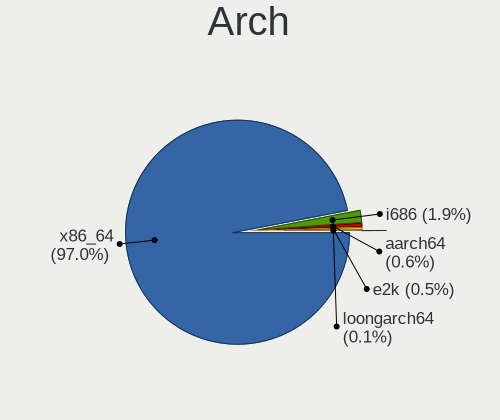

| Name    | Computers | Percent |
|---------|-----------|---------|
| x86_64  | 373       | 95.89%  |
| i686    | 11        | 2.83%   |
| aarch64 | 3         | 0.77%   |
| e2k     | 2         | 0.51%   |

DE
--

Desktop Environment

| Name            | Computers | Percent |
|-----------------|-----------|---------|
| KDE5            | 270       | 68.01%  |
| Unknown         | 56        | 14.11%  |
| XFCE            | 53        | 13.35%  |
| MATE            | 4         | 1.01%   |
| LXQt            | 4         | 1.01%   |
| Cinnamon        | 4         | 1.01%   |
| GNOME           | 3         | 0.76%   |
| KDE             | 2         | 0.5%    |
| GNOME Flashback | 1         | 0.25%   |

Display Server
--------------

X11 or Wayland

| Name    | Computers | Percent |
|---------|-----------|---------|
| X11     | 377       | 96.67%  |
| Unknown | 7         | 1.79%   |
| Wayland | 3         | 0.77%   |
| Tty     | 3         | 0.77%   |

Display Manager
---------------

SDDM, LightDM, etc.

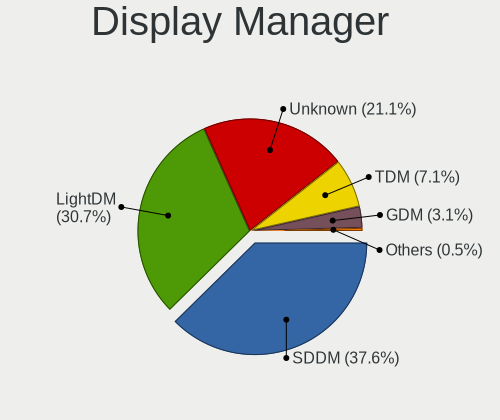

| Name    | Computers | Percent |
|---------|-----------|---------|
| SDDM    | 236       | 59.6%   |
| LightDM | 67        | 16.92%  |
| TDM     | 62        | 15.66%  |
| Unknown | 29        | 7.32%   |
| XDM     | 1         | 0.25%   |
| GDM     | 1         | 0.25%   |

OS Lang
-------

Language

| Lang    | Computers | Percent |
|---------|-----------|---------|
| ru_RU   | 314       | 78.7%   |
| Unknown | 74        | 18.55%  |
| en_US   | 7         | 1.75%   |
| POSIX   | 2         | 0.5%    |
| el_GR   | 1         | 0.25%   |
| C       | 1         | 0.25%   |

Boot Mode
---------

EFI or BIOS

| Mode | Computers | Percent |
|------|-----------|---------|
| EFI  | 267       | 68.11%  |
| BIOS | 125       | 31.89%  |

Filesystem
----------

Type of filesystem

| Type    | Computers | Percent |
|---------|-----------|---------|
| Ext4    | 353       | 90.28%  |
| Overlay | 31        | 7.93%   |
| Btrfs   | 5         | 1.28%   |
| Unknown | 2         | 0.51%   |

Part. scheme
------------

Scheme of partitioning

| Type    | Computers | Percent |
|---------|-----------|---------|
| GPT     | 276       | 70.41%  |
| MBR     | 85        | 21.68%  |
| Unknown | 31        | 7.91%   |

Dual Boot with Linux/BSD
------------------------

Hosting more than one Linux/BSD

| Dual boot | Computers | Percent |
|-----------|-----------|---------|
| No        | 356       | 91.05%  |
| Yes       | 35        | 8.95%   |

Dual Boot (Win)
---------------

Hosting Linux and Windows

| Dual boot | Computers | Percent |
|-----------|-----------|---------|
| No        | 239       | 60.81%  |
| Yes       | 154       | 39.19%  |

Board
-----

Vendor
------

Motherboard manufacturer

| Name                | Computers | Percent |
|---------------------|-----------|---------|
| Hewlett-Packard     | 57        | 14.65%  |
| ASUSTek Computer    | 50        | 12.85%  |
| Intel               | 46        | 11.83%  |
| Lenovo              | 36        | 9.25%   |
| Acer                | 28        | 7.2%    |
| Gigabyte Technology | 26        | 6.68%   |
| 3Logic Group        | 25        | 6.43%   |
| ASRock              | 18        | 4.63%   |
| ICL                 | 13        | 3.34%   |
| MSI                 | 12        | 3.08%   |
| Dell                | 12        | 3.08%   |
| Unknown             | 11        | 2.83%   |
| HUAWEI              | 9         | 2.31%   |
| DEPO Computers      | 5         | 1.29%   |
| Supermicro          | 3         | 0.77%   |
| Samsung Electronics | 3         | 0.77%   |
| MAINBRD             | 3         | 0.77%   |
| iRU                 | 3         | 0.77%   |
| Aquarius            | 3         | 0.77%   |
| Kraftway            | 2         | 0.51%   |
| Irbis               | 2         | 0.51%   |
| Apple               | 2         | 0.51%   |
| VIA Technologies    | 1         | 0.26%   |
| Toshiba             | 1         | 0.26%   |
| Timi                | 1         | 0.26%   |
| T-Platforms         | 1         | 0.26%   |
| SYS                 | 1         | 0.26%   |
| Sony                | 1         | 0.26%   |
| Panasonic           | 1         | 0.26%   |
| OEM                 | 1         | 0.26%   |
| IP3 Technology      | 1         | 0.26%   |
| IP3 Tech            | 1         | 0.26%   |
| Foxconn             | 1         | 0.26%   |
| EPoX Computer       | 1         | 0.26%   |
| eMachines           | 1         | 0.26%   |
| Edelweiss           | 1         | 0.26%   |
| ECS                 | 1         | 0.26%   |
| Durabook            | 1         | 0.26%   |
| Compumax Computer   | 1         | 0.26%   |
| Clevo               | 1         | 0.26%   |

Model
-----

Motherboard model

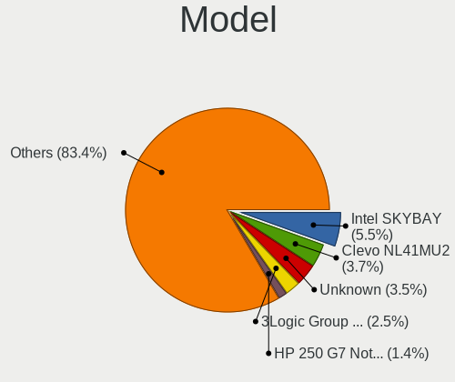

| Name                                      | Computers | Percent |
|-------------------------------------------|-----------|---------|
| Intel SKYBAY                              | 43        | 11.05%  |
| 3Logic Group Graviton                     | 20        | 5.14%   |
| Unknown                                   | 13        | 3.34%   |
| HP 250 G7 Notebook PC                     | 12        | 3.08%   |
| ASUS PRIME B450-PLUS                      | 12        | 3.08%   |
| Lenovo V540-24IWL AIO 10YS0031RU          | 10        | 2.57%   |
| Acer Veriton X2640G                       | 10        | 2.57%   |
| HP ZBook 17 G5                            | 9         | 2.31%   |
| HP ProBook 440 G5                         | 8         | 2.06%   |
| ICL RAYbook Si1512                        | 6         | 1.54%   |
| Lenovo ThinkSystem SR590 -[7X99CTO1WW]-   | 5         | 1.29%   |
| Gigabyte H110M-S2H                        | 4         | 1.03%   |
| MAINBRD OPS62A-SHA                        | 3         | 0.77%   |
| ICL RAY S122.Mi                           | 3         | 0.77%   |
| HP EliteBook 840 G4                       | 3         | 0.77%   |
| HP 250 G6 Notebook PC                     | 3         | 0.77%   |
| Dell Latitude 3420                        | 3         | 0.77%   |
| Lenovo ThinkPad L13 Gen 2 20VH001WRT      | 2         | 0.51%   |
| Lenovo ThinkBook 15 G2 ITL 20VE           | 2         | 0.51%   |
| iRU 515                                   | 2         | 0.51%   |
| Irbis TW100                               | 2         | 0.51%   |
| ICL NJ50_70CU                             | 2         | 0.51%   |
| HUAWEI NBD-WXX9                           | 2         | 0.51%   |
| HUAWEI KLVL-WXXW                          | 2         | 0.51%   |
| HP EliteBook 8470p                        | 2         | 0.51%   |
| Gigabyte H77M-D3H                         | 2         | 0.51%   |
| DEPO Computers DPC156                     | 2         | 0.51%   |
| ASUS N46VZ                                | 2         | 0.51%   |
| ASUS H110M-R                              | 2         | 0.51%   |
| ASUS ASUS EXPERTBOOK B1500CEAEY_B1500CEAE | 2         | 0.51%   |
| Acer Veriton Z4820G                       | 2         | 0.51%   |
| Acer Veriton ES2710G                      | 2         | 0.51%   |
| Acer TravelMate 5760                      | 2         | 0.51%   |
| 3Logic Group Graviton N15i-K2             | 2         | 0.51%   |
| 3Logic Group Graviton N15i                | 2         | 0.51%   |
| VIA P4M266A-8235                          | 1         | 0.26%   |
| Toshiba Satellite A100                    | 1         | 0.26%   |
| Timi TM1701                               | 1         | 0.26%   |
| T-Platforms TF307-MB                      | 1         | 0.26%   |
| SYS RAY B101                              | 1         | 0.26%   |

Model Family
------------

Motherboard model prefix

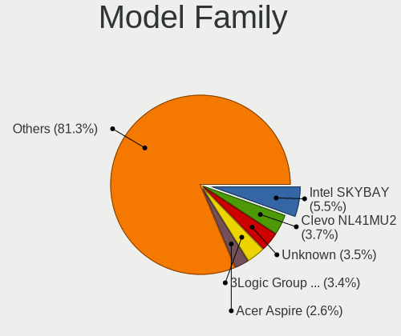

| Name                  | Computers | Percent |
|-----------------------|-----------|---------|
| Intel SKYBAY          | 43        | 11.05%  |
| 3Logic Group Graviton | 25        | 6.43%   |
| ASUS PRIME            | 17        | 4.37%   |
| HP 250                | 16        | 4.11%   |
| Acer Veriton          | 15        | 3.86%   |
| Unknown               | 13        | 3.34%   |
| Lenovo V540-24IWL     | 10        | 2.57%   |
| HP ProBook            | 10        | 2.57%   |
| HP ZBook              | 9         | 2.31%   |
| Acer Aspire           | 8         | 2.06%   |
| HP Pavilion           | 7         | 1.8%    |
| ICL RAYbook           | 6         | 1.54%   |
| Lenovo ThinkSystem    | 5         | 1.29%   |
| Lenovo IdeaPad        | 5         | 1.29%   |
| HP EliteBook          | 5         | 1.29%   |
| Lenovo ThinkPad       | 4         | 1.03%   |
| HP Laptop             | 4         | 1.03%   |
| Gigabyte H110M-S2H    | 4         | 1.03%   |
| Dell OptiPlex         | 4         | 1.03%   |
| Dell Latitude         | 4         | 1.03%   |
| ASUS ASUS             | 4         | 1.03%   |
| MAINBRD OPS62A-SHA    | 3         | 0.77%   |
| ICL RAY               | 3         | 0.77%   |
| ASUS VivoBook         | 3         | 0.77%   |
| Lenovo ThinkBook      | 2         | 0.51%   |
| iRU 515               | 2         | 0.51%   |
| Irbis TW100           | 2         | 0.51%   |
| ICL NJ50              | 2         | 0.51%   |
| HUAWEI NBD-WXX9       | 2         | 0.51%   |
| HUAWEI KLVL-WXXW      | 2         | 0.51%   |
| Gigabyte H77M-D3H     | 2         | 0.51%   |
| Gigabyte B450         | 2         | 0.51%   |
| DEPO Computers DPC156 | 2         | 0.51%   |
| ASUS N46VZ            | 2         | 0.51%   |
| ASUS H110M-R          | 2         | 0.51%   |
| Acer TravelMate       | 2         | 0.51%   |
| VIA P4M266A-8235      | 1         | 0.26%   |
| Toshiba Satellite     | 1         | 0.26%   |
| Timi TM1701           | 1         | 0.26%   |
| T-Platforms TF307-MB  | 1         | 0.26%   |

MFG Year
--------

Motherboard manufacture year

| Year    | Computers | Percent |
|---------|-----------|---------|
| 2018    | 75        | 19.28%  |
| 2017    | 53        | 13.62%  |
| 2020    | 51        | 13.11%  |
| 2021    | 40        | 10.28%  |
| 2019    | 37        | 9.51%   |
| 2016    | 27        | 6.94%   |
| 2012    | 15        | 3.86%   |
| 2022    | 13        | 3.34%   |
| 2011    | 13        | 3.34%   |
| 2015    | 10        | 2.57%   |
| 2014    | 10        | 2.57%   |
| 2010    | 9         | 2.31%   |
| 2008    | 9         | 2.31%   |
| 2009    | 7         | 1.8%    |
| 2007    | 5         | 1.29%   |
| 2013    | 4         | 1.03%   |
| 2006    | 4         | 1.03%   |
| 2005    | 3         | 0.77%   |
| Unknown | 3         | 0.77%   |
| 2003    | 1         | 0.26%   |

Form Factor
-----------

Physical design of the computer

| Name           | Computers | Percent |
|----------------|-----------|---------|
| Desktop        | 177       | 45.5%   |
| Notebook       | 152       | 39.07%  |
| All in one     | 41        | 10.54%  |
| Server         | 9         | 2.31%   |
| System on chip | 3         | 0.77%   |
| Tablet         | 2         | 0.51%   |
| Convertible    | 2         | 0.51%   |
| Mini pc        | 2         | 0.51%   |
| Stick pc       | 1         | 0.26%   |

Secure Boot
-----------

Enabled or disabled

| State    | Computers | Percent |
|----------|-----------|---------|
| Disabled | 353       | 90.05%  |
| Enabled  | 39        | 9.95%   |

Coreboot
--------

Have coreboot on board

| Used | Computers | Percent |
|------|-----------|---------|
| No   | 389       | 100%    |

RAM Size
--------

Total RAM memory

| Size in GB      | Computers | Percent |
|-----------------|-----------|---------|
| 4.01-8.0        | 148       | 37.95%  |
| 8.01-16.0       | 90        | 23.08%  |
| 3.01-4.0        | 63        | 16.15%  |
| 16.01-24.0      | 53        | 13.59%  |
| 1.01-2.0        | 14        | 3.59%   |
| 64.01-256.0     | 9         | 2.31%   |
| 2.01-3.0        | 5         | 1.28%   |
| 32.01-64.0      | 4         | 1.03%   |
| 0.51-1.0        | 2         | 0.51%   |
| More than 256.0 | 1         | 0.26%   |
| 24.01-32.0      | 1         | 0.26%   |

RAM Used
--------

Used RAM memory

| Used GB   | Computers | Percent |
|-----------|-----------|---------|
| 1.01-2.0  | 208       | 50.86%  |
| 0.51-1.0  | 64        | 15.65%  |
| 2.01-3.0  | 63        | 15.4%   |
| 4.01-8.0  | 34        | 8.31%   |
| 3.01-4.0  | 30        | 7.33%   |
| 8.01-16.0 | 5         | 1.22%   |
| 0.01-0.5  | 5         | 1.22%   |

Total Drives
------------

Number of drives on board

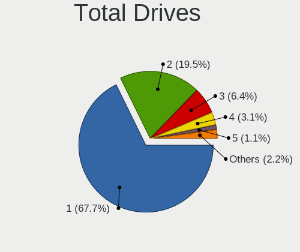

| Drives  | Computers | Percent |
|---------|-----------|---------|
| 1       | 295       | 74.49%  |
| 2       | 74        | 18.69%  |
| 3       | 15        | 3.79%   |
| 4       | 4         | 1.01%   |
| 0       | 4         | 1.01%   |
| 5       | 2         | 0.51%   |
| 8       | 1         | 0.25%   |
| Unknown | 1         | 0.25%   |

Has CD-ROM
----------

Has CD-ROM on board

| Presented | Computers | Percent |
|-----------|-----------|---------|
| No        | 254       | 64.96%  |
| Yes       | 137       | 35.04%  |

Has Ethernet
------------

Has Ethernet on board

| Presented | Computers | Percent |
|-----------|-----------|---------|
| Yes       | 361       | 92.8%   |
| No        | 28        | 7.2%    |

Has WiFi
--------

Has WiFi module

| Presented | Computers | Percent |
|-----------|-----------|---------|
| Yes       | 226       | 58.1%   |
| No        | 163       | 41.9%   |

Has Bluetooth
-------------

Has Bluetooth module

| Presented | Computers | Percent |
|-----------|-----------|---------|
| No        | 205       | 52.43%  |
| Yes       | 186       | 47.57%  |

Location
--------

Country
-------

Geographic location (country)

| Country    | Computers | Percent |
|------------|-----------|---------|
| Russia     | 372       | 95.63%  |
| Greece     | 5         | 1.29%   |
| Ukraine    | 3         | 0.77%   |
| Belarus    | 2         | 0.51%   |
| Uzbekistan | 1         | 0.26%   |
| Kazakhstan | 1         | 0.26%   |
| Egypt      | 1         | 0.26%   |
| Czechia    | 1         | 0.26%   |
| Costa Rica | 1         | 0.26%   |
| Colombia   | 1         | 0.26%   |
| China      | 1         | 0.26%   |

City
----

Geographic location (city)

| City              | Computers | Percent |
|-------------------|-----------|---------|
| Moscow            | 257       | 64.57%  |
| St Petersburg     | 22        | 5.53%   |
| Samara            | 9         | 2.26%   |
| Barnaul           | 8         | 2.01%   |
| Perm              | 4         | 1.01%   |
| Irkutsk           | 4         | 1.01%   |
| Yekaterinburg     | 3         | 0.75%   |
| Sevastopol        | 3         | 0.75%   |
| Saratov           | 3         | 0.75%   |
| Obninsk           | 3         | 0.75%   |
| Korolyov          | 3         | 0.75%   |
| Kaliningrad       | 3         | 0.75%   |
| Belgorod          | 3         | 0.75%   |
| Astrakhan         | 3         | 0.75%   |
| Verkhnyaya Pyshma | 2         | 0.5%    |
| Vergina           | 2         | 0.5%    |
| Thessaloniki      | 2         | 0.5%    |
| Surgut            | 2         | 0.5%    |
| Rostov-on-Don     | 2         | 0.5%    |
| Novosibirsk       | 2         | 0.5%    |
| Krasnoyarsk       | 2         | 0.5%    |
| Krasnodar         | 2         | 0.5%    |
| Kostroma          | 2         | 0.5%    |
| Kirov             | 2         | 0.5%    |
| Zelenodolsk       | 1         | 0.25%   |
| Voronezh          | 1         | 0.25%   |
| Vologda           | 1         | 0.25%   |
| Vladivostok       | 1         | 0.25%   |
| Vladimir          | 1         | 0.25%   |
| Valuyki           | 1         | 0.25%   |
| Tyumen            | 1         | 0.25%   |
| Tula              | 1         | 0.25%   |
| Troitsk           | 1         | 0.25%   |
| Tashkent          | 1         | 0.25%   |
| Taraz             | 1         | 0.25%   |
| Tambov            | 1         | 0.25%   |
| Suez              | 1         | 0.25%   |
| Shenzhen          | 1         | 0.25%   |
| San Jos         | 1         | 0.25%   |
| Pushchino         | 1         | 0.25%   |

Drives
------

Drive Vendor
------------

Hard drive vendors

| Vendor                      | Computers | Drives | Percent |
|-----------------------------|-----------|--------|---------|
| WDC                         | 72        | 97     | 15.62%  |
| Seagate                     | 57        | 78     | 12.36%  |
| Samsung Electronics         | 54        | 66     | 11.71%  |
| Toshiba                     | 37        | 59     | 8.03%   |
| SK hynix                    | 27        | 27     | 5.86%   |
| AXIOMTEK                    | 26        | 26     | 5.64%   |
| Kingston                    | 24        | 26     | 5.21%   |
| Intel                       | 23        | 30     | 4.99%   |
| Apacer                      | 23        | 25     | 4.99%   |
| Hitachi                     | 11        | 12     | 2.39%   |
| A-DATA Technology           | 10        | 11     | 2.17%   |
| Foxline                     | 9         | 9      | 1.95%   |
| Phison                      | 8         | 8      | 1.74%   |
| China                       | 8         | 8      | 1.74%   |
| Crucial                     | 7         | 8      | 1.52%   |
| Unknown                     | 5         | 7      | 1.08%   |
| SanDisk                     | 5         | 5      | 1.08%   |
| HGST                        | 5         | 5      | 1.08%   |
| XPG                         | 4         | 5      | 0.87%   |
| Gigabyte Technology         | 4         | 4      | 0.87%   |
| Micron Technology           | 3         | 8      | 0.65%   |
| Transcend                   | 2         | 3      | 0.43%   |
| SSSTC                       | 2         | 2      | 0.43%   |
| SPCC                        | 2         | 2      | 0.43%   |
| Smartbuy                    | 2         | 2      | 0.43%   |
| PNY                         | 2         | 2      | 0.43%   |
| Plextor                     | 2         | 2      | 0.43%   |
| Patriot                     | 2         | 2      | 0.43%   |
| KingSpec                    | 2         | 2      | 0.43%   |
| Fujitsu                     | 2         | 2      | 0.43%   |
| DEPO                        | 2         | 2      | 0.43%   |
| BIWIN                       | 2         | 3      | 0.43%   |
| AMD                         | 2         | 2      | 0.43%   |
| Yangtze Memory Technologies | 1         | 1      | 0.22%   |
| TMI                         | 1         | 1      | 0.22%   |
| SP-8                        | 1         | 1      | 0.22%   |
| SINTECHI                    | 1         | 1      | 0.22%   |
| OCZ                         | 1         | 1      | 0.22%   |
| Netac                       | 1         | 1      | 0.22%   |
| LuminouTek                  | 1         | 1      | 0.22%   |

Drive Model
-----------

Hard drive models

| Model                                     | Computers | Percent |
|-------------------------------------------|-----------|---------|
| AXIOMTEK Corp.-FSA128GMC2T 128GB SSD      | 26        | 5.37%   |
| Samsung MZVLW128HEGR-00000 128GB          | 17        | 3.51%   |
| Apacer AS2280P4 256GB                     | 16        | 3.31%   |
| Toshiba HDWD120 2TB                       | 13        | 2.69%   |
| SK hynix BC501 HFM256GDJTNG-8310A 256GB   | 12        | 2.48%   |
| WDC WD5000AZLX-21K2TA0 500GB              | 10        | 2.07%   |
| SK hynix SKHynix_HFS256GD9TNG-L5B0B 256GB | 9         | 1.86%   |
| Seagate ST1000LM049-2GH172 1TB            | 9         | 1.86%   |
| Intel SSDPEMKF256G8H 256GB                | 8         | 1.65%   |
| Intel SSDPEKKF256G7H 256GB                | 8         | 1.65%   |
| Foxline FLSSD256M80E13TCX5 256GB          | 8         | 1.65%   |
| Toshiba HDWD110 1TB                       | 5         | 1.03%   |
| Samsung SSD 860 EVO 250GB                 | 5         | 1.03%   |
| Kingston RBUSC180S37256GJ 256GB SSD       | 5         | 1.03%   |
| Toshiba DT01ACA100 1TB                    | 4         | 0.83%   |
| Seagate ST1000LM024 HN-M101MBB 1TB        | 4         | 0.83%   |
| Samsung MZALQ256HAJD-000L2 256GB          | 4         | 0.83%   |
| Phison 311CD0512GB                        | 4         | 0.83%   |
| Kingston SV300S37A120G 120GB SSD          | 4         | 0.83%   |
| Kingston SA400S37240G 240GB SSD           | 4         | 0.83%   |
| Crucial CT240BX500SSD1 240GB              | 4         | 0.83%   |
| WDC WDS240G1G0A-00SS50 240GB SSD          | 3         | 0.62%   |
| WDC WDS120G2G0A-00JH30 120GB SSD          | 3         | 0.62%   |
| Seagate ST9250315AS 250GB                 | 3         | 0.62%   |
| Seagate ST380815AS 80GB                   | 3         | 0.62%   |
| Samsung SSD 860 EVO M.2 250GB             | 3         | 0.62%   |
| Samsung SSD 860 EVO 500GB                 | 3         | 0.62%   |
| Kingston SA400S37120G 120GB SSD           | 3         | 0.62%   |
| HGST HTS721010A9E630 1TB                  | 3         | 0.62%   |
| Gigabyte GP-GSM2NE3256GNTD 256GB          | 3         | 0.62%   |
| Apacer AS350 256GB SSD                    | 3         | 0.62%   |
| XPG SPECTRIX S40G 256GB                   | 2         | 0.41%   |
| WDC WDS500G2B0A-00SM50 500GB SSD          | 2         | 0.41%   |
| WDC WDS240G2G0A-00JH30 240GB SSD          | 2         | 0.41%   |
| WDC WD5000LPLX-60ZNTT2 500GB              | 2         | 0.41%   |
| WDC WD3200BPVT-22JJ5T0 320GB              | 2         | 0.41%   |
| WDC WD3200AAKS-00G3A0 320GB               | 2         | 0.41%   |
| WDC WD10PURZ-85U8XY0 1TB                  | 2         | 0.41%   |
| Unknown SLD64G  64GB                      | 2         | 0.41%   |
| Unknown SD128  128GB                      | 2         | 0.41%   |

HDD Vendor
----------

Hard disk drive vendors

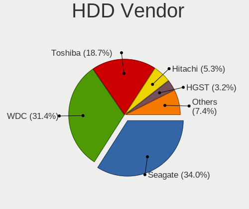

| Vendor              | Computers | Drives | Percent |
|---------------------|-----------|--------|---------|
| WDC                 | 55        | 76     | 33.33%  |
| Seagate             | 55        | 73     | 33.33%  |
| Toshiba             | 35        | 56     | 21.21%  |
| Hitachi             | 11        | 12     | 6.67%   |
| HGST                | 5         | 5      | 3.03%   |
| Fujitsu             | 2         | 2      | 1.21%   |
| SINTECHI            | 1         | 1      | 0.61%   |
| Samsung Electronics | 1         | 1      | 0.61%   |

SSD Vendor
----------

Solid state drive vendors

| Vendor              | Computers | Drives | Percent |
|---------------------|-----------|--------|---------|
| AXIOMTEK            | 26        | 26     | 18.18%  |
| Kingston            | 20        | 21     | 13.99%  |
| Samsung Electronics | 16        | 18     | 11.19%  |
| WDC                 | 11        | 14     | 7.69%   |
| China               | 8         | 8      | 5.59%   |
| Crucial             | 7         | 8      | 4.9%    |
| A-DATA Technology   | 7         | 8      | 4.9%    |
| Apacer              | 6         | 8      | 4.2%    |
| SanDisk             | 3         | 3      | 2.1%    |
| Transcend           | 2         | 3      | 1.4%    |
| Smartbuy            | 2         | 2      | 1.4%    |
| SK hynix            | 2         | 2      | 1.4%    |
| Seagate             | 2         | 5      | 1.4%    |
| PNY                 | 2         | 2      | 1.4%    |
| Plextor             | 2         | 2      | 1.4%    |
| Phison              | 2         | 2      | 1.4%    |
| Patriot             | 2         | 2      | 1.4%    |
| Micron Technology   | 2         | 7      | 1.4%    |
| KingSpec            | 2         | 2      | 1.4%    |
| Intel               | 2         | 5      | 1.4%    |
| Foxline             | 2         | 2      | 1.4%    |
| DEPO                | 2         | 2      | 1.4%    |
| AMD                 | 2         | 2      | 1.4%    |
| TMI                 | 1         | 1      | 0.7%    |
| SP-8                | 1         | 1      | 0.7%    |
| OCZ                 | 1         | 1      | 0.7%    |
| Netac               | 1         | 1      | 0.7%    |
| LuminouTek          | 1         | 1      | 0.7%    |
| LITEON              | 1         | 1      | 0.7%    |
| KingDian            | 1         | 1      | 0.7%    |
| HEORIADY            | 1         | 1      | 0.7%    |
| Gigabyte Technology | 1         | 1      | 0.7%    |
| BaseTech            | 1         | 1      | 0.7%    |
| Unknown             | 1         | 1      | 0.7%    |

Drive Kind
----------

HDD or SSD

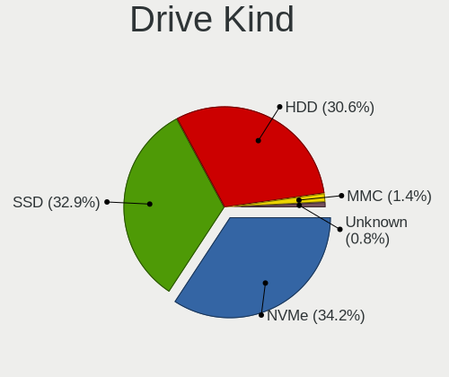

| Kind | Computers | Drives | Percent |
|------|-----------|--------|---------|
| HDD  | 152       | 226    | 34.31%  |
| NVMe | 146       | 164    | 32.96%  |
| SSD  | 137       | 165    | 30.93%  |
| MMC  | 8         | 10     | 1.81%   |

Drive Connector
---------------

SATA, SAS, NVMe, etc.

| Type | Computers | Drives | Percent |
|------|-----------|--------|---------|
| SATA | 250       | 387    | 61.27%  |
| NVMe | 145       | 163    | 35.54%  |
| MMC  | 8         | 10     | 1.96%   |
| SAS  | 5         | 5      | 1.23%   |

Drive Size
----------

Size of hard drive

| Size in TB | Computers | Drives | Percent |
|------------|-----------|--------|---------|
| 0.01-0.5   | 196       | 242    | 67.35%  |
| 0.51-1.0   | 64        | 97     | 21.99%  |
| 1.01-2.0   | 27        | 47     | 9.28%   |
| 2.01-3.0   | 3         | 4      | 1.03%   |
| 4.01-10.0  | 1         | 1      | 0.34%   |

Space Total
-----------

Amount of disk space available on the file system

| Size in GB     | Computers | Percent |
|----------------|-----------|---------|
| 101-250        | 206       | 51.76%  |
| 251-500        | 60        | 15.08%  |
| 1001-2000      | 29        | 7.29%   |
| 51-100         | 29        | 7.29%   |
| 21-50          | 22        | 5.53%   |
| 501-1000       | 20        | 5.03%   |
| 1-20           | 19        | 4.77%   |
| More than 3000 | 7         | 1.76%   |
| 2001-3000      | 5         | 1.26%   |
| Unknown        | 1         | 0.25%   |

Space Used
----------

Amount of used disk space

| Used GB        | Computers | Percent |
|----------------|-----------|---------|
| 1-20           | 258       | 63.86%  |
| 21-50          | 58        | 14.36%  |
| 101-250        | 29        | 7.18%   |
| 51-100         | 25        | 6.19%   |
| 251-500        | 12        | 2.97%   |
| 501-1000       | 11        | 2.72%   |
| 1001-2000      | 5         | 1.24%   |
| More than 3000 | 3         | 0.74%   |
| 2001-3000      | 2         | 0.5%    |
| Unknown        | 1         | 0.25%   |

Malfunc. Drives
---------------

Drive models with a malfunction

| Model                                   | Computers | Drives | Percent |
|-----------------------------------------|-----------|--------|---------|
| Seagate ST9250315AS 250GB               | 3         | 3      | 8.33%   |
| Seagate ST380815AS 80GB                 | 2         | 2      | 5.56%   |
| Seagate ST1000LM024 HN-M101MBB 1TB      | 2         | 7      | 5.56%   |
| WDC WD7501AALS-00E3A0 752GB             | 1         | 1      | 2.78%   |
| WDC WD5000LPVX-60V0TT0 500GB            | 1         | 1      | 2.78%   |
| WDC WD5000LPLX-60ZNTT2 500GB            | 1         | 1      | 2.78%   |
| WDC WD3200AAKS-00V1A0 320GB             | 1         | 1      | 2.78%   |
| WDC WD2500KS-00MJB0 250GB               | 1         | 1      | 2.78%   |
| WDC WD2500BEVT-60ZCT1 250GB             | 1         | 3      | 2.78%   |
| WDC WD20EARX-008FB0 2TB                 | 1         | 1      | 2.78%   |
| WDC WD1200BEVS-60UST0 120GB             | 1         | 1      | 2.78%   |
| Toshiba MQ01ABD050 500GB                | 1         | 1      | 2.78%   |
| SK hynix HFS128G39TND-N210A 128GB SSD   | 1         | 1      | 2.78%   |
| SK hynix BC501 HFM256GDJTNG-8310A 256GB | 1         | 1      | 2.78%   |
| Seagate ST9640320AS 640GB               | 1         | 1      | 2.78%   |
| Seagate ST9500325AS 500GB               | 1         | 1      | 2.78%   |
| Seagate ST380811AS 80GB                 | 1         | 1      | 2.78%   |
| Seagate ST3320418AS 320GB               | 1         | 1      | 2.78%   |
| Seagate ST3000DM001-1CH166 3TB          | 1         | 1      | 2.78%   |
| Seagate ST250DM000-1BD141 250GB         | 1         | 2      | 2.78%   |
| Seagate ST1000DL004 HD105SI 1TB         | 1         | 1      | 2.78%   |
| Samsung Electronics SSD 870 EVO 500GB   | 1         | 1      | 2.78%   |
| Hitachi HUA722010CLA330 1TB             | 1         | 1      | 2.78%   |
| Hitachi HTS725050A9A364 500GB           | 1         | 1      | 2.78%   |
| Hitachi HTS545050KTA300 500GB           | 1         | 2      | 2.78%   |
| Hitachi HTS542525K9A300 250GB           | 1         | 1      | 2.78%   |
| Hitachi HTS541610J9SA00 100GB           | 1         | 1      | 2.78%   |
| Hitachi HDS723020BLA642 2TB             | 1         | 1      | 2.78%   |
| Hitachi HDS721025CLA382 165GB           | 1         | 1      | 2.78%   |
| HGST HTS721010A9E630 1TB                | 1         | 1      | 2.78%   |
| HGST HTS545050A7E680 500GB              | 1         | 1      | 2.78%   |
| DEPO SM3DT-120 120GB SSD                | 1         | 1      | 2.78%   |

Malfunc. Drive Vendor
---------------------

Vendors of faulty drives

| Vendor              | Computers | Drives | Percent |
|---------------------|-----------|--------|---------|
| Seagate             | 14        | 20     | 38.89%  |
| WDC                 | 8         | 10     | 22.22%  |
| Hitachi             | 7         | 8      | 19.44%  |
| SK hynix            | 2         | 2      | 5.56%   |
| HGST                | 2         | 2      | 5.56%   |
| Toshiba             | 1         | 1      | 2.78%   |
| Samsung Electronics | 1         | 1      | 2.78%   |
| DEPO                | 1         | 1      | 2.78%   |

Malfunc. HDD Vendor
-------------------

Vendors of faulty HDD drives

| Vendor  | Computers | Drives | Percent |
|---------|-----------|--------|---------|
| Seagate | 14        | 20     | 43.75%  |
| WDC     | 8         | 10     | 25%     |
| Hitachi | 7         | 8      | 21.88%  |
| HGST    | 2         | 2      | 6.25%   |
| Toshiba | 1         | 1      | 3.13%   |

Malfunc. Drive Kind
-------------------

Kinds of faulty drives

| Kind | Computers | Drives | Percent |
|------|-----------|--------|---------|
| HDD  | 31        | 41     | 88.57%  |
| SSD  | 3         | 3      | 8.57%   |
| NVMe | 1         | 1      | 2.86%   |

Failed Drives
-------------

Failed drive models

| Model                       | Computers | Drives | Percent |
|-----------------------------|-----------|--------|---------|
| WDC WD5001AALS-00E3A0 500GB | 1         | 1      | 100%    |

Failed Drive Vendor
-------------------

Failed drive vendors

| Vendor | Computers | Drives | Percent |
|--------|-----------|--------|---------|
| WDC    | 1         | 1      | 100%    |

Drive Status
------------

Number of failed and malfunc. drives

| Status   | Computers | Drives | Percent |
|----------|-----------|--------|---------|
| Works    | 323       | 438    | 79.56%  |
| Detected | 47        | 81     | 11.58%  |
| Malfunc  | 35        | 45     | 8.62%   |
| Failed   | 1         | 1      | 0.25%   |

Storage controller
------------------

Storage Vendor
--------------

Storage controller vendors

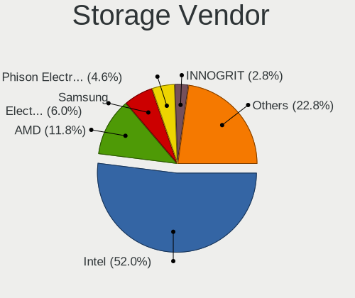

| Vendor                         | Computers | Percent |
|--------------------------------|-----------|---------|
| Intel                          | 299       | 58.28%  |
| AMD                            | 52        | 10.14%  |
| Samsung Electronics            | 37        | 7.21%   |
| Phison Electronics             | 32        | 6.24%   |
| SK hynix                       | 24        | 4.68%   |
| Nvidia                         | 11        | 2.14%   |
| SanDisk                        | 8         | 1.56%   |
| Broadcom / LSI                 | 7         | 1.36%   |
| JMicron Technology             | 6         | 1.17%   |
| Kingston Technology Company    | 5         | 0.97%   |
| Realtek Semiconductor          | 4         | 0.78%   |
| Toshiba America Info Systems   | 3         | 0.58%   |
| ASMedia Technology             | 3         | 0.58%   |
| VIA Technologies               | 2         | 0.39%   |
| Unknown                        | 2         | 0.39%   |
| Solid State Storage Technology | 2         | 0.39%   |
| MCST                           | 2         | 0.39%   |
| Marvell Technology Group       | 2         | 0.39%   |
| LSI Logic / Symbios Logic      | 2         | 0.39%   |
| ADATA Technology               | 2         | 0.39%   |
| Zhaoxin                        | 1         | 0.19%   |
| Yangtze Memory Technologies    | 1         | 0.19%   |
| Silicon Motion                 | 1         | 0.19%   |
| Shenzhen Longsys Electronics   | 1         | 0.19%   |
| Micron Technology              | 1         | 0.19%   |
| MAXIO Technology (Hangzhou)    | 1         | 0.19%   |
| KIOXIA                         | 1         | 0.19%   |
| Apple                          | 1         | 0.19%   |

Storage Model
-------------

Storage controller models

| Model                                                                          | Computers | Percent |
|--------------------------------------------------------------------------------|-----------|---------|
| Intel Q170/Q150/B150/H170/H110/Z170/CM236 Chipset SATA Controller [AHCI Mode]  | 66        | 11.06%  |
| AMD FCH SATA Controller [AHCI mode]                                            | 42        | 7.04%   |
| Phison PS5013 E13 NVMe Controller                                              | 31        | 5.19%   |
| Intel 200 Series PCH SATA controller [AHCI mode]                               | 30        | 5.03%   |
| Intel Sunrise Point-LP SATA Controller [AHCI mode]                             | 29        | 4.86%   |
| Samsung NVMe SSD Controller SM961/PM961/SM963                                  | 17        | 2.85%   |
| Intel 82801 Mobile SATA Controller [RAID mode]                                 | 17        | 2.85%   |
| AMD 400 Series Chipset SATA Controller                                         | 17        | 2.85%   |
| Intel Cannon Point-LP SATA Controller [AHCI Mode]                              | 16        | 2.68%   |
| Intel Tiger Lake-LP SATA Controller                                            | 14        | 2.35%   |
| SK hynix BC501 NVMe Solid State Drive                                          | 13        | 2.18%   |
| Intel Comet Lake SATA AHCI Controller                                          | 12        | 2.01%   |
| Samsung NVMe SSD Controller SM981/PM981/PM983                                  | 10        | 1.68%   |
| Intel Cannon Lake Mobile PCH SATA AHCI Controller                              | 10        | 1.68%   |
| SK hynix Non-Volatile memory controller                                        | 9         | 1.51%   |
| Samsung NVMe SSD Controller 980                                                | 9         | 1.51%   |
| Intel SSD Pro 7600p/760p/E 6100p Series                                        | 9         | 1.51%   |
| Intel SSD 600P Series                                                          | 9         | 1.51%   |
| Intel Cannon Lake PCH SATA AHCI Controller                                     | 8         | 1.34%   |
| Intel C620 Series Chipset Family SSATA Controller [AHCI mode]                  | 8         | 1.34%   |
| Intel 7 Series Chipset Family 6-port SATA Controller [AHCI mode]               | 8         | 1.34%   |
| Intel C620 Series Chipset Family SATA Controller [AHCI mode]                   | 7         | 1.17%   |
| Intel 500 Series Chipset Family SATA AHCI Controller                           | 7         | 1.17%   |
| Intel Volume Management Device NVMe RAID Controller                            | 6         | 1.01%   |
| Intel NM10/ICH7 Family SATA Controller [IDE mode]                              | 6         | 1.01%   |
| Intel Celeron N3350/Pentium N4200/Atom E3900 Series SATA AHCI Controller       | 5         | 0.84%   |
| Intel 82801IBM/IEM (ICH9M/ICH9M-E) 4 port SATA Controller [AHCI mode]          | 5         | 0.84%   |
| Intel 82801G (ICH7 Family) IDE Controller                                      | 5         | 0.84%   |
| Intel 6 Series/C200 Series Chipset Family 6 port Mobile SATA AHCI Controller   | 5         | 0.84%   |
| SanDisk WD Blue SN550 NVMe SSD                                                 | 4         | 0.67%   |
| JMicron JMB363 SATA/IDE Controller                                             | 4         | 0.67%   |
| Intel Celeron/Pentium Silver Processor SATA Controller                         | 4         | 0.67%   |
| Intel Atom Processor E3800 Series SATA AHCI Controller                         | 4         | 0.67%   |
| Intel 8 Series/C220 Series Chipset Family 6-port SATA Controller 1 [AHCI mode] | 4         | 0.67%   |
| Intel 7 Series/C210 Series Chipset Family 6-port SATA Controller [AHCI mode]   | 4         | 0.67%   |
| Intel 400 Series Chipset Family SATA AHCI Controller                           | 4         | 0.67%   |
| Broadcom / LSI MegaRAID Tri-Mode SAS3516                                       | 4         | 0.67%   |
| AMD SB7x0/SB8x0/SB9x0 SATA Controller [AHCI mode]                              | 4         | 0.67%   |
| AMD FCH SATA Controller D                                                      | 4         | 0.67%   |
| Nvidia MCP51 Serial ATA Controller                                             | 3         | 0.5%    |

Storage Kind
------------

Kind of storage controller (IDE, SATA, NVMe, SAS, ...)

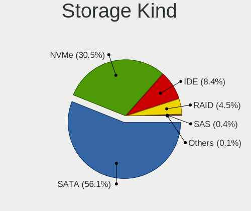

| Kind | Computers | Percent |
|------|-----------|---------|
| SATA | 318       | 59.33%  |
| NVMe | 145       | 27.05%  |
| IDE  | 40        | 7.46%   |
| RAID | 33        | 6.16%   |

Processor
---------

CPU Vendor
----------

Processor vendors

| Vendor       | Computers | Percent |
|--------------|-----------|---------|
| Intel        | 317       | 81.49%  |
| AMD          | 65        | 16.71%  |
| ARM          | 3         | 0.77%   |
| CentaurHauls | 2         | 0.51%   |
| E8C/EATX     | 1         | 0.26%   |
| E8C-SWTX     | 1         | 0.26%   |

CPU Model
---------

Processor models

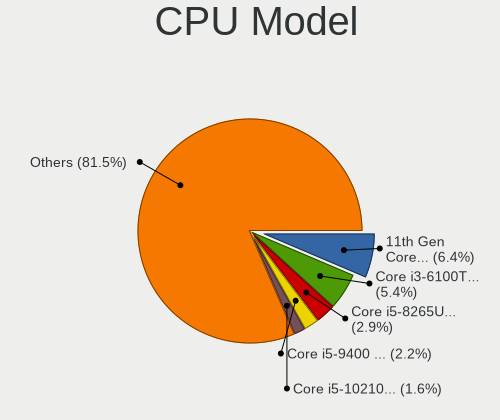

| Model                                         | Computers | Percent |
|-----------------------------------------------|-----------|---------|
| Intel Core i3-6100TE CPU @ 2.70GHz            | 43        | 11%     |
| Intel Core i5-8265U CPU @ 1.60GHz             | 23        | 5.88%   |
| Intel Core i5-9400 CPU @ 2.90GHz              | 19        | 4.86%   |
| Intel 11th Gen Core i5-1135G7 @ 2.40GHz       | 17        | 4.35%   |
| AMD Ryzen 5 1600 Six-Core Processor           | 13        | 3.32%   |
| Intel Pentium CPU G4560 @ 3.50GHz             | 10        | 2.56%   |
| Intel Core i7-8750H CPU @ 2.20GHz             | 10        | 2.56%   |
| Intel Core i5-10210U CPU @ 1.60GHz            | 10        | 2.56%   |
| Intel Core i3-7100U CPU @ 2.40GHz             | 9         | 2.3%    |
| Intel Core i5-7200U CPU @ 2.50GHz             | 8         | 2.05%   |
| Intel Core i3-7020U CPU @ 2.30GHz             | 6         | 1.53%   |
| Intel Xeon Silver 4210 CPU @ 2.20GHz          | 5         | 1.28%   |
| Intel Pentium Gold G5420 CPU @ 3.80GHz        | 4         | 1.02%   |
| Intel Core i5-8259U CPU @ 2.30GHz             | 4         | 1.02%   |
| Intel Core i5-8250U CPU @ 1.60GHz             | 4         | 1.02%   |
| Intel Core i3-9100 CPU @ 3.60GHz              | 4         | 1.02%   |
| AMD Ryzen 5 3400G with Radeon Vega Graphics   | 4         | 1.02%   |
| Intel Pentium CPU G4400 @ 3.30GHz             | 3         | 0.77%   |
| Intel Core i3-10100 CPU @ 3.60GHz             | 3         | 0.77%   |
| Intel Celeron CPU N3350 @ 1.10GHz             | 3         | 0.77%   |
| Intel Celeron CPU G3900 @ 2.80GHz             | 3         | 0.77%   |
| ARM Processor                                 | 3         | 0.77%   |
| AMD Ryzen 7 4800H with Radeon Graphics        | 3         | 0.77%   |
| AMD Ryzen 5 3500U with Radeon Vega Mobile Gfx | 3         | 0.77%   |
| Intel Pentium Dual-Core CPU E6600 @ 3.06GHz   | 2         | 0.51%   |
| Intel Pentium Dual-Core CPU E6500 @ 2.93GHz   | 2         | 0.51%   |
| Intel Genuine CPU 0000 @ 2.40GHz              | 2         | 0.51%   |
| Intel Core i7-7500U CPU @ 2.70GHz             | 2         | 0.51%   |
| Intel Core i7-3610QM CPU @ 2.30GHz            | 2         | 0.51%   |
| Intel Core i5-8279U CPU @ 2.40GHz             | 2         | 0.51%   |
| Intel Core i5-7600 CPU @ 3.50GHz              | 2         | 0.51%   |
| Intel Core i5-7400 CPU @ 3.00GHz              | 2         | 0.51%   |
| Intel Core i5-3470 CPU @ 3.20GHz              | 2         | 0.51%   |
| Intel Core i5-2540M CPU @ 2.60GHz             | 2         | 0.51%   |
| Intel Core i5-2400 CPU @ 3.10GHz              | 2         | 0.51%   |
| Intel Core i5-10400 CPU @ 2.90GHz             | 2         | 0.51%   |
| Intel Core i3-8100 CPU @ 3.60GHz              | 2         | 0.51%   |
| Intel Core i3-6100 CPU @ 3.70GHz              | 2         | 0.51%   |
| Intel Core i3-6006U CPU @ 2.00GHz             | 2         | 0.51%   |
| Intel Core i3-4160 CPU @ 3.60GHz              | 2         | 0.51%   |

CPU Model Family
----------------

Processor model prefix

| Model                   | Computers | Percent |
|-------------------------|-----------|---------|
| Intel Core i5           | 98        | 25.13%  |
| Intel Core i3           | 89        | 22.82%  |
| Other                   | 31        | 7.95%   |
| AMD Ryzen 5             | 24        | 6.15%   |
| Intel Core i7           | 20        | 5.13%   |
| Intel Celeron           | 20        | 5.13%   |
| Intel Pentium           | 16        | 4.1%    |
| AMD Ryzen 7             | 8         | 2.05%   |
| Intel Core 2 Duo        | 7         | 1.79%   |
| Intel Xeon Silver       | 6         | 1.54%   |
| Intel Pentium Gold      | 6         | 1.54%   |
| Intel Pentium Dual-Core | 6         | 1.54%   |
| AMD A8                  | 6         | 1.54%   |
| Intel Xeon              | 5         | 1.28%   |
| AMD Athlon 64 X2        | 5         | 1.28%   |
| Intel Atom              | 4         | 1.03%   |
| AMD FX                  | 3         | 0.77%   |
| AMD A10                 | 3         | 0.77%   |
| Intel Pentium Silver    | 2         | 0.51%   |
| Intel Genuine           | 2         | 0.51%   |
| Intel Core i9           | 2         | 0.51%   |
| Intel Core 2 Quad       | 2         | 0.51%   |
| AMD Ryzen 3             | 2         | 0.51%   |
| AMD Phenom II X4        | 2         | 0.51%   |
| AMD Athlon              | 2         | 0.51%   |
| AMD A6                  | 2         | 0.51%   |
| Intel Xeon Gold         | 1         | 0.26%   |
| Intel Pentium D         | 1         | 0.26%   |
| Intel Pentium 4         | 1         | 0.26%   |
| Intel Core m5           | 1         | 0.26%   |
| Intel Core Duo          | 1         | 0.26%   |
| Intel Core 2 Solo       | 1         | 0.26%   |
| Intel Celeron Dual-Core | 1         | 0.26%   |
| CentaurHauls VIA C7     | 1         | 0.26%   |
| AMD Turion 64 X2 Mobile | 1         | 0.26%   |
| AMD Sempron             | 1         | 0.26%   |
| AMD Ryzen 7 PRO         | 1         | 0.26%   |
| AMD Ryzen 5 PRO         | 1         | 0.26%   |
| AMD E1                  | 1         | 0.26%   |
| AMD E                   | 1         | 0.26%   |

CPU Cores
---------

Number of processor cores

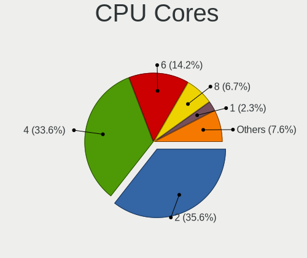

| Number | Computers | Percent |
|--------|-----------|---------|
| 2      | 170       | 43.59%  |
| 4      | 125       | 32.05%  |
| 6      | 58        | 14.87%  |
| 8      | 15        | 3.85%   |
| 1      | 8         | 2.05%   |
| 20     | 5         | 1.28%   |
| 32     | 2         | 0.51%   |
| 16     | 2         | 0.51%   |
| 3      | 2         | 0.51%   |
| 18     | 1         | 0.26%   |
| 14     | 1         | 0.26%   |
| 10     | 1         | 0.26%   |

CPU Sockets
-----------

Number of sockets

| Number | Computers | Percent |
|--------|-----------|---------|
| 1      | 378       | 97.17%  |
| 2      | 9         | 2.31%   |
| 4      | 2         | 0.51%   |

CPU Threads
-----------

Threads per core (Hyper-Threading)

| Number | Computers | Percent |
|--------|-----------|---------|
| 2      | 273       | 70.18%  |
| 1      | 116       | 29.82%  |

CPU Op-Modes
------------

CPU Operation Modes (32-bit, 64-bit)

| Op mode        | Computers | Percent |
|----------------|-----------|---------|
| 32-bit, 64-bit | 380       | 97.69%  |
| Unknown        | 5         | 1.29%   |
| 32-bit         | 4         | 1.03%   |

CPU Microcode
-------------

Microcode number

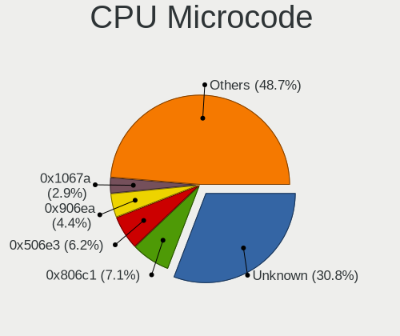

| Number     | Computers | Percent |
|------------|-----------|---------|
| Unknown    | 62        | 15.78%  |
| 0x506e3    | 50        | 12.72%  |
| 0x906ea    | 32        | 8.14%   |
| 0x806e9    | 19        | 4.83%   |
| 0x806c1    | 19        | 4.83%   |
| 0x806ec    | 14        | 3.56%   |
| 0x906e9    | 13        | 3.31%   |
| 0x1067a    | 13        | 3.31%   |
| 0x08001138 | 13        | 3.31%   |
| 0x806ea    | 12        | 3.05%   |
| 0x806eb    | 10        | 2.54%   |
| 0x306a9    | 10        | 2.54%   |
| 0xa0653    | 9         | 2.29%   |
| 0xa0660    | 8         | 2.04%   |
| 0x50657    | 8         | 2.04%   |
| 0x08108109 | 8         | 2.04%   |
| 0x906eb    | 6         | 1.53%   |
| 0x206a7    | 6         | 1.53%   |
| 0x906ed    | 5         | 1.27%   |
| 0x706e5    | 5         | 1.27%   |
| 0x506c9    | 5         | 1.27%   |
| 0x406e3    | 4         | 1.02%   |
| 0x06001119 | 4         | 1.02%   |
| 0xa0671    | 3         | 0.76%   |
| 0x08600106 | 3         | 0.76%   |
| 0x706a8    | 2         | 0.51%   |
| 0x406c4    | 2         | 0.51%   |
| 0x406c3    | 2         | 0.51%   |
| 0x40651    | 2         | 0.51%   |
| 0x306c3    | 2         | 0.51%   |
| 0x30679    | 2         | 0.51%   |
| 0x30678    | 2         | 0.51%   |
| 0x08701021 | 2         | 0.51%   |
| 0x08608102 | 2         | 0.51%   |
| 0x08108102 | 2         | 0.51%   |
| 0x010000db | 2         | 0.51%   |
| 0xf47      | 1         | 0.25%   |
| 0xf29      | 1         | 0.25%   |
| 0xa0652    | 1         | 0.25%   |
| 0x806c2    | 1         | 0.25%   |

CPU Microarch
-------------

Microarchitecture

| Name          | Computers | Percent |
|---------------|-----------|---------|
| KabyLake      | 124       | 31.88%  |
| Skylake       | 66        | 16.97%  |
| TigerLake     | 23        | 5.91%   |
| CometLake     | 19        | 4.88%   |
| Zen           | 15        | 3.86%   |
| Penryn        | 15        | 3.86%   |
| Unknown       | 13        | 3.34%   |
| Zen+          | 12        | 3.08%   |
| IvyBridge     | 12        | 3.08%   |
| SandyBridge   | 11        | 2.83%   |
| Silvermont    | 10        | 2.57%   |
| K8 Hammer     | 8         | 2.06%   |
| Zen 2         | 7         | 1.8%    |
| Piledriver    | 7         | 1.8%    |
| Haswell       | 6         | 1.54%   |
| IceLake       | 5         | 1.29%   |
| Goldmont      | 5         | 1.29%   |
| Westmere      | 4         | 1.03%   |
| Goldmont plus | 4         | 1.03%   |
| Steamroller   | 3         | 0.77%   |
| K10           | 3         | 0.77%   |
| Core          | 3         | 0.77%   |
| NetBurst      | 2         | 0.51%   |
| K10 Llano     | 2         | 0.51%   |
| Bonnell       | 2         | 0.51%   |
| Bobcat        | 2         | 0.51%   |
| Zen 3         | 1         | 0.26%   |
| Puma          | 1         | 0.26%   |
| P6            | 1         | 0.26%   |
| Jaguar        | 1         | 0.26%   |
| Excavator     | 1         | 0.26%   |
| Broadwell     | 1         | 0.26%   |

Graphics
--------

GPU Vendor
----------

Vendors of graphics cards

| Vendor                     | Computers | Percent |
|----------------------------|-----------|---------|
| Intel                      | 276       | 65.56%  |
| Nvidia                     | 83        | 19.71%  |
| AMD                        | 47        | 11.16%  |
| Matrox Electronics Systems | 5         | 1.19%   |
| ASPEED Technology          | 4         | 0.95%   |
| Silicon Motion             | 2         | 0.48%   |
| Huawei Technologies        | 2         | 0.48%   |
| Zhaoxin                    | 1         | 0.24%   |
| VIA Technologies           | 1         | 0.24%   |

GPU Model
---------

Graphics card models

| Model                                                                                    | Computers | Percent |
|------------------------------------------------------------------------------------------|-----------|---------|
| Intel HD Graphics 530                                                                    | 46        | 10.7%   |
| Intel CoffeeLake-S GT2 [UHD Graphics 630]                                                | 30        | 6.98%   |
| Intel HD Graphics 620                                                                    | 25        | 5.81%   |
| Intel WhiskeyLake-U GT2 [UHD Graphics 620]                                               | 24        | 5.58%   |
| Intel TigerLake-LP GT2 [Iris Xe Graphics]                                                | 20        | 4.65%   |
| Nvidia GP107 [GeForce GTX 1050 Ti]                                                       | 17        | 3.95%   |
| Intel CoffeeLake-H GT2 [UHD Graphics 630]                                                | 11        | 2.56%   |
| AMD Picasso/Raven 2 [Radeon Vega Series / Radeon Vega Mobile Series]                     | 11        | 2.56%   |
| Intel HD Graphics 610                                                                    | 10        | 2.33%   |
| Intel 2nd Generation Core Processor Family Integrated Graphics Controller                | 10        | 2.33%   |
| Nvidia GP107GLM [Quadro P1000 Mobile]                                                    | 9         | 2.09%   |
| Intel CometLake-S GT2 [UHD Graphics 630]                                                 | 9         | 2.09%   |
| Intel Comet Lake UHD Graphics                                                            | 8         | 1.86%   |
| Intel HD Graphics 510                                                                    | 6         | 1.4%    |
| Intel CoffeeLake-U GT3e [Iris Plus Graphics 655]                                         | 6         | 1.4%    |
| Intel 3rd Gen Core processor Graphics Controller                                         | 6         | 1.4%    |
| Matrox Electronics Systems MGA G200e [Pilot] ServerEngines (SEP1)                        | 5         | 1.16%   |
| Intel UHD Graphics 620                                                                   | 5         | 1.16%   |
| Intel HD Graphics 630                                                                    | 5         | 1.16%   |
| Intel Atom/Celeron/Pentium Processor x5-E8000/J3xxx/N3xxx Integrated Graphics Controller | 5         | 1.16%   |
| Intel Atom Processor Z36xxx/Z37xxx Series Graphics & Display                             | 5         | 1.16%   |
| AMD Renoir                                                                               | 5         | 1.16%   |
| Intel HD Graphics 500                                                                    | 4         | 0.93%   |
| Intel CoffeeLake-S GT1 [UHD Graphics 610]                                                | 4         | 0.93%   |
| ASPEED Technology ASPEED Graphics Family                                                 | 4         | 0.93%   |
| Nvidia GK208B [GeForce GT 710]                                                           | 3         | 0.7%    |
| Nvidia GF108 [GeForce GT 630]                                                            | 3         | 0.7%    |
| Intel Tiger Lake UHD Graphics                                                            | 3         | 0.7%    |
| Intel Iris Plus Graphics G1 (Ice Lake)                                                   | 3         | 0.7%    |
| Intel CometLake-U GT2 [UHD Graphics]                                                     | 3         | 0.7%    |
| Intel 4th Generation Core Processor Family Integrated Graphics Controller                | 3         | 0.7%    |
| AMD Cape Verde XT [Radeon HD 7770/8760 / R7 250X]                                        | 3         | 0.7%    |
| Silicon Motion SM718 LynxSE+                                                             | 2         | 0.47%   |
| Nvidia GP107M [GeForce GTX 1050 Ti Mobile]                                               | 2         | 0.47%   |
| Nvidia GM108M [GeForce 940MX]                                                            | 2         | 0.47%   |
| Nvidia GK107M [GeForce GT 650M]                                                          | 2         | 0.47%   |
| Nvidia GF119 [GeForce GT 610]                                                            | 2         | 0.47%   |
| Intel Skylake GT2 [HD Graphics 520]                                                      | 2         | 0.47%   |
| Intel Mobile 4 Series Chipset Integrated Graphics Controller                             | 2         | 0.47%   |
| Intel Iris Plus Graphics G7                                                              | 2         | 0.47%   |

GPU Combo
---------

Combinations of graphics cards

| Name                    | Computers | Percent |
|-------------------------|-----------|---------|
| 1 x Intel               | 246       | 63.24%  |
| 1 x Nvidia              | 54        | 13.88%  |
| 1 x AMD                 | 33        | 8.48%   |
| Intel + Nvidia          | 25        | 6.43%   |
| 2 x AMD                 | 7         | 1.8%    |
| 1 x Matrox              | 5         | 1.29%   |
| 1 x ASPEED              | 4         | 1.03%   |
| Other                   | 3         | 0.77%   |
| Intel + AMD             | 3         | 0.77%   |
| AMD + Nvidia            | 3         | 0.77%   |
| 1 x Silicon Motion      | 2         | 0.51%   |
| 1 x Huawei Technologies | 2         | 0.51%   |
| 1 x VIA                 | 1         | 0.26%   |
| Nvidia + Zhaoxin        | 1         | 0.26%   |

GPU Driver
----------

Free vs proprietary

| Driver      | Computers | Percent |
|-------------|-----------|---------|
| Free        | 327       | 83.42%  |
| Proprietary | 48        | 12.24%  |
| Unknown     | 17        | 4.34%   |

GPU Memory
----------

Total video memory

| Size in GB | Computers | Percent |
|------------|-----------|---------|
| Unknown    | 293       | 74.55%  |
| 3.01-4.0   | 31        | 7.89%   |
| 0.01-0.5   | 25        | 6.36%   |
| 0.51-1.0   | 21        | 5.34%   |
| 1.01-2.0   | 19        | 4.83%   |
| 7.01-8.0   | 1         | 0.25%   |
| 5.01-6.0   | 1         | 0.25%   |
| 2.01-3.0   | 1         | 0.25%   |
| 8.01-16.0  | 1         | 0.25%   |

Monitor
-------

Monitor Vendor
--------------

Monitor vendors

| Vendor                  | Computers | Percent |
|-------------------------|-----------|---------|
| BOE                     | 46        | 11.7%   |
| HHT                     | 43        | 10.94%  |
| Samsung Electronics     | 33        | 8.4%    |
| Chimei Innolux          | 30        | 7.63%   |
| Acer                    | 27        | 6.87%   |
| AU Optronics            | 26        | 6.62%   |
| AOC                     | 24        | 6.11%   |
| BenQ                    | 23        | 5.85%   |
| ECS                     | 21        | 5.34%   |
| LG Display              | 19        | 4.83%   |
| Lenovo                  | 12        | 3.05%   |
| ViewSonic               | 9         | 2.29%   |
| Goldstar                | 9         | 2.29%   |
| Dell                    | 7         | 1.78%   |
| Philips                 | 6         | 1.53%   |
| Chi Mei Optoelectronics | 6         | 1.53%   |
| Sharp                   | 5         | 1.27%   |
| PANDA                   | 5         | 1.27%   |
| PRW                     | 4         | 1.02%   |
| Ancor Communications    | 4         | 1.02%   |
| WBT                     | 3         | 0.76%   |
| LG Electronics          | 3         | 0.76%   |
| Apple                   | 3         | 0.76%   |
| STD                     | 2         | 0.51%   |
| JRY                     | 2         | 0.51%   |
| Hewlett-Packard         | 2         | 0.51%   |
| CHR                     | 2         | 0.51%   |
| VIE                     | 1         | 0.25%   |
| TR_                     | 1         | 0.25%   |
| Toshiba                 | 1         | 0.25%   |
| STA                     | 1         | 0.25%   |
| SKG                     | 1         | 0.25%   |
| RTK                     | 1         | 0.25%   |
| PRM                     | 1         | 0.25%   |
| Panasonic               | 1         | 0.25%   |
| KDC                     | 1         | 0.25%   |
| Iiyama                  | 1         | 0.25%   |
| Hitachi                 | 1         | 0.25%   |
| HIB                     | 1         | 0.25%   |
| HannStar                | 1         | 0.25%   |

Monitor Model
-------------

Monitor models

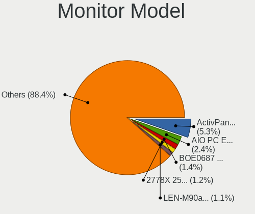

| Model                                                                | Computers | Percent |
|----------------------------------------------------------------------|-----------|---------|
| HHT ActviPanel V5 HHT0030 3840x2160 944x398mm 40.3-inch              | 43        | 10.75%  |
| ECS AIO PC ECS2486 1920x1080 520x300mm 23.6-inch                     | 21        | 5.25%   |
| BOE LCD Monitor BOE0687 1920x1080 344x193mm 15.5-inch                | 12        | 3%      |
| AOC LCD Monitor 2778X 2560x1440                                      | 11        | 2.75%   |
| Lenovo LEN-V5S5W-B-A LENE288 1920x1080 527x296mm 23.8-inch           | 10        | 2.5%    |
| Acer V246HL ACR0336 1920x1080 531x299mm 24.0-inch                    | 10        | 2.5%    |
| Chimei Innolux LCD Monitor CMN175A 1920x1080 381x214mm 17.2-inch     | 9         | 2.25%   |
| BenQ LCD BNQ801B 2560x1440 527x296mm 23.8-inch                       | 8         | 2%      |
| BOE LCD Monitor BOE09EF 1920x1080 344x194mm 15.5-inch                | 6         | 1.5%    |
| Samsung Electronics SyncMaster SAM022B 1280x1024 340x270mm 17.1-inch | 5         | 1.25%   |
| BenQ GW2270 BNQ78DB 1920x1080 476x268mm 21.5-inch                    | 5         | 1.25%   |
| AU Optronics LCD Monitor AUO213D 1920x1080 309x173mm 13.9-inch       | 5         | 1.25%   |
| ViewSonic VA2407 SERIES VSC8C31 1920x1080 521x293mm 23.5-inch        | 4         | 1%      |
| PRW AP7_Titanium PRW4200 3840x2160                                   | 4         | 1%      |
| WBT AIO215 WBTF017 1920x1200 580x360mm 26.9-inch                     | 3         | 0.75%   |
| Sharp LCD Monitor SHP1542 1920x1080 309x174mm 14.0-inch              | 3         | 0.75%   |
| Samsung Electronics SyncMaster SAM02AD 1440x900 410x257mm 19.1-inch  | 3         | 0.75%   |
| LG Display LCD Monitor LGD04B2 1920x1080 309x175mm 14.0-inch         | 3         | 0.75%   |
| Chimei Innolux LCD Monitor CMN15DB 1366x768 344x193mm 15.5-inch      | 3         | 0.75%   |
| BOE LCD Monitor BOE09C5 1920x1080 341x192mm 15.4-inch                | 3         | 0.75%   |
| BOE LCD Monitor BOE0747 1920x1080 344x194mm 15.5-inch                | 3         | 0.75%   |
| AU Optronics LCD Monitor AUO403D 1920x1080 309x174mm 14.0-inch       | 3         | 0.75%   |
| AU Optronics LCD Monitor AUO21ED 1920x1080 344x193mm 15.5-inch       | 3         | 0.75%   |
| AOC G2490W1G4 AOC2490 1920x1080 527x296mm 23.8-inch                  | 3         | 0.75%   |
| Acer AIO LCD ACRF132 1920x1080 509x286mm 23.0-inch                   | 3         | 0.75%   |
| ViewSonic VA703-3Series VSC631E 1280x1024 338x270mm 17.0-inch        | 2         | 0.5%    |
| ViewSonic LCD Monitor VSC6C2E 1920x1080 520x290mm 23.4-inch          | 2         | 0.5%    |
| STD LED STD0001 2560x1440 330x220mm 15.6-inch                        | 2         | 0.5%    |
| Samsung Electronics S22E391 SAM0C0E 1920x1080 477x268mm 21.5-inch    | 2         | 0.5%    |
| LG Display LCD Monitor LGD0306 1600x900 310x174mm 14.0-inch          | 2         | 0.5%    |
| Goldstar 24GM79G GSM5B39 1920x1080 531x298mm 24.0-inch               | 2         | 0.5%    |
| Dell P2419H DELD0DA 1920x1080 527x296mm 23.8-inch                    | 2         | 0.5%    |
| Chimei Innolux LCD Monitor CMN15F5 1920x1080 344x193mm 15.5-inch     | 2         | 0.5%    |
| Chimei Innolux LCD Monitor CMN14D7 1920x1080 309x173mm 13.9-inch     | 2         | 0.5%    |
| Chimei Innolux LCD Monitor CMN1404 1920x1080 309x173mm 13.9-inch     | 2         | 0.5%    |
| BOE LCD Monitor BOE09CC 1920x1080 344x194mm 15.5-inch                | 2         | 0.5%    |
| BOE LCD Monitor BOE0893 2160x1440 296x197mm 14.0-inch                | 2         | 0.5%    |
| BOE LCD Monitor BOE0877 1920x1080 309x173mm 13.9-inch                | 2         | 0.5%    |
| BOE LCD Monitor BOE0872 1920x1080 344x194mm 15.5-inch                | 2         | 0.5%    |
| BOE LCD Monitor BOE0812 1920x1080 344x194mm 15.5-inch                | 2         | 0.5%    |

Monitor Resolution
------------------

Monitor screen resolution

| Resolution         | Computers | Percent |
|--------------------|-----------|---------|
| 1920x1080 (FHD)    | 215       | 55.99%  |
| 3840x2160 (4K)     | 53        | 13.8%   |
| 1366x768 (WXGA)    | 34        | 8.85%   |
| 2560x1440 (QHD)    | 25        | 6.51%   |
| 1280x1024 (SXGA)   | 21        | 5.47%   |
| 1600x900 (HD+)     | 10        | 2.6%    |
| 1680x1050 (WSXGA+) | 5         | 1.3%    |
| 1440x900 (WXGA+)   | 5         | 1.3%    |
| 1280x800 (WXGA)    | 5         | 1.3%    |
| 2160x1440          | 2         | 0.52%   |
| 1920x1200 (WUXGA)  | 2         | 0.52%   |
| Unknown            | 2         | 0.52%   |
| 4480x1440          | 1         | 0.26%   |
| 3200x1800 (QHD+)   | 1         | 0.26%   |
| 2560x1600          | 1         | 0.26%   |
| 1400x1050          | 1         | 0.26%   |
| 1360x768           | 1         | 0.26%   |

Monitor Diagonal
----------------

Diagonal size in inches

| Inches  | Computers | Percent |
|---------|-----------|---------|
| 15      | 78        | 19.95%  |
| 23      | 60        | 15.35%  |
| 40      | 43        | 11%     |
| 24      | 36        | 9.21%   |
| 17      | 31        | 7.93%   |
| Unknown | 26        | 6.65%   |
| 14      | 25        | 6.39%   |
| 13      | 20        | 5.12%   |
| 21      | 18        | 4.6%    |
| 19      | 13        | 3.32%   |
| 27      | 11        | 2.81%   |
| 26      | 6         | 1.53%   |
| 31      | 5         | 1.28%   |
| 11      | 4         | 1.02%   |
| 22      | 2         | 0.51%   |
| 20      | 2         | 0.51%   |
| 12      | 2         | 0.51%   |
| 74      | 1         | 0.26%   |
| 72      | 1         | 0.26%   |
| 59      | 1         | 0.26%   |
| 46      | 1         | 0.26%   |
| 33      | 1         | 0.26%   |
| 32      | 1         | 0.26%   |
| 28      | 1         | 0.26%   |
| 18      | 1         | 0.26%   |
| 10      | 1         | 0.26%   |

Monitor Width
-------------

Physical width

| Width in mm | Computers | Percent |
|-------------|-----------|---------|
| 301-350     | 126       | 32.56%  |
| 501-600     | 109       | 28.17%  |
| 901-1000    | 43        | 11.11%  |
| 401-500     | 28        | 7.24%   |
| Unknown     | 26        | 6.72%   |
| 351-400     | 25        | 6.46%   |
| 201-300     | 16        | 4.13%   |
| 601-700     | 8         | 2.07%   |
| 701-800     | 2         | 0.52%   |
| 1501-2000   | 2         | 0.52%   |
| 1001-1500   | 2         | 0.52%   |

Aspect Ratio
------------

Proportional relationship between the width and the height

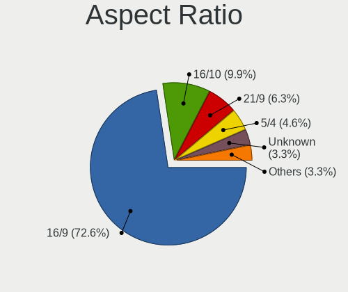

| Ratio   | Computers | Percent |
|---------|-----------|---------|
| 16/9    | 265       | 70.48%  |
| 21/9    | 43        | 11.44%  |
| 16/10   | 21        | 5.59%   |
| Unknown | 21        | 5.59%   |
| 5/4     | 18        | 4.79%   |
| 3/2     | 5         | 1.33%   |
| 4/3     | 2         | 0.53%   |
| 6/5     | 1         | 0.27%   |

Monitor Area
------------

Area in inch

| Area in inch | Computers | Percent |
|----------------|-----------|---------|
| 201-250        | 104       | 26.8%   |
| 101-110        | 78        | 20.1%   |
| 501-1000       | 44        | 11.34%  |
| 81-90          | 39        | 10.05%  |
| Unknown        | 26        | 6.7%    |
| 151-200        | 18        | 4.64%   |
| 121-130        | 18        | 4.64%   |
| 301-350        | 17        | 4.38%   |
| 141-150        | 13        | 3.35%   |
| 351-500        | 8         | 2.06%   |
| 71-80          | 6         | 1.55%   |
| 251-300        | 6         | 1.55%   |
| 51-60          | 4         | 1.03%   |
| More than 1000 | 3         | 0.77%   |
| 61-70          | 2         | 0.52%   |
| 41-50          | 1         | 0.26%   |
| 131-140        | 1         | 0.26%   |

Pixel Density
-------------

Pixels per inch

| Density       | Computers | Percent |
|---------------|-----------|---------|
| 51-100        | 135       | 34.97%  |
| 121-160       | 116       | 30.05%  |
| 101-120       | 95        | 24.61%  |
| Unknown       | 26        | 6.74%   |
| 161-240       | 8         | 2.07%   |
| 1-50          | 5         | 1.3%    |
| More than 240 | 1         | 0.26%   |

Multiple Monitors
-----------------

Total monitors connected

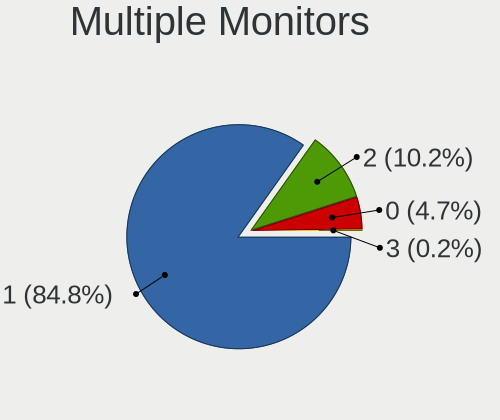

| Total | Computers | Percent |
|-------|-----------|---------|
| 1     | 348       | 88.55%  |
| 2     | 26        | 6.62%   |
| 0     | 17        | 4.33%   |
| 3     | 2         | 0.51%   |

Network
-------

Net Controller Vendor
---------------------

Controller vendors

| Vendor                          | Computers | Percent |
|---------------------------------|-----------|---------|
| Realtek Semiconductor           | 263       | 45.98%  |
| Intel                           | 201       | 35.14%  |
| Qualcomm Atheros                | 40        | 6.99%   |
| Broadcom                        | 14        | 2.45%   |
| Nvidia                          | 10        | 1.75%   |
| D-Link                          | 8         | 1.4%    |
| IBM                             | 5         | 0.87%   |
| Ralink                          | 3         | 0.52%   |
| Microchip Technology            | 3         | 0.52%   |
| Xiaomi                          | 2         | 0.35%   |
| TP-Link                         | 2         | 0.35%   |
| Ralink Technology               | 2         | 0.35%   |
| MCST                            | 2         | 0.35%   |
| Marvell Technology Group        | 2         | 0.35%   |
| Broadcom Limited                | 2         | 0.35%   |
| ZTE WCDMA Technologies MSM      | 1         | 0.17%   |
| Vimtron Electronics             | 1         | 0.17%   |
| VIA Technologies                | 1         | 0.17%   |
| U-Blox                          | 1         | 0.17%   |
| Sierra Wireless                 | 1         | 0.17%   |
| Qualcomm Atheros Communications | 1         | 0.17%   |
| Micro Star International        | 1         | 0.17%   |
| MediaTek                        | 1         | 0.17%   |
| JMicron Technology              | 1         | 0.17%   |
| Huawei Technologies             | 1         | 0.17%   |
| Exar                            | 1         | 0.17%   |
| ASUSTek Computer                | 1         | 0.17%   |
| ASIX Electronics                | 1         | 0.17%   |

Net Controller Model
--------------------

Controller models

| Model                                                             | Computers | Percent |
|-------------------------------------------------------------------|-----------|---------|
| Realtek RTL8111/8168/8411 PCI Express Gigabit Ethernet Controller | 183       | 26.56%  |
| Realtek RTL8152 Fast Ethernet Adapter                             | 44        | 6.39%   |
| Intel Ethernet Connection I219-LM                                 | 33        | 4.79%   |
| Intel Wi-Fi 6 AX201                                               | 18        | 2.61%   |
| Intel Ethernet Connection (2) I219-LM                             | 17        | 2.47%   |
| Intel Wi-Fi 6 AX200                                               | 16        | 2.32%   |
| Intel Wireless 8265 / 8275                                        | 15        | 2.18%   |
| Intel Cannon Lake PCH CNVi WiFi                                   | 13        | 1.89%   |
| Realtek RTL8822BE 802.11a/b/g/n/ac WiFi adapter                   | 12        | 1.74%   |
| Intel Ethernet Connection (13) I219-V                             | 12        | 1.74%   |
| Intel Wireless 3165                                               | 11        | 1.6%    |
| Intel Cannon Point-LP CNVi [Wireless-AC]                          | 11        | 1.6%    |
| Intel Ethernet Connection (7) I219-LM                             | 10        | 1.45%   |
| Intel Ethernet Connection (10) I219-V                             | 10        | 1.45%   |
| Realtek RTL810xE PCI Express Fast Ethernet controller             | 9         | 1.31%   |
| Intel Wireless 7265                                               | 9         | 1.31%   |
| Intel Dual Band Wireless-AC 3168NGW [Stone Peak]                  | 9         | 1.31%   |
| Intel Comet Lake PCH-LP CNVi WiFi                                 | 9         | 1.31%   |
| Realtek RTL8153 Gigabit Ethernet Adapter                          | 8         | 1.16%   |
| Intel Ethernet Connection X722 for 1GbE                           | 7         | 1.02%   |
| Qualcomm Atheros QCA9377 802.11ac Wireless Network Adapter        | 6         | 0.87%   |
| Intel Ethernet Connection X722 for 10GBASE-T                      | 6         | 0.87%   |
| Realtek RTL8822CE 802.11ac PCIe Wireless Network Adapter          | 5         | 0.73%   |
| Realtek RTL8821CE 802.11ac PCIe Wireless Network Adapter          | 5         | 0.73%   |
| Realtek RTL8723BU 802.11b/g/n WLAN Adapter                        | 5         | 0.73%   |
| Qualcomm Atheros QCA9565 / AR9565 Wireless Network Adapter        | 5         | 0.73%   |
| Qualcomm Atheros AR9485 Wireless Network Adapter                  | 5         | 0.73%   |
| Qualcomm Atheros AR9285 Wireless Network Adapter (PCI-Express)    | 5         | 0.73%   |
| Intel Ethernet Controller X710 for 10GbE SFP+                     | 5         | 0.73%   |
| Intel Ethernet Connection (6) I219-V                              | 5         | 0.73%   |
| Intel Dual Band Wireless-AC 3165 Plus Bluetooth                   | 5         | 0.73%   |
| IBM RNDIS/CDC ETHER                                               | 5         | 0.73%   |
| Qualcomm Atheros AR8151 v2.0 Gigabit Ethernet                     | 4         | 0.58%   |
| Intel I350 Gigabit Network Connection                             | 4         | 0.58%   |
| Intel I210 Gigabit Network Connection                             | 4         | 0.58%   |
| Intel Ethernet Connection (4) I219-V                              | 4         | 0.58%   |
| D-Link DUB-1312                                                   | 4         | 0.58%   |
| Realtek RTL8188EUS 802.11n Wireless Network Adapter               | 3         | 0.44%   |
| Realtek RTL8125 2.5GbE Controller                                 | 3         | 0.44%   |
| Realtek 802.11ac NIC                                              | 3         | 0.44%   |

Wireless Vendor
---------------

Wireless vendors

| Vendor                          | Computers | Percent |
|---------------------------------|-----------|---------|
| Intel                           | 133       | 57.33%  |
| Realtek Semiconductor           | 44        | 18.97%  |
| Qualcomm Atheros                | 29        | 12.5%   |
| Broadcom                        | 13        | 5.6%    |
| Ralink                          | 3         | 1.29%   |
| TP-Link                         | 2         | 0.86%   |
| Ralink Technology               | 2         | 0.86%   |
| Sierra Wireless                 | 1         | 0.43%   |
| Qualcomm Atheros Communications | 1         | 0.43%   |
| Micro Star International        | 1         | 0.43%   |
| MediaTek                        | 1         | 0.43%   |
| D-Link                          | 1         | 0.43%   |
| ASUSTek Computer                | 1         | 0.43%   |

Wireless Model
--------------

Wireless models

| Model                                                                   | Computers | Percent |
|-------------------------------------------------------------------------|-----------|---------|
| Intel Wi-Fi 6 AX201                                                     | 18        | 7.73%   |
| Intel Wi-Fi 6 AX200                                                     | 16        | 6.87%   |
| Intel Wireless 8265 / 8275                                              | 15        | 6.44%   |
| Intel Cannon Lake PCH CNVi WiFi                                         | 13        | 5.58%   |
| Realtek RTL8822BE 802.11a/b/g/n/ac WiFi adapter                         | 12        | 5.15%   |
| Intel Wireless 3165                                                     | 11        | 4.72%   |
| Intel Cannon Point-LP CNVi [Wireless-AC]                                | 11        | 4.72%   |
| Intel Wireless 7265                                                     | 9         | 3.86%   |
| Intel Dual Band Wireless-AC 3168NGW [Stone Peak]                        | 9         | 3.86%   |
| Intel Comet Lake PCH-LP CNVi WiFi                                       | 9         | 3.86%   |
| Qualcomm Atheros QCA9377 802.11ac Wireless Network Adapter              | 6         | 2.58%   |
| Realtek RTL8822CE 802.11ac PCIe Wireless Network Adapter                | 5         | 2.15%   |
| Realtek RTL8821CE 802.11ac PCIe Wireless Network Adapter                | 5         | 2.15%   |
| Realtek RTL8723BU 802.11b/g/n WLAN Adapter                              | 5         | 2.15%   |
| Qualcomm Atheros QCA9565 / AR9565 Wireless Network Adapter              | 5         | 2.15%   |
| Qualcomm Atheros AR9485 Wireless Network Adapter                        | 5         | 2.15%   |
| Qualcomm Atheros AR9285 Wireless Network Adapter (PCI-Express)          | 5         | 2.15%   |
| Intel Dual Band Wireless-AC 3165 Plus Bluetooth                         | 5         | 2.15%   |
| Realtek RTL8188EUS 802.11n Wireless Network Adapter                     | 3         | 1.29%   |
| Realtek 802.11ac NIC                                                    | 3         | 1.29%   |
| Qualcomm Atheros AR9287 Wireless Network Adapter (PCI-Express)          | 3         | 1.29%   |
| Intel Wireless-AC 9260                                                  | 3         | 1.29%   |
| Intel Ice Lake-LP PCH CNVi WiFi                                         | 3         | 1.29%   |
| Broadcom BCM43228 802.11a/b/g/n                                         | 3         | 1.29%   |
| Broadcom BCM4313 802.11bgn Wireless Network Adapter                     | 3         | 1.29%   |
| TP-Link TL-WN821N v5/v6 [RTL8192EU]                                     | 2         | 0.86%   |
| Realtek RTL8723DE Wireless Network Adapter                              | 2         | 0.86%   |
| Realtek RTL8723BE PCIe Wireless Network Adapter                         | 2         | 0.86%   |
| Realtek RTL8188EE Wireless Network Adapter                              | 2         | 0.86%   |
| Qualcomm Atheros QCA6174 802.11ac Wireless Network Adapter              | 2         | 0.86%   |
| Qualcomm Atheros AR242x / AR542x Wireless Network Adapter (PCI-Express) | 2         | 0.86%   |
| Intel WiMAX/WiFi Link 5150                                              | 2         | 0.86%   |
| Intel Comet Lake PCH CNVi WiFi                                          | 2         | 0.86%   |
| Broadcom BCM4312 802.11b/g LP-PHY                                       | 2         | 0.86%   |
| Sierra Wireless EM7305 Modem                                            | 1         | 0.43%   |
| Realtek RTL8821AE 802.11ac PCIe Wireless Network Adapter                | 1         | 0.43%   |
| Realtek RTL8812AE 802.11ac PCIe Wireless Network Adapter                | 1         | 0.43%   |
| Realtek RTL8188CUS 802.11n WLAN Adapter                                 | 1         | 0.43%   |
| Realtek RTL8188CE 802.11b/g/n WiFi Adapter                              | 1         | 0.43%   |
| Realtek Realtek Network controller                                      | 1         | 0.43%   |

Ethernet Vendor
---------------

Ethernet vendors

| Vendor                     | Computers | Percent |
|----------------------------|-----------|---------|
| Realtek Semiconductor      | 249       | 58.18%  |
| Intel                      | 122       | 28.5%   |
| Qualcomm Atheros           | 18        | 4.21%   |
| Nvidia                     | 10        | 2.34%   |
| D-Link                     | 7         | 1.64%   |
| IBM                        | 5         | 1.17%   |
| Broadcom                   | 3         | 0.7%    |
| Xiaomi                     | 2         | 0.47%   |
| MCST                       | 2         | 0.47%   |
| Marvell Technology Group   | 2         | 0.47%   |
| Broadcom Limited           | 2         | 0.47%   |
| ZTE WCDMA Technologies MSM | 1         | 0.23%   |
| Vimtron Electronics        | 1         | 0.23%   |
| VIA Technologies           | 1         | 0.23%   |
| JMicron Technology         | 1         | 0.23%   |
| Huawei Technologies        | 1         | 0.23%   |
| ASIX Electronics           | 1         | 0.23%   |

Ethernet Model
--------------

Ethernet models

| Model                                                             | Computers | Percent |
|-------------------------------------------------------------------|-----------|---------|
| Realtek RTL8111/8168/8411 PCI Express Gigabit Ethernet Controller | 183       | 40.58%  |
| Realtek RTL8152 Fast Ethernet Adapter                             | 44        | 9.76%   |
| Intel Ethernet Connection I219-LM                                 | 33        | 7.32%   |
| Intel Ethernet Connection (2) I219-LM                             | 17        | 3.77%   |
| Intel Ethernet Connection (13) I219-V                             | 12        | 2.66%   |
| Intel Ethernet Connection (7) I219-LM                             | 10        | 2.22%   |
| Intel Ethernet Connection (10) I219-V                             | 10        | 2.22%   |
| Realtek RTL810xE PCI Express Fast Ethernet controller             | 9         | 2%      |
| Realtek RTL8153 Gigabit Ethernet Adapter                          | 8         | 1.77%   |
| Intel Ethernet Connection X722 for 1GbE                           | 7         | 1.55%   |
| Intel Ethernet Connection X722 for 10GBASE-T                      | 6         | 1.33%   |
| Intel Ethernet Controller X710 for 10GbE SFP+                     | 5         | 1.11%   |
| Intel Ethernet Connection (6) I219-V                              | 5         | 1.11%   |
| IBM RNDIS/CDC ETHER                                               | 5         | 1.11%   |
| Qualcomm Atheros AR8151 v2.0 Gigabit Ethernet                     | 4         | 0.89%   |
| Intel I350 Gigabit Network Connection                             | 4         | 0.89%   |
| Intel I210 Gigabit Network Connection                             | 4         | 0.89%   |
| Intel Ethernet Connection (4) I219-V                              | 4         | 0.89%   |
| D-Link DUB-1312                                                   | 4         | 0.89%   |
| Realtek RTL8125 2.5GbE Controller                                 | 3         | 0.67%   |
| Qualcomm Atheros AR8161 Gigabit Ethernet                          | 3         | 0.67%   |
| Nvidia MCP51 Ethernet Controller                                  | 3         | 0.67%   |
| Intel Ethernet Connection (2) I219-V                              | 3         | 0.67%   |
| Intel Ethernet Connection (14) I219-V                             | 3         | 0.67%   |
| Intel 82579LM Gigabit Network Connection (Lewisville)             | 3         | 0.67%   |
| D-Link DUB-E100 Fast Ethernet Adapter(rev.C1) [ASIX AX88772]      | 3         | 0.67%   |
| Xiaomi Mi/Redmi series (RNDIS)                                    | 2         | 0.44%   |
| Realtek RTL-8100/8101L/8139 PCI Fast Ethernet Adapter             | 2         | 0.44%   |
| Qualcomm Atheros AR8152 v2.0 Fast Ethernet                        | 2         | 0.44%   |
| Qualcomm Atheros AR8131 Gigabit Ethernet                          | 2         | 0.44%   |
| MCST Gigabit Ethernet Controller                                  | 2         | 0.44%   |
| Intel WiMAX Connection 2400m                                      | 2         | 0.44%   |
| Intel I211 Gigabit Network Connection                             | 2         | 0.44%   |
| Intel Ethernet Connection X722 for 10GbE SFP+                     | 2         | 0.44%   |
| Intel 82599ES 10-Gigabit SFI/SFP+ Network Connection              | 2         | 0.44%   |
| Broadcom NetLink BCM57785 Gigabit Ethernet PCIe                   | 2         | 0.44%   |
| ZTE WCDMA MSM ZTE WCDMA MSM                                       | 1         | 0.22%   |
| Vimtron Mobile Composite Device Bus                               | 1         | 0.22%   |
| VIA VT6102/VT6103 [Rhine-II]                                      | 1         | 0.22%   |
| Realtek RTL8169 PCI Gigabit Ethernet Controller                   | 1         | 0.22%   |

Net Controller Kind
-------------------

Ethernet, WiFi or modem

| Kind     | Computers | Percent |
|----------|-----------|---------|
| Ethernet | 361       | 60.98%  |
| WiFi     | 226       | 38.18%  |
| Modem    | 5         | 0.84%   |

Used Controller
---------------

Currently used network controller

| Kind     | Computers | Percent |
|----------|-----------|---------|
| Ethernet | 212       | 54.08%  |
| WiFi     | 180       | 45.92%  |

NICs
----

Total network controllers on board

| Total | Computers | Percent |
|-------|-----------|---------|
| 2     | 188       | 48.33%  |
| 1     | 179       | 46.02%  |
| 0     | 9         | 2.31%   |
| 6     | 5         | 1.29%   |
| 4     | 3         | 0.77%   |
| 3     | 2         | 0.51%   |
| 13    | 1         | 0.26%   |
| 12    | 1         | 0.26%   |
| 8     | 1         | 0.26%   |

IPv6
----

IPv6 vs IPv4

| Used | Computers | Percent |
|------|-----------|---------|
| No   | 376       | 96.66%  |
| Yes  | 13        | 3.34%   |

Bluetooth
---------

Bluetooth Vendor
----------------

Controller vendors

| Vendor                          | Computers | Percent |
|---------------------------------|-----------|---------|
| Intel                           | 127       | 67.55%  |
| Realtek Semiconductor           | 12        | 6.38%   |
| IMC Networks                    | 8         | 4.26%   |
| Cambridge Silicon Radio         | 7         | 3.72%   |
| Broadcom                        | 7         | 3.72%   |
| Qualcomm Atheros Communications | 5         | 2.66%   |
| Lite-On Technology              | 5         | 2.66%   |
| Realtek                         | 3         | 1.6%    |
| Hewlett-Packard                 | 3         | 1.6%    |
| Foxconn / Hon Hai               | 3         | 1.6%    |
| ASUSTek Computer                | 2         | 1.06%   |
| USI                             | 1         | 0.53%   |
| Toshiba                         | 1         | 0.53%   |
| Ralink                          | 1         | 0.53%   |
| Logitech                        | 1         | 0.53%   |
| Chicony Electronics             | 1         | 0.53%   |
| Apple                           | 1         | 0.53%   |

Bluetooth Model
---------------

Controller models

| Model                                               | Computers | Percent |
|-----------------------------------------------------|-----------|---------|
| Intel Bluetooth wireless interface                  | 41        | 21.81%  |
| Intel Bluetooth 9460/9560 Jefferson Peak (JfP)      | 35        | 18.62%  |
| Intel AX201 Bluetooth                               | 22        | 11.7%   |
| Intel AX200 Bluetooth                               | 16        | 8.51%   |
| Intel Wireless-AC 3168 Bluetooth                    | 9         | 4.79%   |
| Realtek Bluetooth Radio                             | 7         | 3.72%   |
| Cambridge Silicon Radio Bluetooth Dongle (HCI mode) | 7         | 3.72%   |
| Realtek  Bluetooth 4.2 Adapter                      | 5         | 2.66%   |
| IMC Networks Bluetooth Device                       | 4         | 2.13%   |
| Realtek Bluetooth Radio                             | 3         | 1.6%    |
| Qualcomm Atheros  Bluetooth Device                  | 3         | 1.6%    |
| Intel Wireless-AC 9260 Bluetooth Adapter            | 3         | 1.6%    |
| Foxconn / Hon Hai Bluetooth USB Host Controller     | 3         | 1.6%    |
| Lite-On Qualcomm Atheros QCA9377 Bluetooth          | 2         | 1.06%   |
| IMC Networks Atheros AR3012 Bluetooth 4.0 Adapter   | 2         | 1.06%   |
| HP Broadcom 2070 Bluetooth Combo                    | 2         | 1.06%   |
| Broadcom BCM2070 Bluetooth 2.1 + EDR                | 2         | 1.06%   |
| USI Bluetooth Module BCM92070                       | 1         | 0.53%   |
| Toshiba Integrated Bluetooth HCI                    | 1         | 0.53%   |
| Ralink RT3290 Bluetooth                             | 1         | 0.53%   |
| Qualcomm Atheros QCA61x4 Bluetooth 4.0              | 1         | 0.53%   |
| Qualcomm Atheros AR9462 Bluetooth                   | 1         | 0.53%   |
| Logitech BT Mini-Receiver (HCI mode)                | 1         | 0.53%   |
| Lite-On Qualcomm Atheros Bluetooth                  | 1         | 0.53%   |
| Lite-On Broadcom BCM43142A0 Bluetooth Device        | 1         | 0.53%   |
| Lite-On Bluetooth Radio                             | 1         | 0.53%   |
| Intel AX210 Bluetooth                               | 1         | 0.53%   |
| IMC Networks Wireless_Device                        | 1         | 0.53%   |
| IMC Networks Bluetooth Radio                        | 1         | 0.53%   |
| HP Bluetooth 2.0 Interface [Broadcom BCM2045]       | 1         | 0.53%   |
| Chicony Bluetooth (RTL8723BE)                       | 1         | 0.53%   |
| Broadcom HP Portable Bumble Bee                     | 1         | 0.53%   |
| Broadcom Bluetooth dongle                           | 1         | 0.53%   |
| Broadcom BCM20702A0 Bluetooth 4.0                   | 1         | 0.53%   |
| Broadcom BCM2070 Bluetooth Device                   | 1         | 0.53%   |
| Broadcom BCM2045 Bluetooth                          | 1         | 0.53%   |
| ASUS BT-270 Bluetooth Adapter                       | 1         | 0.53%   |
| ASUS Broadcom Bluetooth 2.1                         | 1         | 0.53%   |
| Apple Bluetooth Host Controller                     | 1         | 0.53%   |

Sound
-----

Sound Vendor
------------

Sound card vendors

| Vendor                 | Computers | Percent |
|------------------------|-----------|---------|
| Intel                  | 301       | 65.86%  |
| Nvidia                 | 69        | 15.1%   |
| AMD                    | 62        | 13.57%  |
| C-Media Electronics    | 8         | 1.75%   |
| VIA Technologies       | 2         | 0.44%   |
| Realtek Semiconductor  | 2         | 0.44%   |
| MCST                   | 2         | 0.44%   |
| JMTek                  | 2         | 0.44%   |
| Creative Technology    | 2         | 0.44%   |
| Apple                  | 2         | 0.44%   |
| Zhaoxin                | 1         | 0.22%   |
| Generalplus Technology | 1         | 0.22%   |
| EasyPass Industrial    | 1         | 0.22%   |
| Creative Labs          | 1         | 0.22%   |
| A4Tech                 | 1         | 0.22%   |

Sound Model
-----------

Sound card models

| Model                                                                                             | Computers | Percent |
|---------------------------------------------------------------------------------------------------|-----------|---------|
| Intel 100 Series/C230 Series Chipset Family HD Audio Controller                                   | 66        | 13.36%  |
| Intel Sunrise Point-LP HD Audio                                                                   | 34        | 6.88%   |
| Intel Cannon Point-LP High Definition Audio Controller                                            | 30        | 6.07%   |
| Intel 200 Series PCH HD Audio                                                                     | 30        | 6.07%   |
| Nvidia GP107GL High Definition Audio Controller                                                   | 27        | 5.47%   |
| Intel Tiger Lake-LP Smart Sound Technology Audio Controller                                       | 23        | 4.66%   |
| Intel Cannon Lake PCH cAVS                                                                        | 18        | 3.64%   |
| AMD Family 17h/19h HD Audio Controller                                                            | 18        | 3.64%   |
| AMD Family 17h (Models 00h-0fh) HD Audio Controller                                               | 15        | 3.04%   |
| Intel 7 Series/C216 Chipset Family High Definition Audio Controller                               | 14        | 2.83%   |
| AMD Raven/Raven2/Fenghuang HDMI/DP Audio Controller                                               | 12        | 2.43%   |
| AMD FCH Azalia Controller                                                                         | 12        | 2.43%   |
| Intel Comet Lake PCH-LP cAVS                                                                      | 11        | 2.23%   |
| Intel NM10/ICH7 Family High Definition Audio Controller                                           | 8         | 1.62%   |
| Intel 82801I (ICH9 Family) HD Audio Controller                                                    | 8         | 1.62%   |
| Intel 6 Series/C200 Series Chipset Family High Definition Audio Controller                        | 8         | 1.62%   |
| AMD Renoir Radeon High Definition Audio Controller                                                | 7         | 1.42%   |
| AMD SBx00 Azalia (Intel HDA)                                                                      | 6         | 1.21%   |
| Nvidia GK208 HDMI/DP Audio Controller                                                             | 5         | 1.01%   |
| Intel Celeron N3350/Pentium N4200/Atom E3900 Series Audio Cluster                                 | 5         | 1.01%   |
| Intel Audio device                                                                                | 5         | 1.01%   |
| Nvidia GF108 High Definition Audio Controller                                                     | 4         | 0.81%   |
| Intel Ice Lake-LP Smart Sound Technology Audio Controller                                         | 4         | 0.81%   |
| Intel Comet Lake PCH-V cAVS                                                                       | 4         | 0.81%   |
| Intel Celeron/Pentium Silver Processor High Definition Audio                                      | 4         | 0.81%   |
| Intel Atom/Celeron/Pentium Processor x5-E8000/J3xxx/N3xxx Series High Definition Audio Controller | 4         | 0.81%   |
| Intel Atom Processor Z36xxx/Z37xxx Series High Definition Audio Controller                        | 4         | 0.81%   |
| C-Media Electronics Audio Adapter (Unitek Y-247A)                                                 | 4         | 0.81%   |
| AMD Trinity HDMI Audio Controller                                                                 | 4         | 0.81%   |
| Nvidia GF119 HDMI Audio Controller                                                                | 3         | 0.61%   |
| Intel Tiger Lake-H HD Audio Controller                                                            | 3         | 0.61%   |
| Intel Comet Lake PCH cAVS                                                                         | 3         | 0.61%   |
| Intel 8 Series/C220 Series Chipset High Definition Audio Controller                               | 3         | 0.61%   |
| Intel 5 Series/3400 Series Chipset High Definition Audio                                          | 3         | 0.61%   |
| AMD Oland/Hainan/Cape Verde/Pitcairn HDMI Audio [Radeon HD 7000 Series]                           | 3         | 0.61%   |
| AMD Kabini HDMI/DP Audio                                                                          | 3         | 0.61%   |
| Realtek Semiconductor USB Audio                                                                   | 2         | 0.4%    |
| Nvidia TU107 GeForce GTX 1650 High Definition Audio Controller                                    | 2         | 0.4%    |
| Nvidia MCP72XE/MCP72P/MCP78U/MCP78S High Definition Audio                                         | 2         | 0.4%    |
| Nvidia MCP51 High Definition Audio                                                                | 2         | 0.4%    |

Memory
------

Memory Vendor
-------------

Memory module vendors

| Vendor              | Computers | Percent |
|---------------------|-----------|---------|
| Samsung Electronics | 65        | 19.76%  |
| Crucial             | 62        | 18.84%  |
| SK hynix            | 44        | 13.37%  |
| Kingston            | 33        | 10.03%  |
| Unknown             | 31        | 9.42%   |
| Micron Technology   | 25        | 7.6%    |
| Ramaxel Technology  | 14        | 4.26%   |
| Foxline             | 10        | 3.04%   |
| Apacer              | 5         | 1.52%   |
| A-DATA Technology   | 5         | 1.52%   |
| Unknown (ABCD)      | 4         | 1.22%   |
| Elpida              | 4         | 1.22%   |
| Patriot             | 3         | 0.91%   |
| Unknown             | 3         | 0.91%   |
| Goodram             | 2         | 0.61%   |
| Goldkey             | 2         | 0.61%   |
| Corsair             | 2         | 0.61%   |
| ChangXin Memory     | 2         | 0.61%   |
| AMD                 | 2         | 0.61%   |
| ACPI Digital        | 2         | 0.61%   |
| Wilk                | 1         | 0.3%    |
| Unknown (0x0B7A)    | 1         | 0.3%    |
| tigo                | 1         | 0.3%    |
| Shenzhen Longsys    | 1         | 0.3%    |
| SHARETRONIC         | 1         | 0.3%    |
| Qumo                | 1         | 0.3%    |
| Juhor               | 1         | 0.3%    |
| G.Skill             | 1         | 0.3%    |
| ATLA                | 1         | 0.3%    |

Memory Model
------------

Memory module models

| Model                                                            | Computers | Percent |
|------------------------------------------------------------------|-----------|---------|
| Crucial RAM CT8G4SFRA266.M8FRS 8GB SODIMM DDR4 2667MT/s          | 17        | 4.94%   |
| SK hynix RAM HMA81GS6JJR8N-VK 8GB SODIMM DDR4 2667MT/s           | 13        | 3.78%   |
| Crucial RAM CT4G4DFS824A.M8FF 4GB DIMM DDR4 2400MT/s             | 13        | 3.78%   |
| Ramaxel RAM RMSA3260ME78HAF-2666 8GB SODIMM DDR4 2667MT/s        | 10        | 2.91%   |
| Micron RAM Module 4GB DIMM DDR4 2400MT/s                         | 10        | 2.91%   |
| Samsung RAM Module 16GB SODIMM DDR4 2667MT/s                     | 9         | 2.62%   |
| Foxline RAM FL2666D4S19-8G 8GB SODIMM DDR4 2667MT/s              | 7         | 2.03%   |
| SK hynix RAM Module 8GB SODIMM DDR4 2133MT/s                     | 5         | 1.45%   |
| Samsung RAM Module 8GB SODIMM DDR4 2133MT/s                      | 5         | 1.45%   |
| Samsung RAM M471A5244CB0-CTD 4GB SODIMM DDR4 3266MT/s            | 5         | 1.45%   |
| Samsung RAM M471A1G44AB0-CWE 8GB SODIMM DDR4 3200MT/s            | 4         | 1.16%   |
| Samsung RAM M393A2K43CB2-CVF 16384MB DIMM DDR4 2933MT/s          | 4         | 1.16%   |
| Kingston RAM CBD24D4S7S8K1A-8 8GB SODIMM DDR4 2400MT/s           | 4         | 1.16%   |
| Crucial RAM CT8G4SFRA266.C4FE 8GB SODIMM DDR4 2667MT/s           | 4         | 1.16%   |
| Unknown RAM Module 2048MB SODIMM DDR2 667MT/s                    | 3         | 0.87%   |
| Unknown RAM Module 2048MB SODIMM DDR2                            | 3         | 0.87%   |
| Unknown (ABCD) RAM 123456789012345678 1GB SODIMM LPDDR4 2400MT/s | 3         | 0.87%   |
| SK hynix RAM HMT451S6BFR8A-PB 4096MB SODIMM DDR3 1600MT/s        | 3         | 0.87%   |
| SK hynix RAM HMT351S6CFR8C-PB 4GB SODIMM DDR3 1600MT/s           | 3         | 0.87%   |
| SK hynix RAM HMAA1GS6CJR6N-XN 8GB SODIMM DDR4 3200MT/s           | 3         | 0.87%   |
| SK hynix RAM HMA81GS6AFR8N-UH 8192MB SODIMM DDR4 2667MT/s        | 3         | 0.87%   |
| Samsung RAM M471A1K43EB1-CWE 8GB SODIMM DDR4 3200MT/s            | 3         | 0.87%   |
| Samsung RAM M471A1G44AB0-CWE 8GB Row Of Chips DDR4 3200MT/s      | 3         | 0.87%   |
| Crucial RAM CT8G4SFRA266.C16FG 8GB SODIMM DDR4 2667MT/s          | 3         | 0.87%   |
| Crucial RAM CT8G4DFS8213.C8FDR1 8GB DIMM DDR4 2133MT/s           | 3         | 0.87%   |
| Unknown                                                          | 3         | 0.87%   |
| Unknown RAM Module 4GB DIMM DDR3 1333MT/s                        | 2         | 0.58%   |
| Unknown RAM Module 2GB DIMM 800MT/s                              | 2         | 0.58%   |
| Unknown RAM Module 2048MB DIMM SDRAM                             | 2         | 0.58%   |
| Unknown RAM Module 1024MB DIMM                                   | 2         | 0.58%   |
| SK hynix RAM HMA851S6AFR6N-UH 4GB SODIMM DDR4 2667MT/s           | 2         | 0.58%   |
| Samsung RAM M471A5244CB0-CWE 4GB SODIMM DDR4 3200MT/s            | 2         | 0.58%   |
| Samsung RAM M471A5244CB0-CTD 4GB Row Of Chips DDR4 2667MT/s      | 2         | 0.58%   |
| Samsung RAM M471A1K43CB1-CTD 8GB SODIMM DDR4 2667MT/s            | 2         | 0.58%   |
| Samsung RAM M378A1K43EB2-CVF 8GB DIMM DDR4 2933MT/s              | 2         | 0.58%   |
| Micron RAM 4ATF51264HZ-3G2J1 4GB SODIMM DDR4 3200MT/s            | 2         | 0.58%   |
| Kingston RAM 99U5471-012.A00LF 4096MB DIMM DDR3 1600MT/s         | 2         | 0.58%   |
| Kingston RAM 99U5469-045.A00LF 4GB SODIMM DDR3 1600MT/s          | 2         | 0.58%   |
| Elpida RAM EBJ41UF8BCS0-DJ-F 4GB SODIMM DDR3 1334MT/s            | 2         | 0.58%   |
| Crucial RAM CT8G4DFS824A.C8FDD1 8GB DIMM DDR4 3200MT/s           | 2         | 0.58%   |

Memory Kind
-----------

Memory module kinds

| Kind    | Computers | Percent |
|---------|-----------|---------|
| DDR4    | 221       | 70.38%  |
| DDR3    | 52        | 16.56%  |
| DDR2    | 12        | 3.82%   |
| Unknown | 12        | 3.82%   |
| LPDDR4  | 11        | 3.5%    |
| SDRAM   | 3         | 0.96%   |
| LPDDR3  | 1         | 0.32%   |
| DRAM    | 1         | 0.32%   |
| DDR     | 1         | 0.32%   |

Memory Form Factor
------------------

Physical design of the memory module

| Name         | Computers | Percent |
|--------------|-----------|---------|
| SODIMM       | 180       | 57.32%  |
| DIMM         | 120       | 38.22%  |
| Row Of Chips | 14        | 4.46%   |

Memory Size
-----------

Memory module size

| Size  | Computers | Percent |
|-------|-----------|---------|
| 8192  | 147       | 45.65%  |
| 4096  | 108       | 33.54%  |
| 16384 | 25        | 7.76%   |
| 2048  | 20        | 6.21%   |
| 1024  | 14        | 4.35%   |
| 512   | 4         | 1.24%   |
| 32768 | 2         | 0.62%   |
| 65536 | 1         | 0.31%   |
| 1536  | 1         | 0.31%   |

Memory Speed
------------

Memory module speed

| Speed   | Computers | Percent |
|---------|-----------|---------|
| 2667    | 96        | 29.27%  |
| 2400    | 55        | 16.77%  |
| 3200    | 36        | 10.98%  |
| 1600    | 36        | 10.98%  |
| 2133    | 23        | 7.01%   |
| 2933    | 12        | 3.66%   |
| 1333    | 9         | 2.74%   |
| Unknown | 9         | 2.74%   |
| 667     | 7         | 2.13%   |
| 1334    | 6         | 1.83%   |
| 3266    | 5         | 1.52%   |
| 800     | 5         | 1.52%   |
| 400     | 3         | 0.91%   |
| 333     | 3         | 0.91%   |
| 4267    | 2         | 0.61%   |
| 3733    | 2         | 0.61%   |
| 2866    | 2         | 0.61%   |
| 1867    | 2         | 0.61%   |
| 533     | 2         | 0.61%   |
| 4333    | 1         | 0.3%    |
| 3600    | 1         | 0.3%    |
| 3534    | 1         | 0.3%    |
| 3466    | 1         | 0.3%    |
| 3333    | 1         | 0.3%    |
| 3151    | 1         | 0.3%    |
| 3066    | 1         | 0.3%    |
| 3000    | 1         | 0.3%    |
| 2666    | 1         | 0.3%    |
| 1866    | 1         | 0.3%    |
| 1067    | 1         | 0.3%    |
| 1066    | 1         | 0.3%    |
| 32      | 1         | 0.3%    |

Printers & scanners
-------------------

Printer Vendor
--------------

Printer device vendors

| Vendor              | Computers | Percent |
|---------------------|-----------|---------|
| Samsung Electronics | 4         | 28.57%  |
| Hewlett-Packard     | 4         | 28.57%  |
| Canon               | 3         | 21.43%  |
| QinHeng Electronics | 1         | 7.14%   |
| Pantum              | 1         | 7.14%   |
| Brother Industries  | 1         | 7.14%   |

Printer Model
-------------

Printer device models

| Model                          | Computers | Percent |
|--------------------------------|-----------|---------|
| HP LaserJet P1102              | 2         | 14.29%  |
| Samsung SCX-4200 series        | 1         | 7.14%   |
| Samsung SCX-3400 Series        | 1         | 7.14%   |
| Samsung SCX-3200 Series        | 1         | 7.14%   |
| Samsung M332x 382x 402x Series | 1         | 7.14%   |
| QinHeng CH340S                 | 1         | 7.14%   |
| Pantum P2200 series            | 1         | 7.14%   |
| HP LaserJet M402dn             | 1         | 7.14%   |
| HP LaserJet 1010               | 1         | 7.14%   |
| Canon MF4410                   | 1         | 7.14%   |
| Canon MF4010 series            | 1         | 7.14%   |
| Canon G1010 series             | 1         | 7.14%   |
| Brother HL-L2300D series       | 1         | 7.14%   |

Scanner Vendor
--------------

Scanner device vendors

| Vendor | Computers | Percent |
|--------|-----------|---------|
| Canon  | 2         | 100%    |

Scanner Model
-------------

Scanner device models

| Model                   | Computers | Percent |
|-------------------------|-----------|---------|
| Canon CanoScan LIDE 25  | 1         | 50%     |
| Canon CanoScan LiDE 110 | 1         | 50%     |

Camera
------

Camera Vendor
-------------

Camera device vendors

| Vendor                                 | Computers | Percent |
|----------------------------------------|-----------|---------|
| Chicony Electronics                    | 53        | 24.65%  |
| Cheng Uei Precision Industry (Foxlink) | 30        | 13.95%  |
| Alcor Micro                            | 24        | 11.16%  |
| IMC Networks                           | 19        | 8.84%   |
| Logitech                               | 15        | 6.98%   |
| Sunplus Innovation Technology          | 10        | 4.65%   |
| Acer                                   | 10        | 4.65%   |
| Realtek Semiconductor                  | 8         | 3.72%   |
| Quanta                                 | 8         | 3.72%   |
| Microdia                               | 7         | 3.26%   |
| Suyin                                  | 5         | 2.33%   |
| Syntek                                 | 4         | 1.86%   |
| lihappe8                               | 3         | 1.4%    |
| Apple                                  | 3         | 1.4%    |
| Z-Star Microelectronics                | 2         | 0.93%   |
| Unknown                                | 2         | 0.93%   |
| Lite-On Technology                     | 2         | 0.93%   |
| Y Media                                | 1         | 0.47%   |
| SunplusIT                              | 1         | 0.47%   |
| Sonix Technology                       | 1         | 0.47%   |
| Silicon Motion                         | 1         | 0.47%   |
| Ricoh                                  | 1         | 0.47%   |
| Primax Electronics                     | 1         | 0.47%   |
| Microsoft                              | 1         | 0.47%   |
| icSpring                               | 1         | 0.47%   |
| Hewlett-Packard                        | 1         | 0.47%   |
| ALi                                    | 1         | 0.47%   |

Camera Model
------------

Camera device models

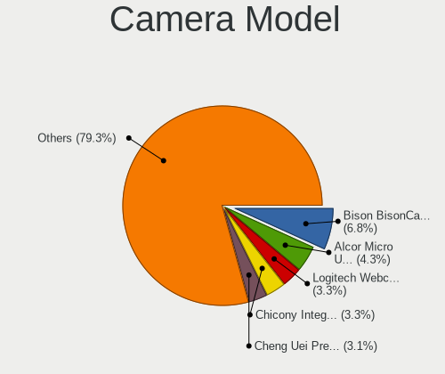

| Model                                                          | Computers | Percent |
|----------------------------------------------------------------|-----------|---------|
| Alcor Micro USB2.0 Camera                                      | 16        | 7.34%   |
| Cheng Uei Precision Industry (Foxlink) HP TrueVision HD Camera | 15        | 6.88%   |
| Chicony Integrated Camera                                      | 14        | 6.42%   |
| Cheng Uei Precision Industry (Foxlink) Webcam                  | 11        | 5.05%   |
| Logitech Webcam C270                                           | 9         | 4.13%   |
| Chicony HP HD Camera                                           | 9         | 4.13%   |
| Sunplus Integrated_Webcam_HD                                   | 6         | 2.75%   |
| IMC Networks USB2.0 HD UVC WebCam                              | 6         | 2.75%   |
| Chicony USB2.0 Camera                                          | 6         | 2.75%   |
| Alcor Micro USB 2.0 PC Camera                                  | 5         | 2.29%   |
| Microdia Webcam Vitade AF                                      | 4         | 1.83%   |
| IMC Networks Integrated Camera                                 | 4         | 1.83%   |
| IMC Networks HD Camera                                         | 4         | 1.83%   |
| Chicony USB camera                                             | 4         | 1.83%   |
| Acer BisonCam,NB Pro                                           | 4         | 1.83%   |
| Quanta HP TrueVision HD Camera                                 | 3         | 1.38%   |
| lihappe8 USB 2.0 Camera                                        | 3         | 1.38%   |
| Chicony USB2.0 FHD Camera                                      | 3         | 1.38%   |
| Acer BisonCam, NB Pro                                          | 3         | 1.38%   |
| Syntek Lenovo EasyCamera                                       | 2         | 0.92%   |
| Syntek Integrated Camera                                       | 2         | 0.92%   |
| Suyin 1.3M HD WebCam                                           | 2         | 0.92%   |
| Sunplus BKX Usb FHD Camera                                     | 2         | 0.92%   |
| Sunplus ASUS USB2.0 Webcam                                     | 2         | 0.92%   |
| Realtek USB Camera                                             | 2         | 0.92%   |
| Quanta ov9734_techfront_camera                                 | 2         | 0.92%   |
| Microdia USB 2.0 Camera                                        | 2         | 0.92%   |
| Logitech C505 HD Webcam                                        | 2         | 0.92%   |
| Chicony VGA Webcam                                             | 2         | 0.92%   |
| Chicony Lenovo EasyCamera                                      | 2         | 0.92%   |
| Chicony HD WebCam                                              | 2         | 0.92%   |
| Alcor Micro SHUNCCM2MP                                         | 2         | 0.92%   |
| Z-Star Venus USB2.0 Camera                                     | 1         | 0.46%   |
| Z-Star Vega USB 2.0 Camera                                     | 1         | 0.46%   |
| Y Media USB Camera                                             | 1         | 0.46%   |
| Unknown USB2.0 Webcam                                          | 1         | 0.46%   |
| Unknown HD camera                                              | 1         | 0.46%   |
| Suyin HP TrueVision HD Integrated Webcam                       | 1         | 0.46%   |
| Suyin HP Truevision HD                                         | 1         | 0.46%   |
| Suyin 1.3M WebCam (notebook emachines E730, Acer sub-brand)    | 1         | 0.46%   |

Security
--------

Fingerprint Vendor
------------------

Fingerprint sensor vendors

| Vendor                     | Computers | Percent |
|----------------------------|-----------|---------|
| Validity Sensors           | 6         | 33.33%  |
| Shenzhen Goodix Technology | 6         | 33.33%  |
| Elan Microelectronics      | 3         | 16.67%  |
| Synaptics                  | 2         | 11.11%  |
| LighTuning Technology      | 1         | 5.56%   |

Fingerprint Model
-----------------

Fingerprint sensor models

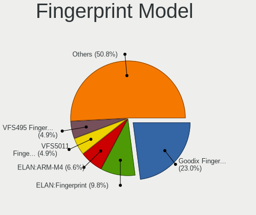

| Model                                             | Computers | Percent |
|---------------------------------------------------|-----------|---------|
| Shenzhen Goodix  Fingerprint Device               | 6         | 33.33%  |
| Validity Sensors VFS5011 Fingerprint Reader       | 2         | 11.11%  |
| Validity Sensors VFS491                           | 2         | 11.11%  |
| Synaptics Prometheus MIS Touch Fingerprint Reader | 2         | 11.11%  |
| Elan ELAN:Fingerprint                             | 2         | 11.11%  |
| Validity Sensors VFS495 Fingerprint Reader        | 1         | 5.56%   |
| Validity Sensors Fingerprint scanner              | 1         | 5.56%   |
| LighTuning EgisTec Touch Fingerprint Sensor       | 1         | 5.56%   |
| Elan ELAN:ARM-M4                                  | 1         | 5.56%   |

Chipcard Vendor
---------------

Chipcard module vendors

| Vendor      | Computers | Percent |
|-------------|-----------|---------|
| Alcor Micro | 3         | 75%     |
| Aktiv       | 1         | 25%     |

Chipcard Model
--------------

Chipcard module models

| Model                               | Computers | Percent |
|-------------------------------------|-----------|---------|
| Alcor Micro AU9540 Smartcard Reader | 3         | 75%     |
| Aktiv Rutoken lite                  | 1         | 25%     |

Unsupported
-----------

Unsupported Devices
-------------------

Total unsupported devices on board

| Total | Computers | Percent |
|-------|-----------|---------|
| 0     | 328       | 83.04%  |
| 1     | 43        | 10.89%  |
| 2     | 12        | 3.04%   |
| 4     | 6         | 1.52%   |
| 5     | 4         | 1.01%   |
| 3     | 2         | 0.51%   |

Unsupported Device Types
------------------------

Types of unsupported devices

| Type                     | Computers | Percent |
|--------------------------|-----------|---------|
| Communication controller | 26        | 27.96%  |
| Graphics card            | 18        | 19.35%  |
| Fingerprint reader       | 18        | 19.35%  |
| Unassigned class         | 9         | 9.68%   |
| Multimedia controller    | 5         | 5.38%   |
| Net/ethernet             | 4         | 4.3%    |
| Chipcard                 | 4         | 4.3%    |
| Sound                    | 3         | 3.23%   |
| Net/wireless             | 2         | 2.15%   |
| Camera                   | 2         | 2.15%   |
| Bluetooth                | 2         | 2.15%   |

