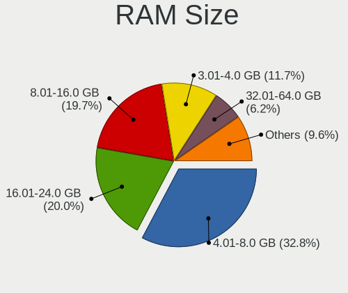
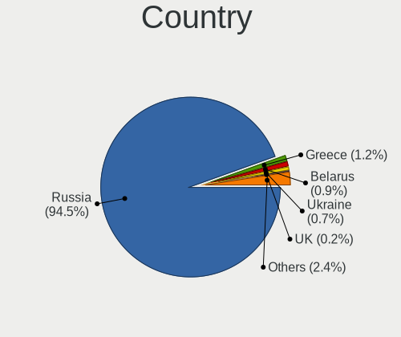
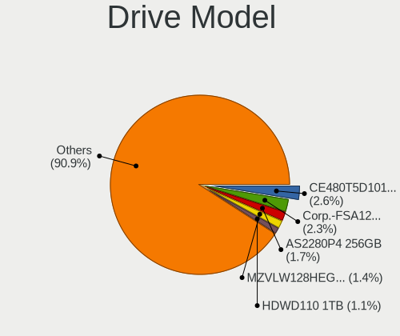
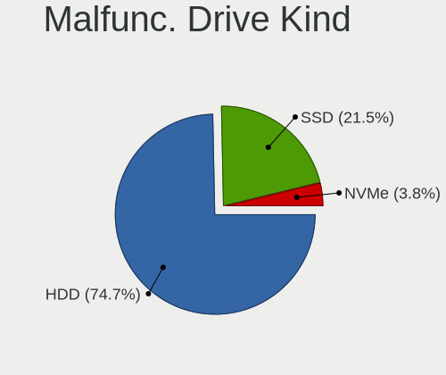
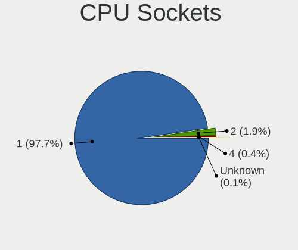
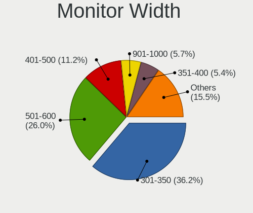
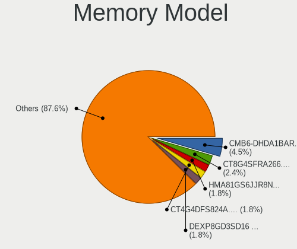

ALT Linux - Tested Hardware & Statistics
----------------------------------------

A project to collect tested hardware configurations for ALT Linux.

Anyone can contribute to this report by the [hw-probe](https://github.com/linuxhw/hw-probe) tool:

    sudo -E hw-probe -all -upload

Please submit a probe of your configuration if it's not presented on the page or is rare.

This is a report for all computer types. See also reports for [desktops](/Dist/ALT_Linux/Desktop/README.md) and [notebooks](/Dist/ALT_Linux/Notebook/README.md).

Full-feature report is available here: https://linux-hardware.org/?view=trends

Contents
--------

* [ Test Cases ](#test-cases)

* [ System ](#system)
  - [ OS                       ](#os)
  - [ OS Family                ](#os-family)
  - [ Kernel                   ](#kernel)
  - [ Kernel Family            ](#kernel-family)
  - [ Kernel Major Ver.        ](#kernel-major-ver)
  - [ Arch                     ](#arch)
  - [ DE                       ](#de)
  - [ Display Server           ](#display-server)
  - [ Display Manager          ](#display-manager)
  - [ OS Lang                  ](#os-lang)
  - [ Boot Mode                ](#boot-mode)
  - [ Filesystem               ](#filesystem)
  - [ Part. scheme             ](#part-scheme)
  - [ Dual Boot with Linux/BSD ](#dual-boot-with-linuxbsd)
  - [ Dual Boot (Win)          ](#dual-boot-win)

* [ Board ](#board)
  - [ Vendor                   ](#vendor)
  - [ Model                    ](#model)
  - [ Model Family             ](#model-family)
  - [ MFG Year                 ](#mfg-year)
  - [ Form Factor              ](#form-factor)
  - [ Secure Boot              ](#secure-boot)
  - [ Coreboot                 ](#coreboot)
  - [ RAM Size                 ](#ram-size)
  - [ RAM Used                 ](#ram-used)
  - [ Total Drives             ](#total-drives)
  - [ Has CD-ROM               ](#has-cd-rom)
  - [ Has Ethernet             ](#has-ethernet)
  - [ Has WiFi                 ](#has-wifi)
  - [ Has Bluetooth            ](#has-bluetooth)

* [ Location ](#location)
  - [ Country                  ](#country)
  - [ City                     ](#city)

* [ Drives ](#drives)
  - [ Drive Vendor             ](#drive-vendor)
  - [ Drive Model              ](#drive-model)
  - [ HDD Vendor               ](#hdd-vendor)
  - [ SSD Vendor               ](#ssd-vendor)
  - [ Drive Kind               ](#drive-kind)
  - [ Drive Connector          ](#drive-connector)
  - [ Drive Size               ](#drive-size)
  - [ Space Total              ](#space-total)
  - [ Space Used               ](#space-used)
  - [ Malfunc. Drives          ](#malfunc-drives)
  - [ Malfunc. Drive Vendor    ](#malfunc-drive-vendor)
  - [ Malfunc. HDD Vendor      ](#malfunc-hdd-vendor)
  - [ Malfunc. Drive Kind      ](#malfunc-drive-kind)
  - [ Failed Drives            ](#failed-drives)
  - [ Failed Drive Vendor      ](#failed-drive-vendor)
  - [ Drive Status             ](#drive-status)

* [ Storage controller ](#storage-controller)
  - [ Storage Vendor           ](#storage-vendor)
  - [ Storage Model            ](#storage-model)
  - [ Storage Kind             ](#storage-kind)

* [ Processor ](#processor)
  - [ CPU Vendor               ](#cpu-vendor)
  - [ CPU Model                ](#cpu-model)
  - [ CPU Model Family         ](#cpu-model-family)
  - [ CPU Cores                ](#cpu-cores)
  - [ CPU Sockets              ](#cpu-sockets)
  - [ CPU Threads              ](#cpu-threads)
  - [ CPU Op-Modes             ](#cpu-op-modes)
  - [ CPU Microcode            ](#cpu-microcode)
  - [ CPU Microarch            ](#cpu-microarch)

* [ Graphics ](#graphics)
  - [ GPU Vendor               ](#gpu-vendor)
  - [ GPU Model                ](#gpu-model)
  - [ GPU Combo                ](#gpu-combo)
  - [ GPU Driver               ](#gpu-driver)
  - [ GPU Memory               ](#gpu-memory)

* [ Monitor ](#monitor)
  - [ Monitor Vendor           ](#monitor-vendor)
  - [ Monitor Model            ](#monitor-model)
  - [ Monitor Resolution       ](#monitor-resolution)
  - [ Monitor Diagonal         ](#monitor-diagonal)
  - [ Monitor Width            ](#monitor-width)
  - [ Aspect Ratio             ](#aspect-ratio)
  - [ Monitor Area             ](#monitor-area)
  - [ Pixel Density            ](#pixel-density)
  - [ Multiple Monitors        ](#multiple-monitors)

* [ Network ](#network)
  - [ Net Controller Vendor    ](#net-controller-vendor)
  - [ Net Controller Model     ](#net-controller-model)
  - [ Wireless Vendor          ](#wireless-vendor)
  - [ Wireless Model           ](#wireless-model)
  - [ Ethernet Vendor          ](#ethernet-vendor)
  - [ Ethernet Model           ](#ethernet-model)
  - [ Net Controller Kind      ](#net-controller-kind)
  - [ Used Controller          ](#used-controller)
  - [ NICs                     ](#nics)
  - [ IPv6                     ](#ipv6)

* [ Bluetooth ](#bluetooth)
  - [ Bluetooth Vendor         ](#bluetooth-vendor)
  - [ Bluetooth Model          ](#bluetooth-model)

* [ Sound ](#sound)
  - [ Sound Vendor             ](#sound-vendor)
  - [ Sound Model              ](#sound-model)

* [ Memory ](#memory)
  - [ Memory Vendor            ](#memory-vendor)
  - [ Memory Model             ](#memory-model)
  - [ Memory Kind              ](#memory-kind)
  - [ Memory Form Factor       ](#memory-form-factor)
  - [ Memory Size              ](#memory-size)
  - [ Memory Speed             ](#memory-speed)

* [ Printers & scanners ](#printers--scanners)
  - [ Printer Vendor           ](#printer-vendor)
  - [ Printer Model            ](#printer-model)
  - [ Scanner Vendor           ](#scanner-vendor)
  - [ Scanner Model            ](#scanner-model)

* [ Camera ](#camera)
  - [ Camera Vendor            ](#camera-vendor)
  - [ Camera Model             ](#camera-model)

* [ Security ](#security)
  - [ Fingerprint Vendor       ](#fingerprint-vendor)
  - [ Fingerprint Model        ](#fingerprint-model)
  - [ Chipcard Vendor          ](#chipcard-vendor)
  - [ Chipcard Model           ](#chipcard-model)

* [ Unsupported ](#unsupported)
  - [ Unsupported Devices      ](#unsupported-devices)
  - [ Unsupported Device Types ](#unsupported-device-types)

Test Cases
----------

Total: 245

| Vendor        | Model                       | Form-Factor | Probe                                                      | Date         |
|---------------|-----------------------------|-------------|------------------------------------------------------------|--------------|
| HP            | Unknown                     | Notebook    | [e989736b06](https://linux-hardware.org/?probe=e989736b06) | Mar 30, 2022 |
| HP            | Unknown                     | Notebook    | [672d3c8b62](https://linux-hardware.org/?probe=672d3c8b62) | Mar 29, 2022 |
| ASRock        | M3N78D FX                   | Desktop     | [66bb134c6c](https://linux-hardware.org/?probe=66bb134c6c) | Mar 29, 2022 |
| HP            | 250 G3                      | Notebook    | [22f691edac](https://linux-hardware.org/?probe=22f691edac) | Mar 29, 2022 |
| ASRock        | N68-GS4 FX R2.0             | Desktop     | [d01df98d83](https://linux-hardware.org/?probe=d01df98d83) | Mar 28, 2022 |
| ASRock        | M3N78D FX                   | Desktop     | [3ebcef4241](https://linux-hardware.org/?probe=3ebcef4241) | Mar 28, 2022 |
| Unknown       | Unknown                     | Desktop     | [95628eab40](https://linux-hardware.org/?probe=95628eab40) | Mar 24, 2022 |
| HP            | Pavilion Gaming Laptop 1... | Notebook    | [e4b8a2cc11](https://linux-hardware.org/?probe=e4b8a2cc11) | Mar 23, 2022 |
| HP            | Pavilion Gaming Laptop 1... | Notebook    | [64baae5b88](https://linux-hardware.org/?probe=64baae5b88) | Mar 22, 2022 |
| ICL           | NJ50_70CU                   | Notebook    | [247859eb78](https://linux-hardware.org/?probe=247859eb78) | Mar 22, 2022 |
| ICL           | NJ50_70CU                   | Notebook    | [b9e82b8490](https://linux-hardware.org/?probe=b9e82b8490) | Mar 22, 2022 |
| ASRock        | A300M-STX                   | Desktop     | [1fb2262bcc](https://linux-hardware.org/?probe=1fb2262bcc) | Mar 17, 2022 |
| ASUSTek       | ASUS EXPERTBOOK B1500CEA... | Notebook    | [58fdf49095](https://linux-hardware.org/?probe=58fdf49095) | Mar 17, 2022 |
| ASUSTek       | ASUS EXPERTBOOK B1500CEA... | Notebook    | [eaa9fb6aad](https://linux-hardware.org/?probe=eaa9fb6aad) | Mar 14, 2022 |
| 3Logic Gro... | Graviton N15i-K2            | Notebook    | [72eefd2811](https://linux-hardware.org/?probe=72eefd2811) | Mar 14, 2022 |
| HP            | Pavilion Gaming Laptop 1... | Notebook    | [55533901d3](https://linux-hardware.org/?probe=55533901d3) | Mar 11, 2022 |
| 3Logic Gro... | AMUR DMB-H310-MCA01         | All in one  | [83881d4eb6](https://linux-hardware.org/?probe=83881d4eb6) | Mar 11, 2022 |
| 3Logic Gro... | DMB-H310-TMI01              | All in one  | [2379c7546f](https://linux-hardware.org/?probe=2379c7546f) | Mar 09, 2022 |
| Gigabyte      | G41MT-D3                    | Desktop     | [92fc99440a](https://linux-hardware.org/?probe=92fc99440a) | Mar 08, 2022 |
| Dell          | G5 5590                     | Notebook    | [9b95f2ae1d](https://linux-hardware.org/?probe=9b95f2ae1d) | Mar 06, 2022 |
| 3Logic Gro... | DMB-H310-TMI01              | All in one  | [4f93db2c52](https://linux-hardware.org/?probe=4f93db2c52) | Mar 05, 2022 |
| Lenovo        | IdeaPad 3 15IIL05 81WE      | Notebook    | [13bc7e73f1](https://linux-hardware.org/?probe=13bc7e73f1) | Mar 02, 2022 |
| 3Logic Gro... | AMUR DMB-H310-MCA01         | All in one  | [0256c0ab03](https://linux-hardware.org/?probe=0256c0ab03) | Feb 28, 2022 |
| 3Logic Gro... | AMUR DMB-H310-MCA01         | All in one  | [04a1a09e43](https://linux-hardware.org/?probe=04a1a09e43) | Feb 28, 2022 |
| ASUSTek       | ASUS TUF Gaming A17 FA70... | Notebook    | [ef592cb1a7](https://linux-hardware.org/?probe=ef592cb1a7) | Feb 26, 2022 |
| HP            | Pavilion Gaming Laptop 1... | Notebook    | [c907453bf5](https://linux-hardware.org/?probe=c907453bf5) | Feb 18, 2022 |
| ASRock        | B450 Gaming K4              | Desktop     | [f7f470651e](https://linux-hardware.org/?probe=f7f470651e) | Feb 17, 2022 |
| ASUSTek       | ASUS TUF Gaming A15 FA50... | Notebook    | [3986a62bca](https://linux-hardware.org/?probe=3986a62bca) | Feb 15, 2022 |
| HP            | Pavilion Gaming Laptop 1... | Notebook    | [f0c89a4e5b](https://linux-hardware.org/?probe=f0c89a4e5b) | Feb 15, 2022 |
| HP            | Pavilion Gaming Laptop 1... | Notebook    | [cf41cc6ddb](https://linux-hardware.org/?probe=cf41cc6ddb) | Feb 15, 2022 |
| Gigabyte      | X79-UD3                     | Desktop     | [452ebf6a67](https://linux-hardware.org/?probe=452ebf6a67) | Feb 12, 2022 |
| ASUSTek       | PRIME B550-PLUS             | Desktop     | [921e224ec5](https://linux-hardware.org/?probe=921e224ec5) | Feb 12, 2022 |
| ASUSTek       | X200MA                      | Notebook    | [b2f1d59884](https://linux-hardware.org/?probe=b2f1d59884) | Feb 12, 2022 |
| Timi          | TM1701                      | Notebook    | [4edeb14964](https://linux-hardware.org/?probe=4edeb14964) | Feb 05, 2022 |
| DEPO Compu... | DPC156                      | Notebook    | [4fb49336e5](https://linux-hardware.org/?probe=4fb49336e5) | Feb 03, 2022 |
| T-Platform... | TF307-MB                    | Soc         | [c34cd190e4](https://linux-hardware.org/?probe=c34cd190e4) | Feb 01, 2022 |
| AQUARIUS      | AQH410T                     | Desktop     | [351b2e5344](https://linux-hardware.org/?probe=351b2e5344) | Jan 31, 2022 |
| ASUSTek       | PRIME B550-PLUS             | Desktop     | [481e745592](https://linux-hardware.org/?probe=481e745592) | Jan 30, 2022 |
| Lenovo        | ThinkBook 15 G2 ITL 20VE    | Notebook    | [a08b9de6fa](https://linux-hardware.org/?probe=a08b9de6fa) | Jan 28, 2022 |
| ASRock        | B450 Gaming K4              | Desktop     | [8c31667834](https://linux-hardware.org/?probe=8c31667834) | Jan 20, 2022 |
| ASRock        | A520M-HDVP/DASH             | Desktop     | [edd6464f18](https://linux-hardware.org/?probe=edd6464f18) | Jan 19, 2022 |
| ASRock        | A520M-HDVP/DASH             | Desktop     | [93fef2e073](https://linux-hardware.org/?probe=93fef2e073) | Jan 19, 2022 |
| Dell          | Latitude 3590               | Notebook    | [e2a6ef3266](https://linux-hardware.org/?probe=e2a6ef3266) | Jan 18, 2022 |
| MSI           | MS-AC16 100                 | All in one  | [3a3bfc48f7](https://linux-hardware.org/?probe=3a3bfc48f7) | Jan 17, 2022 |
| MSI           | A68HM-P33 V2                | Desktop     | [98e05db690](https://linux-hardware.org/?probe=98e05db690) | Jan 17, 2022 |
| ASRock        | B450 Gaming K4              | Desktop     | [0c802de596](https://linux-hardware.org/?probe=0c802de596) | Jan 14, 2022 |
| HP            | Pavilion Gaming Laptop 1... | Notebook    | [00f8c9d649](https://linux-hardware.org/?probe=00f8c9d649) | Jan 02, 2022 |
| Gigabyte      | H77M-D3H                    | Desktop     | [c8ff16f0ed](https://linux-hardware.org/?probe=c8ff16f0ed) | Dec 24, 2021 |
| Supermicro    | X11SDW-14CNT-TP13F          | Desktop     | [4d8499f8ba](https://linux-hardware.org/?probe=4d8499f8ba) | Dec 23, 2021 |
| Supermicro    | X10SDV-TP8F                 | Server      | [adc426b903](https://linux-hardware.org/?probe=adc426b903) | Dec 23, 2021 |
| ASRock        | A320M-HDV R4.0              | Desktop     | [9180a824d8](https://linux-hardware.org/?probe=9180a824d8) | Dec 23, 2021 |
| Samsung       | 750XDA                      | Notebook    | [8fe8612ccb](https://linux-hardware.org/?probe=8fe8612ccb) | Dec 21, 2021 |
| Acer          | Aspire 5750G                | Notebook    | [58cdbcf87e](https://linux-hardware.org/?probe=58cdbcf87e) | Dec 18, 2021 |
| ASRock        | B450 Gaming K4              | Desktop     | [7ef05a32a9](https://linux-hardware.org/?probe=7ef05a32a9) | Dec 17, 2021 |
| MSI           | MPG B560I GAMING EDGE WI... | Desktop     | [2aff2121af](https://linux-hardware.org/?probe=2aff2121af) | Dec 16, 2021 |
| MSI           | MPG B560I GAMING EDGE WI... | Desktop     | [30eab5f54f](https://linux-hardware.org/?probe=30eab5f54f) | Dec 15, 2021 |
| Unknown       | Baikal Electronics Baika... | Soc         | [b4e6606b42](https://linux-hardware.org/?probe=b4e6606b42) | Dec 10, 2021 |
| Gigabyte      | B550 GAMING X               | Desktop     | [c853f62ddd](https://linux-hardware.org/?probe=c853f62ddd) | Dec 06, 2021 |
| Unknown       | Unknown                     | Desktop     | [0f5c69902a](https://linux-hardware.org/?probe=0f5c69902a) | Dec 01, 2021 |
| ASRock        | B450M Pro4                  | Desktop     | [68a1f83b4f](https://linux-hardware.org/?probe=68a1f83b4f) | Nov 28, 2021 |
| Gigabyte      | B550 GAMING X               | Desktop     | [058d8a0404](https://linux-hardware.org/?probe=058d8a0404) | Nov 19, 2021 |
| ASUSTek       | P5Q                         | Desktop     | [70ee05a53e](https://linux-hardware.org/?probe=70ee05a53e) | Oct 28, 2021 |
| Huawei        | BC11SPSCB0 V100R005         | Server      | [ad903545ce](https://linux-hardware.org/?probe=ad903545ce) | Oct 14, 2021 |
| ASUSTek       | N46VZ                       | Notebook    | [aaf9eff6bd](https://linux-hardware.org/?probe=aaf9eff6bd) | Oct 11, 2021 |
| ASUSTek       | VivoBook_ASUSLaptop X421... | Notebook    | [2839eb3d12](https://linux-hardware.org/?probe=2839eb3d12) | Oct 09, 2021 |
| Gigabyte      | B450 AORUS M                | Desktop     | [d9dd1b763b](https://linux-hardware.org/?probe=d9dd1b763b) | Oct 08, 2021 |
| Dell          | 0U649C                      | Desktop     | [80e138d949](https://linux-hardware.org/?probe=80e138d949) | Sep 24, 2021 |
| HP            | Laptop 15s-fq0xxx           | Notebook    | [516882d907](https://linux-hardware.org/?probe=516882d907) | Sep 23, 2021 |
| Edelweiss     | TF307-MB-S-D                | Soc         | [92829c951d](https://linux-hardware.org/?probe=92829c951d) | Sep 21, 2021 |
| ASRock        | X300M-STX                   | Desktop     | [da7d22c384](https://linux-hardware.org/?probe=da7d22c384) | Sep 16, 2021 |
| Timi          | TM1701                      | Notebook    | [b13b26d7ca](https://linux-hardware.org/?probe=b13b26d7ca) | Sep 16, 2021 |
| ASUSTek       | N46VZ                       | Notebook    | [40c97b439e](https://linux-hardware.org/?probe=40c97b439e) | Sep 12, 2021 |
| Acer          | Aspire A317-32              | Notebook    | [09342414f3](https://linux-hardware.org/?probe=09342414f3) | Sep 09, 2021 |
| Lenovo        | IdeaPad 3 15IGL05 81WQ      | Notebook    | [6648ff785e](https://linux-hardware.org/?probe=6648ff785e) | Sep 08, 2021 |
| ASUSTek       | M5A99X EVO R2.0             | Desktop     | [132286ab64](https://linux-hardware.org/?probe=132286ab64) | Aug 17, 2021 |
| Gigabyte      | H77M-D3H                    | Desktop     | [85ce2f74c4](https://linux-hardware.org/?probe=85ce2f74c4) | Aug 17, 2021 |
| ASUSTek       | M5A99X EVO R2.0             | Desktop     | [615b6f5a78](https://linux-hardware.org/?probe=615b6f5a78) | Aug 13, 2021 |
| ASUSTek       | PRIME B550-PLUS             | Desktop     | [624e92e15e](https://linux-hardware.org/?probe=624e92e15e) | Aug 11, 2021 |
| ASUSTek       | M5A99X EVO R2.0             | Desktop     | [49e1a59dfe](https://linux-hardware.org/?probe=49e1a59dfe) | Aug 11, 2021 |
| ASUSTek       | N46VZ                       | Notebook    | [eb37b7db1e](https://linux-hardware.org/?probe=eb37b7db1e) | Aug 11, 2021 |
| Acer          | Swift SF314-57              | Notebook    | [2872bd6b13](https://linux-hardware.org/?probe=2872bd6b13) | Aug 05, 2021 |
| Gigabyte      | H510M S2H                   | Desktop     | [db68dde16d](https://linux-hardware.org/?probe=db68dde16d) | Aug 04, 2021 |
| Durabook      | Z14                         | Notebook    | [7abdb375e2](https://linux-hardware.org/?probe=7abdb375e2) | Jul 27, 2021 |
| ASUSTek       | PRIME B550-PLUS             | Desktop     | [b01641d467](https://linux-hardware.org/?probe=b01641d467) | Jul 25, 2021 |
| Aquarius      | NS483                       | Convertible | [bc5d045def](https://linux-hardware.org/?probe=bc5d045def) | Jul 20, 2021 |
| Gigabyte      | H110M-S2V-CF                | Desktop     | [8687a8809b](https://linux-hardware.org/?probe=8687a8809b) | Jul 14, 2021 |
| Lenovo        | ThinkPad L13 Gen 2 20VH0... | Notebook    | [a85464aae6](https://linux-hardware.org/?probe=a85464aae6) | Jul 06, 2021 |
| ASUSTek       | P5G41T-M LX2/GB/LPT         | Desktop     | [05be9fcdec](https://linux-hardware.org/?probe=05be9fcdec) | Jul 03, 2021 |
| Aquarius      | NS585                       | Notebook    | [bc10f2ffbd](https://linux-hardware.org/?probe=bc10f2ffbd) | Jun 27, 2021 |
| Gigabyte      | H110M-S2V-CF                | Desktop     | [24bd5ac93f](https://linux-hardware.org/?probe=24bd5ac93f) | Jun 27, 2021 |
| Kraftway      | KWH310                      | Desktop     | [f470a86a1c](https://linux-hardware.org/?probe=f470a86a1c) | Jun 26, 2021 |
| ASRock        | H110M-DGS R3.0              | Desktop     | [87ab7018c4](https://linux-hardware.org/?probe=87ab7018c4) | Jun 24, 2021 |
| Edelweiss     | TF307-MB-S-D                | Soc         | [d31e4518a6](https://linux-hardware.org/?probe=d31e4518a6) | Jun 22, 2021 |
| MSI           | H110M PRO-VD                | Desktop     | [21a019dcb3](https://linux-hardware.org/?probe=21a019dcb3) | Jun 14, 2021 |
| ASUSTek       | P5G41T-M LX2/GB/LPT         | Desktop     | [8325754280](https://linux-hardware.org/?probe=8325754280) | Jun 13, 2021 |
| MSI           | H110M PRO-VD                | Desktop     | [96cc5b470f](https://linux-hardware.org/?probe=96cc5b470f) | Jun 12, 2021 |
| MSI           | H110M PRO-VD                | Desktop     | [cfeb0493d3](https://linux-hardware.org/?probe=cfeb0493d3) | Jun 11, 2021 |
| ASUSTek       | P5G41T-M LX2/GB/LPT         | Desktop     | [0fa9201a34](https://linux-hardware.org/?probe=0fa9201a34) | Jun 03, 2021 |
| Dell          | G3 3779                     | Notebook    | [eaf53820e5](https://linux-hardware.org/?probe=eaf53820e5) | Jun 02, 2021 |
| HUAWEI        | NBLK-WAX9X                  | Notebook    | [9908ba82e9](https://linux-hardware.org/?probe=9908ba82e9) | May 31, 2021 |
| Lenovo        | ThinkPad L13 Gen 2 20VH0... | Notebook    | [9f3a13c865](https://linux-hardware.org/?probe=9f3a13c865) | May 27, 2021 |
| HP            | Laptop 17-by0xxx            | Notebook    | [a3f263e12b](https://linux-hardware.org/?probe=a3f263e12b) | May 26, 2021 |
| Dell          | Inspiron 3542               | Notebook    | [e1a816cc42](https://linux-hardware.org/?probe=e1a816cc42) | May 25, 2021 |
| MSI           | GE72 7RE                    | Notebook    | [a6a5258971](https://linux-hardware.org/?probe=a6a5258971) | May 20, 2021 |
| ASRock        | J3455B-ITX                  | Desktop     | [13396a7347](https://linux-hardware.org/?probe=13396a7347) | May 19, 2021 |
| ASUSTek       | N46VZ                       | Notebook    | [62c6944a06](https://linux-hardware.org/?probe=62c6944a06) | May 19, 2021 |
| DEPO Compu... | DEPO T09-D                  | Stick pc    | [678542f4fe](https://linux-hardware.org/?probe=678542f4fe) | May 18, 2021 |
| DEPO Compu... | DPH410S                     | Desktop     | [0d1000e904](https://linux-hardware.org/?probe=0d1000e904) | May 14, 2021 |
| DEPO Compu... | DPA320S G10g                | Desktop     | [5ecc011c34](https://linux-hardware.org/?probe=5ecc011c34) | May 14, 2021 |
| Lenovo        | IdeaPad 5 15IIL05 81YK      | Notebook    | [59740e6ccf](https://linux-hardware.org/?probe=59740e6ccf) | Apr 29, 2021 |
| ASUSTek       | P5G41T-M LX2/GB/LPT         | Desktop     | [5fab5adc6b](https://linux-hardware.org/?probe=5fab5adc6b) | Apr 18, 2021 |
| ASUSTek       | P5G41T-M LX2/GB/LPT         | Desktop     | [97b70c1bac](https://linux-hardware.org/?probe=97b70c1bac) | Apr 17, 2021 |
| HP            | EliteBook 8470p             | Notebook    | [632deaf397](https://linux-hardware.org/?probe=632deaf397) | Apr 16, 2021 |
| Lenovo        | ThinkBook 15 G2 ITL 20VE    | Notebook    | [8185306af7](https://linux-hardware.org/?probe=8185306af7) | Apr 16, 2021 |
| ASUSTek       | VivoBook 15_ASUS Laptop ... | Notebook    | [ea2ab7cbc7](https://linux-hardware.org/?probe=ea2ab7cbc7) | Apr 07, 2021 |
| Lenovo        | 3184 No DPK                 | All in one  | [bd5551c49a](https://linux-hardware.org/?probe=bd5551c49a) | Mar 31, 2021 |
| Acer          | H11H4-AI V:1.0              | Desktop     | [34997240d5](https://linux-hardware.org/?probe=34997240d5) | Mar 30, 2021 |
| ECS           | BAT-I2                      | Desktop     | [037e6e58e6](https://linux-hardware.org/?probe=037e6e58e6) | Mar 30, 2021 |
| ASUSTek       | VivoBook_ASUSLaptop X421... | Notebook    | [3afcb7ca65](https://linux-hardware.org/?probe=3afcb7ca65) | Mar 29, 2021 |
| ASUSTek       | PRIME H310M-R R2.0          | Desktop     | [f0c7659cf9](https://linux-hardware.org/?probe=f0c7659cf9) | Mar 29, 2021 |
| Lenovo        | IdeaPad 310-15ISK 80SM      | Notebook    | [66f3887fa2](https://linux-hardware.org/?probe=66f3887fa2) | Mar 20, 2021 |
| Gigabyte      | P35-S3G                     | Desktop     | [8e53d68603](https://linux-hardware.org/?probe=8e53d68603) | Mar 20, 2021 |
| HP            | Pavilion Laptop 15-cc5xx    | Notebook    | [2c576fb8a9](https://linux-hardware.org/?probe=2c576fb8a9) | Mar 17, 2021 |
| ASUSTek       | N3150M-E                    | Desktop     | [7467b59c82](https://linux-hardware.org/?probe=7467b59c82) | Mar 17, 2021 |
| ASUSTek       | PRIME B250-PRO              | Desktop     | [c62af0239b](https://linux-hardware.org/?probe=c62af0239b) | Mar 17, 2021 |
| iRU           | IRUB365M                    | Desktop     | [b7d5dda036](https://linux-hardware.org/?probe=b7d5dda036) | Mar 11, 2021 |
| Dell          | 04G47W A00                  | All in one  | [3a565370de](https://linux-hardware.org/?probe=3a565370de) | Feb 15, 2021 |
| HP            | Laptop 15s-fq2xxx           | Notebook    | [2d8bd02af5](https://linux-hardware.org/?probe=2d8bd02af5) | Feb 09, 2021 |
| Gigabyte      | GA-MA69VM-S2                | Desktop     | [6651c76da3](https://linux-hardware.org/?probe=6651c76da3) | Feb 07, 2021 |
| Gigabyte      | GA-MA69VM-S2                | Desktop     | [d63a1e9eef](https://linux-hardware.org/?probe=d63a1e9eef) | Feb 02, 2021 |
| ASUSTek       | P5B                         | Desktop     | [e0fc318a34](https://linux-hardware.org/?probe=e0fc318a34) | Jan 28, 2021 |
| Supermicro    | X11DPH-i                    | Server      | [8d109ac7b4](https://linux-hardware.org/?probe=8d109ac7b4) | Jan 26, 2021 |
| EPoX Compu... | GeForce6100 + nForce410 ... | Desktop     | [99f734d52e](https://linux-hardware.org/?probe=99f734d52e) | Jan 18, 2021 |
| ASUSTek       | N46VZ                       | Notebook    | [af521df7b9](https://linux-hardware.org/?probe=af521df7b9) | Jan 16, 2021 |
| Lenovo        | B50-10 80QR                 | Notebook    | [211bf1a4b4](https://linux-hardware.org/?probe=211bf1a4b4) | Jan 15, 2021 |
| Gigabyte      | H110M-S2H-CF                | Desktop     | [38ae5dd532](https://linux-hardware.org/?probe=38ae5dd532) | Jan 14, 2021 |
| AMI           | Aptio CRB                   | Mini pc     | [593a489e8d](https://linux-hardware.org/?probe=593a489e8d) | Jan 13, 2021 |
| Intel         | B75                         | Desktop     | [34d29fb066](https://linux-hardware.org/?probe=34d29fb066) | Jan 12, 2021 |
| Acer          | NC-ES1-131-C1NL             | Notebook    | [1cae46f14f](https://linux-hardware.org/?probe=1cae46f14f) | Jan 09, 2021 |
| Gigabyte      | H110M-S2H-CF                | Desktop     | [2c49129777](https://linux-hardware.org/?probe=2c49129777) | Jan 09, 2021 |
| ASUSTek       | M5A99X EVO R2.0             | Desktop     | [bf536f43c6](https://linux-hardware.org/?probe=bf536f43c6) | Jan 07, 2021 |
| HP            | Laptop 15s-fq0xxx           | Notebook    | [2437a45956](https://linux-hardware.org/?probe=2437a45956) | Jan 07, 2021 |
| ASUSTek       | M5A99X EVO R2.0             | Desktop     | [ee8a8fec79](https://linux-hardware.org/?probe=ee8a8fec79) | Jan 05, 2021 |
| ASUSTek       | M5A99X EVO R2.0             | Desktop     | [16e976d9e5](https://linux-hardware.org/?probe=16e976d9e5) | Jan 02, 2021 |
| ASUSTek       | M5A99X EVO R2.0             | Desktop     | [3296ffa017](https://linux-hardware.org/?probe=3296ffa017) | Jan 02, 2021 |
| ASUSTek       | M5A99X EVO R2.0             | Desktop     | [31d84f6485](https://linux-hardware.org/?probe=31d84f6485) | Dec 31, 2020 |
| Irbis         | TW100                       | Tablet      | [23c593482c](https://linux-hardware.org/?probe=23c593482c) | Dec 28, 2020 |
| SYS           | H310SB                      | Desktop     | [ba93a151f2](https://linux-hardware.org/?probe=ba93a151f2) | Dec 24, 2020 |
| HP            | 877E A                      | Desktop     | [4456ec4081](https://linux-hardware.org/?probe=4456ec4081) | Dec 23, 2020 |
| MSI           | MS-AC16 100                 | All in one  | [8df63d744b](https://linux-hardware.org/?probe=8df63d744b) | Dec 23, 2020 |
| HP            | 877E A                      | Desktop     | [145b54d631](https://linux-hardware.org/?probe=145b54d631) | Dec 23, 2020 |
| VIA Techno... | P4M266A-8235                | Desktop     | [c560d2aa9b](https://linux-hardware.org/?probe=c560d2aa9b) | Dec 23, 2020 |
| VIA Techno... | P4M266A-8235                | Desktop     | [8286c6ca5c](https://linux-hardware.org/?probe=8286c6ca5c) | Dec 23, 2020 |
| HP            | EliteBook 8470p             | Notebook    | [ed90389918](https://linux-hardware.org/?probe=ed90389918) | Dec 22, 2020 |
| Lenovo        | ThinkPad X220 4291M85       | Notebook    | [f2c165b2d8](https://linux-hardware.org/?probe=f2c165b2d8) | Dec 22, 2020 |
| ASUSTek       | X510UNR                     | Notebook    | [53ef89172e](https://linux-hardware.org/?probe=53ef89172e) | Dec 21, 2020 |
| Irbis         | TW100                       | Tablet      | [5ebe1b6e89](https://linux-hardware.org/?probe=5ebe1b6e89) | Dec 19, 2020 |
| Foxconn       | 2ABF                        | Desktop     | [dbc40fef9d](https://linux-hardware.org/?probe=dbc40fef9d) | Dec 18, 2020 |
| ASUSTek       | N46VZ                       | Notebook    | [d17038f482](https://linux-hardware.org/?probe=d17038f482) | Dec 17, 2020 |
| ASUSTek       | M5A99X EVO R2.0             | Desktop     | [bb4bd8f82f](https://linux-hardware.org/?probe=bb4bd8f82f) | Dec 09, 2020 |
| HP            | ENVY x360 Convertible 15... | Convertible | [5cf089cfa1](https://linux-hardware.org/?probe=5cf089cfa1) | Dec 07, 2020 |
| ASRock        | X299 Steel Legend           | Desktop     | [fdfcfb17c6](https://linux-hardware.org/?probe=fdfcfb17c6) | Dec 03, 2020 |
| ASRock        | X299 Steel Legend           | Desktop     | [98800b881c](https://linux-hardware.org/?probe=98800b881c) | Dec 03, 2020 |
| Gigabyte      | H310N x.x                   | Desktop     | [b0ca19ee36](https://linux-hardware.org/?probe=b0ca19ee36) | Dec 02, 2020 |
| ASUSTek       | PRIME H310M-R R2.0          | Desktop     | [4ec24e5c24](https://linux-hardware.org/?probe=4ec24e5c24) | Nov 27, 2020 |
| ASUSTek       | Z8NR-D12                    | Desktop     | [2758f1ff94](https://linux-hardware.org/?probe=2758f1ff94) | Nov 21, 2020 |
| Acer          | Veriton Z4860G              | All in one  | [8adebb44d3](https://linux-hardware.org/?probe=8adebb44d3) | Nov 20, 2020 |
| Lenovo        | ThinkPad 13 2nd Gen 20J1... | Notebook    | [00824d4fae](https://linux-hardware.org/?probe=00824d4fae) | Nov 19, 2020 |
| iRU           | IRUB365M                    | Desktop     | [ab7e110c9a](https://linux-hardware.org/?probe=ab7e110c9a) | Nov 17, 2020 |
| HP            | Laptop 14s-dq1xxx           | Notebook    | [f6e0ab4b2b](https://linux-hardware.org/?probe=f6e0ab4b2b) | Nov 13, 2020 |
| iRU           | IRUB365M                    | Desktop     | [ed5fee32dd](https://linux-hardware.org/?probe=ed5fee32dd) | Nov 13, 2020 |
| Gigabyte      | H77M-D3H                    | Desktop     | [c878b046bc](https://linux-hardware.org/?probe=c878b046bc) | Nov 13, 2020 |
| Acer          | H11H4-AI V:1.0              | Desktop     | [5ad12e4b3b](https://linux-hardware.org/?probe=5ad12e4b3b) | Nov 12, 2020 |
| Toshiba       | Satellite A100              | Notebook    | [f09cd03fff](https://linux-hardware.org/?probe=f09cd03fff) | Nov 09, 2020 |
| Gigabyte      | J1800N-D2H                  | Desktop     | [e25041fb04](https://linux-hardware.org/?probe=e25041fb04) | Nov 09, 2020 |
| ASUSTek       | A8N-E                       | Desktop     | [f716673893](https://linux-hardware.org/?probe=f716673893) | Oct 24, 2020 |
| ASUSTek       | P5B-MX                      | Desktop     | [0779d0f18c](https://linux-hardware.org/?probe=0779d0f18c) | Oct 24, 2020 |
| MSI           | X300/X340/X400 series       | Notebook    | [1fd45a8e47](https://linux-hardware.org/?probe=1fd45a8e47) | Oct 23, 2020 |
| Lenovo        | B50-10 80QR                 | Notebook    | [ae14993850](https://linux-hardware.org/?probe=ae14993850) | Sep 28, 2020 |
| ASUSTek       | N46VZ                       | Notebook    | [d1ba7fa191](https://linux-hardware.org/?probe=d1ba7fa191) | Sep 23, 2020 |
| ASUSTek       | N46VZ                       | Notebook    | [ee23f7cefc](https://linux-hardware.org/?probe=ee23f7cefc) | Sep 14, 2020 |
| Acer          | Aspire XC-885 V:1.1         | Desktop     | [f587011ab7](https://linux-hardware.org/?probe=f587011ab7) | Sep 10, 2020 |
| ASUSTek       | N46VZ                       | Notebook    | [52930a9597](https://linux-hardware.org/?probe=52930a9597) | Sep 03, 2020 |
| ASUSTek       | N46VZ                       | Notebook    | [0ac9b22881](https://linux-hardware.org/?probe=0ac9b22881) | Sep 03, 2020 |
| ASUSTek       | N46VZ                       | Notebook    | [0a8a235308](https://linux-hardware.org/?probe=0a8a235308) | Aug 24, 2020 |
| ASUSTek       | N46VZ                       | Notebook    | [c1e8898d0b](https://linux-hardware.org/?probe=c1e8898d0b) | Aug 24, 2020 |
| ASRock        | G31M-VS                     | Desktop     | [fb4e557598](https://linux-hardware.org/?probe=fb4e557598) | Aug 16, 2020 |
| ASRock        | 4CoreN73PV-HD720p           | Desktop     | [ac70970005](https://linux-hardware.org/?probe=ac70970005) | Aug 16, 2020 |
| ASUSTek       | N46VZ                       | Notebook    | [1c45537256](https://linux-hardware.org/?probe=1c45537256) | Aug 14, 2020 |
| ASUSTek       | N46VZ                       | Notebook    | [9998e51d1c](https://linux-hardware.org/?probe=9998e51d1c) | Aug 14, 2020 |
| ASUSTek       | N46VZ                       | Notebook    | [a7c66e41c7](https://linux-hardware.org/?probe=a7c66e41c7) | Aug 14, 2020 |
| ASRock        | G31M-VS                     | Desktop     | [de62d84a9c](https://linux-hardware.org/?probe=de62d84a9c) | Aug 12, 2020 |
| Gigabyte      | EP35C-DS3R                  | Desktop     | [4c98d77a2f](https://linux-hardware.org/?probe=4c98d77a2f) | Aug 07, 2020 |
| Samsung       | R510/P510                   | Notebook    | [e20ff4ae24](https://linux-hardware.org/?probe=e20ff4ae24) | Jul 12, 2020 |
| Lenovo        | B50-10 80QR                 | Notebook    | [a50e0f999e](https://linux-hardware.org/?probe=a50e0f999e) | Jul 07, 2020 |
| Lenovo        | 7X99CTO1WW                  | Server      | [cee7ed2ce9](https://linux-hardware.org/?probe=cee7ed2ce9) | Jun 23, 2020 |
| Lenovo        | 7X99CTO1WW                  | Server      | [f31ffbf544](https://linux-hardware.org/?probe=f31ffbf544) | Jun 23, 2020 |
| Lenovo        | 7X99CTO1WW                  | Server      | [72c1d1ffca](https://linux-hardware.org/?probe=72c1d1ffca) | Jun 23, 2020 |
| Lenovo        | 7X99CTO1WW                  | Server      | [298376a45e](https://linux-hardware.org/?probe=298376a45e) | Jun 23, 2020 |
| Intel         | NUC5CPYB H61145-413         | Mini pc     | [b03abee3fb](https://linux-hardware.org/?probe=b03abee3fb) | Jun 12, 2020 |
| Lenovo        | 7X99CTO1WW                  | Server      | [70139de021](https://linux-hardware.org/?probe=70139de021) | Jun 10, 2020 |
| Lenovo        | 7X99CTO1WW                  | Server      | [ee83d50faa](https://linux-hardware.org/?probe=ee83d50faa) | Jun 10, 2020 |
| ASRock        | G31M-VS                     | Desktop     | [c4c8bad6ca](https://linux-hardware.org/?probe=c4c8bad6ca) | May 31, 2020 |
| HP            | 255 G2                      | Notebook    | [3d4e8b4672](https://linux-hardware.org/?probe=3d4e8b4672) | May 27, 2020 |
| Gigabyte      | A320M-S2H-CF                | Desktop     | [74899486ac](https://linux-hardware.org/?probe=74899486ac) | May 26, 2020 |
| ASUSTek       | N46VZ                       | Notebook    | [fca4008513](https://linux-hardware.org/?probe=fca4008513) | May 23, 2020 |
| Lenovo        | 7X99CTO1WW                  | Server      | [861b6c69a0](https://linux-hardware.org/?probe=861b6c69a0) | May 21, 2020 |
| Lenovo        | 7X99CTO1WW                  | Server      | [ae09cd2a40](https://linux-hardware.org/?probe=ae09cd2a40) | May 21, 2020 |
| ASUSTek       | PRIME B250-PRO              | Desktop     | [8dddac7046](https://linux-hardware.org/?probe=8dddac7046) | Mar 25, 2020 |
| Acer          | Aspire E1-571G              | Notebook    | [3290540c34](https://linux-hardware.org/?probe=3290540c34) | Mar 13, 2020 |
| Lenovo        | 3000 G430 4153/200          | Notebook    | [0315e41f8c](https://linux-hardware.org/?probe=0315e41f8c) | Dec 26, 2019 |
| Gigabyte      | H77M-D3H                    | Desktop     | [a644a3a3ad](https://linux-hardware.org/?probe=a644a3a3ad) | Nov 24, 2019 |
| HP            | Pavilion dv6700             | Notebook    | [1031d661db](https://linux-hardware.org/?probe=1031d661db) | Nov 24, 2019 |
| HP            | Pavilion dv6700             | Notebook    | [c2fc59b6de](https://linux-hardware.org/?probe=c2fc59b6de) | Nov 23, 2019 |
| ASUSTek       | N46VZ                       | Notebook    | [00c438c052](https://linux-hardware.org/?probe=00c438c052) | Nov 01, 2019 |
| ASUSTek       | N46VZ                       | Notebook    | [bee323a814](https://linux-hardware.org/?probe=bee323a814) | Oct 29, 2019 |
| eMachines     | eME728                      | Notebook    | [83010f511e](https://linux-hardware.org/?probe=83010f511e) | Oct 25, 2019 |
| ASUSTek       | X200MA                      | Notebook    | [595d1ddd1b](https://linux-hardware.org/?probe=595d1ddd1b) | Oct 25, 2019 |
| HP            | 09F0h                       | Desktop     | [7f6c26af5d](https://linux-hardware.org/?probe=7f6c26af5d) | Oct 25, 2019 |
| Huawei        | BC11HGSB0 V100R003          | Server      | [5eb4dfc951](https://linux-hardware.org/?probe=5eb4dfc951) | Oct 22, 2019 |
| Dell          | 0F96C8 A00                  | All in one  | [29d0ad2441](https://linux-hardware.org/?probe=29d0ad2441) | Oct 22, 2019 |
| MSI           | B350M PRO-VDH               | Desktop     | [525f09653e](https://linux-hardware.org/?probe=525f09653e) | Oct 08, 2019 |
| ASUSTek       | N46VZ                       | Notebook    | [0974f428e0](https://linux-hardware.org/?probe=0974f428e0) | Sep 28, 2019 |
| MSI           | MEGA BOOK S430              | Notebook    | [6380916978](https://linux-hardware.org/?probe=6380916978) | Sep 15, 2019 |
| Gigabyte      | GA-890XA-UD3                | Desktop     | [1536999c3e](https://linux-hardware.org/?probe=1536999c3e) | Sep 13, 2019 |
| ASRock        | Z77 Pro3                    | Desktop     | [a1db2eb143](https://linux-hardware.org/?probe=a1db2eb143) | Sep 13, 2019 |
| ASRock        | B85M                        | Desktop     | [5a36ce2620](https://linux-hardware.org/?probe=5a36ce2620) | Sep 13, 2019 |
| Lenovo        | G505s 20255                 | Notebook    | [46308d3b71](https://linux-hardware.org/?probe=46308d3b71) | Aug 30, 2019 |
| Lenovo        | G505s 20255                 | Notebook    | [8fc1a0caf2](https://linux-hardware.org/?probe=8fc1a0caf2) | Aug 30, 2019 |
| Lenovo        | G505s 20255                 | Notebook    | [c840002848](https://linux-hardware.org/?probe=c840002848) | Aug 30, 2019 |
| ASUSTek       | 1101HA                      | Notebook    | [f221bcd7e4](https://linux-hardware.org/?probe=f221bcd7e4) | Aug 16, 2019 |
| ASUSTek       | N46VZ                       | Notebook    | [731932629b](https://linux-hardware.org/?probe=731932629b) | Aug 15, 2019 |
| ASUSTek       | N46VZ                       | Notebook    | [aec6cff1b5](https://linux-hardware.org/?probe=aec6cff1b5) | Aug 15, 2019 |
| ASUSTek       | Z97-A                       | Desktop     | [68dbf33470](https://linux-hardware.org/?probe=68dbf33470) | Aug 03, 2019 |
| Samsung       | RV413/RV513/E3413           | Notebook    | [3e37ab573a](https://linux-hardware.org/?probe=3e37ab573a) | Apr 24, 2019 |
| Samsung       | RV413/RV513/E3413           | Notebook    | [447cdad389](https://linux-hardware.org/?probe=447cdad389) | Apr 23, 2019 |
| ASUSTek       | A8N-VM CSM                  | Desktop     | [5814b6a2af](https://linux-hardware.org/?probe=5814b6a2af) | Mar 28, 2019 |
| Acer          | Aspire ES1-523              | Notebook    | [0f6abd34f2](https://linux-hardware.org/?probe=0f6abd34f2) | Dec 17, 2018 |
| ASUSTek       | H110M-R                     | Desktop     | [34b40d93fc](https://linux-hardware.org/?probe=34b40d93fc) | Oct 30, 2018 |
| ASRock        | FM2A68M-HD+                 | Desktop     | [d55532d7a9](https://linux-hardware.org/?probe=d55532d7a9) | Oct 29, 2018 |
| ASUSTek       | 1001PXD                     | Notebook    | [1a4aa87d78](https://linux-hardware.org/?probe=1a4aa87d78) | Oct 29, 2018 |
| Biostar       | NF720D A2G+                 | Desktop     | [ef09cb18cc](https://linux-hardware.org/?probe=ef09cb18cc) | Oct 29, 2018 |
| ASUSTek       | H110M-R                     | Desktop     | [572c918e8a](https://linux-hardware.org/?probe=572c918e8a) | Oct 27, 2018 |
| Acer          | Aspire ES1-523              | Notebook    | [5e9a049dce](https://linux-hardware.org/?probe=5e9a049dce) | Oct 08, 2018 |
| ASUSTek       | K52JT                       | Notebook    | [7fdee4e7bb](https://linux-hardware.org/?probe=7fdee4e7bb) | Jun 18, 2016 |

System
------

OS
--

Installed operating systems

| Name               | Computers | Percent |
|--------------------|-----------|---------|
| ALT Linux 9.1      | 61        | 35.06%  |
| ALT Linux 9.0      | 32        | 18.39%  |
| ALT Linux 10.0     | 26        | 14.94%  |
| ALT Linux 9.2      | 16        | 9.2%    |
| ALT Linux 5.0.0    | 7         | 4.02%   |
| ALT Linux P8       | 5         | 2.87%   |
| ALT Linux P9       | 3         | 1.72%   |
| ALT Linux 8.2      | 3         | 1.72%   |
| ALT Linux P10      | 2         | 1.15%   |
| ALT Linux 8        | 2         | 1.15%   |
| ALT Linux 20201124 | 2         | 1.15%   |
| ALT Linux 20191026 | 2         | 1.15%   |
| ALT Linux 9.1.990  | 1         | 0.57%   |
| ALT Linux 9        | 1         | 0.57%   |
| ALT Linux 8.990    | 1         | 0.57%   |
| ALT Linux 8.920    | 1         | 0.57%   |
| ALT Linux 8.3      | 1         | 0.57%   |
| ALT Linux 8.2.0    | 1         | 0.57%   |
| ALT Linux 8.0.0    | 1         | 0.57%   |
| ALT Linux 8.0      | 1         | 0.57%   |
| ALT Linux 7.0.5    | 1         | 0.57%   |
| ALT Linux 4.0      | 1         | 0.57%   |
| ALT Linux 20190624 | 1         | 0.57%   |
| ALT Linux 20190303 | 1         | 0.57%   |
| ALT Linux          | 1         | 0.57%   |

OS Family
---------

OS without a version

| Name      | Computers | Percent |
|-----------|-----------|---------|
| ALT Linux | 161       | 100%    |

Kernel
------

Version of the Linux kernel

| Version                     | Computers | Percent |
|-----------------------------|-----------|---------|
| 5.4.51-std-def-alt1         | 12        | 6.28%   |
| 4.19.79-std-def-alt1        | 11        | 5.76%   |
| 5.4.68-std-def-alt1.1       | 10        | 5.24%   |
| 5.10.82-std-def-alt1        | 8         | 4.19%   |
| 5.4.28-std-def-alt1         | 6         | 3.14%   |
| 5.10.88-std-def-alt1        | 6         | 3.14%   |
| 5.10.93-std-def-alt1        | 5         | 2.62%   |
| 5.10.32-un-def-alt1         | 5         | 2.62%   |
| 5.7.19-un-def-alt1          | 4         | 2.09%   |
| 5.4.62-std-def-alt1         | 4         | 2.09%   |
| 5.4.41-std-def-alt1         | 4         | 2.09%   |
| 5.10.35-un-def-alt1         | 4         | 2.09%   |
| 5.10.17-un-def-alt1         | 4         | 2.09%   |
| 5.4.85-std-def-alt1         | 3         | 1.57%   |
| 5.4.127-std-def-alt1        | 3         | 1.57%   |
| 5.15.15-un-def-alt1         | 3         | 1.57%   |
| 5.7.14-un-def-alt1          | 2         | 1.05%   |
| 5.4.81-std-def-alt1         | 2         | 1.05%   |
| 5.2.10-un-def-alt1          | 2         | 1.05%   |
| 5.15.25-un-def-alt1         | 2         | 1.05%   |
| 5.15.14-un-def-alt1         | 2         | 1.05%   |
| 5.10.72-std-def-alt1        | 2         | 1.05%   |
| 5.10.62-un-def-alt1         | 2         | 1.05%   |
| 5.10.54-std-def-alt2        | 2         | 1.05%   |
| 5.10.52-un-def-alt1         | 2         | 1.05%   |
| 5.10.37-un-def-alt1         | 2         | 1.05%   |
| 5.10.102-std-def-alt1       | 2         | 1.05%   |
| 4.9.133-std-def-alt0.M80P.1 | 2         | 1.05%   |
| 4.19.66-std-def-alt1        | 2         | 1.05%   |
| 4.19.102-std-def-alt1       | 2         | 1.05%   |
| 5.9.8-un-def-alt1           | 1         | 0.52%   |
| 5.4.98-std-def-alt1         | 1         | 0.52%   |
| 5.4.94-std-def-alt1         | 1         | 0.52%   |
| 5.4.92-std-def-alt1         | 1         | 0.52%   |
| 5.4.91-elbrus-def-alt2.12.1 | 1         | 0.52%   |
| 5.4.87-std-def-alt1         | 1         | 0.52%   |
| 5.4.84-std-def-alt1         | 1         | 0.52%   |
| 5.4.77-std-def-alt1         | 1         | 0.52%   |
| 5.4.58-elbrus-def-alt1.7.0  | 1         | 0.52%   |
| 5.4.44-std-def-alt1         | 1         | 0.52%   |
| 5.4.40-std-def-alt1         | 1         | 0.52%   |
| 5.4.35-std-def-alt1         | 1         | 0.52%   |
| 5.4.3-un-def-alt1           | 1         | 0.52%   |
| 5.4.181-std-def-alt1        | 1         | 0.52%   |
| 5.4.171-std-def-alt1        | 1         | 0.52%   |
| 5.4.144-std-def-alt1        | 1         | 0.52%   |
| 5.4.134-std-def-alt1        | 1         | 0.52%   |
| 5.4.131-std-def-alt1        | 1         | 0.52%   |
| 5.4.123-std-def-alt1        | 1         | 0.52%   |
| 5.4.117-std-def-alt1        | 1         | 0.52%   |
| 5.4.115-std-def-alt1        | 1         | 0.52%   |
| 5.4.113-std-def-alt0.c9f    | 1         | 0.52%   |
| 5.4.107-std-def-alt1        | 1         | 0.52%   |
| 5.4.107-std-def-alt0.c9f    | 1         | 0.52%   |
| 5.4.104-std-def-alt1        | 1         | 0.52%   |
| 5.3.6-un-def-alt1           | 1         | 0.52%   |
| 5.3.5-un-def-alt1           | 1         | 0.52%   |
| 5.2.17-un-def-alt1          | 1         | 0.52%   |
| 5.2.11-un-def-alt1          | 1         | 0.52%   |
| 5.16.5-un-def-alt1          | 1         | 0.52%   |

Kernel Family
-------------

Linux kernel without a distro release

| Version  | Computers | Percent |
|----------|-----------|---------|
| 5.4.51   | 12        | 6.28%   |
| 4.19.79  | 11        | 5.76%   |
| 5.4.68   | 10        | 5.24%   |
| 5.10.82  | 8         | 4.19%   |
| 5.4.28   | 6         | 3.14%   |
| 5.10.88  | 6         | 3.14%   |
| 5.10.93  | 5         | 2.62%   |
| 5.10.35  | 5         | 2.62%   |
| 5.10.32  | 5         | 2.62%   |
| 5.7.19   | 4         | 2.09%   |
| 5.4.62   | 4         | 2.09%   |
| 5.4.41   | 4         | 2.09%   |
| 5.10.17  | 4         | 2.09%   |
| 5.4.85   | 3         | 1.57%   |
| 5.4.127  | 3         | 1.57%   |
| 5.15.15  | 3         | 1.57%   |
| 5.10.54  | 3         | 1.57%   |
| 5.7.14   | 2         | 1.05%   |
| 5.4.81   | 2         | 1.05%   |
| 5.4.107  | 2         | 1.05%   |
| 5.2.10   | 2         | 1.05%   |
| 5.15.25  | 2         | 1.05%   |
| 5.15.14  | 2         | 1.05%   |
| 5.14.21  | 2         | 1.05%   |
| 5.10.72  | 2         | 1.05%   |
| 5.10.62  | 2         | 1.05%   |
| 5.10.52  | 2         | 1.05%   |
| 5.10.37  | 2         | 1.05%   |
| 5.10.102 | 2         | 1.05%   |
| 4.9.133  | 2         | 1.05%   |
| 4.19.66  | 2         | 1.05%   |
| 4.19.102 | 2         | 1.05%   |
| 5.9.8    | 1         | 0.52%   |
| 5.4.98   | 1         | 0.52%   |
| 5.4.94   | 1         | 0.52%   |
| 5.4.92   | 1         | 0.52%   |
| 5.4.91   | 1         | 0.52%   |
| 5.4.87   | 1         | 0.52%   |
| 5.4.84   | 1         | 0.52%   |
| 5.4.77   | 1         | 0.52%   |
| 5.4.58   | 1         | 0.52%   |
| 5.4.44   | 1         | 0.52%   |
| 5.4.40   | 1         | 0.52%   |
| 5.4.35   | 1         | 0.52%   |
| 5.4.3    | 1         | 0.52%   |
| 5.4.181  | 1         | 0.52%   |
| 5.4.171  | 1         | 0.52%   |
| 5.4.144  | 1         | 0.52%   |
| 5.4.134  | 1         | 0.52%   |
| 5.4.131  | 1         | 0.52%   |
| 5.4.123  | 1         | 0.52%   |
| 5.4.117  | 1         | 0.52%   |
| 5.4.115  | 1         | 0.52%   |
| 5.4.113  | 1         | 0.52%   |
| 5.4.104  | 1         | 0.52%   |
| 5.3.6    | 1         | 0.52%   |
| 5.3.5    | 1         | 0.52%   |
| 5.2.17   | 1         | 0.52%   |
| 5.2.11   | 1         | 0.52%   |
| 5.16.5   | 1         | 0.52%   |

Kernel Major Ver.
-----------------

Linux kernel major version

| Version | Computers | Percent |
|---------|-----------|---------|
| 5.4     | 62        | 34.64%  |
| 5.10    | 55        | 30.73%  |
| 4.19    | 25        | 13.97%  |
| 4.9     | 7         | 3.91%   |
| 5.7     | 6         | 3.35%   |
| 5.15    | 6         | 3.35%   |
| 5.2     | 4         | 2.23%   |
| 5.13    | 3         | 1.68%   |
| 5.3     | 2         | 1.12%   |
| 5.14    | 2         | 1.12%   |
| 4.14    | 2         | 1.12%   |
| 5.9     | 1         | 0.56%   |
| 5.16    | 1         | 0.56%   |
| 5.12    | 1         | 0.56%   |
| 4.4     | 1         | 0.56%   |
| 4.20    | 1         | 0.56%   |

Arch
----

OS architecture (x86_64, i586, etc.)

| Name    | Computers | Percent |
|---------|-----------|---------|
| x86_64  | 145       | 90.06%  |
| i686    | 11        | 6.83%   |
| aarch64 | 3         | 1.86%   |
| e2k     | 2         | 1.24%   |

DE
--

Desktop Environment

| Name            | Computers | Percent |
|-----------------|-----------|---------|
| KDE5            | 66        | 39.76%  |
| Unknown         | 43        | 25.9%   |
| XFCE            | 40        | 24.1%   |
| MATE            | 4         | 2.41%   |
| LXQt            | 4         | 2.41%   |
| Cinnamon        | 4         | 2.41%   |
| KDE             | 2         | 1.2%    |
| GNOME           | 2         | 1.2%    |
| GNOME Flashback | 1         | 0.6%    |

Display Server
--------------

X11 or Wayland

| Name    | Computers | Percent |
|---------|-----------|---------|
| X11     | 152       | 93.83%  |
| Unknown | 6         | 3.7%    |
| Tty     | 3         | 1.85%   |
| Wayland | 1         | 0.62%   |

Display Manager
---------------

SDDM, LightDM, etc.

| Name    | Computers | Percent |
|---------|-----------|---------|
| TDM     | 63        | 37.5%   |
| SDDM    | 51        | 30.36%  |
| LightDM | 39        | 23.21%  |
| Unknown | 13        | 7.74%   |
| XDM     | 1         | 0.6%    |
| GDM     | 1         | 0.6%    |

OS Lang
-------

Language

| Lang    | Computers | Percent |
|---------|-----------|---------|
| ru_RU   | 93        | 54.39%  |
| Unknown | 70        | 40.94%  |
| en_US   | 5         | 2.92%   |
| POSIX   | 2         | 1.17%   |
| el_GR   | 1         | 0.58%   |

Boot Mode
---------

EFI or BIOS

| Mode | Computers | Percent |
|------|-----------|---------|
| EFI  | 85        | 51.83%  |
| BIOS | 79        | 48.17%  |

Filesystem
----------

Type of filesystem

| Type    | Computers | Percent |
|---------|-----------|---------|
| Ext4    | 131       | 80.86%  |
| Overlay | 25        | 15.43%  |
| Btrfs   | 4         | 2.47%   |
| Unknown | 2         | 1.23%   |

Part. scheme
------------

Scheme of partitioning

| Type    | Computers | Percent |
|---------|-----------|---------|
| GPT     | 95        | 57.93%  |
| MBR     | 58        | 35.37%  |
| Unknown | 11        | 6.71%   |

Dual Boot with Linux/BSD
------------------------

Hosting more than one Linux/BSD

| Dual boot | Computers | Percent |
|-----------|-----------|---------|
| No        | 136       | 83.44%  |
| Yes       | 27        | 16.56%  |

Dual Boot (Win)
---------------

Hosting Linux and Windows

| Dual boot | Computers | Percent |
|-----------|-----------|---------|
| No        | 122       | 73.94%  |
| Yes       | 43        | 26.06%  |

Board
-----

Vendor
------

Motherboard manufacturer

| Name                | Computers | Percent |
|---------------------|-----------|---------|
| ASUSTek Computer    | 28        | 17.39%  |
| Lenovo              | 19        | 11.8%   |
| Gigabyte Technology | 16        | 9.94%   |
| ASRock              | 16        | 9.94%   |
| Hewlett-Packard     | 15        | 9.32%   |
| Acer                | 10        | 6.21%   |
| MSI                 | 8         | 4.97%   |
| Dell                | 6         | 3.73%   |
| DEPO Computers      | 4         | 2.48%   |
| Supermicro          | 3         | 1.86%   |
| Samsung Electronics | 3         | 1.86%   |
| HUAWEI              | 3         | 1.86%   |
| AQUARIUS            | 3         | 1.86%   |
| 3Logic Group        | 3         | 1.86%   |
| Unknown             | 3         | 1.86%   |
| iRU                 | 2         | 1.24%   |
| Irbis               | 2         | 1.24%   |
| Intel               | 2         | 1.24%   |
| VIA Technologies    | 1         | 0.62%   |
| Toshiba             | 1         | 0.62%   |
| Timi                | 1         | 0.62%   |
| T-Platforms         | 1         | 0.62%   |
| SYS                 | 1         | 0.62%   |
| Kraftway            | 1         | 0.62%   |
| ICL                 | 1         | 0.62%   |
| Foxconn             | 1         | 0.62%   |
| EPoX Computer       | 1         | 0.62%   |
| eMachines           | 1         | 0.62%   |
| Edelweiss           | 1         | 0.62%   |
| ECS                 | 1         | 0.62%   |
| Durabook            | 1         | 0.62%   |
| Biostar             | 1         | 0.62%   |
| AMI                 | 1         | 0.62%   |

Model
-----

Motherboard model

| Name                                      | Computers | Percent |
|-------------------------------------------|-----------|---------|
| Lenovo ThinkSystem SR590 -[7X99CTO1WW]-   | 5         | 3.11%   |
| Unknown                                   | 4         | 2.48%   |
| Lenovo ThinkPad L13 Gen 2 20VH001WRT      | 2         | 1.24%   |
| Lenovo ThinkBook 15 G2 ITL 20VE           | 2         | 1.24%   |
| Irbis TW100                               | 2         | 1.24%   |
| HP EliteBook 8470p                        | 2         | 1.24%   |
| Gigabyte H77M-D3H                         | 2         | 1.24%   |
| ASUS N46VZ                                | 2         | 1.24%   |
| ASUS H110M-R                              | 2         | 1.24%   |
| ASUS ASUS EXPERTBOOK B1500CEAEY_B1500CEAE | 2         | 1.24%   |
| Acer Veriton ES2710G                      | 2         | 1.24%   |
| 3Logic Group Graviton                     | 2         | 1.24%   |
| VIA P4M266A-8235                          | 1         | 0.62%   |
| Toshiba Satellite A100                    | 1         | 0.62%   |
| Timi TM1701                               | 1         | 0.62%   |
| T-Platforms TF307-MB                      | 1         | 0.62%   |
| SYS RAY B101                              | 1         | 0.62%   |
| Supermicro SYS-5018D-FN8T                 | 1         | 0.62%   |
| Supermicro SYS-1019D-14CN-FHN13TP         | 1         | 0.62%   |
| Supermicro Super Server                   | 1         | 0.62%   |
| Samsung RV413/RV513/E3413                 | 1         | 0.62%   |
| Samsung R510/P510                         | 1         | 0.62%   |
| Samsung 750XDA                            | 1         | 0.62%   |
| MSI X300/X340/X400 series                 | 1         | 0.62%   |
| MSI MS-AC16                               | 1         | 0.62%   |
| MSI MS-7A38                               | 1         | 0.62%   |
| MSI MS-7996                               | 1         | 0.62%   |
| MSI MS-7895                               | 1         | 0.62%   |
| MSI MPG B560 Trident A (MS-B926)          | 1         | 0.62%   |
| MSI MEGA BOOK S430                        | 1         | 0.62%   |
| MSI GE72 7RE                              | 1         | 0.62%   |
| Lenovo V50a-24IMB 11FK002KRU              | 1         | 0.62%   |
| Lenovo ThinkPad X220 4291M85              | 1         | 0.62%   |
| Lenovo ThinkPad 13 2nd Gen 20J1S0EU00     | 1         | 0.62%   |
| Lenovo IdeaPad 5 15IIL05 81YK             | 1         | 0.62%   |
| Lenovo IdeaPad 310-15ISK 80SM             | 1         | 0.62%   |
| Lenovo IdeaPad 3 15IIL05 81WE             | 1         | 0.62%   |
| Lenovo IdeaPad 3 15IGL05 81WQ             | 1         | 0.62%   |
| Lenovo G505s 20255                        | 1         | 0.62%   |
| Lenovo B50-10 80QR                        | 1         | 0.62%   |
| Lenovo 3000 G430 4153/200                 | 1         | 0.62%   |
| Kraftway KWH310                           | 1         | 0.62%   |
| iRU IRUB365M                              | 1         | 0.62%   |
| iRU 515                                   | 1         | 0.62%   |
| Intel NUC5CPYB H61145-413                 | 1         | 0.62%   |
| Intel B75                                 | 1         | 0.62%   |
| ICL NJ50_70CU                             | 1         | 0.62%   |
| Huawei RH2288 V3                          | 1         | 0.62%   |
| HUAWEI NBLK-WAX9X                         | 1         | 0.62%   |
| Huawei 2288H V5                           | 1         | 0.62%   |
| HP Pavilion Laptop 15-cc5xx               | 1         | 0.62%   |
| HP Pavilion Gaming Laptop 15-ec1xxx       | 1         | 0.62%   |
| HP Pavilion dv6700                        | 1         | 0.62%   |
| HP Laptop 17-by0xxx                       | 1         | 0.62%   |
| HP Laptop 15s-fq2xxx                      | 1         | 0.62%   |
| HP Laptop 15s-fq0xxx                      | 1         | 0.62%   |
| HP Laptop 14s-dq1xxx                      | 1         | 0.62%   |
| HP ENVY x360 Convertible 15-bp0xx         | 1         | 0.62%   |
| HP Compaq dc7600 Convertible Minitower    | 1         | 0.62%   |
| HP 290 G4 Microtower PC                   | 1         | 0.62%   |

Model Family
------------

Motherboard model prefix

| Name                              | Computers | Percent |
|-----------------------------------|-----------|---------|
| Lenovo ThinkSystem                | 5         | 3.11%   |
| Acer Aspire                       | 5         | 3.11%   |
| Lenovo ThinkPad                   | 4         | 2.48%   |
| Lenovo IdeaPad                    | 4         | 2.48%   |
| HP Laptop                         | 4         | 2.48%   |
| ASUS ASUS                         | 4         | 2.48%   |
| Unknown                           | 4         | 2.48%   |
| HP Pavilion                       | 3         | 1.86%   |
| Dell OptiPlex                     | 3         | 1.86%   |
| ASUS VivoBook                     | 3         | 1.86%   |
| ASUS PRIME                        | 3         | 1.86%   |
| Acer Veriton                      | 3         | 1.86%   |
| 3Logic Group Graviton             | 3         | 1.86%   |
| Lenovo ThinkBook                  | 2         | 1.24%   |
| Irbis TW100                       | 2         | 1.24%   |
| HP EliteBook                      | 2         | 1.24%   |
| Gigabyte H77M-D3H                 | 2         | 1.24%   |
| ASUS N46VZ                        | 2         | 1.24%   |
| ASUS H110M-R                      | 2         | 1.24%   |
| VIA P4M266A-8235                  | 1         | 0.62%   |
| Toshiba Satellite                 | 1         | 0.62%   |
| Timi TM1701                       | 1         | 0.62%   |
| T-Platforms TF307-MB              | 1         | 0.62%   |
| SYS RAY                           | 1         | 0.62%   |
| Supermicro SYS-5018D-FN8T         | 1         | 0.62%   |
| Supermicro SYS-1019D-14CN-FHN13TP | 1         | 0.62%   |
| Supermicro Super                  | 1         | 0.62%   |
| Samsung RV413                     | 1         | 0.62%   |
| Samsung R510                      | 1         | 0.62%   |
| Samsung 750XDA                    | 1         | 0.62%   |
| MSI X300                          | 1         | 0.62%   |
| MSI MS-AC16                       | 1         | 0.62%   |
| MSI MS-7A38                       | 1         | 0.62%   |
| MSI MS-7996                       | 1         | 0.62%   |
| MSI MS-7895                       | 1         | 0.62%   |
| MSI MPG                           | 1         | 0.62%   |
| MSI MEGA                          | 1         | 0.62%   |
| MSI GE72                          | 1         | 0.62%   |
| Lenovo V50a-24IMB                 | 1         | 0.62%   |
| Lenovo G505s                      | 1         | 0.62%   |
| Lenovo B50-10                     | 1         | 0.62%   |
| Lenovo 3000                       | 1         | 0.62%   |
| Kraftway KWH310                   | 1         | 0.62%   |
| iRU IRUB365M                      | 1         | 0.62%   |
| iRU 515                           | 1         | 0.62%   |
| Intel NUC5CPYB                    | 1         | 0.62%   |
| Intel B75                         | 1         | 0.62%   |
| ICL NJ50                          | 1         | 0.62%   |
| Huawei RH2288                     | 1         | 0.62%   |
| HUAWEI NBLK-WAX9X                 | 1         | 0.62%   |
| Huawei 2288H                      | 1         | 0.62%   |
| HP ENVY                           | 1         | 0.62%   |
| HP Compaq                         | 1         | 0.62%   |
| HP 290                            | 1         | 0.62%   |
| HP 255                            | 1         | 0.62%   |
| HP 250                            | 1         | 0.62%   |
| Gigabyte X79-UD3                  | 1         | 0.62%   |
| Gigabyte P35-S3G                  | 1         | 0.62%   |
| Gigabyte J1800N-D2H               | 1         | 0.62%   |
| Gigabyte H510M                    | 1         | 0.62%   |

MFG Year
--------

Motherboard manufacture year

| Year    | Computers | Percent |
|---------|-----------|---------|
| 2020    | 31        | 19.25%  |
| 2021    | 16        | 9.94%   |
| 2018    | 16        | 9.94%   |
| 2019    | 14        | 8.7%    |
| 2016    | 12        | 7.45%   |
| 2017    | 9         | 5.59%   |
| 2012    | 9         | 5.59%   |
| 2014    | 7         | 4.35%   |
| 2008    | 7         | 4.35%   |
| 2015    | 6         | 3.73%   |
| 2011    | 6         | 3.73%   |
| 2010    | 6         | 3.73%   |
| 2007    | 5         | 3.11%   |
| 2009    | 4         | 2.48%   |
| 2013    | 3         | 1.86%   |
| 2006    | 3         | 1.86%   |
| 2005    | 3         | 1.86%   |
| Unknown | 3         | 1.86%   |
| 2003    | 1         | 0.62%   |

Form Factor
-----------

Physical design of the computer

| Name           | Computers | Percent |
|----------------|-----------|---------|
| Desktop        | 72        | 44.72%  |
| Notebook       | 63        | 39.13%  |
| Server         | 9         | 5.59%   |
| All in one     | 7         | 4.35%   |
| System on chip | 3         | 1.86%   |
| Tablet         | 2         | 1.24%   |
| Convertible    | 2         | 1.24%   |
| Mini pc        | 2         | 1.24%   |
| Stick pc       | 1         | 0.62%   |

Secure Boot
-----------

Enabled or disabled

| State    | Computers | Percent |
|----------|-----------|---------|
| Disabled | 156       | 95.12%  |
| Enabled  | 8         | 4.88%   |

Coreboot
--------

Have coreboot on board

| Used | Computers | Percent |
|------|-----------|---------|
| No   | 161       | 100%    |

RAM Size
--------

Total RAM memory

| Size in GB      | Computers | Percent |
|-----------------|-----------|---------|
| 4.01-8.0        | 64        | 39.51%  |
| 3.01-4.0        | 31        | 19.14%  |
| 8.01-16.0       | 21        | 12.96%  |
| 16.01-24.0      | 16        | 9.88%   |
| 1.01-2.0        | 12        | 7.41%   |
| 64.01-256.0     | 9         | 5.56%   |
| 2.01-3.0        | 4         | 2.47%   |
| 32.01-64.0      | 2         | 1.23%   |
| 0.51-1.0        | 2         | 1.23%   |
| More than 256.0 | 1         | 0.62%   |

RAM Used
--------

Used RAM memory

| Used GB   | Computers | Percent |
|-----------|-----------|---------|
| 1.01-2.0  | 62        | 35.84%  |
| 0.51-1.0  | 40        | 23.12%  |
| 2.01-3.0  | 27        | 15.61%  |
| 4.01-8.0  | 22        | 12.72%  |
| 3.01-4.0  | 12        | 6.94%   |
| 8.01-16.0 | 5         | 2.89%   |
| 0.01-0.5  | 5         | 2.89%   |

Total Drives
------------

Number of drives on board

| Drives  | Computers | Percent |
|---------|-----------|---------|
| 1       | 108       | 65.06%  |
| 2       | 39        | 23.49%  |
| 3       | 8         | 4.82%   |
| 4       | 4         | 2.41%   |
| 0       | 4         | 2.41%   |
| 8       | 1         | 0.6%    |
| 5       | 1         | 0.6%    |
| Unknown | 1         | 0.6%    |

Has CD-ROM
----------

Has CD-ROM on board

| Presented | Computers | Percent |
|-----------|-----------|---------|
| No        | 113       | 69.33%  |
| Yes       | 50        | 30.67%  |

Has Ethernet
------------

Has Ethernet on board

| Presented | Computers | Percent |
|-----------|-----------|---------|
| Yes       | 143       | 88.82%  |
| No        | 18        | 11.18%  |

Has WiFi
--------

Has WiFi module

| Presented | Computers | Percent |
|-----------|-----------|---------|
| Yes       | 86        | 53.42%  |
| No        | 75        | 46.58%  |

Has Bluetooth
-------------

Has Bluetooth module

| Presented | Computers | Percent |
|-----------|-----------|---------|
| No        | 94        | 58.02%  |
| Yes       | 68        | 41.98%  |

Location
--------

Country
-------

Geographic location (country)

| Country    | Computers | Percent |
|------------|-----------|---------|
| Russia     | 148       | 91.93%  |
| Greece     | 4         | 2.48%   |
| Ukraine    | 2         | 1.24%   |
| Belarus    | 2         | 1.24%   |
| Uzbekistan | 1         | 0.62%   |
| Kazakhstan | 1         | 0.62%   |
| Egypt      | 1         | 0.62%   |
| Czechia    | 1         | 0.62%   |
| Costa Rica | 1         | 0.62%   |

City
----

Geographic location (city)

| City               | Computers | Percent |
|--------------------|-----------|---------|
| Moscow             | 65        | 37.57%  |
| St Petersburg      | 18        | 10.4%   |
| Barnaul            | 9         | 5.2%    |
| Samara             | 4         | 2.31%   |
| Perm               | 3         | 1.73%   |
| Obninsk            | 3         | 1.73%   |
| Novyy Oskol        | 3         | 1.73%   |
| Irkutsk            | 3         | 1.73%   |
| Vergina            | 2         | 1.16%   |
| Usol'ye-Sibirskoye | 2         | 1.16%   |
| Srednyaya Akhtuba  | 2         | 1.16%   |
| Sredneuralsk       | 2         | 1.16%   |
| Sevastopol         | 2         | 1.16%   |
| Saratov            | 2         | 1.16%   |
| Novosibirsk        | 2         | 1.16%   |
| Novoaltaysk        | 2         | 1.16%   |
| Murmansk           | 2         | 1.16%   |
| Krasnoyarsk        | 2         | 1.16%   |
| Krasnodar          | 2         | 1.16%   |
| Korolyov           | 2         | 1.16%   |
| Kirov              | 2         | 1.16%   |
| Zelenodolsk        | 1         | 0.58%   |
| Yelizovo           | 1         | 0.58%   |
| Yekaterinburg      | 1         | 0.58%   |
| Vologda            | 1         | 0.58%   |
| Valuyki            | 1         | 0.58%   |
| Tolyatti           | 1         | 0.58%   |
| Thessaloniki       | 1         | 0.58%   |
| Tashkent           | 1         | 0.58%   |
| Tambov             | 1         | 0.58%   |
| Surgut             | 1         | 0.58%   |
| Shymkent           | 1         | 0.58%   |
| San Jos        | 1         | 0.58%   |
| Rubtsovsk          | 1         | 0.58%   |
| Rostov-on-Don      | 1         | 0.58%   |
| Prague             | 1         | 0.58%   |
| Omsk               | 1         | 0.58%   |
| Novoburanovo       | 1         | 0.58%   |
| Nizhnyaya Poyma    | 1         | 0.58%   |
| Nizhny Tagil       | 1         | 0.58%   |
| Monchegorsk        | 1         | 0.58%   |
| Lesosibirsk        | 1         | 0.58%   |
| Krasnogorsk        | 1         | 0.58%   |
| Kostroma           | 1         | 0.58%   |
| Kirovsk            | 1         | 0.58%   |
| Khabarovsk         | 1         | 0.58%   |
| Kemerovo           | 1         | 0.58%   |
| Kazan       | 1         | 0.58%   |
| Kazan      | 1         | 0.58%   |
| Kaliningrad        | 1         | 0.58%   |
| Ivanovo            | 1         | 0.58%   |
| Hurghada           | 1         | 0.58%   |
| Edessa             | 1         | 0.58%   |
| Chita              | 1         | 0.58%   |
| Cairo              | 1         | 0.58%   |
| Butovo             | 1         | 0.58%   |
| Berlezh            | 1         | 0.58%   |
| Belgorod           | 1         | 0.58%   |
| Babruysk           | 1         | 0.58%   |
| Almaty             | 1         | 0.58%   |

Drives
------

Drive Vendor
------------

Hard drive vendors

| Vendor              | Computers | Drives | Percent |
|---------------------|-----------|--------|---------|
| WDC                 | 40        | 64     | 19.7%   |
| Seagate             | 33        | 57     | 16.26%  |
| Samsung Electronics | 24        | 32     | 11.82%  |
| Toshiba             | 16        | 20     | 7.88%   |
| Kingston            | 15        | 18     | 7.39%   |
| Hitachi             | 8         | 9      | 3.94%   |
| Intel               | 7         | 13     | 3.45%   |
| China               | 6         | 6      | 2.96%   |
| A-DATA Technology   | 6         | 7      | 2.96%   |
| SK Hynix            | 5         | 5      | 2.46%   |
| SanDisk             | 5         | 5      | 2.46%   |
| Unknown             | 4         | 6      | 1.97%   |
| Crucial             | 3         | 3      | 1.48%   |
| Transcend           | 2         | 3      | 0.99%   |
| PNY                 | 2         | 2      | 0.99%   |
| Micron Technology   | 2         | 7      | 0.99%   |
| HGST                | 2         | 2      | 0.99%   |
| Gigabyte Technology | 2         | 2      | 0.99%   |
| Fujitsu             | 2         | 2      | 0.99%   |
| FOXLINE             | 2         | 2      | 0.99%   |
| DEPO                | 2         | 2      | 0.99%   |
| XPG                 | 1         | 1      | 0.49%   |
| SPCC                | 1         | 1      | 0.49%   |
| SP-8                | 1         | 1      | 0.49%   |
| Smartbuy            | 1         | 1      | 0.49%   |
| SINTECHI            | 1         | 1      | 0.49%   |
| Patriot             | 1         | 1      | 0.49%   |
| OCZ                 | 1         | 1      | 0.49%   |
| Netac               | 1         | 1      | 0.49%   |
| LITEON              | 1         | 1      | 0.49%   |
| KingSpec            | 1         | 1      | 0.49%   |
| KingDian            | 1         | 1      | 0.49%   |
| JMicron             | 1         | 1      | 0.49%   |
| HEORIADY            | 1         | 1      | 0.49%   |
| Apacer              | 1         | 1      | 0.49%   |
| AMD                 | 1         | 1      | 0.49%   |

Drive Model
-----------

Hard drive models

| Model                              | Computers | Percent |
|------------------------------------|-----------|---------|
| Toshiba HDWD110 1TB                | 4         | 1.81%   |
| Samsung SSD 860 EVO 250GB          | 4         | 1.81%   |
| Samsung MZALQ256HAJD-000L2 256GB   | 4         | 1.81%   |
| WDC WDS120G2G0A-00JH30 120GB SSD   | 3         | 1.36%   |
| Seagate ST9250315AS 250GB          | 3         | 1.36%   |
| Seagate ST380815AS 80GB            | 3         | 1.36%   |
| Seagate ST1000LM024 HN-M101MBB 1TB | 3         | 1.36%   |
| Kingston SV300S37A120G 120GB SSD   | 3         | 1.36%   |
| Kingston SA400S37120G 120GB SSD    | 3         | 1.36%   |
| WDC WDS500G2B0A-00SM50 500GB SSD   | 2         | 0.9%    |
| WDC WD10PURZ-85U8XY0 1TB           | 2         | 0.9%    |
| Unknown SLD64G  64GB               | 2         | 0.9%    |
| Unknown SD128  128GB               | 2         | 0.9%    |
| Toshiba MQ01ACF050 500GB           | 2         | 0.9%    |
| Toshiba DT01ACA100 1TB             | 2         | 0.9%    |
| Seagate ST500LM030-2E717D 500GB    | 2         | 0.9%    |
| Seagate ST1000LM049-2GH172 1TB     | 2         | 0.9%    |
| Seagate ST1000LM035-1RK172 1TB     | 2         | 0.9%    |
| Seagate ST1000DM010-2EP102 1TB     | 2         | 0.9%    |
| Samsung SSD 860 EVO 500GB          | 2         | 0.9%    |
| Samsung MZVLB256HBHQ-000L7 256GB   | 2         | 0.9%    |
| Kingston SA400S37240G 240GB SSD    | 2         | 0.9%    |
| Intel SSDPEKNW512G8H 512GB         | 2         | 0.9%    |
| Hitachi HDS721025CLA382 250GB      | 2         | 0.9%    |
| DEPO SM3DT-120 120GB SSD           | 2         | 0.9%    |
| Crucial CT120BX500SSD1 120GB       | 2         | 0.9%    |
| XPG NVMe SSD Drive 256GB           | 1         | 0.45%   |
| WDC WDS240G2G0A-00JH30 240GB SSD   | 1         | 0.45%   |
| WDC WDS100T2B0B-00YS70 1TB SSD     | 1         | 0.45%   |
| WDC WDS100T2B0A-00SM50 1TB SSD     | 1         | 0.45%   |
| WDC WD800AAJS-00WAA0 80GB          | 1         | 0.45%   |
| WDC WD7501AALS-00E3A0 752GB        | 1         | 0.45%   |
| WDC WD5003ABYZ-011FA0 500GB        | 1         | 0.45%   |
| WDC WD5001ABYS-01YNA0 500GB        | 1         | 0.45%   |
| WDC WD5001AALS-00E3A0 500GB        | 1         | 0.45%   |
| WDC WD5000LPVX-80V0TT0 500GB       | 1         | 0.45%   |
| WDC WD5000LPVX-60V0TT0 500GB       | 1         | 0.45%   |
| WDC WD5000HHTZ-04N21V0 500GB       | 1         | 0.45%   |
| WDC WD5000AZRZ-00HTKB0 500GB       | 1         | 0.45%   |
| WDC WD5000AZLX-22JKKA0 500GB       | 1         | 0.45%   |
| WDC WD3200BPVT-00HXZT3 320GB       | 1         | 0.45%   |
| WDC WD3200BEVT-80A0RT0 320GB       | 1         | 0.45%   |
| WDC WD3200BEVT-22A23T0 320GB       | 1         | 0.45%   |
| WDC WD3200AAKS-00UU3A0 320GB       | 1         | 0.45%   |
| WDC WD30EZRX-00DC0B0 3TB           | 1         | 0.45%   |
| WDC WD2500KS-00MJB0 250GB          | 1         | 0.45%   |
| WDC WD2500BEVT-60ZCT1 250GB        | 1         | 0.45%   |
| WDC WD20EZBX-00AYRA0 2TB           | 1         | 0.45%   |
| WDC WD20EURX-63T0FY0 2TB           | 1         | 0.45%   |
| WDC WD20EARX-008FB0 2TB            | 1         | 0.45%   |
| WDC WD2005FBYZ-01YCBB3 2TB         | 1         | 0.45%   |
| WDC WD2000FYYZ-01UL1B1 2TB         | 1         | 0.45%   |
| WDC WD1600BEVS-22RST0 160GB        | 1         | 0.45%   |
| WDC WD1600AAJS-61M0A0 160GB        | 1         | 0.45%   |
| WDC WD1200BEVS-60UST0 120GB        | 1         | 0.45%   |
| WDC WD10SPSX-00A6WT0 1TB           | 1         | 0.45%   |
| WDC WD10EZRZ-00HTKB0 1TB           | 1         | 0.45%   |
| WDC WD10EZEX-60ZF5A0 1TB           | 1         | 0.45%   |
| WDC WD10EZEX-08M2NA0 1TB           | 1         | 0.45%   |
| WDC WD1004FBYZ-01YCBB1 1TB         | 1         | 0.45%   |

HDD Vendor
----------

Hard disk drive vendors

| Vendor   | Computers | Drives | Percent |
|----------|-----------|--------|---------|
| Seagate  | 32        | 53     | 35.56%  |
| WDC      | 29        | 49     | 32.22%  |
| Toshiba  | 16        | 20     | 17.78%  |
| Hitachi  | 8         | 9      | 8.89%   |
| HGST     | 2         | 2      | 2.22%   |
| Fujitsu  | 2         | 2      | 2.22%   |
| SINTECHI | 1         | 1      | 1.11%   |

SSD Vendor
----------

Solid state drive vendors

| Vendor              | Computers | Drives | Percent |
|---------------------|-----------|--------|---------|
| Kingston            | 12        | 14     | 17.14%  |
| Samsung Electronics | 9         | 11     | 12.86%  |
| WDC                 | 7         | 10     | 10%     |
| China               | 6         | 6      | 8.57%   |
| A-DATA Technology   | 4         | 5      | 5.71%   |
| SanDisk             | 3         | 3      | 4.29%   |
| Crucial             | 3         | 3      | 4.29%   |
| Transcend           | 2         | 3      | 2.86%   |
| SK Hynix            | 2         | 2      | 2.86%   |
| PNY                 | 2         | 2      | 2.86%   |
| Intel               | 2         | 5      | 2.86%   |
| DEPO                | 2         | 2      | 2.86%   |
| SP-8                | 1         | 1      | 1.43%   |
| Smartbuy            | 1         | 1      | 1.43%   |
| Seagate             | 1         | 4      | 1.43%   |
| Patriot             | 1         | 1      | 1.43%   |
| OCZ                 | 1         | 1      | 1.43%   |
| Netac               | 1         | 1      | 1.43%   |
| Micron Technology   | 1         | 6      | 1.43%   |
| LITEON              | 1         | 1      | 1.43%   |
| KingSpec            | 1         | 1      | 1.43%   |
| KingDian            | 1         | 1      | 1.43%   |
| JMicron             | 1         | 1      | 1.43%   |
| HEORIADY            | 1         | 1      | 1.43%   |
| Gigabyte Technology | 1         | 1      | 1.43%   |
| FOXLINE             | 1         | 1      | 1.43%   |
| Apacer              | 1         | 1      | 1.43%   |
| AMD                 | 1         | 1      | 1.43%   |

Drive Kind
----------

HDD or SSD

| Kind | Computers | Drives | Percent |
|------|-----------|--------|---------|
| HDD  | 80        | 136    | 43.01%  |
| SSD  | 64        | 90     | 34.41%  |
| NVMe | 36        | 48     | 19.35%  |
| MMC  | 6         | 8      | 3.23%   |

Drive Connector
---------------

SATA, SAS, NVMe, etc.

| Type | Computers | Drives | Percent |
|------|-----------|--------|---------|
| SATA | 119       | 224    | 73.01%  |
| NVMe | 36        | 48     | 22.09%  |
| MMC  | 6         | 8      | 3.68%   |
| SAS  | 2         | 2      | 1.23%   |

Drive Size
----------

Size of hard drive

| Size in TB | Computers | Drives | Percent |
|------------|-----------|--------|---------|
| 0.01-0.5   | 96        | 137    | 66.21%  |
| 0.51-1.0   | 36        | 69     | 24.83%  |
| 1.01-2.0   | 11        | 17     | 7.59%   |
| 2.01-3.0   | 2         | 3      | 1.38%   |

Space Total
-----------

Amount of disk space available on the file system

| Size in GB     | Computers | Percent |
|----------------|-----------|---------|
| 101-250        | 65        | 38.92%  |
| 251-500        | 25        | 14.97%  |
| 21-50          | 16        | 9.58%   |
| 1-20           | 16        | 9.58%   |
| 501-1000       | 15        | 8.98%   |
| 1001-2000      | 13        | 7.78%   |
| 51-100         | 10        | 5.99%   |
| More than 3000 | 3         | 1.8%    |
| 2001-3000      | 3         | 1.8%    |
| Unknown        | 1         | 0.6%    |

Space Used
----------

Amount of used disk space

| Used GB        | Computers | Percent |
|----------------|-----------|---------|
| 1-20           | 85        | 48.3%   |
| 21-50          | 27        | 15.34%  |
| 101-250        | 23        | 13.07%  |
| 51-100         | 17        | 9.66%   |
| 251-500        | 10        | 5.68%   |
| 501-1000       | 9         | 5.11%   |
| 1001-2000      | 2         | 1.14%   |
| More than 3000 | 1         | 0.57%   |
| 2001-3000      | 1         | 0.57%   |
| Unknown        | 1         | 0.57%   |

Malfunc. Drives
---------------

Drive models with a malfunction

| Model                                 | Computers | Drives | Percent |
|---------------------------------------|-----------|--------|---------|
| Seagate ST9250315AS 250GB             | 3         | 3      | 9.68%   |
| Seagate ST380815AS 80GB               | 2         | 2      | 6.45%   |
| Seagate ST1000LM024 HN-M101MBB 1TB    | 2         | 14     | 6.45%   |
| WDC WD7501AALS-00E3A0 752GB           | 1         | 1      | 3.23%   |
| WDC WD5000LPVX-60V0TT0 500GB          | 1         | 1      | 3.23%   |
| WDC WD2500KS-00MJB0 250GB             | 1         | 1      | 3.23%   |
| WDC WD2500BEVT-60ZCT1 250GB           | 1         | 3      | 3.23%   |
| WDC WD20EARX-008FB0 2TB               | 1         | 1      | 3.23%   |
| WDC WD1200BEVS-60UST0 120GB           | 1         | 1      | 3.23%   |
| Toshiba MQ01ABD050 500GB              | 1         | 1      | 3.23%   |
| SK Hynix HFS128G39TND-N210A 128GB SSD | 1         | 1      | 3.23%   |
| Seagate ST9640320AS 640GB             | 1         | 1      | 3.23%   |
| Seagate ST9500325AS 500GB             | 1         | 1      | 3.23%   |
| Seagate ST380811AS 80GB               | 1         | 1      | 3.23%   |
| Seagate ST3320418AS 320GB             | 1         | 1      | 3.23%   |
| Seagate ST3000DM001-1CH166 3TB        | 1         | 1      | 3.23%   |
| Seagate ST250DM000-1BD141 250GB       | 1         | 2      | 3.23%   |
| Samsung Electronics SSD 870 EVO 500GB | 1         | 1      | 3.23%   |
| Hitachi HUA722010CLA330 1TB           | 1         | 1      | 3.23%   |
| Hitachi HTS545050KTA300 500GB         | 1         | 2      | 3.23%   |
| Hitachi HTS542525K9A300 250GB         | 1         | 1      | 3.23%   |
| Hitachi HTS541610J9SA00 100GB         | 1         | 1      | 3.23%   |
| Hitachi HDS723020BLA642 2TB           | 1         | 1      | 3.23%   |
| Hitachi HDS721025CLA382 250GB         | 1         | 1      | 3.23%   |
| HGST HTS721010A9E630 1TB              | 1         | 1      | 3.23%   |
| HGST HTS545050A7E680 500GB            | 1         | 1      | 3.23%   |
| DEPO SM3DT-120 120GB SSD              | 1         | 1      | 3.23%   |

Malfunc. Drive Vendor
---------------------

Vendors of faulty drives

| Vendor              | Computers | Drives | Percent |
|---------------------|-----------|--------|---------|
| Seagate             | 13        | 26     | 41.94%  |
| WDC                 | 6         | 8      | 19.35%  |
| Hitachi             | 6         | 7      | 19.35%  |
| HGST                | 2         | 2      | 6.45%   |
| Toshiba             | 1         | 1      | 3.23%   |
| SK Hynix            | 1         | 1      | 3.23%   |
| Samsung Electronics | 1         | 1      | 3.23%   |
| DEPO                | 1         | 1      | 3.23%   |

Malfunc. HDD Vendor
-------------------

Vendors of faulty HDD drives

| Vendor  | Computers | Drives | Percent |
|---------|-----------|--------|---------|
| Seagate | 13        | 26     | 46.43%  |
| WDC     | 6         | 8      | 21.43%  |
| Hitachi | 6         | 7      | 21.43%  |
| HGST    | 2         | 2      | 7.14%   |
| Toshiba | 1         | 1      | 3.57%   |

Malfunc. Drive Kind
-------------------

Kinds of faulty drives

| Kind | Computers | Drives | Percent |
|------|-----------|--------|---------|
| HDD  | 27        | 44     | 90%     |
| SSD  | 3         | 3      | 10%     |

Failed Drives
-------------

Failed drive models

| Model                       | Computers | Drives | Percent |
|-----------------------------|-----------|--------|---------|
| WDC WD5001AALS-00E3A0 500GB | 1         | 1      | 100%    |

Failed Drive Vendor
-------------------

Failed drive vendors

| Vendor | Computers | Drives | Percent |
|--------|-----------|--------|---------|
| WDC    | 1         | 1      | 100%    |

Drive Status
------------

Number of failed and malfunc. drives

| Status   | Computers | Drives | Percent |
|----------|-----------|--------|---------|
| Works    | 119       | 196    | 68.39%  |
| Malfunc  | 30        | 47     | 17.24%  |
| Detected | 24        | 38     | 13.79%  |
| Failed   | 1         | 1      | 0.57%   |

Storage controller
------------------

Storage Vendor
--------------

Storage controller vendors

| Vendor                      | Computers | Percent |
|-----------------------------|-----------|---------|
| Intel                       | 112       | 55.72%  |
| AMD                         | 25        | 12.44%  |
| Samsung Electronics         | 15        | 7.46%   |
| Nvidia                      | 9         | 4.48%   |
| Broadcom / LSI              | 7         | 3.48%   |
| Sandisk                     | 6         | 2.99%   |
| JMicron Technology          | 5         | 2.49%   |
| Kingston Technology Company | 4         | 1.99%   |
| VIA Technologies            | 2         | 1%      |
| SK Hynix                    | 2         | 1%      |
| Phison Electronics          | 2         | 1%      |
| MCST                        | 2         | 1%      |
| Marvell Technology Group    | 2         | 1%      |
| LSI Logic / Symbios Logic   | 2         | 1%      |
| ASMedia Technology          | 2         | 1%      |
| Silicon Motion              | 1         | 0.5%    |
| Realtek Semiconductor       | 1         | 0.5%    |
| Micron Technology           | 1         | 0.5%    |
| ADATA Technology            | 1         | 0.5%    |

Storage Model
-------------

Storage controller models

| Model                                                                            | Computers | Percent |
|----------------------------------------------------------------------------------|-----------|---------|
| AMD FCH SATA Controller [AHCI mode]                                              | 18        | 7.32%   |
| Intel 200 Series PCH SATA controller [AHCI mode]                                 | 9         | 3.66%   |
| Samsung NVMe SSD Controller SM981/PM981/PM983                                    | 8         | 3.25%   |
| Intel Q170/Q150/B150/H170/H110/Z170/CM236 Chipset SATA Controller [AHCI Mode]    | 8         | 3.25%   |
| Intel C620 Series Chipset Family SSATA Controller [AHCI mode]                    | 8         | 3.25%   |
| Samsung NVMe SSD Controller 980                                                  | 7         | 2.85%   |
| Intel Sunrise Point-LP SATA Controller [AHCI mode]                               | 7         | 2.85%   |
| Intel C620 Series Chipset Family SATA Controller [AHCI mode]                     | 7         | 2.85%   |
| Intel Volume Management Device NVMe RAID Controller                              | 5         | 2.03%   |
| Intel NM10/ICH7 Family SATA Controller [IDE mode]                                | 5         | 2.03%   |
| Intel 7 Series Chipset Family 6-port SATA Controller [AHCI mode]                 | 5         | 2.03%   |
| JMicron JMB363 SATA/IDE Controller                                               | 4         | 1.63%   |
| Intel Tiger Lake-LP SATA Controller [AHCI mode]                                  | 4         | 1.63%   |
| Intel Celeron N3350/Pentium N4200/Atom E3900 Series SATA AHCI Controller         | 4         | 1.63%   |
| Intel Cannon Lake PCH SATA AHCI Controller                                       | 4         | 1.63%   |
| Intel Atom Processor E3800 Series SATA AHCI Controller                           | 4         | 1.63%   |
| Intel 82801IBM/IEM (ICH9M/ICH9M-E) 4 port SATA Controller [AHCI mode]            | 4         | 1.63%   |
| Intel 82801G (ICH7 Family) IDE Controller                                        | 4         | 1.63%   |
| Broadcom / LSI MegaRAID Tri-Mode SAS3516                                         | 4         | 1.63%   |
| Sandisk WD Blue SN550 NVMe SSD                                                   | 3         | 1.22%   |
| Nvidia MCP51 Serial ATA Controller                                               | 3         | 1.22%   |
| Nvidia MCP51 IDE                                                                 | 3         | 1.22%   |
| Intel Celeron/Pentium Silver Processor SATA Controller                           | 3         | 1.22%   |
| Intel Atom/Celeron/Pentium Processor x5-E8000/J3xxx/N3xxx Series SATA Controller | 3         | 1.22%   |
| Intel 82801 Mobile SATA Controller [RAID mode]                                   | 3         | 1.22%   |
| Intel 8 Series/C220 Series Chipset Family 6-port SATA Controller 1 [AHCI mode]   | 3         | 1.22%   |
| Intel 400 Series Chipset Family SATA AHCI Controller                             | 3         | 1.22%   |
| AMD SB7x0/SB8x0/SB9x0 SATA Controller [AHCI mode]                                | 3         | 1.22%   |
| AMD FCH SATA Controller D                                                        | 3         | 1.22%   |
| AMD 500 Series Chipset SATA Controller                                           | 3         | 1.22%   |
| AMD 400 Series Chipset SATA Controller                                           | 3         | 1.22%   |
| Sandisk WD Black SN750 / PC SN730 NVMe SSD                                       | 2         | 0.81%   |
| Phison PS5013 E13 NVMe Controller                                                | 2         | 0.81%   |
| Nvidia MCP78S [GeForce 8200] IDE                                                 | 2         | 0.81%   |
| Nvidia MCP78S [GeForce 8200] AHCI Controller                                     | 2         | 0.81%   |
| MCST SATA                                                                        | 2         | 0.81%   |
| MCST IDE controller                                                              | 2         | 0.81%   |
| LSI Logic / Symbios Logic MegaRAID SAS-3 3108 [Invader]                          | 2         | 0.81%   |
| Kingston Company U-SNS8154P3 NVMe SSD                                            | 2         | 0.81%   |
| Intel SSD 660P Series                                                            | 2         | 0.81%   |
| Intel Ice Lake-LP SATA Controller [AHCI mode]                                    | 2         | 0.81%   |
| Intel Comet Lake SATA AHCI Controller                                            | 2         | 0.81%   |
| Intel Cannon Point-LP SATA Controller [AHCI Mode]                                | 2         | 0.81%   |
| Intel 82801JI (ICH10 Family) 4 port SATA IDE Controller #1                       | 2         | 0.81%   |
| Intel 82801JI (ICH10 Family) 2 port SATA IDE Controller #2                       | 2         | 0.81%   |
| Intel 82801I (ICH9 Family) 2 port SATA Controller [IDE mode]                     | 2         | 0.81%   |
| Intel 8 Series SATA Controller 1 [AHCI mode]                                     | 2         | 0.81%   |
| Intel 7 Series/C210 Series Chipset Family 6-port SATA Controller [AHCI mode]     | 2         | 0.81%   |
| Intel 7 Series/C210 Series Chipset Family 4-port SATA Controller [IDE mode]      | 2         | 0.81%   |
| Intel 7 Series/C210 Series Chipset Family 2-port SATA Controller [IDE mode]      | 2         | 0.81%   |
| Intel 6 Series/C200 Series Chipset Family 6 port Mobile SATA AHCI Controller     | 2         | 0.81%   |
| Intel 500 Series Chipset Family SATA AHCI Controller                             | 2         | 0.81%   |
| Broadcom / LSI MegaRAID Tri-Mode SAS3508                                         | 2         | 0.81%   |
| ASMedia ASM1062 Serial ATA Controller                                            | 2         | 0.81%   |
| VIA VT82C586A/B/VT82C686/A/B/VT823x/A/C PIPC Bus Master IDE                      | 1         | 0.41%   |
| VIA VT8237/8251 Serial ATA Controller                                            | 1         | 0.41%   |
| SK Hynix BC511                                                                   | 1         | 0.41%   |
| SK Hynix BC501 NVMe Solid State Drive                                            | 1         | 0.41%   |
| Silicon Motion SM2263EN/SM2263XT SSD Controller                                  | 1         | 0.41%   |
| Sandisk Non-Volatile memory controller                                           | 1         | 0.41%   |

Storage Kind
------------

Kind of storage controller (IDE, SATA, NVMe, SAS, ...)

| Kind | Computers | Percent |
|------|-----------|---------|
| SATA | 121       | 58.45%  |
| NVMe | 36        | 17.39%  |
| IDE  | 32        | 15.46%  |
| RAID | 18        | 8.7%    |

Processor
---------

CPU Vendor
----------

Processor vendors

| Vendor       | Computers | Percent |
|--------------|-----------|---------|
| Intel        | 120       | 74.53%  |
| AMD          | 35        | 21.74%  |
| ARM          | 3         | 1.86%   |
| E8C/EATX     | 1         | 0.62%   |
| E8C-SWTX     | 1         | 0.62%   |
| CentaurHauls | 1         | 0.62%   |

CPU Model
---------

Processor models

| Model                                         | Computers | Percent |
|-----------------------------------------------|-----------|---------|
| Intel Xeon Silver 4210 CPU @ 2.20GHz          | 5         | 3.09%   |
| Intel 11th Gen Core i5-1135G7 @ 2.40GHz       | 5         | 3.09%   |
| Intel Core i5-8250U CPU @ 1.60GHz             | 4         | 2.47%   |
| Intel Pentium Gold G5420 CPU @ 3.80GHz        | 3         | 1.85%   |
| Intel Pentium CPU G4400 @ 3.30GHz             | 3         | 1.85%   |
| Intel Core i3-9100 CPU @ 3.60GHz              | 3         | 1.85%   |
| ARM Processor                                 | 3         | 1.85%   |
| AMD Ryzen 7 4800H with Radeon Graphics        | 3         | 1.85%   |
| Intel Pentium Dual-Core CPU E6600 @ 3.06GHz   | 2         | 1.23%   |
| Intel Pentium Dual-Core CPU E6500 @ 2.93GHz   | 2         | 1.23%   |
| Intel Genuine CPU 0000 @ 2.40GHz              | 2         | 1.23%   |
| Intel Core i7-3610QM CPU @ 2.30GHz            | 2         | 1.23%   |
| Intel Core i5-8259U CPU @ 2.30GHz             | 2         | 1.23%   |
| Intel Core i5-7400 CPU @ 3.00GHz              | 2         | 1.23%   |
| Intel Core i5-2540M CPU @ 2.60GHz             | 2         | 1.23%   |
| Intel Core i3-8100 CPU @ 3.60GHz              | 2         | 1.23%   |
| Intel Core i3-4005U CPU @ 1.70GHz             | 2         | 1.23%   |
| Intel Core i3-10100T CPU @ 3.00GHz            | 2         | 1.23%   |
| Intel Core i3-10100 CPU @ 3.60GHz             | 2         | 1.23%   |
| Intel Core i3-1005G1 CPU @ 1.20GHz            | 2         | 1.23%   |
| Intel Core 2 Duo CPU E8400 @ 3.00GHz          | 2         | 1.23%   |
| Intel Celeron CPU N3350 @ 1.10GHz             | 2         | 1.23%   |
| Intel Celeron CPU N3150 @ 1.60GHz             | 2         | 1.23%   |
| Intel 11th Gen Core i3-1115G4 @ 3.00GHz       | 2         | 1.23%   |
| AMD Ryzen 7 3700X 8-Core Processor            | 2         | 1.23%   |
| AMD Ryzen 5 3500U with Radeon Vega Mobile Gfx | 2         | 1.23%   |
| AMD Athlon 64 X2 Dual Core Processor 3800+    | 2         | 1.23%   |
| AMD Athlon 3000G with Radeon Vega Graphics    | 2         | 1.23%   |
| Intel Xeon Silver 4215R CPU @ 3.20GHz         | 1         | 0.62%   |
| Intel Xeon Gold 5218 CPU @ 2.30GHz            | 1         | 0.62%   |
| Intel Xeon D-2177NT CPU @ 1.90GHz             | 1         | 0.62%   |
| Intel Xeon CPU E5620 @ 2.40GHz                | 1         | 0.62%   |
| Intel Xeon CPU E5-2650 v3 @ 2.30GHz           | 1         | 0.62%   |
| Intel Xeon CPU E3-1230 V2 @ 3.30GHz           | 1         | 0.62%   |
| Intel Xeon CPU D-1518 @ 2.20GHz               | 1         | 0.62%   |
| Intel Pentium Silver N5030 CPU @ 1.10GHz      | 1         | 0.62%   |
| Intel Pentium Silver N5000 CPU @ 1.10GHz      | 1         | 0.62%   |
| Intel Pentium Gold G6405 CPU @ 4.10GHz        | 1         | 0.62%   |
| Intel Pentium Gold 7505 @ 2.00GHz             | 1         | 0.62%   |
| Intel Pentium Dual-Core CPU T4500 @ 2.30GHz   | 1         | 0.62%   |
| Intel Pentium Dual-Core CPU E5500 @ 2.80GHz   | 1         | 0.62%   |
| Intel Pentium D CPU 2.80GHz                   | 1         | 0.62%   |
| Intel Pentium CPU N4200 @ 1.10GHz             | 1         | 0.62%   |
| Intel Pentium CPU G4500 @ 3.50GHz             | 1         | 0.62%   |
| Intel Pentium 4 CPU 2.80GHz                   | 1         | 0.62%   |
| Intel Core i9-10980XE CPU @ 3.00GHz           | 1         | 0.62%   |
| Intel Core i7-8750H CPU @ 2.20GHz             | 1         | 0.62%   |
| Intel Core i7-8550U CPU @ 1.80GHz             | 1         | 0.62%   |
| Intel Core i7-7700HQ CPU @ 2.80GHz            | 1         | 0.62%   |
| Intel Core i7-7700 CPU @ 3.60GHz              | 1         | 0.62%   |
| Intel Core i7-7500U CPU @ 2.70GHz             | 1         | 0.62%   |
| Intel Core i7-4960X CPU @ 3.60GHz             | 1         | 0.62%   |
| Intel Core i7-1065G7 CPU @ 1.30GHz            | 1         | 0.62%   |
| Intel Core i5-9500 CPU @ 3.00GHz              | 1         | 0.62%   |
| Intel Core i5-9400 CPU @ 2.90GHz              | 1         | 0.62%   |
| Intel Core i5-8265U CPU @ 1.60GHz             | 1         | 0.62%   |
| Intel Core i5-7200U CPU @ 2.50GHz             | 1         | 0.62%   |
| Intel Core i5-3470 CPU @ 3.20GHz              | 1         | 0.62%   |
| Intel Core i5-3450 CPU @ 3.10GHz              | 1         | 0.62%   |
| Intel Core i5-3360M CPU @ 2.80GHz             | 1         | 0.62%   |

CPU Model Family
----------------

Processor model prefix

| Model                   | Computers | Percent |
|-------------------------|-----------|---------|
| Intel Core i5           | 23        | 14.29%  |
| Intel Core i3           | 21        | 13.04%  |
| Other                   | 13        | 8.07%   |
| Intel Celeron           | 13        | 8.07%   |
| Intel Core i7           | 9         | 5.59%   |
| AMD Ryzen 7             | 7         | 4.35%   |
| Intel Xeon Silver       | 6         | 3.73%   |
| AMD Ryzen 5             | 6         | 3.73%   |
| Intel Xeon              | 5         | 3.11%   |
| Intel Pentium Gold      | 5         | 3.11%   |
| Intel Pentium Dual-Core | 5         | 3.11%   |
| Intel Pentium           | 5         | 3.11%   |
| Intel Core 2 Duo        | 5         | 3.11%   |
| AMD Athlon 64 X2        | 4         | 2.48%   |
| AMD A8                  | 4         | 2.48%   |
| Intel Atom              | 3         | 1.86%   |
| Intel Pentium Silver    | 2         | 1.24%   |
| Intel Genuine           | 2         | 1.24%   |
| AMD Ryzen 3             | 2         | 1.24%   |
| AMD Phenom II X4        | 2         | 1.24%   |
| AMD FX                  | 2         | 1.24%   |
| AMD Athlon              | 2         | 1.24%   |
| Intel Xeon Gold         | 1         | 0.62%   |
| Intel Pentium D         | 1         | 0.62%   |
| Intel Pentium 4         | 1         | 0.62%   |
| Intel Core i9           | 1         | 0.62%   |
| Intel Core Duo          | 1         | 0.62%   |
| Intel Core 2 Solo       | 1         | 0.62%   |
| Intel Core 2 Quad       | 1         | 0.62%   |
| Intel Celeron Dual-Core | 1         | 0.62%   |
| CentaurHauls VIA C7     | 1         | 0.62%   |
| AMD Turion 64 X2 Mobile | 1         | 0.62%   |
| AMD Sempron             | 1         | 0.62%   |
| AMD Ryzen 5 PRO         | 1         | 0.62%   |
| AMD E1                  | 1         | 0.62%   |
| AMD E                   | 1         | 0.62%   |
| AMD Athlon II X4        | 1         | 0.62%   |

CPU Cores
---------

Number of processor cores

| Number | Computers | Percent |
|--------|-----------|---------|
| 2      | 63        | 39.13%  |
| 4      | 56        | 34.78%  |
| 8      | 12        | 7.45%   |
| 6      | 10        | 6.21%   |
| 1      | 7         | 4.35%   |
| 20     | 5         | 3.11%   |
| 32     | 2         | 1.24%   |
| 16     | 2         | 1.24%   |
| 18     | 1         | 0.62%   |
| 14     | 1         | 0.62%   |
| 10     | 1         | 0.62%   |
| 3      | 1         | 0.62%   |

CPU Sockets
-----------

Number of sockets

| Number | Computers | Percent |
|--------|-----------|---------|
| 1      | 150       | 93.17%  |
| 2      | 9         | 5.59%   |
| 4      | 2         | 1.24%   |

CPU Threads
-----------

Threads per core (Hyper-Threading)

| Number | Computers | Percent |
|--------|-----------|---------|
| 2      | 91        | 56.52%  |
| 1      | 70        | 43.48%  |

CPU Op-Modes
------------

CPU Operation Modes (32-bit, 64-bit)

| Op mode        | Computers | Percent |
|----------------|-----------|---------|
| 32-bit, 64-bit | 152       | 94.41%  |
| Unknown        | 5         | 3.11%   |
| 32-bit         | 4         | 2.48%   |

CPU Microcode
-------------

Microcode number

| Number     | Computers | Percent |
|------------|-----------|---------|
| Unknown    | 31        | 18.9%   |
| 0x1067a    | 10        | 6.1%    |
| 0x50657    | 8         | 4.88%   |
| 0x306a9    | 8         | 4.88%   |
| 0x806c1    | 7         | 4.27%   |
| 0xa0653    | 6         | 3.66%   |
| 0x906ea    | 6         | 3.66%   |
| 0x906eb    | 5         | 3.05%   |
| 0x506e3    | 5         | 3.05%   |
| 0x806ea    | 4         | 2.44%   |
| 0x706e5    | 4         | 2.44%   |
| 0x506c9    | 4         | 2.44%   |
| 0x08108109 | 4         | 2.44%   |
| 0x906e9    | 3         | 1.83%   |
| 0x806e9    | 3         | 1.83%   |
| 0x08600106 | 3         | 1.83%   |
| 0x706a8    | 2         | 1.22%   |
| 0x406c4    | 2         | 1.22%   |
| 0x406c3    | 2         | 1.22%   |
| 0x40651    | 2         | 1.22%   |
| 0x30679    | 2         | 1.22%   |
| 0x30678    | 2         | 1.22%   |
| 0x206a7    | 2         | 1.22%   |
| 0x08701021 | 2         | 1.22%   |
| 0x06001119 | 2         | 1.22%   |
| 0x010000db | 2         | 1.22%   |
| 0xf47      | 1         | 0.61%   |
| 0xf29      | 1         | 0.61%   |
| 0xa0671    | 1         | 0.61%   |
| 0xa0660    | 1         | 0.61%   |
| 0x906ed    | 1         | 0.61%   |
| 0x806ec    | 1         | 0.61%   |
| 0x706a1    | 1         | 0.61%   |
| 0x6fb      | 1         | 0.61%   |
| 0x6ec      | 1         | 0.61%   |
| 0x506e8    | 1         | 0.61%   |
| 0x50654    | 1         | 0.61%   |
| 0x406e3    | 1         | 0.61%   |
| 0x306f2    | 1         | 0.61%   |
| 0x306e4    | 1         | 0.61%   |
| 0x306c3    | 1         | 0.61%   |
| 0x206c2    | 1         | 0.61%   |
| 0x20655    | 1         | 0.61%   |
| 0x106ca    | 1         | 0.61%   |
| 0x106c2    | 1         | 0.61%   |
| 0x10676    | 1         | 0.61%   |
| 0x10661    | 1         | 0.61%   |
| 0x0a50000c | 1         | 0.61%   |
| 0x08600104 | 1         | 0.61%   |
| 0x08108102 | 1         | 0.61%   |
| 0x0810100b | 1         | 0.61%   |
| 0x0800820d | 1         | 0.61%   |
| 0x08001138 | 1         | 0.61%   |
| 0x08001129 | 1         | 0.61%   |
| 0x07030105 | 1         | 0.61%   |
| 0x0700010f | 1         | 0.61%   |
| 0x06000852 | 1         | 0.61%   |
| 0x010000c8 | 1         | 0.61%   |
| 0x00000000 | 1         | 0.61%   |

CPU Microarch
-------------

Microarchitecture

| Name          | Computers | Percent |
|---------------|-----------|---------|
| KabyLake      | 28        | 17.39%  |
| Skylake       | 16        | 9.94%   |
| Penryn        | 12        | 7.45%   |
| Silvermont    | 9         | 5.59%   |
| IvyBridge     | 9         | 5.59%   |
| TigerLake     | 8         | 4.97%   |
| Zen+          | 7         | 4.35%   |
| Zen 2         | 7         | 4.35%   |
| CometLake     | 7         | 4.35%   |
| Unknown       | 7         | 4.35%   |
| K8 Hammer     | 6         | 3.73%   |
| Haswell       | 5         | 3.11%   |
| SandyBridge   | 4         | 2.48%   |
| Piledriver    | 4         | 2.48%   |
| IceLake       | 4         | 2.48%   |
| Goldmont      | 4         | 2.48%   |
| Zen           | 3         | 1.86%   |
| K10           | 3         | 1.86%   |
| Goldmont plus | 3         | 1.86%   |
| Westmere      | 2         | 1.24%   |
| NetBurst      | 2         | 1.24%   |
| Core          | 2         | 1.24%   |
| Bonnell       | 2         | 1.24%   |
| Zen 3         | 1         | 0.62%   |
| Steamroller   | 1         | 0.62%   |
| Puma          | 1         | 0.62%   |
| P6            | 1         | 0.62%   |
| Jaguar        | 1         | 0.62%   |
| Broadwell     | 1         | 0.62%   |
| Bobcat        | 1         | 0.62%   |

Graphics
--------

GPU Vendor
----------

Vendors of graphics cards

| Vendor                     | Computers | Percent |
|----------------------------|-----------|---------|
| Intel                      | 88        | 49.44%  |
| Nvidia                     | 49        | 27.53%  |
| AMD                        | 27        | 15.17%  |
| Matrox Electronics Systems | 5         | 2.81%   |
| ASPEED Technology          | 4         | 2.25%   |
| Silicon Motion             | 2         | 1.12%   |
| Huawei Technologies        | 2         | 1.12%   |
| VIA Technologies           | 1         | 0.56%   |

GPU Model
---------

Graphics card models

| Model                                                                                     | Computers | Percent |
|-------------------------------------------------------------------------------------------|-----------|---------|
| Intel CoffeeLake-S GT2 [UHD Graphics 630]                                                 | 7         | 3.83%   |
| AMD Picasso/Raven 2 [Radeon Vega Series / Radeon Vega Mobile Series]                      | 6         | 3.28%   |
| Matrox Electronics Systems MGA G200e [Pilot] ServerEngines (SEP1)                         | 5         | 2.73%   |
| Intel UHD Graphics 620                                                                    | 5         | 2.73%   |
| Intel TigerLake-LP GT2 [Iris Xe Graphics]                                                 | 5         | 2.73%   |
| Intel CometLake-S GT2 [UHD Graphics 630]                                                  | 5         | 2.73%   |
| Intel Atom/Celeron/Pentium Processor x5-E8000/J3xxx/N3xxx Integrated Graphics Controller  | 5         | 2.73%   |
| Intel 3rd Gen Core processor Graphics Controller                                          | 5         | 2.73%   |
| AMD Renoir                                                                                | 5         | 2.73%   |
| Intel HD Graphics 620                                                                     | 4         | 2.19%   |
| Intel Atom Processor Z36xxx/Z37xxx Series Graphics & Display                              | 4         | 2.19%   |
| ASPEED Technology ASPEED Graphics Family                                                  | 4         | 2.19%   |
| Nvidia GP107 [GeForce GTX 1050 Ti]                                                        | 3         | 1.64%   |
| Nvidia GK208B [GeForce GT 710]                                                            | 3         | 1.64%   |
| Nvidia GF108 [GeForce GT 630]                                                             | 3         | 1.64%   |
| Intel Tiger Lake UHD Graphics                                                             | 3         | 1.64%   |
| Intel Iris Plus Graphics G1 (Ice Lake)                                                    | 3         | 1.64%   |
| Intel HD Graphics 630                                                                     | 3         | 1.64%   |
| Intel HD Graphics 510                                                                     | 3         | 1.64%   |
| Intel HD Graphics 500                                                                     | 3         | 1.64%   |
| Intel CoffeeLake-S GT1 [UHD Graphics 610]                                                 | 3         | 1.64%   |
| Intel 2nd Generation Core Processor Family Integrated Graphics Controller                 | 3         | 1.64%   |
| Silicon Motion SM718 LynxSE+                                                              | 2         | 1.09%   |
| Nvidia GP107M [GeForce GTX 1050 Ti Mobile]                                                | 2         | 1.09%   |
| Nvidia GM108M [GeForce 940MX]                                                             | 2         | 1.09%   |
| Nvidia GK107M [GeForce GT 650M]                                                           | 2         | 1.09%   |
| Intel Mobile 4 Series Chipset Integrated Graphics Controller                              | 2         | 1.09%   |
| Intel HD Graphics 530                                                                     | 2         | 1.09%   |
| Intel Haswell-ULT Integrated Graphics Controller                                          | 2         | 1.09%   |
| Intel GeminiLake [UHD Graphics 605]                                                       | 2         | 1.09%   |
| Intel CoffeeLake-U GT3e [Iris Plus Graphics 655]                                          | 2         | 1.09%   |
| Intel CoffeeLake-H GT2 [UHD Graphics 630]                                                 | 2         | 1.09%   |
| Intel 4th Generation Core Processor Family Integrated Graphics Controller                 | 2         | 1.09%   |
| Huawei Technologies Hi171x Series [iBMC Intelligent Management system chip w/VGA support] | 2         | 1.09%   |
| VIA Technologies CN896/VN896/P4M900 [Chrome 9 HC]                                         | 1         | 0.55%   |
| Nvidia TU117M [GeForce MX450]                                                             | 1         | 0.55%   |
| Nvidia TU117M [GeForce GTX 1650 Ti Mobile]                                                | 1         | 0.55%   |
| Nvidia TU116 [GeForce GTX 1650 SUPER]                                                     | 1         | 0.55%   |
| Nvidia TU106M [GeForce RTX 2060 Mobile]                                                   | 1         | 0.55%   |
| Nvidia TU104 [GeForce RTX 2070 SUPER]                                                     | 1         | 0.55%   |
| Nvidia NV18 [GeForce4 MX 440 AGP 8x]                                                      | 1         | 0.55%   |
| Nvidia GT218 [GeForce 210]                                                                | 1         | 0.55%   |
| Nvidia GP108M [GeForce MX150]                                                             | 1         | 0.55%   |
| Nvidia GP108BM [GeForce MX250]                                                            | 1         | 0.55%   |
| Nvidia GP107 [GeForce GTX 1050]                                                           | 1         | 0.55%   |
| Nvidia GP106 [GeForce GTX 1060 6GB]                                                       | 1         | 0.55%   |
| Nvidia GP106 [GeForce GTX 1060 3GB]                                                       | 1         | 0.55%   |
| Nvidia GP102 [GeForce GTX 1080 Ti]                                                        | 1         | 0.55%   |
| Nvidia GM204 [GeForce GTX 980]                                                            | 1         | 0.55%   |
| Nvidia GK208BM [GeForce 920M]                                                             | 1         | 0.55%   |
| Nvidia GK208B [GeForce GT 730]                                                            | 1         | 0.55%   |
| Nvidia GK106 [GeForce GTX 650 Ti Boost]                                                   | 1         | 0.55%   |
| Nvidia GF119 [GeForce GT 520]                                                             | 1         | 0.55%   |
| Nvidia GF117M [GeForce 610M/710M/810M/820M / GT 620M/625M/630M/720M]                      | 1         | 0.55%   |
| Nvidia GF116 [GeForce GTS 450 Rev. 2]                                                     | 1         | 0.55%   |
| Nvidia GF108M [GeForce GT 620M/630M/635M/640M LE]                                         | 1         | 0.55%   |
| Nvidia GF106 [GeForce GTS 450]                                                            | 1         | 0.55%   |
| Nvidia GA107M [GeForce RTX 3050 Mobile]                                                   | 1         | 0.55%   |
| Nvidia GA106 [GeForce RTX 3060 Lite Hash Rate]                                            | 1         | 0.55%   |
| Nvidia G98M [GeForce 9300M GS]                                                            | 1         | 0.55%   |

GPU Combo
---------

Combinations of graphics cards

| Name                    | Computers | Percent |
|-------------------------|-----------|---------|
| 1 x Intel               | 72        | 44.72%  |
| 1 x Nvidia              | 33        | 20.5%   |
| 1 x AMD                 | 19        | 11.8%   |
| Intel + Nvidia          | 13        | 8.07%   |
| 1 x Matrox              | 5         | 3.11%   |
| 1 x ASPEED              | 4         | 2.48%   |
| Other                   | 3         | 1.86%   |
| 2 x AMD                 | 3         | 1.86%   |
| AMD + Nvidia            | 3         | 1.86%   |
| 1 x Silicon Motion      | 2         | 1.24%   |
| 1 x Huawei Technologies | 2         | 1.24%   |
| 1 x VIA                 | 1         | 0.62%   |
| Intel + AMD             | 1         | 0.62%   |

GPU Driver
----------

Free vs proprietary

| Driver      | Computers | Percent |
|-------------|-----------|---------|
| Free        | 121       | 73.78%  |
| Proprietary | 27        | 16.46%  |
| Unknown     | 16        | 9.76%   |

GPU Memory
----------

Total video memory

| Size in GB | Computers | Percent |
|------------|-----------|---------|
| Unknown    | 105       | 64.02%  |
| 0.01-0.5   | 20        | 12.2%   |
| 1.01-2.0   | 14        | 8.54%   |
| 0.51-1.0   | 14        | 8.54%   |
| 3.01-4.0   | 7         | 4.27%   |
| 7.01-8.0   | 1         | 0.61%   |
| 5.01-6.0   | 1         | 0.61%   |
| 2.01-3.0   | 1         | 0.61%   |
| 8.01-16.0  | 1         | 0.61%   |

Monitor
-------

Monitor Vendor
--------------

Monitor vendors

| Vendor                  | Computers | Percent |
|-------------------------|-----------|---------|
| Samsung Electronics     | 25        | 15.24%  |
| BenQ                    | 17        | 10.37%  |
| AU Optronics            | 14        | 8.54%   |
| LG Display              | 12        | 7.32%   |
| Chimei Innolux          | 12        | 7.32%   |
| BOE                     | 11        | 6.71%   |
| Acer                    | 11        | 6.71%   |
| AOC                     | 9         | 5.49%   |
| Goldstar                | 8         | 4.88%   |
| Dell                    | 7         | 4.27%   |
| ViewSonic               | 6         | 3.66%   |
| Philips                 | 4         | 2.44%   |
| Chi Mei Optoelectronics | 4         | 2.44%   |
| PANDA                   | 2         | 1.22%   |
| LG Electronics          | 2         | 1.22%   |
| Lenovo                  | 2         | 1.22%   |
| JRY                     | 2         | 1.22%   |
| ECS                     | 2         | 1.22%   |
| Ancor Communications    | 2         | 1.22%   |
| VIE                     | 1         | 0.61%   |
| Toshiba                 | 1         | 0.61%   |
| STA                     | 1         | 0.61%   |
| Sharp                   | 1         | 0.61%   |
| RTK                     | 1         | 0.61%   |
| KDC                     | 1         | 0.61%   |
| Iiyama                  | 1         | 0.61%   |
| HIB                     | 1         | 0.61%   |
| Hewlett-Packard         | 1         | 0.61%   |
| HannStar                | 1         | 0.61%   |
| CHR                     | 1         | 0.61%   |
| Unknown                 | 1         | 0.61%   |

Monitor Model
-------------

Monitor models

| Model                                                                 | Computers | Percent |
|-----------------------------------------------------------------------|-----------|---------|
| BenQ LCD BNQ801B 2560x1440 527x296mm 23.8-inch                        | 8         | 4.73%   |
| Samsung Electronics SyncMaster SAM022B 1280x1024 338x270mm 17.0-inch  | 5         | 2.96%   |
| BenQ GW2270 BNQ78DB 1920x1080 476x268mm 21.5-inch                     | 5         | 2.96%   |
| Samsung Electronics SyncMaster SAM02AD 1440x900 410x257mm 19.1-inch   | 3         | 1.78%   |
| AU Optronics LCD Monitor AUO21ED 1920x1080 344x194mm 15.5-inch        | 3         | 1.78%   |
| ViewSonic VX2409 SERIES VSC6C2E 1920x1080 521x293mm 23.5-inch         | 2         | 1.18%   |
| ViewSonic VA703-3Series VSC631E 1280x1024 338x270mm 17.0-inch         | 2         | 1.18%   |
| LG Display LCD Monitor LGD0306 1600x900 310x174mm 14.0-inch           | 2         | 1.18%   |
| Goldstar 24GM79G GSM5B39 1920x1080 531x298mm 24.0-inch                | 2         | 1.18%   |
| ECS AIO PC ECS2486 1920x1080 520x300mm 23.6-inch                      | 2         | 1.18%   |
| Dell P2419H DELD0DA 1920x1080 527x296mm 23.8-inch                     | 2         | 1.18%   |
| Chimei Innolux LCD Monitor CMN15F5 1920x1080 344x193mm 15.5-inch      | 2         | 1.18%   |
| BOE LCD Monitor BOE09CC 1920x1080 344x194mm 15.5-inch                 | 2         | 1.18%   |
| BOE LCD Monitor BOE0747 1920x1080 344x194mm 15.5-inch                 | 2         | 1.18%   |
| AU Optronics LCD Monitor AUO403D 1920x1080 309x174mm 14.0-inch        | 2         | 1.18%   |
| AU Optronics LCD Monitor AUO133C 1366x768 309x173mm 13.9-inch         | 2         | 1.18%   |
| AOC 2490W1 AOC2490 1920x1080 527x296mm 23.8-inch                      | 2         | 1.18%   |
| ViewSonic VA2407 SERIES VSC8C31 1920x1080 521x293mm 23.5-inch         | 1         | 0.59%   |
| ViewSonic VA1916wSERIES VSCF91F 1440x900 410x256mm 19.0-inch          | 1         | 0.59%   |
| VIE LED MONITOR VIE2302 1920x1080 473x296mm 22.0-inch                 | 1         | 0.59%   |
| Toshiba LCD Monitor TV 1920x1080                                      | 1         | 0.59%   |
| STA LCD Monitor STAAFC9 1920x1080 344x194mm 15.5-inch                 | 1         | 0.59%   |
| Sharp LCD Monitor SHP13CA 1280x800 331x207mm 15.4-inch                | 1         | 0.59%   |
| Samsung Electronics SyncMaster SAM0580 1280x1024 376x301mm 19.0-inch  | 1         | 0.59%   |
| Samsung Electronics SyncMaster SAM01B7 1280x1024 338x270mm 17.0-inch  | 1         | 0.59%   |
| Samsung Electronics SMS22A450 SAM0836 1680x1050 459x296mm 21.5-inch   | 1         | 0.59%   |
| Samsung Electronics S24D590 SAM0B47 1920x1080 521x293mm 23.5-inch     | 1         | 0.59%   |
| Samsung Electronics S24D590 SAM0B46 1920x1080 521x293mm 23.5-inch     | 1         | 0.59%   |
| Samsung Electronics S24B370 SAM08DE 1920x1080 531x299mm 24.0-inch     | 1         | 0.59%   |
| Samsung Electronics S22E391 SAM0C0E 1920x1080 477x268mm 21.5-inch     | 1         | 0.59%   |
| Samsung Electronics LU28R55 SAM1017 3840x2160 632x360mm 28.6-inch     | 1         | 0.59%   |
| Samsung Electronics LCD Monitor SEC4D45 1280x800 331x207mm 15.4-inch  | 1         | 0.59%   |
| Samsung Electronics LCD Monitor SEC4754 1280x800 261x163mm 12.1-inch  | 1         | 0.59%   |
| Samsung Electronics LCD Monitor SEC364A 1366x768 344x194mm 15.5-inch  | 1         | 0.59%   |
| Samsung Electronics LCD Monitor SEC3245 1366x768 344x194mm 15.5-inch  | 1         | 0.59%   |
| Samsung Electronics LCD Monitor SAM0A7C 1366x768 698x393mm 31.5-inch  | 1         | 0.59%   |
| Samsung Electronics LCD Monitor SAM07C0 1920x1080 700x390mm 31.5-inch | 1         | 0.59%   |
| Samsung Electronics F27G3xTF SAM710E 1920x1080 600x330mm 27.0-inch    | 1         | 0.59%   |
| Samsung Electronics F27G3xTF SAM710D 1920x1080 600x330mm 27.0-inch    | 1         | 0.59%   |
| Samsung Electronics C27JG5x SAM0F58 2560x1440 597x336mm 27.0-inch     | 1         | 0.59%   |
| Samsung Electronics C27F390 SAM0D32 1920x1080 598x336mm 27.0-inch     | 1         | 0.59%   |
| RTK LG AIO FHD RTK2136 1920x1080 477x268mm 21.5-inch                  | 1         | 0.59%   |
| Philips PHL 237E7 PHLC101 1920x1080 509x286mm 23.0-inch               | 1         | 0.59%   |
| Philips PHL 223V7 PHLC154 1920x1080 476x268mm 21.5-inch               | 1         | 0.59%   |
| Philips PHI32PFL3404 PHLD067 1360x768 700x390mm 31.5-inch             | 1         | 0.59%   |
| Philips 19S PHL0878 1280x1024 376x301mm 19.0-inch                     | 1         | 0.59%   |
| PANDA LCD Monitor NCP0064 1920x1080 344x194mm 15.5-inch               | 1         | 0.59%   |
| PANDA LCD Monitor NCP004D 1920x1080 344x194mm 15.5-inch               | 1         | 0.59%   |
| LG Electronics LCD Monitor W2243 1920x1080                            | 1         | 0.59%   |
| LG Electronics LCD Monitor L1752S 1280x1024                           | 1         | 0.59%   |
| LG Electronics LCD Monitor 2D FHD LG TV 1920x1080                     | 1         | 0.59%   |
| LG Display LCD Monitor LGD05E5 1920x1080 344x194mm 15.5-inch          | 1         | 0.59%   |
| LG Display LCD Monitor LGD05B5 1920x1080 382x215mm 17.3-inch          | 1         | 0.59%   |
| LG Display LCD Monitor LGD0573 1920x1080 344x194mm 15.5-inch          | 1         | 0.59%   |
| LG Display LCD Monitor LGD056E 1920x1080 344x194mm 15.5-inch          | 1         | 0.59%   |
| LG Display LCD Monitor LGD056D 1920x1080 382x215mm 17.3-inch          | 1         | 0.59%   |
| LG Display LCD Monitor LGD053B 1920x1080 294x165mm 13.3-inch          | 1         | 0.59%   |
| LG Display LCD Monitor LGD046B 1366x768 344x194mm 15.5-inch           | 1         | 0.59%   |
| LG Display LCD Monitor LGD039F 1366x768 345x194mm 15.6-inch           | 1         | 0.59%   |
| LG Display LCD Monitor LGD0395 1366x768 344x194mm 15.5-inch           | 1         | 0.59%   |

Monitor Resolution
------------------

Monitor screen resolution

| Resolution         | Computers | Percent |
|--------------------|-----------|---------|
| 1920x1080 (FHD)    | 89        | 56.33%  |
| 1366x768 (WXGA)    | 19        | 12.03%  |
| 1280x1024 (SXGA)   | 17        | 10.76%  |
| 2560x1440 (QHD)    | 11        | 6.96%   |
| 1600x900 (HD+)     | 7         | 4.43%   |
| 1440x900 (WXGA+)   | 4         | 2.53%   |
| 1280x800 (WXGA)    | 4         | 2.53%   |
| Unknown            | 2         | 1.27%   |
| 4480x1440          | 1         | 0.63%   |
| 3840x2160 (4K)     | 1         | 0.63%   |
| 1920x1200 (WUXGA)  | 1         | 0.63%   |
| 1680x1050 (WSXGA+) | 1         | 0.63%   |
| 1360x768           | 1         | 0.63%   |

Monitor Diagonal
----------------

Diagonal size in inches

| Inches  | Computers | Percent |
|---------|-----------|---------|
| 15      | 35        | 21.88%  |
| 23      | 20        | 12.5%   |
| 24      | 19        | 11.88%  |
| 17      | 16        | 10%     |
| 21      | 14        | 8.75%   |
| 19      | 10        | 6.25%   |
| 13      | 10        | 6.25%   |
| 14      | 8         | 5%      |
| 27      | 6         | 3.75%   |
| Unknown | 6         | 3.75%   |
| 11      | 3         | 1.88%   |
| 31      | 2         | 1.25%   |
| 22      | 2         | 1.25%   |
| 20      | 2         | 1.25%   |
| 12      | 2         | 1.25%   |
| 40      | 1         | 0.63%   |
| 33      | 1         | 0.63%   |
| 28      | 1         | 0.63%   |
| 26      | 1         | 0.63%   |
| 18      | 1         | 0.63%   |

Monitor Width
-------------

Physical width

| Width in mm | Computers | Percent |
|-------------|-----------|---------|
| 301-350     | 60        | 38.22%  |
| 501-600     | 44        | 28.03%  |
| 401-500     | 22        | 14.01%  |
| 351-400     | 10        | 6.37%   |
| 201-300     | 9         | 5.73%   |
| Unknown     | 6         | 3.82%   |
| 601-700     | 4         | 2.55%   |
| 801-900     | 1         | 0.64%   |
| 701-800     | 1         | 0.64%   |

Aspect Ratio
------------

Proportional relationship between the width and the height

| Ratio   | Computers | Percent |
|---------|-----------|---------|
| 16/9    | 118       | 78.15%  |
| 5/4     | 15        | 9.93%   |
| 16/10   | 8         | 5.3%    |
| Unknown | 6         | 3.97%   |
| 3/2     | 3         | 1.99%   |
| 6/5     | 1         | 0.66%   |

Monitor Area
------------

Area in inch

| Area in inch | Computers | Percent |
|----------------|-----------|---------|
| 201-250        | 48        | 30.57%  |
| 101-110        | 35        | 22.29%  |
| 151-200        | 15        | 9.55%   |
| 81-90          | 14        | 8.92%   |
| 141-150        | 12        | 7.64%   |
| 301-350        | 7         | 4.46%   |
| Unknown        | 6         | 3.82%   |
| 121-130        | 5         | 3.18%   |
| 71-80          | 4         | 2.55%   |
| 351-500        | 4         | 2.55%   |
| 51-60          | 3         | 1.91%   |
| 61-70          | 2         | 1.27%   |
| 251-300        | 1         | 0.64%   |
| 501-1000       | 1         | 0.64%   |

Pixel Density
-------------

Pixels per inch

| Density | Computers | Percent |
|---------|-----------|---------|
| 51-100  | 65        | 41.67%  |
| 121-160 | 48        | 30.77%  |
| 101-120 | 31        | 19.87%  |
| Unknown | 6         | 3.85%   |
| 161-240 | 4         | 2.56%   |
| 1-50    | 2         | 1.28%   |

Multiple Monitors
-----------------

Total monitors connected

| Total | Computers | Percent |
|-------|-----------|---------|
| 1     | 131       | 79.88%  |
| 2     | 16        | 9.76%   |
| 0     | 15        | 9.15%   |
| 3     | 2         | 1.22%   |

Network
-------

Net Controller Vendor
---------------------

Controller vendors

| Vendor                          | Computers | Percent |
|---------------------------------|-----------|---------|
| Realtek Semiconductor           | 92        | 41.82%  |
| Intel                           | 56        | 25.45%  |
| Qualcomm Atheros                | 25        | 11.36%  |
| Nvidia                          | 8         | 3.64%   |
| D-Link                          | 7         | 3.18%   |
| Broadcom                        | 7         | 3.18%   |
| IBM                             | 5         | 2.27%   |
| Ralink Technology               | 2         | 0.91%   |
| Ralink                          | 2         | 0.91%   |
| MCST                            | 2         | 0.91%   |
| Broadcom Limited                | 2         | 0.91%   |
| Xiaomi                          | 1         | 0.45%   |
| Vimtron Electronics             | 1         | 0.45%   |
| VIA Technologies                | 1         | 0.45%   |
| TP-Link                         | 1         | 0.45%   |
| Qualcomm Atheros Communications | 1         | 0.45%   |
| Micro Star International        | 1         | 0.45%   |
| MEDIATEK                        | 1         | 0.45%   |
| Marvell Technology Group        | 1         | 0.45%   |
| JMicron Technology              | 1         | 0.45%   |
| Exar                            | 1         | 0.45%   |
| ASUSTek Computer                | 1         | 0.45%   |
| ASIX Electronics                | 1         | 0.45%   |

Net Controller Model
--------------------

Controller models

| Model                                                                   | Computers | Percent |
|-------------------------------------------------------------------------|-----------|---------|
| Realtek RTL8111/8168/8411 PCI Express Gigabit Ethernet Controller       | 71        | 26.1%   |
| Realtek RTL810xE PCI Express Fast Ethernet controller                   | 7         | 2.57%   |
| Intel Wi-Fi 6 AX201                                                     | 7         | 2.57%   |
| Intel Ethernet Connection X722 for 1GbE                                 | 7         | 2.57%   |
| Intel Ethernet Connection X722 for 10GBASE-T                            | 6         | 2.21%   |
| Realtek RTL8821CE 802.11ac PCIe Wireless Network Adapter                | 5         | 1.84%   |
| Qualcomm Atheros QCA9565 / AR9565 Wireless Network Adapter              | 5         | 1.84%   |
| Intel Ethernet Controller X710 for 10GbE SFP+                           | 5         | 1.84%   |
| IBM RNDIS/CDC ETHER                                                     | 5         | 1.84%   |
| Intel I350 Gigabit Network Connection                                   | 4         | 1.47%   |
| Intel I210 Gigabit Network Connection                                   | 4         | 1.47%   |
| Intel Ethernet Connection (13) I219-V                                   | 4         | 1.47%   |
| Realtek RTL8822CE 802.11ac PCIe Wireless Network Adapter                | 3         | 1.1%    |
| Realtek RTL8188EUS 802.11n Wireless Network Adapter                     | 3         | 1.1%    |
| Qualcomm Atheros QCA9377 802.11ac Wireless Network Adapter              | 3         | 1.1%    |
| Qualcomm Atheros AR9485 Wireless Network Adapter                        | 3         | 1.1%    |
| Qualcomm Atheros AR9285 Wireless Network Adapter (PCI-Express)          | 3         | 1.1%    |
| Nvidia MCP51 Ethernet Controller                                        | 3         | 1.1%    |
| Intel Wireless 8265 / 8275                                              | 3         | 1.1%    |
| Intel Ice Lake-LP PCH CNVi WiFi                                         | 3         | 1.1%    |
| Intel Ethernet Connection (2) I219-V                                    | 3         | 1.1%    |
| Intel Cannon Lake PCH CNVi WiFi                                         | 3         | 1.1%    |
| Intel 82579LM Gigabit Network Connection (Lewisville)                   | 3         | 1.1%    |
| D-Link DUB-E100 Fast Ethernet Adapter(rev.C1) [ASIX AX88772]            | 3         | 1.1%    |
| D-Link DUB-1312 Gigabit Ethernet Adapter                                | 3         | 1.1%    |
| Broadcom BCM43228 802.11a/b/g/n                                         | 3         | 1.1%    |
| Realtek RTL8723DE Wireless Network Adapter                              | 2         | 0.74%   |
| Realtek RTL8723BU 802.11b/g/n WLAN Adapter                              | 2         | 0.74%   |
| Realtek RTL8723BE PCIe Wireless Network Adapter                         | 2         | 0.74%   |
| Qualcomm Atheros AR242x / AR542x Wireless Network Adapter (PCI-Express) | 2         | 0.74%   |
| MCST Gigabit Ethernet Controller                                        | 2         | 0.74%   |
| Intel Wireless 7265                                                     | 2         | 0.74%   |
| Intel Wireless 3165                                                     | 2         | 0.74%   |
| Intel WiMAX/WiFi Link 5150                                              | 2         | 0.74%   |
| Intel WiMAX Connection 2400m                                            | 2         | 0.74%   |
| Intel Ethernet Connection X722 for 10GbE SFP+                           | 2         | 0.74%   |
| Intel Ethernet Connection (6) I219-V                                    | 2         | 0.74%   |
| Intel Dual Band Wireless-AC 3168NGW [Stone Peak]                        | 2         | 0.74%   |
| Intel Dual Band Wireless-AC 3165 Plus Bluetooth                         | 2         | 0.74%   |
| Intel 82599ES 10-Gigabit SFI/SFP+ Network Connection                    | 2         | 0.74%   |
| Broadcom NetLink BCM57785 Gigabit Ethernet PCIe                         | 2         | 0.74%   |
| Xiaomi Mi/Redmi series (RNDIS)                                          | 1         | 0.37%   |
| Vimtron Mobile Composite Device Bus                                     | 1         | 0.37%   |
| VIA VT6102/VT6103 [Rhine-II]                                            | 1         | 0.37%   |
| TP-Link TL-WN821N v5/v6 [RTL8192EU]                                     | 1         | 0.37%   |
| Realtek RTL88x2bu [AC1200 Techkey]                                      | 1         | 0.37%   |
| Realtek RTL8188EE Wireless Network Adapter                              | 1         | 0.37%   |
| Realtek RTL8188CUS 802.11n WLAN Adapter                                 | 1         | 0.37%   |
| Realtek RTL8188CE 802.11b/g/n WiFi Adapter                              | 1         | 0.37%   |
| Realtek RTL8169 PCI Gigabit Ethernet Controller                         | 1         | 0.37%   |
| Realtek RTL8153 Gigabit Ethernet Adapter                                | 1         | 0.37%   |
| Realtek RTL8125 2.5GbE Controller                                       | 1         | 0.37%   |
| Realtek RTL-8110SC/8169SC Gigabit Ethernet                              | 1         | 0.37%   |
| Realtek RTL-8100/8101L/8139 PCI Fast Ethernet Adapter                   | 1         | 0.37%   |
| Ralink RT5572 Wireless Adapter                                          | 1         | 0.37%   |
| Ralink MT7601U Wireless Adapter                                         | 1         | 0.37%   |
| Ralink RT3290 Wireless 802.11n 1T/1R PCIe                               | 1         | 0.37%   |
| Ralink RT2561/RT61 rev B 802.11g                                        | 1         | 0.37%   |
| Qualcomm Atheros QCA8172 Fast Ethernet                                  | 1         | 0.37%   |
| Qualcomm Atheros QCA8171 Gigabit Ethernet                               | 1         | 0.37%   |

Wireless Vendor
---------------

Wireless vendors

| Vendor                          | Computers | Percent |
|---------------------------------|-----------|---------|
| Intel                           | 36        | 39.56%  |
| Realtek Semiconductor           | 20        | 21.98%  |
| Qualcomm Atheros                | 19        | 20.88%  |
| Broadcom                        | 6         | 6.59%   |
| Ralink Technology               | 2         | 2.2%    |
| Ralink                          | 2         | 2.2%    |
| TP-Link                         | 1         | 1.1%    |
| Qualcomm Atheros Communications | 1         | 1.1%    |
| Micro Star International        | 1         | 1.1%    |
| MEDIATEK                        | 1         | 1.1%    |
| D-Link                          | 1         | 1.1%    |
| ASUSTek Computer                | 1         | 1.1%    |

Wireless Model
--------------

Wireless models

| Model                                                                   | Computers | Percent |
|-------------------------------------------------------------------------|-----------|---------|
| Intel Wi-Fi 6 AX201                                                     | 7         | 7.61%   |
| Realtek RTL8821CE 802.11ac PCIe Wireless Network Adapter                | 5         | 5.43%   |
| Qualcomm Atheros QCA9565 / AR9565 Wireless Network Adapter              | 5         | 5.43%   |
| Realtek RTL8822CE 802.11ac PCIe Wireless Network Adapter                | 3         | 3.26%   |
| Realtek RTL8188EUS 802.11n Wireless Network Adapter                     | 3         | 3.26%   |
| Qualcomm Atheros QCA9377 802.11ac Wireless Network Adapter              | 3         | 3.26%   |
| Qualcomm Atheros AR9485 Wireless Network Adapter                        | 3         | 3.26%   |
| Qualcomm Atheros AR9285 Wireless Network Adapter (PCI-Express)          | 3         | 3.26%   |
| Intel Wireless 8265 / 8275                                              | 3         | 3.26%   |
| Intel Ice Lake-LP PCH CNVi WiFi                                         | 3         | 3.26%   |
| Intel Cannon Lake PCH CNVi WiFi                                         | 3         | 3.26%   |
| Broadcom BCM43228 802.11a/b/g/n                                         | 3         | 3.26%   |
| Realtek RTL8723DE Wireless Network Adapter                              | 2         | 2.17%   |
| Realtek RTL8723BU 802.11b/g/n WLAN Adapter                              | 2         | 2.17%   |
| Realtek RTL8723BE PCIe Wireless Network Adapter                         | 2         | 2.17%   |
| Qualcomm Atheros AR242x / AR542x Wireless Network Adapter (PCI-Express) | 2         | 2.17%   |
| Intel Wireless 7265                                                     | 2         | 2.17%   |
| Intel Wireless 3165                                                     | 2         | 2.17%   |
| Intel WiMAX/WiFi Link 5150                                              | 2         | 2.17%   |
| Intel Dual Band Wireless-AC 3168NGW [Stone Peak]                        | 2         | 2.17%   |
| Intel Dual Band Wireless-AC 3165 Plus Bluetooth                         | 2         | 2.17%   |
| TP-Link TL-WN821N v5/v6 [RTL8192EU]                                     | 1         | 1.09%   |
| Realtek RTL88x2bu [AC1200 Techkey]                                      | 1         | 1.09%   |
| Realtek RTL8188EE Wireless Network Adapter                              | 1         | 1.09%   |
| Realtek RTL8188CUS 802.11n WLAN Adapter                                 | 1         | 1.09%   |
| Realtek RTL8188CE 802.11b/g/n WiFi Adapter                              | 1         | 1.09%   |
| Ralink RT5572 Wireless Adapter                                          | 1         | 1.09%   |
| Ralink MT7601U Wireless Adapter                                         | 1         | 1.09%   |
| Ralink RT3290 Wireless 802.11n 1T/1R PCIe                               | 1         | 1.09%   |
| Ralink RT2561/RT61 rev B 802.11g                                        | 1         | 1.09%   |
| Qualcomm Atheros QCA6174 802.11ac Wireless Network Adapter              | 1         | 1.09%   |
| Qualcomm Atheros AR9271 802.11n                                         | 1         | 1.09%   |
| Qualcomm Atheros AR9287 Wireless Network Adapter (PCI-Express)          | 1         | 1.09%   |
| Qualcomm Atheros AR9227 Wireless Network Adapter                        | 1         | 1.09%   |
| Micro Star International RT2573                                         | 1         | 1.09%   |
| MEDIATEK MT7921 802.11ax PCI Express Wireless Network Adapter           | 1         | 1.09%   |
| Intel Wireless-AC 9260                                                  | 1         | 1.09%   |
| Intel Wireless 7260                                                     | 1         | 1.09%   |
| Intel Wi-Fi 6 AX210/AX211/AX411 160MHz                                  | 1         | 1.09%   |
| Intel Wi-Fi 6 AX200                                                     | 1         | 1.09%   |
| Intel PRO/Wireless 3945ABG [Golan] Network Connection                   | 1         | 1.09%   |
| Intel Gemini Lake PCH CNVi WiFi                                         | 1         | 1.09%   |
| Intel Comet Lake PCH-LP CNVi WiFi                                       | 1         | 1.09%   |
| Intel Comet Lake PCH CNVi WiFi                                          | 1         | 1.09%   |
| Intel Centrino Wireless-N 105                                           | 1         | 1.09%   |
| Intel Centrino Advanced-N 6205 [Taylor Peak]                            | 1         | 1.09%   |
| D-Link DWL-G132 [Atheros AR5523]                                        | 1         | 1.09%   |
| Broadcom BCM4313 802.11bgn Wireless Network Adapter                     | 1         | 1.09%   |
| Broadcom BCM4312 802.11b/g LP-PHY                                       | 1         | 1.09%   |
| Broadcom BCM4311 802.11a/b/g                                            | 1         | 1.09%   |
| ASUS USB-N13 802.11n Network Adapter (rev. B1) [Realtek RTL8192CU]      | 1         | 1.09%   |

Ethernet Vendor
---------------

Ethernet vendors

| Vendor                   | Computers | Percent |
|--------------------------|-----------|---------|
| Realtek Semiconductor    | 82        | 52.23%  |
| Intel                    | 34        | 21.66%  |
| Qualcomm Atheros         | 9         | 5.73%   |
| Nvidia                   | 8         | 5.1%    |
| D-Link                   | 6         | 3.82%   |
| IBM                      | 5         | 3.18%   |
| Broadcom                 | 3         | 1.91%   |
| MCST                     | 2         | 1.27%   |
| Broadcom Limited         | 2         | 1.27%   |
| Xiaomi                   | 1         | 0.64%   |
| Vimtron Electronics      | 1         | 0.64%   |
| VIA Technologies         | 1         | 0.64%   |
| Marvell Technology Group | 1         | 0.64%   |
| JMicron Technology       | 1         | 0.64%   |
| ASIX Electronics         | 1         | 0.64%   |

Ethernet Model
--------------

Ethernet models

| Model                                                             | Computers | Percent |
|-------------------------------------------------------------------|-----------|---------|
| Realtek RTL8111/8168/8411 PCI Express Gigabit Ethernet Controller | 71        | 39.66%  |
| Realtek RTL810xE PCI Express Fast Ethernet controller             | 7         | 3.91%   |
| Intel Ethernet Connection X722 for 1GbE                           | 7         | 3.91%   |
| Intel Ethernet Connection X722 for 10GBASE-T                      | 6         | 3.35%   |
| Intel Ethernet Controller X710 for 10GbE SFP+                     | 5         | 2.79%   |
| IBM RNDIS/CDC ETHER                                               | 5         | 2.79%   |
| Intel I350 Gigabit Network Connection                             | 4         | 2.23%   |
| Intel I210 Gigabit Network Connection                             | 4         | 2.23%   |
| Intel Ethernet Connection (13) I219-V                             | 4         | 2.23%   |
| Nvidia MCP51 Ethernet Controller                                  | 3         | 1.68%   |
| Intel Ethernet Connection (2) I219-V                              | 3         | 1.68%   |
| Intel 82579LM Gigabit Network Connection (Lewisville)             | 3         | 1.68%   |
| D-Link DUB-E100 Fast Ethernet Adapter(rev.C1) [ASIX AX88772]      | 3         | 1.68%   |
| D-Link DUB-1312 Gigabit Ethernet Adapter                          | 3         | 1.68%   |
| MCST Gigabit Ethernet Controller                                  | 2         | 1.12%   |
| Intel WiMAX Connection 2400m                                      | 2         | 1.12%   |
| Intel Ethernet Connection X722 for 10GbE SFP+                     | 2         | 1.12%   |
| Intel Ethernet Connection (6) I219-V                              | 2         | 1.12%   |
| Intel 82599ES 10-Gigabit SFI/SFP+ Network Connection              | 2         | 1.12%   |
| Broadcom NetLink BCM57785 Gigabit Ethernet PCIe                   | 2         | 1.12%   |
| Xiaomi Mi/Redmi series (RNDIS)                                    | 1         | 0.56%   |
| Vimtron Mobile Composite Device Bus                               | 1         | 0.56%   |
| VIA VT6102/VT6103 [Rhine-II]                                      | 1         | 0.56%   |
| Realtek RTL8169 PCI Gigabit Ethernet Controller                   | 1         | 0.56%   |
| Realtek RTL8153 Gigabit Ethernet Adapter                          | 1         | 0.56%   |
| Realtek RTL8125 2.5GbE Controller                                 | 1         | 0.56%   |
| Realtek RTL-8110SC/8169SC Gigabit Ethernet                        | 1         | 0.56%   |
| Realtek RTL-8100/8101L/8139 PCI Fast Ethernet Adapter             | 1         | 0.56%   |
| Qualcomm Atheros QCA8172 Fast Ethernet                            | 1         | 0.56%   |
| Qualcomm Atheros QCA8171 Gigabit Ethernet                         | 1         | 0.56%   |
| Qualcomm Atheros Killer E2500 Gigabit Ethernet Controller         | 1         | 0.56%   |
| Qualcomm Atheros Attansic L1 Gigabit Ethernet                     | 1         | 0.56%   |
| Qualcomm Atheros AR8161 Gigabit Ethernet                          | 1         | 0.56%   |
| Qualcomm Atheros AR8151 v2.0 Gigabit Ethernet                     | 1         | 0.56%   |
| Qualcomm Atheros AR8132 Fast Ethernet                             | 1         | 0.56%   |
| Qualcomm Atheros AR8131 Gigabit Ethernet                          | 1         | 0.56%   |
| Qualcomm Atheros AR8121/AR8113/AR8114 Gigabit or Fast Ethernet    | 1         | 0.56%   |
| Nvidia MCP77 Ethernet                                             | 1         | 0.56%   |
| Nvidia MCP73 Ethernet                                             | 1         | 0.56%   |
| Nvidia MCP67 Ethernet                                             | 1         | 0.56%   |
| Nvidia MCP61 Ethernet                                             | 1         | 0.56%   |
| Nvidia CK804 Ethernet Controller                                  | 1         | 0.56%   |
| Marvell Group 88E8055 PCI-E Gigabit Ethernet Controller           | 1         | 0.56%   |
| JMicron JMC250 PCI Express Gigabit Ethernet Controller            | 1         | 0.56%   |
| Intel PRO/100 VE Network Connection                               | 1         | 0.56%   |
| Intel I211 Gigabit Network Connection                             | 1         | 0.56%   |
| Intel Ethernet Connection X552 10 GbE SFP+                        | 1         | 0.56%   |
| Intel Ethernet Connection I219-LM                                 | 1         | 0.56%   |
| Intel Ethernet Connection (4) I219-V                              | 1         | 0.56%   |
| Intel Ethernet Connection (11) I219-LM                            | 1         | 0.56%   |
| Intel Ethernet Connection (10) I219-V                             | 1         | 0.56%   |
| Intel 82579V Gigabit Network Connection                           | 1         | 0.56%   |
| Intel 82574L Gigabit Network Connection                           | 1         | 0.56%   |
| Intel 82571EB/82571GB Gigabit Ethernet Controller (Copper)        | 1         | 0.56%   |
| Intel 82566DM-2 Gigabit Network Connection                        | 1         | 0.56%   |
| Broadcom NetLink BCM5906M Fast Ethernet PCI Express               | 1         | 0.56%   |
| Broadcom Limited NetXtreme BCM5788 Gigabit Ethernet               | 1         | 0.56%   |
| Broadcom Limited NetXtreme BCM5752 Gigabit Ethernet PCI Express   | 1         | 0.56%   |
| ASIX AX88772B                                                     | 1         | 0.56%   |

Net Controller Kind
-------------------

Ethernet, WiFi or modem

| Kind     | Computers | Percent |
|----------|-----------|---------|
| Ethernet | 143       | 62.17%  |
| WiFi     | 86        | 37.39%  |
| Modem    | 1         | 0.43%   |

Used Controller
---------------

Currently used network controller

| Kind     | Computers | Percent |
|----------|-----------|---------|
| Ethernet | 101       | 61.21%  |
| WiFi     | 64        | 38.79%  |

NICs
----

Total network controllers on board

| Total | Computers | Percent |
|-------|-----------|---------|
| 1     | 79        | 49.07%  |
| 2     | 63        | 39.13%  |
| 0     | 6         | 3.73%   |
| 6     | 5         | 3.11%   |
| 4     | 3         | 1.86%   |
| 3     | 2         | 1.24%   |
| 13    | 1         | 0.62%   |
| 12    | 1         | 0.62%   |
| 8     | 1         | 0.62%   |

IPv6
----

IPv6 vs IPv4

| Used | Computers | Percent |
|------|-----------|---------|
| No   | 150       | 93.17%  |
| Yes  | 11        | 6.83%   |

Bluetooth
---------

Bluetooth Vendor
----------------

Controller vendors

| Vendor                          | Computers | Percent |
|---------------------------------|-----------|---------|
| Intel                           | 30        | 42.86%  |
| Realtek Semiconductor           | 9         | 12.86%  |
| IMC Networks                    | 6         | 8.57%   |
| Broadcom                        | 5         | 7.14%   |
| Lite-On Technology              | 4         | 5.71%   |
| Cambridge Silicon Radio         | 4         | 5.71%   |
| Qualcomm Atheros Communications | 3         | 4.29%   |
| Hewlett-Packard                 | 2         | 2.86%   |
| ASUSTek Computer                | 2         | 2.86%   |
| Toshiba                         | 1         | 1.43%   |
| Realtek                         | 1         | 1.43%   |
| Ralink                          | 1         | 1.43%   |
| Logitech                        | 1         | 1.43%   |
| Chicony Electronics             | 1         | 1.43%   |

Bluetooth Model
---------------

Controller models

| Model                                               | Computers | Percent |
|-----------------------------------------------------|-----------|---------|
| Intel AX201 Bluetooth                               | 10        | 14.29%  |
| Intel Bluetooth wireless interface                  | 9         | 12.86%  |
| Intel Bluetooth 9460/9560 Jefferson Peak (JfP)      | 6         | 8.57%   |
| Realtek  Bluetooth 4.2 Adapter                      | 5         | 7.14%   |
| Realtek Bluetooth Radio                             | 4         | 5.71%   |
| Cambridge Silicon Radio Bluetooth Dongle (HCI mode) | 4         | 5.71%   |
| Qualcomm Atheros  Bluetooth Device                  | 2         | 2.86%   |
| Lite-On Qualcomm Atheros QCA9377 Bluetooth          | 2         | 2.86%   |
| Intel Wireless-AC 3168 Bluetooth                    | 2         | 2.86%   |
| IMC Networks Bluetooth Device                       | 2         | 2.86%   |
| IMC Networks Atheros AR3012 Bluetooth 4.0 Adapter   | 2         | 2.86%   |
| Toshiba Integrated Bluetooth HCI                    | 1         | 1.43%   |
| Realtek Bluetooth Radio                             | 1         | 1.43%   |
| Ralink RT3290 Bluetooth                             | 1         | 1.43%   |
| Qualcomm Atheros AR9462 Bluetooth                   | 1         | 1.43%   |
| Logitech BT Mini-Receiver (HCI mode)                | 1         | 1.43%   |
| Lite-On Qualcomm Atheros Bluetooth                  | 1         | 1.43%   |
| Lite-On Bluetooth Radio                             | 1         | 1.43%   |
| Intel Bluetooth Device                              | 1         | 1.43%   |
| Intel AX210 Bluetooth                               | 1         | 1.43%   |
| Intel AX200 Bluetooth                               | 1         | 1.43%   |
| IMC Networks Wireless_Device                        | 1         | 1.43%   |
| IMC Networks Bluetooth Radio                        | 1         | 1.43%   |
| HP Broadcom 2070 Bluetooth Combo                    | 1         | 1.43%   |
| HP Bluetooth 2.0 Interface [Broadcom BCM2045]       | 1         | 1.43%   |
| Chicony Bluetooth Radio                             | 1         | 1.43%   |
| Broadcom HP Portable Bumble Bee                     | 1         | 1.43%   |
| Broadcom Bluetooth dongle                           | 1         | 1.43%   |
| Broadcom BCM20702A0 Bluetooth 4.0                   | 1         | 1.43%   |
| Broadcom BCM2070 Bluetooth Device                   | 1         | 1.43%   |
| Broadcom BCM2045 Bluetooth                          | 1         | 1.43%   |
| ASUS BT-270 Bluetooth Adapter                       | 1         | 1.43%   |
| ASUS Broadcom Bluetooth 2.1                         | 1         | 1.43%   |

Sound
-----

Sound Vendor
------------

Sound card vendors

| Vendor                | Computers | Percent |
|-----------------------|-----------|---------|
| Intel                 | 106       | 56.99%  |
| Nvidia                | 37        | 19.89%  |
| AMD                   | 30        | 16.13%  |
| VIA Technologies      | 2         | 1.08%   |
| Realtek Semiconductor | 2         | 1.08%   |
| MCST                  | 2         | 1.08%   |
| C-Media Electronics   | 2         | 1.08%   |
| JMTek                 | 1         | 0.54%   |
| EasyPass Industrial   | 1         | 0.54%   |
| Creative Technology   | 1         | 0.54%   |
| Creative Labs         | 1         | 0.54%   |
| A4Tech                | 1         | 0.54%   |

Sound Model
-----------

Sound card models

| Model                                                                                             | Computers | Percent |
|---------------------------------------------------------------------------------------------------|-----------|---------|
| AMD Family 17h/19h HD Audio Controller                                                            | 13        | 6.19%   |
| Intel Sunrise Point-LP HD Audio                                                                   | 10        | 4.76%   |
| Intel 7 Series/C216 Chipset Family High Definition Audio Controller                               | 9         | 4.29%   |
| Intel 200 Series PCH HD Audio                                                                     | 9         | 4.29%   |
| Intel Tiger Lake-LP Smart Sound Technology Audio Controller                                       | 8         | 3.81%   |
| Intel 100 Series/C230 Series Chipset Family HD Audio Controller                                   | 8         | 3.81%   |
| Intel NM10/ICH7 Family High Definition Audio Controller                                           | 7         | 3.33%   |
| Intel 82801I (ICH9 Family) HD Audio Controller                                                    | 7         | 3.33%   |
| AMD Raven/Raven2/Fenghuang HDMI/DP Audio Controller                                               | 7         | 3.33%   |
| Nvidia GK208 HDMI/DP Audio Controller                                                             | 5         | 2.38%   |
| Intel Cannon Lake PCH cAVS                                                                        | 5         | 2.38%   |
| AMD Renoir Radeon High Definition Audio Controller                                                | 5         | 2.38%   |
| AMD FCH Azalia Controller                                                                         | 5         | 2.38%   |
| Nvidia GP107GL High Definition Audio Controller                                                   | 4         | 1.9%    |
| Nvidia GF108 High Definition Audio Controller                                                     | 4         | 1.9%    |
| Intel Ice Lake-LP Smart Sound Technology Audio Controller                                         | 4         | 1.9%    |
| Intel Celeron N3350/Pentium N4200/Atom E3900 Series Audio Cluster                                 | 4         | 1.9%    |
| Intel Atom/Celeron/Pentium Processor x5-E8000/J3xxx/N3xxx Series High Definition Audio Controller | 4         | 1.9%    |
| Intel Atom Processor Z36xxx/Z37xxx Series High Definition Audio Controller                        | 4         | 1.9%    |
| AMD SBx00 Azalia (Intel HDA)                                                                      | 4         | 1.9%    |
| Intel Comet Lake PCH-V cAVS                                                                       | 3         | 1.43%   |
| Intel Celeron/Pentium Silver Processor High Definition Audio                                      | 3         | 1.43%   |
| Intel Cannon Point-LP High Definition Audio Controller                                            | 3         | 1.43%   |
| Intel 6 Series/C200 Series Chipset Family High Definition Audio Controller                        | 3         | 1.43%   |
| AMD Family 17h (Models 00h-0fh) HD Audio Controller                                               | 3         | 1.43%   |
| Realtek Semiconductor USB Audio                                                                   | 2         | 0.95%   |
| Nvidia MCP72XE/MCP72P/MCP78U/MCP78S High Definition Audio                                         | 2         | 0.95%   |
| Nvidia MCP51 High Definition Audio                                                                | 2         | 0.95%   |
| Nvidia GP106 High Definition Audio Controller                                                     | 2         | 0.95%   |
| Nvidia GK107 HDMI Audio Controller                                                                | 2         | 0.95%   |
| Nvidia Audio device                                                                               | 2         | 0.95%   |
| MCST HD Audio                                                                                     | 2         | 0.95%   |
| Intel Haswell-ULT HD Audio Controller                                                             | 2         | 0.95%   |
| Intel Comet Lake PCH cAVS                                                                         | 2         | 0.95%   |
| Intel 8 Series/C220 Series Chipset High Definition Audio Controller                               | 2         | 0.95%   |
| Intel 8 Series HD Audio Controller                                                                | 2         | 0.95%   |
| AMD Trinity HDMI Audio Controller                                                                 | 2         | 0.95%   |
| AMD Starship/Matisse HD Audio Controller                                                          | 2         | 0.95%   |
| AMD Kabini HDMI/DP Audio                                                                          | 2         | 0.95%   |
| VIA Technologies VX900/VT8xxx High Definition Audio Controller                                    | 1         | 0.48%   |
| VIA Technologies VT8233/A/8235/8237 AC97 Audio Controller                                         | 1         | 0.48%   |
| Nvidia TU116 High Definition Audio Controller                                                     | 1         | 0.48%   |
| Nvidia TU107 GeForce GTX 1650 High Definition Audio Controller                                    | 1         | 0.48%   |
| Nvidia TU106 High Definition Audio Controller                                                     | 1         | 0.48%   |
| Nvidia TU104 HD Audio Controller                                                                  | 1         | 0.48%   |
| Nvidia MCP73 High Definition Audio                                                                | 1         | 0.48%   |
| Nvidia MCP67 High Definition Audio                                                                | 1         | 0.48%   |
| Nvidia MCP61 High Definition Audio                                                                | 1         | 0.48%   |
| Nvidia MCP51 AC97 Audio Controller                                                                | 1         | 0.48%   |
| Nvidia High Definition Audio Controller                                                           | 1         | 0.48%   |
| Nvidia GP102 HDMI Audio Controller                                                                | 1         | 0.48%   |
| Nvidia GM204 High Definition Audio Controller                                                     | 1         | 0.48%   |
| Nvidia GK106 HDMI Audio Controller                                                                | 1         | 0.48%   |
| Nvidia GF119 HDMI Audio Controller                                                                | 1         | 0.48%   |
| Nvidia GF116 High Definition Audio Controller                                                     | 1         | 0.48%   |
| Nvidia GF106 High Definition Audio Controller                                                     | 1         | 0.48%   |
| Nvidia CK804 AC'97 Audio Controller                                                               | 1         | 0.48%   |
| JMTek USB PnP Audio Device                                                                        | 1         | 0.48%   |
| Intel Xeon E3-1200 v3/4th Gen Core Processor HD Audio Controller                                  | 1         | 0.48%   |
| Intel US15W/US15X/US15L/UL11L SCH [Poulsbo] HD Audio Controller                                   | 1         | 0.48%   |

Memory
------

Memory Vendor
-------------

Memory module vendors

| Vendor              | Computers | Percent |
|---------------------|-----------|---------|
| Samsung Electronics | 34        | 21.79%  |
| Unknown             | 25        | 16.03%  |
| Kingston            | 21        | 13.46%  |
| SK Hynix            | 19        | 12.18%  |
| Crucial             | 15        | 9.62%   |
| Micron Technology   | 8         | 5.13%   |
| Foxline             | 5         | 3.21%   |
| Ramaxel Technology  | 4         | 2.56%   |
| A-DATA Technology   | 4         | 2.56%   |
| Apacer              | 3         | 1.92%   |
| Unknown (ABCD)      | 2         | 1.28%   |
| Patriot             | 2         | 1.28%   |
| GOODRAM             | 2         | 1.28%   |
| Goldkey             | 2         | 1.28%   |
| Elpida              | 2         | 1.28%   |
| Corsair             | 2         | 1.28%   |
| Qumo                | 1         | 0.64%   |
| Juhor               | 1         | 0.64%   |
| G.Skill             | 1         | 0.64%   |
| ATLA                | 1         | 0.64%   |
| AMD                 | 1         | 0.64%   |
| Unknown             | 1         | 0.64%   |

Memory Model
------------

Memory module models

| Model                                                               | Computers | Percent |
|---------------------------------------------------------------------|-----------|---------|
| Samsung RAM M471A1G44AB0-CWE 8GB SODIMM DDR4 3200MT/s               | 4         | 2.35%   |
| Samsung RAM M393A2K43CB2-CVF 16384MB DIMM DDR4 2933MT/s             | 4         | 2.35%   |
| Unknown RAM Module 2048MB SODIMM DDR2 667MT/s                       | 3         | 1.76%   |
| Unknown RAM Module 2048MB SODIMM DDR2                               | 3         | 1.76%   |
| SK Hynix RAM HMT351S6CFR8C-PB 4GB SODIMM DDR3 1600MT/s              | 3         | 1.76%   |
| SK Hynix RAM HMA81GS6AFR8N-UH 8GB SODIMM DDR4 2667MT/s              | 3         | 1.76%   |
| Foxline RAM FL2666D4S19-8G 8GB SODIMM DDR4 2667MT/s                 | 3         | 1.76%   |
| Unknown RAM Module 2048MB DIMM SDRAM                                | 2         | 1.18%   |
| Unknown RAM Module 1024MB DIMM                                      | 2         | 1.18%   |
| Unknown (ABCD) RAM 123456789012345678 2048MB SODIMM LPDDR4 2400MT/s | 2         | 1.18%   |
| SK Hynix RAM HMT451S6BFR8A-PB 4GB SODIMM DDR3 1600MT/s              | 2         | 1.18%   |
| Samsung RAM M471A5244CB0-CWE 4GB SODIMM DDR4 3200MT/s               | 2         | 1.18%   |
| Samsung RAM M471A5244CB0-CTD 4GB Row Of Chips DDR4 2667MT/s         | 2         | 1.18%   |
| Samsung RAM M471A5244CB0-CTD 4096MB SODIMM DDR4 3266MT/s            | 2         | 1.18%   |
| Samsung RAM M471A1G44AB0-CWE 8GB Row Of Chips DDR4 3200MT/s         | 2         | 1.18%   |
| Samsung RAM M378A1K43EB2-CVF 8GB DIMM DDR4 2933MT/s                 | 2         | 1.18%   |
| Kingston RAM 99U5469-045.A00LF 4096MB SODIMM DDR3 1600MT/s          | 2         | 1.18%   |
| Crucial RAM CT8G4DFS824A.C8FDD1 8GB DIMM DDR4 3200MT/s              | 2         | 1.18%   |
| Unknown RAM Module 8192MB DIMM DDR3 1333MT/s                        | 1         | 0.59%   |
| Unknown RAM Module 512MB SODIMM DDR2 667MT/s                        | 1         | 0.59%   |
| Unknown RAM Module 512MB DIMM DDR 333MT/s                           | 1         | 0.59%   |
| Unknown RAM Module 512MB DIMM 400MT/s                               | 1         | 0.59%   |
| Unknown RAM Module 4096MB SODIMM 800MT/s                            | 1         | 0.59%   |
| Unknown RAM Module 4096MB DIMM 333MT/s                              | 1         | 0.59%   |
| Unknown RAM Module 4096MB DIMM 1333MT/s                             | 1         | 0.59%   |
| Unknown RAM Module 2GB SODIMM DDR2                                  | 1         | 0.59%   |
| Unknown RAM Module 2048MB DIMM SDRAM 533MT/s                        | 1         | 0.59%   |
| Unknown RAM Module 2048MB DIMM DDR2 800MT/s                         | 1         | 0.59%   |
| Unknown RAM Module 2048MB DIMM DDR2 400MT/s                         | 1         | 0.59%   |
| Unknown RAM Module 2048MB DIMM 400MT/s                              | 1         | 0.59%   |
| Unknown RAM Module 1024MB SODIMM DDR2 333MT/s                       | 1         | 0.59%   |
| Unknown RAM Module 1024MB DIMM SDRAM 533MT/s                        | 1         | 0.59%   |
| Unknown RAM Module 1024MB DIMM SDRAM                                | 1         | 0.59%   |
| Unknown RAM Module 1024MB DIMM DDR2 667MT/s                         | 1         | 0.59%   |
| Unknown RAM Module 1024MB DIMM DDR 333MT/s                          | 1         | 0.59%   |
| Unknown RAM Module 1024MB DIMM 800MT/s                              | 1         | 0.59%   |
| Unknown RAM Module 1024MB DIMM 667MT/s                              | 1         | 0.59%   |
| Unknown RAM Module 1024MB DIMM 400MT/s                              | 1         | 0.59%   |
| Unknown RAM Module 1024MB DIMM 32MT/s                               | 1         | 0.59%   |
| SK Hynix RAM Module 4096MB SODIMM DDR3 1600MT/s                     | 1         | 0.59%   |
| SK Hynix RAM HMT351U6CFR8C-H9 4GB DIMM DDR3 1600MT/s                | 1         | 0.59%   |
| SK Hynix RAM HMT351S6CFR8C-H9 4096MB SODIMM DDR3 1334MT/s           | 1         | 0.59%   |
| SK Hynix RAM HMT151R7TFR4C-H9 4096MB DIMM DDR3 1333MT/s             | 1         | 0.59%   |
| SK Hynix RAM HMT151R7BFR4C-H9 4096MB DIMM DDR3 1333MT/s             | 1         | 0.59%   |
| SK Hynix RAM HMA851S6DJR6N-XN 4GB SODIMM DDR4 3200MT/s              | 1         | 0.59%   |
| SK Hynix RAM HMA851S6CJR6N-XN 4GB SODIMM DDR4 3200MT/s              | 1         | 0.59%   |
| SK Hynix RAM HMA851S6CJR6N-XN 4096MB Row Of Chips DDR4 3200MT/s     | 1         | 0.59%   |
| SK Hynix RAM HMA82GU6CJR8N-XN 16GB DIMM DDR4 3333MT/s               | 1         | 0.59%   |
| SK Hynix RAM HMA81GU6CJR8N-XN 8GB DIMM DDR4 3200MT/s                | 1         | 0.59%   |
| SK Hynix RAM HMA81GS6JJR8N-VK 8GB SODIMM DDR4 2667MT/s              | 1         | 0.59%   |
| SK Hynix RAM HMA81GS6CJR8N-VK 8192MB SODIMM DDR4 2667MT/s           | 1         | 0.59%   |
| Samsung RAM U6E3S4AA-MGCR 1GB Row Of Chips LPDDR4 4267MT/s          | 1         | 0.59%   |
| Samsung RAM Module 4096MB DIMM DDR4 2667MT/s                        | 1         | 0.59%   |
| Samsung RAM M471B5773DH0-CH9 2GB SODIMM DDR3 1600MT/s               | 1         | 0.59%   |
| Samsung RAM M471B5273CH0-CH9 4096MB SODIMM DDR3 1334MT/s            | 1         | 0.59%   |
| Samsung RAM M471B5173QH0-YK0 4096MB SODIMM DDR3 1600MT/s            | 1         | 0.59%   |
| Samsung RAM M471A5644EB0-CRC 2GB SODIMM DDR4 2400MT/s               | 1         | 0.59%   |
| Samsung RAM M471A1K43DB1-CWE 8192MB SODIMM DDR4 3200MT/s            | 1         | 0.59%   |
| Samsung RAM M471A1K43CB1-CTD 8192MB SODIMM DDR4 2667MT/s            | 1         | 0.59%   |
| Samsung RAM M471A1K43CB1-CRC 8GB SODIMM DDR4 2667MT/s               | 1         | 0.59%   |

Memory Kind
-----------

Memory module kinds

| Kind    | Computers | Percent |
|---------|-----------|---------|
| DDR4    | 81        | 55.1%   |
| DDR3    | 35        | 23.81%  |
| DDR2    | 12        | 8.16%   |
| Unknown | 10        | 6.8%    |
| LPDDR4  | 4         | 2.72%   |
| SDRAM   | 3         | 2.04%   |
| DRAM    | 1         | 0.68%   |
| DDR     | 1         | 0.68%   |

Memory Form Factor
------------------

Physical design of the memory module

| Name         | Computers | Percent |
|--------------|-----------|---------|
| DIMM         | 74        | 50%     |
| SODIMM       | 66        | 44.59%  |
| Row Of Chips | 8         | 5.41%   |

Memory Size
-----------

Memory module size

| Size  | Computers | Percent |
|-------|-----------|---------|
| 4096  | 63        | 40.91%  |
| 8192  | 50        | 32.47%  |
| 2048  | 16        | 10.39%  |
| 1024  | 10        | 6.49%   |
| 16384 | 8         | 5.19%   |
| 512   | 4         | 2.6%    |
| 32768 | 2         | 1.3%    |
| 65536 | 1         | 0.65%   |

Memory Speed
------------

Memory module speed

| Speed   | Computers | Percent |
|---------|-----------|---------|
| 1600    | 27        | 17.2%   |
| 2667    | 24        | 15.29%  |
| 3200    | 20        | 12.74%  |
| 2400    | 19        | 12.1%   |
| 2933    | 10        | 6.37%   |
| 2133    | 8         | 5.1%    |
| Unknown | 8         | 5.1%    |
| 1333    | 6         | 3.82%   |
| 667     | 6         | 3.82%   |
| 1334    | 3         | 1.91%   |
| 800     | 3         | 1.91%   |
| 400     | 3         | 1.91%   |
| 333     | 3         | 1.91%   |
| 3266    | 2         | 1.27%   |
| 533     | 2         | 1.27%   |
| 4333    | 1         | 0.64%   |
| 4267    | 1         | 0.64%   |
| 3534    | 1         | 0.64%   |
| 3533    | 1         | 0.64%   |
| 3333    | 1         | 0.64%   |
| 3151    | 1         | 0.64%   |
| 3000    | 1         | 0.64%   |
| 2866    | 1         | 0.64%   |
| 2666    | 1         | 0.64%   |
| 1867    | 1         | 0.64%   |
| 1866    | 1         | 0.64%   |
| 1066    | 1         | 0.64%   |
| 32      | 1         | 0.64%   |

Printers & scanners
-------------------

Printer Vendor
--------------

Printer device vendors

| Vendor              | Computers | Percent |
|---------------------|-----------|---------|
| Samsung Electronics | 2         | 50%     |
| QinHeng Electronics | 1         | 25%     |
| Pantum              | 1         | 25%     |

Printer Model
-------------

Printer device models

| Model                   | Computers | Percent |
|-------------------------|-----------|---------|
| Samsung SCX-4200 series | 1         | 25%     |
| Samsung SCX-3200 Series | 1         | 25%     |
| QinHeng CH340S          | 1         | 25%     |
| Pantum P2200 series     | 1         | 25%     |

Scanner Vendor
--------------

Scanner device vendors

| Vendor | Computers | Percent |
|--------|-----------|---------|
| Canon  | 1         | 100%    |

Scanner Model
-------------

Scanner device models

| Model                   | Computers | Percent |
|-------------------------|-----------|---------|
| Canon CanoScan LiDE 110 | 1         | 100%    |

Camera
------

Camera Vendor
-------------

Camera device vendors

| Vendor                                 | Computers | Percent |
|----------------------------------------|-----------|---------|
| Chicony Electronics                    | 16        | 20.51%  |
| IMC Networks                           | 15        | 19.23%  |
| Logitech                               | 8         | 10.26%  |
| Quanta                                 | 6         | 7.69%   |
| Realtek Semiconductor                  | 5         | 6.41%   |
| Sunplus Innovation Technology          | 4         | 5.13%   |
| Microdia                               | 4         | 5.13%   |
| Acer                                   | 4         | 5.13%   |
| Syntek                                 | 3         | 3.85%   |
| Suyin                                  | 2         | 2.56%   |
| Alcor Micro                            | 2         | 2.56%   |
| Z-Star Microelectronics                | 1         | 1.28%   |
| Unknown                                | 1         | 1.28%   |
| Sonix Technology                       | 1         | 1.28%   |
| Silicon Motion                         | 1         | 1.28%   |
| Primax Electronics                     | 1         | 1.28%   |
| Microsoft                              | 1         | 1.28%   |
| Lite-On Technology                     | 1         | 1.28%   |
| Hewlett-Packard                        | 1         | 1.28%   |
| Cheng Uei Precision Industry (Foxlink) | 1         | 1.28%   |

Camera Model
------------

Camera device models

| Model                                            | Computers | Percent |
|--------------------------------------------------|-----------|---------|
| Logitech Webcam C270                             | 5         | 6.25%   |
| IMC Networks USB2.0 HD UVC WebCam                | 5         | 6.25%   |
| IMC Networks Integrated Camera                   | 4         | 5%      |
| Quanta HP TrueVision HD Camera                   | 3         | 3.75%   |
| Microdia Webcam Vitade AF                        | 3         | 3.75%   |
| Chicony Integrated Camera                        | 3         | 3.75%   |
| Acer BisonCam, NB Pro                            | 3         | 3.75%   |
| Syntek Integrated Camera                         | 2         | 2.5%    |
| Sunplus Integrated_Webcam_HD                     | 2         | 2.5%    |
| Sunplus Asus Webcam                              | 2         | 2.5%    |
| Realtek Lenovo EasyCamera                        | 2         | 2.5%    |
| Microdia JOYACCESS JA-Webcam                     | 2         | 2.5%    |
| Chicony VGA Webcam                               | 2         | 2.5%    |
| Chicony HD WebCam                                | 2         | 2.5%    |
| Z-Star Vega USB 2.0 Camera                       | 1         | 1.25%   |
| Unknown USB2.0 Webcam                            | 1         | 1.25%   |
| Syntek Lenovo EasyCamera                         | 1         | 1.25%   |
| Suyin HP Truevision HD                           | 1         | 1.25%   |
| Suyin 1.3M HD WebCam                             | 1         | 1.25%   |
| Sonix USB2.0 HD UVC WebCam                       | 1         | 1.25%   |
| Silicon Motion WebCam SC-0311139N                | 1         | 1.25%   |
| Realtek Integrated_Webcam_HD                     | 1         | 1.25%   |
| Realtek Integrated_Webcam_FHD                    | 1         | 1.25%   |
| Realtek EasyCamera                               | 1         | 1.25%   |
| Quanta VGA WebCam                                | 1         | 1.25%   |
| Quanta HP Wide Vision HD Camera                  | 1         | 1.25%   |
| Quanta HP Webcam                                 | 1         | 1.25%   |
| Primax HP HD Webcam [Fixed]                      | 1         | 1.25%   |
| Microsoft LifeCam VX-700                         | 1         | 1.25%   |
| Microdia Integrated_Webcam_HD                    | 1         | 1.25%   |
| Logitech HD Webcam C525                          | 1         | 1.25%   |
| Logitech HD Pro Webcam C920                      | 1         | 1.25%   |
| Logitech B525 HD Webcam                          | 1         | 1.25%   |
| Lite-On HP Webcam                                | 1         | 1.25%   |
| IMC Networks VGA UVC WebCam                      | 1         | 1.25%   |
| IMC Networks USB2.0 VGA UVC WebCam               | 1         | 1.25%   |
| IMC Networks USB 2.0 Camera                      | 1         | 1.25%   |
| IMC Networks ov9734_azurewave_camera             | 1         | 1.25%   |
| IMC Networks HP TrueVision HD Camera             | 1         | 1.25%   |
| IMC Networks HD Camera                           | 1         | 1.25%   |
| HP Webcam HD 2300                                | 1         | 1.25%   |
| Chicony XiaoMi USB 2.0 Webcam                    | 1         | 1.25%   |
| Chicony USB2.0 HD UVC WebCam                     | 1         | 1.25%   |
| Chicony USB2.0 FHD Camera                        | 1         | 1.25%   |
| Chicony USB camera                               | 1         | 1.25%   |
| Chicony USB 2.0 Webcam Device                    | 1         | 1.25%   |
| Chicony Lenovo Integrated Camera (0.3MP)         | 1         | 1.25%   |
| Chicony Integrated HP HD Webcam                  | 1         | 1.25%   |
| Chicony CNF7070 Webcam                           | 1         | 1.25%   |
| Chicony 1.3M HD WebCam                           | 1         | 1.25%   |
| Cheng Uei Precision Industry (Foxlink) HP Webcam | 1         | 1.25%   |
| Alcor Micro USB2.0 Camera                        | 1         | 1.25%   |
| Alcor Micro USB 2.0 PC Camera                    | 1         | 1.25%   |
| Acer BisonCam,NB Pro                             | 1         | 1.25%   |

Security
--------

Fingerprint Vendor
------------------

Fingerprint sensor vendors

| Vendor                     | Computers | Percent |
|----------------------------|-----------|---------|
| Validity Sensors           | 3         | 33.33%  |
| Synaptics                  | 2         | 22.22%  |
| Elan Microelectronics      | 2         | 22.22%  |
| Shenzhen Goodix Technology | 1         | 11.11%  |
| LighTuning Technology      | 1         | 11.11%  |

Fingerprint Model
-----------------

Fingerprint sensor models

| Model                                             | Computers | Percent |
|---------------------------------------------------|-----------|---------|
| Validity Sensors VFS491                           | 2         | 22.22%  |
| Synaptics Prometheus MIS Touch Fingerprint Reader | 2         | 22.22%  |
| Validity Sensors VFS5011 Fingerprint Reader       | 1         | 11.11%  |
| Shenzhen Goodix  Fingerprint Device               | 1         | 11.11%  |
| LighTuning EgisTec Touch Fingerprint Sensor       | 1         | 11.11%  |
| Elan ELAN:Fingerprint                             | 1         | 11.11%  |
| Elan ELAN:ARM-M4                                  | 1         | 11.11%  |

Chipcard Vendor
---------------

Chipcard module vendors

| Vendor      | Computers | Percent |
|-------------|-----------|---------|
| Alcor Micro | 3         | 75%     |
| Aktiv       | 1         | 25%     |

Chipcard Model
--------------

Chipcard module models

| Model                               | Computers | Percent |
|-------------------------------------|-----------|---------|
| Alcor Micro AU9540 Smartcard Reader | 3         | 75%     |
| Aktiv Rutoken lite                  | 1         | 25%     |

Unsupported
-----------

Unsupported Devices
-------------------

Total unsupported devices on board

| Total | Computers | Percent |
|-------|-----------|---------|
| 0     | 117       | 70.06%  |
| 1     | 30        | 17.96%  |
| 2     | 8         | 4.79%   |
| 4     | 6         | 3.59%   |
| 5     | 4         | 2.4%    |
| 3     | 2         | 1.2%    |

Unsupported Device Types
------------------------

Types of unsupported devices

| Type                     | Computers | Percent |
|--------------------------|-----------|---------|
| Communication controller | 24        | 32%     |
| Graphics card            | 17        | 22.67%  |
| Unassigned class         | 9         | 12%     |
| Fingerprint reader       | 9         | 12%     |
| Multimedia controller    | 4         | 5.33%   |
| Chipcard                 | 4         | 5.33%   |
| Net/ethernet             | 2         | 2.67%   |
| Camera                   | 2         | 2.67%   |
| Bluetooth                | 2         | 2.67%   |
| Sound                    | 1         | 1.33%   |
| Net/wireless             | 1         | 1.33%   |

