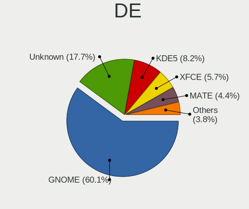
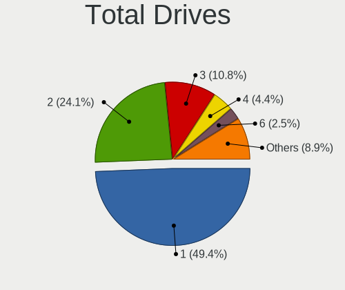
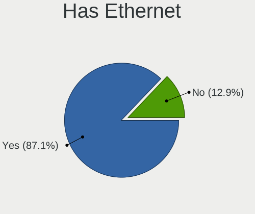
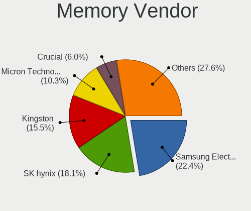
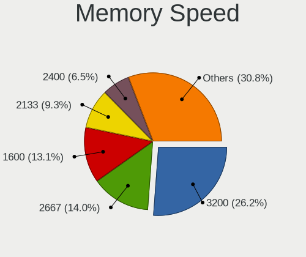

AlmaLinux - Tested Hardware & Statistics
----------------------------------------

A project to collect tested hardware configurations for AlmaLinux.

Anyone can contribute to this report by the [hw-probe](https://github.com/linuxhw/hw-probe) tool:

    sudo -E hw-probe -all -upload

Please contribute! Especially if your hardware is rare.

This is a report for all computer types. See also reports for [desktops](/Dist/AlmaLinux/Desktop/README.md) and [notebooks](/Dist/AlmaLinux/Notebook/README.md).

Contents
--------

* [ Test Cases ](#test-cases)

* [ System ](#system)
  - [ OS                       ](#os)
  - [ OS Family                ](#os-family)
  - [ Kernel                   ](#kernel)
  - [ Kernel Family            ](#kernel-family)
  - [ Kernel Major Ver.        ](#kernel-major-ver)
  - [ Arch                     ](#arch)
  - [ DE                       ](#de)
  - [ Display Server           ](#display-server)
  - [ Display Manager          ](#display-manager)
  - [ OS Lang                  ](#os-lang)
  - [ Boot Mode                ](#boot-mode)
  - [ Filesystem               ](#filesystem)
  - [ Part. scheme             ](#part-scheme)
  - [ Dual Boot with Linux/BSD ](#dual-boot-with-linuxbsd)
  - [ Dual Boot (Win)          ](#dual-boot-win)

* [ Board ](#board)
  - [ Vendor                   ](#vendor)
  - [ Model                    ](#model)
  - [ Model Family             ](#model-family)
  - [ MFG Year                 ](#mfg-year)
  - [ Form Factor              ](#form-factor)
  - [ Secure Boot              ](#secure-boot)
  - [ Coreboot                 ](#coreboot)
  - [ RAM Size                 ](#ram-size)
  - [ RAM Used                 ](#ram-used)
  - [ Total Drives             ](#total-drives)
  - [ Has CD-ROM               ](#has-cd-rom)
  - [ Has Ethernet             ](#has-ethernet)
  - [ Has WiFi                 ](#has-wifi)
  - [ Has Bluetooth            ](#has-bluetooth)

* [ Location ](#location)
  - [ Country                  ](#country)
  - [ City                     ](#city)

* [ Drives ](#drives)
  - [ Drive Vendor             ](#drive-vendor)
  - [ Drive Model              ](#drive-model)
  - [ HDD Vendor               ](#hdd-vendor)
  - [ SSD Vendor               ](#ssd-vendor)
  - [ Drive Kind               ](#drive-kind)
  - [ Drive Connector          ](#drive-connector)
  - [ Drive Size               ](#drive-size)
  - [ Space Total              ](#space-total)
  - [ Space Used               ](#space-used)
  - [ Malfunc. Drives          ](#malfunc-drives)
  - [ Malfunc. Drive Vendor    ](#malfunc-drive-vendor)
  - [ Malfunc. HDD Vendor      ](#malfunc-hdd-vendor)
  - [ Malfunc. Drive Kind      ](#malfunc-drive-kind)
  - [ Failed Drives            ](#failed-drives)
  - [ Failed Drive Vendor      ](#failed-drive-vendor)
  - [ Drive Status             ](#drive-status)

* [ Storage controller ](#storage-controller)
  - [ Storage Vendor           ](#storage-vendor)
  - [ Storage Model            ](#storage-model)
  - [ Storage Kind             ](#storage-kind)

* [ Processor ](#processor)
  - [ CPU Vendor               ](#cpu-vendor)
  - [ CPU Model                ](#cpu-model)
  - [ CPU Model Family         ](#cpu-model-family)
  - [ CPU Cores                ](#cpu-cores)
  - [ CPU Sockets              ](#cpu-sockets)
  - [ CPU Threads              ](#cpu-threads)
  - [ CPU Op-Modes             ](#cpu-op-modes)
  - [ CPU Microcode            ](#cpu-microcode)
  - [ CPU Microarch            ](#cpu-microarch)

* [ Graphics ](#graphics)
  - [ GPU Vendor               ](#gpu-vendor)
  - [ GPU Model                ](#gpu-model)
  - [ GPU Combo                ](#gpu-combo)
  - [ GPU Driver               ](#gpu-driver)
  - [ GPU Memory               ](#gpu-memory)

* [ Monitor ](#monitor)
  - [ Monitor Vendor           ](#monitor-vendor)
  - [ Monitor Model            ](#monitor-model)
  - [ Monitor Resolution       ](#monitor-resolution)
  - [ Monitor Diagonal         ](#monitor-diagonal)
  - [ Monitor Width            ](#monitor-width)
  - [ Aspect Ratio             ](#aspect-ratio)
  - [ Monitor Area             ](#monitor-area)
  - [ Pixel Density            ](#pixel-density)
  - [ Multiple Monitors        ](#multiple-monitors)

* [ Network ](#network)
  - [ Net Controller Vendor    ](#net-controller-vendor)
  - [ Net Controller Model     ](#net-controller-model)
  - [ Wireless Vendor          ](#wireless-vendor)
  - [ Wireless Model           ](#wireless-model)
  - [ Ethernet Vendor          ](#ethernet-vendor)
  - [ Ethernet Model           ](#ethernet-model)
  - [ Net Controller Kind      ](#net-controller-kind)
  - [ Used Controller          ](#used-controller)
  - [ NICs                     ](#nics)
  - [ IPv6                     ](#ipv6)

* [ Bluetooth ](#bluetooth)
  - [ Bluetooth Vendor         ](#bluetooth-vendor)
  - [ Bluetooth Model          ](#bluetooth-model)

* [ Sound ](#sound)
  - [ Sound Vendor             ](#sound-vendor)
  - [ Sound Model              ](#sound-model)

* [ Memory ](#memory)
  - [ Memory Vendor            ](#memory-vendor)
  - [ Memory Model             ](#memory-model)
  - [ Memory Kind              ](#memory-kind)
  - [ Memory Form Factor       ](#memory-form-factor)
  - [ Memory Size              ](#memory-size)
  - [ Memory Speed             ](#memory-speed)

* [ Printers & scanners ](#printers--scanners)
  - [ Printer Vendor           ](#printer-vendor)
  - [ Printer Model            ](#printer-model)
  - [ Scanner Vendor           ](#scanner-vendor)
  - [ Scanner Model            ](#scanner-model)

* [ Camera ](#camera)
  - [ Camera Vendor            ](#camera-vendor)
  - [ Camera Model             ](#camera-model)

* [ Security ](#security)
  - [ Fingerprint Vendor       ](#fingerprint-vendor)
  - [ Fingerprint Model        ](#fingerprint-model)
  - [ Chipcard Vendor          ](#chipcard-vendor)
  - [ Chipcard Model           ](#chipcard-model)

* [ Unsupported ](#unsupported)
  - [ Unsupported Devices      ](#unsupported-devices)
  - [ Unsupported Device Types ](#unsupported-device-types)

Test Cases
----------

Total: 33

| Vendor        | Model                       | Form-Factor | Probe                                                      | Date         |
|---------------|-----------------------------|-------------|------------------------------------------------------------|--------------|
| HP            | ENVY dv6                    | Notebook    | [e7bc07047b](https://linux-hardware.org/?probe=e7bc07047b) | Aug 24, 2022 |
| Gigabyte      | MP32-AR1-00 01010101        | Server      | [e93d3eae0d](https://linux-hardware.org/?probe=e93d3eae0d) | Jul 20, 2022 |
| HP            | Laptop 17-cp0xxx            | Notebook    | [82b34535ae](https://linux-hardware.org/?probe=82b34535ae) | Jul 06, 2022 |
| ASRock        | B460 Phantom Gaming 4       | Desktop     | [0dc125da55](https://linux-hardware.org/?probe=0dc125da55) | Jul 05, 2022 |
| HP            | EliteBook 8470p             | Notebook    | [d6adb170de](https://linux-hardware.org/?probe=d6adb170de) | Jun 25, 2022 |
| Google        | Kohaku                      | Notebook    | [f43841c5e0](https://linux-hardware.org/?probe=f43841c5e0) | Jun 08, 2022 |
| Google        | Kohaku                      | Notebook    | [740a608274](https://linux-hardware.org/?probe=740a608274) | Jun 08, 2022 |
| Lenovo        | ThinkPad T440s 20ARS32P0... | Notebook    | [100b65a86d](https://linux-hardware.org/?probe=100b65a86d) | Jun 04, 2022 |
| Dell          | 060K5C A06                  | Server      | [c8be539d80](https://linux-hardware.org/?probe=c8be539d80) | May 14, 2022 |
| Lenovo        | ThinkBook 13s-IWL 20R9      | Notebook    | [2fecc1fd76](https://linux-hardware.org/?probe=2fecc1fd76) | Apr 20, 2022 |
| Lenovo        | ThinkPad T14 Gen 1 20S1S... | Notebook    | [5ac68bc542](https://linux-hardware.org/?probe=5ac68bc542) | Mar 16, 2022 |
| Gigabyte      | Z590 AORUS PRO AX           | Desktop     | [a517886d4d](https://linux-hardware.org/?probe=a517886d4d) | Feb 10, 2022 |
| Dell          | 0R4CNN A02                  | Server      | [c701d3a15f](https://linux-hardware.org/?probe=c701d3a15f) | Feb 07, 2022 |
| Intel         | powered classmate PC        | Notebook    | [0585f5b715](https://linux-hardware.org/?probe=0585f5b715) | Dec 12, 2021 |
| Intel         | powered classmate PC        | Notebook    | [9416f348e4](https://linux-hardware.org/?probe=9416f348e4) | Dec 12, 2021 |
| Raspberry ... | Raspberry Pi                | Soc         | [c28c41bdd4](https://linux-hardware.org/?probe=c28c41bdd4) | Nov 05, 2021 |
| Dell          | Inspiron 3185               | Notebook    | [53ac57fbea](https://linux-hardware.org/?probe=53ac57fbea) | Oct 26, 2021 |
| Dell          | Inspiron 3185               | Notebook    | [2c9cec7881](https://linux-hardware.org/?probe=2c9cec7881) | Oct 01, 2021 |
| Lenovo        | Yoga 2 13 20344             | Notebook    | [1a59499d3a](https://linux-hardware.org/?probe=1a59499d3a) | Sep 29, 2021 |
| Lenovo        | IdeaPad S145-15IWL 81MV     | Notebook    | [95a2b3a95d](https://linux-hardware.org/?probe=95a2b3a95d) | Aug 27, 2021 |
| Intel         | NUC8BEB J72692-308          | Mini pc     | [972f935578](https://linux-hardware.org/?probe=972f935578) | Aug 23, 2021 |
| HP            | EliteBook 8570w             | Notebook    | [37e72494a5](https://linux-hardware.org/?probe=37e72494a5) | Jul 29, 2021 |
| ASUSTek       | ASUS EXPERTBOOK B9450FA_... | Notebook    | [cdf0f4017c](https://linux-hardware.org/?probe=cdf0f4017c) | Jul 16, 2021 |
| Lenovo        | IdeaPad Slim 1-14AST-05 ... | Notebook    | [9044b57593](https://linux-hardware.org/?probe=9044b57593) | Jul 11, 2021 |
| Lenovo        | Legion 5 15IMH05H 81Y6      | Notebook    | [21a6135eda](https://linux-hardware.org/?probe=21a6135eda) | Jun 16, 2021 |
| ASUSTek       | M5A78L-M/USB3               | Desktop     | [e5a30a171e](https://linux-hardware.org/?probe=e5a30a171e) | Jun 08, 2021 |
| ASUSTek       | M5A78L-M/USB3               | Desktop     | [043878564d](https://linux-hardware.org/?probe=043878564d) | Jun 08, 2021 |
| Dell          | Inspiron 3185               | Notebook    | [84fa76eb2f](https://linux-hardware.org/?probe=84fa76eb2f) | Apr 20, 2021 |
| Dell          | Inspiron 3185               | Notebook    | [d49edb76fa](https://linux-hardware.org/?probe=d49edb76fa) | Apr 15, 2021 |
| Dell          | Inspiron 3185               | Notebook    | [15b8da5bc1](https://linux-hardware.org/?probe=15b8da5bc1) | Apr 14, 2021 |
| Lenovo        | IdeaPad Slim 1-14AST-05 ... | Notebook    | [f0791eb42d](https://linux-hardware.org/?probe=f0791eb42d) | Mar 30, 2021 |
| HP            | 0AE8h C                     | Desktop     | [b7fd559b13](https://linux-hardware.org/?probe=b7fd559b13) | Mar 24, 2021 |
| Lenovo        | IdeaPad 330-15ARR 81D2      | Notebook    | [8810309035](https://linux-hardware.org/?probe=8810309035) | Mar 24, 2021 |

System
------

OS
--

Installed operating systems

| Name          | Computers | Percent |
|---------------|-----------|---------|
| AlmaLinux 8.4 | 9         | 37.5%   |
| AlmaLinux 8.6 | 5         | 20.83%  |
| AlmaLinux 8.3 | 4         | 16.67%  |
| AlmaLinux 9.0 | 3         | 12.5%   |
| AlmaLinux 8.5 | 3         | 12.5%   |

OS Family
---------

OS without a version

| Name      | Computers | Percent |
|-----------|-----------|---------|
| AlmaLinux | 24        | 100%    |

Kernel
------

Version of the Linux kernel

| Version                       | Computers | Percent |
|-------------------------------|-----------|---------|
| 4.18.0-240.15.1.el8_3.x86_64  | 3         | 12.5%   |
| 4.18.0-372.9.1.el8.x86_64     | 2         | 8.33%   |
| 4.18.0-348.12.2.el8_5.x86_64  | 2         | 8.33%   |
| 4.18.0-305.el8.x86_64         | 2         | 8.33%   |
| 4.18.0-305.7.1.el8_4.x86_64   | 2         | 8.33%   |
| 4.18.0-305.12.1.el8_4.x86_64  | 2         | 8.33%   |
| 5.4.175-1.el8.elrepo.x86_64   | 1         | 4.17%   |
| 5.14.0-70.22.1.el9_0.x86_64   | 1         | 4.17%   |
| 5.14.0-70.17.1.el9_0.x86_64   | 1         | 4.17%   |
| 5.14.0-70.13.1.el9_0.x86_64   | 1         | 4.17%   |
| 5.10.60-v8.1.el8              | 1         | 4.17%   |
| 4.18.0-372.16.1.el8_6.aarch64 | 1         | 4.17%   |
| 4.18.0-348.el8.x86_64         | 1         | 4.17%   |
| 4.18.0-348.2.1.el8_5.x86_64   | 1         | 4.17%   |
| 4.18.0-305.3.1.el8_4.x86_64   | 1         | 4.17%   |
| 4.18.0-305.10.2.el8_4.x86_64  | 1         | 4.17%   |
| 4.18.0-240.22.1.el8_3.x86_64  | 1         | 4.17%   |

Kernel Family
-------------

Linux kernel without a distro release

| Version | Computers | Percent |
|---------|-----------|---------|
| 4.18.0  | 19        | 79.17%  |
| 5.14.0  | 3         | 12.5%   |
| 5.4.175 | 1         | 4.17%   |
| 5.10.60 | 1         | 4.17%   |

Kernel Major Ver.
-----------------

Linux kernel major version

| Version | Computers | Percent |
|---------|-----------|---------|
| 4.18    | 19        | 79.17%  |
| 5.14    | 3         | 12.5%   |
| 5.4     | 1         | 4.17%   |
| 5.10    | 1         | 4.17%   |

Arch
----

OS architecture (x86_64, i586, etc.)

| Name    | Computers | Percent |
|---------|-----------|---------|
| x86_64  | 22        | 91.67%  |
| aarch64 | 2         | 8.33%   |

DE
--

Desktop Environment

| Name    | Computers | Percent |
|---------|-----------|---------|
| GNOME   | 18        | 75%     |
| Unknown | 4         | 16.67%  |
| XFCE    | 1         | 4.17%   |
| KDE5    | 1         | 4.17%   |

Display Server
--------------

X11 or Wayland

| Name    | Computers | Percent |
|---------|-----------|---------|
| Wayland | 13        | 54.17%  |
| X11     | 9         | 37.5%   |
| Unknown | 2         | 8.33%   |

Display Manager
---------------

SDDM, LightDM, etc.

| Name    | Computers | Percent |
|---------|-----------|---------|
| Unknown | 15        | 62.5%   |
| GDM     | 9         | 37.5%   |

OS Lang
-------

Language

| Lang    | Computers | Percent |
|---------|-----------|---------|
| en_US   | 14        | 58.33%  |
| fr_FR   | 2         | 8.33%   |
| de_DE   | 2         | 8.33%   |
| uk_UA   | 1         | 4.17%   |
| ru_RU   | 1         | 4.17%   |
| es_VE   | 1         | 4.17%   |
| en_GB   | 1         | 4.17%   |
| C       | 1         | 4.17%   |
| Unknown | 1         | 4.17%   |

Boot Mode
---------

EFI or BIOS

| Mode | Computers | Percent |
|------|-----------|---------|
| EFI  | 15        | 62.5%   |
| BIOS | 9         | 37.5%   |

Filesystem
----------

Type of filesystem

| Type | Computers | Percent |
|------|-----------|---------|
| Xfs  | 20        | 83.33%  |
| Ext4 | 4         | 16.67%  |

Part. scheme
------------

Scheme of partitioning

| Type    | Computers | Percent |
|---------|-----------|---------|
| GPT     | 13        | 54.17%  |
| Unknown | 9         | 37.5%   |
| MBR     | 2         | 8.33%   |

Dual Boot with Linux/BSD
------------------------

Hosting more than one Linux/BSD

| Dual boot | Computers | Percent |
|-----------|-----------|---------|
| No        | 20        | 83.33%  |
| Yes       | 4         | 16.67%  |

Dual Boot (Win)
---------------

Hosting Linux and Windows

| Dual boot | Computers | Percent |
|-----------|-----------|---------|
| No        | 19        | 79.17%  |
| Yes       | 5         | 20.83%  |

Board
-----

Vendor
------

Motherboard manufacturer

| Name                    | Computers | Percent |
|-------------------------|-----------|---------|
| Lenovo                  | 7         | 29.17%  |
| Hewlett-Packard         | 5         | 20.83%  |
| Dell                    | 3         | 12.5%   |
| Intel                   | 2         | 8.33%   |
| Gigabyte Technology     | 2         | 8.33%   |
| ASUSTek Computer        | 2         | 8.33%   |
| Raspberry Pi Foundation | 1         | 4.17%   |
| Google                  | 1         | 4.17%   |
| ASRock                  | 1         | 4.17%   |

Model
-----

Motherboard model

| Name                                 | Computers | Percent |
|--------------------------------------|-----------|---------|
| RPi Raspberry Pi                     | 1         | 4.17%   |
| Lenovo Yoga 2 13 20344               | 1         | 4.17%   |
| Lenovo ThinkPad T440s 20ARS32P00     | 1         | 4.17%   |
| Lenovo ThinkPad T14 Gen 1 20S1S39Q00 | 1         | 4.17%   |
| Lenovo Legion 5 15IMH05H 81Y6        | 1         | 4.17%   |
| Lenovo IdeaPad Slim 1-14AST-05 81VS  | 1         | 4.17%   |
| Lenovo IdeaPad S145-15IWL 81MV       | 1         | 4.17%   |
| Lenovo IdeaPad 330-15ARR 81D2        | 1         | 4.17%   |
| Intel powered classmate PC           | 1         | 4.17%   |
| Intel NUC8i5BEH                      | 1         | 4.17%   |
| HP Z600 Workstation                  | 1         | 4.17%   |
| HP Laptop 17-cp0xxx                  | 1         | 4.17%   |
| HP ENVY dv6                          | 1         | 4.17%   |
| HP EliteBook 8570w                   | 1         | 4.17%   |
| HP EliteBook 8470p                   | 1         | 4.17%   |
| Google Kohaku                        | 1         | 4.17%   |
| Gigabyte Z590 AORUS PRO AX           | 1         | 4.17%   |
| Gigabyte MP32-AR1-00                 | 1         | 4.17%   |
| Dell Precision 7920 Tower            | 1         | 4.17%   |
| Dell PowerEdge R6515                 | 1         | 4.17%   |
| Dell Inspiron 3185                   | 1         | 4.17%   |
| ASUS M5A78L-M/USB3                   | 1         | 4.17%   |
| ASUS ASUS EXPERTBOOK B9450FA_B9450FA | 1         | 4.17%   |
| ASRock B460 Phantom Gaming 4         | 1         | 4.17%   |

Model Family
------------

Motherboard model prefix

| Name                 | Computers | Percent |
|----------------------|-----------|---------|
| Lenovo IdeaPad       | 3         | 12.5%   |
| Lenovo ThinkPad      | 2         | 8.33%   |
| HP EliteBook         | 2         | 8.33%   |
| RPi Raspberry        | 1         | 4.17%   |
| Lenovo Yoga          | 1         | 4.17%   |
| Lenovo Legion        | 1         | 4.17%   |
| Intel powered        | 1         | 4.17%   |
| Intel NUC8i5BEH      | 1         | 4.17%   |
| HP Z600              | 1         | 4.17%   |
| HP Laptop            | 1         | 4.17%   |
| HP ENVY              | 1         | 4.17%   |
| Google Kohaku        | 1         | 4.17%   |
| Gigabyte Z590        | 1         | 4.17%   |
| Gigabyte MP32-AR1-00 | 1         | 4.17%   |
| Dell Precision       | 1         | 4.17%   |
| Dell PowerEdge       | 1         | 4.17%   |
| Dell Inspiron        | 1         | 4.17%   |
| ASUS M5A78L-M        | 1         | 4.17%   |
| ASUS ASUS            | 1         | 4.17%   |
| ASRock B460          | 1         | 4.17%   |

MFG Year
--------

Motherboard manufacture year

| Year    | Computers | Percent |
|---------|-----------|---------|
| 2020    | 4         | 16.67%  |
| 2019    | 4         | 16.67%  |
| 2021    | 3         | 12.5%   |
| 2011    | 3         | 12.5%   |
| 2022    | 2         | 8.33%   |
| 2018    | 2         | 8.33%   |
| 2012    | 2         | 8.33%   |
| 2014    | 1         | 4.17%   |
| 2013    | 1         | 4.17%   |
| 2009    | 1         | 4.17%   |
| Unknown | 1         | 4.17%   |

Form Factor
-----------

Physical design of the computer

| Name           | Computers | Percent |
|----------------|-----------|---------|
| Notebook       | 15        | 62.5%   |
| Desktop        | 4         | 16.67%  |
| Server         | 3         | 12.5%   |
| System on chip | 1         | 4.17%   |
| Mini pc        | 1         | 4.17%   |

Secure Boot
-----------

Enabled or disabled

| State    | Computers | Percent |
|----------|-----------|---------|
| Disabled | 20        | 83.33%  |
| Enabled  | 4         | 16.67%  |

Coreboot
--------

Have coreboot on board

| Used | Computers | Percent |
|------|-----------|---------|
| No   | 23        | 95.83%  |
| Yes  | 1         | 4.17%   |

RAM Size
--------

Total RAM memory

| Size in GB      | Computers | Percent |
|-----------------|-----------|---------|
| 4.01-8.0        | 8         | 33.33%  |
| 16.01-24.0      | 4         | 16.67%  |
| 8.01-16.0       | 4         | 16.67%  |
| More than 256.0 | 2         | 8.33%   |
| 3.01-4.0        | 2         | 8.33%   |
| 24.01-32.0      | 1         | 4.17%   |
| 64.01-256.0     | 1         | 4.17%   |
| 1.01-2.0        | 1         | 4.17%   |
| 0.51-1.0        | 1         | 4.17%   |

RAM Used
--------

Used RAM memory

| Used GB    | Computers | Percent |
|------------|-----------|---------|
| 2.01-3.0   | 7         | 28%     |
| 1.01-2.0   | 7         | 28%     |
| 4.01-8.0   | 4         | 16%     |
| 3.01-4.0   | 3         | 12%     |
| 24.01-32.0 | 1         | 4%      |
| 16.01-24.0 | 1         | 4%      |
| 8.01-16.0  | 1         | 4%      |
| 0.01-0.5   | 1         | 4%      |

Total Drives
------------

Number of drives on board

| Drives | Computers | Percent |
|--------|-----------|---------|
| 1      | 10        | 41.67%  |
| 2      | 9         | 37.5%   |
| 4      | 2         | 8.33%   |
| 6      | 1         | 4.17%   |
| 3      | 1         | 4.17%   |
| 0      | 1         | 4.17%   |

Has CD-ROM
----------

Has CD-ROM on board

| Presented | Computers | Percent |
|-----------|-----------|---------|
| No        | 21        | 87.5%   |
| Yes       | 3         | 12.5%   |

Has Ethernet
------------

Has Ethernet on board

| Presented | Computers | Percent |
|-----------|-----------|---------|
| Yes       | 20        | 83.33%  |
| No        | 4         | 16.67%  |

Has WiFi
--------

Has WiFi module

| Presented | Computers | Percent |
|-----------|-----------|---------|
| Yes       | 17        | 70.83%  |
| No        | 7         | 29.17%  |

Has Bluetooth
-------------

Has Bluetooth module

| Presented | Computers | Percent |
|-----------|-----------|---------|
| Yes       | 16        | 66.67%  |
| No        | 8         | 33.33%  |

Location
--------

Country
-------

Geographic location (country)

| Country   | Computers | Percent |
|-----------|-----------|---------|
| USA       | 7         | 29.17%  |
| Germany   | 4         | 16.67%  |
| France    | 3         | 12.5%   |
| Russia    | 2         | 8.33%   |
| Venezuela | 1         | 4.17%   |
| Ukraine   | 1         | 4.17%   |
| UK        | 1         | 4.17%   |
| Sweden    | 1         | 4.17%   |
| Spain     | 1         | 4.17%   |
| Pakistan  | 1         | 4.17%   |
| India     | 1         | 4.17%   |
| Finland   | 1         | 4.17%   |

City
----

Geographic location (city)

| City         | Computers | Percent |
|--------------|-----------|---------|
| Queens       | 2         | 8.33%   |
| Zaporizhzhia | 1         | 4.17%   |
| Uppsala      | 1         | 4.17%   |
| Tuusula      | 1         | 4.17%   |
| Shimanovsk   | 1         | 4.17%   |
| San Diego    | 1         | 4.17%   |
| Paris        | 1         | 4.17%   |
| Moscow       | 1         | 4.17%   |
| Mangalore    | 1         | 4.17%   |
| Liverpool    | 1         | 4.17%   |
| Lille        | 1         | 4.17%   |
| Lawrence     | 1         | 4.17%   |
| Lahore       | 1         | 4.17%   |
| Kennewick    | 1         | 4.17%   |
| Guglingen    | 1         | 4.17%   |
| Guanare      | 1         | 4.17%   |
| Frankenthal  | 1         | 4.17%   |
| Essen        | 1         | 4.17%   |
| Castelginest | 1         | 4.17%   |
| Bloomington  | 1         | 4.17%   |
| Berlin       | 1         | 4.17%   |
| Barcelona    | 1         | 4.17%   |
| Austin       | 1         | 4.17%   |

Drives
------

Drive Vendor
------------

Hard drive vendors

| Vendor              | Computers | Drives | Percent |
|---------------------|-----------|--------|---------|
| WDC                 | 5         | 5      | 14.29%  |
| Seagate             | 5         | 11     | 14.29%  |
| Samsung Electronics | 5         | 6      | 14.29%  |
| Kingston            | 2         | 2      | 5.71%   |
| Intel               | 2         | 2      | 5.71%   |
| Dell                | 2         | 3      | 5.71%   |
| Unknown             | 1         | 1      | 2.86%   |
| Union Memory        | 1         | 1      | 2.86%   |
| Toshiba             | 1         | 1      | 2.86%   |
| SSSTC               | 1         | 1      | 2.86%   |
| SK hynix            | 1         | 1      | 2.86%   |
| Netac               | 1         | 1      | 2.86%   |
| Micron Technology   | 1         | 1      | 2.86%   |
| LITEONIT            | 1         | 1      | 2.86%   |
| EMTEC               | 1         | 2      | 2.86%   |
| DELLBOSS            | 1         | 1      | 2.86%   |
| Crucial             | 1         | 2      | 2.86%   |
| China               | 1         | 1      | 2.86%   |
| ASMT                | 1         | 2      | 2.86%   |
| A-DATA Technology   | 1         | 1      | 2.86%   |

Drive Model
-----------

Hard drive models

| Model                                   | Computers | Percent |
|-----------------------------------------|-----------|---------|
| WDC WD10SPZX-24Z10 1TB                  | 2         | 5.26%   |
| WDC WD10SPZX-60Z10T1 1TB                | 1         | 2.63%   |
| WDC WD10EZEX-08WN4A0 1TB                | 1         | 2.63%   |
| WDC PC SN730 SDBQNTY-256G-1001 256GB    | 1         | 2.63%   |
| Unknown EC2QT  64GB                     | 1         | 2.63%   |
| Union Memory UMIS RPITJ512VME2OWD 512GB | 1         | 2.63%   |
| Toshiba MK6475GSX 640GB                 | 1         | 2.63%   |
| SSSTC CL1-3D256 256GB                   | 1         | 2.63%   |
| SK hynix SH920 2.5 7MM 256GB SSD        | 1         | 2.63%   |
| Seagate ST4000NC001-1FS168 4TB          | 1         | 2.63%   |
| Seagate ST4000DM000-1F2168 4TB          | 1         | 2.63%   |
| Seagate ST250LM004 HN-M250MBB 250GB     | 1         | 2.63%   |
| Seagate ST2000NM012A-2MP130 2TB         | 1         | 2.63%   |
| Seagate ST2000LM015-2E8174 2TB          | 1         | 2.63%   |
| Seagate ST2000DM001-1ER164 2TB          | 1         | 2.63%   |
| Seagate ST1000NM0033-9ZM173 1TB         | 1         | 2.63%   |
| Seagate ST10000NM0478-2H7100 10TB       | 1         | 2.63%   |
| Samsung SSD PM810 FDE 2.5 256GB         | 1         | 2.63%   |
| Samsung SSD 970 EVO Plus 250GB          | 1         | 2.63%   |
| Samsung MZVLQ512HALU-00000 512GB        | 1         | 2.63%   |
| Samsung MZVLQ128HBHQ-000H1 128GB        | 1         | 2.63%   |
| Samsung MZQL23T8HCLS-00A07 3.8TB        | 1         | 2.63%   |
| Netac SSD 512GB                         | 1         | 2.63%   |
| Micron MTFDDAK256MAM-1K12 256GB SSD     | 1         | 2.63%   |
| LITEONIT LGT-128M6G 128GB SSD           | 1         | 2.63%   |
| Kingston SV300S37A240G 240GB SSD        | 1         | 2.63%   |
| Kingston SA400S37240G 240GB SSD         | 1         | 2.63%   |
| Intel SSDSC2KF128G8L 128GB              | 1         | 2.63%   |
| Intel SSDSC2KB019T8R 1.9TB              | 1         | 2.63%   |
| EMTEC X200 256GB                        | 1         | 2.63%   |
| DELLBOSS VD 240GB                       | 1         | 2.63%   |
| Dell WR202KD032G E70290F5 32GB SSD      | 1         | 2.63%   |
| Dell Express Flash NVMe P4610 1.6TB SFF | 1         | 2.63%   |
| Crucial CT1000P5PSSD8 1TB               | 1         | 2.63%   |
| China SATA SSD 120GB                    | 1         | 2.63%   |
| ASMT 2105 6TB                           | 1         | 2.63%   |
| A-DATA AXNS381E-256GM-B 256GB SSD       | 1         | 2.63%   |

HDD Vendor
----------

Hard disk drive vendors

| Vendor   | Computers | Drives | Percent |
|----------|-----------|--------|---------|
| Seagate  | 5         | 11     | 41.67%  |
| WDC      | 4         | 4      | 33.33%  |
| Toshiba  | 1         | 1      | 8.33%   |
| DELLBOSS | 1         | 1      | 8.33%   |
| ASMT     | 1         | 2      | 8.33%   |

SSD Vendor
----------

Solid state drive vendors

| Vendor              | Computers | Drives | Percent |
|---------------------|-----------|--------|---------|
| Kingston            | 2         | 2      | 16.67%  |
| Intel               | 2         | 2      | 16.67%  |
| SK hynix            | 1         | 1      | 8.33%   |
| Samsung Electronics | 1         | 1      | 8.33%   |
| Netac               | 1         | 1      | 8.33%   |
| Micron Technology   | 1         | 1      | 8.33%   |
| LITEONIT            | 1         | 1      | 8.33%   |
| Dell                | 1         | 2      | 8.33%   |
| China               | 1         | 1      | 8.33%   |
| A-DATA Technology   | 1         | 1      | 8.33%   |

Drive Kind
----------

HDD or SSD

| Kind    | Computers | Drives | Percent |
|---------|-----------|--------|---------|
| HDD     | 12        | 19     | 35.29%  |
| SSD     | 11        | 13     | 32.35%  |
| NVMe    | 9         | 11     | 26.47%  |
| MMC     | 1         | 1      | 2.94%   |
| Unknown | 1         | 2      | 2.94%   |

Drive Connector
---------------

SATA, SAS, NVMe, etc.

| Type | Computers | Drives | Percent |
|------|-----------|--------|---------|
| SATA | 18        | 30     | 62.07%  |
| NVMe | 9         | 11     | 31.03%  |
| SAS  | 1         | 4      | 3.45%   |
| MMC  | 1         | 1      | 3.45%   |

Drive Size
----------

Size of hard drive

| Size in TB | Computers | Drives | Percent |
|------------|-----------|--------|---------|
| 0.01-0.5   | 12        | 13     | 46.15%  |
| 0.51-1.0   | 7         | 7      | 26.92%  |
| 1.01-2.0   | 3         | 7      | 11.54%  |
| 3.01-4.0   | 2         | 2      | 7.69%   |
| 4.01-10.0  | 2         | 3      | 7.69%   |

Space Total
-----------

Amount of disk space available on the file system

| Size in GB     | Computers | Percent |
|----------------|-----------|---------|
| 101-250        | 7         | 29.17%  |
| More than 3000 | 4         | 16.67%  |
| 251-500        | 3         | 12.5%   |
| 501-1000       | 3         | 12.5%   |
| 1001-2000      | 2         | 8.33%   |
| 1-20           | 2         | 8.33%   |
| 21-50          | 1         | 4.17%   |
| 51-100         | 1         | 4.17%   |
| Unknown        | 1         | 4.17%   |

Space Used
----------

Amount of used disk space

| Used GB        | Computers | Percent |
|----------------|-----------|---------|
| 1-20           | 10        | 40%     |
| 21-50          | 5         | 20%     |
| 251-500        | 3         | 12%     |
| 51-100         | 3         | 12%     |
| More than 3000 | 1         | 4%      |
| 101-250        | 1         | 4%      |
| 501-1000       | 1         | 4%      |
| Unknown        | 1         | 4%      |

Malfunc. Drives
---------------

Drive models with a malfunction

| Model                            | Computers | Drives | Percent |
|----------------------------------|-----------|--------|---------|
| SK hynix SH920 2.5 7MM 256GB SSD | 1         | 1      | 100%    |

Malfunc. Drive Vendor
---------------------

Vendors of faulty drives

| Vendor   | Computers | Drives | Percent |
|----------|-----------|--------|---------|
| SK hynix | 1         | 1      | 100%    |

Malfunc. HDD Vendor
-------------------

Vendors of faulty HDD drives

Zero info for selected period =(

Malfunc. Drive Kind
-------------------

Kinds of faulty drives

| Kind | Computers | Drives | Percent |
|------|-----------|--------|---------|
| SSD  | 1         | 1      | 100%    |

Failed Drives
-------------

Failed drive models

Zero info for selected period =(

Failed Drive Vendor
-------------------

Failed drive vendors

Zero info for selected period =(

Drive Status
------------

Number of failed and malfunc. drives

| Status   | Computers | Drives | Percent |
|----------|-----------|--------|---------|
| Works    | 13        | 24     | 52%     |
| Detected | 11        | 21     | 44%     |
| Malfunc  | 1         | 1      | 4%      |

Storage controller
------------------

Storage Vendor
--------------

Storage controller vendors

| Vendor                         | Computers | Percent |
|--------------------------------|-----------|---------|
| Intel                          | 15        | 46.88%  |
| AMD                            | 6         | 18.75%  |
| Samsung Electronics            | 4         | 12.5%   |
| Union Memory (Shenzhen)        | 2         | 6.25%   |
| Solid State Storage Technology | 1         | 3.13%   |
| SanDisk                        | 1         | 3.13%   |
| Micron/Crucial Technology      | 1         | 3.13%   |
| Marvell Technology Group       | 1         | 3.13%   |
| Broadcom / LSI                 | 1         | 3.13%   |

Storage Model
-------------

Storage controller models

| Model                                                                 | Computers | Percent |
|-----------------------------------------------------------------------|-----------|---------|
| AMD FCH SATA Controller [AHCI mode]                                   | 5         | 14.29%  |
| Union Memory (Shenzhen) Non-Volatile memory controller                | 2         | 5.71%   |
| Samsung NVMe SSD Controller 980                                       | 2         | 5.71%   |
| Intel Cannon Point-LP SATA Controller [AHCI Mode]                     | 2         | 5.71%   |
| Intel 8 Series SATA Controller 1 [AHCI mode]                          | 2         | 5.71%   |
| Intel 7 Series Chipset Family 6-port SATA Controller [AHCI mode]      | 2         | 5.71%   |
| Intel 400 Series Chipset Family SATA AHCI Controller                  | 2         | 5.71%   |
| Solid State Storage Non-Volatile memory controller                    | 1         | 2.86%   |
| SanDisk WD Black SN750 / PC SN730 NVMe SSD                            | 1         | 2.86%   |
| Samsung NVMe SSD Controller SM981/PM981/PM983                         | 1         | 2.86%   |
| Samsung NVMe SSD Controller PM9A1/PM9A3/980PRO                        | 1         | 2.86%   |
| Micron/Crucial Non-Volatile memory controller                         | 1         | 2.86%   |
| Marvell Group 88SE9230 PCIe 2.0 x2 4-port SATA 6 Gb/s RAID Controller | 1         | 2.86%   |
| Intel SATA Controller [RAID mode]                                     | 1         | 2.86%   |
| Intel NVMe Datacenter SSD [3DNAND, Beta Rock Controller]              | 1         | 2.86%   |
| Intel NM10/ICH7 Family SATA Controller [AHCI mode]                    | 1         | 2.86%   |
| Intel Comet Lake SATA AHCI Controller                                 | 1         | 2.86%   |
| Intel C620 Series Chipset Family SSATA Controller [AHCI mode]         | 1         | 2.86%   |
| Intel C620 Series Chipset Family IDE Redirection                      | 1         | 2.86%   |
| Intel C600/X79 series chipset SATA RAID Controller                    | 1         | 2.86%   |
| Intel 82801 Mobile SATA Controller [RAID mode]                        | 1         | 2.86%   |
| Intel 500 Series Chipset Family SATA AHCI Controller                  | 1         | 2.86%   |
| Broadcom / LSI MegaRAID Tri-Mode SAS3408                              | 1         | 2.86%   |
| AMD SB7x0/SB8x0/SB9x0 SATA Controller [IDE mode]                      | 1         | 2.86%   |
| AMD SB7x0/SB8x0/SB9x0 IDE Controller                                  | 1         | 2.86%   |

Storage Kind
------------

Kind of storage controller (IDE, SATA, NVMe, SAS, ...)

| Kind | Computers | Percent |
|------|-----------|---------|
| SATA | 18        | 54.55%  |
| NVMe | 10        | 30.3%   |
| RAID | 3         | 9.09%   |
| IDE  | 2         | 6.06%   |

Processor
---------

CPU Vendor
----------

Processor vendors

| Vendor | Computers | Percent |
|--------|-----------|---------|
| Intel  | 16        | 66.67%  |
| AMD    | 6         | 25%     |
| ARM    | 2         | 8.33%   |

CPU Model
---------

Processor models

| Model                                         | Computers | Percent |
|-----------------------------------------------|-----------|---------|
| Intel Core i5-10210U CPU @ 1.60GHz            | 3         | 12.5%   |
| ARM Processor                                 | 2         | 8.33%   |
| Intel Xeon Gold 5220R CPU @ 2.20GHz           | 1         | 4.17%   |
| Intel Xeon CPU X5550 @ 2.67GHz                | 1         | 4.17%   |
| Intel Core i7-3840QM CPU @ 2.80GHz            | 1         | 4.17%   |
| Intel Core i7-3630QM CPU @ 2.40GHz            | 1         | 4.17%   |
| Intel Core i7-10750H CPU @ 2.60GHz            | 1         | 4.17%   |
| Intel Core i5-8259U CPU @ 2.30GHz             | 1         | 4.17%   |
| Intel Core i5-4300U CPU @ 1.90GHz             | 1         | 4.17%   |
| Intel Core i5-3360M CPU @ 2.80GHz             | 1         | 4.17%   |
| Intel Core i5-10400F CPU @ 2.90GHz            | 1         | 4.17%   |
| Intel Core i3-8145U CPU @ 2.10GHz             | 1         | 4.17%   |
| Intel Core i3-4010U CPU @ 1.70GHz             | 1         | 4.17%   |
| Intel Atom CPU N455 @ 1.66GHz                 | 1         | 4.17%   |
| Intel 11th Gen Core i5-11400 @ 2.60GHz        | 1         | 4.17%   |
| AMD Ryzen 7 5700U with Radeon Graphics        | 1         | 4.17%   |
| AMD Ryzen 5 2500U with Radeon Vega Mobile Gfx | 1         | 4.17%   |
| AMD FX-8350 Eight-Core Processor              | 1         | 4.17%   |
| AMD EPYC 7402P 24-Core Processor              | 1         | 4.17%   |
| AMD A9-9420e RADEON R5, 5 COMPUTE CORES 2C+3G | 1         | 4.17%   |
| AMD A6-9220e RADEON R4, 5 COMPUTE CORES 2C+3G | 1         | 4.17%   |

CPU Model Family
----------------

Processor model prefix

| Model           | Computers | Percent |
|-----------------|-----------|---------|
| Intel Core i5   | 7         | 29.17%  |
| Other           | 4         | 16.67%  |
| Intel Core i7   | 3         | 12.5%   |
| Intel Core i3   | 2         | 8.33%   |
| Intel Xeon Gold | 1         | 4.17%   |
| Intel Xeon      | 1         | 4.17%   |
| Intel Atom      | 1         | 4.17%   |
| AMD Ryzen 7     | 1         | 4.17%   |
| AMD Ryzen 5     | 1         | 4.17%   |
| AMD FX          | 1         | 4.17%   |
| AMD EPYC        | 1         | 4.17%   |
| AMD A6          | 1         | 4.17%   |

CPU Cores
---------

Number of processor cores

| Number  | Computers | Percent |
|---------|-----------|---------|
| 4       | 9         | 37.5%   |
| 2       | 6         | 25%     |
| 6       | 3         | 12.5%   |
| 80      | 1         | 4.17%   |
| 48      | 1         | 4.17%   |
| 24      | 1         | 4.17%   |
| 8       | 1         | 4.17%   |
| 1       | 1         | 4.17%   |
| Unknown | 1         | 4.17%   |

CPU Sockets
-----------

Number of sockets

| Number  | Computers | Percent |
|---------|-----------|---------|
| 1       | 22        | 91.67%  |
| 2       | 1         | 4.17%   |
| Unknown | 1         | 4.17%   |

CPU Threads
-----------

Threads per core (Hyper-Threading)

| Number  | Computers | Percent |
|---------|-----------|---------|
| 2       | 20        | 83.33%  |
| 1       | 3         | 12.5%   |
| Unknown | 1         | 4.17%   |

CPU Op-Modes
------------

CPU Operation Modes (32-bit, 64-bit)

| Op mode        | Computers | Percent |
|----------------|-----------|---------|
| 32-bit, 64-bit | 22        | 91.67%  |
| Unknown        | 2         | 8.33%   |

CPU Microcode
-------------

Microcode number

| Number     | Computers | Percent |
|------------|-----------|---------|
| 0x806ec    | 4         | 16.67%  |
| Unknown    | 4         | 16.67%  |
| 0x306a9    | 3         | 12.5%   |
| 0x40651    | 2         | 8.33%   |
| 0xa0671    | 1         | 4.17%   |
| 0xa0655    | 1         | 4.17%   |
| 0xa0652    | 1         | 4.17%   |
| 0x50657    | 1         | 4.17%   |
| 0x106ca    | 1         | 4.17%   |
| 0x106a5    | 1         | 4.17%   |
| 0x08608103 | 1         | 4.17%   |
| 0x0810100b | 1         | 4.17%   |
| 0x06006705 | 1         | 4.17%   |
| 0x06006704 | 1         | 4.17%   |
| 0x06000852 | 1         | 4.17%   |

CPU Microarch
-------------

Microarchitecture

| Name       | Computers | Percent |
|------------|-----------|---------|
| KabyLake   | 5         | 20.83%  |
| IvyBridge  | 3         | 12.5%   |
| Unknown    | 3         | 12.5%   |
| Haswell    | 2         | 8.33%   |
| Excavator  | 2         | 8.33%   |
| CometLake  | 2         | 8.33%   |
| Zen 2      | 1         | 4.17%   |
| Zen        | 1         | 4.17%   |
| Skylake    | 1         | 4.17%   |
| Piledriver | 1         | 4.17%   |
| Nehalem    | 1         | 4.17%   |
| Icelake    | 1         | 4.17%   |
| Bonnell    | 1         | 4.17%   |

Graphics
--------

GPU Vendor
----------

Vendors of graphics cards

| Vendor                     | Computers | Percent |
|----------------------------|-----------|---------|
| Intel                      | 12        | 50%     |
| AMD                        | 7         | 29.17%  |
| Nvidia                     | 3         | 12.5%   |
| Matrox Electronics Systems | 1         | 4.17%   |
| ASPEED Technology          | 1         | 4.17%   |

GPU Model
---------

Graphics card models

| Model                                                                    | Computers | Percent |
|--------------------------------------------------------------------------|-----------|---------|
| Intel CometLake-U GT2 [UHD Graphics]                                     | 3         | 12.5%   |
| Intel Haswell-ULT Integrated Graphics Controller                         | 2         | 8.33%   |
| Intel 3rd Gen Core processor Graphics Controller                         | 2         | 8.33%   |
| AMD Stoney [Radeon R2/R3/R4/R5 Graphics]                                 | 2         | 8.33%   |
| Nvidia TU116M [GeForce GTX 1660 Ti Mobile]                               | 1         | 4.17%   |
| Nvidia GK107GLM [Quadro K1000M]                                          | 1         | 4.17%   |
| Nvidia GA102GL [RTX A6000]                                               | 1         | 4.17%   |
| Matrox Electronics Systems Integrated Matrox G200eW3 Graphics Controller | 1         | 4.17%   |
| Intel WhiskeyLake-U GT2 [UHD Graphics 620]                               | 1         | 4.17%   |
| Intel RocketLake-S GT1 [UHD Graphics 730]                                | 1         | 4.17%   |
| Intel CometLake-H GT2 [UHD Graphics]                                     | 1         | 4.17%   |
| Intel CoffeeLake-U GT3e [Iris Plus Graphics 655]                         | 1         | 4.17%   |
| Intel Atom Processor D4xx/D5xx/N4xx/N5xx Integrated Graphics Controller  | 1         | 4.17%   |
| ASPEED Technology ASPEED Graphics Family                                 | 1         | 4.17%   |
| AMD RS780L [Radeon 3000]                                                 | 1         | 4.17%   |
| AMD Raven Ridge [Radeon Vega Series / Radeon Vega Mobile Series]         | 1         | 4.17%   |
| AMD Lucienne                                                             | 1         | 4.17%   |
| AMD Ellesmere [Radeon RX 470/480/570/570X/580/580X/590]                  | 1         | 4.17%   |
| AMD Baffin [Radeon RX 460/560D / Pro 450/455/460/555/555X/560/560X]      | 1         | 4.17%   |

GPU Combo
---------

Combinations of graphics cards

| Name           | Computers | Percent |
|----------------|-----------|---------|
| 1 x Intel      | 11        | 45.83%  |
| 1 x AMD        | 7         | 29.17%  |
| 1 x Nvidia     | 2         | 8.33%   |
| Other          | 1         | 4.17%   |
| 1 x Matrox     | 1         | 4.17%   |
| Intel + Nvidia | 1         | 4.17%   |
| 1 x ASPEED     | 1         | 4.17%   |

GPU Driver
----------

Free vs proprietary

| Driver      | Computers | Percent |
|-------------|-----------|---------|
| Free        | 20        | 83.33%  |
| Unknown     | 3         | 12.5%   |
| Proprietary | 1         | 4.17%   |

GPU Memory
----------

Total video memory

| Size in GB | Computers | Percent |
|------------|-----------|---------|
| Unknown    | 14        | 58.33%  |
| 0.01-0.5   | 5         | 20.83%  |
| 1.01-2.0   | 2         | 8.33%   |
| 7.01-8.0   | 1         | 4.17%   |
| 32.01-64.0 | 1         | 4.17%   |
| 5.01-6.0   | 1         | 4.17%   |

Monitor
-------

Monitor Vendor
--------------

Monitor vendors

| Vendor              | Computers | Percent |
|---------------------|-----------|---------|
| AU Optronics        | 6         | 26.09%  |
| LG Display          | 4         | 17.39%  |
| Samsung Electronics | 3         | 13.04%  |
| BOE                 | 2         | 8.7%    |
| STD                 | 1         | 4.35%   |
| Sharp               | 1         | 4.35%   |
| Seiki               | 1         | 4.35%   |
| Philips             | 1         | 4.35%   |
| Lenovo              | 1         | 4.35%   |
| InfoVision          | 1         | 4.35%   |
| Goldstar            | 1         | 4.35%   |
| Dell                | 1         | 4.35%   |

Monitor Model
-------------

Monitor models

| Model                                                                 | Computers | Percent |
|-----------------------------------------------------------------------|-----------|---------|
| STD HDMI TV STD00C7 1920x1080 698x392mm 31.5-inch                     | 1         | 4.17%   |
| Sharp LC-32LB480U SHP3263 1920x1080 698x392mm 31.5-inch               | 1         | 4.17%   |
| Seiki SC32HT04 SEK1366 1366x768 700x390mm 31.5-inch                   | 1         | 4.17%   |
| Samsung Electronics SyncMaster SAM021B 1400x1050 408x300mm 19.9-inch  | 1         | 4.17%   |
| Samsung Electronics S27H65x SAM0E1D 1920x1080 598x336mm 27.0-inch     | 1         | 4.17%   |
| Samsung Electronics LCD Monitor SEC3030 1024x600 223x125mm 10.1-inch  | 1         | 4.17%   |
| Samsung Electronics LCD Monitor SDC4142 3840x2160 294x165mm 13.3-inch | 1         | 4.17%   |
| Philips 19B PHL0879 1280x1024 376x301mm 19.0-inch                     | 1         | 4.17%   |
| LG Display LCD Monitor LGD046D 1920x1080 309x174mm 14.0-inch          | 1         | 4.17%   |
| LG Display LCD Monitor LGD042D 1920x1080 290x170mm 13.2-inch          | 1         | 4.17%   |
| LG Display LCD Monitor LGD034A 1366x768 345x194mm 15.6-inch           | 1         | 4.17%   |
| LG Display LCD Monitor LGD0335 1366x768 310x174mm 14.0-inch           | 1         | 4.17%   |
| Lenovo L24q-10 LEN65CF 2560x1440 527x296mm 23.8-inch                  | 1         | 4.17%   |
| InfoVision LCD Monitor IVO057D 1920x1080 309x174mm 14.0-inch          | 1         | 4.17%   |
| Goldstar ULTRAWIDE GSM59F1 2560x1080 673x284mm 28.8-inch              | 1         | 4.17%   |
| Dell U2410 DELF015 1920x1200 518x324mm 24.1-inch                      | 1         | 4.17%   |
| BOE LCD Monitor BOE0812 1920x1080 344x194mm 15.5-inch                 | 1         | 4.17%   |
| BOE LCD Monitor BOE07A3 1920x1080 344x193mm 15.5-inch                 | 1         | 4.17%   |
| AU Optronics LCD Monitor AUOF992 1920x1080 382x215mm 17.3-inch        | 1         | 4.17%   |
| AU Optronics LCD Monitor AUOD1ED 1920x1080 344x193mm 15.5-inch        | 1         | 4.17%   |
| AU Optronics LCD Monitor AUO623D 1920x1080 309x174mm 14.0-inch        | 1         | 4.17%   |
| AU Optronics LCD Monitor AUO203D 1920x1080 309x174mm 14.0-inch        | 1         | 4.17%   |
| AU Optronics LCD Monitor AUO13ED 1920x1080 344x193mm 15.5-inch        | 1         | 4.17%   |
| AU Optronics LCD Monitor AUO105C 1366x768 256x144mm 11.6-inch         | 1         | 4.17%   |

Monitor Resolution
------------------

Monitor screen resolution

| Resolution        | Computers | Percent |
|-------------------|-----------|---------|
| 1920x1080 (FHD)   | 14        | 58.33%  |
| 1366x768 (WXGA)   | 4         | 16.67%  |
| 3840x2160 (4K)    | 1         | 4.17%   |
| 2560x1440 (QHD)   | 1         | 4.17%   |
| 2560x1080         | 1         | 4.17%   |
| 1920x1200 (WUXGA) | 1         | 4.17%   |
| 1400x1050         | 1         | 4.17%   |
| 1280x1024 (SXGA)  | 1         | 4.17%   |

Monitor Diagonal
----------------

Diagonal size in inches

| Inches | Computers | Percent |
|--------|-----------|---------|
| 15     | 6         | 25%     |
| 14     | 5         | 20.83%  |
| 31     | 3         | 12.5%   |
| 24     | 2         | 8.33%   |
| 13     | 2         | 8.33%   |
| 34     | 1         | 4.17%   |
| 27     | 1         | 4.17%   |
| 20     | 1         | 4.17%   |
| 19     | 1         | 4.17%   |
| 17     | 1         | 4.17%   |
| 11     | 1         | 4.17%   |

Monitor Width
-------------

Physical width

| Width in mm | Computers | Percent |
|-------------|-----------|---------|
| 301-350     | 11        | 45.83%  |
| 601-700     | 3         | 12.5%   |
| 501-600     | 3         | 12.5%   |
| 201-300     | 3         | 12.5%   |
| 351-400     | 2         | 8.33%   |
| 701-800     | 1         | 4.17%   |
| 401-500     | 1         | 4.17%   |

Aspect Ratio
------------

Proportional relationship between the width and the height

| Ratio | Computers | Percent |
|-------|-----------|---------|
| 16/9  | 18        | 81.82%  |
| 5/4   | 1         | 4.55%   |
| 4/3   | 1         | 4.55%   |
| 21/9  | 1         | 4.55%   |
| 16/10 | 1         | 4.55%   |

Monitor Area
------------

Area in inch

| Area in inch | Computers | Percent |
|----------------|-----------|---------|
| 101-110        | 6         | 25%     |
| 81-90          | 5         | 20.83%  |
| 351-500        | 4         | 16.67%  |
| 71-80          | 2         | 8.33%   |
| 151-200        | 2         | 8.33%   |
| 51-60          | 1         | 4.17%   |
| 301-350        | 1         | 4.17%   |
| 251-300        | 1         | 4.17%   |
| 201-250        | 1         | 4.17%   |
| 121-130        | 1         | 4.17%   |

Pixel Density
-------------

Pixels per inch

| Density       | Computers | Percent |
|---------------|-----------|---------|
| 121-160       | 11        | 47.83%  |
| 51-100        | 6         | 26.09%  |
| 101-120       | 3         | 13.04%  |
| More than 240 | 1         | 4.35%   |
| 1-50          | 1         | 4.35%   |
| 161-240       | 1         | 4.35%   |

Multiple Monitors
-----------------

Total monitors connected

| Total | Computers | Percent |
|-------|-----------|---------|
| 1     | 17        | 70.83%  |
| 2     | 4         | 16.67%  |
| 0     | 3         | 12.5%   |

Network
-------

Net Controller Vendor
---------------------

Controller vendors

| Vendor                | Computers | Percent |
|-----------------------|-----------|---------|
| Intel                 | 14        | 45.16%  |
| Realtek Semiconductor | 6         | 19.35%  |
| Qualcomm Atheros      | 3         | 9.68%   |
| Broadcom              | 2         | 6.45%   |
| Standard Microsystems | 1         | 3.23%   |
| Sierra Wireless       | 1         | 3.23%   |
| Samsung Electronics   | 1         | 3.23%   |
| Mellanox Technologies | 1         | 3.23%   |
| MediaTek              | 1         | 3.23%   |
| Broadcom Limited      | 1         | 3.23%   |

Net Controller Model
--------------------

Controller models

| Model                                                                 | Computers | Percent |
|-----------------------------------------------------------------------|-----------|---------|
| Realtek RTL8111/8168/8411 PCI Express Gigabit Ethernet Controller     | 4         | 9.09%   |
| Intel Comet Lake PCH-LP CNVi WiFi                                     | 3         | 6.82%   |
| Realtek RTL8821CE 802.11ac PCIe Wireless Network Adapter              | 2         | 4.55%   |
| Qualcomm Atheros QCA9377 802.11ac Wireless Network Adapter            | 2         | 4.55%   |
| Intel Wireless 7260                                                   | 2         | 4.55%   |
| Intel Ethernet Connection (10) I219-V                                 | 2         | 4.55%   |
| Intel 82579LM Gigabit Network Connection (Lewisville)                 | 2         | 4.55%   |
| Standard Microsystems Ethernet controller                             | 1         | 2.27%   |
| Sierra Wireless EM7345 4G LTE                                         | 1         | 2.27%   |
| Samsung GT-I9070 (network tethering, USB debugging enabled)           | 1         | 2.27%   |
| Realtek RTL8191SEvB Wireless LAN Controller                           | 1         | 2.27%   |
| Realtek RTL8153 Gigabit Ethernet Adapter                              | 1         | 2.27%   |
| Realtek RTL810xE PCI Express Fast Ethernet controller                 | 1         | 2.27%   |
| Realtek RTL-8100/8101L/8139 PCI Fast Ethernet Adapter                 | 1         | 2.27%   |
| Qualcomm Atheros QCA9565 / AR9565 Wireless Network Adapter            | 1         | 2.27%   |
| Mellanox MT28800 Family [ConnectX-5 Ex]                               | 1         | 2.27%   |
| MediaTek Infinix HOT 9                                                | 1         | 2.27%   |
| Intel Wireless 8260                                                   | 1         | 2.27%   |
| Intel Wi-Fi 6 AX200                                                   | 1         | 2.27%   |
| Intel I350 Gigabit Network Connection                                 | 1         | 2.27%   |
| Intel I210 Gigabit Network Connection                                 | 1         | 2.27%   |
| Intel Ethernet Controller I225-V                                      | 1         | 2.27%   |
| Intel Ethernet Connection I219-LM                                     | 1         | 2.27%   |
| Intel Ethernet Connection I218-LM                                     | 1         | 2.27%   |
| Intel Ethernet Connection (6) I219-V                                  | 1         | 2.27%   |
| Intel Ethernet Connection (3) I219-LM                                 | 1         | 2.27%   |
| Intel Comet Lake PCH CNVi WiFi                                        | 1         | 2.27%   |
| Intel Centrino Wireless-N 2230                                        | 1         | 2.27%   |
| Intel Centrino Ultimate-N 6300                                        | 1         | 2.27%   |
| Intel 82599ES 10-Gigabit SFI/SFP+ Network Connection                  | 1         | 2.27%   |
| Broadcom NetXtreme BCM5764M Gigabit Ethernet PCIe                     | 1         | 2.27%   |
| Broadcom NetXtreme BCM5720 Gigabit Ethernet PCIe                      | 1         | 2.27%   |
| Broadcom Limited BCM43224 802.11a/b/g/n                               | 1         | 2.27%   |
| Broadcom BCM57416 NetXtreme-E Dual-Media 10G RDMA Ethernet Controller | 1         | 2.27%   |

Wireless Vendor
---------------

Wireless vendors

| Vendor                | Computers | Percent |
|-----------------------|-----------|---------|
| Intel                 | 10        | 58.82%  |
| Realtek Semiconductor | 3         | 17.65%  |
| Qualcomm Atheros      | 3         | 17.65%  |
| Broadcom Limited      | 1         | 5.88%   |

Wireless Model
--------------

Wireless models

| Model                                                      | Computers | Percent |
|------------------------------------------------------------|-----------|---------|
| Intel Comet Lake PCH-LP CNVi WiFi                          | 3         | 17.65%  |
| Realtek RTL8821CE 802.11ac PCIe Wireless Network Adapter   | 2         | 11.76%  |
| Qualcomm Atheros QCA9377 802.11ac Wireless Network Adapter | 2         | 11.76%  |
| Intel Wireless 7260                                        | 2         | 11.76%  |
| Realtek RTL8191SEvB Wireless LAN Controller                | 1         | 5.88%   |
| Qualcomm Atheros QCA9565 / AR9565 Wireless Network Adapter | 1         | 5.88%   |
| Intel Wireless 8260                                        | 1         | 5.88%   |
| Intel Wi-Fi 6 AX200                                        | 1         | 5.88%   |
| Intel Comet Lake PCH CNVi WiFi                             | 1         | 5.88%   |
| Intel Centrino Wireless-N 2230                             | 1         | 5.88%   |
| Intel Centrino Ultimate-N 6300                             | 1         | 5.88%   |
| Broadcom Limited BCM43224 802.11a/b/g/n                    | 1         | 5.88%   |

Ethernet Vendor
---------------

Ethernet vendors

| Vendor                | Computers | Percent |
|-----------------------|-----------|---------|
| Intel                 | 10        | 43.48%  |
| Realtek Semiconductor | 6         | 26.09%  |
| Broadcom              | 2         | 8.7%    |
| Standard Microsystems | 1         | 4.35%   |
| Sierra Wireless       | 1         | 4.35%   |
| Samsung Electronics   | 1         | 4.35%   |
| Mellanox Technologies | 1         | 4.35%   |
| MediaTek              | 1         | 4.35%   |

Ethernet Model
--------------

Ethernet models

| Model                                                                 | Computers | Percent |
|-----------------------------------------------------------------------|-----------|---------|
| Realtek RTL8111/8168/8411 PCI Express Gigabit Ethernet Controller     | 4         | 14.81%  |
| Intel Ethernet Connection (10) I219-V                                 | 2         | 7.41%   |
| Intel 82579LM Gigabit Network Connection (Lewisville)                 | 2         | 7.41%   |
| Standard Microsystems Ethernet controller                             | 1         | 3.7%    |
| Sierra Wireless EM7345 4G LTE                                         | 1         | 3.7%    |
| Samsung GT-I9070 (network tethering, USB debugging enabled)           | 1         | 3.7%    |
| Realtek RTL8153 Gigabit Ethernet Adapter                              | 1         | 3.7%    |
| Realtek RTL810xE PCI Express Fast Ethernet controller                 | 1         | 3.7%    |
| Realtek RTL-8100/8101L/8139 PCI Fast Ethernet Adapter                 | 1         | 3.7%    |
| Mellanox MT28800 Family [ConnectX-5 Ex]                               | 1         | 3.7%    |
| MediaTek Infinix HOT 9                                                | 1         | 3.7%    |
| Intel I350 Gigabit Network Connection                                 | 1         | 3.7%    |
| Intel I210 Gigabit Network Connection                                 | 1         | 3.7%    |
| Intel Ethernet Controller I225-V                                      | 1         | 3.7%    |
| Intel Ethernet Connection I219-LM                                     | 1         | 3.7%    |
| Intel Ethernet Connection I218-LM                                     | 1         | 3.7%    |
| Intel Ethernet Connection (6) I219-V                                  | 1         | 3.7%    |
| Intel Ethernet Connection (3) I219-LM                                 | 1         | 3.7%    |
| Intel 82599ES 10-Gigabit SFI/SFP+ Network Connection                  | 1         | 3.7%    |
| Broadcom NetXtreme BCM5764M Gigabit Ethernet PCIe                     | 1         | 3.7%    |
| Broadcom NetXtreme BCM5720 Gigabit Ethernet PCIe                      | 1         | 3.7%    |
| Broadcom BCM57416 NetXtreme-E Dual-Media 10G RDMA Ethernet Controller | 1         | 3.7%    |

Net Controller Kind
-------------------

Ethernet, WiFi or modem

| Kind     | Computers | Percent |
|----------|-----------|---------|
| Ethernet | 20        | 54.05%  |
| WiFi     | 17        | 45.95%  |

Used Controller
---------------

Currently used network controller

| Kind     | Computers | Percent |
|----------|-----------|---------|
| WiFi     | 12        | 50%     |
| Ethernet | 12        | 50%     |

NICs
----

Total network controllers on board

| Total | Computers | Percent |
|-------|-----------|---------|
| 2     | 13        | 54.17%  |
| 1     | 8         | 33.33%  |
| 6     | 1         | 4.17%   |
| 4     | 1         | 4.17%   |
| 0     | 1         | 4.17%   |

IPv6
----

IPv6 vs IPv4

| Used | Computers | Percent |
|------|-----------|---------|
| No   | 21        | 87.5%   |
| Yes  | 3         | 12.5%   |

Bluetooth
---------

Bluetooth Vendor
----------------

Controller vendors

| Vendor                          | Computers | Percent |
|---------------------------------|-----------|---------|
| Intel                           | 9         | 56.25%  |
| Qualcomm Atheros Communications | 3         | 18.75%  |
| Realtek Semiconductor           | 2         | 12.5%   |
| Broadcom                        | 1         | 6.25%   |
| ASUSTek Computer                | 1         | 6.25%   |

Bluetooth Model
---------------

Controller models

| Model                                         | Computers | Percent |
|-----------------------------------------------|-----------|---------|
| Intel AX201 Bluetooth                         | 4         | 25%     |
| Qualcomm Atheros  Bluetooth Device            | 3         | 18.75%  |
| Intel Bluetooth wireless interface            | 3         | 18.75%  |
| Realtek Bluetooth Radio                       | 2         | 12.5%   |
| Intel Centrino Bluetooth Wireless Transceiver | 1         | 6.25%   |
| Intel AX200 Bluetooth                         | 1         | 6.25%   |
| Broadcom HP Portable SoftSailing              | 1         | 6.25%   |
| ASUS Broadcom BCM20702A0 Bluetooth            | 1         | 6.25%   |

Sound
-----

Sound Vendor
------------

Sound card vendors

| Vendor               | Computers | Percent |
|----------------------|-----------|---------|
| Intel                | 15        | 55.56%  |
| AMD                  | 7         | 25.93%  |
| Nvidia               | 3         | 11.11%  |
| Giga-Byte Technology | 1         | 3.7%    |
| C-Media Electronics  | 1         | 3.7%    |

Sound Model
-----------

Sound card models

| Model                                                               | Computers | Percent |
|---------------------------------------------------------------------|-----------|---------|
| Intel Comet Lake PCH-LP cAVS                                        | 3         | 8.82%   |
| Intel 7 Series/C216 Chipset Family High Definition Audio Controller | 3         | 8.82%   |
| Intel Haswell-ULT HD Audio Controller                               | 2         | 5.88%   |
| Intel 8 Series HD Audio Controller                                  | 2         | 5.88%   |
| AMD High Definition Audio Controller                                | 2         | 5.88%   |
| AMD Family 17h/19h HD Audio Controller                              | 2         | 5.88%   |
| AMD Family 15h (Models 60h-6fh) Audio Controller                    | 2         | 5.88%   |
| Nvidia TU116 High Definition Audio Controller                       | 1         | 2.94%   |
| Nvidia GK107 HDMI Audio Controller                                  | 1         | 2.94%   |
| Nvidia GA102 High Definition Audio Controller                       | 1         | 2.94%   |
| Intel Tiger Lake-H HD Audio Controller                              | 1         | 2.94%   |
| Intel NM10/ICH7 Family High Definition Audio Controller             | 1         | 2.94%   |
| Intel Lewisburg MROM 0                                              | 1         | 2.94%   |
| Intel Comet Lake PCH-V cAVS                                         | 1         | 2.94%   |
| Intel Comet Lake PCH cAVS                                           | 1         | 2.94%   |
| Intel Cannon Point-LP High Definition Audio Controller              | 1         | 2.94%   |
| Intel 82801JI (ICH10 Family) HD Audio Controller                    | 1         | 2.94%   |
| Giga-Byte Technology USB Audio                                      | 1         | 2.94%   |
| C-Media Electronics CM106 Like Sound Device                         | 1         | 2.94%   |
| AMD SBx00 Azalia (Intel HDA)                                        | 1         | 2.94%   |
| AMD RS780 HDMI Audio [Radeon 3000/3100 / HD 3200/3300]              | 1         | 2.94%   |
| AMD Renoir Radeon High Definition Audio Controller                  | 1         | 2.94%   |
| AMD Raven/Raven2/Fenghuang HDMI/DP Audio Controller                 | 1         | 2.94%   |
| AMD Ellesmere HDMI Audio [Radeon RX 470/480 / 570/580/590]          | 1         | 2.94%   |
| AMD Baffin HDMI/DP Audio [Radeon RX 550 640SP / RX 560/560X]        | 1         | 2.94%   |

Memory
------

Memory Vendor
-------------

Memory module vendors

| Vendor              | Computers | Percent |
|---------------------|-----------|---------|
| SK hynix            | 4         | 25%     |
| Samsung Electronics | 4         | 25%     |
| Micron Technology   | 3         | 18.75%  |
| Kingston            | 2         | 12.5%   |
| Crucial             | 2         | 12.5%   |
| Unknown             | 1         | 6.25%   |

Memory Model
------------

Memory module models

| Model                                                            | Computers | Percent |
|------------------------------------------------------------------|-----------|---------|
| Unknown RAM Module 8GB DIMM 1600MT/s                             | 1         | 5.56%   |
| SK hynix RAM HMT351S6EFR8A-PB 4GB SODIMM DDR3 1600MT/s           | 1         | 5.56%   |
| SK hynix RAM HMT351S6CFR8C-H9 4GB SODIMM DDR3 1333MT/s           | 1         | 5.56%   |
| SK hynix RAM HMAA8GR7CJR4N-XN 64GB DIMM DDR4 3200MT/s            | 1         | 5.56%   |
| SK hynix RAM HMA851S6CJR6N-VK 4GB Row Of Chips DDR4 1866MT/s     | 1         | 5.56%   |
| SK hynix RAM H9CCNNNBJTALAR-NVD 4GB Row Of Chips LPDDR3 2133MT/s | 1         | 5.56%   |
| Samsung RAM Module 4GB SODIMM DDR3 1600MT/s                      | 1         | 5.56%   |
| Samsung RAM Module 4GB Row Of Chips LPDDR3 2133MT/s              | 1         | 5.56%   |
| Samsung RAM M471A1K43DB1-CWE 8GB SODIMM DDR4 3200MT/s            | 1         | 5.56%   |
| Samsung RAM M393A4G43AB3-CWE 32GB DIMM DDR4 3200MT/s             | 1         | 5.56%   |
| Micron RAM 4ATS2G64HZ-3G2B1 16384MB SODIMM DDR4 3200MT/s         | 1         | 5.56%   |
| Micron RAM 4ATF51264HZ-2G6E3 4GB SODIMM DDR4 2667MT/s            | 1         | 5.56%   |
| Micron RAM 36ASF8G72PZ-3G2E1 64GB DIMM DDR4 3200MT/s             | 1         | 5.56%   |
| Kingston RAM LV32D4S2S8HD-8 8GB SODIMM DDR4 3200MT/s             | 1         | 5.56%   |
| Kingston RAM KHX3200C16D4/8GX 8GB DIMM DDR4 3600MT/s             | 1         | 5.56%   |
| Crucial RAM CT8G4SFS824A.M8FE 8GB SODIMM DDR4 2667MT/s           | 1         | 5.56%   |
| Crucial RAM CT8G4SFS824A.C8FDD1 8GB SODIMM DDR4 2400MT/s         | 1         | 5.56%   |
| Crucial RAM CT8G4DFRA32A.C4FE 8192MB DIMM DDR4 3200MT/s          | 1         | 5.56%   |

Memory Kind
-----------

Memory module kinds

| Kind    | Computers | Percent |
|---------|-----------|---------|
| DDR4    | 10        | 66.67%  |
| LPDDR3  | 2         | 13.33%  |
| DDR3    | 2         | 13.33%  |
| Unknown | 1         | 6.67%   |

Memory Form Factor
------------------

Physical design of the memory module

| Name         | Computers | Percent |
|--------------|-----------|---------|
| SODIMM       | 6         | 40%     |
| DIMM         | 6         | 40%     |
| Row Of Chips | 3         | 20%     |

Memory Size
-----------

Memory module size

| Size  | Computers | Percent |
|-------|-----------|---------|
| 8192  | 6         | 37.5%   |
| 4096  | 6         | 37.5%   |
| 65536 | 2         | 12.5%   |
| 32768 | 1         | 6.25%   |
| 16384 | 1         | 6.25%   |

Memory Speed
------------

Memory module speed

| Speed | Computers | Percent |
|-------|-----------|---------|
| 3200  | 7         | 38.89%  |
| 1600  | 3         | 16.67%  |
| 2667  | 2         | 11.11%  |
| 2133  | 2         | 11.11%  |
| 3600  | 1         | 5.56%   |
| 2400  | 1         | 5.56%   |
| 1866  | 1         | 5.56%   |
| 1333  | 1         | 5.56%   |

Printers & scanners
-------------------

Printer Vendor
--------------

Printer device vendors

Zero info for selected period =(

Printer Model
-------------

Printer device models

Zero info for selected period =(

Scanner Vendor
--------------

Scanner device vendors

Zero info for selected period =(

Scanner Model
-------------

Scanner device models

Zero info for selected period =(

Camera
------

Camera Vendor
-------------

Camera device vendors

| Vendor                                 | Computers | Percent |
|----------------------------------------|-----------|---------|
| Chicony Electronics                    | 6         | 37.5%   |
| IMC Networks                           | 4         | 25%     |
| Acer                                   | 2         | 12.5%   |
| Realtek Semiconductor                  | 1         | 6.25%   |
| Microdia                               | 1         | 6.25%   |
| Creative Technology                    | 1         | 6.25%   |
| Cheng Uei Precision Industry (Foxlink) | 1         | 6.25%   |

Camera Model
------------

Camera device models

| Model                                                           | Computers | Percent |
|-----------------------------------------------------------------|-----------|---------|
| IMC Networks Integrated Camera                                  | 3         | 17.65%  |
| Chicony Integrated HP HD Webcam                                 | 2         | 11.76%  |
| Realtek EasyCamera                                              | 1         | 5.88%   |
| Microdia Integrated_Webcam_HD                                   | 1         | 5.88%   |
| IMC Networks USB2.0 HD IR UVC WebCam                            | 1         | 5.88%   |
| Creative Live! Cam Chat HD [VF0700]                             | 1         | 5.88%   |
| Chicony Lenovo EasyCamera                                       | 1         | 5.88%   |
| Chicony HP Truevision HD                                        | 1         | 5.88%   |
| Chicony EasyCamera                                              | 1         | 5.88%   |
| Chicony 8M Camera                                               | 1         | 5.88%   |
| Chicony 720p HD Camera                                          | 1         | 5.88%   |
| Cheng Uei Precision Industry (Foxlink) HP True Vision HD Camera | 1         | 5.88%   |
| Acer USB Camera                                                 | 1         | 5.88%   |
| Acer Integrated Camera                                          | 1         | 5.88%   |

Security
--------

Fingerprint Vendor
------------------

Fingerprint sensor vendors

| Vendor           | Computers | Percent |
|------------------|-----------|---------|
| Validity Sensors | 4         | 100%    |

Fingerprint Model
-----------------

Fingerprint sensor models

| Model                                        | Computers | Percent |
|----------------------------------------------|-----------|---------|
| Validity Sensors VFS491                      | 2         | 50%     |
| Validity Sensors VFS 5011 fingerprint sensor | 1         | 25%     |
| Validity Sensors Fingerprint scanner         | 1         | 25%     |

Chipcard Vendor
---------------

Chipcard module vendors

| Vendor      | Computers | Percent |
|-------------|-----------|---------|
| Alcor Micro | 1         | 100%    |

Chipcard Model
--------------

Chipcard module models

| Model                               | Computers | Percent |
|-------------------------------------|-----------|---------|
| Alcor Micro AU9540 Smartcard Reader | 1         | 100%    |

Unsupported
-----------

Unsupported Devices
-------------------

Total unsupported devices on board

| Total | Computers | Percent |
|-------|-----------|---------|
| 0     | 15        | 62.5%   |
| 1     | 8         | 33.33%  |
| 2     | 1         | 4.17%   |

Unsupported Device Types
------------------------

Types of unsupported devices

| Type               | Computers | Percent |
|--------------------|-----------|---------|
| Fingerprint reader | 4         | 40%     |
| Graphics card      | 2         | 20%     |
| Unassigned class   | 1         | 10%     |
| Storage/ide        | 1         | 10%     |
| Net/wireless       | 1         | 10%     |
| Chipcard           | 1         | 10%     |

