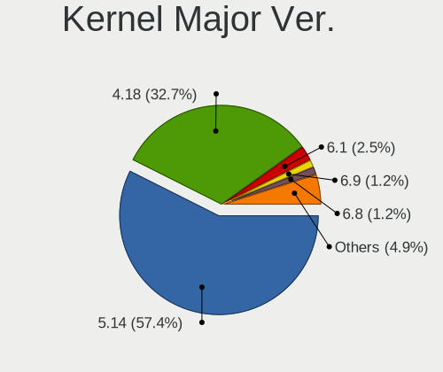
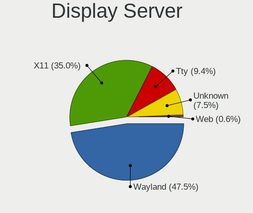
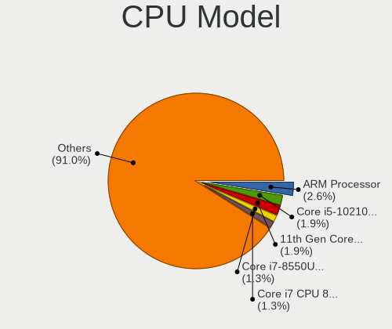
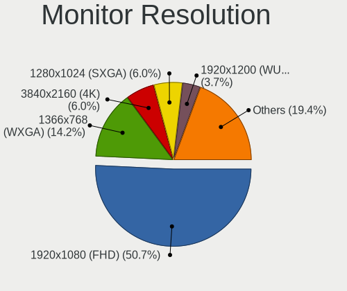
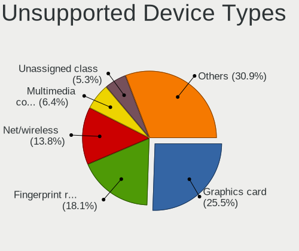

AlmaLinux - Tested Hardware & Statistics
----------------------------------------

A project to collect tested hardware configurations for AlmaLinux.

Anyone can contribute to this report by the [hw-probe](https://github.com/linuxhw/hw-probe) tool:

    sudo -E hw-probe -all -upload

Please contribute! Especially if your hardware is rare.

This is a report for all computer types. See also reports for [desktops](/Dist/AlmaLinux/Desktop/README.md) and [notebooks](/Dist/AlmaLinux/Notebook/README.md).

Contents
--------

* [ Test Cases ](#test-cases)

* [ System ](#system)
  - [ OS                       ](#os)
  - [ OS Family                ](#os-family)
  - [ Kernel                   ](#kernel)
  - [ Kernel Family            ](#kernel-family)
  - [ Kernel Major Ver.        ](#kernel-major-ver)
  - [ Arch                     ](#arch)
  - [ DE                       ](#de)
  - [ Display Server           ](#display-server)
  - [ Display Manager          ](#display-manager)
  - [ OS Lang                  ](#os-lang)
  - [ Boot Mode                ](#boot-mode)
  - [ Filesystem               ](#filesystem)
  - [ Part. scheme             ](#part-scheme)
  - [ Dual Boot with Linux/BSD ](#dual-boot-with-linuxbsd)
  - [ Dual Boot (Win)          ](#dual-boot-win)

* [ Board ](#board)
  - [ Vendor                   ](#vendor)
  - [ Model                    ](#model)
  - [ Model Family             ](#model-family)
  - [ MFG Year                 ](#mfg-year)
  - [ Form Factor              ](#form-factor)
  - [ Secure Boot              ](#secure-boot)
  - [ Coreboot                 ](#coreboot)
  - [ RAM Size                 ](#ram-size)
  - [ RAM Used                 ](#ram-used)
  - [ Total Drives             ](#total-drives)
  - [ Has CD-ROM               ](#has-cd-rom)
  - [ Has Ethernet             ](#has-ethernet)
  - [ Has WiFi                 ](#has-wifi)
  - [ Has Bluetooth            ](#has-bluetooth)

* [ Location ](#location)
  - [ Country                  ](#country)
  - [ City                     ](#city)

* [ Drives ](#drives)
  - [ Drive Vendor             ](#drive-vendor)
  - [ Drive Model              ](#drive-model)
  - [ HDD Vendor               ](#hdd-vendor)
  - [ SSD Vendor               ](#ssd-vendor)
  - [ Drive Kind               ](#drive-kind)
  - [ Drive Connector          ](#drive-connector)
  - [ Drive Size               ](#drive-size)
  - [ Space Total              ](#space-total)
  - [ Space Used               ](#space-used)
  - [ Malfunc. Drives          ](#malfunc-drives)
  - [ Malfunc. Drive Vendor    ](#malfunc-drive-vendor)
  - [ Malfunc. HDD Vendor      ](#malfunc-hdd-vendor)
  - [ Malfunc. Drive Kind      ](#malfunc-drive-kind)
  - [ Failed Drives            ](#failed-drives)
  - [ Failed Drive Vendor      ](#failed-drive-vendor)
  - [ Drive Status             ](#drive-status)

* [ Storage controller ](#storage-controller)
  - [ Storage Vendor           ](#storage-vendor)
  - [ Storage Model            ](#storage-model)
  - [ Storage Kind             ](#storage-kind)

* [ Processor ](#processor)
  - [ CPU Vendor               ](#cpu-vendor)
  - [ CPU Model                ](#cpu-model)
  - [ CPU Model Family         ](#cpu-model-family)
  - [ CPU Cores                ](#cpu-cores)
  - [ CPU Sockets              ](#cpu-sockets)
  - [ CPU Threads              ](#cpu-threads)
  - [ CPU Op-Modes             ](#cpu-op-modes)
  - [ CPU Microcode            ](#cpu-microcode)
  - [ CPU Microarch            ](#cpu-microarch)

* [ Graphics ](#graphics)
  - [ GPU Vendor               ](#gpu-vendor)
  - [ GPU Model                ](#gpu-model)
  - [ GPU Combo                ](#gpu-combo)
  - [ GPU Driver               ](#gpu-driver)
  - [ GPU Memory               ](#gpu-memory)

* [ Monitor ](#monitor)
  - [ Monitor Vendor           ](#monitor-vendor)
  - [ Monitor Model            ](#monitor-model)
  - [ Monitor Resolution       ](#monitor-resolution)
  - [ Monitor Diagonal         ](#monitor-diagonal)
  - [ Monitor Width            ](#monitor-width)
  - [ Aspect Ratio             ](#aspect-ratio)
  - [ Monitor Area             ](#monitor-area)
  - [ Pixel Density            ](#pixel-density)
  - [ Multiple Monitors        ](#multiple-monitors)

* [ Network ](#network)
  - [ Net Controller Vendor    ](#net-controller-vendor)
  - [ Net Controller Model     ](#net-controller-model)
  - [ Wireless Vendor          ](#wireless-vendor)
  - [ Wireless Model           ](#wireless-model)
  - [ Ethernet Vendor          ](#ethernet-vendor)
  - [ Ethernet Model           ](#ethernet-model)
  - [ Net Controller Kind      ](#net-controller-kind)
  - [ Used Controller          ](#used-controller)
  - [ NICs                     ](#nics)
  - [ IPv6                     ](#ipv6)

* [ Bluetooth ](#bluetooth)
  - [ Bluetooth Vendor         ](#bluetooth-vendor)
  - [ Bluetooth Model          ](#bluetooth-model)

* [ Sound ](#sound)
  - [ Sound Vendor             ](#sound-vendor)
  - [ Sound Model              ](#sound-model)

* [ Memory ](#memory)
  - [ Memory Vendor            ](#memory-vendor)
  - [ Memory Model             ](#memory-model)
  - [ Memory Kind              ](#memory-kind)
  - [ Memory Form Factor       ](#memory-form-factor)
  - [ Memory Size              ](#memory-size)
  - [ Memory Speed             ](#memory-speed)

* [ Printers & scanners ](#printers--scanners)
  - [ Printer Vendor           ](#printer-vendor)
  - [ Printer Model            ](#printer-model)
  - [ Scanner Vendor           ](#scanner-vendor)
  - [ Scanner Model            ](#scanner-model)

* [ Camera ](#camera)
  - [ Camera Vendor            ](#camera-vendor)
  - [ Camera Model             ](#camera-model)

* [ Security ](#security)
  - [ Fingerprint Vendor       ](#fingerprint-vendor)
  - [ Fingerprint Model        ](#fingerprint-model)
  - [ Chipcard Vendor          ](#chipcard-vendor)
  - [ Chipcard Model           ](#chipcard-model)

* [ Unsupported ](#unsupported)
  - [ Unsupported Devices      ](#unsupported-devices)
  - [ Unsupported Device Types ](#unsupported-device-types)

Test Cases
----------

Total: 51

| Vendor        | Model                       | Form-Factor | Probe                                                      | Date         |
|---------------|-----------------------------|-------------|------------------------------------------------------------|--------------|
| MSI           | A88X-G45 GAMING             | Desktop     | [891e0757ed](https://linux-hardware.org/?probe=891e0757ed) | Dec 31, 2022 |
| MSI           | A88X-G45 GAMING             | Desktop     | [bdb45edaad](https://linux-hardware.org/?probe=bdb45edaad) | Dec 31, 2022 |
| HP            | Falco                       | Notebook    | [61ce7c6739](https://linux-hardware.org/?probe=61ce7c6739) | Dec 21, 2022 |
| Raspberry ... | Raspberry Pi                | Soc         | [4571b799f0](https://linux-hardware.org/?probe=4571b799f0) | Dec 20, 2022 |
| Optimized ... | KVM                         | Desktop     | [d62625a751](https://linux-hardware.org/?probe=d62625a751) | Dec 13, 2022 |
| HP            | EliteBook 850 G8 Noteboo... | Notebook    | [95d47d14cb](https://linux-hardware.org/?probe=95d47d14cb) | Dec 09, 2022 |
| Lenovo        | B50-30 20382                | Notebook    | [3706f368de](https://linux-hardware.org/?probe=3706f368de) | Nov 24, 2022 |
| Gigabyte      | H81M-D2V                    | Desktop     | [6035f1ee45](https://linux-hardware.org/?probe=6035f1ee45) | Nov 11, 2022 |
| ASUSTek       | Q170M2                      | Desktop     | [c62954095d](https://linux-hardware.org/?probe=c62954095d) | Nov 11, 2022 |
| Lenovo        | Legion Y530-15ICH 81FV      | Notebook    | [832ebcb956](https://linux-hardware.org/?probe=832ebcb956) | Nov 03, 2022 |
| HP            | ProLiant DL360p Gen8        | Server      | [ef43d1f352](https://linux-hardware.org/?probe=ef43d1f352) | Nov 03, 2022 |
| Toshiba       | Satellite L50-C             | Notebook    | [b3e0ff9849](https://linux-hardware.org/?probe=b3e0ff9849) | Nov 01, 2022 |
| Acer          | TMP453-MG                   | Notebook    | [4d36d13ea9](https://linux-hardware.org/?probe=4d36d13ea9) | Oct 01, 2022 |
| Lenovo        | 1052 NOK                    | Desktop     | [28cd1416fe](https://linux-hardware.org/?probe=28cd1416fe) | Sep 22, 2022 |
| Acer          | TravelMate 5735Z            | Notebook    | [b920fce554](https://linux-hardware.org/?probe=b920fce554) | Sep 17, 2022 |
| Raspberry ... | Raspberry Pi                | Soc         | [7e56cce9c8](https://linux-hardware.org/?probe=7e56cce9c8) | Sep 17, 2022 |
| HP            | Falco                       | Notebook    | [5fa86b77d6](https://linux-hardware.org/?probe=5fa86b77d6) | Sep 17, 2022 |
| HP            | Laptop 15-ef1xxx            | Notebook    | [c01403937e](https://linux-hardware.org/?probe=c01403937e) | Sep 08, 2022 |
| HP            | ENVY dv6                    | Notebook    | [e7bc07047b](https://linux-hardware.org/?probe=e7bc07047b) | Aug 24, 2022 |
| Gigabyte      | MP32-AR1-00 01010101        | Server      | [e93d3eae0d](https://linux-hardware.org/?probe=e93d3eae0d) | Jul 20, 2022 |
| HP            | Laptop 17-cp0xxx            | Notebook    | [82b34535ae](https://linux-hardware.org/?probe=82b34535ae) | Jul 06, 2022 |
| ASRock        | B460 Phantom Gaming 4       | Desktop     | [0dc125da55](https://linux-hardware.org/?probe=0dc125da55) | Jul 05, 2022 |
| HP            | EliteBook 8470p             | Notebook    | [d6adb170de](https://linux-hardware.org/?probe=d6adb170de) | Jun 25, 2022 |
| Google        | Kohaku                      | Notebook    | [f43841c5e0](https://linux-hardware.org/?probe=f43841c5e0) | Jun 08, 2022 |
| Google        | Kohaku                      | Notebook    | [740a608274](https://linux-hardware.org/?probe=740a608274) | Jun 08, 2022 |
| Lenovo        | ThinkPad T440s 20ARS32P0... | Notebook    | [100b65a86d](https://linux-hardware.org/?probe=100b65a86d) | Jun 04, 2022 |
| Dell          | 060K5C A06                  | Server      | [c8be539d80](https://linux-hardware.org/?probe=c8be539d80) | May 14, 2022 |
| Lenovo        | ThinkBook 13s-IWL 20R9      | Notebook    | [2fecc1fd76](https://linux-hardware.org/?probe=2fecc1fd76) | Apr 20, 2022 |
| Lenovo        | ThinkPad T14 Gen 1 20S1S... | Notebook    | [5ac68bc542](https://linux-hardware.org/?probe=5ac68bc542) | Mar 16, 2022 |
| Gigabyte      | Z590 AORUS PRO AX           | Desktop     | [a517886d4d](https://linux-hardware.org/?probe=a517886d4d) | Feb 10, 2022 |
| Dell          | 0R4CNN A02                  | Server      | [c701d3a15f](https://linux-hardware.org/?probe=c701d3a15f) | Feb 07, 2022 |
| Intel         | powered classmate PC        | Notebook    | [0585f5b715](https://linux-hardware.org/?probe=0585f5b715) | Dec 12, 2021 |
| Intel         | powered classmate PC        | Notebook    | [9416f348e4](https://linux-hardware.org/?probe=9416f348e4) | Dec 12, 2021 |
| Raspberry ... | Raspberry Pi                | Soc         | [c28c41bdd4](https://linux-hardware.org/?probe=c28c41bdd4) | Nov 05, 2021 |
| Dell          | Inspiron 3185               | Notebook    | [53ac57fbea](https://linux-hardware.org/?probe=53ac57fbea) | Oct 26, 2021 |
| Dell          | Inspiron 3185               | Notebook    | [2c9cec7881](https://linux-hardware.org/?probe=2c9cec7881) | Oct 01, 2021 |
| Lenovo        | Yoga 2 13 20344             | Notebook    | [1a59499d3a](https://linux-hardware.org/?probe=1a59499d3a) | Sep 29, 2021 |
| Lenovo        | IdeaPad S145-15IWL 81MV     | Notebook    | [95a2b3a95d](https://linux-hardware.org/?probe=95a2b3a95d) | Aug 27, 2021 |
| Intel         | NUC8BEB J72692-308          | Mini pc     | [972f935578](https://linux-hardware.org/?probe=972f935578) | Aug 23, 2021 |
| HP            | EliteBook 8570w             | Notebook    | [37e72494a5](https://linux-hardware.org/?probe=37e72494a5) | Jul 29, 2021 |
| ASUSTek       | ASUS EXPERTBOOK B9450FA_... | Notebook    | [cdf0f4017c](https://linux-hardware.org/?probe=cdf0f4017c) | Jul 16, 2021 |
| Lenovo        | IdeaPad Slim 1-14AST-05 ... | Notebook    | [9044b57593](https://linux-hardware.org/?probe=9044b57593) | Jul 11, 2021 |
| Lenovo        | Legion 5 15IMH05H 81Y6      | Notebook    | [21a6135eda](https://linux-hardware.org/?probe=21a6135eda) | Jun 16, 2021 |
| ASUSTek       | M5A78L-M/USB3               | Desktop     | [e5a30a171e](https://linux-hardware.org/?probe=e5a30a171e) | Jun 08, 2021 |
| ASUSTek       | M5A78L-M/USB3               | Desktop     | [043878564d](https://linux-hardware.org/?probe=043878564d) | Jun 08, 2021 |
| Dell          | Inspiron 3185               | Notebook    | [84fa76eb2f](https://linux-hardware.org/?probe=84fa76eb2f) | Apr 20, 2021 |
| Dell          | Inspiron 3185               | Notebook    | [d49edb76fa](https://linux-hardware.org/?probe=d49edb76fa) | Apr 15, 2021 |
| Dell          | Inspiron 3185               | Notebook    | [15b8da5bc1](https://linux-hardware.org/?probe=15b8da5bc1) | Apr 14, 2021 |
| Lenovo        | IdeaPad Slim 1-14AST-05 ... | Notebook    | [f0791eb42d](https://linux-hardware.org/?probe=f0791eb42d) | Mar 30, 2021 |
| HP            | 0AE8h C                     | Desktop     | [b7fd559b13](https://linux-hardware.org/?probe=b7fd559b13) | Mar 24, 2021 |
| Lenovo        | IdeaPad 330-15ARR 81D2      | Notebook    | [8810309035](https://linux-hardware.org/?probe=8810309035) | Mar 24, 2021 |

System
------

OS
--

Installed operating systems

| Name          | Computers | Percent |
|---------------|-----------|---------|
| AlmaLinux 8.6 | 10        | 24.39%  |
| AlmaLinux 9.0 | 9         | 21.95%  |
| AlmaLinux 8.4 | 9         | 21.95%  |
| AlmaLinux 8.3 | 4         | 9.76%   |
| AlmaLinux 9.1 | 3         | 7.32%   |
| AlmaLinux 8.7 | 3         | 7.32%   |
| AlmaLinux 8.5 | 3         | 7.32%   |

OS Family
---------

OS without a version

| Name      | Computers | Percent |
|-----------|-----------|---------|
| AlmaLinux | 39        | 100%    |

Kernel
------

Version of the Linux kernel

| Version                       | Computers | Percent |
|-------------------------------|-----------|---------|
| 5.14.0-70.22.1.el9_0.x86_64   | 3         | 7.5%    |
| 5.14.0-162.6.1.el9_1.x86_64   | 3         | 7.5%    |
| 4.18.0-372.26.1.el8_6.x86_64  | 3         | 7.5%    |
| 4.18.0-240.15.1.el8_3.x86_64  | 3         | 7.5%    |
| 5.14.0-70.30.1.el9_0.x86_64   | 2         | 5%      |
| 5.14.0-70.13.1.el9_0.x86_64   | 2         | 5%      |
| 4.18.0-425.3.1.el8.x86_64     | 2         | 5%      |
| 4.18.0-372.9.1.el8.x86_64     | 2         | 5%      |
| 4.18.0-348.12.2.el8_5.x86_64  | 2         | 5%      |
| 4.18.0-305.el8.x86_64         | 2         | 5%      |
| 4.18.0-305.7.1.el8_4.x86_64   | 2         | 5%      |
| 4.18.0-305.12.1.el8_4.x86_64  | 2         | 5%      |
| 5.4.175-1.el8.elrepo.x86_64   | 1         | 2.5%    |
| 5.15.45-v8.1.el8              | 1         | 2.5%    |
| 5.14.0-70.26.1.el9_0.x86_64   | 1         | 2.5%    |
| 5.14.0-70.17.1.el9_0.x86_64   | 1         | 2.5%    |
| 5.10.60-v8.1.el8              | 1         | 2.5%    |
| 4.18.0-372.19.1.el8_6.x86_64  | 1         | 2.5%    |
| 4.18.0-372.16.1.el8_6.aarch64 | 1         | 2.5%    |
| 4.18.0-348.el8.x86_64         | 1         | 2.5%    |
| 4.18.0-348.2.1.el8_5.x86_64   | 1         | 2.5%    |
| 4.18.0-305.3.1.el8_4.x86_64   | 1         | 2.5%    |
| 4.18.0-305.10.2.el8_4.x86_64  | 1         | 2.5%    |
| 4.18.0-240.22.1.el8_3.x86_64  | 1         | 2.5%    |

Kernel Family
-------------

Linux kernel without a distro release

| Version | Computers | Percent |
|---------|-----------|---------|
| 4.18.0  | 24        | 61.54%  |
| 5.14.0  | 12        | 30.77%  |
| 5.4.175 | 1         | 2.56%   |
| 5.15.45 | 1         | 2.56%   |
| 5.10.60 | 1         | 2.56%   |

Kernel Major Ver.
-----------------

Linux kernel major version

| Version | Computers | Percent |
|---------|-----------|---------|
| 4.18    | 24        | 61.54%  |
| 5.14    | 12        | 30.77%  |
| 5.4     | 1         | 2.56%   |
| 5.15    | 1         | 2.56%   |
| 5.10    | 1         | 2.56%   |

Arch
----

OS architecture (x86_64, i586, etc.)

| Name    | Computers | Percent |
|---------|-----------|---------|
| x86_64  | 36        | 92.31%  |
| aarch64 | 3         | 7.69%   |

DE
--

Desktop Environment

| Name          | Computers | Percent |
|---------------|-----------|---------|
| GNOME         | 24        | 61.54%  |
| Unknown       | 8         | 20.51%  |
| XFCE          | 2         | 5.13%   |
| MATE          | 2         | 5.13%   |
| KDE5          | 2         | 5.13%   |
| GNOME Classic | 1         | 2.56%   |

Display Server
--------------

X11 or Wayland

| Name    | Computers | Percent |
|---------|-----------|---------|
| Wayland | 18        | 46.15%  |
| X11     | 17        | 43.59%  |
| Tty     | 2         | 5.13%   |
| Unknown | 2         | 5.13%   |

Display Manager
---------------

SDDM, LightDM, etc.

| Name    | Computers | Percent |
|---------|-----------|---------|
| Unknown | 23        | 58.97%  |
| GDM     | 12        | 30.77%  |
| SDDM    | 2         | 5.13%   |
| LightDM | 2         | 5.13%   |

OS Lang
-------

Language

| Lang    | Computers | Percent |
|---------|-----------|---------|
| en_US   | 19        | 48.72%  |
| de_DE   | 7         | 17.95%  |
| fr_FR   | 2         | 5.13%   |
| en_GB   | 2         | 5.13%   |
| en_CA   | 2         | 5.13%   |
| C       | 2         | 5.13%   |
| uk_UA   | 1         | 2.56%   |
| ru_RU   | 1         | 2.56%   |
| es_VE   | 1         | 2.56%   |
| es_ES   | 1         | 2.56%   |
| Unknown | 1         | 2.56%   |

Boot Mode
---------

EFI or BIOS

| Mode | Computers | Percent |
|------|-----------|---------|
| EFI  | 25        | 64.1%   |
| BIOS | 14        | 35.9%   |

Filesystem
----------

Type of filesystem

| Type | Computers | Percent |
|------|-----------|---------|
| Xfs  | 30        | 76.92%  |
| Ext4 | 9         | 23.08%  |

Part. scheme
------------

Scheme of partitioning

| Type    | Computers | Percent |
|---------|-----------|---------|
| GPT     | 22        | 56.41%  |
| Unknown | 12        | 30.77%  |
| MBR     | 5         | 12.82%  |

Dual Boot with Linux/BSD
------------------------

Hosting more than one Linux/BSD

| Dual boot | Computers | Percent |
|-----------|-----------|---------|
| No        | 30        | 76.92%  |
| Yes       | 9         | 23.08%  |

Dual Boot (Win)
---------------

Hosting Linux and Windows

| Dual boot | Computers | Percent |
|-----------|-----------|---------|
| No        | 30        | 76.92%  |
| Yes       | 9         | 23.08%  |

Board
-----

Vendor
------

Motherboard manufacturer

| Name                    | Computers | Percent |
|-------------------------|-----------|---------|
| Lenovo                  | 10        | 25.64%  |
| Hewlett-Packard         | 9         | 23.08%  |
| Gigabyte Technology     | 3         | 7.69%   |
| Dell                    | 3         | 7.69%   |
| ASUSTek Computer        | 3         | 7.69%   |
| Raspberry Pi Foundation | 2         | 5.13%   |
| Intel                   | 2         | 5.13%   |
| Acer                    | 2         | 5.13%   |
| Toshiba                 | 1         | 2.56%   |
| Optimized Hosting       | 1         | 2.56%   |
| MSI                     | 1         | 2.56%   |
| Google                  | 1         | 2.56%   |
| ASRock                  | 1         | 2.56%   |

Model
-----

Motherboard model

| Name                                 | Computers | Percent |
|--------------------------------------|-----------|---------|
| RPi Raspberry Pi                     | 2         | 5.13%   |
| Toshiba Satellite L50-C              | 1         | 2.56%   |
| Optimized Hosting KVM                | 1         | 2.56%   |
| MSI MS-7900                          | 1         | 2.56%   |
| Lenovo Yoga 2 13 20344               | 1         | 2.56%   |
| Lenovo ThinkStation P350 30E6S20S00  | 1         | 2.56%   |
| Lenovo ThinkPad T440s 20ARS32P00     | 1         | 2.56%   |
| Lenovo ThinkPad T14 Gen 1 20S1S39Q00 | 1         | 2.56%   |
| Lenovo Legion Y530-15ICH 81FV        | 1         | 2.56%   |
| Lenovo Legion 5 15IMH05H 81Y6        | 1         | 2.56%   |
| Lenovo IdeaPad Slim 1-14AST-05 81VS  | 1         | 2.56%   |
| Lenovo IdeaPad S145-15IWL 81MV       | 1         | 2.56%   |
| Lenovo IdeaPad 330-15ARR 81D2        | 1         | 2.56%   |
| Lenovo B50-30 20382                  | 1         | 2.56%   |
| Intel powered classmate PC           | 1         | 2.56%   |
| Intel NUC8i5BEH                      | 1         | 2.56%   |
| HP Z600 Workstation                  | 1         | 2.56%   |
| HP ProLiant DL360p Gen8              | 1         | 2.56%   |
| HP Laptop 17-cp0xxx                  | 1         | 2.56%   |
| HP Laptop 15-ef1xxx                  | 1         | 2.56%   |
| HP Falco                             | 1         | 2.56%   |
| HP ENVY dv6                          | 1         | 2.56%   |
| HP EliteBook 8570w                   | 1         | 2.56%   |
| HP EliteBook 850 G8 Notebook PC      | 1         | 2.56%   |
| HP EliteBook 8470p                   | 1         | 2.56%   |
| Google Kohaku                        | 1         | 2.56%   |
| Gigabyte Z590 AORUS PRO AX           | 1         | 2.56%   |
| Gigabyte MP32-AR1-00                 | 1         | 2.56%   |
| Gigabyte H81M-D2V                    | 1         | 2.56%   |
| Dell Precision 7920 Tower            | 1         | 2.56%   |
| Dell PowerEdge R6515                 | 1         | 2.56%   |
| Dell Inspiron 3185                   | 1         | 2.56%   |
| ASUS Q170M2                          | 1         | 2.56%   |
| ASUS M5A78L-M/USB3                   | 1         | 2.56%   |
| ASUS ASUS EXPERTBOOK B9450FA_B9450FA | 1         | 2.56%   |
| ASRock B460 Phantom Gaming 4         | 1         | 2.56%   |
| Acer TravelMate 5735Z                | 1         | 2.56%   |
| Acer TMP453-MG                       | 1         | 2.56%   |

Model Family
------------

Motherboard model prefix

| Name                  | Computers | Percent |
|-----------------------|-----------|---------|
| Lenovo IdeaPad        | 3         | 7.69%   |
| HP EliteBook          | 3         | 7.69%   |
| RPi Raspberry         | 2         | 5.13%   |
| Lenovo ThinkPad       | 2         | 5.13%   |
| Lenovo Legion         | 2         | 5.13%   |
| HP Laptop             | 2         | 5.13%   |
| Toshiba Satellite     | 1         | 2.56%   |
| Optimized Hosting KVM | 1         | 2.56%   |
| MSI MS-7900           | 1         | 2.56%   |
| Lenovo Yoga           | 1         | 2.56%   |
| Lenovo ThinkStation   | 1         | 2.56%   |
| Lenovo B50-30         | 1         | 2.56%   |
| Intel powered         | 1         | 2.56%   |
| Intel NUC8i5BEH       | 1         | 2.56%   |
| HP Z600               | 1         | 2.56%   |
| HP ProLiant           | 1         | 2.56%   |
| HP Falco              | 1         | 2.56%   |
| HP ENVY               | 1         | 2.56%   |
| Google Kohaku         | 1         | 2.56%   |
| Gigabyte Z590         | 1         | 2.56%   |
| Gigabyte MP32-AR1-00  | 1         | 2.56%   |
| Gigabyte H81M-D2V     | 1         | 2.56%   |
| Dell Precision        | 1         | 2.56%   |
| Dell PowerEdge        | 1         | 2.56%   |
| Dell Inspiron         | 1         | 2.56%   |
| ASUS Q170M2           | 1         | 2.56%   |
| ASUS M5A78L-M         | 1         | 2.56%   |
| ASUS ASUS             | 1         | 2.56%   |
| ASRock B460           | 1         | 2.56%   |
| Acer TravelMate       | 1         | 2.56%   |
| Acer TMP453-MG        | 1         | 2.56%   |

MFG Year
--------

Motherboard manufacture year

| Year    | Computers | Percent |
|---------|-----------|---------|
| 2020    | 6         | 15.38%  |
| 2019    | 4         | 10.26%  |
| 2018    | 4         | 10.26%  |
| 2014    | 4         | 10.26%  |
| 2012    | 4         | 10.26%  |
| 2022    | 3         | 7.69%   |
| 2021    | 3         | 7.69%   |
| 2011    | 3         | 7.69%   |
| 2015    | 2         | 5.13%   |
| 2013    | 2         | 5.13%   |
| Unknown | 2         | 5.13%   |
| 2010    | 1         | 2.56%   |
| 2009    | 1         | 2.56%   |

Form Factor
-----------

Physical design of the computer

| Name           | Computers | Percent |
|----------------|-----------|---------|
| Notebook       | 23        | 58.97%  |
| Desktop        | 9         | 23.08%  |
| Server         | 4         | 10.26%  |
| System on chip | 2         | 5.13%   |
| Mini pc        | 1         | 2.56%   |

Secure Boot
-----------

Enabled or disabled

| State    | Computers | Percent |
|----------|-----------|---------|
| Disabled | 33        | 84.62%  |
| Enabled  | 6         | 15.38%  |

Coreboot
--------

Have coreboot on board

| Used | Computers | Percent |
|------|-----------|---------|
| No   | 37        | 94.87%  |
| Yes  | 2         | 5.13%   |

RAM Size
--------

Total RAM memory

| Size in GB      | Computers | Percent |
|-----------------|-----------|---------|
| 4.01-8.0        | 12        | 30.77%  |
| 8.01-16.0       | 7         | 17.95%  |
| 16.01-24.0      | 6         | 15.38%  |
| 3.01-4.0        | 4         | 10.26%  |
| More than 256.0 | 3         | 7.69%   |
| 1.01-2.0        | 2         | 5.13%   |
| 0.51-1.0        | 2         | 5.13%   |
| 32.01-64.0      | 1         | 2.56%   |
| 24.01-32.0      | 1         | 2.56%   |
| 64.01-256.0     | 1         | 2.56%   |

RAM Used
--------

Used RAM memory

| Used GB    | Computers | Percent |
|------------|-----------|---------|
| 2.01-3.0   | 11        | 27.5%   |
| 1.01-2.0   | 9         | 22.5%   |
| 4.01-8.0   | 6         | 15%     |
| 3.01-4.0   | 4         | 10%     |
| 8.01-16.0  | 3         | 7.5%    |
| 0.51-1.0   | 3         | 7.5%    |
| 0.01-0.5   | 2         | 5%      |
| 24.01-32.0 | 1         | 2.5%    |
| 16.01-24.0 | 1         | 2.5%    |

Total Drives
------------

Number of drives on board

| Drives | Computers | Percent |
|--------|-----------|---------|
| 1      | 17        | 43.59%  |
| 2      | 13        | 33.33%  |
| 4      | 4         | 10.26%  |
| 11     | 1         | 2.56%   |
| 6      | 1         | 2.56%   |
| 5      | 1         | 2.56%   |
| 3      | 1         | 2.56%   |
| 0      | 1         | 2.56%   |

Has CD-ROM
----------

Has CD-ROM on board

| Presented | Computers | Percent |
|-----------|-----------|---------|
| No        | 31        | 79.49%  |
| Yes       | 8         | 20.51%  |

Has Ethernet
------------

Has Ethernet on board

| Presented | Computers | Percent |
|-----------|-----------|---------|
| Yes       | 32        | 82.05%  |
| No        | 7         | 17.95%  |

Has WiFi
--------

Has WiFi module

| Presented | Computers | Percent |
|-----------|-----------|---------|
| Yes       | 25        | 64.1%   |
| No        | 14        | 35.9%   |

Has Bluetooth
-------------

Has Bluetooth module

| Presented | Computers | Percent |
|-----------|-----------|---------|
| Yes       | 25        | 64.1%   |
| No        | 14        | 35.9%   |

Location
--------

Country
-------

Geographic location (country)

| Country      | Computers | Percent |
|--------------|-----------|---------|
| USA          | 9         | 23.08%  |
| Germany      | 8         | 20.51%  |
| France       | 4         | 10.26%  |
| UK           | 2         | 5.13%   |
| Spain        | 2         | 5.13%   |
| Russia       | 2         | 5.13%   |
| Netherlands  | 2         | 5.13%   |
| Canada       | 2         | 5.13%   |
| Venezuela    | 1         | 2.56%   |
| Ukraine      | 1         | 2.56%   |
| Sweden       | 1         | 2.56%   |
| South Africa | 1         | 2.56%   |
| Pakistan     | 1         | 2.56%   |
| India        | 1         | 2.56%   |
| Finland      | 1         | 2.56%   |
| Bulgaria     | 1         | 2.56%   |

City
----

Geographic location (city)

| City          | Computers | Percent |
|---------------|-----------|---------|
| Hamburg       | 3         | 7.69%   |
| Queens        | 2         | 5.13%   |
| Zaporizhzhia  | 1         | 2.56%   |
| Winterswijk   | 1         | 2.56%   |
| Uppsala       | 1         | 2.56%   |
| Tuusula       | 1         | 2.56%   |
| Strasbourg    | 1         | 2.56%   |
| Stadtilm      | 1         | 2.56%   |
| St. Paul      | 1         | 2.56%   |
| Sofia         | 1         | 2.56%   |
| Shimanovsk    | 1         | 2.56%   |
| San Diego     | 1         | 2.56%   |
| Rothwell      | 1         | 2.56%   |
| Parla         | 1         | 2.56%   |
| Paris         | 1         | 2.56%   |
| Moscow        | 1         | 2.56%   |
| Mangalore     | 1         | 2.56%   |
| Los Angeles   | 1         | 2.56%   |
| Liverpool     | 1         | 2.56%   |
| Lille         | 1         | 2.56%   |
| Lawrence      | 1         | 2.56%   |
| Land O' Lakes | 1         | 2.56%   |
| Lahore        | 1         | 2.56%   |
| Kitimat       | 1         | 2.56%   |
| Kennewick     | 1         | 2.56%   |
| Johannesburg  | 1         | 2.56%   |
| Guglingen     | 1         | 2.56%   |
| Guanare       | 1         | 2.56%   |
| Groningen     | 1         | 2.56%   |
| Frankenthal   | 1         | 2.56%   |
| Essen         | 1         | 2.56%   |
| Castelginest  | 1         | 2.56%   |
| Bloomington   | 1         | 2.56%   |
| Berlin        | 1         | 2.56%   |
| Barcelona     | 1         | 2.56%   |
| Austin        | 1         | 2.56%   |

Drives
------

Drive Vendor
------------

Hard drive vendors

| Vendor                      | Computers | Drives | Percent |
|-----------------------------|-----------|--------|---------|
| Seagate                     | 8         | 16     | 13.79%  |
| WDC                         | 7         | 7      | 12.07%  |
| Samsung Electronics         | 7         | 10     | 12.07%  |
| Unknown                     | 3         | 5      | 5.17%   |
| Kingston                    | 3         | 3      | 5.17%   |
| Toshiba                     | 2         | 2      | 3.45%   |
| SK hynix                    | 2         | 2      | 3.45%   |
| LITEONIT                    | 2         | 3      | 3.45%   |
| Intel                       | 2         | 2      | 3.45%   |
| Dell                        | 2         | 3      | 3.45%   |
| Crucial                     | 2         | 4      | 3.45%   |
| Union Memory                | 1         | 1      | 1.72%   |
| Transcend                   | 1         | 1      | 1.72%   |
| SSSTC                       | 1         | 1      | 1.72%   |
| QEMU                        | 1         | 1      | 1.72%   |
| Plextor                     | 1         | 1      | 1.72%   |
| Netac                       | 1         | 1      | 1.72%   |
| Micron Technology           | 1         | 1      | 1.72%   |
| LITEON                      | 1         | 1      | 1.72%   |
| KIOXIA                      | 1         | 1      | 1.72%   |
| Kingston Technology Company | 1         | 1      | 1.72%   |
| Hitachi                     | 1         | 1      | 1.72%   |
| HGST                        | 1         | 1      | 1.72%   |
| Hewlett-Packard             | 1         | 8      | 1.72%   |
| EMTEC                       | 1         | 2      | 1.72%   |
| DELLBOSS                    | 1         | 1      | 1.72%   |
| China                       | 1         | 1      | 1.72%   |
| ASMT                        | 1         | 2      | 1.72%   |
| A-DATA Technology           | 1         | 1      | 1.72%   |

Drive Model
-----------

Hard drive models

| Model                                       | Computers | Percent |
|---------------------------------------------|-----------|---------|
| WDC WD10SPZX-24Z10 1TB                      | 2         | 3.08%   |
| WDC WD5000LPCX-21VHAT0 500GB                | 1         | 1.54%   |
| WDC WD20EARS-00J2GB0 2TB                    | 1         | 1.54%   |
| WDC WD10SPZX-60Z10T1 1TB                    | 1         | 1.54%   |
| WDC WD10EZEX-08WN4A0 1TB                    | 1         | 1.54%   |
| WDC PC SN730 SDBQNTY-256G-1001 256GB        | 1         | 1.54%   |
| Unknown SD64G  64GB                         | 1         | 1.54%   |
| Unknown SD/MMC/MS PRO 64GB                  | 1         | 1.54%   |
| Unknown EC2QT  64GB                         | 1         | 1.54%   |
| Union Memory UMIS RPITJ512VME2OWD 512GB     | 1         | 1.54%   |
| Transcend TS256GMTE220S 256GB               | 1         | 1.54%   |
| Toshiba MK6475GSX 640GB                     | 1         | 1.54%   |
| Toshiba DT01ACA100 1TB                      | 1         | 1.54%   |
| SSSTC CL1-3D256 256GB                       | 1         | 1.54%   |
| SK hynix SH920 2.5 7MM 256GB SSD            | 1         | 1.54%   |
| SK hynix NVMe SSD Drive 256GB               | 1         | 1.54%   |
| Seagate ST4000NM000A 00MX141 00MX141LEN 4TB | 1         | 1.54%   |
| Seagate ST4000NC001-1FS168 4TB              | 1         | 1.54%   |
| Seagate ST4000DM000-1F2168 4TB              | 1         | 1.54%   |
| Seagate ST31000528AS 1TB                    | 1         | 1.54%   |
| Seagate ST3000DM001-1CH166 3TB              | 1         | 1.54%   |
| Seagate ST250LM004 HN-M250MBB 250GB         | 1         | 1.54%   |
| Seagate ST2000NM012A-2MP130 2TB             | 1         | 1.54%   |
| Seagate ST2000LM015-2E8174 2TB              | 1         | 1.54%   |
| Seagate ST2000DM001-1ER164 2TB              | 1         | 1.54%   |
| Seagate ST2000DL003-9VT166 2TB              | 1         | 1.54%   |
| Seagate ST1000NM0033-9ZM173 1TB             | 1         | 1.54%   |
| Seagate ST10000NM0478-2H7100 10TB           | 1         | 1.54%   |
| Seagate Expansion 4TB                       | 1         | 1.54%   |
| Samsung SSD PM810 FDE 2.5 256GB             | 1         | 1.54%   |
| Samsung SSD 970 EVO Plus 250GB              | 1         | 1.54%   |
| Samsung PSSD T7 Touch 1TB                   | 1         | 1.54%   |
| Samsung MZVLQ512HALU-00000 512GB            | 1         | 1.54%   |
| Samsung MZVLQ128HBHQ-000H1 128GB            | 1         | 1.54%   |
| Samsung MZVL22T0HBLB-00BL7 2TB              | 1         | 1.54%   |
| Samsung MZQL23T8HCLS-00A07 3.8TB            | 1         | 1.54%   |
| Samsung MZ7LN256HAJQ-000L2 256GB SSD        | 1         | 1.54%   |
| QEMU HARDDISK                               | 1         | 1.54%   |
| Plextor PX-128S3C 128GB SSD                 | 1         | 1.54%   |
| Netac SSD 512GB                             | 1         | 1.54%   |

HDD Vendor
----------

Hard disk drive vendors

| Vendor          | Computers | Drives | Percent |
|-----------------|-----------|--------|---------|
| Seagate         | 8         | 16     | 34.78%  |
| WDC             | 6         | 6      | 26.09%  |
| Toshiba         | 2         | 2      | 8.7%    |
| Unknown         | 1         | 2      | 4.35%   |
| QEMU            | 1         | 1      | 4.35%   |
| Hitachi         | 1         | 1      | 4.35%   |
| HGST            | 1         | 1      | 4.35%   |
| Hewlett-Packard | 1         | 8      | 4.35%   |
| DELLBOSS        | 1         | 1      | 4.35%   |
| ASMT            | 1         | 2      | 4.35%   |

SSD Vendor
----------

Solid state drive vendors

| Vendor              | Computers | Drives | Percent |
|---------------------|-----------|--------|---------|
| Samsung Electronics | 3         | 3      | 15.79%  |
| Kingston            | 3         | 3      | 15.79%  |
| LITEONIT            | 2         | 3      | 10.53%  |
| Intel               | 2         | 2      | 10.53%  |
| SK hynix            | 1         | 1      | 5.26%   |
| Plextor             | 1         | 1      | 5.26%   |
| Netac               | 1         | 1      | 5.26%   |
| Micron Technology   | 1         | 1      | 5.26%   |
| LITEON              | 1         | 1      | 5.26%   |
| Dell                | 1         | 2      | 5.26%   |
| Crucial             | 1         | 2      | 5.26%   |
| China               | 1         | 1      | 5.26%   |
| A-DATA Technology   | 1         | 1      | 5.26%   |

Drive Kind
----------

HDD or SSD

| Kind    | Computers | Drives | Percent |
|---------|-----------|--------|---------|
| HDD     | 21        | 40     | 37.5%   |
| SSD     | 18        | 22     | 32.14%  |
| NVMe    | 14        | 17     | 25%     |
| MMC     | 2         | 3      | 3.57%   |
| Unknown | 1         | 2      | 1.79%   |

Drive Connector
---------------

SATA, SAS, NVMe, etc.

| Type | Computers | Drives | Percent |
|------|-----------|--------|---------|
| SATA | 30        | 56     | 60%     |
| NVMe | 14        | 17     | 28%     |
| SAS  | 4         | 8      | 8%      |
| MMC  | 2         | 3      | 4%      |

Drive Size
----------

Size of hard drive

| Size in TB | Computers | Drives | Percent |
|------------|-----------|--------|---------|
| 0.01-0.5   | 21        | 26     | 48.84%  |
| 0.51-1.0   | 10        | 11     | 23.26%  |
| 3.01-4.0   | 4         | 4      | 9.3%    |
| 1.01-2.0   | 4         | 9      | 9.3%    |
| 4.01-10.0  | 2         | 9      | 4.65%   |
| 2.01-3.0   | 1         | 1      | 2.33%   |
| 10.01-20.0 | 1         | 2      | 2.33%   |

Space Total
-----------

Amount of disk space available on the file system

| Size in GB     | Computers | Percent |
|----------------|-----------|---------|
| 101-250        | 13        | 32.5%   |
| More than 3000 | 6         | 15%     |
| 251-500        | 6         | 15%     |
| 51-100         | 4         | 10%     |
| 501-1000       | 3         | 7.5%    |
| 21-50          | 2         | 5%      |
| 1001-2000      | 2         | 5%      |
| 1-20           | 2         | 5%      |
| 2001-3000      | 1         | 2.5%    |
| Unknown        | 1         | 2.5%    |

Space Used
----------

Amount of used disk space

| Used GB        | Computers | Percent |
|----------------|-----------|---------|
| 1-20           | 16        | 38.1%   |
| 21-50          | 9         | 21.43%  |
| 51-100         | 5         | 11.9%   |
| 101-250        | 4         | 9.52%   |
| 251-500        | 3         | 7.14%   |
| More than 3000 | 2         | 4.76%   |
| 2001-3000      | 1         | 2.38%   |
| 501-1000       | 1         | 2.38%   |
| Unknown        | 1         | 2.38%   |

Malfunc. Drives
---------------

Drive models with a malfunction

| Model                            | Computers | Drives | Percent |
|----------------------------------|-----------|--------|---------|
| WDC WD20EARS-00J2GB0 2TB         | 1         | 1      | 33.33%  |
| SK hynix SH920 2.5 7MM 256GB SSD | 1         | 1      | 33.33%  |
| LITEONIT LSS-16L6G-HP 16GB SSD   | 1         | 2      | 33.33%  |

Malfunc. Drive Vendor
---------------------

Vendors of faulty drives

| Vendor   | Computers | Drives | Percent |
|----------|-----------|--------|---------|
| WDC      | 1         | 1      | 33.33%  |
| SK hynix | 1         | 1      | 33.33%  |
| LITEONIT | 1         | 2      | 33.33%  |

Malfunc. HDD Vendor
-------------------

Vendors of faulty HDD drives

| Vendor | Computers | Drives | Percent |
|--------|-----------|--------|---------|
| WDC    | 1         | 1      | 100%    |

Malfunc. Drive Kind
-------------------

Kinds of faulty drives

| Kind | Computers | Drives | Percent |
|------|-----------|--------|---------|
| SSD  | 2         | 3      | 66.67%  |
| HDD  | 1         | 1      | 33.33%  |

Failed Drives
-------------

Failed drive models

Zero info for selected period =(

Failed Drive Vendor
-------------------

Failed drive vendors

Zero info for selected period =(

Drive Status
------------

Number of failed and malfunc. drives

| Status   | Computers | Drives | Percent |
|----------|-----------|--------|---------|
| Works    | 22        | 46     | 50%     |
| Detected | 19        | 34     | 43.18%  |
| Malfunc  | 3         | 4      | 6.82%   |

Storage controller
------------------

Storage Vendor
--------------

Storage controller vendors

| Vendor                         | Computers | Percent |
|--------------------------------|-----------|---------|
| Intel                          | 27        | 51.92%  |
| AMD                            | 7         | 13.46%  |
| Samsung Electronics            | 5         | 9.62%   |
| Union Memory (Shenzhen)        | 2         | 3.85%   |
| Toshiba America Info Systems   | 1         | 1.92%   |
| Solid State Storage Technology | 1         | 1.92%   |
| SK hynix                       | 1         | 1.92%   |
| Silicon Motion                 | 1         | 1.92%   |
| SanDisk                        | 1         | 1.92%   |
| Red Hat                        | 1         | 1.92%   |
| Micron/Crucial Technology      | 1         | 1.92%   |
| Marvell Technology Group       | 1         | 1.92%   |
| Kingston Technology Company    | 1         | 1.92%   |
| Hewlett-Packard                | 1         | 1.92%   |
| Broadcom / LSI                 | 1         | 1.92%   |

Storage Model
-------------

Storage controller models

| Model                                                                          | Computers | Percent |
|--------------------------------------------------------------------------------|-----------|---------|
| AMD FCH SATA Controller [AHCI mode]                                            | 6         | 10.91%  |
| Intel 8 Series SATA Controller 1 [AHCI mode]                                   | 3         | 5.45%   |
| Intel 7 Series Chipset Family 6-port SATA Controller [AHCI mode]               | 3         | 5.45%   |
| Union Memory (Shenzhen) Non-Volatile memory controller                         | 2         | 3.64%   |
| Samsung NVMe SSD Controller PM9A1/PM9A3/980PRO                                 | 2         | 3.64%   |
| Samsung NVMe SSD Controller 980                                                | 2         | 3.64%   |
| Intel Cannon Point-LP SATA Controller [AHCI Mode]                              | 2         | 3.64%   |
| Intel 500 Series Chipset Family SATA AHCI Controller                           | 2         | 3.64%   |
| Intel 400 Series Chipset Family SATA AHCI Controller                           | 2         | 3.64%   |
| Toshiba America Info Systems XG6 NVMe SSD Controller                           | 1         | 1.82%   |
| Solid State Storage Non-Volatile memory controller                             | 1         | 1.82%   |
| SK hynix BC511                                                                 | 1         | 1.82%   |
| Silicon Motion SM2262/SM2262EN SSD Controller                                  | 1         | 1.82%   |
| SanDisk WD Black SN750 / PC SN730 NVMe SSD                                     | 1         | 1.82%   |
| Samsung NVMe SSD Controller SM981/PM981/PM983                                  | 1         | 1.82%   |
| Red Hat Virtio SCSI                                                            | 1         | 1.82%   |
| Micron/Crucial P5 Plus NVMe PCIe SSD                                           | 1         | 1.82%   |
| Marvell Group 88SE9230 PCIe 2.0 x2 4-port SATA 6 Gb/s RAID Controller          | 1         | 1.82%   |
| Kingston Company A2000 NVMe SSD                                                | 1         | 1.82%   |
| Intel Volume Management Device NVMe RAID Controller                            | 1         | 1.82%   |
| Intel Sunrise Point-LP SATA Controller [AHCI mode]                             | 1         | 1.82%   |
| Intel SATA Controller [RAID mode]                                              | 1         | 1.82%   |
| Intel Q170/Q150/B150/H170/H110/Z170/CM236 Chipset SATA Controller [AHCI Mode]  | 1         | 1.82%   |
| Intel NVMe Datacenter SSD [3DNAND, Beta Rock Controller]                       | 1         | 1.82%   |
| Intel NM10/ICH7 Family SATA Controller [AHCI mode]                             | 1         | 1.82%   |
| Intel Comet Lake SATA AHCI Controller                                          | 1         | 1.82%   |
| Intel Cannon Lake Mobile PCH SATA AHCI Controller                              | 1         | 1.82%   |
| Intel C620 Series Chipset Family SSATA Controller [AHCI mode]                  | 1         | 1.82%   |
| Intel C620 Series Chipset Family IDE Redirection                               | 1         | 1.82%   |
| Intel C600/X79 series chipset SATA RAID Controller                             | 1         | 1.82%   |
| Intel C600/X79 series chipset 4-Port SATA IDE Controller                       | 1         | 1.82%   |
| Intel Atom Processor E3800 Series SATA AHCI Controller                         | 1         | 1.82%   |
| Intel 82801IR/IO/IH (ICH9R/DO/DH) 6 port SATA Controller [AHCI mode]           | 1         | 1.82%   |
| Intel 82801IBM/IEM (ICH9M/ICH9M-E) 4 port SATA Controller [AHCI mode]          | 1         | 1.82%   |
| Intel 82801 Mobile SATA Controller [RAID mode]                                 | 1         | 1.82%   |
| Intel 8 Series/C220 Series Chipset Family 6-port SATA Controller 1 [AHCI mode] | 1         | 1.82%   |
| HP Smart Array Gen8 Controllers                                                | 1         | 1.82%   |
| Broadcom / LSI MegaRAID Tri-Mode SAS3408                                       | 1         | 1.82%   |
| AMD SB7x0/SB8x0/SB9x0 SATA Controller [IDE mode]                               | 1         | 1.82%   |
| AMD SB7x0/SB8x0/SB9x0 IDE Controller                                           | 1         | 1.82%   |

Storage Kind
------------

Kind of storage controller (IDE, SATA, NVMe, SAS, ...)

| Kind | Computers | Percent |
|------|-----------|---------|
| SATA | 29        | 54.72%  |
| NVMe | 15        | 28.3%   |
| RAID | 5         | 9.43%   |
| IDE  | 3         | 5.66%   |
| SCSI | 1         | 1.89%   |

Processor
---------

CPU Vendor
----------

Processor vendors

| Vendor | Computers | Percent |
|--------|-----------|---------|
| Intel  | 27        | 69.23%  |
| AMD    | 9         | 23.08%  |
| ARM    | 3         | 7.69%   |

CPU Model
---------

Processor models

| Model                                           | Computers | Percent |
|-------------------------------------------------|-----------|---------|
| Intel Core i5-10210U CPU @ 1.60GHz              | 3         | 7.69%   |
| ARM Processor                                   | 3         | 7.69%   |
| Intel Xeon W-1350 @ 3.30GHz                     | 1         | 2.56%   |
| Intel Xeon Gold 5220R CPU @ 2.20GHz             | 1         | 2.56%   |
| Intel Xeon CPU X5550 @ 2.67GHz                  | 1         | 2.56%   |
| Intel Xeon CPU E5-2630 0 @ 2.30GHz              | 1         | 2.56%   |
| Intel Pentium Dual-Core CPU T4500 @ 2.30GHz     | 1         | 2.56%   |
| Intel Pentium CPU N3540 @ 2.16GHz               | 1         | 2.56%   |
| Intel Core i7-7700 CPU @ 3.60GHz                | 1         | 2.56%   |
| Intel Core i7-6500U CPU @ 2.50GHz               | 1         | 2.56%   |
| Intel Core i7-3840QM CPU @ 2.80GHz              | 1         | 2.56%   |
| Intel Core i7-3630QM CPU @ 2.40GHz              | 1         | 2.56%   |
| Intel Core i7-10750H CPU @ 2.60GHz              | 1         | 2.56%   |
| Intel Core i5-8300H CPU @ 2.30GHz               | 1         | 2.56%   |
| Intel Core i5-8259U CPU @ 2.30GHz               | 1         | 2.56%   |
| Intel Core i5-4300U CPU @ 1.90GHz               | 1         | 2.56%   |
| Intel Core i5-3360M CPU @ 2.80GHz               | 1         | 2.56%   |
| Intel Core i5-3210M CPU @ 2.50GHz               | 1         | 2.56%   |
| Intel Core i5-10400F CPU @ 2.90GHz              | 1         | 2.56%   |
| Intel Core i3-8145U CPU @ 2.10GHz               | 1         | 2.56%   |
| Intel Core i3-4130 CPU @ 3.40GHz                | 1         | 2.56%   |
| Intel Core i3-4010U CPU @ 1.70GHz               | 1         | 2.56%   |
| Intel Celeron 2955U @ 1.40GHz                   | 1         | 2.56%   |
| Intel Atom CPU N455 @ 1.66GHz                   | 1         | 2.56%   |
| Intel 11th Gen Core i7-1185G7 @ 3.00GHz         | 1         | 2.56%   |
| Intel 11th Gen Core i5-11400 @ 2.60GHz          | 1         | 2.56%   |
| AMD Ryzen 7 5700U with Radeon Graphics          | 1         | 2.56%   |
| AMD Ryzen 5 2500U with Radeon Vega Mobile Gfx   | 1         | 2.56%   |
| AMD Ryzen 3 3250U with Radeon Graphics          | 1         | 2.56%   |
| AMD FX-8350 Eight-Core Processor                | 1         | 2.56%   |
| AMD EPYC-Rome Processor                         | 1         | 2.56%   |
| AMD EPYC 7402P 24-Core Processor                | 1         | 2.56%   |
| AMD A9-9420e RADEON R5, 5 COMPUTE CORES 2C+3G   | 1         | 2.56%   |
| AMD A6-9220e RADEON R4, 5 COMPUTE CORES 2C+3G   | 1         | 2.56%   |
| AMD A10-7850K Radeon R7, 12 Compute Cores 4C+8G | 1         | 2.56%   |

CPU Model Family
----------------

Processor model prefix

| Model                   | Computers | Percent |
|-------------------------|-----------|---------|
| Intel Core i5           | 9         | 23.08%  |
| Other                   | 6         | 15.38%  |
| Intel Core i7           | 5         | 12.82%  |
| Intel Xeon              | 3         | 7.69%   |
| Intel Core i3           | 3         | 7.69%   |
| AMD EPYC                | 2         | 5.13%   |
| Intel Xeon Gold         | 1         | 2.56%   |
| Intel Pentium Dual-Core | 1         | 2.56%   |
| Intel Pentium           | 1         | 2.56%   |
| Intel Celeron           | 1         | 2.56%   |
| Intel Atom              | 1         | 2.56%   |
| AMD Ryzen 7             | 1         | 2.56%   |
| AMD Ryzen 5             | 1         | 2.56%   |
| AMD Ryzen 3             | 1         | 2.56%   |
| AMD FX                  | 1         | 2.56%   |
| AMD A6                  | 1         | 2.56%   |
| AMD A10                 | 1         | 2.56%   |

CPU Cores
---------

Number of processor cores

| Number  | Computers | Percent |
|---------|-----------|---------|
| 4       | 14        | 35.9%   |
| 2       | 13        | 33.33%  |
| 6       | 4         | 10.26%  |
| Unknown | 2         | 5.13%   |
| 80      | 1         | 2.56%   |
| 48      | 1         | 2.56%   |
| 24      | 1         | 2.56%   |
| 12      | 1         | 2.56%   |
| 8       | 1         | 2.56%   |
| 1       | 1         | 2.56%   |

CPU Sockets
-----------

Number of sockets

| Number  | Computers | Percent |
|---------|-----------|---------|
| 1       | 34        | 87.18%  |
| 2       | 2         | 5.13%   |
| Unknown | 2         | 5.13%   |
| 4       | 1         | 2.56%   |

CPU Threads
-----------

Threads per core (Hyper-Threading)

| Number  | Computers | Percent |
|---------|-----------|---------|
| 2       | 30        | 76.92%  |
| 1       | 7         | 17.95%  |
| Unknown | 2         | 5.13%   |

CPU Op-Modes
------------

CPU Operation Modes (32-bit, 64-bit)

| Op mode        | Computers | Percent |
|----------------|-----------|---------|
| 32-bit, 64-bit | 36        | 92.31%  |
| Unknown        | 3         | 7.69%   |

CPU Microcode
-------------

Microcode number

| Number     | Computers | Percent |
|------------|-----------|---------|
| Unknown    | 7         | 17.95%  |
| 0x806ec    | 4         | 10.26%  |
| 0x306a9    | 4         | 10.26%  |
| 0x40651    | 3         | 7.69%   |
| 0xa0671    | 2         | 5.13%   |
| 0xa0655    | 1         | 2.56%   |
| 0xa0652    | 1         | 2.56%   |
| 0x906ea    | 1         | 2.56%   |
| 0x906e9    | 1         | 2.56%   |
| 0x806c1    | 1         | 2.56%   |
| 0x50657    | 1         | 2.56%   |
| 0x406e3    | 1         | 2.56%   |
| 0x306c3    | 1         | 2.56%   |
| 0x30678    | 1         | 2.56%   |
| 0x106ca    | 1         | 2.56%   |
| 0x106a5    | 1         | 2.56%   |
| 0x1067a    | 1         | 2.56%   |
| 0x08608103 | 1         | 2.56%   |
| 0x08108109 | 1         | 2.56%   |
| 0x0810100b | 1         | 2.56%   |
| 0x06006705 | 1         | 2.56%   |
| 0x06006704 | 1         | 2.56%   |
| 0x06003106 | 1         | 2.56%   |
| 0x06000852 | 1         | 2.56%   |

CPU Microarch
-------------

Microarchitecture

| Name        | Computers | Percent |
|-------------|-----------|---------|
| KabyLake    | 7         | 17.95%  |
| IvyBridge   | 4         | 10.26%  |
| Haswell     | 4         | 10.26%  |
| Unknown     | 4         | 10.26%  |
| Zen 2       | 2         | 5.13%   |
| Skylake     | 2         | 5.13%   |
| Icelake     | 2         | 5.13%   |
| Excavator   | 2         | 5.13%   |
| CometLake   | 2         | 5.13%   |
| Zen+        | 1         | 2.56%   |
| Zen         | 1         | 2.56%   |
| TigerLake   | 1         | 2.56%   |
| Steamroller | 1         | 2.56%   |
| Silvermont  | 1         | 2.56%   |
| SandyBridge | 1         | 2.56%   |
| Piledriver  | 1         | 2.56%   |
| Penryn      | 1         | 2.56%   |
| Nehalem     | 1         | 2.56%   |
| Bonnell     | 1         | 2.56%   |

Graphics
--------

GPU Vendor
----------

Vendors of graphics cards

| Vendor                     | Computers | Percent |
|----------------------------|-----------|---------|
| Intel                      | 20        | 50%     |
| AMD                        | 9         | 22.5%   |
| Nvidia                     | 7         | 17.5%   |
| Matrox Electronics Systems | 2         | 5%      |
| Red Hat                    | 1         | 2.5%    |
| ASPEED Technology          | 1         | 2.5%    |

GPU Model
---------

Graphics card models

| Model                                                                     | Computers | Percent |
|---------------------------------------------------------------------------|-----------|---------|
| Intel Haswell-ULT Integrated Graphics Controller                          | 3         | 7.5%    |
| Intel CometLake-U GT2 [UHD Graphics]                                      | 3         | 7.5%    |
| Intel 3rd Gen Core processor Graphics Controller                          | 2         | 5%      |
| AMD Stoney [Radeon R2/R3/R4/R5 Graphics]                                  | 2         | 5%      |
| Red Hat QXL paravirtual graphic card                                      | 1         | 2.5%    |
| Nvidia TU116M [GeForce GTX 1660 Ti Mobile]                                | 1         | 2.5%    |
| Nvidia GP107M [GeForce GTX 1050 Mobile]                                   | 1         | 2.5%    |
| Nvidia GP104 [GeForce GTX 1080]                                           | 1         | 2.5%    |
| Nvidia GM108M [GeForce 930M]                                              | 1         | 2.5%    |
| Nvidia GK107GLM [Quadro K1000M]                                           | 1         | 2.5%    |
| Nvidia GF108M [GeForce GT 620M/630M/635M/640M LE]                         | 1         | 2.5%    |
| Nvidia GA102GL [RTX A6000]                                                | 1         | 2.5%    |
| Matrox Electronics Systems MGA G200EH                                     | 1         | 2.5%    |
| Matrox Electronics Systems Integrated Matrox G200eW3 Graphics Controller  | 1         | 2.5%    |
| Intel WhiskeyLake-U GT2 [UHD Graphics 620]                                | 1         | 2.5%    |
| Intel TigerLake-LP GT2 [Iris Xe Graphics]                                 | 1         | 2.5%    |
| Intel Skylake GT2 [HD Graphics 520]                                       | 1         | 2.5%    |
| Intel RocketLake-S GT1 [UHD Graphics P750]                                | 1         | 2.5%    |
| Intel RocketLake-S GT1 [UHD Graphics 730]                                 | 1         | 2.5%    |
| Intel Mobile 4 Series Chipset Integrated Graphics Controller              | 1         | 2.5%    |
| Intel CometLake-H GT2 [UHD Graphics]                                      | 1         | 2.5%    |
| Intel CoffeeLake-U GT3e [Iris Plus Graphics 655]                          | 1         | 2.5%    |
| Intel CoffeeLake-H GT2 [UHD Graphics 630]                                 | 1         | 2.5%    |
| Intel Atom Processor Z36xxx/Z37xxx Series Graphics & Display              | 1         | 2.5%    |
| Intel Atom Processor D4xx/D5xx/N4xx/N5xx Integrated Graphics Controller   | 1         | 2.5%    |
| Intel 4th Generation Core Processor Family Integrated Graphics Controller | 1         | 2.5%    |
| ASPEED Technology ASPEED Graphics Family                                  | 1         | 2.5%    |
| AMD RS780L [Radeon 3000]                                                  | 1         | 2.5%    |
| AMD Raven Ridge [Radeon Vega Series / Radeon Vega Mobile Series]          | 1         | 2.5%    |
| AMD Picasso/Raven 2 [Radeon Vega Series / Radeon Vega Mobile Series]      | 1         | 2.5%    |
| AMD Lucienne                                                              | 1         | 2.5%    |
| AMD Kaveri [Radeon R7 Graphics]                                           | 1         | 2.5%    |
| AMD Ellesmere [Radeon RX 470/480/570/570X/580/580X/590]                   | 1         | 2.5%    |
| AMD Baffin [Radeon RX 460/560D / Pro 450/455/460/555/555X/560/560X]       | 1         | 2.5%    |

GPU Combo
---------

Combinations of graphics cards

| Name           | Computers | Percent |
|----------------|-----------|---------|
| 1 x Intel      | 17        | 43.59%  |
| 1 x AMD        | 9         | 23.08%  |
| 1 x Nvidia     | 4         | 10.26%  |
| Intel + Nvidia | 3         | 7.69%   |
| Other          | 2         | 5.13%   |
| 1 x Matrox     | 2         | 5.13%   |
| 1 x Red Hat    | 1         | 2.56%   |
| 1 x ASPEED     | 1         | 2.56%   |

GPU Driver
----------

Free vs proprietary

| Driver      | Computers | Percent |
|-------------|-----------|---------|
| Free        | 29        | 74.36%  |
| Unknown     | 8         | 20.51%  |
| Proprietary | 2         | 5.13%   |

GPU Memory
----------

Total video memory

| Size in GB | Computers | Percent |
|------------|-----------|---------|
| Unknown    | 26        | 66.67%  |
| 0.01-0.5   | 5         | 12.82%  |
| 1.01-2.0   | 4         | 10.26%  |
| 7.01-8.0   | 1         | 2.56%   |
| 32.01-64.0 | 1         | 2.56%   |
| 5.01-6.0   | 1         | 2.56%   |
| 0.51-1.0   | 1         | 2.56%   |

Monitor
-------

Monitor Vendor
--------------

Monitor vendors

| Vendor                  | Computers | Percent |
|-------------------------|-----------|---------|
| LG Display              | 6         | 18.18%  |
| AU Optronics            | 6         | 18.18%  |
| Samsung Electronics     | 4         | 12.12%  |
| InfoVision              | 2         | 6.06%   |
| Dell                    | 2         | 6.06%   |
| BOE                     | 2         | 6.06%   |
| ViewSonic               | 1         | 3.03%   |
| STD                     | 1         | 3.03%   |
| Sharp                   | 1         | 3.03%   |
| Seiki                   | 1         | 3.03%   |
| Philips                 | 1         | 3.03%   |
| PANDA                   | 1         | 3.03%   |
| Lenovo                  | 1         | 3.03%   |
| Goldstar                | 1         | 3.03%   |
| Chimei Innolux          | 1         | 3.03%   |
| Chi Mei Optoelectronics | 1         | 3.03%   |
| BenQ                    | 1         | 3.03%   |

Monitor Model
-------------

Monitor models

| Model                                                                    | Computers | Percent |
|--------------------------------------------------------------------------|-----------|---------|
| ViewSonic VX2233wm-1 VSC1D22 1920x1080 477x268mm 21.5-inch               | 1         | 2.94%   |
| STD HDMI TV STD00C7 1680x1050 698x392mm 31.5-inch                        | 1         | 2.94%   |
| Sharp LC-32LB480U SHP3263 1920x1080 698x392mm 31.5-inch                  | 1         | 2.94%   |
| Seiki SC32HT04 SEK1366 1366x768 700x390mm 31.5-inch                      | 1         | 2.94%   |
| Samsung Electronics SyncMaster SAM021B 1400x1050 408x300mm 19.9-inch     | 1         | 2.94%   |
| Samsung Electronics S27H65x SAM0E1D 1920x1080 598x336mm 27.0-inch        | 1         | 2.94%   |
| Samsung Electronics LCD Monitor SEC3030 1024x600 223x125mm 10.1-inch     | 1         | 2.94%   |
| Samsung Electronics LCD Monitor SDC4142 3840x2160 294x165mm 13.3-inch    | 1         | 2.94%   |
| Samsung Electronics LCD Monitor SDC4141 3840x2160 344x194mm 15.5-inch    | 1         | 2.94%   |
| Philips 19B PHL0879 1280x1024 376x301mm 19.0-inch                        | 1         | 2.94%   |
| PANDA LCD Monitor NCP0040 1920x1080 344x194mm 15.5-inch                  | 1         | 2.94%   |
| LG Display LCD Monitor LGD046D 1920x1080 309x174mm 14.0-inch             | 1         | 2.94%   |
| LG Display LCD Monitor LGD0465 1366x768 344x194mm 15.5-inch              | 1         | 2.94%   |
| LG Display LCD Monitor LGD042D 1920x1080 294x165mm 13.3-inch             | 1         | 2.94%   |
| LG Display LCD Monitor LGD034A 1366x768 345x194mm 15.6-inch              | 1         | 2.94%   |
| LG Display LCD Monitor LGD0335 1366x768 310x174mm 14.0-inch              | 1         | 2.94%   |
| LG Display LCD Monitor LGD02A5 1366x768 345x194mm 15.6-inch              | 1         | 2.94%   |
| Lenovo L24q-10 LEN65CF 2560x1440 527x296mm 23.8-inch                     | 1         | 2.94%   |
| InfoVision LCD Monitor IVO3D41 1920x1080 344x194mm 15.5-inch             | 1         | 2.94%   |
| InfoVision LCD Monitor IVO057D 1920x1080 309x174mm 14.0-inch             | 1         | 2.94%   |
| Goldstar ULTRAWIDE GSM59F1 2560x1080 798x334mm 34.1-inch                 | 1         | 2.94%   |
| Dell U2410 DELF015 1920x1200 518x324mm 24.1-inch                         | 1         | 2.94%   |
| Dell 1905FP DEL400C 1280x1024 376x301mm 19.0-inch                        | 1         | 2.94%   |
| Chimei Innolux LCD Monitor CMN14A1 1366x768 309x174mm 14.0-inch          | 1         | 2.94%   |
| Chi Mei Optoelectronics LCD Monitor CMO15A3 1366x768 344x193mm 15.5-inch | 1         | 2.94%   |
| BOE LCD Monitor BOE0812 1920x1080 344x194mm 15.5-inch                    | 1         | 2.94%   |
| BOE LCD Monitor BOE07A3 1920x1080 344x193mm 15.5-inch                    | 1         | 2.94%   |
| BenQ GL2450 BNQ78A5 1920x1080 531x298mm 24.0-inch                        | 1         | 2.94%   |
| AU Optronics LCD Monitor AUOF992 1920x1080 382x215mm 17.3-inch           | 1         | 2.94%   |
| AU Optronics LCD Monitor AUOD1ED 1920x1080 344x193mm 15.5-inch           | 1         | 2.94%   |
| AU Optronics LCD Monitor AUO623D 1920x1080 309x174mm 14.0-inch           | 1         | 2.94%   |
| AU Optronics LCD Monitor AUO203D 1920x1080 309x174mm 14.0-inch           | 1         | 2.94%   |
| AU Optronics LCD Monitor AUO13ED 1920x1080 344x193mm 15.5-inch           | 1         | 2.94%   |
| AU Optronics LCD Monitor AUO105C 1366x768 256x144mm 11.6-inch            | 1         | 2.94%   |

Monitor Resolution
------------------

Monitor screen resolution

| Resolution        | Computers | Percent |
|-------------------|-----------|---------|
| 1920x1080 (FHD)   | 18        | 52.94%  |
| 1366x768 (WXGA)   | 8         | 23.53%  |
| 3840x2160 (4K)    | 2         | 5.88%   |
| 1280x1024 (SXGA)  | 2         | 5.88%   |
| 2560x1440 (QHD)   | 1         | 2.94%   |
| 2560x1080         | 1         | 2.94%   |
| 1920x1200 (WUXGA) | 1         | 2.94%   |
| 1400x1050         | 1         | 2.94%   |

Monitor Diagonal
----------------

Diagonal size in inches

| Inches | Computers | Percent |
|--------|-----------|---------|
| 15     | 12        | 35.29%  |
| 14     | 6         | 17.65%  |
| 31     | 3         | 8.82%   |
| 24     | 3         | 8.82%   |
| 19     | 2         | 5.88%   |
| 13     | 2         | 5.88%   |
| 34     | 1         | 2.94%   |
| 27     | 1         | 2.94%   |
| 21     | 1         | 2.94%   |
| 20     | 1         | 2.94%   |
| 17     | 1         | 2.94%   |
| 11     | 1         | 2.94%   |

Monitor Width
-------------

Physical width

| Width in mm | Computers | Percent |
|-------------|-----------|---------|
| 301-350     | 18        | 52.94%  |
| 501-600     | 4         | 11.76%  |
| 601-700     | 3         | 8.82%   |
| 351-400     | 3         | 8.82%   |
| 201-300     | 3         | 8.82%   |
| 401-500     | 2         | 5.88%   |
| 701-800     | 1         | 2.94%   |

Aspect Ratio
------------

Proportional relationship between the width and the height

| Ratio | Computers | Percent |
|-------|-----------|---------|
| 16/9  | 26        | 83.87%  |
| 6/5   | 1         | 3.23%   |
| 5/4   | 1         | 3.23%   |
| 4/3   | 1         | 3.23%   |
| 21/9  | 1         | 3.23%   |
| 16/10 | 1         | 3.23%   |

Monitor Area
------------

Area in inch

| Area in inch | Computers | Percent |
|----------------|-----------|---------|
| 101-110        | 12        | 35.29%  |
| 81-90          | 6         | 17.65%  |
| 351-500        | 4         | 11.76%  |
| 151-200        | 4         | 11.76%  |
| 71-80          | 2         | 5.88%   |
| 201-250        | 2         | 5.88%   |
| 51-60          | 1         | 2.94%   |
| 301-350        | 1         | 2.94%   |
| 251-300        | 1         | 2.94%   |
| 121-130        | 1         | 2.94%   |

Pixel Density
-------------

Pixels per inch

| Density       | Computers | Percent |
|---------------|-----------|---------|
| 121-160       | 13        | 39.39%  |
| 51-100        | 10        | 30.3%   |
| 101-120       | 6         | 18.18%  |
| More than 240 | 2         | 6.06%   |
| 1-50          | 1         | 3.03%   |
| 161-240       | 1         | 3.03%   |

Multiple Monitors
-----------------

Total monitors connected

| Total | Computers | Percent |
|-------|-----------|---------|
| 1     | 24        | 61.54%  |
| 0     | 9         | 23.08%  |
| 2     | 6         | 15.38%  |

Network
-------

Net Controller Vendor
---------------------

Controller vendors

| Vendor                | Computers | Percent |
|-----------------------|-----------|---------|
| Intel                 | 18        | 34.62%  |
| Realtek Semiconductor | 12        | 23.08%  |
| Qualcomm Atheros      | 7         | 13.46%  |
| Broadcom              | 4         | 7.69%   |
| Broadcom Limited      | 3         | 5.77%   |
| Standard Microsystems | 2         | 3.85%   |
| Mellanox Technologies | 2         | 3.85%   |
| TP-Link               | 1         | 1.92%   |
| Sierra Wireless       | 1         | 1.92%   |
| Samsung Electronics   | 1         | 1.92%   |
| MediaTek              | 1         | 1.92%   |

Net Controller Model
--------------------

Controller models

| Model                                                             | Computers | Percent |
|-------------------------------------------------------------------|-----------|---------|
| Realtek RTL8111/8168/8411 PCI Express Gigabit Ethernet Controller | 9         | 13.04%  |
| Intel Comet Lake PCH-LP CNVi WiFi                                 | 3         | 4.35%   |
| Standard Microsystems Ethernet controller                         | 2         | 2.9%    |
| Realtek RTL8821CE 802.11ac PCIe Wireless Network Adapter          | 2         | 2.9%    |
| Qualcomm Atheros QCA9565 / AR9565 Wireless Network Adapter        | 2         | 2.9%    |
| Qualcomm Atheros QCA9377 802.11ac Wireless Network Adapter        | 2         | 2.9%    |
| Qualcomm Atheros AR9462 Wireless Network Adapter                  | 2         | 2.9%    |
| Intel Wireless 7260                                               | 2         | 2.9%    |
| Intel I350 Gigabit Network Connection                             | 2         | 2.9%    |
| Intel I210 Gigabit Network Connection                             | 2         | 2.9%    |
| Intel Ethernet Connection (10) I219-V                             | 2         | 2.9%    |
| Intel 82579LM Gigabit Network Connection (Lewisville)             | 2         | 2.9%    |
| TP-Link UE300 10/100/1000 LAN (ethernet mode) [Realtek RTL8153]   | 1         | 1.45%   |
| Sierra Wireless EM7345 4G LTE                                     | 1         | 1.45%   |
| Samsung GT-I9070 (network tethering, USB debugging enabled)       | 1         | 1.45%   |
| Realtek RTL8822CE 802.11ac PCIe Wireless Network Adapter          | 1         | 1.45%   |
| Realtek RTL8822BE 802.11a/b/g/n/ac WiFi adapter                   | 1         | 1.45%   |
| Realtek RTL8191SEvB Wireless LAN Controller                       | 1         | 1.45%   |
| Realtek RTL8153 Gigabit Ethernet Adapter                          | 1         | 1.45%   |
| Realtek RTL810xE PCI Express Fast Ethernet controller             | 1         | 1.45%   |
| Realtek RTL-8100/8101L/8139 PCI Fast Ethernet Adapter             | 1         | 1.45%   |
| Qualcomm Atheros Killer E220x Gigabit Ethernet Controller         | 1         | 1.45%   |
| Qualcomm Atheros AR8151 v2.0 Gigabit Ethernet                     | 1         | 1.45%   |
| Mellanox MT28800 Family [ConnectX-5 Ex]                           | 1         | 1.45%   |
| Mellanox MT26448 [ConnectX EN 10GigE, PCIe 2.0 5GT/s]             | 1         | 1.45%   |
| MediaTek TECNO CAMON 18P                                          | 1         | 1.45%   |
| Intel Wireless 8260                                               | 1         | 1.45%   |
| Intel Wireless 3165                                               | 1         | 1.45%   |
| Intel Wi-Fi 6 AX201                                               | 1         | 1.45%   |
| Intel Wi-Fi 6 AX200                                               | 1         | 1.45%   |
| Intel Ethernet Controller I225-V                                  | 1         | 1.45%   |
| Intel Ethernet Connection I219-LM                                 | 1         | 1.45%   |
| Intel Ethernet Connection I218-LM                                 | 1         | 1.45%   |
| Intel Ethernet Connection (6) I219-V                              | 1         | 1.45%   |
| Intel Ethernet Connection (3) I219-LM                             | 1         | 1.45%   |
| Intel Ethernet Connection (2) I219-LM                             | 1         | 1.45%   |
| Intel Ethernet Connection (14) I219-LM                            | 1         | 1.45%   |
| Intel Comet Lake PCH CNVi WiFi                                    | 1         | 1.45%   |
| Intel Centrino Wireless-N 2230                                    | 1         | 1.45%   |
| Intel Centrino Ultimate-N 6300                                    | 1         | 1.45%   |

Wireless Vendor
---------------

Wireless vendors

| Vendor                | Computers | Percent |
|-----------------------|-----------|---------|
| Intel                 | 12        | 46.15%  |
| Qualcomm Atheros      | 6         | 23.08%  |
| Realtek Semiconductor | 5         | 19.23%  |
| Sierra Wireless       | 1         | 3.85%   |
| Broadcom Limited      | 1         | 3.85%   |
| Broadcom              | 1         | 3.85%   |

Wireless Model
--------------

Wireless models

| Model                                                      | Computers | Percent |
|------------------------------------------------------------|-----------|---------|
| Intel Comet Lake PCH-LP CNVi WiFi                          | 3         | 11.54%  |
| Realtek RTL8821CE 802.11ac PCIe Wireless Network Adapter   | 2         | 7.69%   |
| Qualcomm Atheros QCA9565 / AR9565 Wireless Network Adapter | 2         | 7.69%   |
| Qualcomm Atheros QCA9377 802.11ac Wireless Network Adapter | 2         | 7.69%   |
| Qualcomm Atheros AR9462 Wireless Network Adapter           | 2         | 7.69%   |
| Intel Wireless 7260                                        | 2         | 7.69%   |
| Sierra Wireless EM7345 4G LTE                              | 1         | 3.85%   |
| Realtek RTL8822CE 802.11ac PCIe Wireless Network Adapter   | 1         | 3.85%   |
| Realtek RTL8822BE 802.11a/b/g/n/ac WiFi adapter            | 1         | 3.85%   |
| Realtek RTL8191SEvB Wireless LAN Controller                | 1         | 3.85%   |
| Intel Wireless 8260                                        | 1         | 3.85%   |
| Intel Wireless 3165                                        | 1         | 3.85%   |
| Intel Wi-Fi 6 AX201                                        | 1         | 3.85%   |
| Intel Wi-Fi 6 AX200                                        | 1         | 3.85%   |
| Intel Comet Lake PCH CNVi WiFi                             | 1         | 3.85%   |
| Intel Centrino Wireless-N 2230                             | 1         | 3.85%   |
| Intel Centrino Ultimate-N 6300                             | 1         | 3.85%   |
| Broadcom Limited BCM43224 802.11a/b/g/n                    | 1         | 3.85%   |
| Broadcom BCM43225 802.11b/g/n                              | 1         | 3.85%   |

Ethernet Vendor
---------------

Ethernet vendors

| Vendor                | Computers | Percent |
|-----------------------|-----------|---------|
| Intel                 | 12        | 32.43%  |
| Realtek Semiconductor | 11        | 29.73%  |
| Broadcom              | 3         | 8.11%   |
| Standard Microsystems | 2         | 5.41%   |
| Qualcomm Atheros      | 2         | 5.41%   |
| Mellanox Technologies | 2         | 5.41%   |
| Broadcom Limited      | 2         | 5.41%   |
| TP-Link               | 1         | 2.7%    |
| Samsung Electronics   | 1         | 2.7%    |
| MediaTek              | 1         | 2.7%    |

Ethernet Model
--------------

Ethernet models

| Model                                                                 | Computers | Percent |
|-----------------------------------------------------------------------|-----------|---------|
| Realtek RTL8111/8168/8411 PCI Express Gigabit Ethernet Controller     | 9         | 20.93%  |
| Standard Microsystems Ethernet controller                             | 2         | 4.65%   |
| Intel I350 Gigabit Network Connection                                 | 2         | 4.65%   |
| Intel I210 Gigabit Network Connection                                 | 2         | 4.65%   |
| Intel Ethernet Connection (10) I219-V                                 | 2         | 4.65%   |
| Intel 82579LM Gigabit Network Connection (Lewisville)                 | 2         | 4.65%   |
| TP-Link UE300 10/100/1000 LAN (ethernet mode) [Realtek RTL8153]       | 1         | 2.33%   |
| Samsung GT-I9070 (network tethering, USB debugging enabled)           | 1         | 2.33%   |
| Realtek RTL8153 Gigabit Ethernet Adapter                              | 1         | 2.33%   |
| Realtek RTL810xE PCI Express Fast Ethernet controller                 | 1         | 2.33%   |
| Realtek RTL-8100/8101L/8139 PCI Fast Ethernet Adapter                 | 1         | 2.33%   |
| Qualcomm Atheros Killer E220x Gigabit Ethernet Controller             | 1         | 2.33%   |
| Qualcomm Atheros AR8151 v2.0 Gigabit Ethernet                         | 1         | 2.33%   |
| Mellanox MT28800 Family [ConnectX-5 Ex]                               | 1         | 2.33%   |
| Mellanox MT26448 [ConnectX EN 10GigE, PCIe 2.0 5GT/s]                 | 1         | 2.33%   |
| MediaTek TECNO CAMON 18P                                              | 1         | 2.33%   |
| Intel Ethernet Controller I225-V                                      | 1         | 2.33%   |
| Intel Ethernet Connection I219-LM                                     | 1         | 2.33%   |
| Intel Ethernet Connection I218-LM                                     | 1         | 2.33%   |
| Intel Ethernet Connection (6) I219-V                                  | 1         | 2.33%   |
| Intel Ethernet Connection (3) I219-LM                                 | 1         | 2.33%   |
| Intel Ethernet Connection (2) I219-LM                                 | 1         | 2.33%   |
| Intel Ethernet Connection (14) I219-LM                                | 1         | 2.33%   |
| Intel 82599ES 10-Gigabit SFI/SFP+ Network Connection                  | 1         | 2.33%   |
| Broadcom NetXtreme BCM5764M Gigabit Ethernet PCIe                     | 1         | 2.33%   |
| Broadcom NetXtreme BCM5720 Gigabit Ethernet PCIe                      | 1         | 2.33%   |
| Broadcom NetXtreme BCM5719 Gigabit Ethernet PCIe                      | 1         | 2.33%   |
| Broadcom Limited NetXtreme II BCM5709 Gigabit Ethernet                | 1         | 2.33%   |
| Broadcom Limited NetLink BCM57780 Gigabit Ethernet PCIe               | 1         | 2.33%   |
| Broadcom BCM57416 NetXtreme-E Dual-Media 10G RDMA Ethernet Controller | 1         | 2.33%   |

Net Controller Kind
-------------------

Ethernet, WiFi or modem

| Kind     | Computers | Percent |
|----------|-----------|---------|
| Ethernet | 32        | 56.14%  |
| WiFi     | 25        | 43.86%  |

Used Controller
---------------

Currently used network controller

| Kind     | Computers | Percent |
|----------|-----------|---------|
| Ethernet | 20        | 52.63%  |
| WiFi     | 18        | 47.37%  |

NICs
----

Total network controllers on board

| Total | Computers | Percent |
|-------|-----------|---------|
| 2     | 19        | 48.72%  |
| 1     | 12        | 30.77%  |
| 0     | 3         | 7.69%   |
| 5     | 2         | 5.13%   |
| 4     | 2         | 5.13%   |
| 6     | 1         | 2.56%   |

IPv6
----

IPv6 vs IPv4

| Used | Computers | Percent |
|------|-----------|---------|
| No   | 31        | 79.49%  |
| Yes  | 8         | 20.51%  |

Bluetooth
---------

Bluetooth Vendor
----------------

Controller vendors

| Vendor                          | Computers | Percent |
|---------------------------------|-----------|---------|
| Intel                           | 11        | 44%     |
| Qualcomm Atheros Communications | 5         | 20%     |
| Realtek Semiconductor           | 4         | 16%     |
| Broadcom                        | 2         | 8%      |
| Foxconn / Hon Hai               | 1         | 4%      |
| Cambridge Silicon Radio         | 1         | 4%      |
| ASUSTek Computer                | 1         | 4%      |

Bluetooth Model
---------------

Controller models

| Model                                               | Computers | Percent |
|-----------------------------------------------------|-----------|---------|
| Intel AX201 Bluetooth                               | 5         | 20%     |
| Realtek Bluetooth Radio                             | 4         | 16%     |
| Qualcomm Atheros  Bluetooth Device                  | 4         | 16%     |
| Intel Bluetooth wireless interface                  | 4         | 16%     |
| Qualcomm Atheros AR3012 Bluetooth 4.0               | 1         | 4%      |
| Intel Centrino Bluetooth Wireless Transceiver       | 1         | 4%      |
| Intel AX200 Bluetooth                               | 1         | 4%      |
| Foxconn / Hon Hai Bluetooth Device                  | 1         | 4%      |
| Cambridge Silicon Radio Bluetooth Dongle (HCI mode) | 1         | 4%      |
| Broadcom HP Portable SoftSailing                    | 1         | 4%      |
| Broadcom BCM2045 Bluetooth                          | 1         | 4%      |
| ASUS Broadcom BCM20702A0 Bluetooth                  | 1         | 4%      |

Sound
-----

Sound Vendor
------------

Sound card vendors

| Vendor               | Computers | Percent |
|----------------------|-----------|---------|
| Intel                | 24        | 54.55%  |
| AMD                  | 9         | 20.45%  |
| Nvidia               | 6         | 13.64%  |
| C-Media Electronics  | 2         | 4.55%   |
| Giga-Byte Technology | 1         | 2.27%   |
| Conrad Electronic SE | 1         | 2.27%   |
| Apple                | 1         | 2.27%   |

Sound Model
-----------

Sound card models

| Model                                                                      | Computers | Percent |
|----------------------------------------------------------------------------|-----------|---------|
| Intel 7 Series/C216 Chipset Family High Definition Audio Controller        | 4         | 7.27%   |
| Intel Haswell-ULT HD Audio Controller                                      | 3         | 5.45%   |
| Intel Comet Lake PCH-LP cAVS                                               | 3         | 5.45%   |
| Intel 8 Series HD Audio Controller                                         | 3         | 5.45%   |
| AMD Family 17h/19h HD Audio Controller                                     | 3         | 5.45%   |
| AMD Raven/Raven2/Fenghuang HDMI/DP Audio Controller                        | 2         | 3.64%   |
| AMD High Definition Audio Controller                                       | 2         | 3.64%   |
| AMD Family 15h (Models 60h-6fh) Audio Controller                           | 2         | 3.64%   |
| Nvidia TU116 High Definition Audio Controller                              | 1         | 1.82%   |
| Nvidia GP107GL High Definition Audio Controller                            | 1         | 1.82%   |
| Nvidia GP104 High Definition Audio Controller                              | 1         | 1.82%   |
| Nvidia GK107 HDMI Audio Controller                                         | 1         | 1.82%   |
| Nvidia GF108 High Definition Audio Controller                              | 1         | 1.82%   |
| Nvidia GA102 High Definition Audio Controller                              | 1         | 1.82%   |
| Intel Xeon E3-1200 v3/4th Gen Core Processor HD Audio Controller           | 1         | 1.82%   |
| Intel Tiger Lake-LP Smart Sound Technology Audio Controller                | 1         | 1.82%   |
| Intel Tiger Lake-H HD Audio Controller                                     | 1         | 1.82%   |
| Intel Sunrise Point-LP HD Audio                                            | 1         | 1.82%   |
| Intel NM10/ICH7 Family High Definition Audio Controller                    | 1         | 1.82%   |
| Intel Lewisburg MROM 0                                                     | 1         | 1.82%   |
| Intel Comet Lake PCH-V cAVS                                                | 1         | 1.82%   |
| Intel Comet Lake PCH cAVS                                                  | 1         | 1.82%   |
| Intel Cannon Point-LP High Definition Audio Controller                     | 1         | 1.82%   |
| Intel Cannon Lake PCH cAVS                                                 | 1         | 1.82%   |
| Intel Atom Processor Z36xxx/Z37xxx Series High Definition Audio Controller | 1         | 1.82%   |
| Intel 82801JI (ICH10 Family) HD Audio Controller                           | 1         | 1.82%   |
| Intel 82801I (ICH9 Family) HD Audio Controller                             | 1         | 1.82%   |
| Intel 8 Series/C220 Series Chipset High Definition Audio Controller        | 1         | 1.82%   |
| Intel 100 Series/C230 Series Chipset Family HD Audio Controller            | 1         | 1.82%   |
| Giga-Byte Technology USB Audio                                             | 1         | 1.82%   |
| Conrad Electronic SE MIDI Cable UA0037                                     | 1         | 1.82%   |
| C-Media Electronics USB Audio Device                                       | 1         | 1.82%   |
| C-Media Electronics CM106 Like Sound Device                                | 1         | 1.82%   |
| Apple USB-C to 3.5mm Headphone Jack Adapter                                | 1         | 1.82%   |
| AMD SBx00 Azalia (Intel HDA)                                               | 1         | 1.82%   |
| AMD RS780 HDMI Audio [Radeon 3000/3100 / HD 3200/3300]                     | 1         | 1.82%   |
| AMD Renoir Radeon High Definition Audio Controller                         | 1         | 1.82%   |
| AMD Kaveri HDMI/DP Audio Controller                                        | 1         | 1.82%   |
| AMD FCH Azalia Controller                                                  | 1         | 1.82%   |
| AMD Ellesmere HDMI Audio [Radeon RX 470/480 / 570/580/590]                 | 1         | 1.82%   |

Memory
------

Memory Vendor
-------------

Memory module vendors

| Vendor              | Computers | Percent |
|---------------------|-----------|---------|
| Samsung Electronics | 7         | 24.14%  |
| Kingston            | 5         | 17.24%  |
| SK hynix            | 4         | 13.79%  |
| Micron Technology   | 4         | 13.79%  |
| Crucial             | 3         | 10.34%  |
| Unknown             | 2         | 6.9%    |
| Timetec             | 1         | 3.45%   |
| QEMU                | 1         | 3.45%   |
| Hewlett-Packard     | 1         | 3.45%   |
| Elpida              | 1         | 3.45%   |

Memory Model
------------

Memory module models

| Model                                                                     | Computers | Percent |
|---------------------------------------------------------------------------|-----------|---------|
| Unknown RAM Module 8GB DIMM 1600MT/s                                      | 1         | 3.13%   |
| Unknown RAM Module 4GB SODIMM DDR3 1600MT/s                               | 1         | 3.13%   |
| Timetec RAM SD3-1600 8GB SODIMM DDR3 1600MT/s                             | 1         | 3.13%   |
| SK hynix RAM HMT351S6EFR8A-PB 4096MB SODIMM DDR3 1600MT/s                 | 1         | 3.13%   |
| SK hynix RAM HMT351S6CFR8C-H9 4GB SODIMM DDR3 1333MT/s                    | 1         | 3.13%   |
| SK hynix RAM HMAA8GR7CJR4N-XN 64GB DIMM DDR4 3200MT/s                     | 1         | 3.13%   |
| SK hynix RAM HMA851S6CJR6N-VK 4GB Row Of Chips DDR4 1866MT/s              | 1         | 3.13%   |
| SK hynix RAM H9CCNNNBJTALAR-NVD 4096MB Row Of Chips LPDDR3 2133MT/s       | 1         | 3.13%   |
| Samsung RAM Module 4GB SODIMM DDR3 1600MT/s                               | 1         | 3.13%   |
| Samsung RAM Module 4GB Row Of Chips LPDDR3 2133MT/s                       | 1         | 3.13%   |
| Samsung RAM Module 16GB SODIMM DDR4 3200MT/s                              | 1         | 3.13%   |
| Samsung RAM M471B1G73DB0-YK0 8GB SODIMM DDR3 1600MT/s                     | 1         | 3.13%   |
| Samsung RAM M471A1K43DB1-CWE 8GB SODIMM DDR4 3200MT/s                     | 1         | 3.13%   |
| Samsung RAM M471A1K43CB1-CTD 8GB SODIMM DDR4 2667MT/s                     | 1         | 3.13%   |
| Samsung RAM M393A4G43AB3-CWE 32GB DIMM DDR4 3200MT/s                      | 1         | 3.13%   |
| QEMU RAM Module 8GB DIMM RAM                                              | 1         | 3.13%   |
| Micron RAM 9ASF2G72AZ-3G2B1 16GB DIMM DDR4 3200MT/s                       | 1         | 3.13%   |
| Micron RAM 4ATS2G64HZ-3G2B1 16GB SODIMM DDR4 3200MT/s                     | 1         | 3.13%   |
| Micron RAM 4ATF51264HZ-2G6E3 4GB SODIMM DDR4 2667MT/s                     | 1         | 3.13%   |
| Micron RAM 36ASF8G72PZ-3G2E1 64GB DIMM DDR4 3200MT/s                      | 1         | 3.13%   |
| Kingston RAM LV32D4S2S8HD-8 8GB SODIMM DDR4 3200MT/s                      | 1         | 3.13%   |
| Kingston RAM KHX3200C16D4/8GX 8GB DIMM DDR4 3600MT/s                      | 1         | 3.13%   |
| Kingston RAM KHX2666C15S4/8G 8GB SODIMM DDR4 2667MT/s                     | 1         | 3.13%   |
| Kingston RAM ACR256X64D3U1333C9 2GB DIMM DDR3 1333MT/s                    | 1         | 3.13%   |
| Kingston RAM 787878787878787878787878787878787878 2GB SODIMM DDR2 667MT/s | 1         | 3.13%   |
| Kingston RAM 272727272727272727272727272727272727 2GB SODIMM DDR2 667MT/s | 1         | 3.13%   |
| HP RAM 712384-081 32GB DIMM DDR3 1866MT/s                                 | 1         | 3.13%   |
| Elpida RAM EBJ40UG8BBU0-GN-F 4GB SODIMM DDR3 1600MT/s                     | 1         | 3.13%   |
| Crucial RAM CT8G4SFS824A.M8FE 8192MB SODIMM DDR4 2667MT/s                 | 1         | 3.13%   |
| Crucial RAM CT8G4SFS824A.C8FDD1 8GB SODIMM DDR4 2400MT/s                  | 1         | 3.13%   |
| Crucial RAM CT8G4DFRA32A.C4FE 8192MB DIMM DDR4 3200MT/s                   | 1         | 3.13%   |
| Crucial RAM CT102464BA160B.C16 8GB DIMM DDR3 1600MT/s                     | 1         | 3.13%   |

Memory Kind
-----------

Memory module kinds

| Kind    | Computers | Percent |
|---------|-----------|---------|
| DDR4    | 13        | 52%     |
| DDR3    | 7         | 28%     |
| LPDDR3  | 2         | 8%      |
| RAM     | 1         | 4%      |
| DDR2    | 1         | 4%      |
| Unknown | 1         | 4%      |

Memory Form Factor
------------------

Physical design of the memory module

| Name         | Computers | Percent |
|--------------|-----------|---------|
| SODIMM       | 11        | 44%     |
| DIMM         | 11        | 44%     |
| Row Of Chips | 3         | 12%     |

Memory Size
-----------

Memory module size

| Size  | Computers | Percent |
|-------|-----------|---------|
| 8192  | 10        | 38.46%  |
| 4096  | 7         | 26.92%  |
| 16384 | 3         | 11.54%  |
| 65536 | 2         | 7.69%   |
| 32768 | 2         | 7.69%   |
| 2048  | 2         | 7.69%   |

Memory Speed
------------

Memory module speed

| Speed   | Computers | Percent |
|---------|-----------|---------|
| 3200    | 9         | 32.14%  |
| 1600    | 6         | 21.43%  |
| 2667    | 3         | 10.71%  |
| 2133    | 2         | 7.14%   |
| 1866    | 2         | 7.14%   |
| 1333    | 2         | 7.14%   |
| 3600    | 1         | 3.57%   |
| 2400    | 1         | 3.57%   |
| 667     | 1         | 3.57%   |
| Unknown | 1         | 3.57%   |

Printers & scanners
-------------------

Printer Vendor
--------------

Printer device vendors

Zero info for selected period =(

Printer Model
-------------

Printer device models

Zero info for selected period =(

Scanner Vendor
--------------

Scanner device vendors

Zero info for selected period =(

Scanner Model
-------------

Scanner device models

Zero info for selected period =(

Camera
------

Camera Vendor
-------------

Camera device vendors

| Vendor                                 | Computers | Percent |
|----------------------------------------|-----------|---------|
| Chicony Electronics                    | 8         | 32%     |
| IMC Networks                           | 5         | 20%     |
| Acer                                   | 3         | 12%     |
| Suyin                                  | 2         | 8%      |
| Luxvisions Innotech Limited            | 2         | 8%      |
| Realtek Semiconductor                  | 1         | 4%      |
| Microdia                               | 1         | 4%      |
| Logitech                               | 1         | 4%      |
| Creative Technology                    | 1         | 4%      |
| Cheng Uei Precision Industry (Foxlink) | 1         | 4%      |

Camera Model
------------

Camera device models

| Model                                                           | Computers | Percent |
|-----------------------------------------------------------------|-----------|---------|
| IMC Networks Integrated Camera                                  | 4         | 14.81%  |
| Chicony Integrated HP HD Webcam                                 | 2         | 7.41%   |
| Chicony HP Truevision HD                                        | 2         | 7.41%   |
| Suyin HD WebCam                                                 | 1         | 3.7%    |
| Suyin 1.3M WebCam (notebook emachines E730, Acer sub-brand)     | 1         | 3.7%    |
| Realtek EasyCamera                                              | 1         | 3.7%    |
| Microdia Integrated_Webcam_HD                                   | 1         | 3.7%    |
| Luxvisions Innotech Limited HP TrueVision HD Camera             | 1         | 3.7%    |
| Luxvisions Innotech Limited HP HD Camera                        | 1         | 3.7%    |
| Logitech Webcam C120                                            | 1         | 3.7%    |
| Logitech QuickCam Vision Pro                                    | 1         | 3.7%    |
| IMC Networks USB2.0 HD IR UVC WebCam                            | 1         | 3.7%    |
| Creative Live! Cam Chat HD [VF0700]                             | 1         | 3.7%    |
| Chicony TOSHIBA Web Camera - HD                                 | 1         | 3.7%    |
| Chicony Lenovo EasyCamera                                       | 1         | 3.7%    |
| Chicony EasyCamera                                              | 1         | 3.7%    |
| Chicony 8M Camera                                               | 1         | 3.7%    |
| Chicony 720p HD Camera                                          | 1         | 3.7%    |
| Cheng Uei Precision Industry (Foxlink) HP True Vision HD Camera | 1         | 3.7%    |
| Acer USB Camera                                                 | 1         | 3.7%    |
| Acer Lenovo EasyCamera                                          | 1         | 3.7%    |
| Acer Integrated Camera                                          | 1         | 3.7%    |

Security
--------

Fingerprint Vendor
------------------

Fingerprint sensor vendors

| Vendor                | Computers | Percent |
|-----------------------|-----------|---------|
| Validity Sensors      | 5         | 83.33%  |
| Elan Microelectronics | 1         | 16.67%  |

Fingerprint Model
-----------------

Fingerprint sensor models

| Model                                        | Computers | Percent |
|----------------------------------------------|-----------|---------|
| Validity Sensors VFS491                      | 2         | 33.33%  |
| Validity Sensors VFS5011 Fingerprint Reader  | 1         | 16.67%  |
| Validity Sensors VFS 5011 fingerprint sensor | 1         | 16.67%  |
| Validity Sensors Fingerprint scanner         | 1         | 16.67%  |
| Elan ELAN:ARM-M4                             | 1         | 16.67%  |

Chipcard Vendor
---------------

Chipcard module vendors

| Vendor      | Computers | Percent |
|-------------|-----------|---------|
| Alcor Micro | 1         | 100%    |

Chipcard Model
--------------

Chipcard module models

| Model                               | Computers | Percent |
|-------------------------------------|-----------|---------|
| Alcor Micro AU9540 Smartcard Reader | 1         | 100%    |

Unsupported
-----------

Unsupported Devices
-------------------

Total unsupported devices on board

| Total | Computers | Percent |
|-------|-----------|---------|
| 0     | 24        | 61.54%  |
| 1     | 11        | 28.21%  |
| 2     | 2         | 5.13%   |
| 7     | 1         | 2.56%   |
| 5     | 1         | 2.56%   |

Unsupported Device Types
------------------------

Types of unsupported devices

| Type                  | Computers | Percent |
|-----------------------|-----------|---------|
| Fingerprint reader    | 6         | 26.09%  |
| Graphics card         | 5         | 21.74%  |
| Sound                 | 2         | 8.7%    |
| Net/wireless          | 2         | 8.7%    |
| Net/ethernet          | 2         | 8.7%    |
| Unassigned class      | 1         | 4.35%   |
| Storage/ide           | 1         | 4.35%   |
| Multimedia controller | 1         | 4.35%   |
| Chipcard              | 1         | 4.35%   |
| Camera                | 1         | 4.35%   |
| Bluetooth             | 1         | 4.35%   |

