AlmaLinux - Tested Hardware & Statistics (Desktops)
---------------------------------------------------

A project to collect tested hardware configurations for AlmaLinux.

Anyone can contribute to this report by the [hw-probe](https://github.com/linuxhw/hw-probe) tool:

    sudo -E hw-probe -all -upload

Please contribute! Especially if your hardware is rare.

Contents
--------

* [ Test Cases ](#test-cases)

* [ System ](#system)
  - [ OS                       ](#os)
  - [ OS Family                ](#os-family)
  - [ Kernel                   ](#kernel)
  - [ Kernel Family            ](#kernel-family)
  - [ Kernel Major Ver.        ](#kernel-major-ver)
  - [ Arch                     ](#arch)
  - [ DE                       ](#de)
  - [ Display Server           ](#display-server)
  - [ Display Manager          ](#display-manager)
  - [ OS Lang                  ](#os-lang)
  - [ Boot Mode                ](#boot-mode)
  - [ Filesystem               ](#filesystem)
  - [ Part. scheme             ](#part-scheme)
  - [ Dual Boot with Linux/BSD ](#dual-boot-with-linuxbsd)
  - [ Dual Boot (Win)          ](#dual-boot-win)

* [ Board ](#board)
  - [ Vendor                   ](#vendor)
  - [ Model                    ](#model)
  - [ Model Family             ](#model-family)
  - [ MFG Year                 ](#mfg-year)
  - [ Form Factor              ](#form-factor)
  - [ Secure Boot              ](#secure-boot)
  - [ Coreboot                 ](#coreboot)
  - [ RAM Size                 ](#ram-size)
  - [ RAM Used                 ](#ram-used)
  - [ Total Drives             ](#total-drives)
  - [ Has CD-ROM               ](#has-cd-rom)
  - [ Has Ethernet             ](#has-ethernet)
  - [ Has WiFi                 ](#has-wifi)
  - [ Has Bluetooth            ](#has-bluetooth)

* [ Location ](#location)
  - [ Country                  ](#country)
  - [ City                     ](#city)

* [ Drives ](#drives)
  - [ Drive Vendor             ](#drive-vendor)
  - [ Drive Model              ](#drive-model)
  - [ HDD Vendor               ](#hdd-vendor)
  - [ SSD Vendor               ](#ssd-vendor)
  - [ Drive Kind               ](#drive-kind)
  - [ Drive Connector          ](#drive-connector)
  - [ Drive Size               ](#drive-size)
  - [ Space Total              ](#space-total)
  - [ Space Used               ](#space-used)
  - [ Malfunc. Drives          ](#malfunc-drives)
  - [ Malfunc. Drive Vendor    ](#malfunc-drive-vendor)
  - [ Malfunc. HDD Vendor      ](#malfunc-hdd-vendor)
  - [ Malfunc. Drive Kind      ](#malfunc-drive-kind)
  - [ Failed Drives            ](#failed-drives)
  - [ Failed Drive Vendor      ](#failed-drive-vendor)
  - [ Drive Status             ](#drive-status)

* [ Storage controller ](#storage-controller)
  - [ Storage Vendor           ](#storage-vendor)
  - [ Storage Model            ](#storage-model)
  - [ Storage Kind             ](#storage-kind)

* [ Processor ](#processor)
  - [ CPU Vendor               ](#cpu-vendor)
  - [ CPU Model                ](#cpu-model)
  - [ CPU Model Family         ](#cpu-model-family)
  - [ CPU Cores                ](#cpu-cores)
  - [ CPU Sockets              ](#cpu-sockets)
  - [ CPU Threads              ](#cpu-threads)
  - [ CPU Op-Modes             ](#cpu-op-modes)
  - [ CPU Microcode            ](#cpu-microcode)
  - [ CPU Microarch            ](#cpu-microarch)

* [ Graphics ](#graphics)
  - [ GPU Vendor               ](#gpu-vendor)
  - [ GPU Model                ](#gpu-model)
  - [ GPU Combo                ](#gpu-combo)
  - [ GPU Driver               ](#gpu-driver)
  - [ GPU Memory               ](#gpu-memory)

* [ Monitor ](#monitor)
  - [ Monitor Vendor           ](#monitor-vendor)
  - [ Monitor Model            ](#monitor-model)
  - [ Monitor Resolution       ](#monitor-resolution)
  - [ Monitor Diagonal         ](#monitor-diagonal)
  - [ Monitor Width            ](#monitor-width)
  - [ Aspect Ratio             ](#aspect-ratio)
  - [ Monitor Area             ](#monitor-area)
  - [ Pixel Density            ](#pixel-density)
  - [ Multiple Monitors        ](#multiple-monitors)

* [ Network ](#network)
  - [ Net Controller Vendor    ](#net-controller-vendor)
  - [ Net Controller Model     ](#net-controller-model)
  - [ Wireless Vendor          ](#wireless-vendor)
  - [ Wireless Model           ](#wireless-model)
  - [ Ethernet Vendor          ](#ethernet-vendor)
  - [ Ethernet Model           ](#ethernet-model)
  - [ Net Controller Kind      ](#net-controller-kind)
  - [ Used Controller          ](#used-controller)
  - [ NICs                     ](#nics)
  - [ IPv6                     ](#ipv6)

* [ Bluetooth ](#bluetooth)
  - [ Bluetooth Vendor         ](#bluetooth-vendor)
  - [ Bluetooth Model          ](#bluetooth-model)

* [ Sound ](#sound)
  - [ Sound Vendor             ](#sound-vendor)
  - [ Sound Model              ](#sound-model)

* [ Memory ](#memory)
  - [ Memory Vendor            ](#memory-vendor)
  - [ Memory Model             ](#memory-model)
  - [ Memory Kind              ](#memory-kind)
  - [ Memory Form Factor       ](#memory-form-factor)
  - [ Memory Size              ](#memory-size)
  - [ Memory Speed             ](#memory-speed)

* [ Printers & scanners ](#printers--scanners)
  - [ Printer Vendor           ](#printer-vendor)
  - [ Printer Model            ](#printer-model)
  - [ Scanner Vendor           ](#scanner-vendor)
  - [ Scanner Model            ](#scanner-model)

* [ Camera ](#camera)
  - [ Camera Vendor            ](#camera-vendor)
  - [ Camera Model             ](#camera-model)

* [ Security ](#security)
  - [ Fingerprint Vendor       ](#fingerprint-vendor)
  - [ Fingerprint Model        ](#fingerprint-model)
  - [ Chipcard Vendor          ](#chipcard-vendor)
  - [ Chipcard Model           ](#chipcard-model)

* [ Unsupported ](#unsupported)
  - [ Unsupported Devices      ](#unsupported-devices)
  - [ Unsupported Device Types ](#unsupported-device-types)

Test Cases
----------

Total: 11

| Vendor        | Model                 | Probe                                                      | Date         |
|---------------|-----------------------|------------------------------------------------------------|--------------|
| MSI           | A88X-G45 GAMING       | [891e0757ed](https://linux-hardware.org/?probe=891e0757ed) | Dec 31, 2022 |
| MSI           | A88X-G45 GAMING       | [bdb45edaad](https://linux-hardware.org/?probe=bdb45edaad) | Dec 31, 2022 |
| Optimized ... | KVM                   | [d62625a751](https://linux-hardware.org/?probe=d62625a751) | Dec 13, 2022 |
| Gigabyte      | H81M-D2V              | [6035f1ee45](https://linux-hardware.org/?probe=6035f1ee45) | Nov 11, 2022 |
| ASUSTek       | Q170M2                | [c62954095d](https://linux-hardware.org/?probe=c62954095d) | Nov 11, 2022 |
| Lenovo        | 1052 NOK              | [28cd1416fe](https://linux-hardware.org/?probe=28cd1416fe) | Sep 22, 2022 |
| ASRock        | B460 Phantom Gaming 4 | [0dc125da55](https://linux-hardware.org/?probe=0dc125da55) | Jul 05, 2022 |
| Gigabyte      | Z590 AORUS PRO AX     | [a517886d4d](https://linux-hardware.org/?probe=a517886d4d) | Feb 10, 2022 |
| ASUSTek       | M5A78L-M/USB3         | [e5a30a171e](https://linux-hardware.org/?probe=e5a30a171e) | Jun 08, 2021 |
| ASUSTek       | M5A78L-M/USB3         | [043878564d](https://linux-hardware.org/?probe=043878564d) | Jun 08, 2021 |
| HP            | 0AE8h C               | [b7fd559b13](https://linux-hardware.org/?probe=b7fd559b13) | Mar 24, 2021 |

System
------

OS
--

Installed operating systems

| Name          | Desktops | Percent |
|---------------|----------|---------|
| AlmaLinux 9.0 | 3        | 33.33%  |
| AlmaLinux 9.1 | 1        | 11.11%  |
| AlmaLinux 8.7 | 1        | 11.11%  |
| AlmaLinux 8.6 | 1        | 11.11%  |
| AlmaLinux 8.5 | 1        | 11.11%  |
| AlmaLinux 8.4 | 1        | 11.11%  |
| AlmaLinux 8.3 | 1        | 11.11%  |

OS Family
---------

OS without a version

| Name      | Desktops | Percent |
|-----------|----------|---------|
| AlmaLinux | 9        | 100%    |

Kernel
------

Version of the Linux kernel

| Version                      | Desktops | Percent |
|------------------------------|----------|---------|
| 5.14.0-70.30.1.el9_0.x86_64  | 2        | 22.22%  |
| 5.14.0-70.22.1.el9_0.x86_64  | 1        | 11.11%  |
| 5.14.0-162.6.1.el9_1.x86_64  | 1        | 11.11%  |
| 4.18.0-425.3.1.el8.x86_64    | 1        | 11.11%  |
| 4.18.0-372.9.1.el8.x86_64    | 1        | 11.11%  |
| 4.18.0-348.12.2.el8_5.x86_64 | 1        | 11.11%  |
| 4.18.0-305.el8.x86_64        | 1        | 11.11%  |
| 4.18.0-240.15.1.el8_3.x86_64 | 1        | 11.11%  |

Kernel Family
-------------

Linux kernel without a distro release

| Version | Desktops | Percent |
|---------|----------|---------|
| 4.18.0  | 5        | 55.56%  |
| 5.14.0  | 4        | 44.44%  |

Kernel Major Ver.
-----------------

Linux kernel major version

| Version | Desktops | Percent |
|---------|----------|---------|
| 4.18    | 5        | 55.56%  |
| 5.14    | 4        | 44.44%  |

Arch
----

OS architecture (x86_64, i586, etc.)

| Name   | Desktops | Percent |
|--------|----------|---------|
| x86_64 | 9        | 100%    |

DE
--

Desktop Environment

| Name    | Desktops | Percent |
|---------|----------|---------|
| GNOME   | 6        | 66.67%  |
| Unknown | 2        | 22.22%  |
| XFCE    | 1        | 11.11%  |

Display Server
--------------

X11 or Wayland

| Name    | Desktops | Percent |
|---------|----------|---------|
| X11     | 4        | 44.44%  |
| Wayland | 3        | 33.33%  |
| Tty     | 2        | 22.22%  |

Display Manager
---------------

SDDM, LightDM, etc.

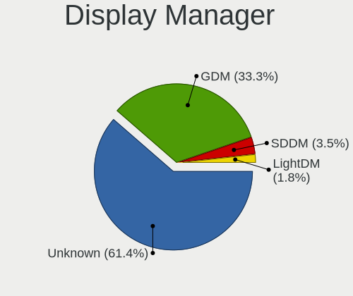

| Name    | Desktops | Percent |
|---------|----------|---------|
| Unknown | 7        | 77.78%  |
| GDM     | 2        | 22.22%  |

OS Lang
-------

Language

| Lang  | Desktops | Percent |
|-------|----------|---------|
| en_US | 3        | 33.33%  |
| en_CA | 2        | 22.22%  |
| de_DE | 2        | 22.22%  |
| uk_UA | 1        | 11.11%  |
| ru_RU | 1        | 11.11%  |

Boot Mode
---------

EFI or BIOS

| Mode | Desktops | Percent |
|------|----------|---------|
| EFI  | 6        | 66.67%  |
| BIOS | 3        | 33.33%  |

Filesystem
----------

Type of filesystem

| Type | Desktops | Percent |
|------|----------|---------|
| Xfs  | 7        | 77.78%  |
| Ext4 | 2        | 22.22%  |

Part. scheme
------------

Scheme of partitioning

| Type    | Desktops | Percent |
|---------|----------|---------|
| GPT     | 5        | 55.56%  |
| Unknown | 3        | 33.33%  |
| MBR     | 1        | 11.11%  |

Dual Boot with Linux/BSD
------------------------

Hosting more than one Linux/BSD

| Dual boot | Desktops | Percent |
|-----------|----------|---------|
| No        | 5        | 55.56%  |
| Yes       | 4        | 44.44%  |

Dual Boot (Win)
---------------

Hosting Linux and Windows

| Dual boot | Desktops | Percent |
|-----------|----------|---------|
| No        | 5        | 55.56%  |
| Yes       | 4        | 44.44%  |

Board
-----

Vendor
------

Motherboard manufacturer

| Name                | Desktops | Percent |
|---------------------|----------|---------|
| Gigabyte Technology | 2        | 22.22%  |
| ASUSTek Computer    | 2        | 22.22%  |
| Optimized Hosting   | 1        | 11.11%  |
| MSI                 | 1        | 11.11%  |
| Lenovo              | 1        | 11.11%  |
| Hewlett-Packard     | 1        | 11.11%  |
| ASRock              | 1        | 11.11%  |

Model
-----

Motherboard model

| Name                                | Desktops | Percent |
|-------------------------------------|----------|---------|
| Optimized Hosting KVM               | 1        | 11.11%  |
| MSI MS-7900                         | 1        | 11.11%  |
| Lenovo ThinkStation P350 30E6S20S00 | 1        | 11.11%  |
| HP Z600 Workstation                 | 1        | 11.11%  |
| Gigabyte Z590 AORUS PRO AX          | 1        | 11.11%  |
| Gigabyte H81M-D2V                   | 1        | 11.11%  |
| ASUS Q170M2                         | 1        | 11.11%  |
| ASUS M5A78L-M/USB3                  | 1        | 11.11%  |
| ASRock B460 Phantom Gaming 4        | 1        | 11.11%  |

Model Family
------------

Motherboard model prefix

| Name                  | Desktops | Percent |
|-----------------------|----------|---------|
| Optimized Hosting KVM | 1        | 11.11%  |
| MSI MS-7900           | 1        | 11.11%  |
| Lenovo ThinkStation   | 1        | 11.11%  |
| HP Z600               | 1        | 11.11%  |
| Gigabyte Z590         | 1        | 11.11%  |
| Gigabyte H81M-D2V     | 1        | 11.11%  |
| ASUS Q170M2           | 1        | 11.11%  |
| ASUS M5A78L-M         | 1        | 11.11%  |
| ASRock B460           | 1        | 11.11%  |

MFG Year
--------

Motherboard manufacture year

| Year | Desktops | Percent |
|------|----------|---------|
| 2022 | 1        | 11.11%  |
| 2021 | 1        | 11.11%  |
| 2020 | 1        | 11.11%  |
| 2018 | 1        | 11.11%  |
| 2015 | 1        | 11.11%  |
| 2014 | 1        | 11.11%  |
| 2013 | 1        | 11.11%  |
| 2011 | 1        | 11.11%  |
| 2009 | 1        | 11.11%  |

Form Factor
-----------

Physical design of the computer

| Name    | Desktops | Percent |
|---------|----------|---------|
| Desktop | 9        | 100%    |

Secure Boot
-----------

Enabled or disabled

| State    | Desktops | Percent |
|----------|----------|---------|
| Disabled | 8        | 88.89%  |
| Enabled  | 1        | 11.11%  |

Coreboot
--------

Have coreboot on board

| Used | Desktops | Percent |
|------|----------|---------|
| No   | 9        | 100%    |

RAM Size
--------

Total RAM memory

| Size in GB | Desktops | Percent |
|------------|----------|---------|
| 4.01-8.0   | 3        | 33.33%  |
| 8.01-16.0  | 3        | 33.33%  |
| 32.01-64.0 | 1        | 11.11%  |
| 24.01-32.0 | 1        | 11.11%  |
| 16.01-24.0 | 1        | 11.11%  |

RAM Used
--------

Used RAM memory

| Used GB   | Desktops | Percent |
|-----------|----------|---------|
| 2.01-3.0  | 4        | 44.44%  |
| 1.01-2.0  | 2        | 22.22%  |
| 4.01-8.0  | 1        | 11.11%  |
| 8.01-16.0 | 1        | 11.11%  |
| 0.51-1.0  | 1        | 11.11%  |

Total Drives
------------

Number of drives on board

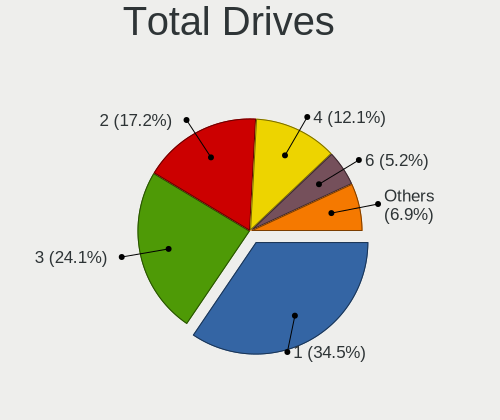

| Drives | Desktops | Percent |
|--------|----------|---------|
| 4      | 4        | 44.44%  |
| 2      | 2        | 22.22%  |
| 1      | 2        | 22.22%  |
| 5      | 1        | 11.11%  |

Has CD-ROM
----------

Has CD-ROM on board

| Presented | Desktops | Percent |
|-----------|----------|---------|
| No        | 7        | 77.78%  |
| Yes       | 2        | 22.22%  |

Has Ethernet
------------

Has Ethernet on board

| Presented | Desktops | Percent |
|-----------|----------|---------|
| Yes       | 8        | 88.89%  |
| No        | 1        | 11.11%  |

Has WiFi
--------

Has WiFi module

| Presented | Desktops | Percent |
|-----------|----------|---------|
| No        | 7        | 77.78%  |
| Yes       | 2        | 22.22%  |

Has Bluetooth
-------------

Has Bluetooth module

| Presented | Desktops | Percent |
|-----------|----------|---------|
| No        | 5        | 55.56%  |
| Yes       | 4        | 44.44%  |

Location
--------

Country
-------

Geographic location (country)

| Country     | Desktops | Percent |
|-------------|----------|---------|
| Russia      | 2        | 22.22%  |
| Canada      | 2        | 22.22%  |
| USA         | 1        | 11.11%  |
| Ukraine     | 1        | 11.11%  |
| Netherlands | 1        | 11.11%  |
| Germany     | 1        | 11.11%  |
| France      | 1        | 11.11%  |

City
----

Geographic location (city)

| City         | Desktops | Percent |
|--------------|----------|---------|
| Zaporizhzhia | 1        | 11.11%  |
| Strasbourg   | 1        | 11.11%  |
| Stadtilm     | 1        | 11.11%  |
| St. Paul     | 1        | 11.11%  |
| Shimanovsk   | 1        | 11.11%  |
| Moscow       | 1        | 11.11%  |
| Kitimat      | 1        | 11.11%  |
| Groningen    | 1        | 11.11%  |
| Bloomington  | 1        | 11.11%  |

Drives
------

Drive Vendor
------------

Hard drive vendors

| Vendor                      | Desktops | Drives | Percent |
|-----------------------------|----------|--------|---------|
| Seagate                     | 5        | 10     | 27.78%  |
| WDC                         | 2        | 2      | 11.11%  |
| Samsung Electronics         | 2        | 4      | 11.11%  |
| Crucial                     | 2        | 4      | 11.11%  |
| Toshiba                     | 1        | 1      | 5.56%   |
| SK hynix                    | 1        | 1      | 5.56%   |
| QEMU                        | 1        | 1      | 5.56%   |
| Netac                       | 1        | 1      | 5.56%   |
| LITEON                      | 1        | 1      | 5.56%   |
| Kingston Technology Company | 1        | 1      | 5.56%   |
| Kingston                    | 1        | 1      | 5.56%   |

Drive Model
-----------

Hard drive models

| Model                                       | Desktops | Percent |
|---------------------------------------------|----------|---------|
| WDC WD20EARS-00J2GB0 2TB                    | 1        | 4%      |
| WDC WD10EZEX-08WN4A0 1TB                    | 1        | 4%      |
| Toshiba DT01ACA100 1TB                      | 1        | 4%      |
| SK hynix SH920 2.5 7MM 256GB SSD            | 1        | 4%      |
| Seagate ST4000NM000A 00MX141 00MX141LEN 4TB | 1        | 4%      |
| Seagate ST4000NC001-1FS168 4TB              | 1        | 4%      |
| Seagate ST4000DM000-1F2168 4TB              | 1        | 4%      |
| Seagate ST31000528AS 1TB                    | 1        | 4%      |
| Seagate ST3000DM001-1CH166 3TB              | 1        | 4%      |
| Seagate ST2000DM001-1ER164 2TB              | 1        | 4%      |
| Seagate ST2000DL003-9VT166 2TB              | 1        | 4%      |
| Seagate ST1000NM0033-9ZM173 1TB             | 1        | 4%      |
| Seagate ST10000NM0478-2H7100 10TB           | 1        | 4%      |
| Seagate Expansion 4TB                       | 1        | 4%      |
| Samsung PSSD T7 Touch 1TB                   | 1        | 4%      |
| Samsung MZVL22T0HBLB-00BL7 2TB              | 1        | 4%      |
| Samsung MZ7LN256HAJQ-000L2 256GB SSD        | 1        | 4%      |
| QEMU HARDDISK                               | 1        | 4%      |
| Netac SSD 512GB                             | 1        | 4%      |
| LITEON CV1-8B256-HP 256GB SSD               | 1        | 4%      |
| Kingston Company A2000 NVMe SSD 1TB         | 1        | 4%      |
| Kingston SV300S37A240G 240GB SSD            | 1        | 4%      |
| Crucial CT480BX500SSD1 480GB                | 1        | 4%      |
| Crucial CT240BX500SSD1 240GB                | 1        | 4%      |
| Crucial CT1000P5PSSD8 1TB                   | 1        | 4%      |

HDD Vendor
----------

Hard disk drive vendors

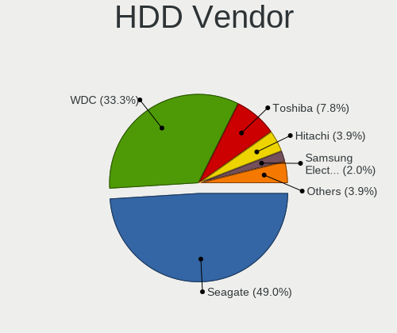

| Vendor  | Desktops | Drives | Percent |
|---------|----------|--------|---------|
| Seagate | 5        | 10     | 55.56%  |
| WDC     | 2        | 2      | 22.22%  |
| Toshiba | 1        | 1      | 11.11%  |
| QEMU    | 1        | 1      | 11.11%  |

SSD Vendor
----------

Solid state drive vendors

| Vendor              | Desktops | Drives | Percent |
|---------------------|----------|--------|---------|
| Samsung Electronics | 2        | 2      | 28.57%  |
| SK hynix            | 1        | 1      | 14.29%  |
| Netac               | 1        | 1      | 14.29%  |
| LITEON              | 1        | 1      | 14.29%  |
| Kingston            | 1        | 1      | 14.29%  |
| Crucial             | 1        | 2      | 14.29%  |

Drive Kind
----------

HDD or SSD

| Kind | Desktops | Drives | Percent |
|------|----------|--------|---------|
| HDD  | 7        | 14     | 43.75%  |
| SSD  | 6        | 8      | 37.5%   |
| NVMe | 3        | 5      | 18.75%  |

Drive Connector
---------------

SATA, SAS, NVMe, etc.

| Type | Desktops | Drives | Percent |
|------|----------|--------|---------|
| SATA | 9        | 20     | 64.29%  |
| NVMe | 3        | 5      | 21.43%  |
| SAS  | 2        | 2      | 14.29%  |

Drive Size
----------

Size of hard drive

| Size in TB | Desktops | Drives | Percent |
|------------|----------|--------|---------|
| 0.01-0.5   | 6        | 7      | 31.58%  |
| 0.51-1.0   | 5        | 6      | 26.32%  |
| 3.01-4.0   | 4        | 4      | 21.05%  |
| 1.01-2.0   | 2        | 3      | 10.53%  |
| 2.01-3.0   | 1        | 1      | 5.26%   |
| 4.01-10.0  | 1        | 1      | 5.26%   |

Space Total
-----------

Amount of disk space available on the file system

| Size in GB     | Desktops | Percent |
|----------------|----------|---------|
| 101-250        | 3        | 33.33%  |
| More than 3000 | 2        | 22.22%  |
| 2001-3000      | 1        | 11.11%  |
| 1001-2000      | 1        | 11.11%  |
| 1-20           | 1        | 11.11%  |
| 501-1000       | 1        | 11.11%  |

Space Used
----------

Amount of used disk space

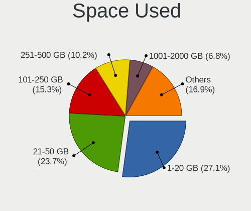

| Used GB        | Desktops | Percent |
|----------------|----------|---------|
| 1-20           | 3        | 33.33%  |
| 251-500        | 2        | 22.22%  |
| More than 3000 | 1        | 11.11%  |
| 2001-3000      | 1        | 11.11%  |
| 101-250        | 1        | 11.11%  |
| 51-100         | 1        | 11.11%  |

Malfunc. Drives
---------------

Drive models with a malfunction

| Model                            | Desktops | Drives | Percent |
|----------------------------------|----------|--------|---------|
| WDC WD20EARS-00J2GB0 2TB         | 1        | 1      | 50%     |
| SK hynix SH920 2.5 7MM 256GB SSD | 1        | 1      | 50%     |

Malfunc. Drive Vendor
---------------------

Vendors of faulty drives

| Vendor   | Desktops | Drives | Percent |
|----------|----------|--------|---------|
| WDC      | 1        | 1      | 50%     |
| SK hynix | 1        | 1      | 50%     |

Malfunc. HDD Vendor
-------------------

Vendors of faulty HDD drives

| Vendor | Desktops | Drives | Percent |
|--------|----------|--------|---------|
| WDC    | 1        | 1      | 100%    |

Malfunc. Drive Kind
-------------------

Kinds of faulty drives

| Kind | Desktops | Drives | Percent |
|------|----------|--------|---------|
| SSD  | 1        | 1      | 50%     |
| HDD  | 1        | 1      | 50%     |

Failed Drives
-------------

Failed drive models

Zero info for selected period =(

Failed Drive Vendor
-------------------

Failed drive vendors

Zero info for selected period =(

Drive Status
------------

Number of failed and malfunc. drives

| Status   | Desktops | Drives | Percent |
|----------|----------|--------|---------|
| Detected | 6        | 12     | 46.15%  |
| Works    | 5        | 13     | 38.46%  |
| Malfunc  | 2        | 2      | 15.38%  |

Storage controller
------------------

Storage Vendor
--------------

Storage controller vendors

| Vendor                      | Desktops | Percent |
|-----------------------------|----------|---------|
| Intel                       | 7        | 53.85%  |
| AMD                         | 2        | 15.38%  |
| Samsung Electronics         | 1        | 7.69%   |
| Red Hat                     | 1        | 7.69%   |
| Micron/Crucial Technology   | 1        | 7.69%   |
| Kingston Technology Company | 1        | 7.69%   |

Storage Model
-------------

Storage controller models

| Model                                                                          | Desktops | Percent |
|--------------------------------------------------------------------------------|----------|---------|
| Intel 500 Series Chipset Family SATA AHCI Controller                           | 2        | 14.29%  |
| Samsung NVMe SSD Controller PM9A1/PM9A3/980PRO                                 | 1        | 7.14%   |
| Red Hat Virtio SCSI                                                            | 1        | 7.14%   |
| Micron/Crucial P5 Plus NVMe PCIe SSD                                           | 1        | 7.14%   |
| Kingston Company A2000 NVMe SSD                                                | 1        | 7.14%   |
| Intel SATA Controller [RAID mode]                                              | 1        | 7.14%   |
| Intel Q170/Q150/B150/H170/H110/Z170/CM236 Chipset SATA Controller [AHCI Mode]  | 1        | 7.14%   |
| Intel 82801IR/IO/IH (ICH9R/DO/DH) 6 port SATA Controller [AHCI mode]           | 1        | 7.14%   |
| Intel 8 Series/C220 Series Chipset Family 6-port SATA Controller 1 [AHCI mode] | 1        | 7.14%   |
| Intel 400 Series Chipset Family SATA AHCI Controller                           | 1        | 7.14%   |
| AMD SB7x0/SB8x0/SB9x0 SATA Controller [IDE mode]                               | 1        | 7.14%   |
| AMD SB7x0/SB8x0/SB9x0 IDE Controller                                           | 1        | 7.14%   |
| AMD FCH SATA Controller [AHCI mode]                                            | 1        | 7.14%   |

Storage Kind
------------

Kind of storage controller (IDE, SATA, NVMe, SAS, ...)

| Kind | Desktops | Percent |
|------|----------|---------|
| SATA | 8        | 57.14%  |
| NVMe | 3        | 21.43%  |
| RAID | 1        | 7.14%   |
| SCSI | 1        | 7.14%   |
| IDE  | 1        | 7.14%   |

Processor
---------

CPU Vendor
----------

Processor vendors

| Vendor | Desktops | Percent |
|--------|----------|---------|
| Intel  | 6        | 66.67%  |
| AMD    | 3        | 33.33%  |

CPU Model
---------

Processor models

| Model                                           | Desktops | Percent |
|-------------------------------------------------|----------|---------|
| Intel Xeon W-1350 @ 3.30GHz                     | 1        | 11.11%  |
| Intel Xeon CPU X5550 @ 2.67GHz                  | 1        | 11.11%  |
| Intel Core i7-7700 CPU @ 3.60GHz                | 1        | 11.11%  |
| Intel Core i5-10400F CPU @ 2.90GHz              | 1        | 11.11%  |
| Intel Core i3-4130 CPU @ 3.40GHz                | 1        | 11.11%  |
| Intel 11th Gen Core i5-11400 @ 2.60GHz          | 1        | 11.11%  |
| AMD FX-8350 Eight-Core Processor                | 1        | 11.11%  |
| AMD EPYC-Rome Processor                         | 1        | 11.11%  |
| AMD A10-7850K Radeon R7, 12 Compute Cores 4C+8G | 1        | 11.11%  |

CPU Model Family
----------------

Processor model prefix

| Model         | Desktops | Percent |
|---------------|----------|---------|
| Intel Xeon    | 2        | 22.22%  |
| Other         | 1        | 11.11%  |
| Intel Core i7 | 1        | 11.11%  |
| Intel Core i5 | 1        | 11.11%  |
| Intel Core i3 | 1        | 11.11%  |
| AMD FX        | 1        | 11.11%  |
| AMD EPYC      | 1        | 11.11%  |
| AMD A10       | 1        | 11.11%  |

CPU Cores
---------

Number of processor cores

| Number | Desktops | Percent |
|--------|----------|---------|
| 4      | 4        | 44.44%  |
| 6      | 3        | 33.33%  |
| 2      | 2        | 22.22%  |

CPU Sockets
-----------

Number of sockets

| Number | Desktops | Percent |
|--------|----------|---------|
| 1      | 8        | 88.89%  |
| 4      | 1        | 11.11%  |

CPU Threads
-----------

Threads per core (Hyper-Threading)

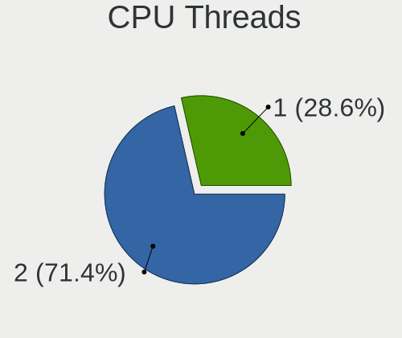

| Number | Desktops | Percent |
|--------|----------|---------|
| 2      | 8        | 88.89%  |
| 1      | 1        | 11.11%  |

CPU Op-Modes
------------

CPU Operation Modes (32-bit, 64-bit)

| Op mode        | Desktops | Percent |
|----------------|----------|---------|
| 32-bit, 64-bit | 9        | 100%    |

CPU Microcode
-------------

Microcode number

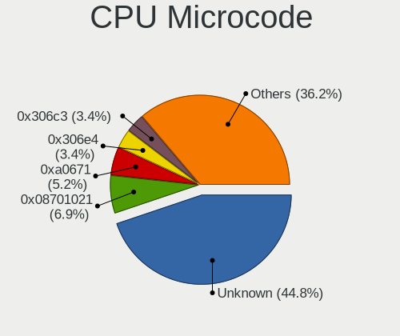

| Number     | Desktops | Percent |
|------------|----------|---------|
| 0xa0671    | 2        | 22.22%  |
| 0xa0655    | 1        | 11.11%  |
| 0x906e9    | 1        | 11.11%  |
| 0x306c3    | 1        | 11.11%  |
| 0x106a5    | 1        | 11.11%  |
| 0x06003106 | 1        | 11.11%  |
| 0x06000852 | 1        | 11.11%  |
| Unknown    | 1        | 11.11%  |

CPU Microarch
-------------

Microarchitecture

| Name        | Desktops | Percent |
|-------------|----------|---------|
| Icelake     | 2        | 22.22%  |
| Zen 2       | 1        | 11.11%  |
| Steamroller | 1        | 11.11%  |
| Piledriver  | 1        | 11.11%  |
| Nehalem     | 1        | 11.11%  |
| KabyLake    | 1        | 11.11%  |
| Haswell     | 1        | 11.11%  |
| CometLake   | 1        | 11.11%  |

Graphics
--------

GPU Vendor
----------

Vendors of graphics cards

| Vendor  | Desktops | Percent |
|---------|----------|---------|
| AMD     | 4        | 44.44%  |
| Intel   | 3        | 33.33%  |
| Red Hat | 1        | 11.11%  |
| Nvidia  | 1        | 11.11%  |

GPU Model
---------

Graphics card models

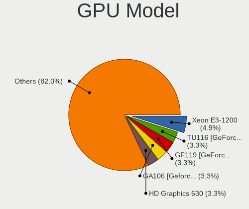

| Model                                                                     | Desktops | Percent |
|---------------------------------------------------------------------------|----------|---------|
| Red Hat QXL paravirtual graphic card                                      | 1        | 11.11%  |
| Nvidia GP104 [GeForce GTX 1080]                                           | 1        | 11.11%  |
| Intel RocketLake-S GT1 [UHD Graphics P750]                                | 1        | 11.11%  |
| Intel RocketLake-S GT1 [UHD Graphics 730]                                 | 1        | 11.11%  |
| Intel 4th Generation Core Processor Family Integrated Graphics Controller | 1        | 11.11%  |
| AMD RS780L [Radeon 3000]                                                  | 1        | 11.11%  |
| AMD Kaveri [Radeon R7 Graphics]                                           | 1        | 11.11%  |
| AMD Ellesmere [Radeon RX 470/480/570/570X/580/580X/590]                   | 1        | 11.11%  |
| AMD Baffin [Radeon RX 460/560D / Pro 450/455/460/555/555X/560/560X]       | 1        | 11.11%  |

GPU Combo
---------

Combinations of graphics cards

| Name        | Desktops | Percent |
|-------------|----------|---------|
| 1 x AMD     | 4        | 44.44%  |
| 1 x Intel   | 3        | 33.33%  |
| 1 x Red Hat | 1        | 11.11%  |
| 1 x Nvidia  | 1        | 11.11%  |

GPU Driver
----------

Free vs proprietary

| Driver  | Desktops | Percent |
|---------|----------|---------|
| Free    | 6        | 66.67%  |
| Unknown | 3        | 33.33%  |

GPU Memory
----------

Total video memory

| Size in GB | Desktops | Percent |
|------------|----------|---------|
| Unknown    | 5        | 55.56%  |
| 7.01-8.0   | 1        | 11.11%  |
| 1.01-2.0   | 1        | 11.11%  |
| 0.51-1.0   | 1        | 11.11%  |
| 0.01-0.5   | 1        | 11.11%  |

Monitor
-------

Monitor Vendor
--------------

Monitor vendors

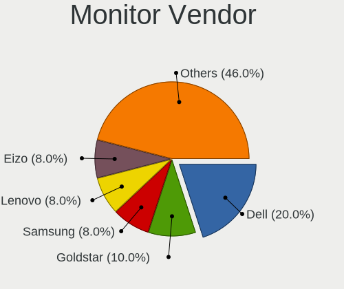

| Vendor              | Desktops | Percent |
|---------------------|----------|---------|
| ViewSonic           | 1        | 14.29%  |
| STD                 | 1        | 14.29%  |
| Samsung Electronics | 1        | 14.29%  |
| Philips             | 1        | 14.29%  |
| Lenovo              | 1        | 14.29%  |
| Goldstar            | 1        | 14.29%  |
| Dell                | 1        | 14.29%  |

Monitor Model
-------------

Monitor models

| Model                                                                | Desktops | Percent |
|----------------------------------------------------------------------|----------|---------|
| ViewSonic VX2233wm-1 VSC1D22 1920x1080 477x268mm 21.5-inch           | 1        | 12.5%   |
| STD HDMI TV STD00C7 1680x1050 698x392mm 31.5-inch                    | 1        | 12.5%   |
| Samsung Electronics SyncMaster SAM021B 1400x1050 408x300mm 19.9-inch | 1        | 12.5%   |
| Samsung Electronics S27H65x SAM0E1D 1920x1080 598x336mm 27.0-inch    | 1        | 12.5%   |
| Philips 19B PHL0879 1280x1024 376x301mm 19.0-inch                    | 1        | 12.5%   |
| Lenovo L24q-10 LEN65CF 2560x1440 527x296mm 23.8-inch                 | 1        | 12.5%   |
| Goldstar ULTRAWIDE GSM59F1 2560x1080 798x334mm 34.1-inch             | 1        | 12.5%   |
| Dell 1905FP DEL400C 1280x1024 376x301mm 19.0-inch                    | 1        | 12.5%   |

Monitor Resolution
------------------

Monitor screen resolution

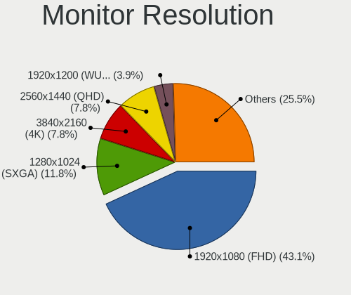

| Resolution       | Desktops | Percent |
|------------------|----------|---------|
| 1920x1080 (FHD)  | 3        | 37.5%   |
| 1280x1024 (SXGA) | 2        | 25%     |
| 2560x1440 (QHD)  | 1        | 12.5%   |
| 2560x1080        | 1        | 12.5%   |
| 1400x1050        | 1        | 12.5%   |

Monitor Diagonal
----------------

Diagonal size in inches

| Inches | Desktops | Percent |
|--------|----------|---------|
| 19     | 2        | 25%     |
| 34     | 1        | 12.5%   |
| 31     | 1        | 12.5%   |
| 27     | 1        | 12.5%   |
| 24     | 1        | 12.5%   |
| 21     | 1        | 12.5%   |
| 20     | 1        | 12.5%   |

Monitor Width
-------------

Physical width

| Width in mm | Desktops | Percent |
|-------------|----------|---------|
| 501-600     | 2        | 25%     |
| 401-500     | 2        | 25%     |
| 351-400     | 2        | 25%     |
| 701-800     | 1        | 12.5%   |
| 601-700     | 1        | 12.5%   |

Aspect Ratio
------------

Proportional relationship between the width and the height

| Ratio | Desktops | Percent |
|-------|----------|---------|
| 16/9  | 4        | 50%     |
| 6/5   | 1        | 12.5%   |
| 5/4   | 1        | 12.5%   |
| 4/3   | 1        | 12.5%   |
| 21/9  | 1        | 12.5%   |

Monitor Area
------------

Area in inch²

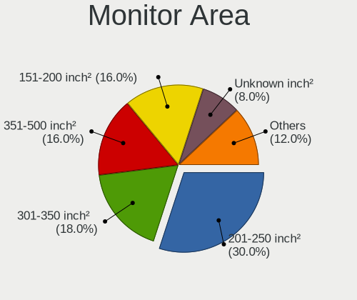

| Area in inch² | Desktops | Percent |
|----------------|----------|---------|
| 151-200        | 4        | 50%     |
| 351-500        | 2        | 25%     |
| 301-350        | 1        | 12.5%   |
| 201-250        | 1        | 12.5%   |

Pixel Density
-------------

Pixels per inch

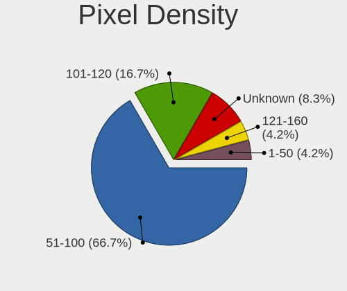

| Density | Desktops | Percent |
|---------|----------|---------|
| 51-100  | 5        | 71.43%  |
| 121-160 | 1        | 14.29%  |
| 101-120 | 1        | 14.29%  |

Multiple Monitors
-----------------

Total monitors connected

| Total | Desktops | Percent |
|-------|----------|---------|
| 2     | 3        | 33.33%  |
| 1     | 3        | 33.33%  |
| 0     | 3        | 33.33%  |

Network
-------

Net Controller Vendor
---------------------

Controller vendors

| Vendor                | Desktops | Percent |
|-----------------------|----------|---------|
| Intel                 | 4        | 40%     |
| Realtek Semiconductor | 3        | 30%     |
| Qualcomm Atheros      | 1        | 10%     |
| Broadcom Limited      | 1        | 10%     |
| Broadcom              | 1        | 10%     |

Net Controller Model
--------------------

Controller models

| Model                                                             | Desktops | Percent |
|-------------------------------------------------------------------|----------|---------|
| Realtek RTL8111/8168/8411 PCI Express Gigabit Ethernet Controller | 3        | 20%     |
| Realtek RTL-8100/8101L/8139 PCI Fast Ethernet Adapter             | 1        | 6.67%   |
| Qualcomm Atheros Killer E220x Gigabit Ethernet Controller         | 1        | 6.67%   |
| Intel Wireless 8260                                               | 1        | 6.67%   |
| Intel Wi-Fi 6 AX200                                               | 1        | 6.67%   |
| Intel I350 Gigabit Network Connection                             | 1        | 6.67%   |
| Intel I210 Gigabit Network Connection                             | 1        | 6.67%   |
| Intel Ethernet Controller I225-V                                  | 1        | 6.67%   |
| Intel Ethernet Connection I219-LM                                 | 1        | 6.67%   |
| Intel Ethernet Connection (2) I219-LM                             | 1        | 6.67%   |
| Intel Ethernet Connection (14) I219-LM                            | 1        | 6.67%   |
| Broadcom NetXtreme BCM5764M Gigabit Ethernet PCIe                 | 1        | 6.67%   |
| Broadcom Limited NetXtreme II BCM5709 Gigabit Ethernet            | 1        | 6.67%   |

Wireless Vendor
---------------

Wireless vendors

| Vendor | Desktops | Percent |
|--------|----------|---------|
| Intel  | 2        | 100%    |

Wireless Model
--------------

Wireless models

| Model               | Desktops | Percent |
|---------------------|----------|---------|
| Intel Wireless 8260 | 1        | 50%     |
| Intel Wi-Fi 6 AX200 | 1        | 50%     |

Ethernet Vendor
---------------

Ethernet vendors

| Vendor                | Desktops | Percent |
|-----------------------|----------|---------|
| Intel                 | 4        | 40%     |
| Realtek Semiconductor | 3        | 30%     |
| Qualcomm Atheros      | 1        | 10%     |
| Broadcom Limited      | 1        | 10%     |
| Broadcom              | 1        | 10%     |

Ethernet Model
--------------

Ethernet models

| Model                                                             | Desktops | Percent |
|-------------------------------------------------------------------|----------|---------|
| Realtek RTL8111/8168/8411 PCI Express Gigabit Ethernet Controller | 3        | 23.08%  |
| Realtek RTL-8100/8101L/8139 PCI Fast Ethernet Adapter             | 1        | 7.69%   |
| Qualcomm Atheros Killer E220x Gigabit Ethernet Controller         | 1        | 7.69%   |
| Intel I350 Gigabit Network Connection                             | 1        | 7.69%   |
| Intel I210 Gigabit Network Connection                             | 1        | 7.69%   |
| Intel Ethernet Controller I225-V                                  | 1        | 7.69%   |
| Intel Ethernet Connection I219-LM                                 | 1        | 7.69%   |
| Intel Ethernet Connection (2) I219-LM                             | 1        | 7.69%   |
| Intel Ethernet Connection (14) I219-LM                            | 1        | 7.69%   |
| Broadcom NetXtreme BCM5764M Gigabit Ethernet PCIe                 | 1        | 7.69%   |
| Broadcom Limited NetXtreme II BCM5709 Gigabit Ethernet            | 1        | 7.69%   |

Net Controller Kind
-------------------

Ethernet, WiFi or modem

| Kind     | Desktops | Percent |
|----------|----------|---------|
| Ethernet | 8        | 80%     |
| WiFi     | 2        | 20%     |

Used Controller
---------------

Currently used network controller

| Kind     | Desktops | Percent |
|----------|----------|---------|
| Ethernet | 6        | 75%     |
| WiFi     | 2        | 25%     |

NICs
----

Total network controllers on board

| Total | Desktops | Percent |
|-------|----------|---------|
| 2     | 4        | 44.44%  |
| 1     | 2        | 22.22%  |
| 5     | 1        | 11.11%  |
| 4     | 1        | 11.11%  |
| 0     | 1        | 11.11%  |

IPv6
----

IPv6 vs IPv4

| Used | Desktops | Percent |
|------|----------|---------|
| No   | 7        | 77.78%  |
| Yes  | 2        | 22.22%  |

Bluetooth
---------

Bluetooth Vendor
----------------

Controller vendors

| Vendor           | Desktops | Percent |
|------------------|----------|---------|
| Intel            | 2        | 50%     |
| Broadcom         | 1        | 25%     |
| ASUSTek Computer | 1        | 25%     |

Bluetooth Model
---------------

Controller models

| Model                              | Desktops | Percent |
|------------------------------------|----------|---------|
| Intel Bluetooth wireless interface | 1        | 25%     |
| Intel AX200 Bluetooth              | 1        | 25%     |
| Broadcom BCM2045 Bluetooth         | 1        | 25%     |
| ASUS Broadcom BCM20702A0 Bluetooth | 1        | 25%     |

Sound
-----

Sound Vendor
------------

Sound card vendors

| Vendor               | Desktops | Percent |
|----------------------|----------|---------|
| Intel                | 5        | 41.67%  |
| AMD                  | 4        | 33.33%  |
| Nvidia               | 1        | 8.33%   |
| Giga-Byte Technology | 1        | 8.33%   |
| Apple                | 1        | 8.33%   |

Sound Model
-----------

Sound card models

| Model                                                               | Desktops | Percent |
|---------------------------------------------------------------------|----------|---------|
| Nvidia GP104 High Definition Audio Controller                       | 1        | 6.67%   |
| Intel Xeon E3-1200 v3/4th Gen Core Processor HD Audio Controller    | 1        | 6.67%   |
| Intel Tiger Lake-H HD Audio Controller                              | 1        | 6.67%   |
| Intel Comet Lake PCH-V cAVS                                         | 1        | 6.67%   |
| Intel 82801JI (ICH10 Family) HD Audio Controller                    | 1        | 6.67%   |
| Intel 8 Series/C220 Series Chipset High Definition Audio Controller | 1        | 6.67%   |
| Intel 100 Series/C230 Series Chipset Family HD Audio Controller     | 1        | 6.67%   |
| Giga-Byte Technology USB Audio                                      | 1        | 6.67%   |
| Apple USB-C to 3.5mm Headphone Jack Adapter                         | 1        | 6.67%   |
| AMD SBx00 Azalia (Intel HDA)                                        | 1        | 6.67%   |
| AMD RS780 HDMI Audio [Radeon 3000/3100 / HD 3200/3300]              | 1        | 6.67%   |
| AMD Kaveri HDMI/DP Audio Controller                                 | 1        | 6.67%   |
| AMD FCH Azalia Controller                                           | 1        | 6.67%   |
| AMD Ellesmere HDMI Audio [Radeon RX 470/480 / 570/580/590]          | 1        | 6.67%   |
| AMD Baffin HDMI/DP Audio [Radeon RX 550 640SP / RX 560/560X]        | 1        | 6.67%   |

Memory
------

Memory Vendor
-------------

Memory module vendors

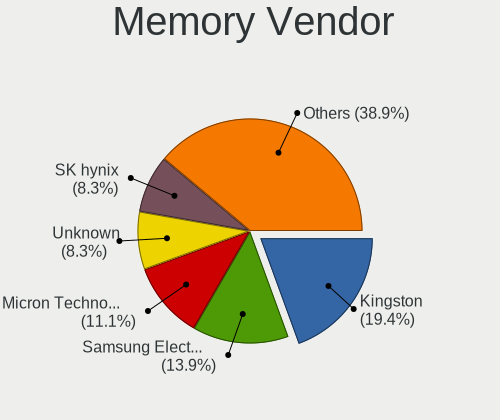

| Vendor            | Desktops | Percent |
|-------------------|----------|---------|
| Kingston          | 2        | 28.57%  |
| Crucial           | 2        | 28.57%  |
| Unknown           | 1        | 14.29%  |
| QEMU              | 1        | 14.29%  |
| Micron Technology | 1        | 14.29%  |

Memory Model
------------

Memory module models

| Model                                                   | Desktops | Percent |
|---------------------------------------------------------|----------|---------|
| Unknown RAM Module 8GB DIMM 1600MT/s                    | 1        | 14.29%  |
| QEMU RAM Module 8GB DIMM RAM                            | 1        | 14.29%  |
| Micron RAM 9ASF2G72AZ-3G2B1 16GB DIMM DDR4 3200MT/s     | 1        | 14.29%  |
| Kingston RAM KHX3200C16D4/8GX 8GB DIMM DDR4 3600MT/s    | 1        | 14.29%  |
| Kingston RAM ACR256X64D3U1333C9 2GB DIMM DDR3 1333MT/s  | 1        | 14.29%  |
| Crucial RAM CT8G4DFRA32A.C4FE 8192MB DIMM DDR4 3200MT/s | 1        | 14.29%  |
| Crucial RAM CT102464BA160B.C16 8GB DIMM DDR3 1600MT/s   | 1        | 14.29%  |

Memory Kind
-----------

Memory module kinds

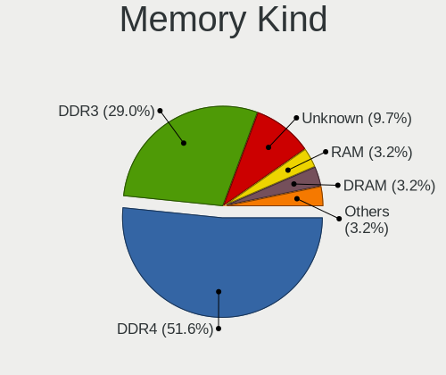

| Kind    | Desktops | Percent |
|---------|----------|---------|
| DDR4    | 3        | 42.86%  |
| DDR3    | 2        | 28.57%  |
| RAM     | 1        | 14.29%  |
| Unknown | 1        | 14.29%  |

Memory Form Factor
------------------

Physical design of the memory module

| Name | Desktops | Percent |
|------|----------|---------|
| DIMM | 7        | 100%    |

Memory Size
-----------

Memory module size

| Size  | Desktops | Percent |
|-------|----------|---------|
| 8192  | 5        | 71.43%  |
| 16384 | 1        | 14.29%  |
| 2048  | 1        | 14.29%  |

Memory Speed
------------

Memory module speed

| Speed   | Desktops | Percent |
|---------|----------|---------|
| 3200    | 2        | 28.57%  |
| 1600    | 2        | 28.57%  |
| 3600    | 1        | 14.29%  |
| 1333    | 1        | 14.29%  |
| Unknown | 1        | 14.29%  |

Printers & scanners
-------------------

Printer Vendor
--------------

Printer device vendors

Zero info for selected period =(

Printer Model
-------------

Printer device models

Zero info for selected period =(

Scanner Vendor
--------------

Scanner device vendors

Zero info for selected period =(

Scanner Model
-------------

Scanner device models

Zero info for selected period =(

Camera
------

Camera Vendor
-------------

Camera device vendors

| Vendor              | Desktops | Percent |
|---------------------|----------|---------|
| Creative Technology | 1        | 100%    |

Camera Model
------------

Camera device models

| Model                               | Desktops | Percent |
|-------------------------------------|----------|---------|
| Creative Live! Cam Chat HD [VF0700] | 1        | 100%    |

Security
--------

Fingerprint Vendor
------------------

Fingerprint sensor vendors

Zero info for selected period =(

Fingerprint Model
-----------------

Fingerprint sensor models

Zero info for selected period =(

Chipcard Vendor
---------------

Chipcard module vendors

Zero info for selected period =(

Chipcard Model
--------------

Chipcard module models

Zero info for selected period =(

Unsupported
-----------

Unsupported Devices
-------------------

Total unsupported devices on board

| Total | Desktops | Percent |
|-------|----------|---------|
| 0     | 6        | 66.67%  |
| 1     | 2        | 22.22%  |
| 5     | 1        | 11.11%  |

Unsupported Device Types
------------------------

Types of unsupported devices

| Type          | Desktops | Percent |
|---------------|----------|---------|
| Graphics card | 2        | 40%     |
| Storage/ide   | 1        | 20%     |
| Sound         | 1        | 20%     |
| Net/ethernet  | 1        | 20%     |

