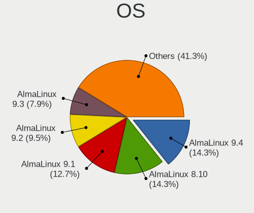
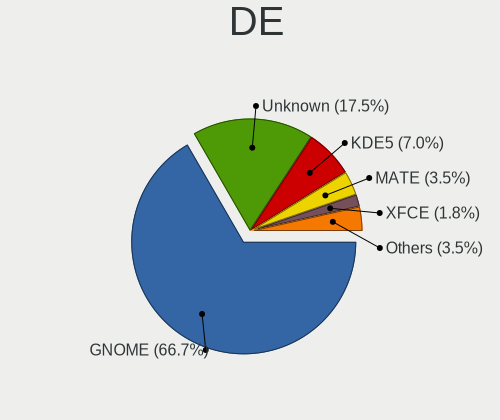
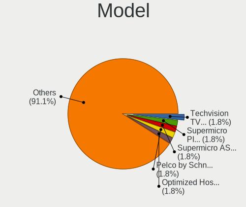
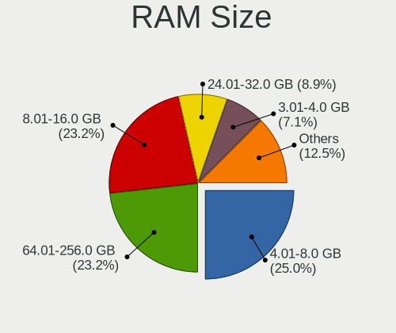
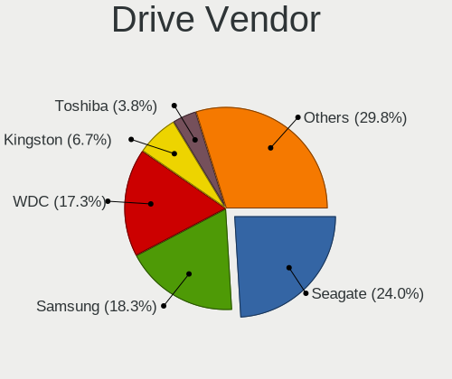
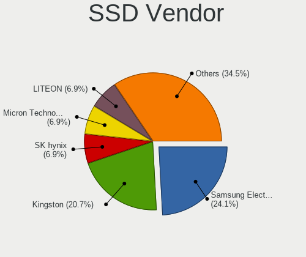
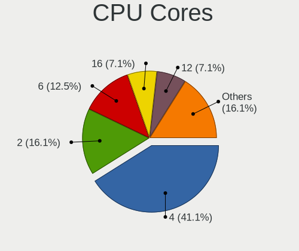
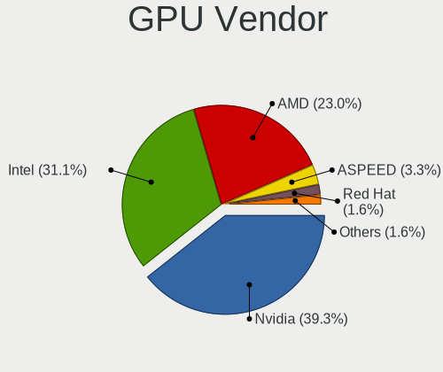
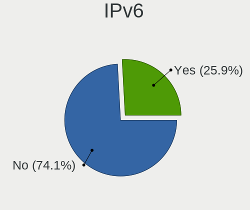

AlmaLinux - Tested Hardware & Statistics (Desktops)
---------------------------------------------------

A project to collect tested hardware configurations for AlmaLinux.

Anyone can contribute to this report by the [hw-probe](https://github.com/linuxhw/hw-probe) tool:

    sudo -E hw-probe -all -upload

Please contribute! Especially if your hardware is rare.

Contents
--------

* [ Test Cases ](#test-cases)

* [ System ](#system)
  - [ OS                       ](#os)
  - [ OS Family                ](#os-family)
  - [ Kernel                   ](#kernel)
  - [ Kernel Family            ](#kernel-family)
  - [ Kernel Major Ver.        ](#kernel-major-ver)
  - [ Arch                     ](#arch)
  - [ DE                       ](#de)
  - [ Display Server           ](#display-server)
  - [ Display Manager          ](#display-manager)
  - [ OS Lang                  ](#os-lang)
  - [ Boot Mode                ](#boot-mode)
  - [ Filesystem               ](#filesystem)
  - [ Part. scheme             ](#part-scheme)
  - [ Dual Boot with Linux/BSD ](#dual-boot-with-linuxbsd)
  - [ Dual Boot (Win)          ](#dual-boot-win)

* [ Board ](#board)
  - [ Vendor                   ](#vendor)
  - [ Model                    ](#model)
  - [ Model Family             ](#model-family)
  - [ MFG Year                 ](#mfg-year)
  - [ Form Factor              ](#form-factor)
  - [ Secure Boot              ](#secure-boot)
  - [ Coreboot                 ](#coreboot)
  - [ RAM Size                 ](#ram-size)
  - [ RAM Used                 ](#ram-used)
  - [ Total Drives             ](#total-drives)
  - [ Has CD-ROM               ](#has-cd-rom)
  - [ Has Ethernet             ](#has-ethernet)
  - [ Has WiFi                 ](#has-wifi)
  - [ Has Bluetooth            ](#has-bluetooth)

* [ Location ](#location)
  - [ Country                  ](#country)
  - [ City                     ](#city)

* [ Drives ](#drives)
  - [ Drive Vendor             ](#drive-vendor)
  - [ Drive Model              ](#drive-model)
  - [ HDD Vendor               ](#hdd-vendor)
  - [ SSD Vendor               ](#ssd-vendor)
  - [ Drive Kind               ](#drive-kind)
  - [ Drive Connector          ](#drive-connector)
  - [ Drive Size               ](#drive-size)
  - [ Space Total              ](#space-total)
  - [ Space Used               ](#space-used)
  - [ Malfunc. Drives          ](#malfunc-drives)
  - [ Malfunc. Drive Vendor    ](#malfunc-drive-vendor)
  - [ Malfunc. HDD Vendor      ](#malfunc-hdd-vendor)
  - [ Malfunc. Drive Kind      ](#malfunc-drive-kind)
  - [ Failed Drives            ](#failed-drives)
  - [ Failed Drive Vendor      ](#failed-drive-vendor)
  - [ Drive Status             ](#drive-status)

* [ Storage controller ](#storage-controller)
  - [ Storage Vendor           ](#storage-vendor)
  - [ Storage Model            ](#storage-model)
  - [ Storage Kind             ](#storage-kind)

* [ Processor ](#processor)
  - [ CPU Vendor               ](#cpu-vendor)
  - [ CPU Model                ](#cpu-model)
  - [ CPU Model Family         ](#cpu-model-family)
  - [ CPU Cores                ](#cpu-cores)
  - [ CPU Sockets              ](#cpu-sockets)
  - [ CPU Threads              ](#cpu-threads)
  - [ CPU Op-Modes             ](#cpu-op-modes)
  - [ CPU Microcode            ](#cpu-microcode)
  - [ CPU Microarch            ](#cpu-microarch)

* [ Graphics ](#graphics)
  - [ GPU Vendor               ](#gpu-vendor)
  - [ GPU Model                ](#gpu-model)
  - [ GPU Combo                ](#gpu-combo)
  - [ GPU Driver               ](#gpu-driver)
  - [ GPU Memory               ](#gpu-memory)

* [ Monitor ](#monitor)
  - [ Monitor Vendor           ](#monitor-vendor)
  - [ Monitor Model            ](#monitor-model)
  - [ Monitor Resolution       ](#monitor-resolution)
  - [ Monitor Diagonal         ](#monitor-diagonal)
  - [ Monitor Width            ](#monitor-width)
  - [ Aspect Ratio             ](#aspect-ratio)
  - [ Monitor Area             ](#monitor-area)
  - [ Pixel Density            ](#pixel-density)
  - [ Multiple Monitors        ](#multiple-monitors)

* [ Network ](#network)
  - [ Net Controller Vendor    ](#net-controller-vendor)
  - [ Net Controller Model     ](#net-controller-model)
  - [ Wireless Vendor          ](#wireless-vendor)
  - [ Wireless Model           ](#wireless-model)
  - [ Ethernet Vendor          ](#ethernet-vendor)
  - [ Ethernet Model           ](#ethernet-model)
  - [ Net Controller Kind      ](#net-controller-kind)
  - [ Used Controller          ](#used-controller)
  - [ NICs                     ](#nics)
  - [ IPv6                     ](#ipv6)

* [ Bluetooth ](#bluetooth)
  - [ Bluetooth Vendor         ](#bluetooth-vendor)
  - [ Bluetooth Model          ](#bluetooth-model)

* [ Sound ](#sound)
  - [ Sound Vendor             ](#sound-vendor)
  - [ Sound Model              ](#sound-model)

* [ Memory ](#memory)
  - [ Memory Vendor            ](#memory-vendor)
  - [ Memory Model             ](#memory-model)
  - [ Memory Kind              ](#memory-kind)
  - [ Memory Form Factor       ](#memory-form-factor)
  - [ Memory Size              ](#memory-size)
  - [ Memory Speed             ](#memory-speed)

* [ Printers & scanners ](#printers--scanners)
  - [ Printer Vendor           ](#printer-vendor)
  - [ Printer Model            ](#printer-model)
  - [ Scanner Vendor           ](#scanner-vendor)
  - [ Scanner Model            ](#scanner-model)

* [ Camera ](#camera)
  - [ Camera Vendor            ](#camera-vendor)
  - [ Camera Model             ](#camera-model)

* [ Security ](#security)
  - [ Fingerprint Vendor       ](#fingerprint-vendor)
  - [ Fingerprint Model        ](#fingerprint-model)
  - [ Chipcard Vendor          ](#chipcard-vendor)
  - [ Chipcard Model           ](#chipcard-model)

* [ Unsupported ](#unsupported)
  - [ Unsupported Devices      ](#unsupported-devices)
  - [ Unsupported Device Types ](#unsupported-device-types)

Test Cases
----------

Total: 147

| Vendor        | Model                       | Probe                                                      | Date         |
|---------------|-----------------------------|------------------------------------------------------------|--------------|
| Pelco by S... | DS-SRV2 S584XF01            | [7ed2a57a58](https://linux-hardware.org/?probe=7ed2a57a58) | Jan 03, 2025 |
| Dell          | 0JP3NX A01                  | [8675954a59](https://linux-hardware.org/?probe=8675954a59) | Dec 20, 2024 |
| MSI           | A320M-A PRO MAX             | [f160b8eebe](https://linux-hardware.org/?probe=f160b8eebe) | Dec 16, 2024 |
| ASUSTek       | PRIME B360M-D               | [5bdb93a154](https://linux-hardware.org/?probe=5bdb93a154) | Dec 02, 2024 |
| Optimized ... | KVM                         | [672aaf8ea5](https://linux-hardware.org/?probe=672aaf8ea5) | Nov 22, 2024 |
| Medion        | MS-7616                     | [0c544180a0](https://linux-hardware.org/?probe=0c544180a0) | Oct 23, 2024 |
| MACHINIST     | X99-MR9A PRO MAX V5.1       | [d7e2cffa85](https://linux-hardware.org/?probe=d7e2cffa85) | Oct 19, 2024 |
| Dell          | 0K2NWM A00                  | [465d3bfbda](https://linux-hardware.org/?probe=465d3bfbda) | Oct 17, 2024 |
| MSI           | Boston                      | [8e086f2e70](https://linux-hardware.org/?probe=8e086f2e70) | Oct 02, 2024 |
| Dell          | 0HD5W2 A01                  | [e21b766bf5](https://linux-hardware.org/?probe=e21b766bf5) | Sep 27, 2024 |
| HP            | 0AA0h                       | [056856286b](https://linux-hardware.org/?probe=056856286b) | Sep 26, 2024 |
| Dell          | 042P49 A02                  | [9f6b43e99e](https://linux-hardware.org/?probe=9f6b43e99e) | Sep 13, 2024 |
| HP            | 1791                        | [1bd7f12e61](https://linux-hardware.org/?probe=1bd7f12e61) | Sep 05, 2024 |
| HP            | 1589                        | [a21e698c3c](https://linux-hardware.org/?probe=a21e698c3c) | Sep 05, 2024 |
| Dell          | 0JP3NX A01                  | [0353987388](https://linux-hardware.org/?probe=0353987388) | Aug 31, 2024 |
| Supermicro    | H13DSG-O-CPU                | [08fd89ae34](https://linux-hardware.org/?probe=08fd89ae34) | Aug 22, 2024 |
| Supermicro    | H13DSG-O-CPU                | [069e34f016](https://linux-hardware.org/?probe=069e34f016) | Aug 20, 2024 |
| Techvision    | TVI7309X B0                 | [5685155a60](https://linux-hardware.org/?probe=5685155a60) | Aug 16, 2024 |
| Techvision    | TVI7309X B0                 | [9285a26f03](https://linux-hardware.org/?probe=9285a26f03) | Aug 15, 2024 |
| Gigabyte      | GA-880GM-USB3L              | [a0a2b265e5](https://linux-hardware.org/?probe=a0a2b265e5) | Aug 06, 2024 |
| MSI           | H110M PRO-VD PLUS           | [3bf15e63ac](https://linux-hardware.org/?probe=3bf15e63ac) | Jun 21, 2024 |
| MSI           | Boston                      | [4b244032d0](https://linux-hardware.org/?probe=4b244032d0) | Jun 19, 2024 |
| MSI           | Boston                      | [5252f63696](https://linux-hardware.org/?probe=5252f63696) | Jun 19, 2024 |
| ASRock        | Z790 PG SONIC               | [b5098f47bc](https://linux-hardware.org/?probe=b5098f47bc) | Jun 09, 2024 |
| Gigabyte      | H97-Gaming 3                | [98633fa042](https://linux-hardware.org/?probe=98633fa042) | Jun 08, 2024 |
| Intel         | DH77EB AAG39073-304         | [78e8b0e68e](https://linux-hardware.org/?probe=78e8b0e68e) | Jun 07, 2024 |
| Lenovo        | Kabini CRB NOK              | [f1053f6b0e](https://linux-hardware.org/?probe=f1053f6b0e) | Jun 05, 2024 |
| Lenovo        | Kabini CRB NOK              | [f5c76261aa](https://linux-hardware.org/?probe=f5c76261aa) | May 12, 2024 |
| Lenovo        | Kabini CRB NOK              | [dfa3d8f2cd](https://linux-hardware.org/?probe=dfa3d8f2cd) | Apr 29, 2024 |
| Haier         | TIGD2-CI                    | [dc4f526a80](https://linux-hardware.org/?probe=dc4f526a80) | Apr 23, 2024 |
| Dell          | 0D441T A01                  | [98b14bc73d](https://linux-hardware.org/?probe=98b14bc73d) | Apr 10, 2024 |
| Gigabyte      | X570 AORUS ULTRA            | [7db787716d](https://linux-hardware.org/?probe=7db787716d) | Mar 12, 2024 |
| ASUSTek       | P6X58D PREMIUM              | [ffc080a6f0](https://linux-hardware.org/?probe=ffc080a6f0) | Mar 09, 2024 |
| ASUSTek       | P6X58D PREMIUM              | [3a33a36874](https://linux-hardware.org/?probe=3a33a36874) | Mar 09, 2024 |
| HP            | 89D8 SMVB                   | [61f8c8c9e0](https://linux-hardware.org/?probe=61f8c8c9e0) | Jan 22, 2024 |
| HP            | 89D8 SMVB                   | [3c8308af97](https://linux-hardware.org/?probe=3c8308af97) | Jan 22, 2024 |
| Optimized ... | KVM                         | [4fe928d059](https://linux-hardware.org/?probe=4fe928d059) | Jan 11, 2024 |
| ASUSTek       | Pro WS WRX80E-SAGE SE WI... | [aa11af3235](https://linux-hardware.org/?probe=aa11af3235) | Dec 20, 2023 |
| ASUSTek       | Pro WS WRX80E-SAGE SE WI... | [230f41f6b5](https://linux-hardware.org/?probe=230f41f6b5) | Dec 12, 2023 |
| ASUSTek       | Pro WS WRX80E-SAGE SE WI... | [93675534e1](https://linux-hardware.org/?probe=93675534e1) | Dec 05, 2023 |
| HP            | 0B4Ch D                     | [85c03e03e8](https://linux-hardware.org/?probe=85c03e03e8) | Dec 04, 2023 |
| MSI           | MAG Z790 TOMAHAWK WIFI      | [746c6adb3f](https://linux-hardware.org/?probe=746c6adb3f) | Dec 04, 2023 |
| MSI           | MAG Z790 TOMAHAWK WIFI      | [7eaae92099](https://linux-hardware.org/?probe=7eaae92099) | Dec 04, 2023 |
| MSI           | MPG Z590 GAMING PLUS        | [d231a15a8f](https://linux-hardware.org/?probe=d231a15a8f) | Nov 22, 2023 |
| Intel         | X99                         | [c07799299c](https://linux-hardware.org/?probe=c07799299c) | Nov 19, 2023 |
| MSI           | MPG Z590 GAMING PLUS        | [e3760a331a](https://linux-hardware.org/?probe=e3760a331a) | Oct 31, 2023 |
| MSI           | MAG B550M BAZOOKA           | [492563a83c](https://linux-hardware.org/?probe=492563a83c) | Oct 24, 2023 |
| MSI           | MAG B550M BAZOOKA           | [3e4b32b047](https://linux-hardware.org/?probe=3e4b32b047) | Oct 24, 2023 |
| ASUSTek       | Pro WS WRX80E-SAGE SE WI... | [de8a8232ba](https://linux-hardware.org/?probe=de8a8232ba) | Oct 19, 2023 |
| Gigabyte      | X399 DESIGNARE EX-CF        | [d9bbe8269c](https://linux-hardware.org/?probe=d9bbe8269c) | Oct 10, 2023 |
| Intel         | DH77EB AAG39073-304         | [27ce5f6a61](https://linux-hardware.org/?probe=27ce5f6a61) | Oct 06, 2023 |
| HP            | 81C5 MVB                    | [ccdf9d0cfa](https://linux-hardware.org/?probe=ccdf9d0cfa) | Oct 02, 2023 |
| ASUSTek       | Pro WS WRX80E-SAGE SE WI... | [7ab6fc6901](https://linux-hardware.org/?probe=7ab6fc6901) | Sep 27, 2023 |
| HP            | 158B                        | [f8385c7d22](https://linux-hardware.org/?probe=f8385c7d22) | Sep 18, 2023 |
| HP            | 158B                        | [986f0c6ba1](https://linux-hardware.org/?probe=986f0c6ba1) | Sep 15, 2023 |
| ASUSTek       | Rampage V EDITION 10        | [727e431acb](https://linux-hardware.org/?probe=727e431acb) | Sep 03, 2023 |
| ASRockRack    | X470D4U2-2T                 | [058672ddad](https://linux-hardware.org/?probe=058672ddad) | Jul 18, 2023 |
| ASUSTek       | CROSSHAIR VI HERO           | [2330d7d072](https://linux-hardware.org/?probe=2330d7d072) | Jul 15, 2023 |
| ASRockRack    | X470D4U2-2T                 | [59f9ee3ee8](https://linux-hardware.org/?probe=59f9ee3ee8) | Jul 09, 2023 |
| ASRockRack    | X470D4U2-2T                 | [a686a6eed6](https://linux-hardware.org/?probe=a686a6eed6) | Jul 08, 2023 |
| Gigabyte      | X570S UD                    | [cd368fbd36](https://linux-hardware.org/?probe=cd368fbd36) | Jul 07, 2023 |
| ASRockRack    | X470D4U2-2T                 | [da271abdd3](https://linux-hardware.org/?probe=da271abdd3) | Jul 03, 2023 |
| ASRockRack    | X470D4U2-2T                 | [92bf7e658e](https://linux-hardware.org/?probe=92bf7e658e) | Jul 02, 2023 |
| ASRockRack    | X470D4U2-2T                 | [57424619e8](https://linux-hardware.org/?probe=57424619e8) | Jul 01, 2023 |
| ASRockRack    | X470D4U2-2T                 | [70ed50862c](https://linux-hardware.org/?probe=70ed50862c) | Jun 30, 2023 |
| ASRockRack    | X470D4U2-2T                 | [f36489e090](https://linux-hardware.org/?probe=f36489e090) | Jun 26, 2023 |
| ASRockRack    | X470D4U2-2T                 | [cf3b44c0b6](https://linux-hardware.org/?probe=cf3b44c0b6) | Jun 25, 2023 |
| ASRockRack    | X470D4U2-2T                 | [8738063b30](https://linux-hardware.org/?probe=8738063b30) | Jun 11, 2023 |
| ASRockRack    | X470D4U2-2T                 | [8e10de95af](https://linux-hardware.org/?probe=8e10de95af) | Jun 10, 2023 |
| ASRockRack    | X470D4U2-2T                 | [9c282e76a6](https://linux-hardware.org/?probe=9c282e76a6) | Jun 06, 2023 |
| ASRockRack    | X470D4U2-2T                 | [4592ff63f3](https://linux-hardware.org/?probe=4592ff63f3) | Jun 05, 2023 |
| ASRockRack    | X470D4U2-2T                 | [9a28272d6e](https://linux-hardware.org/?probe=9a28272d6e) | Jun 01, 2023 |
| ASRockRack    | X470D4U2-2T                 | [cffbd92b9f](https://linux-hardware.org/?probe=cffbd92b9f) | May 31, 2023 |
| ASRockRack    | X470D4U2-2T                 | [399cce0d30](https://linux-hardware.org/?probe=399cce0d30) | May 30, 2023 |
| ASRockRack    | X470D4U2-2T                 | [531455206b](https://linux-hardware.org/?probe=531455206b) | May 29, 2023 |
| ASRockRack    | X470D4U2-2T                 | [12a444a75a](https://linux-hardware.org/?probe=12a444a75a) | May 23, 2023 |
| ASRockRack    | X470D4U2-2T                 | [0f9deafb62](https://linux-hardware.org/?probe=0f9deafb62) | May 22, 2023 |
| Dell          | 0FDY5C A00                  | [3d9b02954b](https://linux-hardware.org/?probe=3d9b02954b) | May 16, 2023 |
| ASRockRack    | X470D4U2-2T                 | [465488c540](https://linux-hardware.org/?probe=465488c540) | May 15, 2023 |
| ASRockRack    | X470D4U2-2T                 | [413d3b7b92](https://linux-hardware.org/?probe=413d3b7b92) | May 14, 2023 |
| ASRockRack    | X470D4U2-2T                 | [2a69d13961](https://linux-hardware.org/?probe=2a69d13961) | May 13, 2023 |
| ASRockRack    | X470D4U2-2T                 | [208afe074a](https://linux-hardware.org/?probe=208afe074a) | May 12, 2023 |
| ASRockRack    | X470D4U2-2T                 | [64bd100bb5](https://linux-hardware.org/?probe=64bd100bb5) | May 09, 2023 |
| ASRockRack    | X470D4U2-2T                 | [28a1f44a1e](https://linux-hardware.org/?probe=28a1f44a1e) | May 08, 2023 |
| ASRockRack    | X470D4U2-2T                 | [2849b9a200](https://linux-hardware.org/?probe=2849b9a200) | May 02, 2023 |
| ASRockRack    | X470D4U2-2T                 | [34e7df2c84](https://linux-hardware.org/?probe=34e7df2c84) | May 01, 2023 |
| ASRockRack    | X470D4U2-2T                 | [f46e9f6ba7](https://linux-hardware.org/?probe=f46e9f6ba7) | Apr 30, 2023 |
| ASRockRack    | X470D4U2-2T                 | [9fdfb825c7](https://linux-hardware.org/?probe=9fdfb825c7) | Apr 27, 2023 |
| ASRockRack    | X470D4U2-2T                 | [b24f39801d](https://linux-hardware.org/?probe=b24f39801d) | Apr 26, 2023 |
| Dell          | 0FDY5C A00                  | [ddf678b11a](https://linux-hardware.org/?probe=ddf678b11a) | Apr 20, 2023 |
| ASUSTek       | PRIME B550-PLUS             | [6e9640e9c2](https://linux-hardware.org/?probe=6e9640e9c2) | Apr 15, 2023 |
| ASRockRack    | X470D4U2-2T                 | [9dd9a74143](https://linux-hardware.org/?probe=9dd9a74143) | Apr 12, 2023 |
| MSI           | B85-G43                     | [49c7de9ea6](https://linux-hardware.org/?probe=49c7de9ea6) | Apr 08, 2023 |
| ASRockRack    | X470D4U2-2T                 | [d699519c30](https://linux-hardware.org/?probe=d699519c30) | Apr 06, 2023 |
| ASRockRack    | X470D4U2-2T                 | [fbd686e3e2](https://linux-hardware.org/?probe=fbd686e3e2) | Apr 02, 2023 |
| ASRockRack    | X470D4U2-2T                 | [acb0f81194](https://linux-hardware.org/?probe=acb0f81194) | Apr 01, 2023 |
| Supermicro    | X9DRi-LN4+/X9DR3-LN4+       | [3c3474d69b](https://linux-hardware.org/?probe=3c3474d69b) | Mar 28, 2023 |
| Supermicro    | X9DRi-LN4+/X9DR3-LN4+       | [21f6af6f50](https://linux-hardware.org/?probe=21f6af6f50) | Mar 28, 2023 |
| ASRockRack    | X470D4U2-2T                 | [d96c0cfcd9](https://linux-hardware.org/?probe=d96c0cfcd9) | Mar 27, 2023 |
| ASRockRack    | X470D4U2-2T                 | [da489de02c](https://linux-hardware.org/?probe=da489de02c) | Mar 26, 2023 |
| ASRockRack    | X470D4U2-2T                 | [d21d79ee06](https://linux-hardware.org/?probe=d21d79ee06) | Mar 19, 2023 |
| ASRockRack    | X470D4U2-2T                 | [17e455c4df](https://linux-hardware.org/?probe=17e455c4df) | Mar 18, 2023 |
| ASRockRack    | X470D4U2-2T                 | [7d42741fac](https://linux-hardware.org/?probe=7d42741fac) | Mar 12, 2023 |
| ASRockRack    | X470D4U2-2T                 | [c5419b8b27](https://linux-hardware.org/?probe=c5419b8b27) | Mar 11, 2023 |
| ASRockRack    | X470D4U2-2T                 | [70b5b39ce8](https://linux-hardware.org/?probe=70b5b39ce8) | Mar 07, 2023 |
| ASRockRack    | X470D4U2-2T                 | [77ca3b430b](https://linux-hardware.org/?probe=77ca3b430b) | Mar 06, 2023 |
| ASRockRack    | X470D4U2-2T                 | [a750fc7c24](https://linux-hardware.org/?probe=a750fc7c24) | Mar 04, 2023 |
| ASRockRack    | X470D4U2-2T                 | [0a8ce98d46](https://linux-hardware.org/?probe=0a8ce98d46) | Mar 03, 2023 |
| ASRockRack    | X470D4U2-2T                 | [92300b45fe](https://linux-hardware.org/?probe=92300b45fe) | Mar 01, 2023 |
| ASRockRack    | X470D4U2-2T                 | [6ccb40f64d](https://linux-hardware.org/?probe=6ccb40f64d) | Feb 28, 2023 |
| ASRockRack    | X470D4U2-2T                 | [fb42cba088](https://linux-hardware.org/?probe=fb42cba088) | Feb 25, 2023 |
| ASRockRack    | X470D4U2-2T                 | [59ec61666a](https://linux-hardware.org/?probe=59ec61666a) | Feb 24, 2023 |
| ASRockRack    | X470D4U2-2T                 | [2a2dfe19fc](https://linux-hardware.org/?probe=2a2dfe19fc) | Feb 18, 2023 |
| ASRockRack    | X470D4U2-2T                 | [c913edda07](https://linux-hardware.org/?probe=c913edda07) | Feb 17, 2023 |
| ASRockRack    | X470D4U2-2T                 | [3e048e046a](https://linux-hardware.org/?probe=3e048e046a) | Feb 12, 2023 |
| ASRockRack    | X470D4U2-2T                 | [9a81107301](https://linux-hardware.org/?probe=9a81107301) | Feb 11, 2023 |
| HP            | 8455                        | [ffc8587d29](https://linux-hardware.org/?probe=ffc8587d29) | Feb 08, 2023 |
| ASRockRack    | X470D4U2-2T                 | [0593b2bac6](https://linux-hardware.org/?probe=0593b2bac6) | Feb 08, 2023 |
| ASRockRack    | X470D4U2-2T                 | [a019143fe9](https://linux-hardware.org/?probe=a019143fe9) | Feb 07, 2023 |
| ASRockRack    | X470D4U2-2T                 | [768696d7b8](https://linux-hardware.org/?probe=768696d7b8) | Feb 04, 2023 |
| ASRockRack    | X470D4U2-2T                 | [6bb0e68672](https://linux-hardware.org/?probe=6bb0e68672) | Feb 03, 2023 |
| ASRockRack    | X470D4U2-2T                 | [f6ad918c7e](https://linux-hardware.org/?probe=f6ad918c7e) | Feb 02, 2023 |
| Gigabyte      | Z690 GAMING X DDR4          | [21ce876854](https://linux-hardware.org/?probe=21ce876854) | Feb 01, 2023 |
| ASRockRack    | X470D4U2-2T                 | [602482d070](https://linux-hardware.org/?probe=602482d070) | Feb 01, 2023 |
| ASRockRack    | X470D4U2-2T                 | [af3cf25119](https://linux-hardware.org/?probe=af3cf25119) | Jan 31, 2023 |
| ASRockRack    | X470D4U2-2T                 | [ec76a40223](https://linux-hardware.org/?probe=ec76a40223) | Jan 30, 2023 |
| ASRock        | B450M Pro4 R2.0             | [e4289105c5](https://linux-hardware.org/?probe=e4289105c5) | Jan 30, 2023 |
| Lenovo        | MAHOBAY Win8 STD MM DPK ... | [ee36c9d395](https://linux-hardware.org/?probe=ee36c9d395) | Jan 30, 2023 |
| ASRockRack    | X470D4U2-2T                 | [6b99585bc0](https://linux-hardware.org/?probe=6b99585bc0) | Jan 29, 2023 |
| ASRockRack    | X470D4U2-2T                 | [b9f3d19faa](https://linux-hardware.org/?probe=b9f3d19faa) | Jan 26, 2023 |
| ASUSTek       | TUF Gaming B450-PLUS II     | [df1811bf5d](https://linux-hardware.org/?probe=df1811bf5d) | Jan 26, 2023 |
| ASRockRack    | X470D4U2-2T                 | [71a9255bc8](https://linux-hardware.org/?probe=71a9255bc8) | Jan 24, 2023 |
| ASRockRack    | X470D4U2-2T                 | [e327d1dea4](https://linux-hardware.org/?probe=e327d1dea4) | Jan 24, 2023 |
| ASRockRack    | X470D4U2-2T                 | [f62d0d9183](https://linux-hardware.org/?probe=f62d0d9183) | Jan 24, 2023 |
| ASRock        | B450M Pro4 R2.0             | [ed6204876e](https://linux-hardware.org/?probe=ed6204876e) | Jan 22, 2023 |
| HP            | 158A                        | [c0e1c9b6e6](https://linux-hardware.org/?probe=c0e1c9b6e6) | Jan 09, 2023 |
| MSI           | A88X-G45 GAMING             | [891e0757ed](https://linux-hardware.org/?probe=891e0757ed) | Dec 31, 2022 |
| MSI           | A88X-G45 GAMING             | [bdb45edaad](https://linux-hardware.org/?probe=bdb45edaad) | Dec 31, 2022 |
| Optimized ... | KVM                         | [d62625a751](https://linux-hardware.org/?probe=d62625a751) | Dec 13, 2022 |
| Gigabyte      | H81M-D2V                    | [6035f1ee45](https://linux-hardware.org/?probe=6035f1ee45) | Nov 11, 2022 |
| ASUSTek       | Q170M2                      | [c62954095d](https://linux-hardware.org/?probe=c62954095d) | Nov 11, 2022 |
| Lenovo        | 1052 NOK                    | [28cd1416fe](https://linux-hardware.org/?probe=28cd1416fe) | Sep 22, 2022 |
| ASRock        | B460 Phantom Gaming 4       | [0dc125da55](https://linux-hardware.org/?probe=0dc125da55) | Jul 05, 2022 |
| Gigabyte      | Z590 AORUS PRO AX           | [a517886d4d](https://linux-hardware.org/?probe=a517886d4d) | Feb 10, 2022 |
| ASUSTek       | M5A78L-M/USB3               | [e5a30a171e](https://linux-hardware.org/?probe=e5a30a171e) | Jun 08, 2021 |
| ASUSTek       | M5A78L-M/USB3               | [043878564d](https://linux-hardware.org/?probe=043878564d) | Jun 08, 2021 |
| HP            | 0AE8h C                     | [b7fd559b13](https://linux-hardware.org/?probe=b7fd559b13) | Mar 24, 2021 |

System
------

OS
--

Installed operating systems

| Name           | Desktops | Percent |
|----------------|----------|---------|
| AlmaLinux 9.4  | 9        | 14.29%  |
| AlmaLinux 8.10 | 9        | 14.29%  |
| AlmaLinux 9.1  | 8        | 12.7%   |
| AlmaLinux 9.2  | 6        | 9.52%   |
| AlmaLinux 9.3  | 5        | 7.94%   |
| AlmaLinux 8.9  | 5        | 7.94%   |
| AlmaLinux 8.8  | 5        | 7.94%   |
| AlmaLinux 8.7  | 5        | 7.94%   |
| AlmaLinux 9.5  | 3        | 4.76%   |
| AlmaLinux 9.0  | 3        | 4.76%   |
| AlmaLinux 8.6  | 2        | 3.17%   |
| AlmaLinux 8.5  | 1        | 1.59%   |
| AlmaLinux 8.4  | 1        | 1.59%   |
| AlmaLinux 8.3  | 1        | 1.59%   |

OS Family
---------

OS without a version

| Name      | Desktops | Percent |
|-----------|----------|---------|
| AlmaLinux | 56       | 100%    |

Kernel
------

Version of the Linux kernel

| Version                       | Desktops | Percent |
|-------------------------------|----------|---------|
| 4.18.0-553.16.1.el8_10.x86_64 | 5        | 7.58%   |
| 4.18.0-425.3.1.el8.x86_64     | 5        | 7.58%   |
| 5.14.0-427.28.1.el9_4.x86_64  | 3        | 4.55%   |
| 5.14.0-362.8.1.el9_3.x86_64   | 3        | 4.55%   |
| 5.14.0-284.30.1.el9_2.x86_64  | 3        | 4.55%   |
| 5.14.0-162.12.1.el9_1.x86_64  | 3        | 4.55%   |
| 5.14.0-70.30.1.el9_0.x86_64   | 2        | 3.03%   |
| 5.14.0-503.16.1.el9_5.x86_64  | 2        | 3.03%   |
| 5.14.0-427.33.1.el9_4.x86_64  | 2        | 3.03%   |
| 5.14.0-284.18.1.el9_2.x86_64  | 2        | 3.03%   |
| 5.14.0-162.6.1.el9_1.x86_64   | 2        | 3.03%   |
| 4.18.0-553.5.1.el8_10.x86_64  | 2        | 3.03%   |
| 4.18.0-553.22.1.el8_10.x86_64 | 2        | 3.03%   |
| 4.18.0-477.27.2.el8_8.x86_64  | 2        | 3.03%   |
| 4.18.0-477.21.1.el8_8.x86_64  | 2        | 3.03%   |
| 6.9.3-1.el9.elrepo.x86_64     | 1        | 1.52%   |
| 6.9.1-1.el8.elrepo.x86_64     | 1        | 1.52%   |
| 6.8.7-1.el8.elrepo.x86_64     | 1        | 1.52%   |
| 6.1.24-1kx.el9.x86_64         | 1        | 1.52%   |
| 5.4.274-1.el8.elrepo.x86_64   | 1        | 1.52%   |
| 5.14.0-70.22.1.el9_0.x86_64   | 1        | 1.52%   |
| 5.14.0-503.15.1.el9_5.x86_64  | 1        | 1.52%   |
| 5.14.0-427.40.1.el9_4.x86_64  | 1        | 1.52%   |
| 5.14.0-427.37.1.el9_4.x86_64  | 1        | 1.52%   |
| 5.14.0-427.20.1.el9_4.x86_64  | 1        | 1.52%   |
| 5.14.0-362.24.2.el9_3.x86_64  | 1        | 1.52%   |
| 5.14.0-362.13.1.el9_3.x86_64  | 1        | 1.52%   |
| 5.14.0-284.11.1.el9_2.x86_64  | 1        | 1.52%   |
| 5.14.0-162.22.2.el9_1.x86_64  | 1        | 1.52%   |
| 5.14.0-162.18.1.el9_1.x86_64  | 1        | 1.52%   |
| 4.18.0-553.27.1.el8_10.x86_64 | 1        | 1.52%   |
| 4.18.0-513.9.1.el8_9.x86_64   | 1        | 1.52%   |
| 4.18.0-513.5.1.el8_9.x86_64   | 1        | 1.52%   |
| 4.18.0-477.13.1.el8_8.x86_64  | 1        | 1.52%   |
| 4.18.0-477.10.1.el8_8.x86_64  | 1        | 1.52%   |
| 4.18.0-425.19.2.el8_7.x86_64  | 1        | 1.52%   |
| 4.18.0-425.13.1.el8_7.x86_64  | 1        | 1.52%   |
| 4.18.0-372.9.1.el8.x86_64     | 1        | 1.52%   |
| 4.18.0-348.12.2.el8_5.x86_64  | 1        | 1.52%   |
| 4.18.0-305.el8.x86_64         | 1        | 1.52%   |

Kernel Family
-------------

Linux kernel without a distro release

| Version | Desktops | Percent |
|---------|----------|---------|
| 5.14.0  | 32       | 54.24%  |
| 4.18.0  | 22       | 37.29%  |
| 6.9.3   | 1        | 1.69%   |
| 6.9.1   | 1        | 1.69%   |
| 6.8.7   | 1        | 1.69%   |
| 6.1.24  | 1        | 1.69%   |
| 5.4.274 | 1        | 1.69%   |

Kernel Major Ver.
-----------------

Linux kernel major version

| Version | Desktops | Percent |
|---------|----------|---------|
| 5.14    | 32       | 54.24%  |
| 4.18    | 22       | 37.29%  |
| 6.9     | 2        | 3.39%   |
| 6.8     | 1        | 1.69%   |
| 6.1     | 1        | 1.69%   |
| 5.4     | 1        | 1.69%   |

Arch
----

OS architecture (x86_64, i586, etc.)

| Name   | Desktops | Percent |
|--------|----------|---------|
| x86_64 | 56       | 100%    |

DE
--

Desktop Environment

| Name          | Desktops | Percent |
|---------------|----------|---------|
| GNOME         | 38       | 66.67%  |
| Unknown       | 10       | 17.54%  |
| KDE5          | 4        | 7.02%   |
| MATE          | 2        | 3.51%   |
| XFCE          | 1        | 1.75%   |
| X-Cinnamon    | 1        | 1.75%   |
| GNOME Classic | 1        | 1.75%   |

Display Server
--------------

X11 or Wayland

| Name    | Desktops | Percent |
|---------|----------|---------|
| Wayland | 27       | 46.55%  |
| X11     | 23       | 39.66%  |
| Tty     | 4        | 6.9%    |
| Unknown | 4        | 6.9%    |

Display Manager
---------------

SDDM, LightDM, etc.

| Name    | Desktops | Percent |
|---------|----------|---------|
| Unknown | 35       | 61.4%   |
| GDM     | 19       | 33.33%  |
| SDDM    | 2        | 3.51%   |
| LightDM | 1        | 1.75%   |

OS Lang
-------

Language

| Lang    | Desktops | Percent |
|---------|----------|---------|
| en_US   | 26       | 45.61%  |
| en_GB   | 4        | 7.02%   |
| de_DE   | 3        | 5.26%   |
| C       | 3        | 5.26%   |
| ru_RU   | 2        | 3.51%   |
| it_IT   | 2        | 3.51%   |
| fr_FR   | 2        | 3.51%   |
| fr_CA   | 2        | 3.51%   |
| en_CA   | 2        | 3.51%   |
| en_AU   | 2        | 3.51%   |
| Unknown | 2        | 3.51%   |
| zh_CN   | 1        | 1.75%   |
| uk_UA   | 1        | 1.75%   |
| ru_UA   | 1        | 1.75%   |
| pt_BR   | 1        | 1.75%   |
| pl_PL   | 1        | 1.75%   |
| hu_HU   | 1        | 1.75%   |
| da_DK   | 1        | 1.75%   |

Boot Mode
---------

EFI or BIOS

| Mode | Desktops | Percent |
|------|----------|---------|
| EFI  | 30       | 52.63%  |
| BIOS | 27       | 47.37%  |

Filesystem
----------

Type of filesystem

| Type  | Desktops | Percent |
|-------|----------|---------|
| Xfs   | 46       | 82.14%  |
| Ext4  | 9        | 16.07%  |
| Btrfs | 1        | 1.79%   |

Part. scheme
------------

Scheme of partitioning

| Type    | Desktops | Percent |
|---------|----------|---------|
| Unknown | 25       | 43.86%  |
| GPT     | 22       | 38.6%   |
| MBR     | 10       | 17.54%  |

Dual Boot with Linux/BSD
------------------------

Hosting more than one Linux/BSD

| Dual boot | Desktops | Percent |
|-----------|----------|---------|
| No        | 47       | 83.93%  |
| Yes       | 9        | 16.07%  |

Dual Boot (Win)
---------------

Hosting Linux and Windows

| Dual boot | Desktops | Percent |
|-----------|----------|---------|
| No        | 49       | 87.5%   |
| Yes       | 7        | 12.5%   |

Board
-----

Vendor
------

Motherboard manufacturer

| Name                        | Desktops | Percent |
|-----------------------------|----------|---------|
| Hewlett-Packard             | 10       | 17.86%  |
| MSI                         | 8        | 14.29%  |
| ASUSTek Computer            | 8        | 14.29%  |
| Gigabyte Technology         | 7        | 12.5%   |
| Dell                        | 6        | 10.71%  |
| Lenovo                      | 3        | 5.36%   |
| Intel                       | 3        | 5.36%   |
| Supermicro                  | 2        | 3.57%   |
| ASRock                      | 2        | 3.57%   |
| Techvision                  | 1        | 1.79%   |
| Pelco by Schneider Electric | 1        | 1.79%   |
| Optimized Hosting           | 1        | 1.79%   |
| Medion                      | 1        | 1.79%   |
| MACHINIST                   | 1        | 1.79%   |
| Haier                       | 1        | 1.79%   |
| ASRockRack                  | 1        | 1.79%   |

Model
-----

Motherboard model

| Name                                      | Desktops | Percent |
|-------------------------------------------|----------|---------|
| Techvision TVI7309X                       | 1        | 1.79%   |
| Supermicro PIO-617R-TLN4F+-ST031          | 1        | 1.79%   |
| Supermicro AS -4125GS-TNRT2               | 1        | 1.79%   |
| Pelco by Schneider Electric E1-MGW-SVRP   | 1        | 1.79%   |
| Optimized Hosting KVM                     | 1        | 1.79%   |
| MSI MS-7D91                               | 1        | 1.79%   |
| MSI MS-7D07                               | 1        | 1.79%   |
| MSI MS-7C95                               | 1        | 1.79%   |
| MSI MS-7C52                               | 1        | 1.79%   |
| MSI MS-7A15                               | 1        | 1.79%   |
| MSI MS-7900                               | 1        | 1.79%   |
| MSI MS-7816                               | 1        | 1.79%   |
| MSI KX624AA-ABZ SR5550IT                  | 1        | 1.79%   |
| Medion MS-7616                            | 1        | 1.79%   |
| MACHINIST X99-MR9A PRO MAX V5.1           | 1        | 1.79%   |
| Lenovo ThinkStation P350 30E6S20S00       | 1        | 1.79%   |
| Lenovo H520S 10093                        | 1        | 1.79%   |
| Lenovo H515s 10126                        | 1        | 1.79%   |
| Intel X99                                 | 1        | 1.79%   |
| Intel TTL TEKNOPRO                        | 1        | 1.79%   |
| Intel DH77EB AAG39073-304                 | 1        | 1.79%   |
| HP Z820 Workstation                       | 1        | 1.79%   |
| HP Z620 Workstation                       | 1        | 1.79%   |
| HP Z600 Workstation                       | 1        | 1.79%   |
| HP Z420 Workstation                       | 1        | 1.79%   |
| HP Z400 Workstation                       | 1        | 1.79%   |
| HP Z4 G4 Workstation                      | 1        | 1.79%   |
| HP Z220 SFF Workstation                   | 1        | 1.79%   |
| HP Z2 Tower G4 Workstation                | 1        | 1.79%   |
| HP xw4600 Workstation                     | 1        | 1.79%   |
| HP Victus by 15L Gaming Desktop TG02-0xxx | 1        | 1.79%   |
| Haier HaierComputer                       | 1        | 1.79%   |
| Gigabyte Z590 AORUS PRO AX                | 1        | 1.79%   |
| Gigabyte X570S UD                         | 1        | 1.79%   |
| Gigabyte X570 AORUS ULTRA                 | 1        | 1.79%   |
| Gigabyte X399 DESIGNARE EX                | 1        | 1.79%   |
| Gigabyte H97-Gaming 3                     | 1        | 1.79%   |
| Gigabyte H81M-D2V                         | 1        | 1.79%   |
| Gigabyte GA-880GM-USB3L                   | 1        | 1.79%   |
| Dell Precision 3450                       | 1        | 1.79%   |

Model Family
------------

Motherboard model prefix

| Name                                    | Desktops | Percent |
|-----------------------------------------|----------|---------|
| Dell OptiPlex                           | 5        | 8.93%   |
| ASUS PRIME                              | 2        | 3.57%   |
| Techvision TVI7309X                     | 1        | 1.79%   |
| Supermicro PIO-617R-TLN4F+-ST031        | 1        | 1.79%   |
| Supermicro AS                           | 1        | 1.79%   |
| Pelco by Schneider Electric E1-MGW-SVRP | 1        | 1.79%   |
| Optimized Hosting KVM                   | 1        | 1.79%   |
| MSI MS-7D91                             | 1        | 1.79%   |
| MSI MS-7D07                             | 1        | 1.79%   |
| MSI MS-7C95                             | 1        | 1.79%   |
| MSI MS-7C52                             | 1        | 1.79%   |
| MSI MS-7A15                             | 1        | 1.79%   |
| MSI MS-7900                             | 1        | 1.79%   |
| MSI MS-7816                             | 1        | 1.79%   |
| MSI KX624AA-ABZ                         | 1        | 1.79%   |
| Medion MS-7616                          | 1        | 1.79%   |
| MACHINIST X99-MR9A                      | 1        | 1.79%   |
| Lenovo ThinkStation                     | 1        | 1.79%   |
| Lenovo H520S                            | 1        | 1.79%   |
| Lenovo H515s                            | 1        | 1.79%   |
| Intel X99                               | 1        | 1.79%   |
| Intel TTL                               | 1        | 1.79%   |
| Intel DH77EB                            | 1        | 1.79%   |
| HP Z820                                 | 1        | 1.79%   |
| HP Z620                                 | 1        | 1.79%   |
| HP Z600                                 | 1        | 1.79%   |
| HP Z420                                 | 1        | 1.79%   |
| HP Z400                                 | 1        | 1.79%   |
| HP Z4                                   | 1        | 1.79%   |
| HP Z220                                 | 1        | 1.79%   |
| HP Z2                                   | 1        | 1.79%   |
| HP xw4600                               | 1        | 1.79%   |
| HP Victus                               | 1        | 1.79%   |
| Haier HaierComputer                     | 1        | 1.79%   |
| Gigabyte Z590                           | 1        | 1.79%   |
| Gigabyte X570S                          | 1        | 1.79%   |
| Gigabyte X570                           | 1        | 1.79%   |
| Gigabyte X399                           | 1        | 1.79%   |
| Gigabyte H97-Gaming                     | 1        | 1.79%   |
| Gigabyte H81M-D2V                       | 1        | 1.79%   |

MFG Year
--------

Motherboard manufacture year

| Year | Desktops | Percent |
|------|----------|---------|
| 2020 | 7        | 12.5%   |
| 2012 | 7        | 12.5%   |
| 2013 | 6        | 10.71%  |
| 2021 | 5        | 8.93%   |
| 2019 | 4        | 7.14%   |
| 2018 | 4        | 7.14%   |
| 2014 | 3        | 5.36%   |
| 2009 | 3        | 5.36%   |
| 2024 | 2        | 3.57%   |
| 2022 | 2        | 3.57%   |
| 2017 | 2        | 3.57%   |
| 2016 | 2        | 3.57%   |
| 2015 | 2        | 3.57%   |
| 2011 | 2        | 3.57%   |
| 2010 | 2        | 3.57%   |
| 2008 | 2        | 3.57%   |
| 2023 | 1        | 1.79%   |

Form Factor
-----------

Physical design of the computer

| Name    | Desktops | Percent |
|---------|----------|---------|
| Desktop | 56       | 100%    |

Secure Boot
-----------

Enabled or disabled

| State    | Desktops | Percent |
|----------|----------|---------|
| Disabled | 53       | 92.98%  |
| Enabled  | 4        | 7.02%   |

Coreboot
--------

Have coreboot on board

| Used | Desktops | Percent |
|------|----------|---------|
| No   | 56       | 100%    |

RAM Size
--------

Total RAM memory

| Size in GB      | Desktops | Percent |
|-----------------|----------|---------|
| 4.01-8.0        | 14       | 25%     |
| 64.01-256.0     | 13       | 23.21%  |
| 8.01-16.0       | 13       | 23.21%  |
| 24.01-32.0      | 5        | 8.93%   |
| 3.01-4.0        | 4        | 7.14%   |
| 32.01-64.0      | 3        | 5.36%   |
| More than 256.0 | 2        | 3.57%   |
| 16.01-24.0      | 2        | 3.57%   |

RAM Used
--------

Used RAM memory

| Used GB    | Desktops | Percent |
|------------|----------|---------|
| 2.01-3.0   | 15       | 25%     |
| 4.01-8.0   | 11       | 18.33%  |
| 1.01-2.0   | 10       | 16.67%  |
| 3.01-4.0   | 9        | 15%     |
| 0.51-1.0   | 6        | 10%     |
| 8.01-16.0  | 4        | 6.67%   |
| 32.01-64.0 | 2        | 3.33%   |
| 24.01-32.0 | 2        | 3.33%   |
| 16.01-24.0 | 1        | 1.67%   |

Total Drives
------------

Number of drives on board

| Drives | Desktops | Percent |
|--------|----------|---------|
| 1      | 20       | 34.48%  |
| 3      | 14       | 24.14%  |
| 2      | 10       | 17.24%  |
| 4      | 7        | 12.07%  |
| 6      | 3        | 5.17%   |
| 5      | 3        | 5.17%   |
| 10     | 1        | 1.72%   |

Has CD-ROM
----------

Has CD-ROM on board

| Presented | Desktops | Percent |
|-----------|----------|---------|
| No        | 33       | 58.93%  |
| Yes       | 23       | 41.07%  |

Has Ethernet
------------

Has Ethernet on board

| Presented | Desktops | Percent |
|-----------|----------|---------|
| Yes       | 55       | 98.21%  |
| No        | 1        | 1.79%   |

Has WiFi
--------

Has WiFi module

| Presented | Desktops | Percent |
|-----------|----------|---------|
| No        | 35       | 62.5%   |
| Yes       | 21       | 37.5%   |

Has Bluetooth
-------------

Has Bluetooth module

| Presented | Desktops | Percent |
|-----------|----------|---------|
| No        | 42       | 75%     |
| Yes       | 14       | 25%     |

Location
--------

Country
-------

Geographic location (country)

| Country      | Desktops | Percent |
|--------------|----------|---------|
| USA          | 8        | 14.29%  |
| Canada       | 7        | 12.5%   |
| Russia       | 6        | 10.71%  |
| France       | 5        | 8.93%   |
| Switzerland  | 3        | 5.36%   |
| Italy        | 3        | 5.36%   |
| China        | 3        | 5.36%   |
| Ukraine      | 2        | 3.57%   |
| UK           | 2        | 3.57%   |
| Romania      | 2        | 3.57%   |
| Hungary      | 2        | 3.57%   |
| Germany      | 2        | 3.57%   |
| Australia    | 2        | 3.57%   |
| Sweden       | 1        | 1.79%   |
| South Korea  | 1        | 1.79%   |
| South Africa | 1        | 1.79%   |
| Netherlands  | 1        | 1.79%   |
| Greenland    | 1        | 1.79%   |
| Czechia      | 1        | 1.79%   |
| Brazil       | 1        | 1.79%   |
| Bangladesh   | 1        | 1.79%   |
| Austria      | 1        | 1.79%   |

City
----

Geographic location (city)

| City             | Desktops | Percent |
|------------------|----------|---------|
| Moscow           | 3        | 5.17%   |
| Tunari           | 2        | 3.45%   |
| Sorel-Tracy      | 2        | 3.45%   |
| Milan            | 2        | 3.45%   |
| Beijing          | 2        | 3.45%   |
| Zurich           | 1        | 1.72%   |
| Zaporizhzhia     | 1        | 1.72%   |
| Wallingford      | 1        | 1.72%   |
| Vienna           | 1        | 1.72%   |
| Varosfoeld       | 1        | 1.72%   |
| Trappes          | 1        | 1.72%   |
| Strasbourg       | 1        | 1.72%   |
| Stadtilm         | 1        | 1.72%   |
| St. Paul         | 1        | 1.72%   |
| Shimanovsk       | 1        | 1.72%   |
| Shanghai         | 1        | 1.72%   |
| Santo André     | 1        | 1.72%   |
| Saint-Cloud      | 1        | 1.72%   |
| Saint-Brieuc     | 1        | 1.72%   |
| Rochester        | 1        | 1.72%   |
| Plauen           | 1        | 1.72%   |
| Pissos           | 1        | 1.72%   |
| Pardubice        | 1        | 1.72%   |
| Nizhniy Novgorod | 1        | 1.72%   |
| Newmarket        | 1        | 1.72%   |
| Montreal         | 1        | 1.72%   |
| Melbourne        | 1        | 1.72%   |
| Kyiv             | 1        | 1.72%   |
| Kitimat          | 1        | 1.72%   |
| Karlskrona       | 1        | 1.72%   |
| Jung-gu          | 1        | 1.72%   |
| Jilin City       | 1        | 1.72%   |
| Jamalpur         | 1        | 1.72%   |
| Irving           | 1        | 1.72%   |
| Irvine           | 1        | 1.72%   |
| Ilulissat        | 1        | 1.72%   |
| Groningen        | 1        | 1.72%   |
| Geneva           | 1        | 1.72%   |
| DeLand           | 1        | 1.72%   |
| Concord          | 1        | 1.72%   |

Drives
------

Drive Vendor
------------

Hard drive vendors

| Vendor                      | Desktops | Drives | Percent |
|-----------------------------|----------|--------|---------|
| Seagate                     | 25       | 35     | 24.04%  |
| Samsung Electronics         | 19       | 28     | 18.27%  |
| WDC                         | 18       | 37     | 17.31%  |
| Kingston                    | 7        | 11     | 6.73%   |
| Toshiba                     | 4        | 5      | 3.85%   |
| SanDisk                     | 4        | 8      | 3.85%   |
| SK hynix                    | 3        | 3      | 2.88%   |
| Crucial                     | 3        | 5      | 2.88%   |
| Micron Technology           | 2        | 3      | 1.92%   |
| LITEON                      | 2        | 2      | 1.92%   |
| KIOXIA                      | 2        | 5      | 1.92%   |
| Hitachi                     | 2        | 4      | 1.92%   |
| Team                        | 1        | 1      | 0.96%   |
| SPCC                        | 1        | 1      | 0.96%   |
| Silicon Motion              | 1        | 14     | 0.96%   |
| QEMU                        | 1        | 3      | 0.96%   |
| Phison Electronics          | 1        | 1      | 0.96%   |
| Patriot                     | 1        | 1      | 0.96%   |
| Netac                       | 1        | 1      | 0.96%   |
| Micron/Crucial Technology   | 1        | 1      | 0.96%   |
| Kingston Technology Company | 1        | 1      | 0.96%   |
| Intel                       | 1        | 1      | 0.96%   |
| HGST                        | 1        | 1      | 0.96%   |
| Hewlett-Packard             | 1        | 1      | 0.96%   |
| AMD                         | 1        | 15     | 0.96%   |

Drive Model
-----------

Hard drive models

| Model                                                | Desktops | Percent |
|------------------------------------------------------|----------|---------|
| Samsung NVMe SSD Controller SM981/PM981/PM983 512GB  | 3        | 2.27%   |
| Samsung NVMe SSD Controller PM9A1/PM9A3/980PRO 512GB | 3        | 2.27%   |
| Kingston SA400S37480G 480GB SSD                      | 3        | 2.27%   |
| WDC WD40EFRX-68N32N0 4TB                             | 2        | 1.52%   |
| WDC WD10EZEX-08WN4A0 1TB                             | 2        | 1.52%   |
| Seagate ST4000DM000-1F2168 4TB                       | 2        | 1.52%   |
| Seagate ST320LT020-9YG142 320GB                      | 2        | 1.52%   |
| Samsung SSD 980 1TB                                  | 2        | 1.52%   |
| Samsung NVMe SSD Controller SM951/PM951 256GB        | 2        | 1.52%   |
| Kingston SA400S37240G 240GB SSD                      | 2        | 1.52%   |
| Hitachi HTS543232A7A384 320GB                        | 2        | 1.52%   |
| WDC WDS100T2B0B-00YS70 1TB SSD                       | 1        | 0.76%   |
| WDC WDS100T2B0A-00SM50 1TB SSD                       | 1        | 0.76%   |
| WDC WD60EFRX-68L0BN1 6TB                             | 1        | 0.76%   |
| WDC WD40PURX-64GVNY0 4TB                             | 1        | 0.76%   |
| WDC WD40EZRX-00SPEB0 4TB                             | 1        | 0.76%   |
| WDC WD40EFZX-68AWUN0 4TB                             | 1        | 0.76%   |
| WDC WD40EFAX-68JH4N1 4TB                             | 1        | 0.76%   |
| WDC WD4000FYYZ-01UL1B2 4TB                           | 1        | 0.76%   |
| WDC WD4000FYYZ-01UL1B1 4TB                           | 1        | 0.76%   |
| WDC WD4000FDYZ-27YA5B0 4TB                           | 1        | 0.76%   |
| WDC WD4000F9YZ-09N20L1 4TB                           | 1        | 0.76%   |
| WDC WD3600FYYZ-01UL1B3 4TB                           | 1        | 0.76%   |
| WDC WD3600FYYZ-01UL1B1 4TB                           | 1        | 0.76%   |
| WDC WD35EFRX-68WT0N0 4TB                             | 1        | 0.76%   |
| WDC WD20NPVX-00EA4T0 2TB                             | 1        | 0.76%   |
| WDC WD20EZBX-60AYRA0 2TB                             | 1        | 0.76%   |
| WDC WD20EARS-00J2GB0 2TB                             | 1        | 0.76%   |
| WDC WD15EARS-00MVWB0 1TB                             | 1        | 0.76%   |
| WDC WD10EZEX-75M2NA0 1TB                             | 1        | 0.76%   |
| WDC WD10EZEX-22MFCA0 1TB                             | 1        | 0.76%   |
| WDC WD10EZEX-08M2NA0 1TB                             | 1        | 0.76%   |
| WDC WD10EZEX-00KUWA0 1TB                             | 1        | 0.76%   |
| WDC WD1003FBYX-01Y7B0 1TB                            | 1        | 0.76%   |
| WDC RAT035VWHG-GTK4D7 4TB                            | 1        | 0.76%   |
| WDC RAT035VQHR-GTK4D7 4TB                            | 1        | 0.76%   |
| Toshiba MG06ACA800E 8TB                              | 1        | 0.76%   |
| Toshiba MG06ACA10TEY 10TB                            | 1        | 0.76%   |
| Toshiba HDWD110 1TB                                  | 1        | 0.76%   |
| Toshiba DT01ACA100 1TB                               | 1        | 0.76%   |

HDD Vendor
----------

Hard disk drive vendors

| Vendor              | Desktops | Drives | Percent |
|---------------------|----------|--------|---------|
| Seagate             | 25       | 35     | 49.02%  |
| WDC                 | 17       | 34     | 33.33%  |
| Toshiba             | 4        | 5      | 7.84%   |
| Hitachi             | 2        | 4      | 3.92%   |
| Samsung Electronics | 1        | 1      | 1.96%   |
| QEMU                | 1        | 3      | 1.96%   |
| HGST                | 1        | 1      | 1.96%   |

SSD Vendor
----------

Solid state drive vendors

| Vendor              | Desktops | Drives | Percent |
|---------------------|----------|--------|---------|
| Samsung Electronics | 7        | 8      | 24.14%  |
| Kingston            | 6        | 7      | 20.69%  |
| SK hynix            | 2        | 2      | 6.9%    |
| Micron Technology   | 2        | 3      | 6.9%    |
| LITEON              | 2        | 2      | 6.9%    |
| Crucial             | 2        | 3      | 6.9%    |
| WDC                 | 1        | 3      | 3.45%   |
| Team                | 1        | 1      | 3.45%   |
| SPCC                | 1        | 1      | 3.45%   |
| SanDisk             | 1        | 2      | 3.45%   |
| Patriot             | 1        | 1      | 3.45%   |
| Netac               | 1        | 1      | 3.45%   |
| Intel               | 1        | 1      | 3.45%   |
| Hewlett-Packard     | 1        | 1      | 3.45%   |

Drive Kind
----------

HDD or SSD

| Kind | Desktops | Drives | Percent |
|------|----------|--------|---------|
| HDD  | 40       | 83     | 43.01%  |
| SSD  | 27       | 36     | 29.03%  |
| NVMe | 26       | 69     | 27.96%  |

Drive Connector
---------------

SATA, SAS, NVMe, etc.

| Type | Desktops | Drives | Percent |
|------|----------|--------|---------|
| SATA | 51       | 117    | 63.75%  |
| NVMe | 26       | 68     | 32.5%   |
| SAS  | 3        | 3      | 3.75%   |

Drive Size
----------

Size of hard drive

| Size in TB | Desktops | Drives | Percent |
|------------|----------|--------|---------|
| 0.01-0.5   | 28       | 42     | 36.84%  |
| 0.51-1.0   | 24       | 34     | 31.58%  |
| 3.01-4.0   | 10       | 27     | 13.16%  |
| 1.01-2.0   | 7        | 8      | 9.21%   |
| 4.01-10.0  | 6        | 7      | 7.89%   |
| 2.01-3.0   | 1        | 1      | 1.32%   |

Space Total
-----------

Amount of disk space available on the file system

| Size in GB     | Desktops | Percent |
|----------------|----------|---------|
| 501-1000       | 14       | 24.56%  |
| 101-250        | 13       | 22.81%  |
| More than 3000 | 7        | 12.28%  |
| 251-500        | 7        | 12.28%  |
| 1001-2000      | 6        | 10.53%  |
| 2001-3000      | 4        | 7.02%   |
| Unknown        | 3        | 5.26%   |
| 1-20           | 2        | 3.51%   |
| 51-100         | 1        | 1.75%   |

Space Used
----------

Amount of used disk space

| Used GB        | Desktops | Percent |
|----------------|----------|---------|
| 1-20           | 16       | 27.12%  |
| 21-50          | 14       | 23.73%  |
| 101-250        | 9        | 15.25%  |
| 251-500        | 6        | 10.17%  |
| 1001-2000      | 4        | 6.78%   |
| Unknown        | 3        | 5.08%   |
| More than 3000 | 2        | 3.39%   |
| 501-1000       | 2        | 3.39%   |
| 51-100         | 2        | 3.39%   |
| 2001-3000      | 1        | 1.69%   |

Malfunc. Drives
---------------

Drive models with a malfunction

| Model                             | Desktops | Drives | Percent |
|-----------------------------------|----------|--------|---------|
| WDC WD4000FDYZ-27YA5B0 4TB        | 1        | 1      | 11.11%  |
| WDC WD20EARS-00J2GB0 2TB          | 1        | 1      | 11.11%  |
| WDC WD1003FBYX-01Y7B0 1TB         | 1        | 1      | 11.11%  |
| SK hynix SH920 2.5 7MM 256GB SSD  | 1        | 1      | 11.11%  |
| Seagate ST4000DM000-1F2168 4TB    | 1        | 1      | 11.11%  |
| Seagate ST1000DM010-2EP102 1TB    | 1        | 2      | 11.11%  |
| Samsung Electronics HD642JJ 640GB | 1        | 1      | 11.11%  |
| Kingston SUV400S37240G 240GB SSD  | 1        | 1      | 11.11%  |
| HGST HTS725050A7E630 500GB        | 1        | 1      | 11.11%  |

Malfunc. Drive Vendor
---------------------

Vendors of faulty drives

| Vendor              | Desktops | Drives | Percent |
|---------------------|----------|--------|---------|
| WDC                 | 3        | 3      | 33.33%  |
| Seagate             | 2        | 3      | 22.22%  |
| SK hynix            | 1        | 1      | 11.11%  |
| Samsung Electronics | 1        | 1      | 11.11%  |
| Kingston            | 1        | 1      | 11.11%  |
| HGST                | 1        | 1      | 11.11%  |

Malfunc. HDD Vendor
-------------------

Vendors of faulty HDD drives

| Vendor              | Desktops | Drives | Percent |
|---------------------|----------|--------|---------|
| WDC                 | 3        | 3      | 42.86%  |
| Seagate             | 2        | 3      | 28.57%  |
| Samsung Electronics | 1        | 1      | 14.29%  |
| HGST                | 1        | 1      | 14.29%  |

Malfunc. Drive Kind
-------------------

Kinds of faulty drives

| Kind | Desktops | Drives | Percent |
|------|----------|--------|---------|
| HDD  | 7        | 8      | 77.78%  |
| SSD  | 2        | 2      | 22.22%  |

Failed Drives
-------------

Failed drive models

Zero info for selected period =(

Failed Drive Vendor
-------------------

Failed drive vendors

Zero info for selected period =(

Drive Status
------------

Number of failed and malfunc. drives

| Status   | Desktops | Drives | Percent |
|----------|----------|--------|---------|
| Detected | 31       | 83     | 45.59%  |
| Works    | 29       | 95     | 42.65%  |
| Malfunc  | 8        | 10     | 11.76%  |

Storage controller
------------------

Storage Vendor
--------------

Storage controller vendors

| Vendor                      | Desktops | Percent |
|-----------------------------|----------|---------|
| Intel                       | 40       | 43.01%  |
| AMD                         | 17       | 18.28%  |
| Samsung Electronics         | 11       | 11.83%  |
| Kingston Technology Company | 4        | 4.3%    |
| ASMedia Technology          | 4        | 4.3%    |
| SanDisk                     | 3        | 3.23%   |
| Micron/Crucial Technology   | 2        | 2.15%   |
| LSI Logic / Symbios Logic   | 2        | 2.15%   |
| KIOXIA                      | 2        | 2.15%   |
| Broadcom / LSI              | 2        | 2.15%   |
| SK hynix                    | 1        | 1.08%   |
| Silicon Motion              | 1        | 1.08%   |
| Red Hat                     | 1        | 1.08%   |
| Phison Electronics          | 1        | 1.08%   |
| Marvell Technology Group    | 1        | 1.08%   |
| 3ware                       | 1        | 1.08%   |

Storage Model
-------------

Storage controller models

| Model                                                                          | Desktops | Percent |
|--------------------------------------------------------------------------------|----------|---------|
| AMD FCH SATA Controller [AHCI mode]                                            | 11       | 9.82%   |
| Intel SATA Controller [RAID Mode]                                              | 10       | 8.93%   |
| Samsung NVMe SSD Controller SM981/PM981/PM983                                  | 4        | 3.57%   |
| Samsung NVMe SSD Controller PM9A1/PM9A3/980PRO                                 | 4        | 3.57%   |
| Intel C602 chipset 4-Port SATA Storage Control Unit                            | 4        | 3.57%   |
| Intel 8 Series/C220 Series Chipset Family 6-port SATA Controller 1 [AHCI mode] | 4        | 3.57%   |
| Intel 500 Series Chipset Family SATA AHCI Controller                           | 4        | 3.57%   |
| AMD 400 Series Chipset SATA Controller                                         | 4        | 3.57%   |
| Intel C600/X79 series chipset IDE-r Controller                                 | 3        | 2.68%   |
| Intel 7 Series/C210 Series Chipset Family 6-port SATA Controller [AHCI mode]   | 3        | 2.68%   |
| ASMedia ASM1061/ASM1062 Serial ATA Controller                                  | 3        | 2.68%   |
| Samsung NVMe SSD Controller SM951/PM951                                        | 2        | 1.79%   |
| Samsung NVMe SSD Controller 980 (DRAM-less)                                    | 2        | 1.79%   |
| Intel Q170/Q150/B150/H170/H110/Z170/CM236 Chipset SATA Controller [AHCI Mode]  | 2        | 1.79%   |
| Intel C600/X79 series chipset 6-Port SATA AHCI Controller                      | 2        | 1.79%   |
| AMD SB7x0/SB8x0/SB9x0 IDE Controller                                           | 2        | 1.79%   |
| AMD 500 Series Chipset SATA Controller                                         | 2        | 1.79%   |
| SK hynix Gold P31/BC711/PC711 NVMe Solid State Drive                           | 1        | 0.89%   |
| Silicon Motion SM2262/SM2262EN SSD Controller                                  | 1        | 0.89%   |
| SanDisk WD Blue SN570 NVMe SSD 2TB                                             | 1        | 0.89%   |
| SanDisk WD Black SN770 / PC SN740 256GB / PC SN560 (DRAM-less) NVMe SSD        | 1        | 0.89%   |
| SanDisk Extreme Pro / WD Black SN750 / PC SN730 / Red SN700 NVMe SSD           | 1        | 0.89%   |
| Red Hat Virtio 1.0 SCSI                                                        | 1        | 0.89%   |
| Phison E12 NVMe Controller                                                     | 1        | 0.89%   |
| Micron/Crucial P5 Plus NVMe PCIe SSD                                           | 1        | 0.89%   |
| Micron/Crucial P310 NVMe PCIe SSD (DRAM-less)                                  | 1        | 0.89%   |
| Marvell Group 88SE9123 PCIe SATA 6.0 Gb/s controller                           | 1        | 0.89%   |
| LSI Logic / Symbios Logic SAS2008 PCI-Express Fusion-MPT SAS-2 [Falcon]        | 1        | 0.89%   |
| LSI Logic / Symbios Logic MegaRAID SAS 2108 [Liberator]                        | 1        | 0.89%   |
| KIOXIA NVMe SSD Controller CM7 2.5"                                            | 1        | 0.89%   |
| KIOXIA NVMe SSD Controller BG4 (DRAM-less)                                     | 1        | 0.89%   |
| Kingston Company NV1 NVMe SSD [SM2263XT] (DRAM-less)                           | 1        | 0.89%   |
| Kingston Company NV1 NVMe SSD [E13T] (DRAM-less)                               | 1        | 0.89%   |
| Kingston Company KC3000/FURY Renegade NVMe SSD [E18]                           | 1        | 0.89%   |
| Kingston Company A2000 NVMe SSD [SM2263EN]                                     | 1        | 0.89%   |
| Intel Volume Management Device NVMe RAID Controller Intel Corporation          | 1        | 0.89%   |
| Intel Raptor Lake SATA AHCI Controller                                         | 1        | 0.89%   |
| Intel NM10/ICH7 Family SATA Controller [IDE mode]                              | 1        | 0.89%   |
| Intel NM10/ICH7 Family SATA Controller [AHCI mode]                             | 1        | 0.89%   |
| Intel Jasper Lake SATA AHCI Controller                                         | 1        | 0.89%   |

Storage Kind
------------

Kind of storage controller (IDE, SATA, NVMe, SAS, ...)

| Kind | Desktops | Percent |
|------|----------|---------|
| SATA | 45       | 46.39%  |
| NVMe | 25       | 25.77%  |
| RAID | 13       | 13.4%   |
| IDE  | 7        | 7.22%   |
| SAS  | 6        | 6.19%   |
| SCSI | 1        | 1.03%   |

Processor
---------

CPU Vendor
----------

Processor vendors

| Vendor | Desktops | Percent |
|--------|----------|---------|
| Intel  | 38       | 67.86%  |
| AMD    | 18       | 32.14%  |

CPU Model
---------

Processor models

| Model                                          | Desktops | Percent |
|------------------------------------------------|----------|---------|
| Intel Core i7 CPU 870 @ 2.93GHz                | 2        | 3.57%   |
| Intel Core i5-6500 CPU @ 3.20GHz               | 2        | 3.57%   |
| AMD Ryzen 9 3900X 12-Core Processor            | 2        | 3.57%   |
| Intel Xeon W-2223 CPU @ 3.60GHz                | 1        | 1.79%   |
| Intel Xeon W-1350 @ 3.30GHz                    | 1        | 1.79%   |
| Intel Xeon E-2144G CPU @ 3.60GHz               | 1        | 1.79%   |
| Intel Xeon CPU X5550 @ 2.67GHz                 | 1        | 1.79%   |
| Intel Xeon CPU E5540 @ 2.53GHz                 | 1        | 1.79%   |
| Intel Xeon CPU E5-2690 0 @ 2.90GHz             | 1        | 1.79%   |
| Intel Xeon CPU E5-2683 v4 @ 2.10GHz            | 1        | 1.79%   |
| Intel Xeon CPU E5-2680 v4 @ 2.40GHz            | 1        | 1.79%   |
| Intel Xeon CPU E5-2667 v2 @ 3.30GHz            | 1        | 1.79%   |
| Intel Xeon CPU E5-2620 v2 @ 2.10GHz            | 1        | 1.79%   |
| Intel Xeon CPU E5-1620 0 @ 3.60GHz             | 1        | 1.79%   |
| Intel Xeon CPU E3-1275 v3 @ 3.50GHz            | 1        | 1.79%   |
| Intel Xeon CPU E3-1245 V2 @ 3.40GHz            | 1        | 1.79%   |
| Intel Core i7-7700 CPU @ 3.60GHz               | 1        | 1.79%   |
| Intel Core i7-3770 CPU @ 3.40GHz               | 1        | 1.79%   |
| Intel Core i7-14700K                           | 1        | 1.79%   |
| Intel Core i7-10700 CPU @ 2.90GHz              | 1        | 1.79%   |
| Intel Core i7 CPU X 980 @ 3.33GHz              | 1        | 1.79%   |
| Intel Core i5-8600K CPU @ 3.60GHz              | 1        | 1.79%   |
| Intel Core i5-7500T CPU @ 2.70GHz              | 1        | 1.79%   |
| Intel Core i5-4460 CPU @ 3.20GHz               | 1        | 1.79%   |
| Intel Core i5-4440 CPU @ 3.10GHz               | 1        | 1.79%   |
| Intel Core i5-3570 CPU @ 3.40GHz               | 1        | 1.79%   |
| Intel Core i5-10400F CPU @ 2.90GHz             | 1        | 1.79%   |
| Intel Core i3-7100 CPU @ 3.90GHz               | 1        | 1.79%   |
| Intel Core i3-4130 CPU @ 3.40GHz               | 1        | 1.79%   |
| Intel Core i3-3240 CPU @ 3.40GHz               | 1        | 1.79%   |
| Intel Core i3-2130 CPU @ 3.40GHz               | 1        | 1.79%   |
| Intel Core 2 Quad CPU Q9300 @ 2.50GHz          | 1        | 1.79%   |
| Intel Core 2 Duo CPU E7500 @ 2.93GHz           | 1        | 1.79%   |
| Intel Celeron N5105 @ 2.00GHz                  | 1        | 1.79%   |
| Intel Atom CPU D2550 @ 1.86GHz                 | 1        | 1.79%   |
| Intel 11th Gen Core i7-11700K @ 3.60GHz        | 1        | 1.79%   |
| Intel 11th Gen Core i5-11400 @ 2.60GHz         | 1        | 1.79%   |
| AMD Ryzen Threadripper PRO 3975WX 32-Cores     | 1        | 1.79%   |
| AMD Ryzen Threadripper 1920X 12-Core Processor | 1        | 1.79%   |
| AMD Ryzen 9 5950X 16-Core Processor            | 1        | 1.79%   |

CPU Model Family
----------------

Processor model prefix

| Model                  | Desktops | Percent |
|------------------------|----------|---------|
| Intel Xeon             | 13       | 23.21%  |
| Intel Core i5          | 8        | 14.29%  |
| Intel Core i7          | 7        | 12.5%   |
| Intel Core i3          | 4        | 7.14%   |
| AMD Ryzen 9            | 4        | 7.14%   |
| AMD Ryzen 5            | 3        | 5.36%   |
| Other                  | 2        | 3.57%   |
| AMD Ryzen Threadripper | 2        | 3.57%   |
| AMD FX                 | 2        | 3.57%   |
| AMD EPYC               | 2        | 3.57%   |
| Intel Core 2 Quad      | 1        | 1.79%   |
| Intel Core 2 Duo       | 1        | 1.79%   |
| Intel Celeron          | 1        | 1.79%   |
| Intel Atom             | 1        | 1.79%   |
| AMD Ryzen 7            | 1        | 1.79%   |
| AMD Ryzen 3            | 1        | 1.79%   |
| AMD E2                 | 1        | 1.79%   |
| AMD A8                 | 1        | 1.79%   |
| AMD A10                | 1        | 1.79%   |

CPU Cores
---------

Number of processor cores

| Number | Desktops | Percent |
|--------|----------|---------|
| 4      | 23       | 41.07%  |
| 2      | 9        | 16.07%  |
| 6      | 7        | 12.5%   |
| 16     | 4        | 7.14%   |
| 12     | 4        | 7.14%   |
| 8      | 3        | 5.36%   |
| 32     | 2        | 3.57%   |
| 192    | 1        | 1.79%   |
| 20     | 1        | 1.79%   |
| 14     | 1        | 1.79%   |
| 1      | 1        | 1.79%   |

CPU Sockets
-----------

Number of sockets

| Number | Desktops | Percent |
|--------|----------|---------|
| 1      | 50       | 89.29%  |
| 2      | 5        | 8.93%   |
| 4      | 1        | 1.79%   |

CPU Threads
-----------

Threads per core (Hyper-Threading)

| Number | Desktops | Percent |
|--------|----------|---------|
| 2      | 40       | 71.43%  |
| 1      | 16       | 28.57%  |

CPU Op-Modes
------------

CPU Operation Modes (32-bit, 64-bit)

| Op mode        | Desktops | Percent |
|----------------|----------|---------|
| 32-bit, 64-bit | 56       | 100%    |

CPU Microcode
-------------

Microcode number

| Number     | Desktops | Percent |
|------------|----------|---------|
| Unknown    | 26       | 44.83%  |
| 0x08701021 | 4        | 6.9%    |
| 0xa0671    | 3        | 5.17%   |
| 0x306e4    | 2        | 3.45%   |
| 0x306c3    | 2        | 3.45%   |
| 0x106a5    | 2        | 3.45%   |
| 0x0a50000d | 2        | 3.45%   |
| 0x06000852 | 2        | 3.45%   |
| 0xa0655    | 1        | 1.72%   |
| 0x906ea    | 1        | 1.72%   |
| 0x906e9    | 1        | 1.72%   |
| 0x506e3    | 1        | 1.72%   |
| 0x50657    | 1        | 1.72%   |
| 0x306a9    | 1        | 1.72%   |
| 0x30661    | 1        | 1.72%   |
| 0x206d7    | 1        | 1.72%   |
| 0x206a7    | 1        | 1.72%   |
| 0x0a20120a | 1        | 1.72%   |
| 0x0a201016 | 1        | 1.72%   |
| 0x0a101148 | 1        | 1.72%   |
| 0x0830107a | 1        | 1.72%   |
| 0x08001137 | 1        | 1.72%   |
| 0x06003106 | 1        | 1.72%   |

CPU Microarch
-------------

Microarchitecture

| Name             | Desktops | Percent |
|------------------|----------|---------|
| Zen 2            | 7        | 12.5%   |
| IvyBridge        | 6        | 10.71%  |
| KabyLake         | 5        | 8.93%   |
| Zen 3            | 4        | 7.14%   |
| Nehalem          | 4        | 7.14%   |
| Haswell          | 4        | 7.14%   |
| Skylake          | 3        | 5.36%   |
| SandyBridge      | 3        | 5.36%   |
| Icelake          | 3        | 5.36%   |
| Piledriver       | 2        | 3.57%   |
| Penryn           | 2        | 3.57%   |
| CometLake        | 2        | 3.57%   |
| Broadwell        | 2        | 3.57%   |
| Zen              | 1        | 1.79%   |
| Westmere         | 1        | 1.79%   |
| Tremont          | 1        | 1.79%   |
| Steamroller      | 1        | 1.79%   |
| Jaguar           | 1        | 1.79%   |
| Excavator        | 1        | 1.79%   |
| Bonnell          | 1        | 1.79%   |
| Alderlake Hybrid | 1        | 1.79%   |
| Unknown          | 1        | 1.79%   |

Graphics
--------

GPU Vendor
----------

Vendors of graphics cards

| Vendor                     | Desktops | Percent |
|----------------------------|----------|---------|
| Nvidia                     | 24       | 39.34%  |
| Intel                      | 19       | 31.15%  |
| AMD                        | 14       | 22.95%  |
| ASPEED Technology          | 2        | 3.28%   |
| Red Hat                    | 1        | 1.64%   |
| Matrox Electronics Systems | 1        | 1.64%   |

GPU Model
---------

Graphics card models

| Model                                                                       | Desktops | Percent |
|-----------------------------------------------------------------------------|----------|---------|
| Intel Xeon E3-1200 v2/3rd Gen Core processor Graphics Controller            | 3        | 4.92%   |
| Nvidia TU116 [GeForce GTX 1660 SUPER]                                       | 2        | 3.28%   |
| Nvidia GF119 [GeForce GT 610]                                               | 2        | 3.28%   |
| Nvidia GA106 [Geforce RTX 3050]                                             | 2        | 3.28%   |
| Intel HD Graphics 630                                                       | 2        | 3.28%   |
| Intel HD Graphics 530                                                       | 2        | 3.28%   |
| ASPEED Technology ASPEED Graphics Family                                    | 2        | 3.28%   |
| AMD Cezanne [Radeon Vega Series / Radeon Vega Mobile Series]                | 2        | 3.28%   |
| Red Hat QXL paravirtual graphic card                                        | 1        | 1.64%   |
| Nvidia TU117GLM [Quadro T400 Mobile]                                        | 1        | 1.64%   |
| Nvidia TU117 [GeForce GTX 1650]                                             | 1        | 1.64%   |
| Nvidia GP107GL [Quadro P620]                                                | 1        | 1.64%   |
| Nvidia GP107 [GeForce GTX 1050 Ti]                                          | 1        | 1.64%   |
| Nvidia GP106GL [Quadro P2200]                                               | 1        | 1.64%   |
| Nvidia GP104 [GeForce GTX 1080]                                             | 1        | 1.64%   |
| Nvidia GM204GL [Quadro M4000]                                               | 1        | 1.64%   |
| Nvidia GM204 [GeForce GTX 970]                                              | 1        | 1.64%   |
| Nvidia GM107GL [Quadro K2200]                                               | 1        | 1.64%   |
| Nvidia GM107 [GeForce GTX 750 Ti]                                           | 1        | 1.64%   |
| Nvidia GK208B [GeForce GT 730]                                              | 1        | 1.64%   |
| Nvidia GK208B [GeForce GT 710]                                              | 1        | 1.64%   |
| Nvidia GK104 [GeForce GTX 770]                                              | 1        | 1.64%   |
| Nvidia GH100 [H100L 94GB]                                                   | 1        | 1.64%   |
| Nvidia GF108GL [Quadro 600]                                                 | 1        | 1.64%   |
| Nvidia GF108 [GeForce GT 730]                                               | 1        | 1.64%   |
| Nvidia GF100GL [Quadro 4000]                                                | 1        | 1.64%   |
| Nvidia AD102 [GeForce RTX 4090]                                             | 1        | 1.64%   |
| Matrox Electronics Systems MGA G200eW WPCM450                               | 1        | 1.64%   |
| Intel Xeon E3-1200 v3/4th Gen Core Processor Integrated Graphics Controller | 1        | 1.64%   |
| Intel Xeon E3-1200 v3 Processor Integrated Graphics Controller              | 1        | 1.64%   |
| Intel RocketLake-S GT1 [UHD Graphics P750]                                  | 1        | 1.64%   |
| Intel RocketLake-S GT1 [UHD Graphics 730]                                   | 1        | 1.64%   |
| Intel Raptor Lake-S GT1 [UHD Graphics 770]                                  | 1        | 1.64%   |
| Intel JasperLake [UHD Graphics]                                             | 1        | 1.64%   |
| Intel IvyBridge GT2 [HD Graphics 4000]                                      | 1        | 1.64%   |
| Intel CometLake-S GT2 [UHD Graphics 630]                                    | 1        | 1.64%   |
| Intel CoffeeLake-S GT2 [UHD Graphics 630]                                   | 1        | 1.64%   |
| Intel Atom Processor D2xxx/N2xxx Integrated Graphics Controller             | 1        | 1.64%   |
| Intel 4th Generation Core Processor Family Integrated Graphics Controller   | 1        | 1.64%   |
| Intel 2nd Generation Core Processor Family Integrated Graphics Controller   | 1        | 1.64%   |

GPU Combo
---------

Combinations of graphics cards

| Name            | Desktops | Percent |
|-----------------|----------|---------|
| 1 x Nvidia      | 19       | 33.93%  |
| 1 x Intel       | 17       | 30.36%  |
| 1 x AMD         | 12       | 21.43%  |
| 2 x Nvidia      | 1        | 1.79%   |
| 1 x Red Hat     | 1        | 1.79%   |
| Nvidia + ASPEED | 1        | 1.79%   |
| 1 x Matrox      | 1        | 1.79%   |
| Intel + Nvidia  | 1        | 1.79%   |
| Intel + AMD     | 1        | 1.79%   |
| 1 x ASPEED      | 1        | 1.79%   |
| AMD + Nvidia    | 1        | 1.79%   |

GPU Driver
----------

Free vs proprietary

| Driver      | Desktops | Percent |
|-------------|----------|---------|
| Free        | 38       | 65.52%  |
| Proprietary | 10       | 17.24%  |
| Unknown     | 10       | 17.24%  |

GPU Memory
----------

Total video memory

| Size in GB | Desktops | Percent |
|------------|----------|---------|
| Unknown    | 29       | 50%     |
| 1.01-2.0   | 7        | 12.07%  |
| 0.51-1.0   | 6        | 10.34%  |
| 7.01-8.0   | 4        | 6.9%    |
| 3.01-4.0   | 4        | 6.9%    |
| 0.01-0.5   | 4        | 6.9%    |
| 5.01-6.0   | 2        | 3.45%   |
| 4.01-5.0   | 1        | 1.72%   |
| 16.01-24.0 | 1        | 1.72%   |

Monitor
-------

Monitor Vendor
--------------

Monitor vendors

| Vendor               | Desktops | Percent |
|----------------------|----------|---------|
| Dell                 | 10       | 20%     |
| Goldstar             | 5        | 10%     |
| Samsung Electronics  | 4        | 8%      |
| Lenovo               | 4        | 8%      |
| Eizo                 | 4        | 8%      |
| Acer                 | 4        | 8%      |
| Philips              | 3        | 6%      |
| BenQ                 | 3        | 6%      |
| ViewSonic            | 2        | 4%      |
| AOC                  | 2        | 4%      |
| ___                  | 1        | 2%      |
| Vizio                | 1        | 2%      |
| Unknown              | 1        | 2%      |
| TopView              | 1        | 2%      |
| STD                  | 1        | 2%      |
| Panasonic            | 1        | 2%      |
| Medion               | 1        | 2%      |
| ASUSTek Computer     | 1        | 2%      |
| Ancor Communications | 1        | 2%      |

Monitor Model
-------------

Monitor models

| Model                                                                  | Desktops | Percent |
|------------------------------------------------------------------------|----------|---------|
| ___ LCD TV ___9000 1360x768                                            | 1        | 1.89%   |
| Vizio E191VA VIZ0067 1360x768 410x230mm 18.5-inch                      | 1        | 1.89%   |
| ViewSonic VX2233wm-1 VSC1D22 1920x1080 477x268mm 21.5-inch             | 1        | 1.89%   |
| ViewSonic VA2232 Series VSC8224 1680x1050 474x296mm 22.0-inch          | 1        | 1.89%   |
| Unknown LCD Monitor FFFF 2288x1287 2550x2550mm 142.0-inch              | 1        | 1.89%   |
| TopView HD TV TOPC37E 1920x1080 700x390mm 31.5-inch                    | 1        | 1.89%   |
| STD HDMI TV STD00C7 1920x1080 698x392mm 31.5-inch                      | 1        | 1.89%   |
| Samsung Electronics SyncMaster SAM021B 1400x1050 408x300mm 19.9-inch   | 1        | 1.89%   |
| Samsung Electronics S27H65x SAM0E1D 1920x1080 598x336mm 27.0-inch      | 1        | 1.89%   |
| Samsung Electronics LCD Monitor SAM0D42 3840x2160 1020x570mm 46.0-inch | 1        | 1.89%   |
| Samsung Electronics LCD Monitor S32B80P 5760x2160                      | 1        | 1.89%   |
| Samsung Electronics LCD Monitor S32B80P                                | 1        | 1.89%   |
| Samsung Electronics F27G3xTF SAM710D 1920x1080 600x330mm 27.0-inch     | 1        | 1.89%   |
| Philips PHL 272B7QU PHL0926 2560x1440 597x336mm 27.0-inch              | 1        | 1.89%   |
| Philips PHL 243V5 PHLC0D1 1920x1080 521x293mm 23.5-inch                | 1        | 1.89%   |
| Philips 19B PHL0879 1280x1024 376x301mm 19.0-inch                      | 1        | 1.89%   |
| Panasonic TV MEIA063 1280x720 1434x806mm 64.8-inch                     | 1        | 1.89%   |
| Medion MD7212AS MED4971 1280x1024 359x287mm 18.1-inch                  | 1        | 1.89%   |
| Lenovo LEN T2424pA LEN60C8 1920x1080 527x296mm 23.8-inch               | 1        | 1.89%   |
| Lenovo LEN L171 LEN240B 1280x1024 340x270mm 17.1-inch                  | 1        | 1.89%   |
| Lenovo L24q-10 LEN65CF 2560x1440 527x296mm 23.8-inch                   | 1        | 1.89%   |
| Lenovo D19-10 LEN61E0 1366x768 430x255mm 19.7-inch                     | 1        | 1.89%   |
| Goldstar ULTRAWIDE GSM59F1 2560x1080 677x290mm 29.0-inch               | 1        | 1.89%   |
| Goldstar L226W GSM566B 1680x1050 474x296mm 22.0-inch                   | 1        | 1.89%   |
| Goldstar FULL HD GSM5B55 1920x1080 480x270mm 21.7-inch                 | 1        | 1.89%   |
| Goldstar 23MP55 GSM5A23 1920x1080 510x290mm 23.1-inch                  | 1        | 1.89%   |
| Goldstar 22EA53 GSM59A6 1920x1080 477x268mm 21.5-inch                  | 1        | 1.89%   |
| Eizo RX220 ENC2146 1600x1200 440x330mm 21.7-inch                       | 1        | 1.89%   |
| Eizo LCD Monitor CG247 5760x2160                                       | 1        | 1.89%   |
| Eizo LCD Monitor CG247 1920x1200                                       | 1        | 1.89%   |
| Eizo EV2480 ENC3225 1920x1080 528x297mm 23.9-inch                      | 1        | 1.89%   |
| Eizo EV2336W ENC2390 1920x1080 510x287mm 23.0-inch                     | 1        | 1.89%   |
| Dell UP3017 DEL40FA 2560x1600 640x400mm 29.7-inch                      | 1        | 1.89%   |
| Dell U2412M DELA07A 1920x1200 518x324mm 24.1-inch                      | 1        | 1.89%   |
| Dell S2715H DEL40BB 1920x1080 598x336mm 27.0-inch                      | 1        | 1.89%   |
| Dell P3424WE DELA226 3440x1440 800x335mm 34.1-inch                     | 1        | 1.89%   |
| Dell P2419H DELD0D9 1920x1080 527x296mm 23.8-inch                      | 1        | 1.89%   |
| Dell P2417H DELA0DB 1920x1080 527x296mm 23.8-inch                      | 1        | 1.89%   |
| Dell LCD Monitor U2515H 2560x1440                                      | 1        | 1.89%   |
| Dell G2722HS DEL427D 1920x1080 597x336mm 27.0-inch                     | 1        | 1.89%   |

Monitor Resolution
------------------

Monitor screen resolution

| Resolution         | Desktops | Percent |
|--------------------|----------|---------|
| 1920x1080 (FHD)    | 22       | 43.14%  |
| 1280x1024 (SXGA)   | 6        | 11.76%  |
| 3840x2160 (4K)     | 4        | 7.84%   |
| 2560x1440 (QHD)    | 4        | 7.84%   |
| 1920x1200 (WUXGA)  | 2        | 3.92%   |
| 1680x1050 (WSXGA+) | 2        | 3.92%   |
| 1280x720 (HD)      | 2        | 3.92%   |
| 5760x2160          | 1        | 1.96%   |
| 3440x1440          | 1        | 1.96%   |
| 2560x1600          | 1        | 1.96%   |
| 2560x1080          | 1        | 1.96%   |
| 2288x1287          | 1        | 1.96%   |
| 1600x1200          | 1        | 1.96%   |
| 1400x1050          | 1        | 1.96%   |
| 1366x768 (WXGA)    | 1        | 1.96%   |
| Unknown            | 1        | 1.96%   |

Monitor Diagonal
----------------

Diagonal size in inches

| Inches  | Desktops | Percent |
|---------|----------|---------|
| 27      | 9        | 18%     |
| 24      | 6        | 12%     |
| 31      | 5        | 10%     |
| 23      | 5        | 10%     |
| 21      | 5        | 10%     |
| 19      | 5        | 10%     |
| Unknown | 4        | 8%      |
| 34      | 2        | 4%      |
| 17      | 2        | 4%      |
| 142     | 1        | 2%      |
| 84      | 1        | 2%      |
| 64      | 1        | 2%      |
| 29      | 1        | 2%      |
| 22      | 1        | 2%      |
| 20      | 1        | 2%      |
| 18      | 1        | 2%      |

Monitor Width
-------------

Physical width

| Width in mm    | Desktops | Percent |
|----------------|----------|---------|
| 501-600        | 19       | 38%     |
| 401-500        | 9        | 18%     |
| 601-700        | 6        | 12%     |
| 351-400        | 5        | 10%     |
| Unknown        | 4        | 8%      |
| 701-800        | 2        | 4%      |
| 301-350        | 2        | 4%      |
| More than 2000 | 1        | 2%      |
| 1501-2000      | 1        | 2%      |
| 1001-1500      | 1        | 2%      |

Aspect Ratio
------------

Proportional relationship between the width and the height

| Ratio   | Desktops | Percent |
|---------|----------|---------|
| 16/9    | 31       | 62%     |
| 5/4     | 6        | 12%     |
| 16/10   | 3        | 6%      |
| Unknown | 3        | 6%      |
| 4/3     | 2        | 4%      |
| 21/9    | 2        | 4%      |
| 6/5     | 1        | 2%      |
| 3/2     | 1        | 2%      |
| 1.00    | 1        | 2%      |

Monitor Area
------------

Area in inch²

| Area in inch² | Desktops | Percent |
|----------------|----------|---------|
| 201-250        | 15       | 30%     |
| 301-350        | 9        | 18%     |
| 351-500        | 8        | 16%     |
| 151-200        | 8        | 16%     |
| Unknown        | 4        | 8%      |
| More than 1000 | 3        | 6%      |
| 141-150        | 2        | 4%      |
| 251-300        | 1        | 2%      |

Pixel Density
-------------

Pixels per inch

| Density | Desktops | Percent |
|---------|----------|---------|
| 51-100  | 32       | 66.67%  |
| 101-120 | 8        | 16.67%  |
| Unknown | 4        | 8.33%   |
| 1-50    | 2        | 4.17%   |
| 121-160 | 2        | 4.17%   |

Multiple Monitors
-----------------

Total monitors connected

| Total | Desktops | Percent |
|-------|----------|---------|
| 1     | 39       | 67.24%  |
| 0     | 11       | 18.97%  |
| 2     | 8        | 13.79%  |

Network
-------

Net Controller Vendor
---------------------

Controller vendors

| Vendor                   | Desktops | Percent |
|--------------------------|----------|---------|
| Intel                    | 30       | 37.04%  |
| Realtek Semiconductor    | 27       | 33.33%  |
| Qualcomm Atheros         | 5        | 6.17%   |
| TP-Link                  | 4        | 4.94%   |
| Ralink Technology        | 3        | 3.7%    |
| Broadcom Limited         | 2        | 2.47%   |
| Broadcom                 | 2        | 2.47%   |
| Sigma Designs            | 1        | 1.23%   |
| Ralink                   | 1        | 1.23%   |
| Mellanox Technologies    | 1        | 1.23%   |
| Marvell Technology Group | 1        | 1.23%   |
| Insyde Software          | 1        | 1.23%   |
| Emulex                   | 1        | 1.23%   |
| Chelsio Communications   | 1        | 1.23%   |
| 3Com                     | 1        | 1.23%   |

Net Controller Model
--------------------

Controller models

| Model                                                                          | Desktops | Percent |
|--------------------------------------------------------------------------------|----------|---------|
| Realtek RTL8111/8168/8211/8411 PCI Express Gigabit Ethernet Controller         | 21       | 20%     |
| Intel Ethernet Controller X550                                                 | 5        | 4.76%   |
| Intel 82579LM Gigabit Network Connection (Lewisville)                          | 4        | 3.81%   |
| Realtek RTL8153 Gigabit Ethernet Adapter                                       | 3        | 2.86%   |
| Realtek RTL-8100/8101L/8139 PCI Fast Ethernet Adapter                          | 3        | 2.86%   |
| Intel Wi-Fi 6 AX200                                                            | 3        | 2.86%   |
| Intel I211 Gigabit Network Connection                                          | 3        | 2.86%   |
| Intel I210 Gigabit Network Connection                                          | 3        | 2.86%   |
| Intel Ethernet Controller I225-V                                               | 3        | 2.86%   |
| Intel Ethernet Connection (2) I219-LM                                          | 3        | 2.86%   |
| TP-Link Archer T2U PLUS [RTL8821AU]                                            | 2        | 1.9%    |
| Realtek RTL8125 2.5GbE Controller                                              | 2        | 1.9%    |
| Realtek RTL810xE PCI Express Fast Ethernet controller                          | 2        | 1.9%    |
| Ralink MT7601U Wireless Adapter                                                | 2        | 1.9%    |
| Qualcomm Atheros Killer E220x Gigabit Ethernet Controller                      | 2        | 1.9%    |
| Intel I350 Gigabit Network Connection                                          | 2        | 1.9%    |
| Intel Ethernet Connection (14) I219-LM                                         | 2        | 1.9%    |
| Intel 82579V Gigabit Network Connection                                        | 2        | 1.9%    |
| Intel 82574L Gigabit Network Connection                                        | 2        | 1.9%    |
| Broadcom NetXtreme BCM5764M Gigabit Ethernet PCIe                              | 2        | 1.9%    |
| TP-Link Archer T4U ver.3                                                       | 1        | 0.95%   |
| TP-Link Archer T3U [Realtek RTL8812BU]                                         | 1        | 0.95%   |
| Sigma Designs Aeotec Z-Stick Gen5 (ZW090) - UZB                                | 1        | 0.95%   |
| Realtek RTL8852AE 802.11ax PCIe Wireless Network Adapter                       | 1        | 0.95%   |
| Realtek RTL8814AU 802.11a/b/g/n/ac Wireless Adapter                            | 1        | 0.95%   |
| Realtek RTL8188EUS 802.11n Wireless Network Adapter                            | 1        | 0.95%   |
| Ralink RT3572 Wireless Adapter                                                 | 1        | 0.95%   |
| Ralink RT2790 Wireless 802.11n 1T/2R PCIe                                      | 1        | 0.95%   |
| Qualcomm Atheros AR9485 Wireless Network Adapter                               | 1        | 0.95%   |
| Qualcomm Atheros AR93xx Wireless Network Adapter                               | 1        | 0.95%   |
| Qualcomm Atheros AR5413/AR5414 Wireless Network Adapter [AR5006X(S) 802.11abg] | 1        | 0.95%   |
| Mellanox MT2892 Family [ConnectX-6 Dx]                                         | 1        | 0.95%   |
| Mellanox MT27710 Family [ConnectX-4 Lx]                                        | 1        | 0.95%   |
| Marvell Group 88E8056 PCI-E Gigabit Ethernet Controller                        | 1        | 0.95%   |
| Intel Wireless 8265 / 8275                                                     | 1        | 0.95%   |
| Intel Wireless 8260                                                            | 1        | 0.95%   |
| Intel Wireless 3165                                                            | 1        | 0.95%   |
| Intel Tiger Lake PCH CNVi WiFi                                                 | 1        | 0.95%   |
| Intel Raptor Lake-S PCH CNVi WiFi                                              | 1        | 0.95%   |
| Intel Ethernet Controller X710 for 10GBASE-T                                   | 1        | 0.95%   |

Wireless Vendor
---------------

Wireless vendors

| Vendor                | Desktops | Percent |
|-----------------------|----------|---------|
| Intel                 | 8        | 36.36%  |
| TP-Link               | 4        | 18.18%  |
| Realtek Semiconductor | 3        | 13.64%  |
| Ralink Technology     | 3        | 13.64%  |
| Qualcomm Atheros      | 3        | 13.64%  |
| Ralink                | 1        | 4.55%   |

Wireless Model
--------------

Wireless models

| Model                                                                          | Desktops | Percent |
|--------------------------------------------------------------------------------|----------|---------|
| Intel Wi-Fi 6 AX200                                                            | 3        | 13.64%  |
| TP-Link Archer T2U PLUS [RTL8821AU]                                            | 2        | 9.09%   |
| Ralink MT7601U Wireless Adapter                                                | 2        | 9.09%   |
| TP-Link Archer T4U ver.3                                                       | 1        | 4.55%   |
| TP-Link Archer T3U [Realtek RTL8812BU]                                         | 1        | 4.55%   |
| Realtek RTL8852AE 802.11ax PCIe Wireless Network Adapter                       | 1        | 4.55%   |
| Realtek RTL8814AU 802.11a/b/g/n/ac Wireless Adapter                            | 1        | 4.55%   |
| Realtek RTL8188EUS 802.11n Wireless Network Adapter                            | 1        | 4.55%   |
| Ralink RT3572 Wireless Adapter                                                 | 1        | 4.55%   |
| Ralink RT2790 Wireless 802.11n 1T/2R PCIe                                      | 1        | 4.55%   |
| Qualcomm Atheros AR9485 Wireless Network Adapter                               | 1        | 4.55%   |
| Qualcomm Atheros AR93xx Wireless Network Adapter                               | 1        | 4.55%   |
| Qualcomm Atheros AR5413/AR5414 Wireless Network Adapter [AR5006X(S) 802.11abg] | 1        | 4.55%   |
| Intel Wireless 8265 / 8275                                                     | 1        | 4.55%   |
| Intel Wireless 8260                                                            | 1        | 4.55%   |
| Intel Wireless 3165                                                            | 1        | 4.55%   |
| Intel Tiger Lake PCH CNVi WiFi                                                 | 1        | 4.55%   |
| Intel Raptor Lake-S PCH CNVi WiFi                                              | 1        | 4.55%   |

Ethernet Vendor
---------------

Ethernet vendors

| Vendor                   | Desktops | Percent |
|--------------------------|----------|---------|
| Intel                    | 29       | 42.65%  |
| Realtek Semiconductor    | 27       | 39.71%  |
| Qualcomm Atheros         | 2        | 2.94%   |
| Broadcom Limited         | 2        | 2.94%   |
| Broadcom                 | 2        | 2.94%   |
| Mellanox Technologies    | 1        | 1.47%   |
| Marvell Technology Group | 1        | 1.47%   |
| Insyde Software          | 1        | 1.47%   |
| Emulex                   | 1        | 1.47%   |
| Chelsio Communications   | 1        | 1.47%   |
| 3Com                     | 1        | 1.47%   |

Ethernet Model
--------------

Ethernet models

| Model                                                                  | Desktops | Percent |
|------------------------------------------------------------------------|----------|---------|
| Realtek RTL8111/8168/8211/8411 PCI Express Gigabit Ethernet Controller | 21       | 25.61%  |
| Intel Ethernet Controller X550                                         | 5        | 6.1%    |
| Intel 82579LM Gigabit Network Connection (Lewisville)                  | 4        | 4.88%   |
| Realtek RTL8153 Gigabit Ethernet Adapter                               | 3        | 3.66%   |
| Realtek RTL-8100/8101L/8139 PCI Fast Ethernet Adapter                  | 3        | 3.66%   |
| Intel I211 Gigabit Network Connection                                  | 3        | 3.66%   |
| Intel I210 Gigabit Network Connection                                  | 3        | 3.66%   |
| Intel Ethernet Controller I225-V                                       | 3        | 3.66%   |
| Intel Ethernet Connection (2) I219-LM                                  | 3        | 3.66%   |
| Realtek RTL8125 2.5GbE Controller                                      | 2        | 2.44%   |
| Realtek RTL810xE PCI Express Fast Ethernet controller                  | 2        | 2.44%   |
| Qualcomm Atheros Killer E220x Gigabit Ethernet Controller              | 2        | 2.44%   |
| Intel I350 Gigabit Network Connection                                  | 2        | 2.44%   |
| Intel Ethernet Connection (14) I219-LM                                 | 2        | 2.44%   |
| Intel 82579V Gigabit Network Connection                                | 2        | 2.44%   |
| Intel 82574L Gigabit Network Connection                                | 2        | 2.44%   |
| Broadcom NetXtreme BCM5764M Gigabit Ethernet PCIe                      | 2        | 2.44%   |
| Mellanox MT2892 Family [ConnectX-6 Dx]                                 | 1        | 1.22%   |
| Mellanox MT27710 Family [ConnectX-4 Lx]                                | 1        | 1.22%   |
| Marvell Group 88E8056 PCI-E Gigabit Ethernet Controller                | 1        | 1.22%   |
| Intel Ethernet Controller X710 for 10GBASE-T                           | 1        | 1.22%   |
| Intel Ethernet Controller I226-V                                       | 1        | 1.22%   |
| Intel Ethernet Connection I219-LM                                      | 1        | 1.22%   |
| Intel Ethernet Connection I217-LM                                      | 1        | 1.22%   |
| Intel Ethernet Connection (7) I219-LM                                  | 1        | 1.22%   |
| Intel Ethernet Connection (5) I219-V                                   | 1        | 1.22%   |
| Intel 82599ES 10-Gigabit SFI/SFP+ Network Connection                   | 1        | 1.22%   |
| Intel 82578DM Gigabit Network Connection                               | 1        | 1.22%   |
| Intel 82576 Gigabit Network Connection                                 | 1        | 1.22%   |
| Insyde Software RNDIS/Ethernet Gadget                                  | 1        | 1.22%   |
| Emulex OneConnect 10Gb NIC (be3)                                       | 1        | 1.22%   |
| Chelsio T320 10GbE Dual Port Adapter                                   | 1        | 1.22%   |
| Broadcom Limited NetXtreme II BCM5709 Gigabit Ethernet                 | 1        | 1.22%   |
| Broadcom Limited NetXtreme BCM5755 Gigabit Ethernet PCI Express        | 1        | 1.22%   |
| 3Com 3c905C-TX/TX-M [Tornado]                                          | 1        | 1.22%   |

Net Controller Kind
-------------------

Ethernet, WiFi or modem

| Kind     | Desktops | Percent |
|----------|----------|---------|
| Ethernet | 56       | 71.79%  |
| WiFi     | 21       | 26.92%  |
| Modem    | 1        | 1.28%   |

Used Controller
---------------

Currently used network controller

| Kind     | Desktops | Percent |
|----------|----------|---------|
| Ethernet | 43       | 79.63%  |
| WiFi     | 11       | 20.37%  |

NICs
----

Total network controllers on board

| Total | Desktops | Percent |
|-------|----------|---------|
| 2     | 21       | 36.84%  |
| 1     | 21       | 36.84%  |
| 3     | 7        | 12.28%  |
| 4     | 5        | 8.77%   |
| 6     | 1        | 1.75%   |
| 5     | 1        | 1.75%   |
| 0     | 1        | 1.75%   |

IPv6
----

IPv6 vs IPv4

| Used | Desktops | Percent |
|------|----------|---------|
| No   | 43       | 74.14%  |
| Yes  | 15       | 25.86%  |

Bluetooth
---------

Bluetooth Vendor
----------------

Controller vendors

| Vendor                  | Desktops | Percent |
|-------------------------|----------|---------|
| Intel                   | 8        | 57.14%  |
| Cambridge Silicon Radio | 2        | 14.29%  |
| Broadcom                | 2        | 14.29%  |
| Realtek Semiconductor   | 1        | 7.14%   |
| ASUSTek Computer        | 1        | 7.14%   |

Bluetooth Model
---------------

Controller models

| Model                                               | Desktops | Percent |
|-----------------------------------------------------|----------|---------|
| Intel Bluetooth wireless interface                  | 3        | 21.43%  |
| Intel AX200 Bluetooth                               | 3        | 21.43%  |
| Cambridge Silicon Radio Bluetooth Dongle (HCI mode) | 2        | 14.29%  |
| Realtek Bluetooth Radio                             | 1        | 7.14%   |
| Intel AX211 Bluetooth                               | 1        | 7.14%   |
| Intel AX201 Bluetooth                               | 1        | 7.14%   |
| Broadcom BCM20702A0 Bluetooth 4.0                   | 1        | 7.14%   |
| Broadcom BCM2045 Bluetooth                          | 1        | 7.14%   |
| ASUS Broadcom BCM20702A0 Bluetooth                  | 1        | 7.14%   |

Sound
-----

Sound Vendor
------------

Sound card vendors

| Vendor                   | Desktops | Percent |
|--------------------------|----------|---------|
| Intel                    | 36       | 40%     |
| Nvidia                   | 23       | 25.56%  |
| AMD                      | 21       | 23.33%  |
| Micro Star International | 2        | 2.22%   |
| Plantronics              | 1        | 1.11%   |
| Kingston Technology      | 1        | 1.11%   |
| JMTek                    | 1        | 1.11%   |
| Giga-Byte Technology     | 1        | 1.11%   |
| Creative Technology      | 1        | 1.11%   |
| Conexant Systems         | 1        | 1.11%   |
| ASUSTek Computer         | 1        | 1.11%   |
| Apple                    | 1        | 1.11%   |

Sound Model
-----------

Sound card models

| Model                                                                      | Desktops | Percent |
|----------------------------------------------------------------------------|----------|---------|
| AMD Starship/Matisse HD Audio Controller                                   | 8        | 7.84%   |
| Intel 8 Series/C220 Series Chipset High Definition Audio Controller        | 4        | 3.92%   |
| Nvidia GF108 High Definition Audio Controller                              | 3        | 2.94%   |
| Intel Xeon E3-1200 v3/4th Gen Core Processor HD Audio Controller           | 3        | 2.94%   |
| Intel C600/X79 series chipset High Definition Audio Controller             | 3        | 2.94%   |
| Intel 82801JI (ICH10 Family) HD Audio Controller                           | 3        | 2.94%   |
| Intel 7 Series/C216 Chipset Family High Definition Audio Controller        | 3        | 2.94%   |
| Intel 200 Series PCH HD Audio                                              | 3        | 2.94%   |
| Intel 100 Series/C230 Series Chipset Family HD Audio Controller            | 3        | 2.94%   |
| Nvidia TU116 High Definition Audio Controller                              | 2        | 1.96%   |
| Nvidia TU107 GeForce GTX 1650 High Definition Audio Controller             | 2        | 1.96%   |
| Nvidia GP107GL High Definition Audio Controller                            | 2        | 1.96%   |
| Nvidia GM204 High Definition Audio Controller                              | 2        | 1.96%   |
| Nvidia GM107 High Definition Audio Controller [GeForce 940MX]              | 2        | 1.96%   |
| Nvidia GK208 HDMI/DP Audio Controller                                      | 2        | 1.96%   |
| Nvidia GA106 High Definition Audio Controller                              | 2        | 1.96%   |
| Micro Star International USB Audio                                         | 2        | 1.96%   |
| Intel Tiger Lake-H HD Audio Controller                                     | 2        | 1.96%   |
| Intel NM10/ICH7 Family High Definition Audio Controller                    | 2        | 1.96%   |
| Intel Cannon Lake PCH cAVS                                                 | 2        | 1.96%   |
| Intel 6 Series/C200 Series Chipset Family High Definition Audio Controller | 2        | 1.96%   |
| Intel 5 Series/3400 Series Chipset High Definition Audio                   | 2        | 1.96%   |
| AMD SBx00 Azalia (Intel HDA)                                               | 2        | 1.96%   |
| AMD Renoir Radeon High Definition Audio Controller                         | 2        | 1.96%   |
| AMD Kabini HDMI/DP Audio                                                   | 2        | 1.96%   |
| AMD Juniper HDMI Audio [Radeon HD 5700 Series]                             | 2        | 1.96%   |
| AMD FCH Azalia Controller                                                  | 2        | 1.96%   |
| AMD Family 17h/19h/1ah HD Audio Controller                                 | 2        | 1.96%   |
| AMD Baffin HDMI/DP Audio [Radeon RX 550 640SP / RX 560/560X]               | 2        | 1.96%   |
| Plantronics Plantronics Blackwire 320                                      | 1        | 0.98%   |
| Nvidia GP106 High Definition Audio Controller                              | 1        | 0.98%   |
| Nvidia GP104 High Definition Audio Controller                              | 1        | 0.98%   |
| Nvidia GK104 HDMI Audio Controller                                         | 1        | 0.98%   |
| Nvidia GF119 HDMI Audio Controller                                         | 1        | 0.98%   |
| Nvidia GF110 High Definition Audio Controller                              | 1        | 0.98%   |
| Nvidia GF100 High Definition Audio Controller                              | 1        | 0.98%   |
| Nvidia AD102 High Definition Audio Controller                              | 1        | 0.98%   |
| Kingston Technology Hyperx Cloud Flight wireless headset                   | 1        | 0.98%   |
| JMTek USB PnP Audio Device                                                 | 1        | 0.98%   |
| Intel Smart Sound Technology (SST) Audio Controller                        | 1        | 0.98%   |

Memory
------

Memory Vendor
-------------

Memory module vendors

| Vendor              | Desktops | Percent |
|---------------------|----------|---------|
| Kingston            | 7        | 19.44%  |
| Samsung Electronics | 5        | 13.89%  |
| Micron Technology   | 4        | 11.11%  |
| Unknown             | 3        | 8.33%   |
| SK hynix            | 3        | 8.33%   |
| G.Skill             | 3        | 8.33%   |
| Corsair             | 3        | 8.33%   |
| Crucial             | 2        | 5.56%   |
| Apacer              | 2        | 5.56%   |
| Unknown             | 2        | 5.56%   |
| QEMU                | 1        | 2.78%   |
| GeIL                | 1        | 2.78%   |

Memory Model
------------

Memory module models

| Model                                                    | Desktops | Percent |
|----------------------------------------------------------|----------|---------|
| Kingston RAM KF3200C16D4/16GX 16GB DIMM DDR4 3200MT/s    | 2        | 5.26%   |
| Unknown                                                  | 2        | 5.26%   |
| Unknown RAM Module 8GB DIMM 1600MT/s                     | 1        | 2.63%   |
| Unknown RAM Module 4GB DIMM 1333MT/s                     | 1        | 2.63%   |
| Unknown RAM Module 4GB DIMM 1066MT/s                     | 1        | 2.63%   |
| SK hynix RAM HMT351U6AFR8C-H9 4GB DIMM DDR3 1333MT/s     | 1        | 2.63%   |
| SK hynix RAM HMCG94MEBRA123N 64GB DIMM DDR5 4800MT/s     | 1        | 2.63%   |
| SK hynix RAM HMA81GU6AFR8N-UH 8GB DIMM DDR4 2400MT/s     | 1        | 2.63%   |
| Samsung RAM Module 16GB DIMM DDR4 2667MT/s               | 1        | 2.63%   |
| Samsung RAM M471A2K43CB1-CRC 16GB SODIMM DDR4 2667MT/s   | 1        | 2.63%   |
| Samsung RAM M393A1K43DB1-CVF 8GB DIMM DDR4 2933MT/s      | 1        | 2.63%   |
| Samsung RAM M378A5244CB0-CRC 4GB DIMM DDR4 3066MT/s      | 1        | 2.63%   |
| Samsung RAM M378A4G43MB1-CTD 32GB DIMM DDR4 3466MT/s     | 1        | 2.63%   |
| QEMU RAM Module 8GB DIMM RAM                             | 1        | 2.63%   |
| Micron RAM 9ASF2G72AZ-3G2B1 16GB DIMM DDR4 3200MT/s      | 1        | 2.63%   |
| Micron RAM 8KTF25664HZ-1G6M 2GB SODIMM DDR3 1066MT/s     | 1        | 2.63%   |
| Micron RAM 8JSF25664HZ-1G4D 2GB SODIMM DDR3 1066MT/s     | 1        | 2.63%   |
| Micron RAM 36KSF2G72PZ-1G6E1 16GB DIMM DDR3 1600MT/s     | 1        | 2.63%   |
| Micron RAM 36ASF2G72PZ-2G1A2 16GB DIMM DDR4 2400MT/s     | 1        | 2.63%   |
| Kingston RAM KHX3200C16D4/8GX 8GB DIMM DDR4 3733MT/s     | 1        | 2.63%   |
| Kingston RAM KHX2400C15D4/4G 4GB DIMM DDR4 3151MT/s      | 1        | 2.63%   |
| Kingston RAM ACR256X64D3U1333C9 2GB DIMM DDR3 1333MT/s   | 1        | 2.63%   |
| Kingston RAM 99U5458-005.A01LF 4GB DIMM DDR3 1333MT/s    | 1        | 2.63%   |
| Kingston RAM 9905702-017.A00G 8GB DIMM DDR4 2933MT/s     | 1        | 2.63%   |
| Kingston RAM 9905458-013.A00LF 4GB DIMM DDR3 1333MT/s    | 1        | 2.63%   |
| GeIL RAM CL11-11-11 D3-1600 8GB DIMM DDR3 1600MT/s       | 1        | 2.63%   |
| G.Skill RAM F4-4000C15-8GVK 8GB DIMM DDR4 2133MT/s       | 1        | 2.63%   |
| G.Skill RAM F4-3000C16-8GISB 8GB DIMM DDR4 3200MT/s      | 1        | 2.63%   |
| G.Skill RAM F3-12800CL9-4GBXL 4GB DIMM DDR3 1867MT/s     | 1        | 2.63%   |
| Crucial RAM CT8G4DFRA32A.C4FE 8GB DIMM DDR4 3200MT/s     | 1        | 2.63%   |
| Crucial RAM CT102464BA160B.C16 8192MB DIMM DDR3 1600MT/s | 1        | 2.63%   |
| Corsair RAM CMK8GX4M1E3200C16 8GB DIMM DDR4 3200MT/s     | 1        | 2.63%   |
| Corsair RAM CMK64GX4M4E3200C16 16GB DIMM DDR4 3200MT/s   | 1        | 2.63%   |
| Corsair RAM CMK128GX4M4E3200C16 32GB DIMM DDR4 3200MT/s  | 1        | 2.63%   |
| Apacer RAM 78.C1GER.ATE0C 8GB DIMM DDR3 1600MT/s         | 1        | 2.63%   |
| Apacer RAM 78.B1GEP.9KZ0C 4GB DIMM DDR3 1333MT/s         | 1        | 2.63%   |

Memory Kind
-----------

Memory module kinds

| Kind    | Desktops | Percent |
|---------|----------|---------|
| DDR4    | 16       | 51.61%  |
| DDR3    | 9        | 29.03%  |
| Unknown | 3        | 9.68%   |
| RAM     | 1        | 3.23%   |
| DRAM    | 1        | 3.23%   |
| DDR5    | 1        | 3.23%   |

Memory Form Factor
------------------

Physical design of the memory module

| Name   | Desktops | Percent |
|--------|----------|---------|
| DIMM   | 29       | 93.55%  |
| SODIMM | 2        | 6.45%   |

Memory Size
-----------

Memory module size

| Size  | Desktops | Percent |
|-------|----------|---------|
| 8192  | 13       | 38.24%  |
| 16384 | 8        | 23.53%  |
| 4096  | 8        | 23.53%  |
| 32768 | 2        | 5.88%   |
| 2048  | 2        | 5.88%   |
| 65536 | 1        | 2.94%   |

Memory Speed
------------

Memory module speed

| Speed   | Desktops | Percent |
|---------|----------|---------|
| 3200    | 8        | 22.86%  |
| 1600    | 6        | 17.14%  |
| 1333    | 4        | 11.43%  |
| 2933    | 2        | 5.71%   |
| 2667    | 2        | 5.71%   |
| 2400    | 2        | 5.71%   |
| 1066    | 2        | 5.71%   |
| 4800    | 1        | 2.86%   |
| 3733    | 1        | 2.86%   |
| 3466    | 1        | 2.86%   |
| 3151    | 1        | 2.86%   |
| 3066    | 1        | 2.86%   |
| 2133    | 1        | 2.86%   |
| 1867    | 1        | 2.86%   |
| 800     | 1        | 2.86%   |
| Unknown | 1        | 2.86%   |

Printers & scanners
-------------------

Printer Vendor
--------------

Printer device vendors

| Vendor          | Desktops | Percent |
|-----------------|----------|---------|
| Hewlett-Packard | 1        | 100%    |

Printer Model
-------------

Printer device models

| Model             | Desktops | Percent |
|-------------------|----------|---------|
| HP LaserJet P1102 | 1        | 100%    |

Scanner Vendor
--------------

Scanner device vendors

Zero info for selected period =(

Scanner Model
-------------

Scanner device models

Zero info for selected period =(

Camera
------

Camera Vendor
-------------

Camera device vendors

| Vendor                   | Desktops | Percent |
|--------------------------|----------|---------|
| Logitech                 | 4        | 36.36%  |
| Microsoft                | 2        | 18.18%  |
| Microdia                 | 2        | 18.18%  |
| Novatek Microelectronics | 1        | 9.09%   |
| Creative Technology      | 1        | 9.09%   |
| Apple                    | 1        | 9.09%   |

Camera Model
------------

Camera device models

| Model                               | Desktops | Percent |
|-------------------------------------|----------|---------|
| Logitech Webcam C270                | 3        | 27.27%  |
| Novatek USB Camera                  | 1        | 9.09%   |
| Microsoft LifeCam VX-700            | 1        | 9.09%   |
| Microsoft LifeCam HD-3000           | 1        | 9.09%   |
| Microdia USB 2.0 Camera             | 1        | 9.09%   |
| Microdia Integrated Camera          | 1        | 9.09%   |
| Logitech Webcam B500                | 1        | 9.09%   |
| Creative Live! Cam Chat HD [VF0700] | 1        | 9.09%   |
| Apple iPhone 5/5C/5S/6/SE/7/8/X/XR  | 1        | 9.09%   |

Security
--------

Fingerprint Vendor
------------------

Fingerprint sensor vendors

Zero info for selected period =(

Fingerprint Model
-----------------

Fingerprint sensor models

Zero info for selected period =(

Chipcard Vendor
---------------

Chipcard module vendors

| Vendor  | Desktops | Percent |
|---------|----------|---------|
| OmniKey | 1        | 100%    |

Chipcard Model
--------------

Chipcard module models

| Model                       | Desktops | Percent |
|-----------------------------|----------|---------|
| OmniKey CardMan 3021 / 3121 | 1        | 100%    |

Unsupported
-----------

Unsupported Devices
-------------------

Total unsupported devices on board

| Total | Desktops | Percent |
|-------|----------|---------|
| 0     | 36       | 62.07%  |
| 1     | 17       | 29.31%  |
| 5     | 2        | 3.45%   |
| 2     | 2        | 3.45%   |
| 3     | 1        | 1.72%   |

Unsupported Device Types
------------------------

Types of unsupported devices

| Type                     | Desktops | Percent |
|--------------------------|----------|---------|
| Graphics card            | 9        | 31.03%  |
| Net/wireless             | 5        | 17.24%  |
| Sound                    | 3        | 10.34%  |
| Storage/raid             | 2        | 6.9%    |
| Network                  | 2        | 6.9%    |
| Net/ethernet             | 2        | 6.9%    |
| Firewire controller      | 2        | 6.9%    |
| Unassigned class         | 1        | 3.45%   |
| Storage/ide              | 1        | 3.45%   |
| Communication controller | 1        | 3.45%   |
| Bluetooth                | 1        | 3.45%   |

