AlmaLinux - Tested Hardware & Statistics (Notebooks)
----------------------------------------------------

A project to collect tested hardware configurations for AlmaLinux.

Anyone can contribute to this report by the [hw-probe](https://github.com/linuxhw/hw-probe) tool:

    sudo -E hw-probe -all -upload

Please contribute! Especially if your hardware is rare.

Contents
--------

* [ Test Cases ](#test-cases)

* [ System ](#system)
  - [ OS                       ](#os)
  - [ OS Family                ](#os-family)
  - [ Kernel                   ](#kernel)
  - [ Kernel Family            ](#kernel-family)
  - [ Kernel Major Ver.        ](#kernel-major-ver)
  - [ Arch                     ](#arch)
  - [ DE                       ](#de)
  - [ Display Server           ](#display-server)
  - [ Display Manager          ](#display-manager)
  - [ OS Lang                  ](#os-lang)
  - [ Boot Mode                ](#boot-mode)
  - [ Filesystem               ](#filesystem)
  - [ Part. scheme             ](#part-scheme)
  - [ Dual Boot with Linux/BSD ](#dual-boot-with-linuxbsd)
  - [ Dual Boot (Win)          ](#dual-boot-win)

* [ Board ](#board)
  - [ Vendor                   ](#vendor)
  - [ Model                    ](#model)
  - [ Model Family             ](#model-family)
  - [ MFG Year                 ](#mfg-year)
  - [ Form Factor              ](#form-factor)
  - [ Secure Boot              ](#secure-boot)
  - [ Coreboot                 ](#coreboot)
  - [ RAM Size                 ](#ram-size)
  - [ RAM Used                 ](#ram-used)
  - [ Total Drives             ](#total-drives)
  - [ Has CD-ROM               ](#has-cd-rom)
  - [ Has Ethernet             ](#has-ethernet)
  - [ Has WiFi                 ](#has-wifi)
  - [ Has Bluetooth            ](#has-bluetooth)

* [ Location ](#location)
  - [ Country                  ](#country)
  - [ City                     ](#city)

* [ Drives ](#drives)
  - [ Drive Vendor             ](#drive-vendor)
  - [ Drive Model              ](#drive-model)
  - [ HDD Vendor               ](#hdd-vendor)
  - [ SSD Vendor               ](#ssd-vendor)
  - [ Drive Kind               ](#drive-kind)
  - [ Drive Connector          ](#drive-connector)
  - [ Drive Size               ](#drive-size)
  - [ Space Total              ](#space-total)
  - [ Space Used               ](#space-used)
  - [ Malfunc. Drives          ](#malfunc-drives)
  - [ Malfunc. Drive Vendor    ](#malfunc-drive-vendor)
  - [ Malfunc. HDD Vendor      ](#malfunc-hdd-vendor)
  - [ Malfunc. Drive Kind      ](#malfunc-drive-kind)
  - [ Failed Drives            ](#failed-drives)
  - [ Failed Drive Vendor      ](#failed-drive-vendor)
  - [ Drive Status             ](#drive-status)

* [ Storage controller ](#storage-controller)
  - [ Storage Vendor           ](#storage-vendor)
  - [ Storage Model            ](#storage-model)
  - [ Storage Kind             ](#storage-kind)

* [ Processor ](#processor)
  - [ CPU Vendor               ](#cpu-vendor)
  - [ CPU Model                ](#cpu-model)
  - [ CPU Model Family         ](#cpu-model-family)
  - [ CPU Cores                ](#cpu-cores)
  - [ CPU Sockets              ](#cpu-sockets)
  - [ CPU Threads              ](#cpu-threads)
  - [ CPU Op-Modes             ](#cpu-op-modes)
  - [ CPU Microcode            ](#cpu-microcode)
  - [ CPU Microarch            ](#cpu-microarch)

* [ Graphics ](#graphics)
  - [ GPU Vendor               ](#gpu-vendor)
  - [ GPU Model                ](#gpu-model)
  - [ GPU Combo                ](#gpu-combo)
  - [ GPU Driver               ](#gpu-driver)
  - [ GPU Memory               ](#gpu-memory)

* [ Monitor ](#monitor)
  - [ Monitor Vendor           ](#monitor-vendor)
  - [ Monitor Model            ](#monitor-model)
  - [ Monitor Resolution       ](#monitor-resolution)
  - [ Monitor Diagonal         ](#monitor-diagonal)
  - [ Monitor Width            ](#monitor-width)
  - [ Aspect Ratio             ](#aspect-ratio)
  - [ Monitor Area             ](#monitor-area)
  - [ Pixel Density            ](#pixel-density)
  - [ Multiple Monitors        ](#multiple-monitors)

* [ Network ](#network)
  - [ Net Controller Vendor    ](#net-controller-vendor)
  - [ Net Controller Model     ](#net-controller-model)
  - [ Wireless Vendor          ](#wireless-vendor)
  - [ Wireless Model           ](#wireless-model)
  - [ Ethernet Vendor          ](#ethernet-vendor)
  - [ Ethernet Model           ](#ethernet-model)
  - [ Net Controller Kind      ](#net-controller-kind)
  - [ Used Controller          ](#used-controller)
  - [ NICs                     ](#nics)
  - [ IPv6                     ](#ipv6)

* [ Bluetooth ](#bluetooth)
  - [ Bluetooth Vendor         ](#bluetooth-vendor)
  - [ Bluetooth Model          ](#bluetooth-model)

* [ Sound ](#sound)
  - [ Sound Vendor             ](#sound-vendor)
  - [ Sound Model              ](#sound-model)

* [ Memory ](#memory)
  - [ Memory Vendor            ](#memory-vendor)
  - [ Memory Model             ](#memory-model)
  - [ Memory Kind              ](#memory-kind)
  - [ Memory Form Factor       ](#memory-form-factor)
  - [ Memory Size              ](#memory-size)
  - [ Memory Speed             ](#memory-speed)

* [ Printers & scanners ](#printers--scanners)
  - [ Printer Vendor           ](#printer-vendor)
  - [ Printer Model            ](#printer-model)
  - [ Scanner Vendor           ](#scanner-vendor)
  - [ Scanner Model            ](#scanner-model)

* [ Camera ](#camera)
  - [ Camera Vendor            ](#camera-vendor)
  - [ Camera Model             ](#camera-model)

* [ Security ](#security)
  - [ Fingerprint Vendor       ](#fingerprint-vendor)
  - [ Fingerprint Model        ](#fingerprint-model)
  - [ Chipcard Vendor          ](#chipcard-vendor)
  - [ Chipcard Model           ](#chipcard-model)

* [ Unsupported ](#unsupported)
  - [ Unsupported Devices      ](#unsupported-devices)
  - [ Unsupported Device Types ](#unsupported-device-types)

Test Cases
----------

Total: 23

| Vendor  | Model                       | Probe                                                      | Date         |
|---------|-----------------------------|------------------------------------------------------------|--------------|
| HP      | ENVY dv6                    | [e7bc07047b](https://linux-hardware.org/?probe=e7bc07047b) | Aug 24, 2022 |
| HP      | Laptop 17-cp0xxx            | [82b34535ae](https://linux-hardware.org/?probe=82b34535ae) | Jul 06, 2022 |
| HP      | EliteBook 8470p             | [d6adb170de](https://linux-hardware.org/?probe=d6adb170de) | Jun 25, 2022 |
| Google  | Kohaku                      | [f43841c5e0](https://linux-hardware.org/?probe=f43841c5e0) | Jun 08, 2022 |
| Google  | Kohaku                      | [740a608274](https://linux-hardware.org/?probe=740a608274) | Jun 08, 2022 |
| Lenovo  | ThinkPad T440s 20ARS32P0... | [100b65a86d](https://linux-hardware.org/?probe=100b65a86d) | Jun 04, 2022 |
| Lenovo  | ThinkBook 13s-IWL 20R9      | [2fecc1fd76](https://linux-hardware.org/?probe=2fecc1fd76) | Apr 20, 2022 |
| Lenovo  | ThinkPad T14 Gen 1 20S1S... | [5ac68bc542](https://linux-hardware.org/?probe=5ac68bc542) | Mar 16, 2022 |
| Intel   | powered classmate PC        | [0585f5b715](https://linux-hardware.org/?probe=0585f5b715) | Dec 12, 2021 |
| Intel   | powered classmate PC        | [9416f348e4](https://linux-hardware.org/?probe=9416f348e4) | Dec 12, 2021 |
| Dell    | Inspiron 3185               | [53ac57fbea](https://linux-hardware.org/?probe=53ac57fbea) | Oct 26, 2021 |
| Dell    | Inspiron 3185               | [2c9cec7881](https://linux-hardware.org/?probe=2c9cec7881) | Oct 01, 2021 |
| Lenovo  | Yoga 2 13 20344             | [1a59499d3a](https://linux-hardware.org/?probe=1a59499d3a) | Sep 29, 2021 |
| Lenovo  | IdeaPad S145-15IWL 81MV     | [95a2b3a95d](https://linux-hardware.org/?probe=95a2b3a95d) | Aug 27, 2021 |
| HP      | EliteBook 8570w             | [37e72494a5](https://linux-hardware.org/?probe=37e72494a5) | Jul 29, 2021 |
| ASUSTek | ASUS EXPERTBOOK B9450FA_... | [cdf0f4017c](https://linux-hardware.org/?probe=cdf0f4017c) | Jul 16, 2021 |
| Lenovo  | IdeaPad Slim 1-14AST-05 ... | [9044b57593](https://linux-hardware.org/?probe=9044b57593) | Jul 11, 2021 |
| Lenovo  | Legion 5 15IMH05H 81Y6      | [21a6135eda](https://linux-hardware.org/?probe=21a6135eda) | Jun 16, 2021 |
| Dell    | Inspiron 3185               | [84fa76eb2f](https://linux-hardware.org/?probe=84fa76eb2f) | Apr 20, 2021 |
| Dell    | Inspiron 3185               | [d49edb76fa](https://linux-hardware.org/?probe=d49edb76fa) | Apr 15, 2021 |
| Dell    | Inspiron 3185               | [15b8da5bc1](https://linux-hardware.org/?probe=15b8da5bc1) | Apr 14, 2021 |
| Lenovo  | IdeaPad Slim 1-14AST-05 ... | [f0791eb42d](https://linux-hardware.org/?probe=f0791eb42d) | Mar 30, 2021 |
| Lenovo  | IdeaPad 330-15ARR 81D2      | [8810309035](https://linux-hardware.org/?probe=8810309035) | Mar 24, 2021 |

System
------

OS
--

Installed operating systems

| Name          | Notebooks | Percent |
|---------------|-----------|---------|
| AlmaLinux 8.4 | 5         | 33.33%  |
| AlmaLinux 9.0 | 3         | 20%     |
| AlmaLinux 8.3 | 3         | 20%     |
| AlmaLinux 8.6 | 2         | 13.33%  |
| AlmaLinux 8.5 | 2         | 13.33%  |

OS Family
---------

OS without a version

| Name      | Notebooks | Percent |
|-----------|-----------|---------|
| AlmaLinux | 15        | 100%    |

Kernel
------

Version of the Linux kernel

| Version                      | Notebooks | Percent |
|------------------------------|-----------|---------|
| 4.18.0-305.7.1.el8_4.x86_64  | 2         | 13.33%  |
| 4.18.0-240.15.1.el8_3.x86_64 | 2         | 13.33%  |
| 5.4.175-1.el8.elrepo.x86_64  | 1         | 6.67%   |
| 5.14.0-70.22.1.el9_0.x86_64  | 1         | 6.67%   |
| 5.14.0-70.17.1.el9_0.x86_64  | 1         | 6.67%   |
| 5.14.0-70.13.1.el9_0.x86_64  | 1         | 6.67%   |
| 4.18.0-372.9.1.el8.x86_64    | 1         | 6.67%   |
| 4.18.0-348.2.1.el8_5.x86_64  | 1         | 6.67%   |
| 4.18.0-348.12.2.el8_5.x86_64 | 1         | 6.67%   |
| 4.18.0-305.el8.x86_64        | 1         | 6.67%   |
| 4.18.0-305.3.1.el8_4.x86_64  | 1         | 6.67%   |
| 4.18.0-305.12.1.el8_4.x86_64 | 1         | 6.67%   |
| 4.18.0-240.22.1.el8_3.x86_64 | 1         | 6.67%   |

Kernel Family
-------------

Linux kernel without a distro release

| Version | Notebooks | Percent |
|---------|-----------|---------|
| 4.18.0  | 11        | 73.33%  |
| 5.14.0  | 3         | 20%     |
| 5.4.175 | 1         | 6.67%   |

Kernel Major Ver.
-----------------

Linux kernel major version

| Version | Notebooks | Percent |
|---------|-----------|---------|
| 4.18    | 11        | 73.33%  |
| 5.14    | 3         | 20%     |
| 5.4     | 1         | 6.67%   |

Arch
----

OS architecture (x86_64, i586, etc.)

| Name   | Notebooks | Percent |
|--------|-----------|---------|
| x86_64 | 15        | 100%    |

DE
--

Desktop Environment

| Name  | Notebooks | Percent |
|-------|-----------|---------|
| GNOME | 14        | 93.33%  |
| KDE5  | 1         | 6.67%   |

Display Server
--------------

X11 or Wayland

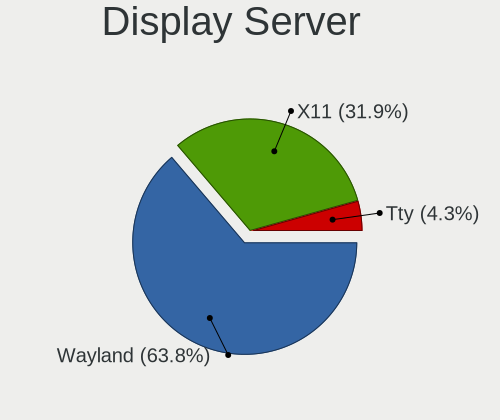

| Name    | Notebooks | Percent |
|---------|-----------|---------|
| Wayland | 10        | 66.67%  |
| X11     | 5         | 33.33%  |

Display Manager
---------------

SDDM, LightDM, etc.

| Name    | Notebooks | Percent |
|---------|-----------|---------|
| Unknown | 8         | 53.33%  |
| GDM     | 7         | 46.67%  |

OS Lang
-------

Language

| Lang  | Notebooks | Percent |
|-------|-----------|---------|
| en_US | 10        | 66.67%  |
| fr_FR | 2         | 13.33%  |
| de_DE | 2         | 13.33%  |
| es_VE | 1         | 6.67%   |

Boot Mode
---------

EFI or BIOS

| Mode | Notebooks | Percent |
|------|-----------|---------|
| EFI  | 10        | 66.67%  |
| BIOS | 5         | 33.33%  |

Filesystem
----------

Type of filesystem

| Type | Notebooks | Percent |
|------|-----------|---------|
| Xfs  | 14        | 93.33%  |
| Ext4 | 1         | 6.67%   |

Part. scheme
------------

Scheme of partitioning

| Type    | Notebooks | Percent |
|---------|-----------|---------|
| GPT     | 7         | 46.67%  |
| Unknown | 7         | 46.67%  |
| MBR     | 1         | 6.67%   |

Dual Boot with Linux/BSD
------------------------

Hosting more than one Linux/BSD

| Dual boot | Notebooks | Percent |
|-----------|-----------|---------|
| No        | 14        | 93.33%  |
| Yes       | 1         | 6.67%   |

Dual Boot (Win)
---------------

Hosting Linux and Windows

| Dual boot | Notebooks | Percent |
|-----------|-----------|---------|
| No        | 12        | 80%     |
| Yes       | 3         | 20%     |

Board
-----

Vendor
------

Motherboard manufacturer

| Name             | Notebooks | Percent |
|------------------|-----------|---------|
| Lenovo           | 7         | 46.67%  |
| Hewlett-Packard  | 4         | 26.67%  |
| Intel            | 1         | 6.67%   |
| Google           | 1         | 6.67%   |
| Dell             | 1         | 6.67%   |
| ASUSTek Computer | 1         | 6.67%   |

Model
-----

Motherboard model

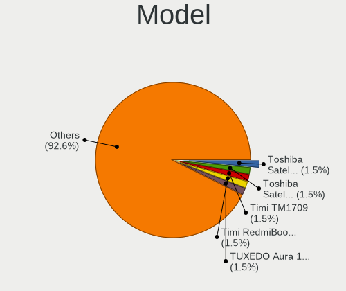

| Name                                 | Notebooks | Percent |
|--------------------------------------|-----------|---------|
| Lenovo Yoga 2 13 20344               | 1         | 6.67%   |
| Lenovo ThinkPad T440s 20ARS32P00     | 1         | 6.67%   |
| Lenovo ThinkPad T14 Gen 1 20S1S39Q00 | 1         | 6.67%   |
| Lenovo Legion 5 15IMH05H 81Y6        | 1         | 6.67%   |
| Lenovo IdeaPad Slim 1-14AST-05 81VS  | 1         | 6.67%   |
| Lenovo IdeaPad S145-15IWL 81MV       | 1         | 6.67%   |
| Lenovo IdeaPad 330-15ARR 81D2        | 1         | 6.67%   |
| Intel powered classmate PC           | 1         | 6.67%   |
| HP Laptop 17-cp0xxx                  | 1         | 6.67%   |
| HP ENVY dv6                          | 1         | 6.67%   |
| HP EliteBook 8570w                   | 1         | 6.67%   |
| HP EliteBook 8470p                   | 1         | 6.67%   |
| Google Kohaku                        | 1         | 6.67%   |
| Dell Inspiron 3185                   | 1         | 6.67%   |
| ASUS ASUS EXPERTBOOK B9450FA_B9450FA | 1         | 6.67%   |

Model Family
------------

Motherboard model prefix

| Name            | Notebooks | Percent |
|-----------------|-----------|---------|
| Lenovo IdeaPad  | 3         | 20%     |
| Lenovo ThinkPad | 2         | 13.33%  |
| HP EliteBook    | 2         | 13.33%  |
| Lenovo Yoga     | 1         | 6.67%   |
| Lenovo Legion   | 1         | 6.67%   |
| Intel powered   | 1         | 6.67%   |
| HP Laptop       | 1         | 6.67%   |
| HP ENVY         | 1         | 6.67%   |
| Google Kohaku   | 1         | 6.67%   |
| Dell Inspiron   | 1         | 6.67%   |
| ASUS ASUS       | 1         | 6.67%   |

MFG Year
--------

Motherboard manufacture year

| Year | Notebooks | Percent |
|------|-----------|---------|
| 2019 | 3         | 20%     |
| 2020 | 2         | 13.33%  |
| 2018 | 2         | 13.33%  |
| 2012 | 2         | 13.33%  |
| 2011 | 2         | 13.33%  |
| 2022 | 1         | 6.67%   |
| 2021 | 1         | 6.67%   |
| 2014 | 1         | 6.67%   |
| 2013 | 1         | 6.67%   |

Form Factor
-----------

Physical design of the computer

| Name     | Notebooks | Percent |
|----------|-----------|---------|
| Notebook | 15        | 100%    |

Secure Boot
-----------

Enabled or disabled

| State    | Notebooks | Percent |
|----------|-----------|---------|
| Disabled | 11        | 73.33%  |
| Enabled  | 4         | 26.67%  |

Coreboot
--------

Have coreboot on board

| Used | Notebooks | Percent |
|------|-----------|---------|
| No   | 14        | 93.33%  |
| Yes  | 1         | 6.67%   |

RAM Size
--------

Total RAM memory

| Size in GB | Notebooks | Percent |
|------------|-----------|---------|
| 4.01-8.0   | 7         | 46.67%  |
| 8.01-16.0  | 3         | 20%     |
| 3.01-4.0   | 2         | 13.33%  |
| 16.01-24.0 | 2         | 13.33%  |
| 1.01-2.0   | 1         | 6.67%   |

RAM Used
--------

Used RAM memory

| Used GB  | Notebooks | Percent |
|----------|-----------|---------|
| 1.01-2.0 | 6         | 37.5%   |
| 2.01-3.0 | 5         | 31.25%  |
| 4.01-8.0 | 3         | 18.75%  |
| 3.01-4.0 | 2         | 12.5%   |

Total Drives
------------

Number of drives on board

| Drives | Notebooks | Percent |
|--------|-----------|---------|
| 1      | 8         | 53.33%  |
| 2      | 5         | 33.33%  |
| 3      | 1         | 6.67%   |
| 0      | 1         | 6.67%   |

Has CD-ROM
----------

Has CD-ROM on board

| Presented | Notebooks | Percent |
|-----------|-----------|---------|
| No        | 13        | 86.67%  |
| Yes       | 2         | 13.33%  |

Has Ethernet
------------

Has Ethernet on board

| Presented | Notebooks | Percent |
|-----------|-----------|---------|
| Yes       | 11        | 73.33%  |
| No        | 4         | 26.67%  |

Has WiFi
--------

Has WiFi module

| Presented | Notebooks | Percent |
|-----------|-----------|---------|
| Yes       | 15        | 100%    |

Has Bluetooth
-------------

Has Bluetooth module

| Presented | Notebooks | Percent |
|-----------|-----------|---------|
| Yes       | 13        | 86.67%  |
| No        | 2         | 13.33%  |

Location
--------

Country
-------

Geographic location (country)

| Country   | Notebooks | Percent |
|-----------|-----------|---------|
| USA       | 4         | 26.67%  |
| Germany   | 3         | 20%     |
| France    | 3         | 20%     |
| Venezuela | 1         | 6.67%   |
| Sweden    | 1         | 6.67%   |
| Spain     | 1         | 6.67%   |
| Pakistan  | 1         | 6.67%   |
| India     | 1         | 6.67%   |

City
----

Geographic location (city)

| City         | Notebooks | Percent |
|--------------|-----------|---------|
| Queens       | 2         | 13.33%  |
| Uppsala      | 1         | 6.67%   |
| Paris        | 1         | 6.67%   |
| Mangalore    | 1         | 6.67%   |
| Lille        | 1         | 6.67%   |
| Lahore       | 1         | 6.67%   |
| Kennewick    | 1         | 6.67%   |
| Guglingen    | 1         | 6.67%   |
| Guanare      | 1         | 6.67%   |
| Essen        | 1         | 6.67%   |
| Castelginest | 1         | 6.67%   |
| Berlin       | 1         | 6.67%   |
| Barcelona    | 1         | 6.67%   |
| Austin       | 1         | 6.67%   |

Drives
------

Drive Vendor
------------

Hard drive vendors

| Vendor              | Notebooks | Drives | Percent |
|---------------------|-----------|--------|---------|
| WDC                 | 4         | 4      | 20%     |
| Samsung Electronics | 3         | 3      | 15%     |
| Union Memory        | 1         | 1      | 5%      |
| Toshiba             | 1         | 1      | 5%      |
| SSSTC               | 1         | 1      | 5%      |
| Seagate             | 1         | 1      | 5%      |
| Micron Technology   | 1         | 1      | 5%      |
| LITEONIT            | 1         | 1      | 5%      |
| Kingston            | 1         | 1      | 5%      |
| Intel               | 1         | 1      | 5%      |
| EMTEC               | 1         | 2      | 5%      |
| Dell                | 1         | 2      | 5%      |
| China               | 1         | 1      | 5%      |
| ASMT                | 1         | 2      | 5%      |
| A-DATA Technology   | 1         | 1      | 5%      |

Drive Model
-----------

Hard drive models

| Model                                   | Notebooks | Percent |
|-----------------------------------------|-----------|---------|
| WDC WD10SPZX-24Z10 1TB                  | 2         | 10%     |
| WDC WD10SPZX-60Z10T1 1TB                | 1         | 5%      |
| WDC PC SN730 SDBQNTY-256G-1001 256GB    | 1         | 5%      |
| Union Memory UMIS RPITJ512VME2OWD 512GB | 1         | 5%      |
| Toshiba MK6475GSX 640GB                 | 1         | 5%      |
| SSSTC CL1-3D256 256GB                   | 1         | 5%      |
| Seagate ST250LM004 HN-M250MBB 250GB     | 1         | 5%      |
| Samsung SSD PM810 FDE 2.5 256GB         | 1         | 5%      |
| Samsung MZVLQ512HALU-00000 512GB        | 1         | 5%      |
| Samsung MZVLQ128HBHQ-000H1 128GB        | 1         | 5%      |
| Micron MTFDDAK256MAM-1K12 256GB SSD     | 1         | 5%      |
| LITEONIT LGT-128M6G 128GB SSD           | 1         | 5%      |
| Kingston SA400S37240G 240GB SSD         | 1         | 5%      |
| Intel SSDSC2KF128G8L 128GB              | 1         | 5%      |
| EMTEC X200 256GB                        | 1         | 5%      |
| Dell WR202KD032G E70290F5 32GB SSD      | 1         | 5%      |
| China SATA SSD 120GB                    | 1         | 5%      |
| ASMT 2105 6TB                           | 1         | 5%      |
| A-DATA AXNS381E-256GM-B 256GB SSD       | 1         | 5%      |

HDD Vendor
----------

Hard disk drive vendors

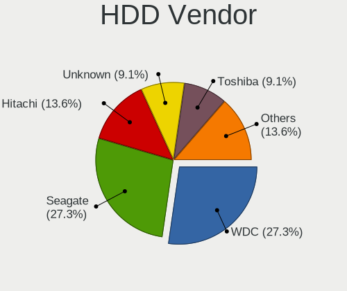

| Vendor  | Notebooks | Drives | Percent |
|---------|-----------|--------|---------|
| WDC     | 3         | 3      | 50%     |
| Toshiba | 1         | 1      | 16.67%  |
| Seagate | 1         | 1      | 16.67%  |
| ASMT    | 1         | 2      | 16.67%  |

SSD Vendor
----------

Solid state drive vendors

| Vendor              | Notebooks | Drives | Percent |
|---------------------|-----------|--------|---------|
| Samsung Electronics | 1         | 1      | 12.5%   |
| Micron Technology   | 1         | 1      | 12.5%   |
| LITEONIT            | 1         | 1      | 12.5%   |
| Kingston            | 1         | 1      | 12.5%   |
| Intel               | 1         | 1      | 12.5%   |
| Dell                | 1         | 2      | 12.5%   |
| China               | 1         | 1      | 12.5%   |
| A-DATA Technology   | 1         | 1      | 12.5%   |

Drive Kind
----------

HDD or SSD

| Kind    | Notebooks | Drives | Percent |
|---------|-----------|--------|---------|
| SSD     | 8         | 9      | 40%     |
| HDD     | 6         | 7      | 30%     |
| NVMe    | 5         | 5      | 25%     |
| Unknown | 1         | 2      | 5%      |

Drive Connector
---------------

SATA, SAS, NVMe, etc.

| Type | Notebooks | Drives | Percent |
|------|-----------|--------|---------|
| SATA | 11        | 14     | 64.71%  |
| NVMe | 5         | 5      | 29.41%  |
| SAS  | 1         | 4      | 5.88%   |

Drive Size
----------

Size of hard drive

| Size in TB | Notebooks | Drives | Percent |
|------------|-----------|--------|---------|
| 0.01-0.5   | 9         | 10     | 64.29%  |
| 0.51-1.0   | 4         | 4      | 28.57%  |
| 4.01-10.0  | 1         | 2      | 7.14%   |

Space Total
-----------

Amount of disk space available on the file system

| Size in GB | Notebooks | Percent |
|------------|-----------|---------|
| 101-250    | 7         | 46.67%  |
| 251-500    | 3         | 20%     |
| 501-1000   | 2         | 13.33%  |
| 21-50      | 1         | 6.67%   |
| 1001-2000  | 1         | 6.67%   |
| 1-20       | 1         | 6.67%   |

Space Used
----------

Amount of used disk space

| Used GB | Notebooks | Percent |
|---------|-----------|---------|
| 1-20    | 8         | 50%     |
| 21-50   | 5         | 31.25%  |
| 251-500 | 1         | 6.25%   |
| 101-250 | 1         | 6.25%   |
| 51-100  | 1         | 6.25%   |

Malfunc. Drives
---------------

Drive models with a malfunction

Zero info for selected period =(

Malfunc. Drive Vendor
---------------------

Vendors of faulty drives

Zero info for selected period =(

Malfunc. HDD Vendor
-------------------

Vendors of faulty HDD drives

Zero info for selected period =(

Malfunc. Drive Kind
-------------------

Kinds of faulty drives

Zero info for selected period =(

Failed Drives
-------------

Failed drive models

Zero info for selected period =(

Failed Drive Vendor
-------------------

Failed drive vendors

Zero info for selected period =(

Drive Status
------------

Number of failed and malfunc. drives

| Status   | Notebooks | Drives | Percent |
|----------|-----------|--------|---------|
| Detected | 7         | 14     | 50%     |
| Works    | 7         | 9      | 50%     |

Storage controller
------------------

Storage Vendor
--------------

Storage controller vendors

| Vendor                         | Notebooks | Percent |
|--------------------------------|-----------|---------|
| Intel                          | 9         | 47.37%  |
| AMD                            | 4         | 21.05%  |
| Union Memory (Shenzhen)        | 2         | 10.53%  |
| Samsung Electronics            | 2         | 10.53%  |
| Solid State Storage Technology | 1         | 5.26%   |
| SanDisk                        | 1         | 5.26%   |

Storage Model
-------------

Storage controller models

| Model                                                            | Notebooks | Percent |
|------------------------------------------------------------------|-----------|---------|
| AMD FCH SATA Controller [AHCI mode]                              | 4         | 21.05%  |
| Union Memory (Shenzhen) Non-Volatile memory controller           | 2         | 10.53%  |
| Samsung NVMe SSD Controller 980                                  | 2         | 10.53%  |
| Intel 8 Series SATA Controller 1 [AHCI mode]                     | 2         | 10.53%  |
| Intel 7 Series Chipset Family 6-port SATA Controller [AHCI mode] | 2         | 10.53%  |
| Solid State Storage Non-Volatile memory controller               | 1         | 5.26%   |
| SanDisk WD Black SN750 / PC SN730 NVMe SSD                       | 1         | 5.26%   |
| Intel NM10/ICH7 Family SATA Controller [AHCI mode]               | 1         | 5.26%   |
| Intel Comet Lake SATA AHCI Controller                            | 1         | 5.26%   |
| Intel Cannon Point-LP SATA Controller [AHCI Mode]                | 1         | 5.26%   |
| Intel 82801 Mobile SATA Controller [RAID mode]                   | 1         | 5.26%   |
| Intel 400 Series Chipset Family SATA AHCI Controller             | 1         | 5.26%   |

Storage Kind
------------

Kind of storage controller (IDE, SATA, NVMe, SAS, ...)

| Kind | Notebooks | Percent |
|------|-----------|---------|
| SATA | 12        | 63.16%  |
| NVMe | 6         | 31.58%  |
| RAID | 1         | 5.26%   |

Processor
---------

CPU Vendor
----------

Processor vendors

| Vendor | Notebooks | Percent |
|--------|-----------|---------|
| Intel  | 11        | 73.33%  |
| AMD    | 4         | 26.67%  |

CPU Model
---------

Processor models

| Model                                         | Notebooks | Percent |
|-----------------------------------------------|-----------|---------|
| Intel Core i5-10210U CPU @ 1.60GHz            | 3         | 20%     |
| Intel Core i7-3840QM CPU @ 2.80GHz            | 1         | 6.67%   |
| Intel Core i7-3630QM CPU @ 2.40GHz            | 1         | 6.67%   |
| Intel Core i7-10750H CPU @ 2.60GHz            | 1         | 6.67%   |
| Intel Core i5-4300U CPU @ 1.90GHz             | 1         | 6.67%   |
| Intel Core i5-3360M CPU @ 2.80GHz             | 1         | 6.67%   |
| Intel Core i3-8145U CPU @ 2.10GHz             | 1         | 6.67%   |
| Intel Core i3-4010U CPU @ 1.70GHz             | 1         | 6.67%   |
| Intel Atom CPU N455 @ 1.66GHz                 | 1         | 6.67%   |
| AMD Ryzen 7 5700U with Radeon Graphics        | 1         | 6.67%   |
| AMD Ryzen 5 2500U with Radeon Vega Mobile Gfx | 1         | 6.67%   |
| AMD A9-9420e RADEON R5, 5 COMPUTE CORES 2C+3G | 1         | 6.67%   |
| AMD A6-9220e RADEON R4, 5 COMPUTE CORES 2C+3G | 1         | 6.67%   |

CPU Model Family
----------------

Processor model prefix

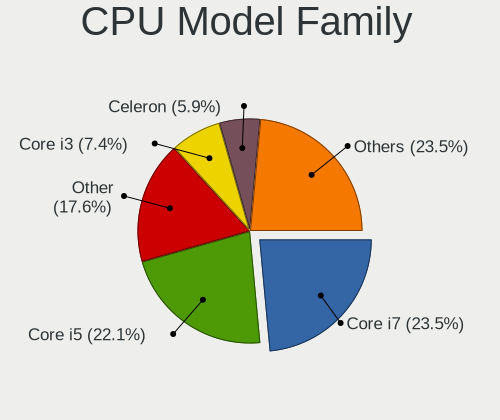

| Model         | Notebooks | Percent |
|---------------|-----------|---------|
| Intel Core i5 | 5         | 33.33%  |
| Intel Core i7 | 3         | 20%     |
| Intel Core i3 | 2         | 13.33%  |
| Other         | 1         | 6.67%   |
| Intel Atom    | 1         | 6.67%   |
| AMD Ryzen 7   | 1         | 6.67%   |
| AMD Ryzen 5   | 1         | 6.67%   |
| AMD A6        | 1         | 6.67%   |

CPU Cores
---------

Number of processor cores

| Number | Notebooks | Percent |
|--------|-----------|---------|
| 4      | 6         | 40%     |
| 2      | 6         | 40%     |
| 8      | 1         | 6.67%   |
| 6      | 1         | 6.67%   |
| 1      | 1         | 6.67%   |

CPU Sockets
-----------

Number of sockets

| Number | Notebooks | Percent |
|--------|-----------|---------|
| 1      | 15        | 100%    |

CPU Threads
-----------

Threads per core (Hyper-Threading)

| Number | Notebooks | Percent |
|--------|-----------|---------|
| 2      | 13        | 86.67%  |
| 1      | 2         | 13.33%  |

CPU Op-Modes
------------

CPU Operation Modes (32-bit, 64-bit)

| Op mode        | Notebooks | Percent |
|----------------|-----------|---------|
| 32-bit, 64-bit | 15        | 100%    |

CPU Microcode
-------------

Microcode number

| Number     | Notebooks | Percent |
|------------|-----------|---------|
| 0x806ec    | 4         | 26.67%  |
| 0x306a9    | 3         | 20%     |
| 0x40651    | 2         | 13.33%  |
| 0xa0652    | 1         | 6.67%   |
| 0x106ca    | 1         | 6.67%   |
| 0x08608103 | 1         | 6.67%   |
| 0x0810100b | 1         | 6.67%   |
| 0x06006705 | 1         | 6.67%   |
| 0x06006704 | 1         | 6.67%   |

CPU Microarch
-------------

Microarchitecture

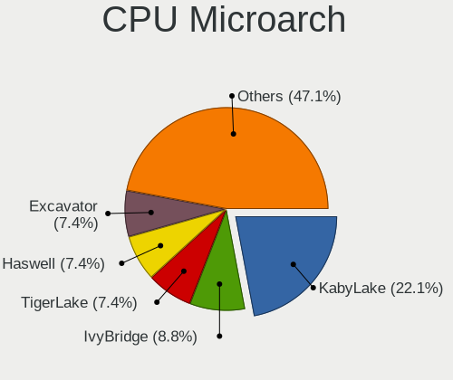

| Name      | Notebooks | Percent |
|-----------|-----------|---------|
| KabyLake  | 4         | 26.67%  |
| IvyBridge | 3         | 20%     |
| Haswell   | 2         | 13.33%  |
| Excavator | 2         | 13.33%  |
| Zen       | 1         | 6.67%   |
| CometLake | 1         | 6.67%   |
| Bonnell   | 1         | 6.67%   |
| Unknown   | 1         | 6.67%   |

Graphics
--------

GPU Vendor
----------

Vendors of graphics cards

| Vendor | Notebooks | Percent |
|--------|-----------|---------|
| Intel  | 10        | 62.5%   |
| AMD    | 4         | 25%     |
| Nvidia | 2         | 12.5%   |

GPU Model
---------

Graphics card models

| Model                                                                   | Notebooks | Percent |
|-------------------------------------------------------------------------|-----------|---------|
| Intel CometLake-U GT2 [UHD Graphics]                                    | 3         | 18.75%  |
| Intel Haswell-ULT Integrated Graphics Controller                        | 2         | 12.5%   |
| Intel 3rd Gen Core processor Graphics Controller                        | 2         | 12.5%   |
| AMD Stoney [Radeon R2/R3/R4/R5 Graphics]                                | 2         | 12.5%   |
| Nvidia TU116M [GeForce GTX 1660 Ti Mobile]                              | 1         | 6.25%   |
| Nvidia GK107GLM [Quadro K1000M]                                         | 1         | 6.25%   |
| Intel WhiskeyLake-U GT2 [UHD Graphics 620]                              | 1         | 6.25%   |
| Intel CometLake-H GT2 [UHD Graphics]                                    | 1         | 6.25%   |
| Intel Atom Processor D4xx/D5xx/N4xx/N5xx Integrated Graphics Controller | 1         | 6.25%   |
| AMD Raven Ridge [Radeon Vega Series / Radeon Vega Mobile Series]        | 1         | 6.25%   |
| AMD Lucienne                                                            | 1         | 6.25%   |

GPU Combo
---------

Combinations of graphics cards

| Name           | Notebooks | Percent |
|----------------|-----------|---------|
| 1 x Intel      | 9         | 60%     |
| 1 x AMD        | 4         | 26.67%  |
| 1 x Nvidia     | 1         | 6.67%   |
| Intel + Nvidia | 1         | 6.67%   |

GPU Driver
----------

Free vs proprietary

| Driver      | Notebooks | Percent |
|-------------|-----------|---------|
| Free        | 14        | 93.33%  |
| Proprietary | 1         | 6.67%   |

GPU Memory
----------

Total video memory

| Size in GB | Notebooks | Percent |
|------------|-----------|---------|
| Unknown    | 9         | 60%     |
| 0.01-0.5   | 4         | 26.67%  |
| 5.01-6.0   | 1         | 6.67%   |
| 1.01-2.0   | 1         | 6.67%   |

Monitor
-------

Monitor Vendor
--------------

Monitor vendors

| Vendor              | Notebooks | Percent |
|---------------------|-----------|---------|
| AU Optronics        | 6         | 35.29%  |
| LG Display          | 4         | 23.53%  |
| Samsung Electronics | 2         | 11.76%  |
| BOE                 | 2         | 11.76%  |
| Sharp               | 1         | 5.88%   |
| Seiki               | 1         | 5.88%   |
| InfoVision          | 1         | 5.88%   |

Monitor Model
-------------

Monitor models

| Model                                                                 | Notebooks | Percent |
|-----------------------------------------------------------------------|-----------|---------|
| Sharp LC-32LB480U SHP3263 1920x1080 698x392mm 31.5-inch               | 1         | 5.88%   |
| Seiki SC32HT04 SEK1366 1366x768 700x390mm 31.5-inch                   | 1         | 5.88%   |
| Samsung Electronics LCD Monitor SEC3030 1024x600 223x125mm 10.1-inch  | 1         | 5.88%   |
| Samsung Electronics LCD Monitor SDC4142 3840x2160 294x165mm 13.3-inch | 1         | 5.88%   |
| LG Display LCD Monitor LGD046D 1920x1080 309x174mm 14.0-inch          | 1         | 5.88%   |
| LG Display LCD Monitor LGD042D 1920x1080 290x170mm 13.2-inch          | 1         | 5.88%   |
| LG Display LCD Monitor LGD034A 1366x768 345x194mm 15.6-inch           | 1         | 5.88%   |
| LG Display LCD Monitor LGD0335 1366x768 310x174mm 14.0-inch           | 1         | 5.88%   |
| InfoVision LCD Monitor IVO057D 1920x1080 309x174mm 14.0-inch          | 1         | 5.88%   |
| BOE LCD Monitor BOE0812 1920x1080 344x194mm 15.5-inch                 | 1         | 5.88%   |
| BOE LCD Monitor BOE07A3 1920x1080 344x193mm 15.5-inch                 | 1         | 5.88%   |
| AU Optronics LCD Monitor AUOF992 1920x1080 382x215mm 17.3-inch        | 1         | 5.88%   |
| AU Optronics LCD Monitor AUOD1ED 1920x1080 344x193mm 15.5-inch        | 1         | 5.88%   |
| AU Optronics LCD Monitor AUO623D 1920x1080 309x174mm 14.0-inch        | 1         | 5.88%   |
| AU Optronics LCD Monitor AUO203D 1920x1080 309x174mm 14.0-inch        | 1         | 5.88%   |
| AU Optronics LCD Monitor AUO13ED 1920x1080 344x193mm 15.5-inch        | 1         | 5.88%   |
| AU Optronics LCD Monitor AUO105C 1366x768 256x144mm 11.6-inch         | 1         | 5.88%   |

Monitor Resolution
------------------

Monitor screen resolution

| Resolution      | Notebooks | Percent |
|-----------------|-----------|---------|
| 1920x1080 (FHD) | 12        | 70.59%  |
| 1366x768 (WXGA) | 4         | 23.53%  |
| 3840x2160 (4K)  | 1         | 5.88%   |

Monitor Diagonal
----------------

Diagonal size in inches

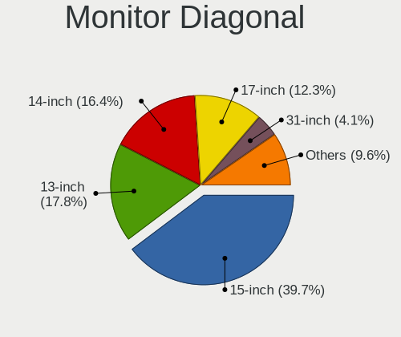

| Inches | Notebooks | Percent |
|--------|-----------|---------|
| 15     | 6         | 35.29%  |
| 14     | 5         | 29.41%  |
| 31     | 2         | 11.76%  |
| 13     | 2         | 11.76%  |
| 17     | 1         | 5.88%   |
| 11     | 1         | 5.88%   |

Monitor Width
-------------

Physical width

| Width in mm | Notebooks | Percent |
|-------------|-----------|---------|
| 301-350     | 11        | 64.71%  |
| 201-300     | 3         | 17.65%  |
| 601-700     | 2         | 11.76%  |
| 351-400     | 1         | 5.88%   |

Aspect Ratio
------------

Proportional relationship between the width and the height

| Ratio | Notebooks | Percent |
|-------|-----------|---------|
| 16/9  | 15        | 100%    |

Monitor Area
------------

Area in inch²

| Area in inch² | Notebooks | Percent |
|----------------|-----------|---------|
| 101-110        | 6         | 35.29%  |
| 81-90          | 5         | 29.41%  |
| 71-80          | 2         | 11.76%  |
| 351-500        | 2         | 11.76%  |
| 51-60          | 1         | 5.88%   |
| 121-130        | 1         | 5.88%   |

Pixel Density
-------------

Pixels per inch

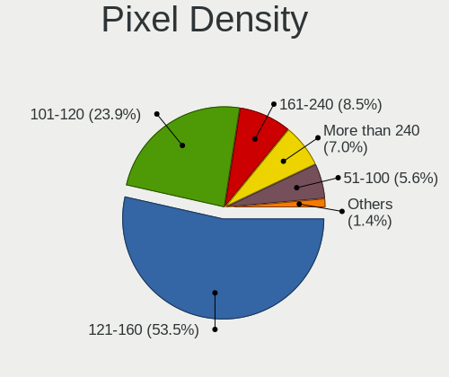

| Density       | Notebooks | Percent |
|---------------|-----------|---------|
| 121-160       | 10        | 58.82%  |
| 101-120       | 3         | 17.65%  |
| More than 240 | 1         | 5.88%   |
| 1-50          | 1         | 5.88%   |
| 161-240       | 1         | 5.88%   |
| 51-100        | 1         | 5.88%   |

Multiple Monitors
-----------------

Total monitors connected

| Total | Notebooks | Percent |
|-------|-----------|---------|
| 1     | 13        | 86.67%  |
| 2     | 2         | 13.33%  |

Network
-------

Net Controller Vendor
---------------------

Controller vendors

| Vendor                | Notebooks | Percent |
|-----------------------|-----------|---------|
| Intel                 | 9         | 42.86%  |
| Realtek Semiconductor | 5         | 23.81%  |
| Qualcomm Atheros      | 3         | 14.29%  |
| Sierra Wireless       | 1         | 4.76%   |
| Samsung Electronics   | 1         | 4.76%   |
| MediaTek              | 1         | 4.76%   |
| Broadcom Limited      | 1         | 4.76%   |

Net Controller Model
--------------------

Controller models

| Model                                                             | Notebooks | Percent |
|-------------------------------------------------------------------|-----------|---------|
| Realtek RTL8111/8168/8411 PCI Express Gigabit Ethernet Controller | 3         | 10.71%  |
| Intel Comet Lake PCH-LP CNVi WiFi                                 | 3         | 10.71%  |
| Realtek RTL8821CE 802.11ac PCIe Wireless Network Adapter          | 2         | 7.14%   |
| Qualcomm Atheros QCA9377 802.11ac Wireless Network Adapter        | 2         | 7.14%   |
| Intel Wireless 7260                                               | 2         | 7.14%   |
| Intel Ethernet Connection (10) I219-V                             | 2         | 7.14%   |
| Intel 82579LM Gigabit Network Connection (Lewisville)             | 2         | 7.14%   |
| Sierra Wireless EM7345 4G LTE                                     | 1         | 3.57%   |
| Samsung GT-I9070 (network tethering, USB debugging enabled)       | 1         | 3.57%   |
| Realtek RTL8191SEvB Wireless LAN Controller                       | 1         | 3.57%   |
| Realtek RTL8153 Gigabit Ethernet Adapter                          | 1         | 3.57%   |
| Realtek RTL810xE PCI Express Fast Ethernet controller             | 1         | 3.57%   |
| Qualcomm Atheros QCA9565 / AR9565 Wireless Network Adapter        | 1         | 3.57%   |
| MediaTek Infinix HOT 9                                            | 1         | 3.57%   |
| Intel Ethernet Connection I218-LM                                 | 1         | 3.57%   |
| Intel Comet Lake PCH CNVi WiFi                                    | 1         | 3.57%   |
| Intel Centrino Wireless-N 2230                                    | 1         | 3.57%   |
| Intel Centrino Ultimate-N 6300                                    | 1         | 3.57%   |
| Broadcom Limited BCM43224 802.11a/b/g/n                           | 1         | 3.57%   |

Wireless Vendor
---------------

Wireless vendors

| Vendor                | Notebooks | Percent |
|-----------------------|-----------|---------|
| Intel                 | 8         | 53.33%  |
| Realtek Semiconductor | 3         | 20%     |
| Qualcomm Atheros      | 3         | 20%     |
| Broadcom Limited      | 1         | 6.67%   |

Wireless Model
--------------

Wireless models

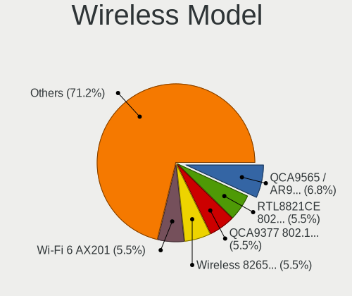

| Model                                                      | Notebooks | Percent |
|------------------------------------------------------------|-----------|---------|
| Intel Comet Lake PCH-LP CNVi WiFi                          | 3         | 20%     |
| Realtek RTL8821CE 802.11ac PCIe Wireless Network Adapter   | 2         | 13.33%  |
| Qualcomm Atheros QCA9377 802.11ac Wireless Network Adapter | 2         | 13.33%  |
| Intel Wireless 7260                                        | 2         | 13.33%  |
| Realtek RTL8191SEvB Wireless LAN Controller                | 1         | 6.67%   |
| Qualcomm Atheros QCA9565 / AR9565 Wireless Network Adapter | 1         | 6.67%   |
| Intel Comet Lake PCH CNVi WiFi                             | 1         | 6.67%   |
| Intel Centrino Wireless-N 2230                             | 1         | 6.67%   |
| Intel Centrino Ultimate-N 6300                             | 1         | 6.67%   |
| Broadcom Limited BCM43224 802.11a/b/g/n                    | 1         | 6.67%   |

Ethernet Vendor
---------------

Ethernet vendors

| Vendor                | Notebooks | Percent |
|-----------------------|-----------|---------|
| Realtek Semiconductor | 5         | 38.46%  |
| Intel                 | 5         | 38.46%  |
| Sierra Wireless       | 1         | 7.69%   |
| Samsung Electronics   | 1         | 7.69%   |
| MediaTek              | 1         | 7.69%   |

Ethernet Model
--------------

Ethernet models

| Model                                                             | Notebooks | Percent |
|-------------------------------------------------------------------|-----------|---------|
| Realtek RTL8111/8168/8411 PCI Express Gigabit Ethernet Controller | 3         | 23.08%  |
| Intel Ethernet Connection (10) I219-V                             | 2         | 15.38%  |
| Intel 82579LM Gigabit Network Connection (Lewisville)             | 2         | 15.38%  |
| Sierra Wireless EM7345 4G LTE                                     | 1         | 7.69%   |
| Samsung GT-I9070 (network tethering, USB debugging enabled)       | 1         | 7.69%   |
| Realtek RTL8153 Gigabit Ethernet Adapter                          | 1         | 7.69%   |
| Realtek RTL810xE PCI Express Fast Ethernet controller             | 1         | 7.69%   |
| MediaTek Infinix HOT 9                                            | 1         | 7.69%   |
| Intel Ethernet Connection I218-LM                                 | 1         | 7.69%   |

Net Controller Kind
-------------------

Ethernet, WiFi or modem

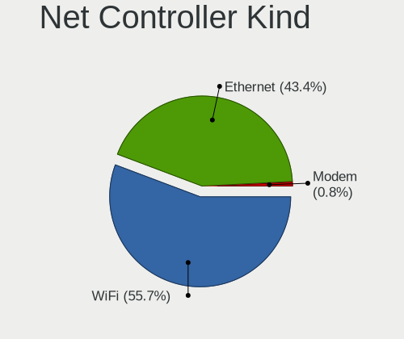

| Kind     | Notebooks | Percent |
|----------|-----------|---------|
| WiFi     | 15        | 57.69%  |
| Ethernet | 11        | 42.31%  |

Used Controller
---------------

Currently used network controller

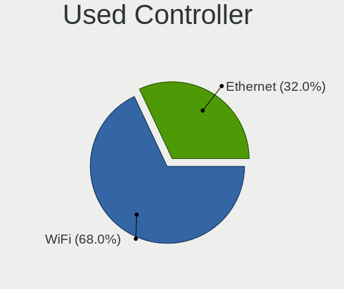

| Kind     | Notebooks | Percent |
|----------|-----------|---------|
| WiFi     | 10        | 62.5%   |
| Ethernet | 6         | 37.5%   |

NICs
----

Total network controllers on board

| Total | Notebooks | Percent |
|-------|-----------|---------|
| 2     | 9         | 60%     |
| 1     | 6         | 40%     |

IPv6
----

IPv6 vs IPv4

| Used | Notebooks | Percent |
|------|-----------|---------|
| No   | 12        | 80%     |
| Yes  | 3         | 20%     |

Bluetooth
---------

Bluetooth Vendor
----------------

Controller vendors

| Vendor                          | Notebooks | Percent |
|---------------------------------|-----------|---------|
| Intel                           | 7         | 53.85%  |
| Qualcomm Atheros Communications | 3         | 23.08%  |
| Realtek Semiconductor           | 2         | 15.38%  |
| Broadcom                        | 1         | 7.69%   |

Bluetooth Model
---------------

Controller models

| Model                                         | Notebooks | Percent |
|-----------------------------------------------|-----------|---------|
| Intel AX201 Bluetooth                         | 4         | 30.77%  |
| Qualcomm Atheros  Bluetooth Device            | 3         | 23.08%  |
| Realtek Bluetooth Radio                       | 2         | 15.38%  |
| Intel Bluetooth wireless interface            | 2         | 15.38%  |
| Intel Centrino Bluetooth Wireless Transceiver | 1         | 7.69%   |
| Broadcom HP Portable SoftSailing              | 1         | 7.69%   |

Sound
-----

Sound Vendor
------------

Sound card vendors

| Vendor              | Notebooks | Percent |
|---------------------|-----------|---------|
| Intel               | 11        | 61.11%  |
| AMD                 | 4         | 22.22%  |
| Nvidia              | 2         | 11.11%  |
| C-Media Electronics | 1         | 5.56%   |

Sound Model
-----------

Sound card models

| Model                                                               | Notebooks | Percent |
|---------------------------------------------------------------------|-----------|---------|
| Intel Comet Lake PCH-LP cAVS                                        | 3         | 12.5%   |
| Intel 7 Series/C216 Chipset Family High Definition Audio Controller | 3         | 12.5%   |
| Intel Haswell-ULT HD Audio Controller                               | 2         | 8.33%   |
| Intel 8 Series HD Audio Controller                                  | 2         | 8.33%   |
| AMD High Definition Audio Controller                                | 2         | 8.33%   |
| AMD Family 17h/19h HD Audio Controller                              | 2         | 8.33%   |
| AMD Family 15h (Models 60h-6fh) Audio Controller                    | 2         | 8.33%   |
| Nvidia TU116 High Definition Audio Controller                       | 1         | 4.17%   |
| Nvidia GK107 HDMI Audio Controller                                  | 1         | 4.17%   |
| Intel NM10/ICH7 Family High Definition Audio Controller             | 1         | 4.17%   |
| Intel Comet Lake PCH cAVS                                           | 1         | 4.17%   |
| Intel Cannon Point-LP High Definition Audio Controller              | 1         | 4.17%   |
| C-Media Electronics CM106 Like Sound Device                         | 1         | 4.17%   |
| AMD Renoir Radeon High Definition Audio Controller                  | 1         | 4.17%   |
| AMD Raven/Raven2/Fenghuang HDMI/DP Audio Controller                 | 1         | 4.17%   |

Memory
------

Memory Vendor
-------------

Memory module vendors

| Vendor              | Notebooks | Percent |
|---------------------|-----------|---------|
| SK hynix            | 3         | 33.33%  |
| Samsung Electronics | 3         | 33.33%  |
| Micron Technology   | 2         | 22.22%  |
| Kingston            | 1         | 11.11%  |

Memory Model
------------

Memory module models

| Model                                                            | Notebooks | Percent |
|------------------------------------------------------------------|-----------|---------|
| SK hynix RAM HMT351S6EFR8A-PB 4GB SODIMM DDR3 1600MT/s           | 1         | 10%     |
| SK hynix RAM HMT351S6CFR8C-H9 4GB SODIMM DDR3 1333MT/s           | 1         | 10%     |
| SK hynix RAM HMA851S6CJR6N-VK 4GB Row Of Chips DDR4 1866MT/s     | 1         | 10%     |
| SK hynix RAM H9CCNNNBJTALAR-NVD 4GB Row Of Chips LPDDR3 2133MT/s | 1         | 10%     |
| Samsung RAM Module 4GB SODIMM DDR3 1600MT/s                      | 1         | 10%     |
| Samsung RAM Module 4GB Row Of Chips LPDDR3 2133MT/s              | 1         | 10%     |
| Samsung RAM M471A1K43DB1-CWE 8GB SODIMM DDR4 3200MT/s            | 1         | 10%     |
| Micron RAM 4ATS2G64HZ-3G2B1 16384MB SODIMM DDR4 3200MT/s         | 1         | 10%     |
| Micron RAM 4ATF51264HZ-2G6E3 4GB SODIMM DDR4 2667MT/s            | 1         | 10%     |
| Kingston RAM LV32D4S2S8HD-8 8GB SODIMM DDR4 3200MT/s             | 1         | 10%     |

Memory Kind
-----------

Memory module kinds

| Kind   | Notebooks | Percent |
|--------|-----------|---------|
| DDR4   | 4         | 50%     |
| LPDDR3 | 2         | 25%     |
| DDR3   | 2         | 25%     |

Memory Form Factor
------------------

Physical design of the memory module

| Name         | Notebooks | Percent |
|--------------|-----------|---------|
| SODIMM       | 5         | 62.5%   |
| Row Of Chips | 3         | 37.5%   |

Memory Size
-----------

Memory module size

| Size  | Notebooks | Percent |
|-------|-----------|---------|
| 4096  | 6         | 66.67%  |
| 8192  | 2         | 22.22%  |
| 16384 | 1         | 11.11%  |

Memory Speed
------------

Memory module speed

| Speed | Notebooks | Percent |
|-------|-----------|---------|
| 3200  | 3         | 30%     |
| 2133  | 2         | 20%     |
| 1600  | 2         | 20%     |
| 2667  | 1         | 10%     |
| 1866  | 1         | 10%     |
| 1333  | 1         | 10%     |

Printers & scanners
-------------------

Printer Vendor
--------------

Printer device vendors

Zero info for selected period =(

Printer Model
-------------

Printer device models

Zero info for selected period =(

Scanner Vendor
--------------

Scanner device vendors

Zero info for selected period =(

Scanner Model
-------------

Scanner device models

Zero info for selected period =(

Camera
------

Camera Vendor
-------------

Camera device vendors

| Vendor                                 | Notebooks | Percent |
|----------------------------------------|-----------|---------|
| Chicony Electronics                    | 6         | 40%     |
| IMC Networks                           | 4         | 26.67%  |
| Acer                                   | 2         | 13.33%  |
| Realtek Semiconductor                  | 1         | 6.67%   |
| Microdia                               | 1         | 6.67%   |
| Cheng Uei Precision Industry (Foxlink) | 1         | 6.67%   |

Camera Model
------------

Camera device models

| Model                                                           | Notebooks | Percent |
|-----------------------------------------------------------------|-----------|---------|
| IMC Networks Integrated Camera                                  | 3         | 18.75%  |
| Chicony Integrated HP HD Webcam                                 | 2         | 12.5%   |
| Realtek EasyCamera                                              | 1         | 6.25%   |
| Microdia Integrated_Webcam_HD                                   | 1         | 6.25%   |
| IMC Networks USB2.0 HD IR UVC WebCam                            | 1         | 6.25%   |
| Chicony Lenovo EasyCamera                                       | 1         | 6.25%   |
| Chicony HP Truevision HD                                        | 1         | 6.25%   |
| Chicony EasyCamera                                              | 1         | 6.25%   |
| Chicony 8M Camera                                               | 1         | 6.25%   |
| Chicony 720p HD Camera                                          | 1         | 6.25%   |
| Cheng Uei Precision Industry (Foxlink) HP True Vision HD Camera | 1         | 6.25%   |
| Acer USB Camera                                                 | 1         | 6.25%   |
| Acer Integrated Camera                                          | 1         | 6.25%   |

Security
--------

Fingerprint Vendor
------------------

Fingerprint sensor vendors

| Vendor           | Notebooks | Percent |
|------------------|-----------|---------|
| Validity Sensors | 4         | 100%    |

Fingerprint Model
-----------------

Fingerprint sensor models

| Model                                        | Notebooks | Percent |
|----------------------------------------------|-----------|---------|
| Validity Sensors VFS491                      | 2         | 50%     |
| Validity Sensors VFS 5011 fingerprint sensor | 1         | 25%     |
| Validity Sensors Fingerprint scanner         | 1         | 25%     |

Chipcard Vendor
---------------

Chipcard module vendors

| Vendor      | Notebooks | Percent |
|-------------|-----------|---------|
| Alcor Micro | 1         | 100%    |

Chipcard Model
--------------

Chipcard module models

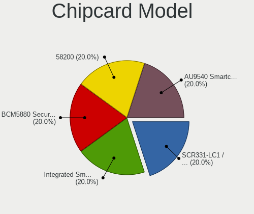

| Model                               | Notebooks | Percent |
|-------------------------------------|-----------|---------|
| Alcor Micro AU9540 Smartcard Reader | 1         | 100%    |

Unsupported
-----------

Unsupported Devices
-------------------

Total unsupported devices on board

| Total | Notebooks | Percent |
|-------|-----------|---------|
| 0     | 10        | 66.67%  |
| 1     | 4         | 26.67%  |
| 2     | 1         | 6.67%   |

Unsupported Device Types
------------------------

Types of unsupported devices

| Type               | Notebooks | Percent |
|--------------------|-----------|---------|
| Fingerprint reader | 4         | 66.67%  |
| Net/wireless       | 1         | 16.67%  |
| Chipcard           | 1         | 16.67%  |

