AlmaLinux - Tested Hardware & Statistics (Notebooks)
----------------------------------------------------

A project to collect tested hardware configurations for AlmaLinux.

Anyone can contribute to this report by the [hw-probe](https://github.com/linuxhw/hw-probe) tool:

    sudo -E hw-probe -all -upload

Please contribute! Especially if your hardware is rare.

Contents
--------

* [ Test Cases ](#test-cases)

* [ System ](#system)
  - [ OS                       ](#os)
  - [ OS Family                ](#os-family)
  - [ Kernel                   ](#kernel)
  - [ Kernel Family            ](#kernel-family)
  - [ Kernel Major Ver.        ](#kernel-major-ver)
  - [ Arch                     ](#arch)
  - [ DE                       ](#de)
  - [ Display Server           ](#display-server)
  - [ Display Manager          ](#display-manager)
  - [ OS Lang                  ](#os-lang)
  - [ Boot Mode                ](#boot-mode)
  - [ Filesystem               ](#filesystem)
  - [ Part. scheme             ](#part-scheme)
  - [ Dual Boot with Linux/BSD ](#dual-boot-with-linuxbsd)
  - [ Dual Boot (Win)          ](#dual-boot-win)

* [ Board ](#board)
  - [ Vendor                   ](#vendor)
  - [ Model                    ](#model)
  - [ Model Family             ](#model-family)
  - [ MFG Year                 ](#mfg-year)
  - [ Form Factor              ](#form-factor)
  - [ Secure Boot              ](#secure-boot)
  - [ Coreboot                 ](#coreboot)
  - [ RAM Size                 ](#ram-size)
  - [ RAM Used                 ](#ram-used)
  - [ Total Drives             ](#total-drives)
  - [ Has CD-ROM               ](#has-cd-rom)
  - [ Has Ethernet             ](#has-ethernet)
  - [ Has WiFi                 ](#has-wifi)
  - [ Has Bluetooth            ](#has-bluetooth)

* [ Location ](#location)
  - [ Country                  ](#country)
  - [ City                     ](#city)

* [ Drives ](#drives)
  - [ Drive Vendor             ](#drive-vendor)
  - [ Drive Model              ](#drive-model)
  - [ HDD Vendor               ](#hdd-vendor)
  - [ SSD Vendor               ](#ssd-vendor)
  - [ Drive Kind               ](#drive-kind)
  - [ Drive Connector          ](#drive-connector)
  - [ Drive Size               ](#drive-size)
  - [ Space Total              ](#space-total)
  - [ Space Used               ](#space-used)
  - [ Malfunc. Drives          ](#malfunc-drives)
  - [ Malfunc. Drive Vendor    ](#malfunc-drive-vendor)
  - [ Malfunc. HDD Vendor      ](#malfunc-hdd-vendor)
  - [ Malfunc. Drive Kind      ](#malfunc-drive-kind)
  - [ Failed Drives            ](#failed-drives)
  - [ Failed Drive Vendor      ](#failed-drive-vendor)
  - [ Drive Status             ](#drive-status)

* [ Storage controller ](#storage-controller)
  - [ Storage Vendor           ](#storage-vendor)
  - [ Storage Model            ](#storage-model)
  - [ Storage Kind             ](#storage-kind)

* [ Processor ](#processor)
  - [ CPU Vendor               ](#cpu-vendor)
  - [ CPU Model                ](#cpu-model)
  - [ CPU Model Family         ](#cpu-model-family)
  - [ CPU Cores                ](#cpu-cores)
  - [ CPU Sockets              ](#cpu-sockets)
  - [ CPU Threads              ](#cpu-threads)
  - [ CPU Op-Modes             ](#cpu-op-modes)
  - [ CPU Microcode            ](#cpu-microcode)
  - [ CPU Microarch            ](#cpu-microarch)

* [ Graphics ](#graphics)
  - [ GPU Vendor               ](#gpu-vendor)
  - [ GPU Model                ](#gpu-model)
  - [ GPU Combo                ](#gpu-combo)
  - [ GPU Driver               ](#gpu-driver)
  - [ GPU Memory               ](#gpu-memory)

* [ Monitor ](#monitor)
  - [ Monitor Vendor           ](#monitor-vendor)
  - [ Monitor Model            ](#monitor-model)
  - [ Monitor Resolution       ](#monitor-resolution)
  - [ Monitor Diagonal         ](#monitor-diagonal)
  - [ Monitor Width            ](#monitor-width)
  - [ Aspect Ratio             ](#aspect-ratio)
  - [ Monitor Area             ](#monitor-area)
  - [ Pixel Density            ](#pixel-density)
  - [ Multiple Monitors        ](#multiple-monitors)

* [ Network ](#network)
  - [ Net Controller Vendor    ](#net-controller-vendor)
  - [ Net Controller Model     ](#net-controller-model)
  - [ Wireless Vendor          ](#wireless-vendor)
  - [ Wireless Model           ](#wireless-model)
  - [ Ethernet Vendor          ](#ethernet-vendor)
  - [ Ethernet Model           ](#ethernet-model)
  - [ Net Controller Kind      ](#net-controller-kind)
  - [ Used Controller          ](#used-controller)
  - [ NICs                     ](#nics)
  - [ IPv6                     ](#ipv6)

* [ Bluetooth ](#bluetooth)
  - [ Bluetooth Vendor         ](#bluetooth-vendor)
  - [ Bluetooth Model          ](#bluetooth-model)

* [ Sound ](#sound)
  - [ Sound Vendor             ](#sound-vendor)
  - [ Sound Model              ](#sound-model)

* [ Memory ](#memory)
  - [ Memory Vendor            ](#memory-vendor)
  - [ Memory Model             ](#memory-model)
  - [ Memory Kind              ](#memory-kind)
  - [ Memory Form Factor       ](#memory-form-factor)
  - [ Memory Size              ](#memory-size)
  - [ Memory Speed             ](#memory-speed)

* [ Printers & scanners ](#printers--scanners)
  - [ Printer Vendor           ](#printer-vendor)
  - [ Printer Model            ](#printer-model)
  - [ Scanner Vendor           ](#scanner-vendor)
  - [ Scanner Model            ](#scanner-model)

* [ Camera ](#camera)
  - [ Camera Vendor            ](#camera-vendor)
  - [ Camera Model             ](#camera-model)

* [ Security ](#security)
  - [ Fingerprint Vendor       ](#fingerprint-vendor)
  - [ Fingerprint Model        ](#fingerprint-model)
  - [ Chipcard Vendor          ](#chipcard-vendor)
  - [ Chipcard Model           ](#chipcard-model)

* [ Unsupported ](#unsupported)
  - [ Unsupported Devices      ](#unsupported-devices)
  - [ Unsupported Device Types ](#unsupported-device-types)

Test Cases
----------

Total: 84

| Vendor    | Model                       | Probe                                                      | Date         |
|-----------|-----------------------------|------------------------------------------------------------|--------------|
| Lenovo    | ThinkPad X1 Nano Gen 1 2... | [c5f9a761a9](https://linux-hardware.org/?probe=c5f9a761a9) | May 05, 2024 |
| Acer      | Aspire E1-571               | [0f3b954320](https://linux-hardware.org/?probe=0f3b954320) | May 02, 2024 |
| Toshiba   | Satellite C50-A             | [cabe5d7a20](https://linux-hardware.org/?probe=cabe5d7a20) | Apr 23, 2024 |
| Acer      | Aspire A315-59              | [f1c498121d](https://linux-hardware.org/?probe=f1c498121d) | Mar 13, 2024 |
| Toshiba   | Satellite C50-A             | [64c28ad883](https://linux-hardware.org/?probe=64c28ad883) | Mar 05, 2024 |
| Toshiba   | Satellite C50-A             | [2229c82401](https://linux-hardware.org/?probe=2229c82401) | Mar 03, 2024 |
| Dell      | Inspiron 5379               | [43522636f8](https://linux-hardware.org/?probe=43522636f8) | Mar 02, 2024 |
| Lenovo    | ThinkPad T480s 20L70028U... | [3ce277e7b9](https://linux-hardware.org/?probe=3ce277e7b9) | Feb 25, 2024 |
| ASUSTek   | GL552VW                     | [3d01ffb3f6](https://linux-hardware.org/?probe=3d01ffb3f6) | Feb 13, 2024 |
| Dell      | Inspiron 5379               | [ac5fe15861](https://linux-hardware.org/?probe=ac5fe15861) | Feb 12, 2024 |
| HP        | Falco                       | [9a82a5b9e8](https://linux-hardware.org/?probe=9a82a5b9e8) | Jan 26, 2024 |
| HP        | ENVY 15                     | [95ec6d10d0](https://linux-hardware.org/?probe=95ec6d10d0) | Jan 19, 2024 |
| Acer      | TravelMate 5735Z            | [6d759892ab](https://linux-hardware.org/?probe=6d759892ab) | Jan 12, 2024 |
| Acer      | TravelMate 5735Z            | [2ad65584c2](https://linux-hardware.org/?probe=2ad65584c2) | Jan 11, 2024 |
| HP        | Falco                       | [f6a8ee9181](https://linux-hardware.org/?probe=f6a8ee9181) | Jan 11, 2024 |
| Dell      | Precision 5680              | [82dc0a13bb](https://linux-hardware.org/?probe=82dc0a13bb) | Jan 10, 2024 |
| Timi      | TM1709                      | [f566951fd0](https://linux-hardware.org/?probe=f566951fd0) | Dec 14, 2023 |
| Lenovo    | ThinkPad X1 Carbon 6th 2... | [e5415e7df5](https://linux-hardware.org/?probe=e5415e7df5) | Dec 12, 2023 |
| AOCWEI    | A2                          | [ac8272a8a8](https://linux-hardware.org/?probe=ac8272a8a8) | Nov 26, 2023 |
| Acer      | Aspire E5-553               | [a8349dda46](https://linux-hardware.org/?probe=a8349dda46) | Nov 16, 2023 |
| Dell      | XPS 13 9360                 | [e0bc805f38](https://linux-hardware.org/?probe=e0bc805f38) | Nov 16, 2023 |
| AOCWEI    | A2                          | [1006e22f22](https://linux-hardware.org/?probe=1006e22f22) | Nov 09, 2023 |
| Toshiba   | Satellite C50-A             | [056e939d6d](https://linux-hardware.org/?probe=056e939d6d) | Nov 09, 2023 |
| Toshiba   | Satellite C50-A             | [6c8040c314](https://linux-hardware.org/?probe=6c8040c314) | Nov 08, 2023 |
| Notebook  | NS50_70MU                   | [ad21a28397](https://linux-hardware.org/?probe=ad21a28397) | Oct 28, 2023 |
| Notebook  | NS50_70MU                   | [166a51fa8d](https://linux-hardware.org/?probe=166a51fa8d) | Oct 27, 2023 |
| Dell      | Precision 7760              | [4b42c6c7f1](https://linux-hardware.org/?probe=4b42c6c7f1) | Oct 14, 2023 |
| HP        | Laptop 14-ep0xxx            | [ee7b0c8506](https://linux-hardware.org/?probe=ee7b0c8506) | Sep 21, 2023 |
| Lenovo    | G580 20157                  | [9b576274e4](https://linux-hardware.org/?probe=9b576274e4) | Sep 20, 2023 |
| Dell      | Latitude E5420              | [0b1b042a5b](https://linux-hardware.org/?probe=0b1b042a5b) | Sep 19, 2023 |
| HP        | Notebook                    | [c41430992d](https://linux-hardware.org/?probe=c41430992d) | Sep 18, 2023 |
| Dell      | Inspiron 5379               | [cafe064514](https://linux-hardware.org/?probe=cafe064514) | Sep 05, 2023 |
| Dell      | Inspiron 5379               | [1cbc463a43](https://linux-hardware.org/?probe=1cbc463a43) | Sep 02, 2023 |
| Dell      | Latitude 5490               | [058fba578a](https://linux-hardware.org/?probe=058fba578a) | Aug 20, 2023 |
| Lenovo    | ThinkPad E14 Gen 2 20TBS... | [b7a28997df](https://linux-hardware.org/?probe=b7a28997df) | Aug 15, 2023 |
| Timi      | RedmiBook 14-APCS           | [d8939be040](https://linux-hardware.org/?probe=d8939be040) | Aug 06, 2023 |
| HP        | 17-ak041ur                  | [5881affa24](https://linux-hardware.org/?probe=5881affa24) | Jul 18, 2023 |
| Dell      | Inspiron 5555               | [a63fbcabfb](https://linux-hardware.org/?probe=a63fbcabfb) | Jul 14, 2023 |
| Dell      | Inspiron 5555               | [011aa45cc1](https://linux-hardware.org/?probe=011aa45cc1) | Jul 01, 2023 |
| Dell      | Inspiron 5555               | [7c07dbad40](https://linux-hardware.org/?probe=7c07dbad40) | Jun 29, 2023 |
| Maibenben | MaiBook X series            | [5ca7ad5fb0](https://linux-hardware.org/?probe=5ca7ad5fb0) | Jun 07, 2023 |
| Dell      | Inspiron 5555               | [e14ab40d68](https://linux-hardware.org/?probe=e14ab40d68) | Jun 03, 2023 |
| MSI       | GL75 9SE                    | [7fd4d531c9](https://linux-hardware.org/?probe=7fd4d531c9) | May 18, 2023 |
| HP        | ZBook 17 G2                 | [fc2425ffde](https://linux-hardware.org/?probe=fc2425ffde) | Apr 08, 2023 |
| TUXEDO    | Aura 15 Gen1                | [1584039ca8](https://linux-hardware.org/?probe=1584039ca8) | Mar 24, 2023 |
| TUXEDO    | Aura 15 Gen1                | [a8e6ba1268](https://linux-hardware.org/?probe=a8e6ba1268) | Mar 24, 2023 |
| Lenovo    | ThinkPad P1 Gen 4i 20Y30... | [97af59e728](https://linux-hardware.org/?probe=97af59e728) | Mar 18, 2023 |
| Google    | Kefka                       | [8142fbc91a](https://linux-hardware.org/?probe=8142fbc91a) | Feb 24, 2023 |
| Dell      | Inspiron 3501               | [725c2a80f8](https://linux-hardware.org/?probe=725c2a80f8) | Jan 29, 2023 |
| Lenovo    | V14-ARE 82DQ                | [9fbcd4b714](https://linux-hardware.org/?probe=9fbcd4b714) | Jan 28, 2023 |
| HP        | Falco                       | [a52a8f8f4e](https://linux-hardware.org/?probe=a52a8f8f4e) | Jan 14, 2023 |
| Dell      | Latitude E6510              | [dab9cdc1be](https://linux-hardware.org/?probe=dab9cdc1be) | Jan 11, 2023 |
| HP        | Falco                       | [61ce7c6739](https://linux-hardware.org/?probe=61ce7c6739) | Dec 21, 2022 |
| HP        | EliteBook 850 G8 Noteboo... | [95d47d14cb](https://linux-hardware.org/?probe=95d47d14cb) | Dec 09, 2022 |
| Lenovo    | B50-30 20382                | [3706f368de](https://linux-hardware.org/?probe=3706f368de) | Nov 24, 2022 |
| Lenovo    | Legion Y530-15ICH 81FV      | [832ebcb956](https://linux-hardware.org/?probe=832ebcb956) | Nov 03, 2022 |
| Toshiba   | Satellite L50-C             | [b3e0ff9849](https://linux-hardware.org/?probe=b3e0ff9849) | Nov 01, 2022 |
| Acer      | TMP453-MG                   | [4d36d13ea9](https://linux-hardware.org/?probe=4d36d13ea9) | Oct 01, 2022 |
| Acer      | TravelMate 5735Z            | [b920fce554](https://linux-hardware.org/?probe=b920fce554) | Sep 17, 2022 |
| HP        | Falco                       | [5fa86b77d6](https://linux-hardware.org/?probe=5fa86b77d6) | Sep 17, 2022 |
| HP        | Laptop 15-ef1xxx            | [c01403937e](https://linux-hardware.org/?probe=c01403937e) | Sep 08, 2022 |
| HP        | ENVY dv6                    | [e7bc07047b](https://linux-hardware.org/?probe=e7bc07047b) | Aug 24, 2022 |
| HP        | Laptop 17-cp0xxx            | [82b34535ae](https://linux-hardware.org/?probe=82b34535ae) | Jul 06, 2022 |
| HP        | EliteBook 8470p             | [d6adb170de](https://linux-hardware.org/?probe=d6adb170de) | Jun 25, 2022 |
| Google    | Kohaku                      | [f43841c5e0](https://linux-hardware.org/?probe=f43841c5e0) | Jun 08, 2022 |
| Google    | Kohaku                      | [740a608274](https://linux-hardware.org/?probe=740a608274) | Jun 08, 2022 |
| Lenovo    | ThinkPad T440s 20ARS32P0... | [100b65a86d](https://linux-hardware.org/?probe=100b65a86d) | Jun 04, 2022 |
| Lenovo    | ThinkBook 13s-IWL 20R9      | [2fecc1fd76](https://linux-hardware.org/?probe=2fecc1fd76) | Apr 20, 2022 |
| Lenovo    | ThinkPad T14 Gen 1 20S1S... | [5ac68bc542](https://linux-hardware.org/?probe=5ac68bc542) | Mar 16, 2022 |
| Intel     | powered classmate PC        | [0585f5b715](https://linux-hardware.org/?probe=0585f5b715) | Dec 12, 2021 |
| Intel     | powered classmate PC        | [9416f348e4](https://linux-hardware.org/?probe=9416f348e4) | Dec 12, 2021 |
| Dell      | Inspiron 3185               | [53ac57fbea](https://linux-hardware.org/?probe=53ac57fbea) | Oct 26, 2021 |
| Dell      | Inspiron 3185               | [2c9cec7881](https://linux-hardware.org/?probe=2c9cec7881) | Oct 01, 2021 |
| Lenovo    | Yoga 2 13 20344             | [1a59499d3a](https://linux-hardware.org/?probe=1a59499d3a) | Sep 29, 2021 |
| Lenovo    | IdeaPad S145-15IWL 81MV     | [95a2b3a95d](https://linux-hardware.org/?probe=95a2b3a95d) | Aug 27, 2021 |
| HP        | EliteBook 8570w             | [37e72494a5](https://linux-hardware.org/?probe=37e72494a5) | Jul 29, 2021 |
| ASUSTek   | ASUS EXPERTBOOK B9450FA_... | [cdf0f4017c](https://linux-hardware.org/?probe=cdf0f4017c) | Jul 16, 2021 |
| Lenovo    | IdeaPad Slim 1-14AST-05 ... | [9044b57593](https://linux-hardware.org/?probe=9044b57593) | Jul 11, 2021 |
| Lenovo    | Legion 5 15IMH05H 81Y6      | [21a6135eda](https://linux-hardware.org/?probe=21a6135eda) | Jun 16, 2021 |
| Dell      | Inspiron 3185               | [84fa76eb2f](https://linux-hardware.org/?probe=84fa76eb2f) | Apr 20, 2021 |
| Dell      | Inspiron 3185               | [d49edb76fa](https://linux-hardware.org/?probe=d49edb76fa) | Apr 15, 2021 |
| Dell      | Inspiron 3185               | [15b8da5bc1](https://linux-hardware.org/?probe=15b8da5bc1) | Apr 14, 2021 |
| Lenovo    | IdeaPad Slim 1-14AST-05 ... | [f0791eb42d](https://linux-hardware.org/?probe=f0791eb42d) | Mar 30, 2021 |
| Lenovo    | IdeaPad 330-15ARR 81D2      | [8810309035](https://linux-hardware.org/?probe=8810309035) | Mar 24, 2021 |

System
------

OS
--

Installed operating systems

| Name          | Notebooks | Percent |
|---------------|-----------|---------|
| AlmaLinux 9.3 | 13        | 21.31%  |
| AlmaLinux 9.2 | 13        | 21.31%  |
| AlmaLinux 9.1 | 8         | 13.11%  |
| AlmaLinux 9.0 | 6         | 9.84%   |
| AlmaLinux 8.6 | 5         | 8.2%    |
| AlmaLinux 8.4 | 5         | 8.2%    |
| AlmaLinux 8.8 | 3         | 4.92%   |
| AlmaLinux 8.3 | 3         | 4.92%   |
| AlmaLinux 8.9 | 2         | 3.28%   |
| AlmaLinux 8.5 | 2         | 3.28%   |
| AlmaLinux 8.7 | 1         | 1.64%   |

OS Family
---------

OS without a version

| Name      | Notebooks | Percent |
|-----------|-----------|---------|
| AlmaLinux | 56        | 100%    |

Kernel
------

Version of the Linux kernel

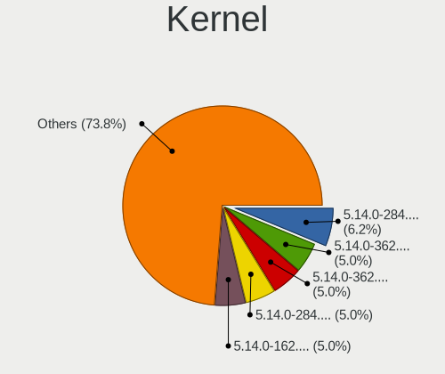

| Version                      | Notebooks | Percent |
|------------------------------|-----------|---------|
| 5.14.0-284.30.1.el9_2.x86_64 | 5         | 7.94%   |
| 5.14.0-362.8.1.el9_3.x86_64  | 4         | 6.35%   |
| 5.14.0-362.13.1.el9_3.x86_64 | 4         | 6.35%   |
| 5.14.0-284.25.1.el9_2.x86_64 | 4         | 6.35%   |
| 5.14.0-162.6.1.el9_1.x86_64  | 4         | 6.35%   |
| 5.14.0-362.18.1.el9_3.x86_64 | 3         | 4.76%   |
| 5.14.0-70.22.1.el9_0.x86_64  | 2         | 3.17%   |
| 5.14.0-70.13.1.el9_0.x86_64  | 2         | 3.17%   |
| 5.14.0-362.24.2.el9_3.x86_64 | 2         | 3.17%   |
| 5.14.0-284.11.1.el9_2.x86_64 | 2         | 3.17%   |
| 5.14.0-162.18.1.el9_1.x86_64 | 2         | 3.17%   |
| 5.14.0-162.12.1.el9_1.x86_64 | 2         | 3.17%   |
| 4.18.0-372.26.1.el8_6.x86_64 | 2         | 3.17%   |
| 4.18.0-305.7.1.el8_4.x86_64  | 2         | 3.17%   |
| 4.18.0-240.15.1.el8_3.x86_64 | 2         | 3.17%   |
| 6.8.8-1.el8.elrepo.x86_64    | 1         | 1.59%   |
| 6.4.0-1.el8.elrepo.x86_64    | 1         | 1.59%   |
| 6.1.81-1.el9.elrepo.x86_64   | 1         | 1.59%   |
| 5.4.175-1.el8.elrepo.x86_64  | 1         | 1.59%   |
| 5.14.0-70.26.1.el9_0.x86_64  | 1         | 1.59%   |
| 5.14.0-70.17.1.el9_0.x86_64  | 1         | 1.59%   |
| 5.14.0-284.18.1.el9_2.x86_64 | 1         | 1.59%   |
| 5.14.0-162.22.2.el9_1.x86_64 | 1         | 1.59%   |
| 4.18.0-513.9.1.el8_9.x86_64  | 1         | 1.59%   |
| 4.18.0-477.27.2.el8_8.x86_64 | 1         | 1.59%   |
| 4.18.0-477.21.1.el8_8.x86_64 | 1         | 1.59%   |
| 4.18.0-477.13.1.el8_8.x86_64 | 1         | 1.59%   |
| 4.18.0-425.3.1.el8.x86_64    | 1         | 1.59%   |
| 4.18.0-372.9.1.el8.x86_64    | 1         | 1.59%   |
| 4.18.0-372.19.1.el8_6.x86_64 | 1         | 1.59%   |
| 4.18.0-348.2.1.el8_5.x86_64  | 1         | 1.59%   |
| 4.18.0-348.12.2.el8_5.x86_64 | 1         | 1.59%   |
| 4.18.0-305.el8.x86_64        | 1         | 1.59%   |
| 4.18.0-305.3.1.el8_4.x86_64  | 1         | 1.59%   |
| 4.18.0-305.12.1.el8_4.x86_64 | 1         | 1.59%   |
| 4.18.0-240.22.1.el8_3.x86_64 | 1         | 1.59%   |

Kernel Family
-------------

Linux kernel without a distro release

| Version | Notebooks | Percent |
|---------|-----------|---------|
| 5.14.0  | 37        | 63.79%  |
| 4.18.0  | 17        | 29.31%  |
| 6.8.8   | 1         | 1.72%   |
| 6.4.0   | 1         | 1.72%   |
| 6.1.81  | 1         | 1.72%   |
| 5.4.175 | 1         | 1.72%   |

Kernel Major Ver.
-----------------

Linux kernel major version

| Version | Notebooks | Percent |
|---------|-----------|---------|
| 5.14    | 37        | 63.79%  |
| 4.18    | 17        | 29.31%  |
| 6.8     | 1         | 1.72%   |
| 6.4     | 1         | 1.72%   |
| 6.1     | 1         | 1.72%   |
| 5.4     | 1         | 1.72%   |

Arch
----

OS architecture (x86_64, i586, etc.)

| Name   | Notebooks | Percent |
|--------|-----------|---------|
| x86_64 | 56        | 100%    |

DE
--

Desktop Environment

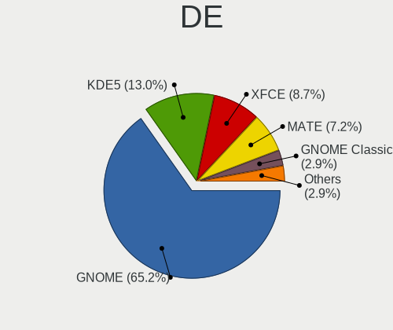

| Name            | Notebooks | Percent |
|-----------------|-----------|---------|
| GNOME           | 38        | 66.67%  |
| XFCE            | 6         | 10.53%  |
| KDE5            | 6         | 10.53%  |
| MATE            | 3         | 5.26%   |
| GNOME Classic   | 2         | 3.51%   |
| GNOME Flashback | 1         | 1.75%   |
| Unknown         | 1         | 1.75%   |

Display Server
--------------

X11 or Wayland

| Name    | Notebooks | Percent |
|---------|-----------|---------|
| Wayland | 35        | 61.4%   |
| X11     | 20        | 35.09%  |
| Tty     | 2         | 3.51%   |

Display Manager
---------------

SDDM, LightDM, etc.

| Name    | Notebooks | Percent |
|---------|-----------|---------|
| Unknown | 27        | 48.21%  |
| GDM     | 22        | 39.29%  |
| SDDM    | 4         | 7.14%   |
| LightDM | 3         | 5.36%   |

OS Lang
-------

Language

| Lang  | Notebooks | Percent |
|-------|-----------|---------|
| en_US | 33        | 58.93%  |
| de_DE | 6         | 10.71%  |
| fr_FR | 3         | 5.36%   |
| C     | 3         | 5.36%   |
| pl_PL | 2         | 3.57%   |
| it_IT | 2         | 3.57%   |
| ru_RU | 1         | 1.79%   |
| es_VE | 1         | 1.79%   |
| es_ES | 1         | 1.79%   |
| en_IN | 1         | 1.79%   |
| en_IE | 1         | 1.79%   |
| en_GB | 1         | 1.79%   |
| en_CA | 1         | 1.79%   |

Boot Mode
---------

EFI or BIOS

| Mode | Notebooks | Percent |
|------|-----------|---------|
| EFI  | 43        | 76.79%  |
| BIOS | 13        | 23.21%  |

Filesystem
----------

Type of filesystem

| Type | Notebooks | Percent |
|------|-----------|---------|
| Xfs  | 45        | 80.36%  |
| Ext4 | 11        | 19.64%  |

Part. scheme
------------

Scheme of partitioning

| Type    | Notebooks | Percent |
|---------|-----------|---------|
| GPT     | 26        | 46.43%  |
| Unknown | 25        | 44.64%  |
| MBR     | 5         | 8.93%   |

Dual Boot with Linux/BSD
------------------------

Hosting more than one Linux/BSD

| Dual boot | Notebooks | Percent |
|-----------|-----------|---------|
| No        | 50        | 89.29%  |
| Yes       | 6         | 10.71%  |

Dual Boot (Win)
---------------

Hosting Linux and Windows

| Dual boot | Notebooks | Percent |
|-----------|-----------|---------|
| No        | 48        | 85.71%  |
| Yes       | 8         | 14.29%  |

Board
-----

Vendor
------

Motherboard manufacturer

| Name             | Notebooks | Percent |
|------------------|-----------|---------|
| Lenovo           | 16        | 28.57%  |
| Hewlett-Packard  | 12        | 21.43%  |
| Dell             | 9         | 16.07%  |
| Acer             | 5         | 8.93%   |
| Toshiba          | 2         | 3.57%   |
| Timi             | 2         | 3.57%   |
| Google           | 2         | 3.57%   |
| ASUSTek Computer | 2         | 3.57%   |
| TUXEDO           | 1         | 1.79%   |
| Notebook         | 1         | 1.79%   |
| MSI              | 1         | 1.79%   |
| Maibenben        | 1         | 1.79%   |
| Intel            | 1         | 1.79%   |
| AOCWEI           | 1         | 1.79%   |

Model
-----

Motherboard model

| Name                                     | Notebooks | Percent |
|------------------------------------------|-----------|---------|
| TUXEDO Aura 15 Gen1                      | 1         | 1.79%   |
| Toshiba Satellite L50-C                  | 1         | 1.79%   |
| Toshiba Satellite C50-A                  | 1         | 1.79%   |
| Timi TM1709                              | 1         | 1.79%   |
| Timi RedmiBook 14-APCS                   | 1         | 1.79%   |
| Notebook NS50_70MU                       | 1         | 1.79%   |
| MSI GL75 9SE                             | 1         | 1.79%   |
| Maibenben MaiBook X series               | 1         | 1.79%   |
| Lenovo Yoga 2 13 20344                   | 1         | 1.79%   |
| Lenovo V14-ARE 82DQ                      | 1         | 1.79%   |
| Lenovo ThinkPad X1 Nano Gen 1 20UNS02500 | 1         | 1.79%   |
| Lenovo ThinkPad X1 Carbon 6th 20KH006JRT | 1         | 1.79%   |
| Lenovo ThinkPad T480s 20L70028US         | 1         | 1.79%   |
| Lenovo ThinkPad T440s 20ARS32P00         | 1         | 1.79%   |
| Lenovo ThinkPad T14 Gen 1 20S1S39Q00     | 1         | 1.79%   |
| Lenovo ThinkPad P1 Gen 4i 20Y3003XUS     | 1         | 1.79%   |
| Lenovo ThinkPad E14 Gen 2 20TBS0CK00     | 1         | 1.79%   |
| Lenovo Legion Y530-15ICH 81FV            | 1         | 1.79%   |
| Lenovo Legion 5 15IMH05H 81Y6            | 1         | 1.79%   |
| Lenovo IdeaPad Slim 1-14AST-05 81VS      | 1         | 1.79%   |
| Lenovo IdeaPad S145-15IWL 81MV           | 1         | 1.79%   |
| Lenovo IdeaPad 330-15ARR 81D2            | 1         | 1.79%   |
| Lenovo G580 20157                        | 1         | 1.79%   |
| Lenovo B50-30 20382                      | 1         | 1.79%   |
| Intel powered classmate PC               | 1         | 1.79%   |
| HP ZBook 17 G2                           | 1         | 1.79%   |
| HP Notebook                              | 1         | 1.79%   |
| HP Laptop 17-cp0xxx                      | 1         | 1.79%   |
| HP Laptop 15-ef1xxx                      | 1         | 1.79%   |
| HP Laptop 14-ep0xxx                      | 1         | 1.79%   |
| HP Falco                                 | 1         | 1.79%   |
| HP ENVY dv6                              | 1         | 1.79%   |
| HP ENVY 15                               | 1         | 1.79%   |
| HP EliteBook 8570w                       | 1         | 1.79%   |
| HP EliteBook 850 G8 Notebook PC          | 1         | 1.79%   |
| HP EliteBook 8470p                       | 1         | 1.79%   |
| HP 17-ak041ur                            | 1         | 1.79%   |
| Google Kohaku                            | 1         | 1.79%   |
| Google Kefka                             | 1         | 1.79%   |
| Dell XPS 13 9360                         | 1         | 1.79%   |

Model Family
------------

Motherboard model prefix

| Name              | Notebooks | Percent |
|-------------------|-----------|---------|
| Lenovo ThinkPad   | 7         | 12.5%   |
| Lenovo IdeaPad    | 3         | 5.36%   |
| HP Laptop         | 3         | 5.36%   |
| HP EliteBook      | 3         | 5.36%   |
| Dell Latitude     | 3         | 5.36%   |
| Dell Inspiron     | 3         | 5.36%   |
| Acer Aspire       | 3         | 5.36%   |
| Toshiba Satellite | 2         | 3.57%   |
| Lenovo Legion     | 2         | 3.57%   |
| HP ENVY           | 2         | 3.57%   |
| Dell Precision    | 2         | 3.57%   |
| TUXEDO Aura       | 1         | 1.79%   |
| Timi TM1709       | 1         | 1.79%   |
| Timi RedmiBook    | 1         | 1.79%   |
| Notebook NS50     | 1         | 1.79%   |
| MSI GL75          | 1         | 1.79%   |
| Maibenben MaiBook | 1         | 1.79%   |
| Lenovo Yoga       | 1         | 1.79%   |
| Lenovo V14-ARE    | 1         | 1.79%   |
| Lenovo G580       | 1         | 1.79%   |
| Lenovo B50-30     | 1         | 1.79%   |
| Intel powered     | 1         | 1.79%   |
| HP ZBook          | 1         | 1.79%   |
| HP Notebook       | 1         | 1.79%   |
| HP Falco          | 1         | 1.79%   |
| HP 17-ak041ur     | 1         | 1.79%   |
| Google Kohaku     | 1         | 1.79%   |
| Google Kefka      | 1         | 1.79%   |
| Dell XPS          | 1         | 1.79%   |
| ASUS GL552VW      | 1         | 1.79%   |
| ASUS ASUS         | 1         | 1.79%   |
| AOCWEI A2         | 1         | 1.79%   |
| Acer TravelMate   | 1         | 1.79%   |
| Acer TMP453-MG    | 1         | 1.79%   |

MFG Year
--------

Motherboard manufacture year

| Year | Notebooks | Percent |
|------|-----------|---------|
| 2020 | 9         | 16.07%  |
| 2018 | 7         | 12.5%   |
| 2019 | 6         | 10.71%  |
| 2012 | 5         | 8.93%   |
| 2022 | 4         | 7.14%   |
| 2021 | 4         | 7.14%   |
| 2014 | 4         | 7.14%   |
| 2023 | 3         | 5.36%   |
| 2015 | 3         | 5.36%   |
| 2011 | 3         | 5.36%   |
| 2010 | 3         | 5.36%   |
| 2016 | 2         | 3.57%   |
| 2013 | 2         | 3.57%   |
| 2017 | 1         | 1.79%   |

Form Factor
-----------

Physical design of the computer

| Name     | Notebooks | Percent |
|----------|-----------|---------|
| Notebook | 56        | 100%    |

Secure Boot
-----------

Enabled or disabled

| State    | Notebooks | Percent |
|----------|-----------|---------|
| Disabled | 50        | 87.72%  |
| Enabled  | 7         | 12.28%  |

Coreboot
--------

Have coreboot on board

| Used | Notebooks | Percent |
|------|-----------|---------|
| No   | 53        | 94.64%  |
| Yes  | 3         | 5.36%   |

RAM Size
--------

Total RAM memory

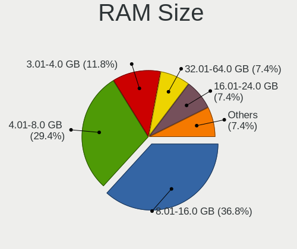

| Size in GB  | Notebooks | Percent |
|-------------|-----------|---------|
| 8.01-16.0   | 21        | 37.5%   |
| 4.01-8.0    | 15        | 26.79%  |
| 3.01-4.0    | 8         | 14.29%  |
| 16.01-24.0  | 5         | 8.93%   |
| 32.01-64.0  | 3         | 5.36%   |
| 1.01-2.0    | 2         | 3.57%   |
| 24.01-32.0  | 1         | 1.79%   |
| 64.01-256.0 | 1         | 1.79%   |

RAM Used
--------

Used RAM memory

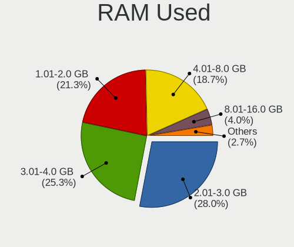

| Used GB   | Notebooks | Percent |
|-----------|-----------|---------|
| 2.01-3.0  | 19        | 30.65%  |
| 1.01-2.0  | 14        | 22.58%  |
| 3.01-4.0  | 13        | 20.97%  |
| 4.01-8.0  | 11        | 17.74%  |
| 8.01-16.0 | 3         | 4.84%   |
| 0.51-1.0  | 2         | 3.23%   |

Total Drives
------------

Number of drives on board

| Drives | Notebooks | Percent |
|--------|-----------|---------|
| 1      | 39        | 68.42%  |
| 2      | 15        | 26.32%  |
| 3      | 2         | 3.51%   |
| 0      | 1         | 1.75%   |

Has CD-ROM
----------

Has CD-ROM on board

| Presented | Notebooks | Percent |
|-----------|-----------|---------|
| No        | 42        | 75%     |
| Yes       | 14        | 25%     |

Has Ethernet
------------

Has Ethernet on board

| Presented | Notebooks | Percent |
|-----------|-----------|---------|
| Yes       | 43        | 76.79%  |
| No        | 13        | 23.21%  |

Has WiFi
--------

Has WiFi module

| Presented | Notebooks | Percent |
|-----------|-----------|---------|
| Yes       | 56        | 100%    |

Has Bluetooth
-------------

Has Bluetooth module

| Presented | Notebooks | Percent |
|-----------|-----------|---------|
| Yes       | 48        | 84.21%  |
| No        | 9         | 15.79%  |

Location
--------

Country
-------

Geographic location (country)

| Country      | Notebooks | Percent |
|--------------|-----------|---------|
| USA          | 14        | 25%     |
| Germany      | 7         | 12.5%   |
| France       | 4         | 7.14%   |
| Indonesia    | 3         | 5.36%   |
| India        | 3         | 5.36%   |
| Canada       | 3         | 5.36%   |
| Spain        | 2         | 3.57%   |
| South Africa | 2         | 3.57%   |
| Russia       | 2         | 3.57%   |
| Poland       | 2         | 3.57%   |
| Italy        | 2         | 3.57%   |
| Venezuela    | 1         | 1.79%   |
| Sweden       | 1         | 1.79%   |
| Romania      | 1         | 1.79%   |
| Puerto Rico  | 1         | 1.79%   |
| Pakistan     | 1         | 1.79%   |
| Netherlands  | 1         | 1.79%   |
| Mexico       | 1         | 1.79%   |
| Hungary      | 1         | 1.79%   |
| China        | 1         | 1.79%   |
| Bulgaria     | 1         | 1.79%   |
| Belgium      | 1         | 1.79%   |
| Bangladesh   | 1         | 1.79%   |

City
----

Geographic location (city)

| City               | Notebooks | Percent |
|--------------------|-----------|---------|
| Queens             | 2         | 3.51%   |
| Los Angeles        | 2         | 3.51%   |
| Johannesburg       | 2         | 3.51%   |
| Hamburg            | 2         | 3.51%   |
| Dresden            | 2         | 3.51%   |
| Berlin             | 2         | 3.51%   |
| Winterswijk        | 1         | 1.75%   |
| Wejherowo          | 1         | 1.75%   |
| Warsaw             | 1         | 1.75%   |
| Uppsala            | 1         | 1.75%   |
| Thiruvananthapuram | 1         | 1.75%   |
| Suzhou             | 1         | 1.75%   |
| South Tangerang    | 1         | 1.75%   |
| Sofia              | 1         | 1.75%   |
| Saint-Brieuc       | 1         | 1.75%   |
| Rome               | 1         | 1.75%   |
| Regina             | 1         | 1.75%   |
| Redlands           | 1         | 1.75%   |
| Penza              | 1         | 1.75%   |
| Parla              | 1         | 1.75%   |
| Paris              | 1         | 1.75%   |
| Ottawa             | 1         | 1.75%   |
| Minneapolis        | 1         | 1.75%   |
| Milan              | 1         | 1.75%   |
| Mangalore          | 1         | 1.75%   |
| Lille              | 1         | 1.75%   |
| Land O' Lakes      | 1         | 1.75%   |
| Lahore             | 1         | 1.75%   |
| Kennewick          | 1         | 1.75%   |
| Irapuato           | 1         | 1.75%   |
| Huntersville       | 1         | 1.75%   |
| Houston            | 1         | 1.75%   |
| Guglingen          | 1         | 1.75%   |
| Guanare            | 1         | 1.75%   |
| Gistel             | 1         | 1.75%   |
| Gardony            | 1         | 1.75%   |
| Galati             | 1         | 1.75%   |
| Essen              | 1         | 1.75%   |
| Dhaka              | 1         | 1.75%   |
| Columbia           | 1         | 1.75%   |

Drives
------

Drive Vendor
------------

Hard drive vendors

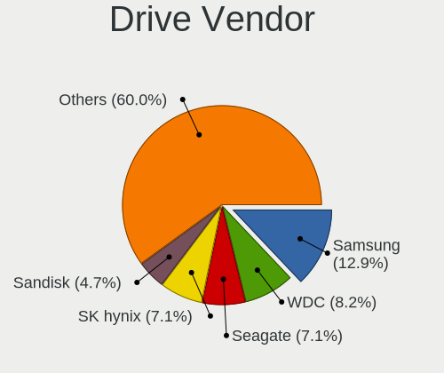

| Vendor                      | Notebooks | Drives | Percent |
|-----------------------------|-----------|--------|---------|
| Samsung Electronics         | 8         | 8      | 11.27%  |
| WDC                         | 7         | 8      | 9.86%   |
| SK hynix                    | 5         | 7      | 7.04%   |
| Seagate                     | 4         | 4      | 5.63%   |
| Intel                       | 4         | 5      | 5.63%   |
| Sandisk                     | 3         | 3      | 4.23%   |
| Kingston Technology Company | 3         | 4      | 4.23%   |
| Kingston                    | 3         | 3      | 4.23%   |
| Hitachi                     | 3         | 4      | 4.23%   |
| Unknown                     | 2         | 3      | 2.82%   |
| Toshiba                     | 2         | 4      | 2.82%   |
| Plextor                     | 2         | 2      | 2.82%   |
| Netac                       | 2         | 2      | 2.82%   |
| LITEONIT                    | 2         | 5      | 2.82%   |
| KIOXIA                      | 2         | 2      | 2.82%   |
| HGST                        | 2         | 2      | 2.82%   |
| Union Memory                | 1         | 1      | 1.41%   |
| Transcend                   | 1         | 1      | 1.41%   |
| SSSTC                       | 1         | 1      | 1.41%   |
| Phison Electronics          | 1         | 1      | 1.41%   |
| Patriot                     | 1         | 1      | 1.41%   |
| MidasForce                  | 1         | 1      | 1.41%   |
| Micron Technology           | 1         | 1      | 1.41%   |
| MAXIO Technology (Hangzhou) | 1         | 1      | 1.41%   |
| Lite-On Technology          | 1         | 1      | 1.41%   |
| Lenovo                      | 1         | 1      | 1.41%   |
| HJDK                        | 1         | 1      | 1.41%   |
| Emtec                       | 1         | 2      | 1.41%   |
| Dell                        | 1         | 2      | 1.41%   |
| Crucial                     | 1         | 2      | 1.41%   |
| China                       | 1         | 1      | 1.41%   |
| ASMT                        | 1         | 2      | 1.41%   |
| A-DATA Technology           | 1         | 1      | 1.41%   |

Drive Model
-----------

Hard drive models

| Model                                             | Notebooks | Percent |
|---------------------------------------------------|-----------|---------|
| WDC WD10SPZX-24Z10 1TB                            | 2         | 2.74%   |
| SK hynix SC311 SATA 256GB SSD                     | 2         | 2.74%   |
| Samsung NVMe SSD Controller SM981/PM981/PM983 1TB | 2         | 2.74%   |
| Kingston Company SNV2S1000G 1TB                   | 2         | 2.74%   |
| HGST HTS541010A9E680 1TB                          | 2         | 2.74%   |
| WDC WD5000LPCX-21VHAT0 500GB                      | 1         | 1.37%   |
| WDC WD10SPZX-60Z10T1 1TB                          | 1         | 1.37%   |
| WDC WD10SPZX-60Z10T0 1TB                          | 1         | 1.37%   |
| WDC WD10JPVX-00JC3T0 1TB                          | 1         | 1.37%   |
| WDC PC SN730 SDBQNTY-256G-1001 256GB              | 1         | 1.37%   |
| Unknown SD/MMC/MS PRO 128GB                       | 1         | 1.37%   |
| Unknown MMC Card  16GB                            | 1         | 1.37%   |
| Union Memory UMIS RPITJ512VME2OWD 512GB           | 1         | 1.37%   |
| Transcend TS256GMTE220S 256GB                     | 1         | 1.37%   |
| Toshiba MQ01ABD075 752GB                          | 1         | 1.37%   |
| Toshiba MK6475GSX 640GB                           | 1         | 1.37%   |
| SSSTC CL1-3D256 256GB                             | 1         | 1.37%   |
| SK hynix PC801 NVMe 1TB                           | 1         | 1.37%   |
| SK hynix NVMe SSD Drive 256GB                     | 1         | 1.37%   |
| SK hynix BC511 NVMe 256GB                         | 1         | 1.37%   |
| Seagate ST9500325AS 500GB                         | 1         | 1.37%   |
| Seagate ST500LT012-1DG142 500GB                   | 1         | 1.37%   |
| Seagate ST250LM004 HN-M250MBB 250GB               | 1         | 1.37%   |
| Seagate ST1000LM024 HN-M101MBB 1TB                | 1         | 1.37%   |
| Sandisk WD Blue SN550 NVMe SSD 2TB                | 1         | 1.37%   |
| Sandisk WD Blue SN500 / PC SN520 NVMe SSD 512GB   | 1         | 1.37%   |
| SanDisk SD6PP4M-256G-1006 256GB SSD               | 1         | 1.37%   |
| Samsung SSD PM810 FDE 2.5 256GB                   | 1         | 1.37%   |
| Samsung SSD 870 EVO 500GB                         | 1         | 1.37%   |
| Samsung MZVLQ512HALU-00000 512GB                  | 1         | 1.37%   |
| Samsung MZVLQ128HBHQ-000H1 128GB                  | 1         | 1.37%   |
| Samsung MZVL22T0HBLB-00BL7 2TB                    | 1         | 1.37%   |
| Samsung MZALQ512HALU-000L1 512GB                  | 1         | 1.37%   |
| Plextor PX-256S3C 256GB SSD                       | 1         | 1.37%   |
| Plextor PX-128S3C 128GB SSD                       | 1         | 1.37%   |
| Phison PS5013 E13 NVMe Controller 512GB           | 1         | 1.37%   |
| Patriot P210 2048GB SSD                           | 1         | 1.37%   |
| Netac SSD 128GB                                   | 1         | 1.37%   |
| Netac NVMe SSD Drive 2TB                          | 1         | 1.37%   |
| MidasForce SSD 128GB                              | 1         | 1.37%   |

HDD Vendor
----------

Hard disk drive vendors

| Vendor  | Notebooks | Drives | Percent |
|---------|-----------|--------|---------|
| WDC     | 6         | 7      | 33.33%  |
| Seagate | 4         | 4      | 22.22%  |
| Hitachi | 3         | 4      | 16.67%  |
| Toshiba | 2         | 4      | 11.11%  |
| HGST    | 2         | 2      | 11.11%  |
| Unknown | 1         | 2      | 5.56%   |

SSD Vendor
----------

Solid state drive vendors

| Vendor              | Notebooks | Drives | Percent |
|---------------------|-----------|--------|---------|
| Kingston            | 3         | 3      | 12.5%   |
| SK hynix            | 2         | 4      | 8.33%   |
| Samsung Electronics | 2         | 2      | 8.33%   |
| Plextor             | 2         | 2      | 8.33%   |
| LITEONIT            | 2         | 5      | 8.33%   |
| Intel               | 2         | 3      | 8.33%   |
| SanDisk             | 1         | 1      | 4.17%   |
| Patriot             | 1         | 1      | 4.17%   |
| Netac               | 1         | 1      | 4.17%   |
| MidasForce          | 1         | 1      | 4.17%   |
| Micron Technology   | 1         | 1      | 4.17%   |
| HJDK                | 1         | 1      | 4.17%   |
| Dell                | 1         | 2      | 4.17%   |
| Crucial             | 1         | 2      | 4.17%   |
| China               | 1         | 1      | 4.17%   |
| ASMT                | 1         | 2      | 4.17%   |
| A-DATA Technology   | 1         | 1      | 4.17%   |

Drive Kind
----------

HDD or SSD

| Kind    | Notebooks | Drives | Percent |
|---------|-----------|--------|---------|
| NVMe    | 25        | 28     | 37.88%  |
| SSD     | 21        | 33     | 31.82%  |
| HDD     | 18        | 23     | 27.27%  |
| MMC     | 1         | 1      | 1.52%   |
| Unknown | 1         | 2      | 1.52%   |

Drive Connector
---------------

SATA, SAS, NVMe, etc.

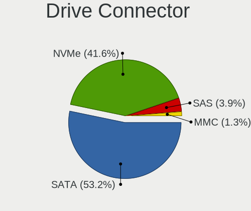

| Type | Notebooks | Drives | Percent |
|------|-----------|--------|---------|
| SATA | 35        | 52     | 55.56%  |
| NVMe | 25        | 28     | 39.68%  |
| SAS  | 2         | 6      | 3.17%   |
| MMC  | 1         | 1      | 1.59%   |

Drive Size
----------

Size of hard drive

| Size in TB | Notebooks | Drives | Percent |
|------------|-----------|--------|---------|
| 0.01-0.5   | 27        | 39     | 69.23%  |
| 0.51-1.0   | 11        | 16     | 28.21%  |
| 1.01-2.0   | 1         | 1      | 2.56%   |

Space Total
-----------

Amount of disk space available on the file system

| Size in GB | Notebooks | Percent |
|------------|-----------|---------|
| 101-250    | 21        | 36.84%  |
| 251-500    | 13        | 22.81%  |
| 501-1000   | 9         | 15.79%  |
| 1001-2000  | 5         | 8.77%   |
| 51-100     | 4         | 7.02%   |
| 1-20       | 3         | 5.26%   |
| 21-50      | 2         | 3.51%   |

Space Used
----------

Amount of used disk space

| Used GB  | Notebooks | Percent |
|----------|-----------|---------|
| 1-20     | 28        | 46.67%  |
| 21-50    | 14        | 23.33%  |
| 51-100   | 8         | 13.33%  |
| 101-250  | 6         | 10%     |
| 251-500  | 3         | 5%      |
| 501-1000 | 1         | 1.67%   |

Malfunc. Drives
---------------

Drive models with a malfunction

| Model                          | Notebooks | Drives | Percent |
|--------------------------------|-----------|--------|---------|
| LITEONIT LSS-16L6G-HP 16GB SSD | 1         | 4      | 33.33%  |
| Hitachi HTS545050A7E380 500GB  | 1         | 1      | 33.33%  |
| HGST HTS541010A9E680 1TB       | 1         | 1      | 33.33%  |

Malfunc. Drive Vendor
---------------------

Vendors of faulty drives

| Vendor   | Notebooks | Drives | Percent |
|----------|-----------|--------|---------|
| LITEONIT | 1         | 4      | 33.33%  |
| Hitachi  | 1         | 1      | 33.33%  |
| HGST     | 1         | 1      | 33.33%  |

Malfunc. HDD Vendor
-------------------

Vendors of faulty HDD drives

| Vendor  | Notebooks | Drives | Percent |
|---------|-----------|--------|---------|
| Hitachi | 1         | 1      | 50%     |
| HGST    | 1         | 1      | 50%     |

Malfunc. Drive Kind
-------------------

Kinds of faulty drives

| Kind | Notebooks | Drives | Percent |
|------|-----------|--------|---------|
| HDD  | 2         | 2      | 66.67%  |
| SSD  | 1         | 4      | 33.33%  |

Failed Drives
-------------

Failed drive models

Zero info for selected period =(

Failed Drive Vendor
-------------------

Failed drive vendors

Zero info for selected period =(

Drive Status
------------

Number of failed and malfunc. drives

| Status   | Notebooks | Drives | Percent |
|----------|-----------|--------|---------|
| Works    | 28        | 40     | 49.12%  |
| Detected | 26        | 41     | 45.61%  |
| Malfunc  | 3         | 6      | 5.26%   |

Storage controller
------------------

Storage Vendor
--------------

Storage controller vendors

| Vendor                         | Notebooks | Percent |
|--------------------------------|-----------|---------|
| Intel                          | 34        | 50%     |
| AMD                            | 8         | 11.76%  |
| Samsung Electronics            | 6         | 8.82%   |
| SanDisk                        | 3         | 4.41%   |
| Kingston Technology Company    | 3         | 4.41%   |
| Union Memory (Shenzhen)        | 2         | 2.94%   |
| SK hynix                       | 2         | 2.94%   |
| Toshiba America Info Systems   | 1         | 1.47%   |
| Solid State Storage Technology | 1         | 1.47%   |
| Silicon Motion                 | 1         | 1.47%   |
| Phison Electronics             | 1         | 1.47%   |
| Netac Technology               | 1         | 1.47%   |
| MAXIO Technology (Hangzhou)    | 1         | 1.47%   |
| Marvell Technology Group       | 1         | 1.47%   |
| Lite-On Technology             | 1         | 1.47%   |
| Lenovo                         | 1         | 1.47%   |
| KIOXIA                         | 1         | 1.47%   |

Storage Model
-------------

Storage controller models

| Model                                                                | Notebooks | Percent |
|----------------------------------------------------------------------|-----------|---------|
| AMD FCH SATA Controller [AHCI mode]                                  | 8         | 11.27%  |
| Intel Sunrise Point-LP SATA Controller [AHCI mode]                   | 4         | 5.63%   |
| Intel 8 Series SATA Controller 1 [AHCI mode]                         | 4         | 5.63%   |
| Intel 7 Series Chipset Family 6-port SATA Controller [AHCI mode]     | 4         | 5.63%   |
| Samsung NVMe SSD Controller 980 (DRAM-less)                          | 3         | 4.23%   |
| Intel 82801 Mobile SATA Controller [RAID mode]                       | 3         | 4.23%   |
| Samsung NVMe SSD Controller SM981/PM981/PM983                        | 2         | 2.82%   |
| Kingston Company NV2 NVMe SSD SM2267XT (DRAM-less)                   | 2         | 2.82%   |
| Intel Volume Management Device NVMe RAID Controller                  | 2         | 2.82%   |
| Intel Cannon Lake Mobile PCH SATA AHCI Controller                    | 2         | 2.82%   |
| Intel Atom Processor E3800 Series SATA AHCI Controller               | 2         | 2.82%   |
| Union Memory (Shenzhen) AM610 PCIe 3.0 x2 NVMe SSD 128GB, 256GB      | 1         | 1.41%   |
| Union Memory (Shenzhen) AH631 PCIe 3.0 NVMe SSD 512GB                | 1         | 1.41%   |
| Toshiba America Info Systems XG6 NVMe SSD Controller                 | 1         | 1.41%   |
| Solid State Storage CL1-3D256-Q11 NVMe SSD M.2                       | 1         | 1.41%   |
| SK hynix Platinum P41/PC801 NVMe Solid State Drive                   | 1         | 1.41%   |
| SK hynix BC511 NVMe SSD                                              | 1         | 1.41%   |
| Silicon Motion SM2262/SM2262EN SSD Controller                        | 1         | 1.41%   |
| SanDisk WD Blue SN500 / PC SN520 x2 M.2 2280 NVMe SSD                | 1         | 1.41%   |
| SanDisk Ultra 3D / WD Blue SN550 NVMe SSD                            | 1         | 1.41%   |
| SanDisk Extreme Pro / WD Black SN750 / PC SN730 / Red SN700 NVMe SSD | 1         | 1.41%   |
| Samsung NVMe SSD Controller PM9A1/PM9A3/980PRO                       | 1         | 1.41%   |
| Phison PS5013-E13 PCIe3 NVMe Controller (DRAM-less)                  | 1         | 1.41%   |
| Netac PCIe 3 NVMe SSD (DRAM-less)                                    | 1         | 1.41%   |
| MAXIO (Hangzhou) NVMe SSD Controller MAP1202 (DRAM-less)             | 1         | 1.41%   |
| Marvell Group 88SS9183 PCIe SSD Controller                           | 1         | 1.41%   |
| Lite-On CX2-8B256, CX2-8B512 NVMe SSD                                | 1         | 1.41%   |
| Lenovo LENSE30512GMSP34MEAT3TA                                       | 1         | 1.41%   |
| KIOXIA NVMe SSD Controller XG7                                       | 1         | 1.41%   |
| Kingston Company OM3PDP3 NVMe SSD                                    | 1         | 1.41%   |
| Kingston Company A2000 NVMe SSD SM2263EN                             | 1         | 1.41%   |
| Intel Wildcat Point-LP SATA Controller [AHCI Mode]                   | 1         | 1.41%   |
| Intel SSD 670p Series [Keystone Harbor]                              | 1         | 1.41%   |
| Intel SSD 660P Series                                                | 1         | 1.41%   |
| Intel NM10/ICH7 Family SATA Controller [AHCI mode]                   | 1         | 1.41%   |
| Intel HM170/QM170 Chipset SATA Controller [AHCI Mode]                | 1         | 1.41%   |
| Intel Comet Lake SATA AHCI Controller                                | 1         | 1.41%   |
| Intel Celeron/Pentium Silver Processor SATA Controller               | 1         | 1.41%   |
| Intel Cannon Point-LP SATA Controller [AHCI Mode]                    | 1         | 1.41%   |
| Intel Alder Lake-P SATA AHCI Controller                              | 1         | 1.41%   |

Storage Kind
------------

Kind of storage controller (IDE, SATA, NVMe, SAS, ...)

| Kind | Notebooks | Percent |
|------|-----------|---------|
| SATA | 35        | 53.03%  |
| NVMe | 25        | 37.88%  |
| RAID | 5         | 7.58%   |
| IDE  | 1         | 1.52%   |

Processor
---------

CPU Vendor
----------

Processor vendors

| Vendor | Notebooks | Percent |
|--------|-----------|---------|
| Intel  | 44        | 78.57%  |
| AMD    | 12        | 21.43%  |

CPU Model
---------

Processor models

| Model                                       | Notebooks | Percent |
|---------------------------------------------|-----------|---------|
| Intel Core i5-10210U CPU @ 1.60GHz          | 3         | 5.36%   |
| Intel Core i5-8250U CPU @ 1.60GHz           | 2         | 3.57%   |
| Intel 11th Gen Core i7-1165G7 @ 2.80GHz     | 2         | 3.57%   |
| Intel Xeon W-11855M CPU @ 3.20GHz           | 1         | 1.79%   |
| Intel Pentium Dual-Core CPU T4500 @ 2.30GHz | 1         | 1.79%   |
| Intel Pentium CPU N3540 @ 2.16GHz           | 1         | 1.79%   |
| Intel Pentium CPU 3825U @ 1.90GHz           | 1         | 1.79%   |
| Intel Core i7-9750H CPU @ 2.60GHz           | 1         | 1.79%   |
| Intel Core i7-8650U CPU @ 1.90GHz           | 1         | 1.79%   |
| Intel Core i7-8550U CPU @ 1.80GHz           | 1         | 1.79%   |
| Intel Core i7-7560U CPU @ 2.40GHz           | 1         | 1.79%   |
| Intel Core i7-6700HQ CPU @ 2.60GHz          | 1         | 1.79%   |
| Intel Core i7-6500U CPU @ 2.50GHz           | 1         | 1.79%   |
| Intel Core i7-4710MQ CPU @ 2.50GHz          | 1         | 1.79%   |
| Intel Core i7-4510U CPU @ 2.00GHz           | 1         | 1.79%   |
| Intel Core i7-3840QM CPU @ 2.80GHz          | 1         | 1.79%   |
| Intel Core i7-3630QM CPU @ 2.40GHz          | 1         | 1.79%   |
| Intel Core i7-10750H CPU @ 2.60GHz          | 1         | 1.79%   |
| Intel Core i5-8350U CPU @ 1.70GHz           | 1         | 1.79%   |
| Intel Core i5-8300H CPU @ 2.30GHz           | 1         | 1.79%   |
| Intel Core i5-4300U CPU @ 1.90GHz           | 1         | 1.79%   |
| Intel Core i5-3360M CPU @ 2.80GHz           | 1         | 1.79%   |
| Intel Core i5-3230M CPU @ 2.60GHz           | 1         | 1.79%   |
| Intel Core i5-3210M CPU @ 2.50GHz           | 1         | 1.79%   |
| Intel Core i5-2410M CPU @ 2.30GHz           | 1         | 1.79%   |
| Intel Core i3-8145U CPU @ 2.10GHz           | 1         | 1.79%   |
| Intel Core i3-4010U CPU @ 1.70GHz           | 1         | 1.79%   |
| Intel Core i3-2370M CPU @ 2.40GHz           | 1         | 1.79%   |
| Intel Core i3 CPU M 370 @ 2.40GHz           | 1         | 1.79%   |
| Intel Celeron N4020C CPU @ 1.10GHz          | 1         | 1.79%   |
| Intel Celeron CPU N3060 @ 1.60GHz           | 1         | 1.79%   |
| Intel Celeron CPU N2820 @ 2.13GHz           | 1         | 1.79%   |
| Intel Celeron 2955U @ 1.40GHz               | 1         | 1.79%   |
| Intel Atom CPU N455 @ 1.66GHz               | 1         | 1.79%   |
| Intel 13th Gen Core i7-13800H               | 1         | 1.79%   |
| Intel 13th Gen Core i7-1355U                | 1         | 1.79%   |
| Intel 12th Gen Core i3-1215U                | 1         | 1.79%   |
| Intel 11th Gen Core i7-1185G7 @ 3.00GHz     | 1         | 1.79%   |
| Intel 11th Gen Core i7-11850H @ 2.50GHz     | 1         | 1.79%   |
| Intel 11th Gen Core i7-1160G7 @ 1.20GHz     | 1         | 1.79%   |

CPU Model Family
----------------

Processor model prefix

| Model                   | Notebooks | Percent |
|-------------------------|-----------|---------|
| Intel Core i5           | 12        | 21.43%  |
| Intel Core i7           | 11        | 19.64%  |
| Other                   | 9         | 16.07%  |
| Intel Core i3           | 4         | 7.14%   |
| Intel Celeron           | 4         | 7.14%   |
| AMD Ryzen 7             | 4         | 7.14%   |
| Intel Pentium           | 2         | 3.57%   |
| AMD Ryzen 5             | 2         | 3.57%   |
| AMD A12                 | 2         | 3.57%   |
| Intel Xeon              | 1         | 1.79%   |
| Intel Pentium Dual-Core | 1         | 1.79%   |
| Intel Atom              | 1         | 1.79%   |
| AMD Ryzen 3             | 1         | 1.79%   |
| AMD A6                  | 1         | 1.79%   |
| AMD A10                 | 1         | 1.79%   |

CPU Cores
---------

Number of processor cores

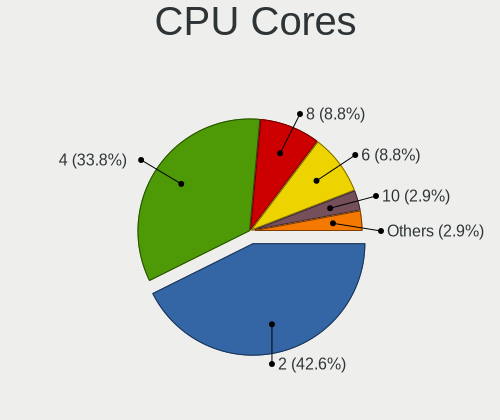

| Number | Notebooks | Percent |
|--------|-----------|---------|
| 2      | 24        | 42.86%  |
| 4      | 20        | 35.71%  |
| 6      | 5         | 8.93%   |
| 8      | 4         | 7.14%   |
| 14     | 1         | 1.79%   |
| 10     | 1         | 1.79%   |
| 1      | 1         | 1.79%   |

CPU Sockets
-----------

Number of sockets

| Number | Notebooks | Percent |
|--------|-----------|---------|
| 1      | 56        | 100%    |

CPU Threads
-----------

Threads per core (Hyper-Threading)

| Number | Notebooks | Percent |
|--------|-----------|---------|
| 2      | 46        | 82.14%  |
| 1      | 10        | 17.86%  |

CPU Op-Modes
------------

CPU Operation Modes (32-bit, 64-bit)

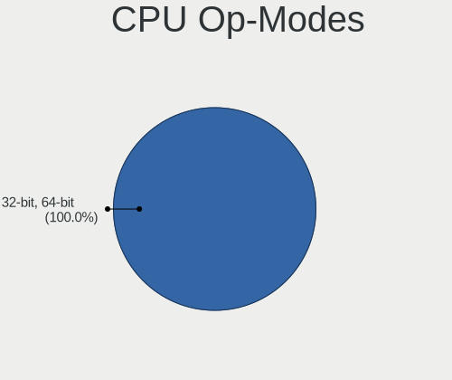

| Op mode        | Notebooks | Percent |
|----------------|-----------|---------|
| 32-bit, 64-bit | 56        | 100%    |

CPU Microcode
-------------

Microcode number

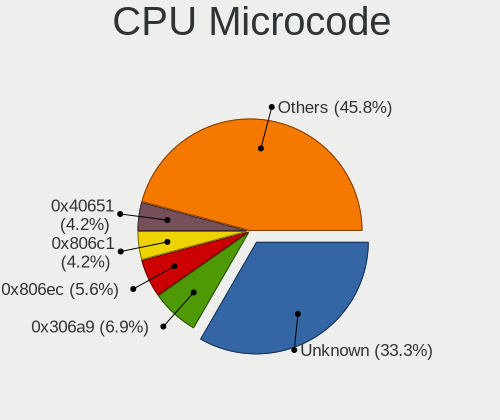

| Number     | Notebooks | Percent |
|------------|-----------|---------|
| Unknown    | 13        | 21.67%  |
| 0x806ec    | 4         | 6.67%   |
| 0x306a9    | 4         | 6.67%   |
| 0x806c1    | 3         | 5%      |
| 0x40651    | 3         | 5%      |
| 0x806ea    | 2         | 3.33%   |
| 0x806d1    | 2         | 3.33%   |
| 0x206a7    | 2         | 3.33%   |
| 0x08600106 | 2         | 3.33%   |
| 0x08108109 | 2         | 3.33%   |
| 0x0600611a | 2         | 3.33%   |
| 0xb06a3    | 1         | 1.67%   |
| 0xa0652    | 1         | 1.67%   |
| 0x906ed    | 1         | 1.67%   |
| 0x906ea    | 1         | 1.67%   |
| 0x906a4    | 1         | 1.67%   |
| 0x806e9    | 1         | 1.67%   |
| 0x406e3    | 1         | 1.67%   |
| 0x406c4    | 1         | 1.67%   |
| 0x306d4    | 1         | 1.67%   |
| 0x306c3    | 1         | 1.67%   |
| 0x30678    | 1         | 1.67%   |
| 0x30673    | 1         | 1.67%   |
| 0x20655    | 1         | 1.67%   |
| 0x106ca    | 1         | 1.67%   |
| 0x1067a    | 1         | 1.67%   |
| 0x0a50000c | 1         | 1.67%   |
| 0x08608103 | 1         | 1.67%   |
| 0x0810100b | 1         | 1.67%   |
| 0x06006705 | 1         | 1.67%   |
| 0x06006704 | 1         | 1.67%   |
| 0x06006110 | 1         | 1.67%   |

CPU Microarch
-------------

Microarchitecture

| Name             | Notebooks | Percent |
|------------------|-----------|---------|
| KabyLake         | 12        | 21.43%  |
| IvyBridge        | 5         | 8.93%   |
| Haswell          | 5         | 8.93%   |
| Excavator        | 5         | 8.93%   |
| TigerLake        | 4         | 7.14%   |
| Silvermont       | 3         | 5.36%   |
| Alderlake Hybrid | 3         | 5.36%   |
| Zen+             | 2         | 3.57%   |
| Zen 2            | 2         | 3.57%   |
| Skylake          | 2         | 3.57%   |
| SandyBridge      | 2         | 3.57%   |
| Icelake          | 2         | 3.57%   |
| Zen 3            | 1         | 1.79%   |
| Zen              | 1         | 1.79%   |
| Westmere         | 1         | 1.79%   |
| Penryn           | 1         | 1.79%   |
| Goldmont plus    | 1         | 1.79%   |
| CometLake        | 1         | 1.79%   |
| Broadwell        | 1         | 1.79%   |
| Bonnell          | 1         | 1.79%   |
| Unknown          | 1         | 1.79%   |

Graphics
--------

GPU Vendor
----------

Vendors of graphics cards

| Vendor | Notebooks | Percent |
|--------|-----------|---------|
| Intel  | 41        | 59.42%  |
| Nvidia | 15        | 21.74%  |
| AMD    | 13        | 18.84%  |

GPU Model
---------

Graphics card models

| Model                                                                                    | Notebooks | Percent |
|------------------------------------------------------------------------------------------|-----------|---------|
| Intel UHD Graphics 620                                                                   | 5         | 7.14%   |
| Intel Haswell-ULT Integrated Graphics Controller                                         | 4         | 5.71%   |
| Intel TigerLake-LP GT2 [Iris Xe Graphics]                                                | 3         | 4.29%   |
| Intel CometLake-U GT2 [UHD Graphics]                                                     | 3         | 4.29%   |
| Intel 3rd Gen Core processor Graphics Controller                                         | 3         | 4.29%   |
| AMD Wani [Radeon R5/R6/R7 Graphics]                                                      | 3         | 4.29%   |
| Intel Raptor Lake-P [Iris Xe Graphics]                                                   | 2         | 2.86%   |
| Intel CoffeeLake-H GT2 [UHD Graphics 630]                                                | 2         | 2.86%   |
| Intel Atom Processor Z36xxx/Z37xxx Series Graphics & Display                             | 2         | 2.86%   |
| Intel 2nd Generation Core Processor Family Integrated Graphics Controller                | 2         | 2.86%   |
| AMD Stoney [Radeon R2/R3/R4/R5 Graphics]                                                 | 2         | 2.86%   |
| AMD Renoir [Radeon RX Vega 6 (Ryzen 4000/5000 Mobile Series)]                            | 2         | 2.86%   |
| AMD Picasso/Raven 2 [Radeon Vega Series / Radeon Vega Mobile Series]                     | 2         | 2.86%   |
| Nvidia TU116M [GeForce GTX 1660 Ti Mobile]                                               | 1         | 1.43%   |
| Nvidia TU106M [GeForce RTX 2060 Mobile]                                                  | 1         | 1.43%   |
| Nvidia GP107M [GeForce GTX 1050 Mobile]                                                  | 1         | 1.43%   |
| Nvidia GM108M [GeForce MX110]                                                            | 1         | 1.43%   |
| Nvidia GM108M [GeForce 930M]                                                             | 1         | 1.43%   |
| Nvidia GM107M [GeForce GTX 960M]                                                         | 1         | 1.43%   |
| Nvidia GM107M [GeForce GTX 850M]                                                         | 1         | 1.43%   |
| Nvidia GK107GLM [Quadro K1000M]                                                          | 1         | 1.43%   |
| Nvidia GK104GLM [Quadro K3100M]                                                          | 1         | 1.43%   |
| Nvidia GF117M [GeForce 610M/710M/810M/820M / GT 620M/625M/630M/720M]                     | 1         | 1.43%   |
| Nvidia GF108M [GeForce GT 620M/630M/635M/640M LE]                                        | 1         | 1.43%   |
| Nvidia GA107GLM [RTX A2000 Mobile]                                                       | 1         | 1.43%   |
| Nvidia GA107GLM [RTX A1000 6GB Laptop GPU]                                               | 1         | 1.43%   |
| Nvidia GA106M [GeForce RTX 3060 Mobile / Max-Q]                                          | 1         | 1.43%   |
| Nvidia GA104GLM [RTX A3000 Mobile]                                                       | 1         | 1.43%   |
| Intel WhiskeyLake-U GT2 [UHD Graphics 620]                                               | 1         | 1.43%   |
| Intel Tiger Lake-UP4 GT2 [Iris Xe Graphics]                                              | 1         | 1.43%   |
| Intel Tiger Lake-H GT1 [UHD Graphics]                                                    | 1         | 1.43%   |
| Intel Skylake GT2 [HD Graphics 520]                                                      | 1         | 1.43%   |
| Intel Mobile 4 Series Chipset Integrated Graphics Controller                             | 1         | 1.43%   |
| Intel Iris Plus Graphics 640                                                             | 1         | 1.43%   |
| Intel HD Graphics 530                                                                    | 1         | 1.43%   |
| Intel HD Graphics                                                                        | 1         | 1.43%   |
| Intel GeminiLake [UHD Graphics 600]                                                      | 1         | 1.43%   |
| Intel Core Processor Integrated Graphics Controller                                      | 1         | 1.43%   |
| Intel CometLake-H GT2 [UHD Graphics]                                                     | 1         | 1.43%   |
| Intel Atom/Celeron/Pentium Processor x5-E8000/J3xxx/N3xxx Integrated Graphics Controller | 1         | 1.43%   |

GPU Combo
---------

Combinations of graphics cards

| Name           | Notebooks | Percent |
|----------------|-----------|---------|
| 1 x Intel      | 29        | 51.79%  |
| Intel + Nvidia | 11        | 19.64%  |
| 1 x AMD        | 10        | 17.86%  |
| 1 x Nvidia     | 3         | 5.36%   |
| 2 x AMD        | 1         | 1.79%   |
| Intel + AMD    | 1         | 1.79%   |
| AMD + Nvidia   | 1         | 1.79%   |

GPU Driver
----------

Free vs proprietary

| Driver      | Notebooks | Percent |
|-------------|-----------|---------|
| Free        | 51        | 91.07%  |
| Proprietary | 4         | 7.14%   |
| Unknown     | 1         | 1.79%   |

GPU Memory
----------

Total video memory

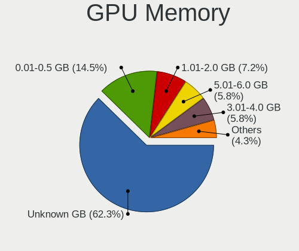

| Size in GB | Notebooks | Percent |
|------------|-----------|---------|
| Unknown    | 35        | 62.5%   |
| 0.01-0.5   | 9         | 16.07%  |
| 5.01-6.0   | 4         | 7.14%   |
| 1.01-2.0   | 4         | 7.14%   |
| 3.01-4.0   | 3         | 5.36%   |
| 0.51-1.0   | 1         | 1.79%   |

Monitor
-------

Monitor Vendor
--------------

Monitor vendors

| Vendor                  | Notebooks | Percent |
|-------------------------|-----------|---------|
| AU Optronics            | 12        | 20.34%  |
| LG Display              | 11        | 18.64%  |
| BOE                     | 10        | 16.95%  |
| Samsung Electronics     | 7         | 11.86%  |
| Chimei Innolux          | 6         | 10.17%  |
| PANDA                   | 4         | 6.78%   |
| Sharp                   | 2         | 3.39%   |
| InfoVision              | 2         | 3.39%   |
| Seiki                   | 1         | 1.69%   |
| HannStar                | 1         | 1.69%   |
| Dell                    | 1         | 1.69%   |
| Chi Mei Optoelectronics | 1         | 1.69%   |
| BenQ                    | 1         | 1.69%   |

Monitor Model
-------------

Monitor models

| Model                                                                    | Notebooks | Percent |
|--------------------------------------------------------------------------|-----------|---------|
| AU Optronics LCD Monitor AUO45EC 1366x768 344x193mm 15.5-inch            | 2         | 3.39%   |
| AU Optronics LCD Monitor AUO203D 1920x1080 309x174mm 14.0-inch           | 2         | 3.39%   |
| Sharp LCD Monitor SHP144A 3200x1800 294x165mm 13.3-inch                  | 1         | 1.69%   |
| Sharp LC-32LB480U SHP3263 1920x1080 698x392mm 31.5-inch                  | 1         | 1.69%   |
| Seiki SC32HT04 SEK1366 1366x768 700x390mm 31.5-inch                      | 1         | 1.69%   |
| Samsung Electronics S22F350 SAM0D1A 1920x1080 477x268mm 21.5-inch        | 1         | 1.69%   |
| Samsung Electronics LCD Monitor SEC544B 1600x900 310x174mm 14.0-inch     | 1         | 1.69%   |
| Samsung Electronics LCD Monitor SEC4252 1366x768 344x194mm 15.5-inch     | 1         | 1.69%   |
| Samsung Electronics LCD Monitor SEC3030 1024x600 223x125mm 10.1-inch     | 1         | 1.69%   |
| Samsung Electronics LCD Monitor SDC4164 3840x2400 344x215mm 16.0-inch    | 1         | 1.69%   |
| Samsung Electronics LCD Monitor SDC4142 3840x2160 294x165mm 13.3-inch    | 1         | 1.69%   |
| Samsung Electronics LCD Monitor SDC4141 1366x768 344x194mm 15.5-inch     | 1         | 1.69%   |
| PANDA LCD Monitor NCP0058 1920x1080 344x194mm 15.5-inch                  | 1         | 1.69%   |
| PANDA LCD Monitor NCP004A 1920x1080 309x174mm 14.0-inch                  | 1         | 1.69%   |
| PANDA LCD Monitor NCP0040 1920x1080 344x194mm 15.5-inch                  | 1         | 1.69%   |
| PANDA LCD Monitor NCP002A 1920x1080 344x194mm 15.5-inch                  | 1         | 1.69%   |
| LG Display LCD Monitor LGD0621 1920x1080 382x215mm 17.3-inch             | 1         | 1.69%   |
| LG Display LCD Monitor LGD046F 1920x1080 340x190mm 15.3-inch             | 1         | 1.69%   |
| LG Display LCD Monitor LGD046D 1920x1080 309x174mm 14.0-inch             | 1         | 1.69%   |
| LG Display LCD Monitor LGD0465 1366x768 344x194mm 15.5-inch              | 1         | 1.69%   |
| LG Display LCD Monitor LGD042D 1920x1080 294x165mm 13.3-inch             | 1         | 1.69%   |
| LG Display LCD Monitor LGD03FB 1920x1080 382x215mm 17.3-inch             | 1         | 1.69%   |
| LG Display LCD Monitor LGD038E 1366x768 344x194mm 15.5-inch              | 1         | 1.69%   |
| LG Display LCD Monitor LGD034A 1366x768 345x194mm 15.6-inch              | 1         | 1.69%   |
| LG Display LCD Monitor LGD033A 1366x768 344x194mm 15.5-inch              | 1         | 1.69%   |
| LG Display LCD Monitor LGD0335 1366x768 310x174mm 14.0-inch              | 1         | 1.69%   |
| LG Display LCD Monitor LGD02A5 1366x768 345x194mm 15.6-inch              | 1         | 1.69%   |
| InfoVision LCD Monitor IVO3D41 1920x1080 344x194mm 15.5-inch             | 1         | 1.69%   |
| InfoVision LCD Monitor IVO057D 1920x1080 309x174mm 14.0-inch             | 1         | 1.69%   |
| HannStar LCD Monitor HSD0001 1920x1080 309x174mm 14.0-inch               | 1         | 1.69%   |
| Dell S3221QS DELD107 3840x2160 697x392mm 31.5-inch                       | 1         | 1.69%   |
| Chimei Innolux LCD Monitor CMN15E7 1920x1080 344x193mm 15.5-inch         | 1         | 1.69%   |
| Chimei Innolux LCD Monitor CMN1510 1920x1080 344x193mm 15.5-inch         | 1         | 1.69%   |
| Chimei Innolux LCD Monitor CMN14D4 1920x1080 309x173mm 13.9-inch         | 1         | 1.69%   |
| Chimei Innolux LCD Monitor CMN14A1 1366x768 309x174mm 14.0-inch          | 1         | 1.69%   |
| Chimei Innolux LCD Monitor CMN1301 2160x1350 280x175mm 13.0-inch         | 1         | 1.69%   |
| Chimei Innolux LCD Monitor CMN1132 1366x768 256x144mm 11.6-inch          | 1         | 1.69%   |
| Chi Mei Optoelectronics LCD Monitor CMO15A3 1366x768 344x193mm 15.5-inch | 1         | 1.69%   |
| BOE LCD Monitor BOE09BA 2560x1600 345x215mm 16.0-inch                    | 1         | 1.69%   |
| BOE LCD Monitor BOE08C5 1920x1080 380x210mm 17.1-inch                    | 1         | 1.69%   |

Monitor Resolution
------------------

Monitor screen resolution

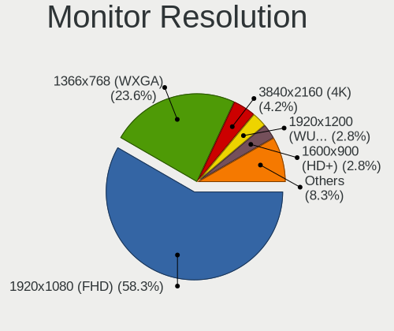

| Resolution       | Notebooks | Percent |
|------------------|-----------|---------|
| 1920x1080 (FHD)  | 33        | 56.9%   |
| 1366x768 (WXGA)  | 16        | 27.59%  |
| 3840x2160 (4K)   | 3         | 5.17%   |
| 1600x900 (HD+)   | 2         | 3.45%   |
| 3840x2400        | 1         | 1.72%   |
| 3200x1800 (QHD+) | 1         | 1.72%   |
| 2560x1600        | 1         | 1.72%   |
| 2160x1350        | 1         | 1.72%   |

Monitor Diagonal
----------------

Diagonal size in inches

| Inches | Notebooks | Percent |
|--------|-----------|---------|
| 15     | 23        | 38.98%  |
| 14     | 10        | 16.95%  |
| 13     | 10        | 16.95%  |
| 17     | 7         | 11.86%  |
| 31     | 3         | 5.08%   |
| 16     | 2         | 3.39%   |
| 11     | 2         | 3.39%   |
| 24     | 1         | 1.69%   |
| 21     | 1         | 1.69%   |

Monitor Width
-------------

Physical width

| Width in mm | Notebooks | Percent |
|-------------|-----------|---------|
| 301-350     | 40        | 67.8%   |
| 351-400     | 7         | 11.86%  |
| 201-300     | 7         | 11.86%  |
| 601-700     | 3         | 5.08%   |
| 501-600     | 1         | 1.69%   |
| 401-500     | 1         | 1.69%   |

Aspect Ratio
------------

Proportional relationship between the width and the height

| Ratio | Notebooks | Percent |
|-------|-----------|---------|
| 16/9  | 51        | 94.44%  |
| 16/10 | 3         | 5.56%   |

Monitor Area
------------

Area in inch

| Area in inch | Notebooks | Percent |
|----------------|-----------|---------|
| 101-110        | 23        | 38.98%  |
| 81-90          | 15        | 25.42%  |
| 121-130        | 7         | 11.86%  |
| 71-80          | 5         | 8.47%   |
| 351-500        | 3         | 5.08%   |
| 51-60          | 2         | 3.39%   |
| 201-250        | 2         | 3.39%   |
| 111-120        | 2         | 3.39%   |

Pixel Density
-------------

Pixels per inch

| Density       | Notebooks | Percent |
|---------------|-----------|---------|
| 121-160       | 30        | 51.72%  |
| 101-120       | 15        | 25.86%  |
| More than 240 | 4         | 6.9%    |
| 161-240       | 4         | 6.9%    |
| 51-100        | 4         | 6.9%    |
| 1-50          | 1         | 1.72%   |

Multiple Monitors
-----------------

Total monitors connected

| Total | Notebooks | Percent |
|-------|-----------|---------|
| 1     | 49        | 87.5%   |
| 2     | 5         | 8.93%   |
| 0     | 2         | 3.57%   |

Network
-------

Net Controller Vendor
---------------------

Controller vendors

| Vendor                          | Notebooks | Percent |
|---------------------------------|-----------|---------|
| Realtek Semiconductor           | 27        | 31.4%   |
| Intel                           | 27        | 31.4%   |
| Qualcomm Atheros                | 16        | 18.6%   |
| Broadcom Limited                | 4         | 4.65%   |
| Broadcom                        | 4         | 4.65%   |
| MediaTek                        | 2         | 2.33%   |
| TP-Link                         | 1         | 1.16%   |
| Sierra Wireless                 | 1         | 1.16%   |
| Samsung Electronics             | 1         | 1.16%   |
| Ralink Technology               | 1         | 1.16%   |
| Qualcomm Atheros Communications | 1         | 1.16%   |
| ASIX Electronics                | 1         | 1.16%   |

Net Controller Model
--------------------

Controller models

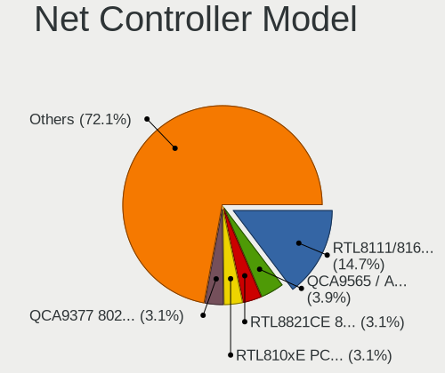

| Model                                                                  | Notebooks | Percent |
|------------------------------------------------------------------------|-----------|---------|
| Realtek RTL8111/8168/8211/8411 PCI Express Gigabit Ethernet Controller | 15        | 14.29%  |
| Qualcomm Atheros QCA9565 / AR9565 Wireless Network Adapter             | 5         | 4.76%   |
| Realtek RTL810xE PCI Express Fast Ethernet controller                  | 4         | 3.81%   |
| Qualcomm Atheros QCA9377 802.11ac Wireless Network Adapter             | 4         | 3.81%   |
| Realtek RTL8821CE 802.11ac PCIe Wireless Network Adapter               | 3         | 2.86%   |
| Realtek RTL8153 Gigabit Ethernet Adapter                               | 3         | 2.86%   |
| Qualcomm Atheros QCA6174 802.11ac Wireless Network Adapter             | 3         | 2.86%   |
| Intel Wireless 8265 / 8275                                             | 3         | 2.86%   |
| Intel Wireless 7260                                                    | 3         | 2.86%   |
| Intel Wi-Fi 6 AX201                                                    | 3         | 2.86%   |
| Intel Wi-Fi 6 AX200                                                    | 3         | 2.86%   |
| Intel Comet Lake PCH-LP CNVi WiFi                                      | 3         | 2.86%   |
| Realtek RTL8152 Fast Ethernet Adapter                                  | 2         | 1.9%    |
| Qualcomm Atheros AR9462 Wireless Network Adapter                       | 2         | 1.9%    |
| Intel Wi-Fi 6E(802.11ax) AX210/AX1675* 2x2 [Typhoon Peak]              | 2         | 1.9%    |
| Intel Ethernet Connection (4) I219-LM                                  | 2         | 1.9%    |
| Intel Ethernet Connection (10) I219-V                                  | 2         | 1.9%    |
| Intel 82579LM Gigabit Network Connection (Lewisville)                  | 2         | 1.9%    |
| TP-Link UE300 10/100/1000 LAN (ethernet mode) [Realtek RTL8153]        | 1         | 0.95%   |
| Sierra Wireless Sierra Wireless EM7345 4G LTE                          | 1         | 0.95%   |
| Samsung GT-I9070 (network tethering, USB debugging enabled)            | 1         | 0.95%   |
| Realtek RTL88x2bu [AC1200 Techkey]                                     | 1         | 0.95%   |
| Realtek RTL8852BE PCIe 802.11ax Wireless Network Controller            | 1         | 0.95%   |
| Realtek RTL8822CE 802.11ac PCIe Wireless Network Adapter               | 1         | 0.95%   |
| Realtek RTL8822BE 802.11a/b/g/n/ac WiFi adapter                        | 1         | 0.95%   |
| Realtek RTL8814AU 802.11a/b/g/n/ac Wireless Adapter                    | 1         | 0.95%   |
| Realtek RTL8723DE Wireless Network Adapter                             | 1         | 0.95%   |
| Realtek RTL8723BE PCIe Wireless Network Adapter                        | 1         | 0.95%   |
| Realtek RTL8191SEvB Wireless LAN Controller                            | 1         | 0.95%   |
| Realtek RTL8125 2.5GbE Controller                                      | 1         | 0.95%   |
| Ralink MT7601U Wireless Adapter                                        | 1         | 0.95%   |
| Qualcomm Atheros AR9271 802.11n                                        | 1         | 0.95%   |
| Qualcomm Atheros AR9485 Wireless Network Adapter                       | 1         | 0.95%   |
| Qualcomm Atheros AR8162 Fast Ethernet                                  | 1         | 0.95%   |
| Qualcomm Atheros AR8151 v2.0 Gigabit Ethernet                          | 1         | 0.95%   |
| MediaTek Infinix NOTE 30 VIP                                           | 1         | 0.95%   |
| MediaTek 802.11AC MT7663 Wireless Network Adapter                      | 1         | 0.95%   |
| Intel Wireless 7265                                                    | 1         | 0.95%   |
| Intel Wireless 3165                                                    | 1         | 0.95%   |
| Intel Raptor Lake PCH CNVi WiFi                                        | 1         | 0.95%   |

Wireless Vendor
---------------

Wireless vendors

| Vendor                          | Notebooks | Percent |
|---------------------------------|-----------|---------|
| Intel                           | 25        | 41.67%  |
| Qualcomm Atheros                | 15        | 25%     |
| Realtek Semiconductor           | 11        | 18.33%  |
| Broadcom                        | 3         | 5%      |
| Broadcom Limited                | 2         | 3.33%   |
| Sierra Wireless                 | 1         | 1.67%   |
| Ralink Technology               | 1         | 1.67%   |
| Qualcomm Atheros Communications | 1         | 1.67%   |
| MediaTek                        | 1         | 1.67%   |

Wireless Model
--------------

Wireless models

| Model                                                       | Notebooks | Percent |
|-------------------------------------------------------------|-----------|---------|
| Qualcomm Atheros QCA9565 / AR9565 Wireless Network Adapter  | 5         | 8.33%   |
| Qualcomm Atheros QCA9377 802.11ac Wireless Network Adapter  | 4         | 6.67%   |
| Realtek RTL8821CE 802.11ac PCIe Wireless Network Adapter    | 3         | 5%      |
| Qualcomm Atheros QCA6174 802.11ac Wireless Network Adapter  | 3         | 5%      |
| Intel Wireless 8265 / 8275                                  | 3         | 5%      |
| Intel Wireless 7260                                         | 3         | 5%      |
| Intel Wi-Fi 6 AX201                                         | 3         | 5%      |
| Intel Wi-Fi 6 AX200                                         | 3         | 5%      |
| Intel Comet Lake PCH-LP CNVi WiFi                           | 3         | 5%      |
| Qualcomm Atheros AR9462 Wireless Network Adapter            | 2         | 3.33%   |
| Intel Wi-Fi 6E(802.11ax) AX210/AX1675* 2x2 [Typhoon Peak]   | 2         | 3.33%   |
| Sierra Wireless Sierra Wireless EM7345 4G LTE               | 1         | 1.67%   |
| Realtek RTL88x2bu [AC1200 Techkey]                          | 1         | 1.67%   |
| Realtek RTL8852BE PCIe 802.11ax Wireless Network Controller | 1         | 1.67%   |
| Realtek RTL8822CE 802.11ac PCIe Wireless Network Adapter    | 1         | 1.67%   |
| Realtek RTL8822BE 802.11a/b/g/n/ac WiFi adapter             | 1         | 1.67%   |
| Realtek RTL8814AU 802.11a/b/g/n/ac Wireless Adapter         | 1         | 1.67%   |
| Realtek RTL8723DE Wireless Network Adapter                  | 1         | 1.67%   |
| Realtek RTL8723BE PCIe Wireless Network Adapter             | 1         | 1.67%   |
| Realtek RTL8191SEvB Wireless LAN Controller                 | 1         | 1.67%   |
| Ralink MT7601U Wireless Adapter                             | 1         | 1.67%   |
| Qualcomm Atheros AR9271 802.11n                             | 1         | 1.67%   |
| Qualcomm Atheros AR9485 Wireless Network Adapter            | 1         | 1.67%   |
| MediaTek 802.11AC MT7663 Wireless Network Adapter           | 1         | 1.67%   |
| Intel Wireless 7265                                         | 1         | 1.67%   |
| Intel Wireless 3165                                         | 1         | 1.67%   |
| Intel Raptor Lake PCH CNVi WiFi                             | 1         | 1.67%   |
| Intel Comet Lake PCH CNVi WiFi                              | 1         | 1.67%   |
| Intel Centrino Wireless-N 2230                              | 1         | 1.67%   |
| Intel Centrino Ultimate-N 6300                              | 1         | 1.67%   |
| Intel Centrino Advanced-N 6205 [Taylor Peak]                | 1         | 1.67%   |
| Intel Cannon Lake PCH CNVi WiFi                             | 1         | 1.67%   |
| Broadcom Limited BCM43224 802.11a/b/g/n                     | 1         | 1.67%   |
| Broadcom Limited BCM4313 802.11bgn Wireless Network Adapter | 1         | 1.67%   |
| Broadcom BCM43225 802.11b/g/n                               | 1         | 1.67%   |
| Broadcom BCM43142 802.11b/g/n                               | 1         | 1.67%   |
| Broadcom BCM4313 802.11bgn Wireless Network Adapter         | 1         | 1.67%   |

Ethernet Vendor
---------------

Ethernet vendors

| Vendor                | Notebooks | Percent |
|-----------------------|-----------|---------|
| Realtek Semiconductor | 24        | 54.55%  |
| Intel                 | 11        | 25%     |
| Qualcomm Atheros      | 2         | 4.55%   |
| Broadcom Limited      | 2         | 4.55%   |
| TP-Link               | 1         | 2.27%   |
| Samsung Electronics   | 1         | 2.27%   |
| MediaTek              | 1         | 2.27%   |
| Broadcom              | 1         | 2.27%   |
| ASIX Electronics      | 1         | 2.27%   |

Ethernet Model
--------------

Ethernet models

| Model                                                                  | Notebooks | Percent |
|------------------------------------------------------------------------|-----------|---------|
| Realtek RTL8111/8168/8211/8411 PCI Express Gigabit Ethernet Controller | 15        | 33.33%  |
| Realtek RTL810xE PCI Express Fast Ethernet controller                  | 4         | 8.89%   |
| Realtek RTL8153 Gigabit Ethernet Adapter                               | 3         | 6.67%   |
| Realtek RTL8152 Fast Ethernet Adapter                                  | 2         | 4.44%   |
| Intel Ethernet Connection (4) I219-LM                                  | 2         | 4.44%   |
| Intel Ethernet Connection (10) I219-V                                  | 2         | 4.44%   |
| Intel 82579LM Gigabit Network Connection (Lewisville)                  | 2         | 4.44%   |
| TP-Link UE300 10/100/1000 LAN (ethernet mode) [Realtek RTL8153]        | 1         | 2.22%   |
| Samsung GT-I9070 (network tethering, USB debugging enabled)            | 1         | 2.22%   |
| Realtek RTL8125 2.5GbE Controller                                      | 1         | 2.22%   |
| Qualcomm Atheros AR8162 Fast Ethernet                                  | 1         | 2.22%   |
| Qualcomm Atheros AR8151 v2.0 Gigabit Ethernet                          | 1         | 2.22%   |
| MediaTek Infinix NOTE 30 VIP                                           | 1         | 2.22%   |
| Intel Ethernet Connection I218-LM                                      | 1         | 2.22%   |
| Intel Ethernet Connection I217-LM                                      | 1         | 2.22%   |
| Intel Ethernet Connection (4) I219-V                                   | 1         | 2.22%   |
| Intel Ethernet Connection (14) I219-LM                                 | 1         | 2.22%   |
| Intel 82577LM Gigabit Network Connection                               | 1         | 2.22%   |
| Broadcom NetLink BCM57785 Gigabit Ethernet PCIe                        | 1         | 2.22%   |
| Broadcom Limited NetXtreme BCM5761 Gigabit Ethernet PCIe               | 1         | 2.22%   |
| Broadcom Limited NetLink BCM57780 Gigabit Ethernet PCIe                | 1         | 2.22%   |
| ASIX AX88179 Gigabit Ethernet                                          | 1         | 2.22%   |

Net Controller Kind
-------------------

Ethernet, WiFi or modem

| Kind     | Notebooks | Percent |
|----------|-----------|---------|
| WiFi     | 56        | 56.57%  |
| Ethernet | 43        | 43.43%  |

Used Controller
---------------

Currently used network controller

| Kind     | Notebooks | Percent |
|----------|-----------|---------|
| WiFi     | 41        | 67.21%  |
| Ethernet | 20        | 32.79%  |

NICs
----

Total network controllers on board

| Total | Notebooks | Percent |
|-------|-----------|---------|
| 2     | 36        | 64.29%  |
| 1     | 19        | 33.93%  |
| 0     | 1         | 1.79%   |

IPv6
----

IPv6 vs IPv4

| Used | Notebooks | Percent |
|------|-----------|---------|
| No   | 43        | 76.79%  |
| Yes  | 13        | 23.21%  |

Bluetooth
---------

Bluetooth Vendor
----------------

Controller vendors

| Vendor                          | Notebooks | Percent |
|---------------------------------|-----------|---------|
| Intel                           | 22        | 45.83%  |
| Realtek Semiconductor           | 8         | 16.67%  |
| Qualcomm Atheros Communications | 8         | 16.67%  |
| Foxconn / Hon Hai               | 3         | 6.25%   |
| Lite-On Technology              | 2         | 4.17%   |
| IMC Networks                    | 2         | 4.17%   |
| Broadcom                        | 2         | 4.17%   |
| Cambridge Silicon Radio         | 1         | 2.08%   |

Bluetooth Model
---------------

Controller models

| Model                                               | Notebooks | Percent |
|-----------------------------------------------------|-----------|---------|
| Qualcomm Atheros  Bluetooth Device                  | 6         | 12.5%   |
| Intel AX201 Bluetooth                               | 6         | 12.5%   |
| Realtek Bluetooth Radio                             | 5         | 10.42%  |
| Intel Bluetooth wireless interface                  | 5         | 10.42%  |
| Intel Bluetooth Device                              | 3         | 6.25%   |
| Intel AX200 Bluetooth                               | 3         | 6.25%   |
| Intel AX210 Bluetooth                               | 2         | 4.17%   |
| IMC Networks Bluetooth Device                       | 2         | 4.17%   |
| Foxconn / Hon Hai Bluetooth Device                  | 2         | 4.17%   |
| Realtek RTL8822BE Bluetooth 4.2 Adapter             | 1         | 2.08%   |
| Realtek  Bluetooth 4.2 Adapter                      | 1         | 2.08%   |
| Realtek 802.11ac WLAN Adapter                       | 1         | 2.08%   |
| Qualcomm Atheros QCA61x4 Bluetooth 4.0              | 1         | 2.08%   |
| Qualcomm Atheros AR3012 Bluetooth 4.0               | 1         | 2.08%   |
| Lite-On Wireless_Device                             | 1         | 2.08%   |
| Lite-On Bluetooth Device                            | 1         | 2.08%   |
| Intel Centrino Bluetooth Wireless Transceiver       | 1         | 2.08%   |
| Intel Bluetooth 9460/9560 Jefferson Peak (JfP)      | 1         | 2.08%   |
| Intel AX211 Bluetooth                               | 1         | 2.08%   |
| Foxconn / Hon Hai Broadcom BCM20702 Bluetooth       | 1         | 2.08%   |
| Cambridge Silicon Radio Bluetooth Dongle (HCI mode) | 1         | 2.08%   |
| Broadcom HP Portable SoftSailing                    | 1         | 2.08%   |
| Broadcom BCM43142A0 Bluetooth Device                | 1         | 2.08%   |

Sound
-----

Sound Vendor
------------

Sound card vendors

| Vendor               | Notebooks | Percent |
|----------------------|-----------|---------|
| Intel                | 44        | 63.77%  |
| AMD                  | 12        | 17.39%  |
| Nvidia               | 10        | 14.49%  |
| C-Media Electronics  | 2         | 2.9%    |
| Conrad Electronic SE | 1         | 1.45%   |

Sound Model
-----------

Sound card models

| Model                                                                                             | Notebooks | Percent |
|---------------------------------------------------------------------------------------------------|-----------|---------|
| Intel Sunrise Point-LP HD Audio                                                                   | 7         | 8.24%   |
| AMD Family 17h/19h HD Audio Controller                                                            | 7         | 8.24%   |
| Intel 7 Series/C216 Chipset Family High Definition Audio Controller                               | 6         | 7.06%   |
| AMD Family 15h (Models 60h-6fh) Audio Controller                                                  | 5         | 5.88%   |
| Intel Tiger Lake-LP Smart Sound Technology Audio Controller                                       | 4         | 4.71%   |
| Intel Haswell-ULT HD Audio Controller                                                             | 4         | 4.71%   |
| Intel 8 Series HD Audio Controller                                                                | 4         | 4.71%   |
| Intel Comet Lake PCH-LP cAVS                                                                      | 3         | 3.53%   |
| AMD Renoir Radeon High Definition Audio Controller                                                | 3         | 3.53%   |
| AMD Raven/Raven2/Fenghuang HDMI/DP Audio Controller                                               | 3         | 3.53%   |
| AMD Kabini HDMI/DP Audio                                                                          | 3         | 3.53%   |
| Nvidia Audio device                                                                               | 2         | 2.35%   |
| Intel Tiger Lake-H HD Audio Controller                                                            | 2         | 2.35%   |
| Intel Raptor Lake-P/U/H cAVS                                                                      | 2         | 2.35%   |
| Intel Cannon Lake PCH cAVS                                                                        | 2         | 2.35%   |
| Intel Atom Processor Z36xxx/Z37xxx Series High Definition Audio Controller                        | 2         | 2.35%   |
| AMD High Definition Audio Controller                                                              | 2         | 2.35%   |
| Nvidia TU116 High Definition Audio Controller                                                     | 1         | 1.18%   |
| Nvidia TU106 High Definition Audio Controller                                                     | 1         | 1.18%   |
| Nvidia GP107GL High Definition Audio Controller                                                   | 1         | 1.18%   |
| Nvidia GK107 HDMI Audio Controller                                                                | 1         | 1.18%   |
| Nvidia GK104 HDMI Audio Controller                                                                | 1         | 1.18%   |
| Nvidia GF108 High Definition Audio Controller                                                     | 1         | 1.18%   |
| Nvidia GA106 High Definition Audio Controller                                                     | 1         | 1.18%   |
| Nvidia GA104 High Definition Audio Controller                                                     | 1         | 1.18%   |
| Intel Wildcat Point-LP High Definition Audio Controller                                           | 1         | 1.18%   |
| Intel NM10/ICH7 Family High Definition Audio Controller                                           | 1         | 1.18%   |
| Intel Comet Lake PCH cAVS                                                                         | 1         | 1.18%   |
| Intel Celeron/Pentium Silver Processor High Definition Audio                                      | 1         | 1.18%   |
| Intel Cannon Point-LP High Definition Audio Controller                                            | 1         | 1.18%   |
| Intel Broadwell-U Audio Controller                                                                | 1         | 1.18%   |
| Intel Atom/Celeron/Pentium Processor x5-E8000/J3xxx/N3xxx Series High Definition Audio Controller | 1         | 1.18%   |
| Intel Alder Lake PCH-P High Definition Audio Controller                                           | 1         | 1.18%   |
| Intel 82801I (ICH9 Family) HD Audio Controller                                                    | 1         | 1.18%   |
| Intel 8 Series/C220 Series Chipset High Definition Audio Controller                               | 1         | 1.18%   |
| Intel 6 Series/C200 Series Chipset Family High Definition Audio Controller                        | 1         | 1.18%   |
| Intel 5 Series/3400 Series Chipset High Definition Audio                                          | 1         | 1.18%   |
| Intel 100 Series/C230 Series Chipset Family HD Audio Controller                                   | 1         | 1.18%   |
| Conrad Electronic SE MIDI Cable UA0037                                                            | 1         | 1.18%   |
| C-Media Electronics CM106 Like Sound Device                                                       | 1         | 1.18%   |

Memory
------

Memory Vendor
-------------

Memory module vendors

| Vendor              | Notebooks | Percent |
|---------------------|-----------|---------|
| Samsung Electronics | 11        | 26.19%  |
| SK hynix            | 9         | 21.43%  |
| Micron Technology   | 6         | 14.29%  |
| Kingston            | 6         | 14.29%  |
| Elpida              | 3         | 7.14%   |
| Unknown (0x0100)    | 1         | 2.38%   |
| Unknown             | 1         | 2.38%   |
| Timetec             | 1         | 2.38%   |
| Nanya Technology    | 1         | 2.38%   |
| Crucial             | 1         | 2.38%   |
| Corsair             | 1         | 2.38%   |
| Unknown             | 1         | 2.38%   |

Memory Model
------------

Memory module models

| Model                                                                     | Notebooks | Percent |
|---------------------------------------------------------------------------|-----------|---------|
| Samsung RAM M471A1K43CB1-CTD 8GB SODIMM DDR4 2667MT/s                     | 2         | 4.35%   |
| Elpida RAM EBJ81UG8EFU0-GN-F 8GB SODIMM DDR3 1600MT/s                     | 2         | 4.35%   |
| Unknown RAM Module 4GB SODIMM DDR3 1600MT/s                               | 1         | 2.17%   |
| Unknown (0x0100) RAM R744G2133S1S 4GB SODIMM DDR4 1866MT/s                | 1         | 2.17%   |
| Timetec RAM SD3-1600 8GB SODIMM DDR3 1600MT/s                             | 1         | 2.17%   |
| SK hynix RAM HMT451S6BFR8A-PB 4GB SODIMM DDR3 1600MT/s                    | 1         | 2.17%   |
| SK hynix RAM HMT351S6EFR8A-PB 4GB SODIMM DDR3 1600MT/s                    | 1         | 2.17%   |
| SK hynix RAM HMT351S6EFR8A-PB 4096MB SODIMM DDR3 1600MT/s                 | 1         | 2.17%   |
| SK hynix RAM HMT351S6CFR8C-H9 4GB SODIMM DDR3 1333MT/s                    | 1         | 2.17%   |
| SK hynix RAM HMT325S6BFR8C-H9 2048MB SODIMM DDR3 1333MT/s                 | 1         | 2.17%   |
| SK hynix RAM HMAA1GS6CJR6N-XN 8GB SODIMM DDR4 3200MT/s                    | 1         | 2.17%   |
| SK hynix RAM HMA851S6CJR6N-VK 4GB Row Of Chips DDR4 1866MT/s              | 1         | 2.17%   |
| SK hynix RAM HMA851S6AFR6N-UH 4GB SODIMM DDR4 2400MT/s                    | 1         | 2.17%   |
| SK hynix RAM HMA81GS6DJR8N-XN 8GB SODIMM DDR4 3200MT/s                    | 1         | 2.17%   |
| SK hynix RAM H9CCNNNBJTALAR-NVD 4GB Row Of Chips LPDDR3 2133MT/s          | 1         | 2.17%   |
| Samsung RAM Module 4GB SODIMM DDR3 1600MT/s                               | 1         | 2.17%   |
| Samsung RAM Module 4GB Row Of Chips LPDDR3 2133MT/s                       | 1         | 2.17%   |
| Samsung RAM Module 2GB Row Of Chips LPDDR4 4267MT/s                       | 1         | 2.17%   |
| Samsung RAM Module 16GB SODIMM DDR4 3200MT/s                              | 1         | 2.17%   |
| Samsung RAM M471B1G73DB0-YK0 8GB SODIMM DDR3 1600MT/s                     | 1         | 2.17%   |
| Samsung RAM M471A4G43AB1-CWE 32GB SODIMM DDR4 3200MT/s                    | 1         | 2.17%   |
| Samsung RAM M471A1K43DB1-CWE 8GB SODIMM DDR4 3200MT/s                     | 1         | 2.17%   |
| Samsung RAM M471A1K43DB1-CTD 8GB SODIMM DDR4 2667MT/s                     | 1         | 2.17%   |
| Samsung RAM M471A1G44BB0-CWE 8GB SODIMM DDR4 3200MT/s                     | 1         | 2.17%   |
| Samsung RAM M471A1G44AB0-CTD 8GB SODIMM DDR4 2667MT/s                     | 1         | 2.17%   |
| Nanya RAM NT4GC64B8HG0NS-CG 4GB SODIMM DDR3 1334MT/s                      | 1         | 2.17%   |
| Micron RAM MT52L1G32D4PG-093 8GB Row Of Chips LPDDR3 2133MT/s             | 1         | 2.17%   |
| Micron RAM 8ATF1G64HZ-3G2R1 8GB SODIMM DDR4 3200MT/s                      | 1         | 2.17%   |
| Micron RAM 4ATS2G64HZ-3G2B1 16GB SODIMM DDR4 3200MT/s                     | 1         | 2.17%   |
| Micron RAM 4ATF51264HZ-3G2J1 4GB SODIMM DDR4 3200MT/s                     | 1         | 2.17%   |
| Micron RAM 4ATF51264HZ-2G6E3 4GB SODIMM DDR4 2667MT/s                     | 1         | 2.17%   |
| Micron RAM 4ATF1G64HZ-3G2E2 8GB SODIMM DDR4 3200MT/s                      | 1         | 2.17%   |
| Micron RAM 16KTF1G64HZ-1G6P1 8GB SODIMM DDR3 1600MT/s                     | 1         | 2.17%   |
| Kingston RAM LV32D4S2S8HD-8 8GB SODIMM DDR4 3200MT/s                      | 1         | 2.17%   |
| Kingston RAM KHX2666C15S4/8G 8GB SODIMM DDR4 2667MT/s                     | 1         | 2.17%   |
| Kingston RAM ACR24D4S7S8MB-8 8GB SODIMM DDR4 2400MT/s                     | 1         | 2.17%   |
| Kingston RAM 9905711-067.A00G 8GB SODIMM DDR4 3200MT/s                    | 1         | 2.17%   |
| Kingston RAM 9905703-026.A00G 16GB SODIMM DDR4 2667MT/s                   | 1         | 2.17%   |
| Kingston RAM 787878787878787878787878787878787878 2GB SODIMM DDR2 667MT/s | 1         | 2.17%   |
| Kingston RAM 272727272727272727272727272727272727 2GB SODIMM DDR2 800MT/s | 1         | 2.17%   |

Memory Kind
-----------

Memory module kinds

| Kind   | Notebooks | Percent |
|--------|-----------|---------|
| DDR4   | 16        | 51.61%  |
| DDR3   | 9         | 29.03%  |
| LPDDR3 | 3         | 9.68%   |
| LPDDR5 | 1         | 3.23%   |
| LPDDR4 | 1         | 3.23%   |
| DDR2   | 1         | 3.23%   |

Memory Form Factor
------------------

Physical design of the memory module

| Name         | Notebooks | Percent |
|--------------|-----------|---------|
| SODIMM       | 25        | 80.65%  |
| Row Of Chips | 6         | 19.35%  |

Memory Size
-----------

Memory module size

| Size  | Notebooks | Percent |
|-------|-----------|---------|
| 8192  | 14        | 42.42%  |
| 4096  | 12        | 36.36%  |
| 16384 | 3         | 9.09%   |
| 2048  | 3         | 9.09%   |
| 32768 | 1         | 3.03%   |

Memory Speed
------------

Memory module speed

| Speed | Notebooks | Percent |
|-------|-----------|---------|
| 3200  | 10        | 27.78%  |
| 1600  | 7         | 19.44%  |
| 2667  | 5         | 13.89%  |
| 2133  | 3         | 8.33%   |
| 2400  | 2         | 5.56%   |
| 1866  | 2         | 5.56%   |
| 1333  | 2         | 5.56%   |
| 6400  | 1         | 2.78%   |
| 4267  | 1         | 2.78%   |
| 1334  | 1         | 2.78%   |
| 800   | 1         | 2.78%   |
| 667   | 1         | 2.78%   |

Printers & scanners
-------------------

Printer Vendor
--------------

Printer device vendors

Zero info for selected period =(

Printer Model
-------------

Printer device models

Zero info for selected period =(

Scanner Vendor
--------------

Scanner device vendors

Zero info for selected period =(

Scanner Model
-------------

Scanner device models

Zero info for selected period =(

Camera
------

Camera Vendor
-------------

Camera device vendors

| Vendor                                 | Notebooks | Percent |
|----------------------------------------|-----------|---------|
| Chicony Electronics                    | 15        | 29.41%  |
| IMC Networks                           | 6         | 11.76%  |
| Realtek Semiconductor                  | 4         | 7.84%   |
| Microdia                               | 4         | 7.84%   |
| Cheng Uei Precision Industry (Foxlink) | 4         | 7.84%   |
| Bison Electronics                      | 4         | 7.84%   |
| Suyin                                  | 3         | 5.88%   |
| Luxvisions Innotech Limited            | 3         | 5.88%   |
| Sunplus Innovation Technology          | 2         | 3.92%   |
| Syntek                                 | 1         | 1.96%   |
| SunplusIT                              | 1         | 1.96%   |
| Quanta                                 | 1         | 1.96%   |
| Importek                               | 1         | 1.96%   |
| icSpring                               | 1         | 1.96%   |
| Acer                                   | 1         | 1.96%   |

Camera Model
------------

Camera device models

| Model                                                                    | Notebooks | Percent |
|--------------------------------------------------------------------------|-----------|---------|
| IMC Networks Integrated Camera                                           | 5         | 9.62%   |
| Chicony HP Truevision HD                                                 | 3         | 5.77%   |
| Realtek Integrated_Webcam_HD                                             | 2         | 3.85%   |
| Microdia Integrated Webcam HD                                            | 2         | 3.85%   |
| Chicony Integrated HP HD Webcam                                          | 2         | 3.85%   |
| Bison Integrated Camera                                                  | 2         | 3.85%   |
| Syntek Integrated Camera                                                 | 1         | 1.92%   |
| Suyin HP Truevision HD                                                   | 1         | 1.92%   |
| Suyin HD WebCam                                                          | 1         | 1.92%   |
| Suyin 1.3M WebCam (notebook emachines E730, Acer sub-brand)              | 1         | 1.92%   |
| SunplusIT HD Webcam                                                      | 1         | 1.92%   |
| Sunplus Laptop_Integrated_Webcam_FHD                                     | 1         | 1.92%   |
| Sunplus HD WebCam                                                        | 1         | 1.92%   |
| Realtek Integrated Webcam HD                                             | 1         | 1.92%   |
| Realtek EasyCamera                                                       | 1         | 1.92%   |
| Quanta ACER HD User Facing                                               | 1         | 1.92%   |
| Microdia Lenovo EasyCamera                                               | 1         | 1.92%   |
| Microdia Integrated_Webcam_HD                                            | 1         | 1.92%   |
| Luxvisions Innotech Limited Integrated Camera                            | 1         | 1.92%   |
| Luxvisions Innotech Limited HP TrueVision HD Camera                      | 1         | 1.92%   |
| Luxvisions Innotech Limited HP HD Camera                                 | 1         | 1.92%   |
| Importek TOSHIBA Web Camera - HD                                         | 1         | 1.92%   |
| IMC Networks USB2.0 HD IR UVC WebCam                                     | 1         | 1.92%   |
| icSpring camera                                                          | 1         | 1.92%   |
| Chicony USB2.0 HD UVC WebCam                                             | 1         | 1.92%   |
| Chicony USB2.0 Camera                                                    | 1         | 1.92%   |
| Chicony TOSHIBA Web Camera - HD                                          | 1         | 1.92%   |
| Chicony Lenovo EasyCamera                                                | 1         | 1.92%   |
| Chicony Integrated RGB Camera                                            | 1         | 1.92%   |
| Chicony Integrated Camera (1280x720@30)                                  | 1         | 1.92%   |
| Chicony HP TrueVision HD Camera                                          | 1         | 1.92%   |
| Chicony HD WebCam                                                        | 1         | 1.92%   |
| Chicony EasyCamera                                                       | 1         | 1.92%   |
| Chicony 8M Camera                                                        | 1         | 1.92%   |
| Chicony 720p HD Camera                                                   | 1         | 1.92%   |
| Cheng Uei Precision Industry (Foxlink) XiaoMi USB 2.0 Webcam             | 1         | 1.92%   |
| Cheng Uei Precision Industry (Foxlink) HP True Vision HD Camera          | 1         | 1.92%   |
| Cheng Uei Precision Industry (Foxlink) HP True Vision FHD Camera         | 1         | 1.92%   |
| Cheng Uei Precision Industry (Foxlink) HP EliteBook integrated HD Webcam | 1         | 1.92%   |
| Bison USB Camera                                                         | 1         | 1.92%   |

Security
--------

Fingerprint Vendor
------------------

Fingerprint sensor vendors

| Vendor                | Notebooks | Percent |
|-----------------------|-----------|---------|
| Validity Sensors      | 7         | 63.64%  |
| Synaptics             | 3         | 27.27%  |
| Elan Microelectronics | 1         | 9.09%   |

Fingerprint Model
-----------------

Fingerprint sensor models

| Model                                            | Notebooks | Percent |
|--------------------------------------------------|-----------|---------|
| Validity Sensors VFS491                          | 2         | 18.18%  |
| Synaptics Metallica MIS Touch Fingerprint Reader | 2         | 18.18%  |
| Validity Sensors VFS5011 Fingerprint Reader      | 1         | 9.09%   |
| Validity Sensors VFS495 Fingerprint Reader       | 1         | 9.09%   |
| Validity Sensors VFS 5011 fingerprint sensor     | 1         | 9.09%   |
| Validity Sensors Swipe Fingerprint Sensor        | 1         | 9.09%   |
| Validity Sensors Fingerprint scanner             | 1         | 9.09%   |
| Synaptics UWP WBDI Device                        | 1         | 9.09%   |
| Elan ELAN:ARM-M4                                 | 1         | 9.09%   |

Chipcard Vendor
---------------

Chipcard module vendors

| Vendor           | Notebooks | Percent |
|------------------|-----------|---------|
| Broadcom         | 2         | 50%     |
| SCM Microsystems | 1         | 25%     |
| Alcor Micro      | 1         | 25%     |

Chipcard Model
--------------

Chipcard module models

| Model                                                  | Notebooks | Percent |
|--------------------------------------------------------|-----------|---------|
| SCM Microsystems SCR331-LC1 / SCR3310 SmartCard Reader | 1         | 25%     |
| Broadcom BCM5880 Secure Applications Processor         | 1         | 25%     |
| Broadcom 58200                                         | 1         | 25%     |
| Alcor Micro AU9540 Smartcard Reader                    | 1         | 25%     |

Unsupported
-----------

Unsupported Devices
-------------------

Total unsupported devices on board

| Total | Notebooks | Percent |
|-------|-----------|---------|
| 0     | 30        | 53.57%  |
| 1     | 19        | 33.93%  |
| 2     | 6         | 10.71%  |
| 7     | 1         | 1.79%   |

Unsupported Device Types
------------------------

Types of unsupported devices

| Type                  | Notebooks | Percent |
|-----------------------|-----------|---------|
| Fingerprint reader    | 11        | 30.56%  |
| Graphics card         | 7         | 19.44%  |
| Net/wireless          | 6         | 16.67%  |
| Multimedia controller | 5         | 13.89%  |
| Bluetooth             | 2         | 5.56%   |
| Storage               | 1         | 2.78%   |
| Sound                 | 1         | 2.78%   |
| Firewire controller   | 1         | 2.78%   |
| Chipcard              | 1         | 2.78%   |
| Camera                | 1         | 2.78%   |

