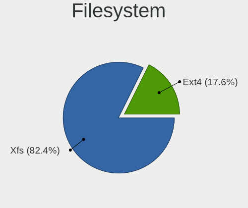
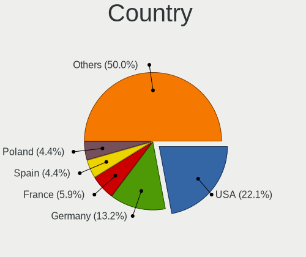
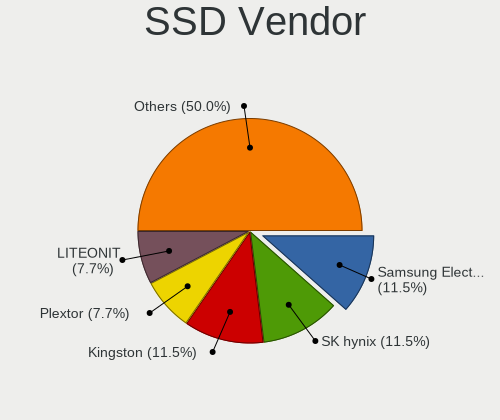
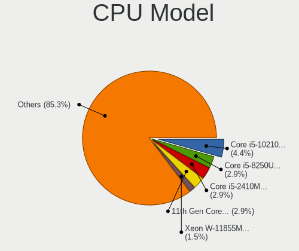
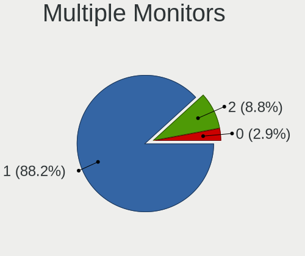
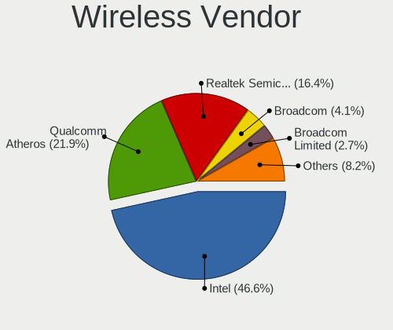
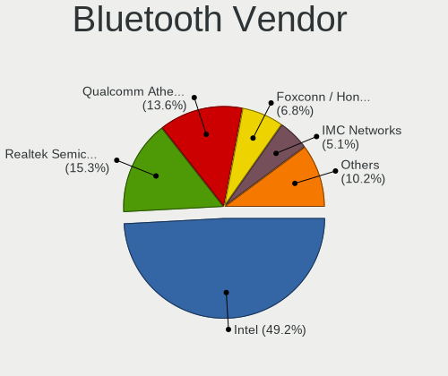
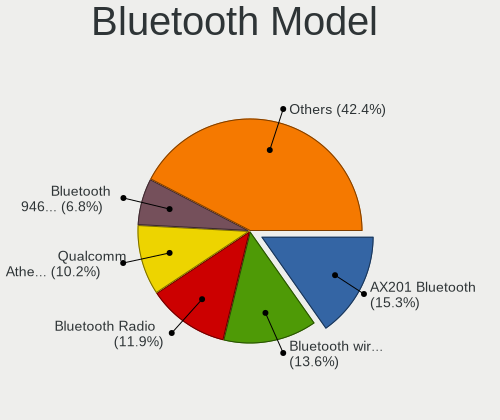
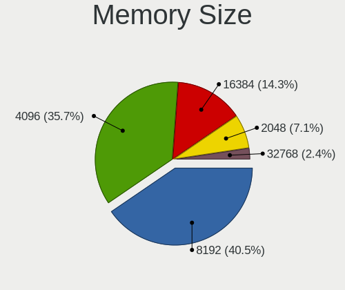

AlmaLinux - Tested Hardware & Statistics (Notebooks)
----------------------------------------------------

A project to collect tested hardware configurations for AlmaLinux.

Anyone can contribute to this report by the [hw-probe](https://github.com/linuxhw/hw-probe) tool:

    sudo -E hw-probe -all -upload

Please contribute! Especially if your hardware is rare.

Contents
--------

* [ Test Cases ](#test-cases)

* [ System ](#system)
  - [ OS                       ](#os)
  - [ OS Family                ](#os-family)
  - [ Kernel                   ](#kernel)
  - [ Kernel Family            ](#kernel-family)
  - [ Kernel Major Ver.        ](#kernel-major-ver)
  - [ Arch                     ](#arch)
  - [ DE                       ](#de)
  - [ Display Server           ](#display-server)
  - [ Display Manager          ](#display-manager)
  - [ OS Lang                  ](#os-lang)
  - [ Boot Mode                ](#boot-mode)
  - [ Filesystem               ](#filesystem)
  - [ Part. scheme             ](#part-scheme)
  - [ Dual Boot with Linux/BSD ](#dual-boot-with-linuxbsd)
  - [ Dual Boot (Win)          ](#dual-boot-win)

* [ Board ](#board)
  - [ Vendor                   ](#vendor)
  - [ Model                    ](#model)
  - [ Model Family             ](#model-family)
  - [ MFG Year                 ](#mfg-year)
  - [ Form Factor              ](#form-factor)
  - [ Secure Boot              ](#secure-boot)
  - [ Coreboot                 ](#coreboot)
  - [ RAM Size                 ](#ram-size)
  - [ RAM Used                 ](#ram-used)
  - [ Total Drives             ](#total-drives)
  - [ Has CD-ROM               ](#has-cd-rom)
  - [ Has Ethernet             ](#has-ethernet)
  - [ Has WiFi                 ](#has-wifi)
  - [ Has Bluetooth            ](#has-bluetooth)

* [ Location ](#location)
  - [ Country                  ](#country)
  - [ City                     ](#city)

* [ Drives ](#drives)
  - [ Drive Vendor             ](#drive-vendor)
  - [ Drive Model              ](#drive-model)
  - [ HDD Vendor               ](#hdd-vendor)
  - [ SSD Vendor               ](#ssd-vendor)
  - [ Drive Kind               ](#drive-kind)
  - [ Drive Connector          ](#drive-connector)
  - [ Drive Size               ](#drive-size)
  - [ Space Total              ](#space-total)
  - [ Space Used               ](#space-used)
  - [ Malfunc. Drives          ](#malfunc-drives)
  - [ Malfunc. Drive Vendor    ](#malfunc-drive-vendor)
  - [ Malfunc. HDD Vendor      ](#malfunc-hdd-vendor)
  - [ Malfunc. Drive Kind      ](#malfunc-drive-kind)
  - [ Failed Drives            ](#failed-drives)
  - [ Failed Drive Vendor      ](#failed-drive-vendor)
  - [ Drive Status             ](#drive-status)

* [ Storage controller ](#storage-controller)
  - [ Storage Vendor           ](#storage-vendor)
  - [ Storage Model            ](#storage-model)
  - [ Storage Kind             ](#storage-kind)

* [ Processor ](#processor)
  - [ CPU Vendor               ](#cpu-vendor)
  - [ CPU Model                ](#cpu-model)
  - [ CPU Model Family         ](#cpu-model-family)
  - [ CPU Cores                ](#cpu-cores)
  - [ CPU Sockets              ](#cpu-sockets)
  - [ CPU Threads              ](#cpu-threads)
  - [ CPU Op-Modes             ](#cpu-op-modes)
  - [ CPU Microcode            ](#cpu-microcode)
  - [ CPU Microarch            ](#cpu-microarch)

* [ Graphics ](#graphics)
  - [ GPU Vendor               ](#gpu-vendor)
  - [ GPU Model                ](#gpu-model)
  - [ GPU Combo                ](#gpu-combo)
  - [ GPU Driver               ](#gpu-driver)
  - [ GPU Memory               ](#gpu-memory)

* [ Monitor ](#monitor)
  - [ Monitor Vendor           ](#monitor-vendor)
  - [ Monitor Model            ](#monitor-model)
  - [ Monitor Resolution       ](#monitor-resolution)
  - [ Monitor Diagonal         ](#monitor-diagonal)
  - [ Monitor Width            ](#monitor-width)
  - [ Aspect Ratio             ](#aspect-ratio)
  - [ Monitor Area             ](#monitor-area)
  - [ Pixel Density            ](#pixel-density)
  - [ Multiple Monitors        ](#multiple-monitors)

* [ Network ](#network)
  - [ Net Controller Vendor    ](#net-controller-vendor)
  - [ Net Controller Model     ](#net-controller-model)
  - [ Wireless Vendor          ](#wireless-vendor)
  - [ Wireless Model           ](#wireless-model)
  - [ Ethernet Vendor          ](#ethernet-vendor)
  - [ Ethernet Model           ](#ethernet-model)
  - [ Net Controller Kind      ](#net-controller-kind)
  - [ Used Controller          ](#used-controller)
  - [ NICs                     ](#nics)
  - [ IPv6                     ](#ipv6)

* [ Bluetooth ](#bluetooth)
  - [ Bluetooth Vendor         ](#bluetooth-vendor)
  - [ Bluetooth Model          ](#bluetooth-model)

* [ Sound ](#sound)
  - [ Sound Vendor             ](#sound-vendor)
  - [ Sound Model              ](#sound-model)

* [ Memory ](#memory)
  - [ Memory Vendor            ](#memory-vendor)
  - [ Memory Model             ](#memory-model)
  - [ Memory Kind              ](#memory-kind)
  - [ Memory Form Factor       ](#memory-form-factor)
  - [ Memory Size              ](#memory-size)
  - [ Memory Speed             ](#memory-speed)

* [ Printers & scanners ](#printers--scanners)
  - [ Printer Vendor           ](#printer-vendor)
  - [ Printer Model            ](#printer-model)
  - [ Scanner Vendor           ](#scanner-vendor)
  - [ Scanner Model            ](#scanner-model)

* [ Camera ](#camera)
  - [ Camera Vendor            ](#camera-vendor)
  - [ Camera Model             ](#camera-model)

* [ Security ](#security)
  - [ Fingerprint Vendor       ](#fingerprint-vendor)
  - [ Fingerprint Model        ](#fingerprint-model)
  - [ Chipcard Vendor          ](#chipcard-vendor)
  - [ Chipcard Model           ](#chipcard-model)

* [ Unsupported ](#unsupported)
  - [ Unsupported Devices      ](#unsupported-devices)
  - [ Unsupported Device Types ](#unsupported-device-types)

Test Cases
----------

Total: 57

| Vendor    | Model                       | Probe                                                      | Date         |
|-----------|-----------------------------|------------------------------------------------------------|--------------|
| HP        | Laptop 14-ep0xxx            | [ee7b0c8506](https://linux-hardware.org/?probe=ee7b0c8506) | Sep 21, 2023 |
| Lenovo    | G580 20157                  | [9b576274e4](https://linux-hardware.org/?probe=9b576274e4) | Sep 20, 2023 |
| Dell      | Latitude E5420              | [0b1b042a5b](https://linux-hardware.org/?probe=0b1b042a5b) | Sep 19, 2023 |
| HP        | Notebook                    | [c41430992d](https://linux-hardware.org/?probe=c41430992d) | Sep 18, 2023 |
| Dell      | Inspiron 5379               | [cafe064514](https://linux-hardware.org/?probe=cafe064514) | Sep 05, 2023 |
| Dell      | Inspiron 5379               | [1cbc463a43](https://linux-hardware.org/?probe=1cbc463a43) | Sep 02, 2023 |
| Dell      | Latitude 5490               | [058fba578a](https://linux-hardware.org/?probe=058fba578a) | Aug 20, 2023 |
| Lenovo    | ThinkPad E14 Gen 2 20TBS... | [b7a28997df](https://linux-hardware.org/?probe=b7a28997df) | Aug 15, 2023 |
| Timi      | RedmiBook 14-APCS           | [d8939be040](https://linux-hardware.org/?probe=d8939be040) | Aug 06, 2023 |
| HP        | 17-ak041ur                  | [5881affa24](https://linux-hardware.org/?probe=5881affa24) | Jul 18, 2023 |
| Dell      | Inspiron 5555               | [a63fbcabfb](https://linux-hardware.org/?probe=a63fbcabfb) | Jul 14, 2023 |
| Dell      | Inspiron 5555               | [011aa45cc1](https://linux-hardware.org/?probe=011aa45cc1) | Jul 01, 2023 |
| Dell      | Inspiron 5555               | [7c07dbad40](https://linux-hardware.org/?probe=7c07dbad40) | Jun 29, 2023 |
| Maibenben | MaiBook X series            | [5ca7ad5fb0](https://linux-hardware.org/?probe=5ca7ad5fb0) | Jun 07, 2023 |
| Dell      | Inspiron 5555               | [e14ab40d68](https://linux-hardware.org/?probe=e14ab40d68) | Jun 03, 2023 |
| MSI       | GL75 9SE                    | [7fd4d531c9](https://linux-hardware.org/?probe=7fd4d531c9) | May 18, 2023 |
| HP        | ZBook 17 G2                 | [fc2425ffde](https://linux-hardware.org/?probe=fc2425ffde) | Apr 08, 2023 |
| TUXEDO    | Aura 15 Gen1                | [1584039ca8](https://linux-hardware.org/?probe=1584039ca8) | Mar 24, 2023 |
| TUXEDO    | Aura 15 Gen1                | [a8e6ba1268](https://linux-hardware.org/?probe=a8e6ba1268) | Mar 24, 2023 |
| Lenovo    | ThinkPad P1 Gen 4i 20Y30... | [97af59e728](https://linux-hardware.org/?probe=97af59e728) | Mar 18, 2023 |
| Google    | Kefka                       | [8142fbc91a](https://linux-hardware.org/?probe=8142fbc91a) | Feb 24, 2023 |
| Dell      | Inspiron 3501               | [725c2a80f8](https://linux-hardware.org/?probe=725c2a80f8) | Jan 29, 2023 |
| Lenovo    | V14-ARE 82DQ                | [9fbcd4b714](https://linux-hardware.org/?probe=9fbcd4b714) | Jan 28, 2023 |
| HP        | Falco                       | [a52a8f8f4e](https://linux-hardware.org/?probe=a52a8f8f4e) | Jan 14, 2023 |
| Dell      | Latitude E6510              | [dab9cdc1be](https://linux-hardware.org/?probe=dab9cdc1be) | Jan 11, 2023 |
| HP        | Falco                       | [61ce7c6739](https://linux-hardware.org/?probe=61ce7c6739) | Dec 21, 2022 |
| HP        | EliteBook 850 G8 Noteboo... | [95d47d14cb](https://linux-hardware.org/?probe=95d47d14cb) | Dec 09, 2022 |
| Lenovo    | B50-30 20382                | [3706f368de](https://linux-hardware.org/?probe=3706f368de) | Nov 24, 2022 |
| Lenovo    | Legion Y530-15ICH 81FV      | [832ebcb956](https://linux-hardware.org/?probe=832ebcb956) | Nov 03, 2022 |
| Toshiba   | Satellite L50-C             | [b3e0ff9849](https://linux-hardware.org/?probe=b3e0ff9849) | Nov 01, 2022 |
| Acer      | TMP453-MG                   | [4d36d13ea9](https://linux-hardware.org/?probe=4d36d13ea9) | Oct 01, 2022 |
| Acer      | TravelMate 5735Z            | [b920fce554](https://linux-hardware.org/?probe=b920fce554) | Sep 17, 2022 |
| HP        | Falco                       | [5fa86b77d6](https://linux-hardware.org/?probe=5fa86b77d6) | Sep 17, 2022 |
| HP        | Laptop 15-ef1xxx            | [c01403937e](https://linux-hardware.org/?probe=c01403937e) | Sep 08, 2022 |
| HP        | ENVY dv6                    | [e7bc07047b](https://linux-hardware.org/?probe=e7bc07047b) | Aug 24, 2022 |
| HP        | Laptop 17-cp0xxx            | [82b34535ae](https://linux-hardware.org/?probe=82b34535ae) | Jul 06, 2022 |
| HP        | EliteBook 8470p             | [d6adb170de](https://linux-hardware.org/?probe=d6adb170de) | Jun 25, 2022 |
| Google    | Kohaku                      | [f43841c5e0](https://linux-hardware.org/?probe=f43841c5e0) | Jun 08, 2022 |
| Google    | Kohaku                      | [740a608274](https://linux-hardware.org/?probe=740a608274) | Jun 08, 2022 |
| Lenovo    | ThinkPad T440s 20ARS32P0... | [100b65a86d](https://linux-hardware.org/?probe=100b65a86d) | Jun 04, 2022 |
| Lenovo    | ThinkBook 13s-IWL 20R9      | [2fecc1fd76](https://linux-hardware.org/?probe=2fecc1fd76) | Apr 20, 2022 |
| Lenovo    | ThinkPad T14 Gen 1 20S1S... | [5ac68bc542](https://linux-hardware.org/?probe=5ac68bc542) | Mar 16, 2022 |
| Intel     | powered classmate PC        | [0585f5b715](https://linux-hardware.org/?probe=0585f5b715) | Dec 12, 2021 |
| Intel     | powered classmate PC        | [9416f348e4](https://linux-hardware.org/?probe=9416f348e4) | Dec 12, 2021 |
| Dell      | Inspiron 3185               | [53ac57fbea](https://linux-hardware.org/?probe=53ac57fbea) | Oct 26, 2021 |
| Dell      | Inspiron 3185               | [2c9cec7881](https://linux-hardware.org/?probe=2c9cec7881) | Oct 01, 2021 |
| Lenovo    | Yoga 2 13 20344             | [1a59499d3a](https://linux-hardware.org/?probe=1a59499d3a) | Sep 29, 2021 |
| Lenovo    | IdeaPad S145-15IWL 81MV     | [95a2b3a95d](https://linux-hardware.org/?probe=95a2b3a95d) | Aug 27, 2021 |
| HP        | EliteBook 8570w             | [37e72494a5](https://linux-hardware.org/?probe=37e72494a5) | Jul 29, 2021 |
| ASUSTek   | ASUS EXPERTBOOK B9450FA_... | [cdf0f4017c](https://linux-hardware.org/?probe=cdf0f4017c) | Jul 16, 2021 |
| Lenovo    | IdeaPad Slim 1-14AST-05 ... | [9044b57593](https://linux-hardware.org/?probe=9044b57593) | Jul 11, 2021 |
| Lenovo    | Legion 5 15IMH05H 81Y6      | [21a6135eda](https://linux-hardware.org/?probe=21a6135eda) | Jun 16, 2021 |
| Dell      | Inspiron 3185               | [84fa76eb2f](https://linux-hardware.org/?probe=84fa76eb2f) | Apr 20, 2021 |
| Dell      | Inspiron 3185               | [d49edb76fa](https://linux-hardware.org/?probe=d49edb76fa) | Apr 15, 2021 |
| Dell      | Inspiron 3185               | [15b8da5bc1](https://linux-hardware.org/?probe=15b8da5bc1) | Apr 14, 2021 |
| Lenovo    | IdeaPad Slim 1-14AST-05 ... | [f0791eb42d](https://linux-hardware.org/?probe=f0791eb42d) | Mar 30, 2021 |
| Lenovo    | IdeaPad 330-15ARR 81D2      | [8810309035](https://linux-hardware.org/?probe=8810309035) | Mar 24, 2021 |

System
------

OS
--

Installed operating systems

| Name          | Notebooks | Percent |
|---------------|-----------|---------|
| AlmaLinux 9.2 | 10        | 23.81%  |
| AlmaLinux 9.1 | 8         | 19.05%  |
| AlmaLinux 9.0 | 6         | 14.29%  |
| AlmaLinux 8.6 | 5         | 11.9%   |
| AlmaLinux 8.4 | 5         | 11.9%   |
| AlmaLinux 8.3 | 3         | 7.14%   |
| AlmaLinux 8.8 | 2         | 4.76%   |
| AlmaLinux 8.5 | 2         | 4.76%   |
| AlmaLinux 8.7 | 1         | 2.38%   |

OS Family
---------

OS without a version

| Name      | Notebooks | Percent |
|-----------|-----------|---------|
| AlmaLinux | 41        | 100%    |

Kernel
------

Version of the Linux kernel

| Version                      | Notebooks | Percent |
|------------------------------|-----------|---------|
| 5.14.0-162.6.1.el9_1.x86_64  | 4         | 9.3%    |
| 5.14.0-284.30.1.el9_2.x86_64 | 3         | 6.98%   |
| 5.14.0-284.25.1.el9_2.x86_64 | 3         | 6.98%   |
| 5.14.0-70.22.1.el9_0.x86_64  | 2         | 4.65%   |
| 5.14.0-70.13.1.el9_0.x86_64  | 2         | 4.65%   |
| 5.14.0-284.11.1.el9_2.x86_64 | 2         | 4.65%   |
| 5.14.0-162.18.1.el9_1.x86_64 | 2         | 4.65%   |
| 5.14.0-162.12.1.el9_1.x86_64 | 2         | 4.65%   |
| 4.18.0-372.26.1.el8_6.x86_64 | 2         | 4.65%   |
| 4.18.0-305.7.1.el8_4.x86_64  | 2         | 4.65%   |
| 4.18.0-240.15.1.el8_3.x86_64 | 2         | 4.65%   |
| 6.4.0-1.el8.elrepo.x86_64    | 1         | 2.33%   |
| 5.4.175-1.el8.elrepo.x86_64  | 1         | 2.33%   |
| 5.14.0-70.26.1.el9_0.x86_64  | 1         | 2.33%   |
| 5.14.0-70.17.1.el9_0.x86_64  | 1         | 2.33%   |
| 5.14.0-284.18.1.el9_2.x86_64 | 1         | 2.33%   |
| 5.14.0-162.22.2.el9_1.x86_64 | 1         | 2.33%   |
| 4.18.0-477.21.1.el8_8.x86_64 | 1         | 2.33%   |
| 4.18.0-477.13.1.el8_8.x86_64 | 1         | 2.33%   |
| 4.18.0-425.3.1.el8.x86_64    | 1         | 2.33%   |
| 4.18.0-372.9.1.el8.x86_64    | 1         | 2.33%   |
| 4.18.0-372.19.1.el8_6.x86_64 | 1         | 2.33%   |
| 4.18.0-348.2.1.el8_5.x86_64  | 1         | 2.33%   |
| 4.18.0-348.12.2.el8_5.x86_64 | 1         | 2.33%   |
| 4.18.0-305.el8.x86_64        | 1         | 2.33%   |
| 4.18.0-305.3.1.el8_4.x86_64  | 1         | 2.33%   |
| 4.18.0-305.12.1.el8_4.x86_64 | 1         | 2.33%   |
| 4.18.0-240.22.1.el8_3.x86_64 | 1         | 2.33%   |

Kernel Family
-------------

Linux kernel without a distro release

| Version | Notebooks | Percent |
|---------|-----------|---------|
| 5.14.0  | 24        | 57.14%  |
| 4.18.0  | 16        | 38.1%   |
| 6.4.0   | 1         | 2.38%   |
| 5.4.175 | 1         | 2.38%   |

Kernel Major Ver.
-----------------

Linux kernel major version

| Version | Notebooks | Percent |
|---------|-----------|---------|
| 5.14    | 24        | 57.14%  |
| 4.18    | 16        | 38.1%   |
| 6.4     | 1         | 2.38%   |
| 5.4     | 1         | 2.38%   |

Arch
----

OS architecture (x86_64, i586, etc.)

| Name   | Notebooks | Percent |
|--------|-----------|---------|
| x86_64 | 41        | 100%    |

DE
--

Desktop Environment

| Name            | Notebooks | Percent |
|-----------------|-----------|---------|
| GNOME           | 29        | 70.73%  |
| XFCE            | 3         | 7.32%   |
| MATE            | 3         | 7.32%   |
| KDE5            | 3         | 7.32%   |
| GNOME Flashback | 1         | 2.44%   |
| GNOME Classic   | 1         | 2.44%   |
| Unknown         | 1         | 2.44%   |

Display Server
--------------

X11 or Wayland

| Name    | Notebooks | Percent |
|---------|-----------|---------|
| Wayland | 27        | 65.85%  |
| X11     | 13        | 31.71%  |
| Tty     | 1         | 2.44%   |

Display Manager
---------------

SDDM, LightDM, etc.

| Name    | Notebooks | Percent |
|---------|-----------|---------|
| Unknown | 20        | 48.78%  |
| GDM     | 16        | 39.02%  |
| LightDM | 3         | 7.32%   |
| SDDM    | 2         | 4.88%   |

OS Lang
-------

Language

| Lang  | Notebooks | Percent |
|-------|-----------|---------|
| en_US | 23        | 56.1%   |
| de_DE | 4         | 9.76%   |
| fr_FR | 3         | 7.32%   |
| C     | 3         | 7.32%   |
| pl_PL | 2         | 4.88%   |
| ru_RU | 1         | 2.44%   |
| es_VE | 1         | 2.44%   |
| es_ES | 1         | 2.44%   |
| en_IN | 1         | 2.44%   |
| en_GB | 1         | 2.44%   |
| en_CA | 1         | 2.44%   |

Boot Mode
---------

EFI or BIOS

| Mode | Notebooks | Percent |
|------|-----------|---------|
| EFI  | 31        | 75.61%  |
| BIOS | 10        | 24.39%  |

Filesystem
----------

Type of filesystem

| Type | Notebooks | Percent |
|------|-----------|---------|
| Xfs  | 33        | 80.49%  |
| Ext4 | 8         | 19.51%  |

Part. scheme
------------

Scheme of partitioning

| Type    | Notebooks | Percent |
|---------|-----------|---------|
| GPT     | 21        | 51.22%  |
| Unknown | 18        | 43.9%   |
| MBR     | 2         | 4.88%   |

Dual Boot with Linux/BSD
------------------------

Hosting more than one Linux/BSD

| Dual boot | Notebooks | Percent |
|-----------|-----------|---------|
| No        | 36        | 87.8%   |
| Yes       | 5         | 12.2%   |

Dual Boot (Win)
---------------

Hosting Linux and Windows

| Dual boot | Notebooks | Percent |
|-----------|-----------|---------|
| No        | 34        | 82.93%  |
| Yes       | 7         | 17.07%  |

Board
-----

Vendor
------

Motherboard manufacturer

| Name             | Notebooks | Percent |
|------------------|-----------|---------|
| Lenovo           | 13        | 31.71%  |
| Hewlett-Packard  | 11        | 26.83%  |
| Dell             | 6         | 14.63%  |
| Google           | 2         | 4.88%   |
| Acer             | 2         | 4.88%   |
| TUXEDO           | 1         | 2.44%   |
| Toshiba          | 1         | 2.44%   |
| Timi             | 1         | 2.44%   |
| MSI              | 1         | 2.44%   |
| Maibenben        | 1         | 2.44%   |
| Intel            | 1         | 2.44%   |
| ASUSTek Computer | 1         | 2.44%   |

Model
-----

Motherboard model

| Name                                 | Notebooks | Percent |
|--------------------------------------|-----------|---------|
| TUXEDO Aura 15 Gen1                  | 1         | 2.44%   |
| Toshiba Satellite L50-C              | 1         | 2.44%   |
| Timi RedmiBook 14-APCS               | 1         | 2.44%   |
| MSI GL75 9SE                         | 1         | 2.44%   |
| Maibenben MaiBook X series           | 1         | 2.44%   |
| Lenovo Yoga 2 13 20344               | 1         | 2.44%   |
| Lenovo V14-ARE 82DQ                  | 1         | 2.44%   |
| Lenovo ThinkPad T440s 20ARS32P00     | 1         | 2.44%   |
| Lenovo ThinkPad T14 Gen 1 20S1S39Q00 | 1         | 2.44%   |
| Lenovo ThinkPad P1 Gen 4i 20Y3003XUS | 1         | 2.44%   |
| Lenovo ThinkPad E14 Gen 2 20TBS0CK00 | 1         | 2.44%   |
| Lenovo Legion Y530-15ICH 81FV        | 1         | 2.44%   |
| Lenovo Legion 5 15IMH05H 81Y6        | 1         | 2.44%   |
| Lenovo IdeaPad Slim 1-14AST-05 81VS  | 1         | 2.44%   |
| Lenovo IdeaPad S145-15IWL 81MV       | 1         | 2.44%   |
| Lenovo IdeaPad 330-15ARR 81D2        | 1         | 2.44%   |
| Lenovo G580 20157                    | 1         | 2.44%   |
| Lenovo B50-30 20382                  | 1         | 2.44%   |
| Intel powered classmate PC           | 1         | 2.44%   |
| HP ZBook 17 G2                       | 1         | 2.44%   |
| HP Notebook                          | 1         | 2.44%   |
| HP Laptop 17-cp0xxx                  | 1         | 2.44%   |
| HP Laptop 15-ef1xxx                  | 1         | 2.44%   |
| HP Laptop 14-ep0xxx                  | 1         | 2.44%   |
| HP Falco                             | 1         | 2.44%   |
| HP ENVY dv6                          | 1         | 2.44%   |
| HP EliteBook 8570w                   | 1         | 2.44%   |
| HP EliteBook 850 G8 Notebook PC      | 1         | 2.44%   |
| HP EliteBook 8470p                   | 1         | 2.44%   |
| HP 17-ak041ur                        | 1         | 2.44%   |
| Google Kohaku                        | 1         | 2.44%   |
| Google Kefka                         | 1         | 2.44%   |
| Dell Latitude E6510                  | 1         | 2.44%   |
| Dell Latitude E5420                  | 1         | 2.44%   |
| Dell Latitude 5490                   | 1         | 2.44%   |
| Dell Inspiron 5555                   | 1         | 2.44%   |
| Dell Inspiron 5379                   | 1         | 2.44%   |
| Dell Inspiron 3185                   | 1         | 2.44%   |
| ASUS ASUS EXPERTBOOK B9450FA_B9450FA | 1         | 2.44%   |
| Acer TravelMate 5735Z                | 1         | 2.44%   |

Model Family
------------

Motherboard model prefix

| Name              | Notebooks | Percent |
|-------------------|-----------|---------|
| Lenovo ThinkPad   | 4         | 9.76%   |
| Lenovo IdeaPad    | 3         | 7.32%   |
| HP Laptop         | 3         | 7.32%   |
| HP EliteBook      | 3         | 7.32%   |
| Dell Latitude     | 3         | 7.32%   |
| Dell Inspiron     | 3         | 7.32%   |
| Lenovo Legion     | 2         | 4.88%   |
| TUXEDO Aura       | 1         | 2.44%   |
| Toshiba Satellite | 1         | 2.44%   |
| Timi RedmiBook    | 1         | 2.44%   |
| MSI GL75          | 1         | 2.44%   |
| Maibenben MaiBook | 1         | 2.44%   |
| Lenovo Yoga       | 1         | 2.44%   |
| Lenovo V14-ARE    | 1         | 2.44%   |
| Lenovo G580       | 1         | 2.44%   |
| Lenovo B50-30     | 1         | 2.44%   |
| Intel powered     | 1         | 2.44%   |
| HP ZBook          | 1         | 2.44%   |
| HP Notebook       | 1         | 2.44%   |
| HP Falco          | 1         | 2.44%   |
| HP ENVY           | 1         | 2.44%   |
| HP 17-ak041ur     | 1         | 2.44%   |
| Google Kohaku     | 1         | 2.44%   |
| Google Kefka      | 1         | 2.44%   |
| ASUS ASUS         | 1         | 2.44%   |
| Acer TravelMate   | 1         | 2.44%   |
| Acer TMP453-MG    | 1         | 2.44%   |

MFG Year
--------

Motherboard manufacture year

| Year | Notebooks | Percent |
|------|-----------|---------|
| 2020 | 8         | 19.51%  |
| 2019 | 6         | 14.63%  |
| 2018 | 4         | 9.76%   |
| 2014 | 4         | 9.76%   |
| 2012 | 4         | 9.76%   |
| 2022 | 3         | 7.32%   |
| 2011 | 3         | 7.32%   |
| 2021 | 2         | 4.88%   |
| 2015 | 2         | 4.88%   |
| 2010 | 2         | 4.88%   |
| 2023 | 1         | 2.44%   |
| 2017 | 1         | 2.44%   |
| 2013 | 1         | 2.44%   |

Form Factor
-----------

Physical design of the computer

| Name     | Notebooks | Percent |
|----------|-----------|---------|
| Notebook | 41        | 100%    |

Secure Boot
-----------

Enabled or disabled

| State    | Notebooks | Percent |
|----------|-----------|---------|
| Disabled | 35        | 83.33%  |
| Enabled  | 7         | 16.67%  |

Coreboot
--------

Have coreboot on board

| Used | Notebooks | Percent |
|------|-----------|---------|
| No   | 38        | 92.68%  |
| Yes  | 3         | 7.32%   |

RAM Size
--------

Total RAM memory

| Size in GB  | Notebooks | Percent |
|-------------|-----------|---------|
| 8.01-16.0   | 13        | 31.71%  |
| 4.01-8.0    | 12        | 29.27%  |
| 3.01-4.0    | 8         | 19.51%  |
| 16.01-24.0  | 4         | 9.76%   |
| 1.01-2.0    | 2         | 4.88%   |
| 32.01-64.0  | 1         | 2.44%   |
| 64.01-256.0 | 1         | 2.44%   |

RAM Used
--------

Used RAM memory

| Used GB   | Notebooks | Percent |
|-----------|-----------|---------|
| 2.01-3.0  | 15        | 34.88%  |
| 1.01-2.0  | 11        | 25.58%  |
| 3.01-4.0  | 8         | 18.6%   |
| 4.01-8.0  | 5         | 11.63%  |
| 8.01-16.0 | 2         | 4.65%   |
| 0.51-1.0  | 2         | 4.65%   |

Total Drives
------------

Number of drives on board

| Drives | Notebooks | Percent |
|--------|-----------|---------|
| 1      | 28        | 66.67%  |
| 2      | 11        | 26.19%  |
| 3      | 2         | 4.76%   |
| 0      | 1         | 2.38%   |

Has CD-ROM
----------

Has CD-ROM on board

| Presented | Notebooks | Percent |
|-----------|-----------|---------|
| No        | 31        | 75.61%  |
| Yes       | 10        | 24.39%  |

Has Ethernet
------------

Has Ethernet on board

| Presented | Notebooks | Percent |
|-----------|-----------|---------|
| Yes       | 30        | 73.17%  |
| No        | 11        | 26.83%  |

Has WiFi
--------

Has WiFi module

| Presented | Notebooks | Percent |
|-----------|-----------|---------|
| Yes       | 41        | 100%    |

Has Bluetooth
-------------

Has Bluetooth module

| Presented | Notebooks | Percent |
|-----------|-----------|---------|
| Yes       | 37        | 90.24%  |
| No        | 4         | 9.76%   |

Location
--------

Country
-------

Geographic location (country)

| Country      | Notebooks | Percent |
|--------------|-----------|---------|
| USA          | 10        | 24.39%  |
| Germany      | 5         | 12.2%   |
| France       | 4         | 9.76%   |
| Spain        | 2         | 4.88%   |
| South Africa | 2         | 4.88%   |
| Russia       | 2         | 4.88%   |
| Poland       | 2         | 4.88%   |
| Indonesia    | 2         | 4.88%   |
| India        | 2         | 4.88%   |
| Venezuela    | 1         | 2.44%   |
| Sweden       | 1         | 2.44%   |
| Puerto Rico  | 1         | 2.44%   |
| Pakistan     | 1         | 2.44%   |
| Netherlands  | 1         | 2.44%   |
| Mexico       | 1         | 2.44%   |
| Hungary      | 1         | 2.44%   |
| China        | 1         | 2.44%   |
| Canada       | 1         | 2.44%   |
| Bulgaria     | 1         | 2.44%   |

City
----

Geographic location (city)

| City            | Notebooks | Percent |
|-----------------|-----------|---------|
| Queens          | 2         | 4.88%   |
| Johannesburg    | 2         | 4.88%   |
| Hamburg         | 2         | 4.88%   |
| Winterswijk     | 1         | 2.44%   |
| Wejherowo       | 1         | 2.44%   |
| Warsaw          | 1         | 2.44%   |
| Uppsala         | 1         | 2.44%   |
| Suzhou          | 1         | 2.44%   |
| South Tangerang | 1         | 2.44%   |
| Sofia           | 1         | 2.44%   |
| Saint-Brieuc    | 1         | 2.44%   |
| Regina          | 1         | 2.44%   |
| Redlands        | 1         | 2.44%   |
| Penza           | 1         | 2.44%   |
| Parla           | 1         | 2.44%   |
| Paris           | 1         | 2.44%   |
| Mangalore       | 1         | 2.44%   |
| Los Angeles     | 1         | 2.44%   |
| Lille           | 1         | 2.44%   |
| Land O' Lakes   | 1         | 2.44%   |
| Lahore          | 1         | 2.44%   |
| Kennewick       | 1         | 2.44%   |
| Irapuato        | 1         | 2.44%   |
| Houston         | 1         | 2.44%   |
| Guglingen       | 1         | 2.44%   |
| Guanare         | 1         | 2.44%   |
| Gardony         | 1         | 2.44%   |
| Essen           | 1         | 2.44%   |
| Columbia        | 1         | 2.44%   |
| Coimbatore      | 1         | 2.44%   |
| Castelginest    | 1         | 2.44%   |
| Beverly         | 1         | 2.44%   |
| Berlin          | 1         | 2.44%   |
| Beloyarskiy     | 1         | 2.44%   |
| Bayamón        | 1         | 2.44%   |
| Barcelona       | 1         | 2.44%   |
| Banda Aceh      | 1         | 2.44%   |
| Austin          | 1         | 2.44%   |

Drives
------

Drive Vendor
------------

Hard drive vendors

| Vendor                      | Notebooks | Drives | Percent |
|-----------------------------|-----------|--------|---------|
| WDC                         | 7         | 8      | 13.21%  |
| Samsung Electronics         | 7         | 7      | 13.21%  |
| SK hynix                    | 4         | 4      | 7.55%   |
| Seagate                     | 3         | 3      | 5.66%   |
| Kingston                    | 3         | 3      | 5.66%   |
| Intel                       | 3         | 4      | 5.66%   |
| Unknown                     | 2         | 3      | 3.77%   |
| Sandisk                     | 2         | 2      | 3.77%   |
| Netac                       | 2         | 2      | 3.77%   |
| LITEONIT                    | 2         | 4      | 3.77%   |
| Kingston Technology Company | 2         | 2      | 3.77%   |
| Hitachi                     | 2         | 2      | 3.77%   |
| Union Memory                | 1         | 1      | 1.89%   |
| Transcend                   | 1         | 1      | 1.89%   |
| Toshiba                     | 1         | 1      | 1.89%   |
| SSSTC                       | 1         | 1      | 1.89%   |
| Plextor                     | 1         | 1      | 1.89%   |
| Micron Technology           | 1         | 1      | 1.89%   |
| KIOXIA                      | 1         | 1      | 1.89%   |
| HGST                        | 1         | 1      | 1.89%   |
| Emtec                       | 1         | 2      | 1.89%   |
| Dell                        | 1         | 2      | 1.89%   |
| Crucial                     | 1         | 2      | 1.89%   |
| China                       | 1         | 1      | 1.89%   |
| ASMT                        | 1         | 2      | 1.89%   |
| A-DATA Technology           | 1         | 1      | 1.89%   |

Drive Model
-----------

Hard drive models

| Model                                               | Notebooks | Percent |
|-----------------------------------------------------|-----------|---------|
| WDC WD10SPZX-24Z10 1TB                              | 2         | 3.7%    |
| SK hynix SC311 SATA 256GB SSD                       | 2         | 3.7%    |
| WDC WD5000LPCX-21VHAT0 500GB                        | 1         | 1.85%   |
| WDC WD10SPZX-60Z10T1 1TB                            | 1         | 1.85%   |
| WDC WD10SPZX-60Z10T0 1TB                            | 1         | 1.85%   |
| WDC WD10JPVX-00JC3T0 1TB                            | 1         | 1.85%   |
| WDC PC SN730 SDBQNTY-256G-1001 256GB                | 1         | 1.85%   |
| Unknown SD/MMC/MS PRO 128GB                         | 1         | 1.85%   |
| Unknown MMC Card  16GB                              | 1         | 1.85%   |
| Union Memory UMIS RPITJ512VME2OWD 512GB             | 1         | 1.85%   |
| Transcend TS256GMTE220S 256GB                       | 1         | 1.85%   |
| Toshiba MK6475GSX 640GB                             | 1         | 1.85%   |
| SSSTC CL1-3D256 256GB                               | 1         | 1.85%   |
| SK hynix NVMe SSD Drive 256GB                       | 1         | 1.85%   |
| SK hynix BC511 NVMe 256GB                           | 1         | 1.85%   |
| Seagate ST9500325AS 500GB                           | 1         | 1.85%   |
| Seagate ST500LT012-1DG142 500GB                     | 1         | 1.85%   |
| Seagate ST250LM004 HN-M250MBB 250GB                 | 1         | 1.85%   |
| Sandisk WD Blue SN500 / PC SN520 NVMe SSD 256GB     | 1         | 1.85%   |
| SanDisk SD6PP4M-256G-1006 256GB SSD                 | 1         | 1.85%   |
| Samsung SSD PM810 FDE 2.5 256GB                     | 1         | 1.85%   |
| Samsung SSD 870 EVO 500GB                           | 1         | 1.85%   |
| Samsung NVMe SSD Controller SM981/PM981/PM983 256GB | 1         | 1.85%   |
| Samsung MZVLQ512HALU-00000 512GB                    | 1         | 1.85%   |
| Samsung MZVLQ128HBHQ-000H1 128GB                    | 1         | 1.85%   |
| Samsung MZVL22T0HBLB-00BL7 2TB                      | 1         | 1.85%   |
| Samsung MZALQ512HALU-000L1 512GB                    | 1         | 1.85%   |
| Plextor PX-128S3C 128GB SSD                         | 1         | 1.85%   |
| Netac SSD 128GB                                     | 1         | 1.85%   |
| Netac NVMe SSD Drive 2TB                            | 1         | 1.85%   |
| Micron MTFDDAK256MAM-1K12 256GB SSD                 | 1         | 1.85%   |
| LITEONIT LSS-16L6G-HP 16GB SSD                      | 1         | 1.85%   |
| LITEONIT LGT-128M6G 128GB SSD                       | 1         | 1.85%   |
| KIOXIA KXG60ZNV512G 512GB                           | 1         | 1.85%   |
| Kingston Company SNV2S1000G 1TB                     | 1         | 1.85%   |
| Kingston Company A2000 NVMe SSD 1TB                 | 1         | 1.85%   |
| Kingston SUV400S37120G 120GB SSD                    | 1         | 1.85%   |
| Kingston SA400S37480G 480GB SSD                     | 1         | 1.85%   |
| Kingston SA400S37240G 240GB SSD                     | 1         | 1.85%   |
| Intel SSDSC2KF128G8L 128GB                          | 1         | 1.85%   |

HDD Vendor
----------

Hard disk drive vendors

| Vendor  | Notebooks | Drives | Percent |
|---------|-----------|--------|---------|
| WDC     | 6         | 7      | 42.86%  |
| Seagate | 3         | 3      | 21.43%  |
| Hitachi | 2         | 2      | 14.29%  |
| Unknown | 1         | 2      | 7.14%   |
| Toshiba | 1         | 1      | 7.14%   |
| HGST    | 1         | 1      | 7.14%   |

SSD Vendor
----------

Solid state drive vendors

| Vendor              | Notebooks | Drives | Percent |
|---------------------|-----------|--------|---------|
| Kingston            | 3         | 3      | 15%     |
| SK hynix            | 2         | 2      | 10%     |
| Samsung Electronics | 2         | 2      | 10%     |
| LITEONIT            | 2         | 4      | 10%     |
| Intel               | 2         | 3      | 10%     |
| SanDisk             | 1         | 1      | 5%      |
| Plextor             | 1         | 1      | 5%      |
| Netac               | 1         | 1      | 5%      |
| Micron Technology   | 1         | 1      | 5%      |
| Dell                | 1         | 2      | 5%      |
| Crucial             | 1         | 2      | 5%      |
| China               | 1         | 1      | 5%      |
| ASMT                | 1         | 2      | 5%      |
| A-DATA Technology   | 1         | 1      | 5%      |

Drive Kind
----------

HDD or SSD

| Kind    | Notebooks | Drives | Percent |
|---------|-----------|--------|---------|
| SSD     | 18        | 26     | 36%     |
| NVMe    | 16        | 17     | 32%     |
| HDD     | 14        | 16     | 28%     |
| MMC     | 1         | 1      | 2%      |
| Unknown | 1         | 2      | 2%      |

Drive Connector
---------------

SATA, SAS, NVMe, etc.

| Type | Notebooks | Drives | Percent |
|------|-----------|--------|---------|
| SATA | 28        | 38     | 59.57%  |
| NVMe | 16        | 17     | 34.04%  |
| SAS  | 2         | 6      | 4.26%   |
| MMC  | 1         | 1      | 2.13%   |

Drive Size
----------

Size of hard drive

| Size in TB | Notebooks | Drives | Percent |
|------------|-----------|--------|---------|
| 0.01-0.5   | 23        | 31     | 74.19%  |
| 0.51-1.0   | 8         | 11     | 25.81%  |

Space Total
-----------

Amount of disk space available on the file system

| Size in GB | Notebooks | Percent |
|------------|-----------|---------|
| 101-250    | 17        | 40.48%  |
| 251-500    | 11        | 26.19%  |
| 51-100     | 4         | 9.52%   |
| 1001-2000  | 3         | 7.14%   |
| 501-1000   | 3         | 7.14%   |
| 21-50      | 2         | 4.76%   |
| 1-20       | 2         | 4.76%   |

Space Used
----------

Amount of used disk space

| Used GB | Notebooks | Percent |
|---------|-----------|---------|
| 1-20    | 24        | 54.55%  |
| 21-50   | 11        | 25%     |
| 101-250 | 4         | 9.09%   |
| 51-100  | 4         | 9.09%   |
| 251-500 | 1         | 2.27%   |

Malfunc. Drives
---------------

Drive models with a malfunction

| Model                          | Notebooks | Drives | Percent |
|--------------------------------|-----------|--------|---------|
| LITEONIT LSS-16L6G-HP 16GB SSD | 1         | 3      | 100%    |

Malfunc. Drive Vendor
---------------------

Vendors of faulty drives

| Vendor   | Notebooks | Drives | Percent |
|----------|-----------|--------|---------|
| LITEONIT | 1         | 3      | 100%    |

Malfunc. HDD Vendor
-------------------

Vendors of faulty HDD drives

Zero info for selected period =(

Malfunc. Drive Kind
-------------------

Kinds of faulty drives

| Kind | Notebooks | Drives | Percent |
|------|-----------|--------|---------|
| SSD  | 1         | 3      | 100%    |

Failed Drives
-------------

Failed drive models

Zero info for selected period =(

Failed Drive Vendor
-------------------

Failed drive vendors

Zero info for selected period =(

Drive Status
------------

Number of failed and malfunc. drives

| Status   | Notebooks | Drives | Percent |
|----------|-----------|--------|---------|
| Works    | 21        | 30     | 50%     |
| Detected | 20        | 29     | 47.62%  |
| Malfunc  | 1         | 3      | 2.38%   |

Storage controller
------------------

Storage Vendor
--------------

Storage controller vendors

| Vendor                         | Notebooks | Percent |
|--------------------------------|-----------|---------|
| Intel                          | 25        | 51.02%  |
| AMD                            | 7         | 14.29%  |
| Samsung Electronics            | 5         | 10.2%   |
| Union Memory (Shenzhen)        | 2         | 4.08%   |
| SanDisk                        | 2         | 4.08%   |
| Kingston Technology Company    | 2         | 4.08%   |
| Toshiba America Info Systems   | 1         | 2.04%   |
| Solid State Storage Technology | 1         | 2.04%   |
| SK hynix                       | 1         | 2.04%   |
| Silicon Motion                 | 1         | 2.04%   |
| Netac Technology               | 1         | 2.04%   |
| Marvell Technology Group       | 1         | 2.04%   |

Storage Model
-------------

Storage controller models

| Model                                                                          | Notebooks | Percent |
|--------------------------------------------------------------------------------|-----------|---------|
| AMD FCH SATA Controller [AHCI mode]                                            | 7         | 14%     |
| Samsung NVMe SSD Controller 980                                                | 3         | 6%      |
| Intel Sunrise Point-LP SATA Controller [AHCI mode]                             | 3         | 6%      |
| Intel 8 Series SATA Controller 1 [AHCI mode]                                   | 3         | 6%      |
| Intel 7 Series Chipset Family 6-port SATA Controller [AHCI mode]               | 3         | 6%      |
| Intel Cannon Lake Mobile PCH SATA AHCI Controller                              | 2         | 4%      |
| Intel 82801 Mobile SATA Controller [RAID mode]                                 | 2         | 4%      |
| Union Memory (Shenzhen) AM610 PCIe 3.0 NVMe SSD 128GB                          | 1         | 2%      |
| Union Memory (Shenzhen) AH631 PCIe 3.0 NVMe SSD 512GB                          | 1         | 2%      |
| Toshiba America Info Systems XG6 NVMe SSD Controller                           | 1         | 2%      |
| Solid State Storage CL1-3D256-Q11 NVMe SSD M.2                                 | 1         | 2%      |
| SK hynix BC511 NVMe SSD                                                        | 1         | 2%      |
| Silicon Motion SM2262/SM2262EN SSD Controller                                  | 1         | 2%      |
| SanDisk WD Blue SN500 / PC SN520 NVMe SSD                                      | 1         | 2%      |
| SanDisk WD Black SN750 / PC SN730 NVMe SSD                                     | 1         | 2%      |
| Samsung NVMe SSD Controller SM981/PM981/PM983                                  | 1         | 2%      |
| Samsung NVMe SSD Controller PM9A1/PM9A3/980PRO                                 | 1         | 2%      |
| Netac Non-Volatile memory controller                                           | 1         | 2%      |
| Marvell Group 88SS9183 PCIe SSD Controller                                     | 1         | 2%      |
| Kingston Company Company Non-Volatile memory controller                        | 1         | 2%      |
| Kingston Company A2000 NVMe SSD                                                | 1         | 2%      |
| Intel Wildcat Point-LP SATA Controller [AHCI Mode]                             | 1         | 2%      |
| Intel Volume Management Device NVMe RAID Controller                            | 1         | 2%      |
| Intel SSD 670p Series [Keystone Harbor]                                        | 1         | 2%      |
| Intel NM10/ICH7 Family SATA Controller [AHCI mode]                             | 1         | 2%      |
| Intel Comet Lake SATA AHCI Controller                                          | 1         | 2%      |
| Intel Cannon Point-LP SATA Controller [AHCI Mode]                              | 1         | 2%      |
| Intel Atom Processor E3800 Series SATA AHCI Controller                         | 1         | 2%      |
| Intel 82801IBM/IEM (ICH9M/ICH9M-E) 4 port SATA Controller [AHCI mode]          | 1         | 2%      |
| Intel 8 Series/C220 Series Chipset Family 6-port SATA Controller 1 [AHCI mode] | 1         | 2%      |
| Intel 7 Series Chipset Family 4-port SATA Controller [IDE mode]                | 1         | 2%      |
| Intel 7 Series Chipset Family 2-port SATA Controller [IDE mode]                | 1         | 2%      |
| Intel 6 Series/C200 Series Chipset Family 6 port Mobile SATA AHCI Controller   | 1         | 2%      |
| Intel 400 Series Chipset Family SATA AHCI Controller                           | 1         | 2%      |

Storage Kind
------------

Kind of storage controller (IDE, SATA, NVMe, SAS, ...)

| Kind | Notebooks | Percent |
|------|-----------|---------|
| SATA | 27        | 57.45%  |
| NVMe | 16        | 34.04%  |
| RAID | 3         | 6.38%   |
| IDE  | 1         | 2.13%   |

Processor
---------

CPU Vendor
----------

Processor vendors

| Vendor | Notebooks | Percent |
|--------|-----------|---------|
| Intel  | 30        | 73.17%  |
| AMD    | 11        | 26.83%  |

CPU Model
---------

Processor models

| Model                                           | Notebooks | Percent |
|-------------------------------------------------|-----------|---------|
| Intel Core i5-10210U CPU @ 1.60GHz              | 3         | 7.32%   |
| Intel Xeon W-11855M CPU @ 3.20GHz               | 1         | 2.44%   |
| Intel Pentium Dual-Core CPU T4500 @ 2.30GHz     | 1         | 2.44%   |
| Intel Pentium CPU N3540 @ 2.16GHz               | 1         | 2.44%   |
| Intel Pentium CPU 3825U @ 1.90GHz               | 1         | 2.44%   |
| Intel Core i7-9750H CPU @ 2.60GHz               | 1         | 2.44%   |
| Intel Core i7-6500U CPU @ 2.50GHz               | 1         | 2.44%   |
| Intel Core i7-4710MQ CPU @ 2.50GHz              | 1         | 2.44%   |
| Intel Core i7-3840QM CPU @ 2.80GHz              | 1         | 2.44%   |
| Intel Core i7-3630QM CPU @ 2.40GHz              | 1         | 2.44%   |
| Intel Core i7-10750H CPU @ 2.60GHz              | 1         | 2.44%   |
| Intel Core i5-8350U CPU @ 1.70GHz               | 1         | 2.44%   |
| Intel Core i5-8300H CPU @ 2.30GHz               | 1         | 2.44%   |
| Intel Core i5-8250U CPU @ 1.60GHz               | 1         | 2.44%   |
| Intel Core i5-4300U CPU @ 1.90GHz               | 1         | 2.44%   |
| Intel Core i5-3360M CPU @ 2.80GHz               | 1         | 2.44%   |
| Intel Core i5-3210M CPU @ 2.50GHz               | 1         | 2.44%   |
| Intel Core i5-2410M CPU @ 2.30GHz               | 1         | 2.44%   |
| Intel Core i3-8145U CPU @ 2.10GHz               | 1         | 2.44%   |
| Intel Core i3-4010U CPU @ 1.70GHz               | 1         | 2.44%   |
| Intel Core i3-2370M CPU @ 2.40GHz               | 1         | 2.44%   |
| Intel Core i3 CPU M 370 @ 2.40GHz               | 1         | 2.44%   |
| Intel Celeron CPU N3060 @ 1.60GHz               | 1         | 2.44%   |
| Intel Celeron 2955U @ 1.40GHz                   | 1         | 2.44%   |
| Intel Atom CPU N455 @ 1.66GHz                   | 1         | 2.44%   |
| Intel 13th Gen Core i7-1355U                    | 1         | 2.44%   |
| Intel 11th Gen Core i7-1185G7 @ 3.00GHz         | 1         | 2.44%   |
| Intel 11th Gen Core i7-1165G7 @ 2.80GHz         | 1         | 2.44%   |
| AMD Ryzen 7 5800H with Radeon Graphics          | 1         | 2.44%   |
| AMD Ryzen 7 5700U with Radeon Graphics          | 1         | 2.44%   |
| AMD Ryzen 7 4700U with Radeon Graphics          | 1         | 2.44%   |
| AMD Ryzen 7 3700U with Radeon Vega Mobile Gfx   | 1         | 2.44%   |
| AMD Ryzen 5 4500U with Radeon Graphics          | 1         | 2.44%   |
| AMD Ryzen 5 2500U with Radeon Vega Mobile Gfx   | 1         | 2.44%   |
| AMD Ryzen 3 3250U with Radeon Graphics          | 1         | 2.44%   |
| AMD A9-9420e RADEON R5, 5 COMPUTE CORES 2C+3G   | 1         | 2.44%   |
| AMD A6-9220e RADEON R4, 5 COMPUTE CORES 2C+3G   | 1         | 2.44%   |
| AMD A12-9720P RADEON R7, 12 COMPUTE CORES 4C+8G | 1         | 2.44%   |
| AMD A10-8700P Radeon R6, 10 Compute Cores 4C+6G | 1         | 2.44%   |

CPU Model Family
----------------

Processor model prefix

| Model                   | Notebooks | Percent |
|-------------------------|-----------|---------|
| Intel Core i5           | 10        | 24.39%  |
| Intel Core i7           | 6         | 14.63%  |
| Other                   | 4         | 9.76%   |
| Intel Core i3           | 4         | 9.76%   |
| AMD Ryzen 7             | 4         | 9.76%   |
| Intel Pentium           | 2         | 4.88%   |
| Intel Celeron           | 2         | 4.88%   |
| AMD Ryzen 5             | 2         | 4.88%   |
| Intel Xeon              | 1         | 2.44%   |
| Intel Pentium Dual-Core | 1         | 2.44%   |
| Intel Atom              | 1         | 2.44%   |
| AMD Ryzen 3             | 1         | 2.44%   |
| AMD A6                  | 1         | 2.44%   |
| AMD A12                 | 1         | 2.44%   |
| AMD A10                 | 1         | 2.44%   |

CPU Cores
---------

Number of processor cores

| Number | Notebooks | Percent |
|--------|-----------|---------|
| 2      | 18        | 43.9%   |
| 4      | 14        | 34.15%  |
| 6      | 4         | 9.76%   |
| 8      | 3         | 7.32%   |
| 10     | 1         | 2.44%   |
| 1      | 1         | 2.44%   |

CPU Sockets
-----------

Number of sockets

| Number | Notebooks | Percent |
|--------|-----------|---------|
| 1      | 41        | 100%    |

CPU Threads
-----------

Threads per core (Hyper-Threading)

| Number | Notebooks | Percent |
|--------|-----------|---------|
| 2      | 33        | 80.49%  |
| 1      | 8         | 19.51%  |

CPU Op-Modes
------------

CPU Operation Modes (32-bit, 64-bit)

| Op mode        | Notebooks | Percent |
|----------------|-----------|---------|
| 32-bit, 64-bit | 41        | 100%    |

CPU Microcode
-------------

Microcode number

| Number     | Notebooks | Percent |
|------------|-----------|---------|
| 0x806ec    | 4         | 9.76%   |
| 0x306a9    | 4         | 9.76%   |
| 0x40651    | 3         | 7.32%   |
| 0x806ea    | 2         | 4.88%   |
| 0x806c1    | 2         | 4.88%   |
| 0x206a7    | 2         | 4.88%   |
| 0x08600106 | 2         | 4.88%   |
| 0x08108109 | 2         | 4.88%   |
| 0xb06a3    | 1         | 2.44%   |
| 0xa0652    | 1         | 2.44%   |
| 0x906ed    | 1         | 2.44%   |
| 0x906ea    | 1         | 2.44%   |
| 0x806d1    | 1         | 2.44%   |
| 0x406e3    | 1         | 2.44%   |
| 0x406c4    | 1         | 2.44%   |
| 0x306d4    | 1         | 2.44%   |
| 0x306c3    | 1         | 2.44%   |
| 0x30678    | 1         | 2.44%   |
| 0x20655    | 1         | 2.44%   |
| 0x106ca    | 1         | 2.44%   |
| 0x1067a    | 1         | 2.44%   |
| 0x0a50000c | 1         | 2.44%   |
| 0x08608103 | 1         | 2.44%   |
| 0x0810100b | 1         | 2.44%   |
| 0x06006705 | 1         | 2.44%   |
| 0x06006704 | 1         | 2.44%   |
| 0x0600611a | 1         | 2.44%   |
| 0x06006110 | 1         | 2.44%   |

CPU Microarch
-------------

Microarchitecture

| Name             | Notebooks | Percent |
|------------------|-----------|---------|
| KabyLake         | 8         | 19.51%  |
| IvyBridge        | 4         | 9.76%   |
| Haswell          | 4         | 9.76%   |
| Excavator        | 4         | 9.76%   |
| Zen+             | 2         | 4.88%   |
| Zen 2            | 2         | 4.88%   |
| TigerLake        | 2         | 4.88%   |
| Silvermont       | 2         | 4.88%   |
| SandyBridge      | 2         | 4.88%   |
| Zen 3            | 1         | 2.44%   |
| Zen              | 1         | 2.44%   |
| Westmere         | 1         | 2.44%   |
| Skylake          | 1         | 2.44%   |
| Penryn           | 1         | 2.44%   |
| Icelake          | 1         | 2.44%   |
| CometLake        | 1         | 2.44%   |
| Broadwell        | 1         | 2.44%   |
| Bonnell          | 1         | 2.44%   |
| Alderlake Hybrid | 1         | 2.44%   |
| Unknown          | 1         | 2.44%   |

Graphics
--------

GPU Vendor
----------

Vendors of graphics cards

| Vendor | Notebooks | Percent |
|--------|-----------|---------|
| Intel  | 28        | 56%     |
| AMD    | 12        | 24%     |
| Nvidia | 10        | 20%     |

GPU Model
---------

Graphics card models

| Model                                                                                    | Notebooks | Percent |
|------------------------------------------------------------------------------------------|-----------|---------|
| Intel Haswell-ULT Integrated Graphics Controller                                         | 3         | 5.88%   |
| Intel CometLake-U GT2 [UHD Graphics]                                                     | 3         | 5.88%   |
| Intel UHD Graphics 620                                                                   | 2         | 3.92%   |
| Intel TigerLake-LP GT2 [Iris Xe Graphics]                                                | 2         | 3.92%   |
| Intel CoffeeLake-H GT2 [UHD Graphics 630]                                                | 2         | 3.92%   |
| Intel 3rd Gen Core processor Graphics Controller                                         | 2         | 3.92%   |
| Intel 2nd Generation Core Processor Family Integrated Graphics Controller                | 2         | 3.92%   |
| AMD Wani [Radeon R5/R6/R7 Graphics]                                                      | 2         | 3.92%   |
| AMD Stoney [Radeon R2/R3/R4/R5 Graphics]                                                 | 2         | 3.92%   |
| AMD Renoir                                                                               | 2         | 3.92%   |
| AMD Picasso/Raven 2 [Radeon Vega Series / Radeon Vega Mobile Series]                     | 2         | 3.92%   |
| Nvidia TU116M [GeForce GTX 1660 Ti Mobile]                                               | 1         | 1.96%   |
| Nvidia TU106M [GeForce RTX 2060 Mobile]                                                  | 1         | 1.96%   |
| Nvidia GP107M [GeForce GTX 1050 Mobile]                                                  | 1         | 1.96%   |
| Nvidia GM108M [GeForce 930M]                                                             | 1         | 1.96%   |
| Nvidia GK107GLM [Quadro K1000M]                                                          | 1         | 1.96%   |
| Nvidia GK104GLM [Quadro K3100M]                                                          | 1         | 1.96%   |
| Nvidia GF117M [GeForce 610M/710M/810M/820M / GT 620M/625M/630M/720M]                     | 1         | 1.96%   |
| Nvidia GF108M [GeForce GT 620M/630M/635M/640M LE]                                        | 1         | 1.96%   |
| Nvidia GA107GLM [RTX A2000 Mobile]                                                       | 1         | 1.96%   |
| Nvidia GA106M [GeForce RTX 3060 Mobile / Max-Q]                                          | 1         | 1.96%   |
| Intel WhiskeyLake-U GT2 [UHD Graphics 620]                                               | 1         | 1.96%   |
| Intel Tiger Lake-H GT1 [UHD Graphics]                                                    | 1         | 1.96%   |
| Intel Skylake GT2 [HD Graphics 520]                                                      | 1         | 1.96%   |
| Intel Raptor Lake-P [Iris Xe Graphics]                                                   | 1         | 1.96%   |
| Intel Mobile 4 Series Chipset Integrated Graphics Controller                             | 1         | 1.96%   |
| Intel HD Graphics                                                                        | 1         | 1.96%   |
| Intel Core Processor Integrated Graphics Controller                                      | 1         | 1.96%   |
| Intel CometLake-H GT2 [UHD Graphics]                                                     | 1         | 1.96%   |
| Intel Atom/Celeron/Pentium Processor x5-E8000/J3xxx/N3xxx Integrated Graphics Controller | 1         | 1.96%   |
| Intel Atom Processor Z36xxx/Z37xxx Series Graphics & Display                             | 1         | 1.96%   |
| Intel Atom Processor D4xx/D5xx/N4xx/N5xx Integrated Graphics Controller                  | 1         | 1.96%   |
| Intel 4th Gen Core Processor Integrated Graphics Controller                              | 1         | 1.96%   |
| AMD Topaz XT [Radeon R7 M260/M265 / M340/M360 / M440/M445 / 530/535 / 620/625 Mobile]    | 1         | 1.96%   |
| AMD Sun XT [Radeon HD 8670A/8670M/8690M / R5 M330 / M430 / Radeon 520 Mobile]            | 1         | 1.96%   |
| AMD Raven Ridge [Radeon Vega Series / Radeon Vega Mobile Series]                         | 1         | 1.96%   |
| AMD Lucienne                                                                             | 1         | 1.96%   |
| AMD Cezanne [Radeon Vega Series / Radeon Vega Mobile Series]                             | 1         | 1.96%   |

GPU Combo
---------

Combinations of graphics cards

| Name           | Notebooks | Percent |
|----------------|-----------|---------|
| 1 x Intel      | 20        | 48.78%  |
| 1 x AMD        | 9         | 21.95%  |
| Intel + Nvidia | 7         | 17.07%  |
| 1 x Nvidia     | 2         | 4.88%   |
| 2 x AMD        | 1         | 2.44%   |
| Intel + AMD    | 1         | 2.44%   |
| AMD + Nvidia   | 1         | 2.44%   |

GPU Driver
----------

Free vs proprietary

| Driver      | Notebooks | Percent |
|-------------|-----------|---------|
| Free        | 38        | 92.68%  |
| Proprietary | 2         | 4.88%   |
| Unknown     | 1         | 2.44%   |

GPU Memory
----------

Total video memory

| Size in GB | Notebooks | Percent |
|------------|-----------|---------|
| Unknown    | 23        | 56.1%   |
| 0.01-0.5   | 8         | 19.51%  |
| 1.01-2.0   | 4         | 9.76%   |
| 5.01-6.0   | 3         | 7.32%   |
| 3.01-4.0   | 2         | 4.88%   |
| 0.51-1.0   | 1         | 2.44%   |

Monitor
-------

Monitor Vendor
--------------

Monitor vendors

| Vendor                  | Notebooks | Percent |
|-------------------------|-----------|---------|
| AU Optronics            | 11        | 25.58%  |
| LG Display              | 7         | 16.28%  |
| Samsung Electronics     | 6         | 13.95%  |
| BOE                     | 6         | 13.95%  |
| Chimei Innolux          | 4         | 9.3%    |
| PANDA                   | 3         | 6.98%   |
| InfoVision              | 2         | 4.65%   |
| Sharp                   | 1         | 2.33%   |
| Seiki                   | 1         | 2.33%   |
| Chi Mei Optoelectronics | 1         | 2.33%   |
| BenQ                    | 1         | 2.33%   |

Monitor Model
-------------

Monitor models

| Model                                                                    | Notebooks | Percent |
|--------------------------------------------------------------------------|-----------|---------|
| AU Optronics LCD Monitor AUO203D 1920x1080 309x174mm 14.0-inch           | 2         | 4.65%   |
| Sharp LC-32LB480U SHP3263 1920x1080 698x392mm 31.5-inch                  | 1         | 2.33%   |
| Seiki SC32HT04 SEK1366 1366x768 700x390mm 31.5-inch                      | 1         | 2.33%   |
| Samsung Electronics S22F350 SAM0D1A 1920x1080 477x268mm 21.5-inch        | 1         | 2.33%   |
| Samsung Electronics LCD Monitor SEC544B 1600x900 382x215mm 17.3-inch     | 1         | 2.33%   |
| Samsung Electronics LCD Monitor SEC4252 1366x768 344x194mm 15.5-inch     | 1         | 2.33%   |
| Samsung Electronics LCD Monitor SEC3030 1024x600 223x125mm 10.1-inch     | 1         | 2.33%   |
| Samsung Electronics LCD Monitor SDC4142 3840x2160 294x165mm 13.3-inch    | 1         | 2.33%   |
| Samsung Electronics LCD Monitor SDC4141 1366x768 344x194mm 15.5-inch     | 1         | 2.33%   |
| PANDA LCD Monitor NCP0058 1920x1080 344x194mm 15.5-inch                  | 1         | 2.33%   |
| PANDA LCD Monitor NCP004A 1920x1080 309x174mm 14.0-inch                  | 1         | 2.33%   |
| PANDA LCD Monitor NCP0040 1920x1080 344x194mm 15.5-inch                  | 1         | 2.33%   |
| LG Display LCD Monitor LGD046D 1920x1080 309x174mm 14.0-inch             | 1         | 2.33%   |
| LG Display LCD Monitor LGD0465 1366x768 344x194mm 15.5-inch              | 1         | 2.33%   |
| LG Display LCD Monitor LGD042D 1920x1080 294x165mm 13.3-inch             | 1         | 2.33%   |
| LG Display LCD Monitor LGD03FB 1920x1080 382x215mm 17.3-inch             | 1         | 2.33%   |
| LG Display LCD Monitor LGD034A 1366x768 345x194mm 15.6-inch              | 1         | 2.33%   |
| LG Display LCD Monitor LGD0335 1366x768 310x174mm 14.0-inch              | 1         | 2.33%   |
| LG Display LCD Monitor LGD02A5 1366x768 345x194mm 15.6-inch              | 1         | 2.33%   |
| InfoVision LCD Monitor IVO3D41 1920x1080 344x194mm 15.5-inch             | 1         | 2.33%   |
| InfoVision LCD Monitor IVO057D 1920x1080 309x174mm 14.0-inch             | 1         | 2.33%   |
| Chimei Innolux LCD Monitor CMN1510 1920x1080 344x193mm 15.5-inch         | 1         | 2.33%   |
| Chimei Innolux LCD Monitor CMN14D4 1920x1080 309x173mm 13.9-inch         | 1         | 2.33%   |
| Chimei Innolux LCD Monitor CMN14A1 1366x768 309x174mm 14.0-inch          | 1         | 2.33%   |
| Chimei Innolux LCD Monitor CMN1132 1366x768 256x144mm 11.6-inch          | 1         | 2.33%   |
| Chi Mei Optoelectronics LCD Monitor CMO15A3 1366x768 344x193mm 15.5-inch | 1         | 2.33%   |
| BOE LCD Monitor BOE09BA 2560x1600 345x215mm 16.0-inch                    | 1         | 2.33%   |
| BOE LCD Monitor BOE0812 1920x1080 344x194mm 15.5-inch                    | 1         | 2.33%   |
| BOE LCD Monitor BOE0810 1920x1080 309x173mm 13.9-inch                    | 1         | 2.33%   |
| BOE LCD Monitor BOE07A3 1920x1080 344x193mm 15.5-inch                    | 1         | 2.33%   |
| BOE LCD Monitor BOE06FD 1920x1080 294x165mm 13.3-inch                    | 1         | 2.33%   |
| BOE LCD Monitor BOE0615 1366x768 309x173mm 13.9-inch                     | 1         | 2.33%   |
| BenQ GL2450 BNQ78A5 1920x1080 531x298mm 24.0-inch                        | 1         | 2.33%   |
| AU Optronics LCD Monitor AUOF992 1920x1080 382x215mm 17.3-inch           | 1         | 2.33%   |
| AU Optronics LCD Monitor AUOD1ED 1920x1080 344x193mm 15.5-inch           | 1         | 2.33%   |
| AU Optronics LCD Monitor AUO623D 1920x1080 309x174mm 14.0-inch           | 1         | 2.33%   |
| AU Optronics LCD Monitor AUO479D 1920x1080 382x215mm 17.3-inch           | 1         | 2.33%   |
| AU Optronics LCD Monitor AUO45EC 1366x768 344x193mm 15.5-inch            | 1         | 2.33%   |
| AU Optronics LCD Monitor AUO22A7 1920x1080 309x174mm 14.0-inch           | 1         | 2.33%   |
| AU Optronics LCD Monitor AUO219E 1600x900 382x214mm 17.2-inch            | 1         | 2.33%   |

Monitor Resolution
------------------

Monitor screen resolution

| Resolution      | Notebooks | Percent |
|-----------------|-----------|---------|
| 1920x1080 (FHD) | 25        | 59.52%  |
| 1366x768 (WXGA) | 12        | 28.57%  |
| 3840x2160 (4K)  | 2         | 4.76%   |
| 1600x900 (HD+)  | 2         | 4.76%   |
| 2560x1600       | 1         | 2.38%   |

Monitor Diagonal
----------------

Diagonal size in inches

| Inches | Notebooks | Percent |
|--------|-----------|---------|
| 15     | 16        | 37.21%  |
| 14     | 9         | 20.93%  |
| 13     | 6         | 13.95%  |
| 17     | 5         | 11.63%  |
| 31     | 2         | 4.65%   |
| 11     | 2         | 4.65%   |
| 24     | 1         | 2.33%   |
| 21     | 1         | 2.33%   |
| 16     | 1         | 2.33%   |

Monitor Width
-------------

Physical width

| Width in mm | Notebooks | Percent |
|-------------|-----------|---------|
| 301-350     | 29        | 67.44%  |
| 351-400     | 5         | 11.63%  |
| 201-300     | 5         | 11.63%  |
| 601-700     | 2         | 4.65%   |
| 501-600     | 1         | 2.33%   |
| 401-500     | 1         | 2.33%   |

Aspect Ratio
------------

Proportional relationship between the width and the height

| Ratio | Notebooks | Percent |
|-------|-----------|---------|
| 16/9  | 38        | 97.44%  |
| 16/10 | 1         | 2.56%   |

Monitor Area
------------

Area in inch²

| Area in inch² | Notebooks | Percent |
|----------------|-----------|---------|
| 101-110        | 16        | 37.21%  |
| 81-90          | 12        | 27.91%  |
| 121-130        | 5         | 11.63%  |
| 71-80          | 3         | 6.98%   |
| 51-60          | 2         | 4.65%   |
| 351-500        | 2         | 4.65%   |
| 201-250        | 2         | 4.65%   |
| 111-120        | 1         | 2.33%   |

Pixel Density
-------------

Pixels per inch

| Density       | Notebooks | Percent |
|---------------|-----------|---------|
| 121-160       | 22        | 51.16%  |
| 101-120       | 11        | 25.58%  |
| 51-100        | 4         | 9.3%    |
| 161-240       | 3         | 6.98%   |
| More than 240 | 2         | 4.65%   |
| 1-50          | 1         | 2.33%   |

Multiple Monitors
-----------------

Total monitors connected

| Total | Notebooks | Percent |
|-------|-----------|---------|
| 1     | 35        | 85.37%  |
| 2     | 4         | 9.76%   |
| 0     | 2         | 4.88%   |

Network
-------

Net Controller Vendor
---------------------

Controller vendors

| Vendor                          | Notebooks | Percent |
|---------------------------------|-----------|---------|
| Intel                           | 21        | 33.33%  |
| Realtek Semiconductor           | 18        | 28.57%  |
| Qualcomm Atheros                | 11        | 17.46%  |
| Broadcom Limited                | 4         | 6.35%   |
| Broadcom                        | 2         | 3.17%   |
| TP-Link                         | 1         | 1.59%   |
| Sierra Wireless                 | 1         | 1.59%   |
| Samsung Electronics             | 1         | 1.59%   |
| Ralink Technology               | 1         | 1.59%   |
| Qualcomm Atheros Communications | 1         | 1.59%   |
| MediaTek                        | 1         | 1.59%   |
| ASIX Electronics                | 1         | 1.59%   |

Net Controller Model
--------------------

Controller models

| Model                                                             | Notebooks | Percent |
|-------------------------------------------------------------------|-----------|---------|
| Realtek RTL8111/8168/8411 PCI Express Gigabit Ethernet Controller | 10        | 13.16%  |
| Realtek RTL810xE PCI Express Fast Ethernet controller             | 3         | 3.95%   |
| Qualcomm Atheros QCA9565 / AR9565 Wireless Network Adapter        | 3         | 3.95%   |
| Qualcomm Atheros QCA6174 802.11ac Wireless Network Adapter        | 3         | 3.95%   |
| Intel Wireless 7260                                               | 3         | 3.95%   |
| Intel Comet Lake PCH-LP CNVi WiFi                                 | 3         | 3.95%   |
| Realtek RTL8821CE 802.11ac PCIe Wireless Network Adapter          | 2         | 2.63%   |
| Qualcomm Atheros QCA9377 802.11ac Wireless Network Adapter        | 2         | 2.63%   |
| Qualcomm Atheros AR9462 Wireless Network Adapter                  | 2         | 2.63%   |
| Intel Wi-Fi 6 AX201                                               | 2         | 2.63%   |
| Intel Wi-Fi 6 AX200                                               | 2         | 2.63%   |
| Intel Ethernet Connection (10) I219-V                             | 2         | 2.63%   |
| Intel 82579LM Gigabit Network Connection (Lewisville)             | 2         | 2.63%   |
| TP-Link UE300 10/100/1000 LAN (ethernet mode) [Realtek RTL8153]   | 1         | 1.32%   |
| Sierra Wireless EM7345 4G LTE                                     | 1         | 1.32%   |
| Samsung GT-I9070 (network tethering, USB debugging enabled)       | 1         | 1.32%   |
| Realtek RTL8852BE PCIe 802.11ax Wireless Network Controller       | 1         | 1.32%   |
| Realtek RTL8822CE 802.11ac PCIe Wireless Network Adapter          | 1         | 1.32%   |
| Realtek RTL8822BE 802.11a/b/g/n/ac WiFi adapter                   | 1         | 1.32%   |
| Realtek RTL8814AU 802.11a/b/g/n/ac Wireless Adapter               | 1         | 1.32%   |
| Realtek RTL8723DE Wireless Network Adapter                        | 1         | 1.32%   |
| Realtek RTL8723BE PCIe Wireless Network Adapter                   | 1         | 1.32%   |
| Realtek RTL8191SEvB Wireless LAN Controller                       | 1         | 1.32%   |
| Realtek RTL8153 Gigabit Ethernet Adapter                          | 1         | 1.32%   |
| Realtek RTL8125 2.5GbE Controller                                 | 1         | 1.32%   |
| Ralink MT7601U Wireless Adapter                                   | 1         | 1.32%   |
| Qualcomm Atheros AR9271 802.11n                                   | 1         | 1.32%   |
| Qualcomm Atheros AR8162 Fast Ethernet                             | 1         | 1.32%   |
| Qualcomm Atheros AR8151 v2.0 Gigabit Ethernet                     | 1         | 1.32%   |
| MediaTek Infinix HOT 11S NFC                                      | 1         | 1.32%   |
| Intel Wireless 8265 / 8275                                        | 1         | 1.32%   |
| Intel Wireless 7265                                               | 1         | 1.32%   |
| Intel Wireless 3165                                               | 1         | 1.32%   |
| Intel Wi-Fi 6 AX210/AX211/AX411 160MHz                            | 1         | 1.32%   |
| Intel Ethernet Connection I218-LM                                 | 1         | 1.32%   |
| Intel Ethernet Connection I217-LM                                 | 1         | 1.32%   |
| Intel Ethernet Connection (4) I219-LM                             | 1         | 1.32%   |
| Intel Comet Lake PCH CNVi WiFi                                    | 1         | 1.32%   |
| Intel Centrino Wireless-N 2230                                    | 1         | 1.32%   |
| Intel Centrino Ultimate-N 6300                                    | 1         | 1.32%   |

Wireless Vendor
---------------

Wireless vendors

| Vendor                          | Notebooks | Percent |
|---------------------------------|-----------|---------|
| Intel                           | 19        | 42.22%  |
| Qualcomm Atheros                | 10        | 22.22%  |
| Realtek Semiconductor           | 9         | 20%     |
| Broadcom Limited                | 2         | 4.44%   |
| Broadcom                        | 2         | 4.44%   |
| Sierra Wireless                 | 1         | 2.22%   |
| Ralink Technology               | 1         | 2.22%   |
| Qualcomm Atheros Communications | 1         | 2.22%   |

Wireless Model
--------------

Wireless models

| Model                                                       | Notebooks | Percent |
|-------------------------------------------------------------|-----------|---------|
| Qualcomm Atheros QCA9565 / AR9565 Wireless Network Adapter  | 3         | 6.67%   |
| Qualcomm Atheros QCA6174 802.11ac Wireless Network Adapter  | 3         | 6.67%   |
| Intel Wireless 7260                                         | 3         | 6.67%   |
| Intel Comet Lake PCH-LP CNVi WiFi                           | 3         | 6.67%   |
| Realtek RTL8821CE 802.11ac PCIe Wireless Network Adapter    | 2         | 4.44%   |
| Qualcomm Atheros QCA9377 802.11ac Wireless Network Adapter  | 2         | 4.44%   |
| Qualcomm Atheros AR9462 Wireless Network Adapter            | 2         | 4.44%   |
| Intel Wi-Fi 6 AX201                                         | 2         | 4.44%   |
| Intel Wi-Fi 6 AX200                                         | 2         | 4.44%   |
| Sierra Wireless EM7345 4G LTE                               | 1         | 2.22%   |
| Realtek RTL8852BE PCIe 802.11ax Wireless Network Controller | 1         | 2.22%   |
| Realtek RTL8822CE 802.11ac PCIe Wireless Network Adapter    | 1         | 2.22%   |
| Realtek RTL8822BE 802.11a/b/g/n/ac WiFi adapter             | 1         | 2.22%   |
| Realtek RTL8814AU 802.11a/b/g/n/ac Wireless Adapter         | 1         | 2.22%   |
| Realtek RTL8723DE Wireless Network Adapter                  | 1         | 2.22%   |
| Realtek RTL8723BE PCIe Wireless Network Adapter             | 1         | 2.22%   |
| Realtek RTL8191SEvB Wireless LAN Controller                 | 1         | 2.22%   |
| Ralink MT7601U Wireless Adapter                             | 1         | 2.22%   |
| Qualcomm Atheros AR9271 802.11n                             | 1         | 2.22%   |
| Intel Wireless 8265 / 8275                                  | 1         | 2.22%   |
| Intel Wireless 7265                                         | 1         | 2.22%   |
| Intel Wireless 3165                                         | 1         | 2.22%   |
| Intel Wi-Fi 6 AX210/AX211/AX411 160MHz                      | 1         | 2.22%   |
| Intel Comet Lake PCH CNVi WiFi                              | 1         | 2.22%   |
| Intel Centrino Wireless-N 2230                              | 1         | 2.22%   |
| Intel Centrino Ultimate-N 6300                              | 1         | 2.22%   |
| Intel Centrino Advanced-N 6205 [Taylor Peak]                | 1         | 2.22%   |
| Intel Cannon Lake PCH CNVi WiFi                             | 1         | 2.22%   |
| Broadcom Limited BCM43224 802.11a/b/g/n                     | 1         | 2.22%   |
| Broadcom Limited BCM4313 802.11bgn Wireless Network Adapter | 1         | 2.22%   |
| Broadcom BCM43225 802.11b/g/n                               | 1         | 2.22%   |
| Broadcom BCM4313 802.11bgn Wireless Network Adapter         | 1         | 2.22%   |

Ethernet Vendor
---------------

Ethernet vendors

| Vendor                | Notebooks | Percent |
|-----------------------|-----------|---------|
| Realtek Semiconductor | 15        | 48.39%  |
| Intel                 | 8         | 25.81%  |
| Qualcomm Atheros      | 2         | 6.45%   |
| Broadcom Limited      | 2         | 6.45%   |
| TP-Link               | 1         | 3.23%   |
| Samsung Electronics   | 1         | 3.23%   |
| MediaTek              | 1         | 3.23%   |
| ASIX Electronics      | 1         | 3.23%   |

Ethernet Model
--------------

Ethernet models

| Model                                                             | Notebooks | Percent |
|-------------------------------------------------------------------|-----------|---------|
| Realtek RTL8111/8168/8411 PCI Express Gigabit Ethernet Controller | 10        | 32.26%  |
| Realtek RTL810xE PCI Express Fast Ethernet controller             | 3         | 9.68%   |
| Intel Ethernet Connection (10) I219-V                             | 2         | 6.45%   |
| Intel 82579LM Gigabit Network Connection (Lewisville)             | 2         | 6.45%   |
| TP-Link UE300 10/100/1000 LAN (ethernet mode) [Realtek RTL8153]   | 1         | 3.23%   |
| Samsung GT-I9070 (network tethering, USB debugging enabled)       | 1         | 3.23%   |
| Realtek RTL8153 Gigabit Ethernet Adapter                          | 1         | 3.23%   |
| Realtek RTL8125 2.5GbE Controller                                 | 1         | 3.23%   |
| Qualcomm Atheros AR8162 Fast Ethernet                             | 1         | 3.23%   |
| Qualcomm Atheros AR8151 v2.0 Gigabit Ethernet                     | 1         | 3.23%   |
| MediaTek Infinix HOT 11S NFC                                      | 1         | 3.23%   |
| Intel Ethernet Connection I218-LM                                 | 1         | 3.23%   |
| Intel Ethernet Connection I217-LM                                 | 1         | 3.23%   |
| Intel Ethernet Connection (4) I219-LM                             | 1         | 3.23%   |
| Intel 82577LM Gigabit Network Connection                          | 1         | 3.23%   |
| Broadcom Limited NetXtreme BCM5761 Gigabit Ethernet PCIe          | 1         | 3.23%   |
| Broadcom Limited NetLink BCM57780 Gigabit Ethernet PCIe           | 1         | 3.23%   |
| ASIX AX88179 Gigabit Ethernet                                     | 1         | 3.23%   |

Net Controller Kind
-------------------

Ethernet, WiFi or modem

| Kind     | Notebooks | Percent |
|----------|-----------|---------|
| WiFi     | 41        | 57.75%  |
| Ethernet | 30        | 42.25%  |

Used Controller
---------------

Currently used network controller

| Kind     | Notebooks | Percent |
|----------|-----------|---------|
| WiFi     | 32        | 69.57%  |
| Ethernet | 14        | 30.43%  |

NICs
----

Total network controllers on board

| Total | Notebooks | Percent |
|-------|-----------|---------|
| 2     | 26        | 63.41%  |
| 1     | 15        | 36.59%  |

IPv6
----

IPv6 vs IPv4

| Used | Notebooks | Percent |
|------|-----------|---------|
| No   | 31        | 75.61%  |
| Yes  | 10        | 24.39%  |

Bluetooth
---------

Bluetooth Vendor
----------------

Controller vendors

| Vendor                          | Notebooks | Percent |
|---------------------------------|-----------|---------|
| Intel                           | 17        | 45.95%  |
| Qualcomm Atheros Communications | 8         | 21.62%  |
| Realtek Semiconductor           | 7         | 18.92%  |
| Foxconn / Hon Hai               | 2         | 5.41%   |
| Lite-On Technology              | 1         | 2.7%    |
| Cambridge Silicon Radio         | 1         | 2.7%    |
| Broadcom                        | 1         | 2.7%    |

Bluetooth Model
---------------

Controller models

| Model                                               | Notebooks | Percent |
|-----------------------------------------------------|-----------|---------|
| Qualcomm Atheros  Bluetooth Device                  | 6         | 16.22%  |
| Intel Bluetooth wireless interface                  | 6         | 16.22%  |
| Intel AX201 Bluetooth                               | 6         | 16.22%  |
| Realtek Bluetooth Radio                             | 5         | 13.51%  |
| Intel AX200 Bluetooth                               | 2         | 5.41%   |
| Realtek RTL8822BE Bluetooth 4.2 Adapter             | 1         | 2.7%    |
| Realtek  Bluetooth 4.2 Adapter                      | 1         | 2.7%    |
| Qualcomm Atheros QCA61x4 Bluetooth 4.0              | 1         | 2.7%    |
| Qualcomm Atheros AR3012 Bluetooth 4.0               | 1         | 2.7%    |
| Lite-On Bluetooth Device                            | 1         | 2.7%    |
| Intel Centrino Bluetooth Wireless Transceiver       | 1         | 2.7%    |
| Intel Bluetooth 9460/9560 Jefferson Peak (JfP)      | 1         | 2.7%    |
| Intel AX210 Bluetooth                               | 1         | 2.7%    |
| Foxconn / Hon Hai Broadcom BCM20702 Bluetooth       | 1         | 2.7%    |
| Foxconn / Hon Hai Bluetooth Device                  | 1         | 2.7%    |
| Cambridge Silicon Radio Bluetooth Dongle (HCI mode) | 1         | 2.7%    |
| Broadcom HP Portable SoftSailing                    | 1         | 2.7%    |

Sound
-----

Sound Vendor
------------

Sound card vendors

| Vendor               | Notebooks | Percent |
|----------------------|-----------|---------|
| Intel                | 30        | 57.69%  |
| AMD                  | 11        | 21.15%  |
| Nvidia               | 8         | 15.38%  |
| C-Media Electronics  | 2         | 3.85%   |
| Conrad Electronic SE | 1         | 1.92%   |

Sound Model
-----------

Sound card models

| Model                                                                                             | Notebooks | Percent |
|---------------------------------------------------------------------------------------------------|-----------|---------|
| AMD Family 17h/19h HD Audio Controller                                                            | 7         | 10.61%  |
| Intel 7 Series/C216 Chipset Family High Definition Audio Controller                               | 5         | 7.58%   |
| AMD Family 15h (Models 60h-6fh) Audio Controller                                                  | 4         | 6.06%   |
| Intel Sunrise Point-LP HD Audio                                                                   | 3         | 4.55%   |
| Intel Haswell-ULT HD Audio Controller                                                             | 3         | 4.55%   |
| Intel Comet Lake PCH-LP cAVS                                                                      | 3         | 4.55%   |
| Intel 8 Series HD Audio Controller                                                                | 3         | 4.55%   |
| AMD Renoir Radeon High Definition Audio Controller                                                | 3         | 4.55%   |
| AMD Raven/Raven2/Fenghuang HDMI/DP Audio Controller                                               | 3         | 4.55%   |
| Intel Tiger Lake-LP Smart Sound Technology Audio Controller                                       | 2         | 3.03%   |
| Intel Cannon Lake PCH cAVS                                                                        | 2         | 3.03%   |
| AMD Kabini HDMI/DP Audio                                                                          | 2         | 3.03%   |
| AMD High Definition Audio Controller                                                              | 2         | 3.03%   |
| Nvidia TU116 High Definition Audio Controller                                                     | 1         | 1.52%   |
| Nvidia TU106 High Definition Audio Controller                                                     | 1         | 1.52%   |
| Nvidia GP107GL High Definition Audio Controller                                                   | 1         | 1.52%   |
| Nvidia GK107 HDMI Audio Controller                                                                | 1         | 1.52%   |
| Nvidia GK104 HDMI Audio Controller                                                                | 1         | 1.52%   |
| Nvidia GF108 High Definition Audio Controller                                                     | 1         | 1.52%   |
| Nvidia GA106 High Definition Audio Controller                                                     | 1         | 1.52%   |
| Nvidia Audio device                                                                               | 1         | 1.52%   |
| Intel Wildcat Point-LP High Definition Audio Controller                                           | 1         | 1.52%   |
| Intel Tiger Lake-H HD Audio Controller                                                            | 1         | 1.52%   |
| Intel Raptor Lake-P/U/H cAVS                                                                      | 1         | 1.52%   |
| Intel NM10/ICH7 Family High Definition Audio Controller                                           | 1         | 1.52%   |
| Intel Comet Lake PCH cAVS                                                                         | 1         | 1.52%   |
| Intel Cannon Point-LP High Definition Audio Controller                                            | 1         | 1.52%   |
| Intel Broadwell-U Audio Controller                                                                | 1         | 1.52%   |
| Intel Atom/Celeron/Pentium Processor x5-E8000/J3xxx/N3xxx Series High Definition Audio Controller | 1         | 1.52%   |
| Intel Atom Processor Z36xxx/Z37xxx Series High Definition Audio Controller                        | 1         | 1.52%   |
| Intel 82801I (ICH9 Family) HD Audio Controller                                                    | 1         | 1.52%   |
| Intel 8 Series/C220 Series Chipset High Definition Audio Controller                               | 1         | 1.52%   |
| Intel 6 Series/C200 Series Chipset Family High Definition Audio Controller                        | 1         | 1.52%   |
| Intel 5 Series/3400 Series Chipset High Definition Audio                                          | 1         | 1.52%   |
| Conrad Electronic SE MIDI Cable UA0037                                                            | 1         | 1.52%   |
| C-Media Electronics USB Audio Device                                                              | 1         | 1.52%   |
| C-Media Electronics CM106 Like Sound Device                                                       | 1         | 1.52%   |

Memory
------

Memory Vendor
-------------

Memory module vendors

| Vendor              | Notebooks | Percent |
|---------------------|-----------|---------|
| Samsung Electronics | 9         | 31.03%  |
| SK hynix            | 6         | 20.69%  |
| Micron Technology   | 5         | 17.24%  |
| Kingston            | 3         | 10.34%  |
| Elpida              | 2         | 6.9%    |
| Unknown (0x0100)    | 1         | 3.45%   |
| Unknown             | 1         | 3.45%   |
| Timetec             | 1         | 3.45%   |
| Crucial             | 1         | 3.45%   |

Memory Model
------------

Memory module models

| Model                                                                     | Notebooks | Percent |
|---------------------------------------------------------------------------|-----------|---------|
| Samsung RAM M471A1K43CB1-CTD 8GB SODIMM DDR4 2667MT/s                     | 2         | 6.06%   |
| Unknown RAM Module 4GB SODIMM DDR3 1600MT/s                               | 1         | 3.03%   |
| Unknown (0x0100) RAM R744G2133S1S 4GB SODIMM DDR4 1866MT/s                | 1         | 3.03%   |
| Timetec RAM SD3-1600 8GB SODIMM DDR3 1600MT/s                             | 1         | 3.03%   |
| SK hynix RAM HMT451S6BFR8A-PB 4GB SODIMM DDR3 1600MT/s                    | 1         | 3.03%   |
| SK hynix RAM HMT351S6EFR8A-PB 4GB SODIMM DDR3 1600MT/s                    | 1         | 3.03%   |
| SK hynix RAM HMT351S6CFR8C-H9 4GB SODIMM DDR3 1333MT/s                    | 1         | 3.03%   |
| SK hynix RAM HMT325S6BFR8C-H9 2048MB SODIMM DDR3 1333MT/s                 | 1         | 3.03%   |
| SK hynix RAM HMA851S6CJR6N-VK 4GB Row Of Chips DDR4 1866MT/s              | 1         | 3.03%   |
| SK hynix RAM HMA851S6AFR6N-UH 4GB SODIMM DDR4 2400MT/s                    | 1         | 3.03%   |
| SK hynix RAM H9CCNNNBJTALAR-NVD 4GB Row Of Chips LPDDR3 2133MT/s          | 1         | 3.03%   |
| Samsung RAM Module 4GB SODIMM DDR3 1600MT/s                               | 1         | 3.03%   |
| Samsung RAM Module 4GB Row Of Chips LPDDR3 2133MT/s                       | 1         | 3.03%   |
| Samsung RAM Module 16GB SODIMM DDR4 3200MT/s                              | 1         | 3.03%   |
| Samsung RAM M471B1G73DB0-YK0 8GB SODIMM DDR3 1600MT/s                     | 1         | 3.03%   |
| Samsung RAM M471A4G43AB1-CWE 32GB SODIMM DDR4 3200MT/s                    | 1         | 3.03%   |
| Samsung RAM M471A1K43DB1-CWE 8GB SODIMM DDR4 3200MT/s                     | 1         | 3.03%   |
| Samsung RAM M471A1K43DB1-CTD 8GB SODIMM DDR4 2667MT/s                     | 1         | 3.03%   |
| Samsung RAM M471A1G44AB0-CTD 8GB SODIMM DDR4 2667MT/s                     | 1         | 3.03%   |
| Micron RAM 8ATF1G64HZ-3G2R1 8GB SODIMM DDR4 3200MT/s                      | 1         | 3.03%   |
| Micron RAM 4ATS2G64HZ-3G2B1 16GB SODIMM DDR4 3200MT/s                     | 1         | 3.03%   |
| Micron RAM 4ATF51264HZ-3G2J1 4GB SODIMM DDR4 3200MT/s                     | 1         | 3.03%   |
| Micron RAM 4ATF51264HZ-2G6E3 4GB SODIMM DDR4 2667MT/s                     | 1         | 3.03%   |
| Micron RAM 4ATF1G64HZ-3G2E2 8GB SODIMM DDR4 3200MT/s                      | 1         | 3.03%   |
| Micron RAM 16KTF1G64HZ-1G6P1 8GB SODIMM DDR3 1600MT/s                     | 1         | 3.03%   |
| Kingston RAM LV32D4S2S8HD-8 8GB SODIMM DDR4 3200MT/s                      | 1         | 3.03%   |
| Kingston RAM KHX2666C15S4/8G 8GB SODIMM DDR4 2667MT/s                     | 1         | 3.03%   |
| Kingston RAM 787878787878787878787878787878787878 2GB SODIMM DDR2 667MT/s | 1         | 3.03%   |
| Kingston RAM 272727272727272727272727272727272727 2GB SODIMM DDR2 800MT/s | 1         | 3.03%   |
| Elpida RAM EBJ81UG8EFU0-GN-F 8GB SODIMM DDR3 1600MT/s                     | 1         | 3.03%   |
| Elpida RAM EBJ40UG8BBU0-GN-F 4GB SODIMM DDR3 1600MT/s                     | 1         | 3.03%   |
| Crucial RAM CT8G4SFS8266.C8FE 8GB SODIMM DDR4 2667MT/s                    | 1         | 3.03%   |

Memory Kind
-----------

Memory module kinds

| Kind   | Notebooks | Percent |
|--------|-----------|---------|
| DDR4   | 12        | 54.55%  |
| DDR3   | 7         | 31.82%  |
| LPDDR3 | 2         | 9.09%   |
| DDR2   | 1         | 4.55%   |

Memory Form Factor
------------------

Physical design of the memory module

| Name         | Notebooks | Percent |
|--------------|-----------|---------|
| SODIMM       | 19        | 86.36%  |
| Row Of Chips | 3         | 13.64%  |

Memory Size
-----------

Memory module size

| Size  | Notebooks | Percent |
|-------|-----------|---------|
| 8192  | 9         | 39.13%  |
| 4096  | 9         | 39.13%  |
| 16384 | 2         | 8.7%    |
| 2048  | 2         | 8.7%    |
| 32768 | 1         | 4.35%   |

Memory Speed
------------

Memory module speed

| Speed | Notebooks | Percent |
|-------|-----------|---------|
| 3200  | 7         | 26.92%  |
| 1600  | 6         | 23.08%  |
| 2667  | 4         | 15.38%  |
| 2133  | 2         | 7.69%   |
| 1866  | 2         | 7.69%   |
| 1333  | 2         | 7.69%   |
| 2400  | 1         | 3.85%   |
| 800   | 1         | 3.85%   |
| 667   | 1         | 3.85%   |

Printers & scanners
-------------------

Printer Vendor
--------------

Printer device vendors

Zero info for selected period =(

Printer Model
-------------

Printer device models

Zero info for selected period =(

Scanner Vendor
--------------

Scanner device vendors

Zero info for selected period =(

Scanner Model
-------------

Scanner device models

Zero info for selected period =(

Camera
------

Camera Vendor
-------------

Camera device vendors

| Vendor                                 | Notebooks | Percent |
|----------------------------------------|-----------|---------|
| Chicony Electronics                    | 11        | 30.56%  |
| IMC Networks                           | 5         | 13.89%  |
| Microdia                               | 3         | 8.33%   |
| Luxvisions Innotech Limited            | 3         | 8.33%   |
| Cheng Uei Precision Industry (Foxlink) | 3         | 8.33%   |
| Bison Electronics                      | 3         | 8.33%   |
| Suyin                                  | 2         | 5.56%   |
| Realtek Semiconductor                  | 2         | 5.56%   |
| Syntek                                 | 1         | 2.78%   |
| SunplusIT                              | 1         | 2.78%   |
| Sunplus Innovation Technology          | 1         | 2.78%   |
| Acer                                   | 1         | 2.78%   |

Camera Model
------------

Camera device models

| Model                                                                    | Notebooks | Percent |
|--------------------------------------------------------------------------|-----------|---------|
| IMC Networks Integrated Camera                                           | 4         | 10.81%  |
| Chicony HP Truevision HD                                                 | 3         | 8.11%   |
| Chicony Integrated HP HD Webcam                                          | 2         | 5.41%   |
| Syntek Integrated Camera                                                 | 1         | 2.7%    |
| Suyin HD WebCam                                                          | 1         | 2.7%    |
| Suyin 1.3M WebCam (notebook emachines E730, Acer sub-brand)              | 1         | 2.7%    |
| SunplusIT HD Webcam                                                      | 1         | 2.7%    |
| Sunplus Laptop_Integrated_Webcam_FHD                                     | 1         | 2.7%    |
| Realtek Integrated Webcam HD                                             | 1         | 2.7%    |
| Realtek EasyCamera                                                       | 1         | 2.7%    |
| Microdia Lenovo EasyCamera                                               | 1         | 2.7%    |
| Microdia Integrated_Webcam_HD                                            | 1         | 2.7%    |
| Microdia Integrated Webcam HD                                            | 1         | 2.7%    |
| Luxvisions Innotech Limited Integrated Camera                            | 1         | 2.7%    |
| Luxvisions Innotech Limited HP TrueVision HD Camera                      | 1         | 2.7%    |
| Luxvisions Innotech Limited HP HD Camera                                 | 1         | 2.7%    |
| IMC Networks USB2.0 HD IR UVC WebCam                                     | 1         | 2.7%    |
| Chicony Web Camera - HD                                                  | 1         | 2.7%    |
| Chicony Lenovo EasyCamera                                                | 1         | 2.7%    |
| Chicony Integrated RGB Camera                                            | 1         | 2.7%    |
| Chicony HP TrueVision HD Camera                                          | 1         | 2.7%    |
| Chicony EasyCamera                                                       | 1         | 2.7%    |
| Chicony 8M Camera                                                        | 1         | 2.7%    |
| Chicony 720p HD Camera                                                   | 1         | 2.7%    |
| Cheng Uei Precision Industry (Foxlink) HP True Vision HD Camera          | 1         | 2.7%    |
| Cheng Uei Precision Industry (Foxlink) HP True Vision FHD Camera         | 1         | 2.7%    |
| Cheng Uei Precision Industry (Foxlink) HP EliteBook integrated HD Webcam | 1         | 2.7%    |
| Bison Lenovo EasyCamera                                                  | 1         | 2.7%    |
| Bison Integrated Camera                                                  | 1         | 2.7%    |
| Bison HD Webcam                                                          | 1         | 2.7%    |
| Acer USB Camera                                                          | 1         | 2.7%    |

Security
--------

Fingerprint Vendor
------------------

Fingerprint sensor vendors

| Vendor                | Notebooks | Percent |
|-----------------------|-----------|---------|
| Validity Sensors      | 6         | 75%     |
| Synaptics             | 1         | 12.5%   |
| Elan Microelectronics | 1         | 12.5%   |

Fingerprint Model
-----------------

Fingerprint sensor models

| Model                                        | Notebooks | Percent |
|----------------------------------------------|-----------|---------|
| Validity Sensors VFS491                      | 2         | 25%     |
| Validity Sensors VFS5011 Fingerprint Reader  | 1         | 12.5%   |
| Validity Sensors VFS495 Fingerprint Reader   | 1         | 12.5%   |
| Validity Sensors VFS 5011 fingerprint sensor | 1         | 12.5%   |
| Validity Sensors Fingerprint scanner         | 1         | 12.5%   |
| Synaptics UWP WBDI Device                    | 1         | 12.5%   |
| Elan ELAN:ARM-M4                             | 1         | 12.5%   |

Chipcard Vendor
---------------

Chipcard module vendors

| Vendor      | Notebooks | Percent |
|-------------|-----------|---------|
| Broadcom    | 1         | 50%     |
| Alcor Micro | 1         | 50%     |

Chipcard Model
--------------

Chipcard module models

| Model                                          | Notebooks | Percent |
|------------------------------------------------|-----------|---------|
| Broadcom BCM5880 Secure Applications Processor | 1         | 50%     |
| Alcor Micro AU9540 Smartcard Reader            | 1         | 50%     |

Unsupported
-----------

Unsupported Devices
-------------------

Total unsupported devices on board

| Total | Notebooks | Percent |
|-------|-----------|---------|
| 0     | 22        | 53.66%  |
| 1     | 14        | 34.15%  |
| 2     | 4         | 9.76%   |
| 7     | 1         | 2.44%   |

Unsupported Device Types
------------------------

Types of unsupported devices

| Type                  | Notebooks | Percent |
|-----------------------|-----------|---------|
| Fingerprint reader    | 8         | 29.63%  |
| Graphics card         | 5         | 18.52%  |
| Net/wireless          | 4         | 14.81%  |
| Multimedia controller | 4         | 14.81%  |
| Storage               | 1         | 3.7%    |
| Sound                 | 1         | 3.7%    |
| Firewire controller   | 1         | 3.7%    |
| Chipcard              | 1         | 3.7%    |
| Camera                | 1         | 3.7%    |
| Bluetooth             | 1         | 3.7%    |

