AlmaLinux - Tested Hardware & Statistics (Notebooks)
----------------------------------------------------

A project to collect tested hardware configurations for AlmaLinux.

Anyone can contribute to this report by the [hw-probe](https://github.com/linuxhw/hw-probe) tool:

    sudo -E hw-probe -all -upload

Please contribute! Especially if your hardware is rare.

Contents
--------

* [ Test Cases ](#test-cases)

* [ System ](#system)
  - [ OS                       ](#os)
  - [ OS Family                ](#os-family)
  - [ Kernel                   ](#kernel)
  - [ Kernel Family            ](#kernel-family)
  - [ Kernel Major Ver.        ](#kernel-major-ver)
  - [ Arch                     ](#arch)
  - [ DE                       ](#de)
  - [ Display Server           ](#display-server)
  - [ Display Manager          ](#display-manager)
  - [ OS Lang                  ](#os-lang)
  - [ Boot Mode                ](#boot-mode)
  - [ Filesystem               ](#filesystem)
  - [ Part. scheme             ](#part-scheme)
  - [ Dual Boot with Linux/BSD ](#dual-boot-with-linuxbsd)
  - [ Dual Boot (Win)          ](#dual-boot-win)

* [ Board ](#board)
  - [ Vendor                   ](#vendor)
  - [ Model                    ](#model)
  - [ Model Family             ](#model-family)
  - [ MFG Year                 ](#mfg-year)
  - [ Form Factor              ](#form-factor)
  - [ Secure Boot              ](#secure-boot)
  - [ Coreboot                 ](#coreboot)
  - [ RAM Size                 ](#ram-size)
  - [ RAM Used                 ](#ram-used)
  - [ Total Drives             ](#total-drives)
  - [ Has CD-ROM               ](#has-cd-rom)
  - [ Has Ethernet             ](#has-ethernet)
  - [ Has WiFi                 ](#has-wifi)
  - [ Has Bluetooth            ](#has-bluetooth)

* [ Location ](#location)
  - [ Country                  ](#country)
  - [ City                     ](#city)

* [ Drives ](#drives)
  - [ Drive Vendor             ](#drive-vendor)
  - [ Drive Model              ](#drive-model)
  - [ HDD Vendor               ](#hdd-vendor)
  - [ SSD Vendor               ](#ssd-vendor)
  - [ Drive Kind               ](#drive-kind)
  - [ Drive Connector          ](#drive-connector)
  - [ Drive Size               ](#drive-size)
  - [ Space Total              ](#space-total)
  - [ Space Used               ](#space-used)
  - [ Malfunc. Drives          ](#malfunc-drives)
  - [ Malfunc. Drive Vendor    ](#malfunc-drive-vendor)
  - [ Malfunc. HDD Vendor      ](#malfunc-hdd-vendor)
  - [ Malfunc. Drive Kind      ](#malfunc-drive-kind)
  - [ Failed Drives            ](#failed-drives)
  - [ Failed Drive Vendor      ](#failed-drive-vendor)
  - [ Drive Status             ](#drive-status)

* [ Storage controller ](#storage-controller)
  - [ Storage Vendor           ](#storage-vendor)
  - [ Storage Model            ](#storage-model)
  - [ Storage Kind             ](#storage-kind)

* [ Processor ](#processor)
  - [ CPU Vendor               ](#cpu-vendor)
  - [ CPU Model                ](#cpu-model)
  - [ CPU Model Family         ](#cpu-model-family)
  - [ CPU Cores                ](#cpu-cores)
  - [ CPU Sockets              ](#cpu-sockets)
  - [ CPU Threads              ](#cpu-threads)
  - [ CPU Op-Modes             ](#cpu-op-modes)
  - [ CPU Microcode            ](#cpu-microcode)
  - [ CPU Microarch            ](#cpu-microarch)

* [ Graphics ](#graphics)
  - [ GPU Vendor               ](#gpu-vendor)
  - [ GPU Model                ](#gpu-model)
  - [ GPU Combo                ](#gpu-combo)
  - [ GPU Driver               ](#gpu-driver)
  - [ GPU Memory               ](#gpu-memory)

* [ Monitor ](#monitor)
  - [ Monitor Vendor           ](#monitor-vendor)
  - [ Monitor Model            ](#monitor-model)
  - [ Monitor Resolution       ](#monitor-resolution)
  - [ Monitor Diagonal         ](#monitor-diagonal)
  - [ Monitor Width            ](#monitor-width)
  - [ Aspect Ratio             ](#aspect-ratio)
  - [ Monitor Area             ](#monitor-area)
  - [ Pixel Density            ](#pixel-density)
  - [ Multiple Monitors        ](#multiple-monitors)

* [ Network ](#network)
  - [ Net Controller Vendor    ](#net-controller-vendor)
  - [ Net Controller Model     ](#net-controller-model)
  - [ Wireless Vendor          ](#wireless-vendor)
  - [ Wireless Model           ](#wireless-model)
  - [ Ethernet Vendor          ](#ethernet-vendor)
  - [ Ethernet Model           ](#ethernet-model)
  - [ Net Controller Kind      ](#net-controller-kind)
  - [ Used Controller          ](#used-controller)
  - [ NICs                     ](#nics)
  - [ IPv6                     ](#ipv6)

* [ Bluetooth ](#bluetooth)
  - [ Bluetooth Vendor         ](#bluetooth-vendor)
  - [ Bluetooth Model          ](#bluetooth-model)

* [ Sound ](#sound)
  - [ Sound Vendor             ](#sound-vendor)
  - [ Sound Model              ](#sound-model)

* [ Memory ](#memory)
  - [ Memory Vendor            ](#memory-vendor)
  - [ Memory Model             ](#memory-model)
  - [ Memory Kind              ](#memory-kind)
  - [ Memory Form Factor       ](#memory-form-factor)
  - [ Memory Size              ](#memory-size)
  - [ Memory Speed             ](#memory-speed)

* [ Printers & scanners ](#printers--scanners)
  - [ Printer Vendor           ](#printer-vendor)
  - [ Printer Model            ](#printer-model)
  - [ Scanner Vendor           ](#scanner-vendor)
  - [ Scanner Model            ](#scanner-model)

* [ Camera ](#camera)
  - [ Camera Vendor            ](#camera-vendor)
  - [ Camera Model             ](#camera-model)

* [ Security ](#security)
  - [ Fingerprint Vendor       ](#fingerprint-vendor)
  - [ Fingerprint Model        ](#fingerprint-model)
  - [ Chipcard Vendor          ](#chipcard-vendor)
  - [ Chipcard Model           ](#chipcard-model)

* [ Unsupported ](#unsupported)
  - [ Unsupported Devices      ](#unsupported-devices)
  - [ Unsupported Device Types ](#unsupported-device-types)

Test Cases
----------

Total: 102

| Vendor    | Model                       | Probe                                                      | Date         |
|-----------|-----------------------------|------------------------------------------------------------|--------------|
| Lenovo    | ThinkPad T14s Gen 6 21M1... | [f05b1b8a31](https://linux-hardware.org/?probe=f05b1b8a31) | Dec 21, 2024 |
| Dell      | Vostro 3550                 | [3b5445782a](https://linux-hardware.org/?probe=3b5445782a) | Dec 12, 2024 |
| HUAWEI    | BOD-WXX9                    | [28a641e4dd](https://linux-hardware.org/?probe=28a641e4dd) | Nov 22, 2024 |
| Lenovo    | IdeaPad 3 15IIL05 81WE      | [0a20cf1768](https://linux-hardware.org/?probe=0a20cf1768) | Nov 09, 2024 |
| HP        | Falco                       | [f270f62d2c](https://linux-hardware.org/?probe=f270f62d2c) | Nov 08, 2024 |
| ASUSTek   | ROG Zephyrus GX550LWS_GX... | [a73a429ab8](https://linux-hardware.org/?probe=a73a429ab8) | Oct 27, 2024 |
| Dell      | Latitude 7480               | [83e587119c](https://linux-hardware.org/?probe=83e587119c) | Oct 18, 2024 |
| ASUSTek   | Strix 15 GL503GE            | [550001d98f](https://linux-hardware.org/?probe=550001d98f) | Sep 20, 2024 |
| Lenovo    | ThinkPad E15 Gen 4 21E60... | [fa1b825886](https://linux-hardware.org/?probe=fa1b825886) | Sep 10, 2024 |
| Lenovo    | ThinkPad E15 Gen 4 21E60... | [9f2adb4d94](https://linux-hardware.org/?probe=9f2adb4d94) | Sep 10, 2024 |
| ASUSTek   | GL552VW                     | [2a780be401](https://linux-hardware.org/?probe=2a780be401) | Aug 14, 2024 |
| HP        | ENVY 15                     | [4b7e703303](https://linux-hardware.org/?probe=4b7e703303) | Jul 10, 2024 |
| Lenovo    | ThinkPad E470c 20H3A013C... | [3a0eb6920e](https://linux-hardware.org/?probe=3a0eb6920e) | Jul 08, 2024 |
| Lenovo    | ThinkPad W701 2541W12       | [85fd4bfe94](https://linux-hardware.org/?probe=85fd4bfe94) | Jul 06, 2024 |
| ASUSTek   | G75VW                       | [ab084dfd84](https://linux-hardware.org/?probe=ab084dfd84) | Jun 19, 2024 |
| Lenovo    | ThinkPad X390 20Q00039CD    | [1a88d526f1](https://linux-hardware.org/?probe=1a88d526f1) | Jun 16, 2024 |
| HP        | ENVY 15                     | [a7591276ca](https://linux-hardware.org/?probe=a7591276ca) | Jun 09, 2024 |
| ASUSTek   | GL552VW                     | [e29deb87ee](https://linux-hardware.org/?probe=e29deb87ee) | May 28, 2024 |
| Lenovo    | ThinkPad X1 Nano Gen 1 2... | [c5f9a761a9](https://linux-hardware.org/?probe=c5f9a761a9) | May 05, 2024 |
| Acer      | Aspire E1-571               | [0f3b954320](https://linux-hardware.org/?probe=0f3b954320) | May 02, 2024 |
| Toshiba   | Satellite C50-A             | [cabe5d7a20](https://linux-hardware.org/?probe=cabe5d7a20) | Apr 23, 2024 |
| Acer      | Aspire A315-59              | [f1c498121d](https://linux-hardware.org/?probe=f1c498121d) | Mar 13, 2024 |
| Toshiba   | Satellite C50-A             | [64c28ad883](https://linux-hardware.org/?probe=64c28ad883) | Mar 05, 2024 |
| Toshiba   | Satellite C50-A             | [2229c82401](https://linux-hardware.org/?probe=2229c82401) | Mar 03, 2024 |
| Dell      | Inspiron 5379               | [43522636f8](https://linux-hardware.org/?probe=43522636f8) | Mar 02, 2024 |
| Lenovo    | ThinkPad T480s 20L70028U... | [3ce277e7b9](https://linux-hardware.org/?probe=3ce277e7b9) | Feb 25, 2024 |
| ASUSTek   | GL552VW                     | [3d01ffb3f6](https://linux-hardware.org/?probe=3d01ffb3f6) | Feb 13, 2024 |
| Dell      | Inspiron 5379               | [ac5fe15861](https://linux-hardware.org/?probe=ac5fe15861) | Feb 12, 2024 |
| HP        | Falco                       | [9a82a5b9e8](https://linux-hardware.org/?probe=9a82a5b9e8) | Jan 26, 2024 |
| HP        | ENVY 15                     | [95ec6d10d0](https://linux-hardware.org/?probe=95ec6d10d0) | Jan 19, 2024 |
| Acer      | TravelMate 5735Z            | [6d759892ab](https://linux-hardware.org/?probe=6d759892ab) | Jan 12, 2024 |
| Acer      | TravelMate 5735Z            | [2ad65584c2](https://linux-hardware.org/?probe=2ad65584c2) | Jan 11, 2024 |
| HP        | Falco                       | [f6a8ee9181](https://linux-hardware.org/?probe=f6a8ee9181) | Jan 11, 2024 |
| Dell      | Precision 5680              | [82dc0a13bb](https://linux-hardware.org/?probe=82dc0a13bb) | Jan 10, 2024 |
| Timi      | TM1709                      | [f566951fd0](https://linux-hardware.org/?probe=f566951fd0) | Dec 14, 2023 |
| Lenovo    | ThinkPad X1 Carbon 6th 2... | [e5415e7df5](https://linux-hardware.org/?probe=e5415e7df5) | Dec 12, 2023 |
| AOCWEI    | A2                          | [ac8272a8a8](https://linux-hardware.org/?probe=ac8272a8a8) | Nov 26, 2023 |
| Acer      | Aspire E5-553               | [a8349dda46](https://linux-hardware.org/?probe=a8349dda46) | Nov 16, 2023 |
| Dell      | XPS 13 9360                 | [e0bc805f38](https://linux-hardware.org/?probe=e0bc805f38) | Nov 16, 2023 |
| AOCWEI    | A2                          | [1006e22f22](https://linux-hardware.org/?probe=1006e22f22) | Nov 09, 2023 |
| Toshiba   | Satellite C50-A             | [056e939d6d](https://linux-hardware.org/?probe=056e939d6d) | Nov 09, 2023 |
| Toshiba   | Satellite C50-A             | [6c8040c314](https://linux-hardware.org/?probe=6c8040c314) | Nov 08, 2023 |
| Notebook  | NS50_70MU                   | [ad21a28397](https://linux-hardware.org/?probe=ad21a28397) | Oct 28, 2023 |
| Notebook  | NS50_70MU                   | [166a51fa8d](https://linux-hardware.org/?probe=166a51fa8d) | Oct 27, 2023 |
| Dell      | Precision 7760              | [4b42c6c7f1](https://linux-hardware.org/?probe=4b42c6c7f1) | Oct 14, 2023 |
| HP        | Laptop 14-ep0xxx            | [ee7b0c8506](https://linux-hardware.org/?probe=ee7b0c8506) | Sep 21, 2023 |
| Lenovo    | G580 20157                  | [9b576274e4](https://linux-hardware.org/?probe=9b576274e4) | Sep 20, 2023 |
| Dell      | Latitude E5420              | [0b1b042a5b](https://linux-hardware.org/?probe=0b1b042a5b) | Sep 19, 2023 |
| HP        | Notebook                    | [c41430992d](https://linux-hardware.org/?probe=c41430992d) | Sep 18, 2023 |
| Dell      | Inspiron 5379               | [cafe064514](https://linux-hardware.org/?probe=cafe064514) | Sep 05, 2023 |
| Dell      | Inspiron 5379               | [1cbc463a43](https://linux-hardware.org/?probe=1cbc463a43) | Sep 02, 2023 |
| Dell      | Latitude 5490               | [058fba578a](https://linux-hardware.org/?probe=058fba578a) | Aug 20, 2023 |
| Lenovo    | ThinkPad E14 Gen 2 20TBS... | [b7a28997df](https://linux-hardware.org/?probe=b7a28997df) | Aug 15, 2023 |
| Timi      | RedmiBook 14-APCS           | [d8939be040](https://linux-hardware.org/?probe=d8939be040) | Aug 06, 2023 |
| HP        | 17-ak041ur                  | [5881affa24](https://linux-hardware.org/?probe=5881affa24) | Jul 18, 2023 |
| Dell      | Inspiron 5555               | [a63fbcabfb](https://linux-hardware.org/?probe=a63fbcabfb) | Jul 14, 2023 |
| Dell      | Inspiron 5555               | [011aa45cc1](https://linux-hardware.org/?probe=011aa45cc1) | Jul 01, 2023 |
| Dell      | Inspiron 5555               | [7c07dbad40](https://linux-hardware.org/?probe=7c07dbad40) | Jun 29, 2023 |
| Maibenben | MaiBook X series            | [5ca7ad5fb0](https://linux-hardware.org/?probe=5ca7ad5fb0) | Jun 07, 2023 |
| Dell      | Inspiron 5555               | [e14ab40d68](https://linux-hardware.org/?probe=e14ab40d68) | Jun 03, 2023 |
| MSI       | GL75 9SE                    | [7fd4d531c9](https://linux-hardware.org/?probe=7fd4d531c9) | May 18, 2023 |
| HP        | ZBook 17 G2                 | [fc2425ffde](https://linux-hardware.org/?probe=fc2425ffde) | Apr 08, 2023 |
| TUXEDO    | Aura 15 Gen1                | [1584039ca8](https://linux-hardware.org/?probe=1584039ca8) | Mar 24, 2023 |
| TUXEDO    | Aura 15 Gen1                | [a8e6ba1268](https://linux-hardware.org/?probe=a8e6ba1268) | Mar 24, 2023 |
| Lenovo    | ThinkPad P1 Gen 4i 20Y30... | [97af59e728](https://linux-hardware.org/?probe=97af59e728) | Mar 18, 2023 |
| Google    | Kefka                       | [8142fbc91a](https://linux-hardware.org/?probe=8142fbc91a) | Feb 24, 2023 |
| Dell      | Inspiron 3501               | [725c2a80f8](https://linux-hardware.org/?probe=725c2a80f8) | Jan 29, 2023 |
| Lenovo    | V14-ARE 82DQ                | [9fbcd4b714](https://linux-hardware.org/?probe=9fbcd4b714) | Jan 28, 2023 |
| HP        | Falco                       | [a52a8f8f4e](https://linux-hardware.org/?probe=a52a8f8f4e) | Jan 14, 2023 |
| Dell      | Latitude E6510              | [dab9cdc1be](https://linux-hardware.org/?probe=dab9cdc1be) | Jan 11, 2023 |
| HP        | Falco                       | [61ce7c6739](https://linux-hardware.org/?probe=61ce7c6739) | Dec 21, 2022 |
| HP        | EliteBook 850 G8 Noteboo... | [95d47d14cb](https://linux-hardware.org/?probe=95d47d14cb) | Dec 09, 2022 |
| Lenovo    | B50-30 20382                | [3706f368de](https://linux-hardware.org/?probe=3706f368de) | Nov 24, 2022 |
| Lenovo    | Legion Y530-15ICH 81FV      | [832ebcb956](https://linux-hardware.org/?probe=832ebcb956) | Nov 03, 2022 |
| Toshiba   | Satellite L50-C             | [b3e0ff9849](https://linux-hardware.org/?probe=b3e0ff9849) | Nov 01, 2022 |
| Acer      | TMP453-MG                   | [4d36d13ea9](https://linux-hardware.org/?probe=4d36d13ea9) | Oct 01, 2022 |
| Acer      | TravelMate 5735Z            | [b920fce554](https://linux-hardware.org/?probe=b920fce554) | Sep 17, 2022 |
| HP        | Falco                       | [5fa86b77d6](https://linux-hardware.org/?probe=5fa86b77d6) | Sep 17, 2022 |
| HP        | Laptop 15-ef1xxx            | [c01403937e](https://linux-hardware.org/?probe=c01403937e) | Sep 08, 2022 |
| HP        | ENVY dv6                    | [e7bc07047b](https://linux-hardware.org/?probe=e7bc07047b) | Aug 24, 2022 |
| HP        | Laptop 17-cp0xxx            | [82b34535ae](https://linux-hardware.org/?probe=82b34535ae) | Jul 06, 2022 |
| HP        | EliteBook 8470p             | [d6adb170de](https://linux-hardware.org/?probe=d6adb170de) | Jun 25, 2022 |
| Google    | Kohaku                      | [f43841c5e0](https://linux-hardware.org/?probe=f43841c5e0) | Jun 08, 2022 |
| Google    | Kohaku                      | [740a608274](https://linux-hardware.org/?probe=740a608274) | Jun 08, 2022 |
| Lenovo    | ThinkPad T440s 20ARS32P0... | [100b65a86d](https://linux-hardware.org/?probe=100b65a86d) | Jun 04, 2022 |
| Lenovo    | ThinkBook 13s-IWL 20R9      | [2fecc1fd76](https://linux-hardware.org/?probe=2fecc1fd76) | Apr 20, 2022 |
| Lenovo    | ThinkPad T14 Gen 1 20S1S... | [5ac68bc542](https://linux-hardware.org/?probe=5ac68bc542) | Mar 16, 2022 |
| Intel     | powered classmate PC        | [0585f5b715](https://linux-hardware.org/?probe=0585f5b715) | Dec 12, 2021 |
| Intel     | powered classmate PC        | [9416f348e4](https://linux-hardware.org/?probe=9416f348e4) | Dec 12, 2021 |
| Dell      | Inspiron 3185               | [53ac57fbea](https://linux-hardware.org/?probe=53ac57fbea) | Oct 26, 2021 |
| Dell      | Inspiron 3185               | [2c9cec7881](https://linux-hardware.org/?probe=2c9cec7881) | Oct 01, 2021 |
| Lenovo    | Yoga 2 13 20344             | [1a59499d3a](https://linux-hardware.org/?probe=1a59499d3a) | Sep 29, 2021 |
| Lenovo    | IdeaPad S145-15IWL 81MV     | [95a2b3a95d](https://linux-hardware.org/?probe=95a2b3a95d) | Aug 27, 2021 |
| HP        | EliteBook 8570w             | [37e72494a5](https://linux-hardware.org/?probe=37e72494a5) | Jul 29, 2021 |
| ASUSTek   | ASUS EXPERTBOOK B9450FA_... | [cdf0f4017c](https://linux-hardware.org/?probe=cdf0f4017c) | Jul 16, 2021 |
| Lenovo    | IdeaPad Slim 1-14AST-05 ... | [9044b57593](https://linux-hardware.org/?probe=9044b57593) | Jul 11, 2021 |
| Lenovo    | Legion 5 15IMH05H 81Y6      | [21a6135eda](https://linux-hardware.org/?probe=21a6135eda) | Jun 16, 2021 |
| Dell      | Inspiron 3185               | [84fa76eb2f](https://linux-hardware.org/?probe=84fa76eb2f) | Apr 20, 2021 |
| Dell      | Inspiron 3185               | [d49edb76fa](https://linux-hardware.org/?probe=d49edb76fa) | Apr 15, 2021 |
| Dell      | Inspiron 3185               | [15b8da5bc1](https://linux-hardware.org/?probe=15b8da5bc1) | Apr 14, 2021 |
| Lenovo    | IdeaPad Slim 1-14AST-05 ... | [f0791eb42d](https://linux-hardware.org/?probe=f0791eb42d) | Mar 30, 2021 |
| Lenovo    | IdeaPad 330-15ARR 81D2      | [8810309035](https://linux-hardware.org/?probe=8810309035) | Mar 24, 2021 |

System
------

OS
--

Installed operating systems

| Name           | Notebooks | Percent |
|----------------|-----------|---------|
| AlmaLinux 9.3  | 13        | 17.11%  |
| AlmaLinux 9.2  | 13        | 17.11%  |
| AlmaLinux 9.4  | 11        | 14.47%  |
| AlmaLinux 9.1  | 8         | 10.53%  |
| AlmaLinux 9.0  | 6         | 7.89%   |
| AlmaLinux 8.6  | 5         | 6.58%   |
| AlmaLinux 8.4  | 5         | 6.58%   |
| AlmaLinux 9.5  | 3         | 3.95%   |
| AlmaLinux 8.8  | 3         | 3.95%   |
| AlmaLinux 8.3  | 3         | 3.95%   |
| AlmaLinux 8.9  | 2         | 2.63%   |
| AlmaLinux 8.5  | 2         | 2.63%   |
| AlmaLinux 8.7  | 1         | 1.32%   |
| AlmaLinux 8.10 | 1         | 1.32%   |

OS Family
---------

OS without a version

| Name      | Notebooks | Percent |
|-----------|-----------|---------|
| AlmaLinux | 68        | 100%    |

Kernel
------

Version of the Linux kernel

| Version                      | Notebooks | Percent |
|------------------------------|-----------|---------|
| 5.14.0-284.30.1.el9_2.x86_64 | 5         | 6.25%   |
| 5.14.0-362.8.1.el9_3.x86_64  | 4         | 5%      |
| 5.14.0-362.13.1.el9_3.x86_64 | 4         | 5%      |
| 5.14.0-284.25.1.el9_2.x86_64 | 4         | 5%      |
| 5.14.0-162.6.1.el9_1.x86_64  | 4         | 5%      |
| 5.14.0-427.22.1.el9_4.x86_64 | 3         | 3.75%   |
| 5.14.0-362.18.1.el9_3.x86_64 | 3         | 3.75%   |
| 5.14.0-70.22.1.el9_0.x86_64  | 2         | 2.5%    |
| 5.14.0-70.13.1.el9_0.x86_64  | 2         | 2.5%    |
| 5.14.0-362.24.2.el9_3.x86_64 | 2         | 2.5%    |
| 5.14.0-284.11.1.el9_2.x86_64 | 2         | 2.5%    |
| 5.14.0-162.18.1.el9_1.x86_64 | 2         | 2.5%    |
| 5.14.0-162.12.1.el9_1.x86_64 | 2         | 2.5%    |
| 4.18.0-372.26.1.el8_6.x86_64 | 2         | 2.5%    |
| 4.18.0-305.7.1.el8_4.x86_64  | 2         | 2.5%    |
| 4.18.0-240.15.1.el8_3.x86_64 | 2         | 2.5%    |
| 6.8.8-1.el8.elrepo.x86_64    | 1         | 1.25%   |
| 6.4.0-1.el8.elrepo.x86_64    | 1         | 1.25%   |
| 6.1.92-1.el9.elrepo.x86_64   | 1         | 1.25%   |
| 6.1.81-1.el9.elrepo.x86_64   | 1         | 1.25%   |
| 5.4.175-1.el8.elrepo.x86_64  | 1         | 1.25%   |
| 5.14.0-70.26.1.el9_0.x86_64  | 1         | 1.25%   |
| 5.14.0-70.17.1.el9_0.x86_64  | 1         | 1.25%   |
| 5.14.0-503.15.1.el9_5.x86_64 | 1         | 1.25%   |
| 5.14.0-503.14.1.el9_5.x86_64 | 1         | 1.25%   |
| 5.14.0-503.11.1.el9_5.x86_64 | 1         | 1.25%   |
| 5.14.0-427.42.1.el9_4.x86_64 | 1         | 1.25%   |
| 5.14.0-427.40.1.el9_4.x86_64 | 1         | 1.25%   |
| 5.14.0-427.37.1.el9_4.x86_64 | 1         | 1.25%   |
| 5.14.0-427.35.1.el9_4.x86_64 | 1         | 1.25%   |
| 5.14.0-427.31.1.el9_4.x86_64 | 1         | 1.25%   |
| 5.14.0-427.28.1.el9_4.x86_64 | 1         | 1.25%   |
| 5.14.0-427.20.1.el9_4.x86_64 | 1         | 1.25%   |
| 5.14.0-427.18.1.el9_4.x86_64 | 1         | 1.25%   |
| 5.14.0-427.16.1.el9_4.x86_64 | 1         | 1.25%   |
| 5.14.0-284.18.1.el9_2.x86_64 | 1         | 1.25%   |
| 5.14.0-162.22.2.el9_1.x86_64 | 1         | 1.25%   |
| 4.18.0-553.el8_10.x86_64     | 1         | 1.25%   |
| 4.18.0-513.9.1.el8_9.x86_64  | 1         | 1.25%   |
| 4.18.0-477.27.2.el8_8.x86_64 | 1         | 1.25%   |

Kernel Family
-------------

Linux kernel without a distro release

| Version | Notebooks | Percent |
|---------|-----------|---------|
| 5.14.0  | 47        | 67.14%  |
| 4.18.0  | 18        | 25.71%  |
| 6.8.8   | 1         | 1.43%   |
| 6.4.0   | 1         | 1.43%   |
| 6.1.92  | 1         | 1.43%   |
| 6.1.81  | 1         | 1.43%   |
| 5.4.175 | 1         | 1.43%   |

Kernel Major Ver.
-----------------

Linux kernel major version

| Version | Notebooks | Percent |
|---------|-----------|---------|
| 5.14    | 47        | 67.14%  |
| 4.18    | 18        | 25.71%  |
| 6.1     | 2         | 2.86%   |
| 6.8     | 1         | 1.43%   |
| 6.4     | 1         | 1.43%   |
| 5.4     | 1         | 1.43%   |

Arch
----

OS architecture (x86_64, i586, etc.)

| Name   | Notebooks | Percent |
|--------|-----------|---------|
| x86_64 | 68        | 100%    |

DE
--

Desktop Environment

| Name            | Notebooks | Percent |
|-----------------|-----------|---------|
| GNOME           | 45        | 65.22%  |
| KDE5            | 9         | 13.04%  |
| XFCE            | 6         | 8.7%    |
| MATE            | 5         | 7.25%   |
| GNOME Classic   | 2         | 2.9%    |
| GNOME Flashback | 1         | 1.45%   |
| Unknown         | 1         | 1.45%   |

Display Server
--------------

X11 or Wayland

| Name    | Notebooks | Percent |
|---------|-----------|---------|
| Wayland | 44        | 63.77%  |
| X11     | 22        | 31.88%  |
| Tty     | 3         | 4.35%   |

Display Manager
---------------

SDDM, LightDM, etc.

| Name    | Notebooks | Percent |
|---------|-----------|---------|
| Unknown | 33        | 47.83%  |
| GDM     | 26        | 37.68%  |
| SDDM    | 5         | 7.25%   |
| LightDM | 5         | 7.25%   |

OS Lang
-------

Language

| Lang  | Notebooks | Percent |
|-------|-----------|---------|
| en_US | 37        | 54.41%  |
| de_DE | 8         | 11.76%  |
| pl_PL | 3         | 4.41%   |
| fr_FR | 3         | 4.41%   |
| en_GB | 3         | 4.41%   |
| C     | 3         | 4.41%   |
| it_IT | 2         | 2.94%   |
| ru_RU | 1         | 1.47%   |
| pt_BR | 1         | 1.47%   |
| ko_KR | 1         | 1.47%   |
| fr_BE | 1         | 1.47%   |
| es_VE | 1         | 1.47%   |
| es_ES | 1         | 1.47%   |
| en_IN | 1         | 1.47%   |
| en_IE | 1         | 1.47%   |
| en_CA | 1         | 1.47%   |

Boot Mode
---------

EFI or BIOS

| Mode | Notebooks | Percent |
|------|-----------|---------|
| EFI  | 52        | 76.47%  |
| BIOS | 16        | 23.53%  |

Filesystem
----------

Type of filesystem

| Type | Notebooks | Percent |
|------|-----------|---------|
| Xfs  | 56        | 82.35%  |
| Ext4 | 12        | 17.65%  |

Part. scheme
------------

Scheme of partitioning

| Type    | Notebooks | Percent |
|---------|-----------|---------|
| GPT     | 31        | 44.93%  |
| Unknown | 31        | 44.93%  |
| MBR     | 7         | 10.14%  |

Dual Boot with Linux/BSD
------------------------

Hosting more than one Linux/BSD

| Dual boot | Notebooks | Percent |
|-----------|-----------|---------|
| No        | 60        | 88.24%  |
| Yes       | 8         | 11.76%  |

Dual Boot (Win)
---------------

Hosting Linux and Windows

| Dual boot | Notebooks | Percent |
|-----------|-----------|---------|
| No        | 59        | 86.76%  |
| Yes       | 9         | 13.24%  |

Board
-----

Vendor
------

Motherboard manufacturer

| Name             | Notebooks | Percent |
|------------------|-----------|---------|
| Lenovo           | 22        | 32.35%  |
| Hewlett-Packard  | 12        | 17.65%  |
| Dell             | 11        | 16.18%  |
| ASUSTek Computer | 5         | 7.35%   |
| Acer             | 5         | 7.35%   |
| Toshiba          | 2         | 2.94%   |
| Timi             | 2         | 2.94%   |
| Google           | 2         | 2.94%   |
| TUXEDO           | 1         | 1.47%   |
| Notebook         | 1         | 1.47%   |
| MSI              | 1         | 1.47%   |
| Maibenben        | 1         | 1.47%   |
| Intel            | 1         | 1.47%   |
| HUAWEI           | 1         | 1.47%   |
| AOCWEI           | 1         | 1.47%   |

Model
-----

Motherboard model

| Name                                     | Notebooks | Percent |
|------------------------------------------|-----------|---------|
| TUXEDO Aura 15 Gen1                      | 1         | 1.47%   |
| Toshiba Satellite L50-C                  | 1         | 1.47%   |
| Toshiba Satellite C50-A                  | 1         | 1.47%   |
| Timi TM1709                              | 1         | 1.47%   |
| Timi RedmiBook 14-APCS                   | 1         | 1.47%   |
| Notebook NS50_70MU                       | 1         | 1.47%   |
| MSI GL75 9SE                             | 1         | 1.47%   |
| Maibenben MaiBook X series               | 1         | 1.47%   |
| Lenovo Yoga 2 13 20344                   | 1         | 1.47%   |
| Lenovo V14-ARE 82DQ                      | 1         | 1.47%   |
| Lenovo ThinkPad X390 20Q00039CD          | 1         | 1.47%   |
| Lenovo ThinkPad X1 Nano Gen 1 20UNS02500 | 1         | 1.47%   |
| Lenovo ThinkPad X1 Carbon 6th 20KH006JRT | 1         | 1.47%   |
| Lenovo ThinkPad W701 2541W12             | 1         | 1.47%   |
| Lenovo ThinkPad T480s 20L70028US         | 1         | 1.47%   |
| Lenovo ThinkPad T440s 20ARS32P00         | 1         | 1.47%   |
| Lenovo ThinkPad T14s Gen 6 21M1CTO1WW    | 1         | 1.47%   |
| Lenovo ThinkPad T14 Gen 1 20S1S39Q00     | 1         | 1.47%   |
| Lenovo ThinkPad P1 Gen 4i 20Y3003XUS     | 1         | 1.47%   |
| Lenovo ThinkPad E470c 20H3A013CD         | 1         | 1.47%   |
| Lenovo ThinkPad E15 Gen 4 21E600CCMB     | 1         | 1.47%   |
| Lenovo ThinkPad E14 Gen 2 20TBS0CK00     | 1         | 1.47%   |
| Lenovo Legion Y530-15ICH 81FV            | 1         | 1.47%   |
| Lenovo Legion 5 15IMH05H 81Y6            | 1         | 1.47%   |
| Lenovo IdeaPad Slim 1-14AST-05 81VS      | 1         | 1.47%   |
| Lenovo IdeaPad S145-15IWL 81MV           | 1         | 1.47%   |
| Lenovo IdeaPad 330-15ARR 81D2            | 1         | 1.47%   |
| Lenovo IdeaPad 3 15IIL05 81WE            | 1         | 1.47%   |
| Lenovo G580 20157                        | 1         | 1.47%   |
| Lenovo B50-30 20382                      | 1         | 1.47%   |
| Intel powered classmate PC               | 1         | 1.47%   |
| HUAWEI BOD-WXX9                          | 1         | 1.47%   |
| HP ZBook 17 G2                           | 1         | 1.47%   |
| HP Notebook                              | 1         | 1.47%   |
| HP Laptop 17-cp0xxx                      | 1         | 1.47%   |
| HP Laptop 15-ef1xxx                      | 1         | 1.47%   |
| HP Laptop 14-ep0xxx                      | 1         | 1.47%   |
| HP Falco                                 | 1         | 1.47%   |
| HP ENVY dv6                              | 1         | 1.47%   |
| HP ENVY 15                               | 1         | 1.47%   |

Model Family
------------

Motherboard model prefix

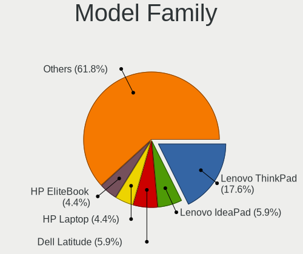

| Name              | Notebooks | Percent |
|-------------------|-----------|---------|
| Lenovo ThinkPad   | 12        | 17.65%  |
| Lenovo IdeaPad    | 4         | 5.88%   |
| Dell Latitude     | 4         | 5.88%   |
| HP Laptop         | 3         | 4.41%   |
| HP EliteBook      | 3         | 4.41%   |
| Dell Inspiron     | 3         | 4.41%   |
| Acer Aspire       | 3         | 4.41%   |
| Toshiba Satellite | 2         | 2.94%   |
| Lenovo Legion     | 2         | 2.94%   |
| HP ENVY           | 2         | 2.94%   |
| Dell Precision    | 2         | 2.94%   |
| TUXEDO Aura       | 1         | 1.47%   |
| Timi TM1709       | 1         | 1.47%   |
| Timi RedmiBook    | 1         | 1.47%   |
| Notebook NS50     | 1         | 1.47%   |
| MSI GL75          | 1         | 1.47%   |
| Maibenben MaiBook | 1         | 1.47%   |
| Lenovo Yoga       | 1         | 1.47%   |
| Lenovo V14-ARE    | 1         | 1.47%   |
| Lenovo G580       | 1         | 1.47%   |
| Lenovo B50-30     | 1         | 1.47%   |
| Intel powered     | 1         | 1.47%   |
| HUAWEI BOD-WXX9   | 1         | 1.47%   |
| HP ZBook          | 1         | 1.47%   |
| HP Notebook       | 1         | 1.47%   |
| HP Falco          | 1         | 1.47%   |
| HP 17-ak041ur     | 1         | 1.47%   |
| Google Kohaku     | 1         | 1.47%   |
| Google Kefka      | 1         | 1.47%   |
| Dell XPS          | 1         | 1.47%   |
| Dell Vostro       | 1         | 1.47%   |
| ASUS Strix        | 1         | 1.47%   |
| ASUS ROG          | 1         | 1.47%   |
| ASUS GL552VW      | 1         | 1.47%   |
| ASUS G75VW        | 1         | 1.47%   |
| ASUS ASUS         | 1         | 1.47%   |
| AOCWEI A2         | 1         | 1.47%   |
| Acer TravelMate   | 1         | 1.47%   |
| Acer TMP453-MG    | 1         | 1.47%   |

MFG Year
--------

Motherboard manufacture year

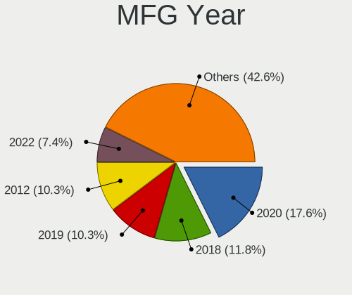

| Year | Notebooks | Percent |
|------|-----------|---------|
| 2020 | 12        | 17.65%  |
| 2018 | 8         | 11.76%  |
| 2019 | 7         | 10.29%  |
| 2012 | 7         | 10.29%  |
| 2022 | 5         | 7.35%   |
| 2021 | 4         | 5.88%   |
| 2011 | 4         | 5.88%   |
| 2023 | 3         | 4.41%   |
| 2017 | 3         | 4.41%   |
| 2015 | 3         | 4.41%   |
| 2014 | 3         | 4.41%   |
| 2013 | 3         | 4.41%   |
| 2010 | 3         | 4.41%   |
| 2016 | 2         | 2.94%   |
| 2024 | 1         | 1.47%   |

Form Factor
-----------

Physical design of the computer

| Name     | Notebooks | Percent |
|----------|-----------|---------|
| Notebook | 68        | 100%    |

Secure Boot
-----------

Enabled or disabled

| State    | Notebooks | Percent |
|----------|-----------|---------|
| Disabled | 62        | 89.86%  |
| Enabled  | 7         | 10.14%  |

Coreboot
--------

Have coreboot on board

| Used | Notebooks | Percent |
|------|-----------|---------|
| No   | 65        | 95.59%  |
| Yes  | 3         | 4.41%   |

RAM Size
--------

Total RAM memory

| Size in GB  | Notebooks | Percent |
|-------------|-----------|---------|
| 8.01-16.0   | 25        | 36.76%  |
| 4.01-8.0    | 20        | 29.41%  |
| 3.01-4.0    | 8         | 11.76%  |
| 32.01-64.0  | 5         | 7.35%   |
| 16.01-24.0  | 5         | 7.35%   |
| 64.01-256.0 | 2         | 2.94%   |
| 1.01-2.0    | 2         | 2.94%   |
| 24.01-32.0  | 1         | 1.47%   |

RAM Used
--------

Used RAM memory

| Used GB   | Notebooks | Percent |
|-----------|-----------|---------|
| 2.01-3.0  | 21        | 28%     |
| 3.01-4.0  | 19        | 25.33%  |
| 1.01-2.0  | 16        | 21.33%  |
| 4.01-8.0  | 14        | 18.67%  |
| 8.01-16.0 | 3         | 4%      |
| 0.51-1.0  | 2         | 2.67%   |

Total Drives
------------

Number of drives on board

| Drives | Notebooks | Percent |
|--------|-----------|---------|
| 1      | 47        | 68.12%  |
| 2      | 19        | 27.54%  |
| 3      | 2         | 2.9%    |
| 0      | 1         | 1.45%   |

Has CD-ROM
----------

Has CD-ROM on board

| Presented | Notebooks | Percent |
|-----------|-----------|---------|
| No        | 51        | 75%     |
| Yes       | 17        | 25%     |

Has Ethernet
------------

Has Ethernet on board

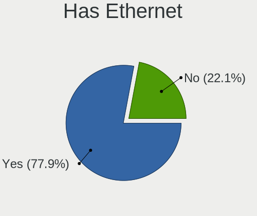

| Presented | Notebooks | Percent |
|-----------|-----------|---------|
| Yes       | 53        | 77.94%  |
| No        | 15        | 22.06%  |

Has WiFi
--------

Has WiFi module

| Presented | Notebooks | Percent |
|-----------|-----------|---------|
| Yes       | 68        | 100%    |

Has Bluetooth
-------------

Has Bluetooth module

| Presented | Notebooks | Percent |
|-----------|-----------|---------|
| Yes       | 59        | 85.51%  |
| No        | 10        | 14.49%  |

Location
--------

Country
-------

Geographic location (country)

| Country      | Notebooks | Percent |
|--------------|-----------|---------|
| USA          | 15        | 22.06%  |
| Germany      | 9         | 13.24%  |
| France       | 4         | 5.88%   |
| Spain        | 3         | 4.41%   |
| Poland       | 3         | 4.41%   |
| Italy        | 3         | 4.41%   |
| Indonesia    | 3         | 4.41%   |
| India        | 3         | 4.41%   |
| China        | 3         | 4.41%   |
| Canada       | 3         | 4.41%   |
| South Africa | 2         | 2.94%   |
| Russia       | 2         | 2.94%   |
| Belgium      | 2         | 2.94%   |
| Venezuela    | 1         | 1.47%   |
| UK           | 1         | 1.47%   |
| Sweden       | 1         | 1.47%   |
| South Korea  | 1         | 1.47%   |
| Romania      | 1         | 1.47%   |
| Puerto Rico  | 1         | 1.47%   |
| Pakistan     | 1         | 1.47%   |
| Netherlands  | 1         | 1.47%   |
| Mexico       | 1         | 1.47%   |
| Hungary      | 1         | 1.47%   |
| Bulgaria     | 1         | 1.47%   |
| Brazil       | 1         | 1.47%   |
| Bangladesh   | 1         | 1.47%   |

City
----

Geographic location (city)

| City               | Notebooks | Percent |
|--------------------|-----------|---------|
| Hamburg            | 3         | 4.23%   |
| Queens             | 2         | 2.82%   |
| Los Angeles        | 2         | 2.82%   |
| Johannesburg       | 2         | 2.82%   |
| Dresden            | 2         | 2.82%   |
| Berlin             | 2         | 2.82%   |
| Winterswijk        | 1         | 1.41%   |
| Wejherowo          | 1         | 1.41%   |
| Warsaw             | 1         | 1.41%   |
| Wandlitz           | 1         | 1.41%   |
| Uppsala            | 1         | 1.41%   |
| Thiruvananthapuram | 1         | 1.41%   |
| Tampa              | 1         | 1.41%   |
| Suzhou             | 1         | 1.41%   |
| South Tangerang    | 1         | 1.41%   |
| Sofia              | 1         | 1.41%   |
| Seville            | 1         | 1.41%   |
| Sao Paulo          | 1         | 1.41%   |
| Saint-Brieuc       | 1         | 1.41%   |
| Rome               | 1         | 1.41%   |
| Regina             | 1         | 1.41%   |
| Redlands           | 1         | 1.41%   |
| Penza              | 1         | 1.41%   |
| Parla              | 1         | 1.41%   |
| Paris              | 1         | 1.41%   |
| Ottawa             | 1         | 1.41%   |
| Minneapolis        | 1         | 1.41%   |
| Milano             | 1         | 1.41%   |
| Milan              | 1         | 1.41%   |
| Mangalore          | 1         | 1.41%   |
| Malang             | 1         | 1.41%   |
| Lille              | 1         | 1.41%   |
| Leighton Buzzard   | 1         | 1.41%   |
| Land O' Lakes      | 1         | 1.41%   |
| Lahore             | 1         | 1.41%   |
| Kennewick          | 1         | 1.41%   |
| Jinrongjie         | 1         | 1.41%   |
| Irapuato           | 1         | 1.41%   |
| Huntersville       | 1         | 1.41%   |
| Houston            | 1         | 1.41%   |

Drives
------

Drive Vendor
------------

Hard drive vendors

| Vendor                      | Notebooks | Drives | Percent |
|-----------------------------|-----------|--------|---------|
| Samsung Electronics         | 11        | 12     | 12.94%  |
| WDC                         | 7         | 8      | 8.24%   |
| SK hynix                    | 6         | 8      | 7.06%   |
| Seagate                     | 6         | 6      | 7.06%   |
| Sandisk                     | 4         | 4      | 4.71%   |
| Intel                       | 4         | 5      | 4.71%   |
| Unknown                     | 3         | 4      | 3.53%   |
| KIOXIA                      | 3         | 3      | 3.53%   |
| Kingston Technology Company | 3         | 4      | 3.53%   |
| Kingston                    | 3         | 3      | 3.53%   |
| Hitachi                     | 3         | 4      | 3.53%   |
| Toshiba                     | 2         | 4      | 2.35%   |
| Plextor                     | 2         | 2      | 2.35%   |
| Phison Electronics          | 2         | 2      | 2.35%   |
| Netac                       | 2         | 2      | 2.35%   |
| LITEONIT                    | 2         | 6      | 2.35%   |
| HGST                        | 2         | 4      | 2.35%   |
| Union Memory                | 1         | 1      | 1.18%   |
| Transcend                   | 1         | 1      | 1.18%   |
| T-FORCE                     | 1         | 1      | 1.18%   |
| SSSTC                       | 1         | 1      | 1.18%   |
| Silicon Motion              | 1         | 1      | 1.18%   |
| Realtek Semiconductor       | 1         | 1      | 1.18%   |
| Patriot                     | 1         | 3      | 1.18%   |
| MidasForce                  | 1         | 3      | 1.18%   |
| Micron Technology           | 1         | 1      | 1.18%   |
| MAXIO Technology (Hangzhou) | 1         | 1      | 1.18%   |
| Lite-On Technology          | 1         | 1      | 1.18%   |
| Lenovo                      | 1         | 1      | 1.18%   |
| Intenso                     | 1         | 1      | 1.18%   |
| HJDK                        | 1         | 1      | 1.18%   |
| Emtec                       | 1         | 2      | 1.18%   |
| Dell                        | 1         | 2      | 1.18%   |
| Crucial                     | 1         | 2      | 1.18%   |
| China                       | 1         | 1      | 1.18%   |
| ASMT                        | 1         | 2      | 1.18%   |
| A-DATA Technology           | 1         | 1      | 1.18%   |

Drive Model
-----------

Hard drive models

| Model                                               | Notebooks | Percent |
|-----------------------------------------------------|-----------|---------|
| SK hynix SC311 SATA 256GB SSD                       | 3         | 3.45%   |
| Samsung NVMe SSD Controller SM981/PM981/PM983 512GB | 3         | 3.45%   |
| WDC WD10SPZX-24Z10 1TB                              | 2         | 2.3%    |
| Unknown SD/MMC/MS PRO 128GB                         | 2         | 2.3%    |
| Phison PS5013 E13 NVMe Controller 512GB             | 2         | 2.3%    |
| Kingston Company SNV2S1000G 1TB                     | 2         | 2.3%    |
| HGST HTS541010A9E680 1TB                            | 2         | 2.3%    |
| WDC WD5000LPCX-21VHAT0 500GB                        | 1         | 1.15%   |
| WDC WD10SPZX-60Z10T1 1TB                            | 1         | 1.15%   |
| WDC WD10SPZX-60Z10T0 1TB                            | 1         | 1.15%   |
| WDC WD10JPVX-00JC3T0 1TB                            | 1         | 1.15%   |
| WDC PC SN730 SDBQNTY-256G-1001 256GB                | 1         | 1.15%   |
| Unknown MMC Card  16GB                              | 1         | 1.15%   |
| Union Memory UMIS RPITJ512VME2OWD 512GB             | 1         | 1.15%   |
| Transcend TS256GMTE220S 256GB                       | 1         | 1.15%   |
| Toshiba MQ01ABD075 752GB                            | 1         | 1.15%   |
| Toshiba MK6475GSX 640GB                             | 1         | 1.15%   |
| T-FORCE 1TB                                         | 1         | 1.15%   |
| SSSTC CL1-3D256 256GB                               | 1         | 1.15%   |
| SK hynix PC801 NVMe 1TB                             | 1         | 1.15%   |
| SK hynix NVMe SSD Drive 256GB                       | 1         | 1.15%   |
| SK hynix BC511 NVMe 256GB                           | 1         | 1.15%   |
| Silicon Motion PCIe-8 SSD 256GB                     | 1         | 1.15%   |
| Seagate ST9500423AS 500GB                           | 1         | 1.15%   |
| Seagate ST9500325AS 500GB                           | 1         | 1.15%   |
| Seagate ST500LT012-1DG142 500GB                     | 1         | 1.15%   |
| Seagate ST250LM004 HN-M250MBB 250GB                 | 1         | 1.15%   |
| Seagate ST1000LX015-1U7172 1TB                      | 1         | 1.15%   |
| Seagate ST1000LM024 HN-M101MBB 1TB                  | 1         | 1.15%   |
| Sandisk WD PC SN740 SDDQMQD-512G-1001 512GB         | 1         | 1.15%   |
| Sandisk WD Blue SN550 NVMe SSD 256GB                | 1         | 1.15%   |
| Sandisk WD Blue SN500 / PC SN520 NVMe SSD 256GB     | 1         | 1.15%   |
| SanDisk SD6PP4M-256G-1006 256GB SSD                 | 1         | 1.15%   |
| Samsung SSD PM810 FDE 2.5 256GB                     | 1         | 1.15%   |
| Samsung SSD 870 QVO 1TB                             | 1         | 1.15%   |
| Samsung SSD 870 EVO 500GB                           | 1         | 1.15%   |
| Samsung MZVLQ512HALU-00000 512GB                    | 1         | 1.15%   |
| Samsung MZVLQ128HBHQ-000H1 128GB                    | 1         | 1.15%   |
| Samsung MZVL22T0HBLB-00BL7 2TB                      | 1         | 1.15%   |
| Samsung MZALQ512HALU-000L1 512GB                    | 1         | 1.15%   |

HDD Vendor
----------

Hard disk drive vendors

| Vendor  | Notebooks | Drives | Percent |
|---------|-----------|--------|---------|
| WDC     | 6         | 7      | 27.27%  |
| Seagate | 6         | 6      | 27.27%  |
| Hitachi | 3         | 4      | 13.64%  |
| Unknown | 2         | 3      | 9.09%   |
| Toshiba | 2         | 4      | 9.09%   |
| HGST    | 2         | 4      | 9.09%   |
| ASMT    | 1         | 2      | 4.55%   |

SSD Vendor
----------

Solid state drive vendors

| Vendor              | Notebooks | Drives | Percent |
|---------------------|-----------|--------|---------|
| SK hynix            | 3         | 5      | 11.54%  |
| Samsung Electronics | 3         | 3      | 11.54%  |
| Kingston            | 3         | 3      | 11.54%  |
| Plextor             | 2         | 2      | 7.69%   |
| LITEONIT            | 2         | 6      | 7.69%   |
| Intel               | 2         | 3      | 7.69%   |
| SanDisk             | 1         | 1      | 3.85%   |
| Patriot             | 1         | 3      | 3.85%   |
| Netac               | 1         | 1      | 3.85%   |
| MidasForce          | 1         | 3      | 3.85%   |
| Micron Technology   | 1         | 1      | 3.85%   |
| Intenso             | 1         | 1      | 3.85%   |
| HJDK                | 1         | 1      | 3.85%   |
| Dell                | 1         | 2      | 3.85%   |
| Crucial             | 1         | 2      | 3.85%   |
| China               | 1         | 1      | 3.85%   |
| A-DATA Technology   | 1         | 1      | 3.85%   |

Drive Kind
----------

HDD or SSD

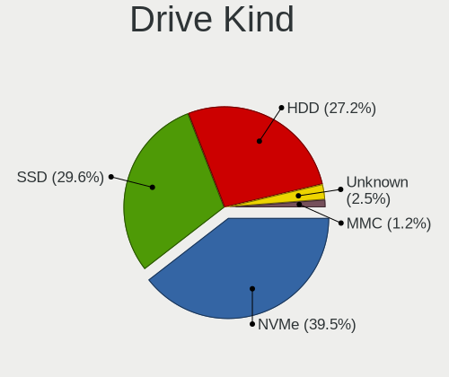

| Kind    | Notebooks | Drives | Percent |
|---------|-----------|--------|---------|
| NVMe    | 32        | 36     | 39.51%  |
| SSD     | 24        | 39     | 29.63%  |
| HDD     | 22        | 30     | 27.16%  |
| Unknown | 2         | 3      | 2.47%   |
| MMC     | 1         | 1      | 1.23%   |

Drive Connector
---------------

SATA, SAS, NVMe, etc.

| Type | Notebooks | Drives | Percent |
|------|-----------|--------|---------|
| SATA | 41        | 65     | 53.25%  |
| NVMe | 32        | 36     | 41.56%  |
| SAS  | 3         | 7      | 3.9%    |
| MMC  | 1         | 1      | 1.3%    |

Drive Size
----------

Size of hard drive

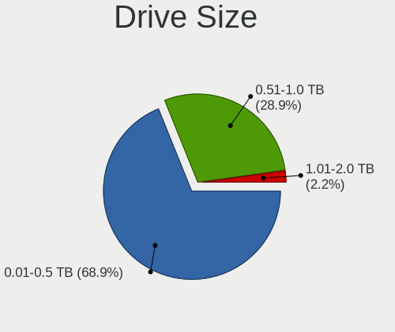

| Size in TB | Notebooks | Drives | Percent |
|------------|-----------|--------|---------|
| 0.01-0.5   | 31        | 46     | 68.89%  |
| 0.51-1.0   | 13        | 20     | 28.89%  |
| 1.01-2.0   | 1         | 3      | 2.22%   |

Space Total
-----------

Amount of disk space available on the file system

| Size in GB | Notebooks | Percent |
|------------|-----------|---------|
| 101-250    | 25        | 36.23%  |
| 251-500    | 14        | 20.29%  |
| 501-1000   | 12        | 17.39%  |
| 1001-2000  | 7         | 10.14%  |
| 51-100     | 6         | 8.7%    |
| 1-20       | 3         | 4.35%   |
| 21-50      | 2         | 2.9%    |

Space Used
----------

Amount of used disk space

| Used GB  | Notebooks | Percent |
|----------|-----------|---------|
| 1-20     | 31        | 42.47%  |
| 21-50    | 17        | 23.29%  |
| 101-250  | 12        | 16.44%  |
| 51-100   | 8         | 10.96%  |
| 251-500  | 4         | 5.48%   |
| 501-1000 | 1         | 1.37%   |

Malfunc. Drives
---------------

Drive models with a malfunction

| Model                          | Notebooks | Drives | Percent |
|--------------------------------|-----------|--------|---------|
| LITEONIT LSS-16L6G-HP 16GB SSD | 1         | 5      | 33.33%  |
| Hitachi HTS545050A7E380 500GB  | 1         | 1      | 33.33%  |
| HGST HTS541010A9E680 1TB       | 1         | 2      | 33.33%  |

Malfunc. Drive Vendor
---------------------

Vendors of faulty drives

| Vendor   | Notebooks | Drives | Percent |
|----------|-----------|--------|---------|
| LITEONIT | 1         | 5      | 33.33%  |
| Hitachi  | 1         | 1      | 33.33%  |
| HGST     | 1         | 2      | 33.33%  |

Malfunc. HDD Vendor
-------------------

Vendors of faulty HDD drives

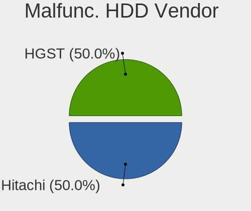

| Vendor  | Notebooks | Drives | Percent |
|---------|-----------|--------|---------|
| Hitachi | 1         | 1      | 50%     |
| HGST    | 1         | 2      | 50%     |

Malfunc. Drive Kind
-------------------

Kinds of faulty drives

| Kind | Notebooks | Drives | Percent |
|------|-----------|--------|---------|
| HDD  | 2         | 3      | 66.67%  |
| SSD  | 1         | 5      | 33.33%  |

Failed Drives
-------------

Failed drive models

Zero info for selected period =(

Failed Drive Vendor
-------------------

Failed drive vendors

Zero info for selected period =(

Drive Status
------------

Number of failed and malfunc. drives

| Status   | Notebooks | Drives | Percent |
|----------|-----------|--------|---------|
| Works    | 35        | 48     | 49.3%   |
| Detected | 33        | 53     | 46.48%  |
| Malfunc  | 3         | 8      | 4.23%   |

Storage controller
------------------

Storage Vendor
--------------

Storage controller vendors

| Vendor                         | Notebooks | Percent |
|--------------------------------|-----------|---------|
| Intel                          | 41        | 50%     |
| Samsung Electronics            | 8         | 9.76%   |
| AMD                            | 8         | 9.76%   |
| SanDisk                        | 4         | 4.88%   |
| Kingston Technology Company    | 3         | 3.66%   |
| Union Memory (Shenzhen)        | 2         | 2.44%   |
| SK hynix                       | 2         | 2.44%   |
| Silicon Motion                 | 2         | 2.44%   |
| Phison Electronics             | 2         | 2.44%   |
| KIOXIA                         | 2         | 2.44%   |
| Toshiba America Info Systems   | 1         | 1.22%   |
| Solid State Storage Technology | 1         | 1.22%   |
| Realtek Semiconductor          | 1         | 1.22%   |
| Netac Technology               | 1         | 1.22%   |
| MAXIO Technology (Hangzhou)    | 1         | 1.22%   |
| Marvell Technology Group       | 1         | 1.22%   |
| Lite-On Technology             | 1         | 1.22%   |
| Lenovo                         | 1         | 1.22%   |

Storage Model
-------------

Storage controller models

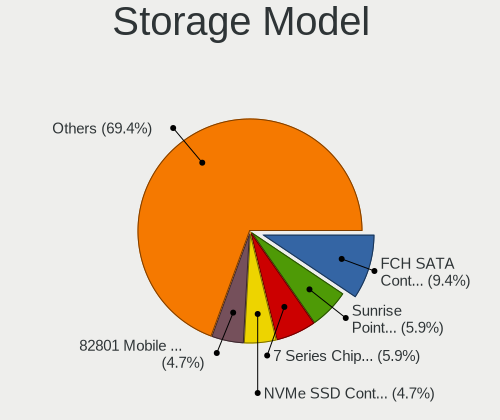

| Model                                                                        | Notebooks | Percent |
|------------------------------------------------------------------------------|-----------|---------|
| AMD FCH SATA Controller [AHCI mode]                                          | 8         | 9.41%   |
| Intel Sunrise Point-LP SATA Controller [AHCI mode]                           | 5         | 5.88%   |
| Intel 7 Series Chipset Family 6-port SATA Controller [AHCI mode]             | 5         | 5.88%   |
| Samsung NVMe SSD Controller 980 (DRAM-less)                                  | 4         | 4.71%   |
| Intel 82801 Mobile SATA Controller [RAID mode]                               | 4         | 4.71%   |
| Intel 8 Series SATA Controller 1 [AHCI mode]                                 | 4         | 4.71%   |
| Samsung NVMe SSD Controller SM981/PM981/PM983                                | 3         | 3.53%   |
| Intel Cannon Lake Mobile PCH SATA AHCI Controller                            | 3         | 3.53%   |
| Phison PS5013-E13 PCIe3 NVMe Controller (DRAM-less)                          | 2         | 2.35%   |
| Kingston Company NV2 NVMe SSD [SM2267XT] (DRAM-less)                         | 2         | 2.35%   |
| Intel Volume Management Device NVMe RAID Controller                          | 2         | 2.35%   |
| Intel Atom Processor E3800 Series SATA AHCI Controller                       | 2         | 2.35%   |
| Intel 6 Series/C200 Series Chipset Family 6 port Mobile SATA AHCI Controller | 2         | 2.35%   |
| Union Memory (Shenzhen) AM610 PCIe 3.0 x2 NVMe SSD 128GB, 256GB              | 1         | 1.18%   |
| Union Memory (Shenzhen) AH631 PCIe 3.0 NVMe SSD 512GB                        | 1         | 1.18%   |
| Toshiba America Info Systems XG6 NVMe SSD Controller                         | 1         | 1.18%   |
| Solid State Storage CL1-3D256-Q11 NVMe SSD M.2                               | 1         | 1.18%   |
| SK hynix Platinum P41/PC801 NVMe Solid State Drive                           | 1         | 1.18%   |
| SK hynix BC511 NVMe SSD                                                      | 1         | 1.18%   |
| Silicon Motion SM2262/SM2262EN SSD Controller                                | 1         | 1.18%   |
| Silicon Motion Non-Volatile memory controller                                | 1         | 1.18%   |
| Sandisk WD PC SN740 NVMe SSD 512GB (DRAM-less)                               | 1         | 1.18%   |
| SanDisk WD Blue SN500 / PC SN520 x2 M.2 2280 NVMe SSD                        | 1         | 1.18%   |
| SanDisk Ultra 3D / WD PC SN530, IX SN530, Blue SN550 NVMe SSD (DRAM-less)    | 1         | 1.18%   |
| SanDisk Extreme Pro / WD Black SN750 / PC SN730 / Red SN700 NVMe SSD         | 1         | 1.18%   |
| Samsung NVMe SSD Controller PM9A1/PM9A3/980PRO                               | 1         | 1.18%   |
| Realtek RTS5763DL x2 NVMe SSD Controller                                     | 1         | 1.18%   |
| Netac PCIe 3 NVMe SSD (DRAM-less)                                            | 1         | 1.18%   |
| MAXIO (Hangzhou) NVMe SSD Controller MAP1202 (DRAM-less)                     | 1         | 1.18%   |
| Marvell Group 88SS9183 PCIe SSD Controller                                   | 1         | 1.18%   |
| Lite-On CX2-8B256, CX2-8B512 NVMe SSD                                        | 1         | 1.18%   |
| Lenovo LENSE30512GMSP34MEAT3TA                                               | 1         | 1.18%   |
| KIOXIA NVMe SSD Controller XG8                                               | 1         | 1.18%   |
| KIOXIA NVMe SSD Controller XG7                                               | 1         | 1.18%   |
| Kingston Company OM3PDP3 NVMe SSD                                            | 1         | 1.18%   |
| Kingston Company A2000 NVMe SSD [SM2263EN]                                   | 1         | 1.18%   |
| Intel Wildcat Point-LP SATA Controller [AHCI Mode]                           | 1         | 1.18%   |
| Intel SSD 670p Series [Keystone Harbor]                                      | 1         | 1.18%   |
| Intel SSD 660P Series                                                        | 1         | 1.18%   |
| Intel NM10/ICH7 Family SATA Controller [AHCI mode]                           | 1         | 1.18%   |

Storage Kind
------------

Kind of storage controller (IDE, SATA, NVMe, SAS, ...)

| Kind | Notebooks | Percent |
|------|-----------|---------|
| SATA | 41        | 51.25%  |
| NVMe | 32        | 40%     |
| RAID | 6         | 7.5%    |
| IDE  | 1         | 1.25%   |

Processor
---------

CPU Vendor
----------

Processor vendors

| Vendor | Notebooks | Percent |
|--------|-----------|---------|
| Intel  | 55        | 80.88%  |
| AMD    | 13        | 19.12%  |

CPU Model
---------

Processor models

| Model                                       | Notebooks | Percent |
|---------------------------------------------|-----------|---------|
| Intel Core i5-10210U CPU @ 1.60GHz          | 3         | 4.41%   |
| Intel Core i5-8250U CPU @ 1.60GHz           | 2         | 2.94%   |
| Intel Core i5-2410M CPU @ 2.30GHz           | 2         | 2.94%   |
| Intel 11th Gen Core i7-1165G7 @ 2.80GHz     | 2         | 2.94%   |
| Intel Xeon W-11855M CPU @ 3.20GHz           | 1         | 1.47%   |
| Intel Pentium Dual-Core CPU T4500 @ 2.30GHz | 1         | 1.47%   |
| Intel Pentium CPU N3540 @ 2.16GHz           | 1         | 1.47%   |
| Intel Pentium CPU 3825U @ 1.90GHz           | 1         | 1.47%   |
| Intel Core i7-9750H CPU @ 2.60GHz           | 1         | 1.47%   |
| Intel Core i7-8750H CPU @ 2.20GHz           | 1         | 1.47%   |
| Intel Core i7-8650U CPU @ 1.90GHz           | 1         | 1.47%   |
| Intel Core i7-8550U CPU @ 1.80GHz           | 1         | 1.47%   |
| Intel Core i7-7600U CPU @ 2.80GHz           | 1         | 1.47%   |
| Intel Core i7-7560U CPU @ 2.40GHz           | 1         | 1.47%   |
| Intel Core i7-6700HQ CPU @ 2.60GHz          | 1         | 1.47%   |
| Intel Core i7-6500U CPU @ 2.50GHz           | 1         | 1.47%   |
| Intel Core i7-4710MQ CPU @ 2.50GHz          | 1         | 1.47%   |
| Intel Core i7-4510U CPU @ 2.00GHz           | 1         | 1.47%   |
| Intel Core i7-3840QM CPU @ 2.80GHz          | 1         | 1.47%   |
| Intel Core i7-3630QM CPU @ 2.40GHz          | 1         | 1.47%   |
| Intel Core i7-3610QM CPU @ 2.30GHz          | 1         | 1.47%   |
| Intel Core i7-10875H CPU @ 2.30GHz          | 1         | 1.47%   |
| Intel Core i7-10750H CPU @ 2.60GHz          | 1         | 1.47%   |
| Intel Core i7 CPU Q 720 @ 1.60GHz           | 1         | 1.47%   |
| Intel Core i5-8350U CPU @ 1.70GHz           | 1         | 1.47%   |
| Intel Core i5-8300H CPU @ 2.30GHz           | 1         | 1.47%   |
| Intel Core i5-8265U CPU @ 1.60GHz           | 1         | 1.47%   |
| Intel Core i5-6200U CPU @ 2.30GHz           | 1         | 1.47%   |
| Intel Core i5-4300U CPU @ 1.90GHz           | 1         | 1.47%   |
| Intel Core i5-3360M CPU @ 2.80GHz           | 1         | 1.47%   |
| Intel Core i5-3230M CPU @ 2.60GHz           | 1         | 1.47%   |
| Intel Core i5-3210M CPU @ 2.50GHz           | 1         | 1.47%   |
| Intel Core i3-8145U CPU @ 2.10GHz           | 1         | 1.47%   |
| Intel Core i3-4010U CPU @ 1.70GHz           | 1         | 1.47%   |
| Intel Core i3-2370M CPU @ 2.40GHz           | 1         | 1.47%   |
| Intel Core i3-1005G1 CPU @ 1.20GHz          | 1         | 1.47%   |
| Intel Core i3 CPU M 370 @ 2.40GHz           | 1         | 1.47%   |
| Intel Celeron N4020C CPU @ 1.10GHz          | 1         | 1.47%   |
| Intel Celeron CPU N3060 @ 1.60GHz           | 1         | 1.47%   |
| Intel Celeron CPU N2820 @ 2.13GHz           | 1         | 1.47%   |

CPU Model Family
----------------

Processor model prefix

| Model                   | Notebooks | Percent |
|-------------------------|-----------|---------|
| Intel Core i7           | 16        | 23.53%  |
| Intel Core i5           | 15        | 22.06%  |
| Other                   | 12        | 17.65%  |
| Intel Core i3           | 5         | 7.35%   |
| Intel Celeron           | 4         | 5.88%   |
| AMD Ryzen 7             | 4         | 5.88%   |
| Intel Pentium           | 2         | 2.94%   |
| AMD Ryzen 5             | 2         | 2.94%   |
| AMD A12                 | 2         | 2.94%   |
| Intel Xeon              | 1         | 1.47%   |
| Intel Pentium Dual-Core | 1         | 1.47%   |
| Intel Atom              | 1         | 1.47%   |
| AMD Ryzen 3             | 1         | 1.47%   |
| AMD A6                  | 1         | 1.47%   |
| AMD A10                 | 1         | 1.47%   |

CPU Cores
---------

Number of processor cores

| Number | Notebooks | Percent |
|--------|-----------|---------|
| 2      | 29        | 42.65%  |
| 4      | 23        | 33.82%  |
| 8      | 6         | 8.82%   |
| 6      | 6         | 8.82%   |
| 10     | 2         | 2.94%   |
| 14     | 1         | 1.47%   |
| 1      | 1         | 1.47%   |

CPU Sockets
-----------

Number of sockets

| Number | Notebooks | Percent |
|--------|-----------|---------|
| 1      | 68        | 100%    |

CPU Threads
-----------

Threads per core (Hyper-Threading)

| Number | Notebooks | Percent |
|--------|-----------|---------|
| 2      | 58        | 85.29%  |
| 1      | 10        | 14.71%  |

CPU Op-Modes
------------

CPU Operation Modes (32-bit, 64-bit)

| Op mode        | Notebooks | Percent |
|----------------|-----------|---------|
| 32-bit, 64-bit | 68        | 100%    |

CPU Microcode
-------------

Microcode number

| Number     | Notebooks | Percent |
|------------|-----------|---------|
| Unknown    | 24        | 33.33%  |
| 0x306a9    | 5         | 6.94%   |
| 0x806ec    | 4         | 5.56%   |
| 0x806c1    | 3         | 4.17%   |
| 0x40651    | 3         | 4.17%   |
| 0x806ea    | 2         | 2.78%   |
| 0x806d1    | 2         | 2.78%   |
| 0x206a7    | 2         | 2.78%   |
| 0x08600106 | 2         | 2.78%   |
| 0x08108109 | 2         | 2.78%   |
| 0x0600611a | 2         | 2.78%   |
| 0xb06a3    | 1         | 1.39%   |
| 0xa0652    | 1         | 1.39%   |
| 0x906ed    | 1         | 1.39%   |
| 0x906ea    | 1         | 1.39%   |
| 0x906a4    | 1         | 1.39%   |
| 0x806e9    | 1         | 1.39%   |
| 0x406e3    | 1         | 1.39%   |
| 0x406c4    | 1         | 1.39%   |
| 0x306d4    | 1         | 1.39%   |
| 0x306c3    | 1         | 1.39%   |
| 0x30678    | 1         | 1.39%   |
| 0x30673    | 1         | 1.39%   |
| 0x20655    | 1         | 1.39%   |
| 0x106ca    | 1         | 1.39%   |
| 0x1067a    | 1         | 1.39%   |
| 0x0a50000c | 1         | 1.39%   |
| 0x08608103 | 1         | 1.39%   |
| 0x0810100b | 1         | 1.39%   |
| 0x06006705 | 1         | 1.39%   |
| 0x06006704 | 1         | 1.39%   |
| 0x06006110 | 1         | 1.39%   |

CPU Microarch
-------------

Microarchitecture

| Name             | Notebooks | Percent |
|------------------|-----------|---------|
| KabyLake         | 15        | 22.06%  |
| IvyBridge        | 6         | 8.82%   |
| TigerLake        | 5         | 7.35%   |
| Haswell          | 5         | 7.35%   |
| Excavator        | 5         | 7.35%   |
| Alderlake Hybrid | 4         | 5.88%   |
| Skylake          | 3         | 4.41%   |
| Silvermont       | 3         | 4.41%   |
| SandyBridge      | 3         | 4.41%   |
| Icelake          | 3         | 4.41%   |
| Zen+             | 2         | 2.94%   |
| Zen 2            | 2         | 2.94%   |
| CometLake        | 2         | 2.94%   |
| Unknown          | 2         | 2.94%   |
| Zen 3            | 1         | 1.47%   |
| Zen              | 1         | 1.47%   |
| Westmere         | 1         | 1.47%   |
| Penryn           | 1         | 1.47%   |
| Nehalem          | 1         | 1.47%   |
| Goldmont plus    | 1         | 1.47%   |
| Broadwell        | 1         | 1.47%   |
| Bonnell          | 1         | 1.47%   |

Graphics
--------

GPU Vendor
----------

Vendors of graphics cards

| Vendor | Notebooks | Percent |
|--------|-----------|---------|
| Intel  | 50        | 59.52%  |
| Nvidia | 19        | 22.62%  |
| AMD    | 15        | 17.86%  |

GPU Model
---------

Graphics card models

| Model                                                                     | Notebooks | Percent |
|---------------------------------------------------------------------------|-----------|---------|
| Intel UHD Graphics 620                                                    | 5         | 5.88%   |
| Intel Haswell-ULT Integrated Graphics Controller                          | 4         | 4.71%   |
| Intel TigerLake-LP GT2 [Iris Xe Graphics]                                 | 3         | 3.53%   |
| Intel CometLake-U GT2 [UHD Graphics]                                      | 3         | 3.53%   |
| Intel CoffeeLake-H GT2 [UHD Graphics 630]                                 | 3         | 3.53%   |
| Intel 3rd Gen Core processor Graphics Controller                          | 3         | 3.53%   |
| Intel 2nd Generation Core Processor Family Integrated Graphics Controller | 3         | 3.53%   |
| AMD Wani [Radeon R5/R6/R7 Graphics]                                       | 3         | 3.53%   |
| Intel WhiskeyLake-U GT2 [UHD Graphics 620]                                | 2         | 2.35%   |
| Intel Skylake GT2 [HD Graphics 520]                                       | 2         | 2.35%   |
| Intel Raptor Lake-P [Iris Xe Graphics]                                    | 2         | 2.35%   |
| Intel CometLake-H GT2 [UHD Graphics]                                      | 2         | 2.35%   |
| Intel Atom Processor Z36xxx/Z37xxx Series Graphics & Display              | 2         | 2.35%   |
| AMD Stoney [Radeon R2/R3/R4/R5 Graphics]                                  | 2         | 2.35%   |
| AMD Renoir [Radeon Vega Series / Radeon Vega Mobile Series]               | 2         | 2.35%   |
| AMD Picasso/Raven 2 [Radeon Vega Series / Radeon Vega Mobile Series]      | 2         | 2.35%   |
| Nvidia TU116M [GeForce GTX 1660 Ti Mobile]                                | 1         | 1.18%   |
| Nvidia TU106M [GeForce RTX 2060 Mobile]                                   | 1         | 1.18%   |
| Nvidia TU104BM [GeForce RTX 2070 SUPER Mobile / Max-Q]                    | 1         | 1.18%   |
| Nvidia GP107M [GeForce GTX 1050 Ti Mobile]                                | 1         | 1.18%   |
| Nvidia GP107M [GeForce GTX 1050 Mobile]                                   | 1         | 1.18%   |
| Nvidia GM108M [GeForce MX110]                                             | 1         | 1.18%   |
| Nvidia GM108M [GeForce 930M]                                              | 1         | 1.18%   |
| Nvidia GM107M [GeForce GTX 960M]                                          | 1         | 1.18%   |
| Nvidia GM107M [GeForce GTX 850M]                                          | 1         | 1.18%   |
| Nvidia GK107M [GeForce GTX 660M]                                          | 1         | 1.18%   |
| Nvidia GK107GLM [Quadro K1000M]                                           | 1         | 1.18%   |
| Nvidia GK104GLM [Quadro K3100M]                                           | 1         | 1.18%   |
| Nvidia GF117M [GeForce 610M/710M/810M/820M / GT 620M/625M/630M/720M]      | 1         | 1.18%   |
| Nvidia GF108M [GeForce GT 620M/630M/635M/640M LE]                         | 1         | 1.18%   |
| Nvidia GA107GLM [RTX A2000 Mobile]                                        | 1         | 1.18%   |
| Nvidia GA107GLM [RTX A1000 6GB Laptop GPU]                                | 1         | 1.18%   |
| Nvidia GA106M [GeForce RTX 3060 Mobile / Max-Q]                           | 1         | 1.18%   |
| Nvidia GA104GLM [RTX A3000 Mobile]                                        | 1         | 1.18%   |
| Nvidia G92GLM [Quadro FX 2800M]                                           | 1         | 1.18%   |
| Intel Tiger Lake-UP4 GT2 [Iris Xe Graphics]                               | 1         | 1.18%   |
| Intel Tiger Lake-LP GT2 [UHD Graphics G4]                                 | 1         | 1.18%   |
| Intel Tiger Lake-H GT1 [UHD Graphics]                                     | 1         | 1.18%   |
| Intel Mobile 4 Series Chipset Integrated Graphics Controller              | 1         | 1.18%   |
| Intel Iris Plus Graphics G1 (Ice Lake)                                    | 1         | 1.18%   |

GPU Combo
---------

Combinations of graphics cards

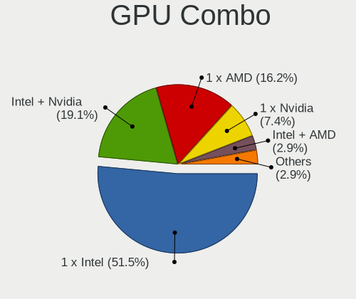

| Name           | Notebooks | Percent |
|----------------|-----------|---------|
| 1 x Intel      | 35        | 51.47%  |
| Intel + Nvidia | 13        | 19.12%  |
| 1 x AMD        | 11        | 16.18%  |
| 1 x Nvidia     | 5         | 7.35%   |
| Intel + AMD    | 2         | 2.94%   |
| 2 x AMD        | 1         | 1.47%   |
| AMD + Nvidia   | 1         | 1.47%   |

GPU Driver
----------

Free vs proprietary

| Driver      | Notebooks | Percent |
|-------------|-----------|---------|
| Free        | 62        | 89.86%  |
| Proprietary | 6         | 8.7%    |
| Unknown     | 1         | 1.45%   |

GPU Memory
----------

Total video memory

| Size in GB | Notebooks | Percent |
|------------|-----------|---------|
| Unknown    | 43        | 62.32%  |
| 0.01-0.5   | 10        | 14.49%  |
| 1.01-2.0   | 5         | 7.25%   |
| 5.01-6.0   | 4         | 5.8%    |
| 3.01-4.0   | 4         | 5.8%    |
| 0.51-1.0   | 3         | 4.35%   |

Monitor
-------

Monitor Vendor
--------------

Monitor vendors

| Vendor                  | Notebooks | Percent |
|-------------------------|-----------|---------|
| BOE                     | 15        | 20.83%  |
| AU Optronics            | 15        | 20.83%  |
| LG Display              | 12        | 16.67%  |
| Samsung Electronics     | 7         | 9.72%   |
| Chimei Innolux          | 7         | 9.72%   |
| PANDA                   | 4         | 5.56%   |
| InfoVision              | 3         | 4.17%   |
| Sharp                   | 2         | 2.78%   |
| Chi Mei Optoelectronics | 2         | 2.78%   |
| Seiki                   | 1         | 1.39%   |
| Lenovo                  | 1         | 1.39%   |
| HannStar                | 1         | 1.39%   |
| Dell                    | 1         | 1.39%   |
| BenQ                    | 1         | 1.39%   |

Monitor Model
-------------

Monitor models

| Model                                                                 | Notebooks | Percent |
|-----------------------------------------------------------------------|-----------|---------|
| BOE LCD Monitor BOE0812 1920x1080 344x194mm 15.5-inch                 | 2         | 2.74%   |
| AU Optronics LCD Monitor AUO45EC 1366x768 344x193mm 15.5-inch         | 2         | 2.74%   |
| AU Optronics LCD Monitor AUO203D 1920x1080 309x174mm 14.0-inch        | 2         | 2.74%   |
| Sharp LCD Monitor SHP144A 3200x1800 294x165mm 13.3-inch               | 1         | 1.37%   |
| Sharp LC-32LB480U SHP3263 1920x1080 698x392mm 31.5-inch               | 1         | 1.37%   |
| Seiki SC32HT04 SEK1366 1366x768 700x390mm 31.5-inch                   | 1         | 1.37%   |
| Samsung Electronics S22F350 SAM0D1A 1920x1080 477x268mm 21.5-inch     | 1         | 1.37%   |
| Samsung Electronics LCD Monitor SEC544B 1600x900 382x215mm 17.3-inch  | 1         | 1.37%   |
| Samsung Electronics LCD Monitor SEC4252 1366x768 344x194mm 15.5-inch  | 1         | 1.37%   |
| Samsung Electronics LCD Monitor SEC3030 1024x600 223x125mm 10.1-inch  | 1         | 1.37%   |
| Samsung Electronics LCD Monitor SDC4164 3840x2400 344x215mm 16.0-inch | 1         | 1.37%   |
| Samsung Electronics LCD Monitor SDC4142 3840x2160 294x165mm 13.3-inch | 1         | 1.37%   |
| Samsung Electronics LCD Monitor SDC4141 1366x768 344x194mm 15.5-inch  | 1         | 1.37%   |
| PANDA LCD Monitor NCP0058 1920x1080 344x194mm 15.5-inch               | 1         | 1.37%   |
| PANDA LCD Monitor NCP004A 1920x1080 309x174mm 14.0-inch               | 1         | 1.37%   |
| PANDA LCD Monitor NCP0040 1920x1080 344x194mm 15.5-inch               | 1         | 1.37%   |
| PANDA LCD Monitor NCP002A 1920x1080 344x194mm 15.5-inch               | 1         | 1.37%   |
| LG Display LCD Monitor LGD0621 1920x1080 382x215mm 17.3-inch          | 1         | 1.37%   |
| LG Display LCD Monitor LGD046F 1920x1080 344x194mm 15.5-inch          | 1         | 1.37%   |
| LG Display LCD Monitor LGD046D 1920x1080 309x174mm 14.0-inch          | 1         | 1.37%   |
| LG Display LCD Monitor LGD0465 1366x768 344x194mm 15.5-inch           | 1         | 1.37%   |
| LG Display LCD Monitor LGD042D 1920x1080 294x165mm 13.3-inch          | 1         | 1.37%   |
| LG Display LCD Monitor LGD03FB 1920x1080 382x215mm 17.3-inch          | 1         | 1.37%   |
| LG Display LCD Monitor LGD038E 1366x768 344x194mm 15.5-inch           | 1         | 1.37%   |
| LG Display LCD Monitor LGD034A 1366x768 345x194mm 15.6-inch           | 1         | 1.37%   |
| LG Display LCD Monitor LGD033A 1366x768 340x190mm 15.3-inch           | 1         | 1.37%   |
| LG Display LCD Monitor LGD0335 1366x768 310x174mm 14.0-inch           | 1         | 1.37%   |
| LG Display LCD Monitor LGD02E3 1366x768 344x194mm 15.5-inch           | 1         | 1.37%   |
| LG Display LCD Monitor LGD02A5 1366x768 345x194mm 15.6-inch           | 1         | 1.37%   |
| Lenovo LCD Monitor LEN406A 1920x1200 367x230mm 17.1-inch              | 1         | 1.37%   |
| InfoVision LCD Monitor IVO8C39 1920x1200 300x190mm 14.0-inch          | 1         | 1.37%   |
| InfoVision LCD Monitor IVO3D41 1920x1080 344x194mm 15.5-inch          | 1         | 1.37%   |
| InfoVision LCD Monitor IVO057D 1920x1080 309x174mm 14.0-inch          | 1         | 1.37%   |
| HannStar LCD Monitor HSD0001 1920x1080 309x174mm 14.0-inch            | 1         | 1.37%   |
| Dell S3221QS DELD107 3840x2160 697x392mm 31.5-inch                    | 1         | 1.37%   |
| Chimei Innolux LCD Monitor CMN15F4 1920x1080 344x193mm 15.5-inch      | 1         | 1.37%   |
| Chimei Innolux LCD Monitor CMN15E7 1920x1080 344x193mm 15.5-inch      | 1         | 1.37%   |
| Chimei Innolux LCD Monitor CMN1510 1920x1080 344x193mm 15.5-inch      | 1         | 1.37%   |
| Chimei Innolux LCD Monitor CMN14D4 1920x1080 309x173mm 13.9-inch      | 1         | 1.37%   |
| Chimei Innolux LCD Monitor CMN14A1 1366x768 309x174mm 14.0-inch       | 1         | 1.37%   |

Monitor Resolution
------------------

Monitor screen resolution

| Resolution        | Notebooks | Percent |
|-------------------|-----------|---------|
| 1920x1080 (FHD)   | 42        | 58.33%  |
| 1366x768 (WXGA)   | 17        | 23.61%  |
| 3840x2160 (4K)    | 3         | 4.17%   |
| 1920x1200 (WUXGA) | 2         | 2.78%   |
| 1600x900 (HD+)    | 2         | 2.78%   |
| 3840x2400         | 1         | 1.39%   |
| 3840x1100         | 1         | 1.39%   |
| 3200x1800 (QHD+)  | 1         | 1.39%   |
| 2560x1600         | 1         | 1.39%   |
| 2160x1350         | 1         | 1.39%   |
| 1280x1024 (SXGA)  | 1         | 1.39%   |

Monitor Diagonal
----------------

Diagonal size in inches

| Inches | Notebooks | Percent |
|--------|-----------|---------|
| 15     | 29        | 39.73%  |
| 13     | 13        | 17.81%  |
| 14     | 12        | 16.44%  |
| 17     | 9         | 12.33%  |
| 31     | 3         | 4.11%   |
| 16     | 2         | 2.74%   |
| 11     | 2         | 2.74%   |
| 24     | 1         | 1.37%   |
| 21     | 1         | 1.37%   |
| 19     | 1         | 1.37%   |

Monitor Width
-------------

Physical width

| Width in mm | Notebooks | Percent |
|-------------|-----------|---------|
| 301-350     | 49        | 68.06%  |
| 351-400     | 10        | 13.89%  |
| 201-300     | 8         | 11.11%  |
| 601-700     | 3         | 4.17%   |
| 501-600     | 1         | 1.39%   |
| 401-500     | 1         | 1.39%   |

Aspect Ratio
------------

Proportional relationship between the width and the height

| Ratio | Notebooks | Percent |
|-------|-----------|---------|
| 16/9  | 61        | 89.71%  |
| 16/10 | 5         | 7.35%   |
| 5/4   | 1         | 1.47%   |
| 3.40  | 1         | 1.47%   |

Monitor Area
------------

Area in inch

| Area in inch | Notebooks | Percent |
|----------------|-----------|---------|
| 101-110        | 29        | 39.73%  |
| 81-90          | 18        | 24.66%  |
| 121-130        | 8         | 10.96%  |
| 71-80          | 6         | 8.22%   |
| 51-60          | 3         | 4.11%   |
| 351-500        | 3         | 4.11%   |
| 201-250        | 2         | 2.74%   |
| 111-120        | 2         | 2.74%   |
| 151-200        | 1         | 1.37%   |
| 131-140        | 1         | 1.37%   |

Pixel Density
-------------

Pixels per inch

| Density       | Notebooks | Percent |
|---------------|-----------|---------|
| 121-160       | 38        | 53.52%  |
| 101-120       | 17        | 23.94%  |
| 161-240       | 6         | 8.45%   |
| More than 240 | 5         | 7.04%   |
| 51-100        | 4         | 5.63%   |
| 1-50          | 1         | 1.41%   |

Multiple Monitors
-----------------

Total monitors connected

| Total | Notebooks | Percent |
|-------|-----------|---------|
| 1     | 60        | 88.24%  |
| 2     | 6         | 8.82%   |
| 0     | 2         | 2.94%   |

Network
-------

Net Controller Vendor
---------------------

Controller vendors

| Vendor                          | Notebooks | Percent |
|---------------------------------|-----------|---------|
| Intel                           | 36        | 34.62%  |
| Realtek Semiconductor           | 31        | 29.81%  |
| Qualcomm Atheros                | 17        | 16.35%  |
| Broadcom Limited                | 4         | 3.85%   |
| Broadcom                        | 4         | 3.85%   |
| TP-Link                         | 2         | 1.92%   |
| Samsung Electronics             | 2         | 1.92%   |
| MediaTek                        | 2         | 1.92%   |
| Sierra Wireless                 | 1         | 0.96%   |
| Ralink Technology               | 1         | 0.96%   |
| Qualcomm Technologies           | 1         | 0.96%   |
| Qualcomm Atheros Communications | 1         | 0.96%   |
| Lenovo                          | 1         | 0.96%   |
| ASIX Electronics                | 1         | 0.96%   |

Net Controller Model
--------------------

Controller models

| Model                                                                  | Notebooks | Percent |
|------------------------------------------------------------------------|-----------|---------|
| Realtek RTL8111/8168/8211/8411 PCI Express Gigabit Ethernet Controller | 19        | 14.73%  |
| Qualcomm Atheros QCA9565 / AR9565 Wireless Network Adapter             | 5         | 3.88%   |
| Realtek RTL8821CE 802.11ac PCIe Wireless Network Adapter               | 4         | 3.1%    |
| Realtek RTL810xE PCI Express Fast Ethernet controller                  | 4         | 3.1%    |
| Qualcomm Atheros QCA9377 802.11ac Wireless Network Adapter             | 4         | 3.1%    |
| Intel Wireless 8265 / 8275                                             | 4         | 3.1%    |
| Intel Wi-Fi 6 AX201                                                    | 4         | 3.1%    |
| Realtek RTL8153 Gigabit Ethernet Adapter                               | 3         | 2.33%   |
| Qualcomm Atheros QCA6174 802.11ac Wireless Network Adapter             | 3         | 2.33%   |
| Intel Wireless 7260                                                    | 3         | 2.33%   |
| Intel Wi-Fi 6 AX200                                                    | 3         | 2.33%   |
| Intel Ethernet Connection (4) I219-LM                                  | 3         | 2.33%   |
| Intel Comet Lake PCH-LP CNVi WiFi                                      | 3         | 2.33%   |
| Realtek RTL8152 Fast Ethernet Adapter                                  | 2         | 1.55%   |
| Qualcomm Atheros AR9485 Wireless Network Adapter                       | 2         | 1.55%   |
| Qualcomm Atheros AR9462 Wireless Network Adapter                       | 2         | 1.55%   |
| Qualcomm Atheros AR8151 v2.0 Gigabit Ethernet                          | 2         | 1.55%   |
| Intel Wi-Fi 6E(802.11ax) AX210/AX1675* 2x2 [Typhoon Peak]              | 2         | 1.55%   |
| Intel Ethernet Connection (10) I219-V                                  | 2         | 1.55%   |
| Intel Comet Lake PCH CNVi WiFi                                         | 2         | 1.55%   |
| Intel Centrino Ultimate-N 6300                                         | 2         | 1.55%   |
| Intel Cannon Lake PCH CNVi WiFi                                        | 2         | 1.55%   |
| Intel 82579LM Gigabit Network Connection (Lewisville)                  | 2         | 1.55%   |
| Intel 82577LM Gigabit Network Connection                               | 2         | 1.55%   |
| TP-Link UE300 10/100/1000 LAN (ethernet mode) [Realtek RTL8153]        | 1         | 0.78%   |
| TP-Link Archer T3U [Realtek RTL8812BU]                                 | 1         | 0.78%   |
| Sierra Wireless Sierra Wireless EM7345 4G LTE                          | 1         | 0.78%   |
| Samsung GT-I9070 (network tethering, USB debugging enabled)            | 1         | 0.78%   |
| Samsung Galaxy series, misc. (tethering mode)                          | 1         | 0.78%   |
| Realtek RTL88x2bu [AC1200 Techkey]                                     | 1         | 0.78%   |
| Realtek RTL8852BE PCIe 802.11ax Wireless Network Controller            | 1         | 0.78%   |
| Realtek RTL8822CE 802.11ac PCIe Wireless Network Adapter               | 1         | 0.78%   |
| Realtek RTL8822BE 802.11a/b/g/n/ac WiFi adapter                        | 1         | 0.78%   |
| Realtek RTL8814AU 802.11a/b/g/n/ac Wireless Adapter                    | 1         | 0.78%   |
| Realtek RTL8723DE Wireless Network Adapter                             | 1         | 0.78%   |
| Realtek RTL8723BE PCIe Wireless Network Adapter                        | 1         | 0.78%   |
| Realtek RTL8191SEvB Wireless LAN Controller                            | 1         | 0.78%   |
| Realtek RTL8125 2.5GbE Controller                                      | 1         | 0.78%   |
| Ralink MT7601U Wireless Adapter                                        | 1         | 0.78%   |
| Qualcomm WCN785x Wi-Fi 7(802.11be) 320MHz 2x2 [FastConnect 7800]       | 1         | 0.78%   |

Wireless Vendor
---------------

Wireless vendors

| Vendor                          | Notebooks | Percent |
|---------------------------------|-----------|---------|
| Intel                           | 34        | 46.58%  |
| Qualcomm Atheros                | 16        | 21.92%  |
| Realtek Semiconductor           | 12        | 16.44%  |
| Broadcom                        | 3         | 4.11%   |
| Broadcom Limited                | 2         | 2.74%   |
| TP-Link                         | 1         | 1.37%   |
| Sierra Wireless                 | 1         | 1.37%   |
| Ralink Technology               | 1         | 1.37%   |
| Qualcomm Technologies           | 1         | 1.37%   |
| Qualcomm Atheros Communications | 1         | 1.37%   |
| MediaTek                        | 1         | 1.37%   |

Wireless Model
--------------

Wireless models

| Model                                                            | Notebooks | Percent |
|------------------------------------------------------------------|-----------|---------|
| Qualcomm Atheros QCA9565 / AR9565 Wireless Network Adapter       | 5         | 6.85%   |
| Realtek RTL8821CE 802.11ac PCIe Wireless Network Adapter         | 4         | 5.48%   |
| Qualcomm Atheros QCA9377 802.11ac Wireless Network Adapter       | 4         | 5.48%   |
| Intel Wireless 8265 / 8275                                       | 4         | 5.48%   |
| Intel Wi-Fi 6 AX201                                              | 4         | 5.48%   |
| Qualcomm Atheros QCA6174 802.11ac Wireless Network Adapter       | 3         | 4.11%   |
| Intel Wireless 7260                                              | 3         | 4.11%   |
| Intel Wi-Fi 6 AX200                                              | 3         | 4.11%   |
| Intel Comet Lake PCH-LP CNVi WiFi                                | 3         | 4.11%   |
| Qualcomm Atheros AR9485 Wireless Network Adapter                 | 2         | 2.74%   |
| Qualcomm Atheros AR9462 Wireless Network Adapter                 | 2         | 2.74%   |
| Intel Wi-Fi 6E(802.11ax) AX210/AX1675* 2x2 [Typhoon Peak]        | 2         | 2.74%   |
| Intel Comet Lake PCH CNVi WiFi                                   | 2         | 2.74%   |
| Intel Centrino Ultimate-N 6300                                   | 2         | 2.74%   |
| Intel Cannon Lake PCH CNVi WiFi                                  | 2         | 2.74%   |
| TP-Link Archer T3U [Realtek RTL8812BU]                           | 1         | 1.37%   |
| Sierra Wireless Sierra Wireless EM7345 4G LTE                    | 1         | 1.37%   |
| Realtek RTL88x2bu [AC1200 Techkey]                               | 1         | 1.37%   |
| Realtek RTL8852BE PCIe 802.11ax Wireless Network Controller      | 1         | 1.37%   |
| Realtek RTL8822CE 802.11ac PCIe Wireless Network Adapter         | 1         | 1.37%   |
| Realtek RTL8822BE 802.11a/b/g/n/ac WiFi adapter                  | 1         | 1.37%   |
| Realtek RTL8814AU 802.11a/b/g/n/ac Wireless Adapter              | 1         | 1.37%   |
| Realtek RTL8723DE Wireless Network Adapter                       | 1         | 1.37%   |
| Realtek RTL8723BE PCIe Wireless Network Adapter                  | 1         | 1.37%   |
| Realtek RTL8191SEvB Wireless LAN Controller                      | 1         | 1.37%   |
| Ralink MT7601U Wireless Adapter                                  | 1         | 1.37%   |
| Qualcomm WCN785x Wi-Fi 7(802.11be) 320MHz 2x2 [FastConnect 7800] | 1         | 1.37%   |
| Qualcomm Atheros AR9271 802.11n                                  | 1         | 1.37%   |
| MediaTek MT7663 802.11ac PCI Express Wireless Network Adapter    | 1         | 1.37%   |
| Intel Wireless 7265                                              | 1         | 1.37%   |
| Intel Wireless 3165                                              | 1         | 1.37%   |
| Intel Raptor Lake PCH CNVi WiFi                                  | 1         | 1.37%   |
| Intel Ice Lake-LP PCH CNVi WiFi                                  | 1         | 1.37%   |
| Intel Centrino Wireless-N 2230                                   | 1         | 1.37%   |
| Intel Centrino Wireless-N 1030 [Rainbow Peak]                    | 1         | 1.37%   |
| Intel Centrino Advanced-N 6205 [Taylor Peak]                     | 1         | 1.37%   |
| Intel Cannon Point-LP CNVi [Wireless-AC]                         | 1         | 1.37%   |
| Intel Alder Lake-P PCH CNVi WiFi                                 | 1         | 1.37%   |
| Broadcom Limited BCM43224 802.11a/b/g/n                          | 1         | 1.37%   |
| Broadcom Limited BCM4313 802.11bgn Wireless Network Adapter      | 1         | 1.37%   |

Ethernet Vendor
---------------

Ethernet vendors

| Vendor                | Notebooks | Percent |
|-----------------------|-----------|---------|
| Realtek Semiconductor | 28        | 51.85%  |
| Intel                 | 15        | 27.78%  |
| Qualcomm Atheros      | 3         | 5.56%   |
| Broadcom Limited      | 2         | 3.7%    |
| TP-Link               | 1         | 1.85%   |
| Samsung Electronics   | 1         | 1.85%   |
| MediaTek              | 1         | 1.85%   |
| Lenovo                | 1         | 1.85%   |
| Broadcom              | 1         | 1.85%   |
| ASIX Electronics      | 1         | 1.85%   |

Ethernet Model
--------------

Ethernet models

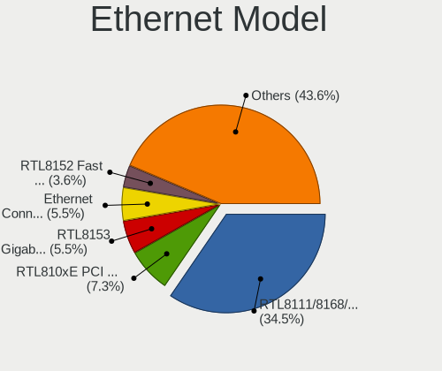

| Model                                                                  | Notebooks | Percent |
|------------------------------------------------------------------------|-----------|---------|
| Realtek RTL8111/8168/8211/8411 PCI Express Gigabit Ethernet Controller | 19        | 34.55%  |
| Realtek RTL810xE PCI Express Fast Ethernet controller                  | 4         | 7.27%   |
| Realtek RTL8153 Gigabit Ethernet Adapter                               | 3         | 5.45%   |
| Intel Ethernet Connection (4) I219-LM                                  | 3         | 5.45%   |
| Realtek RTL8152 Fast Ethernet Adapter                                  | 2         | 3.64%   |
| Qualcomm Atheros AR8151 v2.0 Gigabit Ethernet                          | 2         | 3.64%   |
| Intel Ethernet Connection (10) I219-V                                  | 2         | 3.64%   |
| Intel 82579LM Gigabit Network Connection (Lewisville)                  | 2         | 3.64%   |
| Intel 82577LM Gigabit Network Connection                               | 2         | 3.64%   |
| TP-Link UE300 10/100/1000 LAN (ethernet mode) [Realtek RTL8153]        | 1         | 1.82%   |
| Samsung Galaxy series, misc. (tethering mode)                          | 1         | 1.82%   |
| Realtek RTL8125 2.5GbE Controller                                      | 1         | 1.82%   |
| Qualcomm Atheros AR8162 Fast Ethernet                                  | 1         | 1.82%   |
| MediaTek TANK2                                                         | 1         | 1.82%   |
| Lenovo Lenovo USB-C to LAN                                             | 1         | 1.82%   |
| Intel Ethernet Connection I218-LM                                      | 1         | 1.82%   |
| Intel Ethernet Connection I217-LM                                      | 1         | 1.82%   |
| Intel Ethernet Connection (6) I219-V                                   | 1         | 1.82%   |
| Intel Ethernet Connection (4) I219-V                                   | 1         | 1.82%   |
| Intel Ethernet Connection (16) I219-V                                  | 1         | 1.82%   |
| Intel Ethernet Connection (14) I219-LM                                 | 1         | 1.82%   |
| Broadcom NetLink BCM57785 Gigabit Ethernet PCIe                        | 1         | 1.82%   |
| Broadcom Limited NetXtreme BCM5761 Gigabit Ethernet PCIe               | 1         | 1.82%   |
| Broadcom Limited NetLink BCM57780 Gigabit Ethernet PCIe                | 1         | 1.82%   |
| ASIX AX88179 Gigabit Ethernet                                          | 1         | 1.82%   |

Net Controller Kind
-------------------

Ethernet, WiFi or modem

| Kind     | Notebooks | Percent |
|----------|-----------|---------|
| WiFi     | 68        | 55.74%  |
| Ethernet | 53        | 43.44%  |
| Modem    | 1         | 0.82%   |

Used Controller
---------------

Currently used network controller

| Kind     | Notebooks | Percent |
|----------|-----------|---------|
| WiFi     | 51        | 68%     |
| Ethernet | 24        | 32%     |

NICs
----

Total network controllers on board

| Total | Notebooks | Percent |
|-------|-----------|---------|
| 2     | 45        | 66.18%  |
| 1     | 22        | 32.35%  |
| 0     | 1         | 1.47%   |

IPv6
----

IPv6 vs IPv4

| Used | Notebooks | Percent |
|------|-----------|---------|
| No   | 49        | 71.01%  |
| Yes  | 20        | 28.99%  |

Bluetooth
---------

Bluetooth Vendor
----------------

Controller vendors

| Vendor                          | Notebooks | Percent |
|---------------------------------|-----------|---------|
| Intel                           | 29        | 49.15%  |
| Realtek Semiconductor           | 9         | 15.25%  |
| Qualcomm Atheros Communications | 8         | 13.56%  |
| Foxconn / Hon Hai               | 4         | 6.78%   |
| IMC Networks                    | 3         | 5.08%   |
| Broadcom                        | 3         | 5.08%   |
| Lite-On Technology              | 2         | 3.39%   |
| Cambridge Silicon Radio         | 1         | 1.69%   |

Bluetooth Model
---------------

Controller models

| Model                                               | Notebooks | Percent |
|-----------------------------------------------------|-----------|---------|
| Intel AX201 Bluetooth                               | 9         | 15.25%  |
| Intel Bluetooth wireless interface                  | 8         | 13.56%  |
| Realtek Bluetooth Radio                             | 7         | 11.86%  |
| Qualcomm Atheros  Bluetooth Device                  | 6         | 10.17%  |
| Intel Bluetooth 9460/9560 Jefferson Peak (JfP)      | 4         | 6.78%   |
| Intel AX200 Bluetooth                               | 3         | 5.08%   |
| Foxconn / Hon Hai Bluetooth Device                  | 3         | 5.08%   |
| Intel AX210 Bluetooth                               | 2         | 3.39%   |
| IMC Networks Bluetooth Device                       | 2         | 3.39%   |
| Realtek RTL8822BE Bluetooth 4.2 Adapter             | 1         | 1.69%   |
| Realtek  Bluetooth 4.2 Adapter                      | 1         | 1.69%   |
| Qualcomm Atheros QCA61x4 Bluetooth 4.0              | 1         | 1.69%   |
| Qualcomm Atheros AR3012 Bluetooth 4.0               | 1         | 1.69%   |
| Lite-On Wireless_Device                             | 1         | 1.69%   |
| Lite-On Bluetooth Device                            | 1         | 1.69%   |
| Intel Centrino Bluetooth Wireless Transceiver       | 1         | 1.69%   |
| Intel Centrino Advanced-N 6230 Bluetooth adapter    | 1         | 1.69%   |
| Intel AX211 Bluetooth                               | 1         | 1.69%   |
| IMC Networks Atheros AR3012 Bluetooth 4.0 Adapter   | 1         | 1.69%   |
| Foxconn / Hon Hai Broadcom BCM20702 Bluetooth       | 1         | 1.69%   |
| Cambridge Silicon Radio Bluetooth Dongle (HCI mode) | 1         | 1.69%   |
| Broadcom HP Portable SoftSailing                    | 1         | 1.69%   |
| Broadcom BCM43142A0 Bluetooth Device                | 1         | 1.69%   |
| Broadcom BCM2045B (BDC-2.1)                         | 1         | 1.69%   |

Sound
-----

Sound Vendor
------------

Sound card vendors

| Vendor               | Notebooks | Percent |
|----------------------|-----------|---------|
| Intel                | 55        | 66.27%  |
| AMD                  | 13        | 15.66%  |
| Nvidia               | 12        | 14.46%  |
| C-Media Electronics  | 2         | 2.41%   |
| Conrad Electronic SE | 1         | 1.2%    |

Sound Model
-----------

Sound card models

| Model                                                                                             | Notebooks | Percent |
|---------------------------------------------------------------------------------------------------|-----------|---------|
| Intel Sunrise Point-LP HD Audio                                                                   | 9         | 9%      |
| AMD Family 17h/19h/1ah HD Audio Controller                                                        | 8         | 8%      |
| Intel 7 Series/C216 Chipset Family High Definition Audio Controller                               | 7         | 7%      |
| Intel Tiger Lake-LP Smart Sound Technology Audio Controller                                       | 5         | 5%      |
| AMD Family 15h (Models 60h-6fh) Audio Controller                                                  | 5         | 5%      |
| Intel Haswell-ULT HD Audio Controller                                                             | 4         | 4%      |
| Intel 8 Series HD Audio Controller                                                                | 4         | 4%      |
| Intel Comet Lake PCH-LP cAVS                                                                      | 3         | 3%      |
| Intel Cannon Lake PCH cAVS                                                                        | 3         | 3%      |
| AMD Renoir Radeon High Definition Audio Controller                                                | 3         | 3%      |
| AMD Raven/Raven2/Fenghuang HDMI/DP Audio Controller                                               | 3         | 3%      |
| AMD Kabini HDMI/DP Audio                                                                          | 3         | 3%      |
| Nvidia GK107 HDMI Audio Controller                                                                | 2         | 2%      |
| Nvidia GA107 High Definition Audio Controller                                                     | 2         | 2%      |
| Intel Tiger Lake-H HD Audio Controller                                                            | 2         | 2%      |
| Intel Raptor Lake-P/U/H cAVS                                                                      | 2         | 2%      |
| Intel Comet Lake PCH cAVS                                                                         | 2         | 2%      |
| Intel Cannon Point-LP High Definition Audio Controller                                            | 2         | 2%      |
| Intel Atom Processor Z36xxx/Z37xxx Series High Definition Audio Controller                        | 2         | 2%      |
| Intel Alder Lake PCH-P High Definition Audio Controller                                           | 2         | 2%      |
| Intel 6 Series/C200 Series Chipset Family High Definition Audio Controller                        | 2         | 2%      |
| Intel 5 Series/3400 Series Chipset High Definition Audio                                          | 2         | 2%      |
| AMD High Definition Audio Controller                                                              | 2         | 2%      |
| Nvidia TU116 High Definition Audio Controller                                                     | 1         | 1%      |
| Nvidia TU106 High Definition Audio Controller                                                     | 1         | 1%      |
| Nvidia TU104 HD Audio Controller                                                                  | 1         | 1%      |
| Nvidia GP107GL High Definition Audio Controller                                                   | 1         | 1%      |
| Nvidia GK104 HDMI Audio Controller                                                                | 1         | 1%      |
| Nvidia GF108 High Definition Audio Controller                                                     | 1         | 1%      |
| Nvidia GA106 High Definition Audio Controller                                                     | 1         | 1%      |
| Nvidia GA104 High Definition Audio Controller                                                     | 1         | 1%      |
| Intel Wildcat Point-LP High Definition Audio Controller                                           | 1         | 1%      |
| Intel NM10/ICH7 Family High Definition Audio Controller                                           | 1         | 1%      |
| Intel Ice Lake-LP Smart Sound Technology Audio Controller                                         | 1         | 1%      |
| Intel Celeron/Pentium Silver Processor High Definition Audio                                      | 1         | 1%      |
| Intel Broadwell-U Audio Controller                                                                | 1         | 1%      |
| Intel Atom/Celeron/Pentium Processor x5-E8000/J3xxx/N3xxx Series High Definition Audio Controller | 1         | 1%      |
| Intel 82801I (ICH9 Family) HD Audio Controller                                                    | 1         | 1%      |
| Intel 8 Series/C220 Series Chipset High Definition Audio Controller                               | 1         | 1%      |
| Intel 100 Series/C230 Series Chipset Family HD Audio Controller                                   | 1         | 1%      |

Memory
------

Memory Vendor
-------------

Memory module vendors

| Vendor              | Notebooks | Percent |
|---------------------|-----------|---------|
| Samsung Electronics | 14        | 26.92%  |
| SK hynix            | 13        | 25%     |
| Kingston            | 7         | 13.46%  |
| Micron Technology   | 6         | 11.54%  |
| Elpida              | 3         | 5.77%   |
| Unknown (0x0100)    | 1         | 1.92%   |
| Unknown             | 1         | 1.92%   |
| Timetec             | 1         | 1.92%   |
| Smart               | 1         | 1.92%   |
| Nanya Technology    | 1         | 1.92%   |
| GOODRAM             | 1         | 1.92%   |
| Crucial             | 1         | 1.92%   |
| Corsair             | 1         | 1.92%   |
| Unknown             | 1         | 1.92%   |

Memory Model
------------

Memory module models

| Model                                                            | Notebooks | Percent |
|------------------------------------------------------------------|-----------|---------|
| SK hynix RAM HMT351S6EFR8A-PB 4GB SODIMM DDR3 1600MT/s           | 2         | 3.57%   |
| Samsung RAM M471A1K43CB1-CTD 8GB SODIMM DDR4 2667MT/s            | 2         | 3.57%   |
| Samsung RAM M471A1G44BB0-CWE 8GB SODIMM DDR4 3200MT/s            | 2         | 3.57%   |
| Elpida RAM EBJ81UG8EFU0-GN-F 8192MB SODIMM DDR3 1600MT/s         | 2         | 3.57%   |
| Unknown RAM Module 4GB SODIMM DDR3 1600MT/s                      | 1         | 1.79%   |
| Unknown (0x0100) RAM R744G2133S1S 4GB SODIMM DDR4 1866MT/s       | 1         | 1.79%   |
| Timetec RAM SD3-1600 8GB SODIMM DDR3 1600MT/s                    | 1         | 1.79%   |
| Smart RAM SH564128FH8NZPHSCG 4GB SODIMM DDR3 1334MT/s            | 1         | 1.79%   |
| SK hynix RAM HMT451S6BFR8A-PB 4096MB SODIMM DDR3 1600MT/s        | 1         | 1.79%   |
| SK hynix RAM HMT351S6CFR8C-H9 4GB SODIMM DDR3 1333MT/s           | 1         | 1.79%   |
| SK hynix RAM HMT325S6BFR8C-H9 2GB SODIMM DDR3 1333MT/s           | 1         | 1.79%   |
| SK hynix RAM HMAA1GS6CJR6N-XN 8GB SODIMM DDR4 3200MT/s           | 1         | 1.79%   |
| SK hynix RAM HMA851S6DJR6N-XN 4GB SODIMM DDR4 3200MT/s           | 1         | 1.79%   |
| SK hynix RAM HMA851S6CJR6N-VK 4GB Row Of Chips DDR4 1866MT/s     | 1         | 1.79%   |
| SK hynix RAM HMA851S6AFR6N-UH 4GB SODIMM DDR4 2400MT/s           | 1         | 1.79%   |
| SK hynix RAM HMA81GS6MFR8N-UH 8GB SODIMM DDR4 2400MT/s           | 1         | 1.79%   |
| SK hynix RAM HMA81GS6DJR8N-XN 8GB SODIMM DDR4 3200MT/s           | 1         | 1.79%   |
| SK hynix RAM HMA81GS6CJR8N-VK 8GB SODIMM DDR4 2667MT/s           | 1         | 1.79%   |
| SK hynix RAM H9CCNNNBJTALAR-NVD 4GB Row Of Chips LPDDR3 2133MT/s | 1         | 1.79%   |
| SK hynix RAM H58G78BK7BX114 16GB SODIMM LPDDR5 7500MT/s          | 1         | 1.79%   |
| Samsung RAM U6E3S4AA-MGCR 1GB Row Of Chips LPDDR4 4267MT/s       | 1         | 1.79%   |
| Samsung RAM Module 4GB SODIMM DDR3 1600MT/s                      | 1         | 1.79%   |
| Samsung RAM Module 4GB Row Of Chips LPDDR3 2133MT/s              | 1         | 1.79%   |
| Samsung RAM Module 2GB Row Of Chips LPDDR4 4267MT/s              | 1         | 1.79%   |
| Samsung RAM Module 16GB SODIMM DDR4 3200MT/s                     | 1         | 1.79%   |
| Samsung RAM M471B1G73DB0-YK0 8GB SODIMM DDR3 1600MT/s            | 1         | 1.79%   |
| Samsung RAM M471A5244CB0-CTD 4GB Row Of Chips DDR4 2667MT/s      | 1         | 1.79%   |
| Samsung RAM M471A4G43AB1-CWE 32GB SODIMM DDR4 3200MT/s           | 1         | 1.79%   |
| Samsung RAM M471A1K43DB1-CWE 8GB SODIMM DDR4 3200MT/s            | 1         | 1.79%   |
| Samsung RAM M471A1K43DB1-CTD 8GB SODIMM DDR4 2667MT/s            | 1         | 1.79%   |
| Samsung RAM M471A1G44AB0-CTD 8GB SODIMM DDR4 2667MT/s            | 1         | 1.79%   |
| Nanya RAM NT4GC64B8HG0NS-CG 4GB SODIMM DDR3 1334MT/s             | 1         | 1.79%   |
| Micron RAM MT52L1G32D4PG-093 8GB Row Of Chips LPDDR3 2133MT/s    | 1         | 1.79%   |
| Micron RAM 8ATF1G64HZ-3G2R1 8GB SODIMM DDR4 3200MT/s             | 1         | 1.79%   |
| Micron RAM 4ATS2G64HZ-3G2B1 16GB SODIMM DDR4 3200MT/s            | 1         | 1.79%   |
| Micron RAM 4ATF51264HZ-3G2J1 4GB SODIMM DDR4 3200MT/s            | 1         | 1.79%   |
| Micron RAM 4ATF51264HZ-2G6E3 4GB SODIMM DDR4 2667MT/s            | 1         | 1.79%   |
| Micron RAM 4ATF1G64HZ-3G2E2 8GB SODIMM DDR4 3200MT/s             | 1         | 1.79%   |
| Micron RAM 16KTF1G64HZ-1G6P1 8GB SODIMM DDR3 1600MT/s            | 1         | 1.79%   |
| Kingston RAM LV32D4S2S8HD-8 8GB SODIMM DDR4 3200MT/s             | 1         | 1.79%   |

Memory Kind
-----------

Memory module kinds

| Kind   | Notebooks | Percent |
|--------|-----------|---------|
| DDR4   | 20        | 52.63%  |
| DDR3   | 10        | 26.32%  |
| LPDDR3 | 3         | 7.89%   |
| LPDDR5 | 2         | 5.26%   |
| LPDDR4 | 2         | 5.26%   |
| DDR2   | 1         | 2.63%   |

Memory Form Factor
------------------

Physical design of the memory module

| Name         | Notebooks | Percent |
|--------------|-----------|---------|
| SODIMM       | 31        | 79.49%  |
| Row Of Chips | 8         | 20.51%  |

Memory Size
-----------

Memory module size

| Size  | Notebooks | Percent |
|-------|-----------|---------|
| 8192  | 17        | 40.48%  |
| 4096  | 15        | 35.71%  |
| 16384 | 6         | 14.29%  |
| 2048  | 3         | 7.14%   |
| 32768 | 1         | 2.38%   |

Memory Speed
------------

Memory module speed

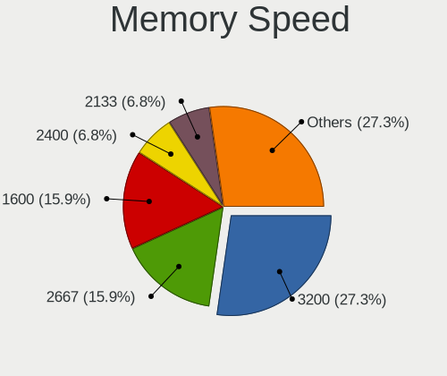

| Speed | Notebooks | Percent |
|-------|-----------|---------|
| 3200  | 12        | 27.27%  |
| 2667  | 7         | 15.91%  |
| 1600  | 7         | 15.91%  |
| 2400  | 3         | 6.82%   |
| 2133  | 3         | 6.82%   |
| 4267  | 2         | 4.55%   |
| 1866  | 2         | 4.55%   |
| 1334  | 2         | 4.55%   |
| 1333  | 2         | 4.55%   |
| 7500  | 1         | 2.27%   |
| 6400  | 1         | 2.27%   |
| 800   | 1         | 2.27%   |
| 667   | 1         | 2.27%   |

Printers & scanners
-------------------

Printer Vendor
--------------

Printer device vendors

Zero info for selected period =(

Printer Model
-------------

Printer device models

Zero info for selected period =(

Scanner Vendor
--------------

Scanner device vendors

Zero info for selected period =(

Scanner Model
-------------

Scanner device models

Zero info for selected period =(

Camera
------

Camera Vendor
-------------

Camera device vendors

| Vendor                                 | Notebooks | Percent |
|----------------------------------------|-----------|---------|
| Chicony Electronics                    | 15        | 24.59%  |
| IMC Networks                           | 9         | 14.75%  |
| Bison Electronics                      | 6         | 9.84%   |
| Realtek Semiconductor                  | 5         | 8.2%    |
| Microdia                               | 4         | 6.56%   |
| Luxvisions Innotech Limited            | 4         | 6.56%   |
| Cheng Uei Precision Industry (Foxlink) | 4         | 6.56%   |
| Syntek                                 | 3         | 4.92%   |
| Suyin                                  | 3         | 4.92%   |
| Sunplus Innovation Technology          | 3         | 4.92%   |
| SunplusIT                              | 1         | 1.64%   |
| Ricoh                                  | 1         | 1.64%   |
| Quanta                                 | 1         | 1.64%   |
| Importek                               | 1         | 1.64%   |
| icSpring                               | 1         | 1.64%   |

Camera Model
------------

Camera device models

| Model                                                       | Notebooks | Percent |
|-------------------------------------------------------------|-----------|---------|
| IMC Networks Integrated Camera                              | 6         | 9.68%   |
| Syntek Integrated Camera                                    | 3         | 4.84%   |
| Chicony HP Truevision HD                                    | 3         | 4.84%   |
| Bison Integrated Camera                                     | 3         | 4.84%   |
| Realtek Integrated_Webcam_HD                                | 2         | 3.23%   |
| Microdia Integrated Webcam HD                               | 2         | 3.23%   |
| Luxvisions Innotech Limited Integrated Camera               | 2         | 3.23%   |
| Chicony Integrated HP HD Webcam                             | 2         | 3.23%   |
| Suyin HP Truevision HD                                      | 1         | 1.61%   |
| Suyin HD WebCam                                             | 1         | 1.61%   |
| Suyin 1.3M WebCam (notebook emachines E730, Acer sub-brand) | 1         | 1.61%   |
| SunplusIT HD Webcam                                         | 1         | 1.61%   |
| Sunplus Laptop_Integrated_Webcam_FHD                        | 1         | 1.61%   |
| Sunplus HD WebCam                                           | 1         | 1.61%   |
| Sunplus ASUS Webcam                                         | 1         | 1.61%   |
| Ricoh Laptop_Integrated_Webcam_FHD                          | 1         | 1.61%   |
| Realtek Integrated Webcam_HD                                | 1         | 1.61%   |
| Realtek Integrated Webcam HD                                | 1         | 1.61%   |
| Realtek EasyCamera                                          | 1         | 1.61%   |
| Quanta ACER HD User Facing                                  | 1         | 1.61%   |
| Microdia Lenovo EasyCamera                                  | 1         | 1.61%   |
| Microdia Integrated_Webcam_HD                               | 1         | 1.61%   |
| Luxvisions Innotech Limited HP TrueVision HD Camera         | 1         | 1.61%   |
| Luxvisions Innotech Limited HP HD Camera                    | 1         | 1.61%   |
| Importek TOSHIBA Web Camera - HD                            | 1         | 1.61%   |
| IMC Networks USB2.0 HD UVC WebCam                           | 1         | 1.61%   |
| IMC Networks USB2.0 HD IR UVC WebCam                        | 1         | 1.61%   |
| IMC Networks HD Camera                                      | 1         | 1.61%   |
| icSpring camera                                             | 1         | 1.61%   |
| Chicony USB2.0 HD UVC WebCam                                | 1         | 1.61%   |
| Chicony TOSHIBA Web Camera - HD                             | 1         | 1.61%   |
| Chicony Lenovo EasyCamera                                   | 1         | 1.61%   |
| Chicony Integrated RGB Camera                               | 1         | 1.61%   |
| Chicony Integrated Camera (1280x720@30)                     | 1         | 1.61%   |
| Chicony HP TrueVision HD Camera                             | 1         | 1.61%   |
| Chicony HD WebCam                                           | 1         | 1.61%   |
| Chicony EasyCamera                                          | 1         | 1.61%   |
| Chicony Chicony USB2.0 Camera                               | 1         | 1.61%   |
| Chicony 8M Camera                                           | 1         | 1.61%   |
| Chicony 720p HD Camera                                      | 1         | 1.61%   |

Security
--------

Fingerprint Vendor
------------------

Fingerprint sensor vendors

| Vendor                     | Notebooks | Percent |
|----------------------------|-----------|---------|
| Validity Sensors           | 8         | 57.14%  |
| Synaptics                  | 3         | 21.43%  |
| Upek                       | 1         | 7.14%   |
| Shenzhen Goodix Technology | 1         | 7.14%   |
| Elan Microelectronics      | 1         | 7.14%   |

Fingerprint Model
-----------------

Fingerprint sensor models

| Model                                                  | Notebooks | Percent |
|--------------------------------------------------------|-----------|---------|
| Validity Sensors VFS5011 Fingerprint Reader            | 2         | 14.29%  |
| Validity Sensors VFS491                                | 2         | 14.29%  |
| Synaptics Metallica MIS Touch Fingerprint Reader       | 2         | 14.29%  |
| Validity Sensors VFS495 Fingerprint Reader             | 1         | 7.14%   |
| Validity Sensors VFS 5011 fingerprint sensor           | 1         | 7.14%   |
| Validity Sensors Swipe Fingerprint Sensor              | 1         | 7.14%   |
| Validity Sensors Fingerprint scanner                   | 1         | 7.14%   |
| Upek Biometric Touchchip/Touchstrip Fingerprint Sensor | 1         | 7.14%   |
| Synaptics UWP WBDI Device                              | 1         | 7.14%   |
| Shenzhen Goodix  Fingerprint Device                    | 1         | 7.14%   |
| Elan ELAN:ARM-M4                                       | 1         | 7.14%   |

Chipcard Vendor
---------------

Chipcard module vendors

| Vendor           | Notebooks | Percent |
|------------------|-----------|---------|
| Broadcom         | 2         | 40%     |
| SCM Microsystems | 1         | 20%     |
| Lenovo           | 1         | 20%     |
| Alcor Micro      | 1         | 20%     |

Chipcard Model
--------------

Chipcard module models

| Model                                                  | Notebooks | Percent |
|--------------------------------------------------------|-----------|---------|
| SCM Microsystems SCR331-LC1 / SCR3310 SmartCard Reader | 1         | 20%     |
| Lenovo Integrated Smart Card Reader                    | 1         | 20%     |
| Broadcom BCM5880 Secure Applications Processor         | 1         | 20%     |
| Broadcom 58200                                         | 1         | 20%     |
| Alcor Micro AU9540 Smartcard Reader                    | 1         | 20%     |

Unsupported
-----------

Unsupported Devices
-------------------

Total unsupported devices on board

| Total | Notebooks | Percent |
|-------|-----------|---------|
| 0     | 36        | 51.43%  |
| 1     | 26        | 37.14%  |
| 2     | 6         | 8.57%   |
| 7     | 1         | 1.43%   |
| 4     | 1         | 1.43%   |

Unsupported Device Types
------------------------

Types of unsupported devices

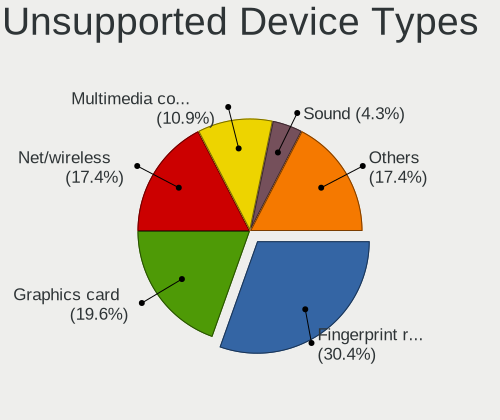

| Type                  | Notebooks | Percent |
|-----------------------|-----------|---------|
| Fingerprint reader    | 14        | 30.43%  |
| Graphics card         | 9         | 19.57%  |
| Net/wireless          | 8         | 17.39%  |
| Multimedia controller | 5         | 10.87%  |
| Sound                 | 2         | 4.35%   |
| Firewire controller   | 2         | 4.35%   |
| Chipcard              | 2         | 4.35%   |
| Bluetooth             | 2         | 4.35%   |
| Storage               | 1         | 2.17%   |
| Camera                | 1         | 2.17%   |

