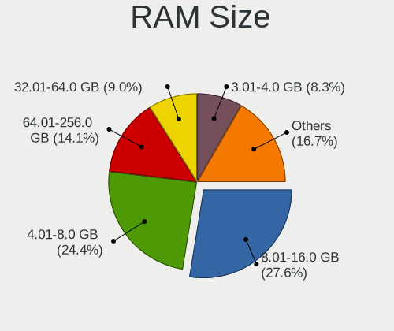
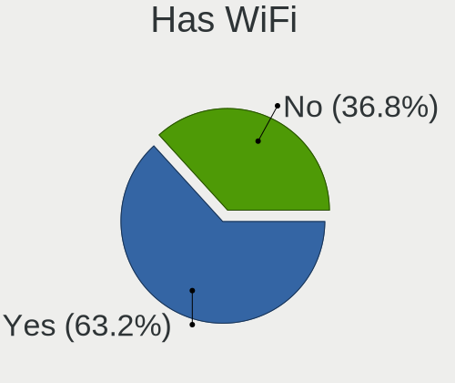
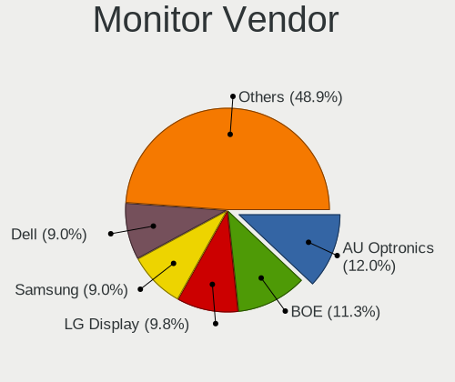

AlmaLinux - Tested Hardware & Statistics
----------------------------------------

A project to collect tested hardware configurations for AlmaLinux.

Anyone can contribute to this report by the [hw-probe](https://github.com/linuxhw/hw-probe) tool:

    sudo -E hw-probe -all -upload

Please contribute! Especially if your hardware is rare.

This is a report for all computer types. See also reports for [desktops](/Dist/AlmaLinux/Desktop/README.md) and [notebooks](/Dist/AlmaLinux/Notebook/README.md).

Contents
--------

* [ Test Cases ](#test-cases)

* [ System ](#system)
  - [ OS                       ](#os)
  - [ OS Family                ](#os-family)
  - [ Kernel                   ](#kernel)
  - [ Kernel Family            ](#kernel-family)
  - [ Kernel Major Ver.        ](#kernel-major-ver)
  - [ Arch                     ](#arch)
  - [ DE                       ](#de)
  - [ Display Server           ](#display-server)
  - [ Display Manager          ](#display-manager)
  - [ OS Lang                  ](#os-lang)
  - [ Boot Mode                ](#boot-mode)
  - [ Filesystem               ](#filesystem)
  - [ Part. scheme             ](#part-scheme)
  - [ Dual Boot with Linux/BSD ](#dual-boot-with-linuxbsd)
  - [ Dual Boot (Win)          ](#dual-boot-win)

* [ Board ](#board)
  - [ Vendor                   ](#vendor)
  - [ Model                    ](#model)
  - [ Model Family             ](#model-family)
  - [ MFG Year                 ](#mfg-year)
  - [ Form Factor              ](#form-factor)
  - [ Secure Boot              ](#secure-boot)
  - [ Coreboot                 ](#coreboot)
  - [ RAM Size                 ](#ram-size)
  - [ RAM Used                 ](#ram-used)
  - [ Total Drives             ](#total-drives)
  - [ Has CD-ROM               ](#has-cd-rom)
  - [ Has Ethernet             ](#has-ethernet)
  - [ Has WiFi                 ](#has-wifi)
  - [ Has Bluetooth            ](#has-bluetooth)

* [ Location ](#location)
  - [ Country                  ](#country)
  - [ City                     ](#city)

* [ Drives ](#drives)
  - [ Drive Vendor             ](#drive-vendor)
  - [ Drive Model              ](#drive-model)
  - [ HDD Vendor               ](#hdd-vendor)
  - [ SSD Vendor               ](#ssd-vendor)
  - [ Drive Kind               ](#drive-kind)
  - [ Drive Connector          ](#drive-connector)
  - [ Drive Size               ](#drive-size)
  - [ Space Total              ](#space-total)
  - [ Space Used               ](#space-used)
  - [ Malfunc. Drives          ](#malfunc-drives)
  - [ Malfunc. Drive Vendor    ](#malfunc-drive-vendor)
  - [ Malfunc. HDD Vendor      ](#malfunc-hdd-vendor)
  - [ Malfunc. Drive Kind      ](#malfunc-drive-kind)
  - [ Failed Drives            ](#failed-drives)
  - [ Failed Drive Vendor      ](#failed-drive-vendor)
  - [ Drive Status             ](#drive-status)

* [ Storage controller ](#storage-controller)
  - [ Storage Vendor           ](#storage-vendor)
  - [ Storage Model            ](#storage-model)
  - [ Storage Kind             ](#storage-kind)

* [ Processor ](#processor)
  - [ CPU Vendor               ](#cpu-vendor)
  - [ CPU Model                ](#cpu-model)
  - [ CPU Model Family         ](#cpu-model-family)
  - [ CPU Cores                ](#cpu-cores)
  - [ CPU Sockets              ](#cpu-sockets)
  - [ CPU Threads              ](#cpu-threads)
  - [ CPU Op-Modes             ](#cpu-op-modes)
  - [ CPU Microcode            ](#cpu-microcode)
  - [ CPU Microarch            ](#cpu-microarch)

* [ Graphics ](#graphics)
  - [ GPU Vendor               ](#gpu-vendor)
  - [ GPU Model                ](#gpu-model)
  - [ GPU Combo                ](#gpu-combo)
  - [ GPU Driver               ](#gpu-driver)
  - [ GPU Memory               ](#gpu-memory)

* [ Monitor ](#monitor)
  - [ Monitor Vendor           ](#monitor-vendor)
  - [ Monitor Model            ](#monitor-model)
  - [ Monitor Resolution       ](#monitor-resolution)
  - [ Monitor Diagonal         ](#monitor-diagonal)
  - [ Monitor Width            ](#monitor-width)
  - [ Aspect Ratio             ](#aspect-ratio)
  - [ Monitor Area             ](#monitor-area)
  - [ Pixel Density            ](#pixel-density)
  - [ Multiple Monitors        ](#multiple-monitors)

* [ Network ](#network)
  - [ Net Controller Vendor    ](#net-controller-vendor)
  - [ Net Controller Model     ](#net-controller-model)
  - [ Wireless Vendor          ](#wireless-vendor)
  - [ Wireless Model           ](#wireless-model)
  - [ Ethernet Vendor          ](#ethernet-vendor)
  - [ Ethernet Model           ](#ethernet-model)
  - [ Net Controller Kind      ](#net-controller-kind)
  - [ Used Controller          ](#used-controller)
  - [ NICs                     ](#nics)
  - [ IPv6                     ](#ipv6)

* [ Bluetooth ](#bluetooth)
  - [ Bluetooth Vendor         ](#bluetooth-vendor)
  - [ Bluetooth Model          ](#bluetooth-model)

* [ Sound ](#sound)
  - [ Sound Vendor             ](#sound-vendor)
  - [ Sound Model              ](#sound-model)

* [ Memory ](#memory)
  - [ Memory Vendor            ](#memory-vendor)
  - [ Memory Model             ](#memory-model)
  - [ Memory Kind              ](#memory-kind)
  - [ Memory Form Factor       ](#memory-form-factor)
  - [ Memory Size              ](#memory-size)
  - [ Memory Speed             ](#memory-speed)

* [ Printers & scanners ](#printers--scanners)
  - [ Printer Vendor           ](#printer-vendor)
  - [ Printer Model            ](#printer-model)
  - [ Scanner Vendor           ](#scanner-vendor)
  - [ Scanner Model            ](#scanner-model)

* [ Camera ](#camera)
  - [ Camera Vendor            ](#camera-vendor)
  - [ Camera Model             ](#camera-model)

* [ Security ](#security)
  - [ Fingerprint Vendor       ](#fingerprint-vendor)
  - [ Fingerprint Model        ](#fingerprint-model)
  - [ Chipcard Vendor          ](#chipcard-vendor)
  - [ Chipcard Model           ](#chipcard-model)

* [ Unsupported ](#unsupported)
  - [ Unsupported Devices      ](#unsupported-devices)
  - [ Unsupported Device Types ](#unsupported-device-types)

Test Cases
----------

Total: 462

| Vendor        | Model                       | Form-Factor | Probe                                                      | Date         |
|---------------|-----------------------------|-------------|------------------------------------------------------------|--------------|
| Supermicro    | H12SSL-i                    | Server      | [726b65d6e8](https://linux-hardware.org/?probe=726b65d6e8) | Jan 06, 2025 |
| ASRockRack    | B650D4U-2L2T/BCM            | Server      | [ee0c91380e](https://linux-hardware.org/?probe=ee0c91380e) | Jan 06, 2025 |
| Pelco by S... | DS-SRV2 S584XF01            | Desktop     | [7ed2a57a58](https://linux-hardware.org/?probe=7ed2a57a58) | Jan 03, 2025 |
| Supermicro    | H12SSL-i                    | Server      | [5dc2296b94](https://linux-hardware.org/?probe=5dc2296b94) | Jan 01, 2025 |
| ASRockRack    | B650D4U-2L2T/BCM            | Server      | [0adfc8ea5f](https://linux-hardware.org/?probe=0adfc8ea5f) | Jan 01, 2025 |
| Supermicro    | H12SSL-i                    | Server      | [e8ffdf8b2d](https://linux-hardware.org/?probe=e8ffdf8b2d) | Dec 31, 2024 |
| ASRockRack    | B650D4U-2L2T/BCM            | Server      | [14044c578b](https://linux-hardware.org/?probe=14044c578b) | Dec 31, 2024 |
| Lenovo        | ThinkPad Yoga 11e 3rd Ge... | Convertible | [4caf6d911a](https://linux-hardware.org/?probe=4caf6d911a) | Dec 23, 2024 |
| Lenovo        | ThinkPad T14s Gen 6 21M1... | Notebook    | [f05b1b8a31](https://linux-hardware.org/?probe=f05b1b8a31) | Dec 21, 2024 |
| Dell          | 0JP3NX A01                  | Desktop     | [8675954a59](https://linux-hardware.org/?probe=8675954a59) | Dec 20, 2024 |
| MSI           | A320M-A PRO MAX             | Desktop     | [f160b8eebe](https://linux-hardware.org/?probe=f160b8eebe) | Dec 16, 2024 |
| Dell          | Vostro 3550                 | Notebook    | [3b5445782a](https://linux-hardware.org/?probe=3b5445782a) | Dec 12, 2024 |
| Dell          | 02C2CP A01                  | Server      | [22ce816d89](https://linux-hardware.org/?probe=22ce816d89) | Dec 05, 2024 |
| ASUSTek       | PRIME B360M-D               | Desktop     | [5bdb93a154](https://linux-hardware.org/?probe=5bdb93a154) | Dec 02, 2024 |
| Raspberry ... | Raspberry Pi                | Soc         | [942f24447b](https://linux-hardware.org/?probe=942f24447b) | Nov 28, 2024 |
| Supermicro    | H12SSL-i                    | Server      | [1e77f8e198](https://linux-hardware.org/?probe=1e77f8e198) | Nov 24, 2024 |
| ASRockRack    | B650D4U-2L2T/BCM            | Server      | [4cc9afa3bf](https://linux-hardware.org/?probe=4cc9afa3bf) | Nov 24, 2024 |
| Supermicro    | H12SSL-i                    | Server      | [359f4d3d30](https://linux-hardware.org/?probe=359f4d3d30) | Nov 23, 2024 |
| ASRockRack    | B650D4U-2L2T/BCM            | Server      | [5408129e26](https://linux-hardware.org/?probe=5408129e26) | Nov 23, 2024 |
| Optimized ... | KVM                         | Desktop     | [672aaf8ea5](https://linux-hardware.org/?probe=672aaf8ea5) | Nov 22, 2024 |
| HUAWEI        | BOD-WXX9                    | Notebook    | [28a641e4dd](https://linux-hardware.org/?probe=28a641e4dd) | Nov 22, 2024 |
| Lenovo        | IdeaPad 3 15IIL05 81WE      | Notebook    | [0a20cf1768](https://linux-hardware.org/?probe=0a20cf1768) | Nov 09, 2024 |
| HP            | Falco                       | Notebook    | [f270f62d2c](https://linux-hardware.org/?probe=f270f62d2c) | Nov 08, 2024 |
| ASUSTek       | ROG Zephyrus GX550LWS_GX... | Notebook    | [a73a429ab8](https://linux-hardware.org/?probe=a73a429ab8) | Oct 27, 2024 |
| Medion        | MS-7616                     | Desktop     | [0c544180a0](https://linux-hardware.org/?probe=0c544180a0) | Oct 23, 2024 |
| HP            | ProLiant DL360p Gen8        | Server      | [df440f3473](https://linux-hardware.org/?probe=df440f3473) | Oct 19, 2024 |
| MACHINIST     | X99-MR9A PRO MAX V5.1       | Desktop     | [d7e2cffa85](https://linux-hardware.org/?probe=d7e2cffa85) | Oct 19, 2024 |
| HP            | 829E                        | Mini pc     | [c3ead56b7b](https://linux-hardware.org/?probe=c3ead56b7b) | Oct 19, 2024 |
| HP            | 829E                        | Mini pc     | [8099eae195](https://linux-hardware.org/?probe=8099eae195) | Oct 19, 2024 |
| Dell          | Latitude 7480               | Notebook    | [83e587119c](https://linux-hardware.org/?probe=83e587119c) | Oct 18, 2024 |
| Dell          | 0K2NWM A00                  | Desktop     | [465d3bfbda](https://linux-hardware.org/?probe=465d3bfbda) | Oct 17, 2024 |
| Supermicro    | H12SSL-i                    | Server      | [217df1294e](https://linux-hardware.org/?probe=217df1294e) | Oct 13, 2024 |
| ASRockRack    | B650D4U-2L2T/BCM            | Server      | [daced3e3e7](https://linux-hardware.org/?probe=daced3e3e7) | Oct 13, 2024 |
| Supermicro    | H12SSL-i                    | Server      | [d9e4d61ee0](https://linux-hardware.org/?probe=d9e4d61ee0) | Oct 12, 2024 |
| ASRockRack    | B650D4U-2L2T/BCM            | Server      | [2437961826](https://linux-hardware.org/?probe=2437961826) | Oct 12, 2024 |
| Supermicro    | H11SSL-i                    | Server      | [6a9553c435](https://linux-hardware.org/?probe=6a9553c435) | Oct 10, 2024 |
| MSI           | Boston                      | Desktop     | [8e086f2e70](https://linux-hardware.org/?probe=8e086f2e70) | Oct 02, 2024 |
| Dell          | 0HD5W2 A01                  | Desktop     | [e21b766bf5](https://linux-hardware.org/?probe=e21b766bf5) | Sep 27, 2024 |
| HP            | 0AA0h                       | Desktop     | [056856286b](https://linux-hardware.org/?probe=056856286b) | Sep 26, 2024 |
| ASUSTek       | Strix 15 GL503GE            | Notebook    | [550001d98f](https://linux-hardware.org/?probe=550001d98f) | Sep 20, 2024 |
| HP            | EliteBook x360 1030 G3      | Convertible | [1f5d5dbaa3](https://linux-hardware.org/?probe=1f5d5dbaa3) | Sep 20, 2024 |
| HP            | ProLiant DL360p Gen8        | Server      | [6fef77f9b0](https://linux-hardware.org/?probe=6fef77f9b0) | Sep 18, 2024 |
| Dell          | 042P49 A02                  | Desktop     | [9f6b43e99e](https://linux-hardware.org/?probe=9f6b43e99e) | Sep 13, 2024 |
| Lenovo        | ThinkPad E15 Gen 4 21E60... | Notebook    | [fa1b825886](https://linux-hardware.org/?probe=fa1b825886) | Sep 10, 2024 |
| Lenovo        | ThinkPad E15 Gen 4 21E60... | Notebook    | [9f2adb4d94](https://linux-hardware.org/?probe=9f2adb4d94) | Sep 10, 2024 |
| Supermicro    | H12SSL-i                    | Server      | [554f4150cf](https://linux-hardware.org/?probe=554f4150cf) | Sep 08, 2024 |
| ASRockRack    | B650D4U-2L2T/BCM            | Server      | [c41f2cc6f8](https://linux-hardware.org/?probe=c41f2cc6f8) | Sep 08, 2024 |
| Supermicro    | H12SSL-i                    | Server      | [ca5b22a774](https://linux-hardware.org/?probe=ca5b22a774) | Sep 07, 2024 |
| ASRockRack    | B650D4U-2L2T/BCM            | Server      | [fffa16b61f](https://linux-hardware.org/?probe=fffa16b61f) | Sep 07, 2024 |
| Supermicro    | X8DTT-H                     | Server      | [3ebf716fae](https://linux-hardware.org/?probe=3ebf716fae) | Sep 05, 2024 |
| HP            | 1791                        | Desktop     | [1bd7f12e61](https://linux-hardware.org/?probe=1bd7f12e61) | Sep 05, 2024 |
| HP            | 1589                        | Desktop     | [a21e698c3c](https://linux-hardware.org/?probe=a21e698c3c) | Sep 05, 2024 |
| Supermicro    | X11DDW-NT                   | Server      | [a9b00d3d78](https://linux-hardware.org/?probe=a9b00d3d78) | Sep 02, 2024 |
| Dell          | 0JP3NX A01                  | Desktop     | [0353987388](https://linux-hardware.org/?probe=0353987388) | Aug 31, 2024 |
| Supermicro    | H13DSG-O-CPU                | Desktop     | [08fd89ae34](https://linux-hardware.org/?probe=08fd89ae34) | Aug 22, 2024 |
| Supermicro    | H13DSG-O-CPU                | Desktop     | [069e34f016](https://linux-hardware.org/?probe=069e34f016) | Aug 20, 2024 |
| Supermicro    | H12SSL-i                    | Server      | [fdf15d2573](https://linux-hardware.org/?probe=fdf15d2573) | Aug 16, 2024 |
| ASRockRack    | B650D4U-2L2T/BCM            | Server      | [86f6e1d447](https://linux-hardware.org/?probe=86f6e1d447) | Aug 16, 2024 |
| Techvision    | TVI7309X B0                 | Desktop     | [5685155a60](https://linux-hardware.org/?probe=5685155a60) | Aug 16, 2024 |
| Techvision    | TVI7309X B0                 | Desktop     | [9285a26f03](https://linux-hardware.org/?probe=9285a26f03) | Aug 15, 2024 |
| Supermicro    | H12SSL-i                    | Server      | [abc943616e](https://linux-hardware.org/?probe=abc943616e) | Aug 15, 2024 |
| ASRockRack    | B650D4U-2L2T/BCM            | Server      | [729a667d33](https://linux-hardware.org/?probe=729a667d33) | Aug 15, 2024 |
| ASUSTek       | GL552VW                     | Notebook    | [2a780be401](https://linux-hardware.org/?probe=2a780be401) | Aug 14, 2024 |
| Supermicro    | H12SSL-i                    | Server      | [d5ba737682](https://linux-hardware.org/?probe=d5ba737682) | Aug 14, 2024 |
| ASRockRack    | B650D4U-2L2T/BCM            | Server      | [ecec20fc93](https://linux-hardware.org/?probe=ecec20fc93) | Aug 14, 2024 |
| Intel         | NUC11PABi7 M68262-501       | Mini pc     | [906cb59c42](https://linux-hardware.org/?probe=906cb59c42) | Aug 08, 2024 |
| Gigabyte      | GA-880GM-USB3L              | Desktop     | [a0a2b265e5](https://linux-hardware.org/?probe=a0a2b265e5) | Aug 06, 2024 |
| HP            | ENVY 15                     | Notebook    | [4b7e703303](https://linux-hardware.org/?probe=4b7e703303) | Jul 10, 2024 |
| Lenovo        | ThinkPad E470c 20H3A013C... | Notebook    | [3a0eb6920e](https://linux-hardware.org/?probe=3a0eb6920e) | Jul 08, 2024 |
| Supermicro    | H12SSL-i                    | Server      | [e92ab633c2](https://linux-hardware.org/?probe=e92ab633c2) | Jul 08, 2024 |
| ASRockRack    | B650D4U-2L2T/BCM            | Server      | [92e71a5472](https://linux-hardware.org/?probe=92e71a5472) | Jul 08, 2024 |
| Supermicro    | H12SSL-i                    | Server      | [dc13005f47](https://linux-hardware.org/?probe=dc13005f47) | Jul 07, 2024 |
| ASRockRack    | B650D4U-2L2T/BCM            | Server      | [51cbdd5f26](https://linux-hardware.org/?probe=51cbdd5f26) | Jul 07, 2024 |
| Lenovo        | ThinkPad W701 2541W12       | Notebook    | [85fd4bfe94](https://linux-hardware.org/?probe=85fd4bfe94) | Jul 06, 2024 |
| MSI           | H110M PRO-VD PLUS           | Desktop     | [3bf15e63ac](https://linux-hardware.org/?probe=3bf15e63ac) | Jun 21, 2024 |
| MSI           | Boston                      | Desktop     | [4b244032d0](https://linux-hardware.org/?probe=4b244032d0) | Jun 19, 2024 |
| MSI           | Boston                      | Desktop     | [5252f63696](https://linux-hardware.org/?probe=5252f63696) | Jun 19, 2024 |
| ASUSTek       | G75VW                       | Notebook    | [ab084dfd84](https://linux-hardware.org/?probe=ab084dfd84) | Jun 19, 2024 |
| Lenovo        | ThinkPad X390 20Q00039CD    | Notebook    | [1a88d526f1](https://linux-hardware.org/?probe=1a88d526f1) | Jun 16, 2024 |
| HP            | ENVY 15                     | Notebook    | [a7591276ca](https://linux-hardware.org/?probe=a7591276ca) | Jun 09, 2024 |
| Raspberry ... | Raspberry Pi                | Soc         | [bd9b9e958e](https://linux-hardware.org/?probe=bd9b9e958e) | Jun 09, 2024 |
| ASRock        | Z790 PG SONIC               | Desktop     | [b5098f47bc](https://linux-hardware.org/?probe=b5098f47bc) | Jun 09, 2024 |
| Gigabyte      | H97-Gaming 3                | Desktop     | [98633fa042](https://linux-hardware.org/?probe=98633fa042) | Jun 08, 2024 |
| Intel         | DH77EB AAG39073-304         | Desktop     | [78e8b0e68e](https://linux-hardware.org/?probe=78e8b0e68e) | Jun 07, 2024 |
| Lenovo        | Kabini CRB NOK              | Desktop     | [f1053f6b0e](https://linux-hardware.org/?probe=f1053f6b0e) | Jun 05, 2024 |
| ASUSTek       | GL552VW                     | Notebook    | [e29deb87ee](https://linux-hardware.org/?probe=e29deb87ee) | May 28, 2024 |
| Lenovo        | Kabini CRB NOK              | Desktop     | [f5c76261aa](https://linux-hardware.org/?probe=f5c76261aa) | May 12, 2024 |
| Supermicro    | H12SSL-i                    | Server      | [0b3a3e7fb3](https://linux-hardware.org/?probe=0b3a3e7fb3) | May 10, 2024 |
| ASRockRack    | B650D4U-2L2T/BCM            | Server      | [7006277703](https://linux-hardware.org/?probe=7006277703) | May 10, 2024 |
| Supermicro    | H12SSL-i                    | Server      | [d5cf0eca85](https://linux-hardware.org/?probe=d5cf0eca85) | May 09, 2024 |
| ASRockRack    | B650D4U-2L2T/BCM            | Server      | [236ac0d0ed](https://linux-hardware.org/?probe=236ac0d0ed) | May 09, 2024 |
| Lenovo        | ThinkPad X1 Nano Gen 1 2... | Notebook    | [c5f9a761a9](https://linux-hardware.org/?probe=c5f9a761a9) | May 05, 2024 |
| ASRockRack    | X570D4I-2T                  | Server      | [fd5c83c424](https://linux-hardware.org/?probe=fd5c83c424) | May 02, 2024 |
| Acer          | Aspire E1-571               | Notebook    | [0f3b954320](https://linux-hardware.org/?probe=0f3b954320) | May 02, 2024 |
| Lenovo        | Kabini CRB NOK              | Desktop     | [dfa3d8f2cd](https://linux-hardware.org/?probe=dfa3d8f2cd) | Apr 29, 2024 |
| Toshiba       | Satellite C50-A             | Notebook    | [cabe5d7a20](https://linux-hardware.org/?probe=cabe5d7a20) | Apr 23, 2024 |
| Haier         | TIGD2-CI                    | Desktop     | [dc4f526a80](https://linux-hardware.org/?probe=dc4f526a80) | Apr 23, 2024 |
| Dell          | 0D441T A01                  | Desktop     | [98b14bc73d](https://linux-hardware.org/?probe=98b14bc73d) | Apr 10, 2024 |
| Supermicro    | H12SSL-i                    | Server      | [ded5f6b3ba](https://linux-hardware.org/?probe=ded5f6b3ba) | Apr 07, 2024 |
| ASRockRack    | B650D4U-2L2T/BCM            | Server      | [4f14a1fb58](https://linux-hardware.org/?probe=4f14a1fb58) | Apr 07, 2024 |
| Supermicro    | H12SSL-i                    | Server      | [f1de845101](https://linux-hardware.org/?probe=f1de845101) | Apr 06, 2024 |
| ASRockRack    | B650D4U-2L2T/BCM            | Server      | [271844c58a](https://linux-hardware.org/?probe=271844c58a) | Apr 06, 2024 |
| Acer          | Aspire A315-59              | Notebook    | [f1c498121d](https://linux-hardware.org/?probe=f1c498121d) | Mar 13, 2024 |
| Gigabyte      | X570 AORUS ULTRA            | Desktop     | [7db787716d](https://linux-hardware.org/?probe=7db787716d) | Mar 12, 2024 |
| ASUSTek       | P6X58D PREMIUM              | Desktop     | [ffc080a6f0](https://linux-hardware.org/?probe=ffc080a6f0) | Mar 09, 2024 |
| ASUSTek       | P6X58D PREMIUM              | Desktop     | [3a33a36874](https://linux-hardware.org/?probe=3a33a36874) | Mar 09, 2024 |
| Toshiba       | Satellite C50-A             | Notebook    | [64c28ad883](https://linux-hardware.org/?probe=64c28ad883) | Mar 05, 2024 |
| Toshiba       | Satellite C50-A             | Notebook    | [2229c82401](https://linux-hardware.org/?probe=2229c82401) | Mar 03, 2024 |
| Dell          | Inspiron 5379               | Notebook    | [43522636f8](https://linux-hardware.org/?probe=43522636f8) | Mar 02, 2024 |
| Lenovo        | ThinkPad T480s 20L70028U... | Notebook    | [3ce277e7b9](https://linux-hardware.org/?probe=3ce277e7b9) | Feb 25, 2024 |
| Supermicro    | H12SSL-i                    | Server      | [c58df8f5e4](https://linux-hardware.org/?probe=c58df8f5e4) | Feb 19, 2024 |
| ASRockRack    | B650D4U-2L2T/BCM            | Server      | [4a75bbf769](https://linux-hardware.org/?probe=4a75bbf769) | Feb 19, 2024 |
| Supermicro    | H12SSL-i                    | Server      | [6745442873](https://linux-hardware.org/?probe=6745442873) | Feb 18, 2024 |
| ASRockRack    | B650D4U-2L2T/BCM            | Server      | [9a9a9f6fb3](https://linux-hardware.org/?probe=9a9a9f6fb3) | Feb 18, 2024 |
| ASUSTek       | GL552VW                     | Notebook    | [3d01ffb3f6](https://linux-hardware.org/?probe=3d01ffb3f6) | Feb 13, 2024 |
| Dell          | Inspiron 5379               | Notebook    | [ac5fe15861](https://linux-hardware.org/?probe=ac5fe15861) | Feb 12, 2024 |
| Supermicro    | H12SSL-i                    | Server      | [6db0b8a8f1](https://linux-hardware.org/?probe=6db0b8a8f1) | Feb 03, 2024 |
| ASRockRack    | B650D4U-2L2T/BCM            | Server      | [00056f1b48](https://linux-hardware.org/?probe=00056f1b48) | Feb 03, 2024 |
| Supermicro    | H12SSL-i                    | Server      | [17031c6aac](https://linux-hardware.org/?probe=17031c6aac) | Feb 02, 2024 |
| ASRockRack    | B650D4U-2L2T/BCM            | Server      | [0fa43445d1](https://linux-hardware.org/?probe=0fa43445d1) | Feb 02, 2024 |
| Supermicro    | H12SSL-i                    | Server      | [f206485d60](https://linux-hardware.org/?probe=f206485d60) | Feb 01, 2024 |
| ASRockRack    | B650D4U-2L2T/BCM            | Server      | [b7bc0cf1ac](https://linux-hardware.org/?probe=b7bc0cf1ac) | Feb 01, 2024 |
| Supermicro    | H12SSL-i                    | Server      | [6849639353](https://linux-hardware.org/?probe=6849639353) | Jan 31, 2024 |
| ASRockRack    | B650D4U-2L2T/BCM            | Server      | [d67b24a21d](https://linux-hardware.org/?probe=d67b24a21d) | Jan 31, 2024 |
| HP            | Falco                       | Notebook    | [9a82a5b9e8](https://linux-hardware.org/?probe=9a82a5b9e8) | Jan 26, 2024 |
| Raspberry ... | Raspberry Pi                | Soc         | [343e08f1a6](https://linux-hardware.org/?probe=343e08f1a6) | Jan 24, 2024 |
| HP            | 89D8 SMVB                   | Desktop     | [61f8c8c9e0](https://linux-hardware.org/?probe=61f8c8c9e0) | Jan 22, 2024 |
| HP            | 89D8 SMVB                   | Desktop     | [3c8308af97](https://linux-hardware.org/?probe=3c8308af97) | Jan 22, 2024 |
| HP            | ENVY 15                     | Notebook    | [95ec6d10d0](https://linux-hardware.org/?probe=95ec6d10d0) | Jan 19, 2024 |
| Acer          | TravelMate 5735Z            | Notebook    | [6d759892ab](https://linux-hardware.org/?probe=6d759892ab) | Jan 12, 2024 |
| Acer          | TravelMate 5735Z            | Notebook    | [2ad65584c2](https://linux-hardware.org/?probe=2ad65584c2) | Jan 11, 2024 |
| Raspberry ... | Raspberry Pi                | Soc         | [8cf8ef7602](https://linux-hardware.org/?probe=8cf8ef7602) | Jan 11, 2024 |
| Optimized ... | KVM                         | Desktop     | [4fe928d059](https://linux-hardware.org/?probe=4fe928d059) | Jan 11, 2024 |
| HP            | Falco                       | Notebook    | [f6a8ee9181](https://linux-hardware.org/?probe=f6a8ee9181) | Jan 11, 2024 |
| Dell          | Precision 5680              | Notebook    | [82dc0a13bb](https://linux-hardware.org/?probe=82dc0a13bb) | Jan 10, 2024 |
| Supermicro    | X8DTT-H                     | Server      | [0fb61ad105](https://linux-hardware.org/?probe=0fb61ad105) | Jan 05, 2024 |
| Supermicro    | H12SSL-i                    | Server      | [ac848615a7](https://linux-hardware.org/?probe=ac848615a7) | Jan 03, 2024 |
| ASRockRack    | B650D4U-2L2T/BCM            | Server      | [0be3bb4773](https://linux-hardware.org/?probe=0be3bb4773) | Jan 03, 2024 |
| Supermicro    | H12SSL-i                    | Server      | [454b403b53](https://linux-hardware.org/?probe=454b403b53) | Jan 02, 2024 |
| ASRockRack    | B650D4U-2L2T/BCM            | Server      | [a1095fd614](https://linux-hardware.org/?probe=a1095fd614) | Jan 02, 2024 |
| Supermicro    | H12SSL-i                    | Server      | [0003baf54d](https://linux-hardware.org/?probe=0003baf54d) | Jan 01, 2024 |
| ASRockRack    | B650D4U-2L2T/BCM            | Server      | [cc645ac529](https://linux-hardware.org/?probe=cc645ac529) | Jan 01, 2024 |
| Supermicro    | H12SSL-i                    | Server      | [ae544239b5](https://linux-hardware.org/?probe=ae544239b5) | Dec 31, 2023 |
| ASRockRack    | B650D4U-2L2T/BCM            | Server      | [b9db9c256b](https://linux-hardware.org/?probe=b9db9c256b) | Dec 31, 2023 |
| Supermicro    | H12SSL-i                    | Server      | [a5f60699ce](https://linux-hardware.org/?probe=a5f60699ce) | Dec 25, 2023 |
| ASRockRack    | B650D4U-2L2T/BCM            | Server      | [b19b947d42](https://linux-hardware.org/?probe=b19b947d42) | Dec 25, 2023 |
| Supermicro    | H12SSL-i                    | Server      | [df01343f10](https://linux-hardware.org/?probe=df01343f10) | Dec 24, 2023 |
| ASRockRack    | B650D4U-2L2T/BCM            | Server      | [346c422237](https://linux-hardware.org/?probe=346c422237) | Dec 24, 2023 |
| ASUSTek       | Pro WS WRX80E-SAGE SE WI... | Desktop     | [aa11af3235](https://linux-hardware.org/?probe=aa11af3235) | Dec 20, 2023 |
| HP            | Elite x2 1012 G2            | Tablet      | [f504f4b8d5](https://linux-hardware.org/?probe=f504f4b8d5) | Dec 19, 2023 |
| HP            | Elite x2 1012 G2            | Tablet      | [f4707e0e75](https://linux-hardware.org/?probe=f4707e0e75) | Dec 19, 2023 |
| Supermicro    | H12SSL-i                    | Server      | [27cd685574](https://linux-hardware.org/?probe=27cd685574) | Dec 18, 2023 |
| ASRockRack    | B650D4U-2L2T/BCM            | Server      | [9a521bb0c9](https://linux-hardware.org/?probe=9a521bb0c9) | Dec 18, 2023 |
| Supermicro    | H12SSL-i                    | Server      | [3b37f8220f](https://linux-hardware.org/?probe=3b37f8220f) | Dec 17, 2023 |
| ASRockRack    | B650D4U-2L2T/BCM            | Server      | [91f9814da4](https://linux-hardware.org/?probe=91f9814da4) | Dec 17, 2023 |
| Timi          | TM1709                      | Notebook    | [f566951fd0](https://linux-hardware.org/?probe=f566951fd0) | Dec 14, 2023 |
| ASUSTek       | Pro WS WRX80E-SAGE SE WI... | Desktop     | [230f41f6b5](https://linux-hardware.org/?probe=230f41f6b5) | Dec 12, 2023 |
| Lenovo        | ThinkPad X1 Carbon 6th 2... | Notebook    | [e5415e7df5](https://linux-hardware.org/?probe=e5415e7df5) | Dec 12, 2023 |
| ASUSTek       | Pro WS WRX80E-SAGE SE WI... | Desktop     | [93675534e1](https://linux-hardware.org/?probe=93675534e1) | Dec 05, 2023 |
| HP            | 0B4Ch D                     | Desktop     | [85c03e03e8](https://linux-hardware.org/?probe=85c03e03e8) | Dec 04, 2023 |
| MSI           | MAG Z790 TOMAHAWK WIFI      | Desktop     | [746c6adb3f](https://linux-hardware.org/?probe=746c6adb3f) | Dec 04, 2023 |
| MSI           | MAG Z790 TOMAHAWK WIFI      | Desktop     | [7eaae92099](https://linux-hardware.org/?probe=7eaae92099) | Dec 04, 2023 |
| AOCWEI        | A2                          | Notebook    | [ac8272a8a8](https://linux-hardware.org/?probe=ac8272a8a8) | Nov 26, 2023 |
| MSI           | MPG Z590 GAMING PLUS        | Desktop     | [d231a15a8f](https://linux-hardware.org/?probe=d231a15a8f) | Nov 22, 2023 |
| Supermicro    | H12SSL-i                    | Server      | [a2c80195ae](https://linux-hardware.org/?probe=a2c80195ae) | Nov 21, 2023 |
| ASRockRack    | B650D4U-2L2T/BCM            | Server      | [1d8266c67b](https://linux-hardware.org/?probe=1d8266c67b) | Nov 21, 2023 |
| Supermicro    | H12SSL-i                    | Server      | [e8e233f240](https://linux-hardware.org/?probe=e8e233f240) | Nov 20, 2023 |
| ASRockRack    | B650D4U-2L2T/BCM            | Server      | [4dbe82fc95](https://linux-hardware.org/?probe=4dbe82fc95) | Nov 20, 2023 |
| Intel         | X99                         | Desktop     | [c07799299c](https://linux-hardware.org/?probe=c07799299c) | Nov 19, 2023 |
| ASRockRack    | B650D4U-2L2T/BCM            | Server      | [ec6ef64584](https://linux-hardware.org/?probe=ec6ef64584) | Nov 18, 2023 |
| Acer          | Aspire E5-553               | Notebook    | [a8349dda46](https://linux-hardware.org/?probe=a8349dda46) | Nov 16, 2023 |
| Dell          | XPS 13 9360                 | Notebook    | [e0bc805f38](https://linux-hardware.org/?probe=e0bc805f38) | Nov 16, 2023 |
| AOCWEI        | A2                          | Notebook    | [1006e22f22](https://linux-hardware.org/?probe=1006e22f22) | Nov 09, 2023 |
| Toshiba       | Satellite C50-A             | Notebook    | [056e939d6d](https://linux-hardware.org/?probe=056e939d6d) | Nov 09, 2023 |
| Toshiba       | Satellite C50-A             | Notebook    | [6c8040c314](https://linux-hardware.org/?probe=6c8040c314) | Nov 08, 2023 |
| Supermicro    | H12SSL-i                    | Server      | [49051e4c14](https://linux-hardware.org/?probe=49051e4c14) | Nov 07, 2023 |
| ASRockRack    | B650D4U-2L2T/BCM            | Server      | [fca6e5bc74](https://linux-hardware.org/?probe=fca6e5bc74) | Nov 07, 2023 |
| Supermicro    | H12SSL-i                    | Server      | [0bcc882e05](https://linux-hardware.org/?probe=0bcc882e05) | Nov 06, 2023 |
| ASRockRack    | B650D4U-2L2T/BCM            | Server      | [963acb5f2b](https://linux-hardware.org/?probe=963acb5f2b) | Nov 06, 2023 |
| MSI           | MPG Z590 GAMING PLUS        | Desktop     | [e3760a331a](https://linux-hardware.org/?probe=e3760a331a) | Oct 31, 2023 |
| Notebook      | NS50_70MU                   | Notebook    | [ad21a28397](https://linux-hardware.org/?probe=ad21a28397) | Oct 28, 2023 |
| Notebook      | NS50_70MU                   | Notebook    | [166a51fa8d](https://linux-hardware.org/?probe=166a51fa8d) | Oct 27, 2023 |
| MSI           | MAG B550M BAZOOKA           | Desktop     | [492563a83c](https://linux-hardware.org/?probe=492563a83c) | Oct 24, 2023 |
| MSI           | MAG B550M BAZOOKA           | Desktop     | [3e4b32b047](https://linux-hardware.org/?probe=3e4b32b047) | Oct 24, 2023 |
| Supermicro    | H12SSL-i                    | Server      | [3880cb8ecf](https://linux-hardware.org/?probe=3880cb8ecf) | Oct 22, 2023 |
| ASRockRack    | B650D4U-2L2T/BCM            | Server      | [7cdd3de48b](https://linux-hardware.org/?probe=7cdd3de48b) | Oct 22, 2023 |
| Supermicro    | H12SSL-i                    | Server      | [8deecaac39](https://linux-hardware.org/?probe=8deecaac39) | Oct 21, 2023 |
| ASRockRack    | B650D4U-2L2T/BCM            | Server      | [a0ebc9b489](https://linux-hardware.org/?probe=a0ebc9b489) | Oct 21, 2023 |
| ASUSTek       | Pro WS WRX80E-SAGE SE WI... | Desktop     | [de8a8232ba](https://linux-hardware.org/?probe=de8a8232ba) | Oct 19, 2023 |
| Dell          | Precision 7760              | Notebook    | [4b42c6c7f1](https://linux-hardware.org/?probe=4b42c6c7f1) | Oct 14, 2023 |
| Gigabyte      | X399 DESIGNARE EX-CF        | Desktop     | [d9bbe8269c](https://linux-hardware.org/?probe=d9bbe8269c) | Oct 10, 2023 |
| Intel         | DH77EB AAG39073-304         | Desktop     | [27ce5f6a61](https://linux-hardware.org/?probe=27ce5f6a61) | Oct 06, 2023 |
| HP            | 81C5 MVB                    | Desktop     | [ccdf9d0cfa](https://linux-hardware.org/?probe=ccdf9d0cfa) | Oct 02, 2023 |
| Supermicro    | H12SSL-i                    | Server      | [527518057b](https://linux-hardware.org/?probe=527518057b) | Oct 02, 2023 |
| ASRockRack    | B650D4U-2L2T/BCM            | Server      | [88e4c09c2f](https://linux-hardware.org/?probe=88e4c09c2f) | Oct 02, 2023 |
| Supermicro    | H12SSL-i                    | Server      | [53fec3f094](https://linux-hardware.org/?probe=53fec3f094) | Oct 01, 2023 |
| ASRockRack    | B650D4U-2L2T/BCM            | Server      | [9115ea465f](https://linux-hardware.org/?probe=9115ea465f) | Oct 01, 2023 |
| Supermicro    | H12SSL-i                    | Server      | [6ce97609be](https://linux-hardware.org/?probe=6ce97609be) | Sep 30, 2023 |
| ASRockRack    | B650D4U-2L2T/BCM            | Server      | [da0e120624](https://linux-hardware.org/?probe=da0e120624) | Sep 30, 2023 |
| ASUSTek       | Pro WS WRX80E-SAGE SE WI... | Desktop     | [7ab6fc6901](https://linux-hardware.org/?probe=7ab6fc6901) | Sep 27, 2023 |
| Supermicro    | H12SSL-i                    | Server      | [1b72177563](https://linux-hardware.org/?probe=1b72177563) | Sep 26, 2023 |
| ASRockRack    | B650D4U-2L2T/BCM            | Server      | [2527f2a9fc](https://linux-hardware.org/?probe=2527f2a9fc) | Sep 26, 2023 |
| Supermicro    | H12SSL-i                    | Server      | [3e533c5366](https://linux-hardware.org/?probe=3e533c5366) | Sep 25, 2023 |
| ASRockRack    | B650D4U-2L2T/BCM            | Server      | [d37c8958bf](https://linux-hardware.org/?probe=d37c8958bf) | Sep 25, 2023 |
| HP            | Laptop 14-ep0xxx            | Notebook    | [ee7b0c8506](https://linux-hardware.org/?probe=ee7b0c8506) | Sep 21, 2023 |
| Lenovo        | G580 20157                  | Notebook    | [9b576274e4](https://linux-hardware.org/?probe=9b576274e4) | Sep 20, 2023 |
| Dell          | Latitude E5420              | Notebook    | [0b1b042a5b](https://linux-hardware.org/?probe=0b1b042a5b) | Sep 19, 2023 |
| HP            | Notebook                    | Notebook    | [c41430992d](https://linux-hardware.org/?probe=c41430992d) | Sep 18, 2023 |
| HP            | 158B                        | Desktop     | [f8385c7d22](https://linux-hardware.org/?probe=f8385c7d22) | Sep 18, 2023 |
| HP            | 158B                        | Desktop     | [986f0c6ba1](https://linux-hardware.org/?probe=986f0c6ba1) | Sep 15, 2023 |
| Supermicro    | H12SSL-i                    | Server      | [ac96127f34](https://linux-hardware.org/?probe=ac96127f34) | Sep 08, 2023 |
| ASRockRack    | B650D4U-2L2T/BCM            | Server      | [779e2ad458](https://linux-hardware.org/?probe=779e2ad458) | Sep 08, 2023 |
| Supermicro    | H12SSL-i                    | Server      | [c0498360ff](https://linux-hardware.org/?probe=c0498360ff) | Sep 07, 2023 |
| ASRockRack    | B650D4U-2L2T/BCM            | Server      | [6cc92a61b2](https://linux-hardware.org/?probe=6cc92a61b2) | Sep 07, 2023 |
| Dell          | Inspiron 5379               | Notebook    | [cafe064514](https://linux-hardware.org/?probe=cafe064514) | Sep 05, 2023 |
| Supermicro    | H12SSL-i                    | Server      | [f06bf24212](https://linux-hardware.org/?probe=f06bf24212) | Sep 05, 2023 |
| ASRockRack    | B650D4U-2L2T/BCM            | Server      | [167ab1eb1c](https://linux-hardware.org/?probe=167ab1eb1c) | Sep 05, 2023 |
| Supermicro    | H12SSL-i                    | Server      | [dc9d1ca231](https://linux-hardware.org/?probe=dc9d1ca231) | Sep 04, 2023 |
| ASRockRack    | B650D4U-2L2T/BCM            | Server      | [b980688633](https://linux-hardware.org/?probe=b980688633) | Sep 04, 2023 |
| ASUSTek       | Rampage V EDITION 10        | Desktop     | [727e431acb](https://linux-hardware.org/?probe=727e431acb) | Sep 03, 2023 |
| Dell          | Inspiron 5379               | Notebook    | [1cbc463a43](https://linux-hardware.org/?probe=1cbc463a43) | Sep 02, 2023 |
| Dell          | Latitude 5490               | Notebook    | [058fba578a](https://linux-hardware.org/?probe=058fba578a) | Aug 20, 2023 |
| Lenovo        | ThinkPad E14 Gen 2 20TBS... | Notebook    | [b7a28997df](https://linux-hardware.org/?probe=b7a28997df) | Aug 15, 2023 |
| Dell          | 00WGD1 A01                  | Server      | [d288d87ab5](https://linux-hardware.org/?probe=d288d87ab5) | Aug 14, 2023 |
| ASRockRack    | B650D4U-2L2T/BCM            | Server      | [d61d7e9135](https://linux-hardware.org/?probe=d61d7e9135) | Aug 14, 2023 |
| Supermicro    | H12SSL-i                    | Server      | [d319474025](https://linux-hardware.org/?probe=d319474025) | Aug 13, 2023 |
| Supermicro    | H12SSL-i                    | Server      | [0b7f8d13d9](https://linux-hardware.org/?probe=0b7f8d13d9) | Aug 12, 2023 |
| ASRockRack    | B650D4U-2L2T/BCM            | Server      | [8a896a42c0](https://linux-hardware.org/?probe=8a896a42c0) | Aug 12, 2023 |
| Supermicro    | H12SSL-i                    | Server      | [b7245ccb6f](https://linux-hardware.org/?probe=b7245ccb6f) | Aug 11, 2023 |
| ASRockRack    | B650D4U-2L2T/BCM            | Server      | [cff9e815b3](https://linux-hardware.org/?probe=cff9e815b3) | Aug 11, 2023 |
| Timi          | RedmiBook 14-APCS           | Notebook    | [d8939be040](https://linux-hardware.org/?probe=d8939be040) | Aug 06, 2023 |
| Supermicro    | H12SSL-i                    | Server      | [35b274571c](https://linux-hardware.org/?probe=35b274571c) | Aug 05, 2023 |
| ASRockRack    | B650D4U-2L2T/BCM            | Server      | [92d07e2cae](https://linux-hardware.org/?probe=92d07e2cae) | Aug 05, 2023 |
| Supermicro    | H12SSL-i                    | Server      | [592e977971](https://linux-hardware.org/?probe=592e977971) | Aug 04, 2023 |
| ASRockRack    | B650D4U-2L2T/BCM            | Server      | [d05269baea](https://linux-hardware.org/?probe=d05269baea) | Aug 04, 2023 |
| Supermicro    | H12SSL-i                    | Server      | [e5659701d5](https://linux-hardware.org/?probe=e5659701d5) | Jul 26, 2023 |
| ASRockRack    | B650D4U-2L2T/BCM            | Server      | [b84ef586e7](https://linux-hardware.org/?probe=b84ef586e7) | Jul 26, 2023 |
| Supermicro    | H12SSL-i                    | Server      | [68cf987c86](https://linux-hardware.org/?probe=68cf987c86) | Jul 25, 2023 |
| ASRockRack    | B650D4U-2L2T/BCM            | Server      | [8dc4e130f9](https://linux-hardware.org/?probe=8dc4e130f9) | Jul 25, 2023 |
| HP            | 17-ak041ur                  | Notebook    | [5881affa24](https://linux-hardware.org/?probe=5881affa24) | Jul 18, 2023 |
| ASRockRack    | X470D4U2-2T                 | Desktop     | [058672ddad](https://linux-hardware.org/?probe=058672ddad) | Jul 18, 2023 |
| ASUSTek       | CROSSHAIR VI HERO           | Desktop     | [2330d7d072](https://linux-hardware.org/?probe=2330d7d072) | Jul 15, 2023 |
| ASRockRack    | B650D4U-2L2T/BCM            | Server      | [757ed62cbc](https://linux-hardware.org/?probe=757ed62cbc) | Jul 14, 2023 |
| ASRockRack    | B650D4U-2L2T/BCM            | Server      | [41261aa128](https://linux-hardware.org/?probe=41261aa128) | Jul 14, 2023 |
| Dell          | Inspiron 5555               | Notebook    | [a63fbcabfb](https://linux-hardware.org/?probe=a63fbcabfb) | Jul 14, 2023 |
| Supermicro    | H12SSL-i                    | Server      | [ab93f5aa6e](https://linux-hardware.org/?probe=ab93f5aa6e) | Jul 09, 2023 |
| ASRockRack    | X470D4U2-2T                 | Desktop     | [59f9ee3ee8](https://linux-hardware.org/?probe=59f9ee3ee8) | Jul 09, 2023 |
| Supermicro    | H12SSL-i                    | Server      | [2ee9eaf9d4](https://linux-hardware.org/?probe=2ee9eaf9d4) | Jul 08, 2023 |
| ASRockRack    | X470D4U2-2T                 | Desktop     | [a686a6eed6](https://linux-hardware.org/?probe=a686a6eed6) | Jul 08, 2023 |
| Gigabyte      | X570S UD                    | Desktop     | [cd368fbd36](https://linux-hardware.org/?probe=cd368fbd36) | Jul 07, 2023 |
| Supermicro    | H12SSL-i                    | Server      | [b7e8961ef5](https://linux-hardware.org/?probe=b7e8961ef5) | Jul 03, 2023 |
| ASRockRack    | X470D4U2-2T                 | Desktop     | [da271abdd3](https://linux-hardware.org/?probe=da271abdd3) | Jul 03, 2023 |
| Supermicro    | H12SSL-i                    | Server      | [2beb4fa40d](https://linux-hardware.org/?probe=2beb4fa40d) | Jul 02, 2023 |
| ASRockRack    | X470D4U2-2T                 | Desktop     | [92bf7e658e](https://linux-hardware.org/?probe=92bf7e658e) | Jul 02, 2023 |
| Dell          | Inspiron 5555               | Notebook    | [011aa45cc1](https://linux-hardware.org/?probe=011aa45cc1) | Jul 01, 2023 |
| Supermicro    | H12SSL-i                    | Server      | [c86548f8aa](https://linux-hardware.org/?probe=c86548f8aa) | Jul 01, 2023 |
| ASRockRack    | X470D4U2-2T                 | Desktop     | [57424619e8](https://linux-hardware.org/?probe=57424619e8) | Jul 01, 2023 |
| ASRockRack    | X470D4U2-2T                 | Desktop     | [70ed50862c](https://linux-hardware.org/?probe=70ed50862c) | Jun 30, 2023 |
| Supermicro    | H12SSL-i                    | Server      | [52b4c086dc](https://linux-hardware.org/?probe=52b4c086dc) | Jun 30, 2023 |
| Dell          | Inspiron 5555               | Notebook    | [7c07dbad40](https://linux-hardware.org/?probe=7c07dbad40) | Jun 29, 2023 |
| Supermicro    | H12SSL-i                    | Server      | [c7e845c965](https://linux-hardware.org/?probe=c7e845c965) | Jun 26, 2023 |
| ASRockRack    | X470D4U2-2T                 | Desktop     | [f36489e090](https://linux-hardware.org/?probe=f36489e090) | Jun 26, 2023 |
| Supermicro    | H12SSL-i                    | Server      | [d56f78f3ca](https://linux-hardware.org/?probe=d56f78f3ca) | Jun 25, 2023 |
| ASRockRack    | X470D4U2-2T                 | Desktop     | [cf3b44c0b6](https://linux-hardware.org/?probe=cf3b44c0b6) | Jun 25, 2023 |
| Supermicro    | H12SSL-i                    | Server      | [2256046a01](https://linux-hardware.org/?probe=2256046a01) | Jun 11, 2023 |
| ASRockRack    | X470D4U2-2T                 | Desktop     | [8738063b30](https://linux-hardware.org/?probe=8738063b30) | Jun 11, 2023 |
| Supermicro    | H12SSL-i                    | Server      | [15fb7b8736](https://linux-hardware.org/?probe=15fb7b8736) | Jun 10, 2023 |
| ASRockRack    | X470D4U2-2T                 | Desktop     | [8e10de95af](https://linux-hardware.org/?probe=8e10de95af) | Jun 10, 2023 |
| Maibenben     | MaiBook X series            | Notebook    | [5ca7ad5fb0](https://linux-hardware.org/?probe=5ca7ad5fb0) | Jun 07, 2023 |
| Supermicro    | H12SSL-i                    | Server      | [a777ee9e06](https://linux-hardware.org/?probe=a777ee9e06) | Jun 06, 2023 |
| ASRockRack    | X470D4U2-2T                 | Desktop     | [9c282e76a6](https://linux-hardware.org/?probe=9c282e76a6) | Jun 06, 2023 |
| Supermicro    | H12SSL-i                    | Server      | [7b384a40ce](https://linux-hardware.org/?probe=7b384a40ce) | Jun 05, 2023 |
| ASRockRack    | X470D4U2-2T                 | Desktop     | [4592ff63f3](https://linux-hardware.org/?probe=4592ff63f3) | Jun 05, 2023 |
| Dell          | Inspiron 5555               | Notebook    | [e14ab40d68](https://linux-hardware.org/?probe=e14ab40d68) | Jun 03, 2023 |
| Supermicro    | H12SSL-i                    | Server      | [1243c65107](https://linux-hardware.org/?probe=1243c65107) | Jun 01, 2023 |
| ASRockRack    | X470D4U2-2T                 | Desktop     | [9a28272d6e](https://linux-hardware.org/?probe=9a28272d6e) | Jun 01, 2023 |
| Supermicro    | H12SSL-i                    | Server      | [15e410d9f7](https://linux-hardware.org/?probe=15e410d9f7) | May 31, 2023 |
| ASRockRack    | X470D4U2-2T                 | Desktop     | [cffbd92b9f](https://linux-hardware.org/?probe=cffbd92b9f) | May 31, 2023 |
| Supermicro    | H12SSL-i                    | Server      | [b1d9682c13](https://linux-hardware.org/?probe=b1d9682c13) | May 30, 2023 |
| ASRockRack    | X470D4U2-2T                 | Desktop     | [399cce0d30](https://linux-hardware.org/?probe=399cce0d30) | May 30, 2023 |
| Supermicro    | H12SSL-i                    | Server      | [15d9c6fce4](https://linux-hardware.org/?probe=15d9c6fce4) | May 29, 2023 |
| ASRockRack    | X470D4U2-2T                 | Desktop     | [531455206b](https://linux-hardware.org/?probe=531455206b) | May 29, 2023 |
| Supermicro    | H12SSL-i                    | Server      | [5726f59661](https://linux-hardware.org/?probe=5726f59661) | May 23, 2023 |
| ASRockRack    | X470D4U2-2T                 | Desktop     | [12a444a75a](https://linux-hardware.org/?probe=12a444a75a) | May 23, 2023 |
| Supermicro    | H12SSL-i                    | Server      | [9cc4cbef4a](https://linux-hardware.org/?probe=9cc4cbef4a) | May 22, 2023 |
| ASRockRack    | X470D4U2-2T                 | Desktop     | [0f9deafb62](https://linux-hardware.org/?probe=0f9deafb62) | May 22, 2023 |
| MSI           | GL75 9SE                    | Notebook    | [7fd4d531c9](https://linux-hardware.org/?probe=7fd4d531c9) | May 18, 2023 |
| Dell          | 0FDY5C A00                  | Desktop     | [3d9b02954b](https://linux-hardware.org/?probe=3d9b02954b) | May 16, 2023 |
| Supermicro    | H12SSL-i                    | Server      | [40aa9853c4](https://linux-hardware.org/?probe=40aa9853c4) | May 15, 2023 |
| ASRockRack    | X470D4U2-2T                 | Desktop     | [465488c540](https://linux-hardware.org/?probe=465488c540) | May 15, 2023 |
| Supermicro    | H12SSL-i                    | Server      | [8d933d6988](https://linux-hardware.org/?probe=8d933d6988) | May 14, 2023 |
| ASRockRack    | X470D4U2-2T                 | Desktop     | [413d3b7b92](https://linux-hardware.org/?probe=413d3b7b92) | May 14, 2023 |
| Supermicro    | H12SSL-i                    | Server      | [f074512a99](https://linux-hardware.org/?probe=f074512a99) | May 13, 2023 |
| ASRockRack    | X470D4U2-2T                 | Desktop     | [2a69d13961](https://linux-hardware.org/?probe=2a69d13961) | May 13, 2023 |
| Supermicro    | H12SSL-i                    | Server      | [afd35343ad](https://linux-hardware.org/?probe=afd35343ad) | May 12, 2023 |
| ASRockRack    | X470D4U2-2T                 | Desktop     | [208afe074a](https://linux-hardware.org/?probe=208afe074a) | May 12, 2023 |
| Supermicro    | H12SSL-i                    | Server      | [ac5899bc10](https://linux-hardware.org/?probe=ac5899bc10) | May 09, 2023 |
| ASRockRack    | X470D4U2-2T                 | Desktop     | [64bd100bb5](https://linux-hardware.org/?probe=64bd100bb5) | May 09, 2023 |
| Supermicro    | H12SSL-i                    | Server      | [55af41b298](https://linux-hardware.org/?probe=55af41b298) | May 08, 2023 |
| ASRockRack    | X470D4U2-2T                 | Desktop     | [28a1f44a1e](https://linux-hardware.org/?probe=28a1f44a1e) | May 08, 2023 |
| Supermicro    | H12SSL-i                    | Server      | [0f5dab42d2](https://linux-hardware.org/?probe=0f5dab42d2) | May 02, 2023 |
| ASRockRack    | X470D4U2-2T                 | Desktop     | [2849b9a200](https://linux-hardware.org/?probe=2849b9a200) | May 02, 2023 |
| Supermicro    | H12SSL-i                    | Server      | [028a3c3b0b](https://linux-hardware.org/?probe=028a3c3b0b) | May 01, 2023 |
| ASRockRack    | X470D4U2-2T                 | Desktop     | [34e7df2c84](https://linux-hardware.org/?probe=34e7df2c84) | May 01, 2023 |
| ASRockRack    | ROMED8-2T                   | Server      | [457abef5d3](https://linux-hardware.org/?probe=457abef5d3) | May 01, 2023 |
| Supermicro    | H12SSL-i                    | Server      | [31789f9473](https://linux-hardware.org/?probe=31789f9473) | Apr 30, 2023 |
| ASRockRack    | X470D4U2-2T                 | Desktop     | [f46e9f6ba7](https://linux-hardware.org/?probe=f46e9f6ba7) | Apr 30, 2023 |
| Supermicro    | H12SSL-i                    | Server      | [be2089d630](https://linux-hardware.org/?probe=be2089d630) | Apr 27, 2023 |
| ASRockRack    | X470D4U2-2T                 | Desktop     | [9fdfb825c7](https://linux-hardware.org/?probe=9fdfb825c7) | Apr 27, 2023 |
| Supermicro    | H12SSL-i                    | Server      | [9465aab832](https://linux-hardware.org/?probe=9465aab832) | Apr 26, 2023 |
| ASRockRack    | X470D4U2-2T                 | Desktop     | [b24f39801d](https://linux-hardware.org/?probe=b24f39801d) | Apr 26, 2023 |
| Dell          | 0FDY5C A00                  | Desktop     | [ddf678b11a](https://linux-hardware.org/?probe=ddf678b11a) | Apr 20, 2023 |
| Intel         | NUC6i5SYB H81131-503        | Mini pc     | [c370821f44](https://linux-hardware.org/?probe=c370821f44) | Apr 17, 2023 |
| ASUSTek       | PRIME B550-PLUS             | Desktop     | [6e9640e9c2](https://linux-hardware.org/?probe=6e9640e9c2) | Apr 15, 2023 |
| Supermicro    | H12SSL-i                    | Server      | [6eb92e0ea0](https://linux-hardware.org/?probe=6eb92e0ea0) | Apr 12, 2023 |
| ASRockRack    | X470D4U2-2T                 | Desktop     | [9dd9a74143](https://linux-hardware.org/?probe=9dd9a74143) | Apr 12, 2023 |
| MSI           | B85-G43                     | Desktop     | [49c7de9ea6](https://linux-hardware.org/?probe=49c7de9ea6) | Apr 08, 2023 |
| HP            | ZBook 17 G2                 | Notebook    | [fc2425ffde](https://linux-hardware.org/?probe=fc2425ffde) | Apr 08, 2023 |
| Supermicro    | H12SSL-i                    | Server      | [ac75c58117](https://linux-hardware.org/?probe=ac75c58117) | Apr 06, 2023 |
| ASRockRack    | X470D4U2-2T                 | Desktop     | [d699519c30](https://linux-hardware.org/?probe=d699519c30) | Apr 06, 2023 |
| Supermicro    | H12SSL-i                    | Server      | [9ef8e7a3d6](https://linux-hardware.org/?probe=9ef8e7a3d6) | Apr 02, 2023 |
| ASRockRack    | X470D4U2-2T                 | Desktop     | [fbd686e3e2](https://linux-hardware.org/?probe=fbd686e3e2) | Apr 02, 2023 |
| Supermicro    | H12SSL-i                    | Server      | [61297d4bc4](https://linux-hardware.org/?probe=61297d4bc4) | Apr 01, 2023 |
| ASRockRack    | X470D4U2-2T                 | Desktop     | [acb0f81194](https://linux-hardware.org/?probe=acb0f81194) | Apr 01, 2023 |
| Supermicro    | X9DRi-LN4+/X9DR3-LN4+       | Desktop     | [3c3474d69b](https://linux-hardware.org/?probe=3c3474d69b) | Mar 28, 2023 |
| Supermicro    | X9DRi-LN4+/X9DR3-LN4+       | Desktop     | [21f6af6f50](https://linux-hardware.org/?probe=21f6af6f50) | Mar 28, 2023 |
| Supermicro    | H12SSL-i                    | Server      | [586decd061](https://linux-hardware.org/?probe=586decd061) | Mar 27, 2023 |
| ASRockRack    | X470D4U2-2T                 | Desktop     | [d96c0cfcd9](https://linux-hardware.org/?probe=d96c0cfcd9) | Mar 27, 2023 |
| Supermicro    | H12SSL-i                    | Server      | [56d537b480](https://linux-hardware.org/?probe=56d537b480) | Mar 26, 2023 |
| ASRockRack    | X470D4U2-2T                 | Desktop     | [da489de02c](https://linux-hardware.org/?probe=da489de02c) | Mar 26, 2023 |
| TUXEDO        | Aura 15 Gen1                | Notebook    | [1584039ca8](https://linux-hardware.org/?probe=1584039ca8) | Mar 24, 2023 |
| TUXEDO        | Aura 15 Gen1                | Notebook    | [a8e6ba1268](https://linux-hardware.org/?probe=a8e6ba1268) | Mar 24, 2023 |
| Supermicro    | H12SSL-i                    | Server      | [0fc5cf1944](https://linux-hardware.org/?probe=0fc5cf1944) | Mar 19, 2023 |
| ASRockRack    | X470D4U2-2T                 | Desktop     | [d21d79ee06](https://linux-hardware.org/?probe=d21d79ee06) | Mar 19, 2023 |
| Lenovo        | ThinkPad P1 Gen 4i 20Y30... | Notebook    | [97af59e728](https://linux-hardware.org/?probe=97af59e728) | Mar 18, 2023 |
| Supermicro    | H12SSL-i                    | Server      | [173e6ad8bf](https://linux-hardware.org/?probe=173e6ad8bf) | Mar 18, 2023 |
| ASRockRack    | X470D4U2-2T                 | Desktop     | [17e455c4df](https://linux-hardware.org/?probe=17e455c4df) | Mar 18, 2023 |
| Supermicro    | H12SSL-i                    | Server      | [43b58e51b4](https://linux-hardware.org/?probe=43b58e51b4) | Mar 12, 2023 |
| ASRockRack    | X470D4U2-2T                 | Desktop     | [7d42741fac](https://linux-hardware.org/?probe=7d42741fac) | Mar 12, 2023 |
| Supermicro    | H12SSL-i                    | Server      | [6b87ac7144](https://linux-hardware.org/?probe=6b87ac7144) | Mar 11, 2023 |
| ASRockRack    | X470D4U2-2T                 | Desktop     | [c5419b8b27](https://linux-hardware.org/?probe=c5419b8b27) | Mar 11, 2023 |
| Supermicro    | H12SSL-i                    | Server      | [f98fe964b2](https://linux-hardware.org/?probe=f98fe964b2) | Mar 07, 2023 |
| ASRockRack    | X470D4U2-2T                 | Desktop     | [70b5b39ce8](https://linux-hardware.org/?probe=70b5b39ce8) | Mar 07, 2023 |
| Supermicro    | H12SSL-i                    | Server      | [da9d93a7ea](https://linux-hardware.org/?probe=da9d93a7ea) | Mar 06, 2023 |
| ASRockRack    | X470D4U2-2T                 | Desktop     | [77ca3b430b](https://linux-hardware.org/?probe=77ca3b430b) | Mar 06, 2023 |
| Supermicro    | H12SSL-i                    | Server      | [81c9f3a796](https://linux-hardware.org/?probe=81c9f3a796) | Mar 04, 2023 |
| ASRockRack    | X470D4U2-2T                 | Desktop     | [a750fc7c24](https://linux-hardware.org/?probe=a750fc7c24) | Mar 04, 2023 |
| Supermicro    | H12SSL-i                    | Server      | [ff1f611cc9](https://linux-hardware.org/?probe=ff1f611cc9) | Mar 03, 2023 |
| ASRockRack    | X470D4U2-2T                 | Desktop     | [0a8ce98d46](https://linux-hardware.org/?probe=0a8ce98d46) | Mar 03, 2023 |
| Supermicro    | H12SSL-i                    | Server      | [975790ee68](https://linux-hardware.org/?probe=975790ee68) | Mar 01, 2023 |
| ASRockRack    | X470D4U2-2T                 | Desktop     | [92300b45fe](https://linux-hardware.org/?probe=92300b45fe) | Mar 01, 2023 |
| Supermicro    | H12SSL-i                    | Server      | [3b0e50edda](https://linux-hardware.org/?probe=3b0e50edda) | Feb 28, 2023 |
| ASRockRack    | X470D4U2-2T                 | Desktop     | [6ccb40f64d](https://linux-hardware.org/?probe=6ccb40f64d) | Feb 28, 2023 |
| Supermicro    | H12SSL-i                    | Server      | [126100b078](https://linux-hardware.org/?probe=126100b078) | Feb 25, 2023 |
| ASRockRack    | X470D4U2-2T                 | Desktop     | [fb42cba088](https://linux-hardware.org/?probe=fb42cba088) | Feb 25, 2023 |
| Google        | Kefka                       | Notebook    | [8142fbc91a](https://linux-hardware.org/?probe=8142fbc91a) | Feb 24, 2023 |
| Supermicro    | H12SSL-i                    | Server      | [6ecc72101c](https://linux-hardware.org/?probe=6ecc72101c) | Feb 24, 2023 |
| ASRockRack    | X470D4U2-2T                 | Desktop     | [59ec61666a](https://linux-hardware.org/?probe=59ec61666a) | Feb 24, 2023 |
| Supermicro    | H12SSL-i                    | Server      | [cf977da464](https://linux-hardware.org/?probe=cf977da464) | Feb 18, 2023 |
| ASRockRack    | X470D4U2-2T                 | Desktop     | [2a2dfe19fc](https://linux-hardware.org/?probe=2a2dfe19fc) | Feb 18, 2023 |
| Supermicro    | H12SSL-i                    | Server      | [0001e56a68](https://linux-hardware.org/?probe=0001e56a68) | Feb 17, 2023 |
| ASRockRack    | X470D4U2-2T                 | Desktop     | [c913edda07](https://linux-hardware.org/?probe=c913edda07) | Feb 17, 2023 |
| Supermicro    | H12SSL-i                    | Server      | [016e12b43e](https://linux-hardware.org/?probe=016e12b43e) | Feb 12, 2023 |
| ASRockRack    | X470D4U2-2T                 | Desktop     | [3e048e046a](https://linux-hardware.org/?probe=3e048e046a) | Feb 12, 2023 |
| Supermicro    | H12SSL-i                    | Server      | [4599836936](https://linux-hardware.org/?probe=4599836936) | Feb 11, 2023 |
| ASRockRack    | X470D4U2-2T                 | Desktop     | [9a81107301](https://linux-hardware.org/?probe=9a81107301) | Feb 11, 2023 |
| HP            | 8455                        | Desktop     | [ffc8587d29](https://linux-hardware.org/?probe=ffc8587d29) | Feb 08, 2023 |
| Supermicro    | H12SSL-i                    | Server      | [84ba50b16d](https://linux-hardware.org/?probe=84ba50b16d) | Feb 08, 2023 |
| ASRockRack    | X470D4U2-2T                 | Desktop     | [0593b2bac6](https://linux-hardware.org/?probe=0593b2bac6) | Feb 08, 2023 |
| Supermicro    | H12SSL-i                    | Server      | [ee7dbe4f81](https://linux-hardware.org/?probe=ee7dbe4f81) | Feb 07, 2023 |
| ASRockRack    | X470D4U2-2T                 | Desktop     | [a019143fe9](https://linux-hardware.org/?probe=a019143fe9) | Feb 07, 2023 |
| AZW           | SER                         | Mini pc     | [dd0c654d95](https://linux-hardware.org/?probe=dd0c654d95) | Feb 04, 2023 |
| Supermicro    | H12SSL-i                    | Server      | [a0f53917f9](https://linux-hardware.org/?probe=a0f53917f9) | Feb 04, 2023 |
| ASRockRack    | X470D4U2-2T                 | Desktop     | [768696d7b8](https://linux-hardware.org/?probe=768696d7b8) | Feb 04, 2023 |
| Supermicro    | H12SSL-i                    | Server      | [04a26e636e](https://linux-hardware.org/?probe=04a26e636e) | Feb 03, 2023 |
| ASRockRack    | X470D4U2-2T                 | Desktop     | [6bb0e68672](https://linux-hardware.org/?probe=6bb0e68672) | Feb 03, 2023 |
| Supermicro    | H12SSL-i                    | Server      | [5b505d5d7a](https://linux-hardware.org/?probe=5b505d5d7a) | Feb 02, 2023 |
| ASRockRack    | X470D4U2-2T                 | Desktop     | [f6ad918c7e](https://linux-hardware.org/?probe=f6ad918c7e) | Feb 02, 2023 |
| Gigabyte      | Z690 GAMING X DDR4          | Desktop     | [21ce876854](https://linux-hardware.org/?probe=21ce876854) | Feb 01, 2023 |
| Supermicro    | H12SSL-i                    | Server      | [cca8d74416](https://linux-hardware.org/?probe=cca8d74416) | Feb 01, 2023 |
| ASRockRack    | X470D4U2-2T                 | Desktop     | [602482d070](https://linux-hardware.org/?probe=602482d070) | Feb 01, 2023 |
| Supermicro    | H12SSL-i                    | Server      | [f0884ec1aa](https://linux-hardware.org/?probe=f0884ec1aa) | Jan 31, 2023 |
| Supermicro    | H12SSL-i                    | Server      | [89430aeb82](https://linux-hardware.org/?probe=89430aeb82) | Jan 31, 2023 |
| ASRockRack    | X470D4U2-2T                 | Desktop     | [af3cf25119](https://linux-hardware.org/?probe=af3cf25119) | Jan 31, 2023 |
| Supermicro    | H12SSL-i                    | Server      | [6d079ed3ca](https://linux-hardware.org/?probe=6d079ed3ca) | Jan 30, 2023 |
| Supermicro    | H12SSL-i                    | Server      | [d81d33bda5](https://linux-hardware.org/?probe=d81d33bda5) | Jan 30, 2023 |
| ASRockRack    | X470D4U2-2T                 | Desktop     | [ec76a40223](https://linux-hardware.org/?probe=ec76a40223) | Jan 30, 2023 |
| ASRock        | B450M Pro4 R2.0             | Desktop     | [e4289105c5](https://linux-hardware.org/?probe=e4289105c5) | Jan 30, 2023 |
| Lenovo        | MAHOBAY Win8 STD MM DPK ... | Desktop     | [ee36c9d395](https://linux-hardware.org/?probe=ee36c9d395) | Jan 30, 2023 |
| Dell          | Inspiron 3501               | Notebook    | [725c2a80f8](https://linux-hardware.org/?probe=725c2a80f8) | Jan 29, 2023 |
| Supermicro    | H12SSL-i                    | Server      | [091b3e37fb](https://linux-hardware.org/?probe=091b3e37fb) | Jan 29, 2023 |
| Supermicro    | H12SSL-i                    | Server      | [49654976af](https://linux-hardware.org/?probe=49654976af) | Jan 29, 2023 |
| ASRockRack    | X470D4U2-2T                 | Desktop     | [6b99585bc0](https://linux-hardware.org/?probe=6b99585bc0) | Jan 29, 2023 |
| Supermicro    | H12SSL-i                    | Server      | [d41a70cbf5](https://linux-hardware.org/?probe=d41a70cbf5) | Jan 28, 2023 |
| Lenovo        | V14-ARE 82DQ                | Notebook    | [9fbcd4b714](https://linux-hardware.org/?probe=9fbcd4b714) | Jan 28, 2023 |
| Supermicro    | H12SSL-i                    | Server      | [af868046e3](https://linux-hardware.org/?probe=af868046e3) | Jan 26, 2023 |
| ASRockRack    | X470D4U2-2T                 | Desktop     | [b9f3d19faa](https://linux-hardware.org/?probe=b9f3d19faa) | Jan 26, 2023 |
| ASUSTek       | TUF Gaming B450-PLUS II     | Desktop     | [df1811bf5d](https://linux-hardware.org/?probe=df1811bf5d) | Jan 26, 2023 |
| Supermicro    | H12SSL-i                    | Server      | [7c026252d0](https://linux-hardware.org/?probe=7c026252d0) | Jan 24, 2023 |
| Supermicro    | H12SSL-i                    | Server      | [bd3f6fa130](https://linux-hardware.org/?probe=bd3f6fa130) | Jan 24, 2023 |
| Supermicro    | H12SSL-i                    | Server      | [477f1a3aad](https://linux-hardware.org/?probe=477f1a3aad) | Jan 24, 2023 |
| ASRockRack    | X470D4U2-2T                 | Desktop     | [71a9255bc8](https://linux-hardware.org/?probe=71a9255bc8) | Jan 24, 2023 |
| ASRockRack    | X470D4U2-2T                 | Desktop     | [e327d1dea4](https://linux-hardware.org/?probe=e327d1dea4) | Jan 24, 2023 |
| ASRockRack    | X470D4U2-2T                 | Desktop     | [f62d0d9183](https://linux-hardware.org/?probe=f62d0d9183) | Jan 24, 2023 |
| ASRock        | B450M Pro4 R2.0             | Desktop     | [ed6204876e](https://linux-hardware.org/?probe=ed6204876e) | Jan 22, 2023 |
| HP            | Falco                       | Notebook    | [a52a8f8f4e](https://linux-hardware.org/?probe=a52a8f8f4e) | Jan 14, 2023 |
| Dell          | Latitude E6510              | Notebook    | [dab9cdc1be](https://linux-hardware.org/?probe=dab9cdc1be) | Jan 11, 2023 |
| Dell          | XPS 13 9365                 | Convertible | [2b4b7560b7](https://linux-hardware.org/?probe=2b4b7560b7) | Jan 10, 2023 |
| HP            | 158A                        | Desktop     | [c0e1c9b6e6](https://linux-hardware.org/?probe=c0e1c9b6e6) | Jan 09, 2023 |
| Lenovo        | IdeaPadFlex 5 14ITL05 82... | Convertible | [56758aeb6f](https://linux-hardware.org/?probe=56758aeb6f) | Jan 07, 2023 |
| Lenovo        | IdeaPadFlex 5 14ITL05 82... | Convertible | [ec3b130618](https://linux-hardware.org/?probe=ec3b130618) | Jan 07, 2023 |
| MSI           | A88X-G45 GAMING             | Desktop     | [891e0757ed](https://linux-hardware.org/?probe=891e0757ed) | Dec 31, 2022 |
| MSI           | A88X-G45 GAMING             | Desktop     | [bdb45edaad](https://linux-hardware.org/?probe=bdb45edaad) | Dec 31, 2022 |
| HP            | Falco                       | Notebook    | [61ce7c6739](https://linux-hardware.org/?probe=61ce7c6739) | Dec 21, 2022 |
| Raspberry ... | Raspberry Pi                | Soc         | [4571b799f0](https://linux-hardware.org/?probe=4571b799f0) | Dec 20, 2022 |
| Optimized ... | KVM                         | Desktop     | [d62625a751](https://linux-hardware.org/?probe=d62625a751) | Dec 13, 2022 |
| HP            | EliteBook 850 G8 Noteboo... | Notebook    | [95d47d14cb](https://linux-hardware.org/?probe=95d47d14cb) | Dec 09, 2022 |
| Lenovo        | B50-30 20382                | Notebook    | [3706f368de](https://linux-hardware.org/?probe=3706f368de) | Nov 24, 2022 |
| Gigabyte      | H81M-D2V                    | Desktop     | [6035f1ee45](https://linux-hardware.org/?probe=6035f1ee45) | Nov 11, 2022 |
| ASUSTek       | Q170M2                      | Desktop     | [c62954095d](https://linux-hardware.org/?probe=c62954095d) | Nov 11, 2022 |
| Lenovo        | Legion Y530-15ICH 81FV      | Notebook    | [832ebcb956](https://linux-hardware.org/?probe=832ebcb956) | Nov 03, 2022 |
| HP            | ProLiant DL360p Gen8        | Server      | [ef43d1f352](https://linux-hardware.org/?probe=ef43d1f352) | Nov 03, 2022 |
| Toshiba       | Satellite L50-C             | Notebook    | [b3e0ff9849](https://linux-hardware.org/?probe=b3e0ff9849) | Nov 01, 2022 |
| Acer          | TMP453-MG                   | Notebook    | [4d36d13ea9](https://linux-hardware.org/?probe=4d36d13ea9) | Oct 01, 2022 |
| Lenovo        | 1052 NOK                    | Desktop     | [28cd1416fe](https://linux-hardware.org/?probe=28cd1416fe) | Sep 22, 2022 |
| Acer          | TravelMate 5735Z            | Notebook    | [b920fce554](https://linux-hardware.org/?probe=b920fce554) | Sep 17, 2022 |
| Raspberry ... | Raspberry Pi                | Soc         | [7e56cce9c8](https://linux-hardware.org/?probe=7e56cce9c8) | Sep 17, 2022 |
| HP            | Falco                       | Notebook    | [5fa86b77d6](https://linux-hardware.org/?probe=5fa86b77d6) | Sep 17, 2022 |
| HP            | Laptop 15-ef1xxx            | Notebook    | [c01403937e](https://linux-hardware.org/?probe=c01403937e) | Sep 08, 2022 |
| HP            | ENVY dv6                    | Notebook    | [e7bc07047b](https://linux-hardware.org/?probe=e7bc07047b) | Aug 24, 2022 |
| Gigabyte      | MP32-AR1-00 01010101        | Server      | [e93d3eae0d](https://linux-hardware.org/?probe=e93d3eae0d) | Jul 20, 2022 |
| HP            | Laptop 17-cp0xxx            | Notebook    | [82b34535ae](https://linux-hardware.org/?probe=82b34535ae) | Jul 06, 2022 |
| ASRock        | B460 Phantom Gaming 4       | Desktop     | [0dc125da55](https://linux-hardware.org/?probe=0dc125da55) | Jul 05, 2022 |
| HP            | EliteBook 8470p             | Notebook    | [d6adb170de](https://linux-hardware.org/?probe=d6adb170de) | Jun 25, 2022 |
| Google        | Kohaku                      | Notebook    | [f43841c5e0](https://linux-hardware.org/?probe=f43841c5e0) | Jun 08, 2022 |
| Google        | Kohaku                      | Notebook    | [740a608274](https://linux-hardware.org/?probe=740a608274) | Jun 08, 2022 |
| Lenovo        | ThinkPad T440s 20ARS32P0... | Notebook    | [100b65a86d](https://linux-hardware.org/?probe=100b65a86d) | Jun 04, 2022 |
| Dell          | 060K5C A06                  | Server      | [c8be539d80](https://linux-hardware.org/?probe=c8be539d80) | May 14, 2022 |
| Lenovo        | ThinkBook 13s-IWL 20R9      | Notebook    | [2fecc1fd76](https://linux-hardware.org/?probe=2fecc1fd76) | Apr 20, 2022 |
| Lenovo        | ThinkPad T14 Gen 1 20S1S... | Notebook    | [5ac68bc542](https://linux-hardware.org/?probe=5ac68bc542) | Mar 16, 2022 |
| Gigabyte      | Z590 AORUS PRO AX           | Desktop     | [a517886d4d](https://linux-hardware.org/?probe=a517886d4d) | Feb 10, 2022 |
| Dell          | 0R4CNN A02                  | Server      | [c701d3a15f](https://linux-hardware.org/?probe=c701d3a15f) | Feb 07, 2022 |
| Intel         | powered classmate PC        | Notebook    | [0585f5b715](https://linux-hardware.org/?probe=0585f5b715) | Dec 12, 2021 |
| Intel         | powered classmate PC        | Notebook    | [9416f348e4](https://linux-hardware.org/?probe=9416f348e4) | Dec 12, 2021 |
| Raspberry ... | Raspberry Pi                | Soc         | [c28c41bdd4](https://linux-hardware.org/?probe=c28c41bdd4) | Nov 05, 2021 |
| Dell          | Inspiron 3185               | Notebook    | [53ac57fbea](https://linux-hardware.org/?probe=53ac57fbea) | Oct 26, 2021 |
| Dell          | Inspiron 3185               | Notebook    | [2c9cec7881](https://linux-hardware.org/?probe=2c9cec7881) | Oct 01, 2021 |
| Lenovo        | Yoga 2 13 20344             | Notebook    | [1a59499d3a](https://linux-hardware.org/?probe=1a59499d3a) | Sep 29, 2021 |
| Lenovo        | IdeaPad S145-15IWL 81MV     | Notebook    | [95a2b3a95d](https://linux-hardware.org/?probe=95a2b3a95d) | Aug 27, 2021 |
| Intel         | NUC8BEB J72692-308          | Mini pc     | [972f935578](https://linux-hardware.org/?probe=972f935578) | Aug 23, 2021 |
| HP            | EliteBook 8570w             | Notebook    | [37e72494a5](https://linux-hardware.org/?probe=37e72494a5) | Jul 29, 2021 |
| ASUSTek       | ASUS EXPERTBOOK B9450FA_... | Notebook    | [cdf0f4017c](https://linux-hardware.org/?probe=cdf0f4017c) | Jul 16, 2021 |
| Lenovo        | IdeaPad Slim 1-14AST-05 ... | Notebook    | [9044b57593](https://linux-hardware.org/?probe=9044b57593) | Jul 11, 2021 |
| Lenovo        | Legion 5 15IMH05H 81Y6      | Notebook    | [21a6135eda](https://linux-hardware.org/?probe=21a6135eda) | Jun 16, 2021 |
| ASUSTek       | M5A78L-M/USB3               | Desktop     | [e5a30a171e](https://linux-hardware.org/?probe=e5a30a171e) | Jun 08, 2021 |
| ASUSTek       | M5A78L-M/USB3               | Desktop     | [043878564d](https://linux-hardware.org/?probe=043878564d) | Jun 08, 2021 |
| Dell          | Inspiron 3185               | Notebook    | [84fa76eb2f](https://linux-hardware.org/?probe=84fa76eb2f) | Apr 20, 2021 |
| Dell          | Inspiron 3185               | Notebook    | [d49edb76fa](https://linux-hardware.org/?probe=d49edb76fa) | Apr 15, 2021 |
| Dell          | Inspiron 3185               | Notebook    | [15b8da5bc1](https://linux-hardware.org/?probe=15b8da5bc1) | Apr 14, 2021 |
| Lenovo        | IdeaPad Slim 1-14AST-05 ... | Notebook    | [f0791eb42d](https://linux-hardware.org/?probe=f0791eb42d) | Mar 30, 2021 |
| HP            | 0AE8h C                     | Desktop     | [b7fd559b13](https://linux-hardware.org/?probe=b7fd559b13) | Mar 24, 2021 |
| Lenovo        | IdeaPad 330-15ARR 81D2      | Notebook    | [8810309035](https://linux-hardware.org/?probe=8810309035) | Mar 24, 2021 |

System
------

OS
--

Installed operating systems

| Name           | Computers | Percent |
|----------------|-----------|---------|
| AlmaLinux 9.4  | 28        | 15.73%  |
| AlmaLinux 9.1  | 21        | 11.8%   |
| AlmaLinux 9.3  | 20        | 11.24%  |
| AlmaLinux 9.2  | 20        | 11.24%  |
| AlmaLinux 8.10 | 14        | 7.87%   |
| AlmaLinux 8.8  | 11        | 6.18%   |
| AlmaLinux 8.6  | 11        | 6.18%   |
| AlmaLinux 8.9  | 10        | 5.62%   |
| AlmaLinux 8.7  | 10        | 5.62%   |
| AlmaLinux 9.0  | 9         | 5.06%   |
| AlmaLinux 8.4  | 9         | 5.06%   |
| AlmaLinux 9.5  | 8         | 4.49%   |
| AlmaLinux 8.3  | 4         | 2.25%   |
| AlmaLinux 8.5  | 3         | 1.69%   |

OS Family
---------

OS without a version

| Name      | Computers | Percent |
|-----------|-----------|---------|
| AlmaLinux | 155       | 100%    |

Kernel
------

Version of the Linux kernel

| Version                       | Computers | Percent |
|-------------------------------|-----------|---------|
| 5.14.0-362.8.1.el9_3.x86_64   | 8         | 3.9%    |
| 5.14.0-284.30.1.el9_2.x86_64  | 8         | 3.9%    |
| 5.14.0-162.6.1.el9_1.x86_64   | 8         | 3.9%    |
| 4.18.0-553.16.1.el8_10.x86_64 | 7         | 3.41%   |
| 4.18.0-425.3.1.el8.x86_64     | 7         | 3.41%   |
| 5.14.0-162.12.1.el9_1.x86_64  | 6         | 2.93%   |
| 4.18.0-553.22.1.el8_10.x86_64 | 6         | 2.93%   |
| 4.18.0-477.27.2.el8_8.x86_64  | 6         | 2.93%   |
| 5.14.0-362.13.1.el9_3.x86_64  | 5         | 2.44%   |
| 5.14.0-284.25.1.el9_2.x86_64  | 5         | 2.44%   |
| 4.18.0-477.21.1.el8_8.x86_64  | 5         | 2.44%   |
| 5.14.0-427.37.1.el9_4.x86_64  | 4         | 1.95%   |
| 5.14.0-427.28.1.el9_4.x86_64  | 4         | 1.95%   |
| 4.18.0-513.9.1.el8_9.x86_64   | 4         | 1.95%   |
| 4.18.0-477.13.1.el8_8.x86_64  | 4         | 1.95%   |
| 5.14.0-70.22.1.el9_0.x86_64   | 3         | 1.46%   |
| 5.14.0-503.15.1.el9_5.x86_64  | 3         | 1.46%   |
| 5.14.0-427.35.1.el9_4.x86_64  | 3         | 1.46%   |
| 5.14.0-427.22.1.el9_4.x86_64  | 3         | 1.46%   |
| 5.14.0-362.24.2.el9_3.x86_64  | 3         | 1.46%   |
| 5.14.0-362.18.1.el9_3.x86_64  | 3         | 1.46%   |
| 5.14.0-284.18.1.el9_2.x86_64  | 3         | 1.46%   |
| 5.14.0-284.11.1.el9_2.x86_64  | 3         | 1.46%   |
| 5.14.0-162.18.1.el9_1.x86_64  | 3         | 1.46%   |
| 4.18.0-372.26.1.el8_6.x86_64  | 3         | 1.46%   |
| 4.18.0-240.15.1.el8_3.x86_64  | 3         | 1.46%   |
| 5.14.0-70.30.1.el9_0.x86_64   | 2         | 0.98%   |
| 5.14.0-70.13.1.el9_0.x86_64   | 2         | 0.98%   |
| 5.14.0-503.16.1.el9_5.x86_64  | 2         | 0.98%   |
| 5.14.0-427.40.1.el9_4.x86_64  | 2         | 0.98%   |
| 5.14.0-427.33.1.el9_4.x86_64  | 2         | 0.98%   |
| 5.14.0-427.31.1.el9_4.x86_64  | 2         | 0.98%   |
| 5.14.0-427.20.1.el9_4.x86_64  | 2         | 0.98%   |
| 5.14.0-162.22.2.el9_1.x86_64  | 2         | 0.98%   |
| 4.18.0-553.8.1.el8_10.x86_64  | 2         | 0.98%   |
| 4.18.0-553.5.1.el8_10.x86_64  | 2         | 0.98%   |
| 4.18.0-553.33.1.el8_10.x86_64 | 2         | 0.98%   |
| 4.18.0-553.27.1.el8_10.x86_64 | 2         | 0.98%   |
| 4.18.0-513.24.1.el8_9.x86_64  | 2         | 0.98%   |
| 4.18.0-513.18.1.el8_9.x86_64  | 2         | 0.98%   |

Kernel Family
-------------

Linux kernel without a distro release

| Version | Computers | Percent |
|---------|-----------|---------|
| 5.14.0  | 93        | 57.41%  |
| 4.18.0  | 53        | 32.72%  |
| 6.9.3   | 1         | 0.62%   |
| 6.9.1   | 1         | 0.62%   |
| 6.8.8   | 1         | 0.62%   |
| 6.8.7   | 1         | 0.62%   |
| 6.6.51  | 1         | 0.62%   |
| 6.6.28  | 1         | 0.62%   |
| 6.4.0   | 1         | 0.62%   |
| 6.3.0   | 1         | 0.62%   |
| 6.1.92  | 1         | 0.62%   |
| 6.1.81  | 1         | 0.62%   |
| 6.1.31  | 1         | 0.62%   |
| 6.1.24  | 1         | 0.62%   |
| 5.4.274 | 1         | 0.62%   |
| 5.4.175 | 1         | 0.62%   |
| 5.15.45 | 1         | 0.62%   |
| 5.10.60 | 1         | 0.62%   |

Kernel Major Ver.
-----------------

Linux kernel major version

| Version | Computers | Percent |
|---------|-----------|---------|
| 5.14    | 93        | 57.41%  |
| 4.18    | 53        | 32.72%  |
| 6.1     | 4         | 2.47%   |
| 6.9     | 2         | 1.23%   |
| 6.8     | 2         | 1.23%   |
| 6.6     | 2         | 1.23%   |
| 5.4     | 2         | 1.23%   |
| 6.4     | 1         | 0.62%   |
| 6.3     | 1         | 0.62%   |
| 5.15    | 1         | 0.62%   |
| 5.10    | 1         | 0.62%   |

Arch
----

OS architecture (x86_64, i586, etc.)

| Name    | Computers | Percent |
|---------|-----------|---------|
| x86_64  | 151       | 97.42%  |
| aarch64 | 4         | 2.58%   |

DE
--

Desktop Environment

| Name            | Computers | Percent |
|-----------------|-----------|---------|
| GNOME           | 95        | 60.13%  |
| Unknown         | 28        | 17.72%  |
| KDE5            | 13        | 8.23%   |
| XFCE            | 9         | 5.7%    |
| MATE            | 7         | 4.43%   |
| GNOME Classic   | 3         | 1.9%    |
| X-Cinnamon      | 1         | 0.63%   |
| GNOME Flashback | 1         | 0.63%   |
| Cinnamon        | 1         | 0.63%   |

Display Server
--------------

X11 or Wayland

| Name    | Computers | Percent |
|---------|-----------|---------|
| Wayland | 76        | 47.5%   |
| X11     | 56        | 35%     |
| Tty     | 15        | 9.38%   |
| Unknown | 12        | 7.5%    |
| Web     | 1         | 0.63%   |

Display Manager
---------------

SDDM, LightDM, etc.

| Name    | Computers | Percent |
|---------|-----------|---------|
| Unknown | 88        | 55.7%   |
| GDM     | 55        | 34.81%  |
| LightDM | 8         | 5.06%   |
| SDDM    | 7         | 4.43%   |

OS Lang
-------

Language

| Lang    | Computers | Percent |
|---------|-----------|---------|
| en_US   | 80        | 50.63%  |
| en_GB   | 13        | 8.23%   |
| de_DE   | 12        | 7.59%   |
| C       | 10        | 6.33%   |
| fr_FR   | 5         | 3.16%   |
| ru_RU   | 4         | 2.53%   |
| pl_PL   | 4         | 2.53%   |
| it_IT   | 4         | 2.53%   |
| en_CA   | 4         | 2.53%   |
| Unknown | 3         | 1.9%    |
| pt_BR   | 2         | 1.27%   |
| hu_HU   | 2         | 1.27%   |
| fr_CA   | 2         | 1.27%   |
| en_AU   | 2         | 1.27%   |
| zh_CN   | 1         | 0.63%   |
| uk_UA   | 1         | 0.63%   |
| ru_UA   | 1         | 0.63%   |
| ko_KR   | 1         | 0.63%   |
| fr_BE   | 1         | 0.63%   |
| es_VE   | 1         | 0.63%   |
| es_ES   | 1         | 0.63%   |
| en_IN   | 1         | 0.63%   |
| en_IE   | 1         | 0.63%   |
| da_DK   | 1         | 0.63%   |
| bg_BG   | 1         | 0.63%   |

Boot Mode
---------

EFI or BIOS

| Mode | Computers | Percent |
|------|-----------|---------|
| EFI  | 99        | 62.66%  |
| BIOS | 59        | 37.34%  |

Filesystem
----------

Type of filesystem

| Type    | Computers | Percent |
|---------|-----------|---------|
| Xfs     | 125       | 79.62%  |
| Ext4    | 28        | 17.83%  |
| Tmpfs   | 2         | 1.27%   |
| Overlay | 1         | 0.64%   |
| Btrfs   | 1         | 0.64%   |

Part. scheme
------------

Scheme of partitioning

| Type    | Computers | Percent |
|---------|-----------|---------|
| GPT     | 73        | 46.2%   |
| Unknown | 60        | 37.97%  |
| MBR     | 25        | 15.82%  |

Dual Boot with Linux/BSD
------------------------

Hosting more than one Linux/BSD

| Dual boot | Computers | Percent |
|-----------|-----------|---------|
| No        | 133       | 85.81%  |
| Yes       | 22        | 14.19%  |

Dual Boot (Win)
---------------

Hosting Linux and Windows

| Dual boot | Computers | Percent |
|-----------|-----------|---------|
| No        | 137       | 88.39%  |
| Yes       | 18        | 11.61%  |

Board
-----

Vendor
------

Motherboard manufacturer

| Name                        | Computers | Percent |
|-----------------------------|-----------|---------|
| Hewlett-Packard             | 29        | 18.71%  |
| Lenovo                      | 27        | 17.42%  |
| Dell                        | 22        | 14.19%  |
| ASUSTek Computer            | 13        | 8.39%   |
| MSI                         | 9         | 5.81%   |
| Gigabyte Technology         | 8         | 5.16%   |
| Supermicro                  | 7         | 4.52%   |
| Intel                       | 7         | 4.52%   |
| ASRockRack                  | 5         | 3.23%   |
| Acer                        | 5         | 3.23%   |
| Raspberry Pi Foundation     | 3         | 1.94%   |
| Toshiba                     | 2         | 1.29%   |
| Timi                        | 2         | 1.29%   |
| Google                      | 2         | 1.29%   |
| ASRock                      | 2         | 1.29%   |
| TUXEDO                      | 1         | 0.65%   |
| Techvision                  | 1         | 0.65%   |
| Pelco by Schneider Electric | 1         | 0.65%   |
| Optimized Hosting           | 1         | 0.65%   |
| Notebook                    | 1         | 0.65%   |
| Medion                      | 1         | 0.65%   |
| Maibenben                   | 1         | 0.65%   |
| MACHINIST                   | 1         | 0.65%   |
| HUAWEI                      | 1         | 0.65%   |
| Haier                       | 1         | 0.65%   |
| AZW                         | 1         | 0.65%   |
| AOCWEI                      | 1         | 0.65%   |

Model
-----

Motherboard model

| Name                                        | Computers | Percent |
|---------------------------------------------|-----------|---------|
| Supermicro Super Server                     | 3         | 1.94%   |
| RPi Raspberry Pi                            | 3         | 1.94%   |
| HP ProLiant DL360p Gen8                     | 3         | 1.94%   |
| HP ProDesk 600 G3 DM                        | 2         | 1.29%   |
| ASRockRack B650D4U-2L2T/BCM                 | 2         | 1.29%   |
| TUXEDO Aura 15 Gen1                         | 1         | 0.65%   |
| Toshiba Satellite L50-C                     | 1         | 0.65%   |
| Toshiba Satellite C50-A                     | 1         | 0.65%   |
| Timi TM1709                                 | 1         | 0.65%   |
| Timi RedmiBook 14-APCS                      | 1         | 0.65%   |
| Techvision TVI7309X                         | 1         | 0.65%   |
| Supermicro X8DTT-H                          | 1         | 0.65%   |
| Supermicro PIO-617R-TLN4F+-ST031            | 1         | 0.65%   |
| Supermicro motherboard-H12 Series           | 1         | 0.65%   |
| Supermicro AS -4125GS-TNRT2                 | 1         | 0.65%   |
| Pelco by Schneider Electric E1-MGW-SVRP     | 1         | 0.65%   |
| Optimized Hosting KVM                       | 1         | 0.65%   |
| Notebook NS50_70MU                          | 1         | 0.65%   |
| MSI MS-7D91                                 | 1         | 0.65%   |
| MSI MS-7D07                                 | 1         | 0.65%   |
| MSI MS-7C95                                 | 1         | 0.65%   |
| MSI MS-7C52                                 | 1         | 0.65%   |
| MSI MS-7A15                                 | 1         | 0.65%   |
| MSI MS-7900                                 | 1         | 0.65%   |
| MSI MS-7816                                 | 1         | 0.65%   |
| MSI KX624AA-ABZ SR5550IT                    | 1         | 0.65%   |
| MSI GL75 9SE                                | 1         | 0.65%   |
| Medion MS-7616                              | 1         | 0.65%   |
| Maibenben MaiBook X series                  | 1         | 0.65%   |
| MACHINIST X99-MR9A PRO MAX V5.1             | 1         | 0.65%   |
| Lenovo Yoga 2 13 20344                      | 1         | 0.65%   |
| Lenovo V14-ARE 82DQ                         | 1         | 0.65%   |
| Lenovo ThinkStation P350 30E6S20S00         | 1         | 0.65%   |
| Lenovo ThinkPad Yoga 11e 3rd Gen 20GA001FUS | 1         | 0.65%   |
| Lenovo ThinkPad X390 20Q00039CD             | 1         | 0.65%   |
| Lenovo ThinkPad X1 Nano Gen 1 20UNS02500    | 1         | 0.65%   |
| Lenovo ThinkPad X1 Carbon 6th 20KH006JRT    | 1         | 0.65%   |
| Lenovo ThinkPad W701 2541W12                | 1         | 0.65%   |
| Lenovo ThinkPad T480s 20L70028US            | 1         | 0.65%   |
| Lenovo ThinkPad T440s 20ARS32P00            | 1         | 0.65%   |

Model Family
------------

Motherboard model prefix

| Name                                    | Computers | Percent |
|-----------------------------------------|-----------|---------|
| Lenovo ThinkPad                         | 13        | 8.39%   |
| Dell OptiPlex                           | 5         | 3.23%   |
| Lenovo IdeaPad                          | 4         | 2.58%   |
| HP EliteBook                            | 4         | 2.58%   |
| Dell Precision                          | 4         | 2.58%   |
| Dell Latitude                           | 4         | 2.58%   |
| Supermicro Super                        | 3         | 1.94%   |
| RPi Raspberry                           | 3         | 1.94%   |
| HP ProLiant                             | 3         | 1.94%   |
| HP Laptop                               | 3         | 1.94%   |
| Dell PowerEdge                          | 3         | 1.94%   |
| Dell Inspiron                           | 3         | 1.94%   |
| Acer Aspire                             | 3         | 1.94%   |
| Toshiba Satellite                       | 2         | 1.29%   |
| Lenovo Legion                           | 2         | 1.29%   |
| HP ProDesk                              | 2         | 1.29%   |
| HP ENVY                                 | 2         | 1.29%   |
| Dell XPS                                | 2         | 1.29%   |
| ASUS PRIME                              | 2         | 1.29%   |
| ASRockRack B650D4U-2L2T                 | 2         | 1.29%   |
| TUXEDO Aura                             | 1         | 0.65%   |
| Timi TM1709                             | 1         | 0.65%   |
| Timi RedmiBook                          | 1         | 0.65%   |
| Techvision TVI7309X                     | 1         | 0.65%   |
| Supermicro X8DTT-H                      | 1         | 0.65%   |
| Supermicro PIO-617R-TLN4F+-ST031        | 1         | 0.65%   |
| Supermicro motherboard-H12              | 1         | 0.65%   |
| Supermicro AS                           | 1         | 0.65%   |
| Pelco by Schneider Electric E1-MGW-SVRP | 1         | 0.65%   |
| Optimized Hosting KVM                   | 1         | 0.65%   |
| Notebook NS50                           | 1         | 0.65%   |
| MSI MS-7D91                             | 1         | 0.65%   |
| MSI MS-7D07                             | 1         | 0.65%   |
| MSI MS-7C95                             | 1         | 0.65%   |
| MSI MS-7C52                             | 1         | 0.65%   |
| MSI MS-7A15                             | 1         | 0.65%   |
| MSI MS-7900                             | 1         | 0.65%   |
| MSI MS-7816                             | 1         | 0.65%   |
| MSI KX624AA-ABZ                         | 1         | 0.65%   |
| MSI GL75                                | 1         | 0.65%   |

MFG Year
--------

Motherboard manufacture year

| Year    | Computers | Percent |
|---------|-----------|---------|
| 2020    | 22        | 14.19%  |
| 2012    | 17        | 10.97%  |
| 2019    | 15        | 9.68%   |
| 2018    | 15        | 9.68%   |
| 2022    | 12        | 7.74%   |
| 2021    | 11        | 7.1%    |
| 2013    | 9         | 5.81%   |
| 2023    | 7         | 4.52%   |
| 2017    | 7         | 4.52%   |
| 2016    | 6         | 3.87%   |
| 2014    | 6         | 3.87%   |
| 2011    | 6         | 3.87%   |
| 2010    | 6         | 3.87%   |
| 2015    | 5         | 3.23%   |
| 2024    | 3         | 1.94%   |
| 2009    | 3         | 1.94%   |
| Unknown | 3         | 1.94%   |
| 2008    | 2         | 1.29%   |

Form Factor
-----------

Physical design of the computer

| Name           | Computers | Percent |
|----------------|-----------|---------|
| Notebook       | 68        | 43.87%  |
| Desktop        | 56        | 36.13%  |
| Server         | 17        | 10.97%  |
| Mini pc        | 6         | 3.87%   |
| Convertible    | 4         | 2.58%   |
| System on chip | 3         | 1.94%   |
| Tablet         | 1         | 0.65%   |

Secure Boot
-----------

Enabled or disabled

| State    | Computers | Percent |
|----------|-----------|---------|
| Disabled | 142       | 90.45%  |
| Enabled  | 15        | 9.55%   |

Coreboot
--------

Have coreboot on board

| Used | Computers | Percent |
|------|-----------|---------|
| No   | 152       | 98.06%  |
| Yes  | 3         | 1.94%   |

RAM Size
--------

Total RAM memory

| Size in GB      | Computers | Percent |
|-----------------|-----------|---------|
| 8.01-16.0       | 43        | 27.56%  |
| 4.01-8.0        | 38        | 24.36%  |
| 64.01-256.0     | 22        | 14.1%   |
| 32.01-64.0      | 14        | 8.97%   |
| 3.01-4.0        | 13        | 8.33%   |
| 16.01-24.0      | 8         | 5.13%   |
| More than 256.0 | 7         | 4.49%   |
| 24.01-32.0      | 7         | 4.49%   |
| 1.01-2.0        | 2         | 1.28%   |
| 0.51-1.0        | 2         | 1.28%   |

RAM Used
--------

Used RAM memory

| Used GB         | Computers | Percent |
|-----------------|-----------|---------|
| 2.01-3.0        | 37        | 21.64%  |
| 3.01-4.0        | 34        | 19.88%  |
| 4.01-8.0        | 31        | 18.13%  |
| 1.01-2.0        | 30        | 17.54%  |
| 0.51-1.0        | 12        | 7.02%   |
| 8.01-16.0       | 10        | 5.85%   |
| 24.01-32.0      | 4         | 2.34%   |
| 32.01-64.0      | 3         | 1.75%   |
| 64.01-256.0     | 3         | 1.75%   |
| 16.01-24.0      | 3         | 1.75%   |
| More than 256.0 | 2         | 1.17%   |
| 0.01-0.5        | 2         | 1.17%   |

Total Drives
------------

Number of drives on board

| Drives | Computers | Percent |
|--------|-----------|---------|
| 1      | 78        | 49.37%  |
| 2      | 38        | 24.05%  |
| 3      | 17        | 10.76%  |
| 4      | 7         | 4.43%   |
| 6      | 4         | 2.53%   |
| 5      | 3         | 1.9%    |
| 11     | 2         | 1.27%   |
| 0      | 2         | 1.27%   |
| 35     | 1         | 0.63%   |
| 20     | 1         | 0.63%   |
| 12     | 1         | 0.63%   |
| 10     | 1         | 0.63%   |
| 9      | 1         | 0.63%   |
| 8      | 1         | 0.63%   |
| 7      | 1         | 0.63%   |

Has CD-ROM
----------

Has CD-ROM on board

| Presented | Computers | Percent |
|-----------|-----------|---------|
| No        | 115       | 73.72%  |
| Yes       | 41        | 26.28%  |

Has Ethernet
------------

Has Ethernet on board

| Presented | Computers | Percent |
|-----------|-----------|---------|
| Yes       | 135       | 87.1%   |
| No        | 20        | 12.9%   |

Has WiFi
--------

Has WiFi module

| Presented | Computers | Percent |
|-----------|-----------|---------|
| Yes       | 98        | 63.23%  |
| No        | 57        | 36.77%  |

Has Bluetooth
-------------

Has Bluetooth module

| Presented | Computers | Percent |
|-----------|-----------|---------|
| Yes       | 81        | 51.92%  |
| No        | 75        | 48.08%  |

Location
--------

Country
-------

Geographic location (country)

| Country      | Computers | Percent |
|--------------|-----------|---------|
| USA          | 33        | 21.29%  |
| Canada       | 16        | 10.32%  |
| Germany      | 14        | 9.03%   |
| Russia       | 9         | 5.81%   |
| France       | 9         | 5.81%   |
| UK           | 7         | 4.52%   |
| Italy        | 6         | 3.87%   |
| China        | 6         | 3.87%   |
| Switzerland  | 4         | 2.58%   |
| Poland       | 4         | 2.58%   |
| Hungary      | 4         | 2.58%   |
| Spain        | 3         | 1.94%   |
| South Africa | 3         | 1.94%   |
| Romania      | 3         | 1.94%   |
| Netherlands  | 3         | 1.94%   |
| Indonesia    | 3         | 1.94%   |
| India        | 3         | 1.94%   |
| Ukraine      | 2         | 1.29%   |
| Sweden       | 2         | 1.29%   |
| South Korea  | 2         | 1.29%   |
| Bulgaria     | 2         | 1.29%   |
| Brazil       | 2         | 1.29%   |
| Belgium      | 2         | 1.29%   |
| Bangladesh   | 2         | 1.29%   |
| Australia    | 2         | 1.29%   |
| Venezuela    | 1         | 0.65%   |
| Puerto Rico  | 1         | 0.65%   |
| Pakistan     | 1         | 0.65%   |
| Nigeria      | 1         | 0.65%   |
| Mexico       | 1         | 0.65%   |
| Greenland    | 1         | 0.65%   |
| Finland      | 1         | 0.65%   |
| Czechia      | 1         | 0.65%   |
| Austria      | 1         | 0.65%   |

City
----

Geographic location (city)

| City               | Computers | Percent |
|--------------------|-----------|---------|
| Newmarket          | 4         | 2.47%   |
| Hamburg            | 4         | 2.47%   |
| Moscow             | 3         | 1.85%   |
| Milan              | 3         | 1.85%   |
| Beijing            | 3         | 1.85%   |
| Warsaw             | 2         | 1.23%   |
| Tunari             | 2         | 1.23%   |
| Tampa              | 2         | 1.23%   |
| Sorel-Tracy        | 2         | 1.23%   |
| Saint-Brieuc       | 2         | 1.23%   |
| Queens             | 2         | 1.23%   |
| Los Angeles        | 2         | 1.23%   |
| Johannesburg       | 2         | 1.23%   |
| Dresden            | 2         | 1.23%   |
| Dallas             | 2         | 1.23%   |
| Budapest           | 2         | 1.23%   |
| Berlin             | 2         | 1.23%   |
| Zurich             | 1         | 0.62%   |
| Zaporizhzhia       | 1         | 0.62%   |
| Zandvoort          | 1         | 0.62%   |
| Winterswijk        | 1         | 0.62%   |
| Wilmington         | 1         | 0.62%   |
| Wejherowo          | 1         | 0.62%   |
| Wandlitz           | 1         | 0.62%   |
| Wallingford        | 1         | 0.62%   |
| Vienna             | 1         | 0.62%   |
| Varosfoeld         | 1         | 0.62%   |
| Uppsala            | 1         | 0.62%   |
| Tuusula            | 1         | 0.62%   |
| Trappes            | 1         | 0.62%   |
| Thiruvananthapuram | 1         | 0.62%   |
| Suzhou             | 1         | 0.62%   |
| Strasbourg         | 1         | 0.62%   |
| Stadtilm           | 1         | 0.62%   |
| St. Paul           | 1         | 0.62%   |
| St Petersburg      | 1         | 0.62%   |
| South Tangerang    | 1         | 0.62%   |
| Sofia              | 1         | 0.62%   |
| Shimanovsk         | 1         | 0.62%   |
| Shanghai           | 1         | 0.62%   |

Drives
------

Drive Vendor
------------

Hard drive vendors

| Vendor                      | Computers | Drives | Percent |
|-----------------------------|-----------|--------|---------|
| Samsung Electronics         | 40        | 57     | 16.53%  |
| Seagate                     | 39        | 60     | 16.12%  |
| WDC                         | 30        | 72     | 12.4%   |
| Kingston                    | 12        | 16     | 4.96%   |
| Sandisk                     | 11        | 15     | 4.55%   |
| SK hynix                    | 10        | 12     | 4.13%   |
| Toshiba                     | 7         | 10     | 2.89%   |
| Intel                       | 7         | 9      | 2.89%   |
| Kingston Technology Company | 6         | 53     | 2.48%   |
| HGST                        | 6         | 36     | 2.48%   |
| Crucial                     | 6         | 14     | 2.48%   |
| Unknown                     | 5         | 9      | 2.07%   |
| KIOXIA                      | 5         | 8      | 2.07%   |
| Hitachi                     | 5         | 8      | 2.07%   |
| Phison Electronics          | 4         | 5      | 1.65%   |
| Micron Technology           | 4         | 5      | 1.65%   |
| Hewlett-Packard             | 4         | 22     | 1.65%   |
| Patriot                     | 3         | 5      | 1.24%   |
| Netac                       | 3         | 3      | 1.24%   |
| Silicon Motion              | 2         | 15     | 0.83%   |
| Plextor                     | 2         | 2      | 0.83%   |
| LITEONIT                    | 2         | 6      | 0.83%   |
| LITEON                      | 2         | 2      | 0.83%   |
| Dell                        | 2         | 3      | 0.83%   |
| Union Memory                | 1         | 1      | 0.41%   |
| Transcend                   | 1         | 1      | 0.41%   |
| Team                        | 1         | 1      | 0.41%   |
| T-FORCE                     | 1         | 1      | 0.41%   |
| Supermicro                  | 1         | 2      | 0.41%   |
| SSSTC                       | 1         | 1      | 0.41%   |
| SPCC                        | 1         | 1      | 0.41%   |
| SATA SSD                    | 1         | 1      | 0.41%   |
| Realtek Semiconductor       | 1         | 1      | 0.41%   |
| QEMU                        | 1         | 3      | 0.41%   |
| Phison                      | 1         | 1      | 0.41%   |
| MidasForce                  | 1         | 3      | 0.41%   |
| Micron/Crucial Technology   | 1         | 1      | 0.41%   |
| MAXIO Technology (Hangzhou) | 1         | 1      | 0.41%   |
| Lite-On Technology          | 1         | 1      | 0.41%   |
| Lenovo                      | 1         | 1      | 0.41%   |

Drive Model
-----------

Hard drive models

| Model                                                | Computers | Percent |
|------------------------------------------------------|-----------|---------|
| Samsung NVMe SSD Controller SM981/PM981/PM983 512GB  | 8         | 2.8%    |
| Kingston SA400S37480G 480GB SSD                      | 4         | 1.4%    |
| SK hynix SC311 SATA 256GB SSD                        | 3         | 1.05%   |
| Samsung NVMe SSD Controller PM9A1/PM9A3/980PRO 512GB | 3         | 1.05%   |
| Kingston SA400S37240G 240GB SSD                      | 3         | 1.05%   |
| HP LOGICAL VOLUME 160GB                              | 3         | 1.05%   |
| WDC WD40EFRX-68N32N0 4TB                             | 2         | 0.7%    |
| WDC WD10SPZX-24Z10 1TB                               | 2         | 0.7%    |
| WDC WD10EZEX-08WN4A0 1TB                             | 2         | 0.7%    |
| Unknown SD/MMC/MS PRO 128GB                          | 2         | 0.7%    |
| Seagate ST4000DM000-1F2168 4TB                       | 2         | 0.7%    |
| Seagate ST320LT020-9YG142 320GB                      | 2         | 0.7%    |
| Seagate ST2000DL003-9VT166 2TB                       | 2         | 0.7%    |
| Seagate ST1000LM024 HN-M101MBB 1TB                   | 2         | 0.7%    |
| Seagate ST10000VN0008-2PJ103 10TB                    | 2         | 0.7%    |
| Seagate Expansion 1TB                                | 2         | 0.7%    |
| Sandisk WD Black SN750 / PC SN730 NVMe SSD 512GB     | 2         | 0.7%    |
| Samsung SSD 980 1TB                                  | 2         | 0.7%    |
| Samsung SSD 870 QVO 1TB                              | 2         | 0.7%    |
| Samsung NVMe SSD Controller SM951/PM951 256GB        | 2         | 0.7%    |
| Samsung MZVL22T0HBLB-00BL7 2TB                       | 2         | 0.7%    |
| Phison PS5013 E13 NVMe Controller 512GB              | 2         | 0.7%    |
| Kingston Company SNV2S1000G 1TB                      | 2         | 0.7%    |
| Kingston Company KC2000 NVMe SSD 1TB                 | 2         | 0.7%    |
| Kingston Company A2000 NVMe SSD 500GB                | 2         | 0.7%    |
| Hitachi HTS543232A7A384 320GB                        | 2         | 0.7%    |
| HGST HTS541010A9E680 1TB                             | 2         | 0.7%    |
| Crucial CT240BX500SSD1 240GB                         | 2         | 0.7%    |
| WDC WDS100T2B0B-00YS70 1TB SSD                       | 1         | 0.35%   |
| WDC WDS100T2B0A-00SM50 1TB SSD                       | 1         | 0.35%   |
| WDC WDBNCE2500PNC 250GB SSD                          | 1         | 0.35%   |
| WDC WD60EFRX-68L0BN1 6TB                             | 1         | 0.35%   |
| WDC WD5000LPCX-21VHAT0 500GB                         | 1         | 0.35%   |
| WDC WD40PURX-64GVNY0 4TB                             | 1         | 0.35%   |
| WDC WD40EZRX-00SPEB0 4TB                             | 1         | 0.35%   |
| WDC WD40EFZX-68AWUN0 4TB                             | 1         | 0.35%   |
| WDC WD40EFAX-68JH4N1 4TB                             | 1         | 0.35%   |
| WDC WD4000FYYZ-01UL1B2 4TB                           | 1         | 0.35%   |
| WDC WD4000FYYZ-01UL1B1 4TB                           | 1         | 0.35%   |
| WDC WD4000FDYZ-27YA5B0 4TB                           | 1         | 0.35%   |

HDD Vendor
----------

Hard disk drive vendors

| Vendor              | Computers | Drives | Percent |
|---------------------|-----------|--------|---------|
| Seagate             | 38        | 56     | 41.3%   |
| WDC                 | 27        | 61     | 29.35%  |
| Toshiba             | 7         | 10     | 7.61%   |
| HGST                | 6         | 34     | 6.52%   |
| Hitachi             | 5         | 8      | 5.43%   |
| Hewlett-Packard     | 3         | 21     | 3.26%   |
| Unknown             | 2         | 3      | 2.17%   |
| Samsung Electronics | 1         | 1      | 1.09%   |
| QEMU                | 1         | 3      | 1.09%   |
| DELLBOSS            | 1         | 1      | 1.09%   |
| ASMT                | 1         | 2      | 1.09%   |

SSD Vendor
----------

Solid state drive vendors

| Vendor              | Computers | Drives | Percent |
|---------------------|-----------|--------|---------|
| Samsung Electronics | 12        | 18     | 18.18%  |
| Kingston            | 10        | 11     | 15.15%  |
| SK hynix            | 5         | 7      | 7.58%   |
| Crucial             | 5         | 12     | 7.58%   |
| Intel               | 4         | 5      | 6.06%   |
| SanDisk             | 3         | 4      | 4.55%   |
| Patriot             | 3         | 5      | 4.55%   |
| Micron Technology   | 3         | 4      | 4.55%   |
| WDC                 | 2         | 9      | 3.03%   |
| Plextor             | 2         | 2      | 3.03%   |
| Netac               | 2         | 2      | 3.03%   |
| LITEONIT            | 2         | 6      | 3.03%   |
| LITEON              | 2         | 2      | 3.03%   |
| Team                | 1         | 1      | 1.52%   |
| Supermicro          | 1         | 2      | 1.52%   |
| SPCC                | 1         | 1      | 1.52%   |
| SATA SSD            | 1         | 1      | 1.52%   |
| MidasForce          | 1         | 3      | 1.52%   |
| Intenso             | 1         | 1      | 1.52%   |
| HJDK                | 1         | 1      | 1.52%   |
| Hewlett-Packard     | 1         | 1      | 1.52%   |
| Dell                | 1         | 2      | 1.52%   |
| China               | 1         | 1      | 1.52%   |
| A-DATA Technology   | 1         | 1      | 1.52%   |

Drive Kind
----------

HDD or SSD

| Kind    | Computers | Drives | Percent |
|---------|-----------|--------|---------|
| NVMe    | 76        | 213    | 35.19%  |
| HDD     | 74        | 200    | 34.26%  |
| SSD     | 60        | 102    | 27.78%  |
| MMC     | 3         | 6      | 1.39%   |
| Unknown | 3         | 5      | 1.39%   |

Drive Connector
---------------

SATA, SAS, NVMe, etc.

| Type | Computers | Drives | Percent |
|------|-----------|--------|---------|
| SATA | 107       | 263    | 54.04%  |
| NVMe | 76        | 212    | 38.38%  |
| SAS  | 12        | 45     | 6.06%   |
| MMC  | 3         | 6      | 1.52%   |

Drive Size
----------

Size of hard drive

| Size in TB | Computers | Drives | Percent |
|------------|-----------|--------|---------|
| 0.01-0.5   | 71        | 118    | 47.65%  |
| 0.51-1.0   | 43        | 84     | 28.86%  |
| 1.01-2.0   | 12        | 19     | 8.05%   |
| 3.01-4.0   | 11        | 28     | 7.38%   |
| 4.01-10.0  | 9         | 25     | 6.04%   |
| 10.01-20.0 | 2         | 27     | 1.34%   |
| 2.01-3.0   | 1         | 1      | 0.67%   |

Space Total
-----------

Amount of disk space available on the file system

| Size in GB     | Computers | Percent |
|----------------|-----------|---------|
| 101-250        | 46        | 28.93%  |
| 501-1000       | 29        | 18.24%  |
| 251-500        | 24        | 15.09%  |
| 1001-2000      | 16        | 10.06%  |
| More than 3000 | 14        | 8.81%   |
| 51-100         | 10        | 6.29%   |
| Unknown        | 7         | 4.4%    |
| 2001-3000      | 5         | 3.14%   |
| 1-20           | 5         | 3.14%   |
| 21-50          | 3         | 1.89%   |

Space Used
----------

Amount of used disk space

| Used GB        | Computers | Percent |
|----------------|-----------|---------|
| 1-20           | 58        | 34.52%  |
| 21-50          | 38        | 22.62%  |
| 101-250        | 24        | 14.29%  |
| 51-100         | 15        | 8.93%   |
| 251-500        | 11        | 6.55%   |
| Unknown        | 7         | 4.17%   |
| More than 3000 | 5         | 2.98%   |
| 1001-2000      | 4         | 2.38%   |
| 501-1000       | 4         | 2.38%   |
| 2001-3000      | 2         | 1.19%   |

Malfunc. Drives
---------------

Drive models with a malfunction

| Model                             | Computers | Drives | Percent |
|-----------------------------------|-----------|--------|---------|
| WDC WD4000FDYZ-27YA5B0 4TB        | 1         | 1      | 5.56%   |
| WDC WD2502ABYS-02B7A0 256GB       | 1         | 2      | 5.56%   |
| WDC WD20EARS-00J2GB0 2TB          | 1         | 1      | 5.56%   |
| WDC WD1003FBYX-01Y7B0 1TB         | 1         | 1      | 5.56%   |
| Supermicro SSD 128GB              | 1         | 2      | 5.56%   |
| SK hynix SH920 2.5 7MM 256GB SSD  | 1         | 1      | 5.56%   |
| Seagate ST4000DM000-1F2168 4TB    | 1         | 1      | 5.56%   |
| Seagate ST2000DL003-9VT166 2TB    | 1         | 1      | 5.56%   |
| Seagate ST12000VN0007-2GS116 12TB | 1         | 1      | 5.56%   |
| Seagate ST1000DM010-2EP102 1TB    | 1         | 2      | 5.56%   |
| Seagate ST10000VN0004-2GS11L 10TB | 1         | 1      | 5.56%   |
| Samsung Electronics SSD 980 500GB | 1         | 1      | 5.56%   |
| Samsung Electronics HD642JJ 640GB | 1         | 1      | 5.56%   |
| LITEONIT LSS-16L6G-HP 16GB SSD    | 1         | 5      | 5.56%   |
| Kingston SUV400S37240G 240GB SSD  | 1         | 1      | 5.56%   |
| Hitachi HTS545050A7E380 500GB     | 1         | 1      | 5.56%   |
| HGST HTS725050A7E630 500GB        | 1         | 1      | 5.56%   |
| HGST HTS541010A9E680 1TB          | 1         | 2      | 5.56%   |

Malfunc. Drive Vendor
---------------------

Vendors of faulty drives

| Vendor              | Computers | Drives | Percent |
|---------------------|-----------|--------|---------|
| WDC                 | 4         | 5      | 23.53%  |
| Seagate             | 4         | 6      | 23.53%  |
| Samsung Electronics | 2         | 2      | 11.76%  |
| HGST                | 2         | 3      | 11.76%  |
| Supermicro          | 1         | 2      | 5.88%   |
| SK hynix            | 1         | 1      | 5.88%   |
| LITEONIT            | 1         | 5      | 5.88%   |
| Kingston            | 1         | 1      | 5.88%   |
| Hitachi             | 1         | 1      | 5.88%   |

Malfunc. HDD Vendor
-------------------

Vendors of faulty HDD drives

| Vendor              | Computers | Drives | Percent |
|---------------------|-----------|--------|---------|
| WDC                 | 4         | 5      | 33.33%  |
| Seagate             | 4         | 6      | 33.33%  |
| HGST                | 2         | 3      | 16.67%  |
| Samsung Electronics | 1         | 1      | 8.33%   |
| Hitachi             | 1         | 1      | 8.33%   |

Malfunc. Drive Kind
-------------------

Kinds of faulty drives

| Kind | Computers | Drives | Percent |
|------|-----------|--------|---------|
| HDD  | 11        | 16     | 68.75%  |
| SSD  | 4         | 9      | 25%     |
| NVMe | 1         | 1      | 6.25%   |

Failed Drives
-------------

Failed drive models

Zero info for selected period =(

Failed Drive Vendor
-------------------

Failed drive vendors

Zero info for selected period =(

Drive Status
------------

Number of failed and malfunc. drives

| Status   | Computers | Drives | Percent |
|----------|-----------|--------|---------|
| Works    | 88        | 287    | 49.44%  |
| Detected | 76        | 213    | 42.7%   |
| Malfunc  | 14        | 26     | 7.87%   |

Storage controller
------------------

Storage Vendor
--------------

Storage controller vendors

| Vendor                         | Computers | Percent |
|--------------------------------|-----------|---------|
| Intel                          | 96        | 42.11%  |
| AMD                            | 34        | 14.91%  |
| Samsung Electronics            | 27        | 11.84%  |
| Kingston Technology Company    | 10        | 4.39%   |
| SanDisk                        | 9         | 3.95%   |
| LSI Logic / Symbios Logic      | 6         | 2.63%   |
| Phison Electronics             | 5         | 2.19%   |
| SK hynix                       | 4         | 1.75%   |
| KIOXIA                         | 4         | 1.75%   |
| Broadcom / LSI                 | 4         | 1.75%   |
| ASMedia Technology             | 4         | 1.75%   |
| Silicon Motion                 | 3         | 1.32%   |
| Marvell Technology Group       | 3         | 1.32%   |
| Hewlett-Packard                | 3         | 1.32%   |
| Union Memory (Shenzhen)        | 2         | 0.88%   |
| Micron/Crucial Technology      | 2         | 0.88%   |
| Toshiba America Info Systems   | 1         | 0.44%   |
| Solid State Storage Technology | 1         | 0.44%   |
| Seagate Technology             | 1         | 0.44%   |
| Red Hat                        | 1         | 0.44%   |
| Realtek Semiconductor          | 1         | 0.44%   |
| Nextorage                      | 1         | 0.44%   |
| Netac Technology               | 1         | 0.44%   |
| Micron Technology              | 1         | 0.44%   |
| MAXIO Technology (Hangzhou)    | 1         | 0.44%   |
| Lite-On Technology             | 1         | 0.44%   |
| Lenovo                         | 1         | 0.44%   |
| 3ware                          | 1         | 0.44%   |

Storage Model
-------------

Storage controller models

| Model                                                                          | Computers | Percent |
|--------------------------------------------------------------------------------|-----------|---------|
| AMD FCH SATA Controller [AHCI mode]                                            | 26        | 10.2%   |
| Intel SATA Controller [RAID mode]                                              | 11        | 4.31%   |
| Samsung NVMe SSD Controller SM981/PM981/PM983                                  | 10        | 3.92%   |
| Samsung NVMe SSD Controller 980 (DRAM-less)                                    | 8         | 3.14%   |
| Samsung NVMe SSD Controller PM9A1/PM9A3/980PRO                                 | 6         | 2.35%   |
| Intel Sunrise Point-LP SATA Controller [AHCI mode]                             | 6         | 2.35%   |
| Intel 8 Series/C220 Series Chipset Family 6-port SATA Controller 1 [AHCI mode] | 5         | 1.96%   |
| Intel 7 Series Chipset Family 6-port SATA Controller [AHCI mode]               | 5         | 1.96%   |
| Intel C602 chipset 4-Port SATA Storage Control Unit                            | 4         | 1.57%   |
| Intel 82801 Mobile SATA Controller [RAID mode]                                 | 4         | 1.57%   |
| Intel 8 Series SATA Controller 1 [AHCI mode]                                   | 4         | 1.57%   |
| Intel 500 Series Chipset Family SATA AHCI Controller                           | 4         | 1.57%   |
| AMD 400 Series Chipset SATA Controller                                         | 4         | 1.57%   |
| SanDisk Extreme Pro / WD Black SN750 / PC SN730 / Red SN700 NVMe SSD           | 3         | 1.18%   |
| LSI Logic / Symbios Logic SAS2008 PCI-Express Fusion-MPT SAS-2 [Falcon]        | 3         | 1.18%   |
| Intel Cannon Lake Mobile PCH SATA AHCI Controller                              | 3         | 1.18%   |
| Intel C620 Series Chipset Family SSATA Controller [AHCI mode]                  | 3         | 1.18%   |
| Intel C600/X79 series chipset IDE-r Controller                                 | 3         | 1.18%   |
| Intel C600/X79 series chipset 4-Port SATA IDE Controller                       | 3         | 1.18%   |
| Intel 7 Series/C210 Series Chipset Family 6-port SATA Controller [AHCI mode]   | 3         | 1.18%   |
| Intel 200 Series PCH SATA controller [AHCI mode]                               | 3         | 1.18%   |
| HP Smart Array Gen8 Controllers                                                | 3         | 1.18%   |
| ASMedia ASM1061/ASM1062 Serial ATA Controller                                  | 3         | 1.18%   |
| Silicon Motion SM2262/SM2262EN SSD Controller                                  | 2         | 0.78%   |
| Samsung NVMe SSD Controller SM961/PM961/SM963                                  | 2         | 0.78%   |
| Samsung NVMe SSD Controller SM951/PM951                                        | 2         | 0.78%   |
| Phison PS5013-E13 PCIe3 NVMe Controller (DRAM-less)                            | 2         | 0.78%   |
| Phison E12 NVMe Controller                                                     | 2         | 0.78%   |
| LSI Logic / Symbios Logic MegaRAID SAS-3 3108 [Invader]                        | 2         | 0.78%   |
| Kingston Company NV2 NVMe SSD [SM2267XT] (DRAM-less)                           | 2         | 0.78%   |
| Kingston Company KC2000/KC2500 NVMe SSD [SM2262EN]                             | 2         | 0.78%   |
| Kingston Company A2000 NVMe SSD [SM2263EN]                                     | 2         | 0.78%   |
| Intel Volume Management Device NVMe RAID Controller                            | 2         | 0.78%   |
| Intel Q170/Q150/B150/H170/H110/Z170/CM236 Chipset SATA Controller [AHCI Mode]  | 2         | 0.78%   |
| Intel NM10/ICH7 Family SATA Controller [AHCI mode]                             | 2         | 0.78%   |
| Intel Cannon Point-LP SATA Controller [AHCI Mode]                              | 2         | 0.78%   |
| Intel C620 Series Chipset Family SATA Controller [AHCI mode]                   | 2         | 0.78%   |
| Intel C600/X79 series chipset 6-Port SATA AHCI Controller                      | 2         | 0.78%   |
| Intel Atom Processor E3800 Series SATA AHCI Controller                         | 2         | 0.78%   |
| Intel 82801JI (ICH10 Family) SATA AHCI Controller                              | 2         | 0.78%   |

Storage Kind
------------

Kind of storage controller (IDE, SATA, NVMe, SAS, ...)

| Kind | Computers | Percent |
|------|-----------|---------|
| SATA | 105       | 46.05%  |
| NVMe | 75        | 32.89%  |
| RAID | 25        | 10.96%  |
| IDE  | 12        | 5.26%   |
| SAS  | 10        | 4.39%   |
| SCSI | 1         | 0.44%   |

Processor
---------

CPU Vendor
----------

Processor vendors

| Vendor | Computers | Percent |
|--------|-----------|---------|
| Intel  | 111       | 71.61%  |
| AMD    | 40        | 25.81%  |
| ARM    | 4         | 2.58%   |

CPU Model
---------

Processor models

| Model                                       | Computers | Percent |
|---------------------------------------------|-----------|---------|
| ARM Processor                               | 4         | 2.56%   |
| Intel Core i5-10210U CPU @ 1.60GHz          | 3         | 1.92%   |
| Intel 11th Gen Core i7-1165G7 @ 2.80GHz     | 3         | 1.92%   |
| Intel Core i7-8550U CPU @ 1.80GHz           | 2         | 1.28%   |
| Intel Core i7 CPU 870 @ 2.93GHz             | 2         | 1.28%   |
| Intel Core i5-8250U CPU @ 1.60GHz           | 2         | 1.28%   |
| Intel Core i5-6500T CPU @ 2.50GHz           | 2         | 1.28%   |
| Intel Core i5-6500 CPU @ 3.20GHz            | 2         | 1.28%   |
| Intel Core i5-2410M CPU @ 2.30GHz           | 2         | 1.28%   |
| AMD Ryzen 9 3900X 12-Core Processor         | 2         | 1.28%   |
| AMD Ryzen 5 3500X 6-Core Processor          | 2         | 1.28%   |
| AMD EPYC 7282 16-Core Processor             | 2         | 1.28%   |
| Intel Xeon W-2223 CPU @ 3.60GHz             | 1         | 0.64%   |
| Intel Xeon W-1350 @ 3.30GHz                 | 1         | 0.64%   |
| Intel Xeon W-11855M CPU @ 3.20GHz           | 1         | 0.64%   |
| Intel Xeon Silver 4116 CPU @ 2.10GHz        | 1         | 0.64%   |
| Intel Xeon Silver 4114 CPU @ 2.20GHz        | 1         | 0.64%   |
| Intel Xeon Gold 5220R CPU @ 2.20GHz         | 1         | 0.64%   |
| Intel Xeon E-2144G CPU @ 3.60GHz            | 1         | 0.64%   |
| Intel Xeon CPU X5550 @ 2.67GHz              | 1         | 0.64%   |
| Intel Xeon CPU L5520 @ 2.27GHz              | 1         | 0.64%   |
| Intel Xeon CPU E5540 @ 2.53GHz              | 1         | 0.64%   |
| Intel Xeon CPU E5-2690 0 @ 2.90GHz          | 1         | 0.64%   |
| Intel Xeon CPU E5-2683 v4 @ 2.10GHz         | 1         | 0.64%   |
| Intel Xeon CPU E5-2680 v4 @ 2.40GHz         | 1         | 0.64%   |
| Intel Xeon CPU E5-2667 v2 @ 3.30GHz         | 1         | 0.64%   |
| Intel Xeon CPU E5-2660 v3 @ 2.60GHz         | 1         | 0.64%   |
| Intel Xeon CPU E5-2660 0 @ 2.20GHz          | 1         | 0.64%   |
| Intel Xeon CPU E5-2630 v2 @ 2.60GHz         | 1         | 0.64%   |
| Intel Xeon CPU E5-2630 0 @ 2.30GHz          | 1         | 0.64%   |
| Intel Xeon CPU E5-2620 v2 @ 2.10GHz         | 1         | 0.64%   |
| Intel Xeon CPU E5-1620 0 @ 3.60GHz          | 1         | 0.64%   |
| Intel Xeon CPU E3-1275 v3 @ 3.50GHz         | 1         | 0.64%   |
| Intel Xeon CPU E3-1245 V2 @ 3.40GHz         | 1         | 0.64%   |
| Intel Pentium Dual-Core CPU T4500 @ 2.30GHz | 1         | 0.64%   |
| Intel Pentium CPU N3540 @ 2.16GHz           | 1         | 0.64%   |
| Intel Pentium CPU 3825U @ 1.90GHz           | 1         | 0.64%   |
| Intel Core i7-9750H CPU @ 2.60GHz           | 1         | 0.64%   |
| Intel Core i7-8750H CPU @ 2.20GHz           | 1         | 0.64%   |
| Intel Core i7-8650U CPU @ 1.90GHz           | 1         | 0.64%   |

CPU Model Family
----------------

Processor model prefix

| Model                   | Computers | Percent |
|-------------------------|-----------|---------|
| Intel Core i5           | 29        | 18.71%  |
| Intel Core i7           | 24        | 15.48%  |
| Other                   | 20        | 12.9%   |
| Intel Xeon              | 19        | 12.26%  |
| Intel Core i3           | 9         | 5.81%   |
| AMD EPYC                | 7         | 4.52%   |
| Intel Celeron           | 6         | 3.87%   |
| AMD Ryzen 9             | 6         | 3.87%   |
| AMD Ryzen 7             | 6         | 3.87%   |
| AMD Ryzen 5             | 6         | 3.87%   |
| Intel Xeon Silver       | 2         | 1.29%   |
| Intel Pentium           | 2         | 1.29%   |
| Intel Atom              | 2         | 1.29%   |
| AMD Ryzen Threadripper  | 2         | 1.29%   |
| AMD Ryzen 3             | 2         | 1.29%   |
| AMD FX                  | 2         | 1.29%   |
| AMD A12                 | 2         | 1.29%   |
| AMD A10                 | 2         | 1.29%   |
| Intel Xeon Gold         | 1         | 0.65%   |
| Intel Pentium Dual-Core | 1         | 0.65%   |
| Intel Core 2 Quad       | 1         | 0.65%   |
| Intel Core 2 Duo        | 1         | 0.65%   |
| AMD E2                  | 1         | 0.65%   |
| AMD A8                  | 1         | 0.65%   |
| AMD A6                  | 1         | 0.65%   |

CPU Cores
---------

Number of processor cores

| Number  | Computers | Percent |
|---------|-----------|---------|
| 4       | 54        | 34.62%  |
| 2       | 41        | 26.28%  |
| 6       | 14        | 8.97%   |
| 8       | 11        | 7.05%   |
| 16      | 8         | 5.13%   |
| 12      | 7         | 4.49%   |
| 32      | 4         | 2.56%   |
| 20      | 3         | 1.92%   |
| Unknown | 3         | 1.92%   |
| 24      | 2         | 1.28%   |
| 14      | 2         | 1.28%   |
| 10      | 2         | 1.28%   |
| 1       | 2         | 1.28%   |
| 192     | 1         | 0.64%   |
| 80      | 1         | 0.64%   |
| 48      | 1         | 0.64%   |

CPU Sockets
-----------

Number of sockets

| Number  | Computers | Percent |
|---------|-----------|---------|
| 1       | 138       | 89.03%  |
| 2       | 13        | 8.39%   |
| Unknown | 3         | 1.94%   |
| 4       | 1         | 0.65%   |

CPU Threads
-----------

Threads per core (Hyper-Threading)

| Number  | Computers | Percent |
|---------|-----------|---------|
| 2       | 120       | 77.42%  |
| 1       | 32        | 20.65%  |
| Unknown | 3         | 1.94%   |

CPU Op-Modes
------------

CPU Operation Modes (32-bit, 64-bit)

| Op mode        | Computers | Percent |
|----------------|-----------|---------|
| 32-bit, 64-bit | 153       | 98.08%  |
| Unknown        | 3         | 1.92%   |

CPU Microcode
-------------

Microcode number

| Number     | Computers | Percent |
|------------|-----------|---------|
| Unknown    | 71        | 43.03%  |
| 0x306a9    | 6         | 3.64%   |
| 0x08701021 | 5         | 3.03%   |
| 0x806ec    | 4         | 2.42%   |
| 0x806c1    | 4         | 2.42%   |
| 0xa0671    | 3         | 1.82%   |
| 0x40651    | 3         | 1.82%   |
| 0x306c3    | 3         | 1.82%   |
| 0x206a7    | 3         | 1.82%   |
| 0x106a5    | 3         | 1.82%   |
| 0x906ea    | 2         | 1.21%   |
| 0x806ea    | 2         | 1.21%   |
| 0x806e9    | 2         | 1.21%   |
| 0x806d1    | 2         | 1.21%   |
| 0x50657    | 2         | 1.21%   |
| 0x406e3    | 2         | 1.21%   |
| 0x306e4    | 2         | 1.21%   |
| 0x0a50000d | 2         | 1.21%   |
| 0x08600106 | 2         | 1.21%   |
| 0x0830107a | 2         | 1.21%   |
| 0x08301055 | 2         | 1.21%   |
| 0x08108109 | 2         | 1.21%   |
| 0x0600611a | 2         | 1.21%   |
| 0x06000852 | 2         | 1.21%   |
| 0xb06a3    | 1         | 0.61%   |
| 0xa0655    | 1         | 0.61%   |
| 0xa0652    | 1         | 0.61%   |
| 0x906ed    | 1         | 0.61%   |
| 0x906e9    | 1         | 0.61%   |
| 0x906a4    | 1         | 0.61%   |
| 0x506e3    | 1         | 0.61%   |
| 0x50654    | 1         | 0.61%   |
| 0x406c4    | 1         | 0.61%   |
| 0x306d4    | 1         | 0.61%   |
| 0x30678    | 1         | 0.61%   |
| 0x30673    | 1         | 0.61%   |
| 0x30661    | 1         | 0.61%   |
| 0x206d7    | 1         | 0.61%   |
| 0x20655    | 1         | 0.61%   |
| 0x106ca    | 1         | 0.61%   |

CPU Microarch
-------------

Microarchitecture

| Name             | Computers | Percent |
|------------------|-----------|---------|
| KabyLake         | 24        | 15.48%  |
| Zen 2            | 14        | 9.03%   |
| IvyBridge        | 13        | 8.39%   |
| Skylake          | 12        | 7.74%   |
| Haswell          | 10        | 6.45%   |
| Unknown          | 9         | 5.81%   |
| SandyBridge      | 8         | 5.16%   |
| TigerLake        | 7         | 4.52%   |
| Nehalem          | 6         | 3.87%   |
| Icelake          | 6         | 3.87%   |
| Excavator        | 6         | 3.87%   |
| Zen 3            | 5         | 3.23%   |
| Alderlake Hybrid | 5         | 3.23%   |
| Silvermont       | 4         | 2.58%   |
| CometLake        | 4         | 2.58%   |
| Zen+             | 3         | 1.94%   |
| Zen              | 3         | 1.94%   |
| Penryn           | 3         | 1.94%   |
| Broadwell        | 3         | 1.94%   |
| Westmere         | 2         | 1.29%   |
| Piledriver       | 2         | 1.29%   |
| Bonnell          | 2         | 1.29%   |
| Tremont          | 1         | 0.65%   |
| Steamroller      | 1         | 0.65%   |
| Jaguar           | 1         | 0.65%   |
| Goldmont plus    | 1         | 0.65%   |

Graphics
--------

GPU Vendor
----------

Vendors of graphics cards

| Vendor                     | Computers | Percent |
|----------------------------|-----------|---------|
| Intel                      | 80        | 45.2%   |
| Nvidia                     | 45        | 25.42%  |
| AMD                        | 32        | 18.08%  |
| ASPEED Technology          | 11        | 6.21%   |
| Matrox Electronics Systems | 8         | 4.52%   |
| Red Hat                    | 1         | 0.56%   |

GPU Model
---------

Graphics card models

| Model                                                                                    | Computers | Percent |
|------------------------------------------------------------------------------------------|-----------|---------|
| ASPEED Technology ASPEED Graphics Family                                                 | 11        | 6.18%   |
| Intel UHD Graphics 620                                                                   | 6         | 3.37%   |
| Intel TigerLake-LP GT2 [Iris Xe Graphics]                                                | 5         | 2.81%   |
| Intel HD Graphics 530                                                                    | 5         | 2.81%   |
| Intel Haswell-ULT Integrated Graphics Controller                                         | 4         | 2.25%   |
| Intel 2nd Generation Core Processor Family Integrated Graphics Controller                | 4         | 2.25%   |
| AMD Wani [Radeon R5/R6/R7 Graphics]                                                      | 4         | 2.25%   |
| Matrox Electronics Systems MGA G200EH                                                    | 3         | 1.69%   |
| Intel Xeon E3-1200 v2/3rd Gen Core processor Graphics Controller                         | 3         | 1.69%   |
| Intel CometLake-U GT2 [UHD Graphics]                                                     | 3         | 1.69%   |
| Intel CoffeeLake-H GT2 [UHD Graphics 630]                                                | 3         | 1.69%   |
| Intel 3rd Gen Core processor Graphics Controller                                         | 3         | 1.69%   |
| AMD Picasso/Raven 2 [Radeon Vega Series / Radeon Vega Mobile Series]                     | 3         | 1.69%   |
| AMD Cezanne [Radeon Vega Series / Radeon Vega Mobile Series]                             | 3         | 1.69%   |
| Nvidia TU117 [GeForce GTX 1650]                                                          | 2         | 1.12%   |
| Nvidia TU116 [GeForce GTX 1660 SUPER]                                                    | 2         | 1.12%   |
| Nvidia GF119 [GeForce GT 610]                                                            | 2         | 1.12%   |
| Nvidia GA106 [Geforce RTX 3050]                                                          | 2         | 1.12%   |
| Matrox Electronics Systems MGA G200eW WPCM450                                            | 2         | 1.12%   |
| Matrox Electronics Systems Integrated Matrox G200eW3 Graphics Controller                 | 2         | 1.12%   |
| Intel WhiskeyLake-U GT2 [UHD Graphics 620]                                               | 2         | 1.12%   |
| Intel Skylake GT2 [HD Graphics 520]                                                      | 2         | 1.12%   |
| Intel Raptor Lake-P [Iris Xe Graphics]                                                   | 2         | 1.12%   |
| Intel HD Graphics 630                                                                    | 2         | 1.12%   |
| Intel HD Graphics 620                                                                    | 2         | 1.12%   |
| Intel CometLake-H GT2 [UHD Graphics]                                                     | 2         | 1.12%   |
| Intel Atom/Celeron/Pentium Processor x5-E8000/J3xxx/N3xxx Integrated Graphics Controller | 2         | 1.12%   |
| Intel Atom Processor Z36xxx/Z37xxx Series Graphics & Display                             | 2         | 1.12%   |
| AMD Stoney [Radeon R2/R3/R4/R5 Graphics]                                                 | 2         | 1.12%   |
| AMD Renoir [Radeon Vega Series / Radeon Vega Mobile Series]                              | 2         | 1.12%   |
| AMD Raphael                                                                              | 2         | 1.12%   |
| Red Hat QXL paravirtual graphic card                                                     | 1         | 0.56%   |
| Nvidia TU117GLM [Quadro T400 Mobile]                                                     | 1         | 0.56%   |
| Nvidia TU116M [GeForce GTX 1660 Ti Mobile]                                               | 1         | 0.56%   |
| Nvidia TU106M [GeForce RTX 2060 Mobile]                                                  | 1         | 0.56%   |
| Nvidia TU104BM [GeForce RTX 2070 SUPER Mobile / Max-Q]                                   | 1         | 0.56%   |
| Nvidia GP107M [GeForce GTX 1050 Ti Mobile]                                               | 1         | 0.56%   |
| Nvidia GP107M [GeForce GTX 1050 Mobile]                                                  | 1         | 0.56%   |
| Nvidia GP107GL [Quadro P620]                                                             | 1         | 0.56%   |
| Nvidia GP107 [GeForce GTX 1050 Ti]                                                       | 1         | 0.56%   |

GPU Combo
---------

Combinations of graphics cards

| Name            | Computers | Percent |
|-----------------|-----------|---------|
| 1 x Intel       | 62        | 40%     |
| 1 x Nvidia      | 25        | 16.13%  |
| 1 x AMD         | 24        | 15.48%  |
| Intel + Nvidia  | 14        | 9.03%   |
| 1 x Matrox      | 7         | 4.52%   |
| 1 x ASPEED      | 7         | 4.52%   |
| Other           | 3         | 1.94%   |
| Intel + AMD     | 3         | 1.94%   |
| AMD + Nvidia    | 2         | 1.29%   |
| AMD + ASPEED    | 2         | 1.29%   |
| 2 x Nvidia      | 1         | 0.65%   |
| 2 x AMD         | 1         | 0.65%   |
| 1 x Red Hat     | 1         | 0.65%   |
| Nvidia + Matrox | 1         | 0.65%   |
| Nvidia + ASPEED | 1         | 0.65%   |
| Intel + ASPEED  | 1         | 0.65%   |

GPU Driver
----------

Free vs proprietary

| Driver      | Computers | Percent |
|-------------|-----------|---------|
| Free        | 124       | 78.48%  |
| Proprietary | 17        | 10.76%  |
| Unknown     | 17        | 10.76%  |

GPU Memory
----------

Total video memory

| Size in GB | Computers | Percent |
|------------|-----------|---------|
| Unknown    | 100       | 62.89%  |
| 0.01-0.5   | 16        | 10.06%  |
| 1.01-2.0   | 13        | 8.18%   |
| 0.51-1.0   | 9         | 5.66%   |
| 3.01-4.0   | 8         | 5.03%   |
| 5.01-6.0   | 6         | 3.77%   |
| 7.01-8.0   | 4         | 2.52%   |
| 32.01-64.0 | 1         | 0.63%   |
| 4.01-5.0   | 1         | 0.63%   |
| 16.01-24.0 | 1         | 0.63%   |

Monitor
-------

Monitor Vendor
--------------

Monitor vendors

| Vendor                  | Computers | Percent |
|-------------------------|-----------|---------|
| AU Optronics            | 16        | 12.03%  |
| BOE                     | 15        | 11.28%  |
| LG Display              | 13        | 9.77%   |
| Samsung Electronics     | 12        | 9.02%   |
| Dell                    | 12        | 9.02%   |
| Chimei Innolux          | 8         | 6.02%   |
| Goldstar                | 7         | 5.26%   |
| Lenovo                  | 5         | 3.76%   |
| PANDA                   | 4         | 3.01%   |
| InfoVision              | 4         | 3.01%   |
| Eizo                    | 4         | 3.01%   |
| BenQ                    | 4         | 3.01%   |
| Acer                    | 4         | 3.01%   |
| Sharp                   | 3         | 2.26%   |
| Philips                 | 3         | 2.26%   |
| ViewSonic               | 2         | 1.5%    |
| Sony                    | 2         | 1.5%    |
| Chi Mei Optoelectronics | 2         | 1.5%    |
| AOC                     | 2         | 1.5%    |
| ___                     | 1         | 0.75%   |
| Vizio                   | 1         | 0.75%   |
| Unknown                 | 1         | 0.75%   |
| TopView                 | 1         | 0.75%   |
| STD                     | 1         | 0.75%   |
| Seiki                   | 1         | 0.75%   |
| Panasonic               | 1         | 0.75%   |
| Medion                  | 1         | 0.75%   |
| HannStar                | 1         | 0.75%   |
| ASUSTek Computer        | 1         | 0.75%   |
| Ancor Communications    | 1         | 0.75%   |

Monitor Model
-------------

Monitor models

| Model                                                                  | Computers | Percent |
|------------------------------------------------------------------------|-----------|---------|
| Sony TV *00 SNYF503 1920x1080 1218x685mm 55.0-inch                     | 2         | 1.46%   |
| Goldstar FULL HD GSM5B55 1920x1080 480x270mm 21.7-inch                 | 2         | 1.46%   |
| BOE LCD Monitor BOE0812 1920x1080 344x194mm 15.5-inch                  | 2         | 1.46%   |
| AU Optronics LCD Monitor AUO45EC 1366x768 344x193mm 15.5-inch          | 2         | 1.46%   |
| AU Optronics LCD Monitor AUO203D 1920x1080 309x174mm 14.0-inch         | 2         | 1.46%   |
| ___ LCD TV ___9000 1360x768                                            | 1         | 0.73%   |
| Vizio E191VA VIZ0067 1360x768 410x230mm 18.5-inch                      | 1         | 0.73%   |
| ViewSonic VX2233wm-1 VSC1D22 1920x1080 477x268mm 21.5-inch             | 1         | 0.73%   |
| ViewSonic VA2232 Series VSC8224 1680x1050 474x296mm 22.0-inch          | 1         | 0.73%   |
| Unknown LCD Monitor FFFF 2288x1287 2550x2550mm 142.0-inch              | 1         | 0.73%   |
| TopView HD TV TOPC37E 1920x1080 700x390mm 31.5-inch                    | 1         | 0.73%   |
| STD HDMI TV STD00C7 1920x1080 698x392mm 31.5-inch                      | 1         | 0.73%   |
| Sharp LCD Monitor SHP146B 3200x1800 294x165mm 13.3-inch                | 1         | 0.73%   |
| Sharp LCD Monitor SHP144A 3200x1800 294x165mm 13.3-inch                | 1         | 0.73%   |
| Sharp LC-32LB480U SHP3263 1920x1080 698x392mm 31.5-inch                | 1         | 0.73%   |
| Seiki SC32HT04 SEK1366 1366x768 700x390mm 31.5-inch                    | 1         | 0.73%   |
| Samsung Electronics SyncMaster SAM021B 1400x1050 408x300mm 19.9-inch   | 1         | 0.73%   |
| Samsung Electronics SyncMaster SAM01F9 1280x1024 376x301mm 19.0-inch   | 1         | 0.73%   |
| Samsung Electronics S27H65x SAM0E1D 1920x1080 598x336mm 27.0-inch      | 1         | 0.73%   |
| Samsung Electronics S22F350 SAM0D1A 1920x1080 477x268mm 21.5-inch      | 1         | 0.73%   |
| Samsung Electronics LCD Monitor SEC544B 1600x900 382x215mm 17.3-inch   | 1         | 0.73%   |
| Samsung Electronics LCD Monitor SEC4252 1366x768 344x194mm 15.5-inch   | 1         | 0.73%   |
| Samsung Electronics LCD Monitor SEC3030 1024x600 223x125mm 10.1-inch   | 1         | 0.73%   |
| Samsung Electronics LCD Monitor SDC4164 3840x2400 344x215mm 16.0-inch  | 1         | 0.73%   |
| Samsung Electronics LCD Monitor SDC4142 3840x2160 294x165mm 13.3-inch  | 1         | 0.73%   |
| Samsung Electronics LCD Monitor SDC4141 1366x768 344x194mm 15.5-inch   | 1         | 0.73%   |
| Samsung Electronics LCD Monitor SAM0D42 3840x2160 1020x570mm 46.0-inch | 1         | 0.73%   |
| Samsung Electronics LCD Monitor S32B80P 5760x2160                      | 1         | 0.73%   |
| Samsung Electronics LCD Monitor S32B80P                                | 1         | 0.73%   |
| Samsung Electronics F27G3xTF SAM710D 1920x1080 600x330mm 27.0-inch     | 1         | 0.73%   |
| Philips PHL 272B7QU PHL0926 2560x1440 597x336mm 27.0-inch              | 1         | 0.73%   |
| Philips PHL 243V5 PHLC0D1 1920x1080 521x293mm 23.5-inch                | 1         | 0.73%   |
| Philips 19B PHL0879 1280x1024 376x301mm 19.0-inch                      | 1         | 0.73%   |
| PANDA LCD Monitor NCP0058 1920x1080 344x194mm 15.5-inch                | 1         | 0.73%   |
| PANDA LCD Monitor NCP004A 1920x1080 309x174mm 14.0-inch                | 1         | 0.73%   |
| PANDA LCD Monitor NCP0040 1920x1080 344x194mm 15.5-inch                | 1         | 0.73%   |
| PANDA LCD Monitor NCP002A 1920x1080 344x194mm 15.5-inch                | 1         | 0.73%   |
| Panasonic TV MEIA063 1280x720 1434x806mm 64.8-inch                     | 1         | 0.73%   |
| Medion MD7212AS MED4971 1280x1024 359x287mm 18.1-inch                  | 1         | 0.73%   |
| LG Display LCD Monitor LGD0621 1920x1080 382x215mm 17.3-inch           | 1         | 0.73%   |

Monitor Resolution
------------------

Monitor screen resolution

| Resolution         | Computers | Percent |
|--------------------|-----------|---------|
| 1920x1080 (FHD)    | 68        | 50.75%  |
| 1366x768 (WXGA)    | 19        | 14.18%  |
| 3840x2160 (4K)     | 8         | 5.97%   |
| 1280x1024 (SXGA)   | 8         | 5.97%   |
| 1920x1200 (WUXGA)  | 5         | 3.73%   |
| 2560x1440 (QHD)    | 4         | 2.99%   |
| 1680x1050 (WSXGA+) | 3         | 2.24%   |
| 3200x1800 (QHD+)   | 2         | 1.49%   |
| 2560x1600          | 2         | 1.49%   |
| 1600x900 (HD+)     | 2         | 1.49%   |
| 1280x720 (HD)      | 2         | 1.49%   |
| 5760x2160          | 1         | 0.75%   |
| 3840x2400          | 1         | 0.75%   |
| 3840x1100          | 1         | 0.75%   |
| 3440x1440          | 1         | 0.75%   |
| 2736x1824          | 1         | 0.75%   |
| 2560x1080          | 1         | 0.75%   |
| 2288x1287          | 1         | 0.75%   |
| 2160x1350          | 1         | 0.75%   |
| 1600x1200          | 1         | 0.75%   |
| 1400x1050          | 1         | 0.75%   |
| Unknown            | 1         | 0.75%   |

Monitor Diagonal
----------------

Diagonal size in inches

| Inches  | Computers | Percent |
|---------|-----------|---------|
| 15      | 29        | 21.64%  |
| 13      | 16        | 11.94%  |
| 14      | 12        | 8.96%   |
| 17      | 11        | 8.21%   |
| 31      | 9         | 6.72%   |
| 27      | 9         | 6.72%   |
| 24      | 8         | 5.97%   |
| 19      | 7         | 5.22%   |
| 21      | 6         | 4.48%   |
| 23      | 5         | 3.73%   |
| Unknown | 4         | 2.99%   |
| 11      | 3         | 2.24%   |
| 65      | 2         | 1.49%   |
| 34      | 2         | 1.49%   |
| 20      | 2         | 1.49%   |
| 16      | 2         | 1.49%   |
| 142     | 1         | 0.75%   |
| 84      | 1         | 0.75%   |
| 64      | 1         | 0.75%   |
| 29      | 1         | 0.75%   |
| 22      | 1         | 0.75%   |
| 18      | 1         | 0.75%   |
| 12      | 1         | 0.75%   |

Monitor Width
-------------

Physical width

| Width in mm    | Computers | Percent |
|----------------|-----------|---------|
| 301-350        | 52        | 39.1%   |
| 501-600        | 21        | 15.79%  |
| 351-400        | 16        | 12.03%  |
| 201-300        | 12        | 9.02%   |
| 401-500        | 11        | 8.27%   |
| 601-700        | 10        | 7.52%   |
| Unknown        | 4         | 3.01%   |
| 1001-1500      | 3         | 2.26%   |
| 701-800        | 2         | 1.5%    |
| More than 2000 | 1         | 0.75%   |
| 1501-2000      | 1         | 0.75%   |

Aspect Ratio
------------

Proportional relationship between the width and the height

| Ratio   | Computers | Percent |
|---------|-----------|---------|
| 16/9    | 99        | 76.74%  |
| 16/10   | 10        | 7.75%   |
| 5/4     | 8         | 6.2%    |
| Unknown | 3         | 2.33%   |
| 4/3     | 2         | 1.55%   |
| 3/2     | 2         | 1.55%   |
| 21/9    | 2         | 1.55%   |
| 6/5     | 1         | 0.78%   |
| 3.40    | 1         | 0.78%   |
| 1.00    | 1         | 0.78%   |

Monitor Area
------------

Area in inch

| Area in inch | Computers | Percent |
|----------------|-----------|---------|
| 101-110        | 29        | 21.64%  |
| 81-90          | 19        | 14.18%  |
| 201-250        | 17        | 12.69%  |
| 351-500        | 12        | 8.96%   |
| 151-200        | 11        | 8.21%   |
| 301-350        | 9         | 6.72%   |
| 71-80          | 8         | 5.97%   |
| 121-130        | 8         | 5.97%   |
| More than 1000 | 5         | 3.73%   |
| 51-60          | 4         | 2.99%   |
| Unknown        | 4         | 2.99%   |
| 251-300        | 2         | 1.49%   |
| 141-150        | 2         | 1.49%   |
| 111-120        | 2         | 1.49%   |
| 61-70          | 1         | 0.75%   |
| 131-140        | 1         | 0.75%   |

Pixel Density
-------------

Pixels per inch

| Density       | Computers | Percent |
|---------------|-----------|---------|
| 121-160       | 42        | 32.31%  |
| 51-100        | 40        | 30.77%  |
| 101-120       | 25        | 19.23%  |
| More than 240 | 7         | 5.38%   |
| 161-240       | 7         | 5.38%   |
| 1-50          | 5         | 3.85%   |
| Unknown       | 4         | 3.08%   |

Multiple Monitors
-----------------

Total monitors connected

| Total | Computers | Percent |
|-------|-----------|---------|
| 1     | 112       | 71.34%  |
| 0     | 31        | 19.75%  |
| 2     | 14        | 8.92%   |

Network
-------

Net Controller Vendor
---------------------

Controller vendors

| Vendor                          | Computers | Percent |
|---------------------------------|-----------|---------|
| Intel                           | 89        | 38.2%   |
| Realtek Semiconductor           | 61        | 26.18%  |
| Qualcomm Atheros                | 22        | 9.44%   |
| Broadcom                        | 14        | 6.01%   |
| TP-Link                         | 6         | 2.58%   |
| Mellanox Technologies           | 6         | 2.58%   |
| Broadcom Limited                | 6         | 2.58%   |
| Ralink Technology               | 4         | 1.72%   |
| American Megatrends             | 4         | 1.72%   |
| Insyde Software                 | 3         | 1.29%   |
| Samsung Electronics             | 2         | 0.86%   |
| Microchip Technology            | 2         | 0.86%   |
| MediaTek                        | 2         | 0.86%   |
| Sigma Designs                   | 1         | 0.43%   |
| Sierra Wireless                 | 1         | 0.43%   |
| Ralink                          | 1         | 0.43%   |
| Qualcomm Technologies           | 1         | 0.43%   |
| Qualcomm Atheros Communications | 1         | 0.43%   |
| Marvell Technology Group        | 1         | 0.43%   |
| Lenovo                          | 1         | 0.43%   |
| Emulex                          | 1         | 0.43%   |
| Dell                            | 1         | 0.43%   |
| Chelsio Communications          | 1         | 0.43%   |
| ASIX Electronics                | 1         | 0.43%   |
| 3Com                            | 1         | 0.43%   |

Net Controller Model
--------------------

Controller models

| Model                                                                  | Computers | Percent |
|------------------------------------------------------------------------|-----------|---------|
| Realtek RTL8111/8168/8211/8411 PCI Express Gigabit Ethernet Controller | 42        | 14.43%  |
| Intel Wireless 8265 / 8275                                             | 8         | 2.75%   |
| Intel I210 Gigabit Network Connection                                  | 7         | 2.41%   |
| Intel Ethernet Controller X550                                         | 7         | 2.41%   |
| Realtek RTL8153 Gigabit Ethernet Adapter                               | 6         | 2.06%   |
| Realtek RTL810xE PCI Express Fast Ethernet controller                  | 6         | 2.06%   |
| Intel Wi-Fi 6 AX201                                                    | 6         | 2.06%   |
| Intel Wi-Fi 6 AX200                                                    | 6         | 2.06%   |
| Intel I350 Gigabit Network Connection                                  | 6         | 2.06%   |
| Intel 82579LM Gigabit Network Connection (Lewisville)                  | 6         | 2.06%   |
| Qualcomm Atheros QCA9565 / AR9565 Wireless Network Adapter             | 5         | 1.72%   |
| Realtek RTL8821CE 802.11ac PCIe Wireless Network Adapter               | 4         | 1.37%   |
| Qualcomm Atheros QCA9377 802.11ac Wireless Network Adapter             | 4         | 1.37%   |
| Intel Ethernet Controller I225-V                                       | 4         | 1.37%   |
| Intel 82599ES 10-Gigabit SFI/SFP+ Network Connection                   | 4         | 1.37%   |
| American Megatrends Virtual Ethernet.                                  | 4         | 1.37%   |
| Realtek RTL8125 2.5GbE Controller                                      | 3         | 1.03%   |
| Realtek RTL-8100/8101L/8139 PCI Fast Ethernet Adapter                  | 3         | 1.03%   |
| Ralink MT7601U Wireless Adapter                                        | 3         | 1.03%   |
| Qualcomm Atheros QCA6174 802.11ac Wireless Network Adapter             | 3         | 1.03%   |
| Qualcomm Atheros AR9485 Wireless Network Adapter                       | 3         | 1.03%   |
| Intel Wireless 7260                                                    | 3         | 1.03%   |
| Intel Wireless 3165                                                    | 3         | 1.03%   |
| Intel I211 Gigabit Network Connection                                  | 3         | 1.03%   |
| Intel Ethernet Connection (4) I219-LM                                  | 3         | 1.03%   |
| Intel Ethernet Connection (2) I219-LM                                  | 3         | 1.03%   |
| Intel Ethernet Connection (14) I219-LM                                 | 3         | 1.03%   |
| Intel Comet Lake PCH-LP CNVi WiFi                                      | 3         | 1.03%   |
| Intel 82574L Gigabit Network Connection                                | 3         | 1.03%   |
| Insyde Software RNDIS/Ethernet Gadget                                  | 3         | 1.03%   |
| Broadcom NetXtreme BCM5720 Gigabit Ethernet PCIe                       | 3         | 1.03%   |
| Broadcom NetXtreme BCM5719 Gigabit Ethernet PCIe                       | 3         | 1.03%   |
| Broadcom BCM57416 NetXtreme-E Dual-Media 10G RDMA Ethernet Controller  | 3         | 1.03%   |
| TP-Link Archer T3U [Realtek RTL8812BU]                                 | 2         | 0.69%   |
| TP-Link Archer T2U PLUS [RTL8821AU]                                    | 2         | 0.69%   |
| Realtek RTL8814AU 802.11a/b/g/n/ac Wireless Adapter                    | 2         | 0.69%   |
| Realtek RTL8152 Fast Ethernet Adapter                                  | 2         | 0.69%   |
| Qualcomm Atheros Killer E220x Gigabit Ethernet Controller              | 2         | 0.69%   |
| Qualcomm Atheros AR9462 Wireless Network Adapter                       | 2         | 0.69%   |
| Qualcomm Atheros AR8151 v2.0 Gigabit Ethernet                          | 2         | 0.69%   |

Wireless Vendor
---------------

Wireless vendors

| Vendor                          | Computers | Percent |
|---------------------------------|-----------|---------|
| Intel                           | 50        | 48.08%  |
| Qualcomm Atheros                | 19        | 18.27%  |
| Realtek Semiconductor           | 16        | 15.38%  |
| TP-Link                         | 5         | 4.81%   |
| Ralink Technology               | 4         | 3.85%   |
| Broadcom                        | 3         | 2.88%   |
| Broadcom Limited                | 2         | 1.92%   |
| Sierra Wireless                 | 1         | 0.96%   |
| Ralink                          | 1         | 0.96%   |
| Qualcomm Technologies           | 1         | 0.96%   |
| Qualcomm Atheros Communications | 1         | 0.96%   |
| MediaTek                        | 1         | 0.96%   |

Wireless Model
--------------

Wireless models

| Model                                                                          | Computers | Percent |
|--------------------------------------------------------------------------------|-----------|---------|
| Intel Wireless 8265 / 8275                                                     | 8         | 7.69%   |
| Intel Wi-Fi 6 AX201                                                            | 6         | 5.77%   |
| Intel Wi-Fi 6 AX200                                                            | 6         | 5.77%   |
| Qualcomm Atheros QCA9565 / AR9565 Wireless Network Adapter                     | 5         | 4.81%   |
| Realtek RTL8821CE 802.11ac PCIe Wireless Network Adapter                       | 4         | 3.85%   |
| Qualcomm Atheros QCA9377 802.11ac Wireless Network Adapter                     | 4         | 3.85%   |
| Ralink MT7601U Wireless Adapter                                                | 3         | 2.88%   |
| Qualcomm Atheros QCA6174 802.11ac Wireless Network Adapter                     | 3         | 2.88%   |
| Qualcomm Atheros AR9485 Wireless Network Adapter                               | 3         | 2.88%   |
| Intel Wireless 7260                                                            | 3         | 2.88%   |
| Intel Wireless 3165                                                            | 3         | 2.88%   |
| Intel Comet Lake PCH-LP CNVi WiFi                                              | 3         | 2.88%   |
| TP-Link Archer T3U [Realtek RTL8812BU]                                         | 2         | 1.92%   |
| TP-Link Archer T2U PLUS [RTL8821AU]                                            | 2         | 1.92%   |
| Realtek RTL8814AU 802.11a/b/g/n/ac Wireless Adapter                            | 2         | 1.92%   |
| Qualcomm Atheros AR9462 Wireless Network Adapter                               | 2         | 1.92%   |
| Intel Wireless 8260                                                            | 2         | 1.92%   |
| Intel Wireless 7265                                                            | 2         | 1.92%   |
| Intel Wi-Fi 6E(802.11ax) AX210/AX1675* 2x2 [Typhoon Peak]                      | 2         | 1.92%   |
| Intel Comet Lake PCH CNVi WiFi                                                 | 2         | 1.92%   |
| Intel Centrino Ultimate-N 6300                                                 | 2         | 1.92%   |
| Intel Cannon Lake PCH CNVi WiFi                                                | 2         | 1.92%   |
| TP-Link Archer T4U ver.3                                                       | 1         | 0.96%   |
| Sierra Wireless Sierra Wireless EM7345 4G LTE                                  | 1         | 0.96%   |
| Realtek RTL88x2bu [AC1200 Techkey]                                             | 1         | 0.96%   |
| Realtek RTL8852BE PCIe 802.11ax Wireless Network Controller                    | 1         | 0.96%   |
| Realtek RTL8852AE 802.11ax PCIe Wireless Network Adapter                       | 1         | 0.96%   |
| Realtek RTL8822CE 802.11ac PCIe Wireless Network Adapter                       | 1         | 0.96%   |
| Realtek RTL8822BE 802.11a/b/g/n/ac WiFi adapter                                | 1         | 0.96%   |
| Realtek RTL8723DE Wireless Network Adapter                                     | 1         | 0.96%   |
| Realtek RTL8723BE PCIe Wireless Network Adapter                                | 1         | 0.96%   |
| Realtek RTL8191SEvB Wireless LAN Controller                                    | 1         | 0.96%   |
| Realtek RTL8188EUS 802.11n Wireless Network Adapter                            | 1         | 0.96%   |
| Realtek 802.11ax WLAN Adapter                                                  | 1         | 0.96%   |
| Ralink RT3572 Wireless Adapter                                                 | 1         | 0.96%   |
| Ralink RT2790 Wireless 802.11n 1T/2R PCIe                                      | 1         | 0.96%   |
| Qualcomm WCN785x Wi-Fi 7(802.11be) 320MHz 2x2 [FastConnect 7800]               | 1         | 0.96%   |
| Qualcomm Atheros AR9271 802.11n                                                | 1         | 0.96%   |
| Qualcomm Atheros AR93xx Wireless Network Adapter                               | 1         | 0.96%   |
| Qualcomm Atheros AR5413/AR5414 Wireless Network Adapter [AR5006X(S) 802.11abg] | 1         | 0.96%   |

Ethernet Vendor
---------------

Ethernet vendors

| Vendor                   | Computers | Percent |
|--------------------------|-----------|---------|
| Intel                    | 61        | 37.65%  |
| Realtek Semiconductor    | 57        | 35.19%  |
| Broadcom                 | 11        | 6.79%   |
| Qualcomm Atheros         | 5         | 3.09%   |
| Mellanox Technologies    | 5         | 3.09%   |
| Broadcom Limited         | 4         | 2.47%   |
| American Megatrends      | 4         | 2.47%   |
| Insyde Software          | 3         | 1.85%   |
| Microchip Technology     | 2         | 1.23%   |
| TP-Link                  | 1         | 0.62%   |
| Samsung Electronics      | 1         | 0.62%   |
| MediaTek                 | 1         | 0.62%   |
| Marvell Technology Group | 1         | 0.62%   |
| Lenovo                   | 1         | 0.62%   |
| Emulex                   | 1         | 0.62%   |
| Dell                     | 1         | 0.62%   |
| Chelsio Communications   | 1         | 0.62%   |
| ASIX Electronics         | 1         | 0.62%   |
| 3Com                     | 1         | 0.62%   |

Ethernet Model
--------------

Ethernet models

| Model                                                                  | Computers | Percent |
|------------------------------------------------------------------------|-----------|---------|
| Realtek RTL8111/8168/8211/8411 PCI Express Gigabit Ethernet Controller | 42        | 22.83%  |
| Intel I210 Gigabit Network Connection                                  | 7         | 3.8%    |
| Intel Ethernet Controller X550                                         | 7         | 3.8%    |
| Realtek RTL8153 Gigabit Ethernet Adapter                               | 6         | 3.26%   |
| Realtek RTL810xE PCI Express Fast Ethernet controller                  | 6         | 3.26%   |
| Intel I350 Gigabit Network Connection                                  | 6         | 3.26%   |
| Intel 82579LM Gigabit Network Connection (Lewisville)                  | 6         | 3.26%   |
| Intel Ethernet Controller I225-V                                       | 4         | 2.17%   |
| Intel 82599ES 10-Gigabit SFI/SFP+ Network Connection                   | 4         | 2.17%   |
| American Megatrends Virtual Ethernet.                                  | 4         | 2.17%   |
| Realtek RTL8125 2.5GbE Controller                                      | 3         | 1.63%   |
| Realtek RTL-8100/8101L/8139 PCI Fast Ethernet Adapter                  | 3         | 1.63%   |
| Intel I211 Gigabit Network Connection                                  | 3         | 1.63%   |
| Intel Ethernet Connection (4) I219-LM                                  | 3         | 1.63%   |
| Intel Ethernet Connection (2) I219-LM                                  | 3         | 1.63%   |
| Intel Ethernet Connection (14) I219-LM                                 | 3         | 1.63%   |
| Intel 82574L Gigabit Network Connection                                | 3         | 1.63%   |
| Insyde Software RNDIS/Ethernet Gadget                                  | 3         | 1.63%   |
| Broadcom NetXtreme BCM5720 Gigabit Ethernet PCIe                       | 3         | 1.63%   |
| Broadcom NetXtreme BCM5719 Gigabit Ethernet PCIe                       | 3         | 1.63%   |
| Broadcom BCM57416 NetXtreme-E Dual-Media 10G RDMA Ethernet Controller  | 3         | 1.63%   |
| Realtek RTL8152 Fast Ethernet Adapter                                  | 2         | 1.09%   |
| Qualcomm Atheros Killer E220x Gigabit Ethernet Controller              | 2         | 1.09%   |
| Qualcomm Atheros AR8151 v2.0 Gigabit Ethernet                          | 2         | 1.09%   |
| Microchip LAN7800                                                      | 2         | 1.09%   |
| Mellanox MT27710 Family [ConnectX-4 Lx]                                | 2         | 1.09%   |
| Intel Ethernet Controller 10-Gigabit X540-AT2                          | 2         | 1.09%   |
| Intel Ethernet Connection I217-LM                                      | 2         | 1.09%   |
| Intel Ethernet Connection (6) I219-V                                   | 2         | 1.09%   |
| Intel Ethernet Connection (5) I219-LM                                  | 2         | 1.09%   |
| Intel Ethernet Connection (10) I219-V                                  | 2         | 1.09%   |
| Intel 82579V Gigabit Network Connection                                | 2         | 1.09%   |
| Intel 82577LM Gigabit Network Connection                               | 2         | 1.09%   |
| Broadcom NetXtreme BCM5764M Gigabit Ethernet PCIe                      | 2         | 1.09%   |
| TP-Link UE300 10/100/1000 LAN (ethernet mode) [Realtek RTL8153]        | 1         | 0.54%   |
| Samsung Galaxy series, misc. (tethering mode)                          | 1         | 0.54%   |
| Qualcomm Atheros AR8162 Fast Ethernet                                  | 1         | 0.54%   |
| Mellanox MT2892 Family [ConnectX-6 Dx]                                 | 1         | 0.54%   |
| Mellanox MT28800 Family [ConnectX-5 Ex]                                | 1         | 0.54%   |
| Mellanox MT27800 Family [ConnectX-5]                                   | 1         | 0.54%   |

Net Controller Kind
-------------------

Ethernet, WiFi or modem

| Kind     | Computers | Percent |
|----------|-----------|---------|
| Ethernet | 135       | 57.2%   |
| WiFi     | 98        | 41.53%  |
| Modem    | 2         | 0.85%   |
| Unknown  | 1         | 0.42%   |

Used Controller
---------------

Currently used network controller

| Kind     | Computers | Percent |
|----------|-----------|---------|
| Ethernet | 85        | 55.92%  |
| WiFi     | 67        | 44.08%  |

NICs
----

Total network controllers on board

| Total | Computers | Percent |
|-------|-----------|---------|
| 2     | 74        | 47.13%  |
| 1     | 50        | 31.85%  |
| 4     | 14        | 8.92%   |
| 3     | 8         | 5.1%    |
| 0     | 5         | 3.18%   |
| 6     | 3         | 1.91%   |
| 5     | 2         | 1.27%   |
| 8     | 1         | 0.64%   |

IPv6
----

IPv6 vs IPv4

| Used | Computers | Percent |
|------|-----------|---------|
| No   | 115       | 71.88%  |
| Yes  | 45        | 28.13%  |

Bluetooth
---------

Bluetooth Vendor
----------------

Controller vendors

| Vendor                          | Computers | Percent |
|---------------------------------|-----------|---------|
| Intel                           | 45        | 55.56%  |
| Realtek Semiconductor           | 10        | 12.35%  |
| Qualcomm Atheros Communications | 8         | 9.88%   |
| Broadcom                        | 5         | 6.17%   |
| Foxconn / Hon Hai               | 4         | 4.94%   |
| IMC Networks                    | 3         | 3.7%    |
| Cambridge Silicon Radio         | 3         | 3.7%    |
| Lite-On Technology              | 2         | 2.47%   |
| ASUSTek Computer                | 1         | 1.23%   |

Bluetooth Model
---------------

Controller models

| Model                                               | Computers | Percent |
|-----------------------------------------------------|-----------|---------|
| Intel Bluetooth wireless interface                  | 17        | 20.99%  |
| Intel AX201 Bluetooth                               | 12        | 14.81%  |
| Realtek Bluetooth Radio                             | 8         | 9.88%   |
| Qualcomm Atheros  Bluetooth Device                  | 6         | 7.41%   |
| Intel AX200 Bluetooth                               | 6         | 7.41%   |
| Intel Bluetooth 9460/9560 Jefferson Peak (JfP)      | 4         | 4.94%   |
| Foxconn / Hon Hai Bluetooth Device                  | 3         | 3.7%    |
| Cambridge Silicon Radio Bluetooth Dongle (HCI mode) | 3         | 3.7%    |
| Intel AX211 Bluetooth                               | 2         | 2.47%   |
| Intel AX210 Bluetooth                               | 2         | 2.47%   |
| IMC Networks Bluetooth Device                       | 2         | 2.47%   |
| Realtek RTL8822BE Bluetooth 4.2 Adapter             | 1         | 1.23%   |
| Realtek  Bluetooth 4.2 Adapter                      | 1         | 1.23%   |
| Qualcomm Atheros QCA61x4 Bluetooth 4.0              | 1         | 1.23%   |
| Qualcomm Atheros AR3012 Bluetooth 4.0               | 1         | 1.23%   |
| Lite-On Wireless_Device                             | 1         | 1.23%   |
| Lite-On Bluetooth Device                            | 1         | 1.23%   |
| Intel Centrino Bluetooth Wireless Transceiver       | 1         | 1.23%   |
| Intel Centrino Advanced-N 6230 Bluetooth adapter    | 1         | 1.23%   |
| IMC Networks Atheros AR3012 Bluetooth 4.0 Adapter   | 1         | 1.23%   |
| Foxconn / Hon Hai Broadcom BCM20702 Bluetooth       | 1         | 1.23%   |
| Broadcom HP Portable SoftSailing                    | 1         | 1.23%   |
| Broadcom BCM43142A0 Bluetooth Device                | 1         | 1.23%   |
| Broadcom BCM20702A0 Bluetooth 4.0                   | 1         | 1.23%   |
| Broadcom BCM2045B (BDC-2.1)                         | 1         | 1.23%   |
| Broadcom BCM2045 Bluetooth                          | 1         | 1.23%   |
| ASUS Broadcom BCM20702A0 Bluetooth                  | 1         | 1.23%   |

Sound
-----

Sound Vendor
------------

Sound card vendors

| Vendor                   | Computers | Percent |
|--------------------------|-----------|---------|
| Intel                    | 102       | 52.85%  |
| AMD                      | 38        | 19.69%  |
| Nvidia                   | 37        | 19.17%  |
| C-Media Electronics      | 4         | 2.07%   |
| Micro Star International | 2         | 1.04%   |
| Plantronics              | 1         | 0.52%   |
| Kingston Technology      | 1         | 0.52%   |
| JMTek                    | 1         | 0.52%   |
| Giga-Byte Technology     | 1         | 0.52%   |
| Generalplus Technology   | 1         | 0.52%   |
| Creative Technology      | 1         | 0.52%   |
| Conrad Electronic SE     | 1         | 0.52%   |
| Conexant Systems         | 1         | 0.52%   |
| ASUSTek Computer         | 1         | 0.52%   |
| Apple                    | 1         | 0.52%   |

Sound Model
-----------

Sound card models

| Model                                                                                             | Computers | Percent |
|---------------------------------------------------------------------------------------------------|-----------|---------|
| Intel Sunrise Point-LP HD Audio                                                                   | 13        | 5.78%   |
| AMD Family 17h/19h/1ah HD Audio Controller                                                        | 13        | 5.78%   |
| Intel 7 Series/C216 Chipset Family High Definition Audio Controller                               | 10        | 4.44%   |
| AMD Starship/Matisse HD Audio Controller                                                          | 9         | 4%      |
| Intel Tiger Lake-LP Smart Sound Technology Audio Controller                                       | 7         | 3.11%   |
| AMD Family 15h (Models 60h-6fh) Audio Controller                                                  | 6         | 2.67%   |
| Intel Cannon Lake PCH cAVS                                                                        | 5         | 2.22%   |
| Intel 8 Series/C220 Series Chipset High Definition Audio Controller                               | 5         | 2.22%   |
| Intel 200 Series PCH HD Audio                                                                     | 5         | 2.22%   |
| AMD Renoir Radeon High Definition Audio Controller                                                | 5         | 2.22%   |
| AMD Kabini HDMI/DP Audio                                                                          | 5         | 2.22%   |
| Nvidia GF108 High Definition Audio Controller                                                     | 4         | 1.78%   |
| Intel Tiger Lake-H HD Audio Controller                                                            | 4         | 1.78%   |
| Intel Haswell-ULT HD Audio Controller                                                             | 4         | 1.78%   |
| Intel 8 Series HD Audio Controller                                                                | 4         | 1.78%   |
| Intel 6 Series/C200 Series Chipset Family High Definition Audio Controller                        | 4         | 1.78%   |
| Intel 5 Series/3400 Series Chipset High Definition Audio                                          | 4         | 1.78%   |
| Intel 100 Series/C230 Series Chipset Family HD Audio Controller                                   | 4         | 1.78%   |
| AMD Raven/Raven2/Fenghuang HDMI/DP Audio Controller                                               | 4         | 1.78%   |
| Nvidia TU116 High Definition Audio Controller                                                     | 3         | 1.33%   |
| Nvidia TU107 GeForce GTX 1650 High Definition Audio Controller                                    | 3         | 1.33%   |
| Nvidia GP107GL High Definition Audio Controller                                                   | 3         | 1.33%   |
| Nvidia GA106 High Definition Audio Controller                                                     | 3         | 1.33%   |
| Intel Xeon E3-1200 v3/4th Gen Core Processor HD Audio Controller                                  | 3         | 1.33%   |
| Intel NM10/ICH7 Family High Definition Audio Controller                                           | 3         | 1.33%   |
| Intel Comet Lake PCH-LP cAVS                                                                      | 3         | 1.33%   |
| Intel C600/X79 series chipset High Definition Audio Controller                                    | 3         | 1.33%   |
| Intel 82801JI (ICH10 Family) HD Audio Controller                                                  | 3         | 1.33%   |
| AMD Rembrandt Radeon High Definition Audio Controller                                             | 3         | 1.33%   |
| Nvidia GM204 High Definition Audio Controller                                                     | 2         | 0.89%   |
| Nvidia GM107 High Definition Audio Controller [GeForce 940MX]                                     | 2         | 0.89%   |
| Nvidia GK208 HDMI/DP Audio Controller                                                             | 2         | 0.89%   |
| Nvidia GK107 HDMI Audio Controller                                                                | 2         | 0.89%   |
| Nvidia GK104 HDMI Audio Controller                                                                | 2         | 0.89%   |
| Nvidia GA107 High Definition Audio Controller                                                     | 2         | 0.89%   |
| Micro Star International USB Audio                                                                | 2         | 0.89%   |
| Intel Raptor Lake-P/U/H cAVS                                                                      | 2         | 0.89%   |
| Intel Comet Lake PCH cAVS                                                                         | 2         | 0.89%   |
| Intel Cannon Point-LP High Definition Audio Controller                                            | 2         | 0.89%   |
| Intel Atom/Celeron/Pentium Processor x5-E8000/J3xxx/N3xxx Series High Definition Audio Controller | 2         | 0.89%   |

Memory
------

Memory Vendor
-------------

Memory module vendors

| Vendor              | Computers | Percent |
|---------------------|-----------|---------|
| Samsung Electronics | 26        | 22.41%  |
| SK hynix            | 21        | 18.1%   |
| Kingston            | 18        | 15.52%  |
| Micron Technology   | 12        | 10.34%  |
| Crucial             | 7         | 6.03%   |
| Corsair             | 5         | 4.31%   |
| Unknown             | 4         | 3.45%   |
| G.Skill             | 4         | 3.45%   |
| Elpida              | 3         | 2.59%   |
| Unknown             | 3         | 2.59%   |
| Hewlett-Packard     | 2         | 1.72%   |
| Apacer              | 2         | 1.72%   |
| Unknown (0x0100)    | 1         | 0.86%   |
| Timetec             | 1         | 0.86%   |
| Smart               | 1         | 0.86%   |
| QEMU                | 1         | 0.86%   |
| Nanya Technology    | 1         | 0.86%   |
| Micron/Elpida       | 1         | 0.86%   |
| Lexar Co Limited    | 1         | 0.86%   |
| GOODRAM             | 1         | 0.86%   |
| GeIL                | 1         | 0.86%   |

Memory Model
------------

Memory module models

| Model                                                            | Computers | Percent |
|------------------------------------------------------------------|-----------|---------|
| Unknown                                                          | 3         | 2.33%   |
| SK hynix RAM Module 8GB SODIMM DDR4 2133MT/s                     | 2         | 1.55%   |
| SK hynix RAM HMT351S6EFR8A-PB 4GB SODIMM DDR3 1600MT/s           | 2         | 1.55%   |
| Samsung RAM Module 8GB SODIMM DDR4 2133MT/s                      | 2         | 1.55%   |
| Samsung RAM Module 4GB Row Of Chips LPDDR3 2133MT/s              | 2         | 1.55%   |
| Samsung RAM M471A1K43CB1-CTD 8GB SODIMM DDR4 2667MT/s            | 2         | 1.55%   |
| Samsung RAM M471A1G44BB0-CWE 8GB SODIMM DDR4 3200MT/s            | 2         | 1.55%   |
| Micron RAM 4ATF51264HZ-3G2J1 4GB SODIMM DDR4 3200MT/s            | 2         | 1.55%   |
| Kingston RAM KF3200C16D4/16GX 16GB DIMM DDR4 3200MT/s            | 2         | 1.55%   |
| Elpida RAM EBJ81UG8EFU0-GN-F 8192MB SODIMM DDR3 1600MT/s         | 2         | 1.55%   |
| Unknown RAM Module 8GB DIMM 1600MT/s                             | 1         | 0.78%   |
| Unknown RAM Module 4GB SODIMM DDR3 1600MT/s                      | 1         | 0.78%   |
| Unknown RAM Module 4GB DIMM 1333MT/s                             | 1         | 0.78%   |
| Unknown RAM Module 4GB DIMM 1066MT/s                             | 1         | 0.78%   |
| Unknown (0x0100) RAM R744G2133S1S 4GB SODIMM DDR4 1866MT/s       | 1         | 0.78%   |
| Timetec RAM SD3-1600 8GB SODIMM DDR3 1600MT/s                    | 1         | 0.78%   |
| Smart RAM SH564128FH8NZPHSCG 4GB SODIMM DDR3 1334MT/s            | 1         | 0.78%   |
| SK hynix RAM Module 4GB DIMM DDR3 1066MT/s                       | 1         | 0.78%   |
| SK hynix RAM HMT451S6BFR8A-PB 4096MB SODIMM DDR3 1600MT/s        | 1         | 0.78%   |
| SK hynix RAM HMT351U6AFR8C-H9 4GB DIMM DDR3 1333MT/s             | 1         | 0.78%   |
| SK hynix RAM HMT351S6CFR8C-H9 4GB SODIMM DDR3 1333MT/s           | 1         | 0.78%   |
| SK hynix RAM HMT325S6BFR8C-H9 2GB SODIMM DDR3 1333MT/s           | 1         | 0.78%   |
| SK hynix RAM HMCG94MEBRA123N 64GB DIMM DDR5 4800MT/s             | 1         | 0.78%   |
| SK hynix RAM HMAA8GR7CJR4N-XN 64GB DIMM DDR4 3200MT/s            | 1         | 0.78%   |
| SK hynix RAM HMAA1GS6CJR6N-XN 8GB SODIMM DDR4 3200MT/s           | 1         | 0.78%   |
| SK hynix RAM HMA851S6DJR6N-XN 4GB SODIMM DDR4 3200MT/s           | 1         | 0.78%   |
| SK hynix RAM HMA851S6CJR6N-VK 4GB Row Of Chips DDR4 1866MT/s     | 1         | 0.78%   |
| SK hynix RAM HMA851S6AFR6N-UH 4GB SODIMM DDR4 2400MT/s           | 1         | 0.78%   |
| SK hynix RAM HMA82GR7AFR8N-VK 16GB DIMM DDR4 2667MT/s            | 1         | 0.78%   |
| SK hynix RAM HMA82GR7AFR8N-UH 16GB DIMM DDR4 2400MT/s            | 1         | 0.78%   |
| SK hynix RAM HMA81GU6AFR8N-UH 8GB DIMM DDR4 2400MT/s             | 1         | 0.78%   |
| SK hynix RAM HMA81GS6MFR8N-UH 8GB SODIMM DDR4 2400MT/s           | 1         | 0.78%   |
| SK hynix RAM HMA81GS6DJR8N-XN 8GB SODIMM DDR4 3200MT/s           | 1         | 0.78%   |
| SK hynix RAM HMA81GS6CJR8N-VK 8GB SODIMM DDR4 2667MT/s           | 1         | 0.78%   |
| SK hynix RAM H9CCNNNBJTALAR-NVD 4GB Row Of Chips LPDDR3 2133MT/s | 1         | 0.78%   |
| SK hynix RAM H58G78BK7BX114 16GB SODIMM LPDDR5 7500MT/s          | 1         | 0.78%   |
| Samsung RAM U6E3S4AA-MGCR 1GB Row Of Chips LPDDR4 4267MT/s       | 1         | 0.78%   |
| Samsung RAM Module 4GB SODIMM DDR3 1600MT/s                      | 1         | 0.78%   |
| Samsung RAM Module 2GB Row Of Chips LPDDR4 4267MT/s              | 1         | 0.78%   |
| Samsung RAM Module 16GB SODIMM DDR4 3200MT/s                     | 1         | 0.78%   |

Memory Kind
-----------

Memory module kinds

| Kind    | Computers | Percent |
|---------|-----------|---------|
| DDR4    | 54        | 57.45%  |
| DDR3    | 22        | 23.4%   |
| LPDDR3  | 5         | 5.32%   |
| DDR5    | 3         | 3.19%   |
| Unknown | 3         | 3.19%   |
| LPDDR5  | 2         | 2.13%   |
| LPDDR4  | 2         | 2.13%   |
| RAM     | 1         | 1.06%   |
| DRAM    | 1         | 1.06%   |
| DDR2    | 1         | 1.06%   |

Memory Form Factor
------------------

Physical design of the memory module

| Name         | Computers | Percent |
|--------------|-----------|---------|
| DIMM         | 44        | 46.32%  |
| SODIMM       | 41        | 43.16%  |
| Row Of Chips | 10        | 10.53%  |

Memory Size
-----------

Memory module size

| Size  | Computers | Percent |
|-------|-----------|---------|
| 8192  | 38        | 36.89%  |
| 4096  | 27        | 26.21%  |
| 16384 | 18        | 17.48%  |
| 32768 | 10        | 9.71%   |
| 2048  | 5         | 4.85%   |
| 65536 | 4         | 3.88%   |
| 49152 | 1         | 0.97%   |

Memory Speed
------------

Memory module speed

| Speed   | Computers | Percent |
|---------|-----------|---------|
| 3200    | 28        | 26.17%  |
| 2667    | 15        | 14.02%  |
| 1600    | 14        | 13.08%  |
| 2133    | 10        | 9.35%   |
| 2400    | 7         | 6.54%   |
| 1333    | 6         | 5.61%   |
| 4800    | 3         | 2.8%    |
| 1866    | 3         | 2.8%    |
| 1066    | 3         | 2.8%    |
| 4267    | 2         | 1.87%   |
| 2933    | 2         | 1.87%   |
| 1867    | 2         | 1.87%   |
| 1334    | 2         | 1.87%   |
| 800     | 2         | 1.87%   |
| 7500    | 1         | 0.93%   |
| 6400    | 1         | 0.93%   |
| 3733    | 1         | 0.93%   |
| 3466    | 1         | 0.93%   |
| 3151    | 1         | 0.93%   |
| 3066    | 1         | 0.93%   |
| 667     | 1         | 0.93%   |
| Unknown | 1         | 0.93%   |

Printers & scanners
-------------------

Printer Vendor
--------------

Printer device vendors

| Vendor          | Computers | Percent |
|-----------------|-----------|---------|
| Hewlett-Packard | 1         | 100%    |

Printer Model
-------------

Printer device models

| Model             | Computers | Percent |
|-------------------|-----------|---------|
| HP LaserJet P1102 | 1         | 100%    |

Scanner Vendor
--------------

Scanner device vendors

Zero info for selected period =(

Scanner Model
-------------

Scanner device models

Zero info for selected period =(

Camera
------

Camera Vendor
-------------

Camera device vendors

| Vendor                                 | Computers | Percent |
|----------------------------------------|-----------|---------|
| Chicony Electronics                    | 16        | 20.78%  |
| IMC Networks                           | 9         | 11.69%  |
| Bison Electronics                      | 7         | 9.09%   |
| Realtek Semiconductor                  | 6         | 7.79%   |
| Microdia                               | 6         | 7.79%   |
| Logitech                               | 5         | 6.49%   |
| Luxvisions Innotech Limited            | 4         | 5.19%   |
| Cheng Uei Precision Industry (Foxlink) | 4         | 5.19%   |
| Syntek                                 | 3         | 3.9%    |
| Suyin                                  | 3         | 3.9%    |
| Sunplus Innovation Technology          | 3         | 3.9%    |
| Microsoft                              | 2         | 2.6%    |
| SunplusIT                              | 1         | 1.3%    |
| Ricoh                                  | 1         | 1.3%    |
| Quanta                                 | 1         | 1.3%    |
| Novatek Microelectronics               | 1         | 1.3%    |
| Lite-On Technology                     | 1         | 1.3%    |
| Importek                               | 1         | 1.3%    |
| icSpring                               | 1         | 1.3%    |
| Creative Technology                    | 1         | 1.3%    |
| Apple                                  | 1         | 1.3%    |

Camera Model
------------

Camera device models

| Model                                                       | Computers | Percent |
|-------------------------------------------------------------|-----------|---------|
| IMC Networks Integrated Camera                              | 6         | 7.59%   |
| Bison Integrated Camera                                     | 4         | 5.06%   |
| Syntek Integrated Camera                                    | 3         | 3.8%    |
| Logitech Webcam C270                                        | 3         | 3.8%    |
| Chicony HP Truevision HD                                    | 3         | 3.8%    |
| Realtek Integrated_Webcam_HD                                | 2         | 2.53%   |
| Realtek Integrated Webcam HD                                | 2         | 2.53%   |
| Microdia Integrated Webcam HD                               | 2         | 2.53%   |
| Luxvisions Innotech Limited Integrated Camera               | 2         | 2.53%   |
| Chicony Integrated HP HD Webcam                             | 2         | 2.53%   |
| Suyin HP Truevision HD                                      | 1         | 1.27%   |
| Suyin HD WebCam                                             | 1         | 1.27%   |
| Suyin 1.3M WebCam (notebook emachines E730, Acer sub-brand) | 1         | 1.27%   |
| SunplusIT HD Webcam                                         | 1         | 1.27%   |
| Sunplus Laptop_Integrated_Webcam_FHD                        | 1         | 1.27%   |
| Sunplus HD WebCam                                           | 1         | 1.27%   |
| Sunplus ASUS Webcam                                         | 1         | 1.27%   |
| Ricoh Laptop_Integrated_Webcam_FHD                          | 1         | 1.27%   |
| Realtek Integrated Webcam_HD                                | 1         | 1.27%   |
| Realtek EasyCamera                                          | 1         | 1.27%   |
| Quanta ACER HD User Facing                                  | 1         | 1.27%   |
| Novatek USB Camera                                          | 1         | 1.27%   |
| Microsoft LifeCam VX-700                                    | 1         | 1.27%   |
| Microsoft LifeCam HD-3000                                   | 1         | 1.27%   |
| Microdia USB 2.0 Camera                                     | 1         | 1.27%   |
| Microdia Lenovo EasyCamera                                  | 1         | 1.27%   |
| Microdia Integrated_Webcam_HD                               | 1         | 1.27%   |
| Microdia Integrated Camera                                  | 1         | 1.27%   |
| Luxvisions Innotech Limited HP TrueVision HD Camera         | 1         | 1.27%   |
| Luxvisions Innotech Limited HP HD Camera                    | 1         | 1.27%   |
| Logitech Webcam C120                                        | 1         | 1.27%   |
| Logitech Webcam B500                                        | 1         | 1.27%   |
| Logitech QuickCam Vision Pro                                | 1         | 1.27%   |
| Lite-On HP Full-HD Camera                                   | 1         | 1.27%   |
| Importek TOSHIBA Web Camera - HD                            | 1         | 1.27%   |
| IMC Networks USB2.0 HD UVC WebCam                           | 1         | 1.27%   |
| IMC Networks USB2.0 HD IR UVC WebCam                        | 1         | 1.27%   |
| IMC Networks HD Camera                                      | 1         | 1.27%   |
| icSpring camera                                             | 1         | 1.27%   |
| Creative Live! Cam Chat HD [VF0700]                         | 1         | 1.27%   |

Security
--------

Fingerprint Vendor
------------------

Fingerprint sensor vendors

| Vendor                     | Computers | Percent |
|----------------------------|-----------|---------|
| Validity Sensors           | 10        | 58.82%  |
| Synaptics                  | 4         | 23.53%  |
| Upek                       | 1         | 5.88%   |
| Shenzhen Goodix Technology | 1         | 5.88%   |
| Elan Microelectronics      | 1         | 5.88%   |

Fingerprint Model
-----------------

Fingerprint sensor models

| Model                                                                      | Computers | Percent |
|----------------------------------------------------------------------------|-----------|---------|
| Validity Sensors VFS5011 Fingerprint Reader                                | 2         | 11.76%  |
| Validity Sensors VFS491                                                    | 2         | 11.76%  |
| Synaptics Metallica MIS Touch Fingerprint Reader                           | 2         | 11.76%  |
| Validity Sensors VFS7552 Touch Fingerprint Sensor                          | 1         | 5.88%   |
| Validity Sensors VFS495 Fingerprint Reader                                 | 1         | 5.88%   |
| Validity Sensors VFS 5011 fingerprint sensor                               | 1         | 5.88%   |
| Validity Sensors Synaptics VFS7552 Touch Fingerprint Sensor with PurePrint | 1         | 5.88%   |
| Validity Sensors Swipe Fingerprint Sensor                                  | 1         | 5.88%   |
| Validity Sensors Fingerprint scanner                                       | 1         | 5.88%   |
| Upek Biometric Touchchip/Touchstrip Fingerprint Sensor                     | 1         | 5.88%   |
| Synaptics WBDI                                                             | 1         | 5.88%   |
| Synaptics UWP WBDI Device                                                  | 1         | 5.88%   |
| Shenzhen Goodix  Fingerprint Device                                        | 1         | 5.88%   |
| Elan ELAN:ARM-M4                                                           | 1         | 5.88%   |

Chipcard Vendor
---------------

Chipcard module vendors

| Vendor           | Computers | Percent |
|------------------|-----------|---------|
| Broadcom         | 2         | 33.33%  |
| SCM Microsystems | 1         | 16.67%  |
| OmniKey          | 1         | 16.67%  |
| Lenovo           | 1         | 16.67%  |
| Alcor Micro      | 1         | 16.67%  |

Chipcard Model
--------------

Chipcard module models

| Model                                                  | Computers | Percent |
|--------------------------------------------------------|-----------|---------|
| SCM Microsystems SCR331-LC1 / SCR3310 SmartCard Reader | 1         | 16.67%  |
| OmniKey CardMan 3021 / 3121                            | 1         | 16.67%  |
| Lenovo Integrated Smart Card Reader                    | 1         | 16.67%  |
| Broadcom BCM5880 Secure Applications Processor         | 1         | 16.67%  |
| Broadcom 58200                                         | 1         | 16.67%  |
| Alcor Micro AU9540 Smartcard Reader                    | 1         | 16.67%  |

Unsupported
-----------

Unsupported Devices
-------------------

Total unsupported devices on board

| Total | Computers | Percent |
|-------|-----------|---------|
| 0     | 87        | 54.72%  |
| 1     | 55        | 34.59%  |
| 2     | 10        | 6.29%   |
| 5     | 2         | 1.26%   |
| 4     | 2         | 1.26%   |
| 3     | 2         | 1.26%   |
| 7     | 1         | 0.63%   |

Unsupported Device Types
------------------------

Types of unsupported devices

| Type                     | Computers | Percent |
|--------------------------|-----------|---------|
| Graphics card            | 24        | 25.53%  |
| Fingerprint reader       | 17        | 18.09%  |
| Net/wireless             | 13        | 13.83%  |
| Multimedia controller    | 6         | 6.38%   |
| Unassigned class         | 5         | 5.32%   |
| Sound                    | 5         | 5.32%   |
| Firewire controller      | 4         | 4.26%   |
| Communication controller | 4         | 4.26%   |
| Network                  | 3         | 3.19%   |
| Net/ethernet             | 3         | 3.19%   |
| Bluetooth                | 3         | 3.19%   |
| Storage/raid             | 2         | 2.13%   |
| Chipcard                 | 2         | 2.13%   |
| Storage/ide              | 1         | 1.06%   |
| Storage                  | 1         | 1.06%   |
| Camera                   | 1         | 1.06%   |

