AlmaLinux - Tested Hardware & Statistics
----------------------------------------

A project to collect tested hardware configurations for AlmaLinux.

Anyone can contribute to this report by the [hw-probe](https://github.com/linuxhw/hw-probe) tool:

    sudo -E hw-probe -all -upload

Please contribute! Especially if your hardware is rare.

This is a report for all computer types. See also reports for [desktops](/Dist/AlmaLinux/Desktop/README.md) and [notebooks](/Dist/AlmaLinux/Notebook/README.md).

Contents
--------

* [ Test Cases ](#test-cases)

* [ System ](#system)
  - [ OS                       ](#os)
  - [ OS Family                ](#os-family)
  - [ Kernel                   ](#kernel)
  - [ Kernel Family            ](#kernel-family)
  - [ Kernel Major Ver.        ](#kernel-major-ver)
  - [ Arch                     ](#arch)
  - [ DE                       ](#de)
  - [ Display Server           ](#display-server)
  - [ Display Manager          ](#display-manager)
  - [ OS Lang                  ](#os-lang)
  - [ Boot Mode                ](#boot-mode)
  - [ Filesystem               ](#filesystem)
  - [ Part. scheme             ](#part-scheme)
  - [ Dual Boot with Linux/BSD ](#dual-boot-with-linuxbsd)
  - [ Dual Boot (Win)          ](#dual-boot-win)

* [ Board ](#board)
  - [ Vendor                   ](#vendor)
  - [ Model                    ](#model)
  - [ Model Family             ](#model-family)
  - [ MFG Year                 ](#mfg-year)
  - [ Form Factor              ](#form-factor)
  - [ Secure Boot              ](#secure-boot)
  - [ Coreboot                 ](#coreboot)
  - [ RAM Size                 ](#ram-size)
  - [ RAM Used                 ](#ram-used)
  - [ Total Drives             ](#total-drives)
  - [ Has CD-ROM               ](#has-cd-rom)
  - [ Has Ethernet             ](#has-ethernet)
  - [ Has WiFi                 ](#has-wifi)
  - [ Has Bluetooth            ](#has-bluetooth)

* [ Location ](#location)
  - [ Country                  ](#country)
  - [ City                     ](#city)

* [ Drives ](#drives)
  - [ Drive Vendor             ](#drive-vendor)
  - [ Drive Model              ](#drive-model)
  - [ HDD Vendor               ](#hdd-vendor)
  - [ SSD Vendor               ](#ssd-vendor)
  - [ Drive Kind               ](#drive-kind)
  - [ Drive Connector          ](#drive-connector)
  - [ Drive Size               ](#drive-size)
  - [ Space Total              ](#space-total)
  - [ Space Used               ](#space-used)
  - [ Malfunc. Drives          ](#malfunc-drives)
  - [ Malfunc. Drive Vendor    ](#malfunc-drive-vendor)
  - [ Malfunc. HDD Vendor      ](#malfunc-hdd-vendor)
  - [ Malfunc. Drive Kind      ](#malfunc-drive-kind)
  - [ Failed Drives            ](#failed-drives)
  - [ Failed Drive Vendor      ](#failed-drive-vendor)
  - [ Drive Status             ](#drive-status)

* [ Storage controller ](#storage-controller)
  - [ Storage Vendor           ](#storage-vendor)
  - [ Storage Model            ](#storage-model)
  - [ Storage Kind             ](#storage-kind)

* [ Processor ](#processor)
  - [ CPU Vendor               ](#cpu-vendor)
  - [ CPU Model                ](#cpu-model)
  - [ CPU Model Family         ](#cpu-model-family)
  - [ CPU Cores                ](#cpu-cores)
  - [ CPU Sockets              ](#cpu-sockets)
  - [ CPU Threads              ](#cpu-threads)
  - [ CPU Op-Modes             ](#cpu-op-modes)
  - [ CPU Microcode            ](#cpu-microcode)
  - [ CPU Microarch            ](#cpu-microarch)

* [ Graphics ](#graphics)
  - [ GPU Vendor               ](#gpu-vendor)
  - [ GPU Model                ](#gpu-model)
  - [ GPU Combo                ](#gpu-combo)
  - [ GPU Driver               ](#gpu-driver)
  - [ GPU Memory               ](#gpu-memory)

* [ Monitor ](#monitor)
  - [ Monitor Vendor           ](#monitor-vendor)
  - [ Monitor Model            ](#monitor-model)
  - [ Monitor Resolution       ](#monitor-resolution)
  - [ Monitor Diagonal         ](#monitor-diagonal)
  - [ Monitor Width            ](#monitor-width)
  - [ Aspect Ratio             ](#aspect-ratio)
  - [ Monitor Area             ](#monitor-area)
  - [ Pixel Density            ](#pixel-density)
  - [ Multiple Monitors        ](#multiple-monitors)

* [ Network ](#network)
  - [ Net Controller Vendor    ](#net-controller-vendor)
  - [ Net Controller Model     ](#net-controller-model)
  - [ Wireless Vendor          ](#wireless-vendor)
  - [ Wireless Model           ](#wireless-model)
  - [ Ethernet Vendor          ](#ethernet-vendor)
  - [ Ethernet Model           ](#ethernet-model)
  - [ Net Controller Kind      ](#net-controller-kind)
  - [ Used Controller          ](#used-controller)
  - [ NICs                     ](#nics)
  - [ IPv6                     ](#ipv6)

* [ Bluetooth ](#bluetooth)
  - [ Bluetooth Vendor         ](#bluetooth-vendor)
  - [ Bluetooth Model          ](#bluetooth-model)

* [ Sound ](#sound)
  - [ Sound Vendor             ](#sound-vendor)
  - [ Sound Model              ](#sound-model)

* [ Memory ](#memory)
  - [ Memory Vendor            ](#memory-vendor)
  - [ Memory Model             ](#memory-model)
  - [ Memory Kind              ](#memory-kind)
  - [ Memory Form Factor       ](#memory-form-factor)
  - [ Memory Size              ](#memory-size)
  - [ Memory Speed             ](#memory-speed)

* [ Printers & scanners ](#printers--scanners)
  - [ Printer Vendor           ](#printer-vendor)
  - [ Printer Model            ](#printer-model)
  - [ Scanner Vendor           ](#scanner-vendor)
  - [ Scanner Model            ](#scanner-model)

* [ Camera ](#camera)
  - [ Camera Vendor            ](#camera-vendor)
  - [ Camera Model             ](#camera-model)

* [ Security ](#security)
  - [ Fingerprint Vendor       ](#fingerprint-vendor)
  - [ Fingerprint Model        ](#fingerprint-model)
  - [ Chipcard Vendor          ](#chipcard-vendor)
  - [ Chipcard Model           ](#chipcard-model)

* [ Unsupported ](#unsupported)
  - [ Unsupported Devices      ](#unsupported-devices)
  - [ Unsupported Device Types ](#unsupported-device-types)

Test Cases
----------

Total: 344

| Vendor        | Model                       | Form-Factor | Probe                                                      | Date         |
|---------------|-----------------------------|-------------|------------------------------------------------------------|--------------|
| Supermicro    | H12SSL-i                    | Server      | [17031c6aac](https://linux-hardware.org/?probe=17031c6aac) | Feb 02, 2024 |
| ASRockRack    | B650D4U-2L2T/BCM            | Server      | [0fa43445d1](https://linux-hardware.org/?probe=0fa43445d1) | Feb 02, 2024 |
| Supermicro    | H12SSL-i                    | Server      | [f206485d60](https://linux-hardware.org/?probe=f206485d60) | Feb 01, 2024 |
| ASRockRack    | B650D4U-2L2T/BCM            | Server      | [b7bc0cf1ac](https://linux-hardware.org/?probe=b7bc0cf1ac) | Feb 01, 2024 |
| Supermicro    | H12SSL-i                    | Server      | [6849639353](https://linux-hardware.org/?probe=6849639353) | Jan 31, 2024 |
| ASRockRack    | B650D4U-2L2T/BCM            | Server      | [d67b24a21d](https://linux-hardware.org/?probe=d67b24a21d) | Jan 31, 2024 |
| HP            | Falco                       | Notebook    | [9a82a5b9e8](https://linux-hardware.org/?probe=9a82a5b9e8) | Jan 26, 2024 |
| Raspberry ... | Raspberry Pi                | Soc         | [343e08f1a6](https://linux-hardware.org/?probe=343e08f1a6) | Jan 24, 2024 |
| HP            | 89D8 SMVB                   | Desktop     | [61f8c8c9e0](https://linux-hardware.org/?probe=61f8c8c9e0) | Jan 22, 2024 |
| HP            | 89D8 SMVB                   | Desktop     | [3c8308af97](https://linux-hardware.org/?probe=3c8308af97) | Jan 22, 2024 |
| HP            | ENVY 15                     | Notebook    | [95ec6d10d0](https://linux-hardware.org/?probe=95ec6d10d0) | Jan 19, 2024 |
| Acer          | TravelMate 5735Z            | Notebook    | [6d759892ab](https://linux-hardware.org/?probe=6d759892ab) | Jan 12, 2024 |
| Acer          | TravelMate 5735Z            | Notebook    | [2ad65584c2](https://linux-hardware.org/?probe=2ad65584c2) | Jan 11, 2024 |
| Raspberry ... | Raspberry Pi                | Soc         | [8cf8ef7602](https://linux-hardware.org/?probe=8cf8ef7602) | Jan 11, 2024 |
| Optimized ... | KVM                         | Desktop     | [4fe928d059](https://linux-hardware.org/?probe=4fe928d059) | Jan 11, 2024 |
| HP            | Falco                       | Notebook    | [f6a8ee9181](https://linux-hardware.org/?probe=f6a8ee9181) | Jan 11, 2024 |
| Dell          | Precision 5680              | Notebook    | [82dc0a13bb](https://linux-hardware.org/?probe=82dc0a13bb) | Jan 10, 2024 |
| Supermicro    | X8DTT-H                     | Server      | [0fb61ad105](https://linux-hardware.org/?probe=0fb61ad105) | Jan 05, 2024 |
| Supermicro    | H12SSL-i                    | Server      | [ac848615a7](https://linux-hardware.org/?probe=ac848615a7) | Jan 03, 2024 |
| ASRockRack    | B650D4U-2L2T/BCM            | Server      | [0be3bb4773](https://linux-hardware.org/?probe=0be3bb4773) | Jan 03, 2024 |
| Supermicro    | H12SSL-i                    | Server      | [454b403b53](https://linux-hardware.org/?probe=454b403b53) | Jan 02, 2024 |
| ASRockRack    | B650D4U-2L2T/BCM            | Server      | [a1095fd614](https://linux-hardware.org/?probe=a1095fd614) | Jan 02, 2024 |
| Supermicro    | H12SSL-i                    | Server      | [0003baf54d](https://linux-hardware.org/?probe=0003baf54d) | Jan 01, 2024 |
| ASRockRack    | B650D4U-2L2T/BCM            | Server      | [cc645ac529](https://linux-hardware.org/?probe=cc645ac529) | Jan 01, 2024 |
| Supermicro    | H12SSL-i                    | Server      | [ae544239b5](https://linux-hardware.org/?probe=ae544239b5) | Dec 31, 2023 |
| ASRockRack    | B650D4U-2L2T/BCM            | Server      | [b9db9c256b](https://linux-hardware.org/?probe=b9db9c256b) | Dec 31, 2023 |
| Supermicro    | H12SSL-i                    | Server      | [a5f60699ce](https://linux-hardware.org/?probe=a5f60699ce) | Dec 25, 2023 |
| ASRockRack    | B650D4U-2L2T/BCM            | Server      | [b19b947d42](https://linux-hardware.org/?probe=b19b947d42) | Dec 25, 2023 |
| Supermicro    | H12SSL-i                    | Server      | [df01343f10](https://linux-hardware.org/?probe=df01343f10) | Dec 24, 2023 |
| ASRockRack    | B650D4U-2L2T/BCM            | Server      | [346c422237](https://linux-hardware.org/?probe=346c422237) | Dec 24, 2023 |
| ASUSTek       | Pro WS WRX80E-SAGE SE WI... | Desktop     | [aa11af3235](https://linux-hardware.org/?probe=aa11af3235) | Dec 20, 2023 |
| HP            | Elite x2 1012 G2            | Tablet      | [f504f4b8d5](https://linux-hardware.org/?probe=f504f4b8d5) | Dec 19, 2023 |
| HP            | Elite x2 1012 G2            | Tablet      | [f4707e0e75](https://linux-hardware.org/?probe=f4707e0e75) | Dec 19, 2023 |
| Supermicro    | H12SSL-i                    | Server      | [27cd685574](https://linux-hardware.org/?probe=27cd685574) | Dec 18, 2023 |
| ASRockRack    | B650D4U-2L2T/BCM            | Server      | [9a521bb0c9](https://linux-hardware.org/?probe=9a521bb0c9) | Dec 18, 2023 |
| Supermicro    | H12SSL-i                    | Server      | [3b37f8220f](https://linux-hardware.org/?probe=3b37f8220f) | Dec 17, 2023 |
| ASRockRack    | B650D4U-2L2T/BCM            | Server      | [91f9814da4](https://linux-hardware.org/?probe=91f9814da4) | Dec 17, 2023 |
| Timi          | TM1709                      | Notebook    | [f566951fd0](https://linux-hardware.org/?probe=f566951fd0) | Dec 14, 2023 |
| ASUSTek       | Pro WS WRX80E-SAGE SE WI... | Desktop     | [230f41f6b5](https://linux-hardware.org/?probe=230f41f6b5) | Dec 12, 2023 |
| Lenovo        | ThinkPad X1 Carbon 6th 2... | Notebook    | [e5415e7df5](https://linux-hardware.org/?probe=e5415e7df5) | Dec 12, 2023 |
| ASUSTek       | Pro WS WRX80E-SAGE SE WI... | Desktop     | [93675534e1](https://linux-hardware.org/?probe=93675534e1) | Dec 05, 2023 |
| HP            | 0B4Ch D                     | Desktop     | [85c03e03e8](https://linux-hardware.org/?probe=85c03e03e8) | Dec 04, 2023 |
| MSI           | MAG Z790 TOMAHAWK WIFI      | Desktop     | [746c6adb3f](https://linux-hardware.org/?probe=746c6adb3f) | Dec 04, 2023 |
| MSI           | MAG Z790 TOMAHAWK WIFI      | Desktop     | [7eaae92099](https://linux-hardware.org/?probe=7eaae92099) | Dec 04, 2023 |
| AOCWEI        | A2                          | Notebook    | [ac8272a8a8](https://linux-hardware.org/?probe=ac8272a8a8) | Nov 26, 2023 |
| MSI           | MPG Z590 GAMING PLUS        | Desktop     | [d231a15a8f](https://linux-hardware.org/?probe=d231a15a8f) | Nov 22, 2023 |
| Supermicro    | H12SSL-i                    | Server      | [a2c80195ae](https://linux-hardware.org/?probe=a2c80195ae) | Nov 21, 2023 |
| ASRockRack    | B650D4U-2L2T/BCM            | Server      | [1d8266c67b](https://linux-hardware.org/?probe=1d8266c67b) | Nov 21, 2023 |
| Supermicro    | H12SSL-i                    | Server      | [e8e233f240](https://linux-hardware.org/?probe=e8e233f240) | Nov 20, 2023 |
| ASRockRack    | B650D4U-2L2T/BCM            | Server      | [4dbe82fc95](https://linux-hardware.org/?probe=4dbe82fc95) | Nov 20, 2023 |
| Intel         | X99                         | Desktop     | [c07799299c](https://linux-hardware.org/?probe=c07799299c) | Nov 19, 2023 |
| ASRockRack    | B650D4U-2L2T/BCM            | Server      | [ec6ef64584](https://linux-hardware.org/?probe=ec6ef64584) | Nov 18, 2023 |
| Acer          | Aspire E5-553               | Notebook    | [a8349dda46](https://linux-hardware.org/?probe=a8349dda46) | Nov 16, 2023 |
| Dell          | XPS 13 9360                 | Notebook    | [e0bc805f38](https://linux-hardware.org/?probe=e0bc805f38) | Nov 16, 2023 |
| AOCWEI        | A2                          | Notebook    | [1006e22f22](https://linux-hardware.org/?probe=1006e22f22) | Nov 09, 2023 |
| Toshiba       | Satellite C50-A             | Notebook    | [056e939d6d](https://linux-hardware.org/?probe=056e939d6d) | Nov 09, 2023 |
| Toshiba       | Satellite C50-A             | Notebook    | [6c8040c314](https://linux-hardware.org/?probe=6c8040c314) | Nov 08, 2023 |
| Supermicro    | H12SSL-i                    | Server      | [49051e4c14](https://linux-hardware.org/?probe=49051e4c14) | Nov 07, 2023 |
| ASRockRack    | B650D4U-2L2T/BCM            | Server      | [fca6e5bc74](https://linux-hardware.org/?probe=fca6e5bc74) | Nov 07, 2023 |
| Supermicro    | H12SSL-i                    | Server      | [0bcc882e05](https://linux-hardware.org/?probe=0bcc882e05) | Nov 06, 2023 |
| ASRockRack    | B650D4U-2L2T/BCM            | Server      | [963acb5f2b](https://linux-hardware.org/?probe=963acb5f2b) | Nov 06, 2023 |
| MSI           | MPG Z590 GAMING PLUS        | Desktop     | [e3760a331a](https://linux-hardware.org/?probe=e3760a331a) | Oct 31, 2023 |
| Notebook      | NS50_70MU                   | Notebook    | [ad21a28397](https://linux-hardware.org/?probe=ad21a28397) | Oct 28, 2023 |
| Notebook      | NS50_70MU                   | Notebook    | [166a51fa8d](https://linux-hardware.org/?probe=166a51fa8d) | Oct 27, 2023 |
| MSI           | MAG B550M BAZOOKA           | Desktop     | [492563a83c](https://linux-hardware.org/?probe=492563a83c) | Oct 24, 2023 |
| MSI           | MAG B550M BAZOOKA           | Desktop     | [3e4b32b047](https://linux-hardware.org/?probe=3e4b32b047) | Oct 24, 2023 |
| Supermicro    | H12SSL-i                    | Server      | [3880cb8ecf](https://linux-hardware.org/?probe=3880cb8ecf) | Oct 22, 2023 |
| ASRockRack    | B650D4U-2L2T/BCM            | Server      | [7cdd3de48b](https://linux-hardware.org/?probe=7cdd3de48b) | Oct 22, 2023 |
| Supermicro    | H12SSL-i                    | Server      | [8deecaac39](https://linux-hardware.org/?probe=8deecaac39) | Oct 21, 2023 |
| ASRockRack    | B650D4U-2L2T/BCM            | Server      | [a0ebc9b489](https://linux-hardware.org/?probe=a0ebc9b489) | Oct 21, 2023 |
| ASUSTek       | Pro WS WRX80E-SAGE SE WI... | Desktop     | [de8a8232ba](https://linux-hardware.org/?probe=de8a8232ba) | Oct 19, 2023 |
| Dell          | Precision 7760              | Notebook    | [4b42c6c7f1](https://linux-hardware.org/?probe=4b42c6c7f1) | Oct 14, 2023 |
| Gigabyte      | X399 DESIGNARE EX-CF        | Desktop     | [d9bbe8269c](https://linux-hardware.org/?probe=d9bbe8269c) | Oct 10, 2023 |
| Intel         | DH77EB AAG39073-304         | Desktop     | [27ce5f6a61](https://linux-hardware.org/?probe=27ce5f6a61) | Oct 06, 2023 |
| HP            | 81C5 MVB                    | Desktop     | [ccdf9d0cfa](https://linux-hardware.org/?probe=ccdf9d0cfa) | Oct 02, 2023 |
| Supermicro    | H12SSL-i                    | Server      | [527518057b](https://linux-hardware.org/?probe=527518057b) | Oct 02, 2023 |
| ASRockRack    | B650D4U-2L2T/BCM            | Server      | [88e4c09c2f](https://linux-hardware.org/?probe=88e4c09c2f) | Oct 02, 2023 |
| Supermicro    | H12SSL-i                    | Server      | [53fec3f094](https://linux-hardware.org/?probe=53fec3f094) | Oct 01, 2023 |
| ASRockRack    | B650D4U-2L2T/BCM            | Server      | [9115ea465f](https://linux-hardware.org/?probe=9115ea465f) | Oct 01, 2023 |
| Supermicro    | H12SSL-i                    | Server      | [6ce97609be](https://linux-hardware.org/?probe=6ce97609be) | Sep 30, 2023 |
| ASRockRack    | B650D4U-2L2T/BCM            | Server      | [da0e120624](https://linux-hardware.org/?probe=da0e120624) | Sep 30, 2023 |
| ASUSTek       | Pro WS WRX80E-SAGE SE WI... | Desktop     | [7ab6fc6901](https://linux-hardware.org/?probe=7ab6fc6901) | Sep 27, 2023 |
| Supermicro    | H12SSL-i                    | Server      | [1b72177563](https://linux-hardware.org/?probe=1b72177563) | Sep 26, 2023 |
| ASRockRack    | B650D4U-2L2T/BCM            | Server      | [2527f2a9fc](https://linux-hardware.org/?probe=2527f2a9fc) | Sep 26, 2023 |
| Supermicro    | H12SSL-i                    | Server      | [3e533c5366](https://linux-hardware.org/?probe=3e533c5366) | Sep 25, 2023 |
| ASRockRack    | B650D4U-2L2T/BCM            | Server      | [d37c8958bf](https://linux-hardware.org/?probe=d37c8958bf) | Sep 25, 2023 |
| HP            | Laptop 14-ep0xxx            | Notebook    | [ee7b0c8506](https://linux-hardware.org/?probe=ee7b0c8506) | Sep 21, 2023 |
| Lenovo        | G580 20157                  | Notebook    | [9b576274e4](https://linux-hardware.org/?probe=9b576274e4) | Sep 20, 2023 |
| Dell          | Latitude E5420              | Notebook    | [0b1b042a5b](https://linux-hardware.org/?probe=0b1b042a5b) | Sep 19, 2023 |
| HP            | Notebook                    | Notebook    | [c41430992d](https://linux-hardware.org/?probe=c41430992d) | Sep 18, 2023 |
| HP            | 158B                        | Desktop     | [f8385c7d22](https://linux-hardware.org/?probe=f8385c7d22) | Sep 18, 2023 |
| HP            | 158B                        | Desktop     | [986f0c6ba1](https://linux-hardware.org/?probe=986f0c6ba1) | Sep 15, 2023 |
| Supermicro    | H12SSL-i                    | Server      | [ac96127f34](https://linux-hardware.org/?probe=ac96127f34) | Sep 08, 2023 |
| ASRockRack    | B650D4U-2L2T/BCM            | Server      | [779e2ad458](https://linux-hardware.org/?probe=779e2ad458) | Sep 08, 2023 |
| Supermicro    | H12SSL-i                    | Server      | [c0498360ff](https://linux-hardware.org/?probe=c0498360ff) | Sep 07, 2023 |
| ASRockRack    | B650D4U-2L2T/BCM            | Server      | [6cc92a61b2](https://linux-hardware.org/?probe=6cc92a61b2) | Sep 07, 2023 |
| Dell          | Inspiron 5379               | Notebook    | [cafe064514](https://linux-hardware.org/?probe=cafe064514) | Sep 05, 2023 |
| Supermicro    | H12SSL-i                    | Server      | [f06bf24212](https://linux-hardware.org/?probe=f06bf24212) | Sep 05, 2023 |
| ASRockRack    | B650D4U-2L2T/BCM            | Server      | [167ab1eb1c](https://linux-hardware.org/?probe=167ab1eb1c) | Sep 05, 2023 |
| Supermicro    | H12SSL-i                    | Server      | [dc9d1ca231](https://linux-hardware.org/?probe=dc9d1ca231) | Sep 04, 2023 |
| ASRockRack    | B650D4U-2L2T/BCM            | Server      | [b980688633](https://linux-hardware.org/?probe=b980688633) | Sep 04, 2023 |
| ASUSTek       | Rampage V EDITION 10        | Desktop     | [727e431acb](https://linux-hardware.org/?probe=727e431acb) | Sep 03, 2023 |
| Dell          | Inspiron 5379               | Notebook    | [1cbc463a43](https://linux-hardware.org/?probe=1cbc463a43) | Sep 02, 2023 |
| Dell          | Latitude 5490               | Notebook    | [058fba578a](https://linux-hardware.org/?probe=058fba578a) | Aug 20, 2023 |
| Lenovo        | ThinkPad E14 Gen 2 20TBS... | Notebook    | [b7a28997df](https://linux-hardware.org/?probe=b7a28997df) | Aug 15, 2023 |
| Dell          | 00WGD1 A01                  | Server      | [d288d87ab5](https://linux-hardware.org/?probe=d288d87ab5) | Aug 14, 2023 |
| ASRockRack    | B650D4U-2L2T/BCM            | Server      | [d61d7e9135](https://linux-hardware.org/?probe=d61d7e9135) | Aug 14, 2023 |
| Supermicro    | H12SSL-i                    | Server      | [d319474025](https://linux-hardware.org/?probe=d319474025) | Aug 13, 2023 |
| Supermicro    | H12SSL-i                    | Server      | [0b7f8d13d9](https://linux-hardware.org/?probe=0b7f8d13d9) | Aug 12, 2023 |
| ASRockRack    | B650D4U-2L2T/BCM            | Server      | [8a896a42c0](https://linux-hardware.org/?probe=8a896a42c0) | Aug 12, 2023 |
| Supermicro    | H12SSL-i                    | Server      | [b7245ccb6f](https://linux-hardware.org/?probe=b7245ccb6f) | Aug 11, 2023 |
| ASRockRack    | B650D4U-2L2T/BCM            | Server      | [cff9e815b3](https://linux-hardware.org/?probe=cff9e815b3) | Aug 11, 2023 |
| Timi          | RedmiBook 14-APCS           | Notebook    | [d8939be040](https://linux-hardware.org/?probe=d8939be040) | Aug 06, 2023 |
| Supermicro    | H12SSL-i                    | Server      | [35b274571c](https://linux-hardware.org/?probe=35b274571c) | Aug 05, 2023 |
| ASRockRack    | B650D4U-2L2T/BCM            | Server      | [92d07e2cae](https://linux-hardware.org/?probe=92d07e2cae) | Aug 05, 2023 |
| Supermicro    | H12SSL-i                    | Server      | [592e977971](https://linux-hardware.org/?probe=592e977971) | Aug 04, 2023 |
| ASRockRack    | B650D4U-2L2T/BCM            | Server      | [d05269baea](https://linux-hardware.org/?probe=d05269baea) | Aug 04, 2023 |
| Supermicro    | H12SSL-i                    | Server      | [e5659701d5](https://linux-hardware.org/?probe=e5659701d5) | Jul 26, 2023 |
| ASRockRack    | B650D4U-2L2T/BCM            | Server      | [b84ef586e7](https://linux-hardware.org/?probe=b84ef586e7) | Jul 26, 2023 |
| Supermicro    | H12SSL-i                    | Server      | [68cf987c86](https://linux-hardware.org/?probe=68cf987c86) | Jul 25, 2023 |
| ASRockRack    | B650D4U-2L2T/BCM            | Server      | [8dc4e130f9](https://linux-hardware.org/?probe=8dc4e130f9) | Jul 25, 2023 |
| HP            | 17-ak041ur                  | Notebook    | [5881affa24](https://linux-hardware.org/?probe=5881affa24) | Jul 18, 2023 |
| ASRockRack    | X470D4U2-2T                 | Desktop     | [058672ddad](https://linux-hardware.org/?probe=058672ddad) | Jul 18, 2023 |
| ASUSTek       | CROSSHAIR VI HERO           | Desktop     | [2330d7d072](https://linux-hardware.org/?probe=2330d7d072) | Jul 15, 2023 |
| ASRockRack    | B650D4U-2L2T/BCM            | Server      | [757ed62cbc](https://linux-hardware.org/?probe=757ed62cbc) | Jul 14, 2023 |
| ASRockRack    | B650D4U-2L2T/BCM            | Server      | [41261aa128](https://linux-hardware.org/?probe=41261aa128) | Jul 14, 2023 |
| Dell          | Inspiron 5555               | Notebook    | [a63fbcabfb](https://linux-hardware.org/?probe=a63fbcabfb) | Jul 14, 2023 |
| Supermicro    | H12SSL-i                    | Server      | [ab93f5aa6e](https://linux-hardware.org/?probe=ab93f5aa6e) | Jul 09, 2023 |
| ASRockRack    | X470D4U2-2T                 | Desktop     | [59f9ee3ee8](https://linux-hardware.org/?probe=59f9ee3ee8) | Jul 09, 2023 |
| Supermicro    | H12SSL-i                    | Server      | [2ee9eaf9d4](https://linux-hardware.org/?probe=2ee9eaf9d4) | Jul 08, 2023 |
| ASRockRack    | X470D4U2-2T                 | Desktop     | [a686a6eed6](https://linux-hardware.org/?probe=a686a6eed6) | Jul 08, 2023 |
| Gigabyte      | X570S UD                    | Desktop     | [cd368fbd36](https://linux-hardware.org/?probe=cd368fbd36) | Jul 07, 2023 |
| Supermicro    | H12SSL-i                    | Server      | [b7e8961ef5](https://linux-hardware.org/?probe=b7e8961ef5) | Jul 03, 2023 |
| ASRockRack    | X470D4U2-2T                 | Desktop     | [da271abdd3](https://linux-hardware.org/?probe=da271abdd3) | Jul 03, 2023 |
| Supermicro    | H12SSL-i                    | Server      | [2beb4fa40d](https://linux-hardware.org/?probe=2beb4fa40d) | Jul 02, 2023 |
| ASRockRack    | X470D4U2-2T                 | Desktop     | [92bf7e658e](https://linux-hardware.org/?probe=92bf7e658e) | Jul 02, 2023 |
| Dell          | Inspiron 5555               | Notebook    | [011aa45cc1](https://linux-hardware.org/?probe=011aa45cc1) | Jul 01, 2023 |
| Supermicro    | H12SSL-i                    | Server      | [c86548f8aa](https://linux-hardware.org/?probe=c86548f8aa) | Jul 01, 2023 |
| ASRockRack    | X470D4U2-2T                 | Desktop     | [57424619e8](https://linux-hardware.org/?probe=57424619e8) | Jul 01, 2023 |
| ASRockRack    | X470D4U2-2T                 | Desktop     | [70ed50862c](https://linux-hardware.org/?probe=70ed50862c) | Jun 30, 2023 |
| Supermicro    | H12SSL-i                    | Server      | [52b4c086dc](https://linux-hardware.org/?probe=52b4c086dc) | Jun 30, 2023 |
| Dell          | Inspiron 5555               | Notebook    | [7c07dbad40](https://linux-hardware.org/?probe=7c07dbad40) | Jun 29, 2023 |
| Supermicro    | H12SSL-i                    | Server      | [c7e845c965](https://linux-hardware.org/?probe=c7e845c965) | Jun 26, 2023 |
| ASRockRack    | X470D4U2-2T                 | Desktop     | [f36489e090](https://linux-hardware.org/?probe=f36489e090) | Jun 26, 2023 |
| Supermicro    | H12SSL-i                    | Server      | [d56f78f3ca](https://linux-hardware.org/?probe=d56f78f3ca) | Jun 25, 2023 |
| ASRockRack    | X470D4U2-2T                 | Desktop     | [cf3b44c0b6](https://linux-hardware.org/?probe=cf3b44c0b6) | Jun 25, 2023 |
| Supermicro    | H12SSL-i                    | Server      | [2256046a01](https://linux-hardware.org/?probe=2256046a01) | Jun 11, 2023 |
| ASRockRack    | X470D4U2-2T                 | Desktop     | [8738063b30](https://linux-hardware.org/?probe=8738063b30) | Jun 11, 2023 |
| Supermicro    | H12SSL-i                    | Server      | [15fb7b8736](https://linux-hardware.org/?probe=15fb7b8736) | Jun 10, 2023 |
| ASRockRack    | X470D4U2-2T                 | Desktop     | [8e10de95af](https://linux-hardware.org/?probe=8e10de95af) | Jun 10, 2023 |
| Maibenben     | MaiBook X series            | Notebook    | [5ca7ad5fb0](https://linux-hardware.org/?probe=5ca7ad5fb0) | Jun 07, 2023 |
| Supermicro    | H12SSL-i                    | Server      | [a777ee9e06](https://linux-hardware.org/?probe=a777ee9e06) | Jun 06, 2023 |
| ASRockRack    | X470D4U2-2T                 | Desktop     | [9c282e76a6](https://linux-hardware.org/?probe=9c282e76a6) | Jun 06, 2023 |
| Supermicro    | H12SSL-i                    | Server      | [7b384a40ce](https://linux-hardware.org/?probe=7b384a40ce) | Jun 05, 2023 |
| ASRockRack    | X470D4U2-2T                 | Desktop     | [4592ff63f3](https://linux-hardware.org/?probe=4592ff63f3) | Jun 05, 2023 |
| Dell          | Inspiron 5555               | Notebook    | [e14ab40d68](https://linux-hardware.org/?probe=e14ab40d68) | Jun 03, 2023 |
| Supermicro    | H12SSL-i                    | Server      | [1243c65107](https://linux-hardware.org/?probe=1243c65107) | Jun 01, 2023 |
| ASRockRack    | X470D4U2-2T                 | Desktop     | [9a28272d6e](https://linux-hardware.org/?probe=9a28272d6e) | Jun 01, 2023 |
| Supermicro    | H12SSL-i                    | Server      | [15e410d9f7](https://linux-hardware.org/?probe=15e410d9f7) | May 31, 2023 |
| ASRockRack    | X470D4U2-2T                 | Desktop     | [cffbd92b9f](https://linux-hardware.org/?probe=cffbd92b9f) | May 31, 2023 |
| Supermicro    | H12SSL-i                    | Server      | [b1d9682c13](https://linux-hardware.org/?probe=b1d9682c13) | May 30, 2023 |
| ASRockRack    | X470D4U2-2T                 | Desktop     | [399cce0d30](https://linux-hardware.org/?probe=399cce0d30) | May 30, 2023 |
| Supermicro    | H12SSL-i                    | Server      | [15d9c6fce4](https://linux-hardware.org/?probe=15d9c6fce4) | May 29, 2023 |
| ASRockRack    | X470D4U2-2T                 | Desktop     | [531455206b](https://linux-hardware.org/?probe=531455206b) | May 29, 2023 |
| Supermicro    | H12SSL-i                    | Server      | [5726f59661](https://linux-hardware.org/?probe=5726f59661) | May 23, 2023 |
| ASRockRack    | X470D4U2-2T                 | Desktop     | [12a444a75a](https://linux-hardware.org/?probe=12a444a75a) | May 23, 2023 |
| Supermicro    | H12SSL-i                    | Server      | [9cc4cbef4a](https://linux-hardware.org/?probe=9cc4cbef4a) | May 22, 2023 |
| ASRockRack    | X470D4U2-2T                 | Desktop     | [0f9deafb62](https://linux-hardware.org/?probe=0f9deafb62) | May 22, 2023 |
| MSI           | GL75 9SE                    | Notebook    | [7fd4d531c9](https://linux-hardware.org/?probe=7fd4d531c9) | May 18, 2023 |
| Dell          | 0FDY5C A00                  | Desktop     | [3d9b02954b](https://linux-hardware.org/?probe=3d9b02954b) | May 16, 2023 |
| Supermicro    | H12SSL-i                    | Server      | [40aa9853c4](https://linux-hardware.org/?probe=40aa9853c4) | May 15, 2023 |
| ASRockRack    | X470D4U2-2T                 | Desktop     | [465488c540](https://linux-hardware.org/?probe=465488c540) | May 15, 2023 |
| Supermicro    | H12SSL-i                    | Server      | [8d933d6988](https://linux-hardware.org/?probe=8d933d6988) | May 14, 2023 |
| ASRockRack    | X470D4U2-2T                 | Desktop     | [413d3b7b92](https://linux-hardware.org/?probe=413d3b7b92) | May 14, 2023 |
| Supermicro    | H12SSL-i                    | Server      | [f074512a99](https://linux-hardware.org/?probe=f074512a99) | May 13, 2023 |
| ASRockRack    | X470D4U2-2T                 | Desktop     | [2a69d13961](https://linux-hardware.org/?probe=2a69d13961) | May 13, 2023 |
| Supermicro    | H12SSL-i                    | Server      | [afd35343ad](https://linux-hardware.org/?probe=afd35343ad) | May 12, 2023 |
| ASRockRack    | X470D4U2-2T                 | Desktop     | [208afe074a](https://linux-hardware.org/?probe=208afe074a) | May 12, 2023 |
| Supermicro    | H12SSL-i                    | Server      | [ac5899bc10](https://linux-hardware.org/?probe=ac5899bc10) | May 09, 2023 |
| ASRockRack    | X470D4U2-2T                 | Desktop     | [64bd100bb5](https://linux-hardware.org/?probe=64bd100bb5) | May 09, 2023 |
| Supermicro    | H12SSL-i                    | Server      | [55af41b298](https://linux-hardware.org/?probe=55af41b298) | May 08, 2023 |
| ASRockRack    | X470D4U2-2T                 | Desktop     | [28a1f44a1e](https://linux-hardware.org/?probe=28a1f44a1e) | May 08, 2023 |
| Supermicro    | H12SSL-i                    | Server      | [0f5dab42d2](https://linux-hardware.org/?probe=0f5dab42d2) | May 02, 2023 |
| ASRockRack    | X470D4U2-2T                 | Desktop     | [2849b9a200](https://linux-hardware.org/?probe=2849b9a200) | May 02, 2023 |
| Supermicro    | H12SSL-i                    | Server      | [028a3c3b0b](https://linux-hardware.org/?probe=028a3c3b0b) | May 01, 2023 |
| ASRockRack    | X470D4U2-2T                 | Desktop     | [34e7df2c84](https://linux-hardware.org/?probe=34e7df2c84) | May 01, 2023 |
| ASRockRack    | ROMED8-2T                   | Server      | [457abef5d3](https://linux-hardware.org/?probe=457abef5d3) | May 01, 2023 |
| Supermicro    | H12SSL-i                    | Server      | [31789f9473](https://linux-hardware.org/?probe=31789f9473) | Apr 30, 2023 |
| ASRockRack    | X470D4U2-2T                 | Desktop     | [f46e9f6ba7](https://linux-hardware.org/?probe=f46e9f6ba7) | Apr 30, 2023 |
| Supermicro    | H12SSL-i                    | Server      | [be2089d630](https://linux-hardware.org/?probe=be2089d630) | Apr 27, 2023 |
| ASRockRack    | X470D4U2-2T                 | Desktop     | [9fdfb825c7](https://linux-hardware.org/?probe=9fdfb825c7) | Apr 27, 2023 |
| Supermicro    | H12SSL-i                    | Server      | [9465aab832](https://linux-hardware.org/?probe=9465aab832) | Apr 26, 2023 |
| ASRockRack    | X470D4U2-2T                 | Desktop     | [b24f39801d](https://linux-hardware.org/?probe=b24f39801d) | Apr 26, 2023 |
| Dell          | 0FDY5C A00                  | Desktop     | [ddf678b11a](https://linux-hardware.org/?probe=ddf678b11a) | Apr 20, 2023 |
| Intel         | NUC6i5SYB H81131-503        | Mini pc     | [c370821f44](https://linux-hardware.org/?probe=c370821f44) | Apr 17, 2023 |
| ASUSTek       | PRIME B550-PLUS             | Desktop     | [6e9640e9c2](https://linux-hardware.org/?probe=6e9640e9c2) | Apr 15, 2023 |
| Supermicro    | H12SSL-i                    | Server      | [6eb92e0ea0](https://linux-hardware.org/?probe=6eb92e0ea0) | Apr 12, 2023 |
| ASRockRack    | X470D4U2-2T                 | Desktop     | [9dd9a74143](https://linux-hardware.org/?probe=9dd9a74143) | Apr 12, 2023 |
| MSI           | B85-G43                     | Desktop     | [49c7de9ea6](https://linux-hardware.org/?probe=49c7de9ea6) | Apr 08, 2023 |
| HP            | ZBook 17 G2                 | Notebook    | [fc2425ffde](https://linux-hardware.org/?probe=fc2425ffde) | Apr 08, 2023 |
| Supermicro    | H12SSL-i                    | Server      | [ac75c58117](https://linux-hardware.org/?probe=ac75c58117) | Apr 06, 2023 |
| ASRockRack    | X470D4U2-2T                 | Desktop     | [d699519c30](https://linux-hardware.org/?probe=d699519c30) | Apr 06, 2023 |
| Supermicro    | H12SSL-i                    | Server      | [9ef8e7a3d6](https://linux-hardware.org/?probe=9ef8e7a3d6) | Apr 02, 2023 |
| ASRockRack    | X470D4U2-2T                 | Desktop     | [fbd686e3e2](https://linux-hardware.org/?probe=fbd686e3e2) | Apr 02, 2023 |
| Supermicro    | H12SSL-i                    | Server      | [61297d4bc4](https://linux-hardware.org/?probe=61297d4bc4) | Apr 01, 2023 |
| ASRockRack    | X470D4U2-2T                 | Desktop     | [acb0f81194](https://linux-hardware.org/?probe=acb0f81194) | Apr 01, 2023 |
| Supermicro    | X9DRi-LN4+/X9DR3-LN4+       | Desktop     | [3c3474d69b](https://linux-hardware.org/?probe=3c3474d69b) | Mar 28, 2023 |
| Supermicro    | X9DRi-LN4+/X9DR3-LN4+       | Desktop     | [21f6af6f50](https://linux-hardware.org/?probe=21f6af6f50) | Mar 28, 2023 |
| Supermicro    | H12SSL-i                    | Server      | [586decd061](https://linux-hardware.org/?probe=586decd061) | Mar 27, 2023 |
| ASRockRack    | X470D4U2-2T                 | Desktop     | [d96c0cfcd9](https://linux-hardware.org/?probe=d96c0cfcd9) | Mar 27, 2023 |
| Supermicro    | H12SSL-i                    | Server      | [56d537b480](https://linux-hardware.org/?probe=56d537b480) | Mar 26, 2023 |
| ASRockRack    | X470D4U2-2T                 | Desktop     | [da489de02c](https://linux-hardware.org/?probe=da489de02c) | Mar 26, 2023 |
| TUXEDO        | Aura 15 Gen1                | Notebook    | [1584039ca8](https://linux-hardware.org/?probe=1584039ca8) | Mar 24, 2023 |
| TUXEDO        | Aura 15 Gen1                | Notebook    | [a8e6ba1268](https://linux-hardware.org/?probe=a8e6ba1268) | Mar 24, 2023 |
| Supermicro    | H12SSL-i                    | Server      | [0fc5cf1944](https://linux-hardware.org/?probe=0fc5cf1944) | Mar 19, 2023 |
| ASRockRack    | X470D4U2-2T                 | Desktop     | [d21d79ee06](https://linux-hardware.org/?probe=d21d79ee06) | Mar 19, 2023 |
| Lenovo        | ThinkPad P1 Gen 4i 20Y30... | Notebook    | [97af59e728](https://linux-hardware.org/?probe=97af59e728) | Mar 18, 2023 |
| Supermicro    | H12SSL-i                    | Server      | [173e6ad8bf](https://linux-hardware.org/?probe=173e6ad8bf) | Mar 18, 2023 |
| ASRockRack    | X470D4U2-2T                 | Desktop     | [17e455c4df](https://linux-hardware.org/?probe=17e455c4df) | Mar 18, 2023 |
| Supermicro    | H12SSL-i                    | Server      | [43b58e51b4](https://linux-hardware.org/?probe=43b58e51b4) | Mar 12, 2023 |
| ASRockRack    | X470D4U2-2T                 | Desktop     | [7d42741fac](https://linux-hardware.org/?probe=7d42741fac) | Mar 12, 2023 |
| Supermicro    | H12SSL-i                    | Server      | [6b87ac7144](https://linux-hardware.org/?probe=6b87ac7144) | Mar 11, 2023 |
| ASRockRack    | X470D4U2-2T                 | Desktop     | [c5419b8b27](https://linux-hardware.org/?probe=c5419b8b27) | Mar 11, 2023 |
| Supermicro    | H12SSL-i                    | Server      | [f98fe964b2](https://linux-hardware.org/?probe=f98fe964b2) | Mar 07, 2023 |
| ASRockRack    | X470D4U2-2T                 | Desktop     | [70b5b39ce8](https://linux-hardware.org/?probe=70b5b39ce8) | Mar 07, 2023 |
| Supermicro    | H12SSL-i                    | Server      | [da9d93a7ea](https://linux-hardware.org/?probe=da9d93a7ea) | Mar 06, 2023 |
| ASRockRack    | X470D4U2-2T                 | Desktop     | [77ca3b430b](https://linux-hardware.org/?probe=77ca3b430b) | Mar 06, 2023 |
| Supermicro    | H12SSL-i                    | Server      | [81c9f3a796](https://linux-hardware.org/?probe=81c9f3a796) | Mar 04, 2023 |
| ASRockRack    | X470D4U2-2T                 | Desktop     | [a750fc7c24](https://linux-hardware.org/?probe=a750fc7c24) | Mar 04, 2023 |
| Supermicro    | H12SSL-i                    | Server      | [ff1f611cc9](https://linux-hardware.org/?probe=ff1f611cc9) | Mar 03, 2023 |
| ASRockRack    | X470D4U2-2T                 | Desktop     | [0a8ce98d46](https://linux-hardware.org/?probe=0a8ce98d46) | Mar 03, 2023 |
| Supermicro    | H12SSL-i                    | Server      | [975790ee68](https://linux-hardware.org/?probe=975790ee68) | Mar 01, 2023 |
| ASRockRack    | X470D4U2-2T                 | Desktop     | [92300b45fe](https://linux-hardware.org/?probe=92300b45fe) | Mar 01, 2023 |
| Supermicro    | H12SSL-i                    | Server      | [3b0e50edda](https://linux-hardware.org/?probe=3b0e50edda) | Feb 28, 2023 |
| ASRockRack    | X470D4U2-2T                 | Desktop     | [6ccb40f64d](https://linux-hardware.org/?probe=6ccb40f64d) | Feb 28, 2023 |
| Supermicro    | H12SSL-i                    | Server      | [126100b078](https://linux-hardware.org/?probe=126100b078) | Feb 25, 2023 |
| ASRockRack    | X470D4U2-2T                 | Desktop     | [fb42cba088](https://linux-hardware.org/?probe=fb42cba088) | Feb 25, 2023 |
| Google        | Kefka                       | Notebook    | [8142fbc91a](https://linux-hardware.org/?probe=8142fbc91a) | Feb 24, 2023 |
| Supermicro    | H12SSL-i                    | Server      | [6ecc72101c](https://linux-hardware.org/?probe=6ecc72101c) | Feb 24, 2023 |
| ASRockRack    | X470D4U2-2T                 | Desktop     | [59ec61666a](https://linux-hardware.org/?probe=59ec61666a) | Feb 24, 2023 |
| Supermicro    | H12SSL-i                    | Server      | [cf977da464](https://linux-hardware.org/?probe=cf977da464) | Feb 18, 2023 |
| ASRockRack    | X470D4U2-2T                 | Desktop     | [2a2dfe19fc](https://linux-hardware.org/?probe=2a2dfe19fc) | Feb 18, 2023 |
| Supermicro    | H12SSL-i                    | Server      | [0001e56a68](https://linux-hardware.org/?probe=0001e56a68) | Feb 17, 2023 |
| ASRockRack    | X470D4U2-2T                 | Desktop     | [c913edda07](https://linux-hardware.org/?probe=c913edda07) | Feb 17, 2023 |
| Supermicro    | H12SSL-i                    | Server      | [016e12b43e](https://linux-hardware.org/?probe=016e12b43e) | Feb 12, 2023 |
| ASRockRack    | X470D4U2-2T                 | Desktop     | [3e048e046a](https://linux-hardware.org/?probe=3e048e046a) | Feb 12, 2023 |
| Supermicro    | H12SSL-i                    | Server      | [4599836936](https://linux-hardware.org/?probe=4599836936) | Feb 11, 2023 |
| ASRockRack    | X470D4U2-2T                 | Desktop     | [9a81107301](https://linux-hardware.org/?probe=9a81107301) | Feb 11, 2023 |
| HP            | 8455                        | Desktop     | [ffc8587d29](https://linux-hardware.org/?probe=ffc8587d29) | Feb 08, 2023 |
| Supermicro    | H12SSL-i                    | Server      | [84ba50b16d](https://linux-hardware.org/?probe=84ba50b16d) | Feb 08, 2023 |
| ASRockRack    | X470D4U2-2T                 | Desktop     | [0593b2bac6](https://linux-hardware.org/?probe=0593b2bac6) | Feb 08, 2023 |
| Supermicro    | H12SSL-i                    | Server      | [ee7dbe4f81](https://linux-hardware.org/?probe=ee7dbe4f81) | Feb 07, 2023 |
| ASRockRack    | X470D4U2-2T                 | Desktop     | [a019143fe9](https://linux-hardware.org/?probe=a019143fe9) | Feb 07, 2023 |
| AZW           | SER                         | Mini pc     | [dd0c654d95](https://linux-hardware.org/?probe=dd0c654d95) | Feb 04, 2023 |
| Supermicro    | H12SSL-i                    | Server      | [a0f53917f9](https://linux-hardware.org/?probe=a0f53917f9) | Feb 04, 2023 |
| ASRockRack    | X470D4U2-2T                 | Desktop     | [768696d7b8](https://linux-hardware.org/?probe=768696d7b8) | Feb 04, 2023 |
| Supermicro    | H12SSL-i                    | Server      | [04a26e636e](https://linux-hardware.org/?probe=04a26e636e) | Feb 03, 2023 |
| ASRockRack    | X470D4U2-2T                 | Desktop     | [6bb0e68672](https://linux-hardware.org/?probe=6bb0e68672) | Feb 03, 2023 |
| Supermicro    | H12SSL-i                    | Server      | [5b505d5d7a](https://linux-hardware.org/?probe=5b505d5d7a) | Feb 02, 2023 |
| ASRockRack    | X470D4U2-2T                 | Desktop     | [f6ad918c7e](https://linux-hardware.org/?probe=f6ad918c7e) | Feb 02, 2023 |
| Gigabyte      | Z690 GAMING X DDR4          | Desktop     | [21ce876854](https://linux-hardware.org/?probe=21ce876854) | Feb 01, 2023 |
| Supermicro    | H12SSL-i                    | Server      | [cca8d74416](https://linux-hardware.org/?probe=cca8d74416) | Feb 01, 2023 |
| ASRockRack    | X470D4U2-2T                 | Desktop     | [602482d070](https://linux-hardware.org/?probe=602482d070) | Feb 01, 2023 |
| Supermicro    | H12SSL-i                    | Server      | [f0884ec1aa](https://linux-hardware.org/?probe=f0884ec1aa) | Jan 31, 2023 |
| Supermicro    | H12SSL-i                    | Server      | [89430aeb82](https://linux-hardware.org/?probe=89430aeb82) | Jan 31, 2023 |
| ASRockRack    | X470D4U2-2T                 | Desktop     | [af3cf25119](https://linux-hardware.org/?probe=af3cf25119) | Jan 31, 2023 |
| Supermicro    | H12SSL-i                    | Server      | [6d079ed3ca](https://linux-hardware.org/?probe=6d079ed3ca) | Jan 30, 2023 |
| Supermicro    | H12SSL-i                    | Server      | [d81d33bda5](https://linux-hardware.org/?probe=d81d33bda5) | Jan 30, 2023 |
| ASRockRack    | X470D4U2-2T                 | Desktop     | [ec76a40223](https://linux-hardware.org/?probe=ec76a40223) | Jan 30, 2023 |
| ASRock        | B450M Pro4 R2.0             | Desktop     | [e4289105c5](https://linux-hardware.org/?probe=e4289105c5) | Jan 30, 2023 |
| Lenovo        | MAHOBAY Win8 STD MM DPK ... | Desktop     | [ee36c9d395](https://linux-hardware.org/?probe=ee36c9d395) | Jan 30, 2023 |
| Dell          | Inspiron 3501               | Notebook    | [725c2a80f8](https://linux-hardware.org/?probe=725c2a80f8) | Jan 29, 2023 |
| Supermicro    | H12SSL-i                    | Server      | [091b3e37fb](https://linux-hardware.org/?probe=091b3e37fb) | Jan 29, 2023 |
| Supermicro    | H12SSL-i                    | Server      | [49654976af](https://linux-hardware.org/?probe=49654976af) | Jan 29, 2023 |
| ASRockRack    | X470D4U2-2T                 | Desktop     | [6b99585bc0](https://linux-hardware.org/?probe=6b99585bc0) | Jan 29, 2023 |
| Supermicro    | H12SSL-i                    | Server      | [d41a70cbf5](https://linux-hardware.org/?probe=d41a70cbf5) | Jan 28, 2023 |
| Lenovo        | V14-ARE 82DQ                | Notebook    | [9fbcd4b714](https://linux-hardware.org/?probe=9fbcd4b714) | Jan 28, 2023 |
| Supermicro    | H12SSL-i                    | Server      | [af868046e3](https://linux-hardware.org/?probe=af868046e3) | Jan 26, 2023 |
| ASRockRack    | X470D4U2-2T                 | Desktop     | [b9f3d19faa](https://linux-hardware.org/?probe=b9f3d19faa) | Jan 26, 2023 |
| ASUSTek       | TUF Gaming B450-PLUS II     | Desktop     | [df1811bf5d](https://linux-hardware.org/?probe=df1811bf5d) | Jan 26, 2023 |
| Supermicro    | H12SSL-i                    | Server      | [7c026252d0](https://linux-hardware.org/?probe=7c026252d0) | Jan 24, 2023 |
| Supermicro    | H12SSL-i                    | Server      | [bd3f6fa130](https://linux-hardware.org/?probe=bd3f6fa130) | Jan 24, 2023 |
| Supermicro    | H12SSL-i                    | Server      | [477f1a3aad](https://linux-hardware.org/?probe=477f1a3aad) | Jan 24, 2023 |
| ASRockRack    | X470D4U2-2T                 | Desktop     | [71a9255bc8](https://linux-hardware.org/?probe=71a9255bc8) | Jan 24, 2023 |
| ASRockRack    | X470D4U2-2T                 | Desktop     | [e327d1dea4](https://linux-hardware.org/?probe=e327d1dea4) | Jan 24, 2023 |
| ASRockRack    | X470D4U2-2T                 | Desktop     | [f62d0d9183](https://linux-hardware.org/?probe=f62d0d9183) | Jan 24, 2023 |
| ASRock        | B450M Pro4 R2.0             | Desktop     | [ed6204876e](https://linux-hardware.org/?probe=ed6204876e) | Jan 22, 2023 |
| HP            | Falco                       | Notebook    | [a52a8f8f4e](https://linux-hardware.org/?probe=a52a8f8f4e) | Jan 14, 2023 |
| Dell          | Latitude E6510              | Notebook    | [dab9cdc1be](https://linux-hardware.org/?probe=dab9cdc1be) | Jan 11, 2023 |
| Dell          | XPS 13 9365                 | Convertible | [2b4b7560b7](https://linux-hardware.org/?probe=2b4b7560b7) | Jan 10, 2023 |
| HP            | 158A                        | Desktop     | [c0e1c9b6e6](https://linux-hardware.org/?probe=c0e1c9b6e6) | Jan 09, 2023 |
| Lenovo        | IdeaPadFlex 5 14ITL05 82... | Convertible | [56758aeb6f](https://linux-hardware.org/?probe=56758aeb6f) | Jan 07, 2023 |
| Lenovo        | IdeaPadFlex 5 14ITL05 82... | Convertible | [ec3b130618](https://linux-hardware.org/?probe=ec3b130618) | Jan 07, 2023 |
| MSI           | A88X-G45 GAMING             | Desktop     | [891e0757ed](https://linux-hardware.org/?probe=891e0757ed) | Dec 31, 2022 |
| MSI           | A88X-G45 GAMING             | Desktop     | [bdb45edaad](https://linux-hardware.org/?probe=bdb45edaad) | Dec 31, 2022 |
| HP            | Falco                       | Notebook    | [61ce7c6739](https://linux-hardware.org/?probe=61ce7c6739) | Dec 21, 2022 |
| Raspberry ... | Raspberry Pi                | Soc         | [4571b799f0](https://linux-hardware.org/?probe=4571b799f0) | Dec 20, 2022 |
| Optimized ... | KVM                         | Desktop     | [d62625a751](https://linux-hardware.org/?probe=d62625a751) | Dec 13, 2022 |
| HP            | EliteBook 850 G8 Noteboo... | Notebook    | [95d47d14cb](https://linux-hardware.org/?probe=95d47d14cb) | Dec 09, 2022 |
| Lenovo        | B50-30 20382                | Notebook    | [3706f368de](https://linux-hardware.org/?probe=3706f368de) | Nov 24, 2022 |
| Gigabyte      | H81M-D2V                    | Desktop     | [6035f1ee45](https://linux-hardware.org/?probe=6035f1ee45) | Nov 11, 2022 |
| ASUSTek       | Q170M2                      | Desktop     | [c62954095d](https://linux-hardware.org/?probe=c62954095d) | Nov 11, 2022 |
| Lenovo        | Legion Y530-15ICH 81FV      | Notebook    | [832ebcb956](https://linux-hardware.org/?probe=832ebcb956) | Nov 03, 2022 |
| HP            | ProLiant DL360p Gen8        | Server      | [ef43d1f352](https://linux-hardware.org/?probe=ef43d1f352) | Nov 03, 2022 |
| Toshiba       | Satellite L50-C             | Notebook    | [b3e0ff9849](https://linux-hardware.org/?probe=b3e0ff9849) | Nov 01, 2022 |
| Acer          | TMP453-MG                   | Notebook    | [4d36d13ea9](https://linux-hardware.org/?probe=4d36d13ea9) | Oct 01, 2022 |
| Lenovo        | 1052 NOK                    | Desktop     | [28cd1416fe](https://linux-hardware.org/?probe=28cd1416fe) | Sep 22, 2022 |
| Acer          | TravelMate 5735Z            | Notebook    | [b920fce554](https://linux-hardware.org/?probe=b920fce554) | Sep 17, 2022 |
| Raspberry ... | Raspberry Pi                | Soc         | [7e56cce9c8](https://linux-hardware.org/?probe=7e56cce9c8) | Sep 17, 2022 |
| HP            | Falco                       | Notebook    | [5fa86b77d6](https://linux-hardware.org/?probe=5fa86b77d6) | Sep 17, 2022 |
| HP            | Laptop 15-ef1xxx            | Notebook    | [c01403937e](https://linux-hardware.org/?probe=c01403937e) | Sep 08, 2022 |
| HP            | ENVY dv6                    | Notebook    | [e7bc07047b](https://linux-hardware.org/?probe=e7bc07047b) | Aug 24, 2022 |
| Gigabyte      | MP32-AR1-00 01010101        | Server      | [e93d3eae0d](https://linux-hardware.org/?probe=e93d3eae0d) | Jul 20, 2022 |
| HP            | Laptop 17-cp0xxx            | Notebook    | [82b34535ae](https://linux-hardware.org/?probe=82b34535ae) | Jul 06, 2022 |
| ASRock        | B460 Phantom Gaming 4       | Desktop     | [0dc125da55](https://linux-hardware.org/?probe=0dc125da55) | Jul 05, 2022 |
| HP            | EliteBook 8470p             | Notebook    | [d6adb170de](https://linux-hardware.org/?probe=d6adb170de) | Jun 25, 2022 |
| Google        | Kohaku                      | Notebook    | [f43841c5e0](https://linux-hardware.org/?probe=f43841c5e0) | Jun 08, 2022 |
| Google        | Kohaku                      | Notebook    | [740a608274](https://linux-hardware.org/?probe=740a608274) | Jun 08, 2022 |
| Lenovo        | ThinkPad T440s 20ARS32P0... | Notebook    | [100b65a86d](https://linux-hardware.org/?probe=100b65a86d) | Jun 04, 2022 |
| Dell          | 060K5C A06                  | Server      | [c8be539d80](https://linux-hardware.org/?probe=c8be539d80) | May 14, 2022 |
| Lenovo        | ThinkBook 13s-IWL 20R9      | Notebook    | [2fecc1fd76](https://linux-hardware.org/?probe=2fecc1fd76) | Apr 20, 2022 |
| Lenovo        | ThinkPad T14 Gen 1 20S1S... | Notebook    | [5ac68bc542](https://linux-hardware.org/?probe=5ac68bc542) | Mar 16, 2022 |
| Gigabyte      | Z590 AORUS PRO AX           | Desktop     | [a517886d4d](https://linux-hardware.org/?probe=a517886d4d) | Feb 10, 2022 |
| Dell          | 0R4CNN A02                  | Server      | [c701d3a15f](https://linux-hardware.org/?probe=c701d3a15f) | Feb 07, 2022 |
| Intel         | powered classmate PC        | Notebook    | [0585f5b715](https://linux-hardware.org/?probe=0585f5b715) | Dec 12, 2021 |
| Intel         | powered classmate PC        | Notebook    | [9416f348e4](https://linux-hardware.org/?probe=9416f348e4) | Dec 12, 2021 |
| Raspberry ... | Raspberry Pi                | Soc         | [c28c41bdd4](https://linux-hardware.org/?probe=c28c41bdd4) | Nov 05, 2021 |
| Dell          | Inspiron 3185               | Notebook    | [53ac57fbea](https://linux-hardware.org/?probe=53ac57fbea) | Oct 26, 2021 |
| Dell          | Inspiron 3185               | Notebook    | [2c9cec7881](https://linux-hardware.org/?probe=2c9cec7881) | Oct 01, 2021 |
| Lenovo        | Yoga 2 13 20344             | Notebook    | [1a59499d3a](https://linux-hardware.org/?probe=1a59499d3a) | Sep 29, 2021 |
| Lenovo        | IdeaPad S145-15IWL 81MV     | Notebook    | [95a2b3a95d](https://linux-hardware.org/?probe=95a2b3a95d) | Aug 27, 2021 |
| Intel         | NUC8BEB J72692-308          | Mini pc     | [972f935578](https://linux-hardware.org/?probe=972f935578) | Aug 23, 2021 |
| HP            | EliteBook 8570w             | Notebook    | [37e72494a5](https://linux-hardware.org/?probe=37e72494a5) | Jul 29, 2021 |
| ASUSTek       | ASUS EXPERTBOOK B9450FA_... | Notebook    | [cdf0f4017c](https://linux-hardware.org/?probe=cdf0f4017c) | Jul 16, 2021 |
| Lenovo        | IdeaPad Slim 1-14AST-05 ... | Notebook    | [9044b57593](https://linux-hardware.org/?probe=9044b57593) | Jul 11, 2021 |
| Lenovo        | Legion 5 15IMH05H 81Y6      | Notebook    | [21a6135eda](https://linux-hardware.org/?probe=21a6135eda) | Jun 16, 2021 |
| ASUSTek       | M5A78L-M/USB3               | Desktop     | [e5a30a171e](https://linux-hardware.org/?probe=e5a30a171e) | Jun 08, 2021 |
| ASUSTek       | M5A78L-M/USB3               | Desktop     | [043878564d](https://linux-hardware.org/?probe=043878564d) | Jun 08, 2021 |
| Dell          | Inspiron 3185               | Notebook    | [84fa76eb2f](https://linux-hardware.org/?probe=84fa76eb2f) | Apr 20, 2021 |
| Dell          | Inspiron 3185               | Notebook    | [d49edb76fa](https://linux-hardware.org/?probe=d49edb76fa) | Apr 15, 2021 |
| Dell          | Inspiron 3185               | Notebook    | [15b8da5bc1](https://linux-hardware.org/?probe=15b8da5bc1) | Apr 14, 2021 |
| Lenovo        | IdeaPad Slim 1-14AST-05 ... | Notebook    | [f0791eb42d](https://linux-hardware.org/?probe=f0791eb42d) | Mar 30, 2021 |
| HP            | 0AE8h C                     | Desktop     | [b7fd559b13](https://linux-hardware.org/?probe=b7fd559b13) | Mar 24, 2021 |
| Lenovo        | IdeaPad 330-15ARR 81D2      | Notebook    | [8810309035](https://linux-hardware.org/?probe=8810309035) | Mar 24, 2021 |

System
------

OS
--

Installed operating systems

| Name          | Computers | Percent |
|---------------|-----------|---------|
| AlmaLinux 9.1 | 22        | 18.97%  |
| AlmaLinux 9.2 | 20        | 17.24%  |
| AlmaLinux 9.3 | 12        | 10.34%  |
| AlmaLinux 8.8 | 11        | 9.48%   |
| AlmaLinux 8.7 | 10        | 8.62%   |
| AlmaLinux 8.6 | 10        | 8.62%   |
| AlmaLinux 9.0 | 9         | 7.76%   |
| AlmaLinux 8.4 | 9         | 7.76%   |
| AlmaLinux 8.9 | 6         | 5.17%   |
| AlmaLinux 8.3 | 4         | 3.45%   |
| AlmaLinux 8.5 | 3         | 2.59%   |

OS Family
---------

OS without a version

| Name      | Computers | Percent |
|-----------|-----------|---------|
| AlmaLinux | 103       | 100%    |

Kernel
------

Version of the Linux kernel

| Version                      | Computers | Percent |
|------------------------------|-----------|---------|
| 5.14.0-162.6.1.el9_1.x86_64  | 9         | 7.09%   |
| 5.14.0-284.30.1.el9_2.x86_64 | 8         | 6.3%    |
| 5.14.0-362.8.1.el9_3.x86_64  | 7         | 5.51%   |
| 5.14.0-162.12.1.el9_1.x86_64 | 6         | 4.72%   |
| 4.18.0-477.27.2.el8_8.x86_64 | 6         | 4.72%   |
| 4.18.0-425.3.1.el8.x86_64    | 6         | 4.72%   |
| 5.14.0-284.25.1.el9_2.x86_64 | 5         | 3.94%   |
| 4.18.0-477.21.1.el8_8.x86_64 | 5         | 3.94%   |
| 5.14.0-362.13.1.el9_3.x86_64 | 4         | 3.15%   |
| 4.18.0-513.9.1.el8_9.x86_64  | 4         | 3.15%   |
| 4.18.0-477.13.1.el8_8.x86_64 | 4         | 3.15%   |
| 5.14.0-70.22.1.el9_0.x86_64  | 3         | 2.36%   |
| 5.14.0-284.18.1.el9_2.x86_64 | 3         | 2.36%   |
| 5.14.0-284.11.1.el9_2.x86_64 | 3         | 2.36%   |
| 5.14.0-162.18.1.el9_1.x86_64 | 3         | 2.36%   |
| 4.18.0-372.26.1.el8_6.x86_64 | 3         | 2.36%   |
| 4.18.0-240.15.1.el8_3.x86_64 | 3         | 2.36%   |
| 5.14.0-70.30.1.el9_0.x86_64  | 2         | 1.57%   |
| 5.14.0-70.13.1.el9_0.x86_64  | 2         | 1.57%   |
| 5.14.0-162.22.2.el9_1.x86_64 | 2         | 1.57%   |
| 4.18.0-477.27.1.el8_8.x86_64 | 2         | 1.57%   |
| 4.18.0-477.15.1.el8_8.x86_64 | 2         | 1.57%   |
| 4.18.0-477.10.1.el8_8.x86_64 | 2         | 1.57%   |
| 4.18.0-425.19.2.el8_7.x86_64 | 2         | 1.57%   |
| 4.18.0-425.13.1.el8_7.x86_64 | 2         | 1.57%   |
| 4.18.0-372.9.1.el8.x86_64    | 2         | 1.57%   |
| 4.18.0-348.12.2.el8_5.x86_64 | 2         | 1.57%   |
| 4.18.0-305.el8.x86_64        | 2         | 1.57%   |
| 4.18.0-305.7.1.el8_4.x86_64  | 2         | 1.57%   |
| 4.18.0-305.12.1.el8_4.x86_64 | 2         | 1.57%   |
| 6.4.0-1.el8.elrepo.x86_64    | 1         | 0.79%   |
| 6.3.0-2.el9.elrepo.x86_64    | 1         | 0.79%   |
| 6.1.31-v8.1.el9              | 1         | 0.79%   |
| 6.1.24-1kx.el9.x86_64        | 1         | 0.79%   |
| 5.4.175-1.el8.elrepo.x86_64  | 1         | 0.79%   |
| 5.15.45-v8.1.el8             | 1         | 0.79%   |
| 5.14.0-70.26.1.el9_0.x86_64  | 1         | 0.79%   |
| 5.14.0-70.17.1.el9_0.x86_64  | 1         | 0.79%   |
| 5.14.0-162.23.1.el9_1.x86_64 | 1         | 0.79%   |
| 5.10.60-v8.1.el8             | 1         | 0.79%   |

Kernel Family
-------------

Linux kernel without a distro release

| Version | Computers | Percent |
|---------|-----------|---------|
| 5.14.0  | 60        | 56.07%  |
| 4.18.0  | 40        | 37.38%  |
| 6.4.0   | 1         | 0.93%   |
| 6.3.0   | 1         | 0.93%   |
| 6.1.31  | 1         | 0.93%   |
| 6.1.24  | 1         | 0.93%   |
| 5.4.175 | 1         | 0.93%   |
| 5.15.45 | 1         | 0.93%   |
| 5.10.60 | 1         | 0.93%   |

Kernel Major Ver.
-----------------

Linux kernel major version

| Version | Computers | Percent |
|---------|-----------|---------|
| 5.14    | 60        | 56.07%  |
| 4.18    | 40        | 37.38%  |
| 6.1     | 2         | 1.87%   |
| 6.4     | 1         | 0.93%   |
| 6.3     | 1         | 0.93%   |
| 5.4     | 1         | 0.93%   |
| 5.15    | 1         | 0.93%   |
| 5.10    | 1         | 0.93%   |

Arch
----

OS architecture (x86_64, i586, etc.)

| Name    | Computers | Percent |
|---------|-----------|---------|
| x86_64  | 100       | 97.09%  |
| aarch64 | 3         | 2.91%   |

DE
--

Desktop Environment

| Name            | Computers | Percent |
|-----------------|-----------|---------|
| GNOME           | 63        | 60.58%  |
| Unknown         | 21        | 20.19%  |
| KDE5            | 7         | 6.73%   |
| XFCE            | 6         | 5.77%   |
| MATE            | 3         | 2.88%   |
| GNOME Classic   | 2         | 1.92%   |
| X-Cinnamon      | 1         | 0.96%   |
| GNOME Flashback | 1         | 0.96%   |

Display Server
--------------

X11 or Wayland

| Name    | Computers | Percent |
|---------|-----------|---------|
| Wayland | 50        | 46.73%  |
| X11     | 43        | 40.19%  |
| Unknown | 8         | 7.48%   |
| Tty     | 6         | 5.61%   |

Display Manager
---------------

SDDM, LightDM, etc.

| Name    | Computers | Percent |
|---------|-----------|---------|
| Unknown | 60        | 57.69%  |
| GDM     | 37        | 35.58%  |
| SDDM    | 4         | 3.85%   |
| LightDM | 3         | 2.88%   |

OS Lang
-------

Language

| Lang    | Computers | Percent |
|---------|-----------|---------|
| en_US   | 55        | 51.4%   |
| en_GB   | 12        | 11.21%  |
| de_DE   | 9         | 8.41%   |
| C       | 5         | 4.67%   |
| fr_FR   | 4         | 3.74%   |
| en_CA   | 4         | 3.74%   |
| ru_RU   | 3         | 2.8%    |
| pl_PL   | 3         | 2.8%    |
| Unknown | 3         | 2.8%    |
| uk_UA   | 1         | 0.93%   |
| ru_UA   | 1         | 0.93%   |
| it_IT   | 1         | 0.93%   |
| hu_HU   | 1         | 0.93%   |
| es_VE   | 1         | 0.93%   |
| es_ES   | 1         | 0.93%   |
| en_IN   | 1         | 0.93%   |
| en_AU   | 1         | 0.93%   |
| da_DK   | 1         | 0.93%   |

Boot Mode
---------

EFI or BIOS

| Mode | Computers | Percent |
|------|-----------|---------|
| EFI  | 71        | 67.62%  |
| BIOS | 34        | 32.38%  |

Filesystem
----------

Type of filesystem

| Type    | Computers | Percent |
|---------|-----------|---------|
| Xfs     | 81        | 78.64%  |
| Ext4    | 21        | 20.39%  |
| Overlay | 1         | 0.97%   |

Part. scheme
------------

Scheme of partitioning

| Type    | Computers | Percent |
|---------|-----------|---------|
| GPT     | 54        | 52.43%  |
| Unknown | 38        | 36.89%  |
| MBR     | 11        | 10.68%  |

Dual Boot with Linux/BSD
------------------------

Hosting more than one Linux/BSD

| Dual boot | Computers | Percent |
|-----------|-----------|---------|
| No        | 89        | 86.41%  |
| Yes       | 14        | 13.59%  |

Dual Boot (Win)
---------------

Hosting Linux and Windows

| Dual boot | Computers | Percent |
|-----------|-----------|---------|
| No        | 87        | 84.47%  |
| Yes       | 16        | 15.53%  |

Board
-----

Vendor
------

Motherboard manufacturer

| Name                    | Computers | Percent |
|-------------------------|-----------|---------|
| Hewlett-Packard         | 21        | 20.39%  |
| Lenovo                  | 17        | 16.5%   |
| Dell                    | 14        | 13.59%  |
| ASUSTek Computer        | 7         | 6.8%    |
| MSI                     | 6         | 5.83%   |
| Gigabyte Technology     | 6         | 5.83%   |
| Intel                   | 5         | 4.85%   |
| Supermicro              | 4         | 3.88%   |
| ASRockRack              | 4         | 3.88%   |
| Acer                    | 3         | 2.91%   |
| Toshiba                 | 2         | 1.94%   |
| Timi                    | 2         | 1.94%   |
| Raspberry Pi Foundation | 2         | 1.94%   |
| Google                  | 2         | 1.94%   |
| ASRock                  | 2         | 1.94%   |
| TUXEDO                  | 1         | 0.97%   |
| Optimized Hosting       | 1         | 0.97%   |
| Notebook                | 1         | 0.97%   |
| Maibenben               | 1         | 0.97%   |
| AZW                     | 1         | 0.97%   |
| AOCWEI                  | 1         | 0.97%   |

Model
-----

Motherboard model

| Name                                     | Computers | Percent |
|------------------------------------------|-----------|---------|
| RPi Raspberry Pi                         | 2         | 1.94%   |
| ASRockRack B650D4U-2L2T/BCM              | 2         | 1.94%   |
| TUXEDO Aura 15 Gen1                      | 1         | 0.97%   |
| Toshiba Satellite L50-C                  | 1         | 0.97%   |
| Toshiba Satellite C50-A                  | 1         | 0.97%   |
| Timi TM1709                              | 1         | 0.97%   |
| Timi RedmiBook 14-APCS                   | 1         | 0.97%   |
| Supermicro X8DTT-H                       | 1         | 0.97%   |
| Supermicro Super Server                  | 1         | 0.97%   |
| Supermicro PIO-617R-TLN4F+-ST031         | 1         | 0.97%   |
| Supermicro motherboard-H12 Series        | 1         | 0.97%   |
| Optimized Hosting KVM                    | 1         | 0.97%   |
| Notebook NS50_70MU                       | 1         | 0.97%   |
| MSI MS-7D91                              | 1         | 0.97%   |
| MSI MS-7D07                              | 1         | 0.97%   |
| MSI MS-7C95                              | 1         | 0.97%   |
| MSI MS-7900                              | 1         | 0.97%   |
| MSI MS-7816                              | 1         | 0.97%   |
| MSI GL75 9SE                             | 1         | 0.97%   |
| Maibenben MaiBook X series               | 1         | 0.97%   |
| Lenovo Yoga 2 13 20344                   | 1         | 0.97%   |
| Lenovo V14-ARE 82DQ                      | 1         | 0.97%   |
| Lenovo ThinkStation P350 30E6S20S00      | 1         | 0.97%   |
| Lenovo ThinkPad X1 Carbon 6th 20KH006JRT | 1         | 0.97%   |
| Lenovo ThinkPad T440s 20ARS32P00         | 1         | 0.97%   |
| Lenovo ThinkPad T14 Gen 1 20S1S39Q00     | 1         | 0.97%   |
| Lenovo ThinkPad P1 Gen 4i 20Y3003XUS     | 1         | 0.97%   |
| Lenovo ThinkPad E14 Gen 2 20TBS0CK00     | 1         | 0.97%   |
| Lenovo Legion Y530-15ICH 81FV            | 1         | 0.97%   |
| Lenovo Legion 5 15IMH05H 81Y6            | 1         | 0.97%   |
| Lenovo IdeaPadFlex 5 14ITL05 82HS        | 1         | 0.97%   |
| Lenovo IdeaPad Slim 1-14AST-05 81VS      | 1         | 0.97%   |
| Lenovo IdeaPad S145-15IWL 81MV           | 1         | 0.97%   |
| Lenovo IdeaPad 330-15ARR 81D2            | 1         | 0.97%   |
| Lenovo H520S 10093                       | 1         | 0.97%   |
| Lenovo G580 20157                        | 1         | 0.97%   |
| Lenovo B50-30 20382                      | 1         | 0.97%   |
| Intel X99                                | 1         | 0.97%   |
| Intel TTL TEKNOPRO                       | 1         | 0.97%   |
| Intel powered classmate PC               | 1         | 0.97%   |

Model Family
------------

Motherboard model prefix

| Name                             | Computers | Percent |
|----------------------------------|-----------|---------|
| Lenovo ThinkPad                  | 5         | 4.85%   |
| Lenovo IdeaPad                   | 3         | 2.91%   |
| HP Laptop                        | 3         | 2.91%   |
| HP EliteBook                     | 3         | 2.91%   |
| Dell Precision                   | 3         | 2.91%   |
| Dell Latitude                    | 3         | 2.91%   |
| Dell Inspiron                    | 3         | 2.91%   |
| Toshiba Satellite                | 2         | 1.94%   |
| RPi Raspberry                    | 2         | 1.94%   |
| Lenovo Legion                    | 2         | 1.94%   |
| HP ENVY                          | 2         | 1.94%   |
| Dell XPS                         | 2         | 1.94%   |
| Dell PowerEdge                   | 2         | 1.94%   |
| ASRockRack B650D4U-2L2T          | 2         | 1.94%   |
| TUXEDO Aura                      | 1         | 0.97%   |
| Timi TM1709                      | 1         | 0.97%   |
| Timi RedmiBook                   | 1         | 0.97%   |
| Supermicro X8DTT-H               | 1         | 0.97%   |
| Supermicro Super                 | 1         | 0.97%   |
| Supermicro PIO-617R-TLN4F+-ST031 | 1         | 0.97%   |
| Supermicro motherboard-H12       | 1         | 0.97%   |
| Optimized Hosting KVM            | 1         | 0.97%   |
| Notebook NS50                    | 1         | 0.97%   |
| MSI MS-7D91                      | 1         | 0.97%   |
| MSI MS-7D07                      | 1         | 0.97%   |
| MSI MS-7C95                      | 1         | 0.97%   |
| MSI MS-7900                      | 1         | 0.97%   |
| MSI MS-7816                      | 1         | 0.97%   |
| MSI GL75                         | 1         | 0.97%   |
| Maibenben MaiBook                | 1         | 0.97%   |
| Lenovo Yoga                      | 1         | 0.97%   |
| Lenovo V14-ARE                   | 1         | 0.97%   |
| Lenovo ThinkStation              | 1         | 0.97%   |
| Lenovo IdeaPadFlex               | 1         | 0.97%   |
| Lenovo H520S                     | 1         | 0.97%   |
| Lenovo G580                      | 1         | 0.97%   |
| Lenovo B50-30                    | 1         | 0.97%   |
| Intel X99                        | 1         | 0.97%   |
| Intel TTL                        | 1         | 0.97%   |
| Intel powered                    | 1         | 0.97%   |

MFG Year
--------

Motherboard manufacture year

| Year    | Computers | Percent |
|---------|-----------|---------|
| 2020    | 18        | 17.48%  |
| 2018    | 10        | 9.71%   |
| 2012    | 10        | 9.71%   |
| 2022    | 9         | 8.74%   |
| 2021    | 9         | 8.74%   |
| 2019    | 9         | 8.74%   |
| 2023    | 6         | 5.83%   |
| 2014    | 5         | 4.85%   |
| 2013    | 5         | 4.85%   |
| 2010    | 5         | 4.85%   |
| 2016    | 4         | 3.88%   |
| 2015    | 4         | 3.88%   |
| 2011    | 4         | 3.88%   |
| 2017    | 2         | 1.94%   |
| Unknown | 2         | 1.94%   |
| 2009    | 1         | 0.97%   |

Form Factor
-----------

Physical design of the computer

| Name           | Computers | Percent |
|----------------|-----------|---------|
| Notebook       | 51        | 49.51%  |
| Desktop        | 33        | 32.04%  |
| Server         | 11        | 10.68%  |
| Mini pc        | 3         | 2.91%   |
| System on chip | 2         | 1.94%   |
| Convertible    | 2         | 1.94%   |
| Tablet         | 1         | 0.97%   |

Secure Boot
-----------

Enabled or disabled

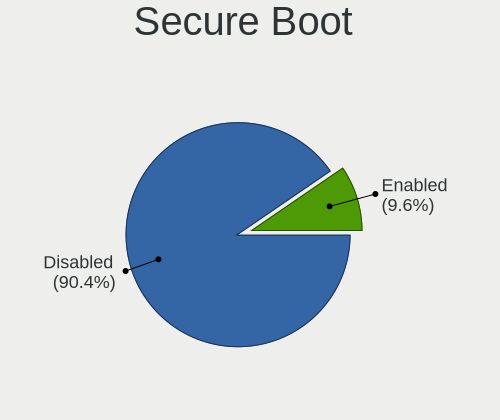

| State    | Computers | Percent |
|----------|-----------|---------|
| Disabled | 92        | 87.62%  |
| Enabled  | 13        | 12.38%  |

Coreboot
--------

Have coreboot on board

| Used | Computers | Percent |
|------|-----------|---------|
| No   | 100       | 97.09%  |
| Yes  | 3         | 2.91%   |

RAM Size
--------

Total RAM memory

| Size in GB      | Computers | Percent |
|-----------------|-----------|---------|
| 8.01-16.0       | 26        | 25%     |
| 4.01-8.0        | 22        | 21.15%  |
| 64.01-256.0     | 17        | 16.35%  |
| 32.01-64.0      | 8         | 7.69%   |
| 3.01-4.0        | 8         | 7.69%   |
| 16.01-24.0      | 7         | 6.73%   |
| More than 256.0 | 6         | 5.77%   |
| 24.01-32.0      | 6         | 5.77%   |
| 1.01-2.0        | 2         | 1.92%   |
| 0.51-1.0        | 2         | 1.92%   |

RAM Used
--------

Used RAM memory

| Used GB         | Computers | Percent |
|-----------------|-----------|---------|
| 2.01-3.0        | 29        | 26.61%  |
| 4.01-8.0        | 20        | 18.35%  |
| 3.01-4.0        | 19        | 17.43%  |
| 1.01-2.0        | 19        | 17.43%  |
| 8.01-16.0       | 5         | 4.59%   |
| 32.01-64.0      | 3         | 2.75%   |
| 16.01-24.0      | 3         | 2.75%   |
| 0.51-1.0        | 3         | 2.75%   |
| More than 256.0 | 2         | 1.83%   |
| 24.01-32.0      | 2         | 1.83%   |
| 64.01-256.0     | 2         | 1.83%   |
| 0.01-0.5        | 2         | 1.83%   |

Total Drives
------------

Number of drives on board

| Drives | Computers | Percent |
|--------|-----------|---------|
| 1      | 49        | 46.67%  |
| 2      | 28        | 26.67%  |
| 3      | 11        | 10.48%  |
| 4      | 7         | 6.67%   |
| 6      | 3         | 2.86%   |
| 5      | 2         | 1.9%    |
| 0      | 2         | 1.9%    |
| 12     | 1         | 0.95%   |
| 11     | 1         | 0.95%   |
| 10     | 1         | 0.95%   |

Has CD-ROM
----------

Has CD-ROM on board

| Presented | Computers | Percent |
|-----------|-----------|---------|
| No        | 79        | 75.96%  |
| Yes       | 25        | 24.04%  |

Has Ethernet
------------

Has Ethernet on board

| Presented | Computers | Percent |
|-----------|-----------|---------|
| Yes       | 89        | 86.41%  |
| No        | 14        | 13.59%  |

Has WiFi
--------

Has WiFi module

| Presented | Computers | Percent |
|-----------|-----------|---------|
| Yes       | 68        | 66.02%  |
| No        | 35        | 33.98%  |

Has Bluetooth
-------------

Has Bluetooth module

| Presented | Computers | Percent |
|-----------|-----------|---------|
| Yes       | 60        | 57.69%  |
| No        | 44        | 42.31%  |

Location
--------

Country
-------

Geographic location (country)

| Country      | Computers | Percent |
|--------------|-----------|---------|
| USA          | 24        | 23.3%   |
| Germany      | 11        | 10.68%  |
| Canada       | 8         | 7.77%   |
| Russia       | 7         | 6.8%    |
| France       | 7         | 6.8%    |
| UK           | 5         | 4.85%   |
| Netherlands  | 3         | 2.91%   |
| India        | 3         | 2.91%   |
| Hungary      | 3         | 2.91%   |
| Ukraine      | 2         | 1.94%   |
| Switzerland  | 2         | 1.94%   |
| Spain        | 2         | 1.94%   |
| South Africa | 2         | 1.94%   |
| Romania      | 2         | 1.94%   |
| Poland       | 2         | 1.94%   |
| Indonesia    | 2         | 1.94%   |
| China        | 2         | 1.94%   |
| Venezuela    | 1         | 0.97%   |
| Sweden       | 1         | 0.97%   |
| Puerto Rico  | 1         | 0.97%   |
| Pakistan     | 1         | 0.97%   |
| Nigeria      | 1         | 0.97%   |
| Mexico       | 1         | 0.97%   |
| Kazakhstan   | 1         | 0.97%   |
| Italy        | 1         | 0.97%   |
| Greenland    | 1         | 0.97%   |
| Finland      | 1         | 0.97%   |
| Czechia      | 1         | 0.97%   |
| Bulgaria     | 1         | 0.97%   |
| Belgium      | 1         | 0.97%   |
| Bangladesh   | 1         | 0.97%   |
| Austria      | 1         | 0.97%   |
| Australia    | 1         | 0.97%   |

City
----

Geographic location (city)

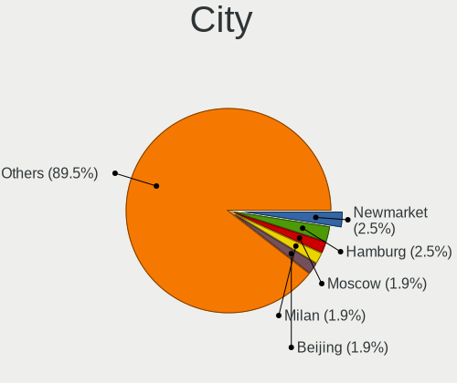

| City               | Computers | Percent |
|--------------------|-----------|---------|
| Hamburg            | 3         | 2.86%   |
| Tunari             | 2         | 1.9%    |
| Saint-Brieuc       | 2         | 1.9%    |
| Queens             | 2         | 1.9%    |
| Moscow             | 2         | 1.9%    |
| Johannesburg       | 2         | 1.9%    |
| Dresden            | 2         | 1.9%    |
| Dallas             | 2         | 1.9%    |
| Zaporizhzhia       | 1         | 0.95%   |
| Zandvoort          | 1         | 0.95%   |
| Winterswijk        | 1         | 0.95%   |
| Wilmington         | 1         | 0.95%   |
| Wejherowo          | 1         | 0.95%   |
| Warsaw             | 1         | 0.95%   |
| Vienna             | 1         | 0.95%   |
| Varosfoeld         | 1         | 0.95%   |
| Uppsala            | 1         | 0.95%   |
| Tuusula            | 1         | 0.95%   |
| Thiruvananthapuram | 1         | 0.95%   |
| Tampa              | 1         | 0.95%   |
| Suzhou             | 1         | 0.95%   |
| Strasbourg         | 1         | 0.95%   |
| Stadtilm           | 1         | 0.95%   |
| St. Paul           | 1         | 0.95%   |
| South Tangerang    | 1         | 0.95%   |
| Sofia              | 1         | 0.95%   |
| Shimanovsk         | 1         | 0.95%   |
| Shanghai           | 1         | 0.95%   |
| San Diego          | 1         | 0.95%   |
| Saint-Cloud        | 1         | 0.95%   |
| Rothwell           | 1         | 0.95%   |
| Rome               | 1         | 0.95%   |
| Rochester          | 1         | 0.95%   |
| Regina             | 1         | 0.95%   |
| Redlands           | 1         | 0.95%   |
| Penza              | 1         | 0.95%   |
| Parla              | 1         | 0.95%   |
| Paris              | 1         | 0.95%   |
| Pardubice          | 1         | 0.95%   |
| Ottawa             | 1         | 0.95%   |

Drives
------

Drive Vendor
------------

Hard drive vendors

| Vendor                      | Computers | Drives | Percent |
|-----------------------------|-----------|--------|---------|
| Samsung Electronics         | 23        | 31     | 14.94%  |
| Seagate                     | 22        | 35     | 14.29%  |
| WDC                         | 21        | 39     | 13.64%  |
| SK hynix                    | 8         | 8      | 5.19%   |
| Sandisk                     | 8         | 12     | 5.19%   |
| Kingston                    | 8         | 11     | 5.19%   |
| Intel                       | 6         | 7      | 3.9%    |
| Kingston Technology Company | 5         | 33     | 3.25%   |
| Unknown                     | 4         | 7      | 2.6%    |
| Toshiba                     | 4         | 5      | 2.6%    |
| Micron Technology           | 4         | 5      | 2.6%    |
| Crucial                     | 4         | 12     | 2.6%    |
| Netac                       | 3         | 3      | 1.95%   |
| HGST                        | 3         | 3      | 1.95%   |
| Plextor                     | 2         | 2      | 1.3%    |
| LITEONIT                    | 2         | 5      | 1.3%    |
| KIOXIA                      | 2         | 2      | 1.3%    |
| Hitachi                     | 2         | 3      | 1.3%    |
| Hewlett-Packard             | 2         | 9      | 1.3%    |
| Dell                        | 2         | 3      | 1.3%    |
| Union Memory                | 1         | 1      | 0.65%   |
| Transcend                   | 1         | 1      | 0.65%   |
| Team                        | 1         | 1      | 0.65%   |
| SSSTC                       | 1         | 1      | 0.65%   |
| Silicon Motion              | 1         | 14     | 0.65%   |
| QEMU                        | 1         | 2      | 0.65%   |
| Phison                      | 1         | 1      | 0.65%   |
| MAXIO Technology (Hangzhou) | 1         | 1      | 0.65%   |
| LITEON                      | 1         | 1      | 0.65%   |
| Lite-On Technology          | 1         | 1      | 0.65%   |
| Lenovo                      | 1         | 1      | 0.65%   |
| HJDK                        | 1         | 1      | 0.65%   |
| Emtec                       | 1         | 2      | 0.65%   |
| DELLBOSS                    | 1         | 1      | 0.65%   |
| China                       | 1         | 1      | 0.65%   |
| ASMT                        | 1         | 2      | 0.65%   |
| AMD                         | 1         | 15     | 0.65%   |
| A-DATA Technology           | 1         | 1      | 0.65%   |
| Unknown                     | 1         | 16     | 0.65%   |

Drive Model
-----------

Hard drive models

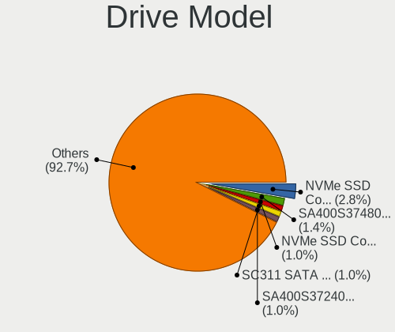

| Model                                             | Computers | Percent |
|---------------------------------------------------|-----------|---------|
| Samsung NVMe SSD Controller SM981/PM981/PM983 1TB | 4         | 2.19%   |
| Kingston SA400S37480G 480GB SSD                   | 3         | 1.64%   |
| WDC WD10SPZX-24Z10 1TB                            | 2         | 1.09%   |
| WDC WD10EZEX-08WN4A0 1TB                          | 2         | 1.09%   |
| SK hynix SC311 SATA 256GB SSD                     | 2         | 1.09%   |
| Seagate ST4000DM000-1F2168 4TB                    | 2         | 1.09%   |
| Seagate ST2000DL003-9VT166 2TB                    | 2         | 1.09%   |
| Seagate ST1000LM024 HN-M101MBB 1TB                | 2         | 1.09%   |
| Samsung MZVL22T0HBLB-00BL7 2TB                    | 2         | 1.09%   |
| Kingston Company KC2000 NVMe SSD 1TB              | 2         | 1.09%   |
| Kingston Company A2000 NVMe SSD 500GB             | 2         | 1.09%   |
| HGST HTS541010A9E680 1TB                          | 2         | 1.09%   |
| Crucial CT240BX500SSD1 240GB                      | 2         | 1.09%   |
| WDC WDS100T2B0B-00YS70 1TB SSD                    | 1         | 0.55%   |
| WDC WDS100T2B0A-00SM50 1TB SSD                    | 1         | 0.55%   |
| WDC WD60EFRX-68L0BN1 6TB                          | 1         | 0.55%   |
| WDC WD5000LPCX-21VHAT0 500GB                      | 1         | 0.55%   |
| WDC WD40EZRX-00SPEB0 4TB                          | 1         | 0.55%   |
| WDC WD40EFZX-68AWUN0 4TB                          | 1         | 0.55%   |
| WDC WD40EFRX-68N32N0 4TB                          | 1         | 0.55%   |
| WDC WD40EFAX-68JH4N1 4TB                          | 1         | 0.55%   |
| WDC WD4000FYYZ-01UL1B2 4TB                        | 1         | 0.55%   |
| WDC WD4000FYYZ-01UL1B1 4TB                        | 1         | 0.55%   |
| WDC WD4000FDYZ-27YA5B0 4TB                        | 1         | 0.55%   |
| WDC WD4000F9YZ-09N20L1 4TB                        | 1         | 0.55%   |
| WDC WD3600FYYZ-01UL1B3 4TB                        | 1         | 0.55%   |
| WDC WD3600FYYZ-01UL1B1 4TB                        | 1         | 0.55%   |
| WDC WD35EFRX-68WT0N0 4TB                          | 1         | 0.55%   |
| WDC WD2502ABYS-02B7A0 256GB                       | 1         | 0.55%   |
| WDC WD20EZBX-60AYRA0 2TB                          | 1         | 0.55%   |
| WDC WD20EARS-00J2GB0 2TB                          | 1         | 0.55%   |
| WDC WD10SPZX-60Z10T1 1TB                          | 1         | 0.55%   |
| WDC WD10SPZX-60Z10T0 1TB                          | 1         | 0.55%   |
| WDC WD10JPVX-00JC3T0 1TB                          | 1         | 0.55%   |
| WDC WD10EZEX-75M2NA0 1TB                          | 1         | 0.55%   |
| WDC WD10EZEX-08M2NA0 1TB                          | 1         | 0.55%   |
| WDC WD10EZEX-00KUWA0 1TB                          | 1         | 0.55%   |
| WDC RAT035VWHG-GTK4D7 4TB                         | 1         | 0.55%   |
| WDC RAT035VQHR-GTK4D7 4TB                         | 1         | 0.55%   |
| WDC PC SN730 SDBQNTY-256G-1001 256GB              | 1         | 0.55%   |

HDD Vendor
----------

Hard disk drive vendors

| Vendor              | Computers | Drives | Percent |
|---------------------|-----------|--------|---------|
| Seagate             | 21        | 31     | 39.62%  |
| WDC                 | 18        | 34     | 33.96%  |
| Toshiba             | 4         | 5      | 7.55%   |
| HGST                | 3         | 3      | 5.66%   |
| Hitachi             | 2         | 3      | 3.77%   |
| Unknown             | 1         | 2      | 1.89%   |
| Samsung Electronics | 1         | 1      | 1.89%   |
| QEMU                | 1         | 2      | 1.89%   |
| Hewlett-Packard     | 1         | 8      | 1.89%   |
| DELLBOSS            | 1         | 1      | 1.89%   |

SSD Vendor
----------

Solid state drive vendors

| Vendor              | Computers | Drives | Percent |
|---------------------|-----------|--------|---------|
| Samsung Electronics | 7         | 8      | 15.91%  |
| Kingston            | 7         | 7      | 15.91%  |
| Intel               | 4         | 5      | 9.09%   |
| SK hynix            | 3         | 3      | 6.82%   |
| Micron Technology   | 3         | 4      | 6.82%   |
| Crucial             | 3         | 10     | 6.82%   |
| SanDisk             | 2         | 3      | 4.55%   |
| Plextor             | 2         | 2      | 4.55%   |
| Netac               | 2         | 2      | 4.55%   |
| LITEONIT            | 2         | 5      | 4.55%   |
| WDC                 | 1         | 3      | 2.27%   |
| Team                | 1         | 1      | 2.27%   |
| LITEON              | 1         | 1      | 2.27%   |
| HJDK                | 1         | 1      | 2.27%   |
| Hewlett-Packard     | 1         | 1      | 2.27%   |
| Dell                | 1         | 2      | 2.27%   |
| China               | 1         | 1      | 2.27%   |
| ASMT                | 1         | 2      | 2.27%   |
| A-DATA Technology   | 1         | 1      | 2.27%   |

Drive Kind
----------

HDD or SSD

| Kind    | Computers | Drives | Percent |
|---------|-----------|--------|---------|
| NVMe    | 52        | 140    | 36.62%  |
| HDD     | 45        | 90     | 31.69%  |
| SSD     | 41        | 62     | 28.87%  |
| MMC     | 3         | 5      | 2.11%   |
| Unknown | 1         | 2      | 0.7%    |

Drive Connector
---------------

SATA, SAS, NVMe, etc.

| Type | Computers | Drives | Percent |
|------|-----------|--------|---------|
| SATA | 69        | 145    | 53.49%  |
| NVMe | 52        | 140    | 40.31%  |
| SAS  | 5         | 9      | 3.88%   |
| MMC  | 3         | 5      | 2.33%   |

Drive Size
----------

Size of hard drive

| Size in TB | Computers | Drives | Percent |
|------------|-----------|--------|---------|
| 0.01-0.5   | 42        | 53     | 43.75%  |
| 0.51-1.0   | 32        | 49     | 33.33%  |
| 1.01-2.0   | 9         | 14     | 9.38%   |
| 3.01-4.0   | 8         | 23     | 8.33%   |
| 4.01-10.0  | 4         | 12     | 4.17%   |
| 2.01-3.0   | 1         | 1      | 1.04%   |

Space Total
-----------

Amount of disk space available on the file system

| Size in GB     | Computers | Percent |
|----------------|-----------|---------|
| 101-250        | 28        | 26.67%  |
| 251-500        | 17        | 16.19%  |
| 501-1000       | 17        | 16.19%  |
| More than 3000 | 10        | 9.52%   |
| 1001-2000      | 8         | 7.62%   |
| 51-100         | 8         | 7.62%   |
| Unknown        | 7         | 6.67%   |
| 2001-3000      | 5         | 4.76%   |
| 1-20           | 3         | 2.86%   |
| 21-50          | 2         | 1.9%    |

Space Used
----------

Amount of used disk space

| Used GB        | Computers | Percent |
|----------------|-----------|---------|
| 1-20           | 41        | 36.61%  |
| 21-50          | 21        | 18.75%  |
| 51-100         | 15        | 13.39%  |
| 101-250        | 13        | 11.61%  |
| Unknown        | 7         | 6.25%   |
| 251-500        | 5         | 4.46%   |
| More than 3000 | 3         | 2.68%   |
| 1001-2000      | 3         | 2.68%   |
| 501-1000       | 3         | 2.68%   |
| 2001-3000      | 1         | 0.89%   |

Malfunc. Drives
---------------

Drive models with a malfunction

| Model                             | Computers | Drives | Percent |
|-----------------------------------|-----------|--------|---------|
| WDC WD4000FDYZ-27YA5B0 4TB        | 1         | 1      | 8.33%   |
| WDC WD2502ABYS-02B7A0 256GB       | 1         | 1      | 8.33%   |
| WDC WD20EARS-00J2GB0 2TB          | 1         | 1      | 8.33%   |
| SK hynix SH920 2.5 7MM 256GB SSD  | 1         | 1      | 8.33%   |
| Seagate ST4000DM000-1F2168 4TB    | 1         | 1      | 8.33%   |
| Seagate ST2000DL003-9VT166 2TB    | 1         | 1      | 8.33%   |
| Seagate ST1000DM010-2EP102 1TB    | 1         | 2      | 8.33%   |
| Samsung Electronics HD642JJ 640GB | 1         | 1      | 8.33%   |
| LITEONIT LSS-16L6G-HP 16GB SSD    | 1         | 4      | 8.33%   |
| Kingston SUV400S37240G 240GB SSD  | 1         | 1      | 8.33%   |
| HGST HTS725050A7E630 500GB        | 1         | 1      | 8.33%   |
| HGST HTS541010A9E680 1TB          | 1         | 1      | 8.33%   |

Malfunc. Drive Vendor
---------------------

Vendors of faulty drives

| Vendor              | Computers | Drives | Percent |
|---------------------|-----------|--------|---------|
| WDC                 | 3         | 3      | 25%     |
| Seagate             | 3         | 4      | 25%     |
| HGST                | 2         | 2      | 16.67%  |
| SK hynix            | 1         | 1      | 8.33%   |
| Samsung Electronics | 1         | 1      | 8.33%   |
| LITEONIT            | 1         | 4      | 8.33%   |
| Kingston            | 1         | 1      | 8.33%   |

Malfunc. HDD Vendor
-------------------

Vendors of faulty HDD drives

| Vendor              | Computers | Drives | Percent |
|---------------------|-----------|--------|---------|
| WDC                 | 3         | 3      | 33.33%  |
| Seagate             | 3         | 4      | 33.33%  |
| HGST                | 2         | 2      | 22.22%  |
| Samsung Electronics | 1         | 1      | 11.11%  |

Malfunc. Drive Kind
-------------------

Kinds of faulty drives

| Kind | Computers | Drives | Percent |
|------|-----------|--------|---------|
| HDD  | 8         | 10     | 72.73%  |
| SSD  | 3         | 6      | 27.27%  |

Failed Drives
-------------

Failed drive models

Zero info for selected period =(

Failed Drive Vendor
-------------------

Failed drive vendors

Zero info for selected period =(

Drive Status
------------

Number of failed and malfunc. drives

| Status   | Computers | Drives | Percent |
|----------|-----------|--------|---------|
| Works    | 58        | 165    | 50%     |
| Detected | 48        | 118    | 41.38%  |
| Malfunc  | 10        | 16     | 8.62%   |

Storage controller
------------------

Storage Vendor
--------------

Storage controller vendors

| Vendor                         | Computers | Percent |
|--------------------------------|-----------|---------|
| Intel                          | 59        | 39.33%  |
| AMD                            | 27        | 18%     |
| Samsung Electronics            | 16        | 10.67%  |
| Kingston Technology Company    | 8         | 5.33%   |
| SanDisk                        | 7         | 4.67%   |
| SK hynix                       | 4         | 2.67%   |
| LSI Logic / Symbios Logic      | 4         | 2.67%   |
| ASMedia Technology             | 3         | 2%      |
| Union Memory (Shenzhen)        | 2         | 1.33%   |
| Silicon Motion                 | 2         | 1.33%   |
| Marvell Technology Group       | 2         | 1.33%   |
| Broadcom / LSI                 | 2         | 1.33%   |
| Toshiba America Info Systems   | 1         | 0.67%   |
| Solid State Storage Technology | 1         | 0.67%   |
| Seagate Technology             | 1         | 0.67%   |
| Red Hat                        | 1         | 0.67%   |
| Phison Electronics             | 1         | 0.67%   |
| Nextorage                      | 1         | 0.67%   |
| Netac Technology               | 1         | 0.67%   |
| Micron/Crucial Technology      | 1         | 0.67%   |
| Micron Technology              | 1         | 0.67%   |
| MAXIO Technology (Hangzhou)    | 1         | 0.67%   |
| Lite-On Technology             | 1         | 0.67%   |
| Lenovo                         | 1         | 0.67%   |
| KIOXIA                         | 1         | 0.67%   |
| Hewlett-Packard                | 1         | 0.67%   |

Storage Model
-------------

Storage controller models

| Model                                                                          | Computers | Percent |
|--------------------------------------------------------------------------------|-----------|---------|
| AMD FCH SATA Controller [AHCI mode]                                            | 20        | 11.83%  |
| Intel SATA Controller [RAID mode]                                              | 7         | 4.14%   |
| Samsung NVMe SSD Controller SM981/PM981/PM983                                  | 6         | 3.55%   |
| Samsung NVMe SSD Controller 980 (DRAM-less)                                    | 5         | 2.96%   |
| Intel Sunrise Point-LP SATA Controller [AHCI mode]                             | 5         | 2.96%   |
| Samsung NVMe SSD Controller PM9A1/PM9A3/980PRO                                 | 4         | 2.37%   |
| Intel 8 Series SATA Controller 1 [AHCI mode]                                   | 4         | 2.37%   |
| AMD 400 Series Chipset SATA Controller                                         | 4         | 2.37%   |
| Intel C602 chipset 4-Port SATA Storage Control Unit                            | 3         | 1.78%   |
| Intel 82801 Mobile SATA Controller [RAID mode]                                 | 3         | 1.78%   |
| Intel 8 Series/C220 Series Chipset Family 6-port SATA Controller 1 [AHCI mode] | 3         | 1.78%   |
| Intel 7 Series Chipset Family 6-port SATA Controller [AHCI mode]               | 3         | 1.78%   |
| Intel 500 Series Chipset Family SATA AHCI Controller                           | 3         | 1.78%   |
| Silicon Motion SM2262/SM2262EN SSD Controller                                  | 2         | 1.18%   |
| SanDisk Extreme Pro / WD Black SN750 / PC SN730 / Red SN700 NVMe SSD           | 2         | 1.18%   |
| Samsung NVMe SSD Controller SM961/PM961/SM963                                  | 2         | 1.18%   |
| Kingston Company KC2000/KC2500 NVMe SSD SM2262EN                               | 2         | 1.18%   |
| Kingston Company A2000 NVMe SSD SM2263EN                                       | 2         | 1.18%   |
| Intel Cannon Point-LP SATA Controller [AHCI Mode]                              | 2         | 1.18%   |
| Intel Cannon Lake Mobile PCH SATA AHCI Controller                              | 2         | 1.18%   |
| Intel C620 Series Chipset Family SSATA Controller [AHCI mode]                  | 2         | 1.18%   |
| Intel C600/X79 series chipset IDE-r Controller                                 | 2         | 1.18%   |
| Intel Atom Processor E3800 Series SATA AHCI Controller                         | 2         | 1.18%   |
| Intel 400 Series Chipset Family SATA AHCI Controller                           | 2         | 1.18%   |
| ASMedia ASM1061/ASM1062 Serial ATA Controller                                  | 2         | 1.18%   |
| AMD 600 Series Chipset SATA Controller                                         | 2         | 1.18%   |
| AMD 500 Series Chipset SATA Controller                                         | 2         | 1.18%   |
| Union Memory (Shenzhen) AM610 PCIe 3.0 x2 NVMe SSD 128GB, 256GB                | 1         | 0.59%   |
| Union Memory (Shenzhen) AH631 PCIe 3.0 NVMe SSD 512GB                          | 1         | 0.59%   |
| Toshiba America Info Systems XG6 NVMe SSD Controller                           | 1         | 0.59%   |
| Solid State Storage CL1-3D256-Q11 NVMe SSD M.2                                 | 1         | 0.59%   |
| SK hynix Platinum P41/PC801 NVMe Solid State Drive                             | 1         | 0.59%   |
| SK hynix PC300 NVMe Solid State Drive 256GB                                    | 1         | 0.59%   |
| SK hynix Gold P31/BC711/PC711 NVMe Solid State Drive                           | 1         | 0.59%   |
| SK hynix BC511 NVMe SSD                                                        | 1         | 0.59%   |
| Seagate FireCuda 530 SSD                                                       | 1         | 0.59%   |
| SanDisk WD Blue SN570 NVMe SSD 2TB                                             | 1         | 0.59%   |
| SanDisk WD Blue SN500 / PC SN520 x2 M.2 2280 NVMe SSD                          | 1         | 0.59%   |
| SanDisk WD Black SN770 / PC SN740 256GB / PC SN560 (DRAM-less) NVMe SSD        | 1         | 0.59%   |
| SanDisk Ultra 3D / WD Blue SN550 NVMe SSD                                      | 1         | 0.59%   |

Storage Kind
------------

Kind of storage controller (IDE, SATA, NVMe, SAS, ...)

| Kind | Computers | Percent |
|------|-----------|---------|
| SATA | 70        | 46.98%  |
| NVMe | 51        | 34.23%  |
| RAID | 15        | 10.07%  |
| IDE  | 7         | 4.7%    |
| SAS  | 5         | 3.36%   |
| SCSI | 1         | 0.67%   |

Processor
---------

CPU Vendor
----------

Processor vendors

| Vendor | Computers | Percent |
|--------|-----------|---------|
| Intel  | 68        | 66.02%  |
| AMD    | 32        | 31.07%  |
| ARM    | 3         | 2.91%   |

CPU Model
---------

Processor models

| Model                                       | Computers | Percent |
|---------------------------------------------|-----------|---------|
| Intel Core i5-10210U CPU @ 1.60GHz          | 3         | 2.88%   |
| ARM Processor                               | 3         | 2.88%   |
| Intel Core i5-8250U CPU @ 1.60GHz           | 2         | 1.92%   |
| Intel 11th Gen Core i7-1165G7 @ 2.80GHz     | 2         | 1.92%   |
| AMD EPYC 7282 16-Core Processor             | 2         | 1.92%   |
| Intel Xeon W-2223 CPU @ 3.60GHz             | 1         | 0.96%   |
| Intel Xeon W-1350 @ 3.30GHz                 | 1         | 0.96%   |
| Intel Xeon W-11855M CPU @ 3.20GHz           | 1         | 0.96%   |
| Intel Xeon Silver 4116 CPU @ 2.10GHz        | 1         | 0.96%   |
| Intel Xeon Gold 5220R CPU @ 2.20GHz         | 1         | 0.96%   |
| Intel Xeon E-2144G CPU @ 3.60GHz            | 1         | 0.96%   |
| Intel Xeon CPU X5550 @ 2.67GHz              | 1         | 0.96%   |
| Intel Xeon CPU L5520 @ 2.27GHz              | 1         | 0.96%   |
| Intel Xeon CPU E5540 @ 2.53GHz              | 1         | 0.96%   |
| Intel Xeon CPU E5-2690 0 @ 2.90GHz          | 1         | 0.96%   |
| Intel Xeon CPU E5-2683 v4 @ 2.10GHz         | 1         | 0.96%   |
| Intel Xeon CPU E5-2667 v2 @ 3.30GHz         | 1         | 0.96%   |
| Intel Xeon CPU E5-2630 0 @ 2.30GHz          | 1         | 0.96%   |
| Intel Xeon CPU E5-2620 v2 @ 2.10GHz         | 1         | 0.96%   |
| Intel Pentium Dual-Core CPU T4500 @ 2.30GHz | 1         | 0.96%   |
| Intel Pentium CPU N3540 @ 2.16GHz           | 1         | 0.96%   |
| Intel Pentium CPU 3825U @ 1.90GHz           | 1         | 0.96%   |
| Intel Core i7-9750H CPU @ 2.60GHz           | 1         | 0.96%   |
| Intel Core i7-8550U CPU @ 1.80GHz           | 1         | 0.96%   |
| Intel Core i7-7700 CPU @ 3.60GHz            | 1         | 0.96%   |
| Intel Core i7-7560U CPU @ 2.40GHz           | 1         | 0.96%   |
| Intel Core i7-6500U CPU @ 2.50GHz           | 1         | 0.96%   |
| Intel Core i7-4710MQ CPU @ 2.50GHz          | 1         | 0.96%   |
| Intel Core i7-4510U CPU @ 2.00GHz           | 1         | 0.96%   |
| Intel Core i7-3840QM CPU @ 2.80GHz          | 1         | 0.96%   |
| Intel Core i7-3770 CPU @ 3.40GHz            | 1         | 0.96%   |
| Intel Core i7-3630QM CPU @ 2.40GHz          | 1         | 0.96%   |
| Intel Core i7-14700K                        | 1         | 0.96%   |
| Intel Core i7-10750H CPU @ 2.60GHz          | 1         | 0.96%   |
| Intel Core i5-8350U CPU @ 1.70GHz           | 1         | 0.96%   |
| Intel Core i5-8300H CPU @ 2.30GHz           | 1         | 0.96%   |
| Intel Core i5-8259U CPU @ 2.30GHz           | 1         | 0.96%   |
| Intel Core i5-7Y54 CPU @ 1.20GHz            | 1         | 0.96%   |
| Intel Core i5-7300U CPU @ 2.60GHz           | 1         | 0.96%   |
| Intel Core i5-6500 CPU @ 3.20GHz            | 1         | 0.96%   |

CPU Model Family
----------------

Processor model prefix

| Model                   | Computers | Percent |
|-------------------------|-----------|---------|
| Intel Core i5           | 18        | 17.48%  |
| Other                   | 14        | 13.59%  |
| Intel Xeon              | 12        | 11.65%  |
| Intel Core i7           | 12        | 11.65%  |
| Intel Core i3           | 6         | 5.83%   |
| AMD Ryzen 7             | 6         | 5.83%   |
| AMD Ryzen 9             | 5         | 4.85%   |
| AMD Ryzen 5             | 5         | 4.85%   |
| AMD EPYC                | 5         | 4.85%   |
| Intel Celeron           | 4         | 3.88%   |
| Intel Pentium           | 2         | 1.94%   |
| AMD Ryzen Threadripper  | 2         | 1.94%   |
| AMD Ryzen 3             | 2         | 1.94%   |
| AMD A12                 | 2         | 1.94%   |
| AMD A10                 | 2         | 1.94%   |
| Intel Xeon Silver       | 1         | 0.97%   |
| Intel Xeon Gold         | 1         | 0.97%   |
| Intel Pentium Dual-Core | 1         | 0.97%   |
| Intel Atom              | 1         | 0.97%   |
| AMD FX                  | 1         | 0.97%   |
| AMD A6                  | 1         | 0.97%   |

CPU Cores
---------

Number of processor cores

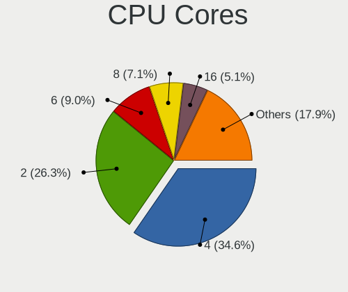

| Number  | Computers | Percent |
|---------|-----------|---------|
| 4       | 31        | 29.81%  |
| 2       | 29        | 27.88%  |
| 6       | 10        | 9.62%   |
| 8       | 8         | 7.69%   |
| 16      | 7         | 6.73%   |
| 12      | 6         | 5.77%   |
| 32      | 3         | 2.88%   |
| 24      | 2         | 1.92%   |
| Unknown | 2         | 1.92%   |
| 80      | 1         | 0.96%   |
| 48      | 1         | 0.96%   |
| 20      | 1         | 0.96%   |
| 14      | 1         | 0.96%   |
| 10      | 1         | 0.96%   |
| 1       | 1         | 0.96%   |

CPU Sockets
-----------

Number of sockets

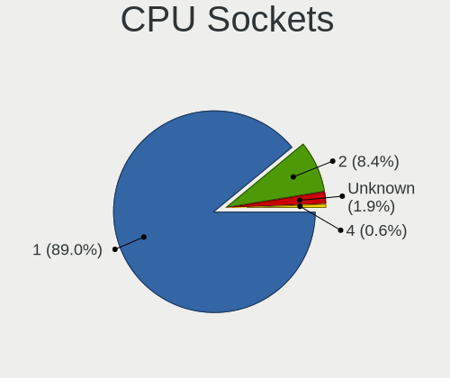

| Number  | Computers | Percent |
|---------|-----------|---------|
| 1       | 92        | 89.32%  |
| 2       | 8         | 7.77%   |
| Unknown | 2         | 1.94%   |
| 4       | 1         | 0.97%   |

CPU Threads
-----------

Threads per core (Hyper-Threading)

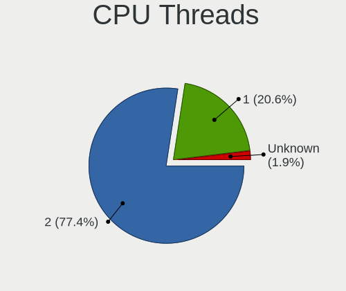

| Number  | Computers | Percent |
|---------|-----------|---------|
| 2       | 85        | 82.52%  |
| 1       | 16        | 15.53%  |
| Unknown | 2         | 1.94%   |

CPU Op-Modes
------------

CPU Operation Modes (32-bit, 64-bit)

| Op mode        | Computers | Percent |
|----------------|-----------|---------|
| 32-bit, 64-bit | 101       | 97.12%  |
| Unknown        | 3         | 2.88%   |

CPU Microcode
-------------

Microcode number

| Number     | Computers | Percent |
|------------|-----------|---------|
| Unknown    | 24        | 21.82%  |
| 0x306a9    | 5         | 4.55%   |
| 0x806ec    | 4         | 3.64%   |
| 0x806c1    | 4         | 3.64%   |
| 0xa0671    | 3         | 2.73%   |
| 0x40651    | 3         | 2.73%   |
| 0x306c3    | 3         | 2.73%   |
| 0x206a7    | 3         | 2.73%   |
| 0x106a5    | 3         | 2.73%   |
| 0x08701021 | 3         | 2.73%   |
| 0x906ea    | 2         | 1.82%   |
| 0x806ea    | 2         | 1.82%   |
| 0x806e9    | 2         | 1.82%   |
| 0x806d1    | 2         | 1.82%   |
| 0x50657    | 2         | 1.82%   |
| 0x406e3    | 2         | 1.82%   |
| 0x306e4    | 2         | 1.82%   |
| 0x0a50000d | 2         | 1.82%   |
| 0x08600106 | 2         | 1.82%   |
| 0x0830107a | 2         | 1.82%   |
| 0x08301055 | 2         | 1.82%   |
| 0x08108109 | 2         | 1.82%   |
| 0x0600611a | 2         | 1.82%   |
| 0xb06a3    | 1         | 0.91%   |
| 0xa0655    | 1         | 0.91%   |
| 0xa0652    | 1         | 0.91%   |
| 0x906ed    | 1         | 0.91%   |
| 0x906e9    | 1         | 0.91%   |
| 0x90672    | 1         | 0.91%   |
| 0x506e3    | 1         | 0.91%   |
| 0x50654    | 1         | 0.91%   |
| 0x406c4    | 1         | 0.91%   |
| 0x306d4    | 1         | 0.91%   |
| 0x30678    | 1         | 0.91%   |
| 0x30673    | 1         | 0.91%   |
| 0x206d7    | 1         | 0.91%   |
| 0x20655    | 1         | 0.91%   |
| 0x106ca    | 1         | 0.91%   |
| 0x1067a    | 1         | 0.91%   |
| 0x0a601203 | 1         | 0.91%   |

CPU Microarch
-------------

Microarchitecture

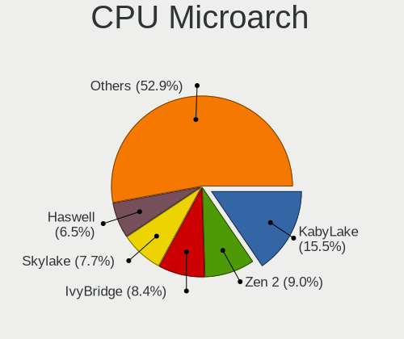

| Name             | Computers | Percent |
|------------------|-----------|---------|
| KabyLake         | 16        | 15.53%  |
| Zen 2            | 12        | 11.65%  |
| IvyBridge        | 7         | 6.8%    |
| Haswell          | 7         | 6.8%    |
| Skylake          | 6         | 5.83%   |
| Unknown          | 6         | 5.83%   |
| Zen 3            | 5         | 4.85%   |
| SandyBridge      | 5         | 4.85%   |
| Icelake          | 5         | 4.85%   |
| Excavator        | 5         | 4.85%   |
| TigerLake        | 4         | 3.88%   |
| Alderlake Hybrid | 4         | 3.88%   |
| Zen+             | 3         | 2.91%   |
| Silvermont       | 3         | 2.91%   |
| Nehalem          | 3         | 2.91%   |
| Zen              | 2         | 1.94%   |
| CometLake        | 2         | 1.94%   |
| Broadwell        | 2         | 1.94%   |
| Westmere         | 1         | 0.97%   |
| Steamroller      | 1         | 0.97%   |
| Piledriver       | 1         | 0.97%   |
| Penryn           | 1         | 0.97%   |
| Goldmont plus    | 1         | 0.97%   |
| Bonnell          | 1         | 0.97%   |

Graphics
--------

GPU Vendor
----------

Vendors of graphics cards

| Vendor                     | Computers | Percent |
|----------------------------|-----------|---------|
| Intel                      | 49        | 41.88%  |
| Nvidia                     | 31        | 26.5%   |
| AMD                        | 24        | 20.51%  |
| ASPEED Technology          | 7         | 5.98%   |
| Matrox Electronics Systems | 5         | 4.27%   |
| Red Hat                    | 1         | 0.85%   |

GPU Model
---------

Graphics card models

| Model                                                                     | Computers | Percent |
|---------------------------------------------------------------------------|-----------|---------|
| ASPEED Technology ASPEED Graphics Family                                  | 7         | 5.93%   |
| Intel UHD Graphics 620                                                    | 4         | 3.39%   |
| Intel TigerLake-LP GT2 [Iris Xe Graphics]                                 | 4         | 3.39%   |
| Intel Haswell-ULT Integrated Graphics Controller                          | 4         | 3.39%   |
| Intel CometLake-U GT2 [UHD Graphics]                                      | 3         | 2.54%   |
| Intel 2nd Generation Core Processor Family Integrated Graphics Controller | 3         | 2.54%   |
| AMD Wani [Radeon R5/R6/R7 Graphics]                                       | 3         | 2.54%   |
| AMD Picasso/Raven 2 [Radeon Vega Series / Radeon Vega Mobile Series]      | 3         | 2.54%   |
| AMD Cezanne [Radeon Vega Series / Radeon Vega Mobile Series]              | 3         | 2.54%   |
| Nvidia GA106 [Geforce RTX 3050]                                           | 2         | 1.69%   |
| Matrox Electronics Systems MGA G200eW WPCM450                             | 2         | 1.69%   |
| Matrox Electronics Systems Integrated Matrox G200eW3 Graphics Controller  | 2         | 1.69%   |
| Intel Raptor Lake-P [Iris Xe Graphics]                                    | 2         | 1.69%   |
| Intel CoffeeLake-H GT2 [UHD Graphics 630]                                 | 2         | 1.69%   |
| Intel Atom Processor Z36xxx/Z37xxx Series Graphics & Display              | 2         | 1.69%   |
| Intel 3rd Gen Core processor Graphics Controller                          | 2         | 1.69%   |
| AMD Stoney [Radeon R2/R3/R4/R5 Graphics]                                  | 2         | 1.69%   |
| AMD Renoir [Radeon RX Vega 6 (Ryzen 4000/5000 Mobile Series)]             | 2         | 1.69%   |
| AMD Raphael                                                               | 2         | 1.69%   |
| Red Hat QXL paravirtual graphic card                                      | 1         | 0.85%   |
| Nvidia TU117GLM [Quadro T400 Mobile]                                      | 1         | 0.85%   |
| Nvidia TU117 [GeForce GTX 1650]                                           | 1         | 0.85%   |
| Nvidia TU116M [GeForce GTX 1660 Ti Mobile]                                | 1         | 0.85%   |
| Nvidia TU116 [GeForce GTX 1660 SUPER]                                     | 1         | 0.85%   |
| Nvidia TU106M [GeForce RTX 2060 Mobile]                                   | 1         | 0.85%   |
| Nvidia GP107M [GeForce GTX 1050 Mobile]                                   | 1         | 0.85%   |
| Nvidia GP107GL [Quadro P620]                                              | 1         | 0.85%   |
| Nvidia GP104 [GeForce GTX 1080]                                           | 1         | 0.85%   |
| Nvidia GM204GL [Quadro M4000]                                             | 1         | 0.85%   |
| Nvidia GM204 [GeForce GTX 970]                                            | 1         | 0.85%   |
| Nvidia GM108M [GeForce MX110]                                             | 1         | 0.85%   |
| Nvidia GM108M [GeForce 930M]                                              | 1         | 0.85%   |
| Nvidia GM107M [GeForce GTX 850M]                                          | 1         | 0.85%   |
| Nvidia GM107GL [Quadro K2200]                                             | 1         | 0.85%   |
| Nvidia GM107 [GeForce GTX 750 Ti]                                         | 1         | 0.85%   |
| Nvidia GK208B [GeForce GT 730]                                            | 1         | 0.85%   |
| Nvidia GK107GLM [Quadro K1000M]                                           | 1         | 0.85%   |
| Nvidia GK104GLM [Quadro K3100M]                                           | 1         | 0.85%   |
| Nvidia GK104 [GeForce GTX 770]                                            | 1         | 0.85%   |
| Nvidia GF119 [GeForce GT 610]                                             | 1         | 0.85%   |

GPU Combo
---------

Combinations of graphics cards

| Name           | Computers | Percent |
|----------------|-----------|---------|
| 1 x Intel      | 37        | 35.92%  |
| 1 x Nvidia     | 19        | 18.45%  |
| 1 x AMD        | 18        | 17.48%  |
| Intel + Nvidia | 10        | 9.71%   |
| 1 x Matrox     | 5         | 4.85%   |
| 1 x ASPEED     | 4         | 3.88%   |
| Other          | 2         | 1.94%   |
| AMD + Nvidia   | 2         | 1.94%   |
| AMD + ASPEED   | 2         | 1.94%   |
| 2 x AMD        | 1         | 0.97%   |
| 1 x Red Hat    | 1         | 0.97%   |
| Intel + ASPEED | 1         | 0.97%   |
| Intel + AMD    | 1         | 0.97%   |

GPU Driver
----------

Free vs proprietary

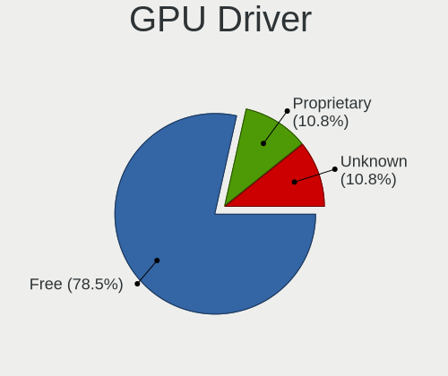

| Driver      | Computers | Percent |
|-------------|-----------|---------|
| Free        | 80        | 76.92%  |
| Proprietary | 12        | 11.54%  |
| Unknown     | 12        | 11.54%  |

GPU Memory
----------

Total video memory

| Size in GB | Computers | Percent |
|------------|-----------|---------|
| Unknown    | 62        | 59.05%  |
| 0.01-0.5   | 13        | 12.38%  |
| 1.01-2.0   | 9         | 8.57%   |
| 7.01-8.0   | 5         | 4.76%   |
| 5.01-6.0   | 5         | 4.76%   |
| 3.01-4.0   | 5         | 4.76%   |
| 0.51-1.0   | 4         | 3.81%   |
| 32.01-64.0 | 1         | 0.95%   |
| 16.01-24.0 | 1         | 0.95%   |

Monitor
-------

Monitor Vendor
--------------

Monitor vendors

| Vendor                  | Computers | Percent |
|-------------------------|-----------|---------|
| AU Optronics            | 12        | 13.64%  |
| Samsung Electronics     | 11        | 12.5%   |
| LG Display              | 10        | 11.36%  |
| BOE                     | 9         | 10.23%  |
| Dell                    | 7         | 7.95%   |
| Chimei Innolux          | 5         | 5.68%   |
| PANDA                   | 4         | 4.55%   |
| Eizo                    | 4         | 4.55%   |
| Sharp                   | 3         | 3.41%   |
| Philips                 | 3         | 3.41%   |
| BenQ                    | 3         | 3.41%   |
| ViewSonic               | 2         | 2.27%   |
| InfoVision              | 2         | 2.27%   |
| Goldstar                | 2         | 2.27%   |
| Acer                    | 2         | 2.27%   |
| TopView                 | 1         | 1.14%   |
| STD                     | 1         | 1.14%   |
| Seiki                   | 1         | 1.14%   |
| Medion                  | 1         | 1.14%   |
| Lenovo                  | 1         | 1.14%   |
| HannStar                | 1         | 1.14%   |
| Chi Mei Optoelectronics | 1         | 1.14%   |
| ASUSTek Computer        | 1         | 1.14%   |
| AOC                     | 1         | 1.14%   |

Monitor Model
-------------

Monitor models

| Model                                                                 | Computers | Percent |
|-----------------------------------------------------------------------|-----------|---------|
| AU Optronics LCD Monitor AUO45EC 1366x768 340x190mm 15.3-inch         | 2         | 2.2%    |
| AU Optronics LCD Monitor AUO203D 1920x1080 309x174mm 14.0-inch        | 2         | 2.2%    |
| ViewSonic VX2233wm-1 VSC1D22 1920x1080 477x268mm 21.5-inch            | 1         | 1.1%    |
| ViewSonic VA2232 Series VSC8224 1680x1050 474x296mm 22.0-inch         | 1         | 1.1%    |
| TopView HD TV TOPC37E 1920x1080 700x390mm 31.5-inch                   | 1         | 1.1%    |
| STD HDMI TV STD00C7 1440x900 698x392mm 31.5-inch                      | 1         | 1.1%    |
| Sharp LCD Monitor SHP146B 3200x1800 294x165mm 13.3-inch               | 1         | 1.1%    |
| Sharp LCD Monitor SHP144A 3200x1800 294x165mm 13.3-inch               | 1         | 1.1%    |
| Sharp LC-32LB480U SHP3263 1920x1080 698x392mm 31.5-inch               | 1         | 1.1%    |
| Seiki SC32HT04 SEK1366 1366x768 700x390mm 31.5-inch                   | 1         | 1.1%    |
| Samsung Electronics SyncMaster SAM021B 1400x1050 408x300mm 19.9-inch  | 1         | 1.1%    |
| Samsung Electronics SyncMaster SAM01F9 1280x1024 376x301mm 19.0-inch  | 1         | 1.1%    |
| Samsung Electronics S27H65x SAM0E1D 1920x1080 598x336mm 27.0-inch     | 1         | 1.1%    |
| Samsung Electronics S22F350 SAM0D1A 1920x1080 477x268mm 21.5-inch     | 1         | 1.1%    |
| Samsung Electronics LCD Monitor SEC544B 1600x900 382x214mm 17.2-inch  | 1         | 1.1%    |
| Samsung Electronics LCD Monitor SEC4252 1366x768 344x194mm 15.5-inch  | 1         | 1.1%    |
| Samsung Electronics LCD Monitor SEC3030 1024x600 223x125mm 10.1-inch  | 1         | 1.1%    |
| Samsung Electronics LCD Monitor SDC4164 3840x2400 344x215mm 16.0-inch | 1         | 1.1%    |
| Samsung Electronics LCD Monitor SDC4142 3840x2160 294x165mm 13.3-inch | 1         | 1.1%    |
| Samsung Electronics LCD Monitor SDC4141 3840x2160 344x194mm 15.5-inch | 1         | 1.1%    |
| Samsung Electronics LCD Monitor S32B80P 5760x2160                     | 1         | 1.1%    |
| Samsung Electronics LCD Monitor S32B80P                               | 1         | 1.1%    |
| Samsung Electronics F27G3xTF SAM710D 1920x1080 600x330mm 27.0-inch    | 1         | 1.1%    |
| Philips PHL 272B7QU PHL0926 2560x1440 597x336mm 27.0-inch             | 1         | 1.1%    |
| Philips PHL 243V5 PHLC0D1 1920x1080 521x293mm 23.5-inch               | 1         | 1.1%    |
| Philips 19B PHL0879 1280x1024 376x301mm 19.0-inch                     | 1         | 1.1%    |
| PANDA LCD Monitor NCP0058 1920x1080 344x194mm 15.5-inch               | 1         | 1.1%    |
| PANDA LCD Monitor NCP004A 1920x1080 309x174mm 14.0-inch               | 1         | 1.1%    |
| PANDA LCD Monitor NCP0040 1920x1080 344x194mm 15.5-inch               | 1         | 1.1%    |
| PANDA LCD Monitor NCP002A 1920x1080 344x194mm 15.5-inch               | 1         | 1.1%    |
| Medion MD7212AS MED4971 1280x1024 359x287mm 18.1-inch                 | 1         | 1.1%    |
| LG Display LCD Monitor LGD0621 1920x1080 382x215mm 17.3-inch          | 1         | 1.1%    |
| LG Display LCD Monitor LGD056F 2736x1824 260x173mm 12.3-inch          | 1         | 1.1%    |
| LG Display LCD Monitor LGD046D 1920x1080 309x174mm 14.0-inch          | 1         | 1.1%    |
| LG Display LCD Monitor LGD0465 1366x768 344x194mm 15.5-inch           | 1         | 1.1%    |
| LG Display LCD Monitor LGD042D 1920x1080 294x165mm 13.3-inch          | 1         | 1.1%    |
| LG Display LCD Monitor LGD03FB 1920x1080 382x215mm 17.3-inch          | 1         | 1.1%    |
| LG Display LCD Monitor LGD034A 1366x768 345x194mm 15.6-inch           | 1         | 1.1%    |
| LG Display LCD Monitor LGD033A 1366x768 344x194mm 15.5-inch           | 1         | 1.1%    |
| LG Display LCD Monitor LGD0335 1366x768 310x174mm 14.0-inch           | 1         | 1.1%    |

Monitor Resolution
------------------

Monitor screen resolution

| Resolution         | Computers | Percent |
|--------------------|-----------|---------|
| 1920x1080 (FHD)    | 46        | 51.69%  |
| 1366x768 (WXGA)    | 15        | 16.85%  |
| 1280x1024 (SXGA)   | 5         | 5.62%   |
| 3840x2160 (4K)     | 4         | 4.49%   |
| 2560x1440 (QHD)    | 3         | 3.37%   |
| 1920x1200 (WUXGA)  | 3         | 3.37%   |
| 3200x1800 (QHD+)   | 2         | 2.25%   |
| 1600x900 (HD+)     | 2         | 2.25%   |
| 5760x2160          | 1         | 1.12%   |
| 3840x2400          | 1         | 1.12%   |
| 2736x1824          | 1         | 1.12%   |
| 2560x1600          | 1         | 1.12%   |
| 2560x1080          | 1         | 1.12%   |
| 1680x1050 (WSXGA+) | 1         | 1.12%   |
| 1600x1200          | 1         | 1.12%   |
| 1400x1050          | 1         | 1.12%   |
| Unknown            | 1         | 1.12%   |

Monitor Diagonal
----------------

Diagonal size in inches

| Inches  | Computers | Percent |
|---------|-----------|---------|
| 15      | 20        | 22.47%  |
| 14      | 10        | 11.24%  |
| 13      | 10        | 11.24%  |
| 17      | 8         | 8.99%   |
| 31      | 6         | 6.74%   |
| 27      | 6         | 6.74%   |
| 24      | 6         | 6.74%   |
| 21      | 6         | 6.74%   |
| 19      | 3         | 3.37%   |
| Unknown | 3         | 3.37%   |
| 23      | 2         | 2.25%   |
| 16      | 2         | 2.25%   |
| 11      | 2         | 2.25%   |
| 34      | 1         | 1.12%   |
| 22      | 1         | 1.12%   |
| 20      | 1         | 1.12%   |
| 18      | 1         | 1.12%   |
| 12      | 1         | 1.12%   |

Monitor Width
-------------

Physical width

| Width in mm | Computers | Percent |
|-------------|-----------|---------|
| 301-350     | 38        | 42.7%   |
| 501-600     | 14        | 15.73%  |
| 351-400     | 11        | 12.36%  |
| 401-500     | 8         | 8.99%   |
| 201-300     | 8         | 8.99%   |
| 601-700     | 6         | 6.74%   |
| Unknown     | 3         | 3.37%   |
| 701-800     | 1         | 1.12%   |

Aspect Ratio
------------

Proportional relationship between the width and the height

| Ratio   | Computers | Percent |
|---------|-----------|---------|
| 16/9    | 67        | 79.76%  |
| 16/10   | 5         | 5.95%   |
| 5/4     | 4         | 4.76%   |
| Unknown | 3         | 3.57%   |
| 4/3     | 2         | 2.38%   |
| 6/5     | 1         | 1.19%   |
| 3/2     | 1         | 1.19%   |
| 21/9    | 1         | 1.19%   |

Monitor Area
------------

Area in inch

| Area in inch | Computers | Percent |
|----------------|-----------|---------|
| 101-110        | 20        | 22.47%  |
| 81-90          | 15        | 16.85%  |
| 201-250        | 12        | 13.48%  |
| 351-500        | 7         | 7.87%   |
| 121-130        | 7         | 7.87%   |
| 301-350        | 6         | 6.74%   |
| 151-200        | 6         | 6.74%   |
| 71-80          | 5         | 5.62%   |
| Unknown        | 3         | 3.37%   |
| 51-60          | 2         | 2.25%   |
| 251-300        | 2         | 2.25%   |
| 111-120        | 2         | 2.25%   |
| 61-70          | 1         | 1.12%   |
| 141-150        | 1         | 1.12%   |

Pixel Density
-------------

Pixels per inch

| Density       | Computers | Percent |
|---------------|-----------|---------|
| 121-160       | 30        | 34.88%  |
| 51-100        | 24        | 27.91%  |
| 101-120       | 19        | 22.09%  |
| More than 240 | 6         | 6.98%   |
| 161-240       | 3         | 3.49%   |
| Unknown       | 3         | 3.49%   |
| 1-50          | 1         | 1.16%   |

Multiple Monitors
-----------------

Total monitors connected

| Total | Computers | Percent |
|-------|-----------|---------|
| 1     | 72        | 69.23%  |
| 0     | 20        | 19.23%  |
| 2     | 12        | 11.54%  |

Network
-------

Net Controller Vendor
---------------------

Controller vendors

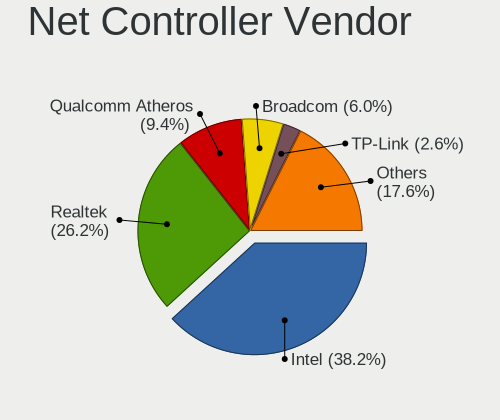

| Vendor                          | Computers | Percent |
|---------------------------------|-----------|---------|
| Intel                           | 57        | 37.25%  |
| Realtek Semiconductor           | 41        | 26.8%   |
| Qualcomm Atheros                | 16        | 10.46%  |
| Broadcom                        | 11        | 7.19%   |
| Broadcom Limited                | 5         | 3.27%   |
| Mellanox Technologies           | 4         | 2.61%   |
| TP-Link                         | 3         | 1.96%   |
| American Megatrends             | 3         | 1.96%   |
| Standard Microsystems           | 2         | 1.31%   |
| Ralink Technology               | 2         | 1.31%   |
| Insyde Software                 | 2         | 1.31%   |
| Sierra Wireless                 | 1         | 0.65%   |
| Samsung Electronics             | 1         | 0.65%   |
| Ralink                          | 1         | 0.65%   |
| Qualcomm Atheros Communications | 1         | 0.65%   |
| MediaTek                        | 1         | 0.65%   |
| Emulex                          | 1         | 0.65%   |
| ASIX Electronics                | 1         | 0.65%   |

Net Controller Model
--------------------

Controller models

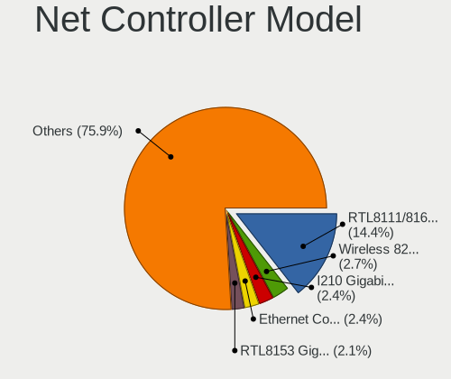

| Model                                                                  | Computers | Percent |
|------------------------------------------------------------------------|-----------|---------|
| Realtek RTL8111/8168/8211/8411 PCI Express Gigabit Ethernet Controller | 27        | 14.06%  |
| Intel Wireless 8265 / 8275                                             | 5         | 2.6%    |
| Intel Wi-Fi 6 AX200                                                    | 5         | 2.6%    |
| Intel I350 Gigabit Network Connection                                  | 5         | 2.6%    |
| Intel I210 Gigabit Network Connection                                  | 5         | 2.6%    |
| Realtek RTL8153 Gigabit Ethernet Adapter                               | 4         | 2.08%   |
| Realtek RTL810xE PCI Express Fast Ethernet controller                  | 4         | 2.08%   |
| Qualcomm Atheros QCA9565 / AR9565 Wireless Network Adapter             | 4         | 2.08%   |
| Qualcomm Atheros QCA9377 802.11ac Wireless Network Adapter             | 4         | 2.08%   |
| Intel Ethernet Controller X550                                         | 4         | 2.08%   |
| Intel 82579LM Gigabit Network Connection (Lewisville)                  | 4         | 2.08%   |
| Realtek RTL8821CE 802.11ac PCIe Wireless Network Adapter               | 3         | 1.56%   |
| Realtek RTL8125 2.5GbE Controller                                      | 3         | 1.56%   |
| Qualcomm Atheros QCA6174 802.11ac Wireless Network Adapter             | 3         | 1.56%   |
| Intel Wireless 7260                                                    | 3         | 1.56%   |
| Intel Wi-Fi 6 AX201                                                    | 3         | 1.56%   |
| Intel Ethernet Controller I225-V                                       | 3         | 1.56%   |
| Intel Comet Lake PCH-LP CNVi WiFi                                      | 3         | 1.56%   |
| Intel 82574L Gigabit Network Connection                                | 3         | 1.56%   |
| Broadcom NetXtreme BCM5720 Gigabit Ethernet PCIe                       | 3         | 1.56%   |
| Broadcom BCM57416 NetXtreme-E Dual-Media 10G RDMA Ethernet Controller  | 3         | 1.56%   |
| American Megatrends Virtual Ethernet.                                  | 3         | 1.56%   |
| Standard Microsystems Ethernet controller                              | 2         | 1.04%   |
| Realtek RTL8814AU 802.11a/b/g/n/ac Wireless Adapter                    | 2         | 1.04%   |
| Realtek RTL8152 Fast Ethernet Adapter                                  | 2         | 1.04%   |
| Ralink MT7601U Wireless Adapter                                        | 2         | 1.04%   |
| Qualcomm Atheros AR9462 Wireless Network Adapter                       | 2         | 1.04%   |
| Intel Wireless 8260                                                    | 2         | 1.04%   |
| Intel Wireless 3165                                                    | 2         | 1.04%   |
| Intel Wi-Fi 6E(802.11ax) AX210/AX1675* 2x2 [Typhoon Peak]              | 2         | 1.04%   |
| Intel I211 Gigabit Network Connection                                  | 2         | 1.04%   |
| Intel Ethernet Connection (2) I219-LM                                  | 2         | 1.04%   |
| Intel Ethernet Connection (14) I219-LM                                 | 2         | 1.04%   |
| Intel Ethernet Connection (10) I219-V                                  | 2         | 1.04%   |
| Intel 82599ES 10-Gigabit SFI/SFP+ Network Connection                   | 2         | 1.04%   |
| Insyde Software RNDIS/Ethernet Gadget                                  | 2         | 1.04%   |
| Broadcom NetXtreme BCM5764M Gigabit Ethernet PCIe                      | 2         | 1.04%   |
| TP-Link UE300 10/100/1000 LAN (ethernet mode) [Realtek RTL8153]        | 1         | 0.52%   |
| TP-Link Archer T4U ver.3                                               | 1         | 0.52%   |
| TP-Link Archer T3U [Realtek RTL8812BU]                                 | 1         | 0.52%   |

Wireless Vendor
---------------

Wireless vendors

| Vendor                          | Computers | Percent |
|---------------------------------|-----------|---------|
| Intel                           | 33        | 45.83%  |
| Qualcomm Atheros                | 14        | 19.44%  |
| Realtek Semiconductor           | 13        | 18.06%  |
| Broadcom                        | 3         | 4.17%   |
| TP-Link                         | 2         | 2.78%   |
| Ralink Technology               | 2         | 2.78%   |
| Broadcom Limited                | 2         | 2.78%   |
| Sierra Wireless                 | 1         | 1.39%   |
| Ralink                          | 1         | 1.39%   |
| Qualcomm Atheros Communications | 1         | 1.39%   |

Wireless Model
--------------

Wireless models

| Model                                                       | Computers | Percent |
|-------------------------------------------------------------|-----------|---------|
| Intel Wireless 8265 / 8275                                  | 5         | 6.94%   |
| Intel Wi-Fi 6 AX200                                         | 5         | 6.94%   |
| Qualcomm Atheros QCA9565 / AR9565 Wireless Network Adapter  | 4         | 5.56%   |
| Qualcomm Atheros QCA9377 802.11ac Wireless Network Adapter  | 4         | 5.56%   |
| Realtek RTL8821CE 802.11ac PCIe Wireless Network Adapter    | 3         | 4.17%   |
| Qualcomm Atheros QCA6174 802.11ac Wireless Network Adapter  | 3         | 4.17%   |
| Intel Wireless 7260                                         | 3         | 4.17%   |
| Intel Wi-Fi 6 AX201                                         | 3         | 4.17%   |
| Intel Comet Lake PCH-LP CNVi WiFi                           | 3         | 4.17%   |
| Realtek RTL8814AU 802.11a/b/g/n/ac Wireless Adapter         | 2         | 2.78%   |
| Ralink MT7601U Wireless Adapter                             | 2         | 2.78%   |
| Qualcomm Atheros AR9462 Wireless Network Adapter            | 2         | 2.78%   |
| Intel Wireless 8260                                         | 2         | 2.78%   |
| Intel Wireless 3165                                         | 2         | 2.78%   |
| Intel Wi-Fi 6E(802.11ax) AX210/AX1675* 2x2 [Typhoon Peak]   | 2         | 2.78%   |
| TP-Link Archer T4U ver.3                                    | 1         | 1.39%   |
| TP-Link Archer T3U [Realtek RTL8812BU]                      | 1         | 1.39%   |
| Sierra Wireless EM7345 4G LTE                               | 1         | 1.39%   |
| Realtek RTL88x2bu [AC1200 Techkey]                          | 1         | 1.39%   |
| Realtek RTL8852BE PCIe 802.11ax Wireless Network Controller | 1         | 1.39%   |
| Realtek RTL8852AE 802.11ax PCIe Wireless Network Adapter    | 1         | 1.39%   |
| Realtek RTL8822CE 802.11ac PCIe Wireless Network Adapter    | 1         | 1.39%   |
| Realtek RTL8822BE 802.11a/b/g/n/ac WiFi adapter             | 1         | 1.39%   |
| Realtek RTL8723DE Wireless Network Adapter                  | 1         | 1.39%   |
| Realtek RTL8723BE PCIe Wireless Network Adapter             | 1         | 1.39%   |
| Realtek RTL8191SEvB Wireless LAN Controller                 | 1         | 1.39%   |
| Ralink RT2790 Wireless 802.11n 1T/2R PCIe                   | 1         | 1.39%   |
| Qualcomm Atheros AR9271 802.11n                             | 1         | 1.39%   |
| Qualcomm Atheros AR93xx Wireless Network Adapter            | 1         | 1.39%   |
| Intel Wireless 7265                                         | 1         | 1.39%   |
| Intel Raptor Lake-S PCH CNVi WiFi                           | 1         | 1.39%   |
| Intel Raptor Lake PCH CNVi WiFi                             | 1         | 1.39%   |
| Intel Comet Lake PCH CNVi WiFi                              | 1         | 1.39%   |
| Intel Centrino Wireless-N 2230                              | 1         | 1.39%   |
| Intel Centrino Ultimate-N 6300                              | 1         | 1.39%   |
| Intel Centrino Advanced-N 6205 [Taylor Peak]                | 1         | 1.39%   |
| Intel Cannon Lake PCH CNVi WiFi                             | 1         | 1.39%   |
| Broadcom Limited BCM43224 802.11a/b/g/n                     | 1         | 1.39%   |
| Broadcom Limited BCM4313 802.11bgn Wireless Network Adapter | 1         | 1.39%   |
| Broadcom BCM43225 802.11b/g/n                               | 1         | 1.39%   |

Ethernet Vendor
---------------

Ethernet vendors

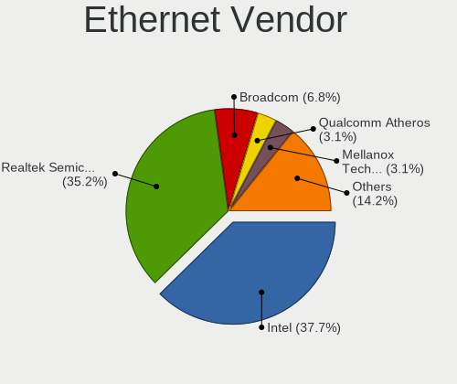

| Vendor                | Computers | Percent |
|-----------------------|-----------|---------|
| Realtek Semiconductor | 38        | 36.19%  |
| Intel                 | 38        | 36.19%  |
| Broadcom              | 8         | 7.62%   |
| Qualcomm Atheros      | 3         | 2.86%   |
| Mellanox Technologies | 3         | 2.86%   |
| Broadcom Limited      | 3         | 2.86%   |
| American Megatrends   | 3         | 2.86%   |
| Standard Microsystems | 2         | 1.9%    |
| Insyde Software       | 2         | 1.9%    |
| TP-Link               | 1         | 0.95%   |
| Samsung Electronics   | 1         | 0.95%   |
| MediaTek              | 1         | 0.95%   |
| Emulex                | 1         | 0.95%   |
| ASIX Electronics      | 1         | 0.95%   |

Ethernet Model
--------------

Ethernet models

| Model                                                                  | Computers | Percent |
|------------------------------------------------------------------------|-----------|---------|
| Realtek RTL8111/8168/8211/8411 PCI Express Gigabit Ethernet Controller | 27        | 22.69%  |
| Intel I350 Gigabit Network Connection                                  | 5         | 4.2%    |
| Intel I210 Gigabit Network Connection                                  | 5         | 4.2%    |
| Realtek RTL8153 Gigabit Ethernet Adapter                               | 4         | 3.36%   |
| Realtek RTL810xE PCI Express Fast Ethernet controller                  | 4         | 3.36%   |
| Intel Ethernet Controller X550                                         | 4         | 3.36%   |
| Intel 82579LM Gigabit Network Connection (Lewisville)                  | 4         | 3.36%   |
| Realtek RTL8125 2.5GbE Controller                                      | 3         | 2.52%   |
| Intel Ethernet Controller I225-V                                       | 3         | 2.52%   |
| Intel 82574L Gigabit Network Connection                                | 3         | 2.52%   |
| Broadcom NetXtreme BCM5720 Gigabit Ethernet PCIe                       | 3         | 2.52%   |
| Broadcom BCM57416 NetXtreme-E Dual-Media 10G RDMA Ethernet Controller  | 3         | 2.52%   |
| American Megatrends Virtual Ethernet.                                  | 3         | 2.52%   |
| Standard Microsystems Ethernet controller                              | 2         | 1.68%   |
| Realtek RTL8152 Fast Ethernet Adapter                                  | 2         | 1.68%   |
| Intel I211 Gigabit Network Connection                                  | 2         | 1.68%   |
| Intel Ethernet Connection (2) I219-LM                                  | 2         | 1.68%   |
| Intel Ethernet Connection (14) I219-LM                                 | 2         | 1.68%   |
| Intel Ethernet Connection (10) I219-V                                  | 2         | 1.68%   |
| Intel 82599ES 10-Gigabit SFI/SFP+ Network Connection                   | 2         | 1.68%   |
| Insyde Software RNDIS/Ethernet Gadget                                  | 2         | 1.68%   |
| Broadcom NetXtreme BCM5764M Gigabit Ethernet PCIe                      | 2         | 1.68%   |
| TP-Link UE300 10/100/1000 LAN (ethernet mode) [Realtek RTL8153]        | 1         | 0.84%   |
| Samsung GT-I9070 (network tethering, USB debugging enabled)            | 1         | 0.84%   |
| Realtek RTL-8100/8101L/8139 PCI Fast Ethernet Adapter                  | 1         | 0.84%   |
| Qualcomm Atheros Killer E220x Gigabit Ethernet Controller              | 1         | 0.84%   |
| Qualcomm Atheros AR8162 Fast Ethernet                                  | 1         | 0.84%   |
| Qualcomm Atheros AR8151 v2.0 Gigabit Ethernet                          | 1         | 0.84%   |
| Mellanox MT28800 Family [ConnectX-5 Ex]                                | 1         | 0.84%   |
| Mellanox MT27800 Family [ConnectX-5]                                   | 1         | 0.84%   |
| Mellanox MT26448 [ConnectX EN 10GigE, PCIe 2.0 5GT/s]                  | 1         | 0.84%   |
| MediaTek moto e22                                                      | 1         | 0.84%   |
| Intel Ethernet Controller 10-Gigabit X540-AT2                          | 1         | 0.84%   |
| Intel Ethernet Connection I219-V                                       | 1         | 0.84%   |
| Intel Ethernet Connection I219-LM                                      | 1         | 0.84%   |
| Intel Ethernet Connection I218-LM                                      | 1         | 0.84%   |
| Intel Ethernet Connection I217-LM                                      | 1         | 0.84%   |
| Intel Ethernet Connection (7) I219-LM                                  | 1         | 0.84%   |
| Intel Ethernet Connection (6) I219-V                                   | 1         | 0.84%   |
| Intel Ethernet Connection (5) I219-V                                   | 1         | 0.84%   |

Net Controller Kind
-------------------

Ethernet, WiFi or modem

| Kind     | Computers | Percent |
|----------|-----------|---------|
| Ethernet | 88        | 56.05%  |
| WiFi     | 68        | 43.31%  |
| Unknown  | 1         | 0.64%   |

Used Controller
---------------

Currently used network controller

| Kind     | Computers | Percent |
|----------|-----------|---------|
| Ethernet | 54        | 54.55%  |
| WiFi     | 45        | 45.45%  |

NICs
----

Total network controllers on board

| Total | Computers | Percent |
|-------|-----------|---------|
| 2     | 51        | 49.04%  |
| 1     | 32        | 30.77%  |
| 4     | 7         | 6.73%   |
| 3     | 5         | 4.81%   |
| 0     | 4         | 3.85%   |
| 6     | 2         | 1.92%   |
| 5     | 2         | 1.92%   |
| 8     | 1         | 0.96%   |

IPv6
----

IPv6 vs IPv4

| Used | Computers | Percent |
|------|-----------|---------|
| No   | 79        | 74.53%  |
| Yes  | 27        | 25.47%  |

Bluetooth
---------

Bluetooth Vendor
----------------

Controller vendors

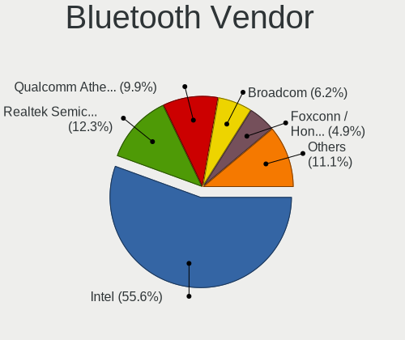

| Vendor                          | Computers | Percent |
|---------------------------------|-----------|---------|
| Intel                           | 31        | 51.67%  |
| Realtek Semiconductor           | 9         | 15%     |
| Qualcomm Atheros Communications | 8         | 13.33%  |
| Broadcom                        | 4         | 6.67%   |
| Foxconn / Hon Hai               | 3         | 5%      |
| Cambridge Silicon Radio         | 2         | 3.33%   |
| Lite-On Technology              | 1         | 1.67%   |
| IMC Networks                    | 1         | 1.67%   |
| ASUSTek Computer                | 1         | 1.67%   |

Bluetooth Model
---------------

Controller models

| Model                                               | Computers | Percent |
|-----------------------------------------------------|-----------|---------|
| Intel Bluetooth wireless interface                  | 13        | 21.67%  |
| Realtek Bluetooth Radio                             | 7         | 11.67%  |
| Intel AX201 Bluetooth                               | 7         | 11.67%  |
| Qualcomm Atheros  Bluetooth Device                  | 6         | 10%     |
| Intel AX200 Bluetooth                               | 5         | 8.33%   |
| Intel Bluetooth Device                              | 2         | 3.33%   |
| Intel AX210 Bluetooth                               | 2         | 3.33%   |
| Foxconn / Hon Hai Bluetooth Device                  | 2         | 3.33%   |
| Cambridge Silicon Radio Bluetooth Dongle (HCI mode) | 2         | 3.33%   |
| Realtek RTL8822BE Bluetooth 4.2 Adapter             | 1         | 1.67%   |
| Realtek  Bluetooth 4.2 Adapter                      | 1         | 1.67%   |
| Qualcomm Atheros QCA61x4 Bluetooth 4.0              | 1         | 1.67%   |
| Qualcomm Atheros AR3012 Bluetooth 4.0               | 1         | 1.67%   |
| Lite-On Bluetooth Device                            | 1         | 1.67%   |
| Intel Centrino Bluetooth Wireless Transceiver       | 1         | 1.67%   |
| Intel Bluetooth 9460/9560 Jefferson Peak (JfP)      | 1         | 1.67%   |
| IMC Networks Bluetooth Device                       | 1         | 1.67%   |
| Foxconn / Hon Hai Broadcom BCM20702 Bluetooth       | 1         | 1.67%   |
| Broadcom HP Portable SoftSailing                    | 1         | 1.67%   |
| Broadcom BCM43142A0 Bluetooth Device                | 1         | 1.67%   |
| Broadcom BCM20702A0 Bluetooth 4.0                   | 1         | 1.67%   |
| Broadcom BCM2045 Bluetooth                          | 1         | 1.67%   |
| ASUS Broadcom BCM20702A0 Bluetooth                  | 1         | 1.67%   |

Sound
-----

Sound Vendor
------------

Sound card vendors

| Vendor                   | Computers | Percent |
|--------------------------|-----------|---------|
| Intel                    | 63        | 47.73%  |
| AMD                      | 29        | 21.97%  |
| Nvidia                   | 27        | 20.45%  |
| C-Media Electronics      | 3         | 2.27%   |
| Micro Star International | 2         | 1.52%   |
| Plantronics              | 1         | 0.76%   |
| JMTek                    | 1         | 0.76%   |
| Giga-Byte Technology     | 1         | 0.76%   |
| Creative Technology      | 1         | 0.76%   |
| Conrad Electronic SE     | 1         | 0.76%   |
| Conexant Systems         | 1         | 0.76%   |
| ASUSTek Computer         | 1         | 0.76%   |
| Apple                    | 1         | 0.76%   |

Sound Model
-----------

Sound card models

| Model                                                                      | Computers | Percent |
|----------------------------------------------------------------------------|-----------|---------|
| AMD Family 17h/19h HD Audio Controller                                     | 12        | 7.59%   |
| Intel Sunrise Point-LP HD Audio                                            | 9         | 5.7%    |
| AMD Starship/Matisse HD Audio Controller                                   | 7         | 4.43%   |
| Intel 7 Series/C216 Chipset Family High Definition Audio Controller        | 6         | 3.8%    |
| AMD Renoir Radeon High Definition Audio Controller                         | 5         | 3.16%   |
| AMD Family 15h (Models 60h-6fh) Audio Controller                           | 5         | 3.16%   |
| Intel Tiger Lake-LP Smart Sound Technology Audio Controller                | 4         | 2.53%   |
| Intel Tiger Lake-H HD Audio Controller                                     | 4         | 2.53%   |
| Intel Haswell-ULT HD Audio Controller                                      | 4         | 2.53%   |
| Intel 8 Series HD Audio Controller                                         | 4         | 2.53%   |
| AMD Raven/Raven2/Fenghuang HDMI/DP Audio Controller                        | 4         | 2.53%   |
| Nvidia GF108 High Definition Audio Controller                              | 3         | 1.9%    |
| Nvidia GA106 High Definition Audio Controller                              | 3         | 1.9%    |
| Intel Comet Lake PCH-LP cAVS                                               | 3         | 1.9%    |
| Intel Cannon Lake PCH cAVS                                                 | 3         | 1.9%    |
| Intel 8 Series/C220 Series Chipset High Definition Audio Controller        | 3         | 1.9%    |
| AMD Kabini HDMI/DP Audio                                                   | 3         | 1.9%    |
| Nvidia TU116 High Definition Audio Controller                              | 2         | 1.27%   |
| Nvidia TU107 GeForce GTX 1650 High Definition Audio Controller             | 2         | 1.27%   |
| Nvidia GP107GL High Definition Audio Controller                            | 2         | 1.27%   |
| Nvidia GM204 High Definition Audio Controller                              | 2         | 1.27%   |
| Nvidia GM107 High Definition Audio Controller [GeForce 940MX]              | 2         | 1.27%   |
| Nvidia GK104 HDMI Audio Controller                                         | 2         | 1.27%   |
| Nvidia Audio device                                                        | 2         | 1.27%   |
| Micro Star International USB Audio                                         | 2         | 1.27%   |
| Intel Raptor Lake-P/U/H cAVS                                               | 2         | 1.27%   |
| Intel C600/X79 series chipset High Definition Audio Controller             | 2         | 1.27%   |
| Intel Atom Processor Z36xxx/Z37xxx Series High Definition Audio Controller | 2         | 1.27%   |
| Intel 82801JI (ICH10 Family) HD Audio Controller                           | 2         | 1.27%   |
| Intel 6 Series/C200 Series Chipset Family High Definition Audio Controller | 2         | 1.27%   |
| Intel 200 Series PCH HD Audio                                              | 2         | 1.27%   |
| C-Media Electronics USB Audio Device                                       | 2         | 1.27%   |
| AMD Rembrandt Radeon High Definition Audio Controller                      | 2         | 1.27%   |
| AMD High Definition Audio Controller                                       | 2         | 1.27%   |
| Plantronics Blackwire 320                                                  | 1         | 0.63%   |
| Nvidia TU106 High Definition Audio Controller                              | 1         | 0.63%   |
| Nvidia GP104 High Definition Audio Controller                              | 1         | 0.63%   |
| Nvidia GK208 HDMI/DP Audio Controller                                      | 1         | 0.63%   |
| Nvidia GK107 HDMI Audio Controller                                         | 1         | 0.63%   |
| Nvidia GA104 High Definition Audio Controller                              | 1         | 0.63%   |

Memory
------

Memory Vendor
-------------

Memory module vendors

| Vendor              | Computers | Percent |
|---------------------|-----------|---------|
| Samsung Electronics | 15        | 19.74%  |
| SK hynix            | 13        | 17.11%  |
| Kingston            | 13        | 17.11%  |
| Micron Technology   | 10        | 13.16%  |
| Crucial             | 7         | 9.21%   |
| G.Skill             | 4         | 5.26%   |
| Elpida              | 3         | 3.95%   |
| Unknown             | 2         | 2.63%   |
| Corsair             | 2         | 2.63%   |
| Unknown             | 2         | 2.63%   |
| Unknown (0x0100)    | 1         | 1.32%   |
| Timetec             | 1         | 1.32%   |
| QEMU                | 1         | 1.32%   |
| Micron/Elpida       | 1         | 1.32%   |
| Hewlett-Packard     | 1         | 1.32%   |

Memory Model
------------

Memory module models

| Model                                                            | Computers | Percent |
|------------------------------------------------------------------|-----------|---------|
| Samsung RAM M471A1K43CB1-CTD 8GB SODIMM DDR4 2667MT/s            | 2         | 2.27%   |
| Micron RAM 4ATF51264HZ-3G2J1 4GB SODIMM DDR4 3200MT/s            | 2         | 2.27%   |
| Kingston RAM KF3200C16D4/16GX 16GB DIMM DDR4 3200MT/s            | 2         | 2.27%   |
| Elpida RAM EBJ81UG8EFU0-GN-F 8GB SODIMM DDR3 1600MT/s            | 2         | 2.27%   |
| Unknown                                                          | 2         | 2.27%   |
| Unknown RAM Module 8GB DIMM 1600MT/s                             | 1         | 1.14%   |
| Unknown RAM Module 4GB SODIMM DDR3 1600MT/s                      | 1         | 1.14%   |
| Unknown (0x0100) RAM R744G2133S1S 4GB SODIMM DDR4 1866MT/s       | 1         | 1.14%   |
| Timetec RAM SD3-1600 8GB SODIMM DDR3 1600MT/s                    | 1         | 1.14%   |
| SK hynix RAM Module 4GB DIMM DDR3 1066MT/s                       | 1         | 1.14%   |
| SK hynix RAM HMT451S6BFR8A-PB 4GB SODIMM DDR3 1600MT/s           | 1         | 1.14%   |
| SK hynix RAM HMT351U6AFR8C-H9 4GB DIMM DDR3 1333MT/s             | 1         | 1.14%   |
| SK hynix RAM HMT351S6EFR8A-PB 4GB SODIMM DDR3 1600MT/s           | 1         | 1.14%   |
| SK hynix RAM HMT351S6EFR8A-PB 4096MB SODIMM DDR3 1600MT/s        | 1         | 1.14%   |
| SK hynix RAM HMT351S6CFR8C-H9 4GB SODIMM DDR3 1333MT/s           | 1         | 1.14%   |
| SK hynix RAM HMT325S6BFR8C-H9 2GB SODIMM DDR3 1333MT/s           | 1         | 1.14%   |
| SK hynix RAM HMAA8GR7CJR4N-XN 64GB DIMM DDR4 3200MT/s            | 1         | 1.14%   |
| SK hynix RAM HMA851S6CJR6N-VK 4GB Row Of Chips DDR4 1866MT/s     | 1         | 1.14%   |
| SK hynix RAM HMA851S6AFR6N-UH 4GB SODIMM DDR4 2400MT/s           | 1         | 1.14%   |
| SK hynix RAM HMA82GR7AFR8N-VK 16GB DIMM DDR4 2667MT/s            | 1         | 1.14%   |
| SK hynix RAM HMA82GR7AFR8N-UH 16GB DIMM DDR4 2400MT/s            | 1         | 1.14%   |
| SK hynix RAM HMA81GU6AFR8N-UH 8GB DIMM DDR4 2400MT/s             | 1         | 1.14%   |
| SK hynix RAM HMA81GS6DJR8N-XN 8GB SODIMM DDR4 3200MT/s           | 1         | 1.14%   |
| SK hynix RAM H9CCNNNBJTALAR-NVD 4GB Row Of Chips LPDDR3 2133MT/s | 1         | 1.14%   |
| Samsung RAM Module 4GB SODIMM DDR3 1600MT/s                      | 1         | 1.14%   |
| Samsung RAM Module 4GB Row Of Chips LPDDR3 2133MT/s              | 1         | 1.14%   |
| Samsung RAM Module 16GB SODIMM DDR4 3200MT/s                     | 1         | 1.14%   |
| Samsung RAM Module 16GB DIMM DDR4 2667MT/s                       | 1         | 1.14%   |
| Samsung RAM M471B1G73DB0-YK0 8GB SODIMM DDR3 1600MT/s            | 1         | 1.14%   |
| Samsung RAM M471A4G43AB1-CWE 32GB SODIMM DDR4 3200MT/s           | 1         | 1.14%   |
| Samsung RAM M471A1K43DB1-CWE 8GB SODIMM DDR4 3200MT/s            | 1         | 1.14%   |
| Samsung RAM M471A1K43DB1-CTD 8GB SODIMM DDR4 2667MT/s            | 1         | 1.14%   |
| Samsung RAM M471A1G44BB0-CWE 8GB SODIMM DDR4 3200MT/s            | 1         | 1.14%   |
| Samsung RAM M471A1G44AB0-CTD 8GB SODIMM DDR4 2667MT/s            | 1         | 1.14%   |
| Samsung RAM M393A4G43AB3-CWE 32GB DIMM DDR4 3200MT/s             | 1         | 1.14%   |
| Samsung RAM M393A1K43DB1-CVF 8GB DIMM DDR4 2933MT/s              | 1         | 1.14%   |
| Samsung RAM M378A5244CB0-CRC 4GB DIMM DDR4 3066MT/s              | 1         | 1.14%   |
| Samsung RAM M378A4G43MB1-CTD 32GB DIMM DDR4 3466MT/s             | 1         | 1.14%   |
| QEMU RAM Module 8GB DIMM RAM                                     | 1         | 1.14%   |
| Micron/Elpida RAM Module 4GB Row Of Chips LPDDR3 1867MT/s        | 1         | 1.14%   |

Memory Kind
-----------

Memory module kinds

| Kind    | Computers | Percent |
|---------|-----------|---------|
| DDR4    | 38        | 59.38%  |
| DDR3    | 16        | 25%     |
| LPDDR3  | 4         | 6.25%   |
| DDR5    | 2         | 3.13%   |
| RAM     | 1         | 1.56%   |
| LPDDR5  | 1         | 1.56%   |
| DDR2    | 1         | 1.56%   |
| Unknown | 1         | 1.56%   |

Memory Form Factor
------------------

Physical design of the memory module

| Name         | Computers | Percent |
|--------------|-----------|---------|
| DIMM         | 31        | 48.44%  |
| SODIMM       | 27        | 42.19%  |
| Row Of Chips | 6         | 9.38%   |

Memory Size
-----------

Memory module size

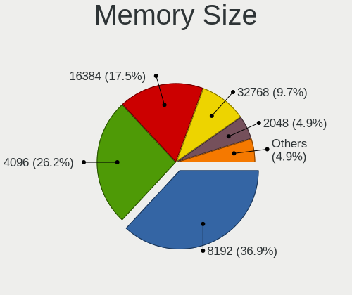

| Size  | Computers | Percent |
|-------|-----------|---------|
| 8192  | 26        | 37.68%  |
| 4096  | 17        | 24.64%  |
| 16384 | 11        | 15.94%  |
| 32768 | 8         | 11.59%  |
| 65536 | 3         | 4.35%   |
| 2048  | 3         | 4.35%   |
| 49152 | 1         | 1.45%   |

Memory Speed
------------

Memory module speed

| Speed   | Computers | Percent |
|---------|-----------|---------|
| 3200    | 21        | 28.77%  |
| 2667    | 11        | 15.07%  |
| 1600    | 11        | 15.07%  |
| 2400    | 5         | 6.85%   |
| 2133    | 5         | 6.85%   |
| 1333    | 4         | 5.48%   |
| 1866    | 3         | 4.11%   |
| 4800    | 2         | 2.74%   |
| 1867    | 2         | 2.74%   |
| 6400    | 1         | 1.37%   |
| 3733    | 1         | 1.37%   |
| 3466    | 1         | 1.37%   |
| 3066    | 1         | 1.37%   |
| 2933    | 1         | 1.37%   |
| 1066    | 1         | 1.37%   |
| 800     | 1         | 1.37%   |
| 667     | 1         | 1.37%   |
| Unknown | 1         | 1.37%   |

Printers & scanners
-------------------

Printer Vendor
--------------

Printer device vendors

| Vendor          | Computers | Percent |
|-----------------|-----------|---------|
| Hewlett-Packard | 1         | 100%    |

Printer Model
-------------

Printer device models

| Model             | Computers | Percent |
|-------------------|-----------|---------|
| HP LaserJet P1102 | 1         | 100%    |

Scanner Vendor
--------------

Scanner device vendors

Zero info for selected period =(

Scanner Model
-------------

Scanner device models

Zero info for selected period =(

Camera
------

Camera Vendor
-------------

Camera device vendors

| Vendor                                 | Computers | Percent |
|----------------------------------------|-----------|---------|
| Chicony Electronics                    | 13        | 23.64%  |
| Microdia                               | 6         | 10.91%  |
| IMC Networks                           | 5         | 9.09%   |
| Bison Electronics                      | 5         | 9.09%   |
| Realtek Semiconductor                  | 4         | 7.27%   |
| Cheng Uei Precision Industry (Foxlink) | 4         | 7.27%   |
| Suyin                                  | 3         | 5.45%   |
| Luxvisions Innotech Limited            | 3         | 5.45%   |
| Logitech                               | 3         | 5.45%   |
| Microsoft                              | 2         | 3.64%   |
| USB Camera                             | 1         | 1.82%   |
| Syntek                                 | 1         | 1.82%   |
| SunplusIT                              | 1         | 1.82%   |
| Sunplus Innovation Technology          | 1         | 1.82%   |
| Creative Technology                    | 1         | 1.82%   |
| Apple                                  | 1         | 1.82%   |
| Acer                                   | 1         | 1.82%   |

Camera Model
------------

Camera device models

| Model                                                        | Computers | Percent |
|--------------------------------------------------------------|-----------|---------|
| IMC Networks Integrated Camera                               | 4         | 7.02%   |
| Chicony HP Truevision HD                                     | 3         | 5.26%   |
| Bison Integrated Camera                                      | 3         | 5.26%   |
| Realtek Integrated_Webcam_HD                                 | 2         | 3.51%   |
| Microdia Integrated Webcam HD                                | 2         | 3.51%   |
| Chicony Integrated HP HD Webcam                              | 2         | 3.51%   |
| USB Camera USB Camera                                        | 1         | 1.75%   |
| Syntek Integrated Camera                                     | 1         | 1.75%   |
| Suyin HP Truevision HD                                       | 1         | 1.75%   |
| Suyin HD WebCam                                              | 1         | 1.75%   |
| Suyin 1.3M WebCam (notebook emachines E730, Acer sub-brand)  | 1         | 1.75%   |
| SunplusIT HD Webcam                                          | 1         | 1.75%   |
| Sunplus Laptop_Integrated_Webcam_FHD                         | 1         | 1.75%   |
| Realtek Integrated Webcam HD                                 | 1         | 1.75%   |
| Realtek EasyCamera                                           | 1         | 1.75%   |
| Microsoft LifeCam VX-700                                     | 1         | 1.75%   |
| Microsoft LifeCam HD-3000                                    | 1         | 1.75%   |
| Microdia USB 2.0 Camera                                      | 1         | 1.75%   |
| Microdia Lenovo EasyCamera                                   | 1         | 1.75%   |
| Microdia Integrated_Webcam_HD                                | 1         | 1.75%   |
| Microdia Integrated Camera                                   | 1         | 1.75%   |
| Luxvisions Innotech Limited Integrated Camera                | 1         | 1.75%   |
| Luxvisions Innotech Limited HP TrueVision HD Camera          | 1         | 1.75%   |
| Luxvisions Innotech Limited HP HD Camera                     | 1         | 1.75%   |
| Logitech Webcam C270                                         | 1         | 1.75%   |
| Logitech Webcam C120                                         | 1         | 1.75%   |
| Logitech Webcam B500                                         | 1         | 1.75%   |
| Logitech QuickCam Vision Pro                                 | 1         | 1.75%   |
| IMC Networks USB2.0 HD IR UVC WebCam                         | 1         | 1.75%   |
| Creative Live! Cam Chat HD [VF0700]                          | 1         | 1.75%   |
| Chicony USB2.0 Camera                                        | 1         | 1.75%   |
| Chicony TOSHIBA Web Camera - HD                              | 1         | 1.75%   |
| Chicony Lenovo EasyCamera                                    | 1         | 1.75%   |
| Chicony Integrated RGB Camera                                | 1         | 1.75%   |
| Chicony HP TrueVision HD Camera                              | 1         | 1.75%   |
| Chicony HD WebCam                                            | 1         | 1.75%   |
| Chicony EasyCamera                                           | 1         | 1.75%   |
| Chicony 8M Camera                                            | 1         | 1.75%   |
| Chicony 720p HD Camera                                       | 1         | 1.75%   |
| Cheng Uei Precision Industry (Foxlink) XiaoMi USB 2.0 Webcam | 1         | 1.75%   |

Security
--------

Fingerprint Vendor
------------------

Fingerprint sensor vendors

| Vendor                | Computers | Percent |
|-----------------------|-----------|---------|
| Validity Sensors      | 8         | 66.67%  |
| Synaptics             | 3         | 25%     |
| Elan Microelectronics | 1         | 8.33%   |

Fingerprint Model
-----------------

Fingerprint sensor models

| Model                                             | Computers | Percent |
|---------------------------------------------------|-----------|---------|
| Validity Sensors VFS491                           | 2         | 16.67%  |
| Validity Sensors VFS7552 Touch Fingerprint Sensor | 1         | 8.33%   |
| Validity Sensors VFS5011 Fingerprint Reader       | 1         | 8.33%   |
| Validity Sensors VFS495 Fingerprint Reader        | 1         | 8.33%   |
| Validity Sensors VFS 5011 fingerprint sensor      | 1         | 8.33%   |
| Validity Sensors Swipe Fingerprint Sensor         | 1         | 8.33%   |
| Validity Sensors Fingerprint scanner              | 1         | 8.33%   |
| Synaptics WBDI                                    | 1         | 8.33%   |
| Synaptics UWP WBDI Device                         | 1         | 8.33%   |
| Synaptics Metallica MIS Touch Fingerprint Reader  | 1         | 8.33%   |
| Elan ELAN:ARM-M4                                  | 1         | 8.33%   |

Chipcard Vendor
---------------

Chipcard module vendors

| Vendor           | Computers | Percent |
|------------------|-----------|---------|
| Broadcom         | 2         | 40%     |
| SCM Microsystems | 1         | 20%     |
| OmniKey          | 1         | 20%     |
| Alcor Micro      | 1         | 20%     |

Chipcard Model
--------------

Chipcard module models

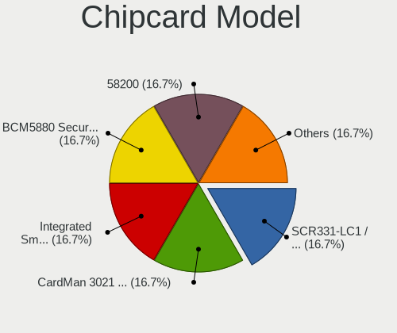

| Model                                                  | Computers | Percent |
|--------------------------------------------------------|-----------|---------|
| SCM Microsystems SCR331-LC1 / SCR3310 SmartCard Reader | 1         | 20%     |
| OmniKey CardMan 3021 / 3121                            | 1         | 20%     |
| Broadcom BCM5880 Secure Applications Processor         | 1         | 20%     |
| Broadcom 58200                                         | 1         | 20%     |
| Alcor Micro AU9540 Smartcard Reader                    | 1         | 20%     |

Unsupported
-----------

Unsupported Devices
-------------------

Total unsupported devices on board

| Total | Computers | Percent |
|-------|-----------|---------|
| 0     | 54        | 51.92%  |
| 1     | 38        | 36.54%  |
| 2     | 8         | 7.69%   |
| 3     | 2         | 1.92%   |
| 7     | 1         | 0.96%   |
| 5     | 1         | 0.96%   |

Unsupported Device Types
------------------------

Types of unsupported devices

| Type                     | Computers | Percent |
|--------------------------|-----------|---------|
| Graphics card            | 19        | 29.23%  |
| Fingerprint reader       | 12        | 18.46%  |
| Net/wireless             | 8         | 12.31%  |
| Multimedia controller    | 6         | 9.23%   |
| Unassigned class         | 3         | 4.62%   |
| Sound                    | 3         | 4.62%   |
| Net/ethernet             | 3         | 4.62%   |
| Communication controller | 2         | 3.08%   |
| Bluetooth                | 2         | 3.08%   |
| Storage/raid             | 1         | 1.54%   |
| Storage/ide              | 1         | 1.54%   |
| Storage                  | 1         | 1.54%   |
| Network                  | 1         | 1.54%   |
| Firewire controller      | 1         | 1.54%   |
| Chipcard                 | 1         | 1.54%   |
| Camera                   | 1         | 1.54%   |

