Alpine - Tested Hardware & Statistics
-------------------------------------

A project to collect tested hardware configurations for Alpine.

Anyone can contribute to this report by the [hw-probe](https://github.com/linuxhw/hw-probe) tool:

    sudo -E hw-probe -all -upload

Please contribute! Especially if your hardware is rare.

This is a report for all computer types. See also reports for [desktops](/Dist/Alpine/Desktop/README.md) and [notebooks](/Dist/Alpine/Notebook/README.md).

Contents
--------

* [ Test Cases ](#test-cases)

* [ System ](#system)
  - [ OS                       ](#os)
  - [ OS Family                ](#os-family)
  - [ Kernel                   ](#kernel)
  - [ Kernel Family            ](#kernel-family)
  - [ Kernel Major Ver.        ](#kernel-major-ver)
  - [ Arch                     ](#arch)
  - [ DE                       ](#de)
  - [ Display Server           ](#display-server)
  - [ Display Manager          ](#display-manager)
  - [ OS Lang                  ](#os-lang)
  - [ Boot Mode                ](#boot-mode)
  - [ Filesystem               ](#filesystem)
  - [ Part. scheme             ](#part-scheme)
  - [ Dual Boot with Linux/BSD ](#dual-boot-with-linuxbsd)
  - [ Dual Boot (Win)          ](#dual-boot-win)

* [ Board ](#board)
  - [ Vendor                   ](#vendor)
  - [ Model                    ](#model)
  - [ Model Family             ](#model-family)
  - [ MFG Year                 ](#mfg-year)
  - [ Form Factor              ](#form-factor)
  - [ Secure Boot              ](#secure-boot)
  - [ Coreboot                 ](#coreboot)
  - [ RAM Size                 ](#ram-size)
  - [ RAM Used                 ](#ram-used)
  - [ Total Drives             ](#total-drives)
  - [ Has CD-ROM               ](#has-cd-rom)
  - [ Has Ethernet             ](#has-ethernet)
  - [ Has WiFi                 ](#has-wifi)
  - [ Has Bluetooth            ](#has-bluetooth)

* [ Location ](#location)
  - [ Country                  ](#country)
  - [ City                     ](#city)

* [ Drives ](#drives)
  - [ Drive Vendor             ](#drive-vendor)
  - [ Drive Model              ](#drive-model)
  - [ HDD Vendor               ](#hdd-vendor)
  - [ SSD Vendor               ](#ssd-vendor)
  - [ Drive Kind               ](#drive-kind)
  - [ Drive Connector          ](#drive-connector)
  - [ Drive Size               ](#drive-size)
  - [ Space Total              ](#space-total)
  - [ Space Used               ](#space-used)
  - [ Malfunc. Drives          ](#malfunc-drives)
  - [ Malfunc. Drive Vendor    ](#malfunc-drive-vendor)
  - [ Malfunc. HDD Vendor      ](#malfunc-hdd-vendor)
  - [ Malfunc. Drive Kind      ](#malfunc-drive-kind)
  - [ Failed Drives            ](#failed-drives)
  - [ Failed Drive Vendor      ](#failed-drive-vendor)
  - [ Drive Status             ](#drive-status)

* [ Storage controller ](#storage-controller)
  - [ Storage Vendor           ](#storage-vendor)
  - [ Storage Model            ](#storage-model)
  - [ Storage Kind             ](#storage-kind)

* [ Processor ](#processor)
  - [ CPU Vendor               ](#cpu-vendor)
  - [ CPU Model                ](#cpu-model)
  - [ CPU Model Family         ](#cpu-model-family)
  - [ CPU Cores                ](#cpu-cores)
  - [ CPU Sockets              ](#cpu-sockets)
  - [ CPU Threads              ](#cpu-threads)
  - [ CPU Op-Modes             ](#cpu-op-modes)
  - [ CPU Microcode            ](#cpu-microcode)
  - [ CPU Microarch            ](#cpu-microarch)

* [ Graphics ](#graphics)
  - [ GPU Vendor               ](#gpu-vendor)
  - [ GPU Model                ](#gpu-model)
  - [ GPU Combo                ](#gpu-combo)
  - [ GPU Driver               ](#gpu-driver)
  - [ GPU Memory               ](#gpu-memory)

* [ Monitor ](#monitor)
  - [ Monitor Vendor           ](#monitor-vendor)
  - [ Monitor Model            ](#monitor-model)
  - [ Monitor Resolution       ](#monitor-resolution)
  - [ Monitor Diagonal         ](#monitor-diagonal)
  - [ Monitor Width            ](#monitor-width)
  - [ Aspect Ratio             ](#aspect-ratio)
  - [ Monitor Area             ](#monitor-area)
  - [ Pixel Density            ](#pixel-density)
  - [ Multiple Monitors        ](#multiple-monitors)

* [ Network ](#network)
  - [ Net Controller Vendor    ](#net-controller-vendor)
  - [ Net Controller Model     ](#net-controller-model)
  - [ Wireless Vendor          ](#wireless-vendor)
  - [ Wireless Model           ](#wireless-model)
  - [ Ethernet Vendor          ](#ethernet-vendor)
  - [ Ethernet Model           ](#ethernet-model)
  - [ Net Controller Kind      ](#net-controller-kind)
  - [ Used Controller          ](#used-controller)
  - [ NICs                     ](#nics)
  - [ IPv6                     ](#ipv6)

* [ Bluetooth ](#bluetooth)
  - [ Bluetooth Vendor         ](#bluetooth-vendor)
  - [ Bluetooth Model          ](#bluetooth-model)

* [ Sound ](#sound)
  - [ Sound Vendor             ](#sound-vendor)
  - [ Sound Model              ](#sound-model)

* [ Memory ](#memory)
  - [ Memory Vendor            ](#memory-vendor)
  - [ Memory Model             ](#memory-model)
  - [ Memory Kind              ](#memory-kind)
  - [ Memory Form Factor       ](#memory-form-factor)
  - [ Memory Size              ](#memory-size)
  - [ Memory Speed             ](#memory-speed)

* [ Printers & scanners ](#printers--scanners)
  - [ Printer Vendor           ](#printer-vendor)
  - [ Printer Model            ](#printer-model)
  - [ Scanner Vendor           ](#scanner-vendor)
  - [ Scanner Model            ](#scanner-model)

* [ Camera ](#camera)
  - [ Camera Vendor            ](#camera-vendor)
  - [ Camera Model             ](#camera-model)

* [ Security ](#security)
  - [ Fingerprint Vendor       ](#fingerprint-vendor)
  - [ Fingerprint Model        ](#fingerprint-model)
  - [ Chipcard Vendor          ](#chipcard-vendor)
  - [ Chipcard Model           ](#chipcard-model)

* [ Unsupported ](#unsupported)
  - [ Unsupported Devices      ](#unsupported-devices)
  - [ Unsupported Device Types ](#unsupported-device-types)

Test Cases
----------

Total: 482

| Vendor        | Model                       | Form-Factor | Probe                                                      | Date         |
|---------------|-----------------------------|-------------|------------------------------------------------------------|--------------|
| ASUSTek       | PRIME B550-PLUS             | Desktop     | [8d3b9df361](https://linux-hardware.org/?probe=8d3b9df361) | Dec 30, 2025 |
| Supermicro    | X11SAA-AS060                | Server      | [21680fac8d](https://linux-hardware.org/?probe=21680fac8d) | Dec 29, 2025 |
| Framework     | Laptop 12 (13th Gen Inte... | Convertible | [c740bbf0e5](https://linux-hardware.org/?probe=c740bbf0e5) | Dec 24, 2025 |
| ASUSTek       | Vivobook Go E1504FA_E150... | Notebook    | [262342545d](https://linux-hardware.org/?probe=262342545d) | Dec 22, 2025 |
| Fujitsu       | D3313-G1 S26361-D3313-G1    | Desktop     | [c435331072](https://linux-hardware.org/?probe=c435331072) | Dec 18, 2025 |
| HP            | 1495                        | Desktop     | [06b7d83d73](https://linux-hardware.org/?probe=06b7d83d73) | Dec 13, 2025 |
| HP            | 1495                        | Desktop     | [855b490d20](https://linux-hardware.org/?probe=855b490d20) | Dec 13, 2025 |
| HP            | OMEN Laptop 15-en0xxx       | Notebook    | [2665fab320](https://linux-hardware.org/?probe=2665fab320) | Dec 07, 2025 |
| HP            | Pavilion x360 Convertibl... | Convertible | [4e48c31815](https://linux-hardware.org/?probe=4e48c31815) | Dec 01, 2025 |
| HP            | Pavilion g7                 | Notebook    | [0df2bc82c1](https://linux-hardware.org/?probe=0df2bc82c1) | Nov 27, 2025 |
| ASUSTek       | PRIME B450-PLUS             | Desktop     | [9b49b49d23](https://linux-hardware.org/?probe=9b49b49d23) | Nov 26, 2025 |
| Sony          | VPCZ13V9E                   | Notebook    | [0442db1985](https://linux-hardware.org/?probe=0442db1985) | Nov 24, 2025 |
| Foxconn       | 2A8C                        | Desktop     | [b9a2f08d89](https://linux-hardware.org/?probe=b9a2f08d89) | Nov 23, 2025 |
| Toshiba       | Satellite Pro C660          | Notebook    | [54b404d510](https://linux-hardware.org/?probe=54b404d510) | Nov 23, 2025 |
| Apple         | MacBookPro13,1              | Notebook    | [e28aed36f2](https://linux-hardware.org/?probe=e28aed36f2) | Nov 23, 2025 |
| Sony          | VPCZ13V9E                   | Notebook    | [7aa061e54b](https://linux-hardware.org/?probe=7aa061e54b) | Nov 22, 2025 |
| Medion        | S14406                      | Convertible | [7a2250e665](https://linux-hardware.org/?probe=7a2250e665) | Nov 21, 2025 |
| HP            | Pavilion g7                 | Notebook    | [1f65940fd4](https://linux-hardware.org/?probe=1f65940fd4) | Nov 21, 2025 |
| Foxconn       | 2A8C                        | Desktop     | [1e2ee56a90](https://linux-hardware.org/?probe=1e2ee56a90) | Nov 09, 2025 |
| Medion        | S14406                      | Convertible | [4078c7d7e5](https://linux-hardware.org/?probe=4078c7d7e5) | Nov 09, 2025 |
| Google        | Phaser                      | Notebook    | [f190e0be35](https://linux-hardware.org/?probe=f190e0be35) | Nov 06, 2025 |
| ASUSTek       | Z10PA-D8 Series             | Desktop     | [93f07b0589](https://linux-hardware.org/?probe=93f07b0589) | Oct 18, 2025 |
| ASUSTek       | Z10PA-D8 Series             | Desktop     | [2483946efb](https://linux-hardware.org/?probe=2483946efb) | Oct 17, 2025 |
| Acer          | Nitro AN515-54              | Notebook    | [7e2932acdc](https://linux-hardware.org/?probe=7e2932acdc) | Oct 17, 2025 |
| HP            | Pavilion x360 Convertibl... | Convertible | [79d6a80e89](https://linux-hardware.org/?probe=79d6a80e89) | Oct 14, 2025 |
| HP            | Laptop 15-dw1xxx            | Notebook    | [156a7ee4e4](https://linux-hardware.org/?probe=156a7ee4e4) | Oct 05, 2025 |
| HP            | Laptop 15s-fq2xxx           | Notebook    | [69efd2f0c9](https://linux-hardware.org/?probe=69efd2f0c9) | Sep 21, 2025 |
| Dell          | Latitude D430               | Notebook    | [de67ac2e3b](https://linux-hardware.org/?probe=de67ac2e3b) | Sep 16, 2025 |
| Google        | Reef                        | Notebook    | [699180218c](https://linux-hardware.org/?probe=699180218c) | Sep 16, 2025 |
| ASUSTek       | PRIME B360M-C               | Desktop     | [701ad62cc1](https://linux-hardware.org/?probe=701ad62cc1) | Sep 16, 2025 |
| ASUSTek       | VivoBook_ASUSLaptop X415... | Notebook    | [8ccfbf33fc](https://linux-hardware.org/?probe=8ccfbf33fc) | Sep 15, 2025 |
| ASUSTek       | PRIME B450M-K II            | Desktop     | [b2eb852049](https://linux-hardware.org/?probe=b2eb852049) | Sep 14, 2025 |
| Dell          | Latitude 5400               | Notebook    | [7e5bfa23d9](https://linux-hardware.org/?probe=7e5bfa23d9) | Sep 14, 2025 |
| ASUSTek       | TUF B360-PRO GAMING         | Desktop     | [a2ba8a7147](https://linux-hardware.org/?probe=a2ba8a7147) | Sep 13, 2025 |
| Dell          | Latitude 5400               | Notebook    | [b9b10c1b7b](https://linux-hardware.org/?probe=b9b10c1b7b) | Sep 08, 2025 |
| Dell          | 007MXD A00                  | Mini pc     | [c466035df0](https://linux-hardware.org/?probe=c466035df0) | Sep 07, 2025 |
| Lenovo        | Yoga 710-14IKB 80V4         | Convertible | [04347d6ea7](https://linux-hardware.org/?probe=04347d6ea7) | Aug 27, 2025 |
| Lenovo        | IdeaPadFlex 5 14ARE05 81... | Convertible | [77ae7d891a](https://linux-hardware.org/?probe=77ae7d891a) | Aug 21, 2025 |
| ASUSTek       | PRIME B360M-C               | Desktop     | [7f3a3ab8e7](https://linux-hardware.org/?probe=7f3a3ab8e7) | Aug 17, 2025 |
| ASUSTek       | PRIME B360M-C               | Desktop     | [ed2f332328](https://linux-hardware.org/?probe=ed2f332328) | Aug 17, 2025 |
| Google        | Edgar                       | Notebook    | [9c05cc9b33](https://linux-hardware.org/?probe=9c05cc9b33) | Aug 17, 2025 |
| ASUSTek       | ROG STRIX B660-I GAMING ... | Desktop     | [1d6c76836f](https://linux-hardware.org/?probe=1d6c76836f) | Aug 13, 2025 |
| Positivo      | POS-EINM10CB SIM            | Desktop     | [a494c88e11](https://linux-hardware.org/?probe=a494c88e11) | Aug 11, 2025 |
| Unknown       | Unknown                     | Desktop     | [f9007c93e5](https://linux-hardware.org/?probe=f9007c93e5) | Aug 11, 2025 |
| Inventec      | D CLASS A02                 | Desktop     | [bf34229f54](https://linux-hardware.org/?probe=bf34229f54) | Aug 10, 2025 |
| Framework     | Laptop 13 (AMD Ryzen 704... | Notebook    | [6faad1e9c8](https://linux-hardware.org/?probe=6faad1e9c8) | Aug 08, 2025 |
| Acer          | TDPS05                      | Desktop     | [eaa52591b5](https://linux-hardware.org/?probe=eaa52591b5) | Aug 02, 2025 |
| Acer          | TDPS05                      | Desktop     | [971654c9fe](https://linux-hardware.org/?probe=971654c9fe) | Aug 02, 2025 |
| Inventec      | Dell Wyse Thin Client De... | Mini pc     | [742fab82cf](https://linux-hardware.org/?probe=742fab82cf) | Jul 30, 2025 |
| Inventec      | Dell Wyse Thin Client De... | Mini pc     | [f6dc266bf4](https://linux-hardware.org/?probe=f6dc266bf4) | Jul 28, 2025 |
| Fujitsu       | FMVNP8AE                    | Notebook    | [aa8cfb8297](https://linux-hardware.org/?probe=aa8cfb8297) | Jul 27, 2025 |
| Gigabyte      | Q87M-D2H                    | Desktop     | [832a82a783](https://linux-hardware.org/?probe=832a82a783) | Jul 23, 2025 |
| Framework     | Laptop 13 (AMD Ryzen 704... | Notebook    | [d1b0e23752](https://linux-hardware.org/?probe=d1b0e23752) | Jul 20, 2025 |
| Notebook      | NS50MU                      | Notebook    | [0931cd9801](https://linux-hardware.org/?probe=0931cd9801) | Jul 15, 2025 |
| Notebook      | NS50MU                      | Notebook    | [c3c8e9cad5](https://linux-hardware.org/?probe=c3c8e9cad5) | Jul 15, 2025 |
| ASUSTek       | X205TA                      | Notebook    | [bb958afaf3](https://linux-hardware.org/?probe=bb958afaf3) | Jul 13, 2025 |
| Lenovo        | 3136 SDK0J40697 WIN 3305... | Mini pc     | [4530d1444b](https://linux-hardware.org/?probe=4530d1444b) | Jul 12, 2025 |
| Medion        | S14406                      | Convertible | [5025bb411e](https://linux-hardware.org/?probe=5025bb411e) | Jul 04, 2025 |
| Lenovo        | 3136 SDK0J40697 WIN 3305... | Mini pc     | [502f4eef26](https://linux-hardware.org/?probe=502f4eef26) | Jul 02, 2025 |
| Dell          | 0YWR73 A08                  | Server      | [94d8bf17e1](https://linux-hardware.org/?probe=94d8bf17e1) | Jun 30, 2025 |
| Gigabyte      | MZBAYAP-00                  | Desktop     | [23e721fbd3](https://linux-hardware.org/?probe=23e721fbd3) | Jun 30, 2025 |
| ASUSTek       | UX303LN                     | Notebook    | [e56c0be698](https://linux-hardware.org/?probe=e56c0be698) | Jun 29, 2025 |
| Framework     | Laptop 13 (AMD Ryzen 704... | Notebook    | [7dea5ff8b0](https://linux-hardware.org/?probe=7dea5ff8b0) | Jun 27, 2025 |
| Google        | Reef                        | Notebook    | [24e750dd90](https://linux-hardware.org/?probe=24e750dd90) | Jun 26, 2025 |
| Acer          | Aspire A315-42G             | Notebook    | [a875107b7e](https://linux-hardware.org/?probe=a875107b7e) | Jun 23, 2025 |
| Kiano         | SlimStick                   | Notebook    | [e047fb7027](https://linux-hardware.org/?probe=e047fb7027) | Jun 23, 2025 |
| ASUSTek       | F5SL                        | Notebook    | [fefbf98988](https://linux-hardware.org/?probe=fefbf98988) | Jun 22, 2025 |
| Supermicro    | X10SRH-CFA                  | Server      | [fefc16f444](https://linux-hardware.org/?probe=fefc16f444) | Jun 21, 2025 |
| LG Electro... | 16Z90Q-K.AA78A1             | Notebook    | [be80bdda08](https://linux-hardware.org/?probe=be80bdda08) | Jun 15, 2025 |
| LG Electro... | 16Z90Q-K.AA78A1             | Notebook    | [542eaee885](https://linux-hardware.org/?probe=542eaee885) | Jun 15, 2025 |
| Dell          | Latitude 3140               | Convertible | [9f38148502](https://linux-hardware.org/?probe=9f38148502) | Jun 13, 2025 |
| Apple         | Mac-7BA5B2DFE22DDD8C Mac... | Mini pc     | [425d0d8ee5](https://linux-hardware.org/?probe=425d0d8ee5) | Jun 12, 2025 |
| Fujitsu       | D3183-A1 S26361-D3183-A1    | Desktop     | [ec5697c8fc](https://linux-hardware.org/?probe=ec5697c8fc) | Jun 10, 2025 |
| Fujitsu       | D3183-A1 S26361-D3183-A1    | Desktop     | [6b0c533894](https://linux-hardware.org/?probe=6b0c533894) | Jun 03, 2025 |
| Medion        | S14406                      | Convertible | [671a3ec942](https://linux-hardware.org/?probe=671a3ec942) | Jun 03, 2025 |
| Toshiba       | PORTEGE Z30-A               | Notebook    | [1632bf45f8](https://linux-hardware.org/?probe=1632bf45f8) | Jun 02, 2025 |
| Fujitsu Si... | D2151-A1 S26361-D2151-A1    | Desktop     | [36a931fea2](https://linux-hardware.org/?probe=36a931fea2) | Jun 01, 2025 |
| ASUSTek       | ROG STRIX X570-E GAMING     | Desktop     | [7054f7cafb](https://linux-hardware.org/?probe=7054f7cafb) | May 21, 2025 |
| ASUSTek       | B85M-G                      | Desktop     | [00e03ea98f](https://linux-hardware.org/?probe=00e03ea98f) | May 15, 2025 |
| Lenovo        | ThinkPad Z13 Gen 1 21D2C... | Notebook    | [1402af7b9a](https://linux-hardware.org/?probe=1402af7b9a) | May 14, 2025 |
| Lenovo        | ThinkPad Z13 Gen 1 21D2C... | Notebook    | [264e5c94a8](https://linux-hardware.org/?probe=264e5c94a8) | May 14, 2025 |
| GEO           | GeoBook 120                 | Notebook    | [004f93885c](https://linux-hardware.org/?probe=004f93885c) | May 09, 2025 |
| AK3V          | 1.0                         | Desktop     | [b47f54716a](https://linux-hardware.org/?probe=b47f54716a) | May 07, 2025 |
| ASRock        | H110M-DGS                   | Desktop     | [137f8b19d5](https://linux-hardware.org/?probe=137f8b19d5) | May 06, 2025 |
| HP            | Stream Laptop 14-ax0XX      | Notebook    | [dddc2a8d99](https://linux-hardware.org/?probe=dddc2a8d99) | May 01, 2025 |
| Lenovo        | S20-30 Touch 20434          | Notebook    | [9d59082c55](https://linux-hardware.org/?probe=9d59082c55) | Apr 18, 2025 |
| Lenovo        | IdeaPad 3 14ITL05 81X7      | Notebook    | [6a1cb3d9be](https://linux-hardware.org/?probe=6a1cb3d9be) | Apr 16, 2025 |
| Intel         | NUC6i7KYB H90766-405        | Mini pc     | [169839bd22](https://linux-hardware.org/?probe=169839bd22) | Apr 15, 2025 |
| Lenovo        | IdeaPad 3 14ITL05 81X7      | Notebook    | [683e5c2d9a](https://linux-hardware.org/?probe=683e5c2d9a) | Apr 14, 2025 |
| Lenovo        | Z50-70 20354                | Notebook    | [061cf56d63](https://linux-hardware.org/?probe=061cf56d63) | Apr 06, 2025 |
| HONOR         | MRA-XXX                     | Notebook    | [9ff8adbcba](https://linux-hardware.org/?probe=9ff8adbcba) | Apr 04, 2025 |
| Intel         | powered classmate PC        | Notebook    | [ebb121a713](https://linux-hardware.org/?probe=ebb121a713) | Mar 30, 2025 |
| ASUSTek       | F5SL                        | Notebook    | [3854f60fc8](https://linux-hardware.org/?probe=3854f60fc8) | Mar 25, 2025 |
| Lenovo        | G505 20240                  | Notebook    | [18f2be8bfe](https://linux-hardware.org/?probe=18f2be8bfe) | Mar 23, 2025 |
| Apple         | MacBook7,1                  | Notebook    | [ee8ddf979a](https://linux-hardware.org/?probe=ee8ddf979a) | Mar 17, 2025 |
| Raspberry ... | Raspberry Pi 2 Model B R... | Soc         | [11c335b5b1](https://linux-hardware.org/?probe=11c335b5b1) | Mar 15, 2025 |
| Dell          | 0VHXCD A00                  | Desktop     | [55bbf75085](https://linux-hardware.org/?probe=55bbf75085) | Mar 15, 2025 |
| Clevo         | Mobile 1540                 | Notebook    | [00350c29b2](https://linux-hardware.org/?probe=00350c29b2) | Mar 12, 2025 |
| Dell          | MXC051                      | Notebook    | [e713f5336d](https://linux-hardware.org/?probe=e713f5336d) | Mar 11, 2025 |
| Lenovo        | ThinkPad T480 20L6S0WY00    | Notebook    | [a2f152c028](https://linux-hardware.org/?probe=a2f152c028) | Mar 10, 2025 |
| HP            | Stream Laptop 14-ax0XX      | Notebook    | [17091267fd](https://linux-hardware.org/?probe=17091267fd) | Mar 10, 2025 |
| ASRock        | X570 Phantom Gaming 4       | Desktop     | [e0dba58cbe](https://linux-hardware.org/?probe=e0dba58cbe) | Mar 08, 2025 |
| ASRock        | Z97 Killer                  | Desktop     | [ae1ae6d7a2](https://linux-hardware.org/?probe=ae1ae6d7a2) | Feb 24, 2025 |
| Apple         | MacBookAir3,1               | Notebook    | [1efa68f611](https://linux-hardware.org/?probe=1efa68f611) | Feb 24, 2025 |
| HP            | Laptop 15-fd0xxx            | Notebook    | [cbbc5df3a5](https://linux-hardware.org/?probe=cbbc5df3a5) | Feb 24, 2025 |
| Inventec      | Dell Wyse Thin Client De... | Mini pc     | [c174a708c5](https://linux-hardware.org/?probe=c174a708c5) | Feb 20, 2025 |
| Dell          | Vostro 15 7510              | Notebook    | [12b631e9b6](https://linux-hardware.org/?probe=12b631e9b6) | Feb 19, 2025 |
| ASUSTek       | A8N-SLI Premium             | Desktop     | [3bf9bf5b91](https://linux-hardware.org/?probe=3bf9bf5b91) | Feb 18, 2025 |
| Apple         | MacBookAir3,1               | Notebook    | [037134d404](https://linux-hardware.org/?probe=037134d404) | Feb 18, 2025 |
| HP            | Pavilion dv5                | Notebook    | [09de09cf20](https://linux-hardware.org/?probe=09de09cf20) | Feb 12, 2025 |
| Unknown       | Unknown                     | Desktop     | [0ed90e3a74](https://linux-hardware.org/?probe=0ed90e3a74) | Feb 12, 2025 |
| Gigabyte      | MZBAYAP-00                  | Desktop     | [8406ba741e](https://linux-hardware.org/?probe=8406ba741e) | Feb 09, 2025 |
| Gigabyte      | MC12-LE0-00 01000100        | Server      | [8e4ea0ba6b](https://linux-hardware.org/?probe=8e4ea0ba6b) | Feb 09, 2025 |
| ASUSTek       | PRIME B360M-C               | Desktop     | [d82c562bae](https://linux-hardware.org/?probe=d82c562bae) | Feb 07, 2025 |
| ASUSTek       | PRIME B360M-C               | Desktop     | [1cc8311f87](https://linux-hardware.org/?probe=1cc8311f87) | Feb 07, 2025 |
| Lenovo        | IdeaPad 5 Pro 14ACN6 82L... | Notebook    | [efaf4115c9](https://linux-hardware.org/?probe=efaf4115c9) | Feb 03, 2025 |
| Unknown       | Unknown                     | Soc         | [34aa855231](https://linux-hardware.org/?probe=34aa855231) | Jan 22, 2025 |
| HP            | Mini 110 Netbook PC         | Notebook    | [e4b1450e1a](https://linux-hardware.org/?probe=e4b1450e1a) | Jan 20, 2025 |
| HP            | Mini 110 Netbook PC         | Notebook    | [4aad97a4fe](https://linux-hardware.org/?probe=4aad97a4fe) | Jan 20, 2025 |
| HP            | Pavilion Gaming Laptop 1... | Notebook    | [1061d101a9](https://linux-hardware.org/?probe=1061d101a9) | Jan 16, 2025 |
| Google        | Blorb                       | Notebook    | [e0dd96f0e8](https://linux-hardware.org/?probe=e0dd96f0e8) | Jan 10, 2025 |
| Google        | Blorb                       | Notebook    | [c7d94ce7f1](https://linux-hardware.org/?probe=c7d94ce7f1) | Jan 10, 2025 |
| Dell          | 0HR330                      | Desktop     | [b0a5f47c54](https://linux-hardware.org/?probe=b0a5f47c54) | Dec 30, 2024 |
| Apple         | MacBookPro12,1              | Notebook    | [face1f6c37](https://linux-hardware.org/?probe=face1f6c37) | Dec 25, 2024 |
| MSI           | Creator 15 A11UE            | Notebook    | [9beee8397d](https://linux-hardware.org/?probe=9beee8397d) | Dec 23, 2024 |
| Lenovo        | MIIX 320-10ICR 80XF         | Tablet      | [53bab82fae](https://linux-hardware.org/?probe=53bab82fae) | Dec 10, 2024 |
| Unknown       | Unknown                     | Soc         | [b0c9087a18](https://linux-hardware.org/?probe=b0c9087a18) | Dec 08, 2024 |
| Unknown       | Unknown                     | Soc         | [253c2d74fb](https://linux-hardware.org/?probe=253c2d74fb) | Dec 08, 2024 |
| Unknown       | Unknown                     | Desktop     | [d58ff3bf72](https://linux-hardware.org/?probe=d58ff3bf72) | Dec 07, 2024 |
| Unknown       | Unknown                     | Desktop     | [722fa16afd](https://linux-hardware.org/?probe=722fa16afd) | Dec 07, 2024 |
| Lenovo        | ThinkPad T400 27658JG       | Notebook    | [0e628ec7f3](https://linux-hardware.org/?probe=0e628ec7f3) | Dec 06, 2024 |
| Lenovo        | ThinkPad T400 27658JG       | Notebook    | [19da4f0a7b](https://linux-hardware.org/?probe=19da4f0a7b) | Dec 06, 2024 |
| Lenovo        | ThinkPad X1 Yoga 4th 20S... | Convertible | [a56dabb4f0](https://linux-hardware.org/?probe=a56dabb4f0) | Dec 02, 2024 |
| HP            | Laptop 14-dk0xxx            | Notebook    | [413b02dc7a](https://linux-hardware.org/?probe=413b02dc7a) | Nov 25, 2024 |
| HP            | Stream Laptop 11-ak0xxx     | Notebook    | [21f300941c](https://linux-hardware.org/?probe=21f300941c) | Nov 20, 2024 |
| HPE           | ProLiant DL380 Gen10        | Server      | [b6af75aff4](https://linux-hardware.org/?probe=b6af75aff4) | Nov 18, 2024 |
| Google        | Kefka                       | Notebook    | [bf5cd8a623](https://linux-hardware.org/?probe=bf5cd8a623) | Nov 12, 2024 |
| Google        | Kefka                       | Notebook    | [affed9dd1e](https://linux-hardware.org/?probe=affed9dd1e) | Nov 12, 2024 |
| HP            | 8053                        | Desktop     | [b08855c6d0](https://linux-hardware.org/?probe=b08855c6d0) | Nov 07, 2024 |
| Sony          | VPCEC3A4E                   | Notebook    | [6a6d904b6a](https://linux-hardware.org/?probe=6a6d904b6a) | Nov 01, 2024 |
| Lenovo        | V15 G3 IAP 82TT             | Notebook    | [bdb953f731](https://linux-hardware.org/?probe=bdb953f731) | Oct 29, 2024 |
| HP            | EliteBook 820 G2            | Notebook    | [648ab7b15f](https://linux-hardware.org/?probe=648ab7b15f) | Oct 29, 2024 |
| Lenovo        | IdeaPad 5 Pro 14ACN6 82L... | Notebook    | [50274618bd](https://linux-hardware.org/?probe=50274618bd) | Oct 25, 2024 |
| Dell          | XPS 13 7390                 | Notebook    | [4bc8b23ee8](https://linux-hardware.org/?probe=4bc8b23ee8) | Oct 13, 2024 |
| ASUSTek       | F5SL                        | Notebook    | [8b5218d324](https://linux-hardware.org/?probe=8b5218d324) | Oct 12, 2024 |
| ASUSTek       | PRIME H510M-E               | Desktop     | [0ae2204768](https://linux-hardware.org/?probe=0ae2204768) | Oct 10, 2024 |
| Gateway       | MD7811U                     | Notebook    | [7df8e45ea9](https://linux-hardware.org/?probe=7df8e45ea9) | Oct 03, 2024 |
| Gateway       | MD7811U                     | Notebook    | [23ddfbc0e6](https://linux-hardware.org/?probe=23ddfbc0e6) | Oct 03, 2024 |
| Microsoft     | Surface Pro 2               | Tablet      | [7517c14706](https://linux-hardware.org/?probe=7517c14706) | Sep 29, 2024 |
| Loongson      | 3A6000-HV-7A2000-1w-V0.1... | Desktop     | [b50072f24a](https://linux-hardware.org/?probe=b50072f24a) | Sep 23, 2024 |
| Raspberry ... | Raspberry Pi                | Soc         | [78febce1fa](https://linux-hardware.org/?probe=78febce1fa) | Sep 21, 2024 |
| HP            | Stream 7 Tablet             | Tablet      | [bd41d30e3b](https://linux-hardware.org/?probe=bd41d30e3b) | Sep 21, 2024 |
| HP            | Stream 7 Tablet             | Tablet      | [3263b88e56](https://linux-hardware.org/?probe=3263b88e56) | Sep 21, 2024 |
| HP            | 0ACCh                       | Desktop     | [55a1298155](https://linux-hardware.org/?probe=55a1298155) | Sep 19, 2024 |
| HP            | EliteBook 840 G1            | Notebook    | [cb3d0e7a13](https://linux-hardware.org/?probe=cb3d0e7a13) | Sep 06, 2024 |
| Inventec      | DQ Class A02                | Desktop     | [f02f65b629](https://linux-hardware.org/?probe=f02f65b629) | Sep 06, 2024 |
| Fujitsu       | D3183-A1 S26361-D3183-A1    | Desktop     | [27f36952e8](https://linux-hardware.org/?probe=27f36952e8) | Aug 25, 2024 |
| Fujitsu       | D3183-A1 S26361-D3183-A1    | Desktop     | [444f676cab](https://linux-hardware.org/?probe=444f676cab) | Aug 25, 2024 |
| Lenovo        | ThinkPad T480 20L6S0WY00    | Notebook    | [c99c4f1732](https://linux-hardware.org/?probe=c99c4f1732) | Aug 25, 2024 |
| Dell          | Inspiron 5547               | Notebook    | [75994d1146](https://linux-hardware.org/?probe=75994d1146) | Aug 18, 2024 |
| Lenovo        | ThinkPad T480 20L6S0WY00    | Notebook    | [2b23906005](https://linux-hardware.org/?probe=2b23906005) | Aug 15, 2024 |
| Samsung       | 100NZC                      | Notebook    | [866404351e](https://linux-hardware.org/?probe=866404351e) | Aug 15, 2024 |
| Gigabyte      | Z77X-D3H                    | Desktop     | [673e7d713c](https://linux-hardware.org/?probe=673e7d713c) | Aug 11, 2024 |
| Gigabyte      | Z77X-D3H                    | Desktop     | [e5ed694576](https://linux-hardware.org/?probe=e5ed694576) | Aug 11, 2024 |
| Fujitsu       | D3183-A1 S26361-D3183-A1    | Desktop     | [76144977df](https://linux-hardware.org/?probe=76144977df) | Aug 08, 2024 |
| Fujitsu       | D3183-A1 S26361-D3183-A1    | Desktop     | [716c1dd778](https://linux-hardware.org/?probe=716c1dd778) | Aug 06, 2024 |
| Acer          | Nitro AN517-51              | Notebook    | [680a0fc9bd](https://linux-hardware.org/?probe=680a0fc9bd) | Aug 05, 2024 |
| Dell          | Cherry Trail CR A00         | Mini pc     | [c7ddd015c2](https://linux-hardware.org/?probe=c7ddd015c2) | Jul 30, 2024 |
| Lenovo        | ThinkPad T480 20L6S0WY00    | Notebook    | [41c870c893](https://linux-hardware.org/?probe=41c870c893) | Jul 26, 2024 |
| Unknown       | Unknown                     | Desktop     | [8be7f502c9](https://linux-hardware.org/?probe=8be7f502c9) | Jul 13, 2024 |
| ASUSTek       | PRIME B550M-A WIFI II       | Desktop     | [b9b8467b56](https://linux-hardware.org/?probe=b9b8467b56) | Jul 12, 2024 |
| HP            | ENVY Laptop 13-ad1xx        | Notebook    | [c583344cb5](https://linux-hardware.org/?probe=c583344cb5) | Jul 10, 2024 |
| Intel         | NUC13ANBi7 N13084-202       | Mini pc     | [d4a67ed5a8](https://linux-hardware.org/?probe=d4a67ed5a8) | Jul 08, 2024 |
| ASUSTek       | VivoBook 15_ASUS Laptop ... | Notebook    | [1fb3302507](https://linux-hardware.org/?probe=1fb3302507) | Jul 08, 2024 |
| HP            | Laptop 15-bs0xx             | Notebook    | [e7d34a0b87](https://linux-hardware.org/?probe=e7d34a0b87) | Jul 08, 2024 |
| ASUSTek       | ROG STRIX B660-I GAMING ... | Desktop     | [7a92877b6b](https://linux-hardware.org/?probe=7a92877b6b) | Jul 07, 2024 |
| Dell          | Inspiron 1545               | Notebook    | [16a84d453a](https://linux-hardware.org/?probe=16a84d453a) | Jul 05, 2024 |
| Dell          | Inspiron 1545               | Notebook    | [57f7d3d2e8](https://linux-hardware.org/?probe=57f7d3d2e8) | Jul 04, 2024 |
| Dell          | Inspiron 5575               | Notebook    | [7e022ade86](https://linux-hardware.org/?probe=7e022ade86) | Jul 01, 2024 |
| HP            | ProBook 450 G7              | Notebook    | [f45e2bd9fe](https://linux-hardware.org/?probe=f45e2bd9fe) | Jun 26, 2024 |
| Unknown       | Unknown                     | Soc         | [103438691e](https://linux-hardware.org/?probe=103438691e) | Jun 17, 2024 |
| Dell          | Inspiron N5110              | Notebook    | [110790c81a](https://linux-hardware.org/?probe=110790c81a) | Jun 14, 2024 |
| ASUSTek       | M5A78L-M LX PLUS            | Desktop     | [4e3f98ce9b](https://linux-hardware.org/?probe=4e3f98ce9b) | Jun 12, 2024 |
| HP            | EliteBook 840 G5            | Notebook    | [8d3c1d6921](https://linux-hardware.org/?probe=8d3c1d6921) | Jun 11, 2024 |
| HP            | EliteBook 2560p             | Notebook    | [08989abc4e](https://linux-hardware.org/?probe=08989abc4e) | Jun 09, 2024 |
| HP            | EliteBook 2560p             | Notebook    | [a8eb359b6e](https://linux-hardware.org/?probe=a8eb359b6e) | Jun 09, 2024 |
| Dell          | 007MXD A00                  | Mini pc     | [ba0b743aa4](https://linux-hardware.org/?probe=ba0b743aa4) | Jun 05, 2024 |
| Toshiba       | Satellite M50Dt-A           | Notebook    | [40c29073b1](https://linux-hardware.org/?probe=40c29073b1) | May 31, 2024 |
| Sony          | VPCEC3A4E                   | Notebook    | [7cbeb425cf](https://linux-hardware.org/?probe=7cbeb425cf) | May 31, 2024 |
| Inventec      | D CLASS A02                 | Desktop     | [1bfbba2797](https://linux-hardware.org/?probe=1bfbba2797) | May 28, 2024 |
| Lenovo        | ThinkPad T480 20L6S0WY00    | Notebook    | [c84cce1d60](https://linux-hardware.org/?probe=c84cce1d60) | May 26, 2024 |
| Lenovo        | ThinkPad T480 20L6S0WY00    | Notebook    | [7d2a37b22b](https://linux-hardware.org/?probe=7d2a37b22b) | May 26, 2024 |
| Gigabyte      | Z97X-Gaming 3               | Desktop     | [41b5caad82](https://linux-hardware.org/?probe=41b5caad82) | May 26, 2024 |
| Fujitsu       | D3403-U1 S26361-D3403-U1    | Desktop     | [acdb0e0544](https://linux-hardware.org/?probe=acdb0e0544) | May 25, 2024 |
| Inventec      | D CLASS A02                 | Desktop     | [50cec6d29b](https://linux-hardware.org/?probe=50cec6d29b) | May 12, 2024 |
| Fujitsu       | D3183-A1 S26361-D3183-A1    | Desktop     | [553927672a](https://linux-hardware.org/?probe=553927672a) | May 11, 2024 |
| Lenovo        | ThinkPad X61 76754KU        | Notebook    | [1a083b94dc](https://linux-hardware.org/?probe=1a083b94dc) | Apr 27, 2024 |
| HP            | Pavilion dv6500             | Notebook    | [339679d475](https://linux-hardware.org/?probe=339679d475) | Apr 22, 2024 |
| Gigabyte      | Z270X-Gaming 8              | Desktop     | [00e056103f](https://linux-hardware.org/?probe=00e056103f) | Apr 22, 2024 |
| ASRock        | B85M-ITX                    | Desktop     | [c868a15a8f](https://linux-hardware.org/?probe=c868a15a8f) | Apr 20, 2024 |
| HP            | ENVY Laptop 13-ad1xx        | Notebook    | [73379ea508](https://linux-hardware.org/?probe=73379ea508) | Apr 13, 2024 |
| Intel         | H81                         | Desktop     | [8b51b58c02](https://linux-hardware.org/?probe=8b51b58c02) | Apr 11, 2024 |
| HP            | 18E7                        | Desktop     | [06187ec68b](https://linux-hardware.org/?probe=06187ec68b) | Apr 09, 2024 |
| HP            | Laptop 15-bw0xx             | Notebook    | [823f3c3138](https://linux-hardware.org/?probe=823f3c3138) | Apr 09, 2024 |
| Dell          | 0CU395                      | Desktop     | [0ba3773be8](https://linux-hardware.org/?probe=0ba3773be8) | Apr 03, 2024 |
| Intel         | H81                         | Desktop     | [c62889d4a5](https://linux-hardware.org/?probe=c62889d4a5) | Apr 02, 2024 |
| Unknown       | Unknown                     | Soc         | [9b975edbf7](https://linux-hardware.org/?probe=9b975edbf7) | Mar 23, 2024 |
| Inventec      | DQ Class A02                | Desktop     | [6539e1cbe7](https://linux-hardware.org/?probe=6539e1cbe7) | Mar 22, 2024 |
| HP            | Pavilion Notebook           | Notebook    | [2c5499e776](https://linux-hardware.org/?probe=2c5499e776) | Mar 22, 2024 |
| Lenovo        | V15 G3 IAP 82TT             | Notebook    | [fb281cfb94](https://linux-hardware.org/?probe=fb281cfb94) | Mar 18, 2024 |
| MACHINIST     | X99 PR9                     | Desktop     | [481821b9ad](https://linux-hardware.org/?probe=481821b9ad) | Mar 12, 2024 |
| Sony          | VPCEC3A4E                   | Notebook    | [38f3380fcf](https://linux-hardware.org/?probe=38f3380fcf) | Mar 11, 2024 |
| Unknown       | Unknown                     | Soc         | [98c56ac1d0](https://linux-hardware.org/?probe=98c56ac1d0) | Mar 10, 2024 |
| Intel         | D102GGC2 AAD42789-204       | Desktop     | [0da90b1518](https://linux-hardware.org/?probe=0da90b1518) | Mar 03, 2024 |
| SLIMBOOK      | EXECUTIVE-14                | Notebook    | [39d528dadf](https://linux-hardware.org/?probe=39d528dadf) | Mar 01, 2024 |
| SLIMBOOK      | EXECUTIVE-14                | Notebook    | [5fc24348a8](https://linux-hardware.org/?probe=5fc24348a8) | Mar 01, 2024 |
| HP            | Laptop 15-bw0xx             | Notebook    | [39ed74cf97](https://linux-hardware.org/?probe=39ed74cf97) | Feb 24, 2024 |
| HP            | ENVY Laptop 13-ad1xx        | Notebook    | [340e79c73f](https://linux-hardware.org/?probe=340e79c73f) | Feb 22, 2024 |
| Sony          | VPCEC3A4E                   | Notebook    | [e365c35e91](https://linux-hardware.org/?probe=e365c35e91) | Feb 22, 2024 |
| Unknown       | Unknown                     | Soc         | [17963d5911](https://linux-hardware.org/?probe=17963d5911) | Feb 20, 2024 |
| Unknown       | Unknown                     | Soc         | [0ee9f9ca69](https://linux-hardware.org/?probe=0ee9f9ca69) | Feb 18, 2024 |
| Sony          | VPCEC3A4E                   | Notebook    | [cc5290daff](https://linux-hardware.org/?probe=cc5290daff) | Feb 18, 2024 |
| Sony          | VPCEC3A4E                   | Notebook    | [b31170da6a](https://linux-hardware.org/?probe=b31170da6a) | Feb 17, 2024 |
| Acer          | TDPS05                      | Desktop     | [9156de5a01](https://linux-hardware.org/?probe=9156de5a01) | Feb 15, 2024 |
| HP            | ENVY Laptop 13-ad1xx        | Notebook    | [f3d4535f87](https://linux-hardware.org/?probe=f3d4535f87) | Feb 13, 2024 |
| AMI           | Intel                       | Desktop     | [15abbc4eb4](https://linux-hardware.org/?probe=15abbc4eb4) | Feb 11, 2024 |
| ASUSTek       | VivoBook_ASUSLaptop X509... | Notebook    | [6b61926dd2](https://linux-hardware.org/?probe=6b61926dd2) | Feb 09, 2024 |
| Unknown       | Unknown                     | Soc         | [1e2603f833](https://linux-hardware.org/?probe=1e2603f833) | Feb 04, 2024 |
| HP            | 158Ch                       | Mini pc     | [2cef0fa0f1](https://linux-hardware.org/?probe=2cef0fa0f1) | Feb 03, 2024 |
| Lenovo        | MIIX 310-10ICR 80SG         | Tablet      | [dc84848e79](https://linux-hardware.org/?probe=dc84848e79) | Jan 24, 2024 |
| Apple         | MacBook5,1                  | Notebook    | [d3a48ce5b5](https://linux-hardware.org/?probe=d3a48ce5b5) | Jan 24, 2024 |
| Apple         | MacBook5,1                  | Notebook    | [2fa13d832c](https://linux-hardware.org/?probe=2fa13d832c) | Jan 24, 2024 |
| Unknown       | Unknown                     | Soc         | [876874e8b5](https://linux-hardware.org/?probe=876874e8b5) | Jan 24, 2024 |
| Lenovo        | Y70-70 Touch 80DU           | Notebook    | [fb81d9ccfe](https://linux-hardware.org/?probe=fb81d9ccfe) | Jan 20, 2024 |
| Unknown       | Unknown                     | Desktop     | [413fbae0c9](https://linux-hardware.org/?probe=413fbae0c9) | Jan 17, 2024 |
| Unknown       | Unknown                     | Desktop     | [69d393fc55](https://linux-hardware.org/?probe=69d393fc55) | Jan 17, 2024 |
| Apple         | Mac-BE088AF8C5EB4FA2 iMa... | All in one  | [3f6d4a63ee](https://linux-hardware.org/?probe=3f6d4a63ee) | Jan 09, 2024 |
| HP            | 3397                        | Desktop     | [c33a1d3b01](https://linux-hardware.org/?probe=c33a1d3b01) | Jan 09, 2024 |
| Wortmann      | M660SE                      | Notebook    | [225361b7c3](https://linux-hardware.org/?probe=225361b7c3) | Jan 06, 2024 |
| Unknown       | Unknown                     | Soc         | [6f9241e288](https://linux-hardware.org/?probe=6f9241e288) | Jan 04, 2024 |
| Apple         | Mac-BE088AF8C5EB4FA2 iMa... | All in one  | [cf4135541d](https://linux-hardware.org/?probe=cf4135541d) | Jan 03, 2024 |
| Fujitsu       | LIFEBOOK AH530              | Notebook    | [9d5aa2f8ae](https://linux-hardware.org/?probe=9d5aa2f8ae) | Jan 02, 2024 |
| Fujitsu       | LIFEBOOK AH530              | Notebook    | [db0bed1921](https://linux-hardware.org/?probe=db0bed1921) | Jan 02, 2024 |
| ASUSTek       | Z87-DELUXE                  | Desktop     | [018238aa79](https://linux-hardware.org/?probe=018238aa79) | Jan 01, 2024 |
| Raspberry ... | Raspberry Pi                | Soc         | [cee7f7036e](https://linux-hardware.org/?probe=cee7f7036e) | Dec 31, 2023 |
| Raspberry ... | Raspberry Pi                | Soc         | [d6121834a4](https://linux-hardware.org/?probe=d6121834a4) | Dec 31, 2023 |
| Unknown       | Unknown                     | Soc         | [7528cb1c24](https://linux-hardware.org/?probe=7528cb1c24) | Dec 30, 2023 |
| Unknown       | Unknown                     | Soc         | [f071a372c0](https://linux-hardware.org/?probe=f071a372c0) | Dec 29, 2023 |
| Acer          | Aspire A515-54              | Notebook    | [ea0b7cd870](https://linux-hardware.org/?probe=ea0b7cd870) | Dec 26, 2023 |
| Acer          | TDPS05                      | Desktop     | [ce9b5d0c48](https://linux-hardware.org/?probe=ce9b5d0c48) | Dec 23, 2023 |
| Acer          | TDPS05                      | Desktop     | [d0260b1327](https://linux-hardware.org/?probe=d0260b1327) | Dec 23, 2023 |
| Unknown       | Unknown                     | Soc         | [2432d4f585](https://linux-hardware.org/?probe=2432d4f585) | Dec 22, 2023 |
| Lenovo        | V15 G3 IAP 82TT             | Notebook    | [d33b5845ef](https://linux-hardware.org/?probe=d33b5845ef) | Dec 20, 2023 |
| Unknown       | Unknown                     | Soc         | [4b404f8509](https://linux-hardware.org/?probe=4b404f8509) | Dec 15, 2023 |
| ZOTAC         | Unknown                     | Desktop     | [a91d567af3](https://linux-hardware.org/?probe=a91d567af3) | Dec 14, 2023 |
| Dell          | Latitude 3420               | Notebook    | [b344d71410](https://linux-hardware.org/?probe=b344d71410) | Dec 13, 2023 |
| HP            | Laptop 17-cp0xxx            | Notebook    | [2199caf331](https://linux-hardware.org/?probe=2199caf331) | Dec 10, 2023 |
| Compaq        | 0684h                       | Desktop     | [54c2d84103](https://linux-hardware.org/?probe=54c2d84103) | Dec 02, 2023 |
| Compaq        | 0684h                       | Desktop     | [b2d96b48dc](https://linux-hardware.org/?probe=b2d96b48dc) | Dec 02, 2023 |
| ECS           | M789CG                      | Desktop     | [7c2e2de188](https://linux-hardware.org/?probe=7c2e2de188) | Dec 01, 2023 |
| ASUSTek       | 1001PX                      | Notebook    | [74bc5aeded](https://linux-hardware.org/?probe=74bc5aeded) | Nov 22, 2023 |
| ASUSTek       | 1001PX                      | Notebook    | [2069694d95](https://linux-hardware.org/?probe=2069694d95) | Nov 22, 2023 |
| Unknown       | Unknown                     | Soc         | [b312b34d74](https://linux-hardware.org/?probe=b312b34d74) | Nov 20, 2023 |
| ASUSTek       | VivoBook_ASUSLaptop X712... | Notebook    | [f576d94ac0](https://linux-hardware.org/?probe=f576d94ac0) | Nov 17, 2023 |
| Gigabyte      | X570 I AORUS PRO WIFI       | Desktop     | [1909f3fbff](https://linux-hardware.org/?probe=1909f3fbff) | Nov 15, 2023 |
| Unknown       | Unknown                     | Soc         | [f48f05994e](https://linux-hardware.org/?probe=f48f05994e) | Nov 14, 2023 |
| Apple         | MacBookAir5,2               | Notebook    | [60e418e27f](https://linux-hardware.org/?probe=60e418e27f) | Nov 14, 2023 |
| Unknown       | Unknown                     | Desktop     | [80774e2d18](https://linux-hardware.org/?probe=80774e2d18) | Nov 14, 2023 |
| Unknown       | MT6737 (DT)                 | Soc         | [ed82b4c1c7](https://linux-hardware.org/?probe=ed82b4c1c7) | Nov 12, 2023 |
| ZOTAC         | ZBOX-EN1070/1060,EN1070K... | Mini pc     | [bfd62247aa](https://linux-hardware.org/?probe=bfd62247aa) | Nov 12, 2023 |
| Unknown       | Unknown                     | Soc         | [65a7263504](https://linux-hardware.org/?probe=65a7263504) | Nov 09, 2023 |
| ECS           | M789CG                      | Desktop     | [49edfe005c](https://linux-hardware.org/?probe=49edfe005c) | Nov 07, 2023 |
| Gigabyte      | 945GCM-S2C                  | Desktop     | [c714bf35c2](https://linux-hardware.org/?probe=c714bf35c2) | Nov 06, 2023 |
| Unknown       | Unknown                     | Soc         | [ccc7d658ea](https://linux-hardware.org/?probe=ccc7d658ea) | Nov 06, 2023 |
| ECS           | M789CG                      | Desktop     | [87fe73ee84](https://linux-hardware.org/?probe=87fe73ee84) | Nov 02, 2023 |
| Lenovo        | Flex 2-14 20404             | Notebook    | [0656d1a0a8](https://linux-hardware.org/?probe=0656d1a0a8) | Oct 28, 2023 |
| Unknown       | Unknown                     | Soc         | [e116ef83e9](https://linux-hardware.org/?probe=e116ef83e9) | Oct 27, 2023 |
| Unknown       | Unknown                     | Soc         | [6df3cd6820](https://linux-hardware.org/?probe=6df3cd6820) | Oct 20, 2023 |
| ECS           | M789CG                      | Desktop     | [b767549953](https://linux-hardware.org/?probe=b767549953) | Oct 15, 2023 |
| ASRock        | Q1900B-ITX                  | Desktop     | [8625166ef3](https://linux-hardware.org/?probe=8625166ef3) | Oct 14, 2023 |
| ECS           | M789CG                      | Desktop     | [6f446a6f77](https://linux-hardware.org/?probe=6f446a6f77) | Oct 14, 2023 |
| ECS           | M789CG                      | Desktop     | [0a0df79fcd](https://linux-hardware.org/?probe=0a0df79fcd) | Oct 14, 2023 |
| Inventec      | D CLASS A02                 | Desktop     | [9559c016fb](https://linux-hardware.org/?probe=9559c016fb) | Oct 13, 2023 |
| ASRock        | Z790M-ITX WiFi              | Desktop     | [560aec8a01](https://linux-hardware.org/?probe=560aec8a01) | Oct 06, 2023 |
| Unknown       | Unknown                     | Soc         | [8356867b4d](https://linux-hardware.org/?probe=8356867b4d) | Oct 04, 2023 |
| Unknown       | Unknown                     | Soc         | [1d2bd102c6](https://linux-hardware.org/?probe=1d2bd102c6) | Sep 28, 2023 |
| Unknown       | Unknown                     | Soc         | [6295f7193c](https://linux-hardware.org/?probe=6295f7193c) | Sep 27, 2023 |
| Unknown       | Unknown                     | Soc         | [793c32918d](https://linux-hardware.org/?probe=793c32918d) | Sep 23, 2023 |
| ASRock        | H55M-LE                     | Desktop     | [6b7e52fd8c](https://linux-hardware.org/?probe=6b7e52fd8c) | Sep 20, 2023 |
| ASRock        | H55M-LE                     | Desktop     | [ceefe742e2](https://linux-hardware.org/?probe=ceefe742e2) | Sep 20, 2023 |
| Gigabyte      | B450 AORUS ELITE            | Desktop     | [b858f753b2](https://linux-hardware.org/?probe=b858f753b2) | Sep 19, 2023 |
| Dell          | 0RY007                      | Desktop     | [3bcbd1f6c3](https://linux-hardware.org/?probe=3bcbd1f6c3) | Sep 19, 2023 |
| Unknown       | Unknown                     | Notebook    | [cc13e0926e](https://linux-hardware.org/?probe=cc13e0926e) | Sep 17, 2023 |
| HP            | Pavilion Gaming Laptop 1... | Notebook    | [416798463e](https://linux-hardware.org/?probe=416798463e) | Sep 16, 2023 |
| LG Electro... | LW25-B7HG                   | Notebook    | [e9998203e6](https://linux-hardware.org/?probe=e9998203e6) | Sep 12, 2023 |
| Unknown       | Unknown                     | Soc         | [d59c2170bb](https://linux-hardware.org/?probe=d59c2170bb) | Sep 08, 2023 |
| Unknown       | MT6737 (DT)                 | Soc         | [ca65758798](https://linux-hardware.org/?probe=ca65758798) | Sep 07, 2023 |
| Unknown       | Unknown                     | Soc         | [ed1061dbb1](https://linux-hardware.org/?probe=ed1061dbb1) | Sep 07, 2023 |
| Dell          | 096JG8 A01                  | Desktop     | [00e5bebc6a](https://linux-hardware.org/?probe=00e5bebc6a) | Sep 06, 2023 |
| Unknown       | Unknown                     | Soc         | [30368099b8](https://linux-hardware.org/?probe=30368099b8) | Sep 06, 2023 |
| Unknown       | Unknown                     | Soc         | [f71590bc2b](https://linux-hardware.org/?probe=f71590bc2b) | Sep 03, 2023 |
| HP            | Presario V2000 (ES307UA#... | Notebook    | [6c727b9e00](https://linux-hardware.org/?probe=6c727b9e00) | Aug 23, 2023 |
| Dell          | 007MXD A00                  | Mini pc     | [1eab959e9a](https://linux-hardware.org/?probe=1eab959e9a) | Aug 15, 2023 |
| Unknown       | Unknown                     | Soc         | [d81314b86d](https://linux-hardware.org/?probe=d81314b86d) | Aug 12, 2023 |
| Unknown       | Unknown                     | Soc         | [4d26902a65](https://linux-hardware.org/?probe=4d26902a65) | Aug 12, 2023 |
| Unknown       | Unknown                     | Soc         | [d4a16b0b3e](https://linux-hardware.org/?probe=d4a16b0b3e) | Aug 10, 2023 |
| Unknown       | Unknown                     | Soc         | [294dcce02b](https://linux-hardware.org/?probe=294dcce02b) | Aug 04, 2023 |
| Apple         | Mac-8ED6AF5B48C039E1 Mac... | Mini pc     | [2ea9aa9b27](https://linux-hardware.org/?probe=2ea9aa9b27) | Aug 02, 2023 |
| Apple         | Mac-8ED6AF5B48C039E1 Mac... | Mini pc     | [3dcdce4c6d](https://linux-hardware.org/?probe=3dcdce4c6d) | Aug 02, 2023 |
| Dell          | Latitude 5430 Rugged        | Notebook    | [051aebd1a2](https://linux-hardware.org/?probe=051aebd1a2) | Jul 24, 2023 |
| ASUSTek       | A3AC                        | Notebook    | [1bf0a25c8e](https://linux-hardware.org/?probe=1bf0a25c8e) | Jul 22, 2023 |
| ASUSTek       | A3AC                        | Notebook    | [f7fb9875de](https://linux-hardware.org/?probe=f7fb9875de) | Jul 22, 2023 |
| ASRock        | 970 Extreme4                | Desktop     | [de055c3a95](https://linux-hardware.org/?probe=de055c3a95) | Jul 17, 2023 |
| ASUSTek       | Z170-E                      | Desktop     | [8be9720ca6](https://linux-hardware.org/?probe=8be9720ca6) | Jun 29, 2023 |
| Toshiba       | Satellite Pro L50-A         | Notebook    | [f1907449fa](https://linux-hardware.org/?probe=f1907449fa) | Jun 24, 2023 |
| Google        | Kefka                       | Notebook    | [c5d9002e23](https://linux-hardware.org/?probe=c5d9002e23) | Jun 23, 2023 |
| ASUSTek       | PRIME B360M-C               | Desktop     | [4dca77df51](https://linux-hardware.org/?probe=4dca77df51) | Jun 21, 2023 |
| Dell          | 007MXD A00                  | Mini pc     | [b303b8ce0d](https://linux-hardware.org/?probe=b303b8ce0d) | Jun 07, 2023 |
| Dell          | 007MXD A00                  | Mini pc     | [8b904db6cf](https://linux-hardware.org/?probe=8b904db6cf) | Jun 06, 2023 |
| Intel         | NUC7i5BNB J31144-310        | Mini pc     | [0ad2309a50](https://linux-hardware.org/?probe=0ad2309a50) | Jun 05, 2023 |
| Lenovo        | ThinkPad T440p              | Notebook    | [c058d92130](https://linux-hardware.org/?probe=c058d92130) | Jun 05, 2023 |
| Apple         | Mac-F2268CC8                | All in one  | [374a3fef00](https://linux-hardware.org/?probe=374a3fef00) | Jun 05, 2023 |
| Apple         | Mac-F2268CC8                | All in one  | [413d6e5373](https://linux-hardware.org/?probe=413d6e5373) | Jun 05, 2023 |
| Toshiba       | WT8-A                       | Notebook    | [4dc30f1c10](https://linux-hardware.org/?probe=4dc30f1c10) | Jun 04, 2023 |
| MSI           | U200                        | Notebook    | [2fe4d70ea1](https://linux-hardware.org/?probe=2fe4d70ea1) | Jun 02, 2023 |
| HP            | 83E2                        | Desktop     | [0db8dcbc23](https://linux-hardware.org/?probe=0db8dcbc23) | May 28, 2023 |
| MSI           | MAG B460M MORTAR            | Desktop     | [da74cacf64](https://linux-hardware.org/?probe=da74cacf64) | May 18, 2023 |
| Gigabyte      | Z170X-UD5-CF                | Desktop     | [429dc207a6](https://linux-hardware.org/?probe=429dc207a6) | May 15, 2023 |
| Gigabyte      | Z170X-UD5-CF                | Desktop     | [f887e6f037](https://linux-hardware.org/?probe=f887e6f037) | May 15, 2023 |
| UGREEN        | DX4600                      | Desktop     | [cbe70de89c](https://linux-hardware.org/?probe=cbe70de89c) | Apr 19, 2023 |
| Notebook      | NV4XMB,ME,MZ                | Notebook    | [125884d17a](https://linux-hardware.org/?probe=125884d17a) | Apr 05, 2023 |
| Olivetti      | Spring Peak                 | Notebook    | [9678c685d7](https://linux-hardware.org/?probe=9678c685d7) | Mar 31, 2023 |
| Olivetti      | Spring Peak                 | Notebook    | [7878f53f36](https://linux-hardware.org/?probe=7878f53f36) | Mar 31, 2023 |
| ASUSTek       | PRIME B360M-C               | Desktop     | [8cf7b9cc76](https://linux-hardware.org/?probe=8cf7b9cc76) | Mar 23, 2023 |
| Fujitsu       | FMVNP8AE                    | Notebook    | [10efc9f976](https://linux-hardware.org/?probe=10efc9f976) | Mar 21, 2023 |
| Intel         | D525MW AAE93082-401         | Desktop     | [590309a32b](https://linux-hardware.org/?probe=590309a32b) | Mar 18, 2023 |
| Intel         | D525MW AAE93082-401         | Desktop     | [bc847b4586](https://linux-hardware.org/?probe=bc847b4586) | Mar 09, 2023 |
| Intel         | D525MW AAE93082-401         | Desktop     | [d02959f9ad](https://linux-hardware.org/?probe=d02959f9ad) | Mar 02, 2023 |
| Lenovo        | ThinkPad E590 20NB0012RT    | Notebook    | [4c9bfc239a](https://linux-hardware.org/?probe=4c9bfc239a) | Feb 26, 2023 |
| Acer          | Aspire ES1-132              | Notebook    | [386da062e2](https://linux-hardware.org/?probe=386da062e2) | Feb 23, 2023 |
| Lenovo        | V14-ADA 82C6                | Notebook    | [3bd522dc2c](https://linux-hardware.org/?probe=3bd522dc2c) | Feb 13, 2023 |
| Lenovo        | V14-ADA 82C6                | Notebook    | [cfa774a092](https://linux-hardware.org/?probe=cfa774a092) | Feb 13, 2023 |
| Unknown       | Unknown                     | Soc         | [b3d00219b0](https://linux-hardware.org/?probe=b3d00219b0) | Feb 07, 2023 |
| Google        | Leona                       | Notebook    | [59b146e197](https://linux-hardware.org/?probe=59b146e197) | Jan 21, 2023 |
| ASRock        | X470 Master SLI/ac          | Desktop     | [d8f1121a19](https://linux-hardware.org/?probe=d8f1121a19) | Jan 19, 2023 |
| Dell          | Cherry Trail CR A00         | Mini pc     | [68a73ee517](https://linux-hardware.org/?probe=68a73ee517) | Jan 19, 2023 |
| ASRock        | X470 Master SLI/ac          | Desktop     | [6b6a4929de](https://linux-hardware.org/?probe=6b6a4929de) | Jan 16, 2023 |
| ASRock        | X470 Master SLI/ac          | Desktop     | [8775308115](https://linux-hardware.org/?probe=8775308115) | Jan 15, 2023 |
| Gigabyte      | X570S AERO G                | Desktop     | [473b4d0e6e](https://linux-hardware.org/?probe=473b4d0e6e) | Jan 11, 2023 |
| Dell          | Cherry Trail CR A00         | Mini pc     | [747c3d8c1f](https://linux-hardware.org/?probe=747c3d8c1f) | Jan 11, 2023 |
| Dell          | Inspiron 3558               | Notebook    | [9635348d10](https://linux-hardware.org/?probe=9635348d10) | Jan 09, 2023 |
| Lenovo        | ThinkPad X131e 33711Q7      | Notebook    | [3336313cae](https://linux-hardware.org/?probe=3336313cae) | Jan 06, 2023 |
| Gigabyte      | X570S AERO G                | Desktop     | [053b8697ce](https://linux-hardware.org/?probe=053b8697ce) | Jan 06, 2023 |
| Lenovo        | ThinkPad X131e 33711Q7      | Notebook    | [7e0f8a38bf](https://linux-hardware.org/?probe=7e0f8a38bf) | Jan 04, 2023 |
| Gigabyte      | B450 AORUS ELITE            | Desktop     | [5da7f2d3a9](https://linux-hardware.org/?probe=5da7f2d3a9) | Dec 27, 2022 |
| Dell          | Inspiron N5010              | Notebook    | [389475ec30](https://linux-hardware.org/?probe=389475ec30) | Dec 25, 2022 |
| Dell          | 03V7GF A01                  | Desktop     | [3847c61b81](https://linux-hardware.org/?probe=3847c61b81) | Dec 17, 2022 |
| Dell          | 03V7GF A01                  | Desktop     | [e491b54a3c](https://linux-hardware.org/?probe=e491b54a3c) | Dec 17, 2022 |
| Gigabyte      | B550 AORUS ELITE V2         | Desktop     | [bbf4464c41](https://linux-hardware.org/?probe=bbf4464c41) | Nov 27, 2022 |
| Raspberry ... | Raspberry Pi                | Soc         | [ec837e35d6](https://linux-hardware.org/?probe=ec837e35d6) | Nov 22, 2022 |
| Fujitsu       | FujitsuTP7000 -1            | Desktop     | [89198d262f](https://linux-hardware.org/?probe=89198d262f) | Nov 17, 2022 |
| Lenovo        | 31900058 STD                | Desktop     | [d7cc344b2f](https://linux-hardware.org/?probe=d7cc344b2f) | Oct 31, 2022 |
| Supermicro    | X10SLL-F                    | Server      | [ab9f37ab3a](https://linux-hardware.org/?probe=ab9f37ab3a) | Oct 27, 2022 |
| Dell          | Inspiron 5447               | Notebook    | [735ac089ab](https://linux-hardware.org/?probe=735ac089ab) | Oct 17, 2022 |
| Lenovo        | 31900058 STD                | Desktop     | [9f7158b883](https://linux-hardware.org/?probe=9f7158b883) | Oct 16, 2022 |
| HP            | Presario V4000 (EQ608PA#... | Notebook    | [f462d80b2a](https://linux-hardware.org/?probe=f462d80b2a) | Oct 06, 2022 |
| HP            | 1493                        | Desktop     | [60ebd1d8dd](https://linux-hardware.org/?probe=60ebd1d8dd) | Sep 29, 2022 |
| Gateway       | SX2185                      | Desktop     | [8372be8fe3](https://linux-hardware.org/?probe=8372be8fe3) | Sep 29, 2022 |
| ASRock        | H81M                        | Desktop     | [d59c4705a2](https://linux-hardware.org/?probe=d59c4705a2) | Aug 17, 2022 |
| Toshiba       | Satellite M645              | Notebook    | [b342f11704](https://linux-hardware.org/?probe=b342f11704) | Aug 16, 2022 |
| Toshiba       | Satellite M645              | Notebook    | [f64d98a9e1](https://linux-hardware.org/?probe=f64d98a9e1) | Aug 16, 2022 |
| Dell          | Inspiron 3180               | Notebook    | [d4dbaf9ec8](https://linux-hardware.org/?probe=d4dbaf9ec8) | Aug 14, 2022 |
| Fujitsu       | LIFEBOOK P702               | Notebook    | [fdbe6c32cd](https://linux-hardware.org/?probe=fdbe6c32cd) | Aug 06, 2022 |
| Unknown       | Unknown                     | Soc         | [9ebddaa953](https://linux-hardware.org/?probe=9ebddaa953) | Jul 31, 2022 |
| Intel         | DH61BF AAG81311-101         | Desktop     | [5a3ed0cf62](https://linux-hardware.org/?probe=5a3ed0cf62) | Jul 30, 2022 |
| Intel         | DH61BF AAG81311-101         | Desktop     | [719bbf817c](https://linux-hardware.org/?probe=719bbf817c) | Jul 30, 2022 |
| Intel         | DQ67SW AAG12527-310         | Desktop     | [9a4907d88c](https://linux-hardware.org/?probe=9a4907d88c) | Jul 17, 2022 |
| Unknown       | Unknown                     | Desktop     | [d857b93614](https://linux-hardware.org/?probe=d857b93614) | Jul 13, 2022 |
| Sony          | VGN-UX27GN                  | Notebook    | [ed20bd45a4](https://linux-hardware.org/?probe=ed20bd45a4) | Jun 20, 2022 |
| IBM           | ThinkPad X40 2371LBG        | Notebook    | [e7610b86d4](https://linux-hardware.org/?probe=e7610b86d4) | Jun 20, 2022 |
| HP            | EliteBook 8460p             | Notebook    | [a0a6c37152](https://linux-hardware.org/?probe=a0a6c37152) | Jun 19, 2022 |
| Lenovo        | 31900058 STD                | Desktop     | [2f6356a177](https://linux-hardware.org/?probe=2f6356a177) | Jun 17, 2022 |
| ASUSTek       | X555LAB                     | Notebook    | [e47cf70de1](https://linux-hardware.org/?probe=e47cf70de1) | Jun 17, 2022 |
| Lenovo        | 31900058 STD                | Desktop     | [582fd88dbe](https://linux-hardware.org/?probe=582fd88dbe) | Jun 14, 2022 |
| MSI           | Z170A GAMING PRO            | Desktop     | [73b3e29101](https://linux-hardware.org/?probe=73b3e29101) | Jun 14, 2022 |
| Fanless Mi... | Rev GMLR1                   | Mini pc     | [a7f61e2b9b](https://linux-hardware.org/?probe=a7f61e2b9b) | May 28, 2022 |
| ASRock        | B460 Phantom Gaming 4       | Desktop     | [e692b2a091](https://linux-hardware.org/?probe=e692b2a091) | May 26, 2022 |
| HP            | ENVY Sleekbook 6 PC         | Notebook    | [28b7e84c50](https://linux-hardware.org/?probe=28b7e84c50) | May 24, 2022 |
| HP            | ENVY Sleekbook 6 PC         | Notebook    | [5d78835d90](https://linux-hardware.org/?probe=5d78835d90) | May 24, 2022 |
| ASUSTek       | H97-PLUS                    | Desktop     | [cab2025064](https://linux-hardware.org/?probe=cab2025064) | May 24, 2022 |
| MSI           | J1900I                      | Desktop     | [86f37a71f5](https://linux-hardware.org/?probe=86f37a71f5) | May 15, 2022 |
| MSI           | J1900I                      | Desktop     | [5a48d83596](https://linux-hardware.org/?probe=5a48d83596) | May 15, 2022 |
| ASUSTek       | N10Jc                       | Notebook    | [ae20ca4c7c](https://linux-hardware.org/?probe=ae20ca4c7c) | May 05, 2022 |
| ASUSTek       | N10Jc                       | Notebook    | [1f688a5b2d](https://linux-hardware.org/?probe=1f688a5b2d) | May 05, 2022 |
| HP            | ProBook 4310s               | Notebook    | [a37901ae30](https://linux-hardware.org/?probe=a37901ae30) | Apr 26, 2022 |
| Raspberry ... | Raspberry Pi 4 Model B R... | Soc         | [f0671e360b](https://linux-hardware.org/?probe=f0671e360b) | Apr 25, 2022 |
| ASUSTek       | Z97-K                       | Desktop     | [53cba6b4f8](https://linux-hardware.org/?probe=53cba6b4f8) | Apr 14, 2022 |
| Haier         | U144S                       | Notebook    | [9a4827b852](https://linux-hardware.org/?probe=9a4827b852) | Mar 26, 2022 |
| Acer          | Aspire E5-553G              | Notebook    | [930cc740b2](https://linux-hardware.org/?probe=930cc740b2) | Mar 24, 2022 |
| Lenovo        | ThinkPad T420 42364F2       | Notebook    | [d82acaba71](https://linux-hardware.org/?probe=d82acaba71) | Mar 23, 2022 |
| Dell          | XPS 15 7590                 | Notebook    | [df2a40363b](https://linux-hardware.org/?probe=df2a40363b) | Mar 18, 2022 |
| ASUSTek       | ZenBook UX431FA             | Notebook    | [b3cbed05f5](https://linux-hardware.org/?probe=b3cbed05f5) | Mar 10, 2022 |
| Lenovo        | ThinkPad X1 Carbon 6th 2... | Notebook    | [94cf359935](https://linux-hardware.org/?probe=94cf359935) | Feb 17, 2022 |
| Lenovo        | ThinkPad X1 Carbon 6th 2... | Notebook    | [822688debe](https://linux-hardware.org/?probe=822688debe) | Feb 16, 2022 |
| Apple         | Mac-F65AE981FFA204ED Mac... | Mini pc     | [a72ab8595e](https://linux-hardware.org/?probe=a72ab8595e) | Jan 30, 2022 |
| Gigabyte      | Z490I AORUS ULTRA           | Desktop     | [908edb3724](https://linux-hardware.org/?probe=908edb3724) | Jan 27, 2022 |
| Dell          | XPS 13 7390 2-in-1          | Convertible | [6deddd3d32](https://linux-hardware.org/?probe=6deddd3d32) | Jan 25, 2022 |
| ASUSTek       | ZenBook UX431FA             | Notebook    | [519a7a72ab](https://linux-hardware.org/?probe=519a7a72ab) | Jan 24, 2022 |
| HP            | EliteBook 1040 G3 Notebo... | Notebook    | [465c51678d](https://linux-hardware.org/?probe=465c51678d) | Jan 01, 2022 |
| AMI           | Aptio CRB                   | Mini pc     | [f483ddc44f](https://linux-hardware.org/?probe=f483ddc44f) | Jan 01, 2022 |
| MSI           | GL72M 7REX                  | Notebook    | [6ada534c8b](https://linux-hardware.org/?probe=6ada534c8b) | Dec 13, 2021 |
| Dell          | 02YRK5 A02                  | Desktop     | [58c2ed388b](https://linux-hardware.org/?probe=58c2ed388b) | Dec 02, 2021 |
| Lenovo        | ThinkPad W700 2752RZ2       | Notebook    | [66ea0a02cb](https://linux-hardware.org/?probe=66ea0a02cb) | Nov 25, 2021 |
| Supermicro    | X10SLL-F                    | Server      | [84ed224f36](https://linux-hardware.org/?probe=84ed224f36) | Nov 24, 2021 |
| HP            | 21B4 A01                    | Desktop     | [98accc83e4](https://linux-hardware.org/?probe=98accc83e4) | Nov 11, 2021 |
| Dell          | Inspiron MM061              | Notebook    | [e293d0cf05](https://linux-hardware.org/?probe=e293d0cf05) | Nov 02, 2021 |
| HP            | Stream 7 Tablet             | Tablet      | [0297d0f732](https://linux-hardware.org/?probe=0297d0f732) | Oct 25, 2021 |
| HP            | Stream 7 Tablet             | Tablet      | [45b1bba577](https://linux-hardware.org/?probe=45b1bba577) | Oct 24, 2021 |
| ASUSTek       | X550EA                      | Notebook    | [bbed87466a](https://linux-hardware.org/?probe=bbed87466a) | Oct 05, 2021 |
| HP            | ProLiant DL360 G6           | Server      | [6f87d9f9b8](https://linux-hardware.org/?probe=6f87d9f9b8) | Oct 01, 2021 |
| HP            | ProLiant DL360 G6           | Server      | [2668fd795b](https://linux-hardware.org/?probe=2668fd795b) | Oct 01, 2021 |
| HP            | Compaq Mini CQ10-600        | Notebook    | [4603b3336e](https://linux-hardware.org/?probe=4603b3336e) | Oct 01, 2021 |
| Lenovo        | IdeaPad 320-15AST 80XV      | Notebook    | [9ff8561f02](https://linux-hardware.org/?probe=9ff8561f02) | Sep 30, 2021 |
| Lenovo        | Yoga 14sARH 2021 82LB       | Notebook    | [9fa77d455d](https://linux-hardware.org/?probe=9fa77d455d) | Sep 30, 2021 |
| Unknown       | Unknown                     | Notebook    | [d3c742bac9](https://linux-hardware.org/?probe=d3c742bac9) | Sep 26, 2021 |
| HP            | Stream 7 Tablet             | Tablet      | [254589b0bd](https://linux-hardware.org/?probe=254589b0bd) | Sep 16, 2021 |
| HP            | Stream 7 Tablet             | Tablet      | [f5bdbbea34](https://linux-hardware.org/?probe=f5bdbbea34) | Sep 15, 2021 |
| Dell          | 0T10XW A00                  | Desktop     | [585636f7fe](https://linux-hardware.org/?probe=585636f7fe) | Sep 08, 2021 |
| Shuttle       | FS81                        | Desktop     | [9a98a31681](https://linux-hardware.org/?probe=9a98a31681) | Sep 06, 2021 |
| Pegatron      | Deepcam                     | Notebook    | [5326e6bf39](https://linux-hardware.org/?probe=5326e6bf39) | Jul 18, 2021 |
| Unknown       | Unknown                     | Soc         | [3199a22608](https://linux-hardware.org/?probe=3199a22608) | Jul 15, 2021 |
| HP            | EliteBook 2740p             | Notebook    | [66479cb1dd](https://linux-hardware.org/?probe=66479cb1dd) | Jul 09, 2021 |
| HP            | EliteBook 2740p             | Notebook    | [652fa48f49](https://linux-hardware.org/?probe=652fa48f49) | Jul 08, 2021 |
| ASUSTek       | X200MA                      | Notebook    | [c9edeec38a](https://linux-hardware.org/?probe=c9edeec38a) | Jun 26, 2021 |
| HP            | Laptop 14-dq1xxx            | Notebook    | [f1b8c01b96](https://linux-hardware.org/?probe=f1b8c01b96) | Jun 22, 2021 |
| IBM           | 264070A                     | Notebook    | [c057e54603](https://linux-hardware.org/?probe=c057e54603) | Jun 08, 2021 |
| HP            | Mini 110-3500               | Notebook    | [be40a38710](https://linux-hardware.org/?probe=be40a38710) | Jun 06, 2021 |
| HP            | ENVY Sleekbook 6 PC         | Notebook    | [0a2464e592](https://linux-hardware.org/?probe=0a2464e592) | Jun 06, 2021 |
| Dell          | 0VRWRC A00                  | Desktop     | [37a6ad6e02](https://linux-hardware.org/?probe=37a6ad6e02) | Apr 09, 2021 |
| Dell          | 0DPRKF A07                  | Server      | [dee1f70644](https://linux-hardware.org/?probe=dee1f70644) | Mar 28, 2021 |
| ASUSTek       | P8H67-V                     | Desktop     | [89edd8b343](https://linux-hardware.org/?probe=89edd8b343) | Mar 17, 2021 |
| F5 Network... | PCA-0377-05                 | Server      | [14c76e0c83](https://linux-hardware.org/?probe=14c76e0c83) | Feb 28, 2021 |
| Intel         | NUC6i7KYB H90766-406        | Mini pc     | [0a01176cbe](https://linux-hardware.org/?probe=0a01176cbe) | Feb 23, 2021 |
| HP            | ProLiant MicroServer Gen... | Desktop     | [af637820c2](https://linux-hardware.org/?probe=af637820c2) | Feb 12, 2021 |
| Acer          | Aspire ES1-512              | Notebook    | [01ad8fc793](https://linux-hardware.org/?probe=01ad8fc793) | Jan 30, 2021 |
| Acer          | Aspire 5920G                | Notebook    | [7cf5d7b04a](https://linux-hardware.org/?probe=7cf5d7b04a) | Jan 08, 2021 |
| HP            | Compaq Mini CQ10-600        | Notebook    | [fe7ee46763](https://linux-hardware.org/?probe=fe7ee46763) | Jan 08, 2021 |
| Gateway       | MX3631m                     | Notebook    | [15d8283384](https://linux-hardware.org/?probe=15d8283384) | Jan 03, 2021 |
| Dell          | Studio 1747                 | Notebook    | [b4e0e289f6](https://linux-hardware.org/?probe=b4e0e289f6) | Dec 29, 2020 |
| VIA Techno... | KM266APro-835               | Desktop     | [1334ad3f74](https://linux-hardware.org/?probe=1334ad3f74) | Dec 22, 2020 |
| Dell          | Inspiron 3180               | Notebook    | [4b05b65d0e](https://linux-hardware.org/?probe=4b05b65d0e) | Dec 16, 2020 |
| Dell          | Inspiron 3180               | Notebook    | [0bc140f6f6](https://linux-hardware.org/?probe=0bc140f6f6) | Dec 16, 2020 |
| ASUSTek       | E502SA                      | Notebook    | [0a25648158](https://linux-hardware.org/?probe=0a25648158) | Dec 05, 2020 |
| IBM           | 26446AG                     | Notebook    | [f004231106](https://linux-hardware.org/?probe=f004231106) | Nov 15, 2020 |
| IBM           | 26446AG                     | Notebook    | [29affa3577](https://linux-hardware.org/?probe=29affa3577) | Nov 15, 2020 |
| HP            | 2B0D A01                    | All in one  | [5c13b7bb96](https://linux-hardware.org/?probe=5c13b7bb96) | Nov 03, 2020 |
| Google        | Samus                       | Notebook    | [efe40a5a38](https://linux-hardware.org/?probe=efe40a5a38) | Oct 13, 2020 |
| Fujitsu       | D2779 S26361-D2779-A1       | Desktop     | [07795a357a](https://linux-hardware.org/?probe=07795a357a) | Oct 09, 2020 |
| Dell          | Inspiron 5566               | Notebook    | [a12b4d304a](https://linux-hardware.org/?probe=a12b4d304a) | Sep 29, 2020 |
| Lenovo        | 314C SDK0J40697 WIN 3305... | Mini pc     | [0f66b49a44](https://linux-hardware.org/?probe=0f66b49a44) | Sep 17, 2020 |
| Dell          | 0PU052                      | Desktop     | [9a31999f07](https://linux-hardware.org/?probe=9a31999f07) | Aug 31, 2020 |
| Apple         | MacBook7,1                  | Notebook    | [6445bfa9bd](https://linux-hardware.org/?probe=6445bfa9bd) | Aug 31, 2020 |
| Supermicro    | X10SLL-F                    | Server      | [dfbdbb0676](https://linux-hardware.org/?probe=dfbdbb0676) | Aug 25, 2020 |
| ASUSTek       | TS10                        | Desktop     | [71d7f6e110](https://linux-hardware.org/?probe=71d7f6e110) | Aug 20, 2020 |
| VIA Techno... | KM266APro-835               | Desktop     | [25ec3d44ff](https://linux-hardware.org/?probe=25ec3d44ff) | Aug 16, 2020 |
| Gigabyte      | Z490I AORUS ULTRA           | Desktop     | [58dce1215c](https://linux-hardware.org/?probe=58dce1215c) | Aug 13, 2020 |
| ASUSTek       | PRIME H370M-PLUS            | Desktop     | [0c50242cc5](https://linux-hardware.org/?probe=0c50242cc5) | Aug 09, 2020 |
| Unknown       | Unknown                     | Soc         | [d05c262e67](https://linux-hardware.org/?probe=d05c262e67) | Aug 06, 2020 |
| ASRock        | J3455M                      | Desktop     | [05f9d5c3b4](https://linux-hardware.org/?probe=05f9d5c3b4) | Aug 06, 2020 |
| Lenovo        | ThinkPad 11e 20ED001HUS     | Notebook    | [364afb4113](https://linux-hardware.org/?probe=364afb4113) | Aug 06, 2020 |
| Acer          | Aspire ES1-111M             | Notebook    | [c99b05cc07](https://linux-hardware.org/?probe=c99b05cc07) | Jul 30, 2020 |
| eMachines     | EL1352G                     | Desktop     | [4513d2931f](https://linux-hardware.org/?probe=4513d2931f) | Jul 03, 2020 |
| eMachines     | EL1352G                     | Desktop     | [4b26717c89](https://linux-hardware.org/?probe=4b26717c89) | Jul 03, 2020 |
| ASRock        | J3455M                      | Desktop     | [3719f96b60](https://linux-hardware.org/?probe=3719f96b60) | Jul 03, 2020 |
| Lenovo        | ThinkPad E485 20KUCTO1WW    | Notebook    | [aa287cffbe](https://linux-hardware.org/?probe=aa287cffbe) | Jun 18, 2020 |
| Intel         | Merrifield                  | Tablet      | [d1f5e15d8c](https://linux-hardware.org/?probe=d1f5e15d8c) | May 23, 2020 |
| HP            | ZBook 15 G5                 | Notebook    | [3f3b1f2237](https://linux-hardware.org/?probe=3f3b1f2237) | Apr 05, 2020 |
| Synology      | DS1019+                     | Notebook    | [622ced4019](https://linux-hardware.org/?probe=622ced4019) | Feb 09, 2020 |
| Synology      | DS1019+                     | Notebook    | [c8a69e1c12](https://linux-hardware.org/?probe=c8a69e1c12) | Jan 21, 2020 |
| Synology      | DS1019+                     | Notebook    | [43a8c9674e](https://linux-hardware.org/?probe=43a8c9674e) | Jan 18, 2020 |
| Unknown       | i855GM/E-ITE8712            | Desktop     | [7b9cbd816b](https://linux-hardware.org/?probe=7b9cbd816b) | Dec 27, 2019 |
| ASRock        | D1800B-ITX                  | Desktop     | [f962d4bbf9](https://linux-hardware.org/?probe=f962d4bbf9) | Dec 22, 2019 |

System
------

OS
--

Installed operating systems

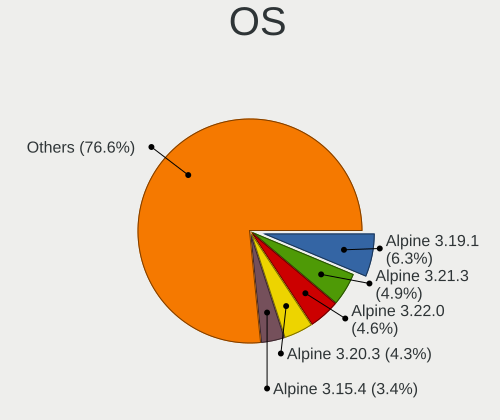

| Name                        | Computers | Percent |
|-----------------------------|-----------|---------|
| Alpine 3.19.1               | 22        | 6.29%   |
| Alpine 3.21.3               | 17        | 4.86%   |
| Alpine 3.22.0               | 16        | 4.57%   |
| Alpine 3.20.3               | 15        | 4.29%   |
| Alpine 3.15.4               | 12        | 3.43%   |
| Alpine 3.22.0_alpha20250108 | 11        | 3.14%   |
| Alpine 3.18.0               | 11        | 3.14%   |
| Alpine 3.12.0               | 11        | 3.14%   |
| Alpine 3.19.0               | 10        | 2.86%   |
| Alpine 3.15.0               | 10        | 2.86%   |
| Alpine 3.21.0_alpha20240606 | 9         | 2.57%   |
| Alpine 3.16.0               | 9         | 2.57%   |
| Alpine 3.22.2               | 8         | 2.29%   |
| Alpine 3.22.1               | 8         | 2.29%   |
| Alpine 3.23.0_alpha20250612 | 7         | 2%      |
| Alpine 3.18.3               | 7         | 2%      |
| Alpine 3.15.0_alpha20210804 | 7         | 2%      |
| Alpine 3.21.2               | 6         | 1.71%   |
| Alpine 3.20.0               | 6         | 1.71%   |
| Alpine 3.19_alpha20230901   | 6         | 1.71%   |
| Alpine 3.18.4               | 6         | 1.71%   |
| Alpine 3.20.2               | 5         | 1.43%   |
| Alpine 3.17_alpha20220809   | 5         | 1.43%   |
| Alpine 3.17.2               | 5         | 1.43%   |
| Alpine 3.17.0               | 5         | 1.43%   |
| Alpine 3.14.0               | 5         | 1.43%   |
| Alpine 3.23.0               | 4         | 1.14%   |
| Alpine 3.21.0_alpha20240923 | 4         | 1.14%   |
| Alpine 3.21.0_alpha20240807 | 4         | 1.14%   |
| Alpine 3.20.0_alpha20231219 | 4         | 1.14%   |
| Alpine 3.18.5               | 4         | 1.14%   |
| Alpine 3.18.2               | 4         | 1.14%   |
| Alpine 3.17.1               | 4         | 1.14%   |
| Alpine 3.16.1               | 4         | 1.14%   |
| Alpine 3.14.2               | 4         | 1.14%   |
| Alpine 3.13.0_alpha20200917 | 4         | 1.14%   |
| Alpine 3.13.0_alpha20200626 | 4         | 1.14%   |
| Alpine 3.11.2               | 4         | 1.14%   |
| Alpine 3.23.0_alpha20251016 | 3         | 0.86%   |
| Alpine 3.21.0               | 3         | 0.86%   |

OS Family
---------

OS without a version

| Name   | Computers | Percent |
|--------|-----------|---------|
| Alpine | 312       | 100%    |

Kernel
------

Version of the Linux kernel

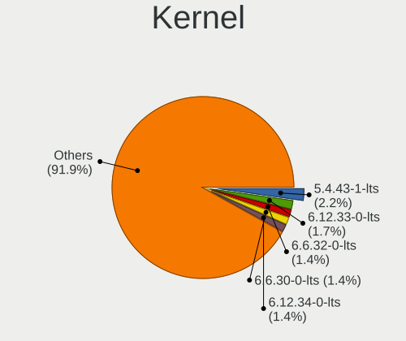

| Version       | Computers | Percent |
|---------------|-----------|---------|
| 5.4.43-1-lts  | 8         | 2.22%   |
| 6.12.33-0-lts | 6         | 1.67%   |
| 6.6.32-0-lts  | 5         | 1.39%   |
| 6.6.30-0-lts  | 5         | 1.39%   |
| 6.12.34-0-lts | 5         | 1.39%   |
| 6.12.58-0-lts | 4         | 1.11%   |
| 6.12.31-0-lts | 4         | 1.11%   |
| 6.6.37-0-lts  | 3         | 0.83%   |
| 6.6.16-0-lts  | 3         | 0.83%   |
| 6.12.9-0-lts  | 3         | 0.83%   |
| 6.12.46-0-lts | 3         | 0.83%   |
| 6.12.18-0-lts | 3         | 0.83%   |
| 6.12.17-2-lts | 3         | 0.83%   |
| 6.12.13-0-lts | 3         | 0.83%   |
| 6.1.57-0-lts  | 3         | 0.83%   |
| 6.1.32-0-lts  | 3         | 0.83%   |
| 5.15.86-0-lts | 3         | 0.83%   |
| 5.15.60-0-lts | 3         | 0.83%   |
| 5.15.16-0-lts | 3         | 0.83%   |
| 5.10.61-0-lts | 3         | 0.83%   |
| 6.6.7-0-lts   | 2         | 0.56%   |
| 6.6.63-0-lts  | 2         | 0.56%   |
| 6.6.61-0-lts  | 2         | 0.56%   |
| 6.6.60-0-lts  | 2         | 0.56%   |
| 6.6.58-0-lts  | 2         | 0.56%   |
| 6.6.52-0-lts  | 2         | 0.56%   |
| 6.6.51-0-lts  | 2         | 0.56%   |
| 6.6.45-0-lts  | 2         | 0.56%   |
| 6.6.44-0-lts  | 2         | 0.56%   |
| 6.6.36-0-lts  | 2         | 0.56%   |
| 6.6.35-0-lts  | 2         | 0.56%   |
| 6.6.33-haos   | 2         | 0.56%   |
| 6.6.23-0-lts  | 2         | 0.56%   |
| 6.6.22-0-lts  | 2         | 0.56%   |
| 6.6.21-0-lts  | 2         | 0.56%   |
| 6.6.17-0-lts  | 2         | 0.56%   |
| 6.6.12-0-lts  | 2         | 0.56%   |
| 6.6.1-0-edge  | 2         | 0.56%   |
| 6.5.11-4-pve  | 2         | 0.56%   |
| 6.18.2-0-lts  | 2         | 0.56%   |

Kernel Family
-------------

Linux kernel without a distro release

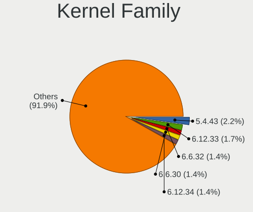

| Version | Computers | Percent |
|---------|-----------|---------|
| 5.4.43  | 8         | 2.25%   |
| 6.12.33 | 6         | 1.69%   |
| 6.6.32  | 5         | 1.4%    |
| 6.6.30  | 5         | 1.4%    |
| 6.12.34 | 5         | 1.4%    |
| 6.12.58 | 4         | 1.12%   |
| 6.12.31 | 4         | 1.12%   |
| 6.12.17 | 4         | 1.12%   |
| 6.6.58  | 3         | 0.84%   |
| 6.6.37  | 3         | 0.84%   |
| 6.6.33  | 3         | 0.84%   |
| 6.6.16  | 3         | 0.84%   |
| 6.12.9  | 3         | 0.84%   |
| 6.12.46 | 3         | 0.84%   |
| 6.12.21 | 3         | 0.84%   |
| 6.12.18 | 3         | 0.84%   |
| 6.12.13 | 3         | 0.84%   |
| 6.1.57  | 3         | 0.84%   |
| 6.1.55  | 3         | 0.84%   |
| 6.1.32  | 3         | 0.84%   |
| 5.15.86 | 3         | 0.84%   |
| 5.15.60 | 3         | 0.84%   |
| 5.15.16 | 3         | 0.84%   |
| 5.15.0  | 3         | 0.84%   |
| 5.10.61 | 3         | 0.84%   |
| 6.6.7   | 2         | 0.56%   |
| 6.6.63  | 2         | 0.56%   |
| 6.6.61  | 2         | 0.56%   |
| 6.6.60  | 2         | 0.56%   |
| 6.6.52  | 2         | 0.56%   |
| 6.6.51  | 2         | 0.56%   |
| 6.6.49  | 2         | 0.56%   |
| 6.6.45  | 2         | 0.56%   |
| 6.6.44  | 2         | 0.56%   |
| 6.6.36  | 2         | 0.56%   |
| 6.6.35  | 2         | 0.56%   |
| 6.6.23  | 2         | 0.56%   |
| 6.6.22  | 2         | 0.56%   |
| 6.6.21  | 2         | 0.56%   |
| 6.6.17  | 2         | 0.56%   |

Kernel Major Ver.
-----------------

Linux kernel major version

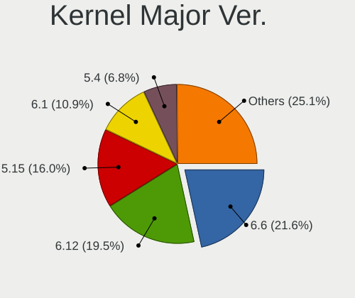

| Version | Computers | Percent |
|---------|-----------|---------|
| 6.6     | 73        | 21.6%   |
| 6.12    | 66        | 19.53%  |
| 5.15    | 54        | 15.98%  |
| 6.1     | 37        | 10.95%  |
| 5.4     | 23        | 6.8%    |
| 5.10    | 23        | 6.8%    |
| 6.18    | 6         | 1.78%   |
| 6.8     | 4         | 1.18%   |
| 6.11    | 4         | 1.18%   |
| 5.17    | 4         | 1.18%   |
| 6.5     | 3         | 0.89%   |
| 6.16    | 3         | 0.89%   |
| 6.15    | 3         | 0.89%   |
| 4.4     | 3         | 0.89%   |
| 3.10    | 3         | 0.89%   |
| 6.9     | 2         | 0.59%   |
| 6.2     | 2         | 0.59%   |
| 6.17    | 2         | 0.59%   |
| 6.13    | 2         | 0.59%   |
| 5.8     | 2         | 0.59%   |
| 5.19    | 2         | 0.59%   |
| 5.14    | 2         | 0.59%   |
| 3.18    | 2         | 0.59%   |
| 6.4     | 1         | 0.3%    |
| 6.3     | 1         | 0.3%    |
| 6.14    | 1         | 0.3%    |
| 6.0     | 1         | 0.3%    |
| 5.7     | 1         | 0.3%    |
| 5.6     | 1         | 0.3%    |
| 5.18    | 1         | 0.3%    |
| 5.16    | 1         | 0.3%    |
| 5.13    | 1         | 0.3%    |
| 5.12    | 1         | 0.3%    |
| 4.9     | 1         | 0.3%    |
| 4.20    | 1         | 0.3%    |
| 4.14    | 1         | 0.3%    |

Arch
----

OS architecture (x86_64, i586, etc.)

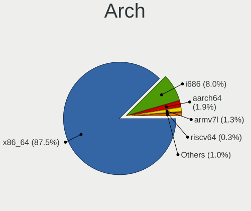

| Name        | Computers | Percent |
|-------------|-----------|---------|
| x86_64      | 274       | 87.54%  |
| i686        | 25        | 7.99%   |
| aarch64     | 6         | 1.92%   |
| armv7l      | 4         | 1.28%   |
| riscv64     | 1         | 0.32%   |
| loongarch64 | 1         | 0.32%   |
| i586        | 1         | 0.32%   |
| armv6l      | 1         | 0.32%   |

DE
--

Desktop Environment

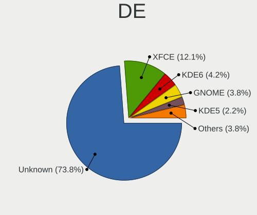

| Name          | Computers | Percent |
|---------------|-----------|---------|
| Unknown       | 231       | 73.8%   |
| XFCE          | 38        | 12.14%  |
| KDE6          | 13        | 4.15%   |
| GNOME         | 12        | 3.83%   |
| KDE5          | 7         | 2.24%   |
| sway          | 4         | 1.28%   |
| MATE          | 3         | 0.96%   |
| LXQt          | 2         | 0.64%   |
| KDE           | 1         | 0.32%   |
| i3            | 1         | 0.32%   |
| GNOME Classic | 1         | 0.32%   |

Display Server
--------------

X11 or Wayland

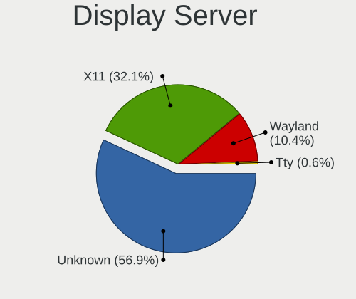

| Name    | Computers | Percent |
|---------|-----------|---------|
| Unknown | 181       | 56.92%  |
| X11     | 102       | 32.08%  |
| Wayland | 33        | 10.38%  |
| Tty     | 2         | 0.63%   |

Display Manager
---------------

SDDM, LightDM, etc.

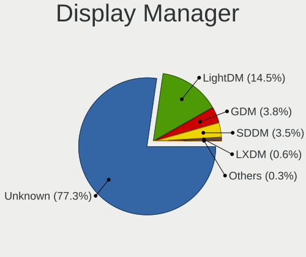

| Name    | Computers | Percent |
|---------|-----------|---------|
| Unknown | 245       | 77.29%  |
| LightDM | 46        | 14.51%  |
| GDM     | 12        | 3.79%   |
| SDDM    | 11        | 3.47%   |
| LXDM    | 2         | 0.63%   |
| XDM     | 1         | 0.32%   |

OS Lang
-------

Language

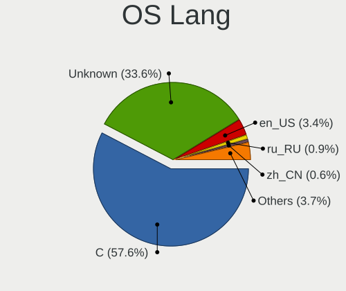

| Lang    | Computers | Percent |
|---------|-----------|---------|
| C       | 185       | 57.63%  |
| Unknown | 108       | 33.64%  |
| en_US   | 11        | 3.43%   |
| ru_RU   | 3         | 0.93%   |
| zh_CN   | 2         | 0.62%   |
| tr_TR   | 2         | 0.62%   |
| pt_BR   | 2         | 0.62%   |
| en_GB   | 2         | 0.62%   |
| zh_TW   | 1         | 0.31%   |
| uk_UA   | 1         | 0.31%   |
| nb_NO   | 1         | 0.31%   |
| es_NI   | 1         | 0.31%   |
| es_ES   | 1         | 0.31%   |
| en_ZA   | 1         | 0.31%   |

Boot Mode
---------

EFI or BIOS

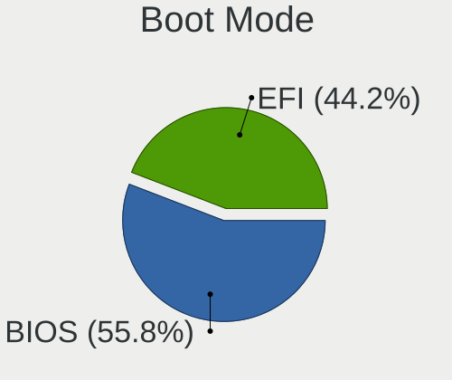

| Mode | Computers | Percent |
|------|-----------|---------|
| BIOS | 177       | 55.84%  |
| EFI  | 140       | 44.16%  |

Filesystem
----------

Type of filesystem

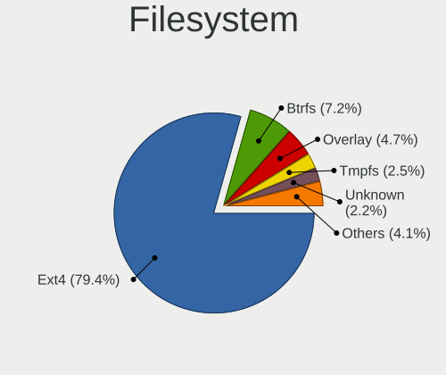

| Type    | Computers | Percent |
|---------|-----------|---------|
| Ext4    | 254       | 79.38%  |
| Btrfs   | 23        | 7.19%   |
| Overlay | 15        | 4.69%   |
| Tmpfs   | 8         | 2.5%    |
| Unknown | 7         | 2.19%   |
| Xfs     | 4         | 1.25%   |
| Ext2    | 3         | 0.94%   |
| F2fs    | 2         | 0.63%   |
| Zfs     | 1         | 0.31%   |
| XXXXX   | 1         | 0.31%   |
| Rootfs  | 1         | 0.31%   |
| Fake    | 1         | 0.31%   |

Part. scheme
------------

Scheme of partitioning

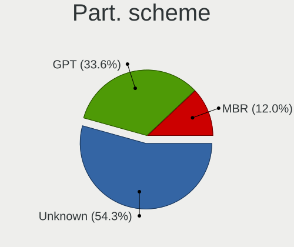

| Type    | Computers | Percent |
|---------|-----------|---------|
| Unknown | 176       | 54.32%  |
| GPT     | 109       | 33.64%  |
| MBR     | 39        | 12.04%  |

Dual Boot with Linux/BSD
------------------------

Hosting more than one Linux/BSD

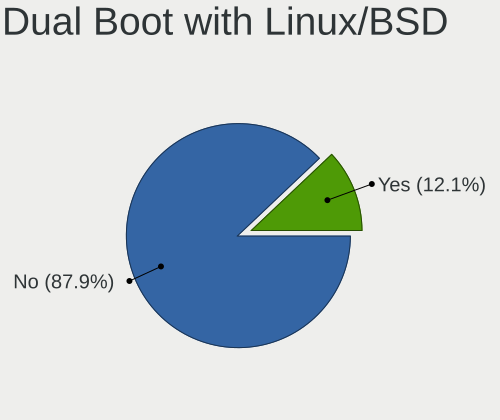

| Dual boot | Computers | Percent |
|-----------|-----------|---------|
| No        | 277       | 87.94%  |
| Yes       | 38        | 12.06%  |

Dual Boot (Win)
---------------

Hosting Linux and Windows

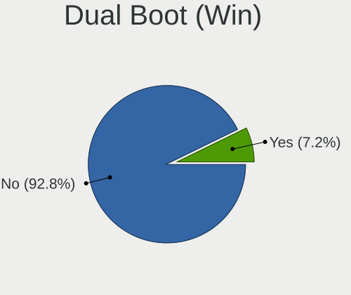

| Dual boot | Computers | Percent |
|-----------|-----------|---------|
| No        | 295       | 92.77%  |
| Yes       | 23        | 7.23%   |

Board
-----

Vendor
------

Motherboard manufacturer

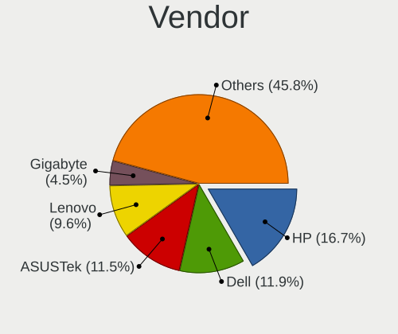

| Name                    | Computers | Percent |
|-------------------------|-----------|---------|
| Hewlett-Packard         | 52        | 16.67%  |
| Dell                    | 37        | 11.86%  |
| ASUSTek Computer        | 36        | 11.54%  |
| Lenovo                  | 30        | 9.62%   |
| Gigabyte Technology     | 14        | 4.49%   |
| ASRock                  | 12        | 3.85%   |
| Unknown                 | 12        | 3.85%   |
| Intel                   | 10        | 3.21%   |
| Apple                   | 10        | 3.21%   |
| Acer                    | 10        | 3.21%   |
| Fujitsu                 | 9         | 2.88%   |
| Inventec                | 8         | 2.56%   |
| Google                  | 8         | 2.56%   |
| Toshiba                 | 6         | 1.92%   |
| Raspberry Pi Foundation | 5         | 1.6%    |
| Supermicro              | 3         | 0.96%   |
| Sony                    | 3         | 0.96%   |
| MSI                     | 3         | 0.96%   |
| IBM                     | 3         | 0.96%   |
| Gateway                 | 3         | 0.96%   |
| ZOTAC                   | 2         | 0.64%   |
| Notebook                | 2         | 0.64%   |
| LG Electronics          | 2         | 0.64%   |
| Framework               | 2         | 0.64%   |
| AMI                     | 2         | 0.64%   |
| Wortmann AG             | 1         | 0.32%   |
| VIA Technologies        | 1         | 0.32%   |
| UGREEN                  | 1         | 0.32%   |
| Synology                | 1         | 0.32%   |
| SLIMBOOK                | 1         | 0.32%   |
| Shuttle                 | 1         | 0.32%   |
| Samsung Electronics     | 1         | 0.32%   |
| Positivo                | 1         | 0.32%   |
| Pegatron                | 1         | 0.32%   |
| Olivetti                | 1         | 0.32%   |
| Microsoft               | 1         | 0.32%   |
| Medion                  | 1         | 0.32%   |
| MACHINIST               | 1         | 0.32%   |
| Loongson                | 1         | 0.32%   |
| Kiano                   | 1         | 0.32%   |

Model
-----

Motherboard model

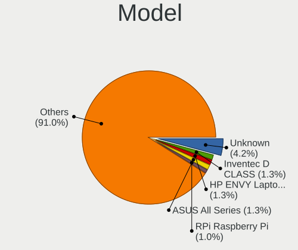

| Name                                   | Computers | Percent |
|----------------------------------------|-----------|---------|
| Unknown                                | 13        | 4.17%   |
| Inventec D CLASS                       | 4         | 1.28%   |
| HP ENVY Laptop 13-ad1xx                | 4         | 1.28%   |
| ASUS All Series                        | 4         | 1.28%   |
| RPi Raspberry Pi                       | 3         | 0.96%   |
| Dell Dell Thin Client Desktop 3030 LT  | 3         | 0.96%   |
| Lenovo V15 G3 IAP 82TT                 | 2         | 0.64%   |
| Inventec DQ Class                      | 2         | 0.64%   |
| Inventec Dell Thin Client Desktop 3290 | 2         | 0.64%   |
| HP ProLiant DL360 G6                   | 2         | 0.64%   |
| Google Kefka                           | 2         | 0.64%   |
| Gigabyte Z490I AORUS ULTRA             | 2         | 0.64%   |
| ASUS PRIME B360M-C                     | 2         | 0.64%   |
| ASUS F5SL                              | 2         | 0.64%   |
| ZOTAC ZBOX-EN1070/1060,EN1070K/1060K   | 1         | 0.32%   |
| Wortmann AG M660SE                     | 1         | 0.32%   |
| VIA KM266APro-835                      | 1         | 0.32%   |
| UGREEN DX4600                          | 1         | 0.32%   |
| Toshiba WT8-A                          | 1         | 0.32%   |
| Toshiba Satellite Pro L50-A            | 1         | 0.32%   |
| Toshiba Satellite Pro C660             | 1         | 0.32%   |
| Toshiba Satellite M645                 | 1         | 0.32%   |
| Toshiba Satellite M50Dt-A              | 1         | 0.32%   |
| Toshiba PORTEGE Z30-A                  | 1         | 0.32%   |
| Synology DS1019+                       | 1         | 0.32%   |
| Supermicro X10SRH-CFA                  | 1         | 0.32%   |
| Supermicro X10SLL-F                    | 1         | 0.32%   |
| Supermicro Super Server                | 1         | 0.32%   |
| Sony VPCZ13V9E                         | 1         | 0.32%   |
| Sony VPCEC3A4E                         | 1         | 0.32%   |
| Sony VGN-UX27GN                        | 1         | 0.32%   |
| SLIMBOOK EXECUTIVE-14                  | 1         | 0.32%   |
| Shuttle DS81D                          | 1         | 0.32%   |
| Samsung 100NZC                         | 1         | 0.32%   |
| RPi Raspberry Pi 4 Model B Rev 1.5     | 1         | 0.32%   |
| RPi Raspberry Pi 2 Model B Rev 1.1     | 1         | 0.32%   |
| Positivo POS-EINM10CB                  | 1         | 0.32%   |
| Pegatron Deepcam                       | 1         | 0.32%   |
| Olivetti Spring Peak                   | 1         | 0.32%   |
| Notebook NV4XMB,ME,MZ                  | 1         | 0.32%   |

Model Family
------------

Motherboard model prefix

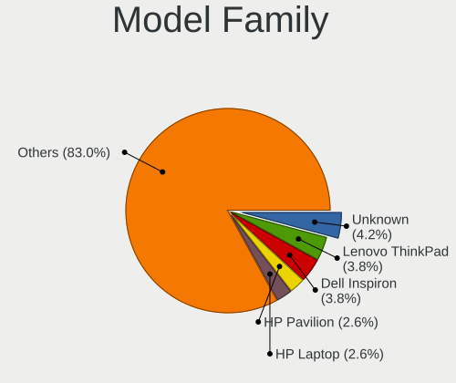

| Name               | Computers | Percent |
|--------------------|-----------|---------|
| Unknown            | 13        | 4.17%   |
| Lenovo ThinkPad    | 12        | 3.85%   |
| Dell Inspiron      | 12        | 3.85%   |
| HP Pavilion        | 8         | 2.56%   |
| HP Laptop          | 8         | 2.56%   |
| HP EliteBook       | 7         | 2.24%   |
| Dell OptiPlex      | 7         | 2.24%   |
| ASUS PRIME         | 7         | 2.24%   |
| Acer Aspire        | 7         | 2.24%   |
| RPi Raspberry      | 5         | 1.6%    |
| HP ENVY            | 5         | 1.6%    |
| Dell Latitude      | 5         | 1.6%    |
| ASUS VivoBook      | 5         | 1.6%    |
| Toshiba Satellite  | 4         | 1.28%   |
| Inventec D         | 4         | 1.28%   |
| HP Compaq          | 4         | 1.28%   |
| Dell XPS           | 4         | 1.28%   |
| ASUS All           | 4         | 1.28%   |
| Lenovo IdeaPad     | 3         | 0.96%   |
| HP Stream          | 3         | 0.96%   |
| HP ProLiant        | 3         | 0.96%   |
| Dell Dell          | 3         | 0.96%   |
| Lenovo Yoga        | 2         | 0.64%   |
| Lenovo V15         | 2         | 0.64%   |
| Lenovo ThinkCentre | 2         | 0.64%   |
| Lenovo MIIX        | 2         | 0.64%   |
| Inventec DQ        | 2         | 0.64%   |
| Inventec Dell      | 2         | 0.64%   |
| Intel NUC6i7KYB    | 2         | 0.64%   |
| HP ProBook         | 2         | 0.64%   |
| HP Presario        | 2         | 0.64%   |
| HP Mini            | 2         | 0.64%   |
| HP EliteDesk       | 2         | 0.64%   |
| Google Kefka       | 2         | 0.64%   |
| Gigabyte Z490I     | 2         | 0.64%   |
| Fujitsu LIFEBOOK   | 2         | 0.64%   |
| Fujitsu ESPRIMO    | 2         | 0.64%   |
| Framework Laptop   | 2         | 0.64%   |
| Dell PowerEdge     | 2         | 0.64%   |
| ASUS ROG           | 2         | 0.64%   |

MFG Year
--------

Motherboard manufacture year

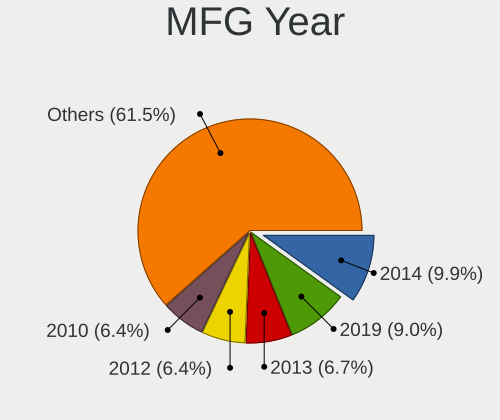

| Year    | Computers | Percent |
|---------|-----------|---------|
| 2014    | 31        | 9.94%   |
| 2019    | 28        | 8.97%   |
| 2013    | 21        | 6.73%   |
| 2012    | 20        | 6.41%   |
| 2010    | 20        | 6.41%   |
| 2018    | 19        | 6.09%   |
| 2020    | 18        | 5.77%   |
| 2016    | 18        | 5.77%   |
| 2021    | 16        | 5.13%   |
| 2017    | 16        | 5.13%   |
| Unknown | 15        | 4.81%   |
| 2011    | 14        | 4.49%   |
| 2022    | 11        | 3.53%   |
| 2015    | 11        | 3.53%   |
| 2009    | 9         | 2.88%   |
| 2007    | 9         | 2.88%   |
| 2023    | 7         | 2.24%   |
| 2008    | 6         | 1.92%   |
| 2006    | 6         | 1.92%   |
| 2024    | 5         | 1.6%    |
| 2025    | 4         | 1.28%   |
| 2005    | 4         | 1.28%   |
| 2001    | 2         | 0.64%   |
| 2004    | 1         | 0.32%   |
| 1999    | 1         | 0.32%   |

Form Factor
-----------

Physical design of the computer

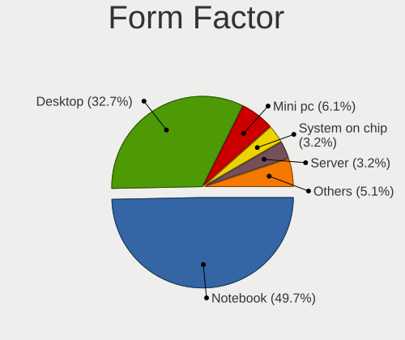

| Name           | Computers | Percent |
|----------------|-----------|---------|
| Notebook       | 155       | 49.68%  |
| Desktop        | 102       | 32.69%  |
| Mini pc        | 19        | 6.09%   |
| System on chip | 10        | 3.21%   |
| Server         | 10        | 3.21%   |
| Convertible    | 9         | 2.88%   |
| Tablet         | 5         | 1.6%    |
| All in one     | 2         | 0.64%   |

Secure Boot
-----------

Enabled or disabled

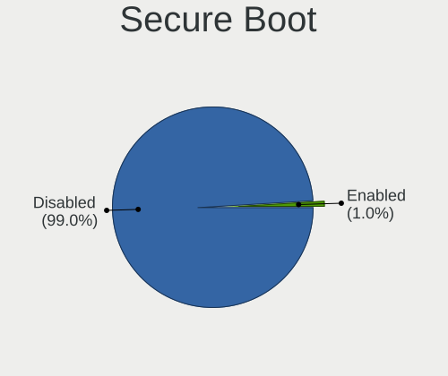

| State    | Computers | Percent |
|----------|-----------|---------|
| Disabled | 310       | 99.04%  |
| Enabled  | 3         | 0.96%   |

Coreboot
--------

Have coreboot on board

| Used | Computers | Percent |
|------|-----------|---------|
| No   | 304       | 97.44%  |
| Yes  | 8         | 2.56%   |

RAM Size
--------

Total RAM memory

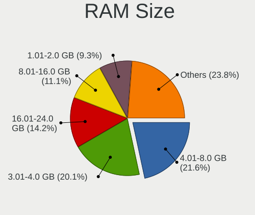

| Size in GB      | Computers | Percent |
|-----------------|-----------|---------|
| 4.01-8.0        | 70        | 21.6%   |
| 3.01-4.0        | 65        | 20.06%  |
| 16.01-24.0      | 46        | 14.2%   |
| 8.01-16.0       | 36        | 11.11%  |
| 1.01-2.0        | 30        | 9.26%   |
| 32.01-64.0      | 25        | 7.72%   |
| 0.51-1.0        | 20        | 6.17%   |
| 64.01-256.0     | 10        | 3.09%   |
| 2.01-3.0        | 9         | 2.78%   |
| 0.01-0.5        | 8         | 2.47%   |
| More than 256.0 | 3         | 0.93%   |
| 24.01-32.0      | 2         | 0.62%   |

RAM Used
--------

Used RAM memory

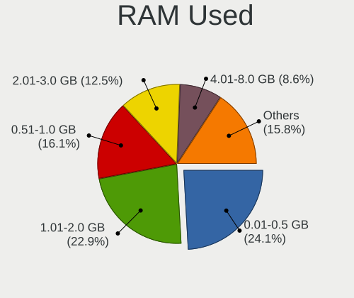

| Used GB    | Computers | Percent |
|------------|-----------|---------|
| 0.01-0.5   | 81        | 24.11%  |
| 1.01-2.0   | 77        | 22.92%  |
| 0.51-1.0   | 54        | 16.07%  |
| 2.01-3.0   | 42        | 12.5%   |
| 4.01-8.0   | 29        | 8.63%   |
| 3.01-4.0   | 26        | 7.74%   |
| 8.01-16.0  | 12        | 3.57%   |
| 0          | 8         | 2.38%   |
| Unknown    | 4         | 1.19%   |
| 32.01-64.0 | 1         | 0.3%    |
| 24.01-32.0 | 1         | 0.3%    |
| 16.01-24.0 | 1         | 0.3%    |

Total Drives
------------

Number of drives on board

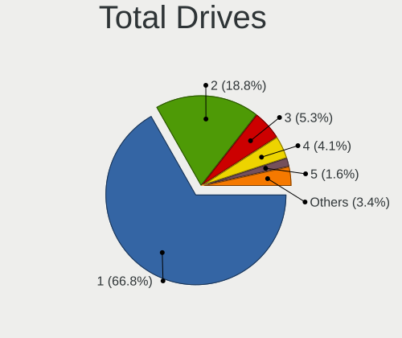

| Drives | Computers | Percent |
|--------|-----------|---------|
| 1      | 213       | 66.77%  |
| 2      | 60        | 18.81%  |
| 3      | 17        | 5.33%   |
| 4      | 13        | 4.08%   |
| 5      | 5         | 1.57%   |
| 0      | 5         | 1.57%   |
| 14     | 2         | 0.63%   |
| 12     | 1         | 0.31%   |
| 10     | 1         | 0.31%   |
| 8      | 1         | 0.31%   |
| 7      | 1         | 0.31%   |

Has CD-ROM
----------

Has CD-ROM on board

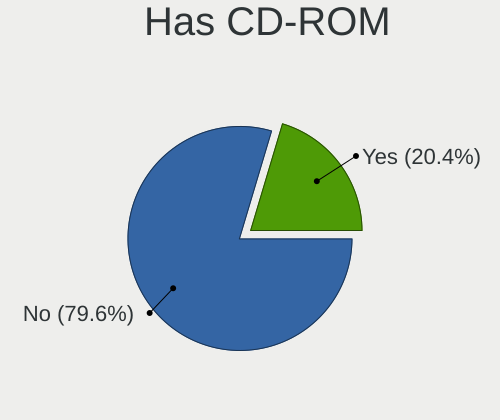

| Presented | Computers | Percent |
|-----------|-----------|---------|
| No        | 250       | 79.62%  |
| Yes       | 64        | 20.38%  |

Has Ethernet
------------

Has Ethernet on board

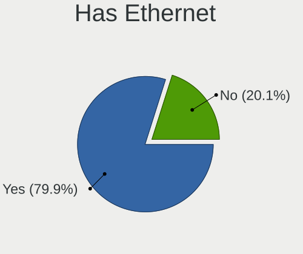

| Presented | Computers | Percent |
|-----------|-----------|---------|
| Yes       | 250       | 79.87%  |
| No        | 63        | 20.13%  |

Has WiFi
--------

Has WiFi module

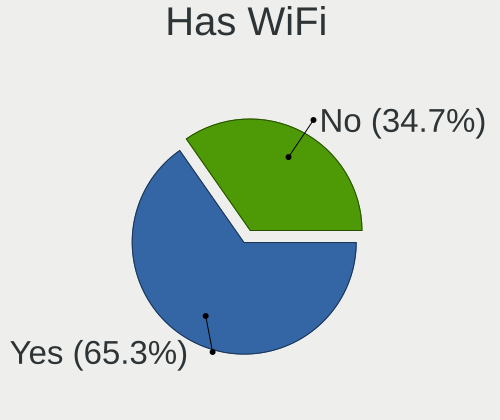

| Presented | Computers | Percent |
|-----------|-----------|---------|
| Yes       | 207       | 65.3%   |
| No        | 110       | 34.7%   |

Has Bluetooth
-------------

Has Bluetooth module

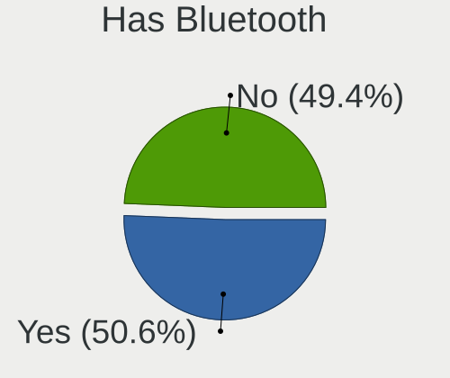

| Presented | Computers | Percent |
|-----------|-----------|---------|
| Yes       | 160       | 50.63%  |
| No        | 156       | 49.37%  |

Location
--------

Country
-------

Geographic location (country)

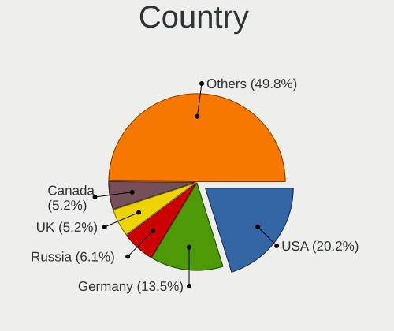

| Country      | Computers | Percent |
|--------------|-----------|---------|
| USA          | 66        | 20.18%  |
| Germany      | 44        | 13.46%  |
| Russia       | 20        | 6.12%   |
| UK           | 17        | 5.2%    |
| Canada       | 17        | 5.2%    |
| Brazil       | 17        | 5.2%    |
| France       | 12        | 3.67%   |
| Italy        | 8         | 2.45%   |
| Turkey       | 7         | 2.14%   |
| Poland       | 7         | 2.14%   |
| Netherlands  | 7         | 2.14%   |
| Switzerland  | 6         | 1.83%   |
| Spain        | 6         | 1.83%   |
| Sweden       | 5         | 1.53%   |
| Norway       | 5         | 1.53%   |
| Australia    | 5         | 1.53%   |
| Ukraine      | 4         | 1.22%   |
| Slovakia     | 4         | 1.22%   |
| Romania      | 4         | 1.22%   |
| Indonesia    | 4         | 1.22%   |
| Finland      | 4         | 1.22%   |
| China        | 4         | 1.22%   |
| Portugal     | 3         | 0.92%   |
| Mexico       | 3         | 0.92%   |
| Hungary      | 3         | 0.92%   |
| Austria      | 3         | 0.92%   |
| Argentina    | 3         | 0.92%   |
| South Korea  | 2         | 0.61%   |
| South Africa | 2         | 0.61%   |
| Israel       | 2         | 0.61%   |
| Guatemala    | 2         | 0.61%   |
| Denmark      | 2         | 0.61%   |
| Czechia      | 2         | 0.61%   |
| Belarus      | 2         | 0.61%   |
| Vietnam      | 1         | 0.31%   |
| Venezuela    | 1         | 0.31%   |
| Uruguay      | 1         | 0.31%   |
| UAE          | 1         | 0.31%   |
| Thailand     | 1         | 0.31%   |
| Singapore    | 1         | 0.31%   |

City
----

Geographic location (city)

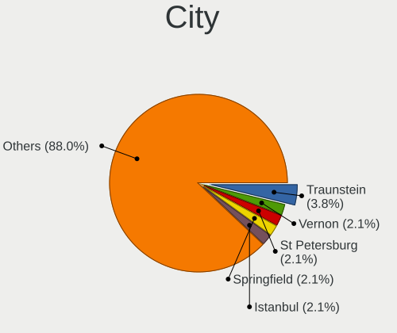

| City            | Computers | Percent |
|-----------------|-----------|---------|
| Traunstein      | 13        | 3.81%   |
| Vernon          | 7         | 2.05%   |
| St Petersburg   | 7         | 2.05%   |
| Springfield     | 7         | 2.05%   |
| Istanbul        | 7         | 2.05%   |
| Moscow          | 5         | 1.47%   |
| Manitowoc       | 5         | 1.47%   |
| Zurich          | 4         | 1.17%   |
| Helsinki        | 3         | 0.88%   |
| Cologne         | 3         | 0.88%   |
| Bucharest       | 3         | 0.88%   |
| Berlin          | 3         | 0.88%   |
| Belo Horizonte  | 3         | 0.88%   |
| Waukesha        | 2         | 0.59%   |
| Warsaw          | 2         | 0.59%   |
| Vienna          | 2         | 0.59%   |
| Ufa             | 2         | 0.59%   |
| Teisendorf      | 2         | 0.59%   |
| Sydney          | 2         | 0.59%   |
| Stuttgart       | 2         | 0.59%   |
| Stratford       | 2         | 0.59%   |
| Stillwater      | 2         | 0.59%   |
| Siegsdorf       | 2         | 0.59%   |
| Seattle         | 2         | 0.59%   |
| Sao Paulo       | 2         | 0.59%   |
| Rome            | 2         | 0.59%   |
| Rio de Janeiro  | 2         | 0.59%   |
| Paris           | 2         | 0.59%   |
| Nussdorf am Inn | 2         | 0.59%   |
| Newham          | 2         | 0.59%   |
| Minsk           | 2         | 0.59%   |
| Madrid          | 2         | 0.59%   |
| Los Angeles     | 2         | 0.59%   |
| Kyiv            | 2         | 0.59%   |
| Krefeld         | 2         | 0.59%   |
| Kharkiv         | 2         | 0.59%   |
| Johannesburg    | 2         | 0.59%   |
| Harrisonburg    | 2         | 0.59%   |
| Guatemala City  | 2         | 0.59%   |
| Gothenburg      | 2         | 0.59%   |

Drives
------

Drive Vendor
------------

Hard drive vendors

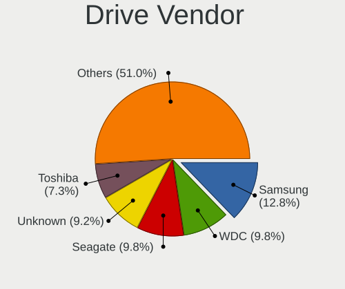

| Vendor                      | Computers | Drives | Percent |
|-----------------------------|-----------|--------|---------|
| Samsung Electronics         | 56        | 102    | 12.81%  |
| WDC                         | 43        | 82     | 9.84%   |
| Seagate                     | 43        | 81     | 9.84%   |
| Unknown                     | 40        | 54     | 9.15%   |
| Toshiba                     | 32        | 36     | 7.32%   |
| SanDisk                     | 24        | 31     | 5.49%   |
| Kingston                    | 19        | 24     | 4.35%   |
| Hitachi                     | 18        | 19     | 4.12%   |
| Crucial                     | 14        | 24     | 3.2%    |
| SK hynix                    | 13        | 15     | 2.97%   |
| Intel                       | 13        | 19     | 2.97%   |
| HGST                        | 12        | 13     | 2.75%   |
| A-DATA Technology           | 9         | 13     | 2.06%   |
| Micron Technology           | 6         | 7      | 1.37%   |
| Unknown                     | 6         | 6      | 1.37%   |
| Realtek Semiconductor       | 5         | 5      | 1.14%   |
| SPCC                        | 4         | 4      | 0.92%   |
| KIOXIA                      | 4         | 4      | 0.92%   |
| Apple                       | 4         | 7      | 0.92%   |
| Transcend                   | 3         | 3      | 0.69%   |
| Phison Electronics          | 3         | 5      | 0.69%   |
| LITEON                      | 3         | 3      | 0.69%   |
| Intenso                     | 3         | 3      | 0.69%   |
| Fujitsu                     | 3         | 3      | 0.69%   |
| ASMT                        | 3         | 3      | 0.69%   |
| Yangtze Memory Technologies | 2         | 2      | 0.46%   |
| Plextor                     | 2         | 2      | 0.46%   |
| OCZ                         | 2         | 2      | 0.46%   |
| KingSpec                    | 2         | 2      | 0.46%   |
| Hewlett-Packard             | 2         | 4      | 0.46%   |
| Corsair                     | 2         | 3      | 0.46%   |
| China                       | 2         | 2      | 0.46%   |
| Apacer                      | 2         | 2      | 0.46%   |
| AMD                         | 2         | 2      | 0.46%   |
| Verbatim                    | 1         | 2      | 0.23%   |
| V-GeN                       | 1         | 1      | 0.23%   |
| Team                        | 1         | 1      | 0.23%   |
| T-FORCE                     | 1         | 1      | 0.23%   |
| STEC                        | 1         | 1      | 0.23%   |
| Solid State Storage         | 1         | 1      | 0.23%   |

Drive Model
-----------

Hard drive models

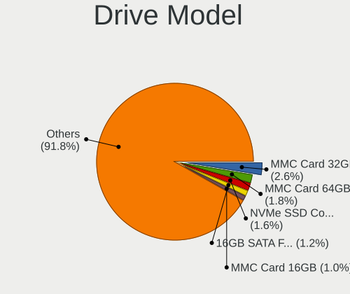

| Model                                                | Computers | Percent |
|------------------------------------------------------|-----------|---------|
| Unknown MMC Card  32GB                               | 13        | 2.59%   |
| Unknown MMC Card  64GB                               | 9         | 1.8%    |
| Samsung NVMe SSD Controller SM981/PM981/PM983 1TB    | 8         | 1.6%    |
| Unknown                                              | 6         | 1.2%    |
| Unknown MMC Card  16GB                               | 5         | 1%      |
| Unknown SD/MMC/MS PRO 2GB                            | 4         | 0.8%    |
| Unknown MMC Card  4GB                                | 4         | 0.8%    |
| Unknown MMC Card                                     | 4         | 0.8%    |
| Toshiba KXG50ZNV256G 256GB                           | 4         | 0.8%    |
| Crucial CT500MX500SSD1 500GB                         | 4         | 0.8%    |
| SK hynix BC501 NVMe Solid State Drive 512GB          | 3         | 0.6%    |
| Seagate ST1000LM035-1RK172 1TB                       | 3         | 0.6%    |
| Sandisk WD Black SN750 / PC SN730 NVMe SSD 500GB     | 3         | 0.6%    |
| Samsung SSD 870 EVO 1TB                              | 3         | 0.6%    |
| Samsung SSD 860 1TB                                  | 3         | 0.6%    |
| Samsung NVMe SSD Drive 1024GB                        | 3         | 0.6%    |
| Samsung NVMe SSD Controller PM9A1/PM9A3/980PRO 1TB   | 3         | 0.6%    |
| Crucial CT1000MX500SSD1 1TB                          | 3         | 0.6%    |
| WDC WDS500G2B0A-00SM50 500GB                         | 2         | 0.4%    |
| WDC WDS250G2B0A 250GB SSD                            | 2         | 0.4%    |
| WDC WD3000BLFS-60YBU2 304GB                          | 2         | 0.4%    |
| Toshiba XG6 NVMe SSD Controller 1024GB               | 2         | 0.4%    |
| Toshiba MQ01ABD100 1TB                               | 2         | 0.4%    |
| Toshiba MQ01ABD075 752GB                             | 2         | 0.4%    |
| Seagate ST4000VN008-2DR1 4TB                         | 2         | 0.4%    |
| Seagate ST380815AS 80GB                              | 2         | 0.4%    |
| Seagate ST2000LM015-2E81 2TB                         | 2         | 0.4%    |
| Seagate ST2000DM006-2DM1 2TB                         | 2         | 0.4%    |
| Seagate ST1000LM024 HN-M101MBB 1TB                   | 2         | 0.4%    |
| Seagate ST1000DM010-2EP102 1TB                       | 2         | 0.4%    |
| Samsung SSD 980 PRO 1TB                              | 2         | 0.4%    |
| Samsung SSD 980 1TB                                  | 2         | 0.4%    |
| Samsung SSD 970 EVO Plus 250GB                       | 2         | 0.4%    |
| Samsung SSD 960 EVO 500GB                            | 2         | 0.4%    |
| Samsung SSD 870 QVO 1TB                              | 2         | 0.4%    |
| Samsung NVMe SSD Controller SM961/PM961/SM963 1024GB | 2         | 0.4%    |
| Samsung HM160HI 160GB                                | 2         | 0.4%    |
| Kingston SV300S37A120G 120GB SSD                     | 2         | 0.4%    |
| Kingston SA400S37480G 480GB SSD                      | 2         | 0.4%    |
| Kingston SA400S37120G 120GB SSD                      | 2         | 0.4%    |

HDD Vendor
----------

Hard disk drive vendors

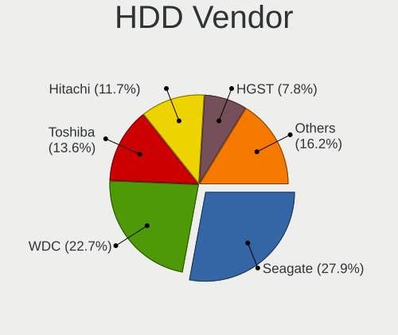

| Vendor              | Computers | Drives | Percent |
|---------------------|-----------|--------|---------|
| Seagate             | 43        | 81     | 27.92%  |
| WDC                 | 35        | 67     | 22.73%  |
| Toshiba             | 21        | 24     | 13.64%  |
| Hitachi             | 18        | 19     | 11.69%  |
| HGST                | 12        | 13     | 7.79%   |
| Samsung Electronics | 8         | 12     | 5.19%   |
| Unknown             | 4         | 4      | 2.6%    |
| Fujitsu             | 3         | 3      | 1.95%   |
| Hewlett-Packard     | 2         | 4      | 1.3%    |
| ASMT                | 2         | 2      | 1.3%    |
| SINTECHI            | 1         | 1      | 0.65%   |
| Maxtor              | 1         | 1      | 0.65%   |
| JMicron Technology  | 1         | 1      | 0.65%   |
| IBM                 | 1         | 1      | 0.65%   |
| IB-377U3            | 1         | 1      | 0.65%   |
| EDILOCA             | 1         | 1      | 0.65%   |

SSD Vendor
----------

Solid state drive vendors

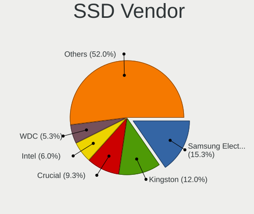

| Vendor              | Computers | Drives | Percent |
|---------------------|-----------|--------|---------|
| Samsung Electronics | 23        | 41     | 15.33%  |
| Kingston            | 18        | 20     | 12%     |
| Crucial             | 14        | 24     | 9.33%   |
| Intel               | 9         | 12     | 6%      |
| WDC                 | 8         | 11     | 5.33%   |
| SanDisk             | 7         | 8      | 4.67%   |
| A-DATA Technology   | 6         | 8      | 4%      |
| SK hynix            | 5         | 6      | 3.33%   |
| Unknown             | 5         | 5      | 3.33%   |
| SPCC                | 4         | 4      | 2.67%   |
| Transcend           | 3         | 3      | 2%      |
| LITEON              | 3         | 3      | 2%      |
| Intenso             | 3         | 3      | 2%      |
| Toshiba             | 2         | 2      | 1.33%   |
| Plextor             | 2         | 2      | 1.33%   |
| OCZ                 | 2         | 2      | 1.33%   |
| Micron Technology   | 2         | 2      | 1.33%   |
| KingSpec            | 2         | 2      | 1.33%   |
| Corsair             | 2         | 3      | 1.33%   |
| China               | 2         | 2      | 1.33%   |
| Apacer              | 2         | 2      | 1.33%   |
| AMD                 | 2         | 2      | 1.33%   |
| Verbatim            | 1         | 2      | 0.67%   |
| V-GeN               | 1         | 1      | 0.67%   |
| Team                | 1         | 1      | 0.67%   |
| T-FORCE             | 1         | 1      | 0.67%   |
| Secure              | 1         | 1      | 0.67%   |
| SABRENT             | 1         | 1      | 0.67%   |
| PNY                 | 1         | 1      | 0.67%   |
| Pioneer             | 1         | 1      | 0.67%   |
| Patriot             | 1         | 1      | 0.67%   |
| Netac               | 1         | 1      | 0.67%   |
| MSI                 | 1         | 1      | 0.67%   |
| LITEONIT            | 1         | 1      | 0.67%   |
| Lexar               | 1         | 1      | 0.67%   |
| Kingmax             | 1         | 1      | 0.67%   |
| KC600               | 1         | 1      | 0.67%   |
| INNOVATION IT       | 1         | 1      | 0.67%   |
| HS-SSD-E100         | 1         | 1      | 0.67%   |
| Emtec               | 1         | 1      | 0.67%   |

Drive Kind
----------

HDD or SSD

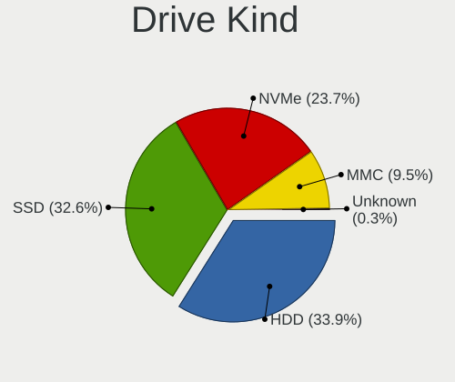

| Kind    | Computers | Drives | Percent |
|---------|-----------|--------|---------|
| HDD     | 129       | 235    | 33.95%  |
| SSD     | 124       | 193    | 32.63%  |
| NVMe    | 90        | 145    | 23.68%  |
| MMC     | 36        | 51     | 9.47%   |
| Unknown | 1         | 2      | 0.26%   |

Drive Connector
---------------

SATA, SAS, NVMe, etc.

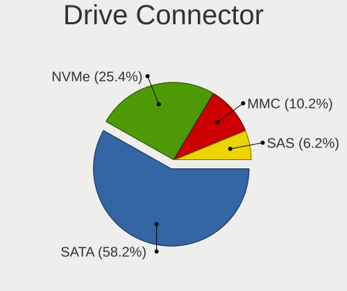

| Type | Computers | Drives | Percent |
|------|-----------|--------|---------|
| SATA | 206       | 400    | 58.19%  |
| NVMe | 90        | 144    | 25.42%  |
| MMC  | 36        | 51     | 10.17%  |
| SAS  | 22        | 31     | 6.21%   |

Drive Size
----------

Size of hard drive

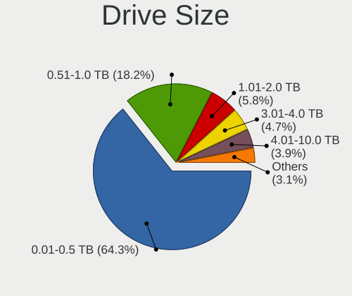

| Size in TB | Computers | Drives | Percent |
|------------|-----------|--------|---------|
| 0.01-0.5   | 166       | 257    | 64.34%  |
| 0.51-1.0   | 47        | 65     | 18.22%  |
| 1.01-2.0   | 15        | 23     | 5.81%   |
| 3.01-4.0   | 12        | 30     | 4.65%   |
| 4.01-10.0  | 10        | 31     | 3.88%   |
| 2.01-3.0   | 4         | 8      | 1.55%   |
| 10.01-20.0 | 4         | 14     | 1.55%   |

Space Total
-----------

Amount of disk space available on the file system

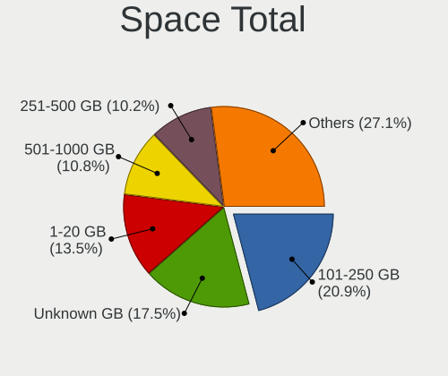

| Size in GB     | Computers | Percent |
|----------------|-----------|---------|
| 101-250        | 68        | 20.92%  |
| Unknown        | 57        | 17.54%  |
| 1-20           | 44        | 13.54%  |
| 501-1000       | 35        | 10.77%  |
| 251-500        | 33        | 10.15%  |
| 21-50          | 24        | 7.38%   |
| 51-100         | 23        | 7.08%   |
| More than 3000 | 20        | 6.15%   |
| 1001-2000      | 16        | 4.92%   |
| 2001-3000      | 5         | 1.54%   |

Space Used
----------

Amount of used disk space

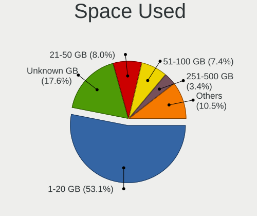

| Used GB        | Computers | Percent |
|----------------|-----------|---------|
| 1-20           | 172       | 53.09%  |
| Unknown        | 57        | 17.59%  |
| 21-50          | 26        | 8.02%   |
| 51-100         | 24        | 7.41%   |
| 251-500        | 11        | 3.4%    |
| 101-250        | 11        | 3.4%    |
| 501-1000       | 10        | 3.09%   |
| More than 3000 | 5         | 1.54%   |
| 1001-2000      | 5         | 1.54%   |
| 2001-3000      | 3         | 0.93%   |

Malfunc. Drives
---------------

Drive models with a malfunction

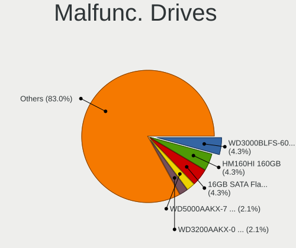

| Model                                          | Computers | Drives | Percent |
|------------------------------------------------|-----------|--------|---------|
| WDC WD3000BLFS-60YBU2 304GB                    | 2         | 14     | 4.26%   |
| Samsung Electronics HM160HI 160GB              | 2         | 3      | 4.26%   |
| Unknown                                        | 2         | 2      | 4.26%   |
| WDC WD5000AAKX-7 500GB                         | 1         | 1      | 2.13%   |
| WDC WD3200AAKX-0 320GB                         | 1         | 1      | 2.13%   |
| WDC WD20EFAX-68F 2TB                           | 1         | 2      | 2.13%   |
| WDC WD10SPZX-80Z10T2 1TB                       | 1         | 1      | 2.13%   |
| WDC WD Blue SA510 2. 500GB SSD                 | 1         | 1      | 2.13%   |
| V-GeN V-GEN09SM22AR1024SDK 1TB SSD             | 1         | 1      | 2.13%   |
| Toshiba MK4009GAL 40GB                         | 1         | 1      | 2.13%   |
| Toshiba MK3252GS 320GB                         | 1         | 1      | 2.13%   |
| SK hynix HFS128G39TND-N210A 128GB SSD          | 1         | 1      | 2.13%   |
| SK hynix BC711 HFM512GD3JX013N 512GB           | 1         | 1      | 2.13%   |
| Secure Net 256GB SSD                           | 1         | 1      | 2.13%   |
| Seagate ST9250315AS 250GB                      | 1         | 1      | 2.13%   |
| Seagate ST8000DM004-2CX1 8TB                   | 1         | 1      | 2.13%   |
| Seagate ST500LM021-1KJ152 500GB                | 1         | 1      | 2.13%   |
| Seagate ST3250318AS 250GB                      | 1         | 1      | 2.13%   |
| Seagate ST320LT007-9ZV14 320GB                 | 1         | 2      | 2.13%   |
| Seagate ST2000LM015-2E81 2TB                   | 1         | 1      | 2.13%   |
| SanDisk SDSA6MM 16GB SSD                       | 1         | 1      | 2.13%   |
| Samsung Electronics SSD PM81 128GB             | 1         | 1      | 2.13%   |
| Samsung Electronics SP0411N 40GB               | 1         | 2      | 2.13%   |
| Samsung Electronics HD252HJ 250GB              | 1         | 1      | 2.13%   |
| Netac SSD 256GB                                | 1         | 1      | 2.13%   |
| Micron Technology 1100_MTFDDAK256TBN 256GB SSD | 1         | 1      | 2.13%   |
| Maxtor 2B020H1 20GB                            | 1         | 1      | 2.13%   |
| Kingmax SSD 120G                               | 1         | 1      | 2.13%   |
| Hitachi HTS725025A9A364 250GB                  | 1         | 1      | 2.13%   |
| Hitachi HTS723232A7A364 320GB                  | 1         | 1      | 2.13%   |
| Hitachi HTS722080K9A300 80GB                   | 1         | 1      | 2.13%   |
| Hitachi HTS72101 99GB                          | 1         | 1      | 2.13%   |
| Hitachi HTS545032B9A300 320GB                  | 1         | 1      | 2.13%   |
| Hitachi HTS543225L9A300 250GB                  | 1         | 1      | 2.13%   |
| Hitachi HTS542516K9SA00 160GB                  | 1         | 2      | 2.13%   |
| Hitachi HTC426040G9AT00 40GB                   | 1         | 1      | 2.13%   |
| HGST HTS725050A7 500GB                         | 1         | 1      | 2.13%   |
| HGST HTS721010A9E630 1TB                       | 1         | 1      | 2.13%   |
| HGST HTS545050A7E380 500GB                     | 1         | 1      | 2.13%   |
| Fujitsu MHV2080AH 80GB                         | 1         | 1      | 2.13%   |

Malfunc. Drive Vendor
---------------------

Vendors of faulty drives

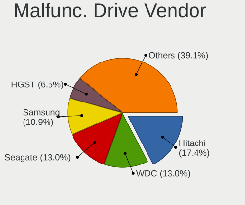

| Vendor              | Computers | Drives | Percent |
|---------------------|-----------|--------|---------|
| Hitachi             | 8         | 9      | 17.39%  |
| WDC                 | 6         | 20     | 13.04%  |
| Seagate             | 6         | 7      | 13.04%  |
| Samsung Electronics | 5         | 7      | 10.87%  |
| HGST                | 3         | 3      | 6.52%   |
| Toshiba             | 2         | 2      | 4.35%   |
| SK hynix            | 2         | 2      | 4.35%   |
| A-DATA Technology   | 2         | 4      | 4.35%   |
| Unknown             | 2         | 2      | 4.35%   |
| V-GeN               | 1         | 1      | 2.17%   |
| Secure              | 1         | 1      | 2.17%   |
| SanDisk             | 1         | 1      | 2.17%   |
| Netac               | 1         | 1      | 2.17%   |
| Micron Technology   | 1         | 1      | 2.17%   |
| Maxtor              | 1         | 1      | 2.17%   |
| Kingmax             | 1         | 1      | 2.17%   |
| Fujitsu             | 1         | 1      | 2.17%   |
| Corsair             | 1         | 2      | 2.17%   |
| AMD                 | 1         | 1      | 2.17%   |

Malfunc. HDD Vendor
-------------------

Vendors of faulty HDD drives

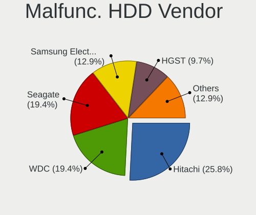

| Vendor              | Computers | Drives | Percent |
|---------------------|-----------|--------|---------|
| Hitachi             | 8         | 9      | 25.81%  |
| WDC                 | 6         | 19     | 19.35%  |
| Seagate             | 6         | 7      | 19.35%  |
| Samsung Electronics | 4         | 6      | 12.9%   |
| HGST                | 3         | 3      | 9.68%   |
| Toshiba             | 2         | 2      | 6.45%   |
| Maxtor              | 1         | 1      | 3.23%   |
| Fujitsu             | 1         | 1      | 3.23%   |

Malfunc. Drive Kind
-------------------

Kinds of faulty drives

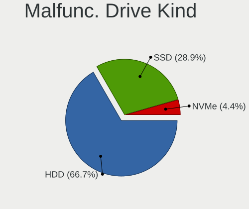

| Kind | Computers | Drives | Percent |
|------|-----------|--------|---------|
| HDD  | 30        | 48     | 66.67%  |
| SSD  | 13        | 17     | 28.89%  |
| NVMe | 2         | 2      | 4.44%   |

Failed Drives
-------------

Failed drive models

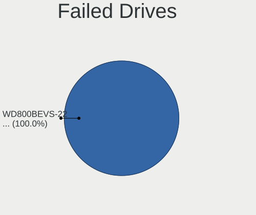

| Model                 | Computers | Drives | Percent |
|-----------------------|-----------|--------|---------|
| WDC WD800BEVS-22 80GB | 1         | 1      | 100%    |

Failed Drive Vendor
-------------------

Failed drive vendors

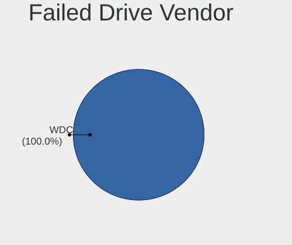

| Vendor | Computers | Drives | Percent |
|--------|-----------|--------|---------|
| WDC    | 1         | 1      | 100%    |

Drive Status
------------

Number of failed and malfunc. drives

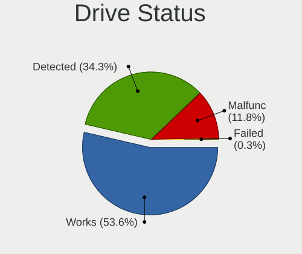

| Status   | Computers | Drives | Percent |
|----------|-----------|--------|---------|
| Works    | 186       | 367    | 53.6%   |
| Detected | 119       | 191    | 34.29%  |
| Malfunc  | 41        | 67     | 11.82%  |
| Failed   | 1         | 1      | 0.29%   |

Storage controller
------------------

Storage Vendor
--------------

Storage controller vendors

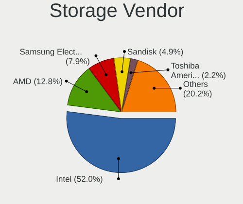

| Vendor                           | Computers | Percent |
|----------------------------------|-----------|---------|
| Intel                            | 191       | 52.04%  |
| AMD                              | 47        | 12.81%  |
| Samsung Electronics              | 29        | 7.9%    |
| Sandisk                          | 18        | 4.9%    |
| Toshiba America Info Systems     | 8         | 2.18%   |
| SK hynix                         | 7         | 1.91%   |
| Realtek Semiconductor            | 5         | 1.36%   |
| Nvidia                           | 5         | 1.36%   |
| Marvell Technology Group         | 5         | 1.36%   |
| KIOXIA                           | 5         | 1.36%   |
| VIA Technologies                 | 4         | 1.09%   |
| Micron Technology                | 4         | 1.09%   |
| LSI Logic / Symbios Logic        | 4         | 1.09%   |
| ASMedia Technology               | 4         | 1.09%   |
| ADATA Technology                 | 4         | 1.09%   |
| Phison Electronics               | 3         | 0.82%   |
| Broadcom / LSI                   | 3         | 0.82%   |
| Adaptec                          | 3         | 0.82%   |
| Yangtze Memory Technologies      | 2         | 0.54%   |
| Silicon Integrated Systems [SiS] | 2         | 0.54%   |
| Micron/Crucial Technology        | 2         | 0.54%   |
| Kingston Technology Company      | 2         | 0.54%   |
| Hewlett-Packard                  | 2         | 0.54%   |
| Apple                            | 2         | 0.54%   |
| Union Memory (Shenzhen)          | 1         | 0.27%   |
| Solid State Storage Technology   | 1         | 0.27%   |
| Silicon Motion                   | 1         | 0.27%   |
| Shenzhen Longsys Electronics     | 1         | 0.27%   |
| Promise Technology               | 1         | 0.27%   |
| Loongson Technology              | 1         | 0.27%   |

Storage Model
-------------

Storage controller models

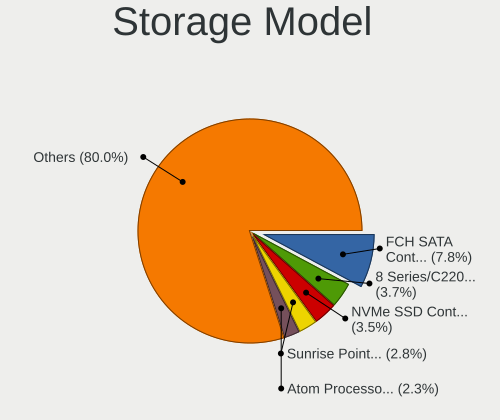

| Model                                                                          | Computers | Percent |
|--------------------------------------------------------------------------------|-----------|---------|
| AMD FCH SATA Controller [AHCI mode]                                            | 34        | 7.83%   |
| Intel 8 Series/C220 Series Chipset Family 6-port SATA Controller 1 [AHCI mode] | 16        | 3.69%   |
| Samsung NVMe SSD Controller SM981/PM981/PM983                                  | 15        | 3.46%   |
| Intel Sunrise Point-LP SATA Controller [AHCI mode]                             | 12        | 2.76%   |
| Intel Atom Processor E3800 Series SATA AHCI Controller                         | 10        | 2.3%    |
| Intel Q170/Q150/B150/H170/H110/Z170/CM236 Chipset SATA Controller [AHCI Mode]  | 9         | 2.07%   |
| Intel Celeron N3350/Pentium N4200/Atom E3900 Series SATA AHCI Controller       | 9         | 2.07%   |
| Intel 8 Series SATA Controller 1 [AHCI mode]                                   | 8         | 1.84%   |
| Intel Volume Management Device NVMe RAID Controller                            | 7         | 1.61%   |
| Intel Cannon Lake PCH SATA AHCI Controller                                     | 7         | 1.61%   |
| Toshiba America Info Systems XG5 NVMe SSD Controller                           | 6         | 1.38%   |
| Samsung NVMe SSD Controller 980 (DRAM-less)                                    | 6         | 1.38%   |
| Intel NM10/ICH7 Family SATA Controller [IDE mode]                              | 6         | 1.38%   |
| Intel NM10/ICH7 Family SATA Controller [AHCI mode]                             | 6         | 1.38%   |
| Intel Comet Lake SATA AHCI Controller                                          | 6         | 1.38%   |
| Intel Cannon Lake Mobile PCH SATA AHCI Controller                              | 6         | 1.38%   |
| Intel 82801IBM/IEM (ICH9M/ICH9M-E) 4 port SATA Controller [AHCI mode]          | 6         | 1.38%   |
| Intel 6 Series/C200 Series Chipset Family 6 port Mobile SATA AHCI Controller   | 6         | 1.38%   |
| Intel 6 Series/C200 Series Chipset Family 6 port Desktop SATA AHCI Controller  | 6         | 1.38%   |
| Samsung NVMe SSD Controller PM9A1/PM9A3/980PRO                                 | 5         | 1.15%   |
| Intel 82801G (ICH7 Family) IDE Controller                                      | 5         | 1.15%   |
| Intel 82801 Mobile SATA Controller [RAID mode]                                 | 5         | 1.15%   |
| Intel 7 Series Chipset Family 6-port SATA Controller [AHCI mode]               | 5         | 1.15%   |
| Intel 5 Series/3400 Series Chipset 4 port SATA AHCI Controller                 | 5         | 1.15%   |
| AMD SB7x0/SB8x0/SB9x0 SATA Controller [AHCI mode]                              | 5         | 1.15%   |
| SK hynix BC501 NVMe Solid State Drive                                          | 4         | 0.92%   |
| SanDisk Extreme Pro / WD Black SN750 / PC SN730 / Red SN700 NVMe SSD           | 4         | 0.92%   |
| Samsung NVMe SSD Controller SM961/PM961/SM963                                  | 4         | 0.92%   |
| LSI Logic / Symbios Logic SAS2008 PCI-Express Fusion-MPT SAS-2 [Falcon]        | 4         | 0.92%   |
| KIOXIA NVMe SSD Controller BG4 (DRAM-less)                                     | 4         | 0.92%   |
| Intel Wildcat Point-LP SATA Controller [AHCI Mode]                             | 4         | 0.92%   |
| Intel 9 Series Chipset Family SATA Controller [AHCI Mode]                      | 4         | 0.92%   |
| Intel 82801GBM/GHM (ICH7-M Family) SATA Controller [IDE mode]                  | 4         | 0.92%   |
| Intel 7 Series/C210 Series Chipset Family 6-port SATA Controller [AHCI mode]   | 4         | 0.92%   |
| ASMedia ASM1061/ASM1062 Serial ATA Controller                                  | 4         | 0.92%   |
| AMD 500 Series Chipset SATA Controller                                         | 4         | 0.92%   |
| VIA VT82C586A/B/VT82C686/A/B/VT823x/A/C PIPC Bus Master IDE                    | 3         | 0.69%   |
| SanDisk WD SN560/SN740/SN770/SN5000 NVMe SSD                                   | 3         | 0.69%   |
| Nvidia MCP89 SATA Controller (AHCI mode)                                       | 3         | 0.69%   |
| Marvell Group 88SE9235 PCIe 2.0 x2 4-port SATA 6 Gb/s Controller               | 3         | 0.69%   |

Storage Kind
------------

Kind of storage controller (IDE, SATA, NVMe, SAS, ...)

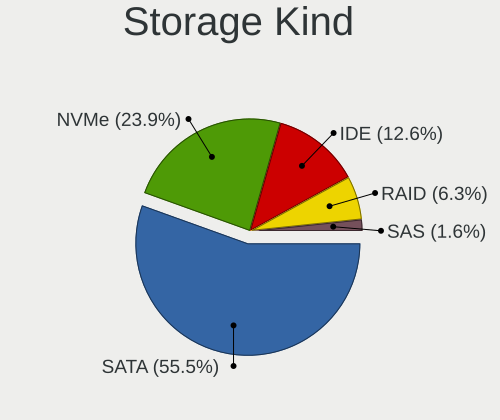

| Kind | Computers | Percent |
|------|-----------|---------|
| SATA | 202       | 55.49%  |
| NVMe | 87        | 23.9%   |
| IDE  | 46        | 12.64%  |
| RAID | 23        | 6.32%   |
| SAS  | 6         | 1.65%   |

Processor
---------

CPU Vendor
----------

Processor vendors

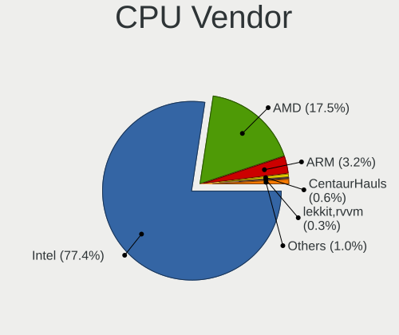

| Vendor       | Computers | Percent |
|--------------|-----------|---------|
| Intel        | 243       | 77.39%  |
| AMD          | 55        | 17.52%  |
| ARM          | 10        | 3.18%   |
| CentaurHauls | 2         | 0.64%   |
| Loongson     | 1         | 0.32%   |
| lekkit,rvvm  | 1         | 0.32%   |
| iSH          | 1         | 0.32%   |
| Unknown      | 1         | 0.32%   |

CPU Model
---------

Processor models

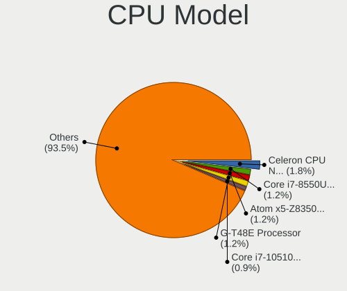

| Model                                   | Computers | Percent |
|-----------------------------------------|-----------|---------|
| Intel Celeron CPU N2807 @ 1.58GHz       | 6         | 1.85%   |
| Intel Core i7-8550U CPU @ 1.80GHz       | 4         | 1.23%   |
| Intel Atom x5-Z8350 CPU @ 1.44GHz       | 4         | 1.23%   |
| AMD G-T48E Processor                    | 4         | 1.23%   |
| Intel Core i7-10510U CPU @ 1.80GHz      | 3         | 0.92%   |
| Intel Core i5-2520M CPU @ 2.50GHz       | 3         | 0.92%   |
| Intel Core i5-10210U CPU @ 1.60GHz      | 3         | 0.92%   |
| Intel Celeron CPU N3350 @ 1.10GHz       | 3         | 0.92%   |
| Intel Celeron CPU N3060 @ 1.60GHz       | 3         | 0.92%   |
| Intel Atom CPU D525 @ 1.80GHz           | 3         | 0.92%   |
| Intel 11th Gen Core i5-1135G7 @ 2.40GHz | 3         | 0.92%   |
| ARM Processor                           | 3         | 0.92%   |
| ARM BCM2835 Processor                   | 3         | 0.92%   |
| Intel Xeon CPU L5640 @ 2.27GHz          | 2         | 0.62%   |
| Intel Pentium M processor 1.70GHz       | 2         | 0.62%   |
| Intel Pentium III (Coppermine)          | 2         | 0.62%   |
| Intel Pentium Dual CPU T2390 @ 1.86GHz  | 2         | 0.62%   |
| Intel Pentium CPU N4200 @ 1.10GHz       | 2         | 0.62%   |
| Intel N100                              | 2         | 0.62%   |
| Intel Core i9-10900 CPU @ 2.80GHz       | 2         | 0.62%   |
| Intel Core i7-8700 CPU @ 3.20GHz        | 2         | 0.62%   |
| Intel Core i7-6770HQ CPU @ 2.60GHz      | 2         | 0.62%   |
| Intel Core i7-4790K CPU @ 4.00GHz       | 2         | 0.62%   |
| Intel Core i7-4790 CPU @ 3.60GHz        | 2         | 0.62%   |
| Intel Core i7-4510U CPU @ 2.00GHz       | 2         | 0.62%   |
| Intel Core i5-9300H CPU @ 2.40GHz       | 2         | 0.62%   |
| Intel Core i5-8350U CPU @ 1.70GHz       | 2         | 0.62%   |
| Intel Core i5-7200U CPU @ 2.50GHz       | 2         | 0.62%   |
| Intel Core i5-4590T CPU @ 2.00GHz       | 2         | 0.62%   |
| Intel Core i5-4570T CPU @ 2.90GHz       | 2         | 0.62%   |
| Intel Core i5-4570 CPU @ 3.20GHz        | 2         | 0.62%   |
| Intel Core i5-4210U CPU @ 1.70GHz       | 2         | 0.62%   |
| Intel Core i5-4200U CPU @ 1.60GHz       | 2         | 0.62%   |
| Intel Core i5-3470T CPU @ 2.90GHz       | 2         | 0.62%   |
| Intel Core i5-2400 CPU @ 3.10GHz        | 2         | 0.62%   |
| Intel Core i5 CPU M 480 @ 2.67GHz       | 2         | 0.62%   |
| Intel Core i3-4150 CPU @ 3.50GHz        | 2         | 0.62%   |
| Intel Core i3 CPU M 370 @ 2.40GHz       | 2         | 0.62%   |
| Intel Core 2 Duo CPU P8600 @ 2.40GHz    | 2         | 0.62%   |
| Intel Celeron N4020 CPU @ 1.10GHz       | 2         | 0.62%   |

CPU Model Family
----------------

Processor model prefix

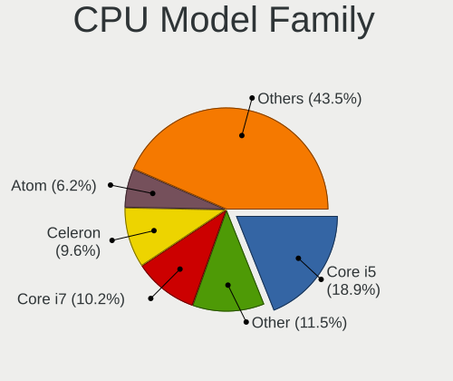

| Model                   | Computers | Percent |
|-------------------------|-----------|---------|
| Intel Core i5           | 61        | 18.94%  |
| Other                   | 37        | 11.49%  |
| Intel Core i7           | 33        | 10.25%  |
| Intel Celeron           | 31        | 9.63%   |
| Intel Atom              | 20        | 6.21%   |
| Intel Core i3           | 19        | 5.9%    |
| Intel Core 2 Duo        | 12        | 3.73%   |
| Intel Xeon              | 11        | 3.42%   |
| AMD Ryzen 5             | 11        | 3.42%   |
| Intel Pentium           | 7         | 2.17%   |
| AMD Ryzen 7             | 7         | 2.17%   |
| AMD Ryzen 3             | 6         | 1.86%   |
| Intel Pentium M         | 5         | 1.55%   |
| AMD Ryzen 9             | 4         | 1.24%   |
| AMD G                   | 4         | 1.24%   |
| AMD A6                  | 4         | 1.24%   |
| Intel Pentium Dual      | 3         | 0.93%   |
| Intel Genuine           | 3         | 0.93%   |
| Intel Core i9           | 3         | 0.93%   |
| Intel Core 2            | 3         | 0.93%   |
| ARM BCM                 | 3         | 0.93%   |
| AMD GX                  | 3         | 0.93%   |
| AMD A4                  | 3         | 0.93%   |
| Intel Xeon Gold         | 2         | 0.62%   |
| Intel Pentium III       | 2         | 0.62%   |
| Intel Core              | 2         | 0.62%   |
| ARM AArch64             | 2         | 0.62%   |
| AMD FX                  | 2         | 0.62%   |
| Intel Pentium Gold      | 1         | 0.31%   |
| Intel Pentium Dual-Core | 1         | 0.31%   |
| Intel Pentium 4         | 1         | 0.31%   |
| Intel Core Solo         | 1         | 0.31%   |
| Intel Core m3           | 1         | 0.31%   |
| Intel Core Duo          | 1         | 0.31%   |
| Intel Core 2 Quad       | 1         | 0.31%   |
| Intel Celeron M         | 1         | 0.31%   |
| CentaurHauls VIA Eden   | 1         | 0.31%   |
| ARM ARMv7               | 1         | 0.31%   |
| AMD Turion 64 Mobile    | 1         | 0.31%   |
| AMD Sempron             | 1         | 0.31%   |

CPU Cores
---------

Number of processor cores

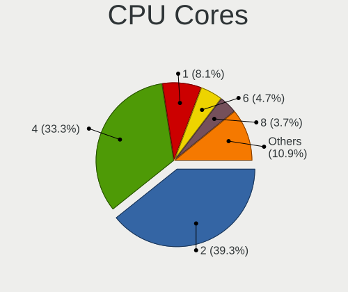

| Number  | Computers | Percent |
|---------|-----------|---------|
| 2       | 126       | 39.25%  |
| 4       | 107       | 33.33%  |
| 1       | 26        | 8.1%    |
| 6       | 15        | 4.67%   |
| 8       | 12        | 3.74%   |
| 12      | 9         | 2.8%    |
| Unknown | 8         | 2.49%   |
| 10      | 6         | 1.87%   |
| 16      | 5         | 1.56%   |
| 32      | 2         | 0.62%   |
| 48      | 1         | 0.31%   |
| 28      | 1         | 0.31%   |
| 24      | 1         | 0.31%   |
| 14      | 1         | 0.31%   |
| 3       | 1         | 0.31%   |

CPU Sockets
-----------

Number of sockets

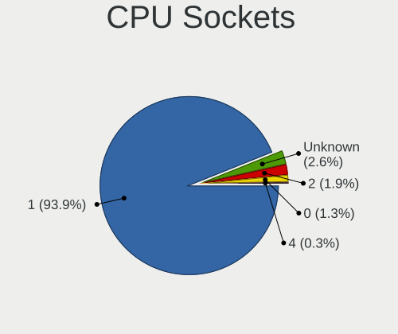

| Number  | Computers | Percent |
|---------|-----------|---------|
| 1       | 294       | 93.93%  |
| Unknown | 8         | 2.56%   |
| 2       | 6         | 1.92%   |
| 0       | 4         | 1.28%   |
| 4       | 1         | 0.32%   |

CPU Threads
-----------

Threads per core (Hyper-Threading)

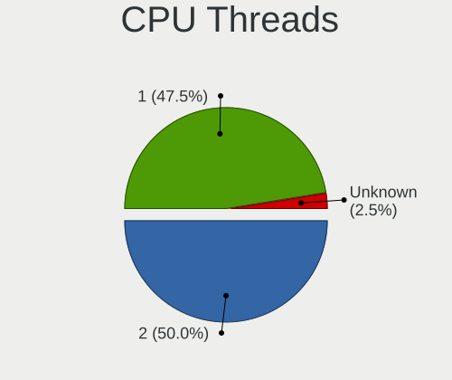

| Number  | Computers | Percent |
|---------|-----------|---------|
| 2       | 157       | 50%     |
| 1       | 149       | 47.45%  |
| Unknown | 8         | 2.55%   |

CPU Op-Modes
------------

CPU Operation Modes (32-bit, 64-bit)

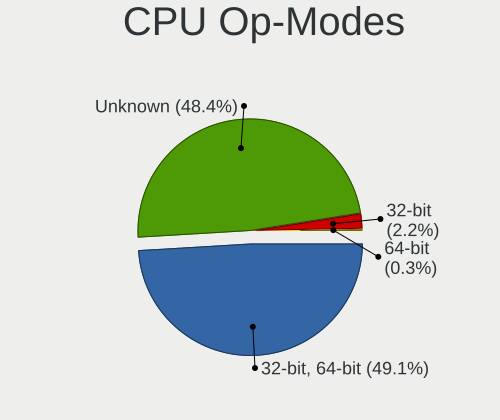

| Op mode        | Computers | Percent |
|----------------|-----------|---------|
| 32-bit, 64-bit | 156       | 49.06%  |
| Unknown        | 154       | 48.43%  |
| 32-bit         | 7         | 2.2%    |
| 64-bit         | 1         | 0.31%   |

CPU Microcode
-------------

Microcode number

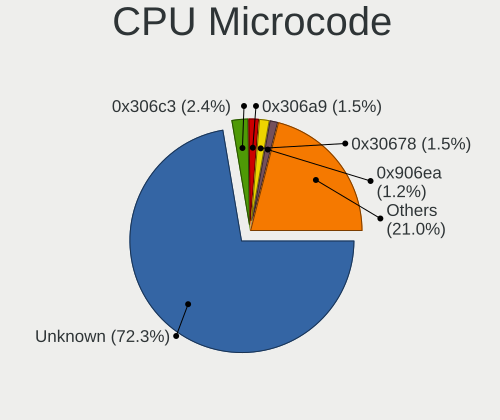

| Number     | Computers | Percent |
|------------|-----------|---------|
| Unknown    | 238       | 72.34%  |
| 0x306c3    | 8         | 2.43%   |
| 0x306a9    | 5         | 1.52%   |
| 0x30678    | 5         | 1.52%   |
| 0x906ea    | 4         | 1.22%   |
| 0x506e3    | 4         | 1.22%   |
| 0x20655    | 4         | 1.22%   |
| 0x106ca    | 4         | 1.22%   |
| 0x206c2    | 3         | 0.91%   |
| 0x08108109 | 3         | 0.91%   |
| 0x05000101 | 3         | 0.91%   |
| 0x806eb    | 2         | 0.61%   |
| 0x806c1    | 2         | 0.61%   |
| 0x506c9    | 2         | 0.61%   |
| 0x406c4    | 2         | 0.61%   |
| 0x206a7    | 2         | 0.61%   |
| 0x106e5    | 2         | 0.61%   |
| 0x1067a    | 2         | 0.61%   |
| 0x0a20120e | 2         | 0.61%   |
| 0x08701030 | 2         | 0.61%   |
| 0x08108102 | 2         | 0.61%   |
| 0x06006704 | 2         | 0.61%   |
| 0xb0671    | 1         | 0.3%    |
| 0xa0671    | 1         | 0.3%    |
| 0xa0655    | 1         | 0.3%    |
| 0xa0652    | 1         | 0.3%    |
| 0x906a3    | 1         | 0.3%    |
| 0x90672    | 1         | 0.3%    |
| 0x806ec    | 1         | 0.3%    |
| 0x806ea    | 1         | 0.3%    |
| 0x706e5    | 1         | 0.3%    |
| 0x6fd      | 1         | 0.3%    |
| 0x6f2      | 1         | 0.3%    |
| 0x6d8      | 1         | 0.3%    |
| 0x68a      | 1         | 0.3%    |
| 0x683      | 1         | 0.3%    |
| 0x606a6    | 1         | 0.3%    |
| 0x306d4    | 1         | 0.3%    |
| 0x08701021 | 1         | 0.3%    |
| 0x08608103 | 1         | 0.3%    |

CPU Microarch
-------------

Microarchitecture

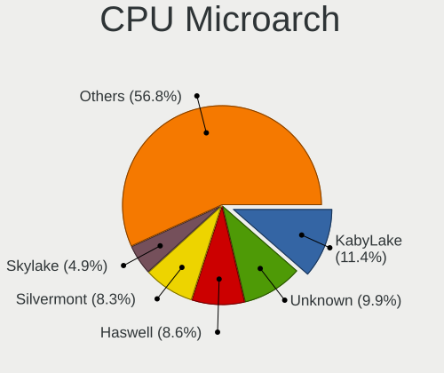

| Name             | Computers | Percent |
|------------------|-----------|---------|
| KabyLake         | 37        | 11.42%  |
| Unknown          | 32        | 9.88%   |
| Haswell          | 28        | 8.64%   |
| Silvermont       | 27        | 8.33%   |
| Skylake          | 16        | 4.94%   |
| Penryn           | 13        | 4.01%   |
| Westmere         | 12        | 3.7%    |
| IvyBridge        | 12        | 3.7%    |
| SandyBridge      | 11        | 3.4%    |
| P6               | 11        | 3.4%    |
| Core             | 10        | 3.09%   |
| Broadwell        | 10        | 3.09%   |
| Bonnell          | 10        | 3.09%   |
| Goldmont         | 9         | 2.78%   |
| Alderlake Hybrid | 9         | 2.78%   |
| Zen+             | 8         | 2.47%   |
| Zen 2            | 8         | 2.47%   |
| TigerLake        | 8         | 2.47%   |
| Zen 3            | 7         | 2.16%   |
| Jaguar           | 6         | 1.85%   |
| IceLake          | 5         | 1.54%   |
| Goldmont plus    | 5         | 1.54%   |
| Bobcat           | 5         | 1.54%   |
| Excavator        | 4         | 1.23%   |
| CometLake        | 4         | 1.23%   |
| Piledriver       | 3         | 0.93%   |
| Zen              | 2         | 0.62%   |
| Puma             | 2         | 0.62%   |
| Nehalem          | 2         | 0.62%   |
| K8 Hammer        | 2         | 0.62%   |
| K10              | 2         | 0.62%   |
| NetBurst         | 1         | 0.31%   |
| K6               | 1         | 0.31%   |
| K10 Llano        | 1         | 0.31%   |
| Gracemont        | 1         | 0.31%   |

Graphics
--------

GPU Vendor
----------

Vendors of graphics cards

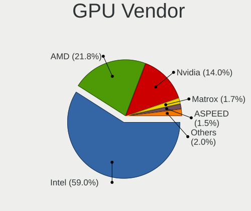

| Vendor                     | Computers | Percent |
|----------------------------|-----------|---------|
| Intel                      | 203       | 59.01%  |
| AMD                        | 75        | 21.8%   |
| Nvidia                     | 48        | 13.95%  |
| Matrox Electronics Systems | 6         | 1.74%   |
| ASPEED Technology          | 5         | 1.45%   |
| VIA Technologies           | 4         | 1.16%   |
| Neomagic                   | 2         | 0.58%   |
| S3 Graphics                | 1         | 0.29%   |

GPU Model
---------

Graphics card models

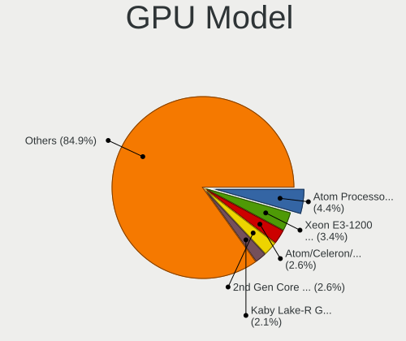

| Model                                                                                    | Computers | Percent |
|------------------------------------------------------------------------------------------|-----------|---------|
| Intel Atom Processor Z36xxx/Z37xxx Series Graphics & Display                             | 17        | 4.43%   |
| Intel Xeon E3-1200 v3/4th Gen Core Processor Integrated Graphics Controller              | 13        | 3.39%   |
| Intel Atom/Celeron/Pentium Processor x5-E8000/J3xxx/N3xxx Integrated Graphics Controller | 10        | 2.6%    |
| Intel 2nd Generation Core Processor Family Integrated Graphics Controller                | 10        | 2.6%    |
| Intel Kaby Lake-R GT2 [UHD Graphics 620]                                                 | 8         | 2.08%   |
| Intel Haswell-ULT Integrated Graphics Controller                                         | 8         | 2.08%   |
| Intel Core Processor Integrated Graphics Controller                                      | 8         | 2.08%   |
| AMD Picasso/Raven 2 [Radeon Vega Series / Radeon Vega Mobile Series]                     | 8         | 2.08%   |
| Intel CometLake-U GT2 [UHD Graphics]                                                     | 7         | 1.82%   |
| Intel Apollo Lake GT1 [HD Graphics 500]                                                  | 7         | 1.82%   |
| AMD Ellesmere [Radeon RX 470/480/570/570X/580/580X/590]                                  | 7         | 1.82%   |
| Intel TigerLake-LP GT2 [Iris Xe Graphics]                                                | 6         | 1.56%   |
| Intel GeminiLake [UHD Graphics 600]                                                      | 6         | 1.56%   |
| Intel CoffeeLake-S GT2 [UHD Graphics 630]                                                | 6         | 1.56%   |
| Intel Atom Processor D4xx/D5xx/N4xx/N5xx Integrated Graphics Controller                  | 6         | 1.56%   |
| Intel Xeon E3-1200 v2/3rd Gen Core processor Graphics Controller                         | 5         | 1.3%    |
| Intel Mobile 945GM/GMS/GME, 943/940GML Express Integrated Graphics Controller            | 5         | 1.3%    |
| Intel CoffeeLake-H GT2 [UHD Graphics 630]                                                | 5         | 1.3%    |
| Intel 3rd Gen Core processor Graphics Controller                                         | 5         | 1.3%    |
| ASPEED Technology ASPEED Graphics Family                                                 | 5         | 1.3%    |
| Nvidia GP108M [GeForce MX150]                                                            | 4         | 1.04%   |
| Intel WhiskeyLake-U GT2 [UHD Graphics 620]                                               | 4         | 1.04%   |
| Intel Skylake-U GT2 [HD Graphics 520]                                                    | 4         | 1.04%   |
| Intel Skylake-S GT2 [HD Graphics 530]                                                    | 4         | 1.04%   |
| Intel Mobile 915GM/GMS/910GML Express Graphics Controller                                | 4         | 1.04%   |
| Intel Broadwell-U GT2 [HD Graphics 5500]                                                 | 4         | 1.04%   |
| AMD Wrestler [Radeon HD 6250]                                                            | 4         | 1.04%   |
| AMD Renoir [Radeon Vega Series / Radeon Vega Mobile Series]                              | 4         | 1.04%   |
| Nvidia MCP89 [GeForce 320M]                                                              | 3         | 0.78%   |
| Nvidia GM108M [GeForce 840M]                                                             | 3         | 0.78%   |
| Nvidia GA106 [GeForce RTX 3060 Lite Hash Rate]                                           | 3         | 0.78%   |
| Intel Mobile 945GM/GMS, 943/940GML Express Integrated Graphics Controller                | 3         | 0.78%   |
| Intel Mobile 4 Series Chipset Integrated Graphics Controller                             | 3         | 0.78%   |
| Intel Kaby Lake-U GT2 [HD Graphics 620]                                                  | 3         | 0.78%   |
| Intel Kaby Lake-S GT2 [HD Graphics 630]                                                  | 3         | 0.78%   |
| AMD Stoney [Radeon R2/R3/R4/R5 Graphics]                                                 | 3         | 0.78%   |
| AMD RV620/M82 [Mobility Radeon HD 3450/3470]                                             | 3         | 0.78%   |
| AMD ES1000                                                                               | 3         | 0.78%   |
| AMD Cezanne [Radeon Vega Series / Radeon Vega Mobile Series]                             | 3         | 0.78%   |
| Nvidia TU117M [GeForce GTX 1650 Mobile / Max-Q]                                          | 2         | 0.52%   |

GPU Combo
---------

Combinations of graphics cards

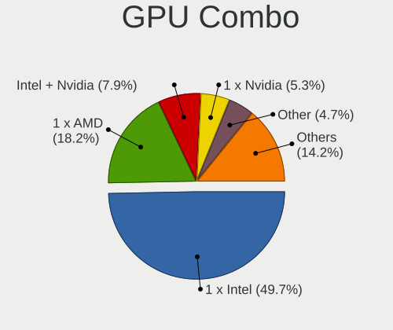

| Name                    | Computers | Percent |
|-------------------------|-----------|---------|
| 1 x Intel               | 158       | 49.69%  |
| 1 x AMD                 | 58        | 18.24%  |
| Intel + Nvidia          | 25        | 7.86%   |
| 1 x Nvidia              | 17        | 5.35%   |
| Other                   | 15        | 4.72%   |
| 2 x Intel               | 13        | 4.09%   |
| Intel + AMD             | 7         | 2.2%    |
| 1 x Matrox              | 4         | 1.26%   |
| 1 x ASPEED              | 4         | 1.26%   |
| AMD + Nvidia            | 4         | 1.26%   |
| 2 x AMD                 | 3         | 0.94%   |
| 1 x VIA                 | 3         | 0.94%   |
| 1 x Neomagic            | 2         | 0.63%   |
| 2 x Nvidia + 1 x ASPEED | 1         | 0.31%   |
| 1 x S3 Graphics         | 1         | 0.31%   |
| Nvidia + Matrox         | 1         | 0.31%   |
| AMD + VIA               | 1         | 0.31%   |
| AMD + Matrox            | 1         | 0.31%   |

GPU Driver
----------

Free vs proprietary

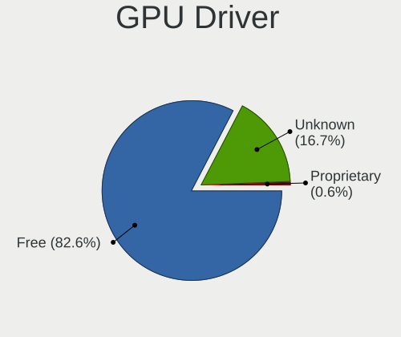

| Driver      | Computers | Percent |
|-------------|-----------|---------|
| Free        | 262       | 82.65%  |
| Unknown     | 53        | 16.72%  |
| Proprietary | 2         | 0.63%   |

GPU Memory
----------

Total video memory

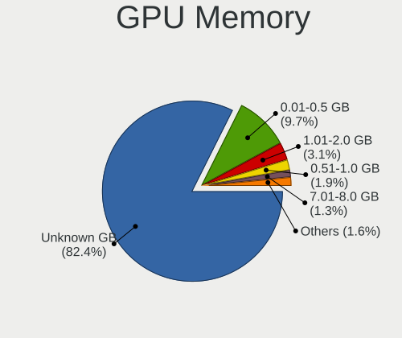

| Size in GB | Computers | Percent |
|------------|-----------|---------|
| Unknown    | 262       | 82.39%  |
| 0.01-0.5   | 31        | 9.75%   |
| 1.01-2.0   | 10        | 3.14%   |
| 0.51-1.0   | 6         | 1.89%   |
| 7.01-8.0   | 4         | 1.26%   |
| 3.01-4.0   | 2         | 0.63%   |
| 2.01-3.0   | 1         | 0.31%   |
| 16.01-24.0 | 1         | 0.31%   |
| 8.01-16.0  | 1         | 0.31%   |

Monitor
-------

Monitor Vendor
--------------

Monitor vendors

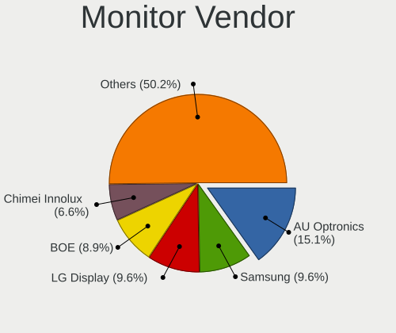

| Vendor                  | Computers | Percent |
|-------------------------|-----------|---------|
| AU Optronics            | 41        | 15.13%  |
| Samsung Electronics     | 26        | 9.59%   |
| LG Display              | 26        | 9.59%   |
| BOE                     | 24        | 8.86%   |
| Chimei Innolux          | 18        | 6.64%   |
| Goldstar                | 15        | 5.54%   |
| Dell                    | 15        | 5.54%   |
| AOC                     | 9         | 3.32%   |
| BenQ                    | 8         | 2.95%   |
| Hewlett-Packard         | 7         | 2.58%   |
| Apple                   | 7         | 2.58%   |
| Lenovo                  | 6         | 2.21%   |
| Acer                    | 5         | 1.85%   |
| LG Philips              | 4         | 1.48%   |
| Sony                    | 3         | 1.11%   |
| Sharp                   | 3         | 1.11%   |
| PANDA                   | 3         | 1.11%   |
| InfoVision              | 3         | 1.11%   |
| HannStar                | 3         | 1.11%   |
| Chi Mei Optoelectronics | 3         | 1.11%   |
| ASUSTek Computer        | 3         | 1.11%   |
| Ancor Communications    | 3         | 1.11%   |
| Vizio                   | 2         | 0.74%   |
| Sceptre Tech            | 2         | 0.74%   |
| Philips                 | 2         | 0.74%   |
| Jean                    | 2         | 0.74%   |
| CSO                     | 2         | 0.74%   |
| Belinea                 | 2         | 0.74%   |
| WST                     | 1         | 0.37%   |
| ViewSonic               | 1         | 0.37%   |
| Unknown (XXX)           | 1         | 0.37%   |
| Toshiba                 | 1         | 0.37%   |
| SKY                     | 1         | 0.37%   |
| Quanta Display          | 1         | 0.37%   |
| ONN                     | 1         | 0.37%   |
| Mi                      | 1         | 0.37%   |
| KVM                     | 1         | 0.37%   |
| Huion                   | 1         | 0.37%   |
| HKC                     | 1         | 0.37%   |
| HJW                     | 1         | 0.37%   |

Monitor Model
-------------

Monitor models

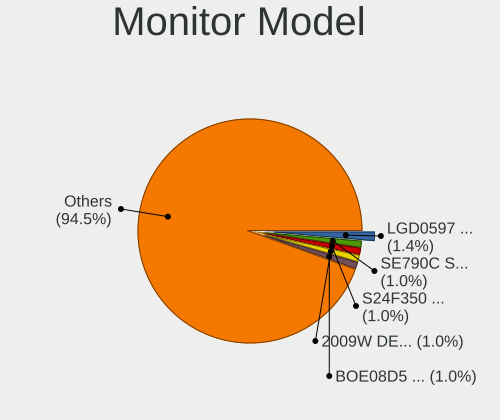

| Model                                                                | Computers | Percent |
|----------------------------------------------------------------------|-----------|---------|
| LG Display LCD Monitor LGD0597 1920x1080 294x165mm 13.3-inch         | 4         | 1.37%   |
| Samsung Electronics SE790C SAM0BFE 3440x1440 797x333mm 34.0-inch     | 3         | 1.03%   |
| Samsung Electronics S24F350 SAM0D20 1920x1080 521x293mm 23.5-inch    | 3         | 1.03%   |
| Dell 2009W DEL4041 1680x1050 433x270mm 20.1-inch                     | 3         | 1.03%   |
| BOE LCD Monitor BOE08D5 1920x1080 344x194mm 15.5-inch                | 3         | 1.03%   |
| AU Optronics LCD Monitor AUO235C 1366x768 256x144mm 11.6-inch        | 3         | 1.03%   |
| LG Display LCD Monitor LGD0456 1366x768 344x194mm 15.5-inch          | 2         | 0.69%   |
| Jean JT229x6-4 JEN51C6 1680x1050 474x297mm 22.0-inch                 | 2         | 0.69%   |
| HannStar LCD Monitor HSD03E9 1024x600 220x129mm 10.0-inch            | 2         | 0.69%   |
| Goldstar W2253 GSM56DD 1920x1080 510x290mm 23.1-inch                 | 2         | 0.69%   |
| Goldstar E2241 GSM5818 1920x1080 477x268mm 21.5-inch                 | 2         | 0.69%   |
| Dell U2412M DELA07A 1920x1200 518x324mm 24.1-inch                    | 2         | 0.69%   |
| Dell 1905FP DEL400C 1280x1024 376x301mm 19.0-inch                    | 2         | 0.69%   |
| CSO LCD Monitor CSO1402 2880x1800 302x188mm 14.0-inch                | 2         | 0.69%   |
| Chimei Innolux LCD Monitor CMN1132 1366x768 256x144mm 11.6-inch      | 2         | 0.69%   |
| BOE LCD Monitor BOE08F2 1920x1080 310x174mm 14.0-inch                | 2         | 0.69%   |
| BenQ E2200HD BNQ790B 1920x1080 476x268mm 21.5-inch                   | 2         | 0.69%   |
| Belinea B101555 MAX05DF 1024x768 304x228mm 15.0-inch                 | 2         | 0.69%   |
| AU Optronics LCD Monitor AUO61ED 1920x1080 344x194mm 15.5-inch       | 2         | 0.69%   |
| AU Optronics LCD Monitor AUO23EC 1366x768 344x193mm 15.5-inch        | 2         | 0.69%   |
| AU Optronics LCD Monitor AUO125C 1366x768 256x144mm 11.6-inch        | 2         | 0.69%   |
| AOC 2270W AOC2270 1920x1080 477x268mm 21.5-inch                      | 2         | 0.69%   |
| WST LCD Monitor WST1400 1920x1080 310x170mm 13.9-inch                | 1         | 0.34%   |
| Vizio VX42L HDTV10A VIZ0030 1366x768 930x523mm 42.0-inch             | 1         | 0.34%   |
| Vizio D24f-J09 VIZ1044 1920x1080 521x293mm 23.5-inch                 | 1         | 0.34%   |
| ViewSonic VG2030wm VSCA51E 1680x1050 433x270mm 20.1-inch             | 1         | 0.34%   |
| Unknown (XXX) 5CH4K30 XXX0100 3840x2160 700x390mm 31.5-inch          | 1         | 0.34%   |
| Toshiba ScreenXpert TSB8888 1080x2160                                | 1         | 0.34%   |
| Sony TV SNY1503 1360x768                                             | 1         | 0.34%   |
| Sony TV *02 SNY9703 1920x1080 1218x685mm 55.0-inch                   | 1         | 0.34%   |
| Sony LCD SNY06FA 1600x900 291x164mm 13.2-inch                        | 1         | 0.34%   |
| SKY TV-monitor SKY0001 1920x1080 890x500mm 40.2-inch                 | 1         | 0.34%   |
| Sharp LCD Monitor SHP1513 1920x1080 309x174mm 14.0-inch              | 1         | 0.34%   |
| Sharp LCD Monitor SHP14AF 1920x1200 288x180mm 13.4-inch              | 1         | 0.34%   |
| Sharp LCD Monitor SHP14AE 1920x1080 294x165mm 13.3-inch              | 1         | 0.34%   |
| Sceptre Tech Sceptre J20 SPT080D 1600x900 435x237mm 19.5-inch        | 1         | 0.34%   |
| Sceptre Tech Sceptre F24 SPT09AB 1920x1080 530x290mm 23.8-inch       | 1         | 0.34%   |
| Samsung Electronics SyncMaster SAM037B 1680x1050 474x296mm 22.0-inch | 1         | 0.34%   |
| Samsung Electronics SyncMaster SAM0320 1680x1050 474x296mm 22.0-inch | 1         | 0.34%   |
| Samsung Electronics SyncMaster SAM021C 1400x1050 408x300mm 19.9-inch | 1         | 0.34%   |

Monitor Resolution
------------------

Monitor screen resolution

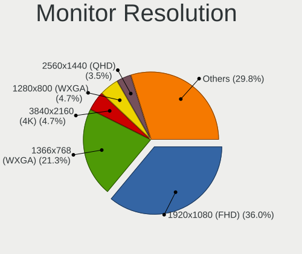

| Resolution         | Computers | Percent |
|--------------------|-----------|---------|
| 1920x1080 (FHD)    | 93        | 36.05%  |
| 1366x768 (WXGA)    | 55        | 21.32%  |
| 3840x2160 (4K)     | 12        | 4.65%   |
| 1280x800 (WXGA)    | 12        | 4.65%   |
| 2560x1440 (QHD)    | 9         | 3.49%   |
| 1680x1050 (WSXGA+) | 9         | 3.49%   |
| 1280x1024 (SXGA)   | 8         | 3.1%    |
| 1920x1200 (WUXGA)  | 7         | 2.71%   |
| 1600x900 (HD+)     | 7         | 2.71%   |
| 1440x900 (WXGA+)   | 6         | 2.33%   |
| 1024x768 (XGA)     | 6         | 2.33%   |
| 3440x1440          | 5         | 1.94%   |
| 2880x1800          | 5         | 1.94%   |
| 1360x768           | 4         | 1.55%   |
| 1024x600           | 4         | 1.55%   |
| 2560x1080          | 3         | 1.16%   |
| 2560x1600          | 2         | 0.78%   |
| 1400x1050          | 2         | 0.78%   |
| 1280x768           | 2         | 0.78%   |
| 3200x1800 (QHD+)   | 1         | 0.39%   |
| 2880x1920          | 1         | 0.39%   |
| 2560x1700          | 1         | 0.39%   |
| 2240x1400          | 1         | 0.39%   |
| 1280x960           | 1         | 0.39%   |
| 1024x576           | 1         | 0.39%   |
| Unknown            | 1         | 0.39%   |

Monitor Diagonal
----------------

Diagonal size in inches

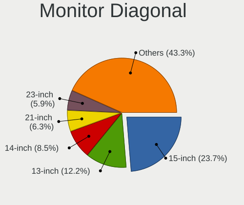

| Inches  | Computers | Percent |
|---------|-----------|---------|
| 15      | 64        | 23.7%   |
| 13      | 33        | 12.22%  |
| 14      | 23        | 8.52%   |
| 21      | 17        | 6.3%    |
| 23      | 16        | 5.93%   |
| 27      | 14        | 5.19%   |
| 17      | 14        | 5.19%   |
| 11      | 12        | 4.44%   |
| 24      | 10        | 3.7%    |
| 12      | 9         | 3.33%   |
| 19      | 8         | 2.96%   |
| 22      | 6         | 2.22%   |
| 20      | 6         | 2.22%   |
| 34      | 5         | 1.85%   |
| 31      | 5         | 1.85%   |
| 10      | 5         | 1.85%   |
| 18      | 4         | 1.48%   |
| 72      | 3         | 1.11%   |
| 40      | 2         | 0.74%   |
| 32      | 2         | 0.74%   |
| 29      | 2         | 0.74%   |
| 25      | 2         | 0.74%   |
| 16      | 2         | 0.74%   |
| 86      | 1         | 0.37%   |
| 65      | 1         | 0.37%   |
| 60      | 1         | 0.37%   |
| 48      | 1         | 0.37%   |
| 42      | 1         | 0.37%   |
| Unknown | 1         | 0.37%   |

Monitor Width
-------------

Physical width

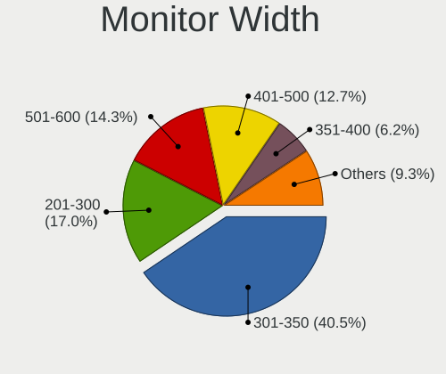

| Width in mm | Computers | Percent |
|-------------|-----------|---------|
| 301-350     | 105       | 40.54%  |
| 201-300     | 44        | 16.99%  |
| 501-600     | 37        | 14.29%  |
| 401-500     | 33        | 12.74%  |
| 351-400     | 16        | 6.18%   |
| 601-700     | 7         | 2.7%    |
| 701-800     | 6         | 2.32%   |
| 1001-1500   | 4         | 1.54%   |
| 1501-2000   | 3         | 1.16%   |
| 801-900     | 2         | 0.77%   |
| 901-1000    | 1         | 0.39%   |
| Unknown     | 1         | 0.39%   |

Aspect Ratio
------------

Proportional relationship between the width and the height

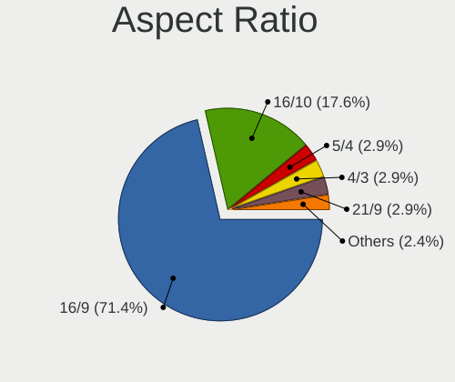

| Ratio   | Computers | Percent |
|---------|-----------|---------|
| 16/9    | 175       | 71.43%  |
| 16/10   | 43        | 17.55%  |
| 5/4     | 7         | 2.86%   |
| 4/3     | 7         | 2.86%   |
| 21/9    | 7         | 2.86%   |
| 6/5     | 2         | 0.82%   |
| 3/2     | 2         | 0.82%   |
| 0.56    | 1         | 0.41%   |
| Unknown | 1         | 0.41%   |

Monitor Area
------------

Area in inch²

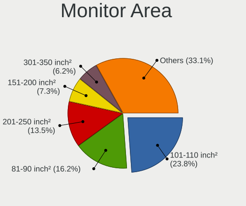

| Area in inch² | Computers | Percent |
|----------------|-----------|---------|
| 101-110        | 62        | 23.85%  |
| 81-90          | 42        | 16.15%  |
| 201-250        | 35        | 13.46%  |
| 151-200        | 19        | 7.31%   |
| 301-350        | 16        | 6.15%   |
| 71-80          | 14        | 5.38%   |
| 51-60          | 12        | 4.62%   |
| 351-500        | 10        | 3.85%   |
| 61-70          | 8         | 3.08%   |
| 121-130        | 8         | 3.08%   |
| More than 1000 | 7         | 2.69%   |
| 141-150        | 7         | 2.69%   |
| 251-300        | 6         | 2.31%   |
| 41-50          | 5         | 1.92%   |
| 501-1000       | 3         | 1.15%   |
| 131-140        | 2         | 0.77%   |
| 111-120        | 2         | 0.77%   |
| 91-100         | 1         | 0.38%   |
| Unknown        | 1         | 0.38%   |

Pixel Density
-------------

Pixels per inch

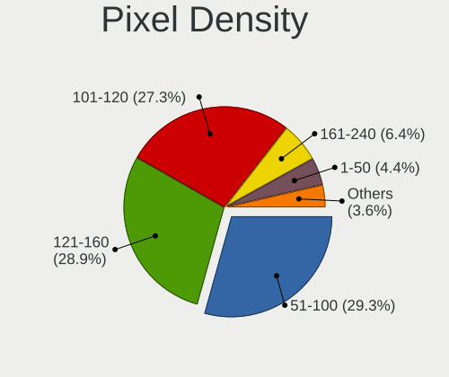

| Density       | Computers | Percent |
|---------------|-----------|---------|
| 51-100        | 73        | 29.32%  |
| 121-160       | 72        | 28.92%  |
| 101-120       | 68        | 27.31%  |
| 161-240       | 16        | 6.43%   |
| 1-50          | 11        | 4.42%   |
| More than 240 | 8         | 3.21%   |
| Unknown       | 1         | 0.4%    |

Multiple Monitors
-----------------

Total monitors connected

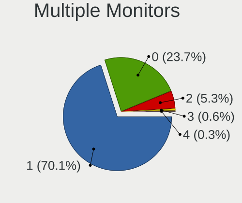

| Total | Computers | Percent |
|-------|-----------|---------|
| 1     | 225       | 70.09%  |
| 0     | 76        | 23.68%  |
| 2     | 17        | 5.3%    |
| 3     | 2         | 0.62%   |
| 4     | 1         | 0.31%   |

Network
-------

Net Controller Vendor
---------------------

Controller vendors

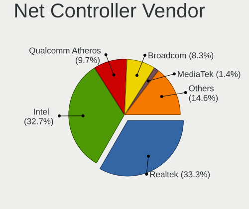

| Vendor                            | Computers | Percent |
|-----------------------------------|-----------|---------|
| Realtek Semiconductor             | 148       | 33.33%  |
| Intel                             | 145       | 32.66%  |
| Qualcomm Atheros                  | 43        | 9.68%   |
| Broadcom                          | 37        | 8.33%   |
| MediaTek                          | 6         | 1.35%   |
| Marvell Technology Group          | 6         | 1.35%   |
| Broadcom Limited                  | 5         | 1.13%   |
| VIA Technologies                  | 4         | 0.9%    |
| TP-Link                           | 4         | 0.9%    |
| Qualcomm                          | 4         | 0.9%    |
| Xiaomi                            | 3         | 0.68%   |
| Qualcomm Atheros Communications   | 3         | 0.68%   |
| Nvidia                            | 3         | 0.68%   |
| Microchip Technology              | 3         | 0.68%   |
| Mellanox Technologies             | 3         | 0.68%   |
| ASIX Electronics                  | 3         | 0.68%   |
| Silicon Integrated Systems [SiS]  | 2         | 0.45%   |
| Shenzhen Goodix Technology        | 2         | 0.45%   |
| LSI                               | 2         | 0.45%   |
| DisplayLink                       | 2         | 0.45%   |
| T & A Mobile Phones               | 1         | 0.23%   |
| Sigma Designs                     | 1         | 0.23%   |
| Samsung Electronics               | 1         | 0.23%   |
| Raspberry Pi                      | 1         | 0.23%   |
| Ralink Technology                 | 1         | 0.23%   |
| Ralink                            | 1         | 0.23%   |
| QLogic                            | 1         | 0.23%   |
| QinHeng Electronics               | 1         | 0.23%   |
| NetGear                           | 1         | 0.23%   |
| Google                            | 1         | 0.23%   |
| Ericsson Business Mobile Networks | 1         | 0.23%   |
| Dresden Elektronik                | 1         | 0.23%   |
| D-Link System                     | 1         | 0.23%   |
| D-Link                            | 1         | 0.23%   |
| Belkin Components                 | 1         | 0.23%   |
| AMD                               | 1         | 0.23%   |

Net Controller Model
--------------------

Controller models

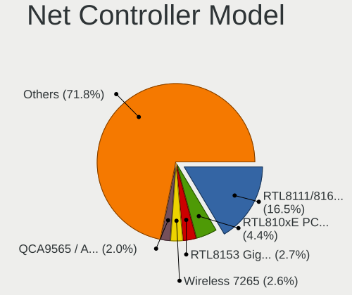

| Model                                                                   | Computers | Percent |
|-------------------------------------------------------------------------|-----------|---------|
| Realtek RTL8111/8168/8211/8411 PCI Express Gigabit Ethernet Controller  | 90        | 16.45%  |
| Realtek RTL810xE PCI Express Fast Ethernet controller                   | 24        | 4.39%   |
| Realtek RTL8153 Gigabit Ethernet Adapter                                | 15        | 2.74%   |
| Intel Wireless 7265                                                     | 14        | 2.56%   |
| Qualcomm Atheros QCA9565 / AR9565 Wireless Network Adapter              | 11        | 2.01%   |
| Intel 82579LM Gigabit Network Connection (Lewisville)                   | 10        | 1.83%   |
| Realtek RTL8821CE 802.11ac PCIe Wireless Network Adapter                | 9         | 1.65%   |
| Intel Wi-Fi 6 AX200                                                     | 8         | 1.46%   |
| Realtek RTL8822CE 802.11ac PCIe Wireless Network Adapter                | 7         | 1.28%   |
| Intel Wireless 8265 / 8275                                              | 7         | 1.28%   |
| Intel I210 Gigabit Network Connection                                   | 7         | 1.28%   |
| Qualcomm Atheros QCA9377 802.11ac Wireless Network Adapter              | 6         | 1.1%    |
| Intel Wi-Fi 6 AX201                                                     | 6         | 1.1%    |
| Intel I211 Gigabit Network Connection                                   | 6         | 1.1%    |
| Intel Ethernet Controller I225-V                                        | 6         | 1.1%    |
| Realtek RTL8723BE PCIe Wireless Network Adapter                         | 5         | 0.91%   |
| Qualcomm Atheros QCA8171 Gigabit Ethernet                               | 5         | 0.91%   |
| Intel Wireless 3160                                                     | 5         | 0.91%   |
| Intel Comet Lake PCH-LP CNVi WiFi                                       | 5         | 0.91%   |
| Broadcom BCM43224 802.11a/b/g/n                                         | 5         | 0.91%   |
| Realtek RTL8125 2.5GbE Controller                                       | 4         | 0.73%   |
| Realtek RTL-8100/8101L/8139 PCI Fast Ethernet Adapter                   | 4         | 0.73%   |
| Qualcomm Atheros AR9485 Wireless Network Adapter                        | 4         | 0.73%   |
| Intel Ethernet Connection I217-LM                                       | 4         | 0.73%   |
| Intel Ethernet Connection (7) I219-V                                    | 4         | 0.73%   |
| Intel Ethernet Connection (2) I219-V                                    | 4         | 0.73%   |
| Intel Ethernet Connection (2) I219-LM                                   | 4         | 0.73%   |
| Intel Cannon Lake PCH CNVi WiFi                                         | 4         | 0.73%   |
| Intel Alder Lake-P PCH CNVi WiFi                                        | 4         | 0.73%   |
| Broadcom BCM4313 802.11bgn Wireless Network Adapter                     | 4         | 0.73%   |
| VIA VT6102/VT6103 [Rhine-II]                                            | 3         | 0.55%   |
| Realtek RTL88x2bu [AC1200 Techkey]                                      | 3         | 0.55%   |
| Qualcomm Atheros AR9271 802.11n                                         | 3         | 0.55%   |
| Qualcomm Atheros AR9285 Wireless Network Adapter (PCI-Express)          | 3         | 0.55%   |
| Qualcomm Atheros AR242x / AR542x Wireless Network Adapter (PCI-Express) | 3         | 0.55%   |
| Microchip SMSC9512/9514 Fast Ethernet Adapter                           | 3         | 0.55%   |
| MediaTek MT7921 802.11ax PCIe Wireless Network Adapter [Filogic 330]    | 3         | 0.55%   |
| Intel Wireless 8260                                                     | 3         | 0.55%   |
| Intel Wi-Fi 6E(802.11ax) AX210/AX1675* 2x2 [Typhoon Peak]               | 3         | 0.55%   |
| Intel PRO/Wireless 3945ABG [Golan] Network Connection                   | 3         | 0.55%   |

Wireless Vendor
---------------

Wireless vendors

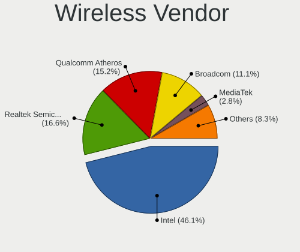

| Vendor                          | Computers | Percent |
|---------------------------------|-----------|---------|
| Intel                           | 100       | 46.08%  |
| Realtek Semiconductor           | 36        | 16.59%  |
| Qualcomm Atheros                | 33        | 15.21%  |
| Broadcom                        | 24        | 11.06%  |
| MediaTek                        | 6         | 2.76%   |
| TP-Link                         | 4         | 1.84%   |
| Qualcomm Atheros Communications | 3         | 1.38%   |
| Broadcom Limited                | 3         | 1.38%   |
| VIA Technologies                | 1         | 0.46%   |
| Ralink Technology               | 1         | 0.46%   |
| Ralink                          | 1         | 0.46%   |
| Qualcomm                        | 1         | 0.46%   |
| NetGear                         | 1         | 0.46%   |
| Marvell Technology Group        | 1         | 0.46%   |
| D-Link                          | 1         | 0.46%   |
| Belkin Components               | 1         | 0.46%   |

Wireless Model
--------------

Wireless models

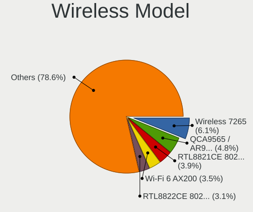

| Model                                                                   | Computers | Percent |
|-------------------------------------------------------------------------|-----------|---------|
| Intel Wireless 7265                                                     | 14        | 6.11%   |
| Qualcomm Atheros QCA9565 / AR9565 Wireless Network Adapter              | 11        | 4.8%    |
| Realtek RTL8821CE 802.11ac PCIe Wireless Network Adapter                | 9         | 3.93%   |
| Intel Wi-Fi 6 AX200                                                     | 8         | 3.49%   |
| Realtek RTL8822CE 802.11ac PCIe Wireless Network Adapter                | 7         | 3.06%   |
| Intel Wireless 8265 / 8275                                              | 7         | 3.06%   |
| Qualcomm Atheros QCA9377 802.11ac Wireless Network Adapter              | 6         | 2.62%   |
| Intel Wi-Fi 6 AX201                                                     | 6         | 2.62%   |
| Realtek RTL8723BE PCIe Wireless Network Adapter                         | 5         | 2.18%   |
| Intel Wireless 3160                                                     | 5         | 2.18%   |
| Intel Comet Lake PCH-LP CNVi WiFi                                       | 5         | 2.18%   |
| Broadcom BCM43224 802.11a/b/g/n                                         | 5         | 2.18%   |
| Qualcomm Atheros AR9485 Wireless Network Adapter                        | 4         | 1.75%   |
| Intel Cannon Lake PCH CNVi WiFi                                         | 4         | 1.75%   |
| Intel Alder Lake-P PCH CNVi WiFi                                        | 4         | 1.75%   |
| Broadcom BCM4313 802.11bgn Wireless Network Adapter                     | 4         | 1.75%   |
| Realtek RTL88x2bu [AC1200 Techkey]                                      | 3         | 1.31%   |
| Qualcomm Atheros AR9271 802.11n                                         | 3         | 1.31%   |
| Qualcomm Atheros AR9285 Wireless Network Adapter (PCI-Express)          | 3         | 1.31%   |
| Qualcomm Atheros AR242x / AR542x Wireless Network Adapter (PCI-Express) | 3         | 1.31%   |
| MediaTek MT7921 802.11ax PCIe Wireless Network Adapter [Filogic 330]    | 3         | 1.31%   |
| Intel Wireless 8260                                                     | 3         | 1.31%   |
| Intel Wi-Fi 6E(802.11ax) AX210/AX1675* 2x2 [Typhoon Peak]               | 3         | 1.31%   |
| Intel PRO/Wireless 3945ABG [Golan] Network Connection                   | 3         | 1.31%   |
| Intel PRO/Wireless 2200BG [Calexico2] Network Connection                | 3         | 1.31%   |
| Intel Dual Band Wireless-AC 3168NGW [Stone Peak]                        | 3         | 1.31%   |
| Intel Comet Lake PCH CNVi WiFi                                          | 3         | 1.31%   |
| Intel Cannon Point-LP CNVi [Wireless-AC]                                | 3         | 1.31%   |
| Realtek RTL8188EUS 802.11n Wireless Network Adapter                     | 2         | 0.87%   |
| Realtek RTL8188CE 802.11b/g/n WiFi Adapter                              | 2         | 0.87%   |
| Qualcomm Atheros QCA6174 802.11ac Wireless Network Adapter              | 2         | 0.87%   |
| Intel Wireless 7260                                                     | 2         | 0.87%   |
| Intel Wireless 3165                                                     | 2         | 0.87%   |
| Intel Wi-Fi 5(802.11ac) Wireless-AC 9x6x [Thunder Peak]                 | 2         | 0.87%   |
| Intel Ultimate N WiFi Link 5300                                         | 2         | 0.87%   |
| Intel Tiger Lake PCH CNVi WiFi                                          | 2         | 0.87%   |
| Intel Raptor Lake PCH CNVi WiFi                                         | 2         | 0.87%   |
| Intel PRO/Wireless 4965 AG or AGN [Kedron] Network Connection           | 2         | 0.87%   |
| Intel Meteor Lake PCH CNVi WiFi                                         | 2         | 0.87%   |
| Intel Gemini Lake PCH CNVi WiFi                                         | 2         | 0.87%   |

Ethernet Vendor
---------------

Ethernet vendors

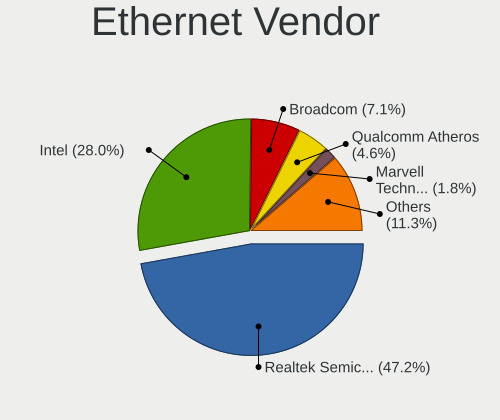

| Vendor                           | Computers | Percent |
|----------------------------------|-----------|---------|
| Realtek Semiconductor            | 133       | 47.16%  |
| Intel                            | 79        | 28.01%  |
| Broadcom                         | 20        | 7.09%   |
| Qualcomm Atheros                 | 13        | 4.61%   |
| Marvell Technology Group         | 5         | 1.77%   |
| Xiaomi                           | 3         | 1.06%   |
| VIA Technologies                 | 3         | 1.06%   |
| Qualcomm                         | 3         | 1.06%   |
| Nvidia                           | 3         | 1.06%   |
| Microchip Technology             | 3         | 1.06%   |
| Mellanox Technologies            | 3         | 1.06%   |
| ASIX Electronics                 | 3         | 1.06%   |
| Silicon Integrated Systems [SiS] | 2         | 0.71%   |
| DisplayLink                      | 2         | 0.71%   |
| Broadcom Limited                 | 2         | 0.71%   |
| T & A Mobile Phones              | 1         | 0.35%   |
| Samsung Electronics              | 1         | 0.35%   |
| Raspberry Pi                     | 1         | 0.35%   |
| LSI                              | 1         | 0.35%   |
| D-Link System                    | 1         | 0.35%   |

Ethernet Model
--------------

Ethernet models

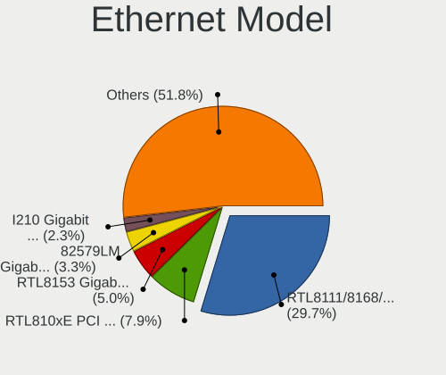

| Model                                                                  | Computers | Percent |
|------------------------------------------------------------------------|-----------|---------|
| Realtek RTL8111/8168/8211/8411 PCI Express Gigabit Ethernet Controller | 90        | 29.7%   |
| Realtek RTL810xE PCI Express Fast Ethernet controller                  | 24        | 7.92%   |
| Realtek RTL8153 Gigabit Ethernet Adapter                               | 15        | 4.95%   |
| Intel 82579LM Gigabit Network Connection (Lewisville)                  | 10        | 3.3%    |
| Intel I210 Gigabit Network Connection                                  | 7         | 2.31%   |
| Intel I211 Gigabit Network Connection                                  | 6         | 1.98%   |
| Intel Ethernet Controller I225-V                                       | 6         | 1.98%   |
| Qualcomm Atheros QCA8171 Gigabit Ethernet                              | 5         | 1.65%   |
| Realtek RTL8125 2.5GbE Controller                                      | 4         | 1.32%   |
| Realtek RTL-8100/8101L/8139 PCI Fast Ethernet Adapter                  | 4         | 1.32%   |
| Intel Ethernet Connection I217-LM                                      | 4         | 1.32%   |
| Intel Ethernet Connection (7) I219-V                                   | 4         | 1.32%   |
| Intel Ethernet Connection (2) I219-V                                   | 4         | 1.32%   |
| Intel Ethernet Connection (2) I219-LM                                  | 4         | 1.32%   |
| VIA VT6102/VT6103 [Rhine-II]                                           | 3         | 0.99%   |
| Microchip SMSC9512/9514 Fast Ethernet Adapter                          | 3         | 0.99%   |
| Intel Ethernet Connection (7) I219-LM                                  | 3         | 0.99%   |
| Intel Ethernet Connection (4) I219-LM                                  | 3         | 0.99%   |
| Broadcom NetXtreme BCM57766 Gigabit Ethernet PCIe                      | 3         | 0.99%   |
| ASIX AX88179 Gigabit Ethernet                                          | 3         | 0.99%   |
| Xiaomi Mi/Redmi series (RNDIS + ADB)                                   | 2         | 0.66%   |
| Silicon Integrated Systems [SiS] 191 Gigabit Ethernet Adapter          | 2         | 0.66%   |
| Realtek RTL8152 Fast Ethernet Adapter                                  | 2         | 0.66%   |
| Qualcomm YUPIK-QRD _SN:AC1D5909                                        | 2         | 0.66%   |
| Qualcomm Atheros Killer E220x Gigabit Ethernet Controller              | 2         | 0.66%   |
| Qualcomm Atheros AR8132 Fast Ethernet                                  | 2         | 0.66%   |
| Intel Ethernet Controller I226-V                                       | 2         | 0.66%   |
| Intel Ethernet Connection (6) I219-LM                                  | 2         | 0.66%   |
| Intel Ethernet Connection (4) I219-V                                   | 2         | 0.66%   |
| Intel Ethernet Connection (17) I219-LM                                 | 2         | 0.66%   |
| Intel 82579V Gigabit Network Connection                                | 2         | 0.66%   |
| Intel 82577LC Gigabit Network Connection                               | 2         | 0.66%   |
| DisplayLink Dell D3100 Docking Station                                 | 2         | 0.66%   |
| Broadcom NetXtreme II BCM5709 Gigabit Ethernet                         | 2         | 0.66%   |
| Broadcom NetXtreme BCM57765 Gigabit Ethernet PCIe                      | 2         | 0.66%   |
| Broadcom NetXtreme BCM5720 Gigabit Ethernet PCIe                       | 2         | 0.66%   |
| Broadcom NetXtreme BCM5719 Gigabit Ethernet PCIe                       | 2         | 0.66%   |
| Broadcom NetLink BCM5787M Gigabit Ethernet PCI Express                 | 2         | 0.66%   |
| Broadcom BCM4401-B0 100Base-TX                                         | 2         | 0.66%   |
| Xiaomi Mi/Redmi series (RNDIS)                                         | 1         | 0.33%   |

Net Controller Kind
-------------------

Ethernet, WiFi or modem

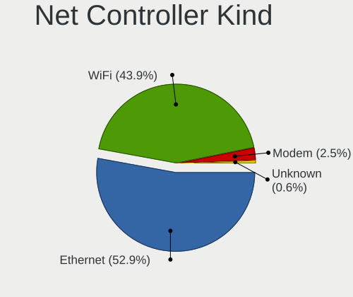

| Kind     | Computers | Percent |
|----------|-----------|---------|
| Ethernet | 249       | 52.87%  |
| WiFi     | 207       | 43.95%  |
| Modem    | 12        | 2.55%   |
| Unknown  | 3         | 0.64%   |

Used Controller
---------------

Currently used network controller

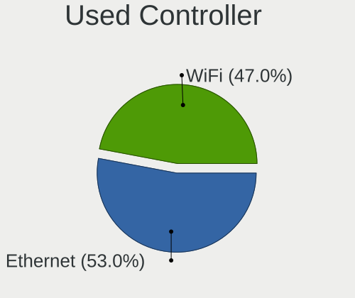

| Kind     | Computers | Percent |
|----------|-----------|---------|
| Ethernet | 152       | 52.96%  |
| WiFi     | 135       | 47.04%  |

NICs
----

Total network controllers on board

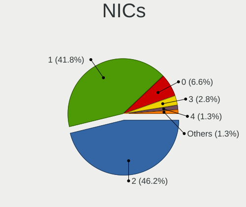

| Total | Computers | Percent |
|-------|-----------|---------|
| 2     | 146       | 46.2%   |
| 1     | 132       | 41.77%  |
| 0     | 21        | 6.65%   |
| 3     | 9         | 2.85%   |
| 4     | 4         | 1.27%   |
| 5     | 2         | 0.63%   |
| 12    | 1         | 0.32%   |
| 6     | 1         | 0.32%   |

IPv6
----

IPv6 vs IPv4

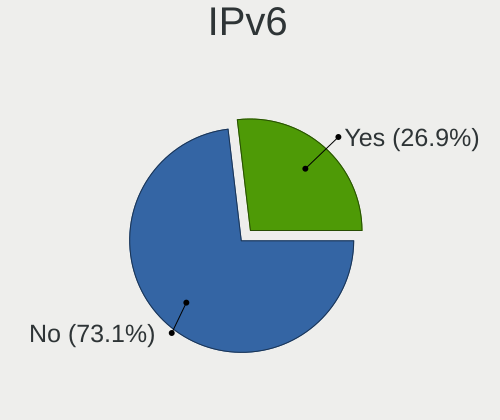

| Used | Computers | Percent |
|------|-----------|---------|
| No   | 234       | 73.13%  |
| Yes  | 86        | 26.88%  |

Bluetooth
---------

Bluetooth Vendor
----------------

Controller vendors

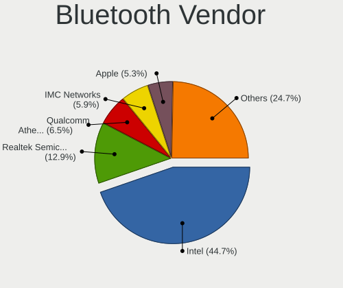

| Vendor                          | Computers | Percent |
|---------------------------------|-----------|---------|
| Intel                           | 76        | 44.71%  |
| Realtek Semiconductor           | 22        | 12.94%  |
| Qualcomm Atheros Communications | 11        | 6.47%   |
| IMC Networks                    | 10        | 5.88%   |
| Apple                           | 9         | 5.29%   |
| Cambridge Silicon Radio         | 6         | 3.53%   |
| Broadcom                        | 6         | 3.53%   |
| Foxconn / Hon Hai               | 5         | 2.94%   |
| ASUSTek Computer                | 5         | 2.94%   |
| Lite-On Technology              | 4         | 2.35%   |
| MediaTek                        | 3         | 1.76%   |
| Marvell Semiconductor           | 2         | 1.18%   |
| Actions                         | 2         | 1.18%   |
| USI                             | 1         | 0.59%   |
| Toshiba                         | 1         | 0.59%   |
| Mercucys                        | 1         | 0.59%   |
| Hewlett-Packard                 | 1         | 0.59%   |
| Edimax Technology               | 1         | 0.59%   |
| Dell                            | 1         | 0.59%   |
| Askey Computer                  | 1         | 0.59%   |
| Alps Electric                   | 1         | 0.59%   |
| Unknown                         | 1         | 0.59%   |

Bluetooth Model
---------------

Controller models

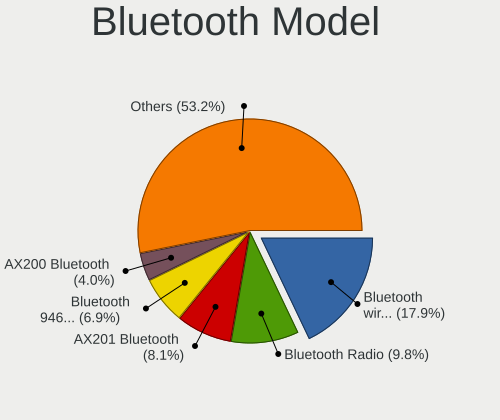

| Model                                                                               | Computers | Percent |
|-------------------------------------------------------------------------------------|-----------|---------|
| Intel Bluetooth wireless interface                                                  | 31        | 17.92%  |
| Realtek Bluetooth Radio                                                             | 17        | 9.83%   |
| Intel AX201 Bluetooth                                                               | 14        | 8.09%   |
| Intel Bluetooth 9460/9560 Jefferson Peak (JfP)                                      | 12        | 6.94%   |
| Intel AX200 Bluetooth                                                               | 7         | 4.05%   |
| Qualcomm Atheros  Bluetooth Device                                                  | 6         | 3.47%   |
| Intel Bluetooth Device                                                              | 6         | 3.47%   |
| Cambridge Silicon Radio Bluetooth Dongle (HCI mode)                                 | 6         | 3.47%   |
| IMC Networks Bluetooth Radio                                                        | 5         | 2.89%   |
| Apple Bluetooth Host Controller                                                     | 5         | 2.89%   |
| Realtek  Bluetooth 4.2 Adapter                                                      | 3         | 1.73%   |
| MediaTek Wireless_Device                                                            | 3         | 1.73%   |
| Intel Wireless-AC 3168 Bluetooth                                                    | 3         | 1.73%   |
| Intel AX210 Bluetooth                                                               | 3         | 1.73%   |
| Apple Bluetooth USB Host Controller                                                 | 3         | 1.73%   |
| Qualcomm Atheros QCA61x4 Bluetooth 4.0                                              | 2         | 1.16%   |
| Marvell Bluetooth and Wireless LAN Composite Device                                 | 2         | 1.16%   |
| Lite-On Qualcomm Atheros QCA9377 Bluetooth                                          | 2         | 1.16%   |
| Lite-On Atheros AR3012 Bluetooth                                                    | 2         | 1.16%   |
| Intel Centrino Bluetooth Wireless Transceiver                                       | 2         | 1.16%   |
| IMC Networks Wireless_Device                                                        | 2         | 1.16%   |
| IMC Networks Bluetooth Device                                                       | 2         | 1.16%   |
| Foxconn / Hon Hai MediaTek Bluetooth Adapter                                        | 2         | 1.16%   |
| Foxconn / Hon Hai Broadcom BCM20702A1 Bluetooth                                     | 2         | 1.16%   |
| Broadcom HP Portable Bumble Bee                                                     | 2         | 1.16%   |
| ASUS BT-183 Bluetooth 2.0+EDR adapter                                               | 2         | 1.16%   |
| Actions general adapter                                                             | 2         | 1.16%   |
| USI Bluetooth Device                                                                | 1         | 0.58%   |
| Toshiba Bluetooth Device                                                            | 1         | 0.58%   |
| Realtek RTL8723B Bluetooth                                                          | 1         | 0.58%   |
| Realtek Bluetooth 5.3 Radio                                                         | 1         | 0.58%   |
| Qualcomm Atheros AR9462 Bluetooth                                                   | 1         | 0.58%   |
| Qualcomm Atheros AR3012 Bluetooth 4.0                                               | 1         | 0.58%   |
| Qualcomm Atheros AR3011 Bluetooth                                                   | 1         | 0.58%   |
| Mercucys Mercusys MA530 Adapter                                                     | 1         | 0.58%   |
| Intel Centrino Advanced-N 6230 Bluetooth adapter                                    | 1         | 0.58%   |
| IMC Networks Atheros AR3012 Bluetooth 4.0 Adapter                                   | 1         | 0.58%   |
| HP Broadcom 2070 Bluetooth Combo                                                    | 1         | 0.58%   |
| Foxconn / Hon Hai Foxconn T77H114 BCM2070 [Single-Chip Bluetooth 2.1 + EDR Adapter] | 1         | 0.58%   |
| Edimax Bluetooth Device                                                             | 1         | 0.58%   |

Sound
-----

Sound Vendor
------------

Sound card vendors

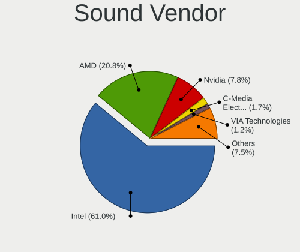

| Vendor                               | Computers | Percent |
|--------------------------------------|-----------|---------|
| Intel                                | 211       | 60.98%  |
| AMD                                  | 72        | 20.81%  |
| Nvidia                               | 27        | 7.8%    |
| C-Media Electronics                  | 6         | 1.73%   |
| VIA Technologies                     | 4         | 1.16%   |
| Logitech                             | 4         | 1.16%   |
| Creative Labs                        | 3         | 0.87%   |
| Texas Instruments                    | 2         | 0.58%   |
| Silicon Integrated Systems [SiS]     | 2         | 0.58%   |
| Generalplus Technology               | 2         | 0.58%   |
| Apple                                | 2         | 0.58%   |
| Thesycon Systemsoftware & Consulting | 1         | 0.29%   |
| SteelSeries ApS                      | 1         | 0.29%   |
| Sennheiser Communications            | 1         | 0.29%   |
| RODE Microphones                     | 1         | 0.29%   |
| Realtek Semiconductor                | 1         | 0.29%   |
| Nordic Semiconductor ASA             | 1         | 0.29%   |
| Native Instruments                   | 1         | 0.29%   |
| Loongson Technology                  | 1         | 0.29%   |
| JMTek                                | 1         | 0.29%   |
| Focusrite-Novation                   | 1         | 0.29%   |
| Cirrus Logic                         | 1         | 0.29%   |

Sound Model
-----------

Sound card models

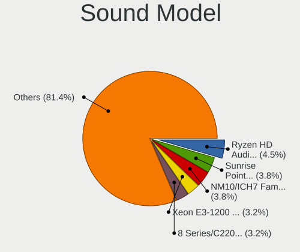

| Model                                                                                             | Computers | Percent |
|---------------------------------------------------------------------------------------------------|-----------|---------|
| AMD Ryzen HD Audio Controller                                                                     | 20        | 4.52%   |
| Intel Sunrise Point-LP HD Audio                                                                   | 17        | 3.85%   |
| Intel NM10/ICH7 Family High Definition Audio Controller                                           | 17        | 3.85%   |
| Intel Xeon E3-1200 v3/4th Gen Core Processor HD Audio Controller                                  | 14        | 3.17%   |
| Intel 8 Series/C220 Series Chipset High Definition Audio Controller                               | 14        | 3.17%   |
| Intel 6 Series/C200 Series Chipset Family High Definition Audio Controller                        | 12        | 2.71%   |
| AMD FCH Azalia Controller                                                                         | 12        | 2.71%   |
| Intel Cannon Lake PCH cAVS                                                                        | 11        | 2.49%   |
| Intel Atom Processor Z36xxx/Z37xxx Series High Definition Audio Controller                        | 11        | 2.49%   |
| Intel 100 Series/C230 Series Chipset Family HD Audio Controller                                   | 11        | 2.49%   |
| Intel 7 Series/C216 Chipset Family High Definition Audio Controller                               | 10        | 2.26%   |
| Intel 5 Series/3400 Series Chipset High Definition Audio                                          | 10        | 2.26%   |
| AMD SBx00 Azalia (Intel HDA)                                                                      | 9         | 2.04%   |
| AMD Raven/Raven2/Fenghuang HDMI/DP Audio Controller                                               | 9         | 2.04%   |
| Intel Tiger Lake-LP Smart Sound Technology Audio Controller                                       | 8         | 1.81%   |
| Intel Haswell-ULT HD Audio Controller                                                             | 8         | 1.81%   |
| Intel Celeron N3350/Pentium N4200/Atom E3900 Series Audio Cluster                                 | 8         | 1.81%   |
| Intel 82801I (ICH9 Family) HD Audio Controller                                                    | 8         | 1.81%   |
| Intel 8 Series HD Audio Controller                                                                | 8         | 1.81%   |
| AMD Starship/Matisse HD Audio Controller                                                          | 8         | 1.81%   |
| AMD Kabini HDMI/DP Audio                                                                          | 8         | 1.81%   |
| AMD Ellesmere HDMI Audio [Radeon RX 470/480 / 570/580/590]                                        | 8         | 1.81%   |
| Intel Comet Lake PCH-LP cAVS                                                                      | 7         | 1.58%   |
| Intel Celeron/Pentium Silver Processor High Definition Audio                                      | 6         | 1.36%   |
| Intel Atom/Celeron/Pentium Processor x5-E8000/J3xxx/N3xxx Series High Definition Audio Controller | 6         | 1.36%   |
| AMD Renoir/Cezanne HDMI/DP Audio Controller                                                       | 6         | 1.36%   |
| Intel Broadwell-U Audio Controller                                                                | 5         | 1.13%   |
| Intel Alder Lake PCH-P High Definition Audio Controller                                           | 5         | 1.13%   |
| AMD Wrestler HDMI Audio                                                                           | 5         | 1.13%   |
| Nvidia GP107GL High Definition Audio Controller                                                   | 4         | 0.9%    |
| Intel Wildcat Point-LP High Definition Audio Controller                                           | 4         | 0.9%    |
| Intel Cannon Point-LP High Definition Audio Controller                                            | 4         | 0.9%    |
| Intel 9 Series Chipset Family HD Audio Controller                                                 | 4         | 0.9%    |
| Intel 82801H (ICH8 Family) HD Audio Controller                                                    | 4         | 0.9%    |
| AMD Radeon High Definition Audio Controller                                                       | 4         | 0.9%    |
| AMD Family 15h (Models 60h-6fh) Audio Controller                                                  | 4         | 0.9%    |
| Nvidia MCP89 High Definition Audio                                                                | 3         | 0.68%   |
| Nvidia High Definition Audio Controller                                                           | 3         | 0.68%   |
| Nvidia GT216 HDMI Audio Controller                                                                | 3         | 0.68%   |
| Nvidia GA106 High Definition Audio Controller                                                     | 3         | 0.68%   |

Memory
------

Memory Vendor
-------------

Memory module vendors

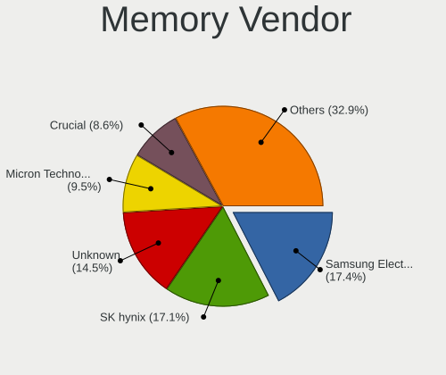

| Vendor              | Computers | Percent |
|---------------------|-----------|---------|
| Samsung Electronics | 53        | 17.43%  |
| SK hynix            | 52        | 17.11%  |
| Unknown             | 44        | 14.47%  |
| Micron Technology   | 29        | 9.54%   |
| Crucial             | 26        | 8.55%   |
| Kingston            | 18        | 5.92%   |
| Elpida              | 13        | 4.28%   |
| Corsair             | 10        | 3.29%   |
| Unknown             | 9         | 2.96%   |
| A-DATA Technology   | 7         | 2.3%    |
| Unknown (ABCD)      | 4         | 1.32%   |
| G.Skill             | 4         | 1.32%   |
| Smart               | 3         | 0.99%   |
| Nanya Technology    | 3         | 0.99%   |
| Transcend           | 2         | 0.66%   |
| Team                | 2         | 0.66%   |
| Qimonda             | 2         | 0.66%   |
| GOODRAM             | 2         | 0.66%   |
| Apacer              | 2         | 0.66%   |
| 4ea5                | 2         | 0.66%   |
| Wilk Elektronik     | 1         | 0.33%   |
| Visipro             | 1         | 0.33%   |
| Smart Brazil        | 1         | 0.33%   |
| Silicon Power       | 1         | 0.33%   |
| Ramaxel Technology  | 1         | 0.33%   |
| PNY                 | 1         | 0.33%   |
| Patriot             | 1         | 0.33%   |
| Novatech            | 1         | 0.33%   |
| Lexar               | 1         | 0.33%   |
| HPE                 | 1         | 0.33%   |
| Hewlett-Packard     | 1         | 0.33%   |
| Gold Key            | 1         | 0.33%   |
| ff                  | 1         | 0.33%   |
| fef5                | 1         | 0.33%   |
| Cors                | 1         | 0.33%   |
| Avant               | 1         | 0.33%   |
| 48spaces            | 1         | 0.33%   |

Memory Model
------------

Memory module models

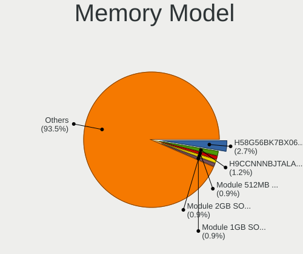

| Model                                                            | Computers | Percent |
|------------------------------------------------------------------|-----------|---------|
| Unknown                                                          | 9         | 2.67%   |
| SK hynix RAM H9CCNNNBJTALAR-NUD 4GB Row Of Chips LPDDR3 1867MT/s | 4         | 1.19%   |
| Unknown RAM Module 512MB SODIMM DDR                              | 3         | 0.89%   |
| Unknown RAM Module 2GB SODIMM DDR2 667MT/s                       | 3         | 0.89%   |
| Unknown RAM Module 1GB SODIMM SDRAM                              | 3         | 0.89%   |
| Unknown (ABCD) RAM 123456789012345678 2GB SODIMM LPDDR4 2400MT/s | 3         | 0.89%   |
| Samsung RAM M471B5273DH0-CH9 4GB SODIMM DDR3 1600MT/s            | 3         | 0.89%   |
| Samsung RAM M471A5244CB0-CWE 4GB SODIMM DDR4 3200MT/s            | 3         | 0.89%   |
| Samsung RAM M471A1K43CB1-CTD 8GB SODIMM DDR4 3200MT/s            | 3         | 0.89%   |
| Unknown RAM Module 8GB SODIMM DDR3 1600MT/s                      | 2         | 0.59%   |
| Unknown RAM Module 4GB SODIMM DDR3 1600MT/s                      | 2         | 0.59%   |
| Unknown RAM Module 2GB SODIMM DDR3 1600MT/s                      | 2         | 0.59%   |
| Unknown RAM Module 1GB SODIMM DRAM                               | 2         | 0.59%   |
| Unknown RAM Module 1GB SODIMM DDR                                | 2         | 0.59%   |
| SK hynix RAM HMT451S6BFR8A-PB 4GB SODIMM DDR3 1600MT/s           | 2         | 0.59%   |
| SK hynix RAM HMT41GS6BFR8A-PB 8GB SODIMM DDR3 1600MT/s           | 2         | 0.59%   |
| SK hynix RAM HMA81GS6CJR8N-VK 8GB SODIMM DDR4 2667MT/s           | 2         | 0.59%   |
| SK hynix RAM HMA81GS6AFR8N-UH 8GB SODIMM DDR4 2667MT/s           | 2         | 0.59%   |
| Samsung RAM M471B5773DH0-CH9 2GB SODIMM DDR3 1600MT/s            | 2         | 0.59%   |
| Samsung RAM M471B5773CHS-CH9 2GB SODIMM DDR3 4199MT/s            | 2         | 0.59%   |
| Samsung RAM M471B5173QH0-YK0 4GB SODIMM DDR3 1600MT/s            | 2         | 0.59%   |
| Samsung RAM M471B2873FHS-CH9 1GB SODIMM DDR3 1333MT/s            | 2         | 0.59%   |
| Samsung RAM M471A5244CB0-CTD 4GB SODIMM DDR4 3266MT/s            | 2         | 0.59%   |
| Samsung RAM M471A1K43CB1-CRC 8GB SODIMM DDR4 8400MT/s            | 2         | 0.59%   |
| Micron RAM 8JTF51264AZ-1G6E1 4GB DIMM DDR3 1600MT/s              | 2         | 0.59%   |
| Micron RAM 4ATF51264HZ-2G3E1 4GB SODIMM DDR4 2667MT/s            | 2         | 0.59%   |
| Kingston RAM KHX1866C10D3/4G 4GB DIMM DDR3 1867MT/s              | 2         | 0.59%   |
| Elpida RAM EBJ41UF8BDW0-GN-F 4GB DIMM DDR3 1600MT/s              | 2         | 0.59%   |
| Crucial RAM CT51264BF160B.C16F 4GB SODIMM DDR3 4199MT/s          | 2         | 0.59%   |
| Crucial RAM BL16G36C16U4B.M16FE1 16GB DIMM DDR4 3600MT/s         | 2         | 0.59%   |
| Wilk Elektronik RAM IRP3600D4V64L18S/8G 8GB DIMM DDR4 3666MT/s   | 1         | 0.3%    |
| Visipro RAM T2G88S1-H9H 2GB DIMM DDR3 1333MT/s                   | 1         | 0.3%    |
| Unknown RAM Module 8GB SODIMM DDR4 2133MT/s                      | 1         | 0.3%    |
| Unknown RAM Module 8GB DIMM DDR3 1600MT/s                        | 1         | 0.3%    |
| Unknown RAM Module 8GB DIMM DDR3 1333MT/s                        | 1         | 0.3%    |
| Unknown RAM Module 512MB SODIMM DRAM                             | 1         | 0.3%    |
| Unknown RAM Module 512MB SODIMM DDR2                             | 1         | 0.3%    |
| Unknown RAM Module 512MB DIMM                                    | 1         | 0.3%    |
| Unknown RAM Module 4GB DIMM SDRAM                                | 1         | 0.3%    |
| Unknown RAM Module 4GB DIMM DDR3 1600MT/s                        | 1         | 0.3%    |

Memory Kind
-----------

Memory module kinds

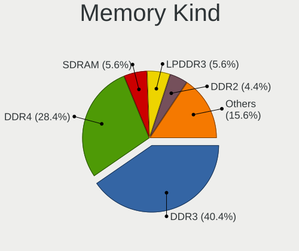

| Kind    | Computers | Percent |
|---------|-----------|---------|
| DDR3    | 101       | 40.4%   |
| DDR4    | 71        | 28.4%   |
| SDRAM   | 14        | 5.6%    |
| LPDDR3  | 14        | 5.6%    |
| DDR2    | 11        | 4.4%    |
| LPDDR4  | 10        | 4%      |
| DDR     | 9         | 3.6%    |
| DDR5    | 6         | 2.4%    |
| Unknown | 6         | 2.4%    |
| LPDDR5  | 4         | 1.6%    |
| DRAM    | 3         | 1.2%    |
| EEPROM  | 1         | 0.4%    |

Memory Form Factor
------------------

Physical design of the memory module

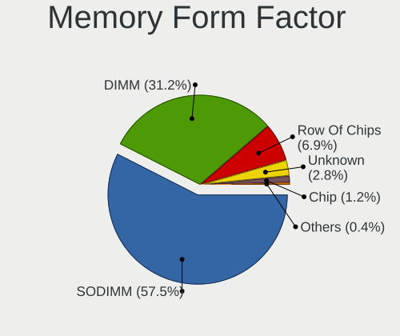

| Name         | Computers | Percent |
|--------------|-----------|---------|
| SODIMM       | 142       | 57.49%  |
| DIMM         | 77        | 31.17%  |
| Row Of Chips | 17        | 6.88%   |
| Unknown      | 7         | 2.83%   |
| Chip         | 3         | 1.21%   |
| RIMM         | 1         | 0.4%    |

Memory Size
-----------

Memory module size

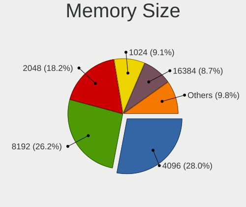

| Size  | Computers | Percent |
|-------|-----------|---------|
| 4096  | 77        | 28%     |
| 8192  | 72        | 26.18%  |
| 2048  | 50        | 18.18%  |
| 1024  | 25        | 9.09%   |
| 16384 | 24        | 8.73%   |
| 32768 | 14        | 5.09%   |
| 512   | 7         | 2.55%   |
| 128   | 3         | 1.09%   |
| 49152 | 1         | 0.36%   |
| 256   | 1         | 0.36%   |
| 1     | 1         | 0.36%   |

Memory Speed
------------

Memory module speed

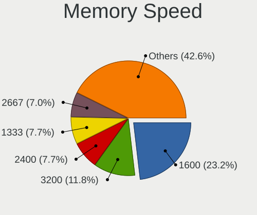

| Speed   | Computers | Percent |
|---------|-----------|---------|
| 1600    | 63        | 23.16%  |
| 3200    | 32        | 11.76%  |
| 2400    | 21        | 7.72%   |
| 1333    | 21        | 7.72%   |
| 2667    | 19        | 6.99%   |
| Unknown | 18        | 6.62%   |
| 1867    | 12        | 4.41%   |
| 667     | 12        | 4.41%   |
| 2133    | 11        | 4.04%   |
| 1067    | 6         | 2.21%   |
| 1334    | 5         | 1.84%   |
| 6400    | 4         | 1.47%   |
| 5600    | 4         | 1.47%   |
| 4199    | 4         | 1.47%   |
| 3600    | 4         | 1.47%   |
| 1066    | 4         | 1.47%   |
| 533     | 3         | 1.1%    |
| 8400    | 2         | 0.74%   |
| 3800    | 2         | 0.74%   |
| 3266    | 2         | 0.74%   |
| 1866    | 2         | 0.74%   |
| 1800    | 2         | 0.74%   |
| 800     | 2         | 0.74%   |
| 6200    | 1         | 0.37%   |
| 6000    | 1         | 0.37%   |
| 4800    | 1         | 0.37%   |
| 4333    | 1         | 0.37%   |
| 4267    | 1         | 0.37%   |
| 4000    | 1         | 0.37%   |
| 3733    | 1         | 0.37%   |
| 3666    | 1         | 0.37%   |
| 3334    | 1         | 0.37%   |
| 2666    | 1         | 0.37%   |
| 2200    | 1         | 0.37%   |
| 2048    | 1         | 0.37%   |
| 1400    | 1         | 0.37%   |
| 1331    | 1         | 0.37%   |
| 1200    | 1         | 0.37%   |
| 133     | 1         | 0.37%   |
| 33      | 1         | 0.37%   |

Printers & scanners
-------------------

Printer Vendor
--------------

Printer device vendors

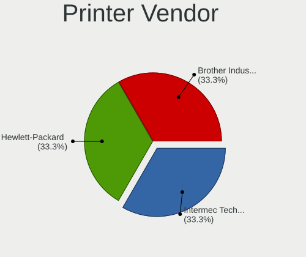

| Vendor                | Computers | Percent |
|-----------------------|-----------|---------|
| Intermec Technologies | 1         | 33.33%  |
| Hewlett-Packard       | 1         | 33.33%  |
| Brother Industries    | 1         | 33.33%  |

Printer Model
-------------

Printer device models

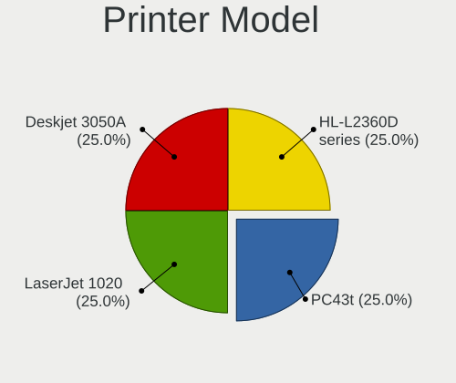

| Model                    | Computers | Percent |
|--------------------------|-----------|---------|
| Intermec PC43t           | 1         | 25%     |
| HP LaserJet 1020         | 1         | 25%     |
| HP Deskjet 3050A         | 1         | 25%     |
| Brother HL-L2360D series | 1         | 25%     |

Scanner Vendor
--------------

Scanner device vendors

Zero info for selected period =(

Scanner Model
-------------

Scanner device models

Zero info for selected period =(

Camera
------

Camera Vendor
-------------

Camera device vendors

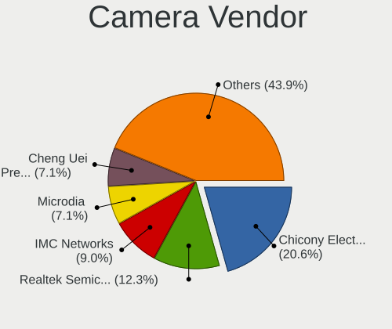

| Vendor                                 | Computers | Percent |
|----------------------------------------|-----------|---------|
| Chicony Electronics                    | 32        | 20.65%  |
| Realtek Semiconductor                  | 19        | 12.26%  |
| IMC Networks                           | 14        | 9.03%   |
| Microdia                               | 11        | 7.1%    |
| Cheng Uei Precision Industry (Foxlink) | 11        | 7.1%    |
| Bison Electronics                      | 10        | 6.45%   |
| Quanta                                 | 9         | 5.81%   |
| Apple                                  | 7         | 4.52%   |
| Syntek                                 | 5         | 3.23%   |
| Suyin                                  | 5         | 3.23%   |
| Luxvisions Innotech Limited            | 4         | 2.58%   |
| Lite-On Technology                     | 3         | 1.94%   |
| Z-Star Microelectronics                | 2         | 1.29%   |
| webcam                                 | 2         | 1.29%   |
| Sunplus Innovation Technology          | 2         | 1.29%   |
| Silicon Motion                         | 2         | 1.29%   |
| Samsung Electronics                    | 2         | 1.29%   |
| Ricoh                                  | 2         | 1.29%   |
| Logitech                               | 2         | 1.29%   |
| Lenovo                                 | 2         | 1.29%   |
| Framework                              | 2         | 1.29%   |
| Trust                                  | 1         | 0.65%   |
| Olympus Optical                        | 1         | 0.65%   |
| Microsoft                              | 1         | 0.65%   |
| MacroSilicon                           | 1         | 0.65%   |
| Linux Foundation                       | 1         | 0.65%   |
| Generalplus Technology                 | 1         | 0.65%   |
| Alcor Micro                            | 1         | 0.65%   |

Camera Model
------------

Camera device models

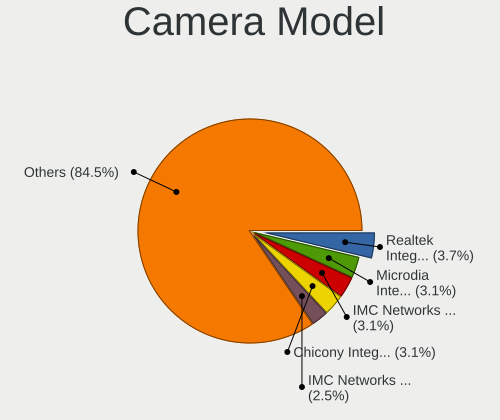

| Model                                            | Computers | Percent |
|--------------------------------------------------|-----------|---------|
| Realtek Integrated_Webcam_HD                     | 6         | 3.73%   |
| Microdia Integrated_Webcam_HD                    | 5         | 3.11%   |
| IMC Networks USB2.0 HD UVC WebCam                | 5         | 3.11%   |
| Chicony Integrated Camera                        | 5         | 3.11%   |
| IMC Networks Integrated Camera                   | 4         | 2.48%   |
| Chicony HP Wide Vision HD Camera                 | 4         | 2.48%   |
| Realtek HP Webcam                                | 3         | 1.86%   |
| Chicony HD Webcam                                | 3         | 1.86%   |
| Bison Integrated Camera                          | 3         | 1.86%   |
| webcam webcam                                    | 2         | 1.24%   |
| Samsung Galaxy series, misc. (MTP mode)          | 2         | 1.24%   |
| Realtek Integrated Webcam                        | 2         | 1.24%   |
| Realtek Acer 640 x 480 laptop camera             | 2         | 1.24%   |
| Quanta HP TrueVision HD Camera                   | 2         | 1.24%   |
| Quanta HD User Facing                            | 2         | 1.24%   |
| Microdia Laptop_Integrated_Webcam_2M             | 2         | 1.24%   |
| Lite-On TOSHIBA Web Camera - HD                  | 2         | 1.24%   |
| Lenovo Integrated Webcam                         | 2         | 1.24%   |
| IMC Networks USB2.0 VGA UVC WebCam               | 2         | 1.24%   |
| Chicony USB2.0 VGA UVC WebCam                    | 2         | 1.24%   |
| Chicony HP TrueVision HD Camera                  | 2         | 1.24%   |
| Chicony HD User Facing                           | 2         | 1.24%   |
| Chicony 2.0M UVC Webcam / CNF7129                | 2         | 1.24%   |
| Cheng Uei Precision Industry (Foxlink) Webcam    | 2         | 1.24%   |
| Cheng Uei Precision Industry (Foxlink) HP Webcam | 2         | 1.24%   |
| Bison Lenovo EasyCamera                          | 2         | 1.24%   |
| Apple FaceTime HD Camera (Built-in)              | 2         | 1.24%   |
| Apple Built-in iSight                            | 2         | 1.24%   |
| Z-Star Vimicro USB2.0 Camera                     | 1         | 0.62%   |
| Z-Star A4 TECH USB 2.0 Camera J                  | 1         | 0.62%   |
| Trust Trust QHD Webcam                           | 1         | 0.62%   |
| Syntek Sonix USB 2.0 Camera                      | 1         | 0.62%   |
| Syntek Sonix 1.3MPixel USB 2.0 Camera            | 1         | 0.62%   |
| Syntek Lenovo EasyCamera                         | 1         | 0.62%   |
| Syntek Integrated Camera                         | 1         | 0.62%   |
| Syntek EasyCamera                                | 1         | 0.62%   |
| Suyin Integrated_Webcam_HD                       | 1         | 0.62%   |
| Suyin HP TrueVision HD                           | 1         | 0.62%   |
| Suyin HP High Definition 1MP Webcam              | 1         | 0.62%   |
| Suyin Asus Integrated Webcam                     | 1         | 0.62%   |

Security
--------

Fingerprint Vendor
------------------

Fingerprint sensor vendors

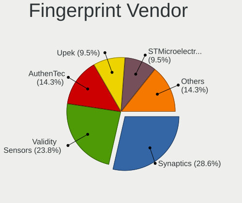

| Vendor                     | Computers | Percent |
|----------------------------|-----------|---------|
| Synaptics                  | 6         | 28.57%  |
| Validity Sensors           | 5         | 23.81%  |
| AuthenTec                  | 3         | 14.29%  |
| Upek                       | 2         | 9.52%   |
| STMicroelectronics         | 2         | 9.52%   |
| Elan Microelectronics      | 2         | 9.52%   |
| Shenzhen Goodix Technology | 1         | 4.76%   |

Fingerprint Model
-----------------

Fingerprint sensor models

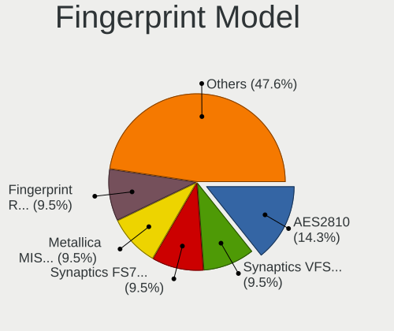

| Model                                                                      | Computers | Percent |
|----------------------------------------------------------------------------|-----------|---------|
| AuthenTec AES2810                                                          | 3         | 14.29%  |
| Validity Sensors Synaptics VFS7552 Touch Fingerprint Sensor with PurePrint | 2         | 9.52%   |
| Synaptics  FS7604 Touch Fingerprint Sensor with PurePrint                  | 2         | 9.52%   |
| Synaptics Metallica MIS Touch Fingerprint Reader                           | 2         | 9.52%   |
| STMicroelectronics Fingerprint Reader                                      | 2         | 9.52%   |
| Validity Sensors VFS495 Fingerprint Reader                                 | 1         | 4.76%   |
| Validity Sensors VFS451 Fingerprint Reader                                 | 1         | 4.76%   |
| Validity Sensors VFS Fingerprint sensor                                    | 1         | 4.76%   |
| Upek TCS5B Fingerprint sensor                                              | 1         | 4.76%   |
| Upek Biometric Touchchip/Touchstrip Fingerprint Sensor                     | 1         | 4.76%   |
| Synaptics WBDI                                                             | 1         | 4.76%   |
| Synaptics Prometheus MIS Touch Fingerprint Reader                          | 1         | 4.76%   |
| Shenzhen Goodix  FingerPrint Device                                        | 1         | 4.76%   |
| Elan ELAN:Fingerprint                                                      | 1         | 4.76%   |
| Elan ELAN:ARM-M4                                                           | 1         | 4.76%   |

Chipcard Vendor
---------------

Chipcard module vendors

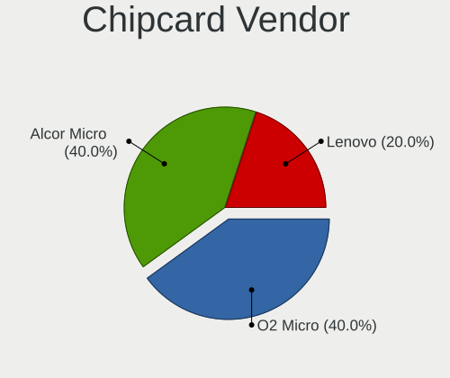

| Vendor      | Computers | Percent |
|-------------|-----------|---------|
| O2 Micro    | 2         | 40%     |
| Alcor Micro | 2         | 40%     |
| Lenovo      | 1         | 20%     |

Chipcard Model
--------------

Chipcard module models

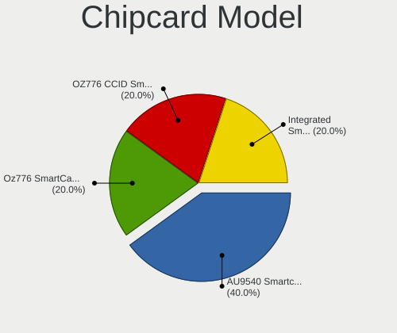

| Model                                | Computers | Percent |
|--------------------------------------|-----------|---------|
| Alcor Micro AU9540 Smartcard Reader  | 2         | 40%     |
| O2 Micro Oz776 SmartCard Reader      | 1         | 20%     |
| O2 Micro OZ776 CCID Smartcard Reader | 1         | 20%     |
| Lenovo Integrated Smart Card Reader  | 1         | 20%     |

Unsupported
-----------

Unsupported Devices
-------------------

Total unsupported devices on board

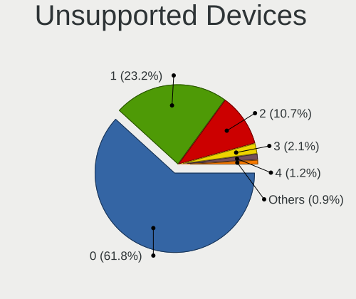

| Total | Computers | Percent |
|-------|-----------|---------|
| 0     | 202       | 61.77%  |
| 1     | 76        | 23.24%  |
| 2     | 35        | 10.7%   |
| 3     | 7         | 2.14%   |
| 4     | 4         | 1.22%   |
| 6     | 2         | 0.61%   |
| 7     | 1         | 0.31%   |

Unsupported Device Types
------------------------

Types of unsupported devices

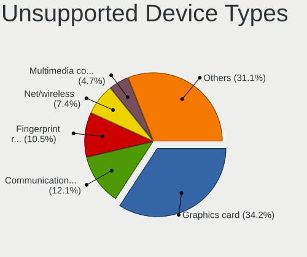

| Type                     | Computers | Percent |
|--------------------------|-----------|---------|
| Graphics card            | 65        | 34.21%  |
| Communication controller | 23        | 12.11%  |
| Fingerprint reader       | 20        | 10.53%  |
| Net/wireless             | 14        | 7.37%   |
| Multimedia controller    | 9         | 4.74%   |
| Camera                   | 9         | 4.74%   |
| Modem                    | 8         | 4.21%   |
| Bluetooth                | 7         | 3.68%   |
| Sound                    | 6         | 3.16%   |
| Unassigned class         | 5         | 2.63%   |
| Network                  | 5         | 2.63%   |
| Chipcard                 | 5         | 2.63%   |
| Card reader              | 5         | 2.63%   |
| Storage/ata              | 3         | 1.58%   |
| Storage                  | 2         | 1.05%   |
| Net/ethernet             | 2         | 1.05%   |
| Unclassified device      | 1         | 0.53%   |
| Flash memory             | 1         | 0.53%   |

