Alpine - Tested Hardware & Statistics (Desktops)
------------------------------------------------

A project to collect tested hardware configurations for Alpine.

Anyone can contribute to this report by the [hw-probe](https://github.com/linuxhw/hw-probe) tool:

    sudo -E hw-probe -all -upload

Please contribute! Especially if your hardware is rare.

Contents
--------

* [ Test Cases ](#test-cases)

* [ System ](#system)
  - [ OS                       ](#os)
  - [ OS Family                ](#os-family)
  - [ Kernel                   ](#kernel)
  - [ Kernel Family            ](#kernel-family)
  - [ Kernel Major Ver.        ](#kernel-major-ver)
  - [ Arch                     ](#arch)
  - [ DE                       ](#de)
  - [ Display Server           ](#display-server)
  - [ Display Manager          ](#display-manager)
  - [ OS Lang                  ](#os-lang)
  - [ Boot Mode                ](#boot-mode)
  - [ Filesystem               ](#filesystem)
  - [ Part. scheme             ](#part-scheme)
  - [ Dual Boot with Linux/BSD ](#dual-boot-with-linuxbsd)
  - [ Dual Boot (Win)          ](#dual-boot-win)

* [ Board ](#board)
  - [ Vendor                   ](#vendor)
  - [ Model                    ](#model)
  - [ Model Family             ](#model-family)
  - [ MFG Year                 ](#mfg-year)
  - [ Form Factor              ](#form-factor)
  - [ Secure Boot              ](#secure-boot)
  - [ Coreboot                 ](#coreboot)
  - [ RAM Size                 ](#ram-size)
  - [ RAM Used                 ](#ram-used)
  - [ Total Drives             ](#total-drives)
  - [ Has CD-ROM               ](#has-cd-rom)
  - [ Has Ethernet             ](#has-ethernet)
  - [ Has WiFi                 ](#has-wifi)
  - [ Has Bluetooth            ](#has-bluetooth)

* [ Location ](#location)
  - [ Country                  ](#country)
  - [ City                     ](#city)

* [ Drives ](#drives)
  - [ Drive Vendor             ](#drive-vendor)
  - [ Drive Model              ](#drive-model)
  - [ HDD Vendor               ](#hdd-vendor)
  - [ SSD Vendor               ](#ssd-vendor)
  - [ Drive Kind               ](#drive-kind)
  - [ Drive Connector          ](#drive-connector)
  - [ Drive Size               ](#drive-size)
  - [ Space Total              ](#space-total)
  - [ Space Used               ](#space-used)
  - [ Malfunc. Drives          ](#malfunc-drives)
  - [ Malfunc. Drive Vendor    ](#malfunc-drive-vendor)
  - [ Malfunc. HDD Vendor      ](#malfunc-hdd-vendor)
  - [ Malfunc. Drive Kind      ](#malfunc-drive-kind)
  - [ Failed Drives            ](#failed-drives)
  - [ Failed Drive Vendor      ](#failed-drive-vendor)
  - [ Drive Status             ](#drive-status)

* [ Storage controller ](#storage-controller)
  - [ Storage Vendor           ](#storage-vendor)
  - [ Storage Model            ](#storage-model)
  - [ Storage Kind             ](#storage-kind)

* [ Processor ](#processor)
  - [ CPU Vendor               ](#cpu-vendor)
  - [ CPU Model                ](#cpu-model)
  - [ CPU Model Family         ](#cpu-model-family)
  - [ CPU Cores                ](#cpu-cores)
  - [ CPU Sockets              ](#cpu-sockets)
  - [ CPU Threads              ](#cpu-threads)
  - [ CPU Op-Modes             ](#cpu-op-modes)
  - [ CPU Microcode            ](#cpu-microcode)
  - [ CPU Microarch            ](#cpu-microarch)

* [ Graphics ](#graphics)
  - [ GPU Vendor               ](#gpu-vendor)
  - [ GPU Model                ](#gpu-model)
  - [ GPU Combo                ](#gpu-combo)
  - [ GPU Driver               ](#gpu-driver)
  - [ GPU Memory               ](#gpu-memory)

* [ Monitor ](#monitor)
  - [ Monitor Vendor           ](#monitor-vendor)
  - [ Monitor Model            ](#monitor-model)
  - [ Monitor Resolution       ](#monitor-resolution)
  - [ Monitor Diagonal         ](#monitor-diagonal)
  - [ Monitor Width            ](#monitor-width)
  - [ Aspect Ratio             ](#aspect-ratio)
  - [ Monitor Area             ](#monitor-area)
  - [ Pixel Density            ](#pixel-density)
  - [ Multiple Monitors        ](#multiple-monitors)

* [ Network ](#network)
  - [ Net Controller Vendor    ](#net-controller-vendor)
  - [ Net Controller Model     ](#net-controller-model)
  - [ Wireless Vendor          ](#wireless-vendor)
  - [ Wireless Model           ](#wireless-model)
  - [ Ethernet Vendor          ](#ethernet-vendor)
  - [ Ethernet Model           ](#ethernet-model)
  - [ Net Controller Kind      ](#net-controller-kind)
  - [ Used Controller          ](#used-controller)
  - [ NICs                     ](#nics)
  - [ IPv6                     ](#ipv6)

* [ Bluetooth ](#bluetooth)
  - [ Bluetooth Vendor         ](#bluetooth-vendor)
  - [ Bluetooth Model          ](#bluetooth-model)

* [ Sound ](#sound)
  - [ Sound Vendor             ](#sound-vendor)
  - [ Sound Model              ](#sound-model)

* [ Memory ](#memory)
  - [ Memory Vendor            ](#memory-vendor)
  - [ Memory Model             ](#memory-model)
  - [ Memory Kind              ](#memory-kind)
  - [ Memory Form Factor       ](#memory-form-factor)
  - [ Memory Size              ](#memory-size)
  - [ Memory Speed             ](#memory-speed)

* [ Printers & scanners ](#printers--scanners)
  - [ Printer Vendor           ](#printer-vendor)
  - [ Printer Model            ](#printer-model)
  - [ Scanner Vendor           ](#scanner-vendor)
  - [ Scanner Model            ](#scanner-model)

* [ Camera ](#camera)
  - [ Camera Vendor            ](#camera-vendor)
  - [ Camera Model             ](#camera-model)

* [ Security ](#security)
  - [ Fingerprint Vendor       ](#fingerprint-vendor)
  - [ Fingerprint Model        ](#fingerprint-model)
  - [ Chipcard Vendor          ](#chipcard-vendor)
  - [ Chipcard Model           ](#chipcard-model)

* [ Unsupported ](#unsupported)
  - [ Unsupported Devices      ](#unsupported-devices)
  - [ Unsupported Device Types ](#unsupported-device-types)

Test Cases
----------

Total: 157

| Vendor        | Model                       | Probe                                                      | Date         |
|---------------|-----------------------------|------------------------------------------------------------|--------------|
| ASUSTek       | PRIME B550-PLUS             | [8d3b9df361](https://linux-hardware.org/?probe=8d3b9df361) | Dec 30, 2025 |
| Fujitsu       | D3313-G1 S26361-D3313-G1    | [c435331072](https://linux-hardware.org/?probe=c435331072) | Dec 18, 2025 |
| HP            | 1495                        | [06b7d83d73](https://linux-hardware.org/?probe=06b7d83d73) | Dec 13, 2025 |
| HP            | 1495                        | [855b490d20](https://linux-hardware.org/?probe=855b490d20) | Dec 13, 2025 |
| ASUSTek       | PRIME B450-PLUS             | [9b49b49d23](https://linux-hardware.org/?probe=9b49b49d23) | Nov 26, 2025 |
| Foxconn       | 2A8C                        | [b9a2f08d89](https://linux-hardware.org/?probe=b9a2f08d89) | Nov 23, 2025 |
| Foxconn       | 2A8C                        | [1e2ee56a90](https://linux-hardware.org/?probe=1e2ee56a90) | Nov 09, 2025 |
| ASUSTek       | Z10PA-D8 Series             | [93f07b0589](https://linux-hardware.org/?probe=93f07b0589) | Oct 18, 2025 |
| ASUSTek       | Z10PA-D8 Series             | [2483946efb](https://linux-hardware.org/?probe=2483946efb) | Oct 17, 2025 |
| ASUSTek       | PRIME B360M-C               | [701ad62cc1](https://linux-hardware.org/?probe=701ad62cc1) | Sep 16, 2025 |
| ASUSTek       | PRIME B450M-K II            | [b2eb852049](https://linux-hardware.org/?probe=b2eb852049) | Sep 14, 2025 |
| ASUSTek       | TUF B360-PRO GAMING         | [a2ba8a7147](https://linux-hardware.org/?probe=a2ba8a7147) | Sep 13, 2025 |
| ASUSTek       | PRIME B360M-C               | [7f3a3ab8e7](https://linux-hardware.org/?probe=7f3a3ab8e7) | Aug 17, 2025 |
| ASUSTek       | PRIME B360M-C               | [ed2f332328](https://linux-hardware.org/?probe=ed2f332328) | Aug 17, 2025 |
| ASUSTek       | ROG STRIX B660-I GAMING ... | [1d6c76836f](https://linux-hardware.org/?probe=1d6c76836f) | Aug 13, 2025 |
| Positivo      | POS-EINM10CB SIM            | [a494c88e11](https://linux-hardware.org/?probe=a494c88e11) | Aug 11, 2025 |
| Unknown       | Unknown                     | [f9007c93e5](https://linux-hardware.org/?probe=f9007c93e5) | Aug 11, 2025 |
| Inventec      | D CLASS A02                 | [bf34229f54](https://linux-hardware.org/?probe=bf34229f54) | Aug 10, 2025 |
| Acer          | TDPS05                      | [eaa52591b5](https://linux-hardware.org/?probe=eaa52591b5) | Aug 02, 2025 |
| Acer          | TDPS05                      | [971654c9fe](https://linux-hardware.org/?probe=971654c9fe) | Aug 02, 2025 |
| Gigabyte      | Q87M-D2H                    | [832a82a783](https://linux-hardware.org/?probe=832a82a783) | Jul 23, 2025 |
| Gigabyte      | MZBAYAP-00                  | [23e721fbd3](https://linux-hardware.org/?probe=23e721fbd3) | Jun 30, 2025 |
| Fujitsu       | D3183-A1 S26361-D3183-A1    | [ec5697c8fc](https://linux-hardware.org/?probe=ec5697c8fc) | Jun 10, 2025 |
| Fujitsu       | D3183-A1 S26361-D3183-A1    | [6b0c533894](https://linux-hardware.org/?probe=6b0c533894) | Jun 03, 2025 |
| Fujitsu Si... | D2151-A1 S26361-D2151-A1    | [36a931fea2](https://linux-hardware.org/?probe=36a931fea2) | Jun 01, 2025 |
| ASUSTek       | ROG STRIX X570-E GAMING     | [7054f7cafb](https://linux-hardware.org/?probe=7054f7cafb) | May 21, 2025 |
| ASUSTek       | B85M-G                      | [00e03ea98f](https://linux-hardware.org/?probe=00e03ea98f) | May 15, 2025 |
| AK3V          | 1.0                         | [b47f54716a](https://linux-hardware.org/?probe=b47f54716a) | May 07, 2025 |
| ASRock        | H110M-DGS                   | [137f8b19d5](https://linux-hardware.org/?probe=137f8b19d5) | May 06, 2025 |
| Dell          | 0VHXCD A00                  | [55bbf75085](https://linux-hardware.org/?probe=55bbf75085) | Mar 15, 2025 |
| ASRock        | X570 Phantom Gaming 4       | [e0dba58cbe](https://linux-hardware.org/?probe=e0dba58cbe) | Mar 08, 2025 |
| ASRock        | Z97 Killer                  | [ae1ae6d7a2](https://linux-hardware.org/?probe=ae1ae6d7a2) | Feb 24, 2025 |
| ASUSTek       | A8N-SLI Premium             | [3bf9bf5b91](https://linux-hardware.org/?probe=3bf9bf5b91) | Feb 18, 2025 |
| Unknown       | Unknown                     | [0ed90e3a74](https://linux-hardware.org/?probe=0ed90e3a74) | Feb 12, 2025 |
| Gigabyte      | MZBAYAP-00                  | [8406ba741e](https://linux-hardware.org/?probe=8406ba741e) | Feb 09, 2025 |
| ASUSTek       | PRIME B360M-C               | [d82c562bae](https://linux-hardware.org/?probe=d82c562bae) | Feb 07, 2025 |
| ASUSTek       | PRIME B360M-C               | [1cc8311f87](https://linux-hardware.org/?probe=1cc8311f87) | Feb 07, 2025 |
| Dell          | 0HR330                      | [b0a5f47c54](https://linux-hardware.org/?probe=b0a5f47c54) | Dec 30, 2024 |
| Unknown       | Unknown                     | [d58ff3bf72](https://linux-hardware.org/?probe=d58ff3bf72) | Dec 07, 2024 |
| Unknown       | Unknown                     | [722fa16afd](https://linux-hardware.org/?probe=722fa16afd) | Dec 07, 2024 |
| HP            | 8053                        | [b08855c6d0](https://linux-hardware.org/?probe=b08855c6d0) | Nov 07, 2024 |
| ASUSTek       | PRIME H510M-E               | [0ae2204768](https://linux-hardware.org/?probe=0ae2204768) | Oct 10, 2024 |
| Loongson      | 3A6000-HV-7A2000-1w-V0.1... | [b50072f24a](https://linux-hardware.org/?probe=b50072f24a) | Sep 23, 2024 |
| HP            | 0ACCh                       | [55a1298155](https://linux-hardware.org/?probe=55a1298155) | Sep 19, 2024 |
| Inventec      | DQ Class A02                | [f02f65b629](https://linux-hardware.org/?probe=f02f65b629) | Sep 06, 2024 |
| Fujitsu       | D3183-A1 S26361-D3183-A1    | [27f36952e8](https://linux-hardware.org/?probe=27f36952e8) | Aug 25, 2024 |
| Fujitsu       | D3183-A1 S26361-D3183-A1    | [444f676cab](https://linux-hardware.org/?probe=444f676cab) | Aug 25, 2024 |
| Gigabyte      | Z77X-D3H                    | [673e7d713c](https://linux-hardware.org/?probe=673e7d713c) | Aug 11, 2024 |
| Gigabyte      | Z77X-D3H                    | [e5ed694576](https://linux-hardware.org/?probe=e5ed694576) | Aug 11, 2024 |
| Fujitsu       | D3183-A1 S26361-D3183-A1    | [76144977df](https://linux-hardware.org/?probe=76144977df) | Aug 08, 2024 |
| Fujitsu       | D3183-A1 S26361-D3183-A1    | [716c1dd778](https://linux-hardware.org/?probe=716c1dd778) | Aug 06, 2024 |
| Unknown       | Unknown                     | [8be7f502c9](https://linux-hardware.org/?probe=8be7f502c9) | Jul 13, 2024 |
| ASUSTek       | PRIME B550M-A WIFI II       | [b9b8467b56](https://linux-hardware.org/?probe=b9b8467b56) | Jul 12, 2024 |
| ASUSTek       | ROG STRIX B660-I GAMING ... | [7a92877b6b](https://linux-hardware.org/?probe=7a92877b6b) | Jul 07, 2024 |
| ASUSTek       | M5A78L-M LX PLUS            | [4e3f98ce9b](https://linux-hardware.org/?probe=4e3f98ce9b) | Jun 12, 2024 |
| Inventec      | D CLASS A02                 | [1bfbba2797](https://linux-hardware.org/?probe=1bfbba2797) | May 28, 2024 |
| Gigabyte      | Z97X-Gaming 3               | [41b5caad82](https://linux-hardware.org/?probe=41b5caad82) | May 26, 2024 |
| Fujitsu       | D3403-U1 S26361-D3403-U1    | [acdb0e0544](https://linux-hardware.org/?probe=acdb0e0544) | May 25, 2024 |
| Inventec      | D CLASS A02                 | [50cec6d29b](https://linux-hardware.org/?probe=50cec6d29b) | May 12, 2024 |
| Fujitsu       | D3183-A1 S26361-D3183-A1    | [553927672a](https://linux-hardware.org/?probe=553927672a) | May 11, 2024 |
| Gigabyte      | Z270X-Gaming 8              | [00e056103f](https://linux-hardware.org/?probe=00e056103f) | Apr 22, 2024 |
| ASRock        | B85M-ITX                    | [c868a15a8f](https://linux-hardware.org/?probe=c868a15a8f) | Apr 20, 2024 |
| Intel         | H81                         | [8b51b58c02](https://linux-hardware.org/?probe=8b51b58c02) | Apr 11, 2024 |
| HP            | 18E7                        | [06187ec68b](https://linux-hardware.org/?probe=06187ec68b) | Apr 09, 2024 |
| Dell          | 0CU395                      | [0ba3773be8](https://linux-hardware.org/?probe=0ba3773be8) | Apr 03, 2024 |
| Intel         | H81                         | [c62889d4a5](https://linux-hardware.org/?probe=c62889d4a5) | Apr 02, 2024 |
| Inventec      | DQ Class A02                | [6539e1cbe7](https://linux-hardware.org/?probe=6539e1cbe7) | Mar 22, 2024 |
| MACHINIST     | X99 PR9                     | [481821b9ad](https://linux-hardware.org/?probe=481821b9ad) | Mar 12, 2024 |
| Intel         | D102GGC2 AAD42789-204       | [0da90b1518](https://linux-hardware.org/?probe=0da90b1518) | Mar 03, 2024 |
| Acer          | TDPS05                      | [9156de5a01](https://linux-hardware.org/?probe=9156de5a01) | Feb 15, 2024 |
| AMI           | Intel                       | [15abbc4eb4](https://linux-hardware.org/?probe=15abbc4eb4) | Feb 11, 2024 |
| Unknown       | Unknown                     | [413fbae0c9](https://linux-hardware.org/?probe=413fbae0c9) | Jan 17, 2024 |
| Unknown       | Unknown                     | [69d393fc55](https://linux-hardware.org/?probe=69d393fc55) | Jan 17, 2024 |
| HP            | 3397                        | [c33a1d3b01](https://linux-hardware.org/?probe=c33a1d3b01) | Jan 09, 2024 |
| ASUSTek       | Z87-DELUXE                  | [018238aa79](https://linux-hardware.org/?probe=018238aa79) | Jan 01, 2024 |
| Acer          | TDPS05                      | [ce9b5d0c48](https://linux-hardware.org/?probe=ce9b5d0c48) | Dec 23, 2023 |
| Acer          | TDPS05                      | [d0260b1327](https://linux-hardware.org/?probe=d0260b1327) | Dec 23, 2023 |
| ZOTAC         | Unknown                     | [a91d567af3](https://linux-hardware.org/?probe=a91d567af3) | Dec 14, 2023 |
| Compaq        | 0684h                       | [54c2d84103](https://linux-hardware.org/?probe=54c2d84103) | Dec 02, 2023 |
| Compaq        | 0684h                       | [b2d96b48dc](https://linux-hardware.org/?probe=b2d96b48dc) | Dec 02, 2023 |
| ECS           | M789CG                      | [7c2e2de188](https://linux-hardware.org/?probe=7c2e2de188) | Dec 01, 2023 |
| Gigabyte      | X570 I AORUS PRO WIFI       | [1909f3fbff](https://linux-hardware.org/?probe=1909f3fbff) | Nov 15, 2023 |
| Unknown       | Unknown                     | [80774e2d18](https://linux-hardware.org/?probe=80774e2d18) | Nov 14, 2023 |
| ECS           | M789CG                      | [49edfe005c](https://linux-hardware.org/?probe=49edfe005c) | Nov 07, 2023 |
| Gigabyte      | 945GCM-S2C                  | [c714bf35c2](https://linux-hardware.org/?probe=c714bf35c2) | Nov 06, 2023 |
| ECS           | M789CG                      | [87fe73ee84](https://linux-hardware.org/?probe=87fe73ee84) | Nov 02, 2023 |
| ECS           | M789CG                      | [b767549953](https://linux-hardware.org/?probe=b767549953) | Oct 15, 2023 |
| ASRock        | Q1900B-ITX                  | [8625166ef3](https://linux-hardware.org/?probe=8625166ef3) | Oct 14, 2023 |
| ECS           | M789CG                      | [6f446a6f77](https://linux-hardware.org/?probe=6f446a6f77) | Oct 14, 2023 |
| ECS           | M789CG                      | [0a0df79fcd](https://linux-hardware.org/?probe=0a0df79fcd) | Oct 14, 2023 |
| Inventec      | D CLASS A02                 | [9559c016fb](https://linux-hardware.org/?probe=9559c016fb) | Oct 13, 2023 |
| ASRock        | Z790M-ITX WiFi              | [560aec8a01](https://linux-hardware.org/?probe=560aec8a01) | Oct 06, 2023 |
| ASRock        | H55M-LE                     | [6b7e52fd8c](https://linux-hardware.org/?probe=6b7e52fd8c) | Sep 20, 2023 |
| ASRock        | H55M-LE                     | [ceefe742e2](https://linux-hardware.org/?probe=ceefe742e2) | Sep 20, 2023 |
| Gigabyte      | B450 AORUS ELITE            | [b858f753b2](https://linux-hardware.org/?probe=b858f753b2) | Sep 19, 2023 |
| Dell          | 0RY007                      | [3bcbd1f6c3](https://linux-hardware.org/?probe=3bcbd1f6c3) | Sep 19, 2023 |
| Dell          | 096JG8 A01                  | [00e5bebc6a](https://linux-hardware.org/?probe=00e5bebc6a) | Sep 06, 2023 |
| ASRock        | 970 Extreme4                | [de055c3a95](https://linux-hardware.org/?probe=de055c3a95) | Jul 17, 2023 |
| ASUSTek       | Z170-E                      | [8be9720ca6](https://linux-hardware.org/?probe=8be9720ca6) | Jun 29, 2023 |
| ASUSTek       | PRIME B360M-C               | [4dca77df51](https://linux-hardware.org/?probe=4dca77df51) | Jun 21, 2023 |
| HP            | 83E2                        | [0db8dcbc23](https://linux-hardware.org/?probe=0db8dcbc23) | May 28, 2023 |
| MSI           | MAG B460M MORTAR            | [da74cacf64](https://linux-hardware.org/?probe=da74cacf64) | May 18, 2023 |
| Gigabyte      | Z170X-UD5-CF                | [429dc207a6](https://linux-hardware.org/?probe=429dc207a6) | May 15, 2023 |
| Gigabyte      | Z170X-UD5-CF                | [f887e6f037](https://linux-hardware.org/?probe=f887e6f037) | May 15, 2023 |
| UGREEN        | DX4600                      | [cbe70de89c](https://linux-hardware.org/?probe=cbe70de89c) | Apr 19, 2023 |
| ASUSTek       | PRIME B360M-C               | [8cf7b9cc76](https://linux-hardware.org/?probe=8cf7b9cc76) | Mar 23, 2023 |
| Intel         | D525MW AAE93082-401         | [590309a32b](https://linux-hardware.org/?probe=590309a32b) | Mar 18, 2023 |
| Intel         | D525MW AAE93082-401         | [bc847b4586](https://linux-hardware.org/?probe=bc847b4586) | Mar 09, 2023 |
| Intel         | D525MW AAE93082-401         | [d02959f9ad](https://linux-hardware.org/?probe=d02959f9ad) | Mar 02, 2023 |
| ASRock        | X470 Master SLI/ac          | [d8f1121a19](https://linux-hardware.org/?probe=d8f1121a19) | Jan 19, 2023 |
| ASRock        | X470 Master SLI/ac          | [6b6a4929de](https://linux-hardware.org/?probe=6b6a4929de) | Jan 16, 2023 |
| ASRock        | X470 Master SLI/ac          | [8775308115](https://linux-hardware.org/?probe=8775308115) | Jan 15, 2023 |
| Gigabyte      | X570S AERO G                | [473b4d0e6e](https://linux-hardware.org/?probe=473b4d0e6e) | Jan 11, 2023 |
| Gigabyte      | X570S AERO G                | [053b8697ce](https://linux-hardware.org/?probe=053b8697ce) | Jan 06, 2023 |
| Gigabyte      | B450 AORUS ELITE            | [5da7f2d3a9](https://linux-hardware.org/?probe=5da7f2d3a9) | Dec 27, 2022 |
| Dell          | 03V7GF A01                  | [3847c61b81](https://linux-hardware.org/?probe=3847c61b81) | Dec 17, 2022 |
| Dell          | 03V7GF A01                  | [e491b54a3c](https://linux-hardware.org/?probe=e491b54a3c) | Dec 17, 2022 |
| Gigabyte      | B550 AORUS ELITE V2         | [bbf4464c41](https://linux-hardware.org/?probe=bbf4464c41) | Nov 27, 2022 |
| Fujitsu       | FujitsuTP7000 -1            | [89198d262f](https://linux-hardware.org/?probe=89198d262f) | Nov 17, 2022 |
| Lenovo        | 31900058 STD                | [d7cc344b2f](https://linux-hardware.org/?probe=d7cc344b2f) | Oct 31, 2022 |
| Lenovo        | 31900058 STD                | [9f7158b883](https://linux-hardware.org/?probe=9f7158b883) | Oct 16, 2022 |
| HP            | 1493                        | [60ebd1d8dd](https://linux-hardware.org/?probe=60ebd1d8dd) | Sep 29, 2022 |
| Gateway       | SX2185                      | [8372be8fe3](https://linux-hardware.org/?probe=8372be8fe3) | Sep 29, 2022 |
| ASRock        | H81M                        | [d59c4705a2](https://linux-hardware.org/?probe=d59c4705a2) | Aug 17, 2022 |
| Intel         | DH61BF AAG81311-101         | [5a3ed0cf62](https://linux-hardware.org/?probe=5a3ed0cf62) | Jul 30, 2022 |
| Intel         | DH61BF AAG81311-101         | [719bbf817c](https://linux-hardware.org/?probe=719bbf817c) | Jul 30, 2022 |
| Intel         | DQ67SW AAG12527-310         | [9a4907d88c](https://linux-hardware.org/?probe=9a4907d88c) | Jul 17, 2022 |
| Unknown       | Unknown                     | [d857b93614](https://linux-hardware.org/?probe=d857b93614) | Jul 13, 2022 |
| Lenovo        | 31900058 STD                | [2f6356a177](https://linux-hardware.org/?probe=2f6356a177) | Jun 17, 2022 |
| Lenovo        | 31900058 STD                | [582fd88dbe](https://linux-hardware.org/?probe=582fd88dbe) | Jun 14, 2022 |
| MSI           | Z170A GAMING PRO            | [73b3e29101](https://linux-hardware.org/?probe=73b3e29101) | Jun 14, 2022 |
| ASRock        | B460 Phantom Gaming 4       | [e692b2a091](https://linux-hardware.org/?probe=e692b2a091) | May 26, 2022 |
| ASUSTek       | H97-PLUS                    | [cab2025064](https://linux-hardware.org/?probe=cab2025064) | May 24, 2022 |
| MSI           | J1900I                      | [86f37a71f5](https://linux-hardware.org/?probe=86f37a71f5) | May 15, 2022 |
| MSI           | J1900I                      | [5a48d83596](https://linux-hardware.org/?probe=5a48d83596) | May 15, 2022 |
| ASUSTek       | Z97-K                       | [53cba6b4f8](https://linux-hardware.org/?probe=53cba6b4f8) | Apr 14, 2022 |
| Gigabyte      | Z490I AORUS ULTRA           | [908edb3724](https://linux-hardware.org/?probe=908edb3724) | Jan 27, 2022 |
| Dell          | 02YRK5 A02                  | [58c2ed388b](https://linux-hardware.org/?probe=58c2ed388b) | Dec 02, 2021 |
| HP            | 21B4 A01                    | [98accc83e4](https://linux-hardware.org/?probe=98accc83e4) | Nov 11, 2021 |
| Dell          | 0T10XW A00                  | [585636f7fe](https://linux-hardware.org/?probe=585636f7fe) | Sep 08, 2021 |
| Shuttle       | FS81                        | [9a98a31681](https://linux-hardware.org/?probe=9a98a31681) | Sep 06, 2021 |
| Dell          | 0VRWRC A00                  | [37a6ad6e02](https://linux-hardware.org/?probe=37a6ad6e02) | Apr 09, 2021 |
| ASUSTek       | P8H67-V                     | [89edd8b343](https://linux-hardware.org/?probe=89edd8b343) | Mar 17, 2021 |
| HP            | ProLiant MicroServer Gen... | [af637820c2](https://linux-hardware.org/?probe=af637820c2) | Feb 12, 2021 |
| VIA Techno... | KM266APro-835               | [1334ad3f74](https://linux-hardware.org/?probe=1334ad3f74) | Dec 22, 2020 |
| Fujitsu       | D2779 S26361-D2779-A1       | [07795a357a](https://linux-hardware.org/?probe=07795a357a) | Oct 09, 2020 |
| Dell          | 0PU052                      | [9a31999f07](https://linux-hardware.org/?probe=9a31999f07) | Aug 31, 2020 |
| ASUSTek       | TS10                        | [71d7f6e110](https://linux-hardware.org/?probe=71d7f6e110) | Aug 20, 2020 |
| VIA Techno... | KM266APro-835               | [25ec3d44ff](https://linux-hardware.org/?probe=25ec3d44ff) | Aug 16, 2020 |
| Gigabyte      | Z490I AORUS ULTRA           | [58dce1215c](https://linux-hardware.org/?probe=58dce1215c) | Aug 13, 2020 |
| ASUSTek       | PRIME H370M-PLUS            | [0c50242cc5](https://linux-hardware.org/?probe=0c50242cc5) | Aug 09, 2020 |
| ASRock        | J3455M                      | [05f9d5c3b4](https://linux-hardware.org/?probe=05f9d5c3b4) | Aug 06, 2020 |
| eMachines     | EL1352G                     | [4513d2931f](https://linux-hardware.org/?probe=4513d2931f) | Jul 03, 2020 |
| eMachines     | EL1352G                     | [4b26717c89](https://linux-hardware.org/?probe=4b26717c89) | Jul 03, 2020 |
| ASRock        | J3455M                      | [3719f96b60](https://linux-hardware.org/?probe=3719f96b60) | Jul 03, 2020 |
| Unknown       | i855GM/E-ITE8712            | [7b9cbd816b](https://linux-hardware.org/?probe=7b9cbd816b) | Dec 27, 2019 |
| ASRock        | D1800B-ITX                  | [f962d4bbf9](https://linux-hardware.org/?probe=f962d4bbf9) | Dec 22, 2019 |

System
------

OS
--

Installed operating systems

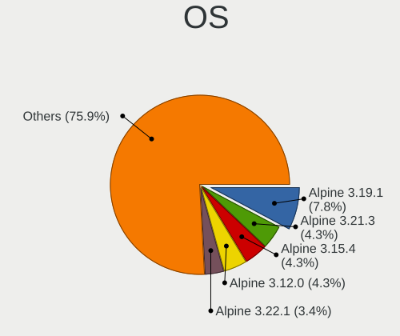

| Name                        | Desktops | Percent |
|-----------------------------|----------|---------|
| Alpine 3.19.1               | 9        | 7.76%   |
| Alpine 3.21.3               | 5        | 4.31%   |
| Alpine 3.15.4               | 5        | 4.31%   |
| Alpine 3.12.0               | 5        | 4.31%   |
| Alpine 3.22.1               | 4        | 3.45%   |
| Alpine 3.22.0               | 4        | 3.45%   |
| Alpine 3.19.0               | 4        | 3.45%   |
| Alpine 3.18.4               | 4        | 3.45%   |
| Alpine 3.18.0               | 4        | 3.45%   |
| Alpine 3.17_alpha20220809   | 4        | 3.45%   |
| Alpine 3.22.2               | 3        | 2.59%   |
| Alpine 3.20.3               | 3        | 2.59%   |
| Alpine 3.20.2               | 3        | 2.59%   |
| Alpine 3.19_alpha20230901   | 3        | 2.59%   |
| Alpine 3.16.0               | 3        | 2.59%   |
| Alpine 3.13.0_alpha20200626 | 3        | 2.59%   |
| Alpine 3.21.4               | 2        | 1.72%   |
| Alpine 3.21.2               | 2        | 1.72%   |
| Alpine 3.21.0_alpha20240807 | 2        | 1.72%   |
| Alpine 3.21.0_alpha20240606 | 2        | 1.72%   |
| Alpine 3.20.0               | 2        | 1.72%   |
| Alpine 3.18.6               | 2        | 1.72%   |
| Alpine 3.18.5               | 2        | 1.72%   |
| Alpine 3.18.3               | 2        | 1.72%   |
| Alpine 3.18.2               | 2        | 1.72%   |
| Alpine 3.17.2               | 2        | 1.72%   |
| Alpine 3.17.1               | 2        | 1.72%   |
| Alpine 3.11.2               | 2        | 1.72%   |
| Alpine 3.8.4                | 1        | 0.86%   |
| Alpine 3.24.0_alpha20251224 | 1        | 0.86%   |
| Alpine 3.23.0_alpha20250612 | 1        | 0.86%   |
| Alpine 3.23.0               | 1        | 0.86%   |
| Alpine 3.22.0_alpha20250108 | 1        | 0.86%   |
| Alpine 3.21.0               | 1        | 0.86%   |
| Alpine 3.20.6               | 1        | 0.86%   |
| Alpine 3.20.1               | 1        | 0.86%   |
| Alpine 3.20.0_alpha20240329 | 1        | 0.86%   |
| Alpine 3.20.0_alpha20231219 | 1        | 0.86%   |
| Alpine 3.17.7               | 1        | 0.86%   |
| Alpine 3.17.4               | 1        | 0.86%   |

OS Family
---------

OS without a version

| Name   | Desktops | Percent |
|--------|----------|---------|
| Alpine | 102      | 100%    |

Kernel
------

Version of the Linux kernel

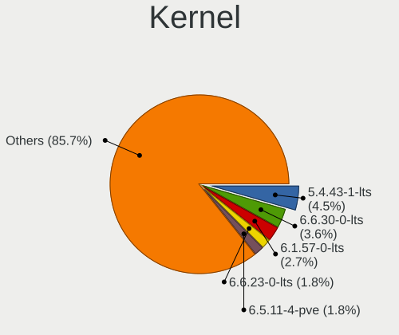

| Version         | Desktops | Percent |
|-----------------|----------|---------|
| 5.4.43-1-lts    | 5        | 4.46%   |
| 6.6.30-0-lts    | 4        | 3.57%   |
| 6.1.57-0-lts    | 3        | 2.68%   |
| 6.6.23-0-lts    | 2        | 1.79%   |
| 6.5.11-4-pve    | 2        | 1.79%   |
| 6.12.46-0-lts   | 2        | 1.79%   |
| 6.1.51-0-lts    | 2        | 1.79%   |
| 5.15.64-1-pve   | 2        | 1.79%   |
| 5.15.60-0-lts   | 2        | 1.79%   |
| 4.4.180+        | 2        | 1.79%   |
| 6.9.7-0-edge    | 1        | 0.89%   |
| 6.9.2-tkg-pds   | 1        | 0.89%   |
| 6.8.8-2-pve     | 1        | 0.89%   |
| 6.6.8-0-lts     | 1        | 0.89%   |
| 6.6.79-0-lts    | 1        | 0.89%   |
| 6.6.7-0-lts     | 1        | 0.89%   |
| 6.6.60-0-lts    | 1        | 0.89%   |
| 6.6.6-0-lts     | 1        | 0.89%   |
| 6.6.58-0-lts    | 1        | 0.89%   |
| 6.6.54-0-lts    | 1        | 0.89%   |
| 6.6.51-0-lts    | 1        | 0.89%   |
| 6.6.48-0-lts    | 1        | 0.89%   |
| 6.6.47-0-lts    | 1        | 0.89%   |
| 6.6.44-0-lts    | 1        | 0.89%   |
| 6.6.38-0-lts    | 1        | 0.89%   |
| 6.6.32-0-lts    | 1        | 0.89%   |
| 6.6.29-0-lts    | 1        | 0.89%   |
| 6.6.25-haos     | 1        | 0.89%   |
| 6.6.16-0-lts    | 1        | 0.89%   |
| 6.6.10-0-lts    | 1        | 0.89%   |
| 6.6.1-0-edge    | 1        | 0.89%   |
| 6.3.3-0-edge    | 1        | 0.89%   |
| 6.18.2-0-lts    | 1        | 0.89%   |
| 6.18.0-5-lts    | 1        | 0.89%   |
| 6.15.9-0-stable | 1        | 0.89%   |
| 6.12.8-0-lts    | 1        | 0.89%   |
| 6.12.61-0-lts   | 1        | 0.89%   |
| 6.12.53-0-lts   | 1        | 0.89%   |
| 6.12.51-0-lts   | 1        | 0.89%   |
| 6.12.40-0-lts   | 1        | 0.89%   |

Kernel Family
-------------

Linux kernel without a distro release

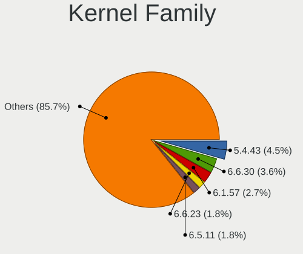

| Version | Desktops | Percent |
|---------|----------|---------|
| 5.4.43  | 5        | 4.46%   |
| 6.6.30  | 4        | 3.57%   |
| 6.1.57  | 3        | 2.68%   |
| 6.6.23  | 2        | 1.79%   |
| 6.5.11  | 2        | 1.79%   |
| 6.12.46 | 2        | 1.79%   |
| 6.1.51  | 2        | 1.79%   |
| 5.15.64 | 2        | 1.79%   |
| 5.15.60 | 2        | 1.79%   |
| 4.4.180 | 2        | 1.79%   |
| 6.9.7   | 1        | 0.89%   |
| 6.9.2   | 1        | 0.89%   |
| 6.8.8   | 1        | 0.89%   |
| 6.6.8   | 1        | 0.89%   |
| 6.6.79  | 1        | 0.89%   |
| 6.6.7   | 1        | 0.89%   |
| 6.6.60  | 1        | 0.89%   |
| 6.6.6   | 1        | 0.89%   |
| 6.6.58  | 1        | 0.89%   |
| 6.6.54  | 1        | 0.89%   |
| 6.6.51  | 1        | 0.89%   |
| 6.6.48  | 1        | 0.89%   |
| 6.6.47  | 1        | 0.89%   |
| 6.6.44  | 1        | 0.89%   |
| 6.6.38  | 1        | 0.89%   |
| 6.6.32  | 1        | 0.89%   |
| 6.6.29  | 1        | 0.89%   |
| 6.6.25  | 1        | 0.89%   |
| 6.6.16  | 1        | 0.89%   |
| 6.6.10  | 1        | 0.89%   |
| 6.6.1   | 1        | 0.89%   |
| 6.3.3   | 1        | 0.89%   |
| 6.18.2  | 1        | 0.89%   |
| 6.18.0  | 1        | 0.89%   |
| 6.15.9  | 1        | 0.89%   |
| 6.12.8  | 1        | 0.89%   |
| 6.12.61 | 1        | 0.89%   |
| 6.12.53 | 1        | 0.89%   |
| 6.12.51 | 1        | 0.89%   |
| 6.12.40 | 1        | 0.89%   |

Kernel Major Ver.
-----------------

Linux kernel major version

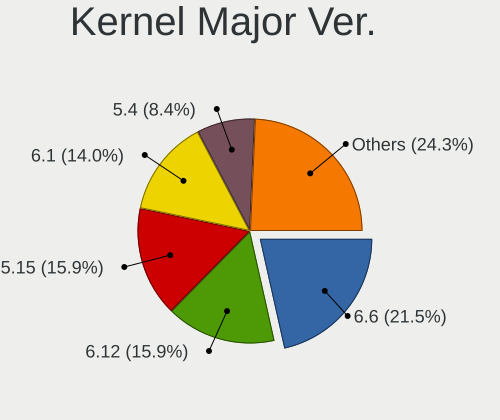

| Version | Desktops | Percent |
|---------|----------|---------|
| 6.6     | 23       | 21.5%   |
| 6.12    | 17       | 15.89%  |
| 5.15    | 17       | 15.89%  |
| 6.1     | 15       | 14.02%  |
| 5.4     | 9        | 8.41%   |
| 5.10    | 5        | 4.67%   |
| 6.9     | 2        | 1.87%   |
| 6.5     | 2        | 1.87%   |
| 6.18    | 2        | 1.87%   |
| 5.17    | 2        | 1.87%   |
| 4.4     | 2        | 1.87%   |
| 6.8     | 1        | 0.93%   |
| 6.3     | 1        | 0.93%   |
| 6.15    | 1        | 0.93%   |
| 6.11    | 1        | 0.93%   |
| 6.0     | 1        | 0.93%   |
| 5.8     | 1        | 0.93%   |
| 5.18    | 1        | 0.93%   |
| 5.14    | 1        | 0.93%   |
| 4.20    | 1        | 0.93%   |
| 4.14    | 1        | 0.93%   |
| 3.10    | 1        | 0.93%   |

Arch
----

OS architecture (x86_64, i586, etc.)

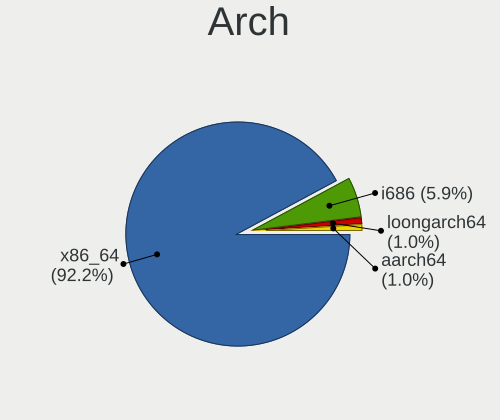

| Name        | Desktops | Percent |
|-------------|----------|---------|
| x86_64      | 94       | 92.16%  |
| i686        | 6        | 5.88%   |
| loongarch64 | 1        | 0.98%   |
| aarch64     | 1        | 0.98%   |

DE
--

Desktop Environment

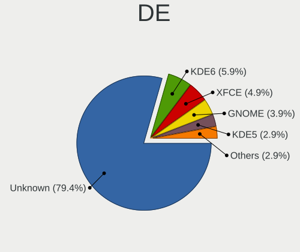

| Name    | Desktops | Percent |
|---------|----------|---------|
| Unknown | 81       | 79.41%  |
| KDE6    | 6        | 5.88%   |
| XFCE    | 5        | 4.9%    |
| GNOME   | 4        | 3.92%   |
| KDE5    | 3        | 2.94%   |
| sway    | 1        | 0.98%   |
| MATE    | 1        | 0.98%   |
| i3      | 1        | 0.98%   |

Display Server
--------------

X11 or Wayland

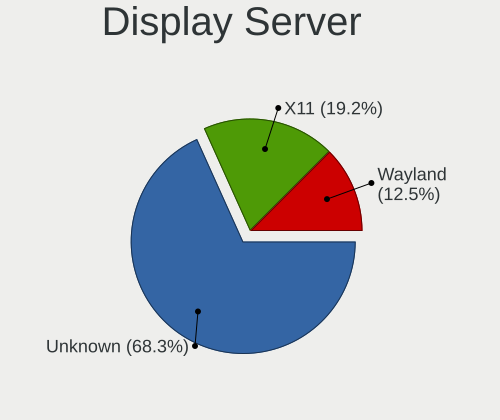

| Name    | Desktops | Percent |
|---------|----------|---------|
| Unknown | 71       | 68.27%  |
| X11     | 20       | 19.23%  |
| Wayland | 13       | 12.5%   |

Display Manager
---------------

SDDM, LightDM, etc.

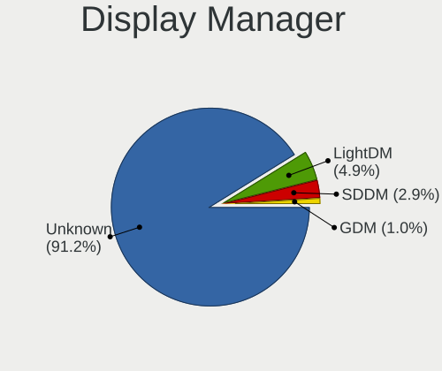

| Name    | Desktops | Percent |
|---------|----------|---------|
| Unknown | 93       | 91.18%  |
| LightDM | 5        | 4.9%    |
| SDDM    | 3        | 2.94%   |
| GDM     | 1        | 0.98%   |

OS Lang
-------

Language

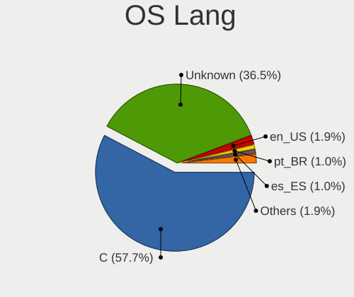

| Lang    | Desktops | Percent |
|---------|----------|---------|
| C       | 60       | 57.69%  |
| Unknown | 38       | 36.54%  |
| en_US   | 2        | 1.92%   |
| pt_BR   | 1        | 0.96%   |
| es_ES   | 1        | 0.96%   |
| en_ZA   | 1        | 0.96%   |
| en_GB   | 1        | 0.96%   |

Boot Mode
---------

EFI or BIOS

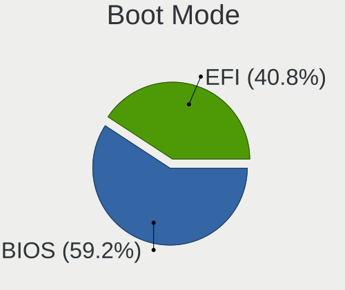

| Mode | Desktops | Percent |
|------|----------|---------|
| BIOS | 61       | 59.22%  |
| EFI  | 42       | 40.78%  |

Filesystem
----------

Type of filesystem

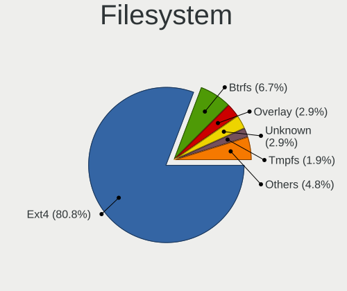

| Type    | Desktops | Percent |
|---------|----------|---------|
| Ext4    | 84       | 80.77%  |
| Btrfs   | 7        | 6.73%   |
| Overlay | 3        | 2.88%   |
| Unknown | 3        | 2.88%   |
| Tmpfs   | 2        | 1.92%   |
| Zfs     | 1        | 0.96%   |
| XXXXX   | 1        | 0.96%   |
| Xfs     | 1        | 0.96%   |
| Fake    | 1        | 0.96%   |
| Ext2    | 1        | 0.96%   |

Part. scheme
------------

Scheme of partitioning

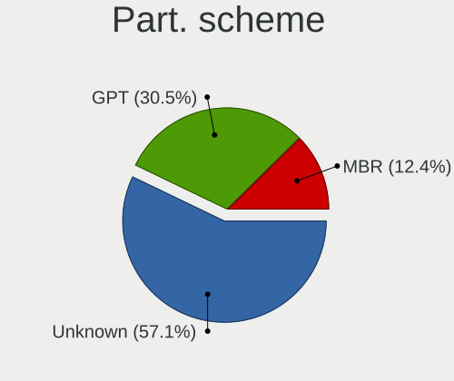

| Type    | Desktops | Percent |
|---------|----------|---------|
| Unknown | 60       | 57.14%  |
| GPT     | 32       | 30.48%  |
| MBR     | 13       | 12.38%  |

Dual Boot with Linux/BSD
------------------------

Hosting more than one Linux/BSD

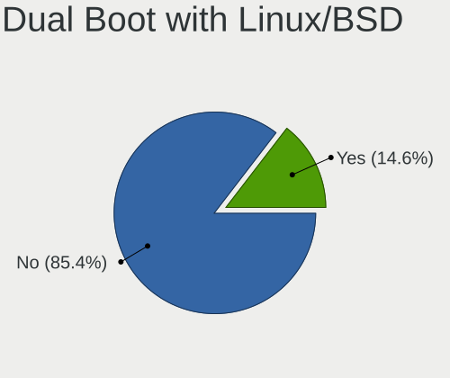

| Dual boot | Desktops | Percent |
|-----------|----------|---------|
| No        | 88       | 85.44%  |
| Yes       | 15       | 14.56%  |

Dual Boot (Win)
---------------

Hosting Linux and Windows

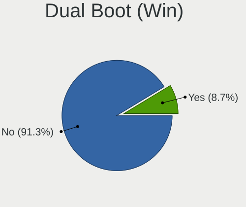

| Dual boot | Desktops | Percent |
|-----------|----------|---------|
| No        | 95       | 91.35%  |
| Yes       | 9        | 8.65%   |

Board
-----

Vendor
------

Motherboard manufacturer

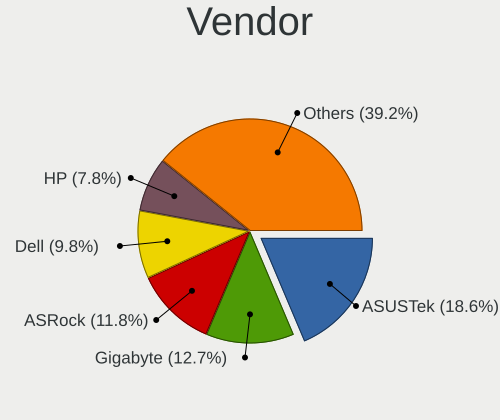

| Name                | Desktops | Percent |
|---------------------|----------|---------|
| ASUSTek Computer    | 19       | 18.63%  |
| Gigabyte Technology | 13       | 12.75%  |
| ASRock              | 12       | 11.76%  |
| Dell                | 10       | 9.8%    |
| Hewlett-Packard     | 8        | 7.84%   |
| Inventec            | 6        | 5.88%   |
| Fujitsu             | 6        | 5.88%   |
| Unknown             | 5        | 4.9%    |
| Intel               | 4        | 3.92%   |
| MSI                 | 2        | 1.96%   |
| ZOTAC               | 1        | 0.98%   |
| VIA Technologies    | 1        | 0.98%   |
| UGREEN              | 1        | 0.98%   |
| Shuttle             | 1        | 0.98%   |
| Positivo            | 1        | 0.98%   |
| MACHINIST           | 1        | 0.98%   |
| Loongson            | 1        | 0.98%   |
| Lenovo              | 1        | 0.98%   |
| Gateway             | 1        | 0.98%   |
| Fujitsu Siemens     | 1        | 0.98%   |
| Foxconn             | 1        | 0.98%   |
| eMachines           | 1        | 0.98%   |
| ECS                 | 1        | 0.98%   |
| Compaq              | 1        | 0.98%   |
| AMI                 | 1        | 0.98%   |
| AK3V                | 1        | 0.98%   |
| Acer                | 1        | 0.98%   |

Model
-----

Motherboard model

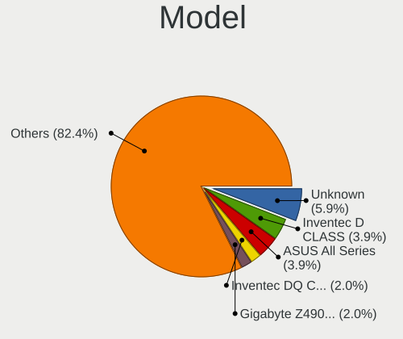

| Name                                  | Desktops | Percent |
|---------------------------------------|----------|---------|
| Unknown                               | 6        | 5.88%   |
| Inventec D CLASS                      | 4        | 3.92%   |
| ASUS All Series                       | 4        | 3.92%   |
| Inventec DQ Class                     | 2        | 1.96%   |
| Gigabyte Z490I AORUS ULTRA            | 2        | 1.96%   |
| ASUS PRIME B360M-C                    | 2        | 1.96%   |
| VIA KM266APro-835                     | 1        | 0.98%   |
| UGREEN DX4600                         | 1        | 0.98%   |
| Shuttle DS81D                         | 1        | 0.98%   |
| Positivo POS-EINM10CB                 | 1        | 0.98%   |
| MSI MS-7C82                           | 1        | 0.98%   |
| MSI MS-7877                           | 1        | 0.98%   |
| MACHINIST X99 PR9                     | 1        | 0.98%   |
| Loongson 3A6000-HV-7A2000-1w-V0.1-EVB | 1        | 0.98%   |
| Lenovo H535 10117                     | 1        | 0.98%   |
| Intel H81                             | 1        | 0.98%   |
| Intel DQ67SW                          | 1        | 0.98%   |
| Intel DH61BF AAG81311-101             | 1        | 0.98%   |
| Intel D525MW AAE93082-401             | 1        | 0.98%   |
| HP t5730w                             | 1        | 0.98%   |
| HP ProLiant MicroServer Gen8          | 1        | 0.98%   |
| HP ProDesk 600 G1 TWR                 | 1        | 0.98%   |
| HP EliteDesk 800 G4 DM 35W            | 1        | 0.98%   |
| HP EliteDesk 800 G2 TWR               | 1        | 0.98%   |
| HP Compaq Elite 8300 SFF              | 1        | 0.98%   |
| HP Compaq 8200 Elite SFF PC           | 1        | 0.98%   |
| HP Compaq 4000 Pro SFF PC             | 1        | 0.98%   |
| Gigabyte Z97X-Gaming 3                | 1        | 0.98%   |
| Gigabyte Z77X-D3H                     | 1        | 0.98%   |
| Gigabyte Z270X-Gaming 8               | 1        | 0.98%   |
| Gigabyte Z170X-UD5                    | 1        | 0.98%   |
| Gigabyte X570S AERO G                 | 1        | 0.98%   |
| Gigabyte X570 I AORUS PRO WIFI        | 1        | 0.98%   |
| Gigabyte Q87M-D2H                     | 1        | 0.98%   |
| Gigabyte GB-BXBT-2807                 | 1        | 0.98%   |
| Gigabyte B550 AORUS ELITE V2          | 1        | 0.98%   |
| Gigabyte B450 AORUS ELITE             | 1        | 0.98%   |
| Gigabyte 945GCM-S2C                   | 1        | 0.98%   |
| Gateway SX2185                        | 1        | 0.98%   |
| Fujitsu Siemens D2151-A1              | 1        | 0.98%   |

Model Family
------------

Motherboard model prefix

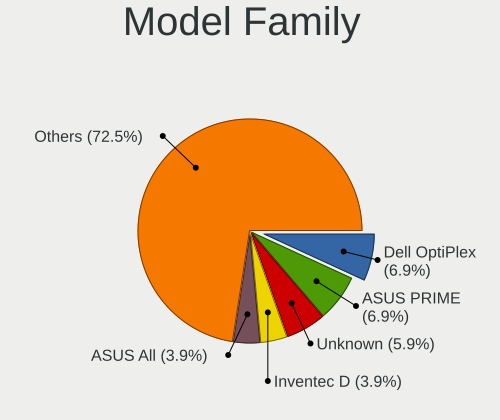

| Name                                  | Desktops | Percent |
|---------------------------------------|----------|---------|
| Dell OptiPlex                         | 7        | 6.86%   |
| ASUS PRIME                            | 7        | 6.86%   |
| Unknown                               | 6        | 5.88%   |
| Inventec D                            | 4        | 3.92%   |
| ASUS All                              | 4        | 3.92%   |
| HP Compaq                             | 3        | 2.94%   |
| Inventec DQ                           | 2        | 1.96%   |
| HP EliteDesk                          | 2        | 1.96%   |
| Gigabyte Z490I                        | 2        | 1.96%   |
| Fujitsu ESPRIMO                       | 2        | 1.96%   |
| Dell Inspiron                         | 2        | 1.96%   |
| ASUS ROG                              | 2        | 1.96%   |
| VIA KM266APro-835                     | 1        | 0.98%   |
| UGREEN DX4600                         | 1        | 0.98%   |
| Shuttle DS81D                         | 1        | 0.98%   |
| Positivo POS-EINM10CB                 | 1        | 0.98%   |
| MSI MS-7C82                           | 1        | 0.98%   |
| MSI MS-7877                           | 1        | 0.98%   |
| MACHINIST X99                         | 1        | 0.98%   |
| Loongson 3A6000-HV-7A2000-1w-V0.1-EVB | 1        | 0.98%   |
| Lenovo H535                           | 1        | 0.98%   |
| Intel H81                             | 1        | 0.98%   |
| Intel DQ67SW                          | 1        | 0.98%   |
| Intel DH61BF                          | 1        | 0.98%   |
| Intel D525MW                          | 1        | 0.98%   |
| HP t5730w                             | 1        | 0.98%   |
| HP ProLiant                           | 1        | 0.98%   |
| HP ProDesk                            | 1        | 0.98%   |
| Gigabyte Z97X-Gaming                  | 1        | 0.98%   |
| Gigabyte Z77X-D3H                     | 1        | 0.98%   |
| Gigabyte Z270X-Gaming                 | 1        | 0.98%   |
| Gigabyte Z170X-UD5                    | 1        | 0.98%   |
| Gigabyte X570S                        | 1        | 0.98%   |
| Gigabyte X570                         | 1        | 0.98%   |
| Gigabyte Q87M-D2H                     | 1        | 0.98%   |
| Gigabyte GB-BXBT-2807                 | 1        | 0.98%   |
| Gigabyte B550                         | 1        | 0.98%   |
| Gigabyte B450                         | 1        | 0.98%   |
| Gigabyte 945GCM-S2C                   | 1        | 0.98%   |
| Gateway SX2185                        | 1        | 0.98%   |

MFG Year
--------

Motherboard manufacture year

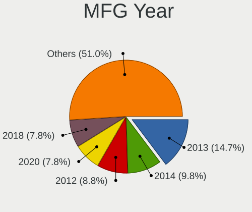

| Year    | Desktops | Percent |
|---------|----------|---------|
| 2013    | 15       | 14.71%  |
| 2014    | 10       | 9.8%    |
| 2012    | 9        | 8.82%   |
| 2020    | 8        | 7.84%   |
| 2018    | 8        | 7.84%   |
| 2010    | 7        | 6.86%   |
| 2011    | 6        | 5.88%   |
| 2022    | 5        | 4.9%    |
| 2019    | 5        | 4.9%    |
| 2016    | 5        | 4.9%    |
| 2015    | 4        | 3.92%   |
| 2007    | 4        | 3.92%   |
| Unknown | 3        | 2.94%   |
| 2023    | 2        | 1.96%   |
| 2021    | 2        | 1.96%   |
| 2017    | 2        | 1.96%   |
| 2009    | 2        | 1.96%   |
| 2001    | 2        | 1.96%   |
| 2024    | 1        | 0.98%   |
| 2005    | 1        | 0.98%   |
| 2004    | 1        | 0.98%   |

Form Factor
-----------

Physical design of the computer

| Name    | Desktops | Percent |
|---------|----------|---------|
| Desktop | 102      | 100%    |

Secure Boot
-----------

Enabled or disabled

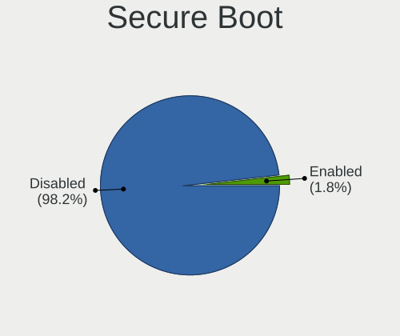

| State    | Desktops | Percent |
|----------|----------|---------|
| Disabled | 102      | 100%    |

Coreboot
--------

Have coreboot on board

| Used | Desktops | Percent |
|------|----------|---------|
| No   | 102      | 100%    |

RAM Size
--------

Total RAM memory

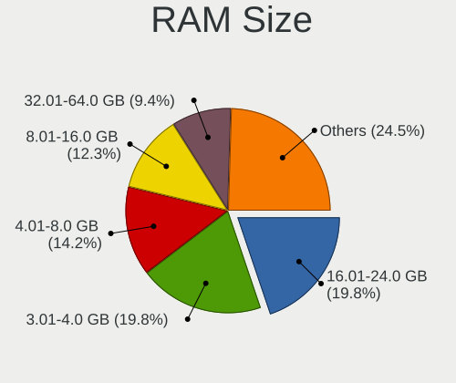

| Size in GB  | Desktops | Percent |
|-------------|----------|---------|
| 3.01-4.0    | 21       | 19.81%  |
| 16.01-24.0  | 21       | 19.81%  |
| 4.01-8.0    | 15       | 14.15%  |
| 8.01-16.0   | 13       | 12.26%  |
| 32.01-64.0  | 10       | 9.43%   |
| 1.01-2.0    | 8        | 7.55%   |
| 64.01-256.0 | 5        | 4.72%   |
| 2.01-3.0    | 4        | 3.77%   |
| 0.51-1.0    | 4        | 3.77%   |
| 0.01-0.5    | 4        | 3.77%   |
| 24.01-32.0  | 1        | 0.94%   |

RAM Used
--------

Used RAM memory

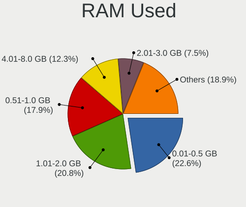

| Used GB    | Desktops | Percent |
|------------|----------|---------|
| 0.01-0.5   | 24       | 22.64%  |
| 1.01-2.0   | 22       | 20.75%  |
| 0.51-1.0   | 19       | 17.92%  |
| 4.01-8.0   | 13       | 12.26%  |
| 2.01-3.0   | 8        | 7.55%   |
| 3.01-4.0   | 7        | 6.6%    |
| 0          | 5        | 4.72%   |
| 8.01-16.0  | 3        | 2.83%   |
| Unknown    | 2        | 1.89%   |
| 32.01-64.0 | 1        | 0.94%   |
| 24.01-32.0 | 1        | 0.94%   |
| 16.01-24.0 | 1        | 0.94%   |

Total Drives
------------

Number of drives on board

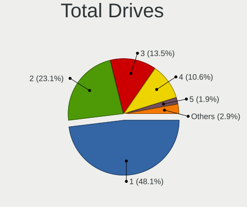

| Drives | Desktops | Percent |
|--------|----------|---------|
| 1      | 50       | 48.08%  |
| 2      | 24       | 23.08%  |
| 3      | 14       | 13.46%  |
| 4      | 11       | 10.58%  |
| 5      | 2        | 1.92%   |
| 0      | 2        | 1.92%   |
| 12     | 1        | 0.96%   |

Has CD-ROM
----------

Has CD-ROM on board

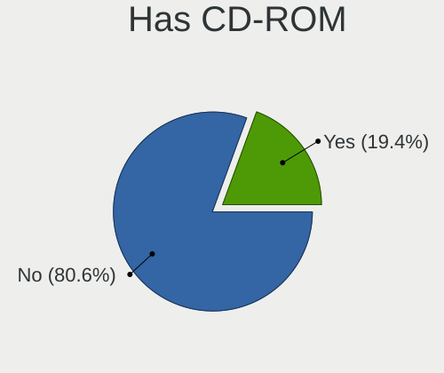

| Presented | Desktops | Percent |
|-----------|----------|---------|
| No        | 83       | 80.58%  |
| Yes       | 20       | 19.42%  |

Has Ethernet
------------

Has Ethernet on board

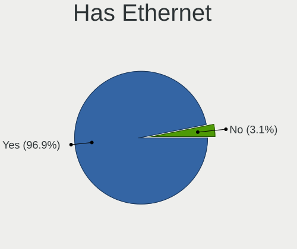

| Presented | Desktops | Percent |
|-----------|----------|---------|
| Yes       | 100      | 98.04%  |
| No        | 2        | 1.96%   |

Has WiFi
--------

Has WiFi module

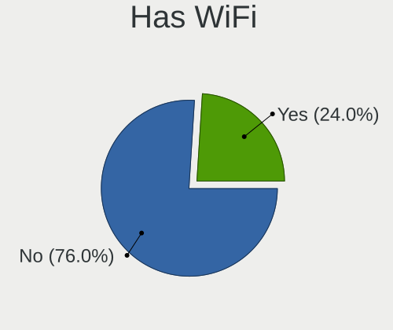

| Presented | Desktops | Percent |
|-----------|----------|---------|
| No        | 65       | 62.5%   |
| Yes       | 39       | 37.5%   |

Has Bluetooth
-------------

Has Bluetooth module

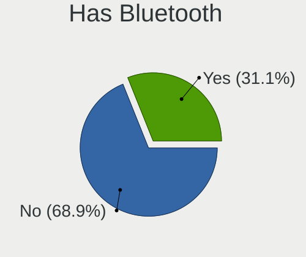

| Presented | Desktops | Percent |
|-----------|----------|---------|
| No        | 71       | 68.93%  |
| Yes       | 32       | 31.07%  |

Location
--------

Country
-------

Geographic location (country)

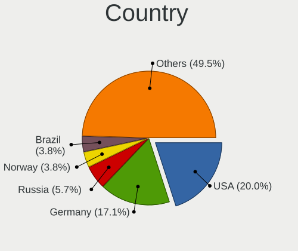

| Country      | Desktops | Percent |
|--------------|----------|---------|
| USA          | 21       | 20%     |
| Germany      | 18       | 17.14%  |
| Russia       | 6        | 5.71%   |
| Norway       | 4        | 3.81%   |
| Brazil       | 4        | 3.81%   |
| UK           | 3        | 2.86%   |
| Spain        | 3        | 2.86%   |
| Netherlands  | 3        | 2.86%   |
| France       | 3        | 2.86%   |
| Finland      | 3        | 2.86%   |
| Argentina    | 3        | 2.86%   |
| Ukraine      | 2        | 1.9%    |
| Switzerland  | 2        | 1.9%    |
| Sweden       | 2        | 1.9%    |
| Romania      | 2        | 1.9%    |
| Poland       | 2        | 1.9%    |
| Mexico       | 2        | 1.9%    |
| Austria      | 2        | 1.9%    |
| Vietnam      | 1        | 0.95%   |
| Uruguay      | 1        | 0.95%   |
| South Korea  | 1        | 0.95%   |
| South Africa | 1        | 0.95%   |
| Slovakia     | 1        | 0.95%   |
| Réunion     | 1        | 0.95%   |
| Portugal     | 1        | 0.95%   |
| Paraguay     | 1        | 0.95%   |
| Pakistan     | 1        | 0.95%   |
| Ireland      | 1        | 0.95%   |
| Indonesia    | 1        | 0.95%   |
| India        | 1        | 0.95%   |
| Hong Kong    | 1        | 0.95%   |
| Guatemala    | 1        | 0.95%   |
| Greece       | 1        | 0.95%   |
| Czechia      | 1        | 0.95%   |
| China        | 1        | 0.95%   |
| Belarus      | 1        | 0.95%   |
| Australia    | 1        | 0.95%   |
| Algeria      | 1        | 0.95%   |

City
----

Geographic location (city)

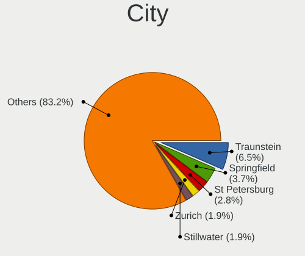

| City                     | Desktops | Percent |
|--------------------------|----------|---------|
| Traunstein               | 7        | 6.54%   |
| Springfield              | 4        | 3.74%   |
| St Petersburg            | 3        | 2.8%    |
| Zurich                   | 2        | 1.87%   |
| Stillwater               | 2        | 1.87%   |
| Nussdorf am Inn          | 2        | 1.87%   |
| Manitowoc                | 2        | 1.87%   |
| Helsinki                 | 2        | 1.87%   |
| Harrisonburg             | 2        | 1.87%   |
| Frankfurt am Main        | 2        | 1.87%   |
| Buenos Aires             | 2        | 1.87%   |
| As                       | 2        | 1.87%   |
| Wonju                    | 1        | 0.93%   |
| Vienna                   | 1        | 0.93%   |
| Vcelna                   | 1        | 0.93%   |
| Ulyanovsk                | 1        | 0.93%   |
| Tuusula                  | 1        | 0.93%   |
| Tucson                   | 1        | 0.93%   |
| Tinh Binh Duong          | 1        | 0.93%   |
| Teisendorf               | 1        | 0.93%   |
| Stuttgart                | 1        | 0.93%   |
| Stockholm                | 1        | 0.93%   |
| Steinkjer                | 1        | 0.93%   |
| Somerset                 | 1        | 0.93%   |
| Ski                      | 1        | 0.93%   |
| Seattle                  | 1        | 0.93%   |
| Salzburg                 | 1        | 0.93%   |
| Salamanca                | 1        | 0.93%   |
| Saint-Julien-en-Genevois | 1        | 0.93%   |
| Reeuwijk                 | 1        | 0.93%   |
| Redwood City             | 1        | 0.93%   |
| Penza                    | 1        | 0.93%   |
| Oberhausen               | 1        | 0.93%   |
| Noblesville              | 1        | 0.93%   |
| Morelia                  | 1        | 0.93%   |
| Montpellier              | 1        | 0.93%   |
| Montevideo               | 1        | 0.93%   |
| Minsk                    | 1        | 0.93%   |
| Milanówek               | 1        | 0.93%   |
| Madrid                   | 1        | 0.93%   |

Drives
------

Drive Vendor
------------

Hard drive vendors

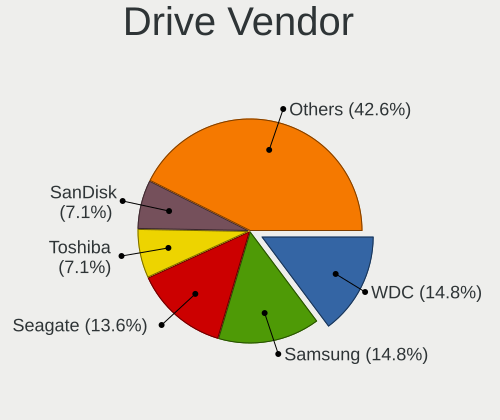

| Vendor                    | Desktops | Drives | Percent |
|---------------------------|----------|--------|---------|
| WDC                       | 25       | 34     | 14.79%  |
| Samsung Electronics       | 25       | 42     | 14.79%  |
| Seagate                   | 23       | 39     | 13.61%  |
| Toshiba                   | 12       | 12     | 7.1%    |
| SanDisk                   | 12       | 16     | 7.1%    |
| Kingston                  | 8        | 9      | 4.73%   |
| Crucial                   | 6        | 9      | 3.55%   |
| A-DATA Technology         | 5        | 8      | 2.96%   |
| Intel                     | 4        | 6      | 2.37%   |
| Hitachi                   | 4        | 4      | 2.37%   |
| HGST                      | 4        | 5      | 2.37%   |
| Unknown                   | 3        | 3      | 1.78%   |
| SK hynix                  | 3        | 3      | 1.78%   |
| Realtek Semiconductor     | 2        | 2      | 1.18%   |
| Micron Technology         | 2        | 2      | 1.18%   |
| Intenso                   | 2        | 2      | 1.18%   |
| ASMT                      | 2        | 2      | 1.18%   |
| Apacer                    | 2        | 2      | 1.18%   |
| Unknown                   | 2        | 2      | 1.18%   |
| Verbatim                  | 1        | 2      | 0.59%   |
| Transcend                 | 1        | 1      | 0.59%   |
| SPCC                      | 1        | 1      | 0.59%   |
| Silicon Motion            | 1        | 2      | 0.59%   |
| SABRENT                   | 1        | 1      | 0.59%   |
| Plextor                   | 1        | 1      | 0.59%   |
| Pioneer                   | 1        | 1      | 0.59%   |
| Phison Electronics        | 1        | 1      | 0.59%   |
| Patriot                   | 1        | 1      | 0.59%   |
| MSI                       | 1        | 1      | 0.59%   |
| Micron/Crucial Technology | 1        | 1      | 0.59%   |
| Maxtor                    | 1        | 1      | 0.59%   |
| LITEON                    | 1        | 1      | 0.59%   |
| Lexar                     | 1        | 1      | 0.59%   |
| KIOXIA                    | 1        | 1      | 0.59%   |
| Kingmax                   | 1        | 1      | 0.59%   |
| IB-377U3                  | 1        | 1      | 0.59%   |
| HS-SSD-E100               | 1        | 1      | 0.59%   |
| EDILOCA                   | 1        | 1      | 0.59%   |
| Corsair                   | 1        | 1      | 0.59%   |
| China                     | 1        | 1      | 0.59%   |

Drive Model
-----------

Hard drive models

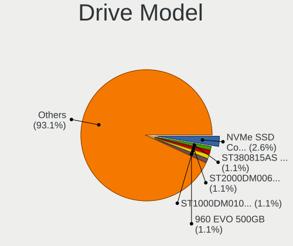

| Model                                             | Desktops | Percent |
|---------------------------------------------------|----------|---------|
| Samsung NVMe SSD Controller SM981/PM981/PM983 1TB | 5        | 2.65%   |
| Seagate ST380815AS 80GB                           | 2        | 1.06%   |
| Seagate ST2000DM006-2DM1 2TB                      | 2        | 1.06%   |
| Seagate ST1000DM010-2EP102 1TB                    | 2        | 1.06%   |
| Samsung SSD 960 EVO 500GB                         | 2        | 1.06%   |
| Samsung SSD 870 QVO 1TB                           | 2        | 1.06%   |
| Samsung SSD 870 EVO 1TB                           | 2        | 1.06%   |
| Unknown                                           | 2        | 1.06%   |
| WDC WDS500G2X0C-00L350 500GB                      | 1        | 0.53%   |
| WDC WDS500G2B0A-00SM50 500GB                      | 1        | 0.53%   |
| WDC WDS250G2B0B-00YS70 250GB SSD                  | 1        | 0.53%   |
| WDC WDS250G2B0B 250GB SSD                         | 1        | 0.53%   |
| WDC WDS250G2B0A 250GB SSD                         | 1        | 0.53%   |
| WDC WDS120G1G0A 120GB SSD                         | 1        | 0.53%   |
| WDC WD80EFZZ-68B 8TB                              | 1        | 0.53%   |
| WDC WD800JD-75MSA3 80GB                           | 1        | 0.53%   |
| WDC WD800BEVS-22 80GB                             | 1        | 0.53%   |
| WDC WD800AAJS-00 80GB                             | 1        | 0.53%   |
| WDC WD7500BPKT-80PK4T0 752GB                      | 1        | 0.53%   |
| WDC WD5000AZRX-00A8LB0 500GB                      | 1        | 0.53%   |
| WDC WD5000AZRX-00A3KB0 500GB                      | 1        | 0.53%   |
| WDC WD5000AAKX-7 500GB                            | 1        | 0.53%   |
| WDC WD5000AAKX-00ERMA0 500GB                      | 1        | 0.53%   |
| WDC WD40PURZ-85TTDY0 4TB                          | 1        | 0.53%   |
| WDC WD40EFZX-68AWUN0 4TB                          | 1        | 0.53%   |
| WDC WD3200AAKX-0 320GB                            | 1        | 0.53%   |
| WDC WD20EZRZ-00Z 2TB                              | 1        | 0.53%   |
| WDC WD20EFAX-68F 2TB                              | 1        | 0.53%   |
| WDC WD1600JS-60NCB1 160GB                         | 1        | 0.53%   |
| WDC WD1600BEVT-2 160GB                            | 1        | 0.53%   |
| WDC WD140EDGZ-11B2DA2 14TB                        | 1        | 0.53%   |
| WDC WD120EFBX-68B0EN0 12TB                        | 1        | 0.53%   |
| WDC WD10JPVX-75JC3T0 1TB                          | 1        | 0.53%   |
| WDC WD10EZEX-75WN4A1 1TB                          | 1        | 0.53%   |
| WDC WD10EZEX-60M                                  | 1        | 0.53%   |
| WDC WD10EZEX-21M2NA0 1TB                          | 1        | 0.53%   |
| WDC WD10EZEX-08WN4A0 1TB                          | 1        | 0.53%   |
| WDC WD Blue SA510 2. 500GB SSD                    | 1        | 0.53%   |
| Verbatim Vi550 S3 1024GB                          | 1        | 0.53%   |
| Unknown SD/MMC/MS PRO 2GB                         | 1        | 0.53%   |

HDD Vendor
----------

Hard disk drive vendors

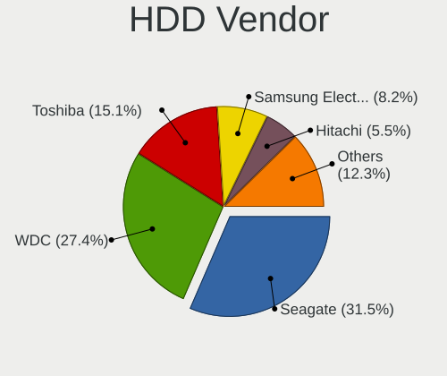

| Vendor              | Desktops | Drives | Percent |
|---------------------|----------|--------|---------|
| Seagate             | 23       | 39     | 31.51%  |
| WDC                 | 20       | 26     | 27.4%   |
| Toshiba             | 11       | 11     | 15.07%  |
| Samsung Electronics | 6        | 9      | 8.22%   |
| Hitachi             | 4        | 4      | 5.48%   |
| HGST                | 4        | 5      | 5.48%   |
| Unknown             | 1        | 1      | 1.37%   |
| Maxtor              | 1        | 1      | 1.37%   |
| IB-377U3            | 1        | 1      | 1.37%   |
| EDILOCA             | 1        | 1      | 1.37%   |
| ASMT                | 1        | 1      | 1.37%   |

SSD Vendor
----------

Solid state drive vendors

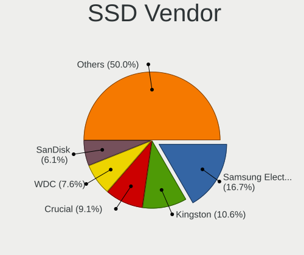

| Vendor              | Desktops | Drives | Percent |
|---------------------|----------|--------|---------|
| Samsung Electronics | 11       | 14     | 16.67%  |
| Kingston            | 7        | 7      | 10.61%  |
| Crucial             | 6        | 9      | 9.09%   |
| WDC                 | 5        | 7      | 7.58%   |
| SanDisk             | 4        | 5      | 6.06%   |
| A-DATA Technology   | 4        | 6      | 6.06%   |
| Intel               | 3        | 4      | 4.55%   |
| SK hynix            | 2        | 2      | 3.03%   |
| Intenso             | 2        | 2      | 3.03%   |
| Apacer              | 2        | 2      | 3.03%   |
| Unknown             | 2        | 2      | 3.03%   |
| Verbatim            | 1        | 2      | 1.52%   |
| Transcend           | 1        | 1      | 1.52%   |
| Toshiba             | 1        | 1      | 1.52%   |
| SPCC                | 1        | 1      | 1.52%   |
| SABRENT             | 1        | 1      | 1.52%   |
| Plextor             | 1        | 1      | 1.52%   |
| Pioneer             | 1        | 1      | 1.52%   |
| Patriot             | 1        | 1      | 1.52%   |
| MSI                 | 1        | 1      | 1.52%   |
| Micron Technology   | 1        | 1      | 1.52%   |
| LITEON              | 1        | 1      | 1.52%   |
| Lexar               | 1        | 1      | 1.52%   |
| Kingmax             | 1        | 1      | 1.52%   |
| HS-SSD-E100         | 1        | 1      | 1.52%   |
| Corsair             | 1        | 1      | 1.52%   |
| China               | 1        | 1      | 1.52%   |
| ASMT                | 1        | 1      | 1.52%   |
| AMD                 | 1        | 1      | 1.52%   |

Drive Kind
----------

HDD or SSD

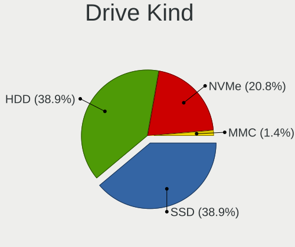

| Kind | Desktops | Drives | Percent |
|------|----------|--------|---------|
| SSD  | 56       | 79     | 38.89%  |
| HDD  | 56       | 99     | 38.89%  |
| NVMe | 30       | 49     | 20.83%  |
| MMC  | 2        | 2      | 1.39%   |

Drive Connector
---------------

SATA, SAS, NVMe, etc.

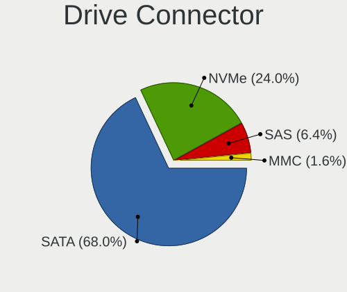

| Type | Desktops | Drives | Percent |
|------|----------|--------|---------|
| SATA | 85       | 167    | 68%     |
| NVMe | 30       | 49     | 24%     |
| SAS  | 8        | 11     | 6.4%    |
| MMC  | 2        | 2      | 1.6%    |

Drive Size
----------

Size of hard drive

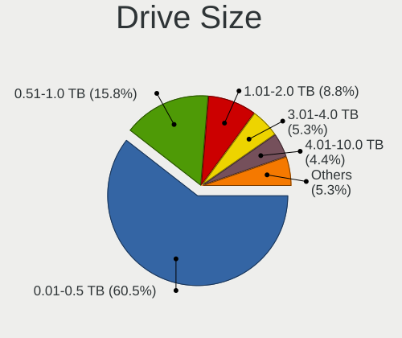

| Size in TB | Desktops | Drives | Percent |
|------------|----------|--------|---------|
| 0.01-0.5   | 69       | 102    | 60.53%  |
| 0.51-1.0   | 18       | 27     | 15.79%  |
| 1.01-2.0   | 10       | 16     | 8.77%   |
| 3.01-4.0   | 6        | 11     | 5.26%   |
| 4.01-10.0  | 5        | 5      | 4.39%   |
| 2.01-3.0   | 3        | 7      | 2.63%   |
| 10.01-20.0 | 3        | 10     | 2.63%   |

Space Total
-----------

Amount of disk space available on the file system

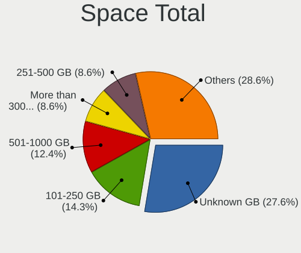

| Size in GB     | Desktops | Percent |
|----------------|----------|---------|
| Unknown        | 29       | 27.62%  |
| 101-250        | 15       | 14.29%  |
| 501-1000       | 13       | 12.38%  |
| More than 3000 | 9        | 8.57%   |
| 251-500        | 9        | 8.57%   |
| 51-100         | 8        | 7.62%   |
| 1001-2000      | 7        | 6.67%   |
| 1-20           | 7        | 6.67%   |
| 21-50          | 4        | 3.81%   |
| 2001-3000      | 4        | 3.81%   |

Space Used
----------

Amount of used disk space

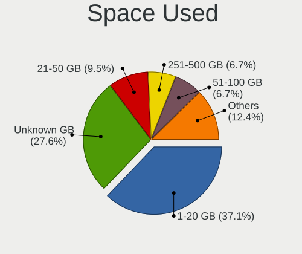

| Used GB        | Desktops | Percent |
|----------------|----------|---------|
| 1-20           | 39       | 37.14%  |
| Unknown        | 29       | 27.62%  |
| 21-50          | 10       | 9.52%   |
| 251-500        | 7        | 6.67%   |
| 51-100         | 7        | 6.67%   |
| More than 3000 | 5        | 4.76%   |
| 1001-2000      | 3        | 2.86%   |
| 101-250        | 2        | 1.9%    |
| 501-1000       | 2        | 1.9%    |
| 2001-3000      | 1        | 0.95%   |

Malfunc. Drives
---------------

Drive models with a malfunction

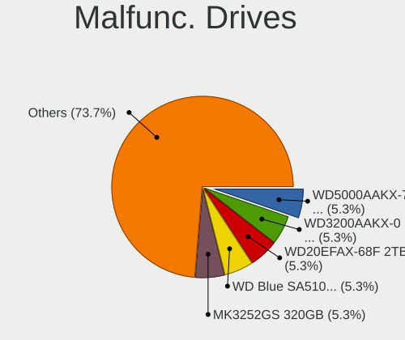

| Model                              | Desktops | Drives | Percent |
|------------------------------------|----------|--------|---------|
| WDC WD5000AAKX-7 500GB             | 1        | 1      | 5.26%   |
| WDC WD3200AAKX-0 320GB             | 1        | 1      | 5.26%   |
| WDC WD20EFAX-68F 2TB               | 1        | 2      | 5.26%   |
| WDC WD Blue SA510 2. 500GB SSD     | 1        | 1      | 5.26%   |
| Toshiba MK3252GS 320GB             | 1        | 1      | 5.26%   |
| Seagate ST8000DM004-2CX1 8TB       | 1        | 1      | 5.26%   |
| Seagate ST500LM021-1KJ152 500GB    | 1        | 1      | 5.26%   |
| Seagate ST3250318AS 250GB          | 1        | 1      | 5.26%   |
| SanDisk SDSA6MM 16GB SSD           | 1        | 1      | 5.26%   |
| Samsung Electronics SSD PM81 128GB | 1        | 1      | 5.26%   |
| Samsung Electronics SP0411N 40GB   | 1        | 2      | 5.26%   |
| Samsung Electronics HM160HI 160GB  | 1        | 1      | 5.26%   |
| Samsung Electronics HD252HJ 250GB  | 1        | 1      | 5.26%   |
| Maxtor 2B020H1 20GB                | 1        | 1      | 5.26%   |
| Kingmax SSD 120G                   | 1        | 1      | 5.26%   |
| Hitachi HTS722080K9A300 80GB       | 1        | 1      | 5.26%   |
| HGST HTS725050A7 500GB             | 1        | 1      | 5.26%   |
| AMD R3SL120G 120GB SSD             | 1        | 1      | 5.26%   |
| A-DATA Technology SU800 128GB SSD  | 1        | 3      | 5.26%   |

Malfunc. Drive Vendor
---------------------

Vendors of faulty drives

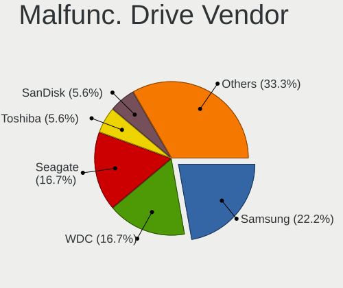

| Vendor              | Desktops | Drives | Percent |
|---------------------|----------|--------|---------|
| Samsung Electronics | 4        | 5      | 22.22%  |
| WDC                 | 3        | 5      | 16.67%  |
| Seagate             | 3        | 3      | 16.67%  |
| Toshiba             | 1        | 1      | 5.56%   |
| SanDisk             | 1        | 1      | 5.56%   |
| Maxtor              | 1        | 1      | 5.56%   |
| Kingmax             | 1        | 1      | 5.56%   |
| Hitachi             | 1        | 1      | 5.56%   |
| HGST                | 1        | 1      | 5.56%   |
| AMD                 | 1        | 1      | 5.56%   |
| A-DATA Technology   | 1        | 3      | 5.56%   |

Malfunc. HDD Vendor
-------------------

Vendors of faulty HDD drives

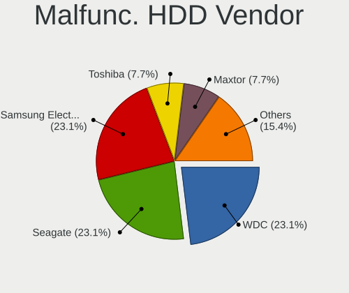

| Vendor              | Desktops | Drives | Percent |
|---------------------|----------|--------|---------|
| WDC                 | 3        | 4      | 23.08%  |
| Seagate             | 3        | 3      | 23.08%  |
| Samsung Electronics | 3        | 4      | 23.08%  |
| Toshiba             | 1        | 1      | 7.69%   |
| Maxtor              | 1        | 1      | 7.69%   |
| Hitachi             | 1        | 1      | 7.69%   |
| HGST                | 1        | 1      | 7.69%   |

Malfunc. Drive Kind
-------------------

Kinds of faulty drives

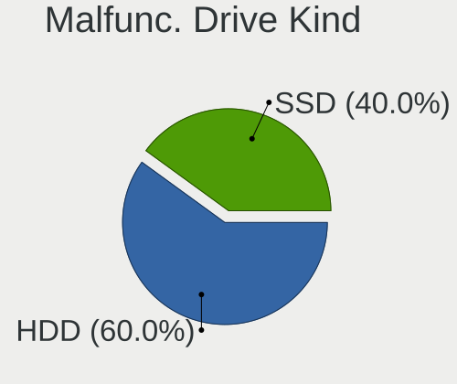

| Kind | Desktops | Drives | Percent |
|------|----------|--------|---------|
| HDD  | 12       | 15     | 66.67%  |
| SSD  | 6        | 8      | 33.33%  |

Failed Drives
-------------

Failed drive models

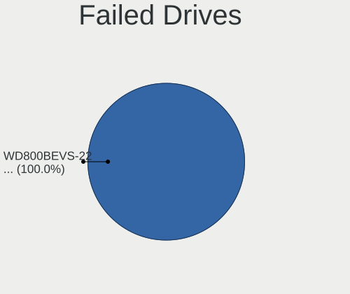

| Model                 | Desktops | Drives | Percent |
|-----------------------|----------|--------|---------|
| WDC WD800BEVS-22 80GB | 1        | 1      | 100%    |

Failed Drive Vendor
-------------------

Failed drive vendors

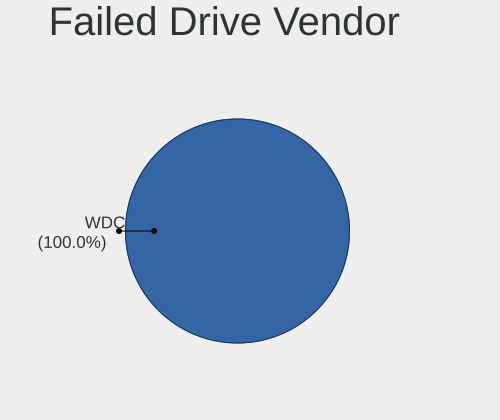

| Vendor | Desktops | Drives | Percent |
|--------|----------|--------|---------|
| WDC    | 1        | 1      | 100%    |

Drive Status
------------

Number of failed and malfunc. drives

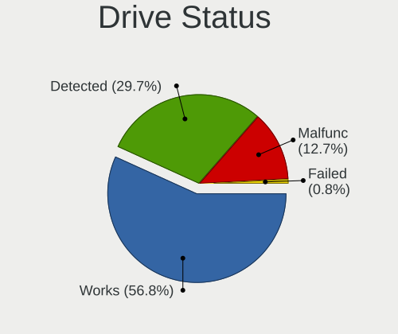

| Status   | Desktops | Drives | Percent |
|----------|----------|--------|---------|
| Works    | 67       | 130    | 56.78%  |
| Detected | 35       | 75     | 29.66%  |
| Malfunc  | 15       | 23     | 12.71%  |
| Failed   | 1        | 1      | 0.85%   |

Storage controller
------------------

Storage Vendor
--------------

Storage controller vendors

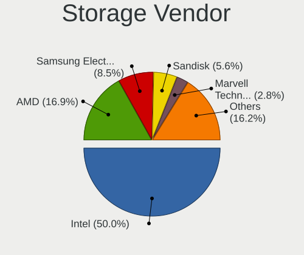

| Vendor                      | Desktops | Percent |
|-----------------------------|----------|---------|
| Intel                       | 71       | 50%     |
| AMD                         | 24       | 16.9%   |
| Samsung Electronics         | 12       | 8.45%   |
| Sandisk                     | 8        | 5.63%   |
| Marvell Technology Group    | 4        | 2.82%   |
| ASMedia Technology          | 4        | 2.82%   |
| VIA Technologies            | 2        | 1.41%   |
| Realtek Semiconductor       | 2        | 1.41%   |
| LSI Logic / Symbios Logic   | 2        | 1.41%   |
| Adaptec                     | 2        | 1.41%   |
| SK hynix                    | 1        | 0.7%    |
| Silicon Motion              | 1        | 0.7%    |
| Promise Technology          | 1        | 0.7%    |
| Phison Electronics          | 1        | 0.7%    |
| Nvidia                      | 1        | 0.7%    |
| Micron/Crucial Technology   | 1        | 0.7%    |
| Micron Technology           | 1        | 0.7%    |
| Loongson Technology         | 1        | 0.7%    |
| KIOXIA                      | 1        | 0.7%    |
| Kingston Technology Company | 1        | 0.7%    |
| ADATA Technology            | 1        | 0.7%    |

Storage Model
-------------

Storage controller models

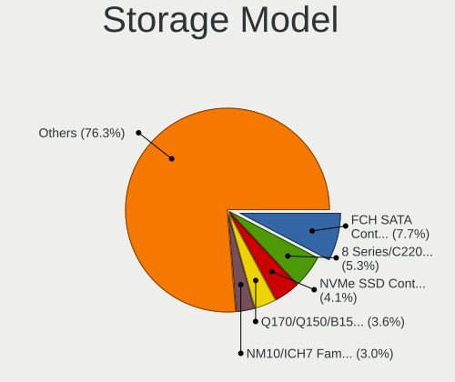

| Model                                                                          | Desktops | Percent |
|--------------------------------------------------------------------------------|----------|---------|
| AMD FCH SATA Controller [AHCI mode]                                            | 13       | 7.69%   |
| Intel 8 Series/C220 Series Chipset Family 6-port SATA Controller 1 [AHCI mode] | 9        | 5.33%   |
| Samsung NVMe SSD Controller SM981/PM981/PM983                                  | 7        | 4.14%   |
| Intel Q170/Q150/B150/H170/H110/Z170/CM236 Chipset SATA Controller [AHCI Mode]  | 6        | 3.55%   |
| Intel NM10/ICH7 Family SATA Controller [IDE mode]                              | 5        | 2.96%   |
| Intel Cannon Lake PCH SATA AHCI Controller                                     | 5        | 2.96%   |
| Intel 6 Series/C200 Series Chipset Family 6 port Desktop SATA AHCI Controller  | 5        | 2.96%   |
| Intel Atom Processor E3800 Series SATA AHCI Controller                         | 4        | 2.37%   |
| Intel 9 Series Chipset Family SATA Controller [AHCI Mode]                      | 4        | 2.37%   |
| Intel 7 Series/C210 Series Chipset Family 6-port SATA Controller [AHCI mode]   | 4        | 2.37%   |
| ASMedia ASM1061/ASM1062 Serial ATA Controller                                  | 4        | 2.37%   |
| AMD SB7x0/SB8x0/SB9x0 SATA Controller [AHCI mode]                              | 4        | 2.37%   |
| Intel Celeron N3350/Pentium N4200/Atom E3900 Series SATA AHCI Controller       | 3        | 1.78%   |
| Intel Alder Lake-S PCH SATA Controller [AHCI Mode]                             | 3        | 1.78%   |
| Intel 6 Series/C200 Series Chipset Family IDE-r Controller                     | 3        | 1.78%   |
| AMD 500 Series Chipset SATA Controller                                         | 3        | 1.78%   |
| VIA VT82C586A/B/VT82C686/A/B/VT823x/A/C PIPC Bus Master IDE                    | 2        | 1.18%   |
| SanDisk WD SN560/SN740/SN770/SN5000 NVMe SSD                                   | 2        | 1.18%   |
| Sandisk WD Black SN850X NVMe SSD                                               | 2        | 1.18%   |
| Samsung NVMe SSD Controller SM961/PM961/SM963                                  | 2        | 1.18%   |
| Samsung NVMe SSD Controller PM9A1/PM9A3/980PRO                                 | 2        | 1.18%   |
| Samsung NVMe SSD Controller 980 (DRAM-less)                                    | 2        | 1.18%   |
| Marvell Group 88SE9235 PCIe 2.0 x2 4-port SATA 6 Gb/s Controller               | 2        | 1.18%   |
| Marvell Group 88SE9215 PCIe 2.0 x1 4-port SATA 6 Gb/s Controller               | 2        | 1.18%   |
| LSI Logic / Symbios Logic SAS2008 PCI-Express Fusion-MPT SAS-2 [Falcon]        | 2        | 1.18%   |
| Intel Volume Management Device NVMe RAID Controller                            | 2        | 1.18%   |
| Intel NM10/ICH7 Family SATA Controller [AHCI mode]                             | 2        | 1.18%   |
| Intel Comet Lake SATA AHCI Controller                                          | 2        | 1.18%   |
| Intel 82801G (ICH7 Family) IDE Controller                                      | 2        | 1.18%   |
| Intel 200 Series PCH SATA controller [AHCI mode]                               | 2        | 1.18%   |
| AMD SB7x0/SB8x0/SB9x0 SATA Controller [IDE mode]                               | 2        | 1.18%   |
| AMD SB7x0/SB8x0/SB9x0 IDE Controller                                           | 2        | 1.18%   |
| AMD SB600 IDE                                                                  | 2        | 1.18%   |
| AMD 400 Series Chipset SATA Controller                                         | 2        | 1.18%   |
| Adaptec Series 6 - 6G SAS/PCIe 2                                               | 2        | 1.18%   |
| SK hynix BC501 NVMe Solid State Drive                                          | 1        | 0.59%   |
| Silicon Motion SM2269XT (DRAM-less) NVMe SSD Controller                        | 1        | 0.59%   |
| SanDisk WD PC SN810 / Black SN850 NVMe SSD                                     | 1        | 0.59%   |
| SanDisk WD Green SN350 240GB (DRAM-less) / SN560E NVMe SSD                     | 1        | 0.59%   |
| SanDisk WD Black NVMe SSD                                                      | 1        | 0.59%   |

Storage Kind
------------

Kind of storage controller (IDE, SATA, NVMe, SAS, ...)

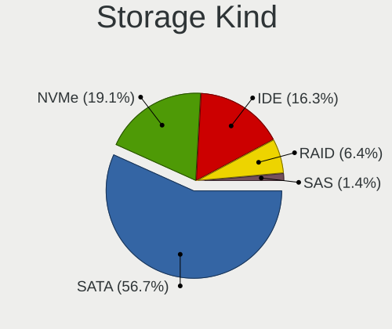

| Kind | Desktops | Percent |
|------|----------|---------|
| SATA | 80       | 56.74%  |
| NVMe | 27       | 19.15%  |
| IDE  | 23       | 16.31%  |
| RAID | 9        | 6.38%   |
| SAS  | 2        | 1.42%   |

Processor
---------

CPU Vendor
----------

Processor vendors

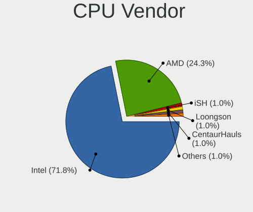

| Vendor       | Desktops | Percent |
|--------------|----------|---------|
| Intel        | 74       | 71.84%  |
| AMD          | 25       | 24.27%  |
| Loongson     | 1        | 0.97%   |
| iSH          | 1        | 0.97%   |
| CentaurHauls | 1        | 0.97%   |
| Unknown      | 1        | 0.97%   |

CPU Model
---------

Processor models

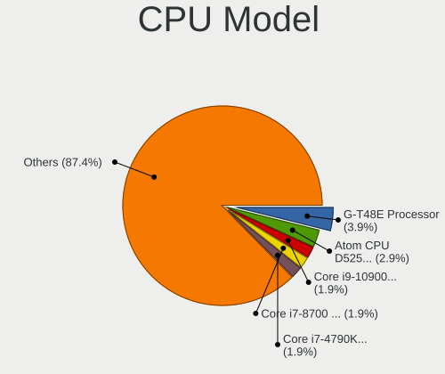

| Model                                       | Desktops | Percent |
|---------------------------------------------|----------|---------|
| AMD G-T48E Processor                        | 4        | 3.88%   |
| Intel Atom CPU D525 @ 1.80GHz               | 3        | 2.91%   |
| Intel Core i9-10900 CPU @ 2.80GHz           | 2        | 1.94%   |
| Intel Core i7-8700 CPU @ 3.20GHz            | 2        | 1.94%   |
| Intel Core i7-4790K CPU @ 4.00GHz           | 2        | 1.94%   |
| Intel Core i5-4570 CPU @ 3.20GHz            | 2        | 1.94%   |
| Intel Core i5-3470T CPU @ 2.90GHz           | 2        | 1.94%   |
| Intel Core i5-2400 CPU @ 3.10GHz            | 2        | 1.94%   |
| Intel Core i3-4150 CPU @ 3.50GHz            | 2        | 1.94%   |
| Intel Celeron CPU J1900 @ 1.99GHz           | 2        | 1.94%   |
| AMD Ryzen 9 5900X 12-Core Processor         | 2        | 1.94%   |
| AMD Ryzen 7 5700X 8-Core Processor          | 2        | 1.94%   |
| AMD GX-415GA SOC with Radeon HD Graphics    | 2        | 1.94%   |
| Loongson Loongson 3A                        | 1        | 0.97%   |
| iSH Processor                               | 1        | 0.97%   |
| Intel Xeon CPU X3430 @ 2.40GHz              | 1        | 0.97%   |
| Intel Xeon CPU E5-2680 v4 @ 2.40GHz         | 1        | 0.97%   |
| Intel Xeon CPU E5-2620 v4 @ 2.10GHz         | 1        | 0.97%   |
| Intel Pentium III (Coppermine)              | 1        | 0.97%   |
| Intel Pentium Gold G6405 CPU @ 4.10GHz      | 1        | 0.97%   |
| Intel Pentium Dual-Core CPU E5500 @ 2.80GHz | 1        | 0.97%   |
| Intel Pentium Dual CPU E2160 @ 1.80GHz      | 1        | 0.97%   |
| Intel Pentium CPU G4500 @ 3.50GHz           | 1        | 0.97%   |
| Intel Pentium CPU G3460 @ 3.50GHz           | 1        | 0.97%   |
| Intel Pentium CPU E5700 @ 3.00GHz           | 1        | 0.97%   |
| Intel Pentium 4 CPU 3.00GHz                 | 1        | 0.97%   |
| Intel N100                                  | 1        | 0.97%   |
| Intel Genuine CPU 2140 @ 1.60GHz            | 1        | 0.97%   |
| Intel Core i7-8700T CPU @ 2.40GHz           | 1        | 0.97%   |
| Intel Core i7-7700 CPU @ 3.60GHz            | 1        | 0.97%   |
| Intel Core i7-6700K CPU @ 4.00GHz           | 1        | 0.97%   |
| Intel Core i7-6700 CPU @ 3.40GHz            | 1        | 0.97%   |
| Intel Core i7-4790 CPU @ 3.60GHz            | 1        | 0.97%   |
| Intel Core i7-4770 CPU @ 3.40GHz            | 1        | 0.97%   |
| Intel Core i7-3770 CPU @ 3.40GHz            | 1        | 0.97%   |
| Intel Core i5-9400F CPU @ 2.90GHz           | 1        | 0.97%   |
| Intel Core i5-8400 CPU @ 2.80GHz            | 1        | 0.97%   |
| Intel Core i5-6600K CPU @ 3.50GHz           | 1        | 0.97%   |
| Intel Core i5-6500T CPU @ 2.50GHz           | 1        | 0.97%   |
| Intel Core i5-6400 CPU @ 2.70GHz            | 1        | 0.97%   |

CPU Model Family
----------------

Processor model prefix

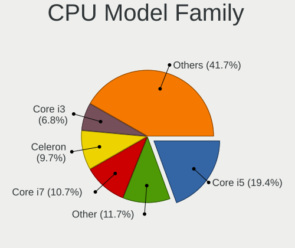

| Model                   | Desktops | Percent |
|-------------------------|----------|---------|
| Intel Core i5           | 20       | 19.42%  |
| Other                   | 12       | 11.65%  |
| Intel Core i7           | 11       | 10.68%  |
| Intel Celeron           | 10       | 9.71%   |
| Intel Core i3           | 7        | 6.8%    |
| AMD Ryzen 7             | 5        | 4.85%   |
| Intel Atom              | 4        | 3.88%   |
| AMD G                   | 4        | 3.88%   |
| Intel Xeon              | 3        | 2.91%   |
| Intel Pentium           | 3        | 2.91%   |
| AMD Ryzen 9             | 3        | 2.91%   |
| AMD GX                  | 3        | 2.91%   |
| Intel Core i9           | 2        | 1.94%   |
| AMD Ryzen 5             | 2        | 1.94%   |
| Intel Pentium III       | 1        | 0.97%   |
| Intel Pentium Gold      | 1        | 0.97%   |
| Intel Pentium Dual-Core | 1        | 0.97%   |
| Intel Pentium Dual      | 1        | 0.97%   |
| Intel Pentium 4         | 1        | 0.97%   |
| Intel Genuine           | 1        | 0.97%   |
| Intel Core 2 Quad       | 1        | 0.97%   |
| Intel Core 2            | 1        | 0.97%   |
| Intel Celeron M         | 1        | 0.97%   |
| AMD Sempron             | 1        | 0.97%   |
| AMD FX                  | 1        | 0.97%   |
| AMD E1                  | 1        | 0.97%   |
| AMD Athlon II X2        | 1        | 0.97%   |
| AMD A8                  | 1        | 0.97%   |

CPU Cores
---------

Number of processor cores

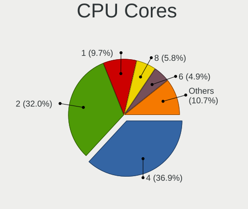

| Number  | Desktops | Percent |
|---------|----------|---------|
| 4       | 38       | 36.89%  |
| 2       | 33       | 32.04%  |
| 1       | 10       | 9.71%   |
| 8       | 6        | 5.83%   |
| 6       | 5        | 4.85%   |
| 12      | 4        | 3.88%   |
| 16      | 3        | 2.91%   |
| 10      | 2        | 1.94%   |
| 24      | 1        | 0.97%   |
| Unknown | 1        | 0.97%   |

CPU Sockets
-----------

Number of sockets

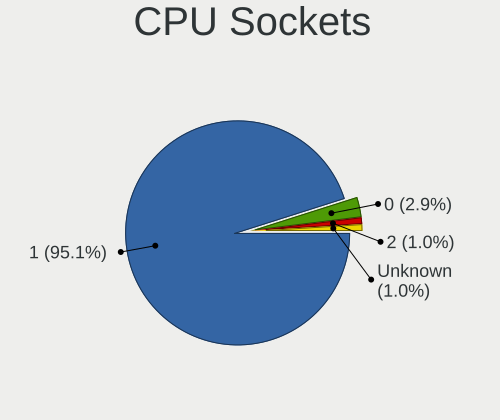

| Number  | Desktops | Percent |
|---------|----------|---------|
| 1       | 97       | 95.1%   |
| 0       | 3        | 2.94%   |
| 2       | 1        | 0.98%   |
| Unknown | 1        | 0.98%   |

CPU Threads
-----------

Threads per core (Hyper-Threading)

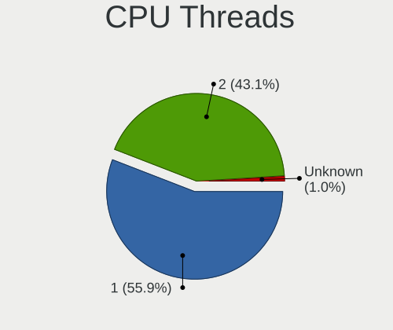

| Number  | Desktops | Percent |
|---------|----------|---------|
| 1       | 57       | 55.88%  |
| 2       | 44       | 43.14%  |
| Unknown | 1        | 0.98%   |

CPU Op-Modes
------------

CPU Operation Modes (32-bit, 64-bit)

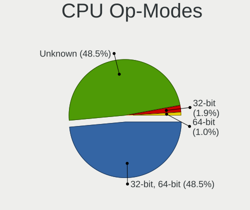

| Op mode        | Desktops | Percent |
|----------------|----------|---------|
| 32-bit, 64-bit | 50       | 48.54%  |
| Unknown        | 50       | 48.54%  |
| 32-bit         | 2        | 1.94%   |
| 64-bit         | 1        | 0.97%   |

CPU Microcode
-------------

Microcode number

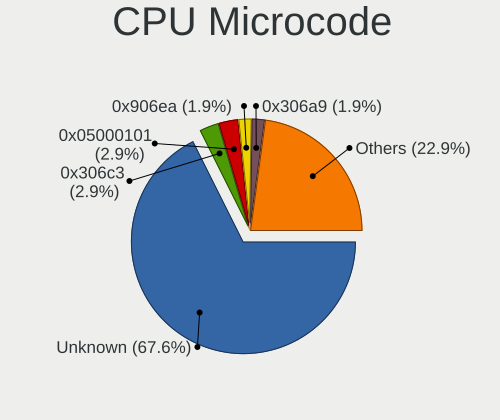

| Number     | Desktops | Percent |
|------------|----------|---------|
| Unknown    | 71       | 67.62%  |
| 0x306c3    | 3        | 2.86%   |
| 0x05000101 | 3        | 2.86%   |
| 0x906ea    | 2        | 1.9%    |
| 0x306a9    | 2        | 1.9%    |
| 0x0a20120e | 2        | 1.9%    |
| 0xb0671    | 1        | 0.95%   |
| 0xa0655    | 1        | 0.95%   |
| 0x90672    | 1        | 0.95%   |
| 0x6fd      | 1        | 0.95%   |
| 0x6f2      | 1        | 0.95%   |
| 0x6d8      | 1        | 0.95%   |
| 0x68a      | 1        | 0.95%   |
| 0x506e3    | 1        | 0.95%   |
| 0x506c9    | 1        | 0.95%   |
| 0x406c4    | 1        | 0.95%   |
| 0x30678    | 1        | 0.95%   |
| 0x20655    | 1        | 0.95%   |
| 0x106e5    | 1        | 0.95%   |
| 0x106ca    | 1        | 0.95%   |
| 0x1067a    | 1        | 0.95%   |
| 0x08701021 | 1        | 0.95%   |
| 0x08108102 | 1        | 0.95%   |
| 0x0800820d | 1        | 0.95%   |
| 0x07000106 | 1        | 0.95%   |
| 0x06000817 | 1        | 0.95%   |
| 0x010000c8 | 1        | 0.95%   |
| 0x010000b6 | 1        | 0.95%   |

CPU Microarch
-------------

Microarchitecture

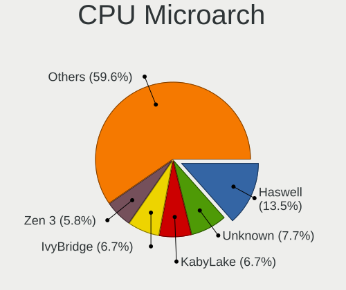

| Name             | Desktops | Percent |
|------------------|----------|---------|
| Haswell          | 14       | 13.46%  |
| Unknown          | 8        | 7.69%   |
| KabyLake         | 7        | 6.73%   |
| IvyBridge        | 7        | 6.73%   |
| Zen 3            | 6        | 5.77%   |
| Skylake          | 6        | 5.77%   |
| Silvermont       | 6        | 5.77%   |
| SandyBridge      | 4        | 3.85%   |
| Core             | 4        | 3.85%   |
| CometLake        | 4        | 3.85%   |
| Bobcat           | 4        | 3.85%   |
| Penryn           | 3        | 2.88%   |
| Jaguar           | 3        | 2.88%   |
| Bonnell          | 3        | 2.88%   |
| Alderlake Hybrid | 3        | 2.88%   |
| Zen+             | 2        | 1.92%   |
| Zen 2            | 2        | 1.92%   |
| Piledriver       | 2        | 1.92%   |
| P6               | 2        | 1.92%   |
| K10              | 2        | 1.92%   |
| Goldmont         | 2        | 1.92%   |
| Broadwell        | 2        | 1.92%   |
| Westmere         | 1        | 0.96%   |
| Puma             | 1        | 0.96%   |
| NetBurst         | 1        | 0.96%   |
| Nehalem          | 1        | 0.96%   |
| K8 Hammer        | 1        | 0.96%   |
| K6               | 1        | 0.96%   |
| IceLake          | 1        | 0.96%   |
| Gracemont        | 1        | 0.96%   |

Graphics
--------

GPU Vendor
----------

Vendors of graphics cards

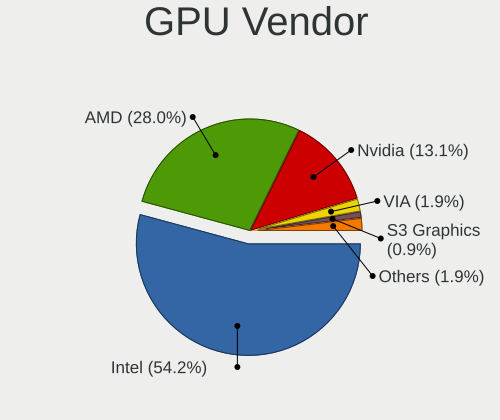

| Vendor                     | Desktops | Percent |
|----------------------------|----------|---------|
| Intel                      | 58       | 54.21%  |
| AMD                        | 30       | 28.04%  |
| Nvidia                     | 14       | 13.08%  |
| VIA Technologies           | 2        | 1.87%   |
| S3 Graphics                | 1        | 0.93%   |
| Matrox Electronics Systems | 1        | 0.93%   |
| ASPEED Technology          | 1        | 0.93%   |

GPU Model
---------

Graphics card models

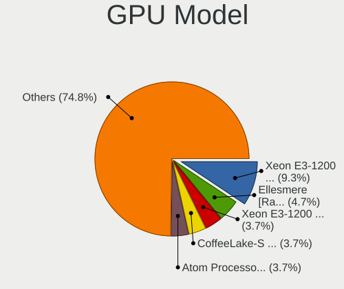

| Model                                                                                    | Desktops | Percent |
|------------------------------------------------------------------------------------------|----------|---------|
| Intel Xeon E3-1200 v3/4th Gen Core Processor Integrated Graphics Controller              | 10       | 9.35%   |
| AMD Ellesmere [Radeon RX 470/480/570/570X/580/580X/590]                                  | 5        | 4.67%   |
| Intel Xeon E3-1200 v2/3rd Gen Core processor Graphics Controller                         | 4        | 3.74%   |
| Intel CoffeeLake-S GT2 [UHD Graphics 630]                                                | 4        | 3.74%   |
| Intel Atom Processor Z36xxx/Z37xxx Series Graphics & Display                             | 4        | 3.74%   |
| Intel 2nd Generation Core Processor Family Integrated Graphics Controller                | 4        | 3.74%   |
| AMD Wrestler [Radeon HD 6250]                                                            | 4        | 3.74%   |
| Intel Skylake-S GT2 [HD Graphics 530]                                                    | 3        | 2.8%    |
| Nvidia GT218 [GeForce 210]                                                               | 2        | 1.87%   |
| Nvidia GT216 [GeForce GT 220]                                                            | 2        | 1.87%   |
| Nvidia GP107 [GeForce GTX 1050 Ti]                                                       | 2        | 1.87%   |
| Intel Kaby Lake-S GT2 [HD Graphics 630]                                                  | 2        | 1.87%   |
| Intel CometLake-S GT2 [UHD Graphics 630]                                                 | 2        | 1.87%   |
| Intel Atom/Celeron/Pentium Processor x5-E8000/J3xxx/N3xxx Integrated Graphics Controller | 2        | 1.87%   |
| Intel Atom Processor D4xx/D5xx/N4xx/N5xx Integrated Graphics Controller                  | 2        | 1.87%   |
| Intel Apollo Lake GT1 [HD Graphics 500]                                                  | 2        | 1.87%   |
| Intel Alder Lake-S GT1 [UHD Graphics 770]                                                | 2        | 1.87%   |
| Intel 4th Generation Core Processor Family Integrated Graphics Controller                | 2        | 1.87%   |
| Intel 4 Series Chipset Integrated Graphics Controller                                    | 2        | 1.87%   |
| AMD Navi 23 [Radeon RX 6600/6600 XT/6600M]                                               | 2        | 1.87%   |
| AMD Navi 10 [Radeon RX 5600 OEM/5600 XT / 5700/5700 XT]                                  | 2        | 1.87%   |
| AMD Kabini [Radeon HD 8330E]                                                             | 2        | 1.87%   |
| VIA Technologies VT8623 [Apollo CLE266] integrated CastleRock graphics                   | 1        | 0.93%   |
| VIA Technologies KM400/KN400/P4M800 [S3 UniChrome]                                       | 1        | 0.93%   |
| S3 Graphics Savage 4                                                                     | 1        | 0.93%   |
| Nvidia TU104 [GeForce RTX 2060]                                                          | 1        | 0.93%   |
| Nvidia GT218 [ION]                                                                       | 1        | 0.93%   |
| Nvidia GP107M [GeForce GTX 1050 3 GB Max-Q]                                              | 1        | 0.93%   |
| Nvidia GM204 [GeForce GTX 970]                                                           | 1        | 0.93%   |
| Nvidia GK107 [GeForce GT 630 OEM]                                                        | 1        | 0.93%   |
| Nvidia GA102 [GeForce RTX 3080]                                                          | 1        | 0.93%   |
| Nvidia G96C [GeForce GT 120]                                                             | 1        | 0.93%   |
| Nvidia C61 [GeForce 6150SE nForce 430]                                                   | 1        | 0.93%   |
| Matrox Electronics Systems MGA G200EH                                                    | 1        | 0.93%   |
| Intel Raptor Lake-S GT1 [UHD Graphics 770]                                               | 1        | 0.93%   |
| Intel JasperLake [UHD Graphics]                                                          | 1        | 0.93%   |
| Intel IvyBridge GT2 [HD Graphics 4000]                                                   | 1        | 0.93%   |
| Intel Iris Plus Graphics G7 (Ice Lake)                                                   | 1        | 0.93%   |
| Intel DG2 [Arc A770]                                                                     | 1        | 0.93%   |
| Intel DG2 [Arc A750]                                                                     | 1        | 0.93%   |

GPU Combo
---------

Combinations of graphics cards

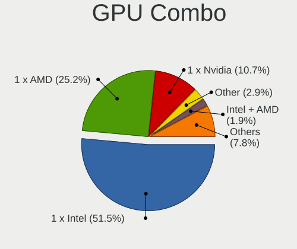

| Name            | Desktops | Percent |
|-----------------|----------|---------|
| 1 x Intel       | 53       | 51.46%  |
| 1 x AMD         | 26       | 25.24%  |
| 1 x Nvidia      | 11       | 10.68%  |
| Other           | 3        | 2.91%   |
| Intel + AMD     | 2        | 1.94%   |
| 2 x Intel       | 1        | 0.97%   |
| 1 x VIA         | 1        | 0.97%   |
| 1 x S3 Graphics | 1        | 0.97%   |
| 1 x Matrox      | 1        | 0.97%   |
| Intel + Nvidia  | 1        | 0.97%   |
| 1 x ASPEED      | 1        | 0.97%   |
| AMD + VIA       | 1        | 0.97%   |
| AMD + Nvidia    | 1        | 0.97%   |

GPU Driver
----------

Free vs proprietary

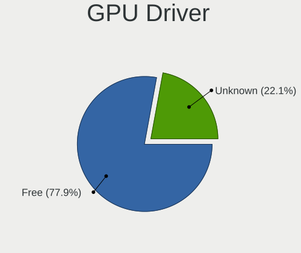

| Driver  | Desktops | Percent |
|---------|----------|---------|
| Free    | 81       | 77.88%  |
| Unknown | 23       | 22.12%  |

GPU Memory
----------

Total video memory

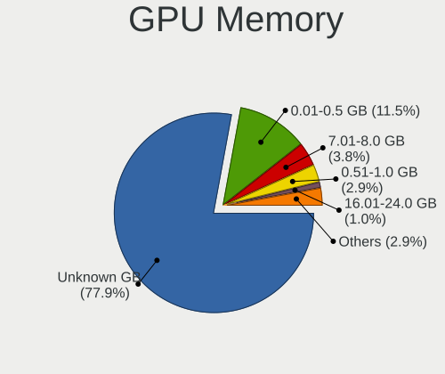

| Size in GB | Desktops | Percent |
|------------|----------|---------|
| Unknown    | 81       | 77.88%  |
| 0.01-0.5   | 12       | 11.54%  |
| 7.01-8.0   | 4        | 3.85%   |
| 0.51-1.0   | 3        | 2.88%   |
| 3.01-4.0   | 1        | 0.96%   |
| 16.01-24.0 | 1        | 0.96%   |
| 1.01-2.0   | 1        | 0.96%   |
| 8.01-16.0  | 1        | 0.96%   |

Monitor
-------

Monitor Vendor
--------------

Monitor vendors

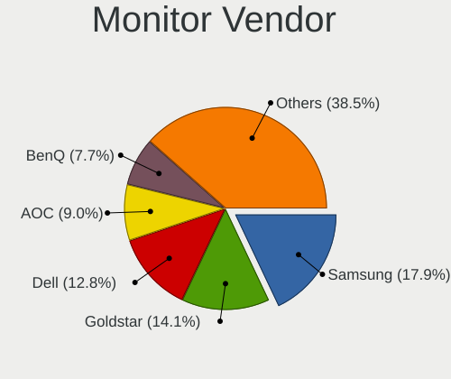

| Vendor               | Desktops | Percent |
|----------------------|----------|---------|
| Samsung Electronics  | 14       | 17.95%  |
| Goldstar             | 11       | 14.1%   |
| Dell                 | 10       | 12.82%  |
| AOC                  | 7        | 8.97%   |
| BenQ                 | 6        | 7.69%   |
| Hewlett-Packard      | 4        | 5.13%   |
| Acer                 | 4        | 5.13%   |
| Belinea              | 2        | 2.56%   |
| ASUSTek Computer     | 2        | 2.56%   |
| Ancor Communications | 2        | 2.56%   |
| Vizio                | 1        | 1.28%   |
| ViewSonic            | 1        | 1.28%   |
| Sony                 | 1        | 1.28%   |
| Sceptre Tech         | 1        | 1.28%   |
| Philips              | 1        | 1.28%   |
| PANDA                | 1        | 1.28%   |
| Mi                   | 1        | 1.28%   |
| Huion                | 1        | 1.28%   |
| HJW                  | 1        | 1.28%   |
| HCL                  | 1        | 1.28%   |
| HannStar             | 1        | 1.28%   |
| FUN                  | 1        | 1.28%   |
| Elo Touch            | 1        | 1.28%   |
| CTC                  | 1        | 1.28%   |
| CS_                  | 1        | 1.28%   |
| AU Optronics         | 1        | 1.28%   |

Monitor Model
-------------

Monitor models

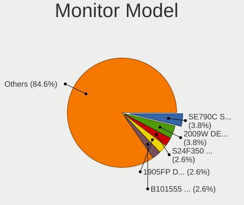

| Model                                                                  | Desktops | Percent |
|------------------------------------------------------------------------|----------|---------|
| Samsung Electronics SE790C SAM0BFE 3440x1440 797x333mm 34.0-inch       | 3        | 3.85%   |
| Dell 2009W DEL4041 1680x1050 433x270mm 20.1-inch                       | 3        | 3.85%   |
| Samsung Electronics S24F350 SAM0D20 1920x1080 521x293mm 23.5-inch      | 2        | 2.56%   |
| Dell 1905FP DEL400C 1280x1024 376x301mm 19.0-inch                      | 2        | 2.56%   |
| Belinea B101555 MAX05DF 1024x768 304x228mm 15.0-inch                   | 2        | 2.56%   |
| Vizio VX42L HDTV10A VIZ0030 1366x768 930x523mm 42.0-inch               | 1        | 1.28%   |
| ViewSonic VG2030wm VSCA51E 1680x1050 433x270mm 20.1-inch               | 1        | 1.28%   |
| Sony TV SNY1503 1360x768                                               | 1        | 1.28%   |
| Sceptre Tech Sceptre J20 SPT080D 1600x900 435x237mm 19.5-inch          | 1        | 1.28%   |
| Samsung Electronics SyncMaster SAM037B 1680x1050 474x296mm 22.0-inch   | 1        | 1.28%   |
| Samsung Electronics SyncMaster SAM021C 1400x1050 408x300mm 19.9-inch   | 1        | 1.28%   |
| Samsung Electronics SyncMaster SAM01E1 1280x1024 376x301mm 19.0-inch   | 1        | 1.28%   |
| Samsung Electronics S27F350 SAM0D23 1920x1080 598x336mm 27.0-inch      | 1        | 1.28%   |
| Samsung Electronics S27F350 SAM0D22 1920x1080 598x336mm 27.0-inch      | 1        | 1.28%   |
| Samsung Electronics S27A950D SAM079E 1920x1080 598x336mm 27.0-inch     | 1        | 1.28%   |
| Samsung Electronics S22B150 SAM08A3 1920x1080 477x268mm 21.5-inch      | 1        | 1.28%   |
| Samsung Electronics LS24AG30x SAM7179 1920x1080 527x296mm 23.8-inch    | 1        | 1.28%   |
| Samsung Electronics LCD Monitor SAM0A7D 1920x1080 1060x626mm 48.5-inch | 1        | 1.28%   |
| Philips PHL 216V6 PHLC10D 1920x1080 419x262mm 19.5-inch                | 1        | 1.28%   |
| PANDA LCD Monitor NCP002D 1920x1080 344x194mm 15.5-inch                | 1        | 1.28%   |
| Mi Monitor XMI2701 2560x1440 597x335mm 27.0-inch                       | 1        | 1.28%   |
| Huion GT-192 HAT1920 1920x1080 432x243mm 19.5-inch                     | 1        | 1.28%   |
| HJW MACROSILICON HJW1836 1680x1050 530x290mm 23.8-inch                 | 1        | 1.28%   |
| Hewlett-Packard LV1911 HWP3005 1366x768 410x230mm 18.5-inch            | 1        | 1.28%   |
| Hewlett-Packard LA1751 HWP2858 1280x1024 340x270mm 17.1-inch           | 1        | 1.28%   |
| Hewlett-Packard L1520 HWP13C7 1024x768 304x228mm 15.0-inch             | 1        | 1.28%   |
| Hewlett-Packard 27 QD HPN3616 2560x1440 597x339mm 27.0-inch            | 1        | 1.28%   |
| HCL HCMDLWBT11 HCMB452 1360x768 340x190mm 15.3-inch                    | 1        | 1.28%   |
| HannStar Hanns.G HW191 HSD8991 1440x900 408x255mm 18.9-inch            | 1        | 1.28%   |
| Goldstar W2253 GSM56DD 1920x1080 510x290mm 23.1-inch                   | 1        | 1.28%   |
| Goldstar W2253 GSM56DB 1920x1080 477x268mm 21.5-inch                   | 1        | 1.28%   |
| Goldstar W1943 GSM4BAD 1360x768 406x229mm 18.4-inch                    | 1        | 1.28%   |
| Goldstar ULTRAWIDE GSM5A2B 2560x1080 677x290mm 29.0-inch               | 1        | 1.28%   |
| Goldstar ULTRAGEAR GSM5BB4 2560x1440 597x336mm 27.0-inch               | 1        | 1.28%   |
| Goldstar Ultra HD GSM5B09 3840x2160 600x340mm 27.2-inch                | 1        | 1.28%   |
| Goldstar Ultra HD GSM5B08 3840x2160 600x340mm 27.2-inch                | 1        | 1.28%   |
| Goldstar M2752D GSM60B2 1920x1080 531x299mm 24.0-inch                  | 1        | 1.28%   |
| Goldstar LG TV SSCR2 GSMC0C8 3840x2160                                 | 1        | 1.28%   |
| Goldstar HDR 4K GSM774F 3840x2160 697x392mm 31.5-inch                  | 1        | 1.28%   |
| Goldstar E2241 GSM5818 1920x1080 477x268mm 21.5-inch                   | 1        | 1.28%   |

Monitor Resolution
------------------

Monitor screen resolution

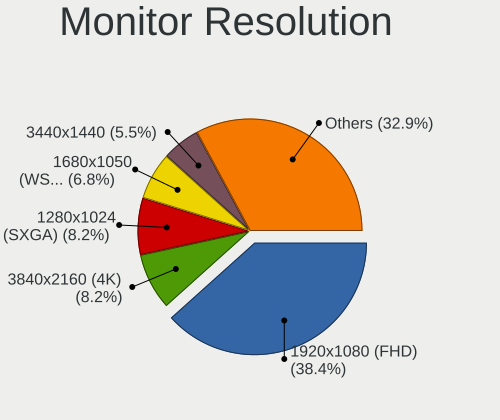

| Resolution         | Desktops | Percent |
|--------------------|----------|---------|
| 1920x1080 (FHD)    | 28       | 38.36%  |
| 3840x2160 (4K)     | 6        | 8.22%   |
| 1280x1024 (SXGA)   | 6        | 8.22%   |
| 1680x1050 (WSXGA+) | 5        | 6.85%   |
| 3440x1440          | 4        | 5.48%   |
| 2560x1440 (QHD)    | 4        | 5.48%   |
| 1366x768 (WXGA)    | 4        | 5.48%   |
| 1024x768 (XGA)     | 4        | 5.48%   |
| 1440x900 (WXGA+)   | 3        | 4.11%   |
| 1360x768           | 3        | 4.11%   |
| 1400x1050          | 2        | 2.74%   |
| 2560x1080          | 1        | 1.37%   |
| 1920x1200 (WUXGA)  | 1        | 1.37%   |
| 1600x900 (HD+)     | 1        | 1.37%   |
| 1280x960           | 1        | 1.37%   |

Monitor Diagonal
----------------

Diagonal size in inches

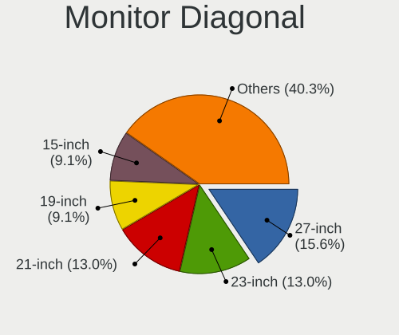

| Inches | Desktops | Percent |
|--------|----------|---------|
| 27     | 12       | 15.58%  |
| 23     | 10       | 12.99%  |
| 21     | 10       | 12.99%  |
| 19     | 7        | 9.09%   |
| 15     | 7        | 9.09%   |
| 24     | 5        | 6.49%   |
| 20     | 5        | 6.49%   |
| 34     | 4        | 5.19%   |
| 18     | 4        | 5.19%   |
| 17     | 4        | 5.19%   |
| 72     | 2        | 2.6%    |
| 22     | 2        | 2.6%    |
| 48     | 1        | 1.3%    |
| 42     | 1        | 1.3%    |
| 31     | 1        | 1.3%    |
| 29     | 1        | 1.3%    |
| 14     | 1        | 1.3%    |

Monitor Width
-------------

Physical width

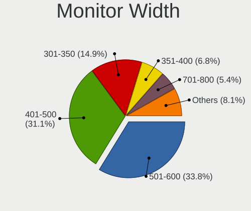

| Width in mm | Desktops | Percent |
|-------------|----------|---------|
| 501-600     | 25       | 33.78%  |
| 401-500     | 23       | 31.08%  |
| 301-350     | 11       | 14.86%  |
| 351-400     | 5        | 6.76%   |
| 701-800     | 4        | 5.41%   |
| 601-700     | 2        | 2.7%    |
| 1501-2000   | 2        | 2.7%    |
| 1001-1500   | 1        | 1.35%   |
| 901-1000    | 1        | 1.35%   |

Aspect Ratio
------------

Proportional relationship between the width and the height

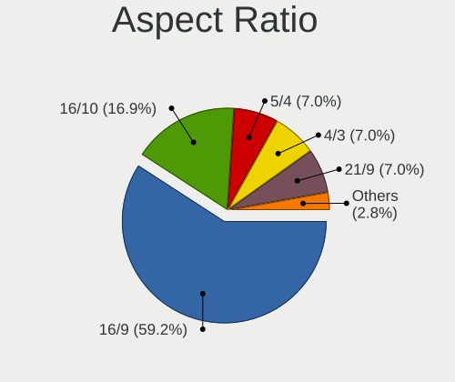

| Ratio | Desktops | Percent |
|-------|----------|---------|
| 16/9  | 42       | 59.15%  |
| 16/10 | 12       | 16.9%   |
| 5/4   | 5        | 7.04%   |
| 4/3   | 5        | 7.04%   |
| 21/9  | 5        | 7.04%   |
| 6/5   | 2        | 2.82%   |

Monitor Area
------------

Area in inch²

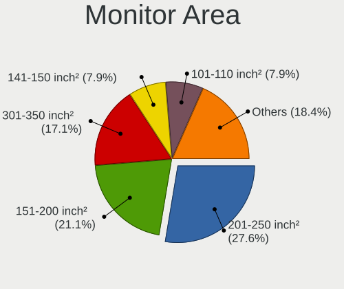

| Area in inch² | Desktops | Percent |
|----------------|----------|---------|
| 201-250        | 21       | 27.63%  |
| 151-200        | 16       | 21.05%  |
| 301-350        | 13       | 17.11%  |
| 141-150        | 6        | 7.89%   |
| 101-110        | 6        | 7.89%   |
| 351-500        | 5        | 6.58%   |
| More than 1000 | 3        | 3.95%   |
| 251-300        | 2        | 2.63%   |
| 81-90          | 1        | 1.32%   |
| 131-140        | 1        | 1.32%   |
| 501-1000       | 1        | 1.32%   |
| 91-100         | 1        | 1.32%   |

Pixel Density
-------------

Pixels per inch

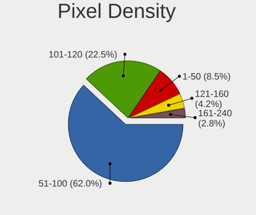

| Density | Desktops | Percent |
|---------|----------|---------|
| 51-100  | 44       | 61.97%  |
| 101-120 | 16       | 22.54%  |
| 1-50    | 6        | 8.45%   |
| 121-160 | 3        | 4.23%   |
| 161-240 | 2        | 2.82%   |

Multiple Monitors
-----------------

Total monitors connected

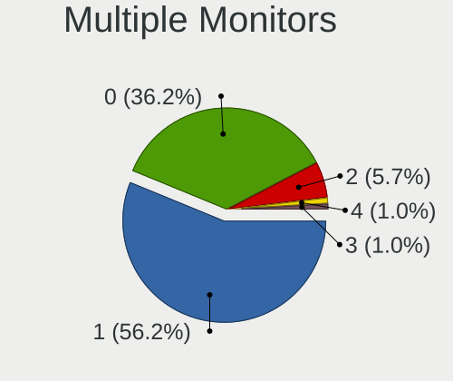

| Total | Desktops | Percent |
|-------|----------|---------|
| 1     | 59       | 56.19%  |
| 0     | 38       | 36.19%  |
| 2     | 6        | 5.71%   |
| 4     | 1        | 0.95%   |
| 3     | 1        | 0.95%   |

Network
-------

Net Controller Vendor
---------------------

Controller vendors

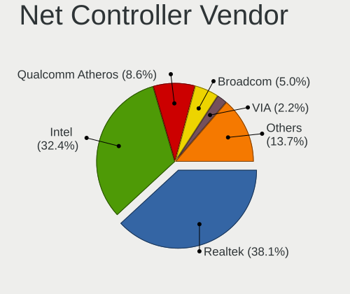

| Vendor                          | Desktops | Percent |
|---------------------------------|----------|---------|
| Realtek Semiconductor           | 53       | 38.13%  |
| Intel                           | 45       | 32.37%  |
| Qualcomm Atheros                | 12       | 8.63%   |
| Broadcom                        | 7        | 5.04%   |
| VIA Technologies                | 3        | 2.16%   |
| Xiaomi                          | 2        | 1.44%   |
| TP-Link                         | 2        | 1.44%   |
| Qualcomm Atheros Communications | 2        | 1.44%   |
| MediaTek                        | 2        | 1.44%   |
| Broadcom Limited                | 2        | 1.44%   |
| T & A Mobile Phones             | 1        | 0.72%   |
| Ralink                          | 1        | 0.72%   |
| Qualcomm                        | 1        | 0.72%   |
| QinHeng Electronics             | 1        | 0.72%   |
| Nvidia                          | 1        | 0.72%   |
| D-Link System                   | 1        | 0.72%   |
| D-Link                          | 1        | 0.72%   |
| Belkin Components               | 1        | 0.72%   |
| ASIX Electronics                | 1        | 0.72%   |

Net Controller Model
--------------------

Controller models

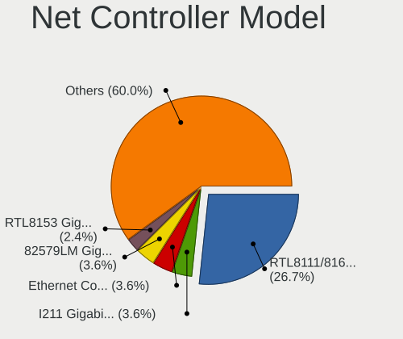

| Model                                                                  | Desktops | Percent |
|------------------------------------------------------------------------|----------|---------|
| Realtek RTL8111/8168/8211/8411 PCI Express Gigabit Ethernet Controller | 44       | 26.67%  |
| Intel I211 Gigabit Network Connection                                  | 6        | 3.64%   |
| Intel Ethernet Controller I225-V                                       | 6        | 3.64%   |
| Intel 82579LM Gigabit Network Connection (Lewisville)                  | 6        | 3.64%   |
| Realtek RTL8153 Gigabit Ethernet Adapter                               | 4        | 2.42%   |
| Intel Ethernet Connection (7) I219-V                                   | 4        | 2.42%   |
| Realtek RTL8125 2.5GbE Controller                                      | 3        | 1.82%   |
| Realtek RTL810xE PCI Express Fast Ethernet controller                  | 3        | 1.82%   |
| Qualcomm Atheros QCA8171 Gigabit Ethernet                              | 3        | 1.82%   |
| Intel Ethernet Connection (2) I219-V                                   | 3        | 1.82%   |
| VIA VT6102/VT6103 [Rhine-II]                                           | 2        | 1.21%   |
| Realtek RTL8821CE 802.11ac PCIe Wireless Network Adapter               | 2        | 1.21%   |
| Qualcomm Atheros Killer E220x Gigabit Ethernet Controller              | 2        | 1.21%   |
| Qualcomm Atheros AR9271 802.11n                                        | 2        | 1.21%   |
| Intel Wireless 7265                                                    | 2        | 1.21%   |
| Intel Wi-Fi 6 AX200                                                    | 2        | 1.21%   |
| Intel I210 Gigabit Network Connection                                  | 2        | 1.21%   |
| Intel Ethernet Connection I217-LM                                      | 2        | 1.21%   |
| Intel Ethernet Connection (2) I219-LM                                  | 2        | 1.21%   |
| Intel Ethernet Connection (17) I219-LM                                 | 2        | 1.21%   |
| Intel Comet Lake PCH CNVi WiFi                                         | 2        | 1.21%   |
| Xiaomi Mi/Redmi series (RNDIS)                                         | 1        | 0.61%   |
| Xiaomi Mi/Redmi series (RNDIS + ADB)                                   | 1        | 0.61%   |
| VIA VIA USB2.0 WLAN                                                    | 1        | 0.61%   |
| TP-Link TL-WN823N v2/v3 [Realtek RTL8192EU]                            | 1        | 0.61%   |
| TP-Link Archer T3U [Realtek RTL8812BU]                                 | 1        | 0.61%   |
| T & A Mobile Phones TCL 50 XL 5G                                       | 1        | 0.61%   |
| Realtek RTL88x2bu [AC1200 Techkey]                                     | 1        | 0.61%   |
| Realtek RTL8852BE PCIe 802.11ax Wireless Network Controller            | 1        | 0.61%   |
| Realtek RTL8723BE PCIe Wireless Network Adapter                        | 1        | 0.61%   |
| Realtek RTL8192CU 802.11n WLAN Adapter                                 | 1        | 0.61%   |
| Realtek RTL8188EUS 802.11n Wireless Network Adapter                    | 1        | 0.61%   |
| Realtek RTL8188EE Wireless Network Adapter                             | 1        | 0.61%   |
| Realtek RTL-8185 IEEE 802.11a/b/g Wireless LAN Controller              | 1        | 0.61%   |
| Realtek RTL-8100/8101L/8139 PCI Fast Ethernet Adapter                  | 1        | 0.61%   |
| Ralink RT5360 Wireless 802.11n 1T/1R                                   | 1        | 0.61%   |
| Qualcomm Nokia X30 5G                                                  | 1        | 0.61%   |
| Qualcomm Atheros QCA9377 802.11ac Wireless Network Adapter             | 1        | 0.61%   |
| Qualcomm Atheros QCA6174 802.11ac Wireless Network Adapter             | 1        | 0.61%   |
| Qualcomm Atheros Killer E2500 Gigabit Ethernet Controller              | 1        | 0.61%   |

Wireless Vendor
---------------

Wireless vendors

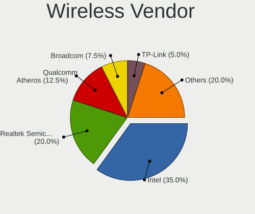

| Vendor                          | Desktops | Percent |
|---------------------------------|----------|---------|
| Intel                           | 14       | 35%     |
| Realtek Semiconductor           | 8        | 20%     |
| Qualcomm Atheros                | 5        | 12.5%   |
| Broadcom                        | 3        | 7.5%    |
| TP-Link                         | 2        | 5%      |
| Qualcomm Atheros Communications | 2        | 5%      |
| MediaTek                        | 2        | 5%      |
| VIA Technologies                | 1        | 2.5%    |
| Ralink                          | 1        | 2.5%    |
| D-Link                          | 1        | 2.5%    |
| Belkin Components               | 1        | 2.5%    |

Wireless Model
--------------

Wireless models

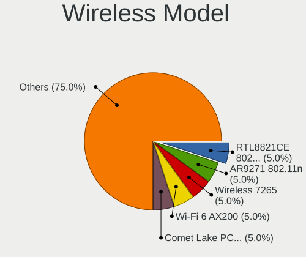

| Model                                                                                 | Desktops | Percent |
|---------------------------------------------------------------------------------------|----------|---------|
| Realtek RTL8821CE 802.11ac PCIe Wireless Network Adapter                              | 2        | 5%      |
| Qualcomm Atheros AR9271 802.11n                                                       | 2        | 5%      |
| Intel Wireless 7265                                                                   | 2        | 5%      |
| Intel Wi-Fi 6 AX200                                                                   | 2        | 5%      |
| Intel Comet Lake PCH CNVi WiFi                                                        | 2        | 5%      |
| VIA VIA USB2.0 WLAN                                                                   | 1        | 2.5%    |
| TP-Link TL-WN823N v2/v3 [Realtek RTL8192EU]                                           | 1        | 2.5%    |
| TP-Link Archer T3U [Realtek RTL8812BU]                                                | 1        | 2.5%    |
| Realtek RTL88x2bu [AC1200 Techkey]                                                    | 1        | 2.5%    |
| Realtek RTL8723BE PCIe Wireless Network Adapter                                       | 1        | 2.5%    |
| Realtek RTL8192CU 802.11n WLAN Adapter                                                | 1        | 2.5%    |
| Realtek RTL8188EUS 802.11n Wireless Network Adapter                                   | 1        | 2.5%    |
| Realtek RTL8188EE Wireless Network Adapter                                            | 1        | 2.5%    |
| Realtek RTL-8185 IEEE 802.11a/b/g Wireless LAN Controller                             | 1        | 2.5%    |
| Ralink RT5360 Wireless 802.11n 1T/1R                                                  | 1        | 2.5%    |
| Qualcomm Atheros QCA9377 802.11ac Wireless Network Adapter                            | 1        | 2.5%    |
| Qualcomm Atheros QCA6174 802.11ac Wireless Network Adapter                            | 1        | 2.5%    |
| Qualcomm Atheros AR93xx Wireless Network Adapter                                      | 1        | 2.5%    |
| Qualcomm Atheros AR5418 Wireless Network Adapter [AR5008E 802.11(a)bgn] (PCI-Express) | 1        | 2.5%    |
| Qualcomm Atheros AR242x / AR542x Wireless Network Adapter (PCI-Express)               | 1        | 2.5%    |
| MediaTek MT7921K (RZ608) Wi-Fi 6E 80MHz                                               | 1        | 2.5%    |
| MediaTek MT7921 802.11ax PCIe Wireless Network Adapter [Filogic 330]                  | 1        | 2.5%    |
| Intel Wireless 3165                                                                   | 1        | 2.5%    |
| Intel Wireless 3160                                                                   | 1        | 2.5%    |
| Intel Wi-Fi 6E(802.11ax) AX210/AX1675* 2x2 [Typhoon Peak]                             | 1        | 2.5%    |
| Intel Dual Band Wireless-AC 3168NGW [Stone Peak]                                      | 1        | 2.5%    |
| Intel Centrino Wireless-N 2230                                                        | 1        | 2.5%    |
| Intel Cannon Lake PCH CNVi WiFi                                                       | 1        | 2.5%    |
| Intel Alder Lake-S PCH CNVi WiFi                                                      | 1        | 2.5%    |
| Intel 700 Series Chipset CNVi WiFi                                                    | 1        | 2.5%    |
| D-Link DWA-140 RangeBooster N Adapter(rev.B3) [Ralink RT5372]                         | 1        | 2.5%    |
| Broadcom BCM4378 802.11ax Dual Band Wireless Network Adapter                          | 1        | 2.5%    |
| Broadcom BCM4352 802.11ac Dual Band Wireless Network Adapter                          | 1        | 2.5%    |
| Broadcom BCM43227 802.11b/g/n                                                         | 1        | 2.5%    |
| Belkin Components F5D7050 Wireless G Adapter v4000 [Zydas ZD1211B]                    | 1        | 2.5%    |

Ethernet Vendor
---------------

Ethernet vendors

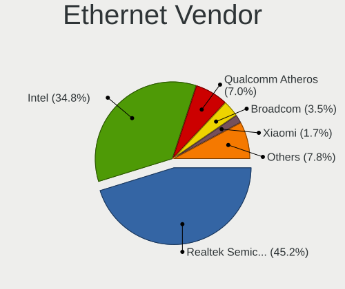

| Vendor                | Desktops | Percent |
|-----------------------|----------|---------|
| Realtek Semiconductor | 52       | 45.22%  |
| Intel                 | 40       | 34.78%  |
| Qualcomm Atheros      | 8        | 6.96%   |
| Broadcom              | 4        | 3.48%   |
| Xiaomi                | 2        | 1.74%   |
| VIA Technologies      | 2        | 1.74%   |
| Broadcom Limited      | 2        | 1.74%   |
| T & A Mobile Phones   | 1        | 0.87%   |
| Qualcomm              | 1        | 0.87%   |
| Nvidia                | 1        | 0.87%   |
| D-Link System         | 1        | 0.87%   |
| ASIX Electronics      | 1        | 0.87%   |

Ethernet Model
--------------

Ethernet models

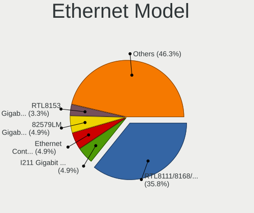

| Model                                                                  | Desktops | Percent |
|------------------------------------------------------------------------|----------|---------|
| Realtek RTL8111/8168/8211/8411 PCI Express Gigabit Ethernet Controller | 44       | 35.77%  |
| Intel I211 Gigabit Network Connection                                  | 6        | 4.88%   |
| Intel Ethernet Controller I225-V                                       | 6        | 4.88%   |
| Intel 82579LM Gigabit Network Connection (Lewisville)                  | 6        | 4.88%   |
| Realtek RTL8153 Gigabit Ethernet Adapter                               | 4        | 3.25%   |
| Intel Ethernet Connection (7) I219-V                                   | 4        | 3.25%   |
| Realtek RTL8125 2.5GbE Controller                                      | 3        | 2.44%   |
| Realtek RTL810xE PCI Express Fast Ethernet controller                  | 3        | 2.44%   |
| Qualcomm Atheros QCA8171 Gigabit Ethernet                              | 3        | 2.44%   |
| Intel Ethernet Connection (2) I219-V                                   | 3        | 2.44%   |
| VIA VT6102/VT6103 [Rhine-II]                                           | 2        | 1.63%   |
| Qualcomm Atheros Killer E220x Gigabit Ethernet Controller              | 2        | 1.63%   |
| Intel I210 Gigabit Network Connection                                  | 2        | 1.63%   |
| Intel Ethernet Connection I217-LM                                      | 2        | 1.63%   |
| Intel Ethernet Connection (2) I219-LM                                  | 2        | 1.63%   |
| Intel Ethernet Connection (17) I219-LM                                 | 2        | 1.63%   |
| Xiaomi Mi/Redmi series (RNDIS)                                         | 1        | 0.81%   |
| Xiaomi Mi/Redmi series (RNDIS + ADB)                                   | 1        | 0.81%   |
| T & A Mobile Phones TCL 50 XL 5G                                       | 1        | 0.81%   |
| Realtek RTL8852BE PCIe 802.11ax Wireless Network Controller            | 1        | 0.81%   |
| Realtek RTL-8100/8101L/8139 PCI Fast Ethernet Adapter                  | 1        | 0.81%   |
| Qualcomm Nokia X30 5G                                                  | 1        | 0.81%   |
| Qualcomm Atheros Killer E2500 Gigabit Ethernet Controller              | 1        | 0.81%   |
| Qualcomm Atheros AR8161 Gigabit Ethernet                               | 1        | 0.81%   |
| Qualcomm Atheros AR8151 v2.0 Gigabit Ethernet                          | 1        | 0.81%   |
| Nvidia MCP61 Ethernet                                                  | 1        | 0.81%   |
| Intel Ethernet Controller I226-V                                       | 1        | 0.81%   |
| Intel Ethernet Controller I219-V                                       | 1        | 0.81%   |
| Intel Ethernet Connection I217-V                                       | 1        | 0.81%   |
| Intel Ethernet Connection (7) I219-LM                                  | 1        | 0.81%   |
| Intel Ethernet Connection (14) I219-V                                  | 1        | 0.81%   |
| Intel 82801BA/BAM/CA/CAM Ethernet Controller                           | 1        | 0.81%   |
| Intel 82578DM Gigabit Network Connection                               | 1        | 0.81%   |
| Intel 82574L Gigabit Network Connection                                | 1        | 0.81%   |
| Intel 82567V-4 Gigabit Network Connection                              | 1        | 0.81%   |
| Intel 82566DM-2 Gigabit Network Connection                             | 1        | 0.81%   |
| Intel 82562V-2 10/100 Network Connection                               | 1        | 0.81%   |
| D-Link System DGE-528T Gigabit Ethernet Adapter                        | 1        | 0.81%   |
| Broadcom NetXtreme BCM5754 Gigabit Ethernet PCI Express                | 1        | 0.81%   |
| Broadcom NetXtreme BCM5720 Gigabit Ethernet PCIe                       | 1        | 0.81%   |

Net Controller Kind
-------------------

Ethernet, WiFi or modem

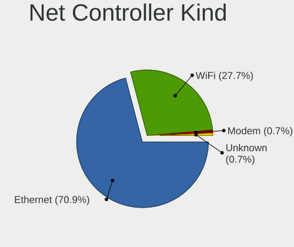

| Kind     | Desktops | Percent |
|----------|----------|---------|
| Ethernet | 100      | 70.92%  |
| WiFi     | 39       | 27.66%  |
| Modem    | 1        | 0.71%   |
| Unknown  | 1        | 0.71%   |

Used Controller
---------------

Currently used network controller

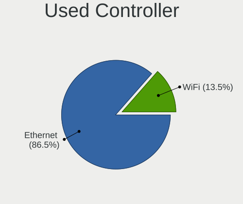

| Kind     | Desktops | Percent |
|----------|----------|---------|
| Ethernet | 83       | 86.46%  |
| WiFi     | 13       | 13.54%  |

NICs
----

Total network controllers on board

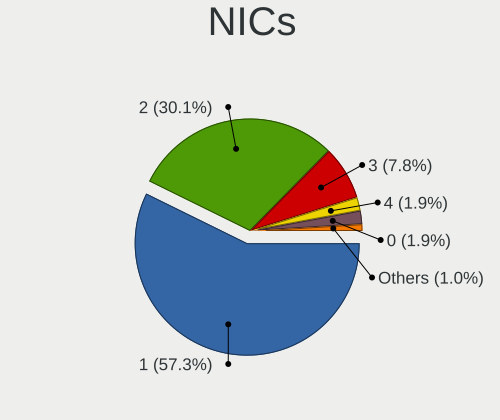

| Total | Desktops | Percent |
|-------|----------|---------|
| 1     | 59       | 57.28%  |
| 2     | 31       | 30.1%   |
| 3     | 8        | 7.77%   |
| 4     | 2        | 1.94%   |
| 0     | 2        | 1.94%   |
| 5     | 1        | 0.97%   |

IPv6
----

IPv6 vs IPv4

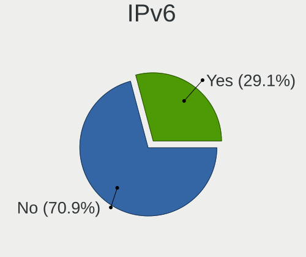

| Used | Desktops | Percent |
|------|----------|---------|
| No   | 73       | 70.87%  |
| Yes  | 30       | 29.13%  |

Bluetooth
---------

Bluetooth Vendor
----------------

Controller vendors

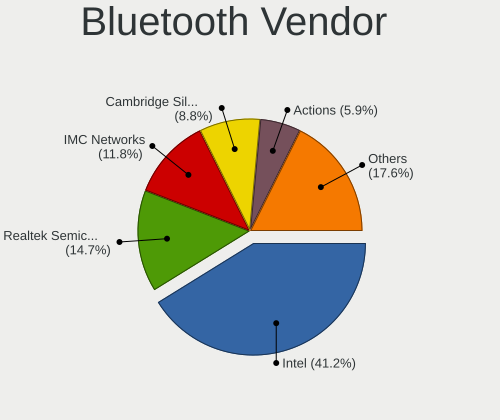

| Vendor                          | Desktops | Percent |
|---------------------------------|----------|---------|
| Intel                           | 14       | 41.18%  |
| Realtek Semiconductor           | 5        | 14.71%  |
| IMC Networks                    | 4        | 11.76%  |
| Cambridge Silicon Radio         | 3        | 8.82%   |
| ASUSTek Computer                | 2        | 5.88%   |
| Actions                         | 2        | 5.88%   |
| Qualcomm Atheros Communications | 1        | 2.94%   |
| Mercucys                        | 1        | 2.94%   |
| MediaTek                        | 1        | 2.94%   |
| Unknown                         | 1        | 2.94%   |

Bluetooth Model
---------------

Controller models

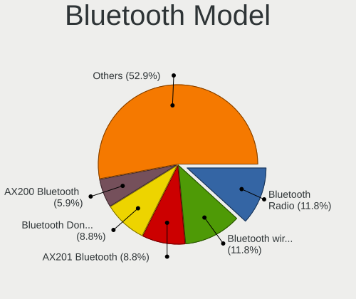

| Model                                               | Desktops | Percent |
|-----------------------------------------------------|----------|---------|
| Realtek Bluetooth Radio                             | 4        | 11.76%  |
| Intel Bluetooth wireless interface                  | 4        | 11.76%  |
| Intel AX201 Bluetooth                               | 3        | 8.82%   |
| Cambridge Silicon Radio Bluetooth Dongle (HCI mode) | 3        | 8.82%   |
| Intel AX200 Bluetooth                               | 2        | 5.88%   |
| IMC Networks Bluetooth Radio                        | 2        | 5.88%   |
| Actions general adapter                             | 2        | 5.88%   |
| Realtek Bluetooth 5.3 Radio                         | 1        | 2.94%   |
| Qualcomm Atheros QCA61x4 Bluetooth 4.0              | 1        | 2.94%   |
| Mercucys Mercusys MA530 Adapter                     | 1        | 2.94%   |
| MediaTek Wireless_Device                            | 1        | 2.94%   |
| Intel Wireless-AC 3168 Bluetooth                    | 1        | 2.94%   |
| Intel Centrino Bluetooth Wireless Transceiver       | 1        | 2.94%   |
| Intel Bluetooth Device                              | 1        | 2.94%   |
| Intel Bluetooth 9460/9560 Jefferson Peak (JfP)      | 1        | 2.94%   |
| Intel AX210 Bluetooth                               | 1        | 2.94%   |
| IMC Networks Wireless_Device                        | 1        | 2.94%   |
| IMC Networks Bluetooth Device                       | 1        | 2.94%   |
| ASUS Broadcom BCM20702A0 Bluetooth                  | 1        | 2.94%   |
| ASUS BCM20702A0                                     | 1        | 2.94%   |
| Unknown                                             | 1        | 2.94%   |

Sound
-----

Sound Vendor
------------

Sound card vendors

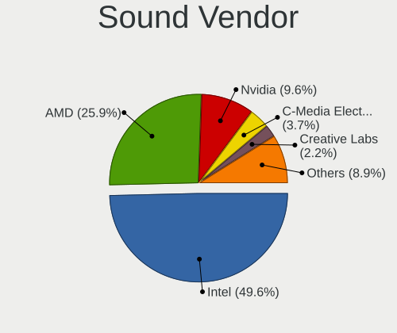

| Vendor                               | Desktops | Percent |
|--------------------------------------|----------|---------|
| Intel                                | 67       | 49.63%  |
| AMD                                  | 35       | 25.93%  |
| Nvidia                               | 13       | 9.63%   |
| C-Media Electronics                  | 5        | 3.7%    |
| Creative Labs                        | 3        | 2.22%   |
| VIA Technologies                     | 2        | 1.48%   |
| Generalplus Technology               | 2        | 1.48%   |
| Thesycon Systemsoftware & Consulting | 1        | 0.74%   |
| Texas Instruments                    | 1        | 0.74%   |
| RODE Microphones                     | 1        | 0.74%   |
| Nordic Semiconductor ASA             | 1        | 0.74%   |
| Native Instruments                   | 1        | 0.74%   |
| Loongson Technology                  | 1        | 0.74%   |
| Logitech                             | 1        | 0.74%   |
| JMTek                                | 1        | 0.74%   |

Sound Model
-----------

Sound card models

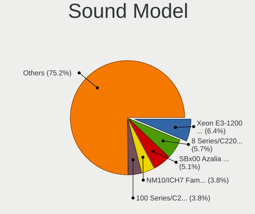

| Model                                                                      | Desktops | Percent |
|----------------------------------------------------------------------------|----------|---------|
| Intel Xeon E3-1200 v3/4th Gen Core Processor HD Audio Controller           | 10       | 6.37%   |
| Intel 8 Series/C220 Series Chipset High Definition Audio Controller        | 9        | 5.73%   |
| AMD SBx00 Azalia (Intel HDA)                                               | 8        | 5.1%    |
| Intel NM10/ICH7 Family High Definition Audio Controller                    | 6        | 3.82%   |
| Intel 100 Series/C230 Series Chipset Family HD Audio Controller            | 6        | 3.82%   |
| AMD Starship/Matisse HD Audio Controller                                   | 6        | 3.82%   |
| AMD FCH Azalia Controller                                                  | 6        | 3.82%   |
| AMD Ellesmere HDMI Audio [Radeon RX 470/480 / 570/580/590]                 | 6        | 3.82%   |
| Intel 6 Series/C200 Series Chipset Family High Definition Audio Controller | 5        | 3.18%   |
| Intel Atom Processor Z36xxx/Z37xxx Series High Definition Audio Controller | 4        | 2.55%   |
| Intel 9 Series Chipset Family HD Audio Controller                          | 4        | 2.55%   |
| Intel 7 Series/C216 Chipset Family High Definition Audio Controller        | 4        | 2.55%   |
| AMD Wrestler HDMI Audio                                                    | 4        | 2.55%   |
| Nvidia High Definition Audio Controller                                    | 3        | 1.91%   |
| Nvidia GP107GL High Definition Audio Controller                            | 3        | 1.91%   |
| Intel DG2 Audio Controller                                                 | 3        | 1.91%   |
| Intel Cannon Lake PCH cAVS                                                 | 3        | 1.91%   |
| Intel Alder Lake-S HD Audio Controller                                     | 3        | 1.91%   |
| AMD Kabini HDMI/DP Audio                                                   | 3        | 1.91%   |
| VIA Technologies VT8233/A/8235/8237 AC97 Audio Controller                  | 2        | 1.27%   |
| Nvidia GT216 HDMI Audio Controller                                         | 2        | 1.27%   |
| Intel Comet Lake PCH cAVS                                                  | 2        | 1.27%   |
| Intel Celeron N3350/Pentium N4200/Atom E3900 Series Audio Cluster          | 2        | 1.27%   |
| Intel 82801I (ICH9 Family) HD Audio Controller                             | 2        | 1.27%   |
| Intel 200 Series PCH HD Audio                                              | 2        | 1.27%   |
| Generalplus Technology USB Audio Device                                    | 2        | 1.27%   |
| C-Media Electronics CMI8788 [Oxygen HD Audio]                              | 2        | 1.27%   |
| AMD Ryzen HD Audio Controller                                              | 2        | 1.27%   |
| AMD Navi 31 HDMI/DP Audio                                                  | 2        | 1.27%   |
| AMD Navi 21/23 HDMI/DP Audio Controller                                    | 2        | 1.27%   |
| AMD Navi 10 HDMI Audio                                                     | 2        | 1.27%   |
| Thesycon Systemsoftware & Consulting E30                                   | 1        | 0.64%   |
| Texas Instruments PCM2902 Audio Codec                                      | 1        | 0.64%   |
| RODE Microphones RDE NT-USB Mini                                           | 1        | 0.64%   |
| Nvidia TU104 HD Audio Controller                                           | 1        | 0.64%   |
| Nvidia MCP61 High Definition Audio                                         | 1        | 0.64%   |
| Nvidia GM204 High Definition Audio Controller                              | 1        | 0.64%   |
| Nvidia GK107 HDMI Audio Controller                                         | 1        | 0.64%   |
| Nvidia GA102 High Definition Audio Controller                              | 1        | 0.64%   |
| Nordic Semiconductor ASA SG Control Mic                                    | 1        | 0.64%   |

Memory
------

Memory Vendor
-------------

Memory module vendors

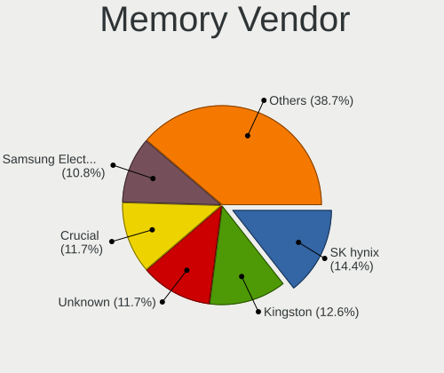

| Vendor              | Desktops | Percent |
|---------------------|----------|---------|
| SK hynix            | 16       | 14.41%  |
| Kingston            | 14       | 12.61%  |
| Unknown             | 13       | 11.71%  |
| Crucial             | 13       | 11.71%  |
| Samsung Electronics | 12       | 10.81%  |
| Micron Technology   | 7        | 6.31%   |
| Elpida              | 6        | 5.41%   |
| Corsair             | 5        | 4.5%    |
| Unknown             | 4        | 3.6%    |
| Smart               | 2        | 1.8%    |
| Qimonda             | 2        | 1.8%    |
| G.Skill             | 2        | 1.8%    |
| Apacer              | 2        | 1.8%    |
| Wilk Elektronik     | 1        | 0.9%    |
| Visipro             | 1        | 0.9%    |
| Unknown (ABCD)      | 1        | 0.9%    |
| Transcend           | 1        | 0.9%    |
| Team                | 1        | 0.9%    |
| PNY                 | 1        | 0.9%    |
| Patriot             | 1        | 0.9%    |
| Novatech            | 1        | 0.9%    |
| Hewlett-Packard     | 1        | 0.9%    |
| GOODRAM             | 1        | 0.9%    |
| Cors                | 1        | 0.9%    |
| Avant               | 1        | 0.9%    |
| A-DATA Technology   | 1        | 0.9%    |

Memory Model
------------

Memory module models

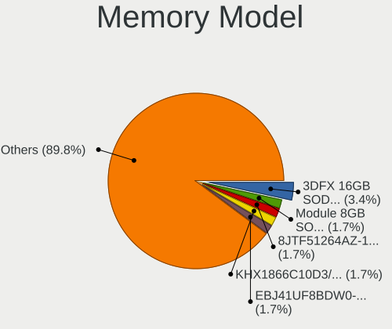

| Model                                                          | Desktops | Percent |
|----------------------------------------------------------------|----------|---------|
| Unknown                                                        | 4        | 3.39%   |
| Unknown RAM Module 8GB SODIMM DDR3 1600MT/s                    | 2        | 1.69%   |
| Micron RAM 8JTF51264AZ-1G6E1 4GB DIMM DDR3 1600MT/s            | 2        | 1.69%   |
| Kingston RAM KHX1866C10D3/4G 4GB DIMM DDR3 1867MT/s            | 2        | 1.69%   |
| Elpida RAM EBJ41UF8BDW0-GN-F 4GB DIMM DDR3 1600MT/s            | 2        | 1.69%   |
| Crucial RAM BL16G36C16U4B.M16FE1 16GB DIMM DDR4 3600MT/s       | 2        | 1.69%   |
| Wilk Elektronik RAM IRP3600D4V64L18S/8G 8GB DIMM DDR4 3666MT/s | 1        | 0.85%   |
| Visipro RAM T2G88S1-H9H 2GB DIMM DDR3 1333MT/s                 | 1        | 0.85%   |
| Unknown RAM Module 8GB DIMM DDR3 1600MT/s                      | 1        | 0.85%   |
| Unknown RAM Module 512MB DIMM                                  | 1        | 0.85%   |
| Unknown RAM Module 4GB DIMM SDRAM                              | 1        | 0.85%   |
| Unknown RAM Module 4GB DIMM DDR3 1600MT/s                      | 1        | 0.85%   |
| Unknown RAM Module 2GB DIMM DDR3 800MT/s                       | 1        | 0.85%   |
| Unknown RAM Module 2GB DIMM DDR3 1600MT/s                      | 1        | 0.85%   |
| Unknown RAM Module 2GB DIMM 667MT/s                            | 1        | 0.85%   |
| Unknown RAM Module 2GB DIMM 1333MT/s                           | 1        | 0.85%   |
| Unknown RAM Module 2048MB DIMM DDR3 1600MT/s                   | 1        | 0.85%   |
| Unknown RAM Module 2048MB DIMM DDR3 1333MT/s                   | 1        | 0.85%   |
| Unknown RAM Module 16GB DIMM DDR4 2666MT/s                     | 1        | 0.85%   |
| Unknown RAM Module 128MB DIMM                                  | 1        | 0.85%   |
| Unknown RAM Module 1024MB DIMM SDRAM                           | 1        | 0.85%   |
| Unknown (ABCD) RAM 123456789012345678 2GB DIMM LPDDR4 2133MT/s | 1        | 0.85%   |
| Transcend RAM JM1600KLH-4G 4GB DIMM DDR3 1600MT/s              | 1        | 0.85%   |
| Team RAM TEAMGROUP-UD4-3200 8GB DIMM DDR4 3800MT/s             | 1        | 0.85%   |
| Smart RAM SH564568FH8NZPHSCT 2GB SODIMM DDR3 1333MT/s          | 1        | 0.85%   |
| Smart RAM SH564568FH8NZPHSCR 2GB DIMM DDR2 1333MT/s            | 1        | 0.85%   |
| SK hynix RAM Module 1GB DIMM DDR 667MT/s                       | 1        | 0.85%   |
| SK hynix RAM HYMP125S64CP8-S6 2GB SODIMM DDR2 2048MT/s         | 1        | 0.85%   |
| SK hynix RAM HMT451U6AFR8C-PB 4GB DIMM DDR3 1600MT/s           | 1        | 0.85%   |
| SK hynix RAM HMT451S6MFR8C-H9 4GB SODIMM DDR3 1333MT/s         | 1        | 0.85%   |
| SK hynix RAM HMT451S6BFR8A-PB 4GB DIMM DDR3 1600MT/s           | 1        | 0.85%   |
| SK hynix RAM HMT425S6CFR6C-PB 2GB SODIMM DDR3 1600MT/s         | 1        | 0.85%   |
| SK hynix RAM HMT41GS6BFR8A-PB 8GB SODIMM DDR3 2667MT/s         | 1        | 0.85%   |
| SK hynix RAM HMT41GS6AFR8A-PB 8GiB SODIMM DDR3 2667MT/s        | 1        | 0.85%   |
| SK hynix RAM HMT351U6EFR8C-PB 4GB DIMM DDR3 1600MT/s           | 1        | 0.85%   |
| SK hynix RAM HMT351U6CFR8C-PB 4GB DIMM DDR3 1800MT/s           | 1        | 0.85%   |
| SK hynix RAM HMT351S6CFR8C-PB 4GB DIMM DDR3 1600MT/s           | 1        | 0.85%   |
| SK hynix RAM HMT112U6TFR8C-H9 1GB DIMM DDR3 1333MT/s           | 1        | 0.85%   |
| SK hynix RAM HMA851U6AFR6N-UH 4GB DIMM DDR4 2400MT/s           | 1        | 0.85%   |
| SK hynix RAM HMA81GU6AFR8N-UH 8GB DIMM DDR4 2400MT/s           | 1        | 0.85%   |

Memory Kind
-----------

Memory module kinds

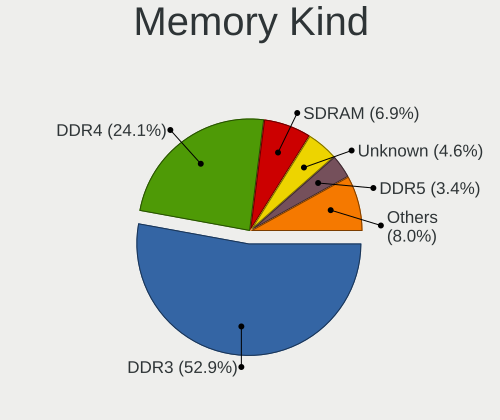

| Kind    | Desktops | Percent |
|---------|----------|---------|
| DDR3    | 46       | 52.87%  |
| DDR4    | 21       | 24.14%  |
| SDRAM   | 6        | 6.9%    |
| Unknown | 4        | 4.6%    |
| DDR5    | 3        | 3.45%   |
| DDR2    | 3        | 3.45%   |
| DDR     | 3        | 3.45%   |
| LPDDR4  | 1        | 1.15%   |

Memory Form Factor
------------------

Physical design of the memory module

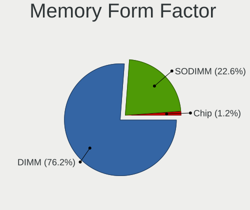

| Name   | Desktops | Percent |
|--------|----------|---------|
| DIMM   | 64       | 76.19%  |
| SODIMM | 19       | 22.62%  |
| Chip   | 1        | 1.19%   |

Memory Size
-----------

Memory module size

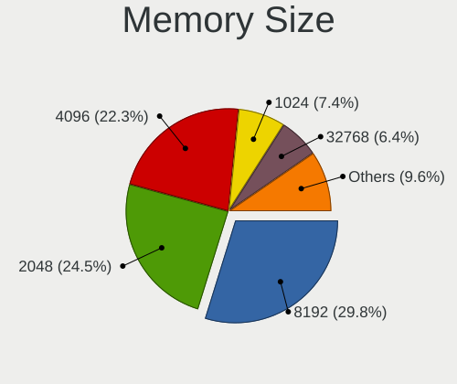

| Size  | Desktops | Percent |
|-------|----------|---------|
| 8192  | 28       | 29.79%  |
| 2048  | 23       | 24.47%  |
| 4096  | 21       | 22.34%  |
| 1024  | 7        | 7.45%   |
| 32768 | 6        | 6.38%   |
| 16384 | 6        | 6.38%   |
| 128   | 2        | 2.13%   |
| 512   | 1        | 1.06%   |

Memory Speed
------------

Memory module speed

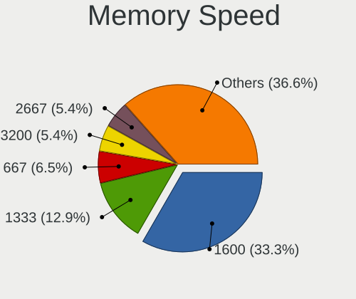

| Speed   | Desktops | Percent |
|---------|----------|---------|
| 1600    | 31       | 33.33%  |
| 1333    | 12       | 12.9%   |
| 667     | 6        | 6.45%   |
| 3200    | 5        | 5.38%   |
| 2667    | 5        | 5.38%   |
| 3600    | 4        | 4.3%    |
| 2400    | 4        | 4.3%    |
| 2133    | 4        | 4.3%    |
| Unknown | 4        | 4.3%    |
| 5600    | 2        | 2.15%   |
| 1866    | 2        | 2.15%   |
| 1800    | 2        | 2.15%   |
| 6000    | 1        | 1.08%   |
| 4333    | 1        | 1.08%   |
| 3800    | 1        | 1.08%   |
| 3666    | 1        | 1.08%   |
| 3334    | 1        | 1.08%   |
| 2666    | 1        | 1.08%   |
| 2200    | 1        | 1.08%   |
| 2048    | 1        | 1.08%   |
| 1867    | 1        | 1.08%   |
| 1331    | 1        | 1.08%   |
| 800     | 1        | 1.08%   |
| 133     | 1        | 1.08%   |

Printers & scanners
-------------------

Printer Vendor
--------------

Printer device vendors

| Vendor                | Desktops | Percent |
|-----------------------|----------|---------|
| Intermec Technologies | 1        | 50%     |
| Brother Industries    | 1        | 50%     |

Printer Model
-------------

Printer device models

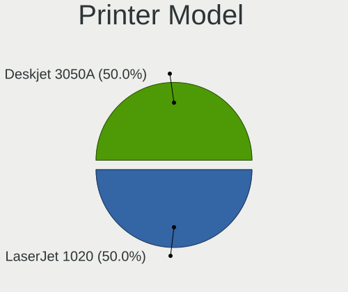

| Model                    | Desktops | Percent |
|--------------------------|----------|---------|
| Intermec PC43t           | 1        | 50%     |
| Brother HL-L2360D series | 1        | 50%     |

Scanner Vendor
--------------

Scanner device vendors

Zero info for selected period =(

Scanner Model
-------------

Scanner device models

Zero info for selected period =(

Camera
------

Camera Vendor
-------------

Camera device vendors

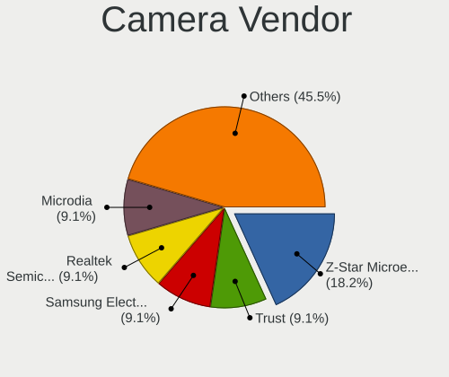

| Vendor                  | Desktops | Percent |
|-------------------------|----------|---------|
| Z-Star Microelectronics | 2        | 33.33%  |
| Olympus Optical         | 1        | 16.67%  |
| Logitech                | 1        | 16.67%  |
| IMC Networks            | 1        | 16.67%  |
| Generalplus Technology  | 1        | 16.67%  |

Camera Model
------------

Camera device models

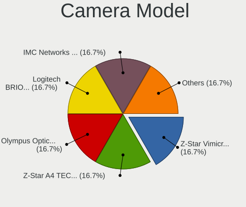

| Model                             | Desktops | Percent |
|-----------------------------------|----------|---------|
| Z-Star Vimicro USB2.0 Camera      | 1        | 16.67%  |
| Z-Star A4 TECH USB 2.0 Camera J   | 1        | 16.67%  |
| Olympus Optical PCM RECORDER      | 1        | 16.67%  |
| Logitech BRIO 4K Stream Edition   | 1        | 16.67%  |
| IMC Networks USB2.0 HD UVC WebCam | 1        | 16.67%  |
| Generalplus GENERAL WEBCAM        | 1        | 16.67%  |

Security
--------

Fingerprint Vendor
------------------

Fingerprint sensor vendors

Zero info for selected period =(

Fingerprint Model
-----------------

Fingerprint sensor models

Zero info for selected period =(

Chipcard Vendor
---------------

Chipcard module vendors

Zero info for selected period =(

Chipcard Model
--------------

Chipcard module models

Zero info for selected period =(

Unsupported
-----------

Unsupported Devices
-------------------

Total unsupported devices on board

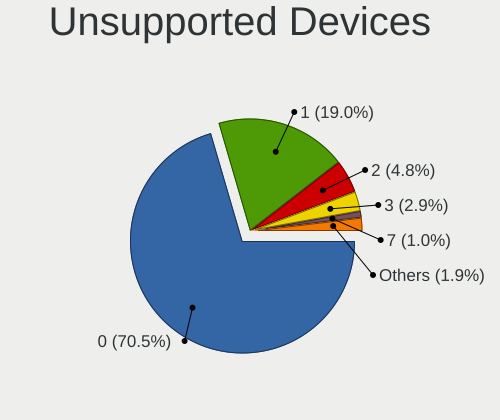

| Total | Desktops | Percent |
|-------|----------|---------|
| 0     | 74       | 70.48%  |
| 1     | 20       | 19.05%  |
| 2     | 5        | 4.76%   |
| 3     | 3        | 2.86%   |
| 7     | 1        | 0.95%   |
| 6     | 1        | 0.95%   |
| 4     | 1        | 0.95%   |

Unsupported Device Types
------------------------

Types of unsupported devices

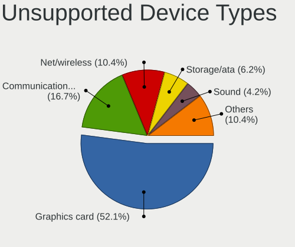

| Type                     | Desktops | Percent |
|--------------------------|----------|---------|
| Graphics card            | 25       | 52.08%  |
| Communication controller | 8        | 16.67%  |
| Net/wireless             | 5        | 10.42%  |
| Storage/ata              | 3        | 6.25%   |
| Sound                    | 2        | 4.17%   |
| Network                  | 2        | 4.17%   |
| Net/ethernet             | 2        | 4.17%   |
| Unassigned class         | 1        | 2.08%   |

