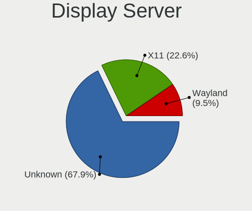
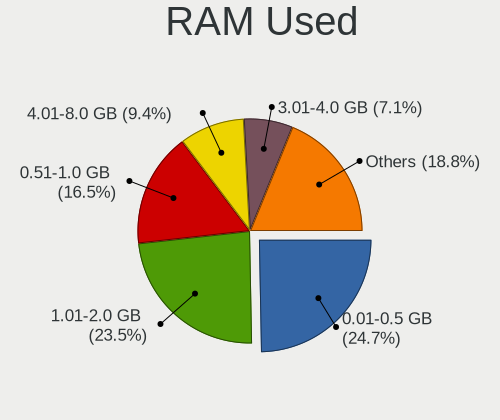
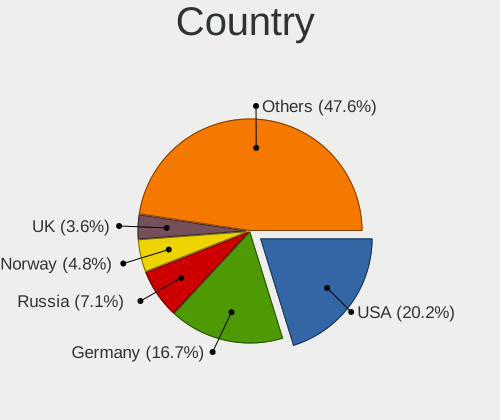
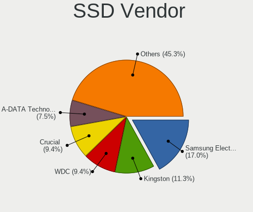
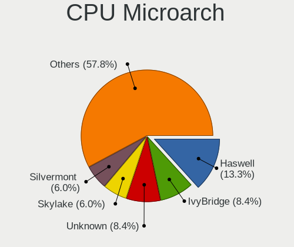
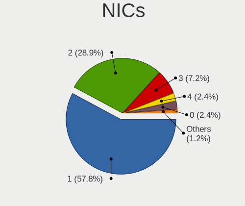
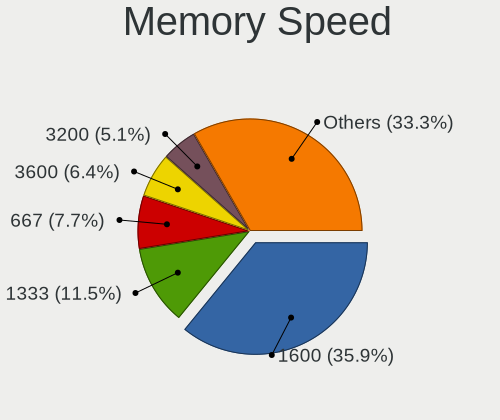
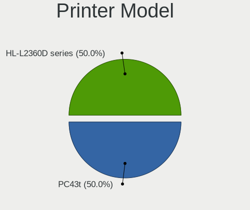

Alpine - Tested Hardware & Statistics (Desktops)
------------------------------------------------

A project to collect tested hardware configurations for Alpine.

Anyone can contribute to this report by the [hw-probe](https://github.com/linuxhw/hw-probe) tool:

    sudo -E hw-probe -all -upload

Please contribute! Especially if your hardware is rare.

Contents
--------

* [ Test Cases ](#test-cases)

* [ System ](#system)
  - [ OS                       ](#os)
  - [ OS Family                ](#os-family)
  - [ Kernel                   ](#kernel)
  - [ Kernel Family            ](#kernel-family)
  - [ Kernel Major Ver.        ](#kernel-major-ver)
  - [ Arch                     ](#arch)
  - [ DE                       ](#de)
  - [ Display Server           ](#display-server)
  - [ Display Manager          ](#display-manager)
  - [ OS Lang                  ](#os-lang)
  - [ Boot Mode                ](#boot-mode)
  - [ Filesystem               ](#filesystem)
  - [ Part. scheme             ](#part-scheme)
  - [ Dual Boot with Linux/BSD ](#dual-boot-with-linuxbsd)
  - [ Dual Boot (Win)          ](#dual-boot-win)

* [ Board ](#board)
  - [ Vendor                   ](#vendor)
  - [ Model                    ](#model)
  - [ Model Family             ](#model-family)
  - [ MFG Year                 ](#mfg-year)
  - [ Form Factor              ](#form-factor)
  - [ Secure Boot              ](#secure-boot)
  - [ Coreboot                 ](#coreboot)
  - [ RAM Size                 ](#ram-size)
  - [ RAM Used                 ](#ram-used)
  - [ Total Drives             ](#total-drives)
  - [ Has CD-ROM               ](#has-cd-rom)
  - [ Has Ethernet             ](#has-ethernet)
  - [ Has WiFi                 ](#has-wifi)
  - [ Has Bluetooth            ](#has-bluetooth)

* [ Location ](#location)
  - [ Country                  ](#country)
  - [ City                     ](#city)

* [ Drives ](#drives)
  - [ Drive Vendor             ](#drive-vendor)
  - [ Drive Model              ](#drive-model)
  - [ HDD Vendor               ](#hdd-vendor)
  - [ SSD Vendor               ](#ssd-vendor)
  - [ Drive Kind               ](#drive-kind)
  - [ Drive Connector          ](#drive-connector)
  - [ Drive Size               ](#drive-size)
  - [ Space Total              ](#space-total)
  - [ Space Used               ](#space-used)
  - [ Malfunc. Drives          ](#malfunc-drives)
  - [ Malfunc. Drive Vendor    ](#malfunc-drive-vendor)
  - [ Malfunc. HDD Vendor      ](#malfunc-hdd-vendor)
  - [ Malfunc. Drive Kind      ](#malfunc-drive-kind)
  - [ Failed Drives            ](#failed-drives)
  - [ Failed Drive Vendor      ](#failed-drive-vendor)
  - [ Drive Status             ](#drive-status)

* [ Storage controller ](#storage-controller)
  - [ Storage Vendor           ](#storage-vendor)
  - [ Storage Model            ](#storage-model)
  - [ Storage Kind             ](#storage-kind)

* [ Processor ](#processor)
  - [ CPU Vendor               ](#cpu-vendor)
  - [ CPU Model                ](#cpu-model)
  - [ CPU Model Family         ](#cpu-model-family)
  - [ CPU Cores                ](#cpu-cores)
  - [ CPU Sockets              ](#cpu-sockets)
  - [ CPU Threads              ](#cpu-threads)
  - [ CPU Op-Modes             ](#cpu-op-modes)
  - [ CPU Microcode            ](#cpu-microcode)
  - [ CPU Microarch            ](#cpu-microarch)

* [ Graphics ](#graphics)
  - [ GPU Vendor               ](#gpu-vendor)
  - [ GPU Model                ](#gpu-model)
  - [ GPU Combo                ](#gpu-combo)
  - [ GPU Driver               ](#gpu-driver)
  - [ GPU Memory               ](#gpu-memory)

* [ Monitor ](#monitor)
  - [ Monitor Vendor           ](#monitor-vendor)
  - [ Monitor Model            ](#monitor-model)
  - [ Monitor Resolution       ](#monitor-resolution)
  - [ Monitor Diagonal         ](#monitor-diagonal)
  - [ Monitor Width            ](#monitor-width)
  - [ Aspect Ratio             ](#aspect-ratio)
  - [ Monitor Area             ](#monitor-area)
  - [ Pixel Density            ](#pixel-density)
  - [ Multiple Monitors        ](#multiple-monitors)

* [ Network ](#network)
  - [ Net Controller Vendor    ](#net-controller-vendor)
  - [ Net Controller Model     ](#net-controller-model)
  - [ Wireless Vendor          ](#wireless-vendor)
  - [ Wireless Model           ](#wireless-model)
  - [ Ethernet Vendor          ](#ethernet-vendor)
  - [ Ethernet Model           ](#ethernet-model)
  - [ Net Controller Kind      ](#net-controller-kind)
  - [ Used Controller          ](#used-controller)
  - [ NICs                     ](#nics)
  - [ IPv6                     ](#ipv6)

* [ Bluetooth ](#bluetooth)
  - [ Bluetooth Vendor         ](#bluetooth-vendor)
  - [ Bluetooth Model          ](#bluetooth-model)

* [ Sound ](#sound)
  - [ Sound Vendor             ](#sound-vendor)
  - [ Sound Model              ](#sound-model)

* [ Memory ](#memory)
  - [ Memory Vendor            ](#memory-vendor)
  - [ Memory Model             ](#memory-model)
  - [ Memory Kind              ](#memory-kind)
  - [ Memory Form Factor       ](#memory-form-factor)
  - [ Memory Size              ](#memory-size)
  - [ Memory Speed             ](#memory-speed)

* [ Printers & scanners ](#printers--scanners)
  - [ Printer Vendor           ](#printer-vendor)
  - [ Printer Model            ](#printer-model)
  - [ Scanner Vendor           ](#scanner-vendor)
  - [ Scanner Model            ](#scanner-model)

* [ Camera ](#camera)
  - [ Camera Vendor            ](#camera-vendor)
  - [ Camera Model             ](#camera-model)

* [ Security ](#security)
  - [ Fingerprint Vendor       ](#fingerprint-vendor)
  - [ Fingerprint Model        ](#fingerprint-model)
  - [ Chipcard Vendor          ](#chipcard-vendor)
  - [ Chipcard Model           ](#chipcard-model)

* [ Unsupported ](#unsupported)
  - [ Unsupported Devices      ](#unsupported-devices)
  - [ Unsupported Device Types ](#unsupported-device-types)

Test Cases
----------

Total: 120

| Vendor        | Model                       | Probe                                                      | Date         |
|---------------|-----------------------------|------------------------------------------------------------|--------------|
| Dell          | 0HR330                      | [b0a5f47c54](https://linux-hardware.org/?probe=b0a5f47c54) | Dec 30, 2024 |
| Unknown       | Unknown                     | [d58ff3bf72](https://linux-hardware.org/?probe=d58ff3bf72) | Dec 07, 2024 |
| Unknown       | Unknown                     | [722fa16afd](https://linux-hardware.org/?probe=722fa16afd) | Dec 07, 2024 |
| HP            | 8053                        | [b08855c6d0](https://linux-hardware.org/?probe=b08855c6d0) | Nov 07, 2024 |
| ASUSTek       | PRIME H510M-E               | [0ae2204768](https://linux-hardware.org/?probe=0ae2204768) | Oct 10, 2024 |
| Loongson      | 3A6000-HV-7A2000-1w-V0.1... | [b50072f24a](https://linux-hardware.org/?probe=b50072f24a) | Sep 23, 2024 |
| HP            | 0ACCh                       | [55a1298155](https://linux-hardware.org/?probe=55a1298155) | Sep 19, 2024 |
| Inventec      | DQ Class A02                | [f02f65b629](https://linux-hardware.org/?probe=f02f65b629) | Sep 06, 2024 |
| Fujitsu       | D3183-A1 S26361-D3183-A1    | [27f36952e8](https://linux-hardware.org/?probe=27f36952e8) | Aug 25, 2024 |
| Fujitsu       | D3183-A1 S26361-D3183-A1    | [444f676cab](https://linux-hardware.org/?probe=444f676cab) | Aug 25, 2024 |
| Gigabyte      | Z77X-D3H                    | [673e7d713c](https://linux-hardware.org/?probe=673e7d713c) | Aug 11, 2024 |
| Gigabyte      | Z77X-D3H                    | [e5ed694576](https://linux-hardware.org/?probe=e5ed694576) | Aug 11, 2024 |
| Fujitsu       | D3183-A1 S26361-D3183-A1    | [76144977df](https://linux-hardware.org/?probe=76144977df) | Aug 08, 2024 |
| Fujitsu       | D3183-A1 S26361-D3183-A1    | [716c1dd778](https://linux-hardware.org/?probe=716c1dd778) | Aug 06, 2024 |
| Unknown       | Unknown                     | [8be7f502c9](https://linux-hardware.org/?probe=8be7f502c9) | Jul 13, 2024 |
| ASUSTek       | PRIME B550M-A WIFI II       | [b9b8467b56](https://linux-hardware.org/?probe=b9b8467b56) | Jul 12, 2024 |
| ASUSTek       | ROG STRIX B660-I GAMING ... | [7a92877b6b](https://linux-hardware.org/?probe=7a92877b6b) | Jul 07, 2024 |
| ASUSTek       | M5A78L-M LX PLUS            | [4e3f98ce9b](https://linux-hardware.org/?probe=4e3f98ce9b) | Jun 12, 2024 |
| Inventec      | D CLASS A02                 | [1bfbba2797](https://linux-hardware.org/?probe=1bfbba2797) | May 28, 2024 |
| Gigabyte      | Z97X-Gaming 3               | [41b5caad82](https://linux-hardware.org/?probe=41b5caad82) | May 26, 2024 |
| Fujitsu       | D3403-U1 S26361-D3403-U1    | [acdb0e0544](https://linux-hardware.org/?probe=acdb0e0544) | May 25, 2024 |
| Inventec      | D CLASS A02                 | [50cec6d29b](https://linux-hardware.org/?probe=50cec6d29b) | May 12, 2024 |
| Fujitsu       | D3183-A1 S26361-D3183-A1    | [553927672a](https://linux-hardware.org/?probe=553927672a) | May 11, 2024 |
| Gigabyte      | Z270X-Gaming 8              | [00e056103f](https://linux-hardware.org/?probe=00e056103f) | Apr 22, 2024 |
| ASRock        | B85M-ITX                    | [c868a15a8f](https://linux-hardware.org/?probe=c868a15a8f) | Apr 20, 2024 |
| Intel         | H81                         | [8b51b58c02](https://linux-hardware.org/?probe=8b51b58c02) | Apr 11, 2024 |
| HP            | 18E7                        | [06187ec68b](https://linux-hardware.org/?probe=06187ec68b) | Apr 09, 2024 |
| Dell          | 0CU395                      | [0ba3773be8](https://linux-hardware.org/?probe=0ba3773be8) | Apr 03, 2024 |
| Intel         | H81                         | [c62889d4a5](https://linux-hardware.org/?probe=c62889d4a5) | Apr 02, 2024 |
| Inventec      | DQ Class A02                | [6539e1cbe7](https://linux-hardware.org/?probe=6539e1cbe7) | Mar 22, 2024 |
| MACHINIST     | X99 PR9                     | [481821b9ad](https://linux-hardware.org/?probe=481821b9ad) | Mar 12, 2024 |
| Intel         | D102GGC2 AAD42789-204       | [0da90b1518](https://linux-hardware.org/?probe=0da90b1518) | Mar 03, 2024 |
| Acer          | TDPS05                      | [9156de5a01](https://linux-hardware.org/?probe=9156de5a01) | Feb 15, 2024 |
| AMI           | Intel                       | [15abbc4eb4](https://linux-hardware.org/?probe=15abbc4eb4) | Feb 11, 2024 |
| Unknown       | Unknown                     | [413fbae0c9](https://linux-hardware.org/?probe=413fbae0c9) | Jan 17, 2024 |
| Unknown       | Unknown                     | [69d393fc55](https://linux-hardware.org/?probe=69d393fc55) | Jan 17, 2024 |
| HP            | 3397                        | [c33a1d3b01](https://linux-hardware.org/?probe=c33a1d3b01) | Jan 09, 2024 |
| ASUSTek       | Z87-DELUXE                  | [018238aa79](https://linux-hardware.org/?probe=018238aa79) | Jan 01, 2024 |
| Acer          | TDPS05                      | [ce9b5d0c48](https://linux-hardware.org/?probe=ce9b5d0c48) | Dec 23, 2023 |
| Acer          | TDPS05                      | [d0260b1327](https://linux-hardware.org/?probe=d0260b1327) | Dec 23, 2023 |
| ZOTAC         | Unknown                     | [a91d567af3](https://linux-hardware.org/?probe=a91d567af3) | Dec 14, 2023 |
| Compaq        | 0684h                       | [54c2d84103](https://linux-hardware.org/?probe=54c2d84103) | Dec 02, 2023 |
| Compaq        | 0684h                       | [b2d96b48dc](https://linux-hardware.org/?probe=b2d96b48dc) | Dec 02, 2023 |
| ECS           | M789CG                      | [7c2e2de188](https://linux-hardware.org/?probe=7c2e2de188) | Dec 01, 2023 |
| Gigabyte      | X570 I AORUS PRO WIFI       | [1909f3fbff](https://linux-hardware.org/?probe=1909f3fbff) | Nov 15, 2023 |
| Unknown       | Unknown                     | [80774e2d18](https://linux-hardware.org/?probe=80774e2d18) | Nov 14, 2023 |
| ECS           | M789CG                      | [49edfe005c](https://linux-hardware.org/?probe=49edfe005c) | Nov 07, 2023 |
| Gigabyte      | 945GCM-S2C                  | [c714bf35c2](https://linux-hardware.org/?probe=c714bf35c2) | Nov 06, 2023 |
| ECS           | M789CG                      | [87fe73ee84](https://linux-hardware.org/?probe=87fe73ee84) | Nov 02, 2023 |
| ECS           | M789CG                      | [b767549953](https://linux-hardware.org/?probe=b767549953) | Oct 15, 2023 |
| ASRock        | Q1900B-ITX                  | [8625166ef3](https://linux-hardware.org/?probe=8625166ef3) | Oct 14, 2023 |
| ECS           | M789CG                      | [6f446a6f77](https://linux-hardware.org/?probe=6f446a6f77) | Oct 14, 2023 |
| ECS           | M789CG                      | [0a0df79fcd](https://linux-hardware.org/?probe=0a0df79fcd) | Oct 14, 2023 |
| Inventec      | D CLASS A02                 | [9559c016fb](https://linux-hardware.org/?probe=9559c016fb) | Oct 13, 2023 |
| ASRock        | Z790M-ITX WiFi              | [560aec8a01](https://linux-hardware.org/?probe=560aec8a01) | Oct 06, 2023 |
| ASRock        | H55M-LE                     | [6b7e52fd8c](https://linux-hardware.org/?probe=6b7e52fd8c) | Sep 20, 2023 |
| ASRock        | H55M-LE                     | [ceefe742e2](https://linux-hardware.org/?probe=ceefe742e2) | Sep 20, 2023 |
| Gigabyte      | B450 AORUS ELITE            | [b858f753b2](https://linux-hardware.org/?probe=b858f753b2) | Sep 19, 2023 |
| Dell          | 0RY007                      | [3bcbd1f6c3](https://linux-hardware.org/?probe=3bcbd1f6c3) | Sep 19, 2023 |
| Dell          | 096JG8 A01                  | [00e5bebc6a](https://linux-hardware.org/?probe=00e5bebc6a) | Sep 06, 2023 |
| ASRock        | 970 Extreme4                | [de055c3a95](https://linux-hardware.org/?probe=de055c3a95) | Jul 17, 2023 |
| ASUSTek       | Z170-E                      | [8be9720ca6](https://linux-hardware.org/?probe=8be9720ca6) | Jun 29, 2023 |
| ASUSTek       | PRIME B360M-C               | [4dca77df51](https://linux-hardware.org/?probe=4dca77df51) | Jun 21, 2023 |
| HP            | 83E2                        | [0db8dcbc23](https://linux-hardware.org/?probe=0db8dcbc23) | May 28, 2023 |
| MSI           | MAG B460M MORTAR            | [da74cacf64](https://linux-hardware.org/?probe=da74cacf64) | May 18, 2023 |
| Gigabyte      | Z170X-UD5-CF                | [429dc207a6](https://linux-hardware.org/?probe=429dc207a6) | May 15, 2023 |
| Gigabyte      | Z170X-UD5-CF                | [f887e6f037](https://linux-hardware.org/?probe=f887e6f037) | May 15, 2023 |
| UGREEN        | DX4600                      | [cbe70de89c](https://linux-hardware.org/?probe=cbe70de89c) | Apr 19, 2023 |
| ASUSTek       | PRIME B360M-C               | [8cf7b9cc76](https://linux-hardware.org/?probe=8cf7b9cc76) | Mar 23, 2023 |
| Intel         | D525MW AAE93082-401         | [590309a32b](https://linux-hardware.org/?probe=590309a32b) | Mar 18, 2023 |
| Intel         | D525MW AAE93082-401         | [bc847b4586](https://linux-hardware.org/?probe=bc847b4586) | Mar 09, 2023 |
| Intel         | D525MW AAE93082-401         | [d02959f9ad](https://linux-hardware.org/?probe=d02959f9ad) | Mar 02, 2023 |
| ASRock        | X470 Master SLI/ac          | [d8f1121a19](https://linux-hardware.org/?probe=d8f1121a19) | Jan 19, 2023 |
| ASRock        | X470 Master SLI/ac          | [6b6a4929de](https://linux-hardware.org/?probe=6b6a4929de) | Jan 16, 2023 |
| ASRock        | X470 Master SLI/ac          | [8775308115](https://linux-hardware.org/?probe=8775308115) | Jan 15, 2023 |
| Gigabyte      | X570S AERO G                | [473b4d0e6e](https://linux-hardware.org/?probe=473b4d0e6e) | Jan 11, 2023 |
| Gigabyte      | X570S AERO G                | [053b8697ce](https://linux-hardware.org/?probe=053b8697ce) | Jan 06, 2023 |
| Gigabyte      | B450 AORUS ELITE            | [5da7f2d3a9](https://linux-hardware.org/?probe=5da7f2d3a9) | Dec 27, 2022 |
| Dell          | 03V7GF A01                  | [3847c61b81](https://linux-hardware.org/?probe=3847c61b81) | Dec 17, 2022 |
| Dell          | 03V7GF A01                  | [e491b54a3c](https://linux-hardware.org/?probe=e491b54a3c) | Dec 17, 2022 |
| Gigabyte      | B550 AORUS ELITE V2         | [bbf4464c41](https://linux-hardware.org/?probe=bbf4464c41) | Nov 27, 2022 |
| Fujitsu       | FujitsuTP7000 -1            | [89198d262f](https://linux-hardware.org/?probe=89198d262f) | Nov 17, 2022 |
| Lenovo        | 31900058 STD                | [d7cc344b2f](https://linux-hardware.org/?probe=d7cc344b2f) | Oct 31, 2022 |
| Lenovo        | 31900058 STD                | [9f7158b883](https://linux-hardware.org/?probe=9f7158b883) | Oct 16, 2022 |
| HP            | 1493                        | [60ebd1d8dd](https://linux-hardware.org/?probe=60ebd1d8dd) | Sep 29, 2022 |
| Gateway       | SX2185                      | [8372be8fe3](https://linux-hardware.org/?probe=8372be8fe3) | Sep 29, 2022 |
| ASRock        | H81M                        | [d59c4705a2](https://linux-hardware.org/?probe=d59c4705a2) | Aug 17, 2022 |
| Intel         | DH61BF AAG81311-101         | [5a3ed0cf62](https://linux-hardware.org/?probe=5a3ed0cf62) | Jul 30, 2022 |
| Intel         | DH61BF AAG81311-101         | [719bbf817c](https://linux-hardware.org/?probe=719bbf817c) | Jul 30, 2022 |
| Intel         | DQ67SW AAG12527-310         | [9a4907d88c](https://linux-hardware.org/?probe=9a4907d88c) | Jul 17, 2022 |
| Unknown       | Unknown                     | [d857b93614](https://linux-hardware.org/?probe=d857b93614) | Jul 13, 2022 |
| Lenovo        | 31900058 STD                | [2f6356a177](https://linux-hardware.org/?probe=2f6356a177) | Jun 17, 2022 |
| Lenovo        | 31900058 STD                | [582fd88dbe](https://linux-hardware.org/?probe=582fd88dbe) | Jun 14, 2022 |
| MSI           | Z170A GAMING PRO            | [73b3e29101](https://linux-hardware.org/?probe=73b3e29101) | Jun 14, 2022 |
| ASRock        | B460 Phantom Gaming 4       | [e692b2a091](https://linux-hardware.org/?probe=e692b2a091) | May 26, 2022 |
| ASUSTek       | H97-PLUS                    | [cab2025064](https://linux-hardware.org/?probe=cab2025064) | May 24, 2022 |
| MSI           | J1900I                      | [86f37a71f5](https://linux-hardware.org/?probe=86f37a71f5) | May 15, 2022 |
| MSI           | J1900I                      | [5a48d83596](https://linux-hardware.org/?probe=5a48d83596) | May 15, 2022 |
| ASUSTek       | Z97-K                       | [53cba6b4f8](https://linux-hardware.org/?probe=53cba6b4f8) | Apr 14, 2022 |
| Gigabyte      | Z490I AORUS ULTRA           | [908edb3724](https://linux-hardware.org/?probe=908edb3724) | Jan 27, 2022 |
| Dell          | 02YRK5 A02                  | [58c2ed388b](https://linux-hardware.org/?probe=58c2ed388b) | Dec 02, 2021 |
| HP            | 21B4 A01                    | [98accc83e4](https://linux-hardware.org/?probe=98accc83e4) | Nov 11, 2021 |
| Dell          | 0T10XW A00                  | [585636f7fe](https://linux-hardware.org/?probe=585636f7fe) | Sep 08, 2021 |
| Shuttle       | FS81                        | [9a98a31681](https://linux-hardware.org/?probe=9a98a31681) | Sep 06, 2021 |
| Dell          | 0VRWRC A00                  | [37a6ad6e02](https://linux-hardware.org/?probe=37a6ad6e02) | Apr 09, 2021 |
| ASUSTek       | P8H67-V                     | [89edd8b343](https://linux-hardware.org/?probe=89edd8b343) | Mar 17, 2021 |
| HP            | ProLiant MicroServer Gen... | [af637820c2](https://linux-hardware.org/?probe=af637820c2) | Feb 12, 2021 |
| VIA Techno... | KM266APro-835               | [1334ad3f74](https://linux-hardware.org/?probe=1334ad3f74) | Dec 22, 2020 |
| Fujitsu       | D2779 S26361-D2779-A1       | [07795a357a](https://linux-hardware.org/?probe=07795a357a) | Oct 09, 2020 |
| Dell          | 0PU052                      | [9a31999f07](https://linux-hardware.org/?probe=9a31999f07) | Aug 31, 2020 |
| ASUSTek       | TS10                        | [71d7f6e110](https://linux-hardware.org/?probe=71d7f6e110) | Aug 20, 2020 |
| VIA Techno... | KM266APro-835               | [25ec3d44ff](https://linux-hardware.org/?probe=25ec3d44ff) | Aug 16, 2020 |
| Gigabyte      | Z490I AORUS ULTRA           | [58dce1215c](https://linux-hardware.org/?probe=58dce1215c) | Aug 13, 2020 |
| ASUSTek       | PRIME H370M-PLUS            | [0c50242cc5](https://linux-hardware.org/?probe=0c50242cc5) | Aug 09, 2020 |
| ASRock        | J3455M                      | [05f9d5c3b4](https://linux-hardware.org/?probe=05f9d5c3b4) | Aug 06, 2020 |
| eMachines     | EL1352G                     | [4513d2931f](https://linux-hardware.org/?probe=4513d2931f) | Jul 03, 2020 |
| eMachines     | EL1352G                     | [4b26717c89](https://linux-hardware.org/?probe=4b26717c89) | Jul 03, 2020 |
| ASRock        | J3455M                      | [3719f96b60](https://linux-hardware.org/?probe=3719f96b60) | Jul 03, 2020 |
| Unknown       | i855GM/E-ITE8712            | [7b9cbd816b](https://linux-hardware.org/?probe=7b9cbd816b) | Dec 27, 2019 |
| ASRock        | D1800B-ITX                  | [f962d4bbf9](https://linux-hardware.org/?probe=f962d4bbf9) | Dec 22, 2019 |

System
------

OS
--

Installed operating systems

| Name                        | Desktops | Percent |
|-----------------------------|----------|---------|
| Alpine 3.19.1               | 9        | 10.23%  |
| Alpine 3.12.0               | 5        | 5.68%   |
| Alpine 3.18.4               | 4        | 4.55%   |
| Alpine 3.18.0               | 4        | 4.55%   |
| Alpine 3.17_alpha20220809   | 4        | 4.55%   |
| Alpine 3.15.4               | 4        | 4.55%   |
| Alpine 3.20.3               | 3        | 3.41%   |
| Alpine 3.19_alpha20230901   | 3        | 3.41%   |
| Alpine 3.19.0               | 3        | 3.41%   |
| Alpine 3.16.0               | 3        | 3.41%   |
| Alpine 3.13.0_alpha20200626 | 3        | 3.41%   |
| Alpine 3.21.0_alpha20240807 | 2        | 2.27%   |
| Alpine 3.21.0_alpha20240606 | 2        | 2.27%   |
| Alpine 3.20.2               | 2        | 2.27%   |
| Alpine 3.20.0               | 2        | 2.27%   |
| Alpine 3.18.6               | 2        | 2.27%   |
| Alpine 3.18.5               | 2        | 2.27%   |
| Alpine 3.18.3               | 2        | 2.27%   |
| Alpine 3.18.2               | 2        | 2.27%   |
| Alpine 3.17.2               | 2        | 2.27%   |
| Alpine 3.17.1               | 2        | 2.27%   |
| Alpine 3.11.2               | 2        | 2.27%   |
| Alpine 3.8.4                | 1        | 1.14%   |
| Alpine 3.21.0               | 1        | 1.14%   |
| Alpine 3.20.1               | 1        | 1.14%   |
| Alpine 3.20.0_alpha20240329 | 1        | 1.14%   |
| Alpine 3.20.0_alpha20231219 | 1        | 1.14%   |
| Alpine 3.17.7               | 1        | 1.14%   |
| Alpine 3.17.4               | 1        | 1.14%   |
| Alpine 3.17.0               | 1        | 1.14%   |
| Alpine 3.16.3               | 1        | 1.14%   |
| Alpine 3.16.2               | 1        | 1.14%   |
| Alpine 3.16.1               | 1        | 1.14%   |
| Alpine 3.16.0_alpha20220328 | 1        | 1.14%   |
| Alpine 3.15.6               | 1        | 1.14%   |
| Alpine 3.15.0               | 1        | 1.14%   |
| Alpine 3.14.3               | 1        | 1.14%   |
| Alpine 3.14.2               | 1        | 1.14%   |
| Alpine 3.13.6               | 1        | 1.14%   |
| Alpine 3.13.2               | 1        | 1.14%   |

OS Family
---------

OS without a version

| Name   | Desktops | Percent |
|--------|----------|---------|
| Alpine | 82       | 100%    |

Kernel
------

Version of the Linux kernel

| Version       | Desktops | Percent |
|---------------|----------|---------|
| 5.4.43-1-lts  | 5        | 5.75%   |
| 6.6.30-0-lts  | 4        | 4.6%    |
| 6.1.57-0-lts  | 3        | 3.45%   |
| 6.6.23-0-lts  | 2        | 2.3%    |
| 6.5.11-4-pve  | 2        | 2.3%    |
| 6.1.51-0-lts  | 2        | 2.3%    |
| 5.15.60-0-lts | 2        | 2.3%    |
| 6.9.7-0-edge  | 1        | 1.15%   |
| 6.9.2-tkg-pds | 1        | 1.15%   |
| 6.8.8-2-pve   | 1        | 1.15%   |
| 6.6.8-0-lts   | 1        | 1.15%   |
| 6.6.7-0-lts   | 1        | 1.15%   |
| 6.6.60-0-lts  | 1        | 1.15%   |
| 6.6.6-0-lts   | 1        | 1.15%   |
| 6.6.58-0-lts  | 1        | 1.15%   |
| 6.6.54-0-lts  | 1        | 1.15%   |
| 6.6.51-0-lts  | 1        | 1.15%   |
| 6.6.48-0-lts  | 1        | 1.15%   |
| 6.6.44-0-lts  | 1        | 1.15%   |
| 6.6.38-0-lts  | 1        | 1.15%   |
| 6.6.32-0-lts  | 1        | 1.15%   |
| 6.6.29-0-lts  | 1        | 1.15%   |
| 6.6.25-haos   | 1        | 1.15%   |
| 6.6.16-0-lts  | 1        | 1.15%   |
| 6.6.10-0-lts  | 1        | 1.15%   |
| 6.6.1-0-edge  | 1        | 1.15%   |
| 6.3.3-0-edge  | 1        | 1.15%   |
| 6.12.2-0-lts  | 1        | 1.15%   |
| 6.11.0-rc1+   | 1        | 1.15%   |
| 6.1.87-0-lts  | 1        | 1.15%   |
| 6.1.77-0-lts  | 1        | 1.15%   |
| 6.1.64-0-lts  | 1        | 1.15%   |
| 6.1.61-0-lts  | 1        | 1.15%   |
| 6.1.60-0-lts  | 1        | 1.15%   |
| 6.1.55-2-lts  | 1        | 1.15%   |
| 6.1.54-0-lts  | 1        | 1.15%   |
| 6.1.36-0-lts  | 1        | 1.15%   |
| 6.1.34-0-lts  | 1        | 1.15%   |
| 6.1.30-0-lts  | 1        | 1.15%   |
| 6.1.28-2-lts  | 1        | 1.15%   |

Kernel Family
-------------

Linux kernel without a distro release

| Version | Desktops | Percent |
|---------|----------|---------|
| 5.4.43  | 5        | 5.75%   |
| 6.6.30  | 4        | 4.6%    |
| 6.1.57  | 3        | 3.45%   |
| 6.6.23  | 2        | 2.3%    |
| 6.5.11  | 2        | 2.3%    |
| 6.1.51  | 2        | 2.3%    |
| 5.15.60 | 2        | 2.3%    |
| 6.9.7   | 1        | 1.15%   |
| 6.9.2   | 1        | 1.15%   |
| 6.8.8   | 1        | 1.15%   |
| 6.6.8   | 1        | 1.15%   |
| 6.6.7   | 1        | 1.15%   |
| 6.6.60  | 1        | 1.15%   |
| 6.6.6   | 1        | 1.15%   |
| 6.6.58  | 1        | 1.15%   |
| 6.6.54  | 1        | 1.15%   |
| 6.6.51  | 1        | 1.15%   |
| 6.6.48  | 1        | 1.15%   |
| 6.6.44  | 1        | 1.15%   |
| 6.6.38  | 1        | 1.15%   |
| 6.6.32  | 1        | 1.15%   |
| 6.6.29  | 1        | 1.15%   |
| 6.6.25  | 1        | 1.15%   |
| 6.6.16  | 1        | 1.15%   |
| 6.6.10  | 1        | 1.15%   |
| 6.6.1   | 1        | 1.15%   |
| 6.3.3   | 1        | 1.15%   |
| 6.12.2  | 1        | 1.15%   |
| 6.11.0  | 1        | 1.15%   |
| 6.1.87  | 1        | 1.15%   |
| 6.1.77  | 1        | 1.15%   |
| 6.1.64  | 1        | 1.15%   |
| 6.1.61  | 1        | 1.15%   |
| 6.1.60  | 1        | 1.15%   |
| 6.1.55  | 1        | 1.15%   |
| 6.1.54  | 1        | 1.15%   |
| 6.1.36  | 1        | 1.15%   |
| 6.1.34  | 1        | 1.15%   |
| 6.1.30  | 1        | 1.15%   |
| 6.1.28  | 1        | 1.15%   |

Kernel Major Ver.
-----------------

Linux kernel major version

| Version | Desktops | Percent |
|---------|----------|---------|
| 6.6     | 22       | 25.88%  |
| 5.15    | 16       | 18.82%  |
| 6.1     | 15       | 17.65%  |
| 5.4     | 9        | 10.59%  |
| 5.10    | 5        | 5.88%   |
| 6.9     | 2        | 2.35%   |
| 6.5     | 2        | 2.35%   |
| 5.17    | 2        | 2.35%   |
| 6.8     | 1        | 1.18%   |
| 6.3     | 1        | 1.18%   |
| 6.12    | 1        | 1.18%   |
| 6.11    | 1        | 1.18%   |
| 6.0     | 1        | 1.18%   |
| 5.8     | 1        | 1.18%   |
| 5.18    | 1        | 1.18%   |
| 5.14    | 1        | 1.18%   |
| 4.4     | 1        | 1.18%   |
| 4.20    | 1        | 1.18%   |
| 4.14    | 1        | 1.18%   |
| 3.10    | 1        | 1.18%   |

Arch
----

OS architecture (x86_64, i586, etc.)

| Name        | Desktops | Percent |
|-------------|----------|---------|
| x86_64      | 74       | 90.24%  |
| i686        | 6        | 7.32%   |
| loongarch64 | 1        | 1.22%   |
| aarch64     | 1        | 1.22%   |

DE
--

Desktop Environment

| Name    | Desktops | Percent |
|---------|----------|---------|
| Unknown | 66       | 80.49%  |
| XFCE    | 5        | 6.1%    |
| KDE5    | 3        | 3.66%   |
| GNOME   | 3        | 3.66%   |
| KDE6    | 2        | 2.44%   |
| sway    | 1        | 1.22%   |
| MATE    | 1        | 1.22%   |
| i3      | 1        | 1.22%   |

Display Server
--------------

X11 or Wayland

| Name    | Desktops | Percent |
|---------|----------|---------|
| Unknown | 57       | 67.86%  |
| X11     | 19       | 22.62%  |
| Wayland | 8        | 9.52%   |

Display Manager
---------------

SDDM, LightDM, etc.

| Name    | Desktops | Percent |
|---------|----------|---------|
| Unknown | 73       | 89.02%  |
| LightDM | 5        | 6.1%    |
| SDDM    | 3        | 3.66%   |
| GDM     | 1        | 1.22%   |

OS Lang
-------

Language

| Lang    | Desktops | Percent |
|---------|----------|---------|
| C       | 44       | 53.01%  |
| Unknown | 35       | 42.17%  |
| en_US   | 2        | 2.41%   |
| pt_BR   | 1        | 1.2%    |
| en_GB   | 1        | 1.2%    |

Boot Mode
---------

EFI or BIOS

| Mode | Desktops | Percent |
|------|----------|---------|
| BIOS | 49       | 59.04%  |
| EFI  | 34       | 40.96%  |

Filesystem
----------

Type of filesystem

| Type    | Desktops | Percent |
|---------|----------|---------|
| Ext4    | 69       | 82.14%  |
| Btrfs   | 5        | 5.95%   |
| Unknown | 3        | 3.57%   |
| Tmpfs   | 2        | 2.38%   |
| Overlay | 2        | 2.38%   |
| Zfs     | 1        | 1.19%   |
| XXXXX   | 1        | 1.19%   |
| Fake    | 1        | 1.19%   |

Part. scheme
------------

Scheme of partitioning

| Type    | Desktops | Percent |
|---------|----------|---------|
| Unknown | 47       | 55.95%  |
| GPT     | 26       | 30.95%  |
| MBR     | 11       | 13.1%   |

Dual Boot with Linux/BSD
------------------------

Hosting more than one Linux/BSD

| Dual boot | Desktops | Percent |
|-----------|----------|---------|
| No        | 69       | 84.15%  |
| Yes       | 13       | 15.85%  |

Dual Boot (Win)
---------------

Hosting Linux and Windows

| Dual boot | Desktops | Percent |
|-----------|----------|---------|
| No        | 76       | 91.57%  |
| Yes       | 7        | 8.43%   |

Board
-----

Vendor
------

Motherboard manufacturer

| Name                | Desktops | Percent |
|---------------------|----------|---------|
| ASUSTek Computer    | 12       | 14.63%  |
| Gigabyte Technology | 11       | 13.41%  |
| Dell                | 9        | 10.98%  |
| ASRock              | 9        | 10.98%  |
| Hewlett-Packard     | 7        | 8.54%   |
| Inventec            | 5        | 6.1%    |
| Fujitsu             | 5        | 6.1%    |
| Unknown             | 5        | 6.1%    |
| Intel               | 4        | 4.88%   |
| MSI                 | 2        | 2.44%   |
| ZOTAC               | 1        | 1.22%   |
| VIA Technologies    | 1        | 1.22%   |
| UGREEN              | 1        | 1.22%   |
| Shuttle             | 1        | 1.22%   |
| MACHINIST           | 1        | 1.22%   |
| Loongson            | 1        | 1.22%   |
| Lenovo              | 1        | 1.22%   |
| Gateway             | 1        | 1.22%   |
| eMachines           | 1        | 1.22%   |
| ECS                 | 1        | 1.22%   |
| Compaq              | 1        | 1.22%   |
| AMI                 | 1        | 1.22%   |
| Acer                | 1        | 1.22%   |

Model
-----

Motherboard model

| Name                                  | Desktops | Percent |
|---------------------------------------|----------|---------|
| Unknown                               | 6        | 7.32%   |
| Inventec D CLASS                      | 3        | 3.66%   |
| ASUS All Series                       | 3        | 3.66%   |
| Inventec DQ Class                     | 2        | 2.44%   |
| Gigabyte Z490I AORUS ULTRA            | 2        | 2.44%   |
| VIA KM266APro-835                     | 1        | 1.22%   |
| UGREEN DX4600                         | 1        | 1.22%   |
| Shuttle DS81D                         | 1        | 1.22%   |
| MSI MS-7C82                           | 1        | 1.22%   |
| MSI MS-7877                           | 1        | 1.22%   |
| MACHINIST X99 PR9                     | 1        | 1.22%   |
| Loongson 3A6000-HV-7A2000-1w-V0.1-EVB | 1        | 1.22%   |
| Lenovo H535 10117                     | 1        | 1.22%   |
| Intel H81                             | 1        | 1.22%   |
| Intel DQ67SW                          | 1        | 1.22%   |
| Intel DH61BF AAG81311-101             | 1        | 1.22%   |
| Intel D525MW AAE93082-401             | 1        | 1.22%   |
| HP t5730w                             | 1        | 1.22%   |
| HP ProLiant MicroServer Gen8          | 1        | 1.22%   |
| HP ProDesk 600 G1 TWR                 | 1        | 1.22%   |
| HP EliteDesk 800 G4 DM 35W            | 1        | 1.22%   |
| HP EliteDesk 800 G2 TWR               | 1        | 1.22%   |
| HP Compaq Elite 8300 SFF              | 1        | 1.22%   |
| HP Compaq 4000 Pro SFF PC             | 1        | 1.22%   |
| Gigabyte Z97X-Gaming 3                | 1        | 1.22%   |
| Gigabyte Z77X-D3H                     | 1        | 1.22%   |
| Gigabyte Z270X-Gaming 8               | 1        | 1.22%   |
| Gigabyte Z170X-UD5                    | 1        | 1.22%   |
| Gigabyte X570S AERO G                 | 1        | 1.22%   |
| Gigabyte X570 I AORUS PRO WIFI        | 1        | 1.22%   |
| Gigabyte B550 AORUS ELITE V2          | 1        | 1.22%   |
| Gigabyte B450 AORUS ELITE             | 1        | 1.22%   |
| Gigabyte 945GCM-S2C                   | 1        | 1.22%   |
| Gateway SX2185                        | 1        | 1.22%   |
| Fujitsu PRIMERGY TX100 S2             | 1        | 1.22%   |
| Fujitsu FujitsuTP7000                 | 1        | 1.22%   |
| Fujitsu ESPRIMO Q910                  | 1        | 1.22%   |
| Fujitsu ESPRIMO Q556/2                | 1        | 1.22%   |
| Fujitsu D3183-A1                      | 1        | 1.22%   |
| eMachines EL1352G                     | 1        | 1.22%   |

Model Family
------------

Motherboard model prefix

| Name                                  | Desktops | Percent |
|---------------------------------------|----------|---------|
| Dell OptiPlex                         | 7        | 8.54%   |
| Unknown                               | 6        | 7.32%   |
| ASUS PRIME                            | 4        | 4.88%   |
| Inventec D                            | 3        | 3.66%   |
| ASUS All                              | 3        | 3.66%   |
| Inventec DQ                           | 2        | 2.44%   |
| HP EliteDesk                          | 2        | 2.44%   |
| HP Compaq                             | 2        | 2.44%   |
| Gigabyte Z490I                        | 2        | 2.44%   |
| Fujitsu ESPRIMO                       | 2        | 2.44%   |
| Dell Inspiron                         | 2        | 2.44%   |
| VIA KM266APro-835                     | 1        | 1.22%   |
| UGREEN DX4600                         | 1        | 1.22%   |
| Shuttle DS81D                         | 1        | 1.22%   |
| MSI MS-7C82                           | 1        | 1.22%   |
| MSI MS-7877                           | 1        | 1.22%   |
| MACHINIST X99                         | 1        | 1.22%   |
| Loongson 3A6000-HV-7A2000-1w-V0.1-EVB | 1        | 1.22%   |
| Lenovo H535                           | 1        | 1.22%   |
| Intel H81                             | 1        | 1.22%   |
| Intel DQ67SW                          | 1        | 1.22%   |
| Intel DH61BF                          | 1        | 1.22%   |
| Intel D525MW                          | 1        | 1.22%   |
| HP t5730w                             | 1        | 1.22%   |
| HP ProLiant                           | 1        | 1.22%   |
| HP ProDesk                            | 1        | 1.22%   |
| Gigabyte Z97X-Gaming                  | 1        | 1.22%   |
| Gigabyte Z77X-D3H                     | 1        | 1.22%   |
| Gigabyte Z270X-Gaming                 | 1        | 1.22%   |
| Gigabyte Z170X-UD5                    | 1        | 1.22%   |
| Gigabyte X570S                        | 1        | 1.22%   |
| Gigabyte X570                         | 1        | 1.22%   |
| Gigabyte B550                         | 1        | 1.22%   |
| Gigabyte B450                         | 1        | 1.22%   |
| Gigabyte 945GCM-S2C                   | 1        | 1.22%   |
| Gateway SX2185                        | 1        | 1.22%   |
| Fujitsu PRIMERGY                      | 1        | 1.22%   |
| Fujitsu FujitsuTP7000                 | 1        | 1.22%   |
| Fujitsu D3183-A1                      | 1        | 1.22%   |
| eMachines EL1352G                     | 1        | 1.22%   |

MFG Year
--------

Motherboard manufacture year

| Year    | Desktops | Percent |
|---------|----------|---------|
| 2013    | 13       | 15.85%  |
| 2014    | 9        | 10.98%  |
| 2012    | 7        | 8.54%   |
| 2016    | 6        | 7.32%   |
| 2010    | 6        | 7.32%   |
| 2022    | 5        | 6.1%    |
| 2020    | 5        | 6.1%    |
| 2018    | 5        | 6.1%    |
| 2011    | 4        | 4.88%   |
| 2007    | 4        | 4.88%   |
| Unknown | 3        | 3.66%   |
| 2023    | 2        | 2.44%   |
| 2021    | 2        | 2.44%   |
| 2019    | 2        | 2.44%   |
| 2017    | 2        | 2.44%   |
| 2009    | 2        | 2.44%   |
| 2001    | 2        | 2.44%   |
| 2024    | 1        | 1.22%   |
| 2015    | 1        | 1.22%   |
| 2004    | 1        | 1.22%   |

Form Factor
-----------

Physical design of the computer

| Name    | Desktops | Percent |
|---------|----------|---------|
| Desktop | 82       | 100%    |

Secure Boot
-----------

Enabled or disabled

| State    | Desktops | Percent |
|----------|----------|---------|
| Disabled | 82       | 100%    |

Coreboot
--------

Have coreboot on board

| Used | Desktops | Percent |
|------|----------|---------|
| No   | 82       | 100%    |

RAM Size
--------

Total RAM memory

| Size in GB  | Desktops | Percent |
|-------------|----------|---------|
| 3.01-4.0    | 18       | 21.18%  |
| 16.01-24.0  | 17       | 20%     |
| 8.01-16.0   | 12       | 14.12%  |
| 4.01-8.0    | 11       | 12.94%  |
| 32.01-64.0  | 9        | 10.59%  |
| 1.01-2.0    | 5        | 5.88%   |
| 0.51-1.0    | 4        | 4.71%   |
| 2.01-3.0    | 3        | 3.53%   |
| 64.01-256.0 | 3        | 3.53%   |
| 0.01-0.5    | 3        | 3.53%   |

RAM Used
--------

Used RAM memory

| Used GB    | Desktops | Percent |
|------------|----------|---------|
| 0.01-0.5   | 21       | 24.71%  |
| 1.01-2.0   | 20       | 23.53%  |
| 0.51-1.0   | 14       | 16.47%  |
| 4.01-8.0   | 8        | 9.41%   |
| 3.01-4.0   | 6        | 7.06%   |
| 2.01-3.0   | 6        | 7.06%   |
| 0          | 4        | 4.71%   |
| 8.01-16.0  | 3        | 3.53%   |
| Unknown    | 2        | 2.35%   |
| 24.01-32.0 | 1        | 1.18%   |

Total Drives
------------

Number of drives on board

| Drives | Desktops | Percent |
|--------|----------|---------|
| 1      | 40       | 48.19%  |
| 2      | 19       | 22.89%  |
| 3      | 12       | 14.46%  |
| 4      | 8        | 9.64%   |
| 0      | 2        | 2.41%   |
| 12     | 1        | 1.2%    |
| 5      | 1        | 1.2%    |

Has CD-ROM
----------

Has CD-ROM on board

| Presented | Desktops | Percent |
|-----------|----------|---------|
| No        | 70       | 84.34%  |
| Yes       | 13       | 15.66%  |

Has Ethernet
------------

Has Ethernet on board

| Presented | Desktops | Percent |
|-----------|----------|---------|
| Yes       | 80       | 97.56%  |
| No        | 2        | 2.44%   |

Has WiFi
--------

Has WiFi module

| Presented | Desktops | Percent |
|-----------|----------|---------|
| No        | 53       | 63.1%   |
| Yes       | 31       | 36.9%   |

Has Bluetooth
-------------

Has Bluetooth module

| Presented | Desktops | Percent |
|-----------|----------|---------|
| No        | 60       | 72.29%  |
| Yes       | 23       | 27.71%  |

Location
--------

Country
-------

Geographic location (country)

| Country     | Desktops | Percent |
|-------------|----------|---------|
| USA         | 17       | 20.24%  |
| Germany     | 14       | 16.67%  |
| Russia      | 6        | 7.14%   |
| Norway      | 4        | 4.76%   |
| UK          | 3        | 3.57%   |
| Brazil      | 3        | 3.57%   |
| Argentina   | 3        | 3.57%   |
| Sweden      | 2        | 2.38%   |
| Spain       | 2        | 2.38%   |
| Romania     | 2        | 2.38%   |
| Poland      | 2        | 2.38%   |
| Netherlands | 2        | 2.38%   |
| France      | 2        | 2.38%   |
| Finland     | 2        | 2.38%   |
| Vietnam     | 1        | 1.19%   |
| Uruguay     | 1        | 1.19%   |
| Ukraine     | 1        | 1.19%   |
| Switzerland | 1        | 1.19%   |
| Réunion    | 1        | 1.19%   |
| Portugal    | 1        | 1.19%   |
| Paraguay    | 1        | 1.19%   |
| Pakistan    | 1        | 1.19%   |
| Mexico      | 1        | 1.19%   |
| Ireland     | 1        | 1.19%   |
| Indonesia   | 1        | 1.19%   |
| India       | 1        | 1.19%   |
| Hong Kong   | 1        | 1.19%   |
| Guatemala   | 1        | 1.19%   |
| Greece      | 1        | 1.19%   |
| China       | 1        | 1.19%   |
| Belarus     | 1        | 1.19%   |
| Austria     | 1        | 1.19%   |
| Australia   | 1        | 1.19%   |
| Algeria     | 1        | 1.19%   |

City
----

Geographic location (city)

| City                     | Desktops | Percent |
|--------------------------|----------|---------|
| Traunstein               | 6        | 7.14%   |
| Springfield              | 4        | 4.76%   |
| St Petersburg            | 3        | 3.57%   |
| Stillwater               | 2        | 2.38%   |
| Manitowoc                | 2        | 2.38%   |
| Harrisonburg             | 2        | 2.38%   |
| Frankfurt am Main        | 2        | 2.38%   |
| Buenos Aires             | 2        | 2.38%   |
| As                       | 2        | 2.38%   |
| Zurich                   | 1        | 1.19%   |
| Ulyanovsk                | 1        | 1.19%   |
| Tuusula                  | 1        | 1.19%   |
| Tinh Binh Duong          | 1        | 1.19%   |
| Teisendorf               | 1        | 1.19%   |
| Stuttgart                | 1        | 1.19%   |
| Stockholm                | 1        | 1.19%   |
| Steinkjer                | 1        | 1.19%   |
| Somerset                 | 1        | 1.19%   |
| Ski                      | 1        | 1.19%   |
| Seattle                  | 1        | 1.19%   |
| Salzburg                 | 1        | 1.19%   |
| Saint-Julien-en-Genevois | 1        | 1.19%   |
| Reeuwijk                 | 1        | 1.19%   |
| Redwood City             | 1        | 1.19%   |
| Penza                    | 1        | 1.19%   |
| Oberhausen               | 1        | 1.19%   |
| Nussdorf am Inn          | 1        | 1.19%   |
| Noblesville              | 1        | 1.19%   |
| Montevideo               | 1        | 1.19%   |
| Minsk                    | 1        | 1.19%   |
| Milanówek               | 1        | 1.19%   |
| Lisbon                   | 1        | 1.19%   |
| Les Trois-Bassins        | 1        | 1.19%   |
| Lahore                   | 1        | 1.19%   |
| Kurgan                   | 1        | 1.19%   |
| Kharkiv                  | 1        | 1.19%   |
| Jember                   | 1        | 1.19%   |
| Hong Kong                | 1        | 1.19%   |
| Heraklion                | 1        | 1.19%   |
| Helsinki                 | 1        | 1.19%   |

Drives
------

Drive Vendor
------------

Hard drive vendors

| Vendor                    | Desktops | Drives | Percent |
|---------------------------|----------|--------|---------|
| WDC                       | 21       | 28     | 16.03%  |
| Samsung Electronics       | 19       | 32     | 14.5%   |
| Seagate                   | 18       | 34     | 13.74%  |
| Toshiba                   | 9        | 9      | 6.87%   |
| Sandisk                   | 7        | 10     | 5.34%   |
| Kingston                  | 7        | 8      | 5.34%   |
| Crucial                   | 5        | 8      | 3.82%   |
| A-DATA Technology         | 5        | 7      | 3.82%   |
| Hitachi                   | 4        | 4      | 3.05%   |
| Intel                     | 3        | 4      | 2.29%   |
| HGST                      | 3        | 3      | 2.29%   |
| Unknown                   | 2        | 2      | 1.53%   |
| SK hynix                  | 2        | 2      | 1.53%   |
| Intenso                   | 2        | 2      | 1.53%   |
| Unknown                   | 2        | 2      | 1.53%   |
| Transcend                 | 1        | 1      | 0.76%   |
| SPCC                      | 1        | 1      | 0.76%   |
| Silicon Motion            | 1        | 1      | 0.76%   |
| SABRENT                   | 1        | 1      | 0.76%   |
| Realtek Semiconductor     | 1        | 1      | 0.76%   |
| Phison Electronics        | 1        | 1      | 0.76%   |
| Patriot                   | 1        | 1      | 0.76%   |
| MSI                       | 1        | 1      | 0.76%   |
| Micron/Crucial Technology | 1        | 1      | 0.76%   |
| Micron Technology         | 1        | 1      | 0.76%   |
| Maxtor                    | 1        | 1      | 0.76%   |
| LITEON                    | 1        | 1      | 0.76%   |
| Lexar                     | 1        | 1      | 0.76%   |
| KIOXIA                    | 1        | 1      | 0.76%   |
| Kingmax                   | 1        | 1      | 0.76%   |
| EDILOCA                   | 1        | 1      | 0.76%   |
| Corsair                   | 1        | 1      | 0.76%   |
| China                     | 1        | 1      | 0.76%   |
| ASMT                      | 1        | 1      | 0.76%   |
| Apple                     | 1        | 3      | 0.76%   |
| Apacer                    | 1        | 1      | 0.76%   |
| AMD                       | 1        | 1      | 0.76%   |

Drive Model
-----------

Hard drive models

| Model                                               | Desktops | Percent |
|-----------------------------------------------------|----------|---------|
| Samsung NVMe SSD Controller SM981/PM981/PM983 512GB | 3        | 2.04%   |
| Seagate ST380815AS 80GB                             | 2        | 1.36%   |
| Samsung SSD 960 EVO 500GB                           | 2        | 1.36%   |
| Samsung SSD 870 QVO 1TB                             | 2        | 1.36%   |
| Samsung SSD 870 EVO 1TB                             | 2        | 1.36%   |
| Unknown                                             | 2        | 1.36%   |
| WDC WDS500G2X0C-00L350 500GB                        | 1        | 0.68%   |
| WDC WDS500G2B0A-00SM50 500GB SSD                    | 1        | 0.68%   |
| WDC WDS250G2B0B-00YS70 250GB SSD                    | 1        | 0.68%   |
| WDC WDS250G2B0B 250GB SSD                           | 1        | 0.68%   |
| WDC WDS250G2B0A 250GB SSD                           | 1        | 0.68%   |
| WDC WDS120G1G0A 120GB SSD                           | 1        | 0.68%   |
| WDC WD80EFZZ-68B 8TB                                | 1        | 0.68%   |
| WDC WD800JD-75MSA3 80GB                             | 1        | 0.68%   |
| WDC WD800AAJS-00 80GB                               | 1        | 0.68%   |
| WDC WD7500BPKT-80PK4T0 752GB                        | 1        | 0.68%   |
| WDC WD5000AZRX-00A8LB0 500GB                        | 1        | 0.68%   |
| WDC WD5000AAKX-00ERMA0 500GB                        | 1        | 0.68%   |
| WDC WD40EFZX-68AWUN0 4TB                            | 1        | 0.68%   |
| WDC WD3200AAKX-0 320GB                              | 1        | 0.68%   |
| WDC WD20EZRZ-00Z 2TB                                | 1        | 0.68%   |
| WDC WD20EFAX-68F 2TB                                | 1        | 0.68%   |
| WDC WD1600JS-60NCB1 160GB                           | 1        | 0.68%   |
| WDC WD1600BEVT-2 160GB                              | 1        | 0.68%   |
| WDC WD140EDGZ-11B2DA2 14TB                          | 1        | 0.68%   |
| WDC WD120EFBX-68B0EN0 12TB                          | 1        | 0.68%   |
| WDC WD10JPVX-75JC3T0 1TB                            | 1        | 0.68%   |
| WDC WD10EZEX-75WN4A1 1TB                            | 1        | 0.68%   |
| WDC WD10EZEX-60M                                    | 1        | 0.68%   |
| WDC WD10EZEX-21M2NA0 1TB                            | 1        | 0.68%   |
| WDC WD Blue SA510 2. 500GB SSD                      | 1        | 0.68%   |
| Unknown SD/MMC/MS PRO 128GB                         | 1        | 0.68%   |
| Unknown MMC Card  32GB                              | 1        | 0.68%   |
| Transcend SSD 1GB                                   | 1        | 0.68%   |
| Toshiba MQ04ABF100 1TB                              | 1        | 0.68%   |
| Toshiba MQ01ABF050 500GB                            | 1        | 0.68%   |
| Toshiba MK3252GS 320GB                              | 1        | 0.68%   |
| Toshiba KSG60ZMV256G M.2 2280 256GB SSD             | 1        | 0.68%   |
| Toshiba HDWL110 1TB                                 | 1        | 0.68%   |
| Toshiba HDWK105 500GB                               | 1        | 0.68%   |

HDD Vendor
----------

Hard disk drive vendors

| Vendor              | Desktops | Drives | Percent |
|---------------------|----------|--------|---------|
| Seagate             | 18       | 34     | 31.58%  |
| WDC                 | 16       | 21     | 28.07%  |
| Toshiba             | 8        | 8      | 14.04%  |
| Samsung Electronics | 4        | 7      | 7.02%   |
| Hitachi             | 4        | 4      | 7.02%   |
| HGST                | 3        | 3      | 5.26%   |
| Unknown             | 1        | 1      | 1.75%   |
| SABRENT             | 1        | 1      | 1.75%   |
| Maxtor              | 1        | 1      | 1.75%   |
| EDILOCA             | 1        | 1      | 1.75%   |

SSD Vendor
----------

Solid state drive vendors

| Vendor              | Desktops | Drives | Percent |
|---------------------|----------|--------|---------|
| Samsung Electronics | 9        | 12     | 16.98%  |
| Kingston            | 6        | 6      | 11.32%  |
| WDC                 | 5        | 6      | 9.43%   |
| Crucial             | 5        | 8      | 9.43%   |
| A-DATA Technology   | 4        | 5      | 7.55%   |
| Intel               | 3        | 4      | 5.66%   |
| SanDisk             | 2        | 3      | 3.77%   |
| Intenso             | 2        | 2      | 3.77%   |
| Unknown             | 2        | 2      | 3.77%   |
| Transcend           | 1        | 1      | 1.89%   |
| Toshiba             | 1        | 1      | 1.89%   |
| SPCC                | 1        | 1      | 1.89%   |
| SK hynix            | 1        | 1      | 1.89%   |
| Patriot             | 1        | 1      | 1.89%   |
| MSI                 | 1        | 1      | 1.89%   |
| Micron Technology   | 1        | 1      | 1.89%   |
| LITEON              | 1        | 1      | 1.89%   |
| Lexar               | 1        | 1      | 1.89%   |
| Kingmax             | 1        | 1      | 1.89%   |
| Corsair             | 1        | 1      | 1.89%   |
| China               | 1        | 1      | 1.89%   |
| ASMT                | 1        | 1      | 1.89%   |
| Apacer              | 1        | 1      | 1.89%   |
| AMD                 | 1        | 1      | 1.89%   |

Drive Kind
----------

HDD or SSD

| Kind | Desktops | Drives | Percent |
|------|----------|--------|---------|
| SSD  | 46       | 63     | 40%     |
| HDD  | 45       | 81     | 39.13%  |
| NVMe | 23       | 34     | 20%     |
| MMC  | 1        | 1      | 0.87%   |

Drive Connector
---------------

SATA, SAS, NVMe, etc.

| Type | Desktops | Drives | Percent |
|------|----------|--------|---------|
| SATA | 68       | 139    | 70.83%  |
| NVMe | 23       | 34     | 23.96%  |
| SAS  | 4        | 5      | 4.17%   |
| MMC  | 1        | 1      | 1.04%   |

Drive Size
----------

Size of hard drive

| Size in TB | Desktops | Drives | Percent |
|------------|----------|--------|---------|
| 0.01-0.5   | 58       | 86     | 64.44%  |
| 0.51-1.0   | 14       | 21     | 15.56%  |
| 1.01-2.0   | 7        | 11     | 7.78%   |
| 3.01-4.0   | 3        | 7      | 3.33%   |
| 2.01-3.0   | 3        | 7      | 3.33%   |
| 4.01-10.0  | 3        | 3      | 3.33%   |
| 10.01-20.0 | 2        | 9      | 2.22%   |

Space Total
-----------

Amount of disk space available on the file system

| Size in GB     | Desktops | Percent |
|----------------|----------|---------|
| Unknown        | 26       | 31.33%  |
| 101-250        | 12       | 14.46%  |
| More than 3000 | 7        | 8.43%   |
| 251-500        | 7        | 8.43%   |
| 501-1000       | 7        | 8.43%   |
| 1-20           | 6        | 7.23%   |
| 51-100         | 6        | 7.23%   |
| 21-50          | 4        | 4.82%   |
| 2001-3000      | 4        | 4.82%   |
| 1001-2000      | 4        | 4.82%   |

Space Used
----------

Amount of used disk space

| Used GB        | Desktops | Percent |
|----------------|----------|---------|
| 1-20           | 31       | 37.35%  |
| Unknown        | 26       | 31.33%  |
| 21-50          | 7        | 8.43%   |
| 251-500        | 6        | 7.23%   |
| 51-100         | 4        | 4.82%   |
| More than 3000 | 3        | 3.61%   |
| 1001-2000      | 3        | 3.61%   |
| 2001-3000      | 1        | 1.2%    |
| 101-250        | 1        | 1.2%    |
| 501-1000       | 1        | 1.2%    |

Malfunc. Drives
---------------

Drive models with a malfunction

| Model                              | Desktops | Drives | Percent |
|------------------------------------|----------|--------|---------|
| WDC WD3200AAKX-0 320GB             | 1        | 1      | 6.25%   |
| WDC WD20EFAX-68F 2TB               | 1        | 2      | 6.25%   |
| WDC WD Blue SA510 2. 500GB SSD     | 1        | 1      | 6.25%   |
| Toshiba MK3252GS 320GB             | 1        | 1      | 6.25%   |
| Seagate ST500LM021-1KJ152 500GB    | 1        | 1      | 6.25%   |
| Seagate ST3250318AS 250GB          | 1        | 1      | 6.25%   |
| SanDisk SDSA6MM 16GB SSD           | 1        | 1      | 6.25%   |
| Samsung Electronics SSD PM81 128GB | 1        | 1      | 6.25%   |
| Samsung Electronics SP0411N 40GB   | 1        | 2      | 6.25%   |
| Samsung Electronics HD252HJ 250GB  | 1        | 1      | 6.25%   |
| Maxtor 2B020H1 20GB                | 1        | 1      | 6.25%   |
| Kingmax SSD 120G                   | 1        | 1      | 6.25%   |
| Hitachi HTS722080K9A300 80GB       | 1        | 1      | 6.25%   |
| HGST HTS725050A7 500GB             | 1        | 1      | 6.25%   |
| AMD R3SL120G 120GB SSD             | 1        | 1      | 6.25%   |
| A-DATA Technology SU800 128GB SSD  | 1        | 2      | 6.25%   |

Malfunc. Drive Vendor
---------------------

Vendors of faulty drives

| Vendor              | Desktops | Drives | Percent |
|---------------------|----------|--------|---------|
| Samsung Electronics | 3        | 4      | 20%     |
| WDC                 | 2        | 4      | 13.33%  |
| Seagate             | 2        | 2      | 13.33%  |
| Toshiba             | 1        | 1      | 6.67%   |
| SanDisk             | 1        | 1      | 6.67%   |
| Maxtor              | 1        | 1      | 6.67%   |
| Kingmax             | 1        | 1      | 6.67%   |
| Hitachi             | 1        | 1      | 6.67%   |
| HGST                | 1        | 1      | 6.67%   |
| AMD                 | 1        | 1      | 6.67%   |
| A-DATA Technology   | 1        | 2      | 6.67%   |

Malfunc. HDD Vendor
-------------------

Vendors of faulty HDD drives

| Vendor              | Desktops | Drives | Percent |
|---------------------|----------|--------|---------|
| WDC                 | 2        | 3      | 20%     |
| Seagate             | 2        | 2      | 20%     |
| Samsung Electronics | 2        | 3      | 20%     |
| Toshiba             | 1        | 1      | 10%     |
| Maxtor              | 1        | 1      | 10%     |
| Hitachi             | 1        | 1      | 10%     |
| HGST                | 1        | 1      | 10%     |

Malfunc. Drive Kind
-------------------

Kinds of faulty drives

| Kind | Desktops | Drives | Percent |
|------|----------|--------|---------|
| HDD  | 9        | 12     | 60%     |
| SSD  | 6        | 7      | 40%     |

Failed Drives
-------------

Failed drive models

Zero info for selected period =(

Failed Drive Vendor
-------------------

Failed drive vendors

Zero info for selected period =(

Drive Status
------------

Number of failed and malfunc. drives

| Status   | Desktops | Drives | Percent |
|----------|----------|--------|---------|
| Works    | 56       | 108    | 60.87%  |
| Detected | 24       | 52     | 26.09%  |
| Malfunc  | 12       | 19     | 13.04%  |

Storage controller
------------------

Storage Vendor
--------------

Storage controller vendors

| Vendor                      | Desktops | Percent |
|-----------------------------|----------|---------|
| Intel                       | 56       | 49.56%  |
| AMD                         | 18       | 15.93%  |
| Samsung Electronics         | 9        | 7.96%   |
| SanDisk                     | 6        | 5.31%   |
| ASMedia Technology          | 4        | 3.54%   |
| Marvell Technology Group    | 3        | 2.65%   |
| VIA Technologies            | 2        | 1.77%   |
| LSI Logic / Symbios Logic   | 2        | 1.77%   |
| Adaptec                     | 2        | 1.77%   |
| SK hynix                    | 1        | 0.88%   |
| Silicon Motion              | 1        | 0.88%   |
| Realtek Semiconductor       | 1        | 0.88%   |
| Promise Technology          | 1        | 0.88%   |
| Phison Electronics          | 1        | 0.88%   |
| Nvidia                      | 1        | 0.88%   |
| Micron/Crucial Technology   | 1        | 0.88%   |
| Loongson Technology         | 1        | 0.88%   |
| KIOXIA                      | 1        | 0.88%   |
| Kingston Technology Company | 1        | 0.88%   |
| ADATA Technology            | 1        | 0.88%   |

Storage Model
-------------

Storage controller models

| Model                                                                          | Desktops | Percent |
|--------------------------------------------------------------------------------|----------|---------|
| AMD FCH SATA Controller [AHCI mode]                                            | 9        | 6.77%   |
| Intel 8 Series/C220 Series Chipset Family 6-port SATA Controller 1 [AHCI mode] | 7        | 5.26%   |
| Samsung NVMe SSD Controller SM981/PM981/PM983                                  | 5        | 3.76%   |
| Intel Q170/Q150/B150/H170/H110/Z170/CM236 Chipset SATA Controller [AHCI Mode]  | 5        | 3.76%   |
| Intel 7 Series/C210 Series Chipset Family 6-port SATA Controller [AHCI mode]   | 4        | 3.01%   |
| Intel 6 Series/C200 Series Chipset Family 6 port Desktop SATA AHCI Controller  | 4        | 3.01%   |
| ASMedia ASM1061/ASM1062 Serial ATA Controller                                  | 4        | 3.01%   |
| Intel NM10/ICH7 Family SATA Controller [IDE mode]                              | 3        | 2.26%   |
| Intel Cannon Lake PCH SATA AHCI Controller                                     | 3        | 2.26%   |
| Intel Atom Processor E3800 Series SATA AHCI Controller                         | 3        | 2.26%   |
| Intel Alder Lake-S PCH SATA Controller [AHCI Mode]                             | 3        | 2.26%   |
| Intel 9 Series Chipset Family SATA Controller [AHCI Mode]                      | 3        | 2.26%   |
| AMD SB7x0/SB8x0/SB9x0 SATA Controller [AHCI mode]                              | 3        | 2.26%   |
| VIA VT82C586A/B/VT82C686/A/B/VT823x/A/C PIPC Bus Master IDE                    | 2        | 1.5%    |
| SanDisk WD Black SN770 / PC SN740 256GB / PC SN560 (DRAM-less) NVMe SSD        | 2        | 1.5%    |
| Samsung NVMe SSD Controller SM961/PM961/SM963                                  | 2        | 1.5%    |
| Marvell Group 88SE9235 PCIe 2.0 x2 4-port SATA 6 Gb/s Controller               | 2        | 1.5%    |
| LSI Logic / Symbios Logic SAS2008 PCI-Express Fusion-MPT SAS-2 [Falcon]        | 2        | 1.5%    |
| Intel Volume Management Device NVMe RAID Controller                            | 2        | 1.5%    |
| Intel Comet Lake SATA AHCI Controller                                          | 2        | 1.5%    |
| Intel 6 Series/C200 Series Chipset Family IDE-r Controller                     | 2        | 1.5%    |
| AMD SB7x0/SB8x0/SB9x0 SATA Controller [IDE mode]                               | 2        | 1.5%    |
| AMD SB7x0/SB8x0/SB9x0 IDE Controller                                           | 2        | 1.5%    |
| AMD SB600 IDE                                                                  | 2        | 1.5%    |
| AMD 500 Series Chipset SATA Controller                                         | 2        | 1.5%    |
| Adaptec Series 6 - 6G SAS/PCIe 2                                               | 2        | 1.5%    |
| SK hynix BC501 NVMe Solid State Drive                                          | 1        | 0.75%   |
| Silicon Motion SM2269XT (DRAM-less) NVMe SSD Controller                        | 1        | 0.75%   |
| SanDisk WD Green SN350 240GB (DRAM-less) / SN560E NVMe SSD                     | 1        | 0.75%   |
| Sandisk WD Black SN850X NVMe SSD                                               | 1        | 0.75%   |
| SanDisk WD Black NVMe SSD                                                      | 1        | 0.75%   |
| SanDisk Extreme Pro / WD Black SN750 / PC SN730 / Red SN700 NVMe SSD           | 1        | 0.75%   |
| SanDisk Extreme Pro / WD Black 2018/SN750/PC SN720 NVMe SSD                    | 1        | 0.75%   |
| Samsung NVMe SSD Controller SM951/PM951                                        | 1        | 0.75%   |
| Samsung NVMe SSD Controller S4LV008[Pascal]                                    | 1        | 0.75%   |
| Samsung NVMe SSD Controller PM9A1/PM9A3/980PRO                                 | 1        | 0.75%   |
| Samsung NVMe SSD Controller 980 (DRAM-less)                                    | 1        | 0.75%   |
| Realtek RTS5765DL NVMe SSD Controller (DRAM-less)                              | 1        | 0.75%   |
| Promise PDC42819 [FastTrak TX2650/TX4650]                                      | 1        | 0.75%   |
| Phison PS5013-E13 PCIe3 NVMe Controller (DRAM-less)                            | 1        | 0.75%   |

Storage Kind
------------

Kind of storage controller (IDE, SATA, NVMe, SAS, ...)

| Kind | Desktops | Percent |
|------|----------|---------|
| SATA | 62       | 54.87%  |
| NVMe | 21       | 18.58%  |
| IDE  | 19       | 16.81%  |
| RAID | 9        | 7.96%   |
| SAS  | 2        | 1.77%   |

Processor
---------

CPU Vendor
----------

Processor vendors

| Vendor       | Desktops | Percent |
|--------------|----------|---------|
| Intel        | 60       | 72.29%  |
| AMD          | 19       | 22.89%  |
| Loongson     | 1        | 1.2%    |
| iSH          | 1        | 1.2%    |
| CentaurHauls | 1        | 1.2%    |
| Unknown      | 1        | 1.2%    |

CPU Model
---------

Processor models

| Model                                    | Desktops | Percent |
|------------------------------------------|----------|---------|
| AMD G-T48E Processor                     | 3        | 3.61%   |
| Intel Core i9-10900 CPU @ 2.80GHz        | 2        | 2.41%   |
| Intel Core i7-4790K CPU @ 4.00GHz        | 2        | 2.41%   |
| Intel Core i5-4570 CPU @ 3.20GHz         | 2        | 2.41%   |
| Intel Core i5-3470T CPU @ 2.90GHz        | 2        | 2.41%   |
| Intel Core i5-2400 CPU @ 3.10GHz         | 2        | 2.41%   |
| Intel Core i3-4150 CPU @ 3.50GHz         | 2        | 2.41%   |
| Intel Celeron CPU J1900 @ 1.99GHz        | 2        | 2.41%   |
| Intel Atom CPU D525 @ 1.80GHz            | 2        | 2.41%   |
| AMD GX-415GA SOC with Radeon HD Graphics | 2        | 2.41%   |
| Loongson Loongson 3A                     | 1        | 1.2%    |
| iSH Processor                            | 1        | 1.2%    |
| Intel Xeon CPU X3430 @ 2.40GHz           | 1        | 1.2%    |
| Intel Xeon CPU E5-2680 v4 @ 2.40GHz      | 1        | 1.2%    |
| Intel Pentium III (Coppermine)           | 1        | 1.2%    |
| Intel Pentium Gold G6405 CPU @ 4.10GHz   | 1        | 1.2%    |
| Intel Pentium Dual CPU E2160 @ 1.80GHz   | 1        | 1.2%    |
| Intel Pentium CPU G3460 @ 3.50GHz        | 1        | 1.2%    |
| Intel Pentium CPU E5700 @ 3.00GHz        | 1        | 1.2%    |
| Intel N100                               | 1        | 1.2%    |
| Intel Genuine CPU 2140 @ 1.60GHz         | 1        | 1.2%    |
| Intel Core i7-8700T CPU @ 2.40GHz        | 1        | 1.2%    |
| Intel Core i7-8700 CPU @ 3.20GHz         | 1        | 1.2%    |
| Intel Core i7-6700K CPU @ 4.00GHz        | 1        | 1.2%    |
| Intel Core i7-6700 CPU @ 3.40GHz         | 1        | 1.2%    |
| Intel Core i7-4790 CPU @ 3.60GHz         | 1        | 1.2%    |
| Intel Core i7-4770 CPU @ 3.40GHz         | 1        | 1.2%    |
| Intel Core i7-3770 CPU @ 3.40GHz         | 1        | 1.2%    |
| Intel Core i5-8400 CPU @ 2.80GHz         | 1        | 1.2%    |
| Intel Core i5-6600K CPU @ 3.50GHz        | 1        | 1.2%    |
| Intel Core i5-6500T CPU @ 2.50GHz        | 1        | 1.2%    |
| Intel Core i5-6400 CPU @ 2.70GHz         | 1        | 1.2%    |
| Intel Core i5-4590T CPU @ 2.00GHz        | 1        | 1.2%    |
| Intel Core i5-3570K CPU @ 3.40GHz        | 1        | 1.2%    |
| Intel Core i5-3450 CPU @ 3.10GHz         | 1        | 1.2%    |
| Intel Core i5-10400F CPU @ 2.90GHz       | 1        | 1.2%    |
| Intel Core i5-1030NG7 CPU @ 1.10GHz      | 1        | 1.2%    |
| Intel Core i3-7100T CPU @ 3.40GHz        | 1        | 1.2%    |
| Intel Core i3-3240 CPU @ 3.40GHz         | 1        | 1.2%    |
| Intel Core i3-3220T CPU @ 2.80GHz        | 1        | 1.2%    |

CPU Model Family
----------------

Processor model prefix

| Model              | Desktops | Percent |
|--------------------|----------|---------|
| Intel Core i5      | 15       | 18.07%  |
| Other              | 12       | 14.46%  |
| Intel Core i7      | 9        | 10.84%  |
| Intel Celeron      | 8        | 9.64%   |
| Intel Core i3      | 7        | 8.43%   |
| Intel Atom         | 3        | 3.61%   |
| AMD Ryzen 7        | 3        | 3.61%   |
| AMD G              | 3        | 3.61%   |
| Intel Xeon         | 2        | 2.41%   |
| Intel Pentium      | 2        | 2.41%   |
| Intel Core i9      | 2        | 2.41%   |
| AMD Ryzen 9        | 2        | 2.41%   |
| AMD GX             | 2        | 2.41%   |
| Intel Pentium III  | 1        | 1.2%    |
| Intel Pentium Gold | 1        | 1.2%    |
| Intel Pentium Dual | 1        | 1.2%    |
| Intel Genuine      | 1        | 1.2%    |
| Intel Core 2 Quad  | 1        | 1.2%    |
| Intel Core 2       | 1        | 1.2%    |
| Intel Celeron M    | 1        | 1.2%    |
| AMD Sempron        | 1        | 1.2%    |
| AMD Ryzen 5        | 1        | 1.2%    |
| AMD FX             | 1        | 1.2%    |
| AMD E1             | 1        | 1.2%    |
| AMD Athlon II X2   | 1        | 1.2%    |
| AMD A8             | 1        | 1.2%    |

CPU Cores
---------

Number of processor cores

| Number  | Desktops | Percent |
|---------|----------|---------|
| 4       | 34       | 40.96%  |
| 2       | 25       | 30.12%  |
| 1       | 8        | 9.64%   |
| 8       | 4        | 4.82%   |
| 12      | 3        | 3.61%   |
| 6       | 3        | 3.61%   |
| 16      | 2        | 2.41%   |
| 10      | 2        | 2.41%   |
| 24      | 1        | 1.2%    |
| Unknown | 1        | 1.2%    |

CPU Sockets
-----------

Number of sockets

| Number  | Desktops | Percent |
|---------|----------|---------|
| 1       | 79       | 96.34%  |
| 0       | 2        | 2.44%   |
| Unknown | 1        | 1.22%   |

CPU Threads
-----------

Threads per core (Hyper-Threading)

| Number  | Desktops | Percent |
|---------|----------|---------|
| 1       | 46       | 56.1%   |
| 2       | 35       | 42.68%  |
| Unknown | 1        | 1.22%   |

CPU Op-Modes
------------

CPU Operation Modes (32-bit, 64-bit)

| Op mode        | Desktops | Percent |
|----------------|----------|---------|
| 32-bit, 64-bit | 42       | 51.22%  |
| Unknown        | 37       | 45.12%  |
| 32-bit         | 2        | 2.44%   |
| 64-bit         | 1        | 1.22%   |

CPU Microcode
-------------

Microcode number

| Number     | Desktops | Percent |
|------------|----------|---------|
| Unknown    | 52       | 61.18%  |
| 0x306c3    | 3        | 3.53%   |
| 0x05000101 | 3        | 3.53%   |
| 0x906ea    | 2        | 2.35%   |
| 0x306a9    | 2        | 2.35%   |
| 0xb0671    | 1        | 1.18%   |
| 0xa0655    | 1        | 1.18%   |
| 0x90672    | 1        | 1.18%   |
| 0x6fd      | 1        | 1.18%   |
| 0x6f2      | 1        | 1.18%   |
| 0x6d8      | 1        | 1.18%   |
| 0x68a      | 1        | 1.18%   |
| 0x506e3    | 1        | 1.18%   |
| 0x506c9    | 1        | 1.18%   |
| 0x406c4    | 1        | 1.18%   |
| 0x30678    | 1        | 1.18%   |
| 0x20655    | 1        | 1.18%   |
| 0x106e5    | 1        | 1.18%   |
| 0x106ca    | 1        | 1.18%   |
| 0x1067a    | 1        | 1.18%   |
| 0x0a20120e | 1        | 1.18%   |
| 0x08701021 | 1        | 1.18%   |
| 0x08108102 | 1        | 1.18%   |
| 0x0800820d | 1        | 1.18%   |
| 0x07000106 | 1        | 1.18%   |
| 0x06000817 | 1        | 1.18%   |
| 0x010000c8 | 1        | 1.18%   |
| 0x010000b6 | 1        | 1.18%   |

CPU Microarch
-------------

Microarchitecture

| Name             | Desktops | Percent |
|------------------|----------|---------|
| Haswell          | 11       | 13.25%  |
| IvyBridge        | 7        | 8.43%   |
| Unknown          | 7        | 8.43%   |
| Skylake          | 5        | 6.02%   |
| Silvermont       | 5        | 6.02%   |
| KabyLake         | 4        | 4.82%   |
| Core             | 4        | 4.82%   |
| CometLake        | 4        | 4.82%   |
| Zen 3            | 3        | 3.61%   |
| SandyBridge      | 3        | 3.61%   |
| Jaguar           | 3        | 3.61%   |
| Bobcat           | 3        | 3.61%   |
| Alderlake Hybrid | 3        | 3.61%   |
| Zen+             | 2        | 2.41%   |
| Piledriver       | 2        | 2.41%   |
| Penryn           | 2        | 2.41%   |
| P6               | 2        | 2.41%   |
| K10              | 2        | 2.41%   |
| Bonnell          | 2        | 2.41%   |
| Zen 2            | 1        | 1.2%    |
| Westmere         | 1        | 1.2%    |
| Nehalem          | 1        | 1.2%    |
| K8 Hammer        | 1        | 1.2%    |
| K6               | 1        | 1.2%    |
| IceLake          | 1        | 1.2%    |
| Gracemont        | 1        | 1.2%    |
| Goldmont         | 1        | 1.2%    |
| Broadwell        | 1        | 1.2%    |

Graphics
--------

GPU Vendor
----------

Vendors of graphics cards

| Vendor                     | Desktops | Percent |
|----------------------------|----------|---------|
| Intel                      | 47       | 54.65%  |
| AMD                        | 25       | 29.07%  |
| Nvidia                     | 10       | 11.63%  |
| VIA Technologies           | 2        | 2.33%   |
| S3 Graphics                | 1        | 1.16%   |
| Matrox Electronics Systems | 1        | 1.16%   |

GPU Model
---------

Graphics card models

| Model                                                                                    | Desktops | Percent |
|------------------------------------------------------------------------------------------|----------|---------|
| Intel Xeon E3-1200 v3/4th Gen Core Processor Integrated Graphics Controller              | 8        | 9.3%    |
| Intel Xeon E3-1200 v2/3rd Gen Core processor Graphics Controller                         | 4        | 4.65%   |
| AMD Ellesmere [Radeon RX 470/480/570/570X/580/580X/590]                                  | 4        | 4.65%   |
| Intel CoffeeLake-S GT2 [UHD Graphics 630]                                                | 3        | 3.49%   |
| Intel Atom Processor Z36xxx/Z37xxx Series Graphics & Display                             | 3        | 3.49%   |
| Intel 2nd Generation Core Processor Family Integrated Graphics Controller                | 3        | 3.49%   |
| AMD Wrestler [Radeon HD 6250]                                                            | 3        | 3.49%   |
| Nvidia GT218 [GeForce 210]                                                               | 2        | 2.33%   |
| Intel HD Graphics 530                                                                    | 2        | 2.33%   |
| Intel CometLake-S GT2 [UHD Graphics 630]                                                 | 2        | 2.33%   |
| Intel Atom/Celeron/Pentium Processor x5-E8000/J3xxx/N3xxx Integrated Graphics Controller | 2        | 2.33%   |
| Intel AlderLake-S GT1                                                                    | 2        | 2.33%   |
| Intel 4th Generation Core Processor Family Integrated Graphics Controller                | 2        | 2.33%   |
| AMD Navi 23 [Radeon RX 6600/6600 XT/6600M]                                               | 2        | 2.33%   |
| AMD Navi 10 [Radeon RX 5600 OEM/5600 XT / 5700/5700 XT]                                  | 2        | 2.33%   |
| AMD Kabini [Radeon HD 8330E]                                                             | 2        | 2.33%   |
| VIA Technologies VT8623 [Apollo CLE266] integrated CastleRock graphics                   | 1        | 1.16%   |
| VIA Technologies KM400/KN400/P4M800 [S3 UniChrome]                                       | 1        | 1.16%   |
| S3 Graphics Savage 4                                                                     | 1        | 1.16%   |
| Nvidia GT218 [ION]                                                                       | 1        | 1.16%   |
| Nvidia GT216 [GeForce GT 220]                                                            | 1        | 1.16%   |
| Nvidia GP107M [GeForce GTX 1050 3 GB Max-Q]                                              | 1        | 1.16%   |
| Nvidia GM204 [GeForce GTX 970]                                                           | 1        | 1.16%   |
| Nvidia GK107 [GeForce GT 630 OEM]                                                        | 1        | 1.16%   |
| Nvidia GA102 [GeForce RTX 3080]                                                          | 1        | 1.16%   |
| Nvidia G96C [GeForce GT 120]                                                             | 1        | 1.16%   |
| Nvidia C61 [GeForce 6150SE nForce 430]                                                   | 1        | 1.16%   |
| Matrox Electronics Systems MGA G200EH                                                    | 1        | 1.16%   |
| Intel Raptor Lake-S GT1 [UHD Graphics 770]                                               | 1        | 1.16%   |
| Intel JasperLake [UHD Graphics]                                                          | 1        | 1.16%   |
| Intel IvyBridge GT2 [HD Graphics 4000]                                                   | 1        | 1.16%   |
| Intel Iris Plus Graphics G7 (Ice Lake)                                                   | 1        | 1.16%   |
| Intel HD Graphics 630                                                                    | 1        | 1.16%   |
| Intel HD Graphics 500                                                                    | 1        | 1.16%   |
| Intel DG2 [Arc A770]                                                                     | 1        | 1.16%   |
| Intel DG2 [Arc A750]                                                                     | 1        | 1.16%   |
| Intel Core Processor Integrated Graphics Controller                                      | 1        | 1.16%   |
| Intel CometLake-S GT1 [UHD Graphics 610]                                                 | 1        | 1.16%   |
| Intel Atom Processor D4xx/D5xx/N4xx/N5xx Integrated Graphics Controller                  | 1        | 1.16%   |
| Intel Alder Lake-N [UHD Graphics]                                                        | 1        | 1.16%   |

GPU Combo
---------

Combinations of graphics cards

| Name            | Desktops | Percent |
|-----------------|----------|---------|
| 1 x Intel       | 43       | 51.81%  |
| 1 x AMD         | 22       | 26.51%  |
| 1 x Nvidia      | 7        | 8.43%   |
| Other           | 3        | 3.61%   |
| 2 x Intel       | 1        | 1.2%    |
| 1 x VIA         | 1        | 1.2%    |
| 1 x S3 Graphics | 1        | 1.2%    |
| 1 x Matrox      | 1        | 1.2%    |
| Intel + Nvidia  | 1        | 1.2%    |
| Intel + AMD     | 1        | 1.2%    |
| AMD + VIA       | 1        | 1.2%    |
| AMD + Nvidia    | 1        | 1.2%    |

GPU Driver
----------

Free vs proprietary

| Driver      | Desktops | Percent |
|-------------|----------|---------|
| Free        | 66       | 79.52%  |
| Unknown     | 16       | 19.28%  |
| Proprietary | 1        | 1.2%    |

GPU Memory
----------

Total video memory

| Size in GB | Desktops | Percent |
|------------|----------|---------|
| Unknown    | 62       | 74.7%   |
| 0.01-0.5   | 10       | 12.05%  |
| 7.01-8.0   | 4        | 4.82%   |
| 0.51-1.0   | 3        | 3.61%   |
| 3.01-4.0   | 1        | 1.2%    |
| 16.01-24.0 | 1        | 1.2%    |
| 1.01-2.0   | 1        | 1.2%    |
| 8.01-16.0  | 1        | 1.2%    |

Monitor
-------

Monitor Vendor
--------------

Monitor vendors

| Vendor               | Desktops | Percent |
|----------------------|----------|---------|
| Samsung Electronics  | 9        | 14.75%  |
| Goldstar             | 8        | 13.11%  |
| Dell                 | 8        | 13.11%  |
| AOC                  | 7        | 11.48%  |
| BenQ                 | 5        | 8.2%    |
| Acer                 | 4        | 6.56%   |
| Hewlett-Packard      | 3        | 4.92%   |
| Belinea              | 2        | 3.28%   |
| ASUSTek Computer     | 2        | 3.28%   |
| Vizio                | 1        | 1.64%   |
| ViewSonic            | 1        | 1.64%   |
| Sony                 | 1        | 1.64%   |
| Philips              | 1        | 1.64%   |
| PANDA                | 1        | 1.64%   |
| Mi                   | 1        | 1.64%   |
| Huion                | 1        | 1.64%   |
| HJW                  | 1        | 1.64%   |
| HCL                  | 1        | 1.64%   |
| Elo Touch            | 1        | 1.64%   |
| CTC                  | 1        | 1.64%   |
| CS_                  | 1        | 1.64%   |
| Ancor Communications | 1        | 1.64%   |

Monitor Model
-------------

Monitor models

| Model                                                                  | Desktops | Percent |
|------------------------------------------------------------------------|----------|---------|
| Samsung Electronics SE790C SAM0BFE 3440x1440 797x333mm 34.0-inch       | 3        | 4.92%   |
| Dell 2009W DEL4041 1680x1050 433x270mm 20.1-inch                       | 3        | 4.92%   |
| Belinea B101555 MAX05DF 1024x768 304x228mm 15.0-inch                   | 2        | 3.28%   |
| Vizio VX42L HDTV10A VIZ0030 1366x768 930x523mm 42.0-inch               | 1        | 1.64%   |
| ViewSonic VG2030wm VSCA51E 1680x1050 433x270mm 20.1-inch               | 1        | 1.64%   |
| Sony TV SNY1503 1360x768                                               | 1        | 1.64%   |
| Samsung Electronics SyncMaster SAM01E1 1280x1024 376x301mm 19.0-inch   | 1        | 1.64%   |
| Samsung Electronics S27F350 SAM0D22 1920x1080 598x336mm 27.0-inch      | 1        | 1.64%   |
| Samsung Electronics S27A950D SAM079E 1920x1080 598x336mm 27.0-inch     | 1        | 1.64%   |
| Samsung Electronics S22B150 SAM08A3 1920x1080 477x268mm 21.5-inch      | 1        | 1.64%   |
| Samsung Electronics LS24AG30x SAM7179 1920x1080 527x296mm 23.8-inch    | 1        | 1.64%   |
| Samsung Electronics LCD Monitor SAM0A7D 1920x1080 1060x626mm 48.5-inch | 1        | 1.64%   |
| Philips PHL 216V6 PHLC10D 1920x1080 419x262mm 19.5-inch                | 1        | 1.64%   |
| PANDA LCD Monitor NCP002D 1920x1080 344x194mm 15.5-inch                | 1        | 1.64%   |
| Mi Monitor XMI2701 2560x1440 597x335mm 27.0-inch                       | 1        | 1.64%   |
| Huion GT-192 HAT1920 1920x1080 432x243mm 19.5-inch                     | 1        | 1.64%   |
| HJW MACROSILICON HJW1836 1680x1050 530x290mm 23.8-inch                 | 1        | 1.64%   |
| Hewlett-Packard LV1911 HWP3005 1366x768 410x230mm 18.5-inch            | 1        | 1.64%   |
| Hewlett-Packard LA1751 HWP2858 1280x1024 340x270mm 17.1-inch           | 1        | 1.64%   |
| Hewlett-Packard L1520 HWP13C7 1024x768 304x228mm 15.0-inch             | 1        | 1.64%   |
| HCL HCMDLWBT11 HCMB452 1360x768 340x190mm 15.3-inch                    | 1        | 1.64%   |
| Goldstar W2253 GSM56DD 1920x1080 510x290mm 23.1-inch                   | 1        | 1.64%   |
| Goldstar W2253 GSM56DB 1920x1080 474x296mm 22.0-inch                   | 1        | 1.64%   |
| Goldstar W1943 GSM4BAD 1360x768 406x229mm 18.4-inch                    | 1        | 1.64%   |
| Goldstar ULTRAGEAR GSM5BB4 2560x1440 597x336mm 27.0-inch               | 1        | 1.64%   |
| Goldstar Ultra HD GSM5B09 3840x2160 600x340mm 27.2-inch                | 1        | 1.64%   |
| Goldstar Ultra HD GSM5B08 3840x2160 600x340mm 27.2-inch                | 1        | 1.64%   |
| Goldstar M2752D GSM60B2 1920x1080 531x299mm 24.0-inch                  | 1        | 1.64%   |
| Goldstar HDR 4K GSM774F 3840x2160 697x392mm 31.5-inch                  | 1        | 1.64%   |
| Elo Touch ET1717L ELO1717 1280x1024 338x270mm 17.0-inch                | 1        | 1.64%   |
| Dell S2716DG DELA0D1 2560x1440 598x336mm 27.0-inch                     | 1        | 1.64%   |
| Dell P2311H DEL4066 1920x1080 510x290mm 23.1-inch                      | 1        | 1.64%   |
| Dell E1911 DELF037 1440x900 408x255mm 18.9-inch                        | 1        | 1.64%   |
| Dell E172FP DELA00A 1280x1024 338x270mm 17.0-inch                      | 1        | 1.64%   |
| Dell 1905FP DEL400C 1280x1024 370x300mm 18.8-inch                      | 1        | 1.64%   |
| CTC KD02909-8770A CTC0770 1024x768 304x228mm 15.0-inch                 | 1        | 1.64%   |
| CS_ LCD Monitor CS_5211 1920x1080 519x324mm 24.1-inch                  | 1        | 1.64%   |
| BenQ ZOWIE XL LCD BNQ7F31 1920x1080 531x298mm 24.0-inch                | 1        | 1.64%   |
| BenQ ZOWIE RL LCD BNQ7F4F 1920x1080 531x299mm 24.0-inch                | 1        | 1.64%   |
| BenQ GW2280 BNQ78E8 1920x1080 476x268mm 21.5-inch                      | 1        | 1.64%   |

Monitor Resolution
------------------

Monitor screen resolution

| Resolution         | Desktops | Percent |
|--------------------|----------|---------|
| 1920x1080 (FHD)    | 23       | 40.35%  |
| 1280x1024 (SXGA)   | 5        | 8.77%   |
| 3840x2160 (4K)     | 4        | 7.02%   |
| 3440x1440          | 4        | 7.02%   |
| 1680x1050 (WSXGA+) | 4        | 7.02%   |
| 1024x768 (XGA)     | 4        | 7.02%   |
| 2560x1440 (QHD)    | 3        | 5.26%   |
| 1366x768 (WXGA)    | 3        | 5.26%   |
| 1360x768           | 3        | 5.26%   |
| 1440x900 (WXGA+)   | 2        | 3.51%   |
| 1400x1050          | 1        | 1.75%   |
| 1280x960           | 1        | 1.75%   |

Monitor Diagonal
----------------

Diagonal size in inches

| Inches | Desktops | Percent |
|--------|----------|---------|
| 27     | 10       | 16.67%  |
| 23     | 7        | 11.67%  |
| 21     | 6        | 10%     |
| 15     | 6        | 10%     |
| 19     | 5        | 8.33%   |
| 34     | 4        | 6.67%   |
| 24     | 4        | 6.67%   |
| 20     | 4        | 6.67%   |
| 18     | 4        | 6.67%   |
| 17     | 4        | 6.67%   |
| 72     | 1        | 1.67%   |
| 48     | 1        | 1.67%   |
| 42     | 1        | 1.67%   |
| 31     | 1        | 1.67%   |
| 22     | 1        | 1.67%   |
| 14     | 1        | 1.67%   |

Monitor Width
-------------

Physical width

| Width in mm | Desktops | Percent |
|-------------|----------|---------|
| 501-600     | 20       | 33.9%   |
| 401-500     | 17       | 28.81%  |
| 301-350     | 10       | 16.95%  |
| 701-800     | 4        | 6.78%   |
| 351-400     | 4        | 6.78%   |
| 601-700     | 1        | 1.69%   |
| 1501-2000   | 1        | 1.69%   |
| 1001-1500   | 1        | 1.69%   |
| 901-1000    | 1        | 1.69%   |

Aspect Ratio
------------

Proportional relationship between the width and the height

| Ratio | Desktops | Percent |
|-------|----------|---------|
| 16/9  | 33       | 58.93%  |
| 16/10 | 9        | 16.07%  |
| 5/4   | 5        | 8.93%   |
| 4/3   | 4        | 7.14%   |
| 21/9  | 4        | 7.14%   |
| 6/5   | 1        | 1.79%   |

Monitor Area
------------

Area in inch²

| Area in inch² | Desktops | Percent |
|----------------|----------|---------|
| 201-250        | 14       | 23.33%  |
| 151-200        | 13       | 21.67%  |
| 301-350        | 10       | 16.67%  |
| 141-150        | 6        | 10%     |
| 351-500        | 5        | 8.33%   |
| 101-110        | 5        | 8.33%   |
| More than 1000 | 2        | 3.33%   |
| 81-90          | 1        | 1.67%   |
| 251-300        | 1        | 1.67%   |
| 131-140        | 1        | 1.67%   |
| 501-1000       | 1        | 1.67%   |
| 91-100         | 1        | 1.67%   |

Pixel Density
-------------

Pixels per inch

| Density | Desktops | Percent |
|---------|----------|---------|
| 51-100  | 33       | 58.93%  |
| 101-120 | 13       | 23.21%  |
| 1-50    | 6        | 10.71%  |
| 121-160 | 3        | 5.36%   |
| 161-240 | 1        | 1.79%   |

Multiple Monitors
-----------------

Total monitors connected

| Total | Desktops | Percent |
|-------|----------|---------|
| 1     | 49       | 58.33%  |
| 0     | 29       | 34.52%  |
| 2     | 5        | 5.95%   |
| 4     | 1        | 1.19%   |

Network
-------

Net Controller Vendor
---------------------

Controller vendors

| Vendor                          | Desktops | Percent |
|---------------------------------|----------|---------|
| Realtek Semiconductor           | 40       | 36.04%  |
| Intel                           | 34       | 30.63%  |
| Qualcomm Atheros                | 10       | 9.01%   |
| Broadcom                        | 7        | 6.31%   |
| VIA Technologies                | 3        | 2.7%    |
| Xiaomi                          | 2        | 1.8%    |
| Qualcomm Atheros Communications | 2        | 1.8%    |
| MediaTek                        | 2        | 1.8%    |
| TP-Link                         | 1        | 0.9%    |
| T & A Mobile Phones             | 1        | 0.9%    |
| Ralink                          | 1        | 0.9%    |
| Qualcomm                        | 1        | 0.9%    |
| QinHeng Electronics             | 1        | 0.9%    |
| Nvidia                          | 1        | 0.9%    |
| D-Link System                   | 1        | 0.9%    |
| D-Link                          | 1        | 0.9%    |
| Broadcom Limited                | 1        | 0.9%    |
| Belkin Components               | 1        | 0.9%    |
| ASIX Electronics                | 1        | 0.9%    |

Net Controller Model
--------------------

Controller models

| Model                                                                                 | Desktops | Percent |
|---------------------------------------------------------------------------------------|----------|---------|
| Realtek RTL8111/8168/8211/8411 PCI Express Gigabit Ethernet Controller                | 35       | 26.32%  |
| Intel Ethernet Controller I225-V                                                      | 6        | 4.51%   |
| Intel 82579LM Gigabit Network Connection (Lewisville)                                 | 5        | 3.76%   |
| Realtek RTL8153 Gigabit Ethernet Adapter                                              | 3        | 2.26%   |
| Intel I211 Gigabit Network Connection                                                 | 3        | 2.26%   |
| Intel Ethernet Connection (2) I219-V                                                  | 3        | 2.26%   |
| VIA VT6102/VT6103 [Rhine-II]                                                          | 2        | 1.5%    |
| Realtek RTL8821CE 802.11ac PCIe Wireless Network Adapter                              | 2        | 1.5%    |
| Realtek RTL8125 2.5GbE Controller                                                     | 2        | 1.5%    |
| Qualcomm Atheros QCA8171 Gigabit Ethernet                                             | 2        | 1.5%    |
| Qualcomm Atheros AR9271 802.11n                                                       | 2        | 1.5%    |
| Intel Ethernet Connection (7) I219-V                                                  | 2        | 1.5%    |
| Intel Ethernet Connection (2) I219-LM                                                 | 2        | 1.5%    |
| Intel Ethernet Connection (17) I219-LM                                                | 2        | 1.5%    |
| Intel Comet Lake PCH CNVi WiFi                                                        | 2        | 1.5%    |
| Xiaomi Mi/Redmi series (RNDIS)                                                        | 1        | 0.75%   |
| Xiaomi Mi/Redmi series (RNDIS + ADB)                                                  | 1        | 0.75%   |
| VIA VIA USB2.0 WLAN                                                                   | 1        | 0.75%   |
| TP-Link TL-WN823N v2/v3 [Realtek RTL8192EU]                                           | 1        | 0.75%   |
| T & A Mobile Phones TCL 30 Z                                                          | 1        | 0.75%   |
| Realtek RTL8852BE PCIe 802.11ax Wireless Network Controller                           | 1        | 0.75%   |
| Realtek RTL8192CU 802.11n WLAN Adapter                                                | 1        | 0.75%   |
| Realtek RTL8188EUS 802.11n Wireless Network Adapter                                   | 1        | 0.75%   |
| Realtek RTL8188EE Wireless Network Adapter                                            | 1        | 0.75%   |
| Realtek RTL810xE PCI Express Fast Ethernet controller                                 | 1        | 0.75%   |
| Realtek RTL-8185 IEEE 802.11a/b/g Wireless LAN Controller                             | 1        | 0.75%   |
| Realtek RTL-8100/8101L/8139 PCI Fast Ethernet Adapter                                 | 1        | 0.75%   |
| Ralink RT5360 Wireless 802.11n 1T/1R                                                  | 1        | 0.75%   |
| Qualcomm Atheros QCA9377 802.11ac Wireless Network Adapter                            | 1        | 0.75%   |
| Qualcomm Atheros QCA6174 802.11ac Wireless Network Adapter                            | 1        | 0.75%   |
| Qualcomm Atheros Killer E2500 Gigabit Ethernet Controller                             | 1        | 0.75%   |
| Qualcomm Atheros Killer E220x Gigabit Ethernet Controller                             | 1        | 0.75%   |
| Qualcomm Atheros AR93xx Wireless Network Adapter                                      | 1        | 0.75%   |
| Qualcomm Atheros AR8161 Gigabit Ethernet                                              | 1        | 0.75%   |
| Qualcomm Atheros AR8151 v2.0 Gigabit Ethernet                                         | 1        | 0.75%   |
| Qualcomm Atheros AR5418 Wireless Network Adapter [AR5008E 802.11(a)bgn] (PCI-Express) | 1        | 0.75%   |
| Qualcomm Atheros AR242x / AR542x Wireless Network Adapter (PCI-Express)               | 1        | 0.75%   |
| Qualcomm Airtel 4G                                                                    | 1        | 0.75%   |
| QinHeng SONOFF Zigbee 3.0 USB Dongle Plus V2                                          | 1        | 0.75%   |
| Nvidia MCP61 Ethernet                                                                 | 1        | 0.75%   |

Wireless Vendor
---------------

Wireless vendors

| Vendor                          | Desktops | Percent |
|---------------------------------|----------|---------|
| Intel                           | 9        | 29.03%  |
| Realtek Semiconductor           | 6        | 19.35%  |
| Qualcomm Atheros                | 5        | 16.13%  |
| Qualcomm Atheros Communications | 2        | 6.45%   |
| MediaTek                        | 2        | 6.45%   |
| Broadcom                        | 2        | 6.45%   |
| VIA Technologies                | 1        | 3.23%   |
| TP-Link                         | 1        | 3.23%   |
| Ralink                          | 1        | 3.23%   |
| D-Link                          | 1        | 3.23%   |
| Belkin Components               | 1        | 3.23%   |

Wireless Model
--------------

Wireless models

| Model                                                                                 | Desktops | Percent |
|---------------------------------------------------------------------------------------|----------|---------|
| Realtek RTL8821CE 802.11ac PCIe Wireless Network Adapter                              | 2        | 6.25%   |
| Qualcomm Atheros AR9271 802.11n                                                       | 2        | 6.25%   |
| Intel Comet Lake PCH CNVi WiFi                                                        | 2        | 6.25%   |
| VIA VIA USB2.0 WLAN                                                                   | 1        | 3.13%   |
| TP-Link TL-WN823N v2/v3 [Realtek RTL8192EU]                                           | 1        | 3.13%   |
| Realtek RTL8852BE PCIe 802.11ax Wireless Network Controller                           | 1        | 3.13%   |
| Realtek RTL8192CU 802.11n WLAN Adapter                                                | 1        | 3.13%   |
| Realtek RTL8188EUS 802.11n Wireless Network Adapter                                   | 1        | 3.13%   |
| Realtek RTL8188EE Wireless Network Adapter                                            | 1        | 3.13%   |
| Realtek RTL-8185 IEEE 802.11a/b/g Wireless LAN Controller                             | 1        | 3.13%   |
| Ralink RT5360 Wireless 802.11n 1T/1R                                                  | 1        | 3.13%   |
| Qualcomm Atheros QCA9377 802.11ac Wireless Network Adapter                            | 1        | 3.13%   |
| Qualcomm Atheros QCA6174 802.11ac Wireless Network Adapter                            | 1        | 3.13%   |
| Qualcomm Atheros AR93xx Wireless Network Adapter                                      | 1        | 3.13%   |
| Qualcomm Atheros AR5418 Wireless Network Adapter [AR5008E 802.11(a)bgn] (PCI-Express) | 1        | 3.13%   |
| Qualcomm Atheros AR242x / AR542x Wireless Network Adapter (PCI-Express)               | 1        | 3.13%   |
| MediaTek MT7921K (RZ608) Wi-Fi 6E 80MHz                                               | 1        | 3.13%   |
| MediaTek MT7921 802.11ax PCI Express Wireless Network Adapter                         | 1        | 3.13%   |
| Intel Wireless 7265                                                                   | 1        | 3.13%   |
| Intel Wireless 3160                                                                   | 1        | 3.13%   |
| Intel Wi-Fi 6 AX200                                                                   | 1        | 3.13%   |
| Intel Raptor Lake-S PCH CNVi WiFi                                                     | 1        | 3.13%   |
| Intel Dual Band Wireless-AC 3168NGW [Stone Peak]                                      | 1        | 3.13%   |
| Intel Centrino Wireless-N 2230                                                        | 1        | 3.13%   |
| Intel Alder Lake-S PCH CNVi WiFi                                                      | 1        | 3.13%   |
| D-Link DWA-140 RangeBooster N Adapter(rev.B3) [Ralink RT5372]                         | 1        | 3.13%   |
| Broadcom BCM4352 802.11ac Dual Band Wireless Network Adapter                          | 1        | 3.13%   |
| Broadcom BCM43227 802.11b/g/n                                                         | 1        | 3.13%   |
| Belkin Components F5D7050 Wireless G Adapter v4000 [Zydas ZD1211B]                    | 1        | 3.13%   |

Ethernet Vendor
---------------

Ethernet vendors

| Vendor                | Desktops | Percent |
|-----------------------|----------|---------|
| Realtek Semiconductor | 40       | 43.01%  |
| Intel                 | 32       | 34.41%  |
| Qualcomm Atheros      | 6        | 6.45%   |
| Broadcom              | 5        | 5.38%   |
| Xiaomi                | 2        | 2.15%   |
| VIA Technologies      | 2        | 2.15%   |
| T & A Mobile Phones   | 1        | 1.08%   |
| Qualcomm              | 1        | 1.08%   |
| Nvidia                | 1        | 1.08%   |
| D-Link System         | 1        | 1.08%   |
| Broadcom Limited      | 1        | 1.08%   |
| ASIX Electronics      | 1        | 1.08%   |

Ethernet Model
--------------

Ethernet models

| Model                                                                  | Desktops | Percent |
|------------------------------------------------------------------------|----------|---------|
| Realtek RTL8111/8168/8211/8411 PCI Express Gigabit Ethernet Controller | 35       | 35.35%  |
| Intel Ethernet Controller I225-V                                       | 6        | 6.06%   |
| Intel 82579LM Gigabit Network Connection (Lewisville)                  | 5        | 5.05%   |
| Realtek RTL8153 Gigabit Ethernet Adapter                               | 3        | 3.03%   |
| Intel I211 Gigabit Network Connection                                  | 3        | 3.03%   |
| Intel Ethernet Connection (2) I219-V                                   | 3        | 3.03%   |
| VIA VT6102/VT6103 [Rhine-II]                                           | 2        | 2.02%   |
| Realtek RTL8125 2.5GbE Controller                                      | 2        | 2.02%   |
| Qualcomm Atheros QCA8171 Gigabit Ethernet                              | 2        | 2.02%   |
| Intel Ethernet Connection (7) I219-V                                   | 2        | 2.02%   |
| Intel Ethernet Connection (2) I219-LM                                  | 2        | 2.02%   |
| Intel Ethernet Connection (17) I219-LM                                 | 2        | 2.02%   |
| Xiaomi Mi/Redmi series (RNDIS)                                         | 1        | 1.01%   |
| Xiaomi Mi/Redmi series (RNDIS + ADB)                                   | 1        | 1.01%   |
| T & A Mobile Phones TCL 30 Z                                           | 1        | 1.01%   |
| Realtek RTL810xE PCI Express Fast Ethernet controller                  | 1        | 1.01%   |
| Realtek RTL-8100/8101L/8139 PCI Fast Ethernet Adapter                  | 1        | 1.01%   |
| Qualcomm Atheros Killer E2500 Gigabit Ethernet Controller              | 1        | 1.01%   |
| Qualcomm Atheros Killer E220x Gigabit Ethernet Controller              | 1        | 1.01%   |
| Qualcomm Atheros AR8161 Gigabit Ethernet                               | 1        | 1.01%   |
| Qualcomm Atheros AR8151 v2.0 Gigabit Ethernet                          | 1        | 1.01%   |
| Qualcomm Airtel 4G                                                     | 1        | 1.01%   |
| Nvidia MCP61 Ethernet                                                  | 1        | 1.01%   |
| Intel I210 Gigabit Network Connection                                  | 1        | 1.01%   |
| Intel Ethernet Controller I226-V                                       | 1        | 1.01%   |
| Intel Ethernet Controller I219-V                                       | 1        | 1.01%   |
| Intel Ethernet Connection I217-V                                       | 1        | 1.01%   |
| Intel Ethernet Connection I217-LM                                      | 1        | 1.01%   |
| Intel Ethernet Connection (7) I219-LM                                  | 1        | 1.01%   |
| Intel Ethernet Connection (14) I219-V                                  | 1        | 1.01%   |
| Intel 82801BA/BAM/CA/CAM Ethernet Controller                           | 1        | 1.01%   |
| Intel 82578DM Gigabit Network Connection                               | 1        | 1.01%   |
| Intel 82574L Gigabit Network Connection                                | 1        | 1.01%   |
| Intel 82567V-4 Gigabit Network Connection                              | 1        | 1.01%   |
| Intel 82566DM-2 Gigabit Network Connection                             | 1        | 1.01%   |
| Intel 82562V-2 10/100 Network Connection                               | 1        | 1.01%   |
| D-Link System DGE-528T Gigabit Ethernet Adapter                        | 1        | 1.01%   |
| Broadcom NetXtreme BCM5754 Gigabit Ethernet PCI Express                | 1        | 1.01%   |
| Broadcom NetXtreme BCM5720 Gigabit Ethernet PCIe                       | 1        | 1.01%   |
| Broadcom NetXtreme BCM5719 Gigabit Ethernet PCIe                       | 1        | 1.01%   |

Net Controller Kind
-------------------

Ethernet, WiFi or modem

| Kind     | Desktops | Percent |
|----------|----------|---------|
| Ethernet | 80       | 70.8%   |
| WiFi     | 31       | 27.43%  |
| Modem    | 1        | 0.88%   |
| Unknown  | 1        | 0.88%   |

Used Controller
---------------

Currently used network controller

| Kind     | Desktops | Percent |
|----------|----------|---------|
| Ethernet | 66       | 85.71%  |
| WiFi     | 11       | 14.29%  |

NICs
----

Total network controllers on board

| Total | Desktops | Percent |
|-------|----------|---------|
| 1     | 48       | 57.83%  |
| 2     | 24       | 28.92%  |
| 3     | 6        | 7.23%   |
| 4     | 2        | 2.41%   |
| 0     | 2        | 2.41%   |
| 5     | 1        | 1.2%    |

IPv6
----

IPv6 vs IPv4

| Used | Desktops | Percent |
|------|----------|---------|
| No   | 60       | 72.29%  |
| Yes  | 23       | 27.71%  |

Bluetooth
---------

Bluetooth Vendor
----------------

Controller vendors

| Vendor                          | Desktops | Percent |
|---------------------------------|----------|---------|
| Intel                           | 9        | 36%     |
| Realtek Semiconductor           | 4        | 16%     |
| IMC Networks                    | 3        | 12%     |
| Cambridge Silicon Radio         | 3        | 12%     |
| Actions                         | 2        | 8%      |
| Qualcomm Atheros Communications | 1        | 4%      |
| MediaTek                        | 1        | 4%      |
| ASUSTek Computer                | 1        | 4%      |
| Unknown                         | 1        | 4%      |

Bluetooth Model
---------------

Controller models

| Model                                               | Desktops | Percent |
|-----------------------------------------------------|----------|---------|
| Realtek Bluetooth Radio                             | 3        | 12%     |
| Intel AX201 Bluetooth                               | 3        | 12%     |
| Cambridge Silicon Radio Bluetooth Dongle (HCI mode) | 3        | 12%     |
| Intel Bluetooth wireless interface                  | 2        | 8%      |
| Actions general adapter                             | 2        | 8%      |
| Realtek Bluetooth 5.3 Radio                         | 1        | 4%      |
| Qualcomm Atheros QCA61x4 Bluetooth 4.0              | 1        | 4%      |
| MediaTek Wireless_Device                            | 1        | 4%      |
| Intel Wireless-AC 3168 Bluetooth                    | 1        | 4%      |
| Intel Centrino Bluetooth Wireless Transceiver       | 1        | 4%      |
| Intel AX211 Bluetooth                               | 1        | 4%      |
| Intel AX200 Bluetooth                               | 1        | 4%      |
| IMC Networks Wireless_Device                        | 1        | 4%      |
| IMC Networks Bluetooth Radio                        | 1        | 4%      |
| IMC Networks Bluetooth Device                       | 1        | 4%      |
| ASUS BCM20702A0                                     | 1        | 4%      |
| Unknown                                             | 1        | 4%      |

Sound
-----

Sound Vendor
------------

Sound card vendors

| Vendor                               | Desktops | Percent |
|--------------------------------------|----------|---------|
| Intel                                | 54       | 50.94%  |
| AMD                                  | 29       | 27.36%  |
| Nvidia                               | 9        | 8.49%   |
| Creative Labs                        | 3        | 2.83%   |
| VIA Technologies                     | 2        | 1.89%   |
| Generalplus Technology               | 2        | 1.89%   |
| C-Media Electronics                  | 2        | 1.89%   |
| Thesycon Systemsoftware & Consulting | 1        | 0.94%   |
| RODE Microphones                     | 1        | 0.94%   |
| Nordic Semiconductor ASA             | 1        | 0.94%   |
| Native Instruments                   | 1        | 0.94%   |
| Loongson Technology                  | 1        | 0.94%   |

Sound Model
-----------

Sound card models

| Model                                                                      | Desktops | Percent |
|----------------------------------------------------------------------------|----------|---------|
| Intel Xeon E3-1200 v3/4th Gen Core Processor HD Audio Controller           | 8        | 6.5%    |
| Intel 8 Series/C220 Series Chipset High Definition Audio Controller        | 8        | 6.5%    |
| AMD SBx00 Azalia (Intel HDA)                                               | 7        | 5.69%   |
| Intel 100 Series/C230 Series Chipset Family HD Audio Controller            | 5        | 4.07%   |
| AMD FCH Azalia Controller                                                  | 5        | 4.07%   |
| AMD Ellesmere HDMI Audio [Radeon RX 470/480 / 570/580/590]                 | 5        | 4.07%   |
| Intel 7 Series/C216 Chipset Family High Definition Audio Controller        | 4        | 3.25%   |
| Intel 6 Series/C200 Series Chipset Family High Definition Audio Controller | 4        | 3.25%   |
| AMD Starship/Matisse HD Audio Controller                                   | 4        | 3.25%   |
| Nvidia High Definition Audio Controller                                    | 3        | 2.44%   |
| Intel NM10/ICH7 Family High Definition Audio Controller                    | 3        | 2.44%   |
| Intel Atom Processor Z36xxx/Z37xxx Series High Definition Audio Controller | 3        | 2.44%   |
| Intel Alder Lake-S HD Audio Controller                                     | 3        | 2.44%   |
| Intel 9 Series Chipset Family HD Audio Controller                          | 3        | 2.44%   |
| AMD Wrestler HDMI Audio                                                    | 3        | 2.44%   |
| VIA Technologies VT8233/A/8235/8237 AC97 Audio Controller                  | 2        | 1.63%   |
| Intel DG2 Audio Controller                                                 | 2        | 1.63%   |
| Intel Comet Lake PCH cAVS                                                  | 2        | 1.63%   |
| Intel Cannon Lake PCH cAVS                                                 | 2        | 1.63%   |
| Intel 82801I (ICH9 Family) HD Audio Controller                             | 2        | 1.63%   |
| Generalplus Technology USB Audio Device                                    | 2        | 1.63%   |
| AMD Navi 31 HDMI/DP Audio                                                  | 2        | 1.63%   |
| AMD Navi 21/23 HDMI/DP Audio Controller                                    | 2        | 1.63%   |
| AMD Navi 10 HDMI Audio                                                     | 2        | 1.63%   |
| AMD Kabini HDMI/DP Audio                                                   | 2        | 1.63%   |
| Thesycon Systemsoftware & Consulting E70                                   | 1        | 0.81%   |
| RODE Microphones RODE NT-USB Mini                                          | 1        | 0.81%   |
| Nvidia MCP61 High Definition Audio                                         | 1        | 0.81%   |
| Nvidia GT216 HDMI Audio Controller                                         | 1        | 0.81%   |
| Nvidia GP107GL High Definition Audio Controller                            | 1        | 0.81%   |
| Nvidia GM204 High Definition Audio Controller                              | 1        | 0.81%   |
| Nvidia GK107 HDMI Audio Controller                                         | 1        | 0.81%   |
| Nvidia GA102 High Definition Audio Controller                              | 1        | 0.81%   |
| Nordic Semiconductor ASA USB Composite Device                              | 1        | 0.81%   |
| Native Instruments Komplete Audio 2                                        | 1        | 0.81%   |
| Loongson Technology HDA (High Definition Audio) Controller                 | 1        | 0.81%   |
| Intel USB PnP Sound Device                                                 | 1        | 0.81%   |
| Intel Smart Sound Technology (SST) Audio Controller                        | 1        | 0.81%   |
| Intel Raptor Lake High Definition Audio Controller                         | 1        | 0.81%   |
| Intel Ice Lake-LP Smart Sound Technology Audio Controller                  | 1        | 0.81%   |

Memory
------

Memory Vendor
-------------

Memory module vendors

| Vendor              | Desktops | Percent |
|---------------------|----------|---------|
| SK hynix            | 14       | 14.89%  |
| Unknown             | 12       | 12.77%  |
| Samsung Electronics | 11       | 11.7%   |
| Kingston            | 10       | 10.64%  |
| Crucial             | 10       | 10.64%  |
| Micron Technology   | 6        | 6.38%   |
| Elpida              | 6        | 6.38%   |
| Corsair             | 5        | 5.32%   |
| Unknown             | 4        | 4.26%   |
| Qimonda             | 2        | 2.13%   |
| Visipro             | 1        | 1.06%   |
| Transcend           | 1        | 1.06%   |
| Team                | 1        | 1.06%   |
| Smart               | 1        | 1.06%   |
| PNY                 | 1        | 1.06%   |
| Patriot             | 1        | 1.06%   |
| Novatech            | 1        | 1.06%   |
| Hewlett-Packard     | 1        | 1.06%   |
| GOODRAM             | 1        | 1.06%   |
| G.Skill             | 1        | 1.06%   |
| Cors                | 1        | 1.06%   |
| Avant               | 1        | 1.06%   |
| Apacer              | 1        | 1.06%   |
| A-DATA Technology   | 1        | 1.06%   |

Memory Model
------------

Memory module models

| Model                                                    | Desktops | Percent |
|----------------------------------------------------------|----------|---------|
| Unknown                                                  | 4        | 4.08%   |
| Unknown RAM Module 8GB SODIMM DDR3 1600MT/s              | 2        | 2.04%   |
| Micron RAM 8JTF51264AZ-1G6E1 4GB DIMM 1600MT/s           | 2        | 2.04%   |
| Elpida RAM EBJ41UF8BDW0-GN-F 4GB DIMM DDR3 1600MT/s      | 2        | 2.04%   |
| Crucial RAM BL16G36C16U4B.M16FE1 16GB DIMM DDR4 3600MT/s | 2        | 2.04%   |
| Visipro RAM T2G88S1-H9H 2GB DIMM DDR3 1333MT/s           | 1        | 1.02%   |
| Unknown RAM Module 512MB DIMM                            | 1        | 1.02%   |
| Unknown RAM Module 4GB DIMM SDRAM                        | 1        | 1.02%   |
| Unknown RAM Module 4GB DIMM DDR3 1600MT/s                | 1        | 1.02%   |
| Unknown RAM Module 2GB DIMM DDR3 800MT/s                 | 1        | 1.02%   |
| Unknown RAM Module 2GB DIMM 667MT/s                      | 1        | 1.02%   |
| Unknown RAM Module 2GB DIMM 1333MT/s                     | 1        | 1.02%   |
| Unknown RAM Module 2048MB DIMM DDR3 1600MT/s             | 1        | 1.02%   |
| Unknown RAM Module 2048MB DIMM DDR3 1333MT/s             | 1        | 1.02%   |
| Unknown RAM Module 16GB DIMM DDR4 2666MT/s               | 1        | 1.02%   |
| Unknown RAM Module 128MB DIMM                            | 1        | 1.02%   |
| Unknown RAM Module 1024MB DIMM SDRAM                     | 1        | 1.02%   |
| Transcend RAM JM1600KLH-4G 4GB DIMM DDR3 1600MT/s        | 1        | 1.02%   |
| Team RAM TEAMGROUP-UD4-3200 8GB DIMM DDR4 3800MT/s       | 1        | 1.02%   |
| Smart RAM SH564568FH8NZPHSCT 2GB SODIMM DDR3 1333MT/s    | 1        | 1.02%   |
| SK hynix RAM Module 1GB DIMM DDR 667MT/s                 | 1        | 1.02%   |
| SK hynix RAM HYMP125S64CP8-S6 2GB SODIMM DDR2 667MT/s    | 1        | 1.02%   |
| SK hynix RAM HMT451U6AFR8C-PB 4GB DIMM DDR3 1600MT/s     | 1        | 1.02%   |
| SK hynix RAM HMT451S6MFR8C-H9 4GB SODIMM DDR3 1333MT/s   | 1        | 1.02%   |
| SK hynix RAM HMT451S6BFR8A-PB 4GB DIMM DDR3 1600MT/s     | 1        | 1.02%   |
| SK hynix RAM HMT425S6CFR6C-PB 2GB SODIMM DDR3 1600MT/s   | 1        | 1.02%   |
| SK hynix RAM HMT41GS6BFR8A-PB 8GB SODIMM DDR3 1600MT/s   | 1        | 1.02%   |
| SK hynix RAM HMT41GS6AFR8A-PB 8GB SODIMM DDR3 2667MT/s   | 1        | 1.02%   |
| SK hynix RAM HMT351U6EFR8C-PB 4GB DIMM DDR3 1600MT/s     | 1        | 1.02%   |
| SK hynix RAM HMT351U6CFR8C-PB 4GB DIMM DDR3 1800MT/s     | 1        | 1.02%   |
| SK hynix RAM HMT351S6CFR8C-PB 4GB DIMM DDR3 1600MT/s     | 1        | 1.02%   |
| SK hynix RAM HMA81GS6CJR8N-VK 8GB SODIMM DDR4 2667MT/s   | 1        | 1.02%   |
| SK hynix RAM HMA81GS6AFR8N-UH 8GB SODIMM DDR4 2667MT/s   | 1        | 1.02%   |
| SK hynix RAM 71V16635HCT8-H 128MB DIMM SDRAM 133MT/s     | 1        | 1.02%   |
| Samsung RAM Module 8GB SODIMM DDR4 2667MT/s              | 1        | 1.02%   |
| Samsung RAM Module 8GB DIMM DDR4 2133MT/s                | 1        | 1.02%   |
| Samsung RAM Module 2GB DIMM DDR3 1333MT/s                | 1        | 1.02%   |
| Samsung RAM M471B5173DB0-YK0 4GB DIMM DDR3 1600MT/s      | 1        | 1.02%   |
| Samsung RAM M378B5773DH0-CK0 2GB DIMM DDR3 1600MT/s      | 1        | 1.02%   |
| Samsung RAM M378B5273DH0-CK0 4096MB DIMM DDR3 2200MT/s   | 1        | 1.02%   |

Memory Kind
-----------

Memory module kinds

| Kind    | Desktops | Percent |
|---------|----------|---------|
| DDR3    | 38       | 52.05%  |
| DDR4    | 17       | 23.29%  |
| SDRAM   | 6        | 8.22%   |
| Unknown | 4        | 5.48%   |
| DDR2    | 3        | 4.11%   |
| DDR     | 3        | 4.11%   |
| DDR5    | 2        | 2.74%   |

Memory Form Factor
------------------

Physical design of the memory module

| Name   | Desktops | Percent |
|--------|----------|---------|
| DIMM   | 52       | 74.29%  |
| SODIMM | 17       | 24.29%  |
| Chip   | 1        | 1.43%   |

Memory Size
-----------

Memory module size

| Size  | Desktops | Percent |
|-------|----------|---------|
| 8192  | 22       | 28.57%  |
| 2048  | 19       | 24.68%  |
| 4096  | 17       | 22.08%  |
| 1024  | 6        | 7.79%   |
| 32768 | 5        | 6.49%   |
| 16384 | 5        | 6.49%   |
| 128   | 2        | 2.6%    |
| 512   | 1        | 1.3%    |

Memory Speed
------------

Memory module speed

| Speed   | Desktops | Percent |
|---------|----------|---------|
| 1600    | 28       | 35.9%   |
| 1333    | 9        | 11.54%  |
| 667     | 6        | 7.69%   |
| 3600    | 5        | 6.41%   |
| 3200    | 4        | 5.13%   |
| 2667    | 4        | 5.13%   |
| Unknown | 4        | 5.13%   |
| 2400    | 2        | 2.56%   |
| 2133    | 2        | 2.56%   |
| 1866    | 2        | 2.56%   |
| 1800    | 2        | 2.56%   |
| 5808    | 1        | 1.28%   |
| 5600    | 1        | 1.28%   |
| 3800    | 1        | 1.28%   |
| 2666    | 1        | 1.28%   |
| 2200    | 1        | 1.28%   |
| 2048    | 1        | 1.28%   |
| 1867    | 1        | 1.28%   |
| 1331    | 1        | 1.28%   |
| 800     | 1        | 1.28%   |
| 133     | 1        | 1.28%   |

Printers & scanners
-------------------

Printer Vendor
--------------

Printer device vendors

| Vendor                | Desktops | Percent |
|-----------------------|----------|---------|
| Intermec Technologies | 1        | 50%     |
| Brother Industries    | 1        | 50%     |

Printer Model
-------------

Printer device models

| Model                    | Desktops | Percent |
|--------------------------|----------|---------|
| Intermec PC43t           | 1        | 50%     |
| Brother HL-L2360D series | 1        | 50%     |

Scanner Vendor
--------------

Scanner device vendors

Zero info for selected period =(

Scanner Model
-------------

Scanner device models

Zero info for selected period =(

Camera
------

Camera Vendor
-------------

Camera device vendors

| Vendor                  | Desktops | Percent |
|-------------------------|----------|---------|
| Z-Star Microelectronics | 2        | 33.33%  |
| Olympus Optical         | 1        | 16.67%  |
| Logitech                | 1        | 16.67%  |
| IMC Networks            | 1        | 16.67%  |
| Generalplus Technology  | 1        | 16.67%  |

Camera Model
------------

Camera device models

| Model                             | Desktops | Percent |
|-----------------------------------|----------|---------|
| Z-Star Vimicro USB2.0 Camera      | 1        | 16.67%  |
| Z-Star A4 TECH USB2.0 PC Camera J | 1        | 16.67%  |
| Olympus Optical PCM RECORDER      | 1        | 16.67%  |
| Logitech BRIO 4K Stream Edition   | 1        | 16.67%  |
| IMC Networks USB2.0 HD UVC WebCam | 1        | 16.67%  |
| Generalplus GENERAL WEBCAM        | 1        | 16.67%  |

Security
--------

Fingerprint Vendor
------------------

Fingerprint sensor vendors

Zero info for selected period =(

Fingerprint Model
-----------------

Fingerprint sensor models

Zero info for selected period =(

Chipcard Vendor
---------------

Chipcard module vendors

Zero info for selected period =(

Chipcard Model
--------------

Chipcard module models

Zero info for selected period =(

Unsupported
-----------

Unsupported Devices
-------------------

Total unsupported devices on board

| Total | Desktops | Percent |
|-------|----------|---------|
| 0     | 61       | 72.62%  |
| 1     | 15       | 17.86%  |
| 2     | 4        | 4.76%   |
| 3     | 2        | 2.38%   |
| 7     | 1        | 1.19%   |
| 4     | 1        | 1.19%   |

Unsupported Device Types
------------------------

Types of unsupported devices

| Type                     | Desktops | Percent |
|--------------------------|----------|---------|
| Graphics card            | 18       | 52.94%  |
| Net/wireless             | 5        | 14.71%  |
| Communication controller | 5        | 14.71%  |
| Storage/ata              | 2        | 5.88%   |
| Net/ethernet             | 2        | 5.88%   |
| Sound                    | 1        | 2.94%   |
| Network                  | 1        | 2.94%   |

