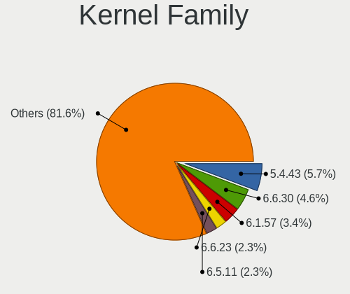
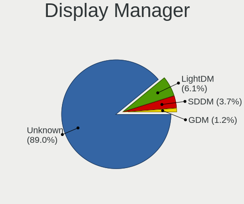
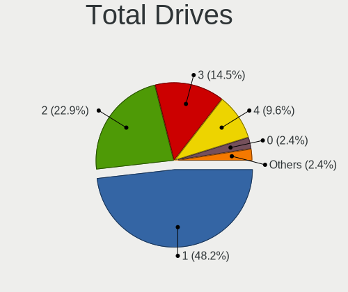
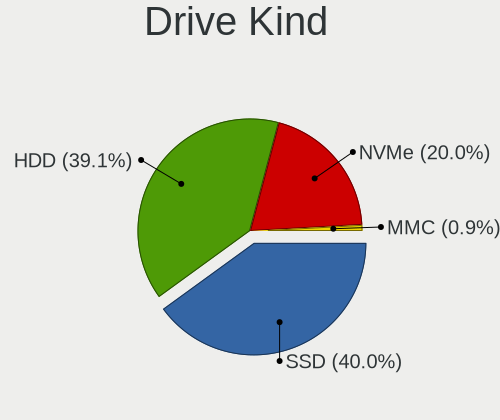
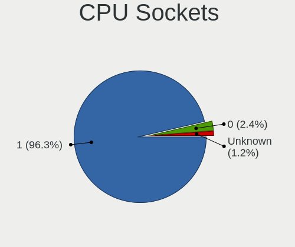
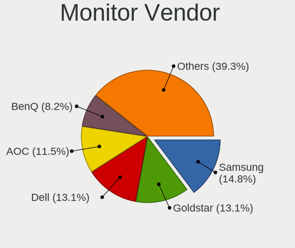
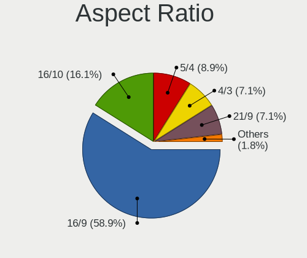
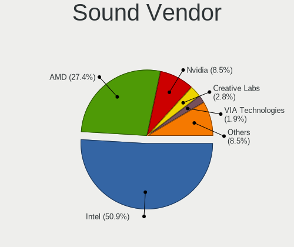

Alpine - Tested Hardware & Statistics (Desktops)
------------------------------------------------

A project to collect tested hardware configurations for Alpine.

Anyone can contribute to this report by the [hw-probe](https://github.com/linuxhw/hw-probe) tool:

    sudo -E hw-probe -all -upload

Please contribute! Especially if your hardware is rare.

Contents
--------

* [ Test Cases ](#test-cases)

* [ System ](#system)
  - [ OS                       ](#os)
  - [ OS Family                ](#os-family)
  - [ Kernel                   ](#kernel)
  - [ Kernel Family            ](#kernel-family)
  - [ Kernel Major Ver.        ](#kernel-major-ver)
  - [ Arch                     ](#arch)
  - [ DE                       ](#de)
  - [ Display Server           ](#display-server)
  - [ Display Manager          ](#display-manager)
  - [ OS Lang                  ](#os-lang)
  - [ Boot Mode                ](#boot-mode)
  - [ Filesystem               ](#filesystem)
  - [ Part. scheme             ](#part-scheme)
  - [ Dual Boot with Linux/BSD ](#dual-boot-with-linuxbsd)
  - [ Dual Boot (Win)          ](#dual-boot-win)

* [ Board ](#board)
  - [ Vendor                   ](#vendor)
  - [ Model                    ](#model)
  - [ Model Family             ](#model-family)
  - [ MFG Year                 ](#mfg-year)
  - [ Form Factor              ](#form-factor)
  - [ Secure Boot              ](#secure-boot)
  - [ Coreboot                 ](#coreboot)
  - [ RAM Size                 ](#ram-size)
  - [ RAM Used                 ](#ram-used)
  - [ Total Drives             ](#total-drives)
  - [ Has CD-ROM               ](#has-cd-rom)
  - [ Has Ethernet             ](#has-ethernet)
  - [ Has WiFi                 ](#has-wifi)
  - [ Has Bluetooth            ](#has-bluetooth)

* [ Location ](#location)
  - [ Country                  ](#country)
  - [ City                     ](#city)

* [ Drives ](#drives)
  - [ Drive Vendor             ](#drive-vendor)
  - [ Drive Model              ](#drive-model)
  - [ HDD Vendor               ](#hdd-vendor)
  - [ SSD Vendor               ](#ssd-vendor)
  - [ Drive Kind               ](#drive-kind)
  - [ Drive Connector          ](#drive-connector)
  - [ Drive Size               ](#drive-size)
  - [ Space Total              ](#space-total)
  - [ Space Used               ](#space-used)
  - [ Malfunc. Drives          ](#malfunc-drives)
  - [ Malfunc. Drive Vendor    ](#malfunc-drive-vendor)
  - [ Malfunc. HDD Vendor      ](#malfunc-hdd-vendor)
  - [ Malfunc. Drive Kind      ](#malfunc-drive-kind)
  - [ Failed Drives            ](#failed-drives)
  - [ Failed Drive Vendor      ](#failed-drive-vendor)
  - [ Drive Status             ](#drive-status)

* [ Storage controller ](#storage-controller)
  - [ Storage Vendor           ](#storage-vendor)
  - [ Storage Model            ](#storage-model)
  - [ Storage Kind             ](#storage-kind)

* [ Processor ](#processor)
  - [ CPU Vendor               ](#cpu-vendor)
  - [ CPU Model                ](#cpu-model)
  - [ CPU Model Family         ](#cpu-model-family)
  - [ CPU Cores                ](#cpu-cores)
  - [ CPU Sockets              ](#cpu-sockets)
  - [ CPU Threads              ](#cpu-threads)
  - [ CPU Op-Modes             ](#cpu-op-modes)
  - [ CPU Microcode            ](#cpu-microcode)
  - [ CPU Microarch            ](#cpu-microarch)

* [ Graphics ](#graphics)
  - [ GPU Vendor               ](#gpu-vendor)
  - [ GPU Model                ](#gpu-model)
  - [ GPU Combo                ](#gpu-combo)
  - [ GPU Driver               ](#gpu-driver)
  - [ GPU Memory               ](#gpu-memory)

* [ Monitor ](#monitor)
  - [ Monitor Vendor           ](#monitor-vendor)
  - [ Monitor Model            ](#monitor-model)
  - [ Monitor Resolution       ](#monitor-resolution)
  - [ Monitor Diagonal         ](#monitor-diagonal)
  - [ Monitor Width            ](#monitor-width)
  - [ Aspect Ratio             ](#aspect-ratio)
  - [ Monitor Area             ](#monitor-area)
  - [ Pixel Density            ](#pixel-density)
  - [ Multiple Monitors        ](#multiple-monitors)

* [ Network ](#network)
  - [ Net Controller Vendor    ](#net-controller-vendor)
  - [ Net Controller Model     ](#net-controller-model)
  - [ Wireless Vendor          ](#wireless-vendor)
  - [ Wireless Model           ](#wireless-model)
  - [ Ethernet Vendor          ](#ethernet-vendor)
  - [ Ethernet Model           ](#ethernet-model)
  - [ Net Controller Kind      ](#net-controller-kind)
  - [ Used Controller          ](#used-controller)
  - [ NICs                     ](#nics)
  - [ IPv6                     ](#ipv6)

* [ Bluetooth ](#bluetooth)
  - [ Bluetooth Vendor         ](#bluetooth-vendor)
  - [ Bluetooth Model          ](#bluetooth-model)

* [ Sound ](#sound)
  - [ Sound Vendor             ](#sound-vendor)
  - [ Sound Model              ](#sound-model)

* [ Memory ](#memory)
  - [ Memory Vendor            ](#memory-vendor)
  - [ Memory Model             ](#memory-model)
  - [ Memory Kind              ](#memory-kind)
  - [ Memory Form Factor       ](#memory-form-factor)
  - [ Memory Size              ](#memory-size)
  - [ Memory Speed             ](#memory-speed)

* [ Printers & scanners ](#printers--scanners)
  - [ Printer Vendor           ](#printer-vendor)
  - [ Printer Model            ](#printer-model)
  - [ Scanner Vendor           ](#scanner-vendor)
  - [ Scanner Model            ](#scanner-model)

* [ Camera ](#camera)
  - [ Camera Vendor            ](#camera-vendor)
  - [ Camera Model             ](#camera-model)

* [ Security ](#security)
  - [ Fingerprint Vendor       ](#fingerprint-vendor)
  - [ Fingerprint Model        ](#fingerprint-model)
  - [ Chipcard Vendor          ](#chipcard-vendor)
  - [ Chipcard Model           ](#chipcard-model)

* [ Unsupported ](#unsupported)
  - [ Unsupported Devices      ](#unsupported-devices)
  - [ Unsupported Device Types ](#unsupported-device-types)

Test Cases
----------

Total: 68

| Vendor        | Model                       | Probe                                                      | Date         |
|---------------|-----------------------------|------------------------------------------------------------|--------------|
| Dell          | 03KWTV A02                  | [4d26902a65](https://linux-hardware.org/?probe=4d26902a65) | Aug 12, 2023 |
| Dell          | 03KWTV A02                  | [d4a16b0b3e](https://linux-hardware.org/?probe=d4a16b0b3e) | Aug 10, 2023 |
| Dell          | 03KWTV A02                  | [294dcce02b](https://linux-hardware.org/?probe=294dcce02b) | Aug 04, 2023 |
| ASRock        | 970 Extreme4                | [de055c3a95](https://linux-hardware.org/?probe=de055c3a95) | Jul 17, 2023 |
| ASUSTek       | Z170-E                      | [8be9720ca6](https://linux-hardware.org/?probe=8be9720ca6) | Jun 29, 2023 |
| ASUSTek       | PRIME B360M-C               | [4dca77df51](https://linux-hardware.org/?probe=4dca77df51) | Jun 21, 2023 |
| HP            | 83E2                        | [0db8dcbc23](https://linux-hardware.org/?probe=0db8dcbc23) | May 28, 2023 |
| MSI           | MAG B460M MORTAR            | [da74cacf64](https://linux-hardware.org/?probe=da74cacf64) | May 18, 2023 |
| Gigabyte      | Z170X-UD5-CF                | [429dc207a6](https://linux-hardware.org/?probe=429dc207a6) | May 15, 2023 |
| Gigabyte      | Z170X-UD5-CF                | [f887e6f037](https://linux-hardware.org/?probe=f887e6f037) | May 15, 2023 |
| UGREEN        | DX4600                      | [cbe70de89c](https://linux-hardware.org/?probe=cbe70de89c) | Apr 19, 2023 |
| ASUSTek       | PRIME B360M-C               | [8cf7b9cc76](https://linux-hardware.org/?probe=8cf7b9cc76) | Mar 23, 2023 |
| Intel         | D525MW AAE93082-401         | [590309a32b](https://linux-hardware.org/?probe=590309a32b) | Mar 18, 2023 |
| Intel         | D525MW AAE93082-401         | [bc847b4586](https://linux-hardware.org/?probe=bc847b4586) | Mar 09, 2023 |
| Intel         | D525MW AAE93082-401         | [d02959f9ad](https://linux-hardware.org/?probe=d02959f9ad) | Mar 02, 2023 |
| Dell          | 03KWTV A02                  | [b3d00219b0](https://linux-hardware.org/?probe=b3d00219b0) | Feb 07, 2023 |
| ASRock        | X470 Master SLI/ac          | [d8f1121a19](https://linux-hardware.org/?probe=d8f1121a19) | Jan 19, 2023 |
| Lenovo        | SHARKBAY 0B98401 WIN        | [68a73ee517](https://linux-hardware.org/?probe=68a73ee517) | Jan 19, 2023 |
| ASRock        | X470 Master SLI/ac          | [6b6a4929de](https://linux-hardware.org/?probe=6b6a4929de) | Jan 16, 2023 |
| ASRock        | X470 Master SLI/ac          | [8775308115](https://linux-hardware.org/?probe=8775308115) | Jan 15, 2023 |
| Gigabyte      | X570S AERO G                | [473b4d0e6e](https://linux-hardware.org/?probe=473b4d0e6e) | Jan 11, 2023 |
| Lenovo        | SHARKBAY 0B98401 WIN        | [747c3d8c1f](https://linux-hardware.org/?probe=747c3d8c1f) | Jan 11, 2023 |
| Gigabyte      | X570S AERO G                | [053b8697ce](https://linux-hardware.org/?probe=053b8697ce) | Jan 06, 2023 |
| Dell          | 0J1C3P A00                  | [5da7f2d3a9](https://linux-hardware.org/?probe=5da7f2d3a9) | Dec 27, 2022 |
| Dell          | 03V7GF A01                  | [3847c61b81](https://linux-hardware.org/?probe=3847c61b81) | Dec 17, 2022 |
| Dell          | 03V7GF A01                  | [e491b54a3c](https://linux-hardware.org/?probe=e491b54a3c) | Dec 17, 2022 |
| Gigabyte      | B550 AORUS ELITE V2         | [bbf4464c41](https://linux-hardware.org/?probe=bbf4464c41) | Nov 27, 2022 |
| Fujitsu       | FujitsuTP7000 -1            | [89198d262f](https://linux-hardware.org/?probe=89198d262f) | Nov 17, 2022 |
| Lenovo        | 31900058 STD                | [d7cc344b2f](https://linux-hardware.org/?probe=d7cc344b2f) | Oct 31, 2022 |
| Lenovo        | 31900058 STD                | [9f7158b883](https://linux-hardware.org/?probe=9f7158b883) | Oct 16, 2022 |
| HP            | 1493                        | [60ebd1d8dd](https://linux-hardware.org/?probe=60ebd1d8dd) | Sep 29, 2022 |
| Gateway       | SX2185                      | [8372be8fe3](https://linux-hardware.org/?probe=8372be8fe3) | Sep 29, 2022 |
| ASRock        | H81M                        | [d59c4705a2](https://linux-hardware.org/?probe=d59c4705a2) | Aug 17, 2022 |
| Intel         | DH61BF AAG81311-101         | [5a3ed0cf62](https://linux-hardware.org/?probe=5a3ed0cf62) | Jul 30, 2022 |
| Intel         | DH61BF AAG81311-101         | [719bbf817c](https://linux-hardware.org/?probe=719bbf817c) | Jul 30, 2022 |
| Intel         | DQ67SW AAG12527-310         | [9a4907d88c](https://linux-hardware.org/?probe=9a4907d88c) | Jul 17, 2022 |
| Unknown       | Unknown                     | [d857b93614](https://linux-hardware.org/?probe=d857b93614) | Jul 13, 2022 |
| Lenovo        | 31900058 STD                | [2f6356a177](https://linux-hardware.org/?probe=2f6356a177) | Jun 17, 2022 |
| Lenovo        | 31900058 STD                | [582fd88dbe](https://linux-hardware.org/?probe=582fd88dbe) | Jun 14, 2022 |
| MSI           | Z170A GAMING PRO            | [73b3e29101](https://linux-hardware.org/?probe=73b3e29101) | Jun 14, 2022 |
| ASRock        | B460 Phantom Gaming 4       | [e692b2a091](https://linux-hardware.org/?probe=e692b2a091) | May 26, 2022 |
| ASUSTek       | H97-PLUS                    | [cab2025064](https://linux-hardware.org/?probe=cab2025064) | May 24, 2022 |
| MSI           | J1900I                      | [86f37a71f5](https://linux-hardware.org/?probe=86f37a71f5) | May 15, 2022 |
| MSI           | J1900I                      | [5a48d83596](https://linux-hardware.org/?probe=5a48d83596) | May 15, 2022 |
| ASUSTek       | Z97-K                       | [53cba6b4f8](https://linux-hardware.org/?probe=53cba6b4f8) | Apr 14, 2022 |
| Gigabyte      | Z490I AORUS ULTRA           | [908edb3724](https://linux-hardware.org/?probe=908edb3724) | Jan 27, 2022 |
| Dell          | 02YRK5 A02                  | [58c2ed388b](https://linux-hardware.org/?probe=58c2ed388b) | Dec 02, 2021 |
| HP            | 21B4 A01                    | [98accc83e4](https://linux-hardware.org/?probe=98accc83e4) | Nov 11, 2021 |
| Dell          | 0T10XW A00                  | [585636f7fe](https://linux-hardware.org/?probe=585636f7fe) | Sep 08, 2021 |
| Shuttle       | FS81                        | [9a98a31681](https://linux-hardware.org/?probe=9a98a31681) | Sep 06, 2021 |
| Dell          | 03KWTV A02                  | [3199a22608](https://linux-hardware.org/?probe=3199a22608) | Jul 15, 2021 |
| Dell          | 0VRWRC A00                  | [37a6ad6e02](https://linux-hardware.org/?probe=37a6ad6e02) | Apr 09, 2021 |
| ASUSTek       | P8H67-V                     | [89edd8b343](https://linux-hardware.org/?probe=89edd8b343) | Mar 17, 2021 |
| HP            | ProLiant MicroServer Gen... | [af637820c2](https://linux-hardware.org/?probe=af637820c2) | Feb 12, 2021 |
| VIA Techno... | KM266APro-835               | [1334ad3f74](https://linux-hardware.org/?probe=1334ad3f74) | Dec 22, 2020 |
| Fujitsu       | D2779 S26361-D2779-A1       | [07795a357a](https://linux-hardware.org/?probe=07795a357a) | Oct 09, 2020 |
| Dell          | 0PU052                      | [9a31999f07](https://linux-hardware.org/?probe=9a31999f07) | Aug 31, 2020 |
| ASUSTek       | TS10                        | [71d7f6e110](https://linux-hardware.org/?probe=71d7f6e110) | Aug 20, 2020 |
| VIA Techno... | KM266APro-835               | [25ec3d44ff](https://linux-hardware.org/?probe=25ec3d44ff) | Aug 16, 2020 |
| Gigabyte      | Z490I AORUS ULTRA           | [58dce1215c](https://linux-hardware.org/?probe=58dce1215c) | Aug 13, 2020 |
| ASUSTek       | PRIME H370M-PLUS            | [0c50242cc5](https://linux-hardware.org/?probe=0c50242cc5) | Aug 09, 2020 |
| Dell          | 03KWTV A02                  | [d05c262e67](https://linux-hardware.org/?probe=d05c262e67) | Aug 06, 2020 |
| ASRock        | J3455M                      | [05f9d5c3b4](https://linux-hardware.org/?probe=05f9d5c3b4) | Aug 06, 2020 |
| eMachines     | EL1352G                     | [4513d2931f](https://linux-hardware.org/?probe=4513d2931f) | Jul 03, 2020 |
| eMachines     | EL1352G                     | [4b26717c89](https://linux-hardware.org/?probe=4b26717c89) | Jul 03, 2020 |
| ASRock        | J3455M                      | [3719f96b60](https://linux-hardware.org/?probe=3719f96b60) | Jul 03, 2020 |
| Unknown       | i855GM/E-ITE8712            | [7b9cbd816b](https://linux-hardware.org/?probe=7b9cbd816b) | Dec 27, 2019 |
| ASRock        | D1800B-ITX                  | [f962d4bbf9](https://linux-hardware.org/?probe=f962d4bbf9) | Dec 22, 2019 |

System
------

OS
--

Installed operating systems

| Name                        | Desktops | Percent |
|-----------------------------|----------|---------|
| Alpine 3.12.0               | 6        | 12.5%   |
| Alpine 3.17_alpha20220809   | 4        | 8.33%   |
| Alpine 3.15.4               | 4        | 8.33%   |
| Alpine 3.18.0               | 3        | 6.25%   |
| Alpine 3.16.0               | 3        | 6.25%   |
| Alpine 3.13.0_alpha20200626 | 3        | 6.25%   |
| Alpine 3.18.2               | 2        | 4.17%   |
| Alpine 3.17.2               | 2        | 4.17%   |
| Alpine 3.17.1               | 2        | 4.17%   |
| Alpine 3.16.1               | 2        | 4.17%   |
| Alpine 3.11.2               | 2        | 4.17%   |
| Alpine 3.8.4                | 1        | 2.08%   |
| Alpine 3.17.4               | 1        | 2.08%   |
| Alpine 3.17.0               | 1        | 2.08%   |
| Alpine 3.16.3               | 1        | 2.08%   |
| Alpine 3.16.2               | 1        | 2.08%   |
| Alpine 3.16.0_alpha20220328 | 1        | 2.08%   |
| Alpine 3.15.6               | 1        | 2.08%   |
| Alpine 3.15.0               | 1        | 2.08%   |
| Alpine 3.14.2               | 1        | 2.08%   |
| Alpine 3.14.0               | 1        | 2.08%   |
| Alpine 3.13.6               | 1        | 2.08%   |
| Alpine 3.13.2               | 1        | 2.08%   |
| Alpine 3.13.1               | 1        | 2.08%   |
| Alpine 3.13.0_alpha20201218 | 1        | 2.08%   |
| Alpine 3.12.3               | 1        | 2.08%   |

OS Family
---------

OS without a version

| Name   | Desktops | Percent |
|--------|----------|---------|
| Alpine | 43       | 100%    |

Kernel
------

Version of the Linux kernel

| Version           | Desktops | Percent |
|-------------------|----------|---------|
| 5.4.43-1-lts      | 5        | 10.64%  |
| 5.15.60-0-lts     | 2        | 4.26%   |
| 6.3.3-0-edge      | 1        | 2.13%   |
| 6.1.36-0-lts      | 1        | 2.13%   |
| 6.1.34-0-lts      | 1        | 2.13%   |
| 6.1.30-0-lts      | 1        | 2.13%   |
| 6.1.28-2-lts      | 1        | 2.13%   |
| 6.0.10-0-edge     | 1        | 2.13%   |
| 5.8.0             | 1        | 2.13%   |
| 5.7.4             | 1        | 2.13%   |
| 5.4.84-0-lts      | 1        | 2.13%   |
| 5.4.6-0-lts       | 1        | 2.13%   |
| 5.4.58-0-lts      | 1        | 2.13%   |
| 5.4.57-0-lts      | 1        | 2.13%   |
| 5.4.0-77-generic  | 1        | 2.13%   |
| 5.19.0-50-generic | 1        | 2.13%   |
| 5.18.0-0-asahi    | 1        | 2.13%   |
| 5.17.9-0-edge     | 1        | 2.13%   |
| 5.17.3-0-edge     | 1        | 2.13%   |
| 5.15.98-0-lts     | 1        | 2.13%   |
| 5.15.87-0-lts     | 1        | 2.13%   |
| 5.15.86-0-lts     | 1        | 2.13%   |
| 5.15.83-0-lts     | 1        | 2.13%   |
| 5.15.80           | 1        | 2.13%   |
| 5.15.74-0-lts     | 1        | 2.13%   |
| 5.15.70-0-lts     | 1        | 2.13%   |
| 5.15.64-1-pve     | 1        | 2.13%   |
| 5.15.57-0-lts     | 1        | 2.13%   |
| 5.15.46-1-lts     | 1        | 2.13%   |
| 5.15.40-0-lts     | 1        | 2.13%   |
| 5.15.38-0-lts     | 1        | 2.13%   |
| 5.15.32-0-lts     | 1        | 2.13%   |
| 5.15.17-0-lts     | 1        | 2.13%   |
| 5.14.0-1054-oem   | 1        | 2.13%   |
| 5.10.81           | 1        | 2.13%   |
| 5.10.61-0-lts     | 1        | 2.13%   |
| 5.10.16-0-lts     | 1        | 2.13%   |
| 5.10.12-0-lts     | 1        | 2.13%   |
| 5.10.1-0-lts      | 1        | 2.13%   |
| 4.4.180+          | 1        | 2.13%   |

Kernel Family
-------------

Linux kernel without a distro release

| Version | Desktops | Percent |
|---------|----------|---------|
| 5.4.43  | 5        | 10.64%  |
| 5.15.60 | 2        | 4.26%   |
| 6.3.3   | 1        | 2.13%   |
| 6.1.36  | 1        | 2.13%   |
| 6.1.34  | 1        | 2.13%   |
| 6.1.30  | 1        | 2.13%   |
| 6.1.28  | 1        | 2.13%   |
| 6.0.10  | 1        | 2.13%   |
| 5.8.0   | 1        | 2.13%   |
| 5.7.4   | 1        | 2.13%   |
| 5.4.84  | 1        | 2.13%   |
| 5.4.6   | 1        | 2.13%   |
| 5.4.58  | 1        | 2.13%   |
| 5.4.57  | 1        | 2.13%   |
| 5.4.0   | 1        | 2.13%   |
| 5.19.0  | 1        | 2.13%   |
| 5.18.0  | 1        | 2.13%   |
| 5.17.9  | 1        | 2.13%   |
| 5.17.3  | 1        | 2.13%   |
| 5.15.98 | 1        | 2.13%   |
| 5.15.87 | 1        | 2.13%   |
| 5.15.86 | 1        | 2.13%   |
| 5.15.83 | 1        | 2.13%   |
| 5.15.80 | 1        | 2.13%   |
| 5.15.74 | 1        | 2.13%   |
| 5.15.70 | 1        | 2.13%   |
| 5.15.64 | 1        | 2.13%   |
| 5.15.57 | 1        | 2.13%   |
| 5.15.46 | 1        | 2.13%   |
| 5.15.40 | 1        | 2.13%   |
| 5.15.38 | 1        | 2.13%   |
| 5.15.32 | 1        | 2.13%   |
| 5.15.17 | 1        | 2.13%   |
| 5.14.0  | 1        | 2.13%   |
| 5.10.81 | 1        | 2.13%   |
| 5.10.61 | 1        | 2.13%   |
| 5.10.16 | 1        | 2.13%   |
| 5.10.12 | 1        | 2.13%   |
| 5.10.1  | 1        | 2.13%   |
| 4.4.180 | 1        | 2.13%   |

Kernel Major Ver.
-----------------

Linux kernel major version

| Version | Desktops | Percent |
|---------|----------|---------|
| 5.15    | 15       | 32.61%  |
| 5.4     | 10       | 21.74%  |
| 5.10    | 5        | 10.87%  |
| 6.1     | 4        | 8.7%    |
| 5.17    | 2        | 4.35%   |
| 6.3     | 1        | 2.17%   |
| 6.0     | 1        | 2.17%   |
| 5.8     | 1        | 2.17%   |
| 5.7     | 1        | 2.17%   |
| 5.19    | 1        | 2.17%   |
| 5.18    | 1        | 2.17%   |
| 5.14    | 1        | 2.17%   |
| 4.4     | 1        | 2.17%   |
| 4.14    | 1        | 2.17%   |
| 3.10    | 1        | 2.17%   |

Arch
----

OS architecture (x86_64, i586, etc.)

| Name    | Desktops | Percent |
|---------|----------|---------|
| x86_64  | 39       | 90.7%   |
| i686    | 3        | 6.98%   |
| aarch64 | 1        | 2.33%   |

DE
--

Desktop Environment

| Name    | Desktops | Percent |
|---------|----------|---------|
| Unknown | 36       | 83.72%  |
| XFCE    | 2        | 4.65%   |
| GNOME   | 2        | 4.65%   |
| sway    | 1        | 2.33%   |
| KDE5    | 1        | 2.33%   |
| i3      | 1        | 2.33%   |

Display Server
--------------

X11 or Wayland

| Name    | Desktops | Percent |
|---------|----------|---------|
| Unknown | 32       | 74.42%  |
| X11     | 8        | 18.6%   |
| Wayland | 3        | 6.98%   |

Display Manager
---------------

SDDM, LightDM, etc.

| Name    | Desktops | Percent |
|---------|----------|---------|
| Unknown | 40       | 93.02%  |
| LightDM | 2        | 4.65%   |
| SDDM    | 1        | 2.33%   |

OS Lang
-------

Language

| Lang    | Desktops | Percent |
|---------|----------|---------|
| C       | 27       | 61.36%  |
| Unknown | 15       | 34.09%  |
| pt_BR   | 1        | 2.27%   |
| en_US   | 1        | 2.27%   |

Boot Mode
---------

EFI or BIOS

| Mode | Desktops | Percent |
|------|----------|---------|
| BIOS | 27       | 61.36%  |
| EFI  | 17       | 38.64%  |

Filesystem
----------

Type of filesystem

| Type    | Desktops | Percent |
|---------|----------|---------|
| Ext4    | 34       | 77.27%  |
| Overlay | 3        | 6.82%   |
| Btrfs   | 3        | 6.82%   |
| Tmpfs   | 2        | 4.55%   |
| Zfs     | 1        | 2.27%   |
| Unknown | 1        | 2.27%   |

Part. scheme
------------

Scheme of partitioning

| Type    | Desktops | Percent |
|---------|----------|---------|
| Unknown | 27       | 60%     |
| GPT     | 13       | 28.89%  |
| MBR     | 5        | 11.11%  |

Dual Boot with Linux/BSD
------------------------

Hosting more than one Linux/BSD

| Dual boot | Desktops | Percent |
|-----------|----------|---------|
| No        | 35       | 81.4%   |
| Yes       | 8        | 18.6%   |

Dual Boot (Win)
---------------

Hosting Linux and Windows

| Dual boot | Desktops | Percent |
|-----------|----------|---------|
| No        | 40       | 90.91%  |
| Yes       | 4        | 9.09%   |

Board
-----

Vendor
------

Motherboard manufacturer

| Name                | Desktops | Percent |
|---------------------|----------|---------|
| Dell                | 7        | 16.28%  |
| ASUSTek Computer    | 7        | 16.28%  |
| Gigabyte Technology | 5        | 11.63%  |
| ASRock              | 5        | 11.63%  |
| Intel               | 3        | 6.98%   |
| Hewlett-Packard     | 3        | 6.98%   |
| MSI                 | 2        | 4.65%   |
| Lenovo              | 2        | 4.65%   |
| Fujitsu             | 2        | 4.65%   |
| Unknown             | 2        | 4.65%   |
| VIA Technologies    | 1        | 2.33%   |
| UGREEN              | 1        | 2.33%   |
| Shuttle             | 1        | 2.33%   |
| Gateway             | 1        | 2.33%   |
| eMachines           | 1        | 2.33%   |

Model
-----

Motherboard model

| Name                               | Desktops | Percent |
|------------------------------------|----------|---------|
| Gigabyte Z490I AORUS ULTRA         | 2        | 4.65%   |
| ASUS All Series                    | 2        | 4.65%   |
| Unknown                            | 2        | 4.65%   |
| VIA KM266APro-835                  | 1        | 2.33%   |
| UGREEN DX4600                      | 1        | 2.33%   |
| Shuttle DS81D                      | 1        | 2.33%   |
| MSI MS-7C82                        | 1        | 2.33%   |
| MSI MS-7877                        | 1        | 2.33%   |
| Lenovo ThinkCentre M93p 10AB0016US | 1        | 2.33%   |
| Lenovo H535 10117                  | 1        | 2.33%   |
| Intel DQ67SW                       | 1        | 2.33%   |
| Intel DH61BF AAG81311-101          | 1        | 2.33%   |
| Intel D525MW AAE93082-401          | 1        | 2.33%   |
| HP ProLiant MicroServer Gen8       | 1        | 2.33%   |
| HP EliteDesk 800 G4 DM 35W         | 1        | 2.33%   |
| HP Compaq 4000 Pro SFF PC          | 1        | 2.33%   |
| Gigabyte Z170X-UD5                 | 1        | 2.33%   |
| Gigabyte X570S AERO G              | 1        | 2.33%   |
| Gigabyte B550 AORUS ELITE V2       | 1        | 2.33%   |
| Gateway SX2185                     | 1        | 2.33%   |
| Fujitsu PRIMERGY TX100 S2          | 1        | 2.33%   |
| Fujitsu FujitsuTP7000              | 1        | 2.33%   |
| eMachines EL1352G                  | 1        | 2.33%   |
| Dell Precision 3660                | 1        | 2.33%   |
| Dell OptiPlex 755                  | 1        | 2.33%   |
| Dell OptiPlex 5000                 | 1        | 2.33%   |
| Dell OptiPlex 3060                 | 1        | 2.33%   |
| Dell OptiPlex 3020M                | 1        | 2.33%   |
| Dell OptiPlex 3010                 | 1        | 2.33%   |
| Dell Inspiron 3647                 | 1        | 2.33%   |
| ASUS Z170-E                        | 1        | 2.33%   |
| ASUS TS10                          | 1        | 2.33%   |
| ASUS PRIME H370M-PLUS              | 1        | 2.33%   |
| ASUS PRIME B360M-C                 | 1        | 2.33%   |
| ASUS P8H67-V                       | 1        | 2.33%   |
| ASRock X470 Master SLI/ac          | 1        | 2.33%   |
| ASRock J3455M                      | 1        | 2.33%   |
| ASRock H81M                        | 1        | 2.33%   |
| ASRock D1800B-ITX                  | 1        | 2.33%   |
| ASRock 970 Extreme4                | 1        | 2.33%   |

Model Family
------------

Motherboard model prefix

| Name                  | Desktops | Percent |
|-----------------------|----------|---------|
| Dell OptiPlex         | 5        | 11.63%  |
| Gigabyte Z490I        | 2        | 4.65%   |
| ASUS PRIME            | 2        | 4.65%   |
| ASUS All              | 2        | 4.65%   |
| Unknown               | 2        | 4.65%   |
| VIA KM266APro-835     | 1        | 2.33%   |
| UGREEN DX4600         | 1        | 2.33%   |
| Shuttle DS81D         | 1        | 2.33%   |
| MSI MS-7C82           | 1        | 2.33%   |
| MSI MS-7877           | 1        | 2.33%   |
| Lenovo ThinkCentre    | 1        | 2.33%   |
| Lenovo H535           | 1        | 2.33%   |
| Intel DQ67SW          | 1        | 2.33%   |
| Intel DH61BF          | 1        | 2.33%   |
| Intel D525MW          | 1        | 2.33%   |
| HP ProLiant           | 1        | 2.33%   |
| HP EliteDesk          | 1        | 2.33%   |
| HP Compaq             | 1        | 2.33%   |
| Gigabyte Z170X-UD5    | 1        | 2.33%   |
| Gigabyte X570S        | 1        | 2.33%   |
| Gigabyte B550         | 1        | 2.33%   |
| Gateway SX2185        | 1        | 2.33%   |
| Fujitsu PRIMERGY      | 1        | 2.33%   |
| Fujitsu FujitsuTP7000 | 1        | 2.33%   |
| eMachines EL1352G     | 1        | 2.33%   |
| Dell Precision        | 1        | 2.33%   |
| Dell Inspiron         | 1        | 2.33%   |
| ASUS Z170-E           | 1        | 2.33%   |
| ASUS TS10             | 1        | 2.33%   |
| ASUS P8H67-V          | 1        | 2.33%   |
| ASRock X470           | 1        | 2.33%   |
| ASRock J3455M         | 1        | 2.33%   |
| ASRock H81M           | 1        | 2.33%   |
| ASRock D1800B-ITX     | 1        | 2.33%   |
| ASRock 970            | 1        | 2.33%   |

MFG Year
--------

Motherboard manufacture year

| Year    | Desktops | Percent |
|---------|----------|---------|
| 2014    | 7        | 16.28%  |
| 2020    | 5        | 11.63%  |
| 2018    | 5        | 11.63%  |
| 2013    | 5        | 11.63%  |
| 2012    | 5        | 11.63%  |
| 2011    | 3        | 6.98%   |
| 2010    | 3        | 6.98%   |
| 2022    | 2        | 4.65%   |
| 2016    | 2        | 4.65%   |
| 2017    | 1        | 2.33%   |
| 2015    | 1        | 2.33%   |
| 2009    | 1        | 2.33%   |
| 2007    | 1        | 2.33%   |
| 2004    | 1        | 2.33%   |
| Unknown | 1        | 2.33%   |

Form Factor
-----------

Physical design of the computer

| Name    | Desktops | Percent |
|---------|----------|---------|
| Desktop | 43       | 100%    |

Secure Boot
-----------

Enabled or disabled

| State    | Desktops | Percent |
|----------|----------|---------|
| Disabled | 43       | 100%    |

Coreboot
--------

Have coreboot on board

| Used | Desktops | Percent |
|------|----------|---------|
| No   | 43       | 100%    |

RAM Size
--------

Total RAM memory

| Size in GB      | Desktops | Percent |
|-----------------|----------|---------|
| 16.01-24.0      | 10       | 21.28%  |
| 3.01-4.0        | 8        | 17.02%  |
| 32.01-64.0      | 7        | 14.89%  |
| 4.01-8.0        | 6        | 12.77%  |
| 8.01-16.0       | 6        | 12.77%  |
| 2.01-3.0        | 2        | 4.26%   |
| 1.01-2.0        | 2        | 4.26%   |
| 0.51-1.0        | 2        | 4.26%   |
| 0.01-0.5        | 2        | 4.26%   |
| More than 256.0 | 1        | 2.13%   |
| 64.01-256.0     | 1        | 2.13%   |

RAM Used
--------

Used RAM memory

| Used GB   | Desktops | Percent |
|-----------|----------|---------|
| 0.01-0.5  | 13       | 28.89%  |
| 1.01-2.0  | 10       | 22.22%  |
| 0.51-1.0  | 7        | 15.56%  |
| 3.01-4.0  | 5        | 11.11%  |
| 2.01-3.0  | 4        | 8.89%   |
| 4.01-8.0  | 2        | 4.44%   |
| 8.01-16.0 | 2        | 4.44%   |
| 0         | 1        | 2.22%   |
| Unknown   | 1        | 2.22%   |

Total Drives
------------

Number of drives on board

| Drives | Desktops | Percent |
|--------|----------|---------|
| 1      | 20       | 45.45%  |
| 2      | 9        | 20.45%  |
| 3      | 8        | 18.18%  |
| 4      | 5        | 11.36%  |
| 12     | 1        | 2.27%   |
| 5      | 1        | 2.27%   |

Has CD-ROM
----------

Has CD-ROM on board

| Presented | Desktops | Percent |
|-----------|----------|---------|
| No        | 38       | 86.36%  |
| Yes       | 6        | 13.64%  |

Has Ethernet
------------

Has Ethernet on board

| Presented | Desktops | Percent |
|-----------|----------|---------|
| Yes       | 42       | 97.67%  |
| No        | 1        | 2.33%   |

Has WiFi
--------

Has WiFi module

| Presented | Desktops | Percent |
|-----------|----------|---------|
| No        | 32       | 72.73%  |
| Yes       | 12       | 27.27%  |

Has Bluetooth
-------------

Has Bluetooth module

| Presented | Desktops | Percent |
|-----------|----------|---------|
| No        | 34       | 77.27%  |
| Yes       | 10       | 22.73%  |

Location
--------

Country
-------

Geographic location (country)

| Country     | Desktops | Percent |
|-------------|----------|---------|
| USA         | 11       | 24.44%  |
| Russia      | 4        | 8.89%   |
| Germany     | 4        | 8.89%   |
| UK          | 2        | 4.44%   |
| Sweden      | 2        | 4.44%   |
| Spain       | 2        | 4.44%   |
| Norway      | 2        | 4.44%   |
| Brazil      | 2        | 4.44%   |
| Ukraine     | 1        | 2.22%   |
| Switzerland | 1        | 2.22%   |
| South Korea | 1        | 2.22%   |
| Portugal    | 1        | 2.22%   |
| Poland      | 1        | 2.22%   |
| Pakistan    | 1        | 2.22%   |
| Netherlands | 1        | 2.22%   |
| Indonesia   | 1        | 2.22%   |
| Guatemala   | 1        | 2.22%   |
| Greece      | 1        | 2.22%   |
| Finland     | 1        | 2.22%   |
| China       | 1        | 2.22%   |
| Canada      | 1        | 2.22%   |
| Austria     | 1        | 2.22%   |
| Australia   | 1        | 2.22%   |
| Argentina   | 1        | 2.22%   |

City
----

Geographic location (city)

| City                 | Desktops | Percent |
|----------------------|----------|---------|
| Springfield          | 4        | 8.89%   |
| St Petersburg        | 3        | 6.67%   |
| Manitowoc            | 3        | 6.67%   |
| Frankfurt am Main    | 2        | 4.44%   |
| As                   | 2        | 4.44%   |
| Zurich               | 1        | 2.22%   |
| Tuusula              | 1        | 2.22%   |
| Stockholm            | 1        | 2.22%   |
| Somerset             | 1        | 2.22%   |
| Salzburg             | 1        | 2.22%   |
| Redwood City         | 1        | 2.22%   |
| Penza                | 1        | 2.22%   |
| Oberhausen           | 1        | 2.22%   |
| Lisbon               | 1        | 2.22%   |
| Lahore               | 1        | 2.22%   |
| Kharkiv              | 1        | 2.22%   |
| Jerez de la Frontera | 1        | 2.22%   |
| Jember               | 1        | 2.22%   |
| Heraklion            | 1        | 2.22%   |
| Hangzhou             | 1        | 2.22%   |
| Hamburg              | 1        | 2.22%   |
| Gwacheon             | 1        | 2.22%   |
| Guatemala City       | 1        | 2.22%   |
| Gothenburg           | 1        | 2.22%   |
| Gorredijk            | 1        | 2.22%   |
| Glasgow              | 1        | 2.22%   |
| General San Martin   | 1        | 2.22%   |
| Durham               | 1        | 2.22%   |
| Czarna Białostocka  | 1        | 2.22%   |
| Chicago              | 1        | 2.22%   |
| Bradford             | 1        | 2.22%   |
| Betim                | 1        | 2.22%   |
| Barrow in Furness    | 1        | 2.22%   |
| Barcelona            | 1        | 2.22%   |
| Balneário Camboriú | 1        | 2.22%   |
| Adelaide             | 1        | 2.22%   |

Drives
------

Drive Vendor
------------

Hard drive vendors

| Vendor                      | Desktops | Drives | Percent |
|-----------------------------|----------|--------|---------|
| Samsung Electronics         | 14       | 22     | 18.18%  |
| WDC                         | 11       | 17     | 14.29%  |
| Seagate                     | 10       | 22     | 12.99%  |
| HGST                        | 5        | 5      | 6.49%   |
| A-DATA Technology           | 5        | 7      | 6.49%   |
| Toshiba                     | 4        | 4      | 5.19%   |
| SanDisk                     | 4        | 6      | 5.19%   |
| Crucial                     | 4        | 7      | 5.19%   |
| Kingston                    | 3        | 3      | 3.9%    |
| Hitachi                     | 3        | 3      | 3.9%    |
| SK hynix                    | 2        | 2      | 2.6%    |
| Intel                       | 2        | 3      | 2.6%    |
| Unknown                     | 1        | 1      | 1.3%    |
| Transcend                   | 1        | 1      | 1.3%    |
| SPCC                        | 1        | 1      | 1.3%    |
| Phison Electronics          | 1        | 1      | 1.3%    |
| LITEON                      | 1        | 1      | 1.3%    |
| Lexar                       | 1        | 1      | 1.3%    |
| KIOXIA                      | 1        | 1      | 1.3%    |
| Kingston Technology Company | 1        | 1      | 1.3%    |
| Kingmax                     | 1        | 1      | 1.3%    |
| Apple                       | 1        | 3      | 1.3%    |

Drive Model
-----------

Hard drive models

| Model                                               | Desktops | Percent |
|-----------------------------------------------------|----------|---------|
| Samsung SSD 960 EVO 500GB                           | 2        | 2.17%   |
| Samsung SSD 870 QVO 1TB                             | 2        | 2.17%   |
| Samsung NVMe SSD Controller SM981/PM981/PM983 500GB | 2        | 2.17%   |
| WDC WDS500G2B0A 500GB SSD                           | 1        | 1.09%   |
| WDC WDS250G2B0B-00YS70 250GB SSD                    | 1        | 1.09%   |
| WDC WDS250G2B0B 250GB SSD                           | 1        | 1.09%   |
| WDC WDS250G2B0A 250GB SSD                           | 1        | 1.09%   |
| WDC WD800AAJS-00 80GB                               | 1        | 1.09%   |
| WDC WD5000AZRX-00A8LB0 500GB                        | 1        | 1.09%   |
| WDC WD40EFZX-68AWUN0 4TB                            | 1        | 1.09%   |
| WDC WD3200AAKX-0 320GB                              | 1        | 1.09%   |
| WDC WD20EZRZ-00Z 2TB                                | 1        | 1.09%   |
| WDC WD1600BEVT-2 160GB                              | 1        | 1.09%   |
| WDC WD140EDGZ-11B2DA2 14TB                          | 1        | 1.09%   |
| WDC WD120EFBX-68B0EN0 12TB                          | 1        | 1.09%   |
| WDC WD10JPVX-75JC3T0 1TB                            | 1        | 1.09%   |
| WDC WD10EZEX-75WN4A1 1TB                            | 1        | 1.09%   |
| WDC WD10EZEX-21M2NA0 1TB                            | 1        | 1.09%   |
| Unknown MMC Card  32GB                              | 1        | 1.09%   |
| Transcend SSD 1GB                                   | 1        | 1.09%   |
| Toshiba MQ04ABF100 1TB                              | 1        | 1.09%   |
| Toshiba MQ01ABF050 500GB                            | 1        | 1.09%   |
| Toshiba MK3252GS 320GB                              | 1        | 1.09%   |
| Toshiba HDWD130 3TB                                 | 1        | 1.09%   |
| SPCC Solid State Disk 120GB                         | 1        | 1.09%   |
| SK hynix SC300 M.2 2280 256 256GB SSD               | 1        | 1.09%   |
| SK hynix BC501 NVMe Solid State Drive 512GB         | 1        | 1.09%   |
| Seagate ST980310AS 80GB                             | 1        | 1.09%   |
| Seagate ST5000LM000-2AN170 5TB                      | 1        | 1.09%   |
| Seagate ST4000VN008-2DR1 4TB                        | 1        | 1.09%   |
| Seagate ST4000NC000-1FR1 4TB                        | 1        | 1.09%   |
| Seagate ST380815AS 80GB                             | 1        | 1.09%   |
| Seagate ST3500418AS 500GB                           | 1        | 1.09%   |
| Seagate ST3000DM001-1ER166 3TB                      | 1        | 1.09%   |
| Seagate ST2000DL001-9VT1 2TB                        | 1        | 1.09%   |
| Seagate ST18000NM000J-2TV103 18TB                   | 1        | 1.09%   |
| Seagate ST14000VN0008-2KU103 14TB                   | 1        | 1.09%   |
| Seagate ST1000LM048-2E71 1TB                        | 1        | 1.09%   |
| Seagate ST1000DM010-2EP102 1TB                      | 1        | 1.09%   |
| Seagate ST1000DM003-1ER162 1TB                      | 1        | 1.09%   |

HDD Vendor
----------

Hard disk drive vendors

| Vendor              | Desktops | Drives | Percent |
|---------------------|----------|--------|---------|
| Seagate             | 10       | 22     | 30.3%   |
| WDC                 | 9        | 13     | 27.27%  |
| HGST                | 5        | 5      | 15.15%  |
| Toshiba             | 4        | 4      | 12.12%  |
| Hitachi             | 3        | 3      | 9.09%   |
| Samsung Electronics | 2        | 3      | 6.06%   |

SSD Vendor
----------

Solid state drive vendors

| Vendor              | Desktops | Drives | Percent |
|---------------------|----------|--------|---------|
| Samsung Electronics | 6        | 8      | 21.43%  |
| Crucial             | 4        | 7      | 14.29%  |
| Kingston            | 3        | 3      | 10.71%  |
| A-DATA Technology   | 3        | 3      | 10.71%  |
| WDC                 | 2        | 4      | 7.14%   |
| SanDisk             | 2        | 3      | 7.14%   |
| Intel               | 2        | 3      | 7.14%   |
| Transcend           | 1        | 1      | 3.57%   |
| SPCC                | 1        | 1      | 3.57%   |
| SK hynix            | 1        | 1      | 3.57%   |
| LITEON              | 1        | 1      | 3.57%   |
| Lexar               | 1        | 1      | 3.57%   |
| Kingmax             | 1        | 1      | 3.57%   |

Drive Kind
----------

HDD or SSD

| Kind | Desktops | Drives | Percent |
|------|----------|--------|---------|
| HDD  | 26       | 50     | 40%     |
| SSD  | 23       | 37     | 35.38%  |
| NVMe | 15       | 25     | 23.08%  |
| MMC  | 1        | 1      | 1.54%   |

Drive Connector
---------------

SATA, SAS, NVMe, etc.

| Type | Desktops | Drives | Percent |
|------|----------|--------|---------|
| SATA | 36       | 85     | 67.92%  |
| NVMe | 15       | 25     | 28.3%   |
| SAS  | 1        | 2      | 1.89%   |
| MMC  | 1        | 1      | 1.89%   |

Drive Size
----------

Size of hard drive

| Size in TB | Desktops | Drives | Percent |
|------------|----------|--------|---------|
| 0.01-0.5   | 31       | 48     | 60.78%  |
| 0.51-1.0   | 10       | 16     | 19.61%  |
| 3.01-4.0   | 3        | 7      | 5.88%   |
| 2.01-3.0   | 2        | 2      | 3.92%   |
| 10.01-20.0 | 2        | 9      | 3.92%   |
| 4.01-10.0  | 2        | 2      | 3.92%   |
| 1.01-2.0   | 1        | 3      | 1.96%   |

Space Total
-----------

Amount of disk space available on the file system

| Size in GB     | Desktops | Percent |
|----------------|----------|---------|
| Unknown        | 13       | 29.55%  |
| 101-250        | 8        | 18.18%  |
| More than 3000 | 4        | 9.09%   |
| 21-50          | 4        | 9.09%   |
| 2001-3000      | 4        | 9.09%   |
| 1-20           | 4        | 9.09%   |
| 251-500        | 2        | 4.55%   |
| 1001-2000      | 2        | 4.55%   |
| 501-1000       | 2        | 4.55%   |
| 51-100         | 1        | 2.27%   |

Space Used
----------

Amount of used disk space

| Used GB        | Desktops | Percent |
|----------------|----------|---------|
| 1-20           | 17       | 38.64%  |
| Unknown        | 13       | 29.55%  |
| 251-500        | 5        | 11.36%  |
| 21-50          | 4        | 9.09%   |
| 1001-2000      | 2        | 4.55%   |
| More than 3000 | 1        | 2.27%   |
| 2001-3000      | 1        | 2.27%   |
| 51-100         | 1        | 2.27%   |

Malfunc. Drives
---------------

Drive models with a malfunction

| Model                              | Desktops | Drives | Percent |
|------------------------------------|----------|--------|---------|
| WDC WD3200AAKX-0 320GB             | 1        | 1      | 12.5%   |
| Toshiba MK3252GS 320GB             | 1        | 1      | 12.5%   |
| SanDisk SDSA6MM 16GB SSD           | 1        | 1      | 12.5%   |
| Samsung Electronics SP0411N 40GB   | 1        | 2      | 12.5%   |
| Kingmax SSD 120G                   | 1        | 1      | 12.5%   |
| Hitachi HTS722080K9A300 80GB       | 1        | 1      | 12.5%   |
| HGST HTS725050A7 500GB             | 1        | 1      | 12.5%   |
| A-DATA Technology IM2P33F8ABR1-1TB | 1        | 1      | 12.5%   |

Malfunc. Drive Vendor
---------------------

Vendors of faulty drives

| Vendor              | Desktops | Drives | Percent |
|---------------------|----------|--------|---------|
| WDC                 | 1        | 1      | 12.5%   |
| Toshiba             | 1        | 1      | 12.5%   |
| SanDisk             | 1        | 1      | 12.5%   |
| Samsung Electronics | 1        | 2      | 12.5%   |
| Kingmax             | 1        | 1      | 12.5%   |
| Hitachi             | 1        | 1      | 12.5%   |
| HGST                | 1        | 1      | 12.5%   |
| A-DATA Technology   | 1        | 1      | 12.5%   |

Malfunc. HDD Vendor
-------------------

Vendors of faulty HDD drives

| Vendor              | Desktops | Drives | Percent |
|---------------------|----------|--------|---------|
| WDC                 | 1        | 1      | 20%     |
| Toshiba             | 1        | 1      | 20%     |
| Samsung Electronics | 1        | 2      | 20%     |
| Hitachi             | 1        | 1      | 20%     |
| HGST                | 1        | 1      | 20%     |

Malfunc. Drive Kind
-------------------

Kinds of faulty drives

| Kind | Desktops | Drives | Percent |
|------|----------|--------|---------|
| HDD  | 5        | 6      | 62.5%   |
| SSD  | 2        | 2      | 25%     |
| NVMe | 1        | 1      | 12.5%   |

Failed Drives
-------------

Failed drive models

Zero info for selected period =(

Failed Drive Vendor
-------------------

Failed drive vendors

Zero info for selected period =(

Drive Status
------------

Number of failed and malfunc. drives

| Status   | Desktops | Drives | Percent |
|----------|----------|--------|---------|
| Works    | 32       | 73     | 64%     |
| Detected | 11       | 31     | 22%     |
| Malfunc  | 7        | 9      | 14%     |

Storage controller
------------------

Storage Vendor
--------------

Storage controller vendors

| Vendor                      | Desktops | Percent |
|-----------------------------|----------|---------|
| Intel                       | 33       | 48.53%  |
| Samsung Electronics         | 8        | 11.76%  |
| AMD                         | 7        | 10.29%  |
| SanDisk                     | 2        | 2.94%   |
| Marvell Technology Group    | 2        | 2.94%   |
| LSI Logic / Symbios Logic   | 2        | 2.94%   |
| ASMedia Technology          | 2        | 2.94%   |
| ADATA Technology            | 2        | 2.94%   |
| Adaptec                     | 2        | 2.94%   |
| VIA Technologies            | 1        | 1.47%   |
| SK hynix                    | 1        | 1.47%   |
| Promise Technology          | 1        | 1.47%   |
| Phison Electronics          | 1        | 1.47%   |
| Nvidia                      | 1        | 1.47%   |
| KIOXIA                      | 1        | 1.47%   |
| Kingston Technology Company | 1        | 1.47%   |
| Broadcom / LSI              | 1        | 1.47%   |

Storage Model
-------------

Storage controller models

| Model                                                                          | Desktops | Percent |
|--------------------------------------------------------------------------------|----------|---------|
| Intel 8 Series/C220 Series Chipset Family 6-port SATA Controller 1 [AHCI mode] | 5        | 6.17%   |
| Samsung NVMe SSD Controller SM981/PM981/PM983                                  | 4        | 4.94%   |
| Intel Cannon Lake PCH SATA AHCI Controller                                     | 4        | 4.94%   |
| Intel 6 Series/C200 Series Chipset Family 6 port Desktop SATA AHCI Controller  | 4        | 4.94%   |
| AMD FCH SATA Controller [AHCI mode]                                            | 4        | 4.94%   |
| Samsung NVMe SSD Controller SM961/PM961/SM963                                  | 2        | 2.47%   |
| Marvell Group 88SE9235 PCIe 2.0 x2 4-port SATA 6 Gb/s Controller               | 2        | 2.47%   |
| LSI Logic / Symbios Logic SAS2008 PCI-Express Fusion-MPT SAS-2 [Falcon]        | 2        | 2.47%   |
| Intel Volume Management Device NVMe RAID Controller                            | 2        | 2.47%   |
| Intel Q170/Q150/B150/H170/H110/Z170/CM236 Chipset SATA Controller [AHCI Mode]  | 2        | 2.47%   |
| Intel Comet Lake SATA AHCI Controller                                          | 2        | 2.47%   |
| Intel Atom Processor E3800 Series SATA AHCI Controller                         | 2        | 2.47%   |
| Intel Alder Lake-S PCH SATA Controller [AHCI Mode]                             | 2        | 2.47%   |
| Intel 9 Series Chipset Family SATA Controller [AHCI Mode]                      | 2        | 2.47%   |
| Intel 6 Series/C200 Series Chipset Family IDE-r Controller                     | 2        | 2.47%   |
| ASMedia ASM1062 Serial ATA Controller                                          | 2        | 2.47%   |
| AMD SB7x0/SB8x0/SB9x0 SATA Controller [AHCI mode]                              | 2        | 2.47%   |
| Adaptec Series 6 - 6G SAS/PCIe 2                                               | 2        | 2.47%   |
| VIA VT82C586A/B/VT82C686/A/B/VT823x/A/C PIPC Bus Master IDE                    | 1        | 1.23%   |
| SK hynix BC501 NVMe Solid State Drive                                          | 1        | 1.23%   |
| SanDisk WD PC SN810 / Black SN850 NVMe SSD                                     | 1        | 1.23%   |
| SanDisk WD Green SN350 NVMe SSD 240GB (DRAM-less)                              | 1        | 1.23%   |
| SanDisk WD Black SN750 / PC SN730 NVMe SSD                                     | 1        | 1.23%   |
| Samsung NVMe SSD Controller SM951/PM951                                        | 1        | 1.23%   |
| Samsung NVMe SSD Controller PM9A1/PM9A3/980PRO                                 | 1        | 1.23%   |
| Samsung NVMe SSD Controller 980                                                | 1        | 1.23%   |
| Promise PDC42819 [FastTrak TX2650/TX4650]                                      | 1        | 1.23%   |
| Phison PS5013 E13 NVMe Controller                                              | 1        | 1.23%   |
| Nvidia MCP61 SATA Controller                                                   | 1        | 1.23%   |
| Nvidia MCP61 IDE                                                               | 1        | 1.23%   |
| Marvell Group 88SE9215 PCIe 2.0 x1 4-port SATA 6 Gb/s Controller               | 1        | 1.23%   |
| KIOXIA NVMe SSD Controller BG5 (DRAM-less)                                     | 1        | 1.23%   |
| Kingston Company Company Non-Volatile memory controller                        | 1        | 1.23%   |
| Intel SATA Controller [RAID mode]                                              | 1        | 1.23%   |
| Intel NM10/ICH7 Family SATA Controller [IDE mode]                              | 1        | 1.23%   |
| Intel Jasper Lake SATA AHCI Controller                                         | 1        | 1.23%   |
| Intel Celeron N3350/Pentium N4200/Atom E3900 Series SATA AHCI Controller       | 1        | 1.23%   |
| Intel C620 Series Chipset Family SSATA Controller [AHCI mode]                  | 1        | 1.23%   |
| Intel C620 Series Chipset Family SATA Controller [AHCI mode]                   | 1        | 1.23%   |
| Intel 82Q35 Express PT IDER Controller                                         | 1        | 1.23%   |

Storage Kind
------------

Kind of storage controller (IDE, SATA, NVMe, SAS, ...)

| Kind | Desktops | Percent |
|------|----------|---------|
| SATA | 34       | 51.52%  |
| NVMe | 13       | 19.7%   |
| RAID | 9        | 13.64%  |
| IDE  | 8        | 12.12%  |
| SAS  | 2        | 3.03%   |

Processor
---------

CPU Vendor
----------

Processor vendors

| Vendor  | Desktops | Percent |
|---------|----------|---------|
| Intel   | 34       | 77.27%  |
| AMD     | 9        | 20.45%  |
| Unknown | 1        | 2.27%   |

CPU Model
---------

Processor models

| Model                                   | Desktops | Percent |
|-----------------------------------------|----------|---------|
| Intel Core i9-10900 CPU @ 2.80GHz       | 2        | 4.44%   |
| Intel Core i7-4790K CPU @ 4.00GHz       | 2        | 4.44%   |
| Intel Core i5-2400 CPU @ 3.10GHz        | 2        | 4.44%   |
| Intel Core i3-4150 CPU @ 3.50GHz        | 2        | 4.44%   |
| AMD FX-8350 Eight-Core Processor        | 2        | 4.44%   |
| Intel Xeon Gold 5218 CPU @ 2.30GHz      | 1        | 2.22%   |
| Intel Xeon CPU X3430 @ 2.40GHz          | 1        | 2.22%   |
| Intel Pentium Dual CPU E2160 @ 1.80GHz  | 1        | 2.22%   |
| Intel Core i7-8700T CPU @ 2.40GHz       | 1        | 2.22%   |
| Intel Core i7-8700 CPU @ 3.20GHz        | 1        | 2.22%   |
| Intel Core i5-8400 CPU @ 2.80GHz        | 1        | 2.22%   |
| Intel Core i5-6600K CPU @ 3.50GHz       | 1        | 2.22%   |
| Intel Core i5-6400 CPU @ 2.70GHz        | 1        | 2.22%   |
| Intel Core i5-4590T CPU @ 2.00GHz       | 1        | 2.22%   |
| Intel Core i5-4570T CPU @ 2.90GHz       | 1        | 2.22%   |
| Intel Core i5-3450 CPU @ 3.10GHz        | 1        | 2.22%   |
| Intel Core i5-10400F CPU @ 2.90GHz      | 1        | 2.22%   |
| Intel Core i3-3240 CPU @ 3.40GHz        | 1        | 2.22%   |
| Intel Core i3-3220T CPU @ 2.80GHz       | 1        | 2.22%   |
| Intel Core i3-2100 CPU @ 3.10GHz        | 1        | 2.22%   |
| Intel Celeron N5105 @ 2.00GHz           | 1        | 2.22%   |
| Intel Celeron M processor 1.00GHz       | 1        | 2.22%   |
| Intel Celeron CPU J3455 @ 1.50GHz       | 1        | 2.22%   |
| Intel Celeron CPU J1900 @ 1.99GHz       | 1        | 2.22%   |
| Intel Celeron CPU J1800 @ 2.41GHz       | 1        | 2.22%   |
| Intel Celeron CPU G1850 @ 2.90GHz       | 1        | 2.22%   |
| Intel Celeron CPU E3400 @ 2.60GHz       | 1        | 2.22%   |
| Intel Atom x5-Z8350 CPU @ 1.44GHz       | 1        | 2.22%   |
| Intel Atom CPU D525 @ 1.80GHz           | 1        | 2.22%   |
| Intel 12th Gen Core i9-12900K           | 1        | 2.22%   |
| Intel 12th Gen Core i7-12700T           | 1        | 2.22%   |
| Intel 12th Gen Core i7-12700H           | 1        | 2.22%   |
| AMD Sempron 145 Processor               | 1        | 2.22%   |
| AMD Ryzen 9 3900X 12-Core Processor     | 1        | 2.22%   |
| AMD Ryzen 7 5700X 8-Core Processor      | 1        | 2.22%   |
| AMD Ryzen 7 2700X Eight-Core Processor  | 1        | 2.22%   |
| AMD Mobile Duron processor              | 1        | 2.22%   |
| AMD E1-2500 APU with Radeon HD Graphics | 1        | 2.22%   |
| AMD A8-5500 APU with Radeon HD Graphics | 1        | 2.22%   |
|                                         | 1        | 2.22%   |

CPU Model Family
----------------

Processor model prefix

| Model              | Desktops | Percent |
|--------------------|----------|---------|
| Intel Core i5      | 9        | 20%     |
| Intel Celeron      | 6        | 13.33%  |
| Other              | 5        | 11.11%  |
| Intel Core i3      | 5        | 11.11%  |
| Intel Core i7      | 4        | 8.89%   |
| Intel Core i9      | 2        | 4.44%   |
| Intel Atom         | 2        | 4.44%   |
| AMD Ryzen 7        | 2        | 4.44%   |
| AMD FX             | 2        | 4.44%   |
| Intel Xeon Gold    | 1        | 2.22%   |
| Intel Xeon         | 1        | 2.22%   |
| Intel Pentium Dual | 1        | 2.22%   |
| Intel Celeron M    | 1        | 2.22%   |
| AMD Sempron        | 1        | 2.22%   |
| AMD Ryzen 9        | 1        | 2.22%   |
| AMD E1             | 1        | 2.22%   |
| AMD A8             | 1        | 2.22%   |

CPU Cores
---------

Number of processor cores

| Number | Desktops | Percent |
|--------|----------|---------|
| 4      | 16       | 35.56%  |
| 2      | 12       | 26.67%  |
| 1      | 4        | 8.89%   |
| 8      | 3        | 6.67%   |
| 6      | 3        | 6.67%   |
| 12     | 2        | 4.44%   |
| 10     | 2        | 4.44%   |
| 32     | 1        | 2.22%   |
| 16     | 1        | 2.22%   |
| 14     | 1        | 2.22%   |

CPU Sockets
-----------

Number of sockets

| Number | Desktops | Percent |
|--------|----------|---------|
| 1      | 42       | 95.45%  |
| 2      | 1        | 2.27%   |
| 0      | 1        | 2.27%   |

CPU Threads
-----------

Threads per core (Hyper-Threading)

| Number | Desktops | Percent |
|--------|----------|---------|
| 1      | 24       | 55.81%  |
| 2      | 19       | 44.19%  |

CPU Op-Modes
------------

CPU Operation Modes (32-bit, 64-bit)

| Op mode        | Desktops | Percent |
|----------------|----------|---------|
| Unknown        | 22       | 50%     |
| 32-bit, 64-bit | 19       | 43.18%  |
| 32-bit         | 2        | 4.55%   |
| 64-bit         | 1        | 2.27%   |

CPU Microcode
-------------

Microcode number

| Number     | Desktops | Percent |
|------------|----------|---------|
| Unknown    | 25       | 55.56%  |
| 0x306c3    | 4        | 8.89%   |
| 0x906ea    | 2        | 4.44%   |
| 0x306a9    | 2        | 4.44%   |
| 0xa0655    | 1        | 2.22%   |
| 0x906a3    | 1        | 2.22%   |
| 0x90672    | 1        | 2.22%   |
| 0x6fd      | 1        | 2.22%   |
| 0x6d8      | 1        | 2.22%   |
| 0x506c9    | 1        | 2.22%   |
| 0x406c4    | 1        | 2.22%   |
| 0x106e5    | 1        | 2.22%   |
| 0x08701021 | 1        | 2.22%   |
| 0x0800820d | 1        | 2.22%   |
| 0x06000817 | 1        | 2.22%   |
| 0x010000b6 | 1        | 2.22%   |

CPU Microarch
-------------

Microarchitecture

| Name             | Desktops | Percent |
|------------------|----------|---------|
| Haswell          | 7        | 15.56%  |
| Skylake          | 3        | 6.67%   |
| Silvermont       | 3        | 6.67%   |
| SandyBridge      | 3        | 6.67%   |
| Piledriver       | 3        | 6.67%   |
| KabyLake         | 3        | 6.67%   |
| IvyBridge        | 3        | 6.67%   |
| CometLake        | 3        | 6.67%   |
| Unknown          | 3        | 6.67%   |
| Alderlake Hybrid | 2        | 4.44%   |
| Zen+             | 1        | 2.22%   |
| Zen 3            | 1        | 2.22%   |
| Zen 2            | 1        | 2.22%   |
| Penryn           | 1        | 2.22%   |
| P6               | 1        | 2.22%   |
| Nehalem          | 1        | 2.22%   |
| K6               | 1        | 2.22%   |
| K10              | 1        | 2.22%   |
| Jaguar           | 1        | 2.22%   |
| Goldmont         | 1        | 2.22%   |
| Core             | 1        | 2.22%   |
| Bonnell          | 1        | 2.22%   |

Graphics
--------

GPU Vendor
----------

Vendors of graphics cards

| Vendor                     | Desktops | Percent |
|----------------------------|----------|---------|
| Intel                      | 29       | 61.7%   |
| AMD                        | 10       | 21.28%  |
| Nvidia                     | 5        | 10.64%  |
| Matrox Electronics Systems | 2        | 4.26%   |
| VIA Technologies           | 1        | 2.13%   |

GPU Model
---------

Graphics card models

| Model                                                                                    | Desktops | Percent |
|------------------------------------------------------------------------------------------|----------|---------|
| Intel Xeon E3-1200 v3/4th Gen Core Processor Integrated Graphics Controller              | 4        | 8%      |
| Intel CoffeeLake-S GT2 [UHD Graphics 630]                                                | 4        | 8%      |
| AMD Ellesmere [Radeon RX 470/480/570/570X/580/580X/590]                                  | 4        | 8%      |
| Intel 2nd Generation Core Processor Family Integrated Graphics Controller                | 3        | 6%      |
| Intel Xeon E3-1200 v2/3rd Gen Core processor Graphics Controller                         | 2        | 4%      |
| Intel CometLake-S GT2 [UHD Graphics 630]                                                 | 2        | 4%      |
| Intel Atom Processor Z36xxx/Z37xxx Series Graphics & Display                             | 2        | 4%      |
| Intel AlderLake-S GT1                                                                    | 2        | 4%      |
| Intel 4th Generation Core Processor Family Integrated Graphics Controller                | 2        | 4%      |
| AMD Navi 23 [Radeon RX 6600/6600 XT/6600M]                                               | 2        | 4%      |
| VIA Technologies KM400/KN400/P4M800 [S3 UniChrome]                                       | 1        | 2%      |
| Nvidia GM204 [GeForce GTX 970]                                                           | 1        | 2%      |
| Nvidia GA107M [GeForce RTX 3050 Ti Mobile]                                               | 1        | 2%      |
| Nvidia GA106M [GeForce RTX 3060 Mobile / Max-Q]                                          | 1        | 2%      |
| Nvidia GA102 [GeForce RTX 3090]                                                          | 1        | 2%      |
| Nvidia GA102 [GeForce RTX 3080]                                                          | 1        | 2%      |
| Nvidia G96C [GeForce GT 120]                                                             | 1        | 2%      |
| Nvidia C61 [GeForce 6150SE nForce 430]                                                   | 1        | 2%      |
| Matrox Electronics Systems MGA G200EH                                                    | 1        | 2%      |
| Matrox Electronics Systems Integrated Matrox G200eW3 Graphics Controller                 | 1        | 2%      |
| Intel JasperLake [UHD Graphics]                                                          | 1        | 2%      |
| Intel HD Graphics 500                                                                    | 1        | 2%      |
| Intel DG2 [Arc A750]                                                                     | 1        | 2%      |
| Intel Atom/Celeron/Pentium Processor x5-E8000/J3xxx/N3xxx Integrated Graphics Controller | 1        | 2%      |
| Intel Atom Processor D4xx/D5xx/N4xx/N5xx Integrated Graphics Controller                  | 1        | 2%      |
| Intel Alder Lake-P Integrated Graphics Controller                                        | 1        | 2%      |
| Intel 82Q35 Express Integrated Graphics Controller                                       | 1        | 2%      |
| Intel 82852/855GM Integrated Graphics Device                                             | 1        | 2%      |
| Intel 4 Series Chipset Integrated Graphics Controller                                    | 1        | 2%      |
| AMD Trinity [Radeon HD 7560D]                                                            | 1        | 2%      |
| AMD Tonga XT / Amethyst XT [Radeon R9 380X / R9 M295X]                                   | 1        | 2%      |
| AMD ES1000                                                                               | 1        | 2%      |
| AMD Caicos XTX [Radeon HD 8490 / R5 235X OEM]                                            | 1        | 2%      |

GPU Combo
---------

Combinations of graphics cards

| Name            | Desktops | Percent |
|-----------------|----------|---------|
| 1 x Intel       | 26       | 57.78%  |
| 1 x AMD         | 10       | 22.22%  |
| 1 x Nvidia      | 3        | 6.67%   |
| Other           | 1        | 2.22%   |
| 2 x Intel       | 1        | 2.22%   |
| 1 x VIA         | 1        | 2.22%   |
| Nvidia + Matrox | 1        | 2.22%   |
| 1 x Matrox      | 1        | 2.22%   |
| Intel + Nvidia  | 1        | 2.22%   |

GPU Driver
----------

Free vs proprietary

| Driver      | Desktops | Percent |
|-------------|----------|---------|
| Free        | 35       | 79.55%  |
| Unknown     | 8        | 18.18%  |
| Proprietary | 1        | 2.27%   |

GPU Memory
----------

Total video memory

| Size in GB | Desktops | Percent |
|------------|----------|---------|
| Unknown    | 34       | 79.07%  |
| 7.01-8.0   | 3        | 6.98%   |
| 0.01-0.5   | 2        | 4.65%   |
| 3.01-4.0   | 1        | 2.33%   |
| 1.01-2.0   | 1        | 2.33%   |
| 8.01-16.0  | 1        | 2.33%   |
| 0.51-1.0   | 1        | 2.33%   |

Monitor
-------

Monitor Vendor
--------------

Monitor vendors

| Vendor              | Desktops | Percent |
|---------------------|----------|---------|
| Dell                | 8        | 22.86%  |
| Goldstar            | 5        | 14.29%  |
| BenQ                | 5        | 14.29%  |
| Samsung Electronics | 4        | 11.43%  |
| AOC                 | 4        | 11.43%  |
| Acer                | 2        | 5.71%   |
| ViewSonic           | 1        | 2.86%   |
| Philips             | 1        | 2.86%   |
| Mi                  | 1        | 2.86%   |
| KVM                 | 1        | 2.86%   |
| Elo Touch           | 1        | 2.86%   |
| CTC                 | 1        | 2.86%   |
| BOE                 | 1        | 2.86%   |

Monitor Model
-------------

Monitor models

| Model                                                                | Desktops | Percent |
|----------------------------------------------------------------------|----------|---------|
| Dell 2009W DEL4041 1680x1050 433x270mm 20.1-inch                     | 3        | 7.89%   |
| Samsung Electronics SE790C SAM0BFE 3440x1440 797x333mm 34.0-inch     | 2        | 5.26%   |
| ViewSonic VG2030wm VSCA51E 1680x1050 433x270mm 20.1-inch             | 1        | 2.63%   |
| Samsung Electronics SyncMaster SAM01E1 1280x1024 376x301mm 19.0-inch | 1        | 2.63%   |
| Samsung Electronics LCD Monitor SAM0B54 1366x768 609x347mm 27.6-inch | 1        | 2.63%   |
| Philips PHL 216V6 PHLC10D 1920x1080 419x262mm 19.5-inch              | 1        | 2.63%   |
| Mi Monitor XMI2701 2560x1440 597x335mm 27.0-inch                     | 1        | 2.63%   |
| KVM LCD Monitor 1 1 9" KVM4308 1280x1024 338x270mm 17.0-inch         | 1        | 2.63%   |
| Goldstar ULTRAWIDE GSM59F1 2560x1080 673x284mm 28.8-inch             | 1        | 2.63%   |
| Goldstar ULTRAGEAR GSM5BB4 2560x1440 597x336mm 27.0-inch             | 1        | 2.63%   |
| Goldstar Ultra HD GSM5B09 3840x2160 600x340mm 27.2-inch              | 1        | 2.63%   |
| Goldstar Ultra HD GSM5B08 3840x2160 600x340mm 27.2-inch              | 1        | 2.63%   |
| Goldstar M227WD GSM56D5 1920x1080 480x270mm 21.7-inch                | 1        | 2.63%   |
| Goldstar LG ULTRAWIDE GSM5AE2 3440x1440 800x340mm 34.2-inch          | 1        | 2.63%   |
| Goldstar HDR 4K GSM774F 3840x2160 697x392mm 31.5-inch                | 1        | 2.63%   |
| Goldstar FULL HD GSM5B55 1920x1080 480x270mm 21.7-inch               | 1        | 2.63%   |
| Elo Touch ET1717L ELO1717 1280x1024 338x270mm 17.0-inch              | 1        | 2.63%   |
| Dell U2518D DEL413A 2560x1440 553x311mm 25.0-inch                    | 1        | 2.63%   |
| Dell S2716DG DELA0D1 2560x1440 598x336mm 27.0-inch                   | 1        | 2.63%   |
| Dell P2311H DEL4066 1920x1080 509x286mm 23.0-inch                    | 1        | 2.63%   |
| Dell E1911 DELF037 1440x900 408x255mm 18.9-inch                      | 1        | 2.63%   |
| Dell E172FP DELA00A 1280x1024 338x270mm 17.0-inch                    | 1        | 2.63%   |
| CTC KD02909-8770A CTC0770 1024x768 304x228mm 15.0-inch               | 1        | 2.63%   |
| BOE LCD Monitor BOE09F1 1920x1080 355x200mm 16.0-inch                | 1        | 2.63%   |
| BenQ ZOWIE RL LCD BNQ7F4F 1920x1080 531x299mm 24.0-inch              | 1        | 2.63%   |
| BenQ XL2411Z BNQ7F31 1920x1080 530x300mm 24.0-inch                   | 1        | 2.63%   |
| BenQ GW2780 BNQ78E6 1920x1080 598x336mm 27.0-inch                    | 1        | 2.63%   |
| BenQ GW2280 BNQ78E8 1920x1080 476x268mm 21.5-inch                    | 1        | 2.63%   |
| BenQ BL2405 BNQ8016 1920x1080 531x298mm 24.0-inch                    | 1        | 2.63%   |
| AOC 912Vwa AOC1912 1440x900 408x255mm 18.9-inch                      | 1        | 2.63%   |
| AOC 718Swsg-1 AOCC750 1440x900 367x230mm 17.1-inch                   | 1        | 2.63%   |
| AOC 2476WM AOC2476 1920x1080 521x293mm 23.5-inch                     | 1        | 2.63%   |
| AOC 2269WM AOC2269 1920x1080 480x270mm 21.7-inch                     | 1        | 2.63%   |
| Acer SA220Q ACR057D 1920x1080 476x268mm 21.5-inch                    | 1        | 2.63%   |
| Acer S236HL ACR0387 1920x1080 510x286mm 23.0-inch                    | 1        | 2.63%   |

Monitor Resolution
------------------

Monitor screen resolution

| Resolution         | Desktops | Percent |
|--------------------|----------|---------|
| 1920x1080 (FHD)    | 11       | 31.43%  |
| 3840x2160 (4K)     | 4        | 11.43%  |
| 2560x1440 (QHD)    | 4        | 11.43%  |
| 1680x1050 (WSXGA+) | 4        | 11.43%  |
| 1280x1024 (SXGA)   | 4        | 11.43%  |
| 3440x1440          | 3        | 8.57%   |
| 1440x900 (WXGA+)   | 2        | 5.71%   |
| 2560x1080          | 1        | 2.86%   |
| 1366x768 (WXGA)    | 1        | 2.86%   |
| 1024x768 (XGA)     | 1        | 2.86%   |

Monitor Diagonal
----------------

Diagonal size in inches

| Inches | Desktops | Percent |
|--------|----------|---------|
| 27     | 6        | 17.65%  |
| 21     | 4        | 11.76%  |
| 20     | 4        | 11.76%  |
| 34     | 3        | 8.82%   |
| 24     | 3        | 8.82%   |
| 23     | 3        | 8.82%   |
| 19     | 3        | 8.82%   |
| 17     | 3        | 8.82%   |
| 31     | 1        | 2.94%   |
| 25     | 1        | 2.94%   |
| 18     | 1        | 2.94%   |
| 16     | 1        | 2.94%   |
| 15     | 1        | 2.94%   |

Monitor Width
-------------

Physical width

| Width in mm | Desktops | Percent |
|-------------|----------|---------|
| 501-600     | 12       | 36.36%  |
| 401-500     | 10       | 30.3%   |
| 701-800     | 3        | 9.09%   |
| 351-400     | 3        | 9.09%   |
| 301-350     | 3        | 9.09%   |
| 601-700     | 2        | 6.06%   |

Aspect Ratio
------------

Proportional relationship between the width and the height

| Ratio | Desktops | Percent |
|-------|----------|---------|
| 16/9  | 14       | 48.28%  |
| 16/10 | 7        | 24.14%  |
| 5/4   | 4        | 13.79%  |
| 21/9  | 3        | 10.34%  |
| 4/3   | 1        | 3.45%   |

Monitor Area
------------

Area in inch²

| Area in inch² | Desktops | Percent |
|----------------|----------|---------|
| 201-250        | 9        | 26.47%  |
| 151-200        | 9        | 26.47%  |
| 301-350        | 6        | 17.65%  |
| 351-500        | 4        | 11.76%  |
| 141-150        | 2        | 5.88%   |
| 101-110        | 2        | 5.88%   |
| 251-300        | 1        | 2.94%   |
| 131-140        | 1        | 2.94%   |

Pixel Density
-------------

Pixels per inch

| Density | Desktops | Percent |
|---------|----------|---------|
| 51-100  | 17       | 58.62%  |
| 101-120 | 7        | 24.14%  |
| 1-50    | 2        | 6.9%    |
| 121-160 | 2        | 6.9%    |
| 161-240 | 1        | 3.45%   |

Multiple Monitors
-----------------

Total monitors connected

| Total | Desktops | Percent |
|-------|----------|---------|
| 1     | 25       | 55.56%  |
| 0     | 15       | 33.33%  |
| 2     | 3        | 6.67%   |
| 4     | 1        | 2.22%   |
| 3     | 1        | 2.22%   |

Network
-------

Net Controller Vendor
---------------------

Controller vendors

| Vendor                          | Desktops | Percent |
|---------------------------------|----------|---------|
| Realtek Semiconductor           | 21       | 33.87%  |
| Intel                           | 20       | 32.26%  |
| Broadcom                        | 5        | 8.06%   |
| Qualcomm Atheros                | 4        | 6.45%   |
| Xiaomi                          | 2        | 3.23%   |
| MediaTek                        | 2        | 3.23%   |
| VIA Technologies                | 1        | 1.61%   |
| T & A Mobile Phones             | 1        | 1.61%   |
| Qualcomm Atheros Communications | 1        | 1.61%   |
| Qualcomm                        | 1        | 1.61%   |
| Nvidia                          | 1        | 1.61%   |
| DisplayLink                     | 1        | 1.61%   |
| D-Link System                   | 1        | 1.61%   |
| ASIX Electronics                | 1        | 1.61%   |

Net Controller Model
--------------------

Controller models

| Model                                                                   | Desktops | Percent |
|-------------------------------------------------------------------------|----------|---------|
| Realtek RTL8111/8168/8411 PCI Express Gigabit Ethernet Controller       | 16       | 22.22%  |
| Intel Ethernet Controller I225-V                                        | 5        | 6.94%   |
| Realtek RTL8125 2.5GbE Controller                                       | 3        | 4.17%   |
| Intel I211 Gigabit Network Connection                                   | 2        | 2.78%   |
| Intel Ethernet Connection (7) I219-V                                    | 2        | 2.78%   |
| Intel Ethernet Connection (2) I219-V                                    | 2        | 2.78%   |
| Intel Ethernet Connection (17) I219-LM                                  | 2        | 2.78%   |
| Intel Comet Lake PCH CNVi WiFi                                          | 2        | 2.78%   |
| Intel 82579LM Gigabit Network Connection (Lewisville)                   | 2        | 2.78%   |
| Xiaomi Mi/Redmi series (RNDIS)                                          | 1        | 1.39%   |
| Xiaomi Mi/Redmi series (RNDIS + ADB)                                    | 1        | 1.39%   |
| VIA VT6102/VT6103 [Rhine-II]                                            | 1        | 1.39%   |
| T & A Mobile Phones Alcatel 3X                                          | 1        | 1.39%   |
| Realtek RTL88x2bu [AC1200 Techkey]                                      | 1        | 1.39%   |
| Realtek RTL8188EUS 802.11n Wireless Network Adapter                     | 1        | 1.39%   |
| Realtek RTL8188EE Wireless Network Adapter                              | 1        | 1.39%   |
| Realtek RTL8153 Gigabit Ethernet Adapter                                | 1        | 1.39%   |
| Realtek RTL-8100/8101L/8139 PCI Fast Ethernet Adapter                   | 1        | 1.39%   |
| Qualcomm Redmi Note 8                                                   | 1        | 1.39%   |
| Qualcomm Atheros QCA9377 802.11ac Wireless Network Adapter              | 1        | 1.39%   |
| Qualcomm Atheros QCA8171 Gigabit Ethernet                               | 1        | 1.39%   |
| Qualcomm Atheros AR9271 802.11n                                         | 1        | 1.39%   |
| Qualcomm Atheros AR8151 v2.0 Gigabit Ethernet                           | 1        | 1.39%   |
| Qualcomm Atheros AR242x / AR542x Wireless Network Adapter (PCI-Express) | 1        | 1.39%   |
| Nvidia MCP61 Ethernet                                                   | 1        | 1.39%   |
| MediaTek MT7921K (RZ608) Wi-Fi 6E 80MHz                                 | 1        | 1.39%   |
| MediaTek MT7921 802.11ax PCI Express Wireless Network Adapter           | 1        | 1.39%   |
| Intel I210 Gigabit Network Connection                                   | 1        | 1.39%   |
| Intel Ethernet Connection I217-LM                                       | 1        | 1.39%   |
| Intel Ethernet Connection (7) I219-LM                                   | 1        | 1.39%   |
| Intel Dual Band Wireless-AC 3168NGW [Stone Peak]                        | 1        | 1.39%   |
| Intel Centrino Wireless-N 105                                           | 1        | 1.39%   |
| Intel Alder Lake-P PCH CNVi WiFi                                        | 1        | 1.39%   |
| Intel 82578DM Gigabit Network Connection                                | 1        | 1.39%   |
| Intel 82567V-4 Gigabit Network Connection                               | 1        | 1.39%   |
| Intel 82566DM-2 Gigabit Network Connection                              | 1        | 1.39%   |
| DisplayLink Dell D3100 Docking Station                                  | 1        | 1.39%   |
| D-Link System DGE-528T Gigabit Ethernet Adapter                         | 1        | 1.39%   |
| Broadcom NetXtreme BCM5720 Gigabit Ethernet PCIe                        | 1        | 1.39%   |
| Broadcom NetXtreme BCM5719 Gigabit Ethernet PCIe                        | 1        | 1.39%   |

Wireless Vendor
---------------

Wireless vendors

| Vendor                          | Desktops | Percent |
|---------------------------------|----------|---------|
| Intel                           | 5        | 33.33%  |
| Realtek Semiconductor           | 3        | 20%     |
| Qualcomm Atheros                | 2        | 13.33%  |
| MediaTek                        | 2        | 13.33%  |
| Broadcom                        | 2        | 13.33%  |
| Qualcomm Atheros Communications | 1        | 6.67%   |

Wireless Model
--------------

Wireless models

| Model                                                                   | Desktops | Percent |
|-------------------------------------------------------------------------|----------|---------|
| Intel Comet Lake PCH CNVi WiFi                                          | 2        | 13.33%  |
| Realtek RTL88x2bu [AC1200 Techkey]                                      | 1        | 6.67%   |
| Realtek RTL8188EUS 802.11n Wireless Network Adapter                     | 1        | 6.67%   |
| Realtek RTL8188EE Wireless Network Adapter                              | 1        | 6.67%   |
| Qualcomm Atheros QCA9377 802.11ac Wireless Network Adapter              | 1        | 6.67%   |
| Qualcomm Atheros AR9271 802.11n                                         | 1        | 6.67%   |
| Qualcomm Atheros AR242x / AR542x Wireless Network Adapter (PCI-Express) | 1        | 6.67%   |
| MediaTek MT7921K (RZ608) Wi-Fi 6E 80MHz                                 | 1        | 6.67%   |
| MediaTek MT7921 802.11ax PCI Express Wireless Network Adapter           | 1        | 6.67%   |
| Intel Dual Band Wireless-AC 3168NGW [Stone Peak]                        | 1        | 6.67%   |
| Intel Centrino Wireless-N 105                                           | 1        | 6.67%   |
| Intel Alder Lake-P PCH CNVi WiFi                                        | 1        | 6.67%   |
| Broadcom BRCM4378 Wireless Network Adapter                              | 1        | 6.67%   |
| Broadcom BCM43227 802.11b/g/n                                           | 1        | 6.67%   |

Ethernet Vendor
---------------

Ethernet vendors

| Vendor                | Desktops | Percent |
|-----------------------|----------|---------|
| Realtek Semiconductor | 20       | 37.74%  |
| Intel                 | 19       | 35.85%  |
| Broadcom              | 3        | 5.66%   |
| Xiaomi                | 2        | 3.77%   |
| Qualcomm Atheros      | 2        | 3.77%   |
| VIA Technologies      | 1        | 1.89%   |
| T & A Mobile Phones   | 1        | 1.89%   |
| Qualcomm              | 1        | 1.89%   |
| Nvidia                | 1        | 1.89%   |
| DisplayLink           | 1        | 1.89%   |
| D-Link System         | 1        | 1.89%   |
| ASIX Electronics      | 1        | 1.89%   |

Ethernet Model
--------------

Ethernet models

| Model                                                                 | Desktops | Percent |
|-----------------------------------------------------------------------|----------|---------|
| Realtek RTL8111/8168/8411 PCI Express Gigabit Ethernet Controller     | 16       | 28.57%  |
| Intel Ethernet Controller I225-V                                      | 5        | 8.93%   |
| Realtek RTL8125 2.5GbE Controller                                     | 3        | 5.36%   |
| Intel I211 Gigabit Network Connection                                 | 2        | 3.57%   |
| Intel Ethernet Connection (7) I219-V                                  | 2        | 3.57%   |
| Intel Ethernet Connection (2) I219-V                                  | 2        | 3.57%   |
| Intel Ethernet Connection (17) I219-LM                                | 2        | 3.57%   |
| Intel 82579LM Gigabit Network Connection (Lewisville)                 | 2        | 3.57%   |
| Xiaomi Mi/Redmi series (RNDIS)                                        | 1        | 1.79%   |
| Xiaomi Mi/Redmi series (RNDIS + ADB)                                  | 1        | 1.79%   |
| VIA VT6102/VT6103 [Rhine-II]                                          | 1        | 1.79%   |
| T & A Mobile Phones Alcatel 3X                                        | 1        | 1.79%   |
| Realtek RTL8153 Gigabit Ethernet Adapter                              | 1        | 1.79%   |
| Realtek RTL-8100/8101L/8139 PCI Fast Ethernet Adapter                 | 1        | 1.79%   |
| Qualcomm Redmi Note 8                                                 | 1        | 1.79%   |
| Qualcomm Atheros QCA8171 Gigabit Ethernet                             | 1        | 1.79%   |
| Qualcomm Atheros AR8151 v2.0 Gigabit Ethernet                         | 1        | 1.79%   |
| Nvidia MCP61 Ethernet                                                 | 1        | 1.79%   |
| Intel I210 Gigabit Network Connection                                 | 1        | 1.79%   |
| Intel Ethernet Connection I217-LM                                     | 1        | 1.79%   |
| Intel Ethernet Connection (7) I219-LM                                 | 1        | 1.79%   |
| Intel 82578DM Gigabit Network Connection                              | 1        | 1.79%   |
| Intel 82567V-4 Gigabit Network Connection                             | 1        | 1.79%   |
| Intel 82566DM-2 Gigabit Network Connection                            | 1        | 1.79%   |
| DisplayLink Dell D3100 Docking Station                                | 1        | 1.79%   |
| D-Link System DGE-528T Gigabit Ethernet Adapter                       | 1        | 1.79%   |
| Broadcom NetXtreme BCM5720 Gigabit Ethernet PCIe                      | 1        | 1.79%   |
| Broadcom NetXtreme BCM5719 Gigabit Ethernet PCIe                      | 1        | 1.79%   |
| Broadcom BCM57416 NetXtreme-E Dual-Media 10G RDMA Ethernet Controller | 1        | 1.79%   |
| ASIX AX88179 Gigabit Ethernet                                         | 1        | 1.79%   |

Net Controller Kind
-------------------

Ethernet, WiFi or modem

| Kind     | Desktops | Percent |
|----------|----------|---------|
| Ethernet | 42       | 76.36%  |
| WiFi     | 12       | 21.82%  |
| Unknown  | 1        | 1.82%   |

Used Controller
---------------

Currently used network controller

| Kind     | Desktops | Percent |
|----------|----------|---------|
| Ethernet | 37       | 90.24%  |
| WiFi     | 4        | 9.76%   |

NICs
----

Total network controllers on board

| Total | Desktops | Percent |
|-------|----------|---------|
| 1     | 26       | 57.78%  |
| 2     | 15       | 33.33%  |
| 3     | 2        | 4.44%   |
| 5     | 1        | 2.22%   |
| 4     | 1        | 2.22%   |

IPv6
----

IPv6 vs IPv4

| Used | Desktops | Percent |
|------|----------|---------|
| No   | 34       | 79.07%  |
| Yes  | 9        | 20.93%  |

Bluetooth
---------

Bluetooth Vendor
----------------

Controller vendors

| Vendor                  | Desktops | Percent |
|-------------------------|----------|---------|
| Intel                   | 4        | 30.77%  |
| Cambridge Silicon Radio | 4        | 30.77%  |
| IMC Networks            | 2        | 15.38%  |
| MediaTek                | 1        | 7.69%   |
| Broadcom                | 1        | 7.69%   |
| Actions                 | 1        | 7.69%   |

Bluetooth Model
---------------

Controller models

| Model                                               | Desktops | Percent |
|-----------------------------------------------------|----------|---------|
| Cambridge Silicon Radio Bluetooth Dongle (HCI mode) | 4        | 30.77%  |
| Intel AX201 Bluetooth                               | 3        | 23.08%  |
| MediaTek Wireless_Device                            | 1        | 7.69%   |
| Intel Wireless-AC 3168 Bluetooth                    | 1        | 7.69%   |
| IMC Networks Wireless_Device                        | 1        | 7.69%   |
| IMC Networks Bluetooth Device                       | 1        | 7.69%   |
| Broadcom BCM20702A0 Bluetooth 4.0                   | 1        | 7.69%   |
| Actions general adapter                             | 1        | 7.69%   |

Sound
-----

Sound Vendor
------------

Sound card vendors

| Vendor                               | Desktops | Percent |
|--------------------------------------|----------|---------|
| Intel                                | 28       | 53.85%  |
| AMD                                  | 12       | 23.08%  |
| Nvidia                               | 4        | 7.69%   |
| VIA Technologies                     | 1        | 1.92%   |
| Thesycon Systemsoftware & Consulting | 1        | 1.92%   |
| Texas Instruments                    | 1        | 1.92%   |
| RODE Microphones                     | 1        | 1.92%   |
| Native Instruments                   | 1        | 1.92%   |
| Logitech                             | 1        | 1.92%   |
| Generalplus Technology               | 1        | 1.92%   |
| C-Media Electronics                  | 1        | 1.92%   |

Sound Model
-----------

Sound card models

| Model                                                                             | Desktops | Percent |
|-----------------------------------------------------------------------------------|----------|---------|
| Intel Xeon E3-1200 v3/4th Gen Core Processor HD Audio Controller                  | 5        | 7.81%   |
| Intel 8 Series/C220 Series Chipset High Definition Audio Controller               | 4        | 6.25%   |
| Intel 6 Series/C200 Series Chipset Family High Definition Audio Controller        | 4        | 6.25%   |
| AMD Ellesmere HDMI Audio [Radeon RX 470/480 / 570/580/590]                        | 4        | 6.25%   |
| Intel Cannon Lake PCH cAVS                                                        | 3        | 4.69%   |
| Nvidia GA102 High Definition Audio Controller                                     | 2        | 3.13%   |
| Intel Comet Lake PCH cAVS                                                         | 2        | 3.13%   |
| Intel Atom Processor Z36xxx/Z37xxx Series High Definition Audio Controller        | 2        | 3.13%   |
| Intel Alder Lake-S HD Audio Controller                                            | 2        | 3.13%   |
| Intel 9 Series Chipset Family HD Audio Controller                                 | 2        | 3.13%   |
| Intel 100 Series/C230 Series Chipset Family HD Audio Controller                   | 2        | 3.13%   |
| AMD Starship/Matisse HD Audio Controller                                          | 2        | 3.13%   |
| AMD SBx00 Azalia (Intel HDA)                                                      | 2        | 3.13%   |
| AMD Navi 21/23 HDMI/DP Audio Controller                                           | 2        | 3.13%   |
| AMD FCH Azalia Controller                                                         | 2        | 3.13%   |
| VIA Technologies VT8233/A/8235/8237 AC97 Audio Controller                         | 1        | 1.56%   |
| Thesycon Systemsoftware & Consulting D10                                          | 1        | 1.56%   |
| Texas Instruments PCM2902 Audio Codec                                             | 1        | 1.56%   |
| RODE Microphones RODE NT-USB Mini                                                 | 1        | 1.56%   |
| Nvidia MCP61 High Definition Audio                                                | 1        | 1.56%   |
| Nvidia GM204 High Definition Audio Controller                                     | 1        | 1.56%   |
| Nvidia GA106 High Definition Audio Controller                                     | 1        | 1.56%   |
| Nvidia Audio device                                                               | 1        | 1.56%   |
| Native Instruments Komplete Audio 2                                               | 1        | 1.56%   |
| Logitech G935 Gaming Headset                                                      | 1        | 1.56%   |
| Intel USB PnP Sound Device                                                        | 1        | 1.56%   |
| Intel NM10/ICH7 Family High Definition Audio Controller                           | 1        | 1.56%   |
| Intel DG2 Audio Controller                                                        | 1        | 1.56%   |
| Intel Celeron N3350/Pentium N4200/Atom E3900 Series Audio Cluster                 | 1        | 1.56%   |
| Intel Alder Lake PCH-P High Definition Audio Controller                           | 1        | 1.56%   |
| Intel 82801JD/DO (ICH10 Family) HD Audio Controller                               | 1        | 1.56%   |
| Intel 82801I (ICH9 Family) HD Audio Controller                                    | 1        | 1.56%   |
| Intel 82801DB/DBL/DBM (ICH4/ICH4-L/ICH4-M) AC'97 Audio Controller                 | 1        | 1.56%   |
| Generalplus Technology USB Audio Device                                           | 1        | 1.56%   |
| C-Media Electronics CMI8788 [Oxygen HD Audio]                                     | 1        | 1.56%   |
| AMD Trinity HDMI Audio Controller                                                 | 1        | 1.56%   |
| AMD Tonga HDMI Audio [Radeon R9 285/380]                                          | 1        | 1.56%   |
| AMD Family 17h (Models 00h-0fh) HD Audio Controller                               | 1        | 1.56%   |
| AMD Caicos HDMI Audio [Radeon HD 6450 / 7450/8450/8490 OEM / R5 230/235/235X OEM] | 1        | 1.56%   |

Memory
------

Memory Vendor
-------------

Memory module vendors

| Vendor              | Desktops | Percent |
|---------------------|----------|---------|
| Crucial             | 8        | 16%     |
| Kingston            | 7        | 14%     |
| Unknown             | 6        | 12%     |
| SK hynix            | 6        | 12%     |
| Samsung Electronics | 6        | 12%     |
| Elpida              | 4        | 8%      |
| Micron Technology   | 3        | 6%      |
| Corsair             | 3        | 6%      |
| Team                | 1        | 2%      |
| Qimonda             | 1        | 2%      |
| Patriot             | 1        | 2%      |
| Hewlett-Packard     | 1        | 2%      |
| Cors                | 1        | 2%      |
| A-DATA Technology   | 1        | 2%      |
| Unknown             | 1        | 2%      |

Memory Model
------------

Memory module models

| Model                                                     | Desktops | Percent |
|-----------------------------------------------------------|----------|---------|
| Elpida RAM EBJ41UF8BDW0-GN-F 4GB DIMM DDR3 1600MT/s       | 2        | 3.7%    |
| Crucial RAM BL16G36C16U4B.M16FE1 16GB DIMM DDR4 3600MT/s  | 2        | 3.7%    |
| Unknown RAM Module 512MB DIMM                             | 1        | 1.85%   |
| Unknown RAM Module 4GB DIMM DDR3 1600MT/s                 | 1        | 1.85%   |
| Unknown RAM Module 2GB DIMM DDR3 800MT/s                  | 1        | 1.85%   |
| Unknown RAM Module 2048MB DIMM DDR3 1600MT/s              | 1        | 1.85%   |
| Unknown RAM Module 2048MB DIMM DDR3 1333MT/s              | 1        | 1.85%   |
| Unknown RAM Module 128MB DIMM                             | 1        | 1.85%   |
| Unknown RAM Module 1024MB DIMM SDRAM                      | 1        | 1.85%   |
| Team RAM TEAMGROUP-UD4-3200 8GB DIMM DDR4 3800MT/s        | 1        | 1.85%   |
| SK hynix RAM HMT451U6AFR8C-PB 4GB DIMM DDR3 1600MT/s      | 1        | 1.85%   |
| SK hynix RAM HMT451S6BFR8A-PB 4GB DIMM DDR3 1600MT/s      | 1        | 1.85%   |
| SK hynix RAM HMT41GS6BFR8A-PB 8GB SODIMM DDR3 1600MT/s    | 1        | 1.85%   |
| SK hynix RAM HMT41GS6AFR8A-PB 8192MB SODIMM DDR3 1600MT/s | 1        | 1.85%   |
| SK hynix RAM HMT351U6CFR8C-PB 4GB DIMM DDR3 1800MT/s      | 1        | 1.85%   |
| SK hynix RAM HMT351S6CFR8C-PB 4GB DIMM DDR3 1600MT/s      | 1        | 1.85%   |
| Samsung RAM Module 8GB SODIMM DDR4 2667MT/s               | 1        | 1.85%   |
| Samsung RAM Module 2GB DIMM DDR3 1333MT/s                 | 1        | 1.85%   |
| Samsung RAM M471A2K43CB1-CTD 16GB SODIMM DDR4 8400MT/s    | 1        | 1.85%   |
| Samsung RAM M378B5773DH0-CK0 2048MB DIMM DDR3 1600MT/s    | 1        | 1.85%   |
| Samsung RAM M378B5273DH0-CK0 4GB DIMM DDR3 2200MT/s       | 1        | 1.85%   |
| Samsung RAM M378B5173QH0-CK0 4GB DIMM DDR3 1600MT/s       | 1        | 1.85%   |
| Samsung RAM M378B5173EB0-YK0 4GB DIMM DDR3 1600MT/s       | 1        | 1.85%   |
| Qimonda RAM 64T128020HU3SB 1GB DIMM DDR2 667MT/s          | 1        | 1.85%   |
| Patriot RAM PSD38G16002 8GB DIMM DDR3 1600MT/s            | 1        | 1.85%   |
| Micron RAM 8KTF51264AZ-1G9P1 4GB DIMM DDR3 1866MT/s       | 1        | 1.85%   |
| Micron RAM 8JTF51264AZ-1G6E1 4GB DIMM DDR3 1600MT/s       | 1        | 1.85%   |
| Micron RAM 16ATF4G64HZ-3G2F1 32GB SODIMM DDR4 3200MT/s    | 1        | 1.85%   |
| Kingston RAM KHX1866C9D3/8GX 8GB DIMM DDR3 1866MT/s       | 1        | 1.85%   |
| Kingston RAM KHX1866C10D3/4G 4GB DIMM DDR3 1867MT/s       | 1        | 1.85%   |
| Kingston RAM 99U5474-010.A00LF 2GB DIMM DDR3 1333MT/s     | 1        | 1.85%   |
| Kingston RAM 99U5471-054.A00LF 8GB DIMM DDR3 1600MT/s     | 1        | 1.85%   |
| Kingston RAM 99U5471-052.A00LF 8GB DIMM DDR3 1333MT/s     | 1        | 1.85%   |
| Kingston RAM 9905790-010.A00G 16GB SODIMM DDR5 4800MT/s   | 1        | 1.85%   |
| Kingston RAM 9905744-064.A00G 32GB SODIMM DDR4 3200MT/s   | 1        | 1.85%   |
| Kingston RAM 9905595-005.A00LF 2GB DIMM DDR3 1600MT/s     | 1        | 1.85%   |
| Kingston RAM 9905474-019.A00LF 2GB DIMM DDR3 1333MT/s     | 1        | 1.85%   |
| HP RAM Module 4GB DIMM DDR3 1600MT/s                      | 1        | 1.85%   |
| Elpida RAM Module 4GB DIMM DDR3 1600MT/s                  | 1        | 1.85%   |
| Elpida RAM EBE10UE8ACWA-6E-E 1024MB DIMM DDR2 667MT/s     | 1        | 1.85%   |

Memory Kind
-----------

Memory module kinds

| Kind    | Desktops | Percent |
|---------|----------|---------|
| DDR3    | 23       | 58.97%  |
| DDR4    | 11       | 28.21%  |
| SDRAM   | 2        | 5.13%   |
| DDR5    | 1        | 2.56%   |
| DDR2    | 1        | 2.56%   |
| Unknown | 1        | 2.56%   |

Memory Form Factor
------------------

Physical design of the memory module

| Name   | Desktops | Percent |
|--------|----------|---------|
| DIMM   | 31       | 83.78%  |
| SODIMM | 6        | 16.22%  |

Memory Size
-----------

Memory module size

| Size  | Desktops | Percent |
|-------|----------|---------|
| 8192  | 14       | 31.82%  |
| 4096  | 10       | 22.73%  |
| 2048  | 8        | 18.18%  |
| 32768 | 4        | 9.09%   |
| 16384 | 3        | 6.82%   |
| 1024  | 3        | 6.82%   |
| 512   | 1        | 2.27%   |
| 128   | 1        | 2.27%   |

Memory Speed
------------

Memory module speed

| Speed   | Desktops | Percent |
|---------|----------|---------|
| 1600    | 18       | 41.86%  |
| 3600    | 4        | 9.3%    |
| 1333    | 4        | 9.3%    |
| 3200    | 2        | 4.65%   |
| 2400    | 2        | 4.65%   |
| 1866    | 2        | 4.65%   |
| Unknown | 2        | 4.65%   |
| 8400    | 1        | 2.33%   |
| 4800    | 1        | 2.33%   |
| 3800    | 1        | 2.33%   |
| 2667    | 1        | 2.33%   |
| 2200    | 1        | 2.33%   |
| 2133    | 1        | 2.33%   |
| 1800    | 1        | 2.33%   |
| 800     | 1        | 2.33%   |
| 667     | 1        | 2.33%   |

Printers & scanners
-------------------

Printer Vendor
--------------

Printer device vendors

| Vendor          | Desktops | Percent |
|-----------------|----------|---------|
| Hewlett-Packard | 1        | 100%    |

Printer Model
-------------

Printer device models

| Model            | Desktops | Percent |
|------------------|----------|---------|
| HP LaserJet 1020 | 1        | 100%    |

Scanner Vendor
--------------

Scanner device vendors

Zero info for selected period =(

Scanner Model
-------------

Scanner device models

Zero info for selected period =(

Camera
------

Camera Vendor
-------------

Camera device vendors

| Vendor                                 | Desktops | Percent |
|----------------------------------------|----------|---------|
| Z-Star Microelectronics                | 2        | 40%     |
| Trust                                  | 1        | 20%     |
| Chicony Electronics                    | 1        | 20%     |
| Cheng Uei Precision Industry (Foxlink) | 1        | 20%     |

Camera Model
------------

Camera device models

| Model                                                           | Desktops | Percent |
|-----------------------------------------------------------------|----------|---------|
| Z-Star Vimicro USB2.0 Camera                                    | 1        | 20%     |
| Z-Star Vega USB 2.0 Camera.                                     | 1        | 20%     |
| Trust QHD Webcam                                                | 1        | 20%     |
| Chicony HD Webcam                                               | 1        | 20%     |
| Cheng Uei Precision Industry (Foxlink) HP Wide Vision HD Camera | 1        | 20%     |

Security
--------

Fingerprint Vendor
------------------

Fingerprint sensor vendors

Zero info for selected period =(

Fingerprint Model
-----------------

Fingerprint sensor models

Zero info for selected period =(

Chipcard Vendor
---------------

Chipcard module vendors

Zero info for selected period =(

Chipcard Model
--------------

Chipcard module models

Zero info for selected period =(

Unsupported
-----------

Unsupported Devices
-------------------

Total unsupported devices on board

| Total | Desktops | Percent |
|-------|----------|---------|
| 0     | 31       | 68.89%  |
| 1     | 7        | 15.56%  |
| 2     | 3        | 6.67%   |
| 3     | 2        | 4.44%   |
| 7     | 1        | 2.22%   |
| 4     | 1        | 2.22%   |

Unsupported Device Types
------------------------

Types of unsupported devices

| Type                     | Desktops | Percent |
|--------------------------|----------|---------|
| Graphics card            | 10       | 38.46%  |
| Communication controller | 5        | 19.23%  |
| Net/wireless             | 4        | 15.38%  |
| Storage/ata              | 2        | 7.69%   |
| Net/ethernet             | 2        | 7.69%   |
| Unassigned class         | 1        | 3.85%   |
| Sound                    | 1        | 3.85%   |
| Network                  | 1        | 3.85%   |

